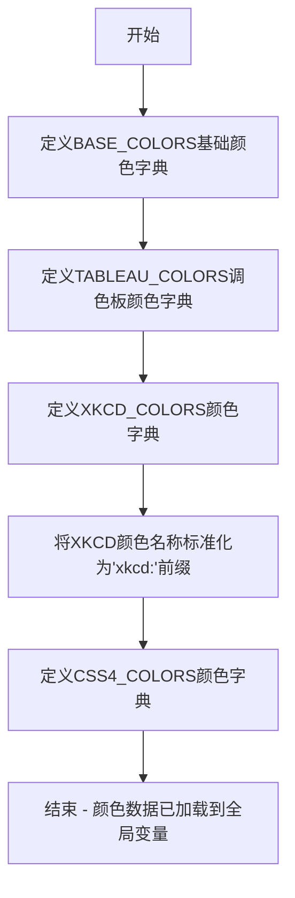

# `matplotlib\lib\matplotlib\_color_data.py` 详细设计文档

该文件定义了多种颜色调色板，包括基础颜色（RGB元组）、Tableau颜色、XKCD颜色调查颜色以及CSS4标准颜色，并将它们映射为十六进制值供后续绘图使用。

## 整体流程



## 类结构

```
无类结构 - 该文件为纯数据定义文件
仅包含全局变量（字典类型）
```

## 全局变量及字段


### `BASE_COLORS`
    
A dictionary mapping single-letter color abbreviations to RGB tuples for basic colors.

类型：`dict`
    


### `TABLEAU_COLORS`
    
A dictionary mapping Tableau color names to hexadecimal color codes.

类型：`dict`
    


### `XKCD_COLORS`
    
A dictionary mapping XKCD color survey names (prefixed with 'xkcd:') to hexadecimal color codes.

类型：`dict`
    


### `CSS4_COLORS`
    
A dictionary mapping CSS4 color names to hexadecimal color codes as defined in the CSS specification.

类型：`dict`
    


    

## 全局函数及方法


## 关键组件


### BASE_COLORS

基础颜色映射集合，定义了8种基本颜色的RGB元组表示，包括蓝色、绿色、红色、青色、品红色、黄色、黑色和白色。

### TABLEAU_COLORS

Tableau调色板颜色映射，定义了10种Tableau风格颜色的十六进制值，来源于Tableau软件的标准配色方案。

### XKCD_COLORS

XKCD颜色调查映射，包含近950种通过在线调查收集的颜色名称及其对应的十六进制值，原始数据来源于Randall Munroe的XKCD颜色调查结果。

### XKCD_COLORS 名称规范化

将XKCD颜色名称统一添加"xkcd:"前缀的规范化处理，避免与其它颜色集合中的名称发生冲突。

### CSS4_COLORS

CSS4标准颜色映射，定义了W3C CSS Color Level 4规范中的所有147种命名颜色，包括常见的颜色名称如aliceblue、antiquewhite等及其十六进制值。


## 问题及建议


### 已知问题

- **数据类型不一致**：BASE_COLORS 使用 RGB 元组 `(r, g, b)`，而 TABLEAU_COLORS、XKCD_COLORS 和 CSS4_COLORS 使用十六进制字符串，导致处理逻辑复杂化。
- **数据冗余**：BASE_COLORS 中的基本颜色（如 'r', 'g', 'b'）与 CSS4_COLORS 中的对应颜色存在重复定义，造成存储空间浪费。
- **内存占用**：XKCD_COLORS 包含约 950 个颜色条目，内存占用较大，且一次性全部加载可能导致性能问题。
- **缺少统一访问接口**：颜色数据仅以全局字典形式暴露，外部调用需要直接访问这些变量，缺乏统一的 API 管理。
- **命名规范不统一**：BASE_COLORS 使用单字母键（如 'r', 'g'），而其他字典使用完整英文名称，一致性差。
- **XKCD_COLORS 重复赋值**：代码先定义 XKCD_COLORS 字典，随后又通过字典推导式重新赋值覆盖，逻辑不够清晰。

### 优化建议

- **统一颜色格式**：将 BASE_COLORS 也转换为十六进制字符串格式，或提供转换函数以保持一致性。
- **构建统一的颜色映射表**：整合所有颜色字典为单一数据结构，并按类别（如基础色、表格色、XKCD 色、CSS4 色）分组管理。
- **实现延迟加载**：对于大型颜色字典（如 XKCD_COLORS），可采用按需加载策略，减少启动时的内存占用。
- **提供访问接口**：封装统一的颜色查询函数，支持类别过滤和名称检索，提升 API 友好性。
- **消除重复数据**：建立颜色优先级规则，避免基础颜色在不同字典中重复存储。
- **添加数据校验**：在颜色字典加载时校验格式正确性，确保 RGB 值在 [0,1] 范围内，十六进制格式符合规范。

## 其它


### 一段话描述

该代码定义了四个预定义的颜色映射字典，分别包含基础RGB颜色、Tableau调色板、XKCD颜色调查颜色以及CSS4规范颜色，用于在应用程序中提供标准化的颜色名称到颜色值的映射。

### 文件的整体运行流程

该文件为纯数据定义文件，不包含可执行逻辑。模块加载时，Python解释器会依次执行以下步骤：
1. 加载并初始化 BASE_COLORS 字典（RGB元组形式）
2. 加载并初始化 TABLEAU_COLORS 字典（十六进制字符串形式）
3. 加载并初始化 XKCD_COLORS 字典（十六进制字符串形式）
4. 对 XKCD_COLORS 进行后处理，为每个颜色名称添加 "xkcd:" 前缀以避免命名冲突
5. 加载并初始化 CSS4_COLORS 字典（十六进制字符串形式）

### 全局变量详细信息

#### BASE_COLORS
- **类型**: dict
- **描述**: 基础颜色映射表，将单字符颜色名称映射到RGB元组。包含8种基本颜色（蓝、绿、红、青、品红、黄、黑、白）。

#### TABLEAU_COLORS
- **类型**: dict
- **描述**: Tableau调色板颜色映射，将颜色名称映射到十六进制颜色值。包含10种Tableau标准颜色。

#### XKCD_COLORS
- **类型**: dict
- **描述**: XKCD颜色调查结果的映射表，将"xkcd:"前缀加颜色名称映射到十六进制颜色值。包含约950种颜色，为xkcd颜色调查的标准化结果。

#### CSS4_COLORS
- **类型**: dict
- **描述**: CSS4规范中定义的颜色映射，将颜色名称映射到小写十六进制颜色值。包含147种CSS4标准颜色。

### 关键组件信息

#### 颜色名称规范化模块
- **描述**: 通过为XKCD颜色添加"xkcd:"前缀，避免与其它颜色映射中的名称发生冲突，确保颜色查询的唯一性。

#### 四色合一映射系统
- **描述**: 统一的颜色查询接口，通过四个独立的颜色字典提供不同来源和用途的颜色定义，支持RGB和十六进制两种格式。

### 潜在的技术债务或优化空间

1. **重复数据问题**: 'black'、'white'、'red'、'green'、'blue'等颜色在多个字典中重复定义，可能导致数据冗余和维护困难。

2. **格式不统一**: BASE_COLORS使用RGB元组，而其他字典使用十六进制字符串，缺乏统一的颜色表示格式。

3. **缺少颜色转换功能**: 仅提供颜色查询功能，缺少RGB到十六进制、十六进制到RGB等颜色格式转换的工具函数。

4. **缺少命名空间隔离**: 所有颜色在同一级别定义，虽然XKCD添加了前缀，但TABLEAU和CSS4的颜色命名仍可能冲突。

5. **文档缺失**: 缺乏对颜色来源、许可证和使用场景的说明文档。

### 设计目标与约束

#### 设计目标
- 提供标准化的颜色名称到颜色值的映射
- 兼容多种颜色表示格式（RGB元组和十六进制字符串）
- 覆盖多种颜色来源（基础颜色、Tableau、XKCD、CSS4）

#### 设计约束
- BASE_COLORS必须使用RGB元组格式以保持向后兼容性
- XKCD_COLORS必须添加"xkcd:"前缀以避免命名冲突
- 颜色名称不区分大小写查询需求（当前实现区分大小写）

### 错误处理与异常设计

由于该文件为纯数据定义，不涉及运行时错误处理。当前实现未提供：
- 颜色名称不存在时的错误抛出机制
- 无效颜色值的校验
- 缺失键访问的默认值处理

### 数据流与状态机

该文件为静态数据定义模块，不涉及动态数据流或状态机。数据流为单向输入：
- 源代码中的硬编码字典定义 → Python模块加载 → 模块级全局变量

### 外部依赖与接口契约

#### 外部依赖
- 无第三方库依赖
- 纯Python标准库实现

#### 接口契约
- 导出四个模块级全局字典变量
- 颜色查询通过字典键访问实现：`colors['color_name']`
- 返回值类型统一为字符串（十六进制）或元组（RGB）
- 不提供任何函数接口，仅通过字典键值对提供数据访问

    