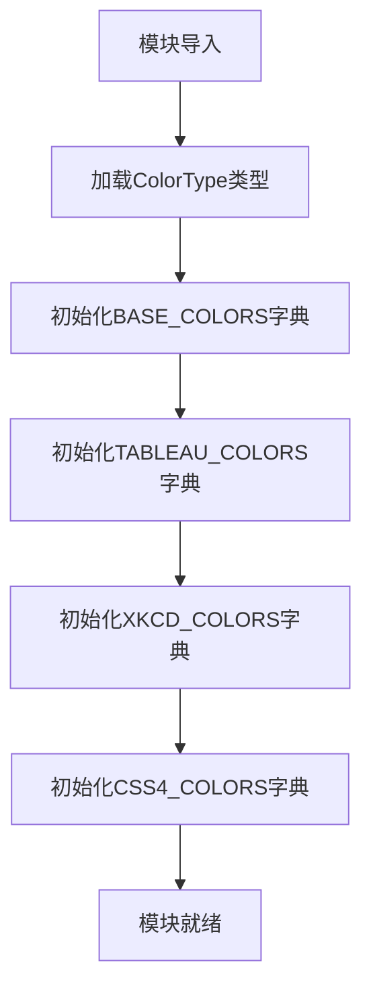

# `matplotlib\lib\matplotlib\_color_data.pyi` 详细设计文档

该模块定义了多种预定义的颜色调色板字典，包括基础颜色(BASE_COLORS)、Tableau颜色(TABLEAU_COLORS)、XKCD颜色(XKCD_COLORS)和CSS4颜色(CSS4_COLORS)，用于数据可视化、图形渲染和UI设计中的颜色选择，所有字典的键为颜色名称字符串，值为ColorType类型。

## 整体流程



## 类结构

```

```

## 全局变量及字段


### `BASE_COLORS`
    
存储基础颜色名称到颜色值的映射字典

类型：`dict[str, ColorType]`
    


### `TABLEAU_COLORS`
    
存储Tableau调色板颜色名称到颜色值的映射字典

类型：`dict[str, ColorType]`
    


### `XKCD_COLORS`
    
存储XKCD颜色 survey 颜色名称到颜色值的映射字典

类型：`dict[str, ColorType]`
    


### `CSS4_COLORS`
    
存储CSS4规范定义的颜色名称到颜色值的映射字典

类型：`dict[str, ColorType]`
    


    

## 全局函数及方法


## 关键组件


### ColorType

从.typing模块导入的类型别名，用于定义颜色值的类型

### BASE_COLORS

基础颜色字典，包含基本的颜色名称到颜色值的映射

### TABLEAU_COLORS

Tableau颜色字典，包含Tableau调色板的颜色名称到颜色值的映射

### XKCD_COLORS

XKCD颜色字典，包含XKCD颜色调查中的颜色名称到颜色值的映射

### CSS4_COLORS

CSS4颜色字典，包含CSS4规范中定义的颜色名称到颜色值的映射


## 问题及建议


### 已知问题

-   **类型注解与实现分离**：代码仅包含类型注解，缺少实际的颜色字典值定义，导致类型声明与数据实现分离，可能导致运行时错误
-   **缺乏文档说明**：四个全局颜色字典变量（BASE_COLORS、TABLEAU_COLORS、XKCD_COLORS、CSS4_COLORS）缺少文档字符串，无法明确其用途、包含的具体颜色数量及格式
-   **类型安全不足**：使用通用的 `dict[str, ColorType]` 类型，未使用 `TypedDict` 或 `Final` 来约束结构并确保只读特性
-   **模块导入耦合**：假设 `ColorType` 已在 `.typing` 模块中定义，若该类型定义变更，可能影响当前文件的可用性
-   **无边界验证**：若颜色数据在运行时动态加载，无对颜色名称唯一性、ColorType 格式等的验证机制

### 优化建议

-   **补充数据实现**：为每个颜色字典提供完整的颜色数据定义，或明确标注数据来源（如从外部配置文件加载）
-   **添加文档注释**：为每个全局变量添加 docstring，说明其包含的颜色集来源（如 CSS4 规范、XKCD 调查等）和典型用途
-   **强化类型定义**：考虑使用 `TypedDict` 定义颜色字典的结构，并使用 `Final` 修饰符确保这些变量不可被重新赋值
-   **模块化设计**：将颜色数据分离到独立的数据文件（如 JSON/YAML），通过配置管理加载，提高可维护性
-   **增加数据校验**：在模块初始化时添加颜色数据的完整性检查（如唯一性验证、格式验证），确保数据一致性
-   **类型导出优化**：使用 `__all__` 明确导出接口，提供类型检查器的更好支持


## 其它


### 设计目标与约束

本模块旨在提供标准化的颜色调色板，供数据可视化库使用。设计约束包括：颜色名称必须唯一且符合命名规范，颜色值必须为有效的ColorType，支持快速查找且无需实例化。

### 错误处理与异常设计

由于本模块仅提供只读字典数据，不直接处理错误。若颜色名称不存在，访问时将抛出标准的KeyError，由调用方处理。建议在文档中说明预期行为。

### 外部依赖与接口契约

依赖`.typing`模块中的`ColorType`类型定义。对外接口为四个全局字典变量：`BASE_COLORS`、`TABLEAU_COLORS`、`XKCD_COLORS`和`CSS4_COLORS`，调用方应直接使用这些字典进行颜色查询。

### 性能考虑

所有颜色字典均为静态数据，访问时间复杂度为O(1)。模块加载时一次性初始化，无需缓存优化。

### 可扩展性

本模块采用字典结构，易于扩展。可新增颜色字典（如`HTML_COLORS`）而无需修改现有接口。建议保持字典为不可变集合以避免运行时修改。

### 测试策略

应测试颜色字典的完整性（如颜色名称数量、类型有效性）和边界情况（如空字典处理）。由于无业务逻辑，主要进行数据验证测试。

    