# `matplotlib\lib\matplotlib\_constrained_layout.py` 详细设计文档

这是matplotlib的约束布局模块，通过GridSpec网格系统自动调整子图位置和边距，确保Axes装饰器（标签、刻度、标题等）不重叠，同时处理colorbar和suptitle的布局。

## 整体流程

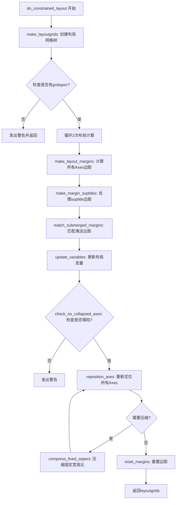

## 类结构

```
无类定义 - 模块级函数集合
全局函数模块
├── 核心布局函数
│   ├── do_constrained_layout
│   ├── make_layoutgrids
│   ├── make_layoutgrids_gs
│   ├── make_layout_margins
│   └── reposition_axes
├── 辅助计算函数
get_margin_from_padding
get_pos_and_bbox
get_cb_parent_spans
colorbar_get_pad
check_no_collapsed_axes
compress_fixed_aspect
├── 边距处理函数
make_margin_suptitles
match_submerged_margins
reset_margins
reposition_colorbar
```

## 全局变量及字段


### `_log`
    
用于记录模块日志的logger对象

类型：`logging.Logger`
    


### `logging`
    
Python标准库的日志记录模块

类型：`module`
    


### `np`
    
NumPy库，用于数值计算和数组操作

类型：`module`
    


### `_api`
    
Matplotlib的内部API模块，提供警告和装饰器等工具

类型：`module`
    


### `martist`
    
Matplotlib的artist模块，处理图形元素和装饰器

类型：`module`
    


### `mtransforms`
    
Matplotlib的transforms模块，处理坐标变换和边界框

类型：`module`
    


### `mlayoutgrid`
    
Matplotlib的_layoutgrid模块，实现布局网格数据结构

类型：`module`
    


    

## 全局函数及方法


### `do_constrained_layout`

这是Matplotlib的constrained_layout核心执行函数，负责在绘制时调整子图布局以避免重叠。它通过两轮迭代计算边距、调整坐标轴位置、处理suptitle和colorbar，并可选地进行固定宽高比压缩，最终返回布局网格结构。

参数：

- `fig`：`matplotlib.figure.Figure`，要进行布局的Figure实例
- `h_pad`：float，轴元素周围的垂直填充（以figure标准化单位）
- `w_pad`：float，轴元素周围的水平填充（以figure标准化单位）
- `hspace`：float，可选，轴之间的垂直间距（占figure的比例）
- `wspace`：float，可选，轴之间的水平间距（占figure的比例）
- `rect`：tuple of 4 floats，可选，执行constrained layout的figure坐标矩形[left, bottom, width, height]，每个值0-1
- `compress`：bool，可选，是否移动轴以移除空白（适用于固定宽高比的轴网格）

返回值：`dict`，私有调试结构layoutgrids

#### 流程图

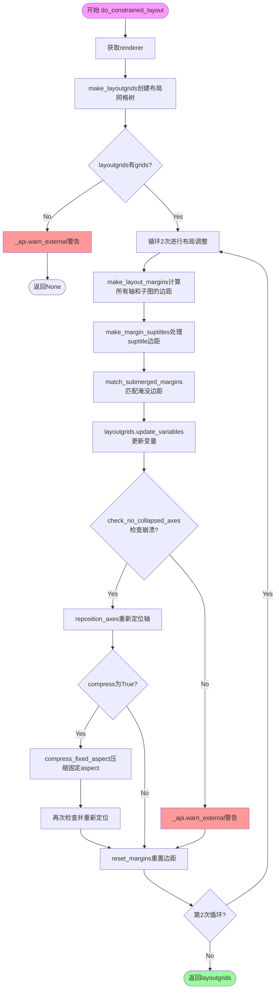

#### 带注释源码

```python
def do_constrained_layout(fig, h_pad, w_pad,
                          hspace=None, wspace=None, rect=(0, 0, 1, 1),
                          compress=False):
    """
    Do the constrained_layout.  Called at draw time in
     ``figure.constrained_layout()``

    Parameters
    ----------
    fig : `~matplotlib.figure.Figure`
        `.Figure` instance to do the layout in.

    h_pad, w_pad : float
      Padding around the Axes elements in figure-normalized units.

    hspace, wspace : float
       Fraction of the figure to dedicate to space between the
       Axes.  These are evenly spread between the gaps between the Axes.
       A value of 0.2 for a three-column layout would have a space
       of 0.1 of the figure width between each column.
       If h/wspace < h/w_pad, then the pads are used instead.

    rect : tuple of 4 floats
        Rectangle in figure coordinates to perform constrained layout in
        [left, bottom, width, height], each from 0-1.

    compress : bool
        Whether to shift Axes so that white space in between them is
        removed. This is useful for simple grids of fixed-aspect Axes (e.g.
        a grid of images).

    Returns
    -------
    layoutgrid : private debugging structure
    """

    # 获取渲染器用于计算文本边界框
    renderer = fig._get_renderer()
    
    # 创建layoutgrid树结构，管理figure、gridspec和subfigure的布局关系
    layoutgrids = make_layoutgrids(fig, None, rect=rect)
    
    # 检查是否存在gridspecs，没有则警告并返回
    if not layoutgrids['hasgrids']:
        _api.warn_external('There are no gridspecs with layoutgrids. '
                           'Possibly did not call parent GridSpec with the'
                           ' "figure" keyword')
        return

    # 执行两轮布局算法：第一轮后装饰器大小可能改变，需要第二轮微调
    for _ in range(2):
        # 为figure中所有Axes和subfigures计算边距
        # 包括处理colorbar的边距
        make_layout_margins(layoutgrids, fig, renderer, h_pad=h_pad,
                            w_pad=w_pad, hspace=hspace, wspace=wspace)
        
        # 处理suptitle的边距调整
        make_margin_suptitles(layoutgrids, fig, renderer, h_pad=h_pad,
                              w_pad=w_pad)

        # 如果某列(或行)的边距没有约束，使该网格中所有此类实例的边距大小匹配
        match_submerged_margins(layoutgrids, fig)

        # 更新layoutgrid中的所有变量，解决约束方程
        layoutgrids[fig].update_variables()

        # 检查是否有轴收缩到零大小
        warn_collapsed = ('constrained_layout not applied because '
                          'axes sizes collapsed to zero.  Try making '
                          'figure larger or Axes decorations smaller.')
        if check_no_collapsed_axes(layoutgrids, fig):
            # 根据计算出的边界重新定位所有轴
            reposition_axes(layoutgrids, fig, renderer, h_pad=h_pad,
                            w_pad=w_pad, hspace=hspace, wspace=wspace)
            
            # 如果启用了压缩模式，处理固定宽高比的轴
            if compress:
                layoutgrids = compress_fixed_aspect(layoutgrids, fig)
                layoutgrids[fig].update_variables()
                if check_no_collapsed_axes(layoutgrids, fig):
                    reposition_axes(layoutgrids, fig, renderer, h_pad=h_pad,
                                    w_pad=w_pad, hspace=hspace, wspace=wspace,
                                    compress=True)
                else:
                    _api.warn_external(warn_collapsed)

                # 调整suptitle位置到计算出的顶部边距上方
                if ((suptitle := fig._suptitle) is not None and
                        suptitle.get_in_layout() and suptitle._autopos):
                    x, _ = suptitle.get_position()
                    suptitle.set_position(
                        (x, layoutgrids[fig].get_inner_bbox().y1 + h_pad))
                    suptitle.set_verticalalignment('bottom')
        else:
            _api.warn_external(warn_collapsed)
        
        # 重置边距以便figure再次变小时可以重新生长
        reset_margins(layoutgrids, fig)
    
    return layoutgrids
```


### `make_layoutgrids`

该函数用于构建约束布局的布局网格（LayoutGrid）树形结构，通过为Figure、子图（SubFigure）以及GridSpec创建对应的LayoutGrid对象，建立起整个图形的布局约束关系，以便后续进行精确的子图和坐标轴定位。

参数：

- `fig`：`~matplotlib.figure.Figure`，执行布局的Figure实例
- `layoutgrids`：`dict`，存储布局网格的字典，初始为None时会创建新字典
- `rect`：`tuple of 4 floats`，执行约束布局的矩形区域，默认为(0, 0, 1, 1)，以[left, bottom, width, height]形式指定

返回值：`dict`，返回包含所有布局网格的字典，包含`hasgrids`键标识是否存在gridspec

#### 流程图

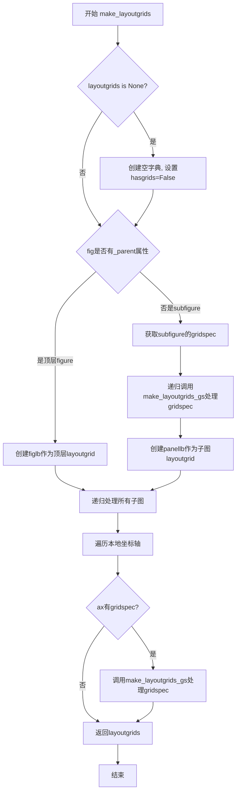

#### 带注释源码

```python
def make_layoutgrids(fig, layoutgrids, rect=(0, 0, 1, 1)):
    """
    Make the layoutgrid tree.

    (Sub)Figures get a layoutgrid so we can have figure margins.

    Gridspecs that are attached to Axes get a layoutgrid so Axes
    can have margins.
    """

    # 初始化layoutgrids字典，如果传入为None则创建新字典
    if layoutgrids is None:
        layoutgrids = dict()
        layoutgrids['hasgrids'] = False
    
    # 判断是否为顶层figure（没有_parent属性）
    if not hasattr(fig, '_parent'):
        # 顶层figure；传递rect作为parent以允许用户指定边距
        layoutgrids[fig] = mlayoutgrid.LayoutGrid(parent=rect, name='figlb')
    else:
        # 子图处理
        gs = fig._subplotspec.get_gridspec()
        # gridspec可能尚未添加到树中，需要先处理
        layoutgrids = make_layoutgrids_gs(layoutgrids, gs)
        # 获取父级layoutgrid
        parentlb = layoutgrids[gs]
        # 为子图创建layoutgrid
        layoutgrids[fig] = mlayoutgrid.LayoutGrid(
            parent=parentlb,
            name='panellb',
            parent_inner=True,
            nrows=1, ncols=1,
            parent_pos=(fig._subplotspec.rowspan,
                        fig._subplotspec.colspan))
    
    # 递归处理当前figure中的所有子图
    for sfig in fig.subfigs:
        layoutgrids = make_layoutgrids(sfig, layoutgrids)

    # 为本地层的每个坐标轴添加其gridspec
    for ax in fig._localaxes:
        gs = ax.get_gridspec()
        if gs is not None:
            layoutgrids = make_layoutgrids_gs(layoutgrids, gs)

    return layoutgrids
```


### `make_layoutgrids_gs`

为网格规格（GridSpec）创建布局网格（LayoutGrid），并处理嵌套在网格规格中的任何内容。该函数递归地为每个网格规格创建对应的布局网格结构，以便后续进行约束布局计算。

参数：

- `layoutgrids`：`dict`，布局网格字典，用于存储已创建的布局网格
- `gs`：`GridSpec` 或 `GridSpecFromSubplotSpec`，需要创建布局网格的网格规格对象

返回值：`dict`，更新后的布局网格字典，包含新创建的布局网格

#### 流程图

```mermaid
flowchart TD
    A[开始 make_layoutgrids_gs] --> B{gs 是否已在 layoutgrids 中<br>或 gs.figure 为 None?}
    B -->|是| C[直接返回 layoutgrids]
    B -->|否| D[设置 layoutgrids['hasgrids'] = True]
    D --> E{gs 是否有 _subplot_spec 属性?}
    E -->|否 - 普通 GridSpec| F[获取父布局网格: layoutgrids[gs.figure]]
    F --> G[创建新的 LayoutGrid<br>parent=父布局网格<br>parent_inner=True<br>ncols=gs._ncols<br>nrows=gs._nrows<br>width_ratios=gs.get_width_ratios<br>height_ratios=gs.get_height_ratios]
    E -->|是 - GridSpecFromSubplotSpec| H[获取子图规格: gs._subplot_spec]
    H --> I[获取父网格规格: subplot_spec.get_gridspec()]
    I --> J{父网格规格是否在 layoutgrids 中?}
    J -->|否| K[递归调用 make_layoutgrids_gs]
    J -->|是| L[获取父网格规格的布局网格]
    K --> L
    L --> M[创建唯一表示: rep = (gs, 'top')]
    M --> N{rep 是否已在 layoutgrids 中?}
    N -->|否| O[创建顶层 LayoutGrid<br>parent=subspeclb<br>nrows=1, ncols=1<br>parent_pos=(rowspan, colspan)]
    N -->|是| P[跳过创建顶层布局网格]
    O --> Q[为 gs 创建 LayoutGrid<br>parent=layoutgrids[rep]<br>nrows=gs._nrows<br>ncols=gs._ncols<br>width_ratios & height_ratios]
    P --> Q
    G --> R[返回更新后的 layoutgrids]
    Q --> R
```

#### 带注释源码

```python
def make_layoutgrids_gs(layoutgrids, gs):
    """
    为网格规格创建布局网格（以及网格规格中嵌套的任何内容）
    """
    
    # 检查网格规格是否已处理过或没有关联的图形
    # 如果是，则无需重复处理，直接返回
    if gs in layoutgrids or gs.figure is None:
        return layoutgrids
    
    # 标记存在网格规格，这是进行约束布局的必要条件
    layoutgrids['hasgrids'] = True
    
    # 判断是否为普通的 GridSpec（没有子图规格）
    if not hasattr(gs, '_subplot_spec'):
        # 普通网格规格处理
        # 获取图形对应的顶层布局网格作为父级
        parent = layoutgrids[gs.figure]
        
        # 创建新的布局网格与网格规格关联
        # parent_inner=True 表示使用父布局网格的内部区域
        # ncols 和 nrows 设置网格的行列数
        # width_ratios 和 height_ratios 处理网格的宽度和高度比例
        layoutgrids[gs] = mlayoutgrid.LayoutGrid(
                parent=parent,
                parent_inner=True,
                name='gridspec',
                ncols=gs._ncols, nrows=gs._nrows,
                width_ratios=gs.get_width_ratios(),
                height_ratios=gs.get_height_ratios())
    else:
        # 这是 GridSpecFromSubplotSpec（从子图规格派生的网格规格）
        # 获取子图规格
        subplot_spec = gs._subplot_spec
        # 获取父级网格规格
        parentgs = subplot_spec.get_gridspec()
        
        # 如果父级网格规格尚未在布局网格中，需要先创建
        # 递归调用确保父网格规格已被处理
        if parentgs not in layoutgrids:
            layoutgrids = make_layoutgrids_gs(layoutgrids, parentgs)
        
        # 获取父网格规格的布局网格
        subspeclb = layoutgrids[parentgs]
        
        # GridSpecFromSubplotSpec 需要一个外层容器
        # 创建唯一的标识符表示顶层容器
        rep = (gs, 'top')
        
        # 如果顶层容器尚不存在，则创建
        if rep not in layoutgrids:
            # 创建顶层布局网格作为容器
            # parent_pos 指定在父网格中的位置（行范围和列范围）
            layoutgrids[rep] = mlayoutgrid.LayoutGrid(
                parent=subspeclb,
                name='top',
                nrows=1, ncols=1,
                parent_pos=(subplot_spec.rowspan, subplot_spec.colspan))
        
        # 为 GridSpecFromSubplotSpec 创建自身的布局网格
        # 嵌套在顶层容器布局网格之下
        layoutgrids[gs] = mlayoutgrid.LayoutGrid(
                parent=layoutgrids[rep],
                name='gridspec',
                nrows=gs._nrows, ncols=gs._ncols,
                width_ratios=gs.get_width_ratios(),
                height_ratios=gs.get_height_ratios())
    
    # 返回更新后的布局网格字典
    return layoutgrids
```


### `check_no_collapsed_axes`

检查是否有任何 Axes（子图）折叠到零大小。该函数递归遍历所有子图和轴，检查每个网格单元的内部边界框是否具有有效的宽度和高度，如果发现任何折叠的轴则返回 False，否则返回 True。

参数：

- `layoutgrids`：`dict`，包含布局网格的字典，用于存储图形和网格规格的布局信息
- `fig`：`~matplotlib.figure.Figure`，要检查的 matplotlib Figure 实例

返回值：`bool`，如果所有 Axes 都没有折叠到零大小则返回 True，否则返回 False

#### 流程图

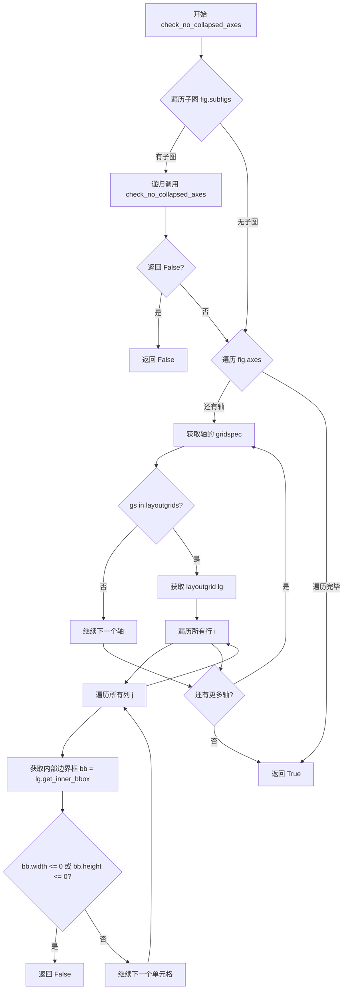

#### 带注释源码

```
def check_no_collapsed_axes(layoutgrids, fig):
    """
    Check that no Axes have collapsed to zero size.
    """
    # 递归检查所有子图
    for sfig in fig.subfigs:
        ok = check_no_collapsed_axes(layoutgrids, sfig)
        if not ok:
            return False
    
    # 遍历当前图形的所有轴
    for ax in fig.axes:
        # 获取轴所属的 gridspec
        gs = ax.get_gridspec()
        if gs in layoutgrids:  # 同时意味着 gs 不为 None
            # 获取对应的 layoutgrid
            lg = layoutgrids[gs]
            # 遍历 gridspec 的所有行和列
            for i in range(gs.nrows):
                for j in range(gs.ncols):
                    # 获取该单元格的内部边界框
                    bb = lg.get_inner_bbox(i, j)
                    # 检查宽度或高度是否小于等于零（折叠）
                    if bb.width <= 0 or bb.height <= 0:
                        return False
    # 所有检查通过，没有折叠的轴
    return True
```


### `compress_fixed_aspect`

该函数用于在固定长宽比（如图像）的网格中压缩布局。它通过计算每个 Axes 在应用长宽比后的尺寸收缩量（即原始网格位置与实际位置之间的差异），将这些收缩量转化为 Figure 的边距约束，从而减少网格单元之间的空白区域，使 Axes 更加紧凑地排列。

参数：

- `layoutgrids`：`dict`，包含 Figure 和 Gridspec 的内部布局网格（LayoutGrid）对象的字典，用于存储布局约束和状态。
- `fig`：`~matplotlib.figure.Figure`，需要执行压缩布局的 Figure 实例。

返回值：`dict`，返回更新后的 `layoutgrids` 字典。

#### 流程图

```mermaid
flowchart TD
    Start(开始) --> Init[初始化: gs=None, extraw=0, extrah=0]
    Init --> LoopAxes{遍历 fig.axes}
    
    LoopAxes --> CheckSpec{ax.get_subplotspec is None?}
    CheckSpec -- Yes --> Continue[跳过当前轴]
    Continue --> LoopAxes
    
    CheckSpec -- No --> ApplyAspect[调用 ax.apply_aspect]
    ApplyAspect --> GetGridspec[获取 Gridspec _gs]
    
    GetGridspec --> IsFirst{gs is None?}
    IsFirst -- Yes --> SetGs[gs = _gs, 初始化 extraw, extrah 数组]
    IsFirst -- No --> CheckGs{_gs == gs?}
    CheckGs -- No --> Error[抛出 ValueError: 轴不属于同一 Gridspec]
    CheckGs -- Yes --> GetPos[获取位置: orig, actual]
    
    GetPos --> CalcDelta[计算差值: dw = orig.width - actual.width, dh = orig.height - actual.height]
    CalcDelta --> CheckDw{dw > 0?}
    CheckDw -- Yes --> UpdateW[更新 extraw[colspan] 为最大值]
    CheckDw -- No --> CheckDh
    
    CheckDh{dh > 0?}
    CheckDh -- Yes --> UpdateH[更新 extrah[rowspan] 为最大值]
    CheckDh -- No --> LoopAxes
    
    UpdateW --> LoopAxes
    UpdateH --> LoopAxes
    
    LoopAxes -- 遍历完成 --> CheckGsValid{gs is None?}
    CheckGsValid -- Yes --> Error2[抛出 ValueError: 没有轴参与 Gridspec]
    CheckGsValid -- No --> CalcMargins[计算边距: w = sum(extraw)/2, h = sum(extrah)/2]
    
    CalcMargins --> EditMargins[更新 Figure 边距: left/right += w, top/bottom += h]
    EditMargins --> Return[返回 layoutgrids]
```

#### 带注释源码

```python
def compress_fixed_aspect(layoutgrids, fig):
    """
    Compress the layout to remove white space around fixed-aspect Axes.

    This is called by `do_constrained_layout` when ``compress=True``.
    It modifies the figure margins to reduce the gridspec size, forcing
    the axes to pack together.
    """
    gs = None
    # 1. 遍历 Figure 中的所有 Axes
    for ax in fig.axes:
        # 忽略没有 Subplotspec 的轴（例如手动添加的 Axes）
        if ax.get_subplotspec() is None:
            continue
        
        # 应用长宽比，这会调整轴的位置
        ax.apply_aspect()
        sub = ax.get_subplotspec()
        _gs = sub.get_gridspec()
        
        # 2. 初始化 gridspec 和额外的宽高数组
        if gs is None:
            gs = _gs
            extraw = np.zeros(gs.ncols)
            extrah = np.zeros(gs.nrows)
        # 3. 验证所有轴是否来自同一个 gridspec
        elif _gs != gs:
            raise ValueError('Cannot do compressed layout if Axes are not'
                             'all from the same gridspec')
        
        # 4. 获取原始位置（基于 gridspec 分配）和实际位置（应用长宽比后）
        # original=True 表示布局前的理想位置
        orig = ax.get_position(original=True)
        # original=False 表示当前渲染位置
        actual = ax.get_position(original=False)
        
        # 5. 计算由于应用长宽比而 '丢失' 的宽度和高度
        dw = orig.width - actual.width
        if dw > 0:
            # 找出该轴占据的列，将缺失的宽度累加到该列的 '额外宽度' 中
            # 取最大值是为了确保该列所有轴都能容纳下
            extraw[sub.colspan] = np.maximum(extraw[sub.colspan], dw)
        
        dh = orig.height - actual.height
        if dh > 0:
            # 找出该轴占据的行，更新 '额外高度'
            extrah[sub.rowspan] = np.maximum(extrah[sub.rowspan], dh)

    # 6. 检查是否没有有效的 Gridspec
    if gs is None:
        raise ValueError('Cannot do compressed layout if no Axes '
                         'are part of a gridspec.')
    
    # 7. 计算总的压缩量 (取总和的一半，分摊到两边)
    w = np.sum(extraw) / 2
    # 8. 通过增加 Figure 的边距约束来 '吞噬' 空白
    # 这实际上缩小了 Gridspec 可用的内部分配空间，迫使轴靠近
    layoutgrids[fig].edit_margin_min('left', w)
    layoutgrids[fig].edit_margin_min('right', w)

    h = np.sum(extrah) / 2
    layoutgrids[fig].edit_margin_min('top', h)
    layoutgrids[fig].edit_margin_min('bottom', h)
    return layoutgrids
```


### `get_margin_from_padding`

该函数根据传入的填充（padding）和间距（hspace/wspace）参数计算子图的边距值。函数返回一个包含不同方向边距的字典，用于约束布局算法中确定子图之间的间隙。

参数：

- `obj`：包含 `_subplotspec` 属性的对象（Axes 或 SubFigure），需要计算边距的子图对象
- `w_pad`：`float`，宽度方向的填充值，默认 0
- `h_pad`：`float`，高度方向的填充值，默认 0
- `hspace`：`float`，垂直方向子图间距与figure高度的比例，默认 0
- `wspace`：`float`，水平方向子图间距与figure宽度的比例，默认 0

返回值：`dict`，包含各方向边距值的字典，键包括 `leftcb`、`rightcb`、`bottomcb`、`topcb`（颜色条相关）和 `left`、`right`、`top`、`bottom`（轴装饰相关）

#### 流程图

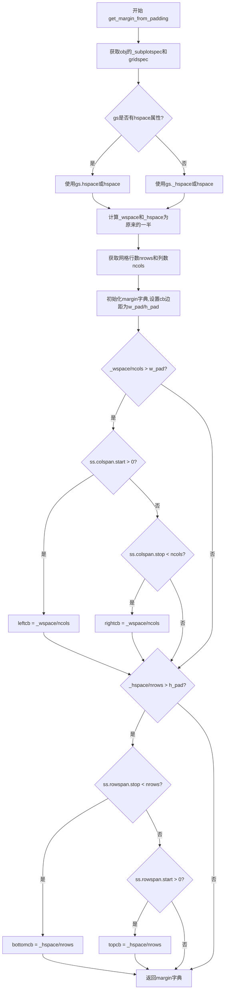

#### 带注释源码

```python
def get_margin_from_padding(obj, *, w_pad=0, h_pad=0,
                            hspace=0, wspace=0):
    """
    根据padding和spacing计算子图的边距值。
    
    Parameters
    ----------
    obj : 包含 _subplotspec 属性的对象
        通常是 Axes 或 SubFigure
    w_pad : float, default 0
        宽度方向的填充值
    h_pad : float, default 0
        高度方向的填充值
    hspace : float, default 0
        垂直方向子图间距比例
    wspace : float, default 0
        水平方向子图间距比例
    """
    
    # 从obj获取Subplotspec对象
    ss = obj._subplotspec
    # 从Subplotspec获取Gridspec
    gs = ss.get_gridspec()

    # 检查gs是否有hspace属性(普通GridSpec有,GridSpecFromSubplotSpec没有)
    if hasattr(gs, 'hspace'):
        # 获取水平/垂直间距,优先使用gs中定义的值,否则使用传入参数
        _hspace = (gs.hspace if gs.hspace is not None else hspace)
        _wspace = (gs.wspace if gs.wspace is not None else wspace)
    else:
        # 对于GridSpecFromSubplotSpec,使用私有属性
        _hspace = (gs._hspace if gs._hspace is not None else hspace)
        _wspace = (gs._wspace if gs._wspace is not None else wspace)

    # 间距需要除以2,因为每个方向有两部分(左/右或上/下)
    _wspace = _wspace / 2
    _hspace = _hspace / 2

    # 获取网格几何形状:行数和列数
    nrows, ncols = gs.get_geometry()
    
    # 初始化边距字典
    # "cb"后缀的边距用于colorbar和padding
    # 无后缀的边距用于Axes装饰(labels等)
    margin = {'leftcb': w_pad, 'rightcb': w_pad,
              'bottomcb': h_pad, 'topcb': h_pad,
              'left': 0, 'right': 0,
              'top': 0, 'bottom': 0}
    
    # 如果计算出的间距大于传入的pad值,则使用计算的间距作为边距
    # 只对非边缘的子图添加间距(边缘子图不需要外侧间距)
    if _wspace / ncols > w_pad:
        # 如果不是第一列,左边有间距
        if ss.colspan.start > 0:
            margin['leftcb'] = _wspace / ncols
        # 如果不是最后一列,右边有间距
        if ss.colspan.stop < ncols:
            margin['rightcb'] = _wspace / ncols
    
    if _hspace / nrows > h_pad:
        # 如果不是最后一行,底部有间距
        if ss.rowspan.stop < nrows:
            margin['bottomcb'] = _hspace / nrows
        # 如果不是第一行,顶部有间距
        if ss.rowspan.start > 0:
            margin['topcb'] = _hspace / nrows

    return margin
```


### `make_layout_margins`

该函数用于为每个Axes计算并设置边距，确保Axes装饰器（如标签、刻度、标题等）不重叠。它遍历图中的所有子图、本地轴、颜色条和图例，根据装饰器的大小计算边距，并将边距约束添加到布局网格中。

参数：

- `layoutgrids`：`dict`，布局网格字典，用于存储布局约束信息
- `fig`：`~matplotlib.figure.Figure`，执行布局的Figure实例
- `renderer`：`~matplotlib.backend_bases.RendererBase` subclass，用于获取装饰器大小的渲染器
- `w_pad`：`float`，默认0，宽度方向的填充值（以figurenormalized units为单位）
- `h_pad`：`float`，默认0，高度方向的填充值（以figure normalized units为单位）
- `hspace`：`float`，默认0，高度方向Axes之间的间距（以figure高度的分数表示）
- `wspace`：`float`，默认0，宽度方向Axes之间的间距（以figure宽度的分数表示）

返回值：`None`，该函数直接修改layoutgrids字典中的边距约束，不返回任何值

#### 流程图

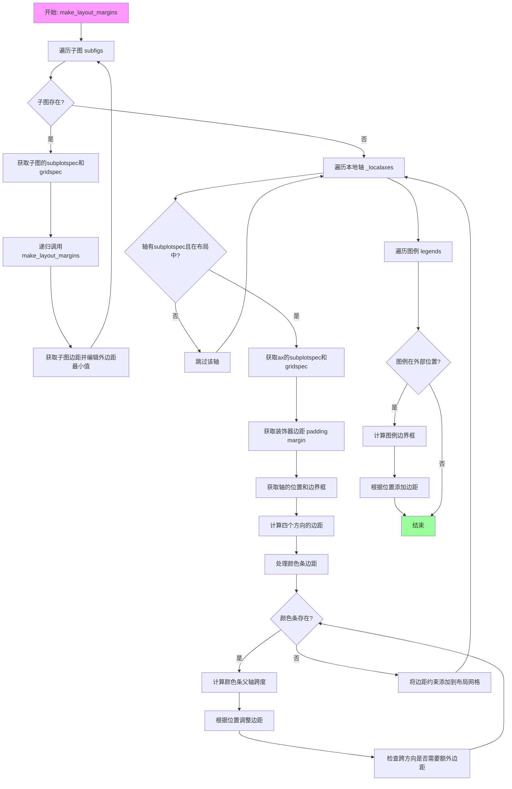

#### 带注释源码

```python
def make_layout_margins(layoutgrids, fig, renderer, *, w_pad=0, h_pad=0,
                        hspace=0, wspace=0):
    """
    For each Axes, make a margin between the *pos* layoutbox and the
    *axes* layoutbox be a minimum size that can accommodate the
    decorations on the axis.

    Then make room for colorbars.

    Parameters
    ----------
    layoutgrids : dict
    fig : `~matplotlib.figure.Figure`
        `.Figure` instance to do the layout in.
    renderer : `~matplotlib.backend_bases.RendererBase` subclass.
        The renderer to use.
    w_pad, h_pad : float, default: 0
        Width and height padding (in fraction of figure).
    hspace, wspace : float, default: 0
        Width and height padding as fraction of figure size divided by
        number of columns or rows.
    """
    # 递归处理子图的边距
    for sfig in fig.subfigs:
        # 获取子图的subplotspec和gridspec
        ss = sfig._subplotspec
        gs = ss.get_gridspec()

        # 递归调用处理子图的子图
        make_layout_margins(layoutgrids, sfig, renderer,
                            w_pad=w_pad, h_pad=h_pad,
                            hspace=hspace, wspace=wspace)

        # 获取子图的边距信息（仅基于padding，不考虑装饰器）
        margins = get_margin_from_padding(sfig, w_pad=0, h_pad=0,
                                          hspace=hspace, wspace=wspace)
        # 将边距约束添加到布局网格
        layoutgrids[gs].edit_outer_margin_mins(margins, ss)

    # 处理每个本地轴的边距
    for ax in fig._localaxes:
        # 跳过没有subplotspec或不在布局中的轴
        if not ax.get_subplotspec() or not ax.get_in_layout():
            continue

        # 获取轴的subplotspec和gridspec
        ss = ax.get_subplotspec()
        gs = ss.get_gridspec()

        # 如果gridspec不在layoutgrids中，直接返回
        if gs not in layoutgrids:
            return

        # 获取基于padding的边距
        margin = get_margin_from_padding(ax, w_pad=w_pad, h_pad=h_pad,
                                         hspace=hspace, wspace=wspace)
        # 获取轴的位置和边界框
        pos, bbox = get_pos_and_bbox(ax, renderer)
        
        # 计算装饰器边距：位置与边界框之间的距离
        # margin是装饰器需要的最小空间
        margin['left'] += pos.x0 - bbox.x0      # 左边装饰器宽度
        margin['right'] += bbox.x1 - pos.x1     # 右边装饰器宽度
        # 注意：行从顶部排序，所以bottom是y0差值
        margin['bottom'] += pos.y0 - bbox.y0    # 底部装饰器高度
        margin['top'] += bbox.y1 - pos.y1       # 顶部装饰器高度

        # 为颜色条创建边距
        for cbax in ax._colorbars:
            # 获取颜色条与其父轴之间的pad
            pad = colorbar_get_pad(layoutgrids, cbax)
            # 获取颜色条父轴的跨度（可能跨越多个子图）
            cbp_rspan, cbp_cspan = get_cb_parent_spans(cbax)
            loc = cbax._colorbar_info['location']
            cbpos, cbbbox = get_pos_and_bbox(cbax, renderer)
            
            # 根据颜色条位置添加边距
            if loc == 'right':
                if cbp_cspan.stop == ss.colspan.stop:
                    # 仅当颜色条在右边缘时增加边距
                    margin['rightcb'] += cbbbox.width + pad
            elif loc == 'left':
                if cbp_cspan.start == ss.colspan.start:
                    margin['leftcb'] += cbbbox.width + pad
            elif loc == 'top':
                if cbp_rspan.start == ss.rowspan.start:
                    margin['topcb'] += cbbbox.height + pad
            else:  # bottom
                if cbp_rspan.stop == ss.rowspan.stop:
                    margin['bottomcb'] += cbbbox.height + pad
            
            # 处理颜色条比父轴宽/高的情况
            if loc in ['top', 'bottom']:
                # 水平颜色条：检查左右超出
                if (cbp_cspan.start == ss.colspan.start and
                        cbbbox.x0 < bbox.x0):
                    margin['left'] += bbox.x0 - cbbbox.x0
                if (cbp_cspan.stop == ss.colspan.stop and
                        cbbbox.x1 > bbox.x1):
                    margin['right'] += cbbbox.x1 - bbox.x1
            # 垂直颜色条：检查上下超出
            if loc in ['left', 'right']:
                if (cbp_rspan.stop == ss.rowspan.stop and
                        cbbbox.y0 < bbox.y0):
                    margin['bottom'] += bbox.y0 - cbbbox.y0
                if (cbp_rspan.start == ss.rowspan.start and
                        cbbbox.y1 > bbox.y1):
                    margin['top'] += cbbbox.y1 - bbox.y1

        # 将边距约束传递给布局网格
        layoutgrids[gs].edit_outer_margin_mins(margin, ss)

    # 处理figure级别的图例边距
    for leg in fig.legends:
        inv_trans_fig = None
        # 仅处理放置在Figure外部且没有bbox锚点的图例
        if leg._outside_loc and leg._bbox_to_anchor is None:
            if inv_trans_fig is None:
                inv_trans_fig = fig.transFigure.inverted().transform_bbox
            bbox = inv_trans_fig(leg.get_tightbbox(renderer))
            w = bbox.width + 2 * w_pad
            h = bbox.height + 2 * h_pad
            legendloc = leg._outside_loc
            
            # 根据图例位置添加相应的边距
            if legendloc == 'lower':
                layoutgrids[fig].edit_margin_min('bottom', h)
            elif legendloc == 'upper':
                layoutgrids[fig].edit_margin_min('top', h)
            if legendloc == 'right':
                layoutgrids[fig].edit_margin_min('right', w)
            elif legendloc == 'left':
                layoutgrids[fig].edit_margin_min('left', w)
```


### `make_margin_suptitles`

该函数用于计算图形中标题（suptitle）、x轴上标签（supxlabel）和y轴左标签（supylabel）所需的布局边距，并根据这些元素的大小调整图形的边距，以确保标题和标签不会与坐标轴重叠。

参数：

- `layoutgrids`：`dict`，包含布局网格信息的字典，用于存储和管理图形、子图的布局约束
- `fig`：`~matplotlib.figure.Figure`，需要进行布局调整的图形实例
- `renderer`：`~matplotlib.backend_bases.RendererBase` 子类，用于渲染图形以获取元素边界框
- `w_pad`：`float`，宽度填充（padding），默认为0
- `h_pad`：`float`，高度填充（padding），默认为0

返回值：`None`，该函数直接修改 layoutgrids 中的边距信息，不返回任何值

#### 流程图

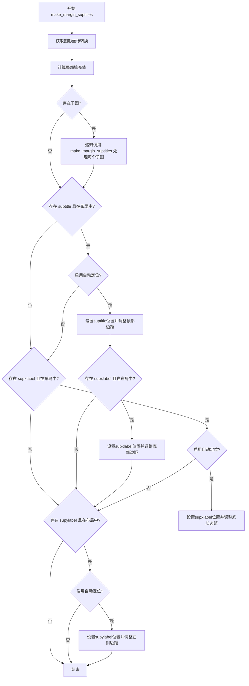

#### 带注释源码

```python
def make_margin_suptitles(layoutgrids, fig, renderer, *, w_pad=0, h_pad=0):
    # Figure out how large the suptitle is and make the
    # top level figure margin larger.

    # 获取图形坐标转换的逆转换，用于将边界框从图形坐标转换回来
    inv_trans_fig = fig.transFigure.inverted().transform_bbox
    # get the h_pad and w_pad as distances in the local subfigure coordinates:
    # 创建填充值的边界框
    padbox = mtransforms.Bbox([[0, 0], [w_pad, h_pad]])
    # 将填充值从图形坐标转换到子图坐标
    padbox = (fig.transFigure -
              fig.transSubfigure).transform_bbox(padbox)
    # 提取局部填充值
    h_pad_local = padbox.height
    w_pad_local = padbox.width

    # 递归处理所有子图
    for sfig in fig.subfigs:
        make_margin_suptitles(layoutgrids, sfig, renderer,
                              w_pad=w_pad, h_pad=h_pad)

    # 处理图形的主标题（suptitle）
    if fig._suptitle is not None and fig._suptitle.get_in_layout():
        p = fig._suptitle.get_position()
        # 如果启用了自动定位，则调整标题位置
        if getattr(fig._suptitle, '_autopos', False):
            # 将标题放置在顶部边距之外
            fig._suptitle.set_position((p[0], 1 - h_pad_local))
            # 获取标题的紧密边界框
            bbox = inv_trans_fig(fig._suptitle.get_tightbbox(renderer))
            # 更新顶部边距以容纳标题高度加上填充
            layoutgrids[fig].edit_margin_min('top', bbox.height + 2 * h_pad)

    # 处理图形的上 x 轴标签（supxlabel）
    if fig._supxlabel is not None and fig._supxlabel.get_in_layout():
        p = fig._supxlabel.get_position()
        if getattr(fig._supxlabel, '_autopos', False):
            # 将标签放置在底部边距之外
            fig._supxlabel.set_position((p[0], h_pad_local))
            bbox = inv_trans_fig(fig._supxlabel.get_tightbbox(renderer))
            # 更新底部边距以容纳标签高度
            layoutgrids[fig].edit_margin_min('bottom',
                                             bbox.height + 2 * h_pad)

    # 处理图形的左 y 轴标签（supylabel）
    if fig._supylabel is not None and fig._supylabel.get_in_layout():
        p = fig._supylabel.get_position()
        if getattr(fig._supylabel, '_autopos', False):
            # 将标签放置在左侧边距之外
            fig._supylabel.set_position((w_pad_local, p[1]))
            bbox = inv_trans_fig(fig._supylabel.get_tightbbox(renderer))
            # 更新左侧边距以容纳标签宽度
            layoutgrids[fig].edit_margin_min('left', bbox.width + 2 * w_pad)
```


### `match_submerged_margins`

使 Axes 内部的"淹没"边距（submerged margins）保持相同大小，用于处理跨多列或多行的 Axes 布局对齐问题，确保如 `fig.subplot_mosaic("AAAB\nCCDD")` 中 C 和 D 列具有相同的宽度。

参数：

- `layoutgrids`：dict，包含布局网格的字典，用于存储和管理布局约束信息
- `fig`：`~matplotlib.figure.Figure`，需要调整布局的 Figure 实例

返回值：`list`，返回已处理的 Axes 列表

#### 流程图

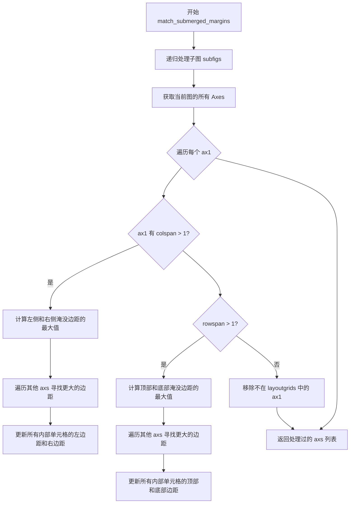

#### 带注释源码

```python
def match_submerged_margins(layoutgrids, fig):
    """
    使 Axes 内部的"淹没"边距保持相同大小。

    这允许跨两列（或两行）且相互偏移的 Axes 具有相同的大小。
    这为以下布局提供了正确的布局：
        fig = plt.figure(constrained_layout=True)
        axs = fig.subplot_mosaic("AAAB\nCCDD")

    没有这个例程，Axes D 将比 C 宽，因为 C 两列之间的边距宽度默认为零，
    而 D 两列之间的边距由 A 和 B 之间的边距宽度决定。然而，显然用户希望
    C 和 D 具有相同的大小，因此我们需要对这些"淹没"边距添加约束。

    此例程使所有内部边距相同，A 中的三列和 C 中的两列之间的间距都设置为
    与 D 中两列之间的边距相同。

    参见 test_constrained_layout::test_constrained_layout12 的示例。
    """

    # 存储已处理的 Axes
    axsdone = []
    # 递归处理所有子图
    for sfig in fig.subfigs:
        axsdone += match_submerged_margins(layoutgrids, sfig)

    # 获取当前 fig 中所有满足条件的 Axes（有 subplotspec 且在布局中）
    axs = [a for a in fig.get_axes()
           if (a.get_subplotspec() is not None and a.get_in_layout() and
               a not in axsdone)]

    # 遍历每个 Axes
    for ax1 in axs:
        ss1 = ax1.get_subplotspec()
        # 如果 gridspec 不在 layoutgrids 中，则移除并继续
        if ss1.get_gridspec() not in layoutgrids:
            axs.remove(ax1)
            continue
        lg1 = layoutgrids[ss1.get_gridspec()]

        # 处理内部列（跨多列的情况）
        if len(ss1.colspan) > 1:
            # 计算左边淹没边距的最大值（左边距 + 左边距颜色条）
            maxsubl = np.max(
                lg1.margin_vals['left'][ss1.colspan[1:]] +
                lg1.margin_vals['leftcb'][ss1.colspan[1:]]
            )
            # 计算右边淹没边距的最大值
            maxsubr = np.max(
                lg1.margin_vals['right'][ss1.colspan[:-1]] +
                lg1.margin_vals['rightcb'][ss1.colspan[:-1]]
            )
            # 遍历其他 Axes 以找到更大的边距值
            for ax2 in axs:
                ss2 = ax2.get_subplotspec()
                lg2 = layoutgrids[ss2.get_gridspec()]
                if lg2 is not None and len(ss2.colspan) > 1:
                    maxsubl2 = np.max(
                        lg2.margin_vals['left'][ss2.colspan[1:]] +
                        lg2.margin_vals['leftcb'][ss2.colspan[1:]])
                    if maxsubl2 > maxsubl:
                        maxsubl = maxsubl2
                    maxsubr2 = np.max(
                        lg2.margin_vals['right'][ss2.colspan[:-1]] +
                        lg2.margin_vals['rightcb'][ss2.colspan[:-1]])
                    if maxsubr2 > maxsubr:
                        maxsubr = maxsubr2
            # 更新所有内部单元格的边距最小值
            for i in ss1.colspan[1:]:
                lg1.edit_margin_min('left', maxsubl, cell=i)
            for i in ss1.colspan[:-1]:
                lg1.edit_margin_min('right', maxsubr, cell=i)

        # 处理内部行（跨多行的情况）
        if len(ss1.rowspan) > 1:
            # 计算顶部淹没边距的最大值
            maxsubt = np.max(
                lg1.margin_vals['top'][ss1.rowspan[1:]] +
                lg1.margin_vals['topcb'][ss1.rowspan[1:]]
            )
            # 计算底部淹没边距的最大值
            maxsubb = np.max(
                lg1.margin_vals['bottom'][ss1.rowspan[:-1]] +
                lg1.margin_vals['bottomcb'][ss1.rowspan[:-1]]
            )

            for ax2 in axs:
                ss2 = ax2.get_subplotspec()
                lg2 = layoutgrids[ss2.get_gridspec()]
                if lg2 is not None:
                    if len(ss2.rowspan) > 1:
                        maxsubt = np.max([np.max(
                            lg2.margin_vals['top'][ss2.rowspan[1:]] +
                            lg2.margin_vals['topcb'][ss2.rowspan[1:]]
                        ), maxsubt])
                        maxsubb = np.max([np.max(
                            lg2.margin_vals['bottom'][ss2.rowspan[:-1]] +
                            lg2.margin_vals['bottomcb'][ss2.rowspan[:-1]]
                        ), maxsubb])
            # 更新所有内部单元格的边距最小值
            for i in ss1.rowspan[1:]:
                lg1.edit_margin_min('top', maxsubt, cell=i)
            for i in ss1.rowspan[:-1]:
                lg1.edit_margin_min('bottom', maxsubb, cell=i)

    return axs
```


### `get_cb_parent_spans`

获取颜色条所属的子图规格（SubplotSpec）的行范围和列范围。该函数通过遍历颜色条的所有父 Axes，计算它们在行和列方向上的跨度边界，返回一个表示行索引范围的 range 对象和一个表示列索引范围的 range 对象。

参数：

- `cbax`：`matplotlib.axes.Axes`，颜色条所在的 Axes 对象。

返回值：`tuple[range, range]`，包含两个 range 对象：第一个是行索引范围（rowspan），第二个是列索引范围（colspan）。如果颜色条没有父 Axes，则返回空范围。

#### 流程图

```mermaid
flowchart TD
    A[开始] --> B[初始化 rowstart = +∞, rowstop = -∞]
    B --> C[初始化 colstart = +∞, colstop = -∞]
    C --> D{遍历 cbax._colorbar_info['parents'] 中的每个 parent}
    D -->|对于每个 parent| E[获取 parent 的 SubplotSpec ss]
    E --> F[rowstart = min(ss.rowspan.start, rowstart)]
    F --> G[rowstop = max(ss.rowspan.stop, rowstop)]
    G --> H[colstart = min(ss.colspan.start, colstart)]
    H --> I[colstop = max(ss.colspan.stop, colstop)]
    I --> D
    D -->|遍历完成| J[rowspan = range(rowstart, rowstop)]
    J --> K[colspan = range(colstart, colstop)]
    K --> L[返回 rowspan, colspan]
    L --> End[结束]
```

#### 带注释源码

```python
def get_cb_parent_spans(cbax):
    """
    Figure out which subplotspecs this colorbar belongs to.

    Parameters
    ----------
    cbax : `~matplotlib.axes.Axes`
        Axes for the colorbar.
    """
    # 初始化行起始值为正无穷，用于后续取最小值
    rowstart = np.inf
    # 初始化行结束值为负无穷，用于后续取最大值
    rowstop = -np.inf
    # 初始化列起始值为正无穷，用于后续取最小值
    colstart = np.inf
    # 初始化列结束值为负无穷，用于后续取最大值
    colstop = -np.inf
    
    # 遍历颜色条的所有父 Axes（一个颜色条可能关联多个父 Axes）
    for parent in cbax._colorbar_info['parents']:
        # 获取父 Axes 的 SubplotSpec 对象
        ss = parent.get_subplotspec()
        # 更新行起始索引：取当前值和新值的最小值
        rowstart = min(ss.rowspan.start, rowstart)
        # 更新行结束索引：取当前值和新值的最大值
        rowstop = max(ss.rowspan.stop, rowstop)
        # 更新列起始索引：取当前值和新值的最小值
        colstart = min(ss.colspan.start, colstart)
        # 更新列结束索引：取当前值和新值的最大值
        colstop = max(ss.colspan.stop, colstop)

    # 根据计算得到的边界创建 range 对象
    # range 的结束值为开区间，所以使用 rowstop 而不是 rowstop+1
    rowspan = range(rowstart, rowstop)
    colspan = range(colstart, colstop)
    # 返回行范围和列范围
    return rowspan, colspan
```


### `get_pos_and_bbox`

获取 Axes 的位置（position）和紧凑边界框（tight bbox），用于约束布局中计算边距。

参数：

- `ax`：`~matplotlib.axes.Axes`，要获取位置和边界框的 Axes 对象
- `renderer`：`~matplotlib.backend_bases.RendererBase` 子类，用于渲染的渲染器

返回值：`tuple[pos, bbox]`

- `pos`：`~matplotlib.transforms.Bbox`，figure 坐标系中的位置
- `bbox`：`~matplotlib.transforms.Bbox`，figure 坐标系中的紧凑边界框

#### 流程图

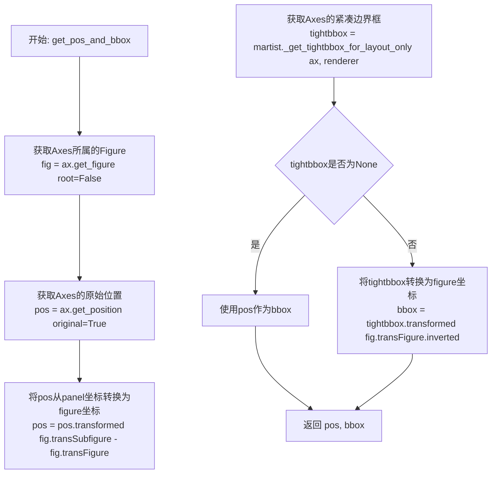

#### 带注释源码

```python
def get_pos_and_bbox(ax, renderer):
    """
    Get the position and the bbox for the Axes.

    Parameters
    ----------
    ax : `~matplotlib.axes.Axes`
    renderer : `~matplotlib.backend_bases.RendererBase` subclass.

    Returns
    -------
    pos : `~matplotlib.transforms.Bbox`
        Position in figure coordinates.
    bbox : `~matplotlib.transforms.Bbox`
        Tight bounding box in figure coordinates.
    """
    # 获取Axes所属的Figure对象，root=False表示获取直接父 Figure 而非顶层 Figure
    fig = ax.get_figure(root=False)
    
    # 获取Axes在子图坐标系中的原始位置（未经过布局调整的位置）
    pos = ax.get_position(original=True)
    
    # pos 处于子图（panel）坐标系，但布局计算需要 figure 坐标系
    # 通过仿射变换将位置从子图坐标转换到 figure 坐标
    pos = pos.transformed(fig.transSubfigure - fig.transFigure)
    
    # 获取Axes的紧凑边界框（包含所有装饰元素如标签、刻度等）
    # _get_tightbbox_for_layout_only 是一个仅用于布局计算的优化版本
    tightbbox = martist._get_tightbbox_for_layout_only(ax, renderer)
    
    # 如果没有获取到有效的紧凑边界框，则使用位置框作为边界框
    if tightbbox is None:
        bbox = pos
    else:
        # 将紧凑边界框从数据坐标转换到 figure 坐标
        bbox = tightbbox.transformed(fig.transFigure.inverted())
    
    # 返回位置框和紧凑边界框
    return pos, bbox
```


### `reposition_axes`

重新定位所有Axes基于新的内部边界框，同时处理子图和颜色条的重新定位。

参数：

- `layoutgrids`：`dict`，布局网格字典，包含Figure和GridSpec的布局信息
- `fig`：`~matplotlib.figure.Figure`，需要进行布局调整的Figure实例
- `renderer`：`~matplotlib.backend_bases.RendererBase` subclass，用于渲染获取边界信息
- `w_pad`：`float`，关键字参数，默认0，宽度填充（以figure normalized单位）
- `h_pad`：`float`，关键字参数，默认0，高度填充（以figure normalized单位）
- `hspace`：`float`，关键字参数，默认0，列之间的间距分数
- `wspace`：`float`，关键字参数，默认0，行之间的间距分数
- `compress`：`bool`，关键字参数，默认False，是否在压缩布局模式下运行

返回值：无返回值，通过副作用直接修改Axes的位置

#### 流程图

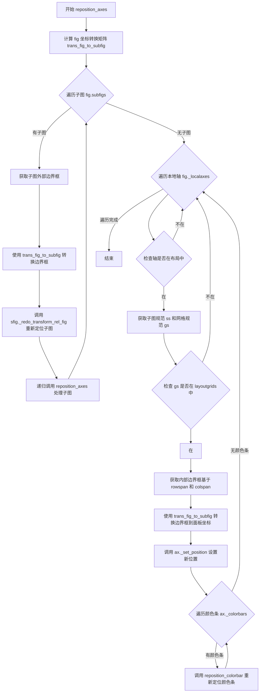

#### 带注释源码

```
def reposition_axes(layoutgrids, fig, renderer, *,
                    w_pad=0, h_pad=0, hspace=0, wspace=0, compress=False):
    """
    Reposition all the Axes based on the new inner bounding box.
    """
    # 计算从Figure坐标到Subfigure坐标的转换矩阵
    # 用于将布局计算的边界框转换为子图坐标系统
    trans_fig_to_subfig = fig.transFigure - fig.transSubfigure
    
    # 递归处理所有子图(SubFigures)
    for sfig in fig.subfigs:
        # 获取子图在布局网格中的外部边界框
        bbox = layoutgrids[sfig].get_outer_bbox()
        # 将边界框从Figure坐标转换到Subfigure坐标
        sfig._redo_transform_rel_fig(
            bbox=bbox.transformed(trans_fig_to_subfig))
        # 递归调用处理子图内部的Axes
        reposition_axes(layoutgrids, sfig, renderer,
                        w_pad=w_pad, h_pad=h_pad,
                        wspace=wspace, hspace=hspace, compress=compress)

    # 处理Figure中所有的本地Axes
    for ax in fig._localaxes:
        # 跳过没有subplotspec或不在布局中的Axes
        if ax.get_subplotspec() is None or not ax.get_in_layout():
            continue

        # grid bbox is in Figure coordinates, but we specify in panel
        # coordinates...
        # 获取该Axes对应的子图规范和网格规范
        ss = ax.get_subplotspec()
        gs = ss.get_gridspec()
        # 确保网格规范在布局网格字典中
        if gs not in layoutgrids:
            return

        # 从布局网格中获取该Axes对应的内部边界框
        # 根据rowspan和colspan确定具体位置
        bbox = layoutgrids[gs].get_inner_bbox(rows=ss.rowspan,
                                              cols=ss.colspan)

        # transform from figure to panel for set_position:
        # 将边界框从Figure坐标转换到面板(Subfigure)坐标
        newbbox = trans_fig_to_subfig.transform_bbox(bbox)
        # 设置Axes的新位置
        ax._set_position(newbbox)

        # move the colorbars:
        # we need to keep track of oldw and oldh if there is more than
        # one colorbar:
        # 初始化偏移量字典，用于处理多个颜色条的情况
        offset = {'left': 0, 'right': 0, 'bottom': 0, 'top': 0}
        # 逆序遍历该Axes的所有颜色条
        for nn, cbax in enumerate(ax._colorbars[::-1]):
            # 只处理第一个父Axes的颜色条
            if ax == cbax._colorbar_info['parents'][0]:
                # 调用颜色条重定位函数
                reposition_colorbar(layoutgrids, cbax, renderer,
                                    offset=offset, compress=compress)
```


### `reposition_colorbar`

该函数用于在约束布局计算后，将颜色条（colorbar）重新定位到其新的位置。它根据布局网格计算颜色条的边界框，并根据颜色条的位置（左、右、顶部、底部）以及父轴的信息来调整颜色条的位置和偏移量。

参数：

- `layoutgrids`：`dict`，包含布局网格信息的字典，用于获取颜色条父级的边界框和布局信息
- `cbax`：`~matplotlib.axes.Axes`，颜色条的 Axes 对象
- `renderer`：`~matplotlib.backend_bases.RendererBase` 子类，用于渲染获取边界框信息
- `offset`：`dict`，用于跟踪多个颜色条的累积偏移量，键为 'left'、'right'、'top'、'bottom'
- `compress`：`bool`，表示是否处于压缩布局模式

返回值：`dict`，返回更新后的偏移量字典，用于后续颜色条的定位

#### 流程图

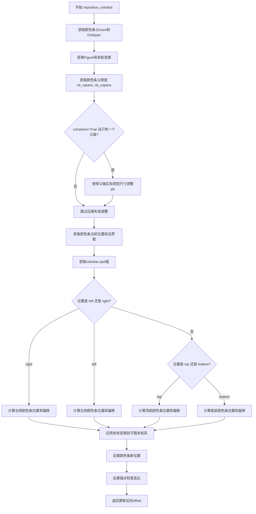

#### 带注释源码

```python
def reposition_colorbar(layoutgrids, cbax, renderer, *, offset=None, compress=False):
    """
    Place the colorbar in its new place.

    Parameters
    ----------
    layoutgrids : dict
    cbax : `~matplotlib.axes.Axes`
        Axes for the colorbar.
    renderer : `~matplotlib.backend_bases.RendererBase` subclass.
        The renderer to use.
    offset : array-like
        Offset the colorbar needs to be pushed to in order to
        account for multiple colorbars.
    compress : bool
        Whether we're in compressed layout mode.
    """

    # 获取颜色条的所有父Axes
    parents = cbax._colorbar_info['parents']
    # 获取第一个父轴的Gridspec
    gs = parents[0].get_gridspec()
    # 获取颜色条所属的Figure
    fig = cbax.get_figure(root=False)
    # 创建从Figure坐标系到Subfigure坐标系的变换
    trans_fig_to_subfig = fig.transFigure - fig.transSubfigure

    # 获取颜色条父轴的行跨度和列跨度
    cb_rspans, cb_cspans = get_cb_parent_spans(cbax)
    # 获取用于颜色条定位的外部边界框
    bboxparent = layoutgrids[gs].get_bbox_for_cb(rows=cb_rspans,
                                                 cols=cb_cspans)
    # 获取内部边界框
    pb = layoutgrids[gs].get_inner_bbox(rows=cb_rspans, cols=cb_cspans)

    # 获取颜色条的位置信息
    location = cbax._colorbar_info['location']
    anchor = cbax._colorbar_info['anchor']
    fraction = cbax._colorbar_info['fraction']
    aspect = cbax._colorbar_info['aspect']
    shrink = cbax._colorbar_info['shrink']

    # 对于压缩布局中只有一个父轴的情况，使用父轴的实际视觉尺寸
    # 这确保颜色条与其父轴对齐
    if compress and len(parents) == 1:
        from matplotlib.transforms import Bbox
        # 获取apply_aspect()后父轴的实际位置
        parent_ax = parents[0]
        actual_pos = parent_ax.get_position(original=False)
        # 变换到Figure坐标系
        actual_pos_fig = actual_pos.transformed(fig.transSubfigure - fig.transFigure)

        if location in ('left', 'right'):
            # 对于垂直颜色条，使用实际父轴高度
            pb = Bbox.from_extents(pb.x0, actual_pos_fig.y0,
                                   pb.x1, actual_pos_fig.y1)
        elif location in ('top', 'bottom'):
            # 对于水平颜色条，使用实际父轴宽度
            pb = Bbox.from_extents(actual_pos_fig.x0, pb.y0,
                                   actual_pos_fig.x1, pb.y1)

    # 获取颜色条当前位置和边界框
    cbpos, cbbbox = get_pos_and_bbox(cbax, renderer)

    # 计算colorbar的pad值
    cbpad = colorbar_get_pad(layoutgrids, cbax)
    
    # 根据颜色条位置计算新位置
    if location in ('left', 'right'):
        # fraction和shrink是父轴的分数比例
        pbcb = pb.shrunk(fraction, shrink).anchored(anchor, pb)
        
        if location == 'right':
            # 右侧颜色条定位
            lmargin = cbpos.x0 - cbbbox.x0
            dx = bboxparent.x1 - pbcb.x0 + offset['right']
            dx += cbpad + lmargin
            offset['right'] += cbbbox.width + cbpad
            pbcb = pbcb.translated(dx, 0)
        else:
            # 左侧颜色条定位
            lmargin = cbpos.x0 - cbbbox.x0
            dx = bboxparent.x0 - pbcb.x0  # 父轴边缘
            dx += -cbbbox.width - cbpad + lmargin - offset['left']
            offset['left'] += cbbbox.width + cbpad
            pbcb = pbcb.translated(dx, 0)
    else:  # 水平方向 (top, bottom)
        pbcb = pb.shrunk(shrink, fraction).anchored(anchor, pb)
        
        if location == 'top':
            # 顶部颜色条定位
            bmargin = cbpos.y0 - cbbbox.y0
            dy = bboxparent.y1 - pbcb.y0 + offset['top']
            dy += cbpad + bmargin
            offset['top'] += cbbbox.height + cbpad
            pbcb = pbcb.translated(0, dy)
        else:
            # 底部颜色条定位
            bmargin = cbpos.y0 - cbbbox.y0
            dy = bboxparent.y0 - pbcb.y0
            dy += -cbbbox.height - cbpad + bmargin - offset['bottom']
            offset['bottom'] += cbbbox.height + cbpad
            pbcb = pbcb.translated(0, dy)

    # 将边界框从Figure坐标系变换到Subfigure坐标系
    pbcb = trans_fig_to_subfig.transform_bbox(pbcb)
    # 设置颜色条的变换和位置
    cbax.set_transform(fig.transSubfigure)
    cbax._set_position(pbcb)
    cbax.set_anchor(anchor)
    
    # 对于水平颜色条，需要反转aspect比例
    if location in ['bottom', 'top']:
        aspect = 1 / aspect
    cbax.set_box_aspect(aspect)
    cbax.set_aspect('auto')
    
    # 返回更新后的偏移量，供后续颜色条使用
    return offset
```


### `reset_margins`

重置图中布局容器的边距。边距通常设置为最小值，因此如果图变小，最小值需要为零以便再次增长。

参数：

-  `layoutgrids`：`dict`，包含布局网格对象的字典
-  `fig`：`~matplotlib.figure.Figure`，需要重置边距的 Figure 实例

返回值：`None`，无返回值（直接修改 layoutgrids 对象）

#### 流程图

```mermaid
flowchart TD
    A[开始 reset_margins] --> B{遍历 fig.subfigs}
    B -->|递归调用| C[reset_margins layoutgrids, sfig]
    C --> B
    B -->|完成递归| D{遍历 fig.axes}
    D --> E{ax.get_in_layout?}
    E -->|否| D
    E -->|是| F{gs in layoutgrids?}
    F -->|否| D
    F -->|是| G[layoutgrids[gs].reset_margins]
    G --> D
    D -->|完成遍历| H[layoutgrids[fig].reset_margins]
    H --> I[结束]
```

#### 带注释源码

```python
def reset_margins(layoutgrids, fig):
    """
    Reset the margins in the layoutboxes of *fig*.

    Margins are usually set as a minimum, so if the figure gets smaller
    the minimum needs to be zero in order for it to grow again.
    """
    # 递归处理所有子图（subfigures）
    for sfig in fig.subfigs:
        reset_margins(layoutgrids, sfig)
    
    # 遍历图中所有轴（Axes）
    for ax in fig.axes:
        # 仅处理参与布局的轴
        if ax.get_in_layout():
            # 获取轴所属的 gridspec
            gs = ax.get_gridspec()
            # 如果该 gridspec 在 layoutgrids 中，重置其边距
            if gs in layoutgrids:  # also implies gs is not None.
                layoutgrids[gs].reset_margins()
    
    # 最后重置顶层 figure 的边距
    layoutgrids[fig].reset_margins()
```


### `colorbar_get_pad`

获取颜色条（colorbar）的内边距（pad）值，基于父坐标轴的尺寸和colorbar的pad参数计算返回实际的像素距离。

参数：

- `layoutgrids`：`dict`，包含布局网格（layoutgrid）信息的字典，用于存储和管理图表的布局约束
- `cax`：`~matplotlib.axes.Axes`，颜色条所在的坐标轴对象

返回值：`float`，颜色条的内边距值（单位为figure坐标）

#### 流程图

```mermaid
flowchart TD
    A[开始 colorbar_get_pad] --> B[获取 cax._colorbar_info['parents']]
    B --> C[获取第一个父 axes 的 gridspec]
    C --> D[调用 get_cb_parent_spans 获取 colorbar 的行跨度与列跨度]
    D --> E[根据行跨度与列跨度获取外部边界框 bboxouter]
    E --> F{判断 colorbar 位置}
    F -->|right 或 left| G[size = bboxouter.width]
    F -->|top 或 bottom| H[size = bboxouter.height]
    G --> I[返回 cax._colorbar_info['pad'] * size]
    H --> I
```

#### 带注释源码

```python
def colorbar_get_pad(layoutgrids, cax):
    """
    获取颜色条的内边距值。
    
    Parameters
    ----------
    layoutgrids : dict
        布局网格字典，包含图表的布局约束信息。
    cax : `~matplotlib.axes.Axes`
        颜色条坐标轴。
    
    Returns
    -------
    float
        颜色条的内边距值，基于父坐标轴尺寸和pad参数计算。
    """
    # 获取颜色条的所有父坐标轴（可能多个）
    parents = cax._colorbar_info['parents']
    # 从第一个父坐标轴获取 gridspec
    gs = parents[0].get_gridspec()

    # 获取颜色条占据的行范围和列范围
    cb_rspans, cb_cspans = get_cb_parent_spans(cax)
    # 获取对应范围的内部边界框
    bboxouter = layoutgrids[gs].get_inner_bbox(rows=cb_rspans, cols=cb_cspans)

    # 根据颜色条位置决定使用宽度还是高度计算pad
    if cax._colorbar_info['location'] in ['right', 'left']:
        # 垂直颜色条（左侧或右侧）使用宽度
        size = bboxouter.width
    else:
        # 水平颜色条（顶部或底部）使用高度
        size = bboxouter.height

    # pad 是父轴尺寸的分数，返回实际像素值
    return cax._colorbar_info['pad'] * size
```

## 关键组件


### 约束布局引擎

Matplotlib的约束布局模块，通过网格约束求解算法自动调整子图间距和边距，使坐标轴装饰元素（如标签、刻度、标题、颜色条）不重叠，并支持超级标题和图例的布局优化。

### 布局网格系统

核心数据结构，用于管理Figure和Gridspec的布局层级关系，支持嵌套的SubFigure和GridSpecFromSubplotSpec，提供父级约束和边距管理。

### 装饰元素处理

自动检测并计算所有坐标轴装饰元素的尺寸（xlabel、ylabel、xticklabels、yticklabels、title等），将其转换为布局约束的边距值。

### 颜色条定位与对齐

处理颜色条与父坐标轴的位置关系，计算颜色条的位置、填充和尺寸，支持多个颜色条共享父坐标轴的情况，并处理压缩布局模式下的对齐。

### 边距匹配算法

对于跨越多列或多行的坐标轴，确保内部边距大小一致，避免布局不对称，例如在复杂网格布局中保持子图均匀分布。

### 约束求解器

基于`matplotlib._layoutgrid.LayoutGrid`的约束求解引擎，通过两次迭代（粗调+精调）收敛到稳定的布局解，并处理边界情况如零尺寸坐标轴警告。

### 压缩固定纵横比布局

可选功能，通过消除固定纵横比坐标轴之间的空白区域，实现更紧凑的图像网格显示。

### 边距重置机制

在每次布局计算前重置边距最小值，确保Figure尺寸变化时布局能够自适应调整。


## 问题及建议


### 已知问题

-   **早期返回错误**：在 `make_layout_margins` 函数中，当 `gs not in layoutgrids` 时使用 `return` 语句，这会提前退出整个函数而非仅跳过当前 Axes，导致部分 Axes 可能未被处理。
-   **双重迭代算法**：代码注释表明"do the algorithm twice"是因为装饰器在第一次重定位后尺寸会改变，这是一种临时解决方案，暗示算法设计不够完善。
-   **嵌套循环效率低**：`match_submerged_margins` 函数中使用多层嵌套循环遍历 Axes 和 Subplotspec，在复杂布局中可能导致性能问题。
-   **错误处理不完善**：`compress_fixed_aspect` 在轴不在同一 gridspec 时直接抛出 ValueError，缺乏优雅的降级处理。
-   **重复计算**：多处重复调用 `get_position()`、`get_tightbbox()` 等涉及渲染器的方法，且未缓存结果。
-   **魔法数字和硬编码**：margin 字典的键（'left', 'right', 'top' 等）以字符串形式硬编码，容易导致拼写错误且难以维护。
-   **子图布局约束不完整**：对于使用 `figure.add_axes()` 手动放置的轴，参与约束布局的文档说明与实际代码实现存在差异。

### 优化建议

-   **重构循环逻辑**：将 `make_layout_margins` 中的 `return` 改为 `continue`，确保所有 Axes 都能被遍历处理。
-   **引入布局迭代收敛检测**：替代固定两次迭代，可添加收敛检测（如边际变化小于阈值），在布局稳定后提前退出循环。
-   **缓存计算结果**：对 `get_position()`、`get_tightbbox()` 等调用频繁且结果不变的值进行缓存。
-   **提取魔法字符串为常量**：将 margin 键、location 值等提取为枚举或常量类，提高可读性和可维护性。
-   **优化嵌套循环**：使用字典或集合数据结构预先索引 Axes，减少 `match_submerged_margins` 中的 O(n²) 复杂度。
-   **增强错误处理**：为 `compress_fixed_aspect` 添加警告而非直接抛异常，允许降级到非压缩布局模式。
-   **模块化复杂函数**：将 `reposition_colorbar` 和 `make_layout_margins` 等大型函数拆分为更小的、单一职责的子函数。


## 其它


### 设计目标与约束

本模块的设计目标是为Matplotlib提供自动布局调整功能，确保子图及其装饰器（坐标轴标签、刻度、标题、彩色条等）不发生重叠。主要约束包括：1）仅支持通过`figure.subplots()`或`figure.add_subplots()`创建的子图，手动通过`figure.add_axes()`创建的轴不参与布局；2）使用`gridspec.GridSpecFromSubplotSpec`嵌套的 gridspec 可能导致子图重叠；3）布局算法依赖约束求解器，边缘情况可能无法找到可行解；4）布局计算需要渲染器支持，必须在绘图后执行。

### 错误处理与异常设计

当布局计算失败或轴尺寸塌陷时，模块通过`_api.warn_external()`发出警告而非抛出异常。主要警告场景包括：1）不存在带layoutgrid的gridspec；2）轴尺寸塌陷到零；3）压缩布局下轴塌陷。关键函数`check_no_collapsed_axes()`遍历所有轴和子图，检查内BoundingBox的width和height是否大于零。异常处理采用防御性编程，对`gs not in layoutgrids`、`ax.get_subplotspec() is None`等情况进行提前返回。

### 数据流与状态机

整体数据流分为四个主要阶段：1）初始化阶段（`make_layoutgrids`）：构建layoutgrid树结构，为figure和gridspec创建布局网格；2）边距计算阶段（`make_layout_margins`、`make_margin_suptitles`）：计算每个轴的装饰器所需边距，包括颜色条和图例；3）约束求解阶段（`layoutgrid.update_variables()`）：调用约束求解器计算最优布局；4）重定位阶段（`reposition_axes`）：将计算结果应用到实际轴的位置上。该过程执行两遍，因为首次布局后装饰器尺寸可能发生变化。

### 外部依赖与接口契约

主要依赖包括：1）`matplotlib._layoutgrid.LayoutGrid`：核心布局网格数据结构；2）`matplotlib.transforms`：坐标变换特别是`Bbox`和坐标系统变换；3）`matplotlib.artist`：获取装饰器边界框的`_get_tightbbox_for_layout_only`函数；4）`matplotlib._api`：警告机制。输入合约：`do_constrained_layout`接受figure对象、填充参数(h_pad/w_pad)、间距参数(hspace/wspace)、矩形区域rect和压缩标志compress。输出合约：返回layoutgrids字典用于调试，内部通过修改轴的position属性实现布局。

### 性能考虑

布局算法的时间复杂度主要取决于：1）gridspec中的轴数量；2）约束求解器迭代次数；3）装饰器边界框计算（需要渲染器）。算法执行两遍以收敛到稳定布局。对于固定宽高比轴的压缩布局（`compress_fixed_aspect`），增加了额外的约束计算。优化建议：1）可考虑缓存边界框计算结果；2）对于简单布局可跳过第二遍迭代；3）并行计算不同分支的边距。

### 安全性考虑

本模块主要处理图形布局，不涉及用户输入验证或敏感数据处理。安全风险较低。主要考虑点：1）防止异常的轴对象导致渲染器调用失败；2）处理gridspec.figure为None的边界情况；3）确保坐标变换不会导致数值溢出。

### 测试策略

建议测试覆盖：1）基本布局：简单网格布局正确性；2）复杂布局：跨列/跨行轴的布局；3）嵌套gridspec布局；4）颜色条定位和边距；5）图例外置布局；6）子图（subfigure）嵌套布局；7）suptitle和supxlabel/supylabel布局；8）压缩布局模式；9）边界情况：空gridspec、单一轴、无装饰器轴；10）塌陷检测和警告触发。

### 配置与扩展性

模块提供以下可配置参数：1）h_pad/w_pad：轴元素周围的填充；2）hspace/wspace：轴间间距；3）rect：执行布局的figure坐标区域；4）compress：是否启用压缩布局。扩展点：1）可通过继承`LayoutGrid`实现自定义约束；2）可添加新的装饰器类型处理；3）可通过hook机制在特定阶段插入自定义布局逻辑。

### 版本兼容性

代码使用Matplotlib内部API，可能随版本变化。主要兼容性考虑：1）`_layoutgrid`模块为私有模块；2）轴的`get_subplotspec()`、`get_gridspec()`、`get_position()`等方法需要稳定；3）颜色条信息存储在`_colorbar_info`字典中，结构需要保持兼容；4）`transFigure`和`transSubfigure`变换接口需要稳定。建议在版本升级时进行布局回归测试。

### 文档与示例

需要补充的文档：1）算法原理详细说明（约束求解、边距计算）；2）各配置参数的实际效果示例；3）常见布局问题及解决方案；4）与`tight_layout`和`GridSpec`的对比说明；5）性能调优指南。

### 部署与环境

本模块作为Matplotlib库的一部分部署，无需单独部署。运行时需要：1）NumPy；2）Matplotlib核心库；3）支持的后端（任意）。Python版本支持取决于Matplotlib主库。

### 监控与日志

使用Python标准库`logging`，logger名称为`__name__`（当前为模块名）。当前主要输出为通过`_api.warn_external()`发出的用户警告。未来可考虑：1）添加DEBUG级别日志记录约束求解过程；2）添加性能指标日志；3）添加布局收敛统计。

### 故障排查

常见问题：1）布局无效：轴重叠；2）边距过大：装饰器计算不准确；3）颜色条错位：父轴定位问题；4）性能问题：大量轴时的布局时间。排查步骤：1）检查是否有手动创建的轴未参与布局；2）检查gridspec配置；3）启用调试日志查看约束计算过程；4）检查渲染器是否正常工作。

### 许可与合规

本代码作为Matplotlib项目的一部分，遵循Matplotlib的BSD-style许可。代码中不包含第三方依赖，仅使用Matplotlib内部模块。

    