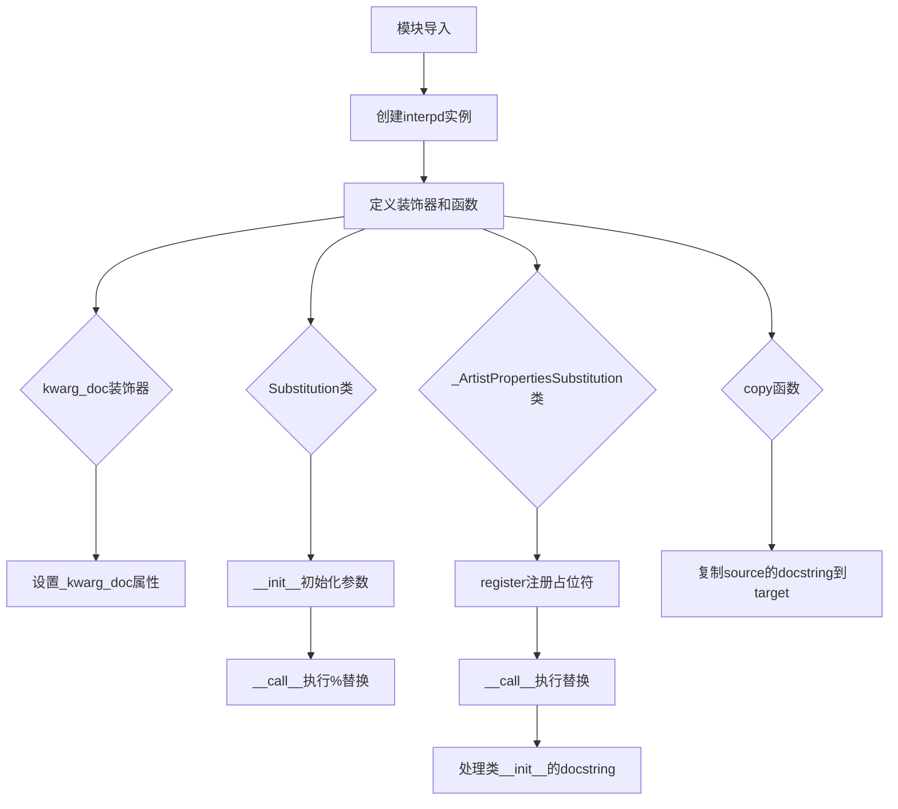
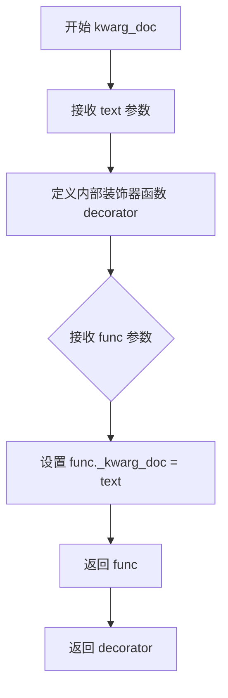
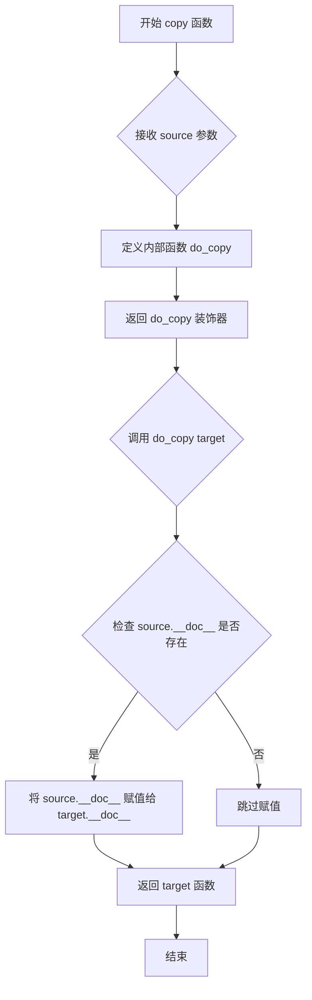
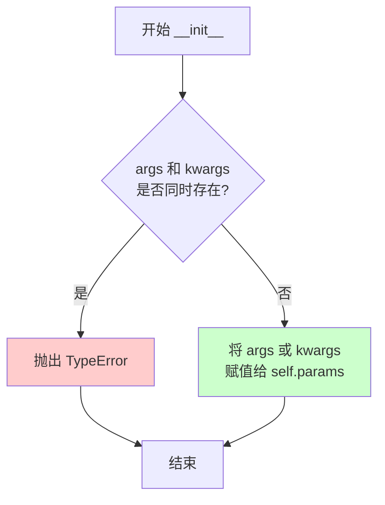
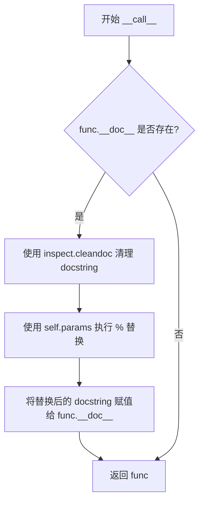
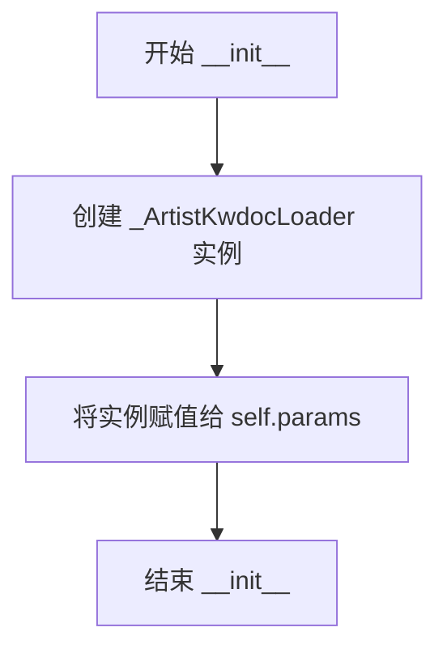
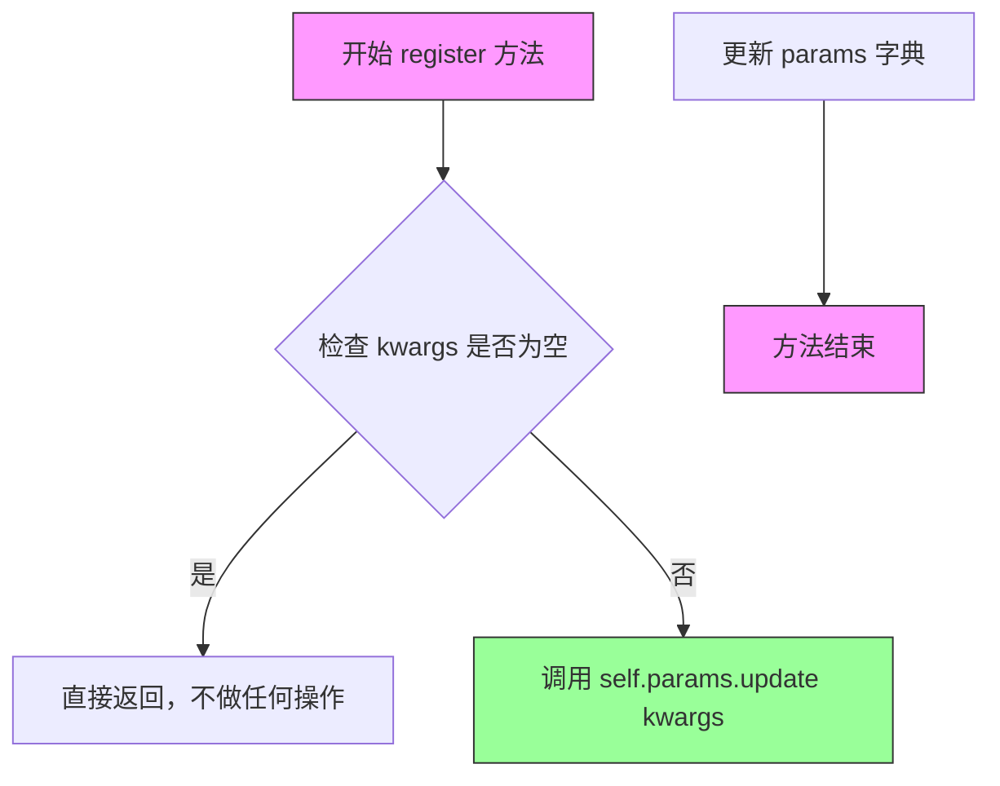
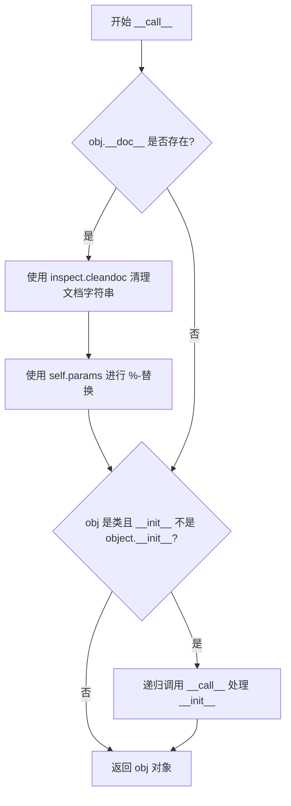

# `matplotlib\lib\matplotlib\_docstring.py` 详细设计文档

该模块是Matplotlib的文档字符串处理工具库，提供了装饰器和类用于自动生成、替换和增强matplotlib中Artist对象及函数的文档字符串，支持%-风格参数替换和动态加载Artist属性的文档。

## 整体流程



## 类结构

```
模块级
├── kwarg_doc (装饰器函数)
├── Substitution (类)
├── _ArtistKwdocLoader (私有类，继承dict)
├── _ArtistPropertiesSubstitution (私有类)
├── copy (装饰器函数)
└── interpd (全局实例)
```

## 全局变量及字段


### `interpd`
    
用于文档字符串中占位符替换的全局单例实例

类型：`_ArtistPropertiesSubstitution`
    


### `Substitution.params`
    
存储用于文档字符串替换的参数，可以是位置参数元组或关键字参数字典

类型：`tuple | dict`
    


### `_ArtistPropertiesSubstitution.params`
    
存储 Artist 属性文档的字典加载器，用于查找和替换 :kwdoc 占位符

类型：`_ArtistKwdocLoader`
    
    

## 全局函数及方法


### `kwarg_doc`

这是一个装饰器工厂函数，用于为 Matplotlib 艺术家（Artist）属性的 setter 方法定义 kwdoc 文档。它将给定的文档文本存储在方法的私有属性 `_kwarg_doc` 中，以便覆盖自动生成的文档。

参数：

- `text`：`str`，要存储的文档文本，用于描述艺术家属性的类型、默认值等信息

返回值：`Callable`，装饰器函数

#### 流程图



#### 带注释源码

```python
def kwarg_doc(text):
    """
    Decorator for defining the kwdoc documentation of artist properties.

    This decorator can be applied to artist property setter methods.
    The given text is stored in a private attribute ``_kwarg_doc`` on
    the method.  It is used to overwrite auto-generated documentation
    in the *kwdoc list* for artists. The kwdoc list is used to document
    ``**kwargs`` when they are properties of an artist. See e.g. the
    ``**kwargs`` section in `.Axes.text`.

    The text should contain the supported types, as well as the default
    value if applicable, e.g.:

        @_docstring.kwarg_doc("bool, default: :rc:`text.usetex`")
        def set_usetex(self, usetex):

    See Also
    --------
    matplotlib.artist.kwdoc

    """
    # 装饰器工厂：接收文档文本 text
    def decorator(func):
        # 将文档文本存储在函数的私有属性 _kwarg_doc 中
        func._kwarg_doc = text
        # 返回装饰后的函数
        return func
    # 返回装饰器函数，供进一步调用
    return decorator
```


### `copy`

该函数是一个装饰器工厂，用于将源函数的文档字符串复制到目标函数，实现文档字符串的重用。

参数：

- `source`：`Callable[[Any], Any]`，源函数，从该函数的 `__doc__` 属性中获取文档字符串

返回值：`Callable[[Callable], Callable]`，返回一个装饰器函数（`do_copy`），该装饰器接受目标函数并将源函数的文档字符串复制到目标函数

#### 流程图



#### 带注释源码

```python
def copy(source):
    """
    Copy a docstring from another source function (if present).
    
    参数:
        source: 源函数对象，用于获取其文档字符串
        
    返回:
        返回一个装饰器函数，该装饰器接受目标函数并复制源函数的文档字符串
    """
    def do_copy(target):
        """
        内部装饰器函数，实际执行文档字符串复制
        
        参数:
            target: 目标函数对象，将被赋予源函数的文档字符串
            
        返回:
            返回被装饰后的目标函数
        """
        # 检查源函数是否有文档字符串
        if source.__doc__:
            # 将源函数的文档字符串复制到目标函数
            target.__doc__ = source.__doc__
        # 返回已处理的目标函数
        return target
    # 返回装饰器函数，供进一步调用
    return do_copy
```


### `Substitution.__init__`

该方法是`Substitution`类的构造函数，用于初始化一个用于文档字符串替换的装饰器对象。它接受可变位置参数（`*args`）或可变关键字参数（`**kwargs`），但不允许同时使用两者。参数被存储在实例属性`self.params`中供后续的`__call__`方法使用。

参数：

- `*args`：`任意类型`，可变位置参数，用于传递位置参数进行替换
- `**kwargs`：`任意类型`，可变关键字参数，用于传递关键字参数进行替换

返回值：`None`，无返回值（构造函数）

#### 流程图



#### 带注释源码

```python
def __init__(self, *args, **kwargs):
    """
    初始化 Substitution 对象。
    
    参数:
        *args: 可变位置参数，用于文档字符串的替换。
        **kwargs: 可变关键字参数，用于文档字符串的替换。
    
    异常:
        TypeError: 如果同时传入了位置参数和关键字参数，则抛出此异常。
    """
    # 检查是否同时传入了位置参数和关键字参数
    # 如果两者同时存在，则抛出TypeError，因为Substitution只支持一种方式
    if args and kwargs:
        raise TypeError("Only positional or keyword args are allowed")
    
    # 将参数存储在 self.params 中
    # 如果传入了位置参数 args，则使用 args；否则使用 kwargs
    # 这意味着 self.params 要么是元组（来自args），要么是字典（来自kwargs）
    self.params = args or kwargs
```


### `Substitution.__call__`

该方法是 Substitution 类的核心调用方法，作为装饰器应用于目标函数，对目标函数的 docstring 执行 %-格式化替换操作（使用初始化时传入的参数），然后返回被装饰的函数。如果函数没有 docstring，则直接返回原函数。

参数：

- `self`：Substitution，当前 Substitution 类的实例，包含用于替换的参数（self.params）
- `func`：Callable，被装饰的目标函数或方法，其 docstring 将被替换

返回值：`Callable`，返回被装饰后的函数（通常与原函数相同，但 docstring 已被修改）

#### 流程图



#### 带注释源码

```python
def __call__(self, func):
    """
    用于装饰器的调用方法，对被装饰函数的 docstring 执行 %-替换。

    参数:
        func: 被装饰的函数对象

    返回:
        被装饰的函数对象，其 __doc__ 属性可能被修改
    """
    # 检查被装饰函数是否有 docstring
    if func.__doc__:
        # 使用 inspect.cleandoc 清理 docstring，去除缩进和多余空白
        # 然后使用 self.params（来自 __init__ 的 args 或 kwargs）执行 % 格式化替换
        func.__doc__ = inspect.cleandoc(func.__doc__) % self.params
    # 返回函数对象（无论 docstring 是否被修改）
    return func
```


### `_ArtistKwdocLoader.__missing__`

当访问字典中不存在的键时自动调用的方法，用于动态加载Artist子类的kwdoc文档。该方法通过":kwdoc"后缀识别需要查询的Artist类名，然后在Artist类的所有子类中查找对应名称的类，并返回其kwdoc文档。

参数：

- `key`：`str`，访问时使用的键，当字典中不存在该键时触发`__missing__`调用

返回值：`str`，返回指定Artist子类的kwdoc文档字符串

#### 流程图

```mermaid
flowchart TD
    A[__missing__ 被调用] --> B{key 是否以 ':kwdoc' 结尾?}
    B -->|否| C[抛出 KeyError 异常]
    B -->|是| D[提取类名: name = key[:-len(':kwdoc')]]
    D --> E[从 matplotlib.artist 导入 Artist 和 kwdoc]
    E --> F[使用 _api.recursive_subclasses 遍历 Artist 的所有子类]
    F --> G{找到名称匹配的类?}
    G -->|否| H[捕获 ValueError 异常]
    H --> I[抛出 KeyError 异常]
    G -->|是| J[获取该类的 kwdoc 文档]
    J --> K[使用 setdefault 缓存并返回文档]
    C --> L[异常传播]
    I --> L
    K --> M[返回 kwdoc 文档字符串]
```

#### 带注释源码

```python
def __missing__(self, key):
    """
    当访问不存在的键时，自动加载对应Artist子类的kwdoc文档。
    
    该方法是dict子类的特殊方法，当使用下标访问不存在的key时自动触发。
    用于延迟加载和缓存Artist属性的文档字符串。
    """
    # 检查key是否以":kwdoc"结尾，这是触发文档加载的约定
    if not key.endswith(":kwdoc"):
        raise KeyError(key)
    
    # 从key中提取Artist子类的名称（去掉":kwdoc"后缀）
    # 例如: "Line2D:kwdoc" -> "Line2D"
    name = key[:-len(":kwdoc")]
    
    # 延迟导入matplotlib.artist模块，避免循环依赖
    from matplotlib.artist import Artist, kwdoc
    
    # 尝试在Artist的所有子类中查找名称匹配的类
    # _api.recursive_subclasses返回Artist的完整继承链
    try:
        # 使用生成器表达式查找匹配的类，逗号解包确保恰好找到一个
        cls, = (cls for cls in _api.recursive_subclasses(Artist)
                if cls.__name__ == name)
    except ValueError as e:
        # 如果没有找到匹配的类，抛出KeyError并保留原始异常链
        raise KeyError(key) from e
    
    # 获取该类的kwdoc文档，并使用setdefault缓存结果
    # 这样下次访问相同key时可以直接从字典中获取，无需重复查找
    return self.setdefault(key, kwdoc(cls))
```


### `_ArtistPropertiesSubstitution.__init__`

`_ArtistPropertiesSubstitution`类的初始化方法，用于创建实例并初始化占位符参数容器。

参数：

- `self`：`_ArtistPropertiesSubstitution`，类的实例自身

返回值：无（`None`），该方法仅初始化实例状态，不返回任何值

#### 流程图



#### 带注释源码

```python
def __init__(self):
    """
    初始化 _ArtistPropertiesSubstitution 实例。
    
    创建一个 _ArtistKwdocLoader 字典子类实例，用于存储和管理
    docstring 中的占位符及其替换值。该加载器支持延迟加载
    Artist 属性的文档信息。
    """
    self.params = _ArtistKwdocLoader()  # 初始化参数容器，用于存储占位符映射
```


### `_ArtistPropertiesSubstitution.register`

注册替换占位符的方法，允许用户通过关键字参数定义 docstring 中的占位符及其对应的替换值。该方法将传入的键值对更新到内部的 `params` 字典中，供后续的 `__call__` 方法在装饰对象时进行 `%` 风格的字符串替换。

参数：

- `kwargs`：`**kwargs`，可变关键字参数，用于传递需要注册的替换占位符及其替换值。例如 `name="some value"` 表示将 docstring 中的 `%(name)s` 替换为 "some value"

返回值：`None`，该方法直接修改实例的 `params` 属性，不返回任何值

#### 流程图



#### 带注释源码

```python
def register(self, **kwargs):
    """
    Register substitutions.

    ``_docstring.interpd.register(name="some value")`` makes "name" available
    as a named parameter that will be replaced by "some value".
    """
    # self.params 是一个字典（继承自 _ArtistKwdocLoader，它继承自 dict）
    # 使用 update 方法将传入的 kwargs 键值对合并到 params 字典中
    # 这样在后续 __call__ 方法执行字符串替换时，这些键值对就会生效
    self.params.update(**kwargs)
```


### `_ArtistPropertiesSubstitution.__call__`

对传入的函数或类进行百分号替换（%-substitution），同时支持对 Artist 子类的 `__init__` 方法进行递归处理。

参数：

- `obj`：`object`，被装饰的函数或类对象，用于执行文档字符串替换

返回值：`object`，返回原始的 obj 对象（经过文档字符串替换后）

#### 流程图



#### 带注释源码

```
def __call__(self, obj):
    """
    对传入的 obj（函数或类）进行文档字符串替换。
    
    如果 obj 是类且拥有自定义的 __init__ 方法，
    还会对 __init__ 的文档字符串进行相同的替换处理。
    """
    # 检查 obj 是否有文档字符串
    if obj.__doc__:
        # 使用 inspect.cleandoc 清理文档字符串的缩进和格式
        # 然后使用 self.params（_ArtistKwdocLoader）进行 %-替换
        # self.params 包含已注册的替换参数和 kwdoc 加载器
        obj.__doc__ = inspect.cleandoc(obj.__doc__) % self.params
    
    # 判断 obj 是否是一个类，且不是继承自 object 的默认类
    # 如果是，则对其 __init__ 方法也进行文档字符串替换
    # 这对于 Artist 子类是非常常见的需求
    if isinstance(obj, type) and obj.__init__ != object.__init__:
        # 递归调用自身处理 __init__ 方法
        self(obj.__init__)
    
    # 返回经过处理的对象（函数或类）
    return obj
```

## 关键组件


### kwarg_doc 函数

装饰器，用于定义artist属性的kwdoc文档。该装饰器可应用于artist属性的setter方法，将给定的文本存储在方法的私有属性`_kwarg_doc`中，用于覆盖艺术家kwdoc列表中自动生成的文档。

### Substitution 类

执行%-替换的装饰器类，用于对对象的文档字符串进行替换。该装饰器应该能够处理`obj.__doc__`为None的情况（例如当解释器传入-OO参数时）。支持位置参数和关键字参数两种方式进行替换。

### _ArtistKwdocLoader 类

惰性加载Artist子类kwdoc的字典子类，继承自dict。通过`__missing__`方法实现惰性加载机制，当查找以":kwdoc"结尾的key时，自动从matplotlib.artist模块中查找对应的Artist子类并获取其kwdoc文档。

### _ArtistPropertiesSubstitution 类

用于替换文档字符串中格式化占位符的类，通过单例实例`interpd`对外提供服务。支持通过`register`方法注册自定义占位符，支持对函数和类的文档字符串进行替换（包括类的`__init__`方法文档字符串）。特别支持`%(classname:kwdoc)s`形式的占位符，用于查找Artist子类的kwdoc文档。

### copy 函数

用于从另一个源函数复制文档字符串的装饰器函数。如果源函数存在文档字符串，则将其复制到目标函数。

### interpd 全局实例

`_ArtistPropertiesSubstitution`类的单例实例，作为文档字符串替换的全局入口点，供Matplotlib项目在整个代码库中重复使用文档字符串片段。


## 问题及建议


### 已知问题

-   **运行时导入（Import within method）**：在 `_ArtistKwdocLoader.__missing__` 方法内部执行 `from matplotlib.artist import Artist, kwdoc` 导入语句，这种做法增加了运行时开销，且使模块依赖关系不够清晰。
-   **异常处理过于宽泛**：在 `_ArtistKwdocLoader.__missing__` 中捕获 `ValueError` 异常，但未明确说明预期捕获的具体异常情况，错误信息可能不够友好。
-   **属性访问未做防御性检查**：在 `_ArtistPropertiesSubstitution.__call__` 中直接访问 `obj.__doc__` 和 `obj.__init__`，未对 `obj` 可能缺少这些属性进行防御性处理。
-   **字符串格式化缺乏容错性**：使用 `%` 操作符进行 docstring 替换时，若占位符与参数不匹配会抛出 `KeyError` 或 `TypeError`，且只显示原始占位符名称，调试困难。
-   **缓存机制无失效策略**：`_ArtistKwdocLoader` 字典缓存加载的 kwdoc 信息，但无缓存大小限制或过期机制，长期运行可能导致内存占用增长。
- **Monkey Patching 副作用**：直接修改对象的 `__doc__` 属性会影响对象原有状态，可能与文档生成工具产生冲突，且不利于调试和 introspection。

### 优化建议

-   **将导入移至模块顶部**：将 `_ArtistKwdocLoader.__missing__` 中的导入语句移至文件顶部，或使用延迟导入模式（lazy import）集中管理。
-   **细化异常处理**：针对 `ValueError` 的不同来源进行区分处理，提供更具信息量的错误提示；添加对 `obj` 属性的 `hasattr` 检查。
-   **增强字符串替换鲁棒性**：考虑使用 `string.Template` 或自定义安全替换函数，提供更好的错误信息和默认值支持；添加占位符验证。
-   **实现缓存策略**：为 `_ArtistKwdocLoader` 添加 LRU 缓存或最大容量限制，防止无限增长的缓存占用过多内存。
-   **减少副作用**：考虑返回带有替换后 docstring 的新对象而非直接修改原对象，或提供明确的配置选项控制行为。
-   **添加类型提示**：为函数参数和返回值添加完整的类型注解，提升代码可维护性和 IDE 支持。


## 其它


### 设计目标与约束

本模块的设计目标是提供一个灵活且强大的文档字符串处理框架，用于在matplotlib中管理和替换文档字符串。核心约束包括：1) 必须兼容Python的-docstring特性（即-docstring时__doc__为None）；2) 替换操作必须是惰性的，以避免循环导入问题；3) 装饰器需要保持被装饰对象的原始行为不变；4) 支持多种替换格式（位置参数、关键字参数、特殊占位符如%(classname:kwdoc)s）。

### 错误处理与异常设计

模块中的异常处理主要体现在以下几个方面：1) `Substitution.__init__`中检测同时使用位置参数和关键字参数的情况，抛出TypeError；2) `_ArtistKwdocLoader.__missing__`中处理找不到对应Artist类的情况，将ValueError转换为KeyError并保留原始异常链；3) 所有装饰器在操作__doc__时都进行None检查，确保即使文档字符串为空也不会崩溃。整体采用"优雅降级"策略，即如果文档字符串操作失败，原始对象仍可正常使用。

### 数据流与状态机

模块的核心数据流如下：1) 用户通过`interpd.register()`或`Substitution`构造函数注册替换参数；2) 当装饰器应用于目标对象时，触发`__call__`方法；3) `inspect.cleandoc`清理文档字符串格式；4) 使用%运算符执行字符串替换；5) 对于`_ArtistPropertiesSubstitution`，还会递归处理类的`__init__`方法。状态机方面，对象从"未装饰"到"已装饰"的状态转换是单向的，装饰后的对象不可再次应用相同的装饰器。

### 外部依赖与接口契约

本模块依赖于以下外部组件：1) `inspect`模块 - 用于cleandoc函数清理文档字符串格式；2) `matplotlib._api` - 提供recursive_subclasses函数用于递归查找类继承关系；3) `matplotlib.artist` - 提供Artist基类和kwdoc函数用于生成artist属性文档。接口契约包括：装饰器必须返回可调用对象；被装饰对象必须具有__doc__属性（即使是None）；注册的值必须是字符串类型。

### 性能考虑

性能优化的关键点包括：1) `_ArtistKwdocLoader`使用字典继承实现惰性加载，只有在实际访问特定key时才触发导入和文档生成；2) `setdefault`方法确保每个key只计算一次kwdoc；3) 使用inspect.cleandoc而非自定义清理逻辑，利用标准库的高效实现。潜在的性能瓶颈在于大量artist类的递归查找操作，建议在模块初始化时预热缓存。

### 安全性考虑

本模块主要处理文档字符串，不涉及用户数据或敏感信息，安全性风险较低。主要考虑点包括：1) 替换操作使用Python的%格式化，理论上存在格式化字符串漏洞，但在文档字符串场景下风险可控；2) 动态导入artist模块时可能触发副作用，但这是matplotlib的核心功能必需的；3) 通过装饰器修改__doc__属性不影响对象的行为安全性。

### 测试策略

测试应覆盖以下场景：1) 基本替换功能测试 - 使用位置参数、关键字参数和混合参数；2) None文档字符串处理 - 验证装饰器在__doc__为None时的行为；3) 循环导入测试 - 确保模块可以在matplotlib初始化过程中安全加载；4) 特殊占位符测试 - 验证%(classname:kwdoc)s格式的正确解析和替换；5) 类装饰测试 - 验证装饰类时同时处理类文档和__init__文档；6) 错误情况测试 - 验证TypeError和KeyError的正确抛出。

### 使用示例

```python
# 示例1：使用Substitution类进行基本替换
from matplotlib._docstring import Substitution

sub = Substitution(author="Matplotlib Team", year=2024)
@sub
def foo():
    """This tool was written by %(author)s in %(year)s."""
    pass
# foo.__doc__ -> "This tool was written by Matplotlib Team in 2024."

# 示例2：使用interpd进行artist属性替换
from matplotlib._docstring import interpd
interpd.register(my_color="red")

@interpd
def set_color():
    """The color is %(my_color)s."""
    pass

# 示例3：使用kwarg_doc装饰器
from matplotlib._docstring import kwarg_doc

class MyArtist:
    @kwarg_doc("bool, default: False")
    def set_animated(self, animated):
        pass
```

### 版本历史与变更说明

本模块自matplotlib早期版本存在，经历了以下主要变更：1) 初始版本提供基本的Substitution装饰器；2) 后来引入_ArtistPropertiesSubstitution类以支持更复杂的占位符替换；3) 添加_ArtistKwdocLoader解决循环导入问题；4) 增强对类装饰的支持，自动处理__init__的文档字符串。最新版本支持通过register方法动态注册替换参数，以及特殊格式%(classname:kwdoc)s用于引用artist类的文档。

    