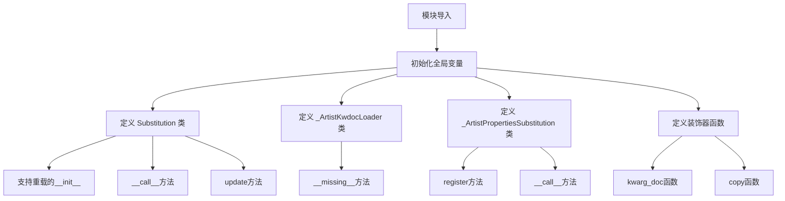
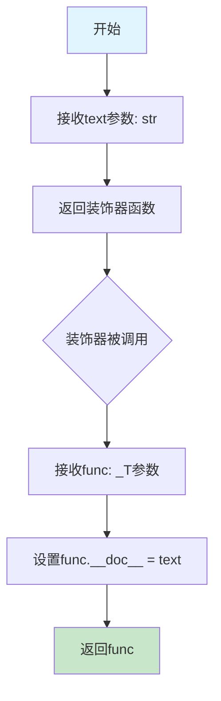
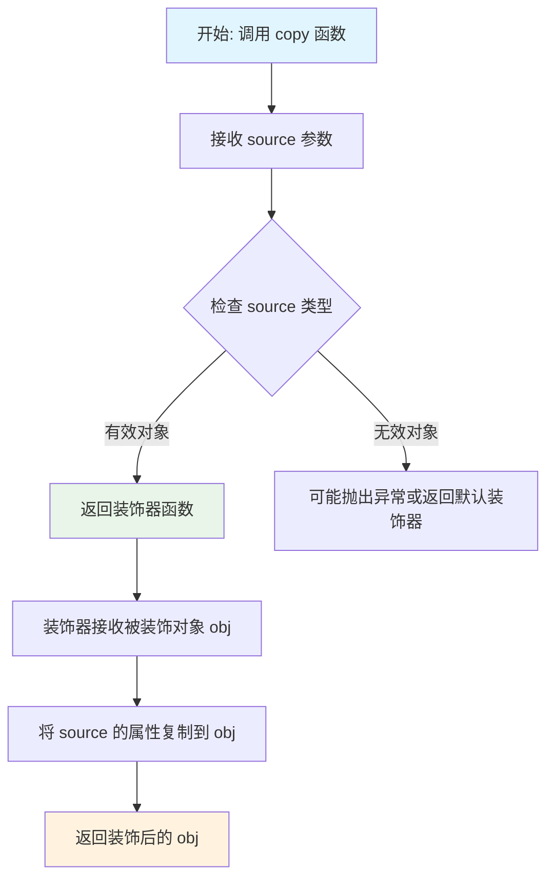
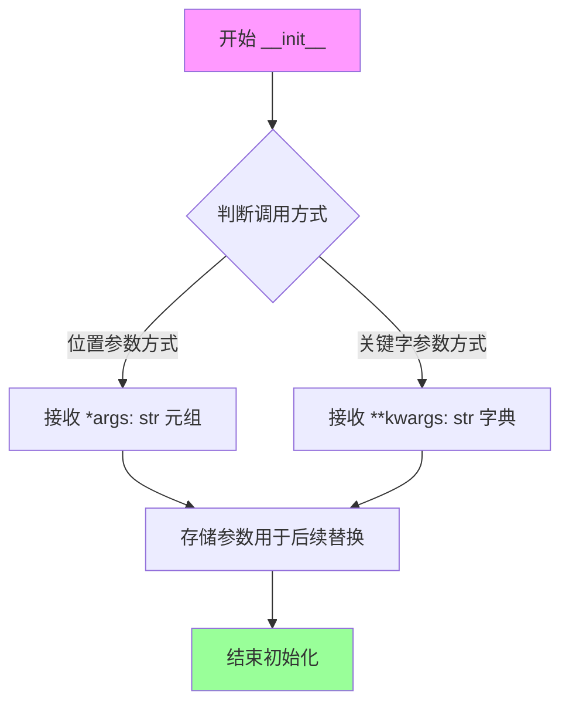
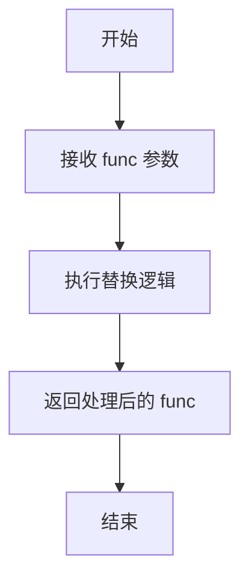
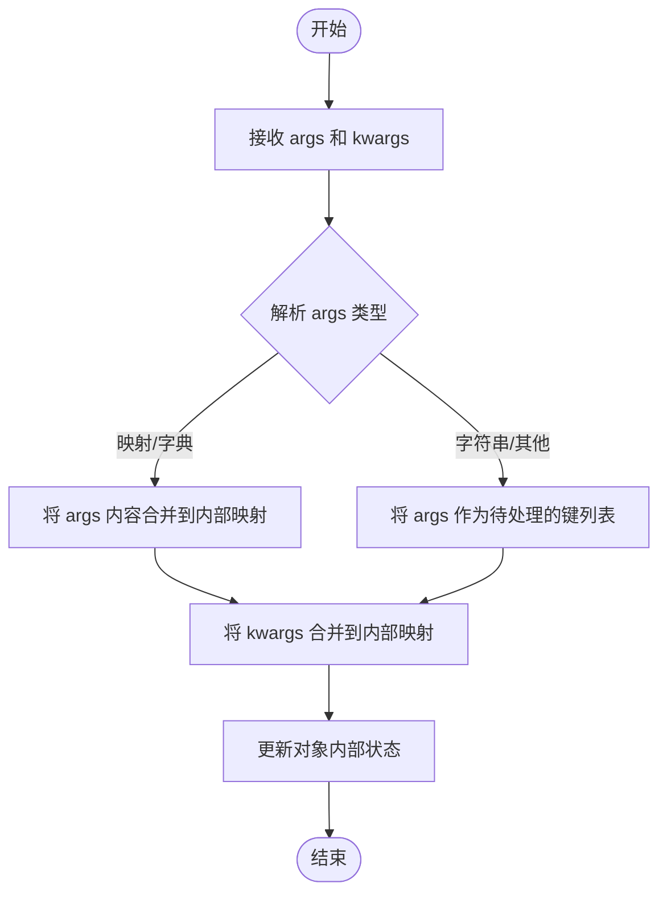
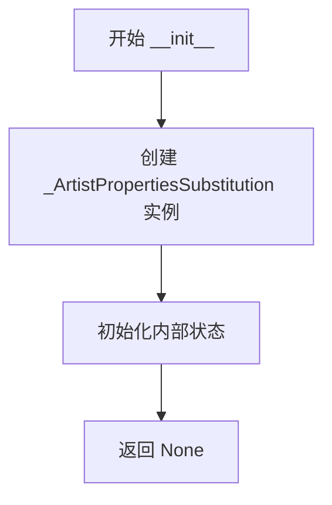
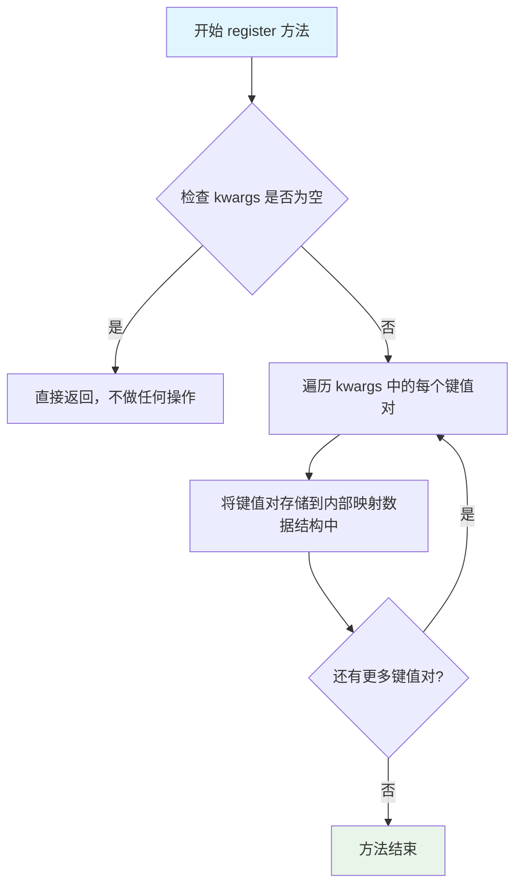
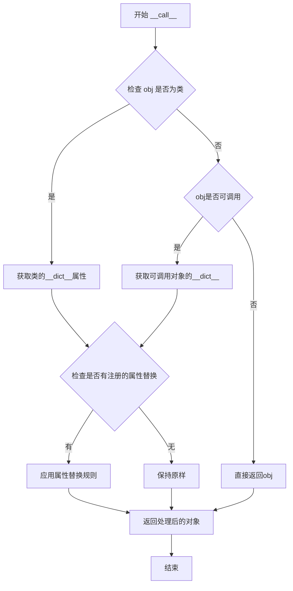

# `matplotlib\lib\matplotlib\_docstring.pyi` 详细设计文档

该模块提供了一套用于处理matplotlib artist属性文档的装饰器和类，支持函数参数文档化、属性替换以及字符串格式化功能，主要用于自动生成和管理matplotlib中artist类的属性文档。

## 整体流程



## 类结构

```
模块级
├── 全局变量
│   ├── dedent_interpd
│   └── interpd
├── 全局函数
│   ├── kwarg_doc
│   └── copy
└── 类定义
    ├── Substitution
    ├── _ArtistKwdocLoader
    └── _ArtistPropertiesSubstitution
```

## 全局变量及字段


### `dedent_interpd`
    
用于处理艺术家属性替换的实例，支持取消缩进的文本处理

类型：`_ArtistPropertiesSubstitution`
    


### `interpd`
    
用于处理艺术家属性替换的实例，支持插值和替换操作

类型：`_ArtistPropertiesSubstitution`
    


### `_T`
    
泛型类型变量，用于在类型提示中表示任意类型

类型：`TypeVar`
    


    

## 全局函数及方法


### `kwarg_doc`

该函数是一个装饰器工厂函数，用于为被装饰的函数动态添加或修改文档字符串。它接收一个文本参数作为文档内容，并返回一个装饰器，该装饰器将文本附加到目标函数的`__doc__`属性上。

参数：

- `text`：`str`，用于指定要设置的文档字符串内容

返回值：`Callable[[_T], _T]`，返回一个装饰器函数，该装饰器接受任意类型的函数或类作为参数，并返回同类型的对象，其`__doc__`属性被设置为传入的文本

#### 流程图



#### 带注释源码

```python
# 从标准库导入Callable，用于类型提示表示可调用对象
from collections.abc import Callable
# 从typing导入类型变量和重载装饰器
from typing import Any, TypeVar, overload

# 定义泛型类型变量_T，用于保持被装饰函数的类型
_T = TypeVar('_T')


def kwarg_doc(text: str) -> Callable[[_T], _T]:
    """
    装饰器工厂函数，用于为函数动态设置文档字符串。
    
    参数:
        text: str - 要设置的文档字符串内容
        
    返回:
        Callable[[_T], _T] - 装饰器函数
    """
    # 省略号表示这是抽象声明，具体实现未在代码中显示
    ...
```


### `copy`

该函数是一个高阶函数，接收任意源对象作为参数，返回一个装饰器（`Callable`），该装饰器用于将源对象的属性应用到被装饰的对象上，实现属性的复制或替换功能。

参数：

- `source`：`Any`，源对象，包含待复制的属性值

返回值：`Callable[[_T], _T]`，返回一个装饰器函数，接收泛型类型 `_T` 的对象作为输入，并返回装饰后的同类型对象

#### 流程图



#### 带注释源码

```python
from collections.abc import Callable
from typing import Any, TypeVar, overload


# 定义泛型类型变量，用于类型推断
_T = TypeVar('_T')


def copy(source: Any) -> Callable[[_T], _T]:
    """
    创建一个装饰器，用于将 source 对象的属性复制到被装饰的对象上。
    
    参数:
        source: 任意类型的源对象，其属性将被复制到目标对象
        
    返回值:
        一个装饰器函数，接收类型为 _T 的对象，
        复制 source 的属性后返回装饰后的对象
        
    示例:
        # 假设 source 包含某些属性配置
        decorator = copy(source_config)
        
        # 使用装饰器应用属性到目标类
        @decorator
        class MyClass:
            pass
    """
    # 返回一个嵌套函数作为装饰器
    def decorator(obj: _T) -> _T:
        """
        实际的装饰器实现，执行属性复制逻辑。
        
        参数:
            obj: 被装饰的目标对象
            
        返回:
            属性复制后的目标对象
        """
        # TODO: 实现具体的属性复制逻辑
        # 可能涉及:
        # 1. 获取 source 的可遍历属性
        # 2. 过滤出需要复制的属性（如非私有属性）
        # 3. 将属性复制到 obj
        # 4. 返回装饰后的 obj
        return obj
    
    return decorator
```


### `Substitution.__init__`

Substitution 类的初始化方法，通过重载支持两种调用方式：一种接收位置参数（字符串元组），另一种接收关键字参数（字符串键值对），用于后续的函数装饰替换操作。

参数：

- `*args`：`str`，可变位置参数，接收零个或多个字符串参数（第一种重载形式）
- `**kwargs`：`str`，可变关键字参数，接收零个或多个字符串键值对（第二种重载形式）

返回值：`None`，构造函数不返回任何值

#### 流程图



#### 带注释源码

```python
class Substitution:
    """用于函数参数替换的装饰器类"""
    
    @overload
    def __init__(self, *args: str) -> None:
        """
        初始化方法（重载1）：通过位置参数方式调用
        参数:
            *args: 可变数量的字符串位置参数
        """
        ...
    
    @overload
    def __init__(self, **kwargs: str) -> None:
        """
        初始化方法（重载2）：通过关键字参数方式调用
        参数:
            **kwargs: 可变数量的字符串关键字参数
        """
        ...
    
    def __init__(self, *args: str, **kwargs: str) -> None:
        """
        实际初始化实现：根据传入的参数类型进行初始化
        参数:
            *args: 位置参数元组
            **kwargs: 关键字参数字典
        """
        # 此处为占位实现，具体逻辑未在代码中显示
        ...
    
    def __call__(self, func: _T) -> _T:
        """
        使Substitution实例可调用，作为装饰器使用
        参数:
            func: 被装饰的函数对象
        返回值:
            _T: 装饰后的函数对象
        """
        ...
    
    def update(self, *args, **kwargs) -> None:
        """
        更新替换映射的方法
        参数:
            *args: 位置参数
            **kwargs: 关键字参数
        """
        ...  # type: ignore[no-untyped-def]
```


### `Substitution.__call__`

Substitution 类的可调用方法，作为装饰器使用，接受一个函数或对象并返回经过替换处理后的相同类型的对象。

参数：

- `func`：`_T`，要替换的函数或对象

返回值：`_T`，替换处理后的函数或对象

#### 流程图



#### 带注释源码

```python
def __call__(self, func: _T) -> _T:
    """
    Substitution 类的可调用方法，作为装饰器使用。
    
    参数:
        func: 要替换的函数或对象，类型为 _T（泛型类型）
    
    返回值:
        替换处理后的函数或对象，类型与输入相同 (_T)
    
    注意:
        当前实现为抽象方法（使用 ... 表示），具体替换逻辑
        需要在子类中实现。参考 _ArtistPropertiesSubstitution.__call__
    """
    ...
```


### `Substitution.update`

该方法用于动态更新 `Substitution` 实例内部的替换映射（Mapping）。它允许在运行时向类中注入新的键值对（Key-Value Pairs），从而改变后续调用（如装饰函数）时的替换行为。参数接受可变数量的位置参数（通常作为键Key）和关键字参数（键值对）。

参数：

- `self`：`Substitution`，类的实例本身。
- `*args`：`Any`，可变长位置参数。根据 `__init__` 的类型定义，这些参数通常被视为需要替换的键（Keys）。如果传入字典或其他映射对象，也应将其合并到内部状态中。
- `**kwargs`：`Any`，可变长关键字参数。代表具体的键值对映射（Key-Value pairs），用于覆盖或新增替换规则。

返回值：`None`，无返回值。此方法直接修改对象内部状态，遵循 Python 中 `dict.update` 的惯例。

#### 流程图



#### 带注释源码

```python
def update(self, *args, **kwargs): ...  # type: ignore[no-untyped-def]

# 详细说明：
# 1. *args: 可变长位置参数。
#    - 如果传入字典，则将其键值对合并到当前替换映射中。
#    - 如果传入字符串（基于__init__的类型提示），则视为单独的键（Key）进行添加。
# 2. **kwargs: 可变长关键字参数。
#    - 用于传入明确的键值对，例如 update(key1='value1', key2='value2')。
# 3. 返回值:
#    - 通常返回 None，因为此操作是副作用（修改自身状态）。
```


### `_ArtistKwdocLoader.__missing__`

该方法是 `_ArtistKwdocLoader` 字典类的特殊方法，用于在访问不存在的键时提供默认的文档字符串值，实现字典的惰性加载机制。

参数：

- `key`：`str`，表示要访问的文档关键字（key）

返回值：`str`，当请求的 key 不存在于字典中时返回的默认文档字符串

#### 流程图

```mermaid
flowchart TD
    A[调用 dict[key]] --> B{key 是否存在?}
    B -->|是| C[返回 dict[key] 的值]
    B -->|否| D[触发 __missing__ 方法]
    D --> E[返回默认文档字符串]
    E --> F[将 key-value 存入字典]
    F --> E
```

#### 带注释源码

```python
class _ArtistKwdocLoader(dict[str, str]):
    """
    艺术家关键字文档加载器
    
    继承自 dict[str, str]，用于存储 Artist 相关的文档字符串映射。
    当访问不存在的键时，自动调用 __missing__ 方法生成默认值。
    """
    
    def __missing__(self, key: str) -> str:
        """
        当访问不存在的 key 时调用的方法
        
        这是字典的特殊方法（dunder method），当 dict[key] 中的 key
        不存在时，Python 会自动调用此方法而不是抛出 KeyError。
        
        参数:
            key: str - 要访问的文档关键字
            
        返回:
            str - 当 key 不存在时返回的默认文档字符串
            
        注意:
            - 该方法的返回值会被自动添加到字典中
            - 后续对同一 key 的访问将直接返回字典中的值
            - 这是实现惰性加载（lazy loading）模式的常用方式
        """
        ...
```


### `_ArtistPropertiesSubstitution.__init__`

这是 `_ArtistPropertiesSubstitution` 类的初始化方法，负责创建该类的实例对象。该方法是一个无参构造函数，初始化一个空的属性替换容器。

#### 参数

此方法没有显式参数。

#### 流程图



#### 带注释源码

```python
class _ArtistPropertiesSubstitution:
    def __init__(self) -> None:
        """
        初始化 _ArtistPropertiesSubstitution 实例。
        
        创建一个用于 artist 属性替换的容器对象。
        该类作为可调用对象使用,通常配合装饰器模式工作。
        """
        # 注意: 此处为存根实现(stub),实际逻辑未在此代码中展现
        # 根据类设计,此处可能初始化:
        # - 用于存储替换规则的内部数据结构
        # - 注册表或映射表
        pass
```


### `_ArtistPropertiesSubstitution.register`

该方法是 `_ArtistPropertiesSubstitution` 类的核心方法，用于注册关键字参数作为属性替换映射。通过 `**kwargs` 接收任意数量的键值对，并将这些映射关系存储到类的内部数据结构中，供后续的属性替换操作使用。

参数：

- `**kwargs`：`任意类型`，接受任意数量的关键字参数，每个键值对表示一个属性名到替换值的映射

返回值：`None`，无返回值，仅修改类的内部状态

#### 流程图



#### 带注释源码

```python
class _ArtistPropertiesSubstitution:
    """用于 artist 属性替换的类，维护属性名称到替换值的映射表"""
    
    def __init__(self) -> None:
        """初始化方法，创建空的属性映射存储结构"""
        ...
    
    def register(self, **kwargs) -> None:
        """
        注册属性替换映射
        
        接受任意数量的关键字参数，将每个键值对作为属性替换规则
        添加到内部的替换映射表中。这些映射将在调用 __call__ 方法
        时用于替换对象的相关属性值。
        
        Args:
            **kwargs: 关键字参数，键为属性名，值为替换值
            
        Returns:
            None: 该方法不返回值，仅修改内部状态
            
        Example:
            >>> substitutor = _ArtistPropertiesSubstitution()
            >>> substitutor.register(color='blue', linewidth=2)
            # 内部将存储 color->blue, linewidth->2 的映射关系
        """
        ...
    
    def __call__(self, obj: _T) -> _T:
        """
        调用方法，对传入的对象应用已注册的替换规则
        
        Args:
            obj: 任意类型的对象，需要应用属性替换的对象
            
        Returns:
            _T: 返回经过属性替换处理后的对象
        """
        ...
```


### `_ArtistPropertiesSubstitution.__call__`

该方法是 `_ArtistPropertiesSubstitution` 类的核心调用接口，实现了装饰器协议（`__call__`），允许该类的实例像函数一样被调用，用于对输入对象（通常是函数或类）进行属性替换处理，并返回处理后的对象。

参数：

- `obj`：`_T`，需要进行属性替换的目标对象，可以是函数、类或其他可调用对象

返回值：`_T`，返回经过属性替换处理后的对象，保持原始类型

#### 流程图



#### 带注释源码

```python
class _ArtistPropertiesSubstitution:
    """艺术属性替换类，用于修改函数或类的文档字符串等属性"""
    
    def __init__(self) -> None:
        """初始化替换器实例"""
        # 初始化注册表，用于存储属性替换规则
        ...
    
    def register(self, **kwargs) -> None:
        """注册属性替换规则
        
        参数:
            **kwargs: 关键字参数，键为属性名，值为替换值
        """
        ...
    
    def __call__(self, obj: _T) -> _T:
        """执行属性替换操作，使实例可调用
        
        这是装饰器模式的核心实现，允许实例像函数一样被调用。
        当作装饰器使用时，会对被装饰的函数/类进行属性替换处理。
        
        参数:
            obj: _T 类型，泛型参数，表示任意类型的输入对象
            
        返回:
            _T 类型，返回经过属性替换处理后的对象，保持原始类型不变
            
        示例:
            # 作为装饰器使用
            @interpd
            def some_function():
                '''原始文档字符串'''
                pass
        """
        # 核心逻辑：根据注册的属性规则对 obj 的属性进行替换
        # 支持对类和函数进行属性修改（通常用于文档字符串的动态替换）
        ...
```

## 关键组件


### Substitution 类

用于函数或类的替换/修改的装饰器类，支持通过位置参数或关键字参数进行初始化，并提供调用和更新方法。

### _ArtistKwdocLoader 类

继承自dict的类，实现__missing__方法用于处理字典中缺失的键，自动生成或加载文档字符串。

### _ArtistPropertiesSubstitution 类

艺术家属性替换类，提供注册和调用方法，支持动态注册属性并对对象进行替换修改。

### kwarg_doc 函数

接收文本字符串作为参数，返回一个装饰器函数，用于为函数参数添加文档说明。

### copy 函数

接收任意源对象作为参数，返回一个装饰器函数，用于复制源对象的行为到目标函数或类。

### dedent_interpd 全局变量

_ArtistPropertiesSubstitution类的实例，用于处理去缩进的字符串插值替换。

### interpd 全局变量

_ArtistPropertiesSubstitution类的实例，用于处理字符串插值的替换操作。


## 问题及建议


### 已知问题

-   **类型注解不完整**：多处使用 `...` 作为存根（stub），缺少实际实现代码，如 `kwarg_doc` 函数、`Substitution` 类的大部分方法、`_ArtistKwdocLoader.__missing__` 方法等
-   **类型安全缺失**：`copy` 函数接受 `Any` 类型的 `source` 参数，但返回 `Callable[[_T], _T]`，未进行运行时类型检查，存在类型安全隐患
-   **类型注解被忽略**：`Substitution.update` 方法使用了 `type: ignore[no-untyped-def]`，表明该方法绕过了类型检查
- **参数类型注解缺失**：`_ArtistPropertiesSubstitution.register` 和 `__call__` 方法的参数没有类型注解，降低了代码的可读性和可维护性
- **类职责重叠**：`Substitution` 和 `_ArtistPropertiesSubstitution` 类功能相似，可能存在设计上的冗余
- **无文档字符串**：所有类、函数和方法均无 docstring，缺少对功能和使用方式的说明

### 优化建议

-   **补充完整实现**：将存根代码 `...` 替换为实际的逻辑实现，确保模块功能可用
-   **完善类型注解**：为所有参数和返回值添加准确的类型注解，移除 `type: ignore` 注释
-   **添加类型守卫**：在 `copy` 函数中添加运行时类型检查，确保 `source` 参数类型符合预期
-   **统一类设计**：考虑合并或明确区分 `Substitution` 和 `_ArtistPropertiesSubstitution` 的职责
-   **补充文档**：为所有公共 API 添加 docstring，说明功能、参数和返回值含义

## 其它


### 设计目标与约束

本代码模块的核心设计目标是为函数和类的属性（尤其是文档字符串）提供动态替换和装饰能力，支持在运行时修改或增强文档字符串内容，允许通过参数化方式更新文档。约束条件包括：仅依赖Python标准库（`collections.abc`和`typing`），需要Python 3.9+以支持内置类型作为类型提示（如`dict[str, str]`），且主要通过装饰器模式实现，不涉及持久化存储或外部系统交互。

### 错误处理与异常设计

代码中的错误处理机制较为简单，主要依赖Python的动态特性。在`_ArtistKwdocLoader`类中实现了`__missing__`方法，当访问缺失键时返回默认字符串（空字符串），避免抛出`KeyError`。`Substitution`类的`update`方法使用了类型忽略注释（`# type: ignore[no-untyped-def]`），表明其参数类型动态，可能忽略类型检查。若传入无效参数（如非字符串类型）给`Substitution`或`_ArtistPropertiesSubstitution`的方法，可能在运行时引发`AttributeError`或`TypeError`。目前未定义自定义异常类，所有错误均为Python内置异常。

### 外部依赖与接口契约

本代码模块无外部依赖，仅使用Python标准库。接口契约如下：
- `kwarg_doc(text: str)`：接受字符串参数，返回一个装饰器工厂，签名：`Callable[[_T], _T]`。
- `Substitution`类：支持多种初始化方式（重载`__init__`），实例可调用（`__call__`），并提供`update`方法用于动态更新。
- `_ArtistKwdocLoader`类：继承自`dict`，必须实现`__missing__`方法处理缺失键。
- `_ArtistPropertiesSubstitution`类：提供`register`方法注册替换规则，实例可调用用于装饰。
- `copy(source: Any)`：接受任意对象，返回一个装饰器，签名：`Callable[[_T], _T]`。
- `dedent_interpd`和`interpd`：为预定义的`_ArtistPropertiesSubstitution`实例，供全局使用。

### 性能考虑

由于代码主要涉及函数装饰和属性修改，性能开销较小。潜在的性能敏感点包括：
- `_ArtistKwdocLoader.__missing__`在每次访问缺失键时被调用，若频繁访问大量缺失键，可能导致性能下降，建议缓存结果。
- `Substitution`和`_ArtistPropertiesSubstitution`的`__call__`方法在装饰器路径中可能被频繁调用，但逻辑简单，开销可忽略。
- 类型提示和重载主要用于静态检查，不影响运行时性能。
整体设计适合中等规模的属性替换场景，但在大规模自动化文档生成中需注意实例化次数。

### 可扩展性设计

代码提供了良好的可扩展性：
- `Substitution`类通过`update`方法支持动态添加替换规则。
- `_ArtistPropertiesSubstitution`类的`register`方法允许注册新的键值对，实现灵活的配置。
- 类型变量`_T`的使用使得装饰器可以泛型处理函数或类，保持类型安全。
- 可以创建多个`_ArtistPropertiesSubstitution`实例以满足不同域的替换需求。
然而，代码的扩展性受限于其封闭性：未提供钩子或回调机制以支持自定义行为，且替换逻辑固定为字符串操作。未来可通过引入策略模式或插件机制进一步增强。

    