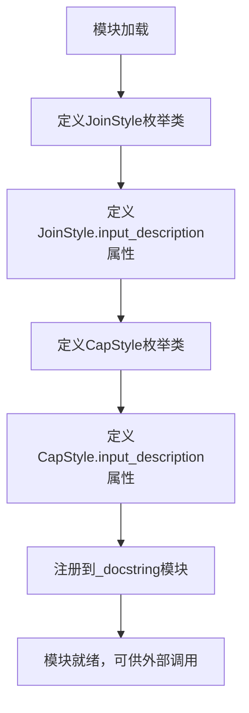
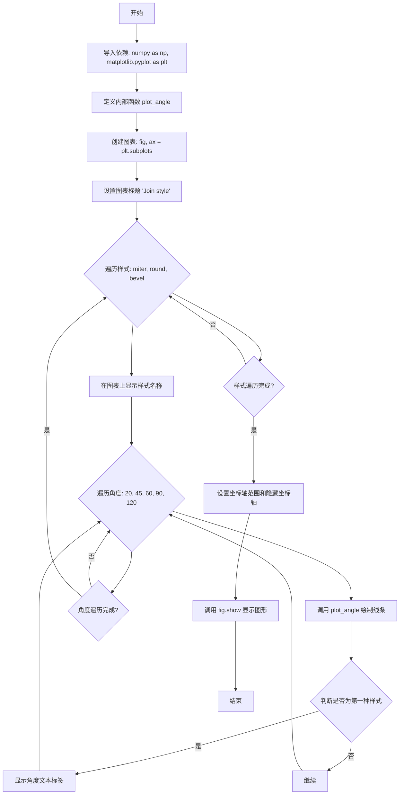

# `matplotlib\lib\matplotlib\_enums.py` 详细设计文档

该模块定义了Matplotlib中用于描述线条连接样式(JoinStyle)和端点样式(CapStyle)的枚举类，这些枚举类继承自str和Enum，提供了标准化的参数输入方式，并通过demo方法可视化展示各种样式的效果。

## 整体流程



## 类结构

```
Enum (基类)
├── JoinStyle (继承str, Enum)
│   ├── miter
│   ├── round
│   ├── bevel
│   └── demo() [静态方法]
└── CapStyle (继承str, Enum)
butt
projecting
round
demo() [静态方法
```

## 全局变量及字段


### `JoinStyle`
    
枚举类，定义Matplotlib中线段连接处的绘制风格

类型：`Enum class`
    


### `CapStyle`
    
枚举类，定义Matplotlib中未闭合线条端点的绘制风格

类型：`Enum class`
    


### `JoinStyle.JoinStyle.miter`
    
字符串枚举成员，表示箭头尖端（miter）连接风格

类型：`str`
    


### `JoinStyle.JoinStyle.round`
    
字符串枚举成员，表示圆形（round）连接风格

类型：`str`
    


### `JoinStyle.JoinStyle.bevel`
    
字符串枚举成员，表示斜角（bevel）连接风格

类型：`str`
    


### `JoinStyle.JoinStyle.input_description`
    
类属性，描述JoinStyle可接受的输入值格式

类型：`str`
    


### `CapStyle.CapStyle.butt`
    
字符串枚举成员，表示方形（butt）端点样式

类型：`str`
    


### `CapStyle.CapStyle.projecting`
    
字符串枚举成员，表示延伸方形（projecting）端点样式

类型：`str`
    


### `CapStyle.CapStyle.round`
    
字符串枚举成员，表示圆形（round）端点样式

类型：`str`
    


### `CapStyle.CapStyle.input_description`
    
类属性，描述CapStyle可接受的输入值格式

类型：`str`
    
    

## 全局函数及方法


### JoinStyle.demo()

演示每种 JoinStyle（miter、round、bevel）在不同连接角度下的视觉效果，通过绘制示例线条展示它们之间的差异。

参数：

- 无

返回值：`None`，该方法直接显示图形窗口，不返回任何值。

#### 流程图



#### 带注释源码

```python
@staticmethod
def demo():
    """Demonstrate how each JoinStyle looks for various join angles."""
    # 导入数值计算和绘图库
    import numpy as np
    import matplotlib.pyplot as plt

    # 定义内部函数：绘制指定角度和样式的线条
    def plot_angle(ax, x, y, angle, style):
        """
        绘制单个角度的示例线条
        
        参数:
            ax: Axes对象，绑制目标
            x: float，起始x坐标
            y: float，起始y坐标
            angle: float，连接角度（度）
            style: str，连接样式（miter/round/bevel）
        """
        # 将角度转换为弧度
        phi = np.radians(angle)
        # 计算线条顶点坐标：起点、转折点、终点
        xx = [x + .5, x, x + .5*np.cos(phi)]
        yy = [y, y, y + .5*np.sin(phi)]
        # 绘制粗线条（12pt宽），使用指定连接样式
        ax.plot(xx, yy, lw=12, color='tab:blue', solid_joinstyle=style)
        # 绘制细线条（1pt宽）作为轮廓
        ax.plot(xx, yy, lw=1, color='black')
        # 标记转折点位置
        ax.plot(xx[1], yy[1], 'o', color='tab:red', markersize=3)

    # 创建画布，设置尺寸和布局
    fig, ax = plt.subplots(figsize=(5, 4), constrained_layout=True)
    # 设置图表标题
    ax.set_title('Join style')
    
    # 遍历三种连接样式
    for x, style in enumerate(['miter', 'round', 'bevel']):
        # 在顶部显示样式名称
        ax.text(x, 5, style)
        # 遍历不同的连接角度
        for y, angle in enumerate([20, 45, 60, 90, 120]):
            # 绘制该角度的示例
            plot_angle(ax, x, y, angle, style)
            # 仅在第一列显示角度标签
            if x == 0:
                ax.text(-1.3, y, f'{angle} degrees')
    
    # 设置坐标轴范围
    ax.set_xlim(-1.5, 2.75)
    ax.set_ylim(-.5, 5.5)
    # 隐藏坐标轴
    ax.set_axis_off()
    # 显示图形窗口
    fig.show()
```


### `CapStyle.demo()`

该方法是一个静态方法，用于演示三种不同的线条端点样式（'butt'、'round'、'projecting'）在粗线段上的视觉效果，通过创建 matplotlib 图形窗口展示每种样式在同一条线段上的绘制方式。

参数：无

返回值：`None`，无返回值（通过 `fig.show()` 展示图形）

#### 流程图

```mermaid
flowchart TD
    A[开始 demo] --> B[创建图形 figsize=(4, 1.2)]
    B --> C[添加坐标轴 ax 设置在 (0, 0, 1, 0.8)]
    C --> D[设置标题 'Cap style']
    D --> E[遍历样式列表 ['butt', 'round', 'projecting']]
    E --> F[计算当前样式的 x 位置: x+0.25]
    F --> G[在坐标轴上添加文本标签]
    G --> H[定义线段坐标 xx=[x, x+0.5], yy=[0, 0]]
    H --> I[绘制粗线: lw=12, color='tab:blue', solid_capstyle=style]
    I --> J[绘制细线: lw=1, color='black']
    J --> K[绘制标记点: 'o', color='tab:red', markersize=3]
    K --> L{是否还有样式未处理}
    L -->|是| E
    L -->|否| M[设置 ylim=(-0.5, 1.5)]
    M --> N[隐藏坐标轴: set_axis_off]
    N --> O[调用 fig.show 显示图形]
    O --> P[结束]
```

#### 带注释源码

```python
@staticmethod
def demo():
    """Demonstrate how each CapStyle looks for a thick line segment."""
    # 导入 matplotlib.pyplot 用于绑图
    import matplotlib.pyplot as plt

    # 创建一个新的图形窗口，大小为 4x1.2 英寸
    fig = plt.figure(figsize=(4, 1.2))
    
    # 在图形中添加坐标轴，参数 (0, 0, 1, 0.8) 表示
    # 从左下角 (0,0) 开始，宽度为 1，高度为 0.8
    ax = fig.add_axes((0, 0, 1, 0.8))
    
    # 设置坐标轴标题
    ax.set_title('Cap style')

    # 遍历三种 CapStyle: 'butt', 'round', 'projecting'
    for x, style in enumerate(['butt', 'round', 'projecting']):
        # 在每个样式的中心位置 (x+0.25) 添加文本标签
        # x 从 0 开始枚举，所以位置分别为 0.25, 1.25, 2.25
        ax.text(x+0.25, 0.85, style, ha='center')
        
        # 定义线段的起止坐标
        # xx 表示线段从 x 位置到 x+0.5 位置
        # yy 表示线段在 y=0 的水平位置
        xx = [x, x+0.5]
        yy = [0, 0]
        
        # 绘制粗线条 (线宽=12) 使用蓝色 (tab:blue)
        # solid_capstyle 参数指定端点样式
        ax.plot(xx, yy, lw=12, color='tab:blue', solid_capstyle=style)
        
        # 绘制细线条 (线宽=1) 使用黑色
        # 用于显示线段的中心线
        ax.plot(xx, yy, lw=1, color='black')
        
        # 在线段端点处绘制红色圆点标记
        # 用于标识线条的端点位置
        ax.plot(xx, yy, 'o', color='tab:red', markersize=3)

    # 设置 y 轴显示范围，留出上下边距
    ax.set_ylim(-.5, 1.5)
    
    # 隐藏坐标轴（移除刻度线和边框）
    ax.set_axis_off()
    
    # 显示图形窗口
    fig.show()
```

## 关键组件


### JoinStyle 枚举类

定义线条连接处的绘制方式，支持 'miter'（尖角）、'round'（圆角）、'bevel'（斜角）三种值，用于控制线条转折处的视觉呈现。

### JoinStyle.demo 静态方法

通过matplotlib可视化展示不同连接角度下三种JoinStyle的绘制效果，用于直观演示和文档说明。

### CapStyle 枚举类

定义未闭合线条端点的绘制方式，支持 'butt'（平头）、'projecting'（延伸）、'round'（圆头）三种值，用于控制线条起止点的样式。

### CapStyle.demo 静态方法

通过matplotlib可视化展示不同CapStyle在粗线条上的绘制效果，用于直观演示和文档说明。

### input_description 类属性

动态生成的字符串描述，列出对应枚举类所有有效取值，用于文档字符串和用户输入验证。

### _docstring.interpd.register 注册机制

将JoinStyle和CapStyle的输入描述注册到matplotlib的文档系统，使这些枚举值能在文档中正确显示为可接受输入。


## 问题及建议


### 已知问题

- **重复代码问题**：JoinStyle.demo() 和 CapStyle.demo() 方法包含大量重复的绘图逻辑，违反了 DRY（Don't Repeat Yourself）原则。
- **缺少类型注解**：方法参数和返回值没有使用类型提示（type hints），降低代码可读性和 IDE 支持。
- **演示方法与业务逻辑混合**：demo() 方法作为静态方法放在 Enum 类中，职责不单一，增加了类的复杂度。
- **魔法数字**：demo() 方法中存在大量硬编码的数值（如 0.5、12、1、5、4 等），缺乏可读性和可维护性。
- **字符串拼接构建 input_description**：使用 f-string 和 join 拼接构建 input_description，不够优雅且难以本地化。
- **模块级副作用**：`_docstring.interpd.register()` 在模块导入时执行，可能影响导入顺序和可测试性。
- **docstring 包含可执行代码**：类 docstring 中包含 `.. plot::` 指令，增加了文档构建的复杂性和构建时间。

### 优化建议

- **提取通用绘图函数**：将 demo() 方法中的公共绘图逻辑抽取为独立的辅助函数（如 `_plot_style_demo`），减少重复代码。
- **添加类型注解**：为所有方法添加类型提示，例如 `def demo() -> None:`，提升代码可维护性。
- **分离演示代码**：考虑将 demo() 方法移至独立的演示模块或工具类，保持枚举类的单一职责。
- **提取魔法数字为常量**：将 demo() 中的硬编码数值定义为具名常量（如 `LINE_WIDTH_THICK = 12`、`MARKER_SIZE = 3`），提升代码可读性。
- **改进 input_description 构建方式**：使用 Enum 的 `_member_map_` 或自定义类方法构建描述字符串，或利用 Enum 的 `__str__` 方法。
- **延迟注册或使用装饰器**：考虑使用延迟注册或装饰器模式处理 `_docstring.interpd.register()` 调用，提高模块的可测试性。
- **简化文档结构**：将复杂的 `.. plot::` 指令移至独立的技术文档或示例教程中，减少主文档的复杂度。
</think>

## 其它


### 设计目标与约束

该模块的设计目标是为Matplotlib中常用的字符串参数定义类型安全的枚举类，使这些参数值的集合能够被正式记录并在代码中一致使用。设计约束包括：枚举值必须保持与Matplotlib后端（如PDF、SVG）的兼容性；枚举类继承str以确保可以直接作为字符串使用；所有枚举值必须与Matplotlib文档中描述的行为完全一致。

### 错误处理与异常设计

由于本模块仅定义枚举类而不执行实际逻辑，错误处理主要依赖于Python枚举机制。当用户使用不在枚举定义范围内的值时，Python的Enum类会自动抛出ValueError异常。模块本身不进行额外的参数验证，验证工作由使用这些枚举类的上层代码负责。

### 数据流与状态机

本模块不涉及复杂的状态机。数据流方向为：用户代码传入字符串参数 → 上层代码将其与枚举类进行比较或直接使用枚举值 → 最终传递给Matplotlib后端进行渲染。JoinStyle和CapStyle作为配置参数，不改变对象的状态，仅影响渲染行为。

### 外部依赖与接口契约

本模块依赖以下外部组件：1) Python标准库enum模块，用于创建枚举类型；2) matplotlib._docstring模块，用于注册枚举值的描述信息以供文档系统使用。接口契约包括：所有枚举类必须继承str和Enum；每个枚举类应提供input_description类属性用于文档描述；可选提供demo()静态方法用于可视化展示。

### 性能考虑

本模块的性能开销极低，因为仅包含枚举类定义和静态方法。demo()方法在首次调用时会导入matplotlib.pyplot和numpy，但由于是用户主动调用演示功能，不会影响正常渲染流程。字符串枚举的比较操作具有O(1)的时间复杂度。

### 测试策略

建议的测试覆盖包括：1) 验证JoinStyle和CapStyle枚举成员数量正确；2) 验证枚举值可以与字符串进行等价比较；3) 验证input_description属性格式正确；4) 验证demo()方法可以正常执行而不抛出异常；5) 验证_docstring注册成功。

### 兼容性考虑

本模块兼容Python 3.6+版本，因为使用了枚举和类型提示（尽管代码中未显式使用类型提示）。枚举类的str继承特性在所有支持的Python版本中行为一致。Matplotlib本身的版本兼容性由上层项目决定。

### 使用示例与最佳实践

推荐的使用方式包括：直接导入枚举类并使用其成员（如JoinStyle.miter），或接受字符串参数后在代码中与枚举进行比较验证。避免直接实例化枚举类或修改枚举属性。所有渲染相关的配置应优先使用枚举而非硬编码字符串，以提高代码可读性和类型安全性。


    