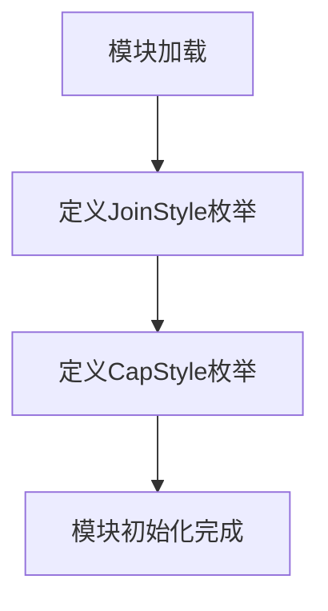
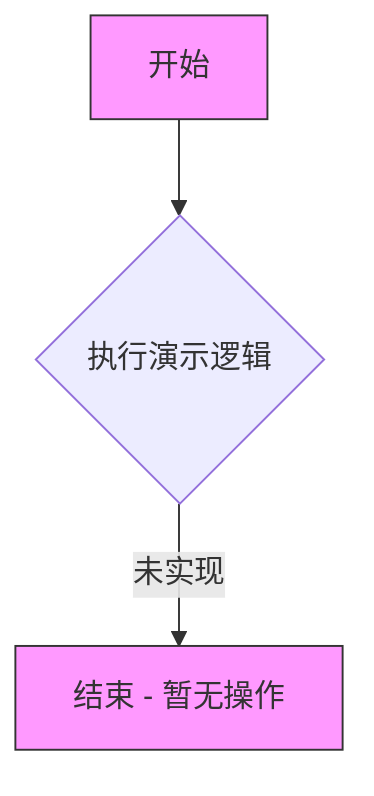
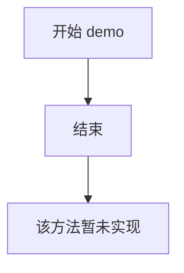

# `matplotlib\lib\matplotlib\_enums.pyi` 详细设计文档

该代码定义了两个用于图形渲染样式的枚举类：JoinStyle（线条连接样式）和CapStyle（线条端点样式），两者都继承自str和Enum基类，可用于绘图库中控制线条的拐角和端点呈现效果。

## 整体流程



## 类结构

```
JoinStyle (str, Enum)
├── miter
├── round
├── bevel
└── demo() [静态方法]
CapStyle (str, Enum)
├── butt
├── projecting
├── round
└── demo() [静态方法]
```

## 全局变量及字段


### `JoinStyle.miter`
    
尖角连接样式

类型：`str`
    


### `JoinStyle.round`
    
圆角连接样式

类型：`str`
    


### `JoinStyle.bevel`
    
斜角连接样式

类型：`str`
    


### `CapStyle.butt`
    
平头端点样式

类型：`str`
    


### `CapStyle.projecting`
    
投影端点样式

类型：`str`
    


### `CapStyle.round`
    
圆头端点样式

类型：`str`
    
    

## 全局函数及方法


### `JoinStyle.demo`

演示方法，用于展示 JoinStyle 枚举类的用法（暂未实现）。

参数：此方法无参数。

返回值：`None`，无返回值。

#### 流程图



#### 带注释源码

```python
@staticmethod
def demo() -> None:
    """
    演示方法，用于展示 JoinStyle 枚举类的用法。
    
    该方法暂未实现，当前仅为方法签名。
    后续可添加展示不同连接样式效果的代码。
    """
    ...  # 暂未实现
```


### `CapStyle.demo()`

演示方法（暂未实现），用于展示 CapStyle 枚举类的用法和效果。

参数：

- 无参数

返回值：`None`，无返回值描述

#### 流程图



#### 带注释源码

```python
@staticmethod
def demo() -> None: ...
"""
演示方法（暂未实现）

该方法为静态方法，用于演示 CapStyle 枚举类的各种样式效果。
当前实现为占位符（...），等待后续功能实现。

参数：
    无

返回值：
    None

用法示例（预期）:
    CapStyle.demo()  # 预期展示 butt, projecting, round 三种线帽样式
"""
```


## 关键组件


这段代码定义了两个字符串枚举类 `JoinStyle` 和 `CapStyle`，用于表示图形渲染中的线条连接样式和端点样式，两者都继承自 `str` 和 `Enum`，并各包含一个静态方法 `demo()` 作为示例方法。

### 文件的整体运行流程

该模块为静态定义文件，不涉及运行时流程。枚举类在导入时自动注册成员，demo() 方法供开发者查看样式示例。

### 类的详细信息

#### JoinStyle 类

- **类字段**
  - `miter` (str): 斜切连接样式
  - `round` (str): 圆弧连接样式
  - `bevel` (str): 斜面连接样式

- **类方法**
  - `demo()`: 无参数，返回 None，用于演示 JoinStyle 的用法

#### CapStyle 类

- **类字段**
  - `butt` (str): 平头端点样式
  - `projecting` (str): 延伸端点样式
  - `round` (str): 圆头端点样式

- **类方法**
  - `demo()`: 无参数，返回 None，用于演示 CapStyle 的用法

### 关键组件信息

### JoinStyle 枚举

表示图形线条的连接方式（交角处如何处理），支持三种样式：miter（尖角）、round（圆角）、bevel（斜角）。

### CapStyle 枚举

表示图形线条的端点样式，支持三种样式：butt（平头）、projecting（方头伸出）、round（圆头）。

### 潜在的技术债务或优化空间

1. **demo() 方法为空实现**：两个枚举类的 demo() 方法目前只有 `...` 占位符，缺乏实际演示代码，无法展示各样式效果
2. **缺乏类型注解增强**：可考虑为枚举成员添加类型注解以提升 IDE 友好度
3. **缺少文档注释**：类和方法缺少详细的文档字符串说明各样式适用场景

### 其它项目

- **设计目标与约束**：通过字符串枚举确保样式值可直接用于字符串拼接场景，继承 str 支持与字符串直接比较
- **错误处理与异常设计**：枚举成员不可变，访问不存在成员会抛出 KeyError
- **外部依赖与接口契约**：依赖 Python 内置 enum 模块，无外部依赖


## 问题及建议


### 已知问题

-   `demo()` 方法为空实现（仅有 `...` 省略号），无实际功能但存在于两个枚举类中，可能造成代码理解困惑
-   枚举类缺少文档字符串（docstring），无法明确其业务用途和使用场景
-   两个枚举类结构高度相似，存在潜在的代码重复问题
-   `demo()` 方法签名不统一（参数列表为空），无法展示不同的演示场景
-   枚举成员缺乏注释说明，无法了解各取值的具体含义（如 `miter`、`bevel` 的应用场景）

### 优化建议

-   若 `demo()` 方法为占位符但未来需要实现，建议添加文档说明其预期功能；若不需要，建议直接删除以保持代码简洁
-   为 `JoinStyle` 和 `CapStyle` 添加类级别文档字符串，说明其业务含义和应用场景
-   考虑提取公共基类或混入类，将 `demo()` 方法统一实现，避免代码重复
-   为每个枚举成员添加注释说明其几何意义（如 join 样式用于折线转折处，cap 样式用于线段端点）
-   可考虑添加枚举值校验或转换方法，增强枚举的健壮性


## 其它


### 1. 设计目标与约束

本代码定义了两个枚举类 JoinStyle 和 CapStyle，用于图形渲染中线条的连接样式和端点样式的标准化枚举。设计目标包括：提供类型安全的样式枚举、兼容字符串比较、支持扩展新的样式类型。约束条件为枚举值必须为字符串类型，需继承 str 和 Enum 以便在需要字符串的场景中直接使用。

### 2. 错误处理与异常设计

当前代码未实现显式的错误处理机制。由于使用 Enum 类，尝试访问不存在的枚举成员时会自动抛出 ValueError。潜在改进建议：添加自定义异常类用于样式验证失败时抛出，参考 Flask 枚举设计可增加枚举值的运行时验证逻辑。

### 3. 数据流与状态机

本模块为静态配置模块，不涉及状态机或复杂数据流。两个枚举类作为只读的配置常量提供者，被图形渲染引擎引用以确定线条绘制样式。数据流向：渲染引擎 → 样式枚举 → 绘图API。

### 4. 外部依赖与接口契约

外部依赖：Python enum 模块（标准库）。接口契约：JoinStyle 和 CapStyle 枚举类均提供字符串枚举值，可直接用于需要字符串参数的绘图API。demo() 方法为占位方法，当前无实际实现。

### 5. 使用场景与集成方式

典型使用场景：在 matplotlib、pygame、pillow 等图形库的线条绘制方法中作为 style 参数传入。集成方式：通过导入 JoinStyle 或 CapStyle，引用如 JoinStyle.miter 或 CapStyle.round 获取对应的字符串值 "miter" 或 "round"。

### 6. 测试策略建议

建议测试内容包括：枚举成员数量验证、枚举值字符串正确性验证、枚举类型一致性验证（str + Enum 继承）、枚举成员可迭代性、字符串与枚举互转功能。

### 7. 版本兼容性考虑

代码仅使用 Python 标准库 enum 模块，Python 3.4+ 支持 Enum，Python 3.6+ 支持 StrEnum（当前代码通过继承 str 和 Enum 实现类似功能）。建议在文档中标注最低 Python 版本要求为 3.4。

### 8. 扩展性设计

当前设计支持通过继承 str 和 Enum 的方式轻松添加新的样式枚举值。扩展建议：为图形库预留自定义样式的接口，考虑使用 @enum.unique 装饰器防止重复枚举值。


    