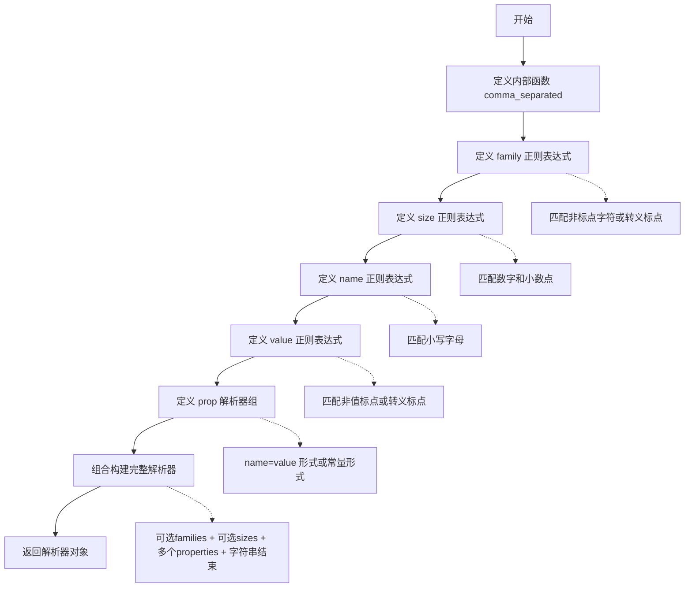
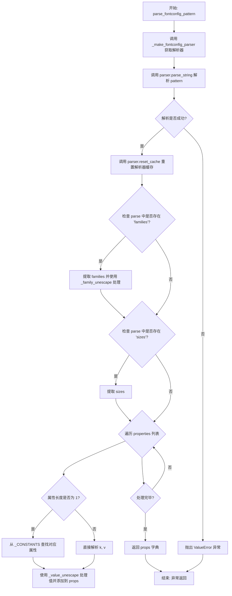
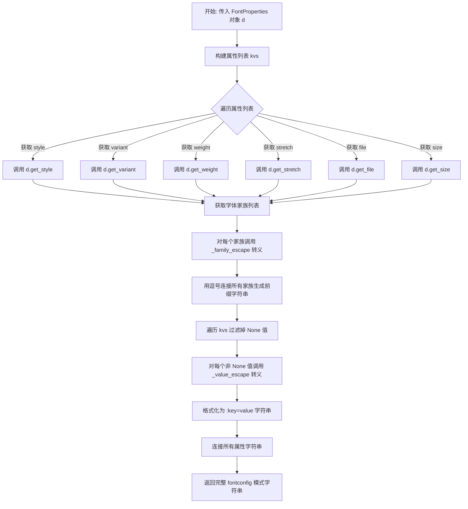

# `matplotlib\lib\matplotlib\_fontconfig_pattern.py` 详细设计文档

该模块用于解析和生成fontconfig字体配置模式字符串，支持将模式字符串解析为字典格式（用于FontProperties对象初始化），以及将FontProperties对象转换回fontconfig模式字符串，包含字体家族、尺寸、样式、变体、粗细、宽度等属性的处理。

## 整体流程

```mermaid
graph TD
    A[开始] --> B{操作类型}
B -- 解析模式 --> C[调用_make_fontconfig_parser获取解析器]
C --> D[parser.parse_string(pattern)]
D --> E{ParseException?}
E -- 是 --> F[抛出ValueError并解释错误]
E -- 否 --> G[提取families属性并转义]
G --> H[提取sizes属性]
H --> I[遍历properties处理常量映射]
I --> J[返回props字典]
B -- 生成模式 --> K[获取style/variant/weight/stretch/file/size属性]
K --> L[处理family属性转义并用逗号连接]
L --> M[遍历属性键值对转义并拼接]
M --> N[返回模式字符串]
J --> O[结束]
N --> O
```

## 类结构

```
fontconfig_pattern 模块
├── 全局常量和变量
│   ├── _CONSTANTS (字体属性常量映射字典)
│   ├── _family_punc (family转义字符)
│   ├── _family_unescape (family反转义函数)
│   ├── _family_escape (family转义函数)
│   ├── _value_punc (value转义字符)
│   ├── _value_unescape (value反转义函数)
│   └── _value_escape (value转义函数)
├── 内部函数
│   └── _make_fontconfig_parser (创建pyparsing解析器)
└── 公共API函数
    ├── parse_fontconfig_pattern (解析模式字符串)
    └── generate_fontconfig_pattern (生成模式字符串)
```

## 全局变量及字段


### `_CONSTANTS`
    
字体常量字典，将字体属性名称（如 thin、bold、italic 等）映射到(属性, 值)元组，用于解析和标准化 fontconfig 模式中的字体属性

类型：`dict`
    


### `_family_punc`
    
字体 family 标点符号集，包含 \-:, 用于正则表达式中匹配和转义字体家族名称中的特殊字符

类型：`str`
    


### `_family_unescape`
    
部分应用函数，用于取消转义字体 family 标点符号，将转义的标点符号还原为原始字符

类型：`functools.partial`
    


### `_family_escape`
    
部分应用函数，用于转义字体 family 标点符号，在生成模式时对特殊字符进行转义

类型：`functools.partial`
    


### `_value_punc`
    
字体值标点符号集，包含 \=_:, 用于正则表达式中匹配和转义字体属性值中的特殊字符

类型：`str`
    


### `_value_unescape`
    
部分应用函数，用于取消转义字体值标点符号，将转义的标点符号还原为原始字符

类型：`functools.partial`
    


### `_value_escape`
    
部分应用函数，用于转义字体值标点符号，在生成模式时对特殊字符进行转义

类型：`functools.partial`
    


    

## 全局函数及方法


### `_make_fontconfig_parser`

该函数是一个使用 pyparsing 库构建的字体配置模式（fontconfig pattern）解析器工厂函数，通过组合多个正则表达式和解析器元素，构建一个完整的语法分析器来解析字体配置字符串。该解析器采用单例模式（通过 @cache 装饰器）确保全局唯一性，避免重复创建解析器的性能开销。

参数：此函数无参数

返回值：`ParserElement`，返回一个配置好的 pyparsing 解析器对象，用于解析 fontconfig 模式的字符串

#### 流程图



#### 带注释源码

```python
@cache  # 装饰器：缓存解析器实例，实现单例模式，避免重复创建解析器
def _make_fontconfig_parser():
    """
    创建并返回一个用于解析 fontconfig 模式的 pyparsing 解析器。
    该解析器采用单例模式，通过 @cache 装饰器缓存实例。
    """
    
    def comma_separated(elem):
        """
        内部函数：将一个解析器元素包装为逗号分隔的列表解析器。
        例如：elem 匹配 "a", 加上 ZeroOrMore 后可匹配 "a,b,c"
        """
        return elem + ZeroOrMore(Suppress(",") + elem)
    
    # 定义 family 正则表达式：匹配字体家族名称
    # 允许包含非标点字符或转义的标点字符（\-:,）
    family = Regex(fr"([^{_family_punc}]|(\\[{_family_punc}]))*")
    
    # 定义 size 正则表达式：匹配字体大小数值
    # 允许格式：整数(10)、小数(10.5)、纯小数(.5)
    size = Regex(r"([0-9]+\.?[0-9]*|\.[0-9]+)")
    
    # 定义 name 正则表达式：匹配属性名（小写字母）
    name = Regex(r"[a-z]+")
    
    # 定义 value 正则表达式：匹配属性值
    # 允许包含非标点字符或转义的标点字符（=_:,）
    value = Regex(fr"([^{_value_punc}]|(\\[{_value_punc}]))*")
    
    # 定义 prop 解析器组：匹配属性配置
    # 两种形式：name=value,value,... 或常量名（如 bold, italic）
    prop = Group((name + Suppress("=") + comma_separated(value)) | one_of(_CONSTANTS))
    
    # 构建完整的 fontconfig 模式解析器
    # 语法结构：[families][-sizes][:properties...]:
    return (
        Optional(comma_separated(family)("families"))      # 可选：字体家族列表
        + Optional("-" + comma_separated(size)("sizes"))    # 可选：字体大小列表
        + ZeroOrMore(":" + prop("properties*"))             # 可选：多个属性
        + StringEnd()                                       # 必须到达字符串结尾
    )
```


### `parse_fontconfig_pattern`

该函数用于解析 fontconfig 模式的字符串表示，并将其转换为可初始化 `FontProperties` 对象的字典格式，支持提取字体家族、尺寸及属性参数。

参数：

- `pattern`：`str`，要解析的 fontconfig 模式字符串

返回值：`dict`，包含解析后的字体属性字典，可用于初始化 `FontProperties` 对象

#### 流程图



#### 带注释源码

```python
@lru_cache  # 使用 LRU 缓存避免重复解析相同的 pattern，提升性能
def parse_fontconfig_pattern(pattern):
    """
    Parse a fontconfig *pattern* into a dict that can initialize a
    `.font_manager.FontProperties` object.
    """
    # 获取单例模式的 fontconfig 解析器（通过 @cache 装饰器缓存）
    parser = _make_fontconfig_parser()
    
    # 尝试解析 pattern 字符串
    try:
        parse = parser.parse_string(pattern)
    except ParseException as err:
        # 解析失败时抛出 ValueError，并附带详细的错误解释
        # explain becomes a plain method on pyparsing 3 (err.explain(0)).
        raise ValueError("\n" + ParseException.explain(err, 0)) from None
    
    # 解析完成后重置解析器内部缓存，释放内存
    parser.reset_cache()
    
    # 初始化结果字典
    props = {}
    
    # 提取字体家族列表（如果存在），使用 _family_unescape 处理转义字符
    if "families" in parse:
        props["family"] = [*map(_family_unescape, parse["families"])]
    
    # 提取字体尺寸列表（如果存在）
    if "sizes" in parse:
        props["size"] = [*parse["sizes"]]
    
    # 遍历所有属性（properties）
    for prop in parse.get("properties", []):
        # 如果属性只有一个元素，说明是常量（如 'bold', 'italic'）
        # 需要从 _CONSTANTS 字典中查找对应的 (key, value) 元组
        if len(prop) == 1:
            prop = _CONSTANTS[prop[0]]
        
        # 解析属性：第一个元素为 key，其余为 value 列表
        k, *v = prop
        
        # 使用 setdefault 确保相同 key 的多个值被合并为列表
        # 使用 _value_unescape 处理每个 value 中的转义字符
        props.setdefault(k, []).extend(map(_value_unescape, v))
    
    # 返回解析后的属性字典
    return props
```


### `generate_fontconfig_pattern`

该函数将 `.FontProperties` 对象转换为 fontconfig 模式字符串，遵循 fontconfig 的格式规范（字体家族在前用逗号分隔，属性在後以冒号键值对形式追加）。

参数：

- `d`：`.FontProperties`，需要进行转换的 FontProperties 对象

返回值：`str`，符合 fontconfig 模式规范的字符串

#### 流程图



#### 带注释源码

```python
def generate_fontconfig_pattern(d):
    """Convert a `.FontProperties` to a fontconfig pattern string."""
    # 构建键值对列表，从 d 对象获取多个属性值
    # 属性包括：style、variant、weight、stretch、file、size
    # 使用动态方法名调用对应的 getter 方法（如 get_style、get_variant 等）
    kvs = [(k, getattr(d, f"get_{k}")())
           for k in ["style", "variant", "weight", "stretch", "file", "size"]]
    
    # Families 单独处理，放在最前面且不带关键字前缀
    # 其他属性（标量值）以 key=value 形式追加，跳过 None 值
    # 1. 先处理字体家族列表，对每个家族调用 _family_escape 进行转义
    # 2. 再处理属性键值对，对值调用 _value_escape 转义并格式化为 :key=value
    # 3. 跳过 None 值以避免生成无效的模式字符串
    return (",".join(_family_escape(f) for f in d.get_family())
            + "".join(f":{k}={_value_escape(str(v))}"
                      for k, v in kvs if v is not None))
```

## 关键组件


### fontconfig 模式解析器

使用 pyparsing 库构建的解析器，用于解析 fontconfig 模式字符串，包含对字体家族、尺寸和属性的支持。

### _CONSTANTS 映射表

定义字体属性常量的字典，将字符串关键字（如 'bold'、'italic'）映射到属性名和值（如 ('weight', 'bold')）。

### 转义与反转义函数

处理字体名称和值中特殊字符的函数，包括 _family_escape、_family_unescape、_value_escape 和 _value_unescape，用于在模式字符串中转义或还原特殊字符。

### parse_fontconfig_pattern 函数

将 fontconfig 模式字符串解析为字典的函数，返回的字典可用于初始化 FontProperties 对象，包含家族、尺寸、样式等属性。

### generate_fontconfig_pattern 函数

将字体属性对象转换为 fontconfig 模式字符串的函数，根据对象属性生成对应的模式表示。


## 问题及建议


### 已知问题

-   **循环依赖设计妥协**：代码注释指出此类本应属于 `matplotlib.font_manager`，为避免循环依赖而置于独立模块，这反映了架构上的设计妥协，增加了代码理解的复杂性。
-   **缓存机制冲突**：`parse_fontconfig_pattern` 使用 `@lru_cache` 装饰器缓存解析结果，但在每次解析后调用 `parser.reset_cache()` 重置解析器内部缓存，这两者之间存在逻辑冲突，可能导致意外行为。
-   **缺乏输入验证**：代码没有对输入参数进行严格的类型检查和边界验证，例如 `generate_fontconfig_pattern` 假设输入对象具有特定方法但未做检查。
-   **正则表达式重复编译**：`partial(re.compile(...).sub, '')` 虽然通过 `partial` 延迟执行，但每次调用时仍会重新创建编译对象，可进一步优化为模块级常量。
-   **魔法字符串与硬编码**：属性名称（如 "style", "variant", "weight" 等）在 `generate_fontconfig_pattern` 中硬编码，容易导致拼写错误且难以维护。
-   **错误处理信息不完整**：捕获 `ParseException` 后仅转换为 `ValueError`，丢失了原始解析器的部分上下文信息。
-   **缺失类型注解**：整个模块没有任何类型提示（Type Hints），降低了代码的可读性和静态分析能力。

### 优化建议

-   **重构缓存策略**：移除 `parser.reset_cache()` 调用或重新设计缓存逻辑，考虑将解析器本身也纳入缓存管理而非手动重置。
-   **提取配置常量**：将 `generate_fontconfig_pattern` 中的属性名列表提取为模块级常量或枚举，提高可维护性。
-   **添加类型注解**：为所有函数参数和返回值添加类型提示，使用 `typing` 模块的 `Dict`, `List`, `Optional` 等。
-   **优化正则表达式**：将正则表达式编译结果存储为模块级变量，避免重复创建开销。
-   **增强错误处理**：提供更详细的错误信息，包括输入模式的部分解析结果，帮助开发者定位问题。
-   **添加输入验证**：在 `generate_fontconfig_pattern` 中添加参数类型检查，确保输入对象具有必要的方法。
-   **考虑性能监控**：对于 `_CONSTANTS` 字典的查找操作，可考虑使用 `__slots__` 或转换为不可变映射结构以提升查找性能。

## 其它


### 设计目标与约束

本模块的核心设计目标是提供fontconfig模式字符串与Python字典之间的双向转换功能，使得matplotlib能够解析用户在配置文件（matplotlibrc）中指定的字体属性，并能够将FontProperties对象序列化回fontconfig模式字符串。约束条件包括：1）必须兼容freedesktop.org定义的fontconfig模式语法；2）解析器需作为单例使用以避免重复初始化开销；3）解析和生成函数需支持缓存以提升性能；4）模块不能与matplotlib.font_manager产生循环依赖。

### 错误处理与异常设计

本模块主要处理两类错误：1）解析错误，当输入的fontconfig模式字符串不符合语法规范时，pyparsing会抛出ParseException，模块将其包装为ValueError并添加详细解释信息（利用ParseException.explain方法）；2）常量键错误，当属性名不在_CONSTANTS字典中时会导致KeyError，但当前实现通过遍历parse.get("properties", [])并使用_CONSTANTS[prop[0]]访问，若prop[0]不存在会抛出KeyError，建议在属性解析循环中添加异常处理以提供更友好的错误信息。模块使用"raise ValueError(...) from None"模式抑制原始异常链，避免污染错误堆栈。

### 数据流与状态机

解析流程：输入字符串 → _make_fontconfig_parser()获取解析器 → parser.parse_string()执行解析 → 检查families/sizes/properties结果 → 应用_unescape函数处理转义字符 → 构建props字典返回。生成流程：输入FontProperties对象 → 获取style/variant/weight/stretch/file/size属性 → 对family列表应用_family_escape处理 → 对其他属性应用_value_escape处理 → 拼接为最终字符串。无复杂状态机，仅解析过程有状态：初始态 → 解析中（combinator执行） → 完成态。

### 外部依赖与接口契约

本模块依赖以下外部包：1）pyparsing（Group, Optional, ParseException, Regex, StringEnd, Suppress, ZeroOrMore, one_of），用于构建解析器；2）functools（cache, lru_cache, partial），用于性能优化；3）re模块，用于正则表达式转义处理。公共接口包括：parse_fontconfig_pattern(pattern: str) -> dict，接受fontconfig模式字符串返回属性字典；generate_fontconfig_pattern(d) -> str，接受FontProperties对象返回模式字符串。隐含约束：输入的d对象必须具有get_family()方法以及get_style/get_variant/get_weight/get_stretch/get_file/get_size方法。

### 性能考虑

模块采用三级缓存策略：1）_make_fontconfig_parser()使用@cache装饰器确保解析器实例全局单例；2）parse_fontconfig_pattern()使用@lru_cache装饰器缓存解析结果，缓存大小默认128；3）parser.reset_cache()在每次解析后重置解析器内部缓存以释放内存。性能瓶颈在于正则表达式编译和字符串转义处理，通过预编译正则表达式（_family_unescape, _family_escape, _value_unescape, _value_escape）并使用partial函数绑定参数来优化。_CONSTANTS字典在模块加载时创建，避免运行时查询开销。

### 安全性考虑

本模块处理的输入为用户配置的字体模式字符串，理论上不存在代码执行风险。安全考量包括：1）正则表达式使用f-string动态构建字符类（_family_punc, _value_punc），需确保这些字符不包含特殊正则元字符；2）输入字符串长度无限制，但lru_cache可防止内存耗尽；3）_CONSTANTS字典仅包含预定义的安全值，不接受用户输入作为键。generate_fontconfig_pattern函数对输入对象属性值的str()转换需确保不会触发异常。

### 测试策略

建议测试覆盖：1）基本解析功能，测试各种合法fontconfig模式字符串的解析结果；2）转义字符处理，测试包含\-:,等特殊字符的家族名；3）常量映射，测试thin/bold/italic等关键字转换为正确属性；4）生成功能，测试FontProperties对象转换为模式字符串的双向一致性；5）边界条件，测试空字符串、空家族列表、无属性等情形；6）异常处理，测试非法模式字符串触发ValueError；7）性能测试，验证缓存机制有效降低重复解析开销。

### 使用示例

```python
# 解析fontconfig模式
props = parse_fontconfig_pattern("Times New Roman:style=bold:size=12")
# 结果: {'family': ['Times New Roman'], 'style': ['bold'], 'size': ['12']}

# 生成fontconfig模式
from matplotlib.font_manager import FontProperties
fp = FontProperties(family='Arial', weight='bold', style='italic')
pattern = generate_fontconfig_pattern(fp)
# 结果类似: "Arial:style=italic:weight=bold"
```

### 版本历史和变更记录

当前实现为matplotlib字体管理系统的组成部分，位于matplotlib.font_manager模块的辅助文件中。根据代码注释，该设计最初是为了避免与matplotlib.rcsetup的循环依赖而从font_manager中分离出来。pyparsing从2.x升级到3.x时，ParseException.explain变为普通方法，代码已作兼容性处理（err.explain(0)）。

### 参考文献

1. Fontconfig用户文档：https://www.freedesktop.org/software/fontconfig/fontconfig-user.html
2. pyparsing库文档：https://pyparsing-docs.readthedocs.io/
3. matplotlib字体管理系统设计文档

    