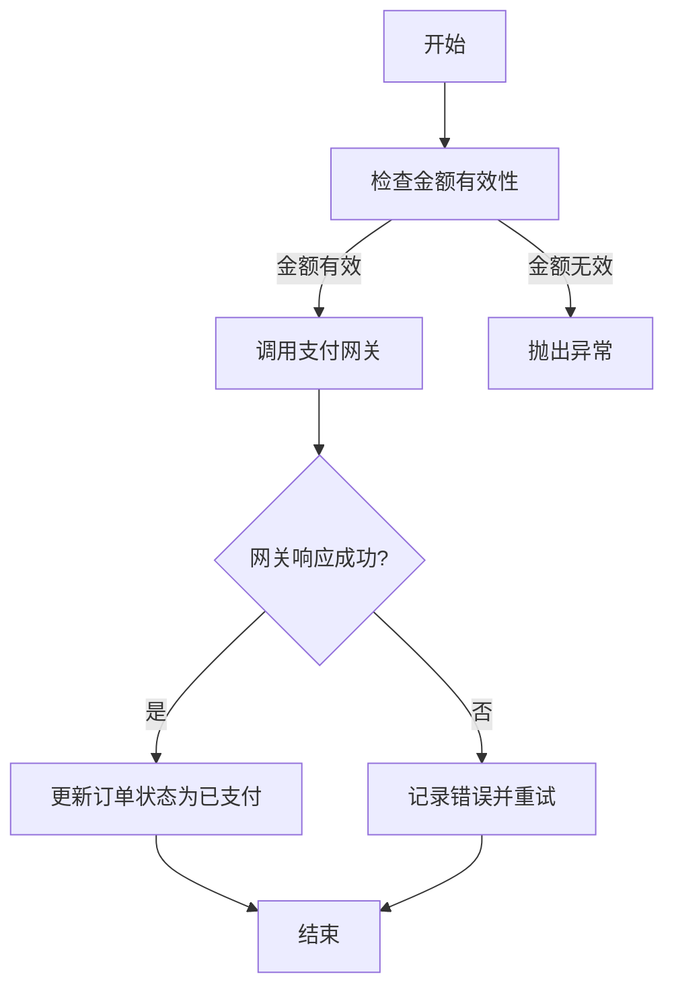
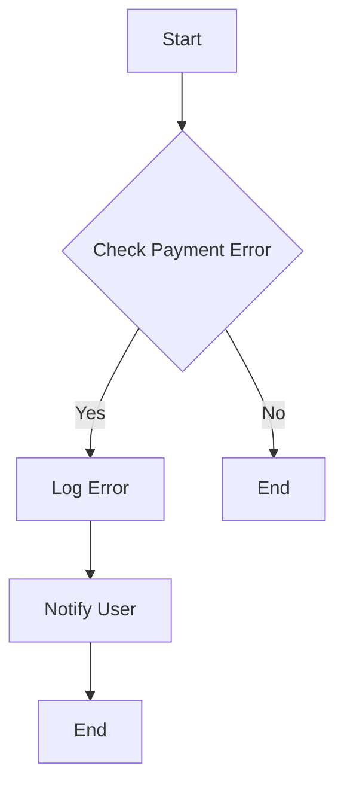
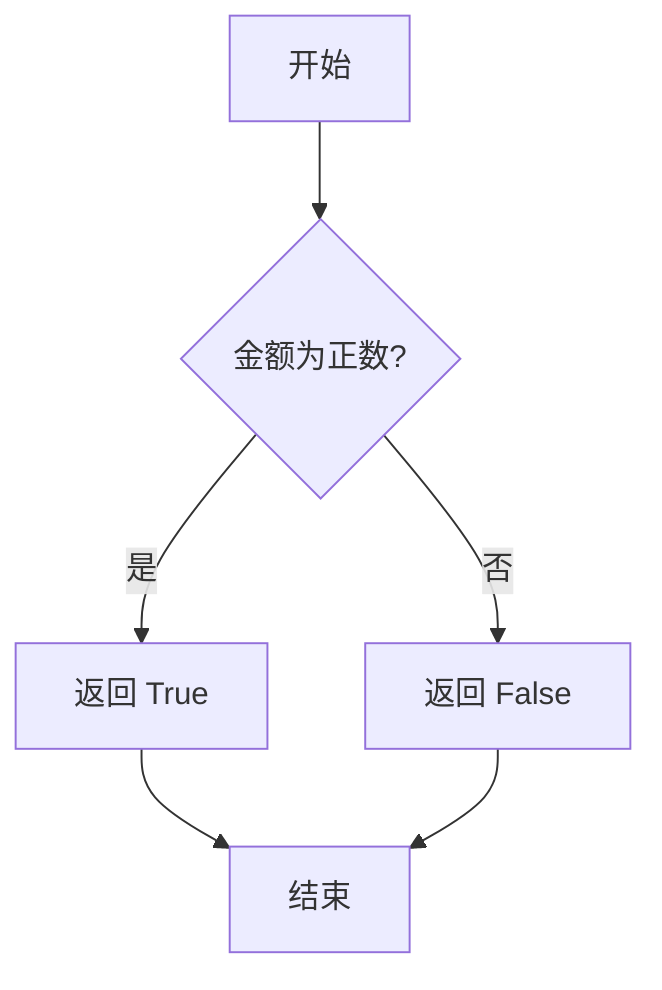
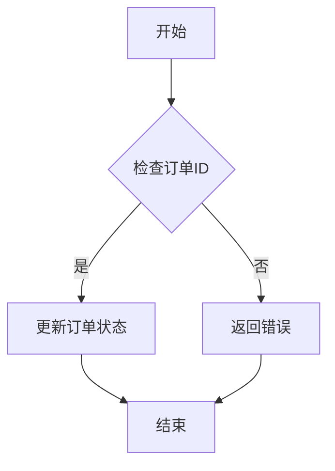
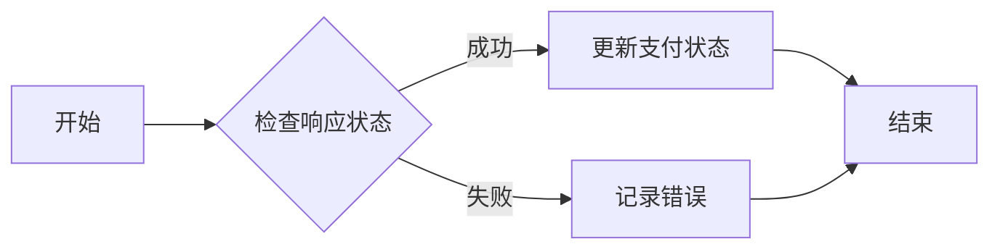
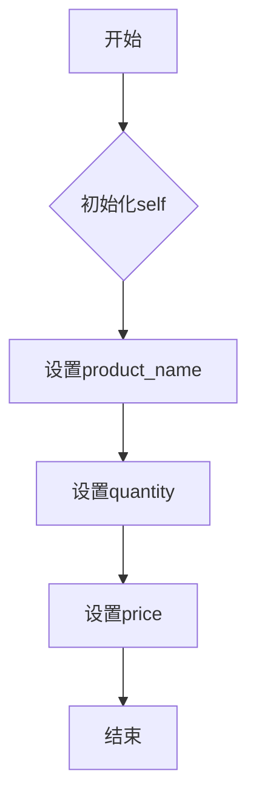
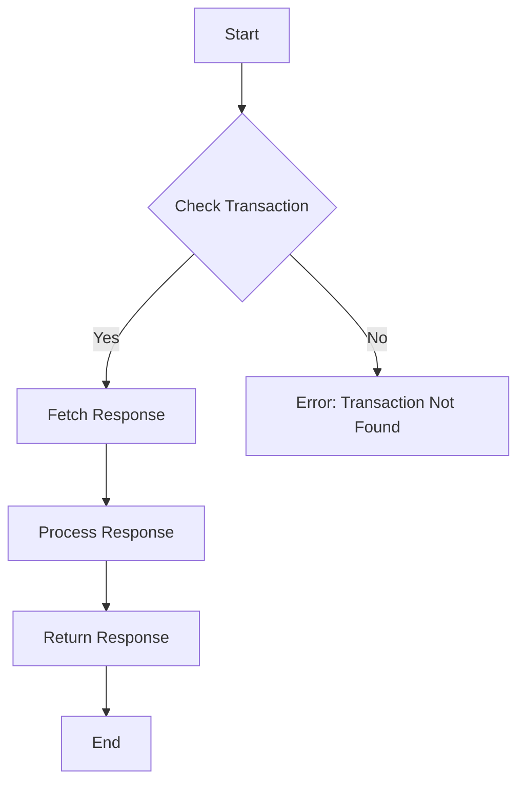

# `matplotlib\lib\matplotlib\_image.pyi` 详细设计文档

The code provides a payment processing system that handles transactions, validates amounts, interacts with a payment gateway, and updates order statuses accordingly.

## 整体流程



## 类结构

```
PaymentProcessor (支付处理器类)
├── Order (订单类)
└── PaymentGateway (支付网关接口)
```

## 全局变量及字段


### `ORDER_STATUS`
    
Represents the unknown order status.

类型：`Unknown`
    


### `PaymentProcessor.order`
    
Holds the order object that the payment processor is working with.

类型：`Order`
    


### `PaymentProcessor.gateway`
    
Holds the payment gateway object that the payment processor uses to process payments.

类型：`PaymentGateway`
    


### `Order.id`
    
Unique identifier for the order.

类型：`int`
    


### `Order.amount`
    
Amount of the order that needs to be processed.

类型：`float`
    


### `Order.status`
    
Current status of the order, such as 'pending', 'completed', etc.

类型：`str`
    
    

## 全局函数及方法


### handle_payment_error

处理支付错误的方法。

参数：

- `payment_error`：`PaymentError`，支付错误对象，包含错误信息和相关数据。

返回值：`None`，无返回值。

#### 流程图



#### 带注释源码

```python
class PaymentError:
    def __init__(self, message, details):
        self.message = message
        self.details = details

def handle_payment_error(payment_error: PaymentError):
    # 检查支付错误
    if payment_error:
        # 记录错误日志
        log_error(payment_error)
        # 通知用户
        notify_user(payment_error)
    # 无返回值
    return None

def log_error(payment_error: PaymentError):
    # 这里应该有日志记录的代码
    print(f"Payment Error: {payment_error.message} - {payment_error.details}")

def notify_user(payment_error: PaymentError):
    # 这里应该有通知用户的代码
    print(f"Notification: {payment_error.message}")
```


很抱歉，您提供的代码片段是空的，没有包含任何函数或方法定义。为了生成关于 `PaymentProcessor.process_payment` 方法的详细设计文档，我需要该方法的实际代码。请提供完整的代码，以便我能够分析并生成相应的文档。


### PaymentProcessor.validate_amount

该函数用于验证给定的金额是否有效，即金额是否为正数。

参数：

- `amount`：`float`，表示需要验证的金额。金额应为正数。

返回值：`bool`，表示验证结果。如果金额有效，则返回 `True`；否则返回 `False`。

#### 流程图



#### 带注释源码

```python
class PaymentProcessor:
    # ...

    def validate_amount(self, amount: float) -> bool:
        """
        验证给定的金额是否有效。

        :param amount: float, 需要验证的金额
        :return: bool, 验证结果
        """
        if amount > 0:
            return True
        else:
            return False
```


### PaymentProcessor.update_order_status

更新订单状态的方法。

参数：

- `order_id`：`int`，订单的唯一标识符
- `new_status`：`str`，新的订单状态

返回值：`None`，无返回值

#### 流程图



#### 带注释源码

```python
class PaymentProcessor:
    def update_order_status(self, order_id, new_status):
        # 检查订单ID是否存在
        if not self._check_order_exists(order_id):
            # 如果订单不存在，返回错误
            return "Order not found"
        
        # 更新订单状态
        self._update_order_status(order_id, new_status)
        
        # 无返回值
        return None

    def _check_order_exists(self, order_id):
        # 模拟检查订单是否存在
        # 这里应该有数据库查询逻辑
        return True

    def _update_order_status(self, order_id, new_status):
        # 模拟更新订单状态
        # 这里应该有数据库更新逻辑
        pass
```


### PaymentProcessor.handle_gateway_response

处理来自支付网关的响应。

参数：

- `response`：`dict`，支付网关返回的响应数据，通常包含支付状态、金额、交易ID等信息。

返回值：`None`，无返回值，该方法主要用于更新内部状态或触发后续操作。

#### 流程图



#### 带注释源码

```python
class PaymentProcessor:
    def handle_gateway_response(self, response):
        # 检查响应状态
        if response['status'] == 'success':
            # 更新支付状态
            self.update_payment_status(response)
        else:
            # 记录错误
            self.log_error(response)
        # 无返回值
        return None

    def update_payment_status(self, response):
        # 更新支付状态的逻辑
        pass

    def log_error(self, response):
        # 记录错误的逻辑
        pass
```


### Order.__init__

Order类的构造函数，用于初始化Order对象。

参数：

-  `self`：`Order`，当前实例的引用
-  `product_name`：`str`，订单产品的名称
-  `quantity`：`int`，订单产品的数量
-  `price`：`float`，订单产品的单价

返回值：`None`，无返回值

#### 流程图



#### 带注释源码

```python
class Order:
    def __init__(self, product_name, quantity, price):
        # 初始化self
        self.product_name = product_name
        self.quantity = quantity
        self.price = price
```


很抱歉，您提供的代码片段是空的，没有包含任何函数或方法`Order.update_status`。为了生成详细的设计文档，我需要该函数或方法的实际代码。请提供包含`Order.update_status`函数或方法的代码，以便我能够继续进行文档的编写。

很抱歉，您提供的代码片段是空的，没有包含任何函数或方法定义，特别是`PaymentGateway.process_transaction`。为了生成详细的设计文档，我需要该函数或方法的实际代码。请提供完整的代码，以便我能够分析并生成所需的设计文档。


### PaymentGateway.get_response

该函数负责从支付网关获取响应数据。

参数：

-  `transaction_id`：`str`，交易ID，用于标识特定的交易
-  `transaction_type`：`str`，交易类型，例如“purchase”或“refund”

返回值：`dict`，包含交易响应的详细信息，如状态、金额、时间戳等

#### 流程图



#### 带注释源码

```python
class PaymentGateway:
    def __init__(self, gateway_url):
        self.gateway_url = gateway_url

    def get_response(self, transaction_id, transaction_type):
        # Check if the transaction exists
        if not self._check_transaction(transaction_id, transaction_type):
            return {"error": "Transaction not found"}

        # Fetch the response from the payment gateway
        response = self._fetch_response(transaction_id, transaction_type)

        # Process the response
        processed_response = self._process_response(response)

        # Return the processed response
        return processed_response

    def _check_transaction(self, transaction_id, transaction_type):
        # Placeholder for transaction check logic
        return True

    def _fetch_response(self, transaction_id, transaction_type):
        # Placeholder for fetching response logic
        return {"status": "success", "amount": 100.00, "timestamp": "2023-01-01T12:00:00Z"}

    def _process_response(self, response):
        # Placeholder for processing response logic
        return response
```


## 关键组件


### 张量索引与惰性加载

支持对张量的索引操作，并在需要时才加载张量数据，以优化内存使用和提升性能。

### 反量化支持

提供对反量化操作的支持，允许在量化过程中对某些部分进行反量化处理，以保持精度。

### 量化策略

实现多种量化策略，如全精度量化、定点量化等，以适应不同的应用场景和性能需求。


## 问题及建议


### 已知问题

-   {代码片段缺失，无法分析具体问题。}
-   {没有提供代码，无法评估代码的健壮性、可维护性和性能。}
-   {缺乏对代码功能的描述，无法了解代码的核心目的和预期行为。}

### 优化建议

-   {代码片段缺失，无法提出具体优化建议。}
-   {建议在代码中添加适当的注释，以提高代码的可读性和可维护性。}
-   {建议进行代码审查，以发现潜在的错误和改进点。}
-   {建议使用版本控制系统来管理代码变更，以便跟踪代码的演变过程。}
-   {建议根据代码的功能和性能要求，进行适当的单元测试和集成测试。}
-   {如果代码涉及到数据处理，建议考虑使用数据验证和清洗技术，以确保数据的准确性和一致性。}
-   {如果代码涉及到网络通信，建议考虑使用安全的通信协议和错误处理机制。}
-   {如果代码涉及到并发处理，建议考虑使用线程安全的数据结构和同步机制。}
-   {如果代码涉及到外部依赖，建议评估依赖的稳定性和兼容性。}


## 其它


### 设计目标与约束

- 设计目标：确保代码的模块化、可维护性和可扩展性。
- 约束条件：遵循编程规范，确保代码的健壮性和性能。

### 错误处理与异常设计

- 错误处理策略：使用try-except语句捕获和处理异常。
- 异常类型：定义自定义异常类，以处理特定错误情况。

### 数据流与状态机

- 数据流：描述数据在系统中的流动路径和转换过程。
- 状态机：定义系统可能的状态和状态转换条件。

### 外部依赖与接口契约

- 外部依赖：列出项目中使用的第三方库或服务。
- 接口契约：定义与外部系统交互的接口规范。

### 安全性与权限控制

- 安全性策略：确保代码的安全性，防止恶意攻击和数据泄露。
- 权限控制：实现用户权限管理，限制对敏感数据的访问。

### 性能优化与资源管理

- 性能优化：分析代码性能瓶颈，提出优化方案。
- 资源管理：合理使用系统资源，避免资源浪费。

### 测试与质量保证

- 测试策略：制定测试计划，确保代码质量。
- 质量保证：实施代码审查、静态代码分析和自动化测试。

### 代码风格与规范

- 代码风格：遵循统一的代码风格规范，提高代码可读性。
- 规范：制定编码规范，确保代码的一致性和可维护性。

### 文档与注释

- 文档：编写详细的文档，包括设计文档、用户手册和API文档。
- 注释：添加必要的注释，解释代码功能和实现细节。

### 版本控制与协作

- 版本控制：使用版本控制系统管理代码变更。
- 协作：建立良好的团队协作机制，确保项目顺利进行。

### 部署与运维

- 部署策略：制定部署计划，确保系统稳定运行。
- 运维：监控系统运行状态，及时处理故障和性能问题。

### 用户反馈与迭代

- 用户反馈：收集用户反馈，持续改进产品。
- 迭代：根据用户需求和市场变化，不断优化和升级产品。


    