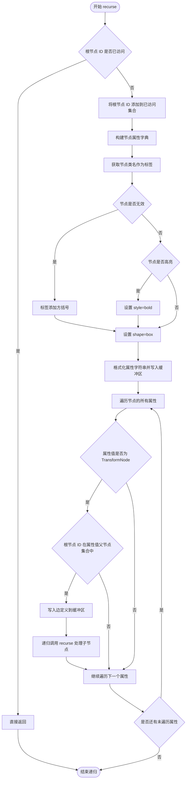

# `matplotlib\lib\matplotlib\_internal_utils.py` 详细设计文档

这是一个matplotlib内部的调试工具模块，提供graphviz_dump_transform函数用于生成transform树的可视化图形表示，帮助开发者调试和理解matplotlib中transform对象的层次结构。

## 整体流程

```mermaid
graph TD
    A[开始 graphviz_dump_transform] --> B{highlight参数为None?}
    B -- 是 --> C[highlight = [transform]]
    B -- 否 --> D[使用传入的highlight列表]
    C --> E[初始化seen = set()创建StringIO缓冲区]
    D --> E
    E --> F[写入 'digraph G { 到缓冲区]
    F --> G[调用recurse函数]
    G --> H{节点ID是否在seen中?}
    H -- 是 --> I[返回，不处理]
    H -- 否 --> J[将节点ID加入seen]
    J --> K[构建节点属性label, style, shape]
    K --> L{root._invalid为True?}
    L -- 是 --> M[label添加方括号]
    L -- 否 --> N[保持label不变]
    M --> O{root在highlight列表中?}
    N --> O
    O -- 是 --> P[添加style=bold属性]
    O -- 否 --> Q[不添加高亮属性]
    P --> R[写入节点到缓冲区]
    Q --> R
    R --> S[遍历root的所有属性vars(root)]
    S --> T{属性值是TransformNode?}
    T -- 是 --> U{val._parents包含root ID?}
    U -- 是 --> V[写入边到缓冲区]
    V --> W[递归调用recurse处理val]
    U -- 否 --> X[继续下一个属性]
    T -- 否 --> X
    W --> X
    X{还有更多属性?}
    X -- 是 --> S
    X -- 否 --> Y[写入 '}' 关闭图]
    Y --> Z[subprocess.run调用dot命令生成图形]
    Z --> AA[结束]
```

## 类结构

```
无类定义
仅有模块级函数graphviz_dump_transform
其中包含嵌套函数recurse用于递归遍历
```

## 全局变量及字段


### `seen`
    
用于记录已访问的transform节点ID，防止重复处理

类型：`set`
    


### `buf`
    
用于构建Graphviz DOT语言的输出内容

类型：`StringIO`
    


### `props`
    
存储节点的Graphviz属性如label、style、shape

类型：`dict`
    


### `label`
    
节点的显示名称，格式为'ClassName'或'[ClassName]'

类型：`str`
    


### `root`
    
当前递归处理的transform节点

类型：`Transform`
    


### `val`
    
root的属性值，用于检查是否为TransformNode

类型：`任意类型`
    


    

## 全局函数及方法


### `graphviz_dump_transform`

该函数用于生成matplotlib中transform树的可视化图形，通过调用Graphviz的dot程序将transform对象及其层级关系导出为图像文件（如PNG、SVG等），支持高亮显示指定的transform节点。

参数：

- `transform`：`~matplotlib.transform.Transform`，要可视化的根transform对象
- `dest`：`str`，输出文件名，扩展名决定了输出格式（如png、svg、dot等）
- `highlight`：`list of ~matplotlib.transform.Transform` 或 `None`，需要以粗体高亮显示的transform列表，默认为None即高亮根节点

返回值：`None`，该函数通过副作用将图形写入指定文件，不返回任何值

#### 流程图

```mermaid
flowchart TD
    A[开始 graphviz_dump_transform] --> B{highlight是否为None}
    B -->|是| C[highlight = [transform]]
    B -->|否| D[保持highlight原值]
    C --> E[初始化seen集合为空]
    D --> E
    E --> F[创建StringIO缓冲区]
    F --> G[写入digraph G头部]
    G --> H[调用recurse函数]
    H --> I[写入digraph G尾部]
    I --> J[subprocess调用dot命令生成图形]
    J --> K[结束]
    
    subgraph recurse函数
    L[recurse被调用] --> M{id(root)在seen中?}
    M -->|是| N[直接返回]
    M -->|否| O[将id加入seen]
    O --> P[构建节点属性]
    P --> Q{root._invalid?}
    Q -->|是| R[label加中括号]
    Q -->|否| S[label保持原样]
    R --> T
    S --> T{root在highlight中?}
    T -->|是| U[添加style=bold]
    T -->|否| V[不添加style]
    U --> W
    V --> W[写入节点到缓冲区]
    W --> X[遍历root的所有属性]
    X --> Y{属性值是TransformNode?}
    Y -->|否| Z[继续遍历]
    Y -->|是| AA{root在val._parents中?}
    AA -->|否| Z
    AA -->|是| AB[写入边到缓冲区]
    AB --> AC[递归调用recurse]
    AC --> Z
    Z --> AD{还有更多属性?}
    AD -->|是| X
    AD -->|否| AE[返回]
    end
```

#### 带注释源码

```python
def graphviz_dump_transform(transform, dest, *, highlight=None):
    """
    生成transform树的可视化图形表示。
    
    该函数使用Graphviz的dot程序将matplotlib的transform对象及其
    层级关系渲染为图像。支持多种输出格式（png、svg、dot等），
    并可通过highlight参数高亮特定的transform节点。
    
    Parameters
    ----------
    transform : `~matplotlib.transform.Transform`
        要表示的根transform对象
    dest : str
        输出文件名，扩展名决定输出格式
    highlight : list of `~matplotlib.transform.Transform` or None
        需要高亮显示的transform列表，None时仅高亮根节点
    """
    
    # 默认高亮根节点transform
    if highlight is None:
        highlight = [transform]
    
    # 用于跟踪已访问的节点，避免重复处理
    seen = set()

    def recurse(root, buf):
        """
        递归遍历transform树并生成DOT格式的节点和边。
        
        Parameters
        ----------
        root : TransformNode
            当前遍历的根节点
        buf : StringIO
            用于存储DOT格式输出的缓冲区
        """
        # 如果节点已处理过，直接返回避免循环
        if id(root) in seen:
            return
        
        # 标记节点为已处理
        seen.add(id(root))
        
        # 构建节点属性字典
        props = {}
        
        # 获取节点类型名作为标签
        label = type(root).__name__
        
        # 如果节点无效（_invalid为True），在标签上加中括号标记
        if root._invalid:
            label = f'[{label}]'
        
        # 如果节点在highlight列表中，设置粗体样式
        if root in highlight:
            props['style'] = 'bold'
        
        # 设置节点形状为box
        props['shape'] = 'box'
        
        # 设置节点标签
        props['label'] = '"%s"' % label
        
        # 将属性字典转换为DOT格式的字符串
        props = ' '.join(map('{0[0]}={0[1]}'.format, props.items()))
        
        # 写入节点定义到缓冲区
        buf.write(f'{id(root)} [{props}];\n')
        
        # 遍历root对象的所有属性
        for key, val in vars(root).items():
            # 检查属性值是否为TransformNode类型
            if isinstance(val, TransformNode):
                # 检查是否存在父子关系（root是val的父节点）
                if id(root) in val._parents:
                    # 写入边定义（从root指向val）
                    buf.write(f'"{id(root)}" -> "{id(val)}" '
                              f'[label="{key}", fontsize=10];\n')
                    # 递归处理子节点
                    recurse(val, buf)

    # 创建字符串缓冲区
    buf = StringIO()
    
    # 写入DOT文件头部，声明为有向图
    buf.write('digraph G {\n')
    
    # 从根节点开始递归遍历
    recurse(transform, buf)
    
    # 写入DOT文件尾部
    buf.write('}\n')
    
    # 调用subprocess执行dot命令生成图形
    # -T指定输出格式，从文件扩展名提取
    # -o指定输出文件
    subprocess.run(
        ['dot', '-T', Path(dest).suffix[1:], '-o', dest],
        input=buf.getvalue().encode('utf-8'), check=True)
```

---

### 关键组件信息

| 组件名称 | 描述 |
|---------|------|
| `StringIO` | 内存字符串缓冲区，用于暂存DOT格式的图形定义 |
| `subprocess.run` | 执行外部Graphviz的dot程序进行图形渲染 |
| `TransformNode` | matplotlib中所有transform的基类，用于类型检查和关系判断 |
| `recurse` 内部函数 | 递归遍历transform树的核心逻辑，生成DOT节点和边 |

---

### 潜在的技术债务与优化空间

1. **缺少错误处理**：subprocess.run未捕获异常，若dot命令不存在或执行失败会导致程序崩溃
2. **硬编码的节点样式**：节点形状、字体大小等样式硬编码在函数中，缺乏灵活性
3. **id()作为唯一标识**：使用Python对象的id()作为节点标识，在跨进程或持久化场景下不可靠
4. **属性遍历方式**：使用`vars(root)`遍历所有属性，可能包含非transform的辅助属性，效率待优化
5. **缺乏返回值**：函数无返回值，调用者无法获知生成结果或错误信息
6. **依赖外部工具**：强依赖graphviz的dot命令，未安装时会失败，缺乏优雅的降级策略

---

### 其它项目

#### 设计目标与约束
- **目标**：提供matplotlib transform树的可视化调试能力
- **约束**：依赖外部工具graphviz，必须在系统PATH中可用

#### 错误处理与异常设计
- 使用`check=True`参数让subprocess在dot命令失败时抛出`CalledProcessError`
- 未处理`FileNotFoundError`（dot命令不存在）和`subprocess.CalledProcessError`（dot执行失败）
- 建议增加异常捕获和友好的错误提示

#### 数据流与状态机
- **输入**：Transform对象树 + 输出路径 + 高亮列表
- **处理**：递归遍历树结构，转换为DOT格式描述
- **输出**：通过dot渲染的图像文件

#### 外部依赖与接口契约
- **必需依赖**：graphviz可执行文件（dot命令）
- **输入接口**：matplotlib Transform对象
- **输出接口**：文件系统（生成图形文件）
- **副作用**：创建/覆盖目标文件


### `graphviz_dump_transform.recurse`

这是一个嵌套递归函数，用于遍历 transform 树并将每个节点转换为 DOT 语言格式，生成图形的节点和边的定义。它从根节点开始递归访问所有子节点，将转换树的层次结构以 Graphviz 可识别的形式输出到 StringIO 缓冲区中。

参数：

- `root`：`TransformNode`，当前递归遍历的转换树节点
- `buf`：`StringIO`，用于写入 DOT 语言节点和边定义的缓冲区对象

返回值：`None`，无返回值，直接修改 buf 参数的内容

#### 流程图



#### 带注释源码

```python
def recurse(root, buf):
    """
    递归遍历 transform 树并生成 DOT 语言表示的嵌套函数。
    
    Parameters
    ----------
    root : TransformNode
        当前递归访问的转换树节点。
    buf : StringIO
        用于写入 DOT 语言节点和边定义的缓冲区。
    """
    # 检查该节点是否已经访问过，防止循环引用导致无限递归
    # seen 是外层函数 graphviz_dump_transform 中的闭包变量
    if id(root) in seen:
        return
    # 将当前节点 ID 添加到已访问集合
    seen.add(id(root))
    
    # 初始化节点属性字典
    props = {}
    # 获取节点类型名称作为标签
    label = type(root).__name__
    # 如果节点标记为无效，在标签两边加上方括号
    if root._invalid:
        label = f'[{label}]'
    # 如果节点在 highlight 列表中，设置粗体样式
    if root in highlight:
        props['style'] = 'bold'
    # 设置节点形状为矩形
    props['shape'] = 'box'
    # 设置节点标签
    props['label'] = '"%s"' % label
    
    # 将属性字典格式化为 DOT 语言格式，如 "key=value key=value"
    props = ' '.join(map('{0[0]}={0[1]}'.format, props.items()))
    # 写入节点定义，如 "1402345678 [shape=box, label=\"Transform\"];\n"
    buf.write(f'{id(root)} [{props}];\n')
    
    # 遍历当前节点的所有属性
    for key, val in vars(root).items():
        # 检查属性值是否为 TransformNode 类型
        if isinstance(val, TransformNode):
            # 检查当前根节点是否在属性值的父节点集合中
            # 只有建立了父子关系的节点才需要绘制边
            if id(root) in val._parents:
                # 写入有向边定义，边的标签为属性名
                buf.write(f'"{id(root)}" -> "{id(val)}" '
                          f'[label="{key}", fontsize=10];\n')
                # 递归遍历子节点
                recurse(val, buf)
```

## 关键组件


### graphviz_dump_transform 函数

用于生成matplotlib transform树的可视化图形表示，调用graphviz的dot程序输出为png、svg等格式。

### recurse 内部函数

递归遍历transform树结构，收集节点信息并生成DOT语言的边和节点描述，支持检测循环引用和标记高亮节点。

### StringIO 缓冲区

使用StringIO构建DOT格式的图形描述文本，作为subprocess的输入数据。

### subprocess.run 调用

通过子进程调用graphviz的dot程序，将DOT格式数据转换为目标图形格式（png/svg等）。

### TransformNode 类型检查

代码中使用isinstance检查TransformNode类型，用于识别transform树中的子节点。


## 问题及建议


### 已知问题

- 递归遍历时使用 `vars(root)` 会获取所有属性，包括非变换节点的非相关属性，可能导致意外遍历
- `_parents` 属性访问逻辑 `id(root) in val._parents` 存在潜在错误，应该是 `id(val) in root._parents`
- 缺少对外部依赖 `graphviz` 程序的可用性检查，如果 `dot` 命令不存在会抛出难以理解的错误
- `subprocess.run` 使用 `check=True` 但未捕获 `subprocess.CalledProcessError`，错误信息不友好
- 完全缺少类型注解，影响代码可维护性和 IDE 支持
- 递归深度没有限制，可能在深层变换树情况下导致栈溢出

### 优化建议

- 添加类型注解（`transform: Transform`, `dest: str`, `highlight: list[Transform] | None`）
- 在调用 `subprocess.run` 前检查 `dot` 命令是否可用，提供友好的缺失依赖提示
- 使用 `try/except` 包装 `subprocess.run` 调用，捕获并转换异常信息
- 使用 `os.path.exists` 或类似方式在写入前验证目标路径的可写性
- 考虑限制递归深度或添加最大深度参数防止栈溢出
- 将 `recurse` 函数提取为模块级函数或使用迭代方式替代递归，提高性能
- 考虑使用 `pathlib.Path` 的 `suffix` 属性替代字符串切片 `Path(dest).suffix[1:]`

## 其它


### 设计目标与约束

本模块的设计目标是提供一个内部调试工具，用于可视化和分析matplotlib中Transform对象的树形结构。约束条件包括：1) 仅供内部调试使用，不保证API稳定性；2) 依赖外部程序graphviz的dot命令；3) 输出格式由目标文件的扩展名决定。

### 外部依赖与接口契约

**外部依赖：**
- `graphviz` 程序：必须安装在系统中，用于将DOT格式转换为图像
- `matplotlib.transforms.TransformNode`：用于检查transform节点的父子关系
- Python标准库：`io.StringIO`、`pathlib.Path`、`subprocess`

**接口契约：**
- `transform` 参数必须是matplotlib的Transform对象
- `dest` 参数必须是有效的文件路径，且扩展名必须是graphviz支持的格式
- `highlight` 参数必须是Transform对象列表或None

### 错误处理与异常设计

代码依赖subprocess的`check=True`参数，当dot命令执行失败时会抛出`CalledProcessError`。对于无效的transform对象或格式不支持的情况，graphviz程序会返回错误。此外，代码未对以下情况进行处理：1) graphviz未安装；2) dest路径无写入权限；3) transform对象结构异常。

### 数据流与状态机

数据流如下：
1. 初始化：创建空的seen集合用于跟踪已访问节点，创建StringIO缓冲区
2. 遍历阶段：递归函数recurse从根节点开始遍历transform树，将每个节点写入DOT格式
3. DOT生成：将完整的DOT图描述写入缓冲区
4. 输出阶段：调用subprocess.run执行dot命令，将DOT转换为目标格式并写入文件

状态机不是本模块的核心特征，主要逻辑是深度优先遍历（DFS）的树结构。

### 关键组件信息

- `graphviz_dump_transform`：主函数，生成transform树的可视化表示
- `recurse`：内部递归函数，执行深度优先遍历并生成DOT节点和边
- `StringIO` 缓冲区：临时存储生成的DOT格式图描述
- `subprocess.run`：调用外部graphviz工具进行渲染

### 潜在的技术债务或优化空间

1. **缺少错误处理**：未检查graphviz是否安装，未处理文件写入失败的情况
2. **性能问题**：使用id()作为节点标识符，递归深度可能很大时存在栈溢出风险
3. **hardcoded样式**：节点的样式属性（如shape='box'）是硬编码的，缺乏灵活性
4. **无效标记逻辑**：代码中`if id(root) in val._parents`的逻辑存在冗余判断（id(root)已在seen中）
5. **无超时控制**：subprocess.run调用没有设置超时，可能无限等待
6. **文档不完整**：警告信息提到代码可能随时变更，但缺乏更详细的使用说明
7. **测试缺失**：作为内部调试工具，可能缺乏单元测试和集成测试

    