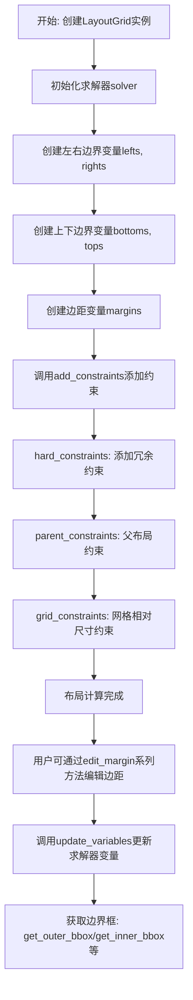
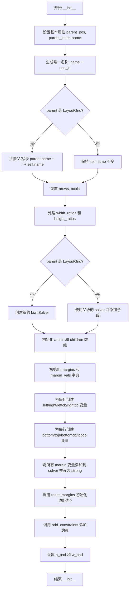
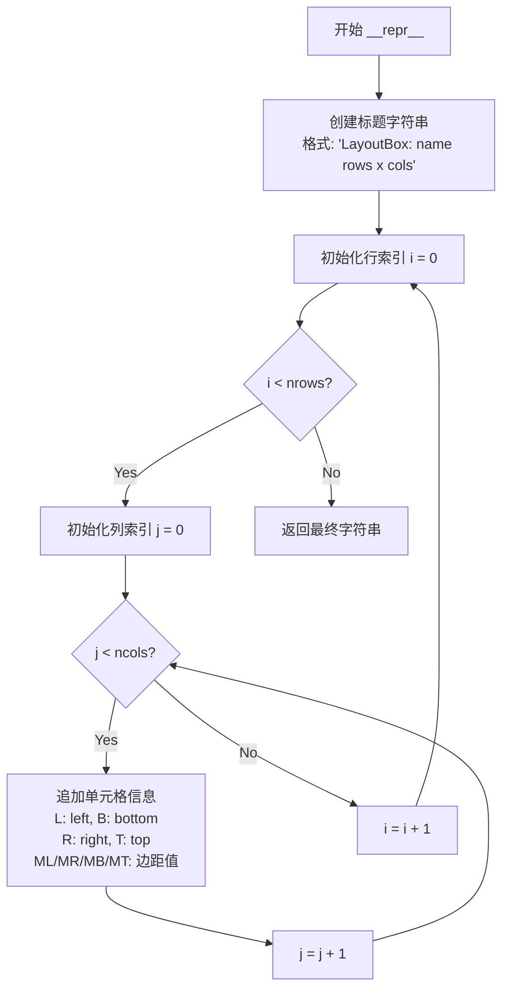
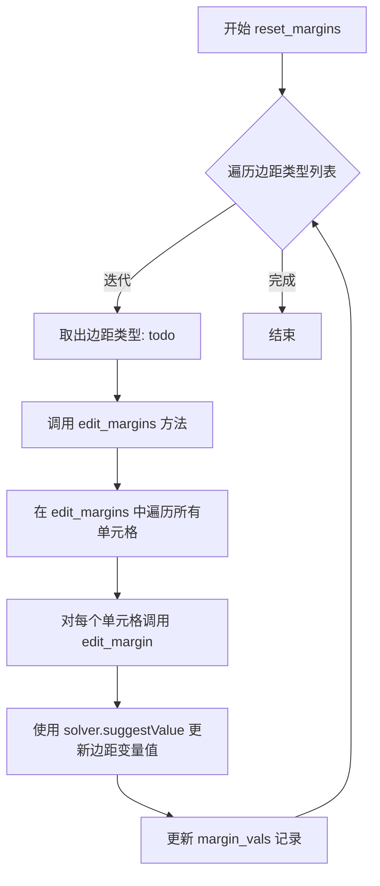
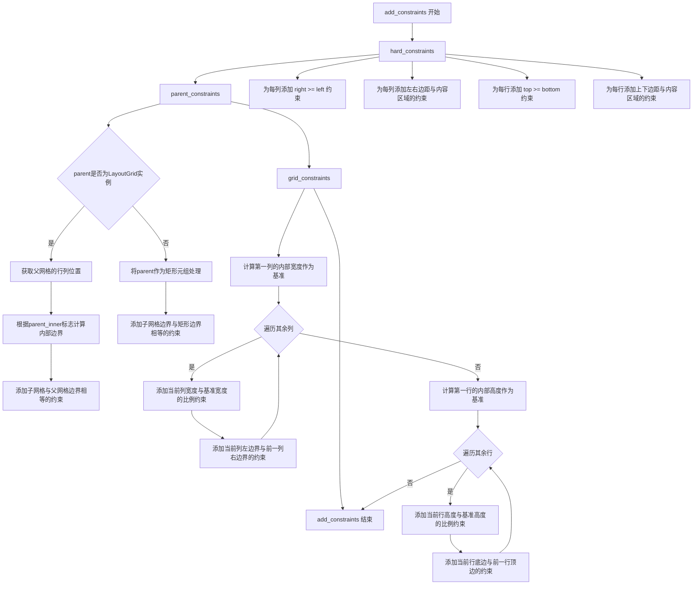
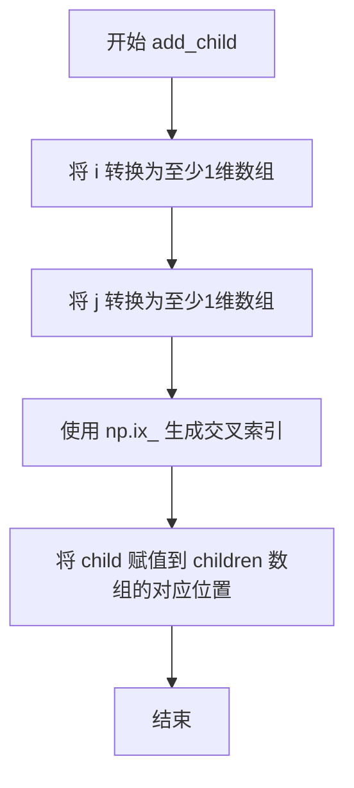
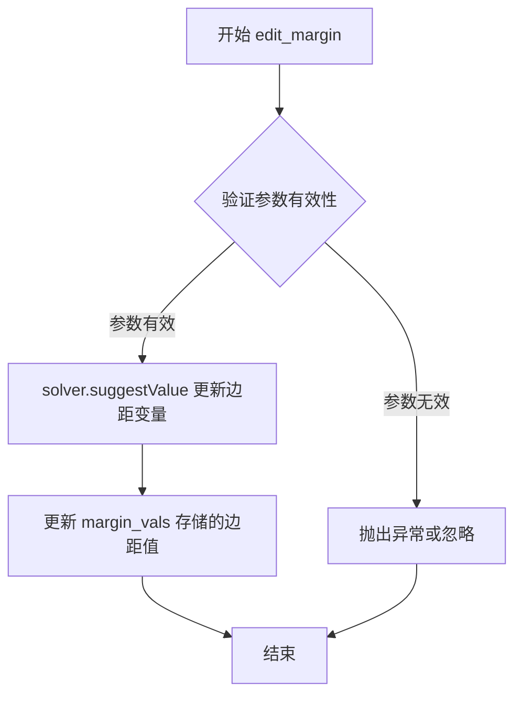
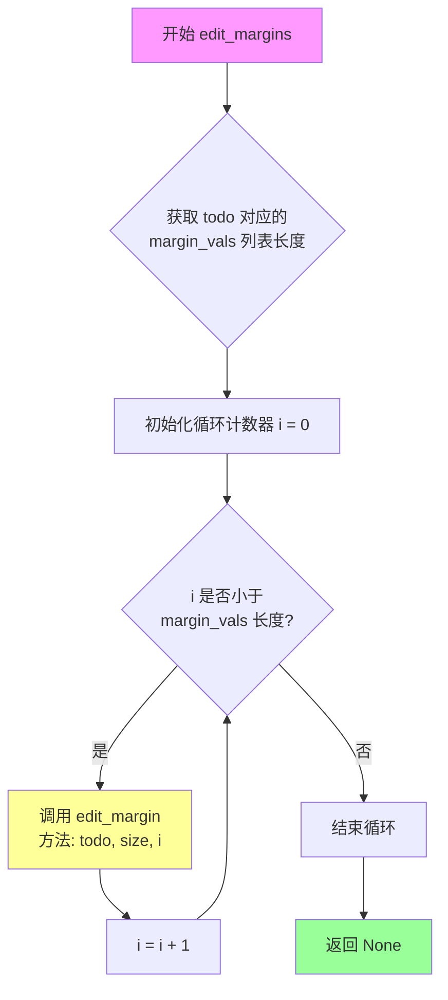

```mermaid
flowchart TD
    A[开始] --> B[调用next&#40;_layoutboxobjnum&#41;获取下一个序列号]
    B --> C[使用格式'%06d'格式化序列号为6位字符串]
    C --> D[返回格式化后的字符串]
    D --> E[结束]
```

# `matplotlib\lib\matplotlib\_layoutgrid.py` 详细设计文档

LayoutGrid是一个用于matplotlib约束布局系统的核心类，它通过kiwi-solver实现了一个n行n列的盒子网格系统，用于管理子图的布局位置、边距约束和相对尺寸关系，支持嵌套布局并提供灵活的外边距编辑功能。

## 整体流程



## 类结构

```
LayoutGrid (主布局网格类)
├── 约束系统
│   ├── hard_constraints (冗余约束)
│   ├── parent_constraints (父子布局约束)
│   └── grid_constraints (网格相对尺寸约束)
├── 边距编辑系统
│   ├── edit_margin (编辑单一边界)
 │   ├── edit_margin_min (编辑最小边界)
 │   ├── edit_margins (批量编辑)
 │   ├── edit_all_margins_min (批量最小边界)
 │   └── edit_outer_margin_mins (编辑外边距)
└── 边界框获取系统
    ├── get_outer_bbox (外边界框)
    ├── get_inner_bbox (内边界框)
    ├── get_bbox_for_cb (颜色条边界框)
    └── get_*_margin_bbox (各边距边界框)
```

## 全局变量及字段


### `_layoutboxobjnum`
    
全局计数器，用于生成唯一ID

类型：`itertools.count`
    


### `_log`
    
模块级日志记录器

类型：`logging.Logger`
    


### `LayoutGrid.parent_pos`
    
父网格位置坐标

类型：`tuple`
    


### `LayoutGrid.parent_inner`
    
是否位于父网格内部

类型：`bool`
    


### `LayoutGrid.name`
    
布局网格名称

类型：`str`
    


### `LayoutGrid.nrows`
    
行数

类型：`int`
    


### `LayoutGrid.ncols`
    
列数

类型：`int`
    


### `LayoutGrid.height_ratios`
    
行高比例

类型：`ndarray`
    


### `LayoutGrid.width_ratios`
    
列宽比例

类型：`ndarray`
    


### `LayoutGrid.solver`
    
约束求解器

类型：`kiwi.Solver`
    


### `LayoutGrid.artists`
    
关联的艺术家对象数组

类型：`ndarray`
    


### `LayoutGrid.children`
    
子布局网格数组

类型：`ndarray`
    


### `LayoutGrid.margins`
    
边距变量字典

类型：`dict`
    


### `LayoutGrid.margin_vals`
    
边距数值字典

类型：`dict`
    


### `LayoutGrid.lefts`
    
左侧边界变量列表

类型：`list`
    


### `LayoutGrid.rights`
    
右侧边界变量列表

类型：`list`
    


### `LayoutGrid.bottoms`
    
底部边界变量列表

类型：`list`
    


### `LayoutGrid.tops`
    
顶部边界变量列表

类型：`list`
    


### `LayoutGrid.h_pad`
    
水平填充

类型：`float`
    


### `LayoutGrid.w_pad`
    
垂直填充

类型：`float`
    
    

## 全局函数及方法


### `seq_id`

生成一个简短的顺序ID，用于layoutbox对象的标识。

参数： 无

返回值：`str`，返回一个6位数字字符串（如 `'000001'`），作为layoutbox对象的唯一顺序标识符。

#### 流程图



#### 带注释源码

```python
# 全局计数器对象，用于生成唯一的顺序ID
# 使用itertools.count()创建一个无限迭代器，每次调用next()返回递增的整数
_layoutboxobjnum = itertools.count()


def seq_id():
    """
    生成一个简短的顺序ID，用于layoutbox对象。
    
    该函数利用全局迭代器_layoutboxobjnum生成递增的序列号，
    并将其格式化为6位数字字符串，常用于创建唯一的对象标识符。
    
    Returns:
        str: 格式化的6位数字字符串，例如 '000001', '000002' 等
    """
    # 从迭代器获取下一个整数值，并格式化为6位数字字符串
    return '%06d' % next(_layoutboxobjnum)
```


### `plot_children`

调试用函数，用于可视化布局盒子。该函数递归地绘制 LayoutGrid 的外框、内框以及各个方向的边距盒子（左边距、右边距、下边距、上边距），帮助开发者直观地查看布局约束的结果。

参数：

- `fig`：`matplotlib.figure.Figure`，要在其上绘制布局盒子的图形对象
- `lg`：`LayoutGrid` 或 `None`，要可视化的布局网格对象；如果为 `None`，则从图形的布局引擎获取
- `level`：`int`，递归层级，用于选择不同的颜色以区分不同层级的布局盒子（默认值为 0）

返回值：`None`，该函数无返回值，仅在图形上绘制矩形艺术家对象

#### 流程图

```mermaid
flowchart TD
    A([开始 plot_children]) --> B{lg is None?}
    B -- 是 --> C[调用 fig.get_layout_engine.execute fig 获取布局网格]
    C --> D[lg = 获取的布局网格]
    B -- 否 --> E[继续]
    D --> E
    E --> F[从 rcParams 获取颜色列表]
    F --> G[col = colors level]]
    G --> H[初始化外层循环: i from 0 to nrows-1]
    H --> I[初始化内层循环: j from 0 to ncols-1]
    I --> J[获取外边界框 bb = lg.get_outer_bbox]
    J --> K[绘制外框矩形
    - linewidth=1
    - edgecolor=0.7
    - facecolor=0.7
    - alpha=0.2]
    K --> L[获取内边界框 bbi = lg.get_inner_bbox]
    L --> M[绘制内框矩形
    - linewidth=2
    - edgecolor=col
    - facecolor=none]
    M --> N[获取并绘制左边距盒子
    - facecolor=0.5,0.7,0.5]
    N --> O[获取并绘制右边距盒子
    - facecolor=0.7,0.5,0.5]
    O --> P[获取并绘制下边距盒子
    - facecolor=0.5,0.5,0.7]
    P --> Q[获取并绘制上边距盒子
    - facecolor=0.7,0.2,0.7]
    Q --> R{内循环结束?}
    R -- 否 --> I
    R -- 是 --> S{外循环结束?}
    S -- 否 --> H
    S -- 是 --> T[遍历 lg.children.flat]
    T --> U{存在子布局网格?}
    U -- 是 --> V[递归调用 plot_children fig, ch, level+1]
    V --> W{所有子元素遍历完?}
    U -- 否 --> W
    W -- 否 --> T
    W -- 是 --> X([结束])
```

#### 带注释源码

```python
def plot_children(fig, lg=None, level=0):
    """
    Simple plotting to show where boxes are.
    
    这是一个调试函数，用于可视化 LayoutGrid 的布局结构。
    它会在给定的 Figure 对象上绘制多种矩形来表示布局的不同部分：
    - 外边界框（浅灰色半透明）
    - 内边界框（根据层级着色）
    - 四个方向的边距盒子（不同颜色区分）
    
    Parameters
    ----------
    fig : matplotlib.figure.Figure
        要绘制布局盒子的图形对象
    lg : LayoutGrid or None
        要可视化的布局网格；如果为 None，则从图形的布局引擎获取
    level : int
        递归层级，用于选择颜色来区分不同层级的布局（默认 0）
    """
    # 如果未提供布局网格 lg，则通过图形的布局引擎获取
    # 这是一个懒加载机制，允许只传入 fig 而自动展示整个布局
    if lg is None:
        # 执行布局引擎获取布局网格字典
        _layoutgrids = fig.get_layout_engine().execute(fig)
        # 从字典中获取当前图对应的顶层布局网格
        lg = _layoutgrids[fig]
    
    # 从 matplotlib 的 rcParams 中获取颜色循环
    # level 参数用于在颜色列表中选择颜色，以区分递归深度
    colors = mpl.rcParams["axes.prop_cycle"].by_key()["color"]
    col = colors[level]
    
    # 遍历布局网格的所有行和列
    # 每个单元格都会绘制多个矩形来表示不同的边界区域
    for i in range(lg.nrows):
        for j in range(lg.ncols):
            # 获取当前单元格的外边界框（包含边距的整体区域）
            # bb.p0 是左下角坐标，bb.width 和 bb.height 是宽高
            bb = lg.get_outer_bbox(rows=i, cols=j)
            # 绘制外框矩形：浅灰色、半透明、较细的边框
            # zorder=-3 确保绘制在其他元素下方
            fig.add_artist(
                mpatches.Rectangle(bb.p0, bb.width, bb.height, linewidth=1,
                                   edgecolor='0.7', facecolor='0.7',
                                   alpha=0.2, transform=fig.transFigure,
                                   zorder=-3))
            
            # 获取当前单元格的内边界框（不含边距的实际内容区域）
            bbi = lg.get_inner_bbox(rows=i, cols=j)
            # 绘制内框矩形：层级颜色、无填充、较粗的边框
            # 用于标识实际子图或内容的有效区域
            fig.add_artist(
                mpatches.Rectangle(bbi.p0, bbi.width, bbi.height, linewidth=2,
                                   edgecolor=col, facecolor='none',
                                   transform=fig.transFigure, zorder=-2))
            
            # 获取并绘制左边距区域（通常用于容纳 y 轴标签等）
            # 绿色系，用于标识左侧额外空间
            bbi = lg.get_left_margin_bbox(rows=i, cols=j)
            fig.add_artist(
                mpatches.Rectangle(bbi.p0, bbi.width, bbi.height, linewidth=0,
                                   edgecolor='none', alpha=0.2,
                                   facecolor=[0.5, 0.7, 0.5],
                                   transform=fig.transFigure, zorder=-2))
            
            # 获取并绘制右边距区域（通常用于容纳 colorbar 等）
            # 红色系，用于标识右侧额外空间
            bbi = lg.get_right_margin_bbox(rows=i, cols=j)
            fig.add_artist(
                mpatches.Rectangle(bbi.p0, bbi.width, bbi.height, linewidth=0,
                                   edgecolor='none', alpha=0.2,
                                   facecolor=[0.7, 0.5, 0.5],
                                   transform=fig.transFigure, zorder=-2))
            
            # 获取并绘制下边距区域（通常用于容纳 x 轴标签等）
            # 蓝色系，用于标识底部额外空间
            bbi = lg.get_bottom_margin_bbox(rows=i, cols=j)
            fig.add_artist(
                mpatches.Rectangle(bbi.p0, bbi.width, bbi.height, linewidth=0,
                                   edgecolor='none', alpha=0.2,
                                   facecolor=[0.5, 0.5, 0.7],
                                   transform=fig.transFigure, zorder=-2))
            
            # 获取并绘制上边距区域（通常用于容纳标题等）
            # 紫色系，用于标识顶部额外空间
            bbi = lg.get_top_margin_bbox(rows=i, cols=j)
            fig.add_artist(
                mpatches.Rectangle(bbi.p0, bbi.width, bbi.height, linewidth=0,
                                   edgecolor='none', alpha=0.2,
                                   facecolor=[0.7, 0.2, 0.7],
                                   transform=fig.transFigure, zorder=-2))
    
    # 递归遍历所有子布局网格
    # layout grid 可以嵌套，children 数组存储了子布局网格
    for ch in lg.children.flat:
        if ch is not None:
            # 递归调用自身，level+1 以使用不同的颜色
            plot_children(fig, ch, level=level+1)
```


### LayoutGrid.__init__

`LayoutGrid.__init__` 是 `LayoutGrid` 类的构造函数，用于初始化一个约束布局网格对象。该方法创建 nrows×ncols 个盒子（类似 gridspec 的子图规范），并设置kiwi求解器来管理布局约束，支持父子层级嵌套、边距调整和尺寸比例配置。

参数：

- `self`：隐式参数，LayoutGrid 实例本身
- `parent`：`LayoutGrid` 或 `tuple` 或 `None`，父布局网格对象或矩形（如果不为 LayoutGrid 则表示使用 figure 坐标系的矩形区域）
- `parent_pos`：`tuple`，父网格中的位置坐标，默认为 (0, 0)
- `parent_inner`：`bool`，是否将布局网格包含在父网格的内侧区域，默认为 False
- `name`：`str`，布局网格的名称前缀，默认为空字符串
- `ncols`：`int`，列数，默认为 1
- `nrows`：`int`，行数，默认为 1
- `h_pad`：`float` 或 `None`，垂直填充间距
- `w_pad`：`float` 或 `None`，水平填充间距
- `width_ratios`：`array-like` 或 `None`，列宽比列表
- `height_ratios`：`array-like` 或 `None`，行高比列表

返回值：`None`，构造函数无返回值

#### 流程图



#### 带注释源码

```python
def __init__(self, parent=None, parent_pos=(0, 0),
             parent_inner=False, name='', ncols=1, nrows=1,
             h_pad=None, w_pad=None, width_ratios=None,
             height_ratios=None):
    """
    初始化 LayoutGrid 实例。
    
    创建一个约束布局网格，用于管理 matplotlib 图形中的子图布局。
    支持嵌套布局、边距调整和相对尺寸比例约束。
    
    Parameters
    ----------
    parent : LayoutGrid, tuple, or None
        父布局网格对象。如果不是 LayoutGrid，则可以是指定矩形的元组
        (left, bottom, width, height)，用于限定布局范围。
    parent_pos : tuple
        父网格中的位置坐标，格式为 (row, col)。
    parent_inner : bool
        是否将布局网格包含在父网格的内侧（考虑边距）区域。
    name : str
        布局网格的名称前缀，用于标识。
    ncols : int
        列数。
    nrows : int
        行数。
    h_pad : float or None
        垂直方向的填充间距（相对于图形尺寸的比例）。
    w_pad : float or None
        水平方向的填充间距（相对于图形尺寸的比例）。
    width_ratios : array-like or None
        各列的宽度比例，如 [1, 2, 1] 表示第二列宽度是其他列的两倍。
    height_ratios : array-like or None
        各行的高度比例。
    """
    Variable = kiwi.Variable  # kiwisolver 变量类型别名
    
    # 存储父级位置信息和是否使用父级内侧区域
    self.parent_pos = parent_pos
    self.parent_inner = parent_inner
    
    # 生成唯一名称：名称前缀 + 序列ID
    self.name = name + seq_id()
    
    # 如果存在父级 LayoutGrid，拼接完整的层级名称
    if isinstance(parent, LayoutGrid):
        self.name = f'{parent.name}.{self.name}'
    
    # 存储网格维度
    self.nrows = nrows
    self.ncols = ncols
    
    # 处理高度比例：确保是 numpy 数组，如果是 None 则默认为等高
    self.height_ratios = np.atleast_1d(height_ratios)
    if height_ratios is None:
        self.height_ratios = np.ones(nrows)
    
    # 处理宽度比例：确保是 numpy 数组，如果是 None 则默认为等宽
    self.width_ratios = np.atleast_1d(width_ratios)
    if width_ratios is None:
        self.width_ratios = np.ones(ncols)

    # 生成变量名前缀，用于标识
    sn = self.name + '_'
    
    # 创建约束求解器：如果父级不是 LayoutGrid，创建新的求解器
    # 否则使用父级的求解器（实现布局嵌套）
    if not isinstance(parent, LayoutGrid):
        # parent 可以是一个矩形 (left, bottom, width, height)
        # 用于指定布局容器在 figure 坐标系中的区域
        self.solver = kiwi.Solver()
    else:
        # 将当前布局网格添加为父级的子节点
        parent.add_child(self, *parent_pos)
        # 共享父级的求解器，实现约束传递
        self.solver = parent.solver
    
    # 存储与此布局关联的艺术家对象（可以是 Axes 等）
    # 初始化为 nrows x ncols 的对象数组
    self.artists = np.empty((nrows, ncols), dtype=object)
    # 存储子布局网格
    self.children = np.empty((nrows, ncols), dtype=object)

    # 边距字典：存储各边距对应的 kiwi.Variable
    self.margins = {}
    # 边距值字典：存储实际的边距数值
    self.margin_vals = {}
    
    # 为每列初始化 left, right, leftcb(左侧colorbar), rightcb(右侧colorbar) 边距
    # margin_vals 记录当前边距值，用于比较取较大值
    for todo in ['left', 'right', 'leftcb', 'rightcb']:
        # 初始化为零数组
        self.margin_vals[todo] = np.zeros(ncols)

    sol = self.solver  # 简化引用

    # 创建左右边界变量
    self.lefts = [Variable(f'{sn}lefts[{i}]') for i in range(ncols)]
    self.rights = [Variable(f'{sn}rights[{i}]') for i in range(ncols)]
    
    # 为每列创建四种边距变量，并添加到求解器设为 strong（强约束）
    for todo in ['left', 'right', 'leftcb', 'rightcb']:
        self.margins[todo] = [Variable(f'{sn}margins[{todo}][{i}]')
                              for i in range(ncols)]
        for i in range(ncols):
            sol.addEditVariable(self.margins[todo][i], 'strong')

    # 为每行初始化 bottom, top, bottomcb, topcb 边距
    for todo in ['bottom', 'top', 'bottomcb', 'topcb']:
        self.margins[todo] = np.empty((nrows), dtype=object)
        self.margin_vals[todo] = np.zeros(nrows)

    # 创建底部和顶部边界变量
    self.bottoms = [Variable(f'{sn}bottoms[{i}]') for i in range(nrows)]
    self.tops = [Variable(f'{sn}tops[{i}]') for i in range(nrows)]
    
    # 为每行创建四种边距变量，并添加到求解器
    for todo in ['bottom', 'top', 'bottomcb', 'topcb']:
        self.margins[todo] = [Variable(f'{sn}margins[{todo}][{i}]')
                              for i in range(nrows)]
        for i in range(nrows):
            sol.addEditVariable(self.margins[todo][i], 'strong')

    # 将所有边距重置为零默认值
    # 这些边距将在子元素（Axes等）添加时由 edit_margin 系列方法更新
    self.reset_margins()
    
    # 添加约束条件：自身约束 + 父子约束 + 网格相对尺寸约束
    self.add_constraints(parent)

    # 存储填充间距
    self.h_pad = h_pad
    self.w_pad = w_pad
```


### `LayoutGrid.__repr__`

该方法以人类可读的字符串形式返回 LayoutGrid 对象的详细信息，包括网格名称、行列数以及每个单元格的位置坐标（左右上下边界）和边距值。

参数：无需显式参数（使用隐式 `self` 参数）

返回值：`str`，返回一个格式化的字符串，包含 LayoutGrid 的名称、尺寸以及所有单元格的位置和边距信息。

#### 流程图



#### 带注释源码

```python
def __repr__(self):
    """
    返回 LayoutGrid 的字符串表示形式，包含每个单元格的位置和边距信息。
    
    Returns:
        str: 格式化的字符串，详细描述网格的布局参数
    """
    # 初始化字符串，包含网格名称和行列数
    # 使用25字符宽度左对齐显示名称
    str = f'LayoutBox: {self.name:25s} {self.nrows}x{self.ncols},\n'
    
    # 遍历网格中的所有单元格（行优先遍历）
    for i in range(self.nrows):
        for j in range(self.ncols):
            # 为每个单元格构建位置和边距信息字符串
            # L: 左边界 left, B: 下边界 bottom
            # R: 右边界 right, T: 上边界 top
            # ML: 左边距 left margin, MR: 右边距 right margin
            # MB: 下边距 bottom margin, MT: 上边距 top margin
            # .value() 获取 kiwisolver 变量的当前求解值
            str += f'{i}, {j}: '\
                   f'L{self.lefts[j].value():1.3f}, ' \
                   f'B{self.bottoms[i].value():1.3f}, ' \
                   f'R{self.rights[j].value():1.3f}, ' \
                   f'T{self.tops[i].value():1.3f}, ' \
                   f'ML{self.margins["left"][j].value():1.3f}, ' \
                   f'MR{self.margins["right"][j].value():1.3f}, ' \
                   f'MB{self.margins["bottom"][i].value():1.3f}, ' \
                   f'MT{self.margins["top"][i].value():1.3f}, \n'
    
    # 返回完整的字符串表示
    return str
```


### `LayoutGrid.reset_margins`

重置布局网格中所有边距（left、right、bottom、top 及其 colorbar 对应的边距）为零。该方法在更改图形大小时必须调用，因为轴标签等的相对大小会发生变化。

参数：

- 无参数（仅包含 `self` 隐式参数）

返回值：`None`，无返回值（该方法直接修改对象状态）

#### 流程图



#### 带注释源码

```python
def reset_margins(self):
    """
    Reset all the margins to zero.  Must do this after changing
    figure size, for instance, because the relative size of the
    axes labels etc changes.
    """
    # 定义需要重置的所有边距类型列表
    # 包括四边的边距以及四边的 colorbar 边距（共8种）
    for todo in ['left', 'right', 'bottom', 'top',
                 'leftcb', 'rightcb', 'bottomcb', 'topcb']:
        # 调用 edit_margins 将指定类型的边距设置为 0.0
        # edit_margins 会遍历该类型的所有单元格并调用 edit_margin
        self.edit_margins(todo, 0.0)
```


### `LayoutGrid.add_constraints`

该方法是LayoutGrid类的核心约束初始化方法，负责为当前布局网格添加三层约束：硬约束（内部自洽关系）、父子约束（与父布局网格的相对位置关系）以及网格约束（单元格之间的相对尺寸和排列关系），从而形成一个完整的约束系统供kiwisolver求解器使用。

参数：

- `parent`：`LayoutGrid | tuple | None`，父布局网格或矩形区域，用于定义当前网格的外部边界和层级关系

返回值：`None`，该方法不返回值，仅通过调用子方法向求解器添加约束条件

#### 流程图



#### 带注释源码

```python
def add_constraints(self, parent):
    """
    为布局网格添加三层约束条件，建立完整的约束系统。
    
    约束系统包含：
    1. 硬约束（hard_constraints）：确保网格内部几何关系自洽
    2. 父子约束（parent_constraints）：建立与父布局网格的位置关系
    3. 网格约束（grid_constraints）：定义单元格之间的相对尺寸和相邻关系
    
    Parameters
    ----------
    parent : LayoutGrid or tuple or None
        父布局网格对象。如果为LayoutGrid实例，则当前网格作为子网格；
        如果为元组(rect)，则使用figure坐标矩形区域作为边界；
        如果为None，则在后续的parent_constraints中处理。
    """
    # 步骤1：定义自洽约束
    # 这些约束确保网格自身的几何属性一致，
    # 包括边界顺序正确、边距与内容区域不冲突
    self.hard_constraints()
    
    # 步骤2：定义与父布局网格的关系约束
    # 根据parent类型建立不同的边界约束：
    # - LayoutGrid实例：子网格边界与父网格的行列范围对齐
    # - 矩形元组：子网格边界与指定figure坐标矩形对齐
    self.parent_constraints(parent)
    
    # 步骤3：定义网格内部的相对尺寸和堆叠约束
    # - 相对宽度：列宽按width_ratios比例分配
    # - 相对高度：行高按height_ratios比例分配
    # - 相邻关系：相邻单元格边界必须对齐
    self.grid_constraints()
```


### `LayoutGrid.hard_constraints`

该方法为布局网格的每一列和每一行添加硬约束（Hard Constraints），确保网格单元的几何边界满足基本的空间关系：右边距必须大于等于左边距（考虑边距和颜色条边距后），顶部必须大于等于底部（考虑边距和颜色条边距后）。这些约束是冗余的，但能使后续的布局计算更易于实现。

参数：

- `self`：LayoutGrid 实例，隐含的 self 参数，表示当前布局网格对象

返回值：`None`，无返回值，该方法直接在求解器中添加约束

#### 流程图

```mermaid
flowchart TD
    A[开始 hard_constraints] --> B{遍历列 i: 0 到 ncols-1}
    B --> C[构建列约束列表 hc]
    C --> D1[约束1: rights[i] >= lefts[i]]
    C --> D2[约束2: rights[i] - margins.right[i] - margins.rightcb[i] >= lefts[i] - margins.left[i] - margins.leftcb[i]]
    D1 --> E[将约束添加到求解器 | 'required']
    D2 --> E
    E --> B1{遍历行 i: 0 到 nrows-1}
    B1 --> F[构建行约束列表 hc]
    F --> G1[约束1: tops[i] >= bottoms[i]]
    F --> G2[约束2: tops[i] - margins.top[i] - margins.topcb[i] >= bottoms[i] - margins.bottom[i] - margins.bottomcb[i]]
    G1 --> H[将约束添加到求解器 | 'required']
    G2 --> H
    H --> I[结束]
    
    style A fill:#f9f,color:#000
    style I fill:#9f9,color:#000
    style E fill:#ff9,color:#000
    style H fill:#ff9,color:#000
```

#### 带注释源码

```python
def hard_constraints(self):
    """
    These are the redundant constraints, plus ones that make the
    rest of the code easier.
    """
    # 为每一列添加硬约束
    # 约束条件确保：
    # 1. right 边界始终在 left 边界的右侧
    # 2. 考虑边距后，inner right 仍然在 inner left 的右侧
    for i in range(self.ncols):
        # 构建列约束列表
        # 第一个约束：确保右边坐标大于等于左边坐标（基本几何约束）
        hc = [self.rights[i] >= self.lefts[i],
              # 第二个约束：考虑左右边距和颜色条边距后，
              # 内部区域的右边界仍然大于等于内部区域的左边界
              (self.rights[i] - self.margins['right'][i] -
                self.margins['rightcb'][i] >=
                self.lefts[i] - self.margins['left'][i] -
                self.margins['leftcb'][i])
              ]
        # 将每个约束添加到求解器，标记为 'required' 表示必需约束
        for c in hc:
            self.solver.addConstraint(c | 'required')

    # 为每一行添加硬约束
    # 约束条件确保：
    # 1. top 边界始终在 bottom 边界之上
    # 2. 考虑边距后，inner top 仍然在 inner bottom 之上
    for i in range(self.nrows):
        # 构建行约束列表
        # 第一个约束：确保顶部坐标大于等于底部坐标（基本几何约束）
        hc = [self.tops[i] >= self.bottoms[i],
              # 第二个约束：考虑上下边距和颜色条边距后，
              # 内部区域的顶部仍然大于等于内部区域的底部
              (self.tops[i] - self.margins['top'][i] -
                self.margins['topcb'][i] >=
                self.bottoms[i] - self.margins['bottom'][i] -
                self.margins['bottomcb'][i])
              ]
        # 将每个约束添加到求解器，标记为 'required' 表示必需约束
        for c in hc:
            self.solver.addConstraint(c | 'required')
```


### `LayoutGrid.add_child`

该方法用于将子布局网格（LayoutGrid）添加到当前布局网格的指定位置，通过 `np.ix_` 处理行列索引的交叉乘积，将子布局存储到 `children` 数组的对应单元格中。

参数：

- `child`：`LayoutGrid`，要添加的子布局网格对象
- `i`：`int`，行索引，默认为 0，表示子布局放置在第几行
- `j`：`int`，列索引，默认为 0，表示子布局放置在第几列

返回值：`None`，该方法直接修改 `self.children` 数组，不返回任何值

#### 流程图



#### 带注释源码

```python
def add_child(self, child, i=0, j=0):
    """
    添加一个子布局到当前布局网格的指定位置。

    Parameters
    ----------
    child : LayoutGrid
        要添加的子布局网格对象。
    i : int, optional
        行索引，指定子布局放置在第几行，默认为 0。
    j : int, optional
        列索引，指定子布局放置在第几列，默认为 0。
    """
    # np.ix_ 返回 i 和 j 索引的交叉乘积，用于在二维数组中同时指定行和列位置
    # np.atleast_1d 确保 i 和 j 被转换为数组形式，以支持单值和范围索引
    self.children[np.ix_(np.atleast_1d(i), np.atleast_1d(j))] = child
```


### `LayoutGrid.parent_constraints`

该方法用于定义当前布局网格与其父布局网格（或父矩形）之间的位置约束关系，确保子网格的边界（左、右、上、下）能够正确地映射到父网格的对应边界上。

参数：

- `parent`：`LayoutGrid | tuple`，父布局网格对象或指定矩形区域的元组 (left, bottom, width, height)

返回值：`None`，无返回值（直接通过 kiwisolver 添加约束条件）

#### 流程图

```mermaid
flowchart TD
    A[开始 parent_constraints] --> B{parent 是否为 LayoutGrid?}
    B -->|否| C[parent 是元组/矩形]
    C --> D[创建约束: lefts[0] == parent[0]]
    E[创建约束: rights[-1] == parent[0] + parent[2]]
    F[创建约束: tops[0] == parent[1] + parent[3]]
    G[创建约束: bottoms[-1] == parent[1]]
    D --> H[将约束添加到求解器]
    E --> H
    F --> H
    G --> H
    
    B -->|是| I[获取 parent_pos 中的 rows 和 cols]
    I --> J[获取父网格的 left/right/top/bottom]
    K{parent_inner 是否为 True?}
    K -->|是| L[将父网格的 margins 加入计算]
    K -->|否| M[不加入 margins]
    L --> N[创建约束: lefts[0] == left]
    M --> N
    O[创建约束: rights[-1] == right]
    P[创建约束: tops[0] == top]
    Q[创建约束: bottoms[-1] == bottom]
    N --> H
    O --> H
    P --> H
    Q --> H
    H --> R[结束]
```

#### 带注释源码

```python
def parent_constraints(self, parent):
    """
    Define constraints between this layout grid and its parent.
    
    Parameters
    ----------
    parent : LayoutGrid or tuple
        The parent LayoutGrid, or a rectangle specified as 
        (left, bottom, width, height) in figure coordinates.
    """
    # constraints that are due to the parent...
    # i.e. the first column's left is equal to the
    # parent's left, the last column right equal to the
    # parent's right...
    
    if not isinstance(parent, LayoutGrid):
        # specify a rectangle in figure coordinates
        # parent is a tuple: (left, bottom, width, height)
        hc = [self.lefts[0] == parent[0],                        # 子网格左边界对齐父矩形左边界
              self.rights[-1] == parent[0] + parent[2],          # 子网格右边界对齐父矩形右边界
              # top and bottom reversed order...
              self.tops[0] == parent[1] + parent[3],             # 子网格上边界对齐父矩形上边界
              self.bottoms[-1] == parent[1]]                     # 子网格下边界对齐父矩形下边界
    else:
        # parent is another LayoutGrid
        rows, cols = self.parent_pos                             # 获取在父网格中的行列位置
        rows = np.atleast_1d(rows)                               # 转换为数组以支持切片
        cols = np.atleast_1d(cols)

        # 获取父网格在指定行列范围内的边界
        left = parent.lefts[cols[0]]                             # 最左列的左边界
        right = parent.rights[cols[-1]]                          # 最右列的右边界
        top = parent.tops[rows[0]]                                # 最顶行的上边界
        bottom = parent.bottoms[rows[-1]]                         # 最底行的下边界
        
        if self.parent_inner:
            # the layout grid is contained inside the inner
            # grid of the parent.
            # 如果使用内部网格，需要考虑父网格的边距(margins)
            left += parent.margins['left'][cols[0]]              # 加上左边的常规边距
            left += parent.margins['leftcb'][cols[0]]            # 加上左边的colorbar边距
            right -= parent.margins['right'][cols[-1]]            # 减去右边的常规边距
            right -= parent.margins['rightcb'][cols[-1]]          # 减去右边的colorbar边距
            top -= parent.margins['top'][rows[0]]                 # 减去上边的常规边距
            top -= parent.margins['topcb'][rows[0]]               # 减去上边的colorbar边距
            bottom += parent.margins['bottom'][rows[-1]]          # 加上下边的常规边距
            bottom += parent.margins['bottomcb'][rows[-1]]       # 加上下边的colorbar边距
        
        # 创建子网格与父网格边界相等的约束
        hc = [self.lefts[0] == left,                              # 子网格最左列左边界对齐父网格指定列左边界
              self.rights[-1] == right,                           # 子网格最右列右边界对齐父网格指定列右边界
              # from top to bottom
              self.tops[0] == top,                                # 子网格最顶行上边界对齐父网格指定行上边界
              self.bottoms[-1] == bottom]                         # 子网格最底行下边界对齐父网格指定行下边界
    
    # 将所有约束添加到求解器，'required' 表示这是必须满足的硬约束
    for c in hc:
        self.solver.addConstraint(c | 'required')
```


### `LayoutGrid.grid_constraints`

该方法用于约束网格内部尺寸的比例关系，确保各列的宽度比例符合 `width_ratios`，各行的高度比例符合 `height_ratios`，并约束相邻网格单元直接相邻（无缝拼接）。

参数： 无

返回值： `None`，该方法直接在求解器中添加约束条件

#### 流程图

```mermaid
flowchart TD
    A[开始 grid_constraints] --> B[计算第0列的内宽度 w]
    B --> C[计算基准宽度 w0 = w / width_ratios[0]]
    D{遍历列 i = 1 到 ncols-1} --> E[计算第i列内宽度]
    E --> F[约束: w == w0 * width_ratios[i]]
    F --> G[约束: rights[i-1] == lefts[i]]
    G --> H{列遍历结束?}
    H -->|否| D
    H -->|是| I[计算第0行的内高度 h]
    I --> J[计算基准高度 h0 = h / height_ratios[0]]
    K{遍历行 i = 1 到 nrows-1} --> L[计算第i行内高度]
    L --> M[约束: h == h0 * height_ratios[i]]
    M --> N[约束: bottoms[i-1] == tops[i]]
    N --> O{行遍历结束?}
    O -->|否| K
    O -->|是| P[结束]
    
    D -->|列遍历完成| I
```

#### 带注释源码

```python
def grid_constraints(self):
    """
    Constrain the ratio of the inner part of the grids to be the same
    (relative to width_ratios and height_ratios).
    """
    
    # ========== 宽度约束 ==========
    # 计算第0列的内部宽度（考虑左右边距和颜色条边距）
    w = (self.rights[0] - self.margins['right'][0] -
         self.margins['rightcb'][0])
    w = (w - self.lefts[0] - self.margins['left'][0] -
         self.margins['leftcb'][0])
    # 计算基准宽度比例 w0
    w0 = w / self.width_ratios[0]
    
    # 从左到右遍历每一列
    for i in range(1, self.ncols):
        # 计算第i列的内部宽度
        w = (self.rights[i] - self.margins['right'][i] -
             self.margins['rightcb'][i])
        w = (w - self.lefts[i] - self.margins['left'][i] -
             self.margins['leftcb'][i])
        # 约束: 第i列宽度与基准宽度的比例等于 width_ratios 的比例
        c = (w == w0 * self.width_ratios[i])
        self.solver.addConstraint(c | 'strong')
        
        # 约束: 相邻网格单元直接相邻（右侧边等于左侧边）
        c = (self.rights[i - 1] == self.lefts[i])
        self.solver.addConstraint(c | 'strong')

    # ========== 高度约束 ==========
    # 计算第0行的内部高度（考虑顶部和底部边距及颜色条边距）
    h = self.tops[0] - self.margins['top'][0] - self.margins['topcb'][0]
    h = (h - self.bottoms[0] - self.margins['bottom'][0] -
         self.margins['bottomcb'][0])
    # 计算基准高度比例 h0
    h0 = h / self.height_ratios[0]
    
    # 从上到下遍历每一行
    for i in range(1, self.nrows):
        # 计算第i行的内部高度
        h = (self.tops[i] - self.margins['top'][i] -
             self.margins['topcb'][i])
        h = (h - self.bottoms[i] - self.margins['bottom'][i] -
             self.margins['bottomcb'][i])
        # 约束: 第i行高度与基准高度的比例等于 height_ratios 的比例
        c = (h == h0 * self.height_ratios[i])
        self.solver.addConstraint(c | 'strong')
        
        # 约束: 相邻网格单元垂直相邻（上一行的底部等于下一行的顶部）
        c = (self.bottoms[i - 1] == self.tops[i])
        self.solver.addConstraint(c | 'strong')
```


### `LayoutGrid.edit_margin`

该方法用于更改布局网格中单个单元格的边距大小，通过调用求解器建议新值并更新内部存储的边距值。

参数：

- `todo`：`str`，表示要修改的边距类型，可选值为 'left'、'right'、'bottom'、'top'（包括带 cb 后缀的颜色条边距）
- `size`：`float`，边距的大小，如果大于现有的最小值则更新边距大小，为图形大小的比例
- `cell`：`int`，要编辑的单元格列或行索引

返回值：`None`，该方法无返回值，直接修改对象内部状态

#### 流程图



#### 带注释源码

```python
def edit_margin(self, todo, size, cell):
    """
    Change the size of the margin for one cell.

    Parameters
    ----------
    todo : string (one of 'left', 'right', 'bottom', 'top')
        margin to alter.

    size : float
        Size of the margin.  If it is larger than the existing minimum it
        updates the margin size. Fraction of figure size.

    cell : int
        Cell column or row to edit.
    """
    # 使用 kiwisolver 的 suggestValue 方法更新约束求解器中的边距变量值
    # 这个方法会尝试将指定的边距变量设置为给定的大小
    self.solver.suggestValue(self.margins[todo][cell], size)
    
    # 同时更新本地存储的边距值记录，以便后续比较和边界检查
    self.margin_vals[todo][cell] = size
```


### `LayoutGrid.edit_margin_min`

该方法用于更改布局网格中单个单元格的最小边距大小。只有当新边距大小大于当前存储的最小值时，才会更新边距。

参数：

- `todo`：`str`，要修改的边距类型，取值范围为 'left'、'right'、'bottom'、'top' 之一
- `size`：`float`，边距的最小大小。如果此值大于现有的最小值，则更新边距大小。为图形尺寸的分数
- `cell`：`int`，要编辑的单元格列或行索引（默认值为 0）

返回值：`None`，该方法无返回值，仅修改内部状态

#### 流程图

```mermaid
flowchart TD
    A[开始 edit_margin_min] --> B{size > self.margin_vals[todo][cell]?}
    B -->|是| C[调用 self.edit_margin<br/>更新边距值]
    B -->|否| D[不执行任何操作]
    C --> E[结束]
    D --> E
```

#### 带注释源码

```python
def edit_margin_min(self, todo, size, cell=0):
    """
    Change the minimum size of the margin for one cell.

    Parameters
    ----------
    todo : string (one of 'left', 'right', 'bottom', 'top')
        margin to alter.

    size : float
        Minimum size of the margin .  If it is larger than the
        existing minimum it updates the margin size. Fraction of
        figure size.

    cell : int
        Cell column or row to edit.
    """
    # 检查新边距大小是否大于当前存储的最小边距值
    if size > self.margin_vals[todo][cell]:
        # 只有当新值更大时才调用 edit_margin 更新边距
        # 这样可以保证边距只增不减（min 操作）
        self.edit_margin(todo, size, cell)
```


### `LayoutGrid.edit_margins`

修改布局网格中所有单元格的指定边距大小。该方法遍历指定边距类型（todo）的所有单元格索引，并对每个单元格调用 `edit_margin` 方法来更新边距值。

参数：

- `todo`：`str`，要修改的边距类型，可选值为 'left'、'right'、'bottom'、'top'、'leftcb'、'rightcb'、'bottomcb'、'topcb' 等
- `size`：`float`，要设置的边距大小，以图形尺寸的比例表示（0.0 到 1.0 之间的浮点数）

返回值：`None`，无返回值（该方法直接修改内部状态）

#### 流程图



#### 带注释源码

```python
def edit_margins(self, todo, size):
    """
    Change the size of all the margin of all the cells in the layout grid.

    Parameters
    ----------
    todo : string (one of 'left', 'right', 'bottom', 'top')
        margin to alter.

    size : float
        Size to set the margins.  Fraction of figure size.
    """
    # 获取指定边距类型 (todo) 对应的所有单元格数量
    # margin_vals 是一个字典，存储各类边距的当前值数组
    for i in range(len(self.margin_vals[todo])):
        # 对每个单元格调用 edit_margin 方法
        # edit_margin 方法会：
        # 1. 通过 solver.suggestValue 更新约束求解器中的边距变量值
        # 2. 更新 margin_vals 字典中存储的边距值
        self.edit_margin(todo, size, i)
```


### `LayoutGrid.edit_all_margins_min`

该方法遍历布局网格中所有行（或列），对指定的边距类型（`todo`）的每一个单元格尝试设置最小边距值 `size`。它内部调用 `edit_margin_min` 来完成实际的更新——只有当新值大于当前记录的最小值时才会修改。

#### 参数

- **`todo`**：`str`，要修改的边距类型，可为 `'left'`、`'right'`、`'bottom'`、`'top'` 之一。  
- **`size`**：`float`，边距的最小尺寸（相对于整张图的尺寸，0‑1 之间的比例）。如果该值大于某个单元格当前保存的最小值，则会更新该单元格的边距。

#### 返回值

- **`None`**（隐式返回），该方法仅修改内部状态，不返回任何值。

#### 流程图

```mermaid
flowchart TD
    A([开始 edit_all_margins_min]) --> B{遍历 margin_vals[todo] 中的每个索引 i}
    B --> C[调用 edit_margin_min(todo, size, i)]
    C --> D{还有未处理的单元格？}
    D -->|是| B
    D -->|否| E([结束])
    
    B -->|循环体| C
```

#### 带注释源码

```python
def edit_all_margins_min(self, todo, size):
    """
    Change the minimum size of all the margin of all
    the cells in the layout grid.

    Parameters
    ----------
    todo : {'left', 'right', 'bottom', 'top'}
        The margin to alter.

    size : float
        Minimum size of the margin.  If it is larger than the
        existing minimum it updates the margin size. Fraction of
        figure size.
    """
    # 遍历该类边距在所有行（或列）上的索引
    for i in range(len(self.margin_vals[todo])):
        # 对每个单元格调用 edit_margin_min，只有当 size 大于
        # 当前记录的最小值时才会实际更新该单元格的边距变量
        self.edit_margin_min(todo, size, i)
```


### `LayoutGrid.edit_outer_margin_mins`

编辑布局网格的四个外边距最小值（left、right、top、bottom）及其对应的colorbar边距（leftcb、rightcb、topcb、bottomcb），同时考虑SubplotSpec的行列范围。

参数：

- `margin`：`dict`，包含外边距值的字典，键为 'left'、'right'、'bottom'、'top'、'leftcb'、'rightcb'、'topcb'、'bottomcb'，表示各个边距的最小尺寸（相对于图形大小的比例）
- `ss`：`SubplotSpec`，定义子图规格，确定这些边距应该应用在哪些行和列

返回值：`None`，无返回值（该方法直接修改内部状态）

#### 流程图

```mermaid
flowchart TD
    A([开始 edit_outer_margin_mins]) --> B[获取 margin 字典中的值]
    B --> C[获取 ss.colspan.start 和 colspan.stop]
    C --> D[获取 ss.rowspan.start 和 rowspan.stop]
    D --> E[调用 edit_margin_min<br/>'left', margin['left'], ss.colspan.start]
    E --> F[调用 edit_margin_min<br/>'leftcb', margin['leftcb'], ss.colspan.start]
    F --> G[调用 edit_margin_min<br/>'right', margin['right'], ss.colspan.stop-1]
    G --> H[调用 edit_margin_min<br/>'rightcb', margin['rightcb'], ss.colspan.stop-1]
    H --> I[调用 edit_margin_min<br/>'top', margin['top'], ss.rowspan.start]
    I --> J[调用 edit_margin_min<br/>'topcb', margin['topcb'], ss.rowspan.start]
    J --> K[调用 edit_margin_min<br/>'bottom', margin['bottom'], ss.rowspan.stop-1]
    K --> L[调用 edit_margin_min<br/>'bottomcb', margin['bottomcb'], ss.rowspan.stop-1]
    L --> M([结束])
```

#### 带注释源码

```python
def edit_outer_margin_mins(self, margin, ss):
    """
    Edit all four margin minimums in one statement.

    Parameters
    ----------
    margin : dict
        size of margins in a dict with keys 'left', 'right', 'bottom',
        'top'

    ss : SubplotSpec
        defines the subplotspec these margins should be applied to
    """
    
    # 编辑左边距和左边距colorbar，使用子图的起始列索引
    self.edit_margin_min('left', margin['left'], ss.colspan.start)
    self.edit_margin_min('leftcb', margin['leftcb'], ss.colspan.start)
    
    # 编辑右边距和右边距colorbar，使用子图的结束列索引（stop-1）
    self.edit_margin_min('right', margin['right'], ss.colspan.stop - 1)
    self.edit_margin_min('rightcb', margin['rightcb'], ss.colspan.stop - 1)
    
    # 行是从上到下计算的（坐标系统中top值较大）
    # 编辑上边距和上边距colorbar，使用子图的起始行索引
    self.edit_margin_min('top', margin['top'], ss.rowspan.start)
    self.edit_margin_min('topcb', margin['topcb'], ss.rowspan.start)
    
    # 编辑下边距和下边距colorbar，使用子图的结束行索引（stop-1）
    self.edit_margin_min('bottom', margin['bottom'], ss.rowspan.stop - 1)
    self.edit_margin_min('bottomcb', margin['bottomcb'],
                         ss.rowspan.stop - 1)
```


### `LayoutGrid.get_margins`

获取指定位置的margin值，用于返回特定margin类型在指定列的当前值。

参数：

- `todo`：`string`，margin的类型，支持 'left', 'right', 'bottom', 'top' 以及对应的 colorbar 版本 'leftcb', 'rightcb', 'bottomcb', 'topcb'
- `col`：`int`，要获取margin的列索引

返回值：`float`，返回指定margin类型在指定列的当前值（从 `margin_vals` 字典中获取）

#### 流程图

```mermaid
graph TD
    A[开始 get_margins] --> B{输入验证}
    B -->|有效输入| C[访问 margin_vals 字典]
    C --> D[获取 margin_vals[todo][col] 的值]
    D --> E[返回 float 类型的 margin 值]
    E --> F[结束]
    
    style A fill:#f9f,stroke:#333
    style E fill:#9f9,stroke:#333
    style F fill:#9f9,stroke:#333
```

#### 带注释源码

```python
def get_margins(self, todo, col):
    """
    Return the margin at this position.
    
    Parameters
    ----------
    todo : string
        Margin type to retrieve. Must be one of:
        - 'left', 'right', 'bottom', 'top': main margins
        - 'leftcb', 'rightcb', 'bottomcb', 'topcb': colorbar margins
    
    col : int
        Column index for which to retrieve the margin value.
        For row-based margins (bottom, top), this parameter is unused
        but kept for consistency in the interface.
    
    Returns
    -------
    float
        The current margin value at the specified position.
        This value is updated via edit_margin() or edit_margin_min().
    """
    # 从 margin_vals 字典中获取指定类型的指定列的 margin 值
    # margin_vals 是一个字典，存储每种 margin 类型的当前值
    return self.margin_vals[todo][col]
```


### `LayoutGrid.get_outer_bbox`

该方法用于获取布局网格中指定行和列范围的外部边界框（Bbox），返回的边界框包含整个子图区域（包括轴标签、标题等的外边距）。

参数：

- `rows`：`int` 或 `array-like`，指定行索引或行范围，默认为 0
- `cols`：`int` 或 `array-like`，指定列索引或列范围，默认为 0

返回值：`matplotlib.transforms.Bbox`，返回子图的外部边界框，包含了整个子图及其边距的区域

#### 流程图

```mermaid
flowchart TD
    A[开始 get_outer_bbox] --> B[接收 rows 和 cols 参数]
    B --> C{rows 类型检查}
    C -->|int| D[使用 np.atleast_1d 转换为数组]
    C -->|array-like| D
    D --> E{cols 类型检查}
    E -->|int| F[使用 np.atleast_1d 转换为数组]
    E -->|array-like| F
    F --> G[获取左侧边界: lefts[cols[0]].value]
    G --> H[获取底部边界: bottoms[rows[-1]].value]
    H --> I[获取右侧边界: rights[cols[-1]].value]
    I --> J[获取顶部边界: tops[rows[0]].value]
    J --> K[调用 Bbox.from_extents 创建边界框]
    K --> L[返回 Bbox 对象]
```

#### 带注释源码

```python
def get_outer_bbox(self, rows=0, cols=0):
    """
    Return the outer bounding box of the subplot specs
    given by rows and cols.  rows and cols can be spans.
    """
    # 使用 np.atleast_1d 将 rows 转换为至少一维的数组
    # 这样可以处理单个整数索引，也可以处理切片/范围
    rows = np.atleast_1d(rows)
    
    # 同样将 cols 转换为数组，确保一致性
    cols = np.atleast_1d(cols)

    # 使用 Bbox.from_extents 创建边界框
    # 参数顺序: (xmin, ymin, xmax, ymax)
    # xmin: 最左边列的左边界
    # ymin: 最底部行的底边界 (注意: 数组索引从0开始，但坐标从底部开始)
    # xmax: 最右边列的右边界
    # ymax: 最顶部行的顶边界
    bbox = Bbox.from_extents(
        self.lefts[cols[0]].value(),      # 获取指定列范围最左边的x坐标
        self.bottoms[rows[-1]].value(),   # 获取指定行范围最底部的y坐标
        self.rights[cols[-1]].value(),    # 获取指定列范围最右边的x坐标
        self.tops[rows[0]].value()        # 获取指定行范围最顶部的y坐标
    )
    return bbox
```


### `LayoutGrid.get_inner_bbox`

获取子图规范对应的内部边界框（不含外边距）。

参数：

- `rows`：`int` 或 `array-like`，默认值为 0，行索引或跨度
- `cols`：`int` 或 `array-like`，默认值为 0，列索引或跨度

返回值：`Bbox`，内部边界框（已减去左右边距和颜色条边距）

#### 流程图

```mermaid
flowchart TD
    A[开始 get_inner_bbox] --> B[将 rows 转换为至少1维数组]
    B --> C[将 cols 转换为至少1维数组]
    C --> D[计算左边界: lefts[cols[0]] + margins['left'][cols[0]] + margins['leftcb'][cols[0]]]
    D --> E[计算下边界: bottoms[rows[-1]] + margins['bottom'][rows[-1]] + margins['bottomcb'][rows[-1]]]
    E --> F[计算右边界: rights[cols[-1]] - margins['right'][cols[-1]] - margins['rightcb'][cols[-1]]]
    F --> G[计算上边界: tops[rows[0]] - margins['top'][rows[0]] - margins['topcb'][rows[0]]]
    G --> H[使用 Bbox.from_extents 创建边界框对象]
    H --> I[返回边界框]
```

#### 带注释源码

```python
def get_inner_bbox(self, rows=0, cols=0):
    """
    Return the inner bounding box of the subplot specs
    given by rows and cols.  rows and cols can be spans.
    """
    # 将 rows 参数转换为至少1维的 numpy 数组，以支持跨度（span）输入
    rows = np.atleast_1d(rows)
    # 将 cols 参数转换为至少1维的 numpy 数组，以支持跨度（span）输入
    cols = np.atleast_1d(cols)

    # 计算左边界：取左边界变量的值 + 左侧主边距 + 左侧颜色条边距
    # 这样可以得到扣除边距后的实际内容区域左边界
    left = (self.lefts[cols[0]].value() +
            self.margins['left'][cols[0]].value() +
            self.margins['leftcb'][cols[0]].value())

    # 计算下边界：取底部边界变量的值 + 底部主边距 + 底部颜色条边距
    # 注意：matplotlib 中底部坐标值较小（从下往上递增）
    bottom = (self.bottoms[rows[-1]].value() +
              self.margins['bottom'][rows[-1]].value() +
              self.margins['bottomcb'][rows[-1]].value())

    # 计算右边界：取右边界变量的值 - 右侧主边距 - 右侧颜色条边距
    right = (self.rights[cols[-1]].value() -
             self.margins['right'][cols[-1]].value() -
             self.margins['rightcb'][cols[-1]].value())

    # 计算上边界：取顶部边界变量的值 - 顶部主边距 - 顶部颜色条边距
    top = (self.tops[rows[0]].value() -
           self.margins['top'][rows[0]].value() -
           self.margins['topcb'][rows[0]].value())

    # 使用 matplotlib.transforms.Bbox 创建边界框对象
    # 参数顺序为 (x1, y1, x2, y2)，即 (左, 下, 右, 上)
    bbox = Bbox.from_extents(left, bottom, right, top)
    
    # 返回计算得到的内部边界框
    return bbox
```


### `LayoutGrid.get_bbox_for_cb`

该方法用于获取包含子图装饰元素（如坐标轴标签、标题等）但**不包含**颜色条的边界框。通常用于在布局计算中确定颜色条的正确位置。

参数：

- `rows`：`int | List[int] | Tuple[int]`，行索引或范围，默认为0，表示要获取边界框的行
- `cols`：`int | List[int] | Tuple[int]`，列索引或范围，默认为0，表示要获取边界框的列

返回值：`matplotlib.transforms.Bbox`，返回包含装饰但排除颜色条区域的边界框对象

#### 流程图

```mermaid
flowchart TD
    A[开始 get_bbox_for_cb] --> B[将 rows 转换为至少1维数组]
    B --> C[将 cols 转换为至少1维数组]
    C --> D[计算左边界: lefts[cols[0]].value + margins['leftcb'][cols[0]].value]
    D --> E[计算下边界: bottoms[rows[-1]].value + margins['bottomcb'][rows[-1]].value]
    E --> F[计算右边界: rights[cols[-1]].value - margins['rightcb'][cols[-1]].value]
    F --> G[计算上边界: tops[rows[0]].value - margins['topcb'][rows[0]].value]
    G --> H[使用 Bbox.from_extents 创建边界框]
    H --> I[返回边界框对象]
```

#### 带注释源码

```python
def get_bbox_for_cb(self, rows=0, cols=0):
    """
    Return the bounding box that includes the
    decorations but, *not* the colorbar...
    """
    # 将 rows 和 cols 转换为至少1维的 numpy 数组，支持单个索引或范围
    rows = np.atleast_1d(rows)
    cols = np.atleast_1d(cols)

    # 创建边界框，包含装饰元素（标题、标签等）但排除颜色条区域
    # leftcb/rightcb/bottomcb/topcb 表示颜色条方向的边距，在此方法中被排除
    bbox = Bbox.from_extents(
        # 左边界：子图左边缘 + 颜色条左侧边距（保留装饰空间）
        (self.lefts[cols[0]].value() +
            self.margins['leftcb'][cols[0]].value()),
        # 下边界：子图下边缘 + 颜色条底部边距
        (self.bottoms[rows[-1]].value() +
            self.margins['bottomcb'][rows[-1]].value()),
        # 右边界：子图右边缘 - 颜色条右侧边距
        (self.rights[cols[-1]].value() -
            self.margins['rightcb'][cols[-1]].value()),
        # 上边界：子图上边缘 - 颜色条顶部边距
        (self.tops[rows[0]].value() -
            self.margins['topcb'][rows[0]].value())
    )
    return bbox
```


### `LayoutGrid.get_left_margin_bbox`

返回给定行和列的子图规范的左margin边界框（Bounding Box）。

参数：

- `rows`：`int` 或 `array-like`，默认值为 `0`，表示子图规范所在的行索引或行跨度
- `cols`：`int` 或 `array-like`，默认值为 `0`，表示子图规范所在的列索引或列跨度

返回值：`Bbox`，返回子图规范左margin区域的边界框对象，包含左、下、右、上四个边界值

#### 流程图

```mermaid
flowchart TD
    A[开始 get_left_margin_bbox] --> B{检查 rows 参数}
    B -->|使用 np.atleast_1d| C[将 rows 转换为至少1维数组]
    C --> D{检查 cols 参数}
    D -->|使用 np.atleast_1d| E[将 cols 转换为至少1维数组]
    E --> F[获取左边界坐标: lefts[cols[0]].value + margins['leftcb'][cols[0]].value]
    F --> G[获取下边界坐标: bottoms[rows[-1]].value]
    G --> H[获取右边界坐标: lefts[cols[0]].value + margins['leftcb'][cols[0]].value + margins['left'][cols[0]].value]
    H --> I[获取上边界坐标: tops[rows[0]].value]
    I --> J[使用 Bbox.from_extents 创建边界框]
    J --> K[返回边界框对象]
```

#### 带注释源码

```python
def get_left_margin_bbox(self, rows=0, cols=0):
    """
    Return the left margin bounding box of the subplot specs
    given by rows and cols.  rows and cols can be spans.
    
    Parameters
    ----------
    rows : int or array-like, default: 0
        Row index or row span for the subplot specification.
    cols : int or array-like, default: 0
        Column index or column span for the subplot specification.
    
    Returns
    -------
    Bbox
        The bounding box of the left margin area for the specified 
        subplot grid cells.
    """
    # Ensure rows and cols are at least 1D arrays to handle both single 
    # indices and spans consistently
    rows = np.atleast_1d(rows)
    cols = np.atleast_1d(cols)

    # Calculate the left margin bounding box
    # left boundary: left edge of the column + colorbar left margin
    left = (self.lefts[cols[0]].value() +
            self.margins['leftcb'][cols[0]].value())
    
    # bottom boundary: bottom edge of the bottom row in the span
    bottom = (self.bottoms[rows[-1]].value())
    
    # right boundary: left edge + colorbar left margin + main left margin
    right = (self.lefts[cols[0]].value() +
             self.margins['leftcb'][cols[0]].value() +
             self.margins['left'][cols[0]].value())
    
    # top boundary: top edge of the top row in the span
    top = (self.tops[rows[0]].value())

    # Create bounding box from the calculated coordinates
    # Bbox.from_extents takes (x0, y0, x1, y1) in that order
    bbox = Bbox.from_extents(left, bottom, right, top)
    return bbox
```


### `LayoutGrid.get_bottom_margin_bbox`

该方法用于获取子图规范（由指定行和列范围确定）的底部外边距边界框（Bounding Box），返回的边界框包含了底部颜色条边距和普通底部边距的总高度，用于在图表布局中正确定位和渲染底部边距区域。

参数：

- `rows`：int 或 array-like，行索引或范围，默认为 0，指定要获取边界框的行
- `cols`：int 或 array-like，列索引或范围，默认为 0，指定要获取边界框的列

返回值：`Bbox`，返回计算得到的底部外边距边界框对象，包含左下角坐标(x0, y0)和右上角坐标(x1, y1)

#### 流程图

```mermaid
flowchart TD
    A[开始 get_bottom_margin_bbox] --> B{检查 rows 参数类型}
    B -->|非数组| C[使用 np.atleast_1d 转换]
    B -->|已是数组| D[直接使用]
    C --> D
    D --> E{检查 cols 参数类型}
    E -->|非数组| F[使用 np.atleast_1d 转换]
    E -->|已是数组| G[直接使用]
    F --> G
    G --> H[计算左下角 x 坐标: lefts[cols[0]].value]
    H --> I[计算左下角 y 坐标: bottoms[rows[-1]].value + margins[bottomcb][rows[-1]].value]
    I --> J[计算右上角 x 坐标: rights[cols[-1]].value]
    J --> K[计算右上角 y 坐标: bottoms[rows[-1]].value + margins[bottom][rows[-1]].value + margins[bottomcb][rows[-1]].value]
    K --> L[使用 Bbox.from_extents 创建边界框]
    L --> M[返回 bbox 对象]
```

#### 带注释源码

```python
def get_bottom_margin_bbox(self, rows=0, cols=0):
    """
    Return the left margin bounding box of the subplot specs
    given by rows and cols.  rows and cols can be spans.
    """
    # 将 rows 参数转换为至少一维的 numpy 数组，支持单个索引或范围
    rows = np.atleast_1d(rows)
    
    # 将 cols 参数转换为至少一维的 numpy 数组，支持单个索引或范围
    cols = np.atleast_1d(cols)

    # 使用 Bbox.from_extents 创建边界框，参数顺序为 (x0, y0, x1, y1)
    # x0: 左边框位置，取最左列的左边位置
    bbox = Bbox.from_extents(
        # 左下角 x 坐标：取指定列范围中最左列的左边位置
        (self.lefts[cols[0]].value()),
        
        # 左下角 y 坐标：取指定行范围中最底行的底部位置 + 底部颜色条边距
        (self.bottoms[rows[-1]].value() +
         self.margins['bottomcb'][rows[-1]].value()),
        
        # 右上角 x 坐标：取指定列范围中最右列的右边位置
        (self.rights[cols[-1]].value()),
        
        # 右上角 y 坐标：取指定行范围中最底行的底部位置 + 底部边距 + 底部颜色条边距
        (self.bottoms[rows[-1]].value() +
            self.margins['bottom'][rows[-1]].value() +
         self.margins['bottomcb'][rows[-1]].value()
         ))
    
    # 返回计算得到的底部外边距边界框
    return bbox
```


### `LayoutGrid.get_right_margin_bbox`

该方法用于计算并返回 LayoutGrid 中指定行和列范围的右边距边界框（bounding box），考虑了右边距（right margin）和右侧颜色条边距（rightcb）的值。

参数：

- `rows`：`int` 或 `array-like`，默认值为 `0`，表示要获取边界框的行索引或行范围，可以是单个索引或跨度
- `cols`：`int` 或 `array-like`，默认值为 `0`，表示要获取边界框的列索引或列范围，可以是单个索引或跨度

返回值：`matplotlib.transforms.Bbox`，返回包含右边距区域的边界框对象

#### 流程图

```mermaid
flowchart TD
    A[开始 get_right_margin_bbox] --> B{输入参数处理}
    B --> C[将 rows 转换为至少1维数组: np.atleast_1d(rows)]
    B --> D[将 cols 转换为至少1维数组: np.atleast_1d(cols)]
    C --> E[计算边界框左下角 x 坐标: rights[cols[-1]] - margins['right'][cols[-1]] - margins['rightcb'][cols[-1]]]
    D --> F[计算边界框左下角 y 坐标: bottoms[rows[-1]]]
    E --> G[计算边界框右上角 x 坐标: rights[cols[-1]] - margins['rightcb'][cols[-1]]]
    F --> H[计算边界框右上角 y 坐标: tops[rows[0]]]
    G --> I[调用 Bbox.from_extents 创建边界框]
    H --> I
    I --> J[返回 bbox 对象]
```

#### 带注释源码

```python
def get_right_margin_bbox(self, rows=0, cols=0):
    """
    Return the left margin bounding box of the subplot specs
    given by rows and cols.  rows and cols can be spans.
    """
    # 将输入的行索引转换为至少1维的 numpy 数组，以支持单个索引或范围
    rows = np.atleast_1d(rows)
    # 将输入的列索引转换为至少1维的 numpy 数组，以支持单个索引或范围
    cols = np.atleast_1d(cols)

    # 使用 Bbox.from_extents 创建边界框，参数顺序为 (x1, y1, x2, y2)
    # 计算左边 x 坐标：右边位置减去右边距和右侧颜色条边距
    bbox = Bbox.from_extents(
        (self.rights[cols[-1]].value() -           # 列中最右边框的位置值
            self.margins['right'][cols[-1]].value() -  # 减去右边距值
            self.margins['rightcb'][cols[-1]].value()), # 再减去右侧颜色条边距值
        (self.bottoms[rows[-1]].value()),            # 底边 y 坐标：取最底行的底部位置值
        (self.rights[cols[-1]].value() -             # 右边 x 坐标：右边框位置减去颜色条边距
            self.margins['rightcb'][cols[-1]].value()),
        (self.tops[rows[0]].value()))                # 顶边 y 坐标：取最顶行的顶部位置值
    return bbox  # 返回计算得到的右边距边界框对象
```


### `LayoutGrid.get_top_margin_bbox`

获取子图规范指定的顶部外边距边界框（Bounding Box），支持行和列的跨距表示。

参数：

- `rows`：`int` 或 `array-like`，默认值为 `0`，指定行索引或行范围
- `cols`：`int` 或 `array-like`，默认值为 `0`，指定列索引或列范围

返回值：`matplotlib.transforms.Bbox`，返回计算得到的顶部外边距边界框对象

#### 流程图

```mermaid
flowchart TD
    A[开始 get_top_margin_bbox] --> B{接收 rows, cols 参数}
    B --> C[rows = np.atleast_1d(rows)]
    C --> D[cols = np.atleast_1d(cols)]
    D --> E[获取左边界: lefts[cols[0]].value]
    F[获取右边界: rights[cols[-1]].value]
    E --> G[计算上边界: tops[rows[0]].value - topcb_margins]
    F --> G
    G --> H[计算下边界: tops[rows[0]].value - topcb - top_margins]
    H --> I[Bbox.from_extentsleft, top, right, bottom]
    I --> J[返回 bbox 对象]
```

#### 带注释源码

```python
def get_top_margin_bbox(self, rows=0, cols=0):
    """
    Return the top margin bounding box of the subplot specs
    given by rows and cols.  rows and cols can be spans.
    """
    # 确保 rows 和 cols 是数组，以便支持跨距（span）索引
    rows = np.atleast_1d(rows)
    cols = np.atleast_1d(cols)

    # 构建顶部外边距边界框
    # left: 左侧边界位置（不考虑边距）
    # top: 顶部边界减去顶部颜色条边距（topcb）
    # right: 右侧边界位置（不考虑边距）
    # bottom: 顶部边界减去顶部颜色条边距（topcb）再减去顶部主边距（top）
    bbox = Bbox.from_extents(
        (self.lefts[cols[0]].value()),                                          # 左边界
        (self.tops[rows[0]].value() -                                           # 上边界：顶边 - 颜色条边距
            self.margins['topcb'][rows[0]].value()),
        (self.rights[cols[-1]].value()),                                        # 右边界
        (self.tops[rows[0]].value() -                                           # 下边界：顶边 - 颜色条边距 - 主边距
            self.margins['topcb'][rows[0]].value() -
            self.margins['top'][rows[0]].value()))
    return bbox
```


### `LayoutGrid.update_variables`

更新附加到该布局网格的求解器变量，将求解器的内部状态同步到所有编辑过的变量。

参数：
- 无（仅包含 `self` 参数）

返回值：`None`，无返回值描述

#### 流程图

```mermaid
flowchart TD
    A[开始 update_variables] --> B[调用 self.solver.updateVariables]
    B --> C[结束]
    
    subgraph solver
        B
    end
```

#### 带注释源码

```python
def update_variables(self):
    """
    Update the variables for the solver attached to this layoutgrid.
    """
    # 调用 kiwisolver 的 Solver 对象的 updateVariables 方法
    # 该方法会将求解器的内部变量值同步更新到所有已编辑的变量
    # 使布局网格中的左右边界、上下边界等变量获得求解后的具体数值
    self.solver.updateVariables()
```

## 关键组件


### LayoutGrid 类

LayoutGrid 是 matplotlib 约束布局的核心类，用于管理 nrows×ncols 的网格布局。它使用 kiwisolver 求解器来约束子图的相对位置和尺寸，支持嵌套布局、边距调整（用于容纳坐标轴标签、标题等），并提供多种边界框计算方法。

### 约束求解系统 (kiwisolver)

该组件负责解决布局中的数学约束问题。它通过 Variable 类创建变量（左、右、上、下边界），使用 Solver 类添加和求解约束条件，确保网格单元格的相对宽度比例和高度比例一致，并使单元格紧密排列。

### 边距管理系统

用于管理四个方向（left、right、top、bottom）及其颜色条变体（leftcb、rightcb、topcb、bottomcb）的边距。该系统支持动态编辑边距大小，根据坐标轴标签、刻度标签和标题等元素自动调整边距，并提供 edit_margin、edit_margin_min、edit_margins 等方法进行边距操作。

### 边界框计算组件

提供多种边界框获取方法：get_outer_bbox 计算外边界框（包含所有边距）、get_inner_bbox 计算内边界框（不含边距）、get_bbox_for_cb 计算包含装饰但不含颜色条的边界框，以及 get_left_margin_bbox、get_bottom_margin_bbox 等专门的边距区域边界框。

### 子网格管理组件

通过 children 数组管理子 LayoutGrid 对象，使用 add_child 方法将子网格添加到指定行列位置，支持嵌套布局结构，使布局网格可以层级化组织。

### 全局函数 seq_id

生成顺序唯一标识符的辅助函数，用于为每个 LayoutGrid 实例分配唯一的名称字符串，支持层级命名（如 parent.child.xxx）。

### 全局函数 plot_children

调试用的可视化函数，用于绘制布局网格的边界框。它以不同颜色显示外边界框、内边界框以及各方向的边距区域，帮助开发者直观理解布局结构。


## 问题及建议


### 已知问题

- **变量名遮蔽内置函数**：在 `__repr__` 方法中使用 `str` 作为变量名，覆盖了 Python 内置的 `str` 函数。
- **类型提示完全缺失**：整个代码没有使用任何类型注解（PEP 484），不利于静态分析和IDE支持。
- **输入验证不足**：缺少对无效输入（如负数、行/列索引越界、空值等）的校验。
- **魔法数字和硬编码值**：代码中散布着硬编码的数值（如 `0.7`、`0.2`、`0.5`、`-3`、`-2` 等），缺乏解释性。
- **重复代码模式**：多个 `get_*_bbox` 方法（`get_left_margin_bbox`、`get_bottom_margin_bbox` 等）包含大量相似逻辑，可通过重构减少冗余。
- **parent参数类型处理不一致**：在 `parent_constraints` 方法中，`parent` 可能是 `LayoutGrid`、元组或其他可索引对象，类型检查逻辑分散且不严格。
- **margin编辑方法设计冗余**：`edit_margin`、`edit_margin_min`、`edit_margins`、`edit_all_margins_min` 方法功能重叠，可合并或简化。
- **全局状态管理**：模块级全局变量 `_layoutboxobjnum` 存在线程安全问题，且缺乏封装。
- **docstring不完整**：部分方法（如 `__init__`、内部方法）的文档字符串缺少参数和返回值描述。

### 优化建议

- **添加类型提示**：为所有方法参数、返回值和类属性添加明确的类型注解。
- **重构变量命名**：将 `__repr__` 中的 `str` 变量重命名为 `repr_str` 或 `result`。
- **提取常量**：将魔法数字定义为类常量或配置常量，提高可读性和可维护性。
- **输入验证**：在关键方法（如 `edit_margin`、`get_outer_bbox`）中添加参数校验逻辑。
- **合并相似方法**：提取 `get_*_bbox` 方法的公共逻辑到私有辅助方法中。
- **统一margin编辑接口**：简化 margin 编辑相关方法，提供更清晰的 API。
- **完善文档**：补充缺失的 docstring 内容，确保所有公开方法都有完整的文档说明。
- **考虑线程安全**：如果需要在多线程环境中使用，考虑使用 threading local 或其他机制替代全局计数器。

## 其它


### 设计目标与约束

**设计目标**：LayoutGrid 类旨在为 matplotlib 的约束布局（Constrained Layout）提供一个灵活的空间划分系统，类似于 GridSpec，但支持基于约束求解器的动态布局调整。其核心目标是允许多个子图（Axes）在大图中自动调整位置和大小，同时为轴标签、标题、颜色条等保留适当的边距空间。

**核心约束**：
1. **层级约束**：LayoutGrid 支持嵌套（子 LayoutGrid 必须位于父 LayoutGrid 的特定行/列范围内）
2. **边距约束**：每个单元格的四边都有主边距（用于轴标签、刻度标签等）和颜色条边距
3. **比例约束**：通过 width_ratios 和 height_ratios 控制行列宽度/高度的相对比例
4. **求解器约束**：使用 kiwisolver 进行约束求解，所有约束必须满足"required"优先级
5. **坐标系统**：所有位置和尺寸使用归一化坐标（0-1 范围的分数），与图形坐标系统一致

### 错误处理与异常设计

**当前实现特点**：
1. **隐式假设**：代码中大量使用隐式假设，如参数类型检查不够严格（`np.atleast_1d` 用于处理多种输入）
2. **约束求解失败处理**：当约束冲突时，kiwisolver 会抛出异常，但当前代码未进行显式捕获
3. **边界访问**：多处使用索引访问（如 `self.lefts[cols[0]]`），未检查索引是否越界
4. **None 值处理**：`self.artists` 和 `self.children` 数组初始化为 `dtype=object`，允许存储 None 值

**建议改进**：
- 在 `add_child`、`parent_constraints` 等方法中增加参数验证
- 对 `cols` 和 `rows` 的索引范围进行显式检查，防止越界访问
- 捕获并处理 kiwisolver 的求解失败情况，提供有意义的错误信息

### 数据流与状态机

**数据流向**：
1. **初始化阶段**：创建 LayoutGrid 实例时，初始化变量（kiwisolver.Variable）、边距数组、约束条件
2. **约束添加阶段**：`add_constraints` 方法依次调用：
   - `hard_constraints`：定义单元格内部的基本约束（右侧 >= 左侧，顶部 >= 底部等）
   - `parent_constraints`：定义与父 LayoutGrid 的位置关系
   - `grid_constraints`：定义单元格之间的相对位置和比例关系
3. **边距编辑阶段**：通过 `edit_margin`、`edit_margin_min` 等方法动态调整边距值，触发约束求解器的 `suggestValue` 调用
4. **求解阶段**：调用 `update_variables` 方法，触发 kiwisolver 的 `updateVariables` 进行实际求解
5. **查询阶段**：通过 `get_*_bbox` 方法获取计算后的边界框

**状态变化**：
- **初始状态**：所有位置变量初始化为未求解状态
- **编辑状态**：边距值被修改，等待求解
- **求解状态**：变量值通过约束求解器更新
- **冻结状态**：`update_variables` 调用后，变量值固定直到下次编辑

### 外部依赖与接口契约

**核心依赖**：
1. **kiwisolver**：用于约束求解的核心库，提供 `Variable`、`Solver` 类
   - `Solver.addConstraint`：添加约束条件
   - `Solver.addEditVariable`：标记可编辑变量
   - `Solver.suggestValue`：建议变量值
   - `Solver.updateVariables`：执行求解

2. **numpy**：用于数组操作和数值计算
   - `np.atleast_1d`：确保输入为数组
   - `np.ix_`：生成网格索引

3. **matplotlib**：
   - `matplotlib.patches.Rectangle`：调试可视化
   - `matplotlib.transforms.Bbox`：边界框计算

**接口契约**：
- 父 LayoutGrid 必须通过 `add_child` 方法将子 LayoutGrid 添加到指定位置
- 所有位置和尺寸值均为归一化坐标（0-1 范围）
- 边距值同样为归一化坐标，表示占图形大小的比例

### 性能考虑

**潜在性能瓶颈**：
1. **约束数量**：每个 LayoutGrid 的约束数量为 O(ncols + nrows)，当嵌套层级深、单元格数量多时，约束总数会显著增加
2. **求解复杂度**：kiwisolver 的求解时间取决于约束数量和复杂程度
3. **频繁更新**：如果边距频繁编辑，每次调用 `suggestValue` 后都需要调用 `update_variables`，这会触发完整的约束求解

**优化建议**：
- 对于静态布局（边距不频繁变化），可以缓存求解结果
- 考虑使用批量编辑模式，先收集所有边距变化，再统一调用 `update_variables`
- 对于大型网格，考虑分层求解策略

### 测试策略

**单元测试建议**：
1. **初始化测试**：验证行列数、比例、边距数组的初始化是否正确
2. **约束验证测试**：检查约束添加后，变量之间关系是否符合预期
3. **边距编辑测试**：验证边距修改后，`margin_vals` 的更新是否正确
4. **边界框计算测试**：对比计算结果与预期值

**集成测试建议**：
1. **嵌套布局测试**：测试父子 LayoutGrid 的约束关系
2. **约束冲突测试**：测试不合理参数下的异常处理
3. **可视化测试**：使用 `plot_children` 验证布局结果

### 版本兼容性

**依赖版本要求**：
- kiwisolver：需要支持 `Variable`、`Solver` 接口
- numpy：需要支持 `atleast_1d`、`ix_` 等函数
- matplotlib：需要 `Bbox`、`patches`、`rcParams` 等模块

**兼容性注意事项**：
- 当前代码使用 `kiwi.Variable` 和 `kiwi.Solver`，需确保 kiwisolver 版本兼容
- 调试可视化依赖 `fig.add_artist` 和 `mpatches.Rectangle`，需确保 matplotlib 版本支持
- `seq_id` 使用 `itertools.count`，需注意 Python 3 中的兼容性问题

    