# `matplotlib\lib\matplotlib\_mathtext.py` 详细设计文档

这是matplotlib的mathtext模块，实现了一个完整的TeX风格数学文本渲染系统，包括字体管理、盒子模型、解析器和渲染输出，支持多种字体格式（TrueType/STIX/DejaVu等）和数学符号的排版布局。

## 整体流程

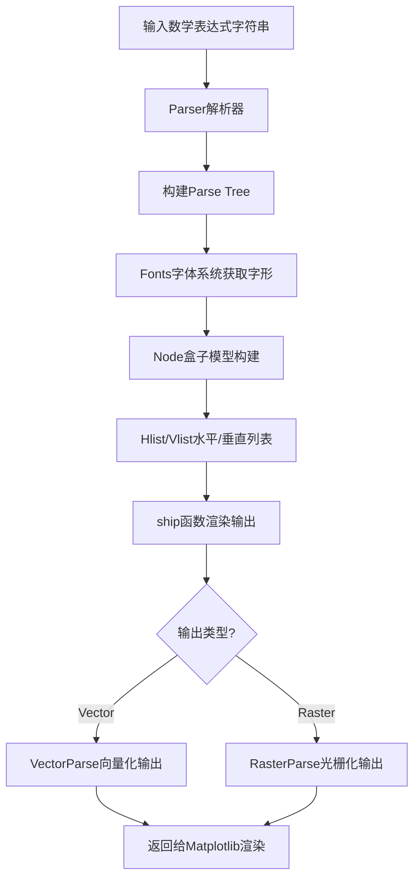

## 类结构

```
NamedTuples
├── VectorParse (解析结果-向量化)
├── RasterParse (解析结果-光栅化)
├── FontMetrics (字体度量)
├── FontInfo (字体信息)
└── _GlueSpec (粘合剂规格)
Output (输出容器)
Fonts (抽象基类)
├── TruetypeFonts (TrueType字体基类)
│   ├── BakomaFonts (BaKoMa字体)
│   ├── UnicodeFonts (Unicode字体)
│   │   ├── DejaVuFonts (DejaVu字体)
│   │   │   ├── DejaVuSerifFonts
│   │   │   └── DejaVuSansFonts
│   │   ├── StixFonts (STIX字体)
│   │   └── StixSansFonts (无衬线STIX)
FontConstantsBase (字体常量基类)
├── ComputerModernFontConstants
├── STIXFontConstants
├── STIXSansFontConstants
├── DejaVuSerifFontConstants
└── DejaVuSansFontConstants
Node (节点基类)
├── Box (带尺寸盒子)
│   ├── Vbox (垂直盒子)
│   ├── Hbox (水平盒子)
│   ├── Rule (实心矩形)
│   │   ├── Hrule (水平规则)
│   │   └── Vrule (垂直规则)
│   ├── List (节点列表)
│   │   ├── Hlist (水平列表)
│   │   │   ├── HCentered (水平居中)
│   │   │   ├── AutoHeightChar (自动高度字符)
│   │   │   └── AutoWidthChar (自动宽度字符)
│   │   └── Vlist (垂直列表)
│   │       └── VCentered (垂直居中)
│   └── Glue (粘合剂节点)
├── Char (单个字符)
│   └── Accent (重音字符)
└── Kern (字距调整)
Parser (pyparsing解析器)
ParserState (解析器状态)
```

## 全局变量及字段


### `_log`
    
Logger for the matplotlib.mathtext module.

类型：`logging.Logger`
    


### `SHRINK_FACTOR`
    
Factor (0.7) for shrinking text when going to the next-smaller size level.

类型：`float`
    


### `NUM_SIZE_LEVELS`
    
Maximum number of different font sizes, beyond which characters will not get any smaller.

类型：`int`
    


### `_font_constant_mapping`
    
Maps font family names to the corresponding FontConstantsBase subclass for typography constants.

类型：`dict[str, type]`
    


### `_space_widths`
    
Maps TeX space commands (e.g., '\,', '\quad') to em-width percentages for horizontal spacing.

类型：`dict[str, float]`
    


### `_binary_operators`
    
Set of binary operator symbols (e.g., +, -, \times, \div) for math spacing.

类型：`set[str]`
    


### `_relation_symbols`
    
Set of relation symbols (e.g., =, <, >, \leq, \geq) for math spacing.

类型：`set[str]`
    


### `_arrow_symbols`
    
Set of arrow symbols (e.g., \leftarrow, \rightarrow, \Rightarrow) for math spacing.

类型：`set[str]`
    


### `_spaced_symbols`
    
Union of binary operators, relation symbols, and arrow symbols that require spacing in math mode.

类型：`set[str]`
    


### `_punctuation_symbols`
    
Set of punctuation symbols (e.g., ,, ., ;, !) for math formatting.

类型：`set[str]`
    


### `_overunder_symbols`
    
Set of symbols (e.g., \sum, \prod, \int) that support over/under positioning of limits.

类型：`set[str]`
    


### `_overunder_functions`
    
Set of function names (e.g., lim, max, min) that support over/under limits.

类型：`set[str]`
    


### `_dropsub_symbols`
    
Set of symbols (e.g., \int, \oint) that drop subscripts below the baseline.

类型：`set[str]`
    


### `_fontnames`
    
Set of valid TeX font names (rm, it, tt, sf, bf, etc.).

类型：`set[str]`
    


### `_function_names`
    
Set of recognized math function names (e.g., sin, cos, log, tan).

类型：`set[str]`
    


### `_ambi_delims`
    
Set of ambiguous delimiters (e.g., |, \|, /, \backslash) that can be left or right.

类型：`set[str]`
    


### `_left_delims`
    
Set of left delimiters (e.g., (, [, {, \lfloor, \langle).

类型：`set[str]`
    


### `_right_delims`
    
Set of right delimiters (e.g., ), ], }, \rfloor, \rangle).

类型：`set[str]`
    


### `_delims`
    
Union of left, right, and ambiguous delimiters.

类型：`set[str]`
    


### `_small_greek`
    
Set of lowercase Greek letter names for Unicode character lookup.

类型：`set[str]`
    


### `_latin_alphabets`
    
Set of Latin alphabet characters (a-z, A-Z) for text processing.

类型：`set[str]`
    


### `_accent_map`
    
Maps accent command names to their corresponding Unicode combining characters.

类型：`dict[str, str]`
    


### `_wide_accents`
    
Set of wide accent names (e.g., widehat, widetilde, widebar) that span multiple characters.

类型：`set[str]`
    


### `VectorParse.VectorParse.width`
    
Total width of the parsed math expression in points.

类型：`float`
    


### `VectorParse.VectorParse.height`
    
Total height of the parsed math expression in points.

类型：`float`
    


### `VectorParse.VectorParse.depth`
    
Total depth (descent below baseline) of the parsed math expression in points.

类型：`float`
    


### `VectorParse.VectorParse.glyphs`
    
List of glyphs with their font, fontsize, character code, and positioning coordinates.

类型：`list[tuple[FT2Font, float, int, float, float]]`
    


### `VectorParse.VectorParse.rects`
    
List of rectangles (filled regions) with their coordinates.

类型：`list[tuple[float, float, float, float]]`
    


### `RasterParse.RasterParse.ox`
    
X offset of the raster image (always zero).

类型：`float`
    


### `RasterParse.RasterParse.oy`
    
Y offset of the raster image (always zero).

类型：`float`
    


### `RasterParse.RasterParse.width`
    
Width of the raster image in pixels.

类型：`float`
    


### `RasterParse.RasterParse.height`
    
Height of the raster image in pixels.

类型：`float`
    


### `RasterParse.RasterParse.depth`
    
Depth of the raster image in pixels.

类型：`float`
    


### `RasterParse.RasterParse.image`
    
2D array containing the rasterized image pixel data.

类型：`NDArray[np.uint8]`
    


### `Output.Output.box`
    
The box being rendered containing width, height, and depth information.

类型：`Box`
    


### `Output.Output.glyphs`
    
List of positioned glyphs to render, stored as (x, y, font_info) tuples.

类型：`list[tuple[float, float, FontInfo]]`
    


### `Output.Output.rects`
    
List of filled rectangles to render, stored as (x1, y1, x2, y2) tuples.

类型：`list[tuple[float, float, float, float]]`
    


### `FontMetrics.FontMetrics.advance`
    
Advance distance (in points) from this glyph to the next glyph.

类型：`float`
    


### `FontMetrics.FontMetrics.height`
    
Height of the glyph in points.

类型：`float`
    


### `FontMetrics.FontMetrics.width`
    
Width of the glyph in points.

类型：`float`
    


### `FontMetrics.FontMetrics.xmin`
    
Minimum x-coordinate of the glyph's ink rectangle.

类型：`float`
    


### `FontMetrics.FontMetrics.xmax`
    
Maximum x-coordinate of the glyph's ink rectangle.

类型：`float`
    


### `FontMetrics.FontMetrics.ymin`
    
Minimum y-coordinate of the glyph's ink rectangle.

类型：`float`
    


### `FontMetrics.FontMetrics.ymax`
    
Maximum y-coordinate of the glyph's ink rectangle.

类型：`float`
    


### `FontMetrics.FontMetrics.iceberg`
    
Distance from baseline to the top of the glyph (TeX's definition of height).

类型：`float`
    


### `FontMetrics.FontMetrics.slanted`
    
Whether the glyph should be considered slanted for kerning calculations.

类型：`bool`
    


### `FontInfo.FontInfo.font`
    
The FreeType font object used to render this glyph.

类型：`FT2Font`
    


### `FontInfo.FontInfo.fontsize`
    
Font size in points at which the glyph was loaded.

类型：`float`
    


### `FontInfo.FontInfo.postscript_name`
    
PostScript name of the font.

类型：`str`
    


### `FontInfo.FontInfo.metrics`
    
Font metrics for the glyph including dimensions and positioning.

类型：`FontMetrics`
    


### `FontInfo.FontInfo.num`
    
Character code (Unicode index) of the glyph.

类型：`int`
    


### `FontInfo.FontInfo.glyph`
    
The loaded Glyph object from FreeType.

类型：`Glyph`
    


### `FontInfo.FontInfo.offset`
    
Vertical offset applied to the glyph for positioning.

类型：`float`
    


### `Fonts.Fonts.default_font_prop`
    
Default font properties for non-math text rendering.

类型：`FontProperties`
    


### `Fonts.Fonts.load_glyph_flags`
    
Flags passed to the FreeType glyph loader.

类型：`LoadFlags`
    


### `TruetypeFonts.TruetypeFonts._get_info`
    
Cached method for retrieving FontInfo for a given font/symbol combination.

类型：`functools._lru_cache_wrapper`
    


### `TruetypeFonts.TruetypeFonts._fonts`
    
Per-instance cache of loaded font objects keyed by basename or PostScript name.

类型：`dict[str, FT2Font]`
    


### `TruetypeFonts.TruetypeFonts.fontmap`
    
Mapping from font keys to font file paths.

类型：`dict[str | int, str]`
    


### `BakomaFonts.BakomaFonts._stix_fallback`
    
Fallback font handler for symbols not found in BaKoMa fonts.

类型：`StixFonts | None`
    


### `BakomaFonts.BakomaFonts._slanted_symbols`
    
Set of symbols that should be rendered with a slanted style.

类型：`set[str]`
    


### `BakomaFonts.BakomaFonts._size_alternatives`
    
Pre-sized alternatives for delimiter characters from BaKoMa fonts.

类型：`dict[str, list[tuple[str, str]]]`
    


### `UnicodeFonts.UnicodeFonts._fallback_font`
    
Fallback font handler for symbols not found in the primary Unicode font.

类型：`TruetypeFonts | None`
    


### `UnicodeFonts.UnicodeFonts._cmr10_substitutions`
    
Unicode character index substitutions from cmr10 to cmsy10 for missing glyphs.

类型：`dict[int, int]`
    


### `UnicodeFonts.UnicodeFonts._slanted_symbols`
    
Set of symbols that should be rendered with a slanted style.

类型：`set[str]`
    


### `DejaVuFonts.DejaVuFonts._fallback_font`
    
Fallback font (STIX or STIXSans) for missing glyphs in DejaVu fonts.

类型：`StixFonts | StixSansFonts`
    


### `DejaVuFonts.DejaVuFonts.bakoma`
    
BaKoMa font handler for certain glyphs like prime symbols.

类型：`BakomaFonts`
    


### `StixFonts.StixFonts._fontmap`
    
Mapping of STIX font keys to font file paths.

类型：`dict[str | int, str]`
    


### `StixFonts.StixFonts._sans`
    
Flag indicating whether to use sans-serif variants of STIX fonts.

类型：`bool`
    


### `FontConstantsBase.FontConstantsBase.script_space`
    
Percentage of x-height for additional horizontal space after sub/superscripts.

类型：`float`
    


### `FontConstantsBase.FontConstantsBase.subdrop`
    
Percentage of x-height that subscripts drop below the baseline.

类型：`float`
    


### `FontConstantsBase.FontConstantsBase.sup1`
    
Percentage of x-height that superscripts are raised from the baseline.

类型：`float`
    


### `FontConstantsBase.FontConstantsBase.sub1`
    
Percentage of x-height that subscripts drop below the baseline.

类型：`float`
    


### `FontConstantsBase.FontConstantsBase.sub2`
    
Percentage of x-height that subscripts drop when a superscript is present.

类型：`float`
    


### `FontConstantsBase.FontConstantsBase.delta`
    
Percentage of x-height for sub/superscript offset relative to nucleus edge.

类型：`float`
    


### `FontConstantsBase.FontConstantsBase.delta_slanted`
    
Additional percentage for superscript offset on slanted nuclei.

类型：`float`
    


### `FontConstantsBase.FontConstantsBase.delta_integral`
    
Percentage of x-height for sub/superscript offset on integrals.

类型：`float`
    


### `Node.Node.size`
    
Size level for font shrinking (0 = full size, increases for smaller sizes).

类型：`int`
    


### `Box.Box.width`
    
Width of the box in points.

类型：`float`
    


### `Box.Box.height`
    
Height of the box in points (distance above baseline).

类型：`float`
    


### `Box.Box.depth`
    
Depth of the box in points (distance below baseline).

类型：`float`
    


### `Char.Char.c`
    
The character being rendered.

类型：`str`
    


### `Char.Char.fontset`
    
Font system handler for retrieving glyph metrics and rendering.

类型：`Fonts`
    


### `Char.Char.font`
    
TeX font name (e.g., 'rm', 'it', 'bf') for this character.

类型：`str`
    


### `Char.Char.font_class`
    
Font class used for combining fonts (e.g., 'rm', 'bf').

类型：`str`
    


### `Char.Char.fontsize`
    
Font size in points for this character.

类型：`float`
    


### `Char.Char.dpi`
    
Dots-per-inch resolution for rendering.

类型：`float`
    


### `Char.Char.width`
    
Width of the character in points.

类型：`float`
    


### `Char.Char.height`
    
Height of the character in points (iceberg measurement).

类型：`float`
    


### `Char.Char.depth`
    
Depth of the character in points (negative value for below baseline).

类型：`float`
    


### `Char.Char._metrics`
    
Cached font metrics for this character.

类型：`FontMetrics`
    


### `List.List.shift_amount`
    
Arbitrary offset applied to all children in the list.

类型：`float`
    


### `List.List.children`
    
Child nodes contained in this list.

类型：`list[Node]`
    


### `List.List.glue_set`
    
Ratio for glue stretching or shrinking.

类型：`float`
    


### `List.List.glue_sign`
    
Glue sign: 0 for normal, -1 for shrinking, 1 for stretching.

类型：`int`
    


### `List.List.glue_order`
    
Order of infinity (0-3) for glue stretching/shrinking.

类型：`int`
    


### `Rule.Rule.fontset`
    
Font system handler for rendering the rule.

类型：`Fonts`
    


### `Glue.Glue.glue_spec`
    
Specification containing width, stretch, and shrink values for the glue.

类型：`_GlueSpec`
    


### `Kern.Kern.width`
    
Width (or height in vertical lists) of the kerning space.

类型：`float`
    


### `AutoHeightChar.AutoHeightChar.shift_amount`
    
Vertical shift applied to position the character at the target height.

类型：`float`
    


### `Parser.Parser._expression`
    
Pyparsing expression for parsing the full math text including non-math portions.

类型：`ParserElement`
    


### `Parser.Parser._math_expression`
    
Pyparsing expression for parsing math-only portions.

类型：`ParserElement`
    


### `Parser.Parser._state_stack`
    
Stack of parser states for tracking font and style changes during parsing.

类型：`list[ParserState]`
    


### `Parser.Parser._em_width_cache`
    
Cache for em-width calculations keyed by (font, fontsize, dpi).

类型：`dict[tuple[str, float, float], float]`
    


### `Parser.Parser._in_subscript_or_superscript`
    
Flag indicating whether the parser is currently inside a subscript or superscript.

类型：`bool`
    


### `ParserState.ParserState.fontset`
    
Font system handler for retrieving glyph information.

类型：`Fonts`
    


### `ParserState.ParserState._font`
    
Current TeX font name being used.

类型：`str`
    


### `ParserState.ParserState.font_class`
    
Current font class for combining fonts (e.g., 'rm', 'bf').

类型：`str`
    


### `ParserState.ParserState.fontsize`
    
Font size in points for rendering.

类型：`float`
    


### `ParserState.ParserState.dpi`
    
Dots-per-inch resolution for rendering.

类型：`float`
    
    

## 全局函数及方法


### `get_unicode_index`

该函数用于将给定的符号（单个Unicode字符、TeX命令或Type1符号名）转换为其在Unicode表中的整数索引。这是mathtext模块中符号解析的核心功能，负责将各种形式的数学符号统一转换为Unicode码点，以便后续的字体渲染。

参数：

- `symbol`：`str`，要转换的符号，可以是单个Unicode字符（如'A'、'α'）、TeX命令（如`'\\pi'`、`'\\alpha'`）或Type1符号名（如`'phi'`）

返回值：`int`，符号对应的Unicode码点（整数索引）

#### 流程图

```mermaid
flowchart TD
    A[开始: get_unicode_index] --> B{尝试 ord(symbol)}
    B -->|成功| C[返回 ord(symbol)]
    B -->|TypeError| D{尝试 tex2uni[symbol.strip&#40;'\\\\'&#41;]}
    D -->|找到| E[返回 tex2uni[symbol.strip&#40;'\\\\'&#41;]]
    D -->|KeyError| F[抛出 ValueError]
    C --> G[结束]
    E --> G
    F --> G
    
    style C fill:#90EE90
    style E fill:#90EE90
    style F fill:#FFB6C1
```

#### 带注释源码

```python
def get_unicode_index(symbol: str) -> int:  # Publicly exported.
    r"""
    Return the integer index (from the Unicode table) of *symbol*.

    Parameters
    ----------
    symbol : str
        A single (Unicode) character, a TeX command (e.g. r'\pi') or a Type1
        symbol name (e.g. 'phi').
    """
    # 尝试方案1: 如果symbol是单个Unicode字符，直接使用ord()获取码点
    # 例如: 'A' -> 65, 'α' -> 945
    try:  # This will succeed if symbol is a single Unicode char
        return ord(symbol)
    except TypeError:
        # ord()只接受单字符字符串，如果传入多字符会抛出TypeError
        pass
    
    # 尝试方案2: 查找TeX符号表tex2uni
    # tex2uni是一个字典，将TeX命令（如\alpha）映射到Unicode码点
    # 先去掉反斜杠（TeX命令以\开头）
    try:  # Is symbol a TeX symbol (i.e. \alpha)
        return tex2uni[symbol.strip("\\")]
    except KeyError as err:
        # 如果既不是单字符，也不是有效的TeX符号，抛出ValueError
        raise ValueError(
            f"{symbol!r} is not a valid Unicode character or TeX/Type1 symbol"
        ) from err
```


### `ship`

该函数是matplotlib.mathtext模块中的核心输出函数，负责将解析后的TeX盒子模型渲染为可绘制的Output对象。由于盒子可以嵌套（盒子内部还有盒子），主要工作由两个相互递归的函数`hlist_out`和`vlist_out`完成，它们分别遍历水平列表节点和垂直列表节点，将TeX的全局状态转换为局部变量进行处理。

参数：

- `box`：`Box`，要输出的盒子对象，通常是一个`Hlist`（水平列表）
- `xy`：`tuple[float, float]`，输出偏移量，默认为(0, 0)，表示水平和垂直偏移

返回值：`Output`，包含渲染后的字形和矩形信息的输出对象

#### 流程图

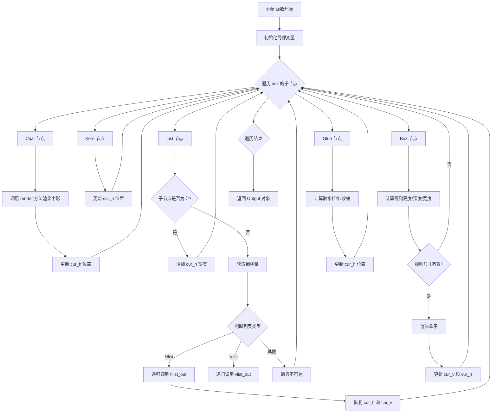

#### 带注释源码

```python
def ship(box: Box, xy: tuple[float, float] = (0, 0)) -> Output:
    """
    Ship out *box* at offset *xy*, converting it to an `Output`.

    Since boxes can be inside of boxes inside of boxes, the main work of `ship`
    is done by two mutually recursive routines, `hlist_out` and `vlist_out`,
    which traverse the `Hlist` nodes and `Vlist` nodes inside of horizontal
    and vertical boxes.  The global variables used in TeX to store state as it
    processes have become local variables here.
    """
    # 解包偏移坐标
    ox, oy = xy
    # 初始化当前垂直和水平位置
    cur_v = 0.
    cur_h = 0.
    # 计算水平和垂直偏移量，垂直偏移要加上盒子高度
    off_h = ox
    off_v = oy + box.height
    # 创建输出对象
    output = Output(box)

    def clamp(value: float) -> float:
        """
        将值限制在 [-1e9, 1e9] 范围内，防止数值溢出
        """
        return -1e9 if value < -1e9 else +1e9 if value > +1e9 else value

    def hlist_out(box: Hlist) -> None:
        """
        处理水平列表节点的输出
        
        遍历水平列表中的所有子节点，根据节点类型进行相应处理：
        - Char: 渲染字形并更新水平位置
        - Kern: 直接增加水平位置
        - List: 递归处理嵌套的列表
        - Box: 渲染规则矩形
        - Glue: 处理胶水（间距）的拉伸和收缩
        """
        nonlocal cur_v, cur_h  # 声明使用外层函数的变量

        cur_g = 0  # 当前胶水增长量
        cur_glue = 0.  # 当前胶水累计值
        glue_order = box.glue_order  # 胶水阶数
        glue_sign = box.glue_sign  # 胶水符号（0:正常, 1:拉伸, -1:收缩）
        base_line = cur_v  # 基线位置
        left_edge = cur_h  # 左侧边缘

        for p in box.children:
            if isinstance(p, Char):
                # 渲染字符字形
                p.render(output, cur_h + off_h, cur_v + off_v)
                # 更新水平位置
                cur_h += p.width
            elif isinstance(p, Kern):
                # 增加水平位置（字间距调整）
                cur_h += p.width
            elif isinstance(p, List):
                # node623: 处理嵌套列表
                if len(p.children) == 0:
                    # 空列表直接增加宽度
                    cur_h += p.width
                else:
                    edge = cur_h
                    # 应用垂直偏移
                    cur_v = base_line + p.shift_amount
                    if isinstance(p, Hlist):
                        # 递归处理水平列表
                        hlist_out(p)
                    elif isinstance(p, Vlist):
                        # 递归处理垂直列表
                        vlist_out(p)
                    else:
                        assert False, "unreachable code"
                    # 恢复位置
                    cur_h = edge + p.width
                    cur_v = base_line
            elif isinstance(p, Box):
                # node624: 处理规则（矩形）节点
                rule_height = p.height
                rule_depth = p.depth
                rule_width = p.width
                # 处理无限尺寸（运行尺寸）
                if np.isinf(rule_height):
                    rule_height = box.height
                if np.isinf(rule_depth):
                    rule_depth = box.depth
                # 渲染有效规则
                if rule_height > 0 and rule_width > 0:
                    cur_v = base_line + rule_depth
                    p.render(output,
                             cur_h + off_h, cur_v + off_v,
                             rule_width, rule_height)
                    cur_v = base_line
                cur_h += rule_width
            elif isinstance(p, Glue):
                # node625: 处理胶水节点
                glue_spec = p.glue_spec
                rule_width = glue_spec.width - cur_g
                if glue_sign != 0:  # 正常模式
                    if glue_sign == 1:  # 拉伸模式
                        if glue_spec.stretch_order == glue_order:
                            cur_glue += glue_spec.stretch
                            cur_g = round(clamp(box.glue_set * cur_glue))
                    elif glue_spec.shrink_order == glue_order:  # 收缩模式
                        cur_glue += glue_spec.shrink
                        cur_g = round(clamp(box.glue_set * cur_glue))
                rule_width += cur_g
                cur_h += rule_width

    def vlist_out(box: Vlist) -> None:
        """
        处理垂直列表节点的输出
        
        与 hlist_out 类似，但是处理垂直方向上的布局：
        - Kern: 增加垂直位置
        - List: 递归处理嵌套列表
        - Box: 渲染规则矩形
        - Glue: 处理胶水的垂直拉伸/收缩
        - Char: 抛出错误（垂直列表中不应出现字符）
        """
        nonlocal cur_v, cur_h

        cur_g = 0
        cur_glue = 0.
        glue_order = box.glue_order
        glue_sign = box.glue_sign
        left_edge = cur_h
        # 垂直列表从顶部开始，需要减去高度
        cur_v -= box.height
        top_edge = cur_v

        for p in box.children:
            if isinstance(p, Kern):
                # 垂直kern增加垂直位置
                cur_v += p.width
            elif isinstance(p, List):
                if len(p.children) == 0:
                    # 空列表增加高度和深度
                    cur_v += p.height + p.depth
                else:
                    cur_v += p.height
                    cur_h = left_edge + p.shift_amount
                    save_v = cur_v
                    p.width = box.width
                    if isinstance(p, Hlist):
                        hlist_out(p)
                    elif isinstance(p, Vlist):
                        vlist_out(p)
                    else:
                        assert False, "unreachable code"
                    cur_v = save_v + p.depth
                    cur_h = left_edge
            elif isinstance(p, Box):
                rule_height = p.height
                rule_depth = p.depth
                rule_width = p.width
                if np.isinf(rule_width):
                    rule_width = box.width
                rule_height += rule_depth
                if rule_height > 0 and rule_depth > 0:
                    cur_v += rule_height
                    p.render(output,
                             cur_h + off_h, cur_v + off_v,
                             rule_width, rule_height)
            elif isinstance(p, Glue):
                glue_spec = p.glue_spec
                rule_height = glue_spec.width - cur_g
                if glue_sign != 0:  # 正常
                    if glue_sign == 1:  # 拉伸
                        if glue_spec.stretch_order == glue_order:
                            cur_glue += glue_spec.stretch
                            cur_g = round(clamp(box.glue_set * cur_glue))
                    elif glue_spec.shrink_order == glue_order:  # 收缩
                        cur_glue += glue_spec.shrink
                        cur_g = round(clamp(box.glue_set * cur_glue))
                rule_height += cur_g
                cur_v += rule_height
            elif isinstance(p, Char):
                raise RuntimeError(
                    "Internal mathtext error: Char node found in vlist")

    # 验证输入是水平列表（TeX要求顶级必须是hlist）
    assert isinstance(box, Hlist)
    # 调用水平列表输出函数
    hlist_out(box)
    # 返回包含渲染结果的Output对象
    return output
```


### `Error`

一个辅助函数，用于创建在解析过程中引发解析错误的 pyparsing 解析器元素。该函数返回一个配置好的 `ParserElement`，当解析成功匹配时，会触发一个错误异常，用于报告自定义的错误消息。

参数：

-  `msg`：`str`，要报告的错误消息内容

返回值：`ParserElement`，一个 pyparsing ParserElement，配置有错误处理函数

#### 流程图

```mermaid
flowchart TD
    A[开始 Error 函数] --> B[定义内部函数 raise_error]
    B --> C[raise_error 接收参数 s, loc, toks]
    C --> D[抛出 ParseFatalException 异常]
    D --> E[返回 Empty().set_parse_action(raise_error)]
    E --> F[结束]
    
    style A fill:#f9f,stroke:#333
    style D fill:#f96,stroke:#333
    style F fill:#9f9,stroke:#333
```

#### 带注释源码

```python
def Error(msg: str) -> ParserElement:
    """
    Helper class to raise parser errors.
    
    这是一个辅助函数，用于创建在解析过程中引发解析错误的 pyparsing 解析器元素。
    当解析器遇到无效输入时，会使用此函数生成错误信息。
    
    参数:
        msg: str - 要报告的错误消息内容
        
    返回:
        ParserElement - 一个配置好的 pyparsing ParserElement，
                       当被触发时会抛出 ParseFatalException
    """
    
    def raise_error(s: str, loc: int, toks: ParseResults) -> T.Any:
        """
        内部错误处理函数，用于在实际解析时抛出异常。
        
        参数:
            s: str - 正在解析的原始字符串
            loc: int - 解析失败的位置
            toks: ParseResults - 已解析的标记结果
            
        返回:
            T.Any - 此函数抛出异常，不返回任何值
            
        异常:
            ParseFatalException - 带有指定错误消息的致命解析异常
        """
        raise ParseFatalException(s, loc, msg)

    # 创建一个空的解析元素，并设置其解析动作为 raise_error
    # 当此元素被成功匹配时，会调用 raise_error 函数
    return Empty().set_parse_action(raise_error)
```


### `cmd`

定义TeX命令的辅助函数，用于创建pyparsing解析器元素。它接收一个TeX命令表达式和解析器元素参数，返回一个组合的解析器元素，该元素能够解析指定的TeX命令并在解析失败时提供有意义的错误消息。

参数：

- `expr`：`str`，TeX命令表达式，例如`"\frac"`或`"\sqrt{value}"`
- `args`：`ParserElement`，pyparsing解析器元素，定义命令的参数格式

返回值：`ParserElement`，组合后的pyparsing解析器元素，能够解析指定的TeX命令

#### 流程图

```mermaid
graph TD
    A[开始 cmd 函数] --> B[接收 expr 和 args 参数]
    B --> C[从 expr 中提取 csname 命令名]
    C --> D[定义 names 生成器函数]
    D --> E{检查 expr 是否等于 csname}
    E -->|是| F[构建错误消息: csname + 参数名]
    E -->|否| G[使用原 expr 作为错误消息]
    F --> H[返回解析器元素: csname - (args | Error err)]
    G --> H
```

#### 带注释源码

```python
def cmd(expr: str, args: ParserElement) -> ParserElement:
    r"""
    Helper to define TeX commands.

    ``cmd("\cmd", args)`` is equivalent to
    ``"\cmd" - (args | Error("Expected \cmd{arg}{...}"))`` where the names in
    the error message are taken from element names in *args*.  If *expr*
    already includes arguments (e.g. "\cmd{arg}{...}"), then they are stripped
    when constructing the parse element, but kept (and *expr* is used as is) in
    the error message.
    """

    def names(elt: ParserElement) -> T.Generator[str, None, None]:
        """
        递归提取解析器元素中的参数名称。
        
        如果元素是ParseExpression，遍历其所有子表达式；
        如果元素有resultsName，则yield该名称。
        """
        if isinstance(elt, ParseExpression):
            for expr in elt.exprs:
                yield from names(expr)
        elif elt.resultsName:
            yield elt.resultsName

    # 从表达式中提取命令名（不含花括号部分）
    # 例如："\frac{num}{den}" -> "\frac"
    csname = expr.split("{", 1)[0]
    
    # 构建错误消息：如果expr只是命令名（无参数），则添加参数名
    # 例如：csname = "\frac", args有"num"和"den" -> err = "\frac{num}{den}"
    err = (csname + "".join("{%s}" % name for name in names(args))
           if expr == csname else expr)
    
    # 返回组合的解析器元素：命令名 - (参数 | 错误处理)
    # 使用减号(-)表示顺序解析：先匹配命令名，再匹配参数
    return csname - (args | Error(f"Expected {err}"))
```


### `_get_font_constant_set`

该函数用于根据当前解析状态的字体集和字体名称，返回对应的字体常量类（FontConstantsBase 的子类），以获取特定字体的排版常量（如上下标的偏移量等）。它是字体常量映射的核心查找函数。

参数：

- `state`：`ParserState`，包含当前解析器的字体集、字体名称、字体大小等信息的状态对象。

返回值：`type[FontConstantsBase]`，返回 `FontConstantsBase` 的子类类型，用于获取特定字体的排版常量。

#### 流程图

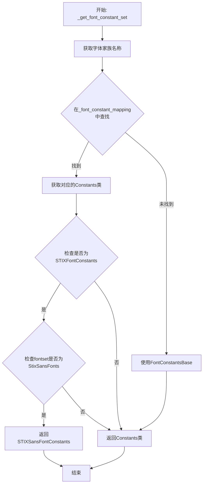

#### 带注释源码

```python
def _get_font_constant_set(state: ParserState) -> type[FontConstantsBase]:
    """
    根据解析状态获取对应的字体常量类。
    
    Parameters
    ----------
    state : ParserState
        包含当前字体信息的解析器状态。
    
    Returns
    -------
    type[FontConstantsBase]
        字体常量类，用于获取特定字体的排版参数。
    """
    # 从字体映射字典中查找字体家族名称对应的常量类
    # 如果未找到，则默认使用 FontConstantsBase
    constants = _font_constant_mapping.get(
        state.fontset._get_font(state.font).family_name, FontConstantsBase)
    
    # STIX sans 字体实际上并非独立的字体，只是 STIX 字体中的不同代码点
    # 因此需要单独检测这种情况
    if (constants is STIXFontConstants and
            isinstance(state.fontset, StixSansFonts)):
        return STIXSansFontConstants
    
    return constants
```


### Output.to_vector

将 `Output` 对象转换为 `VectorParse` 命名元组，用于矢量化渲染。该方法计算盒子的尺寸（宽度、高度、深度），并将内部存储的字形和矩形数据从 mathtext 坐标系统转换为目标坐标系统。

参数：
- （无显式参数，使用隐式的 `self`）

返回值：`VectorParse`，包含经过坐标转换后的字形和矩形列表，以及盒子的整体尺寸

#### 流程图

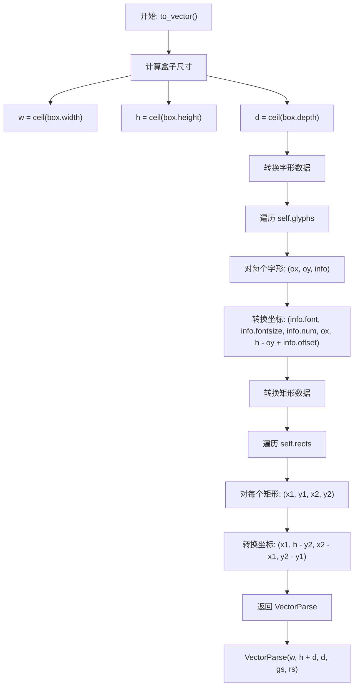

#### 带注释源码

```python
def to_vector(self) -> VectorParse:
    """
    将 Output 对象转换为 VectorParse 命名元组。
    
    此方法执行以下转换:
    1. 计算盒子的尺寸（宽、高、深度），使用向上取整
    2. 将字形坐标从 mathtext 坐标系统转换为目标坐标系统
       - mathtext 使用 y 轴向下增加的坐标系
       - 目标系统使用 y 轴向上增加的坐标系，因此需要翻转 y 坐标
    3. 将矩形坐标从 mathtext 坐标系统转换为目标坐标系统
    """
    # 使用 np.ceil 对宽度、高度、深度进行向上取整
    # 这确保了输出尺寸能够完全容纳所有内容
    w, h, d = map(
        np.ceil, [self.box.width, self.box.height, self.box.depth])
    
    # 转换字形数据
    # 字形存储格式: (ox, oy, FontInfo)
    # 转换后格式: (font, fontsize, glyph_index, x, y)
    # 坐标转换说明:
    #   - ox: 保持不变（x 坐标方向相同）
    #   - y 坐标需要翻转: h - oy + info.offset
    #     其中 h 是盒子的高度，info.offset 是字形的偏移量
    gs = [(info.font, info.fontsize, info.num, ox, h - oy + info.offset)
          for ox, oy, info in self.glyphs]
    
    # 转换矩形数据
    # 矩形存储格式: (x1, y1, x2, y2)
    # 转换后格式: (x1, y2, width, height)
    # 坐标转换说明:
    #   - x1: 保持不变
    #   - y2: 翻转为 y1（因为 y 轴方向相反）
    #   - width: x2 - x1
    #   - height: y2 - y1
    rs = [(x1, h - y2, x2 - x1, y2 - y1)
          for x1, y1, x2, y2 in self.rects]
    
    # 返回 VectorParse 命名元组
    # 包含: 宽度、总高度（h + d）、深度、字形列表、矩形列表
    return VectorParse(w, h + d, d, gs, rs)
```


### `Output.to_raster`

将包含定位字形和矩形的输出对象转换为光栅图像（位图）格式。该方法计算所有字形和矩形的边界框，创建足够大的空白图像，通过 `ship` 函数重新定位内容，然后将字形和矩形绘制到图像上，最终返回包含图像数据和尺寸信息的 `RasterParse` 对象。

参数：

- `antialiased`：`bool`，控制字形绘制时是否使用抗锯齿渲染

返回值：`RasterParse`，一个 NamedTuple，包含光栅图像的偏移量（ox, oy）、宽度、高度、深度和图像数据（uint8 类型的 2D 数组）

#### 流程图

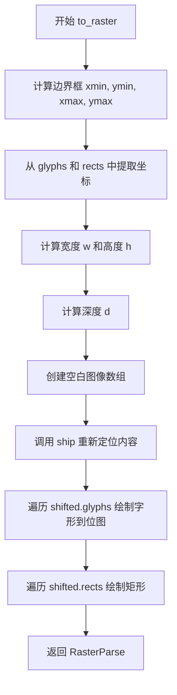

#### 带注释源码

```python
def to_raster(self, *, antialiased: bool) -> RasterParse:
    """
    将 Output 对象转换为 RasterParse（光栅图像）。
    
    Parameters
    ----------
    antialiased : bool
        是否对抗锯齿渲染字形。
    
    Returns
    -------
    RasterParse
        包含光栅图像数据和相关尺寸信息的命名元组。
    """
    # Metrics y's and mathtext y's are oriented in opposite directions,
    # hence the switch between ymin and ymax.
    # 计算所有字形和矩形的边界框（添加1像素padding）
    xmin = min([*[ox + info.metrics.xmin for ox, oy, info in self.glyphs],
                *[x1 for x1, y1, x2, y2 in self.rects], 0]) - 1
    ymin = min([*[oy - info.metrics.ymax for ox, oy, info in self.glyphs],
                *[y1 for x1, y1, x2, y2 in self.rects], 0]) - 1
    xmax = max([*[ox + info.metrics.xmax for ox, oy, info in self.glyphs],
                *[x2 for x1, y1, x2, y2 in self.rects], 0]) + 1
    ymax = max([*[oy - info.metrics.ymin for ox, oy, info in self.glyphs],
                *[y2 for x1, y1, x2, y2 in self.rects], 0]) + 1
    
    # 计算图像宽度、高度和深度
    w = xmax - xmin
    h = ymax - ymin - self.box.depth
    d = ymax - ymin - self.box.height
    
    # 创建空白图像数组（uint8类型）
    image = np.zeros((math.ceil(h + max(d, 0)), math.ceil(w)), np.uint8)

    # Ideally, we could just use self.glyphs and self.rects here, shifting
    # their coordinates by (-xmin, -ymin), but this yields slightly
    # different results due to floating point slop; shipping twice is the
    # old approach and keeps baseline images backcompat.
    # 使用 ship 函数重新定位内容到 (-xmin, -ymin)
    shifted = ship(self.box, (-xmin, -ymin))

    # 遍历所有字形，绘制到到位图
    for ox, oy, info in shifted.glyphs:
        info.font.draw_glyph_to_bitmap(
            image, int(ox), int(oy - info.metrics.iceberg), info.glyph,
            antialiased=antialiased)
    
    # 遍历所有矩形，绘制到到位图
    for x1, y1, x2, y2 in shifted.rects:
        height = max(int(y2 - y1) - 1, 0)
        if height == 0:
            # 处理零高度矩形（画一条线）
            center = (y2 + y1) / 2
            y = int(center - (height + 1) / 2)
        else:
            y = int(y1)
        x1 = math.floor(x1)
        x2 = math.ceil(x2)
        # 将矩形区域填充为 0xff（白色）
        image[y:y+height+1, x1:x2+1] = 0xff
    
    # 返回 RasterParse 包含所有图像数据
    return RasterParse(0, 0, w, h + d, d, image)
```


### `Fonts.get_kern`

获取两个符号之间的字距调整值（kerning distance）。

参数：

- `font1`：`str`，第一个符号使用的 TeX 字体名称（如 "tt", "it", "rm", "bf" 等）
- `fontclass1`：`str`，第一个符号的字体类别
- `sym1`：`str`，第一个符号（原始 TeX 形式，如 "1", "x", "\\sigma"）
- `fontsize1`：`float`，第一个符号的字体大小（磅）
- `font2`：`str`，第二个符号使用的 TeX 字体名称
- `fontclass2`：`str`，第二个符号的字体类别
- `sym2`：`str`，第二个符号
- `fontsize2`：`float`，第二个符号的字体大小（磅）
- `dpi`：`float`，渲染的每英寸点数

返回值：`float`，两个字距调整的距离值（以磅为单位）

#### 流程图

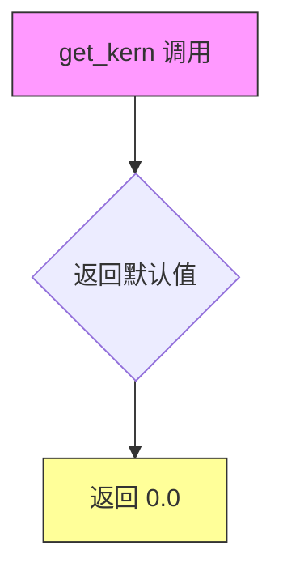

#### 带注释源码

```python
def get_kern(self, font1: str, fontclass1: str, sym1: str, fontsize1: float,
             font2: str, fontclass2: str, sym2: str, fontsize2: float,
             dpi: float) -> float:
    """
    Get the kerning distance for font between *sym1* and *sym2*.

    See `~.Fonts.get_metrics` for a detailed description of the parameters.
    """
    # Fonts 基类返回一个默认值 0
    # 子类（如 TruetypeFonts）可以重写此方法实现真正的字距调整
    return 0.
```

---

### `TruetypeFonts.get_kern`

当两个符号使用相同的字体和字号时，使用 FreeType 的字距调整功能获取精确的字距值；否则回退到父类的默认行为。

参数：

- `font1`：`str`，第一个符号使用的 TeX 字体名称
- `fontclass1`：`str`，第一个符号的字体类别
- `sym1`：`str`，第一个符号
- `fontsize1`：`float`，第一个符号的字体大小（磅）
- `font2`：`str`，第二个符号使用的 TeX 字体名称
- `fontclass2`：`str`，第二个符号的字体类别
- `sym2`：`str`，第二个符号
- `fontsize2`：`float`，第二个符号的字体大小（磅）
- `dpi`：`float`，渲染的每英寸点数

返回值：`float`，两个字距调整的距离值（除以 64 转换为磅）

#### 流程图

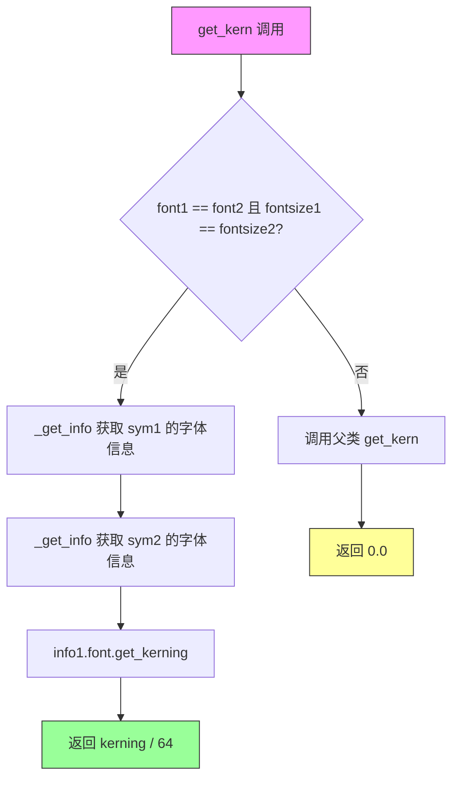

#### 带注释源码

```python
def get_kern(self, font1: str, fontclass1: str, sym1: str, fontsize1: float,
             font2: str, fontclass2: str, sym2: str, fontsize2: float,
             dpi: float) -> float:
    # 仅当两个字符合用相同字体和字号时才计算字距
    if font1 == font2 and fontsize1 == fontsize2:
        # 获取第一个符号的字体信息（包含字形索引等）
        info1 = self._get_info(font1, fontclass1, sym1, fontsize1, dpi)
        # 获取第二个符号的字体信息
        info2 = self._get_info(font2, fontclass2, sym2, fontsize2, dpi)
        # 使用 FreeType 的 get_kerning 方法获取原始字距值
        font = info1.font
        # Kerning.DEFAULT 表示使用默认的字距调整模式
        # 返回值需要除以 64 转换为磅（FreeType 使用 26.6 固定点数格式）
        return font.get_kerning(info1.num, info2.num, Kerning.DEFAULT) / 64
    # 字体或字号不同时，回退到父类（返回 0）
    return super().get_kern(font1, fontclass1, sym1, fontsize1,
                            font2, fontclass2, sym2, fontsize2, dpi)
```


### `Fonts._get_font`

这是一个在 `Fonts` 抽象基类中定义的抽象方法，用于根据字体名称获取对应的 FT2Font 字体对象。在 TruetypeFonts 子类中实现具体的字体加载和缓存逻辑。

参数：
- `font`：`str | int`（在基类中为 `str`，在子类 TruetypeFonts 中扩展为 `str | int`），字体名称或字体映射键

返回值：`FT2Font`，返回加载的字体对象

#### 流程图

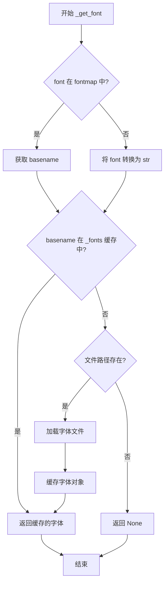

#### 带注释源码

```python
def _get_font(self, font: str | int) -> FT2Font:
    """
    获取指定字体的 FT2Font 对象。
    
    Parameters
    ----------
    font : str | int
        字体名称或字体映射键。如果是整数，通常由子类放在 fontmap 中。
    
    Returns
    -------
    FT2Font
        加载的字体对象，如果找不到则返回 None。
    """
    # 如果 font 在 fontmap 中，获取对应的 basename
    if font in self.fontmap:
        basename = self.fontmap[font]
    else:
        # NOTE: An int is only passed by subclasses which have placed int keys into
        # `self.fontmap`, so we must cast this to confirm it to typing.
        # 只有子类在 fontmap 中放置了整数键时才会传递整数，因此必须转换为字符串
        basename = T.cast(str, font)
    
    # 尝试从缓存中获取字体
    cached_font = self._fonts.get(basename)
    
    # 如果缓存中没有且文件存在，则加载字体
    if cached_font is None and os.path.exists(basename):
        # 使用 get_font 加载字体文件
        cached_font = get_font(basename)
        # 将加载的字体缓存到 _fonts 字典中
        self._fonts[basename] = cached_font
        # 同时用 postscript_name 及其小写形式缓存，以便查找
        self._fonts[cached_font.postscript_name] = cached_font
        self._fonts[cached_font.postscript_name.lower()] = cached_font
    
    # 返回字体对象，FIXME 注释表明不能保证返回值非空
    return T.cast(FT2Font, cached_font)  # FIXME: Not sure this is guaranteed.
```


### `Fonts._get_info` / `TruetypeFonts._get_info`

该方法是 `Fonts` 抽象类中的抽象方法，在 `TruetypeFonts` 类中实现。它根据给定的字体名称、字体类别、符号、字体大小和 DPI，获取符号的字体信息（FontInfo），包括字体对象、字形度量、字形数据等。

参数：

- `fontname`：`str`，字体名称（如 "rm", "it", "bf" 等 TeX 字体名）
- `font_class`：`str`，字体类别（用于组合字体的场景）
- `sym`：`str`，要获取信息的符号（可以是单个字符或 TeX 命令）
- `fontsize`：`float`，字体大小（以点为单位）
- `dpi`：`float`，渲染分辨率（每英寸点数）

返回值：`FontInfo`，包含以下字段的命名元组：
- `font`: FT2Font - FreeType 字体对象
- `fontsize`: float - 字体大小
- `postscript_name`: str - PostScript 字体名称
- `metrics`: FontMetrics - 字形度量信息
- `num`: int - 字形索引
- `glyph`: Glyph - 字形数据
- `offset`: float - 垂直偏移量

#### 流程图

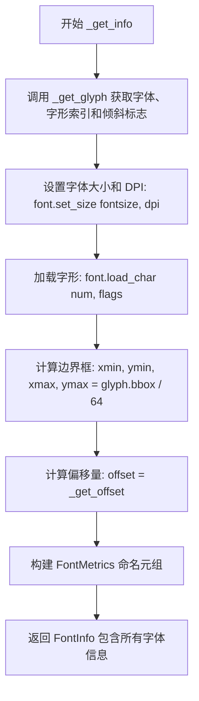

#### 带注释源码

```python
def _get_info(self, fontname: str, font_class: str, sym: str, fontsize: float,
              dpi: float) -> FontInfo:
    """
    获取符号的字体信息。
    
    Parameters
    ----------
    fontname : str
        字体名称（TeX 字体名如 "rm", "it", "bf" 等）
    font_class : str
        字体类别
    sym : str
        符号字符串
    fontsize : float
        字体大小（点）
    dpi : float
        渲染 DPI
    
    Returns
    -------
    FontInfo
        包含字体和字形详细信息的命名元组
    """
    # 1. 调用 _get_glyph 方法获取字体对象、字形索引和是否倾斜
    #    _get_glyph 是抽象方法，由子类（如 BakomaFonts, UnicodeFonts）实现
    font, num, slanted = self._get_glyph(fontname, font_class, sym)
    
    # 2. 设置字体的渲染大小（点大小和 DPI）
    font.set_size(fontsize, dpi)
    
    # 3. 加载字形数据（使用指定的加载标志）
    glyph = font.load_char(num, flags=self.load_glyph_flags)
    
    # 4. 将 FreeType 的 26.6 固定点格式转换为浮点数（除以 64）
    xmin, ymin, xmax, ymax = (val / 64 for val in glyph.bbox)
    
    # 5. 计算垂直偏移量
    #    对于 Cmex10 特殊处理，其他字体返回 0
    offset = self._get_offset(font, glyph, fontsize, dpi)
    
    # 6. 构建 FontMetrics 命名元组，包含字形的详细度量信息
    metrics = FontMetrics(
        advance=glyph.linearHoriAdvance / 65536,  # 水平前进距离
        height=glyph.height / 64,                  # 字形高度
        width=glyph.width / 64,                    # 字形宽度
        xmin=xmin,                                 # 墨水矩形左边界
        xmax=xmax,                                 # 墨水矩形右边界
        ymin=ymin + offset,                        # 墨水矩形下边界（含偏移）
        ymax=ymax + offset,                        # 墨水矩形上边界（含偏移）
        # iceberg 是 TeX 中的 "height"，即基线到字形顶部的距离
        iceberg=glyph.horiBearingY / 64 + offset,
        slanted=slanted                            # 是否倾斜（用于 kerning）
    )
    
    # 7. 返回完整的 FontInfo 对象
    return FontInfo(
        font=font,                   # FT2Font 对象
        fontsize=fontsize,           # 字体大小
        postscript_name=font.postscript_name,  # PostScript 名称
        metrics=metrics,             # 字形度量
        num=num,                      # 字形索引
        glyph=glyph,                  # 字形数据
        offset=offset                 # 垂直偏移
    )
```

#### 补充说明

1. **缓存机制**：在 `TruetypeFonts.__init__` 中，`_get_info` 方法被 `functools.cache` 装饰器包装，这意味着相同参数的调用会被缓存，显著提高性能：
   ```python
   self._get_info = functools.cache(self._get_info)
   ```

2. **抽象基类**：`Fonts` 基类中定义了抽象方法 `_get_info`，所有字体实现类都必须实现此方法。

3. **字形度量 (FontMetrics)**：包含字形的详细度量，如前进距离、高度、宽度、墨水矩形边界等，这些信息对于正确渲染数学文本至关重要。

4. **偏移量计算**：`_get_offset` 方法对特定字体（如 Cmex10）有特殊处理，用于调整垂直位置。


### `Fonts.get_metrics`

获取指定字体、符号的度量信息（Metrics），包括字符的宽、高、前进距离、墨水矩形范围等。该方法是 `Fonts` 抽象类的核心接口之一，供上层排版系统查询字符尺寸以进行布局计算。

参数：

- `font`：`str`，TeX 字体名称之一，如 "tt", "it", "rm", "bf", "default", "regular", "bb", "frak", "scr" 等
- `font_class`：`str`，TeX 字体类别（用于组合字体），不能是 "bb", "frak", "scr"，当前唯一支持的组合是 `get_metrics("frak", "bf", ...)`
- `sym`：`str`，原始 TeX 形式的符号，如 "1", "x", "\\sigma"
- `fontsize`：`float`，字号（点大小）
- `dpi`：`float`，渲染分辨率（每英寸点数）

返回值：`FontMetrics`，包含字体的度量信息（advance, height, width, xmin, xmax, ymin, ymax, iceberg, slanted）

#### 流程图

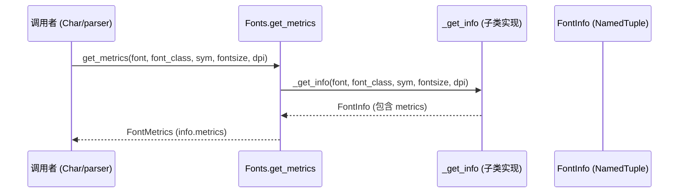

#### 带注释源码

```python
def get_metrics(self, font: str, font_class: str, sym: str, fontsize: float,
                dpi: float) -> FontMetrics:
    r"""
    Get the metrics (measurements) for a given font, symbol, size and dpi.

    This method is the main public interface to query character metrics.
    It delegates to the internal _get_info method which is implemented
    differently in subclasses (e.g., TruetypeFonts, BakomaFonts, etc.).

    Parameters
    ----------
    font : str
        One of the TeX font names: "tt", "it", "rm", "cal", "sf", "bf",
        "default", "regular", "bb", "frak", "scr".  "default" and "regular"
        are synonyms and use the non-math font.
    font_class : str
        One of the TeX font names (as for *font*), but **not** "bb",
        "frak", or "scr".  This is used to combine two font classes.  The
        only supported combination currently is ``get_metrics("frak", "bf",
        ...)``.
    sym : str
        A symbol in raw TeX form, e.g., "1", "x", or "\sigma".
    fontsize : float
        Font size in points.
    dpi : float
        Rendering dots-per-inch.

    Returns
    -------
    FontMetrics
        A named tuple containing the metrics for the glyph:
        - advance: horizontal advance distance
        - height: glyph height
        - width: glyph width
        - xmin, xmax, ymin, ymax: ink rectangle
        - iceberg: distance from baseline to top (TeX "height")
        - slanted: whether the glyph is considered slanted (for kerning)
    """
    # Delegate to the internal _get_info method which is overridden
    # by subclasses to provide font-specific glyph loading logic.
    info = self._get_info(font, font_class, sym, fontsize, dpi)
    # Return only the metrics portion of the FontInfo
    return info.metrics
```


### `Fonts.render_glyph`

该方法用于在指定位置渲染单个字形。它通过调用内部方法 `_get_info` 获取字形的字体信息（包括字体对象、字号、字符码、度量值等），然后将这些信息与位置坐标一起添加到输出对象的字形列表中，以便后续进行光栅化或矢量化处理。

参数：

- `output`：`Output`，用于存储渲染结果的输出对象，包含字形和矩形列表
- `ox`：`float`，字形的水平偏移位置（x 坐标）
- `oy`：`float`，字形的垂直偏移位置（y 坐标）
- `font`：`str`，TeX 字体名称（如 "tt", "it", "rm", "bf" 等）
- `font_class`：`str`，字体类别，用于组合多个字体类
- `sym`：`str`，要渲染的符号（原始 TeX 形式，如 "1", "x", "\\sigma"）
- `fontsize`：`float`，字体大小（以点为单位）
- `dpi`：`float`，渲染分辨率（每英寸点数）

返回值：`None`，该方法直接将结果添加到 `output` 对象的 `glyphs` 列表中

#### 流程图

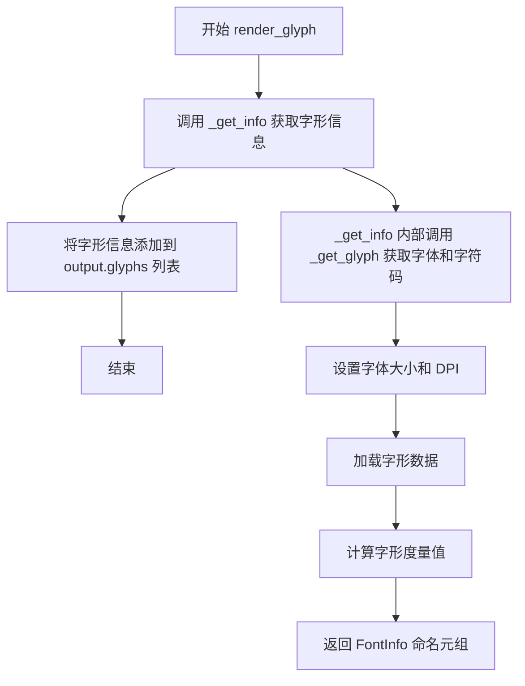

#### 带注释源码

```python
def render_glyph(self, output: Output, ox: float, oy: float, font: str,
                 font_class: str, sym: str, fontsize: float, dpi: float) -> None:
    """
    At position (*ox*, *oy*), draw the glyph specified by the remaining
    parameters (see `get_metrics` for their detailed description).
    """
    # 调用内部方法 _get_info 获取字形的详细信息
    # _get_info 是一个抽象方法，由子类实现（如 TruetypeFonts._get_info）
    # 返回包含字体对象、字号、字符码、度量值等的 FontInfo 命名元组
    info = self._get_info(font, font_class, sym, fontsize, dpi)
    
    # 将字形信息追加到输出对象的 glyphs 列表中
    # glyphs 列表存储 (ox, oy, info) 元组，分别表示：
    #   - ox: 字形的 x 偏移坐标
    #   - oy: 字形的 y 偏移坐标
    #   - info: FontInfo 包含字体的完整信息
    output.glyphs.append((ox, oy, info))
```


### `Fonts.render_rect_filled`

该方法用于在 mathtext 渲染输出中记录一个填充矩形的坐标信息。它是 `Fonts` 抽象基类的一个成员方法，被 `Rule` 类（如水平线 `Hrule` 和垂直线 `Vrule`）调用，用于绘制数学表达式中的线条元素。

参数：

- `self`：隐含的 `Fonts` 实例，代表当前字体系统
- `output`：`Output` 类型，用于收集渲染输出的 glyph 和 rect 数据
- `x1`：`float` 类型，矩形左下角的 x 坐标
- `y1`：`float` 类型，矩形左下角的 y 坐标
- `x2`：`float` 类型，矩形右上角的 x 坐标
- `y2`：`float` 类型，矩形右上角的 y 坐标

返回值：`None`，无返回值描述

#### 流程图

```mermaid
flowchart TD
    A[开始 render_rect_filled] --> B[接收参数: output, x1, y1, x2, y2]
    B --> C[将矩形坐标元组 (x1, y1, x2, y2) 追加到 output.rects 列表]
    C --> D[结束方法]
```

#### 带注释源码

```python
def render_rect_filled(self, output: Output,
                       x1: float, y1: float, x2: float, y2: float) -> None:
    """
    Draw a filled rectangle from (*x1*, *y1*) to (*x2*, *y2*).
    
    注意：此方法仅记录矩形数据到 Output 对象的 rects 列表中，
    实际的像素渲染在 Output.to_raster() 方法中完成。
    
    Parameters
    ----------
    output : Output
        输出容器对象，包含 glyphs 和 rects 列表用于存储渲染元素
    x1 : float
        矩形左下角的 x 坐标
    y1 : float
        矩形左下角的 y 坐标
    x2 : float
        矩形右上角的 x 坐标
    y2 : float
        矩形右上角的 y 坐标
    """
    # 将矩形坐标以元组形式追加到 output.rects 列表
    # rects 列表存储格式为 (x1, y1, x2, y2)
    # 这些数据将在后续的 to_vector() 或 to_raster() 方法中被使用
    output.rects.append((x1, y1, x2, y2))
```


### `Fonts.get_xheight`

获取给定字体和字号组合的 x-height（x 高度）值，用于排版中小写字母 "x" 的高度度量。

参数：

- `font`：`str`，字体名称（如 "rm", "it", "bf" 等 TeX 字体名称）
- `fontsize`：`float`，字体大小（以磅为单位）
- `dpi`：`float`，渲染分辨率（每英寸点数）

返回值：`float`，计算得到的 x-height 值（以磅为单位的浮点数）

#### 流程图

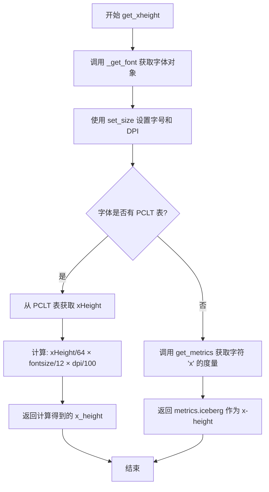

#### 带注释源码

```python
def get_xheight(self, fontname: str, fontsize: float, dpi: float) -> float:
    """
    Get the xheight for the given *font* and *fontsize*.
    
    参数:
        fontname: 字体名称 (TeX 字体名如 "rm", "it", "bf" 等)
        fontsize: 字体大小 (磅)
        dpi: 渲染分辨率 (每英寸点数)
    
    返回:
        float: x-height 值 (磅)
    """
    # 1. 根据字体名获取 FT2Font 字体对象
    font = self._get_font(fontname)
    
    # 2. 设置字体的渲染大小 (字号和 DPI)
    font.set_size(fontsize, dpi)
    
    # 3. 尝试从字体的 PCLT 表获取 xHeight 指标
    # PCLT (PostScript Compact Font Format Table) 包含字体的 x-height 信息
    pclt = font.get_sfnt_table('pclt')
    
    if pclt is None:
        # 某些字体不存储 xHeight，需要使用备选方案
        # 通过获取字符 'x' 的 metrics 来估算 x-height
        # 使用 iceberg (从基线到字符顶部的距离) 作为 x-height
        metrics = self.get_metrics(
            fontname, mpl.rcParams['mathtext.default'], 'x', fontsize, dpi)
        return metrics.iceberg
    
    # 4. 如果有 PCLT 表，按照公式计算 x-height
    # pclt['xHeight'] 是以 1/64 像素为单位的值
    # 需要根据实际 fontsize 和 dpi 进行缩放调整
    x_height = (pclt['xHeight'] / 64) * (fontsize / 12) * (dpi / 100)
    return x_height
```


### `TruetypeFonts.get_underline_thickness`

该方法计算并返回与给定字体匹配的下划线厚度，用于绘制如分数或根号等元素的基础线宽。实现采用了硬编码公式以确保一致性。

参数：

- `font`：`str`，字体名称（TeX 字体名称如 "rm", "it", "bf" 等）
- `fontsize`：`float`，字体大小（以磅为单位）
- `dpi`：`float`，渲染分辨率（每英寸点数）

返回值：`float`，下划线厚度（以磅为单位的线宽）

#### 流程图

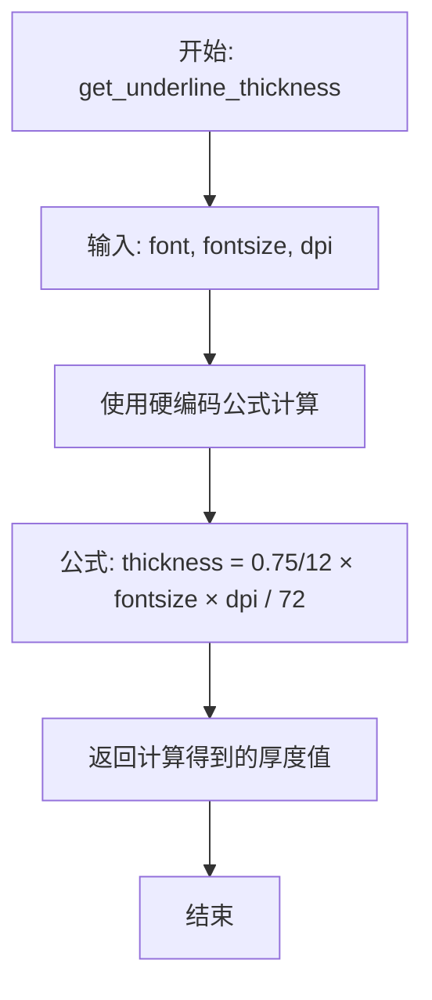

#### 带注释源码

```python
def get_underline_thickness(self, font: str, fontsize: float, dpi: float) -> float:
    """
    Get the line thickness that matches the given font.  Used as a
    base unit for drawing lines such as in a fraction or radical.
    
    Parameters
    ----------
    font : str
        TeX font name (e.g., "rm", "it", "bf", "default", "regular", etc.)
    fontsize : float
        Font size in points.
    dpi : float
        Rendering dots-per-inch.
    
    Returns
    -------
    float
        The underline thickness in points.
    """
    # This function used to grab underline thickness from the font
    # metrics, but that information is just too un-reliable, so it
    # is now hardcoded.
    # 
    # 之前该函数尝试从字体度量数据中获取下划线厚度，但该信息
    # 非常不可靠，因此现在使用硬编码公式计算。
    #
    # 公式解释：
    #   - 0.75 / 12: 标准基准系数（基于 12pt 字体）
    #   - fontsize: 当前字体大小
    #   - dpi: 目标渲染分辨率
    #   - / 72: 转换到点（points）单位
    return ((0.75 / 12) * fontsize * dpi) / 72
```


### `Fonts.get_sized_alternatives_for_symbol`

这是一个用于获取符号多个尺寸变体的方法。该方法是一个接口方法，设计用于字体系统支持同一符号的多个尺寸版本（如BaKoMa字体和STIX字体中的括号、 radicals 等），渲染器会根据实际需要选择最合适的尺寸。

参数：

- `fontname`：`str`，字体名称，指定要查找符号的字体
- `sym`：`str`，符号（字符），需要获取其尺寸变体的符号

返回值：`list[tuple[str, str]]`，返回包含 (字体名, 符号) 元组的列表，每个元组代表该符号的一个可用尺寸变体

#### 流程图

```mermaid
flowchart TD
    A[开始 get_sized_alternatives_for_symbol] --> B{检查子类是否覆盖}
    B -->|是: 子类重写| C[执行子类重写的实现]
    B -->|否: 默认实现| D[返回默认列表 [(fontname, sym)]]
    C --> E[根据字体类型获取符号的尺寸变体]
    E --> F{查找是否存在尺寸变体}
    F -->|存在| G[返回所有可用的尺寸变体列表]
    F -->|不存在| H[返回默认 [(fontname, sym)]]
    D --> I[结束]
    G --> I
    H --> I
```

#### 带注释源码

```python
def get_sized_alternatives_for_symbol(self, fontname: str,
                                      sym: str) -> list[tuple[str, str]]:
    """
    Override if your font provides multiple sizes of the same
    symbol.  Should return a list of symbols matching *sym* in
    various sizes.  The expression renderer will select the most
    appropriate size for a given situation from this list.

    Parameters
    ----------
    fontname : str
        The font name.
    sym : str
        The symbol to get alternatives for.

    Returns
    -------
    list[tuple[str, str]]
        A list of (fontname, sym) tuples representing different
        size alternatives for the symbol.
    """
    # 默认实现：直接返回原始的 (fontname, sym) 对
    # 表示该字体系统不支持多种尺寸的符号变体
    return [(fontname, sym)]
```


### `TruetypeFonts._get_font`

#### 描述

该方法是 `TruetypeFonts` 类的核心方法之一，负责根据传入的字体标识符（名称或索引）获取对应的 FreeType 字体对象（`FT2Font`）。它实现了字体资源的缓存机制，避免重复从磁盘加载相同的字体文件，从而优化性能。

#### 参数

- `font`：`str | int`
  - **类型**: 字符串或整数
  - **描述**: 字体的标识符。可以是标准的 TeX 字体名称（如 'rm', 'it', 'bf'），也可以是用于索引特定尺寸字体（如 STIXSizeOneSym）的整数键。

#### 返回值

- `FT2Font`
  - **类型**: `FT2Font` 对象
  - **描述**: 返回一个 FreeType 字体对象，该对象封装了字体的度量信息和 glyph 数据。**注意**：代码中存在 `FIXME` 注释，表明返回值的null处理可能存在不确定性，实际可能返回 `None` 并被强制转换为 `FT2Font`。

#### 流程图

```mermaid
graph TD
    A([开始 _get_font]) --> B{font 在 self.fontmap 中?}
    B -- 是 --> C[获取 basename = self.fontmap[font]]
    B -- 否 --> D[将 font 强制转换为字符串作为 basename]
    C --> E{self._fonts 缓存中是否存在 basename?}
    D --> E
    E -- 是 --> F[返回缓存的字体 cached_font]
    E -- 否 --> G{os.path.exists(basename)?}
    G -- 否 --> H[返回 None]
    G -- 是 --> I[调用 get_font(basename) 加载字体]
    I --> J[更新缓存: self._fonts[basename], self._fonts[postscript_name] 等]
    J --> K([返回 FT2Font 对象])
    
    style H fill:#f9f,stroke:#333,stroke-width:2px
    style K fill:#9f9,stroke:#333,stroke-width:2px
```

#### 带注释源码

```python
def _get_font(self, font: str | int) -> FT2Font:
    # 1. 解析字体名称
    # 如果 font 是 fontmap 中的键（如 'rm', 'it'），则获取其对应的basename（路径或字体名）。
    # 否则，如果是整数索引（通常用于 STIX 尺寸字体），则强制转换为字符串。
    if font in self.fontmap:
        basename = self.fontmap[font]
    else:
        # NOTE: An int is only passed by subclasses which have placed int keys into
        # `self.fontmap`, so we must cast this to confirm it to typing.
        basename = T.cast(str, font)
    
    # 2. 查找缓存
    # 尝试从实例缓存 _fonts 中获取已加载的字体对象。
    cached_font = self._fonts.get(basename)
    
    # 3. 加载缺失的字体
    # 如果缓存未命中，且文件路径存在，则执行实际的字体加载。
    if cached_font is None and os.path.exists(basename):
        # 加载字体文件
        cached_font = get_font(basename)
        
        # 4. 更新缓存
        # 将新加载的字体存入缓存，并建立多种索引（路径、PostScript名称、大写名、小写名）以便快速查找。
        self._fonts[basename] = cached_font
        self._fonts[cached_font.postscript_name] = cached_font
        self._fonts[cached_font.postscript_name.lower()] = cached_font
        
    # 5. 返回结果
    # FIXME: Not sure this is guaranteed.
    # 这里存在一个潜在的技术债务点：代码无法保证在文件不存在时返回有效的字体对象，
    # 但通过 T.cast 掩盖了这一点，可能导致下游调用出错。
    return T.cast(FT2Font, cached_font)
```

#### 关键组件信息

- **`self.fontmap`**：字典 (`dict[str | int, str]`)。维护了逻辑字体名（如 'rm'）到物理字体文件名或路径的映射。
- **`self._fonts`**：字典 (`dict`)。一个实例级的缓存字典，用于存储已加载的 `FT2Font` 对象，以 `basename` 和 `postscript_name` 作为键。

#### 潜在的技术债务或优化空间

1.  **不安全的类型转换 (`T.cast`)**：
    - 代码在最后使用了 `T.cast(FT2Font, cached_font)` 和 `FIXME` 注释，表明逻辑上允许返回 `None`（当文件不存在时），但类型注解声明返回 `FT2Font`。这会导致类型检查器无法发现可能的 `None` 值，增加运行时 `AttributeError` 的风险。**建议**：修改逻辑在文件不存在时抛出明确的异常，或者在返回类型中加入 `Optional[FT2Font]`。
2.  **弱类型的整数键处理**：
    - 对于整数类型的 `font` 参数，代码直接使用 `T.cast` 转换为 `str`，虽然注释解释了原因，但这是一种比较粗糙的类型处理方式，容易在重构时引入错误。
3.  **文件系统 I/O 阻塞**：
    - 虽然使用了 `functools.cache` 对 `_get_info` 进行缓存，但在首次加载时，`os.path.exists` 和 `get_font` 仍然是同步阻塞操作。在处理大量文本时，可能会导致轻微的界面卡顿（尽管 Mathtext 通常在后台运行）。

#### 其它项目

- **设计目标与约束**：
  - **目标**：最小化字体加载开销。通过维护 `_fonts` 缓存，确保每种字体文件在内存中仅存在一份实例。
  - **约束**：依赖于 `font_manager.get_font` 来完成底层的 FreeType 加载。
- **错误处理**：
  - 当前实现对于字体文件物理缺失的情况处理较弱，仅仅返回 `None`，可能导致下游渲染时崩溃。理想情况下应该在初始化或此处进行更健壮的错误处理（例如回退到默认字体）。


### TruetypeFonts._get_offset

该方法用于计算字形在垂直方向上的偏移量，主要用于处理Cmex10字体（Computer Modern扩展字体）的特殊垂直定位需求。对于其他字体，返回零偏移。

参数：

- `font`：`FT2Font`，字体对象，用于获取字体的PostScript名称以判断是否为Cmex10字体
- `glyph`：`Glyph`，字形对象，包含字形的度量信息（高度等）
- `fontsize`：`float`，字体大小（以点为单位）
- `dpi`：`float`，渲染分辨率（每英寸点数）

返回值：`float`，返回字形的垂直偏移量

#### 流程图

```mermaid
flowchart TD
    A[开始] --> B{font.postscript_name == 'Cmex10'}
    B -->|是| C[计算偏移量: (glyph.height / 64 / 2) + (fontsize/3 * dpi/72)]
    B -->|否| D[返回 0.0]
    C --> E[返回计算得到的偏移量]
    D --> E
```

#### 带注释源码

```python
def _get_offset(self, font: FT2Font, glyph: Glyph, fontsize: float,
                dpi: float) -> float:
    """
    计算字形的垂直偏移量。
    
    该方法主要用于处理Cmex10字体的特殊情况。在Cmex10字体中，
    字形（如括号、积分符号等）的垂直位置需要进行额外调整，
    以确保在数学公式中正确对齐。
    
    Parameters
    ----------
    font : FT2Font
        字体对象，用于检查字体类型
    glyph : Glyph
        已加载的字形对象，包含字形度量信息
    fontsize : float
        字体大小（点）
    dpi : float
        渲染分辨率（每英寸点数）
    
    Returns
    -------
    float
        字形的垂直偏移量
    """
    # 检查是否为Cmex10字体（Computer Modern扩展字体）
    if font.postscript_name == 'Cmex10':
        # 计算偏移量：
        # glyph.height / 64：将字形高度从26.6固定-point格式转换为浮点数
        # / 2：将高度减半，作为垂直居中的基础偏移
        # fontsize/3 * dpi/72：根据字体大小和DPI计算额外的缩放偏移
        return (glyph.height / 64 / 2) + (fontsize/3 * dpi/72)
    # 对于其他字体，不需要额外偏移
    return 0.
```


### TruetypeFonts._get_glyph

获取给定符号的字形信息（字体对象、字符码和倾斜标志）。

参数：

- `fontname`：`str`，字体名称（如 "rm", "it", "bf" 等）
- `font_class`：`str`，字体类别
- `sym`：`str`，要获取字形的符号

返回值：`tuple[FT2Font, int, bool]`，返回包含 FT2Font 字体对象、字符码和是否倾斜标志的元组

#### 流程图

```mermaid
flowchart TD
    A[开始 _get_glyph] --> B{子类实现?}
    B -->|是| C[返回 font, num, slanted]
    B -->|否| D[抛出 NotImplementedError]
    C --> E[结束]
    D --> E
```

#### 带注释源码

```python
def _get_glyph(self, fontname: str, font_class: str,
               sym: str) -> tuple[FT2Font, int, bool]:
    """
    获取给定符号的字形信息。
    
    这是一个抽象方法，由子类（如 BakomaFonts, UnicodeFonts）实现。
    用于根据字体名称、字体类别和符号获取对应的字形数据。
    
    参数
    ----------
    fontname : str
        字体名称，如 "rm"（罗马体）、"it"（意大利体）、"bf"（粗体）等
    font_class : str
        字体类别，用于区分不同的字体变体
    sym : str
        要获取字形的符号，可以是 Unicode 字符或 TeX 命令
        
    返回值
    -------
    tuple[FT2Font, int, bool]
        - FT2Font: 字体对象
        - int: 字符码（Unicode 码点或字符索引）
        - bool: 是否倾斜（slanted）标志，用于排版计算
    """
    raise NotImplementedError
```


### `TruetypeFonts._get_info`

该方法是 TruetypeFonts 类的核心方法，负责根据给定的字体名称、符号和字号获取字形信息（FontInfo），包括字体对象、字形数据、字体度量等。该方法被装饰器缓存以提高性能。

参数：

- `fontname`：`str`，字体的 TeX 名称（如 "rm", "it", "bf" 等）
- `font_class`：`str`，字体类别，用于组合字体（如 "rm", "bf" 等）
- `sym`：`str`，要获取的符号（可以是 TeX 命令或 Unicode 字符）
- `fontsize`：`float`，字体大小（以磅为单位）
- `dpi`：`float`，渲染分辨率（每英寸点数）

返回值：`FontInfo`，包含字体对象、字号、PostScript 名称、字体度量、字形索引、字形对象和偏移量的命名元组

#### 流程图

```mermaid
flowchart TD
    A[开始 _get_info] --> B[调用 _get_glyph 获取字体、字形索引和倾斜标志]
    B --> C[使用 font.set_size 设置字体大小和 DPI]
    C --> D[使用 font.load_char 加载字形数据]
    D --> E[从字形边界框计算 xmin, ymin, xmax, ymax]
    E --> F[调用 _get_offset 计算偏移量]
    F --> G[创建 FontMetrics 命名元组]
    G --> H[创建 FontInfo 命名元组]
    H --> I[返回 FontInfo]
```

#### 带注释源码

```python
# The return value of _get_info is cached per-instance.
def _get_info(self, fontname: str, font_class: str, sym: str, fontsize: float,
              dpi: float) -> FontInfo:
    """
    获取给定字体和符号的字形信息。

    Parameters
    ----------
    fontname : str
        字体名称（如 "rm", "it", "bf" 等）
    font_class : str
        字体类别（用于组合字体）
    sym : str
        要获取的符号
    fontsize : float
        字体大小（磅）
    dpi : float
        渲染分辨率

    Returns
    -------
    FontInfo
        包含字形详细信息的命名元组
    """
    # 1. 调用抽象方法 _get_glyph 获取字体对象、字形索引和倾斜标志
    font, num, slanted = self._get_glyph(fontname, font_class, sym)
    
    # 2. 设置字体的尺寸（大小和 DPI）
    font.set_size(fontsize, dpi)
    
    # 3. 加载字形数据
    glyph = font.load_char(num, flags=self.load_glyph_flags)

    # 4. 从字形边界框计算归一化的坐标（除以 64 转换为字体单位）
    xmin, ymin, xmax, ymax = (val / 64 for val in glyph.bbox)
    
    # 5. 计算垂直偏移量（处理某些特殊字体如 Cmex10）
    offset = self._get_offset(font, glyph, fontsize, dpi)
    
    # 6. 创建 FontMetrics 命名元组，包含字形的所有度量信息
    metrics = FontMetrics(
        advance=glyph.linearHoriAdvance / 65536,  # 水平前进距离
        height=glyph.height / 64,                   # 字形高度
        width=glyph.width / 64,                      # 字形宽度
        xmin=xmin,                                   # 墨水矩形左边界
        xmax=xmax,                                   # 墨水矩形右边界
        ymin=ymin + offset,                          # 墨水矩形下边界（加上偏移）
        ymax=ymax + offset,                          # 墨水矩形上边界（加上偏移）
        # iceberg 是 TeX 中 "height" 的等价物（从基线到顶部的距离）
        iceberg=glyph.horiBearingY / 64 + offset,
        slanted=slanted                              # 是否应视为倾斜
    )

    # 7. 创建并返回 FontInfo 命名元组
    return FontInfo(
        font=font,                                   # FT2Font 字体对象
        fontsize=fontsize,                            # 字号
        postscript_name=font.postscript_name,         # PostScript 字体名称
        metrics=metrics,                              # 字体度量
        num=num,                                      # 字形索引
        glyph=glyph,                                  # 字形对象
        offset=offset                                 # 垂直偏移量
    )
```


### TruetypeFonts.get_xheight

获取指定字体的 x-height（x 高度，即小写字母 'x' 的高度）。

参数：
- `fontname`：`str`，字体名称
- `fontsize`：`float`，字体大小（磅）
- `dpi`：`float`，渲染分辨率（每英寸点数）

返回值：`float`，字体的 x-height 值

#### 流程图

```mermaid
flowchart TD
    A[开始 get_xheight] --> B[获取字体对象: font = self._get_font(fontname)]
    B --> C[设置字体大小: font.set_size(fontsize, dpi)]
    C --> D{获取 PCLT 表: pclt = font.get_sfnt_table('pclt')}
    D -->|pclt 存在| E[从 PCLT 表提取 xHeight]
    E --> F[计算 x_height = (pclt['xHeight'] / 64) * (fontsize / 12) * (dpi / 100)]
    F --> G[返回 x_height]
    D -->|pclt 为 None| H[调用 get_metrics 获取 'x' 字符的度量]
    H --> I[返回 metrics.iceberg]
    G --> J[结束]
    I --> J
```

#### 带注释源码

```python
def get_xheight(self, fontname: str, fontsize: float, dpi: float) -> float:
    """
    Get the xheight for the given *font* and *fontsize*.
    """
    # 根据字体名获取对应的 FT2Font 字体对象
    font = self._get_font(fontname)
    
    # 设置字体的渲染大小和 DPI
    font.set_size(fontsize, dpi)
    
    # 尝试获取字体的 PCLT (PostScript Table) 表
    # PCLT 表包含字体的 xHeight 信息
    pclt = font.get_sfnt_table('pclt')
    
    # 如果字体没有 PCLT 表（即某些字体不存储 xHeight）
    if pclt is None:
        # 使用"土法"计算 xHeight：获取小写字母 'x' 的高度
        # 使用默认数学字体设置获取 'x' 字符的度量
        metrics = self.get_metrics(
            fontname, mpl.rcParams['mathtext.default'], 'x', fontsize, dpi)
        # 返回 'x' 字符的 iceberg 值（从基线到顶部的距离）
        return metrics.iceberg
    
    # 如果 PCLT 表存在，从中提取 xHeight
    # xHeight 存储在 PCLT 表中，需要除以 64 转换为字体单位
    # 然后根据 fontsize 和 dpi 进行缩放
    x_height = (pclt['xHeight'] / 64) * (fontsize / 12) * (dpi / 100)
    return x_height
```


### `TruetypeFonts.get_underline_thickness`

获取与给定字体匹配的下划线厚度。该值用作绘制分数、根号等元素线条的基础单位。该函数曾尝试从字体指标中获取下划线厚度，但该信息不够可靠，因此现在使用硬编码的公式计算。

参数：

- `font`：`str`，字体名称（如 "rm", "it", "bf" 等）
- `fontsize`：`float`，字体大小（以点为单位）
- `dpi`：`float`，渲染分辨率（每英寸点数）

返回值：`float`，下划线厚度（以点为单位）

#### 流程图

```mermaid
flowchart TD
    A[开始] --> B[输入: font, fontsize, dpi]
    B --> C{计算下划线厚度}
    C --> D[公式: ((0.75 / 12) * fontsize * dpi) / 72]
    D --> E[返回厚度值]
```

#### 带注释源码

```python
def get_underline_thickness(self, font: str, fontsize: float, dpi: float) -> float:
    """
    Get the line thickness that matches the given font.  Used as a
    base unit for drawing lines such as in a fraction or radical.
    """
    # This function used to grab underline thickness from the font
    # metrics, but that information is just too un-reliable, so it
    # is now hardcoded.
    # 计算公式说明：
    # - 0.75 / 12: 标准下划线厚度系数（基于12pt字体）
    # - fontsize: 字体大小
    # - dpi: 渲染分辨率
    # - / 72: 转换为点（points）
    return ((0.75 / 12) * fontsize * dpi) / 72
```


### `TruetypeFonts.get_kern`

该方法用于计算两个字符之间的字距调整（kerning）值。当两个字符使用相同的字体和字号时，直接调用底层字体的字距调整功能；否则回退到父类的默认实现（返回0）。

参数：

- `font1`：`str`，第一个字符的字体名称（如"rm", "it", "bf"等TeX字体名）
- `fontclass1`：`str`，第一个字符的字体类别
- `sym1`：`str`，第一个字符的符号（如"x", "\\sigma"）
- `fontsize1`：`float`，第一个字符的字号（磅值）
- `font2`：`str`，第二个字符的字体名称
- `fontclass2`：`str`，第二个字符的字体类别
- `sym2`：`str`，第二个字符的符号
- `fontsize2`：`float`，第二个字符的字号
- `dpi`：`float`，渲染分辨率（每英寸点数）

返回值：`float`，字距调整值（单位为像素，除以64后的结果）

#### 流程图

```mermaid
flowchart TD
    A[开始 get_kern] --> B{font1 == font2 && fontsize1 == fontsize2?}
    B -->|是| C[调用 _get_info 获取 font1/sym1 的字形信息 info1]
    C --> D[调用 _get_info 获取 font2/sym2 的字形信息 info2]
    D --> E[从 info1 获取字体对象 font]
    E --> F[调用 font.get_kerning info1.num info2.num Kerning.DEFAULT]
    F --> G[返回 kerning 值除以64]
    B -->|否| H[调用父类 Fonts.get_kern]
    H --> I[返回父类的默认值 0.0]
```

#### 带注释源码

```python
def get_kern(self, font1: str, fontclass1: str, sym1: str, fontsize1: float,
             font2: str, fontclass2: str, sym2: str, fontsize2: float,
             dpi: float) -> float:
    """
    Get the kerning distance for font between *sym1* and *sym2*.

    See `~.Fonts.get_metrics` for a detailed description of the parameters.
    """
    # 只有当两个字符使用相同字体和相同字号时，才进行字距调整计算
    # 这样可以利用底层字体的Kerning表，提高渲染效率
    if font1 == font2 and fontsize1 == fontsize2:
        # 获取第一个字符的字形信息（包含FT2Font对象和字符索引）
        info1 = self._get_info(font1, fontclass1, sym1, fontsize1, dpi)
        # 获取第二个字符的字形信息
        info2 = self._get_info(font2, fontclass2, sym2, fontsize2, dpi)
        # 使用第一个字符关联的字体对象进行字距调整计算
        font = info1.font
        # 调用FreeType字体的get_kerning方法，获取原始字距调整值
        # Kerning.DEFAULT表示使用默认的Kerning模式
        # 结果除以64是因为FreeType使用26.6固定点格式存储数值
        return font.get_kerning(info1.num, info2.num, Kerning.DEFAULT) / 64
    # 当字体或字号不同时，调用父类方法（返回0，不进行字距调整）
    return super().get_kern(font1, fontclass1, sym1, fontsize1,
                            font2, fontclass2, sym2, fontsize2, dpi)
```


### `BakomaFonts._get_glyph`

该方法负责从 Bakoma 字体系统中获取给定符号的字体对象、字符码和斜体标志。如果在 Bakoma 字体中找不到该符号，则回退到 STIX 字体系统。

参数：

- `fontname`：`str`，字体名称（如 'rm', 'it', 'bf' 等 TeX 字体名称）
- `font_class`：`str`，字体类别（用于组合字体的场景）
- `sym`：`str`，要获取字形的符号（可以是 LaTeX 命令或单个字符）

返回值：`tuple[FT2Font, int, bool]`，返回包含字体对象、字符码和是否为斜体的元组

#### 流程图

```mermaid
flowchart TD
    A[开始 _get_glyph] --> B{fontname in self.fontmap and sym in latex_to_bakoma?}
    B -->|是| C[从 latex_to_bakoma 获取 basename 和 num]
    C --> D{basename == 'cmmi10' 或 sym in _slanted_symbols?}
    D -->|是| E[slanted = True]
    D -->|否| F[slanted = False]
    E --> G[font = self._get_font(basename)]
    F --> G
    B -->|否| H{len(sym) == 1?}
    H -->|是| I[slanted = (fontname == 'it')]
    I --> J[font = self._get_font(fontname)]
    J --> K{font is not None?}
    K -->|是| L[num = ord(sym)]
    K -->|否| M[font 保持 None]
    H -->|否| N[font 保持 None]
    M --> O
    N --> O
    L --> O
    G --> O{font is not None and font.get_char_index(num) != 0?}
    O -->|是| P[返回 (font, num, slanted)]
    O -->|否| Q[返回 self._stix_fallback._get_glyph]
    P --> R[结束]
    Q --> R
```

#### 带注释源码

```python
def _get_glyph(self, fontname: str, font_class: str,
               sym: str) -> tuple[FT2Font, int, bool]:
    """
    Get the glyph from Bakoma fonts.
    
    Parameters
    ----------
    fontname : str
        The name of the font (e.g., 'rm', 'it', 'bf').
    font_class : str
        The font class for combining fonts.
    sym : str
        The symbol to get glyph for (e.g., LaTeX command or single char).
    
    Returns
    -------
    tuple[FT2Font, int, bool]
        A tuple of (font, charcode, slanted) where:
        - font: The FT2Font object
        - charcode: The character code
        - slanted: Whether the glyph should be considered slanted
    """
    font = None  # 初始化字体为 None
    
    # 首先尝试从 latex_to_bakoma 映射中查找符号
    if fontname in self.fontmap and sym in latex_to_bakoma:
        # 从 latex_to_bakoma 获取 Bakoma 字体文件名和字符码
        basename, num = latex_to_bakoma[sym]
        # 判断是否为斜体：如果使用 cmmi10 字体（数学斜体）或符号在斜体符号集合中
        slanted = (basename == "cmmi10") or sym in self._slanted_symbols
        # 获取字体对象
        font = self._get_font(basename)
    
    # 如果上述查找失败，尝试处理单个字符
    elif len(sym) == 1:
        # 如果请求的是斜体字体，则标记为斜体
        slanted = (fontname == "it")
        # 尝试获取字体
        font = self._get_font(fontname)
        if font is not None:
            # 使用字符的 Unicode 码点作为字符码
            num = ord(sym)
    
    # 检查字体是否成功获取且包含该字符
    if font is not None and font.get_char_index(num) != 0:
        # 返回找到的字体、字符码和斜体标志
        return font, num, slanted
    else:
        # 如果在 Bakoma 字体中找不到，回退到 STIX 字体
        return self._stix_fallback._get_glyph(fontname, font_class, sym)
```


### `BakomaFonts.get_sized_alternatives_for_symbol`

该方法是 `BakomaFonts` 类中重写自 `Fonts` 基类的核心方法。它的主要功能是**为特定符号提供预定义的尺寸替代列表**。在排版数学公式时（例如调整括号大小以匹配公式高度），如果直接通过缩放字符来调整大小会导致渲染效果模糊。BaKoMa 字体本身包含了同一符号的多个物理尺寸版本（例如不同高度的花括号），该方法正是利用这一特性，根据传入的符号（如 `(`、`\langle`）去查找并返回对应的字体键和字符编码列表，如果未找到则回退到默认的单一符号。

参数：

- `fontname`：`str`，调用者的字体名称（例如 'rm', 'ex'）。
- `sym`：`str`，需要查找尺寸替代方案的符号（例如 `'('`, `r'\langle'`）。

返回值：`list[tuple[str, str]]`，返回一个列表，其中每个元素是一个元组 `(font_key, symbol_char)`，代表一对可用的字体和字符。如果符号不在预定义列表中，则返回默认的 `[(fontname, sym)]`。

#### 流程图

```mermaid
graph TD
    A[Start: get_sized_alternatives_for_symbol] --> B{检查 sym 是否在 _size_alternatives 字典中}
    B -- 是 --> C[获取对应的 (font, char) 列表]
    B -- 否 --> D[返回默认列表 [(fontname, sym)]]
    C --> E[Return list]
    D --> E
```

#### 带注释源码

```python
class BakomaFonts(TruetypeFonts):
    # ... (类的其他部分)
    
    # 定义了大量的预尺寸替代符号映射
    # 键为符号，值为包含多个(font_key, char)元组的列表
    _size_alternatives = {
        '(':           [('rm', '('), ('ex', '\xa1'), ('ex', '\xb3'),
                        ('ex', '\xb5'), ('ex', '\xc3')],
        ')':           [('rm', ')'), ('ex', '\xa2'), ('ex', '\xb4'),
                        ('ex', '\xb6'), ('ex', '\x21')],
        r'\langle':    [('ex', '\xad'), ('ex', '\x44'),
                        ('ex', '\xbf'), ('ex', '\x2a')],
        # ... 更多符号定义
    }

    def get_sized_alternatives_for_symbol(self, fontname: str,
                                          sym: str) -> list[tuple[str, str]]:
        """
        Override if your font provides multiple sizes of the same
        symbol.  Should return a list of symbols matching *sym* in
        various sizes.  The expression renderer will select the most
        appropriate size for a given situation from this list.
        """
        # 使用字典的 get 方法查找符号对应的替代列表
        # 如果找不到 (get 的第二个参数)，则返回包含原始符号的列表
        return self._size_alternatives.get(sym, [(fontname, sym)])
```


### `UnicodeFonts._map_virtual_font`

该方法是一个虚拟字体映射函数，用于在渲染 Unicode 数学文本时，将给定的字体名称、字体类别和 Unicode 索引映射到实际的字体名称和最终的 Unicode 索引。它是 `UnicodeFonts` 类处理虚拟字体的核心方法，允许字体系统在不改变原始字符的情况下替换字体。

参数：

- `fontname`：`str`，字体名称，表示原始请求的字体标识符（如 'rm', 'it', 'bf' 等）
- `font_class`：`str`，字体类别，表示字体的类别标识符，用于在虚拟字体映射中查找对应的映射规则
- `uniindex`：`int`，Unicode 索引，表示要映射的字符的 Unicode 码点

返回值：`tuple[str, int]`，返回包含最终字体名称和 Unicode 索引的元组

#### 流程图

```mermaid
flowchart TD
    A[开始 _map_virtual_font] --> B[接收 fontname, font_class, uniindex]
    B --> C[直接返回原始输入]
    C --> D[fontname = fontname]
    C --> E[uniindex = uniindex]
    D --> F[返回 (fontname, uniindex)]
    E --> F
```

#### 带注释源码

```python
def _map_virtual_font(self, fontname: str, font_class: str,
                      uniindex: int) -> tuple[str, int]:
    """
    Map a virtual font name to a real font name and Unicode index.
    
    This method provides a hook for subclasses to implement virtual font
    mappings. In the base UnicodeFonts class, it simply returns the
    input values unchanged.
    
    Parameters
    ----------
    fontname : str
        The name of the virtual font (e.g., 'rm', 'it', 'bf').
    font_class : str
        The font class for looking up font mappings.
    uniindex : int
        The Unicode index of the character.
        
    Returns
    -------
    tuple[str, int]
        A tuple of (fontname, uniindex) after mapping.
    """
    # 直接返回原始输入，不进行任何映射
    # 这是基类 UnicodeFonts 的默认实现
    # 子类（如 StixFonts）会重写此方法以实现复杂的虚拟字体映射逻辑
    return fontname, uniindex
```


### `UnicodeFonts._get_glyph`

该函数是 Unicode 字体处理系统的核心查找方法，负责将数学符号（TeX 符号）解析为具体的 FreeType 字体对象、字符索引以及渲染所需的倾斜状态。它包含了复杂的降级逻辑：尝试将符号映射为 Unicode，查找对应的物理字体，处理大小写字母的 Italic/Roman 转换，并管理当主字体缺失 glyph 时的回退（Fallback）机制。

参数：

- `fontname`：`str`，请求的 TeX 字体名称（如 'rm', 'it', 'bf'）。
- `font_class`：`str`，TeX 字体类别。
- `sym`：`str`，要渲染的符号字符串（例如 r'\alpha', 'x'）。

返回值：`tuple[FT2Font, int, bool]`
- `FT2Font`：实际承载该 glyph 的字体对象。
- `int`：该字符在字体中的索引（Unicode 码点）。
- `bool`：该 glyph 在排版时是否应被视为“倾斜”（Slanted）状态，用于后续的字偶间距（Kerning）计算。

#### 流程图

```mermaid
flowchart TD
    A[Start _get_glyph] --> B[调用 get_unicode_index 解析符号]
    B --> C{解析成功?}
    C -- Yes --> D[uniindex = 解析结果]
    C -- No --> E[uniindex = '?' (0x3F), 记录警告日志]
    D --> F[调用 _map_virtual_font 处理虚拟字体映射]
    F --> G{fontname == 'it' 且 uniindex < 0x10000?}
    G -- Yes --> H{是字母或希腊文大写?}
    H -- No --> I[new_fontname = 'rm']
    H -- Yes --> J[new_fontname = 'it']
    G -- No --> J
    I --> K
    J --> K[检查 _cmr10_substitutions 替换]
    K --> L{字体中是否存在该 Glyph?}
    L -- Yes --> M[返回 Font, uniindex, slanted 标志]
    L -- No --> N{是否存在 _fallback_font?}
    N -- Yes --> O{处理 Stix 回退特殊情况}
    O --> P[调用 fallback._get_glyph]
    P --> Q[记录日志并返回回退结果]
    N -- No --> R{是否为 StixFonts?}
    R -- Yes --> S[尝试获取 'rm' 字体]
    R -- No --> T[记录警告, 返回 Dummy 字符 (0xA4)]
    S --> M
    T --> M
```

#### 带注释源码

```python
def _get_glyph(self, fontname: str, font_class: str,
               sym: str) -> tuple[FT2Font, int, bool]:
    # 1. 尝试将 TeX 符号转换为 Unicode 索引
    try:
        uniindex = get_unicode_index(sym)
        found_symbol = True
    except ValueError:
        # 转换失败，使用问号作为占位符
        uniindex = ord('?')
        found_symbol = False
        _log.warning("No TeX to Unicode mapping for %a.", sym)

    # 2. 处理虚拟字体映射（处理特殊的 Unicode 区间）
    fontname, uniindex = self._map_virtual_font(
        fontname, font_class, uniindex)

    new_fontname = fontname

    # 3. 字体样式修正逻辑：
    #    只有 "Letter" (字母) 类在 'it' (意大利体/斜体) 模式下才应该使用斜体。
    #    希腊文大写字母即使在 'it' 模式下也应该是 Roman (正体)。
    if found_symbol:
        if fontname == 'it' and uniindex < 0x10000:
            char = chr(uniindex)
            # 如果不是字母，或者是希腊文大写字母，则切换为罗马体
            if (unicodedata.category(char)[0] != "L"
                    or unicodedata.name(char).startswith("GREEK CAPITAL")):
                new_fontname = 'rm'

        # 判断是否倾斜：如果是 'it' 模式，或者是特定的倾斜符号（如积分号）
        slanted = (new_fontname == 'it') or sym in self._slanted_symbols
        found_symbol = False
        
        # 获取实际字体对象
        font = self._get_font(new_fontname)
        if font is not None:
            # 4. 特殊替换逻辑：cmr10 字体中缺少某些符号，需要从 cmsy10 借调
            if (uniindex in self._cmr10_substitutions
                    and font.family_name == "cmr10"):
                font = get_font(
                    cbook._get_data_path("fonts/ttf/cmsy10.ttf"))
                uniindex = self._cmr10_substitutions[uniindex]
            
            # 5. 检查该字形是否在字体文件中存在
            glyphindex = font.get_char_index(uniindex)
            if glyphindex != 0:
                found_symbol = True

    # 6. 如果在当前字体中未找到
    if not found_symbol:
        # 如果配置了回退字体（例如 Stix 或 Bakoma）
        if self._fallback_font:
            # 特殊处理：如果当前是意大利体但回退是 Stix，通常回退到 Roman 以获得更好的覆盖率
            if (fontname in ('it', 'regular')
                    and isinstance(self._fallback_font, StixFonts)):
                fontname = 'rm'

            # 递归调用回退字体的 _get_glyph 方法
            g = self._fallback_font._get_glyph(fontname, font_class, sym)
            family = g[0].family_name
            if family in list(BakomaFonts._fontmap.values()):
                family = "Computer Modern"
            _log.info("Substituting symbol %s from %s", sym, family)
            return g

        else:
            # 7. 没有回退字体时的兜底逻辑
            # 如果是 Stix 字体且当前是 'it'，尝试从 'rm' 再次查找
            if (fontname in ('it', 'regular')
                    and isinstance(self, StixFonts)):
                return self._get_glyph('rm', font_class, sym)
            
            # 最坏情况：记录警告，返回一个虚拟的货币符号作为占位符
            _log.warning("Font %r does not have a glyph for %a [U+%x], "
                         "substituting with a dummy symbol.",
                         new_fontname, sym, uniindex)
            font = self._get_font('rm')
            uniindex = 0xA4  # 货币符号 ¤ (Generic Currency Sign)
            slanted = False

    return font, uniindex, slanted
```


### `UnicodeFonts.get_sized_alternatives_for_symbol`

获取给定符号的所有尺寸替代方案。当字体系统具有多个尺寸的相同符号时（如 STIX 字体有多个尺寸的数学符号），此方法返回这些替代方案的列表，表达式渲染器将根据具体情况选择最合适的尺寸。

参数：

- `fontname`：`str`，字体名称，指定要查找符号的字体
- `sym`：`str`，符号，表示需要获取尺寸替代方案的符号

返回值：`list[tuple[str, str]]`，返回由 (字体名, 符号) 元组组成的列表，表示该符号在不同字体/尺寸下的所有可用替代方案。如果没有替代方案，则返回原始的 (fontname, sym) 组合。

#### 流程图

```mermaid
flowchart TD
    A[开始: get_sized_alternatives_for_symbol] --> B{self._fallback_font 是否存在?}
    B -->|是| C[调用 fallback_font 的 get_sized_alternatives_for_symbol]
    B -->|否| D[返回 [(fontname, sym)]]
    C --> E[返回 fallback_font 的结果]
    
    F[StixFonts.get_sized_alternatives_for_symbol] --> G{检查符号是否为特殊字符}
    G -->|是| H[替换为标准 Unicode 字符]
    G -->|否| I[保持原符号不变]
    I --> J{尝试获取 Unicode 索引}
    J -->|成功| K[遍历 0-5 号字体]
    J -->|失败| L[返回 [(fontname, sym)]]
    K --> M{每个字体是否包含该字符?}
    M -->|是| N[添加到 alternatives 列表]
    M -->|否| O[跳过]
    N --> P{所有字体遍历完成?}
    P -->|否| K
    P -->|是| Q{符号是否为根号?}
    Q -->|是| R[移除最后一个尺寸（STIX 根号最大尺寸有错误）]
    Q -->|否| S[返回 alternatives]
    R --> S
```

#### 带注释源码

```python
def get_sized_alternatives_for_symbol(self, fontname: str,
                                      sym: str) -> list[tuple[str, str]]:
    """
    获取给定符号的所有尺寸替代方案。
    
    当存在 fallback_font（后备字体）时，委托给后备字体获取替代方案；
    否则返回默认的单一替代方案。
    
    Parameters
    ----------
    fontname : str
        字体名称
    sym : str
        符号字符串
        
    Returns
    -------
    list[tuple[str, str]]
        所有可用尺寸替代方案的列表，每个元素为 (字体名, 符号) 元组
    """
    # 检查是否存在后备字体（如 StixFonts 或 BakomaFonts）
    if self._fallback_font:
        # 委托给后备字体处理，这允许 UnicodeFonts 利用
        # STIX 字体提供的多个尺寸的数学符号
        return self._fallback_font.get_sized_alternatives_for_symbol(
            fontname, sym)
    # 如果没有后备字体，只返回原始的字体名和符号组合
    return [(fontname, sym)]
```

#### 关键设计说明

1. **委托模式**：该方法采用委托模式，当存在后备字体时，将请求转发给 `StixFonts.get_sized_alternatives_for_symbol` 处理，后者能够提供多个尺寸的替代方案。

2. **后备字体机制**：在 `UnicodeFonts.__init__` 中，根据 `mathtext.fallback` 配置创建后备字体（StixFonts、StixSansFonts 或 BakomaFonts）。

3. **STIX 字体尺寸替代**：`StixFonts` 提供了更复杂的实现，它会检查 STIXSizeOneSym 到 STIXSizeFiveSym 等多个字体，寻找可用的尺寸变体。对于根号符号 `\__sqrt__`，由于最大尺寸存在排版错误，会排除最大的那个尺寸。

4. **降级处理**：当没有后备字体时，简单地返回原始的 (fontname, sym) 元组作为唯一的替代方案。


### `DejaVuFonts._get_glyph`

该方法负责从 DejaVu 字体族中获取特定符号的字形信息。首先处理特殊符号（如 `\prime`），优先使用 Bakoma 字体；然后尝试在显示字体（ex）中查找符号，若找到则使用显示字体，否则回退到通过父类方法获取常规字形。

参数：

- `fontname`：`str`，字体名称（如 'rm', 'it', 'bf' 等）
- `font_class`：`str`，字体类别
- `sym`：`str`，要获取字形的符号（如 '\prime', 'x', '\sigma'）

返回值：`tuple[FT2Font, int, bool]`，包含：

- `FT2Font`：字体对象
- `int`：字符索引
- `bool`：是否斜体

#### 流程图

```mermaid
flowchart TD
    A[开始 _get_glyph] --> B{sym == r'\prime'?}
    B -->|Yes| C[使用 bakoma._get_glyph]
    B -->|No| D[get_unicode_index获取uniindex]
    D --> E[获取显示字体 ex]
    E --> F{字体存在?}
    F -->|No| I[调用父类 _get_glyph]
    F -->|Yes| G{get_char_index != 0?}
    G -->|Yes| H[调用父类 _get_glyph 使用 'ex']
    G -->|No| I
    C --> J[返回结果]
    H --> J
    I --> J
```

#### 带注释源码

```python
def _get_glyph(self, fontname: str, font_class: str,
               sym: str) -> tuple[FT2Font, int, bool]:
    # 处理特殊符号：撇号(\prime) 使用 Bakoma 字体渲染
    if sym == r'\prime':
        return self.bakoma._get_glyph(fontname, font_class, sym)
    else:
        # 获取符号的 Unicode 索引
        uniindex = get_unicode_index(sym)
        # 尝试在显示字体 (ex) 中查找符号
        font = self._get_font('ex')
        if font is not None:
            # 检查符号是否在显示字体中可用
            glyphindex = font.get_char_index(uniindex)
            if glyphindex != 0:
                # 如果显示字体中有该符号，使用显示字体
                return super()._get_glyph('ex', font_class, sym)
        # 否则使用常规方式获取字形（通过父类方法）
        return super()._get_glyph(fontname, font_class, sym)
```


### `StixFonts._map_virtual_font`

该方法负责将传入的逻辑字体名称（如 'bb', 'frak'）和Unicode码位映射到STIX字体族中实际存在的物理字体文件名及对应的物理码位。由于STIX字体将多种数学符号（如黑板体、哥特体）嵌入在同一字体文件的不同Unicode区域内，此方法首先查找虚拟字体映射表，然后通过二分查找定位具体的Unicode范围，计算目标码位的偏移量。此外，它还处理无衬线字体的转换、修正已知错误 glyph，并处理私有区域（PUA）内的字符映射。

参数：

- `fontname`：`str`，请求的逻辑字体名称（例如 'bb' 表示黑板体，'frak' 表示哥特体）。
- `font_class`：`str`，TeX 字体类别（例如 'rm', 'it', 'bf'）。
- `uniindex`：`int`，符号的原始 Unicode 索引。

返回值：`tuple[str, int]`，返回包含实际应使用的物理字体名称和映射后的 Unicode 索引的元组。

#### 流程图

```mermaid
flowchart TD
    Start[入口: _map_virtual_font] --> Lookup[查找 stix_virtual_fonts]
    
    CheckSans{_sans 为真 且<br/>fontname 非 'regular'/'default'?}
    Lookup --> CheckSans
    
    UseSf[使用 'sf' 虚拟字体映射<br/>标记 doing_sans_conversion]
    CheckSans -- 是 --> UseSf
    
    KeepOriginal[保持原映射]
    CheckSans -- 否 --> KeepOriginal
    
    TypeCheck{映射数据类型?}
    UseSf --> TypeCheck
    KeepOriginal --> TypeCheck
    
    GetDict[获取 mapping[font_class]]
    TypeCheck -- 字典 --> GetDict
    
    GetList[直接使用列表]
    TypeCheck -- 列表 --> GetList
    
    TypeNone[mapping = None]
    TypeCheck -- 其他 --> TypeNone
    
    BinarySearch[二分查找 Unicode 范围]
    GetDict --> BinarySearch
    GetList --> BinarySearch
    
    InRange{uniindex 在当前<br/>range[0]-range[1]内?}
    BinarySearch --> InRange
    
    Remap[计算新索引:<br/>uniindex - range[0] + range[3]<br/>更新 fontname = range[2]]
    InRange -- 是 --> Remap
    
    NotInRange{doing_sans<br/>conversion?}
    InRange -- 否 --> NotInRange
    
    DummyChar[设为假字符 (0x1)<br/>使用默认字体]
    NotInRange -- 否 --> DummyChar
    
    SkipRemap[跳过重映射]
    NotInRange -- 是 --> SkipRemap
    
    GlyphFix{目标字体是<br/>'rm' 或 'it'?}
    Remap --> GlyphFix
    DummyChar --> GlyphFix
    SkipRemap --> GlyphFix
    
    ApplyFix[应用 stix_glyph_fixes<br/>修正错误 glyph]
    GlyphFix -- 是 --> ApplyFix
    
    PUACheck{uniindex 处于<br/>私有区域 0xE000-0xF8FF?}
    ApplyFix --> PUACheck
    GlyphFix -- 否 --> PUACheck
    
    MapNonUni[修改 fontname 为<br/>'nonuni' + fontname]
    PUACheck -- 是 --> MapNonUni
    
    Return[返回 (fontname, uniindex)]
    PUACheck -- 否 --> Return
    MapNonUni --> Return
```

#### 带注释源码

```python
def _map_virtual_font(self, fontname: str, font_class: str,
                      uniindex: int) -> tuple[str, int]:
    # 处理这些“字体”，它们实际上嵌入在其他字体中。
    # 从 stix_virtual_fonts 字典中获取 fontname 对应的映射规则。
    font_mapping = stix_virtual_fonts.get(fontname)

    # 如果当前是 StixSansFonts (无衬线)，且未找到特定映射，
    # 并且字体名不是常规字体，则尝试使用 'sf' (sans-serif) 的映射。
    if (self._sans and font_mapping is None
            and fontname not in ('regular', 'default')):
        font_mapping = stix_virtual_fonts['sf']
        doing_sans_conversion = True
    else:
        doing_sans_conversion = False

    # 根据映射的类型（字典或列表）获取具体的映射规则列表。
    if isinstance(font_mapping, dict):
        try:
            # 尝试获取特定字体类别的映射，如 'rm', 'it'。
            mapping = font_mapping[font_class]
        except KeyError:
            # 如果没有对应的类别映射，回退到 'rm' (Roman)。
            mapping = font_mapping['rm']
    elif isinstance(font_mapping, list):
        mapping = font_mapping
    else:
        # 如果没有映射规则，设为 None。
        mapping = None

    # 如果存在映射规则（包含了 Unicode 范围到物理字体的转换信息）。
    if mapping is not None:
        # 二分查找：定位 uniindex 落在哪个 Unicode 区间内。
        lo = 0
        hi = len(mapping)
        while lo < hi:
            mid = (lo+hi)//2
            # range 结构通常为 [start, end, target_font, offset]
            range = mapping[mid]
            if uniindex < range[0]:
                hi = mid
            elif uniindex <= range[1]:
                # 找到目标区间，退出循环。
                break
            else:
                lo = mid + 1

        # 检查当前索引是否在找到的区间范围内。
        if range[0] <= uniindex <= range[1]:
            # 计算新的 Unicode 索引：原索引 - 区间起始 + 偏移量。
            uniindex = uniindex - range[0] + range[3]
            # 更新字体名指向实际包含该 glyph 的物理字体。
            fontname = range[2]
        elif not doing_sans_conversion:
            # 如果没找到且不是在做 sans 转换，则生成一个虚拟字符。
            uniindex = 0x1
            fontname = mpl.rcParams['mathtext.default']

    # 修正某些 STIX 字体中的错误字形。
    if fontname in ('rm', 'it'):
        uniindex = stix_glyph_fixes.get(uniindex, uniindex)

    # 处理私有区域 (Private Use Area) 的字形。
    # 如果在 'it', 'rm', 'bf', 'bfit' 字体中使用了 PUA (0xe000 - 0xf8ff)，
    # 需要切换到对应的 nonuni 版本字体。
    if fontname in ('it', 'rm', 'bf', 'bfit') and 0xe000 <= uniindex <= 0xf8ff:
        fontname = 'nonuni' + fontname

    return fontname, uniindex
```


### `StixFonts.get_sized_alternatives_for_symbol`

该方法为 STIX 字体提供符号的多尺寸替代方案。它首先处理特殊字符映射（如 `\{`、`\}`、`\<`、`\>`），然后尝试获取符号的 Unicode 索引，最后遍历 STIXSizeOneSym 到 STIXSizeFiveSym 六个尺寸的字体，筛选出包含目标符号的字体尺寸作为替代选项返回。

参数：

- `fontname`：`str`，字体名称
- `sym`：`str`，需要获取替代方案的符号

返回值：`list[tuple[str, str]] | list[tuple[int, str]]`，由 (字体索引或字体名, 字符) 元组组成的列表，表示可用尺寸的替代符号

#### 流程图

```mermaid
flowchart TD
    A[开始] --> B{符号是否需要映射?}
    B -->|是| C[应用符号映射 fixes]
    B -->|否| D[使用原始符号]
    C --> E
    D --> E[尝试获取 Unicode 索引]
    E --> F{是否成功获取?}
    F -->|否| G[返回 [(fontname, sym)] 即原始符号]
    F -->|是| H[遍历 i 从 0 到 5]
    H --> I{当前字体包含该符号?}
    I -->|是| J[添加替代项 (i, chr(uniindex))]
    I -->|否| K[继续下一个尺寸]
    J --> L
    K --> H
    H --> L[检查是否为根号符号]
    L --> M{符号是 '__sqrt__'?}
    M -->|是| N[移除最后一个替代项]
    M -->|否| O[返回替代列表]
    N --> O
    G --> O
```

#### 带注释源码

```python
@functools.cache
def get_sized_alternatives_for_symbol(  # type: ignore[override]
        self,
        fontname: str,
        sym: str) -> list[tuple[str, str]] | list[tuple[int, str]]:
    """
    返回给定符号的多种尺寸替代方案。

    参数:
        fontname: 字体名称
        sym: 符号 (如 r'\__sqrt__', r'\langle' 等)

    返回:
        由 (字体索引, 字符) 组成的列表，包含该符号在 STIXSizeOneSym 到
        STIXSizeFiveSym 六个尺寸字体中的可用变体
    """
    # 定义需要映射的符号集合，将 LaTeX 转义序列映射为 Unicode 字符
    fixes = {
        '\\{': '{', '\\}': '}', '\\[': '[', '\\]': ']',
        '<': '\N{MATHEMATICAL LEFT ANGLE BRACKET}',
        '>': '\N{MATHEMATICAL RIGHT ANGLE BRACKET}',
    }
    # 应用符号映射，将转义序列转换为标准 Unicode 字符
    sym = fixes.get(sym, sym)
    try:
        # 尝试获取符号的 Unicode 码点索引
        uniindex = get_unicode_index(sym)
    except ValueError:
        # 如果获取失败，返回仅包含原始符号的列表
        return [(fontname, sym)]
    
    # 生成替代方案列表：遍历 0-5 六个 STIX 尺寸字体
    # 检查每个尺寸字体是否包含该符号的字符索引
    alternatives = [(i, chr(uniindex)) for i in range(6)
                    if self._get_font(i).get_char_index(uniindex) != 0]
    
    # 特殊处理：STIX 中最大的根号符号存在度量错误
    # 会导致根号与竖线分离，因此移除最后一个（最大的）尺寸
    if sym == r'\__sqrt__':
        alternatives = alternatives[:-1]
    
    # 返回所有可用的尺寸替代方案
    return alternatives
```


### `Node.__repr__`

该方法实现了 Python 的标准字符串表示协议（`__repr__`），用于返回当前节点对象的类名。在调试或打印信息时，它能够明确标识该节点在 TeX 盒模型（Box Model）中的具体类型（例如 `Node`、`Box`、`Hlist` 等）。

参数：

- `self`：`Node`，调用此方法的节点实例本身。

返回值：`str`，节点的类名（例如 'Node', 'Char', 'Kern'）。

#### 流程图

```mermaid
graph TD
    A([开始 __repr__]) --> B[获取 self 的类型对象 type(self)]
    B --> C[获取类型的名称属性 __name__]
    C --> D([返回 字符串])
```

#### 带注释源码

```python
def __repr__(self) -> str:
    # 返回该节点实例的类名。
    # 例如，如果对象是 Char 实例，这里会返回 'Char'。
    # 这对于调试和理解嵌套的盒模型结构非常有用。
    return type(self).__name__
```


# Node.get_kerning 详细设计文档

### `Node.get_kerning`

该方法定义了 TeX 盒模型中节点间的字距调整（kerning）逻辑。默认实现返回 0.0，表示节点间不需要额外的间距。当字符节点相连形成水平列表（Hlist）时，此方法被调用来确定是否需要在字符间插入 Kern 节点以调整间距。

参数：

- `next`：`Node | None`，后续节点，用于计算与当前节点之间的字距调整量。如果为 None，则不产生字距调整。

返回值：`float`，返回字距调整的距离值（以点为单位）。默认实现返回 0.0。

#### 流程图

```mermaid
flowchart TD
    A["开始: get_kerning(next)"] --> B{next 是否为 None?}
    B -->|是| C["返回 0.0"]
    B -->|否| D["执行子类特定逻辑"]
    D --> E["返回字距调整值"]
    
    subgraph 子类 Char 的实现
        F["计算 advance = self._metrics.advance - self.width"] --> G{next 是否为 Char?}
        G -->|是| H["调用 fontset.get_kern() 计算 kern"] 
        G -->|否| I["kern = 0"]
        H --> J["返回 advance + kern"]
        I --> J
    end
    
    D -.-> F
```

#### 带注释源码

```python
def get_kerning(self, next: Node | None) -> float:
    """
    Return the amount of kerning between this and the given character.
    
    This method is called when characters are strung together into `Hlist`
    to create `Kern` nodes.
    
    Parameters
    ----------
    next : Node | None
        The next node in the horizontal list. If None, no kerning is applied.
    
    Returns
    -------
    float
        The kerning distance in points.
    """
    # 默认返回 0.0，表示不进行字距调整
    # 子类（如 Char）会重写此方法以实现具体的字距计算逻辑
    return 0.0
```

#### 备注

- **设计目标**：`Node.get_kerning` 是一个多态方法，基类提供默认行为（无字距调整），具体字距计算由子类实现。
- **子类实现**：在代码中，`Char` 类重写了此方法，它计算字符的前进值（advance）与宽度（width）之间的差值，并根据后续字符的类型调用 `fontset.get_kern()` 获取字体库提供的字距调整值。
- **使用场景**：此方法在 `Hlist.kern()` 方法中被调用，用于在字符节点之间插入适当的 Kern 节点，从而实现专业的排版间距效果。


### `Node.shrink`

该方法是 TeX 盒模型中所有节点的基类方法，用于将节点缩小一个级别。节点有多个大小级别（由 `NUM_SIZE_LEVELS` 定义），每次调用该方法会将 `size` 属性加 1，表示向更小的字号等级移动。当达到最大级别后，不再继续缩小。

参数：
- 无显式参数（`self` 为隐式参数）

返回值：`None`，无返回值

#### 流程图

```mermaid
flowchart TD
    A[开始 shrink] --> B{self.size < NUM_SIZE_LEVELS?}
    B -->|是| C[更新尺寸相关属性]
    B -->|否| D[什么都不做]
    C --> E[self.size += 1]
    E --> F[结束]
    D --> F
```

#### 带注释源码

```python
def shrink(self) -> None:
    """
    Shrinks one level smaller.  There are only three levels of
    sizes, after which things will no longer get smaller.
    """
    self.size += 1
```


### `Node.render`

这是 `Node` 类中的渲染方法，作为基类方法为所有子节点类型提供统一的渲染接口。该方法接收输出对象和坐标参数，用于将节点渲染到给定的输出上下文中。

参数：

- `output`：`Output`，用于存储渲染结果的输出对象，包含要渲染的字符和矩形信息
- `x`：`float`，渲染位置的 x 坐标
- `y`：`float`，渲染位置的 y 坐标

返回值：`None`，该方法无返回值，直接修改 `output` 对象

#### 流程图

```mermaid
flowchart TD
    A[开始渲染节点] --> B{节点类型?}
    B -->|Char 节点| C[调用 fontset.render_glyph 渲染字形]
    B -->|Box 节点| D[不执行任何操作 pass]
    B -->|Rule 节点| E[调用 fontset.render_rect_filled 渲染填充矩形]
    B -->|其他节点| F[基类默认实现为空]
    C --> G[将渲染信息添加到 output.glyphs]
    E --> H[将矩形信息添加到 output.rects]
    G --> I[结束]
    F --> I
    D --> I
    H --> I
```

#### 带注释源码

```python
def render(self, output: Output, x: float, y: float) -> None:
    """
    Render this node.

    Parameters
    ----------
    output : Output
        The output object to render into. This object stores glyphs and
        rectangles to be shipped. It contains:
        - glyphs: list of (ox, oy, FontInfo) tuples for positioned glyphs
        - rects: list of (x1, y1, x2, y2) tuples for filled rectangles
    x : float
        The x coordinate where this node should be rendered.
    y : float
        The y coordinate where this node should be rendered.

    Returns
    -------
    None

    Notes
    -----
    This is a base class method that does nothing by default.
    Subclasses override this method to provide actual rendering:
    - Char: Renders a single character glyph using fontset.render_glyph
    - Box: Placeholder that does nothing (physical dimensions handled separately)
    - Rule: Renders a filled rectangle using fontset.render_rect_filled
    """
    """Render this node."""
    # Base implementation is empty - subclasses must override
    # This follows the Template Method pattern where the rendering
    # behavior is delegated to concrete node types
    pass
```


### `Box.shrink`

此方法用于缩小 Box 的尺寸，当尺寸级别小于 NUM_SIZE_LEVELS 时，将宽度、高度和深度乘以收缩因子（SHRINK_FACTOR），以实现逐级缩小字体大小的功能。

参数：

- 此方法无参数

返回值：`None`，无返回值，该方法直接修改对象状态

#### 流程图

```mermaid
flowchart TD
    A[开始 shrink] --> B[调用 super().shrink]
    B --> C[Node.shrink: size += 1]
    C --> D{size < NUM_SIZE_LEVELS?}
    D -->|是| E[width *= SHRINK_FACTOR]
    E --> F[height *= SHRINK_FACTOR]
    F --> G[depth *= SHRINK_FACTOR]
    G --> H[结束]
    D -->|否| H
```

#### 带注释源码

```python
def shrink(self) -> None:
    """
    Shrinks one level smaller.  There are only three levels of
    sizes, after which things will no longer get smaller.
    """
    # 调用父类 Node 的 shrink 方法，将 size 增加 1
    super().shrink()
    
    # 检查当前尺寸级别是否小于允许的最大级别
    if self.size < NUM_SIZE_LEVELS:
        # 按收缩因子比例缩小宽度、高度和深度
        self.width  *= SHRINK_FACTOR
        self.height *= SHRINK_FACTOR
        self.depth  *= SHRINK_FACTOR
```


### `Box.render`

该方法是一个空实现（pass），是TeX盒模型中Box节点的渲染方法，用于在输出对象上渲染具有物理位置的节点。在Box类中此方法不做任何操作，实际渲染逻辑由其子类（如Char、Rule等）实现。

参数：

- `output`：`Output`，渲染目标输出对象，包含glyphs和rects列表
- `x1`：`float`，渲染区域的左边界x坐标
- `y1`：`float`，渲染区域的底边界y坐标
- `x2`：`float`，渲染区域的右边界x坐标
- `y2`：`float`，渲染区域的顶边界y坐标

返回值：`None`，无返回值

#### 流程图

```mermaid
flowchart TD
    A[开始 render] --> B{检查输出对象}
    B -->|有效| C[方法体为空]
    B -->|无效| D[可能抛出异常]
    C --> E[直接返回]
    E --> F[结束]
    D --> F
```

#### 带注释源码

```python
def render(self, output: Output,  # type: ignore[override]
           x1: float, y1: float, x2: float, y2: float) -> None:
    """
    Render this node.
    
    Parameters
    ----------
    output : Output
        The output object to render into.
    x1, y1 : float
        First corner coordinates (typically lower-left).
    x2, y2 : float
        Opposite corner coordinates (typically upper-right).
    """
    pass  # 空实现，子类需override此方法来实现实际渲染
```


### `Char.__repr__`

该方法是 `Char` 类的字符串表示形式，用于返回该字符的可读表示，通常用于调试和日志输出。它将字符用反引号包裹后返回，使得在调试时能够清晰地识别这是一个字符节点。

参数：

- `self`：`Char` 实例，隐式参数，表示当前字符对象本身

返回值：`str`，返回该字符的可读字符串表示，格式为 `` `字符` ``

#### 流程图

```mermaid
graph TD
    A[开始 __repr__] --> B{执行方法}
    B --> C[获取 self.c 的值]
    C --> D[格式化为 '`%s`' % self.c]
    D --> E[返回格式化后的字符串]
```

#### 带注释源码

```python
def __repr__(self) -> str:
    """
    返回该字符的可读表示字符串。
    
    Returns
    -------
    str
        字符的字符串表示，格式为 `字符`，例如字符 'x' 返回 '`x`'。
    """
    return '`%s`' % self.c
```


### `Char._update_metrics`

该方法负责更新单个字符的度量信息（宽度、高度、深度）。它在 `Char` 对象初始化时被调用，用于从字体集中获取当前字符的字体度量，并根据字符类型（普通字符或空格）设置相应的宽度、高度和深度属性。

参数： 该方法没有显式参数（隐式参数 `self` 表示 Char 实例本身）。

返回值：`None`，该方法直接修改对象属性，不返回值。

#### 流程图

```mermaid
flowchart TD
    A[开始 _update_metrics] --> B[调用 fontset.get_metrics 获取字体度量]
    B --> C{判断字符 c 是否为空格}
    C -->|是| D[设置 width = metrics.advance]
    C -->|否| E[设置 width = metrics.width]
    D --> F[设置 height = metrics.iceberg]
    E --> F
    F --> G[设置 depth = -(metrics.iceberg - metrics.height)]
    G --> H[结束]
```

#### 带注释源码

```python
def _update_metrics(self) -> None:
    """
    更新字符的度量信息。
    
    该方法从字体集中获取当前字符的字体度量，并根据字符类型
    设置宽度、高度和深度属性。
    """
    # 调用字体集的 get_metrics 方法获取字符的字体度量对象
    # 参数: 字体名称, 字体类别, 字符, 字体大小, DPI
    metrics = self._metrics = self.fontset.get_metrics(
        self.font, self.font_class, self.c, self.fontsize, self.dpi)
    
    # 根据字符类型设置宽度
    if self.c == ' ':
        # 对于空格字符，使用 advance（前进距离）作为宽度
        self.width = metrics.advance
    else:
        # 对于其他字符，使用 glyph 的宽度作为宽度
        self.width = metrics.width
    
    # 设置高度为 icebergn（基线到字符顶部的距离，相当于 TeX 的 height）
    self.height = metrics.iceberg
    
    # 设置深度为负值，表示字符基线以下的深度
    # depth = -(iceberg - height)，即基线到字符底部与基线到顶部的差值的负值
    self.depth = -(metrics.iceberg - metrics.height)
```


### Char.is_slanted

该方法用于判断字符是否为斜体（slanted），主要在排版数学公式时用于计算上下标的位置偏移。

参数：无需参数

返回值：`bool`，返回字符的字体是否为斜体样式

#### 流程图

```mermaid
flowchart TD
    A[Char.is_slanted 调用] --> B{检查 _metrics.slanted 属性}
    B -->|返回| C[返回 True 或 False]
    
    style A fill:#f9f,stroke:#333
    style C fill:#9f9,stroke:#333
```

#### 带注释源码

```python
def is_slanted(self) -> bool:
    """
    判断当前字符的字体是否为斜体。
    
    该方法直接返回存储在 _metrics 中的 slanted 属性。
    slanted 属性在获取字符度量时由字体系统确定：
    - 对于意大利体 (italic) 字体，slanted 为 True
    - 对于特定数学符号（如积分符号 \int、\oint），slanted 也为 True
    - 这会影响上下标的位置计算，使得斜体字符的上下标位置有所偏移
    
    Returns
    -------
    bool
        如果字符使用斜体字体则返回 True，否则返回 False。
    """
    return self._metrics.slanted
```


### `Char.get_kerning`

此方法用于计算当前字符与下一个字符之间的 kerning（字距调整）量。当字符被串联成 `Hlist` 时会调用此方法，以创建适当的 `Kern` 节点。

参数：

- `next`：`Node | None`，下一个节点，用于计算与当前字符之间的 kerning

返回值：`float`，返回当前字符与下一个字符之间的 kerning 距离

#### 流程图

```mermaid
flowchart TD
    A[开始 get_kerning] --> B[计算 advance - width]
    B --> C{next 是否为 Char}
    C -->|是| D[调用 fontset.get_kerning 获取 kern 值]
    C -->|否| E[kern = 0]
    D --> F[返回 advance - width + kern]
    E --> F
```

#### 带注释源码

```python
def get_kerning(self, next: Node | None) -> float:
    """
    Return the amount of kerning between this and the given character.

    This method is called when characters are strung together into `Hlist`
    to create `Kern` nodes.
    """
    # 计算advance（字符前进距离）与width（宽度）之间的差值
    # 这考虑了某些字体中advance与width不同的情况
    advance = self._metrics.advance - self.width
    
    # 初始化 kern 为 0
    kern = 0.
    
    # 只有当下一个节点也是 Char 时才计算 kerning
    if isinstance(next, Char):
        # 调用字体集的 get_kern 方法获取字距调整值
        kern = self.fontset.get_kern(
            self.font, self.font_class, self.c, self.fontsize,
            next.font, next.font_class, next.c, next.fontsize,
            self.dpi)
    
    # 返回 advance 与 kern 的总和
    return advance + kern
```


### `Char.render`

该方法负责将单个字符渲染到输出对象中。它通过调用字体集的 `render_glyph` 方法来执行实际的渲染操作。

参数：

- `output`：`Output`，渲染目标对象，包含待渲染的字形和矩形列表
- `x`：`float`，字符渲染的 x 坐标
- `y`：`float`，字符渲染的 y 坐标

返回值：`None`，无返回值（方法直接修改 `output` 对象）

#### 流程图

```mermaid
flowchart TD
    A[Start Char.render] --> B[获取 self.fontset]
    B --> C[调用 fontset.render_glyph]
    C --> D[传入参数: output, x, y, self.font, self.font_class, self.c, self.fontsize, self.dpi]
    D --> E[End]
```

#### 带注释源码

```python
def render(self, output: Output, x: float, y: float) -> None:
    """
    Render this node.

    Parameters
    ----------
    output : Output
        The output object to render to.
    x : float
        The x coordinate.
    y : float
        The y coordinate.
    """
    # 调用字体集的 render_glyph 方法进行渲染
    # 将字符的字体信息、字符内容、字号和 DPI 传递给底层渲染器
    self.fontset.render_glyph(
        output, x, y,
        self.font, self.font_class, self.c, self.fontsize, self.dpi)
```


### `Char.shrink`

该方法实现字符节点的尺寸缩小功能，通过减少字体大小、宽度、高度和深度来响应渲染尺寸的减小，同时确保缩小操作不会超过预定义的最大层级数。

参数：
- 无（仅包含 `self` 参数）

返回值：`None`，该方法直接修改对象属性，不返回任何值。

#### 流程图

```mermaid
graph TD
    A[开始 shrink] --> B[调用父类 shrink 方法]
    B --> C{检查 self.size < NUM_SIZE_LEVELS}
    C -->|是| D[fontsize *= SHRINK_FACTOR]
    D --> E[width *= SHRINK_FACTOR]
    E --> F[height *= SHRINK_FACTOR]
    F --> G[depth *= SHRINK_FACTOR]
    C -->|否| H[不进行缩放]
    G --> I[结束]
    H --> I
```

#### 带注释源码

```python
def shrink(self) -> None:
    """
    缩小字符节点尺寸的方法。
    
    该方法继承自 Node 基类，用于在渲染数学文本时
    根据字号级别缩小字符的几何属性。当字号超过
    预定义的最大级别时，不再进行进一步的缩小。
    """
    # 调用父类的 shrink 方法，增加 size 计数器
    super().shrink()
    
    # 检查当前尺寸级别是否小于允许的最大级别
    if self.size < NUM_SIZE_LEVELS:
        # 按照收缩因子（0.7）缩小各个尺寸属性
        self.fontsize *= SHRINK_FACTOR  # 缩小字体大小
        self.width    *= SHRINK_FACTOR  # 缩小字符宽度
        self.height   *= SHRINK_FACTOR  # 缩小字符高度
        self.depth    *= SHRINK_FACTOR  # 缩小字符深度
```


### `Accent._update_metrics`

该方法用于更新重音符号（Accent）的字体度量信息。由于重音符号在 TrueType 字体中已经正确地从基线偏移，因此其度量计算方式与普通字符不同，直接使用字形的坐标边界来计算宽度和高度。

参数：无需显式参数（该方法隐式接收 `self` 参数）

返回值：`None`，无返回值

#### 流程图

```mermaid
flowchart TD
    A[开始 _update_metrics] --> B[调用 fontset.get_metrics 获取字体度量]
    B --> C[使用 xmax - xmin 计算宽度]
    C --> D[使用 ymax - ymin 计算高度]
    D --> E[设置 depth = 0]
    E --> F[结束]
```

#### 带注释源码

```python
def _update_metrics(self) -> None:
    """
    更新重音符号的字体度量。
    与普通字符不同，重音符号使用字形的边界框坐标来计算尺寸，
    因为它们在 TrueType 字体中已经正确地从基线偏移。
    """
    # 获取当前字符的字体度量信息
    metrics = self._metrics = self.fontset.get_metrics(
        self.font, self.font_class, self.c, self.fontsize, self.dpi)
    
    # 使用字形的 x 坐标范围计算宽度
    # 这与普通字符不同，普通字符使用 metrics.width 或 metrics.advance
    self.width = metrics.xmax - metrics.xmin
    
    # 使用字形的 y 坐标范围计算高度
    self.height = metrics.ymax - metrics.ymin
    
    # 重音符号的深度设为 0
    # 因为它们在渲染时已经考虑了垂直位置偏移
    self.depth = 0
```


### `Accent.shrink`

该方法用于处理重音符号（accent）的缩小操作。由于重音符号在 TrueType 字体中已经从基线正确偏移，因此需要特殊处理。方法首先调用父类的 shrink 方法来增加尺寸级别并缩小字体大小和尺寸，然后重新更新度量信息以确保重音符号的渲染位置正确。

参数：此方法无显式参数（使用 `self`）

返回值：`None`，该方法直接修改对象状态

#### 流程图

```mermaid
flowchart TD
    A[开始 Accent.shrink] --> B[调用 super().shrink]
    B --> C{Char.shrink}
    C --> D[调用 Node.shrink: self.size += 1]
    C --> E{self.size < NUM_SIZE_LEVELS}
    E -->|是| F[self.fontsize *= SHRINK_FACTOR]
    E -->|否| G[不修改字体大小]
    F --> H[self.width *= SHRINK_FACTOR]
    H --> I[self.height *= SHRINK_FACTOR]
    I --> J[self.depth *= SHRINK_FACTOR]
    G --> K[调用 self._update_metrics]
    J --> K
    K --> L[重新获取字体度量]
    K --> M[更新 width = xmax - xmin]
    M --> N[更新 height = ymax - ymin]
    N --> O[设置 depth = 0]
    O --> P[结束]
```

#### 带注释源码

```python
def shrink(self) -> None:
    """
    Shrinks one level smaller.  There are only three levels of
    sizes, after which things will no longer get smaller.
    
    对于 Accent 类，重音符号的字体度量需要特殊处理，
    因为在 TrueType 字体中它们已经正确地从基线偏移。
    """
    # 调用父类 Char 的 shrink 方法
    # 这会：
    # 1. 调用 Node.shrink() 将 self.size += 1
    # 2. 如果 self.size < NUM_SIZE_LEVELS:
    #    - self.fontsize *= SHRINK_FACTOR (0.7)
    #    - self.width *= SHRINK_FACTOR
    #    - self.height *= SHRINK_FACTOR
    #    - self.depth *= SHRINK_FACTOR
    super().shrink()
    
    # 重新更新度量信息
    # 对于 Accent，宽度计算为 xmax - xmin（而非 advance）
    # 高度计算为 ymax - ymin
    # 深度固定为 0（因为重音符号已从基线偏移）
    self._update_metrics()
```


### `Accent.render`

该方法负责将重音符号（Accent）渲染到输出缓冲区。由于 TrueType 字体中的重音符号已经相对于基线正确偏移，因此需要特殊处理渲染坐标（x 坐标减去字形的 xmin，y 坐标加上 ymin），以确保重音符号能够正确叠加在基础字符上。

参数：

- `output`：`Output`，渲染目标输出对象，包含 glyphs 和 rects 列表
- `x`：`float`，渲染位置的 x 坐标
- `y`：`float`，渲染位置的 y 坐标

返回值：`None`，该方法直接修改 `output` 对象的内容

#### 流程图

```mermaid
flowchart TD
    A[开始 Accent.render] --> B[获取 FontInfo]
    B --> C[计算渲染坐标]
    C --> D[x' = x - metrics.xmin]
    C --> E[y' = y + metrics.ymin]
    D --> F[调用 fontset.render_glyph]
    E --> F
    F --> G[结束]
```

#### 带注释源码

```python
def render(self, output: Output, x: float, y: float) -> None:
    """
    Render the accent glyph to the output.

    Parameters
    ----------
    output : Output
        The output object to render into.
    x : float
        The x coordinate of the rendering position.
    y : float
        The y coordinate of the rendering position.
    """
    # 调用 fontset 的 render_glyph 方法进行渲染
    # 注意：这里对坐标进行了调整，因为 TrueType 字体中的重音符号
    # 已经相对于基线正确偏移，所以需要减去 xmin、加上 ymin 来补偿
    self.fontset.render_glyph(
        output,                          # 输出对象
        x - self._metrics.xmin,          # 调整后的 x 坐标（向左偏移以对齐左边界）
        y + self._metrics.ymin,          # 调整后的 y 坐标（向上偏移以对齐上边界）
        self.font,                       # 字体名称
        self.font_class,                 # 字体类别
        self.c,                          # 要渲染的字符
        self.fontsize,                   # 字体大小
        self.dpi                          # DPI 设置
    )
```


### List.__repr__

返回 `List` 对象的字符串表示，包含列表的尺寸（宽度、高度、深度）和偏移量，以及所有子节点的表示。

参数：

- 无参数（继承自 `object` 的 `__repr__` 方法）

返回值：`str`，返回对象的字符串表示，包含尺寸信息和子节点列表

#### 流程图

```mermaid
flowchart TD
    A[开始 __repr__] --> B[获取父类表示]
    B --> C[格式化宽度、高度、深度和偏移量]
    D{是否有子节点?} -->|是| E[格式化子节点列表]
    D -->|否| F[返回无子节点的表示]
    E --> G[缩进子节点表示]
    G --> H[组合完整表示]
    F --> H
    H --> I[结束, 返回字符串]
```

#### 带注释源码

```python
def __repr__(self):
    """
    返回 List 对象的字符串表示，包含列表的尺寸和子节点信息。
    
    Returns:
        str: 格式化的字符串，格式为 "List<w={width} h={height} d={depth} s={shift}>[children]"
    """
    # 调用父类的 __repr__ 获取类名（如 "List"）
    return "{}<w={:.02f} h={:.02f} d={:.02f} s={:.02f}>[{}]".format(
        super().__repr__(),  # 获取类名 "List"
        self.width,          # 列表宽度
        self.height,         # 列表高度
        self.depth,          # 列表深度
        self.shift_amount,   # 偏移量
        # 如果有子节点，格式化子节点列表；否则返回空字符串
        "\n" + textwrap.indent(
            "\n".join(map("{!r},".format, self.children)),
            "  ") + "\n"
        if self.children else ""
    )
```


### `List._set_glue`

该方法用于设置列表（水平或垂直）的胶水（glue）参数，根据给定的调整量和胶水总量计算胶水的拉伸或收缩比例。在 TeX 排版系统中，胶水用于控制元素之间的弹性间距。

参数：

- `x`：`float`，要调整的总量（正值表示拉伸，负值表示收缩）
- `sign`：`int`，胶水符号：1 表示拉伸，-1 表示收缩，0 表示无变化
- `totals`：`list[float]`，各阶胶水的总量列表，长度为4（order 0-3）
- `error_type`：`str`，错误类型前缀，用于日志输出（如 "Overful" 或 "Underful"）

返回值：`None`，该方法直接修改对象的胶水属性，不返回任何值

#### 流程图

```mermaid
flowchart TD
    A[开始 _set_glue] --> B[从 totals 中找出最高阶 o<br>使得 totals[o] != 0]
    B --> C[设置 self.glue_order = o]
    D[设置 self.glue_sign = sign] --> E{totals[o] != 0?}
    E -->|是| F[self.glue_set = x / totals[o]]
    E -->|否| G[self.glue_sign = 0<br>self.glue_ratio = 0]
    F --> H{o == 0 且有子节点?}
    G --> H
    H -->|是| I[记录警告日志]
    H -->|否| J[结束]
    I --> J
```

#### 带注释源码

```python
def _set_glue(self, x: float, sign: int, totals: list[float],
              error_type: str) -> None:
    """
    设置列表的胶水参数，用于处理拉伸或收缩。
    
    Parameters
    ----------
    x : float
        要调整的总量。正值表示需要拉伸（内容不足），
        负值表示需要收缩（内容超出）。
    sign : int
        胶水符号。1 表示拉伸模式，-1 表示收缩模式，
        0 表示不进行调整。
    totals : list[float]
        包含4个元素（order 0-3）的列表，表示各阶胶水的总量。
        高阶胶水可以拉伸/收缩更多。
    error_type : str
        错误类型前缀，用于日志输出。"Overful" 表示内容过多，
        "Underful" 表示内容过少。
    """
    # 找出使用的最高阶胶水（从高到低遍历，找到第一个非零的）
    self.glue_order = o = next(
        # Highest order of glue used by the members of this list.
        (i for i in range(len(totals))[::-1] if totals[i] != 0), 0)
    
    # 设置胶水符号（拉伸或收缩）
    self.glue_sign = sign
    
    # 计算胶水设置值：实际调整量 / 该阶胶水的总可调整量
    if totals[o] != 0.:
        self.glue_set = x / totals[o]
    else:
        # 如果该阶胶水总量为0，则不进行拉伸/收缩
        self.glue_sign = 0
        self.glue_ratio = 0.
    
    # 如果使用的是0阶胶水（无弹性），且列表有子节点，
    # 说明发生了溢出或不足，记录警告
    if o == 0:
        if len(self.children):
            _log.warning("%s %s: %r",
                         error_type, type(self).__name__, self)
```


### `List.shrink`

该方法用于缩小列表中的所有子节点，包括子节点和自身的尺寸（如果尚未达到最小尺寸级别）。它首先递归调用每个子节点的 `shrink` 方法，然后调用父类的 `shrink` 方法，并根据当前尺寸级别调整列表的偏移量和胶粘设置。

参数：

- `self`：当前 `List` 实例，无需显式传递

返回值：`None`，无返回值

#### 流程图

```mermaid
flowchart TD
    A[开始 shrink] --> B{遍历 children}
    B -->|每个 child| C[child.shrink]
    C --> B
    B --> D[调用 super().shrink]
    D --> E{self.size < NUM_SIZE_LEVELS?}
    E -->|是| F[shift_amount *= SHRINK_FACTOR]
    F --> G[glue_set *= SHRINK_FACTOR]
    E -->|否| H[结束]
    G --> H
```

#### 带注释源码

```python
def shrink(self) -> None:
    """
    Shrink all children and potentially reduce the list's shift_amount and glue_set.

    This method recursively shrinks all child nodes, then applies shrinking
    to the list's own attributes if the size level allows.
    """
    # Iterate through all child nodes and call their shrink method
    for child in self.children:
        child.shrink()
    # Call the parent class (Box) shrink method to update size level
    super().shrink()
    # Only apply shrinking to list-specific attributes if not at minimum size
    if self.size < NUM_SIZE_LEVELS:
        # Scale the shift amount (arbitrary offset) by the shrink factor
        self.shift_amount *= SHRINK_FACTOR
        # Scale the glue setting (used for spacing) by the shrink factor
        self.glue_set     *= SHRINK_FACTOR
```


### Hlist.kern

在水平列表中的字符节点之间插入 `Kern` 节点以设置字距调整。该方法调用每个 `Char` 节点的 `get_kerning` 方法来确定所需的字距调整量，然后创建相应的 `Kern` 节点。

参数：

- 无

返回值：`None`，该方法直接修改 `Hlist` 对象的 `children` 属性

#### 流程图

```mermaid
flowchart TD
    A[开始 kern 方法] --> B[创建空列表 new_children]
    B --> C[遍历 children 和 children[1:]]
    C --> D[将当前元素 elem0 添加到 new_children]
    D --> E{计算 elem0 与 elem1 的字距调整}
    E --> F{字距调整距离 != 0?}
    F -->|是| G[创建 Kern 节点]
    G --> H[将 Kern 添加到 new_children]
    H --> F
    F -->|否| I[继续下一个元素对]
    I --> C
    C --> J[将 new_children 赋值给 self.children]
    J --> K[结束]
```

#### 带注释源码

```python
def kern(self) -> None:
    """
    Insert `Kern` nodes between `Char` nodes to set kerning.

    The `Char` nodes themselves determine the amount of kerning they need
    (in `~Char.get_kerning`), and this function just creates the correct
    linked list.
    """
    # 创建一个新的子节点列表来存储修改后的节点
    new_children = []
    
    # 使用 itertools.zip_longest 遍历当前 children 和其偏移一个位置的版本
    # 这样可以获取相邻的两个元素，包括最后一个元素（此时 elem1 为 None）
    for elem0, elem1 in itertools.zip_longest(self.children, self.children[1:]):
        # 将前一个元素添加到新列表中
        new_children.append(elem0)
        
        # 调用 elem0 的 get_kerning 方法计算与下一个元素的字距调整距离
        kerning_distance = elem0.get_kerning(elem1)
        
        # 如果字距调整距离不为零，创建并插入一个 Kern 节点
        if kerning_distance != 0.:
            kern = Kern(kerning_distance)
            new_children.append(kern)
    
    # 用新的子节点列表替换原有的子节点列表
    self.children = new_children
```


### `Hlist.hpack`

该方法用于计算水平列表（Hlist）的尺寸（宽度、高度、深度），并根据预设的宽度参数调整胶水（glue）。这是 TeX 排版系统中水平打包算法的实现，用于确定盒子的最终尺寸。

参数：

- `w`：`float`，默认值 0.0，目标宽度
- `m`：`Literal['additional', 'exactly']`，默认值 'additional'，'exactly' 表示生成宽度恰好为 w 的盒子，'additional' 表示在内容自然宽度的基础上加上 w

返回值：`None`，该方法直接修改对象的属性，不返回值

#### 流程图

```mermaid
flowchart TD
    A[开始 hpack] --> B[初始化变量 h=0, d=0, x=0]
    B --> C[遍历子节点]
    C --> D{节点类型}
    D -->|Char| E[累加宽度, 更新高度和深度]
    D -->|Box| F[累加宽度, 考虑偏移量]
    D -->|Glue| G[累加宽度和伸长/收缩量]
    D -->|Kern| H[累加宽度]
    E --> I[下一个节点?]
    F --> I
    G --> I
    H --> I
    I -->|是| C
    I -->|否| J[设置高度和深度]
    J --> K{m == 'additional'?}
    K -->|是| L[w = w + x]
    K -->|否| M[继续]
    L --> N[计算差值 x = w - x]
    M --> N
    N --> O{x == 0?}
    O -->|是| P[重置胶水参数, 返回]
    O -->|否| Q{x > 0?}
    Q -->|是| R[调用 _set_glue 设为 Overful]
    Q -->|否| S[调用 _set_glue 设为 Underful]
    R --> T[结束]
    S --> T
```

#### 带注释源码

```python
def hpack(self, w: float = 0.0,
          m: T.Literal['additional', 'exactly'] = 'additional') -> None:
    r"""
    Compute the dimensions of the resulting boxes, and adjust the glue if
    one of those dimensions is pre-specified.  The computed sizes normally
    enclose all of the material inside the new box; but some items may
    stick out if negative glue is used, if the box is overfull, or if a
    ``\vbox`` includes other boxes that have been shifted left.

    Parameters
    ----------
    w : float, default: 0
        A width.
    m : {'exactly', 'additional'}, default: 'additional'
        Whether to produce a box whose width is 'exactly' *w*; or a box
        with the natural width of the contents, plus *w* ('additional').

    Notes
    -----
    The defaults produce a box with the natural width of the contents.
    """
    # I don't know why these get reset in TeX.  Shift_amount is pretty
    # much useless if we do.
    # self.shift_amount = 0.
    h = 0.  # 当前最大高度
    d = 0.  # 当前最大深度
    x = 0.  # 子节点的总宽度
    total_stretch = [0.] * 4  # 各阶伸长量 [fil, fill, filll, ...]
    total_shrink = [0.] * 4   # 各阶收缩量
    
    # 遍历所有子节点，计算总尺寸和胶水参数
    for p in self.children:
        if isinstance(p, Char):
            # 字符节点：累加宽度，取最大高度和深度
            x += p.width
            h = max(h, p.height)
            d = max(d, p.depth)
        elif isinstance(p, Box):
            # 盒子节点：累加宽度，考虑偏移量
            x += p.width
            if not np.isinf(p.height) and not np.isinf(p.depth):
                s = getattr(p, 'shift_amount', 0.)
                h = max(h, p.height - s)
                d = max(d, p.depth + s)
        elif isinstance(p, Glue):
            # 胶水节点：累加宽度和伸缩量
            glue_spec = p.glue_spec
            x += glue_spec.width
            total_stretch[glue_spec.stretch_order] += glue_spec.stretch
            total_shrink[glue_spec.shrink_order] += glue_spec.shrink
        elif isinstance(p, Kern):
            # 紧排节点：累加宽度
            x += p.width
    
    # 设置最终的高度和深度
    self.height = h
    self.depth = d

    # 根据模式计算最终宽度
    if m == 'additional':
        w += x  # 在自然宽度基础上增加 w
    self.width = w
    x = w - x  # 计算目标宽度与自然宽度的差值

    # 如果恰好等于自然宽度，无需调整胶水
    if x == 0.:
        self.glue_sign = 0
        self.glue_order = 0
        self.glue_ratio = 0.
        return
    
    # 根据差值方向设置胶水：伸展或收缩
    if x > 0.:
        # 宽度超出，需要伸展胶水（Overful）
        self._set_glue(x, 1, total_stretch, "Overful")
    else:
        # 宽度不足，需要收缩胶水（Underful）
        self._set_glue(x, -1, total_shrink, "Underful")
```


### `Vlist.vpack`

该方法计算垂直列表（Vlist）中盒子的尺寸，并根据预指定的尺寸调整胶水（glue）。它类似于 TeX 的 `vpack` 函数，用于确定垂直列表的宽度、高度和深度，同时处理胶水的拉伸和收缩。

参数：

- `h`：`float`，默认为 0，目标高度
- `m`：`Literal['additional', 'exactly']`，默认为 'additional'，指定生成高度为 'exactly' h 的盒子，或生成内容自然高度加上 h 的盒子（'additional'）
- `l`：`float`，默认为 `np.inf`，最大高度

返回值：`None`，该方法直接修改对象的属性

#### 流程图

```mermaid
flowchart TD
    A[开始 vpack] --> B[初始化 w=0, d=0, x=0]
    B --> C[初始化 total_stretch 和 total_shrink 数组]
    C --> D{遍历子节点}
    
    D -->|Box| E[计算 x 和深度 d<br/>更新宽度 w]
    D -->|Glue| F[累加胶水宽度和拉伸/收缩量]
    D -->|Kern| G[累加 Kern 宽度到 x]
    D -->|Char| H[抛出内部错误]
    
    E --> I[检查是否还有更多子节点]
    F --> I
    G --> I
    
    I --> J{遍历结束}
    J -->|是| K[设置宽度 w]
    K --> L{深度 d > 最大高度 l?}
    L -->|是| M[调整 x 和深度为 l]
    L -->|否| N[保持原有深度]
    
    M --> O[根据 m 计算高度]
    N --> O
    O --> P{计算高度差 x = h - x}
    
    P -->|x == 0| Q[重置胶水相关属性]
    P -->|x > 0| R[调用 _set_glue 拉伸]
    P -->|x < 0| S[调用 _set_glue 收缩]
    
    Q --> T[结束]
    R --> T
    S --> T
```

#### 带注释源码

```python
def vpack(self, h: float = 0.0,
          m: T.Literal['additional', 'exactly'] = 'additional',
          l: float = np.inf) -> None:
    """
    Compute the dimensions of the resulting boxes, and to adjust the glue
    if one of those dimensions is pre-specified.

    Parameters
    ----------
    h : float, default: 0
        A height.
    m : {'exactly', 'additional'}, default: 'additional'
        Whether to produce a box whose height is 'exactly' *h*; or a box
        with the natural height of the contents, plus *h* ('additional').
    l : float, default: np.inf
        The maximum height.

    Notes
    -----
    The defaults produce a box with the natural height of the contents.
    """
    # I don't know why these get reset in TeX.  Shift_amount is pretty
    # much useless if we do.
    # self.shift_amount = 0.
    w = 0.  # 累积的宽度
    d = 0.  # 累积的深度
    x = 0.  # 当前累积的高度（内容自然高度）
    total_stretch = [0.] * 4  # 胶水拉伸量，按阶数存储
    total_shrink = [0.] * 4   # 胶水收缩量，按阶数存储
    
    # 遍历所有子节点，计算自然尺寸
    for p in self.children:
        if isinstance(p, Box):
            # Box 节点：累加高度和深度
            x += d + p.height  # 累积高度
            d = p.depth        # 更新当前深度
            if not np.isinf(p.width):
                s = getattr(p, 'shift_amount', 0.)
                w = max(w, p.width + s)  # 更新最大宽度
        elif isinstance(p, Glue):
            # Glue 节点：处理胶水规格
            x += d               # 加上之前的深度
            d = 0.               # 重置深度
            glue_spec = p.glue_spec
            x += glue_spec.width # 加上胶水基础宽度
            # 累加拉伸和收缩量
            total_stretch[glue_spec.stretch_order] += glue_spec.stretch
            total_shrink[glue_spec.shrink_order] += glue_spec.shrink
        elif isinstance(p, Kern):
            # Kern 节点：水平间距
            x += d + p.width
            d = 0.
        elif isinstance(p, Char):
            # Char 节点不应出现在 Vlist 中
            raise RuntimeError(
                "Internal mathtext error: Char node found in Vlist")

    self.width = w  # 设置最终宽度
    
    # 处理最大高度限制
    if d > l:
        x += d - l
        self.depth = l
    else:
        self.depth = d

    # 根据模式计算最终高度
    if m == 'additional':
        h += x
    self.height = h
    x = h - x  # 计算需要的调整量

    # 如果不需要调整胶水
    if x == 0:
        self.glue_sign = 0
        self.glue_order = 0
        self.glue_ratio = 0.
        return

    # 根据是拉伸还是收缩调用胶水设置
    if x > 0.:
        self._set_glue(x, 1, total_stretch, "Overful")
    else:
        self._set_glue(x, -1, total_shrink, "Underful")
```


### `Rule.render`

该方法负责在给定的输出对象上渲染一个实心黑色矩形（即 `Rule`），通过计算矩形的边界坐标并调用字体集的 `render_rect_filled` 方法来完成渲染。

参数：

- `output`：`Output`，输出对象，用于存储渲染后的 glyph 和矩形信息
- `x`：`float`，矩形左下角的 x 坐标
- `y`：`float`，矩形左下角的 y 坐标
- `w`：`float`，矩形的宽度
- `h`：`float`，矩形的高度

返回值：`None`，该方法直接修改 `output` 对象，不返回任何值

#### 流程图

```mermaid
flowchart TD
    A[开始 render] --> B[计算右边界坐标 x + w]
    B --> C[计算上边界坐标 y + h]
    C --> D[调用 fontset.render_rect_filled<br/>填充矩形区域]
    D --> E[结束]
```

#### 带注释源码

```python
def render(self, output: Output,  # type: ignore[override]
           x: float, y: float, w: float, h: float) -> None:
    """
    渲染实心黑色矩形。

    Parameters
    ----------
    output : Output
        输出对象，用于存储渲染结果。
    x : float
        矩形左下角的 x 坐标。
    y : float
        矩形左下角的 y 坐标。
    w : float
        矩形的宽度。
    h : float
        矩形的高度。
    """
    # 调用字体集的 render_rect_filled 方法绘制填充矩形
    # 参数为输出对象、左下角坐标 (x, y) 和右上角坐标 (x + w, y + h)
    self.fontset.render_rect_filled(output, x, y, x + w, y + h)
```


### `Glue.shrink`

该方法用于减小胶水（Glue）节点的尺寸，当尺寸小于最大尺寸级别时，根据收缩因子缩小胶水的宽度。

参数： 无显式参数（隐式参数 `self` 为 Glue 实例）

返回值：`None`，无返回值

#### 流程图

```mermaid
flowchart TD
    A[开始 shrink] --> B[调用 Node.shrink self.size += 1]
    B --> C{self.size < NUM_SIZE_LEVELS?}
    C -->|否| D[不进行任何操作]
    C -->|是| E[获取当前 glue_spec]
    E --> F[创建新 GlueSpec: width = width * SHRINK_FACTOR]
    F --> G[更新 self.glue_spec]
    D --> H[结束]
    G --> H
```

#### 带注释源码

```python
def shrink(self) -> None:
    """
    Shrinks the glue node by reducing its width using the shrink factor.
    
    This method is called when the font size needs to be reduced during
    mathematical typesetting. It scales down the width of the glue spec
    (spacing element) while the size level is within the allowed range.
    """
    # 调用父类 Node 的 shrink 方法，增加 size 计数器
    # The parent's shrink increments self.size to track size reduction levels
    super().shrink()
    
    # 仅当 size 级别小于最大允许级别时才进行收缩
    # Only shrink if we haven't reached the minimum size level yet
    if self.size < NUM_SIZE_LEVELS:
        # 获取当前的胶水规格
        # Get the current glue specification (shared between glue objects)
        g = self.glue_spec
        
        # 创建新的胶水规格，宽度按收缩因子缩小
        # Create new glue spec with reduced width using SHRINK_FACTOR (0.7)
        # This maintains memory efficiency by using NamedTuple._replace
        self.glue_spec = g._replace(width=g.width * SHRINK_FACTOR)
```


# Kern.__repr__

该方法为 `Kern` 类（表示字间距调整节点）提供字符串表示形式，返回格式化的宽度值，便于调试和日志输出。

参数：无（`__repr__` 为 Python 特殊方法，隐式接收 `self` 参数）

返回值：`str`，返回 Kern 节点的字符串表示，格式为 `"k%.02f" % self.width`（例如 `"k-0.50"`）

#### 流程图

```mermaid
flowchart TD
    A[__repr__ 方法调用] --> B[获取 self.width 值]
    B --> C[格式化为 'k%.02f' 字符串]
    C --> D[返回格式化字符串]
```

#### 带注释源码

```python
def __repr__(self) -> str:
    """
    返回 Kern 节点的字符串表示。
    
    Returns
    -------
    str
        格式为 'k%.02f' 的字符串，其中 %.02f 表示保留两位小数的浮点数。
        例如：宽度为 -0.5 时返回 "k-0.50"，宽度为 0 时返回 "k0.00"。
    """
    return "k%.02f" % self.width
```

#### 详细说明

| 属性 | 详情 |
|------|------|
| **类** | `Kern`，继承自 `Node` |
| **文件位置** | `matplotlib.mathtext` 模块，约第 1420 行 |
| **功能** | 为 Kern（字间距调整）节点提供人类可读的字符串表示 |
| **调用场景** | 调试输出、日志记录、列表打印（如 `Hlist.__repr__`） |
| **输出示例** | `k-0.50` 表示负 0.5 单位的间距 |

#### 相关代码上下文

```python
class Kern(Node):
    """Kern 节点用于在水平列表中的字符之间插入间距调整（如 A 和 V）。"""
    
    height = 0  # 类属性：Kern 节点的高度为 0
    depth = 0   # 类属性：Kern 节点的深度为 0
    
    def __init__(self, width: float):
        """初始化 Kern 节点，设置宽度（可为负值）。"""
        super().__init__()
        self.width = width
    
    def __repr__(self) -> str:
        """返回格式化的字符串表示。"""
        return "k%.02f" % self.width
```


### `Kern.shrink`

该方法用于收缩 Kern（字偶间距调整）节点的宽度。当尺寸级别小于 `NUM_SIZE_LEVELS`（6）时，将宽度乘以收缩因子 `SHRINK_FACTOR`（0.7），实现数学表达式在渲染时逐级缩小字偶间距的效果。

参数：无（仅包含隐式参数 `self`）

返回值：`None`，无返回值

#### 流程图

```mermaid
flowchart TD
    A[开始] --> B[调用 Node.shrink 方法]
    B --> C{self.size < NUM_SIZE_LEVELS?}
    C -->|是| D[self.width = self.width * SHRINK_FACTOR]
    C -->|否| E[直接返回]
    D --> E
```

#### 带注释源码

```python
def shrink(self) -> None:
    """
    收缩 Kern 节点的宽度。

    当尺寸级别小于 NUM_SIZE_LEVELS 时，将宽度乘以 SHRINK_FACTOR。
    这用于在数学表达式渲染时实现逐级缩小的效果。
    """
    # 调用父类 Node 的 shrink 方法，增加 size 计数器
    super().shrink()
    
    # 检查当前尺寸级别是否小于最大允许级别
    if self.size < NUM_SIZE_LEVELS:
        # 将宽度乘以收缩因子 0.7，实现宽度缩减
        self.width *= SHRINK_FACTOR
```


### Parser.parse

该方法是一个基于 pyparsing 的数学表达式解析器，用于将包含数学表达式的字符串解析为 Node 实例的语法树。它接受待解析的字符串、字体对象、字体大小和 DPI 参数，经过语法分析后返回水平列表（Hlist）形式的解析树。

参数：

- `s`：`str`，要解析的数学表达式字符串
- `fonts_object`：`Fonts`，用于输出的字体对象，提供字体度量信息
- `fontsize`：`float`，字体大小（以点为单位）
- `dpi`：`float`，渲染分辨率（每英寸点数）

返回值：`Hlist`，返回解析后的节点树，包含 Hlist 类型的解析结果

#### 流程图

```mermaid
flowchart TD
    A[开始 parse 方法] --> B[初始化状态栈]
    B --> C[创建 ParserState 并推入状态栈]
    C --> D[初始化 em_width_cache 缓存]
    D --> E{尝试解析字符串}
    E -->|成功| F[解析成功]
    E -->|失败| G[捕获 ParseBaseException]
    G --> H[抛出 ValueError 并解释错误]
    H --> I[清空状态栈]
    I --> J[重置 subscript/superscript 标志]
    J --> K[清空 em_width_cache]
    K --> L[重置解析器缓存]
    L --> M[返回 Hlist 类型的解析结果]
    F --> M
```

#### 带注释源码

```python
def parse(self, s: str, fonts_object: Fonts, fontsize: float, dpi: float) -> Hlist:
    """
    Parse expression *s* using the given *fonts_object* for
    output, at the given *fontsize* and *dpi*.

    Returns the parse tree of `Node` instances.
    """
    # 初始化状态栈，创建 ParserState 对象
    # 使用默认字体 'default' 和字体类 'rm'
    self._state_stack = [
        ParserState(fonts_object, 'default', 'rm', fontsize, dpi)]
    
    # 初始化 em_width_cache 字典，用于缓存字符宽度计算结果
    # 缓存键为 (font, fontsize, dpi) 元组
    self._em_width_cache: dict[tuple[str, float, float], float] = {}
    
    try:
        # 使用 pyparsing 表达式解析输入字符串
        result = self._expression.parse_string(s)
    except ParseBaseException as err:
        # 解析失败时抛出详细的 ValueError
        raise ValueError("\n" + err.explain(0)) from None
    
    # 解析完成后清空状态栈
    self._state_stack = []
    
    # 重置上标/下标标志，防止操作符间距泄露到新表达式
    self._in_subscript_or_superscript = False
    
    # 清空 em_width_cache，防止不同表达式之间的状态泄露
    self._em_width_cache = {}
    
    # 重置 pyparsing 解析器缓存
    ParserElement.reset_cache()
    
    # 返回解析结果的第一项，类型转换为 Hlist
    # main 规则保证返回值是 Hlist 类型
    return T.cast(Hlist, result[0])  # Known return type from main.
```


### `Parser.get_state`

获取解析器的当前状态。

参数：无

返回值：`ParserState`，返回解析器的当前状态对象。

#### 流程图

```mermaid
flowchart TD
    A[调用 get_state] --> B{检查 _state_stack}
    B -->|非空| C[返回栈顶元素 _state_stack[-1]
    B -->|空栈| D[可能导致 IndexError]
    C --> E[返回 ParserState 对象]
```

#### 带注释源码

```python
def get_state(self) -> ParserState:
    """
    获取解析器的当前状态。

    该方法返回解析器状态栈顶部的 ParserState 对象，该对象包含了
    解析数学表达式时的当前字体、字号、DPI 等信息。

    Returns
    -------
    ParserState
        包含当前解析状态的 ParserState 对象

    See Also
    --------
    pop_state : 弹出当前状态
    push_state : 压入新状态
    ParserState : 状态数据结构
    """
    return self._state_stack[-1]  # 返回栈顶的当前状态
```


### `Parser.pop_state`

该方法用于从解析器的状态栈中弹出顶层的解析状态，是解析器管理状态切换的核心操作之一。

参数：

- 该方法无显式参数（隐式参数 `self` 为 `Parser` 实例）

返回值：`None`，该方法无返回值，仅执行状态栈的弹出操作

#### 流程图

```mermaid
flowchart TD
    A[调用 pop_state] --> B{检查状态栈是否为空}
    B -->|否| C[执行 self._state_stack.pop]
    C --> D[移除栈顶的 ParserState 对象]
    D --> E[方法返回]
    B -->|是| F[抛出 IndexError]
    
    style A fill:#f9f,color:#333
    style C fill:#9f9,color:#333
    style F fill:#f99,color:#333
```

#### 带注释源码

```python
def pop_state(self) -> None:
    """
    Pop a `State` off of the stack.
    
    此方法从 Parser 类的内部状态栈 _state_stack 中移除最顶层的状态。
    通常在退出一个数学表达式组（如 } 或 $）时被调用，
    配合 push_state() 方法实现状态的嵌套与回退。
    """
    self._state_stack.pop()  # 移除栈顶的 ParserState 对象，栈深度减1
```


### `Parser.push_state`

该方法用于将当前解析器状态的新副本推送到状态栈上，以便在解析数学表达式时能够保存和恢复状态。

参数：
- 该方法无参数

返回值：`None`，无返回值描述

#### 流程图

```mermaid
flowchart TD
    A[开始 push_state] --> B[调用 get_state 获取当前状态]
    B --> C[调用 copy 方法复制当前状态]
    C --> D[将复制的状态添加到 _state_stack 栈]
    D --> E[结束]
```

#### 带注释源码

```python
def push_state(self) -> None:
    """
    Push a new `State` onto the stack, copying the current state.
    
    此方法在解析数学表达式时用于保存当前状态。
    当进入新的作用域（如分组、字体更改等）时，
    会调用此方法将当前状态的副本推送到栈上，
    以便后续可以通过 pop_state 恢复到之前的状态。
    """
    # 获取当前解析器状态（栈顶状态）
    current_state = self.get_state()
    # 创建当前状态的深拷贝（通过 ParserState.copy 方法）
    copied_state = current_state.copy()
    # 将复制的状态追加到状态栈的末尾
    self._state_stack.append(copied_state)
```


# Parser.main 详细设计文档

## 概述

`Parser.main` 是 matplotlib.mathtext 模块中的核心解析方法，负责将数学表达式解析结果的 tokens 转换为 Hlist（水平列表）节点，这是构建数学公式可视化表示的关键步骤。

## 详细信息

### Parser 类概览

**类名**：Parser

**文件**：mathtext.py

**父类**：无（独立类）

**核心功能**：基于 pyparsing 库的数学表达式解析器，将文本形式的数学公式解析为可视化节点树

### Parser.main 方法

#### 基本信息

- **名称**：Parser.main
- **所属类**：Parser
- **方法类型**：实例方法

#### 参数

- **self**：Parser 对象，解析器实例本身
- **toks**：ParseResults 类型，pyparsing 库返回的解析结果对象，包含解析过程中的所有匹配 tokens

#### 返回值

- **类型**：list[Hlist]
- **描述**：返回包含单个 Hlist 对象的列表，Hlist 是水平列表节点，代表解析后的数学表达式结构

#### 流程图

```mermaid
flowchart TD
    A[开始 main 方法] --> B[接收 ParseResults toks]
    B --> C[调用 toks.as_list]
    C --> D[将结果列表转换为 Hlist]
    D --> E[返回 [Hlist] 列表]
    E --> F[结束]
```

#### 带注释源码

```python
def main(self, toks: ParseResults) -> list[Hlist]:
    """
    处理主表达式的解析结果，将其转换为 Hlist 节点。
    
    Parameters
    ----------
    toks : ParseResults
        pyparsing 解析结果，包含所有匹配的标记
        
    Returns
    -------
    list[Hlist]
        包含单个 Hlist 节点的列表
    """
    return [Hlist(toks.as_list())]
```

## 关键组件信息

| 组件名称 | 类型 | 描述 |
|---------|------|------|
| Parser | 类 | 基于 pyparsing 的数学表达式解析器 |
| Hlist | 类 | 水平列表节点，用于组织字符和子盒子 |
| ParseResults | 类 | pyparsing 解析结果容器 |
| Node | 类 | 所有节点的基类 |
| Char | 类 | 单个字符节点 |
| Box | 类 | 具有物理尺寸的节点基类 |

## 潜在技术债务与优化空间

1. **嵌套列表转换**：当前 `toks.as_list()` 可能产生多层嵌套，转换逻辑可优化
2. **错误处理**：main 方法缺乏显式的错误处理机制
3. **性能考虑**：对于复杂表达式，可考虑增量解析而非一次性解析
4. **类型提示**：返回类型可更精确为 `list[Hlist]` 而非简单 `list`

## 其它项目

### 设计目标与约束

- **目标**：将文本数学表达式转换为可渲染的节点树
- **约束**：依赖 pyparsing 库，输出必须兼容后端渲染系统

### 错误处理与异常设计

- 解析错误由 pyparsing 基础架构处理
- 建议添加对空 toks 的防御性检查

### 数据流与状态机

```
输入文本 → pyparsing 解析 → ParseResults → main 方法 → Hlist 节点树
```

### 外部依赖

- **pyparsing**：表达式解析
- **numpy**：数值计算
- **matplotlib**：基础绘图库


### `Parser.math_string`

该方法用于解析数学字符串表达式。当输入的标记（toks）中包含被 `$` 符号包裹的数学表达式时，该方法会提取 `$` 内部的内容，并将其传递给 `_math_expression` 进行解析，最终返回解析后的结果。

参数：

- `toks`：`ParseResults`，包含待解析的数学字符串（带有 `$` 符号）

返回值：`ParseResults`，解析后的结果

#### 流程图

```mermaid
graph TD
    A[接收 toks 参数] --> B{验证 toks 是否有效}
    B -->|是| C[提取 toks[0][1:-1]: 去除首尾 $ 符号]
    C --> D[调用 _math_expression.parse_string 解析]
    D --> E[设置 parse_all=True 确保完全匹配]
    E --> F[返回 ParseResults]
    B -->|否| G[返回空结果]
```

#### 带注释源码

```python
def math_string(self, toks: ParseResults) -> ParseResults:
    """
    解析数学字符串标记。
    
    Parameters
    ----------
    toks : ParseResults
        包含数学字符串的解析结果，通常是 '$...$' 形式。
    
    Returns
    -------
    ParseResults
        解析后的数学表达式结果。
    """
    # toks[0] 是完整的 '$...$' 字符串
    # [1:-1] 去除首尾的 $ 符号，提取内部的数学表达式
    # parse_all=True 确保解析整个字符串，不允许残留未解析的内容
    return self._math_expression.parse_string(toks[0][1:-1], parse_all=True)
```


### Parser.math

该方法用于处理数学表达式解析后的结果，将解析结果转换为水平列表（Hlist），并弹出解析状态。

参数：

- `toks`：`ParseResults`，pyparsing 解析后的结果对象，包含数学表达式解析得到的标记列表

返回值：`T.Any`，返回包含单个 Hlist 对象的列表

#### 流程图

```mermaid
flowchart TD
    A[开始 math 方法] --> B[将 toks 转换为列表]
    B --> C[创建 Hlist 对象]
    C --> D[弹出解析状态]
    D --> E[返回包含 hlist 的列表]
```

#### 带注释源码

```python
def math(self, toks: ParseResults) -> T.Any:
    """
    处理数学表达式解析结果的方法。
    
    Parameters
    ----------
    toks : ParseResults
        pyparsing 解析后的结果，包含数学表达式中的所有标记。
    
    Returns
    -------
    T.Any
        返回包含单个 Hlist 节点的列表。
    """
    # 将解析结果转换为列表并创建水平列表节点
    hlist = Hlist(toks.as_list())
    # 弹出当前解析状态，恢复到进入数学模式前的状态
    self.pop_state()
    # 返回包含 hlist 的列表，与其他解析动作的返回格式保持一致
    return [hlist]
```


### `Parser.non_math`

该方法用于处理数学表达式之外的普通文本（非数学模式），将文本字符串转换为`Hlist`（水平列表）节点，并准备好进入数学模式所需的字体状态。

参数：

- `toks`：`ParseResults`，pyparsing 解析结果，包含非数学文本内容（从 `$...$` 外部匹配到的文本）

返回值：`T.Any`，返回一个包含 `Hlist` 对象的列表，代表非数学文本的排版盒

#### 流程图

```mermaid
flowchart TD
    A[开始: non_math] --> B[获取toks[0]中的文本]
    B --> C[将转义序列\$替换为实际$符号]
    C --> D[遍历文本字符串]
    D --> E[为每个字符创建Char对象]
    E --> F[将所有Char对象组成Hlist]
    F --> G[推送新的解析器状态]
    G --> H[设置当前字体为mathtext.default]
    I[返回包含Hlist的列表]
```

#### 带注释源码

```python
def non_math(self, toks: ParseResults) -> T.Any:
    """
    处理非数学文本（non-math）部分。
    
    当解析器遇到 $...$ 外部的文本时调用此方法。
    将文本转换为 Hlist 节点，并准备进入数学模式。
    """
    # 获取解析结果中的文本内容，并将转义的美元符号替换为实际符号
    # 例如：\$ 替换为 $
    s = toks[0].replace(r'\$', '$')
    
    # 遍历文本中的每个字符，使用当前解析器状态创建 Char 对象
    symbols = [Char(c, self.get_state()) for c in s]
    
    # 将字符列表打包成水平列表（Hlist）
    hlist = Hlist(symbols)
    
    # 进入数学模式，推送新的解析器状态（保存当前状态）
    self.push_state()
    
    # 设置新状态的字体为 mathtext.default，准备处理后续的数学内容
    self.get_state().font = mpl.rcParams['mathtext.default']
    
    # 返回包含 Hlist 的列表，供外层解析使用
    return [hlist]
```


### Parser.text

处理LaTeX的`\text`命令，将文本内容转换为水平列表（Hlist），用于在数学表达式中插入普通文本。该方法首先保存当前解析状态，切换到罗马字体（rm），然后将文本字符转换为Char节点组成的Hlist，最后恢复解析状态。

参数：

- `toks`：`ParseResults`，包含解析后的文本token，通常`toks[1]`包含实际的文本字符串

返回值：`T.Any`，实际上返回包含单个`Hlist`对象的列表

#### 流程图

```mermaid
flowchart TD
    A[开始 text 方法] --> B{调用 push_state}
    B --> C[保存当前解析状态]
    C --> D[获取当前状态]
    D --> E[设置 font = 'rm']
    E --> F[从 toks[1] 提取文本]
    F --> G{遍历文本中的每个字符}
    G -->|每个字符| H[创建 Char 节点]
    H --> G
    G -->|完成| I[将所有 Char 组合为 Hlist]
    I --> J[调用 pop_state]
    J --> K[恢复之前的解析状态]
    K --> L[返回包含 Hlist 的列表]
```

#### 带注释源码

```python
def text(self, toks: ParseResults) -> T.Any:
    """
    处理 LaTeX \text 命令的解析动作。
    
    \text 命令用于在数学模式中插入普通文本内容。
    例如：$x_{\text{max}}$ 中的 max 会被渲染为直立文本。
    
    Parameters
    ----------
    toks : ParseResults
        pyparsing 解析结果，包含解析到的 \text{...} 内容。
        toks[0] 是完整的匹配项，toks[1] 是实际文本内容。
    
    Returns
    -------
    list[Hlist]
        包含一个 Hlist 对象的列表，Hlist 由文本字符对应的 Char 节点组成。
    """
    # 保存当前解析状态到状态栈
    # 这样字体、字号等属性的修改不会影响外层的数学表达式
    self.push_state()
    
    # 获取当前（刚压入的）解析状态
    state = self.get_state()
    
    # 切换到罗马字体（rm）
    # 在数学模式中，\text 命令的内容需要用直立字体（Roman）而不是斜体
    state.font = 'rm'
    
    # 将文本字符串中的每个字符转换为 Char 节点
    # Char 节点包含字符的字体、字号和度量信息
    # toks[1] 是在 p.text 定义中通过 QuotedString 解析得到的实际文本
    hlist = Hlist([Char(c, state) for c in toks[1]])
    
    # 恢复之前保存的解析状态
    # 这样后续的数学表达式继续使用原来的字体设置
    self.pop_state()
    
    # 返回包含 Hlist 的列表
    # 这是 pyparsing 解析动作的约定返回值格式
    return [hlist]
```


### Parser.space

该方法用于解析数学表达式中的空格字符（如 `\,`、`\>`、`\;` 等 TeX 空格命令），并根据预定义的宽度生成相应的 `Kern`（间距）节点。

参数：

- `toks`：`ParseResults`，包含解析到的空格标记

返回值：`T.Any`，返回一个包含 `Kern` 节点的列表

#### 流程图

```mermaid
flowchart TD
    A[接收 toks 参数] --> B[从 toks 获取空格标记]
    B --> C[在 _space_widths 字典中查找对应宽度]
    C --> D[调用 _make_space 方法创建 Kern 节点]
    D --> E[返回包含 Kern 节点的列表]
```

#### 带注释源码

```python
def space(self, toks: ParseResults) -> T.Any:
    """
    处理数学表达式中的空格字符。
    
    Parameters
    ----------
    toks : ParseResults
        包含空格标记的解析结果，例如 {'space': '\\,'}
    
    Returns
    -------
    list
        包含单个 Kern 节点的列表，用于在水平列表中创建间距
    """
    # 从解析结果中获取空格类型（如 '\,', '\:', '\\ ' 等）
    space_token = toks["space"]
    
    # 从 _space_widths 字典获取该空格类型对应的宽度（以 em 为单位）
    # 例如：\, = 0.16667 em, \quad = 1 em
    num = self._space_widths[space_token]
    
    # 创建相应宽度的 Kern（间距）节点
    box = self._make_space(num)
    
    # 返回包含 Kern 节点的列表
    return [box]
```

#### 相关上下文信息

**`_space_widths` 字典定义：**

```python
_space_widths = {
    r'\,':         0.16667,   # 3/18 em = 3 mu
    r'\thinspace': 0.16667,   # 3/18 em = 3 mu
    r'\/':         0.16667,   # 3/18 em = 3 mu
    r'\>':         0.22222,   # 4/18 em = 4 mu
    r'\:':         0.22222,   # 4/18 em = 4 mu
    r'\;':         0.27778,   # 5/18 em = 5 mu
    r'\ ':         0.33333,   # 6/18 em = 6 mu
    r'~':          0.33333,   # 6/18 em = 6 mu, nonbreakable
    r'\enspace':   0.5,       # 9/18 em = 9 mu
    r'\quad':      1,         # 1 em = 18 mu
    r'\qquad':     2,         # 2 em = 36 mu
    r'\!':         -0.16667,  # -3/18 em = -3 mu
}
```

**`_make_space` 方法：**

```python
def _make_space(self, percentage: float) -> Kern:
    """
    创建给定宽度的 Kern 节点。
    
    在 TeX 中，em（用于测量水平长度的单位）在不同字体样式下是相同的。
    但 Mathtext 使用斜体样式中的 'm' 来测量，使得水平间距不依赖于当前字体样式。
    """
    state = self.get_state()
    key = (state.font, state.fontsize, state.dpi)
    width = self._em_width_cache.get(key)
    if width is None:
        metrics = state.fontset.get_metrics(
            'it', mpl.rcParams['mathtext.default'], 'm',
            state.fontsize, state.dpi)
        width = metrics.advance
        self._em_width_cache[key] = width
    return Kern(width * percentage)
```


### Parser.customspace

该方法负责处理LaTeX中的`\hspace`命令，根据解析到的数值创建相应的水平间距（Kern节点）。当解析器识别到`\hspace{数值}`语法时，会调用此方法将数值转换为实际的空间量。

参数：

- `toks: ParseResults`，pyparsing解析结果对象，包含解析到的标记信息，其中`toks["space"]`为浮点数类型的间距数值

返回值：`T.Any`，返回包含单个`Kern`节点的列表，用于在渲染时产生水平间距效果

#### 流程图

```mermaid
flowchart TD
    A[接收 ParseResults] --> B{解析结果有效性}
    B -->|有效| C[提取 toks["space"] 数值]
    B -->|无效| D[返回空列表]
    C --> E[调用 _make_space 方法]
    E --> F[计算 em 宽度]
    F --> G[根据百分比计算实际间距]
    G --> H[创建 Kern 节点]
    H --> I[返回 [Kern] 列表]
```

#### 带注释源码

```python
def customspace(self, toks: ParseResults) -> T.Any:
    """
    处理 LaTeX 的 \hspace 命令，创建自定义水平间距。
    
    当解析器遇到 \hspace{数值} 语法时，此方法被调用。
    数值可以是正数（增加间距）或负数（减少间距）。
    
    Parameters
    ----------
    toks : ParseResults
        pyparsing 解析结果，包含 "space" 键，对应浮点数值
    
    Returns
    -------
    list
        包含单个 Kern 节点的列表，用于产生水平间距
    """
    # 使用 _make_space 方法将解析到的数值转换为 Kern 节点
    # toks["space"] 是从 \hspace{数值} 中提取的浮点数
    return [self._make_space(toks["space"])]
```


### `Parser.symbol`

该方法是`Parser`类的核心解析方法之一，负责将解析到的符号文本转换为`Char`节点，并根据符号类型（操作符、标点符号等）添加适当的空间调整（kerning）。

参数：

-  `s`：`str`，完整的输入字符串
-  `loc`：`int`，当前符号在字符串中的位置
-  `toks`：`ParseResults | dict[str, str]`，包含解析结果的`ParseResults`对象，其中`toks["sym"]`存储符号文本

返回值：`T.Any`，返回`Char`节点或包含空间调整的`Hlist`节点列表

#### 流程图

```mermaid
flowchart TD
    A[开始: symbol方法] --> B[从toks获取符号c]
    B --> C{符号是否为'-'}
    C -->|是| D[将'-'转换为Unicode减号'\N{MINUS SIGN}']
    C -->|否| E[保持原符号]
    D --> F[尝试创建Char节点]
    E --> F
    F --> G{创建是否成功}
    G -->|失败| H[抛出ParseFatalException]
    G -->|成功| I{符号是否在_spaced_symbols中}
    I -->|是| J[处理操作符/关系符/箭头符的间距]
    I -->|否| K{符号是否在_punctuation_symbols中}
    K -->|是| L[处理标点符号的间距]
    K -->|否| M[直接返回Char节点]
    J --> N[检查是否需要添加间距]
    L --> O[检查标点符号特殊规则]
    N --> P{满足添加间距条件}
    P -->|是| Q[返回带间距的Hlist]
    P -->|否| M
    O --> R{满足标点间距条件}
    R -->|是| S[返回带间距的Hlist]
    R -->|否| M
```

#### 带注释源码

```python
def symbol(self, s: str, loc: int,
           toks: ParseResults | dict[str, str]) -> T.Any:
    """
    解析符号并创建相应的Char节点，根据符号类型添加适当的间距。
    
    参数:
        s: 完整的输入数学表达式字符串
        loc: 当前符号在字符串中的位置索引
        toks: pyparsing解析结果，包含符号文本
    """
    c = toks["sym"]  # 从解析结果中提取符号文本
    
    # 处理减号: 将ASCII hyphen-minus转换为Unicode minus sign
    # Unicode minus sign具有更理想的渲染长度
    if c == "-":
        c = "\N{MINUS SIGN}"
    
    # 尝试根据符号创建Char节点
    try:
        char = Char(c, self.get_state())
    except ValueError as err:
        # 符号无法识别时抛出解析异常
        raise ParseFatalException(s, loc,
                                  "Unknown symbol: %s" % c) from err

    # 检查符号是否属于需要添加间距的符号集合
    # (_spaced_symbols = _binary_operators | _relation_symbols | _arrow_symbols)
    if c in self._spaced_symbols:
        # 向前查找前一个非空格字符，用于判断是否需要添加间距
        # 这种情况包括: $=-2$, ${ -2}$, $ -2$, 或 $   -2$
        prev_char = next((c for c in s[:loc][::-1] if c != ' '), '')
        
        # 二元操作符在字符串开头不应添加间距
        # 子脚本/上标中的操作符也不应添加间距
        if (self._in_subscript_or_superscript or (
                c in self._binary_operators and (
                len(s[:loc].split()) == 0 or prev_char in {
                    '{', *self._left_delims, *self._relation_symbols}))):
            # 条件满足，直接返回字符节点
            return [char]
        else:
            # 需要在字符两侧添加薄间距(0.2 em)
            return [Hlist([self._make_space(0.2),
                           char,
                           self._make_space(0.2)],
                          do_kern=True)]
    # 检查符号是否属于标点符号集合
    elif c in self._punctuation_symbols:
        prev_char = next((c for c in s[:loc][::-1] if c != ' '), '')
        next_char = next((c for c in s[loc + 1:] if c != ' '), '')

        # 括号内的逗号不需要间距: 例如 {,} 
        if c == ',':
            if prev_char == '{' and next_char == '}':
                return [char]

        # 数字之间的小数点不需要间距(作为小数分隔符)
        if c == '.' and prev_char.isdigit() and next_char.isdigit():
            return [char]
        else:
            # 其他标点符号后添加薄间距
            return [Hlist([char, self._make_space(0.2)], do_kern=True)]
    
    # 默认情况: 直接返回字符节点
    return [char]
```


### `Parser.unknown_symbol`

该方法是 `Parser` 类的解析动作（parse action），用于处理解析过程中识别出的未知 TeX/LaTeX 符号。当 pyparsing 解析器匹配到一个以反斜杠开头的字母序列（但该序列不在已定义的符号表中）时，会调用此方法并抛出解析异常。

参数：

- `s`：`str`，原始输入的数学表达式字符串
- `loc`：`int`，未知符号在字符串中的位置索引
- `toks`：`ParseResults`，包含捕获的符号名称（`"name"` 组）的解析结果

返回值：`T.Any`，该方法永不返回，总是抛出 `ParseFatalException` 异常

#### 流程图

```mermaid
flowchart TD
    A[接收调用: unknown_symbol] --> B{提取符号名称}
    B --> C[构建错误消息: Unknown symbol: {name}]
    D[抛出 ParseFatalException] --> E[终止解析]
    C --> D
```

#### 带注释源码

```python
def unknown_symbol(self, s: str, loc: int, toks: ParseResults) -> T.Any:
    """
    当解析器遇到未知符号时调用的回调函数。
    
    Parameters
    ----------
    s : str
        完整的原始输入字符串
    loc : int
        未知符号在字符串中的位置索引
    toks : ParseResults
        包含匹配结果的命名组，期望包含 'name' 键
        
    Returns
    -------
    T.Any
        此方法永不返回，总是抛出异常
        
    Raises
    ------
    ParseFatalException
        当遇到未定义的 TeX 命令时抛出，异常信息包含符号名称
    """
    # toks['name'] 来自正则表达式 Regex(r"\\[A-Za-z]+")("name") 的命名捕获组
    # 例如：输入 \undefined 会导致 toks['name'] = 'undefined'
    raise ParseFatalException(s, loc, f"Unknown symbol: {toks['name']}")
```


### Parser.accent

该方法负责解析和渲染数学表达式中的重音符号（accent），如 $\hat{x}$、$\tilde{x}$ 等。它根据重音类型（窄重音或宽重音）创建相应的字符节点，并将重音符号与基础符号垂直组合，同时处理重音符号的定位和收缩。

参数：

- `toks`：`ParseResults`，pyparsing 解析结果，包含 `accent`（重音类型）和 `sym`（基础符号）两个子节点

返回值：`T.Any`，返回构建好的 `Vlist` 节点，包含重音符号、垂直间距和基础符号

#### 流程图

```mermaid
flowchart TD
    A[开始: accent方法] --> B[获取当前解析器状态state]
    B --> C[获取当前下划线厚度thickness]
    C --> D[从toks中提取accent和sym]
    D --> E{accent是否为宽重音?}
    E -->|是| F[创建AutoWidthChar作为accent_box]
    E -->|否| G[使用Accent类创建accent_box]
    F --> H{accent是否为' circ'}
    G --> H
    H -->|是| I[对accent_box调用shrink两次]
    H -->|否| J[跳过收缩]
    I --> K
    J --> K
    K[创建HCentered: Hbox和accent_box]
    K --> L[调用hpack宽度为sym.width]
    L --> M[构建Vlist: centered, Vbox, Hlist]
    M --> N[返回Vlist]
```

#### 带注释源码

```python
def accent(self, toks: ParseResults) -> T.Any:
    """
    处理重音符号（accent）的解析。
    
    参数:
        toks: 包含accent和sym的解析结果
            - toks["accent"]: 重音类型（如hat, tilde, widehat等）
            - toks["sym"]: 基础符号（如x, y等）
    
    返回:
        Vlist: 包含重音符号、间距和基础符号的垂直列表
    """
    # 获取当前解析器状态（字体集、字体、字号等）
    state = self.get_state()
    # 获取当前下划线厚度，用于设置重音与基础符号之间的间距
    thickness = state.get_current_underline_thickness()
    # 从解析结果中提取重音类型和基础符号
    accent = toks["accent"]
    sym = toks["sym"]
    # 声明accent_box变量，用于存储重音符号节点
    accent_box: Node
    
    # 判断是否为宽重音符号（如widehat, widetilde, widebar）
    if accent in self._wide_accents:
        # 宽重音使用AutoWidthChar，根据基础符号宽度自动调整大小
        accent_box = AutoWidthChar(
            '\\' + accent, sym.width, state, char_class=Accent)
    else:
        # 窄重音使用Accent类，直接映射到对应的组合变音符号
        accent_box = Accent(self._accent_map[accent], state)
    
    # 特殊处理圆圈重音（\\mathring），需要收缩两次以获得更小的尺寸
    if accent == '__':
        accent_box.shrink()
        accent_box.shrink()
    
    # 将重音符号居中，Hbox提供左侧偏移（sym.width/4.0）
    centered = HCentered([Hbox(sym.width / 4.0), accent_box])
    # 打包使宽度精确等于基础符号的宽度
    centered.hpack(sym.width, 'exactly')
    
    # 构建最终的Vlist，包含三个部分：
    # 1. centered: 居中的重音符号
    # 2. Vbox: 垂直间距（2倍下划线厚度）
    # 3. Hlist: 基础符号
    return Vlist([
            centered,
            Vbox(0., thickness * 2.0),
            Hlist([sym])
            ])
```


### Parser.function

该方法是 pyparsing 解析器的回调函数，用于处理数学表达式中的函数名（如 sin、cos、max 等）。它将函数名转换为 Hlist 节点，并标记该节点为函数名，以便后续处理上下标和间距。

参数：

- `s`：`str`，原始输入字符串
- `loc`：`int`，当前解析位置（字符索引）
- `toks`：`ParseResults`，包含解析结果的 pyparsing 对象，其中 `toks["name"]` 为函数名

返回值：`T.Any`，实际返回带有 `function_name` 属性的 `Hlist` 对象

#### 流程图

```mermaid
flowchart TD
    A[开始 function 方法] --> B[调用 self.operatorname]
    B --> C[获取 toks 中的 name 属性]
    C --> D[将 function_name 属性设置为函数名]
    D --> E[返回 Hlist 对象]
```

#### 带注释源码

```python
def function(self, s: str, loc: int, toks: ParseResults) -> T.Any:
    """
    处理数学表达式中的函数名（如 sin, cos, max, min 等）。
    
    参数:
        s: 原始输入字符串
        loc: 当前解析位置
        toks: 解析结果,包含 "name" 键,其值为函数名
    
    返回:
        带有 function_name 属性的 Hlist 对象
    """
    # 调用 operatorname 方法将函数名转换为 Hlist
    # 这个方法会处理字体设置并创建字符列表
    hlist = self.operatorname(s, loc, toks)
    
    # 将函数名保存到 Hlist 对象的 function_name 属性中
    # 这个属性会在后续处理上下标时被用到
    hlist.function_name = toks["name"]
    
    # 返回处理后的 Hlist
    return hlist
```


### Parser.operatorname

处理LaTeX命令\operatorname{}的解析，将运算符名称转换为水平列表节点，处理字体设置和间距。

参数：

- `s`：`str`，原始输入字符串
- `loc`：`int`，当前解析位置
- `toks`：`ParseResults`，pyparsing解析结果，包含"name"属性

返回值：`T.Any`，返回`Hlist`对象，表示处理后的运算符

#### 流程图

```mermaid
flowchart TD
    A[开始 operatorname] --> B[push_state 保存当前解析状态]
    B --> C[设置 state.font = 'rm']
    C --> D[初始化空 hlist_list]
    D --> E{遍历 name 中的每个元素 c}
    E -->|c 是 Char| F[设置 c.font = 'rm'<br/>更新 metrics<br/>添加到 hlist_list]
    E -->|c 是 str| G[创建 Char 添加到 hlist_list]
    E -->|其他| H[直接添加到 hlist_list]
    F --> E
    G --> E
    H --> E
    E --> I{检查下一个字符}
    I -->|非定界符且非 overunder 函数| J[添加 thin space]
    I -->|定界符或 overunder 函数| K[不添加 space]
    J --> L[pop_state 恢复状态]
    K --> L
    L --> M{下一个字符是 ^ 或 _}
    M -->|是| N[设置 _in_subscript_or_superscript = True]
    M -->|否| O[设置 _in_subscript_or_superscript = False]
    N --> P[返回 Hlist]
    O --> P
```

#### 带注释源码

```python
def operatorname(self, s: str, loc: int, toks: ParseResults) -> T.Any:
    """
    Handle \\operatorname{} command.
    
    Parameters
    ----------
    s : str
        The original input string.
    loc : int
        The current location in the string being parsed.
    toks : ParseResults
        ParseResults containing "name" with the operator name.
    
    Returns
    -------
    T.Any
        An Hlist representing the operator.
    """
    # Save current parser state on stack
    self.push_state()
    # Get current state and set font to roman (rm)
    state = self.get_state()
    state.font = 'rm'
    
    # List to hold the node elements
    hlist_list: list[Node] = []
    
    # Process each character in the operator name
    # Change font of Chars, but leave Kerns unchanged
    name = toks["name"]
    for c in name:
        if isinstance(c, Char):
            # Force roman font for operator name characters
            c.font = 'rm'
            c._update_metrics()
            hlist_list.append(c)
        elif isinstance(c, str):
            # Create new Char nodes for string elements
            hlist_list.append(Char(c, state))
        else:
            # Keep other node types (Kern, etc.) as-is
            hlist_list.append(c)
    
    # Calculate position of next character after operator name
    next_char_loc = loc + len(name) + 1
    if isinstance(name, ParseResults):
        # Add length of 'operatorname{}' if name is ParseResults
        next_char_loc += len('operatorname{}')
    
    # Find next non-space character
    next_char = next((c for c in s[next_char_loc:] if c != ' '), '')
    
    # Define delimiters and superscript/subscript markers
    delimiters = self._delims | {'^', '_'}
    
    # Add thin space after operator unless followed by delimiter or special function
    if (next_char not in delimiters and
            name not in self._overunder_functions):
        # Add thin space (3/18 em) except when followed by parenthesis, bracket, etc.
        hlist_list += [self._make_space(self._space_widths[r'\,'])]
    
    # Restore previous parser state
    self.pop_state()
    
    # Set flag for subscript/superscript handling
    # This flag tells subsuper to add space after this operator
    if next_char in {'^', '_'}:
        self._in_subscript_or_superscript = True
    else:
        self._in_subscript_or_superscript = False

    # Return horizontal list containing the operator
    return Hlist(hlist_list)
```


### `Parser.start_group`

处理 LaTeX 风格的字体标记（如 `\mathrm`, `\mathbf` 等），在解析组时推入新的解析器状态，并根据需要更新当前字体。

参数：

-  `toks`：`ParseResults`，pyparsing 解析结果，包含可选的字体名称（如 "rm", "bf", "it" 等）

返回值：`T.Any`，返回一个空列表 `[]`，表示该方法仅用于状态管理

#### 流程图

```mermaid
flowchart TD
    A[开始 start_group] --> B{检查 toks 中是否有 font}
    B -->|是| C[获取字体名称]
    B -->|否| D[不获取字体名称]
    C --> E[调用 push_state 推入新状态]
    D --> E
    E --> F[调用 get_state 获取当前状态]
    F --> G{font 存在?}
    G -->|是| H[设置当前字体为 toks 中的 font]
    G -->|否| I[不改变字体]
    H --> J[返回空列表]
    I --> J
```

#### 带注释源码

```python
def start_group(self, toks: ParseResults) -> T.Any:
    """
    处理 LaTeX 风格的字体标记（如 \mathrm, \mathbf 等）的解析动作。
    
    当遇到 { 组开始标记时调用此方法，它会：
    1. 将当前解析器状态压入栈中（保存之前的状态）
    2. 如果存在字体标记（如 \mathrm），则更新当前字体
    3. 返回空列表，因为此方法仅用于状态管理，不产生任何输出节点
    """
    # 推入新的解析器状态到状态栈中，复制当前状态
    self.push_state()
    
    # 处理 LaTeX 风格的字体标记（如 \mathrm, \mathbf 等）
    # toks.get("font") 返回字体名称字符串（如 'rm', 'bf', 'it' 等）
    if toks.get("font"):
        # 设置当前解析状态的字体为指定的字体
        self.get_state().font = toks.get("font")
    
    # 返回空列表，因为此方法仅用于改变解析状态，不产生任何渲染节点
    return []
```


### `Parser.group`

该方法处理解析后的组（group），将解析得到的 tokens 转换为一个 `Hlist`（水平列表）节点并返回。

参数：

-  `toks`：`ParseResults`，pyparsing 解析结果对象，包含从 `p.group` 规则匹配到的组内所有 token。

返回值：`list[Hlist]`，返回一个包含单个 `Hlist` 节点的列表。

#### 流程图

```mermaid
flowchart TD
    A[接收 ParseResults toks] --> B{检查 group 键}
    B -->|存在| C[获取 toks['group'] 内容]
    B -->|不存在| D[使用空列表]
    C --> E[创建 Hlist 节点]
    D --> E
    E --> F[返回 [grp] 列表]
```

#### 带注释源码

```python
def group(self, toks: ParseResults) -> T.Any:
    """
    处理解析后的组（花括号内的内容）。

    Parameters
    ----------
    toks : ParseResults
        pyparsing 解析结果，包含匹配到的 token 列表。

    Returns
    -------
    list[Hlist]
        包含单个 Hlist 节点的列表。
    """
    # 从 toks 中获取 'group' 键对应的值，如果不存在则返回空列表
    grp = Hlist(toks.get("group", []))
    # 返回包装在列表中的 Hlist 对象
    return [grp]
```


### `Parser.required_group`

该方法是 `Parser` 类的成员方法，用于处理必须出现的花括号分组（`{...}`）。在 pyparsing 解析框架中，当解析到 LaTeX 数学命令的必要参数时，此方法将解析结果转换为 `Hlist` 节点对象，以便后续的排版渲染。

参数：

- `self`：`Parser` 类型，Parser 类的实例自身
- `toks`：`ParseResults` 类型，pyparsing 解析结果对象，包含从 `{...}` 中解析出的标记列表

返回值：`T.Any`，返回一个 `Hlist` 对象，其中包含从必需的分组中解析出的节点列表

#### 流程图

```mermaid
flowchart TD
    A[开始 required_group] --> B{接收 toks 参数}
    B --> C[调用 toks.get group 方法]
    C --> D{获取 group 成功?}
    D -->|是| E[使用 group 内容]
    D -->|否| F[使用空列表]
    E --> G[创建 Hlist 对象]
    F --> G
    G --> H[返回 Hlist]
```

#### 带注释源码

```python
def required_group(self, toks: ParseResults) -> T.Any:
    """
    处理必需的分组 { ... }。

    Parameters
    ----------
    toks : ParseResults
        pyparsing 解析结果，包含从 { ... } 中解析出的标记。

    Returns
    -------
    Hlist
        包含分组内容的水平列表节点。
    """
    # 从解析结果中获取 'group' 键对应的值，如果不存在则返回空列表
    # 这对应于 LaTeX 命令中必须提供的参数，如 \frac{num}{den} 中的分子或分母
    return Hlist(toks.get("group", []))
```


### Parser.optional_group

该方法是 pyparsing 解析器的回调函数，用于处理数学表达式中的可选组（用 `{}` 包围但内部可能为空的内容）。它将解析结果转换为 Hlist 节点，这是 TeX 盒模型中的水平列表结构，用于后续的排版渲染。

参数：

- `toks: ParseResults`，pyparsing 解析结果对象，包含从可选组表达式中提取的标记

返回值：`T.Any`，返回一个 `Hlist` 对象，包含解析后的节点列表；如果组为空则返回空列表

#### 流程图

```mermaid
flowchart TD
    A[接收 toks ParseResults] --> B{检查 'group' 键是否存在}
    B -->|存在| C[获取 toks['group'] 内容]
    B -->|不存在| D[使用默认值空列表]
    C --> E[调用 Hlist 构造函数包装内容]
    D --> E
    E --> F[返回 Hlist 对象]
```

#### 带注释源码

```python
def required_group(self, toks: ParseResults) -> T.Any:
    """
    处理必需组的解析结果，将其转换为 Hlist 节点。

    Parameters
    ----------
    toks : ParseResults
        pyparsing 解析结果，包含 'group' 键对应的解析内容

    Returns
    -------
    T.Any
        Hlist 对象，包含解析后的子节点列表
    """
    # 从解析结果中提取 'group' 键对应的内容
    # 如果不存在 'group' 键，则返回空列表作为默认值
    return Hlist(toks.get("group", []))


# optional_group 是 required_group 的别名
# 两者在功能上完全相同，都用于处理用大括号包围的组
optional_group = required_group
```

---

**备注**：`optional_group` 在代码中直接指向 `required_group` 方法，这是 Python 中常见的别名模式。该方法在 Parser 类的 `__init__` 方法中通过 pyparsing 的 `set_parse_action` 注册为解析回调，当解析到可选组表达式 `p.optional_group` 时自动调用。从代码中可以看到 `p.optional_group` 的定义：

```python
p.optional_group <<= "{" + ZeroOrMore(p.token)("group") + "}"
```

这表示可选组由零个或多个 token 组成，用大括号包围，结果存储在 'group' 名称下。


### `Parser.end_group`

该方法是 `Parser` 类中用于处理 LaTeX/TeX 数学表达式中分组结束（`}`）的回调函数。当解析器遇到分组结束符时，会调用此方法从状态栈中弹出之前保存的解析状态，并返回空列表。

参数：

- （无显式参数，隐式参数 `self` 表示 `Parser` 实例本身）

返回值：`T.Any`，返回空列表 `[]`，表示分组解析完成，不产生任何具体的节点元素。

#### 流程图

```mermaid
flowchart TD
    A[开始 end_group] --> B{调用 pop_state 方法}
    B --> C[弹出并恢复之前的解析状态]
    C --> D[返回空列表]
    D --> E[结束]
```

#### 带注释源码

```python
def end_group(self) -> T.Any:
    """
    处理分组结束符 '}' 的回调方法。
    
    当解析器在数学表达式中遇到 '}' 时调用此方法，
    负责从状态栈中弹出之前保存的解析状态，
    以恢复到分组之前的状态。
    
    该方法与 start_group 方法配对使用：
    - start_group: 推入新状态（进入分组时调用）
    - end_group: 弹出状态（离开分组时调用）
    
    Returns
    -------
    T.Any
        返回空列表，表示分组解析完成，
        不产生任何具体的渲染节点。
    """
    self.pop_state()  # 从状态栈中弹出之前保存的解析状态
    return []         # 返回空列表
```


### Parser.unclosed_group

该方法是 Parser 类的错误处理函数，用于处理未闭合的分组（缺少右花括号 `}`）。当解析器在解析过程中遇到左花括号 `{` 后没有找到对应的右花括号时，此方法会被调用，抛出 `ParseFatalException` 异常以报告语法错误。

参数：

- `s`：`str`，输入的待解析字符串
- `loc`：`int`，解析过程中发生错误的位置索引
- `toks`：`ParseResults`，已解析的标记结果（通常为空，因为组未闭合）

返回值：`T.Any`，无返回值（该方法总是抛出异常）

#### 流程图

```mermaid
flowchart TD
    A[接收未闭合组信息] --> B{检查位置}
    B -->|loc为字符串长度| C[抛出ParseFatalException]
    C --> D[错误信息: Expected '}']
    D --> E[终止解析流程]
    
    style A fill:#f9f,color:#000
    style C fill:#f96,color:#000
    style E fill:#f99,color:#000
```

#### 带注释源码

```python
def unclosed_group(self, s: str, loc: int, toks: ParseResults) -> T.Any:
    """
    处理未闭合的分组（缺少右花括号}的情况）。
    
    这是一个 pyparsing 解析动作（parse action），当 p.unclosed_group 模式
    匹配到输入但组未正确闭合时调用。
    
    Parameters
    ----------
    s : str
        完整的输入字符串
    loc : int
        解析失败时的位置（这里使用 len(s) 表示字符串末尾）
    toks : ParseResults
        已匹配的标记结果
        
    Returns
    -------
    T.Any
        不返回任何值，总是抛出异常
        
    Raises
    ------
    ParseFatalException
        报告缺少右花括号的语法错误
    """
    # 抛出解析致命异常，位置设为字符串末尾，提示缺少右花括号
    raise ParseFatalException(s, len(s), "Expected '}'")
```


### `Parser.font`

该方法用于处理 TeX 字体命令（如 `\rm`, `\it`, `\bf`, `\bfit`），根据解析结果更新解析器状态中的字体设置。

参数：
- `toks`：`ParseResults`，包含从 TeX 字体命令（如 `\rm`, `\it`, `\bf`, `\bfit`）解析得到的标记结果

返回值：`T.Any`，返回空列表，表示该操作不产生直接输出节点

#### 流程图

```mermaid
flowchart TD
    A[接收 toks 参数] --> B[获取当前解析状态]
    B --> C[从 toks 中提取字体名称]
    C --> D[设置当前状态的字体为 toks 中的字体]
    D --> E[返回空列表]
```

#### 带注释源码

```python
def font(self, toks: ParseResults) -> T.Any:
    """
    处理 TeX 字体命令的解析动作。

    当解析到字体命令（如 \\rm, \\it, \\bf, \\bfit）时，
    此方法会被调用，用于更新当前解析状态的字体设置。

    Parameters
    ----------
    toks : ParseResults
        包含字体命令解析结果的 pyparsing 结果对象。
        通常包含一个 "font" 键，其值为字体名称字符串，
        如 'rm', 'it', 'bf', 'bfit'。

    Returns
    -------
    T.Any
        返回空列表，表示此解析动作不生成任何节点。
        字体设置的效果会体现在后续解析的字符节点中。
    """
    # 获取当前解析状态并设置字体
    self.get_state().font = toks["font"]
    return []
```


### `Parser.is_overunder`

该方法用于判断给定的节点是否属于上标/下标符号（如求和符号∑、乘积符号∏等）。如果节点是此类符号，在渲染时需要特殊处理——上标/下标会显示在符号的顶部和底部，而不是正常的右上角和右下角位置。

参数：

- `nucleus`：`Node`，要检查的节点，可以是字符（Char）或水平列表（Hlist）

返回值：`bool`，如果节点是上标/下标符号返回 `True`，否则返回 `False`

#### 流程图

```mermaid
flowchart TD
    A["开始: is_overunder(nucleus)"] --> B{"isinstance(nucleus, Char)?"}
    B -->|True| C{"nucleus.c in self._overunder_symbols?"}
    C -->|True| D["返回 True"]
    C -->|False| E["返回 False"]
    B -->|False| F{"isinstance(nucleus, Hlist) and<br/>hasattr(nucleus, 'function_name')?"}
    F -->|True| G{"nucleus.function_name in<br/>self._overunder_functions?"}
    G -->|True| D
    G -->|False| E
    F -->|False| E
```

#### 带注释源码

```python
def is_overunder(self, nucleus: Node) -> bool:
    """
    判断给定的 nucleus 是否为上标/下标符号（如 sum、prod 等）。
    
    上标/下标符号在数学排版中有特殊处理方式：它们的上下标会显示在
    符号的顶部和底部（而非普通的右上角/右下角）。
    
    Parameters
    ----------
    nucleus : Node
        要检查的节点，可以是 Char 字符节点或 Hlist 列表节点。
        
    Returns
    -------
    bool
        如果 nucleus 是上标/下标符号返回 True，否则返回 False。
    """
    # 检查是否是 Char 字符节点
    if isinstance(nucleus, Char):
        # 判断字符是否在预定义的上标/下标符号集合中
        # _overunder_symbols 包含: \sum \prod \coprod \bigcap \bigcup 等
        return nucleus.c in self._overunder_symbols
    
    # 检查是否是 Hlist 列表节点且具有 function_name 属性
    elif isinstance(nucleus, Hlist) and hasattr(nucleus, 'function_name'):
        # 判断函数名是否在预定义的上标/下标函数集合中
        # _overunder_functions 包含: lim liminf limsup sup max min 等
        return nucleus.function_name in self._overunder_functions
    
    # 其他情况返回 False
    return False
```


### `Parser.is_dropsub`

该方法用于判断给定的核心符号（nucleus）是否为"下沉 subscript"类型的符号（即积分符号等），这类符号的 subscript 和 superscript 位置需要特殊处理。

参数：

- `nucleus`：`Node`，需要检查的核心符号节点

返回值：`bool`，如果 nucleus 是 dropsub 符号（如积分符号）则返回 True，否则返回 False

#### 流程图

```mermaid
flowchart TD
    A[开始 is_dropsub] --> B{检查 nucleus 是否为 Char 类型}
    B -->|是| C{检查字符是否在 _dropsub_symbols 集合中}
    B -->|否| D[返回 False]
    C -->|是| E[返回 True]
    C -->|否| D
    E --> F[结束]
    D --> F
```

#### 带注释源码

```python
def is_dropsub(self, nucleus: Node) -> bool:
    """
    判断给定的核心符号是否为下沉 subscript 类型符号（如积分符号）。
    这类符号的 subscript 和 superscript 位置需要特殊处理。

    Parameters
    ----------
    nucleus : Node
        要检查的核心符号节点。

    Returns
    -------
    bool
        如果 nucleus 是 dropsub 符号则返回 True，否则返回 False。
    """
    # 只处理字符类型的节点
    if isinstance(nucleus, Char):
        # 检查字符是否在预定义的积分符号集合中
        # _dropsub_symbols = {'\\int', '\\oint', '\\iint', '\\oiint', 
        #                     '\\iiint', '\\oiiint', '\\iiiint'}
        return nucleus.c in self._dropsub_symbols
    # 对于非 Char 类型的节点（如 Hlist），默认返回 False
    return False
```

---

**补充说明**：

- **dropsub_symbols 集合定义**（在类级别定义）：
  ```python
  _dropsub_symbols = set(r'\int \oint \iint \oiint \iiint \oiiint \iiiint'.split())
  ```
  包含各种积分运算符：普通积分、曲线积分、二重积分、三重积分等。

- **使用场景**：该方法在 `subsuper` 方法中被调用，用于确定 subscript/superscript 的位置偏移计算方式。对于积分符号，subscript 会降低更多，superscript 会升高更多，以适应积分符号较大的特性。

- **设计逻辑**：积分符号（如 ∫）的上下标位置与普通字符不同，需要更大的垂直偏移量，因此需要专门的判断逻辑。


### `Parser.is_slanted`

该方法用于判断给定的节点（nucleus）是否需要被视为"倾斜"（slanted）。在数学排版中，倾斜的字符（如意大利体）会影响上标和下标的间距计算，这是实现正确数学公式渲染的关键逻辑。

参数：
- `nucleus`：`Node`，需要判断是否倾斜的节点对象

返回值：`bool`，如果节点是倾斜的则返回 `True`，否则返回 `False`

#### 流程图

```mermaid
flowchart TD
    A[开始 is_slanted] --> B{检查 nucleus 是否为 Char 类型}
    B -->|是| C[调用 nucleus.is_slanted 返回结果]
    B -->|否| D[返回 False]
    C --> E[返回结果]
    D --> E
```

#### 带注释源码

```python
def is_slanted(self, nucleus: Node) -> bool:
    """
    判断给定的节点是否需要被视为"倾斜"（slanted）。

    在数学排版中，倾斜的字符（如意大利体）会影响上标和下标的
    间距计算。当字符倾斜时，需要额外的水平偏移来确保上标和
    下标不会与主字符重叠。

    参数:
        nucleus: Node，要检查的节点对象

    返回:
        bool，如果节点是倾斜的返回 True，否则返回 False
    """
    # 如果节点是 Char 类型，直接调用 Char 类的 is_slanted 方法
    # Char 类会检查其字体度量中的 slanted 标志
    if isinstance(nucleus, Char):
        return nucleus.is_slanted()
    
    # 对于非 Char 类型的节点（如 Hlist、Box 等），默认返回 False
    # 这些节点通常不需要考虑倾斜问题
    return False
```


### Parser.subsuper

该方法是Parser类的成员方法，用于解析数学表达式中的上标和下标（subscripts和superscripts），同时处理撇号（apostrophes）作为表示prime符号的简写形式。

参数：

- `s`：`str`，原始输入字符串
- `loc`：`int`，当前解析位置
- `toks`：`ParseResults`，pyparsing解析结果，包含nucleus（主字符）、subsuper（上下标操作符和参数）、apostrophes（撇号数量）

返回值：`T.Any`，返回包含上标/下标处理后的Hlist节点

#### 流程图

```mermaid
flowchart TD
    A[开始 subsuper] --> B{检查 subsuper 和 napostrophes}
    B -->|为空| C[返回 nucleus]
    B -->|不为空| D[初始化 sub=None, super=None]
    D --> E{遍历 subsuper}
    E -->|op == '_'| F[设置 sub = arg]
    E -->|op == '^'| G[设置 super = arg]
    F --> H{检查重复}
    G --> H
    H -->|重复| I[抛出 ParseFatalException]
    H -->|无重复| E
    E --> J[获取 ParserState]
    J --> K{处理 napostrophes}
    K -->|有撇号| L[创建 super Hlist 并添加 prime 符号]
    K -->|无撇号| M{检查 is_overunder}
    L --> M
    M -->|是过载符号| N[构建 overunder Vlist]
    M -->|不是过载符号| O[处理最后一个字符的kerning]
    N --> P[返回结果]
    O --> Q{计算 superkern 和 subkern}
    Q --> R{处理 sub 或 super}
    R -->|只有 sub| S[创建下标 Hlist]
    R -->|只有 super| T[创建上标 Hlist]
    R -->|两者都有| U[创建 Vlist 组合]
    S --> V[添加 script_space]
    T --> V
    U --> V
    V --> W{检查 _in_subscript_or_superscript}
    W -->|True| X[添加额外空格]
    W -->|False| P
    X --> P
```

#### 带注释源码

```python
def subsuper(self, s: str, loc: int, toks: ParseResults) -> T.Any:
    """
    解析上标和下标表达式。
    
    参数:
        s: 原始输入字符串
        loc: 当前解析位置
        toks: pyparsing解析结果，包含:
            - nucleus: 主字符/表达式
            - subsuper: 上下标操作符列表
            - apostrophes: 撇号数量
    """
    # 获取主字符（nucleus），默认为一个空的Hbox
    nucleus = toks.get("nucleus", Hbox(0))
    # 获取上下标操作符和参数的列表
    subsuper = toks.get("subsuper", [])
    # 获取撇号的数量（用于表示prime符号）
    napostrophes = len(toks.get("apostrophes", []))

    # 如果既没有上下标也没有撇号，直接返回主字符
    if not subsuper and not napostrophes:
        return nucleus

    sub = super = None  # 初始化下标和上标为None
    # 遍历上下标列表，解析出下标和上标
    while subsuper:
        # 每次迭代取出一个操作符和其参数
        op, arg, *subsuper = subsuper
        if op == '_':  # 下标操作符
            if sub is not None:
                raise ParseFatalException("Double subscript")
            sub = arg
        else:  # 上标操作符
            if super is not None:
                raise ParseFatalException("Double superscript")
            super = arg

    # 获取当前解析器状态
    state = self.get_state()
    # 获取字体下划线厚度
    rule_thickness = state.fontset.get_underline_thickness(
        state.font, state.fontsize, state.dpi)
    # 获取x-height（字母x的高度）
    x_height = state.fontset.get_xheight(
        state.font, state.fontsize, state.dpi)

    # 处理撇号（如 x' 表示 x prime）
    if napostrophes:
        if super is None:
            super = Hlist([])  # 创建空的上标列表
        for i in range(napostrophes):
            # 将 \prime 符号添加到上标中
            super.children.extend(self.symbol(s, loc, {"sym": "\\prime"}))
        # 需要调用kern()和hpack()来正确计算度量
        super.kern()
        super.hpack()

    # 处理过/下标符号（如求和符号 Σ、积分符号 ∫）
    if self.is_overunder(nucleus):
        vlist = []
        shift = 0.
        width = nucleus.width
        # 收缩上标/下标并调整宽度
        if super is not None:
            super.shrink()
            width = max(width, super.width)
        if sub is not None:
            sub.shrink()
            width = max(width, sub.width)

        vgap = rule_thickness * 3.0  # 垂直间距
        # 构建垂直列表：上标、中心符号、下标
        if super is not None:
            hlist = HCentered([super])
            hlist.hpack(width, 'exactly')
            vlist.extend([hlist, Vbox(0, vgap)])
        hlist = HCentered([nucleus])
        hlist.hpack(width, 'exactly')
        vlist.append(hlist)
        if sub is not None:
            hlist = HCentered([sub])
            hlist.hpack(width, 'exactly')
            vlist.extend([Vbox(0, vgap), hlist])
            shift = hlist.height + vgap + nucleus.depth
        vlt = Vlist(vlist)
        vlt.shift_amount = shift
        result = Hlist([vlt])
        return [result]

    # 处理常规字符的kerning（移除最后一个字符的kerning以保持一致性）
    last_char = nucleus
    if isinstance(nucleus, Hlist):
        new_children = nucleus.children
        if len(new_children):
            # 移除最后的kern节点
            if (isinstance(new_children[-1], Kern) and
                    isinstance(new_children[-2], Char)):
                new_children = new_children[:-1]
            last_char = new_children[-1]
            if isinstance(last_char, Char):
                # 将宽度设置为advance值，考虑某些字体奇怪的度量
                last_char.width = last_char._metrics.advance
        # 创建新的无kerning的Hlist
        nucleus = Hlist(new_children, do_kern=False)
    else:
        if isinstance(nucleus, Char):
            last_char.width = last_char._metrics.advance
        nucleus = Hlist([nucleus])

    # 获取字体常量配置
    consts = _get_font_constant_set(state)
    lc_height = last_char.height
    lc_baseline = 0
    # 检查是否为dropsub符号（如积分符号）
    if self.is_dropsub(last_char):
        lc_baseline = last_char.depth

    # 计算上标和下标的kern值
    superkern = consts.delta * x_height
    subkern = consts.delta * x_height
    # 如果字符是倾斜的，增加额外的kern
    if self.is_slanted(last_char):
        superkern += consts.delta * x_height
        superkern += consts.delta_slanted * (lc_height - x_height * 2 / 3)
        if self.is_dropsub(last_char):
            subkern = (3 * consts.delta - consts.delta_integral) * lc_height
            superkern = (3 * consts.delta + consts.delta_integral) * lc_height
        else:
            subkern = 0

    x: List
    # 根据是否有上标/下标构建不同的结构
    if super is None:
        # 只有下标的情况
        x = Hlist([Kern(subkern), T.cast(Node, sub)])
        x.shrink()
        if self.is_dropsub(last_char):
            shift_down = lc_baseline + consts.subdrop * x_height
        else:
            shift_down = consts.sub1 * x_height
        x.shift_amount = shift_down
    else:
        # 有上标的情况
        x = Hlist([Kern(superkern), super])
        x.shrink()
        if self.is_dropsub(last_char):
            shift_up = lc_height - consts.subdrop * x_height
        else:
            shift_up = consts.sup1 * x_height
        if sub is None:
            x.shift_amount = -shift_up
        else:  # 既有上标又有下标
            y = Hlist([Kern(subkern), sub])
            y.shrink()
            if self.is_dropsub(last_char):
                shift_down = lc_baseline + consts.subdrop * x_height
            else:
                shift_down = consts.sub2 * x_height
            # 如果上标和下标发生碰撞，向上移动上标
            clr = (2 * rule_thickness -
                   ((shift_up - x.depth) - (y.height - shift_down)))
            if clr > 0.:
                shift_up += clr
            x = Vlist([
                x,
                Kern((shift_up - x.depth) - (y.height - shift_down)),
                y])
            x.shift_amount = shift_down

    # 如果不是dropsub符号，添加script_space
    if not self.is_dropsub(last_char):
        x.width += consts.script_space * x_height

    # 检查是否需要在nucleus后添加空格（由operatorname设置）
    spaced_nucleus: list[Node] = [nucleus, x]
    if self._in_subscript_or_superscript:
        spaced_nucleus += [self._make_space(self._space_widths[r'\,'])]
        self._in_subscript_or_superscript = False

    result = Hlist(spaced_nucleus)
    return [result]
```


### `Parser._genfrac`

该方法负责生成 LaTeX 分数（fraction）的内部实现，能够处理普通分数、二项式系数（binomial）以及带有可选分隔符和样式的广义分数（genfrac）。它根据给定的数学样式（display、text、script、scriptscript）收缩分子和分母的大小，计算合适的宽度后将它们垂直排列，中间用水平规则（分割线）分隔，并可选地在外层包裹自适应大小的分隔符。

参数：

- `ldelim`：`str`，左分隔符，用于包裹整个分数（如 `(` 或 `{`），可为空字符串表示无左分隔符
- `rdelim`：`str`，右分隔符，用于包裹整个分数（如 `)` 或 `}`），可为空字符串表示无右分隔符
- `rule`：`float | None`，水平分割线的厚度（粗细），若为 `None` 则表示不显示分割线
- `style`：`_MathStyle`，数学排版样式，枚举类型（DISPLAYSTYLE、TEXTSTYLE、SCRIPTSTYLE、SCRIPTSCRIPTSTYLE），决定分子分母的收缩级别
- `num`：`Hlist`，分子部分的水平列表（ parsed 后的节点树）
- `den`：`Hlist`，分母部分的水平列表（ parsed 后的节点树）

返回值：`T.Any`，返回类型为 `list[Box | Char | str]`，即一个包含盒子、字符或字符串的列表，通常是一个 `Hlist`，如果指定了分隔符则返回通过 `_auto_sized_delimiter` 处理后的结果

#### 流程图

```mermaid
flowchart TD
    A[开始 _genfrac] --> B[获取当前 ParserState]
    B --> C[获取当前下划线厚度 thickness]
    C --> D{style.value > 0?}
    D -->|是| E[根据 style.value 循环收缩 num 和 den]
    D -->|否| F[创建 HCentered 包装 num 和 den]
    E --> F
    F --> G[计算宽度 width = max num.width, den.width]
    G --> H[对 cnum 和 cden 进行 hpack 宽度固定]
    H --> I[创建 Vlist 垂直列表<br/>cnum - Vbox - Hrule - Vbox - cden]
    I --> J[获取等号 metrics 用于计算shift]
    J --> K[计算 shift 使分割线居中于等号]
    K --> L[设置 vlist.shift_amount]
    L --> M[创建 result = Hlist vlist + Hbox 2*thickness]
    M --> N{ldelim 或 rdelim 存在?}
    N -->|是| O[调用 _auto_sized_delimiter 包裹分隔符]
    N -->|否| P[返回 result]
    O --> P
```

#### 带注释源码

```python
def _genfrac(self, ldelim: str, rdelim: str, rule: float | None, style: _MathStyle,
             num: Hlist, den: Hlist) -> T.Any:
    """
    生成 LaTeX 分数的内部实现。

    Parameters
    ----------
    ldelim : str
        左分隔符（如 "(" 或 "{"），为空字符串表示无左分隔符。
    rdelim : str
        右分隔符（如 ")" 或 "}"），为空字符串表示无右分隔符。
    rule : float | None
        水平分割线的厚度，若为 None 则不显示分割线。
    style : _MathStyle
        数学排版样式，决定分子分母的收缩级别。
    num : Hlist
        分子部分的水平列表。
    den : Hlist
        分母部分的水平列表。

    Returns
    -------
    T.Any
        包含分数布局的 Hlist，或带有分隔符的包装结果。
    """
    # 获取当前解析器状态（字体集、当前字体、字号等）
    state = self.get_state()
    # 获取当前下划线厚度作为基准单位，用于计算各元素间距
    thickness = state.get_current_underline_thickness()

    # 根据样式级别收缩分子和分母
    # DISPLAYSTYLE 不收缩（value=0），TEXTSTYLE 收缩一次（value=1），
    # SCRIPTSTYLE 收缩两次（value=2），SCRIPTSCRIPTSTYLE 收缩三次（value=3）
    for _ in range(style.value):
        num.shrink()
        den.shrink()

    # 将分子和分母分别居中包装
    cnum = HCentered([num])
    cden = HCentered([den])

    # 计算分子分母的最大宽度，使两者对齐
    width = max(num.width, den.width)
    # 固定分子分母的宽度为计算出的最大值
    cnum.hpack(width, 'exactly')
    cden.hpack(width, 'exactly')

    # 构建垂直列表：分子 -> 间距 -> 水平规则 -> 间距 -> 分母
    vlist = Vlist([
        cnum,                    # 分子
        Vbox(0, 2 * thickness),  # 上方空间
        Hrule(state, rule),      # 水平分割线
        Vbox(0, 2 * thickness),  # 下方空间
        cden,                    # 分母
    ])

    # 计算偏移量使分割线位于等号中间
    # 获取等号在当前字体和字号下的度量信息
    metrics = state.fontset.get_metrics(
        state.font, mpl.rcParams['mathtext.default'],
        '=', state.fontsize, state.dpi)
    # 计算垂直偏移：分割线应该位于等号垂直中心的下方
    shift = (cden.height -
             ((metrics.ymax + metrics.ymin) / 2 - 3 * thickness))
    # 应用偏移量
    vlist.shift_amount = shift

    # 将垂直列表包装为水平列表，并在左侧添加额外间距
    result: list[Box | Char | str] = [Hlist([vlist, Hbox(2 * thickness)])]

    # 如果指定了分隔符，使用自动调整大小的分隔符包装整个分数
    if ldelim or rdelim:
        # 处理只有一边有分隔符的情况，用 "." 表示空分隔符
        return self._auto_sized_delimiter(ldelim or ".", result, rdelim or ".")
    return result
```


### Parser.style_literal

该方法用于将解析到的数学样式字面量字符串转换为 `_MathStyle` 枚举值，主要在处理 `\genfrac` 命令时使用，用于指定分数的样式（如 displaystyle、 textstyle、 scriptstyle、 scriptscriptstyle）。

参数：

- `toks`：`ParseResults`，pyparsing 解析结果，包含从输入字符串中解析出的样式字面量（如 "0"、"1"、"2"、"3"）

返回值：`T.Any`，返回对应的 `_MathStyle` 枚举成员（`_MathStyle.DISPLAYSTYLE`、`_MathStyle.TEXTSTYLE`、`_MathStyle.SCRIPTSTYLE` 或 `_MathStyle.SCRIPTSCRIPTSTYLE`）

#### 流程图

```mermaid
flowchart TD
    A[接收 toks ParseResults] --> B{检查 toks}
    B -->|包含 style_literal| C[获取 toks['style_literal']]
    C --> D[转换为整数: int]
    D --> E[创建 _MathStyle 枚举值]
    E --> F[返回 MathStyle 枚举成员]
    
    B -->|空或无| G[返回空或异常]
    
    style_literal[style_literal: 0=Display<br/>1=Text<br/>2=Script<br/>3=ScriptScript]
    
    E -.-> style_literal
```

#### 带注释源码

```python
def style_literal(self, toks: ParseResults) -> T.Any:
    """
    处理解析到的数学样式字面量。
    
    该方法作为 pyparsing 的 parse_action 被调用，
    当解析到 p.style_literal (即 MathStyle 枚举的整数值) 时执行。
    
    Parameters
    ----------
    toks : ParseResults
        包含解析结果的命名组，预期包含 "style_literal" 键，
        其值为字符串形式的数字 ("0", "1", "2", "3")
    
    Returns
    -------
    _MathStyle
        对应的 MathStyle 枚举成员，用于控制分数等元素的样式
    """
    # 将解析到的字符串转换为整数，再转换为 MathStyle 枚举值
    # _MathStyle 是 Parser 的内部枚举类：
    #   DISPLAYSTYLE = 0      (显示样式，大尺寸)
    #   TEXTSTYLE = 1         (文本样式，正常尺寸)
    #   SCRIPTSTYLE = 2       (上标/下标样式，较小的尺寸)
    #   SCRIPTSCRIPTSTYLE = 3 (上标/下标的上下标，极小尺寸)
    return self._MathStyle(int(toks["style_literal"]))
```

#### 补充说明

该方法在 `Parser.__init__` 中通过以下方式注册为解析行为：

```python
# 在 Parser.__init__ 中定义解析器元素
p.style_literal = one_of(
    [str(e.value) for e in self._MathStyle])("style_literal")

# 在 set_names_and_parse_actions 中绑定到方法
if hasattr(self, key):
    val.set_parse_action(getattr(self, key))
```

它通常与 `genfrac` 命令配合使用，用于控制 `\genfrac{左分隔符}{右分隔符}{线宽}{样式}{分子}{分母}` 命令中的样式参数。


### `Parser.genfrac`

处理 LaTeX 的 `\genfrac` 命令，用于生成通用分数，支持自定义分隔符、分数线粗细和数学样式。

参数：

- `toks`：`ParseResults`，pyparsing 解析后的结果对象，包含 `ldelim`（左分隔符）、`rdelim`（右分隔符）、`rulesize`（分数线粗细）、`style`（数学样式）、`num`（分子）和 `den`（分母）

返回值：`T.Any`，返回构建的分数盒子列表（Hlist）

#### 流程图

```mermaid
flowchart TD
    A[开始 genfrac] --> B[从 toks 提取参数: ldelim, rdelim, rulesize, style, num, den]
    B --> C[调用 _genfrac 方法]
    C --> D[获取当前 ParserState]
    D --> E[获取下划线厚度]
    E --> F{style.value > 0?}
    F -->|是| G[根据 style 值多次缩小 num 和 den]
    F -->|否| H[继续]
    G --> I[居中分子和分母]
    H --> I
    I --> J[计算宽度: maxnum.width, den.width]
    J --> K[创建水平居中的分子和分母]
    K --> L[构建 Vlist: num, spacing, rule, spacing, den]
    L --> M[计算分数线位置偏移]
    M --> N{ldelim 或 rdelim 存在?}
    N -->|是| O[调用 _auto_sized_delimiter 添加分隔符]
    N -->|否| P[返回结果列表]
    O --> P
```

#### 带注释源码

```python
def genfrac(self, toks: ParseResults) -> T.Any:
    """
    处理 LaTeX 的 \genfrac 命令。
    
    \genfrac{ldelim}{rdelim}{rulesize}{style}{num}{den}
    - ldelim: 左分隔符（如 "(" 或 ""）
    - rdelim: 右分隔符（如 ")" 或 ""）
    - rulesize: 分数线粗细
    - style: 数学样式（DISPLAYSTYLE, TEXTSTYLE, SCRIPTSTYLE, SCRIPTSCRIPTSTYLE）
    - num: 分子
    - den: 分母
    """
    return self._genfrac(
        toks.get("ldelim", ""),      # 获取左分隔符，默认为空
        toks.get("rdelim", ""),      # 获取右分隔符，默认为空
        toks["rulesize"],            # 获取分数线粗细
        toks.get("style", self._MathStyle.TEXTSTYLE),  # 获取样式，默认为 TEXTSTYLE
        toks["num"],                 # 获取分子
        toks["den"]                  # 获取分母
    )


def _genfrac(self, ldelim: str, rdelim: str, rule: float | None, style: _MathStyle,
             num: Hlist, den: Hlist) -> T.Any:
    """
    实际构建分数的内部方法。
    
    参数:
        ldelim: 左分隔符字符串
        rdelim: 右分隔符字符串  
        rule: 分数线粗细（float 或 None）
        style: _MathStyle 枚举值
        num: 分子的 Hlist 节点
        den: 分母的 Hlist 节点
    
    返回:
        构建好的分数盒子列表
    """
    # 获取当前解析状态
    state = self.get_state()
    # 获取当前字体的下划线厚度作为默认分数线粗细
    thickness = state.get_current_underline_thickness()

    # 根据样式级别（0=DISPLAYSTYLE, 1=TEXTSTYLE, 2=SCRIPTSTYLE, 3=SCRIPTSCRIPTSTYLE）
    # 缩小分子和分母
    for _ in range(style.value):
        num.shrink()
        den.shrink()
    
    # 创建水平和垂直居中的分子和分母
    cnum = HCentered([num])
    cden = HCentered([den])
    
    # 计算宽度：取分子和分母宽度的最大值，使两者对齐
    width = max(num.width, den.width)
    cnum.hpack(width, 'exactly')
    cden.hpack(width, 'exactly')
    
    # 构建垂直列表：分子 -> 空格 -> 分数线 -> 空格 -> 分母
    vlist = Vlist([
        cnum,                    # 分子
        Vbox(0, 2 * thickness),  # 上方空间
        Hrule(state, rule),      # 分数线（使用传入的 rule 或默认厚度）
        Vbox(0, 2 * thickness),  # 下方空间
        cden,                    # 分母
    ])

    # 计算偏移量，使分数线位于等号中间
    # 获取等号字体的度量信息
    metrics = state.fontset.get_metrics(
        state.font, mpl.rcParams['mathtext.default'],
        '=', state.fontsize, state.dpi)
    # 计算垂直偏移：分母高度 - (等号垂直范围中点 - 3倍厚度)
    shift = (cden.height -
             ((metrics.ymax + metrics.ymin) / 2 - 3 * thickness))
    vlist.shift_amount = shift

    # 创建结果列表：在分数两侧添加小盒子
    result: list[Box | Char | str] = [Hlist([vlist, Hbox(2 * thickness)])]
    
    # 如果有左或右分隔符，添加自动调整大小的分隔符
    if ldelim or rdelim:
        return self._auto_sized_delimiter(ldelim or ".", result, rdelim or ".")
    return result
```


### Parser.frac

该方法是Parser类中处理分数表达式（\frac命令）的解析函数。它接收解析后的token，调用通用分数生成方法`_genfrac`，使用当前状态的underline厚度作为分数线粗细，使用TEXTSTYLE样式，将分子和分母组合为分数渲染结构。

参数：

- `toks`：`ParseResults`，pyparsing解析结果对象，包含"num"（分子）和"den"（分母）两个属性，分别对应分数的分子和分母部分

返回值：`T.Any`，返回一个列表，通常包含一个`Hlist`对象，表示渲染后的分数结构

#### 流程图

```mermaid
flowchart TD
    A[开始 frac 方法] --> B[获取 ParserState]
    B --> C[调用 get_current_underline_thickness 获取分数线粗细]
    C --> D[设置分数线样式为 TEXTSTYLE]
    D --> E[从 toks 获取分子 num 和分母 den]
    E --> F[调用 _genfrac 方法]
    F --> G[返回渲染后的分数结构]
    
    subgraph _genfrac 内部流程
    H[创建 numerator Hlist] --> I[创建 denominator Hlist]
    I --> J[创建分数线 Hrule]
    J --> K[使用 Vlist 垂直组合]
    K --> L[添加可选的分隔符]
    L --> M[返回最终分数 Hlist]
    end
    
    F -.-> H
```

#### 带注释源码

```python
def frac(self, toks: ParseResults) -> T.Any:
    """
    处理 \frac 命令的解析。
    
    Parameters
    ----------
    toks : ParseResults
        包含分子和分母解析结果的pyparsing结果对象。
        必须包含 'num' 和 'den' 两个键，分别对应分子和分母。
    
    Returns
    -------
    T.Any
        渲染后的分数结构，通常为包含Hlist的列表。
    """
    # 调用 _genfrac 通用分数生成方法
    # 参数说明：
    # - "": 左侧分隔符（空）
    # - "": 右侧分隔符（空）
    # - self.get_state().get_current_underline_thickness(): 分数线粗细
    # - self._MathStyle.TEXTSTYLE: 使用文本样式
    # - toks["num"]: 分子解析结果
    # - toks["den"]: 分母解析结果
    return self._genfrac(
        "", "",                                          # ldelim, rdelim
        self.get_state().get_current_underline_thickness(),  # 分数线粗细
        self._MathStyle.TEXTSTYLE,                       # 样式
        toks["num"],                                     # 分子
        toks["den"]                                       # 分母
    )
```


### `Parser.dfrac`

该方法是Parser类中用于处理`\dfrac`（display fraction）命令的实现，它调用`_genfrac`方法来生成显示风格的分数，即分子和分母都使用较大的显示尺寸（DISPLAYSTYLE），常用于独立显示的数学公式中。

参数：

- `toks`：`ParseResults`，pyparsing解析后的结果对象，包含"num"（分子）和"den"（分母）两个分组

返回值：`T.Any`，返回由`_genfrac`方法生成的分数结构，通常是一个包含分子、分母和分数线的Hlist或Box列表

#### 流程图

```mermaid
flowchart TD
    A[接收 toks 解析结果] --> B[获取当前解析器状态]
    B --> C[获取当前下划线厚度]
    C --> D[调用 _genfrac 方法]
    D --> E[设置左分隔符为空字符串]
    E --> F[设置右分隔符为空字符串]
    F --> G[设置分数线厚度为当前下划线厚度]
    G --> H[设置样式为 DISPLAYSTYLE]
    H --> I[提取 toks['num'] 作为分子]
    I --> J[提取 toks['den'] 作为分母]
    J --> K[_genfrac 返回分数的盒式结构]
    K --> L[返回结果]
```

#### 带注释源码

```python
def dfrac(self, toks: ParseResults) -> T.Any:
    """
    处理 \dfrac 命令（display style fraction）。
    
    Parameters
    ----------
    toks : ParseResults
        包含 'num' 和 'den' 键的解析结果，分别对应分子和分母。
    
    Returns
    -------
    T.Any
        由 _genfrac 生成的分数结构。
    """
    # 调用 _genfrac 私有方法生成显示风格的分数
    # 参数说明：
    #   "" - 左分隔符（无）
    #   "" - 右分隔符（无）
    #   self.get_state().get_current_underline_thickness() - 分数线厚度
    #   self._MathStyle.DISPLAYSTYLE - 使用显示样式（较大的分子/分母）
    #   toks["num"] - 分子内容（已解析的 Hlist）
    #   toks["den"] - 分母内容（已解析的 Hlist）
    return self._genfrac(
        "", "",                                              # ldelim, rdelim
        self.get_state().get_current_underline_thickness(), # rule thickness
        self._MathStyle.DISPLAYSTYLE,                       # style (DISPLAYSTYLE=0)
        toks["num"],                                         # numerator
        toks["den"]                                          # denominator
    )
```

> **补充说明**：
> 
> - `dfrac`与`frac`的主要区别在于使用的数学样式：`dfrac`使用`DISPLAYSTYLE`，而`frac`使用`TEXTSTYLE`
> - `DISPLAYSTYLE`会使分子和分母使用更大的字体，并且位置更居中，适用于独立显示的公式
> - 分数线厚度通过`get_current_underline_thickness()`获取，与当前字体设置相关
> - 该方法是对外API，用户可以在数学表达式中使用`\dfrac{分子}{分母}`来创建显示风格的分数


### `Parser.binom`

处理 LaTeX `\binom{num}{den}` 命令，将分子和分母包装在括号中形成二项式表达式。

参数：

-  `toks`：`ParseResults`，包含解析后的 `num`（分子）和 `den`（分母）两个组

返回值：`T.Any`，返回由水平列表包含的二项式结构（带括号）

#### 流程图

```mermaid
flowchart TD
    A[开始 binom] --> B[获取 toks 中的 num 和 den]
    B --> C[调用 _genfrac 方法]
    C --> D[设置左括号 '(' 和右括号 ')']
    D --> E[设置 rule 厚度为 0]
    E --> F[使用 TEXTSTYLE 样式]
    F --> G[在 _genfrac 中收缩分子分母]
    G --> H[创建水平居中的分子分母]
    H --> I[创建分数结构: 分子-横线-分母]
    I --> J[添加左右括号]
    K[结束 binom] --> J
```

#### 带注释源码

```python
def binom(self, toks: ParseResults) -> T.Any:
    """
    处理 \binom{num}{den} 命令，生成带括号的二项式表达式。
    
    Parameters
    ----------
    toks : ParseResults
        包含 'num' 和 'den' 键的解析结果，分别代表分子和分母。
    
    Returns
    -------
    T.Any
        一个 Hlist，其中包含用括号包裹的二项式结构。
    """
    return self._genfrac(
        "(",                      # 左分隔符：左圆括号
        ")",                      # 右分隔符：右圆括号
        0,                        # rule 厚度：0 表示无横线
        self._MathStyle.TEXTSTYLE,  # 使用文本样式（非显示样式）
        toks["num"],              # 分子内容
        toks["den"]               # 分母内容
    )
```


### `Parser.sqrt`

该方法负责解析和渲染 LaTeX 中的 `\sqrt` 命令，能够处理带有可选根指数的平方根表达式（如 $\sqrt{x}$ 或 $\sqrt[3]{x}$）。它通过创建适当大小的根号符号、可选根和主体内容，生成包含水平列表的最终输出。

参数：

- `toks`：`ParseResults`，包含从 `\sqrt{value}` 或 `\sqrt[root]{value}` 解析得到的令牌结果，其中 `root` 是可选的根指数，`value` 是被开方的表达式

返回值：`T.Any`，返回包含根号和主体的 `Hlist` 节点列表

#### 流程图

```mermaid
flowchart TD
    A[开始 sqrt 解析] --> B[获取 root 和 value]
    B --> C[获取当前解析器状态和下划线厚度]
    C --> D[计算 body 的高度和深度]
    D --> E[创建 AutoHeightChar 表示根号符号]
    E --> F[计算根号的实际高度和深度]
    F --> G[在 body 两侧添加padding]
    G --> H[创建右侧 Vlist: Hrule + Glue + padded_body]
    H --> I[使用 vpack 拉伸到正确尺寸]
    I --> J{是否有 root?}
    J -->|无| K[创建默认根 Box]
    J -->|有| L[创建 Hlist 并 shrink 两次]
    K --> M[创建 root_vlist]
    L --> M
    M --> N[设置 shift_amount 使根位于根号上方]
    N --> O[组合所有组件到最终 Hlist]
    O --> P[返回结果]
```

#### 带注释源码

```python
def sqrt(self, toks: ParseResults) -> T.Any:
    # 从解析结果中提取可选的 root 和必需的 value
    root = toks.get("root")
    body = toks["value"]
    # 获取当前解析器状态，用于获取字体信息
    state = self.get_state()
    # 获取当前字体的下划线厚度，用于计算尺寸
    thickness = state.get_current_underline_thickness()

    # Determine the height of the body, and add a little extra to
    # the height so it doesn't seem cramped
    # 计算主体高度，考虑 shift_amount 并添加额外空间避免拥挤
    height = body.height - body.shift_amount + 5 * thickness
    depth = body.depth + body.shift_amount
    # 使用 AutoHeightChar 创建适当大小的根号符号 \__sqrt__
    check = AutoHeightChar(r'\__sqrt__', height, depth, state, always=True)
    # 重新获取实际渲染后的高度和深度
    height = check.height - check.shift_amount
    depth = check.depth + check.shift_amount

    # Put a little extra space to the left and right of the body
    # 在主体左右各添加一个 Hbox 作为内边距
    padded_body = Hlist([Hbox(2 * thickness), body, Hbox(2 * thickness)])
    # 创建右侧垂直列表：水平规则 + 填充胶水 + 主体
    rightside = Vlist([Hrule(state), Glue('fill'), padded_body])
    # Stretch the glue between the hrule and the body
    # 根据字体大小和 DPI 拉伸胶水到正确高度
    rightside.vpack(height + (state.fontsize * state.dpi) / (100 * 12),
                    'exactly', depth)

    # Add the root and shift it upward so it is above the tick.
    # The value of 0.6 is a hard-coded hack ;)
    # 处理根指数，如果没有则使用默认宽度的空盒
    if not root:
        root = Box(0.5 * check.width, 0., 0.)
    else:
        # 将根转换为 Hlist 并收缩两次（缩小尺寸）
        root = Hlist(root)
        root.shrink()
        root.shrink()

    # 创建根的垂直列表并设置负向位移使其位于根号上方
    root_vlist = Vlist([Hlist([root])])
    root_vlist.shift_amount = -height * 0.6

    # 最终组合：根 + 负间距 + 根号符号 + 右侧内容
    hlist = Hlist([
        root_vlist,                # Root
        Kern(-0.5 * check.width),  # Negative kerning to put root over tick
        check,                     # Check
        rightside,                 # Body
    ])
    return [hlist]
```


### Parser.overline

该方法实现了 LaTeX 中的 `\overline` 命令解析，用于在数学表达式上方绘制水平线（上划线）。当 pyparsing 解析器识别到 `\overline{body}` 语法时，会调用此方法进行处理。

参数：

- `toks`：`ParseResults`，pyparsing 解析结果对象，包含被解析的 `\overline` 命令参数，其中 `toks["body"]` 包含需要添加上划线的内容

返回值：`T.Any`，返回包含上划线的 `Hlist` 节点

#### 流程图

```mermaid
flowchart TD
    A["开始: overline(toks)"] --> B["获取 body = toks['body']"]
    B --> C["获取当前 Parser 状态"]
    C --> D["获取当前下划线厚度"]
    D --> E["计算 height 和 depth"]
    E --> F["创建 Vlist: [Hrule, Glue, Hlist(body)]"]
    F --> G["使用 vpack 调整 Vlist 尺寸"]
    G --> H["封装为 Hlist 返回"]
    H --> I["结束: 返回 [hlist]"]
```

#### 带注释源码

```python
def overline(self, toks: ParseResults) -> T.Any:
    """
    处理 \overline 命令，生成上划线效果。
    
    参数:
        toks: 包含 'body' 键的 ParseResults 对象
        
    返回:
        包含上划线的 Hlist 节点
    """
    # 从解析结果中提取需要添加上划线的内容（body）
    body = toks["body"]

    # 获取当前的解析器状态（字体、大小等信息）
    state = self.get_state()
    
    # 获取当前字体设置的下划线厚度作为上划线厚度
    thickness = state.get_current_underline_thickness()

    # 计算上划线区域的总高度和深度
    # height: 内容高度 + 上划线与内容之间的间隙（3倍厚度）
    height = body.height - body.shift_amount + 3 * thickness
    # depth: 内容深度
    depth = body.depth + body.shift_amount

    # 创建垂直列表，包含三个元素：
    # 1. Hrule(state) - 水平规则（线条）
    # 2. Glue('fill') - 可伸缩的粘合剂（用于填充间隙）
    # 3. Hlist([body]) - 原始内容
    # 这样水平线会被放置在内容上方
    rightside = Vlist([Hrule(state), Glue('fill'), Hlist([body])])

    # 调整 Vlist 的尺寸：
    # - 目标高度 = 内容高度 + 字体大小和 DPI 计算的额外间距
    # - 使用 'exactly' 模式精确控制高度
    rightside.vpack(height + (state.fontsize * state.dpi) / (100 * 12),
                    'exactly', depth)

    # 将 Vlist 封装为 Hlist 并返回
    hlist = Hlist([rightside])
    return [hlist]
```


### `Parser._auto_sized_delimiter`

该方法根据中间内容的高度和深度自动调整定界符（如括号、方括号等）的大小，用于渲染如 `\left( ... \right)` 这样的自动调整大小的定界符。

参数：

- `front`：`str`，前定界符（如 `\left` 后的字符）
- `middle`：`list[Box | Char | str]`，定界符包围的中间内容列表
- `back`：`str`，后定界符（如 `\right` 后的字符）

返回值：`T.Any`（返回 `Hlist`），包含调整大小后的定界符和中间内容的水平列表

#### 流程图

```mermaid
flowchart TD
    A[开始 _auto_sized_delimiter] --> B{检查 middle 是否有内容}
    B -->|有内容| C[计算 middle 中元素的最大高度和深度]
    B -->|无内容| D[设置 height=0, depth=0, factor=1.0, middle_part=空列表]
    C --> E[遍历 middle 查找 \middle 定界符]
    E --> F{找到 \middle}
    F -->|是| G{检查下一个字符是否不是 '.'}
    F -->|否| H[将非字符串元素转换为 middle_part]
    G -->|是| I[创建 AutoHeightChar 替代原字符]
    G -->|否| J[移除该字符]
    I --> K[删除 \middle 标记]
    J --> K
    K --> H
    H --> L{front 不等于 '.'}
    L -->|是| M[创建 AutoHeightChar 添加到 parts]
    L -->|否| N[不添加任何内容]
    M --> O[添加 middle_part 到 parts]
    N --> O
    O --> P{back 不等于 '.'}
    P -->|是| Q[创建 AutoHeightChar 添加到 parts]
    P -->|否| R[不添加任何内容]
    Q --> R
    R --> S[创建 Hlist 返回]
    D --> L
```

#### 带注释源码

```python
def _auto_sized_delimiter(self, front: str,
                          middle: list[Box | Char | str],
                          back: str) -> T.Any:
    """
    自动调整定界符大小的内部方法。
    
    Parameters
    ----------
    front : str
        前定界符（如 '('、'['、'{'）
    middle : list[Box | Char | str]
        定界符包围的内容（可能包含 \middle 定界符）
    back : str
        后定界符（如 ')'、']'、'}'）
    
    Returns
    -------
    Hlist
        包含调整大小后的定界符的水平列表
    """
    # 获取当前解析器状态
    state = self.get_state()
    
    # 如果有中间内容，计算高度和深度
    if len(middle):
        # 从非字符串元素中获取最大高度
        height = max([x.height for x in middle if not isinstance(x, str)])
        # 从非字符串元素中获取最大深度
        depth = max([x.depth for x in middle if not isinstance(x, str)])
        # 初始 factor 为 None，允许 AutoHeightChar 自动计算缩放因子
        factor = None
        
        # 遍历处理 \middle 定界符（用于处理如 \left( a \middle| b \right) 这样的情况）
        for idx, el in enumerate(middle):
            if el == r'\middle':
                # 获取 \middle 后的定界符字符
                c = T.cast(str, middle[idx + 1])  # Should be one of p.delims.
                if c != '.':
                    # 用自动高度字符替换该定界符
                    middle[idx + 1] = AutoHeightChar(
                            c, height, depth, state, factor=factor)
                else:
                    # 如果是 \middle. 则移除该字符
                    middle.remove(c)
                # 删除 \middle 标记
                del middle[idx]
        
        # 剩余的非字符串元素作为 middle_part
        # There should only be \middle and its delimiter as str, which have
        # just been removed.
        middle_part = T.cast(list[Box | Char], middle)
    else:
        # 没有中间内容时，设置默认值为0
        height = 0
        depth = 0
        factor = 1.0
        middle_part = []

    # 构建最终的部件列表
    parts: list[Node] = []
    # \left. 和 \right. 不应该产生任何符号
    if front != '.':
        # 为前定界符创建自动高度字符
        parts.append(
            AutoHeightChar(front, height, depth, state, factor=factor))
    
    # 添加中间内容
    parts.extend(middle_part)
    
    # 为后定界符创建自动高度字符
    if back != '.':
        parts.append(
            AutoHeightChar(back, height, depth, state, factor=factor))
    
    # 创建水平列表并返回
    hlist = Hlist(parts)
    return hlist
```


### `Parser.auto_delim`

该方法用于处理 LaTeX 数学表达式中的自动调整大小的分隔符（如 `\left(...\right)`），根据中间内容的高度和深度自动选择合适大小的定界符，并生成对应的水平列表节点。

参数：
- `toks`：`ParseResults`，包含解析后的标记结果，包含 `left`（左分隔符）、`mid`（中间内容）和 `right`（右分隔符）三个属性

返回值：`T.Any`，返回一个 `Hlist` 对象，表示包含定界符和中间内容的水平列表

#### 流程图

```mermaid
flowchart TD
    A[开始 auto_delim] --> B[从 toks 提取 left, mid, right]
    B --> C[调用 _auto_sized_delimiter]
    C --> D{判断 middle 是否为空}
    D -->|否| E[计算 middle 中元素的最大高度和深度]
    D -->|是| F[设置 height=0, depth=0, factor=1.0]
    E --> G{遍历 middle 查找 \middle]}
    G -->|找到| H[处理 \middle 分隔符]
    G -->|未找到| I[构建前限定符 AutoHeightChar]
    H --> I
    I --> J[构建后限定符 AutoHeightChar]
    J --> K[组合所有部分为 Hlist]
    K --> L[返回结果]
```

#### 带注释源码

```python
def auto_delim(self, toks: ParseResults) -> T.Any:
    """
    处理自动调整大小的分隔符（如 \left(...\right)）。
    
    参数:
        toks: 包含 'left'、'mid' 和 'right' 属性的解析结果
              - left: 左分隔符字符串
              - mid: 中间内容的 ParseResults
              - right: 右分隔符字符串
    
    返回:
        Hlist: 包含定界符和中间内容的水平列表
    """
    # 从解析结果中提取左分隔符、中间内容和右分隔符
    # toks["mid"].as_list() 将中间内容转换为列表
    return self._auto_sized_delimiter(
        toks["left"],       # 左分隔符（如 "("、"[" 等）
        toks["mid"].as_list(),  # 中间内容列表
        toks["right"]       # 右分隔符（如 "）"、"]" 等）
    )

def _auto_sized_delimiter(self, front: str,
                          middle: list[Box | Char | str],
                          back: str) -> T.Any:
    """
    内部方法：创建自动调整大小的定界符组合。
    
    参数:
        front: 前定界符字符串
        middle: 中间内容列表（Box/Char/字符串的混合列表）
        back: 后定界符字符串
    
    返回:
        Hlist: 组装好的水平列表
    """
    # 获取当前解析器状态（字体、字号等信息）
    state = self.get_state()
    
    # 处理有中间内容的情况
    if len(middle):
        # 计算中间内容中所有非字符串元素的最大高度和深度
        # 这用于确定定界符需要的高度
        height = max([x.height for x in middle if not isinstance(x, str)])
        depth = max([x.depth for x in middle if not isinstance(x, str)])
        factor = None  # 缩放因子，None 表示自动计算
        
        # 遍历中间内容，处理 \middle 命令
        # \middle 用于在定界符组内指定中间分隔符
        for idx, el in enumerate(middle):
            if el == r'\middle':
                # 获取 \middle 后的分隔符
                c = T.cast(str, middle[idx + 1])
                if c != '.':
                    # 创建自动高度的字符（定界符）
                    # 根据前面计算的 height 和 depth 选择合适大小
                    middle[idx + 1] = AutoHeightChar(
                            c, height, depth, state, factor=factor)
                else:
                    # 如果是 \middle. ，则移除它（不显示任何内容）
                    middle.remove(c)
                # 删除 \middle 标记本身
                del middle[idx]
        
        # 提取处理后的中间部分（已移除 \middle 标记）
        middle_part = T.cast(list[Box | Char], middle)
    else:
        # 处理无中间内容的情况（如 \left. \right.）
        height = 0
        depth = 0
        factor = 1.0
        middle_part = []
    
    # 构建结果部件列表
    parts: list[Node] = []
    
    # 处理前定界符（\left）
    # \left. 不产生任何符号
    if front != '.':
        parts.append(
            AutoHeightChar(front, height, depth, state, factor=factor))
    
    # 添加中间内容
    parts.extend(middle_part)
    
    # 处理后定界符（\right）
    # \right. 不产生任何符号
    if back != '.':
        parts.append(
            AutoHeightChar(back, height, depth, state, factor=factor))
    
    # 创建水平列表并返回
    hlist = Hlist(parts)
    return hlist
```


# Parser.bivariate

## 描述

`Parser.bivariate` 是 `Parser` 类中的一个方法，用于处理 `\boldsymbol` 命令的解析。该方法将输入的字符或符号转换为粗体（bold）字体，并在需要时使用粗体斜体（bold italic）字体。

## 参数

- `toks`：`ParseResults`，pyparsing 解析结果，包含需要转换为粗体的值

## 返回值

`T.Any`，返回一个新的 `Hlist`，包含转换后的粗体字符或符号

## 流程图

```mermaid
flowchart TD
    A[开始 bivariate] --> B[push_state 推送新状态]
    B --> C[获取当前状态]
    C --> D[初始化空 hlist 列表]
    D --> E{遍历 toks 中的每个元素}
    E -->|元素是 Hlist| F[获取第二个子元素]
    F --> G{子元素是 Char?}
    G -->|是| H[设置 font = 'bf']
    H --> I[更新 _update_metrics]
    G -->|否| J[直接添加 Hlist 到 hlist]
    E -->|元素是 Char| K{字符是拉丁字母或小写希腊字母}
    K -->|是| L[设置 font = 'bfit']
    K -->|否| M[设置 font = 'bf']
    L --> N[更新 _update_metrics]
    M --> N
    N --> O[添加 Char 到 hlist]
    E -->|其他元素| P[直接添加元素到 hlist]
    O --> Q[pop_state 弹出状态]
    P --> Q
    J --> Q
    Q --> R[返回新的 Hlist]
```

## 带注释源码

```python
def bivariate(self, toks: ParseResults) -> T.Any:
    """
    处理 \boldsymbol 命令，将内容转换为粗体。

    参数:
        toks: 包含需要转换为粗体的值的解析结果

    返回:
        包含粗体字符的 Hlist
    """
    # 推送新的解析状态到状态栈，保存当前字体设置
    self.push_state()
    
    # 获取当前解析状态
    state = self.get_state()
    
    # 初始化用于存储节点的列表
    hlist: list[Node] = []
    
    # 获取需要转换的值
    name = toks["value"]
    
    # 遍历每个字符或符号
    for c in name:
        if isinstance(c, Hlist):
            # 如果是 Hlist（可能包含复杂结构），处理第二个子元素
            k = c.children[1]
            if isinstance(k, Char):
                # 将字体设置为粗体
                k.font = "bf"
                # 更新字符的度量信息
                k._update_metrics()
            hlist.append(c)
        elif isinstance(c, Char):
            # 对于单个字符
            # 默认设置为粗体
            c.font = "bf"
            
            # 如果是拉丁字母或小写希腊字母，使用粗体斜体
            if (c.c in self._latin_alphabets or
               c.c[1:] in self._small_greek):
                c.font = "bfit"
                c._update_metrics()
            
            # 更新度量信息
            c._update_metrics()
            hlist.append(c)
        else:
            # 其他类型的节点直接添加
            hlist.append(c)
    
    # 弹出状态栈，恢复之前的字体设置
    self.pop_state()

    # 返回包含粗体字符的 Hlist
    return Hlist(hlist)
```


### `Parser.substack`

该方法用于处理 LaTeX 中的 `\substack` 命令，该命令允许在大型运算符（如求和符号）下方创建多行堆叠的子脚本（通常用于多行下标）。它接收解析后的 token，将每个子脚本转换为水平列表，计算最大宽度以对齐所有行，然后使用垂直列表和间距将这些子脚本堆叠在一起。

参数：

- `toks`：`ParseResults`，包含从 `\substack{...}` 语法解析出的子脚本部分，每个部分是一个包含 token 的组

返回值：`T.Any`，返回一个包含 `Hlist` 的列表，该 Hlist 内部包含一个垂直堆叠所有子脚本的 `Vlist`

#### 流程图

```mermaid
flowchart TD
    A[开始 substack] --> B[从 toks 获取 parts]
    B --> C[获取当前解析器状态]
    C --> D[获取下划线厚度]
    D --> E[将每个子脚本转换为 Hlist]
    E --> F[计算所有 Hlist 中的最大宽度]
    F --> G[遍历每个 Hlist 创建水平居中的盒子]
    G --> H[对每个盒子设置宽度为最大宽度]
    H --> I[创建垂直列表,交替放置子脚本盒子和垂直间距]
    I --> J[删除列表末尾多余的间距]
    J --> K[将垂直列表包装为 Vlist]
    K --> L[将 Vlist 包装为 Hlist]
    L --> M[返回包含 Hlist 的列表]
```

#### 带注释源码

```
def substack(self, toks: ParseResults) -> T.Any:
    """
    处理 LaTeX 的 \substack 命令，用于创建多行堆叠的子脚本。
    例如：\substack{a \\ b} 会在下方显示两行 a 和 b
    """
    # 从解析结果中获取 "parts" 字段，包含子脚本的各个部分
    parts = toks["parts"]
    
    # 获取当前的解析器状态，用于访问字体设置等
    state = self.get_state()
    
    # 获取当前字体的下划线厚度，用于设置行间距
    thickness = state.get_current_underline_thickness()

    # 将每个子脚本组转换为 Hlist（水平列表）
    # parts[0] 是一个列表的列表，每个内部列表代表一行
    hlist = [Hlist(k) for k in parts[0]]
    
    # 计算所有子脚本行的最大宽度，用于对齐
    max_width = max(map(lambda c: c.width, hlist))

    # 为每行创建垂直堆叠的列表
    vlist = []
    for sub in hlist:
        # 创建水平居中的盒子
        cp = HCentered([sub])
        # 将盒子打包到最大宽度，实现右对齐（通过居中但宽度相同实现）
        cp.hpack(max_width, 'exactly')
        # 添加到垂直列表
        vlist.append(cp)

    # 创建交替的 [子脚本, 间距] 对，然后展平
    # 每行之间添加 2 倍厚度的间距
    stack = [val
             for pair in zip(vlist, [Vbox(0, thickness * 2)] * len(vlist))
             for val in pair]
    
    # 删除列表末尾多余的间距（最后一行的下方不需要间距）
    del stack[-1]
    
    # 将堆叠的列表转换为 Vlist（垂直列表）
    vlt = Vlist(stack)
    
    # 将 Vlist 包装在 Hlist 中并返回
    result = [Hlist([vlt])]
    return result
```


### `ParserState.copy`

创建当前解析器状态的浅拷贝，用于在解析过程中保存和恢复状态。

参数：

- `self`：`ParserState`，当前需要拷贝的解析器状态对象

返回值：`ParserState`，返回原状态的浅拷贝副本

#### 流程图

```mermaid
flowchart TD
    A[开始 copy 方法] --> B{检查 self 是否存在}
    B -->|是| C[调用 copy.copyself]
    C --> D[返回拷贝的新 ParserState 对象]
    B -->|否| E[返回 None 或抛出异常]
    D --> F[结束]
```

#### 带注释源码

```python
def copy(self) -> ParserState:
    """
    创建当前 ParserState 对象的浅拷贝。
    
    此方法用于在解析数学表达式时保存当前状态，
    以便在需要时可以恢复到之前的状态（例如在处理分组 { } 或数学/非数学模式切换时）。
    
    Returns
    -------
    ParserState
        当前状态的浅拷贝副本
    """
    return copy.copy(self)  # 使用 Python 标准库的 copy 模块创建浅拷贝
```


### `ParserState.font`

描述：`ParserState`类中用于管理当前字体名称的属性（property），包含getter和setter方法。getter返回当前字体名称，setter在设置字体时如果为粗体/斜体等特殊字体，会同时更新字体类别。

参数：

- `name`：`str`，需要设置的字体名称（如 'rm', 'it', 'bf', 'bfit' 等）

返回值：`str`，当前使用的字体名称

#### 流程图

```mermaid
graph TD
    A[访问 ParserState.font] --> B{是读取还是写入?}
    
    B -->|读取 getter| C[返回 self._font]
    B -->|写入 setter| D[接收 name 参数]
    
    D --> E{name in ('rm', 'it', 'bf', 'bfit')}
    E -->|是| F[设置 self.font_class = name]
    E -->|否| G[不改变 font_class]
    
    F --> H[设置 self._font = name]
    G --> H
    
    H --> I[写入完成]
```

#### 带注释源码

```python
@property
def font(self) -> str:
    """
    获取当前字体名称。
    
    Returns
    -------
    str
        当前使用的字体名称（存储在私有属性 _font 中）。
    """
    return self._font


@font.setter
def font(self, name: str) -> None:
    """
    设置当前字体名称。
    
    Parameters
    ----------
    name : str
        要设置的字体名称。如果为 'rm'（罗马体）、'it'（斜体）、
        'bf'（粗体）或 'bfit'（粗体斜体）之一，会同时更新 font_class。
        其他字体名称仅更新 _font，保留原有的 font_class。
    """
    # 只有特定的字体名称会改变字体类别
    if name in ('rm', 'it', 'bf', 'bfit'):
        self.font_class = name
    # 更新私有属性存储字体名称
    self._font = name
```


### `ParserState.get_current_underline_thickness`

该方法返回当前解析状态下用于绘制下划线（或分割线）的厚度值，该厚度基于当前字体、字体大小和 DPI 计算得到。

参数：无

返回值：`float`，当前状态的下划线厚度（以点为单位）

#### 流程图

```mermaid
flowchart TD
    A[调用 get_current_underline_thickness] --> B[获取 fontset 实例]
    B --> C[获取当前字体 self.font]
    C --> D[获取当前字体大小 self.fontsize]
    D --> E[获取当前 DPI self.dpi]
    E --> F[调用 fontset.get_underline_thickness]
    F --> G[返回厚度值]
```

#### 带注释源码

```python
def get_current_underline_thickness(self) -> float:
    """
    Return the underline thickness for this state.
    
    该方法计算当前解析状态下的下划线厚度。下划线厚度用于：
    - 绘制分数的分隔线（Hrule）
    - 绘制垂直分隔线（Vrule）
    -  accents 的定位
    - 上标/下标的布局计算
    - 根号的绘制
    - 上下标的标记
    """
    # 调用字体集的 get_underline_thickness 方法，传入当前字体参数
    # 这些参数决定了在特定字体和渲染条件下的线条粗细
    return self.fontset.get_underline_thickness(
        self.font, self.fontsize, self.dpi)
```

## 关键组件


### Fonts类体系（字体管理）

负责管理不同字体系统的抽象基类及其实现，支持Truetype、Bakoma、Unicode等多种字体方案，包含字体度量获取和字形渲染功能。

### TruetypeFonts类

使用FreeType字体渲染的通用基类，实现字体的缓存加载、字形获取、字距调整和下划线厚度计算。

### BakomaFonts类

使用BaKoMa TrueType字体渲染的实现，通过字体映射和预定义的尺寸替代方案处理数学符号。

### UnicodeFonts类

处理Unicode字体的抽象基类，支持STIX字体回退机制，处理虚拟字体映射和cmr10字体替换。

### StixFonts类

STIX字体处理实现，支持虚拟字体映射和STIXSize系列字体的尺寸替代字符。

### Parser类

基于pyparsing的数学表达式解析器，实现TeX风格的数学文本解析，包含词法分析、语法规则定义和状态管理。

### Box Model（盒模型）

实现TeX风格的盒模型，包括Box基类、Hlist（水平列表）、Vlist（垂直列表）、Char（字符）、Glue（间距）、Kern（字距调整）等节点类型。

### VectorParse与RasterParse

VectorParse处理矢量输出（路径），RasterParse处理光栅化输出（位图），包含宽度、高度、深度、字形和矩形信息。

### FontMetrics与FontInfo

FontMetrics存储字体的度量信息（advance、height、width、ink rectangle等），FontInfo封装字体对象、字号、metrics、字形索引等完整信息。

### ship函数

将盒模型转换为输出格式的核心函数，通过hlist_out和vlist_out递归遍历处理水平/垂直列表节点。

### Char与Accent类

Char类表示单个字符，包含字体信息、度量和渲染逻辑；Accent类处理重音符号的特殊度量计算。

### ParserState类

解析器状态管理，保存当前字体集、字体、字号、DPI等信息，支持状态的复制和切换。

### Output类

渲染结果的容器，存储定位的字形和矩形列表，提供转换为VectorParse或RasterParse的方法。

### AutoHeightChar与AutoWidthChar

根据目标高度/宽度自动选择最合适的字符实现，处理多尺寸字符的选择和缩放。


## 问题及建议


### 已知问题

-   **类型安全不足**：大量使用`T.Any`和`T.cast`进行类型绕过，表明类型系统设计不完善；多处使用`# type: ignore[attr-defined]`和`# type: ignore[method-assign]`来抑制类型检查错误。
-   **Parser类职责过重**：`Parser`类包含数十个方法，代码行数过长，违反单一职责原则；所有解析逻辑集中在一个类中，难以维护和扩展。
-   **硬编码值过多**：字体常量、间距值、缩放因子等存在大量硬编码，如`SHRINK_FACTOR = 0.7`、`NUM_SIZE_LEVELS = 6`等，配置不够灵活。
-   **缓存机制不统一**：部分使用`functools.cache`（如`_get_info`），部分使用手动缓存（如`_em_width_cache`），部分没有缓存，导致性能表现不一致。
-   **异常处理不一致**：某些地方使用`ValueError`，某些地方使用`ParseFatalException`，错误传播路径不清晰。
-   **遗留字体支持**：仍然保留对古老BaKoMa字体的支持（`BakomaFonts`类），这些字体已很少使用，增加了代码复杂度。
-   **潜在的内存泄漏风险**：使用`functools.cache`进行实例方法缓存（`TruetypeFonts._get_info`），缓存键仅包含参数而不包含实例状态，可能导致意外的内存占用。
-   **正则表达式重复编译**：在`Parser.__init__`中创建的多个正则表达式对象可能在每次实例化时重复编译，没有模块级缓存。

### 优化建议

-   **重构Parser类**：将解析逻辑拆分为多个更小的类或模块，例如分别处理词法分析、语法分析、AST构建等，提高可维护性。
-   **统一类型注解**：移除不必要的`T.Any`和`T.cast`使用，完善类型注解以提高代码可靠性和IDE支持。
-   **配置化设计**：将硬编码的常量（如字体路径、缩放因子、间距值）提取到配置文件中，支持运行时配置。
-   **统一缓存策略**：建立统一的缓存框架，对`_get_info`、`_get_glyph`、`get_sized_alternatives_for_symbol`等频繁调用的方法进行系统性的缓存优化。
-   **异常统一处理**：建立统一的异常层次结构，明确各类异常的适用场景和传播机制。
-   **评估弃用遗留字体**：考虑对`BakomaFonts`等古老字体支持进行版本标注和逐步弃用，简化代码库。
-   **模块级编译缓存**：将正则表达式等编译成本较高的对象提升到模块级别进行缓存，避免重复编译开销。
-   **性能剖析与优化**：使用性能分析工具对`ship`、`_get_info`、`parse`等核心方法进行 profiling，识别并优化关键路径。

## 其它


### 设计目标与约束

该模块的设计目标是实现一个功能完整的TeX风格数学表达式解析和渲染系统，能够将LaTeX数学符号转换为matplotlib可用的矢量或光栅图形。核心约束包括：支持标准TeX数学符号、运算符、分数、根号、上下标、矩阵等复杂数学结构；必须与matplotlib的字体管理系统集成；输出必须支持矢量(VectorParse)和光栅(RasterParse)两种格式；解析器使用pyparsing实现，需保持与TeX类似的渲染效果。

### 错误处理与异常设计

代码采用分层错误处理策略。解析层使用pyparsing的ParseFatalException捕获语法错误，并通过Error类将解析失败转换为用户友好的错误消息。字符查找层在get_unicode_index函数中捕获KeyError，将无效符号转换为ValueError并附带详细错误信息。渲染层在ship函数中使用assert False处理不可达代码路径，在Vlist中检测到Char节点时抛出RuntimeError。日志记录使用_logging模块，warning级别用于非致命问题（如符号映射缺失），info级别用于字体替换信息。

### 数据流与状态机

数据流遵循：输入字符串 → pyparsing解析器 → Node树构建 → 字体度量计算 → 盒子模型打包 → 渲染输出。状态机主要体现在ParserState类中，状态包括字体(font)、字体类(font_class)、字号(fontsize)和DPI(dpi)。解析过程中状态栈(_state_stack)管理作用域进入/退出，数学模式和非数学模式间切换时进行状态压栈和弹栈操作。

### 外部依赖与接口契约

核心依赖包括：pyparsing用于语法解析，numpy用于数值计算和数组操作，matplotlib.font_manager提供字体查找功能，matplotlib.ft2font提供FreeType字体绑定。公共接口包括：MathTextParser.parse()接受字符串返回Hlist节点树；get_unicode_index()公开函数用于符号到Unicode转换；VectorParse和RasterParse作为输出格式契约，定义width/height/depth/glyphs/rects等属性。

### 性能优化空间

代码已实现多项优化：使用functools.cache装饰器缓存_get_info方法避免重复字体加载；TruetypeFonts中使用实例级缓存；StixFonts中get_sized_alternatives_for_symbol方法使用@functools.cache。潜在优化方向：ParserState的em_width_cache可考虑持久化；pyparsing的packrat缓存已启用；大量小glyph渲染可考虑批量处理；某些字符串操作可使用__slots__减少内存开销。

### 兼容性考虑

字体兼容性通过多级回退机制保障：UnicodeFonts优先使用Unicode字体，不存在时回退到BakomaFonts；DejaVuFonts在STIX字体不可用时回退；StixFonts处理虚拟字体映射和私有区域字符。渲染兼容性：Output类提供to_vector()和to_raster()两种输出路径适应不同后端；FT2Font的load_char支持LoadFlags参数控制加载行为；支持ANTIALIASED标志控制抗锯齿。

### 关键算法说明

盒子模型算法完全模拟TeX的hpack和vpack实现，包括glue（胶水）的stretch/shrink行为；kerning算法使用FreeType的Kerning.DEFAULT模式；字体度量转换涉及64因子除法（FreeType使用26.6固定点数）；字号缩放使用SHRINK_FACTOR(0.7)和NUM_SIZE_LEVELS(6)控制六级大小。
</think>

### 潜在的技术债务与优化空间

该模块存在以下可改进点：大量字符串和字典字面量在模块加载时创建，可考虑延迟初始化；部分方法如_get_glyph在子类中未实现但未标记为抽象方法；FontMetrics等NamedTuple使用浮点数可能导致渲染微小差异；ship函数中两次调用渲染逻辑（用于计算边界和实际渲染）可优化为单次计算；Parser类的符号集合（_binary_operators等）在每次实例化时重新创建，应定义为类级常量。
</think>

### 渲染流水线

渲染过程分为四个主要阶段：解析阶段(Parser.parse)将输入字符串转换为Node树；度量阶段计算每个字符的width/height/depth/iceberg等属性；打包阶段(Hlist.hpack/Vlist.vpack)计算盒子尺寸并处理glue；输出阶段(ship函数)遍历节点树生成最终图形坐标和glyph列表。Hlist使用水平打包处理横向排列元素，Vlist使用垂直打包处理纵向排列元素，两者都支持glue的stretch/shrink调整。
</think>

### 字体回退机制

字体查找遵循优先级链：首选字体通过fontmap映射表查找；若符号不存在，尝试_fallback_font（StixFonts或BakomaFonts）；对于特定符号（如\prime）存在特殊处理（如DejaVuFonts使用Bakoma版本）。_cmr10_substitutions字典处理cmr10字体中缺失的符号（如乘号和减号）映射到cmsy10。虚拟字体映射处理STIX字体中的特殊Unicode区域。
</think>

### 符号分类体系

解析器维护多类符号集合：_binary_operators（二元运算符如+-*/）、_relation_symbols（关系符号如<>=≤≥）、_arrow_symbols（箭头符号）、_punctuation_symbols（标点符号）、_overunder_symbols（上下堆叠符号如∑∏）、_dropsub_symbols（带下标的积分符号）、_fontnames（字体命令）、_function_names（数学函数名）、_delims（定界符）。这些集合用于解析时确定符号类型并应用相应的间距规则。
</think>

### 模块初始化配置

模块加载时执行的关键初始化包括：pyparsing的packrat缓存启用（ParserElement.enable_packrat()）提升解析性能；_font_constant_mapping字典建立字体族名到常量类的映射；_GlueSpec._named预定义标准glue类型（如fil/fill/filll）。所有字体类在模块级别创建实例供运行时使用。
</think>

### 内存管理策略

代码采用多种内存优化：_GlueSpec作为NamedTuple被多个Glue对象共享；TruetypeFonts._fonts字典缓存已加载的FT2Font实例；_get_info使用functools.cache避免重复计算同一符号的FontInfo；ParserState使用浅拷贝而非深拷贝减少复制开销。VectorParse和RasterParse作为不可变数据结构适合跨组件传递。
</think>


    