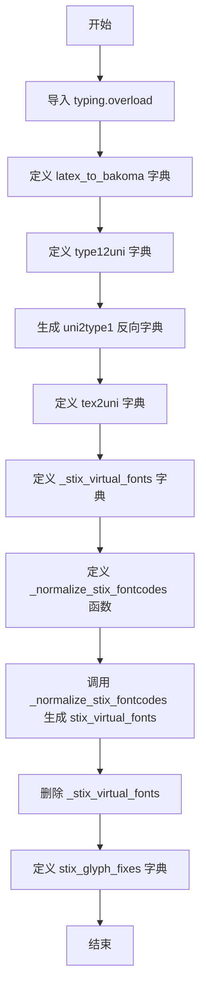

# `matplotlib\lib\matplotlib\_mathtext_data.py` 详细设计文档

本文件定义了LaTeX/TeX命令与多种字体（包括Computer Modern、Bakoma、Type1、STIX虚拟字体）之间的映射关系，用于TrueType和AFM字体渲染，包含Unicode编码转换和字形修正功能。

## 整体流程



## 类结构

```
无类层次结构（纯数据+函数模块）
└── 模块级函数
    └── _normalize_stix_fontcodes (重载函数)
└── 模块级变量（字典）
    ├── latex_to_bakoma
    ├── type12uni
    ├── uni2type1
    ├── tex2uni
    ├── _stix_virtual_fonts
    ├── stix_virtual_fonts
    └── stix_glyph_fixes
```

## 全局变量及字段


### `latex_to_bakoma`
    
LaTeX命令到Bakoma字体(字体名, 编码)的映射字典

类型：`dict[str, tuple[str, int]]`
    


### `type12uni`
    
Type1字体名称到Unicode码点的映射字典

类型：`dict[str, int]`
    


### `uni2type1`
    
Unicode码点到Type1字体名称的反向映射字典

类型：`dict[int, str]`
    


### `tex2uni`
    
TeX命令/符号到Unicode码点的映射字典

类型：`dict[str, int]`
    


### `_stix_virtual_fonts`
    
STIX虚拟字体原始定义数据（规范化前）

类型：`dict[str, dict[str, list[_EntryTypeIn]] | list[_EntryTypeIn]]`
    


### `stix_virtual_fonts`
    
规范化后的STIX虚拟字体数据，用于Unicode字符映射

类型：`dict[str, dict[str, list[_EntryTypeOut]] | list[_EntryTypeOut]]`
    


### `stix_glyph_fixes`
    
字形修正映射字典，用于交换错误的Cap和Cup字形

类型：`dict[int, int]`
    


### `_EntryTypeIn`
    
STIX虚拟字体条目输入类型别名

类型：`tuple[str, str, str, str | int]`
    


### `_EntryTypeOut`
    
STIX虚拟字体条目输出类型别名

类型：`tuple[int, int, str, int]`
    


### `_normalize_stix_fontcodes`
    
规范化STIX虚拟字体代码的函数，将字符转换为Unicode码点

类型：`function`
    


    

## 全局函数及方法


### `_normalize_stix_fontcodes`

该函数递归地将 STIX 虚拟字体数据中的字符（或单字符字符串）转换为对应的 Unicode 整数码点（ord），同时保持 tuple、list 和 dict 的嵌套结构不变。主要用于初始化 `stix_virtual_fonts` 数据，将配置表中混合的字符串/整数表示统一转换为整数形式。

参数：

-  `d`：`Union[_EntryTypeIn, list, dict]`（即 `tuple[str, str, str, str | int]` 或其列表/字典嵌套），待标准化的 STIX 虚拟字体原始数据。

返回值：`Union[_EntryTypeOut, list, dict]`，标准化后的数据结构，其中长度为 1 的字符串元素已被转换为其对应的 Unicode 整数码点。

#### 流程图

```mermaid
flowchart TD
    Start([开始 _normalize_stix_fontcodes]) --> Input{输入 d 的类型}
    
    Input -- Tuple --> TupleProcess[遍历元组元素]
    TupleProcess --> TupleCheck{元素是单字符字符串?}
    TupleCheck -- 是 --> TupleConvert[转换为 ord(字符)]
    TupleCheck -- 否 --> TupleKeep[保持原值]
    TupleConvert --> TupleReturn[返回新元组]
    TupleKeep --> TupleReturn
    
    Input -- List --> ListProcess[递归处理列表项]
    ListProcess --> ListReturn[返回新列表]
    
    Input -- Dict --> DictProcess[遍历字典键值对]
    DictProcess --> DictRecurse[递归处理值]
    DictReturn[返回新字典] --> DictProcess
    
    Input -- Other[其他类型] --> ReturnOriginal[直接返回原值]
    
    TupleReturn --> End([结束])
    ListReturn --> End
    DictReturn --> End
    ReturnOriginal --> End
```

#### 带注释源码

```python
# 定义输入输出的类型别名
_EntryTypeIn = tuple[str, str, str, str | int]
_EntryTypeOut = tuple[int, int, str, int]

# 使用 overload 装饰器提供精确的类型提示
@overload
def _normalize_stix_fontcodes(d: _EntryTypeIn) -> _EntryTypeOut: ...


@overload
def _normalize_stix_fontcodes(d: list[_EntryTypeIn]) -> list[_EntryTypeOut]: ...


@overload
def _normalize_stix_fontcodes(d: dict[str, list[_EntryTypeIn] |
                                      dict[str, list[_EntryTypeIn]]]
                              ) -> dict[str, list[_EntryTypeOut] |
                                        dict[str, list[_EntryTypeOut]]]: ...


def _normalize_stix_fontcodes(d):
    """
    递归标准化 STIX 虚拟字体代码。
    将字符串形式的 Unicode 码点或字符转换为整数。
    """
    # 处理元组：遍历元组元素，如果是单字符字符串则转为整数
    if isinstance(d, tuple):
        # 生成器表达式：如果是单字符字符串则调用 ord()，否则保持原样
        return tuple(ord(x) if isinstance(x, str) and len(x) == 1 else x for x in d)
    
    # 处理列表：递归调用自身处理每个列表项
    elif isinstance(d, list):
        return [_normalize_stix_fontcodes(x) for x in d]
    
    # 处理字典：递归调用自身处理字典的值
    elif isinstance(d, dict):
        return {k: _normalize_stix_fontcodes(v) for k, v in d.items()}
```

## 关键组件


### latex_to_bakoma

LaTeX命令到Bakoma字体（cmex10, cmmi10, cmr10, cmsy10, cmtt10）的映射字典，用于将LaTeX数学符号映射到对应的Type1字体和字符编码。

### type12uni

Type1字体 glyph 名称到Unicode码点的映射字典，提供了Adobe Type1字体中的字符名称与Unicode的对应关系。

### uni2type1

Unicode码点到Type1字体 glyph 名称的反向映射字典，由type12uni反转生成，用于从Unicode查找对应的Type1字体名称。

### tex2uni

TeX/LaTeX命令符号到Unicode码点的大规模映射字典，包含了数百个数学符号、希腊字母、装饰符等的Unicode对应关系。

### _stix_virtual_fonts

STIX虚拟字体的原始定义字典，包含bb（双线体）、cal（手写体）、frak（哥特体）、scr（脚本体）、sf（无衬线体）、tt（等宽字体）等虚拟字体的字符映射规则。

### _normalize_stix_fontcodes

规范化STIX字体代码的函数，使用@overload装饰器提供多态处理，支持将字符串形式的Unicode字符转换为整数码点，同时递归处理列表和字典结构。

### stix_virtual_fonts

规范化后的STIX虚拟字体字典，经过_normalize_stix_fontcodes处理，将字符串形式的Unicode字符（如"\N{DIGIT ZERO}"）转换为实际的整数编码。

### stix_glyph_fixes

STIX字形修复映射字典，记录了需要交换的两个错误glyph编码（0x22d2和0x22d3），用于修正Cap和Cup符号的 glyph 错误。


## 问题及建议


### 已知问题

- **大型字典硬编码**: `latex_to_bakoma`、`type12uni`、`tex2uni` 等大型字典直接写在源代码中，导致代码文件体积过大（超过2000行），难以维护，且每次修改都需要重新发布代码
- **魔法数字缺乏解释性**: 代码中大量使用十六进制数字如 `0x70`、`0x5c`、`0x22d2` 等，缺乏有意义的常量命名，可读性差，后期维护困难
- **类型注解不完整**: `_normalize_stix_fontcodes` 函数使用了 `@overload` 装饰器，但函数本身没有明确的返回类型注解 `-> ...`，类型检查工具可能无法正确推断
- **重复的数据定义**: `_stix_virtual_fonts` 字典在归一化后被删除 (`del _stix_virtual_fonts`)，但这种模式容易造成混淆，且原始数据不可恢复
- **注释中的代码生成逻辑**: 文件末尾保留了已注释掉的代码生成脚本 (`## For decimal values...`)，这些死代码应该清理或移至单独的工具脚本
- **缺少文档字符串**: 整个模块没有模块级别的文档说明，没有解释这些字体映射表的用途、来源和使用场景

### 优化建议

- **外部数据文件**: 将大型字典数据（`latex_to_bakoma`、`type12uni`、`tex2uni`、`_stix_virtual_fonts`）迁移到外部 JSON 或 YAML 文件中，通过运行时加载，减少源代码体积并便于非开发人员更新
- **常量封装**: 为所有十六进制 Unicode 码点和字体编码定义具名常量或枚举类，例如 `class BakomaFont(cmex10=0x70, ...)`，提高代码可读性和 IDE 自动补全能力
- **完善类型注解**: 为 `_normalize_stix_fontcodes` 函数添加返回类型注解，并考虑使用 `typing.TypeVar` 增强泛型支持
- **数据验证层**: 添加数据加载后的校验逻辑，确保 Unicode 码点有效、字体名称合法等，防止静默错误
- **自动化生成文档**: 为模块添加 `__doc__` 或 RST 格式文档，说明各字典的用途、来源（自动生成/手动维护）以及更新流程
- **清理死代码**: 移除注释掉的代码生成脚本，或将其移至专门的 `tools/` 目录，保持生产代码的纯净性

## 其它


### 设计目标与约束

本模块的核心设计目标是为LaTeX字体渲染系统提供完整的字符映射表，支持从LaTeX命令到Type1字体 glyph 索引、Unicode码点的双向映射，以及STIX虚拟字体的转换规则。设计约束包括：1）所有映射表必须在模块导入时加载完成，以确保运行时性能；2）映射表使用不可变的字典结构，确保线程安全；3）遵循Python 3.9+类型注解规范，支持静态类型检查。

### 错误处理与异常设计

本模块为纯数据定义模块，不涉及运行时业务逻辑，因此不设计业务异常。当访问不存在的映射键时，Python字典会抛出KeyError，这是预期行为。若需增强鲁棒性，可在调用方使用dict.get()方法提供默认值。当前模块未实现自定义异常类。

### 数据流与状态机

数据流主要分为三部分：1）导入阶段：模块加载时执行字典定义和_normalize_stix_fontcodes函数，将_stix_virtual_fonts转换为stix_virtual_fonts；2）查询阶段：外部模块通过latex_to_bakoma、type12uni、tex2uni、stix_virtual_fonts等字典进行字符映射查询；3）无状态机设计，所有映射表均为静态只读数据。

### 外部依赖与接口契约

本模块仅依赖Python标准库：typing模块提供类型注解支持，__future__模块确保Python 2/3兼容性。外部接口为四个导出字典：latex_to_bakoma（LaTeX命令到Bakoma字体映射）、type12uni（Type1字体名到Unicode）、uni2type1（Unicode到Type1字体名反向映射）、tex2uni（TeX命令到Unicode）、stix_virtual_fonts（STIX虚拟字体规则）、stix_glyph_fixes（字形修正表）。调用方应将这些字典视为只读数据。

### 性能考量

模块加载时会执行_normalize_stix_fontcodes函数对大型嵌套字典进行递归转换，初始加载可能略有延迟。运行时查询操作的时间复杂度为O(1)。若需进一步优化，可考虑使用__slots__或将静态字典改为frozenset，但当前数据量下无需优化。

### 兼容性说明

代码使用from __future__ import annotations确保与Python 2.7的潜在兼容性（虽然实际已弃用），但主要面向Python 3.9+。所有Unicode字符使用\u和\x表示法，符合Python 3标准。

### 维护建议

1）latex_to_bakoma和tex2uni字典庞大，建议使用自动化脚本从权威数据源生成，避免手动维护；2）_stix_virtual_fonts的手动编辑容易出错，应建立配置驱动的生成流程；3）stix_glyph_fixes作为补丁性质，应在文档中标注来源和修复原因；4）建议添加完整的类型注解覆盖，包括导出变量的类型声明。
</think>

### 设计目标与约束

本模块的设计目标是提供LaTeX字体与计算机现代（Computer Modern）字体之间的映射关系，支持从LaTeX命令符号到具体字体文件（cmex10、cmmi10、cmr10等）及其内部glyph索引的转换，同时提供TeX命令到Unicode码点的映射表。设计约束包括：映射表必须在模块导入时完整加载以保证运行时查询性能；所有数据结构采用不可变字典形式以确保线程安全性；遵循PEP 484类型注解规范以支持静态类型检查工具。

### 错误处理与异常设计

本模块定位为纯数据定义模块，不执行业务逻辑，因此不实现自定义异常类。当调用方查询不存在的映射键时，Python内置的KeyError异常将被正常抛出，这是预期行为。若调用方需要更温和的错误处理，建议使用dict.get()方法并提供默认值。当前模块未定义任何异常继承层次结构。

### 数据流与状态机

数据流分为两个主要阶段：第一阶段为模块初始化阶段，Python解释器在导入时执行字典字面量赋值和_normalize_stix_fontcodes函数调用，将_stix_virtual_fonts中以字符串形式存储的Unicode码点规范化为整数值；第二阶段为运行时查询阶段，外部模块通过访问latex_to_bakoma、type12uni、uni2type1、tex2uni、stix_virtual_fonts和stix_glyph_fixes等导出字典进行字符映射查询。本模块不涉及状态机设计，所有映射表均为静态只读数据结构。

### 外部依赖与接口契约

本模块的外部依赖仅包含Python标准库：typing模块提供类型注解支持（overload装饰器用于函数重载声明），__future__模块确保向后的Python版本兼容性。模块导出的公共接口包括六个字典变量：latex_to_bakoma（LaTeX命令到Bakoma字体及glyph索引的映射）、type12uni（Type 1字体 glyph 名称到Unicode码点的映射）、uni2type1（反向映射）、tex2uni（TeX命令到Unicode码点的完整映射）、stix_virtual_fonts（STIX虚拟字体替换规则）、stix_glyph_fixes（已知字形错误的修正表）。调用方必须将这些字典视为只读数据，任何修改行为均不受保障。

### 性能考量

模块加载时会执行_normalize_stix_fontcodes函数对包含数百个条目的嵌套字典进行递归遍历和类型转换，首次导入可能产生毫秒级延迟。运行时查询操作的时间复杂度为O(1)，空间复杂度由各映射表的条目数量决定（tex2uni包含超过700个条目）。当前数据规模下无需进一步性能优化，但若后续扩展到数万条映射时可考虑使用__slots__或将字典迁移至专用数据库。

### 版本兼容性说明

代码中from __future__ import annotations语句表明作者曾考虑Python 2兼容性问题，但该模块的实际运行需要Python 3.6+环境（用于字典推导式和类型注解）。所有Unicode字符字面量使用\x和\N{}表示法，完全兼容UTF-8编码的Python 3解释器。

### 测试与验证建议

建议为映射表添加自动化验证测试：1）验证uni2type1确实是type12uni的严格反向映射；2）检查tex2uni的值是否为有效的Unicode码点范围；3）验证stix_virtual_fonts中所有码点已完成从字符串到整数的转换；4）确保latex_to_bakoma中的十六进制glyph索引在有效范围内。

### 维护注意事项

latex_to_bakoma和tex2uni字典由注释标注为"Automatically generated"，表明存在自动化生成脚本，但该脚本未包含在当前代码文件中。维护时应追溯到原始数据源并通过脚本重新生成，以避免手动编辑导致的不一致。stix_virtual_fonts的手动编辑历史较长，存在注释不一致问题（如"# \Gamma (not in beta STIX fonts)"），建议统一规范注释格式。
    