# `matplotlib\lib\matplotlib\_pylab_helpers.py` 详细设计文档

This code manages figures for the pyplot interface, providing singleton functionality to maintain the relationship between figures and their managers, and track the active figure and manager.

## 整体流程

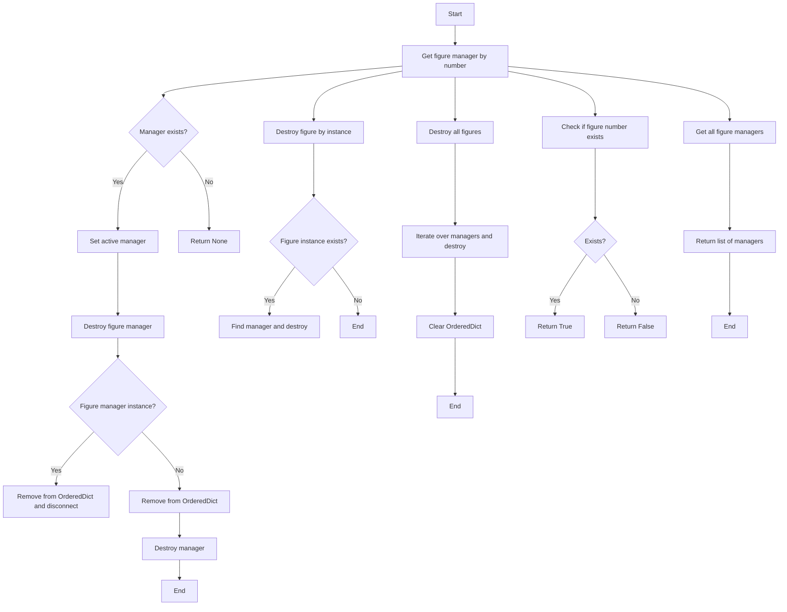

## 类结构

```
Gcf (Singleton class)
├── figs (OrderedDict)
│   ├── get_fig_manager (classmethod)
│   ├── destroy (classmethod)
│   ├── destroy_fig (classmethod)
│   ├── destroy_all (classmethod)
│   ├── has_fignum (classmethod)
│   ├── get_all_fig_managers (classmethod)
│   ├── get_num_fig_managers (classmethod)
│   ├── get_active (classmethod)
│   ├── _set_new_active_manager (classmethod)
│   ├── set_active (classmethod)
│   └── draw_all (classmethod)
```

## 全局变量及字段


### `figs`
    
OrderedDict mapping numbers to managers; the active manager is at the end.

类型：`OrderedDict`
    


### `Gcf.figs`
    
OrderedDict mapping numbers to managers; the active manager is at the end.

类型：`OrderedDict`
    
    

## 全局函数及方法


### Gcf.get_fig_manager

This method retrieves the figure manager associated with a given manager number.

参数：

- `num`：`int`，The manager number associated with the figure manager to be retrieved.

返回值：`FigureManagerBase`，The figure manager associated with the given manager number, or `None` if no such manager exists.

#### 流程图

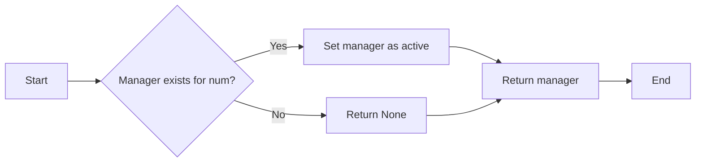

#### 带注释源码

```python
@classmethod
    def get_fig_manager(cls, num):
        """
        If manager number *num* exists, make it the active one and return it;
        otherwise return *None*.
        """
        manager = cls.figs.get(num, None)
        if manager is not None:
            cls.set_active(manager)
        return manager
```


### Gcf.destroy

Destroy manager `num` -- either a manager instance or a manager number.

参数：

- `num`：`int` 或 `Gcf` 实例，The manager number or a manager instance to be destroyed.

返回值：`None`，No return value.

#### 流程图

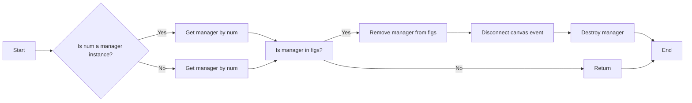

#### 带注释源码

```python
@classmethod
    def destroy(cls, num):
        """
        Destroy manager *num* -- either a manager instance or a manager number.
        """
        if all(hasattr(num, attr) for attr in ["num", "destroy"]):
            # num is a manager-like instance (not necessarily a
            # FigureManagerBase subclass)
            manager = num
            if cls.figs.get(manager.num) is manager:
                cls.figs.pop(manager.num)
        else:
            try:
                manager = cls.figs.pop(num)
            except KeyError:
                return
        if hasattr(manager, "_cidgcf"):
            manager.canvas.mpl_disconnect(manager._cidgcf)
        manager.destroy()
```


### Gcf.destroy_fig

Destroy figure `fig`.

参数：

- `fig`：`Figure`，The figure to be destroyed.

返回值：无

#### 流程图

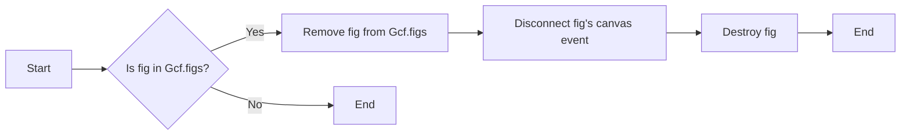

#### 带注释源码

```python
    @classmethod
    def destroy_fig(cls, fig):
        """Destroy figure *fig*."""
        manager = next((manager for manager in cls.figs.values()
                       if manager.canvas.figure == fig), None)
        if manager is not None:
            cls.destroy(manager)
```


### Gcf.destroy_all

Destroy all figures.

参数：

- 无

返回值：无

#### 流程图

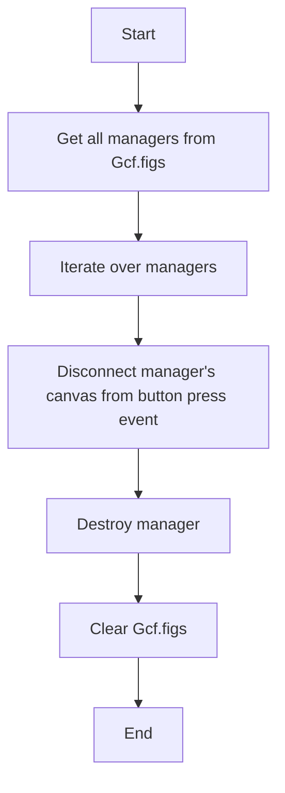

#### 带注释源码

```python
@classmethod
    def destroy_all(cls):
        """Destroy all figures."""
        for manager in list(cls.figs.values()):
            manager.canvas.mpl_disconnect(manager._cidgcf)
            manager.destroy()
        cls.figs.clear()
```


### Gcf.has_fignum

Return whether figure number *num* exists.

参数：

- `num`：`int`，The figure number to check for existence.

返回值：`bool`，Returns `True` if the figure number exists, otherwise `False`.

#### 流程图

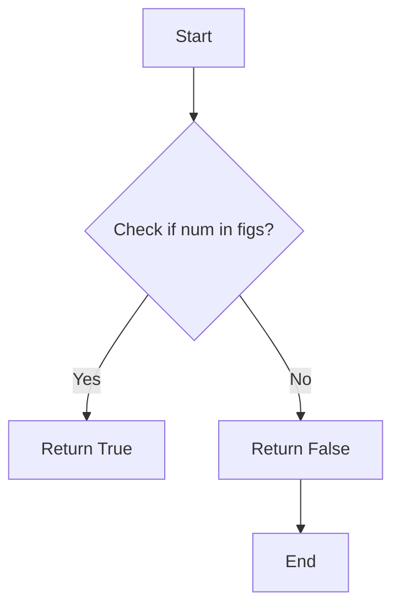

#### 带注释源码

```python
    @classmethod
    def has_fignum(cls, num):
        """Return whether figure number *num* exists."""
        return num in cls.figs
```


### Gcf.get_all_fig_managers

Return a list of figure managers.

参数：

- 无

返回值：`list`，A list of figure managers.

#### 流程图

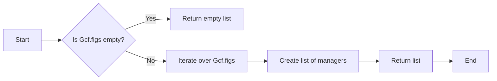

#### 带注释源码

```python
@classmethod
    def get_all_fig_managers(cls):
        """Return a list of figure managers."""
        return list(cls.figs.values())
```


### Gcf.get_num_fig_managers

Return the number of figures being managed.

参数：

- 无

返回值：`int`，The number of figures being managed.

#### 流程图

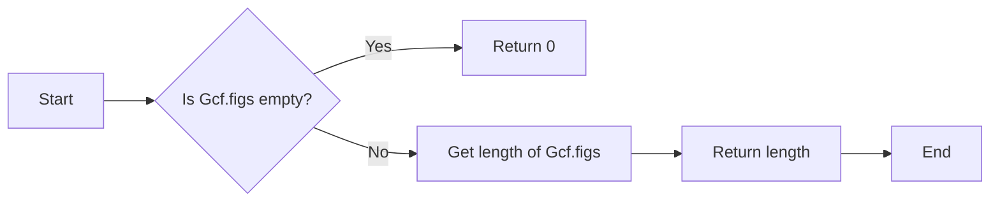

#### 带注释源码

```python
@classmethod
    def get_num_fig_managers(cls):
        """Return the number of figures being managed."""
        return len(cls.figs)
```


### Gcf.get_active

Return the active manager, or `None` if there is no manager.

参数：

- 无

返回值：`Gcf`，The active manager object or `None` if there is no active manager.

#### 流程图

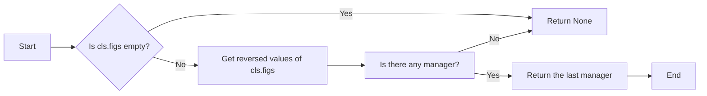

#### 带注释源码

```python
    @classmethod
    def get_active(cls):
        """Return the active manager, or None if there is no manager."""
        return next(reversed(cls.figs.values())) if cls.figs else None
```


### Gcf._set_new_active_manager

Adopt *manager* into pyplot and make it the active manager.

参数：

- `manager`：`Gcf`，The manager instance to be set as the active one.

返回值：`None`，No return value, it's a void method.

#### 流程图

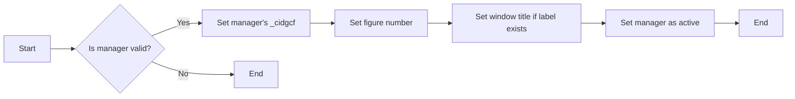

#### 带注释源码

```python
@classmethod
    def _set_new_active_manager(cls, manager):
        """Adopt *manager* into pyplot and make it the active manager."""
        if not hasattr(manager, "_cidgcf"):
            manager._cidgcf = manager.canvas.mpl_connect(
                "button_press_event", lambda event: cls.set_active(manager))
        fig = manager.canvas.figure
        fig._number = manager.num
        label = fig.get_label()
        if label:
            manager.set_window_title(label)
        cls.set_active(manager)
```


### Gcf.set_active

Make *manager* the active manager.

参数：

- `manager`：`Gcf`，The manager instance to be set as active.

返回值：`None`，No return value.

#### 流程图

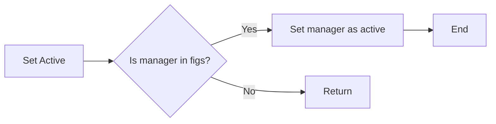

#### 带注释源码

```python
@classmethod
    def set_active(cls, manager):
        # Set the manager as the active one by moving it to the end of the OrderedDict.
        cls.figs[manager.num] = manager
        cls.figs.move_to_end(manager.num)
```


### Gcf.draw_all

Redraw all managed figures that are stale, or all managed figures if the force parameter is set to True.

参数：

- `force`：`bool`，If set to True, all managed figures will be redrawn regardless of their staleness.

返回值：`None`，This method does not return any value.

#### 流程图

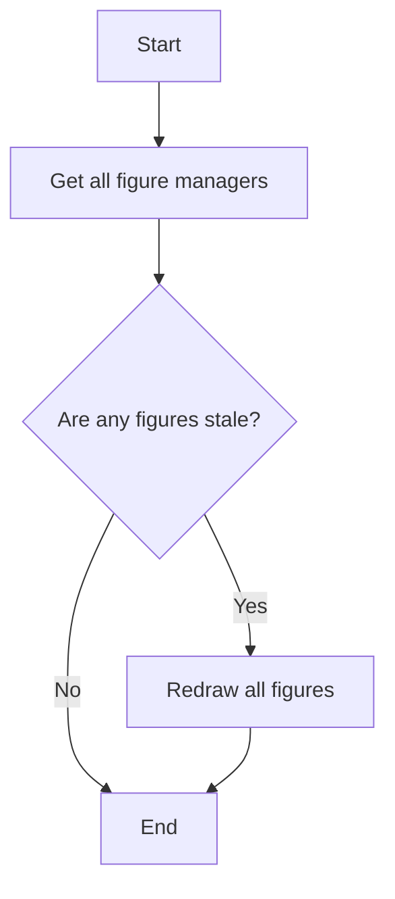

#### 带注释源码

```python
@classmethod
    def draw_all(cls, force=False):
        """
        Redraw all stale managed figures, or, if *force* is True, all managed
        figures.
        """
        for manager in cls.get_all_fig_managers():
            if force or manager.canvas.figure.stale:
                manager.canvas.draw_idle()
```


## 关键组件


### 张量索引与惰性加载

张量索引与惰性加载是用于高效处理大型数据集的关键组件，它允许在数据未完全加载到内存之前进行索引和访问。

### 反量化支持

反量化支持是用于优化数值计算性能的组件，它通过将数值转换为更紧凑的表示形式来减少内存使用和提高计算速度。

### 量化策略

量化策略是用于调整数据精度以适应特定计算需求的组件，它通过减少数据位数来降低内存和计算资源的使用。


## 问题及建议


### 已知问题

-   **全局状态管理**: `Gcf` 类使用全局变量 `figs` 来管理所有图例管理器，这可能导致代码难以测试和重用，因为全局状态难以隔离。
-   **依赖性**: `Gcf` 类依赖于 `atexit` 模块来在程序退出时销毁所有图例，这可能导致资源未正确释放，特别是在非正常退出时。
-   **错误处理**: 代码中没有明确的错误处理机制，例如在 `destroy` 方法中，如果 `num` 不是有效的管理器，则不会抛出异常，这可能导致难以追踪的错误。

### 优化建议

-   **使用依赖注入**: 将 `figs` 属性改为依赖注入，这样可以在测试时更容易地替换或模拟。
-   **资源管理**: 实现更健壮的资源管理策略，例如使用上下文管理器来自动释放资源。
-   **异常处理**: 在 `destroy` 方法中添加异常处理，确保在出现错误时能够提供有用的反馈。
-   **文档和注释**: 增加代码的文档和注释，特别是对于类方法和全局函数，以帮助其他开发者理解代码的工作原理。
-   **代码复用**: 考虑将 `Gcf` 类中的某些功能提取到单独的类或模块中，以提高代码的复用性。
-   **性能优化**: 如果 `figs` 字典变得非常大，考虑使用更高效的数据结构或缓存策略来管理图例管理器。


## 其它


### 设计目标与约束

- 设计目标：
  - 实现一个单例类 `Gcf`，用于管理 `pyplot` 接口中的图形。
  - 维护图形与其管理器之间的关系，并跟踪活动的图形和管理器。
  - 提供方法来获取、设置、销毁和管理图形。
- 约束：
  - 类 `Gcf` 应该是单例的，确保全局只有一个实例。
  - 所有方法应该能够处理图形和图形管理器的各种操作。
  - 应该提供异常处理机制，确保在错误情况下程序能够优雅地处理。

### 错误处理与异常设计

- 错误处理：
  - 当尝试获取不存在的图形管理器时，`get_fig_manager` 方法返回 `None`。
  - 当尝试销毁不存在的图形管理器时，`destroy` 方法不执行任何操作。
  - 当尝试销毁图形时，如果图形管理器不存在，则不执行任何操作。
- 异常设计：
  - 使用 `try-except` 块来捕获和处理可能发生的异常，例如 `KeyError`。

### 数据流与状态机

- 数据流：
  - 图形和图形管理器通过 `figs` 字典进行关联。
  - 当图形被创建时，其管理器被添加到 `figs` 字典中。
  - 当图形被销毁时，其管理器从 `figs` 字典中移除。
- 状态机：
  - 没有明确的状态机，但 `Gcf` 类管理着图形的激活状态。

### 外部依赖与接口契约

- 外部依赖：
  - 依赖于 `matplotlib` 库中的 `FigureManagerBase` 类。
- 接口契约：
  - `Gcf` 类提供了一系列方法，用于管理图形和图形管理器。
  - 这些方法包括获取、设置、销毁和管理图形。
  - 方法应该遵循 `matplotlib` 库的接口规范。


    