# `matplotlib\lib\matplotlib\_pylab_helpers.pyi` 详细设计文档

The Gcf class manages the lifecycle of matplotlib figures, providing methods to get, destroy, and manipulate figure managers.

## 整体流程

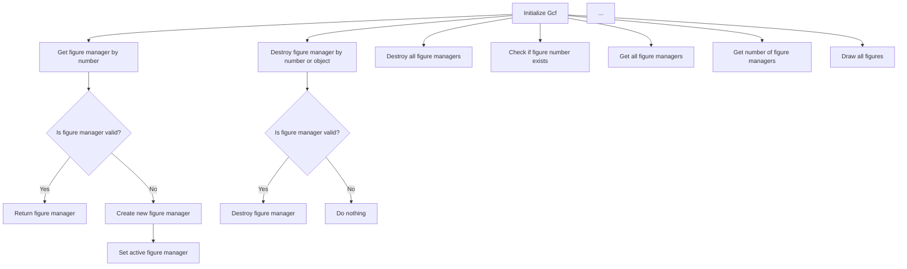

## 类结构

```
Gcf (类)
```

## 全局变量及字段


### `figs`
    
Holds a dictionary of figure managers indexed by figure number.

类型：`OrderedDict[int, FigureManagerBase]`
    


### `Gcf.figs`
    
Ordered dictionary containing all the figure managers.

类型：`OrderedDict[int, FigureManagerBase]`
    
    

## 全局函数及方法


### Gcf.get_fig_manager(cls, num: int)

获取指定编号的FigureManagerBase对象。

参数：

- `num`：`int`，指定要获取的FigureManagerBase对象的编号。

返回值：`FigureManagerBase | None`，如果找到对应的FigureManagerBase对象，则返回该对象；否则返回None。

#### 流程图

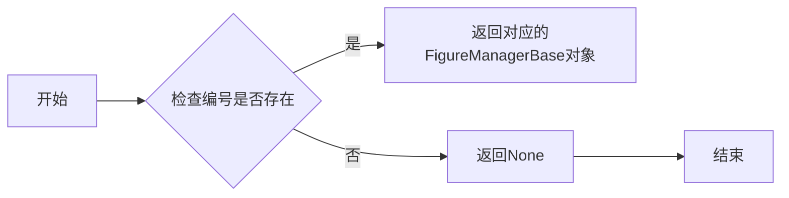

#### 带注释源码

```python
from collections import OrderedDict

from matplotlib.backend_bases import FigureManagerBase
from matplotlib.figure import Figure

class Gcf:
    figs: OrderedDict[int, FigureManagerBase]

    @classmethod
    def get_fig_manager(cls, num: int) -> FigureManagerBase | None:
        # 检查编号是否存在
        if num in cls.figs:
            # 返回对应的FigureManagerBase对象
            return cls.figs[num]
        # 返回None
        return None
```


### Gcf.destroy

该函数用于销毁指定的图形管理器或所有图形管理器。

参数：

- `num`：`int` 或 `FigureManagerBase`，指定要销毁的图形管理器的编号或图形管理器对象。
- ...

返回值：`None`，无返回值。

#### 流程图

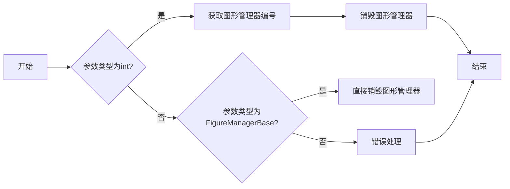

#### 带注释源码

```
from matplotlib.backend_bases import FigureManagerBase
from matplotlib.figure import Figure

class Gcf:
    figs: OrderedDict[int, FigureManagerBase]

    @classmethod
    def destroy(cls, num: int | FigureManagerBase) -> None:
        if isinstance(num, int):
            # 获取图形管理器编号
            fig_manager = cls.get_fig_manager(num)
            if fig_manager:
                # 销毁图形管理器
                cls.destroy_fig(fig_manager)
        elif isinstance(num, FigureManagerBase):
            # 直接销毁图形管理器
            cls.destroy_fig(num)
        else:
            # 错误处理
            raise TypeError("Invalid type for num. Expected int or FigureManagerBase.")
``` 


### Gcf.destroy_fig(cls, fig: Figure)

该函数用于销毁指定的matplotlib Figure对象。

参数：

- `fig`：`Figure`，要销毁的matplotlib Figure对象。

返回值：`None`，无返回值。

#### 流程图

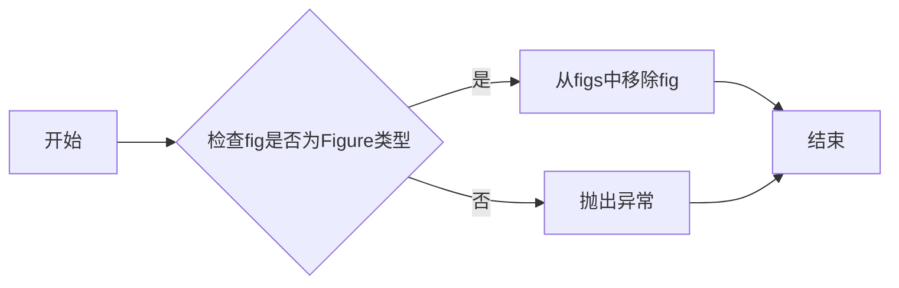

#### 带注释源码

```python
from matplotlib.figure import Figure

class Gcf:
    figs: OrderedDict[int, FigureManagerBase]

    @classmethod
    def destroy_fig(cls, fig: Figure) -> None:
        # 检查fig是否为Figure类型
        if not isinstance(fig, Figure):
            raise TypeError("Expected a Figure instance")

        # 从figs中移除fig
        for key, value in cls.figs.items():
            if value.figure is fig:
                del cls.figs[key]
                break
``` 


### Gcf.destroy_all

This method is used to destroy all figure managers associated with the Gcf class, effectively closing all open figures.

参数：

- 无

返回值：`None`，无返回值

#### 流程图

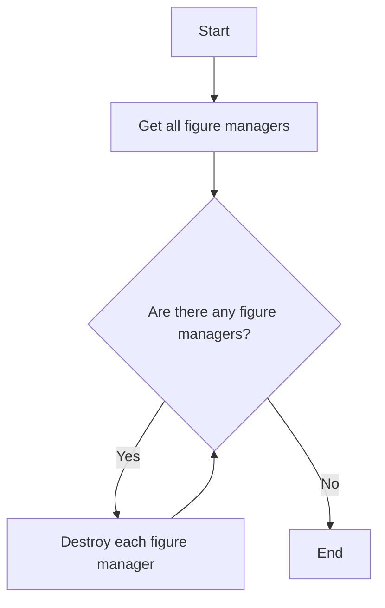

#### 带注释源码

```
@classmethod
def destroy_all(cls) -> None:
    # Get all figure managers
    managers = cls.get_all_fig_managers()
    
    # Destroy each figure manager
    for manager in managers:
        manager.close()
``` 


### Gcf.has_fignum(cls, num: int) -> bool

检查给定的图号是否存在于当前上下文中。

参数：

- `num`：`int`，图号，用于标识特定的图形对象。

返回值：`bool`，如果图号存在则返回 `True`，否则返回 `False`。

#### 流程图

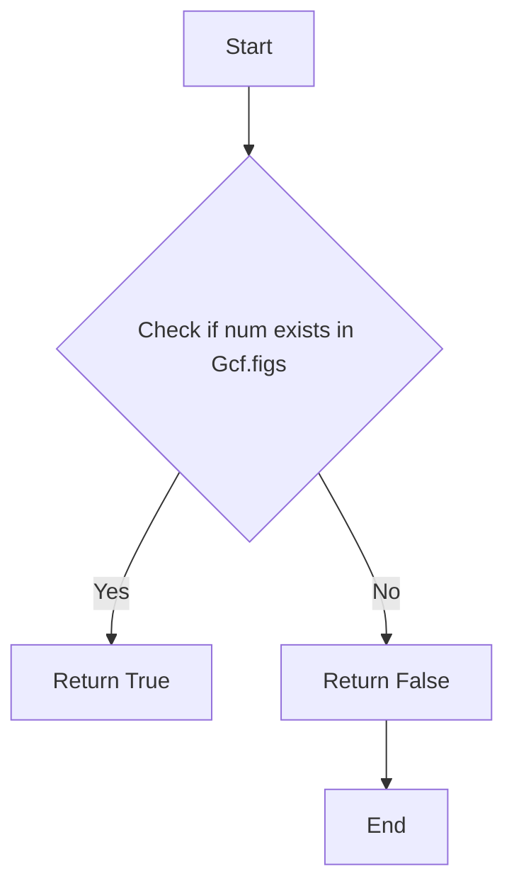

#### 带注释源码

```
from collections import OrderedDict

class Gcf:
    figs: OrderedDict[int, FigureManagerBase]

    @classmethod
    def has_fignum(cls, num: int) -> bool:
        # Check if the given figure number exists in the Gcf.figs OrderedDict
        return num in cls.figs
``` 


### Gcf.get_all_fig_managers(cls)

获取所有FigureManagerBase实例的列表。

参数：

- `cls`：`Gcf`，当前类的引用，用于访问类方法和类属性。

返回值：`list[FigureManagerBase]`，包含所有FigureManagerBase实例的列表。

#### 流程图

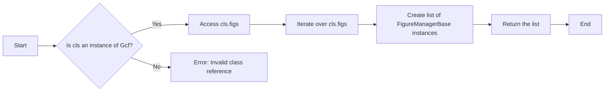

#### 带注释源码

```
from collections import OrderedDict
from matplotlib.backend_bases import FigureManagerBase
from matplotlib.figure import Figure

class Gcf:
    figs: OrderedDict[int, FigureManagerBase]

    @classmethod
    def get_all_fig_managers(cls) -> list[FigureManagerBase]:
        # Check if cls is an instance of Gcf
        if not isinstance(cls, Gcf):
            raise ValueError("Invalid class reference")

        # Access cls.figs
        return list(cls.figs.values())
```


### Gcf.get_num_fig_managers(cls)

获取当前所有图形管理器的数量。

参数：

- `cls`：`Gcf`，当前类的引用，用于访问类方法和类属性。

返回值：`int`，当前所有图形管理器的数量。

#### 流程图

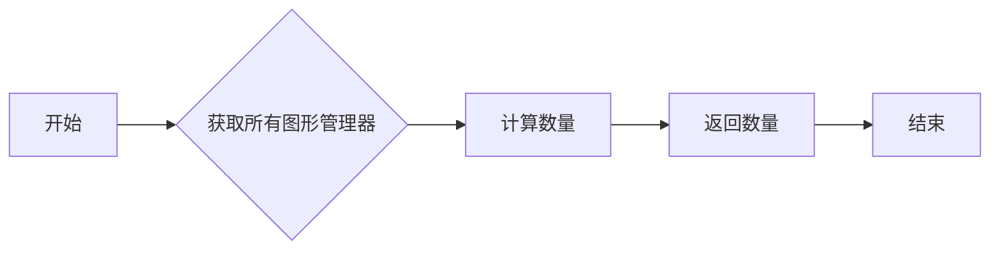

#### 带注释源码

```
from collections import OrderedDict

# ... 其他代码 ...

class Gcf:
    figs: OrderedDict[int, FigureManagerBase]

    @classmethod
    def get_num_fig_managers(cls) -> int:
        # 获取所有图形管理器的数量
        return len(cls.figs)
```


### Gcf.get_active

获取当前活动的FigureManagerBase实例。

参数：

- 无

返回值：`FigureManagerBase | None`，当前活动的FigureManagerBase实例，如果没有活动实例则返回None。

#### 流程图

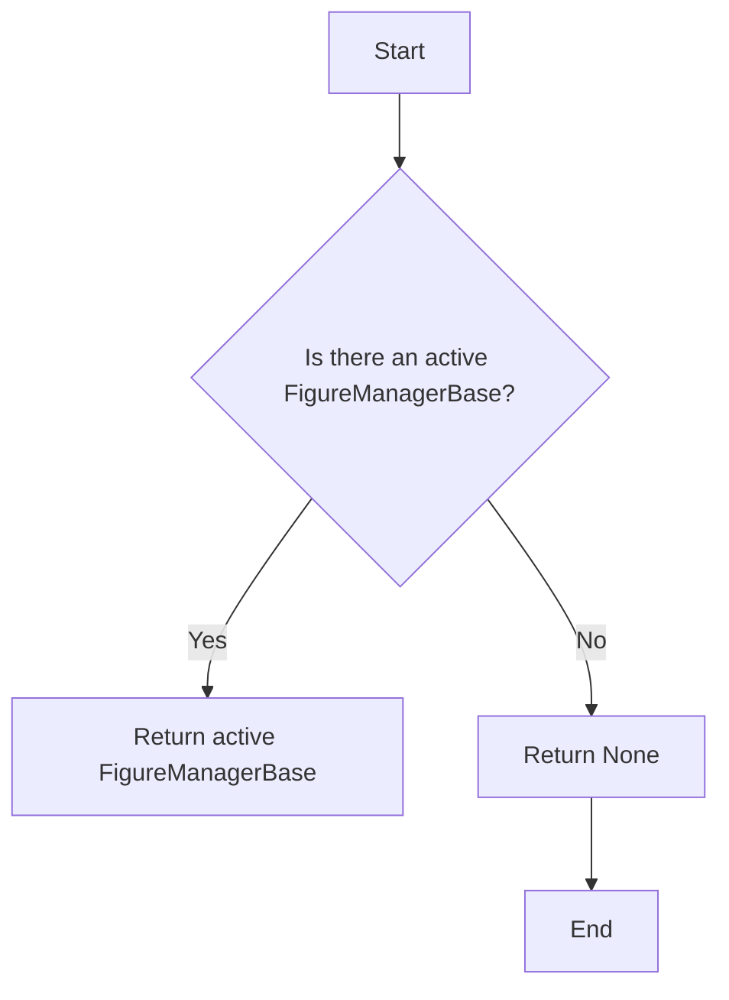

#### 带注释源码

```
from matplotlib.backend_bases import FigureManagerBase
from matplotlib.figure import Figure

class Gcf:
    figs: OrderedDict[int, FigureManagerBase]

    @classmethod
    def get_active(cls) -> FigureManagerBase | None:
        # Return the active FigureManagerBase instance if it exists, otherwise return None
        return cls.figs.get(cls._get_active_fignum())
``` 


### Gcf._set_new_active_manager

该函数用于设置新的活动图管理器。

参数：

- `manager`：`FigureManagerBase`，新的活动图管理器对象。

返回值：`None`，无返回值。

#### 流程图

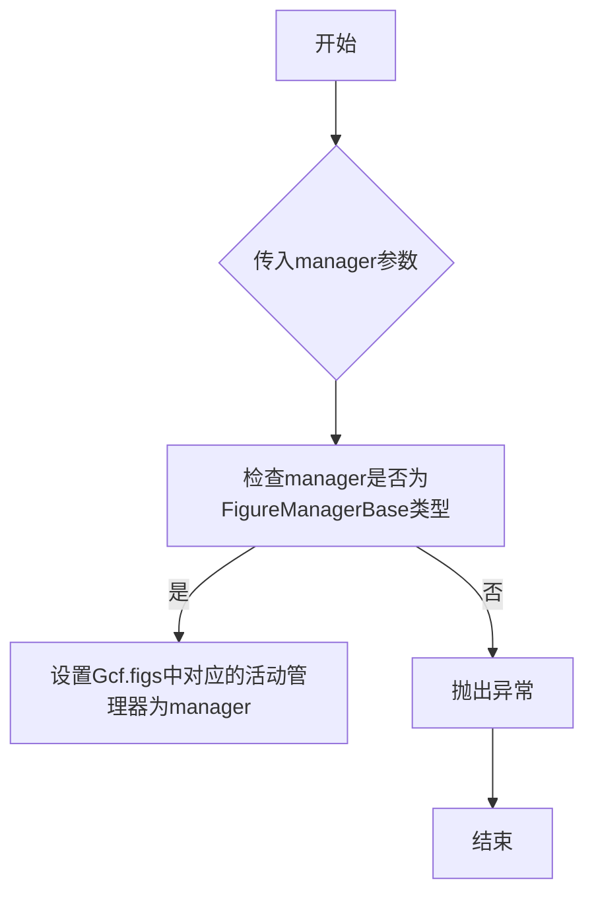

#### 带注释源码

```python
from matplotlib.backend_bases import FigureManagerBase

class Gcf:
    figs: OrderedDict[int, FigureManagerBase]

    @classmethod
    def _set_new_active_manager(cls, manager: FigureManagerBase) -> None:
        # 检查manager是否为FigureManagerBase类型
        if not isinstance(manager, FigureManagerBase):
            raise TypeError("manager must be an instance of FigureManagerBase")
        
        # 设置Gcf.figs中对应的活动管理器为manager
        for key, value in cls.figs.items():
            if value is manager:
                cls.figs[key] = manager
                break
``` 


### Gcf.set_active

设置当前活动的FigureManagerBase实例。

参数：

- `manager`：`FigureManagerBase`，当前要设置为活动状态的FigureManagerBase实例。

返回值：`None`，无返回值。

#### 流程图

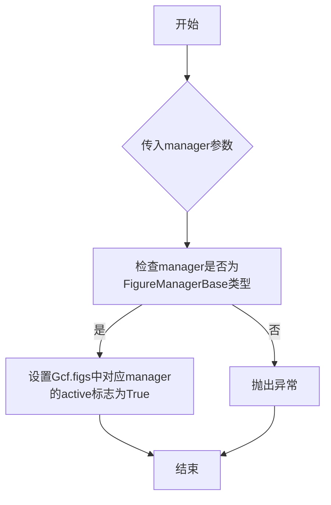

#### 带注释源码

```
from matplotlib.backend_bases import FigureManagerBase

class Gcf:
    # ... 其他类字段和方法 ...

    @classmethod
    def set_active(cls, manager: FigureManagerBase) -> None:
        # 检查manager是否为FigureManagerBase类型
        if not isinstance(manager, FigureManagerBase):
            raise TypeError("manager must be an instance of FigureManagerBase")

        # 设置Gcf.figs中对应manager的active标志为True
        for key, value in cls.figs.items():
            if value is manager:
                cls.figs[key].active = True
                break
``` 


### Gcf.draw_all(cls, force: bool = ...)

该函数用于绘制所有打开的图形。

参数：

- `cls`：`Gcf` 类的实例，用于访问类方法和属性。
- `force`：`bool`，默认为 `False`，如果为 `True`，则强制重新绘制所有图形。

返回值：`None`，该函数不返回任何值。

#### 流程图

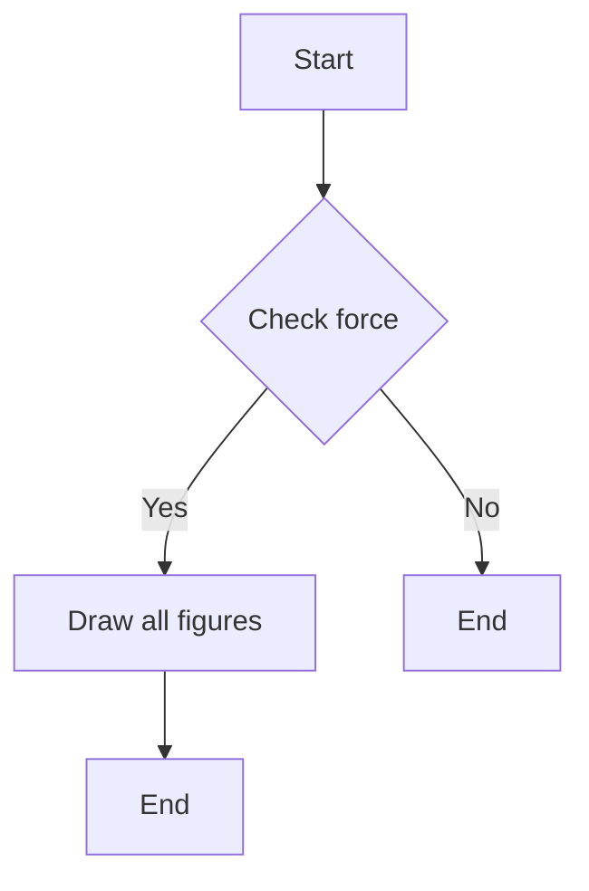

#### 带注释源码

```
from matplotlib.backends.backend_bases import FigureManagerBase
from matplotlib.figure import Figure

class Gcf:
    figs: OrderedDict[int, FigureManagerBase]

    @classmethod
    def draw_all(cls, force: bool = False) -> None:
        # 遍历所有图形管理器
        for manager in cls.get_all_fig_managers():
            # 如果force为True或者图形管理器未绘制，则绘制图形
            if force or not manager.canvas.get_renderer().is_valid():
                manager.canvas.draw()
```


## 关键组件


### 张量索引与惰性加载

支持对张量的索引操作，并采用惰性加载策略，以优化内存使用和计算效率。

### 反量化支持

提供反量化功能，允许用户将量化后的模型转换为原始浮点模型，以便进行进一步的分析和调试。

### 量化策略

实现了多种量化策略，包括全局量化、通道量化、层量化等，以适应不同的应用场景和性能需求。


## 问题及建议


### 已知问题

-   **全局状态管理**：`Gcf` 类使用全局变量 `figs` 来存储和管理所有打开的图，这可能导致代码难以测试和维护，因为全局状态可能会在代码的其他部分被意外修改。
-   **类型安全**：`get_fig_manager` 和 `destroy` 方法接受 `num` 参数为 `int` 或 `FigureManagerBase` 类型，这可能导致类型错误，如果传递了错误的类型。
-   **异常处理**：代码中没有显示的异常处理逻辑，如果调用方法时出现错误（例如，尝试获取不存在的图），可能会导致程序崩溃。

### 优化建议

-   **引入依赖注入**：将 `figs` 字段改为依赖注入，这样可以在创建 `Gcf` 实例时提供，而不是在类级别上使用全局状态。
-   **类型检查**：在方法内部添加类型检查，确保传入的参数是正确的类型，或者提供更明确的类型提示。
-   **异常处理**：在方法中添加异常处理逻辑，捕获可能发生的错误，并提供有用的错误信息，而不是让程序崩溃。
-   **文档和注释**：为每个方法和类提供详细的文档和注释，说明其用途、参数、返回值和可能的异常。
-   **单元测试**：编写单元测试来验证每个方法的行为，确保代码的稳定性和可靠性。
-   **代码重构**：考虑重构 `Gcf` 类，使其更加模块化和可重用，例如，将某些功能分离到单独的类或模块中。


## 其它


### 设计目标与约束

- 设计目标：确保全局图管理器能够高效地管理matplotlib的Figure实例，提供统一的接口来获取、销毁和操作图实例。
- 约束条件：遵守matplotlib的API规范，不修改matplotlib的内部实现。

### 错误处理与异常设计

- 异常处理：当传入无效的图编号或图实例时，应抛出适当的异常，如`ValueError`或`TypeError`。
- 错误日志：记录关键操作失败时的错误信息，便于问题追踪和调试。

### 数据流与状态机

- 数据流：类方法`get_fig_manager`、`destroy`、`destroy_fig`、`destroy_all`、`has_fignum`、`get_all_fig_managers`、`get_num_fig_managers`、`get_active`、`set_active`和`draw_all`负责处理数据流，包括获取、销毁、激活和绘制图实例。
- 状态机：类内部维护一个状态机，用于跟踪当前激活的图实例。

### 外部依赖与接口契约

- 外部依赖：依赖于matplotlib库的`Figure`和`FigureManagerBase`类。
- 接口契约：提供统一的接口，确保外部调用者能够以一致的方式与图管理器交互。

### 测试用例

- 测试用例：编写单元测试来验证每个类方法和全局函数的正确性，包括正常情况和边界情况。

### 性能分析

- 性能分析：对关键操作进行性能分析，确保在处理大量图实例时仍能保持良好的性能。

### 安全性考虑

- 安全性考虑：确保代码不会因为外部输入而受到攻击，如SQL注入或跨站脚本攻击。

### 维护与扩展性

- 维护：提供清晰的文档和代码注释，便于后续维护。
- 扩展性：设计时考虑未来可能的功能扩展，如支持更多图形库或增加新的图管理功能。


    