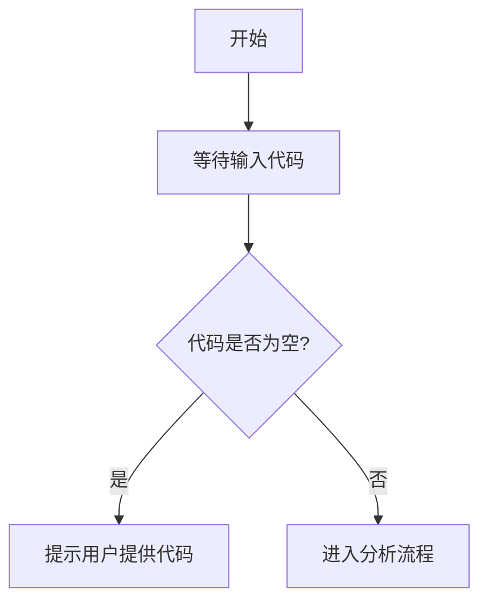

# `matplotlib\lib\matplotlib\_qhull.pyi` 详细设计文档

未提供源代码文件，无法进行分析。请在代码块中提供需要分析的源代码。

## 整体流程



## 类结构

```

```

## 全局变量及字段


    

## 全局函数及方法


## 关键组件


### 代码概述

该代码块为空，未提供任何源代码，因此无法进行详细设计分析。

### 文件运行流程

不适用

### 类详细信息

不适用

### 全局变量和函数

不适用

### 关键组件信息

无

### 潜在技术债务或优化空间

无

### 其它项目

由于未提供源代码，无法进行设计目标与约束、错误处理与异常设计、数据流与状态机、外部依赖与接口契约等方面的分析。

请提供有效的源代码以便进行详细设计文档生成。


## 问题及建议


### 已知问题

-   代码为空，无法进行技术债务和优化空间的分析
-   缺少待分析的源代码输入

### 优化建议

-   请提供待分析的源代码，以便进行完整的技术债务识别和优化建议
-   如需通用指导，可参考以下常见优化领域：
  - 代码结构与模块化
  - 性能瓶颈分析
  - 错误处理与异常设计
  - 依赖管理与解耦
  - 测试覆盖与代码质量
  - 安全漏洞扫描
  - 文档完善度评估


## 其它


### 设计目标与约束

设计目标：描述系统要实现的业务目标、功能目标和非功能目标；约束：列出技术约束（如编程语言、框架版本）、业务约束（如预算、时间）和环境约束（如部署平台、硬件要求）。

### 错误处理与异常设计

描述系统中的异常分类（业务异常、系统异常、第三方异常等）、异常传播机制、错误码定义规范、异常处理策略（重试、降级、熔断等）、日志记录要求以及故障恢复机制。

### 数据流与状态机

描述数据从输入到输出的完整流转路径，包括数据来源、处理节点、数据存储和数据消费；状态机部分需说明对象的状态定义、状态转换条件、触发事件以及状态变更的边界条件。

### 外部依赖与接口契约

列出系统依赖的外部服务、库、API及其版本要求；定义与外部系统交互的接口规范，包括请求/响应格式、认证方式、超时配置、限流策略、接口变更管理以及服务等级协议（SLA）。

### 性能要求与指标

定义系统的性能指标，包括响应时间（RT）、吞吐量（TPS/QPS）、并发用户数、资源利用率（CPU、内存、磁盘IO、网络）、启动时间、扩展性目标以及性能测试标准。

### 安全性设计

描述身份认证机制（认证方式、令牌管理、会话控制）、授权策略（角色、权限、访问控制列表）、数据加密（传输加密、存储加密）、输入验证、安全审计、常见漏洞防护（SQL注入、XSS、CSRF等）以及安全合规要求。

### 兼容性设计

描述系统的前向/后向兼容性策略、版本兼容性管理、数据格式演进方案、API版本控制策略以及多平台/多终端适配方案。

### 配置管理

描述配置项分类（环境配置、业务配置、系统配置）、配置存储方式（配置文件、环境变量、配置中心）、配置更新机制（热更新、冷更新）、配置校验规则以及敏感配置加密方案。

### 监控与可观测性

描述监控指标体系（业务指标、技术指标、资源指标）、日志规范（格式、级别、采集）、链路追踪方案、告警策略、健康检查机制以及可观测性数据的存储和分析方案。

### 事务与一致性设计

描述事务管理策略（本地事务、分布式事务）、一致性模型（强一致性、最终一致性）、补偿机制、幂等性设计、分布式锁使用以及数据同步策略。

### 并发与资源管理

描述并发控制机制（锁、乐观锁、悲观锁）、线程/协程池配置、连接池管理、内存管理策略、资源泄漏防护以及高并发场景下的应对方案。

### 数据持久化设计

描述数据存储方案（关系型数据库、NoSQL、文件系统等）、表/集合结构设计、索引策略、数据生命周期管理、备份与恢复策略以及数据迁移方案。

### 缓存策略

描述缓存使用场景、缓存数据结构、缓存淘汰策略（LRU、LFU等）、缓存一致性方案、缓存穿透/击穿/雪崩防护以及本地缓存与分布式缓存的结合方案。

### 容错与高可用设计

描述故障检测机制、熔断降级策略、服务注册与发现、负载均衡、故障转移方案、灾难恢复计划以及多活/多机房部署架构。

### 测试策略

描述单元测试、集成测试、系统测试、端到端测试的覆盖要求；测试环境管理、Mock服务使用、性能测试、混沌工程以及测试自动化CI/CD流程。

### 部署与运维架构

描述部署方式（容器化、物理机、Serverless等）、编排方案（Kubernetes、Docker Compose等）、发布策略（蓝绿部署、滚动部署、灰度发布）、环境划分（开发、测试、预生产、生产）以及运维自动化要求。

### 依赖管理

描述项目依赖的内部模块和第三方库、依赖版本管理、依赖安全扫描、循环依赖检测以及依赖升级策略。

### 代码规范与约定

描述编码规范（命名、注释、格式化）、代码审查标准、提交信息规范、版本发布流程以及技术债务管理流程。

### 扩展性设计

描述水平扩展和垂直扩展策略、插件化/模块化设计、微服务拆分原则、无状态设计、弹性计算以及未来功能扩展预留。

### 日志规范

描述日志级别定义、日志格式规范、日志记录内容要求（日志要素）、日志存储与轮转、日志分析以及敏感信息脱敏规则。

### API设计规范

描述RESTful API设计原则、URL命名规范、HTTP方法使用、状态码定义、请求/响应格式、分页与过滤规范、API版本管理以及API文档管理。

### 国际化与本地化

描述多语言支持方案、字符编码规范、本地化资源管理、时区处理以及区域特定格式（日期、货币、数字）。

### 架构图与可视化

提供系统架构图（逻辑架构、物理架构、部署架构）、模块依赖图、数据流图、时序图、类图以及关键业务流程的可视化图表。


    