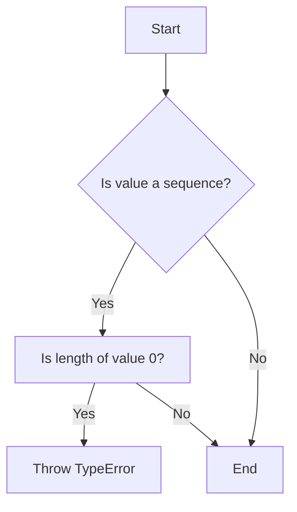

# `matplotlib\lib\matplotlib\_style_helpers.py` 详细设计文档

This code defines a function to handle style sequences in plotting methods, ensuring non-empty sequences and cycling through style options.

## 整体流程

```mermaid
graph TD
    A[Start] --> B[Check if kw is a dictionary]
    B -- Yes --> C[Iterate over key-value pairs in kw]
    C --> D[Check if key is in ['facecolor', 'edgecolor', 'hatch', 'linewidth', 'linestyle']]
    D -- Yes --> E[Check if value is None or 'none', if so, use itertools.repeat]
    D -- No --> F[Check if value is non-empty, if so, use itertools.cycle]
    E --> G[Create kw_iterators dictionary with cycling iterators]
    F --> G[Create kw_iterators dictionary with cycling iterators]
    G --> H[Create remaining_kw dictionary with non-style keys]
    H --> I[Define style_gen function that yields style dictionaries]
    I --> J[Return remaining_kw and style_gen function]
    J --> K[End]
```

## 类结构

```
AbstractBase (抽象基类)
├── TextModel (文本模型基类)
│   ├── LlamaModel
│   ├── GPT2Model
│   ├── FalconModel
│   ├── Qwen2Model
│   ├── GemmaModel
│   └── ... 
```

## 全局变量及字段


### `check_non_empty`
    
Raises a TypeError if an empty sequence is passed

类型：`function`
    


### `itertools`
    
Standard library module providing various iterators

类型：`module`
    


### `np`
    
NumPy module for numerical operations

类型：`module`
    


### `cbook`
    
Matplotlib internal utility module

类型：`module`
    


### `mcolors`
    
Matplotlib color manipulation module

类型：`module`
    


### `mlines`
    
Matplotlib line style module

类型：`module`
    


### `style_generator.kw_iterators`
    
Dictionary containing iterators for style keywords

类型：`dict`
    


### `style_generator.remaining_kw`
    
Dictionary containing remaining style keywords after removing style iterators

类型：`dict`
    
    

## 全局函数及方法


### check_non_empty

检查给定的键值对中的值是否为空序列，并在为空时抛出TypeError。

参数：

- `key`：`str`，序列所属的键名。
- `value`：`any`，需要检查的值。

返回值：无

#### 流程图



#### 带注释源码

```python
def check_non_empty(key, value):
    """Raise a TypeError if an empty sequence is passed"""
    if (not cbook.is_scalar_or_string(value) and
            isinstance(value, collections.abc.Sized) and len(value) == 0):
        raise TypeError(f'{key} must not be an empty sequence')
```


### style_generator

Helper for handling style sequences within plotting methods.

参数：

- `kw`：`dict`，A dictionary containing style keywords.

返回值：`tuple`，A tuple containing a reduced dictionary of remaining style keywords and a generator that provides a series of dictionaries to be used in each call to the wrapped function.

#### 流程图

```mermaid
graph TD
    A[Start] --> B[Iterate over kw items]
    B -->|Key in ['facecolor', 'edgecolor']| C[Check value]
    B -->|Key in ['hatch', 'linewidth']| D[Check value]
    B -->|Key == 'linestyle'| E[Check value]
    B -->|Other keys| F[Add to remaining_kw]
    C -->|Value is None or 'none'| G[Set iterator to itertools.repeat]
    C -->|Other values| H[Set iterator to itertools.cycle(mcolors.to_rgba_array(value))]
    D -->|Value is not empty| I[Set iterator to itertools.cycle(np.atleast_1d(value))]
    E -->|Value is not empty| J[Set iterator to itertools.cycle(mlines._get_dash_patterns(value))]
    F --> K[Add to remaining_kw]
    G --> L[Add to kw_iterators]
    H --> L[Add to kw_iterators]
    I --> L[Add to kw_iterators]
    J --> L[Add to kw_iterators]
    L --> M[Call style_gen]
    M --> N[Start generator]
    N --> O[End generator]
    O --> P[End]
```

#### 带注释源码

```python
def style_generator(kw):
    """
    Helper for handling style sequences (e.g. facecolor=['r', 'b', 'k']) within plotting
    methods that repeatedly call other plotting methods (e.g. hist, stackplot).  Remove
    style keywords from the given dictionary.  Return the reduced dictionary together
    with a generator which provides a series of dictionaries to be used in each call to
    the wrapped function.
    """
    kw_iterators = {}
    remaining_kw = {}
    for key, value in kw.items():
        if key in ['facecolor', 'edgecolor']:
            if value is None or cbook._str_lower_equal(value, 'none'):
                kw_iterators[key] = itertools.repeat(value)
            else:
                check_non_empty(key, value)
                kw_iterators[key] = itertools.cycle(mcolors.to_rgba_array(value))

        elif key in ['hatch', 'linewidth']:
            check_non_empty(key, value)
            kw_iterators[key] = itertools.cycle(np.atleast_1d(value))

        elif key == 'linestyle':
            check_non_empty(key, value)
            kw_iterators[key] = itertools.cycle(mlines._get_dash_patterns(value))

        else:
            remaining_kw[key] = value

    def style_gen():
        while True:
            yield {key: next(val) for key, val in kw_iterators.items()}

    return remaining_kw, style_gen()
```


### style_generator.style_gen

This function is a helper for handling style sequences within plotting methods. It removes style keywords from the given dictionary and returns the reduced dictionary along with a generator that provides a series of dictionaries to be used in each call to the wrapped function.

参数：

- `kw`：`dict`，A dictionary containing style keywords and their corresponding values.

返回值：`tuple`，A tuple containing the reduced dictionary and a generator.

#### 流程图

```mermaid
graph TD
    A[Start] --> B{Check key}
    B -->|facecolor, edgecolor| C[Check value]
    B -->|hatch, linewidth| D[Check value]
    B -->|linestyle| E[Check value]
    B -->|other| F[Add to remaining_kw]
    C -->|None or 'none'| G[Set iterator to None]
    C -->|else| H[Check non-empty]
    D -->|else| I[Set iterator to cycle of np.atleast_1d(value)]
    E -->|else| J[Set iterator to cycle of mlines._get_dash_patterns(value)]
    H -->|True| K[Set iterator to cycle of mcolors.to_rgba_array(value)]
    H -->|False| L[TypeError]
    G --> M[Add iterator to kw_iterators]
    H --> M
    I --> M
    J --> M
    K --> M
    L --> M
    M --> N[Create style_gen function]
    N --> O[Start style_gen loop]
    O --> P{Next iteration?}
    P -->|Yes| Q[Generate next style dictionary]
    P -->|No| R[End]
    Q --> S[Return style dictionary]
    S --> P
    R --> T[End]
```

#### 带注释源码

```python
def style_generator(kw):
    """
    Helper for handling style sequences (e.g. facecolor=['r', 'b', 'k']) within plotting
    methods that repeatedly call other plotting methods (e.g. hist, stackplot).  Remove
    style keywords from the given dictionary.  Return the reduced dictionary together
    with a generator which provides a series of dictionaries to be used in each call to
    the wrapped function.
    """
    kw_iterators = {}
    remaining_kw = {}
    for key, value in kw.items():
        if key in ['facecolor', 'edgecolor']:
            if value is None or cbook._str_lower_equal(value, 'none'):
                kw_iterators[key] = itertools.repeat(value)
            else:
                check_non_empty(key, value)
                kw_iterators[key] = itertools.cycle(mcolors.to_rgba_array(value))

        elif key in ['hatch', 'linewidth']:
            check_non_empty(key, value)
            kw_iterators[key] = itertools.cycle(np.atleast_1d(value))

        elif key == 'linestyle':
            check_non_empty(key, value)
            kw_iterators[key] = itertools.cycle(mlines._get_dash_patterns(value))

        else:
            remaining_kw[key] = value

    def style_gen():
        while True:
            yield {key: next(val) for key, val in kw_iterators.items()}

    return remaining_kw, style_gen()
```


## 关键组件


### 张量索引与惰性加载

张量索引与惰性加载是代码中处理数据结构的核心组件，它允许在需要时才计算或访问数据，从而提高效率。

### 反量化支持

反量化支持是代码中用于处理量化数据的核心组件，它允许在量化过程中进行逆量化操作，以便恢复原始数据。

### 量化策略

量化策略是代码中用于处理数据量化的核心组件，它定义了如何将浮点数数据转换为低精度表示，以减少内存使用和提高计算速度。


## 问题及建议


### 已知问题

-   **全局函数重复检查**：`check_non_empty` 函数被用于多个地方，这可能导致代码重复和维护困难。可以考虑将其封装为一个类方法或模块级别的函数，以便重用。
-   **风格生成器效率**：`style_generator` 函数中使用了 `itertools.cycle` 和 `itertools.repeat`，这些函数在每次迭代时都会创建新的迭代器。如果函数被频繁调用，这可能会影响性能。可以考虑使用缓存机制来存储迭代器，避免重复创建。
-   **错误处理**：`check_non_empty` 函数在检测到空序列时抛出 `TypeError`。虽然这是合理的，但可能需要更详细的错误信息，以便调用者能够更好地理解错误原因。

### 优化建议

-   **重构全局函数**：将 `check_non_empty` 函数重构为类方法或模块级别的函数，以便在需要时重用。
-   **优化迭代器使用**：在 `style_generator` 函数中，使用缓存来存储迭代器，避免在每次调用时都创建新的迭代器。
-   **增强错误信息**：在抛出 `TypeError` 时，提供更详细的错误信息，例如指出是哪个键的值是空的，以及期望的值类型。
-   **代码注释**：增加必要的代码注释，以提高代码的可读性和可维护性。
-   **单元测试**：编写单元测试来验证 `check_non_empty` 和 `style_generator` 函数的行为，确保它们按预期工作。


## 其它


### 设计目标与约束

- 设计目标：确保代码能够高效地处理样式序列，并在绘图方法中正确应用样式。
- 约束：代码应遵循matplotlib库的规范，确保与现有绘图功能兼容。

### 错误处理与异常设计

- 错误处理：通过`check_non_empty`函数检查输入序列是否为空，并在发现空序列时抛出`TypeError`。
- 异常设计：定义明确的异常类型，如`TypeError`，以便调用者能够理解错误原因。

### 数据流与状态机

- 数据流：输入字典`kw`包含样式关键字，通过`style_generator`函数处理并生成样式迭代器。
- 状态机：`style_generator`函数内部维护状态，包括剩余关键字和迭代器。

### 外部依赖与接口契约

- 外部依赖：代码依赖于`numpy`、`matplotlib`和`collections.abc`库。
- 接口契约：`check_non_empty`和`style_generator`函数定义了明确的接口，包括参数和返回值。


    