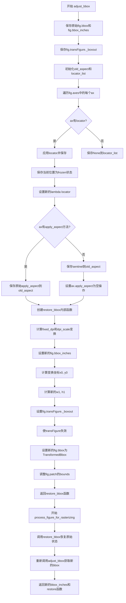
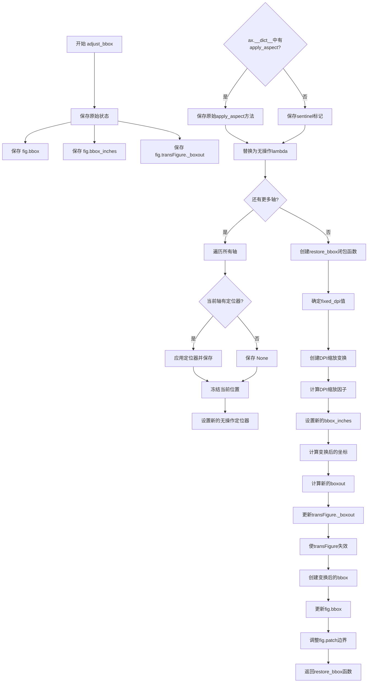
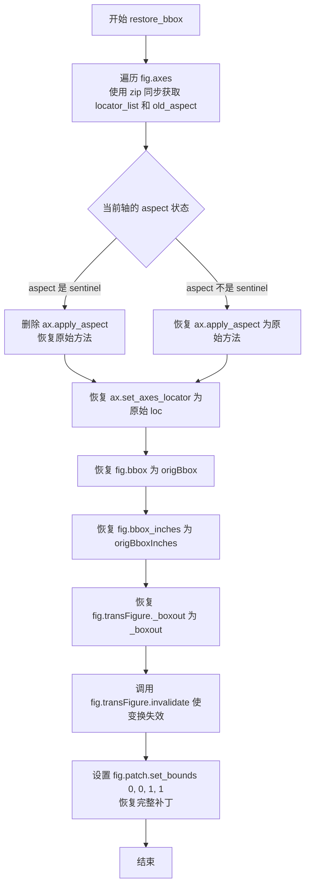
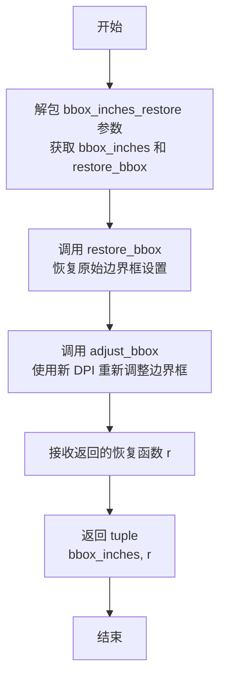

# `matplotlib\lib\matplotlib\_tight_bbox.py` 详细设计文档

这是matplotlib的辅助模块，用于处理Figure.savefig中的bbox_inches参数。通过临时调整图形的边界框(bbox)、纵横比和patch区域，使得只有指定的英寸区域被保存到图像文件中，同时保持原始图形的缩放比例，并在操作完成后通过返回的恢复函数还原原始状态。

## 整体流程



## 类结构

```
模块: bbox_inches_helper (无类定义)
├── adjust_bbox (主函数)
│   └── restore_bbox (闭包内部函数)
└── process_figure_for_rasterizing (辅助函数)
```

## 全局变量及字段


### `origBbox`
    
保存原始的fig.bbox，用于后续恢复

类型：`Bbox`
    


### `origBboxInches`
    
保存原始的fig.bbox_inches，用于后续恢复

类型：`Bbox`
    


### `_boxout`
    
保存原始的fig.transFigure._boxout，用于后续恢复

类型：`Bbox`
    


### `old_aspect`
    
存储每个axes原始的apply_aspect方法或sentinel标记

类型：`list`
    


### `locator_list`
    
存储每个axes的原始axes_locator，用于后续恢复

类型：`list`
    


### `sentinel`
    
标记对象，用于区分axes是否原本有apply_aspect方法

类型：`object`
    


### `tr`
    
用于DPI缩放的仿射变换对象

类型：`Affine2D`
    


### `dpi_scale`
    
目标DPI与当前DPI的缩放比例

类型：`float`
    


### `x0`
    
变换后bbox_inches的左下角x坐标

类型：`float`
    


### `y0`
    
变换后bbox_inches的左下角y坐标

类型：`float`
    


### `w1`
    
缩放后figure bbox的宽度

类型：`float`
    


### `h1`
    
缩放后figure bbox的高度

类型：`float`
    


### `bbox_inches`
    
输入参数，指定要保存的图像区域（英寸单位）

类型：`Bbox or tuple`
    


### `restore_bbox`
    
回调函数，用于恢复figure到原始状态

类型：`function`
    


### `r`
    
adjust_bbox返回的恢复函数

类型：`tuple`
    


    

## 全局函数及方法


### `adjust_bbox`

该函数用于在保存图形时临时调整图形边界框，使其仅保存指定的英寸区域（bbox_inches），同时保持原始图形的比例。它通过修改图形的 bbox、bbox_inches、transFigure._boxout 和 patch 属性来实现这一目标，并返回一个恢复函数以撤销所有更改。

**参数：**

- `fig`：`matplotlib.figure.Figure`，需要调整的图形对象
- `bbox_inches`：需要保存的区域，以英寸为单位的边界框（Bbox 或类似对象）
- `renderer`：渲染器对象，用于获取轴的位置信息和应用定位器
- `fixed_dpi`：可选参数，固定 DPI 值，默认为 None（若为 None，则使用 fig.dpi）

**返回值：** `Callable`，一个无参数的恢复函数，调用后可将图形恢复到原始状态

#### 流程图



#### 带注释源码

```python
def adjust_bbox(fig, bbox_inches, renderer, fixed_dpi=None):
    """
    Temporarily adjust the figure so that only the specified area
    (bbox_inches) is saved.

    It modifies fig.bbox, fig.bbox_inches,
    fig.transFigure._boxout, and fig.patch.  While the figure size
    changes, the scale of the original figure is conserved.  A
    function which restores the original values are returned.
    """
    # 步骤1：保存原始状态，用于后续恢复
    origBbox = fig.bbox                                    # 保存原始图形边界框
    origBboxInches = fig.bbox_inches                      # 保存原始英寸边界框
    _boxout = fig.transFigure._boxout                     # 保存原始Figure变换输出框
    
    # 步骤2：初始化存储列表
    old_aspect = []                                        # 存储原始apply_aspect方法
    locator_list = []                                      # 存储原始axes定位器
    sentinel = object()                                    # 标记对象，用于区分未设置的情况
    
    # 步骤3：遍历所有轴，处理定位器和纵横比
    for ax in fig.axes:
        # 获取并应用当前轴的定位器
        locator = ax.get_axes_locator()
        if locator is not None:
            ax.apply_aspect(locator(ax, renderer))        # 应用定位器并计算纵横比
        locator_list.append(locator)                       # 保存原始定位器
        
        # 冻结当前位置并设置为新的无操作定位器
        current_pos = ax.get_position(original=False).frozen()
        ax.set_axes_locator(lambda a, r, _pos=current_pos: _pos)
        
        # 处理apply_aspect方法（强制纵横比）
        if 'apply_aspect' in ax.__dict__:
            old_aspect.append(ax.apply_aspect)            # 保存原始方法
        else:
            old_aspect.append(sentinel)                    # 标记为未设置
        # 替换为无操作lambda，禁用纵横比强制
        ax.apply_aspect = lambda pos=None: None

    # 步骤4：定义恢复函数闭包
    def restore_bbox():
        """恢复所有轴和图形到原始状态"""
        # 恢复每个轴的定位器和纵横比设置
        for ax, loc, aspect in zip(fig.axes, locator_list, old_aspect):
            ax.set_axes_locator(loc)                       # 恢复原始定位器
            if aspect is sentinel:
                # 删除我们的无操作函数，恢复原始方法
                del ax.apply_aspect
            else:
                ax.apply_aspect = aspect                   # 恢复原始apply_aspect
        
        # 恢复图形的原始属性
        fig.bbox = origBbox                                # 恢复原始边界框
        fig.bbox_inches = origBboxInches                   # 恢复原始英寸边界框
        fig.transFigure._boxout = _boxout                  # 恢复原始变换输出框
        fig.transFigure.invalidate()                       # 使变换缓存失效
        fig.patch.set_bounds(0, 0, 1, 1)                   # 重置patch到完整图形

    # 步骤5：计算DPI相关参数
    if fixed_dpi is None:
        fixed_dpi = fig.dpi                                # 使用图形当前DPI
    tr = Affine2D().scale(fixed_dpi)                      # 创建DPI缩放变换
    dpi_scale = fixed_dpi / fig.dpi                        # 计算DPI缩放因子

    # 步骤6：调整图形边界框
    fig.bbox_inches = Bbox.from_bounds(0, 0, *bbox_inches.size)  # 设置新的英寸边界框
    
    # 计算目标区域的像素坐标
    x0, y0 = tr.transform(bbox_inches.p0)                 # 转换左下角坐标
    w1, h1 = fig.bbox.size * dpi_scale                    # 计算缩放后的尺寸
    
    # 设置Figure变换的输出边界
    fig.transFigure._boxout = Bbox.from_bounds(-x0, -y0, w1, h1)
    fig.transFigure.invalidate()                           # 使变换缓存失效

    # 创建新的图形边界框（英寸边界框经DPI变换后）
    fig.bbox = TransformedBbox(fig.bbox_inches, tr)

    # 步骤7：调整图形背景patch的边界
    # 将patch边界设置为与保存区域对齐
    fig.patch.set_bounds(x0 / w1, y0 / h1,
                         fig.bbox.width / w1, fig.bbox.height / h1)

    # 步骤8：返回恢复函数
    return restore_bbox
```


### `adjust_bbox.restore_bbox`

该函数是 `adjust_bbox` 函数的内部嵌套函数，用于将之前临时修改的 matplotlib Figure 对象的属性（bbox、bbox_inches、transFigure._boxout、patch 以及各 axes 的定位器）恢复到原始状态，从而实现"临时调整"的效果。

参数：此函数无参数。

返回值：`None`，该函数仅执行恢复操作，不返回任何值。

#### 流程图



#### 带注释源码

```python
def restore_bbox():
    """
    恢复被 adjust_bbox 临时修改的 figure 属性到原始状态。
    这是一个闭包函数，可以访问 adjust_bbox 中的变量：
    fig, locator_list, old_aspect, origBbox, origBboxInches, _boxout
    """
    # 遍历 figure 的所有 axes，恢复它们的定位器和 aspect 比例方法
    for ax, loc, aspect in zip(fig.axes, locator_list, old_aspect):
        # 恢复该 axes 的定位器
        ax.set_axes_locator(loc)
        if aspect is sentinel:
            # 如果 aspect 是 sentinel，说明原 axes 没有 apply_aspect 方法
            # 删除我们添加的空操作方法，恢复原始状态（无此方法）
            del ax.apply_aspect
        else:
            # 否则恢复原来保存的 apply_aspect 方法
            ax.apply_aspect = aspect

    # 恢复 figure 的边界框到原始状态
    fig.bbox = origBbox
    # 恢复 figure 的英寸边界框到原始状态
    fig.bbox_inches = origBboxInches
    # 恢复 figure 的转换框到原始状态
    fig.transFigure._boxout = _boxout
    # 使 figure 的转换失效，强制重新计算
    fig.transFigure.invalidate()
    # 恢复 patch 到完整尺寸 (0, 0, 1, 1)
    fig.patch.set_bounds(0, 0, 1, 1)
```


### `process_figure_for_rasterizing`

该函数用于在图形 DPI 发生变化时（如光栅化过程中）重新处理图形的边界框。它首先恢复之前的边界框设置，然后使用新的 DPI 重新调整边界框，以确保图形在光栅化时保持正确的尺寸和布局。

参数：

- `fig`：`matplotlib.figure.Figure`，要处理的图形对象
- `bbox_inches_restore`：`tuple`，包含边界框信息和恢复函数的元组，格式为 `(bbox_inches, restore_bbox)`
- `renderer`：`matplotlib.backend_bases.RendererBase`，渲染器对象，用于计算图形布局
- `fixed_dpi`：`float` 或 `None`，可选参数，指定固定的 DPI 值，如果为 None 则使用图形的默认 DPI

返回值：`tuple`，返回 `(bbox_inches, r)`，其中 `bbox_inches` 是边界框对象，`r` 是新的恢复函数

#### 流程图



#### 带注释源码

```python
def process_figure_for_rasterizing(fig, bbox_inches_restore, renderer, fixed_dpi=None):
    """
    A function that needs to be called when figure dpi changes during the
    drawing (e.g., rasterizing).  It recovers the bbox and re-adjust it with
    the new dpi.
    """
    
    # 从 bbox_inches_restore 元组中解包出边界框和恢复函数
    # bbox_inches: 要应用的边界框（以英寸为单位）
    # restore_bbox: 一个可调用对象，用于恢复之前保存的图形状态
    bbox_inches, restore_bbox = bbox_inches_restore
    
    # 调用 restore_bbox() 恢复图形到其原始状态
    # 这会撤销之前对 fig.bbox、fig.bbox_inches、fig.transFigure._boxout
    # 以及 fig.patch 所做的修改
    restore_bbox()
    
    # 调用 adjust_bbox 重新调整边界框以适应新的 DPI
    # 参数说明：
    #   - fig: 图形对象
    #   - bbox_inches: 目标边界框
    #   - renderer: 渲染器，用于计算位置
    #   - fixed_dpi: 固定的 DPI 值（如果为 None，则使用 fig.dpi）
    # 返回值 r 是一个新的恢复函数，用于后续恢复此次修改
    r = adjust_bbox(fig, bbox_inches, renderer, fixed_dpi)
    
    # 返回边界框和新的恢复函数
    # 调用者可以使用返回的恢复函数来撤销这次 DPI 修改的影响
    return bbox_inches, r
```

## 关键组件


### adjust_bbox 函数

核心功能：临时调整figure的边界框，使得只有指定的bbox_inches区域被保存，同时保持原始图的缩放比例。返回恢复原始值的函数。

### restore_bbox 内部函数

在adjust_bbox内部定义的恢复函数，用于将figure的bbox、bbox_inches、transFigure._boxout和patch恢复为原始状态。

### process_figure_for_rasterizing 函数

处理光栅化过程中DPI变化的情况。先恢复之前保存的bbox，然后使用新的DPI重新调用adjust_bbox进行重新调整。

### fixed_dpi 参数处理

支持在保存时使用固定的DPI值，默认为figure的当前DPI。用于控制输出图像的缩放比例。

### locator_list 列表

临时存储每个axes的定位器(locator)，用于在恢复时还原原始定位器设置。

### old_aspect 列表

存储每个axes的apply_aspect方法，用于在恢复时还原原始的宽高比应用逻辑。

### transFigure._boxout 处理

临时修改figure的transFigure._boxout属性，调整坐标系输出范围，实现只保存指定区域的效果。

### fig.patch.set_bounds 调整

根据变换后的边界框调整figure的patch边界，实现视觉上的裁剪效果。


## 问题及建议


### 已知问题

-   **嵌套函数作用域问题**：在`for ax in fig.axes`循环中定义的lambda使用了可变默认参数`_pos=current_pos`，虽然是有意为之但代码可读性差，容易被误认为是常见的Python陷阱
-   **Sentinel对象使用不当**：使用匿名`object()`作为sentinel，缺乏明确的命名定义，降低了代码可读性
-   **缺乏类型注解**：所有函数参数和返回值都没有类型注解，降低了代码的可维护性和IDE支持
-   **嵌套函数过深**：`restore_bbox`函数嵌套在`adjust_bbox`内部，增加了代码复杂度和调试难度
-   **魔法数字**：`set_bounds(0, 0, 1, 1)`和`set_bounds(x0 / w1, y0 / h1, ...)`中的数值缺乏解释性常量
-   **变量命名不一致**：`origBbox`、`origBboxInches`使用驼峰命名，而Python惯例是蛇形命名；`_boxout`使用下划线前缀但实际不是私有变量
-   **缺少异常安全**：`ax.apply_aspect`的修改没有使用`try-finally`保护，如果中间发生异常可能导致状态无法恢复
-   **文档不完整**：docstring中缺少参数类型、返回值类型的说明
-   **违反单一职责**：`adjust_bbox`函数既修改状态又返回恢复函数，责任不单一

### 优化建议

-   **使用上下文管理器**：创建上下文管理器类来自动处理状态的保存和恢复，确保异常情况下也能正确清理
-   **添加类型注解**：为所有函数参数和返回值添加`typing`模块的类型注解
-   **提取嵌套函数**：将`restore_bbox`提升为模块级函数或使用类封装
-   **定义常量**：将魔法数字提取为命名常量，如`DEFAULT_PATCH_BOUNDS = (0, 0, 1, 1)`
-   **统一命名规范**：将变量名改为蛇形命名，如`orig_bbox`、`orig_bbox_inches`
-   **改进sentinel定义**：使用有意义的命名如`_NOT_SET = object()`或使用`None`配合默认参数
-   **使用functools.partial**：考虑使用`functools.partial`替代部分lambda表达式提高可读性
-   **添加错误处理**：在恢复逻辑中添加异常处理，确保即使部分恢复失败也能继续执行


## 其它


### 设计目标与约束

本模块的核心设计目标是在保存matplotlib图形时，实现对输出区域的精确控制（即`bbox_inches`功能），同时保持原始图形的比例和布局不变。主要约束包括：1) 必须临时修改figure的多个属性（bbox、bbox_inches、transFigure._boxout、patch），并在操作完成后恢复；2) 需要处理各种axes定位器（locator）和长宽比设置；3) 必须支持固定DPI的缩放变换。

### 错误处理与异常设计

本模块主要通过Python的异常传播机制处理错误。关键风险点包括：1) 如果传入的`fig`对象缺少必要属性（如`axes`、`bbox`、`transFigure`等），将在访问时抛出AttributeError；2) `bbox_inches`参数需要具有`size`和`p0`属性，否则会在transform时出错；3) `renderer`对象需要支持特定的接口（如`dpi`属性）。模块本身不进行显式的参数验证，依赖调用方确保参数有效性。

### 数据流与状态机

模块的工作流程涉及三个主要状态：1) **初始状态**：figure处于正常显示状态，所有属性为原始值；2) **调整状态**：通过`adjust_bbox`函数临时修改figure的bbox、transform和patch属性，此状态由返回的`restore_bbox`闭包管理；3) **恢复状态**：调用`restore_bbox`函数将figure属性恢复到初始状态。对于`process_figure_for_rasterizing`，数据流为：接收当前的bbox_inches_restore → 调用restore_bbox恢复 → 重新调用adjust_bbox应用新DPI → 返回新的bbox_inches_restore。

### 外部依赖与接口契约

主要依赖包括：1) `matplotlib.transforms`模块的`Bbox`、`TransformedBbox`、`Affine2D`类；2) 传入的`fig`对象必须是matplotlib Figure实例，具有`axes`、`bbox`、`bbox_inches`、`transFigure`、`patch`、`dpi`等属性；3) `renderer`对象需要实现基本的渲染接口；4) `bbox_inches`参数需要是具有`size`属性（返回(width, height)元组）和`p0`属性（返回左上角坐标）的对象。调用方需要在保存完成后显式调用返回的restore函数，否则figure将保持被修改状态。

### 性能考虑与优化空间

当前实现的主要性能考量：1) 对每个axes调用`get_axes_locator`和`get_position`，可能在大规模子图情况下有性能影响；2) 使用闭包保存状态可能增加内存开销；3) `frozen()`方法创建位置副本会带来一定开销。优化方向包括：1) 可以考虑使用context manager模式替代手动调用restore函数；2) 可以添加缓存机制避免重复计算；3) 可以使用`__slots__`优化闭包对象的内存使用。

### 线程安全性

本模块不是线程安全的。主要问题包括：1) 对figure属性的修改和读取操作没有同步机制；2) 返回的`restore_bbox`闭包依赖于外部变量，在多线程环境下可能导致竞态条件；3) axes列表的迭代在多线程环境下可能不稳定。建议在多线程环境下对figure对象使用锁保护，或者在单线程中顺序执行所有保存操作。

### 使用示例与调用模式

典型调用模式：```python
# 在savefig前调用
restore_bbox = adjust_bbox(fig, bbox_inches, renderer)
try:
    fig.savefig('output.png', bbox_inches='tight')
finally:
    restore_bbox()

# 栅格化时的调用
bbox_inches_restore = process_figure_for_rasterizing(fig, bbox_inches_restore, renderer)
```

### 相关模块与配置

本模块与matplotlib的以下模块紧密相关：1) `matplotlib.figure.Figure` - 主要操作的对象；2) `matplotlib.transforms` - 提供坐标变换；3) `matplotlib.axes` - 处理axes定位器和长宽比；4) `matplotlib.backends` - 渲染器接口。配置方面，`bbox_inches='tight'`参数会触发本模块的功能，同时需要配合`fig.dpi`设置和后端渲染器的选择。

### 兼容性考虑

本模块使用了`fig.transFigure._boxout`这个私有属性，在未来matplotlib版本中可能发生变化。代码中`ax.__dict__`的使用方式也较为脆弱，直接检查方法是否存在。`fig.patch.set_bounds`调用依赖于patch对象支持该方法。这些实现细节可能在不同matplotlib版本间存在兼容性问题，建议封装成更稳定的接口。

    