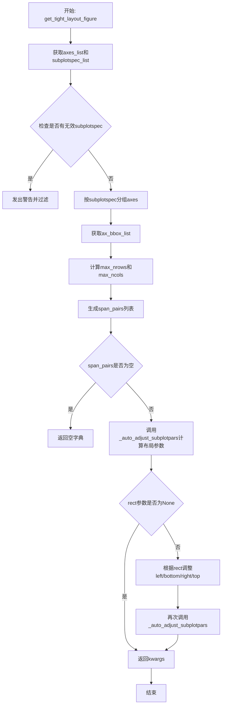
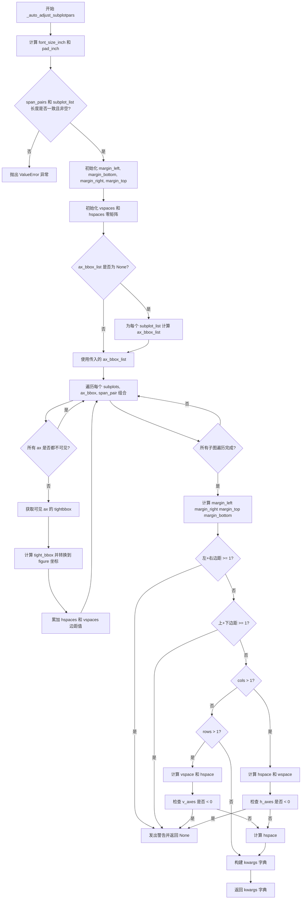
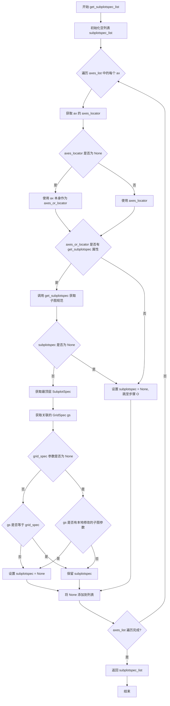

# `matplotlib\lib\matplotlib\_tight_layout.py` 详细设计文档

该模块提供子图紧密布局调整功能，通过计算轴的可视区域与实际边界框之间的边距，自动调整子图之间的间距、页边距等参数，使子图（包含坐标轴标签、刻度标签、标题等装饰元素）能够合理地放置在图形区域内。

## 整体流程



## 类结构

```
模块: tight_layout
├── _auto_adjust_subplotpars (私有函数)
├── get_subplotspec_list (私有函数)
└── get_tight_layout_figure (公共函数)
```

## 全局变量及字段


### `mpl`
    
matplotlib主模块，提供rcParams配置参数访问接口

类型：`module`
    


### `np`
    
numpy数值计算模块，提供数组操作和数值计算功能

类型：`module`
    


### `_api`
    
matplotlib内部API模块，提供警告和装饰器等内部工具函数

类型：`module`
    


### `martist`
    
matplotlib artist模块，提供图形元素的布局和渲染相关函数

类型：`module`
    


### `FontProperties`
    
字体属性类，用于获取和设置字体大小等文本样式属性

类型：`class`
    


### `Bbox`
    
边界框类，用于表示和操作二维矩形区域及进行坐标变换

类型：`class`
    


    

## 全局函数及方法


### `_auto_adjust_subplotpars`

该函数是Matplotlib中用于自动调整子图布局参数的核心函数，通过计算子图的紧密边界框与实际位置的差值，自动确定子图之间的间距以及与 figure 边缘的边距，使得子图及其标签能够合理地放置在 figure 中。如果计算结果会导致子图高度或宽度为零，则返回 None。

参数：

- `fig`：`Figure`，matplotlib 的 Figure 对象，表示需要调整布局的图形
- `renderer`：`renderer`，matplotlib 的渲染器对象，用于获取子图的窗口范围
- `shape`：`tuple[int, int]`，表示子图网格的行数和列数 (rows, cols)
- `span_pairs`：`list[tuple[slice, slice]]`，列表，每个元素表示对应子图在网格中占据的行跨度 (rowspan) 和列跨度 (colspan)
- `subplot_list`：`list of subplots`，子图列表，每个元素是共享同一 SubplotSpec 的 Axes 列表
- `ax_bbox_list`：`list[Bbox]`，可选，表示每个子图列表的位置边界框，默认为 None，会在函数内部通过 `ax.get_position(original=True)` 计算
- `pad`：`float`，默认值 1.08，子图边缘与 figure 边缘之间的 padding，以字体大小的倍数表示
- `h_pad`：`float`，可选，垂直方向相邻子图之间的 padding，默认为 None（即使用 pad 的值）
- `w_pad`：`float`，可选，水平方向相邻子图之间的 padding，默认为 None（即使用 pad 的值）
- `rect`：`tuple`，可选，(left, bottom, right, top) 的归一化 figure 坐标，表示子图区域（包括标签）应该放入的区域，默认为 None

返回值：`dict` 或 `None`，返回包含 `left`、`right`、`bottom`、`top`、`wspace`、`hspace` 的子图参数字典，如果计算出的边距会导致子图高度或宽度为零则返回 None

#### 流程图



#### 带注释源码

```python
def _auto_adjust_subplotpars(
        fig, renderer, shape, span_pairs, subplot_list,
        ax_bbox_list=None, pad=1.08, h_pad=None, w_pad=None, rect=None):
    """
    Return a dict of subplot parameters to adjust spacing between subplots
    or ``None`` if resulting Axes would have zero height or width.

    Note that this function ignores geometry information of subplot itself, but
    uses what is given by the *shape* and *subplot_list* parameters.  Also, the
    results could be incorrect if some subplots have ``adjustable=datalim``.

    Parameters
    ----------
    shape : tuple[int, int]
        Number of rows and columns of the grid.
    span_pairs : list[tuple[slice, slice]]
        List of rowspans and colspans occupied by each subplot.
    subplot_list : list of subplots
        List of subplots that will be used to calculate optimal subplot_params.
    pad : float
        Padding between the figure edge and the edges of subplots, as a
        fraction of the font size.
    h_pad, w_pad : float
        Padding (height/width) between edges of adjacent subplots, as a
        fraction of the font size.  Defaults to *pad*.
    rect : tuple
        (left, bottom, right, top), default: None.
    """
    # 解构网格形状为行数和列数
    rows, cols = shape

    # 计算字体大小（英寸）和各种 padding（英寸）
    # 将字体大小从 points 转换为英寸 (points/72)
    font_size_inch = (FontProperties(
        size=mpl.rcParams["font.size"]).get_size_inches() / 72)
    pad_inch = pad * font_size_inch  # 边缘 padding
    vpad_inch = h_pad * font_size_inch if h_pad is not None else pad_inch  # 垂直子图间 padding
    hpad_inch = w_pad * font_size_inch if w_pad is not None else pad_inch  # 水平子图间 padding

    # 参数验证：span_pairs 和 subplot_list 长度必须一致且非空
    if len(span_pairs) != len(subplot_list) or len(subplot_list) == 0:
        raise ValueError

    # 如果没有提供 rect，则边距初始为 None，后续需要计算
    if rect is None:
        margin_left = margin_bottom = margin_right = margin_top = None
    else:
        # 解析 rect (left, bottom, right, top) 归一化坐标
        margin_left, margin_bottom, _right, _top = rect
        margin_right = 1 - _right if _right else None  # 转换为左对齐坐标系
        margin_top = 1 - _top if _top else None

    # 初始化水平和垂直间距矩阵
    # vspaces 形状为 (rows+1, cols)，表示行之间的垂直间隙
    vspaces = np.zeros((rows + 1, cols))
    # hspaces 形状为 (rows, cols+1)，表示列之间的水平间隙
    hspaces = np.zeros((rows, cols + 1))

    # 如果没有提供 ax_bbox_list，则根据 subplot_list 计算
    # 每个元素是子图列表中所有 axes 的位置边界框的并集
    if ax_bbox_list is None:
        ax_bbox_list = [
            Bbox.union([ax.get_position(original=True) for ax in subplots])
            for subplots in subplot_list]

    # 遍历每个子图组，计算其紧密边界框与位置边界框之间的间隙
    for subplots, ax_bbox, (rowspan, colspan) in zip(
            subplot_list, ax_bbox_list, span_pairs):
        # 跳过所有 axes 都不可见的子图组
        if all(not ax.get_visible() for ax in subplots):
            continue

        # 收集可见 axes 的紧密边界框（仅用于布局计算）
        bb = []
        for ax in subplots:
            if ax.get_visible():
                bb += [martist._get_tightbbox_for_layout_only(ax, renderer)]

        # 计算紧密边界框的并集，并转换到 figure 坐标系
        tight_bbox_raw = Bbox.union(bb)
        tight_bbox = fig.transFigure.inverted().transform_bbox(tight_bbox_raw)

        # 累加水平间隙：左侧和右侧
        hspaces[rowspan, colspan.start] += ax_bbox.xmin - tight_bbox.xmin  # l
        hspaces[rowspan, colspan.stop] += tight_bbox.xmax - ax_bbox.xmax  # r
        # 累加垂直间隙：顶部和底部
        vspaces[rowspan.start, colspan] += tight_bbox.ymax - ax_bbox.ymax  # t
        vspaces[rowspan.stop, colspan] += ax_bbox.ymin - tight_bbox.ymin  # b

    # 获取 figure 的尺寸（英寸）
    fig_width_inch, fig_height_inch = fig.get_size_inches()

    # 计算四个方向的边距（可能为负数，需要取 max(,0) 使其非负）
    # left margin
    if not margin_left:
        margin_left = max(hspaces[:, 0].max(), 0) + pad_inch/fig_width_inch
        # 考虑 supylabel (y轴标签) 的宽度
        suplabel = fig._supylabel
        if suplabel and suplabel.get_in_layout():
            rel_width = fig.transFigure.inverted().transform_bbox(
                suplabel.get_window_extent(renderer)).width
            margin_left += rel_width + pad_inch/fig_width_inch
    # right margin
    if not margin_right:
        margin_right = max(hspaces[:, -1].max(), 0) + pad_inch/fig_width_inch
    # top margin
    if not margin_top:
        margin_top = max(vspaces[0, :].max(), 0) + pad_inch/fig_height_inch
        # 考虑 suptitle (标题) 的高度
        if fig._suptitle and fig._suptitle.get_in_layout():
            rel_height = fig.transFigure.inverted().transform_bbox(
                fig._suptitle.get_window_extent(renderer)).height
            margin_top += rel_height + pad_inch/fig_height_inch
    # bottom margin
    if not margin_bottom:
        margin_bottom = max(vspaces[-1, :].max(), 0) + pad_inch/fig_height_inch
        # 考虑 supxlabel (x轴标签) 的高度
        suplabel = fig._supxlabel
        if suplabel and suplabel.get_in_layout():
            rel_height = fig.transFigure.inverted().transform_bbox(
                suplabel.get_window_extent(renderer)).height
            margin_bottom += rel_height + pad_inch/fig_height_inch

    # 检查边距是否会导致子图没有空间
    if margin_left + margin_right >= 1:
        _api.warn_external('Tight layout not applied. The left and right '
                           'margins cannot be made large enough to '
                           'accommodate all Axes decorations.')
        return None
    if margin_bottom + margin_top >= 1:
        _api.warn_external('Tight layout not applied. The bottom and top '
                           'margins cannot be made large enough to '
                           'accommodate all Axes decorations.')
        return None

    # 构建基础参数字典（归一化坐标）
    kwargs = dict(left=margin_left,
                  right=1 - margin_right,
                  bottom=margin_bottom,
                  top=1 - margin_top)

    # 计算水平子图间距 wspace (仅当多列时)
    if cols > 1:
        hspace = hspaces[:, 1:-1].max() + hpad_inch / fig_width_inch
        # axes widths: 计算每个子图的宽度
        h_axes = (1 - margin_right - margin_left - hspace * (cols - 1)) / cols
        if h_axes < 0:
            _api.warn_external('Tight layout not applied. tight_layout '
                               'cannot make Axes width small enough to '
                               'accommodate all Axes decorations')
            return None
        else:
            kwargs["wspace"] = hspace / h_axes  # 转换为相对宽度比例
    # 计算垂直子图间距 hspace (仅当多行时)
    if rows > 1:
        vspace = vspaces[1:-1, :].max() + vpad_inch / fig_height_inch
        v_axes = (1 - margin_top - margin_bottom - vspace * (rows - 1)) / rows
        if v_axes < 0:
            _api.warn_external('Tight layout not applied. tight_layout '
                               'cannot make Axes height small enough to '
                               'accommodate all Axes decorations.')
            return None
        else:
            kwargs["hspace"] = vspace / v_axes  # 转换为相对高度比例

    return kwargs
```


### `get_subplotspec_list`

该函数用于从给定的Axes列表中提取对应的SubplotSpec对象列表，处理不支持SubplotSpec的Axes和不符合指定GridSpec的情况。

参数：

- `axes_list`：list，获取SubplotSpec的Axes对象列表
- `grid_spec`：GridSpec，可选的GridSpec对象，用于过滤只返回属于该GridSpec的SubplotSpec，默认为None

返回值：list，返回SubplotSpec对象或None的列表，列表长度与axes_list相同

#### 流程图



#### 带注释源码

```python
def get_subplotspec_list(axes_list, grid_spec=None):
    """
    Return a list of subplotspec from the given list of Axes.

    For an instance of Axes that does not support subplotspec, None is inserted
    in the list.

    If grid_spec is given, None is inserted for those not from the given
    grid_spec.
    """
    # 初始化用于存储SubplotSpec结果的列表
    subplotspec_list = []
    
    # 遍历每个Axes对象
    for ax in axes_list:
        # 获取Axes的定位器，如果为None则使用Axes本身
        axes_or_locator = ax.get_axes_locator()
        if axes_or_locator is None:
            axes_or_locator = ax

        # 检查定位器或Axes是否有get_subplotspec方法
        if hasattr(axes_or_locator, "get_subplotspec"):
            # 获取该Axes的SubplotSpec
            subplotspec = axes_or_locator.get_subplotspec()
            
            # 如果成功获取到SubplotSpec
            if subplotspec is not None:
                # 获取最顶层的SubplotSpec（处理嵌套情况）
                subplotspec = subplotspec.get_topmost_subplotspec()
                
                # 获取关联的GridSpec
                gs = subplotspec.get_gridspec()
                
                # 如果指定了grid_spec，过滤不匹配的
                if grid_spec is not None:
                    if gs != grid_spec:
                        subplotspec = None
                # 否则检查GridSpec是否有本地修改的子图参数
                elif gs.locally_modified_subplot_params():
                    subplotspec = None
        else:
            # 不支持SubplotSpec的Axes设为None
            subplotspec = None

        # 将结果添加到列表
        subplotspec_list.append(subplotspec)

    # 返回结果列表
    return subplotspec_list
```


### `get_tight_layout_figure`

该函数用于计算并返回tight-layouted figure的子图参数，通过分析给定的轴列表和子图规范列表，计算出最佳的子图间距参数，使子图及其标签能够紧凑地适配到给定的矩形区域内。

参数：

- `fig`：`Figure`， matplotlib图表对象
- `axes_list`：`list of Axes`，需要调整布局的轴列表
- `subplotspec_list`：`list of SubplotSpec`，每个轴对应的子图规范列表
- `renderer`：`renderer`，用于获取渲染信息的渲染器对象
- `pad`：`float`，子图边缘与图表边缘之间的填充值，默认为1.08（字体大小的倍数）
- `h_pad`：`float`，相邻子图边缘之间的垂直填充，可选，默认为None（使用pad值）
- `w_pad`：`float`，相邻子图边缘之间的水平填充，可选，默认为None（使用pad值）
- `rect`：`tuple (left, bottom, right, top)`，可选，标准化的图表坐标矩形区域，子图区域（包括标签）将适配到这个区域内，默认为None（使用整个图表）

返回值：`dict or None`，返回要传递给`Figure.subplots_adjust`的子图参数字典，或者当tight layout无法完成时返回None

#### 流程图

```mermaid
flowchart TD
    A[开始: get_tight_layout_figure] --> B[将axes_list和subplotspec_list配对创建字典]
    B --> C{检查是否有None的subplotspec}
    C -->|是| D[发出警告: 存在不兼容的轴]
    C -->|否| E{ss_to_subplots是否为空}
    D --> E
    E -->|是| F[返回空字典 {}]
    E -->|否| G[获取subplot_list和ax_bbox_list]
    G --> H[计算max_nrows和max_ncols]
    H --> I[遍历ss_to_subplots处理span_pairs]
    I --> J{行数/列数是否成倍数}
    J -->|否| K[发出警告并返回空字典]
    J -->|是| L[调用_auto_adjust_subplotpars获取kwargs]
    L --> M{kwargs是否为None}
    M -->|是| N[返回None]
    M -->|否| O{rect参数是否提供}
    O -->|否| P[返回kwargs]
    O -->|是| Q[调整rect参数]
    Q --> R[再次调用_auto_adjust_subplotpars]
    R --> S[返回最终的kwargs]
```

#### 带注释源码

```python
def get_tight_layout_figure(fig, axes_list, subplotspec_list, renderer,
                            pad=1.08, h_pad=None, w_pad=None, rect=None):
    """
    Return subplot parameters for tight-layouted-figure with specified padding.

    Parameters
    ----------
    fig : Figure
    axes_list : list of Axes
    subplotspec_list : list of `.SubplotSpec`
        The subplotspecs of each Axes.
    renderer : renderer
    pad : float
        Padding between the figure edge and the edges of subplots, as a
        fraction of the font size.
    h_pad, w_pad : float
        Padding (height/width) between edges of adjacent subplots.  Defaults to
        *pad*.
    rect : tuple (left, bottom, right, top), default: None.
        rectangle in normalized figure coordinates
        that the whole subplots area (including labels) will fit into.
        Defaults to using the entire figure.

    Returns
    -------
    subplotspec or None
        subplotspec kwargs to be passed to `.Figure.subplots_adjust` or
        None if tight layout could not be accomplished.
    """

    # 多个轴可能共享同一个subplotspec（例如使用axes_grid1）；
    # 需要将它们分组在一起。
    # 创建一个字典，将每个subplotspec映射到对应的轴列表
    ss_to_subplots = {ss: [] for ss in subplotspec_list}
    for ax, ss in zip(axes_list, subplotspec_list):
        ss_to_subplots[ss].append(ax)
    
    # 如果存在None的subplotspec，发出警告并移除
    # 这表示某些轴不支持tight_layout
    if ss_to_subplots.pop(None, None):
        _api.warn_external(
            "This figure includes Axes that are not compatible with "
            "tight_layout, so results might be incorrect.")
    
    # 如果没有有效的subplotspec，返回空字典
    if not ss_to_subplots:
        return {}
    
    # 获取子图列表和对应的bbox列表
    subplot_list = list(ss_to_subplots.values())
    ax_bbox_list = [ss.get_position(fig) for ss in ss_to_subplots]

    # 计算所有子图规范中的最大行数和列数
    max_nrows = max(ss.get_gridspec().nrows for ss in ss_to_subplots)
    max_ncols = max(ss.get_gridspec().ncols for ss in ss_to_subplots)

    # 处理跨距对，处理不同gridspec之间的倍数关系
    span_pairs = []
    for ss in ss_to_subplots:
        # 这里的意图是支持来自不同gridspec的轴，其中一个的nrows（或ncols）
        # 是另一个的倍数（例如2和4），但实际上这并不工作，
        # 因为计算出的wspace相对于不同的物理间距有不同的含义。
        # 尽管如此，这段代码仍然保留，主要是为了向后兼容。
        rows, cols = ss.get_gridspec().get_geometry()
        div_row, mod_row = divmod(max_nrows, rows)
        div_col, mod_col = divmod(max_ncols, cols)
        
        # 检查行数是否是倍数关系
        if mod_row != 0:
            _api.warn_external('tight_layout not applied: number of rows '
                               'in subplot specifications must be '
                               'multiples of one another.')
            return {}
        
        # 检查列数是否是倍数关系
        if mod_col != 0:
            _api.warn_external('tight_layout not applied: number of '
                               'columns in subplot specifications must be '
                               'multiples of one another.')
            return {}
        
        # 计算每个子图规范对应的跨距
        span_pairs.append((
            slice(ss.rowspan.start * div_row, ss.rowspan.stop * div_row),
            slice(ss.colspan.start * div_col, ss.colspan.stop * div_col)))

    # 第一次调用_auto_adjust_subplotpars计算子图参数
    kwargs = _auto_adjust_subplotpars(fig, renderer,
                                      shape=(max_nrows, max_ncols),
                                      span_pairs=span_pairs,
                                      subplot_list=subplot_list,
                                      ax_bbox_list=ax_bbox_list,
                                      pad=pad, h_pad=h_pad, w_pad=w_pad)

    # kwargs可以是None，如果tight_layout失败...
    # 如果提供了rect参数，需要再次调整
    if rect is not None and kwargs is not None:
        # 如果给定了rect，整个子图区域（包括标签）将适应rect
        # 而不是整个图表。注意，*auto_adjust_subplotpars*的rect参数
        # 指定的是将被axes.bbox总区域覆盖的区域。
        # 因此，我们调用两次auto_adjust_subplotpars，
        # 第二次使用调整后的rect参数。

        left, bottom, right, top = rect
        # 调整left边界
        if left is not None:
            left += kwargs["left"]
        # 调整bottom边界
        if bottom is not None:
            bottom += kwargs["bottom"]
        # 调整right边界
        if right is not None:
            right -= (1 - kwargs["right"])
        # 调整top边界
        if top is not None:
            top -= (1 - kwargs["top"])

        # 第二次调用_auto_adjust_subplotpars，使用调整后的rect
        kwargs = _auto_adjust_subplotpars(fig, renderer,
                                          shape=(max_nrows, max_ncols),
                                          span_pairs=span_pairs,
                                          subplot_list=subplot_list,
                                          ax_bbox_list=ax_bbox_list,
                                          pad=pad, h_pad=h_pad, w_pad=w_pad,
                                          rect=(left, bottom, right, top))

    return kwargs
```

## 关键组件


### _auto_adjust_subplotpars 函数

核心函数，负责计算子图参数以调整子图之间的间距，返回包含left、right、top、bottom、wspace、hspace的字典，或在无法应用tight layout时返回None。

### get_subplotspec_list 函数

从给定的Axes列表中提取SubplotSpec，处理不支持子图规范的Axes和网格规范过滤。

### get_tight_layout_figure 函数

tight layout的主要入口函数，协调多个子图布局计算，处理共享相同SubplotSpec的多个Axes，验证网格规范兼容性，并返回最终的布局参数。

### 边距计算与Bbox变换

通过fig.transFigure.inverted()将tight bbox从显示坐标转换为标准化坐标，计算水平(hspaces)和垂直(vspaces)间距，处理字体大小到英寸的转换，考虑suptitle和supxlabel/supylabel的额外空间。

### 布局约束验证

检查左右边距之和是否小于1，上下边距之和是否小于1，确保子图宽度和高度为正值，不满足时发出警告并返回None。

### 子图分组与跨度处理

将共享相同SubplotSpec的Axes分组，计算每个子图在网格中的行跨度(rowspan)和列跨度(colspan)，处理不同网格规范之间的兼容性检查。


## 问题及建议


### 已知问题

-   **死代码与废弃逻辑**: 代码中存在已知的非功能性逻辑（注释中提到"This doesn't actually work because..."），但仍保留用于向后兼容，导致代码维护负担。
-   **边界条件处理不足**: 对于 `adjustable=datalim` 的 Axes，代码在注释中明确指出可能失败，但未做特殊处理或警告。
-   **重复计算与冗余调用**: `fig.transFigure.inverted().transform_bbox` 在多个地方被重复调用，且在 `get_tight_layout_figure` 中会调用 `_auto_adjust_subplotpars` 两次（当 `rect` 参数提供时），效率较低。
-   **参数过多导致可读性差**: `_auto_adjust_subplotpars` 函数有10个参数（包括隐含的），使得调用复杂且容易出错。
-   **错误处理不完善**: 主要依赖 `_api.warn_external` 发出警告，而非抛出异常或返回详细的错误信息，导致调用者难以区分不同类型的失败情况。
-   **变量命名不一致**: 部分变量使用下划线前缀（如 `_right`, `_top`）表示临时或转换后的变量，但命名风格不统一。
-   **魔法数字**: 默认填充值 `pad=1.08` 被硬编码，缺乏配置灵活性。

### 优化建议

-   **封装配置对象**: 将多个参数（如 `pad`, `h_pad`, `w_pad`, `rect`）封装到一个配置对象中，减少函数签名复杂度。
-   **添加缓存机制**: 对于 `fig.transFigure.inverted()` 和 `Bbox.union` 的结果，可考虑缓存以减少重复计算。
-   **增强错误处理**: 将部分警告转换为异常或返回结构化错误信息，便于调用者进行错误恢复。
-   **重构 span_pairs 逻辑**: 将已知的无效逻辑移除或用配置开关控制，避免误导后续开发者。
-   **统一变量命名**: 清理临时变量命名，确保代码风格一致，提高可读性。
-   **优化循环结构**: 将 `ax.get_visible()` 的调用结果缓存，避免在循环中重复查询。
-   **配置化默认值**: 将 `1.08` 等魔法数字提取为可配置的默认常量，或通过 `rcParams` 动态获取。


## 其它


### 设计目标与约束

**设计目标**：自动计算并调整子图的边距和间距参数，使子图（包括轴标签、刻度标签、标题和偏移框等装饰元素）能够紧凑且美观地布置在figure中，同时确保不会因装饰元素过多导致子图宽高为零。

**核心约束**：
1. 内部假设边距（left margin等）是子图位置独立的，即margin的差异取决于`Axes.get_tightbbox`和`Axes.bbox`之间的差异
2. 忽略子图自身的几何信息，仅依赖shape和subplot_list参数
3. 当`Axes.adjustable`设置为`datalim`时，结果可能不正确
4. 当left或right margin受xlabel影响时，结果可能不准确

### 错误处理与异常设计

**异常类型**：
1. **ValueError**：当`len(span_pairs) != len(subplot_list)`或`len(subplot_list) == 0`时抛出
2. **警告（Warning）**：
   - `margin_left + margin_right >= 1`或`margin_bottom + margin_top >= 1`时调用`_api.warn_external`提示"Tight layout not applied"
   - 当计算出的axes宽高为负值时提示无法容纳所有装饰元素
   - 当子图规格的行数或列数不是倍数关系时提示无法应用tight layout
   - 当存在不兼容tight_layout的Axes时提示结果可能不正确

**错误处理策略**：
- 所有可能导致返回None的情况都会先调用警告函数，然后返回None
- kwargs为None时表示tight_layout失败，调用方需处理此情况

### 数据流与状态机

**输入数据流**：
```
fig (Figure对象)
renderer (渲染器)
shape (rows, cols) 元组
subplot_list (子图列表)
span_pairs (rowspan和colspan切片对列表)
ax_bbox_list (可选，Axes的Bbox列表)
pad, h_pad, w_pad (间距参数)
rect (可选，规范化figure坐标系的矩形区域)
```

**处理阶段**：
1. **初始化阶段**：计算字体大小、转换pad为英寸单位
2. **边距计算阶段**：遍历每个子图组，计算tight_bbox并累积水平/垂直间距
3. **边界调整阶段**：根据pad、suptitle、supxlabel/supylabel调整各边距
4. **间距计算阶段**：计算wspace和hspace参数
5. **矩形约束阶段**（可选）：如提供rect参数，进行第二轮计算以适应指定区域

**状态输出**：
```
返回字典：{
    left: float,      # 左边距
    right: float,     # 右边距（1 - margin_right）
    bottom: float,    # 下边距
    top: float,       # 上边距（1 - margin_top）
    wspace: float,    # 水平子图间距
    hspace: float     # 垂直子图间距
}
或None（当布局失败时）
```

### 外部依赖与接口契约

**外部依赖**：
1. **numpy**：使用`np.zeros`创建间距数组，`Bbox.union`合并边界框
2. **matplotlib**：
   - `mpl.rcParams["font.size"]`获取全局字体大小配置
   - `_api.warn_external`用于发出警告
   - `martist._get_tightbbox_for_layout_only`获取子图的tight bbox
3. **matplotlib.font_manager.FontProperties**：计算字体尺寸
4. **matplotlib.transforms.Bbox**：边界框计算和坐标转换

**接口契约**：
- `get_tight_layout_figure`是主入口函数，返回subplotspec参数字典或空字典
- `get_subplotspec_list`返回SubplotSpec列表，对于不支持的Axes返回None
- `_auto_adjust_subplotpars`是核心内部函数，返回参数字典或None

### 性能考虑

**潜在优化点**：
1. **Bbox计算缓存**：tight_bbox的计算可能重复，可考虑缓存机制
2. **字体大小计算**：FontProperties的创建和get_size_in_points调用可优化
3. **数组操作**：当前使用numpy数组但可进一步向量化操作
4. **渲染器调用**：get_window_extent调用较耗时，可考虑延迟计算或批量处理

**性能瓶颈**：
- 每个子图都需要调用`get_window_extent`获取精确边界
- 涉及figure坐标到显示坐标的多次转换（transFigure.inverted()）

### 线程安全性

**线程安全分析**：
- 该模块主要执行计算任务，自身不持有可变状态
- 但由于涉及renderer对象的调用（`get_window_extent`），renderer本身可能不是线程安全的
- 多线程环境下共享同一个figure实例调用tight_layout时可能存在竞态条件
- 建议在单线程环境下使用，或确保renderer和figure在调用期间不被其他线程修改

### 版本兼容性

**Matplotlib版本依赖**：
- 使用了`fig._suptitle`和`fig._supylabel`属性（带下划线前缀，表示内部API）
- 使用了`fig._supxlabel`（用于顶部x轴标签）
- 这些属性在不同matplotlib版本中可能存在差异

**兼容性考虑**：
- 代码假设matplotlib版本足够新以支持这些特性
- 内部API（带下划线）可能在未来版本中发生变化

### 配置管理

**用户可配置参数**：
1. **全局配置**：`matplotlib.rcParams["font.size"]`影响默认pad计算
2. **函数参数**：
   - `pad`：figure边缘与子图边缘之间的padding（默认为1.08倍字体大小）
   - `h_pad`、`w_pad`：相邻子图边缘之间的padding（默认等于pad）
   - `rect`：规范化figure坐标系中的矩形区域(left, bottom, right, top)

**配置优先级**：函数参数 > 全局rcParams > 函数默认值


    