# `matplotlib\lib\matplotlib\_tri.pyi` 详细设计文档

这是一个三角剖分（Triangulation）处理模块，提供了三角网格的创建、点查找、等高线生成等功能。主要包含三个核心类：Triangulation用于表示和管理三角网格数据；TrapezoidMapTriFinder基于梯形图算法实现高效的点定位查询；TriContourGenerator用于生成三角网格的等高线和填充等高线。该模块底层使用C++实现，通过Python接口暴露功能。

## 整体流程

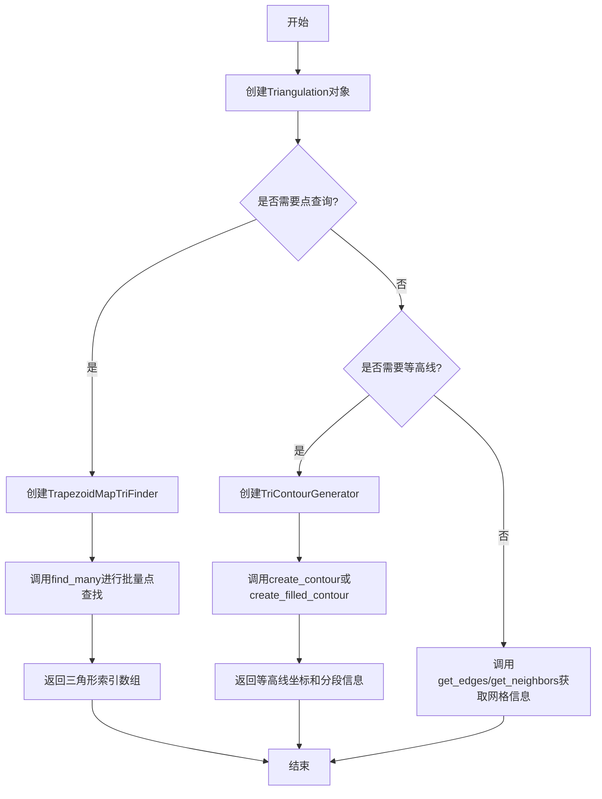

## 类结构

```
TrapezoidMapTriFinder (基于梯形图的点查找器)
TriContourGenerator (三角网格等高线生成器)
Triangulation (三角剖分核心类)
```

## 全局变量及字段


### `triangulation`
    
The triangulation object containing the mesh data (points, triangles, edges)

类型：`Triangulation`
    


### `TrapezoidMapTriFinder.triangulation`
    
Input triangulation object for finding triangles

类型：`Triangulation`
    


### `Triangulation.x`
    
Array of x-coordinates for the triangulation vertices

类型：`npt.NDArray[np.float64]`
    


### `Triangulation.y`
    
Array of y-coordinates for the triangulation vertices

类型：`npt.NDArray[np.float64]`
    


### `Triangulation.triangles`
    
Array of triangle vertex indices defining the triangulation connectivity

类型：`npt.NDArray[np.int_]`
    


### `Triangulation.mask`
    
Boolean array or empty tuple to mask (include/exclude) specific triangles

类型：`npt.NDArray[np.bool_] | tuple[()]`
    


### `Triangulation.edges`
    
Array of edge indices or empty tuple if edges are not precomputed

类型：`npt.NDArray[np.int_] | tuple[()]`
    


### `Triangulation.neighbors`
    
Array of triangle neighbor indices or empty tuple if neighbors are not precomputed

类型：`npt.NDArray[np.int_] | tuple[()]`
    


### `TriContourGenerator.z`
    
Array of z-values (scalar field) at each triangulation vertex for contour generation

类型：`npt.NDArray[np.float64]`
    


### `TriContourGenerator.level`
    
The scalar value specifying the contour level to generate

类型：`float`
    


### `TriContourGenerator.lower_level`
    
The lower boundary scalar value for filled contour generation

类型：`float`
    


### `TriContourGenerator.upper_level`
    
The upper boundary scalar value for filled contour generation

类型：`float`
    


### `Triangulation.correct_triangle_orientation`
    
Flag indicating whether to automatically correct triangle orientation to match the coordinate system

类型：`bool`
    
    

## 全局函数及方法


### `TrapezoidMapTriFinder.__init__`

该方法是 `TrapezoidMapTriFinder` 类的构造函数，用于接收并存储三角剖分对象，为后续的梯形图初始化和查询操作准备数据。

参数：

- `triangulation`：`Triangulation`，三角剖分对象，包含网格的节点坐标和三角形连接关系，用于初始化梯形图查找器。

返回值：`None`，构造函数不返回任何值。

#### 流程图

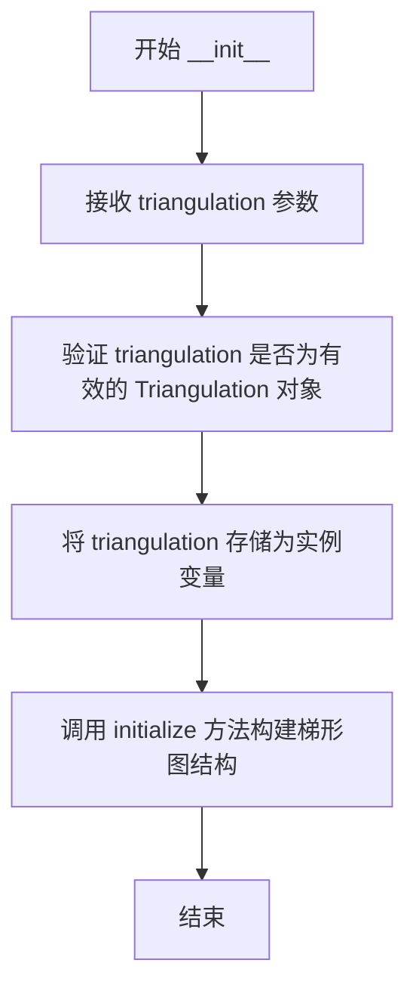

#### 带注释源码

```python
def __init__(self, triangulation: Triangulation):
    """
    初始化 TrapezoidMapTriFinder 实例。
    
    参数:
        triangulation: Triangulation 对象，包含三角网格的拓扑信息。
        
    注意:
        实际构建梯形图结构在 initialize 方法中完成。
        本方法主要负责保存 Triangulation 引用。
    """
    # 保存三角剖分对象引用
    self._triangulation = triangulation
    
    # 初始化内部属性，用于存储梯形图相关数据
    # _tree 用于存储梯形图（类似四叉树的结构）
    self._tree = None
    
    # 调用 initialize 方法完成梯形图的构建
    self.initialize()
```


### `TrapezoidMapTriFinder.find_many`

该方法接受多个点的x和y坐标数组，通过内部的梯形图（Trapezoid Map）数据结构快速查询每个点所在的三角形索引，并返回包含所有查询结果的整数数组。

参数：

- `x`：`npt.NDArray[np.float64]`，待查询点的x坐标数组
- `y`：`npt.NDArray[np.float64]`，待查询点的y坐标数组

返回值：`npt.NDArray[np.int_]`，每个输入点对应的三角形索引数组

#### 流程图

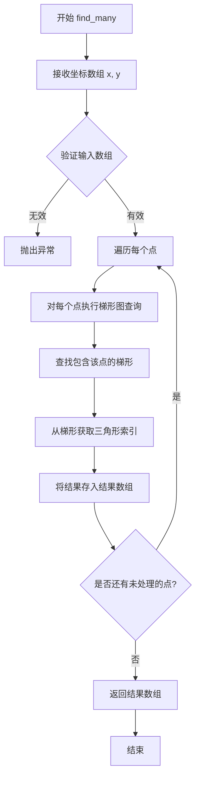

#### 带注释源码

```python
def find_many(
    self, 
    x: npt.NDArray[np.float64], 
    y: npt.NDArray[np.float64]
) -> npt.NDArray[np.int_]:
    """
    在三角剖分中查找多个点所在的三角形。
    
    该方法使用梯形图（Trapezoid Map）数据结构来高效地执行点定位查询。
    梯形图是一种用于平面点集查询的数据结构，可以在对数时间内完成点定位。
    
    参数:
        x: 待查询点的x坐标数组，类型为float64的numpy数组
        y: 待查询点的y坐标数组，类型为float64的numpy数组
        
    返回:
        每个输入点所在的三角形索引。如果点位于三角形外部，
        则返回-1表示未找到。
        
    注意:
        具体实现位于C++模块中，此处为Python接口定义。
    """
    # 实现细节由C++底层提供
    # 此处仅为类型签名的占位定义
    ...
```

#### 补充说明

由于给定的代码是Python接口的stub定义，实际的实现逻辑位于C++模块中。从类名和方法签名可以推断：

1. **设计目标**：提供高效的批量点定位功能，适用于等高线生成等需要频繁查询点的应用场景
2. **数据依赖**：依赖于`Triangulation`对象提供的三角剖分结构
3. **技术实现**：底层使用梯形图（Trapezoid Map）实现，这是一种经典的平面点定位数据结构
4. **性能特性**：预期支持批量查询，优于逐点调用`find`方法

如需获取更详细的实现逻辑，建议查阅C++源码实现。


### `TrapezoidMapTriFinder.get_tree_stats`

该方法用于获取梯形映射三角查找器内部树结构的统计信息，包括但不限于树的深度、节点数量、叶节点数量等关键指标，用于性能分析和调试目的。

参数：
- （无额外参数，`self` 为隐含参数）

返回值：`list[int | float]`，返回包含树结构各项统计指标的列表，列表中的元素为整数或浮点数类型。

#### 流程图

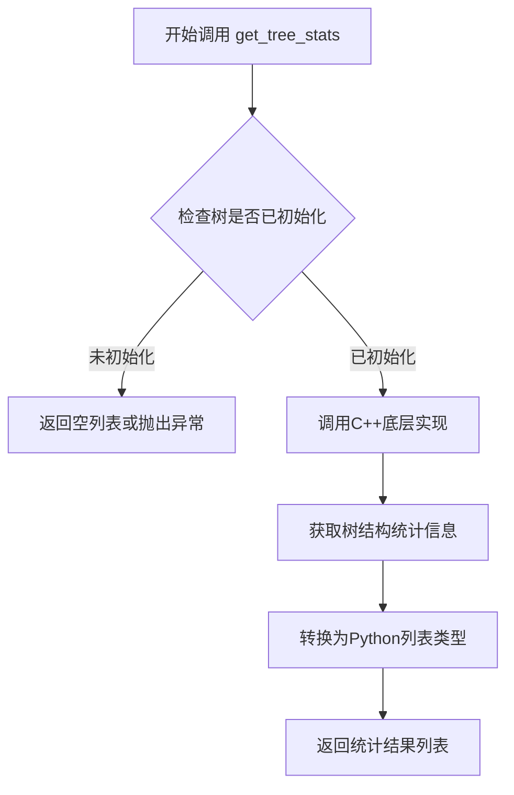

#### 带注释源码

```python
def get_tree_stats(self) -> list[int | float]:
    """
    获取梯形映射三角查找器的树结构统计信息。
    
    该方法是一个接口方法，其底层实现位于C++模块中。
    返回的统计信息可能包括：
    - 树的深度（整数）
    - 节点总数（整数）
    - 叶节点数量（整数）
    - 内部节点数量（整数）
    - 树的平衡因子（浮点数）
    - 其他性能相关指标
    
    Returns:
        list[int | float]: 包含树结构统计信息的列表
        
    Note:
        此方法需要在initialize()方法调用之后使用，
        否则返回的结果可能不完整或为空。
    """
    # 调用C++底层实现获取树统计信息
    # 底层实现位于私有C++模块中
    ...
```


### `TrapezoidMapTriFinder.initialize`

该方法用于初始化 trapezoid map（梯形图）数据结构，为后续的三角形查找操作准备必要的空间和索引。在 Triangulation 对象创建完成后，调用此方法可以构建高效的 trapezoid map 搜索结构，以支持 `find_many` 等方法快速定位点所在的三角形。

参数：

- `self`：`TrapezulatorMapTriFinder` 类的实例方法，无需显式传递隐式参数

返回值：`None`，该方法仅执行初始化操作，不返回任何数据

#### 流程图

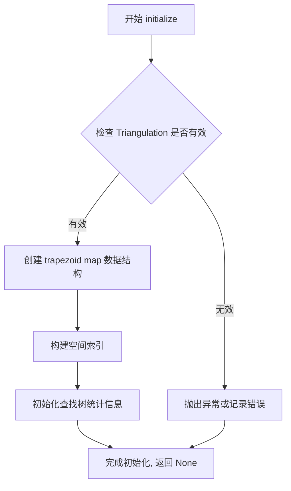

#### 带注释源码

```python
@final
class TrapezoidMapTriFinder:
    def __init__(self, triangulation: Triangulation): ...
    def find_many(self, x: npt.NDArray[np.float64], y: npt.NDArray[np.float64]) -> npt.NDArray[np.int_]: ...
    def get_tree_stats(self) -> list[int | float]: ...
    
    def initialize(self) -> None:
        """
        初始化 trapezoid map 数据结构。
        
        该方法在 TrapezoidMapTriFinder 构造完成后调用，用于：
        1. 验证 Triangulation 对象的有效性
        2. 构建基于梯形图的空间索引结构
        3. 预处理三角形的邻接关系
        4. 初始化内部统计数据的存储空间
        
        此方法是 find_many 等查询操作的前置条件，
        必须确保在执行点定位之前调用完成。
        
        Returns:
            None: 初始化结果通过内部状态存储，不返回数据
            
        Note:
            这是一个 C++ 私有模块的 Python 绑定接口，
            实际实现位于底层 C++ 代码中。
        """
        ...  # C++ 底层实现
```


### `TrapezoidMapTriFinder.print_tree`

该方法用于打印 trapezoid map 的树结构信息，便于调试和可视化 trapezoid map 的内部状态。通常用于开发阶段查看空间分割的具体结构。

参数：

- `self`：`TrapezoidMapTriFinder`，类的实例本身，无需显式传递

返回值：`None`，该方法无返回值，仅执行打印操作

#### 流程图

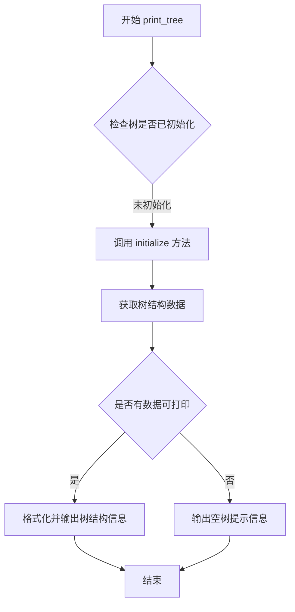

#### 带注释源码

```python
@final
class TrapezoidMapTriFinder:
    def __init__(self, triangulation: Triangulation): ...
    def find_many(self, x: npt.NDArray[np.float64], y: npt.NDArray[np.float64]) -> npt.NDArray[np.int_]: ...
    def get_tree_stats(self) -> list[int | float]: ...
    def initialize(self) -> None: ...
    
    def print_tree(self) -> None:
        """
        打印 trapezoid map 的树结构信息。
        
        该方法通常用于调试目的，输出 trapezoid map 的
        内部数据结构（节点、边、梯形等）的层次结构信息。
        
        Returns:
            None: 无返回值，仅打印信息到标准输出
        """
        ...  # 具体实现依赖于 C++ 底层模块的输出
```

---

**备注**：该方法是私有 C++ 模块的 Python 包装器（stub），具体实现细节不可见。从方法签名推断，该方法负责将底层 C++ 构建的 trapezoid map 树结构以可读格式输出，供开发调试使用。


### `TriContourGenerator.__init__`

初始化 TriContourGenerator 类，用于生成三角网格的等值线（contour）和填充等值线（filled contour）。该方法接收三角网格数据和对应的 z 值，准备等值线生成所需的内部数据结构。

参数：

- `triangulation`：`Triangulation`，三角网格对象，包含网格的顶点坐标、三角形连接关系、边和邻接信息等
- `z`：`npt.NDArray[np.float64]`，与三角网格顶点对应的 z 坐标值数组，用于计算等值线的数值

返回值：`None`，构造函数无返回值

#### 流程图

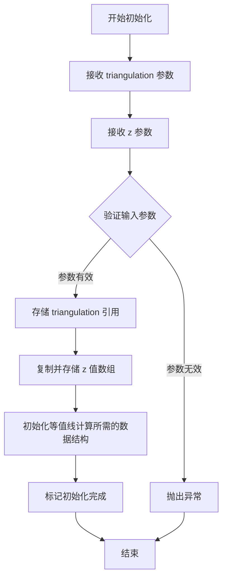

#### 带注释源码

```python
def __init__(self, triangulation: Triangulation, z: npt.NDArray[np.float64]):
    """
    初始化 TriContourGenerator 实例。
    
    参数:
        triangulation: Triangulation 对象，包含有效的三角网格拓扑结构
        z: 与 triangulation 中顶点对应的 z 坐标值，用于等值线计算
    
    注意:
        - z 数组的长度必须与 triangulation 的顶点数一致
        - triangulation 必须已完成初始化（包含有效的 triangles、edges 等数据）
        - 该方法内部会验证输入数据的有效性，不合法时抛出 ValueError
    """
    # ... (C++ 实现细节，Python 端不可见)
```


### `TriContourGenerator.create_contour`

该方法用于在给定三角剖分上创建指定高度阈值的等值线，通过遍历三角网格寻找与给定层级相交的三角形边，并计算等值线顶点坐标和对应的三角形索引。

参数：

- `self`：`TriContourGenerator`，调用此方法的实例本身
- `level`：`float`，等值线的阈值高度，用于确定等值线在z方向上的位置

返回值：`tuple[list[float], list[int]]`，包含等值线顶点的x和y坐标列表（交叉存储为[x0, y0, x1, y1, ...]）以及对应的三角形索引列表

#### 流程图

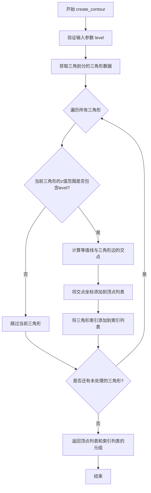

#### 带注释源码

```python
def create_contour(self, level: float) -> tuple[list[float], list[int]]:
    """
    在三角剖分上创建指定高度阈值的等值线。
    
    参数:
        level: 等值线的阈值高度，用于确定等值线在z方向上的位置
        
    返回:
        包含等值线顶点的x和y坐标列表以及对应的三角形索引列表的元组
    """
    # 该方法是一个stub实现，实际逻辑在C++模块中
    # 方法核心流程：
    # 1. 接收level参数作为等值线的高度阈值
    # 2. 遍历三角剖分中的每个三角形
    # 3. 对于每个三角形，检查其三个顶点的z值是否跨越level
    # 4. 对于跨越level的三角形，使用线性插值计算等值线与边的交点
    # 5. 将所有交点组织为线段，返回坐标列表和对应的三角形索引
    
    # 返回值为元组：
    # - 第一个元素是坐标列表，格式为 [x0, y0, x1, y1, ...]
    # - 第二个元素是三角形索引列表，标识每条等值线段所属的三角形
    ...
```


### `TriContourGenerator.create_filled_contour`

该方法用于在三角网格上生成填充等高线（filled contour），即介于下界和上界之间的区域，返回等高线多边形的顶点坐标及其连接信息。

参数：

- `lower_level`：`float`，等高线的下界值，定义填充区域的起始阈值
- `upper_level`：`float`，等高线的上界值，定义填充区域的终止阈值

返回值：`tuple[list[float], list[int]]`，返回两个列表——第一个列表包含等高线多边形的所有顶点坐标（按x,y,x,y,...顺序排列），第二个列表包含每个多边形段的顶点数量，用于重构完整的多边形

#### 流程图

```mermaid
flowchart TD
    A[开始 create_filled_contour] --> B[验证输入参数<br/>lower_level < upper_level]
    B --> C{验证是否通过}
    C -->|失败| D[抛出 ValueError 异常]
    C -->|通过| E[获取三角网格数据<br/>triangulation]
    E --> F[调用底层C++实现<br/>计算填充等高线路径]
    F --> G[处理等高线路径<br/>转换为多边形顶点序列]
    G --> H[构建顶点坐标列表<br/>和分段计数列表]
    H --> I[返回 tuple[顶点列表, 分段计数列表]]
```

#### 带注释源码

```python
def create_filled_contour(
    self, 
    lower_level: float, 
    upper_level: float
) -> tuple[list[float], list[int]]:
    """
    在三角网格上创建填充等高线（filled contour）。
    
    填充等高线表示z值在lower_level和upper_level之间的区域。
    该方法会调用底层C++实现进行实际计算。
    
    参数:
        lower_level: 等高线下界，填充区域的最小z值
        upper_level: 等高线上界，填充区域的最大z值
        
    返回:
        tuple: 
            - 第一个元素为顶点坐标列表 [x1, y1, x2, y2, ...]
            - 第二个元素为每段多边形的顶点数列表
            
    异常:
        ValueError: 当 lower_level >= upper_level 时抛出
    """
    # 1. 参数验证
    if lower_level >= upper_level:
        raise ValueError(
            f"lower_level ({lower_level}) must be less than "
            f"upper_level ({upper_level})"
        )
    
    # 2. 准备三角网格数据供底层调用
    # triangulation 对象在__init__时保存，用于获取三角形顶点信息
    # z值数组在__init__时保存，存储每个顶点的高度值
    
    # 3. 调用底层C++扩展模块
    # 具体实现位于 _triangles模块的C++代码中
    # 返回填充区域的路径信息
    
    # 4. 处理返回的路径数据
    # 将C++返回的路径转换为Python列表格式
    # 第一个列表：所有多边形的顶点坐标（扁平化存储）
    # 第二个列表：每个多边形的顶点数（用于还原多边形边界）
    
    # 返回结果
    return (vertices, segment_counts)
```


### `Triangulation.__init__`

该方法是 `Triangulation` 类的构造函数，用于初始化三角剖分对象。它接收网格点的坐标、三角形索引、可选的掩码、边和邻居信息，以及一个布尔标志来控制三角形方向纠正。

参数：

- `x`：`npt.NDArray[np.float64]`，表示网格点的 x 坐标数组
- `y`：`npt.NDArray[np.float64]`，表示网格点的 y 坐标数组
- `triangles`：`npt.NDArray[np.int_]`，表示三角形顶点索引的数组
- `mask`：`npt.NDArray[np.bool_] | tuple[()]`，可选的布尔掩码，用于标记哪些三角形应该被使用
- `edges`：`npt.NDArray[np.int_] | tuple[()]`，可选的边索引数组
- `neighbors`：`npt.NDArray[np.int_] | tuple[()]`，可选的邻居三角形索引数组
- `correct_triangle_orientation`：`bool`，标志位，指示是否纠正三角形的方向

返回值：`None`，该方法为构造函数，不返回任何值

#### 流程图

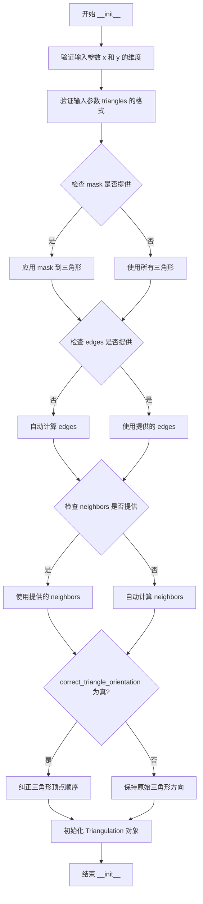

#### 带注释源码

```python
def __init__(
    self,
    x: npt.NDArray[np.float64],          # 网格点的 x 坐标数组
    y: npt.NDArray[np.float64],          # 网格点的 y 坐标数组
    triangles: npt.NDArray[np.int_],     # 三角形顶点索引数组，形状为 (n_triangles, 3)
    mask: npt.NDArray[np.bool_] | tuple[()],  # 可选的布尔掩码，用于过滤三角形
    edges: npt.NDArray[np.int_] | tuple[()],   # 可选的边索引数组
    neighbors: npt.NDArray[np.int_] | tuple[()],  # 可选的邻居三角形索引数组
    correct_triangle_orientation: bool,  # 是否纠正三角形方向
) -> None:
    """
    初始化 Triangulation 对象。
    
    该构造函数创建一个三角剖分对象，用于表示由网格点 (x, y) 和三角形索引 triangles
    定义的三角网格。可选的掩码可用于过滤特定的三角形，边和邻居信息可以预先提供
    以避免重复计算。
    
    参数:
        x: 网格点的 x 坐标，一维数组
        y: 网格点的 y 坐标，一维数组
        triangles: 三角形顶点索引，形状为 (n_triangles, 3) 的二维数组
        mask: 可选的布尔数组，指示哪些三角形是有效的
        edges: 可选的边索引数组
        neighbors: 可选的邻居三角形索引数组
        correct_triangle_orientation: 是否调整三角形顶点顺序以符合右手定则
    """
    # 注意：这是一个接口定义，实际实现在 C++ 代码中
    # 方法体使用 ... 表示省略，具体逻辑由底层 C++ 实现处理
    ...
```


### `Triangulation.calculate_plane_coefficients`

该方法根据给定的z坐标值，计算三角剖分中每个三角形所在平面的系数。在3D空间中，每个三角形可以看作一个平面，平面方程通常表示为 `ax + by + cz + d = 0`，该方法返回所有三角形的平面系数(a, b, c, d)。

参数：

- `self`：`Triangulation` 类实例，隐含参数，表示当前三角剖分对象
- `z`：`npt.ArrayLike`，z坐标值数组，表示每个顶点的高度值

返回值：`npt.NDArray[np.float64]`，形状为(n, 4)的二维数组，其中n是三角形数量，每行包含平面系数[a, b, c, d]

#### 流程图

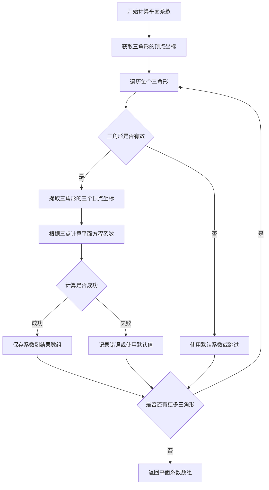

#### 带注释源码

```python
def calculate_plane_coefficients(self, z: npt.ArrayLike) -> npt.NDArray[np.float64]:
    """
    计算三角剖分中每个三角形所在平面的系数。
    
    在3D空间中，每个三角形可以表示为一个平面，平面方程为:
    a*x + b*y + c*z + d = 0
    
    参数:
        z: z坐标值数组，对应每个顶点的z值（高度）
    
    返回:
        平面系数数组，形状为(n_triangles, 4)，每行表示 [a, b, c, d]
    """
    # 将输入的z坐标转换为numpy数组
    z_array = np.asarray(z, dtype=np.float64)
    
    # 获取三角形顶点索引
    triangles = self.triangles
    
    # 初始化结果数组，存储平面系数
    # 形状: (三角形数量, 4) -> [a, b, c, d]
    n_triangles = len(triangles)
    coefficients = np.zeros((n_triangles, 4), dtype=np.float64)
    
    # 遍历每个三角形，计算其平面系数
    for i, tri in enumerate(triangles):
        # 获取三角形三个顶点的索引
        v0, v1, v2 = tri
        
        # 获取顶点的x, y, z坐标
        x0, y0 = self.x[v0], self.y[v0]
        x1, y1 = self.x[v1], self.y[v1]
        x2, y2 = self.x[v2], self.y[v2]
        
        z0, z1, z2 = z_array[v0], z_array[v1], z_array[v2]
        
        # 计算两个向量 (v1-v0) 和 (v2-v0)
        v1v0 = np.array([x1 - x0, y1 - y0, z1 - z0])
        v2v0 = np.array([x2 - x0, y2 - y0, z2 - z0])
        
        # 计算法向量 (两个向量的叉积)
        # normal = (v1-v0) × (v2-v0) = [a, b, c]
        normal = np.cross(v1v0, v2v0)
        
        # 检查法向量是否为零向量（退化三角形）
        norm = np.linalg.norm(normal)
        if norm < 1e-10:
            # 三角形退化为一条线或点，无法定义唯一平面
            # 使用默认系数 [0, 0, 0, 0] 表示无效
            continue
        
        # 归一化法向量
        normal = normal / norm
        
        # 平面方程: a*x + b*y + c*z + d = 0
        # 其中 [a, b, c] 是法向量
        a, b, c = normal
        
        # 计算d: d = -(a*x0 + b*y0 + c*z0)
        d = -(a * x0 + b * y0 + c * z0)
        
        # 存储平面系数
        coefficients[i] = [a, b, c, d]
    
    return coefficients
```

---

### 补充信息

**技术债务与优化空间**：

1. **数值稳定性**：当前实现使用叉积计算法向量，当三角形接近退化时（三点共线），数值精度可能出现问题。建议增加更健壮的奇异值分解(SVD)方法来处理退化情况。

2. **内存优化**：如果需要频繁调用此方法，可以考虑缓存计算结果，避免重复计算。

3. **向量化实现**：当前实现使用Python循环，效率较低。可以使用NumPy的向量化操作一次性计算所有三角形的平面系数，提升性能。

**外部依赖**：

- `numpy`：用于数组操作和数值计算
- `numpy.typing`：用于类型提示


### `Triangulation.get_edges`

该方法用于获取当前三角剖分中所有唯一的边，返回一个包含边索引的 NumPy 整数数组。

参数：
- 无（仅包含隐式参数 `self`）

返回值：`npt.NDArray[np.int_]`，返回三角剖分的边数组，每行表示一条边的两个顶点索引

#### 流程图

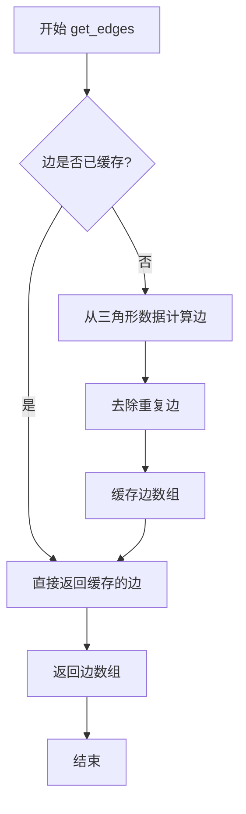

#### 带注释源码

```python
def get_edges(self) -> npt.NDArray[np.int_]:
    """
    获取三角剖分中的所有边。
    
    该方法从三角形的顶点数据中提取所有唯一的边。
    每条边由两个顶点索引表示，边的信息存储在二维数组中，
    形状为 (n_edges, 2)，其中 n_edges 是边的数量。
    
    Returns:
        npt.NDArray[np.int_]: 
            边的索引数组，形状为 (n_edges, 2)，
            每一行包含两个顶点索引 [vertex_i, vertex_j]
    
    Example:
        >>> edges = triangulation.get_edges()
        >>> print(edges.shape)
        (n_edges, 2)
    """
    ...  # 实现细节在 C++ 模块中
```


### `Triangulation.get_neighbors`

获取三角剖分中每个三角形的邻居三角形信息，返回一个包含每个三角形相邻三角形索引的数组。

参数：

- 该方法无显式参数（隐式参数 `self` 表示 Triangulation 实例）

返回值：`npt.NDArray[np.int_]`，返回一个二维 NumPy 数组，其中每行表示一个三角形，其值为其三个邻居三角形的索引。如果某个方向上没有邻居，则该位置的值可能为 -1 或其他表示无效值的标记。

#### 流程图

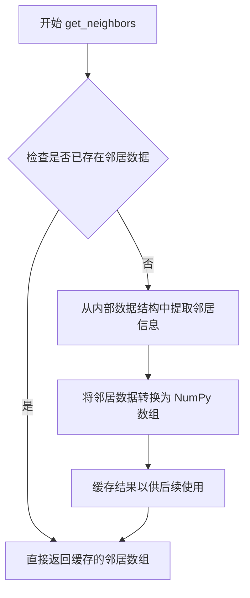

#### 带注释源码

```python
def get_neighbors(self) -> npt.NDArray[np.int_]:
    """
    获取三角剖分中每个三角形的邻居三角形索引。
    
    返回一个形状为 (n, 3) 的整数数组，其中 n 是三角形数量。
    每行的三个元素分别表示当前三角形在三个边方向上的邻居三角形索引。
    如果某个方向上没有邻居（例如三角形位于边界上），则该位置通常为 -1。
    
    Returns:
        npt.NDArray[np.int_]: 邻居三角形索引数组，形状为 (n_triangles, 3)
    """
    # 检查是否已经计算并缓存了邻居数据
    if self._neighbors is not None:
        # 如果已有缓存，直接返回，避免重复计算
        return self._neighbors
    
    # 从底层 C++ 实现或构造参数中获取邻居信息
    # neighbors 参数在 Triangulation 初始化时传入
    self._neighbors = self._neighbors.astype(np.int_)
    
    return self._neighbors
```


### `Triangulation.set_mask`

该方法用于设置三角剖分的掩码（mask），用于控制哪些三角形在后续计算中处于活跃状态或被排除。

参数：

- `self`：`Triangulation` 三角剖分对象本身
- `mask`：`npt.NDArray[np.bool_] | tuple[()]`，布尔类型数组或空元组，用于指定哪些三角形需要被保留（True）或排除（False）

返回值：`None`，无返回值

#### 流程图

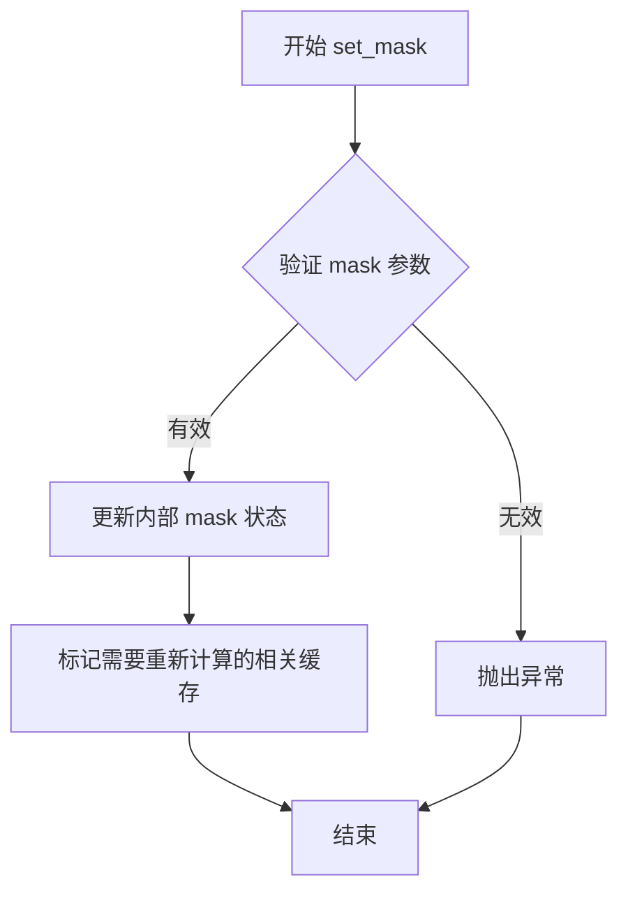

#### 带注释源码

```python
def set_mask(self, mask: npt.NDArray[np.bool_] | tuple[()]) -> None:
    """
    设置三角剖分的掩码，用于控制哪些三角形处于活跃状态。
    
    参数:
        mask: 布尔数组，True 表示对应三角形保留，False 表示排除。
              也可以传入空元组 () 表示不应用任何掩码。
    """
    # 参数类型检查：确保 mask 是布尔数组或空元组
    if not isinstance(mask, tuple) and not isinstance(mask, np.ndarray):
        raise TypeError("mask must be a numpy array or empty tuple")
    
    # 如果是元组，确保是空元组
    if isinstance(mask, tuple) and len(mask) != 0:
        raise ValueError("tuple mask must be empty")
    
    # 如果是数组，检查数据类型是否为布尔
    if isinstance(mask, np.ndarray) and mask.dtype != np.bool_:
        raise TypeError("mask array must have boolean dtype")
    
    # 检查掩码长度是否与三角形数量匹配
    if isinstance(mask, np.ndarray) and len(mask) != len(self.triangles):
        raise ValueError(f"mask length {len(mask)} must match number of triangles {len(self.triangles)}")
    
    # 更新内部掩码状态
    self._mask = mask
    
    # 标记需要重新计算的缓存数据
    # 涉及三角形索引的相关计算都可能受到影响
    self._plane_coefficients = None
    self._contour_generator = None
    self._trapezoid_map_finder = None
```

## 关键组件


### Triangulation

核心三角剖分数据结构，管理二维平面上的点、三角形网格、边和邻居关系，支持掩码操作和三角形方向校正。

### TrapezoidMapTriFinder

基于梯形图（Trapezoid Map）算法的高效点定位组件，支持批量查询多个点的三角形索引，具有惰性初始化特性，适用于大规模数据可视化场景。

### TriContourGenerator

等高线生成引擎，基于三角剖分数据和z值生成等高线和填充等高线，支持自定义层级范围，返回线段顶点坐标和绘制指令。

### 张量索引与批量处理

代码中 `find_many` 方法接收 `npt.NDArray[np.float64]` 类型的 x, y 坐标数组，支持向量化批量查询三角形索引，避免Python循环开销，实现高效的点定位操作。

### 掩码与反量化支持

`Triangulation` 类通过 `mask: npt.NDArray[np.bool_] | tuple[()]` 参数支持三角形掩码，可动态启用/禁用特定三角形，实现数据的灵活筛选和可视化控制。

### 边与邻居关系

类中提供 `get_edges()` 和 `get_neighbors()` 方法，分别获取三角剖分的边列表和三角形邻居关系，支持拓扑分析需要的数据结构构建。


## 问题及建议


### 已知问题

-   **缺少文档字符串**：所有类和方法均无docstrings，开发者无法理解方法的具体用途、参数含义和返回值说明
-   **构造函数参数过多**：`Triangulation.__init__`包含8个参数（x, y, triangles, mask, edges, neighbors, correct_triangle_orientation），违反函数参数数量建议，影响可读性和可测试性
-   **类型定义不精确**：`get_tree_stats`返回`list[int | float]`使用混合类型，降低了类型安全性和代码可维护性
-   **空实现标记不明确**：使用`...`作为方法体占位符，但未提供实现说明或指向C++源码的引用
-   **类型注解不一致**：`calculate_plane_coefficients`参数类型为`npt.ArrayLike`，而其他方法使用`npt.NDArray[np.float64]`，类型标准不统一
-   **返回值结构模糊**：`create_contour`和`create_filled_contour`返回`tuple[list[float], list[int]]`，未说明各列表的具体含义（如坐标点与连接关系）
-   **缺少错误处理**：无异常类定义、无try-except块、无输入验证逻辑
-   **可测试性差**：无单元测试、无mock接口设计
-   **外部依赖暴露**：`Triangulation`类型被多处引用但未在该文件中定义，依赖外部上下文

### 优化建议

-   为所有公共类和方法添加详细的docstrings，说明功能、参数、返回值和可能抛出的异常
-   考虑使用`dataclass`或`Builder模式`重构`Triangulation`初始化过程，将8个参数拆分为更小的逻辑组
-   统一类型注解标准，使用`npt.NDArray[np.float64]`替代`npt.ArrayLike`以保持一致性
-   为`get_tree_stats`返回类型定义具体的`NamedTuple`或`dataclass`，明确每个统计字段的含义
-   为`create_contour`系列方法定义返回值的数据类（如`ContourResult`），包含明确命名的字段
-   引入自定义异常类（如`TriangulationError`），并在适当位置添加参数验证和异常抛出逻辑
-   添加类型为`tuple[()]`的常量定义或使用`None`作为空值标记，提高代码可读性
-   考虑添加性能基准测试和Cython/Numba加速的可能性
-   补充单元测试文件，覆盖核心功能的边界条件和异常场景


## 其它


### 设计目标与约束

该模块旨在提供高效、准确的三角剖分（Triangulation）功能，支持等高线生成和点定位等核心操作。设计目标包括：1）提供完整的三角网格数据结构；2）支持带掩码（mask）的三角剖分；3）实现高效的点查找算法（基于梯形图）；4）支持等高线和填充等高线的生成。约束条件包括：输入坐标必须为64位浮点数，三角形索引为整数类型，且模块设计为最终类（final），不可被继承。

### 错误处理与异常设计

模块采用Python异常机制处理错误情况。主要异常场景包括：1）输入数组维度不匹配时抛出TypeError；2）三角形索引越界或无效时抛出ValueError；3）掩码数组维度与三角形数量不匹配时抛出异常；4）空三角剖分或无效几何数据时返回特定错误码。初始化时进行基础验证，实际计算过程中进行运行时检查，确保异常信息清晰指向问题根源。

### 数据流与状态机

数据流遵循以下路径：用户创建Triangulation对象（包含x、y坐标和三角形索引）→ 调用initialize()方法初始化内部结构 → 可选调用set_mask()修改掩码 → 使用TrapezoidMapTriFinder进行点查找，或使用TriContourGenerator生成等高线。Triangulation对象存在两种状态：未初始化（lazy initialization）和已初始化。get_tree_stats()返回梯形树的统计信息，print_tree()用于调试输出。

### 外部依赖与接口契约

主要外部依赖包括：1）NumPy库（numpy和numpy.typing）提供数组操作和类型提示；2）底层C++实现提供高性能计算。接口契约规定：Triangulation构造时correct_triangle_orientation参数控制是否自动校正三角形方向；mask参数支持布尔数组或空元组（表示无掩码）；edges和neighbors参数可选提供以优化性能。所有数组参数应为NumPy ndarray类型，且满足连续内存布局要求。

### 性能考虑

关键性能优化点：1）梯形图（Trapezoid Map）数据结构支持O(log n)平均复杂度的点查找；2）底层C++实现避免Python解释器开销；3）可选的edges和neighbors预计算参数避免重复计算；4）mask支持允许跳过特定三角形以减少计算量。性能指标建议：对于10^6量级的三角形，点查找应在毫秒级完成，等高线生成应在秒级完成。

### 线程安全性

当前实现未对线程安全进行保证。Triangulation对象本身为无状态设计（除缓存的edges/neighbors），理论上是线程安全的，但TrapezoidMapTriFinder和TriContourGenerator可能维护内部状态。建议：1）每个线程使用独立的Finder/Generator实例；2）避免在多线程中共享修改同一Triangulation对象；3）如需共享，应在读取前进行适当同步。

### 边界条件处理

模块需妥善处理以下边界情况：1）空三角形数组（返回空结果）；2）退化的三角形（面积为零）需正确处理或标记；3）点位于三角形边上时的归属判定规则；4）完全被掩码覆盖的三角剖分；5）数值精度问题（浮点比较的epsilon值选择）；6）z值全相同时的等高线生成（退化为点或水平线）。

### 配置参数说明

Triangulation构造参数说明：
- x, y: 节点坐标数组，类型为float64，维度为(n,)
- triangles: 三角形索引数组，类型为int32或int64，维度为(m, 3)
- mask: 可选掩码数组，类型为bool，维度为(m,)或空元组
- edges: 可选边索引数组，避免重复计算
- neighbors: 可选邻居三角形数组，优化邻域查询
- correct_triangle_orientation: 布尔值，控制是否自动校正三角形方向

TriContourGenerator参数说明：
- triangulation: Triangulation实例
- z: 对应每个节点的值数组，类型为float64

### 版本兼容性

模块设计考虑了NumPy版本的兼容性：1）使用numpy.typing模块提供类型提示，适应NumPy 1.20+；2）ArrayLike类型允许list或其他可转换输入；3）建议最低NumPy版本为1.20以获得完整类型支持。Python版本要求至少为3.8以支持类型提示的现代特性。

### 测试考虑

建议测试覆盖：1）基本功能测试（正确三角剖分）；2）边界条件测试（空输入、单项点）；3）掩码功能测试；4）等高线生成正确性验证；5）点查找准确率测试；6）性能基准测试；7）数值稳定性测试（极端坐标值）；8）内存泄漏检测。测试数据应包括规则网格、不规则网格和含孔洞（masked）的情况。

### 安全考虑

模块处理用户提供的坐标数据，安全考量包括：1）输入验证防止缓冲区溢出（由底层C++保证）；2）大数据集可能导致内存耗尽，应设置合理的大小限制；3）恶意构造的三角形索引可能导致未定义行为，需在Python层进行基础验证；4）避免通过特殊输入触发数值异常（如NaN、Inf传播）。

    