# `matplotlib\lib\matplotlib\_type1font.py` 详细设计文档

该代码实现了一个Type1Font类，用于解析、处理和转换PostScript Type 1字体文件，支持读取pfa和pfb格式，进行加密/解密操作，并提供字体转换（如倾斜、拉伸）和子集化功能。

## 整体流程

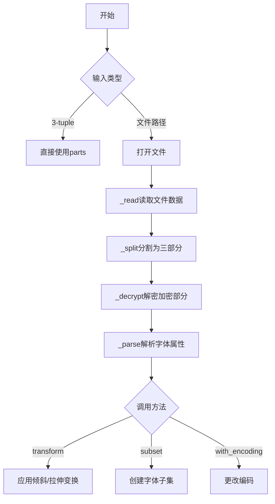

## 类结构

```
_Token (抽象基类)
├── _NameToken
├── _BooleanToken
├── _KeywordToken
├── _DelimiterToken
├── _WhitespaceToken
├── _StringToken
├── _BinaryToken
├── _NumberToken
└── _BalancedExpression
Type1Font (主类)
└── _CharstringSimulator (辅助类)
```

## 全局变量及字段


### `_StandardEncoding`
    
标准编码映射表，包含ASCII字符和PostScript标准字形的对应关系

类型：`dict`
    


### `_log`
    
日志记录器，用于记录字体解析和处理过程中的调试和信息

类型：`Logger`
    


### `_Token.pos`
    
标记在数据中的位置，即相对于数据起始处的偏移量

类型：`int`
    


### `_Token.raw`
    
标记的原始文本，包含标记的原始字符串内容

类型：`str`
    


### `Type1Font.parts`
    
字体的三个部分，包含明文部分、加密部分和结尾部分的元组

类型：`tuple`
    


### `Type1Font.decrypted`
    
解密后的数据，即加密部分的明文形式

类型：`bytes`
    


### `Type1Font.prop`
    
字体属性字典，存储字体名称、编码、字形等各种属性

类型：`dict`
    


### `Type1Font._pos`
    
位置索引，记录字体属性在数据中的起始和结束位置

类型：`dict`
    


### `Type1Font._abbr`
    
缩写映射，存储标准PostScript缩写的实际名称

类型：`dict`
    


### `_CharstringSimulator.font`
    
字体对象，当前模拟的Type1Font实例

类型：`Type1Font`
    


### `_CharstringSimulator.buildchar_stack`
    
构建字符栈，用于存储字符构建过程中的操作数和中间结果

类型：`list`
    


### `_CharstringSimulator.postscript_stack`
    
PostScript栈，用于模拟PostScript解释器的执行栈

类型：`list`
    


### `_CharstringSimulator.glyphs`
    
字形集合，记录字符流中引用的所有字形名称

类型：`set`
    


### `_CharstringSimulator.subrs`
    
子例程集合，记录字符流中引用的所有子例程索引

类型：`set`
    
    

## 全局函数及方法


### `_tokenize`

该函数是一个生成器函数，用于将 Type-1 字体代码转换为一系列 Token 对象。它解析 PostScript 字体语法，支持多种 Token 类型（名称、布尔值、数字、关键字、字符串、分隔符、二进制等），并允许消费者通过 send() 方法控制二进制 Token 的长度。

参数：

- `data`：`bytes`，要 tokenize 的字体数据
- `skip_ws`：`bool`，如果为 True，则在输出中丢弃所有空白 Token

返回值：`T.Generator[_Token, int, None]`，生成 _Token 实例的生成器，可接收整数来指定下一个二进制 Token 的长度

#### 流程图

```mermaid
flowchart TD
    A[开始] --> B[将bytes解码为ascii文本]
    B --> C[初始化位置pos=0, next_binary=None]
    C --> D{pos < len(text)?}
    D -->|否| E[结束]
    D -->|是| F{next_binary is not None?}
    F -->|是| G[生成BinaryToken, pos+=n]
    F -->|否| H{匹配空白/注释?}
    H -->|是| I{skip_ws为True?}
    I -->|是| J[跳过空白Token]
    I -->|否| K[生成WhitespaceToken]
    J --> L[pos = match.end]
    K --> L
    H -->|否| M{text[pos] == '('?}
    M -->|是| N[解析PostScript字符串<br/>处理转义和嵌套]
    N --> O[生成StringToken]
    M -->|否| P{text[pos:pos+2] in ('<<', '>>')?}
    P -->|是| Q[生成DelimiterToken]
    Q --> R[pos+=2]
    P -->|否| S{text[pos] == '<'?}
    S -->|是| T[解析十六进制字符串]
    T --> U{验证hex格式?}
    U -->|是| V[生成StringToken]
    U -->|否| W[抛出ValueError]
    S -->|否| X[匹配通用token]
    X --> Y{匹配成功?}
    Y -->|是| Z{token以'/'开头?}
    Z -->|是| AA[生成NameToken]
    Z -->|否| AB{token in ('true','false')?}
    AB -->|是| AC[生成BooleanToken]
    AB -->|否| AD{可以转为float?}
    AD -->|是| AE[生成NumberToken]
    AD -->|否| AF[生成KeywordToken]
    Y -->|否| AG[生成DelimiterToken]
    AA --> AH[pos = match.end]
    AC --> AH
    AE --> AH
    AF --> AH
    AG --> AI[pos+=1]
    AH --> D
    V --> D
    W --> D
    L --> D
    R --> D
```

#### 带注释源码

```python
def _tokenize(data: bytes, skip_ws: bool) -> T.Generator[_Token, int, None]:
    """
    A generator that produces _Token instances from Type-1 font code.

    The consumer of the generator may send an integer to the tokenizer to
    indicate that the next token should be _BinaryToken of the given length.

    Parameters
    ----------
    data : bytes
        The data of the font to tokenize.

    skip_ws : bool
        If true, the generator will drop any _WhitespaceTokens from the output.
    """

    # 将输入的字节数据解码为ASCII文本，替换无法解码的字符
    text = data.decode('ascii', 'replace')
    
    # 编译正则表达式用于匹配：
    # 空白字符（空格、Tab、换行等）或注释（%开头到行尾）
    whitespace_or_comment_re = re.compile(r'[\0\t\r\f\n ]+|%[^\r\n]*')
    
    # 匹配普通token：可选的/或//前缀，后跟非特殊字符序列
    token_re = re.compile(r'/{0,2}[^]\0\t\r\f\n ()<>{}/%[]+')
    
    # 匹配字符串内的特殊字符：括号和反斜杠
    instring_re = re.compile(r'[()\\]')
    
    # 匹配十六进制字符串：<...> 格式，只包含十六进制字符和空白
    hex_re = re.compile(r'^<[0-9a-fA-F\0\t\r\f\n ]*>$')
    
    # 匹配八进制转义序列：1-3位八进制数字
    oct_re = re.compile(r'[0-7]{1,3}')
    
    # 当前位置指针
    pos = 0
    
    # 用于接收外部传入的二进制token长度，初始为None表示无待处理二进制数据
    next_binary: int | None = None

    # 主循环：遍历整个文本
    while pos < len(text):
        # 如果有来自外部的二进制长度请求（通过send()传入）
        if next_binary is not None:
            n = next_binary
            # 生成BinaryToken，接收下一个二进制长度请求
            next_binary = (yield _BinaryToken(pos, data[pos:pos+n]))
            pos += n
            continue

        # 尝试匹配空白或注释
        match = whitespace_or_comment_re.match(text, pos)
        if match:
            # 如果不跳过空白，则生成WhitespaceToken
            if not skip_ws:
                next_binary = (yield _WhitespaceToken(pos, match.group()))
            pos = match.end()
        
        # 处理PostScript字符串：圆括号包围，可包含转义字符
        elif text[pos] == '(':
            # PostScript string rules:
            # - parentheses must be balanced
            # - backslashes escape backslashes and parens
            # - also codes \n\r\t\b\f and octal escapes are recognized
            # - other backslashes do not escape anything
            start = pos
            pos += 1
            depth = 1  # 括号嵌套深度
            while depth:
                # 查找下一个特殊字符
                match = instring_re.search(text, pos)
                if match is None:
                    raise ValueError(
                        f'Unterminated string starting at {start}')
                pos = match.end()
                if match.group() == '(':
                    depth += 1
                elif match.group() == ')':
                    depth -= 1
                else:  # a backslash
                    # 处理转义字符
                    char = text[pos]
                    if char in r'\()nrtbf':
                        pos += 1  # 标准转义序列
                    else:
                        # 尝试八进制转义
                        octal = oct_re.match(text, pos)
                        if octal:
                            pos = octal.end()
                        else:
                            pass  # non-escaping backslash
            # 生成字符串token
            next_binary = (yield _StringToken(start, text[start:pos]))
        
        # 处理双字符分隔符：<< 或 >>
        elif text[pos:pos + 2] in ('<<', '>>'):
            next_binary = (yield _DelimiterToken(pos, text[pos:pos + 2]))
            pos += 2
        
        # 处理十六进制字符串：<...> 格式
        elif text[pos] == '<':
            start = pos
            try:
                pos = text.index('>', pos) + 1
            except ValueError as e:
                raise ValueError(f'Unterminated hex string starting at {start}'
                                 ) from e
            # 验证十六进制格式
            if not hex_re.match(text[start:pos]):
                raise ValueError(f'Malformed hex string starting at {start}')
            next_binary = (yield _StringToken(pos, text[start:pos]))
        
        # 处理其他普通token
        else:
            match = token_re.match(text, pos)
            if match:
                raw = match.group()
                # 以/开头的是名称token
                if raw.startswith('/'):
                    next_binary = (yield _NameToken(pos, raw))
                # true/false 是布尔token
                elif match.group() in ('true', 'false'):
                    next_binary = (yield _BooleanToken(pos, raw))
                else:
                    # 尝试解析为数字
                    try:
                        float(raw)
                        next_binary = (yield _NumberToken(pos, raw))
                    except ValueError:
                        # 否则是关键字token
                        next_binary = (yield _KeywordToken(pos, raw))
                pos = match.end()
            else:
                # 单字符分隔符
                next_binary = (yield _DelimiterToken(pos, text[pos]))
                pos += 1
```


### `_expression`

解析并返回一个平衡的 PostScript 表达式，通过维护一个分隔符栈来匹配括号（`[]` 和 `{}`），直到找到对应的结束分隔符或遍历完所有 Token。

参数：

- `initial`：`_Token`，触发解析平衡表达式的起始 Token
- `tokens`：Iterator[_Token]，包含后续 Token 的迭代器
- `data`：`bytes`，Token 位置所指向的底层字节数据

返回值：`_BalancedExpression`，包含解析后的平衡表达式及其位置信息

#### 流程图

```mermaid
flowchart TD
    A[开始: _expression] --> B[初始化空列表 delim_stack]
    B --> C[将 initial 作为第一个 token]
    C --> D{token.is_delim?}
    D -->|Yes| E{token.raw in ['[', '{']?}
    D -->|No| G{delim_stack 为空?}
    E -->|Yes| F[delim_stack.append token]
    F --> M[token = next(tokens)]
    E -->|No| H{token.raw in [']', '}']?}
    H -->|Yes| I{delim_stack 为空?}
    I -->|Yes| J[抛出 RuntimeError: unmatched closing token]
    I -->|No| K[match = delim_stack.pop]
    K --> L{match.raw == token.opposite?}
    L -->|No| J1[抛出 RuntimeError: opening token closed by token]
    L -->|Yes| M1{delim_stack 为空?}
    M1 -->|Yes| N[返回 _BalancedExpression]
    M1 -->|No| M
    H -->|No| J2[抛出 RuntimeError: unknown delimiter]
    G -->|Yes| N
    G -->|No| M
    M --> D
```

#### 带注释源码

```python
def _expression(initial, tokens, data):
    """
    Consume some number of tokens and return a balanced PostScript expression.

    Parameters
    ----------
    initial : _Token
        The token that triggered parsing a balanced expression.
    tokens : iterator of _Token
        Following tokens.
    data : bytes
        Underlying data that the token positions point to.

    Returns
    -------
    _BalancedExpression
    """
    # 用栈来追踪嵌套的分隔符
    delim_stack = []
    # 从触发解析的 token 开始
    token = initial
    while True:
        # 检查当前 token 是否为分隔符
        if token.is_delim():
            # 处理左括号 [ 和 {，入栈
            if token.raw in ('[', '{'):
                delim_stack.append(token)
            # 处理右括号 ] 和 }，需要匹配栈顶的左括号
            elif token.raw in (']', '}'):
                # 栈为空说明没有匹配的左括号
                if not delim_stack:
                    raise RuntimeError(f"unmatched closing token {token}")
                # 弹出栈顶的左括号进行匹配
                match = delim_stack.pop()
                # 检查左右括号是否匹配
                if match.raw != token.opposite():
                    raise RuntimeError(
                        f"opening token {match} closed by {token}"
                    )
                # 如果栈为空，说明最外层的表达式已结束
                if not delim_stack:
                    break
            else:
                raise RuntimeError(f'unknown delimiter {token}')
        # 如果当前不是分隔符且栈为空，说明表达式已结束
        elif not delim_stack:
            break
        # 获取下一个 token 继续解析
        token = next(tokens)
    # 构建并返回平衡表达式对象
    return _BalancedExpression(
        initial.pos,
        # 从起始位置到结束位置提取原始字节数据并解码
        data[initial.pos:token.endpos()].decode('ascii', 'replace')
    )
```


### `_Token.__init__`

该方法是 `_Token` 类的构造函数，用于初始化 PostScript 流中的令牌对象，记录调试日志并将位置信息和原始文本存储为实例属性。

参数：

- `pos`：`int`，位置，即从数据开始的偏移量
- `raw`：`str`，令牌的原始文本

返回值：`None`，无返回值（`__init__` 方法）

#### 流程图

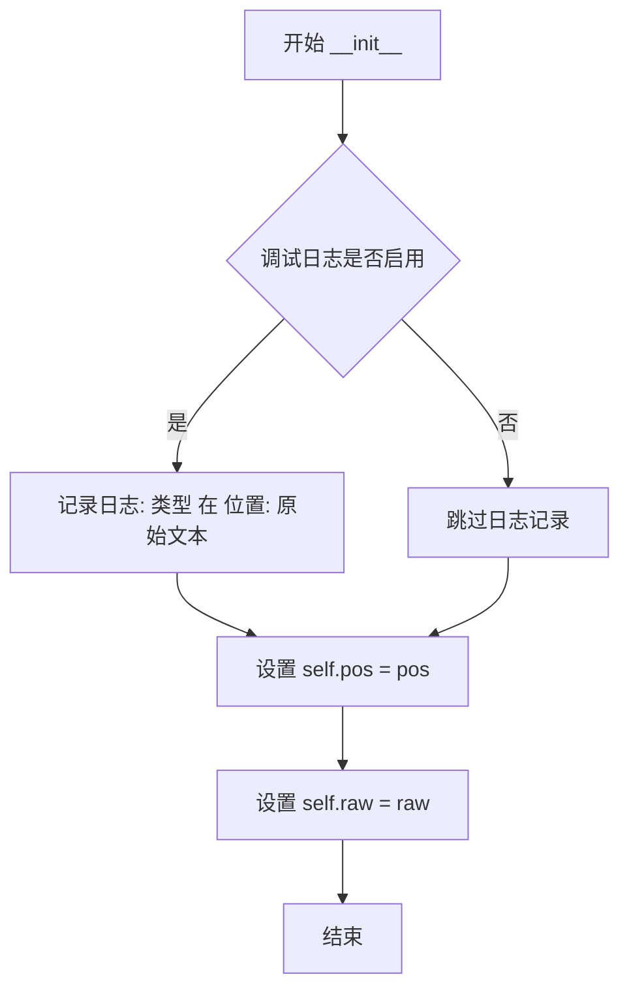

#### 带注释源码

```python
def __init__(self, pos, raw):
    """
    初始化 _Token 实例。

    Parameters
    ----------
    pos : int
        Position, i.e. offset from the beginning of the data.
    raw : str
        Raw text of the token.
    """
    # 记录调试日志，包含令牌的类型、位置和原始文本
    # self.kind 是类属性，由子类重写以区分不同类型的令牌
    _log.debug('type1font._Token %s at %d: %r', self.kind, pos, raw)
    
    # 将位置信息存储为实例属性，用于追踪令牌在原始数据中的位置
    self.pos = pos
    
    # 将原始文本存储为实例属性，这是令牌的核心数据
    self.raw = raw
```


### `_Token.__str__`

该方法返回令牌的字符串表示形式，包含令牌类型、原始文本和位置信息，主要用于调试和测试目的。

参数：无（`self` 为隐含参数，不计入）

返回值：`str`，返回令牌的字符串表示，格式为 `"<kind raw @pos>"`，其中 `kind` 是令牌类型，`raw` 是原始文本，`pos` 是位置偏移。

#### 流程图

```mermaid
flowchart TD
    A[开始 __str__] --> B[获取 self.kind 属性]
    B --> C[获取 self.raw 属性]
    C --> D[获取 self.pos 属性]
    D --> E[格式化字符串: f"<{self.kind} {self.raw} @{self.pos}>"]
    E --> F[返回格式化后的字符串]
```

#### 带注释源码

```python
def __str__(self):
    """
    返回令牌的字符串表示形式。

    Returns
    -------
    str
        令牌的字符串表示，格式为 "<kind raw @pos>"，其中：
        - kind: 令牌类型（类属性，如 'name', 'keyword', 'number' 等）
        - raw: 令牌的原始文本
        - pos: 令牌在数据流中的位置偏移
    """
    return f"<{self.kind} {self.raw} @{self.pos}>"
```


### `_Token.endpos`

该方法用于计算 PostScript 流中 Token 的结束位置，即返回从数据开头到该 Token 结束位置后一个字符的偏移量。

参数：
- （无参数，除隐含的 `self`）

返回值：`int`，返回 Token 结束位置（`self.pos + len(self.raw)`），即该 Token 在数据流中的结束偏移量。

#### 流程图

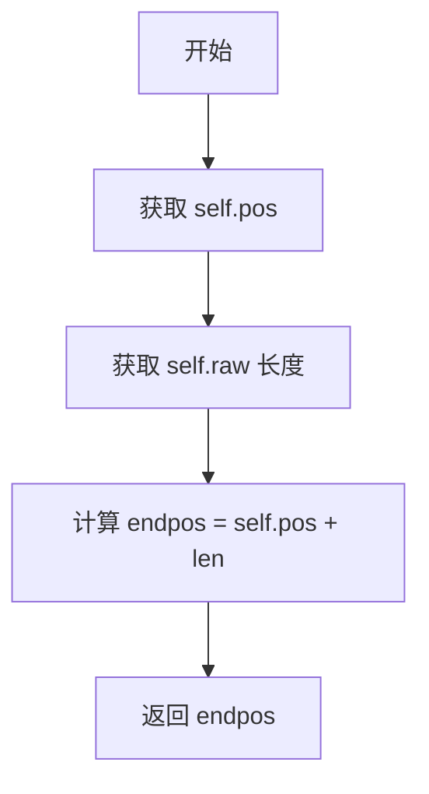

#### 带注释源码

```python
def endpos(self):
    """Position one past the end of the token"""
    return self.pos + len(self.raw)
```


### `_Token.is_keyword`

判断当前令牌是否为关键字令牌，并且其原始文本是否在给定的名称列表中。

参数：

- `names`：`Any`，可变数量的位置参数，表示要匹配的关键字名称列表

返回值：`bool`，如果当前令牌是关键字令牌且其原始文本在 names 中，则返回 `True`；否则返回 `False`

#### 流程图

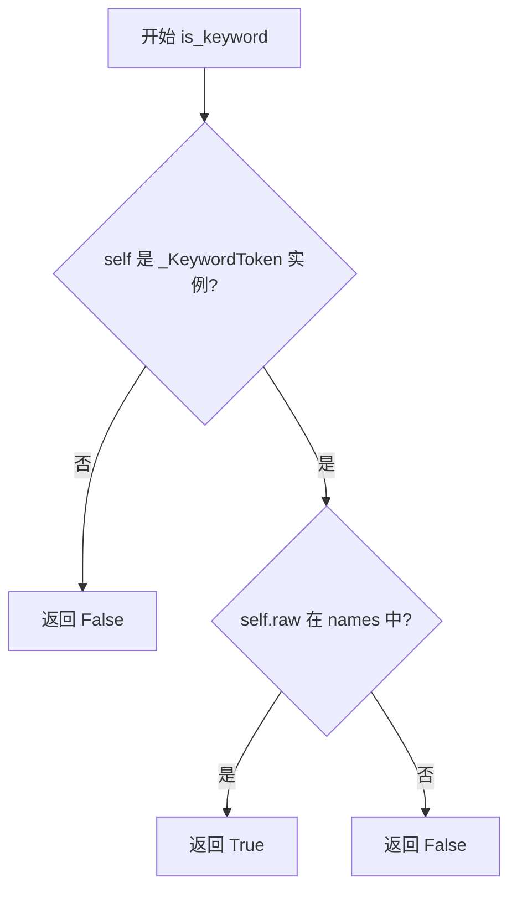

#### 带注释源码

```python
class _Token:
    """
    A token in a PostScript stream.
    ...
    """
    __slots__ = ('pos', 'raw')
    kind = '?'

    def __init__(self, pos, raw):
        """初始化 Token"""
        _log.debug('type1font._Token %s at %d: %r', self.kind, pos, raw)
        self.pos = pos
        self.raw = raw

    def is_keyword(self, *names):
        """
        判断当前令牌是否为关键字令牌，并匹配给定名称。
        
        参数:
            *names: 可变数量的位置参数，要匹配的关键字名称列表
        
        返回:
            bool: 如果此令牌是具有给定名称之一的关键字令牌，返回 True；否则返回 False
        
        注意:
            基类默认返回 False，子类 _KeywordToken 会重写此方法实现真正的匹配逻辑
        """
        # 默认实现：基类 _Token 不是关键字令牌，返回 False
        # 子类 _KeywordToken 会重写此方法
        return False
```


### `_Token.is_slash_name`

该方法用于判断当前 Token 是否为以斜杠（`/`）开头的名称 token（即 PostScript 中的名称类型 token）。在基类 `_Token` 中默认返回 `False`，在子类 `_NameToken` 中被重写为实际检查 `raw` 属性是否以 `/` 开头。

参数： 无

返回值： `bool`，如果是名称 token 且以斜杠开头则返回 `True`，否则返回 `False`

#### 流程图

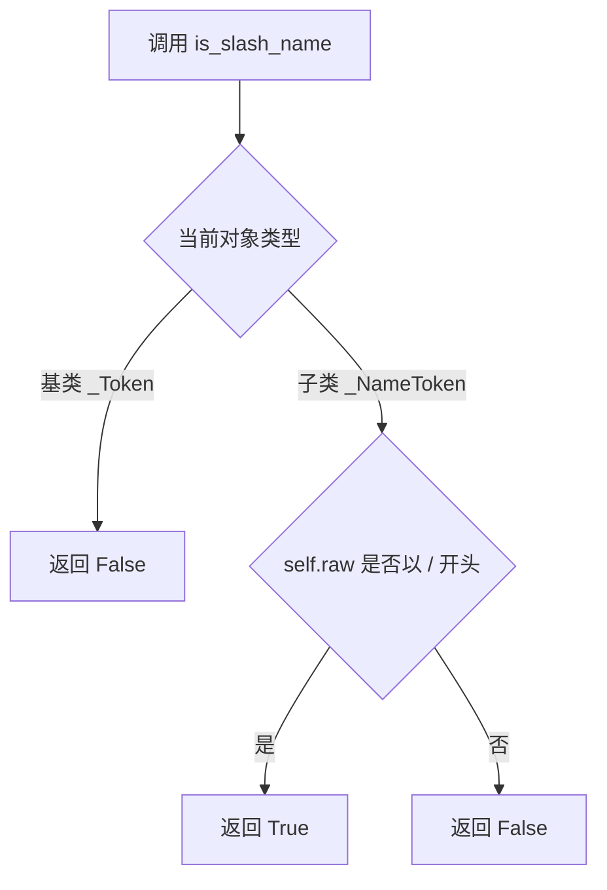

#### 带注释源码

```python
class _Token:
    """
    A token in a PostScript stream.
    ...
    """
    __slots__ = ('pos', 'raw')
    kind = '?'

    def __init__(self, pos, raw):
        _log.debug('type1font._Token %s at %d: %r', self.kind, pos, raw)
        self.pos = pos
        self.raw = raw

    # ... 其他方法 ...

    def is_slash_name(self):
        """Is this a name token that starts with a slash?"""
        return False  # 基类默认返回 False，表示普通 token 不是斜杠名称

    # ... 其他方法 ...


class _NameToken(_Token):
    """表示 PostScript 名称 token 的子类"""
    kind = 'name'

    def is_slash_name(self):
        # 检查 raw 属性是否以 '/' 开头
        # 在 PostScript 中，以 '/' 开头的 token 表示名称字面量
        return self.raw.startswith('/')

    def value(self):
        # 返回去掉开头的 '/' 后的名称
        return self.raw[1:]
```


### `_Token.is_delim()`

该方法用于判断当前 Token 对象是否为分隔符（delimiter）Token。在 PostScript 语言中，分隔符包括方括号 `[]`、大括号 `{}`、双尖括号 `<<>>` 等。此方法是多态设计的一部分，基类 `_Token` 默认返回 `False`，而子类 `_DelimiterToken` 重写该方法返回 `True`。

参数：なし（无参数）

返回值：`bool`，返回 `True` 表示当前 Token 是分隔符类型，返回 `False` 表示不是分隔符。

#### 流程图

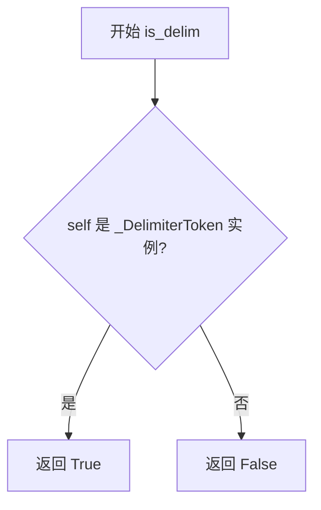

#### 带注释源码

```python
def is_delim(self):
    """
    Is this a delimiter token?
    
    在 PostScript 中，分隔符包括：
    - 方括号：[, ]
    - 大括号：{, }
    - 双尖括号：<<, >>
    
    此方法用于词法分析阶段识别分隔符，
    以便正确解析平衡表达式和嵌套结构。
    
    Returns
    -------
    bool
        默认返回 False，表示当前 Token 不是分隔符。
        子类 _DelimiterToken 会重写此方法返回 True。
    """
    return False
```

> **备注**：该方法在 `_DelimiterToken` 子类中被重写为 `return True`。实际调用时，多态机制会根据对象的实际类型返回相应的布尔值。调用方可以通过此方法快速判断 Token 是否为分隔符，无需检查具体的 Token 类型。


### `_Token.is_number`

该方法是 `_Token` 基类的成员方法，用于判断当前解析的 PostScript 流标记（Token）是否为数字类型。基类实现中默认返回 `False`，具体的数值识别逻辑由子类 `_NumberToken` 实现。

参数：

- `self`：`_Token`，表示当前 Token 对象实例。

返回值：`bool`，默认返回 `False`，表示该 Token 不是数字。

#### 流程图

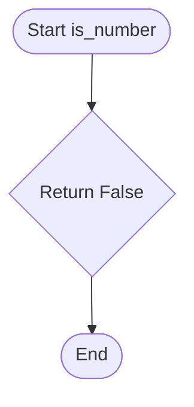

#### 带注释源码

```python
class _Token:
    # ... (类的其他属性和方法)

    def is_number(self):
        """Is this a number token?"""
        # 基类默认返回 False，由子类 _NumberToken 重写为 True
        return False
```


### `_Token.value()`

返回令牌的原始文本值。对于基类 `_Token`，直接返回 `self.raw`；子类通常会覆盖此方法以返回解析后的值（如名称去掉斜杠、布尔值转换为 Python 布尔类型、数字转换为 int/float 等）。

参数： 无

返回值： `str`，令牌的原始文本内容

#### 流程图

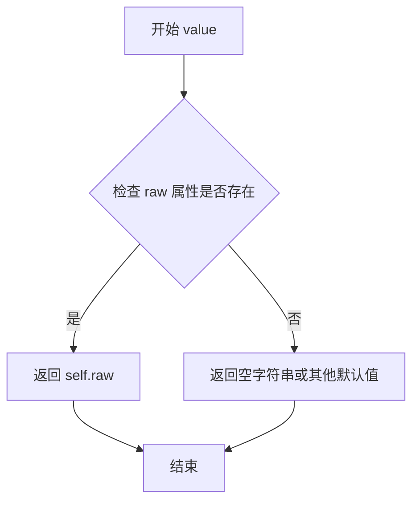

#### 带注释源码

```python
def value(self):
    """
    返回令牌的原始文本值。

    这是基类 _Token 的默认实现，直接返回 self.raw。
    子类通常会覆盖此方法以返回解析后的值：
    - _NameToken: 返回去掉前导斜杠的名称
    - _BooleanToken: 返回 Python 布尔值
    - _StringToken: 返回解码后的字符串
    - _BinaryToken: 返回二进制数据
    - _NumberToken: 返回 int 或 float

    Returns
    -------
    str
        令牌的原始文本内容
    """
    return self.raw
```


### `_NameToken.is_slash_name`

检查 `_NameToken` 实例是否表示一个 PostScript 名称 token（即以斜杠 `/` 开头的名称）。

参数：

- `self`：`_NameToken`，类的实例本身，无需显式传递

返回值：`bool`，如果该名称 token 的原始文本以斜杠（`/`）开头则返回 `True`，否则返回 `False`

#### 流程图

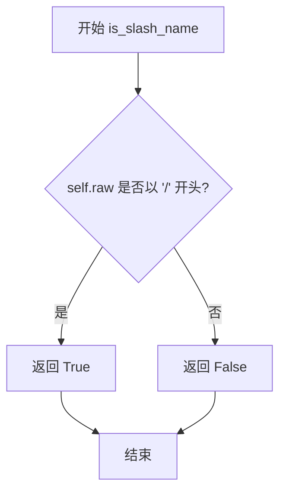

#### 带注释源码

```python
def is_slash_name(self):
    """
    Is this a name token that starts with a slash?

    In PostScript, names that start with a forward slash (/) are
    literal names. This method checks whether the current token
    represents such a literal name.

    Returns
    -------
    bool
        True if the name token starts with '/', False otherwise.
    """
    return self.raw.startswith('/')
```


### `_NameToken.value()`

返回PostScript名称令牌的值，即去掉前导斜杠后的名称字符串。

参数：
- 无

返回值：`str`，返回名称令牌的值，去掉前导的斜杠字符（例如 `/Helvetica` 返回 `Helvetica`）。

#### 流程图

```mermaid
flowchart TD
    A[开始] --> B[获取 self.raw 的值]
    B --> C[使用切片 self.raw[1:] 去掉第一个字符]
    C --> D[返回处理后的字符串]
    D --> E[结束]
```

#### 带注释源码

```python
def value(self):
    """
    返回PostScript名称令牌的值。
    
    在PostScript中，名称令牌以斜杠开头（如 /Helvetica），
    此方法去除前导斜杠并返回纯名称字符串。
    """
    return self.raw[1:]  # 切片操作，去掉第一个字符（斜杠），返回剩余部分
```


### `_BooleanToken.value()`

该方法返回该 BooleanToken 所表示的布尔值，如果原始文本是 "true" 则返回 True，否则返回 False。

参数：
- 该方法无显式参数（隐式参数 `self` 为 `_BooleanToken` 实例）

返回值：`bool`，返回该 token 所表示的布尔值，即当 `raw` 属性等于字符串 "true" 时返回 True，否则返回 False。

#### 流程图

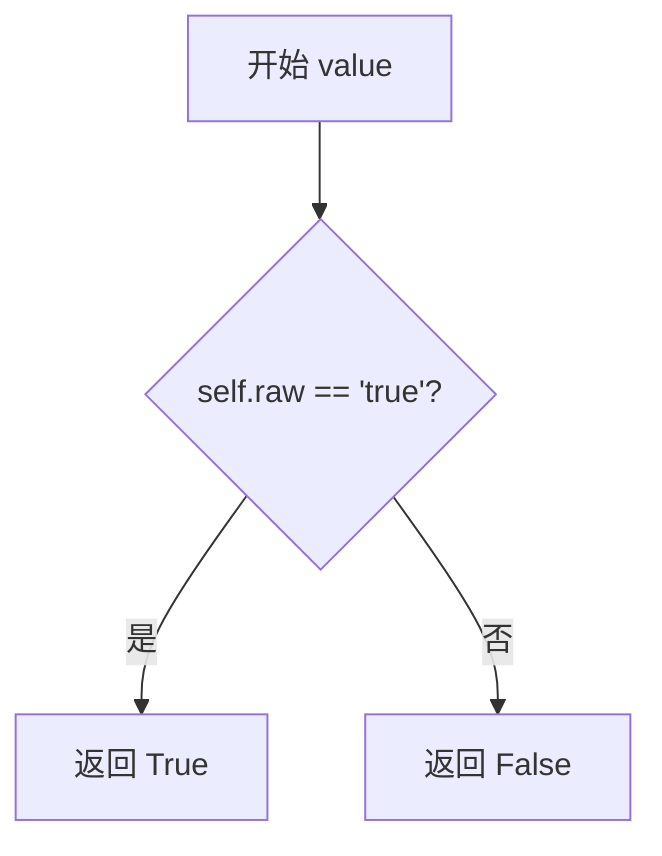

#### 带注释源码

```python
class _BooleanToken(_Token):
    """表示 PostScript 流中的布尔值 token"""
    kind = 'boolean'  # token 类型标识

    def value(self):
        """
        返回该布尔 token 所代表的 Python 布尔值。

        在 PostScript 中，布尔值只有两种字面量：'true' 和 'false'。
        此方法将 PostScript 的布尔值字面量转换为 Python 的 True 或 False。

        Returns
        -------
        bool
            如果 raw 属性等于 'true'，返回 True；否则返回 False。
        """
        return self.raw == 'true'
```


### `_KeywordToken.is_keyword`

检查此关键字标记是否与给定的关键字名称列表中的任意一个匹配。

参数：

- `*names`：`str`，可变数量的关键字名称，用于与该标记的原始文本进行匹配

返回值：`bool`，如果标记的原始文本 (`self.raw`) 在提供的名称列表中则返回 `True`，否则返回 `False`

#### 流程图

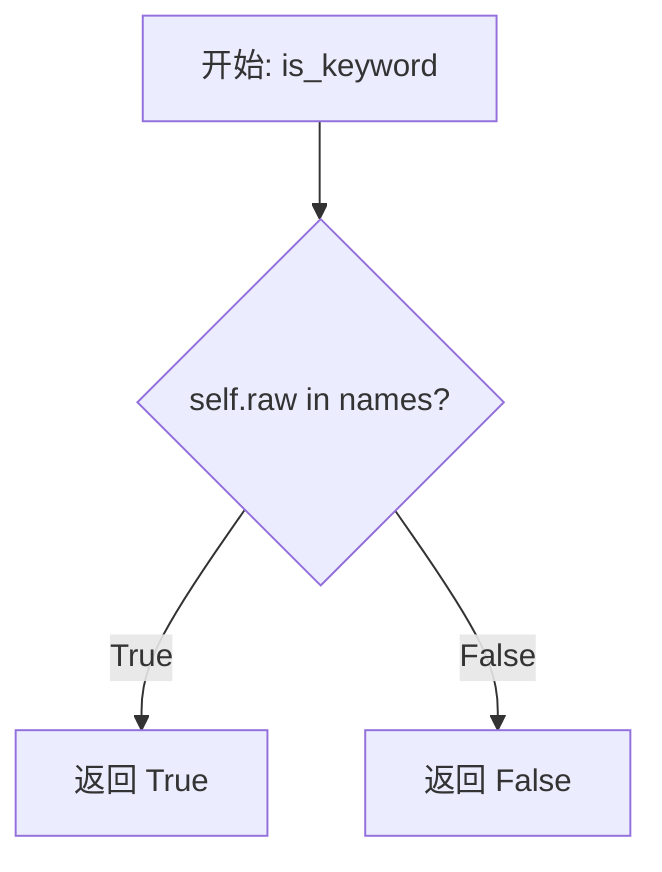

#### 带注释源码

```python
class _KeywordToken(_Token):
    """
    用于表示 PostScript 流中的关键字标记。
    关键字是指令或操作符的名称，如 'def', 'readonly', 'eexec' 等。
    """
    kind = 'keyword'  # 类属性，标识此令牌类型为关键字

    def is_keyword(self, *names):
        """
        检查此关键字标记是否匹配任意一个给定的关键字名称。

        Parameters
        ----------
        *names : str
            可变数量的关键字名称参数。例如：is_keyword('def', 'ND', 'NP')

        Returns
        -------
        bool
            如果 self.raw (标记的原始文本) 存在于 names 元组中则返回 True，
            否则返回 False。

        Examples
        --------
        >>> token = _KeywordToken(0, 'def')
        >>> token.is_keyword('def', 'ND')
        True
        >>> token.is_keyword('begin', 'end')
        False
        """
        return self.raw in names
```


### `_DelimiterToken.is_delim()`

该方法用于判断当前 Token 是否为分隔符（delimiter）类型。在 `_DelimiterToken` 类中，该方法始终返回 `True`，因为该类本身就是用于表示 PostScript 中的分隔符 token（如方括号 `[]`、大括号 `{}`、双尖括号 `<<>>` 等）。

参数：
- 无

返回值：`bool`，返回 `True`，表示该 token 是分隔符类型。

#### 流程图

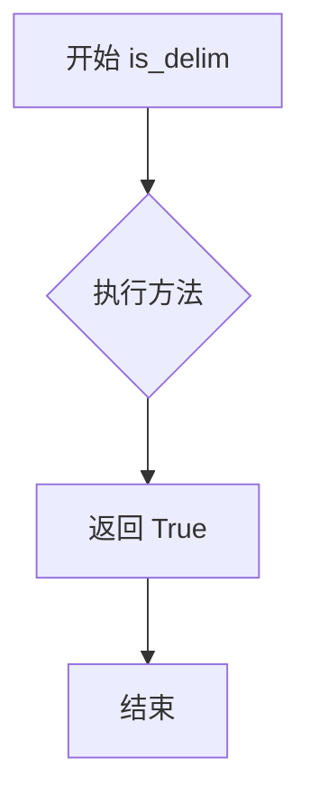

#### 带注释源码

```python
class _DelimiterToken(_Token):
    """
    分隔符 token 类，继承自 _Token。
    用于表示 PostScript 中的分隔符，例如：[]、{}、<<>> 等。
    """
    kind = 'delimiter'  # token 类型标识

    def is_delim(self):
        """
        判断当前 token 是否为分隔符。

        在 _DelimiterToken 类中，该方法始终返回 True，
        因为该类的实例本身就是分隔符。

        Returns
        -------
        bool
            始终返回 True，表示这是一个分隔符 token。
        """
        return True

    def opposite(self):
        """
        获取当前分隔符的配对分隔符。

        例如 '[' 的配对是 ']'，'{' 的配对是 '}'。

        Returns
        -------
        str
            配对的分隔符字符。
        """
        return {'[': ']', ']': '[',
                '{': '}', '}': '{',
                '<<': '>>', '>>': '<<'
                }[self.raw]
```


### `_DelimiterToken.opposite`

该方法用于获取当前分隔符标记的配对分隔符，是 PostScript 语法解析中的辅助方法，用于匹配括号或大括号等配对符号。

参数： 无

返回值：`str`，返回当前分隔符对应的配对分隔符（如 `[` 返回 `]`，`<<` 返回 `>>` 等）

#### 流程图

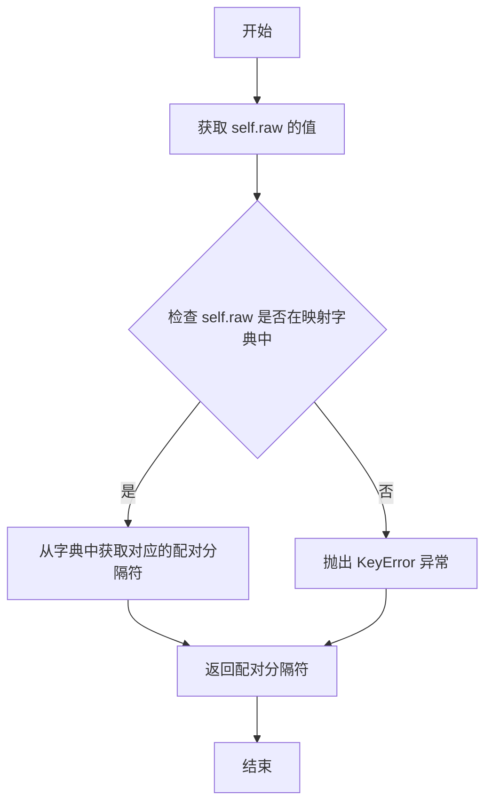

#### 带注释源码

```python
def opposite(self):
    """
    返回当前分隔符标记的配对分隔符。
    
    该方法定义了一个静态映射字典，包含了 PostScript 中常用的配对分隔符：
    - 方括号: [ 和 ]
    - 大括号: { 和 }
    - 双尖括号: << 和 >>
    
    Returns
    -------
    str
        当前分隔符的配对分隔符。例如，如果 self.raw 是 '['，则返回 ']'。
    
    Raises
    ------
    KeyError
        如果 self.raw 不在预定义的分隔符映射中时抛出。
    """
    # 定义分隔符与其配对的映射关系
    return {'[': ']', ']': '[',
            '{': '}', '}': '{',
            '<<': '>>', '>>': '<<'
            }[self.raw]
```


### `_StringToken.value`

该方法用于将 PostScript 字符串标记解析为实际的 Python 值，支持两种格式：括号字符串（使用转义序列）和十六进制字符串（使用 Hex 编码）。

参数：

- `self`：`_StringToken`，当前字符串标记实例，无显式参数描述

返回值：`str | bytes`，如果是括号字符串则返回解析后的字符串（处理了转义序列），如果是十六进制字符串则返回解码后的字节数据

#### 流程图

```mermaid
flowchart TD
    A[开始 value] --> B{self.raw[0] == '('?}
    B -->|是| C[提取括号内容 self.raw[1:-1]]
    C --> D[使用 _escapes_re 替换转义序列]
    D --> E[调用 _escape 回调处理每个匹配]
    E --> F[返回解析后的字符串]
    B -->|否| G[提取十六进制内容 self.raw[1:-1]]
    G --> H[去除空白字符 _ws_re.sub]
    H --> I{len(data) % 2 == 1?}
    I -->|是| J[补齐一个 '0' 使长度为偶数]
    I -->|否| K[直接返回]
    J --> K
    K --> L[binascii.unhexlify 解码十六进制]
    L --> M[返回解码后的 bytes]
```

#### 带注释源码

```python
@functools.lru_cache
def value(self):
    """
    返回字符串标记的解析值。

    如果原始字符串以 '(' 开头，则将其视为括号字符串，
    并处理其中的转义序列（\\, \n, \r, \t, \b, \f, \ooo 等）。

    否则，将其视为十六进制字符串，并将其解码为字节数据。
    """
    # 判断字符串类型：括号字符串 vs 十六进制字符串
    if self.raw[0] == '(':
        # 括号字符串：提取内容并处理转义序列
        # 示例：'(Hello\\nWorld)' -> 'Hello\nWorld'
        return self._escapes_re.sub(self._escape, self.raw[1:-1])
    else:
        # 十六进制字符串：提取内容并去除空白
        # 示例：'<0A 1F>' -> '0A1F'
        data = self._ws_re.sub('', self.raw[1:-1])
        # 确保十六进制数据长度为偶数
        if len(data) % 2 == 1:
            data += '0'
        # 十六进制解码为字节
        return binascii.unhexlify(data)
```


### `_StringToken._escape`

该方法是一个类方法，用于将 PostScript 字符串中的转义序列（如 `\n`、`\r`、`\t` 或八进制 `\123`）转换为对应的实际字符。它在解析 Type-1 字体文件时处理字符串标记的转义处理。

参数：

- `match`：`re.Match`，正则表达式匹配到的转义序列对象

返回值：`str`，转换后的实际字符

#### 流程图

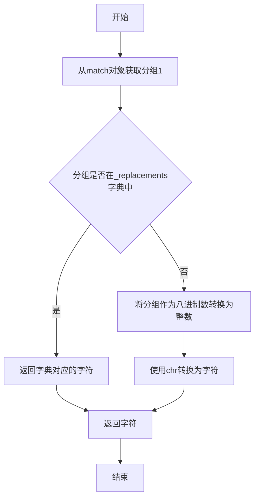

#### 带注释源码

```python
@classmethod
def _escape(cls, match):
    """
    处理PostScript字符串中的转义序列并转换为实际字符。
    
    Parameters
    ----------
    match : re.Match
        正则表达式匹配到的转义序列，格式为 \\X 或 \\OOO，
        其中 X 是特殊字符（\\, (, ), n, r, t, b, f），
        OOO 是1-3位八进制数。
    
    Returns
    -------
    str
        转换后的实际字符。
    """
    # 获取匹配组中的转义字符（如 'n', '123' 等）
    group = match.group(1)
    try:
        # 尝试在预定义替换表中查找对应的字符
        # 支持的转义：\\ \ ( ) n r t b f
        return cls._replacements[group]
    except KeyError:
        # 如果不在预定义表中，则视为八进制数
        # 将八进制字符串转换为整数，再转换为字符
        return chr(int(group, 8))
```


### `_BinaryToken.value()`

该方法返回二进制标记的原始文本内容，去掉第一个字符（通常是表示二进制数据开始的 `<` 符号）。在 Type-1 字体解析过程中，二进制标记用于表示十六进制编码的二进制数据，如字符字符串和子程序。

参数：

- （无参数）

返回值：`str`，返回去掉第一个字符后的原始文本内容（即实际的二进制数据文本表示）

#### 流程图

```mermaid
flowchart TD
    A[开始 value 方法] --> B{检查 raw 属性}
    B --> C[返回 self.raw[1:]]
    C --> D[结束, 返回去掉首字符的字符串]
    
    style A fill:#f9f,stroke:#333
    style D fill:#9f9,stroke:#333
```

#### 带注释源码

```python
class _BinaryToken(_Token):
    """
    二进制标记类，继承自 _Token。
    用于表示 PostScript 流中的二进制数据标记。
    
    Attributes
    ----------
    kind : str
        标记类型描述，固定为 'binary'。
    """
    kind = 'binary'

    def value(self):
        """
        获取二进制标记的实际值。
        
        在 Type-1 字体中，二进制数据通常以 '<' 开头，
        如 '<ABCDEF>' 表示十六进制编码的二进制数据。
        此方法返回去掉开头 '<' 后的实际数据部分。
        
        Returns
        -------
        str
            去掉第一个字符后的原始文本内容。
            例如：'<ABCDEF>' -> 'ABCDEF>'
        """
        return self.raw[1:]
```


### `_NumberToken.is_number`

该方法用于判断当前 Token 对象是否为数字类型。由于 `_NumberToken` 类代表数字类型的 Token，因此该方法返回 `True`。

参数： 无

返回值：`bool`，返回 `True`，表示当前 Token 是数字类型。

#### 流程图

```mermaid
flowchart TD
    A[开始 is_number] --> B{被调用}
    B --> C[返回 True]
    C --> D[结束]
```

#### 带注释源码

```python
class _NumberToken(_Token):
    """表示数字类型的 Token"""
    kind = 'number'  # Token 的类型标识

    def is_number(self):
        """
        判断当前 Token 是否为数字类型。

        由于 _NumberToken 类本身就是为了表示数字而设计的，
        因此该方法始终返回 True，表示这是一个数字 token。
        这是对父类 _Token 中 is_number 方法的覆盖。

        Returns
        -------
        bool
            始终返回 True，表示该 Token 是数字类型。
        """
        return True

    def value(self):
        """
        获取 Token 对应的数值。

        根据 Token 文本是否包含小数点，决定返回整数还是浮点数。

        Returns
        -------
        int or float
            Token 文本对应的数值。
        """
        if '.' not in self.raw:
            return int(self.raw)
        else:
            return float(self.raw)
```


### `_NumberToken.value()`

该方法用于将 PostScript 数字标记的原始文本转换为 Python 的数值类型（int 或 float），根据原始字符串是否包含小数点来决定转换为何种类型。

参数：该方法无显式参数（隐式参数 `self` 表示实例本身）

返回值：`int` 或 `float`，返回转换后的数值。如果原始字符串不包含小数点（`.`），则返回整数；否则返回浮点数。

#### 流程图

```mermaid
flowchart TD
    A[开始 value 方法] --> B{self.raw 中是否包含 '.'?}
    B -- 是 --> C[返回 float(self.raw)]
    B -- 否 --> D[返回 int(self.raw)]
    C --> E[结束]
    D --> E
```

#### 带注释源码

```python
def value(self):
    """
    返回数字标记的数值。
    
    如果原始字符串不包含小数点，则转换为整数；
    否则转换为浮点数。
    
    Returns
    -------
    int or float
        转换后的数值。
    """
    # 检查原始字符串中是否包含小数点
    if '.' not in self.raw:
        # 无小数点，返回整数类型
        return int(self.raw)
    else:
        # 包含小数点，返回浮点数类型
        return float(self.raw)
```


### `Type1Font.__init__`

初始化一个 Type1Font 对象，接受文件路径或预解析的 3 元组作为输入，读取并解析 Type 1 字体文件。

参数：

- `input`：`str or 3-tuple`，pfb 文件路径或已解码的 Type 1 字体三部分元组

返回值：`None`，构造函数无返回值

#### 流程图

```mermaid
flowchart TD
    A[开始 __init__] --> B{input 是 3 元组?}
    B -->|是| C[直接赋值 self.parts = input]
    B -->|否| D[打开文件]
    D --> E[调用 self._read(file) 读取数据]
    E --> F[调用 self._split(data) 分割数据]
    C --> G[调用 self._decrypt 解密加密部分]
    F --> G
    G --> H[初始化 self._abbr 缩写映射]
    H --> I[调用 self._parse 解析字体属性]
    I --> J[结束]
    
    style A fill:#f9f,stroke:#333
    style J fill:#9f9,stroke:#333
```

#### 带注释源码

```python
def __init__(self, input):
    """
    Initialize a Type-1 font.

    Parameters
    ----------
    input : str or 3-tuple
        Either a pfb file name, or a 3-tuple of already-decoded Type-1
        font `~.Type1Font.parts`.
    """
    # 判断输入是已解码的 3 元组还是文件路径
    if isinstance(input, tuple) and len(input) == 3:
        # 如果是 3 元组，直接赋值给 parts 属性
        # 元组包含: (明文部分, 加密部分, 结尾部分)
        self.parts = input
    else:
        # 如果是文件路径，打开文件并读取
        with open(input, 'rb') as file:
            # 读取文件内容，处理 pfb/pfa 格式
            data = self._read(file)
        # 将原始数据分割为三个部分
        self.parts = self._split(data)

    # 使用 eexec 密钥解密加密的字体部分
    self.decrypted = self._decrypt(self.parts[1], 'eexec')
    
    # 初始化标准缩写映射，用于解析字体
    # RD: 读取二进制数据
    # ND: 定义（noaccess def）
    # NP: 放置（noaccess put）
    self._abbr = {'RD': 'RD', 'ND': 'ND', 'NP': 'NP'}
    
    # 解析字体属性，如 FontName、Encoding、CharStrings、Subrs 等
    self._parse()
```


### Type1Font._read

该方法用于从文件对象中读取Type 1字体数据，支持PFB（Printer Font Binary）和PFA（Printer Font ASCII）格式，并将其解码为可用的字体部分。

参数：

- `file`：`file object`，打开的字体文件对象，用于读取原始字节数据

返回值：`bytes`，解码后的字体数据。如果是PFA格式（不以`\x80`开头），直接返回原始数据；如果是PFB格式，则返回处理后的数据

#### 流程图

```mermaid
flowchart TD
    A[开始: 读取file对象] --> B{检查是否以\x80开头}
    B -->|否| C[返回原始rawdata<br/>PFA格式]
    B -->|是| D[初始化空data]
    D --> E{while rawdata}
    E -->|条件为真| F{检查是否以\x80开头}
    F -->|否| G[抛出RuntimeError<br/>Broken pfb file]
    F -->|是| H[获取type字段<br/>type = rawdata[1]]
    H --> I{type in (1, 2)}
    I -->|是| J[读取长度和Segment]
    I -->|否| K{type == 3}
    K -->|是| L[跳出循环<br/>EOF]
    K -->|否| M[抛出RuntimeError<br/>Unknown segment type]
    J --> N{type == 1?}
    N -->|是| O[data += segment<br/>ASCII文本- verbatim]
    N -->|否| P{data == 2?}
    P -->|是| Q[data += hexlify(segment)<br/>二进制- 转为十六进制]
    O --> R[更新rawdata]
    Q --> R
    L --> S[返回data]
    R --> E
    E -->|为假| S
```

#### 带注释源码

```python
def _read(self, file):
    """
    Read the font from a file, decoding into usable parts.

    Parameters
    ----------
    file : file object
        An open file object to read the font data from.

    Returns
    -------
    bytes
        The decoded font data. For PFA files (not starting with \\x80),
        returns raw data directly. For PFB files, processes segments and
        returns combined data.
    """
    # 读取文件的全部原始数据
    rawdata = file.read()

    # 检查是否为PFA格式（PFA不以\x80开头）
    # PFA是ASCII格式的PostScript字体
    if not rawdata.startswith(b'\x80'):
        # 直接返回原始数据，无需处理
        return rawdata

    # PFB格式处理：PFB是二进制格式，使用\x80作为分段标记
    # 初始化结果数据容器
    data = b''

    # 循环处理所有PFB段
    while rawdata:
        # PFB文件格式：\x80 + type(1字节) + length(4字节小端序) + data
        # type: 1=ASCII, 2=二进制, 3=EOF
        if not rawdata.startswith(b'\x80'):
            raise RuntimeError('Broken pfb file (expected byte 128, '
                               'got %d)' % rawdata[0])

        # 获取段类型（第2个字节，索引1）
        type = rawdata[1]

        # 类型1或2包含实际数据，需要读取长度和数据
        if type in (1, 2):
            # 读取4字节小端序整数作为数据长度
            length, = struct.unpack('<i', rawdata[2:6])
            # 提取数据段（从第6字节开始，长度为length）
            segment = rawdata[6:6 + length]
            # 更新剩余数据（跳过已处理的部分）
            rawdata = rawdata[6 + length:]

        # 根据类型处理数据
        if type == 1:
            # ASCII文本段：直接追加原始数据
            # 保持为ASCII格式（用于明文部分）
            data += segment
        elif type == 2:
            # 二进制数据段：需要转换为十六进制编码
            # 这是Type 1字体加密部分的格式要求
            data += binascii.hexlify(segment)
        elif type == 3:
            # 文件结束标记：退出循环
            break
        else:
            # 未知段类型：抛出错误
            raise RuntimeError('Unknown segment type %d in pfb file' % type)

    # 返回处理后的完整数据
    return data
```


### Type1Font._split

该方法用于将Type 1字体数据分割成三个主要部分：清除文本部分（以eexec操作符结束）、加密部分和固定部分（包含512个ASCII零和cleartomark操作符）。

参数：

- `self`：Type1Font实例，当前字体对象
- `data`：`bytes`，原始的字体数据（可以是PFA或PFB格式读取后的数据）

返回值：`tuple[bytes, bytes, bytes]`，包含三个部分的元组：
  - 第一部分：清除文本部分（从开始到eexec操作符之后）
  - 第二部分：加密部分（转换为二进制格式）
  - 第三部分：固定部分（从最后一个零之后到数据末尾）

#### 流程图

```mermaid
flowchart TD
    A[开始 _split] --> B[在data中查找b'eexec'的位置]
    B --> C[跳过eexec后的空白字符确定len1]
    C --> D[从后向前查找b'cleartomark'的位置]
    D --> E[从该位置向前计数512个零]
    E --> F{零计数完成?}
    F -->|否| G[记录警告信息-零不足]
    F -->|是| H[计算加密部分的索引idx1]
    H --> I[确保索引对齐为偶数字节]
    I --> J[将加密部分从十六进制转换为二进制]
    J --> K[返回三部分数据: data[:len1], binary, data[idx+1:]]
```

#### 带注释源码

```python
def _split(self, data):
    """
    Split the Type 1 font into its three main parts.

    The three parts are: (1) the cleartext part, which ends in a
    eexec operator; (2) the encrypted part; (3) the fixed part,
    which contains 512 ASCII zeros possibly divided on various
    lines, a cleartomark operator, and possibly something else.
    """

    # Cleartext part: just find the eexec and skip whitespace
    # 步骤1：查找eexec操作符的位置
    idx = data.index(b'eexec')
    # 移动到eexec之后的位置
    idx += len(b'eexec')
    # 跳过空白字符（空格、Tab、回车、换行）
    while data[idx] in b' \t\r\n':
        idx += 1
    # len1记录清除文本部分的长度
    len1 = idx

    # Encrypted part: find the cleartomark operator and count
    # zeros backward
    # 步骤2：从后向前查找cleartomark操作符
    idx = data.rindex(b'cleartomark') - 1
    # 初始化零计数器为512
    zeros = 512
    # 向后计数512个零字符（可能跨多行）
    while zeros and data[idx] in b'0' or data[idx] in b'\r\n':
        if data[idx] in b'0':
            zeros -= 1
        idx -= 1
    # 如果零的数量不足，记录警告信息
    if zeros:
        # this may have been a problem on old implementations that
        # used the zeros as necessary padding
        _log.info('Insufficiently many zeros in Type 1 font')

    # Convert encrypted part to binary (if we read a pfb file, we may end
    # up converting binary to hexadecimal to binary again; but if we read
    # a pfa file, this part is already in hex, and I am not quite sure if
    # even the pfb format guarantees that it will be in binary).
    # 步骤3：计算加密部分的索引，确保字节数为偶数
    idx1 = len1 + ((idx - len1 + 2) & ~1)  # ensure an even number of bytes
    # 将加密部分从十六进制转换为二进制
    binary = binascii.unhexlify(data[len1:idx1])

    # 返回三部分：清除文本、加密的二进制数据、固定部分
    return data[:len1], binary, data[idx+1:]
```


### `Type1Font._decrypt`

该方法实现了 Type 1 字体格式的解密算法（又称 "eexec" 算法），用于解密字体文件中的加密部分（如加密的字符字符串和子程序）。该算法基于简单的流密码，使用固定的密钥和多项式运算来逐字节解密数据。

参数：

- `ciphertext`：`bytes`，要解密的密文字节数据
- `key`：`int | str`，解密密钥。可以是整数直接指定密钥值，或者字符串 `'eexec'`（对应密钥 55665，用于解密 eexec 部分）或 `'charstring'`（对应密钥 4330，用于解密 CharStrings 和 Subrs）
- `ndiscard`：`int`，默认值为 4，要从解密后的明文开头丢弃的字节数（用于跳过随机前缀）

返回值：`bytes`，解密并丢弃前 ndiscard 字节后的明文字节数据

#### 流程图

```mermaid
flowchart TD
    A[开始 _decrypt] --> B{key 是字符串?}
    B -->|是| C[根据 key 从映射表获取密钥<br/>eexec=55665<br/>charstring=4330]
    B -->|否| D[直接使用 key 作为密钥]
    C --> E[初始化空 plaintext 列表]
    D --> E
    E --> F[遍历 ciphertext 中的每个字节]
    F --> G[计算明文字节: byte XOR (key >> 8)]
    G --> H[更新密钥: key = (key + byte) * 52845 + 22719<br/>取模 0xFFFF]
    H --> I{ciphertext 遍历完毕?}
    I -->|否| F
    I -->|是| J[返回 plaintext[ndiscard:] 转换为 bytes]
    J --> K[结束]
```

#### 带注释源码

```python
@staticmethod
def _decrypt(ciphertext, key, ndiscard=4):
    """
    Decrypt ciphertext using the Type-1 font algorithm.

    The algorithm is described in Adobe's "Adobe Type 1 Font Format".
    The key argument can be an integer, or one of the strings
    'eexec' and 'charstring', which map to the key specified for the
    corresponding part of Type-1 fonts.

    The ndiscard argument should be an integer, usually 4.
    That number of bytes is discarded from the beginning of plaintext.
    """

    # 将字符串密钥映射为对应的整数值
    # 'eexec' 用于解密字体的主加密部分（密钥 55665）
    # 'charstring' 用于解密字符字符串和子程序（密钥 4330）
    key = _api.getitem_checked({'eexec': 55665, 'charstring': 4330}, key=key)
    
    # 初始化明文列表，用于存储解密后的字节
    plaintext = []
    
    # 遍历密文中的每个字节
    for byte in ciphertext:
        # 解密核心算法：
        # 1. 将密钥右移 8 位得到加密密钥的高字节
        # 2. 与当前密文字节进行异或操作得到明文字节
        plaintext.append(byte ^ (key >> 8))
        
        # 密钥更新算法（每次迭代后密钥发生变化）
        # 这是一个 16 位的线性反馈移位寄存器
        # 公式源自 Adobe Type 1 字体格式规范
        key = ((key+byte) * 52845 + 22719) & 0xffff

    # 返回解密后的明文，丢弃前 ndiscard 个字节
    # 通常 ndiscard=4 是为了跳过加密时的随机前缀
    return bytes(plaintext[ndiscard:])
```


### `Type1Font._encrypt`

使用 Type-1 字体算法对明文进行加密，返回加密后的密文字节。该算法是 Adobe Type 1 字体格式规范中定义的加密机制，常用于加密字体中的 eexec 部分和 CharString 部分。

参数：

- `plaintext`：`bytes`，要加密的明文字节数据
- `key`：`int | str`，加密密钥。可以是整数，也可以是字符串 `'eexec'` 或 `'charstring'`，分别对应 Type 1 字体中 eexec 部分（55665）和 charstring 部分（4330）的预设密钥
- `ndiscard`：`int`，默认值为 4。要在明文前预置的 NUL 字节数量，用于确保加密输出的可重复性

返回值：`bytes`，加密后的密文字节序列

#### 流程图

```mermaid
flowchart TD
    A[开始 _encrypt] --> B{解析 key 参数}
    B -->|key 为字符串| C[根据字符串映射获取密钥<br/>eexec: 55665<br/>charstring: 4330]
    B -->|key 为整数| D[直接使用整数作为密钥]
    C --> E[构造待加密数据<br/>NUL 字节 * ndiscard + plaintext]
    D --> E
    E --> F[初始化密钥变量]
    F --> G{遍历待加密数据的每个字节}
    G -->|还有字节| H[计算密文字节: byte XOR (key >> 8)]
    H --> I[更新密钥: (key + c) * 52845 + 22719 & 0xFFFF]
    I --> G
    G -->|遍历完成| J[将密文字节列表转换为字节对象]
    J --> K[返回加密结果]
```

#### 带注释源码

```python
@staticmethod
def _encrypt(plaintext, key, ndiscard=4):
    """
    使用 Type-1 字体算法对明文进行加密。

    该算法在 Adobe 的《Adobe Type 1 Font Format》中有详细描述。
    key 参数可以是整数，也可以是字符串 'eexec' 和 'charstring' 之一，
    它们分别映射到 Type-1 字体对应部分的指定密钥。

    ndiscard 参数应该是整数，通常为 4。该数量的字节会在加密前被预置到明文前面。
    此函数为了可重复性预置 NUL 字节，尽管原始算法使用随机字节（可能是为了避免密码分析）。

    参数:
        plaintext: 要加密的明文字节
        key: 加密密钥（整数或 'eexec'/'charstring' 字符串）
        ndiscard: 预置的 NUL 字节数量，默认为 4

    返回:
        加密后的密文字节
    """
    # 将字符串密钥映射到对应的整数值
    # eexec: 55665 用于加密字体的主加密部分
    # charstring: 4330 用于加密单个字符的 CharString
    key = _api.getitem_checked({'eexec': 55665, 'charstring': 4330}, key=key)
    
    # 初始化密文字节列表
    ciphertext = []
    
    # 在明文前添加 ndiscard 个 NUL 字节
    # 这增加了加密输出的可重复性，虽然原始算法使用随机字节
    for byte in b'\0' * ndiscard + plaintext:
        # Type-1 加密算法核心步骤 1: 异或操作
        # 将密钥的高字节与当前明文字节进行异或
        c = byte ^ (key >> 8)
        
        # 将计算出的密文字节添加到结果中
        ciphertext.append(c)
        
        # Type-1 加密算法核心步骤 2: 更新密钥
        # 使用加密后的字节更新密钥状态
        # 这是一个线性反馈移位寄存器（LCG）式的更新
        # 使用固定常数 52845 和 22719，以及 0xFFFF 掩码保持 16 位
        key = ((key + c) * 52845 + 22719) & 0xffff

    # 将密文字节列表转换为字节对象并返回
    return bytes(ciphertext)
```


### Type1Font._parse()

该方法用于解析Type1字体文件，提取各种字体属性（如FontName、Encoding、CharStrings、Subrs等），并对加密的CharStrings和Subrs进行解密处理。

参数：

- 无（仅包含self参数）

返回值：无（该方法为实例方法，通过修改实例属性self.prop和self._pos来返回结果）

#### 流程图

```mermaid
flowchart TD
    A[开始 _parse] --> B[初始化默认属性 prop]
    B --> C[初始化空字典 pos]
    C --> D[合并明文部分和解密数据]
    D --> E[创建token生成器]
    E --> F{获取下一个token}
    F -->|是分隔符| G[跳过表达式]
    G --> F
    F -->|是/name token| H[获取键名和位置]
    H --> I{键是否在特殊键列表}
    I -->|是 Subrs/CharStrings/Encoding/OtherSubrs| J[调用对应解析方法]
    J --> K[记录位置]
    K --> F
    I -->|否| L{获取下一个token}
    L --> M{是KeywordToken}
    M -->|是| F
    M -->|否| N{是分隔符}
    N -->|是| O[解析表达式值]
    N -->|否| P[获取token值]
    O --> Q
    P --> Q
    Q{查找def关键字} --> R[设置属性和位置]
    R --> S[检测标准缩写]
    S --> F
    F -->|遍历结束| T{检查FontName}
    T -->|不存在| U[从FullName或FamilyName获取]
    T -->|存在| V{检查FullName}
    V -->|不存在| W[从FontName复制]
    W --> X{检查FamilyName}
    X -->|不存在| Y[通过正则去除修饰符]
    Y --> Z[解析FontBBox]
    Z --> AA[获取lenIV参数]
    AA --> AB[解密CharStrings]
    AB --> AC{存在Subrs}
    AC -->|是| AD[解密Subrs]
    AC -->|否| AE[保存prop和pos]
    AD --> AE
    AE --> AF[结束]
```

#### 带注释源码

```python
def _parse(self):
    """
    Find the values of various font properties. This limited kind
    of parsing is described in Chapter 10 "Adobe Type Manager
    Compatibility" of the Type-1 spec.
    """
    # 1. 初始化默认属性值
    prop = {'Weight': 'Regular', 'ItalicAngle': 0.0, 'isFixedPitch': False,
            'UnderlinePosition': -100, 'UnderlineThickness': 50}
    # 2. 初始化位置字典，用于后续替换操作
    pos = {}
    # 3. 合并明文部分和解密后的数据
    data = self.parts[0] + self.decrypted

    # 4. 创建token生成器，skip_ws=True表示跳过空白字符
    source = _tokenize(data, True)
    while True:
        # 5. 尝试获取下一个token
        try:
            token = next(source)
        except StopIteration:
            break
        # 6. 如果是分隔符，跳过整个表达式（只处理顶层键值对）
        if token.is_delim():
            _expression(token, source, data)
        # 7. 检查是否是/name token（PostScript名称）
        if token.is_slash_name():
            key = token.value()
            keypos = token.pos
        else:
            continue

        # 8. 特殊键需要专门解析
        if key in ('Subrs', 'CharStrings', 'Encoding', 'OtherSubrs'):
            prop[key], endpos = {
                'Subrs': self._parse_subrs,
                'CharStrings': self._parse_charstrings,
                'Encoding': self._parse_encoding,
                'OtherSubrs': self._parse_othersubrs
            }[key](source, data)
            pos.setdefault(key, []).append((keypos, endpos))
            continue

        # 9. 获取值token
        try:
            token = next(source)
        except StopIteration:
            break

        # 10. 跳过某些关键字结构（如 FontDirectory /Helvetica known {...} {...} ifelse）
        if isinstance(token, _KeywordToken):
            continue

        # 11. 获取值：分隔符用表达式解析，其他直接取值
        if token.is_delim():
            value = _expression(token, source, data).raw
        else:
            value = token.value()

        # 12. 查找'def'关键字（可能带有访问修饰符）
        try:
            kw = next(
                kw for kw in source
                if not kw.is_keyword('readonly', 'noaccess', 'executeonly')
            )
        except StopIteration:
            break

        # 13. 如果找到def或缩写，设置属性值
        if kw.is_keyword('def', self._abbr['ND'], self._abbr['NP']):
            prop[key] = value
            pos.setdefault(key, []).append((keypos, kw.endpos()))

        # 14. 检测并记录标准缩写
        if value == '{noaccess def}':
            self._abbr['ND'] = key
        elif value == '{noaccess put}':
            self._abbr['NP'] = key
        elif value == '{string currentfile exch readstring pop}':
            self._abbr['RD'] = key

    # 15. 填充各种*Name属性
    if 'FontName' not in prop:
        prop['FontName'] = (prop.get('FullName') or
                            prop.get('FamilyName') or
                            'Unknown')
    if 'FullName' not in prop:
        prop['FullName'] = prop['FontName']
    if 'FamilyName' not in prop:
        extras = ('(?i)([ -](regular|plain|italic|oblique|(semi)?bold|'
                  '(ultra)?light|extra|condensed))+$')
        prop['FamilyName'] = re.sub(extras, '', prop['FullName'])

    # 16. 解析FontBBox（字体边界框）
    toks = [*_tokenize(prop['FontBBox'].encode('ascii'), True)]
    if ([tok.kind for tok in toks]
            != ['delimiter', 'number', 'number', 'number', 'number', 'delimiter']
            or toks[-1].raw != toks[0].opposite()):
        raise RuntimeError(
            f"FontBBox should be a size-4 array, was {prop['FontBBox']}")
    prop['FontBBox'] = [tok.value() for tok in toks[1:-1]]

    # 17. 解密加密的CharStrings和Subrs
    ndiscard = prop.get('lenIV', 4)
    cs = prop['CharStrings']
    for key, value in cs.items():
        cs[key] = self._decrypt(value, 'charstring', ndiscard)
    if 'Subrs' in prop:
        prop['Subrs'] = [
            self._decrypt(value, 'charstring', ndiscard)
            for value in prop['Subrs']
        ]

    # 18. 保存解析结果到实例属性
    self.prop = prop
    self._pos = pos
```


### `Type1Font._parse_subrs`

该方法用于解析 Type 1 字体中的 Subrs（子程序）数组，从 PostScript token 流中提取每个子程序的二进制数据，并返回解析后的子程序数组及结束位置。

参数：

- `self`：Type1Font 实例本身
- `tokens`：`_Token` 的生成器（generator），用于遍历 PostScript token 流
- `_data`：`bytes`，底层字体数据（当前方法中未使用）

返回值：`tuple[list[bytes | None], int]`，包含子程序数组（二进制数据列表）和解析结束位置

#### 流程图

```mermaid
flowchart TD
    A[开始解析 Subrs] --> B[读取计数 token]
    B --> C{Token 是数字?}
    C -->|否| D[抛出 RuntimeError]
    C -->|是| E[获取子程序数量 count]
    E --> F[创建 count 大小的数组]
    F --> G[跳过 'array' keyword]
    G --> H{遍历 i < count}
    H -->|否| I[返回数组和结束位置]
    H -->|是| J[跳过 'dup' keyword]
    J --> K[读取索引 token]
    K --> L{索引是数字?}
    L -->|否| M[抛出 RuntimeError]
    L -->|是| N[读取字节数 token]
    N --> O{字节数是数字?}
    O -->|否| P[抛出 RuntimeError]
    O -->|是| Q[读取 RD keyword]
    Q --> R{RD keyword 正确?}
    R -->|否| S[抛出 RuntimeError]
    R -->|是| T[发送长度获取二进制 token]
    T --> U[将二进制数据存入数组]
    U --> H
```

#### 带注释源码

```python
def _parse_subrs(self, tokens, _data):
    """
    解析 Subrs（子程序）数组。

    Parameters
    ----------
    tokens : _Token generator
        PostScript token 流，已经位于 /Subrs 关键字之后。
    _data : bytes
        底层字体数据（当前方法未使用）。

    Returns
    -------
    tuple[list[bytes | None], int]
        - 子程序数组，每个元素为解密后的二进制子程序数据
        - 解析结束位置（token 的 endpos）
    """
    # 1. 读取子程序数量
    #    Subrs 定义的格式: /Subrs <count> array ...
    count_token = next(tokens)
    if not count_token.is_number():
        raise RuntimeError(
            f"Token following /Subrs must be a number, was {count_token}"
        )
    count = count_token.value()

    # 2. 创建数组占位
    array = [None] * count

    # 3. 跳过 'array' 关键字
    #    格式: /Subrs <count> array { ... } ...
    next(t for t in tokens if t.is_keyword('array'))

    # 4. 循环解析每个子程序
    #    每个子程序格式: dup <index> <nbytes> <RD> <binary_data>
    for _ in range(count):
        # 跳过 'dup' 关键字（表示复制操作）
        next(t for t in tokens if t.is_keyword('dup'))

        # 读取子程序索引
        index_token = next(tokens)
        if not index_token.is_number():
            raise RuntimeError(
                "Token following dup in Subrs definition must be a "
                f"number, was {index_token}"
            )

        # 读取子程序字节数
        nbytes_token = next(tokens)
        if not nbytes_token.is_number():
            raise RuntimeError(
                "Second token following dup in Subrs definition must "
                f"be a number, was {nbytes_token}"
            )

        # 验证 RD (Read Data) 关键字存在
        # RD 是标准缩写，可能被字体自定义为其他符号（如 '-|'）
        token = next(tokens)
        if not token.is_keyword(self._abbr['RD']):
            raise RuntimeError(
                f"Token preceding subr must be {self._abbr['RD']}, "
                f"was {token}"
            )

        # 使用生成器的 send() 方法获取二进制数据
        # 发送期望的字节长度，tokenizer 会返回 _BinaryToken
        binary_token = tokens.send(1 + nbytes_token.value())
        array[index_token.value()] = binary_token.value()

    # 5. 返回解析结果和结束位置
    #    结束位置用于后续属性定位
    return array, next(tokens).endpos()
```


### Type1Font._parse_charstrings

该方法用于解析 Type 1 字体中的 CharStrings 字典，从 PostScript 令牌流中提取所有字形名称及其对应的加密字节码，并将解析结果存储在字典中返回。

参数：

- `self`：Type1Font 实例，当前字体对象
- `tokens`：迭代器（Iterator of \_Token），Token 迭代器，用于从已词法分析的 PostScript 流中获取下一个 Token
- `_data`：bytes，底层字体数据（此处未使用，保留参数兼容性）

返回值：`tuple[dict[str, bytes], int]`，返回包含字形名称到字节码映射的字典，以及结束位置的偏移量

#### 流程图

```mermaid
flowchart TD
    A[开始解析 CharStrings] --> B[获取计数 Token]
    B --> C{Token 是数字?}
    C -->|否| D[抛出 RuntimeError]
    C -->|是| E[获取计数值 count]
    E --> F[初始化空字典 charstrings]
    F --> G[跳过 'begin' 关键字]
    G --> H[获取下一个 Token]
    H --> I{Token 是 'end'?}
    I -->|是| J[返回字典和结束位置]
    I -->|否| K[获取字形名称]
    K --> L[获取字节数 Token]
    L --> M{Token 是数字?}
    M -->|否| N[抛出 RuntimeError]
    M -->|是| O[获取 RD 标记 Token]
    O --> P{RD 标记正确?}
    P -->|否| Q[抛出 RuntimeError]
    P -->|是| R[发送二进制长度获取二进制数据]
    R --> S[将字形名称和二进制数据存入字典]
    S --> H
```

#### 带注释源码

```python
def _parse_charstrings(self, tokens, _data):
    """
    解析 CharStrings 字典。

    该方法从 Type 1 字体的词法分析器中读取 CharStrings 定义，
    提取所有字形名称及其对应的加密字节码。

    Parameters
    ----------
    tokens : Iterator[_Token]
        Token 迭代器，包含已词法分析的 PostScript 流。
    _data : bytes
        底层字体数据（此参数未被使用）。

    Returns
    -------
    tuple[dict[str, bytes], int]
        - dict[str, bytes]: 字形名称到解密后字节码的映射
        - int: 'end' 关键字的位置（用于后续替换操作定位）
    """
    # 1. 读取 CharStrings 字典中的字形数量
    # PostScript 格式: /CharStrings <count> dict dup begin ...
    count_token = next(tokens)
    if not count_token.is_number():
        raise RuntimeError(
            "Token following /CharStrings must be a number, "
            f"was {count_token}"
        )
    count = count_token.value()  # 获取字形数量

    # 2. 初始化存储字典
    charstrings = {}

    # 3. 跳过 'begin' 关键字
    # PostScript: ... dict dup begin
    next(t for t in tokens if t.is_keyword('begin'))

    # 4. 循环解析每个字形定义
    # 格式: /<glyphname> <nbytes> <RD> <binary data> ...
    while True:
        # 查找 'end' 关键字或字形名称（以 / 开头的名称 Token）
        token = next(t for t in tokens
                     if t.is_keyword('end') or t.is_slash_name())

        # 5. 如果遇到 'end'，表示 CharStrings 字典解析完成
        if token.raw == 'end':
            return charstrings, token.endpos()

        # 6. 获取字形名称
        # token.is_slash_name() 为 True，表示这是 /GlyphName 格式
        glyphname = token.value()  # 提取字形名称（去掉前导 /）

        # 7. 读取该字形字节码的字节数
        nbytes_token = next(tokens)
        if not nbytes_token.is_number():
            raise RuntimeError(
                f"Token following /{glyphname} in CharStrings definition "
                f"must be a number, was {nbytes_token}"
            )

        # 8. 验证 'RD' 标记（Read Binary 操作的缩写，不同字体可能不同）
        token = next(tokens)
        if not token.is_keyword(self._abbr['RD']):
            raise RuntimeError(
                f"Token preceding charstring must be {self._abbr['RD']}, "
                f"was {token}"
            )

        # 9. 读取二进制字节码数据
        # 使用 send() 方法通知词法分析器读取指定长度的二进制数据
        binary_token = tokens.send(1 + nbytes_token.value())
        # 1 表示需要读取的字节数（通常是一个额外的长度字节）
        # nbytes_token.value() 是实际字形数据的字节数

        # 10. 将字形名称和对应的解密后字节码存入字典
        # 注意：此时存储的是加密的字节码，实际解密在 _parse() 方法的后面步骤进行
        charstrings[glyphname] = binary_token.value()
```


### `Type1Font._parse_encoding`

该方法是一个静态方法，用于解析 Type1 字体文件中的 Encoding（编码）条目。它从 PostScript token 流中读取编码信息，支持两种情况：返回标准的 StandardEncoding 或者解析自定义的编码映射（字符代码到字形名称的映射）。

参数：

- `tokens`：`Iterator[_Token]`，一个 token 迭代器，用于遍历 PostScript 编码定义中的 token 流
- `_data`：`bytes`，字体原始数据（在此方法中未使用）

返回值：`Tuple[dict | type, int]`，返回一个元组，包含编码字典（或 `_StandardEncoding` 常量）以及解析结束位置的偏移量

#### 流程图

```mermaid
flowchart TD
    A[开始解析 Encoding] --> B[从 tokens 中获取下一个 keyword token]
    B --> C{token 是 'StandardEncoding'?}
    C -->|是| D[返回 _StandardEncoding 和结束位置]
    C -->|否| E{token 是 'def'?}
    E -->|是| F[返回当前 encoding 字典和结束位置]
    E -->|否| G[获取下一个 token 作为索引]
    G --> H{索引是数字?}
    H -->|否| I[记录警告, 继续循环]
    H -->|是| J[获取下一个 token 作为字形名称]
    J --> K{名称是 slash-name?}
    K -->|否| L[记录警告, 继续循环]
    K -->|是| M[将 索引:名称 添加到 encoding 字典]
    M --> B
```

#### 带注释源码

```python
@staticmethod
def _parse_encoding(tokens, _data):
    # 此方法仅适用于符合 Adobe 手册规范的编码
    # 但某些旧字体包含不合规的数据 - 我们会记录警告并返回可能不完整的编码
    encoding = {}
    while True:
        # 从 token 流中获取下一个关键字 token（StandardEncoding、dup 或 def）
        token = next(t for t in tokens
                     if t.is_keyword('StandardEncoding', 'dup', 'def'))
        # 如果遇到 StandardEncoding 关键字，返回标准编码
        if token.is_keyword('StandardEncoding'):
            return _StandardEncoding, token.endpos()
        # 如果遇到 def 关键字，表示自定义编码定义结束
        if token.is_keyword('def'):
            return encoding, token.endpos()
        # 获取下一个 token 作为字符代码索引
        index_token = next(tokens)
        if not index_token.is_number():
            _log.warning(
                f"Parsing encoding: expected number, got {index_token}"
            )
            continue
        # 获取下一个 token 作为字形名称
        name_token = next(tokens)
        if not name_token.is_slash_name():
            _log.warning(
                f"Parsing encoding: expected slash-name, got {name_token}"
            )
            continue
        # 将 字符代码 -> 字形名称 的映射添加到 encoding 字典
        encoding[index_token.value()] = name_token.value()
```


### `Type1Font._parse_othersubrs`

该方法用于解析 Type 1 字体中的 `OtherSubrs`（其他子程序）部分，通过遍历 Token 流找到定义结束位置，并返回解析出的数据片段及结束位置。

参数：

- `tokens`：`_Token` 的迭代器，Token 流，包含从字体数据中解析出的各种 Token
- `data`：`bytes`，底层字体数据，用于通过位置索引提取子字符串

返回值：`tuple[bytes, int]`，返回包含解析得到的 OtherSubrs 数据片段和结束位置的元组

#### 流程图

```mermaid
flowchart TD
    A[开始 _parse_othersubrs] --> B[初始化 init_pos = None]
    B --> C[从 tokens 获取下一个 token]
    C --> D{init_pos 是否为 None?}
    D -->|是| E[设置 init_pos = token.pos]
    D -->|否| F
    E --> F{token 是否为分隔符?}
    F -->|是| G[调用 _expression 跳过平衡表达式]
    F -->|否| H{token 是否为关键字 'def' 或缩写 ND?}
    G --> C
    H -->|是| I[返回 data[init_pos:token.endpos] 和 token.endpos]
    H -->|否| C
```

#### 带注释源码

```python
def _parse_othersubrs(self, tokens, data):
    """
    解析 OtherSubrs 部分的数据。
    
    该方法遍历 Token 流，直到找到定义结束的关键字（'def' 或其缩写），
    然后返回从初始位置到结束位置的数据片段。
    
    Parameters
    ----------
    tokens : Iterator[_Token]
        Token 迭代器，由 _tokenize 生成
    data : bytes
        完整的字体数据（明文部分 + 解密后的加密部分）
    
    Returns
    -------
    tuple[bytes, int]
        - data[init_pos:token.endpos()]: 解析得到的 OtherSubrs 数据片段
        - token.endpos(): 定义结束的位置
    """
    init_pos = None  # 初始化位置，记录 OtherSubrs 数据的起始偏移量
    
    while True:  # 持续遍历直到找到定义结束
        token = next(tokens)  # 获取下一个 Token
        
        if init_pos is None:  # 首次迭代时记录起始位置
            init_pos = token.pos
        
        if token.is_delim():  # 如果是分隔符（如 [ ] { }）
            # 调用 _expression 跳过整个平衡表达式
            _expression(token, tokens, data)
        elif token.is_keyword('def', self._abbr['ND']):
            # 找到定义结束关键字，返回数据片段和结束位置
            # data[init_pos:token.endpos()] 包含从开始到 'def' 之前的数据
            # token.endpos() 是 'def' 关键字的结束位置
            return data[init_pos:token.endpos()], token.endpos()
```


### `Type1Font.transform`

该方法用于对 Type1 字体进行倾斜（slant）和/或横向拉伸（extend）变换，返回一个新的变换后的字体对象。它通过修改 FontMatrix、FontName 和 ItalicAngle 等字体属性来实现字体的几何变换。

参数：

-  `effects`：`dict`，包含字体变换效果的字典，可选键值包括：
  - `slant`：float，默认值 0，表示字体向右倾斜的角度正切值，负值向左倾斜
  - `extend`：float，默认值 1，表示字体宽度的缩放因子，小于 1 表示压缩字符

返回值：`Type1Font`，返回变换后的新字体对象

#### 流程图

```mermaid
flowchart TD
    A[开始 transform] --> B[获取原始 FontName 和 ItalicAngle]
    B --> C[解析 FontMatrix 为数组]
    C --> D[构建 3x3 原始变换矩阵 oldmatrix]
    D --> E[创建 3x3 基础变换矩阵 modifier]
    E --> F{effects 中是否有 'slant'?}
    F -->|Yes| G[获取 slant 值并修改 fontname]
    G --> H[计算新 italicangle 并设置 modifier[1,0] = slant]
    F -->|No| I{effects 中是否有 'extend'?}
    I -->|Yes| J[获取 extend 值并修改 fontname]
    J --> K[设置 modifier[0,0] = extend]
    I -->|No| L[计算新 FontMatrix]
    K --> L
    H --> L
    L --> M[使用 _replace 更新 FontName, ItalicAngle, FontMatrix]
    M --> N[加密变换后的字体数据]
    N --> O[返回新的 Type1Font 对象]
```

#### 带注释源码

```python
def transform(self, effects):
    """
    Return a new font that is slanted and/or extended.

    Parameters
    ----------
    effects : dict
        A dict with optional entries:

        - 'slant' : float, default: 0
            Tangent of the angle that the font is to be slanted to the
            right. Negative values slant to the left.
        - 'extend' : float, default: 1
            Scaling factor for the font width. Values less than 1 condense
            the glyphs.

    Returns
    -------
    `Type1Font`
    """
    # 步骤1: 获取原始字体属性
    fontname = self.prop['FontName']  # 获取当前字体名称
    italicangle = self.prop['ItalicAngle']  # 获取当前斜角

    # 步骤2: 解析 FontMatrix 字符串为浮点数数组
    # FontMatrix 格式如 "[0.001 0 0 0.001 0 0]"，提取数字部分
    array = [
        float(x) for x in (self.prop['FontMatrix']
                           .lstrip('[').rstrip(']').split())
    ]
    
    # 步骤3: 构建 3x3 原始变换矩阵
    # FontMatrix 是 2x3 矩阵，扩展为 3x3 用于矩阵运算
    oldmatrix = np.eye(3, 3)  # 创建单位矩阵
    oldmatrix[0:3, 0] = array[::2]  # 偶数索引为第一列
    oldmatrix[0:3, 1] = array[1::2]  # 奇数索引为第二列
    
    # 步骤4: 创建变换修饰矩阵（初始为单位矩阵）
    modifier = np.eye(3, 3)

    # 步骤5: 处理 slant（倾斜）效果
    if 'slant' in effects:
        slant = effects['slant']  # 获取倾斜值
        # 更新字体名称，添加倾斜后缀如 _Slant_167 表示 0.167
        fontname += f'_Slant_{int(1000 * slant)}'
        # 根据倾斜角度计算新的斜角
        # np.arctan(slant) 转换为弧度，除以 np.pi*180 转换为度
        italicangle = round(
            float(italicangle) - np.arctan(slant) / np.pi * 180,
            5
        )
        # 在修饰矩阵中设置倾斜变换（影响 y 方向随 x 变化）
        modifier[1, 0] = slant

    # 步骤6: 处理 extend（拉伸）效果
    if 'extend' in effects:
        extend = effects['extend']  # 获取拉伸值
        # 更新字体名称，添加拉伸后缀
        fontname += f'_Extend_{int(1000 * extend)}'
        # 在修饰矩阵中设置拉伸变换（x 方向缩放）
        modifier[0, 0] = extend

    # 步骤7: 计算新的变换矩阵
    # 新的变换 = 修饰矩阵 × 原始矩阵
    newmatrix = np.dot(modifier, oldmatrix)
    
    # 步骤8: 将新矩阵转换回 FontMatrix 格式
    array[::2] = newmatrix[0:3, 0]  # 更新偶数索引
    array[1::2] = newmatrix[0:3, 1]  # 更新奇数索引
    # 使用 _format_approx 格式化每个值为 6 位小数
    fontmatrix = (
        f"[{' '.join(_format_approx(x, 6) for x in array)}]"
    )

    # 步骤9: 替换字体中的相关定义
    # _pos 字典存储了各属性在字体数据中的位置
    newparts = self._replace(
        [(x, f'/FontName/{fontname} def')
         for x in self._pos['FontName']]
        + [(x, f'/ItalicAngle {italicangle} def')
           for x in self._pos['ItalicAngle']]
        + [(x, f'/FontMatrix {fontmatrix} readonly def')
           for x in self._pos['FontMatrix']]
        + [(x, '') for x in self._pos.get('UniqueID', [])]
    )

    # 步骤10: 返回新的 Type1Font 对象
    # 加密第二部分（eexec 部分），保留第一部分和结尾
    return Type1Font((
        newparts[0],
        self._encrypt(newparts[1], 'eexec'),
        self.parts[2]
    ))
```


### `Type1Font.with_encoding`

该方法用于更改字体的编码，将新的字符代码到字形名称的映射应用到字体中，生成一个具有新编码的 Type1Font 副本。

参数：

- `encoding`：`dict`，一个将字符代码（整数）映射到字形名称（字符串）的字典

返回值：`Type1Font`，返回一个新的 Type1Font 实例，其编码已更改为指定的编码

#### 流程图

```mermaid
flowchart TD
    A[调用 with_encoding] --> B{检查 UniqueID}
    B -->|存在| C[获取 UniqueID 位置列表]
    B -->|不存在| D[使用空列表]
    C --> E[构建替换列表]
    D --> E
    E --> F[获取 Encoding 位置]
    F --> G[调用 _postscript_encoding 转换编码字典]
    G --> H[将 Encoding 位置和转换后的编码添加到替换列表]
    H --> I[调用 _replace 方法执行替换]
    I --> J[获取新字体的明文部分和加密部分]
    J --> K[使用 _encrypt 加密新字体的加密部分]
    K --> L[构建新的 3 元组 parts]
    L --> M[创建并返回新的 Type1Font 实例]
```

#### 带注释源码

```python
def with_encoding(self, encoding):
    """
    Change the encoding of the font.

    Parameters
    ----------
    encoding : dict
        A dictionary mapping character codes to glyph names.

    Returns
    -------
    `Type1Font`
    """
    # 使用 _replace 方法替换字体数据中的特定部分
    # 构建替换列表：首先处理 UniqueID（如果存在则删除，替换为空字符串）
    # 然后处理 Encoding（用新的编码替换旧的编码）
    newparts = self._replace(
        # 获取 UniqueID 的位置列表，并将这些位置替换为空字符串（删除 UniqueID）
        [(x, '') for x in self._pos.get('UniqueID', [])]
        # 获取 Encoding 的第一个位置，并用 _postscript_encoding 转换后的新编码替换
        + [(self._pos['Encoding'][0], self._postscript_encoding(encoding))]
    )
    # 返回一个新的 Type1Font 实例
    return Type1Font((
        newparts[0],  # 新的明文部分（cleartext part）
        self._encrypt(newparts[1], 'eexec'),  # 重新加密加密部分
        self.parts[2]  #  finale 部分（512 个零和其他内容）
    ))
```


### Type1Font._replace

该方法用于根据提供的替换列表修改 Type 1 字体的内容，支持对字体的各个部分（如 FontName、ItalicAngle、FontMatrix 等）进行替换，并返回替换后的新明文部分和加密部分。

参数：

- `replacements`：`list[tuple[tuple[int, int], str]]`，替换列表，每个元素为 `((pos0, pos1), replacement)` 形式，其中 pos0 和 pos1 是原始字体数据的索引（parts[0] 和解密的加密部分连接后的数据），pos0:pos1 区间的内容将被 replacement 文本替换。为支持二进制数据，replacement 采用 Latin-1 编码。不支持 pos0 在 parts[0] 内而 pos1 在加密部分内的情况。

返回值：`tuple[bytes, bytes]`，返回新的 parts[0]（明文部分）和解密的加密部分（需在转换后的字体中重新加密）。

#### 流程图

```mermaid
flowchart TD
    A[开始 _replace] --> B[创建 bytearray data<br/>包含 parts[0] + decrypted]
    B --> C[记录原始明文部分长度 len0]
    C --> D{replacements 是否为空?}
    D -->|是| H[直接返回 data[:len0] 和 data[len0:]]
    D -->|否| E[对 replacements 按位置逆序排序]
    E --> F[遍历每个 replacement]
    F --> G[将 value 编码为 Latin-1 替换到 data[pos0:pos1]]
    G --> I{pos0 &lt; len(parts[0])?}
    I -->|是| J{pos1 >= len(parts[0])?}
    J -->|是| K[抛出 RuntimeError<br/>替换跨越 eexec 边界]
    J -->|否| L[len0 += len(value) - pos1 + pos0]
    I -->|否| M[继续处理下一个 replacement]
    L --> M
    M --> N{还有更多 replacement?}
    N -->|是| F
    N -->|否| O[返回 bytes(data[:len0]), bytes(data[len0:])]
```

#### 带注释源码

```python
def _replace(self, replacements):
    """
    Change the font according to `replacements`

    Parameters
    ----------
    replacements : list of ((int, int), str)
        Each element is ((pos0, pos1), replacement) where pos0 and
        pos1 are indices to the original font data (parts[0] and the
        decrypted part concatenated). The data in the interval
        pos0:pos1 will be replaced by the replacement text. To
        accommodate binary data, the replacement is taken to be in
        Latin-1 encoding.

        The case where pos0 is inside parts[0] and pos1 inside
        the decrypted part is not supported.

    Returns
    -------
    (bytes, bytes)
        The new parts[0] and decrypted part (which needs to be
        encrypted in the transformed font).
    """
    # 将 parts[0]（明文部分）和 decrypted（解密的加密部分）合并为一个可修改的字节数组
    data = bytearray(self.parts[0])
    data.extend(self.decrypted)
    
    # 记录原始明文部分的长度，用于后续分割返回的两个部分
    len0 = len(self.parts[0])
    
    # 按位置逆序排序替换列表，从后向前替换可以避免前面替换影响后面的位置索引
    for (pos0, pos1), value in sorted(replacements, reverse=True):
        # 将替换值编码为 Latin-1 并替换到指定位置
        data[pos0:pos1] = value.encode('latin-1')
        
        # 如果替换位置在明文部分内
        if pos0 < len(self.parts[0]):
            # 检查替换是否跨越了 eexec 边界（即从明文部分跨越到加密部分）
            if pos1 >= len(self.parts[0]):
                raise RuntimeError(
                    f"text to be replaced with {value} spans "
                    "the eexec boundary"
                )
            # 更新明文部分的长度：新增长度减去原长度
            len0 += len(value) - pos1 + pos0

    # 返回两个部分：明文部分（包含替换后的内容）和加密部分
    return bytes(data[:len0]), bytes(data[len0:])
```


### `Type1Font.subset`

该方法通过分析字符依赖关系，从原始字体中提取指定字符集及其相关字形和子程序，生成一个新的子集字体。

参数：

-  `characters`：`Sequence[int]`，字符码点序列，这些是字体编码数组中的索引，用于指定要包含的字符
-  `name_prefix`：`str`，要添加到字体名称前面的前缀

返回值：`Type1Font`，一个新的子集化字体对象

#### 流程图

```mermaid
flowchart TD
    A[开始 subset] --> B[将 characters 转换为 frozenset]
    B --> C{是否启用 DEBUG 日志}
    C -->|是| D[记录字体子集化调试信息]
    C -->|否| E[跳过日志]
    D --> E
    E --> F[构建 encoding 字典<br/>保留指定字符的编码<br/>添加 .notdef]
    F --> G[初始化 todo 集合<br/>为 glyph 名称集合<br/>初始化 seen_subrs]
    G --> H{todo 集合是否为空}
    H -->|否| I[从 todo 中弹出一个 glyph]
    I --> J[创建 _CharstringSimulator 并运行]
    J --> K[获取 called_glyphs 和 called_subrs]
    K --> L[更新 todo 集合<br/>加入新发现的 glyphs]
    L --> M[更新 seen_subrs<br/>加入新发现的子程序]
    M --> N[将当前 glyph 加入 done]
    N --> H
    H -->|是| O[调用 _subset_charstrings]
    O --> P[调用 _subset_subrs]
    P --> Q[调用 _replace 替换字体数据]
    Q --> R[加密并构建新的 Type1Font]
    R --> S[返回新的子集字体]
```

#### 带注释源码

```python
def subset(self, characters, name_prefix):
    """
    Return a new font that only defines the given characters.

    Parameters
    ----------
    characters : sequence of bytes
        The subset of characters to include. These are indices into the
        font's encoding array. The encoding array of a Type-1 font can
        only include 256 characters, but other glyphs may be accessed
        via the seac operator.
    name_prefix : str
        Prefix to prepend to the font name.

    Returns
    -------
    `Type1Font`
    """
    # 1. 将字符集合转换为 frozenset 以便高效查找和去重
    characters = frozenset(characters)
    
    # 2. 如果启用了 DEBUG 级别日志，记录子集化信息
    if _log.isEnabledFor(logging.DEBUG):
        _log.debug(
            "Subsetting font %s to characters %s = %s",
            self.prop['FontName'],
            sorted(characters),
            [self.prop['Encoding'].get(code) for code in sorted(characters)],
        )
    
    # 3. 构建新的 encoding 字典，只包含指定的字符
    # 遍历当前字体的 encoding，筛选出在 characters 集合中的码点
    encoding = {code: glyph
                for code, glyph in self.prop['Encoding'].items()
                if code in characters}
    
    # 4. 始终包含 .notdef 字形（未定义字符的占位符）
    encoding[0] = '.notdef'
    
    # 5. 初始化待处理字形集合（todo）和已完成集合（done）
    # todo 和 done 包含字形名称（字符串）
    todo = set(encoding.values())  # 待处理的字形名称集合
    done = set()                   # 已完成的字形名称集合
    
    # 6. 初始化已看到的子程序索引集合
    # 0-3 是保留的子程序索引，通常必须保留
    seen_subrs = {0, 1, 2, 3}
    
    # 7. 遍历所有待处理的字形，解析其 charstring 依赖
    # 这是一个迭代过程，直到所有依赖的字形和子程序都被找到
    while todo:
        glyph = todo.pop()  # 弹出一个待处理的字形名称
        
        # 8. 使用 _CharstringSimulator 运行字形的 charstring 解释器
        # 这不会真正执行代码，而是模拟执行以找出
        # 执行该字形或子程序时会调用哪些子程序
        called_glyphs, called_subrs = _CharstringSimulator(self).run(glyph)
        
        # 9. 更新 todo 集合：添加新发现的字形（减去已完成的）
        todo.update(called_glyphs - done)
        
        # 10. 更新 seen_subrs：添加新发现的子程序
        seen_subrs.update(called_subrs)
        
        # 11. 将当前 glyph 标记为已完成
        done.add(glyph)

    # 12. 生成子集化的 CharStrings 数组
    charstrings = self._subset_charstrings(done)
    
    # 13. 生成子集化的 Subrs（子程序）数组
    subrs = self._subset_subrs(seen_subrs)
    
    # 14. 替换字体数据中的相关内容
    # 包括：FontName、CharStrings、Subrs、Encoding、UniqueID
    newparts = self._replace(
        [(x, f'/FontName /{name_prefix}{self.prop["FontName"]} def')
         for x in self._pos['FontName']]
        + [(self._pos['CharStrings'][0], charstrings),
           (self._pos['Subrs'][0], subrs),
           (self._pos['Encoding'][0], self._postscript_encoding(encoding))
           ] + [(x, '') for x in self._pos.get('UniqueID', [])]
    )
    
    # 15. 加密第二部分并返回新的 Type1Font 实例
    return type(self)((
        newparts[0],
        self._encrypt(newparts[1], 'eexec'),
        self.parts[2]
    ))
```


### Type1Font._charstring_tokens

该方法是一个静态方法，用于解析 Type-1 字体中的 charstring（字符字符串），逐个生成操作码名称和整数参数。这是 Type1Font 类用于处理字体底层字符数据的关键方法。

参数：

- `data`：`bytes`，要解析的 Type-1 charstring 数据（字节流）

返回值：`T.Generator[T.Union[int, str], None, None]`，生成器，逐个产出整数参数或操作码名称（字符串）

#### 流程图

```mermaid
flowchart TD
    A[开始: data = iter(data)] --> B{遍历 data 中的每个 byte}
    B --> C{byte 范围判断}
    C -->|32 <= byte <= 246| D[单字节数字: yield byte - 139]
    C -->|247 <= byte <= 250| E[正双字节数字: yield (byte-247)*256 + byte2 + 108]
    C -->|251 <= byte <= 254| F[负双字节数字: yield -(byte-251)*256 - byte2 - 108]
    C -->|byte == 255| G[4字节整数: yield struct.unpack >i]
    C -->|byte == 12| H[扩展操作码: 查表 byte1]
    C -->|其他| I[基本操作码: 查表 byte]
    D --> B
    E --> B
    F --> B
    G --> B
    H --> B
    I --> B
    B -->|迭代结束| J[结束]
```

#### 带注释源码

```python
@staticmethod
def _charstring_tokens(data):
    """Parse a Type-1 charstring

    Yield opcode names and integer parameters.
    """
    # 将字节数据转换为迭代器
    data = iter(data)
    # 遍历数据中的每个字节
    for byte in data:
        # 情况1: 单字节有符号整数 (-107到+107)
        # 范围 32-246 表示单字节参数
        if 32 <= byte <= 246:
            yield byte - 139
        # 情况2: 正的双字节有符号整数 (108到1131)
        # 范围 247-250 表示正的双字节参数
        elif 247 <= byte <= 250:
            byte2 = next(data)  # 获取第二个字节
            # 计算公式: (byte-247) * 256 + byte2 + 108
            yield (byte-247) * 256 + byte2 + 108
        # 情况3: 负的双字节有符号整数 (-1131到-108)
        # 范围 251-254 表示负的双字节参数
        elif 251 <= byte <= 254:
            byte2 = next(data)  # 获取第二个字节
            # 计算公式: -(byte-251)*256 - byte2 - 108
            yield -(byte-251)*256 - byte2 - 108
        # 情况4: 4字节有符号整数 (使用 struct 解码)
        # byte == 255 表示后面跟着4字节的整数
        elif byte == 255:
            # 读取4个字节
            bs = bytes(itertools.islice(data, 4))
            # 使用大端格式解码为有符号整数
            yield struct.unpack('>i', bs)[0]
        # 情况5: 扩展操作码 (byte == 12 是前缀)
        # 12 是扩展操作码的前缀，后面跟着一个字节指定具体操作
        elif byte == 12:
            byte1 = next(data)  # 获取扩展操作码
            # 映射扩展操作码到名称
            yield {
                0: 'dotsection',
                1: 'vstem3',
                2: 'hstem3',
                6: 'seac',
                7: 'sbw',
                12: 'div',
                16: 'callothersubr',
                17: 'pop',
                33: 'setcurrentpoint'
            }[byte1]
        # 情况6: 基本操作码 (单字节)
        # 其他单字节操作码
        else:
            yield {
                1: 'hstem',      # 水平 stem
                3: 'vstem',      # 垂直 stem
                4: 'vmoveto',    # 垂直移动
                5: 'rlineto',    # 相对直线
                6: 'hlineto',    # 水平直线
                7: 'vlineto',    # 垂直直线
                8: 'rrcurveto',  # 相对圆锥曲线
                9: 'closepath',   # 关闭路径
                10: 'callsubr',   # 调用子程序
                11: 'return',     # 返回
                13: 'hsbw',       # 设置水平和 side bearing 宽度
                14: 'endchar',    # 结束字符
                21: 'rmoveto',    # 相对移动
                22: 'hmoveto',    # 水平移动
                30: 'vhcurveto',  # 垂直-水平曲线
                31: 'hvcurveto'   # 水平-垂直曲线
            }[byte]
```


### Type1Font._postscript_encoding

将字符编码字典转换为PostScript编码数组字符串。

参数：

- `encoding`：`dict[int, str]`，字典，将字符码（整数）映射到字形名称（字符串）

返回值：`str`，返回符合PostScript语言规范的编码数组字符串，可用于Type1字体的编码替换。

#### 流程图

```mermaid
flowchart TD
    A[开始 _postscript_encoding] --> B[接收 encoding 参数]
    B --> C[构建基础编码数组字符串<br/>'/Encoding 256 array<br/>0 1 255 { 1 index exch /.notdef put} for']
    C --> D[对 encoding.items 排序]
    D --> E{遍历排序后的 encoding}
    E --> F{当前字形 != '.notdef'?}
    F -->|是| G[生成 'dup {i} /{glyph} put' 字符串]
    F -->|否| H[跳过当前条目]
    G --> I[加入结果列表]
    H --> E
    E --> J[添加 'readonly def\n']
    J --> K[用换行符连接所有字符串]
    K --> L[返回 PostScript 编码数组字符串]
```

#### 带注释源码

```python
def _postscript_encoding(self, encoding):
    """Return a PostScript encoding array for the encoding."""
    # 构建PostScript编码数组的基础部分
    # 创建一个256元素的数组，初始化所有位置为.notdef
    base = '/Encoding 256 array\n0 1 255 { 1 index exch /.notdef put} for'
    
    # 遍历encoding字典中的所有条目
    # 为每个有效的字形生成PostScript的dup put语句
    # 例如: 'dup 65 /A put' 表示将字形'A'放入索引65的位置
    encoded_entries = (
        f'dup {i} /{glyph} put'
        for i, glyph in sorted(encoding.items())
        if glyph != '.notdef'  # .notdef已在基础数组中定义，无需重复添加
    )
    
    # 组合所有部分：用换行符连接基础数组、编码条目和readonly def
    return '\n'.join([
        base,                      # 基础编码数组定义
        *encoded_entries,          # 各字形的编码映射
        'readonly def\n',          # 将数组设为只读并结束
    ])
```

**代码逻辑说明：**

1. **基础数组构建**：PostScript编码数组固定为256个元素，初始化时全部指向`.notdef`
2. **字形映射**：将用户提供的编码字典中的每个 `(索引, 字形名)` 对转换为PostScript语句 `dup {索引} /{字形名} put`
3. **排序处理**：对编码项按索引排序，确保输出顺序一致
4. **过滤.notdef**：因为基础数组已初始化所有位置为`.notdef`，显式列出`.notdef`会导致重复定义
5. **只读保护**：最后添加`readonly def`确保编码数组在PostScript解释器中不可修改


### `Type1Font._subset_charstrings`

该方法根据传入的字形名称集合，生成子集化后的 PostScript CharStrings 字典字符串。它从字体属性中获取原始字形数据，使用与原字体相同的加密算法加密所选字形，并按字母顺序排列后生成符合 Type 1 字体格式的 CharStrings 数组。

参数：

- `glyphs`：`set[str]`，需要保留的字形名称集合

返回值：`str`，子集化后的 PostScript CharStrings 数组字符串

#### 流程图

```mermaid
flowchart TD
    A[开始] --> B[获取 self.prop['CharStrings']]
    B --> C[获取 lenIV 参数<br>默认为 4]
    C --> D[对 glyphs 排序]
    D --> E[遍历排序后的字形]
    E --> F{对每个字形}
    F --> G[从 charstrings 获取原始字节数据]
    G --> H[使用 _encrypt 加密<br>密钥为 'charstring']
    H --> I[解码为 latin-1 字符串]
    I --> J[加密结果存入列表]
    J --> E
    E --> K{遍历完成?}
    K --> Yes --> L[构建 PostScript 字符串<br>格式: /CharStrings N dict dup begin]
    L --> M[生成字形定义<br>格式: /glyphName len RD encrypted ND]
    M --> N[添加结束标记: end]
    N --> O[用换行符连接所有部分]
    O --> P[返回结果字符串]
```

#### 带注释源码

```python
def _subset_charstrings(self, glyphs):
    """Return a PostScript CharStrings array for the glyphs."""
    # 从字体属性字典中获取完整的 CharStrings 字典
    # 包含字体中所有字形的加密字节数据
    charstrings = self.prop['CharStrings']
    
    # 获取 lenIV 参数，用于确定加密时丢弃的字节数
    # Type 1 字体标准默认为 4，可在字体属性中覆盖
    lenIV = self.prop.get('lenIV', 4)
    
    # 对字形名称进行排序，确保输出顺序一致
    # 便于测试和调试
    ordered = sorted(glyphs)
    
    # 对每个需要的字形进行加密处理
    # 1. 从原始 CharStrings 字典获取字节数据
    # 2. 使用 _encrypt 方法加密（密钥为 'charstring'）
    # 3. 解码为 latin-1 字符串（PostScript 字符串）
    encrypted = [
        self._encrypt(charstrings[glyph], 'charstring', lenIV).decode('latin-1')
        for glyph in ordered
    ]
    
    # 获取字体中 RD 和 ND 操作的缩写
    # 不同字体可能使用不同的缩写，例如 RD 可能表示 -|
    RD, ND = self._abbr['RD'], self._abbr['ND']
    
    # 构建 PostScript CharStrings 字典字符串
    # 格式说明：
    # /CharStrings N dict dup begin  - 创建包含 N 个条目的字典
    # /glyphName len RD encrypted ND - 定义每个字形
    #   /glyphName - 字形名称（以 / 开头）
    #   len        - 加密数据的字节长度
    #   RD         - 读取二进制数据的操作
    #   encrypted  - 加密后的字形数据
    #   ND         - 定义命名对象的操作
    # end - 结束字典定义
    return '\n'.join([
        f'/CharStrings {len(ordered)} dict dup begin',
        *(
            f'/{glyph} {len(enc)} {RD} {enc} {ND}'
            for glyph, enc in zip(ordered, encrypted)
        ),
        'end\n',
    ])
```


### `Type1Font._subset_subrs(indices)`

该方法用于生成一个 PostScript Subrs 数组字符串，将字体中需要保留的子程序进行加密，并用一个 stub（占位符）替换那些不在给定索引集合中的子程序。

参数：

- `indices`：`set[int]`，需要保留的子程序索引集合

返回值：`str`，返回符合 PostScript 语法的 Subrs 数组字符串，用于嵌入到生成的字体子集中

#### 流程图

```mermaid
flowchart TD
    A[开始 _subset_subrs] --> B[获取所有子程序: subrs = self.prop['Subrs']]
    B --> C[计算子程序数量: n_subrs = len(subrs)]
    C --> D[获取lenIV参数: lenIV = self.prop.get('lenIV', 4)]
    D --> E[生成stub加密数据: stub = self._encrypt<br/>b'\\x0b', 'charstring', lenIV]
    E --> F[遍历所有子程序索引 i from 0 to n_subrs-1]
    F --> G{i in indices?}
    G -->|是| H[加密原始子程序: enc = self._encrypt<br/>subrs[i], 'charstring', lenIV]
    H --> I[解码为latin-1字符串]
    G -->|否| J[使用stub代替]
    I --> K[添加到encrypted列表]
    J --> K
    K --> F
    F --> L[获取RD, ND, NP缩写]
    L --> M[构建PostScript数组字符串<br/>/Subrs n_subrs array...]
    M --> N[返回结果字符串]
```

#### 带注释源码

```python
def _subset_subrs(self, indices):
    """
    Return a PostScript Subrs array for the subroutines.
    
    Parameters
    ----------
    indices : set of int
        The set of subroutine indices to include in the subset.
    
    Returns
    -------
    str
        A PostScript string representing the Subrs array.
    """
    # 获取字体中所有的子程序（Subrs）
    # Type1 字体中的 Subrs 是子程序数组，用于存储可重复使用的字符轮廓片段
    subrs = self.prop['Subrs']
    
    # 计算子程序总数
    n_subrs = len(subrs)
    
    # 获取 lenIV（明文丢弃字节数），默认为 4
    # 这是 Type1 字体加密算法中的一个参数，指定加密时丢弃的字节数
    lenIV = self.prop.get('lenIV', 4)
    
    # 生成一个 stub（占位符），用于替换未使用的子程序
    # \x0b 是 Type1 charstring 的 return 操作码
    # 由于我们不能真正删除子程序（PostScript 数组长度是固定的），
    # 所以用 return 指令作为占位符
    stub = self._encrypt(b'\x0b', 'charstring', lenIV).decode('latin-1')
    
    # 遍历所有子程序索引，生成加密后的子程序或 stub
    # 如果索引在给定的 indices 集合中，则加密并保留原始子程序
    # 否则使用 stub 代替
    encrypted = [
        self._encrypt(subrs[i], 'charstring', lenIV).decode('latin-1')
        if i in indices
        else stub
        for i in range(n_subrs)
    ]
    
    # 获取标准缩写的实际名称
    # RD = 读取二进制数据, ND = 定义名称, NP = 压入名称
    RD, ND, NP = self._abbr['RD'], self._abbr['ND'], self._abbr['NP']
    
    # 构建 PostScript Subrs 数组字符串
    # 格式：/Subrs n array
    #       dup i len RD enc NP  (重复 n 次)
    return '\n'.join([
        f'/Subrs {n_subrs} array',
        *(
            f'dup {i} {len(enc)} {RD} {enc} {NP}'
            for i, enc in enumerate(encrypted)
        ),
    ])
```


### `_CharstringSimulator.__init__`

该方法用于初始化字符串模拟器，设置字体对象以及用于跟踪字形和子程序的空数据结构。

参数：

- `font`：`Type1Font`，要模拟的字体对象

返回值：`None`，无返回值（初始化方法）

#### 流程图

```mermaid
flowchart TD
    A[开始 __init__] --> B[接收 font 参数]
    B --> C[设置 self.font = font]
    C --> D[初始化 self.buildchar_stack = []]
    D --> E[初始化 self.postscript_stack = []]
    E --> F[初始化 self.glyphs = set()]
    F --> G[初始化 self.subrs = set()]
    G --> H[结束]
```

#### 带注释源码

```python
def __init__(self, font):
    """
    初始化 _CharstringSimulator 实例。

    Parameters
    ----------
    font : Type1Font
        要模拟的字体对象。
    """
    self.font = font  # 存储对 Type1Font 对象的引用，用于后续访问字形和子程序数据
    self.buildchar_stack = []  # 初始化构建字形的操作数栈，用于存储数值参数
    self.postscript_stack = []  # 初始化 PostScript 栈，用于处理 callothersubr 操作
    self.glyphs = set()  # 初始化字形集合，追踪被调用的字形名称
    self.subrs = set()  # 初始化子程序集合，追踪被调用的子程序索引
```


### `_CharstringSimulator.run(glyph_or_subr)`

运行字符字符串解释器的模拟器，对字形或子程序进行模拟，以找出执行字形或子程序时调用了哪些子程序。

参数：

- `glyph_or_subr`：`str | int`，要模拟的字形名称或子程序索引

返回值：`tuple[set[str], set[int]]`，返回元组包含两个字形名称集合和子程序索引集合

#### 流程图

```mermaid
flowchart TD
    A[开始运行 run] --> B{glyph_or_subr 是字符串?}
    B -->|是| C[从 CharStrings 获取程序]
    B -->|否| D[从 Subrs 获取程序]
    C --> E[将字形添加到 glyphs 集合]
    D --> F[将子程序添加到 subrs 集合]
    E --> G[遍历程序的操作码]
    F --> G
    G --> H{操作码是 'return' 或 'endchar'?}
    H -->|是| I[返回 glyphs 和 subrs 集合]
    H -->|否| J[执行 _step 处理操作码]
    J --> G
    G -->|遍历完成| K{没有遇到 return 或 endchar?}
    K -->|是| L[记录日志警告]
    K -->|否| I
    L --> I
```

#### 带注释源码

```python
def run(self, glyph_or_subr):
    """Run the charstring interpreter on a glyph or subroutine.

    This does not actually execute the code but simulates it to find out
    which subroutines get called when executing the glyph or subroutine.

    Parameters
    ----------
    glyph_or_subr : str or int
        The name of the glyph or the index of the subroutine to simulate.

    Returns
    -------
    glyphs : set[str]
        The set of glyph names called by the glyph or subroutine.
    subrs : set[int]
        The set of subroutines called by the glyph or subroutine.
    """
    # 判断输入是字形名称还是子程序索引
    if isinstance(glyph_or_subr, str):
        # 如果是字形名称，从 CharStrings 字典获取对应的程序字节码
        program = self.font.prop['CharStrings'][glyph_or_subr]
        # 将当前字形添加到已访问集合中
        self.glyphs.add(glyph_or_subr)
    else:
        # 如果是子程序索引，从 Subrs 数组获取对应的程序字节码
        program = self.font.prop['Subrs'][glyph_or_subr]
        # 将当前子程序索引添加到已访问集合中
        self.subrs.add(glyph_or_subr)
    
    # 使用字体类的字符流标记解析器遍历程序中的每个操作码
    for opcode in self.font._charstring_tokens(program):
        # 如果遇到 return 或 endchar 操作符，表示程序正常结束
        if opcode in ('return', 'endchar'):
            # 返回已收集的字形和子程序集合
            return self.glyphs, self.subrs
        # 否则执行单步模拟处理该操作码
        self._step(opcode)
    else:
        # 如果循环正常结束但没有遇到 return 或 endchar
        # 记录日志警告信息
        font_name = self.font.prop.get('FontName', '(unknown)')
        _log.info(
            f"Glyph or subr {glyph_or_subr} in font {font_name} does not end "
            "with return or endchar"
        )
        # 返回已收集的集合（可能不完整）
        return self.glyphs, self.subrs
```


### `_CharstringSimulator._step`

在 Type 1 字体字符流模拟器中，单步执行字符解释器，处理各种操作码并将结果存储在内部堆栈中。

参数：

- `opcode`：`Any`，Type 1 字符流操作码，可以是整数（数值参数）或字符串（命令指令如 'return', 'callsubr', 'div' 等）

返回值：`None`，无返回值（修改实例状态）

#### 流程图

```mermaid
flowchart TD
    A[开始 _step] --> B{opcode 类型}
    B -->|整数| C[将 opcode 压入 buildchar_stack]
    B -->|字符串: hsbw/sbw/closepath/...| D[清空 buildchar_stack]
    B -->|字符串: seac| E[从堆栈获取 2 个代码<br/>更新 glyphs 集合<br/>清空堆栈]
    B -->|字符串: div| F{除数是否为 0}
    F -->|是| G[记录警告<br/>将结果设为 0]
    F -->|否| H[计算 num1/num2<br/>替换堆栈最后两个元素]
    B -->|字符串: callothersubr| I{处理其他子程序}
    I --> J[获取参数数量 n 和子程序号]
    J --> K{othersubr == 3?}
    K -->|是| L[推送 args[0] 到 postscript_stack]
    K -->|否| M[反向推送 args 到 postscript_stack]
    L --> N[清空 buildchar_stack]
    M --> N
    B -->|字符串: callsubr| O[弹出子程序索引<br/>递归调用 run]
    B -->|字符串: pop| P{postscript_stack 空?}
    P -->|是| Q[记录警告<br/>推入 0]
    P -->|否| R[弹出 postscript_stack<br/>压入 buildchar_stack]
    Q --> S[结束]
    R --> S
    C --> S
    D --> S
    E --> S
    F --> S
    N --> S
    O --> S
    B -->|其他| T[抛出 RuntimeError]
    T --> S
    
    style S fill:#90EE90
    style T fill:#FFB6C1
```

#### 带注释源码

```python
def _step(self, opcode):
    """Run one step in the charstring interpreter."""
    # 使用 Python 3.10+ 的 match-case 语法处理不同的操作码
    match opcode:
        # case 1: 整数类型 - 将数值参数压入构建字符堆栈
        case int():
            self.buildchar_stack.append(opcode)
        
        # case 2: 路径绘制和位置控制命令 - 这些命令使用完堆栈后清空
        case (
            'hsbw' | 'sbw' | 'closepath' | 'hlineto' | 'hmoveto' | 'hcurveto' |
            'hvcurveto' | 'rlineto' | 'rmoveto' | 'rrcurveto' | 'vhcurveto' |
            'vlineto' | 'vmoveto' | 'dotsection' | 'hstem' | 'hstem3' |
            'vstem' | 'vstem3' | 'setcurrentpoint'
        ):
            self.buildchar_stack.clear()
        
        # case 3: seac (Standard Encoding Accented Character) - 处理复合字符
        case 'seac':  # Standard Encoding Accented Character
            # 从堆栈中获取 accent code 和 base character code
            codes = self.buildchar_stack[3:5]
            # 使用标准编码表将代码转换为字形名称并更新 glyphs 集合
            self.glyphs.update(_StandardEncoding[int(x)] for x in codes)
            # seac 命令执行完毕后清空堆栈
            self.buildchar_stack.clear()
        
        # case 4: div - 除法运算
        case 'div':
            # 获取堆栈顶部的两个元素作为被除数和除数
            num1, num2 = self.buildchar_stack[-2:]
            if num2 == 0:
                # 记录除零警告，并将结果设为 0
                _log.warning(
                    f"Division by zero in font {self.font.prop['FontName']}"
                )
                self.buildchar_stack[-2:] = [0]
            else:
                # 执行除法并替换堆栈中的两个元素
                self.buildchar_stack[-2:] = [num1/num2]
        
        # case 5: callothersubr - 调用 PostScript 其他子程序
        case 'callothersubr':
            # 获取子程序数量 n 和子程序号 othersubr
            n, othersubr = self.buildchar_stack[-2:]
            # 如果 n 不是整数，记录警告并转换为整数
            if not isinstance(n, int):
                _log.warning(
                    f"callothersubr {othersubr} with non-integer argument "
                    f"count in font {self.font.prop['FontName']}"
                )
                n = int(n)
            # 获取参数列表
            args = self.buildchar_stack[-2-n:-2]
            if othersubr == 3:
                # 特殊情况：只推送第一个参数
                self.postscript_stack.append(args[0])
            else:
                # 其他情况：反向推送所有参数
                self.postscript_stack.extend(args[::-1])
            # 清空已使用的参数
            self.buildchar_stack[-2-n:] = []
        
        # case 6: callsubr - 调用子程序
        case 'callsubr':
            # 弹出子程序索引
            subr = self.buildchar_stack.pop()
            # 如果不是整数，记录警告并转换
            if not isinstance(subr, int):
                _log.warning(
                    f"callsubr with non-integer argument {subr} in font "
                    f"{self.font.prop['FontName']}"
                )
                subr = int(subr)
            # 递归调用 run 方法执行子程序
            self.run(subr)
        
        # case 7: pop - 从 PostScript 堆栈弹出元素
        case 'pop':
            # 检查 postscript_stack 是否为空
            if not self.postscript_stack:
                # 记录警告并推入 0 作为默认值
                _log.warning(
                    f"pop with empty stack in font {self.font.prop['FontName']}"
                )
                self.postscript_stack.append(0)
            # 弹出 postscript_stack 顶部元素并压入 buildchar_stack
            self.buildchar_stack.append(self.postscript_stack.pop())
        
        # case 8: 未知操作码 - 抛出运行时错误
        case _:
            raise RuntimeError(f'opcode {opcode}')
```

## 关键组件


### Type1Font 类

Type1Font 是处理 Type 1 字体文件的核心类，负责读取、解析、转换和子集化 Type 1 字体（PFA/PFB 格式），支持倾斜（slant）和扩展（extend）变换，以及生成字体子集。

### 词法分析器（_Token 及其子类）

词法分析器组件，包含 _Token、_NameToken、_BooleanToken、_KeywordToken、_DelimiterToken、_WhitespaceToken、_StringToken、_BinaryToken、_NumberToken 等类，用于将 PostScript 字体代码分词为结构化的 Token 对象，支持命名符、布尔值、关键字、定界符、空白、字符串、二进制和数字的识别。

### _tokenize 函数

分词生成器函数，将 Type 1 字体数据字节流解析为一系列 Token 对象，支持跳过空白、可变长度的二进制 Token 处理，以及括号平衡的字符串解析和十六进制字符串解码。

### _expression 函数

平衡表达式解析函数，用于消费一系列 Token 并返回平衡的 PostScript 表达式，处理嵌套的方括号和大括号，验证定界符的匹配。

### _CharstringSimulator 类

字符模拟器类，用于模拟执行 Type 1 字符字符串（charstring）程序，以找出字体中哪些字形（glyph）和子程序（subroutine）被调用，用于子集化时的依赖分析。

### 加密/解密模块（_decrypt 与 _encrypt 静态方法）

Type1Font 类的静态方法，实现了 Type 1 字体特有的加密算法（基于密钥的 XOR 和多项式变换），用于解密 eexec 加密部分和 charstring 加密数据，支持自定义密钥和丢弃字节数。

### transform 方法

字体变换方法，接受 slant（倾斜）和 extend（扩展）参数，通过修改 FontMatrix、FontName 和 ItalicAngle 属性生成变换后的新字体对象，支持字体的倾斜和水平缩放变换。

### subset 方法

字体子集化方法，接受字符代码序列，分析字符依赖关系（通过 _CharstringSimulator），仅保留所需字形和子程序，生成只包含指定字符的字体子集，用于减小字体文件大小。

### 字体解析模块（_parse 方法及其辅助方法）

解析模块包含 _parse、_parse_subrs、_parse_charstrings、_parse_encoding、_parse_othersubrs 等方法，负责从 PostScript 代码中提取字体属性（FontName、Encoding、FontMatrix、CharStrings、Subrs 等），并处理加密的字符数据。

### _replace 方法

字体数据替换方法，支持在字体的明文部分和加密部分进行文本替换，维护位置索引以确保替换操作的正确性，处理跨越 eexec 边界的替换情况。

### 关键组件信息

1. **Type1Font** - 核心字体处理类
2. **Token 词法分析系统** - PostScript 代码分词
3. **_CharstringSimulator** - 字符依赖分析
4. **加密/解密引擎** - Type 1 字体安全机制
5. **transform 变换系统** - 字体几何变换
6. **subset 子集化系统** - 字体裁剪优化

### 技术债务与优化空间

1. **硬编码的加密常量** - 加密密钥和算法参数应可配置
2. **有限的错误处理** - 某些解析错误可能不够友好
3. **正则表达式编译** - 多次使用的正则应缓存
4. **Token 生成器状态机** - 复杂度较高，难以维护
5. **子集化模拟器功能有限** - 仅模拟调用关系，不完全模拟绘图操作
6. **PFA/PFB 格式假设** - 对某些非标准字体可能兼容性不足

### 外部依赖与接口契约

1. **输入格式** - 支持 PFA（纯文本）、PFB（二进制）Type 1 字体文件，或预分解的 3 元组
2. **输出格式** - 返回新的 Type1Font 对象，可序列化为字体文件
3. **依赖库** - numpy（矩阵运算）、struct、binascii、re、logging
4. **编码假设** - 假设 Latin-1 编码处理二进制数据
5. **PostScript 标准** - 遵循 Adobe Type 1 Font Format 规范


## 问题及建议


### 已知问题

-   **魔法数字缺乏文档**：加密/解密算法中使用的数字（52845, 22719, 55665, 4330）没有明确的常量定义，导致代码可读性和可维护性差。
-   **方法缓存误用**：`functools.lru_cache` 被用于实例方法 `_StringToken.value()`，由于实例属性不会被哈希，可能导致缓存行为异常或内存泄漏。
-   **正则表达式编译位置不一致**：部分正则表达式在类定义外部编译，部分在方法内部重复编译，影响性能。
-   **错误处理不够具体**：大量使用通用 `RuntimeError` 和 `ValueError`，缺乏自定义异常类，调试困难。
-   **类型注解不完整**：部分方法（如 `_tokenize`、`_expression`、`_parse_encoding`）缺少参数和返回值的类型注解。
-   **输入验证缺失**：`subset()` 方法的 `characters` 参数没有验证其有效性（如负数、超过256的值）。
-   **内存效率问题**：读取整个字体文件到内存，对于大型字体文件可能导致内存压力。
-   **硬编码值**：`512`（零的数量）、`4`（ndiscard默认值）等硬编码值散落在代码中，缺乏配置说明。
-   **紧密耦合**：`_CharstringSimulator` 类直接访问 `Type1Font` 的内部属性，限制了类的可复用性。
-   **不支持的操作符**：部分 PostScript 操作符（如 `dotsection`、`hstem3`、`vstem3`）虽被识别但实际执行为空操作，可能导致意外行为。
-   **字符串拼接低效**：使用 `+` 运算符多次拼接字符串（如 `_postscript_encoding`、`_subset_charstrings`），应使用 `join()` 或 `io.StringIO`。

### 优化建议

-   **提取常量**：将所有魔法数字定义为模块级常量（如 `EEXEC_KEY = 55665`、`CHARSTRING_KEY = 4330`、`ENCRYPTION_MULTIPLIER = 52845` 等），并添加文档注释说明来源。
-   **修复缓存问题**：将 `_StringToken.value()` 的 `@functools.lru_cache` 移除或改为实例级缓存机制。
-   **统一正则表达式**：将所有正则表达式移至模块顶部统一编译，使用命名常量（如 `_TOKEN_RE`、`_HEX_RE` 等）。
-   **自定义异常类**：创建 `Type1FontParseError`、`Type1FontEncryptionError` 等自定义异常，提供更精确的错误信息。
-   **完善类型注解**：为所有公共方法添加完整的类型注解，使用 `typing` 模块的泛型支持。
-   **添加输入验证**：在 `subset()` 和 `with_encoding()` 方法中添加参数验证，确保字符代码在有效范围内（0-255）。
-   **流式处理**：考虑使用生成器或迭代器处理大文件，减少内存占用。
-   **配置化硬编码值**：将 `512`、`4` 等值提取为类属性或配置参数。
-   **解耦优化**：将 `_CharstringSimulator` 重构为接受接口而非直接依赖 `Type1Font`，提高可测试性。
-   **补全操作符实现**：对于已识别但未实现的 PostScript 操作符，添加完整的模拟逻辑或明确抛出 `NotImplementedError`。
-   **优化字符串构建**：使用 `'\n'.join()` 或 `io.StringIO` 替代多 `+` 拼接操作。

## 其它


### 设计目标与约束

该模块的设计目标是提供一个完整的Type 1字体处理解决方案，能够读取、解析、转换和生成Type 1字体文件，支持嵌入PDF文档。主要约束包括：仅支持PostScript Type 1字体格式（pfa和pfb）；必须遵循Adobe Type 1 Font Format规范；需要保持与pdfTeX和friends的transformations兼容性；子集化功能需要正确处理CharStrings和Subrs的依赖关系。

### 错误处理与异常设计

代码采用多种异常处理机制：使用`RuntimeError`处理解析错误（如不匹配的括号、无效的分隔符）；使用`ValueError`处理字符串解析错误（如未终止的字符串、格式错误的十六进制字符串）；使用`_api.getitem_checked`进行安全的字典查找；使用`try-except`捕获`StopIteration`表示迭代结束；使用日志记录警告信息而非直接抛出异常（如编码解析、字体格式问题）。关键错误场景包括：pfb文件格式损坏、字体属性缺失、加密/解密失败、子集化过程中字符引用缺失等。

### 数据流与状态机

主要数据流如下：文件输入→`_read()`解析pfb/pfa格式→`_split()`分离三个部分→`_decrypt()`解密加密部分→`_parse()`提取字体属性→内存中的字体对象。`_tokenize()`函数实现了一个状态机，用于将字节流分解为Token序列，状态包括：空白/注释处理、字符串解析（跟踪括号深度和转义字符）、十六进制字符串解析、常规token识别。`_expression()`函数使用栈结构解析平衡的PostScript表达式。`_CharstringSimulator`模拟Charstring执行来跟踪 glyph 和 subroutine 依赖关系。

### 外部依赖与接口契约

主要外部依赖包括：`numpy`用于矩阵运算（字体变换）；`binascii`用于十六进制编解码；`struct`用于二进制数据解析；`re`用于正则表达式匹配；`functools.lru_cache`用于缓存字符串值；`itertools`用于迭代器操作；`matplotlib._api`提供类型检查工具。公共接口包括：`Type1Font(input)`构造函数接受文件路径或3元组；`parts`属性返回(明文部分, 加密部分, 结尾)三元组；`prop`属性返回字体属性字典；`transform(effects)`返回变换后的新字体；`with_encoding(encoding)`返回重编码后的字体；`subset(characters, name_prefix)`返回子集化字体。

### 性能考虑

代码中存在多个性能优化点：`_StringToken.value()`使用`@functools.lru_cache`缓存解析结果；`_tokenize()`使用生成器实现惰性计算；`_parse()`在单遍扫描中提取多个属性；子集化过程中使用集合(set)跟踪已处理的glyph和subr避免重复处理。主要性能瓶颈可能在于：大型字体的完整解析、加密/解密操作（逐字节处理）、Charstring模拟器的递归调用深度。

### 安全性考虑

代码处理来自外部文件的字体数据，需要注意：输入验证检查pfb文件魔数(0x80)和段类型；字符串解析处理各种转义序列防止缓冲区溢出；解密算法使用固定密钥符合Type 1规范；子集化限制字符数量在256个以内（Type 1编码限制）。潜在安全风险：异常处理可能泄露内部状态信息；日志输出可能包含敏感字体数据。

### 兼容性考虑

代码需要兼容多种字体变体：支持不同的Subrs和CharStrings命名约定（通过`_abbr`映射）；支持Adobe标准编码和自定义编码；处理缺少可选属性（如UniqueID）的情况；兼容旧实现可能不规范的格式（如零填充不足）。与外部工具兼容性：生成的子集化字体需要能被PDF阅读器正确渲染；transformations结果需要与pdfTeX行为一致。

### 版本历史与演进

该代码为matplotlib的一部分，当前版本支持基本的读取、转换和子集化功能。未来可能演进方向：增加更多字体变换支持（如旋转、镜像）；优化大型字体的处理性能；增加对CFF (Compact Font Format) 的支持；改进错误报告和诊断信息。

### 测试覆盖考虑

建议的测试场景包括：有效的pfa和pfb文件读取；损坏的pfb文件检测；各种字体属性的正确解析；倾斜和拉伸变换的数学正确性；子集化包含正确字符和所有依赖；编码转换的正确性；特殊字符（如seac操作符处理的加重音字符）的处理。

### 已知限制

当前实现存在以下限制：不支持跨eexec边界的文本替换；不支持CFF/OpenType字体；子集化只能处理256个字符（Type 1编码限制）；某些非标准编码的字体可能无法正确解析；不支持字体文件的增量修改（只能整体替换）。

    