# `matplotlib\lib\matplotlib\animation.py` 详细设计文档

This module provides the core functionality for creating and saving animations in Matplotlib. It defines an abstract base class for movie writers (AbstractMovieWriter), concrete implementations for various formats (Pillow, FFMpeg, ImageMagick, HTML), and a registry to manage them. It also contains the Animation base class and its subclasses (TimedAnimation, FuncAnimation, ArtistAnimation) which handle the logic for rendering and updating frames.

## 整体流程

```mermaid
graph TD
    User[User Code: Create Animation] --> Save[ani.save(filename)]
    Save --> WriterMgr[Get Writer from Registry]
    WriterMgr --> Context[writer.saving(fig, outfile, dpi)]
    Context --> Loop{For each frame}
    Loop --> Grab[writer.grab_frame(**kwargs)]
    Grab --> FigureSave[fig.savefig to buffer/pipe]
    FigureSave --> Loop
    Loop --> Finish[writer.finish()]
    Finish --> Cleanup[Cleanup temp files / Merge frames]
    Cleanup --> End[Output File]
```

## 类结构

```
MovieWriterRegistry
AbstractMovieWriter (abc.ABC)
├── MovieWriter
│   ├── FFMpegWriter (Mixin: FFMpegBase)
│   ├── ImageMagickWriter (Mixin: ImageMagickBase)
│   └── PillowWriter
├── FileMovieWriter
│   ├── FFMpegFileWriter (Mixin: FFMpegBase)
│   ├── ImageMagickFileWriter (Mixin: ImageMagickBase)
│   └── HTMLWriter
FFMpegBase (Mixin)
ImageMagickBase (Mixin)
Animation (abc.ABC)
├── TimedAnimation
│   ├── ArtistAnimation
│   └── FuncAnimation
```

## 全局变量及字段


### `_log`
    
Logger instance for logging messages in the animation module

类型：`logging.Logger`
    


### `subprocess_creation_flags`
    
Subprocess creation flags to prevent terminal window from appearing on Windows

类型：`int`
    


### `writers`
    
Global registry for available movie writer classes

类型：`MovieWriterRegistry`
    


### `MovieWriterRegistry._registered`
    
Dictionary storing registered writer classes by name

类型：`dict`
    


### `AbstractMovieWriter.fps`
    
Frame rate of the movie in frames per second

类型：`float`
    


### `AbstractMovieWriter.metadata`
    
Dictionary containing metadata for the output movie file

类型：`dict`
    


### `AbstractMovieWriter.codec`
    
Video codec to use for encoding the movie

类型：`str`
    


### `AbstractMovieWriter.bitrate`
    
Bitrate of the movie in kilobits per second

类型：`int`
    


### `AbstractMovieWriter.outfile`
    
Filename of the output movie file

类型：`str`
    


### `AbstractMovieWriter.fig`
    
The figure object to capture frames from

类型：`matplotlib.figure.Figure`
    


### `AbstractMovieWriter.dpi`
    
DPI (dots per inch) for the output movie

类型：`float`
    


### `MovieWriter.frame_format`
    
Format used for writing frame data (defaults to 'rgba')

类型：`str`
    


### `MovieWriter.extra_args`
    
Extra command-line arguments passed to the underlying movie encoder

类型：`list`
    


### `MovieWriter._w`
    
Width of the figure in inches after adjustment

类型：`float`
    


### `MovieWriter._h`
    
Height of the figure in inches after adjustment

类型：`float`
    


### `MovieWriter._proc`
    
Subprocess handle for the movie encoder process

类型：`subprocess.Popen`
    


### `FileMovieWriter._frame_format`
    
Internal storage for the frame format property

类型：`str`
    


### `FileMovieWriter._tmpdir`
    
Temporary directory for storing frame files

类型：`tempfile.TemporaryDirectory`
    


### `FileMovieWriter.temp_prefix`
    
Filename prefix for temporary frame files

类型：`str`
    


### `FileMovieWriter._frame_counter`
    
Counter for generating sequential temporary filenames

类型：`int`
    


### `FileMovieWriter._temp_paths`
    
List of paths to temporary frame files

类型：`list`
    


### `FileMovieWriter.fname_format_str`
    
Format string for generating temporary filenames

类型：`str`
    


### `PillowWriter._frames`
    
List storing captured frames as PIL Image objects

类型：`list`
    


### `FFMpegBase._exec_key`
    
rcParams key for the executable path (animation.ffmpeg_path)

类型：`str`
    


### `FFMpegBase._args_key`
    
rcParams key for extra arguments (animation.ffmpeg_args)

类型：`str`
    


### `ImageMagickBase._exec_key`
    
rcParams key for the ImageMagick executable path

类型：`str`
    


### `ImageMagickBase._args_key`
    
rcParams key for ImageMagick extra arguments

类型：`str`
    


### `HTMLWriter.embed_frames`
    
Whether to embed frames as base64 in the HTML output

类型：`bool`
    


### `HTMLWriter.default_mode`
    
Default playback mode for the HTML animation (loop, once, or reflect)

类型：`str`
    


### `HTMLWriter._bytes_limit`
    
Maximum size in bytes for embedded animation data

类型：`int`
    


### `HTMLWriter._saved_frames`
    
List of base64-encoded frame data for embedded HTML

类型：`list`
    


### `HTMLWriter._total_bytes`
    
Current total bytes used by saved frames

类型：`int`
    


### `HTMLWriter._hit_limit`
    
Flag indicating if the bytes limit has been exceeded

类型：`bool`
    


### `Animation._draw_was_started`
    
Flag indicating if the animation has started drawing

类型：`bool`
    


### `Animation._fig`
    
The figure object used for the animation

类型：`matplotlib.figure.Figure`
    


### `Animation._blit`
    
Whether blitting is enabled for optimized drawing

类型：`bool`
    


### `Animation.frame_seq`
    
Iterator providing frame data for the animation

类型：`iterator`
    


### `Animation.event_source`
    
Event source that triggers animation frame updates

类型：`object`
    


### `Animation._blit_cache`
    
Cache storing background data for blitting optimization

类型：`dict`
    


### `Animation._drawn_artists`
    
List of artists drawn in the most recent frame

类型：`list`
    


### `TimedAnimation._interval`
    
Delay between frames in milliseconds

类型：`int`
    


### `TimedAnimation._repeat_delay`
    
Delay in milliseconds between animation repeats

类型：`int`
    


### `TimedAnimation._repeat`
    
Whether the animation repeats when finished

类型：`bool`
    


### `ArtistAnimation._drawn_artists`
    
List of artists drawn in the current frame

类型：`list`
    


### `ArtistAnimation._framedata`
    
List of artist collections representing animation frames

类型：`list`
    


### `FuncAnimation._args`
    
Additional arguments passed to the animation function

类型：`tuple`
    


### `FuncAnimation._func`
    
Function called to generate each frame

类型：`callable`
    


### `FuncAnimation._init_func`
    
Function for drawing the initial clear frame

类型：`callable`
    


### `FuncAnimation._save_count`
    
Number of frames to cache for saving movies

类型：`int`
    


### `FuncAnimation._iter_gen`
    
Generator function for producing frame sequences

类型：`callable`
    


### `FuncAnimation._cache_frame_data`
    
Whether frame data is cached during animation

类型：`bool`
    


### `FuncAnimation._save_seq`
    
Deque storing saved frame data for movie saving

类型：`collections.deque`
    
    

## 全局函数及方法


### `adjusted_figsize`

计算新的图形尺寸，使得以给定DPI渲染后的像素尺寸是目标值n的整数倍。该函数通过整数运算和舍入校正来调整图形的宽和高，以确保像素尺寸满足要求。

参数：

- `w`：`float`，图形的宽度（英寸）
- `h`：`float`，图形的高度（英寸）
- `dpi`：`float`，图形的分辨率（每英寸点数）
- `n`：`int`，目标像素倍数

返回值：`(float, float)`，返回调整后的图形宽高尺寸（英寸）

#### 流程图

```mermaid
flowchart TD
    A[开始: adjusted_figsize] --> B[接收参数 w, h, dpi, n]
    B --> C[定义内部函数 correct_roundoff]
    C --> D[计算 wnew = int(w * dpi / n) * n / dpi]
    D --> E[计算 hnew = int(h * dpi / n) * n / dpi]
    E --> F[调用 correct_roundoff 校正 wnew]
    F --> G[调用 correct_roundoff 校正 hnew]
    G --> H[返回 (wnew, hnew)]
    
    subgraph correct_roundoff [correct_roundoff 内部函数]
        I[输入 x, dpi, n] --> J{int(x*dpi) % n != 0?}
        J -->|是| K{int(np.nextafter(x, ∞)*dpi) % n == 0?}
        K -->|是| L[x = np.nextafter(x, ∞)]
        K -->|否| M{int(np.nextafter(x, -∞)*dpi) % n == 0?}
        M -->|是| N[x = np.nextafter(x, -∞)]
        M -->|否| O[返回 x]
        L --> O
        N --> O
        J -->|否| O
    end
```

#### 带注释源码

```python
def adjusted_figsize(w, h, dpi, n):
    """
    Compute figure size so that pixels are a multiple of n.

    Parameters
    ----------
    w, h : float
        Size in inches.

    dpi : float
        The dpi.

    n : int
        The target multiple.

    Returns
    -------
    wnew, hnew : float
        The new figure size in inches.
    """

    # 此函数可能在未来采用统一的像素尺寸舍入方式时得以简化
    # this maybe simplified if / when we adopt consistent rounding for
    # pixel size across the whole library
    def correct_roundoff(x, dpi, n):
        """
        内部函数：校正舍入误差，确保像素尺寸是n的整数倍。
        
        使用 np.nextafter 尝试微调x值，以找到满足像素尺寸要求的精确值。
        """
        # 检查当前x对应的像素值是否已经是n的倍数
        if int(x*dpi) % n != 0:
            # 尝试向正无穷方向微调
            if int(np.nextafter(x, np.inf)*dpi) % n == 0:
                x = np.nextafter(x, np.inf)
            # 尝试向负无穷方向微调
            elif int(np.nextafter(x, -np.inf)*dpi) % n == 0:
                x = np.nextafter(x, -np.inf)
        return x

    # 计算调整后的宽度：通过整数运算确保结果是n的倍数
    wnew = int(w * dpi / n) * n / dpi
    # 计算调整后的高度：通过整数运算确保结果是n的倍数
    hnew = int(h * dpi / n) * n / dpi
    
    # 对计算结果进行舍入校正，处理浮点运算误差
    return correct_roundoff(wnew, dpi, n), correct_roundoff(hnew, dpi, n)
```


### `_validate_grabframe_kwargs`

该函数用于验证传入动画帧捕获方法（grab_frame）的关键字参数，确保用户不会传递与动画写入器控制冲突的参数，以防止帧大小不一致等动画错误。

参数：
- `savefig_kwargs`：`dict`，包含要传递给 `Figure.savefig` 的关键字参数字典

返回值：`None`，该函数不返回值，仅通过抛出异常来处理验证错误

#### 流程图

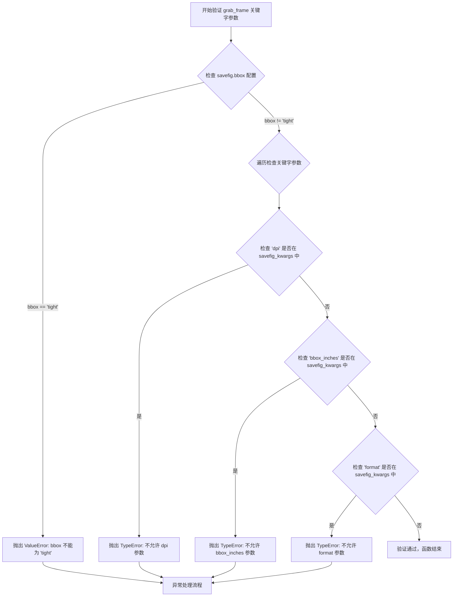

#### 带注释源码

```python
def _validate_grabframe_kwargs(savefig_kwargs):
    """
    Validate keyword arguments passed to grab_frame methods.
    
    This function ensures that users do not pass parameters that are
    controlled by the MovieWriter (dpi, bbox_inches, format) as these
    could cause frame size inconsistency which is inappropriate for
    animation. It also checks that the global savefig.bbox setting
    is not set to 'tight'.
    
    Parameters
    ----------
    savefig_kwargs : dict
        Keyword arguments to be passed to Figure.savefig.
        
    Raises
    ------
    ValueError
        If savefig.bbox rcParam is set to 'tight'.
    TypeError
        If savefig_kwargs contains 'dpi', 'bbox_inches', or 'format' keys.
    """
    # 检查全局配置 savefig.bbox 是否为 'tight'
    # 'tight' bbox 会导致每帧的像素大小可能不同，这对动画是致命的
    if mpl.rcParams['savefig.bbox'] == 'tight':
        raise ValueError(
            f"{mpl.rcParams['savefig.bbox']=} must not be 'tight' as it "
            "may cause frame size to vary, which is inappropriate for animation."
        )
    
    # 检查用户是否传递了被 MovieWriter 控制的参数
    # 这些参数必须由写入器严格控制，以确保所有帧的大小一致
    for k in ('dpi', 'bbox_inches', 'format'):
        if k in savefig_kwargs:
            raise TypeError(
                f"grab_frame got an unexpected keyword argument {k!r}"
            )
```


### _included_frames

该函数是一个全局工具函数，用于根据帧数量、帧格式和帧目录生成嵌入HTML动画的JavaScript代码片段。它调用预定义的INCLUDED_FRAMES模板，将参数格式化后返回可在HTML页面中使用的JavaScript代码。

参数：

- `frame_count`：`int`，动画的总帧数
- `frame_format`：`str`，帧图像的格式（如 'png', 'jpeg' 等）
- `frame_dir`：`str`，帧文件所在的目录路径

返回值：`str`，返回格式化后的JavaScript代码片段，用于HTML动画中引用帧文件

#### 流程图

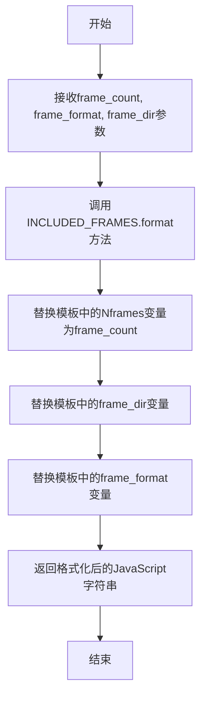

#### 带注释源码

```python
def _included_frames(frame_count, frame_format, frame_dir):
    """
    生成嵌入HTML动画的JavaScript帧引用代码。

    Parameters
    ----------
    frame_count : int
        动画的总帧数。
    frame_format : str
        帧图像的格式，如 'png'、'jpeg' 等。
    frame_dir : str
        帧文件所在的目录路径。

    Returns
    -------
    str
        格式化后的JavaScript代码片段，用于HTML动画中引用帧文件。
    """
    # 使用INCLUDED_FRAMES模板进行格式化
    # INCLUDED_FRAMES是一个从matplotlib._animation_data导入的模板字符串
    # 模板包含占位符：{Nframes}、{frame_dir}、{frame_format}
    return INCLUDED_FRAMES.format(Nframes=frame_count,
                                  frame_dir=frame_dir,
                                  frame_format=frame_format)
```


### `_embedded_frames`

该函数用于将 base64 编码的图像帧列表转换为嵌入在 HTML 动画中的 JavaScript 代码片段，将图像数据作为 data URI 嵌入。

参数：

- `frame_list`：`list[str]`，包含 base64 编码的图像数据的字符串列表
- `frame_format`：`str`，图像格式（如 'png', 'jpeg', 'svg' 等）

返回值：`str`，生成的 JavaScript 代码字符串，用于在 HTML 中嵌入帧数据

#### 流程图

```mermaid
flowchart TD
    A[开始] --> B{frame_format == 'svg'?}
    B -->|是| C[将 frame_format 改为 'svg+xml']
    B -->|否| D[保持原 frame_format]
    C --> E[定义模板字符串]
    D --> E
    E --> F[遍历 frame_list]
    F --> G[对每个 frame_data 替换换行符为 '\\n']
    G --> H[使用模板格式化: frames[i] = "data:image/{format};base64,{data}"]
    H --> I[拼接所有格式化后的字符串]
    I --> J[在开头添加换行符]
    J --> K[返回结果字符串]
```

#### 带注释源码

```python
def _embedded_frames(frame_list, frame_format):
    """
    将 base64 编码的图像帧列表转换为嵌入的 JavaScript 代码。
    
    参数:
        frame_list: 应该是一个包含 base64 编码的 png 文件的列表
        frame_format: 图像格式
    
    返回:
        包含嵌入帧数据的 JavaScript 代码字符串
    """
    # 如果是 SVG 格式，需要修正 MIME 类型为 'svg+xml'
    if frame_format == 'svg':
        # Fix MIME type for svg
        frame_format = 'svg+xml'
    
    # 定义 JavaScript 模板，用于生成帧数据赋值语句
    # 格式: frames[index] = "data:image/{format};base64,{base64_data}"
    template = '  frames[{0}] = "data:image/{1};base64,{2}"\n'
    
    # 使用模板生成每个帧的 JavaScript 代码
    # 替换换行符为转义序列，确保在 JavaScript 字符串中正确处理
    return "\n" + "".join(
        template.format(i, frame_format, frame_data.replace('\n', '\\\n'))
        for i, frame_data in enumerate(frame_list))
```


### `MovieWriterRegistry.register`

该方法是一个装饰器工厂，用于将动画写入器类注册到全局注册表中，允许通过人类可读的名称（如 'ffmpeg'、'pillow' 等）来动态查找和实例化特定的视频写入器类。

参数：

- `name`：`str`，用于注册写入器类的可读名称（例如 'ffmpeg'、'pillow' 等）

返回值：`function`，返回一个装饰器函数，该函数接收被装饰的类，将其存储到注册表中，并原样返回该类

#### 流程图

```mermaid
flowchart TD
    A[调用 register 方法] --> B[接收 name 参数]
    B --> C[返回一个 wrapper 函数]
    D[装饰器应用到类上] --> E[wrapper 函数接收 writer_cls 参数]
    E --> F[将 writer_cls 存储到 self._registered[name] 字典中]
    F --> G[返回原始的 writer_cls 类]
    
    style F fill:#f9f,stroke:#333,stroke-width:2px
```

#### 带注释源码

```python
def register(self, name):
    """
    Decorator for registering a class under a name.

    Example use::

        @registry.register(name)
        class Foo:
            pass
    """
    # 定义内部包装函数，用于实际注册类
    def wrapper(writer_cls):
        # 将传入的类存储到注册表字典中，键为名称
        self._registered[name] = writer_cls
        # 返回原始类，保持类的完整性，使其仍可用于直接实例化
        return writer_cls
    # 返回包装函数，使其成为装饰器
    return wrapper
```


### `MovieWriterRegistry.is_available`

检查给定的写入器名称是否在注册表中且可用。它通过尝试从内部注册表中获取对应的类，并调用该类的 `isAvailable` 类方法来判断。

参数：
-  `name`：`str`，要检查的电影写入器名称。

返回值：`bool`，如果写入器可用则返回 `True`，否则返回 `False`。

#### 流程图

```mermaid
flowchart TD
    A[Start is_available name] --> B{Is name in self._registered?}
    B -- Yes --> C[Get class: cls = self._registered[name]]
    C --> D[Call cls.isAvailable]
    D --> E[Return result of isAvailable]
    B -- No (KeyError) --> F[Return False]
```

#### 带注释源码

```python
def is_available(self, name):
    """
    Check if given writer is available by name.

    Parameters
    ----------
    name : str

    Returns
    -------
    bool
    """
    # 尝试从注册表中查找该名称对应的类
    try:
        cls = self._registered[name]
    # 如果名称不存在，抛出 KeyError，捕获并返回 False
    except KeyError:
        return False
    # 如果类存在，调用该类的类方法 isAvailable() 进行检查
    return cls.isAvailable()
```


### MovieWriterRegistry.__iter__

该方法是 `MovieWriterRegistry` 类的迭代器实现，用于遍历所有可用的动画写入器（MovieWriter）名称。它通过检查每个已注册的写入器是否可用（调用 `is_available` 方法），只返回那些当前环境中可用的写入器名称。

参数：无

返回值：`Generator[str, None, None]`，生成可用的 MovieWriter 名称字符串

#### 流程图

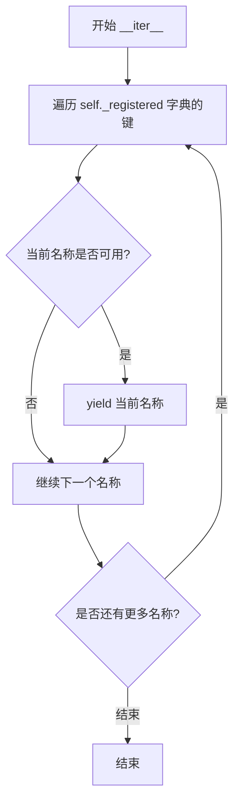

#### 带注释源码

```python
def __iter__(self):
    """
    Iterate over names of available writer class.
    
    这是一个迭代器方法，使 MovieWriterRegistry 可以被直接迭代。
    它只返回当前环境中真正可用的写入器名称。
    """
    # 遍历所有已注册的写入器名称
    for name in self._registered:
        # 检查该写入器是否在当前环境中可用
        if self.is_available(name):
            # 如果可用，则yield这个名称
            yield name
```

#### 相关依赖信息

| 组件 | 类型 | 描述 |
|------|------|------|
| `self._registered` | dict | 存储已注册的写入器类，键为名称，值为类对象 |
| `self.is_available(name)` | method | 检查给定名称的写入器是否可用 |


### MovieWriterRegistry.list

获取当前可用的 MovieWriter 列表。该方法通过迭代注册表中的所有 writer 并检查其可用性，返回所有可用的 movie writer 名称列表。

参数： 无

返回值：`list`，返回所有当前可用的 MovieWriter 名称（字符串）列表。

#### 流程图

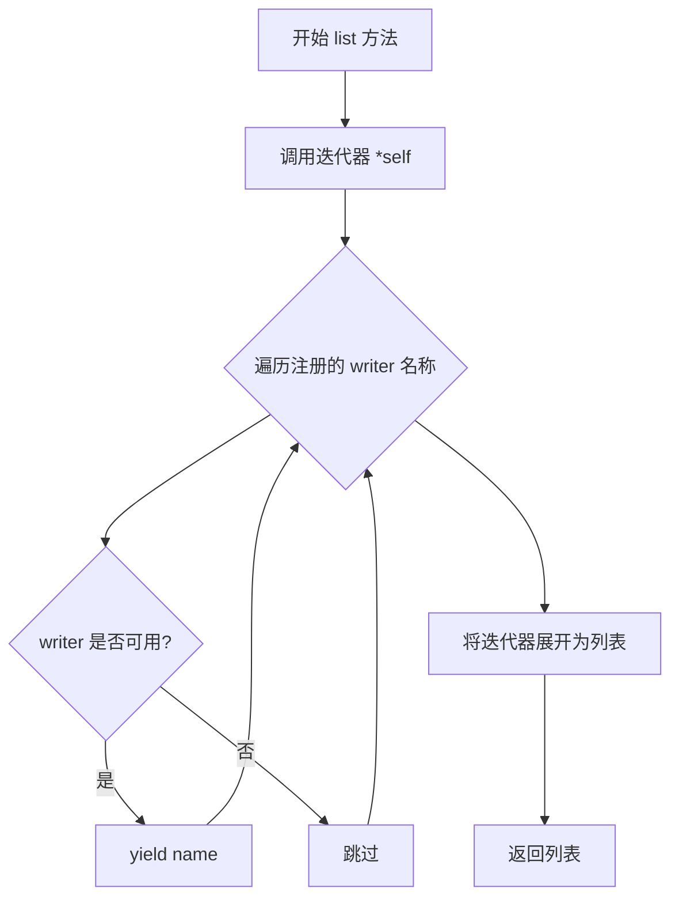

#### 带注释源码

```python
def list(self):
    """Get a list of available MovieWriters."""
    # 使用列表解包语法 [*self] 调用 __iter__ 方法
    # __iter__ 方法会遍历所有已注册的 writer
    # 只返回那些 is_available() 返回 True 的 writer 名称
    return [*self]
```


### `MovieWriterRegistry.__getitem__`

获取注册表中可用的 MovieWriter 类。

参数：

- `name`：`str`，MovieWriter 的名称，用于从注册表中查找对应的 writer 类

返回值：`type`，返回注册的可用的 MovieWriter 类；如果请求的 writer 不可用则抛出 `RuntimeError`

#### 流程图

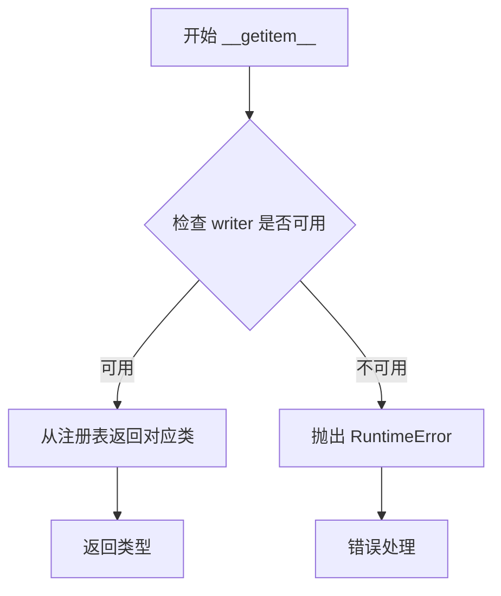

#### 带注释源码

```python
def __getitem__(self, name):
    """
    通过名称获取可用的 writer 类。

    Parameters
    ----------
    name : str
        要获取的 MovieWriter 的名称，必须是已注册且可用的 writer

    Returns
    -------
    class
        对应名称的 MovieWriter 类

    Raises
    ------
    RuntimeError
        如果请求的 MovieWriter 不可用（未注册或不可用）
    """
    # 使用 is_available 方法检查该 writer 是否可用
    if self.is_available(name):
        # 如果可用，从注册字典中返回对应的类
        return self._registered[name]
    # 如果不可用，抛出 RuntimeError 异常
    raise RuntimeError(f"Requested MovieWriter ({name}) not available")
```


### `AbstractMovieWriter.setup`

该方法为写入电影文件进行初始化准备，验证输出文件路径的有效性，设置输出文件名、图形对象和分辨率（DPI）等关键属性。

参数：
- `fig`：`matplotlib.figure.Figure`，包含帧信息的图形对象
- `outfile`：`str`，结果电影文件的文件名
- `dpi`：`float`，默认为 `fig.dpi`，文件的DPI（分辨率），控制生成电影文件的像素大小

返回值：无（`None`），该方法仅执行初始化设置，不返回任何值

#### 流程图

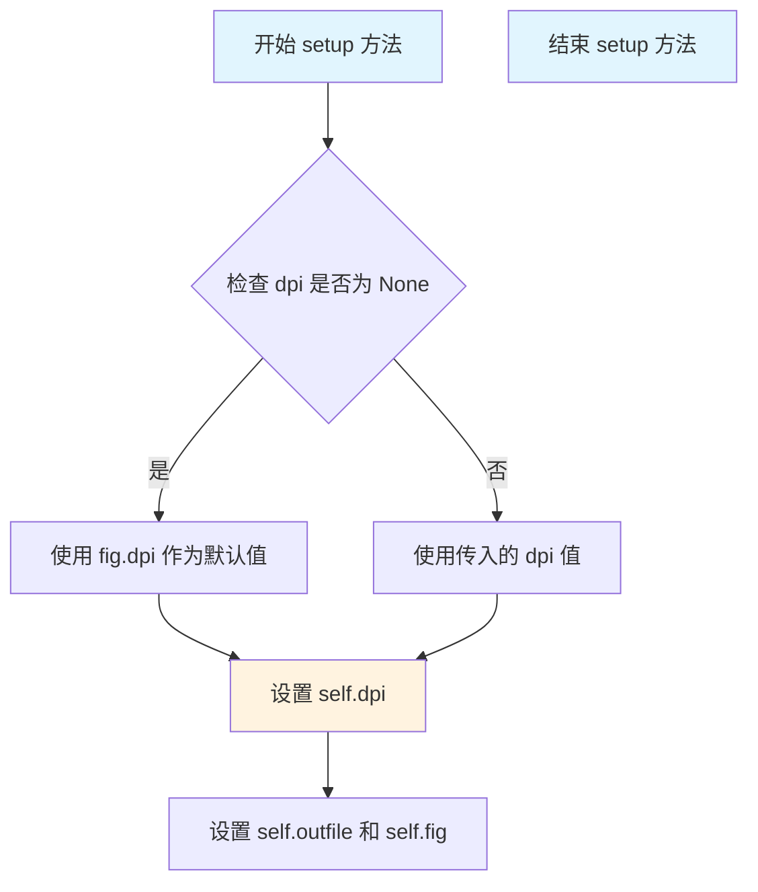

#### 带注释源码

```python
@abc.abstractmethod
def setup(self, fig, outfile, dpi=None):
    """
    Setup for writing the movie file.

    Parameters
    ----------
    fig : `~matplotlib.figure.Figure`
        The figure object that contains the information for frames.
    outfile : str
        The filename of the resulting movie file.
    dpi : float, default: ``fig.dpi``
        The DPI (or resolution) for the file.  This controls the size
        in pixels of the resulting movie file.
    """
    # 检查输出文件的父目录路径是否有效且可访问
    # strict=True 确保目录存在且是可达的，否则抛出 FileNotFoundError
    Path(outfile).parent.resolve(strict=True)
    
    # 保存输出文件名到实例属性
    self.outfile = outfile
    
    # 保存图形对象到实例属性，供后续 grab_frame 等方法使用
    self.fig = fig
    
    # 如果未指定 DPI，则使用图形的默认 DPI
    if dpi is None:
        dpi = self.fig.dpi
    
    # 保存 DPI 到实例属性，用于计算帧大小和保存帧
    self.dpi = dpi
```


### AbstractMovieWriter.frame_size

该属性用于获取动画影片帧的像素尺寸，通过将图表的英寸尺寸乘以DPI并转换为整数得到宽度和高度（以像素为单位）的元组。

参数：
- （无参数，这是一个属性 getter）

返回值：`tuple[int, int]`，返回影片帧的宽度和高度，以像素为单位的元组 ``(width, height)``

#### 流程图

```mermaid
flowchart TD
    A[开始: 获取 frame_size] --> B[调用 self.fig.get_size_inches 获取图表尺寸]
    B --> C[获取图表宽度 w 和高度 h (单位: 英寸)]
    C --> D[计算像素宽度: int(w * self.dpi)]
    E[计算像素高度: int(h * self.dpi)]
    D --> F[返回元组 (像素宽度, 像素高度)]
    E --> F
```

#### 带注释源码

```python
@property
def frame_size(self):
    """
    A tuple ``(width, height)`` in pixels of a movie frame.
    
    Returns
    -------
    tuple[int, int]
        影片帧的像素尺寸，格式为 (宽度, 高度)。
    """
    # 获取图表的尺寸（单位：英寸）
    w, h = self.fig.get_size_inches()
    # 将英寸尺寸乘以 DPI 转换为像素，并取整
    # w * self.dpi 计算宽度像素值
    # h * self.dpi 计算高度像素值
    # int() 将浮点数转换为整数（向下取整）
    return int(w * self.dpi), int(h * self.dpi)
```


### `AbstractMovieWriter._supports_transparency`

该方法用于检查当前视频写入器是否支持透明度功能。抽象基类默认返回 False，具体子类可以重写此方法以根据输出文件类型和编解码器在运行时确定是否支持透明度。

参数：
- 无

返回值：`bool`，返回 False 表示基类不支持透明度，子类可重写以返回 True

#### 流程图

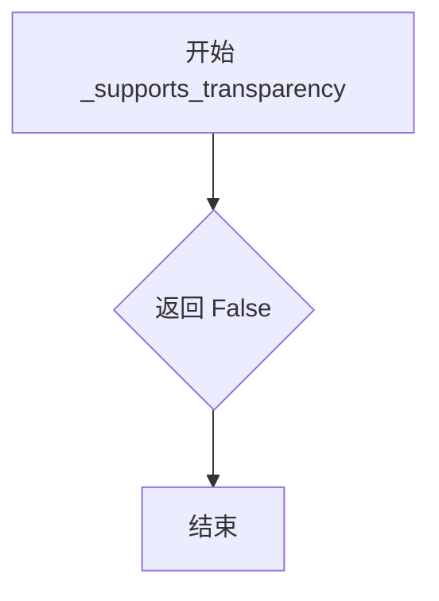

#### 带注释源码

```python
def _supports_transparency(self):
    """
    Whether this writer supports transparency.

    Writers may consult output file type and codec to determine this at runtime.
    """
    return False
```


### AbstractMovieWriter.grab_frame

该方法是抽象基类中的抽象方法，用于从matplotlib图形中捕获图像信息并保存为电影帧。所有关键字参数传递给Figure.savefig，但dpi、bbox_inches和format参数由MovieWriter控制，不能由用户指定。

参数：

- `**savefig_kwargs`：关键字参数，这些参数将传递给`~.Figure.savefig`调用以保存图形。但以下参数不能传递：`dpi`（因为动画每帧必须具有相同的像素大小）、`bbox_inches`（同样原因）、`format`（由MovieWriter控制）

返回值：`None`，无返回值（该方法为抽象方法，子类实现中也不返回任何值）

#### 流程图

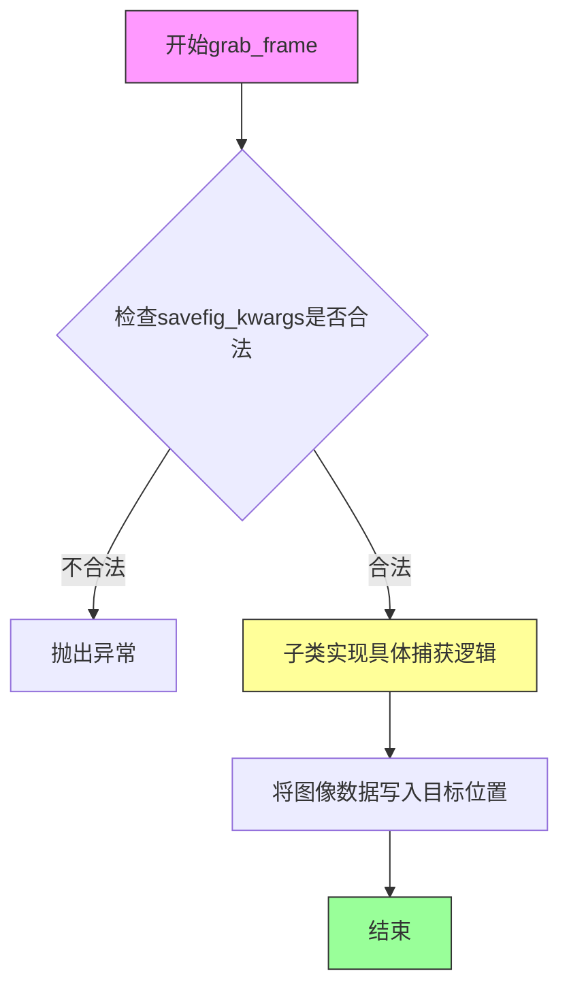

#### 带注释源码

```python
@abc.abstractmethod
def grab_frame(self, **savefig_kwargs):
    """
    Grab the image information from the figure and save as a movie frame.

    All keyword arguments in *savefig_kwargs* are passed on to the
    `~.Figure.savefig` call that saves the figure.  However, several
    keyword arguments that are supported by `~.Figure.savefig` may not be
    passed as they are controlled by the MovieWriter:

    - *dpi*, *bbox_inches*:  These may not be passed because each frame of the
       animation much be exactly the same size in pixels.
    - *format*: This is controlled by the MovieWriter.
    """
    # 注意：这是一个抽象方法，没有具体实现
    # 子类必须实现此方法来完成实际的帧捕获逻辑
    # 例如：
    # - MovieWriter.grab_frame: 将帧写入到子进程的stdin管道
    # - FileMovieWriter.grab_frame: 将帧保存到临时文件
    # - PillowWriter.grab_frame: 将帧添加到内存中的帧列表
```


### AbstractMovieWriter.finish

完成处理电影写入的任何最终操作。该方法是一个抽象方法，由具体的子类实现，用于完成电影的写入过程，例如关闭子进程、清理临时文件或保存最终输出。

参数：该方法没有显式参数（除了隐式的 self 参数）

返回值：`None`，该方法没有返回值

#### 流程图

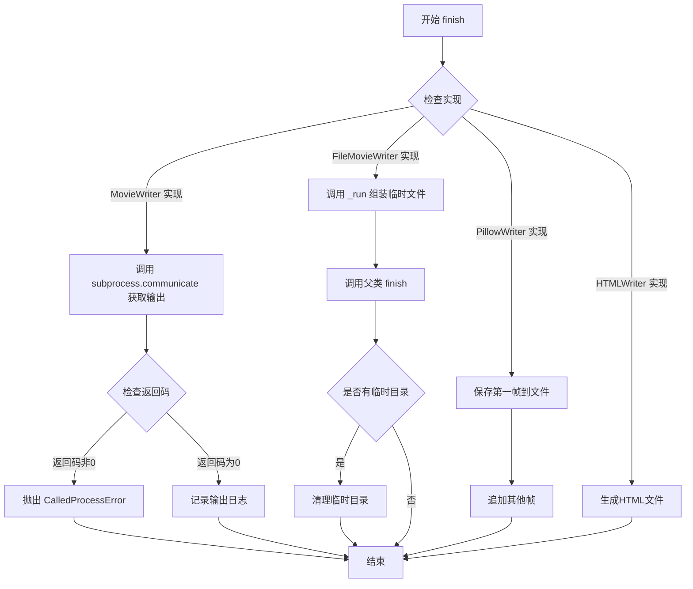

#### 带注释源码

```python
@abc.abstractmethod
def finish(self):
    """Finish any processing for writing the movie."""
```

#### 说明

这是一个抽象方法定义，具体的实现由子类提供：

1. **MovieWriter.finish**：通过管道将帧数据写入电影文件后，调用 `subprocess.communicate()` 获取子进程的输出和错误，然后根据返回码决定是否抛出异常。

2. **FileMovieWriter.finish**：在所有帧都被捕获后，调用 `_run()` 来使用临时文件组装电影，然后调用父类的 `finish()` 方法，最后清理临时目录。

3. **PillowWriter.finish**：将第一帧保存到输出文件，并追加其他帧，设置持续时间和循环参数。

4. **HTMLWriter.finish**：将帧数据生成HTML文件，包含JavaScript动画代码。


### AbstractMovieWriter.saving

该方法是 `AbstractMovieWriter` 类的上下文管理器方法，用于简化电影文件的写入过程。通过 `contextlib.contextmanager` 装饰器实现，确保在写入电影帧前后正确调用 `setup` 和 `finish` 方法，提供统一且安全的资源管理机制。

参数：

- `self`：`AbstractMovieWriter` 实例，上下文管理器的主体
- `fig`：`matplotlib.figure.Figure`，要写入动画的图形对象
- `outfile`：`str`，输出电影文件的路径和文件名
- `dpi`：`float`，电影的分辨率（每英寸点数）
- `*args`：`tuple`，传递给 `setup` 方法的额外位置参数
- `**kwargs`：`dict`，传递给 `setup` 方法的额外关键字参数

返回值：`AbstractMovieWriter`（通过 `yield` 返回），返回上下文管理器实例本身，供调用者在上下文内部调用 `grab_frame` 等方法

#### 流程图

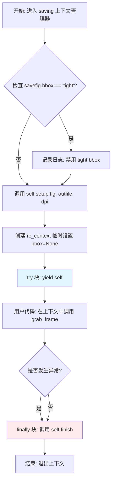

#### 带注释源码

```python
@contextlib.contextmanager
def saving(self, fig, outfile, dpi, *args, **kwargs):
    """
    Context manager to facilitate writing the movie file.

    ``*args, **kw`` are any parameters that should be passed to `setup`.
    """
    # 检查用户是否设置了 savefig.bbox='tight'
    # tight bbox 会导致每帧像素大小不同，对动画来说是不合适的
    if mpl.rcParams['savefig.bbox'] == 'tight':
        _log.info("Disabling savefig.bbox = 'tight', as it may cause "
                  "frame size to vary, which is inappropriate for "
                  "animation.")

    # 这是 contextlib.contextmanager 所需的特定顺序
    # 1. 首先调用 setup 初始化电影写入器
    self.setup(fig, outfile, dpi, *args, **kwargs)
    
    # 2. 创建临时 rc_context，将 savefig.bbox 设置为 None
    #    这确保了在帧捕获期间不会有 bbox 干扰
    with mpl.rc_context({'savefig.bbox': None}):
        try:
            # 3. yield 将控制权交给调用者
            #    调用者可以在此上下文中多次调用 grab_frame() 捕获帧
            yield self
        finally:
            # 4. finally 块确保无论是否发生异常，都会调用 finish
            #    finish 负责完成最终的电影编码和文件写入
            self.finish()
```


### `MovieWriter._adjust_frame_size`

该方法用于调整matplotlib图形尺寸，以确保生成的视频帧像素尺寸与视频编码器兼容（特别是h264编码器要求宽度和高度为偶数）。方法首先检查当前编码器是否为h264，如果是则调用`adjusted_figsize`函数将图形尺寸调整为符合2的倍数（偶数）的尺寸，然后更新图形大小；否则直接获取当前图形尺寸。最终返回调整后的宽度和高度（单位：英寸）。

参数：无需显式参数（仅使用实例属性 `self.codec`、`self.fig`、`self.dpi`）

返回值：`tuple[float, float]`，返回调整后的图形宽度和高度（单位：英寸）

#### 流程图

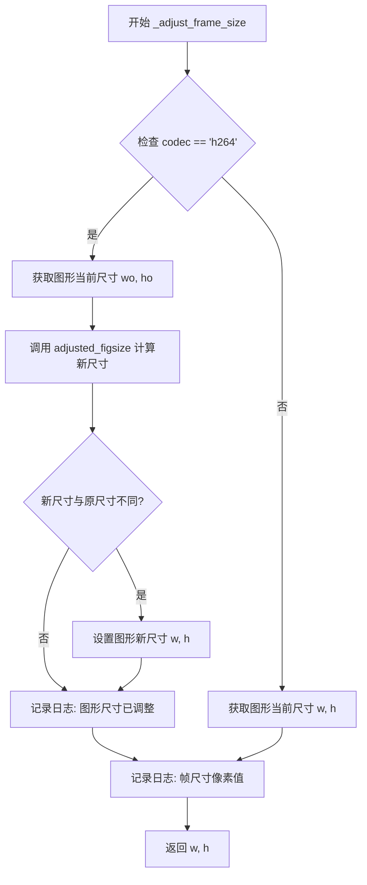

#### 带注释源码

```python
def _adjust_frame_size(self):
    """
    调整图形尺寸以确保与视频编码器兼容。
    
    当使用 h264 编码器时，某些播放器要求视频尺寸为偶数，
    因此需要将图形尺寸调整为2的倍数。
    """
    # 检查当前编码器是否为 h264
    if self.codec == 'h264':
        # 获取图形当前尺寸（单位：英寸）
        wo, ho = self.fig.get_size_inches()
        # 调用辅助函数计算新的尺寸，使像素尺寸为2的倍数
        w, h = adjusted_figsize(wo, ho, self.dpi, 2)
        # 如果尺寸发生了变化
        if (wo, ho) != (w, h):
            # 更新图形尺寸，forward=True 表示立即应用到显示
            self.fig.set_size_inches(w, h, forward=True)
            # 记录尺寸调整日志
            _log.info('figure size in inches has been adjusted '
                      'from %s x %s to %s x %s', wo, ho, w, h)
    else:
        # 非 h264 编码器，直接获取当前尺寸
        w, h = self.fig.get_size_inches()
    
    # 记录帧尺寸的像素值（用于调试）
    _log.debug('frame size in pixels is %s x %s', *self.frame_size)
    # 返回调整后的尺寸（单位：英寸）
    return w, h
```


### `MovieWriter.setup`

该方法是 `MovieWriter` 类的一部分，用于初始化电影写作过程。它调用父类的 `setup` 方法来设置基本的输出文件、图形和 DPI 参数，然后调整帧大小以确保像素对齐，最后启动子进程以通过管道将帧数据写入编码器。

参数：

- `fig`：`matplotlib.figure.Figure`，包含帧信息的图形对象
- `outfile`：`str`，结果电影文件的文件名
- `dpi`：`float` 或 `None`，电影的 DPI（分辨率），默认值为 `fig.dpi`

返回值：无（`None`）

#### 流程图

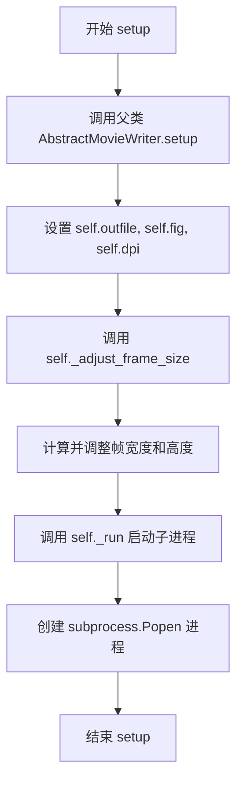

#### 带注释源码

```python
def setup(self, fig, outfile, dpi=None):
    # 继承自父类的 docstring
    # 首先调用父类的 setup 方法完成基本初始化：
    # - 验证输出文件路径有效性
    # - 设置 self.outfile = outfile
    # - 设置 self.fig = fig
    # - 设置 self.dpi (如果未提供则使用 fig.dpi)
    super().setup(fig, outfile, dpi=dpi)
    
    # 调整帧大小，确保像素是指定倍数（对于 h264 编码尤为重要）
    # 同时保存调整后的宽度和高度，以便所有帧保持一致大小
    self._w, self._h = self._adjust_frame_size()
    
    # 立即运行子进程，以便 grab_frame() 可以通过管道写入数据
    # 这样可以避免使用临时文件，提高性能
    self._run()
```


### MovieWriter._run

该方法通过子进程调用外部程序（如 FFmpeg 或 ImageMagick）来组装帧生成视频文件，利用 `_args()` 方法获取命令行参数并启动子进程，且无返回值。

参数：
- 该方法无显式参数（隐式参数 `self` 为 `MovieWriter` 实例）

返回值：`None`，无返回值

#### 流程图

```mermaid
flowchart TD
    A[开始 _run] --> B[获取命令行参数: command = self._args()]
    B --> C[记录日志: 输出即将运行的命令]
    C --> D[创建子进程: subprocess.Popen]
    D --> E[结束]
```

#### 带注释源码

```python
def _run(self):
    """
    通过子进程调用程序来组装帧成为视频文件。
    *_args* 返回来自一些配置选项的命令行参数序列。
    """
    # 获取子类特定的电影编码命令行参数
    command = self._args()
    # 记录信息日志，显示即将运行的命令
    _log.info('MovieWriter._run: running command: %s',
              cbook._pformat_subprocess(command))
    # 定义管道常量用于子进程的输入输出
    PIPE = subprocess.PIPE
    # 启动子进程，传入命令，设置 stdin/stdout/stderr 为管道
    # creationflags 用于在 Windows 上禁止弹出终端窗口
    self._proc = subprocess.Popen(
        command, stdin=PIPE, stdout=PIPE, stderr=PIPE,
        creationflags=subprocess_creation_flags)
```


### MovieWriter.finish

完成任何用于写入电影的处理。此方法等待子进程完成，读取其输出和错误流，记录日志信息，并在发生错误时抛出异常。

参数：
- 无参数（仅包含 self 隐式参数）

返回值：`None`，无返回值描述

#### 流程图

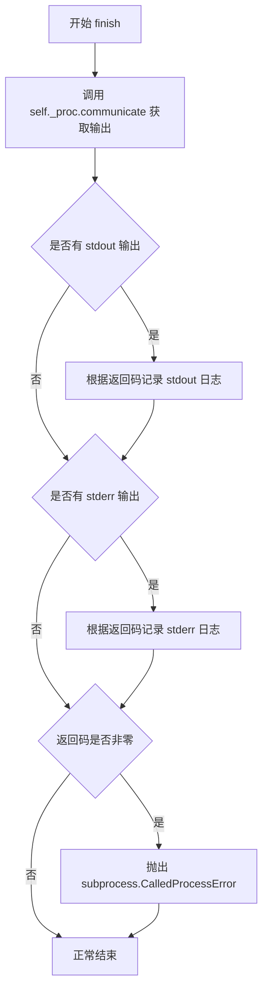

#### 带注释源码

```python
def finish(self):
    """Finish any processing for writing the movie."""
    # 等待子进程完成并获取所有输出
    out, err = self._proc.communicate()
    
    # 使用与 universal_newlines 相同的编码/错误处理方式读取输出
    out = TextIOWrapper(BytesIO(out)).read()
    err = TextIOWrapper(BytesIO(err)).read()
    
    # 如果有 stdout 输出，根据返回码决定日志级别
    # 返回码非零时记录 WARNING，否则记录 DEBUG
    if out:
        _log.log(
            logging.WARNING if self._proc.returncode else logging.DEBUG,
            "MovieWriter stdout:\n%s", out)
    
    # 如果有 stderr 输出，根据返回码决定日志级别
    if err:
        _log.log(
            logging.WARNING if self._proc.returncode else logging.DEBUG,
            "MovieWriter stderr:\n%s", err)
    
    # 如果子进程返回非零退出码，抛出异常
    if self._proc.returncode:
        raise subprocess.CalledProcessError(
            self._proc.returncode, self._proc.args, out, err)
```


### MovieWriter.grab_frame

该方法是 MovieWriter 类的核心方法，用于从 matplotlib Figure 对象中捕获当前帧的图像数据，并将其写入到子进程的标准输入流中，供外部视频编码器（如 FFmpeg）实时编码成视频。它确保所有帧具有相同的像素尺寸以保证视频的正确性。

参数：

- `**savefig_kwargs`：关键字参数，类型为可变关键字参数（dict），传递给 `Figure.savefig` 的额外参数，用于控制如何渲染和保存帧（例如 facecolor、transparent 等）。但不包括 'dpi'、'bbox_inches' 和 'format'，因为这些由 MovieWriter 自身控制。

返回值：`None`（无返回值），该方法将帧数据直接写入到 `self._proc.stdin`（子进程的 stdin），属于副作用操作。

#### 流程图

```mermaid
flowchart TD
    A[开始 grab_frame] --> B{验证 savefig_kwargs 参数}
    B --> C[记录调试日志]
    C --> D[将 Figure 尺寸重置为初始保存的尺寸 self._w x self._h]
    D --> E[调用 fig.savefig 写入子进程 stdin]
    E --> F[使用 frame_format 和 dpi 保存]
    F --> G[传递额外的 savefig_kwargs 参数]
    G --> H[结束]
```

#### 带注释源码

```python
def grab_frame(self, **savefig_kwargs):
    """
    Grab the image information from the figure and save as a movie frame.

    All keyword arguments in *savefig_kwargs* are passed on to the
    `~.Figure.savefig` call that saves the figure.  However, several
    keyword arguments that are supported by `~.Figure.savefig` may not be
    passed as they are controlled by the MovieWriter:

    - *dpi*, *bbox_inches*:  These may not be passed because each frame of the
       animation much be exactly the same size in pixels.
    - *format*: This is controlled by the MovieWriter.
    """
    # docstring inherited
    # 首先验证传入的关键字参数是否符合要求
    # 不允许传入 'dpi', 'bbox_inches', 'format' 等参数
    _validate_grabframe_kwargs(savefig_kwargs)
    
    # 记录调试日志，表示开始捕获帧
    _log.debug('MovieWriter.grab_frame: Grabbing frame.')
    
    # 读取并调整 figure 的大小，以防用户已经修改了它。
    # 所有帧必须具有相同的尺寸才能正确保存电影。
    self.fig.set_size_inches(self._w, self._h)
    
    # 将 figure 数据保存到 sink（这里是子进程的标准输入）
    # 使用帧格式和 DPI，传入额外的 savefig_kwargs 参数
    self.fig.savefig(self._proc.stdin, format=self.frame_format,
                     dpi=self.dpi, **savefig_kwargs)
```


### `MovieWriter._args`

该方法是 `MovieWriter` 类的抽象方法，用于组装特定编码器的命令行参数列表。由于是抽象方法，基类本身未实现具体逻辑，而是抛出 `NotImplementedError` 供子类重写实现。

参数：
- 无（仅包含隐式参数 `self`）

返回值：`list[str]`，返回编码器命令行参数列表（子类实现）

#### 流程图

```mermaid
flowchart TD
    A[开始 _args] --> B{检查子类是否实现}
    B -->|已实现| C[返回命令行参数列表]
    B -->|未实现| D[抛出 NotImplementedError]
```

#### 带注释源码

```python
def _args(self):
    """
    Assemble list of encoder-specific command-line arguments.
    
    Returns
    -------
    list[str]
        命令行参数列表，用于 subprocess 调用编码器。
        子类需重写此方法以提供具体的参数。
        
    Raises
    ------
    NotImplementedError
        当基类直接调用时抛出，提示子类必须实现此方法。
    """
    return NotImplementedError("args needs to be implemented by subclass.")
```


### `MovieWriter.bin_path`

返回特定子类所使用的命令行工具的二进制路径。

参数：

- 无（类方法，使用 `cls` 参数）

返回值：`str`，返回命令行工具的二进制路径。

#### 流程图

```mermaid
flowchart TD
    A[开始] --> B[访问类属性 _exec_key]
    B --> C[从 rcParams 获取可执行文件路径]
    C --> D[转换为字符串并返回]
```

#### 带注释源码

```python
@classmethod
def bin_path(cls):
    """
    Return the binary path to the commandline tool used by a specific
    subclass. This is a class method so that the tool can be looked for
    before making a particular MovieWriter subclass available.
    """
    # cls._exec_key 是类属性，在子类中定义（如 FFMpegBase._exec_key = 'animation.ffmpeg_path'）
    # mpl.rcParams 是 matplotlib 的配置字典，包含各种设置
    # 该方法从配置中获取对应编码器/工具的路径并转换为字符串返回
    return str(mpl.rcParams[cls._exec_key])
```


### MovieWriter.isAvailable

检查给定的 MovieWriter 子类是否实际可用，通过验证可执行文件路径是否存在来判断。

参数：

- `cls`：类对象（Class），表示调用该方法的类本身

返回值：`bool`，返回 True 表示该 MovieWriter 可用，返回 False 表示不可用

#### 流程图

```mermaid
flowchart TD
    A[开始] --> B[调用 cls.bin_path 获取可执行文件路径]
    B --> C[使用 shutil.which 检查路径]
    C --> D{找到可执行文件?}
    D -->|是| E[返回 True]
    D -->|否| F[返回 False]
    E --> G[结束]
    F --> G
```

#### 带注释源码

```python
@classmethod
def isAvailable(cls):
    """
    Return whether a MovieWriter subclass is actually available.
    
    此方法是一个类方法，用于检查 MovieWriter 的子类是否可用。
    它通过调用类方法 bin_path() 获取可执行文件的路径，
    然后使用 shutil.which() 检查该路径是否存在可执行文件。
    
    Returns
    -------
    bool
        如果找到可执行文件返回 True，否则返回 False。
    """
    return shutil.which(cls.bin_path()) is not None
```


### FileMovieWriter.setup

该方法用于初始化电影文件的写入准备工作，包括验证输出路径、设置帧参数、创建临时目录以及初始化帧计数器和文件名模板。

参数：

- `fig`：`matplotlib.figure.Figure`，用于获取渲染帧的图形对象
- `outfile`：`str`，结果电影文件的文件名
- `dpi`：`float`，可选，默认为 `fig.dpi`。输出文件的DPI，结合图形尺寸控制电影文件的像素大小
- `frame_prefix`：`str`，可选，用于临时文件的文件名前缀。如果为 `None`（默认），文件将写入临时目录并在 `finish` 时被删除；如果不是 `None`，则不会删除临时文件

返回值：`None`，无返回值

#### 流程图

```mermaid
flowchart TD
    A[开始 setup] --> B[验证输出路径是否有效: Path(outfile).parent.resolve(strict=True)]
    B --> C[保存 fig 到 self.fig]
    C --> D[保存 outfile 到 self.outfile]
    D --> E{判断 dpi 是否为 None}
    E -->|是| F[使用 fig.dpi 作为 dpi]
    E -->|否| G[使用传入的 dpi]
    F --> H[保存 dpi 到 self.dpi]
    G --> H
    H --> I[调用 _adjust_frame_size 调整帧大小]
    I --> J{判断 frame_prefix 是否为 None}
    J -->|是| K[创建 TemporaryDirectory 赋值给 self._tmpdir]
    J -->|否| L[设置 self._tmpdir 为 None]
    K --> M[生成临时文件前缀: str(Path(self._tmpdir.name, 'tmp'))]
    L --> M[使用传入的 frame_prefix 作为 temp_prefix]
    M --> N[初始化 self._frame_counter = 0]
    N --> O[初始化 self._temp_paths 为空列表]
    O --> P[设置文件名格式串: '%s%07d.%s']
    P --> Q[结束 setup]
```

#### 带注释源码

```python
def setup(self, fig, outfile, dpi=None, frame_prefix=None):
    """
    Setup for writing the movie file.

    Parameters
    ----------
    fig : `~matplotlib.figure.Figure`
        The figure to grab the rendered frames from.
    outfile : str
        The filename of the resulting movie file.
    dpi : float, default: ``fig.dpi``
        The dpi of the output file. This, with the figure size,
        controls the size in pixels of the resulting movie file.
    frame_prefix : str, optional
        The filename prefix to use for temporary files.  If *None* (the
        default), files are written to a temporary directory which is
        deleted by `finish`; if not *None*, no temporary files are
        deleted.
    """
    # 验证输出文件的父目录是否存在且可访问
    # strict=True 会抛出 FileNotFoundError 如果路径无效
    Path(outfile).parent.resolve(strict=True)
    
    # 保存图形对象和输出文件名供后续使用
    self.fig = fig
    self.outfile = outfile
    
    # 如果未指定 dpi，则使用图形的默认 dpi
    if dpi is None:
        dpi = self.fig.dpi
    self.dpi = dpi
    
    # 调整帧大小，确保与编码器兼容（如 h264 需要偶数尺寸）
    self._adjust_frame_size()

    # 处理临时文件和目录
    if frame_prefix is None:
        # 创建临时目录存储帧文件，finish 时会自动清理
        self._tmpdir = TemporaryDirectory()
        self.temp_prefix = str(Path(self._tmpdir.name, 'tmp'))
    else:
        # 使用用户指定的路径前缀，不自动清理
        self._tmpdir = None
        self.temp_prefix = frame_prefix
    
    # 初始化帧计数器，用于生成唯一的文件名
    self._frame_counter = 0  # used for generating sequential file names
    
    # 存储所有临时文件路径，供 finish 时组装使用
    self._temp_paths = list()
    
    # 文件名格式串：%s prefix, %07d 序号, %s 扩展名
    self.fname_format_str = '%s%%07d.%s'
```


### `FileMovieWriter.__del__`

析构方法，在对象被垃圾回收时清理临时目录资源，确保临时文件被正确删除。

参数：
- 无显式参数（隐式参数 `self` 表示实例本身）

返回值：`None`，无返回值（析构方法）

#### 流程图

```mermaid
flowchart TD
    A[__del__ 被调用] --> B{检查 self._tmpdir 属性是否存在}
    B -->|属性存在| C{self._tmpdir 是否为真值}
    B -->|属性不存在| D[结束]
    C -->|为真| E[调用 self._tmpdir.cleanup 清理临时目录]
    C -->|为假| D[结束]
    E --> D
```

#### 带注释源码

```python
def __del__(self):
    """
    析构方法，在对象被垃圾回收时自动调用。
    负责清理临时目录资源，防止临时文件泄漏。
    """
    # 检查对象是否具有 _tmpdir 属性（可能在 __init__ 之前被调用）
    if hasattr(self, '_tmpdir') and self._tmpdir:
        # 如果存在临时目录对象，则调用其 cleanup 方法删除临时文件
        self._tmpdir.cleanup()
```


### `FileMovieWriter.frame_format`

该属性用于获取或设置用于保存动画帧的图像格式（如 png、jpeg 等）。它是一个属性（property），包含 getter 和 setter 方法，用于管理帧格式的设置和验证。

参数：

- `frame_format`：`str`，要设置的帧格式字符串（如 'png', 'jpeg', 'tiff', 'raw', 'rgba'）

返回值：`str`，当前使用的帧格式

#### 流程图

```mermaid
flowchart TD
    A[获取或设置 frame_format] --> B{是 getter 还是 setter?}
    B -->|getter| C[返回 self._frame_format]
    B -->|setter| D{frame_format in supported_formats?}
    D -->|是| E[设置 self._frame_format = frame_format]
    D -->|否| F[发出警告并使用 supported_formats[0]]
    F --> G[设置 self._frame_format = self.supported_formats[0]]
```

#### 带注释源码

```python
@property
def frame_format(self):
    """
    Format (png, jpeg, etc.) to use for saving the frames, which can be
    decided by the individual subclasses.
    """
    return self._frame_format

@frame_format.setter
def frame_format(self, frame_format):
    if frame_format in self.supported_formats:
        self._frame_format = frame_format
    else:
        _api.warn_external(
            f"Ignoring file format {frame_format!r} which is not "
            f"supported by {type(self).__name__}; using "
            f"{self.supported_formats[0]} instead.")
        self._frame_format = self.supported_formats[0]
```


### FileMovieWriter._base_temp_name

该方法用于生成临时文件的模板名称（不含数字），结合帧格式的扩展名和前缀，供后续生成唯一临时文件名使用。

参数：无

返回值：`str`，返回一个模板文件名（不含数字），格式为 `{temp_prefix}%07d.{frame_format}`，例如 "tmp%07d.png"。

#### 流程图

```mermaid
flowchart TD
    A[开始 _base_temp_name] --> B[获取 self.fname_format_str]
    B --> C[获取 self.temp_prefix]
    C --> D[获取 self.frame_format]
    D --> E[使用字符串格式化<br/>fname_format_str % (temp_prefix, frame_format)]
    E --> F[返回模板字符串<br/>如 'tmp%07d.png']
```

#### 带注释源码

```python
def _base_temp_name(self):
    """
    生成一个模板名称（不含数字），结合帧格式的扩展名和前缀。
    
    该方法返回一个格式化字符串，用于后续在 grab_frame 中通过
    添加帧计数器来生成唯一的临时文件名。
    
    Returns
    -------
    str
        临时文件的模板名称，格式为 '{temp_prefix}%07d.{frame_format}'。
        例如: 'tmp%07d.png'
    """
    # Generates a template name (without number) given the frame format
    # for extension and the prefix.
    return self.fname_format_str % (self.temp_prefix, self.frame_format)
```

#### 相关上下文信息

- **所属类**：`FileMovieWriter`
- **调用位置**：在 `grab_frame` 方法中被调用，通过 `_base_temp_name() % self._frame_counter` 生成具体的带数字的文件名
- **依赖的实例属性**：
  - `self.fname_format_str`：格式化字符串，默认为 `'%s%%07d.%s'`
  - `self.temp_prefix`：临时文件前缀，在 `setup` 方法中设置
  - `self.frame_format`：帧的保存格式（如 'png', 'jpeg' 等）


### FileMovieWriter.grab_frame

该方法用于将动画的当前帧保存为图像文件到临时目录。它通过递增计数器生成唯一的文件名，使用Figure.savefig将帧写入磁盘，并记录文件路径供后续视频合成使用。

参数：

- `**savefig_kwargs`：`dict`，可选关键字参数，传递给`Figure.savefig`调用的额外参数，用于控制图像保存的细节（如透明度、颜色映射等），但不能包含`dpi`、`bbox_inches`或`format`参数

返回值：`None`，该方法无返回值，仅执行文件写入操作

#### 流程图

```mermaid
flowchart TD
    A[开始 grab_frame] --> B{验证 savefig_kwargs 参数}
    B -->|验证失败| C[抛出异常]
    B -->|验证通过| D[生成临时文件名]
    D --> E[创建 Path 对象]
    E --> F[将路径添加到 _temp_paths 列表]
    F --> G[递增 _frame_counter 计数器]
    G --> H[以二进制写入模式打开文件]
    H --> I[调用 fig.savefig 保存帧到文件]
    I --> J[关闭文件]
    J --> K[结束]
```

#### 带注释源码

```python
def grab_frame(self, **savefig_kwargs):
    """
    Grab the image information from the figure and save as a movie frame.
    
    All keyword arguments in *savefig_kwargs* are passed on to the
    `~.Figure.savefig` call that saves the figure.  However, several
    keyword arguments that are supported by `~.Figure.savefig` may not be
    passed as they are controlled by the MovieWriter:

    - *dpi*, *bbox_inches*:  These may not be passed because each frame of the
       animation much be exactly the same size in pixels.
    - *format*: This is controlled by the MovieWriter.
    """
    # docstring inherited
    # Creates a filename for saving using basename and counter.
    
    # 首先验证传入的关键字参数是否符合要求
    # 不允许使用 'tight' bbox，也不允许显式传递 dpi/bbox_inches/format
    _validate_grabframe_kwargs(savefig_kwargs)
    
    # 使用基模板名称和帧计数器生成唯一的临时文件路径
    # 例如: /tmp/tmpXXX/tmp%07d.png
    path = Path(self._base_temp_name() % self._frame_counter)
    
    # 记录生成的临时文件路径，供后续finish()方法中合成视频使用
    self._temp_paths.append(path)
    
    # 递增计数器，确保下一个帧使用不同的文件名
    self._frame_counter += 1
    
    # 记录调试日志，包含帧编号和目标路径
    _log.debug('FileMovieWriter.grab_frame: Grabbing frame %d to path=%s',
               self._frame_counter, path)
    
    # 以二进制写入模式打开文件，创建文件sink
    with open(path, 'wb') as sink:
        # 调用Figure的savefig方法将当前帧保存为图像文件
        # 使用预定义的frame_format（如png、jpeg等）和dpi设置
        self.fig.savefig(sink, format=self.frame_format, dpi=self.dpi,
                         **savefig_kwargs)
    # with块自动关闭文件
```


### `FileMovieWriter.finish`

该方法用于完成电影文件的写入过程，调用底层运行命令将临时帧文件组装成最终的电影文件，并清理临时目录。

参数：无（仅包含隐式参数 `self`）

返回值：`None`，无返回值描述

#### 流程图

```mermaid
flowchart TD
    A[开始 finish] --> B{self._tmpdir 是否存在?}
    B -->|是| C[调用 self._run 执行ffmpeg等命令组装临时文件]
    B -->|否| D[直接调用 super().finish]
    C --> E[调用 super().finish 处理进程输出]
    E --> F{self._tmpdir 是否存在?}
    F -->|是| G[清理临时目录 self._tmpdir.cleanup]
    F -->|否| H[结束]
    G --> H
    D --> H
```

#### 带注释源码

```python
def finish(self):
    """
    完成电影写入的最后处理步骤。

    此方法在所有帧已被捕获后调用，负责：
    1. 运行子进程（如 ffmpeg）将临时帧文件组装成最终视频
    2. 调用父类的 finish 方法处理子进程输出
    3. 清理临时目录（如果使用了临时目录）
    """
    # 调用 run 方法执行ffmpeg等外部程序来组装临时帧文件
    # 此时所有帧已经通过 grab_frame 保存到临时文件
    try:
        self._run()
        # 调用父类 MovieWriter 的 finish 方法
        # 该方法会等待子进程完成并处理其stdout/stderr输出
        super().finish()
    finally:
        # 确保临时目录被清理，即使在发生异常的情况下
        if self._tmpdir:
            _log.debug(
                'MovieWriter: clearing temporary path=%s', self._tmpdir
            )
            self._tmpdir.cleanup()
```


### `PillowWriter._supports_transparency`

该方法用于判断 PillowWriter 是否支持透明度功能。由于 PillowWriter 用于生成 GIF/PNG 等图像格式，这些格式原生支持透明度，因此该方法直接返回 True。

参数： 无

返回值：`bool`，返回 `True`，表示该写入器支持透明度

#### 流程图

```mermaid
flowchart TD
    A[开始] --> B[返回 True]
    B --> C[结束]
    
    style A fill:#f9f,color:#000
    style B fill:#9f9,color:#000
    style C fill:#f9f,color:#000
```

#### 带注释源码

```python
@writers.register('pillow')
class PillowWriter(AbstractMovieWriter):
    def _supports_transparency(self):
        """
        判断当前写入器是否支持透明度。
        
        PillowWriter 用于生成 GIF、PNG 等图像格式，这些格式本身支持透明度通道，
        因此直接返回 True 以启用透明度支持。
        
        Returns
        -------
        bool
            返回 True，表示此写入器支持透明度。
        """
        return True
```


### `PillowWriter.isAvailable`

描述：该类方法用于检查 Pillow 写入器是否可用。由于 Pillow (PIL) 是 Matplotlib 的核心依赖库，通常始终可用，因此该方法直接返回 `True`。

参数：

- `cls`：`type`，隐式参数，指代调用此方法的类本身 (`PillowWriter`)。

返回值：`bool`，始终返回 `True`，表示 Pillow 写入器已准备好用于生成动画。

#### 流程图

```mermaid
flowchart TD
    A([开始 isAvailable]) --> B{返回 True}
    B --> C([结束])
```

#### 带注释源码

```python
@classmethod
def isAvailable(cls):
    """
    Return whether a MovieWriter subclass is actually available.
    For PillowWriter, it always returns True because Pillow is a 
    built-in dependency required by matplotlib.
    """
    return True
```


### `PillowWriter.setup`

该方法用于初始化 PillowWriter 以便将动画帧写入输出文件，通过调用父类的 setup 方法设置基本属性，并初始化一个空列表用于存储后续捕获的帧数据。

参数：

- `fig`：`~matplotlib.figure.Figure`，持有帧信息的图形对象
- `outfile`：`str`，输出动画文件的文件名
- `dpi`：`float`，默认值为 `fig.dpi`，输出文件的 DPI（分辨率），控制输出文件的像素大小

返回值：`None`，该方法不返回任何值，仅初始化实例状态

#### 流程图

```mermaid
flowchart TD
    A[开始 setup] --> B[调用父类 AbstractMovieWriter.setup 方法]
    B --> C[设置 self.outfile, self.fig, self.dpi]
    C --> D[初始化 self._frames = []]
    E[结束 setup]
    D --> E
```

#### 带注释源码

```python
def setup(self, fig, outfile, dpi=None):
    """
    Setup for writing the movie file.

    Parameters
    ----------
    fig : `~matplotlib.figure.Figure`
        The figure object that contains the information for frames.
    outfile : str
        The filename of the resulting movie file.
    dpi : float, default: ``fig.dpi``
        The DPI (or resolution) for the file.  This controls the size
        in pixels of the resulting movie file.
    """
    # 调用父类 AbstractMovieWriter 的 setup 方法
    # 该方法会验证输出路径有效性，并设置 self.outfile, self.fig, self.dpi
    super().setup(fig, outfile, dpi=dpi)
    
    # 初始化一个空列表，用于存储后续 grab_frame 捕获的每一帧图像
    self._frames = []
```


### PillowWriter.grab_frame

该方法是 PillowWriter 类的核心方法，用于从 matplotlib 图形中捕获当前帧并存储到内部列表中。它首先将图形渲染为 RGBA 格式的图像到内存缓冲区，然后根据透明度检测决定是否保留透明通道或转换为 RGB 模式（以优化 GIF 输出）。

参数：

- `**savefig_kwargs`：`可变关键字参数`，传递给 `Figure.savefig` 的额外参数，用于自定义帧的渲染方式（如 facecolor、edgecolor 等）。不支持 `dpi`、`bbox_inches`、`format` 参数。

返回值：`None`，该方法无返回值，结果存储在实例的 `self._frames` 列表中。

#### 流程图

```mermaid
flowchart TD
    A[开始 grab_frame] --> B{验证 savefig_kwargs 参数}
    B -->|验证通过 C[创建 BytesIO 缓冲区]
    C --> D[调用 fig.savefig 渲染图形为 RGBA 格式到缓冲区]
    D --> E[从缓冲区创建 PIL Image 对象]
    E --> F{检查透明度通道}
    F -->|Alpha 最小值 < 255<br>存在透明像素 G[将图像添加到帧列表]
    F -->|Alpha 最小值 = 255<br>无透明像素 H[转换为 RGB 模式后添加到帧列表]
    G --> I[结束]
    H --> I
```

#### 带注释源码

```python
def grab_frame(self, **savefig_kwargs):
    """
    从图形对象捕获当前帧并保存为图像帧。
    
    参数
    ----------
    **savefig_kwargs : 关键字参数
        传递给 Figure.savefig 的额外参数，用于自定义帧的渲染。
        不支持 'dpi'、'bbox_inches' 和 'format' 参数。
    """
    # 验证关键字参数，确保不包含不允许的参数
    _validate_grabframe_kwargs(savefig_kwargs)
    
    # 创建内存缓冲区用于存储图像数据
    buf = BytesIO()
    
    # 将图形渲染为 RGBA 格式的图像到缓冲区
    # 使用固定的 RGBA 格式和实例的 DPI 设置
    self.fig.savefig(
        buf, **{**savefig_kwargs, "format": "rgba", "dpi": self.dpi})
    
    # 从缓冲区创建 PIL Image 对象
    # 使用 frombuffer 直接从原始像素数据创建图像
    im = Image.frombuffer(
        "RGBA", self.frame_size, buf.getbuffer(), "raw", "RGBA", 0, 1)
    
    # 检查图像的透明度通道
    # getextrema() 返回每个通道的 (min, max) 元组
    # [3] 表示 Alpha 通道（RGBA）
    if im.getextrema()[3][0] < 255:
        # 当前帧存在透明像素，保留 RGBA 格式
        self._frames.append(im)
    else:
        # 无透明像素，转换为 RGB 模式
        # 转换为 RGB 可以更好地支持 GIF 调色板模式（P 模式）
        self._frames.append(im.convert("RGB"))
```


### PillowWriter.finish

该方法用于完成 PillowWriter 的写入过程，将所有捕获的帧保存为动画文件（如 GIF）。它使用 PIL 库的 Image.save 方法将帧序列合并并输出到指定的输出文件，同时设置帧持续时间和循环参数。

参数：该方法没有显式参数（使用类实例的属性）

返回值：无（`None`），该方法不返回值，只是执行保存操作

#### 流程图

```mermaid
flowchart TD
    A[开始 finish] --> B{检查 self._frames 是否为空}
    B -->|是| C[获取第一帧作为基础图像]
    C --> D[获取剩余帧列表 self._frames[1:]]
    D --> E[计算帧持续时间: duration = int(1000 / self.fps)]
    E --> F[调用第一帧的 save 方法]
    F --> G[参数: save_all=True, append_images=剩余帧]
    G --> H[参数: duration=计算值, loop=0]
    H --> I[保存到 self.outfile 文件]
    I --> J[结束]
    
    B -->|否| K[不执行任何操作或处理空帧列表]
    K --> J
```

#### 带注释源码

```python
def finish(self):
    """
    Finish any processing for writing the movie.
    
    This method saves the collected frames as an animation (e.g., GIF)
    using PIL's Image.save method.
    """
    # Save the first frame as the base image, with all subsequent frames
    # appended to create the animation. 
    # - save_all=True: Indicates this is an animation with multiple frames
    # - append_images: List of additional frames to include after the first frame
    # - duration: Frame display time in milliseconds (1000ms / fps = per frame time)
    # - loop=0: Means loop infinitely (0 means loop forever)
    self._frames[0].save(
        self.outfile, save_all=True, append_images=self._frames[1:],
        duration=int(1000 / self.fps), loop=0)
```


### `FFMpegBase._supports_transparency`

该方法用于判断当前 FFMpeg 写入器配置（基于输出文件后缀或编解码器）是否支持 Alpha 通道透明度。它是 Matplotlib 动画保存流程中的关键一环，用于决定是否需要对图像进行预合成（例如将透明背景合成到白色）以确保兼容性。

参数：
- 无显式外部参数（依赖于实例属性 `self.outfile` 和 `self.codec`）

返回值：`bool`，如果当前配置支持透明度则返回 `True`，否则返回 `False`。

#### 流程图

```mermaid
graph TD
    A([开始]) --> B[获取输出文件后缀 suffix]
    B --> C{判断: suffix 是否在透明格式集合中?}
    C -- 是 --> D[返回 True]
    C -- 否 --> E[获取当前使用的 codec]
    E --> F{判断: codec 是否在透明编码器集合中?}
    F -- 是 --> D
    F -- 否 --> G[返回 False]
    
    style D fill:#90EE90,stroke:#333,stroke-width:2px
    style G fill:#FFB6C1,stroke:#333,stroke-width:2px
```

#### 带注释源码

```python
def _supports_transparency(self):
    """
    判断当前写入器配置是否支持透明度。

    写入器可能会根据输出文件类型和编解码器在运行时决定这一点。
    """
    # 1. 获取输出文件的后缀名（例如 .mp4, .gif）
    suffix = Path(self.outfile).suffix
    
    # 2. 检查文件后缀是否属于已知支持透明度的格式
    if suffix in {'.apng', '.avif', '.gif', '.webm', '.webp'}:
        return True
    
    # 3. 如果后缀不支持，则检查编解码器是否在已知支持透明度的列表中
    # 注意：这个列表是通过逐一测试 ffmpeg 支持的编码器并检查其 "Pixel format" 是否包含 alpha 得出的。
    # 注意：这并不能完全保证透明度一定可用；用户可能还需要额外传递 `-pix_fmt` 参数，
    # 但如果用户明确要求使用这些格式，我们选择信任他们。
    return self.codec in {
        'apng', 'avrp', 'bmp', 'cfhd', 'dpx', 'ffv1', 'ffvhuff', 'gif', 'huffyuv',
        'jpeg2000', 'ljpeg', 'png', 'prores', 'prores_aw', 'prores_ks', 'qtrle',
        'rawvideo', 'targa', 'tiff', 'utvideo', 'v408', }
```

#### 潜在的技术债务与优化空间

1.  **硬编码的编解码器列表**：支持透明度的编解码器列表是硬编码的。虽然代码注释解释了来源（通过 ffmpeg 测试），但维护这个列表在未来可能会成为负担。如果 ffmpeg 更新或添加了新编码器，需要手动更新此列表。
2.  **依赖实例状态**：该方法依赖于 `self.outfile` 和 `self.codec` 已被正确初始化（即 `setup` 或 `__init__` 方法已被调用）。如果逻辑调用顺序发生变化，可能会抛出 `AttributeError`。
3.  **非haustive 检查**：该方法仅检查后缀和编解码器名称，并不检查用户实际传入的像素格式参数（例如 `-pix_fmt`）。虽然注释中提到了这一点，但在某些边缘情况下（例如用户指定了不支持透明度的像素格式），该方法可能会返回 `True`（因为编解码器支持），但实际生成的文件可能并不包含透明度。


### FFMpegBase.output_args

该方法是FFMpegBase类的属性方法，负责生成FFMpeg命令行输出参数。它根据输出文件的后缀名、编码器类型、比特率、元数据等信息，动态构建FFMpeg所需的命令行参数列表，包括视频编解码器、像素格式、滤镜链等关键配置。

参数：  
该方法无显式参数，但内部访问以下实例属性：  
- `self.outfile`：str，输出文件名  
- `self.codec`：str，视频编码器名称  
- `self.extra_args`：list[str] | None额外的命令行参数  
- `self.bitrate`：int，视频比特率  
- `self.metadata`：dict[str, str]，元数据键值对  

返回值：`list[str]`，返回FFMpeg命令行参数列表，用于指定输出文件的编码参数

#### 流程图

```mermaid
flowchart TD
    A[开始] --> B[初始化空列表args]
    B --> C{获取输出文件后缀名}
    C --> D{后缀在.apng/.avif/.gif/.webm/.webp中?}
    D -->|是| E[设置codec为后缀名去掉点]
    D -->|否| F[添加-vcodec参数]
    E --> G[获取extra_args]
    F --> G
    G --> H{codec是h264且-pix_fmt不在extra_args中?}
    H -->|是| I[添加-pix_fmt yuv420p]
    H -->|否| J{codec是gif且-filter_complex不在extra_args中?}
    J -->|是| K[添加GIF滤镜链]
    J -->|否| L{codec是avif且-filter_complex不在extra_args中?}
    L -->|是| M[添加AVIF滤镜链]
    L -->|否| N{bitrate > 0?}
    I --> N
    K --> N
    M --> N
    N -->|是| O[添加-b bitrate参数]
    N -->|否| P[遍历metadata添加-metadata参数]
    O --> P
    P --> Q[添加extra_args]
    Q --> R[添加-y和outfile]
    R --> S[返回args列表]
```

#### 带注释源码

```python
@property
def output_args(self):
    """
    生成FFMpeg输出参数列表。
    
    Returns
    -------
    list
        FFMpeg命令行参数列表
    """
    # 初始化空参数列表
    args = []
    
    # 获取输出文件后缀名
    suffix = Path(self.outfile).suffix
    
    # 根据后缀名自动设置编码器
    if suffix in {'.apng', '.avif', '.gif', '.webm', '.webp'}:
        # 对于特定格式，使用后缀名作为编码器（去掉点）
        self.codec = suffix[1:]
    else:
        # 其他格式使用指定的编码器，添加-vcodec参数
        args.extend(['-vcodec', self.codec])
    
    # 获取额外的命令行参数（优先使用实例属性，否则从rcParams获取）
    extra_args = (self.extra_args if self.extra_args is not None
                  else mpl.rcParams[self._args_key])
    
    # 对于h264编码，默认格式yuv444p与quicktime不兼容
    # 指定yuv420p可修复iOS、Firefox、Safari、Windows和macOS上的播放问题
    if self.codec == 'h264' and '-pix_fmt' not in extra_args:
        args.extend(['-pix_fmt', 'yuv420p'])
    
    # 对于GIF，指示FFmpeg分割视频流以生成调色板
    elif self.codec == 'gif' and '-filter_complex' not in extra_args:
        args.extend(['-filter_complex',
                     'split [a][b];[a] palettegen [p];[b][p] paletteuse'])
    
    # 对于AVIF，指示FFmpeg分割视频流并提取alpha通道
    # 以便将其放在辅助流中，符合FFmpeg中的AVIF要求
    elif self.codec == 'avif' and '-filter_complex' not in extra_args:
        args.extend(['-filter_complex',
                     'split [rgb][rgba]; [rgba] alphaextract [alpha]',
                     '-map', '[rgb]', '-map', '[alpha]'])
    
    # 如果比特率大于0，添加比特率参数（单位为kbps）
    if self.bitrate > 0:
        args.extend(['-b', '%dk' % self.bitrate])  # %dk: bitrate in kbps.
    
    # 遍历元数据字典，添加-metadata参数
    for k, v in self.metadata.items():
        args.extend(['-metadata', f'{k}={v}'])
    
    # 添加额外的命令行参数
    args.extend(extra_args)
    
    # 添加输出文件参数（-y表示覆盖已存在的文件）
    return args + ['-y', self.outfile]
```


### FFMpegWriter._args

该方法用于构建FFMpegWriter的命令行参数列表，以便通过管道将matplotlib动画帧直接流式传输到ffmpeg进行视频编码。

参数：
- 该方法没有显式参数（除self外），但使用了以下继承属性：
  - `self.bin_path()`：类方法，返回ffmpeg可执行文件路径
  - `self.frame_size`：属性，视频帧的宽高尺寸（像素）
  - `self.frame_format`：属性，帧格式（默认为'rgba'）
  - `self.fps`：属性，每秒帧率
  - `self.output_args`：属性，ffmpeg输出的额外参数列表

返回值：`list`，返回命令行参数列表，供subprocess.Popen使用

#### 流程图

```mermaid
flowchart TD
    A[开始 _args] --> B[获取ffmpeg路径: bin_path]
    B --> C[构建基础参数列表: rawvideo格式、编码器、帧尺寸、像素格式、帧率]
    D{日志级别是否高于DEBUG?}
    C --> D
    D -->|是| E[添加-loglevel error减少日志输出]
    D -->|否| F[跳过日志参数]
    E --> G[添加输入源: pipe:]
    F --> G
    G --> H[合并output_args输出参数]
    H --> I[返回完整参数列表]
```

#### 带注释源码

```python
def _args(self):
    # 返回用于subprocess调用的命令行参数列表
    # 通过管道使用ffmpeg创建视频
    args = [self.bin_path(), '-f', 'rawvideo', '-vcodec', 'rawvideo',
            '-s', '%dx%d' % self.frame_size, '-pix_fmt', self.frame_format,
            '-framerate', str(self.fps)]
    # 日志输出被抑制，因为subprocess.PIPE缓冲区有限
    # 如果动画有很多帧且设置日志为DEBUG，会导致缓冲区溢出
    if _log.getEffectiveLevel() > logging.DEBUG:
        args += ['-loglevel', 'error']
    # 添加输入源标识符（标准输入管道）和输出参数
    args += ['-i', 'pipe:'] + self.output_args
    return args
```


### `FFMpegFileWriter._args`

该方法用于构建FFmpeg命令行的参数列表，以便通过子进程调用FFmpeg将临时图像文件集合合成视频电影。

参数： 无

返回值：`list[str]`，返回FFmpeg命令行的完整参数列表，包括可执行文件路径、输入参数和输出参数。

#### 流程图

```mermaid
flowchart TD
    A[开始 _args] --> B{frame_format in {'raw', 'rgba'}?}
    B -->|是| C[添加原始视频格式参数<br/>-f image2 -vcodec rawvideo<br/>-video_size WxH -pixel_format rgba]
    B -->|否| D[跳过原始视频格式参数]
    C --> E[添加帧率参数<br/>-framerate FPS<br/>-i 临时文件名模板]
    D --> E
    E --> F{_tmpdir 为空?}
    F -->|是| G[添加帧数参数<br/>-frames:v frame_counter]
    F -->|否| H[跳过帧数参数]
    G --> I{日志级别 > DEBUG?}
    H --> I
    I -->|是| J[添加日志级别参数<br/>-loglevel error]
    I -->|否| K[跳过日志级别参数]
    J --> L[组装完整命令列表<br/>bin_path + args + output_args]
    K --> L
    L --> M[返回命令列表]
```

#### 带注释源码

```python
def _args(self):
    # Returns the command line parameters for subprocess to use
    # ffmpeg to create a movie using a collection of temp images
    args = []
    
    # For raw frames, we need to explicitly告诉 ffmpeg the metadata.
    # 当使用原始帧格式时，需要显式指定图像元数据信息
    if self.frame_format in {'raw', 'rgba'}:
        args += [
            '-f', 'image2',               # 输入格式为图像序列
            '-vcodec', 'rawvideo',       # 视频编解码器为原始视频
            '-video_size', '%dx%d' % self.frame_size,  # 视频尺寸
            '-pixel_format', 'rgba',     # 像素格式为RGBA
        ]
    
    # 添加帧率和输入文件参数
    # -framerate 指定输入帧率
    # -i 指定输入文件模板（临时文件名）
    args += ['-framerate', str(self.fps), '-i', self._base_temp_name()]
    
    # 如果没有使用临时目录（用户指定了frame_prefix）
    # 则需要显式指定输出帧数
    if not self._tmpdir:
        args += ['-frames:v', str(self._frame_counter)]
    
    # Logging is quieted because subprocess.PIPE has limited buffer size.
    # If you have a lot of frames in your animation and set logging to
    # DEBUG, you will have a buffer overrun.
    # 当日志级别高于DEBUG时，添加-loglevel error以减少输出
    if _log.getEffectiveLevel() > logging.DEBUG:
        args += ['-loglevel', 'error']
    
    # 返回完整的命令列表：
    # [FFmpeg可执行文件路径, 输入参数..., 输出参数...]
    # 其中输出参数来自父类FFMpegBase的output_args属性
    return [self.bin_path(), *args, *self.output_args]
```


### ImageMagickBase._supports_transparency

该方法用于判断 ImageMagick 动画写入器是否支持透明通道。它通过检查输出文件的扩展名来确定目标格式是否支持透明度特性。

参数：无（仅使用实例属性 `self.outfile`）

返回值：`bool`，返回 True 表示该写入器支持透明通道，返回 False 表示不支持

#### 流程图

```mermaid
flowchart TD
    A[开始 _supports_transparency] --> B[获取 self.outfile 的后缀名]
    B --> C{后缀名是否在集合 .apng, .avif, .gif, .webm, .webp 中}
    C -->|是| D[返回 True]
    C -->|否| E[返回 False]
```

#### 带注释源码

```python
def _supports_transparency(self):
    """
    Determine if the current output format supports transparency.

    This method checks the file extension of the output file to determine
    whether the target format supports alpha channels/transparency.
    
    Writers may consult output file type and codec to determine this at runtime.
    """
    # Get the file extension (suffix) from the output file path
    # Example: '/path/to/animation.gif' -> '.gif'
    suffix = Path(self.outfile).suffix
    
    # Check if the suffix matches any known transparency-supported formats
    # Supported formats include:
    #   - .apng: Animated PNG
    #   - .avif: AVIF image format
    #   - .gif: Graphics Interchange Format
    #   - .webm: WebM video format
    #   - .webp: WebP image format
    return suffix in {'.apng', '.avif', '.gif', '.webm', '.webp'}
```


### `ImageMagickBase._args`

该方法用于生成 ImageMagick 命令行参数列表，将动画帧通过管道或临时文件传递给 ImageMagick 进行编码，最终输出动画文件（如 GIF、APNG 等）。

参数：
- 无显式参数，但依赖以下类属性：`frame_format`、`extra_args`、`bin_path()`、`frame_size`、`fps`、`input_names`、`outfile`

返回值：`list[str]`，返回完整的 ImageMagick 命令行参数列表，用于 subprocess 调用

#### 流程图

```mermaid
flowchart TD
    A[开始 _args] --> B{self.frame_format == 'raw'}
    B -->|是| C[fmt = 'rgba']
    B -->|否| D[fmt = self.frame_format]
    C --> E{self.extra_args is not None}
    D --> E
    E -->|是| F[extra_args = self.extra_args]
    E -->|否| G[extra_args = mpl.rcParams[self._args_key]]
    F --> H[构建参数列表]
    G --> H
    H --> I[返回参数列表]
    
    H --> H1[bin_path]
    H1 --> H2[-size WxH]
    H2 --> H3[-depth 8]
    H3 --> H4[-delay]
    H4 --> H5[-loop 0]
    H5 --> H6[fmt:input_names]
    H6 --> H7[extra_args]
    H7 --> H8[outfile]
```

#### 带注释源码

```python
def _args(self):
    # ImageMagick does not recognize "raw". 如果帧格式是 'raw'，则使用 'rgba' 替代
    fmt = "rgba" if self.frame_format == "raw" else self.frame_format
    
    # 获取额外命令行参数：如果实例已提供 extra_args 则使用，否则从 rcParams 读取
    extra_args = (self.extra_args if self.extra_args is not None
                  else mpl.rcParams[self._args_key])
    
    # 构建完整的 ImageMagick 命令行参数列表：
    # 1. ImageMagick 可执行文件路径
    # 2. -size: 设置画布大小（宽x高）
    # 3. -depth: 颜色深度（8位）
    # 4. -delay: 帧延迟（每帧持续时间，100/fps 秒转为厘秒）
    # 5. -loop: 循环次数（0 表示无限循环）
    # 6. 输入格式和名称（fmt:input_names，如 "rgba:-" 表示从 stdin 读取）
    # 7. 额外的用户参数
    # 8. 输出文件路径
    return [
        self.bin_path(),
        "-size", "%ix%i" % self.frame_size,
        "-depth", "8",
        "-delay", str(100 / self.fps),
        "-loop", "0",
        f"{fmt}:{self.input_names}",
        *extra_args,
        self.outfile,
    ]
```


### ImageMagickBase.bin_path

该方法是 ImageMagickBase 类的类方法，用于获取 ImageMagick 命令行工具的可执行文件路径。由于 ImageMagick 7 版本中将 `convert` 命令改为 `magick`，该方法特别处理了版本兼容性问题，确保在不同版本的 ImageMagick 下都能正确找到可执行文件。

参数：
- 无

返回值：`str`，返回 ImageMagick 可执行文件的完整路径字符串

#### 流程图

```mermaid
flowchart TD
    A[开始 bin_path] --> B[调用父类 MovieWriter.bin_path]
    B --> C{返回值是否为 'convert'?}
    C -->|是| D[调用 mpl._get_executable_info magick]
    D --> E[获取 magick 可执行文件路径]
    E --> F[返回完整路径]
    C -->|否| F
```

#### 带注释源码

```python
@classmethod
def bin_path(cls):
    """
    返回 ImageMagick 命令行工具的可执行文件路径。
    
    这是一个类方法，以便在实例化特定的 MovieWriter 子类之前
    就能查找该工具。如果返回的路径是 'convert'（ImageMagick 6 的命令），
    则尝试获取 'magick'（ImageMagick 7 的命令）的路径，以兼容不同版本。
    
    Returns
    -------
    str
        ImageMagick 可执行文件的完整路径。
    """
    # 调用父类 MovieWriter 的 bin_path 方法，获取基础路径
    # 父类方法从 rcParams[cls._exec_key] 获取路径，即 'animation.convert_path'
    binpath = super().bin_path()
    
    # ImageMagick 7+ 将 convert 命令改为 magick，需要兼容处理
    if binpath == 'convert':
        # 使用 matplotlib 的工具函数获取 magick 可执行文件信息
        # 这会系统地搜索可执行文件
        binpath = mpl._get_executable_info('magick').executable
    
    return binpath
```


### ImageMagickBase.isAvailable

该方法是一个类方法，用于检测 ImageMagick 可执行程序是否可用。它尝试调用父类的 `isAvailable()` 方法检查命令行工具是否存在，如果抛出 `ExecutableNotFoundError` 异常则捕获并返回 `False`，确保在 ImageMagick 不可用时优雅地处理而不是直接崩溃。

参数： 无

返回值：`bool`，如果 ImageMagick 可用返回 `True`，否则返回 `False`

#### 流程图

```mermaid
flowchart TD
    A[开始 isAvailable] --> B{尝试调用父类isAvailable}
    B --> C[父类isAvailable正常返回]
    C --> D[返回 True]
    B --> E{是否捕获ExecutableNotFoundError异常}
    E -->|是| F[记录调试日志]
    F --> G[返回 False]
    E -->|否| D
```

#### 带注释源码

```python
@classmethod
def isAvailable(cls):
    """
    Check if ImageMagick is available.

    This method attempts to determine if the ImageMagick command-line
    tool is installed and can be used for generating animations.

    Returns
    -------
    bool
        True if ImageMagick is available, False otherwise.
    """
    try:
        # Call the parent class's isAvailable method, which uses
        # shutil.which() to check if the binary exists
        return super().isAvailable()
    except mpl.ExecutableNotFoundError as _enf:
        # If the executable is not found (e.g., ImageMagick is not installed
        # or the path is incorrect), catch the exception and log it.
        # This prevents the error from propagating and allows graceful
        # degradation when ImageMagick is unavailable.
        _log.debug('ImageMagick unavailable due to: %s', _enf)
        return False
```


### `HTMLWriter.isAvailable`

检查HTMLWriter是否可用，该方法是一个类方法，用于验证JavaScript-based HTML动画写入器是否可用于生成动画。

参数：

- `cls`：`class`，类方法隐式参数，指向调用该方法的HTMLWriter类本身

返回值：`bool`，返回`True`，表示HTMLWriter始终可用

#### 流程图

```mermaid
flowchart TD
    A[开始 isAvailable] --> B{cls 参数}
    B -->|隐式传递| C[返回 True]
    C --> D[结束]
    
    style A fill:#f9f,stroke:#333
    style C fill:#9f9,stroke:#333
    style D fill:#f9f,stroke:#333
```

#### 带注释源码

```python
@classmethod
def isAvailable(cls):
    """
    Check if given writer is available by name.
    
    类方法：检查HTMLWriter是否可用
    
    Parameters
    ----------
    cls : class
        类方法隐式参数，指向HTMLWriter类本身
        
    Returns
    -------
    bool
        返回True，表示HTMLWriter始终可用
    """
    return True
```


### HTMLWriter.__init__

这是HTMLWriter类的初始化方法，用于配置JavaScript-based HTML动画写入器的各项参数。

参数：

- `fps`：`int`，默认值为30，每秒帧率（frame per second）
- `codec`：`str`或`None`，默认值为None，视频编码器，默认使用matplotlib配置中的编码器
- `bitrate`：`int`或`None`，默认值为None，视频比特率，默认使用matplotlib配置中的比特率
- `extra_args`：`list of str`或`None`，默认值为None，传递给底层编码器的额外命令行参数
- `metadata`：`dict[str, str]`或`None`，默认值为None，包含在输出文件中的元数据字典
- `embed_frames`：`bool`，默认值为False，是否将帧数据嵌入到HTML文件中
- `default_mode`：`str`，默认值为'loop'，动画播放模式，可选值为'loop'、'once'、'reflect'
- `embed_limit`：`float`或`None`，默认值为None，嵌入动画的大小限制（单位：MB）

返回值：无（`None`），构造函数没有返回值

#### 流程图

```mermaid
flowchart TD
    A[开始 __init__] --> B{extra_args是否提供?}
    B -->|是| C[记录警告日志: HTMLWriter忽略extra_args]
    B -->|否| D[设置extra_args为空元组]
    C --> D
    D --> E[设置self.embed_frames]
    E --> F[将default_mode转为小写]
    F --> G[验证default_mode是否为有效选项]
    G --> H[获取embed_limit, 单位MB]
    H --> I[将embed_limit转换为字节单位]
    I --> J[调用父类FileMovieWriter.__init__]
    J --> K[结束 __init__]
```

#### 带注释源码

```python
def __init__(self, fps=30, codec=None, bitrate=None, extra_args=None,
             metadata=None, embed_frames=False, default_mode='loop',
             embed_limit=None):
    """
    Initialize the HTMLWriter.
    
    Parameters
    ----------
    fps : int, default: 30
        Movie frame rate (per second).
    codec : str or None, default: None
        The codec to use. If None, uses the default from rcParams.
    bitrate : int or None, default: None
        The bitrate of the movie, in kilobits per second.
    extra_args : list of str or None, optional
        Extra command-line arguments passed to the underlying movie encoder.
    metadata : dict[str, str], default: {}
        A dictionary of keys and values for metadata to include in the output file.
    embed_frames : bool, default: False
        Whether to embed the frame data directly in the HTML file.
    default_mode : str, default: 'loop'
        What to do when the animation ends. Must be one of {'loop', 'once', 'reflect'}.
    embed_limit : float or None, default: None
        Limit in MB of the embedded animation. If None, uses the default from rcParams.
    """
    
    # 检查是否传递了extra_args参数，如果是则记录警告
    # HTMLWriter不支持extra_args参数，因为它不使用外部编码器
    if extra_args:
        _log.warning("HTMLWriter ignores 'extra_args'")
    
    # 将extra_args设置为空元组，避免后续查找不存在的rcParam参数
    extra_args = ()  # Don't lookup nonexistent rcParam[args_key].
    
    # 保存embed_frames参数，决定帧数据是否嵌入HTML文件
    self.embed_frames = embed_frames
    
    # 将default_mode转换为小写以保持一致性
    self.default_mode = default_mode.lower()
    
    # 验证default_mode是否为有效的播放模式选项
    # 有效选项为: 'loop', 'once', 'reflect'
    _api.check_in_list(['loop', 'once', 'reflect'],
                       default_mode=self.default_mode)

    # 保存embed_limit（单位MB），然后转换为字节存储
    # _val_or_rc函数会先使用传入的值，如果为None则从rcParams获取
    self._bytes_limit = mpl._val_or_rc(embed_limit, 'animation.embed_limit')
    # Convert from MB to bytes
    self._bytes_limit *= 1024 * 1024

    # 调用父类FileMovieWriter的初始化方法
    # 传递fps, codec, bitrate, extra_args, metadata参数
    super().__init__(fps, codec, bitrate, extra_args, metadata)
```


### HTMLWriter.setup

该方法用于准备HTML动画的写入环境，验证输出文件格式，创建帧目录（如果需要嵌入帧），并调用父类的setup方法完成初始化。

参数：

- `fig`：`matplotlib.figure.Figure`，包含帧信息的图形对象
- `outfile`：`str`，结果HTML文件的文件名
- `dpi`：`float`，默认值为 `fig.dpi`，文件的DPI（分辨率），控制输出文件的像素大小
- `frame_dir`：`str`，可选，帧图像保存的目录，默认根据输出文件名自动生成

返回值：`None`，无返回值（方法执行副作用）

#### 流程图

```mermaid
flowchart TD
    A[开始 setup] --> B[验证输出文件扩展名]
    B --> C[初始化帧列表和字节计数]
    C --> D{是否嵌入帧?}
    D -->|否| E[创建帧目录]
    E --> F[设置帧前缀]
    D -->|是| G[设置帧前缀为None]
    F --> H[调用父类setup方法]
    G --> H
    H --> I[设置清除临时文件标志]
    I --> J[结束 setup]
```

#### 带注释源码

```python
def setup(self, fig, outfile, dpi=None, frame_dir=None):
    """
    Setup for writing the movie file.

    Parameters
    ----------
    fig : `~matplotlib.figure.Figure`
        The figure to grab the rendered frames from.
    outfile : str
        The filename of the resulting movie file.
    dpi : float, default: ``fig.dpi``
        The dpi of the output file. This, with the figure size,
        controls the size in pixels of the resulting movie file.
    frame_dir : str, optional
        The directory to save the individual animation frames. If *None* (the
        default), it will be created in the current working directory.
    """
    # 将输出文件路径转换为Path对象，以便于操作
    outfile = Path(outfile)
    # 检查输出文件扩展名是否为.html或.htm
    _api.check_in_list(['.html', '.htm'], outfile_extension=outfile.suffix)

    # 初始化保存帧的列表，用于存储嵌入的帧数据
    self._saved_frames = []
    # 初始化总字节数计数器，用于跟踪嵌入数据的大小
    self._total_bytes = 0
    # 初始化标志，用于标记是否已达到字节限制
    self._hit_limit = False

    # 如果不嵌入帧，则需要创建目录保存帧图像
    if not self.embed_frames:
        # 如果未指定帧目录，则使用输出文件名加上'_frames'后缀
        if frame_dir is None:
            frame_dir = outfile.with_name(outfile.stem + '_frames')
        # 创建目录（如果不存在），parents=True表示创建所需的父目录
        frame_dir.mkdir(parents=True, exist_ok=True)
        # 设置帧文件名前缀为frame_dir/frame
        frame_prefix = frame_dir / 'frame'
    else:
        # 如果嵌入帧，则不需要临时文件前缀
        frame_prefix = None

    # 调用父类FileMovieWriter的setup方法完成基础初始化
    super().setup(fig, outfile, dpi, frame_prefix)
    # 设置清除临时文件的标志
    self._clear_temp = False
```


### `HTMLWriter.grab_frame`

获取当前动画帧并保存到内存或临时文件，支持嵌入模式（Base64编码）或文件模式。

参数：

- `**savefig_kwargs`：关键字参数，传递给 `Figure.savefig` 的参数，用于控制帧的渲染方式（如 `format`、`dpi` 等）。不支持 `dpi`、`bbox_inches`、`format` 参数，因为这些由 MovieWriter 控制。

返回值：`None`（无返回值）。当 `embed_frames=True` 且达到字节限制时，该方法会提前返回而不保存帧。

#### 流程图

```mermaid
flowchart TD
    A[开始 grab_frame] --> B{embed_frames 是否为 True?}
    B -->|Yes| C{是否已达到字节限制 _hit_limit?}
    C -->|Yes| D[直接返回, 不保存帧]
    C -->|No| E[创建 BytesIO 缓冲区]
    E --> F[调用 fig.savefig 保存到缓冲区]
    F --> G[将图像数据转为 Base64 编码]
    G --> H[更新 _total_bytes 计数]
    H --> I{总字节数是否超过限制?}
    I -->|Yes| J[记录警告, 设置 _hit_limit=True]
    I -->|No| K[将 Base64 数据添加到 _saved_frames]
    B -->|No| L[调用父类 FileMovieWriter.grab_frame]
    L --> M[保存帧到临时文件]
    D --> N[结束]
    K --> N
    M --> N
```

#### 带注释源码

```python
def grab_frame(self, **savefig_kwargs):
    # 验证 savefig_kwargs 参数是否符合要求
    # 不允许包含 'dpi', 'bbox_inches', 'format' 参数
    _validate_grabframe_kwargs(savefig_kwargs)
    
    # 判断是否使用嵌入模式（将帧数据直接嵌入 HTML）
    if self.embed_frames:
        # 如果已经达到字节限制，直接返回，不处理更多帧
        if self._hit_limit:
            return
        
        # 创建一个 BytesIO 缓冲区来存储图像数据
        f = BytesIO()
        
        # 将当前 figure 渲染为图像并保存到缓冲区
        # 使用 frame_format（png/jpeg/tiff/svg）和 dpi
        self.fig.savefig(f, format=self.frame_format,
                         dpi=self.dpi, **savefig_kwargs)
        
        # 将图像二进制数据转换为 Base64 编码的 ASCII 字符串
        imgdata64 = base64.encodebytes(f.getvalue()).decode('ascii')
        
        # 累计已使用的字节数（Base64 编码后的字符串长度）
        self._total_bytes += len(imgdata64)
        
        # 检查是否超过嵌入大小限制（单位：MB，转换为字节）
        if self._total_bytes >= self._bytes_limit:
            # 记录警告信息，指出动画大小超限
            _log.warning(
                "Animation size has reached %s bytes, exceeding the limit "
                "of %s. If you're sure you want a larger animation "
                "embedded, set the animation.embed_limit rc parameter to "
                "a larger value (in MB). This and further frames will be "
                "dropped.", self._total_bytes, self._bytes_limit)
            # 设置标志，后续帧将被跳过
            self._hit_limit = True
        else:
            # 将 Base64 编码的帧数据保存到列表中
            self._saved_frames.append(imgdata64)
    else:
        # 非嵌入模式：调用父类方法，将帧保存到临时文件
        return super().grab_frame(**savefig_kwargs)
```


### HTMLWriter.finish

该方法是 `HTMLWriter` 类的成员方法，负责完成 HTML 动画的生成过程，包括将帧数据写入 HTML 文件、嵌入或引用帧文件、生成 JavaScript 动画代码，以及清理临时文件。

参数：该方法无显式参数（继承自父类，通过 `self` 访问实例状态）

返回值：`None`，该方法执行完成后不返回任何值

#### 流程图

```mermaid
flowchart TD
    A[开始 finish] --> B{embed_frames 是否为 True?}
    B -->|Yes| C[使用 _embedded_frames 包装帧数据]
    B -->|No| D[使用 _included_frames 引用外部帧文件]
    C --> E[计算 frame_count = len(self._saved_frames)]
    D --> F[计算 frame_count = len(self._temp_paths)]
    E --> G[构建 mode_dict 设置播放模式]
    F --> G
    G --> H[计算 interval = 1000 // self.fps]
    H --> I[打开输出文件并写入]
    I --> J[写入 JS_INCLUDE 和 STYLE_INCLUDE]
    J --> K[使用 DISPLAY_TEMPLATE 格式化并写入]
    K --> L{_tmpdir 是否存在?}
    L -->|Yes| M[清理临时目录]
    L -->|No| N[结束]
    M --> N
```

#### 带注释源码

```python
def finish(self):
    """
    Finish any processing for writing the movie.
    
    This method is called after all frames have been grabbed.
    It generates the final HTML file containing the animation.
    """
    # 保存帧到html文件
    # 如果嵌入帧为True，则使用_embedded_frames将帧数据转换为base64编码的内嵌格式
    if self.embed_frames:
        fill_frames = _embedded_frames(self._saved_frames,
                                       self.frame_format)
        # 获取已保存的帧数量
        frame_count = len(self._saved_frames)
    else:
        # temp names由FileMovieWriter填充
        # 使用_included_frames生成对外部帧文件的引用
        frame_count = len(self._temp_paths)
        fill_frames = _included_frames(
            frame_count, self.frame_format,
            self._temp_paths[0].parent.relative_to(self.outfile.parent))
    
    # 创建播放模式字典，用于HTML模板中的单选按钮选中状态
    mode_dict = dict(once_checked='',
                     loop_checked='',
                     reflect_checked='')
    # 根据default_mode设置当前模式为选中状态
    mode_dict[self.default_mode + '_checked'] = 'checked'

    # 计算帧间隔（毫秒），fps为每秒帧数
    interval = 1000 // self.fps

    # 打开输出文件并写入HTML内容
    with open(self.outfile, 'w') as of:
        # 写入JavaScript包含代码
        of.write(JS_INCLUDE + STYLE_INCLUDE)
        # 使用显示模板格式化并写入，包含：
        # - 唯一ID用于HTML元素标识
        # - 帧数量
        # - 帧数据（嵌入或引用）
        # - 帧间隔
        # - 播放模式（loop/once/reflect）
        of.write(DISPLAY_TEMPLATE.format(id=uuid.uuid4().hex,
                                         Nframes=frame_count,
                                         fill_frames=fill_frames,
                                         interval=interval,
                                         **mode_dict))

    # 复制自FileMovieWriter.finish的临时文件清理逻辑
    # 由于HTMLWriter不使用子进程来合并帧，
    # 需要手动清理临时目录
    if self._tmpdir:
        _log.debug('MovieWriter: clearing temporary path=%s', self._tmpdir)
        self._tmpdir.cleanup()
```


### Animation.__init__

这是Animation类的构造函数，负责初始化动画对象的基本属性和事件处理机制。

参数：

- `fig`：`matplotlib.figure.Figure`，用于获取所需事件（如绘制或调整大小）的图形对象
- `event_source`：对象，能够在生成所需事件时运行回调函数，也可以被停止和启动（例如计时器）
- `blit`：布尔值，默认为False，是否使用blitting优化绘制。如果后端不支持blitting，则此参数无效

返回值：无（构造函数不返回任何值）

#### 流程图

```mermaid
flowchart TD
    A[开始 __init__] --> B[设置 _draw_was_started = False]
    B --> C[保存 fig 引用到 _fig]
    C --> D[计算 _blit = blit and fig.canvas.supports_blit]
    D --> E[创建 frame_seq = new_frame_seq]
    E --> F[保存 event_source 并添加 _step 回调]
    F --> G[连接 figure 的 draw_event 到 _start 方法]
    G --> H[连接 figure 的 close_event 到 _stop 方法]
    H --> I{blit 是否启用?}
    I -->|是| J[调用 _setup_blit 初始化blitting]
    I -->|否| K[结束初始化]
    J --> K
```

#### 带注释源码

```python
def __init__(self, fig, event_source, blit=False):
    """
    初始化动画对象。

    Parameters
    ----------
    fig : matplotlib.figure.Figure
        图形对象，用于获取所需事件（如绘制或调整大小）。
    event_source : object
        能够在生成所需事件时运行回调函数的对象，
        也可以被停止和启动。示例包括计时器和文件系统通知。
    blit : bool, default: False
        是否使用blitting优化绘制。如果后端不支持blitting，
        则此参数无效。
    """
    # 标记动画尚未开始渲染，用于后续警告检测
    self._draw_was_started = False

    # 保存图形对象的引用
    self._fig = fig
    
    # 计算是否启用blitting：用户请求且后端支持
    # 如果后端不支持，仍有可用的回退方案
    self._blit = blit and fig.canvas.supports_blit

    # 动画的基本要素：帧序列表示动画每一帧的信息
    # 具体取决于子类如何处理绘制
    # 事件源触发事件以遍历帧序列
    self.frame_seq = self.new_frame_seq()
    self.event_source = event_source
    # 添加回调函数，在事件源触发时被调用
    self.event_source.add_callback(self._step)

    # 不立即启动事件源，而是连接到图形的 draw_event
    # 这样只有当图形被绘制后才开始动画
    self._first_draw_id = fig.canvas.mpl_connect('draw_event', self._start)

    # 连接到图形的 close_event，防止在图形关闭后
    # 继续触发事件和尝试绘制已删除的图形
    self._close_id = self._fig.canvas.mpl_connect('close_event',
                                                  self._stop)
    
    # 如果启用了blitting，设置blitting所需的缓存
    if self._blit:
        self._setup_blit()
```


### Animation.__del__

析构方法，当 Animation 对象被垃圾回收时检查动画是否已经渲染，如果没有渲染则发出警告，防止用户忘记保存动画变量导致动画被意外删除。

参数：

- `self`：`Animation`，隐式参数，表示 Animation 实例本身

返回值：`None`，无返回值

#### 流程图

```mermaid
flowchart TD
    A[__del__ 被调用] --> B{检查 _draw_was_started 属性}
    B -->|属性不存在或为 False| C[发出警告: Animation was deleted without rendering anything]
    B -->|属性存在且为 True| D[方法结束, 无任何操作]
    C --> D
```

#### 带注释源码

```python
def __del__(self):
    # 检查 _draw_was_started 属性是否已被设置为 True
    # getattr 的第二个参数 True 是默认值，表示如果属性不存在则返回 True
    # 这样对于旧代码或未正确初始化的对象不会误报警告
    if not getattr(self, '_draw_was_started', True):
        # 发出警告，提醒用户动画对象在未渲染的情况下被删除
        # 这通常意味着用户没有将动画赋值给一个持久变量
        warnings.warn(
            'Animation was deleted without rendering anything. This is '
            'most likely not intended. To prevent deletion, assign the '
            'Animation to a variable, e.g. `anim`, that exists until you '
            'output the Animation using `plt.show()` or '
            '`anim.save()`.'
        )
```


### Animation._start

该方法是动画类的启动方法，用于启动交互式动画。它首先检查是否正在保存动画，如果是则直接返回；然后断开绘制事件处理器，执行初始绘制，最后启动事件源。

参数：

- `*args`：可变参数，用于接收任意数量的位置参数（目前未使用，保留以保持接口一致性）

返回值：`None`，无返回值

#### 流程图

```mermaid
flowchart TD
    A[开始 _start 方法] --> B{检查是否正在保存动画?}
    B -->|是| C[直接返回，不启动动画]
    B -->|否| D[断开绘制事件处理器]
    D --> E[执行初始绘制 _init_draw]
    E --> F[启动事件源 event_source.start]
    F --> G[结束]
```

#### 带注释源码

```python
def _start(self, *args):
    """
    Starts interactive animation. Adds the draw frame command to the GUI
    handler, calls show to start the event loop.
    """
    # Do not start the event source if saving() it.
    # 如果当前正在保存动画，则不启动事件源，直接返回
    # 这是为了避免在保存过程中启动动画导致的冲突
    if self._fig.canvas.is_saving():
        return
    
    # First disconnect our draw event handler
    # 断开与绘图事件的连接，避免在动画启动后重复触发
    # 这个处理器是在__init__中通过draw_event连接的准备启动的回调
    self._fig.canvas.mpl_disconnect(self._first_draw_id)
    
    # Now do any initial draw
    # 执行初始绘制，用于初始化动画的起始状态
    # 这会设置_draw_was_started标志为True，并进行必要的初始化
    self._init_draw()
    
    # Actually start the event_source.
    # 启动事件源，开始触发动画帧的更新
    # 事件源会定期调用_step方法，从而驱动动画的进行
    self.event_source.start()
```


### `Animation._stop`

该方法用于停止动画交互，清理所有已注册的事件回调和动画状态，确保动画安全终止并释放相关资源。

参数：

- `*args`：`任意类型`，可变数量的位置参数，用于接收事件回调传递的额外参数（通常由matplotlib事件系统传入）

返回值：`None`，无返回值

#### 流程图

```mermaid
flowchart TD
    A[开始 _stop] --> B{self._blit 是否为 True?}
    B -->|是| C[断开 resize_event 回调: self._resize_id]
    B -->|否| D[跳过断开 resize 回调]
    C --> E[断开 close_event 回调: self._close_id]
    D --> E
    E --> F[从 event_source 移除 _step 回调]
    F --> G[将 event_source 置为 None]
    G --> H[结束]
```

#### 带注释源码

```python
def _stop(self, *args):
    # On stop we disconnect all of our events.
    # 检查是否启用了blit优化模式
    if self._blit:
        # 如果启用了blit，需要断开resize事件的回调
        # 这是因为blit模式下会缓存 Axes 的背景，resize后需要重新处理
        self._fig.canvas.mpl_disconnect(self._resize_id)
    
    # 断开关闭figure的事件回调
    # 防止在动画停止后仍然响应窗口关闭事件
    self._fig.canvas.mpl_disconnect(self._close_id)
    
    # 移除事件源中的帧更新回调
    # _step 是负责驱动动画帧序列迭代的回调函数
    self.event_source.remove_callback(self._step)
    
    # 将事件源置为None，标记动画已停止
    # 注意：这里没有调用 event_source.stop()，因为 remove_callback 已经生效
    self.event_source = None
```


### `Animation.save`

保存动画为电影文件，通过绘制每一帧来生成动画。

参数：

- `filename`：`str`，输出文件名，例如：`mymovie.mp4`
- `writer`：`AbstractMovieWriter` 子类或 `str`，默认：`animation.writer`，用于捕获帧并创建电影文件的编写器
- `fps`：`int`，可选，电影帧率（每秒），如果未设置，则使用动画的帧间隔
- `dpi`：`float`，默认：`savefig.dpi`，控制电影帧的每英寸点数
- `codec`：`str`，默认：`animation.codec`，使用的视频编解码器
- `bitrate`：`int`，默认：`animation.bitrate`，电影的比特率（千比特/秒）
- `extra_args`：`list` of `str` 或 `None`，可选，传递给底层电影编码器的额外命令行参数
- `metadata`：`dict[str, str]`，默认：`{}`，包含在输出文件中的元数据键值对
- `extra_anim`：`list`，默认：`[]`，应包含在保存的电影文件中的其他动画对象
- `savefig_kwargs`：`dict`，默认：`{}`，传递给每个 `~.Figure.savefig` 调用的关键字参数
- `progress_callback`：`function`，可选，每帧调用一次的回调函数，用于通知保存进度

返回值：`None`，该方法直接保存文件，不返回任何内容

#### 流程图

```mermaid
flowchart TD
    A[开始 save 方法] --> B[处理 extra_anim 参数]
    B --> C[将所有动画添加到列表 all_anim]
    C --> D[禁用动画删除警告]
    D --> E{writer 是字符串?}
    E -->|是| F[获取 writer 类并实例化]
    E -->|否| G{传入 fps/codec/bitrate/extra_args/metadata?}
    G -->|是| H[抛出 RuntimeError]
    G -->|否| I[使用传入的 writer 实例]
    F --> J[检查并移除 bbox_inches 参数]
    I --> J
    J --> K[使用 writer.saving 作为上下文管理器]
    K --> L{writer 支持透明度?}
    L -->|否| M[处理 facecolor 为白色]
    L -->|是| N[继续]
    M --> N
    N --> O[初始化所有动画的绘制]
    O --> P[遍历所有帧数据]
    P --> Q[为每个动画调用 _draw_next_frame]
    Q --> R[调用 progress_callback]
    R --> S[调用 writer.grab_frame 保存帧]
    S --> T{还有更多帧?}
    T -->|是| P
    T -->|否| U[结束]
```

#### 带注释源码

```python
def save(self, filename, writer=None, fps=None, dpi=None, codec=None,
         bitrate=None, extra_args=None, metadata=None, extra_anim=None,
         savefig_kwargs=None, *, progress_callback=None):
    """
    Save the animation as a movie file by drawing every frame.

    Parameters
    ----------
    filename : str
        The output filename, e.g., :file:`mymovie.mp4`.

    writer : `AbstractMovieWriter` subclass or str, default: :rc:`animation.writer`
        The writer used to grab the frames and create the movie file.

    fps : int, optional
        Movie frame rate (per second).

    dpi : float, default: :rc:`savefig.dpi`
        Controls the dots per inch for the movie frames.

    codec : str, default: :rc:`animation.codec`.
        The video codec to use.

    bitrate : int, default: :rc:`animation.bitrate`
        The bitrate of the movie, in kilobits per second.

    extra_args : list of str or None, optional
        Extra command-line arguments passed to the underlying movie encoder.

    metadata : dict[str, str], default: {}
        Dictionary of keys and values for metadata to include in the output file.

    extra_anim : list, default: []
        Additional `Animation` objects that should be included in the saved movie file.

    savefig_kwargs : dict, default: {}
        Keyword arguments passed to each `~.Figure.savefig` call.

    progress_callback : function, optional
        A callback function that will be called for every frame to notify the saving progress.
    """

    # 将当前动画添加到列表中，如果有额外的动画也一并添加
    all_anim = [self]
    if extra_anim is not None:
        all_anim.extend(anim for anim in extra_anim
                        if anim._fig is self._fig)

    # 禁用"Animation was deleted without rendering"警告
    for anim in all_anim:
        anim._draw_was_started = True

    # 如果未指定writer，使用rcParams中的默认writer
    if writer is None:
        writer = mpl.rcParams['animation.writer']
    # 如果writer不是字符串但传入了fps等参数，抛出错误
    elif (not isinstance(writer, str) and
          any(arg is not None
              for arg in (fps, codec, bitrate, extra_args, metadata))):
        raise RuntimeError('Passing in values for arguments '
                           'fps, codec, bitrate, extra_args, or metadata '
                           'is not supported when writer is an existing '
                           'MovieWriter instance.')

    # 处理savefig_kwargs
    if savefig_kwargs is None:
        savefig_kwargs = {}
    else:
        # 复制一份，避免修改原字典
        savefig_kwargs = dict(savefig_kwargs)

    # 如果fps未指定且动画有_interval属性，从毫秒转换为fps
    if fps is None and hasattr(self, '_interval'):
        fps = 1000. / self._interval

    # 处理dpi：如果设置为'figure'，使用图的dpi
    dpi = mpl._val_or_rc(dpi, 'savefig.dpi')
    if dpi == 'figure':
        dpi = self._fig.dpi

    # 构建writer的关键字参数
    writer_kwargs = {}
    if codec is not None:
        writer_kwargs['codec'] = codec
    if bitrate is not None:
        writer_kwargs['bitrate'] = bitrate
    if extra_args is not None:
        writer_kwargs['extra_args'] = extra_args
    if metadata is not None:
        writer_kwargs['metadata'] = metadata

    # 如果writer是字符串，获取注册的writer类并实例化
    if isinstance(writer, str):
        try:
            writer_cls = writers[writer]
        except RuntimeError:  # 如果writer不可用
            writer_cls = PillowWriter  # 回退到PillowWriter
            _log.warning("MovieWriter %s unavailable; using Pillow "
                         "instead.", writer)
        writer = writer_cls(fps, **writer_kwargs)
    _log.info('Animation.save using %s', type(writer))

    # 检查并警告bbox_inches参数，因为可能导致帧大小变化
    if 'bbox_inches' in savefig_kwargs:
        _log.warning("Warning: discarding the 'bbox_inches' argument in "
                     "'savefig_kwargs' as it may cause frame size "
                     "to vary, which is inappropriate for animation.")
        savefig_kwargs.pop('bbox_inches')

    # 辅助函数：将颜色合成到白色背景
    def _pre_composite_to_white(color):
        r, g, b, a = mcolors.to_rgba(color)
        return a * np.array([r, g, b]) + 1 - a

    # 使用writer.saving作为上下文管理器来保存动画
    with (writer.saving(self._fig, filename, dpi),
          cbook._setattr_cm(self._fig.canvas, _is_saving=True, manager=None)):
        # 如果writer不支持透明度，处理facecolor
        if not writer._supports_transparency():
            facecolor = savefig_kwargs.get('facecolor',
                                           mpl.rcParams['savefig.facecolor'])
            if facecolor == 'auto':
                facecolor = self._fig.get_facecolor()
            savefig_kwargs['facecolor'] = _pre_composite_to_white(facecolor)
            savefig_kwargs['transparent'] = False   # 确保安全

        # 初始化所有动画的绘制
        for anim in all_anim:
            anim._init_draw()  # 清除初始帧
        
        frame_number = 0
        # 获取所有动画的保存计数
        save_count_list = [getattr(a, '_save_count', None)
                           for a in all_anim]
        if None in save_count_list:
            total_frames = None
        else:
            total_frames = sum(save_count_list)

        # 遍历所有动画的帧数据
        for data in zip(*[a.new_saved_frame_seq() for a in all_anim]):
            for anim, d in zip(all_anim, data):
                # 绘制下一帧
                anim._draw_next_frame(d, blit=False)
                # 调用进度回调
                if progress_callback is not None:
                    progress_callback(frame_number, total_frames)
                    frame_number += 1
            # 使用writer捕获帧
            writer.grab_frame(**savefig_kwargs)
```


### `Animation._step`

这是动画类的核心帧推进方法。它作为回调函数被事件源（如计时器）调用，负责从帧序列中取出下一帧数据并触发绘制。如果帧序列中有剩余帧，则返回 `True` 以继续动画循环；如果已到达序列末尾，则返回 `False` 以停止动画。

参数：

- `*args`：`Any`，可变参数列表。接收来自事件源的额外参数，但在基础实现中通常不使用，仅满足回调函数签名所需。

返回值：`bool`，返回 `True` 表示动画尚未结束，事件源应继续触发该方法；返回 `False` 表示动画已播放完毕，事件源应停止。

#### 流程图

```mermaid
flowchart TD
    A([_step 被调用]) --> B{尝试从 frame_seq 获取下一帧}
    B -- 成功 --> C[调用 _draw_next_frame 绘制当前帧]
    C --> D[返回 True]
    B -- 引发 StopIteration --> E[返回 False]
    D --> F([结束])
    E --> F
```

#### 带注释源码

```python
def _step(self, *args):
    """
    Handler for getting events. By default, gets the next frame in the
    sequence and hands the data off to be drawn.
    """
    # Returns True to indicate that the event source should continue to
    # call _step, until the frame sequence reaches the end of iteration,
    # at which point False will be returned.
    try:
        # 尝试获取帧序列中的下一帧数据
        framedata = next(self.frame_seq)
        # 调用内部方法绘制该帧，传入帧数据和当前的 blit 设置
        self._draw_next_frame(framedata, self._blit)
        # 如果成功绘制，返回 True，指示事件源继续运行
        return True
    except StopIteration:
        # 如果迭代器耗尽（没有更多帧），捕获异常并返回 False
        return False
```


### `Animation.new_frame_seq`

该方法用于生成并返回一个新的帧信息序列迭代器。在 `Animation` 基类中，其默认实现是将内部存储的帧数据 `self._framedata` 转换为一个迭代器返回，供动画的帧序列遍历使用。

参数：空（仅含隐式参数 `self`）

返回值：`iterator`，返回一个新的帧信息序列迭代器，默认实现是对 `self._framedata` 进行迭代。

#### 流程图

```mermaid
flowchart TD
    A[开始 new_frame_seq] --> B{检查 _framedata}
    B -->|有效数据| C[返回 iter self._framedata]
    B -->|无效数据| D[返回空迭代器或抛出异常]
    C --> E[结束]
    D --> E
```

#### 带注释源码

```python
def new_frame_seq(self):
    """
    返回一个新的帧信息序列。

    默认实现只是对 self._framedata 进行迭代。
    子类可以重写此方法以实现自定义的帧序列生成逻辑。

    Returns
    -------
    iterator
        一个迭代器，用于遍历动画的帧数据。
    """
    # Default implementation is just an iterator over self._framedata
    # 默认实现：直接返回对内部帧数据的迭代器
    return iter(self._framedata)
```


### Animation.new_saved_frame_seq

该方法返回一个新的保存/缓存帧信息序列。在基类 Animation 中，默认实现与常规帧序列相同，即调用 `new_frame_seq()` 方法来生成迭代器。

参数：
- 无参数（除隐含的 self 参数）

返回值：`iterator`，返回一个新的帧信息序列迭代器

#### 流程图

```mermaid
flowchart TD
    A[开始 new_saved_frame_seq] --> B{self._save_seq 是否存在}
    B -->|是| C[复制保存的帧序列并返回迭代器]
    B -->|否| D{self._save_count 是否为 None}
    D -->|否| E[从 new_frame_seq 中获取前 save_count 帧]
    D -->|是| F[生成新的帧序列迭代器]
    C --> G[返回迭代器]
    E --> G
    F --> G
```

#### 带注释源码

```python
def new_saved_frame_seq(self):
    """Return a new sequence of saved/cached frame information."""
    # Default is the same as the regular frame sequence
    return self.new_frame_seq()
```


### `Animation._draw_next_frame`

该方法负责将下一帧的绘制分解为预绘制、帧绘制和后绘制三个步骤，是动画渲染的核心调度方法。

参数：

- `framedata`：任意类型，帧数据，包含要绘制到帧中的信息
- `blit`：布尔值，表示是否使用 blit 优化技术进行绘制

返回值：`无（None）`，该方法通过调用内部方法完成绘制，不返回任何值

#### 流程图

```mermaid
flowchart TD
    A[开始 _draw_next_frame] --> B[调用 _pre_draw]
    B --> C{blit 为 True?}
    C -->|是| D[_blit_clear 清除上一帧]
    C -->|否| E[不做清除]
    D --> F[调用 _draw_frame]
    E --> F
    F --> G[调用 _post_draw]
    G --> H{blit 为 True 且有绘制艺术家?}
    H -->|是| I[_blit_draw 优化渲染]
    H -->|否| J[draw_idle 直接刷新画布]
    I --> K[结束]
    J --> K
```

#### 带注释源码

```python
def _draw_next_frame(self, framedata, blit):
    """
    将下一帧的绘制分解为预绘制、帧绘制和后绘制三个步骤。

    Parameters
    ----------
    framedata : 任意类型
        帧数据，包含要绘制到当前帧的信息。具体类型取决于动画子类的实现。
    blit : bool
        是否使用 blit 优化技术。True 时仅重绘变化的区域，提高渲染效率；
        False 时重绘整个画布。
    """
    # 第一步：预绘制阶段
    # 执行绘制前的清理工作，如果是 blit 模式则清除上一帧的艺术家对象
    self._pre_draw(framedata, blit)

    # 第二步：帧绘制阶段
    # 执行实际的帧绘制操作，由子类实现具体绘制逻辑
    self._draw_frame(framedata)

    # 第三步：后绘制阶段
    # 处理绘制后的刷新工作，根据 blit 参数选择最优的刷新方式
    self._post_draw(framedata, blit)
```


### `Animation._init_draw`

该方法是 `Animation` 类的初始化绘制方法，用于清除初始帧并标记动画已开始绘制，同时也用于在需要干净基础帧的blitting代码中。

参数：

- 无（除 self 外无其他参数）

返回值：`None`，无返回值描述（该方法仅设置内部标志位）

#### 流程图

```mermaid
flowchart TD
    A[开始 _init_draw] --> B[设置 self._draw_was_started = True]
    B --> C[结束方法]
    
    subgraph 目的
    D[标记动画已启动<br>为blitting提供干净的基础帧]
    end
    
    C --> D
```

#### 带注释源码

```python
def _init_draw(self):
    # Initial draw to clear the frame. Also used by the blitting code
    # when a clean base is required.
    # 该方法执行初始绘制以清除帧。在blitting优化中也使用此方法来获取
    # 干净的基础帧（clean base frame），以便进行高效的局部重绘。
    self._draw_was_started = True
```


### Animation._pre_draw

该方法是 `Animation` 类的私有方法，在每一帧正式绘制之前被调用。主要职责是根据 `blit` 参数决定是否清除上一帧的绘制内容，以优化渲染性能。如果启用了 blitting，它会调用内部缓存机制来清除之前绘制的艺术家区域；否则，默认不执行操作，留给子类或后续流程处理。

参数：
- `framedata`：任意类型（Any），包含当前帧的数据信息。在基类中此参数主要为了接口一致性，具体数据由子类实现决定。
- `blit`：`bool`，布尔值，标志是否启用 blitting（图像块传输）优化模式。

返回值：`None`，无返回值。

#### 流程图

```mermaid
graph TD
    A[开始 _pre_draw] --> B{blit == True?}
    B -- 是 --> C[调用 _blit_clear 清除上一帧艺术家]
    B -- 否 --> D[直接返回/不操作]
    C --> E[结束]
    D --> E
```

#### 带注释源码

```python
def _pre_draw(self, framedata, blit):
    # Perform any cleaning or whatnot before the drawing of the frame.
    # This default implementation allows blit to clear the frame.
    # 如果启用 blit，则清除上一帧绘制的内容，以避免重绘整个画布，提升性能。
    if blit:
        self._blit_clear(self._drawn_artists)
```


### Animation._draw_frame

执行动画帧的实际绘制操作。该方法是抽象方法，由子类实现以提供具体的动画绘制逻辑。

参数：

- `framedata`：`任意类型`，帧数据，包含绘制当前帧所需的信息，具体类型取决于动画子类的实现

返回值：`无`（该方法raise NotImplementedError，设计为由子类重写）

#### 流程图

```mermaid
flowchart TD
    A[_draw_frame 被调用] --> B{子类是否重写该方法?}
    B -->|是| C[执行子类的实际绘制逻辑]
    B -->|否| D[抛出 NotImplementedError]
    C --> E[设置 self._drawn_artists]
    D --> F[方法结束]
    E --> G[返回调用者]
    
    style D fill:#ffcccc
    style E fill:#ccffcc
```

#### 带注释源码

```python
def _draw_frame(self, framedata):
    """
    执行动画帧的实际绘制。

    Parameters
    ----------
    framedata : 任意类型
        帧数据，包含绘制当前帧所需的信息。具体类型取决于
        动画子类的实现方式（FuncAnimation 中为帧索引，
        ArtistAnimation 中为艺术家对象列表）。

    Raises
    ------
    NotImplementedError
        如果子类没有重写此方法则抛出此异常。
        该方法设计为抽象方法，需要由子类实现。

    Notes
    -----
    子类必须实现此方法以提供具体的动画绘制逻辑。
    在 FuncAnimation 中，该方法调用用户提供的 func 函数；
    在 ArtistAnimation 中，该方法设置帧中艺术家的可见性。
    """
    # 执行实际绘制操作
    # 此处抛出异常是因为基类不知道具体的绘制方式
    raise NotImplementedError('Needs to be implemented by subclasses to'
                              ' actually make an animation.')
```

#### 备注

- **设计模式**：模板方法模式（Template Method Pattern）- 基类定义算法骨架，子类重写特定步骤
- **子类实现**：
  - `FuncAnimation._draw_frame`：调用用户提供的 `func` 函数获取艺术家对象
  - `ArtistAnimation._draw_frame`：设置传入的艺术家列表为可见状态
- **技术债务**：该方法目前仅抛出异常，文档可以更明确地说明子类实现的返回值要求


### `Animation._post_draw`

该方法负责在帧渲染完成后执行实际绘制刷新操作，根据是否启用 blit 优化选择不同的绘制策略。

参数：
- `framedata`：任意类型，当前帧的数据内容
- `blit`：布尔值，是否使用 blit 优化技术进行绘制

返回值：`None`，无返回值

#### 流程图

```mermaid
flowchart TD
    A([开始 _post_draw]) --> B{blit == True 且<br/>self._drawn_artists<br/>非空?}
    B -->|是| C[调用 self._blit_draw<br/>self._drawn_artists]
    B -->|否| D[调用 self._fig.canvas.draw_idle]
    C --> E([结束])
    D --> E
```

#### 带注释源码

```python
def _post_draw(self, framedata, blit):
    # 在帧被渲染之后，处理实际的绘制刷新操作。
    # 可以直接使用 draw_idle()，或者使用 blitting 技术进行优化绘制。
    
    # 判断条件：
    # 1. blit 参数为 True，表示启用了 blit 优化
    # 2. self._drawn_artists 非空，存在需要重绘的艺术家对象
    if blit and self._drawn_artists:
        # 使用 blit 方式绘制：仅重绘变化的艺术家对象，性能更高
        self._blit_draw(self._drawn_artists)
    else:
        # 否则使用常规方式：刷新整个画布
        self._fig.canvas.draw_idle()
```


### `Animation._blit_draw`

处理blitted绘制，仅渲染给定的artists而不是整个图形，通过缓存轴背景和单独绘制前景来优化绘制性能。

参数：
- `artists`：`list`，需要绘制的artist对象列表

返回值：`None`，无返回值（该方法直接操作图形画布）

#### 流程图

```mermaid
flowchart TD
    A[开始 _blit_draw] --> B[获取所有独特的Axes对象]
    B --> C[遍历每个Axes]
    C --> D{当前视图与缓存视图是否不同?}
    D -->|是| E[缓存新视图和背景]
    D -->|否| F[检查下一个Axes]
    E --> F
    F --> G{还有更多Axes?}
    G -->|是| C
    G -->|否| H[遍历所有artists]
    H --> I[绘制每个artist的前景]
    I --> J[遍历所有Axes]
    J --> K[使用blit技术更新每个Axes]
    K --> L[结束]
```

#### 带注释源码

```python
def _blit_draw(self, artists):
    # 处理blitted绘制，仅渲染给定的artists而不是整个图形
    # 首先获取所有需要更新的Axes对象（通过artist的axes属性去重）
    updated_ax = {a.axes for a in artists}
    
    # 遍历artists来缓存Axes背景。我们不立即绘制artists，以避免缓存来自共享Axes的绘图的前景
    for ax in updated_ax:
        # 如果我们还没有为当前视图缓存这个Axes对象的背景，现在就做。
        # 这可能并不总是可靠的，但这是自动化这个过程的尝试。
        cur_view = ax._get_view()  # 获取当前视图
        # 从缓存中获取视图和背景，如果不存在则使用空值
        view, bg = self._blit_cache.get(ax, (object(), None))
        # 如果视图发生变化，更新缓存
        if cur_view != view:
            self._blit_cache[ax] = (
                cur_view, ax.figure.canvas.copy_from_bbox(ax.bbox))
    
    # 进行单独的前景色绘制过程
    for a in artists:
        # 在每个artist所属的Axes上绘制该artist
        a.axes.draw_artist(a)
    
    # 渲染完所有需要的artists后，单独blit每个Axes
    for ax in updated_ax:
        ax.figure.canvas.blit(ax.bbox)
```


### `Animation._blit_clear`

该方法负责清除上一帧中绘制的图形元素（Artists）。它是“Blitting”（脏矩形优化）技术的核心组成部分。通过恢复坐标轴（Axes）预先保存的背景图像，该方法可以避免重绘整个画布，从而显著提高动画的渲染性能。

参数：
- `artists`：`list` 或 `Iterable[Artist]`，**需要清除的图形元素列表**。通常为上一帧中实际绘制过的图形元素集合。

返回值：`None`，**无返回值**。该方法通过直接操作画布（Canvas）来产生副作用（清除上一帧的图像）。

#### 流程图

```mermaid
graph TD
    A[Start: _blit_clear] --> B[提取 artists 中的唯一坐标轴 Axes 集合]
    B --> C{遍历集合中的每一个 ax}
    C -->|Next| D{尝试从 _blit_cache 获取视图 view 和背景 bg}
    D -->|KeyError (未找到缓存)| C
    D -->|找到缓存| E{判断当前视图是否等于缓存视图 ax._get_view == view}
    E -->|是 (视图未变)| F[调用 restore_region 恢复背景, 覆盖上一帧内容]
    E -->|否 (视图已变, 如缩放/平移)| G[pop 移除该轴的失效缓存]
    F --> C
    G --> C
    C -->|遍历结束| H[End]
```

#### 带注释源码

```python
def _blit_clear(self, artists):
    # 获取需要清除的坐标轴集合。通过集合推导式从所有艺术家对象中提取它们所属的坐标轴，去除重复的轴。
    axes = {a.axes for a in artists}
    
    # 遍历这些坐标轴
    for ax in axes:
        # 尝试从缓存字典 _blit_cache 中获取该轴对应的 视图(view) 和 背景(bg)。
        # _blit_cache 在动画初始化或视图改变时填充。
        try:
            view, bg = self._blit_cache[ax]
        except KeyError:
            # 如果缓存中没有该轴（例如首次绘制或刚经历缩放），则跳过本次清除操作。
            continue
            
        # 检查当前坐标轴的视图状态（视口/缩放）是否与缓存时的状态一致。
        if ax._get_view() == view:
            # 如果视图一致，说明背景依然有效。
            # 调用 restore_region 将画布上该轴的区域恢复为之前保存的纯净背景，
            # 从而“擦除”了上一帧绘制的内容。
            ax.figure.canvas.restore_region(bg)
        else:
            # 如果用户进行了缩放或平移操作，当前的视图与缓存的视图不匹配。
            # 旧的背景不再有效，从缓存中移除，防止渲染错误。
            self._blit_cache.pop(ax)
```


### `Animation._setup_blit`

设置动画的blit优化所需的缓存和事件处理程序。该方法初始化blit缓存、记录已绘制的艺术家列表、调用初始绘制并连接调整大小事件，以便在窗口大小更改时正确更新动画。

参数： 无

返回值：无

#### 流程图

```mermaid
flowchart TD
    A[开始 _setup_blit] --> B[初始化 _blit_cache = dict]
    B --> C[初始化 _drawn_artists = []]
    C --> D[调用 _post_draw None, self._blit]
    D --> E[调用 _init_draw]
    E --> F[连接 resize_event 到 _on_resize]
    F --> G[保存回调ID到 _resize_id]
    G --> H[结束]
```

#### 带注释源码

```python
def _setup_blit(self):
    # 设置blit优化需要：Axes背景的缓存
    # 初始化一个字典用于缓存每个Axes的背景
    self._blit_cache = dict()
    
    # 初始化一个列表用于跟踪本帧绘制的艺术家
    self._drawn_artists = []
    
    # _post_draw 需要首先被调用以初始化渲染器
    # 这会执行初始的blit设置或全图重绘
    self._post_draw(None, self._blit)
    
    # 然后我们需要清除帧进行初始绘制
    # 这通常在 _on_resize 中处理，因为 QT 和 Tk
    # 会在启动时发出调整大小事件，但 macosx 后端不会，
    # 因此我们在这里为每个人强制执行以保持一致性
    self._init_draw()
    
    # 连接未来的调整大小事件
    # 当画布大小改变时，_on_resize 会被调用
    self._resize_id = self._fig.canvas.mpl_connect('resize_event',
                                                   self._on_resize)
```


### `Animation._on_resize`

处理画布大小调整事件，当Figure画布尺寸发生变化时，停止当前动画、清除缓存、重新初始化绘制，并设置回调以在绘制完成后恢复动画。

参数：

-  `event`：`matplotlib.backend_bases.ResizeEvent`，matplotlib的调整大小事件对象，包含画布和图形信息

返回值：`None`，该方法不返回任何值

#### 流程图

```mermaid
flowchart TD
    A[收到 resize 事件] --> B[断开 resize 事件监听]
    B --> C[停止动画事件源]
    C --> D[清除 blit 缓存]
    D --> E[重新初始化绘制]
    E --> F[连接 draw_event 回调到 _end_redraw]
    F --> G[等待实际绘制发生]
    G --> H[由 _end_redraw 处理后续恢复]
```

#### 带注释源码

```python
def _on_resize(self, event):
    """
    Handle figure resize events.

    When the figure is resized, we need to:
    1. Prevent multiple resize events from piling up
    2. Pause the animation temporarily
    3. Reset the blitting cache since axes may have changed
    4. Reinitialize the drawing
    5. Set up a one-time callback to resume after the next draw
    """
    # Disconnect the current resize handler to prevent receiving
    # too many events during the resize operation
    self._fig.canvas.mpl_disconnect(self._resize_id)

    # Stop the animation event source to pause animation during resize
    self.event_source.stop()

    # Clear the blit cache since the axes/view may have changed
    # and previous backgrounds are no longer valid
    self._blit_cache.clear()

    # Reinitialize the drawing (clears the frame)
    self._init_draw()

    # Connect to the draw event to catch when the redraw actually completes,
    # then resume the animation
    self._resize_id = self._fig.canvas.mpl_connect('draw_event',
                                                   self._end_redraw)
```


### `Animation._end_redraw`

该方法是`Animation`类的私有方法，用于处理窗口大小调整后的重绘完成事件。当窗口大小改变触发重绘后，该方法执行后续绘制处理（如刷新画布），重新启动动画事件源，并重新连接调整大小事件监听器，以恢复动画的正常运行。

参数：

- `event`：`matplotlib.backend_bases.DrawEvent`，由matplotlib canvas触发的绘制事件对象，包含事件相关的元数据（如触发事件的画布）

返回值：`None`，无返回值

#### 流程图

```mermaid
flowchart TD
    A[_end_redraw 被调用] --> B[调用 self._post_draw None, False]
    B --> C[调用 self.event_source.start]
    C --> D[断开 resize 事件监听]
    D --> E[重新连接 resize 事件到 _on_resize]
    E --> F[结束]
```

#### 带注释源码

```python
def _end_redraw(self, event):
    """
    处理窗口大小调整后的重绘完成事件。

    当窗口大小改变时，动画会暂停并等待重绘完成。此方法在重绘完成后被调用，
    负责恢复动画的正常运行：执行后续绘制处理、重新启动事件源、并重新
    连接调整大小事件监听器。

    Parameters
    ----------
    event : matplotlib.backend_bases.DrawEvent
        matplotlib canvas触发的绘制事件对象，包含事件相关的元数据。
    """
    # Now that the redraw has happened, do the post draw flushing and
    # blit handling. Then re-enable all of the original events.
    # 执行后续绘制处理，如果启用了blitting则处理位图传递，否则直接刷新画布
    self._post_draw(None, False)
    
    # 重新启动动画事件源，恢复动画的帧更新
    self.event_source.start()
    
    # 断开当前的重绘事件监听（该监听是在_on_resize中临时设置的）
    self._fig.canvas.mpl_disconnect(self._resize_id)
    
    # 重新连接调整大小事件监听，以便处理后续的窗口大小调整
    self._resize_id = self._fig.canvas.mpl_connect('resize_event',
                                                   self._on_resize)
```


### Animation.to_html5_video

将动画转换为HTML5 `<video>`标签。该方法将动画保存为h264视频，编码为base64并直接嵌入到HTML5视频标签中。支持通过embed_limit参数限制嵌入视频的大小，如果超出限制则返回提示文本。

参数：

- `embed_limit`：`float`，可选，嵌入动画的大小限制（MB）。如果超出限制，则不创建动画。默认为`animation.embed_limit`配置值（20.0MB）。

返回值：`str`，包含嵌入的base64编码h264视频的HTML5视频标签。如果超出`embed_limit`限制，则返回字符串"Video too large to embed."。

#### 流程图

```mermaid
flowchart TD
    A([开始]) --> B{是否有缓存的<br/>_base64_video?}
    B -->|是| C[准备视频选项<br/>controls, autoplay]
    B -->|否| D[获取embed_limit]
    
    D --> E[从MB转换为bytes]
    E --> F[创建临时目录]
    F --> G[获取动画writer]
    G --> H[创建h264编码器<br/>codec='h264']
    H --> I[调用save方法<br/>保存动画到临时文件]
    I --> J[读取临时文件<br/>base64编码视频]
    J --> K{视频大小是否<br/>超过embed_limit?}
    
    K -->|是| L[_log.warning<br/>记录警告信息]
    K -->|否| M[缓存_base64_video<br/>和_video_size]
    L --> N[返回<br/>'Video too large<br/>to embed.']
    M --> C
    
    C --> O{是否循环播放<br/>_repeat属性?}
    O -->|是| P[添加'loop'选项]
    O -->|否| Q[不添加loop]
    P --> R[格式化VIDEO_TAG<br/>模板]
    Q --> R
    R --> S([返回HTML5<br/>video标签字符串])
    
    style A fill:#e1f5fe
    style S fill:#e1f5fe
    style N fill:#ffcdd2
```

#### 带注释源码

```python
def to_html5_video(self, embed_limit=None):
    """
    Convert the animation to an HTML5 ``<video>`` tag.

    This saves the animation as an h264 video, encoded in base64
    directly into the HTML5 video tag. This respects :rc:`animation.writer`
    and :rc:`animation.bitrate`. This also makes use of the
    *interval* to control the speed, and uses the *repeat*
    parameter to decide whether to loop.

    Parameters
    ----------
    embed_limit : float, optional
        Limit, in MB, of the returned animation. No animation is created
        if the limit is exceeded.
        Defaults to :rc:`animation.embed_limit` = 20.0.

    Returns
    -------
    str
        An HTML5 video tag with the animation embedded as base64 encoded
        h264 video.
        If the *embed_limit* is exceeded, this returns the string
        "Video too large to embed."
    """
    # HTML5 video标签模板，包含size和options占位符
    VIDEO_TAG = r'''<video {size} {options}>
  <source type="video/mp4" src="data:video/mp4;base64,{video}">
  Your browser does not support the video tag.
</video>'''
    
    # 检查是否已有缓存的base64视频（避免重复生成）
    if not hasattr(self, '_base64_video'):
        # 获取embed_limit配置，从参数或rc参数获取
        embed_limit = mpl._val_or_rc(embed_limit, 'animation.embed_limit')

        # 将MB转换为字节数
        embed_limit *= 1024 * 1024

        # Windows上无法同时打开NamedTemporaryFile两次，
        # 所以使用TemporaryDirectory代替
        with TemporaryDirectory() as tmpdir:
            # 构建临时视频文件路径
            path = Path(tmpdir, "temp.m4v")
            
            # 手动创建writer以获取适当的视频尺寸
            # 使用rcParams中的writer和bitrate配置
            Writer = writers[mpl.rcParams['animation.writer']]
            writer = Writer(codec='h264',
                            bitrate=mpl.rcParams['animation.bitrate'],
                            fps=1000. / self._interval)
            
            # 保存动画到临时文件
            self.save(str(path), writer=writer)
            
            # 读取视频文件并转换为base64编码
            vid64 = base64.encodebytes(path.read_bytes())

        # 计算编码后的视频数据长度
        vid_len = len(vad64)
        
        # 检查是否超过嵌入大小限制
        if vid_len >= embed_limit:
            # 记录警告日志
            _log.warning(
                "Animation movie is %s bytes, exceeding the limit of %s. "
                "If you're sure you want a large animation embedded, set "
                "the animation.embed_limit rc parameter to a larger value "
                "(in MB).", vid_len, embed_limit)
        else:
            # 缓存base64编码的视频和视频尺寸供后续使用
            self._base64_video = vid64.decode('ascii')
            self._video_size = 'width="{}" height="{}"'.format(
                    *writer.frame_size)

    # 检查是否存在缓存的视频（未超过大小限制）
    if hasattr(self, '_base64_video'):
        # 默认HTML5选项：显示控制条和自动播放
        options = ['controls', 'autoplay']

        # 如果动画设置循环播放，添加loop选项
        if getattr(self, '_repeat', False):
            options.append('loop')

        # 格式化并返回HTML5 video标签
        return VIDEO_TAG.format(video=self._base64_video,
                                size=self._video_size,
                                options=' '.join(options))
    else:
        # 视频太大无法嵌入时返回提示信息
        return 'Video too large to embed.'
```


### `Animation.to_jshtml`

将动画转换为HTML/JavaScript表示形式，支持嵌入到网页中显示。

参数：

- `fps`：`int | None`，可选，每秒帧数。如果未设置，则使用动画的帧间隔计算。
- `embed_frames`：`bool`，可选，是否嵌入帧数据。默认为`True`。
- `default_mode`：`str | None`，可选，动画结束后的播放模式。必须为`'loop'`、`'once'`或`'reflect'`之一。如果未设置，当`_repeat`属性为`True`时默认为`'loop'`，否则为`'once'`。

返回值：`str`，HTML表示形式，包含嵌入的JavaScript动画对象。

#### 流程图

```mermaid
flowchart TD
    A[开始 to_jshtml] --> B{fps is None?}
    B -->|Yes| C{hasattr _interval?}
    B -->|No| D{default_mode is None?}
    C -->|Yes| E[fps = 1000 / _interval]
    C -->|No| D
    E --> D
    D -->|Yes| F{hasattr _repeat?}
    D -->|No| G{hasattr _html_representation?}
    F -->|Yes| H[default_mode = 'loop']
    F -->|No| I[default_mode = 'once']
    H --> G
    I --> G
    G -->|Yes| J[返回 _html_representation]
    G -->|No| K[创建临时目录]
    K --> L[创建 temp.html 路径]
    L --> M[创建 HTMLWriter]
    M --> N[调用 self.save 保存动画]
    N --> O[读取 HTML 内容]
    O --> P[存储到 _html_representation]
    P --> J
    J --> Q[结束]
```

#### 带注释源码

```python
def to_jshtml(self, fps=None, embed_frames=True, default_mode=None):
    """
    Generate HTML representation of the animation.

    Parameters
    ----------
    fps : int, optional
        Movie frame rate (per second). If not set, the frame rate from
        the animation's frame interval.
    embed_frames : bool, optional
    default_mode : str, optional
        What to do when the animation ends. Must be one of ``{'loop',
        'once', 'reflect'}``. Defaults to ``'loop'`` if the *repeat*
        parameter is True, otherwise ``'once'``.

    Returns
    -------
    str
        An HTML representation of the animation embedded as a js object as
        produced with the `.HTMLWriter`.
    """
    # 如果未指定fps，则从_interval属性计算帧率
    if fps is None and hasattr(self, '_interval'):
        # 将毫秒间隔转换为每秒帧数
        fps = 1000 / self._interval

    # 如果未指定default_mode，根据_repeat属性选择默认模式
    if default_mode is None:
        default_mode = 'loop' if getattr(self, '_repeat',
                                         False) else 'once'

    # 检查是否已有缓存的HTML表示，避免重复生成
    if not hasattr(self, "_html_representation"):
        # 使用临时目录（Windows上NamedTemporaryFile不能打开两次）
        with TemporaryDirectory() as tmpdir:
            # 构建临时HTML文件路径
            path = Path(tmpdir, "temp.html")
            
            # 创建HTMLWriter实例，配置fps、嵌入模式和默认播放模式
            writer = HTMLWriter(fps=fps,
                                embed_frames=embed_frames,
                                default_mode=default_mode)
            
            # 调用save方法将动画保存为HTML格式
            self.save(str(path), writer=writer)
            
            # 读取生成的HTML内容并缓存到实例属性
            self._html_representation = path.read_text()

    # 返回HTML表示字符串
    return self._html_representation
```


### `Animation._repr_html_`

IPython显示钩子方法，用于在Jupyter Notebook等IPython环境中直接渲染动画。根据matplotlib配置选择生成HTML5视频或JavaScript HTML格式。

参数：

- （无显式参数，隐含参数 `self` 为 Animation 实例）

返回值：`str`，返回HTML格式的动画表示内容

#### 流程图

```mermaid
flowchart TD
    A[开始 _repr_html_] --> B[获取配置: fmt = mpl.rcParams['animation.html']]
    B --> C{fmt == 'html5'?}
    C -->|是| D[调用 self.to_html5_video]
    C -->|否| E{fmt == 'jshtml'?}
    E -->|是| F[调用 self.to_jshtml]
    E -->|否| G[返回 None]
    D --> H[返回 HTML5 视频标签字符串]
    F --> I[返回 JavaScript HTML 字符串]
    H --> J[结束]
    I --> J
    G --> J
```

#### 带注释源码

```python
def _repr_html_(self):
    """
    IPython display hook for rendering.
    
    该方法由IPython自动调用，当在Jupyter Notebook中
    显示Animation对象时触发。根据matplotlib配置决定
    输出格式：
    - 'html5': 生成HTML5 <video>标签，内嵌base64编码的H264视频
    - 'jshtml': 生成JavaScript动画（通过HTMLWriter）
    """
    # 从matplotlib配置获取动画的HTML输出格式
    fmt = mpl.rcParams['animation.html']
    
    # 根据格式选择不同的渲染方法
    if fmt == 'html5':
        # 调用to_html5_video方法，生成包含base64编码视频的HTML5 video标签
        return self.to_html5_video()
    elif fmt == 'jshtml':
        # 调用to_jshtml方法，生成JavaScript动画的HTML表示
        return self.to_jshtml()
    # 如果配置为其他值（如'none'），则返回None，IPython不显示任何内容
```


### `Animation.pause`

暂停动画的播放，停止事件源并禁用已绘制艺术家的动画状态。

参数：无

返回值：`None`，无返回值

#### 流程图

```mermaid
flowchart TD
    A[开始 pause] --> B{event_source 是否存在?}
    B -->|是| C[调用 event_source.stop 停止事件源]
    B -->|否| D{_blit 是否为 True?}
    C --> D
    D -->|是| E[遍历 _drawn_artists]
    D -->|否| F[结束]
    E --> G{艺术家列表中有更多艺术家?}
    G -->|是| H[调用 artist.set_animated False]
    H --> G
    G -->|否| F
```

#### 带注释源码

```python
def pause(self):
    """Pause the animation."""
    # 停止事件源，终止动画的帧更新循环
    self.event_source.stop()
    
    # 如果使用了 blit 优化，需要将已绘制的艺术家的动画状态关闭
    # 这样可以防止在暂停期间艺术家被重新绘制
    if self._blit:
        for artist in self._drawn_artists:
            artist.set_animated(False)
```


### Animation.resume

恢复动画播放，使事件源重新触发并继续生成动画帧。

参数：  
无

返回值：`None`，无返回值描述

#### 流程图

```mermaid
flowchart TD
    A[开始] --> B{检查 _blit 是否启用}
    B -->|是| C[遍历 self._drawn_artists]
    B -->|否| D[直接结束]
    C --> E[对每个 artist 调用 set_animated True]
    E --> F[调用 self.event_source.start]
    D --> F
    F --> G[结束]
```

#### 带注释源码

```python
def resume(self):
    """Resume the animation."""
    # 重新启动事件源，使其能够继续触发回调函数
    # 事件源通常是一个定时器（Timer），重新启动后会继续按间隔调用 _step 方法
    self.event_source.start()
    
    # 如果启用了 blit 优化，需要重新将所有已绘制的艺术家标记为可动画
    # blit 技术通过只重绘变化的区域来提高性能，但这要求艺术家保持动画状态
    if self._blit:
        for artist in self._drawn_artists:
            # 将每个艺术家的 animated 属性设置为 True
            # 这样 blit 机制才能在后续帧中正确更新这些艺术家
            artist.set_animated(True)
```


### `TimedAnimation.__init__`

初始化时间-based动画对象，设置帧间隔、重复延迟、重复标志和事件源，并调用父类Animation的初始化方法。

参数：

- `fig`：`~matplotlib.figure.Figure`，用于获取所需事件（如绘制或调整大小）的图形对象
- `interval`：int，默认值 200，两帧之间的延迟（毫秒）
- `repeat_delay`：int，默认值 0，如果 *repeat* 为 True，则连续动画运行之间的延迟（毫秒）
- `repeat`：bool，默认值 True，当帧序列完成时动画是否重复
- `event_source`：object，可选的事件源对象，可以运行回调并在需要时启动和停止
- `*args`：可变位置参数，传递给父类
- `**kwargs`：可变关键字参数，传递给父类

返回值：无（None），构造函数不返回值

#### 流程图

```mermaid
flowchart TD
    A[开始 __init__] --> B[设置 self._interval = interval]
    B --> C{repeat_delay is not None?}
    C -->|是| D[设置 self._repeat_delay = repeat_delay]
    C -->|否| E[设置 self._repeat_delay = 0]
    D --> F
    E --> F
    F[设置 self._repeat = repeat] --> G{event_source is None?}
    G -->|是| H[创建新定时器: fig.canvas.new_timer]
    H --> I[设置 event_source = 新定时器]
    G -->|否| J[使用传入的 event_source]
    I --> K
    J --> K
    K[调用父类 __init__: super().__init__] --> L[结束]
```

#### 带注释源码

```python
def __init__(self, fig, interval=200, repeat_delay=0, repeat=True,
             event_source=None, *args, **kwargs):
    """
    初始化 TimedAnimation 实例。
    
    参数:
        fig: matplotlib 图形对象
        interval: 帧之间的时间间隔（毫秒），默认 200
        repeat_delay: 重复播放延迟（毫秒），默认 0
        repeat: 是否重复播放，默认 True
        event_source: 事件源，如果为 None 则创建新定时器
    """
    # 设置帧间隔（毫秒）
    self._interval = interval
    
    # 处理 repeat_delay 的 None 情况（向后兼容）
    # 如果传入 None，则默认为 0
    self._repeat_delay = repeat_delay if repeat_delay is not None else 0
    
    # 设置重复标志
    self._repeat = repeat
    
    # 如果没有提供事件源，创建一个新的定时器
    # 这允许动画对象之间共享定时器以同步动画
    if event_source is None:
        event_source = fig.canvas.new_timer(interval=self._interval)
    
    # 调用父类 Animation 的初始化方法
    # 传递图形对象、事件源及其他参数
    super().__init__(fig, event_source=event_source, *args, **kwargs)
```


### TimedAnimation._step

该方法是`TimedAnimation`类的事件处理程序，继承自`Animation`类的`_step`方法，用于在每个动画帧触发时被调用。它扩展了基类的逻辑，处理动画的重复播放和结束逻辑，包括在动画结束时暂停、清理事件监听器，以及设置重复延迟。

参数：

- `*args`：可变参数，传递给父类`Animation._step`的参数，用于处理事件数据。

返回值：`bool`，返回`True`表示事件源应继续调用`_step`方法以生成后续帧；返回`False`表示动画已结束，事件源应停止。

#### 流程图

```mermaid
flowchart TD
    A[开始 _step] --> B[调用父类 Animation._step 获取 still_going]
    B --> C{still_going 为 False?}
    C -->|是| D{self._repeat 为 True?}
    D -->|是| E[调用 self._init_draw 重置绘制]
    E --> F[刷新帧序列 self.frame_seq = self.new_frame_seq]
    F --> G[设置事件源间隔为重复延迟 self.event_source.interval = self._repeat_delay]
    G --> H[返回 True 继续动画]
    D -->|否| I[调用 self.pause 暂停动画]
    I --> J{self._blit 为 True?}
    J -->|是| K[断开调整大小回调 mpl_disconnect self._resize_id]
    J -->|否| L[跳过断开]
    K --> M[断开关闭回调 mpl_disconnect self._close_id]
    L --> M
    M --> N[设置事件源为 None]
    N --> O[返回 False 停止动画]
    C -->|否| P[设置事件源间隔为正常间隔 self.event_source.interval = self._interval]
    P --> O2[返回 True 继续动画]
```

#### 带注释源码

```python
def _step(self, *args):
    """
    Handler for getting events.
    
    此方法是TimedAnimation类的事件处理程序，继承自Animation类。
    当事件源（如定时器）触发时调用此方法来获取下一帧并进行绘制。
    """
    # 调用父类Animation的_step方法，获取动画是否继续的标志
    # 父类方法会尝试获取下一帧数据并调用_draw_next_frame绘制
    # 如果帧序列已结束，会抛出StopIteration并返回False
    still_going = super()._step(*args)
    
    # 检查父类是否返回False（表示帧序列已结束）
    if not still_going:
        # 如果动画配置为重复播放
        if self._repeat:
            # 重新初始化绘制，清除之前的状态
            self._init_draw()
            # 创建新的帧序列以重新开始动画
            self.frame_seq = self.new_frame_seq()
            # 设置事件源的间隔为重复延迟时间（如果有设置）
            # 这会在重复播放前添加一个暂停
            self.event_source.interval = self._repeat_delay
            # 返回True表示动画继续进行
            return True
        else:
            # 如果不重复播放，则动画结束
            # 调用pause方法停止动画并清理艺术家对象的动画标志
            self.pause()
            
            # 如果使用了blit优化，需要清理resize回调
            if self._blit:
                # 断开调整大小事件的回调连接
                self._fig.canvas.mpl_disconnect(self._resize_id)
            
            # 断开关闭事件的回调连接
            self._fig.canvas.mpl_disconnect(self._close_id)
            
            # 清除事件源，停止触发新事件
            self.event_source = None
            
            # 返回False表示动画已完全结束
            return False

    # 如果父类返回True（动画仍在进行），确保事件源使用正常的帧间隔
    self.event_source.interval = self._interval
    
    # 返回True继续动画循环
    return True
```


### `ArtistAnimation.__init__`

该方法是 `ArtistAnimation` 类的构造函数，用于初始化一个基于固定 Artist 对象集合的动画。它接收figure对象和艺术家列表作为帧数据，并调用父类 `TimedAnimation` 的初始化方法来完成动画的设置。

参数：

- `fig`：`matplotlib.figure.Figure`，用于获取所需事件（如绘制或调整大小）的图形对象
- `artists`：列表，每个列表元素是一组在相应帧中可见的 `.Artist` 对象，其他艺术家将设为不可见
- `*args`：可变位置参数，传递给父类 `TimedAnimation` 的参数
- `**kwargs`：可变关键字参数，传递给父类 `TimedAnimation` 的参数（如 `interval`、`repeat_delay`、`repeat`、`blit` 等）

返回值：无（`None`），构造函数不返回值，仅初始化对象状态

#### 流程图

```mermaid
flowchart TD
    A[开始 __init__] --> B[初始化 self._drawn_artists = []]
    B --> C[将 artists 赋值给 self._framedata]
    C --> D[调用父类 TimedAnimation.__init__]
    D --> E[传入 fig, *args, **kwargs]
    E --> F[设置 interval, repeat_delay, repeat, event_source]
    F --> G[调用 Animation.__init__]
    G --> H[设置 blit, 连接事件源和回调]
    H --> I[结束]
```

#### 带注释源码

```python
def __init__(self, fig, artists, *args, **kwargs):
    """
    Initialize an ArtistAnimation.

    Parameters
    ----------
    fig : matplotlib.figure.Figure
        The figure object used to get needed events, such as draw or resize.
    artists : list
        Each list entry is a collection of .Artist objects that are made
        visible on the corresponding frame.  Other artists are made invisible.
    *args : tuple
        Additional positional arguments passed to TimedAnimation.
    **kwargs : dict
        Additional keyword arguments passed to TimedAnimation.
        Common options include:
        - interval : int, default: 200
            Delay between frames in milliseconds.
        - repeat_delay : int, default: 0
            The delay between consecutive animation runs if repeat is True.
        - repeat : bool, default: True
            Whether the animation repeats when completed.
        - blit : bool, default: False
            Whether blitting is used to optimize drawing.
    """
    # Internal list of artists drawn in the most recent frame.
    # This will be populated during _draw_frame and used for blitting
    # and clearing artists from the previous frame.
    self._drawn_artists = []

    # Use the list of artists as the framedata, which will be iterated
    # over by the animation machinery (in Animation._step method).
    # Each element in artists should be an iterable of Artist instances
    # that will be visible during that frame.
    self._framedata = artists

    # Call parent class constructor to complete initialization.
    # TimedAnimation will call Animation, which sets up:
    # - Event source and callbacks
    # - Blitting support if enabled
    # - Frame sequence iteration
    super().__init__(fig, *args, **kwargs)
```


### ArtistAnimation._init_draw

该方法是`ArtistAnimation`类的初始化绘图方法，负责在动画开始前将所有帧中的艺术家(artist)设置为不可见状态，并刷新相关画布，为动画的正常显示做准备。

参数：
- `self`：`ArtistAnimation`实例，当前动画对象本身

返回值：`None`，无返回值，主要用于执行初始化绘图操作

#### 流程图

```mermaid
flowchart TD
    A[开始 _init_draw] --> B[调用父类 Animation._init_draw]
    B --> C[创建空集合figs用于存储图形]
    C --> D[遍历new_frame_seq获取每一帧的艺术家列表]
    D --> E[对于当前帧的每个艺术家]
    E --> F[调用artist.set_visible False使其不可见]
    F --> G[调用artist.set_animated设置动画状态]
    G --> H{艺术家所属图形是否已在figs中}
    H -->|否| I[将图形添加到figs集合]
    H -->|是| J[继续下一个艺术家]
    I --> J
    J --> K{是否还有更多艺术家}
    K -->|是| E
    K -->|否| L[遍历figs中的每个图形]
    L --> M[调用fig.canvas.draw_idle刷新画布]
    M --> N[结束]
```

#### 带注释源码

```python
def _init_draw(self):
    # 调用父类 TimedAnimation 的 _init_draw 方法
    # 继承自 Animation 类的初始化逻辑，设置 _draw_was_started 为 True
    super()._init_draw()
    
    # 创建一个空集合，用于存储所有涉及的图形对象
    # 目的是避免重复刷新同一个图形，提高效率
    figs = set()
    
    # 遍历动画的所有帧序列
    # new_frame_seq() 返回一个迭代器，每一项是一帧中所有艺术家对象的列表
    for f in self.new_frame_seq():
        # 遍历当前帧中的所有艺术家对象
        for artist in f:
            # 将艺术家设置为不可见
            # 这是初始化绘图的关键步骤，确保在动画开始前所有艺术家都是隐藏的
            artist.set_visible(False)
            
            # 设置艺术家的动画状态
            # 如果 blit 为 True，艺术家会被标记为可动画状态
            # 这对于优化动画渲染很重要
            artist.set_animated(self._blit)
            
            # 获取艺术家所属的图形对象
            # 并将其添加到 figs 集合中（自动去重）
            # Assemble a list of unique figures that need flushing
            if artist.get_figure() not in figs:
                figs.add(artist.get_figure())

    # 刷新所有涉及的图形画布
    # draw_idle() 会触发图形的延迟绘制
    # 这确保了在动画开始前图形已经清空并准备好显示第一帧
    for fig in figs:
        fig.canvas.draw_idle()
```


### `ArtistAnimation._pre_draw`

清除上一帧中的艺术家（使不可见），为绘制下一帧做准备。

参数：

- `framedata`：`list`，当前帧的艺术家列表，包含在该帧中需要显示的所有艺术家对象
- `blit`：`bool`，是否使用blitting优化技术进行绘制

返回值：`None`，无返回值

#### 流程图

```mermaid
flowchart TD
    A[开始 _pre_draw] --> B{blit 是否为真?}
    B -->|是| C[调用 _blit_clear 清除上一帧]
    B -->|否| D[遍历上一帧的所有艺术家]
    C --> E[设置艺术家不可见]
    D --> E
    E --> F[结束]
```

#### 带注释源码

```
def _pre_draw(self, framedata, blit):
    """清除上一帧中的艺术家。
    
    Parameters
    ----------
    framedata : list
        当前帧的艺术家列表（ArtistAnimation使用艺术家列表作为帧数据）。
    blit : bool
        是否使用blitting优化。如果为True，则使用 blit 机制清除上一帧；
        否则手动将上一帧的所有艺术家设置为不可见。
    """
    # 检查是否启用了blitting优化
    if blit:
        # 使用 blit 机制清除上一帧（从缓存中恢复背景）
        self._blit_clear(self._drawn_artists)
    else:
        # 如果没有使用 blit，则手动将上一帧的所有艺术家设置为不可见
        # 这样可以避免上一帧的内容残留在当前帧中
        for artist in self._drawn_artists:
            artist.set_visible(False)
```


### `ArtistAnimation._draw_frame`

该方法是`ArtistAnimation`类的核心方法，负责在动画的每一帧中设置艺术家对象的可见性。它接收当前帧的艺术家列表，将这些艺术家保存到`_drawn_artists`属性中供后续步骤（如blitting）使用，并遍历所有艺术家将其可见性设置为`True`。

参数：

- `artists`：`list`，当前帧的艺术家对象列表，每个元素是一个`.Artist`对象集合

返回值：`None`，该方法没有返回值

#### 流程图

```mermaid
flowchart TD
    A[开始 _draw_frame] --> B[保存 artists 到 self._drawn_artists]
    B --> C[遍历 artists 列表]
    C --> D[对每个 artist 调用 set_visible(True)]
    D --> E[继续下一个 artist]
    E --> C
    C --> F[结束]
```

#### 带注释源码

```python
def _draw_frame(self, artists):
    # Save the artists that were passed in as framedata for the other
    # steps (esp. blitting) to use.
    # 将传入的 artists（作为 framedata）保存到实例变量 _drawn_artists 中
    # 供其他步骤（特别是 blitting）使用
    self._drawn_artists = artists

    # Make all the artists from the current frame visible
    # 遍历当前帧中的所有艺术家，将其设置为可见
    for artist in artists:
        artist.set_visible(True)
```


### FuncAnimation.__init__

该方法是 `FuncAnimation` 类的构造函数，负责初始化动画实例。它配置用户提供的绘图函数、帧数据源（迭代器、生成器或整数）、帧缓存策略，并调用父类 `TimedAnimation` 的初始化逻辑。

参数：

-  `fig`：`~matplotlib.figure.Figure`，用于获取绘图事件（如重绘或调整大小）的 figure 对象。
-  `func`：`callable`，每一帧调用的函数。签名为 `def func(frame, *fargs) -> iterable_of_artists`。
-  `frames`：`iterable, int, generator function, or None, optional`，传递给 `func` 的数据源。可以是迭代对象、整数（帧数）、生成器函数或 `None`（默认无限计数）。
-  `init_func`：`callable, optional`，初始化时用于绘制清晰帧的函数。如果未提供，则使用 `frames` 序列的第一项进行初始化绘制。
-  `fargs`：`tuple or None, optional`，传递给 `func` 的额外位置参数。
-  `save_count`：`int, optional`，缓存帧数据的回退数量。当无法从 `frames` 推断帧数时使用。
-  `cache_frame_data`：`bool, default: True`，是否缓存帧数据。禁用缓存可能有助于处理包含大对象的帧。
-  `**kwargs`：可变关键字参数，将传递给父类 `TimedAnimation.__init__`（如 `interval`, `repeat`, `blit` 等）。

返回值：`None`，`__init__` 方法不返回值，仅初始化实例状态。

#### 流程图

```mermaid
flowchart TD
    A[开始 __init__] --> B{检查 fargs}
    B -->|有值| C[设置 self._args = fargs]
    B -->|无值| D[设置 self._args = ()]
    C --> E[保存 self._func 和 self._init_func]
    D --> E
    E --> F{解析 frames 参数}
    F -->|None| G[设置迭代器生成器为 itertools.count]
    F -->|Callable| H[直接用作迭代器生成器]
    F -->|Iterable| I{检查是否可迭代}
    I -->|有长度| J[设置 self._save_count = len(frames)]
    I -->|无长度| K[创建标准迭代器]
    F -->|Integer| L[创建 range 迭代器, 设置 save_count]
    J --> M{检查 kwargs 中的 repeat}
    L --> M
    K --> M
    M -->|True| N[使用 itertools.tee 创建可重复迭代器]
    M -->|False| K
    N --> O[检查缓存策略]
    G --> O
    H --> O
    L --> O
    O -->|save_count 未确定 且 cache_frame_data 为真| P[发出警告并禁用缓存]
    O -->|否则| Q[设置 self._cache_frame_data]
    P --> Q
    Q --> R[初始化 self._save_seq (deque)]
    R --> S[调用父类 super().__init__]
    S --> T[清空 self._save_seq]
    T --> U[结束]
```

#### 带注释源码

```python
def __init__(self, fig, func, frames=None, init_func=None, fargs=None,
             save_count=None, *, cache_frame_data=True, **kwargs):
    # 1. 处理额外参数 fargs
    if fargs:
        self._args = fargs
    else:
        self._args = ()
    
    # 2. 保存用户提供的绘图函数和初始化函数
    self._func = func
    self._init_func = init_func

    # 3. 设置用于保存电影时缓存的帧数据量
    # 仅在无法从 frames 推断帧数时使用（即当 frames 是无长度迭代器或生成器时）
    self._save_count = save_count
    
    # 4. 设置帧迭代逻辑
    # 如果 frames 为 None，则使用无限计数器
    if frames is None:
        self._iter_gen = itertools.count
    # 如果 frames 是可调用的，假定它是生成器
    elif callable(frames):
        self._iter_gen = frames
    # 如果 frames 是可迭代对象
    elif np.iterable(frames):
        # 如果允许重复（默认 True），使用 tee 复制迭代器以支持多次迭代
        if kwargs.get('repeat', True):
            self._tee_from = frames
            def iter_frames(frames=frames):
                this, self._tee_from = itertools.tee(self._tee_from, 2)
                yield from this
            self._iter_gen = iter_frames
        else:
            self._iter_gen = lambda: iter(frames)
        
        # 如果 frames 有长度，则覆盖 save_count
        if hasattr(frames, '__len__'):
            self._save_count = len(frames)
            if save_count is not None:
                _api.warn_external(
                    f"You passed in an explicit {save_count=} "
                    "which is being ignored in favor of "
                    f"{len(frames)=}."
                )
    else:
        # 如果是整数，将其作为帧数处理
        self._iter_gen = lambda: iter(range(frames))
        self._save_count = frames
        if save_count is not None:
            _api.warn_external(
                f"You passed in an explicit {save_count=} which is being "
                f"ignored in favor of {frames=}."
            )
            
    # 5. 处理缓存警告
    # 如果不知道总帧数且启用了缓存，则发出警告并禁用缓存以防止内存溢出
    if self._save_count is None and cache_frame_data:
        _api.warn_external(
            f"{frames=!r} which we can infer the length of, "
            "did not pass an explicit *save_count* "
            f"and passed {cache_frame_data=}.  To avoid a possibly "
            "unbounded cache, frame data caching has been disabled. "
            "To suppress this warning either pass "
            "`cache_frame_data=False` or `save_count=MAX_FRAMES`."
        )
        cache_frame_data = False

    # 6. 存储缓存配置
    self._cache_frame_data = cache_frame_data

    # 7. 初始化帧缓存队列，最大长度由 save_count 决定
    self._save_seq = collections.deque([], self._save_count)

    # 8. 调用父类 TimedAnimation 的构造函数
    # 传递 fig 和其他关键字参数 (interval, repeat, blit 等)
    super().__init__(fig, **kwargs)

    # 9. 清理保存序列
    # 父类初始化可能会产生一帧数据，但我们不希望包含它
    self._save_seq.clear()
```


### FuncAnimation.new_frame_seq

该方法是 `FuncAnimation` 类的实例方法，用于根据初始化时传入的 `frames` 参数生成一个新的帧序列迭代器。这是动画帧生成的核心机制，支持多种帧来源（迭代器、生成器、可调用对象、整数等）。

参数：
- `self`：`FuncAnimation` 实例，隐式参数，无需显式传递

返回值：`迭代器（Iterator）`，返回一个可迭代对象，用于逐个获取动画的帧数据。根据 `_iter_gen` 的不同设置，可能返回：
- `itertools.count` 对象（当 frames=None 时）
- 用户提供的生成器函数（当 frames 为可调用对象时）
- 自定义的 tee 迭代器（当 frames 为可迭代对象且 repeat=True 时）
- `range` 迭代器（当 frames 为整数时）

#### 流程图

```mermaid
flowchart TD
    A[调用 new_frame_seq] --> B{检查 frames 参数类型}
    
    B -->|None| C[使用 itertools.count]
    B -->|callable| D[使用用户提供的生成器函数]
    B -->|iterable| E{repeat=True?}
    B -->|int| F[使用 lambda: iter(range(frames))]
    
    E -->|Yes| G[创建 tee 迭代器生成函数]
    E -->|No| H[使用 lambda: iter(frames)]
    
    C --> I[返回 _iter_gen 迭代器]
    D --> I
    G --> I
    H --> I
    F --> I
    
    I --> J[调用者使用 next 获取帧数据]
```

#### 带注释源码

```python
def new_frame_seq(self):
    # 使用生成函数来生成新的帧序列
    # _iter_gen 在 __init__ 中根据 frames 参数的类型设置：
    # - None -> itertools.count (无限计数器)
    # - callable -> 直接使用该 callable
    # - iterable -> 根据 repeat 参数创建迭代器
    # - int -> range(frames) 的迭代器
    return self._iter_gen()
```


### `FuncAnimation.new_saved_frame_seq`

该方法用于生成动画保存帧的序列。如果已有缓存的帧数据，则返回缓存帧的迭代器副本；否则根据_save_count配置生成新的帧序列迭代器。

参数：无

返回值：`Iterator`，返回保存帧数据的迭代器，可以是列表迭代器、生成器或`itertools.islice`迭代器。

#### 流程图

```mermaid
flowchart TD
    A[开始 new_saved_frame_seq] --> B{self._save_seq 是否有数据?}
    B -->|是| C[返回迭代器副本 iter([*self._save_seq])]
    B -->|否| D{self._save_count 是否为 None?}
    D -->|是| E[调用 self.new_frame_seq 获取新帧序列]
    D -->|否| F[返回 islice 迭代器限制帧数]
    E --> G{是否捕获 StopIteration?}
    G -->|是| H[创建生成器直到帧耗尽]
    G -->|否| I[返回生成器]
    C --> J[结束]
    F --> J
    H --> J
    I --> J
```

#### 带注释源码

```python
def new_saved_frame_seq(self):
    # 生成保存帧数据的迭代器。如果没有已保存的帧，
    # 则生成新的帧序列并取前 save_count 个条目。
    
    # 检查是否有已缓存的帧数据
    if self._save_seq:
        # 迭代过程中会更新 _save_seq，所以创建副本以安全迭代
        return iter([*self._save_seq])
    else:
        # 没有缓存帧数据的情况
        if self._save_count is None:
            # 没有指定保存数量，创建新的帧序列
            frame_seq = self.new_frame_seq()

            # 创建一个生成器，持续产生帧直到耗尽
            def gen():
                try:
                    while True:
                        yield next(frame_seq)
                except StopIteration:
                    pass
            return gen()
        else:
            # 有限保存数量，使用 islice 限制返回的帧数
            return itertools.islice(self.new_frame_seq(), self._save_count)
```


### FuncAnimation._init_draw

该方法是 `FuncAnimation` 类的初始化绘制方法，用于在动画开始前进行初始绘制。它首先调用父类的 `_init_draw` 方法，然后根据是否提供了 `init_func` 来执行不同的初始化逻辑：如果没有提供 `init_func`，则尝试获取第一帧数据并调用 `_draw_frame` 进行绘制；否则调用用户提供的 `init_func` 并设置动画对象的可动画状态。最后清空保存序列。

参数：无需显式参数（仅使用 `self`）

返回值：`None`，该方法不返回任何值

#### 流程图

```mermaid
flowchart TD
    A[开始 _init_draw] --> B[调用父类 Animation._init_draw]
    B --> C{self._init_func is None?}
    C -->|是| D[尝试获取第一帧数据]
    D --> E{StopIteration 异常?}
    E -->|是| F[发出警告并返回]
    E -->|否| G[调用 self._draw_frame(frame_data)]
    C -->|否| H[调用 self._init_func 获取艺术对象]
    H --> I{self._blit is True?}
    I -->|是| J{self._drawn_artists is None?}
    J -->|是| K[抛出 RuntimeError]
    J -->|否| L[遍历设置每个艺术对象的 animated 属性]
    I -->|否| M[继续]
    G --> N[清空 self._save_seq]
    L --> N
    M --> N
    F --> N
    N --> O[结束]
```

#### 带注释源码

```python
def _init_draw(self):
    # 调用父类 Animation 的初始化绘制方法
    # 设置 self._draw_was_started = True
    super()._init_draw()
    
    # 初始化绘制：使用给定的 init_func 或
    # 调用绘制函数与帧序列的第一项
    # 对于blitting，init_func应该返回修改后的艺术对象序列
    if self._init_func is None:
        # 如果没有提供初始化函数，则使用帧序列的第一帧进行初始化
        try:
            # 获取新的帧序列并获取第一帧数据
            frame_data = next(self.new_frame_seq())
        except StopIteration:
            # 如果无法开始迭代，可能是帧序列长度为0
            # 或者是之前已经耗尽（如之前的保存或显示操作）
            # 发出警告并退出
            warnings.warn(
                "Can not start iterating the frames for the initial draw. "
                "This can be caused by passing in a 0 length sequence "
                "for *frames*.\n\n"
                "If you passed *frames* as a generator "
                "it may be exhausted due to a previous display or save."
            )
            return
        # 使用第一帧数据调用绘制帧方法
        self._draw_frame(frame_data)
    else:
        # 如果提供了初始化函数，调用它获取需要绘制的艺术对象
        self._drawn_artists = self._init_func()
        
        # 如果启用blitting，需要检查init_func的返回值
        if self._blit:
            # blit模式下init_func必须返回艺术对象序列
            if self._drawn_artists is None:
                raise RuntimeError('When blit=True, the init_func must '
                                   'return a sequence of Artist objects.')
            # 为所有返回的艺术对象设置动画状态
            for a in self._drawn_artists:
                a.set_animated(self._blit)
    
    # 清空保存序列，为后续保存动画做准备
    self._save_seq.clear()
```


### FuncAnimation._draw_frame

该方法是 FuncAnimation 类的核心绘制方法，负责处理每一帧的渲染逻辑。它首先缓存帧数据以供后续保存动画使用，然后调用用户提供的动画函数获取本帧需要重绘的艺术家对象，当启用 blit 优化时，还会验证返回值是否为艺术家序列并进行排序和动画状态设置。

参数：

- `framedata`：任意类型，动画帧的数据，可为整数、生成器或任意用户自定义数据，用于传递给动画函数以生成当前帧

返回值：`None`，该方法直接修改实例属性 `_drawn_artists` 来存储需要重绘的艺术家对象，无显式返回值

#### 流程图

```mermaid
flowchart TD
    A[开始 _draw_frame] --> B{是否缓存帧数据}
    B -->|是| C[将 framedata 添加到 _save_seq 缓存队列]
    B -->|否| D[跳过缓存]
    C --> D
    D --> E[调用 self._func 并传入 framedata 和参数]
    E --> F[将返回值存储到 self._drawn_artists]
    G{是否启用 blit}
    G -->|是| H[验证返回值是否为可迭代对象]
    G -->|否| I[结束]
    H --> J{能否迭代}
    J -->|否| K[抛出 RuntimeError]
    J -->|是| L[遍历检查每个元素是否为 Artist 类型]
    L --> M{所有元素都是 Artist}
    M -->|否| K
    M -->|是| N[按 zorder 排序艺术家列表]
    N --> O[为每个艺术家设置动画状态为 True]
    O --> I
```

#### 带注释源码

```python
def _draw_frame(self, framedata):
    """
    Draw a single frame of the animation.

    Parameters
    ----------
    framedata : object
        Frame data from the frame sequence. The type depends on the
        ``frames`` argument passed to `FuncAnimation`.
    """
    # 如果启用了帧数据缓存，则保存当前帧数据以便后续保存动画使用
    if self._cache_frame_data:
        # 保存数据以便可能的动画保存
        self._save_seq.append(framedata)

    # 调用用户提供的动画函数，传入帧数据和额外参数。
    # 如果启用了 blit，func 需要返回被修改的艺术家对象序列。
    self._drawn_artists = self._func(framedata, *self._args)

    # 如果启用了 blit 优化，需要验证和处理返回值
    if self._blit:
        # 当 blit=True 时，动画函数必须返回艺术家对象序列
        err = RuntimeError('When blit=True, the animation function must '
                           'return a sequence of Artist objects.')
        try:
            # 检查返回值是否可迭代
            iter(self._drawn_artists)
        except TypeError:
            raise err from None

        # 检查每个元素是否都是 Artist 类型
        for i in self._drawn_artists:
            if not isinstance(i, mpl.artist.Artist):
                raise err

        # 按 zorder 排序艺术家列表，确保按正确的顺序绘制
        self._drawn_artists = sorted(self._drawn_artists,
                                     key=lambda x: x.get_zorder())

        # 为每个艺术家设置动画状态，这有助于 blitting 优化
        for a in self._drawn_artists:
            a.set_animated(self._blit)
```

## 关键组件


### MovieWriterRegistry

动画编写器的注册表类，负责管理和注册可用的动画编写器，支持按名称查询、迭代和列出可用编写器。

### AbstractMovieWriter

动画编写器的抽象基类，定义了写入电影文件的接口，包括setup、grab_frame、finish方法，以及saving上下文管理器。

### MovieWriter

基于管道的动画编写器基类，通过子进程管道将帧数据传输给外部编码器（如FFmpeg）。

### FileMovieWriter

基于文件的动画编写器基类，将帧保存到临时文件，最后统一拼接，支持PNG、JPEG等多种格式。

### PillowWriter

使用Pillow库创建GIF动画的编写器，支持透明度，将RGBA帧转换为RGB以优化GIF输出。

### FFMpegBase

FFmpeg动画编写器的Mixin类，提供透明度支持、输出参数组装等通用功能。

### FFMpegWriter

基于FFmpeg的管道动画编写器，帧数据通过管道直接流式传输给FFmpeg，以单次传递方式写入视频。

### FFMpegFileWriter

基于FFmpeg的文件动画编写器，帧数据先写入临时文件，最后由FFmpeg拼接成视频。

### ImageMagickBase

ImageMagick动画编写器的Mixin类，提供透明度检测和命令行参数组装。

### ImageMagickWriter

基于ImageMagick的管道动画编写器，帧数据通过管道流式传输。

### ImageMagickFileWriter

基于ImageMagick的文件动画编写器，帧数据先写入临时文件，最后由ImageMagick拼接。

### HTMLWriter

JavaScript/HTML5动画编写器，将帧嵌入为Base64编码或单独文件，生成包含JS动画的HTML文件。

### Animation

动画基类，提供动画的核心框架，包括事件处理、帧迭代、绘制流程和保存功能。

### TimedAnimation

基于时间的动画子类，通过定时器控制帧更新间隔。

### ArtistAnimation

使用固定艺术家集合创建动画的子类，每帧指定哪些艺术家可见。

### FuncAnimation

通过重复调用用户函数创建动画的子类，是最常用的动画实现方式。

### _validate_grabframe_kwargs

验证grab_frame关键字参数的函数，确保不传递冲突参数（如dpi、bbox_inches、format）。

### adjusted_figsize

计算调整后的图形尺寸，确保像素尺寸是目标倍数n的整数倍。


## 问题及建议


### 已知问题

- **类型检查方式不当**：使用`type(self) is MovieWriter`进行类型检查，而非使用抽象方法或`isinstance`，这种方式脆弱且不易扩展。
- **资源清理不够健壮**：`FileMovieWriter.__del__`中使用`hasattr`检查临时目录是否存在，这种方式不可靠，可能导致临时文件泄漏。
- **子进程编码处理硬编码**：在`finish()`方法中使用`TextIOWrapper`读取子进程输出时使用默认编码，Windows平台可能存在编码问题。
- **重复代码**：`MovieWriter.setup`和`FileMovieWriter.setup`中存在重复的路径验证逻辑（`Path(outfile).parent.resolve(strict=True)`）。
- **抽象方法定义不一致**：部分抽象方法如`_args()`返回`NotImplementedError`，而非使用`@abc.abstractmethod`装饰器，导致运行时才能发现问题。
- **函数定义位置不当**：`_pre_composite_to_white`函数定义在`Animation.save()`方法内部，降低了代码可维护性和可测试性。
- **参数验证分散**：`_validate_grabframe_kwargs`函数被多次调用，但验证逻辑分散在多个位置，容易遗漏或出现不一致。
- **缓存机制可能导致内存问题**：`FuncAnimation`中的`_save_seq`使用`collections.deque`缓存帧数据，在长时间运行的动画中可能导致内存占用过高。
- **上下文管理器实现不完整**：虽然提供了`saving`上下文管理器，但未实现`__enter__`和`__exit__`方法，不符合标准的上下文管理协议。

### 优化建议

- 将所有抽象方法使用`@abc.abstractmethod`装饰器明确定义，包括`_args()`方法，确保在类实例化时就能发现未实现的抽象方法。
- 将`_pre_composite_to_white`函数提取到模块级别或单独的工具类中，提高代码的可测试性和可维护性。
- 统一资源管理模式，考虑使用上下文管理器代替`__del__`方法进行资源清理，提供更可靠的异常安全保障。
- 添加更严格的类型检查和参数验证，使用Python的类型提示和运行时检查相结合的方式。
- 将重复的路径验证逻辑提取到基类或工具函数中，减少代码冗余。
- 优化子进程的编码处理，使用`encoding='utf-8', errors='replace'`等参数明确处理编码问题。
- 为`FuncAnimation`添加内存限制或分页机制，避免长时间运行时内存占用过高的问题。
- 考虑将`_validate_grabframe_kwargs`的逻辑整合到MovieWriter的基类中，统一验证入口。


## 其它


### 设计目标与约束

本模块的设计目标是提供一个灵活且高效的动画创建和保存框架，支持多种输出格式（MP4、GIF、HTML5视频等）和多种编写器（FFmpeg、ImageMagick、Pillow等）。核心约束包括：1）所有帧必须具有相同的像素尺寸以确保动画正确性；2）必须支持透明通道处理；3）需要兼容Matplotlib的RC参数系统；4）必须支持上下文管理器来确保资源正确清理。

### 错误处理与异常设计

代码采用分层错误处理策略。对于编写器不可用情况，返回RuntimeError并回退到PillowWriter。参数验证通过_validate_grabframe_kwargs函数检查，禁止传递dpi、bbox_inches、format等冲突参数。subprocess执行错误通过CalledProcessError捕获并记录stdout/stderr。透明度不支持时自动进行白色合成处理。关键边界情况包括：embed_limit超限会丢弃后续帧并发出警告；临时文件清理失败时记录debug级别日志；帧序列为空时发出警告。

### 数据流与状态机

动画对象存在三种主要状态：初始化态（未开始绘制）、运行态（事件循环活跃）、保存态（正在写入文件）。状态转换通过事件触发：draw_event触发_start，close_event触发_stop，帧迭代通过_step方法。数据流为：FuncAnimation/ArtistAnimation提供帧数据 → Animation._draw_next_frame分解为_pre_draw、_draw_frame、_post_draw → MovieWriter.grab_frame捕获帧 → 编写器写入目标格式。blitting机制使用缓存的Axes背景和艺术家列表实现增量更新。

### 外部依赖与接口契约

主要外部依赖包括：numpy（数值计算）、PIL（图像处理）、subprocess（进程管理）、matplotlib本身。编写器依赖外部工具：FFmpeg（ffmpeg_path、ffmpeg_args）、ImageMagick（convert_path、convert_args）。接口契约方面，AbstractMovieWriter要求子类实现setup、grab_frame、finish三个方法；MovieWriter要求实现_args返回命令行参数；所有编写器需实现isAvailable类方法报告可用性。帧格式支持通过supported_formats类属性声明，透明度支持通过_supports_transparency方法查询。

### 性能考虑

代码包含多项性能优化：blitting通过缓存Axes背景避免全图重绘；FileMovieWriter使用临时文件避免内存溢出；HTMLWriter支持embed_limit限制嵌入数据量；FFmpegWriter使用管道流式传输避免临时文件。帧大小调整逻辑adjusted_figsize确保像素尺寸为2的倍数以兼容h264编码。savefig_kwargs中的facecolor自动转换避免透明度合成开销。

### 线程安全性

代码本身非线程安全，主要通过事件循环机制在主线程运行。save方法使用writer.saving上下文管理器确保原子性写入。subprocess.Popen创建的进程独立于主线程，但stdin/stdout/stderr管道操作应在同一线程中完成以避免竞态条件。临时目录清理在__del__和finish方法中进行，存在多线程访问时应使用锁保护。

### 配置与可扩展性

通过MovieWriterRegistry实现编写器插件式注册，支持@writers.register装饰器添加新编写器。RC参数系统控制默认行为：animation.writer、animation.codec、animation.bitrate、animation.ffmpeg_path、animation.convert_path、animation.frame_format、animation.embed_limit等。FFMpegBase和ImageMagickBase作为Mixin类提供代码复用，便于为同一后端创建管道版本和文件版本。

### 安全性考虑

subprocess调用使用creationflags=CREATE_NO_WINDOW防止Windows下弹出终端窗口。路径验证通过Path(outfile).parent.resolve(strict=True)确保输出目录存在。用户提供的extra_args参数直接传递至命令行，需注意命令注入风险，建议仅在可信环境中使用。临时文件使用TemporaryDirectory自动管理，FileMovieWriter在__del__中确保清理。

### 测试考虑

关键测试点包括：各编写器的isAvailable方法返回值；保存不同格式动画的完整性；帧大小一致性检查；透明通道处理正确性；embed_limit边界行为；多动画组合保存；blitting在各种后端的兼容性。现有代码通过validate_grabframe_kwargs进行输入验证，通过_log记录运行时信息便于调试。

### 版本兼容性

代码依赖Matplotlib内部API：mpl._val_or_rc、mpl.rc_context、mpl.rcParams、mpl._api.warn_external、mpl._get_executable_info等。PillowWriter作为后备编写器始终可用确保基本功能。frame_format设置支持降级策略：请求格式不在supported_formats中时自动降级到第一个支持格式。

### 缓存策略

FuncAnimation使用_save_seq（collections.deque）缓存帧数据用于保存，缓存大小由save_count参数控制。blitting使用_blit_cache缓存Axes视图和背景。HTMLWriter使用_saved_frames列表缓存base64编码的帧数据，受_bytes_limit控制。PillowWriter在_frames列表中累积PIL Image对象。

### 资源管理

采用上下文管理器模式：writer.saving()确保setup/finish配对调用；TemporaryDirectory自动清理临时文件；FileMovieWriter.__del__作为最后防线。subprocess进程通过finish方法中的communicate()等待完成并读取输出。事件源通过add_callback/remove_callback管理生命周期。

### 日志记录

使用专用logger：_log = logging.getLogger(__name__)。日志级别策略：DEBUG用于详细帧捕获信息；INFO用于重要转换如Writer切换、帧大小调整；WARNING用于可恢复错误如Writer不可用、embed_limit超出；ERROR用于致命错误。subprocess输出根据返回码决定日志级别：非零码输出WARNING，零码输出DEBUG。

### 国际化/本地化

代码本身不包含用户可见字符串，所有日志和警告使用英文。Metadata支持通过参数传入自定义语言内容（如title、artist、comment）。HTMLWriter生成的HTML模板使用JavaScript处理国际化。

    