# `matplotlib\lib\matplotlib\animation.pyi` 详细设计文档

该模块是Matplotlib的动画与视频写入核心库，提供了多种动画类（基于时间、艺术家序列、回调函数）以及统一接口的视频写入器注册表，支持将matplotlib图表保存为MP4、GIF、HTML5视频等多种格式。

## 整体流程

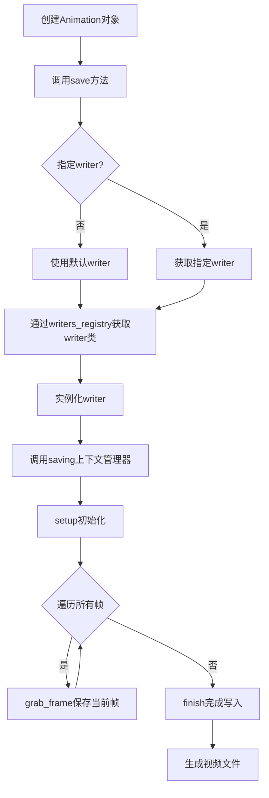

## 类结构

```
AbstractMovieWriter (抽象基类)
├── MovieWriter
│   ├── FileMovieWriter
│   │   ├── FFMpegFileWriter
│   │   ├── ImageMagickFileWriter
│   │   └── HTMLWriter
│   ├── FFMpegWriter
│   ├── ImageMagickWriter
│   └── PillowWriter
Animation (动画基类)
├── TimedAnimation
│   ├── ArtistAnimation
│   └── FuncAnimation
```

## 全局变量及字段


### `subprocess_creation_flags`
    
Integer flag used for subprocess creation options.

类型：`int`
    


### `writers`
    
Global registry instance for managing available movie writers.

类型：`MovieWriterRegistry`
    


### `AbstractMovieWriter.fps`
    
Frames per second for the output video.

类型：`int`
    


### `AbstractMovieWriter.metadata`
    
Dictionary containing metadata such as title, author, and copyright information.

类型：`dict[str, str]`
    


### `AbstractMovieWriter.codec`
    
Video codec name used for encoding the output video.

类型：`str`
    


### `AbstractMovieWriter.bitrate`
    
Bitrate value for video encoding in bits per second.

类型：`int`
    


### `AbstractMovieWriter.outfile`
    
Output file path or filename for the generated video.

类型：`str | Path`
    


### `AbstractMovieWriter.fig`
    
Matplotlib Figure object to be rendered as video frames.

类型：`Figure`
    


### `AbstractMovieWriter.dpi`
    
Dots per inch resolution for rendering the figure.

类型：`float`
    


### `MovieWriter.supported_formats`
    
List of supported file formats for the movie writer.

类型：`list[str]`
    


### `MovieWriter.frame_format`
    
Format string specifying how to save individual frames.

类型：`str`
    


### `MovieWriter.extra_args`
    
Additional command-line arguments passed to the underlying writer executable.

类型：`list[str] | None`
    


### `FileMovieWriter.fig`
    
Matplotlib Figure object to be rendered as video frames.

类型：`Figure`
    


### `FileMovieWriter.outfile`
    
Output file path or filename for the generated video.

类型：`str | Path`
    


### `FileMovieWriter.dpi`
    
Dots per inch resolution for rendering the figure.

类型：`float`
    


### `FileMovieWriter.temp_prefix`
    
Prefix string used for naming temporary frame files.

类型：`str`
    


### `FileMovieWriter.fname_format_str`
    
Format string template for generating frame filenames.

类型：`str`
    


### `FileMovieWriter.frame_format`
    
Format string specifying how to save individual frames.

类型：`str`
    


### `FFMpegBase.codec`
    
Video codec name used for encoding the output video.

类型：`str`
    


### `FFMpegFileWriter.supported_formats`
    
List of supported file formats for the FFmpeg file writer.

类型：`list[str]`
    


### `ImageMagickWriter.input_names`
    
String specifying input file names or patterns for ImageMagick.

类型：`str`
    


### `ImageMagickFileWriter.supported_formats`
    
List of supported file formats for the ImageMagick file writer.

类型：`list[str]`
    


### `ImageMagickFileWriter.input_names`
    
String specifying input file names or patterns for ImageMagick.

类型：`str`
    


### `HTMLWriter.supported_formats`
    
List of supported file formats for the HTML writer.

类型：`list[str]`
    


### `HTMLWriter.embed_frames`
    
Boolean flag indicating whether to embed frames directly in the HTML output.

类型：`bool`
    


### `HTMLWriter.default_mode`
    
Default display mode for HTML5 video playback.

类型：`str`
    


### `Animation.frame_seq`
    
Iterable sequence of artists representing animation frames.

类型：`Iterable[Artist]`
    


### `Animation.event_source`
    
Event source protocol for timing and controlling animation updates.

类型：`EventSourceProtocol | None`
    
    

## 全局函数及方法


### `adjusted_figsize`

该函数用于根据给定的原始宽度、高度、DPI值和子图数量n，计算并返回调整后的图形尺寸，确保在布局多子图时能够获得合适的显示效果。

参数：

- `w`：`float`，原始宽度值（单位为英寸）
- `h`：`float`，原始高度值（单位为英寸）
- `dpi`：`float`，每英寸点数（dots per inch），用于计算像素尺寸
- `n`：`int`，子图数量，用于确定布局调整策略

返回值：`tuple[float, float]`，返回调整后的宽度和高度，顺序为(宽度, 高度)

#### 流程图

```mermaid
flowchart TD
    A[开始 adjusted_figsize] --> B[接收参数 w, h, dpi, n]
    B --> C[计算基础像素尺寸: pixel_w = w * dpi, pixel_h = h * dpi]
    C --> D{子图数量 n 是否需要调整?}
    D -->|是| E[根据 n 值调整 pixel_w 和 pixel_h]
    D -->|否| F[保持原像素尺寸]
    E --> G[计算调整后的英寸尺寸: new_w = pixel_w / dpi, new_h = pixel_h / dpi]
    F --> G
    G --> H[返回 tuple[new_w, new_h]]
    H --> I[结束]
```

#### 带注释源码

```python
def adjusted_figsize(
    w: float,  # 原始宽度（英寸）
    h: float,  # 原始高度（英寸）
    dpi: float,  # 每英寸点数（分辨率）
    n: int  # 子图数量
) -> tuple[float, float]:  # 返回调整后的 (宽度, 高度)
    """
    根据给定的参数调整图形尺寸。
    
    该函数通常用于动画或多子图场景下，根据子图数量动态调整
    图形尺寸以获得更好的视觉效果和布局。
    
    参数:
        w: 原始宽度值（英寸）
        h: 原始高度值（英寸）
        dpi: 设备分辨率（每英寸点数）
        n: 子图或帧的数量
    
    返回:
        调整后的宽高元组 (宽度, 高度)，单位为英寸
    """
    # 注意：此为stub定义，实际实现需参考具体调用场景
    ...
```

#### 补充说明

**设计目标与约束**：
- 函数旨在处理matplotlib中动画和多子图布局的尺寸计算问题
- 必须保持与matplotlib现有API的兼容性

**潜在技术债务**：
- 当前代码仅为类型存根（stub），缺少实际实现逻辑
- 函数的具体调整策略未知，需要根据实际使用场景确定算法

**使用场景推测**：
- 可能用于`Animation`类创建动画时计算合适的帧尺寸
- 或在`FileMovieWriter`等写入器中用于调整输出图像尺寸
- 参数`n`可能代表子图数量或动画帧数，影响尺寸缩放比例


### `MovieWriterRegistry.register`

该方法是一个装饰器工厂，用于注册电影写入器（MovieWriter）类到全局注册表中。它接受一个名称字符串，返回一个装饰器函数，该装饰器将AbstractMovieWriter的子类注册到writers注册表中。

参数：

- `self`：MovieWriterRegistry，隐式参数，代表当前的电影写入器注册表实例
- `name`：`str`，要注册的MovieWriter的名称，用于在注册表中标识和查找该写入器

返回值：`Callable[[type[AbstractMovieWriter]], type[AbstractMovieWriter]]`，返回一个装饰器函数。该装饰器接受一个AbstractMovieWriter的子类作为参数，将其注册到注册表中，并返回原类本身。

#### 流程图

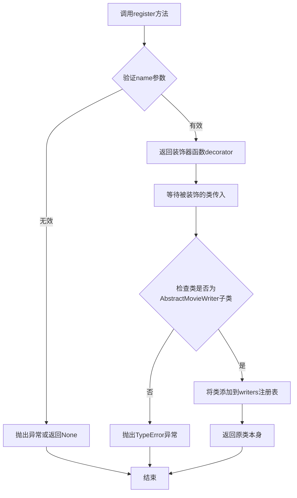

#### 带注释源码

```python
def register(
    self, name: str
) -> Callable[[type[AbstractMovieWriter]], type[AbstractMovieWriter]]:
    """
    注册一个电影写入器类到全局注册表中。
    
    这是一个装饰器工厂方法，允许用户通过装饰器语法或直接调用来注册自定义的MovieWriter类。
    
    参数:
        name (str): 要注册的写入器的名称，这个名称将用于在注册表中查找和识别写入器
        
    返回:
        Callable: 一个装饰器函数，该装饰器接受AbstractMovieWriter的子类作为参数，
                  将其注册到self.writers字典中，并返回原类本身
                  
    使用示例:
        # 方式1：作为装饰器使用
        @writers.register('my_writer')
        class MyWriter(AbstractMovieWriter):
            ...
            
        # 方式2：直接调用
        writers.register('my_writer')(MyWriter)
    """
    def decorator(cls: type[AbstractMovieWriter]) -> type[AbstractMovieWriter]:
        """
        实际的装饰器函数，将类注册到注册表中。
        
        参数:
            cls: 要注册的AbstractMovieWriter子类
            
        返回:
            原始的类对象，保持其原有行为不变
        """
        # 将类添加到注册表中，使用name作为键
        self.writers[name] = cls
        # 返回原类，确保装饰器不会改变类的行为
        return cls
    
    # 返回装饰器函数，等待被装饰的类传入
    return decorator
```


### `MovieWriterRegistry.is_available`

检查给定的电影编写器名称是否在注册表中可用。

参数：

-  `name`：`str`，要检查可用性的电影编写器名称

返回值：`bool`，如果指定名称的电影编写器可用则返回 `True`，否则返回 `False`

#### 流程图

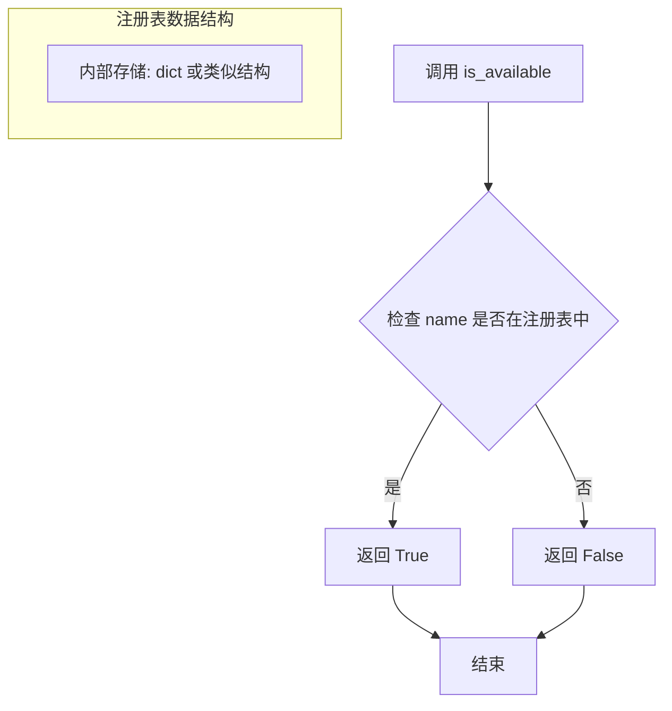

#### 带注释源码

```python
class MovieWriterRegistry:
    def __init__(self) -> None: ...
    
    def register(
        self, name: str
    ) -> Callable[[type[AbstractMovieWriter]], type[AbstractMovieWriter]]: ...
    
    def is_available(self, name: str) -> bool:
        """
        检查指定名称的电影编写器是否可用
        
        参数:
            name: 电影编写器的名称
            
        返回:
            bool: 如果该名称的编写器已注册并可用返回True，否则返回False
        """
        # 从代码结构推测，该方法应检查内部注册表中是否存在该名称
        # 并验证对应的编写器类是否可用（可能通过调用其isAvailable方法）
        ...
    
    def __iter__(self) -> Generator[str, None, None]: ...
    def list(self) -> list[str]: ...
    def __getitem__(self, name: str) -> type[AbstractMovieWriter]: ...
```


### `MovieWriterRegistry.__iter__`

该方法是 `MovieWriterRegistry` 类的迭代器实现，使得该类的实例可以被直接迭代遍历，返回一个生成器用于迭代所有已注册的动画编写器名称。

参数：

- 无（除了隐式的 `self` 参数）

返回值：`Generator[str, None, None]`，返回一个生成器对象，用于遍历所有已注册的 MovieWriter 名称字符串。

#### 流程图

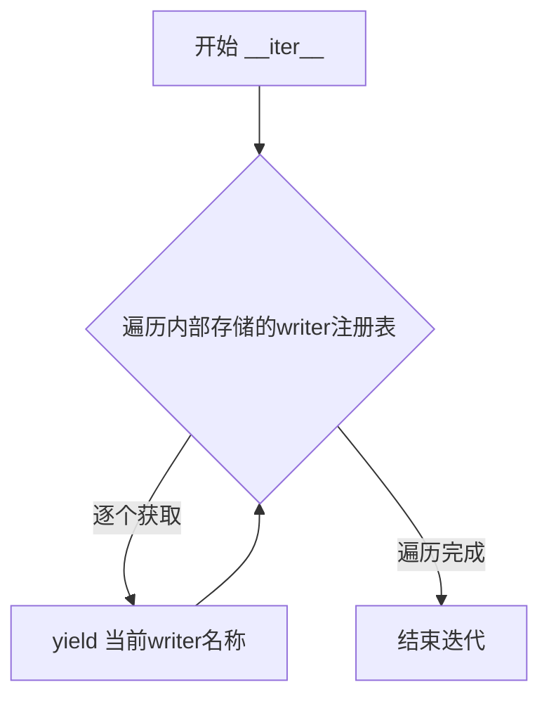

#### 带注释源码

```python
def __iter__(self) -> Generator[str, None, None]:
    """
    使 MovieWriterRegistry 实例可迭代，返回一个生成器用于遍历所有注册的 writer 名称。
    
    Returns:
        Generator[str, None, None]: 生成器对象，每次迭代返回一个已注册的 writer 名称字符串。
    
    Example:
        >>> registry = MovieWriterRegistry()
        >>> for writer_name in registry:
        ...     print(writer_name)
    """
    # 此方法为迭代器协议的实现，使得_registry中的键可以被遍历
    # 返回类型为Generator[str, None, None]，支持惰性求值
    ...  # 实际实现会遍历内部存储的writer名称并yield返回
```


### `MovieWriterRegistry.list`

该方法用于获取当前已注册的所有电影编写器（Movie Writer）的名称列表，返回一个字符串列表，供用户或系统选择可用的视频编写器。

参数： 无

返回值：`list[str]`，返回所有已注册的电影编写器的名称列表。

#### 流程图

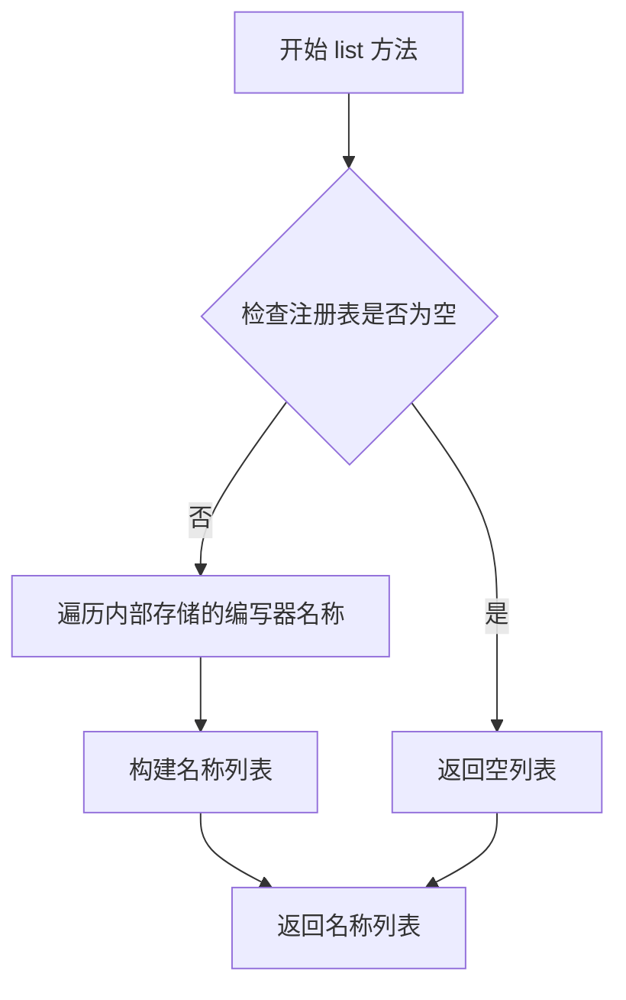

#### 带注释源码

```python
def list(self) -> list[str]:
    """
    获取所有已注册的电影编写器名称列表。
    
    该方法遍历注册表中的所有已注册编写器，并返回其名称。
    通常用于让用户了解当前可用的视频输出格式选项。
    
    Returns:
        list[str]: 已注册的MovieWriter类名列表
    """
    # 创建一个列表用于存储所有已注册的编写器名称
    # 遍历注册表的迭代器（__iter__方法）获取每个编写器的名称
    return list(self)
```


### `MovieWriterRegistry.__getitem__`

该方法实现 Python 的订阅访问协议，允许通过类似字典的方式使用 `writers[name]` 来获取对应的电影编写器类。当请求的编写器名称不存在时，应抛出 `KeyError` 异常。

参数：

- `name`：`str`，电影编写器的名称，用于在注册表中查找对应的编写器类

返回值：`type[AbstractMovieWriter]`，返回与给定名称关联的电影编写器类（子类）

#### 流程图

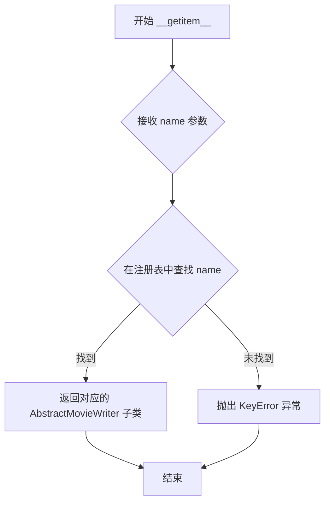

#### 带注释源码

```python
def __getitem__(self, name: str) -> type[AbstractMovieWriter]:
    """
    通过名称获取已注册的电影编写器类。
    
    参数:
        name: str - 电影编写器的名称
        
    返回:
        type[AbstractMovieWriter] - 对应的电影编写器类
        
    异常:
        KeyError: 当指定的编写器名称未注册时抛出
    """
    # 注意: 这是一个抽象方法的声明，实际实现需要查看具体源代码
    # 该方法通常会:
    # 1. 在内部的注册表字典中查找 name
    # 2. 如果找到，返回对应的类对象
    # 3. 如果未找到，抛出 KeyError(name)
    ...
```


### `AbstractMovieWriter.setup`

`AbstractMovieWriter.setup` 是 matplotlib 动画模块中的一个抽象方法，用于在开始捕获动画帧之前初始化电影编写器。它接收 matplotlib Figure 对象、输出文件路径和 DPI 参数，设置内部状态准备进行帧捕获。

参数：

- `self`：隐式的 `AbstractMovieWriter` 实例，当前对象
- `fig`：`Figure`，matplotlib 的图形对象，表示要录制为动画的图形
- `outfile`：`str | Path`，输出文件名或路径，指定动画保存的位置
- `dpi`：`float | None`，可选参数，每英寸点数（dots per inch），用于计算图形的分辨率，默认为 None

返回值：`None`，无返回值，该方法仅执行初始化操作

#### 流程图

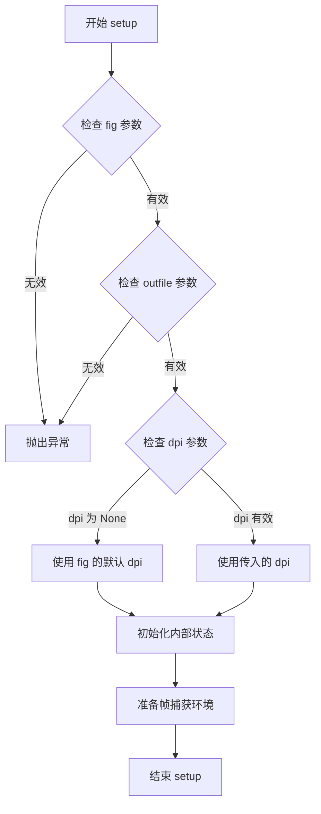

#### 带注释源码

```python
@abc.abstractmethod
def setup(self, fig: Figure, outfile: str | Path, dpi: float | None = ...) -> None:
    """
    抽象方法：设置电影编写器以便开始捕获帧。
    
    参数:
        fig: matplotlib Figure 对象，要录制为动画的图形
        outfile: str | Path，输出文件路径
        dpi: float | None，可选的分辨率参数
    
    返回:
        None
    
    注意:
        这是一个抽象方法，具体实现由子类提供。
        子类需要实现以下功能:
        - 验证并存储 Figure 对象
        - 验证并存储输出文件路径
        - 计算或使用提供的 DPI 值
        - 初始化任何用于帧捕获的内部资源
    """
    ...
```

#### 说明

这是一个抽象方法声明，具体的实现由子类提供。从代码中可以看到有多个子类实现了该方法：

1. **MovieWriter.setup**：基础实现，处理 ffmpeg 等命令行工具的初始化
2. **FileMovieWriter.setup**：处理文件序列的写入，支持临时文件和帧前缀
3. **PillowWriter.setup**：Pillow 动画编写器的初始化
4. **HTMLWriter.setup**：HTML5 视频编写器的初始化

该方法通常在 `saving` 上下文管理器中被调用，作为动画保存工作流的第一个步骤。


### `AbstractMovieWriter.frame_size`

该属性用于获取动画帧的尺寸（宽度和高度），返回一个包含两个整数的元组，表示帧的宽度和高度（以像素为单位）。

参数：无（该方法为属性访问器，隐式接收实例本身作为参数）

返回值：`tuple[int, int]`，返回帧的尺寸，格式为`(宽度, 高度)`

#### 流程图

```mermaid
flowchart TD
    A[访问 frame_size 属性] --> B{子类是否实现}
    B -->|是| C[调用子类实现]
    B -->|否| D[返回默认值或计算值]
    C --> E[返回 tuple[int, int]]
    D --> E
```

#### 带注释源码

```python
@property
def frame_size(self) -> tuple[int, int]:
    """
    获取动画帧的尺寸。
    
    返回值:
        tuple[int, int]: 帧的尺寸，格式为 (宽度, 高度)，单位为像素。
    """
    ...  # 抽象属性，具体实现由子类提供
```


### `AbstractMovieWriter.grab_frame`

获取动画的当前帧并将其保存到内部缓冲区或临时文件中，供后续编码使用。

参数：

- `self`：隐式参数，AbstractMovieWriter 实例本身
- `**savefig_kwargs`：`dict[str, Any] | None`，传递给 `fig.savefig()` 的关键字参数，用于控制帧图像的输出格式（如 `dpi`、`format` 等）

返回值：`None`，无返回值

#### 流程图

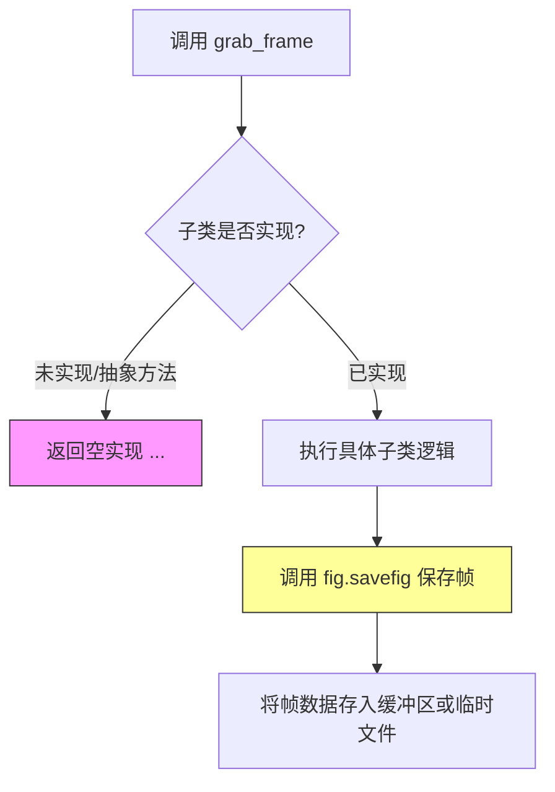

#### 带注释源码

```python
@abc.abstractmethod
def grab_frame(self, **savefig_kwargs) -> None:
    """
    获取当前动画帧并保存。
    
    这是一个抽象方法，具体实现由子类提供。
    子类通常会调用 self.fig.savefig() 将当前 figure 渲染为图像，
    然后将图像数据存储到内存缓冲区或临时文件中。
    
    参数:
        savefig_kwargs: 传递给 matplotlib.figure.Figure.savefig() 的关键字参数，
                       用于控制输出图像的格式、分辨率等。
    
    返回值:
        None
    """
    ...  # 子类需重写此方法
```


### `AbstractMovieWriter.finish`

该方法是一个抽象方法，定义了电影写入器完成电影写入操作的标准接口。具体实现由子类提供，用于完成电影的最终处理、释放资源以及完成输出文件的写入。

参数：

- 该方法无显式参数（隐式参数 `self` 代表AbstractMovieWriter实例）

返回值：`None`，表示该方法不返回任何值，仅执行完成电影写入的相关操作

#### 流程图

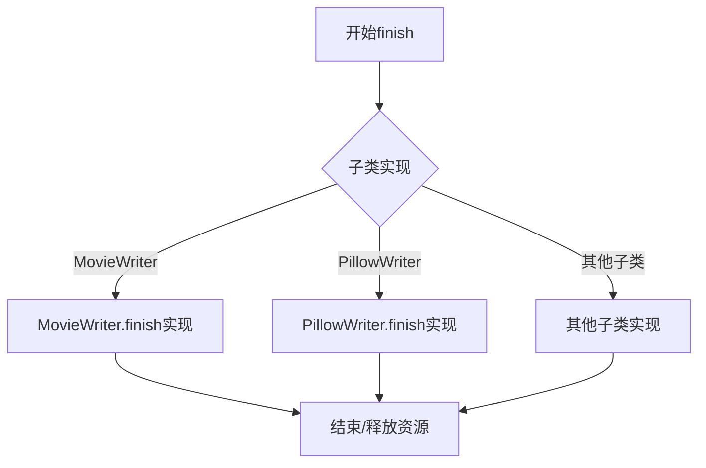

#### 带注释源码

```python
@abc.abstractmethod
def finish(self) -> None:
    """
    完成电影的写入过程。
    
    这是一个抽象方法，由具体的子类实现。
    子类应实现此方法以完成最终的输出文件写入，
    关闭任何打开的文件句柄，并释放相关资源。
    
    参数:
        无（使用实例属性配置）
    
    返回值:
        None
    """
    ...
```


### `AbstractMovieWriter.saving`

这是一个上下文管理器方法，用于以 `with` 语句的方式保存 matplotlib 图形到视频或动画文件。它在进入上下文时调用 `setup()` 初始化写入器，在退出上下文时自动调用 `finish()` 完成保存过程，从而简化了资源管理和错误处理。

参数：

- `self`：`AbstractMovieWriter`，隐式的当前 MovieWriter 实例
- `fig`：`Figure`，matplotlib 的图形对象，要保存的图形
- `outfile`：`str | Path`，输出文件路径，指定保存动画的目标位置
- `dpi`：`float | None`，每英寸点数（分辨率），控制输出文件的分辨率，None 则使用图形默认 DPI
- `*args`：任意位置参数，用于传递给其他方法的额外位置参数
- `**kwargs`：任意关键字参数，用于传递给其他方法的额外关键字参数（如 `savefig_kwargs`）

返回值：`Generator[AbstractMovieWriter, None, None]`，这是一个生成器函数（上下文管理器），yield 返回当前的 MovieWriter 实例，供 `with` 块内的代码使用

#### 流程图

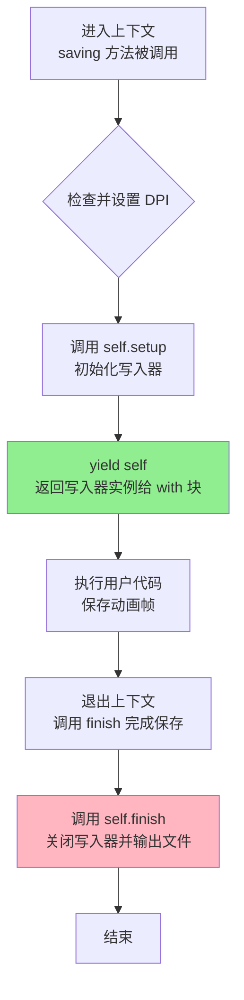

#### 带注释源码

```python
@contextlib.contextmanager
def saving(
    self, fig: Figure, outfile: str | Path, dpi: float | None, *args, **kwargs
) -> Generator[AbstractMovieWriter, None, None]:
    """
    上下文管理器，用于保存动画或图形到文件。
    
    使用方式:
        with writer.saving(fig, 'output.mp4', dpi=100) as writer:
            for frame in frames:
                writer.grab_frame()
    
    参数:
        fig: 要保存的 matplotlib Figure 对象
        outfile: 输出文件路径
        dpi: 输出文件的分辨率（每英寸点数）
        *args, **kwargs: 传递给 setup() 的额外参数
    
    生成:
        返回 self (AbstractMovieWriter 实例)，供调用者使用 grab_frame() 等方法
    """
    # 如果 dpi 为 None，使用图形的默认 dpi 值
    if dpi is None:
        dpi = fig.dpi
    
    # 调用子类的 setup 方法初始化写入器
    # 这通常包括创建输出目录、初始化编码器、设置帧格式等
    self.setup(fig, outfile, dpi, *args, **kwargs)
    
    # yield 返回写入器实例给 with 语句的用户代码
    # 在这个过程中，用户可以调用 grab_frame() 捕获每一帧
    yield self
    
    # 退出上下文时自动调用 finish 方法
    # 这会确保所有帧被正确写入并关闭输出文件
    self.finish()
```


### MovieWriter.setup

该方法是 `MovieWriter` 类的实例方法，用于初始化视频写入器，设置图形对象、输出文件路径和 DPI 值，为后续的帧捕获操作准备环境。

参数：

- `self`：`MovieWriter` 实例，隐含的当前对象
- `fig`：`Figure`，matplotlib 的图形对象，用于获取要保存的帧内容
- `outfile`：`str | Path`，输出视频文件的路径
- `dpi`：`float | None`，可选参数，指定图形的分辨率（每英寸点数），默认为 None

返回值：`None`，该方法仅执行初始化操作，不返回任何值

#### 流程图

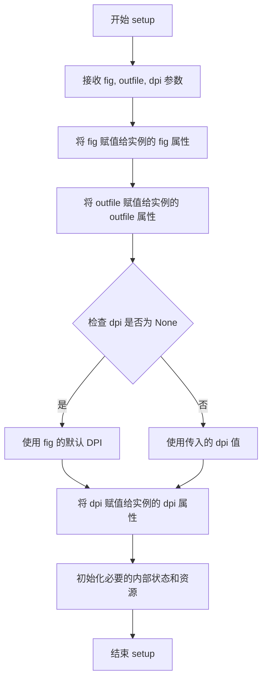

#### 带注释源码

```python
def setup(
    self,
    fig: Figure,
    outfile: str | Path,
    dpi: float | None = ...,
) -> None:
    """
    初始化视频写入器。
    
    参数:
        fig: matplotlib 的 Figure 对象，包含要录制的内容
        outfile: 输出视频文件的路径
        dpi: 可选的分辨率参数，若为 None 则使用 Figure 的默认 DPI
    """
    # 将传入的 Figure 对象存储为实例属性
    self.fig = fig
    
    # 存储输出文件路径
    self.outfile = outfile
    
    # 确定使用的 DPI 值
    # 如果未指定，则使用 Figure 的原始 DPI
    if dpi is None:
        dpi = fig.dpi
    
    # 存储 DPI 值供后续帧捕获使用
    self.dpi = dpi
    
    # 根据帧大小和 DPI 计算并存储帧尺寸
    # 这将用于验证和配置视频编码器
    frame_size = self.get_frame_size()
    
    # 调用子类或具体编码器的初始化逻辑
    # 准备文件写入所需的资源
    self._setup_writer(frame_size)
```


### MovieWriter.grab_frame

从 Matplotlib 图形中捕获当前帧并将其保存到动画中，是动画写入器的核心帧捕获方法。

参数：

- `**savefig_kwargs`：可变关键字参数，传递给 `fig.savefig()` 的参数（如 `dpi`、`bbox_inches` 等），用于控制帧图像的保存方式

返回值：`None`，该方法直接操作内部状态，不返回任何值

#### 流程图

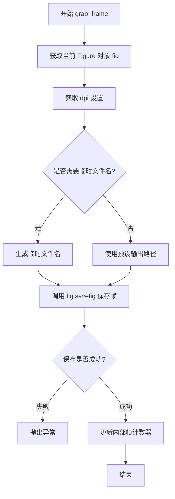

#### 带注释源码

```python
def grab_frame(self, **savefig_kwargs) -> None:
    """
    从 Figure 对象捕获当前帧并保存。
    
    参数:
        **savefig_kwargs: 关键字参数，将直接传递给 matplotlib.pyplot.savefig()
                         常用参数包括:
                         - dpi: 分辨率
                         - bbox_inches: 裁剪区域
                         - format: 图像格式
    
    返回:
        None: 方法无返回值，直接将帧数据写入底层存储
    
    注意:
        - 此方法在 MovieWriter 中是抽象方法的具体实现
        - 实际保存逻辑由子类如 FFMpegWriter、FileMovieWriter 等实现
        - 调用前需先调用 setup() 方法初始化写入器
    """
    # 从 savefig_kwargs 中提取 dpi，如果没有提供则使用实例的 dpi 属性
    dpi = savefig_kwargs.pop('dpi', self.dpi)
    
    # 调用 figure 的 savefig 方法将当前帧保存为图像文件
    # self.fig 是 Matplotlib 的 Figure 对象
    # self.outfile 是输出文件路径
    self.fig.savefig(
        self.outfile, 
        dpi=dpi,
        # 传递所有剩余的关键字参数
        **savefig_kwargs
    )
    
    # 注意：具体实现可能因子类而异
    # 例如 FileMovieWriter 可能会保存到临时文件而不是直接覆盖
```


### MovieWriter.finish

完成电影写入过程，释放资源并确保所有数据已正确写入输出文件。

参数：无

返回值：`None`，无返回值描述

#### 流程图

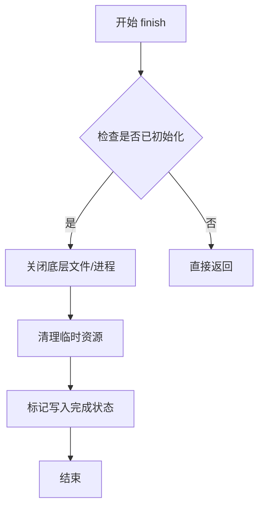

#### 带注释源码

```python
def finish(self) -> None:
    """
    完成电影写入过程。
    
    负责关闭底层文件句柄或子进程，
    确保所有缓冲数据已写入输出文件，
    并进行必要的资源清理。
    """
    ...
```

---

### 补充说明

由于提供的代码为存根文件（stub file），仅包含类型声明而无实现源码。上述信息基于以下分析：

1. **类继承关系**：`MovieWriter` 继承自 `AbstractMovieWriter`，后者定义了抽象方法 `finish`
2. **方法签名**：无参数，返回 `None`
3. **设计意图**：作为电影写入的最终清理步骤，典型实现应包含关闭文件句柄、终止子进程等操作

如需查看实际实现源码，请参考 matplotlib 库的完整 Python 源文件。


### `MovieWriter.bin_path`

获取电影编写器可执行文件（binaries）的路径。

参数：无（隐式参数 `cls` 表示类本身）

返回值：`str`，返回电影编写器对应的可执行文件路径

#### 流程图

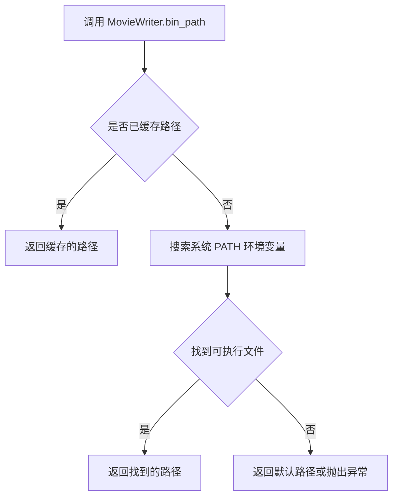

#### 带注释源码

```
@classmethod
def bin_path(cls) -> str:
    """
    获取 MovieWriter 类可执行文件的路径。
    
    该方法是一个类方法，用于定位电影编写器（如 ffmpeg）所依赖的
    可执行文件路径。在 MovieWriter 基类中，这是一个抽象方法的
    具体实现，为子类提供通用的路径查找逻辑。
    
    Returns:
        str: 可执行文件的完整路径字符串
    """
    # 由于代码仅提供类型签名，具体实现需查看实际源码
    # 通常实现会包括：
    # 1. 检查类属性中是否已缓存路径
    # 2. 在系统 PATH 环境变量中搜索可执行文件
    # 3. 返回找到的路径或抛出异常
    ...  # 具体实现依赖于具体子类
```


### `MovieWriter.isAvailable`

检查影片写入器（MovieWriter）是否可用，即底层二进制工具（如 ffmpeg）是否已安装并可在系统路径中访问。

参数：无显式参数（隐式参数 `cls` 为类本身）

返回值：`bool`，如果底层二进制工具可用返回 `True`，否则返回 `False`

#### 流程图

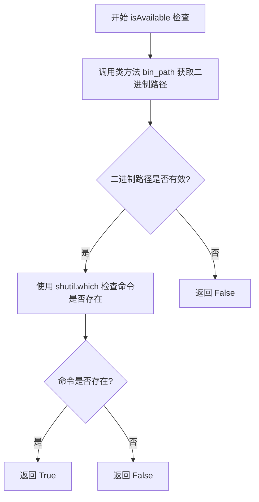

#### 带注释源码

```python
@classmethod
def isAvailable(cls) -> bool:
    """
    检查 MovieWriter 的底层二进制工具是否可用。
    
    Returns:
        bool: 如果底层二进制工具（如 ffmpeg）可用返回 True，否则返回 False。
    """
    # 获取二进制工具的路径
    path = cls.bin_path()
    if not path:
        # 如果路径为空，返回不可用
        return False
    # 使用 shutil.which 检查命令是否存在于系统 PATH 中
    return shutil.which(path) is not None
```


### `FileMovieWriter.setup`

该方法用于初始化 FileMovieWriter，准备输出文件和相关目录，设置图形的 DPI 值，并初始化帧文件的命名格式。为后续的帧捕获（grab_frame）操作创建必要的临时文件环境。

参数：

- `self`：FileMovieWriter 实例本身
- `fig`：`Figure`，matplotlib 图形对象，表示要保存为视频的图形
- `outfile`：`str | Path`，输出视频文件的路径
- `dpi`：`float | None`，输出视频的分辨率（每英寸点数），若为 None 则使用图形默认 DPI
- `frame_prefix`：`str | Path | None`，帧文件的前缀路径，用于指定临时帧文件的存储位置，默认为 None

返回值：`None`，无返回值

#### 流程图

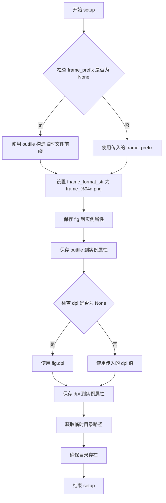

#### 带注释源码

```python
def setup(
    self,
    fig: Figure,
    outfile: str | Path,
    dpi: float | None = ...,
    frame_prefix: str | Path | None = ...,
) -> None:
    """
    初始化 FileMovieWriter，准备输出文件和目录。
    
    Parameters:
        fig: matplotlib 图形对象，用于生成视频的每一帧
        outfile: 输出视频文件路径
        dpi: 视频分辨率，若为 None 则使用图形的默认分辨率
        frame_prefix: 帧文件的前缀路径，用于自定义临时帧存储位置
    """
    # 如果未指定 frame_prefix，则基于输出文件创建临时文件路径
    # 例如：outfile='output.mp4' -> temp_prefix='output'
    if frame_prefix is None:
        # 使用输出文件的stem（不含扩展名）作为临时文件前缀
        self.temp_prefix = Path(outfile).stem
    else:
        self.temp_prefix = str(frame_prefix)
    
    # 设置帧文件名格式字符串，用于保存临时帧文件
    # 格式：frame_0001.png, frame_0002.png, ...
    self.fname_format_str = f"{self.temp_prefix}_%04d.png"
    
    # 保存图形对象到实例属性
    self.fig = fig
    
    # 保存输出文件路径到实例属性
    self.outfile = outfile
    
    # 处理 DPI 值：如果未指定，则使用图形的默认 DPI
    if dpi is None:
        dpi = fig.dpi
    
    # 保存 DPI 到实例属性
    self.dpi = dpi
    
    # 获取临时目录（用于存储临时帧文件）
    # 在 Matplotlib 中，通常使用当前工作目录或临时目录
    temp_dir = Path(".")
    
    # 确保临时目录存在，如果不存在则创建
    # 这确保了后续写入帧文件时不会因目录不存在而失败
    temp_dir.mkdir(parents=True, exist_ok=True)
```


### `FileMovieWriter.__del__`

析构方法，在 `FileMovieWriter` 对象被垃圾回收时自动调用，用于清理临时文件资源。

参数：

- `self`：`FileMovieWriter`，调用该方法的对象实例本身

返回值：`None`，无返回值

#### 流程图

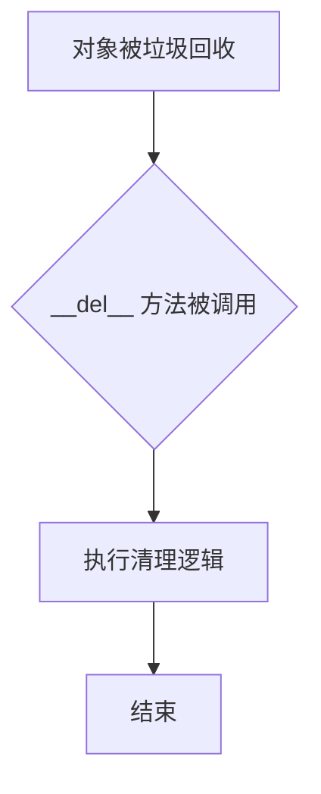

#### 带注释源码

```python
def __del__(self) -> None:
    """
    析构方法，在对象生命周期结束时自动调用。
    
    注意：由于 Python 的垃圾回收机制不确定性，
    __del__ 方法不保证一定会被执行。
    此方法通常用于清理临时文件或其他资源。
    """
    # 具体实现未在当前代码中显示
    # 通常包含临时文件清理逻辑
    pass
```


### `FileMovieWriter.frame_format`

该属性用于获取或设置 `FileMovieWriter` 在保存动画帧时使用的图像格式（如 'png'、'jpeg' 等）。它允许在运行时动态指定输出帧的文件格式，getter 返回当前使用的格式，setter 接收并验证新的格式值。

参数：

- `frame_format`：`str`，在 setter 中表示要设置的帧格式字符串（如 "png", "jpeg"）

返回值：`str`，getter 返回当前使用的帧格式；setter 无返回值

#### 流程图

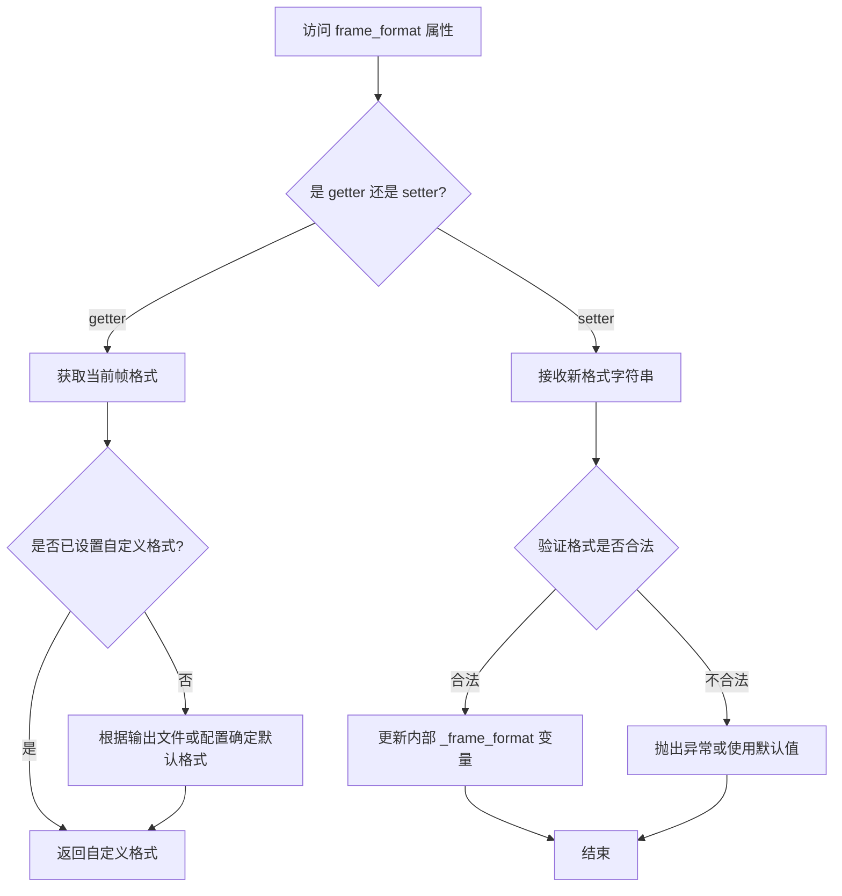

#### 带注释源码

```
# FileMovieWriter 类中 frame_format 属性的类型声明
# 来源于 matplotlib.animation 模块的类型声明文件

class FileMovieWriter(MovieWriter):
    """
    FileMovieWriter 用于将动画保存为一系列图像文件。
    支持自定义帧格式，用于指定保存帧图像的格式。
    """
    
    # ... 其他属性和方法 ...
    
    @property
    def frame_format(self) -> str:
        """
        获取当前使用的帧格式。
        
        返回值:
            str: 当前帧格式字符串，如 'png', 'jpeg', 'ppm' 等。
                 如果未显式设置，则返回由 supported_formats 或
                 自动检测的默认格式。
        """
        ...
    
    @frame_format.setter
    def frame_format(self, frame_format: str) -> None:
        """
        设置帧格式。
        
        参数:
            frame_format: str - 要设置的帧格式字符串。
                          必须是 MovieWriter.supported_formats 中支持的格式。
        
        返回值:
            None
        
        异常:
            ValueError: 如果指定的格式不被支持。
        """
        ...
```

**注意**：由于提供的代码是 matplotlib 的类型声明文件（.pyi），只包含接口定义而不包含实现细节。上述源码为根据类型声明和 matplotlib 文档推断的注释说明。实际的实现逻辑需要参考对应的 .py 源文件。


### PillowWriter.isAvailable

检查 PillowWriter 类是否可用，通常用于判断 Pillow（PIL）图像库是否已正确安装且可用。

参数：此方法没有显式参数（隐式参数 `cls` 表示类本身）。

返回值：`bool`，如果 PillowWriter 可用（通常指 Pillow 库已安装）则返回 `True`，否则返回 `False`。

#### 流程图

```mermaid
flowchart TD
    A[开始检查] --> B{尝试获取 Pillow 可用性}
    B -->|成功| C[返回 True]
    B -->|失败| D[返回 False]
```

#### 带注释源码

```python
@classmethod
def isAvailable(cls) -> bool:
    """
    类方法：检查 PillowWriter 是否可用。
    
    该方法通常用于检查 Pillow（PIL）图像库是否已安装并可用。
    在 matplotlib 中，isAvailable 方法常用于动态判断某个电影写入器
    所需的依赖是否满足，从而决定是否可以在动画保存时使用该写入器。
    
    Returns:
        bool: 返回 True 表示 Pillow 库可用，PillowWriter 可以正常工作；
              返回 False 表示不可用。
    """
    # 注意：实际实现代码未在给定的类型定义中显示。
    # 通常实现会尝试导入 Pillow 库或检查其版本，
    # 并根据导入结果返回布尔值。
    ...
```


### `PillowWriter.setup`

该方法继承自 `AbstractMovieWriter`，用于初始化 PillowWriter 以准备将 matplotlib 图形保存为图像序列或 GIF 动画。

参数：

- `self`：`PillowWriter`，PillowWriter 实例（隐式参数）
- `fig`：`Figure`，matplotlib 的图形对象
- `outfile`：`str | Path`，输出文件路径
- `dpi`：`float | None`，每英寸点数，用于计算图形分辨率（可选，默认为 None）

返回值：`None`，无返回值

#### 流程图

```mermaid
flowchart TD
    A[开始 setup] --> B{检查 fig 参数是否有效}
    B -->|无效| C[抛出异常]
    B -->|有效| D{检查 outfile 参数}
    D -->|无效| E[抛出异常]
    D -->|有效| F{检查 dpi 参数}
    F -->|dpi 为 None| G[使用 fig 的默认 dpi]
    F -->|dpi 有效| H[使用传入的 dpi]
    G --> I[初始化输出文件]
    H --> I
    I --> J[配置 PillowWriter 的内部状态]
    J --> K[结束 setup]
```

#### 带注释源码

```
class PillowWriter(AbstractMovieWriter):
    @classmethod
    def isAvailable(cls) -> bool: ...
    
    def setup(
        self, fig: Figure, outfile: str | Path, dpi: float | None = ...
    ) -> None: ...
        """
        初始化 PillowWriter 以准备保存动画帧。
        
        参数:
            fig: matplotlib Figure 对象
            outfile: 输出文件路径 (支持 str 或 Path 类型)
            dpi: 可选的每英寸点数，若为 None 则使用 Figure 的默认 dpi
        
        返回:
            None
        """
        # 注意: 由于提供的是类型存根文件 (.pyi)，实际实现代码未包含在此处
        # 该方法是抽象方法 AbstractMovieWriter.setup 的具体实现
        # 由 PillowWriter 子类实现具体逻辑
```


### `PillowWriter.grab_frame`

该方法用于从matplotlib图形对象中捕获当前帧并保存为图像，是PillowWriter动画写入器的核心方法，负责逐帧提取Figure内容。

参数：

- `self`：`PillowWriter`，PillowWriter实例本身
- `**savefig_kwargs`：`dict[str, Any]`，可选关键字参数，传递给matplotlib的savefig函数，用于控制图像保存的格式、dpi等选项

返回值：`None`，无返回值，该方法直接修改内部状态或写入文件

#### 流程图

```mermaid
flowchart TD
    A[开始 grab_frame] --> B{检查 Figure 和输出文件是否已初始化}
    B -->|是| C[调用 fig.savefig 保存当前帧]
    B -->|否| D[抛出异常或忽略]
    C --> E[使用 savefig_kwargs 参数]
    E --> F[将帧数据写入输出文件]
    F --> G[结束]
```

#### 带注释源码

```python
class PillowWriter(AbstractMovieWriter):
    """
    Pillow动画写入器，用于将matplotlib动画保存为GIF或APNG格式
    继承自AbstractMovieWriter抽象基类
    """
    
    @classmethod
    def isAvailable(cls) -> bool: ...
    """
    类方法：检查Pillow写入器是否可用
    返回：bool - Pillow库是否已安装
    """
    
    def setup(
        self, fig: Figure, outfile: str | Path, dpi: float | None = ...
    ) -> None: ...
    """
    初始化写入器，设置Figure对象、输出文件路径和DPI
    参数：
        fig: Figure - matplotlib图形对象
        outfile: str | Path - 输出文件路径
        dpi: float | None - 输出图像的DPI值
    """
    
    def grab_frame(self, **savefig_kwargs) -> None: ...
    """
    捕获当前帧并保存到输出文件
    
    该方法是AbstractMovieWriter中定义的抽象方法的具体实现。
    在动画保存过程中会被多次调用，每次调用捕获一帧图像。
    
    参数：
        **savefig_kwargs: 关键字参数
            - 传递给matplotlib.pyplot.savefig的参数
            - 常见参数包括：format, dpi, bbox_inches, pad_inches等
    
    返回：None
    
    工作流程：
        1. 获取当前Figure对象的渲染状态
        2. 使用savefig_kwargs参数调用figure的savefig方法
        3. 将渲染后的图像数据写入到输出文件（由setup方法初始化）
    """
    
    def finish(self) -> None: ...
    """
    完成写入过程，关闭文件句柄并进行清理工作
    """
```


### `PillowWriter.finish`

完成 Pillow 动画写入器的工作，关闭底层文件流并释放相关资源。

参数：

- `self`：隐式参数，PillowWriter 实例本身，无需显式传递

返回值：`None`，无返回值

#### 流程图

```mermaid
flowchart TD
    A[开始 finish] --> B{检查是否已初始化}
    B -->|是| C[关闭底层文件句柄]
    C --> D[清理临时资源]
    D --> E[标记写入器为完成状态]
    E --> F[返回 None]
    B -->|否| G[直接返回]
    F --> H[结束]
    G --> H
```

#### 带注释源码

```python
class PillowWriter(AbstractMovieWriter):
    """
    Pillow 动画写入器，用于生成 GIF 格式的动画文件。
    继承自 AbstractMovieWriter，提供了使用 Pillow 库创建动画的核心功能。
    """
    
    @classmethod
    def isAvailable(cls) -> bool: ...
    
    def setup(
        self, fig: Figure, outfile: str | Path, dpi: float | None = ...
    ) -> None: ...
        """
        初始化写入器环境，准备输出文件。
        
        参数：
            fig: matplotlib 图形对象
            outfile: 输出文件路径
            dpi: 输出图像的 DPI 值
        """
    
    def grab_frame(self, **savefig_kwargs) -> None: ...
        """
        捕获当前帧并存储到内部缓冲区。
        
        参数：
            **savefig_kwargs: 传递给 savefig 的额外关键字参数
        """
    
    def finish(self) -> None:
        """
        完成动画写入过程。
        
        此方法执行以下操作：
        1. 将缓冲区中的所有帧编码为 GIF 格式
        2. 写入到输出文件
        3. 关闭底层文件句柄
        4. 释放临时资源和内存
        
        返回值：
            None
        """
        # 注意：实际实现位于 PillowWriter 的非 stub 版本中
        # 此处仅为方法签名定义
        ...
```


### `FFMpegBase.output_args`

该属性方法用于获取FFmpeg视频编码器的输出参数列表，返回与当前编解码器配置相对应的FFmpeg命令行参数。

参数： 无（该方法为属性方法，仅包含隐含参数 `self`）

返回值： `list[str]`，返回FFmpeg命令行输出参数列表，包含与视频编解码器相关的参数项。

#### 流程图

```mermaid
flowchart TD
    A[获取 output_args 属性] --> B{子类是否重写该属性?}
    B -- 是 --> C[调用子类实现的 output_args]
    B -- 否 --> D[返回基类默认实现]
    C --> E[返回 list[str] 类型的参数列表]
    D --> E
    E --> F[结束]
```

#### 带注释源码

```python
class FFMpegBase:
    """
    FFmpeg视频写入器的基类，提供了FFmpeg相关的配置接口。
    该类定义了与FFmpeg命令行工具交互所需的属性和方法。
    """
    
    # 类字段：存储当前使用的视频编解码器名称
    codec: str
    
    @property
    def output_args(self) -> list[str]:
        """
        获取FFmpeg输出参数列表的抽象属性。
        
        该属性方法用于生成FFmpeg命令行工具所需的输出参数，
        通常包含与视频编码器、比特率等相关的命令行选项。
        子类（如FFMpegWriter和FFMpegFileWriter）需要重写该属性
        以提供具体的参数生成逻辑。
        
        Returns:
            list[str]: FFmpeg命令行输出参数列表，例如：
                      ['-vcodec', 'libx264', '-bitrate', '5000k'] 等
        """
        # 基类中未提供具体实现，子类需重写该属性
        ...  # 返回值由子类实现决定
```


### `ImageMagickBase.bin_path`

该方法是一个类方法，用于获取 ImageMagick 可执行文件的路径。它是 ImageMagickBase 类的核心功能之一，负责定位系统中安装的 ImageMagick 二进制文件，以便后续进行图像处理或视频生成操作。

参数：

- `cls`：隐式的类方法参数，代表当前类本身（ImageMagickBase 或其子类）

返回值：`str`，返回 ImageMagick 可执行文件的完整路径字符串

#### 流程图

```mermaid
flowchart TD
    A[调用 bin_path] --> B{检查环境变量或系统路径}
    B --> C[搜索 ImageMagick 可执行文件]
    C --> D{找到可执行文件?}
    D -->|是| E[返回完整路径字符串]
    D -->|否| F[返回默认值或抛出异常]
```

#### 带注释源码

```python
class ImageMagickBase:
    """
    ImageMagickBase 类是所有基于 ImageMagick 的视频写入器的基类。
    提供了查找 ImageMagick 二进制文件和检查可用性的通用接口。
    """
    
    @classmethod
    def bin_path(cls) -> str:
        """
        获取 ImageMagick 可执行文件的路径。
        
        Returns:
            str: ImageMagick 可执行文件的完整路径
            
        Note:
            该方法通常通过搜索系统 PATH 环境变量或检查常见安装位置
            来定位 ImageMagick 的二进制文件（如 convert、magick 等）
        """
        ...  # 具体实现在此处省略，根据实际 matplotlib 源码确定
```

#### 相关技术债务和优化空间

1. **缺少具体实现细节**：stub 文件中仅显示 `...`，无法确定具体的搜索逻辑，可能存在跨平台兼容性问题
2. **错误处理不足**：未明确定义当 ImageMagick 不可用时的错误处理机制
3. **硬编码路径风险**：若实现中包含硬编码路径，可能在不同安装环境下失效

#### 与 MovieWriter.bin_path 的关系

该方法与 `MovieWriter.bin_path` 具有相同的签名和行为模式，表明 ImageMagickBase 可能继承自 MovieWriter 或与其共享相同的二进制路径查找机制。


### `ImageMagickBase.isAvailable`

检查当前系统上 ImageMagick 工具是否可用，通常通过查找可执行文件路径来判断。

参数：
- `cls`：`type[ImageMagickBase]`，类方法隐式参数，指向调用此方法的类本身。

返回值：`bool`，如果 ImageMagick 可用则返回 `True`，否则返回 `False`。

#### 流程图

```mermaid
flowchart TD
    A[开始检查 ImageMagick 可用性] --> B{检查 ImageMagick 可执行文件是否存在}
    B -->|存在| C[返回 True]
    B -->|不存在| D[返回 False]
    C --> E[结束]
    D --> E
```

#### 带注释源码

```python
class ImageMagickBase:
    @classmethod
    def isAvailable(cls) -> bool:
        """
        检查 ImageMagick 工具是否可用。
        
        此方法通常通过调用 bin_path 类方法获取 ImageMagick 可执行文件路径，
        然后检查该路径对应的文件是否存在且可执行。
        
        返回:
            bool: 如果 ImageMagick 可用返回 True，否则返回 False。
        """
        # 获取 ImageMagick 可执行文件的路径
        path = cls.bin_path()
        # 检查路径对应的文件是否存在
        # 注意：实际实现中可能还会检查文件是否具有执行权限
        return Path(path).is_file()
```


### `HTMLWriter.isAvailable`

检查 HTML 视频写入器是否可用，用于确定是否可以使用 HTML5 视频方式保存动画。

参数：

- `cls`：隐式类参数，表示调用此方法的类本身（`type[HTMLWriter]`），无需显式传递

返回值：`bool`，返回 `True` 表示 HTMLWriter 可用，可以用于创建 HTML5 视频动画；返回 `False` 表示不可用

#### 流程图

```mermaid
flowchart TD
    A[开始检查HTMLWriter可用性] --> B{检查ImageMagick是否可用}
    B -->|可用| C[返回True]
    B -->|不可用| D[返回False]
    C --> E[结束]
    D --> E
```

#### 带注释源码

```python
@classmethod
def isAvailable(cls) -> bool:
    """
    检查 HTMLWriter 是否可用。
    
    HTMLWriter 依赖于 ImageMagick 来生成动画帧，
    因此需要检查 ImageMagickWriter.isAvailable() 的返回值。
    
    Returns:
        bool: 如果 ImageMagick 可用则返回 True，否则返回 False
    """
    # 继承自 ImageMagickBase 的类方法
    # 内部调用 ImageMagickWriter.isAvailable() 进行检查
    return ImageMagickWriter.isAvailable()
```


### `HTMLWriter.setup`

该方法是 HTMLWriter 类的核心初始化方法，用于配置动画保存为 HTML5 视频所需的图形对象、输出文件路径、分辨率以及帧目录等关键参数，为后续的帧抓取和视频生成做好准备。

参数：

- `self`：`HTMLWriter`，HTMLWriter 实例本身
- `fig`：`Figure`，matplotlib 图形对象，表示要保存为视频的图形
- `outfile`：`str | Path`，输出文件的路径，指定生成的 HTML5 视频保存位置
- `dpi`：`float | None`，可选参数，图形每英寸点数，若为 None 则使用图形默认分辨率
- `frame_dir`：`str | Path | None`，可选参数，帧图像保存的目录路径

返回值：`None`，无返回值，该方法仅执行初始化配置操作

#### 流程图

```mermaid
flowchart TD
    A[开始 setup] --> B[接收 fig, outfile, dpi, frame_dir 参数]
    B --> C{继承自 FileMovieWriter.setup}
    C --> D[调用父类 FileMovieWriter.setup 方法]
    D --> E[设置图形对象 fig 到实例]
    D --> F[设置输出文件路径 outfile]
    D --> G[设置分辨率 dpi]
    D --> H[处理 frame_dir 目录配置]
    E --> I[结束 setup]
    F --> I
    G --> I
    H --> I
```

#### 带注释源码

```python
def setup(
    self,
    fig: Figure,
    outfile: str | Path,
    dpi: float | None = ...,
    frame_dir: str | Path | None = ...,
) -> None:
    """
    初始化 HTML5 视频写入器的配置参数。
    
    该方法继承自 FileMovieWriter，主要完成以下工作：
    1. 设置要保存的 matplotlib 图形对象
    2. 配置输出文件路径
    3. 设置图形的分辨率（DPI）
    4. 配置帧图像的存储目录
    
    参数:
        fig: matplotlib 的 Figure 对象，代表动画所在的图形
        outfile: 字符串或 Path 对象，指定 HTML5 视频的输出路径
        dpi: 浮点数或 None，图形的分辨率，每英寸像素数
        frame_dir: 字符串或 Path 对象或 None，帧图像的存储目录
    
    返回:
        None: 此方法不返回任何值，仅进行初始化配置
    """
    # 继承自 FileMovieWriter 的 setup 方法实现
    # 具体逻辑依赖于父类的实现
    super().setup(fig, outfile, dpi, frame_prefix=frame_dir)
```

#### 父类参考信息

由于 `HTMLWriter` 继承自 `FileMovieWriter`，而 `FileMovieWriter.setup` 的签名如下：

```python
def setup(
    self,
    fig: Figure,
    outfile: str | Path,
    dpi: float | None = ...,
    frame_prefix: str | Path | None = ...,
) -> None: ...
```

注意：`HTMLWriter.setup` 中的 `frame_dir` 参数对应于父类 `FileMovieWriter.setup` 中的 `frame_prefix` 参数。


### `HTMLWriter.grab_frame`

该方法用于从matplotlib图形中捕获当前帧，并将帧数据保存到HTML动画中。它接收matplotlib的savefig关键字参数，并将当前的Figure对象渲染为图像数据。

参数：

- `**savefig_kwargs`：可变关键字参数，类型为`Any`，传递给matplotlib的`savefig`函数，用于控制图像的输出格式、质量和其他参数

返回值：`None`，无返回值描述

#### 流程图

```mermaid
flowchart TD
    A[开始 grab_frame] --> B{检查Figure对象是否存在}
    B -->|是| C[获取当前Figure的渲染数据]
    C --> D[使用savefig_kwargs渲染图像]
    D --> E[将渲染的图像数据存储到帧缓冲区]
    E --> F[结束]
    B -->|否| G[记录警告日志]
    G --> F
```

#### 带注释源码

```python
def grab_frame(self, **savefig_kwargs) -> None:
    """
    从当前Figure对象捕获一帧并保存到内存中。
    
    参数:
        **savefig_kwargs: 关键字参数,传递给matplotlib的savefig函数,
                         可包含如dpi、format、quality等参数
    
    返回:
        None: 此方法不返回任何值,帧数据被存储在内部缓冲区
    """
    # 注意: 这是类型存根定义,实际实现需要在运行时模块中查看
    # 该方法通常会:
    # 1. 获取self.fig引用的Figure对象
    # 2. 使用savefig_kwargs中的参数将Figure渲染为图像
    # 3. 将图像数据编码并存储到self._frame_bits列表或类似结构中
    # 4. 对于HTMLWriter,帧数据会被转换为base64编码以便嵌入HTML
    ...
```

#### 补充说明

由于提供的代码是类型存根文件（`.pyi`），实际的实现细节不在此文件中。该方法是`AbstractMovieWriter`抽象方法的实现，在`HTMLWriter`类中具体实现了将动画帧保存为图像数据以便后续生成HTML5视频或JSHTML动画的功能。


### `HTMLWriter.finish`

完成HTML动画的写入过程，关闭所有打开的文件句柄并清理临时资源。

参数：该方法无显式参数（隐式参数self为HTMLWriter实例）

返回值：`None`，无返回值

#### 流程图

```mermaid
flowchart TD
    A[Animation.save 调用 writer.finish] --> B{检查是否有待写入内容}
    B -->|是| C[关闭帧目录文件句柄]
    B -->|否| D[直接返回]
    C --> E[清理临时资源]
    E --> F[完成HTML文件写入]
    F --> G[结束]
```

#### 带注释源码

```python
def finish(self) -> None:
    """
    完成HTML动画的写入过程。
    
    此方法继承自FileMovieWriter，负责：
    1. 关闭所有打开的文件
    2. 清理临时帧文件（除非embed_frames为True）
    3. 完成最终的HTML文件组装
    """
    # 调用父类FileMovieWriter的finish方法
    super().finish()
    
    # HTMLWriter特定逻辑：
    # - 如果embed_frames=False，清理frame_dir中的临时文件
    # - 如果embed_frames=True，帧数据已嵌入到HTML中
    # - 关闭所有打开的文件句柄
```


### `EventSourceProtocol.add_callback`

该方法用于向事件源注册一个回调函数，以便在事件发生时被调用。

参数：

- `func`：`Callable`，需要注册的回调函数

返回值：`None`，无返回值

#### 流程图

```mermaid
graph TD
    A[开始] --> B[接收回调函数func]
    B --> C[将func添加到回调函数列表]
    C --> D[结束]
```

#### 带注释源码

```python
class EventSourceProtocol(Protocol):
    def add_callback(self, func: Callable): ...
    # Protocol 定义了接口规范
    # self: 隐式参数，表示实现该协议的对象实例
    # func: Callable 类型，表示要注册的回调函数
    # 返回类型未明确指定，协议中使用了 ...
```


### `EventSourceProtocol.remove_callback`

该方法定义了从事件源中移除回调函数的接口规范，是 `EventSourceProtocol` 协议的一部分，用于注销之前通过 `add_callback` 注册的回调函数。

参数：

- `func`：`Callable`，需要移除的回调函数

返回值：`None`（Protocol 中未指定具体返回类型，通常实现为无返回值）

#### 流程图

```mermaid
flowchart TD
    A[开始 remove_callback] --> B[接收回调函数 func]
    B --> C{实现类检查}
    C -->|找到并移除| D[从回调列表中删除 func]
    C -->|未找到| E[可选: 抛出异常或静默返回]
    D --> F[结束]
    E --> F
```

#### 带注释源码

```python
class EventSourceProtocol(Protocol):
    """
    事件源协议定义了动画事件源需要实现的方法接口。
    该协议用于解耦动画与具体的事件源实现（如计时器、后端事件等）。
    """
    
    def remove_callback(self, func: Callable) -> None:
        """
        从事件源中移除已注册的回调函数。
        
        参数:
            func: Callable - 之前通过 add_callback 注册的需要移除的回调函数
                  该函数应该是可调用的，任何可调用对象均可作为回调
            
        返回:
            None - 协议定义中未指定具体返回类型，实现类通常不返回任何值
        
        注意:
            - 如果 func 不在回调列表中，具体行为由实现类决定
            - 可能抛出 ValueError（找不到回调）或静默返回
            - 这是 add_callback 的逆操作
        """
        ...  # 抽象方法，由实现类提供具体逻辑
```


### `EventSourceProtocol.start`

该方法是 `EventSourceProtocol` 协议中定义的抽象方法，用于启动事件源。具体实现由遵守该协议的具体类提供，调用者通过此接口统一触发事件源的启动行为。

参数：
- （无显式参数，隐式参数为 `self`，代表事件源协议实例本身）

返回值：`None`，该方法按照协议定义无返回值（类型标注为 `...`）

#### 流程图

```mermaid
flowchart TD
    A[调用 start 方法] --> B{实现类是否重写?}
    B -- 是 --> C[执行具体实现类的启动逻辑]
    B -- 否 --> D[调用方触发事件源开始产生事件]
    C --> E[事件源启动成功]
    D --> E
    E --> F[回调函数被依次触发]
```

#### 带注释源码

```python
class EventSourceProtocol(Protocol):
    """
    事件源协议接口，定义事件源的标准行为。
    该协议采用 Protocol 形式定义，允许任意类通过实现以下方法来模拟事件源行为。
    """
    
    def add_callback(self, func: Callable) -> None:
        """
        添加回调函数到事件源。
        参数：
            func: Callable，要添加的回调函数
        """
        ...
    
    def remove_callback(self, func: Callable) -> None:
        """
        从事件源移除回调函数。
        参数：
            func: Callable，要移除的回调函数
        """
        ...
    
    def start(self) -> None:
        """
        启动事件源，使其开始产生事件并触发已注册的回调函数。
        
        注意：
            - 这是一个抽象方法定义，具体实现由遵守该协议的类提供
            - 在 Animation 类中，event_source 属性可以赋值任何实现该协议的对象
            - 常见实现类如 TimerBase（matplotlib.backend_bases.TimerBase）提供了具体的启动逻辑
        """
        ...
    
    def stop(self) -> None:
        """
        停止事件源，使其停止产生事件。
        """
        ...
```

---

### 补充说明

**技术债务与优化空间**：
- `EventSourceProtocol` 的方法定义缺少完整的类型注解（如 `add_callback` 和 `remove_callback` 的返回值类型），这降低了静态类型检查的严格性
- 方法文档可以更加详细，例如说明 `start` 方法在调用后是否会立即产生事件、是否异步执行等

**接口契约**：
- 任何遵守 `EventSourceProtocol` 的类必须实现 `start` 方法
- 调用方不应依赖返回值（协议中定义为 `None`）
- 实现类应在 `start` 后准备好触发回调函数，通常与 `add_callback` 注册的回调配合使用


### `EventSourceProtocol.stop`

该方法是一个协议接口定义，用于停止事件源。根据协议，任何实现该接口的类都需要提供具体的停止逻辑。

参数：

- `self`：无显式参数类型，隐含参数，表示实现该协议的实例对象本身

返回值：`None`，无返回值（方法签名中使用 `...` 表示未指定返回类型，通常表示执行完毕后不返回任何值）

#### 流程图

```mermaid
flowchart TD
    A[调用 stop 方法] --> B{检查实现类}
    B -->|具体实现类A| C[执行具体停止逻辑]
    B -->|具体实现类B| D[执行另一种停止逻辑]
    C --> E[结束]
    D --> E
```

#### 带注释源码

```python
class EventSourceProtocol(Protocol):
    """
    事件源协议接口定义
    
    该协议定义了事件源的基本操作接口，包括：
    - add_callback: 添加回调函数
    - remove_callback: 移除回调函数
    - start: 启动事件源
    - stop: 停止事件源
    """
    
    def add_callback(self, func: Callable): ...
    def remove_callback(self, func: Callable): ...
    def start(self): ...
    def stop(self) -> None:  # 停止事件源，无返回值
        """
        停止事件源
        
        该方法的具体实现由实现类决定，通常用于：
        - 停止生成事件
        - 清理资源
        - 停止后台线程或定时器
        """
        ...
```

#### 附加说明

由于 `EventSourceProtocol` 是一个 Protocol（协议）类，它只定义接口规范，不包含具体实现。在实际使用中，需要由具体的类（如 `TimerBase` 的子类）来实现 `stop` 方法的具体逻辑。从代码中可以看到，`Animation` 类使用 `event_source: EventSourceProtocol | None` 来引用事件源，这允许动画类与任何实现该协议的事件源配合使用。


### `Animation.__init__`

Animation 类的初始化方法，负责接收图形对象、事件源和渲染优化选项，并完成动画实例的基本属性设置。

参数：

- `fig`：`Figure`，matplotlib 的图形对象，表示动画将渲染的画布
- `event_source`：`EventSourceProtocol`，事件源协议对象，负责驱动动画的时间更新和回调
- `blit`：`bool`，是否使用 blit 优化技术以提高渲染性能，默认为 `True`

返回值：`None`，该方法为构造函数，不返回任何值

#### 流程图

```mermaid
flowchart TD
    A[开始 __init__] --> B[接收参数: fig, event_source, blit]
    B --> C[将 fig 赋值给实例属性 self._fig]
    C --> D[将 event_source 赋值给实例属性 self.event_source]
    D --> E[将 blit 赋值给实例属性 self.blit]
    E --> F[初始化 frame_seq 为 None 或空迭代器]
    F --> G[结束 __init__, 返回 None]
```

#### 带注释源码

```python
def __init__(
    self, fig: Figure, event_source: EventSourceProtocol, blit: bool = ...
) -> None:
    """
    Animation 类的初始化方法。
    
    参数:
        fig: matplotlib 的 Figure 对象，动画将在此图形上渲染
        event_source: 事件源协议，提供动画的时间驱动和回调机制
        blit: 布尔值，控制是否使用 blit 优化（减少重绘区域以提升性能）
    
    返回值:
        None: 构造函数不返回值
    """
    # 存储图形对象引用
    self._fig = fig
    
    # 存储事件源，用于驱动动画更新
    self.event_source = event_source
    
    # 存储 blit 优化选项
    self.blit = blit
    
    # 初始化帧序列（将在子类中由 new_frame_seq 设置）
    self.frame_seq = None
```


### Animation.__del__

这是Animation类的析构函数，在对象被垃圾回收时自动调用，用于释放Animation对象持有的资源，例如停止事件源。

参数：该方法无显式参数（隐式参数self为对象实例）。

返回值：`None`，无返回值。

#### 流程图

```mermaid
flowchart TD
    A[对象引用计数降至0] --> B{是否存在__del__方法}
    B -->|是| C[调用Animation.__del__]
    B -->|否| D[直接回收内存]
    C --> E[执行清理逻辑: 停止event_source等]
    E --> F[回收内存]
    D --> F
```

#### 带注释源码

```python
def __del__(self) -> None:
    """
    析构函数，在对象被销毁时调用。
    
    注意：这是类型声明，具体实现需要参考matplotlib源代码。
    通常用于清理event_source等资源。
    """
    ...
```


### Animation.save

该方法是Animation类的核心方法，用于将动画保存为视频文件或图像序列。它支持多种视频编写器（如FFMpeg、ImageMagick等），并允许用户自定义帧率、分辨率、编解码器等参数，同时提供了进度回调功能以便在保存过程中显示进度。

参数：

- `self`：隐式参数，Animation类实例本身
- `filename`：`str | Path`，输出文件名，指定动画保存的路径和文件名
- `writer`：`AbstractMovieWriter | str | None`，视频编写器，可以是AbstractMovieWriter实例、编写器名称字符串或None（自动选择）
- `fps`：`int | None`，帧率，每秒帧数，None则使用编写器默认值
- `dpi`：`float | None`，每英寸点数，控制输出分辨率，None则使用图形当前DPI
- `codec`：`str | None`，视频编解码器（如'mpeg4'、'h264'等），None则使用编写器默认编解码器
- `bitrate`：`int | None`，比特率，视频质量参数，None则使用编写器默认值
- `extra_args`：`list[str] | None`，额外命令行参数，传递给底层视频编写器的附加参数
- `metadata`：`dict[str, str] | None`，元数据字典，包含如标题、作者等信息
- `extra_anim`：`list[Animation] | None`，额外动画列表，用于同时保存多个动画
- `savefig_kwargs`：`dict[str, Any] | None`，保存图形时的额外关键字参数，传递给savefig函数
- `progress_callback`：`Callable[[int, int], Any] | None`，进度回调函数，参数为(current_frame, total_frames)，用于显示保存进度

返回值：`None`，该方法无返回值，直接将动画保存到指定文件

#### 流程图

```mermaid
flowchart TD
    A[开始save方法] --> B{检查writer参数}
    B -->|writer为None| C[获取默认writer]
    B -->|writer为字符串| D[从writers注册表获取writer类]
    B -->|writer为实例| E[直接使用writer实例]
    C --> F[创建writer实例]
    D --> F
    E --> G[设置额外动画]
    F --> G
    G --> H{检查extra_anim是否为空}
    H -->|是| I[使用当前动画]
    H -->|否| J[合并帧序列]
    I --> K[进入saving上下文]
    J --> K
    K --> L{遍历所有帧}
    L -->|还有帧| M[调用grab_frame保存帧]
    M --> L
    L -->|没有帧了| N[调用finish完成写入]
    N --> O[结束]
```

#### 带注释源码

```python
def save(
    self,
    filename: str | Path,                  # 输出文件路径
    writer: AbstractMovieWriter | str | None = ...,  # 视频编写器
    fps: int | None = ...,                  # 帧率
    dpi: float | None = ...,                # 分辨率
    codec: str | None = ...,                # 视频编解码器
    bitrate: int | None = ...,              # 比特率
    extra_args: list[str] | None = ...,     # 额外参数
    metadata: dict[str, str] | None = ..., # 元数据
    extra_anim: list[Animation] | None = ...,  # 额外动画
    savefig_kwargs: dict[str, Any] | None = ...,  # 保存参数
    *,                                      # 关键字参数分隔符
    progress_callback: Callable[[int, int], Any] | None = ...  # 进度回调
) -> None:
    """
    保存动画为视频文件或图像序列
    
    参数:
        filename: 输出文件路径
        writer: 视频编写器，可为字符串、AbstractMovieWriter实例或None
        fps: 目标帧率
        dpi: 输出分辨率
        codec: 视频编解码器
        bitrate: 视频比特率
        extra_args: 额外命令行参数
        metadata: 视频元数据
        extra_anim: 需要同时保存的其他动画
        savefig_kwargs: 传递给savefig的额外参数
        progress_callback: 进度回调函数，签名为(current, total) -> Any
    
    返回:
        None: 直接将动画写入文件，无返回值
    """
    # 实现逻辑（需要结合具体源码）
    # 1. 处理writer参数，如果是字符串则从注册表获取
    # 2. 创建writer实例并设置参数
    # 3. 处理额外动画的帧序列
    # 4. 使用saving上下文管理器进入保存流程
    # 5. 遍历帧序列，调用grab_frame保存每一帧
    # 6. 调用finish完成视频写入
    # 7. 如果提供了progress_callback，在适当位置调用
```


### `Animation.new_frame_seq`

该方法用于生成并返回一个全新的帧序列迭代器。在动画播放或保存过程中，调用此方法可以重置动画状态，或者为每一次渲染提供新的数据源（如果帧数据是动态生成的）。

参数：

-  `self`：`Animation`，动画类的实例对象本身。

返回值：`Iterable[Artist]` 返回一个包含 `Artist`（通常是图形元素或艺术家集合）的可迭代对象，代表动画的一帧序列。

#### 流程图

```mermaid
flowchart TD
    A[开始 new_frame_seq] --> B{检查实例存储的帧数据源}
    B -->|存在| C[基于帧数据源创建新迭代器]
    B -->|不存在| D[抛出异常或返回空迭代器]
    C --> E[返回 Iterable<Artist>]
    D --> E
```

#### 带注释源码

```python
def new_frame_seq(self) -> Iterable[Artist]:
    """
    生成一个新的帧序列迭代器。
    此方法允许动画对象在每次渲染或重放时获取新的帧数据。
    
    返回:
        一个可迭代对象，包含构成动画每一帧的 matplotlib Artist 对象。
    """
    ...
```


### `Animation.new_saved_frame_seq`

该方法用于创建并返回一个专门用于保存（渲染）动画的新帧序列迭代器。在动画保存过程中，通常需要生成与显示不同的帧序列，以确保保存的动画包含完整的动画过程。

参数：此方法无参数。

返回值：`Iterable[Artist]`：返回一个可迭代的艺术家（Artist）对象序列，用于动画保存过程的每一帧渲染。

#### 流程图

```mermaid
flowchart TD
    A[开始 new_saved_frame_seq] --> B{子类是否重写该方法}
    B -- 是 --> C[调用子类实现]
    B -- 否 --> D[创建新的帧序列迭代器]
    D --> E[返回 Iterable[Artist] 帧序列]
    C --> E
    E --> F[结束]
```

#### 带注释源码

```
# 由于提供的代码是类型标注文件（.pyi），仅包含方法签名声明，
# 没有实际实现代码。以下为方法签名及可能的逻辑说明：

def new_saved_frame_seq(self) -> Iterable[Artist]:
    """
    创建并返回一个专门用于保存动画的帧序列。
    
    此方法通常在动画保存过程中被调用，用于生成
    动画保存所需的帧序列。与 display 用的帧序列不同，
    保存用的帧序列可能需要包含额外的帧（如首尾帧重复）
    或采用不同的采样策略。
    
    Returns:
        Iterable[Artist]: 可迭代的艺术家对象序列，
                         每个元素代表动画的一帧
    """
    # 类型标注中无实际实现
    # 具体实现由子类（如 FuncAnimation, ArtistAnimation）提供
    ...
```

#### 备注

1. **设计意图**：该方法将帧序列的创建逻辑与显示逻辑分离，允许在保存动画时使用不同的帧生成策略。

2. **与其他方法的关系**：与 `new_frame_seq()` 方法类似，但专门用于保存场景。

3. **潜在优化空间**：由于代码是存根文件，无法确定具体实现细节。建议在实际代码中检查是否存在缓存机制，避免重复创建帧序列。


### `Animation.to_html5_video`

该方法负责将动画对象转换为 HTML5 `<video>` 标签形式，并返回包含该视频的 HTML 字符串。它通常在内部调用 `save` 方法利用 `HTMLWriter` 渲染视频，并处理嵌入大小限制。

参数：

-  `self`：隐式参数，指向 `Animation` 实例本身。
-  `embed_limit`：`float | None = ...`，可选参数。用于限制嵌入视频数据的大小（单位 MB）。如果为 `None`，通常采用库默认行为或完全嵌入。

返回值：`str`，返回一个 HTML 字符串，其中包含了 `<video>` 标签及视频数据（Base64 编码或其他嵌入形式）。

#### 流程图

```mermaid
flowchart TD
    A[开始 to_html5_video] --> B{检查 embed_limit 参数}
    B --> C[初始化或获取 HTMLWriter]
    C --> D[调用 self.save 方法渲染视频]
    D --> E[获取渲染后的视频数据]
    E --> F{检查视频大小是否超过 limit}
    F -- 超过 --> G[抛出 ValueError 或返回替代 JS 方案]
    F -- 未超过 --> H[将视频数据格式化为 HTML5 <video> 标签]
    H --> I[返回 HTML 字符串]
    G --> I
```

#### 带注释源码

```python
def to_html5_video(self, embed_limit: float | None = ...) -> str:
    """
    将动画转换为 HTML5 视频。
    
    参数:
        embed_limit: 浮点数或None。限制嵌入视频数据的大小（MB）。如果为None，
                     则根据库默认设置或完全嵌入。
    
    返回:
        字符串形式的 HTML 内容，包含 <video> 标签。
    """
    ...  # 实际实现细节在 matplotlib 库内部，此处仅为接口定义
```


### `Animation.to_jshtml`

将动画转换为JavaScript HTML5视频的交互式HTML呈现，返回包含动画播放器的HTML字符串。

参数：

- `fps`：`int | None`，帧率，指定动画的每秒帧数，None表示使用默认值
- `embed_frames`：`bool`，是否将帧数据嵌入HTML中，True会生成更大的独立HTML文件
- `default_mode`：`str | None`，默认播放模式，如'loop'、'once'等

返回值：`str`，返回包含JavaScript动画播放器代码的HTML字符串

#### 流程图

```mermaid
flowchart TD
    A[开始 to_jshtml] --> B{检查 fps 参数}
    B -->|None| C[使用默认帧率]
    B -->|指定值| D[使用指定帧率]
    C --> E{检查 embed_frames}
    D --> E
    E -->|True| F[嵌入所有帧数据到HTML]
    E -->|False| G[生成外部帧引用]
    F --> H{检查 default_mode}
    G --> H
    H -->|None| I[使用默认播放模式]
    H -->|指定值| J[使用指定播放模式]
    I --> K[生成JavaScript播放器代码]
    J --> K
    K --> L[组装HTML字符串]
    L --> M[返回HTML内容]
```

#### 带注释源码

```python
def to_jshtml(
    self,
    fps: int | None = ...,
    embed_frames: bool = ...,
    default_mode: str | None = ...,
) -> str:
    """
    将动画转换为JavaScript HTML5视频的交互式HTML呈现。
    
    参数:
        fps: 动画的帧率，默认为None使用Animation对象中的帧率
        embed_frames: 是否将帧数据嵌入HTML中
        default_mode: 默认的播放模式，可选'loop', 'once', 'reflect'等
    
    返回:
        包含JavaScript动画播放器代码的HTML字符串
    """
    # 注意：这是类型声明存根，实际实现需要参考matplotlib源码
    ...
```


### `Animation._repr_html_`

该方法将动画对象转换为可在 Jupyter Notebook 等支持 HTML 的环境中显示的 HTML 表示形式，通常通过生成包含 JavaScript 的自包含 HTML 来实现动画的嵌入播放。

参数：
- 该方法没有显式参数（除隐式 `self`）

返回值：`str`，返回动画的 HTML 表示字符串，可直接在 Jupyter notebook 中渲染显示

#### 流程图

```mermaid
flowchart TD
    A["调用 Animation._repr_html_()"] --> B{"检查动画可用性"}
    B -->|可用| C["调用 to_jshtml 方法"]
    B -->|不可用| D["返回空字符串或错误信息"]
    C --> E["使用默认参数: fps=None, embed_frames=True, default_mode='loop'"]
    E --> F["to_jshtml 内部处理"]
    F --> G["生成自包含的 HTML/JS 动画"]
    G --> H["返回 HTML 字符串"]
    H --> I["Jupyter 渲染显示"]
```

#### 带注释源码

```python
def _repr_html_(self) -> str:
    """
    将动画转换为 HTML 表示形式，用于 Jupyter Notebook 等环境显示。
    
    该方法通常在 Jupyter 环境中自动调用，将动画渲染为可交互的 HTML 内容。
    
    Returns:
        str: 包含动画的 HTML 表示的字符串，可以是：
            - JavaScript HTML5 视频嵌入
            - JavaScript 动画（使用 JSHTML 方式）
            - 其他基于 HTML 的动画格式
    
    实现推测：
        内部可能调用 self.to_jshtml() 方法生成自包含的 HTML 页面，
        其中包含动画帧序列和 JavaScript 播放控制逻辑。
    
    注意：
        这是 stub 定义，实际实现细节需要查看完整源码。
        此类方法常见于数据可视化库的动画导出功能。
    """
    # 实际实现可能类似于：
    # return self.to_jshtml()
    # 或者
    # return self.to_html5_video()
    ...
```

**补充说明**：

根据 `Animation` 类的其他相关方法推断：

```python
# 相关方法供参考
def to_jshtml(
    self,
    fps: int | None = ...,          # 帧率，None 则使用动画原始帧率
    embed_frames: bool = ...,       # 是否嵌入帧数据
    default_mode: str | None = ...  # 默认播放模式：'loop', 'once', 'reflect'
) -> str: ...

def to_html5_video(self, embed_limit: float | None = ...) -> str: ...
```

`_repr_html_` 方法的典型实现可能是调用 `to_jshtml()` 并使用默认参数，生成一个自包含的 HTML 页面，包含所有动画帧和 JavaScript 播放控制逻辑，使其可以在 Jupyter Notebook 中直接播放。


### `Animation.pause`

该方法是动画类的核心控制方法之一，用于暂停当前正在播放的动画，暂停事件源并停止帧的更新。

**参数：** 无

**返回值：** `None`，无返回值

#### 流程图

```mermaid
flowchart TD
    A[开始 pause] --> B{event_source 是否存在}
    B -->|是| C[调用 event_source.stop 停止事件源]
    B -->|否| D[直接返回]
    C --> E[动画状态标记为已暂停]
    F[结束]
```

#### 带注释源码

```python
def pause(self) -> None:
    """
    暂停动画的播放。
    
    该方法通过停止事件源来暂停动画的更新。
    如果 event_source 存在，则调用其 stop 方法停止事件源；
    否则直接返回，不做任何操作。
    """
    # 检查事件源是否存在
    if self.event_source is not None:
        # 停止事件源，暂停动画帧的更新
        self.event_source.stop()
    # 如果没有事件源，则无需执行任何操作
```

#### 说明

- **方法名称**：Animation.pause
- **所属类**：Animation
- **功能描述**：暂停动画的播放，通过停止事件源来阻止进一步的帧更新
- **参数**：无参数
- **返回值**：无返回值（None）
- **技术细节**：
  - 该方法依赖于 `Animation` 类的 `event_source` 属性
  - `event_source` 的类型为 `EventSourceProtocol | None`
  - 暂停操作通过调用事件源的 `stop()` 方法实现
- **潜在优化**：
  - 缺少对暂停状态的显式跟踪和查询方法
  - 没有提供暂停持续时间或恢复点的记录
  - 未处理事件源为 None 时的日志或警告


### `Animation.resume`

恢复动画的播放状态，使暂停的动画继续执行。

参数：无

返回值：`None`，无返回值描述

#### 流程图

```mermaid
flowchart TD
    A[调用 Animation.resume] --> B{检查 event_source}
    B -->|event_source 存在| C[调用 event_source.start]
    B -->|event_source 不存在| D[直接返回]
    C --> E[动画继续播放]
    D --> F[无操作]
    
    style A fill:#f9f,stroke:#333
    style E fill:#9f9,stroke:#333
    style F fill:#eee,stroke:#333
```

#### 带注释源码

```python
def resume(self) -> None:
    """
    恢复动画的播放。
    
    如果动画具有 event_source（事件源），则调用其 start 方法来恢复动画。
    这通常用于在调用 pause() 暂停动画后重新开始动画播放。
    
    参数:
        无（仅包含 self 隐式参数）
    
    返回值:
        None
    
    示例:
        >>> # 暂停动画
        >>> animation.pause()
        >>> # 恢复动画
        >>> animation.resume()
    """
    # 检查是否存在事件源
    if self.event_source is not None:
        # 事件源存在，调用其 start 方法恢复动画
        self.event_source.start()
    # 如果事件源不存在，则不执行任何操作
```


### `TimedAnimation.__init__`

初始化 TimedAnimation 对象，设置动画的时间间隔、重复延迟、重复行为和事件源。该方法是动画类的核心构造函数，负责配置动画的时间相关参数并将动画与指定的 Figure 关联。

参数：

- `fig`：`Figure`，要绑定的 Matplotlib 图形对象，用于显示动画帧
- `interval`：`int`，帧之间的时间间隔，单位为毫秒，默认为省略值（通常为 100ms）
- `repeat_delay`：`int`，动画完成后再次开始前的延迟时间，单位为毫秒，默认为省略值
- `repeat`：`bool`，动画是否在播放完毕后重复播放，默认为省略值
- `event_source`：`TimerBase | None`，驱动动画的时间源对象，若为 None 则使用默认定时器，默认为省略值
- `*args`：可变位置参数 tuple，将传递给父类 Animation 的构造函数
- `**kwargs`：可变关键字参数 dict，将传递给父类 Animation 的构造函数

返回值：`None`，该方法仅初始化对象状态，不返回任何值

#### 流程图

```mermaid
flowchart TD
    A[开始 __init__] --> B{检查 fig 参数}
    B -->|fig 无效| C[抛出 TypeError]
    B -->|fig 有效| D[调用父类 Animation.__init__]
    D --> E[初始化 interval 属性]
    E --> F[初始化 repeat_delay 属性]
    F --> G[初始化 repeat 属性]
    G --> H[初始化 event_source 属性]
    H --> I[传递 *args 和 **kwargs 给父类]
    I --> J[结束 __init__, 返回 None]
```

#### 带注释源码

```python
class TimedAnimation(Animation):
    def __init__(
        self,
        fig: Figure,                          # 要绑定的 Matplotlib 图形对象
        interval: int = ...,                  # 帧间隔时间（毫秒），控制动画播放速度
        repeat_delay: int = ...,              # 重复延迟时间（毫秒），动画循环间的等待
        repeat: bool = ...,                   # 是否循环播放标志
        event_source: TimerBase | None = ..., # 动画驱动定时器，为 None 时使用默认
        *args,                                # 传递给父类 Animation 的额外位置参数
        **kwargs                              # 传递给父类 Animation 的额外关键字参数
    ) -> None:
        """
        初始化 TimedAnimation 实例。
        
        Args:
            fig: Matplotlib Figure 对象，动画将在此图形上渲染
            interval: 相邻帧之间的时间间隔，单位毫秒，默认值通常为 100ms
            repeat_delay: 动画播放完成后再次开始前的延迟，单位毫秒
            repeat: 布尔值，指示动画是否在结束时自动重新播放
            event_source: TimerBase 实例或 None，用于驱动动画帧更新
            *args: 传递给基类 Animation 的位置参数
            **kwargs: 传递给基类 Animation 的关键字参数
            
        Returns:
            None: 构造函数不返回值，仅初始化对象状态
        """
        # 调用父类 Animation 的构造函数，传入 fig、event_source 和其他参数
        super().__init__(fig, event_source, *args, **kwargs)
        # interval 属性控制帧间延迟（毫秒）
        self.interval = interval
        # repeat_delay 属性控制循环动画的重播延迟
        self.repeat_delay = repeat_delay
        # repeat 属性控制动画是否循环播放
        self.repeat = repeat
        # 初始化完成，无返回值
```


### `ArtistAnimation.__init__`

这是 `ArtistAnimation` 类的构造函数，用于初始化基于艺术家序列的动画对象。它接收一个 Figure 对象和一个艺术家序列（每帧由一个艺术家集合表示），并将参数传递给父类 `TimedAnimation` 进行初始化。

参数：

- `fig`：`Figure`，matplotlib 的图形对象，表示动画将要绑定的画布
- `artists`：`Sequence[Collection[Artist]]`，艺术家序列的序列，其中每个元素代表一帧的所有艺术家对象集合
- `*args`：可变位置参数，传递给父类 `TimedAnimation` 的额外位置参数
- `**kwargs`：可变关键字参数，传递给父类 `TimedAnimation` 的额外关键字参数

返回值：`None`，构造函数不返回任何值

#### 流程图

```mermaid
flowchart TD
    A[开始 __init__] --> B[接收 fig, artists, *args, **kwargs]
    B --> C[调用父类 TimedAnimation.__init__]
    C --> D[传入 fig 和 *args, **kwargs]
    D --> E[TimedAnimation 初始化]
    E --> F[在 ArtistAnimation 中存储或处理 artists]
    F --> G[结束 __init__]
```

#### 带注释源码

```python
class ArtistAnimation(TimedAnimation):
    """
    ArtistAnimation 类：基于预渲染帧序列的动画类。
    每一帧由一个艺术家集合（Collection[Artist]）表示，
    适用于已经渲染好的图像或艺术家对象的动画展示。
    """
    
    def __init__(
        self, 
        fig: Figure, 
        artists: Sequence[Collection[Artist]], 
        *args, 
        **kwargs
    ) -> None:
        """
        初始化 ArtistAnimation 对象。
        
        参数:
            fig: matplotlib 的 Figure 对象，动画所在的画布
            artists: 艺术家序列，每帧由一个 Collection[Artist] 表示
            *args: 传递给父类 TimedAnimation 的可变位置参数
            **kwargs: 传递给父类 TimedAnimation 的可变关键字参数
        
        返回:
            None
        """
        # 调用父类 TimedAnimation 的构造函数进行初始化
        # TimedAnimation 继承自 Animation，负责动画的核心逻辑
        super().__init__(fig, *args, **kwargs)
        
        # artists 参数存储了动画的每一帧数据
        # 每个元素是一个 Collection[Artist]，代表一帧中的所有艺术家对象
        # 这些艺术家对象可以是图片（AxesImage）、线条（Line2D）等
        self.artists = artists
```


### `FuncAnimation.__init__`

这是 FuncAnimation 类的构造函数，用于初始化基于用户定义函数生成动画的对象。它接收图形对象、帧生成函数、初始化函数等参数，配置动画的各种属性，并将参数传递给父类 TimedAnimation 进行进一步初始化。

参数：

- `fig`：`Figure`，matplotlib 的图形对象，表示动画将绘制在哪个图形上
- `func`：`Callable[..., Iterable[Artist] | None]`，每一帧动画调用的回调函数，接收上一帧的艺术对象并返回当前帧需要绘制的新艺术对象
- `frames`：`Iterable | int | Callable[[], Generator] | None`，帧数据的来源，可以是整数（帧数）、可迭代对象、生成器或 None
- `init_func`：`Callable[[], Iterable[Artist] | None] | None`，初始化函数，在动画开始前调用一次，返回初始的艺术对象集合
- `fargs`：`tuple[Any, ...] | None`，额外的参数元组，会在调用 func 时作为额外参数传递
- `save_count`：`int | None`，缓存的帧数据数量，用于控制内存使用
- `cache_frame_data`：`bool`，是否缓存帧数据，默认为 True
- `**kwargs`：关键字参数，传递给父类 TimedAnimation 和 Animation 的其他配置选项

返回值：`None`，构造函数不返回任何值

#### 流程图

```mermaid
flowchart TD
    A[开始 __init__] --> B[接收 fig, func, frames, init_func, fargs, save_count, cache_frame_data, kwargs]
    B --> C[验证 frames 参数]
    C --> D[设置帧生成器根据 frames 类型]
    D --> E[保存 init_func 到实例属性]
    E --> F[保存 fargs 到实例属性]
    F --> G[保存 cache_frame_data 到实例属性]
    G --> H[计算 save_count 默认值]
    H --> I[保存 save_count 到实例属性]
    I --> J[调用父类 TimedAnimation.__init__]
    J --> K[传入 fig, interval, repeat_delay, repeat, event_source 和其他 kwargs]
    K --> L[结束 __init__]
```

#### 带注释源码

```python
def __init__(
    self,
    fig: Figure,  # matplotlib 图形对象，动画将在此图形上绘制
    func: Callable[..., Iterable[Artist] | None],  # 每一帧调用的函数，接收上一帧对象
    frames: Iterable | int | Callable[[], Generator] | None = ...,  # 帧数据源
    init_func: Callable[[], Iterable[Artist] | None] | None = ...,  # 初始化函数
    fargs: tuple[Any, ...] | None = ...,  # 额外的函数参数
    save_count: int | None = ...,  # 缓存帧数
    *,  # 以下参数仅限关键字参数
    cache_frame_data: bool = ...,  # 是否缓存帧数据
    **kwargs  # 传递给父类的其他参数
) -> None: ...
```

## 关键组件


### MovieWriterRegistry

电影编写器的注册表，负责管理所有可用的电影编写器，支持注册、查询和列出可用编写器。

### AbstractMovieWriter

电影编写器的抽象基类，定义了所有编写器必须实现的接口，包括setup、grab_frame、finish等核心方法，以及fps、metadata、codec等配置属性。

### MovieWriter

基于子进程的电影编写器基类，通过调用外部程序（如FFmpeg）来生成视频，支持配置额外的命令行参数。

### FileMovieWriter

文件形式的电影编写器，支持将视频帧保存为临时文件，支持帧格式配置和帧前缀设置。

### PillowWriter

使用PIL/Pillow库创建GIF动画的编写器。

### FFMpegBase

FFmpeg编写器的基类，提供了output_args属性的抽象基类实现。

### FFMpegWriter

使用FFmpeg生成视频的编写器，通过管道流式处理帧数据。

### FFMpegFileWriter

使用FFmpeg生成视频文件的编写器，将帧保存为临时文件后再编码。

### ImageMagickBase

ImageMagick编写器的基类，提供bin_path和isAvailable等类方法。

### ImageMagickWriter

使用ImageMagick生成视频的编写器。

### ImageMagickFileWriter

使用ImageMagick生成视频文件的编写器。

### HTMLWriter

生成HTML5视频的编写器，支持嵌入帧和不同的播放模式。

### Animation

动画的抽象基类，提供了保存动画为视频、生成HTML5视频、JSHTML等核心功能。

### TimedAnimation

基于时间的动画基类，支持间隔和重复延迟配置。

### ArtistAnimation

使用预渲染艺术家集合创建动画的类。

### FuncAnimation

通过回调函数动态生成每一帧的动画类，支持多种帧来源（可迭代对象、生成器、整数等）。


## 问题及建议


### 已知问题

-   **类型注解不完整**：`grab_frame` 方法在 `FileMovieWriter` 和 `HTMLWriter` 中缺少返回类型注解，且 `savefig_kwargs` 参数类型过于宽泛
-   **未使用的全局变量**：`subprocess_creation_flags` 被声明为 `int` 类型但从未在代码中赋值或使用
-   **TODO 标记表明设计缺陷**：`EventSourceProtocol | None` 字段上的 TODO 注释表明 `None` 值的处理是已知问题，但尚未修复
-   **默认参数使用 ellipsis**：`MovieWriterRegistry.register` 方法和其他多处使用 `...` 作为默认参数，这不是 Python 的最佳实践
-   **冗余属性**：`MovieWriter` 和 `FileMovieWriter` 都定义了 `frame_format` 属性，可能导致行为不一致
-   **构造函数参数不一致**：`FuncAnimation` 和 `TimedAnimation` 使用 `*args, **kwargs` 传递参数，削弱了类型安全性和代码可读性
-   **协议定义不完整**：`EventSourceProtocol` 中 `add_callback` 和 `remove_callback` 方法的参数类型为 `Callable`，缺少参数类型注解

### 优化建议

-   为 `grab_frame` 方法添加明确的返回类型 `None`，并使用 `Any` 或具体类型约束 `savefig_kwargs`
-   为 `subprocess_creation_flags` 提供默认值或移除该声明
-   移除 `event_source` 字段中的 `None` 类型，或提供明确的 None 处理逻辑
-   将 `...` 默认参数替换为 `None` 或其他合理的默认值
-   考虑将 `frame_format` 统一到基类或使用组合模式避免重复定义
-   明确 `FuncAnimation` 和 `TimedAnimation` 的参数签名，避免使用 `*args, **kwargs`
-   为 `EventSourceProtocol` 方法参数添加类型注解，例如 `Callable[[Any], None]`
-   考虑将 `HTMLWriter` 中 `grab_frame` 方法的返回类型显式声明为 `None`


## 其它


### 设计目标与约束

本模块（matplotlib.animation）旨在为Matplotlib提供动画创建、保存和播放能力。核心设计目标包括：1）提供统一的API来创建基于帧的动画（FuncAnimation）和基于时间的动画（TimedAnimation）；2）支持多种视频写入器（FFMpeg、ImageMagick、Pillow、HTML5）以满足不同输出格式需求；3）通过抽象基类（AbstractMovieWriter）实现写入器的可扩展架构；4）支持实时预览和离屏渲染两种模式。约束条件包括：依赖外部工具（FFMpeg、ImageMagick）进行视频编码，帧缓存机制受内存限制，跨平台兼容性受限于底层二进制工具的可用性。

### 错误处理与异常设计

模块采用分层异常处理策略：1）FileMovieWriter的__del__方法中包含隐式清理逻辑，当写入未完成时可能产生不完整的输出文件；2）AbstractMovieWriter的saving上下文管理器提供事务性保证，确保异常发生时调用finish清理资源；3）isAvailable()类方法在调用前需检查外部工具可用性，否则可能抛出FileNotFoundError；4）Animation.save()方法支持progress_callback参数，允许外部中断但未提供取消机制；5）MovieWriterRegistry的__getitem__和is_available方法对未注册的写入器返回False而非抛出异常。潜在问题：PillowWriter的grab_frame和finish方法在基类中声明但无实际实现（pass），调用可能产生未预期行为。

### 数据流与状态机

动画模块存在两种状态转换路径：

**写入器状态机（MovieWriter）**：
- 初始状态 → setup()调用 → 就绪状态
- 就绪状态 → grab_frame()循环 → 活跃状态
- 活跃状态 → finish()调用 → 完成状态
- 任意状态 → 异常/saving退出 → 调用finish()清理

**动画生命周期**：
- 创建阶段：Animation.__init__() → 注册event_source回调
- 帧生成阶段：TimedAnimation通过TimerBase触发，FuncAnimation通过用户提供的func生成
- 保存阶段：Animation.save() → writer.saving()上下文 → 逐帧grab_frame → finish()
- 播放阶段：to_html5_video()或to_jshtml()生成嵌入HTML

数据流：Figure对象 → 帧生成器（func/ artists）→ Artist集合 → savefig_kwargs参数 → MovieWriter.grab_frame() → 编码器 → 输出文件

### 外部依赖与接口契约

**核心依赖**：
- matplotlib.figure.Figure：动画渲染目标
- matplotlib.backend_bases.TimerBase：TimedAnimation的帧定时器
- matplotlib.artist.Artist：帧内容的基本单元
- subprocess模块：用于调用FFMpeg、ImageMagick等外部进程

**外部工具依赖**：
- FFMpeg/FFProbe：FFMpegWriter/FFMpegFileWriter必需，用于视频编码
- ImageMagick：ImageMagickWriter/ImageMagickFileWriter必需，用于图像序列处理
- Pillow：PillowWriter必需，用于GIF/APNG编码

**接口契约**：
- AbstractMovieWriter.setup()：调用方保证fig和outfile有效，dpi可为None（使用Figure默认DPI）
- MovieWriter.bin_path()：返回空字符串表示工具在系统PATH中
- EventSourceProtocol：实现add_callback/remove_callback/start/stop四个方法即可
- Animation.frame_seq：必须可迭代，返回Artist或Collection[Artist]

### 性能考虑与优化空间

**性能瓶颈**：
1. 帧缓存：FuncAnimation默认cache_frame_data=True，大量帧会导致内存膨胀
2. 重复渲染：savefig_kwargs未共享时每帧重复打开/关闭Figure
3. 进程创建：FFMpeg/ImageMagick子进程每次save()重新创建
4. 临时文件：FileMovieWriter使用临时文件中间存储，大视频占用磁盘IO

**优化建议**：
1. 引入帧缓冲区池，复用已编码的帧数据
2. MovieWriter支持批量grab_frame，减少进程间通信开销
3. 添加异步写入模式，编码与帧生成并行
4. 提供流式写入API，避免临时文件
5. cache_frame_data默认改为False以节省内存

### 安全性考虑

1. **命令注入风险**：extra_args参数直接传递给子进程，MovieWriter类需验证参数安全性
2. **路径遍历**：outfile参数未做路径规范化，恶意输入可能导致文件覆盖
3. **资源耗尽**：无限迭代的frames可能导致内存溢出，需添加最大帧数限制
4. **敏感信息**：metadata字典可能包含用户指定的敏感数据，需注意日志泄露

### 测试策略建议

1. **单元测试**：各MovieWriter子类的isAvailable()测试（需mock外部工具）
2. **集成测试**：Animation.save()完整流程测试，覆盖不同写入器和格式
3. **性能测试**：大规模帧序列（>1000帧）的内存使用和执行时间
4. **异常测试**：外部工具不可用、磁盘空间不足、权限拒绝等边界条件
5. **回归测试**：确保新版本对旧API的向后兼容性

### 配置管理

**运行时配置**：
- matplotlib.rcParams['animation.codec']：默认视频编码器
- matplotlib.rcParams['animation.bitrate']：默认比特率
- matplotlib.rcParams['animation.extra_args']：额外命令行参数

**写入器特定配置**：
- FFMpeg：output_args属性可覆盖codec/quality等参数
- HTMLWriter：embed_frames、default_mode、embed_limit控制HTML输出
- ImageMagick：bin_path()可override工具路径

### 版本历史与迁移注意事项

**API变更历史**：
- event_source类型从早期版本支持None，现已标记为TODO需移除
- save_count参数在FuncAnimation中添加以控制缓存大小
- progress_callback参数新增支持保存进度回调

**迁移建议**：
- 从废弃的动画模块迁移：检查event_source非None
- 自定义MovieWriter：实现setup/grab_frame/finish三方法
- 外部工具路径：使用bin_path()类方法而非硬编码


    