# `matplotlib\lib\matplotlib\artist.py` 详细设计文档

该文件是matplotlib库的核心组件，定义了Artist抽象基类，用于所有可视化元素的基类管理，包括图形元素的属性设置、变换、绘制、拾取、裁剪等核心功能，并提供了ArtistInspector用于检查和操作Artist属性。

## 整体流程

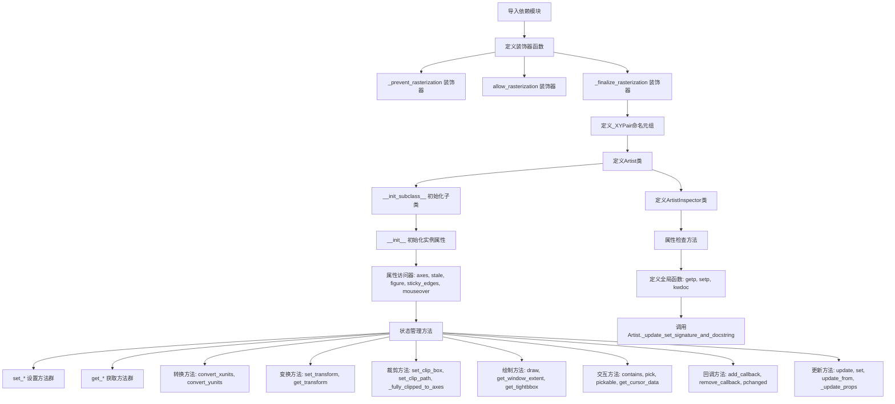

## 类结构

```
_XYPair (namedtuple)
Artist (抽象基类)
    ├── 核心属性: zorder, stale, axes, figure
    ├── 变换属性: _transform, _transformSet
    ├── 可见性属性: _visible, _animated, _alpha
    ├── 裁剪属性: clipbox, _clippath, _clipon
    ├── 交互属性: _picker, _mouseover
    └── 元数据: _label, _url, _gid, _snap, _sketch, _path_effects
ArtistInspector (辅助类)
```

## 全局变量及字段


### `_log`
    
模块级日志记录器，用于记录Artist相关的日志信息

类型：`logging.Logger`
    


### `_PROPERTIES_EXCLUDED_FROM_SET`
    
属性名列表，这些属性不应通过set()方法设置

类型：`list[str]`
    


### `_XYPair`
    
用于存储x和y坐标对的命名元组

类型：`namedtuple`
    


### `_stale_axes_callback`
    
回调函数，当Artist的stale属性变化时触发，更新axes的stale状态

类型：`callable`
    


### `_XYPair.x`
    
X坐标值

类型：`any`
    


### `_XYPair.y`
    
Y坐标值

类型：`any`
    


### `Artist.zorder`
    
绘图顺序，数值越小越先绘制

类型：`int`
    


### `Artist._stale`
    
标记Artist是否需要重新绘制

类型：`bool`
    


### `Artist.stale_callback`
    
当_stale变化时调用的回调函数

类型：`callable or None`
    


### `Artist._axes`
    
Artist所在的Axes对象

类型：`Axes or None`
    


### `Artist._parent_figure`
    
Artist所属的Figure或SubFigure

类型：`Figure or SubFigure or None`
    


### `Artist._transform`
    
Artist的变换对象

类型：`Transform or None`
    


### `Artist._transformSet`
    
标记transform是否被显式设置

类型：`bool`
    


### `Artist._visible`
    
Artist的可见性状态

类型：`bool`
    


### `Artist._animated`
    
标记Artist是否用于动画

类型：`bool`
    


### `Artist._alpha`
    
透明度值，0-1范围

类型：`float or ndarray or None`
    


### `Artist.clipbox`
    
裁剪框

类型：`BboxBase or None`
    


### `Artist._clippath`
    
裁剪路径

类型：`TransformedPath or TransformedPatchPath or None`
    


### `Artist._clipon`
    
是否启用裁剪

类型：`bool`
    


### `Artist._label`
    
Artist的标签，用于图例

类型：`str`
    


### `Artist._picker`
    
拾取器配置，控制鼠标事件响应

类型：`None or bool or float or callable`
    


### `Artist._rasterized`
    
是否将矢量图形栅格化输出

类型：`bool`
    


### `Artist._agg_filter`
    
AGG渲染器的滤镜函数

类型：`callable or None`
    


### `Artist._mouseover`
    
是否响应鼠标悬停事件查询

类型：`bool`
    


### `Artist._callbacks`
    
属性变化回调注册表

类型：`CallbackRegistry`
    


### `Artist._remove_method`
    
从父容器移除Artist的方法

类型：`callable or None`
    


### `Artist._url`
    
SVG URL标识符

类型：`str or None`
    


### `Artist._gid`
    
SVG组ID

类型：`str or None`
    


### `Artist._snap`
    
是否对齐到像素网格

类型：`bool or None`
    


### `Artist._sketch`
    
素描效果参数(scale, length, randomness)

类型：`tuple or None`
    


### `Artist._path_effects`
    
路径效果列表

类型：`list`
    


### `Artist._sticky_edges`
    
自动缩放时的粘性边缘列表

类型：`_XYPair`
    


### `Artist._in_layout`
    
是否参与布局计算

类型：`bool`
    


### `ArtistInspector.oorig`
    
原始输入的Artist或Artist列表

类型：`Artist or list`
    


### `ArtistInspector.o`
    
Artist的类类型

类型：`type`
    


### `ArtistInspector.aliasd`
    
属性名到别名的映射字典

类型：`dict`
    
    

## 全局函数及方法


### `_prevent_rasterization`

这是一个装饰器函数，用于防止艺术家（Artist）被光栅化。它假设默认情况下艺术家不允许光栅化（除非其 draw 方法被显式装饰）。如果某个艺术家在光栅化艺术家之后被绘制，并且其 `raster_depth` 达到 0，该装饰器会停止光栅化，以免影响普通艺术家的行为（例如更改 dpi）。

参数：

- `draw`：`Callable`，被装饰的 Artist.draw 方法，即需要包装的绘图函数

返回值：`Callable`，返回包装后的 `draw_wrapper` 函数，该函数具有 `_supports_rasterization = False` 属性

#### 流程图

```mermaid
flowchart TD
    A[开始] --> B{接收 draw 函数}
    B --> C[定义 draw_wrapper]
    C --> D{调用 draw_wrapper<br/>artist, renderer, *args, **kwargs}
    D --> E{renderer._raster_depth == 0<br/>且 renderer._rasterizing?}
    E -->|是| F[调用 renderer.stop_rasterizing<br/>renderer._rasterizing = False]
    E -->|否| G[跳过停止光栅化]
    F --> H[调用原始 draw 函数<br/>draw(artist, renderer, *args, **kwargs)]
    G --> H
    H --> I[返回 draw 的结果]
    I --> J[设置 draw_wrapper._supports_rasterization = False]
    J --> K[返回 draw_wrapper]
```

#### 带注释源码

```python
def _prevent_rasterization(draw):
    """
    装饰器：防止艺术家被光栅化。
    
    假设默认情况下艺术家不允许光栅化（除非其 draw 方法被显式装饰）。
    如果它在光栅化艺术家之后被绘制，并且 raster_depth 达到 0，
    我们停止光栅化，以免影响普通艺术家的行为（例如更改 dpi）。
    """
    # 使用 @wraps 保留原函数元数据
    @wraps(draw)
    def draw_wrapper(artist, renderer, *args, **kwargs):
        # 仅当不在光栅化父对象中且自上次停止以来有内容被光栅化时停止
        if renderer._raster_depth == 0 and renderer._rasterizing:
            # 停止光栅化并重置标志
            renderer.stop_rasterizing()
            renderer._rasterizing = False

        # 调用原始的 draw 方法
        return draw(artist, renderer, *args, **kwargs)

    # 标记该包装函数不支持光栅化
    draw_wrapper._supports_rasterization = False
    return draw_wrapper
```


### `allow_rasterization`

装饰器函数，用于为 Artist.draw 方法提供光栅化处理的前置和后置routine，支持在绘制过程中管理渲染器的光栅化状态。

参数：

- `draw`：函数，被装饰的 Artist.draw 方法

返回值：`draw_wrapper`，装饰后的绘制函数

#### 流程图

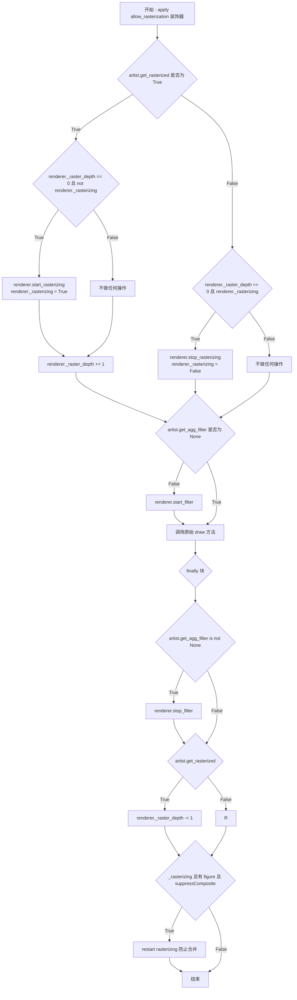

#### 带注释源码

```python
def allow_rasterization(draw):
    """
    Decorator for Artist.draw method. Provides routines
    that run before and after the draw call. The before and after functions
    are useful for changing artist-dependent renderer attributes or making
    other setup function calls, such as starting and flushing a mixed-mode
    renderer.
    """
    # 使用 functools.wraps 保持原函数的元信息
    @wraps(draw)
    def draw_wrapper(artist, renderer):
        try:
            # 处理光栅化开启逻辑
            if artist.get_rasterized():
                # 如果当前不在光栅化状态且是顶层artist，则启动光栅化
                if renderer._raster_depth == 0 and not renderer._rasterizing:
                    renderer.start_rasterizing()
                    renderer._rasterizing = True
                # 增加光栅化深度计数
                renderer._raster_depth += 1
            else:
                # 处理光栅化关闭逻辑
                if renderer._raster_depth == 0 and renderer._rasterizing:
                    # 只有在非光栅化父级且有内容被光栅化时才停止
                    renderer.stop_rasterizing()
                    renderer._rasterizing = False

            # 处理agg滤镜
            if artist.get_agg_filter() is not None:
                renderer.start_filter()

            # 调用原始绘制方法
            return draw(artist, renderer)
        finally:
            # finally 块确保后置处理总是执行
            # 停止滤镜
            if artist.get_agg_filter() is not None:
                renderer.stop_filter(artist.get_agg_filter())
            
            # 减少光栅化深度计数
            if artist.get_rasterized():
                renderer._raster_depth -= 1
            
            # 如果正在光栅化且figure禁用了composite，则重启光栅化以防止合并
            if (renderer._rasterizing and (fig := artist.get_figure(root=True)) and
                    fig.suppressComposite):
                # restart rasterizing to prevent merging
                renderer.stop_rasterizing()
                renderer.start_rasterizing()

    # 标记该装饰器支持光栅化
    draw_wrapper._supports_rasterization = True
    return draw_wrapper
```


### `_finalize_rasterization`

这是一个装饰器函数，用于在 Artist.draw 方法上，确保最外层的艺术家（如 Figure）在绘制完成后，如果渲染器仍处于光栅化模式，则停止光栅化。

参数：

- `draw`：`callable`，需要被装饰的绘制函数（Artist.draw 方法）

返回值：`callable`，返回装饰后的 `draw_wrapper` 函数，该函数会在原绘制函数执行完成后检查并停止光栅化。

#### 流程图

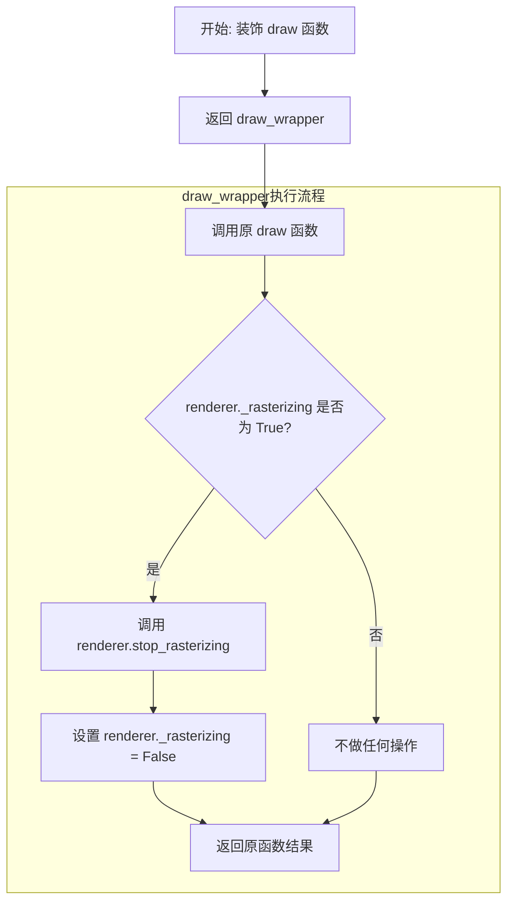

#### 带注释源码

```python
def _finalize_rasterization(draw):
    """
    Decorator for Artist.draw method. Needed on the outermost artist, i.e.
    Figure, to finish up if the render is still in rasterized mode.
    
    这个装饰器用于处理最外层artist（如Figure）的绘制完成后的清理工作。
    如果渲染器仍处于光栅化模式，它会停止光栅化。
    """
    @wraps(draw)
    def draw_wrapper(artist, renderer, *args, **kwargs):
        # 调用原绘制函数，获取绘制结果
        result = draw(artist, renderer, *args, **kwargs)
        
        # 检查渲染器是否仍处于光栅化模式
        if renderer._rasterizing:
            # 停止光栅化渲染
            renderer.stop_rasterizing()
            # 重置光栅化标志为 False
            renderer._rasterizing = False
        
        # 返回原函数的返回值
        return result
    
    # 返回装饰后的函数
    return draw_wrapper
```


### `_stale_axes_callback`

该函数是一个简单的回调函数，用于在 Artist 的 `stale` 属性发生变化时，将该状态变化同步传播到其所属的 Axes 对象。当 Artist 的属性发生变化导致需要重绘时，通过此回调函数通知 Axes 也标记为 stale 状态，从而触发整个图表的重绘流程。

参数：

- `self`：Artist 实例，隐式参数，表示调用此回调的 Artist 对象本身
- `val`：bool，表示 stale 状态的值（True 表示需要重绘，False 表示已同步）

返回值：`None`，该函数无返回值，仅执行状态赋值操作

#### 流程图

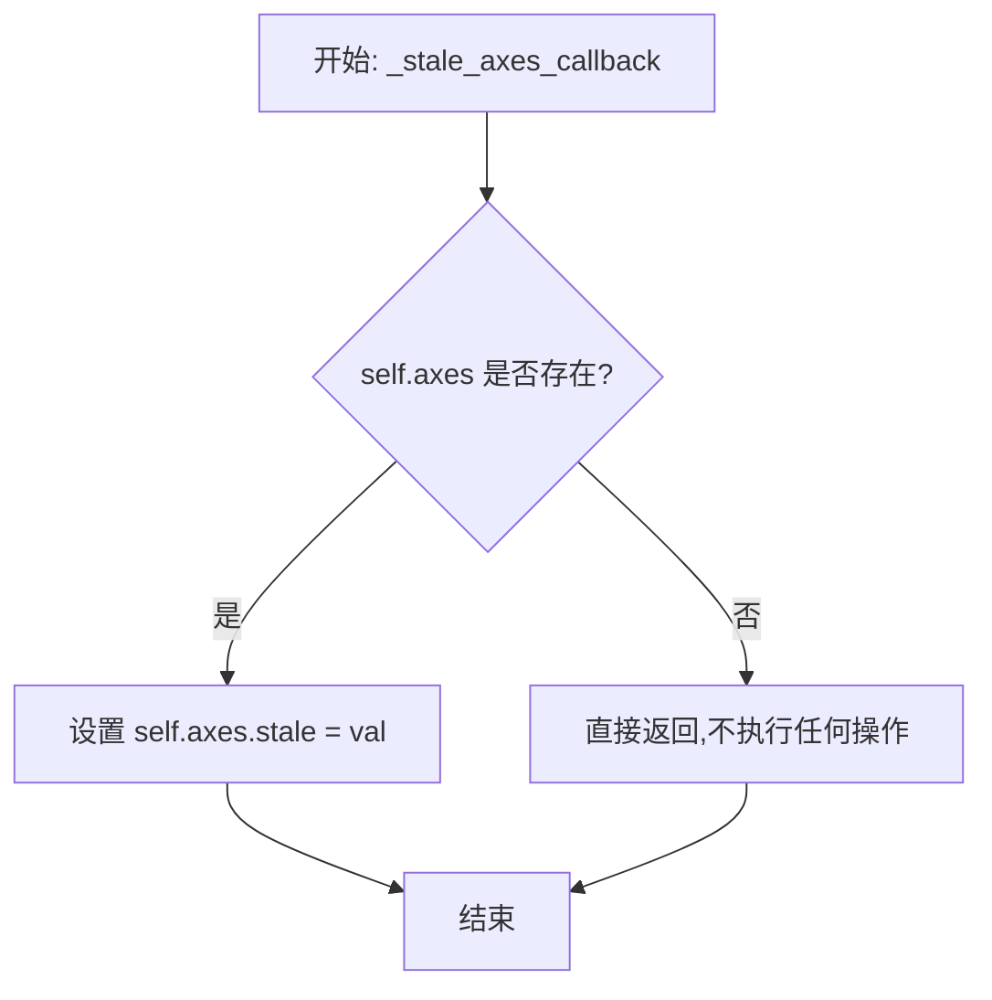

#### 带注释源码

```python
def _stale_axes_callback(self, val):
    """
    回调函数:当 Artist 的 stale 属性改变时,同步更新其所属 Axes 的 stale 状态。
    
    此函数被设置为 Artist.stale_callback,在 Artist.set_stale 被调用时触发。
    这样做是为了确保当子元素(如图形元素)发生状态变化时,父容器(Axes)也能
    感知到变化并相应地标记为需要重绘。
    
    参数:
        self: Artist 实例,触发回调的对象
        val: bool,新的 stale 状态值
    """
    # 检查 Artist 是否已添加到 Axes 中
    # 如果 artist 尚未关联到任何 axes,self.axes 为 None
    if self.axes:
        # 将 Axes 的 stale 状态设置为与 Artist 相同的值
        # 这会触发 Axes 层级 的重绘检查
        self.axes.stale = val
```


### `_get_tightbbox_for_layout_only`

一个辅助函数，用于在布局计算时尝试调用对象的 `get_tightbbox` 方法，并传递 `for_layout_only=True` 参数；当对象不支持该参数时，自动回退到不使用该参数的调用。

参数：

- `obj`：任意对象，需要具有 `get_tightbbox` 方法（通常为 `Axes` 或 `Axis` 实例）
- `*args`：可变位置参数，传递给 `get_tightbbox`
- `**kwargs`：可变关键字参数，传递给 `get_tightbbox`

返回值：`Bbox` 或 `None`，返回对象在布局计算下的紧凑边界框

#### 流程图

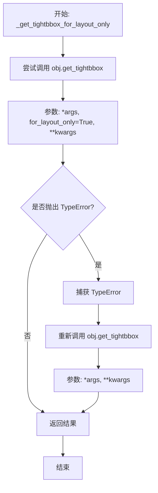

#### 带注释源码

```python
def _get_tightbbox_for_layout_only(obj, *args, **kwargs):
    """
    Matplotlib's `.Axes.get_tightbbox` and `.Axis.get_tightbbox` support a
    *for_layout_only* kwarg; this helper tries to use the kwarg but skips it
    when encountering third-party subclasses that do not support it.
    """
    # 首先尝试使用 for_layout_only=True 调用 get_tightbbox
    # 这样可以获得仅用于布局计算的紧凑边界框，性能更高
    try:
        return obj.get_tightbbox(*args, **{**kwargs, "for_layout_only": True})
    except TypeError:
        # 如果对象不支持 for_layout_only 参数（如第三方子类），
        # 则回退到普通调用，不传递该参数
        return obj.get_tightbbox(*args, **kwargs)
```


### `getp`

获取Artist对象的指定属性值，或打印所有可获取的属性。

参数：

- `obj`：`Artist`，要查询的Artist对象（例如Line2D、Text或Axes）
- `property`：`str` 或 `None`，default: None，要获取的属性名。如果为None，则打印所有可获取的属性

返回值：`任意类型` 或 `None`，如果指定了property属性则返回对应getter的值，否则返回None（仅打印）

#### 流程图

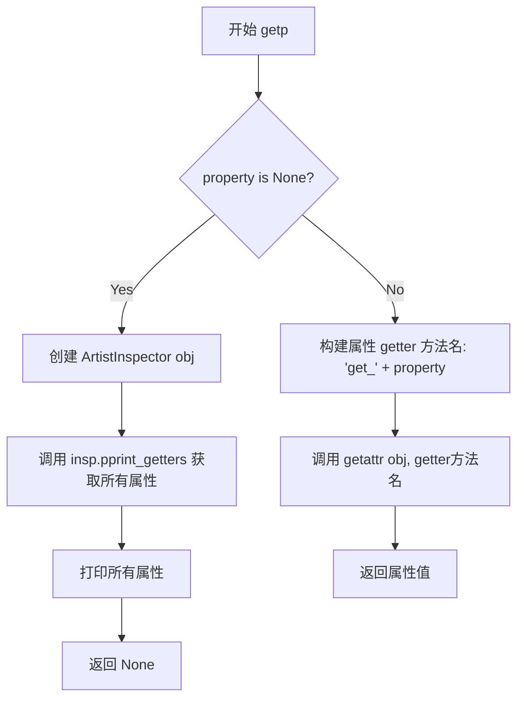

#### 带注释源码

```python
def getp(obj, property=None):
    """
    Return the value of an `.Artist`'s *property*, or print all of them.

    Parameters
    ----------
    obj : `~matplotlib.artist.Artist`
        The queried artist; e.g., a `.Line2D`, a `.Text`, or an `~.axes.Axes`.

    property : str or None, default: None
        If *property* is 'somename', this function returns
        ``obj.get_somename()``.

        If it's None (or unset), it *prints* all gettable properties from
        *obj*.  Many properties have aliases for shorter typing, e.g. 'lw' is
        an alias for 'linewidth'.  In the output, aliases and full property
        names will be listed as:

          property or alias = value

        e.g.:

          linewidth or lw = 2

    See Also
    --------
    setp
    """
    # 如果没有指定property，则打印所有可获取的属性
    if property is None:
        # 创建ArtistInspector来检查对象的属性
        insp = ArtistInspector(obj)
        # 获取所有getter方法及其当前值
        ret = insp.pprint_getters()
        # 打印属性列表，每个属性一行
        print('\n'.join(ret))
        return
    # 如果指定了property，则调用对应的getter方法并返回其值
    # 使用getattr动态获取方法，方法名为 'get_' + 属性名
    return getattr(obj, 'get_' + property)()
```


### `get` / `getp`

获取艺术家对象的属性值，如果未指定属性，则打印所有可获取的属性及其当前值。

参数：

- `obj`：`~matplotlib.artist.Artist`，被查询的艺术家对象（如Line2D、Text或Axes等）
- `property`：str 或 None，默认值为 None，如果为'somename'，则返回`obj.get_somename()`；如果为None，则打印所有可获取的属性

返回值：任意类型，如果指定了property则返回对应的属性值，否则返回None（因为直接打印输出）

#### 流程图

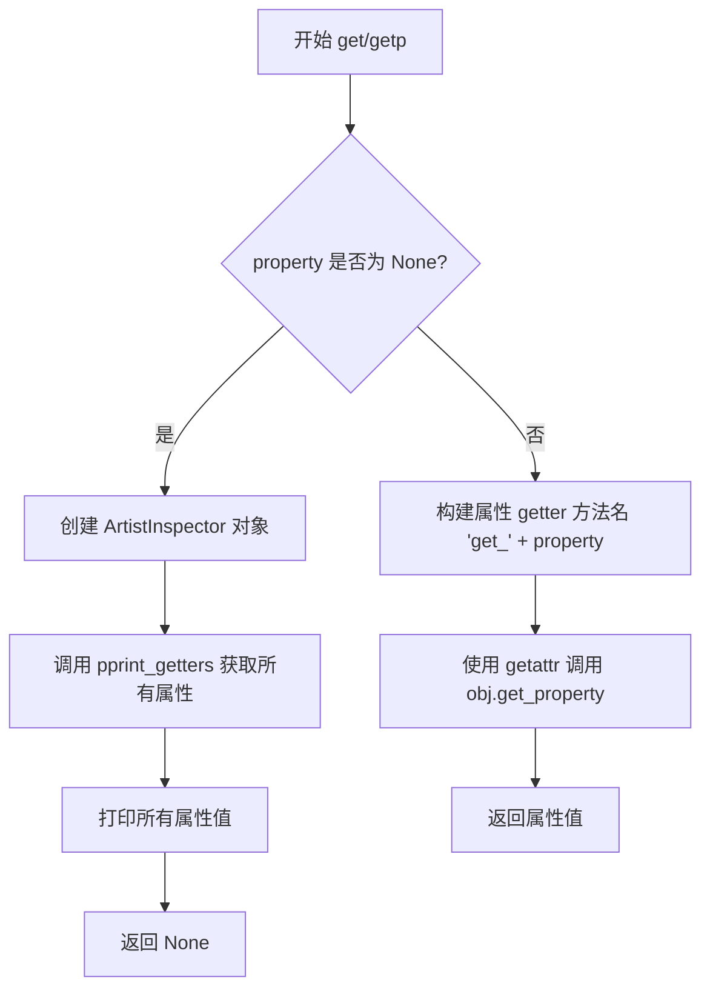

#### 带注释源码

```python
def getp(obj, property=None):
    """
    Return the value of an `.Artist`'s *property*, or print all of them.

    Parameters
    ----------
    obj : `~matplotlib.artist.Artist`
        The queried artist; e.g., a `.Line2D`, a `.Text`, or an `~.axes.Axes`.

    property : str or None, default: None
        If *property* is 'somename', this function returns
        ``obj.get_somename()``.

        If it's None (or unset), it *prints* all gettable properties from
        *obj*.  Many properties have aliases for shorter typing, e.g. 'lw' is
        an alias for 'linewidth'.  In the output, aliases and full property
        names will be listed as:

          property or alias = value

        e.g.:

          linewidth or lw = 2

    See Also
    --------
    setp
    """
    # 如果未指定属性名，则打印所有可获取的属性
    if property is None:
        # 创建 ArtistInspector 对象用于检查艺术家属性
        insp = ArtistInspector(obj)
        # 获取所有属性的可打印字符串列表
        ret = insp.pprint_getters()
        # 打印所有属性及其值
        print('\n'.join(ret))
        return
    # 如果指定了属性名，则调用对应的 getter 方法并返回其值
    return getattr(obj, 'get_' + property)()

# 别名：get 是 getp 的别名
get = getp
```


### `setp`

设置一个或多个 `.Artist` 的属性，或列出允许的值。

参数：

- `obj`：`~matplotlib.artist.Artist` 或 `List[~matplotlib.artist.Artist]`，要设置或查询其属性的艺术家（单个或列表）。当设置属性时，所有艺术家都会受到影响；当查询允许的值时，只查询序列中的第一个实例。
- `file`：文件类，默认 `sys.stdout`，`setp` 写入允许值列表输出时的目标文件。
- `*args`：位置参数，支持 MATLAB 风格的字符串/值对，如 `'linewidth', 2`。
- `**kwargs`：关键字参数，用于设置属性，如 `linewidth=2, color='r'`。

返回值：`List`，包含所有对象更新后的返回值列表（如果无任何更新则可能为空列表）。

#### 流程图

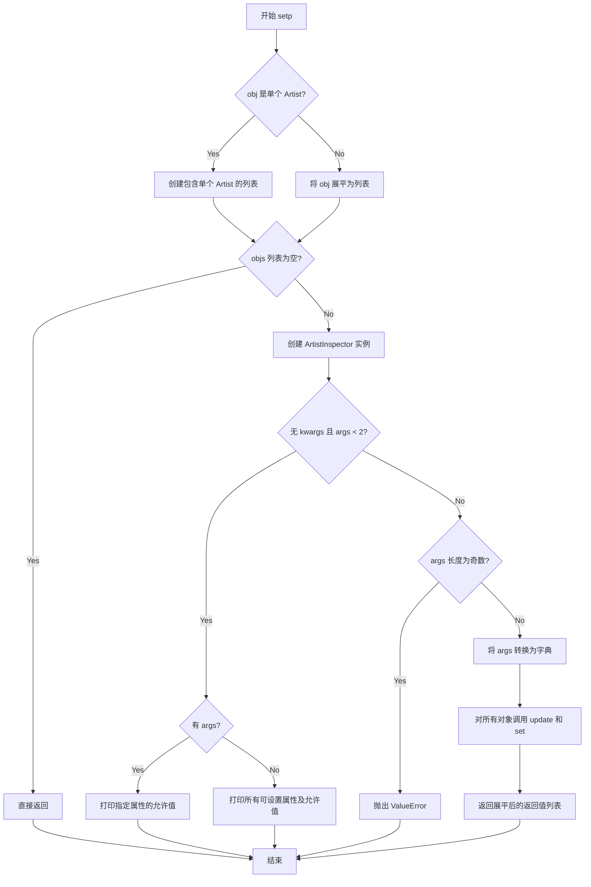

#### 带注释源码

```python
def setp(obj, *args, file=None, **kwargs):
    """
    Set one or more properties on an `.Artist`, or list allowed values.

    Parameters
    ----------
    obj : `~matplotlib.artist.Artist` or list of `.Artist`
        The artist(s) whose properties are being set or queried.  When setting
        properties, all artists are affected; when querying the allowed values,
        only the first instance in the sequence is queried.

        For example, two lines can be made thicker and red with a single call:

        >>> x = arange(0, 1, 0.01)
        >>> lines = plot(x, sin(2*pi*x), x, sin(4*pi*x))
        >>> setp(lines, linewidth=2, color='r')

    file : file-like, default: `sys.stdout`
        Where `setp` writes its output when asked to list allowed values.

        >>> with open('output.log') as file:
        ...     setp(line, file=file)

        The default, ``None``, means `sys.stdout`.

    *args, **kwargs
        The properties to set.  The following combinations are supported:

        - Set the linestyle of a line to be dashed:

          >>> line, = plot([1, 2, 3])
          >>> setp(line, linestyle='--')

        - Set multiple properties at once:

          >>> setp(line, linewidth=2, color='r')

        - List allowed values for a line's linestyle:

          >>> setp(line, 'linestyle')
          linestyle: {'-', '--', '-.', ':', '', (offset, on-off-seq), ...}

        - List all properties that can be set, and their allowed values:

          >>> setp(line)
          agg_filter: a filter function, ...
          [long output listing omitted]

        `setp` also supports MATLAB style string/value pairs.  For example, the
        following are equivalent:

        >>> setp(lines, 'linewidth', 2, 'color', 'r')  # MATLAB style
        >>> setp(lines, linewidth=2, color='r')        # Python style

    See Also
    --------
    getp
    """
    # 判断 obj 是否是单个 Artist 对象
    if isinstance(obj, Artist):
        # 如果是单个 Artist，包装成列表
        objs = [obj]
    else:
        # 如果是多个对象的可迭代对象，展平为列表
        objs = list(cbook.flatten(obj))

    # 如果没有对象，直接返回
    if not objs:
        return

    # 创建 ArtistInspector 实例来检查属性
    insp = ArtistInspector(objs[0])

    # 如果没有 kwargs 且位置参数少于 2 个
    if not kwargs and len(args) < 2:
        if args:
            # 打印指定属性的允许值
            print(insp.pprint_setters(prop=args[0]), file=file)
        else:
            # 打印所有可设置属性及其允许值
            print('\n'.join(insp.pprint_setters()), file=file)
        return

    # 检查 args 长度是否为偶数（MATLAB 风格需要成对出现）
    if len(args) % 2:
        raise ValueError('The set args must be string, value pairs')

    # 将成对的 args 转换为字典（MATLAB 风格参数）
    funcvals = dict(zip(args[::2], args[1::2]))
    
    # 对所有对象应用更新：
    # 1. 使用 funcvals 字典调用 update 方法
    # 2. 使用 kwargs 调用 set 方法
    # 最后将结果展平为单个列表返回
    ret = [o.update(funcvals) for o in objs] + [o.set(**kwargs) for o in objs]
    return list(cbook.flatten(ret))
```


### `kwdoc`

该函数用于检查 Artist 类（使用 ArtistInspector）并返回有关其可设置属性及其当前值的信息。

参数：

- `artist`：`matplotlib.artist.Artist` 或 `Artist` 的可迭代对象，要检查的艺术家对象

返回值：`str`，如果 :rc:`docstring.hardcopy` 为 False 则返回纯文本格式的可设置属性；如果为 True 则返回 rst 表格格式（用于 Sphinx）。

#### 流程图

```mermaid
flowchart TD
    A[开始] --> B[接收 artist 参数]
    B --> C{artist 是否为有效对象}
    C -->|是| D[创建 ArtistInspector 实例]
    C -->|否| E[返回空或错误]
    D --> F{检查 mpl.rcParams['docstring.hardcopy']}
    F -->|True| G[调用 pprint_setters_rest 方法]
    F -->|False| H[调用 pprint_setters 方法]
    G --> I[返回 rst 表格格式字符串]
    H --> J[返回纯文本格式字符串]
    I --> K[结束]
    J --> K
```

#### 带注释源码

```python
def kwdoc(artist):
    r"""
    Inspect an `~matplotlib.artist.Artist` class (using `.ArtistInspector`) and
    return information about its settable properties and their current values.

    Parameters
    ----------
    artist : `~matplotlib.artist.Artist` or an iterable of `Artist`\s

    Returns
    -------
    str
        The settable properties of *artist*, as plain text if
        :rc:`docstring.hardcopy` is False and as an rst table (intended for
        use in Sphinx) if it is True.
    """
    # 创建 ArtistInspector 实例来检查 artist 对象
    ai = ArtistInspector(artist)
    # 根据 rcParams['docstring.hardcopy'] 配置返回不同格式的文档字符串
    return ('\n'.join(ai.pprint_setters_rest(leadingspace=4))
            if mpl.rcParams['docstring.hardcopy'] else
            'Properties:\n' + '\n'.join(ai.pprint_setters(leadingspace=4)))
```


### Artist.__init_subclass__

该方法是 Python 类的特殊方法（相当于其他语言中的构造函数），在子类被创建时自动调用。主要功能是为子类自动装饰 `draw()` 方法以支持光栅化控制，并自动生成 `set()` 方法的签名和文档字符串。

参数：

- `cls`：`class`，表示正在创建的子类本身

返回值：`None`，该方法不返回任何值，直接修改类属性

#### 流程图

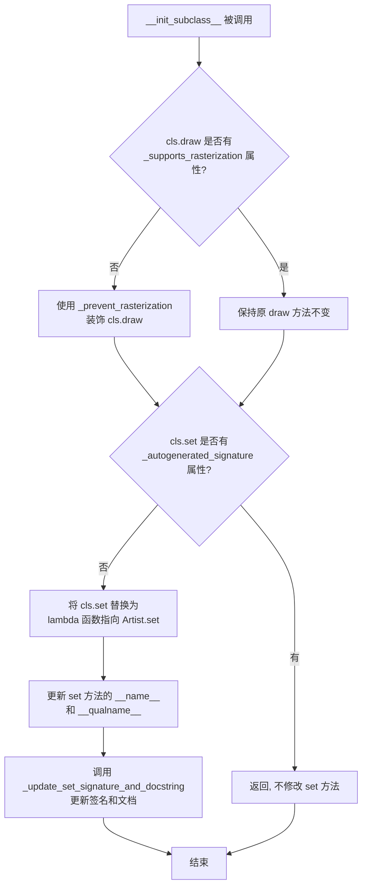

#### 带注释源码

```python
def __init_subclass__(cls):
    """
    当 Artist 的子类被创建时自动调用的特殊方法。
    用于自动为子类配置绘制方法和 set 方法。
    """

    # 装饰 draw() 方法，使所有 artist 能够在必要时停止光栅化。
    # 如果 artist 的 draw 方法已经被装饰过（具有 _supports_rasterization 属性），
    # 则不会再进行装饰。
    if not hasattr(cls.draw, "_supports_rasterization"):
        cls.draw = _prevent_rasterization(cls.draw)

    # 向子类注入自定义的 set() 方法，签名和文档基于子类的属性。
    # 如果子类或其父类已经定义了 set 方法，则不会覆盖。
    # 如果没有显式定义，cls.set 是从自动生成的 set 方法层次结构继承的，
    # 这些方法带有 _autogenerated_signature 标志。
    if not hasattr(cls.set, '_autogenerated_signature'):
        # 不覆盖 cls.set 如果子类或其父类已经自己定义了 set 方法
        return

    # 创建一个新的 set 方法lambda，指向 Artist.set
    cls.set = lambda self, **kwargs: Artist.set(self, **kwargs)
    # 设置函数名和限定名
    cls.set.__name__ = "set"
    cls.set.__qualname__ = f"{cls.__qualname__}.set"
    # 更新 set 方法的签名和文档字符串
    cls._update_set_signature_and_docstring()
```


### Artist.__init__

这是 Artist 类的初始化方法，负责初始化绘图对象的基本属性和状态。

参数：
- 该方法没有显式参数（除了隐式的 self）

返回值：
- 该方法没有返回值（构造函数）

#### 流程图

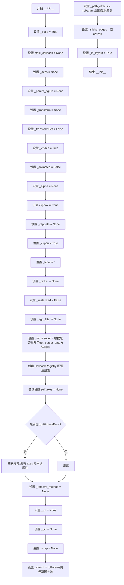

#### 带注释源码

```python
def __init__(self):
    """
    初始化 Artist 对象，设置所有必要的实例属性。
    """
    # 标记对象为过时状态，需要重新绘制
    self._stale = True
    # 过时回调函数，用于通知关联的 Axes 对象
    self.stale_callback = None
    # 当前所在的坐标轴（Axes）对象
    self._axes = None
    # 父级图形（Figure 或 SubFigure）
    self._parent_figure = None

    # 变换对象，用于坐标转换
    self._transform = None
    # 标记变换是否被显式设置
    self._transformSet = False
    # 可见性标志
    self._visible = True
    # 动画标志，动画对象不参与常规绘制
    self._animated = False
    # 透明度值（0-1 之间）
    self._alpha = None
    # 剪贴框，用于限制绘制区域
    self.clipbox = None
    # 剪贴路径
    self._clippath = None
    # 是否启用剪贴
    self._clipon = True
    # 标签，用于图例
    self._label = ''
    # 拾取器，用于鼠标交互
    self._picker = None
    # 栅格化标志，强制位图渲染
    self._rasterized = False
    # AGG 过滤器函数
    self._agg_filter = None
    # 鼠标悬停查询标志：只有当子类重写了 get_cursor_data 方法时才需要查询鼠标悬停信息
    self._mouseover = type(self).get_cursor_data != Artist.get_cursor_data
    # 回调注册表，用于管理属性变更回调
    self._callbacks = cbook.CallbackRegistry(signals=["pchanged"])
    try:
        # 尝试设置 axes 属性
        self.axes = None
    except AttributeError:
        # 处理 axes 为只读属性的情况（如 Figure 类）
        pass
    # 移除方法的回调函数
    self._remove_method = None
    # URL 链接
    self._url = None
    # 组 ID
    self._gid = None
    # 捕捉对齐设置
    self._snap = None
    # 路径草图参数，从 matplotlib 配置读取
    self._sketch = mpl.rcParams['path.sketch']
    # 路径效果列表，从 matplotlib 配置读取
    self._path_effects = mpl.rcParams['path.effects']
    # 粘性边缘，用于自动缩放
    self._sticky_edges = _XYPair([], [])
    # 是否参与布局计算
    self._in_layout = True
```


### `Artist.__getstate__`

该方法是 Python 对象的序列化钩子，用于自定义 pickle 序列化时的状态。在 Matplotlib 中，Artist 对象可能包含回调函数和指向其他对象的引用（如父图表、坐标轴等），这些在序列化时可能导致问题。因此，该方法通过复制对象的 `__dict__` 并将 `stale_callback` 置为 None 来确保序列化安全，防止序列化过程中出现循环引用或不可序列化的对象。

参数：

- `self`：`Artist`，调用此方法的 Artist 实例本身（隐式参数）

返回值：`dict`，返回对象的序列化状态字典，其中 `stale_callback` 字段被显式设置为 None，以确保反序列化时不会恢复可能已失效的回调函数。

#### 流程图

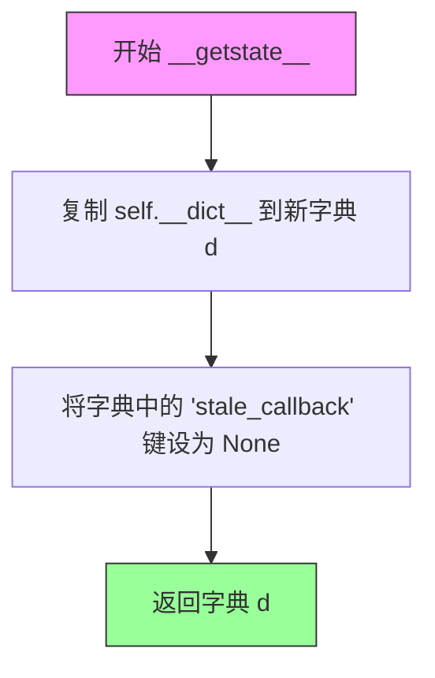

#### 带注释源码

```python
def __getstate__(self):
    """
    自定义序列化状态，用于 pickle 模块。
    
    此方法在对象被序列化（如保存到文件或通过管道传输）时调用。
    它确保状态字典中的回调函数被清除，因为这些回调可能包含
    不可序列化的引用或已失效的闭包。
    """
    # 复制对象的 __dict__，创建一个新的字典副本
    # 这样可以避免直接修改原始对象的字典
    d = self.__dict__.copy()
    
    # 将 stale_callback 置为 None，这是为了：
    # 1. 避免序列化可能包含不可序列化对象的回调函数
    # 2. 确保反序列化后的对象从干净的状态开始
    # 3. 避免循环引用导致的序列化问题
    d['stale_callback'] = None
    
    # 返回包含对象状态的字典，pickle 将使用此字典进行序列化
    return d
```


### `Artist.remove`

该方法负责将 Artist 对象从其所属的 Figure 或 Axes 中移除。如果 Artist 有预设的 `_remove_method` 回调，则执行该回调以通知父容器移除自身，并清理与 Axes 和 Figure 的关联关系；否则抛出 `NotImplementedError`。移除操作不会立即生效，需要等到下次重绘。

参数： 无

返回值：`None`，该方法通过副作用完成Artist的移除

#### 流程图

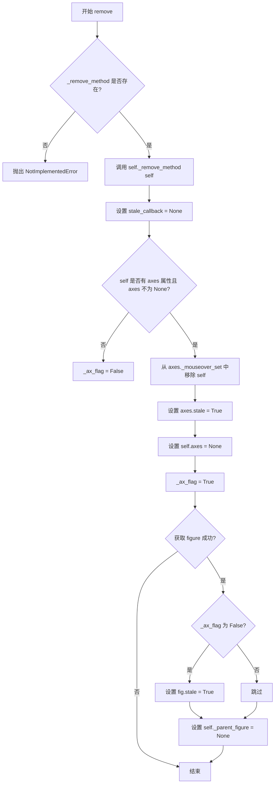

#### 带注释源码

```python
def remove(self):
    """
    Remove the artist from the figure if possible.

    The effect will not be visible until the figure is redrawn, e.g.,
    with `.FigureCanvasBase.draw_idle`.  Call `~.axes.Axes.relim` to
    update the Axes limits if desired.

    Note: `~.axes.Axes.relim` will not see collections even if the
    collection was added to the Axes with *autolim* = True.

    Note: there is no support for removing the artist's legend entry.
    """

    # There is no method to set the callback.  Instead, the parent should
    # set the _remove_method attribute directly.  This would be a
    # protected attribute if Python supported that sort of thing.  The
    # callback has one parameter, which is the child to be removed.
    # 检查是否存在移除回调方法（通常由父容器Axes设置）
    if self._remove_method is not None:
        # 调用父容器的移除回调，通知其移除该Artist
        self._remove_method(self)
        
        # clear stale callback - 清除脏标记回调
        self.stale_callback = None
        
        # 标记是否处理了axes相关的清理
        _ax_flag = False
        
        # 如果Artist有关联到Axes
        if hasattr(self, 'axes') and self.axes:
            # remove from the mouse hit list - 从鼠标事件命中列表中移除
            self.axes._mouseover_set.discard(self)
            # 标记Axes需要重绘
            self.axes.stale = True
            # decouple the artist from the Axes - 解耦合
            self.axes = None
            _ax_flag = True

        # 检查Artist是否关联到Figure（可能通过SubFigure）
        if (fig := self.get_figure(root=False)) is not None:
            if not _ax_flag:
                # 如果没有处理axes，则标记Figure也需要重绘
                fig.stale = True
            # 解耦合Artist与Figure的关联
            self._parent_figure = None

    else:
        # 如果没有设置移除方法，抛出异常
        raise NotImplementedError('cannot remove artist')
    
    # TODO: the fix for the collections relim problem is to move the
    # limits calculation into the artist itself, including the property of
    # whether or not the artist should affect the limits.  Then there will
    # be no distinction between axes.add_line, axes.add_patch, etc.
    # TODO: add legend support
```


### Artist.have_units

该方法用于检查当前艺术家所在坐标轴的任何轴（x轴或y轴）是否已设置单位。如果艺术家关联的Axes存在，并且至少有一个轴设置了单位，则返回True，否则返回False。

参数：

- 该方法无显式参数（仅包含隐式参数`self`）

返回值：`bool`，如果任何轴已设置单位返回True，否则返回False

#### 流程图

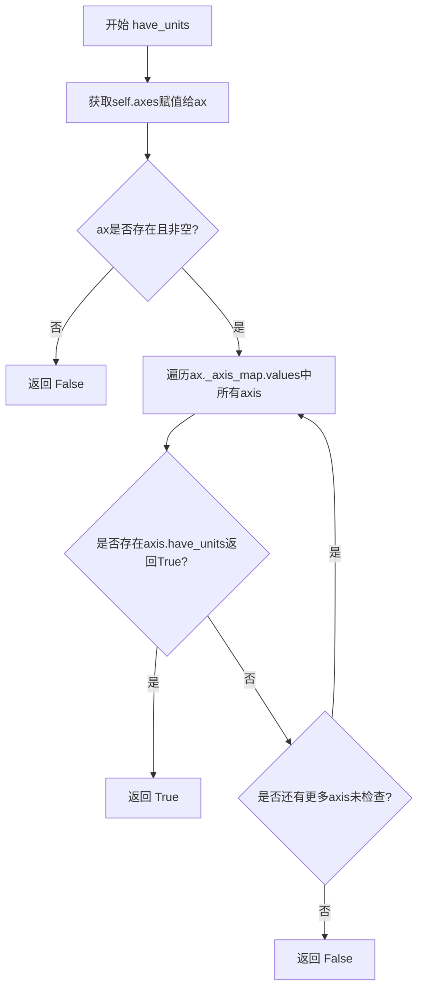

#### 带注释源码

```python
def have_units(self):
    """Return whether units are set on any axis."""
    # 获取当前艺术家所属的Axes对象
    ax = self.axes
    # 如果ax存在，则遍历所有轴并检查任意一个轴是否有单位设置
    # 如果ax为None，则直接返回False
    return ax and any(axis.have_units() for axis in ax._axis_map.values())
```


### Artist.convert_xunits

该方法用于将 x 值转换为使用 x 轴单位的类型。如果艺术家对象未包含在 Axes 中，或者 x 轴没有定义单位，则返回原始值。

参数：

- `self`：`Artist`，调用此方法的艺术家实例本身
- `x`：待转换的值（任意类型），需要根据 x 轴单位进行转换的数据

返回值：`任意类型`，转换后的值；如果无法转换则返回原始的 x 值

#### 流程图

```mermaid
graph TD
    A[开始] --> B[获取self.axes属性]
    B --> C{ax是否存在?}
    C -->|否| D[返回原始x值]
    C -->|是| E{ax.xaxis是否存在?}
    E -->|否| D
    E -->|是| F[调用ax.xaxis.convert_units(x)]
    F --> G[返回转换后的值]
```

#### 带注释源码

```python
def convert_xunits(self, x):
    """
    Convert *x* using the unit type of the xaxis.

    If the artist is not contained in an Axes or if the xaxis does not
    have units, *x* itself is returned.
    """
    # 获取当前艺术家的 axes 属性，如果不存在则返回 None
    ax = getattr(self, 'axes', None)
    
    # 检查是否存在有效的 axes 和 xaxis
    if ax is None or ax.xaxis is None:
        # 如果没有关联的坐标轴或坐标轴没有 xaxis，直接返回原始值
        return x
    
    # 调用 xaxis 的单位转换器将 x 转换为对应单位的值
    return ax.xaxis.convert_units(x)
```


### `Artist.convert_yunits`

该方法用于将给定的 y 轴数据值转换为对应轴所定义的单位。如果 Artist 对象未绑定到 Axes，或 yaxis 没有配置单位转换器，则直接返回原始值。

参数：

- `y`：`任意类型`，需要转换的 y 轴数据值

返回值：`任意类型`，转换后的值；若无法转换则返回原始输入值

#### 流程图

```mermaid
flowchart TD
    A[开始 convert_yunits] --> B[获取 self.axes 属性]
    B --> C{ax 是否为 None?}
    C -->|是| D[返回原始 y 值]
    C -->|否| E{ax.yaxis 是否为 None?}
    E -->|是| D
    E -->|否| F[调用 ax.yaxis.convert_units(y)]
    F --> G[返回转换后的值]
```

#### 带注释源码

```python
def convert_yunits(self, y):
    """
    Convert *y* using the unit type of the yaxis.

    If the artist is not contained in an Axes or if the yaxis does not
    have units, *y* itself is returned.
    """
    # 使用 getattr 安全获取 axes 属性，避免属性不存在时抛出异常
    ax = getattr(self, 'axes', None)
    # 如果 artist 未绑定到 Axes 或 yaxis 不存在，直接返回原始值
    if ax is None or ax.yaxis is None:
        return y
    # 调用 yaxis 的单位转换器进行转换
    return ax.yaxis.convert_units(y)
```


### `Artist.axes`

这是 Artist 类的一个属性，用于获取或设置艺术家（Artist）所在的 Axes 实例。该属性确保每个 Artist 只属于一个 Axes，防止在多个 Axes 中重复使用同一个 Artist。

参数：

- 当作为 setter 调用时：
  - `new_axes`：`Axes` 类型，要设置的目标 Axes 实例或 None

返回值：`Axes` 或 `None`，返回 Artist 所在的 Axes 实例，如果 Artist 不在任何 Axes 中则返回 None

#### 流程图

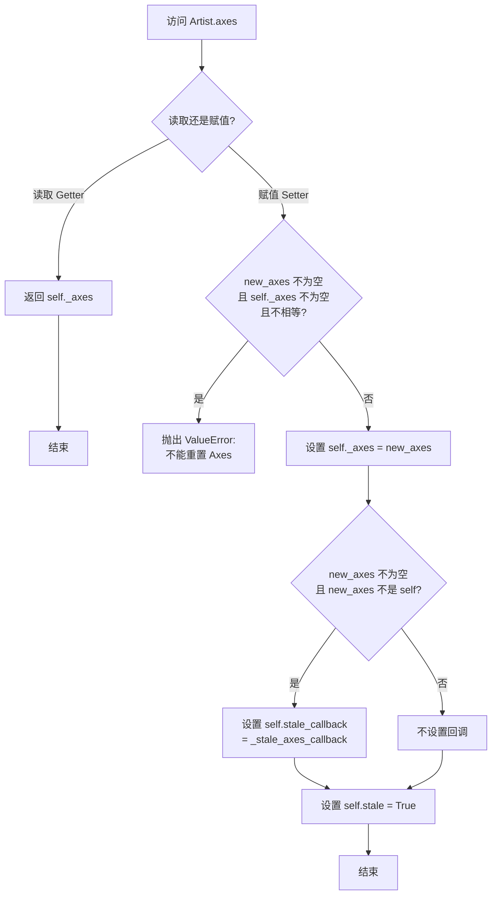

#### 带注释源码

```python
@property
def axes(self):
    """The `~.axes.Axes` instance the artist resides in, or *None*."""
    return self._axes

@axes.setter
def axes(self, new_axes):
    # 检查是否尝试将 Artist 重新分配到不同的 Axes
    # 这不被支持，因为每个 Artist 只能属于一个 Axes
    if (new_axes is not None and self._axes is not None
            and new_axes != self._axes):
        raise ValueError("Can not reset the Axes. You are probably trying to reuse "
                         "an artist in more than one Axes which is not supported")
    
    # 设置新的 Axes 引用
    self._axes = new_axes
    
    # 如果设置了新的 Axes（且不是自引用），注册脏标记回调
    # 这样当 Axes 变脏（需要重绘）时，Artist 也会被标记为需要重绘
    if new_axes is not None and new_axes is not self:
        self.stale_callback = _stale_axes_callback
```


### `Artist.stale`

该属性用于表示 Artist 对象是否处于"过时"（stale）状态，即其内部状态已经改变，需要重新绘制以匹配当前状态。当设置 stale 为 True 时，如果存在回调函数且对象不是动画对象，则会触发回调通知。

参数：

- `val`：`bool`，要设置的 stale 状态值（仅 setter 有此参数）

返回值：`bool`，返回当前的 stale 状态（getter 返回内部 `_stale` 属性的值，setter 无返回值）

#### 流程图

```mermaid
flowchart TD
    A[设置 Artist.stale = val] --> B{val == True?}
    B -->|Yes| C{self._animated == True?}
    C -->|Yes| D[直接返回，不传播变化]
    C -->|No| E{self.stale_callback is not None?}
    B -->|No| F[直接设置 self._stale = val]
    E -->|Yes| G[调用 self.stale_callback(self, val)]
    E -->|No| H[不触发回调]
    G --> I[结束]
    H --> I
    F --> I
    
    J[获取 Artist.stale] --> K[返回 self._stale]
```

#### 带注释源码

```python
@property
def stale(self):
    """
    Whether the artist is 'stale' and needs to be re-drawn for the output
    to match the internal state of the artist.
    """
    return self._stale

@stale.setter
def stale(self, val):
    # 设置内部的 _stale 标志
    self._stale = val

    # 如果艺术家是动画对象，它不参与正常的绘制堆栈，
    # 也不期望作为正常绘制循环的一部分被绘制（当不保存时），
    # 因此不传播此变化
    if self._animated:
        return

    # 当 stale 被设置为 True 且存在回调函数时，触发回调
    # 这通常用于通知父级（如 Axes）该艺术家已过时，需要重绘
    if val and self.stale_callback is not None:
        self.stale_callback(self, val)
```


### `Artist.get_window_extent`

获取艺术家（Artist）在显示空间中的边界框，忽略裁剪。默认实现返回位于 (0, 0) 的空边界框，子类应重写此方法以提供实际的边界框计算。

参数：

- `renderer`：`matplotlib.backend_bases.RendererBase`，可选，用于绘制图形的渲染器（如 `fig.canvas.get_renderer()`）

返回值：`Bbox`，返回的边界框对象，其宽度和高度为非负值。默认返回位于 (0, 0) 的空边界框 `Bbox([[0, 0], [0, 0]])`

#### 流程图

```mermaid
flowchart TD
    A[开始 get_window_extent] --> B{传入 renderer 参数}
    B -->|可选, 可为 None| C[返回默认空边界盒]
    C --> D[Bbox([[0, 0], [0, 0]])]
    D --> E[结束]
```

#### 带注释源码

```python
def get_window_extent(self, renderer=None):
    """
    Get the artist's bounding box in display space, ignoring clipping.

    The bounding box's width and height are non-negative.

    Subclasses should override for inclusion in the bounding box "tight"
    calculation.  Default is to return an empty bounding box at 0, 0.

    .. warning::

      The extent can change due to any changes in the transform stack, such
      as changing the Axes limits, the figure size, the canvas used (as is
      done when saving a figure), or the DPI.

      Relying on a once-retrieved window extent can lead to unexpected
      behavior in various cases such as interactive figures being resized or
      moved to a screen with different dpi, or figures that look fine on
      screen render incorrectly when saved to file.

      To get accurate results you may need to manually call
      `~.Figure.savefig` or `~.Figure.draw_without_rendering` to have
      Matplotlib compute the rendered size.

    Parameters
    ----------
    renderer : `~matplotlib.backend_bases.RendererBase`, optional
        Renderer used to draw the figure (i.e. ``fig.canvas.get_renderer()``).

    See Also
    --------
    .Artist.get_tightbbox :
        Get the artist bounding box, taking clipping into account.
    """
    # 默认实现：返回位于 (0, 0) 的空边界框
    # 子类应重写此方法以返回实际的边界框
    return Bbox([[0, 0], [0, 0]])
```


### `Artist.get_tightbbox`

获取艺术家的边界框（考虑裁剪），返回在显示空间中的边界盒。

参数：

- `renderer`：`~matplotlib.backend_bases.RendererBase`，可选，用于绘制图形的渲染器（即 `fig.canvas.get_renderer()`）

返回值：`Bbox` 或 `None`，边界框（以图形像素坐标表示），如果裁剪结果无交集则返回 `None`

#### 流程图

```mermaid
flowchart TD
    A[开始 get_tightbbox] --> B[调用 get_window_extent 获取基础边界框]
    B --> C{是否启用裁剪 get_clip_on?}
    C -->|否| D[返回基础边界框 bbox]
    C -->|是| E{获取 clip_box}
    E -->|clip_box 不为 None| F[计算 Bbox.intersection]
    E -->|clip_box 为 None| G[获取 clip_path]
    F --> G
    G --> H{clip_path 不为 None 且 bbox 不为 None}
    H -->|是| I[获取完全变换后的 clip_path]
    I --> J[计算 clip_path 的边界框与 bbox 的交集]
    H -->|否| K[返回最终的 bbox]
    J --> K
    D --> L[结束]
    K --> L
```

#### 带注释源码

```python
def get_tightbbox(self, renderer=None):
    """
    Get the artist's bounding box in display space, taking clipping into account.

    Parameters
    ----------
    renderer : `~matplotlib.backend_bases.RendererBase`, optional
        Renderer used to draw the figure (i.e. ``fig.canvas.get_renderer()``).

    Returns
    -------
    `.Bbox` or None
        The enclosing bounding box (in figure pixel coordinates), or None
        if clipping results in no intersection.

    See Also
    --------
    .Artist.get_window_extent :
        Get the artist bounding box, ignoring clipping.
    """
    # 第一步：获取不考虑裁剪的基础边界框
    bbox = self.get_window_extent(renderer)
    
    # 第二步：如果启用了裁剪，则应用裁剪框和裁剪路径
    if self.get_clip_on():
        # 获取裁剪框并与基础边界框求交集
        clip_box = self.get_clip_box()
        if clip_box is not None:
            bbox = Bbox.intersection(bbox, clip_box)
        
        # 获取裁剪路径并与当前边界框求交集
        clip_path = self.get_clip_path()
        if clip_path is not None and bbox is not None:
            # 获取完全变换后的裁剪路径
            clip_path = clip_path.get_fully_transformed_path()
            # 计算裁剪路径边界框与当前边界框的交集
            bbox = Bbox.intersection(bbox, clip_path.get_extents())
    
    # 返回最终的边界框（可能为 None 如果裁剪结果无交集）
    return bbox
```


### Artist.add_callback

Add a callback function that will be called whenever one of the `.Artist`'s properties changes.

参数：
- `func`：`callable`，The callback function. It must have the signature `def func(artist: Artist) -> Any` where *artist* is the calling `.Artist`. Return values may exist but are ignored.

返回值：`int`，The observer id associated with the callback. This id can be used for removing the callback with `.remove_callback` later.

#### 流程图

```mermaid
flowchart TD
    A[Start add_callback] --> B{Connect callback to 'pchanged' signal}
    B --> C[Return observer ID from _callbacks.connect]
    C --> D[End]
    
    style A fill:#f9f,stroke:#333
    style D fill:#9f9,stroke:#333
```

#### 带注释源码

```python
def add_callback(self, func):
    """
    Add a callback function that will be called whenever one of the
    `.Artist`'s properties changes.

    Parameters
    ----------
    func : callable
        The callback function. It must have the signature::

            def func(artist: Artist) -> Any

        where *artist* is the calling `.Artist`. Return values may exist
        but are ignored.

    Returns
    -------
    int
        The observer id associated with the callback. This id can be
        used for removing the callback with `.remove_callback` later.

    See Also
    --------
    remove_callback
    """
    # Wrapping func in a lambda ensures it can be connected multiple times
    # and never gets weakref-gc'ed.
    return self._callbacks.connect("pchanged", lambda: func(self))
```


### `Artist.remove_callback`

该方法用于根据观察者ID（observer id）移除艺术家对象上注册的属性变更回调函数。通过调用内部回调注册表的 `disconnect` 方法实现回调的注销，是 `add_callback` 方法的逆操作。

参数：

- `self`：`Artist`，隐含的调用实例，表示触发回调的艺术家对象本身
- `oid`：`int`，观察者标识符，通过 `add_callback` 方法返回的ID，用于指定要移除的特定回调函数

返回值：`None`，无返回值，仅执行移除回调的副作用操作

#### 流程图

```mermaid
flowchart TD
    A[开始 remove_callback] --> B{检查 _callbacks 是否存在}
    B -->|是--> C[调用 self._callbacks.disconnect oid]
    C --> D[结束方法]
    B -->|否--> D
    
    subgraph 底层 CallbackRegistry
    C1[disconnect 方法] --> C2[从回调字典中移除对应 oid]
    C2 --> C3[清理相关引用]
    end
```

#### 带注释源码

```python
def remove_callback(self, oid):
    """
    Remove a callback based on its observer id.

    See Also
    --------
    add_callback
    """
    # self._callbacks 是 cbook.CallbackRegistry 实例
    # 注册时通过 connect 方法添加回调，返回一个唯一的 oid
    # 这里通过 disconnect 方法根据 oid 移除对应的回调
    self._callbacks.disconnect(oid)
```


### `Artist.pchanged`

该方法用于触发所有已注册的回调函数。当 Artist 的属性发生变化时，会自动调用此方法来通知所有监听该属性变化的回调函数。

参数： 无（仅包含隐式参数 `self`）

返回值：`None`，无返回值（该方法通过副作用生效，调用 `_callbacks.process` 来触发回调）

#### 流程图

```mermaid
flowchart TD
    A[开始 pchanged] --> B{调用 self._callbacks.process}
    B --> C["process('pchanged')"]
    C --> D[遍历并执行所有注册的回调函数]
    D --> E[结束]
```

#### 带注释源码

```python
def pchanged(self):
    """
    Call all of the registered callbacks.

    This function is triggered internally when a property is changed.

    See Also
    --------
    add_callback
    remove_callback
    """
    # 处理名为 "pchanged" 的信号，触发所有通过 add_callback 注册的回调函数
    # _callbacks 是 cbook.CallbackRegistry 实例，在 __init__ 中初始化为
    # cbook.CallbackRegistry(signals=["pchanged"])
    self._callbacks.process("pchanged")
```


### `Artist.is_transform_set`

该方法用于判断当前 Artist 对象是否已经显式设置过变换（transform）。在 Matplotlib 中，当调用 `set_transform()` 方法后，此标志会被设置为 `True`，用于区分是否使用了自定义变换。

参数：
- 无（仅包含隐式参数 `self`）

返回值：`bool`，返回 `True` 表示变换已被显式设置；返回 `False` 表示使用默认变换。

#### 流程图

```mermaid
flowchart TD
    A[开始 is_transform_set] --> B[读取 _transformSet 属性]
    B --> C{_transformSet == True?}
    C -->|是| D[返回 True]
    C -->|否| E[返回 False]
    D --> F[结束]
    E --> F
```

#### 带注释源码

```python
def is_transform_set(self):
    """
    Return whether the Artist has an explicitly set transform.

    This is *True* after `.set_transform` has been called.
    """
    # 返回内部属性 _transformSet 的值
    # 该属性在 set_transform() 方法被调用时会被设置为 True
    # 用于标识该 Artist 是否使用了用户自定义的变换
    return self._transformSet
```


### `Artist.set_transform`

该方法用于设置艺术家的变换矩阵。当变换被显式设置后，艺术家将使用指定的变换而不是自动计算的默认变换。

参数：

- `t`：`matplotlib.transforms.Transform`，要设置的变换对象

返回值：`None`，无返回值（该方法直接修改对象状态）

#### 流程图

```mermaid
flowchart TD
    A[开始 set_transform] --> B[设置 self._transform = t]
    B --> C[设置 self._transformSet = True]
    C --> D[调用 self.pchanged 通知属性变更]
    D --> E[设置 self.stale = True 标记需要重绘]
    E --> F[结束]
```

#### 带注释源码

```python
def set_transform(self, t):
    """
    Set the artist transform.

    Parameters
    ----------
    t : `~matplotlib.transforms.Transform`
    """
    # 将传入的变换对象赋值给内部属性
    self._transform = t
    # 标记变换已被显式设置
    self._transformSet = True
    # 触发所有注册的属性变更回调函数
    self.pchanged()
    # 标记艺术家为过时状态，需要在下次重绘时更新
    self.stale = True
```


### Artist.get_transform

获取该artist使用的变换对象。如果尚未设置变换，则返回IdentityTransform；如果变换对象实现了`_as_mpl_transform`方法，则会调用该方法进行转换。

参数：

- 该方法无参数（仅包含隐式参数`self`）

返回值：`Transform`，返回该artist使用的`.Transform`实例。如果未设置变换，则返回`IdentityTransform()`；如果变换对象实现了`_as_mpl_transform`方法，则返回转换后的变换。

#### 流程图

```mermaid
flowchart TD
    A[开始 get_transform] --> B{self._transform 是否为 None?}
    B -->|是| C[创建 IdentityTransform 实例]
    B -->|否| D{self._transform 是否为 Transform 实例?}
    D -->|是| F[直接返回 self._transform]
    D -->|否| E{self._transform 是否有 _as_mpl_transform 属性?}
    E -->|是| G[调用 self._transform._as_mpl_transform self.axes]
    E -->|否| F
    C --> H[赋值给 self._transform]
    G --> H
    H --> F
    F[返回 self._transform]
```

#### 带注释源码

```python
def get_transform(self):
    """
    Return the `.Transform` instance used by this artist.
    
    此方法负责获取或创建artist使用的变换对象。
    如果未设置变换，则返回默认的IdentityTransform。
    如果变换对象不是matplotlib的Transform实例但实现了_as_mpl_transform方法，
    则会调用该方法进行转换。
    """
    # 检查是否已设置变换
    if self._transform is None:
        # 未设置变换时，创建并返回恒等变换
        self._transform = IdentityTransform()
    elif (not isinstance(self._transform, Transform)
          and hasattr(self._transform, '_as_mpl_transform')):
        # 如果变换对象不是Transform实例但有_as_mpl_transform方法，
        # 则调用该方法将其转换为matplotlib Transform
        self._transform = self._transform._as_mpl_transform(self.axes)
    
    # 返回变换对象
    return self._transform
```


### Artist.get_children

该方法是 Artist 基类中用于获取子 Artist 的方法，返回一个包含所有子 Artist 的列表。在基类中默认返回空列表，子类会重写此方法以返回实际的子元素。

参数：

- `self`：Artist 实例，调用该方法的对象本身

返回值：`list`，返回该 Artist 的子 Artist 列表

#### 流程图

```mermaid
flowchart TD
    A[开始 get_children] --> B[返回空列表 []]
    B --> C[结束]
    
    note["Note: 基类实现返回空列表\n子类会重写此方法返回实际子元素"]
```

#### 带注释源码

```python
def get_children(self):
    r"""Return a list of the child `.Artist`\s of this `.Artist`."""
    return []
```

**说明：**
- 这是一个抽象基类方法，在 Artist 基类中返回空列表
- 子类（如 Figure、Axes、Collection 等）会重写此方法以返回实际的子元素
- 该方法通常在绘制、拾取事件、查找对象等操作中被递归调用，以遍历整个 Artist 树形结构


### `Artist._different_canvas`

检查给定事件是否发生在与该艺术家（Artist）不同的画布上。如果返回 True，表示事件确实发生在不同的画布上；如果返回 False，则表示事件发生在同一画布上，或者没有足够的信息来判断。

参数：

-  `self`：`Artist`，隐式参数，表示 Artist 类的实例
-  `event`：`任意`，事件对象（通常是 MouseEvent），需要检查其画布属性

返回值：`bool`，如果事件发生的画布与此 Artist 所属 Figure 的画布不同则返回 True，否则返回 False

#### 流程图

```mermaid
flowchart TD
    A[开始] --> B{event.canvas 是否存在?}
    B -->|否| C[返回 False]
    B -->|是| D{获取根 Figure 成功?}
    D -->|否| C
    D -->|是| E{event.canvas != fig.canvas?}
    E -->|是| F[返回 True]
    E -->|否| G[返回 False]
```

#### 带注释源码

```python
def _different_canvas(self, event):
    """
    Check whether an *event* occurred on a canvas other that this artist's canvas.

    If this method returns True, the event definitely occurred on a different
    canvas; if it returns False, either it occurred on the same canvas, or we may
    not have enough information to know.

    Subclasses should start their definition of `contains` as follows::

        if self._different_canvas(mouseevent):
            return False, {}
        # subclass-specific implementation follows
    """
    # 使用 getattr 安全获取 event 的 canvas 属性，如果不存在则返回 None
    # 然后检查：1) event 有 canvas 属性；2) Artist 有关联的 Figure；
    # 3) event 的 canvas 与 Figure 的 canvas 不同
    return (getattr(event, "canvas", None) is not None
            and (fig := self.get_figure(root=True)) is not None
            and event.canvas is not fig.canvas)
```


### Artist.contains

测试艺术对象是否包含鼠标事件。基类实现，仅记录警告并返回 `False` 和空字典，具体包含逻辑由子类实现。

参数：

- `mouseevent`：`MouseEvent`，鼠标事件对象，用于测试是否在艺术对象内部

返回值：`tuple[bool, dict]`，第一个元素表示是否包含（bool），第二个元素是包含细节的字典（dict），包含事件上下文的艺术家特定信息

#### 流程图

```mermaid
flowchart TD
    A[开始 contains] --> B[记录警告日志<br/>需要 'contains' 方法]
    B --> C[返回 (False, {})<br/>未命中 + 空细节字典]
    C --> D[结束]
```

#### 带注释源码

```python
def contains(self, mouseevent):
    """
    测试艺术对象是否包含鼠标事件。

    Parameters
    ----------
    mouseevent : `~matplotlib.backend_bases.MouseEvent`
        鼠标事件对象，用于测试是否在艺术对象内部。

    Returns
    -------
    contains : bool
        任何值是否在半径内。
    details : dict
        事件上下文的艺术家特定细节字典，
        例如哪些点在选择半径内。查看各个
        Artist 子类以获取详细信息。
    """
    # 记录警告日志，提示该 Artist 子类需要实现自己的 contains 方法
    # 这是基类的默认实现，不执行实际的几何包含检测
    _log.warning("%r needs 'contains' method", self.__class__.__name__)
    
    # 返回默认值：未包含 + 空细节字典
    # 子类应重写此方法以提供实际的几何检测逻辑
    return False, {}
```


### `Artist.pickable`

该方法用于判断当前艺术家（Artist）是否可被选中（pickable）。只有当艺术家已经添加到图形中且设置了picker属性时，才返回True。

参数：
- （无显式参数，隐含参数 `self` 代表Artist实例本身）

返回值：`bool`，返回True表示艺术家可被鼠标事件选中，返回False表示不可选中。

#### 流程图

```mermaid
flowchart TD
    A[开始 pickable] --> B{self.get_figure<br/>root=False is not None?}
    B -->|否| C[返回 False]
    B -->|是| D{self._picker<br/>is not None?}
    D -->|否| C
    D -->|是| E[返回 True]
```

#### 带注释源码

```python
def pickable(self):
    """
    Return whether the artist is pickable.

    See Also
    --------
    .Artist.set_picker, .Artist.get_picker, .Artist.pick
    """
    # 检查艺术家是否已添加到Figure或SubFigure中
    # root=False 表示不递归查找根Figure，只检查直接的父Figure
    has_figure = self.get_figure(root=False) is not None
    
    # 检查艺术家是否设置了picker属性
    # _picker可以是None、bool、float或callable
    has_picker = self._picker is not None
    
    # 只有同时满足：已添加到图形 且 设置了picker，才可被选中
    return has_figure and has_picker
```


### Artist.pick

处理选择事件，当鼠标事件发生在艺术家上且艺术家设置了picker时触发选择事件，并递归处理子艺术家。

参数：

- `mouseevent`：`matplotlib.backend_bases.MouseEvent`，鼠标事件对象，用于检测是否在艺术家上

返回值：`None`，无返回值

#### 流程图

```mermaid
flowchart TD
    A[开始 pick 方法] --> B{self 是否可 pick?}
    B -->|否| C[跳过自身检查]
    B -->|是| D[获取 picker]
    D --> E{picker 是否可调用?}
    E -->|是| F[调用 picker 函数]
    E -->|否| G[调用 self.contains 方法]
    F --> H{inside 是否为 True?}
    G --> H
    H -->|是| I[创建 PickEvent 并处理]
    H -->|否| C
    I --> C
    C --> J[遍历子艺术家]
    J --> K{获取子艺术家 axes}
    K --> L{条件判断}
    L -->|通过| M[递归调用子艺术家 pick 方法]
    L -->|不通过| N[跳过该子艺术家]
    M --> O[继续下一个子艺术家]
    N --> O
    O --> J
    J --> P[结束]
```

#### 带注释源码

```python
def pick(self, mouseevent):
    """
    Process a pick event.

    Each child artist will fire a pick event if *mouseevent* is over
    the artist and the artist has picker set.

    See Also
    --------
    .Artist.set_picker, .Artist.get_picker, .Artist.pickable
    """
    from .backend_bases import PickEvent  # 避免循环导入
    
    # 处理自身：检查是否可pick并在鼠标事件在艺术家内部时触发PickEvent
    if self.pickable():
        # 获取picker设置（可以是bool、float或callable）
        picker = self.get_picker()
        if callable(picker):
            # 如果picker是可调用对象，调用它进行自定义命中测试
            inside, prop = picker(self, mouseevent)
        else:
            # 否则使用默认的contains方法进行命中测试
            inside, prop = self.contains(mouseevent)
        if inside:
            # 创建一个PickEvent并触发其处理回调
            # root=True确保获取到最顶层的Figure
            PickEvent("pick_event", self.get_figure(root=True).canvas,
                      mouseevent, self, **prop)._process()

    # 处理子艺术家：递归调用子艺术家的pick方法
    for a in self.get_children():
        # 确保事件发生在同一个Axes中
        ax = getattr(a, 'axes', None)
        if (isinstance(a, mpl.figure.SubFigure)
                or mouseevent.inaxes is None
                or ax is None
                or mouseevent.inaxes == ax):
            # 需要检查mouseevent.inaxes是否为None，因为有些与Axes关联的对象
            # （如刻度标签）可能超出Axes的边界框，此时inaxes为None
            # 同时检查ax为None，以便遍历没有axes属性但子艺术家可能有axes的对象
            a.pick(mouseevent)
```


### `Artist.set_picker`

该方法用于定义艺术家的拾取（picking）行为，决定鼠标事件与艺术家交互时的响应方式。

参数：

- `picker`：`None | bool | float | callable`，定义拾取行为。可以是 None（禁用）、布尔值（启用/禁用）、浮点数（epsilon 容忍度）或可调用函数（自定义命中测试）

返回值：`None`，无返回值，仅设置内部属性

#### 流程图

```mermaid
flowchart TD
    A[开始 set_picker] --> B{输入 picker 参数}
    B --> C[将 picker 值赋给 self._picker]
    C --> D[结束]
    
    style A fill:#f9f,color:#333
    style C fill:#9f9,color:#333
    style D fill:#f9f,color:#333
```

#### 带注释源码

```python
def set_picker(self, picker):
    """
    定义艺术家的拾取行为。

    Parameters
    ----------
    picker : None or bool or float or callable
        可以是以下几种类型之一：

        - *None*: 禁用此艺术家的拾取功能（默认行为）。

        - 布尔值: 如果为 True，则启用拾取功能，当鼠标事件发生
          在该艺术家上方时，艺术家将触发拾取事件。

        - 浮点数: 如果 picker 是数字，则被视为以点为单位的 epsilon
          容忍度，当艺术家的数据在鼠标事件的 epsilon 范围内时，
          将触发事件。对于某些艺术家（如线条和补丁集合），
          可能提供额外的拾取事件数据，例如 epsilon 范围内
          数据的索引。

        - 函数: 如果 picker 是可调用的，则是一个用户提供的函数，
          用于确定艺术家是否被鼠标事件命中::

                hit, props = picker(artist, mouseevent)

          如果鼠标事件在艺术家上方，返回 *hit=True*，props 是
          一个字典，包含要添加到 PickEvent 属性的值。
    """
    # 将 picker 值直接赋值给内部属性 _picker
    # 该属性在 pickable() 方法中被读取，用于判断艺术家是否可拾取
    # 在 pick() 方法中被获取以执行实际的命中测试
    self._picker = picker
```


### `Artist.get_picker`

获取艺术家的拾取（picker）行为配置。该方法返回艺术家当前的拾取行为配置，用于确定鼠标事件是否选中该艺术家以及如何进行拾取测试。

参数：

- 无（仅包含隐式参数 `self`）

返回值：`None` 或 `bool` 或 `float` 或 `callable`，返回艺术家的拾取行为配置。可能的值包括：`None`（禁用拾取）、`bool`（是否启用拾取）、`float`（拾取容差半径，单位为点）或 `callable`（自定义拾取测试函数）。

#### 流程图

```mermaid
flowchart TD
    A[开始] --> B{self._picker是否存在}
    B -->|是| C[返回self._picker的值]
    B -->|否| D[返回None]
    C --> E[结束]
    D --> E
```

#### 带注释源码

```python
def get_picker(self):
    """
    Return the picking behavior of the artist.

    The possible values are described in `.Artist.set_picker`.

    See Also
    --------
    .Artist.set_picker, .Artist.pickable, .Artist.pick
    """
    # 返回存储在实例属性 _picker 中的拾取行为配置
    # 该值在调用 set_picker() 方法时设置
    # 可能返回 None、bool、float 或 callable 类型
    return self._picker
```


### Artist.get_url

获取artist的URL链接属性。

参数：

- 无（仅包含隐式 `self` 参数）

返回值：`str | None`，返回artist的URL，如果没有设置则返回 `None`。

#### 流程图

```mermaid
flowchart TD
    A[调用 get_url] --> B{self._url 是否为 None}
    B -->|是| C[返回 None]
    B -->|否| D[返回 self._url]
```

#### 带注释源码

```python
def get_url(self):
    """Return the url."""
    return self._url
```

**说明：**

- 这是一个简单的 getter 方法，属于 `Artist` 基类。
- `self._url` 属性在 `Artist.__init__` 方法中被初始化为 `None`。
- 可以通过 `set_url(url)` 方法设置 URL 值。
- 该方法主要用于支持 SVG 等格式中的超链接功能，允许艺术家对象（如线条、文本等）关联外部 URL。


### Artist.set_url

该方法用于设置艺术家的URL属性，将传入的URL字符串赋值给内部 `_url` 属性。

参数：

- `url`：`str`，要设置的URL字符串

返回值：`None`，无返回值描述

#### 流程图

```mermaid
flowchart TD
    A[开始] --> B[将url参数赋值给self._url]
    B --> C[结束]
```

#### 带注释源码

```python
def set_url(self, url):
    """
    Set the url for the artist.

    Parameters
    ----------
    url : str
    """
    self._url = url
```


### Artist.get_gid

获取艺术对象的组标识符（group id），用于在SVG等格式中标识元素。

参数：
- 无参数（仅包含隐式参数 `self`）

返回值：`str | None`，返回艺术家关联的组标识符，如果没有设置则返回 None。

#### 流程图

```mermaid
flowchart TD
    A[开始 get_gid] --> B{self._gid 是否为 None?}
    B -->|是| C[返回 None]
    B -->|否| D[返回 self._gid]
    C --> E[结束]
    D --> E
```

#### 带注释源码

```python
def get_gid(self):
    """Return the group id."""
    return self._gid
```

**代码说明：**

- `get_gid` 是一个简单的 getter 方法，属于 `Artist` 类的属性访问接口
- `self._gid` 是艺术家在初始化时创建的私有属性，用于存储组标识符
- 该方法通常与 `set_gid()` 方法配对使用，用于在图形输出（如SVG、PDF）中标识相关元素
- 返回值可能是 `None`（当未调用 `set_gid()` 时）或者是用户设置的字符串值


### `Artist.set_gid`

该方法用于设置艺术家的组标识符（group id），允许用户为艺术家分配一个组标识符，以便于后续的查找、筛选或批量操作。

参数：

- `gid`：`str`，要设置的组标识符，字符串类型

返回值：`None`，无返回值，仅修改对象内部状态

#### 流程图

```mermaid
flowchart TD
    A[开始 set_gid] --> B{检查 gid 参数}
    B -->|有效| C[将 gid 赋值给 self._gid]
    C --> D[结束]
```

#### 带注释源码

```python
def set_gid(self, gid):
    """
    Set the (group) id for the artist.

    Parameters
    ----------
    gid : str
    """
    # 将传入的 gid 参数直接赋值给实例属性 _gid
    # _gid 用于存储艺术家的组标识符，可用于后续的查找和筛选
    self._gid = gid
```


### `Artist.get_snap`

该方法用于获取艺术家的 snapping（对齐像素网格）设置。如果全局的 `path.snap` 配置启用，则返回艺术家自身的 snap 设置；否则返回 `False`，表示不进行 snapping。

参数：

- 该方法无显式参数（仅包含隐式参数 `self`）

返回值：`bool | None`，返回 snap 设置。如果 `mpl.rcParams['path.snap']` 为 `True`，则返回 `self._snap`（可能为 `True`、`False` 或 `None`）；否则返回 `False`。

#### 流程图

```mermaid
flowchart TD
    A[开始: get_snap] --> B{检查 mpl.rcParams['path.snap']}
    B -->|为 True| C[返回 self._snap]
    B -->|为 False| D[返回 False]
    C --> E[结束]
    D --> E
```

#### 带注释源码

```python
def get_snap(self):
    """
    Return the snap setting.

    See `.set_snap` for details.
    """
    # 检查全局配置路径是否启用了 snap 功能
    # 如果启用，则返回艺术家自身设置的 _snap 属性
    # _snap 可以是 True、False 或 None
    if mpl.rcParams['path.snap']:
        return self._snap
    else:
        # 如果全局未启用 snap，即使艺术家设置了 snap，也返回 False
        # 这是因为底层渲染器不支持 snapping
        return False
```


### Artist.set_snap

设置 Artist 的吸附（snapping）行为。吸附会将位置对齐到像素网格，从而使图像更清晰。例如，如果在两个像素之间的位置定义了一个 1px 宽的黑线，生成的图像将在像素网格中包含该线的插值值，在两个相邻像素位置上呈现灰色值；相比之下，吸附会将线移动到最近的整数像素值，从而生成真正 1px 宽的黑线。目前仅支持 Agg 和 MacOSX 后端。

参数：

- `snap`：`bool or None`，吸附行为设置。`True` 表示吸附顶点到最近的像素中心；`False` 表示不修改顶点位置；`None` 表示（自动）如果路径仅包含直线段，则四舍五入到最近的像素中心。

返回值：`None`，无返回值（隐式返回 None）。

#### 流程图

```mermaid
flowchart TD
    A[开始 set_snap] --> B{参数 snap}
    B -->|设置 self._snap| C[self._snap = snap]
    C --> D[标记 stale 为 True]
    D --> E[结束]
    
    style A fill:#f9f,color:#333
    style E fill:#9f9,color:#333
```

#### 带注释源码

```python
def set_snap(self, snap):
    """
    Set the snapping behavior.

    Snapping aligns positions with the pixel grid, which results in
    clearer images. For example, if a black line of 1px width was
    defined at a position in between two pixels, the resulting image
    would contain the interpolated value of that line in the pixel grid,
    which would be a grey value on both adjacent pixel positions. In
    contrast, snapping will move the line to the nearest integer pixel
    value, so that the resulting image will really contain a 1px wide
    black line.

    Snapping is currently only supported by the Agg and MacOSX backends.

    Parameters
    ----------
    snap : bool or None
        Possible values:

        - *True*: Snap vertices to the nearest pixel center.
        - *False*: Do not modify vertex positions.
        - *None*: (auto) If the path contains only rectilinear line
          segments, round to the nearest pixel center.
    """
    # 将 snap 参数值存储到实例属性 _snap 中
    self._snap = snap
    # 将 artist 标记为 stale（过时），以便在下次绘制时重新渲染
    self.stale = True
```


### Artist.get_sketch_params

获取艺术家的素描参数，用于定义路径的抖动效果。

参数：

- 无（仅包含隐式参数 `self`）

返回值：`tuple` 或 `None`，返回包含三个元素的元组 `(scale, length, randomness)`，如果未设置素描参数则返回 `None`：
- **scale** (float)：垂直于源线的抖动振幅（像素）
- **length** (float)：沿线的抖动长度（像素，默认128.0）
- **randomness** (float)：长度收缩或扩展的缩放因子（默认16.0）

#### 流程图

```mermaid
flowchart TD
    A[开始 get_sketch_params] --> B{self._sketch 是否存在}
    B -->|是| C[返回 self._sketch 元组]
    B -->|否| D[返回 None]
    C --> E[结束]
    D --> E
```

#### 带注释源码

```python
def get_sketch_params(self):
    """
    Return the sketch parameters for the artist.

    Returns
    -------
    tuple or None

        A 3-tuple with the following elements:

        - *scale*: The amplitude of the wiggle perpendicular to the
          source line.
        - *length*: The length of the wiggle along the line.
        - *randomness*: The scale factor by which the length is
          shrunken or expanded.

        Returns *None* if no sketch parameters were set.
    """
    # 直接返回内部存储的 _sketch 属性
    # 该属性在 __init__ 中通过 mpl.rcParams['path.sketch'] 初始化
    # 可以通过 set_sketch_params 方法进行设置
    return self._sketch
```


### `Artist.set_sketch_params`

设置艺术家的素描参数，用于定义路径的素描/手绘效果样式。

参数：

- `scale`：`float` 或 `None`，垂直于源线的抖动幅度（像素）。如果为 `None`，则不应用素描滤镜。
- `length`：`float` 或 `None`，沿源线的抖动长度（像素），默认值为 128.0。
- `randomness`：`float` 或 `None`，长度收缩或扩展的缩放因子，默认值为 16.0。

返回值：无（`None`），该方法直接修改对象状态并通过设置 `self.stale = True` 标记需要重绘。

#### 流程图

```mermaid
flowchart TD
    A[开始 set_sketch_params] --> B{scale is None?}
    B -->|Yes| C[设置 self._sketch = None]
    B -->|No| D[设置 self._sketch = (scale, length or 128.0, randomness or 16.0)]
    C --> E[设置 self.stale = True]
    D --> E
    E --> F[结束]
```

#### 带注释源码

```python
def set_sketch_params(self, scale=None, length=None, randomness=None):
    """
    Set the sketch parameters.

    Parameters
    ----------
    scale : float, optional
        The amplitude of the wiggle perpendicular to the source
        line, in pixels.  If scale is `None`, or not provided, no
        sketch filter will be provided.
    length : float, optional
         The length of the wiggle along the line, in pixels
         (default 128.0)
    randomness : float, optional
        The scale factor by which the length is shrunken or
        expanded (default 16.0)

        The PGF backend uses this argument as an RNG seed and not as
        described above. Using the same seed yields the same random shape.

        .. ACCEPTS: (scale: float, length: float, randomness: float)
    """
    # 如果未提供 scale 参数，则禁用素描效果
    if scale is None:
        self._sketch = None
    else:
        # 使用提供的值或默认值设置素描参数元组
        # length 默认为 128.0，randomness 默认为 16.0
        self._sketch = (scale, length or 128.0, randomness or 16.0)
    
    # 标记艺术家状态为 stale，需要重新绘制
    self.stale = True
```


### `Artist.set_path_effects`

设置艺术家的路径效果（path effects），用于定义绘制时的视觉效果。

参数：

- `path_effects`：`list of AbstractPathEffect`，路径效果列表，用于定义绘制时的视觉效果

返回值：`None`，无返回值，仅更新内部状态

#### 流程图

```mermaid
flowchart TD
    A[开始 set_path_effects] --> B{检查 path_effects 参数}
    B --> C[将 path_effects 赋值给 self._path_effects]
    C --> D[设置 self.stale = True 标记为需重绘]
    D --> E[结束]
```

#### 带注释源码

```python
def set_path_effects(self, path_effects):
    """
    Set the path effects.

    Parameters
    ----------
    path_effects : list of `.AbstractPathEffect`
    """
    # 将传入的路径效果列表赋值给实例属性
    self._path_effects = path_effects
    # 标记艺术家状态为 stale，需要重新绘制
    self.stale = True
```


### `Artist.get_path_effects`

该方法用于获取与艺术家（Artist）关联的路径效果列表。路径效果用于在绘制时对图形进行特殊处理，例如添加阴影、轮廓等视觉效果。

参数：
- 该方法无显式参数（隐式参数 `self` 为 Artist 实例）

返回值：`list`，返回艺术家当前配置的路径效果列表。如果未设置，则返回默认的路径效果（从 `matplotlib.rcParams['path.effects']` 初始化）。

#### 流程图

```mermaid
flowchart TD
    A[开始 get_path_effects] --> B{self._path_effects 是否已设置}
    B -- 是 --> C[直接返回 self._path_effects]
    B -- 否 --> C
```

#### 带注释源码

```python
def get_path_effects(self):
    """
    获取与该艺术家关联的路径效果列表。
    
    路径效果（path effects）是一种用于自定义图形渲染效果的机制，
    例如添加描边、阴影等视觉效果。该方法返回当前艺术家配置的
    所有路径效果。
    
    Returns
    -------
    list
        路径效果列表。每个元素通常是 AbstractPathEffect 的子类实例，
        用于定义不同的渲染效果。
    """
    return self._path_effects
```

---

### 关联信息

#### 全局变量/类字段信息

| 名称 | 类型 | 描述 |
|------|------|------|
| `_path_effects` | `list` | 存储路径效果列表，在 `__init__` 中从 `mpl.rcParams['path.effects']` 初始化 |

#### 相关方法

| 方法名 | 描述 |
|--------|------|
| `set_path_effects` | 设置路径效果列表 |
| `draw` | 使用路径效果进行绘制 |
| `set_agg_filter` | 设置 agg 过滤器（与路径效果类似的概念） |

#### 设计说明

1. **设计目标**：提供一种访问艺术家路径效果的简单接口，允许用户获取当前配置的可视化效果。

2. **约束**：
   - `_path_effects` 在 `Artist.__init__` 中从全局配置 `mpl.rcParams['path.effects']` 初始化
   - 该属性可以通过 `set_path_effects` 方法修改

3. **技术债务/优化空间**：
   - 当前实现较为简单，直接返回内部属性
   - 如果需要更复杂的路径效果管理（如延迟加载、缓存等），可以考虑扩展


### `Artist.get_figure`

该方法用于获取艺术家（Artist）所属的 Figure 或 SubFigure 实例，支持获取顶层 Figure 或当前所在的 Figure/SubFigure。

参数：

- `root`：`bool`，默认值为 `False`。当为 `False` 时，返回艺术家所在的 (Sub)Figure；当为 `True` 时，返回嵌套 SubFigure 树中的根 Figure。

返回值：`~matplotlib.figure.Figure` 或 `~matplotlib.figure.SubFigure`，返回艺术家所属的 Figure 或 SubFigure 实例。

#### 流程图

```mermaid
flowchart TD
    A[开始 get_figure] --> B{root == True 且 _parent_figure is not None?}
    B -->|是| C[递归调用 _parent_figure.get_figure root=True]
    C --> D[返回结果]
    B -->|否| E[直接返回 _parent_figure]
    E --> D
    D --> F[结束]
```

#### 带注释源码

```python
def get_figure(self, root=False):
    """
    Return the `.Figure` or `.SubFigure` instance the artist belongs to.

    Parameters
    ----------
    root : bool, default=False
        If False, return the (Sub)Figure this artist is on.  If True,
        return the root Figure for a nested tree of SubFigures.
    """
    # 如果 root=True 且当前艺术家有父图（_parent_figure 不为 None），
    # 则递归调用父图的 get_figure 方法，传递 root=True 参数，
    # 以获取嵌套 SubFigure 树中的根 Figure
    if root and self._parent_figure is not None:
        return self._parent_figure.get_figure(root=True)

    # 否则直接返回当前艺术家的 _parent_figure 属性
    # 当 root=False 时，返回艺术家所在的 (Sub)Figure
    return self._parent_figure
```


### Artist.set_figure

设置艺术家所属的 Figure 或 SubFigure 实例。

参数：

- `self`：Artist，当前实例
- `fig`：`matplotlib.figure.Figure` 或 `matplotlib.figure.SubFigure`，要设置的图形实例

返回值：`None`，无返回值（该方法直接修改对象状态）

#### 流程图

```mermaid
flowchart TD
    A[开始 set_figure] --> B{self._parent_figure is fig?}
    B -->|是| C[直接返回 - 无操作]
    B -->|否| D{self._parent_figure is not None?}
    D -->|是| E[抛出 RuntimeError - 不能将单个艺术家放入多个图形]
    D -->|否| F[设置 self._parent_figure = fig]
    F --> G{self._parent_figure and self._parent_figure is not self?}
    G -->|是| H[调用 self.pchanged()]
    G -->|否| I[跳过 pchanged]
    H --> J[设置 self.stale = True]
    I --> J
    C --> K[结束]
    E --> K
    J --> K
```

#### 带注释源码

```python
def set_figure(self, fig):
    """
    设置艺术家所属的 Figure 或 SubFigure 实例。

    .. warning::

        此函数通常不应由用户调用。

        这是一个低级 API，仅修改 Artist 的内部状态。仅修改此值是不够的，
        通常会导致不一致的状态，因为图形的状态也必须更改。

        用户通常应该调用高级 API，即 `.Figure.add_artist` 或 Axes 方法之一。

    Parameters
    ----------
    fig : `~matplotlib.figure.Figure` or `~matplotlib.figure.SubFigure`
    """
    # 如果是空操作则直接返回
    if self._parent_figure is fig:
        return
    
    # 如果当前已有图形（上面已处理 self.figure 和 fig 都为 None 的情况）
    # 则用户试图更改艺术家所属的图形，这是不允许的
    # 原因与将同一实例添加到多个 Axes 相同
    if self._parent_figure is not None:
        raise RuntimeError("Can not put single artist in "
                           "more than one figure")
    
    # 设置新的父图形
    self._parent_figure = fig
    
    # 如果图形存在且不是自身，则触发属性变更回调
    if self._parent_figure and self._parent_figure is not self:
        self.pchanged()
    
    # 标记为过期状态，需要重新绘制
    self.stale = True
```


# 文档提取结果

经过分析代码，我发现 `Artist.figure` 不是一个独立的方法，而是 Python 中的一个 **property（属性）**，它由 `get_figure` 和 `set_figure` 两个方法组成。以下是详细的提取结果：


### `Artist.figure`

这是 `Artist` 类的一个 property（属性），用于获取或设置艺术家（Artist）所属的 Figure 或 SubFigure 对象。

参数：

- 此为 property，无直接参数，通过 `.` 访问器调用

返回值：`~matplotlib.figure.Figure` 或 `~matplotlib.figure.SubFigure` 或 `None`，返回艺术家所在的 Figure 或 SubFigure 实例

#### 流程图

```mermaid
flowchart TD
    A[访问 artist.figure] --> B{是否需要设置根 Figure?}
    B -->|root=True| C[递归获取父 Figure 的根 Figure]
    B -->|root=False| D[直接返回 _parent_figure]
    C --> E[返回根 Figure]
    D --> E
```

#### 带注释源码

```python
# figure 属性定义 (property)
figure = property(get_figure, set_figure,
                  doc=("The (Sub)Figure that the artist is on.  For more "
                       "control, use the `get_figure` method."))

# 对应的 getter 方法
def get_figure(self, root=False):
    """
    Return the `.Figure` or `.SubFigure` instance the artist belongs to.

    Parameters
    ----------
    root : bool, default=False
        If False, return the (Sub)Figure this artist is on.  If True,
        return the root Figure for a nested tree of SubFigures.
    """
    if root and self._parent_figure is not None:
        return self._parent_figure.get_figure(root=True)
    return self._parent_figure

# 对应的 setter 方法
def set_figure(self, fig):
    """
    Set the `.Figure` or `.SubFigure` instance the artist belongs to.

    .. warning::

        This function should typically not be called by users.

        This is a low-level API and only modifies the internal state of the
        Artist. Only modifying this is not enough and will typically lead
        to an inconsistent state, because the state of the figure has to
        be changed as well.

        Users should typically instead call one of the high-level APIs, i.e.
        `.Figure.add_artist` or one of the Axes methods
        :ref:`axes-api-adding-artists`.

    Parameters
    ----------
    fig : `~matplotlib.figure.Figure` or `~matplotlib.figure.SubFigure`
    """
    # 如果已经设置了相同的 figure，则直接返回
    if self._parent_figure is fig:
        return
    # 如果已经有一个 figure 了，试图更改 artist 所属的 figure 是不允许的
    if self._parent_figure is not None:
        raise RuntimeError("Can not put single artist in "
                           "more than one figure")
    # 设置新的父 figure
    self._parent_figure = fig
    # 如果不是自身，触发属性变更回调
    if self._parent_figure and self._parent_figure is not self:
        self.pchanged()
    # 标记为需要重绘
    self.stale = True
```

---

### 补充说明

由于 `figure` 是一个 property，以下是相关字段信息：

| 字段名 | 类型 | 描述 |
|--------|------|------|
| `_parent_figure` | `Figure` 或 `SubFigure` 或 `None` | 存储艺术家所属的父 Figure 引用 |

**设计目的**：提供一种统一的方式访问艺术家所属的 Figure 层次结构，支持嵌套的 SubFigure 场景。

**使用示例**：
```python
# 获取 artist 所属的 figure
fig = artist.figure

# 或者使用 root=True 获取最顶层 figure
root_fig = artist.get_figure(root=True)
```


### `Artist.set_clip_box`

设置艺术家的剪贴框（Bbox），用于定义绘图时的裁剪区域。

参数：

- `clipbox`：`BboxBase` 或 `None`，要设置的剪贴框。通常从 `TransformedBbox` 创建。例如，`TransformedBbox(Bbox([[0, 0], [1, 1]]), ax.transAxes)` 是添加到 Axes 的艺术家的默认裁剪。

返回值：`None`，无返回值，仅修改对象内部状态。

#### 流程图

```mermaid
flowchart TD
    A[开始 set_clip_box] --> B{检查 clipbox 类型}
    B -->|类型正确| C{clipbox 是否与当前值不同}
    B -->|类型错误| D[抛出 TypeError]
    C -->|是| E[更新 self.clipbox]
    C -->|否| F[结束]
    E --> G[调用 pchanged 触发回调]
    G --> H[设置 stale = True 标记需要重绘]
    H --> F
```

#### 带注释源码

```python
def set_clip_box(self, clipbox):
    """
    设置艺术家的剪贴框 Bbox。

    参数
    ----------
    clipbox : `~matplotlib.transforms.BboxBase` 或 None
        通常从 `.TransformedBbox` 创建。例如，
        ``TransformedBbox(Bbox([[0, 0], [1, 1]]), ax.transAxes)`` 是添加到 Axes 的
        艺术家的默认裁剪。

    """
    # 使用 _api.check_isinstance 验证 clipbox 参数类型
    # 必须是 BboxBase 的实例或 None
    _api.check_isinstance((BboxBase, None), clipbox=clipbox)
    
    # 仅当新值与当前值不同时才更新，避免不必要的状态变更
    if clipbox != self.clipbox:
        # 更新艺术家的剪贴框属性
        self.clipbox = clipbox
        
        # 触发属性变化回调，通知所有注册的属性变化监听器
        self.pchanged()
        
        # 标记艺术家为 stale（过期），需要在下次绘制时重新渲染
        self.stale = True
```


### Artist.set_clip_path

设置艺术家的剪贴路径（clip path），用于定义图形的可见区域。该方法支持多种路径类型，并针对矩形进行了优化处理。

参数：

- `self`：`Artist`，调用该方法的艺术家实例本身
- `path`：`~matplotlib.patches.Patch` 或 `.Path` 或 `.TransformedPath` 或 None，剪贴路径。如果给定 `.Path`，必须同时提供 *transform* 参数。如果为 *None*，则移除之前设置的剪贴路径
- `transform`：`~matplotlib.transforms.Transform`，可选参数。仅在 *path* 是 `.Path` 时使用，用于将 `.Path` 转换为 `.TransformedPath`

返回值：`None`，该方法无返回值，仅更新实例状态

#### 流程图

```mermaid
flowchart TD
    A[开始 set_clip_path] --> B{transform is None?}
    B -->|Yes| C{path 是 Rectangle?}
    B -->|No| D{path 是 Patch?}
    
    C -->|Yes| E[设置 clipbox 为 TransformedBbox<br/>设置 _clippath 为 None<br/>success = True]
    C -->|No| F{path 是 Patch?}
    
    D -->|Yes| G[_clippath = TransformedPatchPath<br/>success = True]
    D -->|No| H{path 是 tuple?}
    
    F -->|No| I{path 是 tuple?}
    H -->|Yes| J[解包 tuple: path, transform = path]
    H -->|No| K{path is None?}
    
    J --> K
    
    K -->|Yes| L[_clippath = None<br/>success = True]
    K -->|No| M{path 是 Path?}
    
    M -->|Yes| N[_clippath = TransformedPath<br/>success = True]
    M -->|No| O{path 是 TransformedPatchPath?}
    
    O -->|Yes| P[_clippath = path<br/>success = True]
    O -->|No| Q{path 是 TransformedPath?}
    
    Q -->|Yes| R[_clippath = path<br/>success = True]
    Q -->|No| S[raise TypeError]
    
    E --> T[调用 pchanged]
    G --> T
    L --> T
    N --> T
    P --> T
    R --> T
    
    T --> U[设置 stale = True]
    U --> V[结束]
    
    S --> V
```

#### 带注释源码

```python
def set_clip_path(self, path, transform=None):
    """
    Set the artist's clip path.

    Parameters
    ----------
    path : `~matplotlib.patches.Patch` or `.Path` or `.TransformedPath` or None
        The clip path. If given a `.Path`, *transform* must be provided as
        well. If *None*, a previously set clip path is removed.
    transform : `~matplotlib.transforms.Transform`, optional
        Only used if *path* is a `.Path`, in which case the given `.Path`
        is converted to a `.TransformedPath` using *transform*.

    Notes
    -----
    For efficiency, if *path* is a `.Rectangle` this method will set the
    clipping box to the corresponding rectangle and set the clipping path
    to ``None``.

    For technical reasons (support of `~.Artist.set`), a tuple
    (*path*, *transform*) is also accepted as a single positional
    parameter.

    .. ACCEPTS: Patch or (Path, Transform) or None
    """
    # 导入需要的类
    from matplotlib.patches import Patch, Rectangle

    # 初始化成功标志
    success = False
    
    # 如果没有提供 transform，则尝试处理特殊情况
    if transform is None:
        # 如果 path 是 Rectangle，优化处理：直接设置 clipbox 而不是 clip path
        if isinstance(path, Rectangle):
            # 使用 Rectangle 的变换创建 TransformedBbox
            self.clipbox = TransformedBbox(Bbox.unit(),
                                           path.get_transform())
            # 矩形使用 clipbox 即可，不需要 clippath
            self._clippath = None
            success = True
        # 如果 path 是 Patch，创建 TransformedPatchPath
        elif isinstance(path, Patch):
            self._clippath = TransformedPatchPath(path)
            success = True
        # 如果 path 是元组，解包获取 path 和 transform
        elif isinstance(path, tuple):
            path, transform = path

    # 处理移除剪贴路径的情况
    if path is None:
        self._clippath = None
        success = True
    # 如果 path 是 Path，需要配合 transform 使用
    elif isinstance(path, Path):
        self._clippath = TransformedPath(path, transform)
        success = True
    # 如果 path 已经是 TransformedPatchPath，直接使用
    elif isinstance(path, TransformedPatchPath):
        self._clippath = path
        success = True
    # 如果 path 已经是 TransformedPath，直接使用
    elif isinstance(path, TransformedPath):
        self._clippath = path
        success = True

    # 如果未能匹配任何有效类型，抛出类型错误
    if not success:
        raise TypeError(
            "Invalid arguments to set_clip_path, of type "
            f"{type(path).__name__} and {type(transform).__name__}")
    
    # 触发属性变更回调，可能导致回调被调用两次，但确保至少被调用一次
    self.pchanged()
    # 标记艺术家需要重绘
    self.stale = True
```


### Artist.get_alpha

获取 Artist 的透明度（alpha）值，用于混合渲染。

参数：

- `self`：`Artist`，调用该方法的 Artist 实例本身

返回值：`float | None`，透明度值（0-1 之间的浮点数）或 None（表示未设置透明度）

#### 流程图

```mermaid
flowchart TD
    A[开始 get_alpha] --> B{self._alpha 是否为 None}
    B -->|是| C[返回 None]
    B -->|否| D[返回 self._alpha 值]
    C --> E[结束]
    D --> E
```

#### 带注释源码

```python
def get_alpha(self):
    """
    Return the alpha value used for blending - not supported on all
    backends.
    """
    return self._alpha
```

**说明**：

- 这是一个简单的 getter 方法，用于获取 Artist 的透明度值
- `_alpha` 是在 `Artist.__init__` 中初始化的实例属性，默认为 `None`
- 该值可以通过 `set_alpha()` 方法进行设置
- 返回值可以是 `None`（未设置透明度）或 `float` 类型（0-1 范围内的数值）
- 并非所有后端都支持透明度混合功能


### `Artist.get_visible`

该方法用于获取艺术家的可见性状态。方法接受一个隐式的 `self` 参数（Artist 实例），返回一个布尔值，表示该艺术家当前是否可见。

参数：

- 无显式参数（`self` 为隐式参数，表示 Artist 实例本身）

返回值：`bool`，返回艺术家的可见性状态（`True` 表示可见，`False` 表示不可见）。

#### 流程图

```mermaid
flowchart TD
    A[开始] --> B{调用 get_visible}
    B --> C[返回 self._visible]
    C --> D[结束]
```

#### 带注释源码

```python
def get_visible(self):
    """
    Return the visibility.
    
    Returns
    -------
    bool
        True if the artist is set to be visible, False otherwise.
        This value corresponds to the internal _visible attribute which
        is set to True by default during Artist initialization.
    """
    return self._visible
```

---

**补充说明：**

- **调用链**：此方法通常被 `draw()` 方法调用，以确定是否需要渲染该艺术家。
- **关联方法**：与 `set_visible(b)` 方法配对使用，后者用于设置可见性。
- **内部属性**：返回的 `self._visible` 是布尔值，在 `Artist.__init__` 中初始化为 `True`。


### `Artist.get_animated`

该方法用于获取艺术家（Artist）对象是否被设置为动画模式。动画模式的艺术家不会参与正常的绘制流程，需要通过显式调用 `draw_artist` 来绘制，常用于提高动画性能的实现（如 blitting 技术）。

参数：无

返回值：`bool`，返回艺术家是否处于动画模式。

#### 流程图

```mermaid
flowchart TD
    A[开始 get_animated] --> B{检查 _animated 属性}
    B --> C[返回 self._animated 的值]
    C --> D[结束]
```

#### 带注释源码

```python
def get_animated(self):
    """
    Return whether the artist is animated.

    Returns
    -------
    bool
        True if the artist is set to be animated, False otherwise.
        When True, the artist is excluded from regular drawing of the figure
        and must be explicitly drawn using Figure.draw_artist or Axes.draw_artist.
        This is typically used for performance optimization in animations
        through blitting techniques.
    """
    return self._animated
```


### `Artist.get_in_layout`

该方法用于获取艺术家（Artist）是否参与布局计算的布尔标志。在使用约束布局（Constrained Layout）、tight_layout 或保存为紧凑边界框（bbox_inches='tight'）的图形时，此属性决定了艺术家是否被纳入布局计算。

参数：

- 无参数（除隐式参数 `self` 外）

返回值：`bool`，返回布尔标志，如果艺术家参与布局计算则为 `True`，否则为 `False`

#### 流程图

```mermaid
flowchart TD
    A[开始 get_in_layout] --> B[返回 self._in_layout]
    B --> C[结束]
```

#### 带注释源码

```python
def get_in_layout(self):
    """
    Return boolean flag, ``True`` if artist is included in layout
    calculations.

    E.g. :ref:`constrainedlayout_guide`,
    `.Figure.tight_layout()`, and
    ``fig.savefig(fname, bbox_inches='tight')``.
    """
    return self._in_layout
```


### `Artist._fully_clipped_to_axes`

该方法用于判断艺术家（Artist）是否完全被坐标轴（Axes）裁剪，从而可以确定该艺术家在布局计算中是否可以跳过。如果艺术家启用了裁剪且其裁剪框或裁剪路径与坐标轴的边界框或补丁完全一致，则返回 True。

参数：无（仅使用隐式参数 `self`）

返回值：`bool`，返回 True 表示艺术家被完全裁剪到坐标轴，可以在布局计算中跳过；返回 False 表示不能跳过

#### 流程图

```mermaid
flowchart TD
    A[开始] --> B[获取 clip_box]
    B --> C[获取 clip_path]
    C --> D{self.axes is not None?}
    D -->|否| E[返回 False]
    D -->|是| F{self.get_clip_on()?}
    F -->|否| E
    F -->|是| G{clip_box is not None<br/>or clip_path is not None?}
    G -->|否| E
    G -->|是| H{clip_box is None<br/>or clip_box.extents<br/>== self.axes.bbox.extents?}
    H -->|否| E
    H -->|是| I{clip_path is None<br/>or isinstance(clip_path,<br/>TransformedPatchPath)<br/>and clip_path._patch<br/>is self.axes.patch?}
    I -->|否| E
    I -->|是| J[返回 True]
```

#### 带注释源码

```python
def _fully_clipped_to_axes(self):
    """
    Return a boolean flag, ``True`` if the artist is clipped to the Axes
    and can thus be skipped in layout calculations. Requires `get_clip_on`
    is True, one of `clip_box` or `clip_path` is set, ``clip_box.extents``
    is equivalent to ``ax.bbox.extents`` (if set), and ``clip_path._patch``
    is equivalent to ``ax.patch`` (if set).
    """
    # Note that ``clip_path.get_fully_transformed_path().get_extents()``
    # cannot be directly compared to ``axes.bbox.extents`` because the
    # extents may be undefined (i.e. equivalent to ``Bbox.null()``)
    # before the associated artist is drawn, and this method is meant
    # to determine whether ``axes.get_tightbbox()`` may bypass drawing
    
    # 获取当前艺术家的裁剪框
    clip_box = self.get_clip_box()
    # 获取当前艺术家的裁剪路径
    clip_path = self.get_clip_path()
    
    # 返回综合判断结果：
    # 1. 艺术家必须已添加到坐标轴 (self.axes is not None)
    # 2. 必须启用裁剪 (self.get_clip_on())
    # 3. 必须设置了裁剪框或裁剪路径之一
    # 4. 如果设置了裁剪框，其范围必须与坐标轴的边界框完全一致
    # 5. 如果设置了裁剪路径，它必须是 TransformedPatchPath 类型，
    #    且其 _patch 属性必须与坐标轴的 patch 是同一个对象
    return (self.axes is not None
            and self.get_clip_on()
            and (clip_box is not None or clip_path is not None)
            and (clip_box is None
                 or np.all(clip_box.extents == self.axes.bbox.extents))
            and (clip_path is None
                 or isinstance(clip_path, TransformedPatchPath)
                 and clip_path._patch is self.axes.patch))
```


### `Artist.get_clip_on`

该方法用于获取艺术家（Artist）是否启用裁剪（clipping）的状态。

参数：

- `self`：`Artist`，隐式参数，表示调用该方法的 Artist 实例本身

返回值：`bool`，返回艺术家是否使用裁剪。`True` 表示启用裁剪，`False` 表示禁用裁剪。

#### 流程图

```mermaid
flowchart TD
    A[开始 get_clip_on] --> B{检查 _clipon 属性}
    B -->|返回 True| C[返回 True - 启用裁剪]
    B -->|返回 False| D[返回 False - 禁用裁剪]
```

#### 带注释源码

```python
def get_clip_on(self):
    """
    Return whether the artist uses clipping.
    
    该方法返回艺术家对象是否启用裁剪功能。
    裁剪功能决定了艺术家是否被限制在其 clip_box 或 clip_path 定义的区域内绘制。
    
    Returns
    -------
    bool
        如果返回 True，表示裁剪功能已启用，艺术家将被限制在指定的裁剪区域内；
        如果返回 False，表示裁剪功能已禁用，艺术家可以在裁剪区域外绘制。
    """
    return self._clipon  # 返回内部的 _clipon 属性，该属性在 __init__ 中初始化为 True
```


### `Artist.get_clip_box`

该方法用于获取艺术家的剪裁框（clip box），返回当前应用于该艺术家的裁剪区域。

参数：

- `self`：`Artist`，调用此方法的艺术家实例本身（隐式参数）

返回值：`BboxBase` 或 `None`，返回当前设置的剪裁框，如果未设置则返回 `None`。

#### 流程图

```mermaid
flowchart TD
    A[开始] --> B{self.clipbox 是否为 None}
    B -->|是| C[返回 None]
    B -->|否| D[返回 self.clipbox]
    C --> E[结束]
    D --> E
```

#### 带注释源码

```python
def get_clip_box(self):
    """
    Return the clipbox.
    
    该方法直接返回艺术家实例的 clipbox 属性。
    clipbox 定义了艺术家的裁剪区域，用于限制绘制内容的显示范围。
    
    Returns
    -------
    BboxBase or None
        当前设置的裁剪框，如果未设置则返回 None。
        裁剪框通常是一个 Bbox 对象，定义了显示区域的边界。
    """
    return self.clipbox
```


### Artist.get_clip_path

获取艺术家的剪贴路径。

参数：

- `self`：`Artist`，调用该方法的艺术家实例

返回值：`TransformedPatchPath` 或 `TransformedPath` 或 `None`，返回当前设置的剪贴路径，如果没有设置剪贴路径则返回 None。

#### 流程图

```mermaid
flowchart TD
    A[Start] --> B{self._clippath 是否为 None}
    B -->|是| C[返回 None]
    B -->|否| D[返回 self._clippath]
```

#### 带注释源码

```python
def get_clip_path(self):
    """Return the clip path."""
    return self._clippath
```

该方法是 `Artist` 类的简单 getter 方法，用于获取艺术家的剪贴路径（clip path）。剪贴路径用于限制艺术家的绘制区域，使其只在指定区域内可见。

- `self._clippath` 在初始化时设置为 `None`
- 可以通过 `set_clip_path` 方法设置剪贴路径，支持的类型包括 `Patch`、`Path`、`TransformedPath`、`TransformedPatchPath` 或 `None`
- 返回值可能是 `TransformedPatchPath`（当使用 Patch 对象时）、`TransformedPath`（当使用 Path 和 Transform 时）或 `None`（当未设置剪贴路径时）


### `Artist.get_transformed_clip_path_and_affine`

获取经过非仿射变换后的剪贴路径以及剩余的仿射变换部分。

参数：

- （无显式参数，隐含参数 `self`：`Artist` 实例，当前艺术家对象）

返回值：`tuple[Path | None, Transform | None]`，返回变换后的剪贴路径和剩余的仿射变换。如果剪贴路径为空，则返回 `(None, None)`。

#### 流程图

```mermaid
flowchart TD
    A[开始] --> B{self._clippath is not None?}
    B -->|是| C[调用 self._clippath.get_transformed_path_and_affine]
    C --> D[返回 (path, affine) 元组]
    B -->|否| E[返回 (None, None)]
```

#### 带注释源码

```python
def get_transformed_clip_path_and_affine(self):
    """
    Return the clip path with the non-affine part of its
    transformation applied, and the remaining affine part of its
    transformation.
    """
    # 检查艺术家是否设置了剪贴路径
    if self._clippath is not None:
        # 如果有剪贴路径，调用其 get_transformed_path_and_affine 方法
        # 该方法会将非仿射变换应用到路径上，并返回变换后的路径和剩余的仿射变换
        return self._clippath.get_transformed_path_and_affine()
    # 如果没有设置剪贴路径，返回 None 元组
    return None, None
```


### `Artist.set_clip_on`

设置艺术家是否使用裁剪。当参数为 `False` 时，艺术家将在 Axes 外部可见，可能导致意外结果。

参数：

- `b`：`bool`，表示是否启用裁剪

返回值：`None`，无返回值描述

#### 流程图

```mermaid
flowchart TD
    A[开始 set_clip_on] --> B[将 self._clipon 设置为参数 b]
    B --> C[调用 self.pchanged 通知属性变更]
    C --> D[设置 self.stale = True 标记需要重绘]
    D --> E[结束]
```

#### 带注释源码

```python
def set_clip_on(self, b):
    """
    Set whether the artist uses clipping.

    When False, artists will be visible outside the Axes which
    can lead to unexpected results.

    Parameters
    ----------
    b : bool
    """
    # 将内部的裁剪标志设置为传入的布尔值
    self._clipon = b
    # This may result in the callbacks being hit twice, but ensures they
    # are hit at least once
    # 调用 pchanged 通知所有监听该属性变化的回调函数
    self.pchanged()
    # 将 stale 标记设为 True，表示该艺术家需要重新绘制
    self.stale = True
```


### `Artist._set_gc_clip`

该方法用于根据 Artist 对象的剪裁属性（`_clipon`、`clipbox`、`_clippath`）正确配置图形上下文（GraphicsContext）的剪裁区域，以便在绘制时实现正确的可见性控制。

参数：

- `self`：`Artist`，隐式参数，表示调用该方法的 Artist 实例本身
- `gc`：`matplotlib.backend_bases.GraphicsContextBase`，图形上下文对象，用于设置剪裁矩形和剪裁路径

返回值：`None`，该方法不返回任何值，仅修改传入的图形上下文对象的状态

#### 流程图

```mermaid
flowchart TD
    A[开始 _set_gc_clip] --> B{self._clipon 是否为 True?}
    B -->|是| C{self.clipbox 是否不为 None?}
    C -->|是| D[gc.set_clip_rectangle self.clipbox]
    C -->|否| E[跳过设置剪裁矩形]
    D --> F[gc.set_clip_path self._clippath]
    E --> F
    B -->|否| G[gc.set_clip_rectangle None]
    G --> H[gc.set_clip_path None]
    F --> I[结束]
    H --> I
```

#### 带注释源码

```python
def _set_gc_clip(self, gc):
    """
    Set the clip properly for the gc.
    
    Parameters
    ----------
    gc : matplotlib.backend_bases.GraphicsContextBase
        The graphics context to configure clip settings on.
    """
    # 检查是否启用了剪裁功能
    if self._clipon:
        # 如果存在剪裁框（clipbox），则设置到 gc 中
        if self.clipbox is not None:
            gc.set_clip_rectangle(self.clipbox)
        # 设置剪裁路径（可以是 Path、TransformedPath 或 TransformedPatchPath）
        gc.set_clip_path(self._clippath)
    else:
        # 如果未启用剪裁，则清除 gc 的剪裁设置
        gc.set_clip_rectangle(None)
        gc.set_clip_path(None)
```


### `Artist.get_rasterized`

该方法是一个简单的getter属性，用于返回当前艺术家（Artist）是否被设置为光栅化（rasterized）状态。

参数：

- `self`：`Artist` 实例，方法所属的对象

返回值：`bool`，返回艺术家是否被设置为光栅化。如果为 `True`，则该艺术家将以位图形式渲染；否则以矢量形式渲染。

#### 流程图

```mermaid
flowchart TD
    A[开始 get_rasterized] --> B{检查 _rasterized 属性}
    B -->|返回 True| C[返回 True - 艺术家将被光栅化]
    B -->|返回 False| D[返回 False - 艺术家将不被光栅化]
    C --> E[结束]
    D --> E
```

#### 带注释源码

```python
def get_rasterized(self):
    """
    Return whether the artist is to be rasterized.
    
    Returns
    -------
    bool
        True if the artist is set to be rasterized (drawn as a bitmap),
        False if it should be drawn as vector graphics.
    """
    return self._rasterized
```


### `Artist.set_rasterized`

设置艺术家的栅格化绘制选项，强制将矢量图形输出转换为栅格（位图）格式。

参数：

- `rasterized`：`bool`，指定是否将艺术家强制渲染为栅格化（位图）形式。当设置为 `True` 时，矢量图形输出将被转换为位图。

返回值：`None`，该方法为 setter 方法，不返回任何值。

#### 流程图

```mermaid
flowchart TD
    A[开始 set_rasterized] --> B{rasterized == True?}
    B -->|Yes| C{self.draw 支持栅格化?}
    B -->|No| F[设置 self._rasterized = rasterized]
    C -->|Yes| F
    C -->|No| D[发出警告: Rasterization 将被忽略]
    D --> F
    F --> E[结束]
```

#### 带注释源码

```python
def set_rasterized(self, rasterized):
    """
    Force rasterized (bitmap) drawing for vector graphics output.

    Rasterized drawing is not supported by all artists. If you try to
    enable this on an artist that does not support it, the command has no
    effect and a warning will be issued.

    This setting is ignored for pixel-based output.

    See also :doc:`/gallery/misc/rasterization_demo`.

    Parameters
    ----------
    rasterized : bool
    """
    # 检查当前艺术家的 draw 方法是否支持栅格化
    # 通过检查 draw 方法是否有 _supports_rasterization 属性来判断
    supports_rasterization = getattr(self.draw,
                                     "_supports_rasterization", False)
    
    # 如果请求启用栅格化，但当前艺术家不支持，则发出外部警告
    if rasterized and not supports_rasterization:
        _api.warn_external(f"Rasterization of '{self}' will be ignored")

    # 将 rasterized 状态保存到艺术家实例的内部属性中
    self._rasterized = rasterized
```


### `Artist.get_agg_filter`

获取用于Agg滤镜的过滤器函数。

参数：

- 无参数（仅包含 `self`）

返回值：`callable` 或 `None`，返回当前设置的Agg滤镜函数，如果没有设置则返回 `None`。

#### 流程图

```mermaid
flowchart TD
    A[开始 get_agg_filter] --> B{self._agg_filter 是否为 None}
    B -->|是| C[返回 None]
    B -->|否| D[返回 self._agg_filter]
    C --> E[结束]
    D --> E
```

#### 带注释源码

```python
def get_agg_filter(self):
    """
    Return filter function to be used for agg filter.
    
    该方法返回当前艺术家对象上设置的Agg滤镜函数。
    Agg滤镜用于在渲染前对图像进行后处理。
    
    Returns
    -------
    callable or None
        滤镜函数，接收一个(m, n, depth)的浮点数组和一个dpi值，
        返回处理后的数组和两个偏移量。如果未设置滤镜则返回None。
    """
    return self._agg_filter
```

---

**补充说明**：

- **关联方法**：`set_agg_filter(self, filter_func)` - 用于设置Agg滤镜函数
- **`_agg_filter` 字段**：在 `Artist.__init__` 中初始化为 `None`
- **使用场景**：在 `allow_rasterization` 装饰器中被使用，用于判断是否需要启动/停止滤镜渲染


### `Artist.set_agg_filter`

设置用于Agg渲染器的过滤器函数，该函数用于在渲染前对图像进行滤波处理。

参数：

- `filter_func`：`callable`，过滤器函数，接受一个(m, n, depth)的浮点数组和一个dpi值，返回一个(m, n, depth)的数组和两个相对于图像左下角的偏移量

返回值：`None`，无返回值，仅设置内部属性并标记为stale

#### 流程图

```mermaid
flowchart TD
    A[开始 set_agg_filter] --> B[设置 self._agg_filter = filter_func]
    B --> C[设置 self.stale = True]
    C --> D[结束]
```

#### 带注释源码

```python
def set_agg_filter(self, filter_func):
    """
    Set the agg filter.

    Parameters
    ----------
    filter_func : callable
        A filter function, which takes a (m, n, depth) float array
        and a dpi value, and returns a (m, n, depth) array and two
        offsets from the bottom left corner of the image

        .. ACCEPTS: a filter function, which takes a (m, n, 3) float array
            and a dpi value, and returns a (m, n, 3) array and two offsets
            from the bottom left corner of the image
    """
    # 将传入的过滤器函数赋值给内部属性 _agg_filter
    # 该函数将在 draw 过程中被 renderer 调用进行图像滤波
    self._agg_filter = filter_func
    
    # 标记当前 artist 为 stale（过期）
    # 通知 matplotlib 该对象需要重新绘制
    self.stale = True
```


### Artist.draw

使用给定的渲染器绘制 Artist 及其子对象。如果 Artist 不可见（`get_visible()` 返回 False），则此方法无效。

参数：

- `self`：Artist 实例，隐式参数，表示调用该方法的 Artist 对象本身
- `renderer`：`~matplotlib.backend_bases.RendererBase` subclass，用于执行实际绘图操作的渲染器对象

返回值：`None`，无返回值。该方法通过修改对象内部状态（设置 `stale = False`）来表示绘制完成。

#### 流程图

```mermaid
flowchart TD
    A[开始 draw 方法] --> B{Artist 可见?}
    B -->|否| C[直接返回]
    B -->|是| D[设置 stale = False]
    D --> E[结束]
```

#### 带注释源码

```python
def draw(self, renderer):
    """
    Draw the Artist (and its children) using the given renderer.

    This has no effect if the artist is not visible (`.Artist.get_visible`
    returns False).

    Parameters
    ----------
    renderer : `~matplotlib.backend_bases.RendererBase` subclass.

    Notes
    -----
    This method is overridden in the Artist subclasses.
    """
    # 检查 Artist 是否可见，如果不可见则直接返回，不执行任何绘制操作
    if not self.get_visible():
        return
    # 标记该 Artist 不再处于过期状态，表示已成功绘制
    self.stale = False
```


### `Artist.set_alpha`

设置用于混合的 alpha 值（透明度）。该值并非在所有后端都支持。

参数：

- `alpha`：`float` 或 `None`，透明度值，必须在 0-1 范围内（含）

返回值：`None`，无返回值（该方法通过修改对象内部状态来生效）

#### 流程图

```mermaid
flowchart TD
    A[开始 set_alpha] --> B{alpha is not None?}
    B -->|Yes| C{isinstance of Real?}
    B -->|No| D[类型检查通过]
    C -->|No| E[抛出 TypeError]
    C -->|Yes| F{0 <= alpha <= 1?}
    F -->|No| G[抛出 ValueError]
    F -->|Yes| D
    D --> H{alpha != self._alpha?}
    H -->|Yes| I[更新 self._alpha]
    I --> J[调用 pchanged]
    J --> K[设置 stale = True]
    H -->|No| L[结束]
    K --> L
```

#### 带注释源码

```python
def set_alpha(self, alpha):
    """
    Set the alpha value used for blending - not supported on all backends.

    Parameters
    ----------
    alpha : float or None
        *alpha* must be within the 0-1 range, inclusive.
    """
    # 类型检查：alpha 必须是实数类型或 None
    if alpha is not None and not isinstance(alpha, Real):
        raise TypeError(
            f'alpha must be numeric or None, not {type(alpha)}')
    # 范围检查：alpha 必须在 0-1 范围内
    if alpha is not None and not (0 <= alpha <= 1):
        raise ValueError(f'alpha ({alpha}) is outside 0-1 range')
    # 只有当 alpha 值发生变化时才更新状态
    if alpha != self._alpha:
        self._alpha = alpha
        self.pchanged()  # 触发属性变化回调
        self.stale = True  # 标记对象需要重绘
```


### `Artist._set_alpha_for_array`

设置用于混合的 alpha 值（透明度），不支持所有后端。当传入数组时，设置每个元素对应的透明度；当传入单个数值时，调用 `set_alpha` 方法处理。

参数：

- `alpha`：`array-like 或 float 或 None`，所有值必须在 0-1 范围内（含），不支持 Masked values 和 NaN 值

返回值：`None`，无返回值（更新对象内部状态）

#### 流程图

```mermaid
flowchart TD
    A[开始 _set_alpha_for_array] --> B{alpha 是字符串?}
    B -->|是| C[抛出 TypeError]
    B -->|否| D{alpha 可迭代?}
    D -->|否| E[调用 Artist.set_alpha self, alpha]
    E --> F[返回]
    D -->|是| G[将 alpha 转换为 numpy 数组]
    G --> H{alpha.min >= 0 且 alpha.max <= 1?}
    H -->|否| I[抛出 ValueError]
    H -->|是| J[设置 self._alpha = alpha]
    J --> K[调用 self.pchanged]
    K --> L[设置 self.stale = True]
    L --> M[结束]
    
    C --> M
    I --> M
```

#### 带注释源码

```python
def _set_alpha_for_array(self, alpha):
    """
    Set the alpha value used for blending - not supported on all backends.

    Parameters
    ----------
    alpha : array-like or float or None
        All values must be within the 0-1 range, inclusive.
        Masked values and nans are not supported.
    """
    # 检查 alpha 是否为字符串类型，如果是则抛出 TypeError
    # 因为透明度应该是数值类型，而不是字符串
    if isinstance(alpha, str):
        raise TypeError("alpha must be numeric or None, not a string")
    
    # 检查 alpha 是否可迭代
    # 如果不可迭代（如单个数值或 None），则调用 Artist.set_alpha 处理
    # 这是为了保持与旧版 API 的兼容性
    if not np.iterable(alpha):
        Artist.set_alpha(self, alpha)
        return
    
    # 将可迭代的 alpha 转换为 numpy 数组
    # 支持列表、元组等数组-like 对象
    alpha = np.asarray(alpha)
    
    # 验证所有 alpha 值是否在 [0, 1] 范围内
    # 如果有值超出范围，抛出 ValueError 并显示具体最小值和最大值
    if not (0 <= alpha.min() and alpha.max() <= 1):
        raise ValueError('alpha must be between 0 and 1, inclusive, '
                         f'but min is {alpha.min()}, max is {alpha.max()}')
    
    # 验证通过后，将 alpha 数组存储到实例属性
    self._alpha = alpha
    
    # 通知属性已更改，触发相关回调函数
    self.pchanged()
    
    # 标记对象为"过时"状态，需要重新绘制
    self.stale = True
```


### `Artist.set_visible`

设置艺术家的可见性状态。

参数：

- `b`：`bool`，控制艺术家是否可见（True 表示可见，False 表示不可见）

返回值：`None`，无返回值（该方法修改对象内部状态）

#### 流程图

```mermaid
flowchart TD
    A[开始 set_visible] --> B{b != self._visible?}
    B -->|否| C[什么都不做]
    B -->|是| D[self._visible = b]
    D --> E[self.pchanged&#40;&#41;]
    E --> F[self.stale = True]
    F --> G[结束]
    C --> G
```

#### 带注释源码

```python
def set_visible(self, b):
    """
    Set the artist's visibility.

    Parameters
    ----------
    b : bool
    """
    # 只有当可见性值实际改变时才触发更新
    if b != self._visible:
        # 更新内部可见性状态
        self._visible = b
        # 触发属性变更回调
        self.pchanged()
        # 标记艺术家需要重新渲染
        self.stale = True
```


### `Artist.set_animated`

设置艺术家是否用于动画。如果为 True，艺术家将被排除在常规绘图之外，需要显式调用 `Figure.draw_artist` 或 `Axes.draw_artist` 来绘制该艺术家。这种方法用于通过blitting加速动画。

参数：

- `b`：`bool`，设置艺术家是否为动画模式

返回值：`None`，无返回值（该方法修改对象状态但不返回任何值）

#### 流程图

```mermaid
flowchart TD
    A[开始 set_animated] --> B{self._animated != b?}
    B -->|是| C[更新 self._animated = b]
    B -->|否| D[直接返回，不做任何操作]
    C --> E[调用 self.pchanged 通知属性变更]
    E --> F[结束]
    D --> F
```

#### 带注释源码

```python
def set_animated(self, b):
    """
    Set whether the artist is intended to be used in an animation.

    If True, the artist is excluded from regular drawing of the figure.
    You have to call `.Figure.draw_artist` / `.Axes.draw_artist`
    explicitly on the artist. This approach is used to speed up animations
    using blitting.

    See also `matplotlib.animation` and
    :ref:`blitting`.

    Parameters
    ----------
    b : bool
    """
    # 仅当新值与当前值不同时才执行更新操作
    # 这是为了避免不必要的属性变更回调
    if self._animated != b:
        # 更新内部的动画状态标志
        self._animated = b
        # 触发属性变更回调，通知所有监听该属性变化的观察者
        self.pchanged()
```


### `Artist.set_in_layout`

该方法用于设置艺术家（Artist）是否参与布局计算，例如 constrainedlayout、tight_layout 和 bbox_inches='tight'。通过修改内部属性 `_in_layout` 来控制艺术家在布局算法中的包含状态。

参数：

- `in_layout`：`bool`，指定该艺术家是否应包含在布局计算中

返回值：`None`，无返回值，仅修改对象内部状态

#### 流程图

```mermaid
flowchart TD
    A[开始 set_in_layout] --> B{检查 in_layout 参数}
    B -->|有效布尔值| C[设置 self._in_layout = in_layout]
    B -->|无效值| D[可能引发 TypeError 或 ValueError]
    C --> E[方法结束]
    D --> E
```

#### 带注释源码

```python
def set_in_layout(self, in_layout):
    """
    Set if artist is to be included in layout calculations,
    E.g. :ref:`constrainedlayout_guide`,
    `.Figure.tight_layout()`, and
    ``fig.savefig(fname, bbox_inches='tight')``.

    Parameters
    ----------
    in_layout : bool
        Boolean flag indicating whether this artist should be
        included in layout calculations such as constrained
        layout, tight layout, or savefig with bbox_inches='tight'.
    """
    # 直接设置内部属性 _in_layout，不进行额外验证
    # 该属性被 get_in_layout() 方法读取用于判断
    self._in_layout = in_layout
```


### Artist.get_label

返回用于图例的标签。

参数：无需参数（仅包含隐式参数 `self`）

返回值：`str | None`，返回艺术家在图例中显示的标签文本

#### 流程图

```mermaid
graph TD
    A[开始 get_label] --> B[返回 self._label]
    B --> C[结束]
```

#### 带注释源码

```python
def get_label(self):
    """Return the label used for this artist in the legend."""
    return self._label
```


### `Artist.set_label`

设置用于图例显示的标签。

参数：

-  `s`：`object`，要设置为标签的对象，将通过调用 `str` 转换为字符串

返回值：`None`，无返回值（该方法修改对象状态）

#### 流程图

```mermaid
flowchart TD
    A[开始 set_label] --> B{参数 s 是否为 None?}
    B -- 是 --> C[label = None]
    B -- 否 --> D[label = str(s)]
    C --> E{新 label 与旧 _label 是否不同?}
    D --> E
    E -- 是 --> F[更新 self._label]
    F --> G[调用 self.pchanged]
    G --> H[设置 self.stale = True]
    E -- 否 --> I[结束]
    H --> I
```

#### 带注释源码

```python
def set_label(self, s):
    """
    Set a label that will be displayed in the legend.

    Parameters
    ----------
    s : object
        *s* will be converted to a string by calling `str`.
    """
    # 将输入转换为字符串，如果输入为None则保持None
    label = str(s) if s is not None else None
    
    # 仅当标签值发生变化时才更新状态
    if label != self._label:
        # 更新内部标签属性
        self._label = label
        
        # 触发属性变更回调，通知监听器该属性已更改
        self.pchanged()
        
        # 标记artist为stale状态，表示需要重新绘制
        self.stale = True
```


### `Artist.get_zorder`

该方法用于获取艺术对象的绘制顺序（zorder），zorder 值决定了艺术家在图形中的绘制优先级，较低的值会先绘制。

参数：

- `self`：`Artist`，调用该方法的对象本身

返回值：`float`，返回艺术家的 zorder（绘制顺序），数值越低越先绘制。

#### 流程图

```mermaid
flowchart TD
    A[开始] --> B[返回 self.zorder]
    B --> C[结束]
```

#### 带注释源码

```python
def get_zorder(self):
    """Return the artist's zorder."""
    # 直接返回实例的 zorder 属性，该属性定义了绘制顺序
    return self.zorder
```


### `Artist.set_zorder`

设置艺术家的zorder（绘制顺序）。zorder值越小的艺术家越先被绘制。

参数：

- `self`：`Artist`，调用该方法的艺术家实例
- `level`：`float`，新的zorder值。如果为None，则使用类的默认zorder值

返回值：`None`，该方法不返回任何值

#### 流程图

```mermaid
flowchart TD
    A[开始 set_zorder] --> B{level is None?}
    B -->|是| C[获取类的默认zorder]
    B -->|否| D{level != self.zorder?}
    C --> D
    D -->|是| E[更新 self.zorder = level]
    E --> F[调用 self.pchanged()]
    F --> G[设置 self.stale = True]
    D -->|否| H[结束]
    G --> H
```

#### 带注释源码

```python
def set_zorder(self, level):
    """
    Set the zorder for the artist.  Artists with lower zorder
    values are drawn first.

    Parameters
    ----------
    level : float
    """
    # 如果level为None，则使用类级别的默认zorder值
    if level is None:
        level = self.__class__.zorder
    # 只有当新的zorder值与当前值不同时才进行更新
    if level != self.zorder:
        self.zorder = level  # 更新zorder属性
        self.pchanged()      # 触发属性变更回调
        self.stale = True    # 标记艺术家需要重绘
```


### Artist.sticky_edges

这是一个属性（property）方法，用于获取艺术家（Artist）的"粘性边缘"列表。该属性用于自动缩放（autoscaling）功能，当数据限制与粘性边缘列表中的值重合时，不会添加边距，使视图限制"粘"在特定边缘。

参数：
- 该方法无参数（为属性 getter）

返回值：`_XYPair`（namedtuple），包含 `x` 和 `y` 两个列表，分别表示 x 轴和 y 轴的粘性边缘值。返回的 `_XYPair` 对象可以直接修改其 `x` 和 `y` 列表内容。

#### 流程图

```mermaid
flowchart TD
    A[访问 sticky_edges 属性] --> B{是否已设置}
    B -->|是| C[返回 self._sticky_edges]
    B -->|否| D[在 __init__ 中已初始化为 _XYPair([], [])]
    D --> C
```

#### 带注释源码

```python
@property
def sticky_edges(self):
    """
    ``x`` and ``y`` sticky edge lists for autoscaling.

    When performing autoscaling, if a data limit coincides with a value in
    the corresponding sticky_edges list, then no margin will be added--the
    view limit "sticks" to the edge. A typical use case is histograms,
    where one usually expects no margin on the bottom edge (0) of the
    histogram.

    Moreover, margin expansion "bumps" against sticky edges and cannot
    cross them.  For example, if the upper data limit is 1.0, the upper
    view limit computed by simple margin application is 1.2, but there is a
    sticky edge at 1.1, then the actual upper view limit will be 1.1.

    This attribute cannot be assigned to; however, the ``x`` and ``y``
    lists can be modified in place as needed.

    Examples
    --------
    >>> artist.sticky_edges.x[:] = (xmin, xmax)
    >>> artist.sticky_edges.y[:] = (ymin, ymax)

    """
    # 返回存储在 self._sticky_edges 中的 _XYPair (namedtuple)
    # 该对象在 Artist.__init__ 中被初始化为 _XYPair([], [])
    return self._sticky_edges
```

#### 相关上下文信息

**关联字段**：
- `self._sticky_edges`：类型为 `_XYPair`（namedtuple），在 `__init__` 中初始化为 `_XYPair([], [])`，存储 x 和 y 方向的粘性边缘列表。

**设计目的**：
- 用于自动缩放（autoscaling）时控制边距添加行为
- 典型应用场景：直方图（Histogram）通常期望底部边缘（0）不添加边距
- 防止边距扩展越过粘性边缘

**使用方法**：
```python
# 获取粘性边缘
x_edges = artist.sticky_edges.x
y_edges = artist.sticky_edges.y

# 修改粘性边缘（直接修改列表内容）
artist.sticky_edges.x[:] = (0, 10)  # x 轴粘性边缘
artist.sticky_edges.y[:] = (0, 5)   # y 轴粘性边缘
```


### `Artist.update_from`

复制另一个艺术家的属性到当前艺术家，用于同步两个艺术家的属性状态。

参数：

- `self`：`Artist`，当前艺术家实例（隐式参数）
- `other`：`Artist`，源艺术家实例，从中复制属性到当前艺术家

返回值：`None`，无返回值（该方法直接修改实例状态）

#### 流程图

```mermaid
flowchart TD
    A[开始 update_from] --> B{检查 other 是否有效}
    B -->|是| C[复制 _transform 属性]
    C --> D[复制 _transformSet 属性]
    D --> E[复制 _visible 属性]
    E --> F[复制 _alpha 属性]
    F --> G[复制 clipbox 属性]
    G --> H[复制 _clipon 属性]
    H --> I[复制 _clippath 属性]
    I --> J[复制 _label 属性]
    J --> K[复制 _sketch 属性]
    K --> L[复制 _path_effects 属性]
    L --> M[复制 sticky_edges.x]
    M --> N[复制 sticky_edges.y]
    N --> O[调用 pchanged 通知属性变更]
    O --> P[设置 stale=True 标记需重绘]
    P --> Q[结束]
    B -->|否| Q
```

#### 带注释源码

```python
def update_from(self, other):
    """Copy properties from *other* to *self*."""
    # 复制变换相关属性
    self._transform = other._transform          # 复制变换对象
    self._transformSet = other._transformSet    # 复制变换设置标志
    
    # 复制可见性和透明度属性
    self._visible = other._visible              # 复制可见性状态
    self._alpha = other._alpha                  # 复制透明度值
    
    # 复制裁剪相关属性
    self.clipbox = other.clipbox                # 复制裁剪框
    self._clipon = other._clipon                # 复制裁剪开关状态
    self._clippath = other._clippath            # 复制裁剪路径
    
    # 复制标签和效果属性
    self._label = other._label                  # 复制标签文本
    self._sketch = other._sketch                # 复制素描参数
    self._path_effects = other._path_effects   # 复制路径效果列表
    
    # 复制边缘粘性属性（需要深拷贝列表）
    self.sticky_edges.x[:] = other.sticky_edges.x.copy()  # 复制X轴粘性边缘
    self.sticky_edges.y[:] = other.sticky_edges.y.copy()  # 复制Y轴粘性边缘
    
    # 通知属性已变更，触发回调函数
    self.pchanged()
    
    # 标记当前艺术家为过时状态，需要重新绘制
    self.stale = True
```


### Artist.properties

返回包含艺术家所有属性的字典。

参数：

- 无参数（仅使用 `self` 引用当前 Artist 实例）

返回值：`dict`，键为属性名称，值为对应的属性值

#### 流程图

```mermaid
flowchart TD
    A[调用 Artist.properties] --> B[创建 ArtistInspector 实例]
    B --> C[获取对象原始引用]
    C --> D[遍历 dir 获取所有 get_ 开头的方法]
    D --> E{方法是否为别名?}
    E -->|是| F[跳过别名方法]
    E -->|否| G[调用 getter 方法获取值]
    G --> H{是否抛出异常?}
    H -->|是| I[继续下一个方法]
    H -->|否| J[将属性名和值加入字典]
    I --> K{是否还有更多 get_ 方法?}
    J --> K
    K -->|是| D
    K -->|否| L[返回属性字典]
```

#### 带注释源码

```python
def properties(self):
    """
    Return a dictionary of all the properties of the artist.
    
    此方法返回一个字典，包含艺术家对象的所有可获取的属性。
    字典的键是属性名称（去掉 'get_' 前缀），值是对应的属性值。
    """
    return ArtistInspector(self).properties()

# 下面是 ArtistInspector.properties 方法的实现：
def properties(self):
    """Return a dictionary mapping property name -> value."""
    # 获取被检查的原始对象
    o = self.oorig
    
    # 获取所有以 'get_' 开头的可调用方法
    getters = [name for name in dir(o)
               if name.startswith('get_') and callable(getattr(o, name))]
    
    # 排序以保证结果的一致性
    getters.sort()
    
    # 初始化结果字典
    d = {}
    
    # 遍历所有 getter 方法
    for name in getters:
        func = getattr(o, name)
        
        # 跳过别名方法（如 'get_alpha' 可能是 'get_alpha' 的别名）
        if self.is_alias(func):
            continue
        
        # 尝试调用 getter 方法获取属性值
        try:
            with warnings.catch_warnings():
                warnings.simplefilter('ignore')
                val = func()
        except Exception:
            # 如果调用失败，跳过该属性
            continue
        else:
            # 将属性名（去掉 'get_' 前缀）和值加入字典
            d[name[4:]] = val
    
    return d
```


### `Artist._update_props`

该方法是 Artist 类的内部辅助方法，用于批量更新艺术家的属性。它被 `Artist.set` 和 `Artist.update` 方法调用，遍历属性字典并调用相应的 setter 方法，同时处理特殊属性（如 "axes"）的更新。

参数：

- `props`：`dict`，属性名称到新值的字典
- `errfmt`：`str`，用于为无效属性名生成错误消息的格式字符串，会用 `type(self)` 填充 "{cls}"，用属性名填充 "{prop_name}"

返回值：`list`，从配置的 setter 方法返回值的列表

#### 流程图

```mermaid
flowchart TD
    A[开始 _update_props] --> B[初始化空列表 ret]
    B --> C{遍历 props 中的每个 k, v}
    C --> D{k == 'axes'?}
    D -->|是| E[直接调用 setattr self, k, v]
    D -->|否| F[获取 set_k 方法]
    E --> G[将结果添加到 ret]
    F --> H{callable func?}
    H -->|否| I[抛出 AttributeError]
    H -->|是| J[调用 func v]
    J --> G
    G --> C
    C --> K{ret 非空?}
    K -->|否| L[返回空列表]
    K -->|是| M[调用 self.pchanged]
    M --> N[设置 self.stale = True]
    N --> O[返回 ret 列表]
```

#### 带注释源码

```python
def _update_props(self, props, errfmt):
    """
    Helper for `.Artist.set` and `.Artist.update`.

    *errfmt* is used to generate error messages for invalid property
    names; it gets formatted with ``type(self)`` for "{cls}" and the
    property name for "{prop_name}".
    """
    # 初始化返回值列表，用于存储各个 setter 方法的返回值
    ret = []
    
    # 遍历传入的属性字典，k 为属性名，v 为属性值
    for k, v in props.items():
        # 允许通过 art.update, art.set, setp 更新特定属性
        # "axes" 属性需要特殊处理，直接使用 setattr 设置
        if k == "axes":
            ret.append(setattr(self, k, v))
        else:
            # 尝试获取对应的 setter 方法，方法名为 set_{属性名}
            func = getattr(self, f"set_{k}", None)
            
            # 如果找不到 callable 的 setter 方法，抛出 AttributeError
            if not callable(func):
                raise AttributeError(
                    errfmt.format(cls=type(self), prop_name=k),
                    name=k)
            
            # 调用 setter 方法并存储返回值
            ret.append(func(v))
    
    # 如果有任何 setter 被调用（ret 非空）
    if ret:
        # 触发属性变更回调
        self.pchanged()
        # 标记艺术家需要重绘（stale 状态）
        self.stale = True
    
    # 返回所有 setter 方法的返回值列表
    return ret
```


### `Artist.update`

更新此艺术家的属性字典。

参数：
- `props`：`dict`，属性字典（键）和它们的新值。

返回值：`list`，来自已配置的设置器的返回值列表。

#### 流程图

```mermaid
flowchart TD
    A[开始 update] --> B[调用 _update_props 方法]
    B --> C{遍历 props 中的键值对}
    C -->|k == 'axes'| D[直接使用 setattr 设置]
    C -->|k != 'axes'| E[查找 set_{k} 方法]
    E --> F{func 是否可调用?}
    F -->|否| G[抛出 AttributeError 异常]
    F -->|是| H[调用 func(v) 设置属性]
    H --> I[将返回值添加到 ret 列表]
    I --> C
    D --> I
    C --> J{所有属性处理完毕?}
    J -->|否| C
    J -->|是| K{ret 列表非空?}
    K -->|是| L[调用 pchanged 和设置 stale=True]
    K -->|否| M[返回 ret 列表]
    L --> M
```

#### 带注释源码

```python
def update(self, props):
    """
    [*Discouraged*] Update this artist's properties from the dictionary *props*.

    .. admonition:: Discouraged

        This method exists for historic reasons. Please use `.Artist.set` instead.
        ``artist.update(props)`` is nowadays almost identical to
        ``artist.set(**props)`` with the only difference that ``set`` will
        additionally check that a property is not specified multiple times
        through aliases.

    Parameters
    ----------
    props : dict
        Dictionary of properties (keys) and their new values.

    Returns
    -------
    list
        A list of return values from the configured setters.

    """
    # 调用 _update_props 辅助方法，传入属性字典和错误格式字符串
    return self._update_props(
        props, "{cls.__name__!r} object has no property {prop_name!r}")
```


### `Artist._internal_update`

该方法是 Artist 类的内部属性更新方法，用于在不进行参数预规范化的情况下更新艺术家对象的属性，主要用于维护向后兼容性。它直接调用 `_update_props` 来执行实际的属性设置操作，并生成与 `set` 方法相同的错误格式。

参数：

- `kwargs`：`dict`，关键字参数字典，包含要设置的属性名和属性值的键值对。

返回值：`list`，返回从各个 setter 函数调用收集的返回值列表。

#### 流程图

```mermaid
flowchart TD
    A[开始 _internal_update] --> B[调用 _update_props 方法]
    B --> C{遍历 kwargs 中的键值对}
    C -->|k == 'axes'| D[直接使用 setattr 设置属性]
    C -->|k != 'axes'| E[查找对应的 set_{k} 方法]
    E --> F{方法是否可调用?}
    F -->|否| G[抛出 AttributeError 异常]
    F -->|是| H[调用 setter 函数设置属性]
    D --> I[收集返回值到 ret 列表]
    H --> I
    I --> J{有返回值?}
    J -->|是| K[触发 pchanged 回调]
    J -->|否| L[设置 stale 状态为 True]
    K --> M[返回 ret 列表]
    L --> M
    G --> N[异常格式化并抛出]
```

#### 带注释源码

```python
def _internal_update(self, kwargs):
    """
    Update artist properties without prenormalizing them, but generating
    errors as if calling `set`.

    The lack of prenormalization is to maintain backcompatibility.
    """
    # 调用 _update_props 方法执行实际的属性更新
    # errfmt 指定了错误信息格式，用于在属性不存在时生成清晰的错误提示
    return self._update_props(
        kwargs, "{cls.__name__}.set() got an unexpected keyword argument "
        "{prop_name!r}")
```


### Artist.set

该方法是Matplotlib中Artist类的通用属性设置器，通过接受任意关键字参数来设置Artist的多个属性。它内部调用`_internal_update`方法，并使用`cbook.normalize_kwargs`对关键字参数进行规范化处理。

参数：

- `**kwargs`：关键字参数，用于设置Artist的属性。参数名称和类型由具体的setter方法决定，通常为各种类型（如bool、float、str等），参数描述为对应的属性名称和描述。

返回值：`list`，返回从配置setter返回值的列表。

#### 流程图

```mermaid
flowchart TD
    A[开始 Artist.set] --> B{检查kwargs是否为空}
    B -->|否| C[调用cbook.normalize_kwargs规范化kwargs]
    C --> D[调用_internal_update方法]
    D --> E[遍历kwargs中的每个键值对]
    E --> F{查找对应的setter方法}
    F -->|找到| G[调用setter方法设置属性]
    F -->|未找到| H[抛出AttributeError异常]
    G --> I[收集setter返回值]
    I --> J{所有属性设置完成?}
    J -->|是| K[触发pchanged回调]
    K --> L[设置stale为True标记需要重绘]
    L --> M[返回返回值列表]
    J -->|否| E
    H --> M
    B -->|是| M
```

#### 带注释源码

```python
def set(self, **kwargs):
    """
    Set multiple properties at once.

    ::

        a.set(a=A, b=B, c=C)

    is equivalent to ::

        a.set_a(A)
        a.set_b(B)
        a.set_c(C)

    In addition to the full property names, aliases are also supported, e.g.
    ``set(lw=2)`` is equivalent to ``set(linewidth=2)``, but it is an error
    to pass both simultaneously.

    The order of the individual setter calls matches the order of parameters
    in ``set()``. However, most properties do not depend on each other so
    that order is rarely relevant.

    Supported properties are

    """ + kwdoc(cls)
    # docstring and signature are auto-generated via
    # Artist._update_set_signature_and_docstring() at the end of the
    # module.
    # 调用内部更新方法，传入规范化后的kwargs
    return self._internal_update(cbook.normalize_kwargs(kwargs, self))
```


### `Artist._cm_set`

一个上下文管理器，用于临时设置艺术家（Artist）对象的属性。与 `Artist.set` 方法不同，为了性能，它会跳过 `normalize_kwargs` 检查。

参数：

- `self`：`Artist`，执行上下文管理器的 Artist 实例
- `**kwargs`：关键字参数，表示要临时设置的属性及其值（例如 `alpha=0.5`, `visible=False`）

返回值：`contextlib._GeneratorContextManager`，一个生成器上下文管理器对象，允许在 `with` 语句块临时修改属性，块执行结束后自动恢复原值

#### 流程图

```mermaid
flowchart TD
    A[开始: 进入 _cm_set 上下文管理器] --> B[获取所有 kwargs 对应的属性当前值]
    B --> C{orig_vals 字典}
    C -->|保存原值| D[调用 _internal_update 设置新属性值]
    D --> E[yield 控制权给 with 语句块]
    E --> F{with 块执行}
    F -->|正常执行| G[在 finally 块中恢复原始属性值]
    F -->|异常发生| G
    G --> H[结束: 上下文管理器退出]
    
    style A fill:#e1f5fe
    style E fill:#fff3e0
    style H fill:#e8f5e8
```

#### 带注释源码

```python
@contextlib.contextmanager
def _cm_set(self, **kwargs):
    """
    A context manager to temporarily set artist properties.

    In contrast to `.Artist.set` and for performance, this skips the
    `normalize_kwargs` check.
    """
    # Step 1: 保存原始属性值
    # 遍历 kwargs 中的所有属性名，通过对应的 getter 方法获取当前值
    # 例如 kwargs = {'alpha': 0.5} -> 调用 self.get_alpha() 获取原 alpha 值
    orig_vals = {k: getattr(self, f"get_{k}")() for k in kwargs}
    
    try:
        # Step 2: 设置新属性值
        # 使用 _internal_update 方法更新属性，跳过 normalize_kwargs 检查以提高性能
        # 仅更新 orig_vals 中存在的属性键
        self._internal_update({k: kwargs[k] for k in orig_vals})
        
        # Step 3: yield 控制权给 with 语句块
        # 在 with 块执行期间，属性值保持为新设置的值
        yield
        
    finally:
        # Step 4: 恢复原始属性值
        # 无论 with 块是正常退出还是发生异常，都会执行 finally 块
        # 将所有属性恢复到原始值
        self._internal_update(orig_vals)
```


### `Artist.findobj`

该方法是 Artist 类中的递归对象查找功能，用于在艺术家层次结构中查找所有匹配的 Artist 实例，支持三种过滤模式（无过滤、类类型过滤、自定义函数过滤），并可通过参数控制是否包含自身。

参数：

- `match`：可选参数，类型为 `None` 或 `type`（Artist 子类）或 `callable`，用于过滤查找结果。当为 `None` 时返回所有对象；当为 Artist 子类时返回该类及其子类的实例；当为可调用对象时，只返回使该函数返回 `True` 的艺术家。
- `include_self`：可选参数，类型为 `bool`，默认值为 `True`，表示是否在查找过程中将自身（调用该方法的 Artist 实例）纳入匹配检查范围。

返回值：`list[Artist]`，返回匹配条件的 Artist 实例列表。

#### 流程图

```mermaid
flowchart TD
    A[开始 findobj] --> B{match is None?}
    B -->|是| C[定义 matchfunc 总是返回 True]
    B -->|否| D{match 是 Artist 子类?}
    D -->|是| E[定义 matchfunc 使用 isinstance 检查]
    D -->|否| F{match 是可调用对象?}
    F -->|是| G[直接使用 match 作为 matchfunc]
    F -->|否| H[抛出 ValueError 异常]
    C --> I[遍历所有子艺术家]
    E --> I
    G --> I
    I --> J[对每个子艺术家递归调用 findobj]
    J --> K[使用 reduce 合并结果到 artists 列表]
    K --> L{include_self 为 True 且 matchfunc(self) 为 True?}
    L -->|是| M[将 self 添加到 artists 列表]
    L -->|否| N[跳过添加 self]
    M --> O[返回 artists 列表]
    N --> O
    H --> O
```

#### 带注释源码

```python
def findobj(self, match=None, include_self=True):
    """
    Find artist objects.

    Recursively find all `.Artist` instances contained in the artist.

    Parameters
    ----------
    match
        A filter criterion for the matches. This can be

        - *None*: Return all objects contained in artist.
        - A function with signature ``def match(artist: Artist) -> bool``.
          The result will only contain artists for which the function
          returns *True*.
        - A class instance: e.g., `.Line2D`. The result will only contain
          artists of this class or its subclasses (``isinstance`` check).

    include_self : bool
        Include *self* in the list to be checked for a match.

    Returns
    -------
    list of `.Artist`

    """
    # 当 match 为 None 时，定义一个总是返回 True 的匹配函数
    # 这意味着不进行任何过滤，返回所有找到的艺术家
    if match is None:  # always return True
        def matchfunc(x):
            return True
    # 当 match 是一个 Artist 子类时，定义一个使用 isinstance 检查的匹配函数
    # 这意味着只返回指定类型及其子类的实例
    elif isinstance(match, type) and issubclass(match, Artist):
        def matchfunc(x):
            return isinstance(x, match)
    # 当 match 是可调用对象（函数）时，直接将其作为匹配函数使用
    # 用户可以自定义过滤逻辑
    elif callable(match):
        matchfunc = match
    # 如果 match 既不是 None、不是 Artist 子类、也不是可调用对象
    # 则抛出 ValueError 异常
    else:
        raise ValueError('match must be None, a matplotlib.artist.Artist '
                         'subclass, or a callable')

    # 递归遍历所有子艺术家，对每个子艺术家调用 findobj 方法
    # 使用 reduce 和 operator.iadd 将所有子艺术家的结果合并到一个列表中
    artists = reduce(operator.iadd,
                     [c.findobj(matchfunc) for c in self.get_children()], [])
    
    # 如果 include_self 为 True，并且自身匹配过滤条件
    # 则将自身添加到结果列表中
    if include_self and matchfunc(self):
        artists.append(self)
    
    # 返回最终匹配的所有艺术家列表
    return artists
```


### Artist.get_cursor_data

该方法用于返回与给定鼠标事件关联的光标数据。默认实现返回 `None`，但子类可以覆盖该方法以返回任意数据（如数据点的值、坐标等），这些数据会在鼠标移动时显示在绘图窗口的状态栏中。

参数：

- `event`：`matplotlib.backend_bases.MouseEvent`，鼠标事件对象，包含鼠标位置等信息

返回值：`Any` 或 `None`，默认返回 `None`；子类可覆盖返回任意类型的数据

#### 流程图

```mermaid
flowchart TD
    A[开始 get_cursor_data] --> B{检查是否为子类自定义实现}
    B -->|是| C[返回子类自定义的光标数据]
    B -->|否（基类默认实现）| D[返回 None]
    C --> E[结束]
    D --> E
```

#### 带注释源码

```python
def get_cursor_data(self, event):
    """
    Return the cursor data for a given event.

    .. note::
        This method is intended to be overridden by artist subclasses.
        As an end-user of Matplotlib you will most likely not call this
        method yourself.

    Cursor data can be used by Artists to provide additional context
    information for a given event. The default implementation just returns
    *None*.

    Subclasses can override the method and return arbitrary data. However,
    when doing so, they must ensure that `.format_cursor_data` can convert
    the data to a string representation.

    The only current use case is displaying the z-value of an `.AxesImage`
    in the status bar of a plot window, while moving the mouse.

    Parameters
    ----------
    event : `~matplotlib.backend_bases.MouseEvent`

    See Also
    --------
    format_cursor_data

    """
    return None
```


### `Artist.format_cursor_data`

该方法将艺术家（Artist）的光标数据转换为字符串表示形式，用于在鼠标移动时显示上下文信息。它是 Matplotlib 中用于格式化光标数据的默认实现，可以被子类重写以提供自定义的格式化行为。

参数：

- `self`：`Artist` 实例，表示调用该方法的艺术家对象本身
- `data`：任意类型，表示要格式化的光标数据，通常是数值或数值数组

返回值：`str`，返回格式化后的字符串表示形式

#### 流程图

```mermaid
flowchart TD
    A[开始 format_cursor_data] --> B{检查 data 是否为标量且<br>存在 _format_cursor_data_override}
    B -->|是| C[调用 _format_cursor_data_override<br>格式化数据]
    B -->|否| D[尝试获取 data[0]]
    C --> K[返回格式化字符串]
    D --> E{是否可以获取 data[0]}
    E -->|是| F[data 为可迭代对象]
    E -->|否| G[将 data 包装为列表]
    F --> H[遍历 data 中的数值类型元素]
    G --> H
    H --> I[将每个数值格式化为 0.3g 精度]
    I --> J[用逗号连接并用方括号包裹]
    J --> K
```

#### 带注释源码

```python
def format_cursor_data(self, data):
    """
    Return a string representation of *data*.

    .. note::
        This method is intended to be overridden by artist subclasses.
        As an end-user of Matplotlib you will most likely not call this
        method yourself.

    The default implementation converts ints and floats and arrays of ints
    and floats into a comma-separated string enclosed in square brackets,
    unless the artist has an associated colorbar, in which case scalar
    values are formatted using the colorbar's formatter.

    See Also
    --------
    get_cursor_data
    """
    # 检查数据是否为标量（0维）且当前艺术家具有自定义格式化方法
    # 这是 ScalarMappable 子类的特殊处理机制
    if np.ndim(data) == 0 and hasattr(self, "_format_cursor_data_override"):
        # 调用自定义格式化方法
        # 详细信息见 ScalarMappable._format_cursor_data_override
        return self._format_cursor_data_override(data)
    else:
        # 尝试访问 data[0] 来判断是否为可迭代对象
        try:
            data[0]
        except (TypeError, IndexError):
            # 如果不可迭代（如单个数值），将其包装为列表
            data = [data]
        
        # 遍历数据，筛选出数值类型的元素并格式化为字符串
        # 使用 0.3g 格式（有效数字格式）进行格式化
        data_str = ', '.join(f'{item:0.3g}' for item in data
                             if isinstance(item, Number))
        
        # 返回方括号包裹的字符串表示
        return "[" + data_str + "]"
```


### `Artist.get_mouseover`

该方法用于返回当前 Artist 对象是否在鼠标光标移动到其上方时被查询以获取自定义上下文信息（例如在状态栏显示数据值）。

参数：

- `self`：`Artist` 实例，隐式参数，表示调用该方法的 Artist 对象本身

返回值：`bool`，返回该 Artist 是否在鼠标悬停时接受查询

#### 流程图

```mermaid
flowchart TD
    A[开始] --> B[返回 self._mouseover]
    B --> C[结束]
```

#### 带注释源码

```python
def get_mouseover(self):
    """
    Return whether this artist is queried for custom context information
    when the mouse cursor moves over it.
    """
    return self._mouseover
```


### `Artist.set_mouseover`

设置当鼠标光标移动到该 Artist 上时是否查询自定义上下文信息。该方法将 `_mouseover` 属性设置为指定值，并更新 Axes 的 `_mouseover_set` 集合。

参数：

- `mouseover`：`bool`，要设置的 mouseover 值，True 表示启用鼠标悬停查询，False 表示禁用

返回值：`None`，无返回值（该方法直接修改对象状态）

#### 流程图

```mermaid
flowchart TD
    A[开始 set_mouseover] --> B[将 mouseover 转换为布尔值: self._mouseover = bool(mouseover)]
    B --> C{self.axes 是否存在?}
    C -->|否| D[直接返回，不进行其他操作]
    C -->|是| E{self._mouseover 是否为 True?}
    E -->|是| F[将 self 添加到 ax._mouseover_set 集合]
    E -->|否| G[从 ax._mouseover_set 集合中移除 self]
    F --> H[结束]
    G --> H
    D --> H
```

#### 带注释源码

```python
def set_mouseover(self, mouseover):
    """
    Set whether this artist is queried for custom context information when
    the mouse cursor moves over it.

    Parameters
    ----------
    mouseover : bool

    See Also
    --------
    get_cursor_data
    .ToolCursorPosition
    .NavigationToolbar2
    """
    # 将 mouseover 参数转换为布尔值并存储到实例属性
    self._mouseover = bool(mouseover)
    
    # 获取该 Artist 所属的 Axes（如果存在）
    ax = self.axes
    
    # 只有当 Artist 属于某个 Axes 时才需要更新 _mouseover_set
    if ax:
        if self._mouseover:
            # 如果启用 mouseover，将该 Artist 添加到 Axes 的 _mouseover_set 集合
            ax._mouseover_set.add(self)
        else:
            # 如果禁用 mouseover，将该 Artist 从 Axes 的 _mouseover_set 集合中移除
            ax._mouseover_set.discard(self)
```


### `Artist.mouseover`

这是一个属性（property），用于获取或设置艺术家（Artist）是否在鼠标光标移动到其上方时接受自定义上下文信息查询。

参数：

- `mouseover`：`bool`，当作为 setter 调用时使用，表示是否启用鼠标悬停查询功能

返回值：`bool`，当作为 getter 调用时返回，表示当前是否启用了鼠标悬停查询功能

#### 流程图

```mermaid
flowchart TD
    A[访问 Artist.mouseover 属性] --> B{读取还是写入?}
    B -->|读取 getter| C[调用 get_mouseover 方法]
    B -->|写入 setter| D[调用 set_mouseover 方法]
    
    C --> E[返回 self._mouseover 布尔值]
    
    D --> F[将 mouseover 转换为布尔值]
    F --> G[self._mouseover = bool(mouseover)]
    G --> H{self.axes 是否存在?}
    H -->|是| I{mouseover 为 True?}
    H -->|否| J[直接返回]
    I -->|是| K[ax._mouseover_set.add(self)]
    I -->|否| L[ax._mouseover_set.discard(self)]
    K --> J
    L --> J
```

#### 带注释源码

```python
def get_mouseover(self):
    """
    Return whether this artist is queried for custom context information
    when the mouse cursor moves over it.
    """
    # 返回内部属性 _mouseover，该属性在 __init__ 中根据类是否重写了
    # get_cursor_data 方法自动设置为 True 或 False
    return self._mouseover

def set_mouseover(self, mouseover):
    """
    Set whether this artist is queried for custom context information when
    the mouse cursor moves over it.

    Parameters
    ----------
    mouseover : bool
        是否启用鼠标悬停时的自定义上下文信息查询

    See Also
    --------
    get_cursor_data
    .ToolCursorPosition
    .NavigationToolbar2
    """
    # 将输入转换为布尔值并存储
    self._mouseover = bool(mouseover)
    # 获取艺术家所在的坐标轴
    ax = self.axes
    if ax:
        # 根据 mouseover 的值将艺术家添加到坐标轴的 _mouseover_set 集合中
        # 或从集合中移除，以便坐标轴跟踪哪些艺术家需要响应鼠标悬停事件
        if self._mouseover:
            ax._mouseover_set.add(self)
        else:
            ax._mouseover_set.discard(self)

# 将这两个方法组合成一个 property，实现向后兼容
mouseover = property(get_mouseover, set_mouseover)  # backcompat.
```


### `ArtistInspector.__init__`

使用指定的 Artist 或 Artist 序列初始化检查器，提取其属性别名并准备后续的属性检查工作。

参数：

- `o`：`Artist` 或 `Iterable[Artist]`，要检查的 Artist 实例或同类型的 Artist 序列

返回值：`None`，该方法为初始化方法，不返回值（隐式返回 None）

#### 流程图

```mermaid
flowchart TD
    A[开始 __init__] --> B{o 是 Artist 实例?}
    B -->|否| C{o 是可迭代对象?}
    C -->|是| D[将 o 转换为列表]
    D --> E{列表长度 > 0?}
    E -->|是| F[取列表第一个元素 o = o[0]]
    E -->|否| G[o 保持为原值]
    C -->|否| G
    B -->|是| H[直接使用 o]
    F --> I[保存原始对象 self.oorig = o]
    H --> I
    G --> I
    I --> J{o 是类型?}
    J -->|否| K[获取类型 o = type(o)]
    J -->|是| L[直接使用 o]
    K --> M[保存类型对象 self.o = o]
    L --> M
    M --> N[调用 get_aliases 获取别名]
    N --> O[保存别名 self.aliasd = ...]
    O --> P[结束]
```

#### 带注释源码

```python
def __init__(self, o):
    r"""
    Initialize the artist inspector with an `Artist` or an iterable of
    `Artist`\s.  If an iterable is used, we assume it is a homogeneous
    sequence (all `Artist`\s are of the same type) and it is your
    responsibility to make sure this is so.
    """
    # 如果输入不是 Artist 实例，检查是否是可迭代对象
    if not isinstance(o, Artist):
        if np.iterable(o):
            # 转换为列表以便操作
            o = list(o)
            # 如果列表非空，取第一个元素
            if len(o):
                o = o[0]
    
    # 保存原始输入对象（可能是 Artist 实例或 None）
    self.oorig = o
    
    # 如果输入不是类型，获取其类型
    if not isinstance(o, type):
        o = type(o)
    # 保存类型对象用于后续检查
    self.o = o
    
    # 获取属性别名映射并保存
    self.aliasd = self.get_aliases()
```


### `ArtistInspector.get_aliases`

获取一个字典，将属性全名映射到每个别名的别名集合。例如，对于线条：`{'markerfacecolor': {'mfc'}, 'linewidth': {'lw'}}`。

参数：无（仅包含 `self`）

返回值：`dict`，映射属性全名（例如 `'markerfacecolor'`）到其别名集合（例如 `{'mfc'}`）的字典。

#### 流程图

```mermaid
flowchart TD
    A[开始 get_aliases] --> B[获取 self.o 的所有属性名<br/>过滤以 'set_' 或 'get_' 开头且可调用的属性]
    B --> C[初始化空字典 aliases]
    C --> D{遍历每个属性名}
    D --> E[获取属性对应的函数对象]
    E --> F{is_alias 函数?}
    F -->|否| D
    F -->|是| G[从函数文档字符串中提取属性名<br/>使用正则表达式匹配 `set_*` 或 `get_*`]
    G --> H[将属性名去掉前缀<br/>添加到 aliases 字典中对应的集合]
    H --> D
    D --> I{遍历结束?}
    I --> J[返回 aliases 字典]
```

#### 带注释源码

```python
def get_aliases(self):
    """
    Get a dict mapping property fullnames to sets of aliases for each alias
    in the :class:`~matplotlib.artist.ArtistInspector`.

    e.g., for lines::

      {'markerfacecolor': {'mfc'},
       'linewidth'      : {'lw'},
      }
    """
    # 步骤1: 遍历 self.o (Artist 类)的所有属性
    # 筛选出以 'set_' 或 'get_' 开头且可调用的方法
    names = [name for name in dir(self.o)
             if name.startswith(('set_', 'get_'))
                and callable(getattr(self.o, name))]
    
    # 步骤2: 初始化存储别名的字典
    # 字典结构: {属性名: {别名1, 别名2, ...}}
    aliases = {}
    
    # 步骤3: 遍历所有 get/set 方法
    for name in names:
        # 获取方法对象
        func = getattr(self.o, name)
        
        # 步骤4: 检查该方法是否是别名 (通过检查文档字符串是否以 'Alias for ' 开头)
        if not self.is_alias(func):
            continue  # 如果不是别名，跳过
        
        # 步骤5: 从文档字符串中提取属性名
        # 正则表达式匹配形如 `set_*` 或 `get_*` 的反引号内容
        # 例如: 'Alias for `set_linewidth`' -> 提取出 'set_linewidth'
        propname = re.search(f"`({name[:4]}.*)`",  # get_.*/set_.*
                             inspect.getdoc(func)).group(1)
        
        # 步骤6: 去掉方法前缀 (set_ 或 get_)，只保留属性名
        # 使用 setdefault 确保每个属性名对应一个集合，然后添加别名
        aliases.setdefault(propname[4:], set()).add(name[4:])
    
    # 步骤7: 返回构建好的别名字典
    return aliases
```


### `ArtistInspector.get_valid_values`

获取与属性 setter 关联的合法参数。通过查询 setter 的文档字符串，查找以 "ACCEPTS:" 或 ".. ACCEPTS:" 开头的行，然后查找 setter 第一个参数的 numpydoc 风格文档来获取有效值。

参数：

- `attr`：`str`，属性名称，用于查找对应的 setter 方法（例如传入 "linewidth" 会查找 "set_linewidth"）

返回值：`str`，返回合法参数值的描述字符串，如果无法确定则返回 "unknown"

#### 流程图

```mermaid
flowchart TD
    A[开始 get_valid_values] --> B[构造 setter 方法名: set_{attr}]
    B --> C{self.o 是否有方法 name?}
    C -->|否| D[抛出 AttributeError]
    C -->|是| E[获取 func = getattr(self.o, name)]
    E --> F{func 是否有 _kwarg_doc 属性?}
    F -->|是| G[直接返回 func._kwarg_doc]
    F -->|否| H[获取 func 的文档字符串]
    H --> I{文档字符串是否为空?}
    I -->|是| J[返回 'unknown']
    I -->|否| K{文档字符串是否以 'Alias for ' 开头?}
    K -->|是| L[返回 None]
    K -->|否| M[用正则表达式匹配 ACCEPTS 部分]
    M --> N{是否匹配成功?}
    N -->|是| O[返回匹配内容, 替换换行和空格]
    N -->|否| P[从函数代码获取参数名 co_varnames[1]]
    P --> Q[用正则匹配 numpydoc 风格参数文档]
    Q --> R{是否匹配成功?}
    R -->|是| S[返回匹配到的参数类型描述]
    R -->|否| T[返回 'unknown']
```

#### 带注释源码

```python
def get_valid_values(self, attr):
    """
    Get the legal arguments for the setter associated with *attr*.

    This is done by querying the docstring of the setter for a line that
    begins with "ACCEPTS:" or ".. ACCEPTS:", and then by looking for a
    numpydoc-style documentation for the setter's first argument.
    """

    # 根据属性名构造 setter 方法名（例如 "linewidth" -> "set_linewidth"）
    name = 'set_%s' % attr
    
    # 检查对象是否有这个 setter 方法
    if not hasattr(self.o, name):
        raise AttributeError(f'{self.o} has no function {name}')
    
    # 获取 setter 方法
    func = getattr(self.o, name)

    # 如果方法有 _kwarg_doc 属性，直接返回（用于自定义文档的情况）
    if hasattr(func, '_kwarg_doc'):
        return func._kwarg_doc

    # 获取 setter 方法的文档字符串
    docstring = inspect.getdoc(func)
    if docstring is None:
        return 'unknown'

    # 如果文档字符串是别名指向其他方法，返回 None
    if docstring.startswith('Alias for '):
        return None

    # 使用正则表达式匹配文档中的 "ACCEPTS:" 部分
    match = self._get_valid_values_regex.search(docstring)
    if match is not None:
        # 将匹配到的内容中的换行和多余空格替换为单个空格
        return re.sub("\n *", " ", match.group(1))

    # 更高效地获取函数的第二个参数名（第一个是 self）
    # 这种方式比 inspect.signature 更快
    param_name = func.__code__.co_varnames[1]
    
    # 尝试匹配 numpydoc 风格的参数文档: "param_name : 类型描述"
    match = re.search(fr"(?m)^ *\*?{param_name} : (.+)", docstring)
    if match:
        return match.group(1)

    # 如果以上方法都无法获取有效值，返回 'unknown'
    return 'unknown'
```


### ArtistInspector._replace_path

该方法用于将类的完整路径替换为公共API路径，以便在Sphinx文档中生成正确的链接。

参数：

- `source_class`：`str`，源代码类的完整路径（例如 `matplotlib.axes._base._AxesBase`）

返回值：`str`，替换后的公共API路径（例如 `Axes`）

#### 流程图

```mermaid
flowchart TD
    A[开始 _replace_path] --> B[定义替换字典 replace_dict]
    B --> C{遍历 replace_dict}
    C -->|对每个 key-value| D[执行 source_class.replace(key, value)]
    D --> C
    C --> E[返回替换后的 source_class]
    E --> F[结束]
```

#### 带注释源码

```python
def _replace_path(self, source_class):
    """
    Changes the full path to the public API path that is used
    in sphinx. This is needed for links to work.
    """
    # 定义一个字典，用于将内部路径映射到公共API名称
    # '_base._AxesBase' -> 'Axes'
    # '_axes.Axes' -> 'Axes'
    replace_dict = {'_base._AxesBase': 'Axes',
                    '_axes.Axes': 'Axes'}
    # 遍历替换字典，将 source_class 中的内部路径替换为公共API路径
    for key, value in replace_dict.items():
        source_class = source_class.replace(key, value)
    # 返回替换后的类路径
    return source_class
```


### `ArtistInspector.get_setters`

获取对象的所有可设置属性（setter）名称列表。

参数：

- `self`：`ArtistInspector`，隐式参数，表示当前 ArtistInspector 实例

返回值：`list`，返回具有 setter 方法的属性名称列表（不包含 "set_" 前缀）。例如对于线条可能返回 `['markerfacecolor', 'linewidth', ...]`

#### 流程图

```mermaid
flowchart TD
    A[开始 get_setters] --> B[初始化空列表 setters]
    B --> C[遍历 self.o 的所有属性名称]
    C --> D{属性名是否以 'set_' 开头?}
    D -->|否| C
    D -->|是| E[获取该属性对应的函数对象]
    E --> F{函数是否可调用?}
    F -->|否| C
    F -->|是| G{函数参数数量 >= 2?}
    G -->|否| C
    G -->|是| H{函数是否是别名?}
    H -->|是| C
    H -->|否| I[将属性名去除 'set_' 前缀后添加到 setters 列表]
    I --> C
    J[返回 setters 列表] --> K[结束]
    
    style A fill:#f9f,stroke:#333
    style J fill:#9f9,stroke:#333
```

#### 带注释源码

```python
def get_setters(self):
    """
    Get the attribute strings with setters for object.

    For example, for a line, return ``['markerfacecolor', 'linewidth',
    ....]``.
    """
    # 创建一个空列表用于存储所有setter属性名
    setters = []
    # 遍历当前类(self.o)的所有属性
    for name in dir(self.o):
        # 只处理以 'set_' 开头的属性（setter方法）
        if not name.startswith('set_'):
            continue
        # 获取该属性对应的函数对象
        func = getattr(self.o, name)
        # 过滤条件：
        # 1. 函数必须可调用
        # 2. 函数至少需要2个参数（self + 至少1个值参数）
        # 3. 不能是别名方法（如 'set_linestyle' 是 'set_linestyle' 的别名）
        if (not callable(func)
                or self.number_of_parameters(func) < 2
                or self.is_alias(func)):
            continue
        # 将属性名去除 'set_' 前缀后添加到列表
        setters.append(name[4:])
    return setters
```


### `ArtistInspector.number_of_parameters`

这是一个静态方法，用于返回给定可调用对象的参数数量。

参数：
- `func`：`callable`，要检查参数数量的可调用对象（例如函数、方法等）

返回值：`int`，返回该可调用对象接受的参数数量

#### 流程图

```mermaid
flowchart TD
    A[开始] --> B[接收func参数]
    B --> C[使用inspect.signature获取函数签名]
    C --> D[获取parameters字典]
    D --> E[返回parameters的长度]
    E --> F[结束]
```

#### 带注释源码

```python
@staticmethod
@cache
def number_of_parameters(func):
    """
    返回可调用对象 *func* 的参数数量。
    
    该方法使用 functools.cache 装饰器进行缓存，以提高性能，
    因为相同的函数可能会被多次查询参数数量。
    
    Parameters
    ----------
    func : callable
        要检查参数数量的可调用对象（如函数、方法等）
    
    Returns
    -------
    int
        可调用对象接受的参数数量
    """
    return len(inspect.signature(func).parameters)
```


### ArtistInspector.is_alias

该方法用于判断给定的 method 是否是另一个方法的别名，通过检查该方法的文档字符串是否以 "Alias for " 开头来判断。

参数：

- `method`：任意可调用对象（callable），需要检查是否为别名的方法

返回值：`bool`，如果 method 是另一个方法的别名则返回 True，否则返回 False

#### 流程图

```mermaid
flowchart TD
    A[开始 is_alias] --> B[获取 method 的文档字符串]
    B --> C{文档字符串是否存在?}
    C -->|否| D[返回 False]
    C -->|是| E{文档字符串是否以 'Alias for ' 开头?}
    E -->|是| F[返回 True]
    E -->|否| G[返回 False]
```

#### 带注释源码

```python
@staticmethod
@cache
def is_alias(method):
    """
    Return whether the object *method* is an alias for another method.
    """

    # 使用 inspect.getdoc 获取方法的文档字符串
    ds = inspect.getdoc(method)
    
    # 如果没有文档字符串，返回 False
    if ds is None:
        return False

    # 检查文档字符串是否以 'Alias for ' 开头
    # 如果是，说明该方法是另一个方法的别名
    return ds.startswith('Alias for ')
```


### `ArtistInspector.aliased_name`

返回给定属性名称及其别名（如果有）的格式化字符串。如果属性有别名，返回格式为 'PROPNAME or alias'；否则返回 'PROPNAME'。

参数：

- `s`：`str`，要检查的属性名称

返回值：`str`，格式化后的属性名称，包含别名信息（如果有）

#### 流程图

```mermaid
flowchart TD
    A[开始 aliased_name] --> B{self.aliasd.get(s) 是否为空?}
    B -->|是| C[返回 s]
    B -->|否| D[对别名排序并拼接 ' or ' 前缀]
    E[返回 s + aliases]
    C --> E
```

#### 带注释源码

```python
def aliased_name(self, s):
    """
    Return 'PROPNAME or alias' if *s* has an alias, else return 'PROPNAME'.

    For example, for the line markerfacecolor property, which has an
    alias, return 'markerfacecolor or mfc' and for the transform
    property, which does not, return 'transform'.
    """
    # 从 aliasd 字典中获取属性 s 的所有别名集合
    # 如果没有别名，get(s, []) 返回空列表
    # sorted() 确保别名按字母顺序排列以保证输出一致性
    # 使用 ' or ' 连接每个别名，形成 "or alias1 or alias2" 格式
    aliases = ''.join(' or %s' % x for x in sorted(self.aliasd.get(s, [])))
    # 将原始属性名与别名拼接返回
    # 如果没有别名，aliases 为空字符串，直接返回原属性名
    return s + aliases
```


### `ArtistInspector.aliased_name_rest`

该方法用于获取属性的 reST 格式化名称，当属性存在别名时，返回格式化的属性名及别名，否则仅返回属性名。主要用于在文档生成时创建可点击的属性链接。

参数：

- `s`：`str`，属性名称（Property name），如 `markerfacecolor`
- `target`：`str`，目标方法的全限定名（Target method），用于生成文档链接，如 `matplotlib.lines.Line2D.set_markerfacecolor`

返回值：`str`，reST 格式的属性描述字符串，形式为 ``:meth:`属性名 <目标>` `` 或 ``:meth:`属性名 <目标>` or :meth:`别名 <目标>` ``

#### 流程图

```mermaid
flowchart TD
    A[开始 aliased_name_rest] --> B{target 是否在<br/>_NOT_LINKABLE 中?}
    B -->|是| C[返回 ``{s}``]
    B -->|否| D[获取 s 的别名集合]
    D --> E[遍历别名集合]
    E --> F[生成 reST 格式的别名链接]
    F --> G[拼接属性主名和所有别名]
    G --> H[返回完整字符串]
    
    style B fill:#f9f,stroke:#333
    style C fill:#ff9,stroke:#333
    style H fill:#9f9,stroke:#333
```

#### 带注释源码

```python
def aliased_name_rest(self, s, target):
    """
    Return 'PROPNAME or alias' if *s* has an alias, else return 'PROPNAME',
    formatted for reST.

    For example, for the line markerfacecolor property, which has an
    alias, return 'markerfacecolor or mfc' and for the transform
    property, which does not, return 'transform'.
    """
    # 解决方法：防止文档构建时出现 "reference target not found" 警告
    # 某些属性 setter 方法在当前文档中不可用，跳过链接生成
    if target in self._NOT_LINKABLE:
        return f'``{s}``'

    # 从别名字典中获取该属性对应的所有别名，并排序以保证输出顺序一致
    # 生成 reST 格式的别名链接，格式如： or :meth:`mfc <target>`
    aliases = ''.join(
        f' or :meth:`{a} <{target}>`' for a in sorted(self.aliasd.get(s, [])))
    
    # 返回完整的 reST 格式字符串：
    # 如果有别名：:meth:`markerfacecolor <target>` or :meth:`mfc <target>`
    # 如果无别名：:meth:`transform <target>`
    return f':meth:`{s} <{target}>`{aliases}'
```


### `ArtistInspector.pprint_setters`

该方法用于获取 Artist 对象的所有可设置属性及其有效值，或获取特定属性的有效值。它返回格式化的属性列表字符串，支持通过 `leadingspace` 参数控制输出的缩进空格数。

参数：

- `self`：`ArtistInspector`，ArtistInspector 实例本身
- `prop`：`Optional[str]`，可选参数，指定要查询的属性名。如果为 `None`，则返回所有可设置属性及其有效值；如果指定了属性名，则只返回该属性的有效值信息
- `leadingspace`：`int`，控制输出前导空格数量的整数，默认为 2

返回值：
- 当 `prop` 为 `None` 时：返回 `List[str]`，包含所有可设置属性及其有效值的字符串列表
- 当 `prop` 不为 `None` 时：返回 `str`，指定属性及其有效值的格式化字符串

#### 流程图

```mermaid
flowchart TD
    A[开始 pprint_setters] --> B{leadingspace 是否为真值}
    B -->|是| C[创建由 leadingspace 个空格组成的填充字符串 pad]
    B -->|否| D[pad 设为空字符串]
    C --> E{prop 是否为 None}
    D --> E
    E -->|否| F[调用 get_valid_values 获取 prop 的有效值]
    F --> G[返回格式化字符串: pad + prop + ': ' + accepts]
    E -->|是| H[初始化空列表 lines]
    H --> I[调用 get_setters 获取所有 setter 属性名并排序]
    I --> J{遍历 sorted_setters 中的每个 prop}
    J -->|遍历中| K[调用 get_valid_values 获取当前属性的有效值]
    K --> L[调用 aliased_name 获取带别名的属性名]
    L --> M[格式化字符串: pad + name + ': ' + accepts 并添加到 lines]
    M --> J
    J -->|遍历完成| N[返回 lines 列表]
```

#### 带注释源码

```python
def pprint_setters(self, prop=None, leadingspace=2):
    """
    If *prop* is *None*, return a list of strings of all settable
    properties and their valid values.

    If *prop* is not *None*, it is a valid property name and that
    property will be returned as a string of property : valid
    values.
    """
    # 根据 leadingspace 参数创建填充字符串，用于控制输出缩进
    if leadingspace:
        pad = ' ' * leadingspace
    else:
        pad = ''
    
    # 如果指定了具体属性名，直接返回该属性的格式化字符串
    if prop is not None:
        # 获取该属性的有效值
        accepts = self.get_valid_values(prop)
        # 返回格式化后的字符串: "    prop: accepts"
        return f'{pad}{prop}: {accepts}'

    # 否则，返回所有可设置属性的列表
    lines = []
    # 获取所有 setter 方法对应的属性名并排序，确保输出有序
    for prop in sorted(self.get_setters()):
        # 获取每个属性的有效值
        accepts = self.get_valid_values(prop)
        # 获取带别名的属性名（如 'linewidth or lw'）
        name = self.aliased_name(prop)
        # 格式化并添加到结果列表
        lines.append(f'{pad}{name}: {accepts}')
    return lines
```


### ArtistInspector.pprint_setters_rest

该方法用于获取 Artist 所有可设置的属性及其有效值，并返回 reST 格式化的字符串列表，通常用于生成文档表格。如果指定了 prop 参数，则只返回该特定属性的信息。

参数：

- `prop`：`str` 或 `None`，可选，要查询的特定属性名称。如果为 `None`，则返回所有可设置属性的表格。
- `leadingspace`：`int`，可选，默认为 4，输出字符串的前导空格数量。

返回值：`List[str]`，reST 格式化的字符串列表，包含属性名称和有效值的表格。

#### 流程图

```mermaid
flowchart TD
    A[开始 pprint_setters_rest] --> B{leadingspace > 0?}
    B -->|Yes| C[设置 pad 为相应空格]
    B -->|No| D[设置 pad 为空字符串]
    D --> C
    C --> E{prop 不为 None?}
    E -->|Yes| F[调用 get_valid_values 获取有效值]
    F --> G[返回格式化字符串 'pad + prop: accepts']
    E -->|No| H[遍历所有 setter 属性]
    H --> I[对每个属性查找提供 docstring 的父类方法]
    I --> J[获取属性和其限定名]
    J --> K[获取属性别名名称和有效值列表]
    K --> L[计算列宽]
    L --> M[生成 reST 表格格式字符串]
    M --> N[返回表格字符串列表]
```

#### 带注释源码

```python
def pprint_setters_rest(self, prop=None, leadingspace=4):
    """
    If *prop* is *None*, return a list of reST-formatted strings of all
    settable properties and their valid values.

    If *prop* is not *None*, it is a valid property name and that
    property will be returned as a string of "property : valid"
    values.
    """
    # 根据 leadingspace 参数设置前导填充字符串
    if leadingspace:
        pad = ' ' * leadingspace
    else:
        pad = ''
    
    # 如果指定了特定属性，只返回该属性的信息
    if prop is not None:
        accepts = self.get_valid_values(prop)
        return f'{pad}{prop}: {accepts}'

    # 收集所有属性及其在 MRO 中的限定名
    prop_and_qualnames = []
    for prop in sorted(self.get_setters()):
        # 查找实际提供 docstring 的父类方法
        for cls in self.o.__mro__:
            method = getattr(cls, f"set_{prop}", None)
            if method and method.__doc__ is not None:
                break
        else:  # 没有可用的 docstring
            method = getattr(self.o, f"set_{prop}")
        prop_and_qualnames.append(
            (prop, f"{method.__module__}.{method.__qualname__}"))

    # 处理属性名（包括别名）和获取有效值
    names = [self.aliased_name_rest(prop, target)
             .replace('_base._AxesBase', 'Axes')
             .replace('_axes.Axes', 'Axes')
             for prop, target in prop_and_qualnames]
    accepts = [self.get_valid_values(prop)
               for prop, _ in prop_and_qualnames]

    # 计算列宽以对齐表格
    col0_len = max(len(n) for n in names)
    col1_len = max(len(a) for a in accepts)
    table_formatstr = pad + '   ' + '=' * col0_len + '   ' + '=' * col1_len

    # 生成 reST 表格格式的字符串列表
    return [
        '',
        pad + '.. table::',
        pad + '   :class: property-table',
        '',
        table_formatstr,
        pad + '   ' + 'Property'.ljust(col0_len)
        + '   ' + 'Description'.ljust(col1_len),
        table_formatstr,
        *[pad + '   ' + n.ljust(col0_len) + '   ' + a.ljust(col1_len)
          for n, a in zip(names, accepts)],
        table_formatstr,
        '',
    ]
```


### ArtistInspector.properties

该方法用于获取并返回被检查对象的所有可获取（getter）属性及其当前值，返回一个属性名到属性值的字典映射。它会过滤掉别名方法，并捕获属性获取过程中的异常。

参数：

- `self`：`ArtistInspector`，当前 ArtistInspector 实例

返回值：`dict`，属性名（字符串）到属性值的映射字典

#### 流程图

```mermaid
flowchart TD
    A[开始 properties] --> B[获取原始对象 self.oorig]
    B --> C[遍历对象的所有属性和方法]
    C --> D{属性名是否以 'get_' 开头?}
    D -->|否| C
    D -->|是| E{该属性是否可调用?}
    E -->|否| C
    E --> F{是否为别名方法?}
    F -->|是| C
    F -->|否| G[尝试调用 getter 方法获取值]
    G --> H{获取是否成功?}
    H -->|否| C
    H --> I[将属性名去掉 'get_' 前缀并存储值到字典]
    I --> C
    C --> J[返回属性字典]
    J --> K[结束]
```

#### 带注释源码

```python
def properties(self):
    """
    Return a dictionary mapping property name -> value.
    
    该方法遍历被检查对象的所有属性，筛选出以 'get_' 开头的可调用方法，
    过滤掉别名方法，并尝试调用这些 getter 方法获取属性的当前值。
    最终返回一个字典，键为属性名（去掉 'get_' 前缀），值为属性当前的值。
    """
    # 获取被检查的原始对象（可能是 Artist 实例或类）
    o = self.oorig
    
    # 获取所有以 'get_' 开头的属性和方法
    # dir() 返回对象的所有属性和方法名称列表
    getters = [name for name in dir(o)
               if name.startswith('get_') and callable(getattr(o, name))]
    
    # 对属性名进行排序以保证输出顺序一致性
    getters.sort()
    
    # 初始化结果字典
    d = {}
    
    # 遍历所有 getter 方法
    for name in getters:
        # 获取实际的函数对象
        func = getattr(o, name)
        
        # 如果是别名方法则跳过（避免重复获取）
        # is_alias 方法检查方法文档字符串是否以 'Alias for ' 开头
        if self.is_alias(func):
            continue
        
        # 尝试调用 getter 方法获取属性值
        try:
            # 捕获警告，避免在获取属性时产生警告信息干扰
            with warnings.catch_warnings():
                warnings.simplefilter('ignore')
                val = func()  # 调用 getter 方法
        except Exception:
            # 如果获取失败（如属性需要特定参数），跳过该属性
            continue
        else:
            # 成功获取值，去掉 'get_' 前缀作为键名，存入字典
            d[name[4:]] = val
    
    # 返回属性名到属性值的映射字典
    return d
```


### `ArtistInspector.pprint_getters`

该方法用于返回一个包含艺术家对象所有可获取属性及其当前值的格式化字符串列表，便于调试和检查对象状态。

参数：

- `self`：`ArtistInspector`，方法所属的实例对象

返回值：`list[str]`，返回格式化的属性名称和值的字符串列表，每个元素形如 `"    propertyname = value"`

#### 流程图

```mermaid
flowchart TD
    A[开始 pprint_getters] --> B[调用 self.properties 获取属性字典]
    B --> C{遍历 sorted 属性项}
    C -->|有更多属性| D[获取属性名 name 和值 val]
    D --> E{检查值是否有 shape 属性且长度 > 6}
    E -->|是| F[截取前6个元素并加 '...' ]
    E -->|否| G[直接转为字符串]
    F --> H[替换换行符为空格]
    G --> H
    H --> I{检查字符串长度 > 50}
    I -->|是| J[截取前50个字符并加 '...' ]
    I -->|否| K[保持原样]
    J --> L[调用 self.aliased_name 获取别名化名称]
    K --> L
    L --> M[格式化字符串并添加到 lines 列表]
    M --> C
    C -->|遍历完毕| N[返回 lines 列表]
    N --> O[结束]
```

#### 带注释源码

```python
def pprint_getters(self):
    """Return the getters and actual values as list of strings."""
    # 初始化一个空列表用于存储格式化的属性字符串
    lines = []
    
    # 遍历该艺术家对象的所有可获取属性（已排序以保证输出顺序一致）
    for name, val in sorted(self.properties().items()):
        # 检查属性值是否有 shape 属性（即是否为数组类对象）
        # 且长度是否大于6，若是则截断显示
        if getattr(val, 'shape', ()) != () and len(val) > 6:
            s = str(val[:6]) + '...'  # 截取前6个元素并添加省略号
        else:
            s = str(val)  # 直接转为字符串
        
        # 替换字符串中的换行符为空格，保持单行显示
        s = s.replace('\n', ' ')
        
        # 如果字符串长度超过50个字符，进行截断
        if len(s) > 50:
            s = s[:50] + '...'  # 截取前50个字符并添加省略号
        
        # 获取属性名（可能包含别名，如 'linewidth or lw'）
        name = self.aliased_name(name)
        
        # 格式化并添加到结果列表，保持缩进风格
        lines.append(f'    {name} = {s}')
    
    # 返回格式化的属性字符串列表
    return lines
```

## 关键组件


### Artist类

Artist类是matplotlib中所有可见元素的抽象基类，负责在FigureCanvas中渲染图形。它提供了统一的属性管理、变换、裁剪、绘制和交互机制，是整个matplotlib渲染系统的核心基类。

### _prevent_rasterization装饰器

装饰器函数，用于防止艺术家光栅化。如果渲染器已经进行光栅化且达到深度0，则停止光栅化，确保不影响正常艺术家的行为。

### allow_rasterization装饰器

装饰器函数，用于管理艺术家的光栅化过程。在绘制前启动或停止光栅化，处理混合模式渲染器，并管理聚合过滤器。

### _finalize_rasterization装饰器

装饰器函数，用于在最外层艺术家（如Figure）上完成光栅化处理。如果渲染器仍处于光栅化模式，则停止光栅化。

### ArtistInspector类

辅助类，用于检查Artist的属性和可设置属性（setters）。通过内省机制获取类的属性别名、合法值等信息，用于自动生成set方法的签名和文档。

### _stale_axes_callback回调函数

回调函数，当艺术家属性变为stale（陈旧）时触发，用于通知Axes其布局需要重新计算。

### getp/setp函数

getp函数用于获取Artist属性的值，setp函数用于设置一个或多个属性。这两个函数支持MATLAB风格的字符串/值对操作。

### kwdoc函数

检查Artist类并返回其可设置属性的信息，用于生成文档。支持纯文本和reST表格两种格式输出。

### _get_tightbbox_for_layout_only函数

辅助函数，用于仅针对布局计算获取紧凑边界框。支持for_layout_only参数，处理第三方子类可能不支持该参数的情况。

### Artist.callbacks系统

基于CallbackRegistry的回调系统，支持属性变化时触发回调。信号"pchanged"用于通知属性已更改。

### Artist.transform系统

变换系统，支持设置和获取艺术家使用的Transform对象。自动处理IdentityTransform的惰性加载和Transform对象的转换。

### Artist.clipping系统

裁剪系统，支持裁剪框（clipbox）和裁剪路径（clip_path）的设置与管理，处理各种裁剪路径类型的转换。

### Artist.pick交互系统

交互系统，支持鼠标事件拾取（picking）功能。包含set_picker、get_picker、pickable、pick等方法处理鼠标交互。

### Artist.rasterization光栅化控制

光栅化控制系统，支持强制光栅化（位图）绘制。提供get_rasterized和set_rasterized方法控制光栅化行为。


## 问题及建议


### 已知问题

-   **动态方法生成导致的方法解析顺序问题**：`__init_subclass__` 中通过 `lambda` 替换 `set` 方法的方式可能干扰正常的MRO（方法解析顺序），且通过 `Artist.set` 动态注入的方式不够直观。
-   **`_sticky_edges` 初始化为共享的可变对象**：虽然代码中使用了 `[]` 初始化，但在类级别定义的 `_XYPair([], [])` 如果被错误地修改为可变对象，可能导致所有实例共享同一引用。
-   **`axes` 属性 setter 的错误消息不一致**：错误消息提及"not supported"，但实际实现是通过 `ValueError` 抛出的，这与运行时错误处理策略不完全一致。
-   **`ArtistInspector` 的多重职责**：该类同时处理单个 Artist、Artist 列表和类型对象，初始化逻辑复杂且容易产生边界情况错误。
-   **装饰器覆盖逻辑的潜在冲突**：`_prevent_rasterization` 和 `allow_rasterization` 装饰器可能相互覆盖，导致某些 Artist 子类的光栅化行为不可预测。
- **`_mouseover` 检测机制的脆弱性**：通过比较 `get_cursor_data` 方法是否与基类相同来判断是否需要鼠标交互，这种基于身份的比较可能被巧妙地绕过。

### 优化建议

-   **重构 `__init_subclass__` 中的 set 方法注入逻辑**：考虑使用描述符或元类来实现动态方法生成，以提高代码可维护性和可预测性。
-   **改进属性验证和错误处理**：将 `axes` 属性 setter 中的错误检查逻辑统一化，并提供更明确的错误消息。
-   **优化 `ArtistInspector` 的初始化**：将处理不同输入类型（单个对象、列表、类型）的逻辑分离到独立的方法中，提高代码清晰度。
-   **缓存正则表达式编译结果**：`ArtistInspector` 中多次使用 `re.compile` 和正则表达式搜索，可以将重复使用的模式预编译为类属性。
-   **使用 `__slots__` 优化内存使用**：为 `Artist` 类添加 `__slots__` 可以减少内存占用，特别是当存在大量 Artist 实例时。
-   **增强 `_mouseover` 检测机制**：考虑使用显式的类属性或装饰器来标记需要鼠标交互的 Artist，而不是依赖方法身份比较。
-   **将 TODO 转化为具体实现**：代码中包含多个 TODO 注释（如 `remove` 方法中的 limits 计算和 legend 支持），建议制定计划逐步实现。
-   **考虑使用 dataclass 或 attrs**：对于具有大量属性的 `Artist` 类，可以考虑使用现代 Python 的数据类来减少样板代码。


## 其它


### 设计目标与约束

本代码是Matplotlib中所有可见元素的基类（Artist类），其核心设计目标是提供一个统一的接口用于渲染图形元素到FigureCanvas。关键设计约束包括：1）所有可视元素必须继承自此类；2）需要支持属性系统（setter/getter）；3）需要维护 stale 状态以优化重绘；4）需要支持回调机制以响应属性变化；5）需要兼容不同类型的变换和裁剪；6）必须支持拾取（picking）功能以响应鼠标事件。

### 错误处理与异常设计

代码中的异常处理设计如下：NotImplementedError 用于表示无法移除艺术家的操作；ValueError 用于校验错误，如alpha值超出0-1范围、尝试重置Axes、属性值无效等情况；TypeError 用于类型不匹配的错误，如对非数值类型设置alpha；AttributeError 用于访问不存在的属性；RuntimeError 用于尝试将单个艺术家添加到多个图形的情况。异常信息通常包含具体的错误上下文，如类名、属性名和无效值，以便于调试。

### 数据流与状态机

Artist对象具有多个相互关联的状态维度：stale状态（_stale标志）表示艺术家是否需要重绘，初始为True；visible状态（_visible）控制是否渲染；animated状态（_animated）表示是否用于动画；clipping状态（_clipon、clipbox、_clippath）控制裁剪区域；transform状态（_transform、_transformSet）管理坐标变换。状态转换通过pchanged()方法触发回调，通过stale setter传播变化。数据流遵循：属性设置 → pchanged()通知回调 → stale=True标记需重绘 → draw()执行实际渲染的流程。

### 外部依赖与接口契约

主要外部依赖包括：numpy用于数值处理和数组操作；matplotlib._api用于API检查和警告；matplotlib.cbook用于回调注册和工具函数；matplotlib.path.Path用于路径表示；matplotlib.transforms中的变换类（BboxBase, Transform等）用于坐标变换；matplotlib.backend_bases中的RendererBase、MouseEvent、PickEvent用于渲染和交互。接口契约方面：子类必须实现draw(renderer)方法；setter方法应调用pchanged()和设置stale=True；包含方法应返回(是否命中, 详细信息字典)元组；get_cursor_data返回任意可序列化的光标数据。

### 线程安全性

本模块不是线程安全的。Artist对象的属性修改和图形渲染操作应在同一线程中顺序执行。matplotlib的设计假设单线程使用场景，_stale标志和回调机制在多线程环境下可能导致竞态条件。如需多线程支持，应在应用程序层面加锁保护对Artist对象的访问。

### 内存管理与资源释放

内存管理机制包括：__getstate__方法在序列化时清除stale_callback以避免引用问题；_remove_method用于从父容器中移除自身的回调；CallbackRegistry使用弱引用避免循环引用导致的内存泄漏；_mouseover_set在移除时清理相关引用。对于图形资源，Artist不直接管理内存，依赖Python的垃圾回收和渲染器的生命周期管理。

### 性能优化策略

代码包含多项性能优化：stale机制避免不必要的重绘，只有标记为stale的艺术家才会被重新渲染；ArtistInspector中的number_of_parameters和is_alias方法使用functools.cache缓存结果；_stale_axes_callback直接设置axes.stale避免递归；rasterization装饰器避免嵌套光栅化；clipping计算使用早期返回优化。潜在的优化空间包括：更多使用__slots__减少内存开销；将更多计算密集型操作延迟到渲染时；使用弱引用缓存变换结果。

### 可扩展性设计

代码提供了良好的扩展性：__init_subclass__自动为子类注入set方法；ArtistInspector可以动态检查任意Artist子类的属性；findobj支持递归查找满足条件的子艺术家；set方法支持别名和属性批量设置；callbacks系统支持自定义信号。扩展方式包括：继承Artist并重写draw方法实现自定义渲染；实现contains方法添加自定义命中测试；实现get_cursor_data和format_cursor_data提供自定义光标数据。

### 序列化与持久化

支持通过pickle进行序列化：__getstate__排除stale_callback避免序列化问题；_remove_method和_parent_figure在序列化时需要特殊处理。序列化的典型用例包括：保存和恢复图形状态；在不同进程间传递艺术家对象；撤销/重做功能的实现。注意：某些属性如rendering状态可能无法正确序列化。

### 版本兼容性考虑

代码包含多个兼容性考虑：_api.check_isinstance使用统一接口；hasattr检查方法是否存在；getattr带默认值安全访问属性；Property属性支持新旧两种访问方式；axes属性同时支持getter和setter以兼容不同使用习惯。未来的API变更应保持向后兼容，通过弃用警告机制引导用户迁移。

    