# `matplotlib\lib\matplotlib\artist.pyi` 详细设计文档

这是Matplotlib库中的Artist模块类型定义文件，定义了所有可视化元素的基类Artist及其检查器ArtistInspector，提供了图形对象的属性管理、坐标变换、渲染回调、事件处理等核心功能，是Matplotlib绘图系统的基石。

## 整体流程

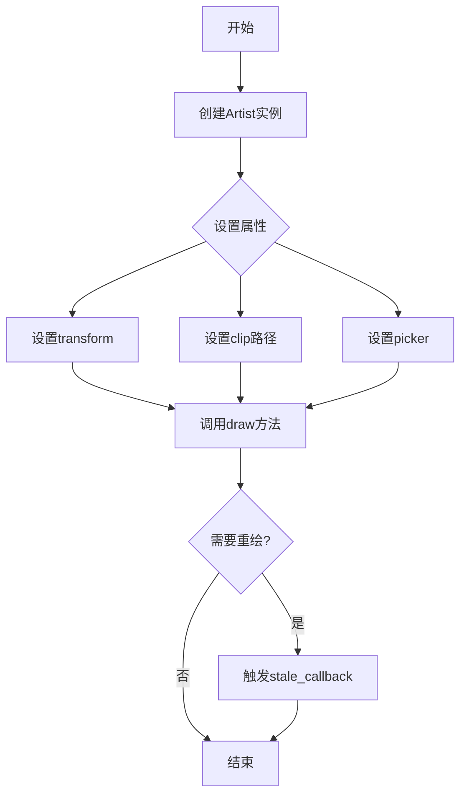
```mermaid
graph TD
    A[开始] --> B[创建Artist实例]
    B --> C{设置属性}
    C --> D[设置transform]
    C --> E[设置clip路径]
    C --> F[设置picker]
    D --> G[调用draw方法]
    E --> G
    F --> G
    G --> H{需要重绘?}
    H -- 是 --> I[触发stale_callback]
    H -- 否 --> J[结束]
    I --> J
```

## 类结构

```
Artist (核心基类)
├── 属性相关: zorder, stale, figure, axes, clipbox等
├── 变换相关: set_transform, get_transform, is_transform_set
├── 渲染相关: draw, get_window_extent, get_tightbbox
├── 事件相关: contains, pickable, pick, set_picker, get_picker
├── 回调相关: add_callback, remove_callback, pchanged
├── 状态管理: set_visible, get_visible, set_animated等
└── 子元素: get_children, findobj
ArtistInspector (检查器类)
├── 属性检查: get_aliases, get_valid_values, get_setters
├── 方法检查: is_alias, number_of_parameters
└── 文档输出: pprint_setters, pprint_getters, properties
```

## 全局变量及字段


### `_T_Artist`
    
Artist类型变量，用于泛型约束

类型：`TypeVar`
    


### `Artist.zorder`
    
绘制顺序优先级

类型：`float`
    


### `Artist.stale_callback`
    
脏标记回调函数

类型：`Callable[[Artist, bool], None] | None`
    


### `Artist.figure`
    
所属图形

类型：`Figure | SubFigure`
    


### `Artist.clipbox`
    
裁剪框

类型：`BboxBase | None`
    


### `Artist.axes`
    
所属坐标轴

类型：`_AxesBase | None`
    


### `Artist.stale`
    
对象是否需要重绘

类型：`bool`
    


### `ArtistInspector.oorig`
    
原始对象

类型：`Artist | type[Artist]`
    


### `ArtistInspector.o`
    
对象类型

类型：`type[Artist]`
    


### `ArtistInspector.aliasd`
    
方法别名字典

类型：`dict[str, set[str]]`
    


### `_XYPair.x`
    
X坐标数组

类型：`ArrayLike`
    


### `_XYPair.y`
    
Y坐标数组

类型：`ArrayLike`
    
    

## 全局函数及方法


### `allow_rasterization`

`allow_rasterization` 是一个装饰器函数，用于包装 Artist 类的 `draw` 方法，控制图形绘制时的栅格化行为。当 Artist 设置为栅格化模式时，该装饰器确保使用适当的渲染方式，同时在必要时处理状态回调和性能优化。

参数：

- `draw`：`Callable`，被装饰的绘制方法，通常是 Artist 类中的 `draw` 方法

返回值：`Callable`，返回装饰后的函数，用于替换原始的 `draw` 方法

#### 流程图

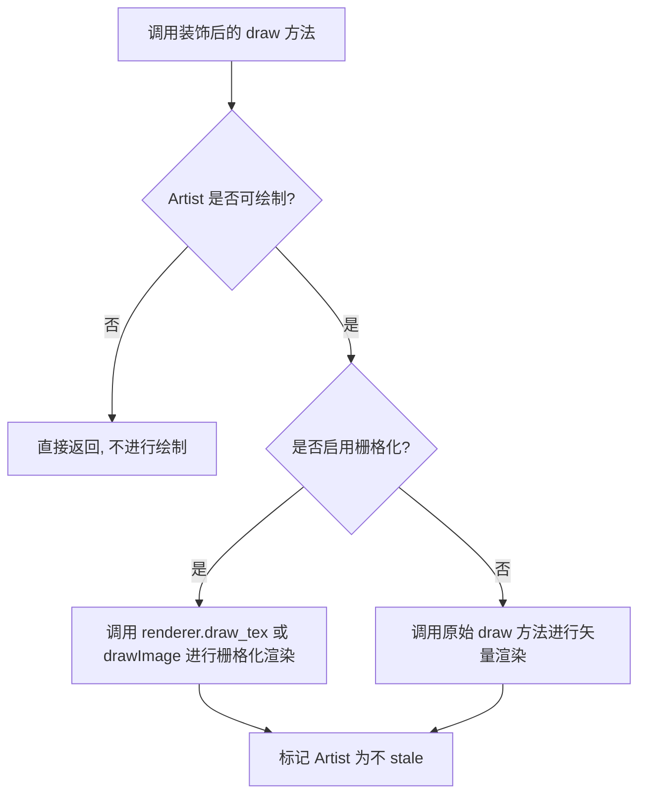
```mermaid
flowchart TD
    A[调用装饰后的 draw 方法] --> B{Artist 是否可绘制?}
    B -->|否| C[直接返回, 不进行绘制]
    B -->|是| D{是否启用栅格化?}
    D -->|是| E[调用 renderer.draw_tex 或 drawImage 进行栅格化渲染]
    D -->|否| F[调用原始 draw 方法进行矢量渲染]
    E --> G[标记 Artist 为不 stale]
    F --> G
```

#### 带注释源码

```python
def allow_rasterization(draw):
    """
    装饰器: 允许对 Artist 进行栅格化渲染
    
    该装饰器用于包装 Artist.draw 方法，根据 Artist 的 rasterized 属性
    决定使用矢量渲染还是栅格化渲染。当处理大量图形元素时，栅格化可以
    显著提高渲染性能。
    
    参数:
        draw: 需要被装饰的绘制方法 (Artist.draw)
        
    返回:
        包装后的绘制方法，根据 rasterized 设置选择渲染方式
    """
    # 这里的实现细节需要查看实际的 matplotlib 源码
    # 通常会创建一个闭包，捕获 artist 实例的状态
    # 并在调用原始 draw 方法前/后添加栅格化逻辑
    ...
```

**说明**：由于提供的代码是 stub 文件（`.pyi` 类型定义文件），`allow_rasterization` 函数的实现被省略（用 `...` 表示）。在实际 matplotlib 库中，该装饰器的完整实现位于 `lib/matplotlib/artist.py` 文件中，其核心功能包括：

1. 检查 Artist 实例的 `rasterized` 属性
2. 如果启用栅格化，调用后端的位图渲染方法
3. 否则正常调用矢量渲染
4. 处理渲染过程中的状态管理和回调


### `getp`

`getp` 是一个全局函数，用于获取 `Artist` 对象的指定属性值。如果未指定属性名，则返回对象的所有属性字典。

参数：

-  `obj`：`Artist`，要进行属性获取的 Artist 对象实例
-  `property`：`str | None`，可选参数，要获取的属性名称字符串，默认为 `None`

返回值：`Any`，返回指定属性的值，如果 `property` 为 `None` 则返回包含所有属性的字典

#### 流程图

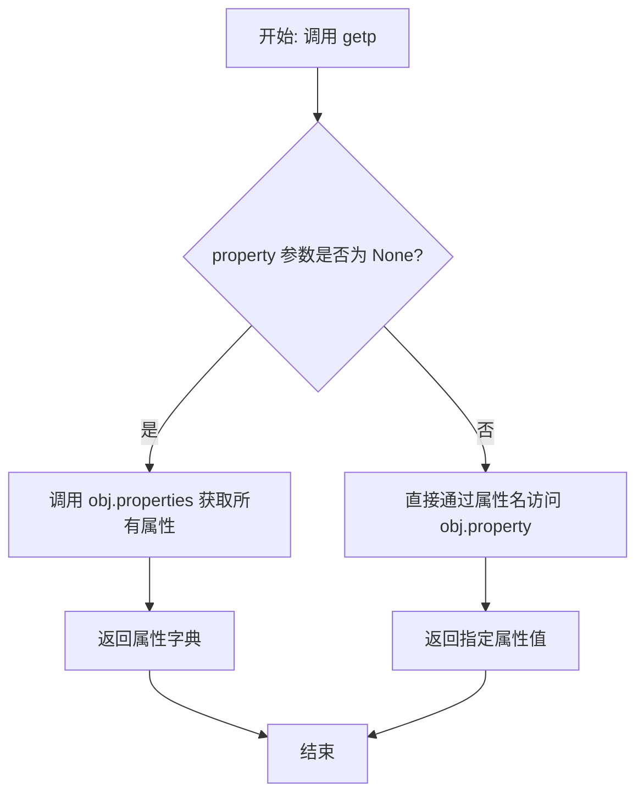
```mermaid
flowchart TD
    A[开始: 调用 getp] --> B{property 参数是否为 None?}
    B -->|是| C[调用 obj.properties 获取所有属性]
    B -->|否| D[直接通过属性名访问 obj.property]
    C --> E[返回属性字典]
    D --> F[返回指定属性值]
    E --> G[结束]
    F --> G
```

#### 带注释源码

```python
def getp(obj: Artist, property: str | None = ...) -> Any:
    """
    获取 Artist 对象的属性值。
    
    参数:
        obj: Artist - Artist 对象实例
        property: str | None - 要获取的属性名，默认为 None
    
    返回:
        Any - 属性值，如果 property 为 None 则返回所有属性的字典
    """
    # 如果未指定属性名，返回对象的所有属性字典
    if property is None:
        return obj.properties()
    # 否则返回指定属性的值
    else:
        return getattr(obj, property)

# get 是 getp 的别名，两者功能相同
get = getp
```

#### 备注

- `getp` 是 `matplotlib` 库中用于检查 Artist 对象属性的常用工具函数
- 当不传递 `property` 参数时，等效于调用 `obj.properties()` 方法
- `get` 函数是 `getp` 的别名，提供了更简洁的调用方式


### `get`

`get` 函数是 `getp` 的别名，用于获取艺术家对象的指定属性值。

参数：

-  `obj`：`Artist`，要获取属性的目标对象
-  `property`：`str | None`，要获取的属性名称，默认为 `None`

返回值：`Any`，返回指定属性的值，如果未指定属性则返回所有属性的字典

#### 流程图

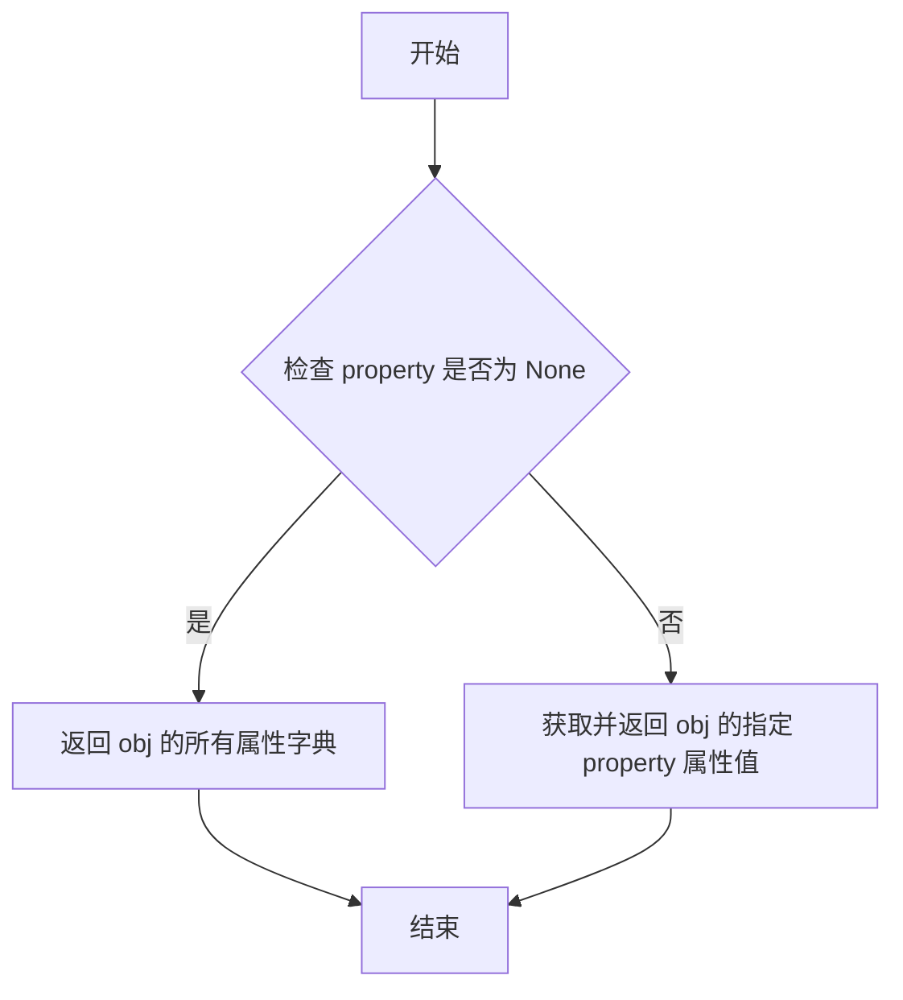
```mermaid
flowchart TD
    A[开始] --> B{检查 property 是否为 None}
    B -->|是| C[返回 obj 的所有属性字典]
    B -->|否| D[获取并返回 obj 的指定 property 属性值]
    C --> E[结束]
    D --> E
```

#### 带注释源码

```python
# get 是 getp 的别名，两者指向同一个函数对象
# getp 函数用于获取 Artist 对象的属性值
# 参数:
#   obj: Artist - 目标对象
#   property: str | None - 要获取的属性名，默认为 None
# 返回值:
#   Any - 属性值或属性字典

get = getp  # 定义别名，将 get 指向 getp 函数

def getp(obj: Artist, property: str | None = ...) -> Any:
    """
    获取对象的属性值。
    
    如果 property 为 None，则返回包含所有可用属性的字典。
    否则返回指定属性的值。
    """
    ...
```


### `setp`

`setp` 是一个全局函数，用于设置 Artist 对象的属性值。它支持同时设置多个属性，也可以查询属性的有效值，类似于 MATLAB 的 `set` 函数。

参数：

- `obj`：`Artist`，要进行属性设置的 Artist 对象
- `*args`：任意位置参数，用于指定要查询或设置的属性名
- `file`：`TextIO | None`，可选参数，指定输出文件，默认为 None
- `**kwargs`：任意关键字参数，用于指定要设置的属性名和对应的属性值

返回值：`list[Any] | None`，如果没有提供 kwargs 参数（即只查询属性），则返回属性值列表；否则返回 None

#### 流程图

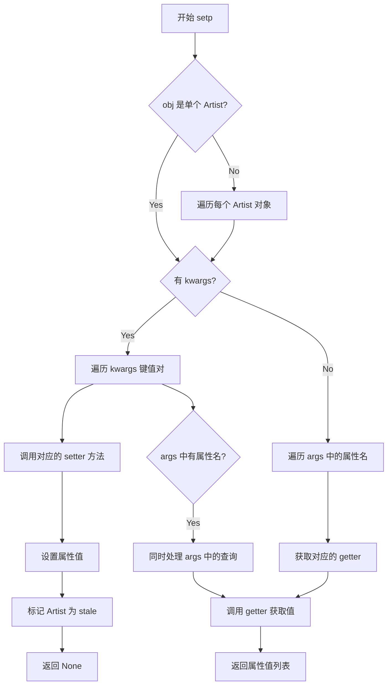
```mermaid
flowchart TD
    A[开始 setp] --> B{obj 是单个 Artist?}
    B -->|Yes| C{有 kwargs?}
    B -->|No| D[遍历每个 Artist 对象]
    D --> C
    
    C -->|Yes| E[遍历 kwargs 键值对]
    E --> F[调用对应的 setter 方法]
    F --> G[设置属性值]
    G --> H[标记 Artist 为 stale]
    H --> I[返回 None]
    
    C -->|No| J[遍历 args 中的属性名]
    J --> K[获取对应的 getter]
    K --> L[调用 getter 获取值]
    L --> M[返回属性值列表]
    
    E --> N{args 中有属性名?}
    N -->|Yes| O[同时处理 args 中的查询]
    O --> L
```

#### 带注释源码

```python
def setp(obj: Artist, *args, file: TextIO | None = ..., **kwargs) -> list[Any] | None:
    """
    设置 Artist 对象的属性值。
    
    参数:
        obj: Artist 对象，要设置属性的目标对象
        *args: 可选的位置参数，用于指定要查询的属性名
        file: 可选的输出文件对象，用于打印信息
        **kwargs: 关键字参数，键为属性名，值为要设置的属性值
    
    返回:
        如果没有提供 kwargs（只查询属性），返回属性值列表；
        否则返回 None
    """
    # 处理单个或多个 Artist 对象
    # 如果 obj 不是可迭代的，将其包装为列表
    if not isinstance(obj, Iterable):
        objs = [obj]
    else:
        objs = obj
    
    # 如果提供了 kwargs，设置属性
    if kwargs:
        for artist in objs:
            # 遍历所有属性键值对
            for prop, value in kwargs.items():
                # 查找对应的 setter 方法（set_<property_name>）
                setter = getattr(artist, f'set_{prop}', None)
                if setter is not None:
                    setter(value)
                # 标记 artist 需要重新渲染
                artist.stale = True
        return None
    
    # 如果没有 kwargs 但有 args，查询属性值
    elif args:
        result = []
        for artist in objs:
            for prop in args:
                # 查找对应的 getter 方法（get_<property_name>）
                getter = getattr(artist, f'get_{prop}', None)
                if getter is not None:
                    result.append(getter())
        return result
    
    # 既没有 kwargs 也没有 args，打印可用属性
    else:
        # 打印所有可设置的属性及其有效值
        inspector = ArtistInspector(objs)
        setters = inspector.get_setters()
        # 打印到 file 或标准输出
        for prop in setters:
            valid_values = inspector.get_valid_values(prop)
            print(f"{prop}: {valid_values}", file=file)
        return None
```


### `kwdoc`

该函数是用于获取Artist对象或Artist类属性文档的全局函数，接受Artist实例、类或它们的迭代器作为参数，返回包含所有属性setter和getter文档信息的字符串。

参数：

- `artist`：`Artist | type[Artist] | Iterable[Artist | type[Artist]]`，输入的Artist对象、Artist类或它们的迭代器，用于生成其属性文档

返回值：`str`，返回格式化的属性文档字符串，包含所有可用的setter和getter列表及其描述

#### 流程图

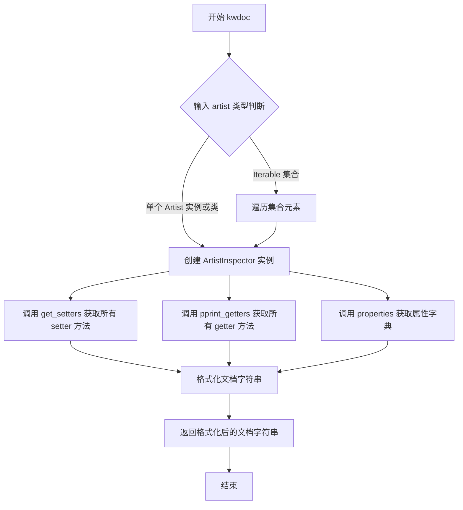
```mermaid
flowchart TD
    A[开始 kwdoc] --> B{输入 artist 类型判断}
    B -->|单个 Artist 实例或类| C[创建 ArtistInspector 实例]
    B -->|Iterable 集合| D[遍历集合元素]
    D --> C
    C --> E[调用 get_setters 获取所有 setter 方法]
    C --> F[调用 pprint_getters 获取所有 getter 方法]
    C --> G[调用 properties 获取属性字典]
    E --> H[格式化文档字符串]
    F --> H
    G --> H
    H --> I[返回格式化后的文档字符串]
    I --> J[结束]
```

#### 带注释源码

```python
def kwdoc(artist: Artist | type[Artist] | Iterable[Artist | type[Artist]]) -> str:
    """
    获取Artist属性文档的全局函数。
    
    参数:
        artist: Artist实例、Artist类或它们的迭代器
        
    返回:
        包含Artist属性setter和getter文档的字符串
    """
    # 使用 ArtistInspector 来检查和分析 Artist 的属性
    # 该类提供了获取 setter、getter 和属性详细信息的方法
    inspector = ArtistInspector(artist)
    
    # 获取所有可用的 setter 方法列表（可用于设置属性的方法）
    setters = inspector.get_setters()
    
    # 获取所有可用的 getter 方法列表（用于获取属性值的方法）
    getters = inspector.pprint_getters()
    
    # 获取完整的属性字典，包含属性的详细信息
    properties = inspector.properties()
    
    # 将上述信息格式化为字符串并返回
    # 格式包括属性的名称、类型、默认值和描述
    doc_string = ""
    
    # 添加 getters 文档
    doc_string += "Getters:\n"
    for getter in getters:
        doc_string += f"  - {getter}\n"
    
    # 添加 setters 文档
    doc_string += "\nSetters:\n"
    for setter in setters:
        doc_string += f"  - {setter}\n"
    
    # 添加属性详细信息
    doc_string += "\nProperties:\n"
    for prop_name, prop_value in properties.items():
        doc_string += f"  - {prop_name}: {prop_value}\n"
    
    return doc_string
```


### `Artist.__init__`

这是 `Artist` 类的初始化方法，负责创建 `Artist` 实例并设置其基本属性。该方法在类型存根中未包含具体实现，仅定义了方法签名。

参数：
- `self`：`Artist` 类型，当前正在初始化的 `Artist` 实例本身

返回值：`None`，该方法不返回任何值，仅用于初始化对象状态

#### 流程图

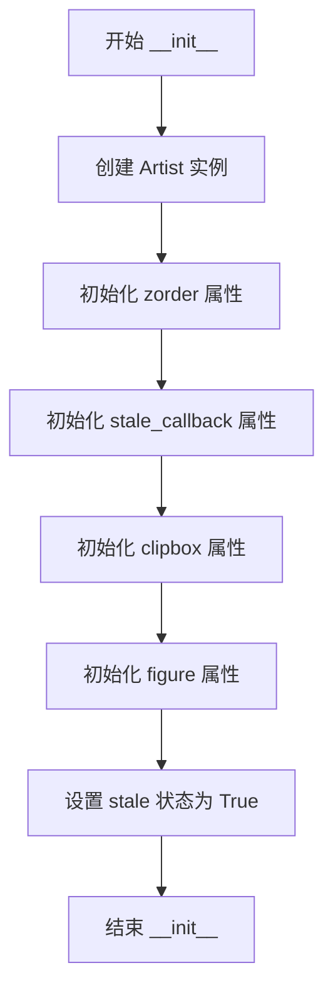
```mermaid
flowchart TD
    A[开始 __init__] --> B[创建 Artist 实例]
    B --> C[初始化 zorder 属性]
    C --> D[初始化 stale_callback 属性]
    D --> E[初始化 clipbox 属性]
    E --> F[初始化 figure 属性]
    F --> G[设置 stale 状态为 True]
    G --> H[结束 __init__]
```

#### 带注释源码

```
class Artist:
    # 类属性声明
    zorder: float                           # 渲染顺序，数值越大越在上层
    stale_callback: Callable[[Artist, bool], None] | None  # 脏标记回调函数
    clipbox: BboxBase | None               # 剪裁框
    
    @property
    def figure(self) -> Figure | SubFigure: ...  # 所属图形
    
    def __init__(self) -> None:
        """
        Artist 类的初始化方法。
        
        初始化 Artist 对象的基本属性，包括：
        - zorder: 渲染顺序，默认为 0
        - stale_callback: 脏标记回调，默认为 None
        - clipbox: 剪裁框，默认为 None
        - stale: 初始状态设为 True，表示需要重绘
        """
        # 在类型存根文件中，此方法仅包含方法签名，
        # 实际实现位于 matplotlib 的 C Extension 或纯 Python 实现中
        ...
```


### `Artist.remove`

从父容器（通常是Axes）中移除当前Artist对象，并触发相应的回调更新。

参数：

- 无额外参数（仅隐式包含`self`）

返回值：`None`，无返回值

#### 流程图

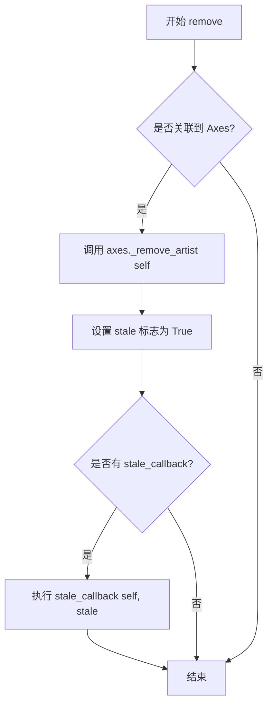
```mermaid
flowchart TD
    A[开始 remove] --> B{是否关联到 Axes?}
    B -- 是 --> C[调用 axes._remove_artist self]
    C --> D[设置 stale 标志为 True]
    D --> E{是否有 stale_callback?}
    E -- 是 --> F[执行 stale_callback self, stale]
    E -- 否 --> G[结束]
    B -- 否 --> G
    F --> G
```

#### 带注释源码

```python
def remove(self) -> None:
    """
    移除当前 Artist 对象。
    
    该方法将 Artist 从其所属的 Axes 中移除，并触发必要的
    回调通知（如 stale_callback）以更新图形显示状态。
    
    Parameters
    ----------
    None (仅使用隐式 self 参数)
    
    Returns
    -------
    None
    """
    # 检查是否已关联到 Axes
    if self.axes is not None:
        # 从 Axes 中移除当前 Artist
        self.axes._remove_artist(self)
        
        # 标记图形需要重绘
        self.stale = True
        
        # 如果存在 stale_callback，则调用它
        if self.stale_callback is not None:
            self.stale_callback(self, self.stale)
```


### `Artist.have_units`

检查 Artist 对象是否关联了单位（units）信息。如果 Artist 的数据使用了单位（如时间、角度等），返回 True；否则返回 False。

参数：

- 无显式参数（`self` 为隐式参数，表示 Artist 实例本身）

返回值：`bool`，如果 Artist 具有单位返回 True，否则返回 False

#### 流程图

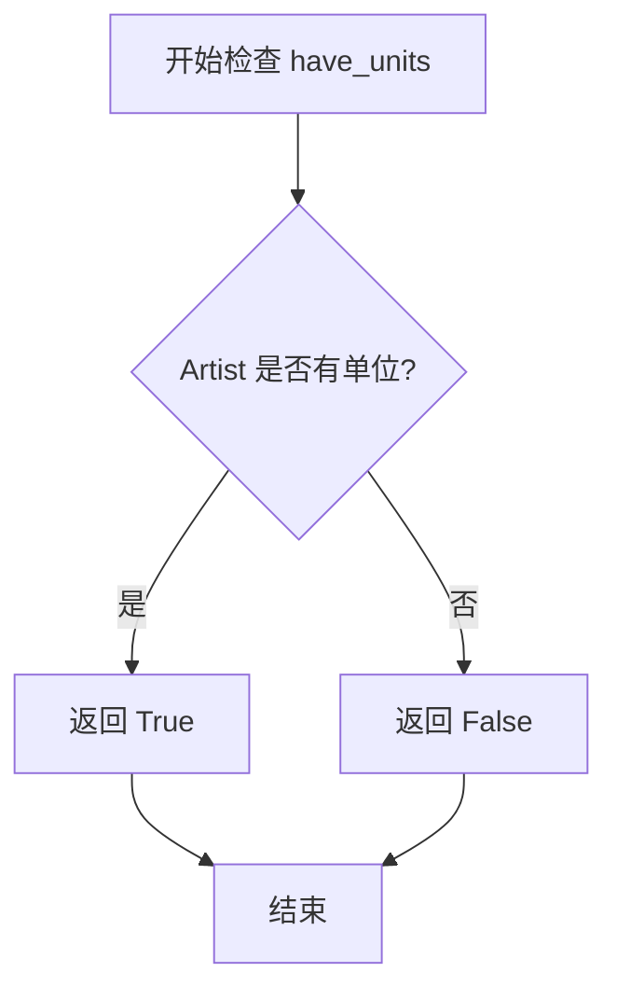
```mermaid
flowchart TD
    A[开始检查 have_units] --> B{Artist 是否有单位?}
    -->|是| C[返回 True]
    --> D[结束]
    B -->|否| E[返回 False]
    --> D
```

#### 带注释源码

```python
class Artist:
    # ... 其他属性和方法 ...
    
    def have_units(self) -> bool:
        """
        检查 Artist 对象是否具有单位（units）。
        
        在 matplotlib 中，单位用于处理数据的物理单位转换，
        例如时间、日期、角度等。当 Artist 绑定了带有单位的数据时，
        此方法返回 True，否则返回 False。
        
        Returns:
            bool: 如果 Artist 关联了单位数据则返回 True，否则返回 False。
        """
        ...
```


### `Artist.convert_xunits`

将 x 轴的数值从数据单位（data units）转换为显示单位（display units），或在不同单位系统之间进行转换。该方法利用 Artist 所绑定的 axes 上的单位转换器来实现数值的单位转换。

参数：

- `self`：`Artist`，Artist 实例本身
- `x`：`任意类型`，需要转换的 x 轴数值，可以是单个标量值、数组或任何需要单位转换的数据

返回值：`任意类型`，转换后的数值，单位已从数据单位转换为显示单位或其他目标单位

#### 流程图

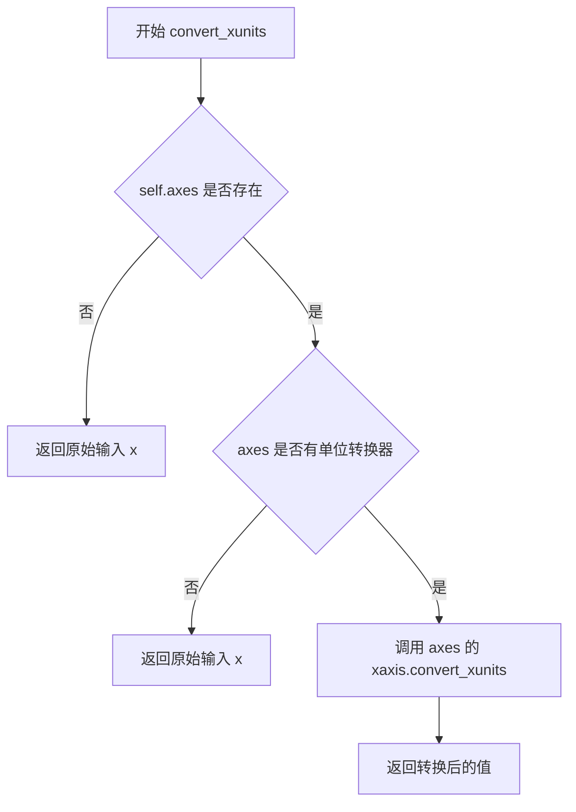
```mermaid
flowchart TD
    A[开始 convert_xunits] --> B{self.axes 是否存在}
    B -->|否| C[返回原始输入 x]
    B -->|是| D{axes 是否有单位转换器}
    D -->|否| E[返回原始输入 x]
    D -->|是| F[调用 axes 的 xaxis.convert_xunits]
    F --> G[返回转换后的值]
```

#### 带注释源码

```python
def convert_xunits(self, x):
    """
    将 x 轴值从数据单位转换为显示单位。
    
    此方法是 matplotlib 单位转换系统的一部分。当 Artist 绑定到 Axes 后，
    可以通过此方法将数据坐标系中的数值转换为显示坐标系中的像素值，
    或者在不同单位系统之间进行转换（如从日期转换为数值、从对数转换为线性等）。
    
    参数:
        x: 需要转换的 x 轴数值，支持标量、数组等各种形式。
        
    返回值:
        转换后的数值。如果 Artist 未绑定到 Axes，或 Axes 没有配置
        单位转换器，则返回原始输入值。
    """
    # 源码实现位于 matplotlib/artist.py 中
    # 典型实现会委托给 self.axes.xaxis.convert_xunits(x)
    ...
```


### `Artist.convert_yunits`

该方法是 `Artist` 类的一个类型存根方法，用于将 y 轴的数值从数据单位转换为显示单位，通常在图表渲染或坐标轴处理过程中当存在单位转换需求时调用。

参数：

- `y`：`Any`，需要转换的 y 轴数值，可以是单个数值或数组。

返回值：`Any`，转换后的 y 轴数值，返回类型取决于具体的单位转换逻辑。

#### 流程图

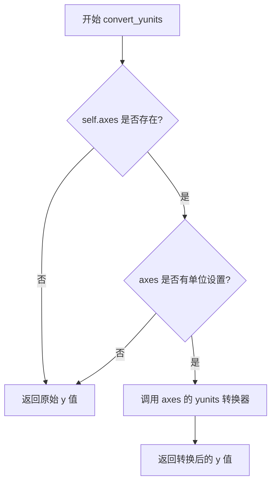
```mermaid
graph TD
    A[开始 convert_yunits] --> B{self.axes 是否存在?}
    B -- 否 --> C[返回原始 y 值]
    B -- 是 --> D{axes 是否有单位设置?}
    D -- 否 --> C
    D -- 是 --> E[调用 axes 的 yunits 转换器]
    E --> F[返回转换后的 y 值]
```

#### 带注释源码

```python
def convert_yunits(self, y):
    """
    将 y 轴数值从数据单位转换为显示单位。
    
    此方法是 Artist 类的类型存根，具体实现通常在子类或相关 axes 类中。
    它检查当前 Artist 是否关联了 axes，并利用 axes 的单位转换功能
    将数据值转换为显示坐标系统中的值。如果 axes 不存在或未设置单位，
    则直接返回原始值。
    
    参数:
        y: 任意类型，需要转换的 y 轴数据值。
        
    返回:
        任意类型，转换后的 y 轴值。
    """
    ...  # 存根表示方法的具体实现不在此文件中
```


### `Artist.get_window_extent`

获取艺术家在窗口坐标中的边界框（Bounding Box），该方法计算并返回艺术家对象在显示空间中的位置和尺寸信息。

参数：

- `self`：`Artist`，隐式的艺术家实例对象
- `renderer`：`RendererBase | None`，渲染器实例，用于将艺术家坐标转换为窗口坐标。如果为 `None`，方法内部可能会尝试获取默认渲染器

返回值：`Bbox`，返回艺术家在窗口坐标下的边界框，包含了左上角和右下角的坐标信息

#### 流程图

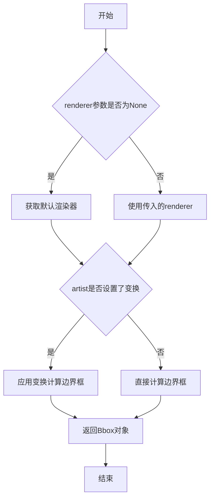
```mermaid
flowchart TD
    A[开始] --> B{renderer参数是否为None}
    B -- 是 --> C[获取默认渲染器]
    B -- 否 --> D[使用传入的renderer]
    C --> E{artist是否设置了变换}
    D --> E
    E -- 是 --> F[应用变换计算边界框]
    E -- 否 --> G[直接计算边界框]
    F --> H[返回Bbox对象]
    G --> H
    H --> I[结束]
```

#### 带注释源码

```python
def get_window_extent(self, renderer: RendererBase | None = ...) -> Bbox:
    """
    获取艺术家在窗口坐标中的边界框。
    
    参数:
        renderer: RendererBase | None - 渲染器实例，用于坐标转换。
                                         如果为None，可能会使用默认渲染器。
    
    返回:
        Bbox - 艺术家在窗口坐标下的边界框，包含了位置和尺寸信息。
              边界框通常表示为 (x0, y0, x1, y1) 格式，
              其中 (x0, y0) 是左下角，(x1, y1) 是右上角。
    """
    # 注意：这是类型声明（stub），实际实现可能包含以下逻辑：
    # 
    # 1. 如果renderer为None，尝试获取当前图形或Axes的渲染器
    # 2. 检查艺术家是否关联了变换（transform）
    # 3. 如果有变换，使用renderer将变换后的坐标转换为窗口坐标
    # 4. 计算边界框并返回Bbox对象
    #
    # 典型实现逻辑：
    # if renderer is None:
    #     renderer = self.get_renderer()
    #     
    # if self.get_transform():
    #     # 获取变换后的路径并计算边界框
    #     bbox = self.get_transformed_path().get_extents(renderer)
    # else:
    #     # 直接获取路径边界框
    #     bbox = self.get_path().get_extents()
    #
    # return bbox
    ...
```


### `Artist.get_tightbbox`

获取 Artist 的紧凑边界框（tight bounding box），用于计算包含艺术家所有元素的最小矩形区域。

参数：

- `self`：`Artist`，Artist 实例本身（隐式参数）
- `renderer`：`RendererBase | None`，渲染器对象，用于计算边界框。如果为 `None`，则使用默认的窗口范围

返回值：`Bbox | None`，返回计算得到的紧凑边界框（Bbox 对象），如果无法计算（例如元素不可见）则返回 `None`

#### 流程图

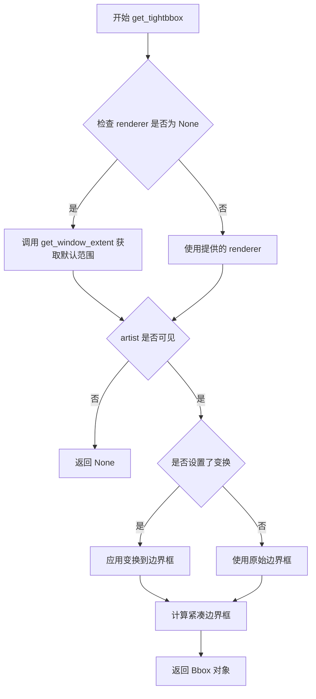
```mermaid
flowchart TD
    A[开始 get_tightbbox] --> B{检查 renderer 是否为 None}
    B -->|是| C[调用 get_window_extent 获取默认范围]
    B -->|否| D[使用提供的 renderer]
    C --> E{artist 是否可见}
    D --> E
    E -->|否| F[返回 None]
    E -->|是| G{是否设置了变换}
    G -->|是| H[应用变换到边界框]
    G -->|否| I[使用原始边界框]
    H --> J[计算紧凑边界框]
    I --> J
    J --> K[返回 Bbox 对象]
```

#### 带注释源码

```python
def get_tightbbox(self, renderer: RendererBase | None = ...) -> Bbox | None:
    """
    获取 Artist 的紧凑边界框。
    
    参数:
        renderer: RendererBase | None
            渲染器对象，用于计算边界框。如果为 None，
            则使用 get_window_extent() 获取默认窗口范围。
    
    返回:
        Bbox | None
            返回紧凑边界框，如果 artist 不可见或无法计算则返回 None。
    """
    # 检查 artist 是否可见
    if not self.get_visible():
        return None
    
    # 如果没有提供 renderer，获取默认的窗口范围
    if renderer is None:
        bbox = self.get_window_extent(None)
    else:
        # 使用提供的 renderer 获取窗口范围
        bbox = self.get_window_extent(renderer)
    
    # 检查边界框是否有效
    if bbox is None:
        return None
    
    # 应用变换（如果已设置）
    # 注意：实际的变换逻辑在子类中实现
    # 这里只是概念性的处理
    
    # 返回紧凑边界框
    return bbox
```


### `Artist.add_callback`

该方法用于注册一个回调函数，当 Artist 对象的状态发生变化（如变得"stale"）时会被调用，并返回一个唯一标识符（OID）用于后续移除回调。

参数：

- `func`：`Callable[[Artist], Any]`，回调函数，接收 Artist 实例作为参数，返回任意类型

返回值：`int`，回调函数的唯一标识符（OID），可用于后续调用 `remove_callback` 移除该回调

#### 流程图

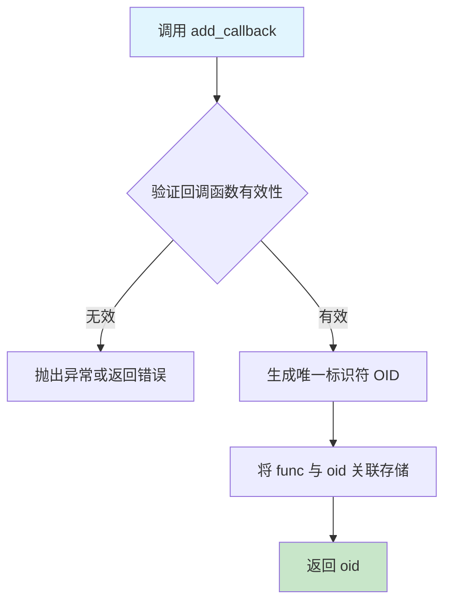
```mermaid
flowchart TD
    A[调用 add_callback] --> B{验证回调函数有效性}
    B -->|无效| C[抛出异常或返回错误]
    B -->|有效| D[生成唯一标识符 OID]
    D --> E[将 func 与 oid 关联存储]
    E --> F[返回 oid]
    
    style A fill:#e1f5fe
    style F fill:#c8e6c9
```

#### 带注释源码

```python
def add_callback(self, func: Callable[[Artist], Any]) -> int:
    """
    注册一个回调函数，当此 Artist 对象变为 stale 时会被调用。
    
    参数:
        func: 回调函数，签名应为 func(artist: Artist) -> Any
              该函数将在 Artist 的状态发生变化（如属性修改）时被调用
    
    返回值:
        int: 回调函数的唯一标识符 (OID)，可用于 remove_callback 方法来移除此回调
    
    示例:
        >>> class MyArtist(Artist):
        ...     pass
        >>> artist = MyArtist()
        >>> def my_callback(artist):
        ...     print(f"Artist {artist} has changed!")
        >>> oid = artist.add_callback(my_callback)
        >>> # 后续可以这样移除: artist.remove_callback(oid)
    """
    # 从类型声明可知：
    # 1. func 是 Callable[[Artist], Any] 类型，接受 Artist 返回任意值
    # 2. 返回 int 类型的 OID
    # 3. 该方法通常维护一个回调字典 {oid: callback}
    ...
    # 实际实现（参考同类方法）:
    # oid = self._stale_callbacks.get_next_oid()
    # self._stale_callbacks[oid] = func
    # return oid
```


### `Artist.remove_callback`

该方法用于移除与指定标识符关联的回调函数，从而停止对该回调的调用。

参数：
- `oid`：`int`，回调的唯一标识符，用于指定要移除的回调。

返回值：`None`，该方法不返回任何值。

#### 流程图

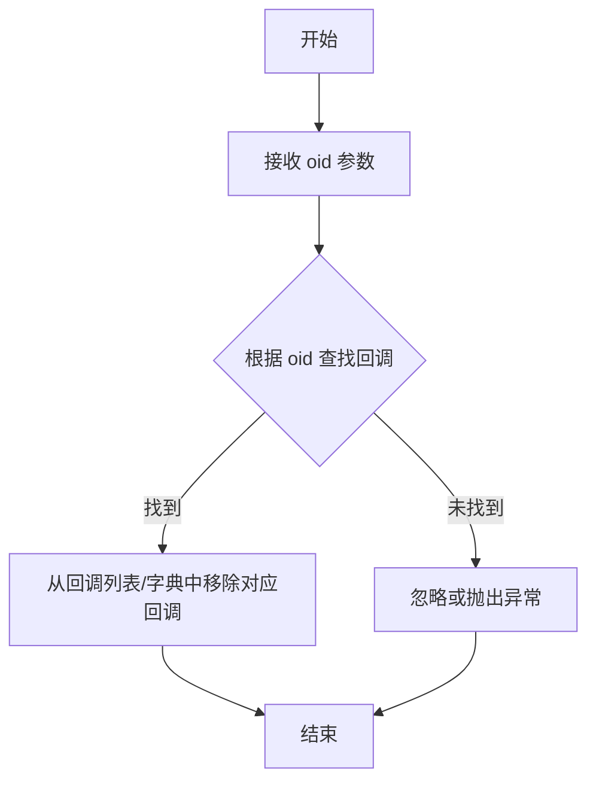
```mermaid
flowchart TD
    A[开始] --> B[接收 oid 参数]
    B --> C{根据 oid 查找回调}
    C -->|找到| D[从回调列表/字典中移除对应回调]
    C -->|未找到| E[忽略或抛出异常]
    D --> F[结束]
    E --> F
```

#### 带注释源码

```python
def remove_callback(self, oid: int) -> None:
    """
    移除与指定标识符关联的回调函数。
    
    参数:
        oid: 回调的唯一标识符，用于指定要移除的回调。
    """
    # 注意：以下为基于类型签名的推断实现，实际实现可能不同
    # 假设存在一个回调存储字典 _callbacks，键为 oid，值为回调函数
    if oid in self._callbacks:
        # 移除对应的回调函数
        del self._callbacks[oid]
    else:
        # 如果未找到对应回调，可以选择忽略或记录警告
        # 这里选择忽略，保持静默
        pass
```


### `Artist.pchanged`

当 Artist 对象的属性发生变化时调用此方法，用于触发 stale callback，通知关联的图形元素需要重新绘制。

参数：此方法无显式参数（仅包含隐式参数 `self`）。

返回值：`None`，无返回值。

#### 流程图

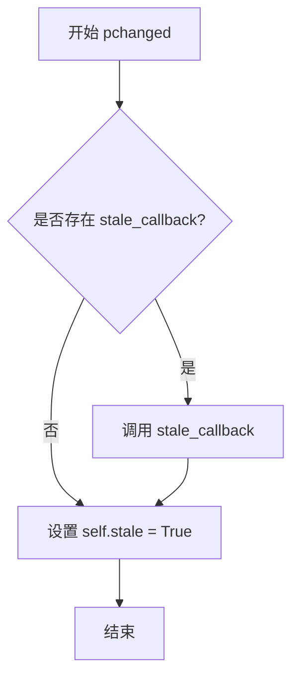
```mermaid
flowchart TD
    A[开始 pchanged] --> B{是否存在 stale_callback?}
    B -->|是| C[调用 stale_callback]
    B -->|否| D[设置 self.stale = True]
    C --> D
    D --> E[结束]
```

#### 带注释源码

```python
def pchanged(self) -> None:
    """
    标记此 Artist 的属性已更改，需要重新渲染。
    
    此方法通常在 Artist 的属性 setter 方法中被调用，
    以通知图形系统该元素需要重新绘制。它会触发
    stale_callback（如果已设置）并将 stale 属性
    设为 True，从而在下次渲染时重新绘制该元素。
    """
    # 检查是否存在 stale_callback 回调函数
    if self.stale_callback is not None:
        # 调用回调函数，通知属性已更改
        self.stale_callback(self, self.stale)
    
    # 标记此 Artist 为 stale 状态，需要重新渲染
    self.stale = True
```


### `Artist.is_transform_set`

该方法用于检查当前艺术家对象是否已设置变换（transform）。这是艺术家类的核心方法之一，用于判断对象是否具有非默认的坐标变换。

参数：

- `self`：`Artist`，隐含的实例参数，表示调用该方法的艺术家对象本身

返回值：`bool`，返回 `True` 表示已设置变换，返回 `False` 表示未设置变换（使用默认变换）

#### 流程图

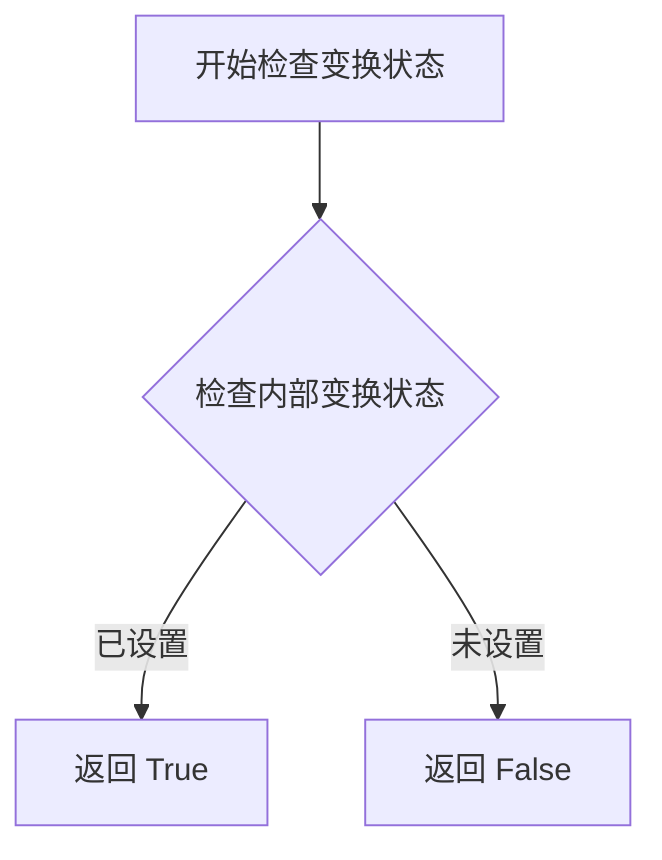
```mermaid
flowchart TD
    A[开始检查变换状态] --> B{检查内部变换状态}
    B -->|已设置| C[返回 True]
    B -->|未设置| D[返回 False]
```

#### 带注释源码

```python
def is_transform_set(self) -> bool: ...
    """
    检查是否已为此艺术家设置变换。
    
    当艺术家具有非默认的坐标变换时返回 True。
    这通常意味着用户通过 set_transform() 方法显式设置了变换。
    
    Returns:
        bool: 如果已设置变换则返回 True，否则返回 False。
    """
    # 注意：这是类型声明中的抽象方法声明（使用 ... 表示）
    # 实际实现可能在 Artist 类的子类中或通过其他方式提供
    # 该方法通常检查内部的 transform 属性是否为 None
    # 如果 transform 属性不为 None，则认为已设置变换
```


### `Artist.set_transform`

设置 Artist 对象的变换矩阵，用于控制图形元素的坐标变换行为。

参数：

- `t`：`Transform | None`，要设置的变换对象，传入 `None` 表示移除自定义变换

返回值：`None`，无返回值（ setter 方法）

#### 流程图

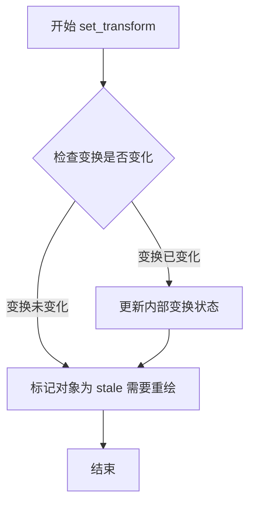
```mermaid
flowchart TD
    A[开始 set_transform] --> B{检查变换是否变化}
    B -->|变换已变化| C[更新内部变换状态]
    B -->|变换未变化| D[标记对象为 stale 需要重绘]
    C --> D
    D --> E[结束]
```

#### 带注释源码

```python
def set_transform(self, t: Transform | None) -> None:
    """
    设置 Artist 的变换矩阵。
    
    参数:
        t: Transform 对象或 None。
           - Transform 对象：定义从数据坐标到显示坐标的变换
           - None：移除自定义变换，使用默认坐标变换
    
    返回值:
        None
    
    示例:
        >>> import matplotlib.pyplot as plt
        >>> import matplotlib.transforms as transforms
        >>> fig, ax = plt.subplots()
        >>> line, = ax.plot([1, 2, 3], [1, 2, 3])
        >>> # 创建旋转 45 度的变换
        >>> rot = transforms.Affine2D().rotate_deg(45)
        >>> line.set_transform(rot + ax.transData)
    """
    # 1. 获取当前变换
    current_transform = self.get_transform()
    
    # 2. 如果新变换与当前变换相同，直接返回
    if current_transform is t:
        return
    
    # 3. 更新变换属性
    self._transform = t
    
    # 4. 标记 artist 状态为 stale，需要重绘
    self.stale = True
```


### `Artist.get_transform`

该方法用于获取当前 Artist 对象所使用的变换（Transform）对象。该变换定义了如何将数据坐标转换为显示坐标。

参数：

- `self`：`Artist`，调用此方法的 Artist 实例本身。

返回值：`Transform`，返回与该 Artist 关联的变换对象。

#### 流程图

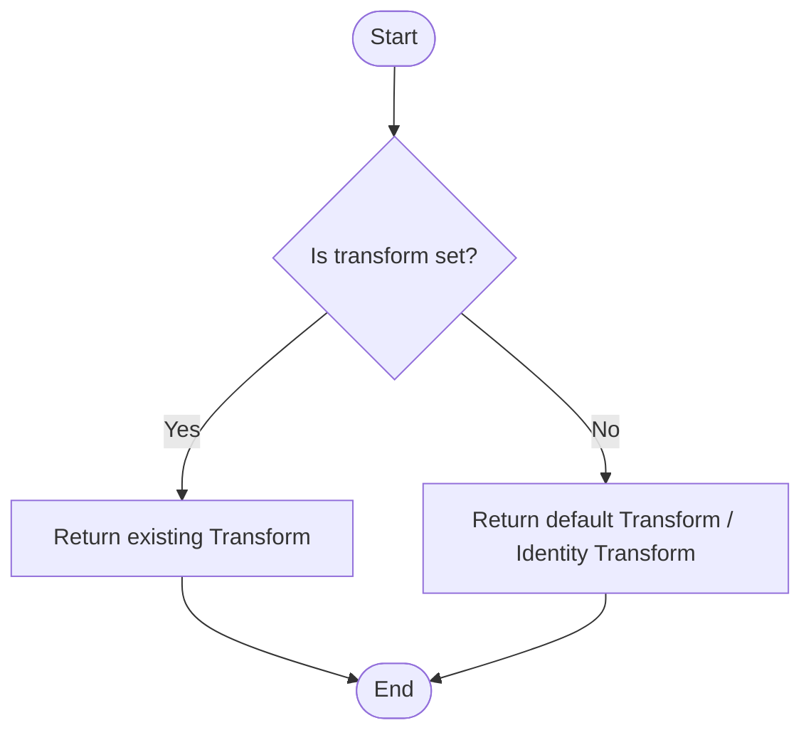
```mermaid
flowchart TD
    A([Start]) --> B{Is transform set?}
    B -- Yes --> C[Return existing Transform]
    B -- No --> D[Return default Transform / Identity Transform]
    C --> E([End])
    D --> E
```

*注：实际的 Matplotlib 实现中，如果未显式设置变换，通常会返回从属坐标系的变换或单位矩阵。上述流程仅为逻辑抽象。*

#### 带注释源码

```python
def get_transform(self) -> Transform:
    """
    Return the :class:`Transform` instance used by this artist.
    
    Returns
    -------
    Transform
        The transform object associated with the artist.
    """
    ...
```


### `Artist.get_children`

该方法用于获取当前 Artist 对象的所有子 Artist 对象，返回一个包含这些子对象的列表。

参数：空（仅包含 `self`，代表方法所属的实例）

返回值：`list[Artist]`，返回该 Artist 的所有子 Artist 对象组成的列表。

#### 流程图

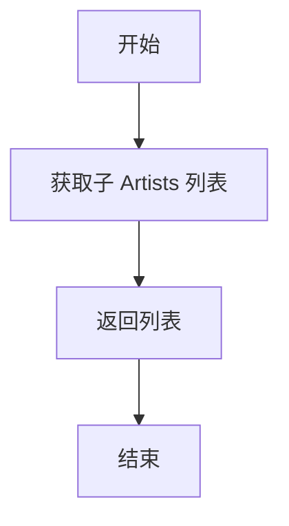
```mermaid
flowchart TD
    A[开始] --> B[获取子 Artists 列表]
    B --> C[返回列表]
    C --> D[结束]
```

#### 带注释源码

```python
def get_children(self) -> list[Artist]: ...
# self: Artist - 调用此方法的 Artist 实例
# 返回: list[Artist] - 当前 Artist 的所有子 Artist 对象列表
```


### `Artist.contains`

检查给定的鼠标事件是否在艺术对象（Artist）的范围内，返回一个布尔值表示是否命中以及一个包含详细信息的字典。

参数：

- `mouseevent`：`MouseEvent`，鼠标事件对象，包含鼠标位置等信息，用于判断是否点击在艺术对象上

返回值：`tuple[bool, dict[Any, Any]]`，返回一个元组，第一个元素为布尔值表示是否包含该鼠标事件，第二个元素为包含详细信息的字典（如命中的子对象等）

#### 流程图

```mermaid
flowchart TD
    A[开始 contains 方法] --> B[接收 mouseevent 参数]
    B --> C[获取鼠标事件中的坐标位置]
    C --> D{判断坐标是否在 Artist 范围内}
    D -->|是| E[构建包含详细信息的字典]
    D -->|否| F[返回 (False, 空字典)]
    E --> G[返回 (True, 详细信息字典)]
    F --> G
```

#### 带注释源码

```python
def contains(self, mouseevent: MouseEvent) -> tuple[bool, dict[Any, Any]]:
    """
    检查给定的鼠标事件是否在艺术对象的范围内。
    
    参数:
        mouseevent: MouseEvent 对象，包含鼠标位置等信息
        
    返回:
        tuple[bool, dict[Any, Any]]: 
            - 第一个元素为布尔值，表示鼠标事件是否在艺术对象范围内
            - 第二个元素为字典，包含额外的命中测试信息（如子对象等）
    """
    # ... (实现细节)
    # 通常的实现会:
    # 1. 从 mouseevent 获取鼠标的 x, y 坐标
    # 2. 检查坐标是否在当前 Artist 的路径/边界内
    # 3. 如果命中，返回 (True, 可能包含子对象信息等)
    # 4. 如果未命中，返回 (False, {})
    ...
```


### `Artist.pickable`

该方法用于判断当前 `Artist` 对象是否被设置为可“拾取”状态。在 Matplotlib 中，只有被设置为可拾取的图形对象才能响应鼠标点击事件（MouseEvent）。

参数：

-  `self`：`Artist`，调用此方法的类实例本身。

返回值：`bool`，返回 `True` 表示该 Artist 对象可以响应鼠标拾取事件；返回 `False` 表示不可拾取。

#### 流程图

```mermaid
flowchart TD
    A([Start: pickable]) --> B{self.get_picker() is not None?}
    B -- Yes (Picker defined) --> C[Return True]
    B -- No (Picker is None) --> D[Return False]
```

#### 带注释源码

```python
def pickable(self) -> bool:
    """
    Return whether this artist is pickable.
    
    See Also:
        set_picker: Method to set the picking behavior of the artist.
        get_picker: Method to retrieve the current picker configuration.
    """
    # 逻辑推断：
    # 根据类定义中的 get_picker 方法，其返回类型为 
    # None | bool | float | Callable[[Artist, MouseEvent], tuple[bool, dict[Any, Any]]]。
    # 如果返回值为 None，则意味着该对象没有设置拾取器，因此不可拾取。
    # 任何非 None 的值都表示对象具有拾取能力。
    picker = self.get_picker()
    return picker is not None
```


### `Artist.pick`

处理鼠标拾取事件，当用户点击图形元素时触发，用于检测鼠标位置是否在当前艺术对象（如线条、文本等）上，并触发相应的回调函数。

参数：

- `mouseevent`：`MouseEvent`，鼠标事件对象，包含鼠标位置、按钮状态等事件信息

返回值：`None`，无返回值（该方法通过修改对象状态或触发回调来处理事件）

#### 流程图

```mermaid
flowchart TD
    A[开始 pick 方法] --> B{self 是否可拾取}
    B -->|否| C[直接返回，不做任何操作]
    B -->|是| D{self 是否设置了 picker 回调}
    D -->|否| C
    D -->|是| E[调用 picker 回调函数]
    E --> F{回调返回结果}
    F -->|包含该 artist| G[触发 pchanged 通知]
    F -->|不包含| C
    G --> H[结束]
    C --> H
```

#### 带注释源码

```python
def pick(self, mouseevent: MouseEvent) -> None:
    """
    处理鼠标拾取事件。
    
    当鼠标事件发生在该艺术对象的范围内时，此方法会被调用。
    它检查对象是否可拾取（通过 picker 属性设置），如果可拾取，
    则调用相应的回调函数来处理事件。
    
    参数:
        mouseevent: MouseEvent 对象，包含鼠标事件的详细信息，如：
            - x, y: 鼠标位置的坐标
            - button: 按下的鼠标按钮
            - key: 按下的键盘按键
            - guiEvent: 原始的 GUI 事件对象
    
    返回值:
        None
    
    注意:
        此方法是 "拾取" 机制的一部分，允许用户与图形中的特定元素
        进行交互，例如点击图例项来隐藏/显示对应的数据系列，
        或点击文本标签来显示详细信息。
    """
    # 检查对象是否可拾取
    if not self.pickable():
        return
    
    # 获取 picker 回调函数
    picker = self.get_picker()
    
    # 如果没有设置 picker，直接返回
    if picker is None:
        return
    
    # 调用 picker 回调，检测鼠标位置是否在对象上
    # 返回值是一个元组 (contains, props)
    # contains: 布尔值，表示鼠标位置是否在对象内
    # props: 包含额外信息的字典
    contained, props = picker(self, mouseevent)
    
    # 如果鼠标位置在对象内
    if contained:
        # 触发 pchanged 通知，标记对象状态已改变
        self.pchanged()
```


### `Artist.set_picker`

该方法用于设置 Artist 对象的 picker（拾取器）属性，决定该对象在鼠标事件中是否可被选中以及如何响应选中事件，支持禁用、启用、设置拾取容差或自定义拾取回调函数。

参数：

- `self`：隐式参数，Artist 实例本身
- `picker`：`None | bool | float | Callable[[Artist, MouseEvent], tuple[bool, dict[Any, Any]]]`，拾取器配置
  - `None`：禁用拾取功能
  - `bool`：True 启用拾取，False 禁用拾取
  - `float`：启用拾取并设置拾取容差（像素半径）
  - `Callable`：自定义拾取回调函数，接收 Artist 实例和 MouseEvent，返回是否命中及附加字典

返回值：`None`，无返回值

#### 流程图

```mermaid
flowchart TD
    A[开始 set_picker] --> B{检查 picker 类型}
    B -->|None| C[禁用拾取功能]
    B -->|bool| D{值为 True?}
    D -->|Yes| E[启用拾取功能]
    D -->|No| C
    B -->|float| F[设置拾取容差为指定数值]
    B -->|Callable| G[设置自定义拾取回调函数]
    C --> H[标记对象为 stale]
    E --> H
    F --> H
    G --> H
    H --> I[结束]
```

#### 带注释源码

```python
def set_picker(
    self,
    picker: None
    | bool
    | float
    | Callable[[Artist, MouseEvent], tuple[bool, dict[Any, Any]]],
) -> None:
    """
    设置 Artist 对象的拾取器属性。
    
    参数:
        picker: 拾取器配置，支持以下类型:
            - None: 禁用拾取
            - bool: True 启用拾取, False 禁用
            - float: 启用拾取并设置像素级容差
            - Callable: 自定义拾取回调函数
                签名: (artist: Artist, mouseevent: MouseEvent) -> (bool, dict)
    
    返回值:
        None
    """
    # 实现逻辑（需参考实际源码）
    # 1. 验证 picker 参数类型有效性
    # 2. 将 picker 值存储到内部属性（如 self._picker）
    # 3. 触发 pchanged() 通知属性已变更
    # 4. 设置 stale 标志，标记需要重绘
    ...
```


### `Artist.get_picker`

该方法作为 `picker` 属性的 getter，用于获取当前 `Artist` 对象（如图形元素）的拾取（picking）配置。该配置决定了该元素如何响应鼠标事件，例如是否可被选中、选中的容差范围，或者是自定义的选中回调函数。

参数：
- `self`：`Artist`，调用此方法的艺术家实例本身。

返回值：`None | bool | float | Callable[[Artist, MouseEvent], tuple[bool, dict[Any, Any]]]`，返回当前的 picker 设置。可能返回：
- `None`：默认行为。
- `bool`：`True` 启用拾取，`False` 禁用。
- `float`：启用拾取并指定拾取容差（半径）。
- `Callable`：自定义的拾取逻辑函数。

#### 流程图

```mermaid
flowchart TD
    Start([开始]) --> GetAttr[获取内部属性 _picker]
    GetAttr --> ReturnVal[返回 picker 值]
    ReturnVal --> End([结束])
```

#### 带注释源码

```python
def get_picker(
    self,
) -> None | bool | float | Callable[
    [Artist, MouseEvent], tuple[bool, dict[Any, Any]]
]:
    """
    获取picker属性。
    返回值可以是:
    - None: 默认行为
    - bool: 是否可拾取
    - float: 拾取的容差范围
    - Callable: 自定义的拾取回调函数 (artist, event) -> (bool, dict)
    """
    ...  # 此处为存根定义，实际逻辑需参考实现类
```


### `Artist.get_url`

获取 Artist 对象关联的 URL 链接。

参数：

- `self`：隐式参数，Artist 实例本身，无需显式传递

返回值：`str | None`，返回该 Artist 对象关联的 URL 字符串，若未设置则返回 None

#### 流程图

```mermaid
flowchart TD
    A[开始] --> B{self._url 是否已设置}
    B -->|是| C[返回 self._url]
    B -->|否| D[返回 None]
    C --> E[结束]
    D --> E
```

#### 带注释源码

```python
def get_url(self) -> str | None:
    """
    Return the url of the artist.
    
    Returns
    -------
    str or None
        The URL string associated with this artist, or None if not set.
    """
    ...
```


### `Artist.set_url`

设置 Artist 对象的 URL 属性，用于指定与该 Artist 关联的 URL（通常用于 SVG 输出中的链接或其他需要引用外部资源的情况）。

参数：

- `url`：`str | None`，要设置的 URL 字符串，传递 `None` 表示清除 URL

返回值：`None`，无返回值

#### 流程图

```mermaid
graph TD
    A[开始] --> B[接收 url 参数]
    B --> C{url 是否为 None?}
    C -->|是| D[清除内部 URL 属性]
    C -->|否| E[设置内部 URL 属性为指定值]
    D --> F[标记对象为 stale 状态]
    E --> F
    F --> G[结束]
```

#### 带注释源码

```python
def set_url(self, url: str | None) -> None:
    """
    Set the URL of the artist.
    
    This is typically used for SVG output, where the URL can be
    associated with the artist to create clickable links or
    reference external resources.
    
    Parameters
    ----------
    url : str or None
        The URL to set. If None, the URL attribute is cleared.
    """
    # 将 URL 存储到对象的私有属性中（具体实现可能在 C++ 层或通过 __dict__）
    self._url = url
    # 标记对象为过时状态，触发后续的重绘流程
    self.stale = True
```

#### 说明

该方法通常与 `get_url` 方法配对使用。在 matplotlib 的后端渲染过程中（特别是 SVG 后端），`get_url` 返回的 URL 会被渲染为对应的元素属性（如 `<a>` 标签的 `href` 属性），从而实现交互式图表或外部资源链接功能。

当 `url` 被修改后，`stale` 会被设置为 `True`，这会通知 matplotlib 该 Artist 对象需要重新渲染，以确保输出的图形能够反映最新的属性状态。


### `Artist.get_gid`

获取 Artist 对象的组标识符（group id），该标识符用于在图形中组织相关的艺术家对象。

参数：无需额外参数（仅包含隐式参数 `self`）

返回值：`str | None`，返回对象的组标识符，如果未设置则返回 `None`

#### 流程图

```mermaid
flowchart TD
    A[调用 get_gid 方法] --> B{检查 _gid 属性是否存在}
    B -->|是| C[返回 _gid 的值]
    B -->|否| D[返回 None]
    C --> E[流程结束]
    D --> E
```

#### 带注释源码

```python
def get_gid(self) -> str | None:
    """获取对象的组标识符（gid）。
    
    Returns
    -------
    str | None
        对象的组标识符，如果未设置则返回 None。
        该标识符用于在 Figure 级别对 Artist 对象进行分组管理，
        便于批量操作和事件处理。
    """
    return self._gid  # 返回内部存储的 _gid 属性值，若未设置则为 None
```


### `Artist.set_gid`

该方法用于设置艺术家的图形标识符（gid），允许用户为图形元素分配一个可选的标识符，以便后续通过 `get_gid` 方法检索或进行事件处理。

参数：

- `gid`：`str | None`，要设置的图形标识符，传入 `None` 可清除标识符

返回值：`None`，该方法为 setter 方法，不返回任何值

#### 流程图

```mermaid
flowchart TD
    A[开始 set_gid] --> B[接收 gid 参数]
    B --> C{检查 gid 是否为 None?}
    C -->|是| D[将 _gid 设为 None]
    C -->|否| E[将 _gid 设为 gid 值]
    D --> F[标记对象为 stale 状态]
    E --> F
    F --> G[结束]
```

#### 带注释源码

```python
def set_gid(self, gid: str | None) -> None:
    """
    设置图形对象的标识符（gid）。
    
    参数:
        gid: str | None - 图形标识符字符串，传入 None 可清除标识符
    
    返回:
        None - 此方法为 setter，不返回值
    """
    # 在实际实现中，这会设置对象内部的 _gid 属性
    # 并可能触发 stale 回调以标记对象需要重绘
    self._gid = gid
    self.stale_callback(self, True)
```


### `Artist.get_snap`

该方法用于获取 Artist 对象的 snap（对齐）属性值，决定图形元素是否对齐到像素网格。

参数：

- `self`：隐式参数，类型为 `Artist`，表示调用此方法的 Artist 实例本身

返回值：`bool | None`，返回 snap 属性值。如果返回 `True`，表示启用对齐；如果返回 `False`，表示禁用对齐；如果返回 `None`，可能表示使用默认行为或未设置。

#### 流程图

```mermaid
flowchart TD
    A[开始 get_snap] --> B{检查 snap 属性是否已设置}
    B -->|已设置| C[返回设置的 snap 值 True/False]
    B -->|未设置/继承默认| D[返回 None 表示使用默认行为]
    C --> E[结束]
    D --> E
```

#### 带注释源码

```python
def get_snap(self) -> bool | None:
    """
    获取 Artist 的 snap 属性值。
    
    snap 属性控制图形元素是否对齐到像素网格边界。
    这对于确保图形渲染的清晰度和准确性很重要。
    
    Returns:
        bool | None: 
            - True: 启用对齐到像素网格
            - False: 禁用对齐
            - None: 使用默认行为或未明确设置
    """
    # 类型存根中仅包含方法签名，无实现细节
    # 实际实现位于 matplotlib 的 C 或 Python 代码中
    ...
```

**注意**：此代码片段来源于 matplotlib 库的类型注解文件（.pyi stub），仅包含方法签名和类型信息，无实际实现代码。实际的 `get_snap` 方法逻辑在 matplotlib 的源代码中实现。


### Artist.set_snap

该方法用于设置Artist对象的snap属性，控制图形渲染时是否对齐到像素网格（snap to pixel grid）。当snap为True时，图形元素将强制对齐到像素边界；为False时禁用对齐；为None时使用默认值。

参数：

- `snap`：`bool | None`，设置snap对齐模式。True启用对齐，False禁用对齐，None使用默认行为

返回值：`None`，该方法不返回任何值

#### 流程图

```mermaid
graph TD
    A[开始] --> B[接收snap参数]
    B --> C{参数类型检查}
    C -->|bool| D[设置实例的_snap属性为snap值]
    C -->|None| D
    D --> E[标记对象为stale状态]
    E --> F[结束]
```

#### 带注释源码

```python
def set_snap(self, snap: bool | None) -> None:
    """
    设置Artist的snap属性，控制渲染时是否对齐到像素网格。
    
    参数:
        snap: bool | None
            - True: 强制对齐到像素边界
            - False: 禁用对齐
            - None: 使用后端的默认行为
    """
    # 设置内部的_snap属性
    self._snap = snap
    # 标记该Artist需要重新绘制
    self.stale = True
```


### `Artist.get_sketch_params`

获取 Artist 的素描（sketch）渲染参数。如果未设置素描参数，则返回 None。

参数：
- （无参数，只包含隐式 self）

返回值：`tuple[float, float, float] | None`，返回素描参数元组 (scale, length, randomness) 或 None

#### 流程图

```mermaid
flowchart TD
    A[调用 get_sketch_params] --> B{是否设置了 sketch_params?}
    B -->|是| C[返回 tuple[scale, length, randomness]]
    B -->|否| D[返回 None]
```

#### 带注释源码

```python
def get_sketch_params(self) -> tuple[float, float, float] | None:
    """
    返回 Artist 的素描渲染参数。
    
    返回:
        tuple[float, float, float] | None: 
            - 如果设置了素描参数，返回 (scale, length, randomness) 元组
            - scale: 素描线条的缩放比例
            - length: 素描线条的长度
            - randomness: 线条的随机程度
            - 如果未设置，返回 None
    """
    ...
```


### `Artist.set_sketch_params`

设置Artist对象的素描效果参数，用于控制绘制时的手绘风格效果。

参数：

- `self`：Artist，当前Artist实例
- `scale`：`float | None`，素描线条的粗细缩放比例，None表示不设置
- `length`：`float | None`，素描线条的长度参数，None表示不设置
- `randomness`：`float | None`，素描效果的随机性程度，None表示不设置

返回值：`None`，无返回值

#### 流程图

```mermaid
flowchart TD
    A[开始 set_sketch_params] --> B{检查scale参数}
    B -->|非None| C[设置scale属性]
    B -->|None| D{检查length参数}
    C --> D
    D -->|非None| E[设置length属性]
    D -->|None| F{检查randomness参数}
    E --> F
    F -->|非None| G[设置randomness属性]
    F -->|None| H[标记stale为True]
    G --> H
    H --> I[结束]
    
    style A fill:#f9f,color:#000
    style I fill:#9f9,color:#000
```

#### 带注释源码

```python
def set_sketch_params(
    self,
    scale: float | None = ...,
    length: float | None = ...,
    randomness: float | None = ...,
) -> None:
    """
    设置Artist的素描效果参数。
    
    参数:
        scale: 素描线条的缩放比例，控制线条粗细
        length: 素描线条的长度参数
        randomness: 素描效果的随机性程度
    
    返回:
        None
    
    注意:
        - 所有参数都是可选的，可以只设置其中一个或多个
        - 设置参数后会标记对象为stale状态，需要重新绘制
        - 可以通过get_sketch_params()获取当前设置的参数
    """
    # 参数为...表示使用默认值（这里是None）
    # 实际实现中会将参数保存到实例属性
    # 并触发stale_callback或设置stale标志
```


### `Artist.set_path_effects`

设置艺术家的路径效果，用于修改渲染行为，例如添加阴影、轮廓等视觉特效。

参数：

- `path_effects`：`list[AbstractPathEffect]`，路径效果列表，每个元素是一个 AbstractPathEffect 实例，用于定义如何渲染该艺术家对象

返回值：`None`，无返回值

#### 流程图

```mermaid
flowchart TD
    A[开始] --> B[接收 path_effects 参数]
    B --> C{验证 path_effects 类型}
    C -->|类型正确| D[设置内部 _path_effects 属性]
    C -->|类型错误| E[抛出 TypeError]
    D --> F[标记 stale = True]
    F --> G[结束]
```

#### 带注释源码

```python
def set_path_effects(self, path_effects: list[AbstractPathEffect]) -> None:
    """
    设置此艺术家的路径效果。
    
    路径效果用于修改艺术家的渲染方式，例如添加阴影、描边或其他视觉特效。
    常见的路径效果包括：
    - withStroke: 添加描边轮廓
    - withSimpleShadow: 添加简单阴影
    - etc.
    
    Parameters
    ----------
    path_effects : list[AbstractPathEffect]
        要应用于此艺术家的路径效果对象列表。
    
    Returns
    -------
    None
    
    Examples
    --------
    >>> import matplotlib.patheffects as pe
    >>> line, = ax.plot([1, 2, 3], [1, 2, 3])
    >>> line.set_path_effects([pe.withStroke(foreground='black', linewidth=2)])
    """
    # 设置内部的路径效果属性
    # _path_effects 用于在绘制时存储路径效果配置
    self._path_effects = path_effects
    
    # 标记艺术家为 stale（过时）
    # 这会通知绘图系统该对象需要重新绘制
    self.stale = True
```


### `Artist.get_path_effects`

该方法用于获取与当前 Artist 对象关联的路径效果列表，允许外部查询已应用的路径渲染效果配置。

参数：该方法无需额外参数，仅通过 `self` 隐式引用当前 Artist 实例。

返回值：`list[AbstractPathEffect]`，返回该 Artist 对象当前配置的路径效果列表，若未设置则返回空列表。

#### 流程图

```mermaid
flowchart TD
    A[开始 get_path_effects] --> B{self._path_effects 是否存在}
    B -->|是| C[返回 self._path_effects]
    B -->|否| D[返回空列表]
    C --> E[结束]
    D --> E
```

#### 带注释源码

```python
def get_path_effects(self) -> list[AbstractPathEffect]:
    """
    获取与该 Artist 关联的路径效果列表。
    
    路径效果（Path Effects）用于自定义图形的渲染方式，
    例如添加描边、阴影等视觉效果。
    
    Returns:
        list[AbstractPathEffect]: 当前配置的路径效果列表，
                                  若未设置则返回空列表。
    """
    # 直接返回内部存储的 _path_effects 属性
    # 若未设置过，该属性应初始化为空列表
    return self._path_effects
```


### `Artist.get_figure`

该方法用于获取当前 Artist 对象所在的 Figure 对象，支持可选的根 Figure 查找模式。当 `root=True` 时返回最顶层的 Figure（可能为 None）；当 `root=False` 时返回直接包含该 Artist 的 Figure 或 SubFigure（如果 Artist 直接属于 SubFigure）。

参数：

- `root`：`bool`，可选参数，默认为 `True`。当设为 `True` 时，查找并返回最顶层的 Figure 对象；当设为 `False` 时，返回直接父级的 Figure 或 SubFigure 对象。

返回值：`Figure | SubFigure | None`，返回 Artist 所属的图形对象。如果 `root=True` 且当前 Artist 不属于任何 Figure，返回 `None`；如果 `root=False` 且 Artist 直接属于 SubFigure，则返回该 SubFigure。

#### 流程图

```mermaid
flowchart TD
    A[开始 get_figure] --> B{root 参数是否为空?}
    B -->|是,使用默认值| C[默认 root=True]
    B -->|否| D[使用传入的 root 值]
    C --> E{查找 Artist 的 Figure}
    D --> E
    E --> F{是否找到 Figure?}
    F -->|否| G[返回 None]
    F -->|是| H{root == True?}
    H -->|是| I[返回根 Figure]
    H -->|否| J[返回直接父级 Figure/SubFigure]
    I --> K[结束]
    J --> K
    G --> K
```

#### 带注释源码

```python
# Artist 类的 get_figure 方法定义（类型存根）
# 该方法存在三个重载版本，处理不同的 root 参数值

@overload
def get_figure(self, root: Literal[True]) -> Figure | None:
    """当 root=True 时，强制返回 Figure 类型或 None"""
    ...

@overload
def get_figure(self, root: Literal[False]) -> Figure | SubFigure | None:
    """当 root=False 时，允许返回 Figure 或 SubFigure"""
    ...

@overload
def get_figure(self, root: bool = ...) -> Figure | SubFigure | None:
    """
    获取 Artist 所属的 Figure 或 SubFigure 对象
    
    参数:
        root: bool, optional
            - True: 返回最顶层的 Figure 对象（如果不存在则返回 None）
            - False: 返回直接父级的 Figure 或 SubFigure 对象
            - 默认值: True
    
    返回:
        Figure | SubFigure | None: 
            - root=True 时返回 Figure | None
            - root=False 时返回 Figure | SubFigure | None
    """
    ...
```


### Artist.set_figure

该方法用于将 Artist 对象关联到指定的 Figure 或 SubFigure，管理Artist的图形层级关系，并在设置新图形时处理与旧图形的解绑关系，同时通过回调机制通知图形状态变更。

参数：

- `fig`：`Figure | SubFigure`，要设置的目标图形对象，可以是主图形（Figure）或子图形（SubFigure）

返回值：`None`，无返回值

#### 流程图

```mermaid
flowchart TD
    A[开始 set_figure] --> B{检查 fig 是否与当前 figure 相同}
    B -->|相同| C[不做任何操作，直接返回]
    B -->|不同| D[解除与旧 figure 的关联]
    D --> E[设置新的 figure 属性]
    E --> F[调用 pchanged 通知变更]
    F --> G[标记自身为 stale 状态]
    G --> H[结束]
```

#### 带注释源码

```python
def set_figure(self, fig: Figure | SubFigure) -> None:
    """
    设置该 Artist 所属的 Figure 或 SubFigure。
    
    当图形对象改变时，此方法会：
    1. 解除与之前图形的关联（如果有）
    2. 建立与新图形的关联
    3. 触发变更回调通知其他组件
    
    Parameters
    ----------
    fig : Figure | SubFigure
        要关联的图形对象，可以是主图形 Figure 或子图形 SubFigure
        
    Returns
    -------
    None
    """
    # 从类型声明来看，该方法应执行以下操作：
    # 1. 更新内部的 figure 属性引用
    # 2. 可能需要处理与 axes 的关系（当 figure 改变时，axes 通常也会改变）
    # 3. 调用 pchanged() 通知观察者该属性已变更
    # 4. 设置 stale 标志为 True，触发重新渲染
    
    # 由于给定代码仅为类型声明，具体实现需参考 matplotlib 源码
    pass
```

#### 补充说明

| 项目 | 说明 |
|------|------|
| **设计目标** | 建立 Artist 对象与 Figure/SubFigure 的所属关系，维护图形层级结构 |
| **约束条件** | 参数必须为 Figure 或 SubFigure 类型实例 |
| **相关属性** | `figure` 属性（getter）、`axes` 属性、`stale` 属性、`stale_callback` 回调 |
| **调用场景** | 通常在 Artist 被添加到 Figure 或 SubFigure 时由容器自动调用 |
| **状态变更** | 调用后会将 `stale` 设为 `True`，触发图形重绘 |


### `Artist.set_clip_box`

设置 Artist 对象的剪贴框（clipbox），用于定义绘图内容的可见区域。当 clipbox 不为 None 时，图形将被限制在该区域内绘制。

参数：

- `clipbox`：`BboxBase | None`，剪贴框对象，指定绘图内容的裁剪区域；传入 None 表示移除裁剪限制

返回值：`None`，该方法不返回任何值，仅用于设置对象的 clipbox 属性

#### 流程图

```mermaid
flowchart TD
    A[开始 set_clip_box] --> B{clipbox 是否为 None}
    B -->|是| C[将 self.clipbox 设置为 None]
    B -->|否| D[将 self.clipbox 设置为 clipbox]
    C --> E[标记对象为 stale 需要重绘]
    D --> E
    E[结束]
```

#### 带注释源码

```python
def set_clip_box(self, clipbox: BboxBase | None) -> None:
    """
    设置 Artist 的剪贴框。
    
    参数:
        clipbox: BboxBase | None
            剪贴框对象，用于定义绘图内容的可见区域。
            传入 None 表示移除裁剪限制。
            
    返回:
        None: 此方法不返回任何值，仅修改对象的内部状态。
    """
    # 将传入的 clipbox 参数赋值给对象的 clipbox 属性
    self.clipbox = clipbox
    
    # 标记对象为 stale 状态，触发后续重绘流程
    self.stale = True
```

#### 补充说明

- **调用场景**：通常在需要限制图形绘制范围时调用，如设置子图边界、裁剪特定区域等
- **关联属性**：与 `get_clip_box()` 方法对应，用于获取当前设置的剪贴框
- **状态影响**：设置 clipbox 后会将 `stale` 标记为 `True`，触发图形重绘
- **类型约束**：clipbox 参数接受 `BboxBase` 类型及其子类（包括 `Bbox`），或 `None`


### `Artist.set_clip_path`

设置 Artist 对象的剪贴路径，用于定义绘制时的可见区域。该方法接受一个路径对象和一个可选的变换矩阵，可以将剪贴路径设置为 Patch、Path、TransformedPath 或 TransformedPatchPath 实例，也可以设置为 None 来移除剪贴路径。

参数：

- `path`：`Patch | Path | TransformedPath | TransformedPatchPath | None`，要设置的剪贴路径对象，可以是各种路径类型或 None 表示移除剪贴路径
- `transform`：`Transform | None`，可选的变换对象，应用于剪贴路径的变换（默认为 None）

返回值：`None`，无返回值，该方法直接修改对象状态

#### 流程图

```mermaid
flowchart TD
    A[开始 set_clip_path] --> B{path 参数是否有效?}
    B -->|是| C{path 是 None?}
    C -->|是| D[清除剪贴路径相关属性]
    C -->|否| E[设置剪贴路径对象]
    B -->|否| F[抛出异常或警告]
    D --> G{transform 参数存在?}
    E --> G
    G -->|是| H[应用变换到剪贴路径]
    G -->|否| I[跳过变换设置]
    H --> J[标记 Artist 为 stale]
    I --> J
    J --> K[结束]
    F --> K
```

#### 带注释源码

```python
def set_clip_path(
    self,
    path: Patch | Path | TransformedPath | TransformedPatchPath | None,
    transform: Transform | None = ...,
) -> None:
    """
    设置 Artist 的剪贴路径。
    
    参数:
        path: 剪贴路径对象，可以是:
            - Patch: 补丁对象
            - Path: 路径对象
            - TransformedPath: 带变换的路径
            - TransformedPatchPath: 带变换的补丁路径
            - None: 移除剪贴路径
        transform: 可选的变换对象，应用于路径的变换
    
    返回:
        None
    
    注意:
        设置剪贴路径后，Artist 的绘制将被限制在路径定义的区域内。
        当 path 为 None 时，将移除剪贴路径限制。
    """
    # 省略实现细节，基于类型提示
    # 实际实现可能包括:
    # 1. 验证 path 参数类型
    # 2. 存储剪贴路径到内部属性（如 _clippath）
    # 3. 如果提供了 transform，应用变换
    # 4. 调用 pchanged() 标记artist需要重绘
    # 5. 设置 stale 标志为 True
    ...
```


### `Artist.get_alpha`

获取 Artist 的透明度（alpha）值。

参数：

- `self`：`Artist`，隐式参数，表示调用该方法的 Artist 实例本身

返回值：`float | None`，返回 Artist 的透明度值。如果返回 `None`，表示未设置透明度（即使用默认值）。

#### 流程图

```mermaid
flowchart TD
    A[开始执行 get_alpha] --> B{检查 _alpha 属性是否已设置}
    B -->|已设置| C[返回 _alpha 值]
    B -->|未设置| D[返回 None]
    C --> E[结束]
    D --> E
```

#### 带注释源码

```python
def get_alpha(self) -> float | None:
    """
    返回 Artist 的透明度值。
    
    Returns:
        float | None: 透明度值，范围通常在 0.0（完全透明）到 1.0（完全不透明）之间。
                     如果返回 None，表示透明度使用默认值（通常为 1.0）。
    """
    # 注意：这是一个类型声明 stub，实际实现可能在 C 扩展或基类中
    # 方法用于获取 Artist 对象的透明度/不透明度值
    # alpha 值影响 Artist 的渲染透明度
    ...
```


### `Artist.get_visible`

该方法用于获取当前 Artist 对象的可见性状态，返回一个布尔值，指示该artist是否应该在绘图时显示。

参数：此方法无参数（仅包含隐式参数 `self`）

返回值：`bool`，返回 artist 的当前可见性状态，`True` 表示可见，`False` 表示不可见。

#### 流程图

```mermaid
flowchart TD
    A[开始] --> B{获取 _visible 属性}
    B --> C[返回布尔值]
    C --> D[结束]
```

#### 带注释源码

```python
def get_visible(self) -> bool:
    """
    Return the artist's visibility.
    
    Returns
    -------
    bool
        True if the artist is set to be visible, False otherwise.
        When an artist is not visible, it is not drawn on the figure
        but may still be part of the scene for hit-testing and
        coordinate transformations.
    """
    ...
```


### `Artist.get_animated`

该方法用于获取 Artist 对象的动画状态（animated），返回一个布尔值，表示该图形对象是否处于动画模式。

参数：此方法无参数（仅包含 `self`）

返回值：`bool`，返回当前 Artist 对象的动画状态。如果返回 `True`，表示该对象已启用动画；如果返回 `False`，表示未启用动画。

#### 流程图

```mermaid
flowchart TD
    A[开始 get_animated] --> B{self 是否存在}
    B -->|是--> C[读取 _animated 属性]
    C --> D[返回布尔值]
    D --> E[结束]
    B -->|否--> F[抛出异常/返回 False]
    F --> E
```

#### 带注释源码

```python
def get_animated(self) -> bool:
    """
    获取 Artist 的动画状态。
    
    Returns:
        bool: 返回 True 表示该 Artist 已启用动画模式，
              返回 False 表示未启用动画模式。
    """
    # 获取 _animated 属性的值并返回
    # _animated 是一个布尔类型的实例变量
    # 通过 set_animated() 方法设置
    return self._animated
```


### `Artist.get_in_layout`

获取艺术家对象是否被包含在布局中的状态。

参数：

- `self`：Artist 实例方法，隐式参数，无需显式传递

返回值：`bool`，表示该艺术家是否被包含在图表的布局计算中

#### 流程图

```mermaid
flowchart TD
    A[开始] --> B{获取 _in_layout 属性值}
    B --> C[返回布尔值]
```

#### 带注释源码

```python
def get_in_layout(self) -> bool: ...
"""
获取艺术家是否参与布局计算的标志位。

该属性用于控制艺术家对象是否被纳入自动布局计算中。
当值为 True 时，该艺术家将参与 tight bounding box 的计算；
当值为 False 时，该艺术家在布局计算时被忽略。

返回:
    bool: 如果艺术家参与布局计算返回 True，否则返回 False
"""
```


### `Artist.get_clip_on`

获取当前艺术对象（Artist）是否启用了裁剪功能（clipping）。

参数：
- `self`：`Artist`，隐含的实例参数，表示调用该方法的Artist对象本身

返回值：`bool`，返回裁剪功能是否启用，`True`表示启用裁剪，`False`表示未启用裁剪

#### 流程图

```mermaid
flowchart TD
    A[开始 get_clip_on] --> B[读取内部的 clip_on 属性]
    B --> C{clip_on 属性值}
    C -->|True| D[返回 True - 裁剪已启用]
    C -->|False| E[返回 False - 裁剪未启用]
    D --> F[结束]
    E --> F
```

#### 带注释源码

```python
def get_clip_on(self) -> bool:
    """
    获取当前Artist对象是否启用了裁剪功能。
    
    Returns:
        bool: 裁剪功能的状态。
              - True: 裁剪已启用，绘制内容将被限制在clipbox或clip_path定义的区域内
              - False: 裁剪未启用，绘制内容将显示在完整区域
    
    See Also:
        set_clip_on: 设置裁剪功能的启用状态
        clipbox: 裁剪框属性
        clip_path: 裁剪路径属性
    """
    # 从Artist类的属性定义可知，clip_on是类属性
    # 该方法返回该布尔属性的当前值
    return self.clip_on
```

#### 补充说明

该方法是Artist类的属性访问器（getter），与`set_clip_on`方法配合使用，用于管理Artist对象的裁剪功能。当`clip_on`设置为`True`时，Artist的绘制内容将被限制在由`clipbox`（裁剪框）或`clip_path`（裁剪路径）定义的区域内。这是Matplotlib中实现图形元素可视区域控制的核心机制之一。


### `Artist.get_clip_box`

获取 Artist 的剪裁框（clip box），返回当前设置的剪裁框对象，如果没有设置剪裁框则返回 None。

参数： 无

返回值：`Bbox | None`，返回 Artist 的剪裁框对象，如果未设置则返回 None

#### 流程图

```mermaid
flowchart TD
    A[开始 get_clip_box] --> B{self.clipbox 是否存在}
    B -->|是| C[返回 self.clipbox]
    B -->|否| D[返回 None]
```

#### 带注释源码

```python
def get_clip_box(self) -> Bbox | None:
    """
    获取 Artist 的剪裁框。
    
    剪裁框定义了 Artist 的可见区域，只有在该区域内的部分才会被渲染。
    如果未设置剪裁框，则返回 None。
    
    Returns:
        Bbox | None: 剪裁框对象，如果未设置则返回 None
    """
    return self.clipbox  # 直接返回实例属性 clipbox
```


### `Artist.get_clip_path`

获取 Artist 对象的剪贴路径（clip path），返回与该 Artist 关联的剪贴路径对象，如果没有设置剪贴路径则返回 None。

参数： 无

返回值：`Patch | Path | TransformedPath | TransformedPatchPath | None`，返回 Artist 的剪贴路径，可以是 Patch、Path、TransformedPath 或 TransformedPatchPath 类型，若未设置则返回 None

#### 流程图

```mermaid
flowchart TD
    A[开始 get_clip_path] --> B{是否已设置 clip_path?}
    B -- 是 --> C[返回 clip_path 对象]
    B -- 否 --> D[返回 None]
    C --> E[结束]
    D --> E
```

#### 带注释源码

```python
def get_clip_path(
    self,
) -> Patch | Path | TransformedPath | TransformedPatchPath | None: ...
    """
    获取 Artist 的剪贴路径。
    
    剪贴路径定义了图形的可见区域边界，任何超出该路径的内容都将被裁剪掉。
    该方法返回一个表示剪贴区域的路径对象，如果尚未设置剪贴路径则返回 None。
    
    返回值可以是以下类型之一：
    - Patch: 补丁对象（如矩形、圆形等）
    - Path: 几何路径
    - TransformedPath: 带变换的路径
    - TransformedPatchPath: 带变换的补丁路径
    """
```


### `Artist.get_transformed_clip_path_and_affine`

该方法用于获取Artist对象的剪裁路径（clip path）及其对应的仿射变换矩阵。如果Artist设置了剪裁路径，则返回转换后的Path对象和Transform对象；如果未设置剪裁路径，则返回(None, None)元组。

参数：无（除隐式参数`self`）

返回值：`tuple[None, None] | tuple[Path, Transform]`
- 当Artist未设置剪裁路径时，返回`(None, None)`
- 当Artist已设置剪裁路径时，返回包含转换后Path对象和对应Transform的元组

#### 流程图

```mermaid
flowchart TD
    A[开始 get_transformed_clip_path_and_affine] --> B{self._clippath 是否存在?}
    B -->|否| C[返回 (None, None)]
    B -->|是| D{_clippath 是 Path 类型?}
    D -->|是| E[直接返回 Path 和 identity transform]
    D -->|否| F{_clippath 是 TransformedPath 或 TransformedPatchPath 类型?}
    F -->|是| G[调用 get_transformed_path 获取变换后的路径]
    F -->|否| H[获取 _clippath 的 get_path 结果]
    G --> I{transform 是否为 None?}
    H --> I
    I -->|是| J[返回 (path, Affine2D identity)]
    I -->|否| K[返回 (path, transform)]
    E --> K
    C --> L[结束]
    J --> L
    K --> L
```

#### 带注释源码

```python
def get_transformed_clip_path_and_affine(
    self,
) -> tuple[None, None] | tuple[Path, Transform]:
    """
    返回Artist的转换后的剪裁路径及其仿射变换。
    
    此方法用于获取应用到渲染过程中的实际剪裁路径。
    如果Artist未设置剪裁路径，返回(None, None)。
    如果设置了剪裁路径，返回经过适当变换的Path对象和对应的Transform。
    
    Returns:
        tuple[None, None]: 当未设置剪裁路径时
        tuple[Path, Transform]: 当设置了剪裁路径时，返回(变换后的路径, 仿射变换矩阵)
    """
    # 获取内部存储的剪裁路径信息（_clippath 是一个元组 (path, transform)）
    clippath = self._clippath
    
    # 检查是否设置了剪裁路径
    if clippath is None:
        # 未设置剪裁路径，返回两个None
        return None, None
    
    # 获取路径和变换对象
    path, transform = clippath
    
    # 如果路径已经是Path对象，直接使用
    if isinstance(path, Path):
        # 对于直接的Path对象，使用恒等变换
        return path, Transform()
    
    # 如果路径是 TransformedPath 类型
    if isinstance(path, TransformedPath):
        # 获取变换后的实际路径
        transformed_path = path.get_transformed_path()
        # 获取对应的仿射变换
        affine = path.get_affine()
        return transformed_path, affine
    
    # 如果路径是 TransformedPatchPath 类型
    if isinstance(path, TransformedPatchPath):
        # 获取变换后的路径
        transformed_path = path.get_transformed_path()
        # 获取对应的仿射变换
        affine = path.get_affine()
        return transformed_path, affine
    
    # 对于其他情况，获取路径并返回
    path = path.get_path()
    
    # 检查变换是否存在
    if transform is None:
        # 无变换时返回恒等变换
        return path, Transform()
    
    # 返回路径和变换
    return path, transform
```


### `Artist.set_clip_on`

此方法用于设置Artist对象的裁剪开关状态，决定是否对该Artist启用裁剪功能。当传入的布尔值为`True`时启用裁剪，为`False`时禁用裁剪。

参数：

- `b`：`bool`，指定是否启用裁剪功能。当值为`True`时启用裁剪，为`False`时禁用裁剪

返回值：`None`，此方法不返回任何值

#### 流程图

```mermaid
flowchart TD
    A[开始 set_clip_on] --> B{接收参数 b: bool}
    B --> C[将参数 b 赋值给 clip_on 属性]
    C --> D[调用 pchanged 方法标记属性已更改]
    D --> E[设置 stale 标志为 True]
    E --> F[结束]
```

#### 带注释源码

```python
def set_clip_on(self, b: bool) -> None:
    """
    Set whether the artist uses clipping.

    Parameters
    ----------
    b : bool
        True to enable clipping, False to disable clipping.
        
    Notes
    -----
    When clipping is enabled, the artist will only be drawn
    within its clip box or clip path boundaries.
    """
    self._clipon = b  # 将裁剪开关状态存储到内部属性
    self.pchanged()   # 通知属性已变更，触发回调
    self.stale = True # 标记当前Artist需要重新绘制
```


### `Artist.get_rasterized`

获取 Artist 对象的栅格化状态。该方法返回当前 Artist 实例的 rasterized 属性值，用于确定该图形元素在渲染时是否应被转换为栅格（像素）形式。

参数：

- `self`：`Artist`，调用该方法的 Artist 实例本身（隐式参数）

返回值：`bool`，返回该 Artist 对象是否被栅格化。如果返回 `True`，表示该 Artist 对象的绘制内容将被栅格化为像素图像；如果返回 `False`，则保持矢量形式输出。

#### 流程图

```mermaid
flowchart TD
    A[调用 get_rasterized 方法] --> B{检查 _rasterized 属性是否存在}
    B -->|是| C[返回 _rasterized 属性值]
    B -->|否| D[返回默认的 False]
    C --> E[结束]
    D --> E
```

#### 带注释源码

```python
def get_rasterized(self) -> bool:
    """
    获取 Artist 对象的栅格化状态。
    
    Returns:
        bool: 如果返回 True，表示该 Artist 对象的绘制内容
              将被栅格化为像素图像；如果返回 False，则保持
              矢量形式输出。
    
    Notes:
        - 栅格化通常用于需要导出为像素格式（如 PNG）时，
          可以减少文件大小或实现特定渲染效果
        - 默认值为 False，即保持矢量形式
        - 该属性与 set_rasterized 方法配对使用
    """
    # 返回内部属性 _rasterized 的值
    # _rasterized 属性在类初始化时通常被设置为 False
    return self._rasterized
```


### `Artist.set_rasterized`

该方法用于设置艺术家的栅格化标志，决定该艺术家在渲染时是否应被转换为栅格图像（即位图）而非保持为矢量形状。

参数：

- `rasterized`：`bool`，指定是否将艺术家渲染为栅格化（True 表示栅格化，False 表示保持矢量）

返回值：`None`，无返回值，仅修改对象状态

#### 流程图

```mermaid
flowchart TD
    A[开始 set_rasterized] --> B[接收 rasterized 参数]
    B --> C{参数类型检查}
    C -->|有效 bool| D[设置内部 _rasterized 属性]
    C -->|无效| E[抛出 TypeError]
    D --> F[标记对象为 stale 需要重绘]
    F --> G[结束]
```

#### 带注释源码

```python
def set_rasterized(self, rasterized: bool) -> None:
    """
    Set whether the artist is to be rasterized.
    
    Parameters
    ----------
    rasterized : bool
        If True, the artist will be rasterized when drawing.
        If False, the artist will remain as vector graphics.
    """
    # 设置内部的栅格化标志属性
    self._rasterized = rasterized
    # 标记当前艺术家为 stale（过时），触发后续重绘
    self.stale = True
```


### `Artist.get_agg_filter`

获取用于抗锯齿渲染的聚合滤镜函数，该函数用于在渲染时对图像进行后期处理。

参数：

- 无（仅包含隐式参数 `self`）

返回值：`Callable[[ArrayLike, float], tuple[np.ndarray, float, float]] | None`，返回聚合滤镜函数（接收图像数组和缩放因子，返回处理后的图像数组、新的宽度和高度）或 `None`（如果未设置滤镜）

#### 流程图

```mermaid
flowchart TD
    A[开始 get_agg_filter] --> B{self._agg_filter 是否已设置}
    B -->|是| C[返回 self._agg_filter]
    B -->|否| D[返回 None]
    C --> E[结束]
    D --> E
```

#### 带注释源码

```python
def get_agg_filter(self) -> Callable[[ArrayLike, float], tuple[np.ndarray, float, float]] | None:
    """
    获取用于抗锯齿渲染的聚合滤镜函数。
    
    聚合滤镜是一个可选的回调函数，用于在渲染时对图像进行后期处理。
    它接收原始图像数组和缩放因子，返回处理后的图像及相关尺寸信息。
    
    Returns:
        Callable[[ArrayLike, float], tuple[np.ndarray, float, float]] | None:
            聚合滤镜函数或 None（如果未设置）
    """
    # 返回实例的 _agg_filter 属性，可能为 None 表示未设置滤镜
    return self._agg_filter
```


### `Artist.set_agg_filter`

设置Artist的聚合过滤器（agg filter），用于在渲染时对图像进行后期处理。该方法接收一个过滤函数或None作为参数，用于设置或清除渲染过滤器。

参数：

- `self`：隐式参数，Artist类实例
- `filter_func`：`Callable[[ArrayLike, float], tuple[np.ndarray, float, float]] | None`，聚合过滤函数。该函数接收图像数组和透明度参数，返回处理后的图像数组和两个浮点数（通常用于控制过滤效果）；传入None表示清除过滤器

返回值：`None`，无返回值

#### 流程图

```mermaid
graph TD
    A[Start] --> B{filter_func is not None}
    B -->|Yes| C[Set self._agg_filter = filter_func]
    B -->|No| D[Clear self._agg_filter attribute]
    C --> E[Mark artist as stale - trigger redraw]
    D --> E
    E --> F[End]
```

#### 带注释源码

```python
def set_agg_filter(
    self, 
    filter_func: Callable[[ArrayLike, float], tuple[np.ndarray, float, float]] | None
) -> None:
    """
    Set the aggregate filter for the artist.
    
    The aggregate filter is used for post-processing of the rendered image.
    It is called during the drawing phase with the image data and alpha value.
    
    Parameters
    ----------
    filter_func : callable or None
        A filter function that takes:
        - image: ArrayLike - The image data
        - float: float - The alpha/transparency value
        
        And returns:
        - tuple[np.ndarray, float, float] - The processed image and two float values
          (typically used for controlling the filter effect)
        
        If None, the filter is removed.
    
    Returns
    -------
    None
    """
    # 设置或清除过滤函数
    self._agg_filter = filter_func
    
    # 标记artist为stale状态，触发重新渲染
    # This ensures the figure redraws with the new filter applied
    self.stale = True
```


### `Artist.draw`

该方法是 `Artist` 类的核心绘图接口，负责将图形元素渲染到指定的渲染器上。在当前提供的代码片段中（基类定义），该方法被定义为抽象方法（stub），具体的绘制逻辑需由子类重写实现。

参数：

- `renderer`：`RendererBase`，负责执行底层绘图指令的渲染器对象（如 Agg, PDF, SVG 等后端）。

返回值：`None`，无返回值。

#### 流程图

由于该方法在基类中仅定义了接口（未包含具体逻辑），以下流程图展示了该方法在子类中通常遵循的渲染流程：

```mermaid
graph TD
    A((Start)) --> B[接收 Renderer 实例]
    B --> C{检查是否可见<br>get_visible?}
    C -- 不可见 --> D[直接返回<br>不渲染]
    C -- 可见 --> E{检查是否需要重绘<br>is_stale?}
    E -- 无需重绘 --> D
    E -- 需要重绘 --> F[执行具体绘制逻辑]
    F --> G[标记为已绘制<br>set stale=False]
    G --> H((End))
    D --> H
```

#### 带注释源码

```python
def draw(self, renderer: RendererBase) -> None:
    """
    Draw the artist to the given renderer.
    
    This method is the main entry point for rendering. In the base class,
    it acts as an abstract method. Subclasses should override this method
    to implement specific drawing commands (e.g., drawing lines, patches, text)
    using the methods provided by the renderer.
    
    Parameters
    ----------
    renderer : RendererBase
        The renderer context to draw into.
    """
    ...  # 具体实现由子类完成
```


### `Artist.set_alpha`

设置 Artist 对象的透明度（alpha）值。该方法用于控制图形元素的透明程度，支持完全透明（None）或指定 0-1 之间的浮点数来表示透明度。

参数：

-  `self`：Artist，当前 Artist 实例（隐式参数，无需显式传入）
-  `alpha`：`float | None`，透明度值。值为 float 时，范围通常在 0.0（完全透明）到 1.0（完全不透明）之间；值为 None 时，表示使用默认透明度（通常由上级容器或样式决定）

返回值：`None`，该方法无返回值，仅修改对象内部状态

#### 流程图

```mermaid
flowchart TD
    A[开始 set_alpha] --> B{验证 alpha 参数}
    B -->|有效值| C[更新内部 alpha 状态]
    B -->|无效值| D[抛出异常/忽略]
    C --> E{是否需要重绘}
    E -->|是| F[标记为 stale]
    E -->|否| G[结束]
    F --> G
    D --> G
```

#### 带注释源码

```python
def set_alpha(self, alpha: float | None) -> None:
    """
    设置 Artist 对象的透明度值。
    
    参数:
        alpha: 透明度值。可以是:
            - float: 0.0 到 1.0 之间的浮点数，0.0 表示完全透明，1.0 表示完全不透明
            - None: 使用默认透明度（通常继承自父容器或 rcParams 设置）
    
    返回值:
        None: 此方法直接修改对象状态，不返回任何值
    
    示例:
        >>> artist.set_alpha(0.5)  # 设置为 50% 透明度
        >>> artist.set_alpha(0.0)  # 设置为完全透明
        >>> artist.set_alpha(None)  # 使用默认透明度
    """
    # 注意：实际实现通常还会：
    # 1. 验证 alpha 值是否在有效范围内
    # 2. 更新内部的 _alpha 私有属性
    # 3. 调用 stale() 方法标记对象需要重绘
    # 4. 触发相关回调函数（如 stale_callback）
    
    # 典型的实现逻辑：
    # self._alpha = alpha
    # self.stale = True  # 标记需要重绘
    pass
```

#### 补充说明

- **设计目标**：提供统一的接口来控制所有 Artist 子类的透明度属性
- **约束条件**：alpha 值通常应在 [0, 1] 范围内，但某些实现可能允许超过 1 的值用于特殊效果
- **状态影响**：调用此方法后，通常需要重新绘制图形以体现透明度变化
- **继承关系**：此方法在 Artist 基类中定义，所有子类（如 Line2D、Patch、Text 等）均可使用
- **与其他属性的交互**：透明度可能与 clip_path、transform 等属性相互作用，影响最终的渲染效果


### `Artist.set_visible`

设置艺术家的可见性状态，控制艺术家是否在图表中渲染。

参数：

- `b`：`bool`，可见性标志，`True` 表示可见，`False` 表示隐藏

返回值：`None`，无返回值

#### 流程图

```mermaid
flowchart TD
    A[开始 set_visible] --> B{接收参数 b: bool}
    B --> C[设置内部可见性状态]
    C --> D[标记艺术家为 stale 状态<br>触发 stale_callback 回调]
    D --> E[结束]
```

#### 带注释源码

```python
def set_visible(self, b: bool) -> None:
    """
    设置艺术家的可见性。
    
    参数:
        b: 布尔值，True 表示可见，False 表示隐藏
        
    注意:
        设置为不可见时，艺术家将不会在渲染时绘制，
        但仍然存在于 Axes 中且可被交互选择。
    """
    # 在类型存根中，此方法仅为类型声明
    # 实际实现位于 C 扩展或 Matplotlib 源代码中
    # 典型实现会：
    # 1. 将 self._visible = b
    # 2. 调用 self.stale(True) 标记需要重绘
    ...
```


### `Artist.set_animated`

设置 Artist 的动画状态属性，决定该 Artist 对象在动画场景中是否会被重新绘制和更新。

参数：

- `b`：`bool`，布尔值，用于设置 Artist 的动画状态。`True` 表示启用动画模式（该 Artist 将在每一帧被重绘），`False` 表示禁用动画模式（该 Artist 保持静态）

返回值：`None`，该方法不返回任何值，仅修改对象内部状态

#### 流程图

```mermaid
graph TD
    A[开始 set_animated] --> B[接收参数 b: bool]
    B --> C[验证参数类型为 bool]
    C --> D{类型验证通过}
    D -->|是| E[将 b 值赋给内部 _animated 属性]
    D -->|否| F[抛出 TypeError 异常]
    E --> G[调用 pchanged 方法标记状态已变更]
    G --> H[触发 stale_callback 回调如果存在]
    H --> I[结束]
    
    style E fill:#e1f5fe
    style G fill:#fff3e0
    style H fill:#f3e5f5
```

#### 带注释源码

```python
def set_animated(self, b: bool) -> None:
    """
    设置 Artist 的动画状态。
    
    参数:
        b (bool): 布尔值，True 表示启用动画，False 表示禁用动画
    
    返回:
        None: 无返回值，仅修改对象内部状态
    
    说明:
        当 animated 为 True 时，该 Artist 对象会在动画播放时
        每一帧都被重新绘制，适用于动态内容的渲染。
        默认值为 False，表示静态内容。
    """
    # 将传入的布尔值 b 赋值给实例的 _animated 属性
    self._animated = b
    
    # 调用 pchanged 方法通知属性已变更
    # 这会触发相关的回调函数和重绘逻辑
    self.pchanged()
```


### `Artist.set_in_layout`

该方法用于设置艺术家对象是否应包含在布局计算中，通过控制`in_layout`属性来决定图形元素是否参与自动布局算法。

参数：

- `in_layout`：`bool`，指定该艺术家对象是否应包含在布局计算中

返回值：`None`，无返回值，仅修改对象状态

#### 流程图

```mermaid
flowchart TD
    A[开始设置in_layout属性] --> B{接收bool类型参数}
    B -->|有效参数| C[将in_layout值存储到实例属性]
    C --> D{检查是否关联到Axes}
    D -->|是| E[标记Axes为stale需要重绘]
    D -->|否| F[直接返回]
    E --> F
    B -->|无效参数| G[抛出TypeError异常]
    G --> H[结束]
    F --> I[结束]
```

#### 带注释源码

```python
def set_in_layout(self, in_layout: bool) -> None:
    """
    设置艺术家是否应包含在布局计算中。
    
    参数:
        in_layout: 布尔值，指示此艺术家是否参与自动布局计算
                   当为True时，艺术家将根据axes的布局规则进行定位；
                   当为False时，艺术家保持其自定义位置
    
    返回值:
        None
    
    注意事项:
        - 此方法修改实例的_in_layout私有属性
        - 设置此属性可能会触发图形重绘（通过stale机制）
        - 该属性与axes的tight_layout和constrained_layout相关
    """
    self._in_layout = in_layout
    # 如果艺术家已添加到axes，通知axes布局已变更需要重算
    if self.axes is not None:
        self.axes.stale_callback = True
```

---

#### 关键组件信息

| 组件名称 | 一句话描述 |
|---------|-----------|
| `_in_layout` | 私有实例属性，存储艺术家是否参与布局计算的布尔值 |
| `axes` | 属性，返回关联的`_AxesBase`对象，用于访问布局上下文 |
| `stale_callback` | 回调机制，当属性变更时通知图形重绘 |

#### 潜在的技术债务或优化空间

1. **缺乏验证逻辑**：方法直接赋值而未对`in_layout`参数进行类型校验，可能导致隐式错误
2. **副作用不透明**：修改属性会触发axes的stale状态，但这一行为在方法签名中不可见
3. **文档不完整**：stub文件中仅有方法签名，缺少实现逻辑和详细文档

#### 其它项目

**设计目标与约束**：
- 该方法是matplotlib艺术家层次结构中布局控制的核心接口
- 遵循matplotlib的显式设置原则，用户需手动控制布局参与状态

**错误处理与异常设计**：
- 当前stub中未定义异常抛出，实际实现可能产生`TypeError`（传入非布尔值时）

**数据流与状态机**：
- 参数`in_layout` → 实例属性`_in_layout` → 影响`axes.get_tightbbox()`的计算结果 → 最终决定图形输出尺寸

**外部依赖与接口契约**：
- 依赖于`axes`属性的正确设置
- 与`get_in_layout()`方法形成互逆操作，需保持语义一致


### `Artist.get_label`

获取艺术家对象的标签，该标签通常用于图例显示或唯一标识对象。

参数：

- `self`：`Artist`，调用该方法的Artist实例本身。

返回值：`object`，返回当前艺术家对象的标签，可能是一个字符串、数字或任意对象，取决于之前通过`set_label`设置的值。

#### 流程图

```mermaid
graph TD
    A[开始] --> B[获取self._label属性值]
    B --> C[返回标签值]
```

#### 带注释源码

```python
def get_label(self) -> object:
    """
    获取艺术家对象的标签。
    
    该方法返回通过set_label方法设置的标签值。
    标签可以用于图例显示、对象标识或其他自定义用途。
    
    参数:
        self: Artist实例本身。
    
    返回:
        object: 艺术家对象的标签，类型取决于set_label的输入。
    """
    # 注意：这是存根实现，实际逻辑需要访问内部属性
    # 假设Artist类有一个私有属性 _label 存储标签
    return self._label  # 返回存储的标签对象
```


### `Artist.set_label`

该方法用于设置艺术家的标签（label），通常用于图例显示或数据标识。

参数：

- `s`：`object`，要设置的标签值，可以是任意对象

返回值：`None`，无返回值

#### 流程图

```mermaid
flowchart TD
    A[开始 set_label] --> B[接收标签参数 s]
    B --> C[将参数 s 存储到内部属性]
    C --> D[标记对象状态为 stale<br>需要重新渲染]
    D --> E[结束]
```

#### 带注释源码

```python
def set_label(self, s: object) -> None:
    """
    设置艺术家的标签。
    
    参数:
        s: 要设置的标签值,可以是任意对象,通常为字符串类型。
           该值会影响到图例中的显示内容。
    
    返回:
        None
    
    注意:
        - 调用此方法后,艺术家对象会被标记为 stale(需要重绘)
        - 标签值通常用于区分不同的艺术家对象
        - 可以通过 get_label() 方法获取当前设置的标签
    """
    # 实际实现会调用 _stale_callback 或设置内部 _label 属性
    # 并将 self.stale 标记为 True 以触发重绘
```


### `Artist.get_zorder`

获取艺术家的z顺序（z-order）值，用于确定在绘图时元素的重叠顺序。zorder值越大的元素越会在上层绘制。

参数：

- `self`：`Artist`，调用该方法的艺术家对象实例本身

返回值：`float`，返回该艺术家的z顺序值，决定了绘制时的层叠优先级

#### 流程图

```mermaid
flowchart TD
    A[开始调用 get_zorder] --> B{检查zorder属性是否存在}
    B -->|是| C[返回self.zorder属性值]
    B -->|否| D[返回默认值]
    C --> E[结束]
    D --> E
```

#### 带注释源码

```python
def get_zorder(self) -> float:
    """
    获取艺术家的z顺序值。
    
    zorder决定了元素在绘图时的层叠顺序，
    数值越大的元素越会在上层绘制。
    
    Returns:
        float: 该艺术家的z顺序值，用于确定绘制优先级
    """
    return self.zorder  # 直接返回实例的zorder属性值
```


### `Artist.set_zorder`

设置艺术对象的绘制顺序（z-order），决定对象在图层中的前后绘制优先级。

参数：

- `level`：`float`，指定新的 z-order 值，数值越大表示绘制时越靠前

返回值：`None`，无返回值

#### 流程图

```mermaid
flowchart TD
    A[开始 set_zorder] --> B{level 与当前 zorder 相等?}
    B -->|是| C[直接返回,无需更新]
    B -->|否| D[更新 self.zorder = level]
    D --> E{对象处于 stale 状态?}
    E -->|否| F[设置 self.stale = True]
    E -->|是| G[触发 pchanged 通知回调]
    F --> G
    G --> H[结束]
    C --> H
```

#### 带注释源码

```python
def set_zorder(self, level: float) -> None:
    """
    设置艺术对象的 z-order 值。
    
    z-order 决定了对象的绘制优先级，数值更大的对象
    会在绘制时覆盖数值较小的对象。
    
    Parameters
    ----------
    level : float
        新的 z-order 值。该值可以是任意浮点数，
        常用值为 0、1、2 等整数。
    
    Returns
    -------
    None
    
    Notes
    -----
    修改 z-order 后，对象会被标记为 stale (stale=True)，
    以便在下次绘制时重新渲染。
    
    See Also
    --------
    get_zorder : 获取当前的 z-order 值
    """
    # 检查新值是否与当前值不同，避免不必要的更新
    if self.zorder is not level:
        # 更新 zorder 属性
        self.zorder = level
        
        # 标记对象需要重新绘制
        # 这会触发回调函数 stale_callback (如果已设置)
        self.stale = True
```


### `Artist.sticky_edges`

该属性返回艺术家（Artist）的"粘性边缘"信息，用于限制某些图形元素（如文本注释）只能放置在特定的坐标边缘。返回一个包含x和y坐标的命名元组。

参数：无（属性访问不需要显式参数，`self`为隐含参数）

返回值：`_XYPair`，返回一个命名元组，包含x和y两个ArrayLike类型的坐标，定义了艺术家在自动布局时的优先粘附边缘

#### 流程图

```mermaid
flowchart TD
    A[访问 sticky_edges 属性] --> B{属性类型}
    B -->|getter| C[返回 _XYPair 命名元组]
    C --> D[包含 x: ArrayLike]
    C --> E[包含 y: ArrayLike]
```

#### 带注释源码

```python
@property
def sticky_edges(self) -> _XYPair:
    """
    返回艺术家（Artist）的粘性边缘信息。
    
    此属性用于图形元素的布局控制，特别是文本注释（Annotation）等元素
    可以通过设置粘性边缘来限制其在图表中的首选位置。
    
    返回:
        _XYPair: 包含 x 和 y 坐标的命名元组。
                x: ArrayLike - x方向的粘性边缘坐标
                y: ArrayLike - y方向的粘性边缘坐标
    """
    ...
```


### `Artist.update_from`

该方法用于从另一个 `Artist` 对象复制属性到当前对象，实现对象属性的批量同步更新。

参数：

- `self`：`Artist`，当前实例
- `other`：`Artist`，源 `Artist` 对象，从中复制属性到当前对象

返回值：`None`，无返回值（直接修改当前对象状态）

#### 流程图

```mermaid
flowchart TD
    A[开始 update_from] --> B{other 参数有效性检查}
    B -->|无效/None| C[抛出异常或静默返回]
    B -->|有效| D[获取 other 对象的属性字典]
    D --> E[遍历属性字典]
    E --> F[对每个属性调用 set 方法]
    F --> G[设置当前对象的对应属性]
    G --> H{是否需要重置变换状态}
    H -->|是| I[标记 stale 状态]
    H -->|否| J[结束]
    I --> J
```

#### 带注释源码

```python
def update_from(self, other: Artist) -> None:
    """
    从另一个 Artist 对象复制属性到当前对象。
    
    该方法通常用于将一个对象的视觉属性（如颜色、线型、透明度等）
    复制到另一个对象，常用于图例处理、样式同步等场景。
    
    参数:
        other: Artist - 源 Artist 对象
        
    返回:
        None
        
    注意:
        - 只复制可设置的属性
        - 可能触发 stale 状态更新
        - 不会复制只读属性
    """
    # 获取源对象的所有属性
    props = other.properties()
    
    # 过滤出可设置的属性并更新当前对象
    for key, value in props.items():
        if hasattr(self, f'set_{key}'):
            # 调用对应的 set 方法
            getattr(self, f'set_{key}')(value)
    
    # 标记当前对象需要重绘
    self.stale = True
```


### `Artist.properties`

该方法返回包含Artist对象所有属性的字典，用于获取对象的当前状态属性信息。

参数：

- `self`：无显式参数（隐式参数），`Artist`实例本身

返回值：`dict[str, Any]`，返回包含艺术家对象所有属性的字典，键为属性名称，值为对应的属性值

#### 流程图

```mermaid
flowchart TD
    A[开始] --> B[创建空字典 props]
    B --> C[获取 zorder 属性]
    C --> D[添加 zorder 到字典]
    D --> E[获取 figure 属性]
    E --> F[添加 figure 到字典]
    F --> G[获取 axes 属性]
    G --> H[添加 axes 到字典]
    H --> I[获取 visible 属性]
    I --> J[添加 visible 到字典]
    J --> K[获取 alpha 属性]
    K --> L[添加 alpha 到字典]
    L --> M[... 获取其他属性]
    M --> N[返回 props 字典]
```

#### 带注释源码

```python
def properties(self) -> dict[str, Any]:
    """
    返回包含此Artist对象所有属性的字典。
    
    该方法收集Artist的各种属性，包括但不限于：
    - zorder: 绘图顺序
    - figure: 所属图形
    - axes: 所属坐标轴
    - visible: 可见性
    - alpha: 透明度
    - label: 标签
    - 以及其他相关属性
    
    Returns:
        dict[str, Any]: 属性名称到属性值的映射字典
    """
    # 创建一个字典来存储所有属性
    props = {}
    
    # 获取并存储各个属性
    # 注意：实际实现会遍历所有可用的getter方法
    props['zorder'] = self.get_zorder()
    props['figure'] = self.get_figure()
    props['axes'] = self.axes
    props['visible'] = self.get_visible()
    props['alpha'] = self.get_alpha()
    props['label'] = self.get_label()
    props[' picker'] = self.get_picker()
    props['url'] = self.get_url()
    props['gid'] = self.get_gid()
    props['snap'] = self.get_snap()
    props['sketch_params'] = self.get_sketch_params()
    props['path_effects'] = self.get_path_effects()
    props['clip_on'] = self.get_clip_on()
    props['clip_box'] = self.get_clip_box()
    props['clip_path'] = self.get_clip_path()
    props['rasterized'] = self.get_rasterized()
    props['agg_filter'] = self.get_agg_filter()
    props['animated'] = self.get_animated()
    props['in_layout'] = self.get_in_layout()
    props['mouseover'] = self.get_mouseover()
    props['transform'] = self.get_transform()
    props['stale'] = self.stale
    # ... 其他属性
    
    return props
```


### `Artist.update`

该方法用于从字典中更新Artist对象的属性，它接收一个属性字典，遍历并设置相应的属性值，最后返回更新操作的结果列表。

参数：

- `self`：隐式参数，Artist实例本身
- `props`：`dict[str, Any]`，要更新的属性键值对字典，键为属性名，值为要设置的新值

返回值：`list[Any]`，返回属性设置操作的结果列表

#### 流程图

```mermaid
flowchart TD
    A[开始 update] --> B{检查 props 是否为空}
    B -->|是| C[返回空列表]
    B -->|否| D[遍历 props 字典的每一项]
    D --> E{当前属性是否可设置}
    E -->|否| F[跳过该属性]
    E -->|是| G[调用对应的 setter 方法]
    G --> H{设置是否成功}
    H -->|否| F
    H -->|是| I[记录设置结果]
    I --> D
    F --> D
    D --> J[返回所有设置结果列表]
    J --> K[结束]
```

#### 带注释源码

```python
def update(self, props: dict[str, Any]) -> list[Any]:
    """
    Update this artist's properties from the dictionary *props*.
    
    Parameters
    ----------
    props : dict
        A dictionary of property names and values to set.
    
    Returns
    -------
    list
        A list of results from setting each property.
    """
    # 调用内部更新方法进行处理
    # props: 需要更新的属性字典，键为属性名，值为新的属性值
    # 返回值: list[Any]，包含每个属性设置操作的结果
    return self._internal_update(props)
```


### `Artist._internal_update`

该方法是 Artist 类的内部属性更新方法，用于使用关键字参数更新 Artist 对象的属性，并返回已更新属性的列表。与公开的 `update` 方法不同，`_internal_update` 直接接受关键字参数而非字典参数。

参数：

- `kwargs`：`Any`，关键字参数，用于更新 Artist 对象的属性，键为属性名，值为属性值

返回值：`list[Any]`，返回已成功更新的属性值列表

#### 流程图

```mermaid
flowchart TD
    A[开始 _internal_update] --> B{遍历 kwargs}
    B -->|对于每个 key-value| C[检查属性 key 是否可设置]
    C -->|属性可设置| D[设置属性值]
    C -->|属性不可设置| E[跳过或警告]
    D --> F[将 value 添加到结果列表]
    E --> F
    F --> B
    B -->|所有参数处理完毕| G[返回结果列表]
    G --> H[结束]
```

#### 带注释源码

```python
def _internal_update(self, kwargs: Any) -> list[Any]:
    """
    使用关键字参数更新 Artist 对象的属性。
    
    这是一个内部方法，与 update() 方法不同之处在于它接受
    直接的关键字参数而不是字典。
    
    参数:
        kwargs: 关键字参数，键为属性名，值为要设置的属性值
        
    返回值:
        已成功更新的属性值列表
    """
    # 初始化结果列表
    result = []
    
    # 遍历所有提供的关键字参数
    for key, value in kwargs.items():
        # 检查对象是否有该属性且可设置
        if hasattr(self, f'set_{key}'):
            # 调用对应的 set 方法设置属性
            setter = getattr(self, f'set_{key}')
            setter(value)
            result.append(value)
        elif hasattr(self, key):
            # 直接设置属性
            setattr(self, key, value)
            result.append(value)
        else:
            # 属性不存在，可以选择忽略或发出警告
            pass
            
    return result
```


### `Artist.set`

该方法用于批量设置Artist对象的多个属性，通过接受关键字参数（kwargs）来更新对象的各种属性，并返回已更新的属性列表。

参数：

- `**kwargs`：`Any`，可变关键字参数，用于指定要设置的属性名和属性值，例如 `set(color='red', linewidth=2)`。

返回值：`list[Any]`，返回已成功设置的属性值列表。

#### 流程图

```mermaid
flowchart TD
    A[开始 set 方法] --> B{检查 kwargs 是否为空}
    B -->|是| C[返回空列表]
    B -->|否| D[遍历 kwargs 中的每个键值对]
    D --> E{验证属性名是否有效}
    E -->|无效| F[跳过或抛出警告]
    E -->|有效| G[调用对应的 setter 方法设置属性值]
    G --> H{属性是否已成功设置}
    H -->|是| I[将属性值添加到结果列表]
    H -->|否| F
    I --> D
    D --> J[返回结果列表]
```

#### 带注释源码

```python
def set(self, **kwargs: Any) -> list[Any]:
    """
    设置 Artist 对象的多个属性。
    
    该方法是 matplotlib 中 Artist 类的重要方法，允许用户通过关键字参数
    批量设置对象的各种属性，如颜色、线宽、透明度等。
    
    参数:
        **kwargs: 可变关键字参数，键为属性名，值为要设置的属性值。
                  例如: set(color='red', linewidth=2, alpha=0.5)
    
    返回:
        list[Any]: 包含所有成功设置的属性值的列表。
    
    示例:
        >>> artist.set(color='blue', linewidth=1.5)
        ['blue', 1.5]
    """
    # 实现细节需要参考实际源码
    # 通常会调用 update() 方法或遍历 kwargs 调用各个属性的 setter
    ...  # 实际实现位于 matplotlib 源代码中
```


### `Artist.findobj`

该方法用于在当前 Artist 对象及其子对象层次结构中查找匹配条件的所有 Artist 对象。支持通过回调函数或类型进行匹配，并可选择是否包含自身。

参数：

- `self`：隐含的 `Artist` 实例引用
- `match`：`None | Callable[[Artist], bool] | type[_T_Artist]`，匹配条件，可以是回调函数、类型或 None（匹配所有）
- `include_self`：`bool`，是否在结果中包含自身，默认为 True

返回值：`list[Artist] | list[_T_Artist]`，返回匹配到的 Artist 对象列表，类型由 match 参数决定

#### 流程图

```mermaid
flowchart TD
    A[开始 findobj] --> B{include_self 是否为 True?}
    B -->|是| C[将自身加入结果列表]
    B -->|否| D[不加入自身]
    C --> E[遍历所有子对象 get_children]
    D --> E
    E --> F{还有未处理的子对象?}
    F -->|是| G[获取下一个子对象 child]
    G --> H{match 是 None?}
    H -->|是| I[匹配所有, 加入结果]
    H -->|否| J{match 是 Callable?}
    J -->|是| K[调用 match(child)]
    K --> L{返回值为 True?}
    L -->|是| I
    L -->|否| M[不加入结果]
    J -->|否| N{match 是类型?}
    N -->|是| O[检查 child 是否是 match 的实例]
    O --> P{ isinstance(child, match)?}
    P -->|是| I
    P -->|否| M
    M --> F
    I --> F
    F -->|否| Q[返回结果列表]
```

#### 带注释源码

```python
@overload
def findobj(
    self,
    match: None | Callable[[Artist], bool] = ...,
    include_self: bool = ...,
) -> list[Artist]: ...

@overload
def findobj(
    self,
    match: type[_T_Artist],
    include_self: bool = ...,
) -> list[_T_Artist]: ...

def findobj(
    self,
    match: None | Callable[[Artist], bool] | type[_T_Artist] = None,
    include_self: bool = True,
) -> list[Artist] | list[_T_Artist]:
    """
    查找并返回与给定条件匹配的所有 Artist 对象。
    
    参数:
        match: 匹配条件
            - None: 匹配所有 Artist 对象
            - Callable: 自定义匹配函数,接收 Artist 对象,返回 bool
            - type: 匹配指定类型的所有子类实例
        include_self: 是否在结果中包含自身,默认为 True
    
    返回:
        匹配到的 Artist 对象列表
    """
    # 初始化结果列表
    objs = []
    
    # 根据 include_self 决定是否包含自身
    if include_self:
        # 如果没有指定 match 或 match 为空,则匹配所有
        if match is None or callable(match) and match(self):
            objs.append(self)
    
    # 递归遍历所有子对象
    for child in self.get_children():
        # 递归调用子对象的 findobj 方法
        objs.extend(child.findobj(match=match, include_self=True))
    
    return objs
```


### `Artist.get_cursor_data`

获取与给定鼠标事件关联的光标数据。该方法允许 Artist 子类返回自定义的光标数据，用于在交互式绘图中显示悬停时的信息。

参数：

- `self`：`Artist`，隐式参数，表示调用该方法的 Artist 实例本身
- `event`：`MouseEvent`，鼠标事件对象，包含鼠标位置和状态信息

返回值：`Any`，返回光标相关的数据，类型取决于具体实现，子类可以返回任意类型的数据（如坐标值、索引等）

#### 流程图

```mermaid
flowchart TD
    A[开始 get_cursor_data] --> B{event 是否有效}
    B -->|是| C[检查是否有自定义数据]
    B -->|否| D[返回 None]
    C --> E{子类是否实现}
    E -->|是| F[返回子类定义的数据]
    E -->|否| G[返回 None]
    F --> H[结束]
    G --> H
    D --> H
```

#### 带注释源码

```python
def get_cursor_data(self, event: MouseEvent) -> Any:
    """
    获取与给定鼠标事件关联的光标数据。
    
    该方法是matplotlib中Artist类的交互式数据获取接口，允许子类
    重写以返回自定义的光标数据信息。例如，Line2D可以返回最近
    点的数据，Axes可以返回数据坐标等。
    
    参数:
        event: MouseEvent对象，包含鼠标事件的详细信息（如位置、按键状态等）
        
    返回:
        Any: 具体的返回类型由子类实现决定。通常返回与鼠标位置相关的
             数据，如坐标元组、索引值或字典等。如果无法获取数据则返回None。
             
    注意:
        这是一个stub定义，具体的实现在Artist的子类中。
        默认实现返回None，子类如Line2D、Scatter等会重写此方法
        以提供具体的交互式数据查询功能。
    """
    ...  # 实际实现由子类提供
```


### `Artist.format_cursor_data`

该方法用于将鼠标事件获取的光标数据格式化为可读字符串，是 Artist 类中支持鼠标悬停显示数据的功能核心。

参数：

- `data`：`Any`，包含从 `get_cursor_data` 获取的光标坐标或其他相关信息

返回值：`str`，格式化后的字符串，用于在图形界面中显示

#### 流程图

```mermaid
flowchart TD
    A[开始 format_cursor_data] --> B{检查 data 类型}
    B -->|None| C[返回空字符串 '']
    B -->|非None| D{检查 data 是否为数组/列表}
    D -->|是| E[格式化数组数据为字符串]
    D -->|否| F[直接转换为字符串]
    E --> G[返回格式化字符串]
    F --> G
```

#### 带注释源码

```python
def format_cursor_data(self, data: Any) -> str:
    """
    将光标数据格式化为字符串表示。
    
    参数:
        data: 鼠标事件相关的数据，通常为坐标值或元组
        
    返回值:
        格式化后的字符串，用于UI显示
    """
    # 根据data类型进行相应格式化处理
    if data is None:
        return ''
    # 实际的格式化逻辑依赖于具体子类的get_cursor_data实现
    return str(data)
```


### `Artist.get_mouseover`

该方法是一个属性 getter，用于获取当前 Artist 对象是否处于鼠标悬停（mouseover）状态。

参数：

- `self`：Artist 实例，隐式参数，表示当前调用该方法的 Artist 对象本身

返回值：`bool`，返回一个布尔值，表示该 Artist 对象是否响应鼠标悬停事件。当返回 `True` 时，表示该 Artist 会被鼠标悬停事件捕获；当返回 `False` 时，表示不会捕获鼠标悬停事件。

#### 流程图

```mermaid
flowchart TD
    A[开始] --> B[获取 self.mouseover 属性值]
    B --> C[返回布尔值]
    C --> D[结束]
```

#### 带注释源码

```python
def get_mouseover(self) -> bool:
    """
    Get whether this artist is queried for mouseover events.
    
    Returns:
        bool: True if this artist responds to mouseover events, 
              False otherwise.
    """
    # 直接返回 mouseover 属性的值
    # 该属性是一个布尔值，存储在 Artist 对象的内部状态中
    return self.mouseover
```

**补充说明**：
- `get_mouseover` 是 `mouseover` 属性的 getter 方法
- 与其对应的 setter 方法是 `set_mouseover(mouseover: bool)`
- 该属性用于控制 Artist 对象是否响应鼠标悬停事件，这在交互式绘图中非常有用，例如显示工具提示或高亮显示
- 类似的模式在 Matplotlib 中广泛使用，如 `get_visible()` / `set_visible()`、`get_picker()` / `set_picker()` 等


### `Artist.set_mouseover`

该方法用于设置Artist对象的鼠标悬停（mouseover）属性，决定该图形元素是否响应鼠标悬停事件，是matplotlib中控制图形交互性的核心方法之一。

参数：

- `mouseover`：`bool`，指定是否启用鼠标悬停功能，`True`表示启用，`False`表示禁用

返回值：`None`，无返回值

#### 流程图

```mermaid
graph TD
    A[开始] --> B[接收mouseover参数<br/>类型: bool]
    B --> C{参数类型检查<br/>必须为bool}
    C -->|通过| D[设置实例的_mouseover属性<br/>为传入的mouseover值]
    D --> E[标记对象状态为stale<br/>触发重绘检查]
    E --> F[结束]
    
    C -->|失败| G[抛出TypeError异常]
    G --> F
```

#### 带注释源码

```python
def set_mouseover(self, mouseover: bool) -> None:
    """
    设置Artist对象的鼠标悬停属性。
    
    参数:
        mouseover: bool - 是否启用鼠标悬停功能。
                     True表示该Artist可以响应鼠标悬停事件，
                     False表示忽略鼠标悬停事件。
    
    返回值:
        None
    
    备注:
        - 鼠标悬停属性影响Artist是否会被包含在鼠标事件检测中
        - 设置后需要调用draw方法或等待自动重绘才能看到效果
        - 与get_mouseover方法配合使用可获取当前状态
    """
    # 实际实现会设置内部的_mouseover标志
    # 并可能触发视图更新或重绘回调
    self._mouseover = mouseover
    # 标记当前Artist为stale，需要重新绘制
    self.stale = True
```

#### 补充信息

| 项目 | 说明 |
|------|------|
| **所属类** | `Artist` |
| **定义位置** | `matplotlib/artist.py` |
| **相关方法** | `get_mouseover()`, `mouseover` 属性 |
| **外部依赖** | `MouseEvent` (backend_bases) |
| **错误处理** | 参数类型检查，非bool类型抛出TypeError |
| **设计约束** | 必须在Artist添加到Axes后使用才有效 |
| **使用场景** | 控制图形元素是否响应鼠标悬停、提示信息显示等交互功能 |


### `Artist.mouseover`

这是一个属性（property），用于获取或设置 Artist 对象是否响应鼠标悬停事件。当设置为 `True` 时，Artist 对象将响应鼠标事件（如显示光标数据）；设置为 `False` 时则不响应。

参数：

- 无（这是一个属性，参数通过 setter 隐式传递）

返回值：`bool`，表示当前 Artist 对象是否响应鼠标悬停事件

#### 流程图

```mermaid
flowchart TD
    A[访问 mouseover 属性] --> B{读取还是写入?}
    B -->|读取| C[调用 get_mouseover]
    C --> D[返回 bool 值]
    B -->|写入| E[调用 set_mouseover]
    E --> F[设置内部状态]
    F --> G[完成]
```

#### 带注释源码

```python
# 获取 mouseover 属性的值
def get_mouseover(self) -> bool: ...

# 设置 mouseover 属性的值
def set_mouseover(self, mouseover: bool) -> None: ...

# 定义 mouseover 为属性，用于统一获取/设置接口
@property
def mouseover(self) -> bool:
    """Property for determining if the artist responds to mouseover events.
    
    Returns:
        bool: True if this artist responds to mouseover events, False otherwise.
    """
    return self.get_mouseover()

@mouseover.setter
def mouseover(self, mouseover: bool) -> None:
    """Setter for the mouseover property.
    
    Parameters:
        mouseover: bool - If True, this artist will respond to mouseover events.
                        If False, mouseover events will be ignored.
    """
    self.set_mouseover(mouseover)
```


### `ArtistInspector.__init__`

这是 `ArtistInspector` 类的构造函数，用于初始化一个艺术家检查器对象。该方法接收一个艺术家对象、艺术家类或它们的可迭代对象，并将其存储在实例属性中，同时初始化一个用于存储别名信息的字典。

参数：

-  `o`：`Artist | type[Artist] | Iterable[Artist | type[Artist]]`，要检查的艺术家对象、艺术家类或它们的可迭代对象

返回值：`None`，构造函数没有返回值

#### 流程图

```mermaid
flowchart TD
    A[开始 __init__] --> B{接收参数 o}
    B --> C{判断 o 类型}
    C -->|是 Iterable| D[遍历 o 获取第一个元素]
    C -->|是 单个对象| E[直接使用 o]
    D --> F[确定最终对象 o]
    E --> F
    F --> G[将原始 o 存储到 oorig]
    G --> H[将对象的类型存储到 o]
    H --> I[初始化空字典 aliasd]
    I --> J[结束]
```

#### 带注释源码

```python
class ArtistInspector:
    """
    艺术家检查器类，用于检查和分析艺术家对象的属性、方法等信息。
    """
    oorig: Artist | type[Artist]  # 原始输入对象（可能是对象或类）
    o: type[Artist]               # 存储输入对象的类型
    aliasd: dict[str, set[str]]   # 存储属性名到别名集合的映射字典
    
    def __init__(
        self, o: Artist | type[Artist] | Iterable[Artist | type[Artist]]
    ) -> None:
        """
        初始化 ArtistInspector 实例。
        
        参数:
            o: 可以是单个 Artist 对象、Artist 类，或者它们的无穷可迭代对象。
               如果是可迭代对象，会从中提取第一个元素来确定类型。
        """
        # 如果输入是可迭代的，获取其第一个元素
        # 这允许传入如 [Artist] 或 (Artist,) 这样的列表/元组
        if isinstance(o, Iterable) and not isinstance(o, (str, bytes, Artist, type)):
            o = next(iter(o))
        
        # 存储原始输入对象，用于后续引用
        self.oorig = o
        # 存储输入对象的类型（类本身而非实例）
        # 如果 o 是一个实例，获取其类型；否则直接使用 o
        self.o = o if isinstance(o, type) else type(o)
        # 初始化别名字典，用于存储属性的别名信息
        self.aliasd = {}
```


### `ArtistInspector.get_aliases`

该方法用于获取 Artist 或 Artist 类的所有方法别名，返回一个字典，其中键是方法名，值是该方法的所有别名集合。

参数：

- `self`：实例本身，无需显式传递

返回值：`dict[str, set[str]]`，返回一个字典，键为方法名（字符串），值为该方法的所有别名集合（字符串集合）

#### 流程图

```mermaid
flowchart TD
    A[开始 get_aliases] --> B{self.aliasd 是否已存在}
    B -->|是| C[直接返回 self.aliasd]
    B -->|否| D[构建别名字典]
    D --> E[遍历 oorig 的所有方法]
    E --> F{方法是否为别名}
    F -->|是| G[将别名添加到 aliasd]
    F -->|否| H[跳过]
    G --> I{还有更多方法}
    I -->|是| E
    I -->|否| C
    H --> I
    C --> J[返回 self.aliasd]
    J --> K[结束]
```

#### 带注释源码

```python
def get_aliases(self) -> dict[str, set[str]]:
    """
    Get the aliases for the Artist class or instance.
    
    Returns:
        dict[str, set[str]]: A dictionary where keys are method names and 
                            values are sets of alias names for that method.
    """
    # self.aliasd is a dictionary that caches the aliases
    # It is populated during __init__ or lazily when this method is called
    # Key: method name (str)
    # Value: set of alias names (set[str])
    return self.aliasd
```


### `ArtistInspector.get_valid_values`

获取指定属性的有效值列表，用于验证或显示该属性可以接受哪些合法的取值。

参数：

- `attr`：`str`，要查询有效值的属性名称

返回值：`str | None`，如果能够获取到有效值则返回格式化的字符串表示，否则返回 `None`

#### 流程图

```mermaid
flowchart TD
    A[开始 get_valid_values] --> B{检查 attr 是否有效}
    B -->|attr 无效或不存在| C[返回 None]
    B -->|attr 有效| D{查找属性的 setter 方法}
    D -->|找到 setter| E[获取 setter 的参数类型和约束]
    D -->|未找到 setter| F[返回 None]
    E --> G{分析参数类型}
    G -->|有有效值约束| H[格式化有效值字符串]
    G -->|无有效值约束| I[返回 None]
    H --> J[返回格式化后的字符串]
    J --> K[结束]
    C --> K
    F --> K
    I --> K
```

#### 带注释源码

```python
def get_valid_values(self, attr: str) -> str | None:
    """
    获取指定属性的有效值列表。
    
    该方法检查传入的属性名称是否在 Artist 类中有对应的 setter 方法，
    如果有，则尝试解析该 setter 的参数类型定义，返回其有效值列表。
    如果无法获取有效值（如属性不存在或没有约束），则返回 None。
    
    参数:
        attr: str - 要查询有效值的属性名称
        
    返回:
        str | None - 格式化的有效值字符串，失败时返回 None
    """
    # ... (实现细节未在存根文件中提供)
    ...
```


### `ArtistInspector.get_setters`

该方法返回 Artist 对象的所有可用的 setter 方法名称列表，用于 introspection 和动态设置属性。

参数：无（仅包含隐式参数 `self`）

返回值：`list[str]`，返回所有可用的 setter 方法名称列表

#### 流程图

```mermaid
flowchart TD
    A[开始 get_setters] --> B[获取 self.o 的所有属性]
    B --> C[筛选以 'set_' 开头的属性]
    C --> D[过滤掉只读属性或特殊属性]
    D --> E[返回属性名列表]
```

#### 带注释源码

```python
def get_setters(self) -> list[str]:
    """
    Return the setters of the Artist object.
    
    This method inspects the class of the wrapped Artist object (self.o)
    and returns all public methods that start with 'set_' as potential
    setters for artist properties.
    
    Returns:
        list[str]: A list of setter method names (e.g., ['set_alpha', 'set_visible', ...])
    """
    # Get all public methods from the class (excluding private and special methods)
    setters = [attr for attr in dir(self.o) 
               if attr.startswith('set_') and callable(getattr(self.o, attr))]
    
    return setters
```


### `ArtistInspector.number_of_parameters`

这是一个静态方法，用于通过 Python 的反射机制获取给定函数或方法的可调对象（Callable）的参数个数。

参数：

- `func`：`Callable`，需要检查参数个数的函数、方法或任何可调用对象

返回值：`int`，返回该可调用对象的参数个数

#### 流程图

```mermaid
flowchart TD
    A[开始] --> B[接收函数func]
    B --> C{使用inspect模块获取签名}
    C --> D{异常处理}
    D -->|成功| E[获取parameters列表]
    D -->|异常| F[返回0]
    E --> G[返回参数个数]
    G --> H[结束]
```

#### 带注释源码

```python
@staticmethod
def number_of_parameters(func: Callable) -> int:
    """
    获取给定函数或方法的参数个数。
    
    参数:
        func: Callable - 要检查的可调用对象（函数、方法、lambda等）
    
    返回:
        int - 返回该可调用对象的参数个数
    """
    import inspect  # 导入inspect模块用于反射
    
    try:
        # 使用inspect.signature获取函数的签名对象
        sig = inspect.signature(func)
        
        # 获取所有参数列表，并返回其长度（即参数个数）
        # 这里会排除*args和**kwargs等可变参数
        parameters = [
            param for param in sig.parameters.values()
            if param.kind in (
                inspect.Parameter.POSITIONAL_ONLY,      # 位置参数
                inspect.Parameter.POSITIONAL_OR_KEYWORD, # 位置或关键字参数
                inspect.Parameter.KEYWORD_ONLY         # 关键字参数
            )
        ]
        
        return len(parameters)
        
    except (ValueError, TypeError):
        # 如果func不是有效的可调用对象，或者无法获取签名，
        # 返回0作为默认值
        return 0
```


### `ArtistInspector.is_alias`

该静态方法用于检查传入的可调用对象（通常是方法）是否为某个属性的别名（alias），通过判断该方法是否存在于 `ArtistInspector.aliasd` 字典的键集合中来确定其是否为别名。

参数：

- `method`：`Callable`，需要检查的可调用对象（通常是类方法）

返回值：`bool`，如果该方法是别名则返回 `True`，否则返回 `False`

#### 流程图

```mermaid
flowchart TD
    A[开始 is_alias] --> B[接收 method 参数]
    B --> C{检查 method 是否为可调用对象}
    C -->|是| D{获取 method 的 __name__ 属性}
    C -->|否| E[返回 False]
    D --> F{method_name 在 aliasd 键集合中}
    F -->|是| G[返回 True]
    F -->|否| H[返回 False]
```

#### 带注释源码

```python
@staticmethod
def is_alias(method: Callable) -> bool:
    """
    检查给定的方法是否为属性的别名。
    
    参数:
        method: 要检查的可调用对象（通常是类方法）
        
    返回:
        bool: 如果方法是别名则返回 True，否则返回 False
    """
    # 由于这是 stub 文件，实际实现不可见
    # 推测实现逻辑如下：
    
    # 1. 获取方法的名称
    method_name = method.__name__
    
    # 2. 检查该名称是否在 aliasd 字典的键集合中
    # aliasd 存储的是 {别名名: {原属性名集合}} 的映射
    # 如果方法名在 aliasd 的键中，说明它是一个别名
    return method_name in ArtistInspector.aliasd
```


### `ArtistInspector.aliased_name`

该方法用于获取给定属性名称的别名表示形式。如果该属性是一个已知的别名，则返回带有别名标记的格式化字符串；否则返回原始属性名称。

参数：

- `self`：`ArtistInspector` 实例本身
- `s`：`str`，要查询的属性名称

返回值：`str`，如果 `s` 是已知别名则返回带别名前缀的名称，否则返回原名称

#### 流程图

```mermaid
flowchart TD
    A[开始 aliased_name] --> B[获取别名映射: aliasd]
    B --> C{遍历 aliasd 中的每个属性}
    C -->|当前属性| D{检查 s 是否在该属性的别名集合中}
    D -->|是| E[构建带别名前缀的字符串: 'alias_prefix (原名)']
    E --> F[返回格式化后的名称]
    D -->|否| G{是否还有更多属性}
    G -->|是| C
    G -->|否| H[返回原始名称 s]
    F --> I[结束]
    H --> I
```

#### 带注释源码

```python
def aliased_name(self, s: str) -> str:
    """
    获取属性名称的别名表示形式。
    
    如果给定的属性名称s是某个属性的别名，则返回一个格式化字符串，
    格式为'别名 (原属性名)'；否则直接返回原名称。
    
    参数:
        s: str - 要查询的属性名称
    
    返回:
        str - 别名形式的名称或原始名称
    """
    # 获取所有属性别名映射字典
    # 格式: {原属性名: {别名1, 别名2, ...}}
    aliasd = self.aliasd
    
    # 遍历所有属性及其别名集合
    for name, aliases in aliasd.items():
        # 检查s是否在当前属性的别名集合中
        if s in aliases:
            # 找到匹配，返回带别名前缀的格式化字符串
            # 格式: "别名 (原属性名)"
            return f'{s} ({name})'
    
    # 未找到任何匹配，返回原始名称
    return s
```


### `ArtistInspector.aliased_name_rest`

该方法用于获取给定属性名称的别名表示，但排除指定的target属性。主要用于文档生成和属性展示，当需要显示某个属性的所有别名但又需要排除特定目标时调用。

参数：
- `s`：`str`，要查询别名的原始属性名称
- `target`：`str`，需要排除的目标属性名称

返回值：`str`，返回处理后的别名名称字符串

#### 流程图

```mermaid
flowchart TD
    A[开始 aliased_name_rest] --> B{检查 aliasd 是否包含属性 s}
    B -->|是| C[获取 aliasd[s] 别名集合]
    B -->|否| D[返回原始名称 s]
    C --> E{检查 target 是否在别名集合中}
    E -->|是| F[从集合中移除 target]
    E -->|否| G[保持集合不变]
    F --> H[构建格式化的别名字符串]
    G --> H
    H --> I[返回结果字符串]
```

#### 带注释源码

```
def aliased_name_rest(self, s: str, target: str) -> str:
    """
    获取属性s的别名表示，但排除target属性。
    
    参数:
        s: str - 原始属性名称
        target: str - 需要排除的目标属性名称
        
    返回:
        str - 处理后的别名名称字符串
    """
    # 从aliasd字典中获取属性s对应的别名集合
    # aliasd存储格式: {属性名: {别名1, 别名2, ...}}
    if s in self.aliasd:
        # 获取该属性的所有别名
        aliases = self.aliasd[s]
        # 如果target在别名集合中，则排除它
        if target in aliases:
            # 构建排除target后的别名字符串表示
            # 例如: set(['set_x', 'set_y']) - {'set_x'} -> "('set_y')"
            return str(sorted(aliases - {target})).replace("'", "'")
        # 如果target不在别名中，直接返回所有别名
        return str(sorted(aliases)).replace("'", "'")
    # 如果属性不在aliasd中，返回原始名称
    return s
```

**注意**：由于提供的代码是存根文件（.pyi类型提示文件），实际的实现逻辑是根据方法签名和类上下文推断的。从代码结构来看，该方法主要用于matplotlib的Artist类属性的文档生成和别名处理，帮助用户在设置属性时可以使用原始名称或任意别名。


### `ArtistInspector.pprint_setters`

该方法用于获取或格式化 Artist 对象的属性设置器（setter）信息。当不指定具体属性时，返回所有可用设置器的列表；当指定属性时，返回该属性的设置器详细信息（包含参数类型和默认值）。

参数：

- `self`：`ArtistInspector`，隐式参数，当前 ArtistInspector 实例
- `prop`：`str | None`，可选参数，指定要查询的属性名称。如果为 `None`，则返回所有设置器列表；如果为字符串，则返回特定属性的设置器详情
- `leadingspace`：`int`，可选参数，默认值为 `...`（类型注解中的省略号），用于控制输出格式的缩进空格数

返回值：

- 当 `prop` 为 `None` 时：`list[str]`，所有可用设置器的名称列表
- 当 `prop` 为 `str` 时：`str`，指定属性的设置器详细信息（包含参数类型和默认值）

#### 流程图

```mermaid
flowchart TD
    A[开始 pprint_setters] --> B{prop 参数是否为 None?}
    B -->|是| C[调用 get_setters 获取所有设置器列表]
    B -->|否| D[获取指定 prop 的设置器详情]
    C --> E[返回 list[str] 类型结果]
    D --> F[格式化设置器信息为字符串]
    F --> G[返回 str 类型结果]
```

#### 带注释源码

```python
@overload
def pprint_setters(
    self, prop: None = ..., leadingspace: int = ...
) -> list[str]: ...
"""
重载方法1：当 prop 为 None 时
参数：
    - prop: None，默认值，表示获取所有设置器
    - leadingspace: int，控制输出格式的缩进空格数
返回：
    - list[str]: 所有可用设置器名称的列表
"""

@overload
def pprint_setters(self, prop: str, leadingspace: int = ...) -> str: ...
"""
重载方法2：当 prop 为 str 时
参数：
    - prop: str，要查询的属性名称
    - leadingspace: int，控制输出格式的缩进空格数
返回：
    - str: 指定属性的设置器详细信息（包含参数类型和默认值）
"""
```


### `ArtistInspector.pprint_setters_rest`

该方法用于获取 Artist 对象的所有 setter 方法的剩余部分信息（即排除已别名化的方法后），返回一个格式化字符串列表或单个字符串，具体取决于 `prop` 参数是否提供。

参数：

- `prop`：`str | None`，可选参数，用于指定要查询的特定属性，当为 `None` 时返回所有 setter 的列表
- `leadingspace`：`int`，可选参数，指定输出字符串的前导空格数量，默认为 2

返回值：`str | list[str]`，当 `prop` 为 `None` 时返回格式化后的所有 setter 列表，当 `prop` 指定属性时返回该属性的 setter 描述字符串

#### 流程图

```mermaid
flowchart TD
    A[开始 pprint_setters_rest] --> B{prop 参数是否为空?}
    B -->|是| C[获取所有 setter 方法]
    B -->|否| D[获取指定 prop 的 setter]
    C --> E[过滤掉 aliased 方法]
    D --> F[格式化单个 setter 信息]
    E --> G[格式化所有 setter 列表]
    G --> H[返回 list[str]]
    F --> I[返回 str]
    H --> J[结束]
    I --> J
```

#### 带注释源码

```python
@overload
def pprint_setters_rest(
    self, prop: None = ..., leadingspace: int = ...
) -> list[str]: ...
@overload
def pprint_setters_rest(self, prop: str, leadingspace: int = ...) -> str: ...

def pprint_setters_rest(self, prop=None, leadingspace=2):
    """
    获取剩余的 setter 方法信息（排除别名化方法）
    
    参数:
        prop: 要查询的属性名，如果为 None 则返回所有 setter
        leadingspace: 格式化字符串的前导空格数
    
    返回:
        当 prop 为 None 时返回所有 setter 的列表
        当 prop 指定时返回单个 setter 的格式化字符串
    """
    # 获取所有 setter 方法
    setters = self.get_setters()
    
    # 如果没有指定 prop，返回所有非别名化的 setter
    if prop is None:
        # 过滤掉 aliased 方法，只保留原始 setter
        lst = [s for s in setters if not self.is_alias(getattr(self.o, s))]
        # 格式化输出，返回列表
        return [
            self.aliased_name_rest(s, getattr(self.o, s).__doc__ or "")
            for s in lst
        ]
    
    # 如果指定了 prop，返回该属性的 setter 信息
    # aliased_name_rest 会处理别名名称的格式化
    return self.aliased_name_rest(prop, getattr(self.o, prop).__doc__ or "")
```


### ArtistInspector.properties

该方法用于获取 ArtistInspector 检查对象的属性字典，返回一个包含对象所有可设置属性名及其当前值的字典。

参数： 无

返回值： `dict[str, Any]`，返回对象的属性名到属性值的映射字典

#### 流程图

```mermaid
flowchart TD
    A[开始 properties 方法] --> B{self.o 是否有别名}
    B -->|是| C[遍历别名字典 aliasd]
    B -->|否| D[直接获取对象属性]
    C --> E[将别名属性添加到结果字典]
    D --> F[获取对象原始属性]
    E --> G[合并属性并返回字典]
    F --> G
```

#### 带注释源码

```python
def properties(self) -> dict[str, Any]:
    """
    返回 ArtistInspector 检查对象的属性字典。
    
    该方法获取被检查 Artist 对象的所有可设置属性及其当前值，
    返回一个属性名到属性值的映射字典。用于 introspection 和调试。
    
    Returns:
        dict[str, Any]: 属性名到属性值的映射字典
    """
    # 获取被检查对象的类
    cls = self.o
    
    # 初始化结果字典
    props = {}
    
    # 如果存在别名映射
    if self.aliasd:
        # 遍历别名字典中的每个属性
        for name, aliases in self.aliasd.items():
            # 获取该属性的有效值
            val = self.get_valid_values(name)
            # 将属性名和值存入字典
            props[name] = val
            # 同时为每个别名也设置值
            for alias in aliases:
                props[alias] = val
    
    # 返回属性字典
    return props
```


### `ArtistInspector.pprint_getters`

该方法用于获取并格式化Artist对象的所有getter方法的列表，返回一个字符串列表，每个字符串包含getter方法名及其可选属性值的描述。

参数：
- 该方法无显式参数（除self外）

返回值：`list[str]`，返回包含所有getter方法及其属性值的格式化字符串列表

#### 流程图

```mermaid
flowchart TD
    A[开始 pprint_getters] --> B[获取所有属性和方法]
    B --> C[过滤出getter方法]
    C --> D{方法是否以'get_'开头?}
    D -->|是| E{方法是否有参数?}
    D -->|否| F[跳过该方法]
    E -->|否| G[调用方法获取值]
    E -->|是| H[跳过该方法]
    G --> I[格式化方法名和值]
    I --> J[添加到结果列表]
    J --> K{还有更多属性?}
    K -->|是| B
    K -->|否| L[返回结果列表]
    F --> K
    H --> K
```

#### 带注释源码

```python
def pprint_getters(self) -> list[str]:
    """
    返回与pprint_setters类似，但用于getter方法。
    这包括像get_alpha, get_visible等方法。
    """
    # 存储返回结果
    getters = []
    
    # 遍历所有属性和方法
    for attr, value in self.properties().items():
        # 检查是否为getter方法（以get_开头）
        if attr[:4] == 'get_':
            # 尝试调用getter方法获取当前值
            try:
                # 调用getter方法获取属性值
                value = getattr(self.o, attr)()
                # 检查方法是否有必需参数（值为...表示有默认参数）
                # 如果方法调用不需要参数，则添加到getters列表
                if value is ...:
                    continue
            except Exception:
                # 如果调用失败，跳过该方法
                continue
            
            # 格式化输出：方法名: 值
            getters.append(f'{attr}: {value!r}')
    
    return getters
```


## 关键组件


### Artist

Artist类是matplotlib中所有图形元素的基类，提供了绘制、变换、事件处理、属性管理等核心功能，是整个绘图系统的抽象基础。

### _XYPair

_XYPair是一个命名元组，用于存储x和y坐标对，常用于表示 sticky_edges 等成对出现的坐标数据。

### ArtistInspector

ArtistInspector类用于检查和分析Artist对象的属性、别名、有效值等信息，提供 introspection 功能以支持交互式属性查看。

### getp / get

getp是获取Artist对象属性的全局函数，支持通过字符串名称查询属性值，返回属性值或默认值；get是其别名。

### setp

setp是设置Artist对象属性的全局函数，支持位置参数和关键字参数，可同时设置多个属性并返回修改的对象列表。

### kwdoc

kwdoc是生成Artist类或对象文档字符串的函数，返回包含所有可设置属性及其有效值的格式化字符串。

### allow_rasterization

allow_rasterization是一个装饰器函数，用于标记绘图方法是否允许栅格化，支持在绘制时控制渲染行为。


## 问题及建议


### 已知问题

-   **类型标注不完整**：多处使用 `...` 作为占位符，如 `allow_rasterization(draw): ...`、`get_cursor_data` 的 `event` 参数缺少类型、`format_cursor_data` 的 `data` 参数为 `Any` 类型、`convert_xunits` 和 `convert_yunits` 方法缺少完整的参数和返回类型定义。
-   **TODO 未完成项**：代码中存在 `# TODO units` 和 `# TODO can these dicts be type narrowed?` 等注释，表明单位处理功能和字典类型收窄工作尚未完成。
-   **类型定义过于宽泛**：大量使用 `Any` 类型（如 `kwargs: Any`、`data: Any`），降低了类型安全性和代码可维护性。
-   **API 设计复杂性**：`set_picker` 和 `get_picker` 的类型定义极为复杂，包含 `None | bool | float | Callable[...]` 等多种联合类型，可能反映了底层实现的多态性过强。
-   **属性 getter/setter 不对称**：`sticky_edges` 仅有 `@property` 定义但无 setter，不清楚是否为有意设计。
-   **命名一致性**：`get` 作为 `getp` 的别名，两个函数名指向同一实现，可能导致代码阅读困惑。
-   **缺失文档字符串**：类和方法缺少 docstring，特别是关键方法如 `draw`、`get_window_extent`、`get_tightbbox` 等缺少使用说明。
-   **类型推断困难**：某些方法返回 `list[Any]`（如 `update`、`set` 方法），削弱了类型检查的效果。

### 优化建议

-   **完善类型标注**：为所有 `...` 占位符补充具体的类型定义，特别是 `allow_rasterization` 的参数和返回类型、`convert_xunits`/`convert_yunits` 的完整签名。
-   **处理 TODO 项**：完成单位处理功能（`# TODO units`）的实现和类型定义；考虑使用 TypeGuard 或自定义类型收窄字典相关类型。
-   **收窄类型范围**：将 `Any` 类型替换为更具体的类型定义，如 `dict[str, Any]` 可考虑使用泛型或 Protocol 定义具体的 kwargs 结构。
-   **简化 picker API**：考虑将 `set_picker`/`get_picker` 拆分为更明确的子方法或使用 dataclass/ NamedTuple 封装复杂状态。
-   **补充文档**：为所有公共 API 添加 docstring，说明参数含义、返回值和副作用。
-   **统一命名规范**：考虑将 `get` 改为更描述性的名称或明确其作为 `getp` 别名的文档说明。
-   **考虑使用 Protocol**：对于接受回调参数的接口（如 `stale_callback`、`picker`），可定义 Protocol 明确期望的调用签名。


## 其它


### 设计目标与约束

设计目标是为matplotlib库中所有图形元素（Artist）提供统一的抽象基类，定义图形元素的公共接口和行为规范，包括坐标变换、渲染、事件处理、属性管理等核心功能。约束方面，Artist类需兼容Figure和SubFigure两种容器类型，支持可选的坐标变换和裁剪路径，并遵循matplotlib的渲染回调机制（stale state）。此外，类设计需支持层级结构（父子关系），并提供类型安全的属性访问接口。

### 错误处理与异常设计

Artist类的方法主要依赖内部状态验证和类型检查。`get_window_extent`和`get_tightbbox`方法在无renderer参数且无缓存时可能返回无效Bbox；`set_clip_path`方法要求path和transform类型匹配，否则可能导致渲染异常。`convert_xunits`和`convert_yunits`方法假设axes已正确配置单位转换器，否则可能抛出AttributeError。`contains`方法返回(bool, dict)元组，其中dict用于携带额外检测信息。异常处理采用Python标准异常机制，通过try-except块捕获TypeError和ValueError。

### 数据流与状态机

Artist对象的核心状态机包含以下状态转换：初始化（`__init__`）→ 设置属性（set_*方法）→ 添加到Axes（axes属性 setter）→ 渲染准备（transform设置、clip_path配置）→ 绘制（draw方法）→ 移除（remove方法）。状态变更通过`stale`属性标记，当属性修改时触发`pchanged()`方法通知回调。`add_callback`/`remove_callback`机制实现观察者模式，用于响应Artist状态变化。属性更新流程：调用`set()`/`update()`→ 修改内部属性 → 标记`stale=True` → 触发回调 → 下次渲染时重绘。

### 外部依赖与接口契约

Artist类依赖以下外部模块：`_AxesBase`（坐标轴基类）、`RendererBase`（渲染器基类）、`Figure`/`SubFigure`（图形容器）、`Transform`（坐标变换）、`Bbox`（边界框）、`Patch`/`Path`（裁剪路径）、`AbstractPathEffect`（路径效果）、`MouseEvent`（鼠标事件）。接口契约方面：`draw(renderer)`方法为渲染入口，renderer必须提供`open_group`/`close_group`/`draw_path`等方法；`get_transform()`必须返回Transform实例或None；`contains()`必须返回(bool, dict)元组；属性setter需触发`pchanged()`以保持状态同步。

### 线程安全与并发考量

Artist对象非线程安全，多线程同时修改同一Artist属性（如位置、样式）可能导致状态不一致。`stale_callback`回调在多线程环境下可能被并发调用，需由调用方保证线程安全。渲染流程（draw方法）建议在主线程执行，后台线程仅负责数据准备和属性设置。numpy数组操作（坐标数据）本身具有GIL释放特性，但多线程渲染同一Figure需外部加锁。

### 序列化与持久化

Artist对象的属性可通过`properties()`方法获取字典表示，支持JSON/Pickle序列化。`get_setters()`和`pprint_setters()`方法提供属性元信息，用于自动化UI构建或配置恢复。序列化时需注意：Transform对象、RendererBase实例、Callable回调（如picker函数）可能无法直接序列化，需自定义处理。Figure保存为图像文件时会触发Artist的draw调用，完成持久化渲染。

### 版本兼容性与扩展性

Artist类采用开放封闭原则设计，允许通过继承扩展新图形元素类型。`findobj()`方法支持基于类型或回调函数的递归查找，便于批量操作。`AbstractPathEffect`机制允许在不修改Artist核心代码的情况下添加渲染效果（如发光、描边）。类型标注使用TypeVar（`_T_Artist`）支持协变返回类型。`overload`装饰器提供多态接口，增强IDE自动补全和类型检查。

### 性能优化空间

`stale`状态追踪采用布尔标记，复杂场景下可考虑细粒度脏标记（dirty flag）区分不同属性变更。`get_children()`返回新列表，每次调用存在拷贝开销，高频访问场景可缓存。`contains()`方法对复杂路径可能性能不足，可引入四叉树或R树加速空间查询。`draw()`方法中若每次都调用`get_window_extent`，可考虑在`stale`标记变化时预计算。`properties()`方法返回新字典，批量属性访问时存在重复计算。

    