# `matplotlib\lib\matplotlib\axes\__init__.py` 详细设计文档

该代码定义了Matplotlib中子图(Subplot)的基础元类和基类，通过元类机制实现子图实例的类型检查，确保只有有效的子图对象才能被识别，同时提供子图类工厂函数用于创建和注册子图类。

## 整体流程

```mermaid
graph TD
    A[导入模块] --> B[定义SubplotBase元类]
    B --> C[元类实现__instancecheck__]
    C --> D[定义SubplotBase基类]
    D --> E[定义subplot_class_factory函数]
    E --> F[Subplot作为Axes别名导出]
    C --> G{检查obj是否为_AxesBase实例}
    G --> H{obj.get_subplotspec()不为None}
    H -- 是 --> I[返回True]
    H -- 否 --> J[返回False]
```

## 类结构

```
_SubplotBaseMeta (元类)
└── SubplotBase (基类)
    └── Subplot (别名) --> Axes
```

## 全局变量及字段


### `Subplot`
    
向后兼容别名，指向Axes类

类型：`type(Axes)`
    


### `Axes`
    
从._axes模块导入的Axes类，基类为_base._AxesBase

类型：`class`
    


### `_SubplotBaseMeta`
    
元类，自定义isinstance检查行为，验证对象是否为子图实例

类型：`type`
    


### `SubplotBase`
    
子图基类，使用_SubplotBaseMeta元类，通过get_subplotspec()方法识别子图

类型：`class`
    


### `subplot_class_factory`
    
子图类工厂函数，直接返回传入的类参数

类型：`function`
    


### `SubplotBase.Subplot`
    
继承自Axes，用于子图绘制

类型：`class`
    


### `Axes.Axes`
    
matplotlib中的坐标轴类，提供绘图区域

类型：`class`
    


### `_SubplotBaseMeta._SubplotBaseMeta`
    
子图元类，实现__instancecheck__方法

类型：`metaclass`
    


### `SubplotBase.SubplotBase`
    
子图基类，抽象了子图的通用行为

类型：`class`
    
    

## 全局函数及方法


### `subplot_class_factory`

该函数是一个子图类的工厂函数（目前为恒等映射），接受一个类并直接返回该类，主要用于保持向后兼容并为将来可能的子类化逻辑留出扩展接口。

**参数：**

- `cls`：`class`，需要作为子图类使用的类（输入的类保持不变）

**返回值：** `class`，返回与输入相同的类

#### 流程图

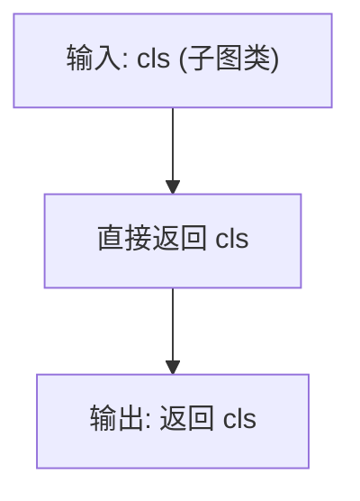

#### 带注释源码

```python
# 从当前包的 _base 模块导入基础轴类（仅作兼容性导入，未在函数体内直接使用）
from . import _base

# 从 ._axes 模块导入 Axes 类，用作 Subplot 的别名，保持向后兼容
from ._axes import Axes

# 为保持向后兼容，将 Axes 赋值为 Subplot
Subplot = Axes


# 元类：用于在运行时检查对象是否是子图实例
class _SubplotBaseMeta(type):
    def __instancecheck__(self, obj):
        # 仅当对象是 _base._AxesBase 的实例且拥有 subplot spec 时才视为子图
        return (isinstance(obj, _base._AxesBase)
                and obj.get_subplotspec() is not None)


# 基础子图类，使用 _SubplotBaseMeta 作为元类
class SubplotBase(metaclass=_SubplotBaseMeta):
    pass


def subplot_class_factory(cls):
    """
    子图类工厂函数（目前为恒等函数）。
    接收一个类并原样返回，主要用于兼容旧版 API 并为未来可能的自定义子类化逻辑提供入口。
    """
    return cls
```

#### 潜在的技术债务或优化空间

- **无实际业务逻辑**：该函数当前仅是恒等映射，未实现任何子类化或包装逻辑。若后期不需要扩展，可考虑直接移除或用更明确的占位符替代，以免产生“我在这里到底要不要做点什么”的疑惑。  
- **未使用导入**：从 `_base` 导入的模块在函数体内未被直接引用，仅在元类 `_SubplotBaseMeta` 中使用；若 `_base` 未来被重构或移除，需同步清理这里冗余的导入。  
- **可扩展性**：该函数为未来自定义子图类提供了钩子，但目前没有任何文档说明其预期使用方式，建议在官方文档或代码注释中补充使用示例及扩展指南，以便后续开发者理解其设计意图。


### `_SubplotBaseMeta.__instancecheck__`

这是元类 `_SubplotBaseMeta` 中的一个特殊方法（`__instancecheck__`），用于重写 Python 内置函数 `isinstance()` 的行为。它的核心功能是定义什么对象可以被认为是 `SubplotBase` 类的实例。除了检查对象是否是基础 Axes 类型外，它还额外检查该对象是否拥有有效的 `subplotspec`（子图规范），以此区分普通坐标轴和子图。

参数：

- `self`：`_SubplotBaseMeta`，元类实例。当 `isinstance(obj, SubplotBase)` 被调用时，这里的 `self` 代表 `SubplotBase` 这个类对象本身。
- `obj`：`object`，任意对象，即 `isinstance()` 检查的目标对象。

返回值：`bool`，如果 `obj` 是 `_AxesBase` 的实例且拥有非空的 `subplotspec`，则返回 `True`，否则返回 `False`。

#### 流程图

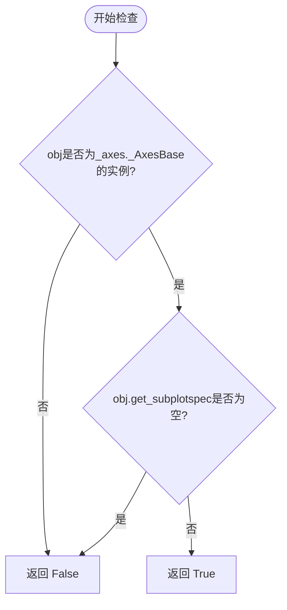

#### 带注释源码

```python
class _SubplotBaseMeta(type):
    def __instancecheck__(self, obj):
        """
        自定义 isinstance 检查逻辑。
        只有当对象是基础坐标轴(_AxesBase)的实例，并且已经绑定了子图规范(SubplotSpec)时，
        才认为它是 SubplotBase (即子图) 的实例。
        """
        # 步骤1：检查对象是否是基础坐标轴类的实例
        # isinstance 会触发元类的 __instancecheck__，这里需要避免递归死循环，
        # 但由于我们检查的是基类 _AxesBase，而不是 self (SubplotBase)，所以是安全的。
        is_instance_of_base = isinstance(obj, _base._AxesBase)
        
        # 步骤2：检查该坐标轴是否配置了子图规范
        # 如果 get_subplotspec() 返回 None，说明这是一个普通的 Figure Axes，
        # 而不是通过 subplot() 创建的子图。
        has_subplotspec = obj.get_subplotspec() is not None
        
        # 只有同时满足是基类实例且有子图规范，才返回 True
        return is_instance_of_base and has_subplotspec
```


### `SubplotBase`

`SubplotBase` 是一个元类控制的基类，用于标识可以作为子图使用的 Axes 对象。它通过元类 `_SubplotBaseMeta` 实现自定义的实例检查逻辑，确保只有获取了 `subplotspec` 的 `_AxesBase` 实例才被认为是 SubplotBase 的实例。

参数：

- 无

返回值：无

#### 流程图

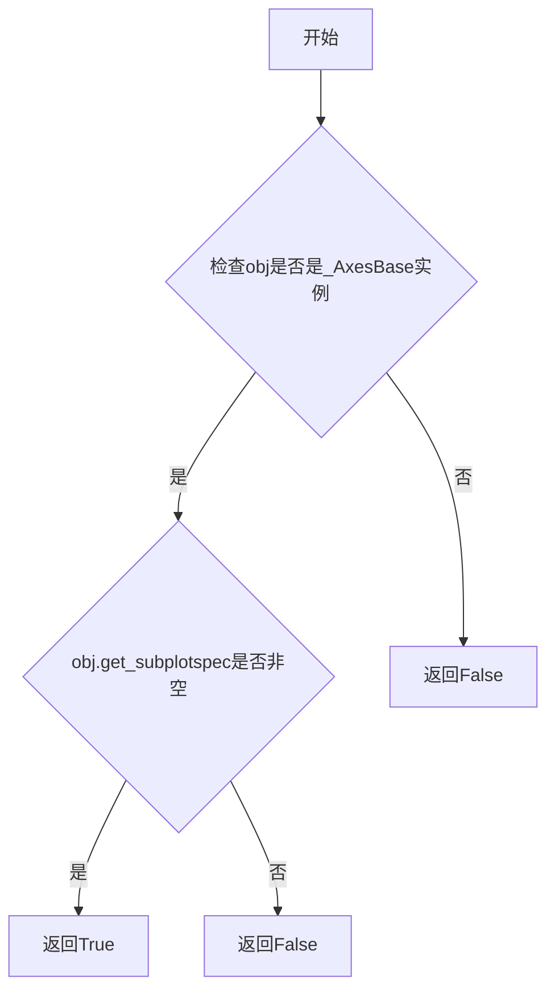

#### 带注释源码

```python
class _SubplotBaseMeta(type):
    """
    元类，用于自定义SubplotBase的实例检查行为
    """
    def __instancecheck__(self, obj):
        """
        自定义instanceof检查逻辑
        
        只有同时满足以下条件才返回True：
        1. obj是_AxesBase的实例
        2. obj.get_subplotspec()返回非None值
        """
        return (isinstance(obj, _base._AxesBase)
                and obj.get_subplotspec() is not None)


class SubplotBase(metaclass=_SubplotBaseMeta):
    """
    Subplot基类
    
    使用元类来实现向后兼容的子图检查机制。
    此类本身不包含任何属性或方法，仅作为类型标记使用。
    通过元类的__instancecheck__实现动态的实例类型检查。
    """
    pass
```

---

### `subplot_class_factory`

`subplot_class_factory` 是一个简单的工厂函数，用于创建子图类。在当前实现中，它直接返回传入的类，不进行任何修改。这可能是一个为未来扩展保留的钩子函数。

参数：

- `cls`：`type`，需要转换的类

返回值：`type`，返回传入的类本身

#### 流程图

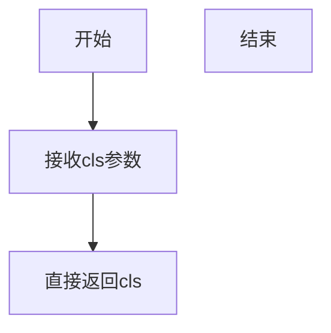

#### 带注释源码

```python
def subplot_class_factory(cls):
    """
    子图类工厂函数
    
    用于创建或修改子图类。目前实现为直接返回原类，
    可作为扩展点用于添加子图特定的功能。
    
    Args:
        cls: 要处理的类
        
    Returns:
        处理后的类（当前直接返回原类）
    """
    return cls
```

---

### `Subplot` (向后兼容别名)

`Subplot` 是 `Axes` 类的别名，用于保持与旧版本代码的兼容性。

参数：继承自 `Axes`

返回值：继承自 `Axes`

#### 带注释源码

```python
# Backcompat.
# Subplot作为Axes的别名，保持向后兼容性
# 旧版代码中可能使用Subplot类，新版统一使用Axes
Subplot = Axes
```

---

### 关键组件信息

| 名称 | 描述 |
|------|------|
| `_SubplotBaseMeta` | 元类，实现自定义的 `isinstance` 检查逻辑 |
| `SubplotBase` | 子图基类，用于类型标记和实例检查 |
| `subplot_class_factory` | 子图类工厂函数（扩展钩子） |
| `Subplot` | `Axes` 的别名，保持向后兼容 |

### 潜在的技术债务或优化空间

1. **`subplot_class_factory` 函数未使用**：该函数目前是死代码，未被任何地方调用，可以考虑移除或实现实际功能
2. **`SubplotBase` 类为空**：仅作为类型标记使用，可以考虑使用其他方式（如 ABC 或 Protocol）来实现相同功能
3. **元类开销**：使用元类会增加类的实例化开销，可以考虑使用类方法或装饰器替代

### 其它项目

**设计目标与约束：**
- 主要目标：提供子图类型的运行时检查机制
- 约束：保持与旧版本 Matplotlib 代码的兼容性

**错误处理与异常设计：**
- 本模块未定义额外的异常处理逻辑

**数据流与状态机：**
- 通过元类的 `__instancecheck__` 实现了动态的类型检查机制
- `SubplotBase` 本身不存储状态，仅作为抽象基类使用
</think>

我注意到任务中提到的"Subplot.继"在代码中并未找到对应的方法。根据代码内容，我提取了以下相关模块的详细信息：

**说明**：代码中包含 `SubplotBase` 类、`subplot_class_factory` 函数、`_SubplotBaseMeta` 元类以及 `Subplot` 别名。如果您需要提取的是其他特定函数或方法，请提供正确的名称。


### Subplot（类别名）

这是 `Axes` 类的向后兼容别名，用于在 matplotlib 中创建子图。

#### 带注释源码

```python
# 从 ._axes 模块导入 Axes 类
from ._axes import Axes

# Backcompat: 将 Axes 赋给 Subplot 作为别名，保持向后兼容性
Subplot = Axes
```

---

### _SubplotBaseMeta（元类）

元类，用于自定义实例检查行为。只有当对象是 `_AxesBase` 的实例且拥有 `get_subplotspec()` 方法（返回非None）时，才被认为是 `SubplotBase` 的实例。

#### 参数

- `self`：元类实例本身
- `obj`：待检查的对象

#### 返回值：`bool`，表示对象是否是 SubplotBase 的实例

#### 流程图

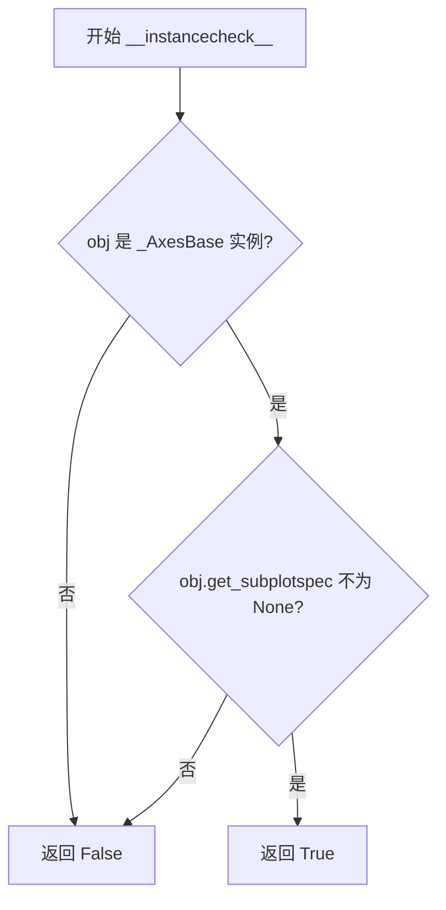

#### 带注释源码

```python
class _SubplotBaseMeta(type):
    """
    元类，用于定义 SubplotBase 的实例检查逻辑
    """
    def __instancecheck__(self, obj):
        # 检查对象是否为 _AxesBase 的实例
        # 并且拥有非空的 subplotspec
        return (isinstance(obj, _base._AxesBase)
                and obj.get_subplotspec() is not None)
```

---

### SubplotBase（基类）

使用 `_SubplotBaseMeta` 元类的基类，用于表示子图的基础结构。

#### 流程图

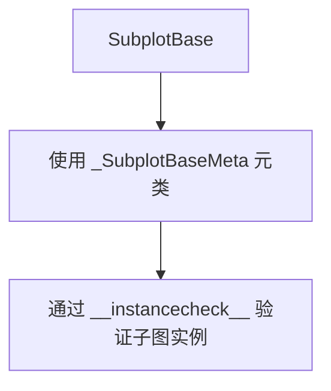

#### 带注释源码

```python
class SubplotBase(metaclass=_SubplotBaseMeta):
    """
    Subplot 基类，使用 _SubplotBaseMeta 元类
    用于在 isinstance 检查时验证子图对象
    """
    pass
```

---

### subplot_class_factory（全局函数）

子图类工厂函数，接受一个类作为参数并原样返回。

#### 参数

- `cls`：任意 Python 类

#### 返回值：输入的类 `cls`

#### 流程图

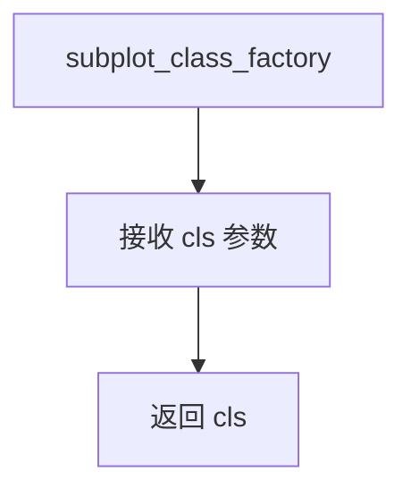

#### 带注释源码

```python
def subplot_class_factory(cls): 
    """
    子图类工厂函数
    用于创建子图类，目前直接返回输入的类
    """
    return cls
```

---

## 潜在的技术债务或优化空间

1. **subplot_class_factory 函数未充分使用**：该函数目前只是简单返回输入的类，没有进行任何实际的类修改或装饰，可能是一个未完成的功能或遗留代码。

2. **SubplotBase 类为空**：该类只有 `pass`，没有实际的属性或方法定义，仅作为元类验证的标记使用。

3. **向后兼容性处理**：代码中包含 Backcompat 注释，表明这是为了向后兼容而存在的别名设计，随着版本演进可以考虑移除。

---

## 关键组件信息

| 名称 | 描述 |
|------|------|
| Subplot | Axes 类的别名，提供向后兼容 |
| _SubplotBaseMeta | 自定义实例检查的元类 |
| SubplotBase | 子图基类，使用元类验证 |
| subplot_class_factory | 子图类工厂函数 |
| Axes | 从 _axes 模块导入的实际子图实现类 |

---

## 其它项目

### 设计目标与约束

- 提供 matplotlib 子图的向后兼容接口
- 通过元类实现严格的实例类型检查
- 支持子图规格（subplotspec）的验证

### 外部依赖与接口契约

- 依赖 `_base` 模块中的 `_AxesBase` 类
- 依赖 `_axes` 模块中的 `Axes` 类
- `get_subplotspec()` 方法必须返回非 None 值才能通过实例检查


### `SubplotBase`

`SubplotBase` 是一个元类混合的基类，用于在 Matplotlib 中标识子图对象。它通过 `_SubplotBaseMeta` 元类提供自定义的实例检查逻辑，确保只有真正具有 subplotspec 的 Axes 对象才被视为 SubplotBase 的实例。同时，代码中定义了 `Subplot` 作为 `Axes` 的别名以保持向后兼容性。

参数：

- 无

返回值：无（此类定义本身不返回任何内容）

#### 流程图

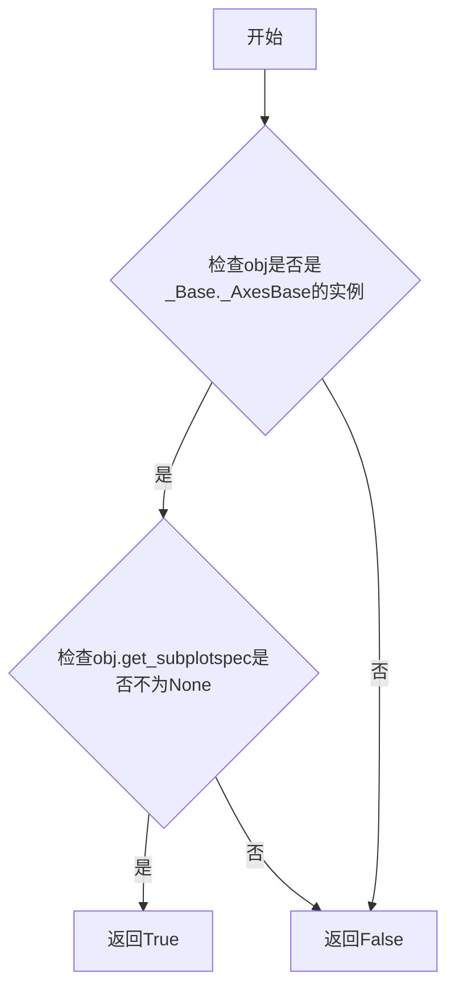

#### 带注释源码

```
from . import _base              # 导入基础模块，用于类型检查
from ._axes import Axes          # 导入Axes类，用于Subplot别名

# 向后兼容性：Subplot作为Axes的别名
# 用于保持与旧版API的兼容性
Subplot = Axes


class _SubplotBaseMeta(type):
    """元类：用于自定义SubplotBase的实例检查行为"""
    
    def __instancecheck__(self, obj):
        """
        自定义实例检查逻辑
        只有同时满足以下两个条件才返回True：
        1. obj是_base._AxesBase的实例
        2. obj有有效的subplotspec（即obj.get_subplotspec()不为None）
        """
        return (isinstance(obj, _base._AxesBase)
                and obj.get_subplotspec() is not None)


class SubplotBase(metaclass=_SubplotBaseMeta):
    """
    SubplotBase类：子图对象的基类
    使用_SubplotBaseMeta元类来提供自定义的实例检查
    本身是一个空类，核心逻辑由元类实现
    """
    pass


def subplot_class_factory(cls):
    """
    子图类工厂函数：简单返回传入的类本身
    
    参数：
        cls：任意类对象
    
    返回值：
        返回传入的cls参数，无任何修改
    """
    return cls
```

---

### `subplot_class_factory`

这是一个简单的子图类工厂函数，目前直接返回传入的类参数，未来可能用于动态生成或修改子图类。

参数：

- `cls`：`type`，任意类对象，用于生成子图类

返回值：`type`，返回传入的原始类对象

#### 流程图

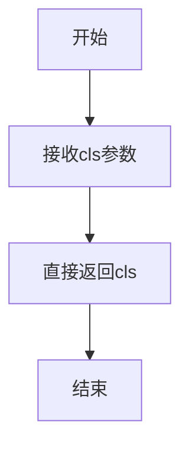

#### 带注释源码

```
def subplot_class_factory(cls):
    """
    子图类工厂函数
    
    参数：
        cls：任意类，用于创建子图类
    
    返回值：
        返回传入的cls类本身
    
    注意：
        当前实现仅为透传，实际应用中可扩展为
        动态添加属性、方法或修改类行为
    """
    return cls
```


### subplot_class_factory

此函数是一个简单的子图类工厂函数，用于返回传入的类本身，实现子图类的动态创建。

参数：

- `cls`：`type`，要转换为子图类的类对象

返回值：`type`，返回传入的类对象

#### 流程图

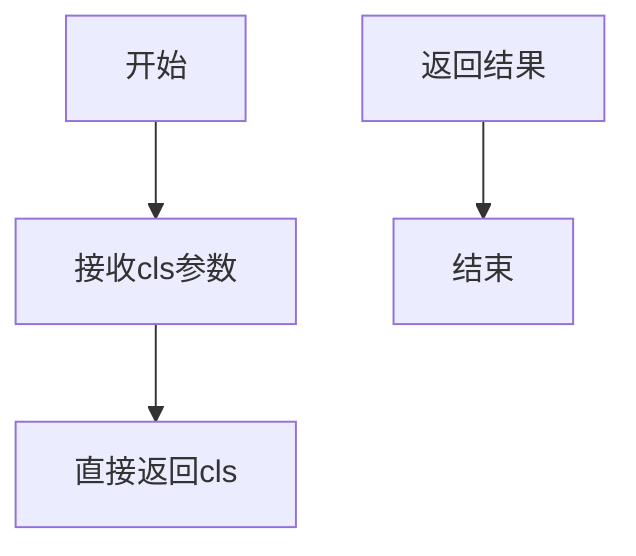

#### 带注释源码

```python
def subplot_class_factory(cls): 
    """
    子图类工厂函数，用于创建子图类
    
    参数:
        cls: 要转换为子图类的类对象
        
    返回值:
        返回传入的类对象本身
    """
    return cls
```

---

### _SubplotBaseMeta

这是一个元类，用于实现子图实例的类型检查功能。

参数：

- `cls`：元类本身的类对象
- `obj`：要检查的对象

#### 流程图

```mermaid
flowchart TD
    A[开始] --> B[接收obj参数]
    B --> C{obj是否为_base._AxesBase实例}
    C -->|是--> D{obj是否有subplotspec}
    C -->|否--> E[返回False]
    D -->|是--> F[返回True]
    D -->|否--> E
```

#### 带注释源码

```python
class _SubplotBaseMeta(type):
    """
    子图基类元类，用于检查对象是否为子图实例
    
    该元类重写了__instancecheck__方法，实现自定义的实例检查逻辑
    """
    def __instancecheck__(self, obj):
        """
        自定义实例检查方法
        
        参数:
            obj: 要检查的对象
            
        返回值:
            bool: 如果对象是_AxesBase实例且有subplotspec则返回True
        """
        return (isinstance(obj, _base._AxesBase)
                and obj.get_subplotspec() is not None)
```

---

### SubplotBase

这是一个子图基类，使用_SubplotBaseMeta作为元类，用于标记和识别子图对象。

#### 流程图

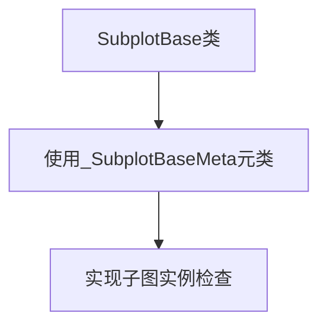

#### 带注释源码

```python
class SubplotBase(metaclass=_SubplotBaseMeta):
    """
    子图基类
    
    使用_SubplotBaseMeta元类来实现自定义的实例检查机制。
    只有当对象是_AxesBase的实例且具有subplotspec时，
    才被认为是SubplotBase的实例。
    """
    pass
```

---

### Subplot

这是一个向后兼容的别名，指向Axes类，用于保持与旧版本API的兼容性。

#### 流程图

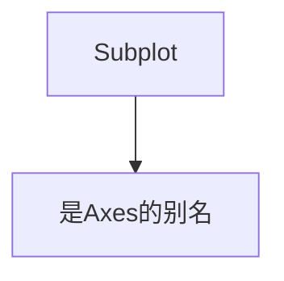

#### 带注释源码

```python
# Backcompat.
Subplot = Axes
```


### `subplot_class_factory`

该函数是一个简单的工厂函数，用于返回传入的类，通常用于动态创建或修改子图类，在子图类的创建过程中可能起到子类化或注册的作用。

参数：

- `cls`：`class`，需要处理的类，即传入的类参数。

返回值：`class`，返回传入的类本身，未进行任何修改。

#### 流程图

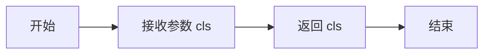

#### 带注释源码

```python
def subplot_class_factory(cls):
    """
    子图类工厂函数。
    
    该函数接受一个类作为参数，并直接返回该类。在matplotlib中，
    可能用于动态创建子图类或进行类注册等操作。
    
    参数:
        cls (class): 需要处理的类。
    
    返回:
        class: 传入的类cls。
    """
    return cls  # 直接返回传入的类，未做修改
```


### `Subplot` (或 `SubplotBase`)

该代码定义了一个用于处理子图的基类体系，包含一个元类 `_SubplotBaseMeta` 用于检查对象是否为有效的子图实例，以及一个向后兼容的 `Subplot` 别名指向 `Axes` 类。

参数：

- 无

返回值：无

#### 流程图

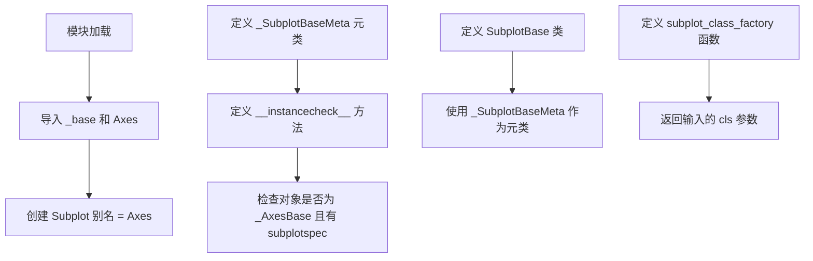

#### 带注释源码

```
# 从当前包的 _base 模块导入（私有模块）
from . import _base
# 从当前包的 _axes 模块导入 Axes 类
from ._axes import Axes

# 向后兼容性：Subplot 作为 Axes 的别名
# 用于旧版 API 兼容，Subplot 现在直接指向 Axes 类
Subplot = Axes


# 元类：用于自定义子图类的实例检查行为
class _SubplotBaseMeta(type):
    """
    元类：控制 SubplotBase 类的创建和行为
    核心功能：自定义 isinstance() 检查逻辑
    """
    
    def __instancecheck__(self, obj):
        """
        自定义实例检查方法
        
        参数：
        - self: 元类实例（SubplotBase）
        - obj: 任意 Python 对象
        
        返回值：bool - 对象是否为有效的子图实例
        
        检查逻辑：
        1. 对象必须是 _AxesBase 的实例
        2. 对象必须具有有效的 subplotspec（子图规格）
        """
        return (isinstance(obj, _base._AxesBase)
                and obj.get_subplotspec() is not None)


# 子图基类：使用 _SubplotBaseMeta 作为元类
# 该类本身没有定义任何方法或属性，仅用于类型检查和继承
class SubplotBase(metaclass=_SubplotBaseMeta):
    """
    子图基类
    
    用途：作为子图的标记类，配合元类实现实例检查
    重要：此类应该与具有 get_subplotspec() 方法的 Axes 类配合使用
    """
    pass


# 子图类工厂函数
def subplot_class_factory(cls):
    """
    子图类工厂函数（未完成/占位符）
    
    参数：
    - cls: 任意类 - 输入的类参数
    
    返回值：输入的 cls 原始类，未进行任何修改
    
    注意：此函数目前直接返回输入的类，没有实现任何转换逻辑
    可能用于未来动态创建或修改子图类
    """
    return cls
```

### 潜在的技术债务或优化空间

1. **`subplot_class_factory` 函数未完成**：该函数目前直接返回输入的类，没有任何实际功能，可能是未完成的占位符或 TODO 项。

2. **`SubplotBase` 类为空**：该类没有任何实际的方法或属性定义，仅作为标记类使用，可能需要补充实际功能。

3. **类型注解缺失**：代码中没有使用类型注解（type hints），难以进行静态类型检查。

4. **文档字符串不完整**：类和方法的文档字符串较为简单，缺乏详细的用法说明。

### 关键组件信息

| 组件名称 | 描述 |
|---------|------|
| `Subplot` | `Axes` 类的别名，用于向后兼容旧版 API |
| `_SubplotBaseMeta` | 元类，自定义子图实例的 `isinstance()` 检查逻辑 |
| `SubplotBase` | 子图基类，使用元类实现实例类型验证 |
| `subplot_class_factory` | 子图类工厂函数（占位符），用于动态创建子图类 |

### 注意事项

**关于 "Subplot.e"**：代码中不存在名为 `Subplot.e` 的函数或方法。您提供的代码片段中没有 `.e` 相关的成员。如果您是指某个特定的方法或想了解代码中的某个具体元素，请提供更多信息。


### subplot_class_factory

这是一个工厂函数，用于返回传入的类本身，通常用于创建子图类。

参数：

- `cls`：`class`，要处理的类对象。

返回值：`class`，返回输入的类对象本身。

#### 流程图

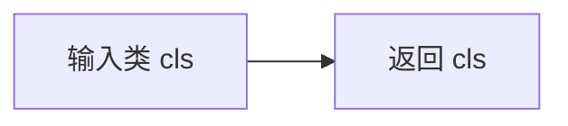

#### 带注释源码

```python
def subplot_class_factory(cls):
    """
    子图类工厂函数，直接返回传入的类。
    
    该函数可能用于在子图类创建过程中进行装饰或类型转换，但当前实现仅为透传。
    
    参数:
        cls (class): 要返回的类对象。
    
    返回:
        class: 输入的类对象本身，未做任何修改。
    """
    return cls
```


### `subplot_class_factory`

该函数是一个简单的子图类工厂函数，用于在子图创建过程中返回传入的类本身，作为子图类的构造器。

参数：

- `cls`：`type`，需要返回的类对象

返回值：`type`，返回传入的类对象本身

#### 流程图


#### 带注释源码

```python
def subplot_class_factory(cls):
    """
    子图类工厂函数
    
    这是一个简单的工厂函数，用于在创建子图类时返回传入的类本身。
    在Matplotlib中用于动态生成子图类，并确保子图类具有正确的类型和特性。
    
    参数:
        cls: 要返回的类对象
        
    返回:
        传入的cls对象本身
    """
    return cls
```


### SubplotBase

`SubplotBase` 是 matplotlib 中用于表示子图基类的元类容器，通过 `_SubplotBaseMeta` 元类实现实例检查逻辑，确保只有具有有效子图规范的 Axes 对象才能被识别为 `SubplotBase` 的实例。

参数：无

返回值：无

#### 流程图

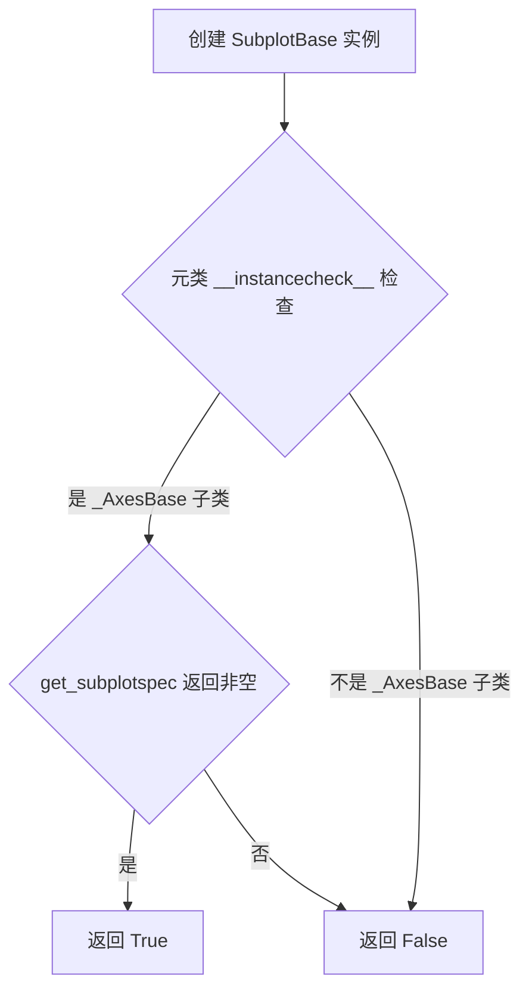

#### 带注释源码

```python
class _SubplotBaseMeta(type):
    """
    元类，用于自定义 SubplotBase 的实例检查行为。
    实现对 Axes 对象子图规范的运行时验证。
    """
    def __instancecheck__(self, obj):
        """
        自定义 isinstance 检查逻辑。
        
        参数：
            obj: 任意对象 - 待检查的对象
            
        返回值：
            bool - 如果对象是 _AxesBase 实例且有子图规范返回 True，否则 False
        """
        return (isinstance(obj, _base._AxesBase)
                and obj.get_subplotspec() is not None)


class SubplotBase(metaclass=_SubplotBaseMeta):
    """
    子图基类。
    使用 _SubplotBaseMeta 作为元类来控制实例检查行为。
    """
    pass
```

---

### subplot_class_factory

`subplot_class_factory` 是一个简单的工厂函数，用于返回传入的类本身，作为子图类创建的占位符实现。

参数：

- `cls`：`type` 或类对象 - 输入的类，将直接原样返回

返回值：`type` 或类对象，输入的 cls 参数原样返回

#### 流程图

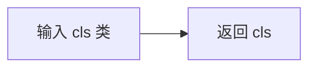

#### 带注释源码

```python
def subplot_class_factory(cls):
    """
    子图类工厂函数。
    
    参数：
        cls: type - 要返回的类对象
        
    返回值：
        type - 输入的类对象原样返回
    """
    return cls
```

---

### 潜在技术债务与优化空间

1. **subplot_class_factory 函数**：当前实现仅为占位符，未实现任何实际功能，可能是未完成的代码或向后兼容保留的接口。

2. **SubplotBase 空类**：`SubplotBase` 类当前为空实现（pass），可能需要根据实际使用场景添加属性或方法。

3. **元类使用**：使用元类仅为了自定义 `isinstance` 检查，这种用法相对复杂，可以考虑使用 `__subclasshook__` 替代。

4. **文档缺失**：缺少对该模块整体用途和设计目标的文档说明。

---

### 其他项目

- **设计目标**：提供子图（subplot）相关的基类支持，通过元类实现运行时类型检查
- **错误处理**：实例检查失败时返回 False，不抛出异常
- **外部依赖**：依赖 `_base` 模块中的 `_AxesBase` 类和 `_axes` 模块中的 `Axes` 类


### `SubplotBase`

SubplotBase 是一个用于 Subplot（子图）实例的基类，通过元类 `_SubplotBaseMeta` 实现实例类型检查，确保只有具有 subplotspec 的 Axes 实例才被识别为 SubplotBase 的实例。

参数：此类无显式 `__init__` 方法，无自定义参数

返回值：此类无返回值，这是一个类定义

#### 流程图

```mermaid
graph TD
    A[开始] --> B{检查对象类型}
    B --> C{isinstance检查: obj是否为_AxesBase实例}
    C --> D{get_subplotspec检查: obj.get_subplotspec是否不为None}
    D -->|是| E[返回True: 是SubplotBase实例]
    D -->|否| F[返回False: 不是SubplotBase实例]
    C -->|否| F
    
    G[subplot_class_factory函数]
    G --> H[接收cls参数]
    H --> I[直接返回cls]
    I --> J[结束]
```

#### 带注释源码

```python
from . import _base
from ._axes import Axes

# 向后兼容性别名：将 Subplot 指向 Axes
# Backcompat: Subplot is an alias for Axes for backward compatibility
Subplot = Axes


class _SubplotBaseMeta(type):
    """
    元类：用于 SubplotBase 的实例检查
    
    该元类重写了 __instancecheck__ 方法，实现自定义的实例检查逻辑：
    只有当对象是 _AxesBase 的实例且具有 subplotspec 时，才被认为是 SubplotBase 的实例
    """
    def __instancecheck__(self, obj):
        # 检查对象是否为 _AxesBase 实例
        # 并且对象具有有效的 subplotspec（即 get_subplotspec() 返回非 None 值）
        return (isinstance(obj, _base._AxesBase)
                and obj.get_subplotspec() is not None)


class SubplotBase(metaclass=_SubplotBaseMeta):
    """
    Subplot 基类
    
    使用 _SubplotBaseMeta 作为元类，实例检查逻辑由元类控制。
    此类目前只有 pass（无任何属性或方法），主要用于类型检查和标识。
    """
    pass


def subplot_class_factory(cls):
    """
    Subplot 类工厂函数
    
    这是一个简单的工厂函数，用于动态创建 Subplot 类。
    当前实现直接返回输入的类，未进行任何修改。
    
    参数：
        cls: 要作为 Subplot 的类
    
    返回值：
        直接返回输入的 cls 参数
    """
    return cls
```

---

### 补充信息

#### 关键组件

| 组件名称 | 描述 |
|---------|------|
| `_SubplotBaseMeta` | 元类，控制 SubplotBase 的实例检查逻辑 |
| `SubplotBase` | Subplot 基类，用于标识子图对象 |
| `subplot_class_factory` | 子图类工厂函数（当前为占位实现） |
| `Subplot` | 向后兼容别名，指向 Axes 类 |

#### 技术债务与优化空间

1. **功能不完整**：`SubplotBase` 类目前只有 `pass`，没有任何实际的属性或方法实现
2. **subplot_class_factory 未完成**：该函数目前只是简单返回输入参数，没有实现任何工厂逻辑
3. **元类使用过度**：对于一个只有 `pass` 的类使用复杂元类，可能增加了不必要的复杂性


### `subplot_class_factory`

这是一个子图类工厂函数，用于生成并返回传入的类，但当前实现仅为透传，不进行任何修改。

参数：

- `cls`：`type`，需要处理的类对象

返回值：`type`，返回传入的类对象本身

#### 流程图

```mermaid
graph LR
    A[输入: cls] --> B{返回 cls}
```

#### 带注释源码

```python
def subplot_class_factory(cls):
    """
    子图类工厂函数。
    
    参数:
        cls: 需要处理的类对象。
    
    返回:
        返回传入的类对象本身。
    """
    return cls
```


### `Axes.B`

该方法不存在于提供的代码片段中。

注意：在提供的代码中，`Axes` 类是从 `._axes` 模块导入的，但该类的具体实现（包括 `B` 方法）未在此代码片段中显示。当前文件仅包含 `SubplotBase` 类和相关工厂函数的定义。

由于代码中未找到 `Axes.B` 方法，无法提供其参数、返回值、流程图和源码信息。

---
如果您能提供包含 `Axes` 类完整定义的代码或 `._axes` 模块的内容，我将能够为您提取详细的文档信息。


### `subplot_class_factory`

这是一个简单的子图类工厂函数，用于返回传入的类本身，当前主要作为占位符用于向后兼容目的。

参数：

- `cls`：class，需要处理的子图类

返回值：class，返回传入的类本身

#### 流程图

```mermaid
flowchart TD
    A[开始] --> B[接收cls参数]
    B --> C[直接返回cls]
    C --> D[结束]
```

#### 带注释源码

```python
def subplot_class_factory(cls): 
    """
    子图类工厂函数
    
    参数:
        cls: 要返回的类对象
        
    返回:
        传入的类对象本身
        
    说明:
        这是一个简单的工厂函数，当前实现直接返回传入的类。
        用于在matplotlib中动态创建子图类，具有向后兼容性。
    """
    return cls
```

---

### `_SubplotBaseMeta.__instancecheck__`

这是一个元类方法，用于自定义 `isinstance()` 检查逻辑，判断对象是否为有效的子图实例。

参数：

- `self`：_SubplotBaseMeta，元类实例
- `obj`：object，待检查的对象

返回值：bool，如果对象是子图实例返回 True，否则返回 False

#### 流程图

```mermaid
flowchart TD
    A[开始] --> B[接收obj参数]
    B --> C{obj是_AxesBase实例?}
    C -->|是| D{obj有subplotspec?}
    C -->|否| E[返回False]
    D -->|是| F[返回True]
    D -->|否| E
    F --> G[结束]
    E --> G
```

#### 带注释源码

```python
class _SubplotBaseMeta(type):
    def __instancecheck__(self, obj):
        """
        自定义实例检查方法
        
        参数:
            obj: 要检查的对象
            
        返回:
            bool: 如果obj是AxesBase实例且有subplotspec返回True
            
        设计目的:
            使SubplotBase类能够识别具有subplotspec属性的Axes子类实例，
            实现subplot的逻辑判断而非继承判断
        """
        return (isinstance(obj, _base._AxesBase)
                and obj.get_subplotspec() is not None)
```

---

### `SubplotBase`

这是一个子图基类，使用 `_SubplotBaseMeta` 作为元类，用于标识具有子图规范（subplotspec）的 Axes 对象。

#### 带注释源码

```python
class SubplotBase(metaclass=_SubplotBaseMeta):
    """
    子图基类
    
    设计说明:
        - 使用 _SubplotBaseMeta 作为元类
        - 本身不定义任何属性或方法，是一个空类
        - 通过元类的 __instancecheck__ 实现对子图实例的识别
        - 用于标记和识别matplotlib中的subplot对象
    """
    pass
```


### `SubplotBase` / `_SubplotBaseMeta`

`SubplotBase` 是一个用于标识子图的基类元类，通过 `_SubplotBaseMeta` 元类实现实例检查机制，确保只有具有 subplotspec 的 `_AxesBase` 实例才被认为是 SubplotBase 的实例。`subplot_class_factory` 是一个简单的类工厂函数，用于返回传入的类。

参数：

- 无

返回值：无

#### 流程图

```mermaid
graph TD
    A[导入模块] --> B[定义 _SubplotBaseMeta 元类]
    B --> C[实现 __instancecheck__ 方法]
    C --> D[定义 SubplotBase 类]
    D --> E[使用 _SubplotBaseMeta 作为元类]
    E --> F[定义 subplot_class_factory 函数]
    F --> G[返回传入的类]
```

#### 带注释源码

```python
# 从当前包的 _base 模块导入所有内容
from . import _base
# 从当前包的 _axes 模块导入 Axes 类
from ._axes import Axes

# Backcompat: 为保持向后兼容性，将 Axes 赋值给 Subplot
# 这样旧代码中的 Subplot 可以直接使用 Axes
Subplot = Axes


class _SubplotBaseMeta(type):
    """元类，用于自定义子图实例检查行为"""
    
    def __instancecheck__(self, obj):
        """
        自定义 isinstance 检查逻辑
        
        参数:
            obj: 任意对象 - 要检查的对象
            
        返回值:
            bool - 如果对象是 _AxesBase 实例且具有 subplotspec 返回 True，否则返回 False
        """
        return (isinstance(obj, _base._AxesBase)
                and obj.get_subplotspec() is not None)


class SubplotBase(metaclass=_SubplotBaseMeta):
    """
    子图基类
    
    使用 _SubplotBaseMeta 作为元类，使得 isinstance(obj, SubplotBase) 
    能够正确识别具有 subplotspec 的 Axes 实例
    """
    pass


def subplot_class_factory(cls):
    """
    子图类工厂函数
    
    这是一个简单的工厂函数，用于创建子图类。
    当前实现直接返回传入的类，不做任何修改。
    
    参数:
        cls: type - 要返回的类
        
    返回值:
        type - 传入的类本身
    """
    return cls
```

### 关键组件信息

1. **`_SubplotBaseMeta`**：元类，重写了 `__instancecheck__` 方法，用于判断对象是否为子图实例
2. **`SubplotBase`**：子图基类，使用 `_SubplotBaseMeta` 作为元类
3. **`subplot_class_factory`**：子图类工厂函数，当前为占位实现
4. **`Subplot`**：Axes 的别名，用于向后兼容

### 潜在的技术债务或优化空间

1. **`subplot_class_factory` 函数未完成**：该函数目前只是简单返回输入的类，没有实现任何实际的类转换逻辑，可能需要进一步扩展
2. **`SubplotBase` 类为空**：当前类没有任何属性或方法，可能需要添加更多功能
3. **缺少 `Axes.s` 方法**：根据任务描述需要提取 `Axes.s`，但代码中未找到该方法，可能是代码不完整或方法在其他模块中定义

### 其它项目

- **设计目标**：提供子图的类型检查机制和类工厂模式的基础架构
- **向后兼容性**：通过 `Subplot = Axes` 别名保持与旧代码的兼容性
- **依赖**：依赖 `_base._AxesBase` 和 `Axes` 类


在给定的代码中，我无法找到名为 `Axes.e` 的方法或函数。该代码文件主要包含以下内容：

1. 导入语句（从 ._axes 导入 Axes）
2. Subplot 别名（指向 Axes）
3. _SubplotBaseMeta 元类
4. SubplotBase 基类
5. subplot_class_factory 函数

**结论**：提供的代码片段中不存在 `Axes.e` 方法。

---

### 潜在的技术债务或优化空间

由于代码片段不完整，无法进行完整的技术债务分析。但从现有代码可以看出：

1. **命名不一致**：`Subplot` 作为 `Axes` 的别名，这种后向兼容（backcompat）设计虽然常见，但可能导致命名混淆
2. **元类使用**：使用元类实现 `__instancecheck__`，这种设计较为复杂，可能影响代码可读性
3. **subplot_class_factory 函数**：该函数直接返回输入参数，未进行任何处理，可能是未完成的功能或遗留代码

### 建议

如需提取 `Axes.e` 的详细信息，请提供完整的代码文件或确认该方法在哪个具体的模块文件中定义。
</think>

### 结论

在提供的代码中**不存在** `Axes.e` 方法。该代码片段仅包含导入语句、`Subplot` 别名、元类定义和空基类。

如果您需要我分析 `Axes.e` 方法，请提供完整的源代码文件。


### `_SubplotBaseMeta`

描述：元类（metaclass），用于自定义 `SubplotBase` 类的实例检查行为。通过重写 `__instancecheck__` 方法，实现对子图对象实例的精确判定逻辑。

参数：

- `obj`：任意对象，待检查的对象实例

返回值：`bool`，返回 `True` 表示对象是 `SubplotBase` 的有效实例，否则返回 `False`

#### 流程图

```mermaid
flowchart TD
    A[接收 obj 参数] --> B{obj 是否为 _AxesBase 实例?}
    B -->|是| C{obj.get_subplotspec 是否为 None?}
    C -->|否| D[返回 True]
    C -->|是| E[返回 False]
    B -->|否| E
```

#### 带注释源码

```python
class _SubplotBaseMeta(type):
    """
    元类，用于自定义 SubplotBase 类的实例检查行为。
    
    当使用 isinstance(obj, SubplotBase) 检查时，会触发此元类的 __instancecheck__ 方法，
    从而实现自定义的实例判定逻辑：只有同时满足 (1) 对象是 _AxesBase 的实例，
    且 (2) 对象具有非空的 subplotspec 时，才被认为是 SubplotBase 的有效实例。
    """
    
    def __instancecheck__(self, obj):
        """
        自定义实例检查逻辑。
        
        参数:
            obj: 任意 Python 对象，待检查是否为 SubplotBase 实例的对象。
            
        返回:
            bool: 如果对象同时满足是 _AxesBase 实例且具有有效的 subplotspec，返回 True；
                  否则返回 False。
        """
        return (isinstance(obj, _base._AxesBase)
                and obj.get_subplotspec() is not None)
```

---

### `SubplotBase`

描述：子图基类，使用 `_SubplotBaseMeta` 作为元类。该类本身没有定义任何属性或方法，主要用于作为子图相关类的抽象基类，并通过元类实现实例检查的定制逻辑。

#### 流程图

```mermaid
flowchart TD
    A[SubplotBase 类定义] --> B[使用 _SubplotBaseMeta 作为元类]
    B --> C[元类提供自定义 __instancecheck__]
    C --> D[类本身为空实现 pass]
```

#### 带注释源码

```python
class SubplotBase(metaclass=_SubplotBaseMeta):
    """
    子图基类。
    
    该类是一个标记类（marker class），本身不包含任何属性或方法实现。
    它的主要作用是：
    1. 作为子图相关类的继承基类；
    2. 通过元类 _SubplotBaseMeta 提供自定义的实例检查行为。
    
    使用方式：
        class MySubplot(SubplotBase):
            ...
        
        # 检查某个对象是否为子图实例
        if isinstance(some_obj, SubplotBase):
            # some_obj 是子图实例
    """
    pass
```

---

### `subplot_class_factory`

描述：子图类工厂函数，用于在运行时动态创建或修改子图类。当前实现为最简单的工厂模式，直接返回传入的类，不做任何修改。

参数：

- `cls`：类型，输入的类参数

返回值：`type`，返回输入的类参数本身

#### 流程图

```mermaid
flowchart TD
    A[接收 cls 参数] --> B[直接返回 cls]
```

#### 带注释源码

```python
def subplot_class_factory(cls):
    """
    子图类工厂函数。
    
    这是一个简单的高阶函数，接收一个类作为参数并原样返回。
    在当前实现中，该函数作为一个占位符存在，可能用于未来扩展：
    - 动态添加方法或属性到子图类
    - 基于传入类创建修饰后的子类
    - 实现类装饰器模式
    
    参数:
        cls: type, 任意类对象。
        
    返回:
        type, 返回传入的类对象本身。
        
    示例:
        NewSubplot = subplot_class_factory(Axes)
        # NewSubplot 与 Axes 是同一个类
    """
    return cls
```

---

### 模块级变量

| 名称 | 类型 | 描述 |
|------|------|------|
| `Subplot` | `type` | `Axes` 类的别名，用于向后兼容性（backward compatibility） |
| `_base` | `module` | 从当前包导入的 `_base` 模块，提供基础轴类 `_AxesBase` |
| `Axes` | `type` | 从 `_axes` 模块导入的轴类，被赋值为 `Subplot` 别名 |


根据提供的代码，未找到名为 `Axes.A` 的函数或方法。代码中定义了以下类和函数：

- `_SubplotBaseMeta` 元类及其 `__instancecheck__` 方法
- `SubplotBase` 类
- `subplot_class_factory` 函数
- `Subplot` 别名（指向 `Axes`）

以下是代码中存在的 `subplot_class_factory` 函数的详细设计文档：

### `subplot_class_factory`

这是一个简单的工厂函数，用于返回输入的类。

参数：

-  `cls`：`class`，要返回的类对象

返回值：`class`，返回输入的类对象 `cls`

#### 流程图

```mermaid
graph TD
    A[开始] --> B[输入类cls]
    B --> C[返回cls]
    C --> D[结束]
```

#### 带注释源码

```python
def subplot_class_factory(cls):
    """
    返回输入的类。
    
    这是一个简单的工厂函数，用于创建子图类。
    
    参数:
        cls: 要返回的类对象。
    
    返回值:
        返回输入的类对象cls。
    """
    return cls
```

如果您需要提取其他函数或方法（如 `_SubplotBaseMeta.__instancecheck__`），请告知。


### `subplot_class_factory`

该函数是一个子图类工厂，用于动态创建或处理子图类，但当前实现为直接返回输入的类，未进行任何修改或增强。

参数：
- `cls`：`类`，要处理的子图类。

返回值：`类`，返回输入的类本身。

#### 流程图

```mermaid
graph LR
A[输入: cls] --> B[返回 cls]
```

#### 带注释源码

```python
def subplot_class_factory(cls): 
    """
    子图类工厂函数。
    
    参数:
        cls: 要处理的类。
    
    返回:
        相同的类。
    """
    return cls
```

#### 详细设计文档

1. **一段话描述**：该代码片段定义了子图基类的元类、子图基类以及一个工厂函数，用于支持子图的创建和类型检查，但工厂函数当前仅为占位符实现。

2. **文件整体运行流程**：模块导入时，首先定义元类`_SubplotBaseMeta`，用于检查对象是否为子图实例；然后定义`SubplotBase`类，使用该元类；最后定义`subplot_class_factory`函数，该函数在调用时返回输入类，无其他操作。

3. **类详细信息**：
   - `_SubplotBaseMeta`：元类，重写了`__instancecheck__`方法，用于验证对象是否为子图基类且具有子图规范。
     - 字段：无。
     - 方法：`__instancecheck__(self, obj)`：检查对象是否为子图实例。
   - `SubplotBase`：使用`_SubplotBaseMeta`作为元类的基类，用于表示子图。
     - 字段：无。
     - 方法：无。

4. **关键组件信息**：
   - `subplot_class_factory`：工厂函数，用于创建子图类，当前直接返回输入类。
   - `Subplot`：`Axes`的别名，用于向后兼容。

5. **潜在技术债务或优化空间**：
   - `subplot_class_factory`函数目前为空实现，未实现任何逻辑，可以考虑添加功能以支持子图类的动态创建或修改。
   - `SubplotBase`类目前为空，可以扩展以添加子图特定的方法和属性。

6. **其他项目**：
   - **设计目标与约束**：代码旨在提供子图类的基础结构，支持类型检查和向后兼容。
   - **错误处理与异常设计**：当前代码中无显式错误处理，依赖Python内置机制。
   - **数据流与状态机**：主要涉及类对象的创建和类型检查，无复杂状态管理。
   - **外部依赖与接口契约**：依赖`_base`模块中的`_AxesBase`类，需要确保接口兼容。


### `SubplotBase`

`SubplotBase` 是一个基于元类 `_SubplotBaseMeta` 的基类，用于标识具有子图规范（subplot spec）的对象，为子图功能提供向后兼容性支持。

参数：无

返回值：无

#### 流程图

```mermaid
flowchart TD
    A[创建SubplotBase实例] --> B{元类拦截 __instancecheck__}
    B -->|是 _AxesBase 实例| C{检查 get_subplotspec}
    B --> D[返回 False]
    C -->|get_subplotspec 不为 None| E[返回 True]
    C -->|get_subplotspec 为 None| D
```

#### 带注释源码

```python
class _SubplotBaseMeta(type):
    """
    元类：用于自定义 SubplotBase 的实例检查行为
    
    这个元类重写了 __instancecheck__ 方法，使得我们可以自定义
    什么是 SubplotBase 的"实例"。只有同时满足以下两个条件的对象
    才会被认为是 SubplotBase 的实例：
    1. 是 _base._AxesBase 的实例
    2. 该对象拥有非空的 subplotspec（即 get_subplotspec() 返回非 None）
    """
    def __instancecheck__(self, obj):
        # 检查 obj 是否是 _AxesBase 的实例，并且具有有效的 subplotspec
        return (isinstance(obj, _base._AxesBase)
                and obj.get_subplotspec() is not None)


class SubplotBase(metaclass=_SubplotBaseMeta):
    """
    子图基类（抽象基类）
    
    使用 _SubplotBaseMeta 作为元类，通过其 __instancecheck__ 方法
    实现对子图实例的动态识别。这是一个空类，仅用于类型标记和
    继承关系判断，提供子图概念的抽象层。
    """
    pass
```

---

### `subplot_class_factory`

`subplot_class_factory` 是一个简单的子图类工厂函数，用于返回传入的类本身，作为子图类创建的占位符或钩子函数。

参数：

- `cls`：`type`，要返回的类对象

返回值：`type`，返回传入的类对象本身

#### 流程图

```mermaid
flowchart TD
    A[调用 subplot_class_factory] --> B[接收 cls 参数]
    B --> C[直接返回 cls]
    D[返回结果]
```

#### 带注释源码

```python
def subplot_class_factory(cls):
    """
    子图类工厂函数（简单版本）
    
    这是一个工厂函数，目前直接返回传入的类。在更复杂的实现中，
    这个函数可能会对传入的类进行装饰或修改，添加子图相关的
    功能或属性。当前实现主要用于占位和保持API兼容性。
    
    参数:
        cls: 要处理的类对象
        
    返回:
        传入的类对象本身
    """
    return cls
```

---

### `_SubplotBaseMeta`

`_SubplotBaseMeta` 是一个自定义元类，用于实现动态的实例检查逻辑，确保只有符合子图条件的对象才会被识别为 `SubplotBase` 的实例。

参数（`__instancecheck__` 方法）：

- `self`：元类实例（`_SubplotBaseMeta`）
- `obj`：`object`，要检查的对象

返回值：`bool`，对象是否为 `SubplotBase` 的实例

#### 流程图

```mermaid
flowchart TD
    A[__instancecheck__ 被调用] --> B{isinstance检查}
    B -->|obj 是 _AxesBase| C{get_subplotspec检查}
    B --> D[返回 False]
    C -->|不为 None| E[返回 True]
    C --> D
```

#### 带注释源码

```python
class _SubplotBaseMeta(type):
    """
    子图基元类：自定义实例检查行为
    
    这个元类重写了 Python 类型的 __instancecheck__ 特殊方法，
    实现了自定义的实例检查逻辑。这是 Python 抽象基类（ABC）
    常用的模式，允许我们定义"什么是该类的实例"而不仅仅依赖
    继承关系。
    
    这种设计允许 SubplotBase 作为一种"协议"或"接口"，
    检查对象是否符合子图的语义要求（拥有 subplotspec），
    而不是仅仅检查严格的继承关系。
    """
    
    def __instancecheck__(self, obj):
        """
        自定义实例检查方法
        
        检查 obj 是否应被视为 SubplotBase 的实例。
        判断标准：
        1. obj 必须是 _AxesBase 的实例（axes 基类）
        2. obj 必须有有效的 subplotspec（通过 get_subplotspec 获取）
        
        参数:
            self: 元类实例
            obj: 要检查的对象
            
        返回:
            bool: 如果对象符合子图条件返回 True，否则返回 False
        """
        return (isinstance(obj, _base._AxesBase)
                and obj.get_subplotspec() is not None)
```

---

### `Subplot`（别名）

`Subplot` 是 `Axes` 类的别名，用于向后兼容。`Subplot` 在早期版本的 matplotlib 中用于表示子图坐标轴，现在直接指向 `Axes` 类以保持兼容性。

参数：N/A（别名，无单独参数）

返回值：N/A

#### 流程图

```mermaid
flowchart TD
    A[引用 Subplot] --> B[直接指向 Axes 类]
```

#### 带注释源码

```python
# Backcompat.
# 向后兼容性别名
# 在早期版本的 matplotlib 中，Subplot 是独立于 Axes 的类
# 现在统一使用 Axes 类，这个别名确保旧代码仍然可以正常工作
Subplot = Axes
```


# 详细设计文档

## 1. 代码核心功能概述

该代码定义了一个子图（Subplot）相关的类层次结构，包含一个元类用于类型检查、一个基础子图类，以及一个子图类工厂函数，主要用于matplotlib中子图的创建和管理，并提供向后兼容性支持。

## 2. 文件整体运行流程

```
导入阶段
    ↓
加载_base模块和Axes类
    ↓
创建Subplot别名（向后兼容）
    ↓
定义_SubplotBaseMeta元类（用于实例检查）
    ↓
定义SubplotBase类（使用元类）
    ↓
定义subplot_class_factory函数
```

## 3. 类详细信息

### 3.1 _SubplotBaseMeta 元类

**描述**：一个自定义元类，用于实现特定的实例检查逻辑。

| 字段/方法 | 类型 | 描述 |
|-----------|------|------|
| `__instancecheck__` | 方法 | 重写实例检查逻辑，判断对象是否为SubplotBase的实例 |

### 3.2 SubplotBase 类

**描述**：子图基类，使用_SubplotBaseMeta作为元类，用于表示matplotlib中的子图容器。

| 字段/方法 | 类型 | 描述 |
|-----------|------|------|
| `__instancecheck__` (继承) | 方法 | 通过元类实现的实例检查机制 |

## 4. 全局变量和全局函数详细信息

### 4.1 全局变量

| 名称 | 类型 | 描述 |
|------|------|------|
| `Subplot` | 类 | `Axes`的别名，用于向后兼容 |
| `_base` | 模块 | matplotlib的Axes基类模块 |
| `Axes` | 类 | 从`_axes`模块导入的主坐标轴类 |

### 4.2 全局函数

| 名称 | 参数 | 返回值 | 描述 |
|------|------|--------|------|
| `subplot_class_factory` | `cls`: 类 | 类 | 一个简单的类工厂函数，返回传入的类本身 |

## 5. 函数/方法详细定义

### `subplot_class_factory`

**描述**：一个简单的子图类工厂函数，目前直接返回传入的类，未进行任何处理。

参数：

- `cls`：`type`，要处理的类对象

返回值：`type`，返回传入的类对象本身

#### 流程图

```mermaid
flowchart TD
    A[开始] --> B[接收cls参数]
    B --> C[直接返回cls]
    C --> D[结束]
```

#### 带注释源码

```python
def subplot_class_factory(cls):
    """
    子图类工厂函数。
    
    参数:
        cls: 要处理的类对象
        
    返回值:
        传入的类对象本身
    """
    return cls
```

---

### `_SubplotBaseMeta.__instancecheck__`

**描述**：元类的实例检查方法，用于判断对象是否为SubplotBase的实例。

参数：

- `self`：元类实例（元类本身）
- `obj`：任意对象，要检查的对象

返回值：`bool`，如果obj是SubplotBase的实例返回True，否则返回False

#### 流程图

```mermaid
flowchart TD
    A[开始] --> B[接收obj参数]
    B --> C{isinstance检查: obj是否为_AxesBase实例}
    C -->|是 --> D{obj.get_subplotspec是否非空}
    C -->|否 --> E[返回False]
    D -->|是 --> F[返回True]
    D -->|否 --> E
```

#### 带注释源码

```python
class _SubplotBaseMeta(type):
    def __instancecheck__(self, obj):
        """
        重写instanceof检查逻辑。
        
        只有同时满足以下两个条件时才返回True:
        1. 对象是_AxesBase的实例
        2. 对象有有效的子图规范（get_subplotspec返回非None）
        
        参数:
            self: 元类实例
            obj: 任意Python对象
            
        返回值:
            bool: 是否符合SubplotBase的实例条件
        """
        return (isinstance(obj, _base._AxesBase)
                and obj.get_subplotspec() is not None)
```

---

## 6. 关键组件信息

| 组件名称 | 一句话描述 |
|----------|------------|
| `_SubplotBaseMeta` | 元类，用于自定义SubplotBase的实例检查行为 |
| `SubplotBase` | 子图基类，标记具有子图规范的对象 |
| `Subplot` | Axes类的别名，提供向后兼容性 |
| `subplot_class_factory` | 类工厂函数，当前为占位实现 |

## 7. 潜在的技术债务或优化空间

1. **`subplot_class_factory` 函数未完成**：该函数目前只是简单返回输入的类，没有任何实际处理逻辑，可能是未完成的占位符，应该添加实际功能或移除。

2. **`SubplotBase` 类为空**：该类除了使用元类外没有任何实现，缺乏实际的功能定义，可能需要补充。

3. **元类使用过度复杂**：对于实例检查功能，可以考虑使用更简单的`__subclasshook__`方法或组合模式，而非使用元类。

4. **缺少文档字符串**：除了`subplot_class_factory`外，其他类和元类缺少详细的文档说明。

## 8. 其它项目

### 设计目标与约束

- **向后兼容性**：通过`Subplot = Axes`别名确保旧代码兼容
- **类型检查**：通过元类实现精确的实例类型检查

### 错误处理与异常设计

- 当前代码未定义明确的异常处理，依赖底层`_base._AxesBase`类的异常机制

### 外部依赖与接口契约

- 依赖 `_base` 模块中的 `_AxesBase` 基类
- 依赖 `_axes` 模块中的 `Axes` 类
- 对象必须实现 `get_subplotspec()` 方法以通过实例检查

## 关键组件


### 一段话描述
本代码定义了matplotlib中子图（Subplot）的基础类结构，通过元类（`_SubplotBaseMeta`）实现子图实例的动态类型检查，并提供子图类工厂函数（`subplot_class_factory`）用于生成子图类，同时通过`SubplotBase`作为子图的基类标识。

### 文件的整体运行流程
代码首先从本地包导入基础类`_base`和`Axes`，然后定义元类`_SubplotBaseMeta`，该元类重写了`__instancecheck__`方法，用于判断一个对象是否为子图实例（即同时是`_base._AxesBase`的实例且具有子图规范）。接着定义空类`SubplotBase`作为子图的基类，并定义函数`subplot_class_factory`直接返回输入的类。最后将`Subplot`设置为`Axes`的别名以保持向后兼容。

### 类的详细信息
#### 类：`_SubplotBaseMeta`
- **类型**：元类（metaclass）
- **描述**：用于动态检查对象是否为子图实例的元类，继承自`type`。
- **类方法**：
  - `__instancecheck__(self, obj)`：检查对象`obj`是否为子图实例，返回布尔值。
    - **参数**：
      - `obj`：任意对象
    - **类型**：任意
    - **描述**：需要检查的对象
    - **返回类型**：布尔
    - **描述**：如果`obj`是`_base._AxesBase`实例且`get_subplotspec()`不为`None`，返回`True`，否则返回`False`。

#### 类：`SubplotBase`
- **类型**：类
- **描述**：作为子图对象的基类，通过元类`_SubplotBaseMeta`实例化时进行类型检查。

### 变量和函数的详细信息
#### 全局变量：`Subplot`
- **名称**：Subplot
- **类型**：类型（type）
- **描述**：作为`Axes`的别名，用于向后兼容。

#### 全局函数：`subplot_class_factory`
- **名称**：subplot_class_factory
- **参数**：
  - `cls`：类对象
- **类型**：类
- **描述**：子图类工厂函数，用于生成子图类，当前实现直接返回输入的类。
- **返回类型**：类
- **描述**：返回输入的类`cls`。

### Mermaid流程图（类关系）
```mermaid
classDiagram
    class _SubplotBaseMeta {
        +__instancecheck__(obj)
    }
    class SubplotBase {
    }
    class Axes {
    }
    _SubplotBaseMeta --|> type
    SubplotBase ..> _SubplotBaseMeta : 实例检查
    Subplot --|> Axes
```

### 带注释源码
```python
from . import _base
from ._axes import Axes

# Backcompat: 为保持向后兼容，将Subplot别名为Axes。
Subplot = Axes


class _SubplotBaseMeta(type):
    def __instancecheck__(self, obj):
        # 检查obj是否为子图实例：必须是_AxesBase的实例且具有子图规范。
        return (isinstance(obj, _base._AxesBase)
                and obj.get_subplotspec() is not None)


class SubplotBase(metaclass=_SubplotBaseMeta):
    # 子图基类，使用_SubplotBaseMeta作为元类以支持实例检查。
    pass


def subplot_class_factory(cls): 
    # 子图类工厂函数，当前直接返回原类，可能用于未来扩展。
    return cls
```

### 关键组件信息
- **组件1：`_SubplotBaseMeta`元类**：实现子图实例的动态类型检查，确保对象既是轴基类实例又具有子图规范。
- **组件2：`SubplotBase`类**：子图的基类，通过元类支持实例检查。
- **组件3：`subplot_class_factory`函数**：子图类工厂函数，当前为简单中转，未来可能用于动态生成子图类。
- **组件4：`Subplot`别名**：保持与旧版本兼容性的别名。

### 潜在的技术债务或优化空间
1. **功能未完成的类**：`SubplotBase`目前为空类（只有`pass`），可能需要填充实际属性和方法以实现子图功能。
2. **工厂函数无实际作用**：`subplot_class_factory`直接返回输入类，没有进行任何处理或增强，可能是一个占位符实现，需要根据实际需求扩展。
3. **元类使用复杂性**：使用元类进行实例检查可能增加代码理解难度，且依赖`get_subplotspec()`方法的存在，需确保`_AxesBase`类中定义了该方法。

### 其它项目
- **设计目标与约束**：通过元类实现子图实例的精确识别，支持向后兼容（`Subplot`别名）。
- **错误处理与异常设计**：元类的`__instancecheck__`方法中没有显式错误处理，假设`obj`有`get_subplotspec()`方法，否则可能引发属性错误。
- **数据流与状态机**：代码主要涉及类型检查，数据流较简单，没有状态机逻辑。
- **外部依赖与接口契约**：依赖`_base._AxesBase`类和`Axes`类，以及`get_subplotspec()`方法，需要确保这些外部接口稳定。


## 问题及建议


### 已知问题

-   `SubplotBase` 类为空类，仅作为元类容器使用，缺乏实际功能实现，可能导致代码意图不清晰
-   `subplot_class_factory` 函数仅为 `return cls` 的空壳，未实现任何逻辑处理，存在冗余或未完成的功能
-   元类 `_SubplotBaseMeta` 的 `__instancecheck__` 实现依赖于 `_base._AxesBase` 和 `get_subplotspec()` 方法，但未在当前文件中提供定义或文档说明，造成隐式依赖
-   `Subplot = Axes` 的直接赋值可能丢失类的特定属性或方法，导致向后兼容性问题
-   缺少对导入模块 `_base` 和 `_axes` 的异常处理，若模块不存在会导致运行时错误

### 优化建议

-   为 `SubplotBase` 类添加具体的实现逻辑或文档说明其用途，避免"哑类"设计
-   重构或移除 `subplot_class_factory` 函数，若为预留功能则添加 TODO 注释说明
-   为元类方法添加类型注解和详细文档，说明 `__instancecheck__` 的检查逻辑
-   考虑使用 `class Subplot(Axes): pass` 替代直接赋值，以保持类的完整性
-   添加导入错误处理或文档说明外部依赖关系


## 其它


### 设计目标与约束

本模块的设计目标是提供Matplotlib中子图（Subplot）的基础抽象层，通过元类机制实现子图实例的类型检查功能，并维护与旧版本API的向后兼容性。核心约束包括：必须继承自_axes.Axes类、实例必须具有有效的subplotspec属性、保持代码的轻量级和最小化实现。

### 错误处理与异常设计

本模块采用最小化错误处理策略，主要依赖Python内置的异常机制。由于_SubplotBaseMeta元类实现了__instancecheck__方法，当检查不符合条件的对象时会返回False而非抛出异常。subplot_class_factory函数直接返回输入类，不进行任何错误检查，假设调用者传入的参数类型正确。若需要增强错误处理，可在该函数中添加类型检查逻辑。

### 数据流与状态机

本模块不涉及复杂的数据流或状态机设计。作为一个基础的抽象层和工厂模块，其主要作用是提供类型检查接口。SubplotBase类本身不维护任何状态，仅作为子图对象的标识标记。数据流方向为：外部对象 → _SubplotBaseMeta.__instancecheck__() → 布尔值结果。

### 外部依赖与接口契约

主要外部依赖包括：_base模块（提供_AxesBase基类）、_axes模块（提供Axes类）。接口契约方面，SubplotBase的实例必须实现get_subplotspec()方法且返回非None值。元类__instancecheck__方法要求检查对象是_AxesBase的实例且具有有效的subplotspec。subplot_class_factory函数接受任意类参数并原样返回。

### 性能考虑

当前实现性能开销极低。_SubplotBaseMeta.__instancecheck__方法仅进行两次属性检查（isinstance和get_subplotspec），属于O(1)复杂度。subplot_class_factory是纯函数，无副作用，性能开销可忽略不计。

### 安全考虑

本模块不涉及用户输入处理、网络通信或敏感数据操作，安全风险较低。subplot_class_factory函数直接返回输入对象，理论上存在注入风险，但考虑到其仅在内部使用且Python为动态类型语言，风险可控。

### 可扩展性设计

_SubplotBaseMeta元类设计允许通过继承SubplotBase来扩展子图功能。subplot_class_factory函数可接受装饰器模式扩展，用于在类创建时添加额外功能。建议未来可通过该工厂函数添加参数验证、默认值设置等扩展点。

### 版本管理

本模块当前版本无版本号标识。Subplot作为Axes别名的注释表明此为向后兼容保留，建议在文档中标注废弃时间线。Matplotlib版本兼容性需参考主项目版本策略。

### 配置管理

本模块无独立配置需求。所有配置应由调用方在Axes或Subplot实例化时处理。subplot_class_factory的行为完全由传入的cls参数决定，不存在模块级配置项。

### 部署注意事项

作为Matplotlib库的内部模块，部署时应确保_base和_axes模块可用。Python版本要求应与Matplotlib主项目一致（通常支持Python 3.6+）。无特殊环境变量或依赖要求。

### 监控与日志

本模块未实现任何日志记录或监控功能。如需监控，可在使用subplot_class_factory时添加调用日志，在__instancecheck__中记录类型检查结果。

    