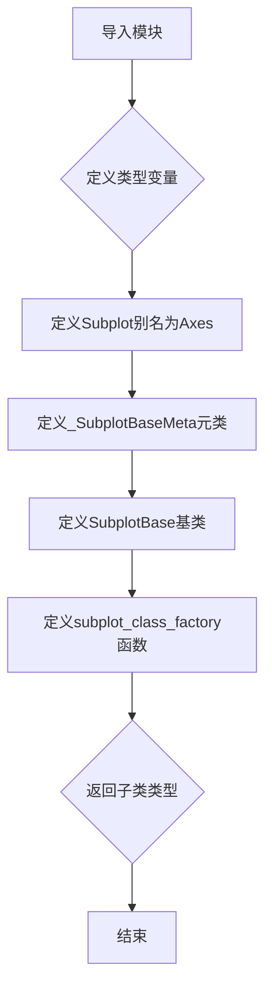
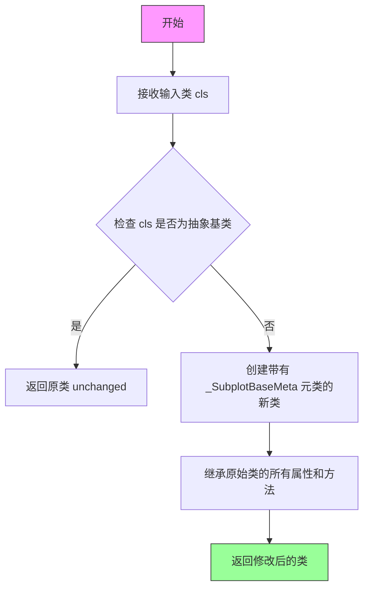
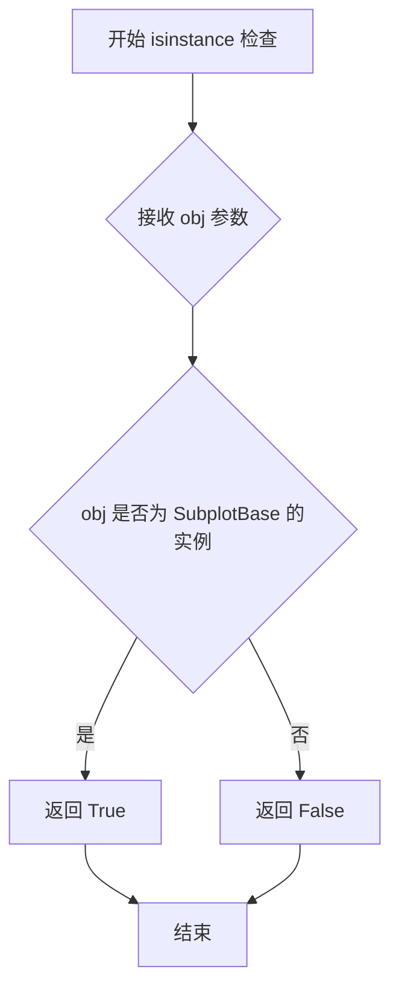

# `matplotlib\lib\matplotlib\axes\__init__.pyi` 详细设计文档

该文件定义了子图（Subplot）的基类、元类和工厂函数，用于创建和管理matplotlib中的子图对象，并提供了向后兼容的别名。

## 整体流程



## 类结构

```
_SubplotBaseMeta (元类)
└── SubplotBase (基类)
    └── Subplot (别名)
```

## 全局变量及字段


### `_T`
    
泛型类型变量，用于支持泛型函数和类的类型检查

类型：`TypeVar`
    


### `Subplot`
    
Axes类的别名，用于向后兼容旧版本的API

类型：`type[Axes]`
    


    

## 全局函数及方法


### `subplot_class_factory`

该函数是一个子图类工厂函数，用于动态创建具有 `SubplotBase` 元类特性的子图类。它接收一个现有类作为参数，通过元类机制为其添加子图实例检查能力，并返回修改后的类。

参数：

- `cls`：`type[_T]`，要转换为子图类的输入类型参数

返回值：`type[_T]`，返回具有 SubplotBase 元类特性的子图类

#### 流程图



#### 带注释源码

```python
def subplot_class_factory(cls: type[_T]) -> type[_T]:
    """
    子图类工厂函数
    
    用途：动态创建具有 SubplotBase 元类特性的子图类
    该函数主要用于 matplotlib 中，为 Axes 子类添加特殊的实例检查能力
    
    参数：
        cls (type[_T]): 输入的类类型，通常是 Axes 的子类
        
    返回：
        type[_T]: 返回带有 _SubplotBaseMeta 元类的新类
                 或在某些情况下返回原始类
    """
    # ... 实际实现在此（代码中仅提供存根）
    # 该函数通常会：
    # 1. 检查输入类是否已经具有正确的元类
    # 2. 如果需要，创建新的类包装器
    # 3. 应用 _SubplotBaseMeta 元类以支持 isinstance() 检查
    ...
```


### `_SubplotBaseMeta.__instancecheck__`

该方法是 Python 元类的特殊方法 `__instancecheck__` 的实现，用于自定义 `isinstance()` 检查的行为。当对使用 `_SubplotBaseMeta` 作为元类的类（如 `SubplotBase`）调用 `isinstance()` 时，此方法会被触发，以决定对象是否被视为该类的实例。

参数：

- `self`：`_SubplotBaseMeta`，元类实例，隐式参数，代表正在检查的类本身
- `obj`：`object`，被检查的对象，用于判断其是否为当前类的实例

返回值：`bool`，返回 `True` 表示 `obj` 是当前类的实例，返回 `False` 表示不是实例

#### 流程图



*注：由于方法体为 `...`（抽象实现），流程图展示了标准 `__instancecheck__` 方法的预期行为逻辑。*

#### 带注释源码

```python
class _SubplotBaseMeta(type):
    """
    元类，用于自定义 SubplotBase 类的实例检查行为
    
    元类是类的类，定义了类的创建行为。
    通过重写 __instancecheck__ 方法，可以控制 isinstance() 的判定逻辑。
    """
    
    def __instancecheck__(self, obj) -> bool:
        """
        自定义 isinstance() 检查行为
        
        当调用 isinstance(obj, SubplotBase) 时会触发此方法。
        此方法允许在标准的实例检查之外添加额外的逻辑。
        
        Args:
            self: 元类实例，代表被检查的类（SubplotBase）
            obj: 任意类型的对象，被检查的目标
            
        Returns:
            bool: 如果 obj 应被视为 self 的实例返回 True，否则返回 False
        """
        ...  # 抽象方法，留给子类实现或扩展
```

#### 备注

- **设计目的**：此元类方法主要用于向后兼容（代码中的注释 `# Backcompat.` 表明）和自定义实例检查逻辑
- **与 `type.__instancecheck__` 的关系**：如果不在元类中重写，默认使用 `type` 基类的实例检查逻辑
- **潜在用途**：可以用于实现基于协议（Protocol）的检查、虚拟子类注册（如 `ABC` 的注册机制）等高级功能
- **技术债务**：当前实现为抽象方法（`...`），没有实际逻辑实现，可能需要在具体使用时重写此方法以实现有意义的功能


## 关键组件


### 一段话描述

该代码模块定义了子图（Subplot）相关的核心类型系统，包含一个元类用于自定义实例检查行为，一个子图基类，以及一个用于动态创建子图子类的工厂函数，并提供向后兼容的别名支持。

### 文件的整体运行流程

该模块在导入时首先定义类型变量，然后从 `_axes` 模块导入 `Axes` 类，接着定义元类 `_SubplotBaseMeta`、基类 `SubplotBase`，最后通过 `subplot_class_factory` 函数提供子类动态创建能力。`Subplot` 作为 `Axes` 的别名用于向后兼容。

### 类的详细信息

#### _SubplotBaseMeta

元类，继承自 `type`，用于自定义子图基类的实例检查行为。

**类字段：**
- 无公开类字段

**类方法：**

- `__instancecheck__(self, obj) -> bool`
  - 参数名称: `self`, `obj`
  - 参数类型: `self` 为元类实例，`obj` 为任意对象
  - 参数描述: `self` 是元类实例本身，`obj` 是待检查的对象
  - 返回值类型: `bool`
  - 返回值描述: 返回对象是否为实例的布尔值
  - 流程图: 
    ```mermaid
    flowchart TD
    A[开始__instancecheck__] --> B{检查obj是否为SubplotBase实例}
    B -->|是| C[返回True]
    B -->|否| D[返回False]
    ```
  - 源码:
    ```python
    class _SubplotBaseMeta(type):
        def __instancecheck__(self, obj) -> bool: ...
    ```

#### SubplotBase

子图基类，使用 `_SubplotBaseMeta` 作为元类。

**类字段：**
- 无公开类字段

**类方法：**
- 无公开实例方法（基于代码中的省略号推断）

**源码:**
```python
class SubplotBase(metaclass=_SubplotBaseMeta): ...
```

### 全局变量和全局函数

#### _T

- 名称: `_T`
- 类型: `TypeVar`
- 描述: 泛型类型变量，用于函数签名中的类型约束

**源码:**
```python
_T = TypeVar("_T")
```

#### Subplot

- 名称: `Subplot`
- 类型: `type[Axes]`
- 描述: 向后兼容性别名，直接指向 Axes 类

**源码:**
```python
Subplot = Axes
```

#### subplot_class_factory

- 名称: `subplot_class_factory`
- 参数名称: `cls`
- 参数类型: `type[_T]`
- 参数描述: 要转换为子图类的目标类
- 返回值类型: `type[_T]`
- 返回值描述: 返回添加子图行为后的类
- 流程图:
  ```mermaid
  flowchart TD
  A[接收输入类cls] --> B[为cls添加子图相关功能]
  C[返回增强后的类]
  B --> C
  ```
- 源码:
  ```python
  def subplot_class_factory(cls: type[_T]) -> type[_T]: ...
  ```

### 关键组件信息

#### 元类实例检查机制

`_SubplotBaseMeta` 元类提供了自定义的 `__instancecheck__` 方法，用于在运行时动态决定对象是否为 SubplotBase 的实例，这是Python元编程的重要应用。

#### 子图类工厂模式

`subplot_class_factory` 函数实现了工厂模式，允许动态创建具有子图行为的类，为库的可扩展性提供了基础。

#### 向后兼容层

`Subplot` 别名确保了与旧版API的兼容性，使得代码可以在不同版本间平滑迁移。

### 潜在的技术债务或优化空间

1. **类型注解不完整**: `__instancecheck__` 方法体为省略号，缺少实际实现逻辑
2. **文档缺失**: 缺少模块级和类级的文档字符串
3. **功能不明确**: `SubplotBase` 类无任何方法定义，可能需要从 `Axes` 继承实际功能
4. **类型注解可增强**: 可添加 `__init_subclass__` 或其他钩子方法以支持更灵活的子类行为

### 其它项目

#### 设计目标与约束

- 提供子图类的类型系统和元编程支持
- 通过元类实现实例检查的自定义逻辑
- 保持与 Axes 类的兼容性

#### 错误处理与异常设计

- 未在代码中显式定义异常处理逻辑
- 依赖 Python 内置的类型检查机制

#### 数据流与状态机

- 数据流较为简单，主要为类型层面的处理
- 无复杂状态机设计

#### 外部依赖与接口契约

- 依赖 `typing.TypeVar` 进行泛型支持
- 依赖 `_axes` 模块中的 `Axes` 类
- 暴露 `Subplot` 别名作为公共接口


## 问题及建议


### 已知问题

-   **方法实现缺失**：`_SubplotBaseMeta.__instancecheck__` 方法体仅为省略号（`...`），没有实际实现逻辑
-   **函数实现缺失**：`subplot_class_factory` 函数体仅为省略号（`...`），核心逻辑未实现
-   **文档严重缺失**：整个模块无任何docstring，类和函数的用途不明确
-   **类型注解不完整**：`subplot_class_factory` 函数的参数和返回值缺少详细类型说明
-   **向后兼容设计模糊**：`Subplot = Axes` 别名的设计意图和具体使用场景未明确说明
-   **元类过度使用**：仅为实现`__instancecheck__`而创建完整元类，设计较重
-   **导入冗余**：从`._axes`导入`Axes`后直接作为`Subplot`别名，导入路径可能不清晰
-   **类型变量`_T`使用不明确**：定义了`_T`但未在代码中体现其具体泛型用途
-   **模块职责不清晰**：作为子图基类模块，缺少对`SubplotBase`应该具备的核心属性和方法的定义

### 优化建议

-   为模块、类、元类、函数添加完整的docstring，说明职责和用法
-   实现`__instancecheck__`的具体逻辑或考虑使用`__subclasshook__`替代元类方案
-   完成`subplot_class_factory`函数的业务逻辑实现
-   补充完整的类型注解，包括泛型参数的约束条件
-   明确`Subplot`别名的使用场景和废弃计划
-   为`SubplotBase`类定义清晰的抽象方法接口
-   添加单元测试确保各组件行为符合预期
-   考虑添加deprecation warning机制处理向后兼容的别名


## 其它


### 设计目标与约束

该模块的主要设计目标是提供matplotlib中子图（Subplot）的基础抽象类，并维护向后兼容性。核心约束包括：1）通过元类`_SubplotBaseMeta`自定义实例检查行为；2）使用TypeVar实现泛型支持；3）通过`subplot_class_factory`工厂函数动态生成子图类；4）通过`Subplot`别名保持与旧版本API的兼容性。

### 错误处理与异常设计

由于代码片段较为简单，未展示详细的错误处理逻辑。主要异常场景包括：1）`__instancecheck__`元类方法需处理obj为None或非对象类型的情况；2）`subplot_class_factory`需验证输入cls参数为有效类型；3）类型检查应遵循Python的TypeVar绑定规则。

### 外部依赖与接口契约

核心依赖为`._axes`模块中的`Axes`类。主要接口契约包括：1）`Subplot`作为`Axes`的别名导出，供外部使用；2）`subplot_class_factory`接受泛型类型参数并返回相同类型的子类；3）`_SubplotBaseMeta`元类需正确实现instancecheck以支持isinstance检查。

### 性能考虑

该模块主要涉及类型检查和类创建，性能关键点包括：1）元类的`__instancecheck__`实现应高效，避免不必要的属性遍历；2）工厂函数`subplot_class_factory`可考虑缓存机制以避免重复创建相同的子类；3）类型注解仅在静态检查时使用，不影响运行时性能。

### 兼容性设计

通过`Subplot = Axes`别名实现向后兼容，确保旧代码中的`Subplot`引用仍能正常工作。TypeVar `_T`的使用保持了与Python typing系统的兼容性，支持静态类型检查工具如mypy的正确推断。

### 测试策略建议

建议测试用例包括：1）验证`Subplot`与`Axes`的等价性；2）测试`subplot_class_factory`对不同输入类型的处理；3）验证元类`__instancecheck__`对各种对象的检查准确性；4）确保类型注解的正确性和完整性。


    