# `matplotlib\lib\matplotlib\axes\_axes.py` 详细设计文档

该文件是matplotlib库的核心组成部分，定义了Axes类，用于创建和管理单个子图（subplot）。Axes类封装了所有子图元素（Axis、Tick、Line2D、Text、Polygon等），并提供了丰富的绘图接口，包括折线图、散点图、直方图、柱状图、饼图、箱线图、小提琴图、等高线图、图像显示等上百种绘图方法，是matplotlib最核心的绘图容器类。

## 整体流程

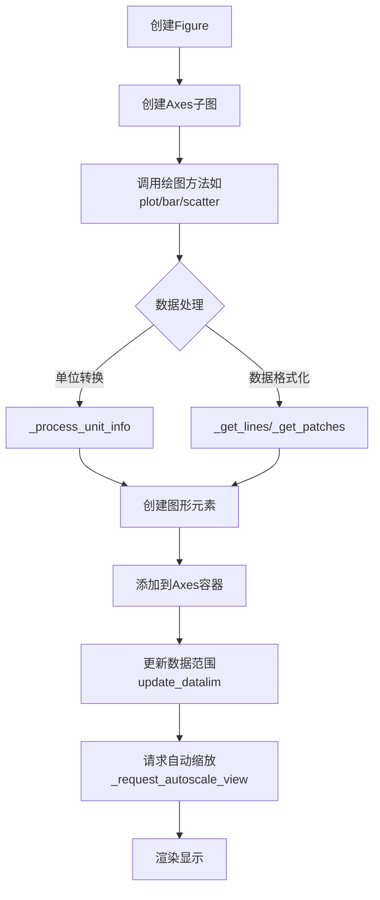

## 类结构

```
object
├── _GroupedBarReturn (辅助类-临时结果对象)
└── Axes (核心绘图容器类)
    └── 继承自 _AxesBase
        └── 继承自 Artist
```

## 全局变量及字段


### `_log`
    
模块级日志记录器，用于记录matplotlib.axes模块的日志信息

类型：`logging.Logger`
    


### `_GroupedBarReturn.bar_containers`
    
存储分组条形图的容器对象列表，用于管理条形图的绘制元素

类型：`list[BarContainer]`
    
    

## 全局函数及方法


### `_make_axes_method`

该函数用于修补被直接添加为 Axes 类属性的函数的 `__qualname__`，使其显示完整的限定名称（如 "Axes.table" 而非 "table"），以确保在错误追踪和文档中能正确显示函数所属的类。

参数：

- `func`：`function`，需要修补限定名称的函数对象

返回值：`function`，修改限定名称后的原函数对象

#### 流程图

```mermaid
flowchart TD
    A[开始] --> B[接收函数对象 func]
    B --> C[将 func.__qualname__ 设置为 f'Axes.{func.__name__}']
    C --> D[返回修改后的函数 func]
    D --> E[结束]
```

#### 带注释源码

```python
def _make_axes_method(func):
    """
    Patch the qualname for functions that are directly added to Axes.

    Some Axes functionality is defined in functions in other submodules.
    These are simply added as attributes to Axes. As a result, their
    ``__qualname__`` is e.g. only "table" and not "Axes.table". This
    function fixes that.

    Note that the function itself is patched, so that
    ``matplotlib.table.table.__qualname__` will also show "Axes.table".
    However, since these functions are not intended to be standalone,
    this is bearable.
    """
    # 修补函数的 __qualname__ 属性，使其包含 "Axes." 前缀
    # 这样在错误堆栈和文档中可以正确显示为 Axes.table 而非 table
    func.__qualname__ = f"Axes.{func.__name__}"
    # 返回修改后的函数对象，通常作为装饰器使用
    return func
```


### `Axes._check_no_units`

该方法是一个静态工具方法，用于检查给定的值是否未经过单位化处理（即是否为matplotlib原生支持的数值类型）。如果值经过了单位化（如使用日期时间或物理单位），则抛出 `ValueError` 异常。

参数：

-  `vals`：`list` 或 `tuple`，需要检查的值列表
-  `names`：`list` 或 `tuple`，与 `vals` 对应的参数名称列表，用于错误信息中标识哪个参数出了问题

返回值：`None`，该方法没有返回值，通过抛出异常来处理错误情况

#### 流程图

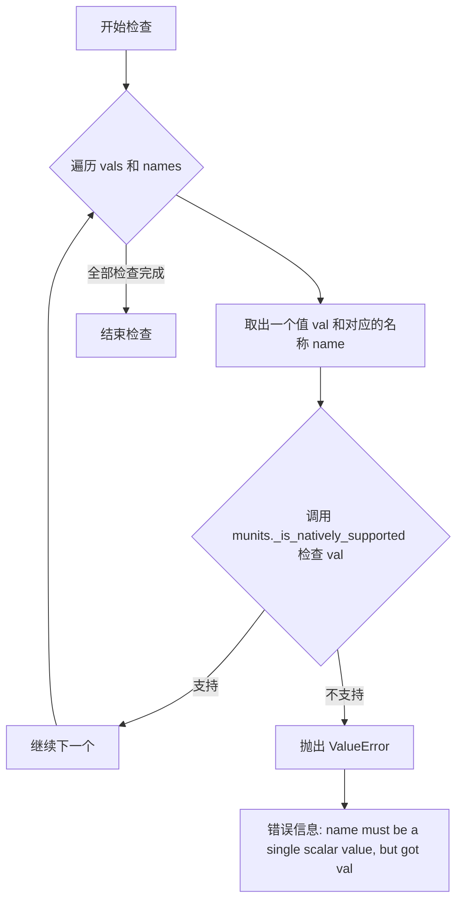

#### 带注释源码

```python
@staticmethod
def _check_no_units(vals, names):
    """
    静态方法：检查 vals 中的值是否未被单位化
    
    这是一个辅助方法，用于确保传入的值是matplotlib原生支持的标量值，
    而不是经过单位转换的值（如日期时间对象或带单位的数值）。
    
    参数:
        vals: list 或 tuple - 需要检查的值列表
        names: list 或 tuple - 对应的参数名称列表，用于错误提示
    
    返回:
        None - 该方法不返回任何值，如果检查失败则抛出异常
    
    异常:
        ValueError - 当某个值被单位化时抛出
    """
    # 遍历所有需要检查的值和对应的名称
    for val, name in zip(vals, names):
        # 使用 matplotlib 的单位模块检查值是否被原生支持
        # _is_natively_supported 会检查值是否为纯数值类型（而非带单位的值）
        if not munits._is_natively_supported(val):
            # 如果值被单位化，抛出详细的错误信息
            raise ValueError(f"{name} must be a single scalar value, "
                             f"but got {val}")
```

#### 实际调用示例

该方法在 `Axes` 类中被多个方法调用，用于确保坐标参数不接受单位化的值：

```python
# 在 axhline 方法中调用
self._check_no_units([xmin, xmax], ['xmin', 'xmax'])

# 在 axvline 方法中调用
self._check_no_units([ymin, ymax], ['ymin', 'ymax'])

# 在 axhspan 方法中调用
self._check_no_units([xmin, xmax], ['xmin', 'xmax'])

# 在 axvspan 方法中调用
self._check_no_units([ymin, ymax], ['ymin', 'ymax'])
```


### `_GroupedBarReturn.__init__`

`_GroupedBarReturn.__init__` 是 `_GroupedBarReturn` 类的构造函数，用于初始化分组条形图返回对象的容器属性。

参数：

- `bar_containers`：`list of BarContainer`，存储从 `Axes.bar` 调用返回的条形图容器列表

返回值：无返回值（构造函数）

#### 流程图

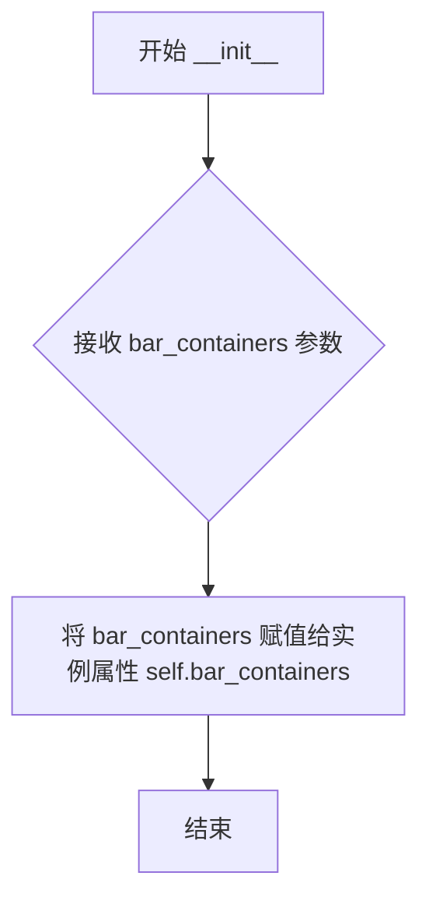

#### 带注释源码

```python
def __init__(self, bar_containers):
    """
    初始化 _GroupedBarReturn 对象。

    Parameters
    ----------
    bar_containers : list of BarContainer
        从 grouped_bar 方法内部调用 bar() 返回的容器列表，
        每个容器对应一个数据集的条形图。

    Returns
    -------
    None
        这是一个构造函数，不返回任何值。
    """
    # 将传入的 bar_containers 参数直接存储为实例属性
    # 供后续方法 remove() 使用
    self.bar_containers = bar_containers
```


### `_GroupedBarReturn.remove`

该方法用于移除所有与分组条形图关联的条形容器（bar containers）。它通过遍历 `bar_containers` 列表并对每个容器调用 `remove()` 方法来清除图表中的所有条形。

参数： 无

返回值：`None`，该方法不返回任何值，仅执行副作用操作。

#### 流程图

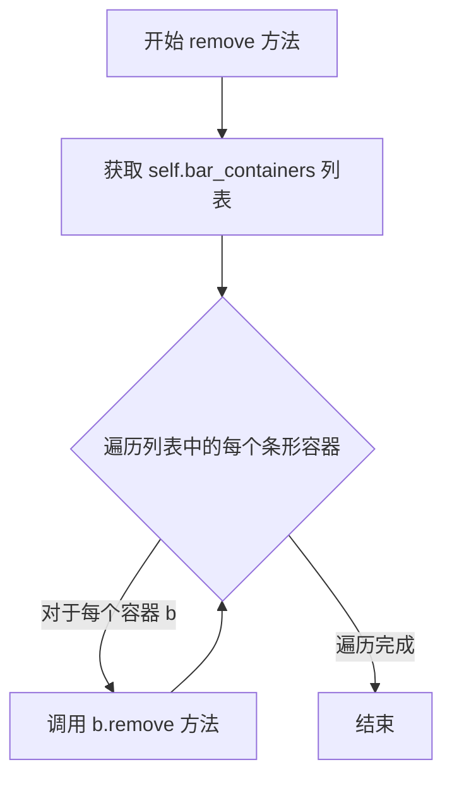

#### 带注释源码

```python
def remove(self):
    """
    移除所有条形容器。
    
    该方法遍历 bar_containers 列表，对每个条形容器调用其 remove 方法，
    从而从 Axes 中删除所有由 grouped_bar 创建的条形。
    """
    # 使用列表推导式遍历所有 bar_containers 并调用其 remove 方法
    # 注意：这里没有显式返回列表推导式的结果（隐式返回 None）
    [b.remove() for b in self.bar_containers]
```


### `Axes.get_title`

获取 Axes 的标题文本。该方法返回指定位置（左、中、右）的标题文本字符串。

参数：
- `loc`：`str`，可选，默认值为 `"center"`。指定要获取的标题位置，合法值为 `'center'`、`'left'` 或 `'right'`。

返回值：`str`，返回标题的文本字符串。

#### 流程图

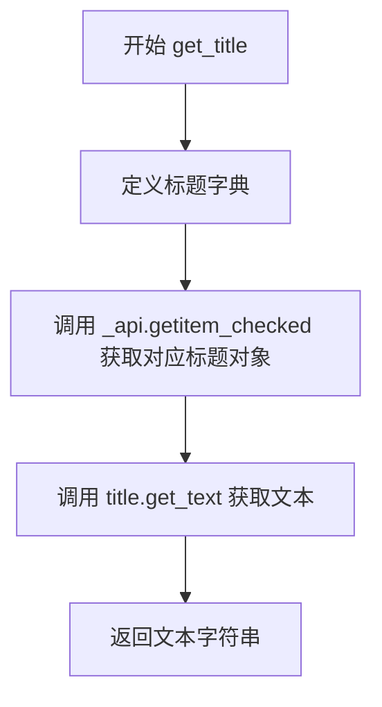

#### 带注释源码

```python
def get_title(self, loc="center"):
    """
    Get an Axes title.

    Get one of the three available Axes titles. The available titles
    are positioned above the Axes in the center, flush with the left
    edge, and flush with the right edge.

    Parameters
    ----------
    loc : {'center', 'left', 'right'}, str, default: 'center'
        Which title to return.

    Returns
    -------
    str
        The title text string.

    """
    # 创建标题字典，映射位置到对应的标题对象
    titles = {'left': self._left_title,
              'center': self.title,
              'right': self._right_title}
    # 使用 _api.getitem_checked 安全获取指定位置的标题对象
    title = _api.getitem_checked(titles, loc=loc.lower())
    # 获取并返回标题的文本内容
    return title.get_text()
```


### `Axes.set_title`

设置坐标轴的标题，支持设置三种位置的标题：居中（center）、左对齐（left）和右对齐（right）。该方法通过 matplotlib 的 Text 对象配置标题的文本、字体属性、位置和对齐方式，并支持通过 rcParams 自定义默认样式。

参数：

-  `label`：`str`，标题的文本内容
-  `fontdict`：`dict`，（可选）控制标题外观的字典，已不推荐使用，建议使用单独的关键字参数或字典解包 `set_title(..., **fontdict)`
-  `loc`：`{'center', 'left', 'right'}` 或 str，默认值从 `axes.titlelocation` rc 参数获取，设置标题的位置
-  `pad`：`float`，默认值从 `axes.titlepad` rc 参数获取，标题与坐标轴顶部的偏移量（单位：磅）
-  `y`：`float`，默认值从 `axes.titley` rc 参数获取，标题的垂直位置（1.0 表示顶部）
-  `**kwargs`：`~matplotlib.text.Text` 属性，其他关键字参数将传递给 Text 对象

返回值：`matplotlib.text.Text`，返回创建的 matplotlib Text 实例，代表该标题

#### 流程图

```mermaid
flowchart TD
    A[开始 set_title] --> B{获取 loc 参数}
    B --> C[转换为小写]
    D{获取 y 参数}
    D --> E{y 为 None?}
    E -->|是| F[设置 y = 1.0]
    E -->|否| G[设置 _autotitlepos = False]
    G --> H[kwargs['y'] = y]
    F --> H
    H --> I[获取对应标题对象 title]
    I --> J[构建默认字体字典 default]
    J --> K{获取 titlecolor}
    K --> L{titlecolor 不为 'auto'?}
    L -->|是| M[添加 color 到 default]
    L -->|否| N[跳过添加 color]
    M --> O[设置标题偏移转换]
    N --> O
    O --> P[title.set_text label]
    P --> Q[title.update default]
    Q --> R{fontdict 不为 None?}
    R -->|是| S[title.update fontdict]
    R -->|否| T[跳过 fontdict]
    S --> U[title._internal_update kwargs]
    T --> U
    U --> V[返回 title]
```

#### 带注释源码

```
def set_title(self, label, fontdict=None, loc=None, pad=None, *, y=None,
              **kwargs):
    """
    设置坐标轴的标题。

    可用的标题位置包括：居中（center）、左对齐（left）和右对齐（right），
    标题会显示在坐标轴的顶部。
    """
    # 1. 处理 loc 参数：如果未提供则从 rcParams 获取默认值 'axes.titlelocation'
    loc = mpl._val_or_rc(loc, 'axes.titlelocation').lower()
    
    # 2. 处理 y 参数：如果未提供则从 rcParams 获取默认值 'axes.titley'
    y = mpl._val_or_rc(y, 'axes.titley')
    if y is None:
        y = 1.0  # 默认使用顶部位置
    else:
        # 用户显式指定了 y 值，禁用自动标题位置调整
        self._autotitlepos = False
    # 将 y 值添加到 kwargs 中，后续会传递给 Text 对象
    kwargs['y'] = y

    # 3. 根据 loc 获取对应的标题 Text 对象
    # 三个标题对象分别是 _left_title, title(中心), _right_title
    titles = {'left': self._left_title,
              'center': self.title,
              'right': self._right_title}
    title = _api.getitem_checked(titles, loc=loc)
    
    # 4. 构建默认字体属性字典
    default = {
        'fontsize': mpl.rcParams['axes.titlesize'],
        'fontweight': mpl.rcParams['axes.titleweight'],
        'verticalalignment': 'baseline',
        'horizontalalignment': loc}
    
    # 5. 处理标题颜色：如果不是 'auto' 则应用自定义颜色
    titlecolor = mpl.rcParams['axes.titlecolor']
    if not cbook._str_lower_equal(titlecolor, 'auto'):
        default["color"] = titlecolor
    
    # 6. 设置标题偏移转换（标题与坐标轴顶部的距离）
    self._set_title_offset_trans(float(mpl._val_or_rc(pad, 'axes.titlepad')))
    
    # 7. 设置标题文本
    title.set_text(label)
    
    # 8. 应用默认属性
    title.update(default)
    
    # 9. 如果提供了 fontdict，则应用它（不推荐）
    if fontdict is not None:
        title.update(fontdict)
    
    # 10. 应用其他关键字参数（如 fontsize, color 等 Text 属性）
    title._internal_update(kwargs)
    
    # 11. 返回标题的 Text 对象
    return title
```


### `Axes.get_legend_handles_labels`

获取当前 Axes 对象中所有艺术家的图例句柄和标签。该方法是 `ax.legend()` 的底层实现，用户可以直接调用此方法获取图例数据后再手动创建图例。

参数：

- `legend_handler_map`：`dict` 或 `None`，可选参数，用于自定义图例句柄的映射关系。默认为 `None`，表示使用默认映射。

返回值：`tuple[list, list]`，返回两个列表——第一个列表包含所有图例句柄（艺术家对象），第二个列表包含对应的标签字符串。

#### 流程图

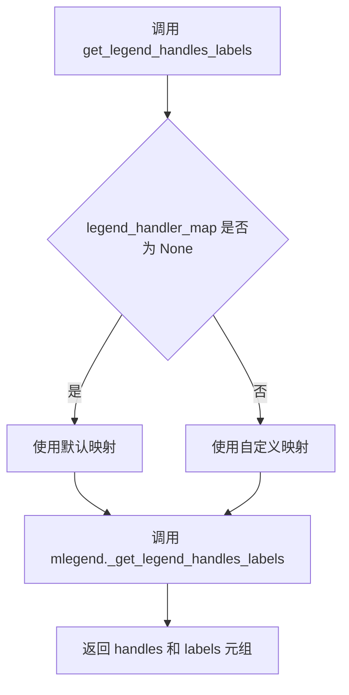

#### 带注释源码

```python
def get_legend_handles_labels(self, legend_handler_map=None):
    """
    Return handles and labels for legend

    ``ax.legend()`` is equivalent to ::

      h, l = ax.get_legend_handles_labels()
      ax.legend(h, l)
    """
    # 将调用转发给 matplotlib.legend 模块中的 _get_legend_handles_labels 函数
    # 传入当前 Axes 实例（作为列表）和可选的 legend_handler_map
    handles, labels = mlegend._get_legend_handles_labels(
        [self], legend_handler_map)
    # 返回图例句柄和标签的元组
    return handles, labels
```


### `Axes.legend`

该方法是 `matplotlib.axes.Axes` 类的成员方法，用于在 Axes 上创建和放置图例（Legend），支持自动检测要显示的图例元素或手动指定图例句柄和标签。

参数：

- `*args`：可变位置参数，支持多种调用签名：
  - `legend()`：自动检测图例元素
  - `legend(handles, labels)`：显式指定图例句柄和标签
  - `legend(handles=handles)`：仅指定图例句柄
  - `legend(labels)`：仅指定图例标签
- `**kwargs`：关键字参数，包括：
  - `handles`：`list of Artist or tuple of Artist`，可选，图例项的艺术家对象列表
  - `labels`：`list of str`，可选，图例项的标签列表
  - 其他参数如 `loc`、`fontsize`、`frameon` 等，传递给 `Legend` 构造函数

返回值：`matplotlib.legend.Legend`，创建的图例对象

#### 流程图

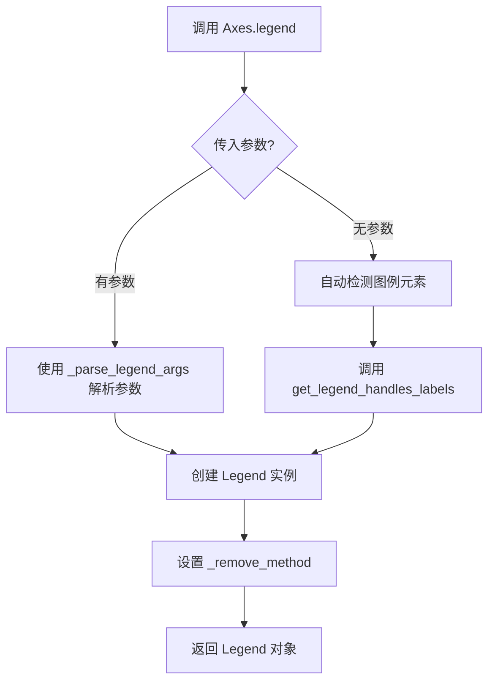

#### 带注释源码

```python
@_docstring.interpd
def legend(self, *args, **kwargs):
    """
    Place a legend on the Axes.

    Call signatures::

        legend()
        legend(handles, labels)
        legend(handles=handles)
        legend(labels)
    """
    # 调用 mlegend._parse_legend_args 解析图例参数
    # 该函数返回 handles（艺术家对象列表）、labels（标签列表）和 kwargs（处理后的关键字参数）
    handles, labels, kwargs = mlegend._parse_legend_args([self], *args, **kwargs)
    
    # 创建 Legend 对象，传入 Axes 实例、句柄和标签
    self.legend_ = mlegend.Legend(self, handles, labels, **kwargs)
    
    # 设置图例的删除方法，当图例被移除时调用
    self.legend_._remove_method = self._remove_legend
    
    # 返回创建的图例对象
    return self.legend_
```


### `Axes._remove_legend`

该方法用于从 Axes 对象中移除图例（Legend），通过将 `self.legend_` 属性设置为 `None` 来实现。

参数：

- `self`：`Axes`，执行该方法的 Axes 实例
- `legend`：`matplotlib.legend.Legend`，需要移除的图例对象（参数名在代码中定义但实际未被使用）

返回值：`None`，无返回值（该方法直接修改对象状态）

#### 流程图

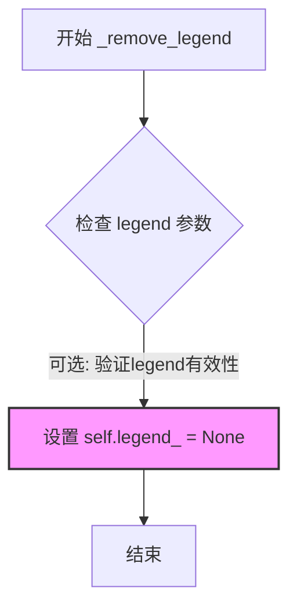

#### 带注释源码

```python
def _remove_legend(self, legend):
    """
    Remove the legend from the Axes.

    This method is used as the remove callback for the legend. It simply
    sets the legend attribute to None, effectively removing the legend
    from the Axes.

    Parameters
    ----------
    self : Axes
        The Axes instance that owns the legend.
    legend : matplotlib.legend.Legend
        The legend object to be removed. This parameter is not used
        in the method body but is required for the callback signature.

    Returns
    -------
    None
        This method does not return anything; it modifies the internal
        state of the Axes object directly.
    """
    # 将 Axes 对象的 legend_ 属性设置为 None
    # 这会断开图例对象与 Axes 的引用关系
    # 图例对象如果没有其他引用，将被垃圾回收
    self.legend_ = None
```


### `Axes.inset_axes`

该方法是 `Axes` 类的一个成员方法，用于在现有的 Axes（坐标轴）上创建一个子 inset Axes（嵌入坐标轴）。它允许用户在主图表区域内创建一个较小的图表区域，用于显示放大图或其他相关信息。

参数：

- `bounds`：`list` 或 `array-like`，形式为 `[x0, y0, width, height]`，表示嵌入坐标轴的左下角坐标以及其宽度和高度。
- `transform`：`matplotlib.transforms.Transform`，可选参数，默认为 `None`（即 `self.transAxes`），用于指定坐标的变换系统。如果为 `None`，则使用 `ax.transAxes`，即坐标是轴相对坐标。
- `zorder`：`number`，可选参数，默认值为 `5`，用于控制嵌入坐标轴的绘制顺序（层级）。
- `**kwargs`：其他关键字参数，会传递给 inset Axes 类，用于自定义Axes的属性（如投影类型等）。

返回值：`matplotlib.axes.Axes`，返回创建的嵌入坐标轴实例。

#### 流程图

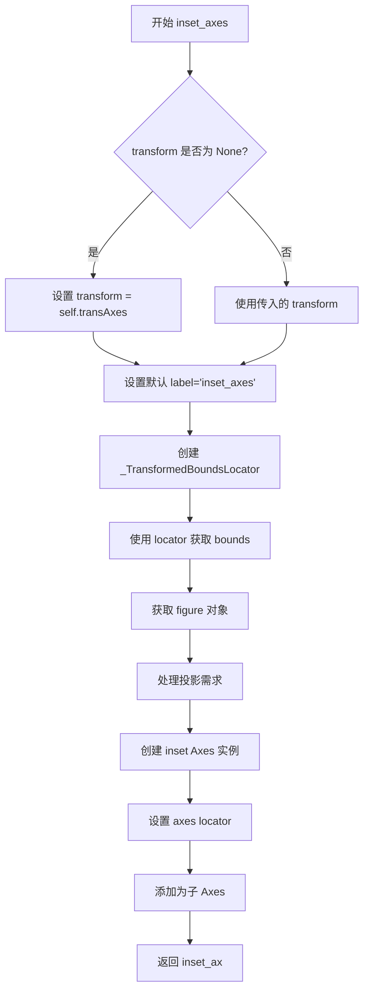

#### 带注释源码

```python
def inset_axes(self, bounds, *, transform=None, zorder=5, **kwargs):
    """
    Add a child inset Axes to this existing Axes.

    参数说明:
        bounds: [x0, y0, width, height] 形式的位置参数，定义 inset axes 的位置和大小
        transform: 坐标变换对象，默认为轴坐标变换
        zorder: 绘制顺序，默认为5
        **kwargs: 传递给 Axes 类的其他参数

    返回:
        创建的 Axes 实例
    """
    # 1. 如果没有提供 transform，默认使用轴相对坐标变换
    if transform is None:
        transform = self.transAxes
    
    # 2. 设置默认的 label，便于识别
    kwargs.setdefault('label', 'inset_axes')

    # 3. 使用 transform 和 bounds 创建定位器
    # 这个定位器将 bounds 转换为图形相对坐标
    inset_locator = _TransformedBoundsLocator(bounds, transform)
    
    # 4. 获取实际的 bounds（经过变换后的坐标）
    bounds = inset_locator(self, None).bounds
    
    # 5. 获取当前 Axes 所在的 figure
    fig = self.get_figure(root=False)
    
    # 6. 处理投影需求（支持 polar, projection 参数等）
    projection_class, pkw = fig._process_projection_requirements(**kwargs)
    
    # 7. 创建 inset Axes 实例
    inset_ax = projection_class(fig, bounds, zorder=zorder, **pkw)

    # 8. 设置 axes locator，允许 axes 在数据坐标中移动
    # 这个 locator 在 ax.apply_aspect() 中被调用
    inset_ax.set_axes_locator(inset_locator)

    # 9. 将 inset axes 添加为当前 axes 的子 axes
    self.add_child_axes(inset_ax)

    # 10. 返回创建的 inset axes
    return inset_ax
```


### Axes.indicate_inset

在 Axes 上添加一个嵌入图指示器，即在绘图区域指定位置绘制一个矩形框，可选地绘制连接线将该矩形与嵌入坐标轴 (`.Axes.inset_axes`) 连接起来。

参数：

- `self`：`Axes`，Axes 实例本身（隐式参数）
- `bounds`：`list[float]` 或 `None`，可选，矩形的 [x0, y0, width, height]，若不提供则从 inset_ax 的数据范围自动计算
- `inset_ax`：`Axes` 或 `None`，可选，要绘制连接线的嵌入坐标轴，将绘制两条连接线将指示框与 inset_ax 的角点连接
- `transform`：`Transform` 或 `None`，可选，矩形坐标的变换，默认为 `ax.transData`（数据坐标）
- `facecolor`：`color`，默认 `'none'`，矩形的填充颜色
- `edgecolor`：`color`，默认 `'0.5'`，矩形边框和连接线的颜色
- `alpha`：`float` 或 `None`，默认 `0.5`，矩形和连接线的透明度，若不为 None 则覆盖 facecolor 和 edgecolor 中的 alpha 值
- `zorder`：`float` 或 `None`，默认 `4.99`，矩形和连接线的绘制顺序，略低于嵌入坐标轴的默认值
- `**kwargs`：其他关键字参数，将传递给 `.Rectangle` patch

返回值：`matplotlib.inset.InsetIndicator`，包含以下属性：
- `rectangle`：`.Rectangle` - 指示器边框
- `connectors`：4 元组的 `.patches.ConnectionPatch` - 连接到 inset_ax 四个角点（lower_left, upper_left, lower_right, upper_right）的连接线，其中两条默认不可见，用户可手动设置可见性

#### 流程图

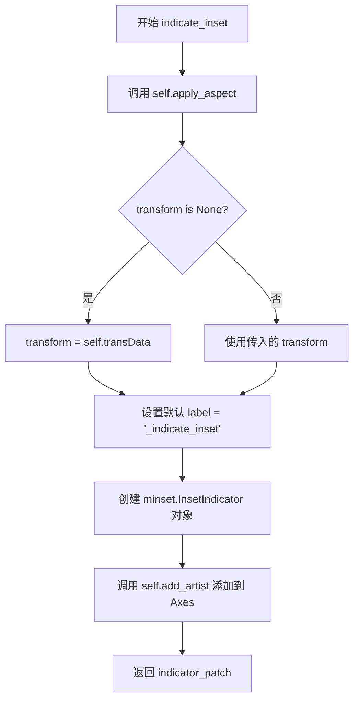

#### 带注释源码

```python
@_docstring.interpd
def indicate_inset(self, bounds=None, inset_ax=None, *, transform=None,
                   facecolor='none', edgecolor='0.5', alpha=0.5,
                   zorder=None, **kwargs):
    """
    Add an inset indicator to the Axes.  This is a rectangle on the plot
    at the position indicated by *bounds* that optionally has lines that
    connect the rectangle to an inset Axes (`.Axes.inset_axes`).
    ...
    """
    # 为了使 Axes 连接线正常工作，需要对父 Axes 应用纵横比
    # 这确保了连接线能够正确地从矩形指向嵌入坐标轴
    self.apply_aspect()

    # 如果未指定 transform，默认使用数据坐标变换
    if transform is None:
        transform = self.transData
    
    # 设置默认标签，用于标识这是一个 inset 指示器
    kwargs.setdefault('label', '_indicate_inset')

    # 创建 InsetIndicator 对象
    # minset.InsetIndicator 负责处理矩形和连接线的绘制逻辑
    indicator_patch = minset.InsetIndicator(
        bounds, inset_ax=inset_ax,
        facecolor=facecolor, edgecolor=edgecolor, alpha=alpha,
        zorder=zorder, transform=transform, **kwargs)
    
    # 将指示器添加到 Axes 中
    self.add_artist(indicator_patch)

    # 返回 InsetIndicator 对象
    # 该对象包含 rectangle 属性（矩形）和 connectors 属性（连接线元组）
    return indicator_patch
```


### `Axes.indicate_inset_zoom`

添加一个基于内嵌坐标轴（inset Axes）范围的缩放指示矩形，并在内嵌坐标轴和该矩形之间绘制连接线。

参数：

- `self`：`Axes`，调用该方法的坐标轴实例
- `inset_ax`：`matplotlib.axes.Axes`，需要为其绘制连接线的内嵌坐标轴
- `**kwargs`：关键字参数，其他传递给 `Axes.indicate_inset` 方法的参数

返回值：`matplotlib.inset.InsetIndicator`，包含指示框和连接线的艺术家对象

#### 流程图

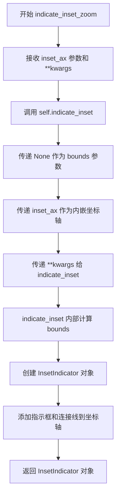

#### 带注释源码

```python
def indicate_inset_zoom(self, inset_ax, **kwargs):
    """
    添加一个基于 *inset_ax* 坐标轴范围的缩放指示矩形，
    并在 *inset_ax* 和矩形之间绘制连接线。

    参数:
    ----------
    inset_ax : `.Axes`
        需要绘制连接线的内嵌坐标轴。系统会绘制两条连接线，
        将指示框连接到内嵌坐标轴的角落，选择不会与指示框重叠的角落。

    **kwargs
        其他关键字参数，将传递给 `.Axes.indicate_inset` 方法。

    返回值:
    -------
    inset_indicator : `.inset.InsetIndicator`
        包含以下属性的艺术家对象:
        - inset_indicator.rectangle: `.Rectangle`，指示框框架
        - inset_indicator.connectors: 4元组的 `.patches.ConnectionPatch`，
          连接线连接 *inset_ax* 的四个角落（左下、左上、右下、右上）。
          其中两条连接线的可见性默认设置为 False，如果自动选择不符合预期，
          用户可以手动设置可见性为 True。

    注意:
    -----
    此方法为实验性功能（自 3.0 版本），API 可能会发生变化。
    """
    # indicate_inset_zoom 是 indicate_inset 的便捷包装函数
    # 它不直接指定 bounds 参数（传入 None），而是由 indicate_inset
    # 根据 inset_ax 的数据范围自动计算
    return self.indicate_inset(None, inset_ax, **kwargs)
```


### `Axes.secondary_xaxis`

在 Axes 对象上添加第二个 x 轴，用于在同一图表上显示具有不同刻度的数据，例如在主轴显示频率时，辅轴显示周期。

参数：

- `self`：`Axes`，Axes 实例本身
- `location`：`str` 或 `Real`，轴的位置，可以是 'top'、'bottom' 或浮点数（表示相对位置）
- `functions`：`tuple` 或 `None`，可选，用于定义主轴和辅轴之间的转换函数元组（forward_func, inverse_func）
- `transform`：`Transform` 或 `None`，可选，用于指定辅轴的坐标变换
- `**kwargs`：其他关键字参数传递给 `SecondaryAxis`

返回值：`SecondaryAxis`，创建的第二轴实例

#### 流程图

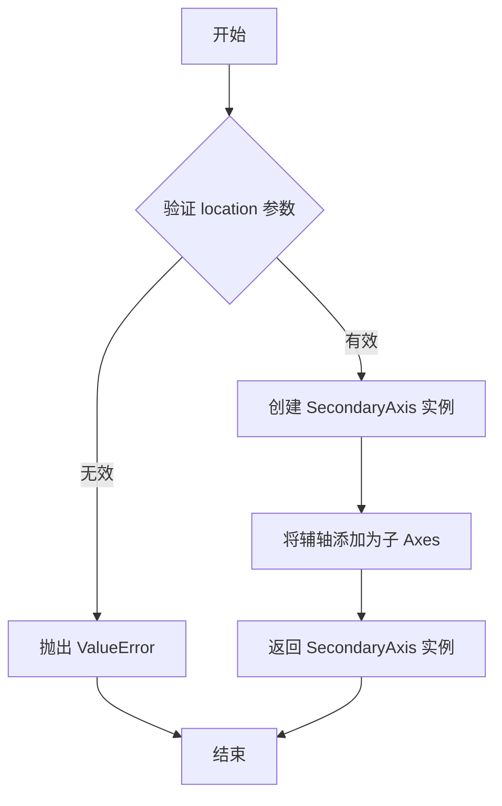

#### 带注释源码

```python
@_docstring.interpd
def secondary_xaxis(self, location, functions=None, *, transform=None, **kwargs):
    """
    Add a second x-axis to this `~.axes.Axes`.

    For example if we want to have a second scale for the data plotted on
    the xaxis.

    %(_secax_docstring)s

    Examples
    --------
    The main axis shows frequency, and the secondary axis shows period.

    .. plot::

        fig, ax = plt.subplots()
        ax.loglog(range(1, 360, 5), range(1, 360, 5))
        ax.set_xlabel('frequency [Hz]')

        def invert(x):
            # 1/x with special treatment of x == 0
            x = np.array(x).astype(float)
            near_zero = np.isclose(x, 0)
            x[near_zero] = np.inf
            x[~near_zero] = 1 / x[~near_zero]
            return x

        # the inverse of 1/x is itself
        secax = ax.secondary_xaxis('top', functions=(invert, invert))
        secax.set_xlabel('Period [s]')
        plt.show()

    To add a secondary axis relative to your data, you can pass a transform
    to the new axis.

    .. plot::

        fig, ax = plt.subplots()
        ax.plot(range(0, 5), range(-1, 4))

        # Pass 'ax.transData' as a transform to place the axis
        # relative to your data at y=0
        secax = ax.secondary_xaxis(0, transform=ax.transData)
    """
    # 验证 location 参数是否为有效的位置值
    if not (location in ['top', 'bottom'] or isinstance(location, Real)):
        raise ValueError('secondary_xaxis location must be either '
                         'a float or "top"/"bottom"')

    # 创建 SecondaryAxis 实例，传入父 Axes、轴类型、位置、转换函数等参数
    secondary_ax = SecondaryAxis(self, 'x', location, functions,
                                 transform, **kwargs)
    # 将辅轴添加为子 Axes
    self.add_child_axes(secondary_ax)
    # 返回创建的辅轴实例
    return secondary_ax
```


### `Axes.secondary_yaxis`

为当前 Axes 添加一个次坐标轴（secondary y-axis），用于在同一个图表上显示具有不同刻度范围或单位的双Y轴数据。

参数：

- `location`：`str` 或 `Real`，次坐标轴的位置，可以是 `'left'`、`'right'` 或一个浮点数表示相对位置
- `functions`：`tuple` 或 `None`，可选，用于定义主坐标轴和次坐标轴之间的转换函数，格式为 `(to_primary, from_primary)`
- `transform`：`Transform` 或 `None`，可选，指定次坐标轴的变换方式，用于相对于数据定位
- `**kwargs`：其他关键字参数传递给 `SecondaryAxis`

返回值：`SecondaryAxis`，返回创建的次坐标轴对象

#### 流程图

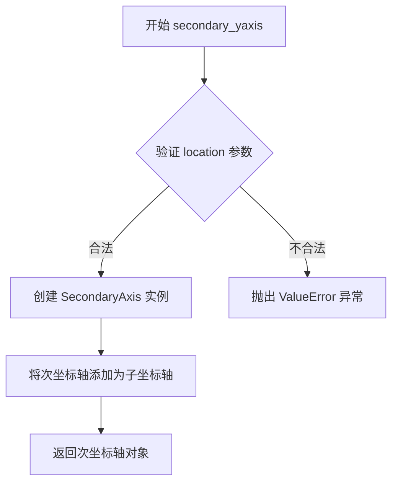

#### 带注释源码

```python
@_docstring.interpd
def secondary_yaxis(self, location, functions=None, *, transform=None, **kwargs):
    """
    Add a second y-axis to this `~.axes.Axes`.

    For example if we want to have a second scale for the data plotted on
    the yaxis.

    %(_secax_docstring)s

    Examples
    --------
    Add a secondary Axes that converts from radians to degrees

    .. plot::

        fig, ax = plt.subplots()
        ax.plot(range(1, 360, 5), range(1, 360, 5))
        ax.set_ylabel('degrees')
        secax = ax.secondary_yaxis('right', functions=(np.deg2rad,
                                                       np.rad2deg))
        secax.set_ylabel('radians')

    To add a secondary axis relative to your data, you can pass a transform
    to the new axis.

    .. plot::

        fig, ax = plt.subplots()
        ax.plot(range(0, 5), range(-1, 4))

        # Pass 'ax.transData' as a transform to place the axis
        # relative to your data at x=3
        secax = ax.secondary_yaxis(3, transform=ax.transData)
    """
    # 验证 location 参数是否为有效值
    if not (location in ['left', 'right'] or isinstance(location, Real)):
        raise ValueError('secondary_yaxis location must be either '
                         'a float or "left"/"right"')

    # 创建 SecondaryAxis 实例，传入父坐标轴、轴类型('y')、位置、转换函数和变换
    secondary_ax = SecondaryAxis(self, 'y', location, functions,
                                 transform, **kwargs)
    # 将次坐标轴添加为当前坐标轴的子坐标轴
    self.add_child_axes(secondary_ax)
    # 返回创建的次坐标轴对象
    return secondary_ax
```


### `Axes.text`

该方法是 `Axes` 类的一个方法，用于在图表的指定位置添加文本标签。它创建并返回一个 `matplotlib.text.Text` 实例，默认情况下文本位置在数据坐标系中，水平对齐为左对齐，垂直对齐为基线。

参数：

-  `self`：`Axes`，Axes 对象实例本身
-  `x`：`float`，文本放置的 x 坐标，默认在数据坐标系中，可通过 transform 参数更改坐标系
-  `y`：`float`，文本放置的 y 坐标，默认在数据坐标系中，可通过 transform 参数更改坐标系
-  `s`：`str`，要添加的文本内容
-  `fontdict`：`dict`，可选，用于覆盖默认文本属性的字典，默认为 None（使用 rcParams 中的默认值）。已不推荐使用，建议直接传递关键字参数
-  `**kwargs`：`dict`，其他关键字参数，将传递给 `matplotlib.text.Text` 类的属性

返回值：`matplotlib.text.Text`，创建的 Text 实例

#### 流程图

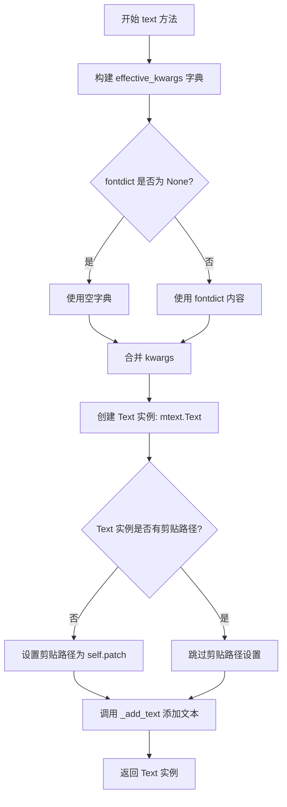

#### 带注释源码

```python
@_docstring.interpd
def text(self, x, y, s, fontdict=None, **kwargs):
    """
    Add text to the Axes.

    Add the text *s* to the Axes at location *x*, *y* in data coordinates,
    with a default ``horizontalalignment`` on the ``left`` and
    ``verticalalignment`` at the ``baseline``. See
    :doc:`/gallery/text_labels_and_annotations/text_alignment`.

    Parameters
    ----------
    x, y : float
        The position to place the text. By default, this is in data
        coordinates. The coordinate system can be changed using the
        *transform* parameter.

    s : str
        The text.

    fontdict : dict, default: None

        .. admonition:: Discouraged

           The use of *fontdict* is discouraged. Parameters should be passed as
           individual keyword arguments or using dictionary-unpacking
           ``text(..., **fontdict)``.

        A dictionary to override the default text properties. If fontdict
        is None, the defaults are determined by `.rcParams`.

    Returns
    -------
    `.Text`
        The created `.Text` instance.

    Other Parameters
    ----------------
    **kwargs : `~matplotlib.text.Text` properties.
        Other miscellaneous text parameters.

        %(Text:kwdoc)s

    Examples
    --------
    Individual keyword arguments can be used to override any given
    parameter::

        >>> text(x, y, s, fontsize=12)

    The default transform specifies that text is in data coords,
    alternatively, you can specify text in axis coords ((0, 0) is
    lower-left and (1, 1) is upper-right).  The example below places
    text in the center of the Axes::

        >>> text(0.5, 0.5, 'matplotlib', horizontalalignment='center',
        ...      verticalalignment='center', transform=ax.transAxes)

    You can put a rectangular box around the text instance (e.g., to
    set a background color) by using the keyword *bbox*.  *bbox* is
    a dictionary of `~matplotlib.patches.Rectangle`
    properties.  For example::

        >>> text(x, y, s, bbox=dict(facecolor='red', alpha=0.5))
    """
    # 构建有效的关键字参数字典
    # 首先设置默认的垂直和水平对齐方式
    # 默认使用数据坐标系 (transform=self.transData)
    # 默认禁用剪贴 (clip_on=False)
    effective_kwargs = {
        'verticalalignment': 'baseline',  # 默认垂直对齐方式
        'horizontalalignment': 'left',    # 默认水平对齐方式
        'transform': self.transData,     # 默认使用数据坐标系
        'clip_on': False,                # 默认不剪贴
        **(fontdict if fontdict is not None else {}),  # 如果提供了 fontdict，合并其内容
        **kwargs,                        # 合并用户提供的其他关键字参数
    }
    # 创建 Text 对象，传入位置和文本内容，以及所有样式属性
    t = mtext.Text(x, y, text=s, **effective_kwargs)
    # 如果 Text 对象没有设置剪贴路径，则设置为 Axes 的 patch
    # 这确保文本不会超出 Axes 的边界
    if t.get_clip_path() is None:
        t.set_clip_path(self.patch)
    # 将文本对象添加到 Axes 中
    self._add_text(t)
    # 返回创建的 Text 实例，供用户进一步自定义
    return t
```


### `Axes.annotate`

该方法用于在图表上创建带有可选箭头的注释文本（Annotation），以便在特定位置标记数据点或添加说明信息。

参数：

-  `text`：`str`，注释显示的文本内容
-  `xy`：`tuple` 或 `list`，注释指向的坐标点（x, y）
-  `xytext`：`tuple` 或 `list`，可选，文本本身的位置坐标，默认与 `xy` 相同
-  `xycoords`：`str`，可选，指定 `xy` 使用的坐标系统，默认为 `'data'`
-  `textcoords`：`str`，可选，指定 `xytext` 使用的坐标系统，默认与 `xycoords` 相同
-  `arrowprops`：`dict`，可选，配置箭头属性的字典，如 arrowstyle、connectionstyle 等
-  `annotation_clip`：`bool`，可选，是否在坐标轴范围外裁剪注释
-  `**kwargs`：其他关键字参数，传递给 `Annotation` 对象的属性

返回值：`matplotlib.text.Annotation`，返回创建的注释对象

#### 流程图

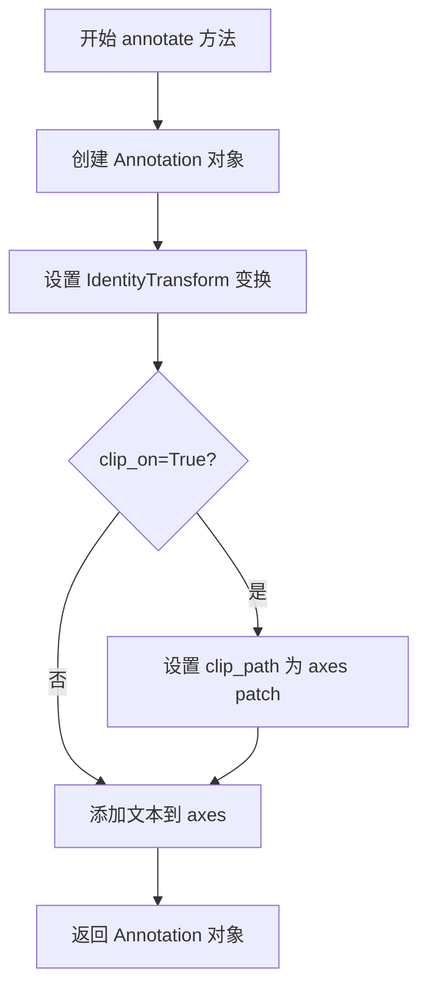

#### 带注释源码

```python
@_docstring.interpd
def annotate(self, text, xy, xytext=None, xycoords='data', textcoords=None,
             arrowprops=None, annotation_clip=None, **kwargs):
    """
    Add an annotation to the Axes.

    参数详细信息请参考 matplotlib.text.Annotation.__init__.__doc__
    """
    # Signature must match Annotation. This is verified in
    # test_annotate_signature().
    # 1. 创建 Annotation 对象，传入文本、位置、坐标系统等参数
    a = mtext.Annotation(text, xy, xytext=xytext, xycoords=xycoords,
                         textcoords=textcoords, arrowprops=arrowprops,
                         annotation_clip=annotation_clip, **kwargs)
    # 2. 设置变换为恒等变换，使注释位置基于数据坐标
    a.set_transform(mtransforms.IdentityTransform())
    # 3. 如果设置了 clip_on 且注释没有裁剪路径，则使用 axes 的 patch 作为裁剪路径
    if kwargs.get('clip_on', False) and a.get_clip_path() is None:
        a.set_clip_path(self.patch)
    # 4. 将注释文本添加到 axes 中
    self._add_text(a)
    # 5. 返回创建的 Annotation 对象
    return a
# 使用 Annotation 类的文档字符串作为 annotate 方法的文档
annotate.__doc__ = mtext.Annotation.__init__.__doc__
```


### `Axes.axhline`

该方法用于在Axes上添加一条水平线，可跨越整个坐标轴或指定的比例范围。水平线由两个点(xmin, y)和(xmax, y)定义，其中x坐标采用轴坐标系统（0-1），y坐标采用数据坐标系统。

**参数：**

- `y`：`float`，默认值为0，水平线的y轴位置，采用数据坐标。
- `xmin`：`float`，默认值为0，水平线起始点的x轴位置，采用轴坐标（0表示最左端，1表示最右端）。
- `xmax`：`float`，默认值为1，水平线结束点的x轴位置，采用轴坐标（0表示最左端，1表示最右端）。
- `**kwargs`：其他关键字参数，将传递给`Line2D`对象，但不支持`transform`参数。

**返回值：**`matplotlib.lines.Line2D`，返回创建的`Line2D`对象。

#### 流程图

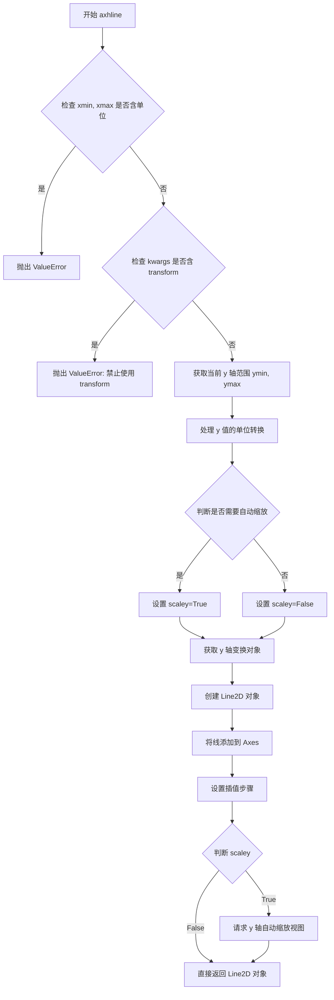

#### 带注释源码

```python
@_docstring.interpd
def axhline(self, y=0, xmin=0, xmax=1, **kwargs):
    """
    Add a horizontal line spanning the whole or fraction of the Axes.

    Note: If you want to set x-limits in data coordinates, use
    `~.Axes.hlines` instead.

    Parameters
    ----------
    y : float, default: 0
        y position in :ref:`data coordinates <coordinate-systems>`.

    xmin : float, default: 0
        The start x-position in :ref:`axes coordinates <coordinate-systems>`.
        Should be between 0 and 1, 0 being the far left of the plot,
        1 the far right of the plot.

    xmax : float, default: 1
        The end x-position in :ref:`axes coordinates <coordinate-systems>`.
        Should be between 0 and 1, 0 being the far left of the plot,
        1 the far right of the plot.

    Returns
    -------
    `~matplotlib.lines.Line2D`
        A `.Line2D` specified via two points ``(xmin, y)``, ``(xmax, y)``.
        Its transform is set such that *x* is in
        :ref:`axes coordinates <coordinate-systems>` and *y* is in
        :ref:`data coordinates <coordinate-systems>`.

        This is still a generic line and the horizontal character is only
        realized through using identical *y* values for both points. Thus,
        if you want to change the *y* value later, you have to provide two
        values ``line.set_ydata([3, 3])``.

    Other Parameters
    ----------------
    **kwargs
        Valid keyword arguments are `.Line2D` properties, except for
        'transform':

        %(Line2D:kwdoc)s

    See Also
    --------
    hlines : Add horizontal lines in data coordinates.
    axhspan : Add a horizontal span (rectangle) across the axis.
    axline : Add a line with an arbitrary slope.

    Examples
    --------
    * draw a thick red hline at 'y' = 0 that spans the xrange::

        >>> axhline(linewidth=4, color='r')

    * draw a default hline at 'y' = 1 that spans the xrange::

        >>> axhline(y=1)

    * draw a default hline at 'y' = .5 that spans the middle half of
      the xrange::

        >>> axhline(y=.5, xmin=0.25, xmax=0.75)
    """
    # 检查 xmin 和 xmax 参数是否包含单位（不支持含单位的值）
    self._check_no_units([xmin, xmax], ['xmin', 'xmax'])
    
    # 禁止用户通过 kwargs 传递 transform 参数，因为该方法会自动生成变换
    if "transform" in kwargs:
        raise ValueError("'transform' is not allowed as a keyword "
                         "argument; axhline generates its own transform.")
    
    # 获取当前 y 轴的数据范围边界
    ymin, ymax = self.get_ybound()

    # 处理 y 值的单位信息，用于后续与无单位边界进行比较
    yy, = self._process_unit_info([("y", y)], kwargs)
    
    # 判断是否需要自动缩放：如果 y 值超出当前 y 轴范围，则需要缩放
    scaley = (yy < ymin) or (yy > ymax)

    # 获取 y 轴的变换对象（用于网格线）
    trans = self.get_yaxis_transform(which='grid')
    
    # 创建 Line2D 对象：x 坐标使用轴坐标 [xmin, xmax]，y 坐标使用数据坐标 [y, y]
    # 由于两个点的 y 值相同，所以表现为水平线
    l = mlines.Line2D([xmin, xmax], [y, y], transform=trans, **kwargs)
    
    # 将创建的线添加到 Axes 中
    self.add_line(l)
    
    # 设置线条路径的插值步骤，用于网格线对齐
    l.get_path()._interpolation_steps = mpl.axis.GRIDLINE_INTERPOLATION_STEPS
    
    # 如果 y 值超出当前视图范围，请求自动调整 y 轴视图
    if scaley:
        self._request_autoscale_view("y")
    
    # 返回创建的 Line2D 对象
    return l
```


### `Axes.axvline`

在 Axes 对象上添加一条垂直线，可以跨越整个坐标轴或指定的比例部分。该方法创建一个 `Line2D` 对象，其中 x 坐标位于数据坐标系，y 坐标位于轴坐标系，从而实现跨不同坐标系的绘制。

参数：

- `x`：`float`，默认值 0，x 位置，以数据坐标为单位
- `ymin`：`float`，默认值 0，y 轴起始位置，以轴坐标（0-1）为单位，0 表示绘图底部，1 表示顶部
- `ymax`：`float`，默认值 1，y 轴结束位置，以轴坐标（0-1）为单位
- `**kwargs`：`dict`，传递给 `Line2D` 的其他关键字参数（除了 `transform`）

返回值：`~matplotlib.lines.Line2D`，创建的垂直线对象

#### 流程图

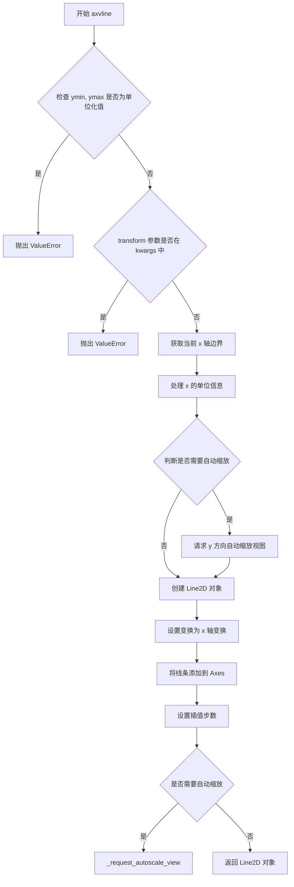

#### 带注释源码

```python
@_docstring.interpd
def axvline(self, x=0, ymin=0, ymax=1, **kwargs):
    """
    Add a vertical line spanning the whole or fraction of the Axes.
    ...
    """
    # 检查 ymin 和 ymax 是否为非单位化的标量值
    # 如果它们被 matplotlib 单位系统处理过，抛出错误
    self._check_no_units([ymin, ymax], ['ymin', 'ymax'])
    
    # 不允许用户通过 kwargs 传递 transform 参数
    # 因为 axvline 会自动生成自己的 transform
    if "transform" in kwargs:
        raise ValueError("'transform' is not allowed as a keyword "
                         "argument; axvline generates its own transform.")
    
    # 获取当前 x 轴的数据边界
    xmin, xmax = self.get_xbound()

    # 处理 x 坐标的单位信息（如日期、时间等）
    # Strip away the units for comparison with non-unitized bounds.
    xx, = self._process_unit_info([("x", x)], kwargs)
    
    # 判断是否需要自动缩放：
    # 如果 x 值超出了当前 x 轴边界，则需要缩放
    scalex = (xx < xmin) or (xx > xmax)

    # 获取 x 轴的网格变换
    # x 方向使用数据坐标，y 方向使用轴坐标
    trans = self.get_xaxis_transform(which='grid')
    
    # 创建垂直线：两点坐标 (x, ymin) 和 (x, ymax)
    # 使用前面获取的变换
    l = mlines.Line2D([x, x], [ymin, ymax], transform=trans, **kwargs)
    
    # 将线条添加到 Axes
    self.add_line(l)
    
    # 设置路径的插值步数，用于网格线渲染
    l.get_path()._interpolation_steps = mpl.axis.GRIDLINE_INTERPOLATION_STEPS
    
    # 如果 x 超出边界，请求自动缩放 x 视图
    if scalex:
        self._request_autoscale_view("x")
    
    # 返回创建的线条对象
    return l
```


### Axes._check_no_units

用于检查给定的值是否为非单位化的标量值。如果值为单位化数据（如带单位的数值），则抛出ValueError。

参数：
- `vals`：list，需要检查的值列表
- `names`：list，对应值的名称列表，用于错误信息

返回值：`None`

#### 流程图

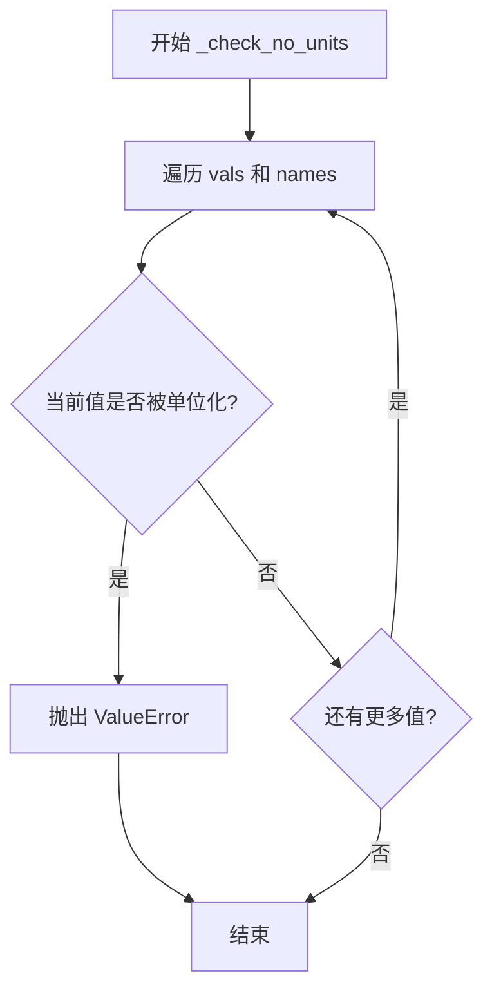

#### 带注释源码

```python
@staticmethod
def _check_no_units(vals, names):
    """
    Helper method to check that vals are not unitized.
    
    Parameters
    ----------
    vals : list
        需要检查的值列表
    names : list
        对应值的名称列表，用于错误信息
        
    Returns
    -------
    None
        
    Raises
    ------
    ValueError
        如果任何值为单位化数据时抛出
    """
    # Helper method to check that vals are not unitized
    # 遍历每个值和对应的名称
    for val, name in zip(vals, names):
        # 使用 munits._is_natively_supported 检查值是否为非单位化
        # 如果返回 False，说明值是单位化的
        if not munits._is_natively_supported(val):
            # 抛出详细的错误信息，包括参数名和实际值
            raise ValueError(f"{name} must be a single scalar value, "
                             f"but got {val}")
```


### Axes.axline

添加一条无限长的直线。该方法可以在Axes上绘制一条通过指定点或具有指定斜率的无限长直线，支持通过两个点或一个点加斜率来定义直线，适用于绘制对角线或任意斜率的辅助线。

参数：

- `xy1`：`tuple(float, float)`，直线通过的第一个点坐标
- `xy2`：`tuple(float, float)`，可选，直线通过的第二点坐标，xy2和slope必须二选一
- `slope`：`float`，可选，直线的斜率，xy2和slope必须二选一
- `**kwargs`：`dict`，可选，其他关键字参数，将传递给`Line2D`属性

返回值：`matplotlib.lines.AxLine`，创建的无限长直线对象

#### 流程图

```mermaid
flowchart TD
    A[开始 axline] --> B{检查slope参数}
    B -->|slope不为None| C{检查xscale和yscale}
    C -->|任一不是linear| D[抛出TypeError]
    C -->|都是linear| E[继续执行]
    B -->|slope为None| E
    E --> F{xy2是否为None}
    F -->|是| G[datalim = [xy1]]
    F -->|否| H[datalim = [xy1, xy2]]
    H --> I{transform在kwargs中?}
    I -->|是| J[datalim = []]
    I -->|否| K[保持datalim不变]
    G --> K
    K --> L[创建AxLine对象]
    L --> M[调用_set_artist_props]
    M --> N{clip_path为None?}
    N -->|是| O[设置clip_path]
    N -->|否| P[跳过]
    O --> Q[设置label]
    Q --> R[添加到_children列表]
    R --> S[调用update_datalim]
    S --> T[调用_request_autoscale_view]
    T --> U[返回line对象]
```

#### 带注释源码

```python
@_docstring.interpd
def axline(self, xy1, xy2=None, *, slope=None, **kwargs):
    """
    添加一条无限长的直线。

    直线可以通过两个点xy1和xy2定义，或者通过一个点xy1和斜率slope定义。

    这条直线可以"跨越屏幕"绘制，无论x和y的比例如何，
    因此也适用于在semilog图中绘制指数衰减，
    在loglog图中绘制幂律等。然而，slope只能用于线性尺度；
    对于其他比例尺，它没有明确的含义，因此行为是未定义的。
    请使用点xy1、xy2为非线性和尺度指定直线。

    transform关键字参数仅适用于点xy1、xy2。
    slope（如果给出）始终在数据坐标中。
    例如，这可以用于使用ax.transAxes绘制具有固定斜率的网格线。

    参数
    ----------
    xy1, xy2 : (float, float)
        直线要通过的点。
        必须给出xy2或slope之一。
    slope : float, 可选
        直线的斜率。必须给出xy2或slope之一。

    返回值
    -------
    `.AxLine`

    其他参数
    ----------
    **kwargs
        有效的kwargs是`.Line2D`属性

        %(Line2D:kwdoc)s

    参见
    --------
    axhline : 用于水平线
    axvline : 用于垂直线

    示例
    --------
    绘制一条穿过(0, 0)和(1, 1)的粗红线::

        >>> axline((0, 0), (1, 1), linewidth=4, color='r')
    """
    # 检查slope是否与非线性尺度一起使用
    if slope is not None and (self.get_xscale() != 'linear' or
                              self.get_yscale() != 'linear'):
        raise TypeError("'slope' cannot be used with non-linear scales")

    # 根据是否有xy2确定数据限制
    datalim = [xy1] if xy2 is None else [xy1, xy2]
    # 如果提供了transform（即线点不在数据空间中），则不应调整数据限制
    if "transform" in kwargs:
        datalim = []

    # 创建AxLine对象
    line = mlines.AxLine(xy1, xy2, slope, **kwargs)
    # 像add_line一样，但正确处理数据限制
    self._set_artist_props(line)
    # 设置剪裁路径
    if line.get_clip_path() is None:
        line.set_clip_path(self.patch)
    # 设置标签
    if not line.get_label():
        line.set_label(f"_child{len(self._children)}")
    # 添加到子项列表
    self._children.append(line)
    line._remove_method = self._children.remove
    # 更新数据限制
    self.update_datalim(datalim)

    # 请求自动缩放视图
    self._request_autoscale_view()
    return line
```


### `Axes.axhspan`

该方法用于在 Axes 上添加一个水平矩形区域（横跨整个 x 轴或部分 x 轴），该矩形在指定的 y 坐标范围内绘制。

参数：

- `self`：`Axes`，Axes 对象实例
- `ymin`：`float`，水平 span 的下边界 y 坐标（数据坐标）
- `ymax`：`float`，水平 span 的上边界 y 坐标（数据坐标）
- `xmin`：`float`，默认值为 0，水平 span 的左边界 x 坐标（轴坐标 0-1）
- `xmax`：`float`，默认值为 1，水平 span 的右边界 x 坐标（轴坐标 0-1）
- `**kwargs`：`dict`，传递给 `matplotlib.patches.Rectangle` 的其他属性参数

返回值：`matplotlib.patches.Rectangle`，返回创建的水平 span（矩形）对象

#### 流程图

```mermaid
flowchart TD
    A[开始 axhspan] --> B{验证 xmin, xmax 无单位}
    B --> C[处理 ymin, ymax 的单位转换]
    C --> D[创建 Rectangle 对象]
    D --> E[设置变换为 yaxis_transform]
    E --> F[保存并恢复 dataLim 以避免错误更新 x 范围]
    F --> G[将 patch 添加到 Axes]
    G --> H[设置插值步数]
    H --> I[请求 y 轴自动缩放]
    I --> J[返回 Rectangle 对象]
```

#### 带注释源码

```python
@_docstring.interpd
def axhspan(self, ymin, ymax, xmin=0, xmax=1, **kwargs):
    """
    Add a horizontal span (rectangle) across the Axes.

    The rectangle spans from *ymin* to *ymax* vertically, and, by default,
    the whole x-axis horizontally.  The x-span can be set using *xmin*
    (default: 0) and *xmax* (default: 1) which are in axis units; e.g.
    ``xmin = 0.5`` always refers to the middle of the x-axis regardless of
    the limits set by `~.Axes.set_xlim`.

    Parameters
    ----------
    ymin : float
        Lower y-coordinate of the span, in data units.
    ymax : float
        Upper y-coordinate of the span, in data units.
    xmin : float, default: 0
        Lower x-coordinate of the span, in x-axis (0-1) units.
    xmax : float, default: 1
        Upper x-coordinate of the span, in x-axis (0-1) units.

    Returns
    -------
    `~matplotlib.patches.Rectangle`
        Horizontal span (rectangle) from (xmin, ymin) to (xmax, ymax).

    Other Parameters
    ----------------
    **kwargs : `~matplotlib.patches.Rectangle` properties

    %(Rectangle:kwdoc)s

    See Also
    --------
    axvspan : Add a vertical span across the Axes.
    """
    # 验证 xmin 和 xmax 没有单位（应在轴坐标 0-1 范围内）
    self._check_no_units([xmin, xmax], ['xmin', 'xmax'])
    # 处理 y 值的单位转换
    (ymin, ymax), = self._process_unit_info([("y", [ymin, ymax])], kwargs)

    # 创建 Rectangle 对象：(xmin, ymin) 为左下角起点，宽度为 xmax-xmin，高度为 ymax-ymin
    p = mpatches.Rectangle((xmin, ymin), xmax - xmin, ymax - ymin, **kwargs)
    # 设置变换为 y 轴变换，使 x 在轴坐标，y 在数据坐标
    p.set_transform(self.get_yaxis_transform(which="grid"))
    # 对于非可分离变换，add_patch 可能会错误地更新 x 范围
    # 保存并恢复原始的 x 范围以避免此问题
    ix = self.dataLim.intervalx.copy()
    mx = self.dataLim.minposx
    self.add_patch(p)
    self.dataLim.intervalx = ix
    self.dataLim.minposx = mx
    # 设置路径插值步数用于网格线
    p.get_path()._interpolation_steps = mpl.axis.GRIDLINE_INTERPOLATION_STEPS
    # 请求 y 轴自动缩放视图
    self._request_autoscale_view("y")
    return p
```


### Axes.axvspan

该方法用于在Axes上添加一个垂直跨距（矩形），即在图表上绘制一个垂直的矩形区域。矩形从xmin到xmax水平延伸，默认情况下在整个y轴范围内垂直延伸。

参数：
- `self`：_axes.Axes，Axes实例本身
- `xmin`：float，跨距的左下角x坐标（数据坐标）
- `xmax`：float，跨距的右上角x坐标（数据坐标）
- `ymin`：float，默认0，跨距的下边界y坐标（轴坐标0-1）
- `ymax`：float，默认1，跨距的上边界y坐标（轴坐标0-1）
- `**kwargs`：matplotlib.patches.Rectangle属性，可选参数如facecolor、alpha等

返回值：`matplotlib.patches.Rectangle`，返回创建的矩形补丁对象

#### 流程图

```mermaid
flowchart TD
    A[开始 axvspan] --> B{检查ymin和ymax是否无单位}
    B -->|是| C[处理xmin和xmax的单位转换]
    B -->|否| H[抛出ValueError]
    C --> D[创建Rectangle对象]
    D --> E[设置变换为xaxis transform]
    E --> F[保存并恢复dataLim防止误更新]
    F --> G[设置插值步骤并请求自动缩放视图]
    G --> I[返回Rectangle对象]
```

#### 带注释源码

```python
@_docstring.interpd
def axvspan(self, xmin, xmax, ymin=0, ymax=1, **kwargs):
    """
    Add a vertical span (rectangle) across the Axes.

    The rectangle spans from *xmin* to *xmax* horizontally, and, by
    default, the whole y-axis vertically.  The y-span can be set using
    *ymin* (default: 0) and *ymax* (default: 1) which are in axis units;
    e.g. ``ymin = 0.5`` always refers to the middle of the y-axis
    regardless of the limits set by `~.Axes.set_ylim`.

    Parameters
    ----------
    xmin : float
        Lower x-coordinate of the span, in data units.
    xmax : float
        Upper x-coordinate of the span, in data units.
    ymin : float, default: 0
        Lower y-coordinate of the span, in y-axis units (0-1).
    ymax : float, default: 1
        Upper y-coordinate of the span, in y-axis units (0-1).

    Returns
    -------
    `~matplotlib.patches.Rectangle`
        Vertical span (rectangle) from (xmin, ymin) to (xmax, ymax).

    Other Parameters
    ----------------
    **kwargs : `~matplotlib.patches.Rectangle` properties

    %(Rectangle:kwdoc)s

    See Also
    --------
    axhspan : Add a horizontal span across the Axes.

    Examples
    --------
    Draw a vertical, green, translucent rectangle from x = 1.25 to
    x = 1.55 that spans the yrange of the Axes.

    >>> axvspan(1.25, 1.55, facecolor='g', alpha=0.5)

    """
    # Strip units away. 检查ymin和ymax是否为无单位值
    # 因为ymin和ymax使用轴坐标（0-1），不支持单位
    self._check_no_units([ymin, ymax], ['ymin', 'ymax'])
    # 处理xmin和xmax的单位转换（如日期等）
    (xmin, xmax), = self._process_unit_info([("x", [xmin, xmax])], kwargs)

    # 创建Rectangle补丁对象
    # 参数：(左下角x, 左下角y), 宽度, 高度
    p = mpatches.Rectangle((xmin, ymin), xmax - xmin, ymax - ymin, **kwargs)
    
    # 设置变换为x轴变换，使得x使用数据坐标，y使用轴坐标
    # 这样矩形可以横跨整个y轴范围
    p.set_transform(self.get_xaxis_transform(which="grid"))
    
    # 对于Rectangle和非可分离变换，add_patch可能会错误地更新x轴限制
    # 因此需要保存并恢复dataLim以防止误更新
    iy = self.dataLim.intervaly.copy()
    my = self.dataLim.minposy
    self.add_patch(p)
    self.dataLim.intervaly = iy
    self.dataLim.minposy = my
    
    # 设置插值步骤以提高渲染质量
    p.get_path()._interpolation_steps = mpl.axis.GRIDLINE_INTERPOLATION_STEPS
    
    # 请求自动缩放视图（针对x轴）
    self._request_autoscale_view("x")
    return p
```


### `Axes.hlines`

在给定的y位置绘制从xmin到xmax的水平线条。

参数：
-  `y`：`float` 或 `array-like`，y坐标索引，指定在哪些y位置绘制线条
-  `xmin`：`float` 或 `array-like`，线条的起始x坐标
-  `xmax`：`float` 或 `array-like`，线条的结束x坐标
-  `colors`：`:mpltype:color` 或颜色列表，默认：`lines.color`，线条颜色
-  `linestyles`：`{'solid', 'dashed', 'dashdot', 'dotted'}`，默认 `'solid'`，线条样式
-  `label`：`str`，默认 `''`，图例标签
-  `**kwargs`：其他参数传递给 `LineCollection` 属性

返回值：`~matplotlib.collections.LineCollection`，返回创建的线条集合对象

#### 流程图

```mermaid
flowchart TD
    A[开始 hlines] --> B{检查y是否可迭代}
    B -->|否| C[y = [y]]
    B -->|是| D[保持原样]
    C --> E{检查xmin是否可迭代}
    D --> E
    E -->|否| F[xmin = [xmin]]
    E -->|是| G[保持原样]
    F --> H{检查xmax是否可迭代}
    G --> H
    H -->|否| I[xmax = [xmax]]
    H -->|是| J[保持原样]
    I --> K[使用_combine_masks合并掩码数组]
    J --> K
    K --> L[将y/xmin/xmax展平为1D数组]
    L --> M[创建形状为leny×2×2的空掩码顶点数组]
    M --> N[填充顶点坐标: xmin→x1, xmax→x2, y→y坐标]
    N --> O[创建LineCollection对象]
    O --> P[将线条添加到Axes]
    P --> Q{leny > 0?}
    Q -->|否| R[直接返回lines]
    Q --> R
    R --> S{axes是rectilinear?}
    S -->|是| T[获取datalim并计算坐标边界]
    S -->|否| U[直接从masked_verts获取边界]
    T --> V[更新datalimits和请求自动缩放]
    U --> V
    V --> W[返回lines对象]
```

#### 带注释源码

```python
@_api.make_keyword_only("3.10", "label")
@_preprocess_data(replace_names=["y", "xmin", "xmax", "colors"],
                  label_namer="y")
def hlines(self, y, xmin, xmax, colors=None, linestyles='solid',
           label='', **kwargs):
    """
    Plot horizontal lines at each *y* from *xmin* to *xmax*.

    Parameters
    ----------
    y : float or array-like
        y-indexes where to plot the lines.

    xmin, xmax : float or array-like
        Respective beginning and end of each line. If scalars are
        provided, all lines will have the same length.

    colors : :mpltype:`color` or list of color , default: :rc:`lines.color`

    linestyles : {'solid', 'dashed', 'dashdot', 'dotted'}, default: 'solid'

    label : str, default: ''

    Returns
    -------
    `~matplotlib.collections.LineCollection`

    Other Parameters
    ----------------
    data : indexable object, optional
        DATA_PARAMETER_PLACEHOLDER
    **kwargs :  `~matplotlib.collections.LineCollection` properties.

    See Also
    --------
    vlines : vertical lines
    axhline : horizontal line across the Axes
    """

    # 首先进行单位转换，因为并非所有单位化数据都是统一的
    # _process_unit_info处理单位转换（日期、时间等）
    xmin, xmax, y = self._process_unit_info(
        [("x", xmin), ("x", xmax), ("y", y)], kwargs)

    # 如果输入是标量，转换为列表以便统一处理
    if not np.iterable(y):
        y = [y]
    if not np.iterable(xmin):
        xmin = [xmin]
    if not np.iterable(xmax):
        xmax = [xmax]

    # 创建并合并掩码数组，处理缺失值
    y, xmin, xmax = cbook._combine_masks(y, xmin, xmax)
    # 将所有输入展平为1D数组
    y = np.ravel(y)
    xmin = np.ravel(xmin)
    xmax = np.ravel(xmax)

    # 创建形状为 (len(y), 2, 2) 的空掩码顶点数组
    # 每个线条需要两个点：(xmin, y) 和 (xmax, y)
    masked_verts = np.ma.empty((len(y), 2, 2))
    masked_verts[:, 0, 0] = xmin  # 第一个点的x坐标
    masked_verts[:, 0, 1] = y      # 第一个点的y坐标
    masked_verts[:, 1, 0] = xmax   # 第二个点的x坐标
    masked_verts[:, 1, 1] = y       # 第二个点的y坐标

    # 创建LineCollection对象（管理多条线的集合）
    lines = mcoll.LineCollection(masked_verts, colors=colors,
                                 linestyles=linestyles, label=label)
    # 将线条集合添加到Axes，autolim=False表示不自动更新数据限制
    self.add_collection(lines, autolim=False)
    # 使用kwargs更新线条属性
    lines._internal_update(kwargs)

    # 如果有线条，处理数据范围
    if len(y) > 0:
        # Extreme values of xmin/xmax/y.  Using masked_verts here handles
        # the case of y being a masked *object* array (as can be generated
        # e.g. by errorbar()), which would make nanmin/nanmax stumble.
        updatex = True
        updatey = True
        if self.name == "rectilinear":
            # 对于线性坐标轴，使用LineCollection的datalim方法
            datalim = lines.get_datalim(self.transData)
            t = lines.get_transform()
            updatex, updatey = t.contains_branch_separately(self.transData)
            minx = np.nanmin(datalim.xmin)
            maxx = np.nanmax(datalim.xmax)
            miny = np.nanmin(datalim.ymin)
            maxy = np.nanmax(datalim.ymax)
        else:
            # 对于非线性坐标，直接从顶点数组计算边界
            minx = np.nanmin(masked_verts[..., 0])
            maxx = np.nanmax(masked_verts[..., 0])
            miny = np.nanmin(masked_verts[..., 1])
            maxy = np.nanmax(masked_verts[..., 1])

        # 更新数据限制角点
        corners = (minx, miny), (maxx, maxy)
        self.update_datalim(corners, updatex, updatey)
        # 请求自动缩放视图
        self._request_autoscale_view()
    return lines
```


### `Axes.vlines`

在给定的代码中，`Axes.vlines` 方法用于绘制垂直线。让我提取详细信息。

参数：
- `x`：`float or array-like`，x-indexes where to plot the lines.
- `ymin`：`float or array-like`，Respective beginning and end of each line. If scalars are provided, all lines will have the same length.
- `ymax`：`float or array-like`，Respective beginning and end of each line. If scalars are provided, all lines will have the same length.
- `colors`：`:mpltype:`color` or list of color`, default: :rc:`lines.color`
- `linestyles`：`{'solid', 'dashed', 'dashdot', 'dotted'}`, default: 'solid'
- `label`：`str`, default: ''
- `**kwargs`：`~matplotlib.collections.LineCollection` properties.

返回值：`~matplotlib.collections.LineCollection`，A `.LineCollection` containing the plotted vertical lines.

#### 流程图

```mermaid
graph TD
    A[开始 vlines] --> B[处理单位信息: x, ymin, ymax]
    B --> C{检查输入是否为可迭代对象}
    C -->|否| D[转换为列表]
    C -->|是| E[保持原样]
    D --> F[创建 masked_verts 数组]
    E --> F
    F --> G[创建 LineCollection 对象]
    G --> H[添加到 Axes]
    H --> I{检查是否有数据点}
    I -->|是| J[计算数据边界和更新]
    I -->|否| K[返回 LineCollection]
    J --> L[更新数据限制]
    L --> K
```

#### 带注释源码

```python
@_api.make_keyword_only("3.10", "label")
@_preprocess_data(replace_names=["x", "ymin", "ymax", "colors"],
                  label_namer="x")
def vlines(self, x, ymin, ymax, colors=None, linestyles='solid',
           label='', **kwargs):
    """
    Plot vertical lines at each *x* from *ymin* to *ymax*.

    Parameters
    ----------
    x : float or array-like
        x-indexes where to plot the lines.

    ymin, ymax : float or array-like
        Respective beginning and end of each line. If scalars are
        provided, all lines will have the same length.

    colors : :mpltype:`color` or list of color, default: :rc:`lines.color`

    linestyles : {'solid', 'dashed', 'dashdot', 'dotted'}, default: 'solid'

    label : str, default: ''

    Returns
    -------
    `~matplotlib.collections.LineCollection`

    Other Parameters
    ----------------
    data : indexable object, optional
        DATA_PARAMETER_PLACEHOLDER
    **kwargs : `~matplotlib.collections.LineCollection` properties.

    See Also
    --------
    hlines : horizontal lines
    axvline : vertical line across the Axes
    """

    # We do the conversion first since not all unitized data is uniform
    # 处理单位信息，将 x, ymin, ymax 转换为统一单位
    x, ymin, ymax = self._process_unit_info(
        [("x", x), ("y", ymin), ("y", ymax)], kwargs)

    # 检查输入是否为可迭代对象，如果不是则转换为列表
    if not np.iterable(x):
        x = [x]
    if not np.iterable(ymin):
        ymin = [ymin]
    if not np.iterable(ymax):
        ymax = [ymax]

    # Create and combine masked_arrays from input
    # 合并输入数据的掩码数组
    x, ymin, ymax = cbook._combine_masks(x, ymin, ymax)
    x = np.ravel(x)
    ymin = np.ravel(ymin)
    ymax = np.ravel(ymax)

    # 创建用于存储线条顶点的数组
    # 形状为 (len(x), 2, 2)，每个 x 值对应两个点 (x, ymin) 和 (x, ymax)
    masked_verts = np.ma.empty((len(x), 2, 2))
    masked_verts[:, 0, 0] = x      # 第一个点的 x 坐标
    masked_verts[:, 0, 1] = ymin   # 第一个点的 y 坐标 (下端点)
    masked_verts[:, 1, 0] = x      # 第二个点的 x 坐标
    masked_verts[:, 1, 1] = ymax   # 第二个点的 y 坐标 (上端点)

    # 创建 LineCollection 对象，设置颜色、线型和标签
    lines = mcoll.LineCollection(masked_verts, colors=colors,
                                 linestyles=linestyles, label=label)
    # 将线条集合添加到 Axes，不自动调整限制
    self.add_collection(lines, autolim=False)
    # 使用 kwargs 更新线条属性
    lines._internal_update(kwargs)

    # 如果有数据点，计算数据边界
    if len(x) > 0:
        # Extreme values of x/ymin/ymax.  Using masked_verts here handles
        # the case of x being a masked *object* array (as can be generated
        # e.g. by errorbar()), which would make nanmin/nanmax stumble.
        updatex = True
        updatey = True
        if self.name == "rectilinear":
            # 对于线性坐标，获取数据限制
            datalim = lines.get_datalim(self.transData)
            t = lines.get_transform()
            updatex, updatey = t.contains_branch_separately(self.transData)
            minx = np.nanmin(datalim.xmin)
            maxx = np.nanmax(datalim.xmax)
            miny = np.nanmin(datalim.ymin)
            maxy = np.nanmax(datalim.ymax)
        else:
            # 对于非线性坐标，直接从顶点数组计算
            minx = np.nanmin(masked_verts[..., 0])
            maxx = np.nanmax(masked_verts[..., 0])
            miny = np.nanmin(masked_verts[..., 1])
            maxy = np.nanmax(masked_verts[..., 1])

        # 更新数据限制的角点
        corners = (minx, miny), (maxx, maxy)
        self.update_datalim(corners, updatex, updatey)
        # 请求自动缩放视图
        self._request_autoscale_view()
    return lines
```


### `Axes.eventplot`

绘制在给定位置上相同的平行线序列。这种类型的图通常用于神经科学中表示神经事件，也称为尖峰光栅、点光栅或光栅图。

参数：

- `positions`：`array-like` 或 `list of array-like`，事件位置序列，可以是1D数组或多个数组的列表
- `orientation`：`{'horizontal', 'vertical'}`，默认 `'horizontal'`，事件序列的方向
- `lineoffsets`：`float` 或 `array-like`，默认 1，线条相对于原点的偏移量
- `linelengths`：`float` 或 `array-like`，默认 1，线条的总长度
- `linewidths`：`float` 或 `array-like`，默认 :rc:`lines.linewidth`，线条宽度
- `colors`：`color` 或 `list of color`，默认 :rc:`lines.color`，线条颜色
- `alpha`：`float` 或 `array-like`，默认 1，透明度值（0-1之间）
- `linestyles`：`str` 或 `tuple` 或 `list`，默认 `'solid'`，线条样式
- `**kwargs`：其他关键字参数，用于配置 `LineCollection` 的属性

返回值：`list of EventCollection`，返回创建的 `EventCollection` 对象列表

#### 流程图

```mermaid
flowchart TD
    A[开始 eventplot] --> B{处理 positions 参数}
    B --> C{positions 是否可迭代?}
    C -->|否| D[将 positions 转换为列表]
    C -->|是| E{positions 包含可迭代元素?}
    E -->|是| F[将每个元素转换为数组]
    E -->|否| G[将 positions 整体转换为数组]
    D --> H[处理单位信息]
    F --> H
    G --> H
    H --> I[处理 colors/linewidths/linestyles 的单复数冲突]
    I --> J[确保所有样式参数可迭代]
    J --> K{参数长度验证}
    K -->|失败| L[抛出 ValueError]
    K -->|成功| M[为每个 position 创建 EventCollection]
    M --> N[添加到 Axes]
    N --> O[更新数据范围]
    O --> P[返回 EventCollection 列表]
```

#### 带注释源码

```python
@_api.make_keyword_only("3.10", "orientation")
@_preprocess_data(replace_names=["positions", "lineoffsets",
                                 "linelengths", "linewidths",
                                 "colors", "linestyles"])
@_docstring.interpd
def eventplot(self, positions, orientation='horizontal', lineoffsets=1,
              linelengths=1, linewidths=None, colors=None, alpha=None,
              linestyles='solid', **kwargs):
    """
    绘制在给定位置上相同的平行线序列。
    
    此方法常用于神经科学中的神经事件表示（尖峰光栅），
    也可用于显示离散事件的时间或位置。
    """
    # 处理单位信息 - 将 lineoffsets 和 linelengths 转换为与 y 轴相关的单位
    lineoffsets, linelengths = self._process_unit_info(
            [("y", lineoffsets), ("y", linelengths)], kwargs)

    # 修复 positions 参数，注意它可以是嵌套列表
    if not np.iterable(positions):
        positions = [positions]
    elif any(np.iterable(position) for position in positions):
        positions = [np.asanyarray(position) for position in positions]
    else:
        positions = [np.asanyarray(positions)]

    # 处理每个 position 的单位信息
    poss = []
    for position in positions:
        poss += self._process_unit_info([("x", position)], kwargs)
    positions = poss

    # 防止 'singular' 键（如 'color'）覆盖 'plural' 键（如 'colors'）的效果
    colors = cbook._local_over_kwdict(colors, kwargs, 'color')
    linewidths = cbook._local_over_kwdict(linewidths, kwargs, 'linewidth')
    linestyles = cbook._local_over_kwdict(linestyles, kwargs, 'linestyle')

    # 确保所有样式参数都是可迭代的
    if not np.iterable(lineoffsets):
        lineoffsets = [lineoffsets]
    if not np.iterable(linelengths):
        linelengths = [linelengths]
    if not np.iterable(linewidths):
        linewidths = [linewidths]
    if not np.iterable(colors):
        colors = [colors]
    if not np.iterable(alpha):
        alpha = [alpha]
    if hasattr(linestyles, 'lower') or not np.iterable(linestyles):
        linestyles = [linestyles]

    # 转换为 numpy 数组以便后续处理
    lineoffsets = np.asarray(lineoffsets)
    linelengths = np.asarray(linelengths)
    linewidths = np.asarray(linewidths)

    # 验证必需参数不为空
    if len(lineoffsets) == 0:
        raise ValueError('lineoffsets cannot be empty')
    if len(linelengths) == 0:
        raise ValueError('linelengths cannot be empty')
    if len(linestyles) == 0:
        raise ValueError('linestyles cannot be empty')
    if len(linewidths) == 0:
        raise ValueError('linewidths cannot be empty')
    if len(alpha) == 0:
        raise ValueError('alpha cannot be empty')
    if len(colors) == 0:
        colors = [None]
    
    # 尝试提前转换颜色为 RGBA 值
    try:
        colors = mcolors.to_rgba_array(colors)
    except ValueError:
        pass

    # 如果只有单个值但有多个 positions，则扩展到所有 positions
    if len(lineoffsets) == 1 and len(positions) != 1:
        lineoffsets = np.tile(lineoffsets, len(positions))
        lineoffsets[0] = 0
        lineoffsets = np.cumsum(lineoffsets)
    if len(linelengths) == 1:
        linelengths = np.tile(linelengths, len(positions))
    if len(linewidths) == 1:
        linewidths = np.tile(linewidths, len(positions))
    if len(colors) == 1:
        colors = list(colors) * len(positions)
    if len(alpha) == 1:
        alpha = list(alpha) * len(positions)
    if len(linestyles) == 1:
        linestyles = [linestyles] * len(positions)

    # 验证所有样式参数与 positions 长度匹配
    if len(lineoffsets) != len(positions):
        raise ValueError('lineoffsets and positions are unequal sized sequences')
    if len(linelengths) != len(positions):
        raise ValueError('linelengths and positions are unequal sized sequences')
    if len(linewidths) != len(positions):
        raise ValueError('linewidths and positions are unequal sized sequences')
    if len(colors) != len(positions):
        raise ValueError('colors and positions are unequal sized sequences')
    if len(alpha) != len(positions):
        raise ValueError('alpha and positions are unequal sized sequences')
    if len(linestyles) != len(positions):
        raise ValueError('linestyles and positions are unequal sized sequences')

    # 为每个 position 创建 EventCollection
    colls = []
    for position, lineoffset, linelength, linewidth, color, alpha_, \
        linestyle in \
            zip(positions, lineoffsets, linelengths, linewidths,
                colors, alpha, linestyles):
        coll = mcoll.EventCollection(position,
                                     orientation=orientation,
                                     lineoffset=lineoffset,
                                     linelength=linelength,
                                     linewidth=linewidth,
                                     color=color,
                                     alpha=alpha_,
                                     linestyle=linestyle)
        self.add_collection(coll, autolim=False)
        coll._internal_update(kwargs)
        colls.append(coll)

    # 更新数据范围并请求自动缩放
    if len(positions) > 0:
        min_max = [(np.min(_p), np.max(_p)) for _p in positions
                   if len(_p) > 0]
        if len(min_max) > 0:
            mins, maxes = zip(*min_max)
            minpos = np.min(mins)
            maxpos = np.max(maxes)

            minline = (lineoffsets - linelengths).min()
            maxline = (lineoffsets + linelengths).max()

            if orientation == "vertical":
                corners = (minline, minpos), (maxline, maxpos)
            else:  # "horizontal"
                corners = (minpos, minline), (maxpos, maxline)
            self.update_datalim(corners)
            self._request_autoscale_view()

    return colls
```


### Axes.plot

描述：在 `Axes` 对象上绘制 *y* 相对于 *x* 的线条和/或标记，是 Matplotlib 中最常用的绘图接口。该方法接受可变的位置参数（数据点、可选的格式字符串）以及大量关键字参数用于控制线条外观（颜色、线宽、标记等），并返回创建的 `Line2D` 对象列表。

参数：

- `*args`：可变位置参数，可接受 `x`、`y` 数据以及可选的格式字符串 (`fmt`)。类型可以是 `array‑like`、`float` 或 `str`，具体取决于调用方式（例如 `plot(x, y)`、`plot(y)`、`plot('xlabel', 'ylabel', data=obj)`）。
- `scalex`：`bool`，默认 `True`，是否在绘制后根据数据范围自动调整 x 轴视图。
- `scaley`：`bool`，默认 `True`，是否在绘制后根据数据范围自动调整 y 轴视图。
- `data`：`indexable object`，可选，带标签的数据容器（如 `dict`、`pandas.DataFrame`），如果提供则根据标签名查找 `x`、`y`。
- `**kwargs`：关键字参数，用于设置 `matplotlib.lines.Line2D` 的属性，如 `color`、`linewidth`、`marker`、`label` 等。

返回值：`list[matplotlib.lines.Line2D]`，返回本方法创建的所有线条对象列表，调用者可以进一步修改这些对象（例如添加图例、设置属性）。

#### 流程图

```mermaid
flowchart TD
    Start([调用 Axes.plot]) --> Normalize[kwargs = cbook.normalize_kwargs(kwargs, Line2D)]
    Normalize --> GetLines[lines = self._get_lines(self, *args, data=data, **kwargs)]
    GetLines --> LoopLines{遍历每条 line}
    LoopLines -->|每条 line| AddLine[self.add_line(line)]
    AddLine --> LoopLines
    LoopLines --> AfterLoop{检查 scalex}
    AfterLoop -->|True| AutoscaleX[self._request_autoscale_view('x')]
    AfterLoop -->|False| CheckScaley{scaley?}
    AutoscaleX --> CheckScaley
    CheckScaley -->|True| AutoscaleY[self._request_autoscale_view('y')]
    CheckScaley -->|False| Return[return lines]
    AutoscaleY --> Return
```

#### 带注释源码

```python
@_docstring.interpd
def plot(self, *args, scalex=True, scaley=True, data=None, **kwargs):
    """
    Plot y versus x as lines and/or markers.

    Call signatures::

        plot([x], y, [fmt], *, data=None, **kwargs)
        plot([x], y, [fmt], [x2], y2, [fmt2], ..., **kwargs)

    详细参数说明见上方文档。
    """
    # 1. 对关键字参数进行标准化，确保兼容 Line2D 的属性名
    kwargs = cbook.normalize_kwargs(kwargs, mlines.Line2D)

    # 2. 调用内部方法 _get_lines 生成一条或多条 Line2D 对象
    #    _get_lines 会解析 *args、data、**kwargs 并返回一个可迭代的 Line2D 列表
    lines = [*self._get_lines(self, *args, data=data, **kwargs)]

    # 3. 将每条线条添加到 Axes（该过程会注册到 Axes 的子艺术家集合中）
    for line in lines:
        self.add_line(line)

    # 4. 根据需要自动调整坐标轴的范围，以适应新绘制的数据
    if scalex:
        self._request_autoscale_view("x")
    if scaley:
        self._request_autoscale_view("y")

    # 5. 返回创建的线条对象列表，供调用者进一步处理（例如添加图例、修改属性）
    return lines
```


### `Axes.loglog`

该函数是matplotlib中Axes类的一个方法，用于在双对数坐标系中绘制数据。它是对`plot`方法的封装，额外将x轴和y轴都设置为对数刻度。

参数：

- `*args`：可变位置参数，用于传递绘图数据，格式与`plot`方法相同
- `**kwargs`：关键字参数，支持以下额外参数：
  - `base`：float类型，默认值10，对数的底数
  - `subs`：sequence类型，可选参数，次要刻度的位置
  - `nonpositive`：{'mask', 'clip'}类型，默认值'clip'，处理非正数值的方式
  - 以及所有`plot`方法支持的参数

返回值：`list of Line2D`，表示绘制的线条对象列表

#### 流程图

```mermaid
flowchart TD
    A[开始] --> B[提取x轴相关参数]
    B --> C[提取y轴相关参数]
    C --> D[设置x轴为对数刻度]
    D --> E[设置y轴为对数刻度]
    E --> F[调用plot方法绘制数据]
    F --> G[返回Line2D对象列表]
```

#### 带注释源码

```python
@_docstring.interpd
def loglog(self, *args, **kwargs):
    """
    Make a plot with log scaling on both the x- and y-axis.
    
    该方法是plot方法的封装，额外将x轴和y轴设置为对数刻度。
    所有plot方法的参数都可以使用。
    
    参数:
        base: float, 默认10，对数的底数
        subs: sequence, 可选，次要刻度位置
        nonpositive: {'mask', 'clip'}，默认'clip'，处理非正数值的方式
        **kwargs: plot方法支持的所有参数
        
    返回:
        list of Line2D: 绘制的数据对象列表
    """
    # 从kwargs中提取x轴相关的对数参数
    dx = {k: v for k, v in kwargs.items()
          if k in ['base', 'subs', 'nonpositive',
                   'basex', 'subsx', 'nonposx']}
    # 设置x轴为对数刻度
    self.set_xscale('log', **dx)
    
    # 从kwargs中提取y轴相关的对数参数
    dy = {k: v for k, v in kwargs.items()
          if k in ['base', 'subs', 'nonpositive',
                   'basey', 'subsy', 'nonposy']}
    # 设置y轴为对数刻度
    self.set_yscale('log', **dy)
    
    # 过滤掉已使用的对数参数，剩余参数传给plot方法
    return self.plot(
        *args, **{k: v for k, v in kwargs.items() if k not in {*dx, *dy}})
```


### `Axes.semilogx`

该方法是matplotlib中Axes类的成员方法，用于创建x轴采用对数刻度的折线图。它是对`plot`方法的轻量级封装，额外将x轴设置为对数缩放，同时支持所有plot方法的参数。

参数：

- `self`：调用该方法的Axes实例（隐式参数）
- `*args`：可变位置参数，传递给底层的`plot`方法，包括x数据、y数据、格式字符串等
- `**kwargs`：可变关键字参数，包括：
  - `base`：`float`，默认值为10，对数x轴的底数
  - `subs`：`array-like`，可选，次要刻度的位置
  - `nonpositive`：`{'mask', 'clip'}`，默认值为'clip'，如何处理非正值
  - `basex`：`float`，x轴对数底数的别名
  - `subsx`：`array-like`，x轴次要刻度位置的别名
  - `nonposx`：`str`，处理非正值的别名
  - 其他所有`plot`方法支持的参数

返回值：`list of Line2D`，表示绘制数据的所有Line2D对象列表

#### 流程图

```mermaid
flowchart TD
    A[开始 semilogx] --> B{解析kwargs}
    B --> C[提取x轴相关参数: base, subs, nonpositive, basex, subsx, nonposx]
    C --> D[调用set_xscale将x轴设置为对数刻度]
    D --> E[将提取后的参数传递给plot方法]
    E --> F[调用plot方法绘图]
    F --> G[返回Line2D对象列表]
```

#### 带注释源码

```python
@_docstring.interpd
def semilogx(self, *args, **kwargs):
    """
    Make a plot with log scaling on the x-axis.

    Call signatures::

        semilogx([x], y, [fmt], data=None, **kwargs)
        semilogx([x], y, [fmt], [x2], y2, [fmt2], ..., **kwargs)

    This is just a thin wrapper around `.plot` which additionally changes
    the x-axis to log scaling. All the concepts and parameters of plot can
    be used here as well.

    The additional parameters *base*, *subs*, and *nonpositive* control the
    x-axis properties. They are just forwarded to `.Axes.set_xscale`.

    Parameters
    ----------
    base : float, default: 10
        Base of the x logarithm.

    subs : array-like, optional
        The location of the minor xticks. If *None*, reasonable locations
        are automatically chosen depending on the number of decades in the
        plot. See `.Axes.set_xscale` for details.

    nonpositive : {'mask', 'clip'}, default: 'clip'
        Non-positive values in x can be masked as invalid, or clipped to a
        very small positive number.

    **kwargs
        All parameters supported by `.plot`.

    Returns
    -------
    list of `.Line2D`
        Objects representing the plotted data.
    """
    # 从kwargs中提取与x轴对数刻度相关的参数
    d = {k: v for k, v in kwargs.items()
         if k in ['base', 'subs', 'nonpositive',
                  'basex', 'subsx', 'nonposx']}
    # 设置x轴为对数刻度，传递提取的参数
    self.set_xscale('log', **d)
    # 将剩余的参数传递给plot方法，排除已提取的参数
    return self.plot(
        *args, **{k: v for k, v in kwargs.items() if k not in d})
```


### `Axes.semilogy`

该方法是 `Axes` 类的一个成员方法，用于在 y 轴上创建对数缩放的绑图。它是对 `plot` 方法的轻量级包装，额外将 y 轴设置为对数缩放。

参数：

-  `self`：`Axes` 实例，隐式参数，表示绑图所属的坐标轴对象
-  `*args`：可变位置参数，传递给底层 `plot` 方法的参数，包括 x 数据、y 数据、可选的格式字符串等
-  `**kwargs`：可变关键字参数，支持以下特定参数：
  -  `base`：`float`，默认值为 10，y 轴对数的底数
  -  `subs`：`array-like`，可选，yticks 的次要刻度位置
  -  `nonpositive`：`{'mask', 'clip'}`，默认值为 `'clip'`，如何处理 y 中的非正值
  -  以及其他所有 `plot` 方法支持的参数（如颜色、标记、线型等）

返回值：`list of Line2D`，表示绑制数据的对象列表

#### 流程图

```mermaid
graph TD
    A[调用 semilogy 方法] --> B[从 kwargs 中提取对数相关参数]
    B --> C{提取的参数}
    C -->|base, subs, nonpositive, basey, subsy, nonposy| D[调用 set_yscale 设置 y 轴为对数]
    C -->|其他参数| E[保留到新字典中]
    D --> F[调用 plot 方法绘制数据]
    F --> G[返回 Line2D 对象列表]
    E --> F
```

#### 带注释源码

```python
@_docstring.interpd
def semilogy(self, *args, **kwargs):
    """
    Make a plot with log scaling on the y-axis.

    Call signatures::

        semilogy([x], y, [fmt], data=None, **kwargs)
        semilogy([x], y, [fmt], [x2], y2, [fmt2], ..., **kwargs)

    This is just a thin wrapper around `.plot` which additionally changes
    the y-axis to log scaling. All the concepts and
    parameters of plot can be used here as well.

    The additional parameters *base*, *subs*, and *nonpositive* control the
    y-axis properties. They are just forwarded to `.Axes.set_yscale`.

    Parameters
    ----------
    base : float, default: 10
        Base of the y logarithm.

    subs : array-like, optional
        The location of the minor yticks. If *None*, reasonable locations
        are automatically chosen depending on the number of decades in the
        plot. See `.Axes.set_yscale` for details.

    nonpositive : {'mask', 'clip'}, default: 'clip'
        Non-positive values in y can be masked as invalid, or clipped to a
        very small positive number.

    **kwargs
        All parameters supported by `.plot`.

    Returns
    -------
    list of `.Line2D`
        Objects representing the plotted data.
    """
    # 从 kwargs 中筛选出与 y 轴对数缩放相关的参数
    d = {k: v for k, v in kwargs.items()
         if k in ['base', 'subs', 'nonpositive',
                  'basey', 'subsy', 'nonposy']}
    # 设置 y 轴为对数缩放模式
    self.set_yscale('log', **d)
    # 将剩余的参数传递给 plot 方法进行实际绑制
    return self.plot(
        *args, **{k: v for k, v in kwargs.items() if k not in d})
```


### `Axes.acorr`

该方法用于绘制输入数组 x 的自相关图。自相关是信号与其自身延迟版本之间的相关性，常用于时间序列分析中检测周期性。该方法实际上是 `xcorr` 方法的包装器，通过将 x 同时作为 x 和 y 参数传递给 `xcorr` 来计算自相关。

参数：

- `self`：`Axes` 实例，调用该方法的Axes对象
- `x`：`array-like`，需要计算并绘制自相关的数据数组。该参数不经过Matplotlib的单位转换，因此应该是无单位数组
- `**kwargs`：可变关键字参数，会传递给底层的 `xcorr` 方法，包括：
  - `detrend`：callable，默认 `.mlab.detrend_none`，对 x 应用的去趋势函数
  - `normed`：bool，默认 True，是否将输入向量归一化到单位长度
  - `usevlines`：bool，默认 True，决定绘图样式。True 时使用 vlines 绘制垂直线和 axhline 绘制水平线；False 时使用 plot 绘制标记
  - `maxlags`：int，默认 10，要显示的滞后数。None 时返回所有 2*len(x)-1 个滞后

返回值：

- `lags`：array，长度 2*maxlags+1，滞后向量
- `c`：array，长度 2*maxlags+1，自相关向量
- `line`：`.LineCollection` 或 `.Line2D`，添加到Axes中的艺术家对象
- `b`：`~matplotlib.lines.Line2D` 或 None，如果 usevlines 为 True 则为 y=0 的水平线，否则为 None

#### 流程图

```mermaid
graph TD
    A[开始 acorr] --> B[接收参数 x 和 **kwargs]
    B --> C[调用 self.xcorr x, x, **kwargs]
    C --> D[xcorr 内部处理]
    D --> E[计算自相关: np.correlate x, x, mode='full']
    E --> F{normed 参数?}
    F -->|True| G[归一化处理]
    F -->|False| H[跳过归一化]
    G --> I{usevlines 参数?}
    H --> I
    I -->|True| J[使用 vlines 绘制垂直线<br/>使用 axhline 绘制水平线]
    I -->|False| K[使用 plot 绘制标记]
    J --> L[返回 lags, c, line, b]
    K --> L
```

#### 带注释源码

```python
@_preprocess_data(replace_names=["x"], label_namer="x")
def acorr(self, x, **kwargs):
    """
    Plot the autocorrelation of *x*.

    Parameters
    ----------
    x : array-like
        Not run through Matplotlib's unit conversion, so this should
        be a unit-less array.

    detrend : callable, default: `.mlab.detrend_none` (no detrending)
        A detrending function applied to *x*.  It must have the
        signature ::

            detrend(x: np.ndarray) -> np.ndarray

    normed : bool, default: True
        If ``True``, input vectors are normalised to unit length.

    usevlines : bool, default: True
        Determines the plot style.

        If ``True``, vertical lines are plotted from 0 to the acorr value
        using `.Axes.vlines`. Additionally, a horizontal line is plotted
        at y=0 using `.Axes.axhline`.

        If ``False``, markers are plotted at the acorr values using
        `.Axes.plot`.

    maxlags : int, default: 10
        Number of lags to show. If ``None``, will return all
        ``2 * len(x) - 1`` lags.

    Returns
    -------
    lags : array (length ``2*maxlags+1``)
        The lag vector.
    c : array  (length ``2*maxlags+1``)
        The auto correlation vector.
    line : `.LineCollection` or `.Line2D`
        `.Artist` added to the Axes of the correlation:

        - `.LineCollection` if *usevlines* is True.
        - `.Line2D` if *usevlines* is False.
    b : `~matplotlib.lines.Line2D` or None
        Horizontal line at 0 if *usevlines* is True
        None *usevlines* is False.

    Other Parameters
    ----------------
    linestyle : `~matplotlib.lines.Line2D` property, optional
        The linestyle for plotting the data points.
        Only used if *usevlines* is ``False``.

    marker : str, default: 'o'
        The marker for plotting the data points.
        Only used if *usevlines* is ``False``.

    data : indexable object, optional
        DATA_PARAMETER_PLACEHOLDER

    **kwargs
        Additional parameters are passed to `.Axes.vlines` and
        `.Axes.axhline` if *usevlines* is ``True``; otherwise they are
        passed to `.Axes.plot`.

    Notes
    -----
    The cross correlation is performed with `numpy.correlate` with
    ``mode = "full"``.
    """
    # 该方法是 xcorr 的包装器，将 x 同时作为 x 和 y 参数传递
    # 这样就计算了 x 与自身的相关性，即自相关
    return self.xcorr(x, x, **kwargs)
```


### `Axes.xcorr`

绘制x和y之间的互相关图。

参数：
- `x`：`array-like`，长度为n的数组，x和y都不经过Matplotlib的单位转换，应为无单位数组
- `y`：`array-like`，长度为n的数组，x和y都不经过Matplotlib的单位转换，应为无单位数组
- `normed`：`bool`，默认值为True，如果为True，输入向量被归一化为单位长度
- `detrend`：`callable`，默认值为`mlab.detrend_none`（无去趋势处理），应用于x和y的去趋势函数，必须具有签名`detrend(x: np.ndarray) -> np.ndarray`
- `usevlines`：`bool`，默认值为True，决定绘图样式。如果为True，使用`Axes.vlines`从0绘制到xcorr值的垂直线，并使用`Axes.axhline`在y=0处绘制水平线。如果为False，使用`Axes.plot`在xcorr值处绘制标记
- `maxlags`：`int`，默认值为10，要显示的滞后数。如果为None，将返回所有`2 * len(x) - 1`个滞后
- `**kwargs`：其他关键字参数，如果`usevlines`为True则传递给`Axes.vlines`和`Axes.axhline`，否则传递给`Axes.plot`

返回值：
- `lags`：`array`，长度为`2*maxlags+1`，滞后向量
- `c`：`array`，长度为`2*maxlags+1`，互相关向量
- `line`：`LineCollection`或`Line2D`，添加到Axes的相关艺术家：如果`usevlines`为True则是`LineCollection`，否则为`Line2D`
- `b`：`Line2D`或None，如果`usevlines`为True则为y=0处的水平线，否则为None

#### 流程图

```mermaid
flowchart TD
    A[开始 xcorr] --> B{检查x和y长度是否相等}
    B -->|不相等| C[抛出ValueError]
    B -->|相等| D[对x和y应用detrend函数]
    D --> E[使用np.correlate计算互相关]
    E --> F{normed为True?}
    F -->|是| G[归一化相关值]
    F -->|否| H[跳过归一化]
    G --> I{maxlags为None?}
    H --> I
    I -->|是| J[设置maxlags = Nx - 1]
    I -->|否| K{maxlags有效?}
    J --> L[计算lags数组]
    K -->|否| M[抛出ValueError]
    K -->|是| L
    L --> N[提取相关值片段]
    N --> O{usevlines为True?}
    O -->|是| P[使用vlines和axhline绘制]
    O -->|否| Q[使用plot绘制]
    P --> R[返回lags, correls, a, b]
    Q --> R
```

#### 带注释源码

```python
@_api.make_keyword_only("3.10", "normed")
@_preprocess_data(replace_names=["x", "y"], label_namer="y")
def xcorr(self, x, y, normed=True, detrend=mlab.detrend_none,
          usevlines=True, maxlags=10, **kwargs):
    r"""
    Plot the cross correlation between *x* and *y*.

    The correlation with lag k is defined as
    :math:`\sum_n x[n+k] \cdot y^*[n]`, where :math:`y^*` is the complex
    conjugate of :math:`y`.

    Parameters
    ----------
    x, y : array-like of length n
        Neither *x* nor *y* are run through Matplotlib's unit conversion, so
        these should be unit-less arrays.

    detrend : callable, default: `.mlab.detrend_none` (no detrending)
        A detrending function applied to *x* and *y*.  It must have the
        signature ::

            detrend(x: np.ndarray) -> np.ndarray

    normed : bool, default: True
        If ``True``, input vectors are normalised to unit length.

    usevlines : bool, default: True
        Determines the plot style.

        If ``True``, vertical lines are plotted from 0 to the xcorr value
        using `.Axes.vlines`. Additionally, a horizontal line is plotted
        at y=0 using `.Axes.axhline`.

        If ``False``, markers are plotted at the xcorr values using
        `.Axes.plot`.

    maxlags : int, default: 10
        Number of lags to show. If None, will return all ``2 * len(x) - 1``
        lags.

    Returns
    -------
    lags : array (length ``2*maxlags+1``)
        The lag vector.
    c : array  (length ``2*maxlags+1``)
        The auto correlation vector.
    line : `.LineCollection` or `.Line2D`
        `.Artist` added to the Axes of the correlation:

        - `.LineCollection` if *usevlines* is True.
        - `.Line2D` if *usevlines* is False.
    b : `~matplotlib.lines.Line2D` or None
        Horizontal line at 0 if *usevlines* is True
        None *usevlines* is False.

    Other Parameters
    ----------------
    linestyle : `~matplotlib.lines.Line2D` property, optional
        The linestyle for plotting the data points.
        Only used if *usevlines* is ``False``.

    marker : str, default: 'o'
        The marker for plotting the data points.
        Only used if *usevlines* is ``False``.

    data : indexable object, optional
        DATA_PARAMETER_PLACEHOLDER

    **kwargs
        Additional parameters are passed to `.Axes.vlines` and
        `.Axes.axhline` if *usevlines* is ``True``; otherwise they are
        passed to `.Axes.plot`.

    Notes
    -----
    The cross correlation is performed with `numpy.correlate` with
    ``mode = "full"``.
    """
    # 获取输入数组的长度
    Nx = len(x)
    # 检查x和y长度是否相等，不相等则抛出ValueError
    if Nx != len(y):
        raise ValueError('x and y must be equal length')

    # 对x和y应用去趋势函数（默认为无操作）
    x = detrend(np.asarray(x))
    y = detrend(np.asarray(y))

    # 使用numpy.correlate计算互相关，mode="full"返回完整互相关序列
    correls = np.correlate(x, y, mode="full")

    # 如果normed为True，归一化相关值
    # 归一化公式: correls / sqrt(sum(x^2) * sum(y^2))
    if normed:
        correls = correls / np.sqrt(np.dot(x, x) * np.dot(y, y))

    # 如果maxlags为None，设置为其最大值
    if maxlags is None:
        maxlags = Nx - 1

    # 验证maxlags的有效性，必须在1到Nx-1之间
    if maxlags >= Nx or maxlags < 1:
        raise ValueError('maxlags must be None or strictly '
                         'positive < %d' % Nx)

    # 生成滞后数组，从-maxlags到maxlags
    lags = np.arange(-maxlags, maxlags + 1)
    # 提取对应滞后范围的相关值片段
    correls = correls[Nx - 1 - maxlags:Nx + maxlags]

    # 根据usevlines参数选择不同的绘图方式
    if usevlines:
        # 使用vlines绘制从0到相关值的垂直线
        a = self.vlines(lags, [0], correls, **kwargs)
        # 弹出label参数，避免图例中出现重复条目
        kwargs.pop('label', '')
        # 在y=0处绘制水平线
        b = self.axhline(**kwargs)
    else:
        # 设置默认标记和线型
        kwargs.setdefault('marker', 'o')
        kwargs.setdefault('linestyle', 'None')
        # 使用plot绘制标记
        a, = self.plot(lags, correls, **kwargs)
        b = None
    
    # 返回滞后向量、相关值向量、绘制的艺术家对象和水平线
    return lags, correls, a, b
```


### Axes.step

该方法是Axes类的一个绘图方法，用于创建阶梯图（step plot）。它是对plot方法的包装，通过设置特定的绘图样式（drawstyle）来实现阶梯效果，支持'pre'、'post'和'mid'三种步进方式。

参数：
- `self`：Axes对象，调用该方法的Axes实例。
- `x`：array-like，1维序列，表示x轴位置。
- `y`：array-like，1维序列，表示y轴高度。
- `*args`：可选位置参数，可包含格式字符串。
- `where`：str，默认为'pre'，定义步进位置，可选'pre'、'post'、'mid'。
- `data`：indexable object，可选，带标签的数据对象。
- `**kwargs`：其他关键字参数，传递给plot方法。

返回值：list of Line2D，表示绘制的线条对象列表。

#### 流程图

```mermaid
flowchart TD
    A[开始 step 方法] --> B{验证 where 参数}
    B -->|有效| C[设置 drawstyle 为 'steps-' + where]
    B -->|无效| D[抛出异常]
    C --> E[调用 plot 方法]
    E --> F[返回 Line2D 对象列表]
```

#### 带注释源码

```python
def step(self, x, y, *args, where='pre', data=None, **kwargs):
    """
    Make a step plot.

    Call signatures::

        step(x, y, [fmt], *, data=None, where='pre', **kwargs)
        step(x, y, [fmt], x2, y2, [fmt2], ..., *, where='pre', **kwargs)

    This is just a thin wrapper around `.plot` which changes some
    formatting options. Most of the concepts and parameters of plot can be
    used here as well.

    .. note::

        This method uses a standard plot with a step drawstyle: The *x*
        values are the reference positions and steps extend left/right/both
        directions depending on *where*.

        For the common case where you know the values and edges of the
        steps, use `~.Axes.stairs` instead.

    Parameters
    ----------
    x : array-like
        1D sequence of x positions. It is assumed, but not checked, that
        it is uniformly increasing.

    y : array-like
        1D sequence of y levels.

    fmt : str, optional
        A format string, e.g. 'g' for a green line. See `.plot` for a more
        detailed description.

        Note: While full format strings are accepted, it is recommended to
        only specify the color. Line styles are currently ignored (use
        the keyword argument *linestyle* instead). Markers are accepted
        and plotted on the given positions, however, this is a rarely
        needed feature for step plots.

    where : {'pre', 'post', 'mid'}, default: 'pre'
        Define where the steps should be placed:

        - 'pre': The y value is continued constantly to the left from
          every *x* position, i.e. the interval ``(x[i-1], x[i]]`` has the
          value ``y[i]``.
        - 'post': The y value is continued constantly to the right from
          every *x* position, i.e. the interval ``[x[i], x[i+1])`` has the
          value ``y[i]``.
        - 'mid': Steps occur half-way between the *x* positions.

    data : indexable object, optional
        An object with labelled data. If given, provide the label names to
        plot in *x* and *y*.

    **kwargs
        Additional parameters are the same as those for `.plot`.

    Returns
    -------
    list of `.Line2D`
        Objects representing the plotted data.
    """
    # 检查where参数是否在有效选项中
    _api.check_in_list(('pre', 'post', 'mid'), where=where)
    # 设置绘制样式为步进模式
    kwargs['drawstyle'] = 'steps-' + where
    # 调用plot方法进行实际绘制
    return self.plot(x, y, *args, data=data, **kwargs)
```


### `Axes._convert_dx`

这是一个静态方法，用于灵活处理宽度（width）转换的逻辑。它允许 *dx* 具有与 *x0* 不同的单位，只要它们可以相加即可。

参数：

- `dx`：宽度值，可能带有单位
- `x0`：原始坐标值，可能带有单位
- `xconv`：已转换为无单位 ndarray 形式的坐标值
- `convert`：转换函数，用于将带单位的值转换为无单位值

返回值：`ndarray` 或 标量，转换后的宽度值

#### 流程图

```mermaid
flowchart TD
    A[开始 _convert_dx] --> B{assert xconv 是 ndarray}
    B -->|否| C[抛出 AssertionError]
    B -->|是| D{xconv.size == 0}
    D -->|是| E[返回 convert(dx)]
    D -->|否| F{尝试执行 x0 + dx}
    F --> G[获取 x0 的第一个有限值]
    G --> H[获取 xconv 的第一个值]
    H --> I{dx 是否可迭代}
    I -->|否| J[将 dx 包装为列表]
    I -->|是| K[保持 dx 不变]
    J --> L[遍历 dx 列表]
    K --> L
    L --> M[对每个元素执行 convert(x0 + ddx) - x]
    M --> N[返回转换后的 dx]
    F --> O{尝试失败}
    O --> P[返回 convert(dx)]
```

#### 带注释源码

```python
@staticmethod
def _convert_dx(dx, x0, xconv, convert):
    """
    Small helper to do logic of width conversion flexibly.

    *dx* and *x0* have units, but *xconv* has already been converted
    to unitless (and is an ndarray).  This allows the *dx* to have units
    that are different from *x0*, but are still accepted by the
    ``__add__`` operator of *x0*.
    """

    # x should be an array...
    # 断言 xconv 是 ndarray 类型
    assert type(xconv) is np.ndarray

    # 如果 xconv 为空，直接转换 dx 并返回
    if xconv.size == 0:
        # xconv has already been converted, but maybe empty...
        return convert(dx)

    try:
        # 尝试将宽度加到 x0；这适用于 datetime+timedelta 等情况
        
        # 只使用 x 和 x0 的第一个元素。
        # 这样可以避免必须确保加法在整个向量上都能工作。
        # 如果 x0 和 dx 是列表，这一点尤其重要，因为 x0 + dx 会连接列表。
        # 我们不能将 x0 和 dx 转换为 numpy 数组，因为这会移除
        # 像 `pint` 这样包装 numpy 数组的单位包中的单位。
        try:
            x0 = cbook._safe_first_finite(x0)
        except (TypeError, IndexError, KeyError):
            pass

        try:
            x = cbook._safe_first_finite(xconv)
        except (TypeError, IndexError, KeyError):
            x = xconv

        # 处理 dx 是单个值还是列表的情况
        delist = False
        if not np.iterable(dx):
            dx = [dx]
            delist = True
        
        # 对每个 dx 元素进行转换：convert(x0 + ddx) - x
        dx = [convert(x0 + ddx) - x for ddx in dx]
        if delist:
            dx = dx[0]
            
    except (ValueError, TypeError, AttributeError):
        # 如果上述尝试失败（任何原因），回退到默认行为
        # 自己转换 dx。
        dx = convert(dx)
        
    return dx
```


### `Axes._parse_bar_color_args`

该方法是一个辅助函数，用于处理 `Axes.bar()` 方法中与颜色相关的参数。它根据优先级规则解析 facecolor 和 edgecolor 参数，并将其转换为 RGBA 格式返回。

参数：

- `self`：`Axes` 实例，调用此方法的 Axes 对象
- `kwargs`：`dict`，包含颜色参数的字典。该字典会被此函数修改（pop 操作）。支持的键包括 'facecolor'、'edgecolor' 和 'color'

返回值：

- `facecolor`：返回 RGBA 数组，形状为 (N, 4)，表示 bar 的填充颜色
- `edgecolor`：返回原始输入的 edgecolor 值，可能为 None 或任何有效的颜色规范

#### 流程图

```mermaid
flowchart TD
    A[开始 _parse_bar_color_args] --> B{kwargs 中是否有 'color'}
    B -->|是| C[pop 'color']
    B -->|否| D[color = None]
    C --> E[pop 'facecolor', 默认为 color]
    D --> E
    E --> F{facecolor 是否为 None}
    F -->|是| G[调用 get_next_color 获取下一个默认颜色]
    F -->|否| H[使用传入的 facecolor]
    G --> I[调用 mcolors.to_rgba_array 转换]
    H --> I
    I --> J{转换是否成功}
    J -->|是| K[pop 'edgecolor', 默认为 None]
    J -->|否| L[抛出 ValueError 异常]
    K --> M[返回 facecolor 和 edgecolor]
    L --> M
```

#### 带注释源码

```python
def _parse_bar_color_args(self, kwargs):
    """
    Helper function to process color-related arguments of `.Axes.bar`.

    Argument precedence for facecolors:
    - kwargs['facecolor']
    - kwargs['color']
    - 'Result of ``self._get_patches_for_fill.get_next_color``

    Argument precedence for edgecolors:
    - kwargs['edgecolor']
    - None

    Parameters
    ----------
    self : Axes
    kwargs : dict
        Additional kwargs. If these keys exist, we pop and process them:
        'facecolor', 'edgecolor', 'color'
        Note: The dict is modified by this function.

    Returns
    -------
    facecolor
        The facecolor. One or more colors as (N, 4) rgba array.
    edgecolor
        The edgecolor. Not normalized; may be any valid color spec or None.
    """
    # 从 kwargs 中弹出 'color' 参数，默认为 None
    color = kwargs.pop('color', None)

    # 弹出 facecolor，如果不存在则使用 color 的值
    facecolor = kwargs.pop('facecolor', color)
    # 弹出 edgecolor，默认为 None
    edgecolor = kwargs.pop('edgecolor', None)

    # 如果 facecolor 为 None，则从 Axes 的颜色循环中获取下一个颜色
    facecolor = (facecolor if facecolor is not None
                 else self._get_patches_for_fill.get_next_color())

    # 尝试将 facecolor 转换为 RGBA 数组格式
    try:
        facecolor = mcolors.to_rgba_array(facecolor)
    except ValueError as err:
        # 如果转换失败，抛出清晰的错误信息
        raise ValueError(
            "'facecolor' or 'color' argument must be a valid color or "
            "sequence of colors."
        ) from err

    # 返回处理后的 facecolor 和 edgecolor
    return facecolor, edgecolor
```


### `Axes.bar`

绘制条形图。条形图根据给定的对齐方式放置在 *x* 坐标处，其尺寸由 *height* 和 *width* 决定，垂直基准线为 *bottom*（默认为 0）。该方法支持单个值应用于所有条形或序列值分别应用于每个条形。

参数：

-  `x`：`float` 或 `array-like`，条形的 x 坐标
-  `height`：`float` 或 `array-like`，条形的高度
-  `width`：`float` 或 `array-like`，默认 0.8，条形的宽度
-  `bottom`：`float` 或 `array-like`，默认 0，条形底部的 y 坐标
-  `align`：`{'center', 'edge'}`，默认 'center'，条形与 x 坐标的对齐方式
-  `**kwargs`：传递给 `Rectangle` 的其他关键字参数

返回值：`BarContainer`，包含所有条形和可选误差棒的容器

#### 流程图

```mermaid
flowchart TD
    A[开始 bar 方法] --> B[标准化 kwargs 参数]
    B --> C[解析条形颜色参数<br/>_parse_bar_color_args]
    C --> D[提取 linewidth, hatch,<br/>xerr, yerr, error_kw]
    D --> E{orientation == 'vertical'?}
    E -->|Yes| F[处理垂直方向<br/>设置 y=bottom]
    E -->|No| G[处理水平方向<br/>设置 x=left]
    F --> H[处理单位信息<br/>_process_unit_info]
    G --> H
    H --> I[转换单位<br/>convert_xunits, convert_yunits]
    I --> J[广播数组<br/>np.broadcast_arrays]
    J --> K[确定刻度标签位置]
    K --> L{label 是字符串?}
    L -->|Yes| M[设置容器标签]
    L -->|No| N[设置各个条形标签]
    M --> O[处理颜色迭代器<br/>linewidth, hatch, facecolor, edgecolor]
    N --> O
    O --> P{align == 'center'?}
    P -->|Yes| Q[计算 left = x - width/2<br/>bottom = y]
    P -->|No| R[left = x<br/>bottom = y]
    Q --> S[创建 Rectangle 列表]
    R --> S
    S --> T[为每个条形创建 Rectangle 对象]
    T --> U[添加 Rectangle 到 Axes]
    U --> V{有 xerr 或 yerr?}
    V -->|Yes| W[创建误差棒 errorbar]
    V -->|No| X[请求自动缩放视图]
    W --> X
    X --> Y[创建 BarContainer]
    Y --> Z[添加容器到 Axes]
    Z --> AA[设置刻度标签]
    AA --> AB[返回 bar_container]
```

#### 带注释源码

```python
@_preprocess_data()
@_docstring.interpd
def bar(self, x, height, width=0.8, bottom=None, *, align="center",
        **kwargs):
    r"""
    Make a bar plot.

    The bars are positioned at *x* with the given *align*\ment. Their
    dimensions are given by *height* and *width*. The vertical baseline
    is *bottom* (default 0).

    Many parameters can take either a single value applying to all bars
    or a sequence of values, one for each bar.

    Parameters
    ----------
    x : float or array-like
        The x coordinates of the bars. See also *align* for the
        alignment of the bars to the coordinates.

        Bars are often used for categorical data, i.e. string labels below
        the bars. You can provide a list of strings directly to *x*.
        ``bar(['A', 'B', 'C'], [1, 2, 3])`` is often a shorter and more
        convenient notation compared to
        ``bar(range(3), [1, 2, 3], tick_label=['A', 'B', 'C'])``. They are
        equivalent as long as the names are unique. The explicit *tick_label*
        notation draws the names in the sequence given. However, when having
        duplicate values in categorical *x* data, these values map to the same
        numerical x coordinate, and hence the corresponding bars are drawn on
        top of each other.

    height : float or array-like
        The height(s) of the bars.

        Note that if *bottom* has units (e.g. datetime), *height* should be in
        units that are a difference from the value of *bottom* (e.g. timedelta).

    width : float or array-like, default: 0.8
        The width(s) of the bars.

        Note that if *x* has units (e.g. datetime), then *width* should be in
        units that are a difference (e.g. timedelta) around the *x* values.

    bottom : float or array-like, default: 0
        The y coordinate(s) of the bottom side(s) of the bars.

        Note that if *bottom* has units, then the y-axis will get a Locator and
        Formatter appropriate for the units (e.g. dates, or categorical).

    align : {'center', 'edge'}, default: 'center'
        Alignment of the bars to the *x* coordinates:

        - 'center': Center the base on the *x* positions.
        - 'edge': Align the left edges of the bars with the *x* positions.

        To align the bars on the right edge pass a negative *width* and
        ``align='edge'``.

    Returns
    -------
    `.BarContainer`
        Container with all the bars and optionally errorbars.

    Other Parameters
    ----------------
    color : :mpltype:`color` or list of :mpltype:`color`, optional
        The colors of the bar faces. This is an alias for *facecolor*.
        If both are given, *facecolor* takes precedence.

    facecolor : :mpltype:`color` or list of :mpltype:`color`, optional
        The colors of the bar faces.
        If both *color* and *facecolor are given, *facecolor* takes precedence.

    edgecolor : :mpltype:`color` or list of :mpltype:`color`, optional
        The colors of the bar edges.

    linewidth : float or array-like, optional
        Width of the bar edge(s). If 0, don't draw edges.

    tick_label : str or list of str, optional
        The tick labels of the bars.
        Default: None (Use default numeric labels.)

    label : str or list of str, optional
        A single label is attached to the resulting `.BarContainer` as a
        label for the whole dataset.
        If a list is provided, it must be the same length as *x* and
        labels the individual bars. Repeated labels are not de-duplicated
        and will cause repeated label entries, so this is best used when
        bars also differ in style (e.g., by passing a list to *color*.)

    xerr, yerr : float or array-like of shape(N,) or shape(2, N), optional
        If not *None*, add horizontal / vertical errorbars to the bar tips.
        The values are +/- sizes relative to the data:

        - scalar: symmetric +/- values for all bars
        - shape(N,): symmetric +/- values for each bar
        - shape(2, N): Separate - and + values for each bar. First row
          contains the lower errors, the second row contains the upper
          errors.
        - *None*: No errorbar. (Default)

        See :doc:`/gallery/statistics/errorbar_features` for an example on
        the usage of *xerr* and *yerr*.

    ecolor : :mpltype:`color` or list of :mpltype:`color`, default: 'black'
        The line color of the errorbars.

    capsize : float, default: :rc:`errorbar.capsize`
       The length of the error bar caps in points.

    error_kw : dict, optional
        Dictionary of keyword arguments to be passed to the
        `~.Axes.errorbar` method. Values of *ecolor* or *capsize* defined
        here take precedence over the independent keyword arguments.

    log : bool, default: False
        If *True*, set the y-axis to be log scale.

    data : indexable object, optional
        DATA_PARAMETER_PLACEHOLDER

    **kwargs : `.Rectangle` properties

    %(Rectangle:kwdoc)s

    See Also
    --------
    barh : Plot a horizontal bar plot.
    grouped_bar : Plot multiple datasets as grouped bar plot.

    Notes
    -----
    Stacked bars can be achieved by passing individual *bottom* values per
    bar. See :doc:`/gallery/lines_bars_and_markers/bar_stacked`.
    """
    # 1. 标准化 kwargs，使用 Patch 的有效属性名
    kwargs = cbook.normalize_kwargs(kwargs, mpatches.Patch)
    # 2. 解析颜色参数：facecolor 和 edgecolor
    facecolor, edgecolor = self._parse_bar_color_args(kwargs)

    # 3. 提取线宽、填充图案、误差棒相关参数
    linewidth = kwargs.pop('linewidth', None)
    hatch = kwargs.pop('hatch', None)

    # Because xerr and yerr will be passed to errorbar, most dimension
    # checking and processing will be left to the errorbar method.
    xerr = kwargs.pop('xerr', None)
    yerr = kwargs.pop('yerr', None)
    error_kw = kwargs.pop('error_kw', None)
    error_kw = {} if error_kw is None else error_kw.copy()
    ezorder = error_kw.pop('zorder', None)
    if ezorder is None:
        ezorder = kwargs.get('zorder', None)
        if ezorder is not None:
            # If using the bar zorder, increment slightly to make sure
            # errorbars are drawn on top of bars
            ezorder += 0.01
    error_kw.setdefault('zorder', ezorder)
    ecolor = kwargs.pop('ecolor', 'k')
    capsize = kwargs.pop('capsize', mpl.rcParams["errorbar.capsize"])
    error_kw.setdefault('ecolor', ecolor)
    error_kw.setdefault('capsize', capsize)

    # 4. 处理方向参数（垂直/水平）
    # The keyword argument *orientation* is used by barh() to defer all
    # logic and drawing to bar(). It is considered internal and is
    # intentionally not mentioned in the docstring.
    orientation = kwargs.pop('orientation', 'vertical')
    _api.check_in_list(['vertical', 'horizontal'], orientation=orientation)
    log = kwargs.pop('log', False)
    label = kwargs.pop('label', '')
    tick_labels = kwargs.pop('tick_label', None)

    # 5. 设置默认 bottom 值
    y = bottom  # Matches barh call signature.
    if orientation == 'vertical':
        if y is None:
            y = 0
    else:  # horizontal
        if x is None:
            x = 0

    # 6. 处理单位信息
    if orientation == 'vertical':
        # It is possible for y (bottom) to contain unit information.
        # However, it is also possible for y=0 for the default and height
        # to contain unit information.  This will prioritize the units of y.
        self._process_unit_info(
            [("x", x), ("y", y), ("y", height)], kwargs, convert=False)
        if log:
            self.set_yscale('log', nonpositive='clip')
    else:  # horizontal
        # It is possible for x (left) to contain unit information.
        # However, it is also possible for x=0 for the default and width
        # to contain unit information.  This will prioritize the units of x.
        self._process_unit_info(
            [("x", x), ("x", width), ("y", y)], kwargs, convert=False)
        if log:
            self.set_xscale('log', nonpositive='clip')

    # 7. 单位转换
    # lets do some conversions now since some types cannot be
    # subtracted uniformly
    if self.xaxis is not None:
        x0 = x
        x = np.asarray(self.convert_xunits(x))
        width = self._convert_dx(width, x0, x, self.convert_xunits)
        if xerr is not None:
            xerr = self._convert_dx(xerr, x0, x, self.convert_xunits)
    if self.yaxis is not None:
        y0 = y
        y = np.asarray(self.convert_yunits(y))
        height = self._convert_dx(height, y0, y, self.convert_yunits)
        if yerr is not None:
            yerr = self._convert_dx(yerr, y0, y, self.convert_yunits)
    
    # 8. 广播数组确保形状一致
    try:
        x, height, width, y, linewidth, hatch = np.broadcast_arrays(
            # Make args iterable too.
            np.atleast_1d(x), height, width, y, linewidth, hatch
        )
    except ValueError as e:
        arg_map = {
            "arg 0": "'x'",
            "arg 1": "'height'",
            "arg 2": "'width'",
            "arg 3": "'y'",
            "arg 4": "'linewidth'",
            "arg 5": "'hatch'"
        }
        error_message = str(e)
        for arg, name in arg_map.items():
            error_message = error_message.replace(arg, name)
        if error_message != str(e):
            raise ValueError(error_message) from e
        else:
            raise

    # 9. 设置刻度标签位置
    # Now that units have been converted, set the tick locations.
    if orientation == 'vertical':
        tick_label_axis = self.xaxis
        tick_label_position = x
    else:  # horizontal
        tick_label_axis = self.yaxis
        tick_label_position = y

    # 10. 处理标签
    if not isinstance(label, str) and np.iterable(label):
        bar_container_label = '_nolegend_'
        patch_labels = label
    else:
        bar_container_label = label
        patch_labels = ['_nolegend_'] * len(x)
    if len(patch_labels) != len(x):
        raise ValueError(f'number of labels ({len(patch_labels)}) '
                         f'does not match number of bars ({len(x)}).')

    # 11. 创建颜色迭代器
    linewidth = itertools.cycle(np.atleast_1d(linewidth))
    hatch = itertools.cycle(np.atleast_1d(hatch))
    facecolor = itertools.chain(itertools.cycle(facecolor),
                                # Fallback if color == "none".
                                itertools.repeat('none'))
    if edgecolor is None:
        edgecolor = itertools.repeat(None)
    else:
        edgecolor = itertools.chain(
            itertools.cycle(mcolors.to_rgba_array(edgecolor)),
            # Fallback if edgecolor == "none".
            itertools.repeat('none'))

    # 12. 解析对齐方式，计算实际的 left, bottom, width, height
    # We will now resolve the alignment and really have
    # left, bottom, width, height vectors
    _api.check_in_list(['center', 'edge'], align=align)
    if align == 'center':
        if orientation == 'vertical':
            try:
                left = x - width / 2
            except TypeError as e:
                raise TypeError(f'the dtypes of parameters x ({x.dtype}) '
                                f'and width ({width.dtype}) '
                                f'are incompatible') from e
            bottom = y
        else:  # horizontal
            try:
                bottom = y - height / 2
            except TypeError as e:
                raise TypeError(f'the dtypes of parameters y ({y.dtype}) '
                                f'and height ({height.dtype}) '
                                f'are incompatible') from e
            left = x
    else:  # edge
        left = x
        bottom = y

    # 13. 创建 Rectangle 对象列表
    patches = []
    args = zip(left, bottom, width, height, facecolor, edgecolor, linewidth,
               hatch, patch_labels)
    for l, b, w, h, c, e, lw, htch, lbl in args:
        r = mpatches.Rectangle(
            xy=(l, b), width=w, height=h,
            facecolor=c,
            edgecolor=e,
            linewidth=lw,
            label=lbl,
            hatch=htch,
            )
        r._internal_update(kwargs)
        r.get_path()._interpolation_steps = 100
        if orientation == 'vertical':
            r.sticky_edges.y.append(b)
        else:  # horizontal
            r.sticky_edges.x.append(l)
        self.add_patch(r)
        patches.append(r)

    # 14. 处理误差棒
    if xerr is not None or yerr is not None:
        if orientation == 'vertical':
            # using list comps rather than arrays to preserve unit info
            ex = [l + 0.5 * w for l, w in zip(left, width)]
            ey = [b + h for b, h in zip(bottom, height)]

        else:  # horizontal
            # using list comps rather than arrays to preserve unit info
            ex = [l + w for l, w in zip(left, width)]
            ey = [b + 0.5 * h for b, h in zip(bottom, height)]

        error_kw.setdefault("label", '_nolegend_')

        errorbar = self.errorbar(ex, ey, yerr=yerr, xerr=xerr, fmt='none',
                                 **error_kw)
    else:
        errorbar = None

    # 15. 请求自动缩放视图
    self._request_autoscale_view()

    # 16. 确定用于自动缩放的数据值
    if orientation == 'vertical':
        datavalues = height
    else:  # horizontal
        datavalues = width

    # 17. 创建 BarContainer
    bar_container = BarContainer(patches, errorbar, datavalues=datavalues,
                                 orientation=orientation,
                                 label=bar_container_label)
    self.add_container(bar_container)

    # 18. 设置刻度标签
    if tick_labels is not None:
        tick_labels = np.broadcast_to(tick_labels, len(patches))
        tick_label_axis.set_ticks(tick_label_position)
        tick_label_axis.set_ticklabels(tick_labels)

    # 19. 返回容器
    return bar_container
```


### `Axes.barh`

绘制水平条形图。该方法是 `Axes.bar` 方法的包装器，通过将 `orientation` 设置为 'horizontal' 并调整参数顺序来调用 `bar` 方法绘制水平条形图。

参数：
- `y`：`float` 或 `array-like`，条形的 y 坐标
- `width`：`float` 或 `array-like`，条形的宽度
- `height`：`float` 或 `array-like`，默认值 0.8，条形的高度
- `left`：`float` 或 `array-like`，默认值 None，条形的左侧 x 坐标
- `align`：`{'center', 'edge'}`，默认值 'center'，条形的对齐方式
- `data`：可选，带标签的数据对象
- `**kwargs`：传递给 `Rectangle` 的其他关键字参数

返回值：`BarContainer`，包含所有条形和可选错误条的容器

#### 流程图

```mermaid
flowchart TD
    A[开始 barh] --> B[设置 orientation='horizontal']
    B --> C[调用 self.bar 方法]
    C --> D[传入参数: x=left, height=height, width=width, bottom=y, align=align, data=data, **kwargs]
    D --> E[返回 patches]
    E --> F[返回 BarContainer]
```

#### 带注释源码

```python
@_docstring.interpd
def barh(self, y, width, height=0.8, left=None, *, align="center",
         data=None, **kwargs):
    r"""
    Make a horizontal bar plot.

    The bars are positioned at *y* with the given *align*\ment. Their
    dimensions are given by *width* and *height*. The horizontal baseline
    is *left* (default 0).

    Many parameters can take either a single value applying to all bars
    or a sequence of values, one for each bar.

    Parameters
    ----------
    y : float or array-like
        The y coordinates of the bars. See also *align* for the
        alignment of the bars to the coordinates.

        Bars are often used for categorical data, i.e. string labels below
        the bars. You can provide a list of strings directly to *y*.
        ``barh(['A', 'B', 'C'], [1, 2, 3])`` is often a shorter and more
        convenient notation compared to
        ``barh(range(3), [1, 2, 3], tick_label=['A', 'B', 'C'])``. They are
        equivalent as long as the names are unique. The explicit *tick_label*
        notation draws the names in the sequence given. However, when having
        duplicate values in categorical *y* data, these values map to the same
        numerical y coordinate, and hence the corresponding bars are drawn on
        top of each other.

    width : float or array-like
        The width(s) of the bars.

        Note that if *left* has units (e.g. datetime), *width* should be in
        units that are a difference from the value of *left* (e.g. timedelta).

    height : float or array-like, default: 0.8
        The heights of the bars.

        Note that if *y* has units (e.g. datetime), then *height* should be in
        units that are a difference (e.g. timedelta) around the *y* values.

    left : float or array-like, default: 0
        The x coordinates of the left side(s) of the bars.

        Note that if *left* has units, then the x-axis will get a Locator and
        Formatter appropriate for the units (e.g. dates, or categorical).

    align : {'center', 'edge'}, default: 'center'
        Alignment of the base to the *y* coordinates*:

        - 'center': Center the bars on the *y* positions.
        - 'edge': Align the bottom edges of the bars with the *y*
          positions.

        To align the bars on the top edge pass a negative *height* and
        ``align='edge'``.

    Returns
    -------
    `.BarContainer`
        Container with all the bars and optionally errorbars.

    Other Parameters
    ----------------
    color : :mpltype:`color` or list of :mpltype:`color`, optional
        The colors of the bar faces.

    edgecolor : :mpltype:`color` or list of :mpltype:`color`, optional
        The colors of the bar edges.

    linewidth : float or array-like, optional
        Width of the bar edge(s). If 0, don't draw edges.

    tick_label : str or list of str, optional
        The tick labels of the bars.
        Default: None (Use default numeric labels.)

    label : str or list of str, optional
        A single label is attached to the resulting `.BarContainer` as a
        label for the whole dataset.
        If a list is provided, it must be the same length as *y* and
        labels the individual bars. Repeated labels are not de-duplicated
        and will cause repeated label entries, so this is best used when
        bars also differ in style (e.g., by passing a list to *color*.)

    xerr, yerr : float or array-like of shape(N,) or shape(2, N), optional
        If not *None*, add horizontal / vertical errorbars to the bar tips.
        The values are +/- sizes relative to the data:

        - scalar: symmetric +/- values for all bars
        - shape(N,): symmetric +/- values for each bar
        - shape(2, N): Separate - and + values for each bar. First row
          contains the lower errors, the second row contains the upper
          errors.
        - *None*: No errorbar. (default)

        See :doc:`/gallery/statistics/errorbar_features` for an example on
        the usage of *xerr* and *yerr*.

    ecolor : :mpltype:`color` or list of :mpltype:`color`, default: 'black'
        The line color of the errorbars.

    capsize : float, default: :rc:`errorbar.capsize`
       The length of the error bar caps in points.

    error_kw : dict, optional
        Dictionary of keyword arguments to be passed to the
        `~.Axes.errorbar` method. Values of *ecolor* or *capsize* defined
        here take precedence over the independent keyword arguments.

    log : bool, default: False
        If ``True``, set the x-axis to be log scale.

    data : indexable object, optional
        If given, all parameters also accept a string ``s``, which is
        interpreted as ``data[s]`` if  ``s`` is a key in ``data``.

    **kwargs : `.Rectangle` properties

    %(Rectangle:kwdoc)s

    See Also
    --------
    bar : Plot a vertical bar plot.

    Notes
    -----
    Stacked bars can be achieved by passing individual *left* values per
    bar. See
    :doc:`/gallery/lines_bars_and_markers/horizontal_barchart_distribution`.
    """
    # 设置方向为水平，这是关键参数，告知 bar 方法绘制水平条形图
    kwargs.setdefault('orientation', 'horizontal')
    # 调用 bar 方法，通过参数映射：
    # - x 参数映射为 left（条形的左侧位置）
    # - height 参数保持不变（条形的高度）
    # - width 参数保持不变（条形的宽度）
    # - bottom 参数映射为 y（条形的 y 坐标）
    # 这样就将水平条形图的绘制逻辑转换为垂直条形图的绘制逻辑
    patches = self.bar(x=left, height=height, width=width, bottom=y,
                       align=align, data=data, **kwargs)
    return patches
```


### `Axes.bar_label`

为条形图添加标签。将标签添加到给定的 `.BarContainer` 中的条形上。

参数：

- `container`：`.BarContainer`，包含所有条形和可选误差线的容器，通常从 `.bar` 或 `.barh` 返回。
- `labels`：`array-like`，可选，要显示的标签文本列表。如果未给出，标签文本将使用 *fmt* 格式化数据值。
- `fmt`：`str` 或 `callable`，默认值：`'%g'`，用于标签的 %-风格或 {}-风格格式字符串，或者是使用值作为第一个参数调用的函数。
- `label_type`：`{'edge', 'center'}`，默认值：`'edge'`，标签类型。'edge'：标签放置在条形段端点，显示该端点的位置值；'center'：标签放置在条形段中心，显示该段的长度值。
- `padding`：`float` 或 `array-like`，默认值：0，标签与条形端点的距离（以磅为单位）。如果提供数组，填充值将单独应用于每个标签。
- `**kwargs`：任何剩余的关键字参数将传递给 `.Axes.annotate`。

返回值：`list of .Annotation`，标签的 `.Annotation` 实例列表。

#### 流程图

```mermaid
flowchart TD
    A[开始 bar_label] --> B{检查 kwargs 中是否有水平/垂直对齐参数}
    B -->|有| C[抛出 ValueError]
    B -->|无| D[获取 y 轴和 x 轴视图区间]
    D --> E[确定轴是否反转]
    E --> F[定义 sign 函数判断正负]
    F --> G[检查 label_type 是否为 'edge' 或 'center']
    G --> H[从 container 获取 patches、errorbar、datavalues 和 orientation]
    H --> I{有 errorbar?}
    I -->|是| J[获取误差线段]
    I -->|否| K[errs 设为空列表]
    J --> L{labels 是 None?}
    K --> L
    L -->|是| M[创建空 labels 列表]
    L -->|否| N[使用提供的 labels]
    M --> O[处理 padding 参数]
    N --> O
    O --> P[遍历 bars、errs、datavalues、labels 和 padding]
    P --> Q[获取条的边界框点]
    Q --> R[计算中心点 xc, yc]
    R --> S{orientation 是 vertical?}
    S -->|是| T[根据数据值正负计算 extrema 和 length]
    S -->|否| U[计算水平方向的 extrema 和 length]
    T --> V{有 error 且有数据?}
    U --> V
    V -->|是| W[根据误差线调整端点]
    V -->|否| X[endpt = extrema]
    W --> Y{label_type 是 center?}
    X --> Y
    Y -->|是| Z[value = sign dat * length]
    Y -->|否| AA[value = extrema]
    Z --> AB{orientation 是 vertical?}
    AA --> AB
    AB -->|是| AC[xy 和 xytext 计算]
    AB -->|否| AD[水平情况的 xy 和 xytext 计算]
    AC --> AE[确定对齐方式 ha 和 va]
    AD --> AE
    AE --> AF{dat 是 NaN?}
    AF -->|是| AG[lbl 设为空字符串]
    AF -->|否| AH{label 是 None?}
    AG --> AI
    AH -->|是| AJ[使用 fmt 格式化 value]
    AH -->|否| AK[使用提供的 label]
    AJ --> AI
    AK --> AI
    AI --> AL[调用 self.annotate 创建标注]
    AL --> AM[添加到 annotations 列表]
    AM --> AN{还有更多条形?}
    AN -->|是| P
    AN -->|否| AO[返回 annotations 列表]
```

#### 带注释源码

```python
def bar_label(self, container, labels=None, *, fmt="%g", label_type="edge",
              padding=0, **kwargs):
    """
    Label a bar plot.

    Adds labels to bars in the given `.BarContainer`.
    You may need to adjust the axis limits to fit the labels.

    Parameters
    ----------
    container : `.BarContainer`
        Container with all the bars and optionally errorbars, likely
        returned from `.bar` or `.barh`.

    labels : array-like, optional
        A list of label texts, that should be displayed. If not given, the
        label texts will be the data values formatted with *fmt*.

    fmt : str or callable, default: '%g'
        An unnamed %-style or {}-style format string for the label or a
        function to call with the value as the first argument.
        When *fmt* is a string and can be interpreted in both formats,
        %-style takes precedence over {}-style.

        .. versionadded:: 3.7
           Support for {}-style format string and callables.

    label_type : {'edge', 'center'}, default: 'edge'
        The label type. Possible values:

        - 'edge': label placed at the end-point of the bar segment, and the
          value displayed will be the position of that end-point.
        - 'center': label placed in the center of the bar segment, and the
          value displayed will be the length of that segment.
          (useful for stacked bars, i.e.,
          :doc:`/gallery/lines_bars_and_markers/bar_label_demo`)

    padding : float or array-like, default: 0
        Distance of label from the end of the bar, in points.
        If an array-like is provided, the padding values are applied
        to each label individually. Must have the same length as container.
        .. versionadded:: 3.11

    **kwargs
        Any remaining keyword arguments are passed through to
        `.Axes.annotate`. The alignment parameters (
        *horizontalalignment* / *ha*, *verticalalignment* / *va*) are
        not supported because the labels are automatically aligned to
        the bars.

    Returns
    -------
    list of `.Annotation`
        A list of `.Annotation` instances for the labels.
    """
    # 检查 kwargs 中是否包含对齐参数，这些参数不支持因为标签会自动对齐到条形
    for key in ['horizontalalignment', 'ha', 'verticalalignment', 'va']:
        if key in kwargs:
            raise ValueError(
                f"Passing {key!r} to bar_label() is not supported.")

    # 获取 y 轴和 x 轴的视图区间，确定轴是否反转
    a, b = self.yaxis.get_view_interval()
    y_inverted = a > b
    c, d = self.xaxis.get_view_interval()
    x_inverted = c > d

    # 定义 sign 函数判断正负，不能使用 np.sign 因为它在 x==0 时返回 0
    def sign(x):
        return 1 if x >= 0 else -1

    # 验证 label_type 参数
    _api.check_in_list(['edge', 'center'], label_type=label_type)

    # 从 container 获取数据
    bars = container.patches
    errorbar = container.errorbar
    datavalues = container.datavalues
    orientation = container.orientation

    # 处理误差线
    if errorbar:
        # 从 ErrorbarContainer 获取误差线元素
        lines = errorbar.lines  # attribute of "ErrorbarContainer" (tuple)
        barlinecols = lines[2]  # 0: data_line, 1: caplines, 2: barlinecols
        barlinecol = barlinecols[0]  # the "LineCollection" of error bars
        errs = barlinecol.get_segments()
    else:
        errs = []

    # 处理 labels 参数
    if labels is None:
        labels = []

    annotations = []

    # 处理 padding 参数，支持数组形式
    if np.iterable(padding):
        # 如果 padding 是可迭代的，检查长度
        padding = np.asarray(padding)
        if len(padding) != len(bars):
            raise ValueError(
                f"padding must be of length {len(bars)} when passed as a sequence")
    else:
        # 单个值，应用于所有标签
        padding = [padding] * len(bars)

    # 遍历所有条形、误差线、数据值、标签和填充值
    for bar, err, dat, lbl, pad in itertools.zip_longest(
            bars, errs, datavalues, labels, padding
    ):
        # 获取条形的边界框
        (x0, y0), (x1, y1) = bar.get_bbox().get_points()
        # 计算中心点
        xc, yc = (x0 + x1) / 2, (y0 + y1) / 2

        # 根据方向计算极值和长度
        if orientation == "vertical":
            extrema = max(y0, y1) if dat >= 0 else min(y0, y1)
            length = abs(y0 - y1)
        else:  # horizontal
            extrema = max(x0, x1) if dat >= 0 else min(x0, x1)
            length = abs(x0 - x1)

        # 处理误差线端点
        if err is None or np.size(err) == 0:
            endpt = extrema
        elif orientation == "vertical":
            endpt = err[:, 1].max() if dat >= 0 else err[:, 1].min()
        else:  # horizontal
            endpt = err[:, 0].max() if dat >= 0 else err[:, 0].min()

        # 根据 label_type 计算值
        if label_type == "center":
            value = sign(dat) * length
        else:  # edge
            value = extrema

        # 计算标注位置
        if label_type == "center":
            xy = (0.5, 0.5)
            kwargs["xycoords"] = (
                lambda r, b=bar:
                    mtransforms.Bbox.intersection(
                        b.get_window_extent(r), b.get_clip_box()
                    ) or mtransforms.Bbox.null()
            )
        else:  # edge
            if orientation == "vertical":
                xy = xc, endpt
            else:  # horizontal
                xy = endpt, yc

        # 计算文本偏移位置
        if orientation == "vertical":
            y_direction = -1 if y_inverted else 1
            xytext = 0, y_direction * sign(dat) * pad
        else:  # horizontal
            x_direction = -1 if x_inverted else 1
            xytext = x_direction * sign(dat) * pad, 0

        # 确定对齐方式
        if label_type == "center":
            ha, va = "center", "center"
        else:  # edge
            if orientation == "vertical":
                ha = 'center'
                if y_inverted:
                    va = 'top' if dat > 0 else 'bottom'  # also handles NaN
                else:
                    va = 'top' if dat < 0 else 'bottom'  # also handles NaN
            else:  # horizontal
                if x_inverted:
                    ha = 'right' if dat > 0 else 'left'  # also handles NaN
                else:
                    ha = 'right' if dat < 0 else 'left'  # also handles NaN
                va = 'center'

        # 处理 NaN 数据
        if np.isnan(dat):
            lbl = ''

        # 处理标签文本
        if lbl is None:
            if isinstance(fmt, str):
                lbl = cbook._auto_format_str(fmt, value)
            elif callable(fmt):
                lbl = fmt(value)
            else:
                raise TypeError("fmt must be a str or callable")
        
        # 创建标注
        annotation = self.annotate(lbl,
                                   xy, xytext, textcoords="offset points",
                                   ha=ha, va=va, **kwargs)
        annotations.append(annotation)

    return annotations
```


### Axes.broken_barh

绘制水平矩形序列。对于xranges中的每个元素绘制一个矩形，所有矩形具有相同的垂直位置和大小，由yrange定义。

参数：

- `xranges`：sequence of tuples (xmin, xwidth)，矩形的x位置和范围，每个元组定义从xmin到xmin+xwidth的矩形
- `yrange`：tuple (ypos, yheight)，所有矩形的y位置和范围
- `align`：str，默认为'bottom'，yrange相对于y位置的对齐方式，可选'bottom'、'center'或'top'
- `**kwargs`：PolyCollection的其他属性参数

返回值：`~.collections.PolyCollection`，返回创建的PolyCollection对象

#### 流程图

```mermaid
flowchart TD
    A[开始 broken_barh] --> B[处理单位信息]
    B --> C[获取xranges和yrange数据]
    C --> D[根据align参数计算y坐标范围]
    D --> E{遍历xranges中的每个范围}
    E -->|对于每个xr| F[提取x0和dx]
    F --> G[转换为绝对坐标]
    G --> H[构建矩形顶点]
    H --> E
    E --> I[创建PolyCollection对象]
    I --> J[添加到Axes]
    J --> K[返回PolyCollection]
```

#### 带注释源码

```python
@_preprocess_data()
@_docstring.interpd
def broken_barh(self, xranges, yrange, align="bottom", **kwargs):
    """
    Plot a horizontal sequence of rectangles.

    A rectangle is drawn for each element of *xranges*. All rectangles
    have the same vertical position and size defined by *yrange*.

    Parameters
    ----------
    xranges : sequence of tuples (*xmin*, *xwidth*)
        The x-positions and extents of the rectangles. For each tuple
        (*xmin*, *xwidth*) a rectangle is drawn from *xmin* to *xmin* +
        *xwidth*.
    yrange : (*ypos*, *yheight*)
        The y-position and extent for all the rectangles.
    align : {"bottom", "center", "top"}, default: 'bottom'
        The alignment of the yrange with respect to the y-position. One of:

        - "bottom": Resulting y-range [ypos, ypos + yheight]
        - "center": Resulting y-range [ypos - yheight/2, ypos + yheight/2]
        - "top": Resulting y-range [ypos - yheight, ypos]

        .. versionadded:: 3.11

    Returns
    -------
    `~.collections.PolyCollection`

    Other Parameters
    ----------------
    data : indexable object, optional
        DATA_PARAMETER_PLACEHOLDER
    **kwargs : `.PolyCollection` properties

        Each *kwarg* can be either a single argument applying to all
        rectangles, e.g.::

            facecolors='black'

        or a sequence of arguments over which is cycled, e.g.::

            facecolors=('black', 'blue')

        would create interleaving black and blue rectangles.

        Supported keywords:

        %(PolyCollection:kwdoc)s
    """
    # 处理单位信息，获取第一个有限元素用于单位转换
    xdata = cbook._safe_first_finite(xranges) if len(xranges) else None
    ydata = cbook._safe_first_finite(yrange) if len(yrange) else None
    self._process_unit_info(
        [("x", xdata), ("y", ydata)], kwargs, convert=False)

    vertices = []  # 存储所有矩形的顶点
    y0, dy = yrange  # 解包yrange获取y位置和高度

    # 验证align参数并根据对齐方式计算y坐标范围
    _api.check_in_list(['bottom', 'center', 'top'], align=align)
    if align == "bottom":
        y0, y1 = self.convert_yunits((y0, y0 + dy))
    elif align == "center":
        y0, y1 = self.convert_yunits((y0 - dy/2, y0 + dy/2))
    else:  # align == "top"
        y0, y1 = self.convert_yunits((y0 - dy, y0))

    # 遍历每个xranges，转换绝对坐标并构建矩形顶点
    for xr in xranges:  # convert the absolute values, not the x and dx
        try:
            x0, dx = xr
        except Exception:
            raise ValueError(
                "each range in xrange must be a sequence with two "
                "elements (i.e. xrange must be an (N, 2) array)") from None
        x0, x1 = self.convert_xunits((x0, x0 + dx))
        # 构建矩形的四个顶点：(左下, 左上, 右上, 右下)
        vertices.append([(x0, y0), (x0, y1), (x1, y1), (x1, y0)])

    # 创建PolyCollection并添加到Axes
    col = mcoll.PolyCollection(np.array(vertices), **kwargs)
    self.add_collection(col)

    return col
```


### `Axes.grouped_bar`

该方法用于绘制分组条形图（grouped bar chart），是一种可视化分类数据的高级接口。它支持多种数据输入格式（列表、字典、NumPy数组、Pandas DataFrame），并自动处理条形位置计算、颜色循环、样式生成等细节，使用户能够方便地绘制具有多个数据集的分类条形图。

参数：

- `heights`：`list of array-like / dict of array-like / 2D array / pandas.DataFrame`，需要绑制的数据高度，支持多种输入格式
- `positions`：`array-like，可选`，条形组的中心位置，默认使用整数序列 0, 1, 2, ...
- `group_spacing`：`float，默认值 1.5`，条形组之间的间距，以条形宽度的倍数表示
- `bar_spacing`：`float，默认值 0`，条形之间的间距，以条形宽度的倍数表示
- `tick_labels`：`list of str，可选`，分类标签，用于设置x轴或y轴的刻度标签
- `labels`：`list of str，可选`，数据集标签，用于图例显示
- `orientation`：`{"vertical", "horizontal"}，默认值 "vertical"`，条形的方向
- `colors`：`list of color，可选`，用于不同数据集的颜色序列
- `**kwargs`：其他关键字参数，将传递给底层的 `bar` 方法

返回值：`_GroupedBarReturn`，包含 `bar_containers` 属性（`BarContainer` 列表）和 `remove()` 方法的临时返回对象

#### 流程图

```mermaid
graph TD
    A[开始 grouped_bar] --> B{heights 是 pandas DataFrame?}
    B -->|是| C[提取 columns 为 labels<br/>提取 index 为 tick_labels<br/>转置为 numpy 数组]
    B -->|否| D{heights 是 dict?}
    D -->|是| E[提取 keys 为 labels<br/>提取 values 为 heights 列表]
    D -->|否| F{heights 有 shape 属性?}
    F -->|是| G[转置数组]
    F -->|否| H[保持原样]
    C --> I[计算数据集数量和组数]
    E --> I
    G --> I
    H --> I
    I --> J[验证所有数据集长度一致]
    J --> K{positions 是否为 None?}
    K -->|是| L[使用 np.arange 生成组中心位置<br/>组距设为 1]
    K -->|否| M[验证 positions 等距<br/>计算组距]
    L --> N[验证 orientation 参数]
    M --> N
    N --> O[处理 colors 循环]
    O --> P[生成样式生成器]
    P --> Q[计算条形宽度]
    Q --> R{遍历每个数据集}
    R --> S[计算该数据集的 lefts 位置]
    S --> T{orientation == 'vertical'?}
    T -->|是| U[调用 self.bar 绘制垂直条形]
    T -->|否| V[调用 self.barh 绘制水平条形]
    U --> W[保存 BarContainer]
    V --> W
    R --> X{还有更多数据集?}
    X -->|是| R
    X -->|否| Y{tick_labels 是否提供?}
    Y -->|是| Z[设置轴刻度和标签]
    Y -->|否| AA[返回 _GroupedBarReturn 对象]
    Z --> AA
```

#### 带注释源码

```python
@_docstring.interpd
def grouped_bar(self, heights, *, positions=None, group_spacing=1.5, bar_spacing=0,
                tick_labels=None, labels=None, orientation="vertical", colors=None,
                **kwargs):
    """
    分组条形图的实现代码
    """
    # 处理 pandas DataFrame 输入
    if cbook._is_pandas_dataframe(heights):
        # DataFrame 的列用作数据集标签
        if labels is None:
            labels = heights.columns.tolist()
        # DataFrame 的索引用作分类标签
        if tick_labels is None:
            tick_labels = heights.index.tolist()
        # 转换为 numpy 数组并转置（行为类别，列为数据集）
        heights = heights.to_numpy().T
    # 处理字典输入
    elif hasattr(heights, 'keys'):  # dict
        if labels is not None:
            raise ValueError("'labels' cannot be used if 'heights' is a mapping")
        # 字典的键作为数据集标签
        labels = heights.keys()
        # 字典的值作为数据
        heights = list(heights.values())
    # 处理 numpy 数组输入
    elif hasattr(heights, 'shape'):  # numpy array
        # 转置：行为类别，列为数据集
        heights = heights.T

    # 获取数据集数量
    num_datasets = len(heights)
    # 从第一个数据集推断类别数量
    num_groups = len(next(iter(heights)))

    # 验证所有数据集具有相同长度
    if not hasattr(heights, 'shape'):
        for i, dataset in enumerate(heights):
            if len(dataset) != num_groups:
                raise ValueError(
                    "'heights' contains datasets with different number of "
                    f"elements. dataset 0 has {num_groups} elements but "
                    f"dataset {i} has {len(dataset)} elements."
                )

    # 处理 positions 参数
    if positions is None:
        # 默认使用整数位置
        group_centers = np.arange(num_groups)
        group_distance = 1
    else:
        group_centers = np.asanyarray(positions)
        if len(group_centers) > 1:
            d = np.diff(group_centers)
            # 验证位置是否等距
            if not np.allclose(d, d.mean()):
                raise ValueError("'positions' must be equidistant")
            group_distance = d[0]
        else:
            group_distance = 1

    # 验证方向参数
    _api.check_in_list(["vertical", "horizontal"], orientation=orientation)

    # 处理颜色循环
    if colors is None:
        colors = itertools.cycle([None])
    else:
        colors = itertools.cycle(colors)

    # 从 kwargs 生成样式生成器
    kwargs, style_gen = _style_helpers.style_generator(kwargs)

    # 计算条形宽度和间距
    bar_width = (group_distance /
                 (num_datasets + (num_datasets - 1) * bar_spacing + group_spacing))
    bar_spacing_abs = bar_spacing * bar_width
    margin_abs = 0.5 * group_spacing * bar_width

    # 处理标签
    if labels is None:
        labels = [None] * num_datasets
    else:
        assert len(labels) == num_datasets

    # 绘制条形
    bar_containers = []
    for i, (hs, label, color, styles) in enumerate(zip(heights, labels, colors,
                                                       style_gen)):
        # 计算该数据集的左边缘位置
        lefts = (group_centers - 0.5 * group_distance + margin_abs
                 + i * (bar_width + bar_spacing_abs))
        
        if orientation == "vertical":
            # 绘制垂直条形图
            bc = self.bar(lefts, hs, width=bar_width, align="edge",
                          label=label, color=color, **styles, **kwargs)
        else:
            # 绘制水平条形图
            bc = self.barh(lefts, hs, height=bar_width, align="edge",
                           label=label, color=color, **styles, **kwargs)
        bar_containers.append(bc)

    # 设置刻度标签
    if tick_labels is not None:
        if orientation == "vertical":
            self.xaxis.set_ticks(group_centers, labels=tick_labels)
        else:
            self.yaxis.set_ticks(group_centers, labels=tick_labels)

    # 返回结果对象
    return _GroupedBarReturn(bar_containers)
```


### `Axes.stem`

该方法用于创建**茎叶图（Stem Plot）**。茎叶图是一种用于显示数据分布的图表，它在图表的每个位置（由 *locs* 指定）绘制一条从基准线（*bottom*）到数据点头部（*heads*）的垂直或水平线条，并在数据点头部放置标记符。

参数：

- `*args`：位置参数。
    - `locs`：array-like，可选。茎的位置。对于垂直茎叶图，这是 x 坐标；对于水平茎叶图，这是 y 坐标。默认为 `(0, 1, ..., len(heads) - 1)`。
    - `heads`：array-like。茎叶图头部（数据点）的值。对于垂直茎叶图，这是 y 值；对于水平茎叶图，这是 x 值。
- `linefmt`：str，可选。定义垂直（或水平）线条的颜色和样式（例如 `'b--'`）。默认为 `'C0-'`（实线，第一个颜色）。
- `markerfmt`：str，可选。定义头部标记的颜色和形状。默认为 `'o'`（圆形）。
- `basefmt`：str，可选。定义基准线的格式。默认为 `'C3-'`。
- `bottom`：float，默认 0。基准线的 y（或 x）坐标，取决于 *orientation*。
- `label`：str，可选。用于图例的标签。
- `orientation`：{'vertical', 'horizontal'}，默认 'vertical'。茎叶图的方向。

返回值：`StemContainer`，包含 (*markerline*, *stemlines*, *baseline*) 的容器。

#### 流程图

```mermaid
graph TD
    A([开始 stem]) --> B{验证参数数量<br>1 <= len(args) <= 3}
    B --> C{检查 orientation}
    C --> D[解包参数<br>获取 locs 和 heads]
    D --> E[处理单位信息<br>调用 _process_unit_info]
    E --> F[确保数据为一维数组<br>cbook._check_1d]
    F --> G[解析 linefmt<br>_process_plot_format]
    G --> H[解析 markerfmt<br>_process_plot_format]
    H --> I[解析 basefmt<br>_process_plot_format]
    I --> J[绘制茎线<br>调用 vlines/hlines]
    J --> K[绘制头部标记<br>调用 plot]
    K --> L[绘制基准线<br>调用 plot]
    L --> M[创建 StemContainer]
    M --> N([返回 StemContainer])
```

#### 带注释源码

```python
@_preprocess_data()
def stem(self, *args, linefmt=None, markerfmt=None, basefmt=None, bottom=0,
         label=None, orientation='vertical'):
    """
    Create a stem plot.
    ...
    """
    # 1. 参数验证：检查位置参数数量，必须在 1-3 之间
    if not 1 <= len(args) <= 3:
        raise _api.nargs_error('stem', '1-3', len(args))
    # 2. 检查方向参数是否合法
    _api.check_in_list(['horizontal', 'vertical'], orientation=orientation)

    # 3. 解包参数：提取 locs 和 heads
    if len(args) == 1:
        # 只有 heads，默认生成 locs
        heads, = args
        locs = np.arange(len(heads))
        args = ()
    elif isinstance(args[1], str):
        # 第二个参数是字符串，说明是 fmt，heads 在 args[0]
        heads, *args = args
        locs = np.arange(len(heads))
    else:
        # 既有 locs 又有 heads
        locs, heads, *args = args

    # 4. 处理单位信息：根据方向处理 x/y 坐标转换
    if orientation == 'vertical':
        locs, heads = self._process_unit_info([("x", locs), ("y", heads)])
    else:  # horizontal
        heads, locs = self._process_unit_info([("x", heads), ("y", locs)])

    # 5. 数据预处理：确保是一维数组
    heads = cbook._check_1d(heads)
    locs = cbook._check_1d(locs)

    # 6. 解析线条格式
    if linefmt is None:
        linefmt = args[0] if len(args) > 0 else "C0-"
    linestyle, linemarker, linecolor = _process_plot_format(linefmt)

    # 7. 解析标记格式
    if markerfmt is None:
        markerfmt = "o"
    if markerfmt == '':
        markerfmt = ' '  # 空样式
    markerstyle, markermarker, markercolor = _process_plot_format(markerfmt)
    if markermarker is None:
        markermarker = 'o'
    if markerstyle is None:
        markerstyle = 'None'
    if markercolor is None:
        markercolor = linecolor

    # 8. 解析基准线格式
    if basefmt is None:
        basefmt = ("C2-" if mpl.rcParams["_internal.classic_mode"] else
                   "C3-")
    basestyle, basemarker, basecolor = _process_plot_format(basefmt)

    # 9. 绘制茎线 (Stemlines)
    # 使用 vlines (垂直) 或 hlines (水平)
    linestyle = mpl._val_or_rc(linestyle, 'lines.linestyle')
    xlines = self.vlines if orientation == "vertical" else self.hlines
    stemlines = xlines(
        locs, bottom, heads,
        colors=linecolor, linestyles=linestyle, label="_nolegend_")

    # 10. 计算标记和基准线的坐标
    if orientation == 'horizontal':
        marker_x = heads
        marker_y = locs
        baseline_x = [bottom, bottom]
        baseline_y = [np.min(locs), np.max(locs)]
    else:
        marker_x = locs
        marker_y = heads
        baseline_x = [np.min(locs), np.max(locs)]
        baseline_y = [bottom, bottom]

    # 11. 绘制头部标记 (Markerline)
    markerline, = self.plot(marker_x, marker_y,
                            color=markercolor, linestyle=markerstyle,
                            marker=markermarker, label="_nolegend_")

    # 12. 绘制基准线 (Baseline)
    baseline, = self.plot(baseline_x, baseline_y,
                          color=basecolor, linestyle=basestyle,
                          marker=basemarker, label="_nolegend_")
    baseline.get_path()._interpolation_steps = \
        mpl.axis.GRIDLINE_INTERPOLATION_STEPS

    # 13. 封装并返回容器
    stem_container = StemContainer((markerline, stemlines, baseline),
                                   label=label)
    self.add_container(stem_container)
    return stem_container
```


### Axes.pie

绘制饼图，通过数组x的各元素占比确定每个扇形的面积。

参数：

- `x`：1D array-like，扇形大小
- `explode`：array-like，默认None，用于指定每个扇形相对于半径的偏移量
- `labels`：list，默认None，扇形的标签序列
- `colors`：:mpltype:`color`或颜色列表，默认None，使用当前活动循环中的颜色
- `autopct`：None、str或callable，默认None，用于在扇形内标注数值的格式字符串或函数
- `pctdistance`：float，默认0.6，百分比文本相对于半径的绘制位置
- `shadow`：bool或dict，默认False，是否在饼图下方绘制阴影
- `labeldistance`：float或None，默认1.1，标签相对于半径的绘制位置
- `startangle`：float，默认0度，从x轴逆时针旋转的起始角度
- `radius`：float，默认1，饼的半径
- `counterclock`：bool，默认True，指定分数方向（顺时针或逆时针）
- `wedgeprops`：dict，默认None，传递给每个Wedge的参数
- `textprops`：dict，默认None，传递给Text对象的参数
- `center`：(float, float)，默认(0, 0)，图表中心坐标
- `frame`：bool，默认False，是否绘制坐标轴框架
- `rotatelabels`：bool，默认False，是否将每个标签旋转到对应扇形的角度
- `normalize`：bool，默认True，是否将x归一化使其总和为1
- `hatch`：str或列表，默认None，应用于所有饼图扇形的图案或图案列表
- `data`：indexable object，可选，数据参数占位符

返回值：`.PieContainer`，包含所有扇形补丁和相关文本对象的容器

#### 流程图

```mermaid
flowchart TD
    A[开始 pie 方法] --> B{设置坐标系为等比例}
    B --> C[将x转换为numpy数组]
    C --> D{检查x维度}
    D -->|x.ndim > 1| E[抛出ValueError]
    D -->|x.ndim <= 1| F{检查x是否有负值}
    F -->|有负值| G[抛出ValueError]
    F -->|无负值| H{检查x是否有限}
    H -->|有无穷或NaN| I[抛出ValueError]
    H -->|都有限| J[计算x总和sx]
    J --> K{sx == 0?}
    K -->|是| L[抛出ValueError]
    K -->|否| M{normalize参数}
    M -->|True| N[计算归一化fracs = x/sx]
    M -->|False且sx > 1| O[抛出ValueError]
    M -->|False且sx <= 1| P[fracs = x]
    N --> Q[处理labels和explode]
    P --> Q
    O --> Q
    Q --> R[初始化颜色和阴影处理]
    R --> S[遍历每个扇形数据]
    S --> T{创建Wedge对象}
    T --> U[计算扇形角度theta1和theta2]
    U --> V[添加Wedge到坐标轴]
    V --> W{shadow为True?}
    W -->|是| X[添加阴影]
    W -->|否| Y[继续下一个扇形]
    X --> Y
    Y --> Z{所有扇形处理完?}
    Z -->|否| S
    Z -->|是| AA[创建PieContainer]
    AA --> AB[添加标签文本]
    AB --> AC{autopct不为None?}
    AC -->|是| AD[添加百分比标签]
    AC -->|否| AE[设置坐标轴范围]
    AD --> AE
    AE --> AF[返回PieContainer]
```

#### 带注释源码

```python
@_api.make_keyword_only("3.10", "explode")
@_preprocess_data(replace_names=["x", "explode", "labels", "colors"])
def pie(self, x, explode=None, labels=None, colors=None,
        autopct=None, pctdistance=0.6, shadow=False, labeldistance=1.1,
        startangle=0, radius=1, counterclock=True,
        wedgeprops=None, textprops=None, center=(0, 0),
        frame=False, rotatelabels=False, *, normalize=True, hatch=None):
    """
    Plot a pie chart.

    Make a pie chart of array *x*.  The fractional area of each wedge is
    given by ``x/sum(x)``.

    The wedges are plotted counterclockwise, by default starting from the
    x-axis.
    ...
    """
    # 设置坐标系为等比例，这是饼图的必需条件
    self.set_aspect('equal')
    
    # 将输入转换为numpy数组并进行基本验证
    x = np.asarray(x)
    if x.ndim > 1:
        raise ValueError("x must be 1D")

    if np.any(x < 0):
        raise ValueError("Wedge sizes 'x' must be non negative values")

    if not np.all(np.isfinite(x)):
        raise ValueError('Wedge sizes must be finite numbers')

    # 计算总和并进行归一化处理
    sx = x.sum()

    if sx == 0:
        raise ValueError('All wedge sizes are zero')

    if normalize:
        fracs = x / sx  # 归一化为比例
    elif sx > 1:
        raise ValueError('Cannot plot an unnormalized pie with sum(x) > 1')
    else:
        fracs = x
    
    # 处理labels和explode的默认值
    if labels is None:
        labels = [''] * len(x)
    if explode is None:
        explode = [0] * len(x)
    
    # 验证参数长度一致性
    if len(x) != len(labels):
        raise ValueError(f"'labels' must be of length 'x', not {len(labels)}")
    if len(x) != len(explode):
        raise ValueError(f"'explode' must be of length 'x', not {len(explode)}")
    
    # 处理颜色循环
    if colors is None:
        get_next_color = self._get_patches_for_fill.get_next_color
    else:
        color_cycle = itertools.cycle(colors)

        def get_next_color():
            return next(color_cycle)

    # 处理hatch图案循环
    hatch_cycle = itertools.cycle(np.atleast_1d(hatch))

    # 参数验证
    _api.check_isinstance(Real, radius=radius, startangle=startangle)
    if radius <= 0:
        raise ValueError(f"'radius' must be a positive number, not {radius}")

    # 计算起始角度
    theta1 = startangle / 360

    # 初始化wedgeprops
    if wedgeprops is None:
        wedgeprops = {}

    slices = []

    # 遍历每个扇形数据创建Wedge对象
    for frac, label, expl in zip(fracs, labels, explode):
        x_pos, y_pos = center
        # 根据顺时针/逆时针计算终止角度
        theta2 = (theta1 + frac) if counterclock else (theta1 - frac)
        # 计算扇形中点角度用于定位
        thetam = 2 * np.pi * 0.5 * (theta1 + theta2)
        # 应用explode偏移
        x_pos += expl * math.cos(thetam)
        y_pos += expl * math.sin(thetam)

        # 创建Wedge扇形对象
        w = mpatches.Wedge((x_pos, y_pos), radius, 360. * min(theta1, theta2),
                           360. * max(theta1, theta2),
                           facecolor=get_next_color(),
                           hatch=next(hatch_cycle),
                           clip_on=False,
                           label=label)
        w.set(**wedgeprops)
        slices.append(w)
        self.add_patch(w)

        # 处理阴影
        if shadow:
            shadow_dict = {'ox': -0.02, 'oy': -0.02, 'label': '_nolegend_'}
            if isinstance(shadow, dict):
                shadow_dict.update(shadow)
            self.add_patch(mpatches.Shadow(w, **shadow_dict))

        theta1 = theta2

    # 创建PieContainer容器
    pc = PieContainer(slices, x, normalize)

    # 添加标签
    if labeldistance is None:
        pc.add_texts([])
    else:
        labels_textprops = {
            'fontsize': mpl.rcParams['xtick.labelsize'],
            **cbook.normalize_kwargs(textprops or {}, Text)
        }
        self.pie_label(pc, labels, distance=labeldistance,
                       alignment='outer', rotate=rotatelabels,
                       textprops=labels_textprops)

    # 添加百分比标签
    if autopct is not None:
        auto_labels = []
        for frac in fracs:
            if isinstance(autopct, str):
                s = autopct % (100. * frac)
            elif callable(autopct):
                s = autopct(100. * frac)
            else:
                raise TypeError('autopct must be callable or a format string')
            # 处理LaTeX转义
            if textprops is not None and mpl._val_or_rc(textprops.get("usetex"), "text.usetex"):
                s = re.sub(r"([^\\])%", r"\1\\%", s)
            auto_labels.append(s)

        self.pie_label(pc, auto_labels, distance=pctdistance,
                       alignment='center',
                       textprops=textprops)

    # 设置坐标轴范围
    if frame:
        self._request_autoscale_view()
    else:
        self.set(frame_on=False, xticks=[], yticks=[],
                 xlim=(-1.25 + center[0], 1.25 + center[0]),
                 ylim=(-1.25 + center[1], 1.25 + center[1]))

    return pc
```


### Axes.pie_label

该方法用于为饼图添加标签，支持自定义标签内容、位置距离、旋转角度和对齐方式。

参数：

- `self`：`Axes`，Axes 实例本身
- `container`：`PieContainer`，包含所有饼图扇区的容器，通常由 `.pie()` 返回
- `labels`：`str` 或 `list of str`，标签文本，可以是格式字符串（支持 `absval` 和 `frac` 占位符）或字符串列表
- `distance`：`float`，默认 0.6，标签相对于饼图半径的径向位置，>1 在扇区外，<1 在扇区内
- `textprops`：`dict`，默认 None传递给 `.Text` 对象的参数字典
- `rotate`：`bool`，默认 False，是否将标签旋转到对应扇区的角度
- `alignment`：`{'center', 'outer', 'auto'}`，默认 'auto'，控制文本对象的水平对齐方式；'auto' 会根据 distance 自动选择 'outer' 或 'center'

返回值：`list`，标签 `.Text` 实例的列表

#### 流程图

```mermaid
flowchart TD
    A[开始 pie_label] --> B{alignment == 'auto'?}
    B -->|Yes| C{distance > 1?}
    B -->|No| D[alignment 保持不变]
    C -->|Yes| E[alignment = 'outer']
    C -->|No| F[alignment = 'center']
    E --> G[初始化 textprops]
    F --> G
    D --> G
    G --> H{labels 是字符串?}
    H -->|Yes| I[使用格式字符串生成标签列表]
    H -->|No| J[验证标签数量与扇区数量匹配]
    I --> K[遍历扇区和标签]
    J --> K
    K --> L[计算每个标签的位置和角度]
    L --> M[根据 alignment 设置对齐方式]
    M --> N[创建 Text 对象]
    N --> O[添加到容器]
    O --> P[返回文本对象列表]
```

#### 带注释源码

```python
def pie_label(self, container, /, labels, *, distance=0.6,
              textprops=None, rotate=False, alignment='auto'):
    """
    Label a pie chart.

    .. versionadded:: 3.11

    Adds labels to wedges in the given `.PieContainer`.

    Parameters
    ----------
    container : `.PieContainer`
        Container with all the wedges, likely returned from `.pie`.

    labels : str or list of str
        A sequence of strings providing the labels for each wedge, or a format
        string with ``absval`` and/or ``frac`` placeholders.  For example, to label
        each wedge with its value and the percentage in brackets::

            wedge_labels="{absval:d} ({frac:.0%})"

    distance : float, default: 0.6
        The radial position of the labels, relative to the pie radius. Values > 1
        are outside the wedge and values < 1 are inside the wedge.

    textprops : dict, default: None
        Dict of arguments to pass to the `.Text` objects.

    rotate : bool, default: False
        Rotate each label to the angle of the corresponding slice if true.

    alignment : {'center', 'outer', 'auto'}, default: 'auto'
        Controls the horizontal alignment of the text objects relative to their
        nominal position.

        - 'center': The labels are centered on their points.
        - 'outer': Labels are aligned away from the center of the pie, i.e., labels
          on the left side of the pie are right-aligned and labels on the right
          side are left-aligned.
        - 'auto': Translates to 'outer' if *distance* > 1 (so that the labels do not
          overlap the wedges) and 'center' if *distance* < 1.

        If *rotate* is True, the vertical alignment is also affected in an
        analogous way.

        - 'center': The labels are centered on their points.
        - 'outer': Labels are aligned away from the center of the pie, i.e., labels
          on the top half of the pie are bottom-aligned and labels on the bottom
          half are top-aligned.

    Returns
    -------
    list
        A list of the label `.Text` instances.
    """
    # 验证 alignment 参数是否合法
    _api.check_in_list(['center', 'outer', 'auto'], alignment=alignment)
    
    # 如果 alignment 为 'auto'，根据 distance 自动选择对齐方式
    if alignment == 'auto':
        alignment = 'outer' if distance > 1 else 'center'

    # 初始化 textprops 为空字典（如果未提供）
    if textprops is None:
        textprops = {}

    # 处理标签格式：如果 labels 是字符串，视为格式字符串
    if isinstance(labels, str):
        # 使用格式字符串格式化每个标签
        labels = [labels.format(absval=val, frac=frac) for val, frac in
                  zip(container.values, container.fracs)]
        # 如果使用 LaTeX，转义百分号
        if mpl._val_or_rc(textprops.get("usetex"), "text.usetex"):
            labels = [re.sub(r"([^\\])%", r"\1\\%", s) for s in labels]
    elif (nw := len(container.wedges)) != (nl := len(labels)):
        # 验证标签数量与扇区数量是否匹配
        raise ValueError(
            f'The number of labels ({nl}) must match the number of wedges ({nw})')

    texts = []

    # 遍历每个扇区和对应的标签
    for wedge, label in zip(container.wedges, labels):
        # 计算扇区中心角度（转换为弧度）
        thetam = 2 * np.pi * 0.5 * (wedge.theta1 + wedge.theta2) / 360
        
        # 计算标签的 x, y 坐标
        xt = wedge.center[0] + distance * wedge.r * math.cos(thetam)
        yt = wedge.center[1] + distance * wedge.r * math.sin(thetam)
        
        # 根据对齐方式设置水平对齐
        if alignment == 'outer':
            label_alignment_h = 'left' if xt > 0 else 'right'
        else:
            label_alignment_h = 'center'
        
        # 初始化垂直对齐和旋转角度
        label_alignment_v = 'center'
        label_rotation = 'horizontal'
        
        # 如果需要旋转标签
        if rotate:
            if alignment == 'outer':
                label_alignment_v = 'bottom' if yt > 0 else 'top'
            # 计算旋转角度：根据角度值决定是 0 度还是 180 度
            label_rotation = (np.rad2deg(thetam) + (0 if xt > 0 else 180))
        
        # 创建文本对象
        t = self.text(xt, yt, label, clip_on=False, rotation=label_rotation,
                      horizontalalignment=label_alignment_h,
                      verticalalignment=label_alignment_v)
        # 应用额外的文本属性
        t.set(**textprops)
        texts.append(t)

    # 将文本对象添加到容器中
    container.add_texts(texts)

    return texts
```


### `Axes._errorevery_to_mask`

该方法是一个静态方法，用于将 `errorbar` 函数的 `errorevery` 参数标准化为数据 `x` 的布尔掩码。该函数被提取出来以便在 2D 和 3D 误差棒中都能使用。

参数：

- `x`：array-like，数据数组，用于确定掩码的长度
- `errorevery`：int、tuple、slice、iterable 或 str，指定在哪些数据点上显示误差棒

返回值：`numpy.ndarray`（布尔类型），与 `x` 长度相同的布尔掩码，`True` 表示对应位置需要显示误差棒

#### 流程图

```mermaid
flowchart TD
    A[开始] --> B{errorevery 是 Integral?}
    B -->|Yes| C[转换为 tuple: (0, errorevery)]
    C --> D{errorevery 是 tuple?}
    B -->|No| D
    D -->|Yes| E{tuple 长度为2<br>且两个元素都是 Integral?}
    E -->|Yes| F[转换为 slice 对象]
    E -->|No| G[抛出 ValueError]
    D -->|No| H{errorevery 是 slice?}
    H -->|Yes| I[保持不变]
    H -->|No| J{errorevery 是可迭代的<br>且不是字符串?}
    J -->|Yes| K{尝试 x[errorevery] 索引}
    K -->|成功| L[保持不变]
    K -->|失败| M[抛出 ValueError]
    J -->|No| N[抛出 ValueError]
    F --> O[创建全 False 布尔数组]
    I --> O
    L --> O
    O --> P[设置 everymask[errorevery] = True]
    P --> Q[返回 everymask]
```

#### 带注释源码

```python
@staticmethod
def _errorevery_to_mask(x, errorevery):
    """
    Normalize `errorbar`'s *errorevery* to be a boolean mask for data *x*.

    This function is split out to be usable both by 2D and 3D errorbars.
    """
    # 如果 errorevery 是单个整数，转换为 (0, errorevery) 元组
    if isinstance(errorevery, Integral):
        errorevery = (0, errorevery)
    
    # 处理元组输入：期望 (start, step) 格式
    if isinstance(errorevery, tuple):
        # 验证元组格式：长度为2且两个元素都是整数
        if (len(errorevery) == 2 and
                isinstance(errorevery[0], Integral) and
                isinstance(errorevery[1], Integral)):
            # 转换为 slice 对象用于索引
            errorevery = slice(errorevery[0], None, errorevery[1])
        else:
            raise ValueError(
                f'{errorevery=!r} is a not a tuple of two integers')
    
    # slice 对象直接使用
    elif isinstance(errorevery, slice):
        pass
    
    # 处理可迭代对象（但不是字符串）：尝试作为 fancy index 使用
    elif not isinstance(errorevery, str) and np.iterable(errorevery):
        try:
            x[errorevery]  # 尝试 fancy indexing 验证其有效性
        except (ValueError, IndexError) as err:
            raise ValueError(
                f"{errorevery=!r} is iterable but not a valid NumPy fancy "
                "index to match 'xerr'/'yerr'") from err
    else:
        # 不支持的 errorevery 类型
        raise ValueError(f"{errorevery=!r} is not a recognized value")
    
    # 创建与 x 长度相同的布尔掩码，初始值为 False
    everymask = np.zeros(len(x), bool)
    # 根据 errorevery 设置需要显示误差棒的位置为 True
    everymask[errorevery] = True
    return everymask
```


### Axes.errorbar

该方法用于绘制带有误差棒的 y 对 x 的线条和/或标记图，支持自定义误差条样式、限制线标记、极坐标支持等功能。

参数：

- `self`：`Axes`，Axes 实例本身
- `x`：`float` 或 `array-like`，数据点的 x 坐标位置
- `y`：`float` 或 `array-like`，数据点的 y 坐标位置
- `yerr`：`float` 或 `array-like`，shape(N,) 或 shape(2, N)，可选，y 方向的误差条大小
- `xerr`：`float` 或 `array-like`，shape(N,) 或 shape(2, N)，可选，x 方向的误差条大小
- `fmt`：`str`，默认 `''`，数据点和数据线的格式字符串
- `ecolor`：`mpltype color`，默认 `None`，误差条线条颜色
- `elinewidth`：`float`，默认 `None`，误差条线条宽度
- `capsize`：`float`，默认 `rcParams["errorbar.capsize"]`，误差条帽的长度（点数）
- `barsabove`：`bool`，默认 `False`，是否在绘图符号上方绘制误差条
- `lolims`, `uplims`, `xlolims`, `xuplims`：`bool` 或 `array-like`，默认 `False`，表示值是否为上/下限
- `errorevery`：`int` 或 `(int, int)`，默认 `1`，在数据的哪个子集上绘制误差条
- `capthick`：`float`，默认 `None`，误差条帽的厚度（别名）
- `elinestyle`：`str` 或 `tuple`，默认 `'solid'`，误差条线型
- `**kwargs`：其他关键字参数，传递给 `plot` 调用

返回值：`ErrorbarContainer`，包含：
- `data_line`：数据标记和/或线条的 `Line2D` 实例
- `caplines`：误差条帽的 `Line2D` 元组
- `barlinecols`：水平和垂直误差范围的 `LineCollection` 元组

#### 流程图

```mermaid
flowchart TD
    A[开始 errorbar] --> B{参数校验与处理}
    B --> C[处理 x, y 数据]
    C --> D[创建主数据线或丢弃]
    D --> E[构建误差条样式字典]
    E --> F[计算误差条掩码 everymask]
    F --> G[处理 xerr 误差条]
    G --> H[处理 yerr 误差条]
    H --> I{是否为极坐标?}
    I -->|是| J[旋转误差条帽]
    I -->|否| K[直接添加帽线]
    J --> L[创建 ErrorbarContainer]
    K --> L
    L --> M[添加容器到 Axes]
    M --> N[请求自动缩放视图]
    N --> O[返回 ErrorbarContainer]
```

#### 带注释源码

```python
@_api.make_keyword_only("3.10", "ecolor")
@_preprocess_data(replace_names=["x", "y", "xerr", "yerr"],
                  label_namer="y")
@_docstring.interpd
def errorbar(self, x, y, yerr=None, xerr=None,
             fmt='', ecolor=None, elinewidth=None, capsize=None,
             barsabove=False, lolims=False, uplims=False,
             xlolims=False, xuplims=False, errorevery=1,
             capthick=None, elinestyle=None,
             **kwargs):
    """
    Plot y versus x as lines and/or markers with attached errorbars.
    
    *x*, *y* define the data locations, *xerr*, *yerr* define the errorbar
    sizes. By default, this draws the data markers/lines as well as the
    errorbars. Use fmt='none' to draw errorbars without any data markers.
    """
    # 标准化 kwargs，移除值为 None 的项，设置默认 zorder
    kwargs = cbook.normalize_kwargs(kwargs, mlines.Line2D)
    kwargs = {k: v for k, v in kwargs.items() if v is not None}
    kwargs.setdefault('zorder', 2)

    # 将 x, y 转换为 object 数组以保留单位信息
    if not isinstance(x, np.ndarray):
        x = np.asarray(x, dtype=object)
    if not isinstance(y, np.ndarray):
        y = np.asarray(y, dtype=object)

    def _upcast_err(err):
        """安全处理携带单位的容器元组"""
        # 处理嵌套的 numpy 数组子类，保留单位信息
        if (np.iterable(err) and len(err) > 0 and
                isinstance(cbook._safe_first_finite(err), np.ndarray)):
            atype = type(cbook._safe_first_finite(err))
            if atype is np.ndarray:
                return np.asarray(err, dtype=object)
            return atype(err)
        return np.asarray(err, dtype=object)

    # 转换误差值为适当类型
    if xerr is not None and not isinstance(xerr, np.ndarray):
        xerr = _upcast_err(xerr)
    if yerr is not None and not isinstance(yerr, np.ndarray):
        yerr = _upcast_err(yerr)
    
    # 确保所有参数可迭代
    x, y = np.atleast_1d(x, y)
    if len(x) != len(y):
        raise ValueError("'x' and 'y' must have the same size")

    # 计算误差条掩码，确定哪些点绘制误差条
    everymask = self._errorevery_to_mask(x, errorevery)

    # 处理标签
    label = kwargs.pop("label", None)
    kwargs['label'] = '_nolegend_'

    # 创建主数据线，获取样式参数
    (data_line, base_style), = self._get_lines._plot_args(
        self, (x, y) if fmt == '' else (x, y, fmt), kwargs, return_kwargs=True)

    # 根据 barsabove 调整数据线 zorder
    if barsabove:
        data_line.set_zorder(kwargs['zorder'] - .1)
    else:
        data_line.set_zorder(kwargs['zorder'] + .1)

    # 添加数据线到图表，或丢弃它
    if fmt.lower() != 'none':
        self.add_line(data_line)
    else:
        data_line = None
        base_style.pop('color')
        if 'color' in kwargs:
            base_style['color'] = kwargs.pop('color')

    # 设置默认颜色
    if 'color' not in base_style:
        base_style['color'] = 'C0'
    if ecolor is None:
        ecolor = base_style['color']

    # 从 base_style 中移除线条特定信息
    for key in ['marker', 'markersize', 'markerfacecolor',
                'markerfacecoloralt', 'markeredgewidth', 'markeredgecolor',
                'markevery', 'linestyle', 'fillstyle', 'drawstyle',
                'dash_capstyle', 'dash_joinstyle', 'solid_capstyle',
                'solid_joinstyle', 'dashes']:
        base_style.pop(key, None)

    # 创建误差条线条样式
    eb_lines_style = {**base_style, 'color': ecolor}
    if elinewidth is not None:
        eb_lines_style['linewidth'] = elinewidth
    elif 'linewidth' in kwargs:
        eb_lines_style['linewidth'] = kwargs['linewidth']

    # 添加通用样式参数
    for key in ('transform', 'alpha', 'zorder', 'rasterized'):
        if key in kwargs:
            eb_lines_style[key] = kwargs[key]

    if elinestyle is not None:
        eb_lines_style['linestyle'] = elinestyle

    # 创建误差条帽样式
    eb_cap_style = {**base_style, 'linestyle': 'none'}
    capsize = mpl._val_or_rc(capsize, "errorbar.capsize")
    if capsize > 0:
        eb_cap_style['markersize'] = 2. * capsize
    if capthick is not None:
        eb_cap_style['markeredgewidth'] = capthick

    for key in ('markeredgewidth', 'transform', 'alpha',
                'zorder', 'rasterized'):
        if key in kwargs:
            eb_cap_style[key] = kwargs[key]
    eb_cap_style["markeredgecolor"] = ecolor

    # 初始化存储结构
    barcols = []
    caplines = {'x': [], 'y': []}

    # 定义掩码应用函数
    def apply_mask(arrays, mask):
        return [array[mask] for array in arrays]

    # 处理 xerr 和 yerr 误差条
    for (dep_axis, dep, err, lolims, uplims, indep, lines_func,
         marker, lomarker, himarker) in [
            ("x", x, xerr, xlolims, xuplims, y, self.hlines,
             "|", mlines.CARETRIGHTBASE, mlines.CARETLEFTBASE),
            ("y", y, yerr, lolims, uplims, x, self.vlines,
             "_", mlines.CARETUPBASE, mlines.CARETDOWNBASE),
    ]:
        if err is None:
            continue
        # 广播限制条件
        lolims = np.broadcast_to(lolims, len(dep)).astype(bool)
        uplims = np.broadcast_to(uplims, len(dep)).astype(bool)
        
        # 验证误差数组形状
        try:
            np.broadcast_to(err, (2, len(dep)))
        except ValueError as e:
            raise ValueError(
                f"'{dep_axis}err' (shape: {np.shape(err)}) must be a "
                f"scalar or a 1D or (2, n) array-like whose shape matches "
                f"'{dep_axis}' (shape: {np.shape(dep)})") from None
        
        # 检查 None 值
        if err.dtype is np.dtype(object) and np.any(err == None):
            raise ValueError(f"'{dep_axis}err' must not contain None.")
        
        # 检查负值
        if np.any((check := err[err == err]) < -check):
            raise ValueError(f"'{dep_axis}err' must not contain negative values")
        
        # 计算上下误差限
        low, high = dep + np.vstack([-(1 - lolims), 1 - uplims]) * err
        
        # 添加误差条线集合
        barcols.append(lines_func(
            *apply_mask([indep, low, high], everymask), **eb_lines_style))
        
        # 处理极坐标特殊情况
        if self.name == "polar" and dep_axis == "x":
            for b in barcols:
                for p in b.get_paths():
                    p._interpolation_steps = 2
        
        # 绘制普通误差条帽
        nolims = ~(lolims | uplims)
        if nolims.any() and capsize > 0:
            indep_masked, lo_masked, hi_masked = apply_mask(
                [indep, low, high], nolims & everymask)
            for lh_masked in [lo_masked, hi_masked]:
                line = mlines.Line2D(indep_masked, indep_masked,
                                     marker=marker, **eb_cap_style)
                line.set(**{f"{dep_axis}data": lh_masked})
                caplines[dep_axis].append(line)
        
        # 绘制限制标记
        for idx, (lims, hl) in enumerate([(lolims, high), (uplims, low)]):
            if not lims.any():
                continue
            hlmarker = (himarker if self._axis_map[dep_axis].get_inverted() ^ idx
                        else lomarker)
            x_masked, y_masked, hl_masked = apply_mask(
                [x, y, hl], lims & everymask)
            line = mlines.Line2D(x_masked, y_masked,
                                 marker=hlmarker, **eb_cap_style)
            line.set(**{f"{dep_axis}data": hl_masked})
            caplines[dep_axis].append(line)
            if capsize > 0:
                caplines[dep_axis].append(mlines.Line2D(
                    x_masked, y_masked, marker=marker, **eb_cap_style))

    # 处理极坐标的帽旋转
    if self.name == 'polar':
        trans_shift = self.transShift
        for axis in caplines:
            for l in caplines[axis]:
                for theta, r in zip(l.get_xdata(), l.get_ydata()):
                    rotation = _ScaledRotation(theta=theta, trans_shift=trans_shift)
                    if axis == 'y':
                        rotation += mtransforms.Affine2D().rotate(np.pi / 2)
                    ms = mmarkers.MarkerStyle(marker=marker,
                                              transform=rotation)
                    self.add_line(mlines.Line2D([theta], [r], marker=ms,
                                                **eb_cap_style))
    else:
        for axis in caplines:
            for l in caplines[axis]:
                self.add_line(l)

    # 请求自动缩放视图
    self._request_autoscale_view()
    
    # 合并帽线
    caplines = caplines['x'] + caplines['y']
    
    # 创建并返回 ErrorbarContainer
    errorbar_container = ErrorbarContainer(
        (data_line, tuple(caplines), tuple(barcols)),
        has_xerr=(xerr is not None), has_yerr=(yerr is not None),
        label=label)
    self.add_container(errorbar_container)

    return errorbar_container
```


### `Axes.boxplot`

绘制箱线图，展示数据的分布情况。箱体从第一四分位数 (Q1) 延伸到第三四分位数 (Q3)，中间有一条中位线。须从箱体延伸到最远的数据点，距离为 1.5 倍四分位距 (IQR)。离群点是超出须的数据点。

#### 参数

- `x`：`1D array or sequence of 1D arrays or 2D array`，输入数据，可以是单个数组、数组序列或二维数组
- `notch`：`bool`，默认值为 `:rc:`boxplot.notch`，是否绘制凹槽箱线图
- `sym`：`str`，可选，离群点的符号
- `vert`：`bool`，可选（自 3.11 起弃用），使用 `orientation` 代替
- `orientation`：`{'vertical', 'horizontal'}`，默认值为 `'vertical'`，箱线图的方向
- `whis`：`float or (float, float)`，默认值为 1.5，须的位置
- `positions`：`array-like`，可选，箱线图的位置
- `widths`：`float or array-like`，箱线图的宽度
- `patch_artist`：`bool`，默认值为 `:rc:`boxplot.patchartist，是否使用 Patch 艺术家绘制箱体
- `bootstrap`：`int`，可选，引导参数，用于计算置信区间
- `usermedians`：`1D array-like`，可选，用户自定义的中位数
- `conf_intervals`：`array-like`，可选，自定义置信区间
- `meanline`：`bool`，默认值为 `:rc:`boxplot.meanline，是否用线显示均值
- `showmeans`：`bool`，默认值为 `:rc:`boxplot.showmeans，是否显示均值
- `showcaps`：`bool`，默认值为 `:rc:`boxplot.showcaps，是否显示须两端的横线
- `showbox`：`bool`，默认值为 `:rc:`boxplot.showbox，是否显示箱体
- `showfliers`：`bool`，默认值为 `:rc:`boxplot.showfliers，是否显示离群点
- `boxprops`：`dict`，可选，箱体的样式
- `tick_labels`：`list of str`，可选，箱线图的刻度标签
- `flierprops`：`dict`，可选，离群点的样式
- `medianprops`：`dict`，可选，中位线的样式
- `meanprops`：`dict`，可选，均值的样式
- `capprops`：`dict`，可选，须两端横线的样式
- `whiskerprops`：`dict`，可选，须的样式
- `manage_ticks`：`bool`，默认值为 `True`，是否自动调整刻度位置和标签
- `autorange`：`bool`，默认值为 `False`，当数据分布使得25%和75%分位数相等时，自动将 whis 设置为 (0, 100)
- `zorder`：`float`，默认值为 `Line2D.zorder = 2`，箱线图的绘制顺序
- `capwidths`：`float or array`，可选，须两端横线的宽度
- `label`：`str or list of str`，可选，图例标签

#### 返回值

`dict`，一个字典，将箱线图的每个组件映射到创建的 `Line2D` 实例列表。字典包含以下键：
- `boxes`：箱体
- `medians`：中位线
- `whiskers`：须
- `caps`：须两端的横线
- `fliers`：离群点
- `means`：均值（点或线）

#### 流程图

```mermaid
flowchart TD
    A[开始 boxplot] --> B{参数是否提供?}
    B -->|否| C[使用 rcParams 默认值]
    B -->|是| D[使用提供的参数值]
    C --> E[调用 cbook.boxplot_stats 计算统计数据]
    D --> E
    E --> F[调用 bxp 方法绘制箱线图]
    F --> G[返回包含各组件的字典]
    
    subgraph "参数验证"
    H[验证并规范化参数] --> I[处理 sym 参数]
    I --> J[处理 usermedians]
    J --> K[处理 conf_intervals]
    end
    
    subgraph "统计计算"
    L[计算 Q1, Q3, 中位数] --> M[计算须的位置]
    M --> N[识别离群点]
    N --> O[可选: 计算置信区间和均值]
    end
    
    E --> H
    H --> L
```

#### 带注释源码

```python
@_api.make_keyword_only("3.10", "notch")
@_preprocess_data()
@_api.rename_parameter("3.9", "labels", "tick_labels")
def boxplot(self, x, notch=None, sym=None, vert=None,
            orientation='vertical', whis=None, positions=None,
            widths=None, patch_artist=None, bootstrap=None,
            usermedians=None, conf_intervals=None,
            meanline=None, showmeans=None, showcaps=None,
            showbox=None, showfliers=None, boxprops=None,
            tick_labels=None, flierprops=None, medianprops=None,
            meanprops=None, capprops=None, whiskerprops=None,
            manage_ticks=True, autorange=False, zorder=None,
            capwidths=None, label=None):
    """
    Draw a box and whisker plot.

    The box extends from the first quartile (Q1) to the third
    quartile (Q3) of the data, with a line at the median.
    The whiskers extend from the box to the farthest data point
    lying within 1.5x the inter-quartile range (IQR) from the box.
    Flier points are those past the end of the whiskers.
    ...
    """
    # 获取默认值（从 rcParams）
    whis = mpl._val_or_rc(whis, 'boxplot.whiskers')
    bootstrap = mpl._val_or_rc(bootstrap, 'boxplot.bootstrap')

    # 使用 cbook.boxplot_stats 计算箱线图统计数据
    bxpstats = cbook.boxplot_stats(x, whis=whis, bootstrap=bootstrap,
                                   labels=tick_labels, autorange=autorange)
    notch = mpl._val_or_rc(notch, 'boxplot.notch')
    patch_artist = mpl._val_or_rc(patch_artist, 'boxplot.patchartist')
    meanline = mpl._val_or_rc(meanline, 'boxplot.meanline')
    showmeans = mpl._val_or_rc(showmeans, 'boxplot.showmeans')
    showcaps = mpl._val_or_rc(showcaps, 'boxplot.showcaps')
    showbox = mpl._val_or_rc(showbox, 'boxplot.showbox')
    showfliers = mpl._val_or_rc(showfliers, 'boxplot.showfliers')

    # 初始化属性字典
    if boxprops is None:
        boxprops = {}
    if whiskerprops is None:
        whiskerprops = {}
    if capprops is None:
        capprops = {}
    if medianprops is None:
        medianprops = {}
    if meanprops is None:
        meanprops = {}
    if flierprops is None:
        flierprops = {}

    # 处理 patch_artist 参数
    if patch_artist:
        boxprops['linestyle'] = 'solid'
        if 'color' in boxprops:
            boxprops['edgecolor'] = boxprops.pop('color')

    # 处理 sym 参数（离群点符号）
    if sym is not None:
        if sym == '':
            flierprops = dict(linestyle='none', marker='', color='none')
            showfliers = False
        else:
            _, marker, color = _process_plot_format(sym)
            if marker is not None:
                flierprops['marker'] = marker
            if color is not None:
                flierprops['color'] = color
                flierprops['markerfacecolor'] = color
                flierprops['markeredgecolor'] = color

    # 处理用户自定义中位数
    if usermedians is not None:
        if (len(np.ravel(usermedians)) != len(bxpstats) or
                np.shape(usermedians)[0] != len(bxpstats)):
            raise ValueError(
                "'usermedians' and 'x' have different lengths")
        else:
            for stats, med in zip(bxpstats, usermedians):
                if med is not None:
                    stats['med'] = med

    # 处理置信区间
    if conf_intervals is not None:
        if len(conf_intervals) != len(bxpstats):
            raise ValueError(
                "'conf_intervals' and 'x' have different lengths")
        else:
            for stats, ci in zip(bxpstats, conf_intervals):
                if ci is not None:
                    if len(ci) != 2:
                        raise ValueError('each confidence interval must '
                                         'have two values')
                    else:
                        if ci[0] is not None:
                            stats['cilo'] = ci[0]
                        if ci[1] is not None:
                            stats['cihi'] = ci[1]

    # 调用 bxp 方法进行实际绘制
    artists = self.bxp(bxpstats, positions=positions, widths=widths,
                       vert=vert, patch_artist=patch_artist,
                       shownotches=notch, showmeans=showmeans,
                       showcaps=showcaps, showbox=showbox,
                       boxprops=boxprops, flierprops=flierprops,
                       medianprops=medianprops, meanprops=meanprops,
                       meanline=meanline, showfliers=showfliers,
                       capprops=capprops, whiskerprops=whiskerprops,
                       manage_ticks=manage_ticks, zorder=zorder,
                       capwidths=capwidths, label=label,
                       orientation=orientation)
    return artists
```


### `Axes.bxp`

绘制从预计算统计数据得到的箱线图（box and whisker plot）。该方法根据传入的统计字典（如中位数、四分位数、须线位置等）绘制箱线图的各个组成部分，包括箱体、须线、箱帽、异常值和均值。

参数：

- `bxpstats`：`list[dict]`，必选。每个箱线图的统计信息列表，字典必须包含键 `'med'`（中位数）、`'q1'`、`'q3'`（第一和第三四分位数）、`'whislo'`、`'whishi'`（须线的下限和上限）。可选键包括 `'mean'`（均值，当 `showmeans=True` 时需要）、`'fliers'`（异常值数据，当 `showfliers=True` 时需要）、`'cilo'`、`'cihi'`（置信区间，当 `shownotches=True` 时需要）、`'label'`（数据集名称）。
- `positions`：`array-like`，默认 `[1, 2, ..., n]`。箱线图的位置。
- `widths`：`float` 或 `array-like`，默认 `None`。箱体宽度，默认根据位置间距计算。
- `vert`：`bool`，可选（3.11 起废弃），使用 `orientation` 代替。
- `orientation`：`{'vertical', 'horizontal'}`，默认 `'vertical'`。箱线图的方向。
- `patch_artist`：`bool`，默认 `False`。若为 `True` 使用 `Patch` 艺术家绘制箱体，否则使用 `Line2D`。
- `shownotches`、`showmeans`、`showcaps`、`showbox`、`showfliers`：`bool`，分别控制是否显示置信区间缺口、均值、箱帽、箱体、异常值。
- `boxprops`、`whiskerprops`、`capprops`、`flierprops`、`medianprops`、`meanprops`：`dict`，可选。各组件的艺术家属性。
- `meanline`：`bool`，默认 `False`。若为 `True` 且 `showmeans=True`，则将均值绘制为横跨箱体的直线。
- `manage_ticks`：`bool`，默认 `True`。是否自动调整刻度位置和标签以匹配箱线图位置。
- `zorder`：`float`，默认 `Line2D.zorder = 2`。箱线图的绘制顺序。
- `capwidths`：`float` 或 `array-like`，默认 `None`。箱帽宽度。
- `label`：`str` 或 `list[str]`，可选。图例标签。

返回值：`dict`，包含以下键映射到艺术家列表：
- `'whiskers'`：须线（`Line2D`）
- `'caps'`：箱帽（`Line2D`）
- `'boxes'`：箱体（`Line2D` 或 `Patch`）
- `'medians'`：中位数线（`Line2D`）
- `'fliers'`：异常值点（`Line2D`）
- `'means'`：均值点或线（`Line2D`）

#### 流程图

```mermaid
flowchart TD
    A[开始 bxp] --> B{参数校验和初始化}
    B --> C[设置默认 medianprops 和 meanprops]
    D[初始化空列表: whiskers, caps, boxes, medians, means, fliers]
    D --> E{处理 vert/orientation 兼容性}
    E --> F[确定绘图方向: vertical 或 horizontal]
    F --> G[设置 maybe_swap 切片]
    G --> H[定义辅助函数: do_plot 和 do_patch]
    H --> I{遍历每个统计字典}
    I -->|for each stats| J[计算须线坐标 whis_x, whislo_y, whishi_y]
    J --> K[计算箱帽坐标 cap_x, cap_lo, cap_hi]
    K --> L[计算箱体和均值线坐标]
    L --> M{showbox? 显示箱体}
    M -->|Yes| N[调用 do_patch 或 do_plot 添加箱体]
    M -->|No| O[跳过箱体]
    N --> P[添加须线: do_plot 两次]
    P --> Q{showcaps? 显示箱帽}
    Q -->|Yes| R[添加箱帽: do_plot 两次]
    Q -->|No| S[跳过箱帽]
    R --> T[添加中位数线: do_plot]
    T --> U{showmeans? 显示均值}
    U -->|Yes| V[根据 meanline 添加均值点或线]
    U -->|No| W[跳过均值]
    V --> X{showfliers? 显示异常值}
    X -->|Yes| Y[添加异常值点]
    X -->|No| Z[跳过异常值]
    Y --> I
    Z --> AA{manage_ticks? 管理刻度}
    AA -->|Yes| AB[调整轴刻度和标签]
    AA -->|No| AC[跳过刻度管理]
    AB --> AD[返回结果字典]
    AC --> AD
    I -->|遍历结束| AD
```

#### 带注释源码

```python
@_api.make_keyword_only("3.10", "widths")
def bxp(self, bxpstats, positions=None, widths=None, vert=None,
        orientation='vertical', patch_artist=False, shownotches=False,
        showmeans=False, showcaps=True, showbox=True, showfliers=True,
        boxprops=None, whiskerprops=None, flierprops=None,
        medianprops=None, capprops=None, meanprops=None,
        meanline=False, manage_ticks=True, zorder=None,
        capwidths=None, label=None):
    """
    Draw a box and whisker plot from pre-computed statistics.

    The box extends from the first quartile *q1* to the third
    quartile *q3* of the data, with a line at the median (*med*).
    The whiskers extend from *whislow* to *whishi*.
    Flier points are markers past the end of the whiskers.
    See https://en.wikipedia.org/wiki/Box_plot for reference.
    """
    # Clamp median line to edge of box by default.
    # 默认将中位数线限制在箱体边缘
    medianprops = {
        "solid_capstyle": "butt",
        "dash_capstyle": "butt",
        **(medianprops or {}),
    }
    meanprops = {
        "solid_capstyle": "butt",
        "dash_capstyle": "butt",
        **(meanprops or {}),
    }

    # lists of artists to be output
    # 用于输出的艺术家列表
    whiskers = []
    caps = []
    boxes = []
    medians = []
    means = []
    fliers = []

    # empty list of xticklabels
    # 空的刻度标签列表
    datalabels = []

    # Use default zorder if none specified
    # 如果未指定 zorder，则使用默认值
    if zorder is None:
        zorder = mlines.Line2D.zorder

    zdelta = 0.1

    def merge_kw_rc(subkey, explicit, zdelta=0, usemarker=True):
        """合并 rcParams 默认值与显式参数的辅助函数"""
        d = {k.split('.')[-1]: v for k, v in mpl.rcParams.items()
             if k.startswith(f'boxplot.{subkey}props')}
        d['zorder'] = zorder + zdelta
        if not usemarker:
            d['marker'] = ''
        d.update(cbook.normalize_kwargs(explicit, mlines.Line2D))
        return d

    # 构建各类组件的默认样式字典
    box_kw = {
        'linestyle': mpl.rcParams['boxplot.boxprops.linestyle'],
        'linewidth': mpl.rcParams['boxplot.boxprops.linewidth'],
        'edgecolor': mpl.rcParams['boxplot.boxprops.color'],
        'facecolor': ('white' if mpl.rcParams['_internal.classic_mode']
                      else mpl.rcParams['patch.facecolor']),
        'zorder': zorder,
        **cbook.normalize_kwargs(boxprops, mpatches.PathPatch)
    } if patch_artist else merge_kw_rc('box', boxprops, usemarker=False)
    whisker_kw = merge_kw_rc('whisker', whiskerprops, usemarker=False)
    cap_kw = merge_kw_rc('cap', capprops, usemarker=False)
    flier_kw = merge_kw_rc('flier', flierprops)
    median_kw = merge_kw_rc('median', medianprops, zdelta, usemarker=False)
    mean_kw = merge_kw_rc('mean', meanprops, zdelta)
    removed_prop = 'marker' if meanline else 'linestyle'
    # Only remove the property if it's not set explicitly as a parameter.
    if meanprops is None or removed_prop not in meanprops:
        mean_kw[removed_prop] = ''

    # vert and orientation parameters are linked until vert's
    # deprecation period expires. vert only takes precedence
    # if set to False.
    if vert is None:
        vert = mpl.rcParams['boxplot.vertical']
    else:
        _api.warn_deprecated(
            "3.11",
            name="vert: bool",
            alternative="orientation: {'vertical', 'horizontal'}",
        )
    if vert is False:
        orientation = 'horizontal'
    _api.check_in_list(['horizontal', 'vertical'], orientation=orientation)

    if not mpl.rcParams['boxplot.vertical']:
        _api.warn_deprecated(
            "3.10",
            name='boxplot.vertical', obj_type="rcparam"
        )

    # vertical or horizontal plot?
    # 根据方向确定是否需要交换坐标
    maybe_swap = slice(None) if orientation == 'vertical' else slice(None, None, -1)

    def do_plot(xs, ys, **kwargs):
        """根据方向绘图"""
        return self.plot(*[xs, ys][maybe_swap], **kwargs)[0]

    def do_patch(xs, ys, **kwargs):
        """创建并添加 Patch 艺术家"""
        path = mpath.Path._create_closed(
            np.column_stack([xs, ys][maybe_swap]))
        patch = mpatches.PathPatch(path, **kwargs)
        self.add_artist(patch)
        return patch

    # input validation
    # 输入验证
    N = len(bxpstats)
    datashape_message = ("List of boxplot statistics and `{0}` "
                         "values must have same the length")
    # check position
    if positions is None:
        positions = list(range(1, N + 1))
    elif len(positions) != N:
        raise ValueError(datashape_message.format("positions"))

    positions = np.array(positions)
    if len(positions) > 0 and not all(isinstance(p, Real) for p in positions):
        raise TypeError("positions should be an iterable of numbers")

    # width
    if widths is None:
        widths = [np.clip(0.15 * np.ptp(positions), 0.15, 0.5)] * N
    elif np.isscalar(widths):
        widths = [widths] * N
    elif len(widths) != N:
        raise ValueError(datashape_message.format("widths"))

    # capwidth
    if capwidths is None:
        capwidths = 0.5 * np.array(widths)
    elif np.isscalar(capwidths):
        capwidths = [capwidths] * N
    elif len(capwidths) != N:
        raise ValueError(datashape_message.format("capwidths"))

    # 遍历每个统计字典，绘制各个组件
    for pos, width, stats, capwidth in zip(positions, widths, bxpstats,
                                           capwidths):
        # try to find a new label
        datalabels.append(stats.get('label', pos))

        # whisker coords
        # 须线坐标
        whis_x = [pos, pos]
        whislo_y = [stats['q1'], stats['whislo']]
        whishi_y = [stats['q3'], stats['whishi']]
        # cap coords
        # 箱帽坐标
        cap_left = pos - capwidth * 0.5
        cap_right = pos + capwidth * 0.5
        cap_x = [cap_left, cap_right]
        cap_lo = np.full(2, stats['whislo'])
        cap_hi = np.full(2, stats['whishi'])
        # box and median coords
        # 箱体和中位数坐标
        box_left = pos - width * 0.5
        box_right = pos + width * 0.5
        med_y = [stats['med'], stats['med']]
        # notched boxes
        # 带缺口的箱体
        if shownotches:
            notch_left = pos - width * 0.25
            notch_right = pos + width * 0.25
            box_x = [box_left, box_right, box_right, notch_right,
                     box_right, box_right, box_left, box_left, notch_left,
                     box_left, box_left]
            box_y = [stats['q1'], stats['q1'], stats['cilo'],
                     stats['med'], stats['cihi'], stats['q3'],
                     stats['q3'], stats['cihi'], stats['med'],
                     stats['cilo'], stats['q1']]
            med_x = [notch_left, notch_right]
        # plain boxes
        # 普通箱体
        else:
            box_x = [box_left, box_right, box_right, box_left, box_left]
            box_y = [stats['q1'], stats['q1'], stats['q3'], stats['q3'],
                     stats['q1']]
            med_x = [box_left, box_right]

        # maybe draw the box
        # 可能绘制箱体
        if showbox:
            do_box = do_patch if patch_artist else do_plot
            boxes.append(do_box(box_x, box_y, **box_kw))
            median_kw.setdefault('label', '_nolegend_')
        # draw the whiskers
        # 绘制须线
        whisker_kw.setdefault('label', '_nolegend_')
        whiskers.append(do_plot(whis_x, whislo_y, **whisker_kw))
        whiskers.append(do_plot(whis_x, whishi_y, **whisker_kw))
        # maybe draw the caps
        # 可能绘制箱帽
        if showcaps:
            cap_kw.setdefault('label', '_nolegend_')
            caps.append(do_plot(cap_x, cap_lo, **cap_kw))
            caps.append(do_plot(cap_x, cap_hi, **cap_kw))
        # draw the medians
        # 绘制中位数线
        medians.append(do_plot(med_x, med_y, **median_kw))
        # maybe draw the means
        # 可能绘制均值
        if showmeans:
            if meanline:
                means.append(do_plot(
                    [box_left, box_right], [stats['mean'], stats['mean']],
                    **mean_kw
                ))
            else:
                means.append(do_plot([pos], [stats['mean']], **mean_kw))
        # maybe draw the fliers
        # 可能绘制异常值
        if showfliers:
            flier_kw.setdefault('label', '_nolegend_')
            flier_x = np.full(len(stats['fliers']), pos, dtype=np.float64)
            flier_y = stats['fliers']
            fliers.append(do_plot(flier_x, flier_y, **flier_kw))

    # Set legend labels
    # 设置图例标签
    if label:
        box_or_med = boxes if showbox and patch_artist else medians
        if cbook.is_scalar_or_string(label):
            # assign the label only to the first box
            box_or_med[0].set_label(label)
        else:  # label is a sequence
            if len(box_or_med) != len(label):
                raise ValueError(datashape_message.format("label"))
            for artist, lbl in zip(box_or_med, label):
                artist.set_label(lbl)

    if manage_ticks:
        # 管理刻度
        axis_name = "x" if orientation == 'vertical' else "y"
        interval = getattr(self.dataLim, f"interval{axis_name}")
        axis = self._axis_map[axis_name]
        positions = axis.convert_units(positions)
        # The 0.5 additional padding ensures reasonable-looking boxes
        # even when drawing a single box.
        interval[:] = (min(interval[0], min(positions) - .5),
                       max(interval[1], max(positions) + .5))
        for median, position in zip(medians, positions):
            getattr(median.sticky_edges, axis_name).extend(
                [position - .5, position + .5])
        # Modified from Axis.set_ticks and Axis.set_ticklabels.
        locator = axis.get_major_locator()
        if not isinstance(axis.get_major_locator(),
                          mticker.FixedLocator):
            locator = mticker.FixedLocator([])
            axis.set_major_locator(locator)
        locator.locs = np.array([*locator.locs, *positions])
        formatter = axis.get_major_formatter()
        if not isinstance(axis.get_major_formatter(),
                          mticker.FixedFormatter):
            formatter = mticker.FixedFormatter([])
            axis.set_major_formatter(formatter)
        formatter.seq = [*formatter.seq, *datalabels]

        self._request_autoscale_view()

    # 返回包含所有艺术家组件的字典
    return dict(whiskers=whiskers, caps=caps, boxes=boxes,
                medians=medians, fliers=fliers, means=means)
```


### `Axes._parse_scatter_color_args`

该函数是 `Axes` 类的静态方法，用于处理散点图（scatter plot）中与颜色相关的参数，包括面颜色（facecolor）和边缘颜色（edgecolor）。它解析多种颜色输入格式（单一颜色、颜色序列、数值映射数组），并根据优先级规则确定最终使用的颜色，同时进行参数验证和形状检查。

#### 参数

- `c`：`:mpltype:`color` 或 array-like 或 list of `:mpltype:`color` 或 None`，散点图的标记颜色参数，支持标量颜色、颜色序列、数值数组（用于颜色映射）或 None
- `edgecolors`：`:mpltype:`color` 或 sequence of color 或 {'face', 'none'} 或 None`，标记边缘颜色，支持颜色规范、'face'（与面颜色相同）或 'none'（无边缘）
- `kwargs`：`dict`，额外关键字参数字典，可能包含 'facecolors'、'facecolor'、'edgecolor'、'color' 等键，函数会修改此字典
- `xsize`：`int`，散点图 x 和 y 数据数组的大小，用于验证颜色参数形状
- `get_next_color_func`：`callable`，返回颜色的函数，用于在未指定颜色时从属性循环中获取下一个颜色

#### 返回值

- `c`：处理后的输入 *c* 值，如果原始 c 为 None，则返回基于其他输入派生的颜色值
- `colors`：`array(N, 4)` 或 None`，面颜色的 RGBA 值数组；如果使用颜色映射则为 None
- `edgecolors`：处理后的边缘颜色

#### 流程图

```mermaid
flowchart TD
    A[开始 _parse_scatter_color_args] --> B[从 kwargs 中提取 facecolors/facecolor]
    B --> C[从 kwargs 中提取 edgecolors]
    C --> D[从 kwargs 中提取 kwcolor]
    D --> E{c 和 kwcolor 是否同时存在?}
    E -->|是| F[抛出 ValueError: 不能同时提供]
    E -->|否| G{kwcolor 是否存在?}
    G -->|是| H[验证 kwcolor 是否为有效颜色规范]
    H --> I{验证成功?}
    I -->|否| J[抛出 ValueError]
    I -->|是| K[设置 facecolors 和 edgecolors 为 kwcolor]
    G -->|否| L{kwcolor 为 None 且 edgecolors 为 None}
    L --> M{非经典模式?}
    M -->|是| N[从 rcParams 获取默认 edgecolors]
    M -->|否| O[edgecolors 保持 None]
    K --> P[检查 c 和 facecolors 同时存在]
    N --> P
    O --> P
    P --> Q{同时存在?}
    Q -->|是| R[发出警告: c 优先于 facecolor]
    Q -->|否| S{c 是否为 None?}
    R --> S
    S -->|是| T[设置 c 为 facecolors 或默认值]
    S -->|否| U{c 是否为字符串或字符串序列?}
    T --> V
    U -->|是| V[标记 c_is_string_or_strings 为 True]
    U -->|否| W{c 是否可以转换为浮点数组?}
    V --> X
    W -->|是| Y[尝试转换为 float 数组]
    W -->|否| Z[标记 c_is_mapped 为 False]
    Y --> AA{c 形状检查]
    AA --> AB{c shape == (1,4) 或 (1,3)?}
    AB -->|是| AC[检查 xsize 是否匹配]
    AB -->|否| AD{c size == xsize?}
    AD -->|是| AE[设置 c_is_mapped 为 True, c 展平]
    AD -->|否| AF[valid_shape = False]
    AC --> AG{匹配?}
    AG -->|是| AE
    AG -->|否| AF
    AA --> Z
    Y -->|失败| AH[标记 c_is_mapped 为 False]
    Z --> X
    AH --> X
    X --> AI{c_is_mapped 为 False?}
    AI -->|是| AJ[尝试将 c 作为颜色规范转换为 RGBA]
    AJ --> AK{转换成功?}
    AK -->|否| AL[抛出 ValueError]
    AK -->|是| AM[检查 colors 长度是否有效]
    AI -->|否| AN[colors = None, 使用 colormap]
    AM --> AO{长度有效?}
    AO -->|否| AP[抛出 invalid_shape_exception]
    AO -->|是| AQ[返回 c, colors, edgecolors]
    AN --> AQ
```

#### 带注释源码

```python
@staticmethod
def _parse_scatter_color_args(c, edgecolors, kwargs, xsize,
                              get_next_color_func):
    """
    Helper function to process color related arguments of `.Axes.scatter`.

    Argument precedence for facecolors:
    - c (if not None)
    - kwargs['facecolor']
    - kwargs['facecolors']
    - kwargs['color'] (==kwcolor)
    - 'b' if in classic mode else the result of ``get_next_color_func()``

    Argument precedence for edgecolors:
    - kwargs['edgecolor']
    - edgecolors (is an explicit kw argument in scatter())
    - kwargs['color'] (==kwcolor)
    - 'face' if not in classic mode else None
    ...
    """
    # 从 kwargs 中提取 facecolors/facecolor 参数，facecolor 优先级高于 facecolors
    facecolors = kwargs.pop('facecolors', None)
    facecolors = kwargs.pop('facecolor', facecolors)
    # 提取 edgecolor 参数
    edgecolors = kwargs.pop('edgecolor', edgecolors)

    # 提取全局 color 参数 (kwcolor)
    kwcolor = kwargs.pop('color', None)

    # 检查 c 和 kwcolor 是否同时提供 - 这会导致冲突
    if kwcolor is not None and c is not None:
        raise ValueError("Supply a 'c' argument or a 'color'"
                         " kwarg but not both; they differ but"
                         " their functionalities overlap.")

    # 如果提供了 kwcolor，验证其有效性并将其应用于 facecolors 和 edgecolors
    if kwcolor is not None:
        try:
            mcolors.to_rgba_array(kwcolor)
        except ValueError as err:
            raise ValueError(
                "'color' kwarg must be a color or sequence of color "
                "specs.  For a sequence of values to be color-mapped, use "
                "the 'c' argument instead.") from err
        if edgecolors is None:
            edgecolors = kwcolor
        if facecolors is None:
            facecolors = kwcolor

    # 设置默认 edgecolors（非经典模式下使用 rcParams 中的默认值）
    if edgecolors is None and not mpl.rcParams['_internal.classic_mode']:
        edgecolors = mpl.rcParams['scatter.edgecolors']

    # 警告：如果同时提供了 c 和 facecolors/facecolors，c 优先
    if c is not None and facecolors is not None:
        _api.warn_external(
            "You passed both c and facecolor/facecolors for the markers. "
            "c has precedence over facecolor/facecolors. "
            "This behavior may change in the future."
        )

    # 确定默认颜色值：如果 c 为 None，使用 facecolors 或默认颜色
    c_was_none = c is None
    if c is None:
        c = (facecolors if facecolors is not None
             else "b" if mpl.rcParams['_internal.classic_mode']
             else get_next_color_func())
    
    # 检查 c 是否为字符串或字符串序列
    c_is_string_or_strings = (
        isinstance(c, str)
        or (np.iterable(c) and len(c) > 0
            and isinstance(cbook._safe_first_finite(c), str)))

    # 内部函数：创建形状无效异常
    def invalid_shape_exception(csize, xsize):
        return ValueError(
            f"'c' argument has {csize} elements, which is inconsistent "
            f"with 'x' and 'y' with size {xsize}.")

    c_is_mapped = False  # 除非下面证明为真，否则默认不使用映射
    valid_shape = True   # 除非下面证明为假，否则默认形状有效
    
    # 处理 c 参数：判断是颜色映射值还是直接颜色规范
    if not c_was_none and kwcolor is None and not c_is_string_or_strings:
        try:  # 首先，尝试将 c 作为数值数组处理（用于颜色映射）
            c = np.asanyarray(c, dtype=float)
        except ValueError:
            pass  # 转换为 float 失败；c 必须是颜色规范
        else:
            # 处理 2D 数组作为 RGB(A) 颜色进行广播的文档记录的特殊情况
            if c.shape == (1, 4) or c.shape == (1, 3):
                c_is_mapped = False
                if c.size != xsize:
                    valid_shape = False
            # 如果 c 可以是映射值或 RGB(A) 颜色，优先使用前者（如果形状匹配）
            elif c.size == xsize:
                c = c.ravel()
                c_is_mapped = True
            else:  # 错误大小；它肯定不用于映射
                if c.shape in ((3,), (4,)):
                    _api.warn_external(
                        "*c* argument looks like a single numeric RGB or "
                        "RGBA sequence, which should be avoided as value-"
                        "mapping will have precedence in case its length "
                        "matches with *x* & *y*.  Please use the *color* "
                        "keyword-argument or provide a 2D array "
                        "with a single row if you intend to specify "
                        "the same RGB or RGBA value for all points.")
                valid_shape = False
    
    # 如果不使用颜色映射，尝试将 c 作为直接颜色规范处理
    if not c_is_mapped:
        try:  # c 是否可以作为 PathCollection facecolors 接受?
            colors = mcolors.to_rgba_array(c)
        except (TypeError, ValueError) as err:
            if "RGBA values should be within 0-1 range" in str(err):
                raise
            else:
                if not valid_shape:
                    raise invalid_shape_exception(c.size, xsize) from err
                # 映射和 RGBA 转换都失败：严重故障
                raise ValueError(
                    f"'c' argument must be a color, a sequence of colors, "
                    f"or a sequence of numbers, not {c!r}") from err
        else:
            if len(colors) not in (0, 1, xsize):
                # 注意：单一颜色也是可接受的
                # 如果 c == 'none'，colors 将是空数组
                raise invalid_shape_exception(len(colors), xsize)
    else:
        colors = None  # 映射情况下在集合创建后使用 cmap, norm
    
    # 返回处理后的 c、colors 和 edgecolors
    return c, colors, edgecolors
```


### `Axes.scatter`

该方法用于绘制散点图（scatter plot），展示 y 与 x 的关系，支持不同的标记大小和/或颜色。

参数：

- `x`：float 或 array-like，形状为 (n, )，数据位置
- `y`：float 或 array-like，形状为 (n, )，数据位置
- `s`：float 或 array-like，形状为 (n, )，可选，标记大小（以平方点为单位），默认值为 `rcParams['lines.markersize'] ** 2`
- `c`：array-like 或 color 列表或 color 或 None，可选，标记颜色
- `marker`：`~.markers.MarkerStyle`，可选，标记样式，默认值为 `rcParams['scatter.marker']`
- `cmap`：Colormap，可选，颜色映射表
- `norm`：Normalize，可选，归一化对象
- `vmin`、`vmax`：float，可选，颜色映射的最小值和最大值
- `alpha`：float，可选，透明度值，介于 0（透明）和 1（不透明）之间
- `linewidths`：float 或 array-like，可选，标记边缘的线宽
- `edgecolors`：color 或 color 列表或 {'face', 'none'} 或 None，可选，标记边缘颜色
- `colorizer`：Colorizer，可选，颜色处理器
- `plotnonfinite`：bool，可选，是否绘制非有限的 c 值（如 inf、-inf 或 nan）
- `**kwargs`：`~matplotlib.collections.PathCollection` 的其他属性

返回值：`~matplotlib.collections.PathCollection`，包含散点图的 PathCollection 对象

#### 流程图

```mermaid
flowchart TD
    A[开始 scatter 方法] --> B[处理 edgecolors 和 linewidths 参数]
    B --> C[规范化 kwargs]
    C --> D[提取 linewidths 和 edgecolors]
    D --> E[处理单位信息 x, y]
    E --> F[验证 x 和 y 大小相同]
    F --> G[处理 s 参数默认值]
    G --> H[验证 s 参数类型和大小]
    H --> I[调用 _parse_scatter_color_args 解析颜色参数]
    I --> J[处理 plotnonfinite 和 masked arrays]
    J --> K[加载默认 marker]
    K --> L[创建 marker 对象]
    L --> M[处理未填充 marker 的边缘颜色]
    M --> N[创建 offsets 数组]
    N --> O[创建 PathCollection 对象]
    O --> P[设置颜色映射和归一化]
    P --> Q[处理 classic mode 边距]
    Q --> R[添加 collection 到 Axes]
    R --> S[返回 PathCollection]
```

#### 带注释源码

```python
@_api.make_keyword_only("3.10", "marker")
@_preprocess_data(replace_names=["x", "y", "s", "linewidths",
                                 "edgecolors", "c", "facecolor",
                                 "facecolors", "color"],
                  label_namer="y")
@_docstring.interpd
def scatter(self, x, y, s=None, c=None, marker=None, cmap=None, norm=None,
            vmin=None, vmax=None, alpha=None, linewidths=None, *,
            edgecolors=None, colorizer=None, plotnonfinite=False, **kwargs):
    """
    A scatter plot of *y* vs. *x* with varying marker size and/or color.
    """
    # 将 edgecolors 和 linewidths 添加到 kwargs 以便后续处理
    if edgecolors is not None:
        kwargs.update({'edgecolors': edgecolors})
    if linewidths is not None:
        kwargs.update({'linewidths': linewidths})

    # 规范化 kwargs，使用 Collection 的命名约定
    kwargs = cbook.normalize_kwargs(kwargs, mcoll.Collection)
    
    # 从 kwargs 中提取 linewidth 和 edgecolor（可能已规范化）
    linewidths = kwargs.pop('linewidth', None)
    edgecolors = kwargs.pop('edgecolor', None)
    
    # 处理单位信息（支持日期等数据类型）
    x, y = self._process_unit_info([("x", x), ("y", y)], kwargs)
    
    # 将 x 和 y 展平为 1D 数组，处理 masked arrays
    x = np.ma.ravel(x)
    y = np.ma.ravel(y)
    
    # 验证 x 和 y 大小相同
    if x.size != y.size:
        raise ValueError("x and y must be the same size")

    # 处理默认 marker 大小
    if s is None:
        s = (20 if mpl.rcParams['_internal.classic_mode'] else
             mpl.rcParams['lines.markersize'] ** 2.0)
    s = np.ma.ravel(s)
    
    # 验证 s 的类型（必须是 float 或整数）
    if not (np.issubdtype(s.dtype, np.floating)
            or np.issubdtype(s.dtype, np.integer)):
        raise ValueError(f"s must be float, but has type {s.dtype}")
    
    # 验证 s 的大小可以广播到 x 和 y 的大小
    if len(s) not in (1, x.size):
        raise ValueError(f"s (size {len(s)}) cannot be broadcast "
                         f"to match x and y (size {len(x)})")

    # 保存用户原始传入的 edgecolors
    orig_edgecolor = edgecolors
    if edgecolors is None:
        orig_edgecolor = kwargs.get('edgecolor', None)
    
    # 解析颜色参数
    c, colors, edgecolors = \
        self._parse_scatter_color_args(
            c, edgecolors, kwargs, x.size,
            get_next_color_func=self._get_patches_for_fill.get_next_color)

    # 处理非有限值和 masked arrays
    if plotnonfinite and colors is None:
        c = np.ma.masked_invalid(c)
        x, y, s, edgecolors, linewidths = \
            cbook._combine_masks(x, y, s, edgecolors, linewidths)
    else:
        x, y, s, c, colors, edgecolors, linewidths = \
            cbook._combine_masks(
                x, y, s, c, colors, edgecolors, linewidths)
    
    # 如果 edgecolors 是单个 RGB/RGBA 且被 mask，则恢复
    if (x.size in (3, 4)
            and np.ma.is_masked(edgecolors)
            and not np.ma.is_masked(orig_edgecolor)):
        edgecolors = edgecolors.data

    # 重命名以便阅读
    scales = s

    # 从 rcParams 加载默认 marker
    marker = mpl._val_or_rc(marker, 'scatter.marker')

    # 创建 marker 对象
    if isinstance(marker, mmarkers.MarkerStyle):
        marker_obj = marker
    else:
        marker_obj = mmarkers.MarkerStyle(marker)
    
    # 警告：像素 marker ',' 不被支持
    if cbook._str_equal(marker_obj.get_marker(), ","):
        _api.warn_external(...)

    # 获取 marker 的 path 并应用变换
    path = marker_obj.get_path().transformed(
        marker_obj.get_transform())
    
    # 处理未填充的 marker（如 '+' 和 'x'）
    if not marker_obj.is_filled():
        if orig_edgecolor is not None:
            _api.warn_external(...)
        # 处理 fillstyle 设置
        if marker_obj.get_fillstyle() == 'none':
            edgecolors = colors
            colors = 'none'
        else:
            edgecolors = 'face'

    # 处理默认 linewidth
    if linewidths is None:
        linewidths = mpl.rcParams['lines.linewidth']
    elif np.iterable(linewidths):
        linewidths = [...]

    # 创建数据点偏移数组
    offsets = np.ma.column_stack([x, y])

    # 创建 PathCollection 对象
    collection = mcoll.PathCollection(
        (path,), scales,
        facecolors=colors,
        edgecolors=edgecolors,
        linewidths=linewidths,
        offsets=offsets,
        offset_transform=kwargs.pop('transform', self.transData),
        alpha=alpha,
    )
    
    # 设置变换
    collection.set_transform(mtransforms.IdentityTransform())
    
    # 设置颜色映射和归一化
    if colors is None:
        if colorizer:
            collection._set_colorizer_check_keywords(colorizer, cmap=cmap,
                                                     norm=norm, vmin=vmin,
                                                     vmax=vmax)
        else:
            collection.set_cmap(cmap)
            collection.set_norm(norm)
        collection.set_array(c)
        collection._scale_norm(norm, vmin, vmax)
    else:
        # 如果提供了 colors 但又提供了 cmap 等参数，发出警告
        extra_kwargs = {...}
        if any(extra_keys):
            _api.warn_external(...)

    # 应用其他 kwargs
    collection._internal_update(kwargs)

    # Classic mode 边距处理
    if mpl.rcParams['_internal.classic_mode']:
        if self._xmargin < 0.05 and x.size > 0:
            self.set_xmargin(0.05)
        if self._ymargin < 0.05 and y.size > 0:
            self.set_ymargin(0.05)

    # 添加 collection 到 Axes
    self.add_collection(collection)

    return collection
```


### `Axes.hexbin`

绘制点 x, y 的二维六边形分箱图。如果 C 为 None，则六边形的值由六边形内的点数决定。否则，C 指定坐标 (x[i], y[i]) 处的值。对于每个六边形，这些值使用 reduce_C_function 进行聚合。

参数：

- `x`：array-like，数据位置的 x 坐标
- `y`：array-like，数据位置的 y 坐标
- `C`：array-like，可选，如果给定，这些值将累积在箱子中
- `gridsize`：int 或 (int, int)，默认 100，x 方向的六边形数量
- `bins`：'log' 或 int 或 sequence，默认 None，六边形值的离散化方式
- `xscale`：{'linear', 'log'}，默认 'linear'，水平轴使用的刻度
- `yscale`：{'linear', 'log'}，默认 'linear'，垂直轴使用的刻度
- `extent`：4 元组 float，可选，箱子 (xmin, xmax, ymin, ymax) 的限制
- `cmap`：Colormap，可选，颜色映射
- `norm`：Normalize，可选，颜色映射的归一化
- `vmin`：float，可选，颜色映射最小值
- `vmax`：float，可选，颜色映射最大值
- `alpha`：float，0-1 之间，可选，透明度
- `linewidths`：float，可选，六边形边缘线宽
- `edgecolors`：color，默认 'face'，六边形边缘颜色
- `reduce_C_function`：callable，默认 np.mean，用于聚合箱子内 C 值的函数
- `mincnt`：int >= 0，可选，只显示单元格中至少 mincnt 个点的单元格
- `marginals`：bool，默认 False，是否绘制边缘密度
- `colorizer`：Colorizer，可选，用于集合的着色器
- `**kwargs`：其他关键字参数传递给 PolyCollection

返回值：`~matplotlib.collections.PolyCollection`，定义六边形箱的 PolyCollection

#### 流程图

```mermaid
flowchart TD
    A[开始 hexbin] --> B[处理单位信息]
    B --> C[删除 masked 点]
    C --> D{gridsize 是可迭代的?}
    D -->|是| E[nx, ny = gridsize]
    D -->|否| F[nx = gridsize<br/>ny = int(nx / sqrt(3)]
    E --> G[将 x, y 转换为 float 数组]
    F --> G
    G --> H{scale 是 log?}
    H -->|xscale=log| I[tx = log10(x)<br/>检查 x <= 0]
    H -->|yscale=log| J[ty = log10(y)<br/>检查 y <= 0]
    H -->|否| K[tx = x, ty = y]
    I --> L[计算 extent 或自动确定范围]
    J --> L
    K --> L
    L --> M[计算六边形索引]
    M --> N{是否有 C 值?}
    N -->|否| O[计算每个六边形的点数]
    N -->|是| P[使用 reduce_C_function 聚合 C 值]
    O --> Q[过滤 mincnt]
    P --> Q
    Q --> R[生成六边形偏移量和多边形]
    R --> S[创建 PolyCollection]
    S --> T{bins='log'?}
    T -->|是| U[设置 LogNorm]
    T -->|否| V{ bins 是整数?}
    V -->|是| W[计算 bin 边界]
    V -->|否| X{bins 是序列?}
    X -->|是| Y[使用自定义 bin 边界]
    X -->|否| Z[不进行分箱]
    U --> AA[设置颜色映射和归一化]
    W --> AA
    Y --> AA
    Z --> AA
    AA --> BB[添加集合到 Axes]
    BB --> CC{是否需要边缘图?}
    CC -->|是| DD[计算边缘密度并创建边缘图]
    CC -->|否| EE[返回 PolyCollection]
    DD --> EE
```

#### 带注释源码

```python
@_api.make_keyword_only("3.10", "gridsize")
@_preprocess_data(replace_names=["x", "y", "C"], label_namer="y")
@_docstring.interpd
def hexbin(self, x, y, C=None, gridsize=100, bins=None,
           xscale='linear', yscale='linear', extent=None,
           cmap=None, norm=None, vmin=None, vmax=None,
           alpha=None, linewidths=None, edgecolors='face',
           reduce_C_function=np.mean, mincnt=None, marginals=False,
           colorizer=None, **kwargs):
    """
    Make a 2D hexagonal binning plot of points *x*, *y*.

    如果 *C* 为 *None*，六边形的值由六边形内的点数决定。
    否则，*C* 指定坐标 (x[i], y[i]) 处的值。对于每个六边形，
    这些值使用 *reduce_C_function* 进行聚合。

    参数
    ----------
    x, y : array-like
        数据位置。*x* 和 *y* 长度必须相同。

    C : array-like, optional
        如果给定，这些值将累积在箱子中。否则，每个点的值为 1。
        长度必须与 *x* 和 *y* 相同。

    gridsize : int or (int, int), default: 100
        如果是单个 int，则为 x 方向的六边形数量。
        y 方向的六边形数量选择为使六边形近似正六边形。
        如果是元组 (nx, ny)，则分别是 x 和 y 方向的六边形数量。

    bins : 'log' or int or sequence, default: None
        六边形值的离散化方式。
        - 如果为 None，不进行分箱；颜色直接对应计数。
        - 如果为 'log'，使用对数刻度的颜色映射。
        - 如果为整数，将计数分成指定数量的箱。
        - 如果是值序列，则使用这些值作为箱的下边界。

    xscale : {'linear', 'log'}, default: 'linear'
        水平轴使用线性或 log10 刻度。

    yscale : {'linear', 'log'}, default: 'linear'
        垂直轴使用线性或 log10 刻度。

    extent : 4-tuple of float, default: *None*
        箱子的限制 (xmin, xmax, ymin, ymax)。

    mincnt : int >= 0, default: *None*
        如果不为 None，只显示单元格中至少 mincnt 个点的单元格。

    marginals : bool, default: *False*
        如果为 True，在 x 轴底部和 y 轴左侧绘制边缘密度。

    reduce_C_function : callable, default: `numpy.mean`
        在箱子内聚合 *C* 的函数。
        签名必须为: def reduce_C_function(C: array) -> float

    其他参数
    ----------
    cmap : Colormap, optional
        颜色映射。

    norm : Normalize, optional
        颜色映射的归一化。

    vmin, vmax : float, optional
        颜色映射的最小值和最大值。

    alpha : float between 0 and 1, optional
        透明度。

    linewidths : float, default: *None*
        如果为 None，默认为 :rc:`patch.linewidth`。

    edgecolors : color, default: 'face'
        六边形边缘颜色。

    返回值
    -------
    `~matplotlib.collections.PolyCollection`
        定义六边形箱的 PolyCollection。
    """
    # 处理单位信息
    self._process_unit_info([("x", x), ("y", y)], kwargs, convert=False)

    # 删除 masked 点
    x, y, C = cbook.delete_masked_points(x, y, C)

    # 设置六边形网格的大小
    if np.iterable(gridsize):
        nx, ny = gridsize
    else:
        nx = gridsize
        ny = int(nx / math.sqrt(3))
    
    # 将 x, y 转换为 float 数组
    x = np.asarray(x, float)
    y = np.asarray(y, float)

    # 如果需要，将进行对数转换
    tx = x
    ty = y

    if xscale == 'log':
        if np.any(x <= 0.0):
            raise ValueError("x 包含非正值，因此无法进行对数缩放")
        tx = np.log10(tx)
    if yscale == 'log':
        if np.any(y <= 0.0):
            raise ValueError("y 包含非正值，因此无法进行对数缩放")
        ty = np.log10(ty)
    
    # 确定或验证 extent
    if extent is not None:
        xmin, xmax, ymin, ymax = extent
        if xmin > xmax:
            raise ValueError("extent 中 xmax 必须大于 xmin")
        if ymin > ymax:
            raise ValueError("extent 中 ymax 必须大于 ymin")
    else:
        xmin, xmax = (tx.min(), tx.max()) if len(x) else (0, 1)
        ymin, ymax = (ty.min(), ty.max()) if len(y) else (0, 1)

        # 避免奇点数据问题，扩展 min/max 对
        xmin, xmax = mtransforms._nonsingular(xmin, xmax, expander=0.1)
        ymin, ymax = mtransforms._nonsingular(ymin, ymax, expander=0.1)

    # 计算六边形网格参数
    nx1 = nx + 1
    ny1 = ny + 1
    nx2 = nx
    ny2 = ny
    n = nx1 * ny1 + nx2 * ny2

    # 添加填充以避免舍入误差
    padding = 1.e-9 * (xmax - xmin)
    xmin -= padding
    xmax += padding
    sx = (xmax - xmin) / nx
    sy = (ymax - ymin) / ny

    # 计算六边形索引坐标
    ix = (tx - xmin) / sx
    iy = (ty - ymin) / sy
    ix1 = np.round(ix).astype(int)
    iy1 = np.round(iy).astype(int)
    ix2 = np.floor(ix).astype(int)
    iy2 = np.floor(iy).astype(int)

    # 展平索引
    i1 = np.where((0 <= ix1) & (ix1 < nx1) & (0 <= iy1) & (iy1 < ny1),
                  ix1 * ny1 + iy1 + 1, 0)
    i2 = np.where((0 <= ix2) & (ix2 < nx2) & (0 <= iy2) & (iy2 < ny2),
                  ix2 * ny2 + iy2 + 1, 0)

    # 计算到每个六边形中心的距离
    d1 = (ix - ix1) ** 2 + 3.0 * (iy - iy1) ** 2
    d2 = (ix - ix2 - 0.5) ** 2 + 3.0 * (iy - iy2 - 0.5) ** 2
    bdist = (d1 < d2)

    # 根据是否有 C 值进行不同的处理
    if C is None:  # [1:] 丢弃超出范围的值
        counts1 = np.bincount(i1[bdist], minlength=1 + nx1 * ny1)[1:]
        counts2 = np.bincount(i2[~bdist], minlength=1 + nx2 * ny2)[1:]
        accum = np.concatenate([counts1, counts2]).astype(float)
        if mincnt is not None:
            accum[accum < mincnt] = np.nan
        C = np.ones(len(x))
    else:
        # 将 C 值存储在每个六边形索引对应的列表中
        Cs_at_i1 = [[] for _ in range(1 + nx1 * ny1)]
        Cs_at_i2 = [[] for _ in range(1 + nx2 * ny2)]
        for i in range(len(x)):
            if bdist[i]:
                Cs_at_i1[i1[i]].append(C[i])
            else:
                Cs_at_i2[i2[i]].append(C[i])
        if mincnt is None:
            mincnt = 1
        accum = np.array(
            [reduce_C_function(acc) if len(acc) >= mincnt else np.nan
             for Cs_at_i in [Cs_at_i1, Cs_at_i2]
             for acc in Cs_at_i[1:]],  # [1:] 丢弃超出范围的值
            float)

    # 过滤掉无效值
    good_idxs = ~np.isnan(accum)

    # 生成六边形中心偏移量
    offsets = np.zeros((n, 2), float)
    offsets[:nx1 * ny1, 0] = np.repeat(np.arange(nx1), ny1)
    offsets[:nx1 * ny1, 1] = np.tile(np.arange(ny1), nx1)
    offsets[nx1 * ny1:, 0] = np.repeat(np.arange(nx2) + 0.5, ny2)
    offsets[nx1 * ny1:, 1] = np.tile(np.arange(ny2), nx2) + 0.5
    offsets[:, 0] *= sx
    offsets[:, 1] *= sy
    offsets[:, 0] += xmin
    offsets[:, 1] += ymin
    
    # 移除没有数据的累积箱
    offsets = offsets[good_idxs, :]
    accum = accum[good_idxs]

    # 生成六边形多边形
    polygon = [sx, sy / 3] * np.array(
        [[.5, -.5], [.5, .5], [0., 1.], [-.5, .5], [-.5, -.5], [0., -1.]])

    # 设置线宽
    if linewidths is None:
        linewidths = [mpl.rcParams['patch.linewidth']]

    # 处理对数刻度
    if xscale == 'log' or yscale == 'log':
        polygons = np.expand_dims(polygon, 0)
        if xscale == 'log':
            polygons[:, :, 0] = 10.0 ** polygons[:, :, 0]
            xmin = 10.0 ** xmin
            xmax = 10.0 ** xmax
            self.set_xscale(xscale)
        if yscale == 'log':
            polygons[:, :, 1] = 10.0 ** polygons[:, :, 1]
            ymin = 10.0 ** ymin
            ymax = 10.0 ** ymax
            self.set_yscale(yscale)
    else:
        polygons = [polygon]

    # 创建 PolyCollection
    collection = mcoll.PolyCollection(
        polygons,
        edgecolors=edgecolors,
        linewidths=linewidths,
        offsets=offsets,
        offset_transform=mtransforms.AffineDeltaTransform(self.transData)
    )

    # 设置对数归一化
    if cbook._str_equal(bins, 'log'):
        if norm is not None:
            _api.warn_external("只能提供 'bins' 和 'norm' 参数之一")
        else:
            norm = mcolors.LogNorm(vmin=vmin, vmax=vmax)
            vmin = vmax = None
        bins = None

    # 处理 bins 参数
    if bins is not None:
        if not np.iterable(bins):
            minimum, maximum = min(accum), max(accum)
            bins -= 1  # 边界比箱少一个
            bins = minimum + (maximum - minimum) * np.arange(bins) / bins
        bins = np.sort(bins)
        accum = bins.searchsorted(accum)

    # 设置颜色映射和归一化
    if colorizer:
        collection._set_colorizer_check_keywords(colorizer, cmap=cmap,
                                                 norm=norm, vmin=vmin,
                                                 vmax=vmax)
    else:
        collection.set_cmap(cmap)
        collection.set_norm(norm)
    collection.set_array(accum)
    collection.set_alpha(alpha)
    collection._internal_update(kwargs)
    collection._scale_norm(norm, vmin, vmax)

    # 如果 norm 未设置，则自动缩放
    if norm is not None:
        if collection.norm.vmin is None and collection.norm.vmax is None:
            collection.norm.autoscale()

    # 更新数据限制
    corners = ((xmin, ymin), (xmax, ymax))
    self.update_datalim(corners)
    self._request_autoscale_view(tight=True)

    # 添加集合到 Axes
    self.add_collection(collection, autolim=False)
    if not marginals:
        return collection

    # 处理边缘图
    bars = []
    for zname, z, zmin, zmax, zscale, nbins in [
            ("x", x, xmin, xmax, xscale, nx),
            ("y", y, ymin, ymax, yscale, 2 * ny),
    ]:
        # 计算边缘的 bin 边界
        if zscale == "log":
            bin_edges = np.geomspace(zmin, zmax, nbins + 1)
        else:
            bin_edges = np.linspace(zmin, zmax, nbins + 1)

        # 生成边缘多边形
        verts = np.empty((nbins, 4, 2))
        verts[:, 0, 0] = verts[:, 1, 0] = bin_edges[:-1]
        verts[:, 2, 0] = verts[:, 3, 0] = bin_edges[1:]
        verts[:, 0, 1] = verts[:, 3, 1] = .00
        verts[:, 1, 1] = verts[:, 2, 1] = .05
        if zname == "y":
            verts = verts[:, :, ::-1]  # 交换 x 和 y

        # 将 z 值分到对应的 bin 中
        bin_idxs = np.searchsorted(bin_edges, z) - 1
        values = np.empty(nbins)
        for i in range(nbins):
            ci = C[bin_idxs == i]
            values[i] = reduce_C_function(ci) if len(ci) > 0 else np.nan

        # 过滤掉 NaN 值
        mask = ~np.isnan(values)
        verts = verts[mask]
        values = values[mask]

        # 创建边缘的 PolyCollection
        trans = getattr(self, f"get_{zname}axis_transform")(which="grid")
        bar = mcoll.PolyCollection(
            verts, transform=trans, edgecolors="face")
        bar.set_array(values)
        bar.set_cmap(cmap)
        bar.set_norm(norm)
        bar.set_alpha(alpha)
        bar._internal_update(kwargs)
        bars.append(self.add_collection(bar, autolim=False))

    collection.hbar, collection.vbar = bars

    # 连接回调以同步颜色映射
    def on_changed(collection):
        collection.hbar.set_cmap(collection.get_cmap())
        collection.hbar.set_cmap(collection.get_cmap())
        collection.vbar.set_clim(collection.get_clim())
        collection.vbar.set_clim(collection.get_clim())

    collection.callbacks.connect('changed', on_changed)

    return collection
```


### Axes.arrow

Add an arrow to the Axes. This draws an arrow from (x, y) to (x+dx, y+dy). Note: The use of this method is discouraged because it is not guaranteed that the arrow renders reasonably. For example, the resulting arrow is affected by the Axes aspect ratio and limits, which may distort the arrow.

参数：

- `x`：`float`，x coordinate of the arrow base (starting point)
- `y`：`float`，y coordinate of the arrow base (starting point)  
- `dx`：`float`，length of the arrow along x direction
- `dy`：`float`，length of the arrow along y direction
- `**kwargs`：Additional parameters passed to `FancyArrow` patch (arrow style, color, width, etc.)

返回值：`matplotlib.patches.FancyArrow`，创建的 FancyArrow 对象

#### 流程图

```mermaid
flowchart TD
    A[开始 arrow 方法] --> B[将 x, y, dx, dy 转换为数据单位]
    B --> C[创建 FancyArrow 补丁对象]
    C --> D[将补丁添加到 Axes]
    D --> E[请求自动缩放视图]
    E --> F[返回 FancyArrow 对象]
```

#### 带注释源码

```python
@_docstring.interpd
def arrow(self, x, y, dx, dy, **kwargs):
    """
    [*Discouraged*] Add an arrow to the Axes.

    This draws an arrow from ``(x, y)`` to ``(x+dx, y+dy)``.

    .. admonition:: Discouraged

        The use of this method is discouraged because it is not guaranteed
        that the arrow renders reasonably. For example, the resulting arrow
        is affected by the Axes aspect ratio and limits, which may distort
        the arrow.

        Consider using `~.Axes.annotate` without a text instead, e.g. ::

            ax.annotate("", xytext=(0, 0), xy=(0.5, 0.5),
                        arrowprops=dict(arrowstyle="->"))

    Parameters
    ----------
    %(FancyArrow)s

    Returns
    -------
    `.FancyArrow`
        The created `.FancyArrow` object.
    """
    # 去除底层补丁的单位，因为单位对大多数补丁类代码没有意义
    # Convert input coordinates from data units to the appropriate units
    x = self.convert_xunits(x)
    y = self.convert_yunits(y)
    dx = self.convert_xunits(dx)
    dy = self.convert_yunits(dy)

    # 创建 FancyArrow 补丁对象，参数包括起始点和偏移量
    a = mpatches.FancyArrow(x, y, dx, dy, **kwargs)
    
    # 将补丁添加到 Axes
    self.add_patch(a)
    
    # 请求自动缩放视图以适应新添加的补丁
    self._request_autoscale_view()
    
    # 返回创建的箭头对象
    return a
```


### `Axes.quiverkey`

为箭头图添加一个钥匙图例（QuiverKey），用于显示箭头长度的参考标识。

参数：

- `self`：`Axes` 实例，调用此方法的 Axes 对象
- `Q`：`matplotlib.quiver.Quiver`，由 `quiver()` 返回的 Quiver 对象，箭头集合
- `X`：`float`，钥匙图例在图表中的 X 坐标位置（数据坐标）
- `Y`：`float`，钥匙图例在图表中的 Y 坐标位置（数据坐标）
- `U`：`float`，钥匙图例表示的参考箭头长度值
- `label`：`str`，显示在钥匙图例旁的文本标签，通常为长度值和单位
- `**kwargs`：其他关键字参数，将传递给 `QuiverKey` 构造函数，用于自定义图例样式（如颜色、位置等）

返回值：`matplotlib.quiver.QuiverKey`，创建的钥匙图例对象

#### 流程图

```mermaid
flowchart TD
    A[调用 Axes.quiverkey 方法] --> B{验证 Quiver 对象 Q 是否有效}
    B -->|有效| C[创建 QuiverKey 对象]
    B -->|无效| D[抛出异常或返回错误]
    C --> E[调用 QuiverKey.__init__ 初始化图例]
    E --> F[设置图例位置 X, Y 和长度 U]
    F --> G[应用用户提供的样式参数 kwargs]
    G --> H[将 QuiverKey 添加到 Axes]
    H --> I[返回 QuiverKey 对象]
```

#### 带注释源码

```python
@_docstring.copy(mquiver.QuiverKey.__init__)
def quiverkey(self, Q, X, Y, U, label, **kwargs):
    """
    为箭头图添加钥匙图例。
    
    此方法是 Axes 类的公共接口，内部委托给 matplotlib.quiver.QuiverKey 类。
    钥匙图例用于显示箭头的参考长度，类似于图例的作用。
    
    参数:
        Q: Quiver 对象，由 quiver() 返回的箭头集合
        X: 钥匙图例的 X 坐标（数据坐标）
        Y: 钥匙图例的 Y 坐标（数据坐标）
        U: 参考箭头长度值
        label: 显示的文本标签
        **kwargs: 传递给 QuiverKey 的其他参数（颜色、位置等）
    """
    # 创建 QuiverKey 对象，内部会处理坐标转换和样式设置
    qk = mquiver.QuiverKey(Q, X, Y, U, label, **kwargs)
    
    # 将图例对象添加到 Axes 中进行渲染
    self.add_artist(qk)
    
    # 返回创建的对象供用户进一步操作
    return qk
```


### Axes.quiver

绘制二维箭头图（quiver plot），用于显示平面上的向量场。该方法接受位置和向量数据，创建一个 Quiver 对象并将其添加到 Axes 中。

参数：

- `*args`：位置参数，可包含 X、Y、U、V 和 C 参数。具体参数由 `matplotlib.quiver.Quiver` 类定义。
- `**kwargs`：关键字参数，包含传递给 `matplotlib.quiver.Quiver` 的各种属性（如颜色、线宽、缩放等）。

返回值：`matplotlib.quiver.Quiver`，返回创建的 Quiver 对象。

#### 流程图

```mermaid
flowchart TD
    A[调用 quiver 方法] --> B{检查参数数量}
    B -->|多于3个参数| C[调用 _quiver_units 处理 X, Y 单位]
    B -->|3个或更少| D[直接传递参数]
    C --> E[创建 Quiver 对象]
    D --> E
    E --> F[调用 add_collection 添加到 Axes]
    F --> G[返回 Quiver 对象]
```

#### 带注释源码

```python
@_preprocess_data()
@_docstring.interpd
def quiver(self, *args, **kwargs):
    """
    绘制二维箭头图（quiver plot）
    
    详细文档字符串由 %(quiver_doc)s 提供
    """
    # 确保处理了 x 和 y 值的单位
    args = self._quiver_units(args, kwargs)
    
    # 创建 Quiver 对象，传入当前 Axes 实例和参数
    q = mquiver.Quiver(self, *args, **kwargs)
    
    # 将 Quiver 集合添加到 Axes
    self.add_collection(q)
    
    # 返回创建的 Quiver 对象
    return q
```


### `Axes.barbs`

在 Axes 对象上绘制风羽图（barbs），用于可视化风速和风向数据。

参数：

-  `*args`：位置参数，通常包括 x, y 坐标和 u, v 风分量。具体参数传递给 `mquiver.Barbs` 类。
-  `**kwargs`：关键字参数，传递给 `mquiver.Barbs` 类，用于自定义风羽图的外观，如颜色、线宽、长度等。

返回值：`mquiver.Barbs`，返回创建的 Barbs 集合对象。

#### 流程图

```mermaid
graph TD
    A[调用 Axes.barbs 方法] --> B[调用 _quiver_units 处理参数单位]
    B --> C[创建 mquiver.Barbs 实例]
    C --> D[调用 self.add_collection 将实例添加到 Axes]
    D --> E[返回 Barbs 对象]
```

#### 带注释源码

```python
@_preprocess_data()
@_docstring.interpd
def barbs(self, *args, **kwargs):
    """%(barbs_doc)s"""
    # 确保处理了 x 和 y 值的单位
    args = self._quiver_units(args, kwargs)
    # 创建 Barbs 对象，传入当前 Axes 实例和参数
    b = mquiver.Barbs(self, *args, **kwargs)
    # 将创建的 Barbs 集合添加到 Axes 中
    self.add_collection(b)
    # 返回创建的 Barbs 对象
    return b
```


### Axes.fill

绘制填充多边形（Plot filled polygons）。该方法接受一组x、y坐标对，可选地后跟颜色说明符，用于在Axes上创建一个或多个填充的多边形区域。

参数：

- `*args`：`sequence of x, y, [color]`，每个多边形由其节点的x和y位置列表定义，可选地后跟颜色说明符。标准颜色周期用于没有颜色说明符的多边形
- `data`：可选的索引对象，具有标签数据。如果提供，则使用data中的标签名称来绘制
- `**kwargs`：`Polygon`属性关键字参数，用于控制多边形的样式

返回值：`list of Polygon`，返回创建的多边形对象列表

#### 流程图

```mermaid
flowchart TD
    A[开始 fill 方法] --> B{args参数处理}
    B --> C[规范化kwargs参数<br/>cbook.normalize_kwargs]
    D[调用_get_patches_for_fill<br/>生成多边形补丁] --> E[转换为列表]
    E --> F{遍历patches}
    F -->|每个poly| G[add_patch 添加到Axes]
    G --> H{是否还有更多patch}
    H -->|是| F
    H -->|否| I[_request_autoscale_view<br/>请求自动缩放]
    I --> J[返回patches列表]
```

#### 带注释源码

```python
def fill(self, *args, data=None, **kwargs):
    """
    Plot filled polygons.

    Parameters
    ----------
    *args : sequence of x, y, [color]
        # 每个多边形由x和y坐标列表定义，可选跟随颜色说明符
        # 支持的颜色说明符见matplotlib.colors模块
        # 缺少颜色说明符时使用标准颜色周期
        
        # 示例:
        # ax.fill(x, y)                    # 默认颜色的多边形
        # ax.fill(x, y, "b")               # 蓝色多边形
        # ax.fill(x, y, x2, y2)            # 两个多边形
        # ax.fill(x, y, "b", x2, y2, "r")  # 蓝色和红色多边形

    data : indexable object, optional
        # 具有标签数据的对象
        # 如果提供，使用标签名称绘制x和y
        # 例如: ax.fill("time", "signal", data={"time": [...], "signal": [...]})

    Returns
    -------
    list of `~matplotlib.patches.Polygon`
        # 返回创建的多边形列表

    Other Parameters
    ----------------
    **kwargs : `~matplotlib.patches.Polygon` properties
        # 多边形属性，如facecolor、edgecolor、alpha等

    Notes
    -----
    # 如果需要在两条曲线之间填充区域，使用fill_between方法
    """
    # 为了兼容性，从Line2D获取别名而不是Patch
    # 标准化kwargs参数，确保支持别名（如color -> facecolor）
    kwargs = cbook.normalize_kwargs(kwargs, mlines.Line2D)
    
    # _get_patches_for_fill返回一个生成器，转换为列表
    # 该方法内部处理坐标和颜色的解析
    patches = [*self._get_patches_for_fill(self, *args, data=data, **kwargs)]
    
    # 遍历每个多边形补丁并添加到Axes
    for poly in patches:
        self.add_patch(poly)
    
    # 请求自动缩放视图以适应新添加的多边形
    self._request_autoscale_view()
    
    # 返回所有创建的多边形对象
    return patches
```


### Axes._fill_between_x_or_y

该函数是 `fill_between` 和 `fill_betweenx` 方法的公共实现核心，用于填充两条曲线之间的区域。它处理独立变量、因变量、条件填充、插值和步进模式，并创建 `FillBetweenPolyCollection` 来表示填充的多边形区域。

参数：

- `self`：`Axes` 实例，调用该方法的 Axes 对象。
- `ind_dir`：`str`，表示独立变量的方向，"x" 表示水平填充，"y" 表示垂直填充。
- `ind`：`array-like`，独立变量的坐标数组，定义曲线的节点。
- `dep1`：`array-like or float`，第一条曲线的因变量坐标。
- `dep2`：`array-like or float`，默认 0，第二条曲线的因变量坐标。
- `where`：`array-like of bool`，可选，用于排除某些区域不被填充的布尔条件数组。
- `interpolate`：`bool`，默认 False，是否在曲线交叉处进行插值计算交点。
- `step`：`str`，可选，步进模式，可选值包括 'pre'、'post'、'mid'。
- `**kwargs`：其他关键字参数传递给 `FillBetweenPolyCollection`，控制多边形属性如颜色、透明度等。

返回值：`FillBetweenPolyCollection`，包含绘制的填充多边形的集合对象。

#### 流程图

```mermaid
flowchart TD
    A[开始 _fill_between_x_or_y] --> B{检查是否为经典模式}
    B -->|否| C[规范化 kwargs 并设置默认 facecolor]
    B -->|是| D[跳过 facecolor 设置]
    C --> E[调用 _fill_between_process_units 处理单位]
    D --> E
    E --> F[创建 FillBetweenPolyCollection 对象]
    F --> G[调用 add_collection 添加到 Axes]
    G --> H[返回 collection 对象]
```

#### 带注释源码

```python
def _fill_between_x_or_y(
        self, ind_dir, ind, dep1, dep2=0, *,
        where=None, interpolate=False, step=None, **kwargs):
    # Common implementation between fill_between (*ind_dir*="x") and
    # fill_betweenx (*ind_dir*="y").  *ind* is the independent variable,
    # *dep* the dependent variable.  The docstring below is interpolated
    # to generate both methods' docstrings.
    """
    Fill the area between two {dir} curves.

    The curves are defined by the points (*{ind}*, *{dep}1*) and (*{ind}*,
    *{dep}2*).  This creates one or multiple polygons describing the filled
    area.

    You may exclude some {dir} sections from filling using *where*.

    By default, the edges connects the given points directly.  Use *step*
    if the filling should be a step function, i.e. constant in between
    *{ind}*.

    Parameters
    ----------
    {ind} : array-like
        The {ind} coordinates of the nodes defining the curves.

    {dep}1 : array-like or float
        The {dep} coordinates of the nodes defining the first curve.

    {dep}2 : array-like or float, default: 0
        The {dep} coordinates of the nodes defining the second curve.

    where : array-like of bool, optional
        Define *where* to exclude some {dir} regions from being filled.
        The filled regions are defined by the coordinates ``{ind}[where]``.
        More precisely, fill between ``{ind}[i]`` and ``{ind}[i+1]`` if
        ``where[i] and where[i+1]``.  Note that this definition implies
        that an isolated *True* value between two *False* values in *where*
        will not result in filling.  Both sides of the *True* position
        remain unfilled due to the adjacent *False* values.

    interpolate : bool, default: False
        This option is only relevant if *where* is used and the two curves
        are crossing each other.

        Semantically, *where* is often used for *{dep}1* > *{dep}2* or
        similar.  By default, the nodes of the polygon defining the filled
        region will only be placed at the positions in the *{ind}* array.
        Such a polygon cannot describe the above semantics close to the
        intersection.  The {ind}-sections containing the intersection are
        simply clipped.

        Setting *interpolate* to *True* will calculate the actual
        intersection point and extend the filled region up to this point.

    step : {{'pre', 'post', 'mid'}}, optional
        Define *step* if the filling should be a step function,
        i.e. constant in between *{ind}*.  The value determines where the
        step will occur:

        - 'pre': The {dep} value is continued constantly to the left from
          every *{ind}* position, i.e. the interval ``({ind}[i-1], {ind}[i]]``
          has the value ``{dep}[i]``.
        - 'post': The y value is continued constantly to the right from
          every *{ind}* position, i.e. the interval ``[{ind}[i], {ind}[i+1])``
          has the value ``{dep}[i]``.
        - 'mid': Steps occur half-way between the *{ind}* positions.

    Returns
    -------
    `.FillBetweenPolyCollection`
        A `.FillBetweenPolyCollection` containing the plotted polygons.

    Other Parameters
    ----------------
    data : indexable object, optional
        DATA_PARAMETER_PLACEHOLDER

    **kwargs
        All other keyword arguments are passed on to
        `.FillBetweenPolyCollection`. They control the `.Polygon` properties:

        %(FillBetweenPolyCollection:kwdoc)s

    See Also
    --------
    fill_between : Fill between two sets of y-values.
    fill_betweenx : Fill between two sets of x-values.
    """
    # 确定因变量的方向（若 ind_dir="x"，则 dep_dir="y"；若 ind_dir="y"，则 dep_dir="x"）
    dep_dir = mcoll.FillBetweenPolyCollection._f_dir_from_t(ind_dir)

    # 非经典模式下，处理颜色参数的规范化
    if not mpl.rcParams["_internal.classic_mode"]:
        kwargs = cbook.normalize_kwargs(kwargs, mcoll.Collection)
        # 如果没有指定颜色或 facecolor，则自动选择下一个颜色
        if not any(c in kwargs for c in ("color", "facecolor")):
            kwargs["facecolor"] = self._get_patches_for_fill.get_next_color()

    # 处理单位数据（如日期时间等）
    ind, dep1, dep2 = self._fill_between_process_units(
        ind_dir, dep_dir, ind, dep1, dep2, **kwargs)

    # 创建 FillBetweenPolyCollection 对象
    collection = mcoll.FillBetweenPolyCollection(
        ind_dir, ind, dep1, dep2,
        where=where, interpolate=interpolate, step=step, **kwargs)

    # 将 collection 添加到 Axes
    self.add_collection(collection)
    return collection
```


### `Axes.fill_between`

在 Axes 对象上绘制填充两条水平曲线之间的区域。这是一个常用的绘图方法，用于突出显示两条曲线之间的区域。

参数：

- `x`：array-like，X 坐标数据点
- `y1`：array-like 或 float，第一条曲线的 Y 坐标
- `y2`：array-like 或 float，默认值为 0，第二条曲线的 Y 坐标
- `where`：array-like of bool，可选参数，定义要填充的 X 区域
- `interpolate`：bool，默认值为 False，是否在交叉点处进行插值
- `step`：{'pre', 'post', 'mid'}，可选，定义填充是否为阶梯函数
- `**kwargs`：其他关键字参数传递给 `FillBetweenPolyCollection`

返回值：`FillBetweenPolyCollection`，包含绘制多边形的集合对象

#### 流程图

```mermaid
flowchart TD
    A[调用 fill_between] --> B[调用 _fill_between_x_or_y 方法]
    B --> C[确定填充方向为水平方向]
    C --> D[处理单位转换]
    D --> E[规范化关键字参数并设置默认颜色]
    E --> F[创建 FillBetweenPolyCollection 对象]
    F --> G[将集合添加到 Axes]
    G --> H[返回 PolyCollection 对象]
```

#### 带注释源码

```python
def fill_between(self, x, y1, y2=0, where=None, interpolate=False,
                 step=None, **kwargs):
    """
    填充两条水平曲线之间的区域。
    
    曲线由点 (x, y1) 和 (x, y2) 定义。这将创建一个或多个描述填充区域的多边形。
    
    参数:
    x : array-like
        定义曲线的节点 X 坐标。
    y1 : array-like 或 float
        定义第一条曲线节点的 Y 坐标。
    y2 : array-like 或 float, 默认值为 0
        定义第二条曲线节点的 Y 坐标。
    where : array-like of bool, 可选
        定义要排除的某些 X 区域。填充区域由坐标 x[where] 定义。
    interpolate : bool, 默认值为 False
        此选项仅在使用了 where 且两条曲线相互交叉时相关。
    step : {'pre', 'post', 'mid'}, 可选
        如果填充应该是阶梯函数（即在 x 之间为常数），则定义 step。
    
    返回:
    FillBetweenPolyCollection
        包含绘制多边形的集合。
    """
    # 调用内部方法 _fill_between_x_or_y，指定 ind_dir="x" 表示水平填充
    return self._fill_between_x_or_y(
        "x",                    # 独立变量方向为 x
        x,                      # X 坐标数据
        y1,                     # 第一条曲线的 Y 值
        y2,                     # 第二条曲线的 Y 值（默认为 0）
        where=where,            # 可选的填充条件
        interpolate=interpolate, # 是否在交叉点插值
        step=step,              # 阶梯填充类型
        **kwargs               # 其他绘图参数
    )
```


### `Axes.fill_betweenx`

该方法用于在垂直方向上填充两条曲线之间的区域，即在相同的y坐标处，填充x1和x2之间的区域。

参数：

-  `y`：`array-like`，y坐标（独立变量），定义填充区域的垂直范围
-  `x1`：`array-like or float`，第一条曲线的x坐标（因变量），定义填充区域的左边界
-  `x2`：`array-like or float`，默认0，第二条曲线的x坐标（因变量），定义填充区域的右边界
-  `where`：`array-like of bool`，可选，排除某些y区域的填充
-  `interpolate`：`bool`，默认False，是否在曲线交叉处进行插值计算
-  `step`：`{'pre', 'post', 'mid'}`，可选，步进填充方式
-  `**kwargs`：其他关键字参数，传递给`FillBetweenPolyCollection`

返回值：`.FillBetweenPolyCollection`，包含填充多边形的集合对象

#### 流程图

```mermaid
graph TD
    A[调用 fill_betweenx] --> B[调用 _fill_between_x_or_y]
    B --> C[验证并规范化kwargs参数]
    C --> D[获取下一个颜色]
    D --> E[调用 _fill_between_process_units 处理单位数据]
    E --> F[创建 FillBetweenPolyCollection 对象]
    F --> G[调用 add_collection 添加到Axes]
    G --> H[返回 FillBetweenPolyCollection]
```

#### 带注释源码

```python
def fill_betweenx(self, y, x1, x2=0, where=None,
                  step=None, interpolate=False, **kwargs):
    """
    填充两条垂直曲线之间的区域。
    
    曲线由点(y, x1)和(y, x2)定义。这将创建一个或多个描述填充区域的多边形。
    
    参数:
        y: array-like - y坐标（独立变量）
        x1: array-like or float - 第一条曲线的x坐标
        x2: array-like or float, 默认0 - 第二条曲线的x坐标
        where: array-like of bool, 可选 - 定义要排除的y区域
        interpolate: bool, 默认False - 是否在曲线交叉处插值
        step: {'pre', 'post', 'mid'}, 可选 - 步进填充方式
    
    返回:
        FillBetweenPolyCollection - 包含填充多边形的集合
    """
    return self._fill_between_x_or_y(
        "y", y, x1, x2,
        where=where, interpolate=interpolate, step=step, **kwargs)
```


### Axes.imshow

将数据渲染为图像，即在 2D 常规栅格上显示。

参数：

- `X`：array-like 或 PIL 图像，图像数据，支持 (M,N) 标量数据、(M,N,3) RGB 值或 (M,N,4) RGBA 值
- `cmap`：str 或 `Colormap` 或 None，默认 None，色彩映射，用于标量数据的颜色映射
- `norm`：`Normalize` 或 None，默认 None，数据归一化，将数据值映射到色彩映射范围
- `aspect`：{'equal', 'auto'} 或 float 或 None，默认 None，坐标轴的宽高比
- `interpolation`：str，默认使用 rcParams["image.interpolation"]，插值方法，如 'nearest', 'bilinear', 'bicubic' 等
- `alpha`：float 或 array-like 或 None，默认 None，Alpha 混合值，控制透明度
- `vmin, vmax`：float 或 None，默认 None，用于标量数据的色彩映射范围边界
- `colorizer`：callable 或 None，默认 None，自定义色彩映射函数
- `origin`：{'upper', 'lower'} 或 None，默认使用 rcParams["image.origin"]，图像原点位置
- `extent`：floats (left, right, bottom, top) 或 None，默认 None，数据坐标中图像将填充的边界框
- `interpolation_stage`：{'auto', 'data', 'rgba'}，默认 'auto'，插值执行阶段
- `filternorm`：bool，默认 True， antigrain 图像调整过滤器的参数
- `filterrad`：float > 0，默认 4.0，某些滤波器的半径参数
- `resample`：bool 或 None，默认使用 rcParams["image.resample"]，是否使用完整重采样
- `url`：str 或 None，默认 None，设置创建的 AxesImage 的 url
- `**kwargs`：`~matplotlib.artist.Artist` 属性，传递给 AxesImage 构造函数的参数

返回值：`~matplotlib.image.AxesImage`，返回的 AxesImage 对象

#### 流程图

```mermaid
flowchart TD
    A[开始 imshow] --> B[创建 AxesImage 对象]
    B --> C{aspect 参数为 None?}
    C -->|是| D{图像是否设置了变换?}
    C -->|否| E[设置 aspect]
    D -->|否| F[使用 rcParams['image.aspect']]
    D -->|是| G[不修改 aspect]
    E --> H[设置图像数据 X]
    H --> I[设置 alpha]
    I --> J{有剪贴路径?}
    J -->|否| K[设置剪贴路径为 Axes patch]
    J -->|是| L[检查排除关键字]
    K --> L
    L --> M[缩放归一化]
    M --> N[设置 URL]
    N --> O[设置图像范围]
    O --> P[更新 dataLim 和 viewLim]
    P --> Q[添加图像到 Axes]
    Q --> R[返回 AxesImage]
```

#### 带注释源码

```python
@_preprocess_data()
@_docstring.interpd
def imshow(self, X, cmap=None, norm=None, *, aspect=None,
           interpolation=None, alpha=None,
           vmin=None, vmax=None, colorizer=None, origin=None, extent=None,
           interpolation_stage=None, filternorm=True, filterrad=4.0,
           resample=None, url=None, **kwargs):
    """
    Display data as an image, i.e., on a 2D regular raster.

    The input may either be actual RGB(A) data, or 2D scalar data, which
    will be rendered as a pseudocolor image. For displaying a grayscale
    image, set up the colormapping using the parameters
    ``cmap='gray', vmin=0, vmax=255``.
    ...
    """
    # 创建 AxesImage 对象，传入颜色映射、归一化、插值等参数
    im = mimage.AxesImage(self, cmap=cmap, norm=norm, colorizer=colorizer,
                          interpolation=interpolation, origin=origin,
                          extent=extent, filternorm=filternorm,
                          filterrad=filterrad, resample=resample,
                          interpolation_stage=interpolation_stage,
                          **kwargs)

    # 如果 aspect 为 None 且图像未设置变换，则使用 rcParams 中的默认值
    if aspect is None and not (
            im.is_transform_set()
            and not im.get_transform().contains_branch(self.transData)):
        aspect = mpl.rcParams['image.aspect']
    # 如果指定了 aspect，则设置坐标轴的宽高比
    if aspect is not None:
        self.set_aspect(aspect)

    # 设置图像的数据
    im.set_data(X)
    # 设置透明度
    im.set_alpha(alpha)
    # 如果图像没有设置剪贴路径，则剪贴到 Axes 补丁
    if im.get_clip_path() is None:
        im.set_clip_path(self.patch)
    # 检查排除关键字（如 colorizer 与 vmin/vmax 互斥）
    im._check_exclusionary_keywords(colorizer, vmin=vmin, vmax=vmax)
    # 缩放归一化
    im._scale_norm(norm, vmin, vmax)
    # 设置 URL
    im.set_url(url)

    # 更新坐标轴的 dataLim，并根据自动缩放设置 viewLim 以紧密拟合图像
    im.set_extent(im.get_extent())

    # 将图像添加到坐标轴
    self.add_image(im)
    return im
```


### Axes._pcolorargs

该方法是 Axes 类的私有方法，用于处理 `pcolor` 和 `pcolormesh` 函数的参数。它负责创建和验证 X、Y 坐标网格，根据着色模式（shading）处理数据，并返回处理后的坐标网格和着色类型。

参数：

- `self`：Axes 实例，方法所属的对象
- `funcname`：str，调用该方法的函数名（'pcolor' 或 'pcolormesh'）
- `*args`：可变位置参数，可以是 1 个参数（C）或 3 个参数（X, Y, C）
- `shading`：str，默认为 'auto'，着色方式，选项包括 'gouraud'、'nearest'、'flat'、'auto'
- `**kwargs`：其他关键字参数

返回值：tuple，返回包含 (X, Y, C, shading) 的元组，其中 X 和 Y 是处理后的坐标网格，C 是颜色数据，shading 是最终的着色类型

#### 流程图

```mermaid
flowchart TD
    A[开始 _pcolorargs] --> B{验证 shading 参数}
    B -->|无效值| C[警告并设置为 'auto']
    B -->|有效值| D{args 长度}
    
    D -->|1| E[只有一个参数 C]
    D -->|3| F[三个参数 X, Y, C]
    D -->|其他| G[抛出参数错误]
    
    E --> H[获取 C 的形状 nrows, ncols]
    E --> I{shading in gouraud/nearest?}
    I -->|是| J[创建网格坐标 X, Y]
    I -->|否| K[创建扩展网格 X, Y 并设 shading='flat']
    
    F --> L[处理单位信息 _process_unit_info]
    L --> M[检查并处理无效值]
    M --> N[获取 C 的形状]
    
    J --> O[后续处理]
    K --> O
    N --> O
    
    O --> P[重塑 X 和 Y 为 2D 数组]
    P --> Q{X.shape != Y.shape?}
    Q -->|是| R[抛出类型错误]
    Q -->|否| S{shading == 'auto'?}
    
    S -->|是| T{判断最终着色方式}
    S -->|否| U{检查维度兼容性}
    
    T --> V[根据维度判断 shading]
    V --> W[设置最终 shading]
    
    U --> W
    
    W --> X{shading == 'flat'?}
    X -->|是| Y[检查 C 尺寸为 X/Y 尺寸减1]
    X -->|否| Z[检查 C 尺寸等于 X/Y 尺寸]
    
    Y --> AA[处理最近着色插值]
    Z --> AB[返回 X, Y, C, shading]
    
    AA --> AC[计算网格角点]
    AC --> AB
```

#### 带注释源码

```python
def _pcolorargs(self, funcname, *args, shading='auto', **kwargs):
    # 处理 pcolor 和 pcolormesh 的参数
    # 创建 X 和 Y（如果不存在）
    # 根据需要重塑 X 和 Y（如果它们是 1-D）
    # 检查基于 shading 参数的正确大小
    # 如果 shading='auto'，根据大小重置为 'flat' 或 'nearest'

    # 有效的着色选项列表
    _valid_shading = ['gouraud', 'nearest', 'flat', 'auto']
    try:
        _api.check_in_list(_valid_shading, shading=shading)
    except ValueError:
        _api.warn_external(f"shading value '{shading}' not in list of "
                           f"valid values {_valid_shading}. Setting "
                           "shading='auto'.")
        shading = 'auto'

    # 只有颜色数据 C 一个参数的情况
    if len(args) == 1:
        C = np.asanyarray(args[0])
        nrows, ncols = C.shape[:2]
        # 根据着色方式创建网格坐标
        if shading in ['gouraud', 'nearest']:
            # 对于 gouraud 和 nearest，坐标为中心点
            X, Y = np.meshgrid(np.arange(ncols), np.arange(nrows))
        else:
            # 对于 flat，坐标为单元格角点
            X, Y = np.meshgrid(np.arange(ncols + 1), np.arange(nrows + 1))
            shading = 'flat'
    # 有 X, Y, C 三个参数的情况
    elif len(args) == 3:
        # 检查 x 和 y 数据...
        C = np.asanyarray(args[2])
        # 单位转换允许（如 datetime 对象作为轴值）
        X, Y = args[:2]
        X, Y = self._process_unit_info([("x", X), ("y", Y)], kwargs)
        X, Y = (cbook.safe_masked_invalid(a, copy=True) for a in [X, Y])

        # pcolormesh 不允许掩码数组
        if funcname == 'pcolormesh':
            if np.ma.is_masked(X) or np.ma.is_masked(Y):
                raise ValueError(
                    'x and y arguments to pcolormesh cannot have '
                    'non-finite values or be of type '
                    'numpy.ma.MaskedArray with masked values')
        nrows, ncols = C.shape[:2]
    else:
        raise _api.nargs_error(funcname, takes="1 or 3", given=len(args))

    # 获取坐标维度
    Nx = X.shape[-1]  # X 的列数
    Ny = Y.shape[0]   # Y 的行数
    
    # 处理 1-D 坐标数组：重塑为 2D 数组
    if X.ndim != 2 or X.shape[0] == 1:
        x = X.reshape(1, Nx)
        X = x.repeat(Ny, axis=0)
    if Y.ndim != 2 or Y.shape[1] == 1:
        y = Y.reshape(Ny, 1)
        Y = y.repeat(Nx, axis=1)
        
    # 验证 X 和 Y 形状兼容
    if X.shape != Y.shape:
        raise TypeError(f'Incompatible X, Y inputs to {funcname}; '
                        f'see help({funcname})')

    # 自动确定着色方式
    if shading == 'auto':
        if ncols == Nx and nrows == Ny:
            shading = 'nearest'
        else:
            shading = 'flat'

    # flat 着色：验证维度
    if shading == 'flat':
        if (Nx, Ny) != (ncols + 1, nrows + 1):
            raise TypeError(f"Dimensions of C {C.shape} should"
                            f" be one smaller than X({Nx}) and Y({Ny})"
                            f" while using shading='flat'"
                            f" see help({funcname})")
    else:    # ['nearest', 'gouraud']
        if (Nx, Ny) != (ncols, nrows):
            raise TypeError('Dimensions of C %s are incompatible with'
                            ' X (%d) and/or Y (%d); see help(%s)' % (
                                C.shape, Nx, Ny, funcname))
                            
        # 对于最近邻着色，将中心点坐标转换为角点坐标
        if shading == 'nearest':
            # 网格在中心指定，因此需要计算角点
            # 通过网格中心的中点来定义角点，然后使用 flat 算法
            def _interp_grid(X, require_monotonicity=False):
                # 辅助函数，确保正确计算单元格边缘
                # 扩展列时需要检查 X 坐标的单调性
                # 扩展行时需要检查 Y 坐标的单调性
                if np.shape(X)[1] > 1:
                    dX = np.diff(X, axis=1) * 0.5
                    if (require_monotonicity and
                            not (np.all(dX >= 0) or np.all(dX <= 0))):
                        _api.warn_external(
                            f"The input coordinates to {funcname} are "
                            "interpreted as cell centers, but are not "
                            "monotonically increasing or decreasing. "
                            "This may lead to incorrectly calculated cell "
                            "edges, in which case, please supply "
                            f"explicit cell edges to {funcname}.")

                    hstack = np.ma.hstack if np.ma.isMA(X) else np.hstack
                    X = hstack((X[:, [0]] - dX[:, [0]],
                                X[:, :-1] + dX,
                                X[:, [-1]] + dX[:, [-1]]))
                else:
                    # 只有一个值时无法可靠猜测 dX
                    X = np.hstack((X, X))
                return X

            # 根据维度进行插值
            if ncols == Nx:
                X = _interp_grid(X, require_monotonicity=True)
                Y = _interp_grid(Y)
            if nrows == Ny:
                X = _interp_grid(X.T).T
                Y = _interp_grid(Y.T, require_monotonicity=True).T
            shading = 'flat'

    # 处理 C 中的无效值
    C = cbook.safe_masked_invalid(C, copy=True)
    return X, Y, C, shading
```


### Axes.pcolor

创建非规则矩形网格的伪彩色图（pseudocolor plot），通过将单元格值映射到颜色来可视化二维数组数据。

参数：

- `self`：`Axes` 实例，调用该方法的 Axes 对象
- `*args`：位置参数，支持两种调用方式：
  - `pcolor(C, /, **kwargs)`：仅提供颜色值数组 C
  - `pcolor(X, Y, C, /, **kwargs)`：提供坐标 X、Y 和颜色值 C
- `shading`：`{'flat', 'nearest', 'auto'}` 或 None，填充样式，默认从 rcParams 读取
  - 'flat'：每个四边形使用单一颜色，C 维度应比 X、Y 小1
  - 'nearest'：每个网格点颜色扩展到相邻网格中心
  - 'auto'：自动选择合适的填充方式
- `alpha`：float 或 None，透明度值，0-1 之间
- `norm`：`matplotlib.colors.Normalize` 或 None，用于数据归一化
- `cmap`：`str` 或 `Colormap`，颜色映射名称或对象
- `vmin`, `vmax`：float 或 None，颜色映射的最小/最大值
- `colorizer`：`Colorizer` 或 None，颜色器对象
- `**kwargs`：其他关键字参数，传递给 PolyQuadMesh 构造器

返回值：`matplotlib.collections.PolyQuadMesh`，包含所有四边形_patch 的集合对象

#### 流程图

```mermaid
flowchart TD
    A[开始 pcolor] --> B{参数数量}
    B -->|1个参数| C[仅提供 C]
    B -->|3个参数| D[提供 X, Y, C]
    B -->|其他| E[抛出参数错误]
    
    C --> F[从 C 获取行列数]
    F --> G{shading 类型}
    G -->|gouraud/nearest| H[meshgrid 整数坐标]
    G -->|其他| I[meshgrid +1 坐标, shading='flat']
    
    D --> J[处理单位信息]
    J --> K[检查并掩码无效值]
    
    H --> L[调用 _pcolorargs]
    I --> L
    K --> L
    
    L --> M[处理 shading 参数]
    M --> N{shading 类型验证}
    N -->|通过| O[处理 edgecolors 和 antialiased]
    N -->|失败| P[设置默认 shading]
    P --> O
    
    O --> Q[堆叠坐标创建 coords]
    Q --> R[创建 PolyQuadMesh 集合]
    R --> S[设置颜色映射和归一化]
    S --> T[更新 pcolor 范围]
    T --> U[返回 PolyQuadMesh]
```

#### 带注释源码

```python
@_preprocess_data()
@_docstring.interpd
def pcolor(self, *args, shading=None, alpha=None, norm=None, cmap=None,
           vmin=None, vmax=None, colorizer=None, **kwargs):
    r"""
    Create a pseudocolor plot with a non-regular rectangular grid.

    Call signature::

        pcolor([X, Y,] C, /, **kwargs)

    *X* and *Y* can be used to specify the corners of the quadrilaterals.

    The arguments *X*, *Y*, *C* are positional-only.
    """
    # 获取默认的 shading 方式（从 rcParams）
    if shading is None:
        shading = mpl.rcParams['pcolor.shading']
    
    # 将 shading 转换为小写
    shading = shading.lower()
    
    # 调用内部方法 _pcolorargs 处理参数
    # 返回处理后的 X, Y, C 和最终的 shading 方式
    X, Y, C, shading = self._pcolorargs('pcolor', *args, shading=shading,
                                        kwargs=kwargs)
    
    # 设置默认的线宽
    linewidths = (0.25,)
    
    # 处理关键字参数：linewidth -> linewidths
    if 'linewidth' in kwargs:
        kwargs['linewidths'] = kwargs.pop('linewidth')
    kwargs.setdefault('linewidths', linewidths)

    # 处理 edgecolor -> edgecolors
    if 'edgecolor' in kwargs:
        kwargs['edgecolors'] = kwargs.pop('edgecolor')
    
    # 设置默认的边缘颜色为 'none'（无边框）
    ec = kwargs.setdefault('edgecolors', 'none')

    # 处理 antialiaseds -> antialiased
    # 如果边界不描边，则默认关闭抗锯齿以避免伪影
    if 'antialiaseds' in kwargs:
        kwargs['antialiased'] = kwargs.pop('antialiaseds')
    if 'antialiased' not in kwargs and cbook._str_lower_equal(ec, "none"):
        kwargs['antialiased'] = False

    # 设置默认的 snap 参数
    kwargs.setdefault('snap', False)

    # 处理可能的掩码数组，堆叠坐标
    if np.ma.isMaskedArray(X) or np.ma.isMaskedArray(Y):
        stack = np.ma.stack
        X = np.ma.asarray(X)
        Y = np.ma.asarray(Y)
        x = X.compressed()  # 用于后续计算边界
        y = Y.compressed()
    else:
        stack = np.stack
        x = X
        y = Y
    
    # 创建坐标数组，形状为 (N, M, 2)
    coords = stack([X, Y], axis=-1)

    # 创建 PolyQuadMesh 集合对象
    # 这是核心的集合类型，用于绘制四边形网格
    collection = mcoll.PolyQuadMesh(
        coords, array=C, cmap=cmap, norm=norm, colorizer=colorizer,
        alpha=alpha, **kwargs)
    
    # 检查并应用排除性关键字参数
    collection._check_exclusionary_keywords(colorizer, vmin=vmin, vmax=vmax)
    
    # 缩放归一化
    collection._scale_norm(norm, vmin, vmax)

    # 展平坐标结构以更新数据限制
    coords = coords.reshape(-1, 2)
    
    # 更新 pcolor 的数据范围
    self._update_pcolor_lims(collection, coords)
    
    return collection
```


### Axes.pcolormesh  

**描述**  
`Axes.pcolormesh` 是 Matplotlib 中用于在非规则矩形网格（即四边形网格）上绘制伪彩色（pseudocolor）图的成员方法。它接受网格坐标 *X*、*Y* 和颜色数据 *C*，根据 *shading* 方式（四边形中心或角点）自动推断网格形状，创建一个 `QuadMesh` 对象并将其加入 Axes，最后返回该对象。该方法比 `pcolor` 更快，且支持 “Gouraud” 平滑着色。

---

#### 参数  

| 参数名称 | 类型 | 说明 |
|----------|------|------|
| `X` | `array‑like`，可选 | 四边形角的 *x* 坐标。若不提供，则使用等间距网格。 |
| `Y` | `array‑like`，可选 | 四边形角的 *y* 坐标。若不提供，则使用等间距网格。 |
| `C` | `array‑like` | 颜色映射的数值数组，支持形状 **(M, N)**、**(M, N, 3)**、**(M, N, 4)**。 |
| `alpha` | `float` 或 `None`，可选 | 0‑1 之间的透明度混合值。 |
| `norm` | `matplotlib.colors.Normalize` 或 `None`，可选 | 用于将 *C* 映射到颜色的归一化对象。 |
| `cmap` | `matplotlib.cm.Colormap` 或 `None`，可选 | 颜色映射（colormap）。 |
| `vmin`, `vmax` | `float` 或 `None`，可选 | 颜色映射的上下限，与 *norm* 互斥。 |
| `colorizer` | `Colorizer` 或 `None`，可选 | 颜色转换器（3.8+），优先级高于 *cmap*/*norm*。 |
| `shading` | `{'flat','nearest','gouraud','auto'}`，可选 | 填充方式，默认取 rcParams `pcolor.shading`。 |
| `antialiased` | `bool`，默认 `False` | 是否对网格进行抗锯齿处理。 |
| `**kwargs` | 关键字参数 | 其它传递给 `QuadMesh` 构造函数的属性（如 `edgecolors`、`snap`、`rasterized` 等）。 |

> **注意**：*X*、*Y*、*C* 为位置参数，只能通过位置传递；其余均为关键字参数。

---

#### 返回值  

- **`matplotlib.collections.QuadMesh`** – 新创建的四边形网格集合对象。调用者通常不需要直接操作此对象，Axes 会自动在绘图时渲染它。

---

#### 流程图  

```mermaid
flowchart TD
    A[入口: pcolormesh] --> B{解析 *args}
    B -->|len(args)==1| C[仅提供 C]
    B -->|len(args)==3| D[提供 X, Y, C]
    C --> E[调用 _pcolorargs 处理 1 参数]
    D --> E
    E --> F[获取或推断 shading]
    F --> G[构造坐标数组 X, Y]
    G --> H[np.stack([X, Y], axis=-1) → coords]
    H --> I[创建 QuadMesh 实例]
    I --> J[设置 alpha, norm, cmap, vmin, vmax, colorizer, antialiased]
    J --> K[调用 _update_pcolor_lims 更新坐标范围]
    K --> L[self.add_collection 添加到 Axes]
    L --> M[返回 QuadMesh]
```

---

#### 带注释源码  

```python
@_preprocess_data()                     # 自动处理 data kwarg
@_docstring.interpd
def pcolormesh(self, *args,
                alpha=None, norm=None, cmap=None,
                vmin=None, vmax=None, colorizer=None,
                shading=None, antialiased=False,
                **kwargs):
    """
    Create a pseudocolor plot with a non‑regular rectangular grid.

    Call signature::

        pcolormesh([X, Y,] C, /, **kwargs)

    详细参数说明见上方文档字符串。
    """

    # 1. 处理 shading 参数：优先使用用户提供的，否则取 rcParams 默认值
    shading = mpl._val_or_rc(shading, 'pcolor.shading').lower()
    # 默认无边缘颜色（只在有需求时绘制边缘）
    kwargs.setdefault('edgecolors', 'none')

    # 2. 解析位置参数 X、Y、C 并统一 shading 方式
    #    _pcolorargs 会检查参数数量、维度并返回规范化的 X、Y、C、shading
    X, Y, C, shading = self._pcolorargs('pcolormesh', *args,
                                        shading=shading, kwargs=kwargs)

    # 3. 将 2‑D 坐标堆叠成 (N, M, 2) 的数组，供 QuadMesh 使用
    coords = np.stack([X, Y], axis=-1)

    # 4. 读取全局 rcParams 中的 snap 行为（默认 True，自 3.4 起）
    kwargs.setdefault('snap', mpl.rcParams['pcolormesh.snap'])

    # 5. 创建 QuadMesh 对象——这是实际承载绘图的集合类
    collection = mcoll.QuadMesh(
        coords,                      # 四边形角点坐标
        antialiased=antialiased,    # 是否抗锯齿
        shading=shading,             # 填充方式
        array=C,                     # 颜色数据
        cmap=cmap,                   # 颜色映射
        norm=norm,                   # 归一化对象
        colorizer=colorizer,         # 自定义颜色转换器
        alpha=alpha,                 # 透明度
        **kwargs)                   # 其余关键字（如 edgecolors、snap、rasterized）

    # 6. 检查互斥关键字并根据 vmin/vmax 调整归一化
    collection._check_exclusionary_keywords(colorizer, vmin=vmin, vmax=vmax)
    collection._scale_norm(norm, vmin, vmax)

    # 7. 将坐标展平为 (N*M, 2) 以便更新 Axes 的数据范围
    coords = coords.reshape(-1, 2)   # flatten the grid structure; keep x, y
    self._update_pcolor_lims(collection, coords)

    # 8. 把 QuadMesh 加入 Axes 并返回
    return collection
```

---

#### 技术债务与优化空间  

1. **参数解析重复**：`pcolormesh` 与 `pcolor` 共享内部实现 `_pcolorargs`，但两者在错误处理、默认值行为上仍有细微差别。若后续要统一 API，可考虑把共享逻辑进一步抽象。  
2. **Shading 自动推断**：当 `shading='auto'` 时，代码会依据数组维度决定是 `'flat'` 还是 `'nearest'`。这种隐式逻辑容易导致意外行为，建议在文档中更突出说明或提供明确的警告。  
3. **大量可选参数**：目前该方法接受约 10 个可视化参数再加 `**kwargs`，导致函数签名略显臃肿。可以考虑将相似功能的参数（如 `vmin`/`vmax` 与 `norm`）封装成配置对象，以降低调用时的认知负担。  
4. **性能**：对极大网格（如 10⁴×10⁴）时，`QuadMesh` 的构造与渲染仍是瓶颈。若需要更高效的渲染，可探索基于 GPU 的后端实现或对极大网格进行分块绘制。

--- 

以上即为 `Axes.pcolormesh` 方法的完整设计文档，涵盖功能概述、参数说明、返回值、流程图以及annotated源码，供后续维护与扩展参考。


### `Axes._update_pcolor_lims`

该方法是 `Axes` 类的私有方法，用于在 `pcolor()` 和 `pcolormesh()` 方法中更新坐标轴的数据 limits（数据范围）。它接收一个集合对象（QuadMesh 或 PolyQuadMesh）和坐标数组，将坐标转换为数据坐标，计算边界，并更新 Axes 的数据限制和 sticky edges。

参数：

- `self`：隐式参数，Axes 实例本身
- `collection`：`matplotlib.collections.Collection` 或其子类（如 `QuadMesh`、`PolyQuadMesh`），需要更新limits的集合对象
- `coords`：`numpy.ndarray`，形状为 (N, 2) 的坐标数组，表示集合中每个顶点的 x, y 坐标

返回值：`None`，该方法直接修改 collection 和 Axes 的属性，不返回任何值

#### 流程图

```mermaid
flowchart TD
    A[开始 _update_pcolor_lims] --> B{collection._transform 是否为 Transform}
    B -->|否| C[尝试获取 _as_mpl_transform]
    B -->|是| D{transform 是否包含 transData}
    
    C --> Ctransform[获取转换对象 t]
    Ctransform --> D
    
    D -->|是| E[计算 trans_to_data = t - self.transData]
    D -->|否| F[coords 保持不变]
    
    E --> G[coords = trans_to_data.transform coords]
    F --> H[add_collection 添加到 Axes]
    G --> H
    
    H --> I[计算 minx, miny = np.min coords]
    I --> J[计算 maxx, maxy = np.max coords]
    J --> K[设置 collection.sticky_edges.x = [minx, maxx]]
    K --> L[设置 collection.sticky_edges.y = [miny, maxy]]
    L --> M[调用 update_datalim 更新数据范围]
    M --> N[调用 _request_autoscale_view 请求自动缩放]
    N --> O[结束]
```

#### 带注释源码

```python
def _update_pcolor_lims(self, collection, coords):
    """
    Common code for updating lims in pcolor() and pcolormesh() methods.

    Parameters
    ----------
    collection : matplotlib.collections.Collection
        The collection object (QuadMesh or PolyQuadMesh) whose limits
        are being updated.
    coords : ndarray
        Array of shape (N, 2) containing the x, y coordinates of
        the collection's vertices.
    """
    # 获取集合的变换对象
    t = collection._transform
    
    # 检查变换是否不是直接的 Transform 实例，但可以转换为 Transform
    # 如果不是直接 Transform 实例，尝试获取 _as_mpl_transform 方法
    if (not isinstance(t, mtransforms.Transform) and
            hasattr(t, '_as_mpl_transform')):
        t = t._as_mpl_transform(self.axes)

    # 如果存在变换且变换包含 transData 分支
    # 将坐标从变换空间转换到数据坐标空间
    if t and any(t.contains_branch_separately(self.transData)):
        # 计算从变换空间到数据坐标的转换
        trans_to_data = t - self.transData
        # 对坐标进行变换
        coords = trans_to_data.transform(coords)

    # 将集合添加到 Axes 中，禁用自动限制更新（因为我们要手动更新）
    self.add_collection(collection, autolim=False)

    # 计算坐标的最小和最大 x, y 值
    minx, miny = np.min(coords, axis=0)
    maxx, maxy = np.max(coords, axis=0)
    
    # 设置 sticky edges，防止视图自动扩展超过这些边界
    collection.sticky_edges.x[:] = [minx, maxx]
    collection.sticky_edges.y[:] = [miny, maxy]
    
    # 使用坐标更新 Axes 的数据限制
    self.update_datalim(coords)
    
    # 请求自动缩放视图以适应新数据
    self._request_autoscale_view()
```


### `Axes.pcolorfast`

该方法用于在非规则矩形网格上创建伪彩色图。它是 `pcolor` 和 `pcolormesh` 的快速版本，根据输入网格的复杂度自动选择最优的渲染算法（规则矩形网格、非规则矩形网格或任意四边形网格）。

参数：

- `*args`：位置参数，支持以下形式：
  - 仅 `C`：使用默认网格 `(0, N)`, `(0, M)`
  - `X, Y, C`：其中 X 和 Y 可以是：
    - 元组 `(xmin, xmax)` 和 `(ymin, ymax)`：定义规则矩形网格
    - 1D 数组：定义非规则矩形网格
    - 2D 数组：定义任意四边形网格
- `alpha`：`float`，可选，默认 None，透明度值（0-1）
- `norm`：`~.colors.Normalize`，可选，默认 None，颜色映射的归一化对象
- `cmap`：`~.Colormap`，可选，默认 None，颜色映射
- `vmin, vmax`：float，可选，默认 None，颜色映射的范围
- `colorizer`：可选，颜色器对象
- `**kwargs`：其他关键字参数

返回值：根据网格类型返回不同的艺术家对象：
- `~matplotlib.image.AxesImage`：规则矩形网格
- `~matplotlib.image.PcolorImage`：非规则矩形网格  
- `~matplotlib.collections.QuadMesh`：非矩形网格

#### 流程图

```mermaid
flowchart TD
    A[开始 pcolorfast] --> B{args 数量}
    B -->|1| C[提取 C, 设置 style='image']
    B -->|3| D{检查 X, Y 维度}
    D -->|1D| E{X, Y 大小}
    E -->|2| F[设置 style='image']
    E -->|N+1| G{检查均匀性}
    G -->|均匀| F
    G -->|不均匀| H[设置 style='pcolorimage']
    D -->|2D| I[设置 style='quadmesh']
    
    C --> J[处理颜色参数]
    F --> J
    H --> J
    I --> J
    
    J --> K{style 类型}
    K -->|quadmesh| L[创建 QuadMesh]
    K -->|image| M[创建 AxesImage]
    K -->|pcolorimage| N[创建 PcolorImage]
    
    L --> O[添加集合到 Axes]
    M --> P[创建 AxesImage]
    N --> Q[创建 PcolorImage]
    
    O --> R[更新 Axes 限制]
    P --> R
    Q --> R
    R --> S[返回艺术家对象]
```

#### 带注释源码

```python
@_preprocess_data()
@_docstring.interpd
def pcolorfast(self, *args, alpha=None, norm=None, cmap=None, vmin=None,
               vmax=None, colorizer=None, **kwargs):
    """
    Create a pseudocolor plot with a non-regular rectangular grid.

    Call signature::

        ax.pcolorfast([X, Y], C, /, **kwargs)

    The arguments *X*, *Y*, *C* are positional-only.

    This method is similar to `~.Axes.pcolor` and `~.Axes.pcolormesh`.
    It's designed to provide the fastest pcolor-type plotting with the
    Agg backend. To achieve this, it uses different algorithms internally
    depending on the complexity of the input grid (regular rectangular,
    non-regular rectangular or arbitrary quadrilateral).

    .. warning::

        This method is experimental. Compared to `~.Axes.pcolor` or
        `~.Axes.pcolormesh` it has some limitations:

        - It supports only flat shading (no outlines)
        - It lacks support for log scaling of the axes.
        - It does not have a pyplot wrapper.

    Parameters
    ----------
    C : array-like
        The image data. Supported array shapes are:

        - (M, N): an image with scalar data.  Color-mapping is controlled
          by *cmap*, *norm*, *vmin*, and *vmax*.
        - (M, N, 3): an image with RGB values (0-1 float or 0-255 int).
        - (M, N, 4): an image with RGBA values (0-1 float or 0-255 int),
          i.e. including transparency.

        The first two dimensions (M, N) define the rows and columns of
        the image.

        This parameter can only be passed positionally.

    X, Y : tuple or array-like, default: ``(0, N)``, ``(0, M)``
        *X* and *Y* are used to specify the coordinates of the
        quadrilaterals. There are different ways to do this:

        - Use tuples ``X=(xmin, xmax)`` and ``Y=(ymin, ymax)`` to define
          a *uniform rectangular grid*.

          The tuples define the outer edges of the grid. All individual
          quadrilaterals will be of the same size. This is the fastest
          version.

        - Use 1D arrays *X*, *Y* to specify a *non-uniform rectangular
          grid*.

          In this case *X* and *Y* have to be monotonic 1D arrays of length
          *N+1* and *M+1*, specifying the x and y boundaries of the cells.

          The speed is intermediate. Note: The grid is checked, and if
          found to be uniform the fast version is used.

        - Use 2D arrays *X*, *Y* if you need an *arbitrary quadrilateral
          grid* (i.e. if the quadrilaterals are not rectangular).

          In this case *X* and *Y* are 2D arrays with shape (M + 1, N + 1),
          specifying the x and y coordinates of the corners of the colored
          quadrilaterals.

          This is the most general, but the slowest to render.  It may
          produce faster and more compact output using ps, pdf, and
          svg backends, however.

        These arguments can only be passed positionally.

    %(cmap_doc)s

        This parameter is ignored if *C* is RGB(A).

    %(norm_doc)s

        This parameter is ignored if *C* is RGB(A).

    %(vmin_vmax_doc)s

        This parameter is ignored if *C* is RGB(A).

    %(colorizer_doc)s

        This parameter is ignored if *C* is RGB(A).

    alpha : float, default: None
        The alpha blending value, between 0 (transparent) and 1 (opaque).

    snap : bool, default: False
        Whether to snap the mesh to pixel boundaries.

    Returns
    -------
    `.AxesImage` or `.PcolorImage` or `.QuadMesh`
        The return type depends on the type of grid:

        - `.AxesImage` for a regular rectangular grid.
        - `.PcolorImage` for a non-regular rectangular grid.
        - `.QuadMesh` for a non-rectangular grid.

    Other Parameters
    ----------------
    data : indexable object, optional
        DATA_PARAMETER_PLACEHOLDER

    **kwargs
        Supported additional parameters depend on the type of grid.
        See return types of *image* for further description.
    """

    C = args[-1]  # 提取颜色数据数组
    nr, nc = np.shape(C)[:2]  # 获取行数和列数
    
    if len(args) == 1:
        # 仅提供 C，使用默认网格
        style = "image"
        x = [0, nc]
        y = [0, nr]
    elif len(args) == 3:
        # 提供了 X, Y, C
        x, y = args[:2]
        x = np.asarray(x)
        y = np.asarray(y)
        
        if x.ndim == 1 and y.ndim == 1:
            # 1D 数组情况
            if x.size == 2 and y.size == 2:
                # 元组形式，规则网格
                style = "image"
            else:
                # 非规则矩形网格
                if x.size != nc + 1:
                    raise ValueError(
                        f"Length of X ({x.size}) must be one larger than the "
                        f"number of columns in C ({nc})")
                if y.size != nr + 1:
                    raise ValueError(
                        f"Length of Y ({y.size}) must be one larger than the "
                        f"number of rows in C ({nr})"
                    )
                dx = np.diff(x)
                dy = np.diff(y)
                # 检查是否均匀
                if (np.ptp(dx) < 0.01 * abs(dx.mean()) and
                        np.ptp(dy) < 0.01 * abs(dy.mean())):
                    style = "image"
                else:
                    style = "pcolorimage"
        elif x.ndim == 2 and y.ndim == 2:
            # 2D 数组，任意四边形网格
            style = "quadmesh"
        else:
            raise TypeError(
                f"When 3 positional parameters are passed to pcolorfast, the first "
                f"two (X and Y) must be both 1D or both 2D; the given X was "
                f"{x.ndim}D and the given Y was {y.ndim}D")
    else:
        raise _api.nargs_error('pcolorfast', '1 or 3', len(args))

    # 检查颜色参数
    mcolorizer.ColorizingArtist._check_exclusionary_keywords(colorizer, vmin=vmin,
                                                             vmax=vmax)
    
    if style == "quadmesh":
        # 任意四边形网格情况
        coords = np.stack([x, y], axis=-1)
        if np.ndim(C) not in {2, 3}:
            raise ValueError("C must be 2D or 3D")
        collection = mcoll.QuadMesh(
            coords, array=C,
            alpha=alpha, cmap=cmap, norm=norm, colorizer=colorizer,
            antialiased=False, edgecolors="none")
        self.add_collection(collection, autolim=False)
        xl, xr, yb, yt = x.min(), x.max(), y.min(), y.max()
        ret = collection

    else:  # "image" 或 "pcolorimage"
        extent = xl, xr, yb, yt = x[0], x[-1], y[0], y[-1]
        
        if style == "image":
            # 规则矩形网格，使用 AxesImage
            im = mimage.AxesImage(
                self, cmap=cmap, norm=norm, colorizer=colorizer,
                data=C, alpha=alpha, extent=extent,
                interpolation='nearest', origin='lower',
                **kwargs)
        elif style == "pcolorimage":
            # 非规则矩形网格，使用 PcolorImage
            im = mimage.PcolorImage(
                self, x, y, C,
                cmap=cmap, norm=norm, colorizer=colorizer, alpha=alpha,
                extent=extent, **kwargs)
        
        self.add_image(im)
        ret = im

    # 对 2D 数组进行归一化缩放
    if np.ndim(C) == 2:
        ret._scale_norm(norm, vmin, vmax)

    # 设置裁剪路径
    if ret.get_clip_path() is None:
        ret.set_clip_path(self.patch)

    # 更新坐标范围
    ret.sticky_edges.x[:] = [xl, xr]
    ret.sticky_edges.y[:] = [yb, yt]
    self.update_datalim(np.array([[xl, yb], [xr, yt]]))
    self._request_autoscale_view(tight=True)
    return ret
```


### `Axes.contour`

Plot contour lines. 该方法用于在Axes上绘制等高线图，通过调用 `matplotlib.contour.QuadContourSet` 来生成等高线集合。

参数：

- `*args`：可变位置参数，用于传递位置参数，包括：
  - `X`：可选的X坐标数组
  - `Y`：可选的Y坐标数组
  - `Z`：必需的Z坐标数组（高度数据）
  - `levels`：可选的等高线级别
- `**kwargs`：可变关键字参数，用于传递其他配置选项（如颜色、线宽等），这些参数会传递给 `mcontour.QuadContourSet`

返回值：`matplotlib.contour.QuadContourSet`，返回等高线集合对象，该对象包含绘制等高线所需的所有信息

#### 流程图

```mermaid
flowchart TD
    A[调用 Axes.contour] --> B{解析参数}
    B --> C[将 filled=False 传入 kwargs]
    C --> D[创建 mcontour.QuadContourSet 实例]
    D --> E[调用 self._request_autoscale_view]
    E --> F[返回等高线集合对象]
```

#### 带注释源码

```python
@_preprocess_data()
@_docstring.interpd
def contour(self, *args, **kwargs):
    """
    Plot contour lines.

    Call signature::

        contour([X, Y,] Z, /, [levels], **kwargs)

    The arguments *X*, *Y*, *Z* are positional-only.
    %(contour_doc)s
    """
    # 将 filled 参数设为 False，表示绘制等高线而非填充等高线
    kwargs['filled'] = False
    # 创建 QuadContourSet 对象来处理等高线的绘制
    contours = mcontour.QuadContourSet(self, *args, **kwargs)
    # 请求自动缩放视图以适应等高线数据
    self._request_autoscale_view()
    # 返回等高线集合对象
    return contours
```


### `Axes.contourf`

绘制填充的等高线图（filled contours），该方法是对 `mcontour.QuadContourSet` 的封装，通过设置 `filled=True` 参数来绘制填充样式的等高线图。

参数：

- `*args`：位置参数，支持 `([X, Y,] Z, /, [levels])` 形式，具体参数包括：
  - `X, Y`：可选的坐标数组，与 Z 同维度或比 Z 大 1
  - `Z`：必须的高度数据数组（M×N）
  - `levels`：可选的等高线级别
- `**kwargs`：其他关键字参数，传递给 `mcontour.QuadContourSet`，包括：
  - `cmap`：colormap 名称或 Colormap 对象
  - `norm`：Normalization 实例
  - `vmin, vmax`：颜色映射范围
  - `colors`：等高线颜色
  - `alpha`：透明度
  - 等其他参数（详见 matplotlib.contour 文档）

返回值：`matplotlib.contour.QuadContourSet`，包含等高线集合的艺术家对象

#### 流程图

```mermaid
flowchart TD
    A[调用 contourf] --> B{解析位置参数}
    B --> C[设置 kwargs['filled'] = True]
    C --> D[创建 mcontour.QuadContourSet 实例]
    D --> E[调用 self._request_autoscale_view]
    E --> F[返回 contours 对象]
```

#### 带注释源码

```python
@_preprocess_data()
@_docstring.interpd
def contourf(self, *args, **kwargs):
    """
    Plot filled contours.

    Call signature::

        contourf([X, Y,] Z, /, [levels], **kwargs)

    The arguments *X*, *Y*, *Z* are positional-only.
    %(contour_doc)s
    """
    # 设置 filled 参数为 True，表示绘制填充等高线而非线条等高线
    kwargs['filled'] = True
    # 创建 QuadContourSet 对象，self 是 Axes 实例
    contours = mcontour.QuadContourSet(self, *args, **kwargs)
    # 请求自动调整视图范围以适应数据
    self._request_autoscale_view()
    # 返回等高线集合对象
    return contours
```


### `Axes.clabel`

该方法用于为等高线图添加标签，它是一个包装器方法，实际的标签添加逻辑由 `ContourSet` 对象的 `clabel` 方法实现。

参数：

- `self`：`Axes` 实例，隐式参数，表示当前的坐标轴对象
- `CS`：`matplotlib.contour.ContourSet`，要标记的等高线对象
- `levels`：array-like，可选参数，要标记的级别值列表。必须是 `CS.levels` 的子集。如果未指定，则标记所有级别
- `**kwargs`：其他关键字参数，传递给 `ContourLabeler.clabel` 的参数

返回值：返回 `CS.clabel(levels, **kwargs)` 的返回值，具体类型取决于 `ContourSet.clabel` 的实现，通常是标签相关的艺术对象列表

#### 流程图

```mermaid
flowchart TD
    A[开始] --> B{检查levels参数}
    B -->|未指定| C[使用所有等高线级别]
    B -->|已指定| D[验证levels是CS.levels的子集]
    C --> E[调用CS.clabel方法]
    D --> E
    E --> F[返回标签结果]
```

#### 带注释源码

```python
def clabel(self, CS, levels=None, **kwargs):
    """
    Label a contour plot.

    Adds labels to line contours in given `.ContourSet`.

    Parameters
    ----------
    CS : `.ContourSet` instance
        Line contours to label.

    levels : array-like, optional
        A list of level values, that should be labeled. The list must be
        a subset of ``CS.levels``. If not given, all levels are labeled.

    **kwargs
        All other parameters are documented in `~.ContourLabeler.clabel`.
    """
    # 调用ContourSet对象的clabel方法进行实际的标签添加
    # 这是策略模式的应用：Axes类将具体实现委托给ContourSet对象
    return CS.clabel(levels, **kwargs)
```


### Axes.hist

该方法是 Matplotlib 中用于计算和绘制直方图的核心函数，它使用 `numpy.histogram` 对数据进行处理，并根据 `histtype` 参数绘制不同类型的直方图可视化（条形、堆叠条形、阶梯或填充阶梯）。

参数：

- `self`：`Axes`，Axes 实例本身
- `x`：`array-like`，输入值，可以是单个数组或多个数组的序列
- `bins`：`int` 或 `sequence` 或 `str`，默认值为 `rcParams['hist.bins']`，定义直方图的箱子数量或边界
- `range`：`tuple` 或 `None`，默认值为 `None`，箱子的下上和上范围，用于过滤异常值
- `density`：`bool`，默认值为 `False`，如果为 `True`，则绘制概率密度而非计数
- `weights`：`array-like`，默认值为 `None`，与输入数据形状相同的权重数组
- `cumulative`：`bool` 或 `-1`，默认值为 `False`，如果为 `True`，则绘制累积直方图
- `bottom`：`array-like` 或 `float`，默认值为 `0`，每个箱子的底部位置
- `histtype`：`{'bar', 'barstacked', 'step', 'stepfilled'}`，默认值为 `'bar'`，直方图的类型
- `align`：`{'left', 'mid', 'right'}`，默认值为 `'mid'`，条形水平对齐方式
- `orientation`：`{'vertical', 'horizontal'}`，默认值为 `'vertical'`，直方图的方向
- `rwidth`：`float` 或 `None`，默认值为 `None`，条形相对宽度的比例因子
- `log`：`bool`，默认值为 `False`，是否使用对数刻度
- `color`：`color` 或 `list of colors`，默认值为 `None`，直方图的颜色
- `label`：`str` 或 `list of str`，默认值为 `None`，用于图例的标签
- `stacked`：`bool`，默认值为 `False`，是否堆叠多个数据集
- `**kwargs`：`dict`，传递给 `Patch` 对象的额外关键字参数

返回值：`tuple` (n, bins, patches)
- `n`：`array` 或 `array` 列表，直方图每个箱子的计数或密度值
- `bins`：`array`，箱子的边界数组
- `patches`：`BarContainer` 或 `Polygon` 或其列表，用于绘制直方图的图形对象

#### 流程图

```mermaid
flowchart TD
    A[开始 hist 方法] --> B[参数预处理: 规范化 kwargs, 处理 bins 参数]
    B --> C[数据预处理: 重塑 x 为二维数组, 处理 weights]
    C --> D[颜色处理: 生成或验证颜色列表]
    D --> E[计算 bin_range: 确定数据的最小值和最大值]
    E --> F[计算直方图: 对每个数据集调用 np.histogram]
    F --> G{histtype 是否以 'bar' 开头?}
    G -->|是| H[绘制条形/堆叠条形直方图]
    G -->|否| I[绘制阶梯/填充阶梯直方图]
    H --> J[计算条形宽度、偏移量和对齐]
    I --> K[构建阶梯多边形坐标]
    J --> L[调用 bar 或 barh 绘制条形]
    K --> M[调用 fill 绘制阶梯]
    L --> N[设置样式: 标签、边缘颜色等]
    M --> N
    N --> O[返回结果: n, bins, patches]
```

#### 带注释源码

```python
@_api.make_keyword_only("3.10", "range")
@_preprocess_data(replace_names=["x", 'weights'], label_namer="x")
def hist(self, x, bins=None, range=None, density=False, weights=None,
         cumulative=False, bottom=None, histtype='bar', align='mid',
         orientation='vertical', rwidth=None, log=False,
         color=None, label=None, stacked=False, **kwargs):
    """
    Compute and plot a histogram.

    This method uses `numpy.histogram` to bin the data in *x* and count the
    number of values in each bin, then draws the distribution either as a
    `.BarContainer` or `.Polygon`. The *bins*, *range*, *density*, and
    *weights* parameters are forwarded to `numpy.histogram`.
    """
    # 避免遮盖内置函数 range
    bin_range = range
    from builtins import range

    # 规范化 kwargs，使用 Patch 的属性名
    kwargs = cbook.normalize_kwargs(kwargs, mpatches.Patch)

    # 如果 x 是标量，转换为列表
    if np.isscalar(x):
        x = [x]

    # 获取 bins 参数默认值
    bins = mpl._val_or_rc(bins, 'hist.bins')

    # 验证字符串参数
    _api.check_in_list(['bar', 'barstacked', 'step', 'stepfilled'],
                       histtype=histtype)
    _api.check_in_list(['left', 'mid', 'right'], align=align)
    _api.check_in_list(['horizontal', 'vertical'], orientation=orientation)

    # 如果 histtype 是 'barstacked' 但 stacked 为 False，则自动设置 stacked 为 True
    if histtype == 'barstacked' and not stacked:
        stacked = True

    # 数据重塑：将 x 处理为二维数组
    x = cbook._reshape_2D(x, 'x')
    nx = len(x)  # 数据集数量

    # 处理单位信息，根据方向选择正确的转换函数
    if orientation == "vertical":
        convert_units = self.convert_xunits
        x = [*self._process_unit_info([("x", x[0])], kwargs),
             *map(convert_units, x[1:])]
    else:  # horizontal
        convert_units = self.convert_yunits
        x = [*self._process_unit_info([("y", x[0])], kwargs),
             *map(convert_units, x[1:])]

    # 处理 bin_range
    if bin_range is not None:
        bin_range = convert_units(bin_range)

    # 处理 bins（如果不是标量或字符串）
    if not cbook.is_scalar_or_string(bins):
        bins = convert_units(bins)

    # 处理 weights
    if weights is not None:
        w = cbook._reshape_2D(weights, 'weights')
    else:
        w = [None] * nx

    # 验证 weights 形状
    if len(w) != nx:
        raise ValueError('weights should have the same shape as x')

    # 检查输入是否为空
    input_empty = True
    for xi, wi in zip(x, w):
        len_xi = len(xi)
        if wi is not None and len(wi) != len_xi:
            raise ValueError('weights should have the same shape as x')
        if len_xi:
            input_empty = False

    # 处理颜色参数
    if color is None:
        colors = [self._get_lines.get_next_color() for i in range(nx)]
    else:
        if mcolors.is_color_like(color):
            color = [color]*nx
        colors = mcolors.to_rgba_array(color)
        if len(colors) != nx:
            raise ValueError(f"The 'color' keyword argument must have one "
                           f"color per dataset, but {nx} datasets and "
                           f"{len(colors)} colors were provided")

    hist_kwargs = dict()

    # 计算 bin_range（如果没有指定）
    if bin_range is None:
        xmin = np.inf
        xmax = -np.inf
        for xi in x:
            if len(xi):
                xmin = min(xmin, np.nanmin(xi))
                xmax = max(xmax, np.nanmax(xi))
        if xmin <= xmax:  # 只有在看到有限值时才设置
            bin_range = (xmin, xmax)

    # 计算公共 bins（多个数据集时）
    if not input_empty and len(x) > 1:
        if weights is not None:
            _w = np.concatenate(w)
        else:
            _w = None
        bins = np.histogram_bin_edges(
            np.concatenate(x), bins, bin_range, _w)
    else:
        hist_kwargs['range'] = bin_range

    # 处理 density 参数
    density = bool(density)
    if density and not stacked:
        hist_kwargs['density'] = density

    # 存储所有直方图的顶部坐标
    tops = []  # Will have shape (n_datasets, n_bins).
    
    # 对每个数据集计算直方图
    for i in range(nx):
        m, bins = np.histogram(x[i], bins, weights=w[i], **hist_kwargs)
        tops.append(m)
    
    # 转换为 numpy 数组
    tops = np.array(tops, float)
    bins = np.array(bins, float)
    
    # 处理堆叠
    if stacked:
        tops = tops.cumsum(axis=0)
        # 如果是堆叠密度图，标准化使总面积等于1
        if density:
            tops = (tops / np.diff(bins)) / tops[-1].sum()
    
    # 处理累积
    if cumulative:
        slc = slice(None)
        if isinstance(cumulative, Number) and cumulative < 0:
            slc = slice(None, None, -1)
        if density:
            tops = (tops * np.diff(bins))[:, slc].cumsum(axis=1)[:, slc]
        else:
            tops = tops[:, slc].cumsum(axis=1)[:, slc]

    patches = []

    # 根据 histtype 绘制
    if histtype.startswith('bar'):
        # 条形直方图逻辑
        totwidth = np.diff(bins)

        if rwidth is not None:
            dr = np.clip(rwidth, 0, 1)
        elif (len(tops) > 1 and
              ((not stacked) or mpl.rcParams['_internal.classic_mode'])):
            dr = 0.8
        else:
            dr = 1.0

        if histtype == 'bar' and not stacked:
            width = dr * totwidth / nx
            dw = width
            boffset = -0.5 * dr * totwidth * (1 - 1 / nx)
        elif histtype == 'barstacked' or stacked:
            width = dr * totwidth
            boffset, dw = 0.0, 0.0

        if align == 'mid':
            boffset += 0.5 * totwidth
        elif align == 'right':
            boffset += totwidth

        # 选择正确的条形函数
        if orientation == 'horizontal':
            _barfunc = self.barh
            bottom_kwarg = 'left'
        else:  # orientation == 'vertical'
            _barfunc = self.bar
            bottom_kwarg = 'bottom'

        # 绘制每个数据集的条形
        for top, color in zip(tops, colors):
            if bottom is None:
                bottom = np.zeros(len(top))
            if stacked:
                height = top - bottom
            else:
                height = top
            bars = _barfunc(bins[:-1]+boffset, height, width,
                            align='center', log=log,
                            color=color, **{bottom_kwarg: bottom})
            patches.append(bars)
            if stacked:
                bottom = top
            boffset += dw

    elif histtype.startswith('step'):
        # 阶梯直方图逻辑
        # 定义多边形的轮廓
        x = np.zeros(4 * len(bins) - 3)
        y = np.zeros(4 * len(bins) - 3)

        x[0:2*len(bins)-1:2], x[1:2*len(bins)-1:2] = bins, bins[:-1]
        x[2*len(bins)-1:] = x[1:2*len(bins)-1][::-1]

        if bottom is None:
            bottom = 0

        y[1:2*len(bins)-1:2] = y[2:2*len(bins):2] = bottom
        y[2*len(bins)-1:] = y[1:2*len(bins)-1][::-1]

        # 设置对数刻度
        if log:
            if orientation == 'horizontal':
                self.set_xscale('log', nonpositive='clip')
            else:  # orientation == 'vertical'
                self.set_yscale('log', nonpositive='clip')

        # 对齐调整
        if align == 'left':
            x -= 0.5*(bins[1]-bins[0])
        elif align == 'right':
            x += 0.5*(bins[1]-bins[0])

        fill = (histtype == 'stepfilled')

        # 为每个数据集创建阶梯
        xvals, yvals = [], []
        for top in tops:
            if stacked:
                y[2*len(bins)-1:] = y[1:2*len(bins)-1][::-1]
            y[1:2*len(bins)-1:2] = y[2:2*len(bins):2] = top + bottom
            y[0] = y[-1]

            if orientation == 'horizontal':
                xvals.append(y.copy())
                yvals.append(x.copy())
            else:
                xvals.append(x.copy())
                yvals.append(y.copy())

        # 绘制阶梯
        split = -1 if fill else 2 * len(bins)
        for x, y, color in reversed(list(zip(xvals, yvals, colors))):
            patches.append(self.fill(
                x[:split], y[:split],
                closed=True if fill else None,
                facecolor=color,
                edgecolor=None if fill else color,
                fill=fill if fill else None,
                zorder=None if fill else mlines.Line2D.zorder))

    # 处理标签
    labels = [] if label is None else np.atleast_1d(np.asarray(label, str))

    if histtype == "step":
        kwargs.setdefault('edgecolor', colors)

    kwargs, style_gen = _style_helpers.style_generator(kwargs)

    # 为每个 patch 设置标签和样式
    for patch, lbl in itertools.zip_longest(patches, labels):
        if not patch:
            continue
        p = patch[0]
        kwargs.update(next(style_gen))
        p._internal_update(kwargs)
        if lbl is not None:
            p.set_label(lbl)
        for p in patch[1:]:
            p._internal_update(kwargs)
            p.set_label('_nolegend_')

    # 返回结果
    if nx == 1:
        return tops[0], bins, patches[0]
    else:
        patch_type = ("BarContainer" if histtype.startswith("bar")
                      else "list[Polygon]")
        return tops, bins, cbook.silent_list(patch_type, patches)
```


### `Axes.stairs`

该方法用于绘制阶梯常数函数（stepwise constant function），可以将数据绘制为连续的折线形式，或者绘制为填充区域（面积图）。edges 定义了 x 轴上阶梯的位置，values 定义了每个区间内的函数值，根据 fill 参数决定是绘制连续折线还是填充区域。

参数：

- `values`：`array-like`，阶梯的高度值
- `edges`：`array-like`，可选，阶梯的位置，默认为 None（自动生成）
- `orientation`：`{'vertical', 'horizontal'}`，可选，默认值为 'vertical'，阶梯的方向
- `baseline`：`float`、`array-like` 或 None，默认值为 0，边界底值
- `fill`：`bool`，默认值为 False，是否填充阶梯曲线下的区域
- `**kwargs`：其他关键字参数传递给 `StepPatch` 属性

返回值：`StepPatch`（`matplotlib.patches.StepPatch`），返回创建的阶梯图块对象

#### 流程图

```mermaid
flowchart TD
    A[开始 stairs 方法] --> B{kwargs 中是否指定 color}
    B -->|是| C[使用指定的颜色]
    B -->|否| D[从线条属性循环获取下一个颜色]
    C --> E{fill 是否为 True}
    D --> E
    E -->|是| F[设置 linewidth=0, facecolor=颜色]
    E -->|否| G[设置 edgecolor=颜色]
    F --> H{edges 是否为 None}
    G --> H
    H -->|是| I[生成默认 edges: np.arange(len(values) + 1)]
    H -->|否| J[使用传入的 edges]
    I --> K[处理单元信息: edges, values, baseline]
    J --> K
    K --> L[创建 StepPatch 对象]
    L --> M[将 patch 添加到 Axes]
    M --> N{baseline 不为 None 且 fill 为 True}
    N -->|是| O[更新 sticky_edges 和 datalim]
    N -->|否| P[请求自动缩放视图]
    O --> P
    P --> Q[返回 StepPatch 对象]
```

#### 带注释源码

```python
@_preprocess_data()
def stairs(self, values, edges=None, *,
           orientation='vertical', baseline=0, fill=False, **kwargs):
    """
    Draw a stepwise constant function as a line or a filled plot.

    *edges* define the x-axis positions of the steps. *values* the function values
    between these steps. Depending on *fill*, the function is drawn either as a
    continuous line with vertical segments at the edges, or as a filled area.
    """

    # 处理颜色参数：如果没有在 kwargs 中指定颜色，则从 Axes 的颜色循环中获取下一个颜色
    if 'color' in kwargs:
        _color = kwargs.pop('color')
    else:
        _color = self._get_lines.get_next_color()
    
    # 根据 fill 参数设置线条和填充属性
    if fill:
        # 填充模式：无线条边框，使用面颜色
        kwargs.setdefault('linewidth', 0)
        kwargs.setdefault('facecolor', _color)
    else:
        # 非填充模式：只设置边框颜色
        kwargs.setdefault('edgecolor', _color)

    # 如果没有提供 edges，则自动生成等间距的边缘数组
    if edges is None:
        edges = np.arange(len(values) + 1)

    # 处理单位信息，将 edges、values 和 baseline 转换为适当的单位
    edges, values, baseline = self._process_unit_info(
        [("x", edges), ("y", values), ("y", baseline)], kwargs)

    # 创建 StepPatch 对象
    patch = mpatches.StepPatch(values,
                               edges,
                               baseline=baseline,
                               orientation=orientation,
                               fill=fill,
                               **kwargs)
    
    # 将 patch 添加到当前 Axes
    self.add_patch(patch)
    
    # 警告处理：当 baseline=None 且 fill=True 时可能产生不期望的填充效果
    if baseline is None and fill:
        _api.warn_external(
            f"Both {baseline=} and {fill=} have been passed. "
            "baseline=None is only intended for unfilled stair plots. "
            "Because baseline is None, the Path used to draw the stairs will "
            "not be closed, thus because fill is True the polygon will be closed "
            "by drawing an (unstroked) edge from the first to last point.  It is "
            "very likely that the resulting fill patterns is not the desired "
            "result."
        )

    # 如果提供了 baseline，更新 sticky_edges 和数据限制
    if baseline is not None:
        if orientation == 'vertical':
            # 垂直方向：更新 y 轴的 sticky_edges 和数据范围
            patch.sticky_edges.y.append(np.min(baseline))
            self.update_datalim([(edges[0], np.min(baseline))])
        else:
            # 水平方向：更新 x 轴的 sticky_edges 和数据范围
            patch.sticky_edges.x.append(np.min(baseline))
            self.update_datalim([(np.min(baseline), edges[0])])
    
    # 请求自动缩放视图以适应新绘制的内容
    self._request_autoscale_view()
    
    # 返回创建的 StepPatch 对象
    return patch
```


### `Axes.hist2d`

绘制二维直方图，将x和y数据分到矩形网格中，并使用颜色图显示计数密度。

参数：

- `self`：`Axes`对象，调用该方法的Axes实例
- `x`：array-like，shape (n, )，输入的x坐标值
- `y`：array-like，shape (n, )，输入的y坐标值
- `bins`：None、int、[int, int]、array-like或[array, array]，default: 10，bin的规格定义
- `range`：array-like shape(2, 2)，optional，bin沿每个维度的最左和最右边缘
- `density`：bool，default: False，是否标准化直方图
- `weights`：array-like，shape (n, )，optional，每个样本的权重
- `cmin`：float，optional，低于此值的计数不显示
- `cmax`：float，optional，高于此值的计数不显示
- `**kwargs`：额外参数传递给`pcolormesh`方法

返回值：
- `h`：2D array，二维直方图矩阵
- `xedges`：1D array，沿x轴的bin边缘
- `yedges`：1D array，沿y轴的bin边缘
- `image`：`~matplotlib.collections.QuadMesh`，创建的图像对象

#### 流程图

```mermaid
flowchart TD
    A[开始hist2d] --> B[调用np.histogram2d计算二维直方图]
    B --> C{检查cmin参数}
    C -->|cmin不为None| D[将h中小于cmin的值设为None]
    C -->|cmin为None| E{检查cmax参数}
    E -->|cmax不为None| F[将h中大于cmax的值设为None]
    E -->|cmax为None| G[调用pcolormesh绘制热力图]
    D --> G
    F --> G
    G --> H[返回h, xedges, yedges, pc]
```

#### 带注释源码

```python
@_api.make_keyword_only("3.10", "range")
@_preprocess_data(replace_names=["x", "y", "weights"])
@_docstring.interpd
def hist2d(self, x, y, bins=10, range=None, density=False, weights=None,
           cmin=None, cmax=None, **kwargs):
    """
    Make a 2D histogram plot.

    Parameters
    ----------
    x, y : array-like, shape (n, )
        Input values

    bins : None or int or [int, int] or array-like or [array, array]

        The bin specification:

        - If int, the number of bins for the two dimensions
          (``nx = ny = bins``).
        - If ``[int, int]``, the number of bins in each dimension
          (``nx, ny = bins``).
        - If array-like, the bin edges for the two dimensions
          (``x_edges = y_edges = bins``).
        - If ``[array, array]``, the bin edges in each dimension
          (``x_edges, y_edges = bins``).

        The default value is 10.

    range : array-like shape(2, 2), optional
        The leftmost and rightmost edges of the bins along each dimension
        (if not specified explicitly in the bins parameters): ``[[xmin,
        xmax], [ymin, ymax]]``. All values outside of this range will be
        considered outliers and not tallied in the histogram.

    density : bool, default: False
        Normalize histogram.  See the documentation for the *density*
        parameter of `~.Axes.hist` for more details.

    weights : array-like, shape (n, ), optional
        An array of values w_i weighing each sample (x_i, y_i).

    cmin, cmax : float, default: None
        All bins that has count less than *cmin* or more than *cmax* will not be
        displayed (set to NaN before passing to `~.Axes.pcolormesh`) and these count
        values in the return value count histogram will also be set to nan upon
        return.

    Returns
    -------
    h : 2D array
        The bi-dimensional histogram of samples x and y. Values in x are
        histogrammed along the first dimension and values in y are
        histogrammed along the second dimension.
    xedges : 1D array
        The bin edges along the x-axis.
    yedges : 1D array
        The bin edges along the y-axis.
    image : `~.matplotlib.collections.QuadMesh`

    Other Parameters
    ----------------
    %(cmap_doc)s

    %(norm_doc)s

    %(vmin_vmax_doc)s

    %(colorizer_doc)s

    alpha : ``0 <= scalar <= 1`` or ``None``, optional
        The alpha blending value.

    data : indexable object, optional
        DATA_PARAMETER_PLACEHOLDER

    **kwargs
        Additional parameters are passed along to the
        `~.Axes.pcolormesh` method and `~matplotlib.collections.QuadMesh`
        constructor.

    See Also
    --------
    hist : 1D histogram plotting
    hexbin : 2D histogram with hexagonal bins

    Notes
    -----
    Rendering the histogram with a logarithmic color scale is accomplished
    by passing a `.colors.LogNorm` instance to the *norm* keyword
    argument. Likewise, power-law normalization (similar in effect to gamma
    correction) can be accomplished with `.colors.PowerNorm`.

    .. versionchanged:: 3.11
       Previously, `~.Axes.hist2d` would force the axes limits to match the
       extents of the histogram; now, autoscaling also takes other plot
       elements into account.
    """

    # 使用numpy的histogram2d函数计算二维直方图
    h, xedges, yedges = np.histogram2d(x, y, bins=bins, range=range,
                                       density=density, weights=weights)

    # 根据cmin过滤：小于cmin的值设为None
    if cmin is not None:
        h[h < cmin] = None
    # 根据cmax过滤：大于cmax的值设为None
    if cmax is not None:
        h[h > cmax] = None

    # 使用pcolormesh绘制热力图，h.T转置是因为histogram2d和pcolormesh的坐标方向不同
    pc = self.pcolormesh(xedges, yedges, h.T, **kwargs)

    # 返回直方图数据、边缘和图像对象
    return h, xedges, yedges, pc
```


### Axes.ecdf

该方法用于计算并绘制输入数据的经验累积分布函数（Empirical Cumulative Distribution Function, ECDF）。它接受一维数组数据，可选地应用权重，支持绘制常规CDF或互补CDF（CCDF），并提供垂直或水平方向的绘图选项。

参数：

-  `self`：`Axes`，matplotlib Axes 对象本身
-  `x`：`1d array-like`，输入数据。无穷大值会被保留（并移动ECDF的相应端点从0/1），但NaN和掩码值会引发错误
-  `weights`：`1d array-like` 或 `None`，默认 `None`。数据的权重，必须与x具有相同形状。对应NaN数据点的权重会被丢弃，剩余权重会被归一化至总和为1。若未设置，所有条目具有相同权重
-  `complementary`：`bool`，默认 `False`。是否绘制互补累积分布函数（从1递减至0），否则绘制常规累积分布函数（从0递增至1）
-  `orientation`：`{"vertical", "horizontal"}`，默认 `"vertical"`。数据点是沿x轴（垂直方向）还是沿y轴（水平方向）绘制
-  `compress`：`bool`，默认 `False`。是否在绘制前将具有相同值的多个条目分组（并合并权重）。主要用于减少渲染复杂度
-  `**kwargs`：关键字参数，用于控制 `.Line2D` 属性

返回值：`Line2D`，绘制的线条对象

#### 流程图

```mermaid
flowchart TD
    A[开始 ecdf 方法] --> B{验证 orientation 参数}
    B --> C{检查 masked 值}
    C --> D{将 x 转换为 numpy 数组}
    E{检查 NaN 值} --> F[抛出 ValueError 异常]
    C --> E
    E --> G[对 x 排序获取 argsort]
    G --> H[使用 argsort 重新排序 x]
    H --> I{weights 是否为 None}
    I -->|是| J[生成均匀权重 cum_weights = (1 + np.arange(len(x))) / len(x)]
    I -->|否| K[重新排序权重并计算 cum_weights = np.cumsum(weights / np.sum(weights)]
    J --> L{compress 为 True}
    K --> L
    L -->|是| M[压缩相同 x 值的索引]
    L -->|否| N[保持不变]
    M --> O[获取压缩后的 x 和 cum_weights]
    N --> O
    O --> P{orientation == 'vertical'}
    P -->|是| Q{complementary == False}
    Q -->|是| R[使用 steps-post 绘制: [x[0], *x] vs [0, *cum_weights]]
    Q -->|否| S[使用 steps-pre 绘制: [*x, x[-1]] vs [1, *1 - cum_weights]]
    P -->|否| T{complementary == False}
    T -->|是| U[使用 steps-pre 绘制: [0, *cum_weights] vs [x[0], *x]]
    T -->|否| V[使用 steps-post 绘制: [1, *1 - cum_weights] vs [*x, x[-1]]
    R --> W[设置 sticky_edges 为 [0, 1]]
    S --> W
    U --> W
    V --> W
    W --> X[返回 Line2D 对象]
```

#### 带注释源码

```python
@_preprocess_data(replace_names=["x", "weights"], label_namer="x")
@_docstring.interpd
def ecdf(self, x, weights=None, *, complementary=False,
         orientation="vertical", compress=False, **kwargs):
    """
    Compute and plot the empirical cumulative distribution function of *x*.
    ...
    """
    # 验证 orientation 参数是否有效（仅支持 'horizontal' 或 'vertical'）
    _api.check_in_list(["horizontal", "vertical"], orientation=orientation)
    
    # 不允许同时传递 drawstyle 或 ds 参数
    if "drawstyle" in kwargs or "ds" in kwargs:
        raise TypeError("Cannot pass 'drawstyle' or 'ds' to ecdf()")
    
    # 检查输入数据中是否有掩码值（不支持）
    if np.ma.getmask(x).any():
        raise ValueError("ecdf() does not support masked entries")
    
    # 将输入转换为 numpy 数组
    x = np.asarray(x)
    
    # 检查输入数据中是否有 NaN 值（不支持）
    if np.isnan(x).any():
        raise ValueError("ecdf() does not support NaNs")
    
    # 对数据进行排序，获取排序索引
    argsort = np.argsort(x)
    x = x[argsort]  # 按升序排列数据
    
    if weights is None:
        # 无权重：生成均匀权重，确保最终恰好达到 1（避免浮点误差）
        # cum_weights[i] = (i+1)/n，即第 i 个点的累积权重
        cum_weights = (1 + np.arange(len(x))) / len(x)
    else:
        # 有权重：按与 x 相同的顺序重新排序权重
        weights = np.take(weights, argsort)
        # 计算累积权重（权重归一化后累加）
        cum_weights = np.cumsum(weights / np.sum(weights))
    
    if compress:
        # 压缩：合并相同 x 值的条目（仅保留唯一值及其累积权重）
        # 获取唯一值的起始索引位置
        compress_idxs = [0, *(x[:-1] != x[1:]).nonzero()[0] + 1]
        x = x[compress_idxs]
        cum_weights = cum_weights[compress_idxs]
    
    # 根据方向和是否互补来绘制不同风格的线条
    if orientation == "vertical":
        if not complementary:
            # 常规 ECDF：从 0 到 1 递增
            # 使用 'steps-post' 风格：步骤在点之后发生
            line, = self.plot([x[0], *x], [0, *cum_weights],
                              drawstyle="steps-post", **kwargs)
        else:
            # 互补 ECDF (CCDF)：从 1 到 1 递减
            # 使用 'steps-pre' 风格：步骤在点之前发生
            line, = self.plot([*x, x[-1]], [1, *1 - cum_weights],
                              drawstyle="steps-pre", **kwargs)
        # 设置 y 轴的粘性边界，确保线条充满 0 到 1 的范围
        line.sticky_edges.y[:] = [0, 1]
    else:  # orientation == "horizontal"
        if not complementary:
            line, = self.plot([0, *cum_weights], [x[0], *x],
                              drawstyle="steps-pre", **kwargs)
        else:
            line, = self.plot([1, *1 - cum_weights], [*x, x[-1]],
                              drawstyle="steps-post", **kwargs)
        # 设置 x 轴的粘性边界
        line.sticky_edges.x[:] = [0, 1]
    
    return line
```


### Axes.psd

该方法用于绘制x的功率谱密度（Power Spectral Density）。它使用Welch的平均周期图法将向量x分成NFFT长度的段，每段经过去趋势和加窗处理后计算功率谱，最后对所有段的功率谱取平均得到功率谱密度。

参数：
- `x`：1-D array or sequence，输入数据
- `NFFT`：int or None，默认256，FFT点数
- `Fs`：float or None，默认2，采样频率
- `Fc`：float or None，默认0，中心频率
- `detrend`：callable or None，默认mlab.detrend_none，去趋势函数
- `window`：callable or None，默认mlab.window_hanning，加窗函数
- `noverlap`：int or None，默认0，重叠的点数
- `pad_to`：int or None，optional，填充到的长度
- `sides`：str or None，optional，返回值的边
- `scale_by_freq`：bool or None，optional，是否按频率缩放
- `return_line`：bool or None，optional，是否返回线对象
- `**kwargs`：Line2D的属性

返回值：
- `Pxx`：1-D array，功率谱密度值（未缩放）
- `freqs`：1-D array，对应的频率值
- `line`：Line2D对象（如果return_line为True）

#### 流程图

```mermaid
flowchart TD
    A[开始psd方法] --> B[设置默认值: Fc=0]
    B --> C[调用mlab.psd计算功率谱]
    C --> D[频率加上中心频率偏移: freqs += Fc]
    D --> E{scale_by_freq是否为None或True}
    E -->|是| F[设置psd_units为'dB/Hz']
    E -->|否| G[设置psd_units为'dB']
    F --> H[绘制10*log10(Pxx)曲线]
    G --> H
    H --> I[设置坐标轴标签和网格]
    J{return_line是否为True}
    J -->|是| K[返回Pxx, freqs, line]
    J -->|否| L[返回Pxx, freqs]
```

#### 带注释源码

```python
@_api.make_keyword_only("3.10", "NFFT")
@_preprocess_data(replace_names=["x"])
@_docstring.interpd
def psd(self, x, NFFT=None, Fs=None, Fc=None, detrend=None,
        window=None, noverlap=None, pad_to=None,
        sides=None, scale_by_freq=None, return_line=None, **kwargs):
    r"""
    Plot the power spectral density.

    The power spectral density :math:`P_{xx}` by Welch's average
    periodogram method.  The vector *x* is divided into *NFFT* length
    segments.  Each segment is detrended by function *detrend* and
    windowed by function *window*.  *noverlap* gives the length of
    the overlap between segments.  The :math:`|\mathrm{fft}(i)|^2`
    of each segment :math:`i` are averaged to compute :math:`P_{xx}`,
    with a scaling to correct for power loss due to windowing.

    If len(*x*) < *NFFT*, it will be zero padded to *NFFT*.

    Parameters
    ----------
    x : 1-D array or sequence
        Array or sequence containing the data

    %(Spectral)s

    %(PSD)s

    noverlap : int, default: 0 (no overlap)
        The number of points of overlap between segments.

    Fc : int, default: 0
        The center frequency of *x*, which offsets the x extents of the
        plot to reflect the frequency range used when a signal is acquired
        and then filtered and downsampled to baseband.

    return_line : bool, default: False
        Whether to include the line object plotted in the returned values.

    Returns
    -------
    Pxx : 1-D array
        The values for the power spectrum :math:`P_{xx}` before scaling
        (real valued).

    freqs : 1-D array
        The frequencies corresponding to the elements in *Pxx*.

    line : `~matplotlib.lines.Line2D`
        The line created by this function.
        Only returned if *return_line* is True.

    Other Parameters
    ----------------
    data : indexable object, optional
        DATA_PARAMETER_PLACEHOLDER

    **kwargs
        Keyword arguments control the `.Line2D` properties:

        %(Line2D:kwdoc)s

    See Also
    --------
    specgram
        Differs in the default overlap; in not returning the mean of the
        segment periodograms; in returning the times of the segments; and
        in plotting a colormap instead of a line.
    magnitude_spectrum
        Plots the magnitude spectrum.
    csd
        Plots the spectral density between two signals.

    Notes
    -----
    For plotting, the power is plotted as
    :math:`10\log_{10}(P_{xx})` for decibels, though *Pxx* itself
    is returned.

    References
    ----------
    Bendat & Piersol -- Random Data: Analysis and Measurement Procedures,
    John Wiley & Sons (1986)
    """
    # 如果未指定中心频率Fc，默认设为0
    if Fc is None:
        Fc = 0

    # 调用mlab.psd计算功率谱密度
    pxx, freqs = mlab.psd(x=x, NFFT=NFFT, Fs=Fs, detrend=detrend,
                          window=window, noverlap=noverlap, pad_to=pad_to,
                          sides=sides, scale_by_freq=scale_by_freq)
    # 加上中心频率偏移
    freqs += Fc

    # 根据scale_by_freq设置单位
    if scale_by_freq in (None, True):
        psd_units = 'dB/Hz'
    else:
        psd_units = 'dB'

    # 绘制功率谱（取对数10*log10(Pxx)以分贝为单位）
    line = self.plot(freqs, 10 * np.log10(pxx), **kwargs)
    self.set_xlabel('Frequency')
    self.set_ylabel('Power Spectral Density (%s)' % psd_units)
    self.grid(True)

    # 设置y轴刻度
    vmin, vmax = self.get_ybound()
    step = max(10 * int(np.log10(vmax - vmin)), 1)
    ticks = np.arange(math.floor(vmin), math.ceil(vmax) + 1, step)
    self.set_yticks(ticks)

    # 根据return_line决定返回值
    if return_line is None or not return_line:
        return pxx, freqs
    else:
        return pxx, freqs, line
```


我注意到您在请求中提到了"Axes.csd"，但在整个提供的代码中没有找到名为"csd"的方法（或任何类似的缩写）。

代码中确实存在一个名为`Axes.csd`的方法，它代表**交叉谱密度（Cross Spectral Density）**绘图方法。让我为您详细文档化这个方法：

### Axes.csd

绘制两个信号*x*和*y*之间的交叉谱密度。

参数：

- `x`：`1-D array or sequences`，第一个输入数组
- `y`：`1-D array or sequences`，第二个输入数组
- `NFFT`：`int or None, default: 256`，FFT点数
- `Fs`：`float or None, default: 2`，采样频率
- `Fc`：`int, default: 0`，中心频率
- `detrend`：`callable, default: mlab.detrend_none`，去趋势函数
- `window`：`callable, default: mlab.window_hanning`，窗函数
- `noverlap`：`int, default: 0`，重叠点数
- `pad_to`：`int or None`，填充长度
- `sides`：`str, default: 'default'`，返回单的边
- `scale_by_freq`：`bool or None`，是否按频率缩放
- `return_line`：`bool, default: False`，是否返回线对象

返回值：
- `Pxy`：`1-D array`，交叉谱密度值（复数）
- `freqs`：`1-D array`，对应的频率数组
- `line`：`~matplotlib.lines.Line2D`（可选），绘制的线对象

#### 流程图

```mermaid
graph TD
    A[开始] --> B[验证输入参数]
    B --> C[计算交叉谱密度]
    C --> D[应用频率偏移]
    D --> E[绘制10log10Pxy]
    E --> F[设置坐标轴标签]
    F --> G[显示网格]
    H[返回Pxy和freqs]
    E --> H
    H --> I{return_line?}
    I -->|Yes| J[返回line对象]
    I -->|No| K[结束]
    J --> K
```

#### 带注释源码

```python
@_api.make_keyword_only("3.10", "NFFT")
@_preprocess_data(replace_names=["x", "y"], label_namer="y")
@_docstring.interpd
def csd(self, x, y, NFFT=None, Fs=None, Fc=None, detrend=None,
        window=None, noverlap=None, pad_to=None,
        sides=None, scale_by_freq=None, return_line=None, **kwargs):
    r"""
    Plot the cross-spectral density.

    The cross spectral density :math:`P_{xy}` by Welch's average
    periodogram method.  The vectors *x* and *y* are divided into
    *NFFT* length segments.  Each segment is detrended by function
    *detrend* and windowed by function *window*.  *noverlap* gives
    the length of the overlap between segments.  The product of
    the direct FFTs of *x* and *y* are averaged over each segment
    to compute :math:`P_{xy}`, with a scaling to correct for power
    loss due to windowing.

    If len(*x*) < *NFFT* or len(*y*) < *NFFT*, they will be zero
    padded to *NFFT*.
    """
    # 默认中心频率为0
    if Fc is None:
        Fc = 0

    # 调用mlab.csd计算交叉谱密度
    pxy, freqs = mlab.csd(x=x, y=y, NFFT=NFFT, Fs=Fs, detrend=detrend,
                          window=window, noverlap=noverlap, pad_to=pad_to,
                          sides=sides, scale_by_freq=scale_by_freq)
    # pxy是复数
    # 应用中心频率偏移
    freqs += Fc

    # 绘制10log10Pxy（绝对值）
    line = self.plot(freqs, 10 * np.log10(np.abs(pxy)), **kwargs)
    self.set_xlabel('Frequency')
    self.set_ylabel('Cross Spectrum Magnitude (dB)')
    self.grid(True)

    # 根据返回参数决定返回值
    if return_line is None or not return_line:
        return pxy, freqs
    else:
        return pxy, freqs, line
```

---

如果您需要的是其他方法（如`Axes.psd`、`Axes.specgram`等），或者想要我提取代码中的其他特定函数，请告诉我！


### `Axes.magnitude_spectrum`

绘制信号的幅度谱。该方法计算输入信号x的幅度谱，使用给定的窗口函数对信号进行处理，可以选择对结果进行线性或分贝缩放，并返回频谱数据、频率向量和绘制的线条对象。

参数：

- `self`：`Axes`实例，调用该方法的Axes对象
- `x`：`1-D array or sequence`，输入的时间序列数据
- `Fs`：`float or None`，采样频率，默认为None
- `Fc`：`int or None`，中心频率，用于偏移频率轴，默认为0
- `window`：`callable or None`，窗口函数，默认为None
- `pad_to`：`int or None`，填充长度，默认为None
- `sides`：`str or None`，频谱显示方式('default', 'onesided', 'twosided')，默认为None
- `scale`：`{'default', 'linear', 'dB'} or None`，频谱值的缩放方式，默认为None
- `**kwargs`：其他关键字参数传递给`Line2D`属性

返回值：

- `spectrum`：`1-D array`，缩放前的幅度谱值（实数）
- `freqs`：`1-D array`，对应频谱元素的频率
- `line`：`matplotlib.lines.Line2D`，该函数创建的线条对象

#### 流程图

```mermaid
flowchart TD
    A[开始 magnitude_spectrum] --> B{ Fc 是否为 None }
    B -->|是| C[Fc = 0]
    B -->|否| D[使用传入的 Fc]
    C --> E[调用 mlab.magnitude_spectrum 计算幅度谱]
    D --> E
    E --> F[频率加上中心频率偏移: freqs += Fc]
    F --> G{ scale 参数值 }
    G -->|None 或 'default' 或 'linear'| H[Z = spec]
    G -->| 'dB' | I[Z = 20 * np.log10spec]
    H --> J[绘制频率-幅度曲线]
    I --> J
    J --> K[设置x轴标签 'Frequency']
    K --> L[设置y轴标签 'Magnitude']
    L --> M[返回 spec, freqs, line]
```

#### 带注释源码

```python
@_api.make_keyword_only("3.10", "Fs")
@_preprocess_data(replace_names=["x"])
@_docstring.interpd
def magnitude_spectrum(self, x, Fs=None, Fc=None, window=None,
                       pad_to=None, sides=None, scale=None,
                       **kwargs):
    """
    Plot the magnitude spectrum.

    Compute the magnitude spectrum of *x*.  Data is padded to a
    length of *pad_to* and the windowing function *window* is applied to
    the signal.
    """
    # 如果未指定中心频率，则默认为0
    # Fc用于偏移x轴范围，以反映信号采集和滤波降采样到基带时使用的频率范围
    if Fc is None:
        Fc = 0

    # 调用matplotlib.mlab模块的magnitude_spectrum函数进行实际计算
    # 输入: x-数据, Fs-采样率, window-窗口函数, pad_to-填充长度, sides-边类型
    spec, freqs = mlab.magnitude_spectrum(x=x, Fs=Fs, window=window,
                                          pad_to=pad_to, sides=sides)
    
    # 将中心频率加到所有频率上，实现频率轴偏移
    freqs += Fc

    # 根据scale参数确定y轴的单位
    # 'linear': 无缩放, 'dB': 分贝单位 (20*log10), 'default': 相当于'linear'
    yunits = _api.getitem_checked(
        {None: 'energy', 'default': 'energy', 'linear': 'energy',
         'dB': 'dB'},
        scale=scale)
    if yunits == 'energy':
        Z = spec
    else:  # yunits == 'dB'
        Z = 20. * np.log10(spec)

    # 绘制频率vs幅度曲线，返回线条对象
    line, = self.plot(freqs, Z, **kwargs)
    
    # 设置坐标轴标签
    self.set_xlabel('Frequency')
    self.set_ylabel('Magnitude (%s)' % yunits)

    # 返回幅度谱数组、频率数组和绘制的线条对象
    return spec, freqs, line
```


### `Axes.angle_spectrum`

绘制信号的相位谱（角度谱），计算信号的相位谱（ wrapped phase spectrum），将数据填充到指定长度，并应用窗口函数，然后绘制相位随频率变化的图表。

参数：

-  `self`：`Axes` 对象，方法所属的 Axes 实例
-  `x`：`1-D array or sequence`，输入的时域信号数据
-  `Fs`：`float or None`，采样频率，默认为 None
-  `Fc`：`int or None`，中心频率，用于偏移频率轴，默认为 0
-  `window`：`callable or None`，窗口函数，默认为 None
-  `pad_to`：`int or None`，填充长度，默认为 None
-  `sides`：`str or None`，频谱边带类型，默认为 None
-  `**kwargs`：其他关键字参数，用于控制 Line2D 属性

返回值：

-  `spectrum`：`1-D array`，相位谱值（弧度）
-  `freqs`：`1-D array`，对应的频率值
-  `line`：`matplotlib.lines.Line2D`，生成的线条对象

#### 流程图

```mermaid
flowchart TD
    A[调用 angle_spectrum] --> B{参数 Fc 是否为 None}
    B -->|是| C[Fc = 0]
    B -->|否| D[保持 Fc 不变]
    C --> E[调用 mlab.angle_spectrum 计算相位谱]
    D --> E
    E --> F[freqs += Fc 偏移频率]
    F --> G[调用 self.plot 绘制频率-相位曲线]
    G --> H[设置 x 轴标签为 'Frequency']
    H --> I[设置 y 轴标签为 'Angle radians']
    I --> J[返回 spectrum, freqs, line[0]]
```

#### 带注释源码

```python
@_api.make_keyword_only("3.10", "Fs")
@_preprocess_data(replace_names=["x"])
@_docstring.interpd
def angle_spectrum(self, x, Fs=None, Fc=None, window=None,
                   pad_to=None, sides=None, **kwargs):
    """
    Plot the angle spectrum.

    Compute the angle spectrum (wrapped phase spectrum) of *x*.
    Data is padded to a length of *pad_to* and the windowing function
    *window* is applied to the signal.
    
    参数说明:
    ---------
    x : 1-D array or sequence
        Array or sequence containing the data.

    %(Spectral)s

    %(Single_Spectrum)s

    Fc : int, default: 0
        The center frequency of *x*, which offsets the x extents of the
        plot to reflect the frequency range used when a signal is acquired
        and then filtered and downsampled to baseband.

    Returns
    -------
    spectrum : 1-D array
        The values for the angle spectrum in radians (real valued).

    freqs : 1-D array
        The frequencies corresponding to the elements in *spectrum*.

    line : `~matplotlib.lines.Line2D`
        The line created by this function.
    """
    # 如果未指定中心频率，则默认为 0
    if Fc is None:
        Fc = 0

    # 调用 mlab 模块的 angle_spectrum 函数计算相位谱
    # 返回复数角度谱和对应的频率向量
    spec, freqs = mlab.angle_spectrum(x=x, Fs=Fs, window=window,
                                       pad_to=pad_to, sides=sides)
    # 根据中心频率偏移频率轴
    freqs += Fc

    # 绘制频率-相位曲线，返回线条对象列表
    lines = self.plot(freqs, spec, **kwargs)
    # 设置坐标轴标签
    self.set_xlabel('Frequency')
    self.set_ylabel('Angle (radians)')

    # 返回相位谱、频率和第一个线条对象
    return spec, freqs, lines[0]
```


### `Axes.phase_spectrum`

绘制相位谱图，计算输入信号的相位谱（展开的角度谱）。

参数：

-  `x`：`1-D array or sequence`，包含数据的数组或序列
-  `Fs`：`float or None`，采样频率，默认为 None
-  `Fc`：`int or None`，中心频率，用于偏移绘图范围，默认为 0
-  `window`：`callable or ndarray or None`，窗口函数，默认为 None
-  `pad_to`：`int or None`，填充长度，默认为 None
-  `sides`：`{'default', 'onesided', 'twosided'} or None`，频谱边带类型，默认为 None
-  `**kwargs`：其他关键字参数，传递给 Line2D 属性

返回值：包含三个元素的元组

-  `spectrum`：`1-D array`，相位谱值（弧度）
-  `freqs`：`1-D array`，对应的频率数组
-  `line`：`matplotlib.lines.Line2D`，创建的线条对象

#### 流程图

```mermaid
flowchart TD
    A[开始 phase_spectrum] --> B{检查 Fc 参数}
    B -->|None| C[Fc = 0]
    B -->|有值| D[使用给定 Fc]
    C --> E[调用 mlab.phase_spectrum 计算相位谱]
    D --> E
    E --> F[freqs 加上 Fc 偏移]
    F --> G[使用 self.plot 绘制频谱线]
    G --> H[设置 x 轴标签 'Frequency']
    H --> I[设置 y 轴标签 'Phase radians']
    I --> J[返回 spectrum, freqs, line]
```

#### 带注释源码

```python
@_api.make_keyword_only("3.10", "Fs")
@_preprocess_data(replace_names=["x"])
@_docstring.interpd
def phase_spectrum(self, x, Fs=None, Fc=None, window=None,
                   pad_to=None, sides=None, **kwargs):
    """
    Plot the phase spectrum.

    Compute the phase spectrum (unwrapped angle spectrum) of *x*.
    Data is padded to a length of *pad_to* and the windowing function
    *window* is applied to the signal.

    Parameters
    ----------
    x : 1-D array or sequence
        Array or sequence containing the data

    %(Spectral)s

    %(Single_Spectrum)s

    Fc : int, default: 0
        The center frequency of *x*, which offsets the x extents of the
        plot to reflect the frequency range used when a signal is acquired
        and then filtered and downsampled to baseband.

    Returns
    -------
    spectrum : 1-D array
        The values for the phase spectrum in radians (real valued).

    freqs : 1-D array
        The frequencies corresponding to the elements in *spectrum*.

    line : `~matplotlib.lines.Line2D`
        The line created by this function.

    Other Parameters
    ----------------
    data : indexable object, optional
        DATA_PARAMETER_PLACEHOLDER

    **kwargs
        Keyword arguments control the `.Line2D` properties:

        %(Line2D:kwdoc)s

    See Also
    --------
    magnitude_spectrum
        Plots the magnitudes of the corresponding frequencies.
    angle_spectrum
        Plots the wrapped version of this function.
    specgram
        Can plot the phase spectrum of segments within the signal in a
        colormap.
    """
    # 如果 Fc 为 None，设置为默认值 0
    if Fc is None:
        Fc = 0

    # 调用 mlab.phase_spectrum 计算相位谱和频率
    # 该函数内部处理窗口、填充等操作
    spec, freqs = mlab.phase_spectrum(x=x, Fs=Fs, window=window,
                                      pad_to=pad_to, sides=sides)
    
    # 根据中心频率偏移频率数组
    freqs += Fc

    # 使用 Axes 的 plot 方法绘制相位谱
    lines = self.plot(freqs, spec, **kwargs)
    
    # 设置 x 轴标签为频率
    self.set_xlabel('Frequency')
    # 设置 y 轴标签为相位（弧度）
    self.set_ylabel('Phase (radians)')

    # 返回频谱值、频率和线条对象
    return spec, freqs, lines[0]
```


### Axes.cohere

绘制x和y之间的相干性。相干性是归一化的交叉功率谱密度，用于衡量两个信号在频率域中的相关性。

参数：

-  `x`：array-like，输入的第一个数据序列
-  `y`：array-like，输入的第二个数据序列
-  `NFFT`：int，默认256，用于每个段的FFT点数
-  `Fs`：float，默认2，采样频率（Hz）
-  `Fc`：int，默认0，中心频率，用于偏移x轴范围以反映基带信号的频率范围
-  `detrend`：callable，默认mlab.detrend_none，用于去除每个段趋势的函数
-  `window`：callable，默认mlab.window_hanning，用于加窗的窗口函数
-  `noverlap`：int，默认0，段之间的重叠点数
-  `pad_to`：int or None，optional，填充到的FFT长度
-  `sides`：str，默认'default'，返回频谱的哪一侧
-  `scale_by_freq`：bool or None，optional，是否按频率缩放功率谱密度
-  `**kwargs`：additional parameters传递给Line2D属性

返回值：`tuple`，包含：
-  `Cxy`：1-D array，相干性向量
-  `freqs`：1-D array，对应Cxy中元素的频率

#### 流程图

```mermaid
flowchart TD
    A[开始 cohere] --> B[调用 mlab.cohere 计算相干性]
    B --> C[将中心频率 Fc 加到频率轴]
    C --> D[绘制频率-相干性曲线]
    D --> E[设置x轴标签为'Frequency']
    E --> F[设置y轴标签为'Coherence']
    F --> G[显示网格]
    G --> H[返回相干性向量和频率数组]
```

#### 带注释源码

```python
@_api.make_keyword_only("3.10", "NFFT")
@_preprocess_data(replace_names=["x", "y"])
@_docstring.interpd
def cohere(self, x, y, NFFT=256, Fs=2, Fc=0, detrend=mlab.detrend_none,
           window=mlab.window_hanning, noverlap=0, pad_to=None,
           sides='default', scale_by_freq=None, **kwargs):
    r"""
    Plot the coherence between *x* and *y*.

    Coherence is the normalized cross spectral density:

    .. math::

      C_{xy} = \frac{|P_{xy}|^2}{P_{xx}P_{yy}}

    Parameters
    ----------
    %(Spectral)s

    %(PSD)s

    noverlap : int, default: 0 (no overlap)
        The number of points of overlap between blocks.

    Fc : int, default: 0
        The center frequency of *x*, which offsets the x extents of the
        plot to reflect the frequency range used when a signal is acquired
        and then filtered and downsampled to baseband.

    Returns
    -------
    Cxy : 1-D array
        The coherence vector.

    freqs : 1-D array
        The frequencies for the elements in *Cxy*.

    Other Parameters
    ----------------
    data : indexable object, optional
        DATA_PARAMETER_PLACEHOLDER

    **kwargs
        Keyword arguments control the `.Line2D` properties:

        %(Line2D:kwdoc)s

    References
    ----------
    Bendat & Piersol -- Random Data: Analysis and Measurement Procedures,
    John Wiley & Sons (1986)
    """
    # 调用 mlab.cohere 计算两个信号 x 和 y 之间的相干性
    # 这是一个基于 Welch 平均周期图法的相干性估计
    cxy, freqs = mlab.cohere(x=x, y=y, NFFT=NFFT, Fs=Fs, detrend=detrend,
                             window=window, noverlap=noverlap,
                             scale_by_freq=scale_by_freq, sides=sides,
                             pad_to=pad_to)
    
    # 根据中心频率 Fc 调整频率轴，偏移绘图范围以反映基带处理
    freqs += Fc

    # 使用 Axes.plot 方法绘制相干性随频率变化的曲线
    self.plot(freqs, cxy, **kwargs)
    
    # 设置坐标轴标签
    self.set_xlabel('Frequency')
    self.set_ylabel('Coherence')
    
    # 添加网格线以便于阅读
    self.grid(True)

    # 返回相干性向量和对应的频率数组
    return cxy, freqs
```


### `Axes.specgram`

`Axes.specgram` 方法用于绘制信号的频谱图（Spectrogram）。它将输入信号分割成多个重叠的段，对每段计算频谱（默认使用功率谱密度），然后以颜色图的形式可视化随时间变化的频率成分。这是分析非平稳信号频率内容随时间变化的强大工具。

参数：

-  `self`：`Axes`，matplotlib 的 Axes 对象实例
-  `x`：`1-D array or sequence`，输入的时间序列数据
-  `NFFT`：`int or None`，每个FFT段的长度，默认为256
-  `Fs`：`float or None`，采样频率，默认为2
-  `Fc`：`int or None`，信号的中心频率，用于偏移频率轴，默认为0
-  `detrend`：`callable or None`，对每段数据进行去趋势处理的函数，默认为 `mlab.detrend_none`
-  `window`：`callable or ndarray or None`，窗函数，默认为 `mlab.window_hanning`
-  `noverlap`：`int or None`，相邻段之间的重叠点数，默认为128
-  `cmap`：`Colormap or None`，颜色映射，默认为 :rc:`image.cmap`
-  `xextent`：`tuple or None`，图像在x轴方向的扩展范围，格式为 (xmin, xmax)
-  `pad_to`：`int or None`，FFT补零长度
-  `sides`：`{'default', 'one-sided', 'two-sided'} or None`，频谱边的类型
-  `scale_by_freq`：`bool or None`，是否按频率缩放功率谱密度
-  `mode`：`{'default', 'psd', 'magnitude', 'angle', 'phase'}`，频谱类型，默认 'psd'
-  `scale`：`{'default', 'linear', 'dB'}`，值的缩放方式
-  `vmin`：`float or None`，颜色映射的最小值
-  `vmax`：`float or None`，颜色映射的最大值
-  `**kwargs`：其他关键字参数，传递给 `imshow`

返回值：

-  `spec`：`ndarray`，2D数组，每列是相应时间段的周期图
-  `freqs`：`ndarray`，1D数组，对应于频谱的行频率
-  `t`：`ndarray`，1D数组，对应于频谱列的时间点（段的中点）
-  `im`：`AxesImage`，由 imshow 创建的图像对象

#### 流程图

```mermaid
flowchart TD
    A[开始 specgram] --> B{参数初始化}
    B --> C[设置默认值: NFFT=256, Fs=2, noverlap=128]
    C --> D{验证 mode 不是 'complex'}
    D -->|是| E[抛出 ValueError]
    D -->|否| F[确定 scale 默认值]
    F --> G[调用 mlab.specgram 计算频谱]
    G --> H[根据 mode 和 scale 处理结果]
    H --> I[翻转 Z 矩阵]
    I --> J[计算 xextent 和频率偏移]
    J --> K[调用 self.imshow 绘制图像]
    K --> L[设置坐标轴为自动模式]
    L --> M[返回 spec, freqs, t, im]
```

#### 带注释源码

```python
@_api.make_keyword_only("3.10", "NFFT")
@_preprocess_data(replace_names=["x"])
@_docstring.interpd
def specgram(self, x, NFFT=None, Fs=None, Fc=None, detrend=None,
             window=None, noverlap=None,
             cmap=None, xextent=None, pad_to=None, sides=None,
             scale_by_freq=None, mode=None, scale=None,
             vmin=None, vmax=None, **kwargs):
    """
    Plot a spectrogram.

    Compute and plot a spectrogram of data in *x*.  Data are split into
    *NFFT* length segments and the spectrum of each section is
    computed.  The windowing function *window* is applied to each
    segment, and the amount of overlap of each segment is
    specified with *noverlap*. The spectrogram is plotted as a colormap
    (using imshow).

    Parameters
    ----------
    x : 1-D array or sequence
        Array or sequence containing the data.

    %(Spectral)s

    %(PSD)s

    mode : {'default', 'psd', 'magnitude', 'angle', 'phase'}
        What sort of spectrum to use.  Default is 'psd', which takes the
        power spectral density.  'magnitude' returns the magnitude
        spectrum.  'angle' returns the phase spectrum without unwrapping.
        'phase' returns the phase spectrum with unwrapping.

    noverlap : int, default: 128
        The number of points of overlap between blocks.

    scale : {'default', 'linear', 'dB'}
        The scaling of the values in the *spec*.  'linear' is no scaling.
        'dB' returns the values in dB scale.  When *mode* is 'psd',
        this is dB power (10 * log10).  Otherwise, this is dB amplitude
        (20 * log10). 'default' is 'dB' if *mode* is 'psd' or
        'magnitude' and 'linear' otherwise.  This must be 'linear'
        if *mode* is 'angle' or 'phase'.

    Fc : int, default: 0
        The center frequency of *x*, which offsets the x extents of the
        plot to reflect the frequency range used when a signal is acquired
        and then filtered and downsampled to baseband.

    cmap : `.Colormap`, default: :rc:`image.cmap`

    xextent : *None* or (xmin, xmax)
        The image extent along the x-axis. The default sets *xmin* to the
        left border of the first bin (*spectrum* column) and *xmax* to the
        right border of the last bin. Note that for *noverlap>0* the width
        of the bins is smaller than those of the segments.

    data : indexable object, optional
        DATA_PARAMETER_PLACEHOLDER

    vmin, vmax : float, optional
        vmin and vmax define the data range that the colormap covers.
        By default, the colormap covers the complete value range of the
        data.

    **kwargs
        Additional keyword arguments are passed on to `~.axes.Axes.imshow`
        which makes the specgram image. The origin keyword argument
        is not supported.

    Returns
    -------
    spectrum : 2D array
        Columns are the periodograms of successive segments.

    freqs : 1-D array
        The frequencies corresponding to the rows in *spectrum*.

    t : 1-D array
        The times corresponding to midpoints of segments (i.e., the columns
        in *spectrum*).

    im : `.AxesImage`
        The image created by imshow containing the spectrogram.

    See Also
    --------
    psd
        Differs in the default overlap; in returning the mean of the
        segment periodograms; in not returning times; and in generating a
        line plot instead of colormap.
    magnitude_spectrum
        A single spectrum, similar to having a single segment when *mode*
        is 'magnitude'. Plots a line instead of a colormap.
    angle_spectrum
        A single spectrum, similar to having a single segment when *mode*
        is 'angle'. Plots a line instead of a colormap.
    phase_spectrum
        A single spectrum, similar to having a single segment when *mode*
        is 'phase'. Plots a line instead of a colormap.

    Notes
    -----
    The parameters *detrend* and *scale_by_freq* do only apply when *mode*
    is set to 'psd'.
    """
    # 设置默认参数值
    if NFFT is None:
        NFFT = 256  # 与 mlab.specgram() 相同的默认值
    if Fc is None:
        Fc = 0  # 与 mlab._spectral_helper() 相同的默认值
    if noverlap is None:
        noverlap = 128  # 与 mlab.specgram() 相同的默认值
    if Fs is None:
        Fs = 2  # 与 mlab._spectral_helper() 相同的默认值

    # 验证 mode 参数
    if mode == 'complex':
        raise ValueError('Cannot plot a complex specgram')

    # 确定默认的 scale 值
    if scale is None or scale == 'default':
        if mode in ['angle', 'phase']:
            scale = 'linear'
        else:
            scale = 'dB'
    # 验证 scale 与 mode 的兼容性
    elif mode in ['angle', 'phase'] and scale == 'dB':
        raise ValueError('Cannot use dB scale with angle or phase mode')

    # 调用 mlab.specgram 计算频谱数据
    spec, freqs, t = mlab.specgram(x=x, NFFT=NFFT, Fs=Fs,
                                   detrend=detrend, window=window,
                                   noverlap=noverlap, pad_to=pad_to,
                                   sides=sides,
                                   scale_by_freq=scale_by_freq,
                                   mode=mode)

    # 根据 scale 参数处理数据
    if scale == 'linear':
        Z = spec
    elif scale == 'dB':
        if mode is None or mode == 'default' or mode == 'psd':
            Z = 10. * np.log10(spec)  # 功率谱 dB
        else:
            Z = 20. * np.log10(spec)  # 幅度谱 dB
    else:
        raise ValueError(f'Unknown scale {scale!r}')

    # 翻转矩阵使频率从上到下增加
    Z = np.flipud(Z)

    # 计算 x 轴范围
    if xextent is None:
        # 需要对第一段和最后一段进行填充
        pad_xextent = (NFFT-noverlap) / Fs / 2
        xextent = np.min(t) - pad_xextent, np.max(t) + pad_xextent
    xmin, xmax = xextent
    
    # 应用中心频率偏移
    freqs += Fc
    
    # 设置图像的显示范围 [xmin, xmax, freqs[0], freqs[-1]]
    extent = xmin, xmax, freqs[0], freqs[-1]

    # 验证并禁止使用 origin 参数
    if 'origin' in kwargs:
        raise _api.kwarg_error("specgram", "origin")

    # 使用 imshow 绘制频谱图
    im = self.imshow(Z, cmap, extent=extent, vmin=vmin, vmax=vmax,
                     origin='upper', **kwargs)
    # 设置坐标轴为自动模式
    self.axis('auto')

    # 返回计算结果和图像对象
    return spec, freqs, t, im
```


### Axes.spy

绘制二维数组的稀疏模式图，可视化数组中的非零值。

参数：

- `Z`：`array-like`，要绘制的数组 (M, N)
- `precision`：`float` 或 `'present'`，默认值为 0，非零值的阈值。若为 0，则绘制任何非零值；否则只绘制绝对值大于 precision 的值。对于 scipy.sparse.spmatrix，也可以传入 'present' 表示绘制数组中存在的任何值
- `marker`：可选，标记样式，默认为 None
- `markersize`：可选，标记大小，默认为 None
- `aspect`：可选，默认值为 'equal'，坐标轴纵横比
- `origin`：可选，默认值为 "upper"，数组原点的位置 ('upper' 或 'lower')
- `**kwargs`：其他关键字参数，传递给底层方法

返回值：`matplotlib.image.AxesImage` 或 `matplotlib.lines.Line2D`，取决于绘图样式（image style 或 marker style）

#### 流程图

```mermaid
graph TD
    A[Start Axes.spy] --> B{marker 和 markersize 都是 None?}
    B -->|Yes| C{Z 有 tocoo 方法?}
    B -->|No| D[使用 marker style]
    C -->|Yes| E[设置 marker = 's']
    C -->|No| F[使用 image style: imshow]
    E --> F
    D --> G{hasattr Z, 'tocoo'?}
    G -->|Yes| H[提取非零坐标: c.row, c.col]
    G -->|No| I[np.asarray(Z) 并找非零位置]
    H --> J[创建 Line2D 对象]
    I --> J
    F --> K[设置坐标轴范围和刻度]
    J --> K
    K --> L[Return ret]
```

#### 带注释源码

```python
@_api.make_keyword_only("3.10", "precision")
@_docstring.interpd
def spy(self, Z, precision=0, marker=None, markersize=None,
        aspect='equal', origin="upper", **kwargs):
    """
    Plot the sparsity pattern of a 2D array.

    This visualizes the non-zero values of the array.

    Two plotting styles are available: image and marker. Both
    are available for full arrays, but only the marker style
    works for `scipy.sparse.spmatrix` instances.

    **Image style**

    If *marker* and *markersize* are *None*, `~.Axes.imshow` is used. Any
    extra remaining keyword arguments are passed to this method.

    **Marker style**

    If *Z* is a `scipy.sparse.spmatrix` or *marker* or *markersize* are
    *None*, a `.Line2D` object will be returned with the value of marker
    determining the marker type, and any remaining keyword arguments
    passed to `~.Axes.plot`.

    Parameters
    ----------
    Z : (M, N) array-like
        The array to be plotted.

    precision : float or 'present', default: 0
        If *precision* is 0, any non-zero value will be plotted. Otherwise,
        values of :math:`|Z| > precision` will be plotted.

        For `scipy.sparse.spmatrix` instances, you can also
        pass 'present'. In this case any value present in the array
        will be plotted, even if it is identically zero.

    aspect : {'equal', 'auto', None} or float, default: 'equal'
        The aspect ratio of the Axes.  This parameter is particularly
        relevant for images since it determines whether data pixels are
        square.

        This parameter is a shortcut for explicitly calling
        `.Axes.set_aspect`. See there for further details.

        - 'equal': Ensures an aspect ratio of 1. Pixels will be square.
        - 'auto': The Axes is kept fixed and the aspect is adjusted so
          that the data fit in the Axes. In general, this will result in
          non-square pixels.
        - *None*: Use :rc:`image.aspect`.

    origin : {'upper', 'lower'}, default: :rc:`image.origin`
        Place the [0, 0] index of the array in the upper left or lower left
        corner of the Axes. The convention 'upper' is typically used for
        matrices and images.

    Returns
    -------
    `~matplotlib.image.AxesImage` or `.Line2D`
        The return type depends on the plotting style (see above).

    Other Parameters
    ----------------
    **kwargs
        The supported additional parameters depend on the plotting style.

        For the image style, you can pass the following additional
        parameters of `~.Axes.imshow`:

        - *cmap*
        - *alpha*
        - *url*
        - any `.Artist` properties (passed on to the `.AxesImage`)

        For the marker style, you can pass any `.Line2D` property except
        for *linestyle*:

        %(Line2D:kwdoc)s
    """
    # 如果 Z 是稀疏矩阵且没有指定 marker，则默认使用 's' (square marker)
    if marker is None and markersize is None and hasattr(Z, 'tocoo'):
        marker = 's'
    # 验证 origin 参数
    _api.check_in_list(["upper", "lower"], origin=origin)
    
    # Image style: 使用 imshow 显示稀疏模式
    if marker is None and markersize is None:
        Z = np.asarray(Z)
        # 创建布尔掩码：绝对值大于 precision 的位置为 True
        mask = np.abs(Z) > precision

        if 'cmap' not in kwargs:
            # 默认使用黑白二值配色
            kwargs['cmap'] = mcolors.ListedColormap(['w', 'k'],
                                                    name='binary')
        if 'interpolation' in kwargs:
            raise _api.kwarg_error("spy", "interpolation")
        if 'norm' not in kwargs:
            kwargs['norm'] = mcolors.NoNorm()
        # 调用 imshow 绘制掩码图像
        ret = self.imshow(mask, interpolation='nearest',
                          aspect=aspect, origin=origin,
                          **kwargs)
    else:
        # Marker style: 使用 Line2D 绘制非零位置
        if hasattr(Z, 'tocoo'):
            # 处理稀疏矩阵
            c = Z.tocoo()
            if precision == 'present':
                y = c.row
                x = c.col
            else:
                nonzero = np.abs(c.data) > precision
                y = c.row[nonzero]
                x = c.col[nonzero]
        else:
            # 处理普通数组
            Z = np.asarray(Z)
            nonzero = np.abs(Z) > precision
            y, x = np.nonzero(nonzero)
        
        if marker is None:
            marker = 's'
        if markersize is None:
            markersize = 10
        if 'linestyle' in kwargs:
            raise _api.kwarg_error("spy", "linestyle")
        
        # 创建 Line2D 对象绘制散点
        ret = mlines.Line2D(
            x, y, linestyle='None', marker=marker, markersize=markersize,
            **kwargs)
        self.add_line(ret)
        nr, nc = Z.shape
        self.set_xlim(-0.5, nc - 0.5)
        if origin == "upper":
            self.set_ylim(nr - 0.5, -0.5)
        else:
            self.set_ylim(-0.5, nr - 0.5)
        self.set_aspect(aspect)
    
    # 调整标题和坐标轴位置
    self.title.set_y(1.05)
    if origin == "upper":
        self.xaxis.tick_top()
    else:  # lower
        self.xaxis.tick_bottom()
    self.xaxis.set_ticks_position('both')
    self.xaxis.set_major_locator(
        mticker.MaxNLocator(nbins=9, steps=[1, 2, 5, 10], integer=True))
    self.yaxis.set_major_locator(
        mticker.MaxNLocator(nbins=9, steps=[1, 2, 5, 10], integer=True))
    return ret
```


### `Axes.matshow`

绘制2D矩阵或数组的值作为彩色图像。这是一个便捷函数，封装了 `imshow`，为显示矩阵设置了有用的默认值。

参数：

- `Z`：`array-like`，要显示的矩阵
- `**kwargs`：`dict`，传递给 `Axes.imshow` 的其他参数

返回值：`~matplotlib.image.AxesImage`，返回的图像对象

#### 流程图

```mermaid
graph TD
    A[开始 matshow] --> B[将 Z 转换为 numpy 数组]
    B --> C[设置默认参数: origin='upper', interpolation='nearest', aspect='equal']
    C --> D[调用 self.imshow 绘制图像]
    D --> E[调整标题位置 set_y=1.05]
    E --> F[设置 x 轴 ticks 在顶部]
    F --> G[设置 x 轴 ticks 位置为 both]
    G --> H[设置 x 轴主定位器为 MaxNLocator]
    I[设置 y 轴主定位器为 MaxNLocator] --> J[返回图像对象]
    F --> I
```

#### 带注释源码

```python
def matshow(self, Z, **kwargs):
    """
    Plot the values of a 2D matrix or array as color-coded image.

    The matrix will be shown the way it would be printed, with the first
    row at the top.  Row and column numbering is zero-based.

    Parameters
    ----------
    Z : (M, N) array-like
        The matrix to be displayed.

    Returns
    -------
    `~matplotlib.image.AxesImage`

    Other Parameters
    ----------------
    **kwargs : `~matplotlib.axes.Axes.imshow` arguments

    See Also
    --------
    imshow : More general function to plot data on a 2D regular raster.

    Notes
    -----
    This is just a convenience function wrapping `.imshow` to set useful
    defaults for displaying a matrix. In particular:

    - Set ``origin='upper'``.
    - Set ``interpolation='nearest'``.
    - Set ``aspect='equal'``.
    - Ticks are placed to the left and above.
    - Ticks are formatted to show integer indices.

    """
    # 将输入转换为 numpy 数组，确保是数组格式
    Z = np.asanyarray(Z)
    # 构建关键字参数字典，设置显示矩阵的默认参数
    # origin='upper': 第一行显示在顶部
    # interpolation='nearest': 使用最近邻插值
    # aspect='equal': 相等的长宽比
    kw = {'origin': 'upper',
          'interpolation': 'nearest',
          'aspect': 'equal',          # (already the imshow default)
          **kwargs}
    # 调用 imshow 绘制图像
    im = self.imshow(Z, **kw)
    # 设置标题位置在顶部稍上方
    self.title.set_y(1.05)
    # 将 x 轴刻度设置在顶部
    self.xaxis.tick_top()
    # 设置 x 轴刻度在两侧都显示
    self.xaxis.set_ticks_position('both')
    # 设置 x 轴主定位器，最多9个刻度，整数刻度
    self.xaxis.set_major_locator(
        mticker.MaxNLocator(nbins=9, steps=[1, 2, 5, 10], integer=True))
    # 设置 y 轴主定位器，最多9个刻度，整数刻度
    self.yaxis.set_major_locator(
        mticker.MaxNLocator(nbins=9, steps=[1, 2, 5, 10], integer=True))
    # 返回绘制的图像对象
    return im
```


### `Axes.violinplot`

该方法用于绘制小提琴图（Violin Plot），用于展示数据的分布情况。每个小提琴图代表一列数据或数据向量，填充区域展示数据的整个范围，可选地包含均值线、中位数线、最小最大值线以及用户指定分位数线。

参数：

- `dataset`：`1D array or sequence of 1D arrays or 2D array`，输入数据，可以是单个数组、数组序列或二维数组
- `positions`：`array-like`，默认 `[1, 2, ..., n]`，小提琴图的位置坐标
- `vert`：`bool`，可选，已弃用，使用 `orientation` 代替
- `orientation`：`{'vertical', 'horizontal'}`，默认 `'vertical'`，小提琴图的方向
- `widths`：`float or array-like`，默认 `0.5`，每个小提琴图的最大宽度
- `showmeans`：`bool`，默认 `False`，是否显示均值线
- `showextrema`：`bool`，默认 `True`，是否显示极值线
- `showmedians`：`bool`，默认 `False`，是否显示中位数线
- `quantiles`：`array-like`，默认 `None`，要渲染的分位数列表
- `points`：`int`，默认 `100`，高斯核密度估计的评估点数
- `bw_method`：`{'scott', 'silverman'} or float or callable`，默认 `'scott'`，计算带宽估计量的方法
- `side`：`{'both', 'low', 'high'}`，默认 `'both'`，绘制哪一侧的小提琴
- `facecolor`：`:mpltype:\`color\` or list of :mpltype:\`color\`，可选，小提琴图的填充颜色
- `linecolor`：`:mpltype:\`color\` or list of :mpltype:\`color\`，可选，小提琴图的线条颜色

返回值：`dict`，返回一个小字典，将小提琴图的每个组件映射到创建的集合实例列表，包含以下键：
- `bodies`：包含每个小提琴填充区域的 `PolyCollection` 实例列表
- `cmeans`：标记每个小提琴分布均值值的 `LineCollection` 实例
- `cmins`：标记每个小提琴分布底部值的 `LineCollection` 实例
- `cmaxes`：标记每个小提琴分布顶部值的 `LineCollection` 实例
- `cbars`：标记每个小提琴分布中心值的 `LineCollection` 实例
- `cmedians`：标记每个小提琴分布中位数值的 `LineCollection` 实例
- `cquantiles`：用于标识每个小提琴分布分位数值的 `LineCollection` 实例

#### 流程图

```mermaid
flowchart TD
    A[开始 violinplot] --> B{验证输入参数}
    B --> C[计算小提琴图统计数据]
    C --> D{orientation 为 vertical?}
    D -->|Yes| E[使用 fill_betweenx 绘制]
    D -->|No| F[使用 fill_between 绘制]
    E --> G[绘制均值线?]
    F --> G
    G -->|Yes| H[绘制 cmeans]
    G -->|No| I[绘制极值线?]
    H --> I
    I -->|Yes| J[绘制 cmaxes, cmins, cbars]
    I -->|No| K[绘制中位数线?]
    J --> K
    K -->|Yes| L[绘制 cmedians]
    K -->|No| M[绘制分位数线?]
    L --> M
    M -->|Yes| N[绘制 cquantiles]
    M -->|No| O[返回 artists 字典]
    N --> O
```

#### 带注释源码

```python
@_api.make_keyword_only("3.10", "vert")
@_preprocess_data(replace_names=["dataset"])
def violinplot(self, dataset, positions=None, vert=None,
               orientation='vertical', widths=0.5, showmeans=False,
               showextrema=True, showmedians=False, quantiles=None,
               points=100, bw_method=None, side='both',
               facecolor=None, linecolor=None):
    """
    Make a violin plot.

    Make a violin plot for each column of *dataset* or each vector in
    sequence *dataset*.  Each filled area extends to represent the
    entire data range, with optional lines at the mean, the median,
    the minimum, the maximum, and user-specified quantiles.

    Parameters
    ----------
    dataset : 1D array or sequence of 1D arrays or 2D array
        The input data. Possible values:

        - 1D array: A single violin is drawn.
        - sequence of 1D arrays: A violin is drawn for each array in the sequence.
        - 2D array: A violin is drawn for each column in the array.

    positions : array-like, default: [1, 2, ..., n]
        The positions of the violins; i.e. coordinates on the x-axis for
        vertical violins (or y-axis for horizontal violins).

    vert : bool, optional
        .. deprecated:: 3.10
            Use *orientation* instead.

            If this is given during the deprecation period, it overrides
            the *orientation* parameter.

        If True, plots the violins vertically.
        If False, plots the violins horizontally.

    orientation : {'vertical', 'horizontal'}, default: 'vertical'
        If 'horizontal', plots the violins horizontally.
        Otherwise, plots the violins vertically.

        .. versionadded:: 3.10

    widths : float or array-like, default: 0.5
        The maximum width of each violin in units of the *positions* axis.
        The default is 0.5, which is half the available space when using default
        *positions*.

    showmeans : bool, default: False
        Whether to show the mean with a line.

    showextrema : bool, default: True
        Whether to show extrema with a line.

    showmedians : bool, default: False
        Whether to show the median with a line.

    quantiles : array-like, default: None
        If not None, set a list of floats in interval [0, 1] for each violin,
        which stands for the quantiles that will be rendered for that
        violin.

    points : int, default: 100
        The number of points to evaluate each of the gaussian kernel density
        estimations at.

    bw_method : {'scott', 'silverman'} or float or callable, default: 'scott'
        The method used to calculate the estimator bandwidth.  If a
        float, this will be used directly as `!kde.factor`.  If a
        callable, it should take a `matplotlib.mlab.GaussianKDE` instance as
        its only parameter and return a float.

    side : {'both', 'low', 'high'}, default: 'both'
        'both' plots standard violins. 'low'/'high' only
        plots the side below/above the positions value.

    facecolor : :mpltype:`color` or list of :mpltype:`color`, optional
        If provided, will set the face color(s) of the violins.

        .. versionadded:: 3.11

    linecolor : :mpltype:`color` or list of :mpltype:`color`, optional
        If provided, will set the line color(s) of the violins (the
        horizontal and vertical spines and body edges).

        .. versionadded:: 3.11

    data : indexable object, optional
        DATA_PARAMETER_PLACEHOLDER

    Returns
    -------
    dict
        A dictionary mapping each component of the violinplot to a
        list of the corresponding collection instances created. The
        dictionary has the following keys:

        - ``bodies``: A list of the `~.collections.PolyCollection`
          instances containing the filled area of each violin.

        - ``cmeans``: A `~.collections.LineCollection` instance that marks
          the mean values of each of the violin's distribution.

        - ``cmins``: A `~.collections.LineCollection` instance that marks
          the bottom of each violin's distribution.

        - ``cmaxes``: A `~.collections.LineCollection` instance that marks
          the top of each violin's distribution.

        - ``cbars``: A `~.collections.LineCollection` instance that marks
          the centers of each violin's distribution.

        - ``cmedians``: A `~.collections.LineCollection` instance that
          marks the median values of each of the violin's distribution.

        - ``cquantiles``: A `~.collections.LineCollection` instance created
          to identify the quantile values of each of the violin's
          distribution.

    See Also
    --------
    .Axes.violin : Draw a violin from pre-computed statistics.
    boxplot : Draw a box and whisker plot.
    """
    # 使用 cbook.violin_stats 计算小提琴图统计数据
    # 包括高斯核密度估计、分位数等
    vpstats = cbook.violin_stats(dataset, ("GaussianKDE", bw_method),
                                 points=points, quantiles=quantiles)
    # 调用 violin 方法绘制小提琴图
    return self.violin(vpstats, positions=positions, vert=vert,
                       orientation=orientation, widths=widths,
                       showmeans=showmeans, showextrema=showextrema,
                       showmedians=showmedians, side=side,
                       facecolor=facecolor, linecolor=linecolor)
```


### Axes.violin

绘制小提琴图（violin plot），基于预计算的统计数据。每个填充区域表示整个数据范围，可选地在均值、中位数、最小值、最大值和分位数处显示线条。

参数：

- `vpstats`：`list of dicts`，小提琴图的统计数据列表。每个字典包含：
  - `coords`：核密度估计评估的坐标列表
  - `vals`：核密度估计值列表
  - `mean`：均值
  - `median`：中位数
  - `min`：最小值
  - `max`：最大值
  - `quantiles`（可选）：分位数列表
- `positions`：`array-like`，默认 `[1, 2, ..., n]`，小提琴图的位置
- `vert`：`bool`，可选（已弃用），请使用 `orientation`
- `orientation`：`{'vertical', 'horizontal'}`，默认 `'vertical'`，小提琴图的方向
- `widths`：`float or array-like`，默认 `0.5`，每个小提琴的最大宽度
- `showmeans`：`bool`，默认 `False`，是否显示均值线
- `showextrema`：`bool`，默认 `True`，是否显示极值线
- `showmedians`：`bool`，默认 `False`，是否显示中位数线
- `side`：`{'both', 'low', 'high'}`，默认 `'both'`，显示哪一侧
- `facecolor`：`color or list of color`，可选，小提琴图的面颜色
- `linecolor`：`color or list of color`，可选，小提琴图的线条颜色

返回值：`dict`，包含以下键的字典：
- `bodies`：填充区域的 `PolyCollection` 列表
- `cmeans`：均值线的 `LineCollection`
- `cmins`：下极值线的 `LineCollection`
- `cmaxes`：上极值线的 `LineCollection`
- `cbars`：中心线的 `LineCollection`
- `cmedians`：中位数线的 `LineCollection`
- `cquantiles`：分位数的 `LineCollection`

#### 流程图

```mermaid
flowchart TD
    A[开始 violin 方法] --> B{检查 vert 参数}
    B -->|vert 不为 None| C[发出弃用警告]
    C --> D[验证 orientation 参数]
    B -->|vert 为 None| D
    D --> E{positions 是否为 None}
    E -->|是| F[设置默认 positions 1到N]
    E -->|否| G[验证 positions 长度]
    G --> H{widths 是否为标量}
    H -->|是| I[转换为列表]
    H -->|否| J[验证 widths 长度]
    I --> J
    J --> K[计算线端点坐标]
    K --> L{facecolor 是否为 None}
    L -->|是| M[获取默认颜色]
    L -->|否| N[处理 facecolor]
    M --> O{linecolor 是否为 None}
    O -->|是| P[获取默认颜色]
    O -->|否| Q[处理 linecolor]
    N --> R[开始渲染小提琴]
    P --> R
    Q --> R
    R --> S{遍历 vpstats}
    S -->|每个 stats| T[计算 vals 宽度]
    T --> U[绘制填充区域]
    U --> V[添加到 bodies 列表]
    V --> S
    S -->|完成| W{showmeans 为 True}
    W -->|是| X[绘制均值线]
    W -->|否| Y{showextrema 为 True}
    X --> Y
    Y -->|是| Z[绘制极值线和中心线]
    Y -->|否| AA{showmedians 为 True}
    Z --> AA
    AA -->|是| AB[绘制中位数线]
    AA -->|否| AC{quantiles 存在}
    AB --> AC
    AC -->|是| AD[绘制分位线]
    AC -->|否| AE[返回 artists 字典]
    AD --> AE
```

#### 带注释源码

```python
@_api.make_keyword_only("3.10", "vert")
def violin(self, vpstats, positions=None, vert=None,
           orientation='vertical', widths=0.5, showmeans=False,
           showextrema=True, showmedians=False, side='both',
           facecolor=None, linecolor=None):
    """
    Draw a violin plot from pre-computed statistics.

    Draw a violin plot for each column of *vpstats*. Each filled area
    extends to represent the entire data range, with optional lines at the
    mean, the median, the minimum, the maximum, and the quantiles values.

    Parameters
    ----------
    vpstats : list of dicts
        A list of dictionaries containing stats for each violin plot.
        Required keys are:
        - ``coords``: A list of scalars containing the coordinates that
          the violin's kernel density estimate were evaluated at.
        - ``vals``: A list of scalars containing the values of the
          kernel density estimate at each of the coordinates given
          in *coords*.
        - ``mean``: The mean value for this violin's dataset.
        - ``median``: The median value for this violin's dataset.
        - ``min``: The minimum value for this violin's dataset.
        - ``max``: The maximum value for this violin's dataset.
        Optional keys are:
        - ``quantiles``: A list of scalars containing the quantile values
          for this violin's dataset.

    positions : array-like, default: [1, 2, ..., n]
        The positions of the violins; i.e. coordinates on the x-axis for
        vertical violins (or y-axis for horizontal violins).

    vert : bool, optional
        .. deprecated:: 3.10
            Use *orientation* instead.

            If this is given during the deprecation period, it overrides
            the *orientation* parameter.

        If True, plots the violins vertically.
        If False, plots the violins horizontally.

    orientation : {'vertical', 'horizontal'}, default: 'vertical'
        If 'horizontal', plots the violins horizontally.
        Otherwise, plots the violins vertically.

        .. versionadded:: 3.10

    widths : float or array-like, default: 0.5
        The maximum width of each violin in units of the *positions* axis.
        The default is 0.5, which is half available space when using default
        *positions*.

    showmeans : bool, default: False
        Whether to show the mean with a line.

    showextrema : bool, default: True
        Whether to show extrema with a line.

    showmedians : bool, default: False
        Whether to show the median with a line.

    side : {'both', 'low', 'high'}, default: 'both'
        'both' plots standard violins. 'low'/'high' only
        plots the side below/above the positions value.

    facecolor : :mpltype:`color` or list of :mpltype:`color`, optional
        If provided, will set the face color(s) of the violins.

        .. versionadded:: 3.11

        For backward compatibility, if *facecolor* is not given, the body
        will get an Artist-level transparency `alpha <.Artist.set_alpha>`
        of 0.3, which will persist if you afterwards change the facecolor,
        e.g. via ``result['bodies'][0].set_facecolor('red')``.
        If *facecolor* is given, there is no Artist-level transparency.
        To set transparency for *facecolor* or *edgecolor* use
        ``(color, alpha)`` tuples.

    linecolor : :mpltype:`color` or list of :mpltype:`color`, optional
        If provided, will set the line color(s) of the violins (the
        horizontal and vertical spines and body edges).

        .. versionadded:: 3.11

    Returns
    -------
    dict
        A dictionary mapping each component of the violinplot to a
        list of the corresponding collection instances created. The
        dictionary has the following keys:

        - ``bodies``: A list of the `~.collections.PolyCollection`
          instances containing the filled area of each violin.

        - ``cmeans``: A `~.collections.LineCollection` instance that marks
          the mean values of each of the violin's distribution.

        - ``cmins``: A `~.collections.LineCollection` instance that marks
          the bottom of each violin's distribution.

        - ``cmaxes``: A `~.collections.LineCollection` instance that marks
          the top of each violin's distribution.

        - ``cbars``: A `~.collections.LineCollection` instance that marks
          the centers of each violin's distribution.

        - ``cmedians``: A `~.collections.LineCollection` instance that
          marks the median values of each of the violin's distribution.

        - ``cquantiles``: A `~.collections.LineCollection` instance created
          to identify the quantiles values of each of the violin's
          distribution.

    See Also
    --------
    violinplot :
        Draw a violin plot from data instead of pre-computed statistics.
    .cbook.violin_stats:
        Calculate a *vpstats* dictionary from data, suitable for passing to violin.
    """

    # Statistical quantities to be plotted on the violins
    means = []
    mins = []
    maxes = []
    medians = []
    quantiles = []

    qlens = []  # Number of quantiles in each dataset.

    artists = {}  # Collections to be returned

    N = len(vpstats)
    datashape_message = ("List of violinplot statistics and `{0}` "
                         "values must have the same length")

    # vert and orientation parameters are linked until vert's
    # deprecation period expires. If both are selected,
    # vert takes precedence.
    if vert is not None:
        _api.warn_deprecated(
            "3.11",
            name="vert: bool",
            alternative="orientation: {'vertical', 'horizontal'}",
        )
        orientation = 'vertical' if vert else 'horizontal'
    _api.check_in_list(['horizontal', 'vertical'], orientation=orientation)

    # Validate positions
    if positions is None:
        positions = range(1, N + 1)
    elif len(positions) != N:
        raise ValueError(datashape_message.format("positions"))
    # Validate widths
    if np.isscalar(widths):
        widths = [widths] * N
    elif len(widths) != N:
        raise ValueError(datashape_message.format("widths"))

    # For usability / better error message:
    # Validate that datetime-like positions have timedelta-like widths.
    # Checking only the first element is good enough for standard misuse cases
    if N > 0:  # No need to validate if there is no data
        pos0 = positions[0]
        width0 = widths[0]
        if (isinstance(pos0, (datetime.datetime, datetime.date))
            and not isinstance(width0, datetime.timedelta)):
            raise TypeError(
                "datetime/date 'position' values require timedelta 'widths'. "
                "For example, use positions=[datetime.date(2024, 1, 1)] "
                "and widths=[datetime.timedelta(days=1)].")
        elif (isinstance(pos0, np.datetime64)
            and not isinstance(width0, np.timedelta64)):
            raise TypeError(
                "np.datetime64 'position' values require np.timedelta64 'widths'")
    _api.check_in_list(["both", "low", "high"], side=side)

    # Calculate ranges for statistics lines (shape (2, N)).
    # 根据 side 参数计算线条端点坐标
    line_ends = [[-0.25 if side in ['both', 'low'] else 0],
                 [0.25 if side in ['both', 'high'] else 0]] \
                      * np.array(widths) + positions

    # Make a cycle of color to iterate through, using 'none' as fallback
    def cycle_color(color, alpha=None):
        rgba = mcolors.to_rgba_array(color, alpha=alpha)
        color_cycler = itertools.chain(itertools.cycle(rgba),
                                       itertools.repeat('none'))
        color_list = []
        for _ in range(N):
            color_list.append(next(color_cycler))
        return color_list

    # Convert colors to chain (number of colors can be different from len(vpstats))
    if facecolor is None or linecolor is None:
        if not mpl.rcParams['_internal.classic_mode']:
            next_color = self._get_lines.get_next_color()

    if facecolor is not None:
        facecolor = cycle_color(facecolor)
        body_artist_alpha = None
    else:
        body_artist_alpha = 0.3
        # Use default colors if user doesn't provide them
        if mpl.rcParams['_internal.classic_mode']:
            facecolor = cycle_color('y')
        else:
            facecolor = cycle_color(next_color)

    if mpl.rcParams['_internal.classic_mode']:
        # Classic mode uses patch.force_edgecolor=True, so we need to
        # set the edgecolor to make sure it has an alpha.
        body_edgecolor = ("k", 0.3)
    else:
        body_edgecolor = None

    if linecolor is not None:
        linecolor = cycle_color(linecolor)
    else:
        if mpl.rcParams['_internal.classic_mode']:
            linecolor = cycle_color('r')
        else:
            linecolor = cycle_color(next_color)

    # Check whether we are rendering vertically or horizontally
    # 根据方向选择不同的绘图方法
    if orientation == 'vertical':
        fill = self.fill_betweenx
        if side in ['low', 'high']:
            perp_lines = functools.partial(self.hlines, colors=linecolor,
                                            capstyle='projecting')
            par_lines = functools.partial(self.vlines, colors=linecolor,
                                            capstyle='projecting')
        else:
            perp_lines = functools.partial(self.hlines, colors=linecolor)
            par_lines = functools.partial(self.vlines, colors=linecolor)
    else:
        fill = self.fill_between
        if side in ['low', 'high']:
            perp_lines = functools.partial(self.vlines, colors=linecolor,
                                            capstyle='projecting')
            par_lines = functools.partial(self.hlines, colors=linecolor,
                                            capstyle='projecting')
        else:
            perp_lines = functools.partial(self.vlines, colors=linecolor)
            par_lines = functools.partial(self.hlines, colors=linecolor)

    # Render violins - 渲染小提琴图的主体
    bodies = []
    bodies_zip = zip(vpstats, positions, widths, facecolor)
    for stats, pos, width, facecolor in bodies_zip:
        # The 0.5 factor reflects the fact that we plot from v-p to v+p.
        # 计算核密度估计值的宽度
        vals = np.array(stats['vals'])
        vals = 0.5 * width * vals / vals.max()
        # 绘制填充区域
        bodies += [fill(stats['coords'],
                        -vals + pos if side in ['both', 'low'] else pos,
                        vals + pos if side in ['both', 'high'] else pos,
                        facecolor=facecolor, edgecolor=body_edgecolor,
                        alpha=body_artist_alpha)]
        # 收集统计数据用于绘制线条
        means.append(stats['mean'])
        mins.append(stats['min'])
        maxes.append(stats['max'])
        medians.append(stats['median'])
        q = stats.get('quantiles')  # a list of floats, or None
        if q is None:
            q = []
        quantiles.extend(q)
        qlens.append(len(q))
    artists['bodies'] = bodies

    # 根据参数绘制各类线条
    if showmeans:  # Render means
        artists['cmeans'] = perp_lines(means, *line_ends)
    if showextrema:  # Render extrema
        artists['cmaxes'] = perp_lines(maxes, *line_ends)
        artists['cmins'] = perp_lines(mins, *line_ends)
        artists['cbars'] = par_lines(positions, mins, maxes)
    if showmedians:  # Render medians
        artists['cmedians'] = perp_lines(medians, *line_ends)
    if quantiles:  # Render quantiles: each width is repeated qlen times.
        artists['cquantiles'] = perp_lines(
            quantiles, *np.repeat(line_ends, qlens, axis=1))

    return artists
```


### Axes._get_aspect_ratio

这是一个便捷方法，用于计算 Axes 在显示坐标系中的宽高比（aspect ratio）。

参数：
- （无显式参数，隐式参数为 `self`）

返回值：`float`，返回 Axes 在显示坐标系中的宽高比。

#### 流程图

```mermaid
flowchart TD
    A[开始] --> B[获取Figure的尺寸<br/>get_figure().get_size_inches()]
    B --> C[获取Axes在Figure中的位置<br/>get_position()]
    C --> D[计算实际显示尺寸<br/>position * figure_size]
    D --> E[提取宽度和高度<br/>width, height = ur - ll]
    E --> F[计算数据比率<br/>get_data_ratio()]
    F --> G[计算最终宽高比<br/>height / width / data_ratio]
    G --> H[返回结果]
```

#### 带注释源码

```python
def _get_aspect_ratio(self):
    """
    Convenience method to calculate the aspect ratio of the Axes in
    the display coordinate system.
    """
    # 获取Figure对象的尺寸（以英寸为单位）
    # 返回一个(width, height)元组
    figure_size = self.get_figure().get_size_inches()
    
    # 获取Axes在Figure中的位置（归一化坐标，0-1范围）
    # 返回一个[[左下x, 左下y], [右上x, 右上y]]的数组
    # 然后乘以Figure尺寸得到实际显示尺寸（英寸）
    ll, ur = self.get_position() * figure_size
    
    # 计算实际显示的宽度和高度
    width, height = ur - ll
    
    # 获取数据比率（y范围/x范围的比率，用于处理非方形数据）
    # 这考虑了x和y轴的数据范围差异
    data_ratio = self.get_data_ratio()
    
    # 返回宽高比：高度 / (宽度 * 数据比率)
    # 这样可以得到在显示坐标系中 Axes 的真实宽高比
    return height / (width * data_ratio)
```

## 关键组件


### Axes 类

Axes 对象封装了图形中单个（子）图的所有元素，包含大部分（子）图元素：Axis、Tick、Line2D、Text、Polygon等，并设置坐标系。

### 绘图方法集

包含多种绑图函数，如 plot（线条图）、scatter（散点图）、bar（柱状图）、hist（直方图）、pie（饼图）等，构成了 matplotlib 的核心绑图功能。

### 文本与标注方法

包括 get_title、set_title、text、annotate 等方法，用于在图表中添加文本、标题和注释。

### 线条与形状方法

包括 axhline、axvline、axline（任意斜率直线）、axhspan、axvspan（水平/垂直跨度区域）、hline、vlines 等，用于绘制各种线条和矩形区域。

### 错误条与填充方法

errorbar 方法用于绑制误差棒，fill、fill_between、fill_betweenx 方法用于填充曲线之间的区域。

### 图像与等高线方法

imshow 用于显示图像，pcolor 和 pcolormesh 用于伪彩色图，contour 和 contourf 用于等高线绑制。

### 统计图表方法

包括 boxplot（箱线图）、violinplot（小提琴图）、hist2d（二维直方图）、ecdf（经验累积分布函数）等统计可视化方法。

### 坐标轴辅助方法

包括 inset_axes（嵌入坐标轴）、indicate_inset（标记嵌入区域）、secondary_xaxis/secondary_yaxis（次坐标轴）等用于增强坐标轴功能的方法。

### 数据处理方法

包含 _process_unit_info（单位处理）、convert_xunits/convert_yunits（单位转换）、_check_no_units（单位检查）等数据处理和单位转换功能。

### 样式与属性方法

包括 set_title、legend、tick_params、set_xlim、set_ylim 等用于控制图表外观和行为的方法。


## 问题及建议


### 已知问题

- `_GroupedBarReturn` 类被标记为"provisional"（临时性的），表明其设计尚未完成，存在向后兼容性的技术债务
- `Axes` 类极其庞大（超过7000行代码），违反单一职责原则，难以维护和测试
- `bar` 方法代码行数超过500行，包含大量嵌套逻辑和参数处理，应拆分为更小的子方法
- 多处使用 `@_api.make_keyword_only` 装饰器处理参数渐变，表明API设计存在历史遗留问题
- `vert` 参数在 `boxplot`、`violinplot` 等方法中已被弃用，但仍需兼容处理，增加代码复杂度
- `errorbar` 方法包含大量重复的错误处理和绘图逻辑，可以进一步抽象
- 多个方法中存在重复的数组可迭代性检查（`np.iterable`），可抽取为工具函数
- `scatter` 方法的参数列表过长（超过30个参数），难以扩展
- 一些魔法数字（如网格线插值步数100）硬编码在代码中，缺乏解释性
- `_check_no_units` 静态方法被频繁调用，但其逻辑可以与其他单位处理逻辑整合

### 优化建议

- 将 `Axes` 类按功能模块拆分为多个Mixin类或独立模块（如`_AxesLinesMixin`、`_AxesTextMixin`、`_AxesPlotsMixin`等）
- 重构 `bar` 方法，将条形颜色解析、单位转换、误差线处理等逻辑抽取为独立的私有方法
- 为 `_GroupedBarReturn` 类完成正式设计，或在文档中明确标注为实验性功能
- 建立统一的参数验证框架，集中处理废弃参数和参数类型检查
- 创建 `is_iterable` 工具函数或使用 `cbook._iterable` 统一所有可迭代性检查
- 将 `scatter` 方法的参数使用 `**kwargs` 传递或拆分为配置对象
- 将硬编码的数值（如100、0.8等）提取为类级别常量或配置参数
- 考虑使用缓存装饰器 `@functools.lru_cache` 缓存频繁调用的转换结果
- 简化 `errorbar` 方法的极值计算逻辑，提取通用的数据范围更新逻辑
- 为复杂方法添加更详细的性能注释，说明为何选择特定实现方式


## 其它


### 设计目标与约束

Axes类的设计目标是为matplotlib提供一套完整且灵活的二维绘图框架。主要设计目标包括：
1. **灵活性**：支持多种绘图类型（线图、柱状图、散点图、等高线图等），并提供丰富的自定义选项
2. **一致性**：所有绘图方法遵循统一的API设计模式和参数命名规范
3. **高性能**：对于大数据集渲染优化，如pcolormesh比pcolor更高效
4. **易用性**：提供直观的默认行为，同时允许高级用户进行深度定制
5. **向后兼容性**：在引入新特性时保持与旧版本的兼容性

主要约束条件：
- 依赖numpy进行数值计算，必须保持与numpy数据类型的良好兼容性
- 需要支持matplotlib的各种后端（Agg、PDF、SVG等）
- 必须处理各种单位系统（日期、物理单位等）

### 错误处理与异常设计

代码中采用了多层错误处理机制：

1. **参数验证**：
   - 使用`_api.check_in_list()`验证枚举类型参数（如orientation、shading等）
   - 使用`_api.getitem_checked()`安全获取字典项
   - 在bar()方法中通过broadcast_arrays捕获并转换维度不匹配错误

2. **数值边界检查**：
   - 在pie()中检查wedge sizes不能为负或全零
   - 在hist()中处理空输入和NaN值
   - 在scatter()中验证x和y数组大小必须一致

3. **单位一致性验证**：
   - `_check_no_units()`方法确保某些参数不支持单位（如axhline的xmin/xmax）
   - `_process_unit_info()`处理单位转换

4. **降级处理**：
   - pcolor在遇到不兼容的X/Y输入时会发出警告并自动调整shading参数
   - 各种绘图方法在遇到不支持的配置时会提供有用的错误信息而不是崩溃

### 数据流与状态机

Axes对象的生命周期和数据流如下：

```
创建Axes实例 → 设置坐标轴属性 → 添加图形元素 → 自动缩放/渲染

关键状态转换：
1. 初始化状态：创建空的Axes，包含空的children列表、dataLim等
2. 数据添加状态：add_line()、add_patch()、add_collection()等方法将图形元素添加到Axes
3. 坐标更新状态：update_datalim()根据添加的图形元素更新数据边界
4. 渲染状态：apply_aspect()计算最终坐标，renderer将图形绘制到画布
5. 重置状态：clear()或cla()清除所有图形元素和状态
```

数据流向：
- 用户调用绘图方法（plot、bar等）
- 方法内部调用_process_unit_info处理单位转换
- 创建图形对象（Line2D、Rectangle等）
- 调用add_*方法将对象添加到_children列表
- update_datalim更新dataLim
- _request_autoscale_view请求自动缩放

### 外部依赖与接口契约

主要外部依赖：

1. **numpy**：所有数值计算的基础依赖
   - 数组操作：np.asarray, np.ravel, np.concatenate等
   - 统计计算：np.histogram, np.bincount等
   - 数学函数：np.log10, np.sin, np.cos等

2. **matplotlib内部模块**：
   - matplotlib.cbook：工具函数（_combine_masks、normalize_kwargs等）
   - matplotlib.collections：各种图形集合类
   - matplotlib.lines：Line2D等线对象
   - matplotlib.patches：Rectangle、Wedge等形状对象
   - matplotlib.transforms：坐标变换系统
   - matplotlib.units：单位系统

3. **可选依赖**：
   - pandas：当输入为DataFrame时使用（grouped_bar等方法）

接口契约：
- 所有绘图方法返回Artist对象或容器对象
- 方法签名遵循一致的命名约定（*args, **kwargs）
- 大多数方法支持data参数进行数据绑定
- 颜色参数接受多种格式（字符串、RGB元组、颜色映射索引等）

### 性能考虑

代码中包含多项性能优化：

1. **批量处理**：
   - 使用numpy向量化操作代替Python循环
   - bar()中使用np.broadcast_arrays一次性处理所有柱状图数据

2. **延迟计算**：
   - pcolor/pcolormesh在设置colormap和norm时使用延迟计算
   - 自动缩放请求在需要时才执行

3. **缓存机制**：
   - 使用itertools.cycle处理颜色和样式的循环
   - 缓存计算结果（如bar方法的Rectangle对象）

4. **内存优化**：
   - 使用masked array处理缺失值
   - 对于大数据集，推荐使用pcolormesh代替pcolor

5. **渲染优化**：
   - 设置_interpolation_steps控制路径插值精度
   - 对于大数据集，hexbin使用空间哈希算法

### 安全性考虑

代码处理用户输入时采取以下安全措施：

1. **输入验证**：
   - 检查数组维度匹配
   - 验证颜色规范是否有效
   - 防止NaN/Inf值传播

2. **路径遍历保护**：
   - 在pcolor中验证网格坐标的单调性
   - 限制插值步数以防止内存耗尽

3. **模板字符串处理**：
   - autopct中正确转义%字符
   - 避免格式化字符串注入

4. **资源限制**：
   - hist方法的bins参数有默认值限制
   - 限制可渲染的多边形数量

### 可扩展性设计

Axes类设计了多处扩展点：

1. **Artist系统**：
   - 所有图形元素继承自Artist基类
   - 支持自定义Artist并通过add_artist()添加

2. **容器系统**：
   - BarContainer、ErrorbarContainer等容器管理相关图形元素
   - 容器实现remove()方法支持级联删除

3. **变换系统**：
   - 支持自定义坐标变换（transform参数）
   - 可以为不同图形元素设置不同的坐标系

4. **样式系统**：
   - rcParams提供全局样式配置
   - 支持通过kwargs覆盖默认样式

5. **子图系统**：
   - inset_axes()支持添加嵌套坐标轴
   - secondary_xaxis/secondary_yaxis添加辅助坐标轴

### 版本兼容性

代码中处理版本兼容性的方式：

1. **废弃警告**：
   - 使用_api.warn_deprecated()标记废弃功能
   - 保留废弃参数直到版本移除

2. **参数别名**：
   - 使用@_api.rename_parameter()支持新旧参数名
   - 使用@_api.make_keyword_only()逐渐将参数改为仅关键字参数

3. **特性检测**：
   - 通过mpl.rcParams检查配置状态
   - 根据后端能力调整行为

4. **渐进式增强**：
   - 新参数提供默认值实现向后兼容
   - 新功能在文档中标注版本号

### 配置管理

Axes类的配置通过以下机制管理：

1. **rcParams全局配置**：
   - 线条颜色、宽度默认从rcParams读取
   - 字体大小、边框样式等通过rcParams控制

2. **方法级参数**：
   - 大多数方法接受**kwargs覆盖默认值
   - 使用cbook.normalize_kwargs()标准化参数名

3. **Axes属性**：
   - set_prop_defaults()设置默认属性
   - 每个Axes实例可独立配置

4. **运行时检测**：
   - _val_or_rc()函数在参数值和rcParams之间选择
   - 根据运行环境动态调整行为

### 国际化与本地化

代码对国际化的支持：

1. **日期处理**：
   - 通过matplotlib.dates模块支持日期坐标轴
   - 正确处理时区和时间序列

2. **文本渲染**：
   - 支持Unicode字符显示
   - 通过Text对象配置字体

3. **数值格式化**：
   - 使用matplotlib.ticker进行刻度标签格式化
   - 支持科学计数法、本地数字格式等

4. **从右到左语言**：
   - 坐标轴可以翻转（inverted）适应不同语言布局


    