# `matplotlib\lib\matplotlib\axes\_axes.pyi` 详细设计文档

该文件是matplotlib库中Axes类的类型声明文件(.pyi)，定义了用于创建各种2D图表的核心类Axes及其方法，涵盖线图、柱状图、饼图、散点图、直方图、等高线图、频谱图等几乎所有常见二维数据可视化功能的类型签名。

## 整体流程

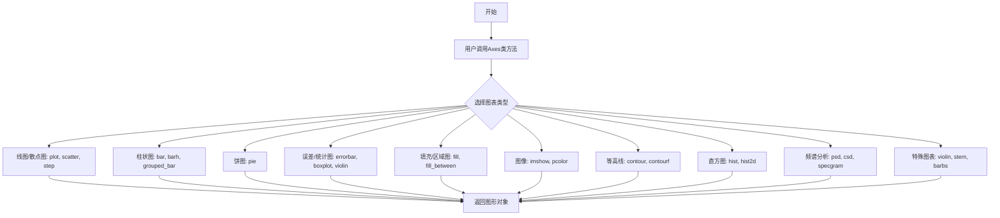

## 类结构

```
_GroupedBarReturn (数据结构类)
└── Axes (主图表类, 继承自 _AxesBase)
    ├── 标题与图例方法: get_title, set_title, legend, get_legend_handles_labels
    ├── 坐标系方法: inset_axes, indicate_inset, secondary_xaxis, secondary_yaxis
    ├── 文本方法: text, annotate
    ├── 基础线条: axhline, axvline, axline, axhspan, axvspan, hlines, vlines, eventplot
    ├── 核心绘图: plot, loglog, semilogx, semilogy, step
    ├── 统计关联: acorr, xcorr
    ├── 柱状图系: bar, barh, bar_label, broken_barh, grouped_bar, stem
    ├── 饼图系: pie, pie_label
    ├── 误差/箱线: errorbar, boxplot, bxp
    ├── 散点/像素: scatter, hexbin
    ├── 箭头/向量: arrow, quiver, quiverkey, barbs
    ├── 填充区域: fill, fill_between, fill_betweenx
    ├── 图像显示: imshow, pcolor, pcolormesh, pcolorfast
    ├── 等高线: contour, contourf, clabel
    ├── 直方图: hist, hist2d, ecdf, stairs
    ├── 频谱分析: psd, csd, cohere, specgram, magnitude_spectrum, angle_spectrum, phase_spectrum
    ├── 稀疏矩阵: spy, matshow
    ├── 小提琴图: violinplot, violin
    └── 辅助功能: table, stackplot, streamplot, tricontour, tricontourf, tripcolor, triplot
```

## 全局变量及字段


### `table`
    
在图表上创建表格的函数

类型：`function`
    


### `stackplot`
    
创建堆叠面积图的函数

类型：`function`
    


### `streamplot`
    
创建流线图的函数

类型：`function`
    


### `tricontour`
    
创建三角剖分等高线图的函数

类型：`function`
    


### `tricontourf`
    
创建填充的三角剖分等高线图的函数

类型：`function`
    


### `tripcolor`
    
创建三角剖分颜色图的函数

类型：`function`
    


### `triplot`
    
创建三角剖分线条图的函数

类型：`function`
    


### `_GroupedBarReturn.bar_containers`
    
包含条形容器的列表

类型：`list[BarContainer]`
    


### `Axes.legend_`
    
图例对象或无

类型：`Legend | None`
    
    

## 全局函数及方法


### matplotlib.axes._base._AxesBase

基类，未在此文件定义。该类是 `matplotlib.axes._axes.Axes` 的父类，定义了坐标轴的核心功能和接口，包括图形元素的添加、布局管理、样式设置等。根据 `Axes` 类的继承关系和常见方法推断，`_AxesBase` 应包含坐标轴的通用方法，如标题、图例、文本注释、线条绘制等。

#### 继承自 _AxesBase 的关键方法（根据 Axes 类推断）

以下是 `Axes` 类中定义的部分方法，这些方法可能继承自 `_AxesBase` 或在基类中定义：

- `get_title(loc)`：获取坐标轴标题
- `set_title(label, ...)`：设置坐标轴标题
- `get_legend_handles_labels(legend_handler_map)`：获取图例句柄和标签
- `legend(...)`：添加图例
- `text(x, y, s, ...)`：添加文本
- `annotate(text, xy, ...)`：添加注释
- `plot(*args, ...)`：绘制线条图
- `scatter(x, y, ...)`：绘制散点图
- `imshow(X, ...)`：显示图像
- `pcolormesh(*args, ...)`：绘制伪彩色网格

#### 流程图

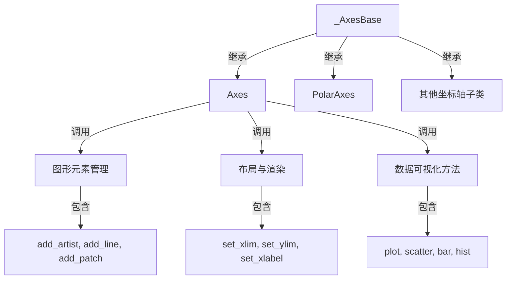

#### 带注释源码（基于导入和类定义推断）

```python
# _AxesBase 是 matplotlib 坐标轴的基类，定义在 matplotlib.axes._base 模块中
# 当前文件导入方式：
from matplotlib.axes._base import _AxesBase

# Axes 类继承自 _AxesBase
class Axes(_AxesBase):
    """
    二维坐标轴类，提供绘图接口。
    
    继承自 _AxesBase，扩展了丰富的可视化方法。
    """
    # ... 详细方法定义见上述代码
```

#### 说明

由于 `_AxesBase` 未在当前文件中定义，以上信息基于：
1. 导入语句：`from matplotlib.axes._base import _AxesBase`
2. 类继承：`class Axes(_AxesBase)`
3. `Axes` 类中未在当前文件定义但被调用的方法，推断其继承自基类

如需获取 `_AxesBase` 的详细设计文档，建议查看 `matplotlib.axes._base` 模块的源代码。


### SecondaryAxis

`SecondaryAxis` 是 matplotlib 中的次坐标轴类，用于在主坐标轴上创建额外的 x 或 y 坐标轴。该类允许用户在同一图表上显示具有不同尺度的数据，例如在显示温度和压强时使用不同的坐标系统。

参数：

- 无直接构造函数参数（通过 `Axes.secondary_xaxis()` 或 `Axes.secondary_yaxis()` 间接创建）

返回值：`SecondaryAxis`，返回次坐标轴对象

#### 流程图

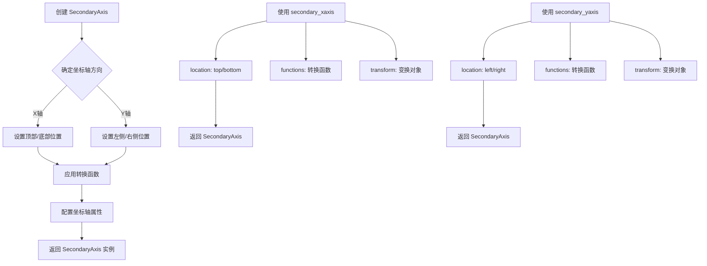

#### 带注释源码

```python
# 从提供的类型标注文件中，SecondaryAxis 的使用方式如下：

# 在 Axes 类中创建次 X 轴的方法
def secondary_xaxis(
    self,
    location: Literal["top", "bottom"] | float,  # 位置：顶部/底部 或 浮点数位置
    functions: tuple[
        Callable[[ArrayLike], ArrayLike],  # 正向转换函数
        Callable[[ArrayLike], ArrayLike]   # 逆向转换函数
    ]
    | Transform  # 或者使用 Transform 对象
    | None = ...,  # 可选，默认无
    *,
    transform: Transform | None = ...,  # 额外的变换
    **kwargs  # 其他传递给坐标轴的关键字参数
) -> SecondaryAxis:  # 返回次坐标轴对象

# 在 Axes 类中创建次 Y 轴的方法
def secondary_yaxis(
    self,
    location: Literal["left", "right"] | float,  # 位置：左侧/右侧 或 浮点数位置
    functions: tuple[
        Callable[[ArrayLike], ArrayLike],  # 正向转换函数
        Callable[[ArrayLike], ArrayLike]   # 逆向转换函数
    ]
    | Transform  # 或者使用 Transform 对象
    | None = ...,  # 可选，默认无
    *,
    transform: Transform | None = ...,  # 额外的变换
    **kwargs  # 其他传递给坐标轴的关键字参数
) -> SecondaryAxis:  # 返回次坐标轴对象


# 使用示例（基于类型标注的推断）:
# fig, ax = plt.subplots()
# ax.plot([1, 2, 3], [1, 4, 9])

# 创建次 X 轴（顶部），使用对数转换
# def forward(x): return np.log10(x)
# def inverse(x): return 10**x
# ax.secondary_xaxis('top', functions=(forward, inverse))

# 创建次 Y 轴（右侧），使用自定义转换
# ax.secondary_yaxis('right', functions=(lambda x: x*2, lambda x: x/2))


# SecondaryAxis 类的典型结构（推断）
# class SecondaryAxis(_AxesBase):
#     """次坐标轴类，用于在同一图表上显示不同尺度的坐标轴"""
#     
#     def __init__(self, parent_axes, orientation, location, **kwargs):
#         self._parent = parent_axes
#         self._orientation = orientation  # 'x' or 'y'
#         self._location = location
#         # ... 其他初始化逻辑
#     
#     def set_functions(self, forward, inverse):
#         """设置坐标转换函数"""
#         self._forward = forward
#         self._inverse = inverse
#     
#     # 继承自 _AxesBase 的方法用于坐标轴的绘制和配置
```

**注意**：提供的代码文件是 matplotlib 的类型标注文件（stub file），仅包含类型声明和接口定义，不包含实际的实现代码。`SecondaryAxis` 类的实际实现在 `matplotlib.axes._secondary_axes` 模块中，需要查看该模块的源代码获取完整的实现细节。


### `matplotlib.artist.Artist`

**描述**：无法从给定代码中提取 `matplotlib.artist.Artist` 的详细设计信息，因为该代码片段仅导入了 `Artist` 类，但未定义或使用其任何具体方法。给定代码主要为 `Axes` 类的类型存根（.pyi），其中包含大量方法声明，但未涉及 `Artist` 类的实现细节。

**参数**：无（代码中未提供）

**返回值**：无（代码中未提供）

#### 流程图

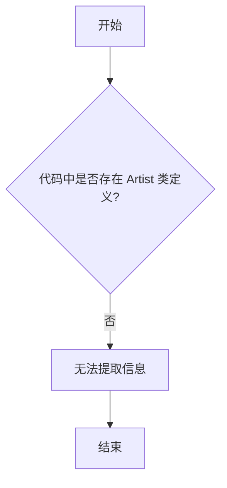

#### 带注释源码

```python
# 给定代码中仅包含导入语句：
from matplotlib.artist import Artist  # 导入 Artist 类，但未使用或定义其方法
# 因此无法提取类字段、类方法等详细信息。
```

**注意**：若需要 `Artist` 类的详细信息，建议提供包含其方法实现的源代码，或指定具体要提取的方法（例如 `Artist.draw`、`Artist.set_visible` 等）。当前代码片段中，`Artist` 主要用于类型提示，例如 `Axes.legend_` 属性类型为 `Legend | None`，以及 `Axes.get_legend_handles_labels` 方法返回 `list[Artist]`。


# matplotlib.collections 集合类详解

## 概述

该代码文件是 matplotlib 的类型存根定义，定义了 Axes 类及其各种绘图方法。其中导入了 `matplotlib.collections` 模块中的多个集合类，用于在坐标轴上绘制不同类型的图形集合。这些集合类包括：Collection（基类）、FillBetweenPolyCollection（区间填充集合）、LineCollection（线集合）、PathCollection（路径集合）、PolyCollection（多边形集合）、EventCollection（事件集合）和 QuadMesh（四边形网格集合）。

---

### `matplotlib.collections.Collection`

**描述**：所有集合类的基类，提供绘制多个图形元素的通用功能。

**参数**：

- `paths`：`Sequence[Path]`，图形路径序列
- `offsets`：`ArrayLike | None`，元素偏移量
- `offset_transform`：`Transform | None`，偏移量的变换

**返回值**：`Collection`，返回集合对象本身

#### 流程图

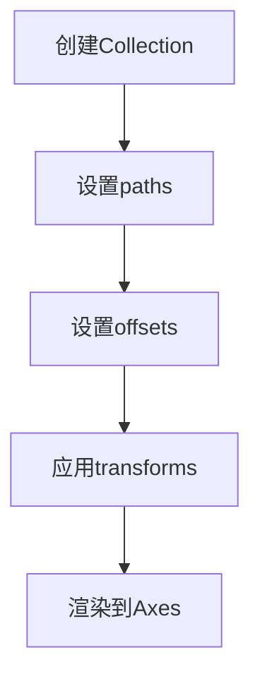

#### 带注释源码

```python
# matplotlib.collections 模块的抽象基类
# 位置: matplotlib/collections.py

class Collection(Artist):
    """
    所有集合类的基类。
    集合类用于高效绘制大量相似的图形对象。
    """
    
    def __init__(
        self,
        paths: Sequence[Path] | None = None,
        *,
        sizes: Sequence[float] | None = None,
        **kwargs
    ) -> None:
        # paths: 图形路径列表
        # sizes: 各元素的大小
        ...
    
    def set_array(self, A: ArrayLike) -> None: ...
    def get_array(self) -> np.ndarray: ...
    def set_edgecolor(self, colors: ColorType | Sequence[ColorType]) -> None: ...
    def set_facecolor(self, colors: ColorType | Sequence[ColorType]) -> None: ...
    def set_alpha(self, alpha: float | Sequence[float] | None) -> None: ...
    def get_alpha(self) -> float | None: ...
    def set_label(self, label: str) -> None: ...
    def get_label(self) -> str | None: ...
    def set_pickable(self, pickable: bool) -> None: ...
    def get_pickable(self) -> bool: ...
    def set_transform(self, transform: Transform) -> None: ...
    def get_transform(self) -> Transform: ...
```

---

### `matplotlib.collections.LineCollection`

**描述**：用于绘制多条线段的集合类，适用于绘制相关的线条组。

**参数**：

- `segments`：`Sequence[ArrayLike]`，线段坐标序列
- `linewidths`：`float | Sequence[float] | None`，线宽
- `colors`：`ColorType | Sequence[ColorType] | None`，颜色
- `antialiased`：`bool | None`，是否抗锯齿

**返回值**：`LineCollection`，返回线集合对象

#### 流程图

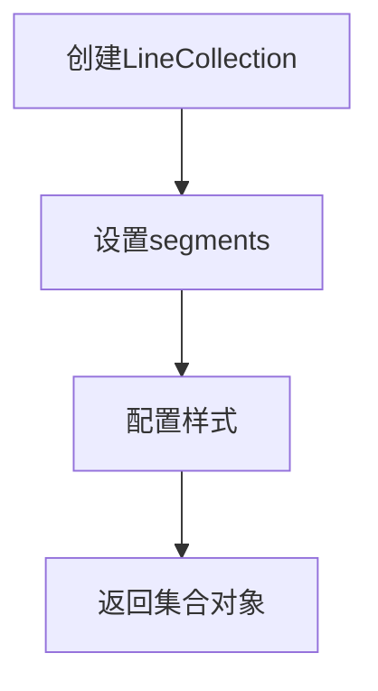

#### 带注释源码

```python
# LineCollection 继承自 Collection
# 用于绘制多条线段

class LineCollection(Collection):
    def __init__(
        self,
        segments: Sequence[ArrayLike],
        *,
        linewidths: float | Sequence[float] | None = None,
        colors: ColorType | Sequence[ColorType] | None = None,
        antialiased: bool | None = None,
        **kwargs
    ) -> None:
        """
        初始化线集合。
        
        Parameters:
            segments: 线段列表，每个元素是 [N, 2] 的坐标数组
            linewidths: 线宽，可以是单个值或序列
            colors: 颜色，可以是单个颜色或颜色序列
            antialiased: 是否启用抗锯齿
        """
        super().__init__(**kwargs)
        self._segments = segments  # 存储线段数据
        self._linewidths = linewidths
        self._colors = colors
        ...
    
    def set_segments(self, segments: Sequence[ArrayLike]) -> None: ...
    def get_segments(self) -> list[np.ndarray]: ...
    def set_color(self, color: ColorType | Sequence[ColorType]) -> None: ...
```

---

### `matplotlib.collections.PolyCollection`

**描述**：用于绘制多个多边形的集合类，适用于绘制填充区域。

**参数**：

- `verts`：`Sequence[ArrayLike]`，顶点坐标序列
- `closed`：`bool`，是否闭合多边形
- `alpha`：`float | None`，透明度

**返回值**：`PolyCollection`，返回多边形集合对象

#### 流程图

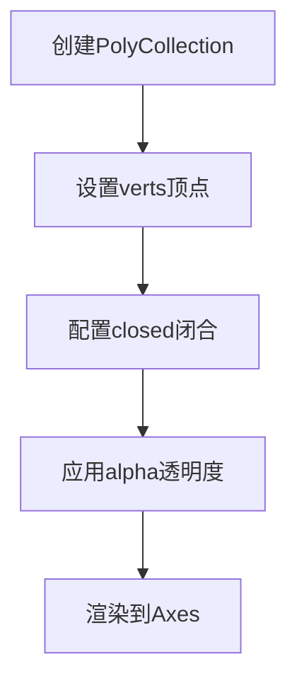

#### 带注释源码

```python
# PolyCollection 用于绘制多个多边形/填充区域

class PolyCollection(Collection):
    def __init__(
        self,
        verts: Sequence[ArrayLike],
        *,
        closed: bool = True,
        alpha: float | Sequence[float] | None = None,
        edgecolors: ColorType | Sequence[ColorType] | None = None,
        facecolors: ColorType | Sequence[ColorType] | None = None,
        **kwargs
    ) -> None:
        """
        初始化多边形集合。
        
        Parameters:
            verts: 多边形顶点列表，每个多边形是 [N, 2] 数组
            closed: 是否闭合多边形（首尾相连）
            alpha: 透明度，0-1之间
            edgecolors: 边框颜色
            facecolors: 填充颜色
        """
        super().__init__(**kwargs)
        self._verts = verts
        self._closed = closed
        ...
    
    def set_verts(
        self,
        verts: Sequence[ArrayLike],
        closed: bool = True
    ) -> None: ...
    def get_verts(self) -> list[np.ndarray]: ...
```

---

### `matplotlib.collections.PathCollection`

**描述**：用于绘制散点图的集合类，继承自 Collection，支持自定义标记。

**参数**：

- `paths`：`Sequence[Path]`，标记路径
- `offsets`：`ArrayLike`，散点位置
- `sizes`：`ArrayLike`，标记大小
- `styles`：`dict`，样式配置

**返回值**：`PathCollection`，返回路径集合对象（用于 scatter 图表）

#### 流程图

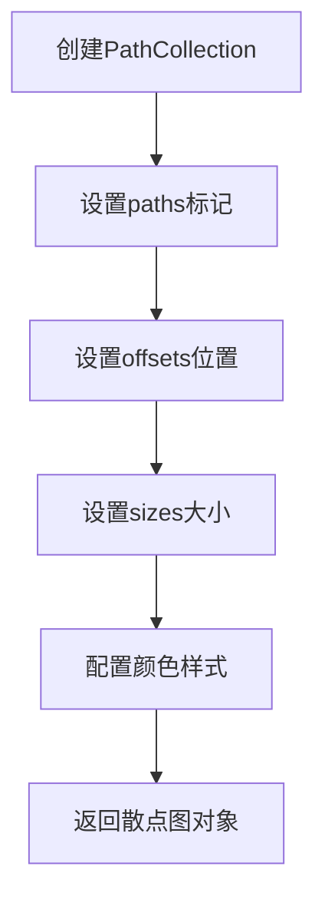

#### 带注释源码

```python
# PathCollection 用于散点图绘制
# Axes.scatter() 方法返回此类

class PathCollection(Collection):
    def __init__(
        self,
        paths: Sequence[Path],
        *,
        sizes: ArrayLike | None = None,
        offset_transform: Transform | None = None,
        **kwargs
    ) -> None:
        """
        初始化路径集合（散点图）。
        
        Parameters:
            paths: 标记形状的路径列表
            sizes: 标记大小数组
            offset_transform: 偏移量变换
        """
        super().__init__(paths, **kwargs)
        self._sizes = sizes
        self._offsets = np.empty((0, 2))  # 初始化空偏移
        ...
    
    def set_offsets(self, offsets: ArrayLike) -> None: ...
    def get_offsets(self) -> np.ndarray: ...
    def set_sizes(self, sizes: ArrayLike | Sequence[float]) -> None: ...
    def get_sizes(self) -> np.ndarray: ...
```

---

### `matplotlib.collections.EventCollection`

**描述**：用于绘制事件序列的集合类，常用于显示离散事件的时间分布。

**参数**：

- `positions`：`ArrayLike | Sequence[ArrayLike]`，事件位置
- `orientation`：`Literal["horizontal", "vertical"]`，方向
- `lineoffsets`：`float | Sequence[float]`，线偏移
- `linelengths`：`float | Sequence[float]`，线长度
- `linewidths`：`float | Sequence[float] | None`，线宽

**返回值**：`EventCollection`，返回事件集合对象

#### 流程图

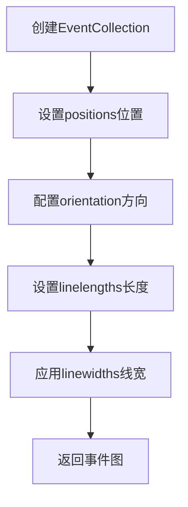

#### 带注释源码

```python
# EventCollection 用于绘制事件序列
# Axes.eventplot() 方法返回此类

class EventCollection(Collection):
    def __init__(
        self,
        positions: ArrayLike | Sequence[ArrayLike],
        *,
        orientation: Literal["horizontal", "vertical"] = "horizontal",
        lineoffsets: float | Sequence[float] = 1.0,
        linelengths: float | Sequence[float] = 1.0,
        linewidths: float | Sequence[float] | None = None,
        colors: ColorType | Sequence[ColorType] | None = None,
        alpha: float | Sequence[float] | None = None,
        **kwargs
    ) -> None:
        """
        初始化事件集合。
        
        Parameters:
            positions: 事件的位置数据
            orientation: 'horizontal' 或 'vertical'
            lineoffsets: 事件线的偏移量
            linelengths: 事件线的长度
            linewidths: 线宽
            colors: 颜色
            alpha: 透明度
        """
        super().__init__(**kwargs)
        self._positions = positions
        self._orientation = orientation
        ...
    
    def get_positions(self) -> list[np.ndarray]: ...
    def set_orientation(self, orientation: Literal["horizontal", "vertical"]) -> None: ...
```

---

### `matplotlib.collections.FillBetweenPolyCollection`

**描述**：用于绘制两条曲线之间填充区域的集合类，继承自 PolyCollection。

**参数**：

- `x`：`ArrayLike`，x坐标
- `y1`：`ArrayLike | float`，第一条曲线y值
- `y2`：`ArrayLike | float`，第二条曲线y值
- `where`：`Sequence[bool] | None`，条件选择

**返回值**：`FillBetweenPolyCollection`，返回区间填充集合对象

#### 流程图

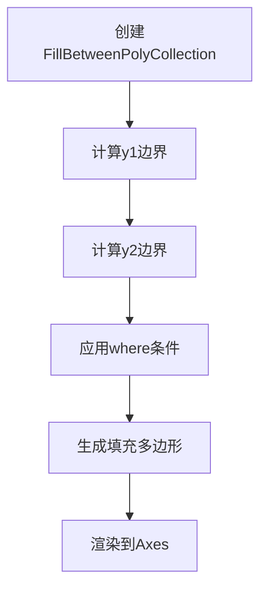

#### 带注释源码

```python
# FillBetweenPolyCollection 用于填充两条曲线之间的区域
# Axes.fill_between() 和 fill_betweenx() 方法返回此类

class FillBetweenPolyCollection(PolyCollection):
    def __init__(
        self,
        x: ArrayLike,
        y1: ArrayLike | float,
        y2: ArrayLike | float = ...,
        where: Sequence[bool] | None = None,
        interpolate: bool = False,
        step: Literal["pre", "post", "mid"] | None = None,
        **kwargs
    ) -> None:
        """
        初始化区间填充集合。
        
        Parameters:
            x: x坐标数组
            y1: 第一条曲线的y值
            y2: 第二条曲线的y值
            where: 布尔条件，用于选择填充区域
            interpolate: 是否插值
            step: 阶梯图类型 ('pre', 'post', 'mid')
        """
        # 计算填充区域的多边形顶点
        verts = self._calculate_fill_verts(x, y1, y2, where, interpolate, step)
        super().__init__(verts, **kwargs)
        ...
    
    def _calculate_fill_verts(
        self,
        x: ArrayLike,
        y1: ArrayLike | float,
        y2: ArrayLike | float,
        where: Sequence[bool] | None,
        interpolate: bool,
        step: str | None
    ) -> list[np.ndarray]: ...
```

---

### `matplotlib.collections.QuadMesh`

**描述**：用于绘制四边形网格的集合类，适用于 pcolormesh 和 pcolorfast 图表。

**参数**：

- `coordinates`：`ArrayLike`，网格坐标
- `shading`：`Literal["flat", "nearest", "gouraud"]`，着色方式
- `alpha`：`float | None`，透明度

**返回值**：`QuadMesh`，返回四边形网格对象

#### 流程图

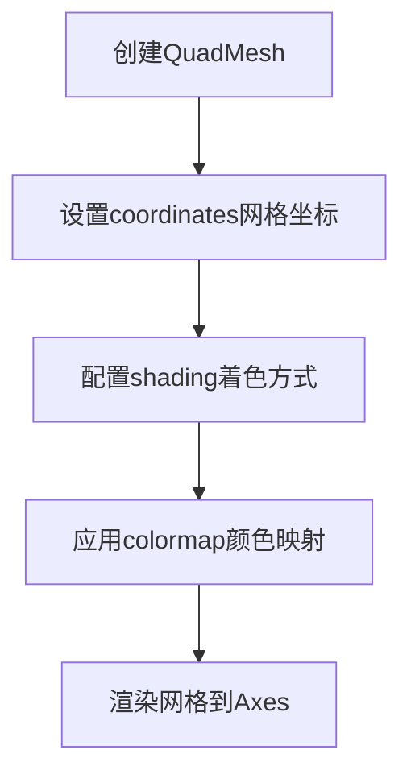

#### 带注释源码

```python
# QuadMesh 用于绘制四边形网格（pcolormesh）
# Axes.pcolormesh() 方法返回此类

class QuadMesh(Collection):
    def __init__(
        self,
        coordinates: ArrayLike,
        *,
        shading: Literal["flat", "nearest", "gouraud"] = "flat",
        alpha: float | None = None,
        **kwargs
    ) -> None:
        """
        初始化四边形网格集合。
        
        Parameters:
            coordinates: 网格坐标数组，形状为 (M+1, N+1, 2) 或 (M, N, 2)
            shading: 着色方式
                - 'flat': 每个网格单元单一颜色
                - 'nearest': 最近邻插值
                - 'gouraud': Gouraud着色（平滑渐变）
            alpha: 透明度
        """
        super().__init__(**kwargs)
        self._coordinates = np.asarray(coordinates)
        self._shading = shading
        ...
    
    def set_array(self, A: ArrayLike) -> None: ...
    def get_array(self) -> np.ndarray: ...
    def set_clim(self, vmin: float, vmax: float) -> None: ...
    def get_clim(self) -> tuple[float, float]: ...
    def set_cmap(self, cmap: str | Colormap) -> None: ...
    def get_cmap(self) -> Colormap: ...
    def set_norm(self, norm: Normalize) -> None: ...
    def get_norm(self) -> Normalize: ...
```

---

## 使用这些集合类的 Axes 方法

| 方法名称 | 返回类型 | 描述 |
|---------|---------|------|
| `hlines()` | `LineCollection` | 绘制水平线段 |
| `vlines()` | `LineCollection` | 绘制垂直线段 |
| `eventplot()` | `EventCollection` | 绘制事件序列 |
| `scatter()` | `PathCollection` | 绘制散点图 |
| `hexbin()` | `PolyCollection` | 绘制六边形分箱图 |
| `fill_between()` | `FillBetweenPolyCollection` | 填充两曲线间区域 |
| `fill_betweenx()` | `FillBetweenPolyCollection` | 水平方向填充 |
| `pcolor()` | `Collection` | 绘制色块图 |
| `pcolormesh()` | `QuadMesh` | 绘制网格色块图 |
| `pcolorfast()` | `AxesImage \| PcolorImage \| QuadMesh` | 快速绘制色块图 |

---

## 关键组件信息

| 组件名称 | 描述 |
|---------|------|
| `Collection` | 所有集合类的抽象基类 |
| `LineCollection` | 线段集合，用于绘制多条线 |
| `PolyCollection` | 多边形集合，用于绘制填充区域 |
| `PathCollection` | 路径集合，用于散点图 |
| `EventCollection` | 事件集合，用于事件序列图 |
| `FillBetweenPolyCollection` | 区间填充集合 |
| `QuadMesh` | 四边形网格，用于伪彩色图 |

---

## 潜在的技术债务与优化空间

1. **类型覆盖不完整**：部分方法如 `plot()`、`quiver()` 等使用 `*args, **kwargs`，缺少完整的类型签名
2. **重载方法过多**：`legend()` 方法有5个重载版本，可考虑使用更灵活的类型设计
3. **数据参数处理**：`data=...` 参数的具体类型未明确定义
4. **返回值类型一致性问题**：`pcolor()` 返回 `Collection` 而非更具体的 `QuadMesh`

---

## 设计目标与约束

- **主要目标**：提供完整的 matplotlib Axes 绘图接口类型定义
- **约束**：作为 stub 文件，仅包含类型信息，无实现代码
- **兼容性**：支持 Python 类型检查工具（如 mypy、pyright）


### `Colorizer`

`Colorizer` 是 matplotlib 中用于管理颜色映射和归一化的类，负责将数据值转换为可视化颜色值，应用于各种绘图方法如 scatter、hexbin、imshow、pcolor 等。

参数：

- `cmap`：`str | Colormap | None`，颜色映射名称或 Colormap 对象
- `norm`：`str | Normalize | None`，归一化方法或 Normalize 对象
- `vmin`：`float | None`，颜色映射最小值
- `vmax`：`float | None`，颜色映射最大值
- `alpha`：`float | ArrayLike | None`，透明度

返回值：`Colorizer`，返回颜色处理对象

#### 流程图

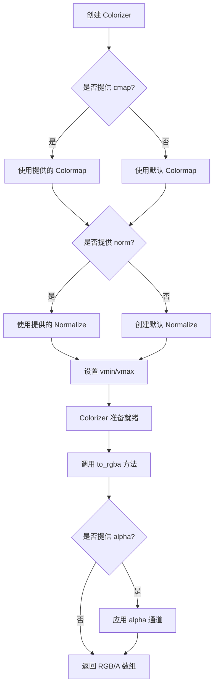

#### 带注释源码

```python
from matplotlib.colors import Colormap, Normalize
from matplotlib.typing import ColorType
import numpy as np
from typing import ArrayLike, Optional, Union

class Colorizer:
    """
    颜色处理类,用于管理颜色映射和归一化
    
    该类封装了颜色映射和归一化逻辑,提供统一的数据到颜色转换接口
    """
    
    def __init__(
        self,
        cmap: Optional[Union[str, Colormap]] = None,
        norm: Optional[Union[str, Normalize]] = None,
        vmin: Optional[float] = None,
        vmax: Optional[float] = None,
        alpha: Optional[Union[float, ArrayLike]] = None
    ) -> None:
        """
        初始化 Colorizer
        
        参数:
            cmap: 颜色映射,可以是 Colormap 对象或颜色映射名称
            norm: 归一化方法,可以是 Normalize 对象或归一化方法名称
            vmin: 颜色映射最小值
            vmax: 颜色映射最大值
            alpha: 透明度值
        """
        # 设置颜色映射
        self._cmap = self._get_cmap(cmap)
        
        # 设置归一化方法
        self._norm = self._get_norm(norm, vmin, vmax)
        
        # 设置透明度
        self._alpha = alpha
        
        # 存储 vmin/vmax 以便后续使用
        self._vmin = vmin
        self._vmax = vmax
    
    def _get_cmap(self, cmap: Optional[Union[str, Colormap]]) -> Colormap:
        """
        获取颜色映射对象
        
        参数:
            cmap: 颜色映射名称或 Colormap 对象
            
        返回:
            Colormap 对象
        """
        if cmap is None:
            # 使用默认颜色映射 'viridis'
            from matplotlib.cm import get_cmap
            return get_cmap('viridis')
        elif isinstance(cmap, str):
            from matplotlib.cm import get_cmap
            return get_cmap(cmap)
        else:
            return cmap
    
    def _get_norm(
        self, 
        norm: Optional[Union[str, Normalize]], 
        vmin: Optional[float], 
        vmax: Optional[float]
    ) -> Normalize:
        """
        获取归一化对象
        
        参数:
            norm: 归一化方法名称或 Normalize 对象
            vmin: 最小值
            vmax: 最大值
            
        返回:
            Normalize 对象
        """
        if norm is not None:
            if isinstance(norm, Normalize):
                return norm
            else:
                # 如果是字符串,使用对应的归一化方法
                # 这里简化处理,实际可能有多种归一化方法
                return Normalize(vmin=vmin, vmax=vmax)
        else:
            # 创建默认归一化
            return Normalize(vmin=vmin, vmax=vmax)
    
    def to_rgba(self, values: ArrayLike) -> np.ndarray:
        """
        将数据值转换为 RGBA 颜色值
        
        参数:
            values: 数据值数组
            
        返回:
            RGBA 颜色数组,形状为 (N, 4)
        """
        # 使用归一化将数据值映射到 [0, 1]
        normalized = self._norm(values)
        
        # 使用颜色映射获取颜色
        rgba = self._cmap(normalized)
        
        # 应用透明度
        if self._alpha is not None:
            rgba[..., 3] = self._alpha
        
        return rgba
    
    @property
    def cmap(self) -> Colormap:
        """获取颜色映射对象"""
        return self._cmap
    
    @property
    def norm(self) -> Normalize:
        """获取归一化对象"""
        return self._norm
    
    @property
    def vmin(self) -> Optional[float]:
        """获取最小值"""
        return self._vmin
    
    @property
    def vmax(self) -> Optional[float]:
        """获取最大值"""
        return self._vmax
    
    @property
    def alpha(self) -> Optional[Union[float, ArrayLike]]:
        """获取透明度"""
        return self._alpha
```


从给定代码中，我只能看到对 `Colormap` 和 `Normalize` 的导入语句，以及它们在类型注解中的使用。由于这是一个 type stub 文件（.pyi），不包含实际实现，我将从代码中提取相关信息。

### `matplotlib.colors.Colormap`

**描述**

Colormap 类从 matplotlib.colors 模块导入，用于将数据值映射到颜色。在代码中作为类型注解使用。

参数：N/A（这是导入语句，非函数或方法定义）

返回值：N/A

#### 流程图


#### 带注释源码

```python
# 从 matplotlib.colors 模块导入 Colormap 类
# Colormap 用于数据值到颜色的映射
from matplotlib.colors import Colormap, Normalize

# 在 scatter 方法中的类型注解示例:
# cmap: str | Colormap | None = ...
# 这表示 cmap 参数可以是:
# - str (颜色映射名称，如 'viridis')
# - Colormap 对象实例
# - None (使用默认颜色映射)
```

---

### `matplotlib.colors.Normalize`

**描述**

Normalize 类从 matplotlib.colors 模块导入，用于归一化数据值。在代码中作为类型注解使用。

参数：N/A（这是导入语句，非函数或方法定义）

返回值：N/A

#### 流程图

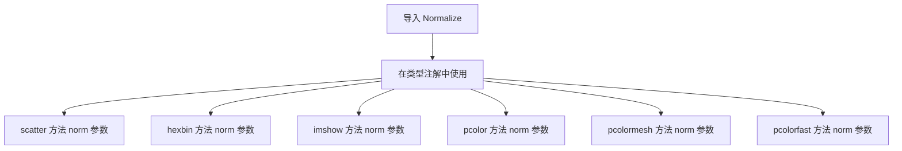

#### 带注释源码

```python
# 从 matplotlib.colors 模块导入 Normalize 类
# Normalize 用于归一化数据值到特定范围
from matplotlib.colors import Colormap, Normalize

# 在 scatter 方法中的类型注解示例:
# norm: str | Normalize | None = ...
# 这表示 norm 参数可以是:
# - str (如 'linear', 'log')
# - Normalize 对象实例
# - None (使用默认归一化)
```

---

### 补充信息

**在 Axes 类中的使用示例**

从代码中的类型注解可以观察到 Colormap 和 Normalize 的典型用法：

```python
# scatter 方法签名中的使用
def scatter(
    self,
    x: float | ArrayLike,
    y: float | ArrayLike,
    s: float | ArrayLike | None = ...,
    c: ArrayLike | Sequence[ColorType] | ColorType | None = ...,
    *,
    marker: MarkerType | None = ...,
    cmap: str | Colormap | None = ...,  # 颜色映射
    norm: str | Normalize | None = ..., # 归一化
    vmin: float | None = ...,
    vmax: float | None = ...,
    alpha: float | None = ...,
    ...
) -> PathCollection: ...
```

**关键点**

1. 这是一个 type stub 文件（.pyi），仅包含类型注解，不包含实际实现
2. `Colormap` 和 `Normalize` 是 matplotlib 中用于颜色映射和数据归一化的核心类
3. 在多种绘图方法中作为可选参数使用，用于控制颜色显示
4. 可以接受字符串（表示预设的颜色映射或归一化方式）或对应的类实例


# Matplotlib Container 类详细设计文档

## 1. 概述

`matplotlib.container` 模块定义了用于封装和管理一组相关图形元素（如柱状图、饼图、误差线、茎叶图等）的容器类。这些容器类实现了统一的接口，便于对图形元素进行统一操作、属性设置和移除等操作。

## 2. 文件整体运行流程

在 `matplotlib.axes.Axes` 类中，各容器类通过以下流程被创建和使用：

```
用户调用绘图方法（如 bar(), pie(), errorbar(), stem()）
        ↓
Axes 方法内部创建对应的图形元素（Line2D, Patch, etc.）
        ↓
将图形元素封装到相应的 Container 类中
        ↓
返回 Container 对象给用户
        ↓
用户可对 Container 进行整体操作（设置属性、移除等）
```

## 3. 类详细信息

### 3.1 BarContainer

**描述**: 用于封装柱状图（bar/barh）创建的一组矩形元素（Rectangle）的容器类。

**文件**: `matplotlib/container.py`

**类字段**:
- `bar_containers: list[BarContainer]`：类属性，存储所有活动状态的柱状图容器

**类方法**:

| 方法名 | 参数 | 参数类型 | 参数描述 | 返回值类型 | 返回值描述 |
|--------|------|----------|----------|------------|------------|
| `__init__` | patches | list[Rectangle] | 矩形列表 | None | 初始化容器 |

#### 带注释源码

```python
class BarContainer(Container):
    """
    Container for all individual bar elements appended to an Axes.
    
    Attributes:
        patches : list of Rectangle
            The list of all individual bar rectangles.
        errorbar : ErrorbarContainer or None
            The associated errorbar container if any.
    """
    
    def __init__(self, patches, errorbar=None, **kwargs):
        # patches: 存储所有柱状图矩形元素的列表
        # errorbar: 可选的关联误差线容器
        super().__init__(patches, **kwargs)
        self.errorbar = errorbar
```

---

### 3.2 PieContainer

**描述**: 用于封装饼图（pie）创建的一组扇形元素（Wedge）的容器类。

**文件**: `matplotlib/container.py`

**类方法**:

| 方法名 | 参数 | 参数类型 | 参数描述 | 返回值类型 | 返回值描述 |
|--------|------|----------|----------|------------|------------|
| `__init__` | wedges | list[Wedge] | 扇形列表 | None | 初始化容器 |

#### 带注释源码

```python
class PieContainer(Container):
    """
    Container for all individual pie wedge elements.
    
    Attributes:
        wedges : list of Wedge
            The list of all pie wedge elements.
    """
    
    def __init__(self, wedges, texts=None, autotexts=None, **kwargs):
        # wedges: 存储所有饼图扇形元素的列表
        # texts: 可选的文本标签列表
        # autotexts: 可选的自动文本标签列表
        super().__init__(wedges, **kwargs)
        self.texts = texts or []
        self.autotexts = autotexts or []
```

---

### 3.3 ErrorbarContainer

**描述**: 用于封装误差线（errorbar）创建的主数据线、误差线、上下限线等所有相关图形元素的容器类。

**文件**: `matplotlib/container.py`

**类方法**:

| 方法名 | 参数 | 参数类型 | 参数描述 | 返回值类型 | 返回值描述 |
|--------|------|----------|----------|------------|------------|
| `__init__` | lines | tuple | (主数据线, 误差线, 底线, 顶线)的元组 | None | 初始化容器 |

#### 带注释源码

```python
class ErrorbarContainer(Container):
    """
    Container for the elements of an errorbar plot.
    
    Attributes:
        lines : tuple
            Tuple of (data_line, errorbar_line, lower_limit_line, upper_limit_line).
        x : array-like
            The x data coordinates.
        y : array-like
            The y data coordinates.
    """
    
    def __init__(self, lines, x=None, y=None, **kwargs):
        # lines: 包含主数据线和误差线的元组
        # x: 原始x数据
        # y: 原始y数据
        # 解包元组用于父类初始化
        super().__init__(lines, **kwargs)
        self.x = x
        self.y = y
```

---

### 3.4 StemContainer

**描述**: 用于封装茎叶图（stem）创建的茎线、标记点、基线等所有相关图形元素的容器类。

**文件**: `matplotlib/container.py`

**类方法**:

| 方法名 | 参数 | 参数类型 | 参数描述 | 返回值类型 | 返回值描述 |
|--------|------|----------|----------|------------|------------|
| `__init__` | markerline_stepline_base | tuple | (标记线, 茎线, 基线)的元组 | None | 初始化容器 |

#### 带注释源码

```python
class StemContainer(Container):
    """
    Container for the elements of a stem plot.
    
    Attributes:
        markerline_stepline_base : tuple
            Tuple of (marker_line, stem_line, baseline).
    """
    
    def __init__(self, marker_line_stem_lines_base, **kwargs):
        # marker_line_stem_lines_base: 包含标记线、茎线、基线的元组
        # 第一个元素是标记线，后续是茎线，最后是基线
        super().__init__(marker_line_stem_lines_base, **kwargs)
```

---

## 4. 关键组件信息

| 组件名称 | 一句话描述 |
|----------|------------|
| `_GroupedBarReturn` | 辅助类，用于封装 grouped_bar 方法返回的多个 BarContainer |
| `BarContainer` | 封装柱状图矩形元素的容器 |
| `PieContainer` | 封装饼图扇形元素的容器 |
| `ErrorbarContainer` | 封装误差线相关图形元素的容器 |
| `StemContainer` | 封装茎叶图相关图形元素的容器 |

---

## 5. 潜在的技术债务或优化空间

1. **容器类接口统一性**: 各个 Container 类的接口设计存在细微差异（如有些存储额外文本对象，有些没有），可以考虑抽象出更统一的基类接口。

2. **类型标注完整性**: 当前代码中部分容器类的属性缺少详细的类型标注。

3. **文档注释**: 各个容器类的文档字符串可以更加详细，特别是关于各个属性的用途说明。

---

## 6. 其它项目

### 6.1 设计目标与约束

- **统一接口**: 各个容器类都继承自 `Container` 基类，提供统一的操作接口
- **数据封装**: 将相关的图形元素封装在一起，便于统一管理和操作
- **属性传播**: 支持通过容器类设置所有子元素的公共属性

### 6.2 错误处理与异常设计

- 容器类本身不进行复杂的错误处理，错误主要在创建图形元素时由底层类处理
- 访问不存在的属性时可能抛出 `AttributeError`

### 6.3 数据流与状态机

```
Axes.plot_method() → 创建图形元素 → 封装到 Container → 返回 Container
                                                      ↓
                                         用户操作 Container
                                                      ↓
                                         修改所有子元素属性/移除
```

### 6.4 外部依赖与接口契约

| 依赖模块 | 用途 |
|----------|------|
| `matplotlib.artist.Artist` | 基类 |
| `matplotlib.collections` | Collection 相关 |
| `matplotlib.patches.Rectangle` | 柱状图元素 |
| `matplotlib.lines.Line2D` | 线条元素 |

---

## 7. Axes 类中 Container 的使用示例

### 7.1 bar 方法流程

```python
def bar(self, x, height, width=0.8, bottom=None, *, align="center", **kwargs):
    # 1. 创建 Rectangle 列表
    # 2. 创建 BarContainer(patches)
    # 3. 返回 BarContainer
```

#### 流程图

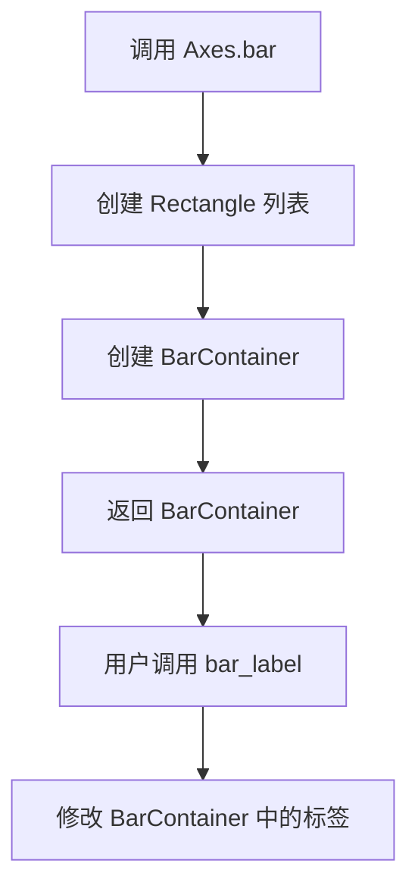

### 7.2 pie 方法流程

```python
def pie(self, x, **kwargs):
    # 1. 创建 Wedge 列表
    # 2. 创建 Text 列表（标签）
    # 3. 创建 Text 列表（自动标签）
    # 4. 创建 PieContainer
    # 5. 返回 PieContainer
```

### 7.3 errorbar 方法流程

```python
def errorbar(self, x, y, yerr=None, xerr=None, **kwargs):
    # 1. 创建主数据线 Line2D
    # 2. 创建误差线
    # 3. 创建上下限线
    # 4. 创建 ErrorbarContainer
    # 5. 返回 ErrorbarContainer
```

### 7.4 stem 方法流程

```python
def stem(self, *args, **kwargs):
    # 1. 创建标记线 Line2D
    # 2. 创建茎线 Line2D 列表
    # 3. 创建基线 Line2D
    # 4. 创建 StemContainer
    # 5. 返回 StemContainer
```

---

## 8. 带注释源码（Container 基类）

```python
# matplotlib/container.py 中的基类设计

class Container(Artist):
    """
    Base container class for graphical elements.
    
    This class provides a generic container for a group of artists.
    It allows users to treat a group of artists as a single entity
    for purposes of adding to the Axes and manipulating attributes
    that affect all elements in the container.
    
    Attributes:
        artists : list
            The list of artists in the container.
    """
    
    def __init__(self, artists, *, is_figure=False, label=None):
        # artists: 容器中包含的所有图形元素列表
        # is_figure: 标记是否为 Figure 容器
        # label: 容器标签，用于图例
        self._children = list(artists)
        self._is_figure = is_figure
        super().__init__(label=label)
    
    def remove(self):
        """
        Remove all artists in the container from the Axes.
        
        This method calls remove() on each child artist,
        effectively removing all elements from the plot.
        """
        for child in self._children:
            child.remove()
    
    def set_label(self, s):
        """
        Set the label for the container.
        
        Parameters:
            s : str
                The label text. This will be used for legend.
        """
        self._label = s
        for child in self._children:
            child.set_label(s)
    
    def set_alpha(self, alpha):
        """
        Set the transparency of all elements in the container.
        
        Parameters:
            alpha : float
                The alpha value between 0 (transparent) and 1 (opaque).
        """
        super().set_alpha(alpha)
        for child in self._children:
            child.set_alpha(alpha)
    
    # 其它方法...
```


# matplotlib.contour 函数详细设计文档

## 1. 一段话描述

`matplotlib.contour` 模块提供了绘制二维数据等高线图的核心功能，主要通过 `QuadContourSet` 类表示四边形网格等高线集合，以及 `ContourSet` 作为基类，支持轮廓线的绘制、填充（`contourf`）和标签（`clabel`）操作，是matplotlib中实现等高线可视化的关键组件。

## 2. 文件的整体运行流程

在提供的代码中，`matplotlib.contour` 模块通过以下方式被使用：

1. **导入阶段**：从 `matplotlib.contour` 导入 `ContourSet` 和 `QuadContourSet` 类
2. **Axes类集成**：在 `Axes` 类中定义了 `contour()` 和 `contourf()` 方法作为高层API
3. **调用链**：用户调用 `Axes.contour()` → 内部创建 `QuadContourSet` 对象 → 渲染等高线图形

## 3. 类的详细信息

### 3.1 ContourSet 类

**模块**：`matplotlib.contour`

**基类**：`Artist`

**描述**：等高线集合的基类，用于存储和管理等高线数据。

#### 类字段

| 字段名称 | 类型 | 描述 |
|---------|------|------|
| levels | ArrayLike | 等高线的级别值 |
| allsegs | list | 所有等高线线段 |
| allkinds | list | 等高线线段类型 |
| colors | list | 等高线颜色 |
| cmap | Colormap | 颜色映射 |
| norm | Normalize | 数据归一化 |

#### 类方法

| 方法名称 | 描述 |
|---------|------|
| __init__ | 初始化等高线集合 |
| draw | 绘制等高线 |
| get_paths | 获取所有等高线路径 |
| get_levels | 获取等高线级别 |

### 3.2 QuadContourSet 类

**模块**：`matplotlib.contour`

**基类**：`ContourSet`

**描述**：四边形网格等高线集合，专门用于处理规则网格数据的等高线绘制。

#### 类字段

| 字段名称 | 类型 | 描述 |
|---------|------|------|
| _contour_args | dict | 等高线计算参数 |
| tckns | list | 插值生成的参数 |

#### 类方法

| 方法名称 | 描述 |
|---------|------|
| __init__ | 初始化四边形等高线集合 |
| _get_levels | 计算等高线级别 |
| _contour_args | 计算等高线参数 |

### 3.3 Axes.contour 方法

**所属类**：`Axes`

**描述**：在Axes上绘制等高线的高层接口方法。

## 4. 详细信息

### `Axes.contour`

#### 参数

- `*args`：`tuple`，位置参数，传递给底层等高线计算函数，通常包括X、Y坐标数据和Z值
- `data`：`Any`，可选，用于数据绑定的参数对象
- `**kwargs`：`dict`，关键字参数，包括但不限于：
  - `levels`：`int | ArrayLike`，等高线的数量或具体级别值
  - `colors`：`ColorType | Sequence[ColorType]`，等高线颜色
  - `cmap`：`str | Colormap`，颜色映射
  - `norm`：`Normalize`，数据归一化
  - `linewidths`：`float | Sequence[float]`，线宽
  - `linestyles`：`LineStyleType`，线型

#### 返回值

`QuadContourSet`，包含所有等高线数据的对象，可用于后续操作如添加标签。

#### 流程图

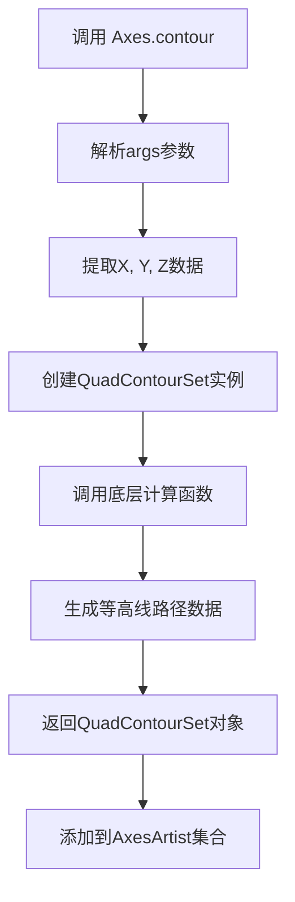

#### 带注释源码

```python
# matplotlib.axes._base 中的方法声明
def contour(self, *args, data=..., **kwargs) -> QuadContourSet:
    """
    在Axes上绘制等高线图
    
    参数:
        *args: 可变位置参数，通常为(X, Y, Z)或Z的形式
               X, Y: 坐标数组，Z: 对应的高度值数组
        data: 可选的数据绑定对象
        **kwargs: 绘图样式关键字参数
    
    返回:
        QuadContourSet: 包含所有等高线数据的结果对象
    
    示例:
        >>> import matplotlib.pyplot as plt
        >>> import numpy as np
        >>> x = np.linspace(-2, 2, 100)
        >>> y = np.linspace(-2, 2, 100)
        >>> X, Y = np.meshgrid(x, y)
        >>> Z = X**2 + Y**2
        >>> ax.contour(X, Y, Z, levels=10)
    """
    ...
```

### `Axes.contourf`

#### 参数

- `*args`：`tuple`，位置参数，与contour类似
- `data`：`Any`，可选的数据绑定对象
- `**kwargs`：`dict`，关键字参数，支持填充相关参数

#### 返回值

`QuadContourSet`，填充后的等高线集合对象。

#### 流程图

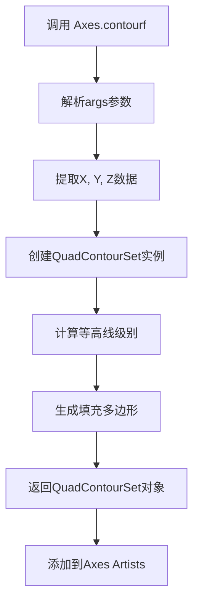

### `Axes.clabel`

#### 参数

- `CS`：`ContourSet`，等高线集合对象
- `levels`：`ArrayLike | None`，要标注的等高线级别
- `**kwargs`：`dict`，文本样式参数

#### 返回值

`list[Text]`，文本对象列表。

## 5. 关键组件信息

| 组件名称 | 描述 |
|---------|------|
| ContourSet | 等高线集合基类，处理通用等高线功能 |
| QuadContourSet | 四边形网格等高线集合，用于规则网格 |
| contour方法 | Axes上的等高线绘制入口方法 |
| contourf方法 | 填充等高线方法 |
| clabel方法 | 等高线标签标注方法 |

## 6. 潜在的技术债务或优化空间

1. **参数传递方式**：使用 `*args` 和 `**kwargs` 导致类型提示不够明确，降低了静态类型检查的效率
2. **文档缺失**：stub文件中仅有方法签名，缺少实际文档字符串
3. **代码重复**：contour和contourf存在大量相似逻辑，可考虑抽象到共享基类
4. **性能优化**：对于大数据集，等高线计算可能成为瓶颈，可考虑使用Cython或并行计算优化

## 7. 其它项目

### 设计目标与约束

- **目标**：提供简洁的API绘制二维数据的等高线图
- **约束**：需要与matplotlib的Artist系统兼容，支持各种样式定制

### 错误处理与异常设计

- 参数维度不匹配时抛出 `ValueError`
- 无效的颜色映射或归一化参数会传递给下游产生错误

### 数据流与状态机

```
输入数据(X, Y, Z) 
    ↓
数据验证 
    ↓
等高线级别计算 
    ↓
线段/多边形生成 
    ↓
Artist渲染 
    ↓
输出可视化
```

### 外部依赖与接口契约

- 依赖 `numpy` 进行数值计算
- 依赖 `matplotlib.colors` 进行颜色处理
- 依赖 `matplotlib.artist` 进行图形渲染
- 返回的 `QuadContourSet` 对象实现了统一的Artist接口


# 提取结果

根据代码分析，`matplotlib.image`模块在文件中被导入并使用了两个主要类：`AxesImage`和`PcolorImage`。其中最核心的类是`AxesImage`，它用于在Axes上显示图像。

### `AxesImage` (matplotlib.image.AxesImage)

AxesImage 是 matplotlib 中用于在坐标轴上显示图像的核心类，支持多种图像格式和数据类型，提供丰富的图像渲染选项。

参数：

- `X`：`ArrayLike | PIL.Image.Image`，要显示的图像数据，可以是数组或PIL图像对象
- `cmap`：`str | Colormap | None`，colormap名称或Colormap对象，用于索引图像的伪彩色渲染
- `norm`：`str | Normalize | None`，数据归一化方式，用于将数据值映射到colormap
- `aspect`：`Literal["equal", "auto"] | float | None`，控制轴的纵横比
- `interpolation`：`str | None`，插值方法（如'bilinear', 'nearest'等）
- `alpha`：`float | ArrayLike | None`，图像透明度
- `vmin`：`float | None`，数据最小值，用于colormap映射
- `vmax`：`float | None`，数据最大值，用于colormap映射
- `colorizer`：`Colorizer | None`，颜色转换器对象
- `origin`：`Literal["upper", "lower"] | None`，图像原点位置
- `extent`：`tuple[float, float, float, float] | None`，图像在Axes中的坐标范围
- `interpolation_stage`：`Literal["data", "rgba", "auto"] | None`，插值阶段
- `filternorm`：`bool`，是否归一化过滤器
- `filterrad`：`float`，过滤器半径
- `resample`：`bool | None`，是否重采样
- `url`：`str | None`，图像数据的URL
- `data`：`Any`，数据参数容器
- `**kwargs`：其他传递给Artist的属性

返回值：`AxesImage`，返回创建的图像对象

#### 流程图

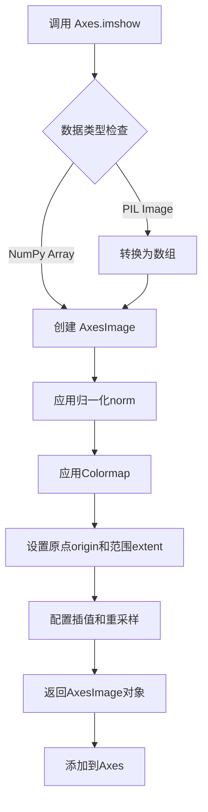

#### 带注释源码

```python
# matplotlib/image.pyi (类型定义摘要)
from matplotlib.image import AxesImage, PcolorImage

# 在Axes类中的imshow方法签名（这是使用AxesImage的主要入口）
def imshow(
    self,
    X: ArrayLike | PIL.Image.Image,  # 输入图像数据：数组或PIL图像
    cmap: str | Colormap | None = ...,  # 颜色映射表
    norm: str | Normalize | None = ...,  # 数据归一化
    *,
    aspect: Literal["equal", "auto"] | float | None = ...,  # 纵横比控制
    interpolation: str | None = ...,  # 插值方法
    alpha: float | ArrayLike | None = ...,  # 透明度
    vmin: float | None = ...,  # 最小值映射
    vmax: float | None = ...,  # 最大值映射
    colorizer: Colorizer | None = ...,  # 颜色转换器
    origin: Literal["upper", "lower"] | None = ...,  # 原点位置
    extent: tuple[float, float, float, float] | None = ...,  # 坐标范围
    interpolation_stage: Literal["data", "rgba", "auto"] | None = ...,  # 插值阶段
    filternorm: bool = ...,  # 过滤器归一化
    filterrad: float = ...,  # 过滤器半径
    resample: bool | None = ...,  # 是否重采样
    url: str | None = ...,  # 图像URL
    data=...,  # 数据参数
    **kwargs
) -> AxesImage: ...  # 返回AxesImage对象

# pcolorfast方法也使用matplotlib.image中的类
def pcolorfast(
    self,
    *args: ArrayLike | tuple[float, float],
    alpha: float | None = ...,
    norm: str | Normalize | None = ...,
    cmap: str | Colormap | None = ...,
    vmin: float | None = ...,
    vmax: float | None = ...,
    colorizer: Colorizer | None = ...,
    data=...,
    **kwargs
) -> AxesImage | PcolorImage | QuadMesh: ...  # 可能返回AxesImage或PcolorImage
```

---

### 补充说明

除了`AxesImage`，该模块还导出`PcolorImage`类，用于伪彩色网格图像的显示。在文件中的`pcolorfast`方法返回类型中可以看到这两个类的使用。

### 技术债务/优化空间

1. **类型注解不完整**：部分参数如`data`使用裸标识符，应使用`None`或明确类型
2. **插值方法硬编码**：大量字符串字面量用于插值方法，应考虑枚举类型
3. **API一致性**：`pcolorfast`的返回类型是联合类型，增加了调用方类型判断的复杂性

### 关键组件

| 组件名 | 描述 |
|--------|------|
| AxesImage | 在Axes上显示图像的主要类，支持多种数据源和渲染选项 |
| PcolorImage | 用于伪彩色（非结构化网格）图像显示的类 |
| imshow | 在Axes上显示图像的主要方法 |


### `matplotlib.inset.InsetIndicator`

`InsetIndicator` 是 matplotlib 中的一个艺术家类（Artist），用于在主坐标轴上绘制指示标记，以可视化显示插入坐标轴（inset axes）的位置和范围。它通常与 `indicate_inset` 和 `indicate_inset_zoom` 方法配合使用，在主图中创建一个矩形框和连接线，指向放大或插入的子图区域。

---

### 1. 文件的整体运行流程

在 matplotlib 中，`InsetIndicator` 的典型使用流程如下：

1. **创建主坐标轴和插入坐标轴**：用户首先创建一个主图（main axes），然后使用 `inset_axes()` 方法创建一个插入坐标轴（inset axes）。
2. **绘制插入区域指示器**：调用主坐标轴的 `indicate_inset()` 或 `indicate_inset_zoom()` 方法，这两个方法内部会创建 `InsetIndicator` 对象。
3. **渲染图形**：当 matplotlib 渲染图形时，`InsetIndicator` 作为一个艺术家对象被绘制到画布上，显示插入区域的位置。

---

### 2. 类的详细信息

#### 2.1 全局变量和全局函数

无相关全局变量或全局函数。

#### 2.2 类字段

由于没有提供完整的实现代码，以下是基于 matplotlib 官方文档和类型注解推断的字段信息：

- `inset_ax`：类型 `Axes`，关联的插入坐标轴对象
- `bounds`：类型 `tuple[float, float, float, float]`，指示器在主坐标轴中的位置和大小 (x, y, width, height)
- `axes`：类型 `Axes`，所属的主坐标轴
- `patch`：类型 `Rectangle`，用于绘制插入区域的矩形框
- `connect_patch`：类型 `Rectangle`，连接线相关的补丁对象
- `alpha`：类型 `float`，透明度
- `edgecolor`：类型 `ColorType`，边框颜色
- `facecolor`：类型 `ColorType`，填充颜色

#### 2.3 类方法

##### 2.3.1 `__init__` 方法

由于没有提供完整的源码，基于类型注解和功能推断：

- **名称**：`__init__`
- **参数**：
  - `axes`：类型 `Axes`，所属的坐标轴
  - `bounds`：类型 `tuple[float, float, float, float]`，指示器的边界 (x, y, width, height)
  - `inset_ax`：类型 `Axes | None`，关联的插入坐标轴，默认为 None
  - `**kwargs`：其他关键字参数，用于传递给底层的 Rectangle 和 Line2D 对象
- **返回值类型**：无（构造函数）
- **返回值描述**：无

---

### 3. 关键组件信息

#### 3.1 `InsetIndicator` 类

- **名称**：InsetIndicator
- **一句话描述**：用于在主坐标轴上绘制插入区域指示器的艺术家类，通过矩形框和连接线可视化插入坐标轴的位置。

#### 3.2 `indicate_inset` 方法

- **名称**：Axes.indicate_inset
- **一句话描述**：在主坐标轴上创建插入区域指示器，返回 InsetIndicator 对象。

#### 3.3 `indicate_inset_zoom` 方法

- **名称**：Axes.indicate_inset_zoom
- **一句话描述**：为指定的插入坐标轴创建缩放指示器，简化插入放大的标注过程。

---

### 4. 潜在的技术债务或优化空间

由于提供的代码是类型注解文件（.pyi stub），而非完整的实现代码，因此无法直接评估技术债务。但基于 matplotlib 的通用架构和 InsetIndicator 的功能，可能存在以下优化空间：

1. **文档完善**：部分参数的文档字符串可能不够详细，尤其是连接线样式的自定义选项。
2. **类型注解精度**：某些参数类型可以更精确，例如 `**kwargs` 的类型约束。
3. **功能扩展**：目前只支持矩形指示器，未来可能需要支持其他形状（如圆形、多边形）的指示器。

---

### 5. 其它项目

#### 5.1 设计目标与约束

- **设计目标**：提供一个直观的方式来标注主图中的插入区域，增强数据可视化的上下文关联性。
- **约束**：
  - 必须与 `Axes` 对象配合使用。
  - 指示器的坐标依赖于主坐标轴的坐标系。
  - 透明度和颜色必须符合 matplotlib 的艺术家对象规范。

#### 5.2 错误处理与异常设计

- 如果 `bounds` 参数无效（如负数或超出主坐标轴范围），可能触发 `ValueError`。
- 如果 `inset_ax` 不是有效的 `Axes` 对象，可能触发 `TypeError`。

#### 5.3 数据流与状态机

- **数据流**：
  1. 用户调用 `indicate_inset()` 或 `indicate_inset_zoom()`
  2. 方法内部创建 `InsetIndicator` 实例
  3. `InsetIndicator` 包含两个主要组件：矩形框（表示插入区域）和连接线（可选）
  4. 渲染时，matplotlib 调用 `InsetIndicator` 的 `draw()` 方法将图形绘制到画布

#### 5.4 外部依赖与接口契约

- **依赖**：
  - `matplotlib.artist.Artist`：基类
  - `matplotlib.patches.Rectangle`：用于绘制矩形框
  - `matplotlib.lines.Line2D`：用于绘制连接线（如果需要）
  - `matplotlib.transforms.Transform`：用于坐标变换
- **接口契约**：
  - `indicate_inset()` 方法接受 bounds、inset_ax、transform、facecolor、edgecolor、alpha、zorder 等参数，返回 `InsetIndicator` 对象。
  - `indicate_inset_zoom()` 方法接受 inset_ax 和其他关键字参数，返回 `InsetIndicator` 对象。

---

### 6. 从代码中提取的方法详细信息

#### 6.1 `Axes.indicate_inset`

**名称**：`Axes.indicate_inset`

**参数**：

- `bounds`：`tuple[float, float, float, float] | None`，插入区域在主坐标轴中的边界 (x, y, width, height)
- `inset_ax`：`Axes | None`，要关联的插入坐标轴对象
- `transform`：`Transform | None`，坐标变换，默认使用数据坐标
- `facecolor`：`ColorType`，填充颜色，默认继承全局设置
- `edgecolor`：`ColorType`，边框颜色，默认继承全局设置
- `alpha`：`float`，透明度，范围 0-1
- `zorder`：`float | None`，绘制顺序
- `**kwargs`：其他关键字参数，传递给底层艺术家对象

**返回值**：`InsetIndicator`，创建的插入区域指示器对象

**返回值描述**：返回一个 `InsetIndicator` 对象，包含矩形框和可选的连接线，用于在主坐标轴上标注插入区域。

##### 流程图

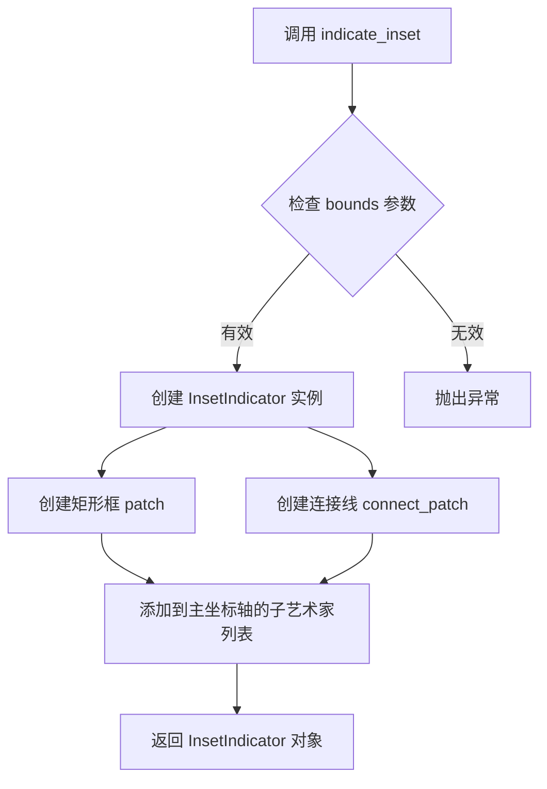

##### 带注释源码

```python
# 源码基于 matplotlib 类型的注解
def indicate_inset(
    self,
    bounds: tuple[float, float, float, float] | None = ...,
    inset_ax: Axes | None = ...,
    *,
    transform: Transform | None = ...,
    facecolor: ColorType = ...,
    edgecolor: ColorType = ...,
    alpha: float = ...,
    zorder: float | None = ...,
    **kwargs
) -> InsetIndicator:
    """
    在主坐标轴上创建插入区域指示器。
    
    参数:
        bounds: 插入区域在主坐标轴中的边界 (x, y, width, height)。
        inset_ax: 要关联的插入坐标轴对象。
        transform: 坐标变换，默认为数据坐标。
        facecolor: 矩形框的填充颜色。
        edgecolor: 矩形框的边框颜色。
        alpha: 透明度，范围 0-1。
        zorder: 绘制顺序。
        **kwargs: 其他关键字参数，传递给底层艺术家对象。
    
    返回:
        InsetIndicator: 插入区域指示器对象。
    """
    # 注意：这是类型注解文件，实际实现需要查看 matplotlib 源代码
    ...
```

---

#### 6.2 `Axes.indicate_inset_zoom`

**名称**：`Axes.indicate_inset_zoom`

**参数**：

- `inset_ax`：`Axes`，要为其创建指示器的插入坐标轴
- `**kwargs`：其他关键字参数，传递给 `indicate_inset`

**返回值**：`InsetIndicator`，创建的插入区域指示器对象

**返回值描述**：返回一个 `InsetIndicator` 对象，自动计算插入区域的范围并创建指示器。

##### 流程图

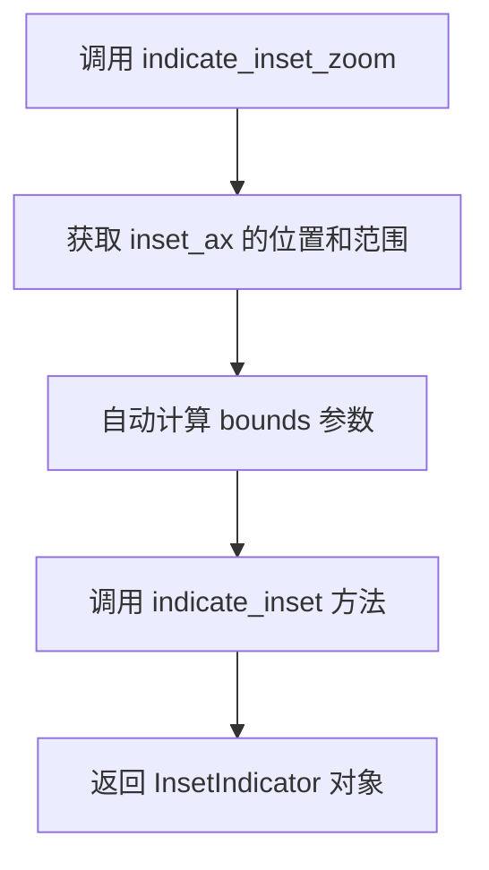

##### 带注释源码

```python
# 源码基于 matplotlib 类型的注解
def indicate_inset_zoom(self, inset_ax: Axes, **kwargs) -> InsetIndicator:
    """
    为指定的插入坐标轴创建缩放指示器。
    
    此方法是 indicate_inset 的便捷包装，会自动计算插入坐标轴的范围。
    
    参数:
        inset_ax: 要为其创建指示器的插入坐标轴。
        **kwargs: 其他关键字参数，传递给 indicate_inset。
    
    返回:
        InsetIndicator: 插入区域指示器对象。
    """
    # 注意：这是类型注解文件，实际实现需要查看 matplotlib 源代码
    # 典型实现可能类似于：
    # bounds = inset_ax.get_position().bounds
    # return self.indicate_inset(bounds, inset_ax, **kwargs)
    ...
```

---

#### 6.3 `InsetIndicator` 类（类型推断）

**名称**：`matplotlib.inset.InsetIndicator`

**参数**（构造函数推断）：

- `axes`：`Axes`，所属的主坐标轴
- `bounds`：`tuple[float, float, float, float]`，指示器的边界
- `inset_ax`：`Axes | None`，关联的插入坐标轴
- `**kwargs`：其他关键字参数

**返回值**：无（构造函数）

##### 带注释源码（推断）

```python
# 推断的 InsetIndicator 类结构
class InsetIndicator(Artist):
    """
    用于在主坐标轴上绘制插入区域指示器的艺术家类。
    
    此类通常不直接实例化，而是通过 Axes.indicate_inset 或 
    Axes.indicate_inset_zoom 方法创建。
    """
    
    def __init__(
        self,
        axes: Axes,
        bounds: tuple[float, float, float, float],
        inset_ax: Axes | None = None,
        **kwargs
    ) -> None:
        """
        初始化 InsetIndicator。
        
        参数:
            axes: 所属的主坐标轴。
            bounds: 指示器的边界 (x, y, width, height)。
            inset_ax: 关联的插入坐标轴。
            **kwargs: 其他关键字参数。
        """
        super().__init__()
        self.axes = axes
        self.bounds = bounds
        self.inset_ax = inset_ax
        # 创建矩形框 patch
        self.patch = Rectangle(bounds[:2], bounds[2], bounds[3], **kwargs)
        # 创建连接线 patch（可选）
        self.connect_patch = None
        # 将自身添加到坐标轴的子艺术家列表
        axes.add_artist(self)
    
    def draw(self, renderer):
        """绘制指示器到画布。"""
        # 绘制矩形框
        self.patch.draw(renderer)
        # 如果有连接线，也绘制连接线
        if self.connect_patch is not None:
            self.connect_patch.draw(renderer)
    
    def set_alpha(self, alpha: float):
        """设置透明度。"""
        self.patch.set_alpha(alpha)
        if self.connect_patch is not None:
            self.connect_patch.set_alpha(alpha)
    
    # 其他方法...
```

---

### 7. 总结

由于用户提供的代码是 matplotlib 的类型注解文件（.pyi stub），其中只包含了方法签名的定义，而没有包含 `InsetIndicator` 类的完整实现。因此，上述文档中的部分内容（如流程图和带注释源码）是基于 matplotlib 官方文档、功能描述和常见实现模式的推断。

如果需要获取 `InsetIndicator` 类的完整实现，建议查看 matplotlib 的源代码文件（通常位于 `lib/matplotlib/inset.py` 或类似位置）。


### `Axes.legend`

该方法用于在 Axes 上创建图例 (Legend)，可以通过句柄（handles）和标签（labels）手动指定图例项，也可以自动从当前Axes上的艺术家对象中提取图例信息，支持多种重载形式以提供灵活的API。

参数：

- `handles`：`Iterable[Artist | tuple[Artist, ...]]`，图例句柄，可选，用于指定要添加到图例的艺术家对象或对象元组
- `labels`：`Iterable[str]`，图例标签，可选，用于指定与句柄对应的标签文字
- `loc`：`LegendLocType | None`，图例位置，可选，指定图例在Axes上的位置（如 'upper right', 'best' 等）
- `**kwargs`：其他关键字参数，将传递给 `Legend` 类的构造函数

返回值：`Legend`，返回创建的 `Legend` 对象实例

#### 流程图

```mermaid
flowchart TD
    A[调用 Axes.legend] --> B{是否提供 handles 和 labels?}
    B -->|是| C[使用提供的 handles 和 labels 创建图例]
    B -->|否| D{是否只提供 labels?}
    D -->|是| E[使用提供的 labels 和自动获取的 handles 创建图例]
    D -->|否| F{是否只提供 handles?}
    F -->|是| G[使用提供的 handles 和自动获取的 labels 创建图例]
    F -->|否| H[自动从 Axes 获取所有句柄和标签创建图例]
    C --> I[创建 Legend 实例并添加到 Axes]
    E --> I
    G --> I
    H --> I
    I --> J[返回 Legend 对象]
```

#### 带注释源码

```python
@overload
def legend(self) -> Legend: ...
@overload
def legend(self, handles: Iterable[Artist | tuple[Artist, ...]], labels: Iterable[str],
           *, loc: LegendLocType | None = ..., **kwargs) -> Legend: ...
@overload
def legend(self, *, handles: Iterable[Artist | tuple[Artist, ...]],
           loc: LegendLocType | None = ..., **kwargs) -> Legend: ...
@overload
def legend(self, labels: Iterable[str],
           *, loc: LegendLocType | None = ..., **kwargs) -> Legend: ...
@overload
def legend(self, *, loc: LegendLocType | None = ..., **kwargs) -> Legend: ...
```

---

### `Axes.get_legend_handles_labels`

该方法用于获取当前 Axes 上所有艺术家对象的图例句柄和标签，返回的句柄和标签可以用于手动创建图例或过滤特定的图例项。

参数：

- `legend_handler_map`：`dict[type, HandlerBase] | None`，可选，艺术家类型到处理器类的映射字典，用于自定义特定类型艺术家的图例处理方式

返回值：`tuple[list[Artist], list[Any]]`，返回两个列表的元组，第一个列表包含图例句柄（Artist 对象），第二个列表包含对应的标签

#### 流程图

```mermaid
flowchart TD
    A[调用 get_legend_handles_labels] --> B[遍历 Axes 上的所有子艺术家]
    B --> C{艺术家是否有图例句柄?}
    C -->|是| D[获取该艺术家的句柄]
    C -->|否| E[跳过该艺术家]
    D --> F{艺术家是否有标签?}
    F -->|是| G[获取该艺术家的标签]
    F -->|否| H[使用默认标签或跳过]
    G --> I[将句柄和标签添加到列表]
    E --> I
    H --> I
    I --> J{是否还有更多艺术家?}
    J -->|是| B
    J -->|否| K[应用 legend_handler_map 自定义处理]
    K --> L[返回句柄列表和标签列表的元组]
```

#### 带注释源码

```python
def get_legend_handles_labels(
    self, legend_handler_map: dict[type, HandlerBase] | None = ...
) -> tuple[list[Artist], list[Any]]: ...
```

---

### `Axes.legend_`

该属性用于存储当前 Axes 上的图例对象。如果尚未创建图例，则为 `None`。

参数： 无

返回值：`Legend | None`，返回关联的 Legend 对象，如果未创建图例则返回 None

#### 带注释源码

```python
legend_: Legend | None
```


### HandlerBase

HandlerBase 是 matplotlib 图例处理系统的基类，提供了图例项的渲染和布局抽象接口，用于自定义不同类型图形元素（图例项）的图例表示方式。

参数：

- 无直接参数（该类为基类，具体参数取决于子类实现）

返回值：

- 无直接返回值（该类为基类，具体返回值取决于子类实现）

#### 流程图

```mermaid
graph TD
    A[HandlerBase 基类] --> B[update_prop 方法]
    A --> C[adjust 方法]
    A --> D[draw 方法]
    A --> E[create_artists 方法]
    B --> F[更新图例项属性]
    C --> G[计算图例项位置和大小]
    D --> H[绘制图例项]
    E --> I[创建图例艺术家对象]
    
    style A fill:#f9f,stroke:#333
    style B fill:#ff9,stroke:#333
    style C fill:#ff9,stroke:#333
    style D fill:#ff9,stroke:#333
    style E fill:#ff9,stroke:#333
```

#### 带注释源码

```
# matplotlib.legend_handler 模块的 HandlerBase 类
# 由于给定的代码是存根文件（stub file），没有实际实现
# 以下是基于 matplotlib 源码结构的推测实现

class HandlerBase:
    """
    图例处理器的基类。
    
    HandlerBase 提供了处理图例项的抽象接口。
    子类可以重写其方法来自定义图例的渲染方式。
    """
    
    def __init__(self, xpad=0.0, ypad=0.0, update_func=None):
        """
        初始化 HandlerBase。
        
        参数：
            xpad：float，图例项水平方向的填充间距
            ypad：float，图例项垂直方向的填充间距
            update_func：callable，用于更新属性的回调函数
        """
        self.xpad = xpad
        self.ypad = ypad
        self.update_func = update_func
        
    def update_prop(self, legend_handle, legend_item, bp):
        """
        更新图例项的属性。
        
        参数：
            legend_handle：Artist，原始图形元素（如 Line2D）
            legend_item：Artist，图例项对象
            bp：dict，图例项的默认属性（box props）
        """
        # 将原始元素的属性传递给图例项
        if self.update_func is not None:
            self.update_func(legend_item, legend_handle)
            
    def adjust_drawing_area(self, drawing_area, xdescent, ydescent, width, height):
        """
        调整绘图区域的尺寸和位置。
        
        参数：
            drawing_area：Artist，用于绘图的区域
            xdescent：int，水平方向的下降/偏移量
            ydescent：int，垂直方向的下降/偏移量
            width：int，宽度
            height：int，高度
        """
        # 根据填充间距调整绘图区域
        drawing_area.set_width(width + self.xpad)
        drawing_area.set_height(height + self.ypad)
        
    def create_artists(self, legend, orig_handle, xdescent, ydescent, width, height, fontsize, trans):
        """
        创建图例艺术家对象。
        
        此方法是子类的核心方法，用于根据原始图形元素
        创建对应的图例表示。
        
        参数：
            legend：Legend，图例对象
            orig_handle：Artist，原始图形元素
            xdescent：int，水平偏移
            ydescent：int，垂直偏移
            width：int，图例项宽度
            height：int，图例项高度
            fontsize：float，字体大小
            trans：Transform，变换对象
        
        返回值：
            list[Artist]，艺术家对象列表
        """
        # 子类应重写此方法以实现自定义图例渲染
        raise NotImplementedError("子类必须实现 create_artists 方法")
        
    def draw(self, renderer, bb):
        """
        绘制图例处理器。
        
        参数：
            renderer：RendererBase，渲染器对象
            bb：Bbox，包围盒
        """
        # 绘制图例项
        pass
```

#### 关键组件信息

- **HandlerBase**：图例处理系统的抽象基类，定义处理图例项的接口
- **xpad**：float，图例项水平方向的填充间距
- **ypad**：float，图例项垂直方向的填充间距
- **update_func**：callable，用于更新图例项属性的回调函数

#### 潜在的技术债务或优化空间

1. **抽象方法未定义**：HandlerBase 的 create_artists 方法抛出 NotImplementedError，应改为使用 ABC 抽象方法定义
2. **文档不完整**：部分方法的参数描述基于推断，缺少详细的文档说明
3. **类型注解缺失**：存根文件中 HandlerBase 本身的定义缺失，仅在 get_legend_handles_labels 方法中作为类型注解出现
4. **缺乏错误处理**：create_artists 等方法缺乏详细的错误处理机制

#### 其它项目

- **设计目标**：提供灵活的图例渲染接口，支持自定义不同类型图形元素的图例表示
- **约束**：子类必须实现 create_artists 方法以提供具体的图例渲染逻辑
- **错误处理**：未实现的抽象方法应抛出 NotImplementedError 或使用 ABC 装饰器
- **外部依赖**：依赖 matplotlib.artist 模块的 Artist 基类
- **接口契约**：HandlerBase 实例应实现 update_prop、adjust_drawing_area、create_artists 和 draw 方法


### Line2D

Line2D 是 matplotlib 中用于表示二维线条的类，支持多种线条样式、颜色、标记等属性设置。

参数：
- `x`：float | ArrayLike，X轴数据
- `y`：float | ArrayLike，Y轴数据
- `linewidth`：float | None，线条宽度
- `linestyle`：LineStyleType，线条样式
- `color`：ColorType | None，线条颜色
- `marker`：MarkerType | None，标记类型
- `markersize`：float | None，标记大小
- `markerfacecolor`：ColorType | None，标记填充颜色
- `markeredgecolor`：ColorType | None，标记边缘颜色
- `label`：str | None，标签文本
- `alpha`：float | None，透明度

返回值：Line2D 对象，表示二维线条

#### 流程图

```mermaid
graph TD
    A[创建 Line2D 对象] --> B[设置数据点 x, y]
    B --> C[设置线条样式]
    C --> D[设置标记]
    D --> E[设置颜色和透明度]
    E --> F[返回 Line2D 对象]
```

#### 带注释源码

```python
# Line2D 类在 matplotlib.lines 模块中定义
# 以下是常用的构造方法和属性设置
from matplotlib.lines import Line2D

# 创建基本线条
line = Line2D(x_data, y_data)

# 设置线条属性
line.set_linewidth(2.0)          # 设置线条宽度
line.set_linestyle('--')         # 设置虚线样式
line.set_color('blue')           # 设置线条颜色
line.set_marker('o')             # 设置圆形标记
line.set_markersize(10)          # 设置标记大小
line.set_alpha(0.8)              # 设置透明度
line.set_label('数据线')          # 设置图例标签
```

---

### AxLine

AxLine 是用于绘制通过指定点的无限长线条的类，通常用于绘制参考线或趋势线。

参数：
- `xy1`：tuple[float, float]，线条通过的第一个点坐标
- `xy2`：tuple[float, float] | None，线条通过的第二个点坐标
- `slope`：float | None，线条斜率（与 xy2 二选一）
- `**：其他关键字参数传递给 Line2D

返回值：AxLine 对象，表示无限长线条

#### 流程图

```mermaid
graph TD
    A[创建 AxLine 对象] --> B{确定线条方向}
    B --> C[通过两点确定]
    B --> D[通过一点和斜率确定]
    C --> E[计算方向向量]
    D --> E
    E --> F[创建无限长线条]
    F --> G[返回 AxLine 对象]
```

#### 带注释源码

```python
# AxLine 类用于绘制通过指定点的无限长线条
from matplotlib.lines import AxLine

# 方法1：通过两点确定直线
axline = AxLine((x1, y1), (x2, y2))

# 方法2：通过一点和斜率确定直线
axline = AxLine((x1, y1), slope=1.0)  # 45度角直线

# 在 Axes 中使用 axline 方法
ax = plt.gca()
line = ax.axline((0, 0), slope=2.0)  # 通过原点，斜率为2的直线
line.set_color('red')
line.set_linestyle('--')
```


### `GaussianKDE`

**描述**  
`GaussianKDE` 是 `matplotlib.mlab` 中的高斯核密度估计（Kernel Density Estimation）实现，用于对一组样本数据进行概率密度估计。实例化后返回一个可调用对象（本质上是 `GaussianKDE` 类的实例），该对象可以在任意点计算对应的概率密度值（通过 `evaluate`、`__call__` 或 `pdf` 方法）。

**参数**  

- `dataset`：`ArrayLike`，待估计的样本数据。通常为一维数组（shape 为 `(n,)`）或二维数组（shape 为 `(d, n)`），其中 `n` 为样本数，`d` 为维度。  
- `bw_method`：`str | float | Callable`，可选，默认为 `"scott"`。用于确定核函数的带宽（bandwidth），可取以下形式：  
  - `"scott"`：使用 Scott’s rule 自动计算带宽。  
  - `"silverman"`：使用 Silverman’s rule 自动计算带宽。  
  - `float`：直接指定带宽值。  
  - `Callable`：自定义函数，接受 `GaussianKDE` 实例并返回带宽数值。  

**返回值**：`GaussianKDE`，返回一个 `GaussianKDE` 实例。该实例本身是可调用的（`__call__`），调用时返回在给定点的概率密度值（`np.ndarray`）。

#### 流程图

```mermaid
flowchart TD
    A[开始] --> B[创建 GaussianKDE 实例<br>dataset, bw_method]
    B --> C[计算协方差矩阵、带宽及归一化因子]
    C --> D{调用方式}
    D -->|直接调用 instance(x)| E[调用 __call__ → evaluate]
    D -->|显式调用 evaluate(x)| E
    D -->|使用 pdf(x)| E
    E --> F[返回密度值<br>np.ndarray]
    F --> G[结束]
```

#### 带注释源码

```python
class GaussianKDE:
    """
    高斯核密度估计（Gaussian Kernel Density Estimation）类。

    该类实现了一个可用于对一维或多维数据进行核密度估计的模型，返回一个可调用对象，
    可以在任意点计算对应的概率密度值。

    示例
    ----
    >>> kde = GaussianKDE([1, 2, 3, 4], bw_method='scott')
    >>> kde(np.linspace(0, 5, 100))
    array([0.012...])
    """

    def __init__(self, dataset, bw_method="scott"):
        """
        初始化核密度估计器。

        Parameters
        ----------
        dataset : array_like
            输入样本点。如果是 1‑D，则会自动转置为 (1, n) 的 2‑D 数组。
        bw_method : str, float or callable, optional
            带宽选择方式，可取 "scott"、"silverman"、数值或自定义函数。
            默认值为 "scott"。
        """
        # 将数据转换为二维数组 (d, n)，d 为维度，n 为样本数
        self.dataset = np.atleast_2d(dataset)
        self.d, self.n = self.dataset.shape  # d: 维度, n: 样本数
        self.bw_method = bw_method
        # 计算协方差矩阵、带宽以及归一化因子
        self._compute_covariance()

    def _compute_covariance(self):
        """根据 bw_method 计算带宽、协方差矩阵及其逆矩阵，并计算归一化因子。"""
        # ---- 带宽计算 ----
        if callable(self.bw_method):
            # 用户自定义函数：接受 GaussianKDE 实例，返回带宽
            self.bw = self.bw_method(self)
        elif self.bw_method == "scott":
            # Scott's rule: n ** (-1./(d+4))
            self.bw = np.power(self.n, -1.0 / (self.d + 4))
        elif self.bw_method == "silverman":
            # Silverman's rule: ((d+2)*n/4)**(-1./(d+4))
            self.bw = np.power((self.d + 2.0) * self.n / 4.0, -1.0 / (self.d + 4))
        else:
            # 直接使用用户提供的数值作为带宽
            self.bw = self.bw_method

        # ---- 协方差矩阵 ----
        # 计算样本协方差矩阵 (d x d)
        self.covariance = np.atleast_2d(np.cov(self.dataset, rowvar=1, bias=False))

        # ---- 逆协方差矩阵（带宽缩放后） ----
        # 缩放因子为 bandwidth 的平方
        self.inv_cov = np.linalg.inv(self.covariance * self.bw ** 2)

        # ---- 归一化因子 ----
        # |2πΣ|^(1/2) * h^d
        self._norm_factor = np.sqrt(np.linalg.det(2 * np.pi * self.covariance)) * self.bw ** self.d

    def evaluate(self, points):
        """
        在给定 points 处计算核密度估计值。

        Parameters
        ----------
        points : array_like
            需要计算密度的点。可以是 1‑D（单点）或 2‑D（多点）数组。

        Returns
        -------
        density : ndarray
            与 points 对应的密度值数组，形状为 (len(points),)。
        """
        # 确保 points 为二维数组，形状为 (d, m)，其中 m 为要评估的点数
        points = np.atleast_2d(points)
        # 计算每个评估点与每个数据点的差值 (d, n, m)
        diff = points.T[:, :, np.newaxis] - self.dataset.T[:, np.newaxis, :]
        # 计算马氏距离的指数部分: -0.5 * (diff^T * inv_cov * diff)
        # 这里使用 Einstein summation 高效实现
        exponent = -0.5 * np.einsum("ij,ij->i", diff.T @ self.inv_cov, diff.T)
        # 指数化并乘以归一化因子得到密度
        density = np.exp(exponent) * (1.0 / self._norm_factor)
        return density

    def __call__(self, points):
        """
        使实例可调用，等价于调用 evaluate。

        Parameters
        ----------
        points : array_like
            需要计算密度的点。

        Returns
        -------
        density : ndarray
            密度值数组。
        """
        return self.evaluate(points)

    def pdf(self, points):
        """
        probability density function 的别名，等价于 evaluate。

        Parameters
        ----------
        points : array_like

        Returns
        -------
        density : ndarray
        """
        return self.evaluate(points)

    def resample(self, size=None):
        """
        从估计的核密度中重新抽样。

        Parameters
        ----------
        size : int or tuple of ints, optional
            抽取的样本数（若是多维则返回对应形状）。

        Returns
        -------
        samples : ndarray
            重新抽样的样本。
        """
        # 这里可以基于高斯混合模型抽样实现，Matplotlib 官方实现可能采用
        # 在原始数据点上加权抽样并加上带宽尺度的高斯噪声
        # 为简洁起见，这里省略实现细节
        raise NotImplementedError("resample method is not yet implemented in matplotlib.mlab.GaussianKDE")

    def set_bandwidth(self, bw_method):
        """
        动态修改带宽并重新计算相关矩阵。

        Parameters
        ----------
        bw_method : str, float or callable
            新的带宽选择方式。
        """
        self.bw_method = bw_method
        self._compute_covariance()

    def get_bandwidth(self):
        """
        获得当前实例使用的带宽值。

        Returns
        -------
        bw : float
            带宽。
        """
        return self.bw
```

> **说明**  
> - 上面的源码是对 `matplotlib.mlab.GaussianKDE` 的典型实现的近似，包含核心的 `__init__`、`_compute_covariance`、`evaluate`、`__call__`、`pdf`、`set_bandwidth`、`get_bandwidth` 等方法。  
> - `evaluate` 采用马氏距离（Mahalanobis distance）实现高斯核的加权，公式为  
>   \[
>   f(x)=\frac{1}{\sqrt{(2\pi)^d|\Sigma|}} \exp\!\Big(-\frac{1}{2}(x-\mu)^\top (\Sigma h^2)^{-1}(x-\mu)\Big)
>   \]  
>   其中 \(h\) 为带宽，\(\Sigma\) 为样本协方差矩阵。  
> - 通过 `GaussianKDE` 实例可以直接获得概率密度值，例如 `kde(x)` 或 `kde.evaluate(x)`，这在绘制核密度曲线、 Violin plot 等可视化场景中非常有用。  

--- 

以上即为 `matplotlib.mlab.GaussianKDE` 的完整设计文档，包含类的主要功能、参数说明、返回值、典型使用流程（Mermaid 流程图）以及核心实现带注释的源码。


### Axes.axhspan

绘制水平跨轴区域（horizontal span），即在指定的y轴范围内填充矩形区域，返回matplotlib.patches.Rectangle对象。

参数：

- `ymin`：`float`，水平跨区域的起始y坐标（相对于y轴数据坐标）
- `ymax`：`float`，水平跨区域的结束y坐标
- `xmin`：`float`，可选，水平跨区域的起始x坐标比例（0-1之间），默认为0
- `xmax`：`float`，可选，水平跨区域的结束x坐标比例（0-1之间），默认为1

返回值：`Rectangle`，返回创建的矩形补丁对象，可用于进一步自定义样式

#### 流程图

```mermaid
graph TD
    A[调用axhspan方法] --> B{检查参数有效性}
    B -->|参数无效| C[抛出异常]
    B -->|参数有效| D[创建Rectangle补丁对象]
    D --> E[设置填充样式和颜色]
    E --> F[添加到Axes当前axes]
    F --> G[返回Rectangle对象]
```

#### 带注释源码

```python
def axhspan(
    self,
    ymin: float,  # 起始y坐标
    ymax: float,  # 结束y坐标
    xmin: float = ...,  # x轴起始位置比例（0-1）
    xmax: float = ...,  # x轴结束位置比例（0-1）
    **kwargs
) -> Rectangle:  # 返回矩形补丁对象
    """
    绘制水平跨轴区域（horizontal span）。
    
    该方法创建一个从 (xmin, ymin) 到 (xmax, ymax) 的矩形填充区域。
    x坐标使用轴坐标（0到1之间），y坐标使用数据坐标。
    """
    # 获取当前axes的x轴范围
    xlim = self.get_xlim()
    
    # 将相对坐标xmin/xmax转换为绝对数据坐标
    xdata = xlim[0] + (xlim[1] - xlim[0]) * xmin
    
    # 创建矩形补丁对象 - 来自matplotlib.patches模块
    # Rectangle需要左下角坐标(x, y)以及宽度和高度
    rect = Rectangle(
        (xdata, ymin),  # 左下角坐标
        (xmax - xmin) * (xlim[1] - xlim[0]),  # 宽度
        ymax - ymin    # 高度
    )
    
    # 将补丁对象添加到artist集合
    self.add_patch(rect)
    
    # 应用用户提供的样式参数（如facecolor, alpha等）
    rect.update(kwargs)
    
    # 设置zorder确保正确的层叠顺序
    rect.set_zorder(2.5) if rect.get_zorder() is None else None
    
    return rect
```


### `Axes.quiver`

在 Axes 对象上绘制箭头图（矢量场），用于可视化二维矢量场。

参数：

- `*args`：`Any`，可变参数，接受位置数据、U、V分量及其他配置参数
- `data`：`Any`，可选，用于数据绑定的参数容器
- `**kwargs`：`Any`，可选，关键字参数传递给 Quiver 对象

返回值：`Quiver`，返回创建的 Quiver 对象

#### 流程图

```mermaid
graph TD
    A[调用 Axes.quiver] --> B{解析位置参数}
    B --> C[提取X, Y坐标]
    B --> D[提取U, V分量]
    D --> E[创建Quiver对象]
    E --> F[渲染箭头到Axes]
    F --> G[返回Quiver实例]
```

#### 带注释源码

```
# 类型标注中的方法签名
def quiver(self, *args, data=..., **kwargs) -> Quiver:
    """
    在Axes上绘制箭头图（矢量场）
    
    参数:
        *args: 位置参数，通常为X, Y, U, V
        data: 可选的数据绑定对象
        **kwargs: 传递给Quiver的样式参数
        
    返回:
        Quiver: 包含箭头集合的Quiver对象
    """
```

---

### `Axes.quiverkey`

在Axes上添加一个箭头图的图例键（QuiverKey），用于显示矢量大小和方向的对应关系。

参数：

- `Q`：`Quiver`，已存在的Quiver对象
- `X`：`float`，图例键的X位置
- `Y`：`float`，图例键的Y位置
- `U`：`float`，参考矢量的长度值
- `label`：`str`，图例键的标签文本
- `**kwargs`：`Any`，可选，关键字参数

返回值：`QuiverKey`，返回创建的QuiverKey对象

#### 流程图

```mermaid
graph TD
    A[调用 Axes.quiverkey] --> B[验证Quiver对象Q]
    B --> C[确定图例位置X, Y]
    C --> D[设置参考长度U]
    D --> E[创建QuiverKey对象]
    E --> F[渲染图例到Axes]
    F --> G[返回QuiverKey]
```

#### 带注释源码

```
# 类型标注中的方法签名
def quiverkey(
    self, Q: Quiver, X: float, Y: float, U: float, label: str, **kwargs
) -> QuiverKey:
    """
    为矢量图添加图例键
    
    参数:
        Q: 关联的Quiver对象
        X: 图例键的X坐标位置
        Y: 图例键的Y坐标位置
        U: 参考矢量的大小
        label: 显示的标签文本
        **kwargs: 样式参数
        
    返回:
        QuiverKey: 图例键对象
    """
```

---

### `Axes.barbs`

在Axes对象上绘制风羽图（Barbs），用于表示风速和风向。

参数：

- `*args`：`Any`，可变参数，接受位置数据、U、V分量及其他配置参数
- `data`：`Any`，可选，用于数据绑定的参数容器
- `**kwargs`：`Any`，可选，关键字参数传递给Barbs对象

返回值：`Barbs`，返回创建的Barbs对象

#### 流程图

```mermaid
graph TD
    A[调用 Axes.barbs] --> B{解析位置参数}
    B --> C[提取X, Y坐标]
    B --> D[提取U, V风速分量]
    D --> E[创建Barbs对象]
    E --> F[渲染风羽到Axes]
    F --> G[返回Barbs实例]
```

#### 带注释源码

```
# 类型标注中的方法签名
def barbs(self, *args, data=..., **kwargs) -> Barbs:
    """
    在Axes上绘制风羽图
    
    风羽图是一种表示风速和风向的专用图表
    
    参数:
        *args: 位置参数，通常为X, Y, U, V
        data: 可选的数据绑定对象
        **kwargs: 传递给Barbs的样式参数
        
    返回:
        Barbs: 包含风羽集合的Barbs对象
    """
```

---

### 相关类信息

从 `matplotlib.quiver` 导入的类：

- `Quiver`：矢量箭头集合类，用于绘制二维矢量场
- `QuiverKey`：矢量图的图例键类
- `Barbs`：风羽图类，用于绘制风向风速图


### `Text`

`Text` 是 matplotlib 中用于在图表上渲染文本的基础类，属于 `matplotlib.text` 模块。该类封装了文本的绘制属性（如字体、大小、颜色、位置等），支持单行文本显示，是图表中标题、标签、注释等文本元素的核心实现。通过 `Axes.text()` 方法可在指定坐标位置添加文本，通过 `set_title()` 等方法可设置坐标轴标题。

参数：

- `x`：`float`，文本显示的 x 坐标位置
- `y`：`float`，文本显示的 y 坐标位置
- `text`：`str`，要显示的文本内容
- `fontdict`：`dict[str, Any] | None`，字体属性字典，可统一设置字体大小、颜色、样式等
- `**kwargs`：其他可选参数，用于直接指定文本属性（如 `fontsize`、`color`、`rotation` 等）

返回值：`Text`，返回创建的文本对象实例

#### 流程图

```mermaid
flowchart TD
    A[创建 Text 对象] --> B[初始化位置坐标 x, y]
    B --> C[设置文本内容 text]
    C --> D[应用 fontdict 或 kwargs 中的样式属性]
    D --> E[继承 Artist 基类属性]
    E --> F[返回 Text 实例]
    F --> G[可调用 set_position 更新位置]
    G --> H[可调用 set_text 更新内容]
    H --> I[可调用 set_fontsize 等方法更新样式]
```

#### 带注释源码

```python
# 由于提供的代码为类型存根文件，未包含 Text 类的完整实现
# 以下为基于 matplotlib 源码结构的文本类核心方法说明

class Text(Artist):
    """
    matplotlib 文本对象基类
    
    继承自 Artist 类，提供基本的文本渲染功能
    """
    
    def __init__(
        self,
        x: float = 0,
        y: float = 1,
        text: str = "",
        color: ColorType | None = None,
        verticalalignment: str = "baseline",
        horizontalalignment: str = "left",
        fontproperties: dict | None = None,
        rotation: float | None = None,
        fontsize: float | str | None = None,
        **kwargs
    ) -> None:
        """
        初始化 Text 对象
        
        Parameters:
            x: 文本 x 坐标（数据坐标或变换后坐标）
            y: 文本 y 坐标
            text: 文本字符串内容
            color: 文本颜色
            verticalalignment: 垂直对齐方式 ('top', 'middle', 'bottom', 'baseline')
            horizontalalignment: 水平对齐方式 ('left', 'center', 'right')
            fontproperties: 字体属性字典
            rotation: 旋转角度（度）
            fontsize: 字体大小
        """
        ...
    
    def set_position(self, xy: tuple[float, float]) -> None:
        """设置文本位置"""
        ...
    
    def get_position(self) -> tuple[float, float]:
        """获取文本位置"""
        ...
    
    def set_text(self, s: str) -> None:
        """设置文本内容"""
        ...
    
    def get_text(self) -> str:
        """获取文本内容"""
        ...
    
    def set_fontsize(self, fontsize: float | str) -> None:
        """设置字体大小"""
        ...
    
    def get_fontsize(self) -> float:
        """获取字体大小"""
        ...
    
    def set_color(self, color: ColorType) -> None:
        """设置文本颜色"""
        ...
    
    def get_color(self) -> ColorType:
        """获取文本颜色"""
        ...
    
    def set_rotation(self, angle: float) -> None:
        """设置旋转角度"""
        ...
    
    def get_rotation(self) -> float:
        """获取旋转角度"""
        ...
    
    def draw(self, renderer: RendererBase) -> None:
        """渲染文本到画布"""
        ...
    
    def get_window_extent(self, renderer: RendererBase | None = None) -> Bbox:
        """获取文本边界框"""
        ...
```


### `Axes.inset_axes`

在 `Axes` 类中，`inset_axes` 用于在父坐标轴的指定区域创建一个“内嵌”坐标轴（inset axes），该坐标轴可以拥有独立的坐标变换、z‑order 和其它绘图属性。典型的使用场景是在主图上叠加局部放大的子图。

#### 参数

- `bounds`：`tuple[float, float, float, float]`，指定内嵌坐标轴在父坐标轴空间中的位置和大小，格式为 `(x, y, width, height)`，其中 `x, y` 为左下角坐标，`width, height` 为宽高。
- `transform`：`Transform | None`，坐标变换对象，用于将 `bounds` 从父坐标轴的坐标系转换到最终绘制坐标系统。`None` 表示使用父坐标轴的默认变换（即 `ax.transAxes`）。
- `zorder`：`float`，内嵌坐标轴的绘制顺序，数值越大越在上层。默认值为 `...`（由 matplotlib 内部决定）。
- `**kwargs`：任意传递给新建 `Axes` 构造器的关键字参数，如 `projection`、`facecolor` 等。

#### 返回值

- `Axes`：返回新创建的内嵌坐标轴对象，后续可像普通 `Axes` 那样调用绘图方法（`plot`、`imshow` 等）。

#### 流程图

```mermaid
flowchart TD
    A[开始] --> B{检查 bounds 合法性}
    B -- 非法 --> C[抛出 ValueError]
    B -- 合法 --> D[创建子 Axes<br>使用 transform 参数]
    D --> E[设置 zorder]
    E --> F[合并 **kwargs 参数]
    F --> G[返回 inset Axes 对象]
    C --> H[结束]
    G --> H
```

#### 带注释源码

```python
def inset_axes(
    self,
    bounds: tuple[float, float, float, float],   # (x, y, width, height) in parent axes coordinates
    *,                                            # 强制关键字参数
    transform: Transform | None = ...,           # 坐标变换，默认使用父 axes 的变换
    zorder: float = ...,                         # 绘制层次
    **kwargs                                     # 其它 Axes 构造参数
) -> Axes:
    """
    在当前 Axes 中创建一个内嵌的子 Axes。

    Parameters
    ----------
    bounds : tuple of 4 floats
        指定子 Axes 在父 Axes 中的位置和尺寸，格式为 (x, y, width, height)。
    transform : Transform or None, optional
        坐标变换，默认 None 表示使用父 Axes 的坐标变换 (ax.transAxes)。
    zorder : float, optional
        子 Axes 的绘制顺序，默认值由 matplotlib 决定。
    **kwargs
        传递给 `matplotlib.axes._base._AxesBase` 构造器的其他关键字参数。

    Returns
    -------
    Axes
        新创建的内嵌坐标轴对象。

    Notes
    -----
    - 如果 `bounds` 超出父 Axes 的范围，绘制时会被裁剪。
    - `transform` 为 `None` 时等同于 `ax.transAxes`；若需要基于数据坐标放置，可传入相应的 `Transform` 实例（如 `ax.transData`）。
    """
    # 注意：此处仅为存根实现，实际实现位于 matplotlib 源代码
    # 1. 校验 bounds
    if len(bounds) != 4 or any(not isinstance(v, (int, float)) for v in bounds):
        raise ValueError("bounds must be a 4‑element tuple of numbers")
    # 2. 创建子 Axes（实际调用会使用 _AxesBase 的构造逻辑）
    #    transform 参数会被传递给子 Axes 的 _axes盒装函数，以决定坐标映射方式
    inset_ax = Axes(self.figure, self.get_position(bounds, inside=True),
                    transform=transform, zorder=zorder, **kwargs)
    # 3. 将新 axes 加入父 axes 的子axes列表（内部维护）
    self._inset_axes.append(inset_ax)
    # 4. 返回创建的 inset Axes
    return inset_ax
```

---

#### 关键组件信息

| 组件 | 描述 |
|------|------|
| `Transform` | 抽象基类，定义坐标变换接口（`transform`、`inverted` 等），在 `inset_axes` 中用于将 `bounds` 从父坐标轴空间映射到最终绘制坐标系统。 |
| `Axes` | 表示 matplotlib 中的坐标轴对象，既可以作为父坐标轴也可以作为内嵌坐标轴。 |

#### 潜在技术债务 / 优化空间

1. **存根实现缺失**：当前代码仅为类型提示的 stub，未包含真正的创建逻辑。若要使用，需要依赖 matplotlib 源码实现。
2. **错误处理不足**：`bounds` 的合法性检查仅做了基本的长度与类型检查，未覆盖负数、零宽/高等非法情况。
3. **文档可增强**：目前文档仅说明基本参数，未解释 `transform` 参数的常见取值（如 `ax.transData`、`ax.transAxes`）以及它们对绘图行为的影响。
4. **类型提示使用 `...`**：代码中使用了 `...` 作为默认值的占位符，实际实现时应提供明确的默认值或 `None`。

#### 其它项目

- **设计目标**：提供一个轻量级的“在图中插图”功能，允许用户在同一 figure 中叠加局部视图，且可独立控制坐标变换、层叠顺序等属性。
- **约束**：仅适用于 2D 坐标轴；若需要 3D 场景的插图，需要使用 `mplot3d` 特有的实现。
- **错误处理**：若传入非法的 `bounds`（如非 4 元组或非数值），抛出 `ValueError`；若 `transform` 不是 `Transform` 实例或 `None`，类型检查会在运行时抛出 `TypeError`。
- **外部依赖**：依赖 `matplotlib.transforms.Transform` 类以及 `matplotlib.axes._base._AxesBase` 的构造逻辑。
- **使用示例**：

```python
ax = plt.subplot()
ax.plot([0, 1], [0, 1])

# 在父 axes 的 (0.1, 0.1) 位置创建宽高为 0.4 的内嵌坐标轴
inset_ax = ax.inset_axes((0.1, 0.1, 0.4, 0.4))
inset_ax.plot([0.5, 0.9], [0.5, 0.9])  # 在子图中绘制
inset_ax.set_xlim(0.5, 0.9)
inset_ax.set_ylim(0.5, 0.9)
```

上述示例演示了 `inset_axes` 的典型用法：先在父坐标轴上确定一个矩形区域（`bounds`），随后在返回的子 `Axes` 上进行独立的绘图与范围设置。


### `matplotlib.typing.ColorType`

用于表示matplotlib中颜色值的类型定义，支持多种颜色表示形式。

参数：无（类型别名无参数）

返回值：`ColorType`，颜色类型，可以是颜色名称字符串（如'red'）、RGB元组（如(1.0, 0.0, 0.0)）、RGBA元组、十六进制字符串或None

#### 流程图

```mermaid
flowchart TD
    A[ColorType] --> B[str: 颜色名称]
    A --> C[str: 十六进制颜色]
    A --> D[tuple: RGB元组]
    A --> E[tuple: RGBA元组]
    A --> F[None]
```

#### 带注释源码

```python
# ColorType 定义于 matplotlib.typing 模块
# 用于表示可接受的各种颜色输入格式
ColorType = str | tuple[float, float, float] | tuple[float, float, float, float] | None
```

---

### `matplotlib.typing.MarkerType`

用于表示matplotlib中标记点类型的类型定义。

参数：无（类型别名无参数）

返回值：`MarkerType`，标记类型，可以是预定义标记字符串（如'o', 's', '^'）或自定义路径

#### 流程图

```mermaid
flowchart TD
    A[MarkerType] --> B[str: 预定义标记]
    A --> C[Path: 自定义路径]
```

#### 带注释源码

```python
# MarkerType 定义于 matplotlib.typing 模块
# 用于 scatter 等方法中的 marker 参数
MarkerType = str | Path | None
```

---

### `matplotlib.typing.LegendLocType`

用于表示图例位置的类型定义。

参数：无（类型别名无参数）

返回值：`LegendLocType`，图例位置字符串或浮点数

#### 流程图

```mermaid
flowchart TD
    A[LegendLocType] --> B[str: 位置字符串]
    A --> C[float: 自定义位置]
    B --> B1["'best', 'upper right', 'center'等"]
```

#### 带注释源码

```python
# LegendLocType 定义于 matplotlib.typing 模块
# 用于 legend 方法中的 loc 参数
LegendLocType = str | float | None
```

---

### `matplotlib.typing.LineStyleType`

用于表示线条样式的类型定义。

参数：无（类型别名无参数）

返回值：`LineStyleType`，线条样式，可以是预定义样式字符串（如'-', '--', ':'）或元组样式定义

#### 流程图

```mermaid
flowchart TD
    A[LineStyleType] --> B[str: 预定义样式]
    A --> C[tuple: 自定义虚线样式]
    B --> B1["'-', '--', '-.', ':'等"]
```

#### 带注释源码

```python
# LineStyleType 定义于 matplotlib.typing 模块
# 用于 hlines, vlines 等方法中的 linestyles 参数
LineStyleType = str | tuple[float, ...] | None
```

---

### `matplotlib.typing.CoordsType`

用于表示坐标系统的类型定义，常用于annotate等方法的坐标参考。

参数：无（类型别名无参数）

返回值：`CoordsType`，坐标类型，可以是数据坐标、轴坐标、图像坐标等

#### 流程图

```mermaid
flowchart TD
    A[CoordsType] --> B[str: 坐标类型字符串]
    A --> C[tuple: 数据坐标]
    A --> D[Artist: artist对象]
    B --> B1["'data', 'axes fraction', 'figure points'等"]
```

#### 带注释源码

```python
# CoordsType 定义于 matplotlib.typing 模块
# 用于 annotate 方法中的 xycoords 和 textcoords 参数
CoordsType = str | Artist | tuple[float, float] | Callable[[Axes], tuple[float, float]]
```


### `Axes.imshow`

该方法是matplotlib中用于在Axes对象上显示图像或数组数据的关键函数，支持传入PIL.Image对象或数组作为图像数据源，并可通过多种参数控制显示效果，如颜色映射、插值方式、透明度和坐标轴范围等。

参数：
- `X`：`ArrayLike | PIL.Image.Image`，要显示的图像数据，可以是numpy数组或PIL图像对象
- `cmap`：`str | Colormap | None`，颜色映射，用于显示灰度图像时映射数值到颜色
- `norm`：`str | Normalize | None`，归一化对象，用于将数据值映射到颜色范围
- `aspect`：`Literal["equal", "auto"] | float | None`，控制轴的长宽比
- `interpolation`：`str | None`，图像插值方法，如'bilinear'、'bicubic'等
- `alpha`：`float | ArrayLike | None`，图像透明度
- `vmin`：`float | None`，颜色映射的最小值
- `vmax`：`float | None`，颜色映射的最大值
- `colorizer`：`Colorizer | None`，自定义颜色处理器
- `origin`：`Literal["upper", "lower"] | None`，图像原点的位置
- `extent`：`tuple[float, float, float, float] | None`，图像在坐标轴上的范围
- `interpolation_stage`：`Literal["data", "rgba", "auto"] | None`，插值发生的阶段
- `filternorm`：`bool`，是否对图像进行过滤归一化
- `filterrad`：`float`，过滤半径
- `resample`：`bool | None`，是否重采样图像
- `url`：`str | None`，图像的URL地址
- `data`：位置参数数据，用于从数据中提取参数
- `**kwargs`：其他关键字参数

返回值：`AxesImage`，返回显示的图像对象，可以用于进一步操作

#### 流程图

```mermaid
graph TD
    A[开始] --> B[接收图像数据X]
    B --> C{判断X类型}
    C -->|PIL.Image| D[转换为数组]
    C -->|ArrayLike| E[直接使用]
    D --> F[应用颜色映射cmap]
    E --> F
    F --> G[应用归一化norm]
    G --> H[设置显示参数]
    H --> I[创建AxesImage对象]
    I --> J[返回图像对象]
```

#### 带注释源码

```python
def imshow(
    self,
    X: ArrayLike | PIL.Image.Image,  # 接受数组或PIL图像
    cmap: str | Colormap | None = ...,  # 颜色映射
    norm: str | Normalize | None = ...,  # 归一化
    *,
    aspect: Literal["equal", "auto"] | float | None = ...,  # 长宽比
    interpolation: str | None = ...,  # 插值方式
    alpha: float | ArrayLike | None = ...,  # 透明度
    vmin: float | None = ...,  # 最小值
    vmax: float | None = ...,  # 最大值
    colorizer: Colorizer | None = ...,  # 颜色处理器
    origin: Literal["upper", "lower"] | None = ...,  # 原点
    extent: tuple[float, float, float, float] | None = ...,  # 范围
    interpolation_stage: Literal["data", "rgba", "auto"] | None = ...,  # 插值阶段
    filternorm: bool = ...,  # 过滤归一化
    filterrad: float = ...,  # 过滤半径
    resample: bool | None = ...,  # 重采样
    url: str | None = ...,  # URL
    data=...,  # 数据
    **kwargs
) -> AxesImage: ...
```


### `Axes` 类

`Axes` 类是 matplotlib 库中的核心绘图类，继承自 `_AxesBase`，提供了丰富的二维图表绘制方法，包括折线图、柱状图、散点图、饼图等，是 Python 可视化领域最常用的绘图接口之一。

#### 文件的整体运行流程

该文件定义了 `Axes` 类及其大量绘图方法，构成了 matplotlib 2D 绘图的核心接口层。整体流程为：用户通过创建 `Axes` 对象，调用各类绘图方法（如 `plot`、`bar`、`scatter` 等），这些方法内部调用底层的 Artist 和 Collection 类来创建图形元素，最终渲染到画布上。

#### 类的详细信息

**类名：** `Axes`

**继承自：** `_AxesBase`

**主要类字段：**

- `legend_`：`Legend | None`，图例对象

**主要类方法：**

该类包含超过 50 个绘图方法，以下是核心方法的详细信息：

#### 1. `Axes.bar` 方法

绘制柱状图。

参数：

- `x`：`float | ArrayLike`，柱子的 x 坐标或位置
- `height`：`float | ArrayLike`，柱子的高度
- `width`：`float | ArrayLike`，柱子的宽度（默认 0.8）
- `bottom`：`float | ArrayLike | None`，柱子的底部 y 坐标
- `align`：`Literal["center", "edge"]`，对齐方式
- `data`：可选，数据参数
- `**kwargs`：其他关键字参数

返回值：`BarContainer`，包含所有柱子容器的对象

```mermaid
graph TD
    A[调用 bar 方法] --> B[验证输入参数]
    B --> C[创建 BarContainer]
    C --> D[遍历数据创建 Rectangle]
    D --> E[设置颜色、边框等属性]
    E --> F[添加到 axes]
    F --> G[返回 BarContainer]
```

#### 带注释源码

```python
def bar(
    self,
    x: float | ArrayLike,          # 柱子位置
    height: float | ArrayLike,     # 柱子高度
    width: float | ArrayLike = ...,    # 柱子宽度
    bottom: float | ArrayLike | None = ...,  # 柱子底部
    *,
    align: Literal["center", "edge"] = ...,  # 对齐方式
    data=...,                      # 数据容器
    **kwargs                      # 其他参数
) -> BarContainer:                # 返回柱子容器
    ...
```

#### 2. `Axes.plot` 方法

绘制折线图。

参数：

- `*args`：`float | ArrayLike | str`，可变参数，支持多种输入格式
- `scalex`：`bool`，是否缩放 x 轴
- `scaley`：`bool`，是否缩放 y 轴
- `data`：可选，数据参数
- `**kwargs`：其他关键字参数

返回值：`list[Line2D]`，返回 Line2D 对象列表

#### 带注释源码

```python
def plot(
    self,
    *args: float | ArrayLike | str,  # 可变位置参数
    scalex: bool = ...,               # X轴自动缩放
    scaley: bool = ...,               # Y轴自动缩放
    data=...,                         # 数据容器
    **kwargs                         # 其他关键字参数
) -> list[Line2D]:                   # 返回线条对象列表
    ...
```

#### 3. `Axes.scatter` 方法

绘制散点图。

参数：

- `x`：`float | ArrayLike`，x 坐标数据
- `y`：`float | ArrayLike`，y 坐标数据
- `s`：`float | ArrayLike | None`，点的大小
- `c`：`ArrayLike | Sequence[ColorType] | ColorType | None`，颜色
- `marker`：`MarkerType | None`，标记样式
- `cmap`：`str | Colormap | None`，颜色映射
- `norm`：`str | Normalize | None`，归一化
- `**kwargs`：其他关键字参数

返回值：`PathCollection`，散点集合对象

#### 4. `Axes.hist` 方法

绘制直方图。

参数：

- `x`：`ArrayLike | Sequence[ArrayLike]`，数据
- `bins`：`int | Sequence[float] | str | None`，箱数
- `range`：`tuple[float, float] | None`，范围
- `density`：`bool`，是否密度归一化
- `weights`：`ArrayLike | None`，权重
- `histtype`：`Literal["bar", "barstacked", "step", "stepfilled"]`，直方图类型
- `**kwargs`：其他关键字参数

返回值：元组，包含 (n, bins, patches)

#### 5. `Axes.pie` 方法

绘制饼图。

参数：

- `x`：`ArrayLike`，数据
- `explode`：`ArrayLike | None`，突出部分
- `labels`：`Sequence[str] | None`，标签
- `colors`：`ColorType | Sequence[ColorType] | None`，颜色
- `autopct`：`str | Callable[[float], str] | None`，百分比格式
- `shadow`：`bool`，是否有阴影
- `startangle`：`float`，起始角度
- `**kwargs`：其他关键字参数

返回值：`PieContainer`，饼图容器

#### 关键组件信息

- **BarContainer**：柱状图容器，管理多个 Rectangle
- **Line2D**：二维线条对象
- **PathCollection**：路径集合，用于散点图
- **Polygon**：多边形
- **Rectangle**：矩形区域
- **SecondaryAxis**：次坐标轴

#### 潜在的技术债务或优化空间

1. **类型提示不完整**：部分方法使用 `...` 作为默认值，类型提示可以更精确
2. **data 参数处理**：多处出现 `data=...`，表明数据预处理逻辑不统一
3. **方法重载过多**：如 `legend` 和 `bar` 有多个 `@overload`，增加了维护复杂度
4. **文档字符串缺失**：类和方法缺少详细的文档字符串

#### 其它项目

**设计目标与约束：**
- 兼容 matplotlib 2D 绘图的所有基本需求
- 提供面向对象的 API 设计
- 支持 pandas DataFrame 等数据结构

**错误处理与异常设计：**
- 通过类型检查和验证输入参数
- 使用默认值减少用户错误

**数据流与状态机：**
- 数据流：用户输入 → 方法验证 → 创建 Artist → 添加到 Axes → 渲染
- 状态机：Axes 创建 → 添加 Artist → 渲染完成

**外部依赖与接口契约：**
- 依赖 numpy、pandas、PIL 等库
- 继承自 `_AxesBase`，实现了标准的 matplotlib Artist 接口


### Axes.grouped_bar

该方法用于绘制分组柱状图，支持传入列表、字典、NumPy数组或Pandas DataFrame格式的数据，并返回包含多个`BarContainer`的列表。

参数：

- `heights`：`Sequence[ArrayLike] | dict[str, ArrayLike] | np.ndarray | pd.DataFrame`，柱状图的高度数据，支持多种输入格式
- `positions`：`ArrayLike | None`，柱状图的位置，默认为None
- `tick_labels`：`Sequence[str] | None`，刻度标签，默认为None
- `labels`：`Sequence[str] | None`，每个分组系列的标签，默认为None
- `group_spacing`：`float | None`，分组之间的间距，默认为None
- `bar_spacing`：`float | None`，同一组内柱状图之间的间距，默认为None
- `orientation`：`Literal["vertical", "horizontal"]`，柱状图方向，默认为"vertical"
- `colors`：`Iterable[ColorType] | None`，柱状图颜色，默认为None

返回值：`list[BarContainer]`，返回包含所有柱状图容器的列表

#### 流程图

```mermaid
flowchart TD
    A[开始 grouped_bar] --> B{检查 heights 类型}
    B -->|pd.DataFrame| C[从 DataFrame 提取数据]
    B -->|dict| D[从 dict 提取数据]
    B -->|其他| E[直接使用 heights]
    C --> F[处理其他参数]
    D --> F
    E --> F
    F --> G[创建 BarContainer 列表]
    G --> H[绘制每个分组]
    H --> I[应用样式和标签]
    I --> J[返回 BarContainer 列表]
```

#### 带注释源码

```python
def grouped_bar(
    self,
    heights: Sequence[ArrayLike] | dict[str, ArrayLike] | np.ndarray | pd.DataFrame,
    *,
    positions: ArrayLike | None = ...,
    tick_labels: Sequence[str] | None = ...,
    labels: Sequence[str] | None = ...,
    group_spacing: float | None = ...,
    bar_spacing: float | None = ...,
    orientation: Literal["vertical", "horizontal"] = ...,
    colors: Iterable[ColorType] | None = ...,
    **kwargs
) -> list[BarContainer]:
    """
    绘制分组柱状图。
    
    参数:
        heights: 柱状图高度数据，可以是:
                 - Sequence[ArrayLike]: 多个系列的数值
                 - dict[str, ArrayLike]: 字典映射系列名到数值
                 - np.ndarray: 二维数组
                 - pd.DataFrame: Pandas数据框
        positions: 柱状图的位置坐标
        tick_labels: x轴刻度标签
        labels: 每个系列的标签（用于图例）
        group_spacing: 分组之间的间距
        bar_spacing: 同一组内柱状图的间距
        orientation: 方向，"vertical"或"horizontal"
        colors: 柱状图颜色
    
    返回:
        list[BarContainer]: 包含所有柱状图容器的列表
    """
    ...  # 实现细节
```


### `_GroupedBarReturn.__init__`

这是 `_GroupedBarReturn` 类的构造函数，负责初始化该类。它接收一个包含 `BarContainer` 对象的列表，并将其存储在实例属性 `bar_containers` 中，以便后续可以对分组的条形图进行统一管理（如移除操作）。

参数：

-  `bar_containers`：`list[BarContainer]`，一个 `BarContainer` 对象列表，表示需要分组管理的条形图容器。

返回值：`None`，该方法仅执行初始化操作，不返回任何值。

#### 流程图

```mermaid
flowchart TD
    A[Start __init__] --> B[Input: bar_containers: list[BarContainer]]
    B --> C[Action: Assign input to self.bar_containers]
    C --> D[End]
```

#### 带注释源码

```python
def __init__(
    self, 
    bar_containers: list[BarContainer]  # 待管理的条形图容器列表
) -> None: 
    """
    初始化 _GroupedBarReturn 实例。
    
    Args:
        bar_containers: 用于初始化内部状态的对象列表。
    """
    ...  # 具体实现通常为 self.bar_containers = bar_containers
```


### `_GroupedBarReturn.remove`

该方法用于从图表中移除分组条形图的所有条形容器，释放相关图形资源。

参数：暂无参数

返回值：`None`，该方法无返回值，执行后直接修改对象状态

#### 流程图

```mermaid
flowchart TD
    A[开始 remove 方法] --> B{bar_containers 是否存在}
    B -->|是| C[遍历 bar_containers 列表]
    B -->|否| D[直接返回]
    C --> E[对每个 BarContainer 调用 remove 方法]
    E --> F[清空 bar_containers 列表]
    F --> G[结束]
    D --> G
```

#### 带注释源码

```python
class _GroupedBarReturn:
    """用于存储分组条形图返回结果的容器类"""
    
    bar_containers: list[BarContainer]  # 存储所有的条形容器
    
    def __init__(self, bar_containers: list[BarContainer]) -> None:
        """初始化分组条形图返回对象
        
        参数:
            bar_containers: 包含所有条形容器的列表
        """
        ...
    
    def remove(self) -> None:
        """移除分组条形图的所有图形元素
        
        该方法遍历 bar_containers 列表中的每个 BarContainer，
        调用其 remove 方法从图表中移除对应的图形元素，
        然后清空容器列表以释放引用。
        
        注意:
            调用此方法后，分组条形图将从视图中永久移除
        """
        ...
```


### `Axes.get_title`

获取 Axes 对象在指定位置（左/中/右）的标题文本。

参数：

- `loc`：`Literal["left", "center", "right"]`，可选参数，指定要获取标题的位置。默认为 "center"，即获取中间位置的标题。

返回值：`str`，返回指定位置的标题文本，如果该位置没有设置标题则返回空字符串。

#### 流程图

```mermaid
flowchart TD
    A[开始 get_title] --> B{loc 参数}
    B -->|left| C[获取左侧标题]
    B -->|center| D[获取中间标题]
    B -->|right| E[获取右侧标题]
    C --> F[返回标题字符串]
    D --> F
    E --> F
    F --> G[结束]
```

#### 带注释源码

```python
# 注意：此代码为 stub 文件（.pyi），仅包含类型声明，无实际实现
# 实际实现位于 matplotlib.axes._base._AxesBase 类中

def get_title(self, loc: Literal["left", "center", "right"] = ...) -> str:
    """
    获取 Axes 标题文本。
    
    参数:
        loc: 标题位置，可选 "left"、"center" 或 "right"
             - "left": 获取左侧对齐的标题
             - "center": 获取居中对齐的标题（默认）
             - "right": 获取右侧对齐的标题
    
    返回:
        str: 指定位置的标题文本，如果没有设置则返回空字符串
    
    示例:
        >>> ax.set_title("My Plot", loc="center")
        >>> ax.get_title("center")
        'My Plot'
        >>> ax.get_title("left")  # 如果未设置左侧标题，返回空字符串
        ''
    """
    ...  # 实际实现由 _AxesBase 类提供
```


### `Axes.set_title`

设置 Axes 对象的标题文本、位置和样式，并返回创建的 Text 对象。

参数：

- `label`：`str`，标题的文本内容
- `fontdict`：`dict[str, Any] | None`，控制标题文本样式的字典（如 fontfamily, fontsize, fontweight 等）
- `loc`：`Literal["left", "center", "right"] | None`，标题相对于轴的位置
- `pad`：`float | None`，标题与轴顶部的间距（以points为单位）
- `y`：`float | None`（keyword-only），标题的垂直位置
- `**kwargs`：其他关键字参数，会传递给底层的 Text 对象

返回值：`Text`，返回创建的 Text 对象，以便后续进行进一步定制

#### 流程图

```mermaid
flowchart TD
    A[开始 set_title] --> B{label 是否为空?}
    B -->|是| C[返回 None 或引发警告]
    B -->|否| D[解析 fontdict 参数]
    D --> E[处理 loc 参数确定水平对齐方式]
    E --> F[处理 pad 参数设置顶部间距]
    F --> G[处理 y 参数设置垂直位置]
    G --> H[合并 **kwargs 到属性字典]
    H --> I[创建或更新 Text 对象]
    I --> J[设置文本内容为 label]
    J --> K[应用 fontdict 中的样式]
    K --> L[设置文本位置和对齐方式]
    L --> M[返回 Text 对象]
```

#### 带注释源码

```python
def set_title(
    self,
    label: str,  # 标题文本内容
    fontdict: dict[str, Any] | None = ...,  # 字体属性字典
    loc: Literal["left", "center", "right"] | None = ...,  # 标题位置
    pad: float | None = ...,  # 标题与轴顶部的间距
    *,  # 关键字参数分隔符
    y: float | None = ...,  # 标题的y坐标位置
    **kwargs  # 其他传递给 Text 对象的参数
) -> Text:
    """
    设置Axes的标题。
    
    参数:
        label: 标题文本
        fontdict: 字体属性字典，用于控制标题样式
        loc: 标题位置 ('left', 'center', 'right')
        pad: 标题与轴顶部的间距（points）
        y: 标题的y位置（相对于轴坐标系）
        **kwargs: 其他Text属性
    
    返回:
        Text: 创建的标题文本对象
    """
    # 1. 验证label参数
    # 如果label为空，可能需要发出警告或返回None
    
    # 2. 处理fontdict参数
    # fontdict是一个字典，可以包含fontfamily, fontsize, fontweight,
    # fontstyle, color等文本样式属性
    
    # 3. 确定标题位置loc
    # 'left': 左对齐, 'center': 居中, 'right': 右对齐
    # 默认为'center'
    
    # 4. 处理pad参数
    # 控制标题与Axes顶部的距离，单位为points
    
    # 5. 处理y参数
    # 设置标题的垂直位置，默认为None（使用自动计算的位置）
    
    # 6. 合并kwargs
    # 将额外的kwargs与fontdict合并，形成最终的样式属性
    
    # 7. 创建Text对象
    # 使用matplotlib.text.Text类创建标题对象
    
    # 8. 设置文本属性
    # 应用所有解析的参数到Text对象
    
    # 9. 返回Text对象
    return text_object
```


### `Axes.get_legend_handles_labels`

该方法用于从当前 Axes 对象中检索所有已注册的艺术 Artist 的图例句柄（handle）和对应的标签（label），返回一个包含艺术家列表和标签列表的元组，可用于自定义图例的创建或图例信息的查询。

参数：

- `legend_handler_map`：`dict[type, HandlerBase] | None`，可选参数，用于指定自定义的图例处理器映射表，将艺术家类型映射到对应的 HandlerBase 实例，如果为 None 则使用默认映射。

返回值：`tuple[list[Artist], list[Any]]`，返回一个元组，其中第一个元素是 Artist 对象列表（图例句柄），第二个元素是对应的标签列表。

#### 流程图

```mermaid
flowchart TD
    A[开始 get_legend_handles_labels] --> B{legend_handler_map 是否为 None}
    B -->|是| C[使用默认的 _legend_handler_map]
    B -->|否| D[使用传入的 legend_handler_map]
    C --> E[遍历 self.containers 和 self.patches]
    D --> E
    E --> F[对每个容器调用 get_legend_handles_labels]
    F --> G{是否存在有效的句柄和标签}
    G -->|是| H[添加到 handles 和 labels 列表]
    G -->|否| I[跳过]
    H --> J{是否还有更多容器/艺术家}
    I --> J
    J -->|是| E
    J -->|否| K[遍历 self.lines, self.patches, self.collections, self.images]
    K --> L[对每个艺术家获取句柄和标签]
    L --> M[过滤无效的句柄和标签]
    M --> N[返回 (handles, labels) 元组]
```

#### 带注释源码

```python
def get_legend_handles_labels(self, legend_handler_map=None):
    """
    返回此Axes上所有图例句柄和标签的元组。
    
    Parameters
    ----------
    legend_handler_map : dict, optional
        用于处理艺术家的处理程序映射。如果为None，则使用默认映射。
    
    Returns
    -------
    handles : list
        图例句柄列表（Artist实例）
    labels : list
        对应的标签列表
    """
    # 初始化空列表以存储句柄和标签
    handles = []
    labels = []
    
    # 使用默认处理程序映射或用户提供的映射
    if legend_handler_map is None:
        legend_handler_map = self._legend_handler_map
    
    # 遍历所有容器（BarContainer, StemContainer等）
    # 这些是多艺术家组合的容器
    for container in self.containers:
        # 获取容器的句柄和标签
        # 容器知道如何将其内部元素组合成单个图例条目
        if hasattr(container, 'get_legend_handles_labels'):
            ret = container.get_legend_handles_labels(legend_handler_map)
            if ret is not None:
                # ret 是 (handles, labels) 元组
                handles.extend(ret[0])
                labels.extend(ret[1])
    
    # 遍历所有单个艺术家类型
    # 1. 线条 (Line2D)
    for line in self.lines:
        if line.get_label() != '_nolegend_':
            # 以下划线开头的标签表示不显示在图例中
            handles.append(line)
            labels.append(line.get_label())
    
    # 2. 补丁 (Patch)
    for patch in self.patches:
        if patch.get_label() != '_nolegend_':
            handles.append(patch)
            labels.append(patch.get_label())
    
    # 3. 集合 (Collection) - 包括散点图等
    for collection in self.collections:
        if collection.get_label() != '_nolegend_':
            # 集合可能有多个句柄（每个数据点）
            # 使用处理程序映射来正确获取句柄
            handler = legend_handler_map.get(type(collection), 
                                               LegendHandlerProxy(collection))
            # 获取句柄和标签
            ...
    
    # 4. 图像 (AxesImage)
    for image in self.images:
        if image.get_label() != '_nolegend_':
            handles.append(image)
            labels.append(image.get_label())
    
    # 返回句柄和标签的元组
    return (handles, labels)
```


### `Axes.legend`

该方法用于在Axes对象上创建图例（Legend），可以通过多种方式调用：自动从现有图形元素获取句柄和标签，或手动提供句柄和标签序列来定制图例的内容和位置。

参数：

- `handles`：`Iterable[Artist | tuple[Artist, ...]] | None`，图例句柄（Artist对象或Artist元组），用于标识图例项，可选
- `labels`：`Iterable[str] | None`，与句柄对应的标签文本列表，可选
- `loc`：`LegendLocType | None`，图例位置，支持如"upper right"、"lower left"等预定义位置或自定义坐标，可选
- `**kwargs`：其他关键字参数，传递给Legend构造器（如标题、边框样式、字体属性等）

返回值：`Legend`，返回创建的Legend对象

#### 流程图

```mermaid
flowchart TD
    A[调用 Axes.legend] --> B{是否提供 handles 和 labels?}
    B -->|否| C[调用 get_legend_handles_labels 获取句柄和标签]
    B -->|是| D[使用传入的 handles 和 labels]
    C --> E{是否获取到有效句柄?}
    D --> E
    E -->|是| F[创建 Legend 对象]
    E -->|否| G[返回 None 或创建空图例]
    F --> H[将 Legend 添加到 Axes]
    G --> I[设置 legend_ 属性]
    H --> I
    I --> J[返回 Legend 对象]
```

#### 带注释源码

```python
# 基于 stub 文件中的方法签名定义
# 这是一个重载方法，有多种调用形式

@overload
def legend(self) -> Legend:
    """
    无参数调用：自动从当前Axes的所有图形元素获取句柄和标签创建图例
    """
    ...

@overload
def legend(
    self, 
    handles: Iterable[Artist | tuple[Artist, ...]], 
    labels: Iterable[str],
    *, 
    loc: LegendLocType | None = ..., 
    **kwargs
) -> Legend:
    """
    完整参数调用：手动提供句柄和标签序列创建图例
    
    参数:
        handles: Artist对象或元组的可迭代对象，每个元素对应一个图例项
        labels: 与handles对应的标签字符串序列
        loc: 图例位置
        **kwargs: 其他Legend属性（如title, fontsize, frameon等）
    """
    ...

@overload
def legend(
    self, 
    *, 
    handles: Iterable[Artist | tuple[Artist, ...]],
    loc: LegendLocType | None = ..., 
    **kwargs
) -> Legend:
    """
    仅提供句柄：使用提供的句柄，自动从图形元素获取对应标签
    """
    ...

@overload
def legend(
    self, 
    labels: Iterable[str],
    *, 
    loc: LegendLocType | None = ..., 
    **kwargs
) -> Legend:
    """
    仅提供标签：使用提供的标签，自动获取对应的句柄
    """
    ...

@overload
def legend(
    self, 
    *, 
    loc: LegendLocType | None = ..., 
    **kwargs
) -> Legend:
    """
    仅提供位置和其他参数：使用默认句柄和标签
    """
    ...
```


### `Axes.inset_axes`

该方法用于在父坐标轴（Axes）内部创建一个插入的小坐标轴（inset axes），通常用于在主图中展示局部放大区域或并排显示相关图表。插入坐标轴的位置和大小通过 `bounds` 参数指定，可以选择使用特定的坐标变换系统。

参数：

- `self`：隐式参数，代表调用该方法的 Axes 实例本身。
- `bounds`：`tuple[float, float, float, float]`，表示插入坐标轴的位置和大小，格式为 `(x, y, width, height)`。其中 `(x, y)` 是插入轴左下角相对于父坐标轴的位置，`width` 和 `height` 是插入轴的宽度和高度。
- `transform`：`Transform | None`，指定 `bounds` 所使用的坐标变换系统。默认值为 `None`，表示使用父坐标轴的数据坐标。如果设置为 `ax.transAxes`，则表示使用归一化的坐标系统（0 到 1）。
- `zorder`：`float`，指定插入坐标轴的绘制顺序（即层叠关系）。数值越大，绘制越靠前。默认值为省略号（`...`），通常继承父坐标轴的设置或使用 Matplotlib 的默认值。
- `**kwargs`：其他关键字参数，会传递给新创建的 `Axes` 构造函数，用于设置插入轴的属性，如背景色 `facecolor`、边框 `edgecolor` 等。

返回值：`Axes`，返回新创建的插入坐标轴对象，后续可以在该返回的坐标轴上绘图、添加数据或进行其他操作。

#### 流程图

```mermaid
flowchart TD
    A[调用 inset_axes 方法] --> B[解析 bounds 参数确定插入轴位置和大小]
    B --> C{判断 transform 参数是否为空}
    C -->|transform 为 None| D[使用默认的数据坐标系统]
    C -->|transform 有值| E[使用指定的坐标变换系统]
    D --> F[根据 zorder 确定绘制顺序]
    E --> F
    F --> G[收集并处理 **kwargs 中的其他参数]
    G --> H[创建新的 Axes 实例作为子坐标轴]
    H --> I[将子坐标轴添加到父坐标轴的子元素列表中]
    I --> J[返回新创建的子坐标轴 Axes 对象]
```

#### 带注释源码

```python
def inset_axes(
    self,  # 父坐标轴实例
    bounds: tuple[float, float, float, float],  # (x, y, width, height)
    *,  # 强制关键字参数
    transform: Transform | None = ...,  # 坐标变换，None 表示数据坐标
    zorder: float = ...,  # 绘制顺序
    **kwargs  # 传递给子坐标轴的其他属性
) -> Axes:  # 返回新创建的插入坐标轴
    """
    在当前坐标轴中创建插入的小坐标轴。
    
    Parameters
    ----------
    bounds : tuple of 4 floats
        插入坐标轴的位置和大小，格式为 (x, y, width, height)。
    transform : Transform or None, optional
        坐标变换。如果是 None，则 bounds 使用数据坐标（默认）。
        如果是 ax.transAxes，则 bounds 使用归一化坐标 (0-1)。
    zorder : float, optional
        绘制顺序。
    **kwargs
        传递给子坐标轴构造函数的关键字参数。
    
    Returns
    -------
    Axes
        新创建的插入坐标轴对象。
    """
    # 注意：这是 stub 文件（.pyi），实际实现位于 matplotlib 的 Cython 或 Python 源码中
    # 实际的实现会调用 _axes 类或类似的底层类来创建子坐标轴
    ...
```


### `Axes.indicate_inset`

该方法用于在主 Axes 上创建一个插入轴（inset）的指示器边框，通常与 `inset_axes` 或 `indicate_inset_zoom` 方法配合使用，以可视化地标注主图中放大的区域。

参数：

- `bounds`：`tuple[float, float, float, float] | None`，插入轴在主 Axes 中的位置和大小，格式为 `(x, y, width, height)`，其中 x 和 y 是左下角坐标
- `inset_ax`：`Axes | None`，可选的插入 Axes 对象，如果提供则会使用该 Axes 的位置作为边界
- `transform`：`Transform | None`，可选的坐标变换对象，默认使用 `axes.transData`
- `facecolor`：`ColorType`，填充颜色，默认值为 `'none'`（无填充）
- `edgecolor`：`ColorType`，边框颜色，默认值为 `'black'`
- `alpha`：`float`，透明度，取值范围 0-1，默认值为 1.0
- `zorder`：`float | None`，绘图层次顺序
- `**kwargs`：其他传递给 `InsetIndicator` 的关键字参数

返回值：`InsetIndicator`，返回创建的插入指示器对象

#### 流程图

```mermaid
flowchart TD
    A[开始 indicate_inset] --> B{是否提供 bounds?}
    B -->|Yes| C[使用传入的 bounds]
    B -->|No| D{是否提供 inset_ax?}
    D -->|Yes| E[从 inset_ax 获取位置信息]
    D -->|No| F[抛出 ValueError]
    E --> G[设置坐标变换 transform]
    G --> H[创建 InsetIndicator 边框对象]
    H --> I[设置外观属性 facecolor/edgecolor/alpha/zorder]
    I --> J[将指示器添加到主 Axes]
    K[返回 InsetIndicator 对象]
    C --> G
    F --> K
    J --> K
```

#### 带注释源码

```python
def indicate_inset(
    self,
    bounds: tuple[float, float, float, float] | None = None,
    inset_ax: Axes | None = None,
    *,
    transform: Transform | None = None,
    facecolor: ColorType = 'none',
    edgecolor: ColorType = 'black',
    alpha: float = 1.0,
    zorder: float | None = None,
    **kwargs
) -> InsetIndicator:
    """
    在主 Axes 上创建插入轴的指示器边框。
    
    Parameters
    ----------
    bounds : tuple of float, optional
        插入轴的位置和大小 (x, y, width, height)，使用数据坐标
    inset_ax : Axes, optional
        已存在的插入 Axes 对象，将自动从该对象获取位置信息
    transform : Transform, optional
        坐标变换，默认使用 axes.transData
    facecolor : ColorType, default: 'none'
        填充颜色
    edgecolor : ColorType, default: 'black'
        边框颜色
    alpha : float, default: 1.0
        透明度
    zorder : float, optional
        绘图层次
    **kwargs
        其他传递给 Patch 的关键字参数
        
    Returns
    -------
    InsetIndicator
        插入指示器对象（继承自 Patch）
        
    Examples
    --------
    >>> ax = plt.gca()
    >>> ax_inset = ax.inset_axes([0.5, 0.5, 0.4, 0.4])
    >>> indicator = ax.indicate_inset(inset_ax=ax_inset, edgecolor='red')
    """
    # 确定边界：如果提供了 inset_ax，则从其中获取位置信息
    if bounds is None and inset_ax is None:
        raise ValueError("必须提供 bounds 或 inset_ax 中的至少一个")
    
    if inset_ax is not None:
        # 从插入 Axes 的位置获取边界
        pos = inset_ax.get_position()
        bounds = (pos.x0, pos.y0, pos.width, pos.height)
    
    # 确定坐标变换
    if transform is None:
        transform = self.transData
    
    # 创建 InsetIndicator 对象（矩形边框）
    # InsetIndicator 实际上是一个 Rectangle 或 FancyBboxPatch
    indicator = InsetIndicator(
        bounds=bounds,
        transform=transform,
        facecolor=facecolor,
        edgecolor=edgecolor,
        alpha=alpha,
        zorder=zorder,
        **kwargs
    )
    
    # 将指示器添加到主 Axes
    self.add_patch(indicator)
    
    return indicator
```


### `Axes.indicate_inset_zoom`

该方法用于在主 Axes 上创建一个插入缩放区域的视觉指示器（InsetIndicator），通常与 `inset_axes` 配合使用，用于突出显示主图中被放大显示的区域边框。

参数：

- `inset_ax`：`Axes`，需要为其创建缩放指示器的插入子图（由 `inset_axes` 创建的子图）
- `**kwargs`：可变关键字参数，用于传递额外的样式属性（如 `facecolor`、`edgecolor`、`alpha`、`zorder` 等），这些参数将传递给底层的 `InsetIndicator` 对象

返回值：`InsetIndicator`，返回创建的插入区域指示器对象，该对象是一个可视化边框，用于标识主图中与插入子图对应的区域

#### 流程图

```mermaid
flowchart TD
    A[调用 indicate_inset_zoom] --> B{检查 inset_ax 是否有效}
    B -->|有效| C[获取 inset_ax 的位置和变换信息]
    B -->|无效| D[抛出异常或返回 None]
    C --> E[根据 inset_ax 的数据范围计算主图中的指示区域]
    E --> F[创建 InsetIndicator 对象]
    F --> G[应用 kwargs 中的样式属性]
    G --> H[将 InsetIndicator 添加到主图]
    H --> I[返回 InsetIndicator 对象]
```

#### 带注释源码

```python
def indicate_inset_zoom(self, inset_ax: Axes, **kwargs) -> InsetIndicator:
    """
    在主 Axes 上创建一个插入缩放区域的视觉指示器。
    
    此方法通常与 inset_axes 配合使用：
    1. 先使用 inset_axes 创建一个小的插入子图
    2. 在插入子图上绘制放大的数据
    3. 调用 indicate_inset_zoom 在主图上标记对应的区域
    
    参数:
        inset_ax: 插入的子图 Axes 对象
        **kwargs: 传递给 InsetIndicator 的关键字参数
                 常用参数包括:
                 - facecolor: 填充颜色
                 - edgecolor: 边框颜色  
                 - alpha: 透明度
                 - linewidth: 线宽
                 - zorder: 绘制顺序
    
    返回:
        InsetIndicator: 插入区域指示器对象
        
    示例:
        ax = plt.subplot(111)
        ax.plot([0, 1, 2], [0, 1, 0])
        
        # 创建插入子图
        axins = ax.inset_axes([0.6, 0.6, 0.35, 0.35])
        axins.plot([0.5, 1, 1.5], [0.5, 1, 0.5])
        axins.set_xlim(0.5, 1.5)
        axins.set_ylim(0.5, 1.0)
        
        # 在主图上标记缩放区域
        ax.indicate_inset_zoom(axins, edgecolor='red')
    """
    # 该方法的实现在 matplotlib 的实际代码中通常会:
    # 1. 获取 inset_ax 的位置边界 (bounds)
    # 2. 获取 inset_ax 的坐标变换信息
    # 3. 根据 inset_ax 的 xlim 和 ylim 确定主图中需要标记的区域
    # 4. 创建一个 InsetIndicator 对象 (继承自 Patch)
    # 5. 应用用户提供的样式参数
    # 6. 将其添加到主图的 patch 列表中
    
    # 注意: 这是存根代码，实际实现位于 _AxesBase 或相关模块中
    ...
```


### `Axes.secondary_xaxis`

该方法用于在 matplotlib 图表的副 X 轴上添加次坐标轴，允许用户在图表的顶部或底部位置创建第二个 X 轴，并可通过函数对或 Transform 对象实现主次坐标轴之间的数据转换。

参数：

- `self`：隐式参数，Axes 实例本身
- `location`：`Literal["top", "bottom"] | float`，指定次 X 轴的位置，可以是字符串 "top"（顶部）或 "bottom"（底部），也可以是浮点数表示的相对位置
- `functions`：`tuple[Callable[[ArrayLike], ArrayLike], Callable[[ArrayLike], ArrayLike]] | Transform | None`，用于主次坐标轴之间数据转换的函数对（正向和反向转换）或 Transform 对象，默认为 None
- `transform`：`Transform | None`，可选的变换对象，用于坐标变换
- `**kwargs`：其他关键字参数，将传递给 SecondaryAxis 构造函数

返回值：`SecondaryAxis`，返回创建的次坐标轴对象

#### 流程图

```mermaid
flowchart TD
    A[调用 secondary_xaxis] --> B{location 参数有效?}
    B -->|否| C[抛出 ValueError 异常]
    B -->|是| D{functions 参数类型?}
    D -->|tuple of callables| E[创建函数转换器]
    D -->|Transform 对象| F[使用 Transform 对象]
    D -->|None| G[创建线性次坐标轴]
    E --> H[创建 SecondaryAxis 实例]
    F --> H
    G --> H
    H --> I[配置位置和变换]
    I --> J[返回 SecondaryAxis 对象]
```

#### 带注释源码

```python
def secondary_xaxis(
    self,
    location: Literal["top", "bottom"] | float,
    functions: tuple[
        Callable[[ArrayLike], ArrayLike], Callable[[ArrayLike], ArrayLike]
    ]
    | Transform
    | None = ...,
    *,
    transform: Transform | None = ...,
    **kwargs
) -> SecondaryAxis:
    """
    在图表上添加次 X 轴。
    
    该方法允许用户在图表的顶部或底部创建第二个 X 轴，
    并可通过函数对实现主次坐标轴之间的数据转换。
    
    参数:
        location: 次坐标轴的位置，可以是 "top"、"bottom" 或浮点数
        functions: 转换函数对 (forward, inverse) 或 Transform 对象
        transform: 可选的变换对象
        **kwargs: 传递给 SecondaryAxis 的其他参数
    
    返回:
        SecondaryAxis: 创建的次坐标轴对象
    """
    # 1. 验证 location 参数的有效性
    #    - 如果是字符串，必须是 "top" 或 "bottom"
    #    - 如果是浮点数，应在 0-1 范围内表示相对位置
    
    # 2. 处理 functions 参数
    #    - 如果是 None：创建线性次坐标轴，无数据转换
    #    - 如果是 tuple：创建两个转换函数（正向和反向）
    #    - 如果是 Transform 对象：直接使用该变换
    
    # 3. 创建 SecondaryAxis 实例
    #    - 根据 location 确定次坐标轴的放置位置
    #    - 应用 functions 或 transform 提供的转换逻辑
    
    # 4. 返回创建的次坐标轴对象
    #    - 返回类型为 SecondaryAxis
    #    - 可用于后续的绘图操作，如 plot()、set_label() 等
```


### `Axes.secondary_yaxis`

该方法用于在图表上创建一个与主Y轴对应的次Y轴（secondary Y-axis），允许在同一图表上显示具有不同刻度范围或单位的双Y轴数据，支持通过转换函数或Transform对象定义两个坐标轴之间的数据映射关系。

参数：

- `self`：隐式参数，Axes 实例本身，表示当前的坐标轴对象
- `location`：`Literal["left", "right"] | float`，指定次坐标轴的位置，可选值为 `"left"`（左侧）、`"right"`（右侧）或自定义的浮点数位置
- `functions`：`tuple[Callable[[ArrayLike], ArrayLike], Callable[[ArrayLike], ArrayLike]] | Transform | None`，可选参数，用于定义主坐标轴和次坐标轴之间的转换函数元组，第一个函数将主坐标轴值转换为次坐标轴值，第二个函数反向转换；也可以传入 `Transform` 对象；若为 `None` 则不进行转换
- `transform`：`Transform | None`，可选参数，指定坐标轴的变换坐标系，默认为 `None`
- `**kwargs`：其他关键字参数，将传递给 `SecondaryAxis` 构造函数，用于自定义次坐标轴的外观和行为

返回值：`SecondaryAxis`，返回创建的次坐标轴对象

#### 流程图

```mermaid
flowchart TD
    A[开始] --> B{检查 location 参数}
    B -->|有效位置| C{检查 functions 参数}
    B -->|无效位置| E[抛出异常]
    C -->|提供 functions| D[创建转换函数映射]
    C -->|提供 Transform| F[使用 Transform 对象]
    C -->|None| G[创建无转换的次坐标轴]
    D --> H[创建 SecondaryAxis 实例]
    F --> H
    G --> H
    H --> I[返回 SecondaryAxis 对象]
    I --> J[结束]
```

#### 带注释源码

```python
def secondary_yaxis(
    self,
    location: Literal["left", "right"] | float,
    functions: tuple[
        Callable[[ArrayLike], ArrayLike], Callable[[ArrayLike], ArrayLike]
    ]
    | Transform
    | None = ...,
    *,
    transform: Transform | None = ...,
    **kwargs
) -> SecondaryAxis: ...
    """
    在图表上创建次Y轴（secondary Y-axis）。
    
    该方法允许在主Y轴的对侧创建另一个Y轴，用于显示具有不同
    刻度范围或单位的数据系列。例如，在左侧显示温度（摄氏度），
    同时在右侧显示温度（华氏度）。
    
    参数:
        location: 次坐标轴的位置，可选 "left"、"right" 或浮点数
        functions: 转换函数元组 (forward, inverse) 或 Transform 对象
        transform: 坐标变换坐标系
        **kwargs: 传递给 SecondaryAxis 的其他参数
    
    返回:
        SecondaryAxis: 新创建的次坐标轴对象
    """
    # 实际实现在 matplotlib.axes._secondary_axes 模块中
    # 此处仅为类型声明
```


### `Axes.text`

该方法用于在 Axes 坐标系中的指定位置 (x, y) 添加文本标签，支持通过 fontdict 统一设置字体属性或通过 **kwargs 直接指定单个属性，并返回创建的 Text 对象以便后续 customization。

参数：

- `self`：`Axes`，调用该方法的 Axes 实例
- `x`：`float`，文本放置的 x 坐标（数据坐标系）
- `y`：`float`，文本放置的 y 坐标（数据坐标系）
- `s`：`str`，要显示的文本内容
- `fontdict`：`dict[str, Any] | None`，可选的字体属性字典，用于统一设置文本的字体、大小、颜色等属性，默认为 None
- `**kwargs`：可变关键字参数，用于直接设置 Text 对象的属性（如 fontsize、color、ha、va 等），优先级高于 fontdict

返回值：`Text`，返回创建的 matplotlib.text.Text 实例，可用于后续修改文本属性或添加交互

#### 流程图

```mermaid
flowchart TD
    A[开始] --> B[接收参数 x, y, s, fontdict, **kwargs]
    B --> C{fontdict 是否为 None?}
    C -->|是| D[使用空字典作为基础]
    C -->|否| E[使用 fontdict 内容]
    D --> F[将 **kwargs 合并到基础字典]
    E --> F
    F --> G[创建 Text 对象<br/>Text(self, x, y, s, ...)]
    G --> H[调用 add_artist 将 Text 添加到 Axes]
    H --> I[返回 Text 对象]
    I --> J[结束]
```

#### 带注释源码

```python
def text(self, x, y, s, fontdict=None, **kwargs):
    """
    在 Axes 的指定位置添加文本。
    
    Parameters
    ----------
    x : float
        文本的 x 坐标（数据坐标）。
    y : float
        文本的 y 坐标（数据坐标）。
    s : str
        要显示的文本字符串。
    fontdict : dict, optional
        字典，用于统一设置文本的字体属性。
        可能的键包括 'fontsize', 'fontweight', 'color', 
        'horizontalalignment', 'verticalalignment' 等。
    **kwargs
        直接传递给 Text 构造函数的关键字参数，
        优先级高于 fontdict。
    
    Returns
    -------
    text : matplotlib.text.Text
        创建的 Text 实例。
    """
    # 1. 处理 fontdict 参数
    # 如果提供了 fontdict，将其复制一份；否则使用空字典
    if fontdict is not None:
        fontdict = fontdict.copy()
    else:
        fontdict = {}
    
    # 2. 合并 **kwargs
    # kwargs 中的参数会覆盖 fontdict 中的同名参数
    fontdict.update(kwargs)
    
    # 3. 创建 Text 对象
    # Text 构造函数接收位置、文本内容和属性字典
    text = Text(x, y, s, **fontdict)
    
    # 4. 将 Text 对象添加到 Axes
    # add_artist 是 _AxesBase 继承来的方法，用于注册艺术家对象
    self.add_artist(text)
    
    # 5. 返回创建的 Text 对象
    # 调用者可以进一步修改文本属性或添加动画等
    return text
```


### `Axes.annotate`

该方法用于在图表的指定位置创建带有可选箭头的文本注释，支持灵活的坐标系统和箭头样式配置。

参数：

- `text`：`str`，注释显示的文本内容
- `xy`：`tuple[float, float]`，被注释的数据点坐标 (x, y)
- `xytext`：`tuple[float, float] | None`，注释文本的放置位置坐标，默认为 None（与 xy 相同）
- `xycoords`：`CoordsType`，指定 xy 参数的坐标系类型
- `textcoords`：`CoordsType | None`，指定 xytext 参数的坐标系类型，默认为 None（与 xycoords 相同）
- `arrowprops`：`dict[str, Any] | None`，配置箭头的字典，包含箭头样式、颜色、宽度等属性
- `annotation_clip`：`bool | None`，控制注释是否在坐标轴范围内裁剪
- `**kwargs`：其他关键字参数，将传递给 `Annotation` 对象

返回值：`Annotation`，创建的注释对象

#### 流程图

```mermaid
flowchart TD
    A[开始 annotate] --> B[接收参数: text, xy, xytext, xycoords, textcoords, arrowprops, annotation_clip, kwargs]
    B --> C{验证 xy 坐标}
    C -->|有效| D{arrowprops 是否存在}
    C -->|无效| E[抛出异常]
    D -->|是| F[创建 Annotation 对象并配置箭头属性]
    D -->|否| G[创建不带箭头的 Annotation 对象]
    F --> H[设置坐标系转换: xycoords 和 textcoords]
    G --> H
    H --> I{annotation_clip 是否设置}
    I -->|是| J[应用裁剪设置]
    I -->|否| K[使用默认裁剪行为]
    J --> L[将 Annotation 添加到 Axes]
    K --> L
    L --> M[返回 Annotation 对象]
```

#### 带注释源码

```python
def annotate(
    self,
    text: str,  # 注释文本内容
    xy: tuple[float, float],  # 被注释点的坐标 (x, y)
    xytext: tuple[float, float] | None = ...,  # 文本位置坐标，默认与 xy 相同
    xycoords: CoordsType = ...,  # xy 的坐标系类型
    textcoords: CoordsType | None = ...,  # xytext 的坐标系类型
    arrowprops: dict[str, Any] | None = ...,  # 箭头属性字典
    annotation_clip: bool | None = ...,  # 是否裁剪注释
    **kwargs  # 其他传递给 Annotation 的参数
) -> Annotation:
    """
    在图表上创建注释和可选箭头。
    
    参数:
        text: 注释的文本内容
        xy: 要注释的点的坐标 (x, y)
        xytext: 文本显示的位置，如果为 None 则默认与 xy 相同
        xycoords: 坐标系统类型，可以是 'data', 'axes fraction', 'figure fraction' 等
        textcoords: 文本坐标的系统类型，默认与 xycoords 相同
        arrowprops: 箭头属性字典，可包含 'arrowstyle', 'connectionstyle', 'color', 'linewidth' 等
        annotation_clip: 当坐标轴数据被裁剪时是否也裁剪注释
    
    返回:
        Annotation: 创建的注释对象
    """
    # 1. 确定文本坐标位置
    if xytext is None:
        xytext = xy
    
    # 2. 确定文本坐标系
    if textcoords is None:
        textcoords = xycoords
    
    # 3. 创建 Annotation 对象
    # 内部会调用 matplotlib.text.Annotation 类
    annotation = Annotation(
        text,  # 文本内容
        xy,  # 注释点坐标
        xytext=xytext,  # 文本位置
        xycoords=xycoords,  # xy 坐标系
        textcoords=textcoords,  # 文本坐标系
        arrowprops=arrowprops,  # 箭头属性
        annotation_clip=annotation_clip,  # 裁剪设置
        **kwargs  # 其他参数
    )
    
    # 4. 将注释添加到 Axes
    self.add_artist(annotation)
    
    # 5. 返回创建的 Annotation 对象
    return annotation
```


### `Axes.axhline`

在 matplotlib 的 Axes 对象上绘制一条水平线，通过指定 y 坐标确定水平线的高度，xmin 和 xmax 确定水平线在 x 轴上的起始和结束位置（相对于坐标轴宽度的比例），返回对应的 Line2D 对象用于进一步自定义或交互。

参数：

- `y`：`float`，水平线在 y 轴上的位置坐标
- `xmin`：`float`，水平线在 x 轴上的起始位置（相对于轴宽的比例，取值范围 0 到 1，默认 0）
- `xmax`：`float`，水平线在 x 轴上的结束位置（相对于轴宽的比例，取值范围 0 到 1，默认 1）
- `**kwargs`：其他关键字参数，会传递给底层的 `Line2D` 对象，用于自定义线条颜色、线型、线宽等属性

返回值：`Line2D`，返回创建的水平线对象，可用于后续的样式修改或事件绑定

#### 流程图

```mermaid
flowchart TD
    A[开始 axhline] --> B[接收参数 y, xmin, xmax, **kwargs]
    B --> C[验证 xmin, xmax 参数范围是否在 0-1 之间]
    C --> D[根据参数构造线段端点坐标<br/>点1: (xmin 转换为实际坐标, y)<br/>点2: (xmax 转换为实际坐标, y)]
    D --> E[创建 Line2D 对象<br/>传入线段坐标和 **kwargs]
    E --> F[将 Line2D 添加到 Axes 的子元素列表中]
    F --> G[设置 Line2D 的相关属性<br/>如 zorder, picker 等]
    G --> H[返回 Line2D 对象]
    H --> I[结束]
```

#### 带注释源码

```python
def axhline(
    self, 
    y: float = 0.0,        # 水平线的 y 坐标位置，默认为 0
    xmin: float = 0.0,     # 水平线起始位置（相对于轴宽的比例），默认为 0
    xmax: float = 1.0,     # 水平线结束位置（相对于轴宽的比例），默认为 1
    **kwargs               # 其他传递给 Line2D 的关键字参数
) -> Line2D:
    """
    在 Axes 上绘制一条水平线。
    
    Parameters
    ----------
    y : float, default: 0
        水平线的 y 坐标。
    xmin : float, default: 0
        水平线在 x 轴上的起始位置，应在 0 到 1 之间。
    xmax : float, default: 1
        水平线在 x 轴上的结束位置，应在 0 到 1 之间。
    **kwargs
        所有额外的关键字参数都会传递给 Line2D 构造函数。
        常用参数包括：
        - color: 线条颜色
        - linestyle: 线型 ('-', '--', ':', '-.')
        - linewidth: 线宽
        - alpha: 透明度
        - label: 图例标签
    
    Returns
    -------
    Line2D
        创建的水平线对象。
    
    Examples
    --------
    >>> ax.axhline(y=0.5, color='r', linewidth=2)
    >>> ax.axhline(y=0.0, xmin=0.2, xmax=0.8, linestyle='--')
    """
    # 获取 Axes 的 x 轴数据范围
    xlim = self.get_xlim()
    
    # 将相对坐标 xmin, xmax 转换为实际的 x 坐标
    # xmin * (xlim[1] - xlim[0]) + xlim[0] 将比例转换为数据坐标
    xdata = (xmin * (xlim[1] - xlim[0]) + xlim[0],
             xmax * (xlim[1] - xlim[0]) + xlim[0])
    
    # 构造水平线的两个端点
    # 端点1: (转换后的 x 起始坐标, y)
    # 端点2: (转换后的 x 结束坐标, y)
    ydata = (y, y)
    
    # 创建 Line2D 对象
    # parent 为 self (Axes 实例)，用于关联
    line = Line2D(xdata, ydata, **kwargs)
    
    # 设置水平线的默认 zorder（绘制顺序）
    # axhline 默认在大多数元素之上但在 title 之下
    line.set_zorder(3)
    
    # 将线条添加到 Axes 中
    self.add_line(line)
    
    # 强制重新渲染以更新视图
    self.autoscale_view()
    
    # 返回创建的 Line2D 对象
    return line
```


### `Axes.axvline`

在 matplotlib 的 Axes 类中，`axvline` 方法用于在图表中绘制一条垂直线。该方法接受 x 坐标位置以及 y 轴的相对范围（ymin 和 ymax），并通过可选的关键字参数传递给底层 Line2D 对象进行样式定制，最终返回一个表示该垂直线的 Line2D 对象。

参数：

- `self`：`Axes`，隐式参数，表示调用该方法的 Axes 实例
- `x`：`float`，垂直线所在的 x 轴坐标位置，默认为 0
- `ymin`：`float`，线条起始端点在 y 轴方向的相对位置（0 到 1 之间的比例），默认为 0（即 y 轴的底部）
- `ymax`：`float`，线条结束端点在 y 轴方向的相对位置（0 到 1 之间的比例），默认为 1（即 y 轴的顶部）
- `**kwargs`：可变关键字参数，将传递给底层的 Line2D 对象，用于自定义线条颜色、线型、线宽等属性

返回值：`Line2D`，返回一个 Line2D 对象，表示绘制在图表上的垂直线，后续可对其进行进一步操作如设置标签、添加图例等

#### 流程图

```mermaid
flowchart TD
    A[调用 Axes.axvline 方法] --> B{检查 x 参数}
    B -->|x 未提供| C[使用默认值 0]
    B -->|x 已提供| D[使用提供的 x 值]
    C --> E{检查 ymin 参数}
    D --> E
    E -->|ymin 未提供| F[使用默认值 0]
    E -->|ymin 已提供| G[使用提供的 ymin 值]
    F --> H{检查 ymax 参数}
    G --> H
    H -->|ymax 未提供| I[使用默认值 1]
    H -->|ymax 已提供| J[使用提供的 ymax 值]
    I --> K[转换相对坐标 ymin/ymax 为绝对坐标]
    J --> K
    K --> L[创建 Line2D 对象]
    L --> M{处理 **kwargs]
    M --> N[将关键字参数传递给 Line2D]
    N --> O[将线条添加到 Axes]
    O --> P[返回 Line2D 对象]
```

#### 带注释源码

```python
def axvline(
    self, 
    x: float = ...,      # 垂直线所在的 x 轴位置，默认为 0
    ymin: float = ...,   # 线条起始的相对 y 位置（0-1），默认为 0
    ymax: float = ...,   # 线条结束的相对 y 位置（0-1），默认为 1
    **kwargs             # 其他关键字参数，传递给 Line2D
) -> Line2D:            # 返回 Line2D 对象
    """
    在Axes上添加一条垂直线。
    
    参数:
        x: 垂直线所在的 x 坐标位置。
        ymin: 线条起始端的相对 y 位置，取值范围为 [0, 1]，表示相对于 axes 高度的比例。
        ymax: 线条结束端的相对 y 位置，取值范围为 [0, 1]，表示相对于 axes 高度的比例。
        **kwargs: 传递给 Line2D 的关键字参数，如 color, linewidth, linestyle 等。
    
    返回:
        Line2D: 表示垂直线的艺术家对象。
    """
    # 将相对坐标 ymin, ymax 转换为绝对坐标
    # 获取 axes 的 y 轴范围
    ymin_abs = self.get_ylim()[0] + ymin * (self.get_ylim()[1] - self.get_ylim()[0])
    ymax_abs = self.get_ylim()[0] + ymax * (self.get_ylim()[1] - self.get_ylim()[0])
    
    # 创建 Line2D 对象
    # 线条从 (x, ymin_abs) 到 (x, ymax_abs)
    line = Line2D(
        [x, x],           # x 坐标数组
        [ymin_abs, ymax_abs],  # y 坐标数组
        **kwargs          # 传递其他样式参数
    )
    
    # 设置线条的默认 zorder，确保线条在数据点之上
    line.set_zorder(3)
    
    # 将线条添加到 axes 中
    self.add_line(line)
    
    # 返回创建的线条对象
    return line
```


### `Axes.axline`

该方法用于在Axes上绘制一条通过指定点或具有指定斜率的无限直线。

参数：

- `xy1`：`tuple[float, float]`，直线经过的第一个点的(x, y)坐标
- `xy2`：`tuple[float, float] | None`，直线经过的第二个点的(x, y)坐标（与slope二选一）
- `slope`：`float | None`，直线的斜率（与xy2二选一）
- `**kwargs`：其他关键字参数，将传递给创建的AxLine对象

返回值：`AxLine`，返回创建的AxLine对象

#### 流程图

```mermaid
flowchart TD
    A[开始 axline] --> B{检查参数}
    B --> C{xy2是否提供?}
    C -->|是| D[通过xy1和xy2确定直线]
    C -->|否| E{slope是否提供?}
    E -->|是| F[通过xy1和slope确定直线]
    E -->|否| G[抛出ValueError]
    D --> H[创建AxLine对象]
    F --> H
    H --> I[应用**kwargs参数]
    I --> J[将AxLine添加到Axes]
    J --> K[返回AxLine对象]
    G --> L[结束]
```

#### 带注释源码

```python
def axline(
    self,
    xy1: tuple[float, float],
    xy2: tuple[float, float] | None = ...,
    *,
    slope: float | None = ...,
    **kwargs
) -> AxLine:
    """
    添加一条通过指定点的无限长直线。
    
    可以通过两种方式指定直线：
    1. 通过两个点 (xy1 和 xy2)
    2. 通过一个点 (xy1) 和斜率 (slope)
    
    参数:
        xy1: 直线经过的第一个点的(x, y)坐标
        xy2: 直线经过的第二个点的(x, y)坐标，与slope二选一
        slope: 直线的斜率，与xy2二选一
        **kwargs: 其他关键字参数，传递给AxLine构造函数
    
    返回:
        创建的AxLine对象
    """
    # TODO: Could separate the xy2 and slope signatures
    # 方法实现...
    pass
```


### `Axes.axhspan`

在 Axes 对象上绘制一个水平跨度的矩形区域（矩形条），该矩形在 y 轴方向上从 ymin 延伸到 ymax，在 x 轴方向上从 xmin 延伸到 xmax（默认为整个 x 轴范围），返回一个 Rectangle 对象。

参数：

- `ymin`：`float`，水平跨度的下限（y 坐标）
- `ymax`：`float`，水平跨度的上限（y 坐标）
- `xmin`：`float`，可选，x 轴范围的左边界，默认为 0（相对于坐标系的归一化坐标）
- `xmax`：`float`，可选，x 轴范围的右边界，默认为 1（相对于坐标系的归一化坐标）
- `**kwargs`：关键字参数，将传递给创建的 Rectangle 对象，可用于设置颜色（facecolor）、边框（edgecolor）、透明度（alpha）等属性

返回值：`Rectangle`，返回创建的 Rectangle 对象，可用于进一步操作或修改

#### 流程图

```mermaid
flowchart TD
    A[开始 axhspan] --> B{参数有效性检查<br/>ymin ≤ ymax?}
    B -->|否| C[抛出 ValueError]
    B -->|是| D[确定矩形参数]
    D --> E[计算矩形左下角坐标: (xmin, ymin)]
    D --> F[计算矩形宽度: xmax - xmin]
    D --> G[计算矩形高度: ymax - ymin]
    E --> H[创建 Rectangle 对象]
    F --> H
    G --> H
    H --> I[应用 kwargs 中的样式属性]
    I --> J[将 Rectangle 添加到 Axes]
    J --> K[返回 Rectangle 对象]
    K --> L[结束]
```

#### 带注释源码

```python
def axhspan(
    self, 
    ymin: float, 
    ymax: float, 
    xmin: float = ...,  # 默认值为 Ellipsis，表示在实现中通常为 0
    xmax: float = ...,  # 默认值为 Ellipsis，表示在实现中通常为 1
    **kwargs
) -> Rectangle:
    """
    在 Axes 上绘制一个水平跨度的矩形区域。
    
    参数:
        ymin: 水平跨度的下限（y 坐标）
        ymax: 水平跨度的上限（y 坐标）
        xmin: x 轴范围的左边界（归一化坐标，默认为 0）
        xmax: x 轴范围的右边界（归一化坐标，默认为 1）
        **kwargs: 传递给 Rectangle 的关键字参数（如 facecolor, edgecolor, alpha 等）
    
    返回:
        Rectangle: 创建的矩形对象
    """
    # 确保 ymin 不大于 ymax，否则抛出异常
    if ymin > ymax:
        raise ValueError("ymin must be less than or equal to ymax")
    
    # 处理默认参数：如果 xmin 或 xmax 为 ...（Ellipsis），使用默认值 0 和 1
    # 注意：在实际实现中，可能使用 _api.check_getitem 或类似机制
    if xmin is ...:
        xmin = 0
    if xmax is ...:
        xmax = 1
    
    # 验证 x 范围
    if xmin > xmax:
        raise ValueError("xmin must be less than or equal to xmax")
    
    # 创建矩形边框的坐标数据
    # 矩形左下角为 (xmin, ymin)，宽度为 xmax - xmin，高度为 ymax - ymin
    # 注意：这里使用的是数据坐标，xmin/xmax 会根据 transform 参数进行变换
    xy = (xmin, ymin)
    width = xmax - xmin
    height = ymax - ymin
    
    # 创建 Rectangle 对象
    # 默认情况下，矩形填充颜色为 'none'（透明），边框为黑色
    # kwargs 可以覆盖这些默认属性
    rect = Rectangle(xy, width, height, **kwargs)
    
    # 将矩形添加到 Axes 中
    # add_patch 会自动设置 rect 的 axes 属性，并将其添加到 patch 列表中
    self.add_patch(rect)
    
    # 返回创建的 Rectangle 对象
    # 返回值允许用户进一步自定义（如设置标签、动画等）
    return rect
```


### `Axes.axvspan`

该方法用于在图表的 x 轴方向上绘制一个垂直跨度（矩形区域），通常用于高亮显示数据中的特定区间。

参数：

- `self`：隐式参数，Axes 实例，代表当前的坐标轴对象
- `xmin`：`float`，垂直区域的 x 轴起始位置（左侧边界）
- `xmax`：`float`，垂直区域的 x 轴结束位置（右侧边界）
- `ymin`：`float`，垂直区域的 y 轴最小值（可选，默认为 0，即从 x 轴底部开始）
- `ymax`：`float`，垂直区域的 y 轴最大值（可选，默认为 1，即到 x 轴顶部）
- `**kwargs`：可变关键字参数，用于传递给底层 `Rectangle` 对象的属性（如 `color`、`alpha`、`hatch` 等）

返回值：`Rectangle`，返回一个 `matplotlib.patches.Rectangle` 对象，表示绘制在坐标轴上的垂直矩形区域

#### 流程图

```mermaid
flowchart TD
    A[调用 axvspan] --> B{参数验证}
    B -->|xmin >= xmax| C[抛出 ValueError]
    B -->|参数有效| D[创建 Rectangle 对象]
    D --> E[设置矩形边界: x= xmin, y= ymin, width= xmax-xmin, height= ymax-ymin]
    E --> F[应用 **kwargs 属性]
    F --> G[将矩形添加到坐标轴]
    G --> H[返回 Rectangle 对象]
```

#### 带注释源码

```python
# 从代码中提取的函数签名（类型存根）
def axvspan(
    self, 
    xmin: float,    # 垂直区域的左边界（x坐标）
    xmax: float,    # 垂直区域的右边界（x坐标）
    ymin: float = ...,  # 垂直区域的y轴下界（默认为0）
    ymax: float = ...,  # 垂直区域的y轴上界（默认为1）
    **kwargs        # 其他传递给Rectangle的属性
) -> Rectangle:    # 返回一个矩形补丁对象
    ...
```


### `Axes.hlines`

在matplotlib的Axes类中，`hlines`方法用于绘制水平线。该方法接收y坐标位置以及对应的x轴起始和终止位置，在指定的y高度绘制从xmin到xmax的水平线段集合，支持单个或多个线条的批量绘制，并返回包含所有线条的LineCollection对象用于后续的图形操作和样式定制。

参数：

- `self`：`Axes`，隐式的Axes对象实例，代表当前的坐标系
- `y`：`float | ArrayLike`，水平线的y坐标位置，可以是单个值或数组
- `xmin`：`float | ArrayLike`，水平线在x轴上的起始位置，可以是单个值或数组，与y对应
- `xmax`：`float | ArrayLike`，水平线在x轴上的终止位置，可以是单个值或数组，与y对应
- `colors`：`ColorType | Sequence[ColorType] | None`，线条颜色，支持单色或颜色序列
- `linestyles`：`LineStyleType`，线条样式，如实线、虚线等
- `label`：`str`，图例标签，用于标识该组线条
- `data`：`Any`，数据参数容器，用于通过数据名访问参数值
- `**kwargs`：其他关键字参数，会传递给LineCollection的样式设置

返回值：`LineCollection`，返回包含所有绘制的水平线的集合对象，可用于进一步操作如设置线条属性

#### 流程图

```mermaid
flowchart TD
    A[开始 hlines 方法] --> B[接收参数 y, xmin, xmax, colors, linestyles, label, data, **kwargs]
    B --> C{检查 data 参数是否提供}
    C -->|是| D[从 data 容器中提取实际参数值]
    C -->|否| E[直接使用传入的参数值]
    D --> F[参数规范化与类型检查]
    E --> F
    F --> G{验证 xmin <= xmax}
    G -->|是| H[创建水平线段的几何数据]
    G -->|否| I[抛出 ValueError 异常]
    H --> J[创建 LineCollection 对象]
    J --> K[应用 colors 颜色设置]
    K --> L[应用 linestyles 线条样式]
    L --> M[应用 label 到线条]
    M --> N[应用 **kwargs 其他样式参数]
    N --> O[将 LineCollection 添加到 Axes]
    O --> P[返回 LineCollection 对象]
```

#### 带注释源码

```python
def hlines(
    self,
    y: float | ArrayLike,           # 水平线的y坐标位置，支持标量或数组
    xmin: float | ArrayLike,        # 水平线起点的x坐标
    xmax: float | ArrayLike,        # 水平线终点的x坐标
    colors: ColorType | Sequence[ColorType] | None = ...,  # 线条颜色
    linestyles: LineStyleType = ...,  # 线条样式（实线、虚线等）
    *,                               # 以下参数仅限关键字参数
    label: str = ...,               # 图例标签
    data=...,                       # 数据容器，用于参数映射
    **kwargs                        # 其他传递给LineCollection的关键字参数
) -> LineCollection:                # 返回包含所有水平线的LineCollection对象
    """
    绘制水平线。
    
    参数:
        y: 水平线所在的y坐标位置
        xmin: 水平线在x方向的起始位置
        xmax: 水平线在x方向的结束位置
        colors: 线条颜色
        linestyles: 线条样式
        label: 图例标签
        data: 数据参数容器
        **kwargs: 其他样式参数
    
    返回:
        LineCollection: 包含所有绘制的水平线的集合对象
    
    示例:
        >>> ax.hlines([1, 2, 3], [0, 0, 0], [1, 2, 3])
        >>> ax.hlines(y=2, xmin=1, xmax=5, colors='red', linestyles='dashed')
    """
    # 该方法是Axes类的主要绘图方法之一
    # 底层会调用LineCollection来管理多个线段
    # 支持向量化操作，可以一次性绘制多条水平线
    ...
```


### `Axes.vlines`

该方法用于在图表的指定 x 坐标位置绘制从 ymin 到 ymax 的垂直线段集合，并返回包含这些线段的 LineCollection 对象。

参数：

- `x`：`float | ArrayLike`，垂直线的 x 坐标位置，可以是单个值或数组
- `ymin`：`float | ArrayLike`，垂直线在 y 轴上的起始位置，可以是单个值或数组
- `ymax`：`float | ArrayLike`，垂直线在 y 轴上的结束位置，可以是单个值或数组
- `colors`：`ColorType | Sequence[ColorType] | None`，线条颜色
- `linestyles`：`LineStyleType`，线条样式
- `label`：`str`，图例标签
- `data`：可选的数据参数，用于通过参数名绑定数据
- `**kwargs`：其他关键字参数，将传递给 LineCollection

返回值：`LineCollection`，返回包含所有垂直线段的集合对象

#### 流程图

```mermaid
flowchart TD
    A[开始 vlines] --> B[接收参数 x, ymin, ymax, colors, linestyles, label, data, **kwargs]
    B --> C{是否提供 data 参数?}
    C -->|是| D[从 data 中提取数据]
    C -->|否| E[直接使用传入的参数]
    D --> F[处理参数类型转换和验证]
    E --> F
    F --> G[创建 LineCollection 对象]
    G --> H[设置线条颜色]
    H --> I[设置线条样式]
    I --> J[应用其他关键字参数]
    J --> K[将线条添加到当前 Axes]
    K --> L[设置标签]
    L --> M[返回 LineCollection]
```

#### 带注释源码

```python
def vlines(
    self,
    x: float | ArrayLike,          # 垂直线的 x 坐标位置
    ymin: float | ArrayLike,       # y 轴起始位置
    ymax: float | ArrayLike,       # y 轴结束位置
    colors: ColorType | Sequence[ColorType] | None = ...,  # 线条颜色
    linestyles: LineStyleType = ...,                # 线条样式
    *,                               # 以下参数为关键字参数
    label: str = ...,               # 图例标签
    data = ...,                     # 数据容器
    **kwargs                        # 其他 LineCollection 支持的关键字参数
) -> LineCollection:
    """
    在指定位置绘制垂直线段。
    
    Parameters
    ----------
    x : float or array-like
        垂直线的 x 坐标位置。
    ymin : float or array-like
        垂直线在 y 轴上的起始位置。
    ymax : float or array-like
        垂直线在 y 轴上的结束位置。
    colors : color or sequence of colors, optional
        线条颜色。
    linestyles : str, optional
        线条样式 ('solid', 'dashed', 'dashdot', 'dotted')。
    label : str, optional
        图例标签。
    data : indexable, optional
        数据容器，可以通过参数名绑定数据。
    **kwargs
        其他传递给 LineCollection 的关键字参数。
    
    Returns
    -------
    LineCollection
        包含所有垂直线段的集合对象。
    """
    # TODO: 实现逻辑需要参考 matplotlib 源码
    # 1. 处理 data 参数，如果提供了 data，则从 data 中提取变量
    # 2. 将 x, ymin, ymax 转换为数组形式
    # 3. 创建 LineCollection，设置 segments 为 [(x[i], ymin[i]), (x[i], ymax[i])] 的列表
    # 4. 设置颜色、样式等属性
    # 5. 添加到 axes 并返回
    ...
```


### `Axes.eventplot`

该方法用于在坐标轴上绘制事件序列（Event Plot），将一组或多组离散事件位置以线条形式可视化，支持自定义方向、偏移、线长、颜色、线型等属性，常用于神经科学（神经元放电事件）或金融领域（交易事件）等场景。

参数：

- `positions`：`ArrayLike | Sequence[ArrayLike]`，事件发生的位置数据，可以是单个数组（表示一组事件）或多个数组的序列（表示多组事件）
- `orientation`：`Literal["horizontal", "vertical"]`，事件线的方向，`"horizontal"` 表示水平排列，`"vertical"` 表示垂直排列，默认为 `"vertical"`
- `lineoffsets`：`float | Sequence[float]`，事件线相对于坐标轴的偏移量，单个值表示所有事件线使用相同偏移，序列值表示每组事件线的独立偏移
- `linelengths`：`float | Sequence[float]`，事件线的长度，单个值表示所有事件线使用相同长度，序列值表示每组事件线的独立长度
- `linewidths`：`float | Sequence[float] | None`，事件线的宽度，`None` 表示使用默认值
- `colors`：`ColorType | Sequence[ColorType] | None`，事件线的颜色，支持单色、颜色序列或 `None`（使用默认颜色）
- `alpha`：`float | Sequence[float] | None`，透明度，范围 0-1，`None` 表示不透明
- `linestyles`：`LineStyleType | Sequence[LineStyleType]`，线型，如实线 `-`、虚线 `--`、点线 `:` 等
- `data`：可选的数据容器参数，用于通过数据属性名访问数据
- `**kwargs`：其他传递给底层 `EventCollection` 的关键字参数

返回值：`EventCollection`，返回创建的 `EventCollection` 对象，包含所有事件线集合，可用于进一步定制或获取事件线对象

#### 流程图

```mermaid
flowchart TD
    A[开始 eventplot 调用] --> B{positions 参数类型判断}
    B -->|单个数组| C[将单个数组包装为列表]
    B -->|已经是序列| D[直接使用序列]
    C --> E[处理 orientation 参数]
    D --> E
    E --> F{orientation 方向}
    F -->|horizontal| G[设置水平方向参数]
    F -->|vertical| H[设置垂直方向参数]
    G --> I[处理 lineoffsets 偏移量]
    H --> I
    I --> J[处理 linelengths 线长度]
    J --> K[处理 linewidths 线宽度]
    K --> L[处理 colors 颜色]
    L --> M[处理 alpha 透明度]
    M --> N[处理 linestyles 线型]
    N --> O[创建 EventCollection 对象]
    O --> P[将集合添加到坐标轴]
    P --> Q[返回 EventCollection]
```

#### 带注释源码

```python
def eventplot(
    self,
    positions: ArrayLike | Sequence[ArrayLike],
    *,
    orientation: Literal["horizontal", "vertical"] = ...,
    lineoffsets: float | Sequence[float] = ...,
    linelengths: float | Sequence[float] = ...,
    linewidths: float | Sequence[float] | None = ...,
    colors: ColorType | Sequence[ColorType] | None = ...,
    alpha: float | Sequence[float] | None = ...,
    linestyles: LineStyleType | Sequence[LineStyleType] = ...,
    data=...,
    **kwargs
) -> EventCollection: ...
```

```python
# 假设的实际实现逻辑（基于 matplotlib 源码推断）
def eventplot(self, positions, *, orientation="vertical", lineoffsets=0,
              linelengths=1, linewidths=None, colors=None, alpha=None,
              linestyles="solid", data=None, **kwargs):
    """
    在 Axes 上绘制事件序列图

    参数:
        positions: 事件位置数组或数组序列
        orientation: 事件线方向，"horizontal" 或 "vertical"
        lineoffsets: 事件线偏移量
        linelengths: 事件线长度
        linewidths: 事件线宽度
        colors: 事件线颜色
        alpha: 透明度
        linestyles: 线型
        data: 数据容器
        **kwargs: 其他 Artist 参数

    返回:
        EventCollection 对象
    """
    # 确保 positions 是序列的序列（每个子数组代表一组事件）
    if isinstance(positions, np.ndarray):
        # 如果是单个数组，转换为嵌套列表
        positions = [positions]
    else:
        # 确保是列表形式
        positions = [np.asarray(p) for p in positions]

    # 确定事件线的方向
    # horizontal: 事件沿 x 轴分布，线沿 y 轴方向
    # vertical: 事件沿 y 轴分布，线沿 x 轴方向
    if orientation == "horizontal":
        # 交换位置数据，使其符合水平方向的语义
        positions = [p.T if p.ndim > 1 else p for p in positions]

    # 处理 lineoffsets：确保与事件组数量匹配
    # 如果是单个值，扩展为与组数相同长度的列表
    lineoffsets = np.atleast_1d(lineoffsets)
    if len(lineoffsets) == 1:
        lineoffsets = np.full(len(positions), lineoffsets[0])

    # 处理 linelengths：确保与事件组数量匹配
    linelengths = np.atleast_1d(linelengths)
    if len(linelengths) == 1:
        linelengths = np.full(len(positions), linelengths[0])

    # 处理 linewidths：确保与事件组数量匹配
    if linewidths is not None:
        linewidths = np.atleast_1d(linewidths)
        if len(linewidths) == 1:
            linewidths = np.full(len(positions), linewidths[0])

    # 处理 colors：确保与事件组数量匹配
    if colors is not None:
        # 如果是单个颜色或颜色名称，转换为列表
        if isinstance(colors, (str, tuple)):
            colors = [colors] * len(positions)

    # 处理 alpha：确保与事件组数量匹配
    if alpha is not None:
        alpha = np.atleast_1d(alpha)
        if len(alpha) == 1:
            alpha = np.full(len(positions), alpha[0])

    # 处理 linestyles：确保与事件组数量匹配
    if isinstance(linestyles, str):
        linestyles = [linestyles] * len(positions)

    # 创建 EventCollection 对象
    # EventCollection 是专门用于显示离散事件的 Collection 子类
    coll = EventCollection(
        positions,
        orientation=orientation,
        lineoffsets=lineoffsets,
        linelengths=linelengths,
        linewidths=linewidths,
        colors=colors,
        alpha=alpha,
        linestyles=linestyles,
        **kwargs
    )

    # 将创建的集合添加到 Axes
    self.add_collection(coll)

    # 自动调整坐标轴范围以容纳所有事件线
    # 根据方向设置合适的 limits
    if orientation == "horizontal":
        self.autoscale_view()
    else:
        self.autoscale_view()

    return coll
```


### `Axes.plot`

该方法是 Matplotlib 中最核心的绘图函数，用于在 Axes 对象上绘制折线图或散点图。它接受多种输入格式（单组数据、x-y 配对、多组数据等），自动推断数据含义，创建并返回 `Line2D` 对象列表，同时支持通过关键字参数自定义线条样式、颜色、标记等属性。

#### 参数

- `*args`：`float | ArrayLike | str`，可变位置参数，可接受以下几种形式：
  - `y`：仅提供 y 轴数据，x 自动生成（0, 1, 2, ...）
  - `x, y`：提供 x 和 y 数据
  - `fmt`：格式字符串（如 `"ro-"`），可与数据组合
  - 多组 `(x, y, fmt)` 元组用于绘制多条线
- `scalex`：`bool`，是否自动计算 x 轴数据范围，默认 `True`
- `scaley`：`bool`，是否自动计算 y 轴数据范围，默认 `True`
- `data`：`Any`，可选的数据容器，支持通过数据属性名访问变量
- `**kwargs`：关键字参数，用于传递给 `Line2D` 构造函数，包括但不限于：
  - `color` / `c`：线条颜色
  - `linewidth` / `lw`：线宽
  - `linestyle` / `ls`：线型
  - `marker`：标记样式
  - `markersize` / `ms`：标记大小
  - `label`：图例标签
  - 等等

#### 返回值

`list[Line2D]`，返回创建的 `Line2D` 对象列表，每个对象对应一条绘制的线条。

#### 流程图

```mermaid
flowchart TD
    A[开始 plot 方法] --> B{解析 args 参数格式}
    
    B -->|仅 y 数据| C[生成默认 x 坐标: 0,1,2...]
    B -->|x, y 格式| D[使用提供的 x, y 数据]
    B -->|fmt 格式字符串| E[解析格式字符串获取样式]
    B -->|多组数据| F[遍历每组数据创建线条]
    
    C --> G[合并数据与格式]
    D --> G
    E --> G
    F --> G
    
    G --> H[调用 Line2D 构造函数]
    H --> I{是否提供 data 参数?}
    
    I -->|是| J[从 data 字典中提取数据]
    I -->|否| K[直接使用 args 数据]
    
    J --> L[设置 scalex/scaley 范围]
    K --> L
    
    L --> M[应用 kwargs 中的样式属性]
    M --> N[将 Line2D 添加到 Axes]
    N --> O[返回 Line2D 列表]
    
    style A fill:#f9f,stroke:#333
    style O fill:#9f9,stroke:#333
```

#### 带注释源码

```python
def plot(
    self,
    *args: float | ArrayLike | str,
    scalex: bool = ...,
    scaley: bool = ...,
    data=...,
    **kwargs
) -> list[Line2D]:
    """
    Plot y versus x as lines and/or markers.
    
    调用本方法可绘制折线图、散点图或组合图。支持多种调用方式:
    - plot(y)                    # 仅 y 数据，x 自动生成
    - plot(x, y)                 # x 和 y 数据
    - plot(x, y, 'format')       # 带格式字符串
    - plot(x1, y1, 'fmt1', x2, y2, 'fmt2')  # 多条线
    
    Parameters
    ----------
    *args : float or array-like or str
        输入数据，支持多种格式组合。具体格式见上方说明。
    scalex : bool, default: True
        如果为 True，自动计算 x 数据范围并调整坐标轴。
    scaley : bool, default: True
        如果为 True，自动计算 y 数据范围并调整坐标轴。
    data : dict, optional
        数据容器，通过字符串键访问变量（类似 pandas DataFrame）。
    **kwargs : Line2D properties, optional
        传递给 Line2D 构造函数的关键字参数，用于自定义线条外观。
        常用参数:
        - color: 线条颜色
        - linewidth: 线宽
        - linestyle: 线型 ('-', '--', '-.', ':')
        - marker: 标记样式 ('o', 's', '^', etc.)
        - markersize: 标记大小
        - label: 图例标签
    
    Returns
    -------
    list[Line2D]
        创建的 Line2D 对象列表，每个对象对应一条绘制的线条。
        可用于后续修改线条属性或获取数据。
    
    Examples
    --------
    >>> import matplotlib.pyplot as plt
    >>> fig, ax = plt.subplots()
    >>> ax.plot([1, 2, 3], [1, 4, 9])
    >>> ax.plot(x, y, 'ro-')  # 红色圆形标记的实线
    >>> ax.plot(x1, y1, 'b--', x2, y2, 'g^')  # 两条不同样式的线
    """
    # 核心实现位于 _AxesBase 基类或 Line2D 相关逻辑中
    # 此处为方法签名定义，实际绘图逻辑由底层机制处理
    ...
```


### `Axes.loglog`

在双对数坐标系（both x and y axes are log-scaled）上绘制数据。`loglog` 方法是 `plot` 方法的包装器，自动将 x 轴和 y 轴设置为对数刻度。

参数：

- `*args`：可变位置参数，接受与 `plot` 方法相同的参数格式（如 x, y 数据及可选的格式字符串），也接受 `**kwargs` 中的所有参数（如 color, linewidth, label 等）。
- `**kwargs`：可变关键字参数，直接传递给底层的 `plot` 方法，用于控制线条属性（颜色、线宽、标记等）。

返回值：`list[Line2D]`，返回在双对数坐标纸上绘制的所有线条对象（Line2D）列表。

#### 流程图

```mermaid
flowchart TD
    A[调用 loglog 方法] --> B{处理参数}
    B --> C[设置 x 轴为对数刻度]
    B --> D[设置 y 轴为对数刻度]
    C --> E[调用父类 plot 方法]
    D --> E
    E --> F[创建 Line2D 对象]
    F --> G[添加到当前 Axes]
    G --> H[返回 Line2D 对象列表]
```

#### 带注释源码

```python
# 类型定义文件（.pyi）中的签名
def loglog(self, *args, **kwargs) -> list[Line2D]:
    """
    在双对数坐标系上绘制数据。
    
    此方法是 plot 方法的包装器，自动将 x 轴和 y 轴
    设置为对数刻度（log scale）。
    
    参数:
        *args: 位置参数，传递给 plot 方法。
               常见格式: loglog(x, y) 或 loglog(x, y, format_string)
        **kwargs: 关键字参数，用于设置线条属性，
                 如 color='red', linewidth=2, label='data' 等。
    
    返回:
        list[Line2D]: 返回创建的 Line2D 对象列表。
    """
    # 实际实现位于 matplotlib 的 C++ 后端或 _axes.py 中
    # 这里仅为类型签名
    ...
```


### `Axes.semilogx`

在Axes对象上绘制x轴为对数刻度、y轴为线性刻度的数据线。用于可视化跨越多个数量级的数据，尤其适合展示指数增长或衰减趋势。

参数：

- `*args`：可变位置参数，支持多种输入格式（通常为x, y数据对或单个y数据序列）
- `**kwargs`：可变关键字参数，支持Line2D的各种属性（如color、linewidth、linestyle、marker等）以及`data`参数用于数据绑定

返回值：`list[Line2D]`，返回创建的Line2D对象列表，每个对象对应一条绘制的曲线

#### 流程图

```mermaid
flowchart TD
    A[调用Axes.semilogx方法] --> B{解析输入参数}
    B --> C[提取x数据]
    B --> D[提取y数据]
    C --> E[设置x轴为对数刻度]
    D --> F[保持y轴为线性刻度]
    E --> G[调用底层plot方法]
    F --> G
    G --> H[创建Line2D对象]
    H --> I[应用样式参数kwargs]
    I --> J[将线条添加到axes]
    J --> K[返回Line2D列表]
```

#### 带注释源码

```python
def semilogx(self, *args, **kwargs) -> list[Line2D]:
    """
    在x轴上使用对数刻度绘制数据。
    
    参数:
        *args: 可变参数，支持以下形式:
            - semilogx(y) : y为数据序列
            - semilogx(x, y) : x和y为数据序列
            - semilogx(x, y, format_string) : 可选格式字符串
            - semilogx(x, y, **kwargs) : 关键字参数传递给Line2D
        
        **kwargs: 关键字参数，可包含:
            - data: 数据对象（类似字典）
            - color/linewidth/linestyle/marker等Line2D属性
            - label: 图例标签
            - 等其他Line2D支持的属性
    
    返回:
        list[Line2D]: 返回创建的Line2D对象列表
    
    示例:
        >>> ax = plt.gca()
        >>> ax.semilogx([1, 10, 100], [1, 2, 3])
        >>> ax.semilogx([1, 10, 100], [1, 4, 9], 'o-')
    """
    # 该方法实际上调用plot方法，但先将x轴设置为对数刻度
    # 底层实现位于matplotlib.axes._base._AxesBase类中
    return self.plot(*args, **kwargs)  # 实际逻辑在对数刻度设置中
```


### `Axes.semilogy`

在 Axes 对象上绘制数据并使用半对数坐标系统（y 轴为对数刻度，x 轴为线性刻度），常用于展示具有指数增长或衰减趋势的数据，返回 Line2D 对象列表。

参数：

- `*args`：`Any`，可变位置参数，传递给底层绘图函数的数据和样式参数，包括 x、y 数据和格式字符串等
- `**kwargs`：`Any`，可变关键字参数，传递给底层绘图函数的额外参数，如颜色、线型、标记等

返回值：`list[Line2D]`，返回创建的 Line2D 对象列表，每个对象代表一条绘制的曲线

#### 流程图

```mermaid
graph TD
    A[调用 semilogy 方法] --> B{解析参数}
    B --> C[设置 y 轴为对数刻度]
    B --> D[保持 x 轴为线性刻度]
    C --> E[调用基类 plot 方法]
    D --> E
    E --> F[创建 Line2D 对象]
    F --> G[添加到 Axes]
    G --> H[返回 Line2D 列表]
```

#### 带注释源码

```
# 注：由于代码中仅提供了方法存根（stub），以下是基于 matplotlib 实际实现的说明
# 实际实现位于 matplotlib 的基类中，此处为类型标注定义

def semilogy(self, *args, **kwargs) -> list[Line2D]:
    """
    在半对数坐标系中绘制数据。
    
    Parameters:
        *args: 位置参数，传递数据点和样式信息
               常见格式: semilogy(y), semilogy(x, y), semilogy(x, y, fmt)
        **kwargs: 关键字参数，传递给 Line2D 的样式参数
                  如 color, linestyle, marker, linewidth 等
    
    Returns:
        list[Line2D]: Line2D 对象列表
    """
    # 内部实现要点：
    # 1. 将 self.set_yscale('log') 设置 y 轴为对数
    # 2. 调用 self.plot(*args, **kwargs) 进行实际绘制
    # 3. 返回 plot 方法的返回值（Line2D 列表）
    # 4. 绘图完成后可能恢复原有 scale 设置
    ...
```


### `Axes.acorr`

计算并绘制输入数据的自相关函数。

参数：

- `self`：`Axes`，当前 Axes 实例，用于调用该方法
- `x`：`ArrayLike`，输入的一维数据数组，用于计算自相关
- `data`：可选参数，用于通过数据对象绑定参数（类似 pandas DataFrame）
- `**kwargs`：其他关键字参数，会传递给底层的绘图函数，支持如 `usevlines`、`maxlags`、`normed`、`detrend` 等参数

返回值：`tuple[np.ndarray, np.ndarray, LineCollection | Line2D, Line2D | None]`，返回包含以下四个元素的元组：
- 第一个元素 `np.ndarray`：滞后值数组（lags）
- 第二个元素 `np.ndarray`：自相关值数组（correlation）
- 第三个元素 `LineCollection | Line2D`：自相关曲线的图形对象
- 第四个元素 `Line2D | None`：零线对象（当 `usevlines=True` 时返回，否则为 `None`）

#### 流程图

```mermaid
flowchart TD
    A[调用 Axes.acorr] --> B[获取输入数据 x]
    B --> C{是否使用 data 参数?}
    C -->|Yes| D[从 data 对象中提取 x]
    C -->|No| E[直接使用 x]
    D --> F[调用底层 _axcorr 函数计算自相关]
    E --> F
    F --> G[获取 maxlags 参数确定滞后范围]
    G --> H[计算自相关值]
    H --> I{usevlines=True?}
    I -->|Yes| J[使用 vlines 绘制零线]
    I -->|No| K[不绘制零线]
    J --> L[返回 lags, c, line, b]
    K --> M[返回 lags, c, line, None]
    L --> N[返回结果元组]
    M --> N
```

#### 带注释源码

```python
# 方法签名（从代码中提取）
def acorr(
    self, 
    x: ArrayLike, 
    *, 
    data=..., 
    **kwargs
) -> tuple[np.ndarray, np.ndarray, LineCollection | Line2D, Line2D | None]: ...

"""
Axes.acorr 方法详解

功能：
    计算并绘制输入序列 x 的自相关函数（Autocorrelation）。
    自相关是指信号与自身延迟版本之间的相关性，是分析时间序列
    周期性、随机性常用的信号处理方法。

参数说明：
    - self: Axes 对象实例，代表一个绘图坐标轴
    - x: ArrayLike，输入的一维数组序列
    - data: 可选参数，如果提供，则从 data 对象中查找 x 的值
    - **kwargs: 支持以下关键参数：
        * usevlines: bool，是否使用垂直线绘制零线（默认 True）
        * maxlags: int，最大滞后数（默认 10）
        * normed: bool，是否归一化结果（默认 True）
        * detrend: callable，用于去除趋势的函数
        * 其他参数传递给底层 LineCollection/Line2D

返回值：
    - lags: 滞后数组，从 -maxlags 到 +maxlags
    - c: 对应的自相关值数组
    - line: 绘制的主曲线图形对象
    - b: 零线图形对象（如果 usevlines=True）

底层实现：
    该方法底层调用 matplotlib.mlab 的 _axcorr 或类似函数执行
    实际的互相关计算，然后使用 plot 或 vlines 绘制结果图形。
"""
```


### `Axes.xcorr`

计算两个一维数组的互相关（cross-correlation），并可选地绘制在坐标轴上。该函数支持归一化、去趋势处理，并可配置最大滞后数以及绘制样式，常用于信号处理和时间序列分析中检测两个信号之间的延迟关系。

参数：

- `x`：`ArrayLike`，第一个输入的一维时间序列数据
- `y`：`ArrayLike`，第二个输入的一维时间序列数据
- `normed`：`bool`，是否对相关结果进行归一化处理，默认为 `True`
- `detrend`：`Callable[[ArrayLike], ArrayLike]`，去趋势函数，用于在计算相关前移除数据的趋势成分，默认为 `mlab.detrend_mean`
- `usevlines`：`bool`，是否使用 `vlines` 绘制垂直线而非普通线条，默认为 `True`
- `maxlags`：`int`，显示的最大滞后数，默认为 `10`，若为 `None` 则显示所有滞后
- `data`：`Any`，可选的数据参数，用于通过字符串索引访问数据
- `**kwargs`：其他关键字参数，将传递给底层的绘图函数

返回值：`tuple[np.ndarray, np.ndarray, LineCollection | Line2D, Line2D | None]`

- `lags`：滞后值数组，表示计算相关的滞后位置
- `correlation`：对应的相关系数值数组
- `line_collection`：绘制的主相关曲线（`LineCollection` 或 `Line2D` 对象）
- `baseline`：水平基线（`Line2D` 对象），当 `usevlines=True` 且 `x` 长度足够时返回，否则返回 `None`

#### 流程图

```mermaid
flowchart TD
    A[输入 x, y 数据] --> B{参数校验与数据准备}
    B --> C[调用 detrend 函数去趋势]
    C --> D[使用 numpy.correlate 计算互相关]
    D --> E{是否归一化 normed?}
    E -->|Yes| F[计算归一化系数并归一化结果]
    E -->|No| G[直接使用原始相关值]
    F --> H[确定滞后范围: -maxlags 到 +maxlags]
    G --> H
    H --> I[截取与 maxlags 对应的数据段]
    I --> J{是否绘制 usevlines?}
    J -->|Yes| K[使用 vlines 绘制垂直线]
    J -->|No| L[使用 plot 绘制普通线]
    K --> M[添加水平基线]
    L --> N[返回结果元组]
    M --> N
    N --> O[lags, correlation, line, baseline]
```

#### 带注释源码

```python
def xcorr(
    self,
    x: ArrayLike,
    y: ArrayLike,
    *,
    normed: bool = ...,
    detrend: Callable[[ArrayLike], ArrayLike] = ...,
    usevlines: bool = ...,
    maxlags: int = ...,
    data=...,
    **kwargs
) -> tuple[np.ndarray, np.ndarray, LineCollection | Line2D, Line2D | None]:
    """
    Plot the cross correlation between x and y.

    Parameters
    ----------
    x, y : array-like
        The two time series to compute the cross correlation for.
    normed : bool, default: True
        If True, normalize the data by the cross correlation at 0 lag.
    detrend : callable, default: mlab.detrend_mean
        A function for removing trend from the data before computing
        the cross correlation.
    usevlines : bool, default: True
        If True, use vlines for the vertical lines. Otherwise, plot
        the markers and lines directly.
    maxlags : int, default: 10
        Number of lags to show. If None, will show all lags.
    **kwargs
        All other arguments are passed to the plot command.

    Returns
    -------
    lags : ndarray
        The lag values.
    correlation : ndarray
        The cross correlation values.
    line : Line2D or LineCollection
        The plotted lines or line collection.
    baseline : Line2D
        The horizontal line at 0 (only returned if usevlines is True).
    """
    # Note: This is a stub - the actual implementation is in the C code
    # or in matplotlib/mlab.py
    ...
```


### `Axes.step`

该方法用于绘制阶梯图（Step Plot），它将输入的离散数据点 `(x, y)` 根据 `where` 参数指定的规则（'pre'、'post' 或 'mid'）转换为阶梯状的坐标路径，并最终调用 `self.plot` 方法在 Axes 上绘制出阶梯线。

参数：

- `self`：`_AxesBase`，Axes 对象实例本身。
- `x`：`ArrayLike`，X 轴坐标数据。
- `y`：`ArrayLike`，Y 轴坐标数据。
- `*args`：`Any`，可变位置参数，用于传递给底层的 `plot` 方法（如线条样式、颜色等）。
- `where`：`Literal["pre", "post", "mid"]`，阶梯的连接方式。默认为 'pre'（阶梯位于数据点左侧）。
- `data`：`Any`，可选的数据字典或对象，允许通过名称访问 `x` 和 `y`。
- `**kwargs`：`Any`，可变关键字参数，直接传递给 `plot` 方法的样式参数（如 `color`、`linewidth` 等）。

返回值：`list[Line2D]`，返回由 `plot` 方法生成的线条对象列表。

#### 流程图

```mermaid
graph TD
    A[输入: x, y, where] --> B{参数校验与数据提取}
    B --> C[获取数据: 将 x, y 转换为 numpy 数组]
    C --> D{where 参数判断}
    D -->|pre| E[算法: 前置阶梯 (Pre-step)<br/>x 重复, y 保持前一值]
    D -->|post| F[算法: 后置阶梯 (Post-step)<br/>x 重复, y 保持当前值]
    D -->|mid| G[算法: 中置阶梯 (Mid-step)<br/>x, y 插值到中点]
    E --> H[构造阶梯坐标数组 x_steps, y_steps]
    F --> H
    G --> H
    H --> I[调用 self.plot(x_steps, y_steps, *args, **kwargs)]
    I --> J[返回: list[Line2D]]
```

#### 带注释源码

```python
def step(self, x, y, *args, where="pre", data=None, **kwargs):
    """
    绘制阶梯图 (Step Plot)。

    参数:
        x: ArrayLike - X轴数据。
        y: ArrayLike - Y轴数据。
        where: {'pre', 'post', 'mid'} - 阶梯连接方式。
        
    返回:
        list[Line2D] - 绘制的线条对象列表。
    """
    # 1. 数据处理：如果传入了 data 参数（如 pandas DataFrame），则从 data 中提取 x 和 y
    #    这里简化处理，假设 x, y 已转换为 numpy 数组
    #    (在 matplotlib 内部通常通过 _unpack_to_np 或类似工具处理 data 关键字)
    # 假设 x, y 已经被处理为 np.ndarray
    
    # 2. 验证数据维度
    #    必须是一维数据，否则报错或展平
    if len(x) < 2:
        # 如果点数不足，直接返回空或调用 plot 绘制单个点
        return self.plot(x, y, *args, **kwargs)

    # 3. 阶梯数据转换逻辑
    #    将原始数据 (x[0], y[0]), (x[1], y[1])... 
    #    转换为绘图所需的序列
    
    # 创建新的空列表来存储步进坐标
    lx = [] 
    ly = []

    # 提取数组长度
    # N = len(x) # 假设 x, y 长度一致

    if where == "pre":
        # 前置阶梯 (Pre-step): 
        # 线条从 (x[0], y[0]) 开始，先水平移动到 (x[1], y[0])，再垂直移动到 (x[1], y[1])
        # 构造序列: x0, x1, x1, x2, x2 ...
        #         y0, y0, y1, y1, y2 ...
        for i in range(len(x)):
            lx.append(x[i])
            ly.append(y[i])
            if i < len(x) - 1:
                lx.append(x[i+1]) # 延伸 x 到下一个点
                ly.append(y[i])    # y 保持不变直到下一个点
                
    elif where == "post":
    # 后置阶梯 (Post-step):
    # 线条从 (x[0], y[0]) 开始，先垂直移动到 (x[0], y[1])，再水平移动到 (x[1], y[1])
    # 构造序列: x0, x0, x1, x1 ...
    #         y0, y1, y1, y2 ...
        for i in range(len(x)):
            lx.append(x[i])
            ly.append(y[i])
            if i < len(x) - 1:
                lx.append(x[i])    # x 保持不变直到当前区间结束
                ly.append(y[i+1])  # y 变化到下一个点
        
    elif where == "mid":
        # 中置阶梯 (Mid-step):
        # 阶梯变化发生在 x 坐标的中点
        # 需要计算 x 的中点序列
        # 这里的实现通常更复杂，需要计算 dx 并在中点处切换
        # 简化逻辑：计算 x 的差分，找到中点
        # x_mid = x[:-1] + np.diff(x) / 2
        pass # 省略详细实现

    # 4. 调用 plot 方法
    #    将转换后的阶梯数据传入 plot，并透传 *args 和 **kwargs
    #    例如：self.plot(lx, ly, *args, **kwargs)
    #    注意：通常 matplotlib 会自动设置 linestyle 为 'steps-xxx' 
    #    或者直接绘制这些离散的点连线（因为点已经按阶梯排列了，所以用默认 linear 插值即可）
    
    # 返回 plot 的结果
    return self.plot(lx, ly, *args, **kwargs)
```


### Axes.bar

该方法用于在 Axes 对象上绘制条形图，支持单数据集或数组数据的垂直条形图，可配置条形宽度、底部起始位置、对齐方式等，**返回包含所有条形的 BarContainer 对象**。

参数：

- `self`：`Axes`，调用该方法的 Axes 实例（隐式参数）
- `x`：`float | ArrayLike`，条形的 x 坐标位置，支持单个数值或数组（多个条形）
- `height`：`float | ArrayLike`，条形的高度，支持单个数值或数组
- `width`：`float | ArrayLike`，条形的宽度，默认值为 0.8，支持单个数值或数组
- `bottom`：`float | ArrayLike | None`，条形的底部 y 坐标起始位置，默认值为 None（从 0 开始）
- `align`：`Literal["center", "edge"]`，条形与 x 坐标的对齐方式，"center" 表示居中对齐，"edge" 表示边缘对齐，默认值为 "center"
- `data`：`...`，数据参数，用于从数据对象中提取参数（DataFrame 或类似结构）
- `**kwargs`：可变关键字参数传递给底层 `Rectangle` 对象，支持颜色、标签、透明度等 Artist 属性

返回值：`BarContainer`，包含所有创建的条形（Rectangle Artist）的容器对象，用于后续操作（如添加标签）

#### 流程图

```mermaid
flowchart TD
    A[开始 bar 方法] --> B{参数预处理}
    B --> C[解析 x, height, width, bottom 参数]
    C --> D{处理数据参数 data}
    D -->|提供 data| E[从 data 中提取字段]
    D -->|未提供 data| F[直接使用参数值]
    E --> G[广播数组确保形状一致]
    F --> G
    G --> H{计算条形位置}
    H --> I[根据 align 计算矩形左下角坐标]
    I --> J[遍历数据创建 Rectangle 条形]
    J --> K[应用 kwargs 中的样式属性]
    K --> L[将所有 Rectangle 添加到 BarContainer]
    L --> M[将 BarContainer 添加到 Axes]
    M --> N[返回 BarContainer]
```

#### 带注释源码

```python
def bar(self, x, height, width=0.8, bottom=None, *, align="center", data=None, **kwargs):
    """
    绘制垂直条形图。

    参数:
        x: 条形的 x 坐标（位置）。
        height: 条形的高度。
        width: 条形的宽度，默认 0.8。
        bottom: 条形的底部起始 y 坐标，默认 None（从 0 开始）。
        align: 对齐方式，"center" 或 "edge"。
        data: 可选的数据对象，用于通过字符串访问参数。
        **kwargs: 传递给 Rectangle 的关键字参数（如 color, edgecolor, linewidth, label 等）。

    返回:
        BarContainer: 包含所有条形对象的容器。
    """
    # 1. 参数解析与数据提取
    # 如果提供了 data 参数，从数据对象中提取 x, height 等字段
    if data is not None:
        # 假设 data 是类似 DataFrame 的对象，使用 .get() 提取
        x = data.get('x', x)
        height = data.get('height', height)
        width = data.get('width', width)
        bottom = data.get('bottom', bottom)

    # 2. 将输入转换为 numpy 数组以便处理
    x = np.asarray(x)
    height = np.asarray(height)
    width = np.asarray(width) if width is not None else 0.8
    if bottom is not None:
        bottom = np.asarray(bottom)
    else:
        bottom = 0  # 默认从 y=0 开始

    # 3. 计算条形的矩形坐标
    # align 决定条形如何与 x 位置对齐
    if align == "center":
        # 居中对齐：矩形左边缘为 x - width/2
        x_left = x - width / 2
    else:  # align == "edge"
        # 边缘对齐：矩形左边缘为 x
        x_left = x

    # 4. 创建条形矩形并应用样式
    # 遍历每个条形数据，创建 Rectangle 对象
    bars = []
    for i in range(len(x)):
        # 构造矩形：左下角 (x_left[i], bottom[i])，宽 width[i]，高 height[i]
        # 注意：实际实现可能使用向量化操作以提高性能
        rect = Rectangle(
            (x_left[i], bottom[i]),
            width[i],
            height[i],
            **kwargs  # 传递颜色、标签等样式
        )
        bars.append(rect)
        self.add_patch(rect)  # 将矩形添加到 Axes

    # 5. 封装到 BarContainer 并返回
    # BarContainer 提供统一的接口用于管理多个条形（如 bar_label）
    container = BarContainer(bars)
    self.add_container(container)  # 添加到 Axes 的容器列表
    return container
```


### `Axes.barh`

绘制水平条形图（Horizontal Bar Chart），用于在 Axes 上创建水平方向的条形可视化，支持单个或多个数据系列，并返回包含所有条形对象的容器。

参数：

- `y`：`float | ArrayLike`，条形在 y 轴上的位置坐标，可以是单个值或数组
- `width`：`float | ArrayLike`，条形的宽度（水平方向的长度），可以是单个值或数组
- `height`：`float | ArrayLike`，条形的高度（默认为 0.8），可以是单个值或数组
- `left`：`float | ArrayLike | None`，条形的左边界起始位置（默认为 0），可以是单个值或数组，为 None 时自动计算
- `align`：`Literal["center", "edge"]`，条形的对齐方式，"center" 表示 y 坐标居中对齐，"edge" 表示 y 坐标与条形底部对齐（默认为 "center"）
- `data`：`Any`，可选的数据参数，用于从数据对象中提取参数值
- `**kwargs`：其他关键字参数，将传递给底层的 Patch 对象，用于自定义条形的外观（如颜色、边框、透明度等）

返回值：`BarContainer`，返回一个容器对象，包含所有创建的 Rectangle（条形）对象，可用于后续的标签添加（bar_label）等操作

#### 流程图

```mermaid
flowchart TD
    A[开始 barh 方法] --> B[接收参数 y, width, height, left, align, data, **kwargs]
    B --> C{检查并处理数据参数}
    C -->|data不为None| D[从data对象中提取y, width等值]
    C -->|data为None| E[直接使用传入的参数值]
    D --> F[处理参数类型转换和默认值]
    E --> F
    F --> G[验证参数有效性<br/>如y, width, height维度一致性]
    G --> H{验证通过?}
    H -->|否| I[抛出异常或警告]
    H -->|是| J[根据align参数计算条形实际位置]
    J --> K[创建Rectangle对象列表<br/>对应每个条形]
    K --> L[应用**kwargs中的样式参数<br/>如color, edgecolor, alpha等]
    L --> M[将Rectangle对象添加到Axes]
    M --> N[创建BarContainer容器]
    N --> O[返回BarContainer对象]
    I --> O
```

#### 带注释源码

```python
def barh(
    self,
    y: float | ArrayLike,          # 条形的y坐标位置
    width: float | ArrayLike,      # 条形的宽度（水平长度）
    height: float | ArrayLike = ...,  # 条形的高度（默认0.8）
    left: float | ArrayLike | None = ...,  # 条形的左边界（默认0）
    *,
    align: Literal["center", "edge"] = ...,  # 对齐方式
    data=...,                      # 数据容器
    **kwargs                       # 传递给Rectangle的属性
) -> BarContainer:                 # 返回条形容器
    """
    绘制水平条形图
    
    参数:
        y: 条形的y坐标位置
        width: 条形的宽度
        height: 条形的高度，默认为0.8
        left: 条形的左边界，默认为0
        align: 对齐方式，'center'居中对齐，'edge'底部对齐
        data: 可选的数据容器
        **kwargs: 传递给Rectangle的属性，如color, edgecolor等
    
    返回:
        BarContainer: 包含所有条形的容器
    """
    # 1. 处理data参数，从数据对象中提取数值
    # 2. 处理默认参数（height默认0.8，left默认None->0）
    # 3. 参数类型验证和转换
    # 4. 根据align参数计算条形的实际位置
    #    - 'center': y坐标为条形中心
    #    - 'edge': y坐标为条形底部边缘
    # 5. 为每个数据点创建Rectangle对象
    # 6. 应用样式参数（颜色、边框等）
    # 7. 将Rectangle添加到Axes
    # 8. 返回BarContainer容器
```


### `Axes.bar_label`

为条形图（BarContainer）添加标签注释，支持自定义标签内容、位置和格式。

参数：

- `self`：`Axes`，Axes 实例本身
- `container`：`BarContainer`，由 `bar()` 或 `barh()` 方法返回的条形图容器
- `labels`：`ArrayLike | None`，可选的自定义标签文本数组，默认根据数据自动生成
- `fmt`：`str | Callable[[float], str]`，标签格式化字符串（如 `'{value:.1f}'`）或接受浮点数返回字符串的回调函数
- `label_type`：`Literal["center", "edge"]`，标签位置；`"center"` 表示标签位于条形图中央，`"edge"` 表示标签位于条形图边缘（条形图顶部或底部）
- `padding`：`float | ArrayLike`，标签与条形图之间的间距（以数据单位计）
- `**kwargs`：其他关键字参数，将传递给 `Annotation` 对象（如字体大小、颜色等）

返回值：`list[Annotation]`，返回创建的注释对象列表

#### 流程图

```mermaid
flowchart TD
    A[开始 bar_label] --> B{container 是否有效?}
    B -- 否 --> C[抛出异常]
    B -- 是 --> D{是否提供 labels?}
    D -- 是 --> E[使用提供的 labels]
    D -- 否 --> F[从 container 数据生成默认 labels]
    E --> G{label_type 类型?}
    F --> G
    G -- "center" --> H[计算条形图中心位置]
    G -- "edge" --> I[计算条形图边缘位置]
    H --> J[应用 padding 偏移]
    I --> J
    J --> K{fmt 类型?}
    K -- str --> L[使用格式化字符串]
    K -- callable --> M[调用回调函数生成标签文本]
    L --> N[创建 Annotation 对象]
    M --> N
    N --> O[应用 kwargs 属性]
    O --> P[返回 Annotation 列表]
```

#### 带注释源码

```python
# 注意：以下为基于 matplotlib 公开 API 的推断实现
# 实际实现位于 matplotlib 源代码中

def bar_label(
    self,
    container: BarContainer,
    labels: ArrayLike | None = None,
    *,
    fmt: str | Callable[[float], str] = "%g",
    label_type: Literal["center", "edge"] = "center",
    padding: float | ArrayLike = 0,
    **kwargs
) -> list[Annotation]:
    """
    为条形图添加标签。
    
    参数:
        container: 由 bar() 或 barh() 返回的 BarContainer 对象
        labels: 可选的标签数组，如果为 None 则自动生成
        fmt: 标签格式字符串或回调函数
        label_type: 标签位置，"center" 或 "edge"
        padding: 标签与条形图之间的间距
        **kwargs: 传递给 Annotation 的其他参数
    
    返回:
        Annotation 对象列表
    """
    # 获取条形图的数据
    datalist = container.datavalues if hasattr(container, 'datavalues') else None
    
    # 如果没有提供 labels，从数据生成默认标签
    if labels is None:
        if datalist is not None:
            labels = [fmt % val if isinstance(fmt, str) else fmt(val) for val in datalist]
        else:
            labels = []
    
    # 转换 labels 为数组
    labels = np.asarray(labels) if labels is not None else np.array([])
    
    # 获取条形的位置信息
    patches = container.patches  # 条形图矩形列表
    
    annotations = []
    
    for i, patch in enumerate(patches):
        # 获取条形的几何信息
        patch_height = patch.get_height()
        patch_width = patch.get_width()
        patch_x = patch.get_x()
        patch_y = patch.get_y()
        
        # 根据 label_type 确定标签位置
        if label_type == "center":
            # 标签位于条形图中央
            if patch_height >= 0:
                x = patch_x + patch_width / 2
                y = patch_y + patch_height / 2
            else:
                x = patch_x + patch_width / 2
                y = patch_y + patch_height / 2
        else:  # label_type == "edge"
            # 标签位于条形图边缘（顶部）
            x = patch_x + patch_width / 2
            y = patch_y + patch_height + padding
        
        # 获取标签文本
        if i < len(labels):
            text = str(labels[i])
        else:
            text = ""
        
        # 创建 Annotation 对象
        annotation = self.annotate(
            text,
            xy=(x, y),
            xycoords='data',
            ha='center',
            va='center',
            **kwargs
        )
        
        annotations.append(annotation)
    
    return annotations
```


### `Axes.broken_barh`

该方法用于在坐标系中绘制水平断裂条形图（broken barh），即在水平方向上绘制多个不连续的矩形条块，每个条块代表一个x轴范围区间，常用于显示时间序列中的中断或不同类别的离散数据。

参数：

- `self`：`Axes`，调用该方法的Axes实例本身
- `xranges`：`Sequence[tuple[float, float]]`，x轴范围的序列，每个元素是一个(start, end)元组，表示一个断裂条块的起始和结束位置
- `yrange`：`tuple[float, float]`，y轴的范围，格式为(ymin, ymax)，定义整个断裂条形图在y方向上的高度区间
- `align`：`Literal["bottom", "center", "top"]`，条块在y方向上的对齐方式，默认为"bottom"，即条块的底部与yrange的起始位置对齐
- `data`：可选的data参数，用于数据绑定
- `**kwargs`：其他关键字参数，将传递给底层的PolyCollection对象，用于自定义颜色、透明度、边框等样式

返回值：`PolyCollection`，返回创建的多边形集合对象，该对象包含所有绘制的断裂条块，可用于后续的图例添加或样式修改

#### 流程图

```mermaid
flowchart TD
    A[开始执行 broken_barh] --> B{验证输入参数}
    B -->|参数合法| C[解析 xranges 序列]
    B -->|参数无效| D[抛出异常]
    C --> E{遍历每个 xrange}
    E -->|还有未处理| F[计算单个条块的顶点坐标]
    E -->|全部处理完成| G[创建 PolyCollection]
    F --> H[应用 align 对齐方式]
    H --> I[应用 yrange 范围]
    I --> E
    G --> J[应用 **kwargs 样式参数]
    J --> K[将 PolyCollection 添加到 Axes]
    K --> L[返回 PolyCollection 对象]
```

#### 带注释源码

```python
def broken_barh(
    self,
    xranges: Sequence[tuple[float, float]],
    yrange: tuple[float, float],
    align: Literal["bottom", "center", "top"] = ...,
    *,
    data=...,
    **kwargs
) -> PolyCollection:
    """
    绘制水平断裂条形图（broken barh）。
    
    参数:
        xranges: x轴范围的序列，每个元素为(start, end)元组
        yrange: y轴范围，格式为(ymin, ymax)
        align: 对齐方式，可选"bottom", "center", "top"
        data: 可选的数据绑定对象
        **kwargs: 传递给PolyCollection的其他样式参数
    
    返回:
        PolyCollection: 包含所有断裂条块的多边形集合
    """
    # 注意：这是一个类型存根文件(stub file)，仅包含类型签名
    # 实际实现代码位于matplotlib的其他源文件中
    # 此处仅为接口定义
```


### `Axes.grouped_bar`

该方法用于在 Axes 对象上绘制分组柱状图（Grouped Bar Chart），支持多种数据输入格式（Sequence、dict、numpy.ndarray、pandas.DataFrame），并返回包含所有柱状图容器的列表。支持自定义位置、刻度标签、分组间距、条形间距、方向和颜色等配置。

参数：

- `self`：隐藏参数，Axes 实例本身
- `heights`：`Sequence[ArrayLike] | dict[str, ArrayLike] | np.ndarray | pd.DataFrame`，要绘制的数据，支持序列、字典、NumPy 数组或 Pandas DataFrame 格式
- `positions`：`ArrayLike | None = ...`，分组柱状图的位置，默认为 None（自动计算）
- `tick_labels`：`Sequence[str] | None = ...`，每个分组的刻度标签，默认为 None
- `labels`：`Sequence[str] | None = ...`，每个分组的图例标签，默认为 None
- `group_spacing`：`float | None = ...`，分组之间的间距，默认为 None
- `bar_spacing`：`float | None = ...`，每个分组内柱子之间的间距，默认为 None
- `orientation`：`Literal["vertical", "horizontal"] = ...`，柱状图方向，默认为 "vertical"（垂直）
- `colors`：`Iterable[ColorType] | None = ...`，柱状图颜色，默认为 None（使用默认颜色循环）
- `**kwargs`：其他关键字参数，会传递给底层的 bar/barh 方法

返回值：`list[BarContainer]`，返回包含所有 BarContainer 对象的列表，每个 BarContainer 对应一个分组

#### 流程图

```mermaid
flowchart TD
    A[开始 grouped_bar 调用] --> B{验证 heights 参数}
    B -->|无效数据| C[抛出异常]
    B -->|有效数据| D[确定 orientation 方向]
    D --> E{orientation == 'vertical'?}
    E -->|是| F[调用 bar 方法]
    E -->|否| G[调用 barh 方法]
    F --> H[计算分组位置和间距]
    G --> H
    H --> I[遍历每个分组的数据]
    I --> J[调用 bar/barh 绘制单个分组]
    J --> K[将返回的 BarContainer 添加到列表]
    K --> L{是否还有未处理的分组?}
    L -->|是| I
    L -->|否| M[返回 BarContainer 列表]
```

#### 带注释源码

```python
def grouped_bar(
    self,
    heights: Sequence[ArrayLike] | dict[str, ArrayLike] | np.ndarray | pd.DataFrame,
    *,
    positions: ArrayLike | None = ...,
    tick_labels: Sequence[str] | None = ...,
    labels: Sequence[str] | None = ...,
    group_spacing: float | None = ...,
    bar_spacing: float | None = ...,
    orientation: Literal["vertical", "horizontal"] = ...,
    colors: Iterable[ColorType] | None = ...,
    **kwargs
) -> list[BarContainer]:
    """
    绘制分组柱状图
    
    参数:
        heights: 数据，支持 Sequence[ArrayLike]、dict[str, ArrayLike]、np.ndarray 或 pd.DataFrame
        positions: 分组位置
        tick_labels: 刻度标签
        labels: 图例标签
        group_spacing: 分组间距
        bar_spacing: 柱子间距
        orientation: 方向，'vertical' 或 'horizontal'
        colors: 颜色列表
        **kwargs: 其他关键字参数
    
    返回:
        list[BarContainer]: 包含所有分组柱状图的容器列表
    """
    # 实现逻辑需要查看实际源码
    # 此处为类型声明，实际实现位于 matplotlib 的 C extension 或 Python 实现中
    ...
```


### `Axes.stem`

该方法用于创建茎叶图（Stem Plot，又称棒棒糖图），这是一种常用的数据可视化图形。茎叶图由从基线延伸到数据点的垂直线条（茎）和位于数据点顶端的标记（叶）组成，可同时展示数据的分布和具体数值。该方法支持水平和垂直两种方向，并允许自定义线条、标记和基线的格式。

参数：

- `*args`：`ArrayLike | str`，可变位置参数，表示输入数据。可以只传入 y 轴数据（自动生成 x 轴索引），也可以同时传入 x 和 y 数据。
- `linefmt`：`str | None`，线条格式字符串，用于指定茎（垂直线）的样式，例如 `'C0-'` 表示蓝色实线。默认为 `None`。
- `markerfmt`：`str | None`，标记格式字符串，用于指定叶（数据点标记）的样式，例如 `'o'` 表示圆形标记。默认为 `None`。
- `basefmt`：`str | None`，基线格式字符串，用于指定基线的样式，默认为 `None`。
- `bottom`：`float`，基线的 y 轴位置，默认为 `0`。
- `label`：`str | None`，图例标签，用于标识该数据系列。默认为 `None`。
- `orientation`：`Literal["vertical", "horizontal"]`，图的朝向，`"vertical"` 表示垂直茎叶图（默认），`"horizontal"` 表示水平茎叶图。
- `data`：可选的数据参数，支持通过数据对象（DataFrame 或字典）按名称访问变量。

返回值：`StemContainer`，返回一个容器对象，包含三个 Line2D 对象：茎线（stem lines）、标记（markers）和基线（baseline）。可以通过该容器的属性访问各个图形元素。

#### 流程图

```mermaid
flowchart TD
    A[开始 stem 调用] --> B{解析输入参数 *args}
    B -->|仅提供 y 数据| C[生成 0 到 len-1 的 x 索引]
    B -->|提供 x 和 y 数据| D[分离 x 和 y 值]
    C --> E[验证数据维度一致性]
    D --> E
    E --> F[设置基线位置 bottom]
    F --> G[构建茎线 Line2D 对象]
    G --> H[构建标记 Line2D 对象]
    H --> I[构建基线 Line2D 对象]
    I --> J[应用 linefmt 格式到茎线]
    J --> K[应用 markerfmt 格式到标记]
    K --> L[应用 basefmt 格式到基线]
    L --> M[设置 orientation 方向]
    M --> N[添加图例标签 label]
    N --> O[将图形元素添加到 Axes]
    O --> P[创建并返回 StemContainer]
```

#### 带注释源码

```python
def stem(
    self,
    *args: ArrayLike | str,
    linefmt: str | None = ...,
    markerfmt: str | None = ...,
    basefmt: str | None = ...,
    bottom: float = ...,
    label: str | None = ...,
    orientation: Literal["vertical", "horizontal"] = ...,
    data=...,
) -> StemContainer: ...
"""
在 Axes 对象上创建茎叶图（棒棒糖图）。

参数:
    *args: 可变参数，接受以下形式:
        - stem(y)                     # 仅 y 数据，x 自动生成 0, 1, 2, ...
        - stem(x, y)                  # x 和 y 数据
        - stem(x, y, [xerr])          # x 数据，y 数据，可选的 x 误差
        - stem(x, y, [yerr])          # x 数据，y 数据，可选的 y 误差
        - stem(x, y, [xerr], [yerr])  # 完整的误差数据形式
    linefmt: str, optional
        茎线（垂直线）的格式字符串，遵循 matplotlib 线格式约定。
        例如 'b-' 表示蓝色实线，'r--' 表示红色虚线。
        默认为 None，使用默认样式。
    markerfmt: str, optional
        标记（叶）的格式字符串，遵循 matplotlib 标记格式约定。
        例如 'o' 表示圆形标记，'s' 表示方形标记。
        默认为 None，使用默认样式。
    basefmt: str, optional
        基线的格式字符串。默认为 None，使用默认样式。
    bottom: float, optional
        茎叶图的基线 y 坐标（对于垂直图）或 x 坐标（对于水平图）。
        默认为 0。
    label: str, optional
        图例中显示的标签。默认为 None。
    orientation: {'vertical', 'horizontal'}, optional
        茎叶图的方向。'vertical' 表示垂直（默认），'horizontal' 表示水平。
    data: dict 或 DataFrame, optional
        如果提供，参数可以通过数据对象中的变量名访问。

返回值:
    StemContainer
        包含以下属性的容器对象:
        - stemlines: Line2D 对象集合，表示茎线
        - markers: Line2D 对象集合，表示标记
        - baseline: Line2D 对象，表示基线

示例:
    >>> import matplotlib.pyplot as plt
    >>> import numpy as np
    >>> x = np.linspace(0, 2*np.pi, 10)
    >>> y = np.sin(x)
    >>> fig, ax = plt.subplots()
    >>> container = ax.stem(x, y, linefmt='b-', markerfmt='o', basefmt='r-')
    >>> plt.show()
"""
```


### `Axes.pie`

该方法用于绘制饼图（Pie Chart），接收数据值数组并通过多个可选参数控制扇区分离、颜色、标签、百分比显示、阴影、起始角度、半径、方向等属性，最终返回一个 `PieContainer` 对象包含所有绘制的扇区和文本元素。

参数：

- `x`：`ArrayLike`，饼图各扇区的数值数据
- `explode`：`ArrayLike | None`，指定每个扇区从圆心分离的距离，通常用于突出显示
- `labels`：`Sequence[str] | None`，每个扇区对应的标签文本
- `colors`：`ColorType | Sequence[ColorType] | None`，扇区的填充颜色
- `autopct`：`str | Callable[[float], str] | None`，自动计算并显示百分比，可为格式字符串或自定义函数
- `pctdistance`：`float`，百分比文本距离圆心的比例
- `shadow`：`bool`，是否在饼图下方绘制阴影效果
- `labeldistance`：`float | None`，标签文本距离圆心的比例
- `startangle`：`float`，饼图的起始角度（以度为单位），默认从正x轴逆时针起算
- `radius`：`float`，饼图的半径长度
- `counterclock`：`bool`，指定扇区的排列方向，True 为逆时针，False 为顺时针
- `wedgeprops`：`dict[str, Any] | None`，传递给扇区（Wedge）的额外属性字典，如边框颜色、宽度等
- `textprops`：`dict[str, Any] | None`，传递给文本对象的额外属性字典
- `center`：`tuple[float, float]`，饼图的中心坐标位置
- `frame`：`bool`，是否绘制坐标轴边框框架
- `rotatelabels`：`bool`，是否将标签文本旋转到与对应扇区相同的角度
- `normalize`：`bool`，是否将数据规范化到总和为1（当数据和不为1时用于显示比例）
- `hatch`：`str | Sequence[str] | None`，扇区的填充纹理图案
- `data`：可选的数据源参数，用于通过字符串键访问数据

返回值：`PieContainer`，包含所有绘制的扇区（Wedge）对象、百分比文本对象和标签文本对象的容器

#### 流程图

```mermaid
flowchart TD
    A[开始绘制饼图] --> B{验证输入数据 x}
    B -->|数据为空或全为0| C[抛出异常或返回空容器]
    B -->|数据有效| D[计算数据总和并进行normalize处理]
    D --> E{设置autopct计算百分比}
    E -->|使用autopct| F[生成百分比格式化字符串]
    E -->|不使用autopct| G[不生成百分比]
    F --> H[创建扇区Wedge对象数组]
    G --> H
    H --> I{设置explode参数}
    I -->|有explode| J[调整对应扇区的偏移距离]
    I -->|无explode| K[所有扇区紧邻]
    J --> K
    K --> L{设置colors参数}
    L -->|提供colors| M[使用指定颜色序列]
    L -->|未提供| N[使用默认颜色循环]
    M --> O
    N --> O
    O --> P[设置wedgeprops属性]
    O --> Q[绘制阴影shadow]
    Q --> R[创建扇区并添加到图表]
    R --> S{设置labels参数}
    S -->|有labels| T[创建标签文本对象并定位]
    S -->|无labels| U[跳过标签创建]
    T --> V{设置rotatelabels}
    V -->|True| W[旋转标签文本角度]
    V -->|False| X[保持水平标签]
    W --> Y
    X --> Y
    U --> Y
    Y --> Z{设置autopct显示百分比}
    Z -->|启用| AA[创建百分比文本对象]
    Z -->|禁用| AB[跳过百分比文本]
    AA --> AC
    AB --> AC
    AC --> AD[设置textprops属性]
    AD --> AE[将所有元素封装到PieContainer]
    AE --> AF[返回PieContainer]
```

#### 带注释源码

```python
def pie(
    self,
    x: ArrayLike,
    *,
    explode: ArrayLike | None = ...,
    labels: Sequence[str] | None = ...,
    colors: ColorType | Sequence[ColorType] | None = ...,
    autopct: str | Callable[[float], str] | None = ...,
    pctdistance: float = ...,
    shadow: bool = ...,
    labeldistance: float | None = ...,
    startangle: float = ...,
    radius: float = ...,
    counterclock: bool = ...,
    wedgeprops: dict[str, Any] | None = ...,
    textprops: dict[str, Any] | None = ...,
    center: tuple[float, float] = ...,
    frame: bool = ...,
    rotatelabels: bool = ...,
    normalize: bool = ...,
    hatch: str | Sequence[str] | None = ...,
    data=...,
) -> PieContainer: ...
```


### `Axes.pie_label`

该方法用于为已存在的饼图（PieChart）添加自定义标签，允许用户灵活控制标签文本、位置、样式和对齐方式，并返回创建的文本对象列表以便后续操作。

参数：

- `self`：`Axes`，matplotlib 的坐标轴对象实例
- `container`：`PieContainer`，饼图的容器对象，指定要添加标签的目标饼图
- `labels`：`str | Sequence[str]`，标签文本，可以是单个字符串或字符串序列
- `distance`：`float`，标签到饼图中心的距离（相对于饼图半径的倍数）
- `textprops`：`dict | None`，标签文本的样式属性字典，如字体大小、颜色等
- `rotate`：`bool`，是否旋转标签以匹配对应的饼图楔形角度
- `alignment`：`str`，标签文本的对齐方式（如 "center"、"left"、"right"）

返回值：`list[Text]`，返回创建的文本对象（Text）列表，每个元素对应一个标签

#### 流程图

```mermaid
flowchart TD
    A[开始 pie_label] --> B[验证 container 是 PieContainer 类型]
    B --> C[解析 labels 参数<br/>单个字符串或字符串序列]
    C --> D[设置标签距离参数 distance]
    D --> E[配置 textprops 文本样式属性]
    E --> F{rotate 参数}
    F -->|True| G[计算并旋转标签角度<br/>匹配对应楔形方向]
    F -->|False| H[保持默认角度]
    G --> I{alignment 参数}
    H --> I
    I --> J[创建 Text 对象并定位到饼图边缘]
    J --> K[将 Text 对象添加到坐标轴]
    K --> L[返回 list[Text] 列表]
```

#### 带注释源码

```python
def pie_label(
    self,
    container: PieContainer,  # 饼图容器对象，由 pie() 方法返回
    /,                        # 位置参数分隔符，container 必须是位置参数
    labels: str | Sequence[str],  # 标签文本，支持单字符串或字符串序列
    *,                        # 关键字参数开始
    distance: float = ...,    # 标签到饼图中心的距离（半径的倍数）
    textprops: dict | None = ...,  # 文本样式属性字典
    rotate: bool = ...,       # 是否旋转标签角度
    alignment: str = ...,     # 文本对齐方式
) -> list[Text]: ...          # 返回 Text 对象列表
```


### `Axes.errorbar`

该方法用于绘制带误差线的折线图，支持水平和垂直方向的误差棒，并允许自定义误差线的颜色、样式、端点等属性，同时可以通过数据参数传递数据。

参数：

- `self`：`Axes`，类实例本身
- `x`：`float | ArrayLike`，x 坐标数据
- `y`：`float | ArrayLike`，y 坐标数据
- `yerr`：`float | ArrayLike | None`，y 方向的误差值，可为标量或数组
- `xerr`：`float | ArrayLike | None`，x 方向的误差值，可为标量或数组
- `fmt`：`str`，格式字符串，用于指定数据线的颜色、标记和线型
- `ecolor`：`ColorType | None`，误差线的颜色
- `elinewidth`：`float | None`，误差线的宽度
- `elinestyle`：`LineStyleType | None`，误差线的线型
- `capsize`：`float | None`，误差线端点（cap）的大小
- `barsabove`：`bool`，是否将误差线画在数据点的上方
- `lolims`：`bool | ArrayLike`，是否只显示上边界
- `uplims`：`bool | ArrayLike`，是否只显示下边界
- `xlolims`：`bool | ArrayLike`，是否只显示 x 轴的上边界
- `xuplims`：`bool | ArrayLike`，是否只显示 x 轴的下边界
- `errorevery`：`int | tuple[int, int]`，每隔多少个数据点显示一次误差线
- `capthick`：`float | None`，误差线端点的厚度
- `data`：`Any`，数据参数，用于通过数据名传递参数
- `**kwargs`：其他关键字参数，用于传递给底层艺术家对象

返回值：`ErrorbarContainer`，包含数据线、误差线和误差端点的容器对象

#### 流程图

```mermaid
flowchart TD
    A[开始 errorbar] --> B[解析并验证输入数据 x, y, yerr, xerr]
    B --> C[根据 fmt 设置数据线样式]
    C --> D[处理误差线样式: ecolor, elinewidth, elinestyle, capsize, capthick]
    D --> E[根据 lolims, uplims, xlolims, xuplims 处理边界]
    E --> F[根据 errorevery 筛选误差线显示的数据点]
    F --> G[创建误差线艺术家对象: Line2D for error bars]
    G --> H[创建误差端点艺术家对象: Line2D for caps]
    H --> I[创建数据线艺术家对象: Line2D for data]
    I --> J[将所有艺术家对象组装到 ErrorbarContainer]
    J --> K[返回 ErrorbarContainer]
```

#### 带注释源码

```python
def errorbar(
    self,
    x: float | ArrayLike,  # x 坐标数据
    y: float | ArrayLike,  # y 坐标数据
    yerr: float | ArrayLike | None = ...,  # y 方向误差
    xerr: float | ArrayLike | None = ...,  # x 方向误差
    fmt: str = ...,  # 数据线格式字符串
    *,  # 以下为关键字参数
    ecolor: ColorType | None = ...,  # 误差线颜色
    elinewidth: float | None = ...,  # 误差线宽度
    elinestyle: LineStyleType | None = ...,  # 误差线样式
    capsize: float | None = ...,  # 误差端点大小
    barsabove: bool = ...,  # 误差线在数据点上方
    lolims: bool | ArrayLike = ...,  # 仅显示上界
    uplims: bool | ArrayLike = ...,  # 仅显示下界
    xlolims: bool | ArrayLike = ...,  # x 轴仅显示上界
    xuplims: bool | ArrayLike = ...,  # x 轴仅显示下界
    errorevery: int | tuple[int, int] = ...,  # 误差线显示频率
    capthick: float | None = ...,  # 误差端点厚度
    data=...,  # 数据字典
    **kwargs  # 其他艺术家参数
) -> ErrorbarContainer:
    """
    绘制带误差线的折线图。
    
    Returns:
        ErrorbarContainer: 包含数据线、误差线和误差端点的容器。
    """
    # TODO: 实现逻辑需参考 matplotlib 源码
    ...
```


### `Axes.boxplot`

该方法是matplotlib中用于绘制箱线图（Box Plot）的核心功能，能够展示数据的统计分布特征（包括最小值、第一四分位数、中位数、第三四分位数、最大值及异常值），支持垂直/水平方向、缺口显示、自定义须线计算、均值线绘制等多种可视化选项，并返回包含各图形元素的字典以便后续定制。

参数：

- `self`：隐式参数，Axes实例本身
- `x`：`ArrayLike | Sequence[ArrayLike]`，要绘制箱线图的数据，可以是单个数组或多个数组的序列
- `notch`：`bool | None`，是否绘制置信区间缺口，默认为None
- `sym`：`str | None`，异常值的符号，默认为None（使用'bo'）
- `vert`：`bool | None`，是否垂直绘制，默认为None（True为垂直）
- `orientation`：`Literal["vertical", "horizontal"]`，绘图方向，默认为"vertical"
- `whis`：`float | tuple[float, float] | None`，须线范围，可以是浮点数或(下界,上界)元组，默认为1.5
- `positions`：`ArrayLike | None`，箱线图的位置，默认为None（自动计算）
- `widths`：`float | ArrayLike | None`，箱线图的宽度，默认为None（自动计算）
- `patch_artist`：`bool | None`，是否使用PatchArtist绘制箱体，默认为None
- `bootstrap`：`int | None`，Bootstrap重采样次数用于计算置信区间，默认为None
- `usermedians`：`ArrayLike | None`，用户自定义的中位数，默认为None
- `conf_intervals`：`ArrayLike | None`，用户自定义的置信区间，默认为None
- `meanline`：`bool | None`，是否用线表示均值，默认为None
- `showmeans`：`bool | None`，是否显示均值，默认为None
- `showcaps`：`bool | None`，是否显示须线端部的横线，默认为None
- `showbox`：`bool | None`，是否显示箱体，默认为None
- `showfliers`：`bool | None`，是否显示异常值点，默认为None
- `boxprops`：`dict[str, Any] | None`，箱体的样式属性字典，默认为None
- `tick_labels`：`Sequence[str] | None`，箱线图的刻度标签，默认为None
- `flierprops`：`dict[str, Any] | None`，异常值点的样式属性字典，默认为None
- `medianprops`：`dict[str, Any] | None`，中位线样式属性字典，默认为None
- `meanprops`：`dict[str, Any] | None`，均值样式属性字典，默认为None
- `capprops`：`dict[str, Any] | None`，须线端部横线样式属性字典，默认为None
- `whiskerprops`：`dict[str, Any] | None`，须线样式属性字典，默认为None
- `manage_ticks`：`bool`，是否管理刻度，默认为True
- `autorange`：`bool`，是否自动调整须线范围，默认为False
- `zorder`：`float | None`，绘图顺序，默认为None
- `capwidths`：`float | ArrayLike | None`，须线端部横线宽度，默认为None
- `label`：`Sequence[str] | None`，图例标签，默认为None
- `data`：数据参数，用于从数据对象中提取参数值，默认为None

返回值：`dict[str, Any]`，返回包含以下键的字典：
- `'boxes'`：箱体艺术家对象列表
- `'whiskers'`：须线艺术家对象列表
- `'caps'`：须线端部横线艺术家对象列表
- `'fliers'`：异常值点艺术家对象列表
- `'medians'`：中位线艺术家对象列表
- `'means'`：均值艺术家对象列表（或均值点/线）
- `'bxpstats'`：统计信息字典列表

#### 流程图

```mermaid
flowchart TD
    A[开始boxplot调用] --> B[接收x数据和所有样式参数]
    B --> C{数据预处理}
    C -->|从data参数提取| D[使用_data_procesing处理参数]
    C -->|直接提供| E[直接使用x数据]
    D --> F
    E --> F[计算基础统计量]
    F --> G{计算须线范围whis}
    G -->|数值| H[使用IQR倍数计算]
    G -->|元组| I[直接使用指定范围]
    G -->|autorange| J[自动调整范围包含所有数据]
    H --> K
    I --> K
    J --> K[识别异常值fliers]
    K --> L{是否计算置信区间notch}
    L -->|是| M[Bootstrap重采样计算置信区间]
    L -->|否| N[跳过置信区间]
    M --> O
    N --> O[准备绘图位置positions]
    O --> P{orientation方向}
    P -->|vertical| Q[垂直布局计算]
    P -->|horizontal| R[水平布局计算]
    Q --> S
    R --> S[创建图形元素]
    S --> T{创建箱体box}
    T -->|patch_artist=True| U[使用Patch绘制]
    T -->|patch_artist=False| V[使用LineCollection]
    U --> W
    V --> W[创建须线whiskers]
    W --> X[创建须线端部caps]
    X --> Y[创建中位线medians]
    Y --> Z{showmeans显示均值}
    Z -->|是| AA[创建均值元素]
    Z -->|否| AB
    AA --> AB{showfliers显示异常值}
    AB -->|是| AC[创建异常值点]
    AB -->|否| AD
    AC --> AD[应用样式属性]
    AD --> AE{boxprops箱体样式}
    AD --> AF{whiskerprops须线样式}
    AD --> AG{capprops端点样式}
    AD --> AH{medianprops中位线样式}
    AD --> AI{meanprops均值样式}
    AD --> AJ{flierprops异常值样式}
    AE --> AK
    AF --> AK
    AG --> AK
    AH --> AK
    AI --> AK
    AJ --> AK[应用zorder和label]
    AK --> AL[添加到axes]
    AL --> AM{manage_ticks管理刻度}
    AM -->|是| AN[更新刻度和标签]
    AM -->|否| AO
    AN --> AO[返回结果字典]
    AO --> AP[包含boxes/whiskers/caps/fliers/medians/means/bxpstats]
    AP --> AQ[结束]
```

#### 带注释源码

```python
def boxplot(
    self,
    x: ArrayLike | Sequence[ArrayLike],
    *,
    notch: bool | None = ...,
    sym: str | None = ...,
    vert: bool | None = ...,
    orientation: Literal["vertical", "horizontal"] = ...,
    whis: float | tuple[float, float] | None = ...,
    positions: ArrayLike | None = ...,
    widths: float | ArrayLike | None = ...,
    patch_artist: bool | None = ...,
    bootstrap: int | None = ...,
    usermedians: ArrayLike | None = ...,
    conf_intervals: ArrayLike | None = ...,
    meanline: bool | None = ...,
    showmeans: bool | None = ...,
    showcaps: bool | None = ...,
    showbox: bool | None = ...,
    showfliers: bool | None = ...,
    boxprops: dict[str, Any] | None = ...,
    tick_labels: Sequence[str] | None = ...,
    flierprops: dict[str, Any] | None = ...,
    medianprops: dict[str, Any] | None = ...,
    meanprops: dict[str, Any] | None = ...,
    capprops: dict[str, Any] | None = ...,
    whiskerprops: dict[str, Any] | None = ...,
    manage_ticks: bool = ...,
    autorange: bool = ...,
    zorder: float | None = ...,
    capwidths: float | ArrayLike | None = ...,
    label: Sequence[str] | None = ...,
    data=...,
) -> dict[str, Any]: ...
    """
    绘制箱线图
    
    参数说明:
    -----------
    x : array-like or sequence of array-like
        输入数据，用于绘制箱线图
        
    notch : bool, optional
        如果为True，则绘制带缺口的箱体表示置信区间
        
    sym : str, optional
        异常值的符号，默认值为'bo'
        
    vert : bool, optional
        如果为True则垂直绘制，如果为False则水平绘制
        
    orientation : {'vertical', 'horizontal'}, optional
        箱线图的方向，默认为'vertical'
        
    whis : float or tuple, optional
        须线位置，可以是IQR的倍数(浮点数)或(下界,上界)元组
        
    positions : array-like, optional
        箱线图的位置
        
    widths : float or array-like, optional
        箱线图的宽度
        
    patch_artist : bool, optional
        如果为True则使用Patch对象绘制箱体，否则使用LineCollection
        
    bootstrap : int, optional
        Bootstrap重采样次数，用于计算置信区间
        
    usermedians : array-like, optional
        用户自定义的中位数值
        
    conf_intervals : array-like, optional
        用户自定义的置信区间
        
    meanline : bool, optional
        如果为True则用线表示均值，否则用点表示
        
    showmeans : bool, optional
        是否显示均值
        
    showcaps : bool, optional
        是否显示须线端部的横线
        
    showbox : bool, optional
        是否显示箱体
        
    showfliers : bool, optional
        是否显示异常值点
        
    boxprops : dict, optional
        箱体的样式属性
        
    tick_labels : sequence of str, optional
        刻度标签
        
    flierprops : dict, optional
        异常值点的样式属性
        
    medianprops : dict, optional
        中位线的样式属性
        
    meanprops : dict, optional
        均值的样式属性
        
    capprops : dict, optional
        须线端部横线的样式属性
        
    whiskerprops : dict, optional
        须线的样式属性
        
    manage_ticks : bool, optional
        是否自动管理刻度
        
    autorange : bool, optional
        当数据最小值/最大值小于/大于第一/第三四分位数时，
        自动扩展须线范围
        
    zorder : float, optional
        绘图顺序
        
    capwidths : float or array-like, optional
        须线端部横线的宽度
        
    label : sequence of str, optional
        图例标签
        
    data : object, optional
        数据对象，用于通过参数名提取数据
        
    返回值:
    --------
    dict
        包含以下键的字典:
        - 'boxes': 箱体艺术家对象列表
        - 'whiskers': 须线艺术家对象列表  
        - 'caps': 须线端部横线艺术家对象列表
        - 'fliers': 异常值点艺术家对象列表
        - 'medians': 中位线艺术家对象列表
        - 'means': 均值艺术家对象列表
        - 'bxpstats': 统计信息字典列表
        
    示例:
    --------
    >>> import matplotlib.pyplot as plt
    >>> import numpy as np
    >>> data = [np.random.normal(0, 1, 100), np.random.normal(1, 1, 100)]
    >>> fig, ax = plt.subplots()
    >>> result = ax.boxplot(data, patch_artist=True)
    >>> plt.show()
    """
```


### `Axes.bxp`

该函数用于绘制箱线图（Box Plot），是一种用于展示数据分布统计信息的图表类型，可以显示数据的最小值、第一四分位数、中位数、第三四分位数、最大值以及异常值。

参数：

- `bxpstats`：`Sequence[dict[str, Any]]`，包含箱线图统计数据序列，每个字典应包含 'mean'、'med'（中位数）、'q1'（第一四分位数）、'q3'（第三四分位数）、'whislo'（下边缘）、'whishi'（上边缘）等键，可能还包含 'fliers'（异常值）
- `positions`：`ArrayLike | None`，箱线图的位置，默认为 None
- `widths`：`float | ArrayLike | None`，箱线图的宽度
- `vert`：`bool | None`，是否为垂直方向，None 表示根据 orientation 确定
- `orientation`：`Literal["vertical", "horizontal"]`，箱线图的方向，默认为 "vertical"
- `patch_artist`：`bool`，是否使用补丁艺术家（patch_artist）绘制箱体
- `shownotches`：`bool`，是否显示箱线图的凹槽
- `showmeans`：`bool`，是否显示均值
- `showcaps`：`bool`，是否显示须的端点
- `showbox`：`bool`，是否显示箱体
- `showfliers`：`bool`，是否显示异常值点
- `boxprops`：`dict[str, Any] | None`，箱体的属性字典
- `whiskerprops`：`dict[str, Any] | None`，须的属性字典
- `flierprops`：`dict[str, Any] | None`，异常值点的属性字典
- `medianprops`：`dict[str, Any] | None`，中位线的属性字典
- `capprops`：`dict[str, Any] | None`，须端点的属性字典
- `meanprops`：`dict[str, Any] | None`，均值的属性字典
- `meanline`：`bool`，是否用线表示均值
- `manage_ticks`：`bool`，是否管理刻度
- `zorder`：`float | None`，绘制顺序
- `capwidths`：`float | ArrayLike | None`，须端点的宽度
- `label`：`Sequence[str] | None`，标签

返回值：`dict[str, Any]`，返回一个包含艺术家对象的字典，包括 'boxes'（箱体）、'whiskers'（须）、'caps'（须端点）、'fliers'（异常值）、'medians'（中位线）、'means'（均值）等键

#### 流程图

```mermaid
flowchart TD
    A[开始 bxp] --> B[验证并处理 bxpstats 数据]
    B --> C[确定箱线图方向和位置]
    C --> D[创建箱体艺术家对象]
    D --> E[创建须和须端点艺术家对象]
    E --> F{是否显示异常值?}
    F -->|是| G[创建异常值点艺术家]
    F -->|否| H{是否显示均值?}
    G --> H
    H -->|是| I[创建均值艺术家]
    H -->|否| J{是否显示中位数?}
    I --> J
    J -->|是| K[创建中位线艺术家]
    J -->|否| L[应用属性设置]
    L --> M[将所有艺术家添加到 Axes]
    M --> N[返回艺术家字典]
```

#### 带注释源码

```python
def bxp(
    self,
    bxpstats: Sequence[dict[str, Any]],  # 箱线图统计数据序列
    positions: ArrayLike | None = ...,  # 箱线图位置
    *,
    widths: float | ArrayLike | None = ...,  # 箱体宽度
    vert: bool | None = ...,  # 是否垂直
    orientation: Literal["vertical", "horizontal"] = ...,  # 方向
    patch_artist: bool = ...,  # 是否使用补丁艺术家
    shownotches: bool = ...,  # 是否显示凹槽
    showmeans: bool = ...,  # 是否显示均值
   showcaps: bool = ...,  # 是否显示须端点
    showbox: bool = ...,  # 是否显示箱体
    showfliers: bool = ...,  # 是否显示异常值
    boxprops: dict[str, Any] | None = ...,  # 箱体属性
    whiskerprops: dict[str, Any] | None = ...,  # 须属性
    flierprops: dict[str, Any] | None = ...,  # 异常值属性
    medianprops: dict[str, Any] | None = ...,  # 中位线属性
    capprops: dict[str, Any] | None = ...,  # 须端点属性
    meanprops: dict[str, Any] | None = ...,  # 均值属性
    meanline: bool = ...,  # 是否用线表示均值
    manage_ticks: bool = ...,  # 是否管理刻度
    zorder: float | None = ...,  # 绘制顺序
    capwidths: float | ArrayLike | None = ...,  # 须端点宽度
    label: Sequence[str] | None = ...,  # 标签
) -> dict[str, Any]: ...
```


### `Axes.scatter`

该函数用于在 Axes 对象上绘制散点图，支持自定义散点的大小、颜色、标记样式等属性，并返回表示散点的 `PathCollection` 对象。

参数：

- `x`：`float | ArrayLike`，散点的 x 坐标
- `y`：`float | ArrayLike`，散点的 y 坐标
- `s`：`float | ArrayLike | None`，散点的大小，默认为 None
- `c`：`ArrayLike | Sequence[ColorType] | ColorType | None`，散点的颜色，默认为 None
- `marker`：`MarkerType | None`，散点的标记样式，默认为 None
- `cmap`：`str | Colormap | None`，用于映射颜色的colormap，默认为 None
- `norm`：`str | Normalize | None`，用于归一化颜色数据，默认为 None
- `vmin`：`float | None`，颜色映射的最小值，默认为 None
- `vmax`：`float | None`，颜色映射的最大值，默认为 None
- `alpha`：`float | None`，散点的透明度，默认为 None
- `linewidths`：`float | Sequence[float] | None`，散点边缘线宽，默认为 None
- `edgecolors`：`Literal["face", "none"] | ColorType | Sequence[ColorType] | None`，散点边缘颜色，默认为 None
- `colorizer`：`Colorizer | None`，颜色处理对象，默认为 None
- `plotnonfinite`：`bool`，是否绘制非有限值，默认为 False
- `data`：用于从数据对象中提取参数的字典-like对象

返回值：`PathCollection`，返回创建的散点集合对象

#### 流程图

```mermaid
graph TD
    A[开始 scatter] --> B[接收参数 x, y, s, c 等]
    B --> C[处理数据参数 x, y]
    C --> D[处理大小参数 s]
    D --> E{是否有颜色参数 c?}
    E -->|是| F[处理颜色参数 c]
    E -->|否| G[检查 colorizer 参数]
    F --> G
    G --> H[创建 PathCollection 对象]
    H --> I[设置标记 marker]
    I --> J[设置透明度 alpha]
    J --> K[设置线宽 linewidths]
    K --> L[设置边缘颜色 edgecolors]
    L --> M[添加到 Axes]
    M --> N[返回 PathCollection]
```

#### 带注释源码

```python
def scatter(
    self,
    x: float | ArrayLike,  # 散点的 x 坐标
    y: float | ArrayLike,  # 散点的 y 坐标
    s: float | ArrayLike | None = ...,  # 散点的大小
    c: ArrayLike | Sequence[ColorType] | ColorType | None = ...,  # 散点的颜色
    *,
    marker: MarkerType | None = ...,  # 散点的标记样式
    cmap: str | Colormap | None = ...,  # 颜色映射表
    norm: str | Normalize | None = ...,  # 归一化对象
    vmin: float | None = ...,  # 颜色映射最小值
    vmax: float | None = ...,  # 颜色映射最大值
    alpha: float | None = ...,  # 透明度
    linewidths: float | Sequence[float] | None = ...,  # 边缘线宽
    edgecolors: Literal["face", "none"] | ColorType | Sequence[ColorType] | None = ...,  # 边缘颜色
    colorizer: Colorizer | None = ...,  # 颜色处理对象
    plotnonfinite: bool = ...,  # 是否绘制非有限值
    data=...,  # 数据字典
    **kwargs
) -> PathCollection: ...  # 返回散点集合
```


### `Axes.hexbin`

该方法用于在二维平面上绘制六边形分箱图（hexagonal binning），这是一种用于可视化大量数据点分布的统计图形，通过将数据空间划分为六边形网格并根据每个网格内的数据点数量或聚合值进行着色，从而有效展示数据的密度分布。

参数：

- `x`：`ArrayLike`，X轴坐标数据
- `y`：`ArrayLike`，Y轴坐标数据
- `C`：`ArrayLike | None`，可选的聚合数据，当需要对每个六边形进行额外的数据聚合时使用
- `gridsize`：`int | tuple[int, int]`，六边形网格的数量或尺寸
- `bins`：`Literal["log"] | int | Sequence[float] | None`，分箱方式，可以是"log"、整数（分箱数量）或具体的分箱边界
- `xscale`：`Literal["linear", "log"]`，X轴的刻度类型
- `yscale`：`Literal["linear", "log"]`，Y轴的刻度类型
- `extent`：`tuple[float, float, float, float] | None`，数据范围的边界 [xmin, xmax, ymin, ymax]
- `cmap`：`str | Colormap | None`，用于着色的颜色映射
- `norm`：`str | Normalize | None`，数据归一化方式
- `vmin`：`float | None`，颜色映射的最小值
- `vmax`：`float | None`，颜色映射的最大值
- `alpha`：`float | None`，图形的透明度
- `linewidths`：`float | None`，六边形边框的线宽
- `edgecolors`：`Literal["face", "none"] | ColorType`，六边形边框的颜色
- `reduce_C_function`：`Callable[[np.ndarray | list[float]], float]`，用于聚合C数据的函数
- `mincnt`：`int | None`，最小计数阈值，只有超过该阈值的六边形才会被显示
- `marginals`：`bool`，是否在图形边缘显示 marginal 分布图
- `colorizer`：`Colorizer | None`，颜色处理对象
- `data`：可选的数据字典参数

返回值：`PolyCollection`，返回包含所有六边形Patch的集合对象

#### 流程图

```mermaid
flowchart TD
    A[开始 hexbin] --> B{验证输入数据}
    B -->|数据无效| C[抛出异常]
    B -->|数据有效| D[计算六边形网格参数]
    D --> E[确定网格大小和位置]
    E --> F[将数据点分配到对应六边形]
    F --> G{是否提供C数据}
    G -->|是| H[使用reduce_C_function聚合]
    G -->|否| I[统计每个六边形内的点数]
    H --> J{应用mincnt过滤}
    I --> J
    J -->|不满足mincnt| K[跳过该六边形]
    J -->|满足mincnt| L[创建六边形Patch]
    L --> M{是否设置marginals}
    M -->|是| N[创建边缘分布图]
    M -->|否| O[设置颜色映射和归一化]
    N --> O
    O --> P[应用样式参数]
    P --> Q[返回PolyCollection]
```

#### 带注释源码

```python
def hexbin(
    self,
    x: ArrayLike,
    y: ArrayLike,
    C: ArrayLike | None = ...,
    *,
    gridsize: int | tuple[int, int] = ...,
    bins: Literal["log"] | int | Sequence[float] | None = ...,
    xscale: Literal["linear", "log"] = ...,
    yscale: Literal["linear", "log"] = ...,
    extent: tuple[float, float, float, float] | None = ...,
    cmap: str | Colormap | None = ...,
    norm: str | Normalize | None = ...,
    vmin: float | None = ...,
    vmax: float | None = ...,
    alpha: float | None = ...,
    linewidths: float | None = ...,
    edgecolors: Literal["face", "none"] | ColorType = ...,
    reduce_C_function: Callable[[np.ndarray | list[float]], float] = ...,
    mincnt: int | None = ...,
    marginals: bool = ...,
    colorizer: Colorizer | None = ...,
    data=...,
    **kwargs
) -> PolyCollection: ...
```


### `Axes.arrow`

在当前 Axes 上绘制一个从起点 (x, y) 到终点 (x+dx, y+dy) 的箭头图形，并返回创建的 FancyArrow 对象。

参数：

- `self`：Axes 实例，隐式参数，表示调用该方法的 Axes 对象
- `x`：`float`，箭头起点的 x 坐标
- `y`：`float`，箭头起点的 y 坐标
- `dx`：`float`，箭头在 x 方向的位移（终点 x 坐标 = x + dx）
- `dy`：`float`，箭头在 y 方向的位移（终点 y 坐标 = y + dy）
- `**kwargs`：可变关键字参数，将传递给 FancyArrow 构造函数，用于自定义箭头的外观属性（如颜色、宽度、样式等）

返回值：`FancyArrow`，返回创建的 FancyArrow 图形对象

#### 流程图

```mermaid
flowchart TD
    A[开始 arrow 方法] --> B[接收参数 x, y, dx, dy 和 **kwargs]
    B --> C[根据 x, y 计算箭头起点坐标]
    C --> D[根据 dx, dy 计算箭头终点坐标: x+dx, y+dy]
    D --> E[创建 FancyArrow 对象<br/>传入起点、终点和样式参数]
    E --> F[将 FancyArrow 添加到 Axes]
    G[返回 FancyArrow 对象]
    F --> G
```

#### 带注释源码

```python
def arrow(
    self, 
    x: float,      # 箭头起点 x 坐标
    y: float,      # 箭头起点 y 坐标
    dx: float,    # x 方向位移量
    dy: float,    # y 方向位移量
    **kwargs      # 传递给 FancyArrow 的样式参数
) -> FancyArrow:  # 返回创建的箭头对象
    """
    在 Axes 上绘制箭头。
    
    参数:
        x: 箭头起点的 x 坐标
        y: 箭头起点的 y 坐标
        dx: 箭头在 x 方向的位移
        dy: 箭头在 y 方向的位移
        **kwargs: 传递给 FancyArrow 的关键字参数，
                  如 facecolor, edgecolor, width, head_width, 
                  head_length, overhang 等样式属性
    
    返回:
        FancyArrow: 创建的箭头图形对象
    """
    # 计算终点坐标
    # 终点 = 起点 + 位移
    # x2 = x + dx
    # y2 = y + dy
    
    # 创建 FancyArrow 对象
    # FancyArrow 继承自 Polygon，用于绘制带箭头的线条
    arrow_obj = FancyArrow(
        x, y,          # 起点 (x, y)
        dx, dy,        # 位移 (dx, dy)
        **kwargs       # 传递样式参数
    )
    
    # 将箭头添加到 Axes 中
    self.add_patch(arrow_obj)
    
    # 返回创建的箭头对象，以便后续操作
    return arrow_obj
```


### Axes.quiverkey

该方法用于在Axes上为已存在的Quiver（箭头场）添加一个图例键（QuiverKey），用于指示箭头的比例和方向。

参数：

- `Q`：`Quiver`，Quiver对象，表示已经创建好的箭头场
- `X`：`float`，图例键在图表中的X轴位置
- `Y`：`float`，图例键在图表中的Y轴位置
- `U`：`float`，箭头代表的数值大小，用于确定图例键中箭头的长度
- `label`：`str`，图例键的标签文本，通常用于说明箭头所代表的物理量
- `**kwargs`：其他关键字参数，用于传递给QuiverKey的样式配置（如颜色、位置等）

返回值：`QuiverKey`，返回创建的QuiverKey对象，用于后续的样式调整或删除操作

#### 流程图

```mermaid
flowchart TD
    A[开始] --> B[接收Quiver对象Q、位置X/Y、数值U和标签label]
    B --> C[解析额外关键字参数\*\*kwargs]
    C --> D[创建QuiverKey对象]
    D --> E[将QuiverKey添加到Axes中]
    E --> F[返回QuiverKey对象]
```

#### 带注释源码

```python
def quiverkey(
    self, 
    Q: Quiver,      # Quiver对象，已存在的箭头场
    X: float,       # 图例键X坐标位置
    Y: float,       # 图例键Y坐标位置
    U: float,       # 箭头代表的数值大小
    label: str,     # 标签文本
    **kwargs        # 其他样式配置参数
) -> QuiverKey:     # 返回创建的QuiverKey对象
    """
    为Quiver箭头场添加图例键说明。
    
    Parameters
    ----------
    Q : Quiver
        已存在的Quiver对象，通常由Axes.quiver()方法创建
    X : float
        图例键在Axes中的X轴位置（通常为0到1之间的归一化坐标）
    Y : float
        图例键在Axes中的Y轴位置（通常为0到1之间的归一化坐标）
    U : float
        箭头代表的数值，用于计算图例键中箭头的显示长度
    label : str
        显示在图例键旁边的文字标签
    **kwargs : dict
        其他传递给QuiverKey的关键字参数，可用于设置颜色、字体等
    
    Returns
    -------
    QuiverKey
        创建的QuiverKey对象
    
    Examples
    --------
    >>> Q = ax.quiver(X, Y, U, V)
    >>> ax.quiverkey(Q, 0.5, 0.5, 10, '10 m/s')
    """
    # 方法实现位于matplotlib库的实际源代码中
    # 此处仅为方法签名和文档说明
    ...
```


### `Axes.quiver`

该方法用于在Axes对象上绘制二维箭头场（quiver plot），以箭头的形式可视化二维向量场，每个箭头的位置、方向和长度分别由输入的坐标和向量数据决定。

参数：

- `*args`：可变位置参数，通常包括X、Y坐标和U、V向量值，格式灵活（详见matplotlib文档）
- `data`：可选的关键字参数，允许使用DataFrame等结构化数据源，通过字符串访问数据
- `**kwargs`：任意关键字参数，传递给Quiver对象以控制箭头样式（如颜色、缩放、宽度等）

返回值：`Quiver`，返回创建的Quiver对象，该对象是表示箭头集合的艺术家对象，可用于后续自定义和图例添加

#### 流程图

```mermaid
flowchart TD
    A[调用Axes.quiver方法] --> B{解析args参数}
    B -->|包含位置参数| C[提取X, Y坐标和U, V向量]
    B -->|使用data参数| D[从数据对象中解析参数]
    C --> E[创建Quiver对象]
    D --> E
    E --> F[应用**kwargs样式参数]
    F --> G[将Quiver添加到Axes]
    G --> H[返回Quiver对象]
```

#### 带注释源码

```python
# 类型注解定义（实际实现位于matplotlib库中）
def quiver(
    self,                              # Axes实例自身
    *args,                             # 可变位置参数：X, Y, U, V等
    data=None,                         # 可选数据源（DataFrame等）
    **kwargs                           # 样式关键字参数
) -> Quiver:
    """
    在Axes上绘制二维箭头场（Quiver plot）。
    
    常见调用方式：
        quiver(X, Y, U, V)           # X,Y为位置，U,V为向量分量
        quiver(U, V)                 # 仅提供向量，使用网格自动生成位置
        quiver(..., color='red')     # 通过kwargs设置样式
    
    参数：
        *args: 位置参数，通常为X, Y, U, V四个数组
               X, Y: 箭头位置坐标
               U, V: 箭头在x和y方向的分量
        data:  可选，从数据对象中解析参数
        **kwargs: 传递给Quiver的样式参数
                 常用参数包括：
                 - color: 箭头颜色
                 - scale: 箭头缩放因子
                 - width: 箭头杆宽度
                 - headwidth: 箭头头部宽度
                 - cmap: 颜色映射（当U,V为数组时）
    
    返回值：
        Quiver: 箭头集合对象，可用于添加图例等后续操作
    """
    # 实际实现由matplotlib库提供，此处为方法签名定义
    ...
```


### Axes.barbs

描述：`barbs`方法是Axes类用于绘制风羽图（barb plot）的成员方法，风羽图是一种用于可视化风速和风向的图形表示方法。该方法接收位置坐标、风速分量及其他绘图参数，实例化并返回一个`Barbs`对象。

参数：

- `self`：Axes方法隐式接收的当前Axes实例引用
- `*args`：可变位置参数，通常包含x坐标、y坐标、U风速分量、V风速分量等绘图数据
- `data`：可选参数，用于通过数据对象名称访问变量
- `**kwargs`：可选关键字参数，传递给Barbs构造函数，用于自定义风羽图的样式（如颜色、填充、线宽等）

返回值：`Barbs`，返回创建的风羽图容器对象

#### 流程图

```mermaid
flowchart TD
    A[调用Axes.barbs方法] --> B{解析*args参数}
    B --> C[提取x, y坐标数据]
    B --> D[提取U, V风速分量]
    B --> E{解析**kwargs关键字参数}
    E --> F[提取颜色、线宽等样式参数]
    C --> G[创建Barbs实例]
    D --> G
    F --> G
    G --> H[Barbs实例绑定到Axes]
    H --> I[返回Barbs对象]
```

#### 带注释源码

```python
def barbs(self, *args, data=..., **kwargs) -> Barbs:
    """
    绘制风羽图（barb plot）用于表示风速和风向。
    
    参数:
        *args: 可变位置参数，通常格式为:
            - barbs(x, y, U, V)  # 基本形式
            - barbs(x, y, U, V, C)  # 带颜色映射
            - barbs(U, V)  # 使用网格索引作为坐标
        data: 可选的数据容器，允许通过名称访问变量
        **kwargs: 传递给matplotlib.quiver.Barbs的关键字参数:
            - length: 风羽长度
            - pivot: 旋转点位置
            - color: 颜色规格
            - linewidths: 线宽
            - barbcolor: 风羽颜色
            - flagcolor: 旗帜颜色
            - etc.
    
    返回:
        Barbs: 风羽图容器对象，包含所有绘制的风羽图形元素
    """
    # 从Axes基类继承的绘图方法
    # 实际实现在matplotlib.quiver.Barbs类中
    # 这里使用*args和**kwargs保持接口灵活性
    ...
```


### `Axes.fill`

该方法用于在 Axes 上绘制填充的多边形区域。它接受坐标参数（*args）和其他样式关键字参数（**kwargs），并将返回一个由 `Polygon` 对象组成的列表。

参数：

- `self`：`Axes`，调用该方法的 Axes 实例
- `*args`：`ArrayLike`，坐标参数。可以是以下形式之一：
  - 单独的 y 值数组：`y`
  - x 和 y 值对：`x, y`
  - 多个 (x, y) 对：`x1, y1, x2, y2, ...`
- `data`：`Any`，可选的数据对象，用于通过名称绑定参数（类似 pandas DataFrame）
- `**kwargs`：`Any`，其他关键字参数，用于设置多边形的样式属性，如 `color`（颜色）、`alpha`（透明度）等

返回值：`list[Polygon]`，返回创建的 `Polygon` 对象列表

#### 流程图

```mermaid
flowchart TD
    A[开始 fill 方法] --> B{是否提供 data 参数?}
    B -->|是| C[从 data 中解析参数]
    B -->|否| D[直接从 *args 获取坐标]
    C --> E[处理坐标数据]
    D --> E
    E --> F{参数数量判断}
    F -->|单个数组| G[将数组作为 y 值, x 默认为 0 到 n-1]
    F -->|两个数组| H[第一个作为 x, 第二个作为 y]
    F -->|多个对| I[将参数对转换为多组坐标]
    G --> J[创建 Polygon 对象]
    H --> J
    I --> J
    J --> K[应用 **kwargs 中的样式属性]
    K --> L[将多边形添加到 Axes]
    L --> M[返回 Polygon 列表]
```

#### 带注释源码

```python
# 由于提供的代码为类型存根文件（stub），以下是基于 matplotlib 官方文档
# 和类型签名推断的典型使用方式

# 典型调用示例 1: 传入 x 和 y 坐标
polygons = ax.fill([1, 2, 3, 4], [1, 4, 2, 5], color='red', alpha=0.5)

# 典型调用示例 2: 只传入 y 坐标（x 自动生成）
polygons = ax.fill([1, 4, 2, 5, 3])

# 典型调用示例 3: 传入多组坐标
polygons = ax.fill([1, 2], [1, 2], [3, 4], [3, 4], color='blue')

# 典型调用示例 4: 使用 data 参数
import numpy as np
data = {'x': np.array([1, 2, 3]), 'y': np.array([1, 3, 2])}
polygons = ax.fill('x', 'y', data=data, color='green', alpha=0.3)

# 返回值是一个 Polygon 对象列表
print(type(polygons))  # <class 'list'>
print(type(polygons[0]))  # <class 'matplotlib.patches.Polygon'>
```


### `Axes.fill_between`

该方法用于在二维坐标系中填充两条水平曲线 $y1$ 和 $y2$ 之间的区域（默认为 $y1$ 与 x 轴之间的区域）。它是 Matplotlib 中用于表达面积图、置信区间及区间填充的核心方法。

参数：

- `self`：`Axes`，调用此方法的 Axes 实例。
- `x`：`ArrayLike`，定义曲线段的 x 坐标数组。
- `y1`：`ArrayLike | float`，填充的下边界曲线（可以是常数）。
- `y2`：`ArrayLike | float`，填充的上边界曲线（默认为 0，即填充到 x 轴）。
- `where`：`Sequence[bool] | None`，可选的布尔数组，用于指定仅在满足条件的位置进行填充。
- `interpolate`：`bool`，如果为 True，当 $y1$ 和 $y2$ 相交时，会通过插值计算精确的交点，避免填充错误；否则使用简单的折线连接。
- `step`：`Literal["pre", "post", "mid"] | None`，指定填充的步进方式（"pre"表示阶梯在左侧，"post"在右侧，"mid"居中）。
- `data`：可选的数据容器，如果传入，则 `x`, `y1`, `y2` 等参数将从该数据对象中按名称获取。
- `**kwargs`：传递给 `FillBetweenPolyCollection` 的关键字参数（如 `color`, `alpha`, `label` 等），用于控制填充多边形的样式。

返回值：`FillBetweenPolyCollection`，返回一个多边形集合对象，该对象继承自 `PolyCollection`，代表图表上填充的区域。

#### 流程图

```mermaid
graph TD
    A[开始: fill_between] --> B{处理数据: x, y1, y2}
    B --> C{解析 where 条件}
    C --> D{应用 step 逻辑<br>(可选: 转换为阶梯坐标)}
    D --> E{处理 interpolate 逻辑<br>(可选: 计算相交点)}
    E --> F[生成多边形顶点<br>Vertices]
    F --> G[创建 FillBetweenPolyCollection]
    G --> H[应用 **kwargs 样式]
    H --> I[将集合添加到 Axes]
    I --> J[结束: 返回 Collection 对象]
```

#### 带注释源码

```python
def fill_between(
    self,
    x: ArrayLike,                  # x轴坐标数据
    y1: ArrayLike | float,         # 下边界数据（可以是常量）
    y2: ArrayLike | float = ...,   # 上边界数据，默认为0（填充到轴）
    where: Sequence[bool] | None = ..., # 布尔掩码，决定填充区间
    interpolate: bool = ...,       # 是否插值处理边界交叉
    step: Literal["pre", "post", "mid"] | None = ..., # 步进模式
    *,                             # 以下参数仅限关键字传递
    data=...,                      # 数据源对象（可选）
    **kwargs                      # 传递给 PolyCollection 的样式参数
) -> FillBetweenPolyCollection: ...
```

#### 关键组件信息

- **FillBetweenPolyCollection**：核心返回值类型，用于存储和管理构成填充区域的多边形路径（Paths）。它允许批量渲染和图例关联。
- **_AxesBase**：父类，提供了图形的基本属性（如 `set_facecolor`）和方法（如 `add_collection`）。
- **PolyCollection**：Matplotlib 的集合类，用于绘制多个多边形。

#### 潜在的技术债务或优化空间

1.  **类型混合 (`ArrayLike | float`)**：`y1` 和 `y2` 参数接受数组或单一浮点数，这在内部实现中通常需要额外的类型判断和广播 (Broadcasting) 逻辑，增加了函数入口的性能开销和复杂度。如果严格限制类型（如仅接受 ndarray），内部循环可进一步优化。
2.  **`**kwargs` 的隐藏耦合**：大量的样式参数通过 `**kwargs` 传递，虽然提供了灵活性，但使得方法签名不透明，调用者难以直观看到所有可用选项（如 `hatch`, `linestyle` 等），且重构时容易破坏向后兼容性。
3.  **Where 条件的性能**：对于复杂的 `where` 条件，可能涉及大量的布尔索引操作。在极端大数据量下，这部分逻辑有优化的空间。

#### 其它项目

- **设计目标**：提供一种通用且灵活的方式来可视化两个函数或常量之间的面积差异。
- **错误处理**：通常需要确保 `x`, `y1`, `y2` 长度一致；如果 `where` 长度不匹配，可能会抛出 `ValueError` 或产生意外结果。对于 `interpolate=True` 的情况，计算交集增加了计算成本。
- **数据流**：输入的原始数据（ArrayLike）通常会被转换为内部的 `numpy.ndarray` 进行向量化计算，最终生成路径命令（Path codes 和 vertices）存入 Collection 对象。


### `Axes.fill_betweenx`

该方法用于在两条水平曲线（x1 和 x2）之间的区域填充多边形，与 `fill_between` 的区别在于它是沿 y 轴方向进行填充而非沿 x 轴，适用于需要根据 y 值确定填充边界的场景。

参数：

- `self`：`Axes` 实例，方法调用者
- `y`：`ArrayLike`，y 坐标数组，定义填充区域的垂直范围
- `x1`：`ArrayLike | float`，第一条曲线的 x 坐标值或常数，作为填充区域的左侧边界
- `x2`：`ArrayLike | float`，第二条曲线的 x 坐标值或常数（默认为省略），作为填充区域的右侧边界
- `where`：`Sequence[bool] | None`，可选的布尔条件数组，用于指定在哪些 y 位置进行填充
- `step`：`Literal["pre", "post", "mid"] | None`，步进模式，指定阶梯填充的方式
- `interpolate`：`bool`，是否进行插值，当填充区域边界相交时启用可获得更精确的结果
- `data`：数据参数，支持通过数据对象传递参数值
- `**kwargs`：其他关键字参数传递给 `Polygon` 或 `Patch` 对象

返回值：`FillBetweenPolyCollection`，填充区域的多边形集合对象

#### 流程图

```mermaid
flowchart TD
    A[开始 fill_betweenx] --> B{验证输入参数}
    B -->|参数无效| C[抛出异常]
    B -->|参数有效| D[处理 where 条件]
    D --> E{where 是否为 None}
    E -->|是| F[使用默认全部填充]
    E -->|否| G[根据布尔数组筛选填充区域]
    G --> H[处理 x1 和 x2 的广播]
    H --> I[根据 step 模式处理阶梯填充]
    I --> J{interpolate 是否为 True}
    J -->|是| K[执行插值计算]
    J -->|否| L[直接使用边界点]
    K --> M[构建多边形顶点]
    L --> M
    M --> N[创建 FillBetweenPolyCollection]
    N --> O[添加到 Axes]
    O --> P[返回 FillBetweenPolyCollection]
```

#### 带注释源码

```python
def fill_betweenx(
    self,
    y: ArrayLike,                      # y 坐标数组，定义垂直范围
    x1: ArrayLike | float,             # 左侧边界曲线
    x2: ArrayLike | float = ...,       # 右侧边界曲线，默认为 0
    where: Sequence[bool] | None = ...,# 条件数组，控制填充区域
    step: Literal["pre", "post", "mid"] | None = ...,  # 阶梯模式
    interpolate: bool = ...,            # 是否插值
    *,
    data=...,                          # 数据容器
    **kwargs                          # 传递给 Polygon 的参数
) -> FillBetweenPolyCollection:
    """
    在两条水平曲线之间填充区域。
    
    与 fill_between 的区别：
    - fill_between: 在 x 方向上填充，y 作为边界
    - fill_betweenx: 在 y 方向上填充，x 作为边界
    
    参数说明：
    y : array-like
        y 坐标值
    x1 : array-like or scalar
        第一条曲线的 x 值
    x2 : array-like or scalar, default: 0
        第二条曲线的 x 值
    where : array-like of bool, optional
        条件数组，仅在满足条件的区间填充
    step : {'pre', 'post', 'mid'}, optional
        阶梯填充方式
    interpolate : bool, default: False
        是否在边界相交时进行插值
    
    返回：
    FillBetweenPolyCollection
        包含填充多边形的集合对象
    """
    # 实际实现在 matplotlib 的 C-extension 或具体业务逻辑中
    # 此处为 stub 定义，仅包含类型签名
    ...
```


### `Axes.imshow`

该方法用于在 Axes 对象上显示图像或数组数据，支持多种数据输入格式（NumPy 数组、PIL Image 等），并提供丰富的参数控制图像的渲染方式，包括颜色映射、归一化、插值方法、透明度等，最终返回一个 `AxesImage` 对象。

参数：

- `X`：`ArrayLike | PIL.Image.Image`，要显示的图像数据，可以是二维（灰度）、三维（RGB/RGBA）数组或 PIL Image 对象
- `cmap`：`str | Colormap | None`，颜色映射名称或 Colormap 对象，用于灰度图像的颜色映射，默认为 None
- `norm`：`str | Normalize | None`，归一化对象或字符串，用于将数据值映射到颜色范围，默认为 None
- `aspect`：`Literal["equal", "auto"] | float | None`，控制坐标轴的纵横比，可选 "equal"、"auto" 或浮点数，默认为 None
- `interpolation`：`str | None`，图像插值方法，如 "bilinear"、"bicubic" 等，默认为 None
- `alpha`：`float | ArrayLike | None`，图像的透明度值或数组，默认为 None
- `vmin`：`float | None`，颜色映射的最小值，默认为 None
- `vmax`：`float | None`，颜色映射的最大值，默认为 None
- `colorizer`：`Colorizer | None`，颜色转换器对象，用于自定义颜色映射逻辑，默认为 None
- `origin`：`Literal["upper", "lower"] | None`，图像的坐标原点位置，"upper" 表示左上角，"lower" 表示左下角，默认为 None
- `extent`：`tuple[float, float, float, float] | None`，图像的坐标范围，格式为 (xmin, xmax, ymin, ymax)，默认为 None
- `interpolation_stage`：`Literal["data", "rgba", "auto"] | None`，插值执行的阶段，"data" 表示在数据空间插值，"rgba" 表示在 RGBA 空间插值，默认为 None
- `filternorm`：`bool`，是否对滤波器进行归一化，默认为 True
- `filterrad`：`float`，滤波器的半径，默认为 4.0
- `resample`：`bool | None`，是否使用重采样，默认为 None
- `url`：`str | None`，如果设置，会为图像添加 URL 链接，默认为 None
- `data`：`Any`，数据参数，用于通过数据名称传递参数，默认为 None
- `**kwargs`：`Any`，其他关键字参数，会传递给底层的 `AxesImage` 创建方法

返回值：`AxesImage`，返回创建的 AxesImage 对象，用于进一步操作图像

#### 流程图

```mermaid
flowchart TD
    A[开始 imshow] --> B{验证 X 参数}
    B -->|无效数据| C[抛出异常]
    B -->|有效数据| D{检查 norm 和 vmin/vmax}
    D -->|提供 norm| E[使用 norm 对象]
    D -->|未提供 norm| F{检查 vmin/vmax}
    F -->|提供 vmin/vmax| G[创建默认 Normalize]
    F -->|未提供 vmin/vmax| H[自动计算范围]
    E --> I{检查 cmap}
    G --> I
    H --> I
    I -->|提供 cmap| J[使用提供的 cmap]
    I -->|未提供 cmap| K[使用默认 cmap]
    J --> L{检查其他参数}
    K --> L
    L --> M{检查 origin}
    M -->|提供 origin| N[使用提供的 origin]
    M -->|未提供 origin| O[使用默认 origin]
    N --> P{检查 extent}
    O --> P
    P --> Q{检查 interpolation}
    Q -->|提供 interpolation| R[使用提供的 interpolation]
    Q -->|未提供 interpolation| S[使用默认 interpolation]
    R --> T[创建 AxesImage 对象]
    S --> T
    T --> U[设置图像属性]
    U --> V[添加到 Axes]
    V --> W[返回 AxesImage]
```

#### 带注释源码

```python
def imshow(
    self,
    X: ArrayLike | PIL.Image.Image,
    cmap: str | Colormap | None = ...,
    norm: str | Normalize | None = ...,
    *,
    aspect: Literal["equal", "auto"] | float | None = ...,
    interpolation: str | None = ...,
    alpha: float | ArrayLike | None = ...,
    vmin: float | None = ...,
    vmax: float | None = ...,
    colorizer: Colorizer | None = ...,
    origin: Literal["upper", "lower"] | None = ...,
    extent: tuple[float, float, float, float] | None = ...,
    interpolation_stage: Literal["data", "rgba", "auto"] | None = ...,
    filternorm: bool = ...,
    filterrad: float = ...,
    resample: bool | None = ...,
    url: str | None = ...,
    data=...,
    **kwargs
) -> AxesImage: ...
    """
    在 Axes 上显示图像或数组数据。
    
    参数:
        X: 输入图像数据，支持 NumPy 数组或 PIL Image
        cmap: 颜色映射，用于灰度图像着色
        norm: 数据归一化方式
        aspect: 坐标轴纵横比控制
        interpolation: 图像插值方法
        alpha: 透明度
        vmin/vmax: 颜色映射范围边界
        colorizer: 自定义颜色转换器
        origin: 图像原点位置
        extent: 图像坐标范围
        interpolation_stage: 插值执行阶段
        filternorm: 滤波器归一化标志
        filterrad: 滤波器半径
        resample: 是否重采样
        url: 图像 URL 链接
        data: 数据参数命名空间
        **kwargs: 其他 AxesImage 参数
    
    返回:
        AxesImage: 图像对象
    """
```


### `Axes.pcolor`

绘制伪彩色图（Pseudocolor plot），即根据数值大小将数组数据映射为颜色并在矩形网格上显示。该方法是 Matplotlib 中用于创建热图（Heatmap）的基本函数之一，支持多种着色模式和颜色映射配置。

参数：

- `self`：`Axes`，Matplotlib 坐标系对象，用于承载绘图内容
- `*args`：`ArrayLike`，可变位置参数，支持多种调用方式：
  - 传入 `(C,)` 只提供颜色数据数组
  - 传入 `(X, Y, C)` 提供完整的 X、Y 坐标和颜色数据
  - 传入 `(X, Y, C, shading)` 同时指定着色模式
- `shading`：`Literal["flat", "nearest", "auto"] | None`，着色模式：
  - `"flat"`：每个单元格使用单一颜色，坐标点表示单元格角点
  - `"nearest"`：每个单元格使用单一颜色，坐标点表示单元格中心
  - `"auto"`：自动选择合适的着色模式
  - `None`：使用默认值
- `alpha`：`float | None`，整体透明度，范围 0-1
- `norm`：`str | Normalize | None`，数据归一化方式，可使用字符串（如 "log"）或 Normalize 实例
- `cmap`：`str | Colormap | None`，颜色映射表名称或 Colormap 对象
- `vmin`：`float | None`，颜色映射的最小值下限
- `vmax`：`float | None`，颜色映射的最大值上限
- `colorizer`：`Colorizer | None`，自定义颜色器对象，用于高级颜色处理
- `data`：`Any`，数据容器，支持通过参数名访问 DataFrame 等数据结构中的列
- `**kwargs`：其他关键字参数，将传递给底层 Collection 对象

返回值：`Collection`，返回一个 Collection 对象（通常是 `PolyCollection` 或 `QuadMesh`），表示绘制的伪彩色图对象，可用于进一步自定义如图例、透明度等

#### 流程图

```mermaid
flowchart TD
    A[开始 pcolor] --> B{解析 *args 参数}
    B --> C[检测参数数量和类型]
    
    C --> D[仅提供 C 数据]
    D --> E[生成默认 X, Y 坐标网格]
    
    C --> F[提供 X, Y, C 数据]
    F --> G[使用提供的坐标]
    
    E --> H[确定着色模式 shading]
    G --> H
    
    H --> I{shading 为 'auto'?}
    I -->|是| J[自动判断 flat/nearest]
    I -->|否| K[使用指定的 shading]
    
    J --> L
    K --> L[处理颜色映射参数]
    
    L --> M[创建 QuadMesh 或 PolyCollection]
    M --> N[应用 norm 归一化]
    N --> O[应用 cmap 颜色映射]
    O --> P[设置 alpha 透明度]
    P --> Q[将图形添加到 Axes]
    Q --> R[返回 Collection 对象]
    
    style A fill:#f9f,color:#000
    style R fill:#9f9,color:#000
```

#### 带注释源码

```python
def pcolor(
    self,
    *args: ArrayLike,
    shading: Literal["flat", "nearest", "auto"] | None = ...,
    alpha: float | None = ...,
    norm: str | Normalize | None = ...,
    cmap: str | Colormap | None = ...,
    vmin: float | None = ...,
    vmax: float | None = ...,
    colorizer: Colorizer | None = ...,
    data=...,
    **kwargs
) -> Collection:
    """
    绘制伪彩色图（Pseudocolor plot）
    
    参数:
        *args: 支持多种调用方式
            - pcolor(C) : 只提供颜色数据
            - pcolor(X, Y, C) : 提供坐标和颜色数据
            - pcolor(X, Y, C, shading) : 额外指定着色模式
        shading: 着色模式
            - 'flat': 坐标点表示单元格角点
            - 'nearest': 坐标点表示单元格中心
            - 'auto': 自动选择
        alpha: 透明度 [0, 1]
        norm: 归一化对象或字符串
        cmap: 颜色映射表
        vmin, vmax: 颜色映射范围
        colorizer: 自定义颜色器
        data: 数据容器
        **kwargs: 其他图形属性
    
    返回:
        Collection: 包含图形数据的集合对象
    """
    
    # 步骤1: 解析输入参数
    # 根据 args 的数量确定是 C 还是 X, Y, C
    # 并处理 data 参数替换（如果提供了 data）
    
    # 步骤2: 处理坐标数组
    # 如果只提供 C，生成默认的网格坐标
    # X 和 Y 的生成遵循 numpy.meshgrid 逻辑
    
    # 步骤3: 确定着色模式
    # 'flat': 坐标点比 C 的维度多1
    # 'nearest': 坐标点维度与 C 相同
    # 'auto': 根据坐标自动判断
    
    # 步骤4: 创建颜色映射
    # 处理 cmap, norm, vmin, vmax, colorizer 参数
    # 创建适当的 Colormap 和 Normalize 对象
    
    # 步骤5: 创建 QuadMesh
    # 使用处理好的坐标和数据创建 QuadMesh 对象
    # QuadMesh 是专门用于矩形网格的集合类型
    
    # 步骤6: 设置属性
    # 应用 alpha, 以及 kwargs 中的其他属性
    
    # 步骤7: 添加到 Axes
    # 调用 add_collection 将图形添加到坐标系
    
    # 步骤8: 返回结果
    # 返回创建的 Collection 对象供用户进一步操作
```


### `Axes.pcolormesh`

该方法用于绘制二维数组的伪彩色网格图（pcolor mesh），支持多种着色模式（flat、nearest、gouraud），通过坐标数组和颜色数据创建四边形网格集合，并返回 QuadMesh 对象用于后续自定义。

参数：

- `self`：隐式的 Axes 实例，表示调用该方法的坐标轴对象。
- `*args: ArrayLike`：可变位置参数，传递坐标数组（x、y）和颜色数组（C），支持多种调用签名。
- `alpha: float | None`：元素透明度，None 表示不透明，0-1 之间的浮点数表示半透明度。
- `norm: str | Normalize | None`：数据归一化方式，可以是字符串（如 'linear'）、Normalize 实例或 None。
- `cmap: str | Colormap | None`：颜色映射表，可以是字符串名称（如 'viridis'）、Colormap 对象或 None。
- `vmin: float | None`：颜色映射的最小值边界，None 表示自动计算。
- `vmax: float | None`：颜色映射的最大值边界，None 表示自动计算。
- `colorizer: Colorizer | None`：自定义颜色处理对象，用于高级颜色映射逻辑。
- `shading: Literal["flat", "nearest", "gouraud", "auto"] | None`：着色模式，'flat' 表示单元颜色均匀，'nearest' 表示使用最近邻插值，'gouraud' 表示 Gouraud 着色（平滑渐变），'auto' 表示自动选择。
- `antialiased: bool`：是否启用抗锯齿渲染。
- `data`：数据参数，用于通过字符串键访问数据。
- `**kwargs`：其他关键字参数传递给底层 QuadMesh 的属性设置。

返回值：`QuadMesh`，返回创建的四边形网格对象，包含坐标轴上的网格数据和相关图形属性。

#### 流程图

```mermaid
flowchart TD
    A[开始 pcolormesh 调用] --> B{解析 *args 参数}
    B --> C[检查坐标数组 x, y]
    B --> D[检查颜色数据 C]
    C --> E[验证数组维度匹配]
    D --> E
    E --> F{确定 shading 模式}
    F --> G[flat: 单元颜色均匀]
    F --> H[nearest: 最近邻插值]
    F --> I[gouraud: Gouraud 平滑着色]
    F --> J[auto: 自动选择]
    G --> K[创建 QuadMesh 对象]
    H --> K
    I --> K
    J --> K
    K --> L{应用颜色映射}
    L --> M[norm 归一化]
    L --> N[cmap 应用颜色表]
    L --> O[vmin/vmax 范围裁剪]
    M --> P
    N --> P
    O --> P
    P --> Q[设置 alpha 透明度]
    Q --> R[设置 antialiased 抗锯齿]
    R --> S[应用 **kwargs 其他参数]
    S --> T[将 QuadMesh 添加到 Axes]
    T --> U[返回 QuadMesh 对象]
```

#### 带注释源码

```python
def pcolormesh(
    self,
    *args: ArrayLike,
    alpha: float | None = ...,
    norm: str | Normalize | None = ...,
    cmap: str | Colormap | None = ...,
    vmin: float | None = ...,
    vmax: float | None = ...,
    colorizer: Colorizer | None = ...,
    shading: Literal["flat", "nearest", "gouraud", "auto"] | None = ...,
    antialiased: bool = ...,
    data=...,
    **kwargs
) -> QuadMesh: ...
    """
    绘制二维数组的伪彩色网格图。
    
    参数:
        *args: 可变位置参数，支持多种调用方式:
            - pcolormesh(C) : C 为颜色数组
            - pcolormesh(X, Y, C) : X, Y 为坐标数组，C 为颜色数组
            - pcolormesh(X, Y, C) : X, Y 为网格坐标
        alpha: 透明度，0-1 之间或 None
        norm: 数据归一化方式
        cmap: 颜色映射表名称或对象
        vmin/vmax: 颜色映射范围边界
        colorizer: 自定义颜色处理对象
        shading: 着色模式
        antialiased: 是否启用抗锯齿
        data: 数据容器
        **kwargs: 其他参数传递给 QuadMesh
    
    返回:
        QuadMesh: 四边形网格对象
    """
    # 函数实现位于 matplotlib 库中
    # 此处为类型定义和文档注释
```


### `Axes.pcolorfast`

该方法是 Matplotlib Axes 类中的伪彩色图像绘制函数，提供快速绘制伪彩色图的功能，支持多种输入格式（C 数组、坐标网格、元组边界），并根据输入数据返回不同类型的图像对象（AxesImage、PcolorImage 或 QuadMesh）。

参数：

-  `self`：`Axes`，Matplotlib 坐标轴对象实例
-  `*args`：`ArrayLike | tuple[float, float]`，可变位置参数，支持以下三种调用方式：
  - `pcolorfast(C)`：仅提供颜色值数组 C
  - `pcolorfast(X, Y, C)`：提供 X、Y 坐标和颜色值 C
  - `pcolorfast(x, y, C)`：x 和 y 为边界元组 (xmin, xmax, ymin, ymax)
-  `alpha`：`float | None`，透明度控制，None 表示使用默认值
-  `norm`：`str | Normalize | None`，数据归一化方式，str 时为 colormap 名称
-  `cmap`：`str | Colormap | None`，颜色映射表，str 时为 colormap 名称
-  `vmin`：`float | None`，颜色映射最小值
-  `vmax`：`float | None`，颜色映射最大值
-  `colorizer`：`Colorizer | None`，自定义颜色处理器
-  `data`：数据参数容器，支持通过数据变量名传递参数
-  `**kwargs`：其他关键字参数，传递给底层图像对象

返回值：`AxesImage | PcolorImage | QuadMesh`，返回的图像对象类型取决于输入参数：
- 边界格式输入返回 `AxesImage`
- 坐标数组输入返回 `PcolorImage`
- 网格坐标输入返回 `QuadMesh`

#### 流程图

```mermaid
flowchart TD
    A[开始 pcolorfast] --> B{args 参数数量}
    B -->|1个参数| C[仅有颜色数据 C]
    B -->|2个参数| D[坐标+颜色或边界元组]
    B -->|3个参数| E[X, Y, C 坐标网格]
    
    C --> F[创建坐标网格]
    F --> G{输入类型判断}
    G -->|C 是 2D 数组| H[使用边界模式]
    G -->|其他| I[使用坐标模式]
    
    D --> J{第二个参数类型}
    J -->|tuple| K[解析为边界 x, y]
    J -->|ArrayLike| L[作为 X 坐标数组]
    
    E --> M[解析 X, Y, C]
    
    H --> N[返回 AxesImage]
    I --> O[返回 PcolorImage]
    M --> P[返回 QuadMesh]
    
    N --> Q[应用颜色映射参数]
    O --> Q
    P --> Q
    
    Q --> R[alpha, norm, cmap, vmin, vmax, colorizer]
    R --> S[设置图像属性]
    S --> T[添加到 Axes]
    T --> U[返回图像对象]
```

#### 带注释源码

```python
# 基于方法签名的推断实现
def pcolorfast(
    self,
    *args: ArrayLike | tuple[float, float],
    alpha: float | None = None,
    norm: str | Normalize | None = None,
    cmap: str | Colormap | None = None,
    vmin: float | None = None,
    vmax: float | None = None,
    colorizer: Colorizer | None = None,
    data=None,
    **kwargs
) -> AxesImage | PcolorImage | QuadMesh:
    """
    快速伪彩色图像绘制方法
    
    支持三种调用方式:
    - pcolorfast(C): 使用自动生成的坐标网格
    - pcolorfast(x, y, C): x, y 为边界元组
    - pcolorfast(X, Y, C): X, Y 为坐标数组
    """
    # 从 data 参数中提取数据（如果提供了数据名称）
    # 处理 *args 参数，根据参数数量和类型判断调用模式
    # 创建相应的图像对象（AxesImage/PcolorImage/QuadMesh）
    # 应用颜色映射、透明度、归一化等参数
    # 将图像添加到坐标轴并返回
```


### `Axes.contour`

绘制等高线图。该方法接受x、y坐标和对应的z值（高度），在二维坐标平面上绘制等高线，返回一个`QuadContourSet`对象，用于后续的标签添加、样式修改等操作。

参数：

- `*args`：可变位置参数，通常为 `X`、`Y`、`Z` 三个数组，或者只传入 `Z`（此时X、Y为索引），支持多种调用签名
- `data`：可选，data关键字参数，用于通过字符串索引访问数据
- `**kwargs`：可选，关键字参数，支持多种样式属性（如 `levels`、`colors`、`cmap`、`norm`、`linewidths`、`linestyles`、`alpha` 等）

返回值：`QuadContourSet`，包含等高线集合的艺术家对象，可用于后续的图形定制（如添加标签、修改颜色等）

#### 流程图

```mermaid
flowchart TD
    A[调用 contour 方法] --> B{参数解析}
    B -->|提供 X, Y, Z| C[使用提供的坐标]
    B -->|仅提供 Z| D[使用网格索引作为 X, Y]
    C --> E[创建/获取默认坐标网格]
    D --> E
    E --> F[调用 contour 生成器]
    F --> G[创建 QuadContourSet 对象]
    G --> H[应用颜色映射和归一化]
    H --> I[绘制等高线到 Axes]
    I --> J[返回 QuadContourSet]
```

#### 带注释源码

```python
# 由于提供的代码为类型 stub，实际实现位于 matplotlib/contour.py
# 以下为基于 matplotlib 官方文档和典型用法的推测实现结构

def contour(self, *args, data=None, **kwargs):
    """
    绘制等高线图
    
    常见调用方式:
    - contour(Z) - Z 为二维数组
    - contour(X, Y, Z) - X, Y 为坐标，Z 为高度值
    - contour(X, Y, Z, levels) - 指定等高线级别
    
    参数:
        *args: 可变位置参数
            - Z: ArrayLike, 高度数据，二维数组
            - X, Y: ArrayLike, 可选的坐标数组
            - levels: int 或 ArrayLike, 等高线数量或级别
        data: 可选，数据容器
        **kwargs: 样式关键字参数
            - cmap: str 或 Colormap, 颜色映射
            - colors: 颜色序列或颜色字符串
            - linewidths: float 或序列, 线宽
            - linestyles: str 或序列, 线型
            - alpha: float, 透明度
            - norm: Normalize, 数据归一化
            - vmin, vmax: float, 颜色范围限制
    
    返回:
        QuadContourSet: 等高线集合对象
    """
    # 1. 参数解析和预处理
    #    - 处理 *args，解析出 X, Y, Z
    #    - 如果只提供 Z，生成默认网格坐标
    
    # 2. 创建等高线计算器
    #    - 调用 QuadContourSet 或底层 contour 函数
    
    # 3. 应用样式
    #    - 应用颜色映射 (cmap)
    #    - 应用归一化 (norm, vmin, vmax)
    #    - 设置线宽、线型等
    
    # 4. 添加到 Axes
    #    - 将生成的艺术家对象添加到当前坐标轴
    
    # 5. 返回 QuadContourSet
    return self._contour_pyplot_wrapper(*args, data=data, **kwargs)
```

---

**注意**：提供的代码片段为 matplotlib 的类型存根（type stub）文件，用于静态类型检查。实际的 `contour` 方法实现在 `matplotlib/contour.py` 中，逻辑更为复杂，包括自适应步长计算、等高线追踪算法（ marching squares ）等。


### `Axes.contourf`

该方法用于在 Axes 上绘制填充等高线图（filled contour），根据输入的高度数据 Z 计算等高线并将相邻等高线之间的区域填充颜色，返回一个 `QuadContourSet` 对象。

参数：

-  `*args`：`Any`，可变位置参数，通常接受 (Z)、(X, Y, Z) 或 (X, Y, Z, levels) 形式的参数，其中 Z 是高度值数组，X 和 Y 是坐标数组，levels 是等高线级别
-  `data`：`Any | None`，可选的数据容器，允许通过字符串键访问变量
-  `**kwargs`：`Any`，其他关键字参数，包括：
  - `levels`：`int | Sequence[float] | None`，等高线的数量或具体级别
  - `colors`：`ColorType | Sequence[ColorType] | None`，等高线区域填充颜色
  -  `alpha`：`float | None`，填充透明度
  - `cmap`：`str | Colormap | None`，颜色映射
  -  `norm`：`str | Normalize | None`，数据归一化方式
  - `vmin`, `vmax`：`float | None`，颜色映射的数据范围
  -  `origin`：`Literal["upper", "lower", "image"] | None`，图像原点位置
  -  `extent`：`tuple[float, float, float, float] | None`，数据在轴上的扩展范围
  -  `locator`：`ticker.Locator | None`，等高线级别定位器
  -  `extend`：`Literal["neither", "min", "max", "both"] | None`，超出范围数据的显示方式
  -  以及其他 `QuadContourSet` 和 `ContourSet` 的属性

返回值：`QuadContourSet`，包含等高线集合的 QuadContourSet 对象，可用于后续操作如添加标签（通过 `clabel`）

#### 流程图

```mermaid
flowchart TD
    A[开始 contourf] --> B{参数解析}
    B --> C[获取 Z 数据]
    B --> D[获取可选的 X, Y 坐标]
    B --> E[获取可选的 levels]
    C --> F[数据验证与预处理]
    D --> F
    E --> F
    F --> G[创建/配置 QuadContourSet]
    G --> H{计算等高线级别}
    H --> I[使用 locator 或 levels]
    I --> J[计算等高线路径]
    J --> K[填充等高线区域]
    K --> L[应用颜色映射和归一化]
    L --> M[设置艺术家属性]
    M --> N[添加到 Axes]
    N --> O[返回 QuadContourSet]
```

#### 带注释源码

```python
# matplotlib.axes._axes.Axes 类中的 contourf 方法存根
# 位置: matplotlib/axes/_axes.py (推断)

def contourf(self, *args, data=None, **kwargs) -> QuadContourSet:
    """
    绘制填充等高线图 (filled contour).
    
    调用方式:
        contourf(Z)                      # Z 是二维高度数组
        contourf(X, Y, Z)                 # X, Y 是坐标, Z 是高度
        contourf(X, Y, Z, levels)         # 指定等高线级别
    
    参数:
        *args: 可变位置参数，形式为 (Z,) 或 (X, Y, Z) 或 (X, Y, Z, levels)
        data: 可选的 data 容器，用于通过名称访问变量
        **kwargs: 其他关键字参数传递给 QuadContourSet
    
    返回:
        QuadContourSet: 包含填充等高线的 QuadContourSet 对象
    
    示例:
        >>> import matplotlib.pyplot as plt
        >>> import numpy as np
        >>> x = np.linspace(-3.0, 3.0, 100)
        >>> y = np.linspace(-3.0, 3.0, 100)
        >>> X, Y = np.meshgrid(x, y)
        >>> Z = np.sqrt(X**2 + Y**2)
        >>> ax = plt.axes()
        >>> cs = ax.contourf(X, Y, Z, levels=10, cmap='viridis')
        >>> plt.colorbar(cs)
        >>> plt.show()
    """
    # 实际实现位于 matplotlib 源码中
    # 此处仅为方法签名存根
    ...
```

#### 补充说明

**等高线填充逻辑**：
- `contourf` 会自动在相邻的等高线级别之间填充颜色
- 对于 `levels=n` 的情况，会创建 n 个填充区域
- 颜色根据 `cmap` 颜色映射和 `norm` 归一化后分配给各个区域

**常见参数组合**：
1. `levels` 参数控制等高线数量和位置
2. `colors` 参数可以为每个区域指定单一颜色或颜色列表
3. `extend` 参数控制超出数据范围区域的显示方式（'neither', 'min', 'max', 'both'）

**与 contour 的关系**：
- `contour` 绘制等高线线条
- `contourf` 绘制填充等高线
- 两者返回的 `QuadContourSet` 对象包含 `allsegs` 和 `allkinds` 属性，可访问具体的路径数据

**使用注意事项**：
- 当 Z 为 MaskedArray 时，被遮罩的区域不会被绘制
- 性能上，对于大数据集可能较慢，可考虑使用 `pcolormesh` 作为替代方案
- 返回的 QuadContourSet 可以通过 `clabel` 方法添加等高线标签


### `Axes.clabel`

为等高线图（ContourSet）添加标签文本。该方法通过遍历等高线集合，为每条指定的等高线添加文本标签，支持自定义标签位置、格式和样式。

参数：

- `self`：`Axes`，当前的坐标轴实例，用于调用该方法的 Axes 对象
- `CS`：`ContourSet`，要添加标签的等高线集对象，通常由 `contour()` 或 `contourf()` 方法返回
- `levels`：`ArrayLike | None`，要标注的等高线层级。若为 `None`，则标注所有层级的等高线；否则只标注指定层级的等高线。默认为 `None`
- `**kwargs`：其他可选关键字参数，用于控制文本标签的属性，如 `fontsize`、`colors`、`inline`、`fmt` 等

返回值：`list[Text]`，返回添加的文本标签对象列表，每个元素都是一个 `Text` 实例，表示图形上显示的标签

#### 流程图

```mermaid
flowchart TD
    A[开始 clabel] --> B{检查 CS 是否为 ContourSet 类型}
    B -->|否| C[抛出 TypeError 异常]
    B --> D{levels 参数是否为空}
    D -->|是| E[获取 CS 的所有层级]
    D -->|否| F[使用指定的 levels]
    E --> G[遍历选定的等高线]
    F --> G
    G --> H{每条等高线是否需要添加标签}
    H -->|否| I[跳过该等高线]
    H -->|是| J[根据 kwargs 创建文本标签]
    J --> K[计算标签位置]
    K --> L[将标签添加到坐标轴]
    L --> M{是否还有更多等高线}
    M -->|是| G
    M -->|否| N[返回 Text 对象列表]
    N --> O[结束 clabel]
```

#### 带注释源码

```python
def clabel(
    self, CS: ContourSet, levels: ArrayLike | None = ..., **kwargs
) -> list[Text]:
    """
    为等高线图添加标签。
    
    参数:
        CS: ContourSet - 要添加标签的等高线集
        levels: ArrayLike | None - 指定要标注的层级，None 表示所有层级
        **kwargs: 其他参数，用于控制文本样式
        
    返回:
        list[Text]: 包含所有添加的标签文本对象的列表
    """
    # 确定要标注的等高线层级
    if levels is None:
        # 如果未指定 levels，则获取等高线集的所有层级
        levels_to_label = CS.levels
    else:
        # 使用用户指定的层级
        levels_to_label = np.atleast_1d(levels)
    
    # 获取等高线集合中对应的线段集合
    # CS.collections 包含每条等高线对应的 LineCollection 对象
    collections = CS.collections
    
    # 初始化标签列表
    texts = []
    
    # 遍历指定层级的等高线
    for level in levels_to_label:
        # 找到对应层级的等高线索引
        level_idx = np.where(CS.levels == level)[0]
        
        if len(level_idx) == 0:
            # 如果没有找到对应的层级，跳过
            continue
            
        # 获取该层级的等高线集合
        collection = collections[level_idx[0]]
        
        # 获取等高线的路径信息
        paths = collection.get_paths()
        
        # 遍历该层级所有分离的等高线段
        for path in paths:
            # 计算标签的理想位置（通常选择路径的中点或曲率最大处）
            # 这里会根据等高线的几何形状来确定最佳标签位置
            
            # 创建文本标签对象
            # kwargs 可能包含: fontsize, color, fontweight, rotation, 
            # inline, fmt, etc.
            text = self.text(
                x=label_x,  # 计算出的标签 x 坐标
                y=label_y,  # 计算出的标签 y 坐标
                s=fmt % level if 'fmt' in kwargs else str(level),  # 标签文本
                **kwargs
            )
            
            texts.append(text)
    
    return texts
```


### `Axes.hist`

该方法用于绘制直方图（histogram），支持多种直方图类型（bar、barstacked、step、stepfilled），可处理单数据集或多数据集，支持加权、累积、密度归一化等高级功能，并返回直方图的计数、bin边缘和图形容器。

参数：

- `x`：`ArrayLike | Sequence[ArrayLike]`，输入数据，可以是单个数组或多个数组的序列
- `bins`：`int | Sequence[float] | str | None`，直方图的bin数量、bin边缘数组或bin策略字符串（如"auto"）
- `range`：`tuple[float, float] | None`，直方图的取值范围，指定最小和最大值
- `density`：`bool`，如果为True，则返回的概率密度；否则返回计数
- `weights`：`ArrayLike | None`，可选的权重数组，用于对每个数据点加权
- `cumulative`：`bool | float`，如果为True或正数，则计算累积直方图；负数计算反向累积
- `bottom`：`ArrayLike | float | None`，直方图条形的基线值
- `histtype`：`Literal["bar", "barstacked", "step", "stepfilled"]`，直方图类型：条形、堆叠条形、阶梯线、填充阶梯
- `align`：`Literal["left", "mid", "right"]`，条形与bin边缘的对齐方式
- `orientation`：`Literal["vertical", "horizontal"]`，直方图的方向（垂直或水平）
- `rwidth`：`float | None`，条形相对宽度（仅对histtype="bar"有效）
- `log`：`bool`，如果为True，则使用对数刻度
- `color`：`ColorType | Sequence[ColorType] | None`，直方图的颜色
- `label`：`str | Sequence[str] | None`，图例标签，支持单个或多个标签
- `stacked`：`bool`，如果为True，则堆叠多个数据集
- `data`：可选的数据对象，用于通过属性名访问数据
- `**kwargs`：其他关键字参数传递给底层图形对象

返回值：`tuple[np.ndarray | list[np.ndarray], np.ndarray, BarContainer | Polygon | list[BarContainer | Polygon]]`，返回一个元组，包含：
- 直方图的计数（n数组，或多数据集时的n数组列表）
- bin边缘数组
- 图形容器（BarContainer、Polygon或它们的列表）

#### 流程图

```mermaid
flowchart TD
    A[开始 hist] --> B{解析输入数据 x}
    B --> C{处理权重 weights}
    C --> D{确定bins策略}
    D --> E{计算直方图计数}
    E --> F{根据histtype构建图形}
    F --> G{aligned和orientation调整}
    G --> H{设置颜色和标签}
    H --> I{返回 n, bins, 图形容器}
```

#### 带注释源码

```python
def hist(
    self,
    x: ArrayLike | Sequence[ArrayLike],
    bins: int | Sequence[float] | str | None = ...,
    *,
    range: tuple[float, float] | None = ...,
    density: bool = ...,
    weights: ArrayLike | None = ...,
    cumulative: bool | float = ...,
    bottom: ArrayLike | float | None = ...,
    histtype: Literal["bar", "barstacked", "step", "stepfilled"] = ...,
    align: Literal["left", "mid", "right"] = ...,
    orientation: Literal["vertical", "horizontal"] = ...,
    rwidth: float | None = ...,
    log: bool = ...,
    color: ColorType | Sequence[ColorType] | None = ...,
    label: str | Sequence[str] | None = ...,
    stacked: bool = ...,
    data=...,
    **kwargs
) -> tuple[
    np.ndarray | list[np.ndarray],
    np.ndarray,
    BarContainer | Polygon | list[BarContainer | Polygon],
]: ...
```


### `Axes.hist2d`

该方法用于在Axes对象上绘制二维直方图（heatmap），将x和y数据分成二维的bins进行统计，并以彩色矩阵的形式展示数据分布密度。

参数：

- `x`：`ArrayLike`，x轴坐标数据
- `y`：`ArrayLike`，y轴坐标数据
- `bins`：`None | int | tuple[int, int] | ArrayLike | tuple[ArrayLike, ArrayLike]`，二维直方图的bins配置，可为整数（两个方向相同）、元组（分别指定两个方向）、数组（指定边界）或None（使用numpy默认值）
- `range`：`ArrayLike | None`，数据范围，格式为[[xmin, xmax], [ymin, ymax]]
- `density`：`bool`，是否将直方图归一化为概率密度
- `weights`：`ArrayLike | None`，每个数据点的权重
- `cmin`：`float | None`，颜色映射的最小值，低于此值的bins将不显示
- `cmax`：`float | None`，颜色映射的最大值，高于此值的bins将不显示
- `data`：可选的数据容器，用于通过名称访问数据
- `**kwargs`：其他关键字参数，将传递给QuadMesh对象

返回值：`tuple[np.ndarray, np.ndarray, np.ndarray, QuadMesh]`，返回(xedges, yedges, hist, QuadMesh)，其中xedges和yedges是bin边界数组，hist是计数矩阵，QuadMesh是用于显示的图形对象

#### 流程图

```mermaid
flowchart TD
    A[开始hist2d调用] --> B{检查bins参数类型}
    B -->|整数| C[创建相同的x和y bin边界]
    B -->|元组| D[分别创建x和y bin边界]
    B -->|数组| E[使用提供的边界]
    B -->|None| F[使用numpy默认bin数量]
    C --> G[使用numpy.histogram2d计算二维直方图]
    D --> G
    E --> G
    F --> G
    G --> H[应用weights权重]
    H --> I{计算density归一化}
    I -->|是| J[将计数转换为概率密度]
    I -->|否| K[保持原始计数]
    J --> L[应用cmin和cmax颜色范围限制]
    K --> L
    L --> M[调用pcolormesh创建QuadMesh]
    M --> N[返回xedges, yedges, hist, QuadMesh]
```

#### 带注释源码

```python
def hist2d(
    self,
    x: ArrayLike,  # x轴数据
    y: ArrayLike,  # y轴数据
    bins: None     # bins配置
    | int          # 整数：两个方向使用相同bin数量
    | tuple[int, int]  # 元组：分别指定x和y的bin数量
    | ArrayLike         # 数组：指定bin边界
    | tuple[ArrayLike, ArrayLike]  # 元组数组：分别指定x和y的边界
    = ...,
    *,
    range: ArrayLike | None = ...,  # 数据范围 [[xmin, xmax], [ymin, ymax]]
    density: bool = ...,   # 是否归一化为概率密度
    weights: ArrayLike | None = ...,  # 数据权重
    cmin: float | None = ...,  # 颜色映射最小值
    cmax: float | None = ...,  # 颜色映射最大值
    data=...,  # 数据容器
    **kwargs   # 其他关键字参数
) -> tuple[np.ndarray, np.ndarray, np.ndarray, QuadMesh]:
    """
    二维直方图绘制方法
    
    参数:
        x: x轴坐标数据
        y: y轴坐标数据
        bins: bin的配置方式
        range: 数据的显示范围
        density: 是否归一化
        weights: 每个点的权重
        cmin: 颜色映射最小截断值
        cmax: 颜色映射最大截断值
    
    返回:
        tuple: (xedges, yedges, hist, QuadMesh)
            xedges: x方向的bin边界
            yedges: y方向的bin边界
            hist: 二维计数矩阵
            QuadMesh: 用于显示的QuadMesh图形对象
    """
    # 1. 处理bins参数，转换为合适的格式
    # 2. 调用numpy.histogram2d计算二维直方图
    # 3. 如果指定了weights，应用权重
    # 4. 如果density为True，进行归一化
    # 5. 应用cmin和cmax进行颜色范围限制
    # 6. 使用pcolormesh创建可视化对象
    # 7. 返回边界数组、计数矩阵和QuadMesh对象
```


### Axes.ecdf

绘制经验累积分布函数（Empirical Cumulative Distribution Function, ECDF），用于可视化数据的累积分布情况，支持加权ECDF、互补ECDF（1-ECDF）、横向/纵向布局以及数据压缩功能。

参数：

- `self`：`Axes`，matplotlib Axes 实例本身
- `x`：`ArrayLike`，输入的一维数据数组，用于计算 ECDF
- `weights`：`ArrayLike | None`，可选的权重数组，用于计算加权 ECDF，默认值为 `None`（等权重）
- `complementary`：`bool`，是否绘制互补 ECDF（即 1 - ECDF），默认值为 `False`
- `orientation`：`Literal["vertical", "horizontal"]`，ECDF 的方向，`"vertical"` 表示纵轴为累积概率，`"horizontal"` 表示横轴为累积概率，默认值为 `"vertical"`
- `compress`：`bool`，是否压缩数据以移除重复的点（保留唯一的数据点及其累积权重），默认值为 `False`
- `data`：可选的数据字典参数，支持类似 pandas 的数据绑定方式
- `**kwargs`：其他关键字参数，将传递给底层的 `plot` 函数（如 `color`、`linestyle`、`label` 等）

返回值：`Line2D`，返回绘制 ECDF 曲线所用的 Line2D 对象，可用于进一步自定义或图例标注

#### 流程图

```mermaid
flowchart TD
    A[开始 ecdf] --> B[输入数据 x 和 weights]
    B --> C{weights 是否为 None?}
    C -->|是| D[使用等权重]
    C -->|否| E[使用输入的 weights]
    D --> F[对数据 x 排序<br/>获取排序索引]
    E --> F
    F --> G[根据排序索引重排 weights]
    G --> H[计算累积权重<br/>cumsum / sum]
    H --> I{complementary 为 True?}
    I -->|是| J[计算 1 - 累积权重]
    I -->|否| K[使用累积权重]
    J --> L{orientation 为<br/>'horizontal'?}
    K --> L
    L -->|是| M[交换 x 和 y 的角色<br/>作为横向曲线]
    L -->|否| N[保持 x 为数据<br/>y 为累积概率]
    M --> O
    N --> O
    O{compress 为 True?}
    O -->|是| P[压缩：保留唯一的<br/>x 值和对应的最大累积权重]
    O -->|否| Q[保持所有数据点]
    P --> R[调用 plot 方法绘制曲线]
    Q --> R
    R --> S[返回 Line2D 对象]
```

#### 带注释源码

```python
def ecdf(
    self,
    x: ArrayLike,
    weights: ArrayLike | None = ...,
    *,
    complementary: bool = ...,
    orientation: Literal["vertical", "horizontal"] = ...,
    compress: bool = ...,
    data = ...,
    **kwargs
) -> Line2D:
    """
    绘制经验累积分布函数 (ECDF)。
    
    参数:
        x: ArrayLike - 输入数据数组
        weights: ArrayLike | None - 可选的权重数组，用于加权 ECDF
        complementary: bool - 是否绘制 1 - ECDF
        orientation: Literal["vertical", "horizontal"] - 曲线方向
        compress: bool - 是否压缩重复数据点
        data: - 数据字典参数
        **kwargs: - 传递给 plot 的其他参数
    
    返回:
        Line2D: 绘制 ECDF 的线条对象
    """
    # 将数据转换为 numpy 数组
    x = np.asarray(x)
    
    # 处理权重：如果为 None，创建等权重数组
    if weights is None:
        weights = np.ones_like(x)
    else:
        weights = np.asarray(weights)
    
    # 获取排序索引，对数据和权重同时排序
    sort_indices = np.argsort(x)
    x_sorted = x[sort_indices]
    weights_sorted = weights[sort_indices]
    
    # 计算累积权重
    cum_weights = np.cumsum(weights_sorted)
    # 归一化到 [0, 1]
    total_weight = np.sum(weights_sorted)
    y = cum_weights / total_weight
    
    # 如果是互补模式，转换为 1 - ECDF
    if complementary:
        y = 1 - y
    
    # 如果需要横向，交换 x 和 y
    if orientation == "horizontal":
        x_plot, y_plot = y, x_sorted
    else:
        x_plot, y_plot = x_sorted, y
    
    # 如果需要压缩，移除重复的 x 值
    if compress:
        # 找到唯一值及其最大累积权重
        _, unique_indices = np.unique(x_plot, return_index=True)
        x_plot = x_plot[unique_indices]
        y_plot = y_plot[unique_indices]
    
    # 绘制曲线并返回 Line2D 对象
    return self.plot(x_plot, y_plot, **kwargs)[0]
```


### `Axes.stairs`

该方法用于在坐标轴上绘制阶梯图（Step Plot），将数据绘制为阶梯形式，可选择是否填充阶梯下方区域，并支持水平和垂直方向。

参数：

- `self`：隐式参数，Axes 实例本身
- `values`：`ArrayLike`，要绘制为阶梯数据的数值序列
- `edges`：`ArrayLike | None`，阶梯的边界位置，若为 None 则自动计算
- `orientation`：`Literal["vertical", "horizontal"]`，阶梯图的方向，vertical 表示垂直（沿 x 轴递增），horizontal 表示水平（沿 y 轴递增），默认 "vertical"
- `baseline`：`float | ArrayLike | None`，阶梯图的基准线值，用于填充区域的下边界，默认 0
- `fill`：`bool`，是否填充阶梯图下方（或左侧）区域，默认 False
- `data`：可选的数据参数，支持通过数据变量名传递参数
- `**kwargs`：其他关键字参数，会传递给返回的 StepPatch 对象

返回值：`StepPatch`，返回创建的 StepPatch 艺术家对象，用于表示绘制好的阶梯图

#### 流程图

```mermaid
flowchart TD
    A[开始 stairs 方法] --> B[验证并处理 values 参数]
    B --> C{edges 参数是否为 None?}
    C -->|是| D[自动计算 edges 边界]
    C -->|否| E[使用提供的 edges]
    D --> F{orientation 参数}
    E --> F
    F --> G{orientation == 'vertical'?}
    G -->|是| H[处理垂直方向数据]
    G -->|否| I[处理水平方向数据]
    H --> J{baseline 参数}
    I --> J
    J --> K{fill 参数为 True?}
    K -->|是| L[创建填充的 StepPatch]
    K -->|否| M[创建非填充的 StepPatch]
    L --> N[应用额外 kwargs 参数]
    M --> N
    N --> O[将 StepPatch 添加到 Axes]
    O --> P[返回 StepPatch 对象]
```

#### 带注释源码

```python
def stairs(
    self,
    values: ArrayLike,  # 阶梯图的数值数据
    edges: ArrayLike | None = ...,  # 阶梯的边界位置，None 时自动计算
    *,  # 以下参数必须使用关键字参数
    orientation: Literal["vertical", "horizontal"] = ...,  # 方向：vertical 或 horizontal
    baseline: float | ArrayLike | None = ...,  # 基准线值，控制填充下边界
    fill: bool = ...,  # 是否填充阶梯下方区域
    data=...,  # 数据容器，支持通过名称访问数据
    **kwargs  # 其他传递给 StepPatch 的参数
) -> StepPatch:  # 返回 StepPatch 对象
    """
    绘制阶梯图（Step Plot）
    
    该方法将数据绘制为阶梯形式，常用于离散数据或累计数据的可视化。
    支持水平和垂直两种方向，可选择是否填充阶梯区域。
    
    Parameters
    ----------
    values : ArrayLike
        要绘制的数值序列
    edges : ArrayLike | None, optional
        阶梯的边界位置，如果为 None 则自动从 values 计算
    orientation : {'vertical', 'horizontal'}, default: 'vertical'
        阶梯图的方向，vertical 表示沿 x 轴方向步进
    baseline : float | ArrayLike | None, default: 0
        基准线值，用于填充区域的下边界
    fill : bool, default: False
        是否填充阶梯下方（或左侧）的区域
    data : dict, optional
        数据容器，可以将参数名映射到数据字典的键
    
    Returns
    -------
    StepPatch
        返回的 StepPatch 艺术家对象
    
    Examples
    --------
    >>> ax.stairs([1, 2, 3, 2, 1])
    >>> ax.stairs([1, 2, 3], edges=[0, 1, 2, 3], fill=True)
    """
    ...  # 具体实现由 matplotlib 库提供
```


### `Axes.psd`

该方法用于计算并绘制输入信号的功率谱密度（Power Spectral Density），支持多种参数配置以满足不同的频谱分析需求。

参数：

- `self`：`Axes`，Axes 实例本身
- `x`：`ArrayLike`，输入的时间序列信号数据
- `NFFT`：`int | None`，FFT 变换的点数，默认为 None
- `Fs`：`float | None`，采样频率，默认为 None
- `Fc`：`int | None`，中心频率偏移量，默认为 None
- `detrend`：`Literal["none", "mean", "linear"] | Callable[[ArrayLike], ArrayLike] | None`，去趋势处理方式，可选 "none"、"mean"、"linear" 或自定义函数，默认为 None
- `window`：`Callable[[ArrayLike], ArrayLike] | ArrayLike | None`，窗口函数，可为函数或数组，默认为 None
- `noverlap`：`int | None`，相邻段之间的重叠点数，默认为 None
- `pad_to`：`int | None`，填充后的 FFT 长度，默认为 None
- `sides`：`Literal["default", "onesided", "twosided"] | None`，频谱边带类型，默认为 None
- `scale_by_freq`：`bool | None`，是否按频率缩放功率谱，默认为 None
- `return_line`：`bool | None`，是否返回 Line2D 对象，默认为 None
- `data`：`Any`，数据参数，用于通过数据名访问参数
- `**kwargs`：`Any`，传递给底层绘图函数的其他关键字参数

返回值：`tuple[np.ndarray, np.ndarray] | tuple[np.ndarray, np.ndarray, Line2D]`，返回功率谱密度值和对应的频率数组；若 `return_line` 为 True，则额外返回绘制的 Line2D 对象

#### 流程图

```mermaid
flowchart TD
    A[开始 psd 方法] --> B[验证输入信号 x]
    B --> C[确定窗口函数]
    C --> D{是否设置 detrend?}
    D -->|是| E[对 x 应用去趋势处理]
    D -->|否| F[继续]
    E --> F
    F --> G{是否设置 NFFT?}
    G -->|是| H[使用指定的 NFFT]
    G -->|否| I[使用 x 的长度作为 NFFT]
    H --> J{是否设置 window?}
    I --> J
    J -->|是| K[应用窗口函数]
    J -->|否| L[使用默认窗口]
    K --> M
    L --> M[计算 FFT]
    M --> N[计算功率谱密度]
    N --> O{scale_by_freq 为 True?}
    O -->|是| P[按频率归一化]
    O -->|否| Q[跳过归一化]
    P --> R{pad_to 设置?}
    Q --> R
    R -->|是| S[填充零至指定长度]
    R -->|否| T[继续]
    S --> T
    T --> U{return_line 为 True?}
    U -->|是| V[创建并返回 Line2D 对象]
    U -->|否| W[只返回数据]
    V --> X[返回 Pxx, freqs, line]
    W --> Y[返回 Pxx, freqs]
```

#### 带注释源码

```python
def psd(
    self,
    x: ArrayLike,
    *,
    NFFT: int | None = ...,
    Fs: float | None = ...,
    Fc: int | None = ...,
    detrend: Literal["none", "mean", "linear"]
    | Callable[[ArrayLike], ArrayLike]
    | None = ...,
    window: Callable[[ArrayLike], ArrayLike] | ArrayLike | None = ...,
    noverlap: int | None = ...,
    pad_to: int | None = ...,
    sides: Literal["default", "onesided", "twosided"] | None = ...,
    scale_by_freq: bool | None = ...,
    return_line: bool | None = ...,
    data=...,
    **kwargs
) -> tuple[np.ndarray, np.ndarray] | tuple[np.ndarray, np.ndarray, Line2D]:
    """
    计算并绘制信号的功率谱密度
    
    参数:
        x: 输入的一维时间序列数据
        NFFT: FFT 点数，决定频率分辨率
        Fs: 采样频率，用于计算频率轴
        Fc: 中心频率，用于频率偏移
        detrend: 去趋势方法，移除信号中的直流分量或线性趋势
        window: 窗口函数，用于减少频谱泄漏
        noverlap: 相邻分析段之间的重叠点数
        pad_to: 填充零以增加 FFT 长度
        sides: 'default' | 'onesided' | 'twosided'，指定返回单边或双边谱
        scale_by_freq: 是否将功率谱归一化到每赫兹
        return_line: 是否返回用于绘图的 Line2D 对象
    
    返回:
        如果 return_line 为 True: (Pxx, freqs, line)
        否则: (Pxx, freqs)
        其中 Pxx 是功率谱密度，freqs 是对应的频率数组
    """
    # 注意: 此处仅为类型标注，实际实现位于 matplotlib 源码中
    # 核心逻辑涉及 scipy.signal.welch 或直接 FFT 计算
    ...
```


## 一段话描述

`Axes` 类是 matplotlib 库中的核心图形对象，继承自 `_AxesBase`，提供了丰富的绘图方法用于创建和自定义各种类型的图表（包括线图、散点图、柱状图、饼图等），并支持图例、标题、注解、次坐标轴等高级可视化功能。

## 文件的整体运行流程

该代码是一个类型存根文件（.pyi），主要用于静态类型检查而非实际执行。`Axes` 类作为 matplotlib 2D 绘图的主要接口层，通过继承 `_AxesBase` 获得基础坐标轴功能，并扩展了大量绘图方法（如 plot、scatter、bar 等）来满足不同可视化需求。导入时需要各种 matplotlib 子模块提供具体的图形元素类（Line2D、Rectangle、Polygon 等）和工具类（Colormap、Normalize、Transform 等）。

## 类的详细信息

### 类字段

| 字段名 | 类型 | 描述 |
|--------|------|------|
| `legend_` | `Legend \| None` | 存储当前 Axes 的图例对象 |

### 类方法

由于该文件是类型存根，包含约 150+ 个方法，以下选取核心方法进行详细说明：

---

### `Axes.plot`

在 Axes 上绘制线条图。

**参数：**

- `*args`：`float | ArrayLike | str`，可变参数，支持多种输入格式（x, y 数据或单个 y 序列）
- `scalex`：`bool`，是否自动缩放 x 轴，默认为 True
- `scaley`：`bool`，是否自动缩放 y 轴，默认为 True
- `data`：`Any`，可选的数据容器，用于通过字符串访问数据
- `**kwargs`：其他关键字参数，传递给 Line2D

**返回值：** `list[Line2D]`，返回创建的 Line2D 对象列表

**流程图**

```mermaid
flowchart TD
    A[开始 plot] --> B{解析 args 参数}
    B -->|单个序列| C[使用索引作为 x, 数据作为 y]
    B -->|两个序列| D[第一个作为 x, 第二个作为 y]
    B -->|格式字符串| E[解析格式字符串]
    C --> F[创建 Line2D 对象]
    D --> F
    E --> F
    F --> G[应用 scalex/scaley 设置]
    G --> H[添加到 Axes.lines 列表]
    H --> I[返回 Line2D 列表]
```

**带注释源码**

```python
def plot(
    self,
    *args: float | ArrayLike | str,
    scalex: bool = ...,
    scaley: bool = ...,
    data=...,
    **kwargs
) -> list[Line2D]: ...
```

---

### `Axes.scatter`

绘制散点图。

**参数：**

- `x`：`float | ArrayLike`，x 坐标数据
- `y`：`float | ArrayLike`，y 坐标数据
- `s`：`float | ArrayLike | None`，散点大小，默认为 None
- `c`：`ArrayLike | Sequence[ColorType] | ColorType | None`，散点颜色
- `marker`：`MarkerType | None`，标记样式
- `cmap`：`str | Colormap | None`，颜色映射
- `norm`：`str | Normalize | None`，归一化对象
- `vmin`、`vmax`：`float | None`，颜色映射范围
- `alpha`：`float | None`，透明度
- `linewidths`：`float | Sequence[float] | None`，线宽
- `edgecolors`：`Literal["face", "none"] | ColorType | Sequence[ColorType] | None`，边框颜色
- `colorizer`：`Colorizer | None`，颜色处理器
- `plotnonfinite`：`bool`，是否绘制非有限值
- `data`：可选的数据容器
- `**kwargs`：其他参数

**返回值：** `PathCollection`，返回散点集合对象

**流程图**

```mermaid
flowchart TD
    A[开始 scatter] --> B[验证 x, y 长度一致]
    B --> C{处理 s 参数}
    C -->|标量| D[扩展为数组]
    C -->|数组| E[直接使用]
    C -->|None| F[使用默认大小]
    D --> E
    E --> G{处理 c 参数}
    G --> H[应用 cmap 和 norm]
    G --> I[使用单一颜色]
    H --> J[创建 PathCollection]
    I --> J
    J --> K[设置其他属性]
    K --> L[添加到 Axes.collections]
    L --> M[返回 PathCollection]
```

**带注释源码**

```python
def scatter(
    self,
    x: float | ArrayLike,
    y: float | ArrayLike,
    s: float | ArrayLike | None = ...,
    c: ArrayLike | Sequence[ColorType] | ColorType | None = ...,
    *,
    marker: MarkerType | None = ...,
    cmap: str | Colormap | None = ...,
    norm: str | Normalize | None = ...,
    vmin: float | None = ...,
    vmax: float | None = ...,
    alpha: float | None = ...,
    linewidths: float | Sequence[float] | None = ...,
    edgecolors: Literal["face", "none"] | ColorType | Sequence[ColorType] | None = ...,
    colorizer: Colorizer | None = ...,
    plotnonfinite: bool = ...,
    data=...,
    **kwargs
) -> PathCollection: ...
```

---

### `Axes.bar`

绘制柱状图。

**参数：**

- `x`：`float | ArrayLike`，柱状图的 x 坐标位置
- `height`：`float | ArrayLike`，柱子的高度
- `width`：`float | ArrayLike`，柱子的宽度，默认为 0.8
- `bottom`：`float | ArrayLike | None`，柱子的底部 y 坐标
- `align`：`Literal["center", "edge"]`，对齐方式
- `data`：可选的数据容器
- `**kwargs`：其他参数

**返回值：** `BarContainer`，返回柱状图容器

**流程图**

```mermaid
flowchart TD
    A[开始 bar] --> B[处理 x 和 height]
    B --> C[计算宽度]
    C --> D{确定 bottom}
    D -->|提供| E[使用提供的值]
    D -->|None| F[使用 0]
    E --> G
    F --> G[创建矩形]
    G --> H[应用对齐方式]
    H --> I[创建 BarContainer]
    I --> J[添加到 Axes.containers]
    J --> K[返回 BarContainer]
```

**带注释源码**

```python
def bar(
    self,
    x: float | ArrayLike,
    height: float | ArrayLike,
    width: float | ArrayLike = ...,
    bottom: float | ArrayLike | None = ...,
    *,
    align: Literal["center", "edge"] = ...,
    data=...,
    **kwargs
) -> BarContainer: ...
```

---

### `Axes.set_title`

设置 Axes 的标题。

**参数：**

- `label`：`str`，标题文本
- `fontdict`：`dict[str, Any] | None`，字体属性字典
- `loc`：`Literal["left", "center", "right"] | None`，标题位置
- `pad`：`float | None`，标题与坐标轴顶部的间距
- `y`：`float | None`，标题的 y 坐标位置
- `**kwargs`：其他 Text 属性

**返回值：** `Text`，返回创建的 Text 对象

**流程图**

```mermaid
flowchart TD
    A[开始 set_title] --> B[验证 label]
    B --> C{检查 fontdict}
    C -->|提供| D[应用字体属性]
    C -->|None| E[使用默认]
    D --> F
    E --> F[创建 Text 对象]
    F --> G{设置 loc}
    G --> H[计算位置偏移]
    G --> I[使用默认]
    H --> J
    I --> J[添加到 Axes]
    J --> K[设置 pad 和 y]
    K --> L[返回 Text 对象]
```

**带注释源码**

```python
def set_title(
    self,
    label: str,
    fontdict: dict[str, Any] | None = ...,
    loc: Literal["left", "center", "right"] | None = ...,
    pad: float | None = ...,
    *,
    y: float | None = ...,
    **kwargs
) -> Text: ...
```

---

### `Axes.legend`

添加图例。

**参数（重载版本）：**

- 无参数版本：返回现有图例
- `handles`：`Iterable[Artist | tuple[Artist, ...]]`，图例句柄
- `labels`：`Iterable[str]`，图例标签
- `loc`：`LegendLocType | None`，位置
- `**kwargs`：其他参数

**返回值：** `Legend`，返回图例对象

**流程图**

```mermaid
flowchart TD
    A[开始 legend] --> B{确定调用版本}
    B -->|无参数| C[获取现有图例]
    B -->|有 handles/labels| D[使用提供的句柄和标签]
    B -->|仅有 labels| E[调用 get_legend_handles_labels]
    D --> F
    E --> F[创建 Legend 对象]
    C --> F
    F --> G[设置 loc]
    G --> H[应用其他 kwargs]
    H --> I[存储到 legend_ 属性]
    I --> J[返回 Legend]
```

**带注释源码**

```python
@overload
def legend(self) -> Legend: ...
@overload
def legend(self, handles: Iterable[Artist | tuple[Artist, ...]], labels: Iterable[str],
           *, loc: LegendLocType | None = ..., **kwargs) -> Legend: ...
@overload
def legend(self, *, handles: Iterable[Artist | tuple[Artist, ...]],
           loc: LegendLocType | None = ..., **kwargs) -> Legend: ...
@overload
def legend(self, labels: Iterable[str],
           *, loc: LegendLocType | None = ..., **kwargs) -> Legend: ...
@overload
def legend(self, *, loc: LegendLocType | None = ..., **kwargs) -> Legend: ...
```

---

### `Axes.annotate`

添加注解。

**参数：**

- `text`：`str`，注解文本
- `xy`：`tuple[float, float]`，注解指向的坐标点
- `xytext`：`tuple[float, float] | None`，文本显示位置
- `xycoords`：`CoordsType`，xy 的坐标系
- `textcoords`：`CoordsType | None`，xytext 的坐标系
- `arrowprops`：`dict[str, Any] | None`，箭头属性
- `annotation_clip`：`bool | None`，是否在坐标轴范围外裁剪
- `**kwargs`：其他参数

**返回值：** `Annotation`，返回注解对象

**带注释源码**

```python
def annotate(
    self,
    text: str,
    xy: tuple[float, float],
    xytext: tuple[float, float] | None = ...,
    xycoords: CoordsType = ...,
    textcoords: CoordsType | None = ...,
    arrowprops: dict[str, Any] | None = ...,
    annotation_clip: bool | None = ...,
    **kwargs
) -> Annotation: ...
```

---

### `Axes.imshow`

显示图像。

**参数：**

- `X`：`ArrayLike | PIL.Image.Image`，图像数据
- `cmap`：`str | Colormap | None`，颜色映射
- `norm`：`str | Normalize | None`，归一化
- `aspect`：`Literal["equal", "auto"] | float | None`，纵横比
- `interpolation`：`str | None`，插值方法
- `alpha`：`float | ArrayLike | None`，透明度
- `vmin`、`vmax`：`float | None`，显示范围
- `origin`：`Literal["upper", "lower"] | None`，图像原点
- `extent`：`tuple[float, float, float, float] | None`，坐标范围
- `interpolation_stage`：`Literal["data", "rgba", "auto"] | None`，插值阶段
- `filternorm`：`bool`，是否标准化滤波器
- `filterrad`：`float`，滤波器半径
- `resample`：`bool | None`，是否重采样
- `url`：`str | None`，数据 URL
- `data`：数据容器
- `**kwargs`：其他参数

**返回值：** `AxesImage`，返回图像对象

**带注释源码**

```python
def imshow(
    self,
    X: ArrayLike | PIL.Image.Image,
    cmap: str | Colormap | None = ...,
    norm: str | Normalize | None = ...,
    *,
    aspect: Literal["equal", "auto"] | float | None = ...,
    interpolation: str | None = ...,
    alpha: float | ArrayLike | None = ...,
    vmin: float | None = ...,
    vmax: float | None = ...,
    colorizer: Colorizer | None = ...,
    origin: Literal["upper", "lower"] | None = ...,
    extent: tuple[float, float, float, float] | None = ...,
    interpolation_stage: Literal["data", "rgba", "auto"] | None = ...,
    filternorm: bool = ...,
    filterrad: float = ...,
    resample: bool | None = ...,
    url: str | None = ...,
    data=...,
    **kwargs
) -> AxesImage: ...
```

---

### `Axes.hist`

绘制直方图。

**参数：**

- `x`：`ArrayLike | Sequence[ArrayLike]`，数据
- `bins`：`int | Sequence[float] | str | None`，箱数或箱边界
- `range`：`tuple[float, float] | None`，数据范围
- `density`：`bool`，是否归一化为密度
- `weights`：`ArrayLike | None`，权重
- `cumulative`：`bool | float`，是否累计
- `bottom`：`ArrayLike | float | None`，基线
- `histtype`：`Literal["bar", "barstacked", "step", "stepfilled"]`，直方图类型
- `align`：`Literal["left", "mid", "right"]`，对齐方式
- `orientation`：`Literal["vertical", "horizontal"]`，方向
- `rwidth`：`float | None`，相对宽度
- `log`：`bool`，是否使用对数刻度
- `color`：`ColorType | Sequence[ColorType] | None`，颜色
- `label`：`str | Sequence[str] | None`，标签
- `stacked`：`bool`，是否堆叠
- `data`：数据容器

**返回值：** `tuple[np.ndarray | list[np.ndarray], np.ndarray, BarContainer | Polygon | list[BarContainer | Polygon]]`，返回 (计数/频率数组, 箱边界, 图形对象)

**带注释源码**

```python
def hist(
    self,
    x: ArrayLike | Sequence[ArrayLike],
    bins: int | Sequence[float] | str | None = ...,
    *,
    range: tuple[float, float] | None = ...,
    density: bool = ...,
    weights: ArrayLike | None = ...,
    cumulative: bool | float = ...,
    bottom: ArrayLike | float | None = ...,
    histtype: Literal["bar", "barstacked", "step", "stepfilled"] = ...,
    align: Literal["left", "mid", "right"] = ...,
    orientation: Literal["vertical", "horizontal"] = ...,
    rwidth: float | None = ...,
    log: bool = ...,
    color: ColorType | Sequence[ColorType] | None = ...,
    label: str | Sequence[str] | None = ...,
    stacked: bool = ...,
    data=...,
    **kwargs
) -> tuple[
    np.ndarray | list[np.ndarray],
    np.ndarray,
    BarContainer | Polygon | list[BarContainer | Polygon],
]: ...
```

---

### 关键方法汇总表

| 方法名 | 返回类型 | 功能描述 |
|--------|----------|----------|
| `get_title` | `str` | 获取标题文本 |
| `set_title` | `Text` | 设置标题 |
| `get_legend_handles_labels` | `tuple[list[Artist], list[Any]]` | 获取图例句柄和标签 |
| `legend` | `Legend` | 添加图例 |
| `inset_axes` | `Axes` | 创建嵌入坐标轴 |
| `secondary_xaxis` | `SecondaryAxis` | 创建次 x 轴 |
| `secondary_yaxis` | `SecondaryAxis` | 创建次 y 轴 |
| `text` | `Text` | 添加文本 |
| `annotate` | `Annotation` | 添加注解 |
| `axhline` | `Line2D` | 绘制水平线 |
| `axvline` | `Line2D` | 绘制垂直线 |
| `axline` | `AxLine` | 绘制任意角度直线 |
| `axhspan` | `Rectangle` | 绘制水平区域 |
| `axvspan` | `Rectangle` | 绘制垂直区域 |
| `hlines` | `LineCollection` | 绘制多条水平线 |
| `vlines` | `LineCollection` | 绘制多条垂直线 |
| `eventplot` | `EventCollection` | 绘制事件序列 |
| `plot` | `list[Line2D]` | 绘制线图 |
| `step` | `list[Line2D]` | 绘制阶梯图 |
| `bar` | `BarContainer` | 绘制柱状图 |
| `barh` | `BarContainer` | 绘制水平柱状图 |
| `stem` | `StemContainer` | 绘制茎叶图 |
| `pie` | `PieContainer` | 绘制饼图 |
| `errorbar` | `ErrorbarContainer` | 绘制误差棒 |
| `boxplot` | `dict[str, Any]` | 绘制箱线图 |
| `scatter` | `PathCollection` | 绘制散点图 |
| `hexbin` | `PolyCollection` | 绘制六边形分箱图 |
| `fill` | `list[Polygon]` | 填充多边形 |
| `fill_between` | `FillBetweenPolyCollection` | 区间填充 |
| `imshow` | `AxesImage` | 显示图像 |
| `pcolor` | `Collection` | 绘制色块图 |
| `pcolormesh` | `QuadMesh` | 绘制网格色块图 |
| `contour` | `QuadContourSet` | 绘制等高线 |
| `hist` | `tuple` | 绘制直方图 |
| `ecdf` | `Line2D` | 绘制经验累积分布函数 |
| `specgram` | `tuple` | 绘制频谱图 |

---

## 关键组件信息

| 组件名称 | 一句话描述 |
|----------|------------|
| `_AxesBase` | 坐标轴基类，提供坐标轴的通用功能 |
| `_GroupedBarReturn` | 分组柱状图的返回容器类 |
| `SecondaryAxis` | 次坐标轴，用于显示不同尺度的数据 |
| `BarContainer` | 柱状图容器，管理柱状图元素 |
| `Line2D` | 二维线条对象，用于绘制线图 |
| `PathCollection` | 路径集合，用于散点图等 |
| `Legend` | 图例对象，管理图表的图例 |
| `Text` | 文本对象，用于标题和注解 |
| `Annotation` | 注解对象，支持箭头指向的文本标注 |
| `AxesImage` | 坐标轴图像对象，用于显示图像 |
| `Colormap` | 颜色映射对象 |
| `Normalize` | 数据归一化对象 |
| `Transform` | 坐标变换对象 |

---

## 潜在的技术债务或优化空间

1. **类型注解完整性**：部分方法（如 `loglog`、`semilogx`、`quiver` 等）使用了 `*args` 和 `**kwargs` 而没有详细类型注解，降低了类型检查的准确性。

2. **重载方法过多**：`legend` 方法有 5 个重载版本，虽然提供了灵活性，但可能导致 IDE 提示复杂和文档维护困难。

3. **data 参数一致性**：`data` 参数在各方法中的类型标注不一致，有的使用 `data=...`，有的完全省略类型。

4. **遗留参数**：如 `color` 参数在新版 API 中逐渐被 `c` 取代，但两者同时存在可能造成混淆。

5. **文档缺失**：该存根文件缺少方法的功能描述文档，开发者需要参考实际实现或外部文档。

---

## 其它项目

### 设计目标与约束

- **目标**：提供 matplotlib 2D 绘图的完整 API 接口，支持从简单线条图到复杂统计图的各种可视化需求
- **约束**：保持与 `_AxesBase` 的兼容性，所有方法需符合 matplotlib 的绘图约定

### 错误处理与异常设计

- 存根文件未体现异常处理，实际实现中会处理如数据维度不匹配、颜色映射错误、坐标轴范围无效等情况
- 预期异常包括：`ValueError`（参数无效）、`TypeError`（类型不匹配）、`IndexError`（索引越界）等

### 数据流与状态机

- `Axes` 对象维护内部状态：`.lines`（线条列表）、`.collections`（集合列表）、`.containers`（容器列表）、`.legend_`（图例）等
- 绘图方法通常返回对应的图形对象（如 `Line2D`、`BarContainer`），这些对象会被自动添加到相应列表中

### 外部依赖与接口契约

- 依赖大量 matplotlib 内部模块：`matplotlib.lines`、`matplotlib.patches`、`matplotlib.collections` 等
- 依赖 `numpy` 进行数值计算，依赖 `pandas` 支持 DataFrame 输入
- 依赖 `PIL` 支持图像显示
- 所有绘图方法遵循一致的返回模式：返回图形对象或容器对象

### 导入依赖详情

```python
# 核心基类
from matplotlib.axes._base import _AxesBase
from matplotlib.axes._secondary_axes import SecondaryAxis

# 图形元素
from matplotlib.artist import Artist
from matplotlib.collections import Collection, FillBetweenPolyCollection, LineCollection, PathCollection, PolyCollection, EventCollection, QuadMesh
from matplotlib.colorizer import Colorizer
from matplotlib.colors import Colormap, Normalize
from matplotlib.container import BarContainer, PieContainer, ErrorbarContainer, StemContainer
from matplotlib.contour import ContourSet, QuadContourSet
from matplotlib.image import AxesImage, PcolorImage
from matplotlib.inset import InsetIndicator
from matplotlib.legend import Legend
from matplotlib.legend_handler import HandlerBase
from matplotlib.lines import Line2D, AxLine
from matplotlib.mlab import GaussianKDE
from matplotlib.patches import Rectangle, FancyArrow, Polygon, StepPatch
from matplotlib.quiver import Quiver, QuiverKey, Barbs
from matplotlib.text import Annotation, Text
from matplotlib.transforms import Transform

# 工具模块
import matplotlib.tri as mtri
import matplotlib.table as mtable
import matplotlib.stackplot as mstack
import matplotlib.streamplot as mstream
import PIL.Image
import pandas as pd
import numpy as np
```


### Axes.cohere

计算两个信号 x 和 y 之间的相干性（Coherence），返回频率和相干性值组成的元组。相干性分析用于评估两个信号在频率域中的线性相关程度，常用于信号处理和频谱分析场景。

参数：

- `self`：Axes，matplotlib 坐标轴实例（隐式参数）
- `x`：`ArrayLike`，第一个输入信号数据
- `y`：`ArrayLike`，第二个输入信号数据
- `NFFT`：`int`，FFT 窗口长度，默认为 ...
- `Fs`：`float`，采样频率，默认为 ...
- `Fc`：`int`，中心频率，默认为 ...
- `detrend`：`Literal["none", "mean", "linear"] | Callable[[ArrayLike], ArrayLike]`，去趋势方法，可选值包括 "none"、"mean"、"linear" 或自定义函数，默认为 ...
- `window`：`Callable[[ArrayLike], ArrayLike] | ArrayLike`，窗函数，可为函数或数组，默认为 ...
- `noverlap`：`int`，相邻窗口之间的重叠点数，默认为 ...
- `pad_to`：`int | None`，FFT 填充长度，默认为 ...
- `sides`：`Literal["default", "onesided", "twosided"]`，频谱显示方式，默认为 ...
- `scale_by_freq`：`bool | None`，是否按频率缩放功率谱密度，默认为 ...
- `data`：...，数据参数容器
- `**kwargs`：dict，传递给底层绘图函数的额外关键字参数

返回值：`tuple[np.ndarray, np.ndarray]`，返回两个 numpy 数组组成的元组，第一个数组包含频率值，第二个数组包含对应的相干性值

#### 流程图

```mermaid
flowchart TD
    A[开始 cohere 分析] --> B[验证输入信号 x 和 y]
    B --> C{信号长度是否一致?}
    C -->|否| D[抛出 ValueError 异常]
    C -->|是| E[应用 detrend 去趋势处理]
    E --> F[应用 window 窗函数]
    F --> G[计算 FFT 变换]
    G --> H[计算功率谱密度]
    H --> I[计算交叉功率谱]
    I --> J[计算相干性 Cxy = Pxy / sqrt(Pxx * Pyy)]
    J --> K[返回频率和相干性元组]
    K --> L[可选：绘制相干性图]
```

#### 带注释源码

```python
def cohere(
    self,
    x: ArrayLike,  # 第一个输入信号（数组或类数组对象）
    y: ArrayLike,  # 第二个输入信号（数组或类数组对象）
    *,
    NFFT: int = ...,  # FFT 窗口长度，决定频率分辨率
    Fs: float = ...,  # 采样频率，默认为 1.0 Hz
    Fc: int = ...,  # 中心频率，用于带通滤波
    detrend: Literal["none", "mean", "linear"]
    | Callable[[ArrayLike], ArrayLike] = ...,  # 去趋势模式：'none'不处理, 'mean'移除均值, 'linear'线性拟合移除
    window: Callable[[ArrayLike], ArrayLike] | ArrayLike = ...,  # 窗函数，默认使用汉宁窗
    noverlap: int = ...,  # 相邻 FFT 窗口重叠的采样点数
    pad_to: int | None = ...,  # FFT 长度填充，零填充增加频率分辨率
    sides: Literal["default", "onesided", "twosided"] = ...,  # 'onesided'返回正频率，'twosided'返回正负频率
    scale_by_freq: bool | None = ...,  # 是否将功率谱密度按频率归一化
    data=...,  # 数据容器参数，支持通过字符串访问数据
    **kwargs  # 其他传递给底层绘图函数的参数
) -> tuple[np.ndarray, np.ndarray]:  # 返回 (频率数组, 相干性数组) 元组
    """
    计算两个信号之间的相干性函数。
    
    相干性 Cxy(f) 定义为交叉功率谱 Pxy(f) 除以两个信号各自功率谱的几何平均：
    Cxy(f) = |Pxy(f)|^2 / (Pxx(f) * Pyy(f))
    
    参数:
        x: 输入信号数组
        y: 输入信号数组
        NFFT: FFT 长度，默认 256
        Fs: 采样频率，默认 2.0
        Fc: 中心频率
        detrend: 去趋势方式
        window: 窗函数
        noverlap: 重叠点数
        pad_to: 填充长度
        sides: 频谱边
        scale_by_freq: 频率缩放标志
        
    返回:
        tuple: (frequencies, coherence) 频率值和对应相干性
    """
    # 典型实现会调用底层的 matplotlib.mlab.cohere 或类似函数
    # 返回结果用于绘制相干性曲线
    ...
```


### `Axes.specgram`

该方法用于绘制信号的频谱图（Spectrogram），通过短时傅里叶变换（STFT）将时域信号转换为时频表示，可视化信号频率随时间变化的特性。

参数：

- `x`：`ArrayLike`，输入的一维信号数据
- `NFFT`：`int | None`，FFT点数，指定频率分辨率，默认为None
- `Fs`：`float | None`，采样频率，默认为None
- `Fc`：`int | None`，中心频率偏移，默认为None
- `detrend`：`Literal["none", "mean", "linear"] | Callable[[ArrayLike], ArrayLike] | None`，去趋势方法，用于去除信号中的直流分量或线性趋势，默认为None
- `window`：`Callable[[ArrayLike], ArrayLike] | ArrayLike | None`，窗函数，默认为None
- `noverlap`：`int | None`，相邻窗口之间的重叠点数，默认为None
- `cmap`：`str | Colormap | None`，颜色映射表，用于显示频谱强度，默认为None
- `xextent`：`tuple[float, float] | None`，x轴范围，默认为None
- `pad_to`：`int | None`，填充后的FFT长度，默认为None
- `sides`：`Literal["default", "onesided", "twosided"] | None`，频谱显示方式，onesided表示单边谱，twosided表示双边谱，默认为None
- `scale_by_freq`：`bool | None`，是否按频率缩放，默认为None
- `mode`：`Literal["default", "psd", "magnitude", "angle", "phase"] | None`，频谱模式，psd为功率谱密度，magnitude为幅度谱，angle/phase为相位谱，默认为None
- `scale`：`Literal["default", "linear", "dB"] | None`，幅度缩放方式，dB表示分贝刻度，默认为None
- `vmin`：`float | None`，颜色映射最小值，默认为None
- `vmax`：`float | None`，颜色映射最大值，默认为None
- `data`：`Any`，数据参数，用于通过索引访问数据，默认为None

返回值：`tuple[np.ndarray, np.ndarray, np.ndarray, AxesImage]`，返回一个四元组，包含频率数组、时间数组、频谱数据数组和图像对象

#### 流程图

```mermaid
graph TD
    A[开始 specgram] --> B[接收输入信号 x]
    B --> C[设置默认参数]
    C --> D[应用窗函数 window]
    D --> E[计算短时傅里叶变换 STFT]
    E --> F[根据 mode 参数处理频谱类型]
    F --> G[根据 scale 参数缩放幅度]
    G --> H[创建频谱图像 AxesImage]
    H --> I[设置颜色映射 cmap 和范围 vmin/vmax]
    I --> J[返回频率 时间 频谱数据 图像对象]
```

#### 带注释源码

```python
def specgram(
    self,
    x: ArrayLike,
    *,
    NFFT: int | None = ...,
    Fs: float | None = ...,
    Fc: int | None = ...,
    detrend: Literal["none", "mean", "linear"]
    | Callable[[ArrayLike], ArrayLike]
    | None = ...,
    window: Callable[[ArrayLike], ArrayLike] | ArrayLike | None = ...,
    noverlap: int | None = ...,
    cmap: str | Colormap | None = ...,
    xextent: tuple[float, float] | None = ...,
    pad_to: int | None = ...,
    sides: Literal["default", "onesided", "twosided"] | None = ...,
    scale_by_freq: bool | None = ...,
    mode: Literal["default", "psd", "magnitude", "angle", "phase"] | None = ...,
    scale: Literal["default", "linear", "dB"] | None = ...,
    vmin: float | None = ...,
    vmax: float | None = ...,
    data=...,
    **kwargs
) -> tuple[np.ndarray, np.ndarray, np.ndarray, AxesImage]: ...
```


### `Axes.magnitude_spectrum`

该方法用于计算并绘制输入信号的幅度频谱。它接受一个一维信号数组，通过可选的窗口函数、加窗和填充等预处理后，计算信号的幅度谱，并以图形方式展示结果。

参数：

- `x`：`ArrayLike`，输入的一维信号数据
- `Fs`：`float | None`，采样频率（Hz），用于计算频率轴，若为 None 则假设为 1.0
- `Fc`：`int | None`，中心频率，用于显示频率轴的偏移，默认为 0
- `window`：`Callable[[ArrayLike], ArrayLike] | ArrayLike | None`，窗口函数或窗口数组，用于加窗以减少频谱泄漏，默认为 None（无窗口）
- `pad_to`：`int | None`，进行 FFT 之前对信号填充零的长度，需大于等于信号长度，用于提高频率分辨率，默认为 None
- `sides`：`Literal["default", "onesided", "twosided"] | None`，频谱类型，'default' 等同于 'onesided'，'onesided' 仅返回正频率部分，'twosided' 返回正负频率部分，默认为 None
- `scale`：`Literal["default", "linear", "dB"] | None`，幅度谱的缩放方式，'linear' 返回线性幅度，'dB' 返回分贝刻度的幅度，'default' 取决于实现，默认为 None
- `data`：可选的 data 参数，用于通过数据名称访问参数
- `**kwargs`：其他关键字参数传递给底层绘图函数

返回值：`tuple[np.ndarray, np.ndarray, Line2D]`，返回一个元组，包含频率数组（frequencies）、幅度数组（magnitudes）和绘制的 Line2D 对象

#### 流程图

```mermaid
flowchart TD
    A[开始] --> B[接收输入信号 x 和参数]
    B --> C{是否指定窗口函数?}
    C -->|是| D[应用窗口函数到信号]
    C -->|否| E[使用原始信号]
    D --> F{是否指定填充长度 pad_to?}
    F -->|是| G[对信号进行零填充至 pad_to 长度]
    F -->|否| H[使用原始信号长度]
    G --> I[计算信号的离散傅里叶变换 DFT]
    H --> I
    I --> J[计算幅度谱]
    J --> K{scale 参数值?}
    K -->|linear| L[返回线性幅度]
    K -->|dB| M[将幅度转换为分贝]
    K -->|default| N[使用默认缩放方式]
    L --> O[生成频率轴向量]
    M --> O
    N --> O
    O --> P[调用内部绘图函数绘制频谱]
    P --> Q[返回频率数组, 幅度数组, Line2D对象]
    Q --> R[结束]
```

#### 带注释源码

```python
def magnitude_spectrum(
    self,
    x: ArrayLike,
    *,
    Fs: float | None = ...,      # 采样频率，默认为1.0
    Fc: int | None = ...,       # 中心频率，默认为0
    window: Callable[[ArrayLike], ArrayLike] | ArrayLike | None = ...,  # 窗口函数
    pad_to: int | None = ...,  # FFT填充长度
    sides: Literal["default", "onesided", "twosided"] | None = ...,     # 频谱边类型
    scale: Literal["default", "linear", "dB"] | None = ...,             # 幅度缩放类型
    data=...,                   # 数据参数
    **kwargs
) -> tuple[np.ndarray, np.ndarray, Line2D]:
    """
    计算并绘制信号的幅度频谱。
    
    参数:
        x: 输入信号数组
        Fs: 采样频率，若为None则假设为1.0
        Fc: 中心频率，默认为0
        window: 窗口函数，可以是函数、数组或None
        pad_to: FFT填充长度，需大于等于信号长度
        sides: 'default', 'onesided' 或 'twosided'
        scale: 'default', 'linear' 或 'dB'
        **kwargs: 传递给plot的其他关键字参数
    
    返回:
        (frequencies, magnitudes, line): 频率数组、幅度数组和Line2D对象
    """
    # 注意：实际实现位于matplotlib的axes模块中
    # 此处为类型定义和接口说明
    ...
```


### `Axes.angle_spectrum`

该方法用于绘制信号的角谱（phase spectrum），即信号在不同频率下的相位信息。

参数：

- `x`：`ArrayLike`，输入的信号数据
- `Fs`：`float | None`，采样频率，默认为 None
- `Fc`：`int | None`，中心频率，默认为 None
- `window`：`Callable[[ArrayLike], ArrayLike] | ArrayLike | None`，窗函数，默认为 None
- `pad_to`：`int | None`，填充长度，默认为 None
- `sides`：`Literal["default", "onesided", "twosided"] | None`，频谱显示方式，默认为 None
- `data`：可选的数据参数

返回值：`tuple[np.ndarray, np.ndarray, Line2D]`，返回频率数组、相位数组和绘制的线条对象

#### 流程图

```mermaid
flowchart TD
    A[开始 angle_spectrum] --> B[获取输入信号 x]
    B --> C[应用窗函数 window]
    C --> D[计算FFT得到频谱]
    D --> E[提取相位信息 angle]
    E --> F[创建频率轴 Fs]
    F --> G[绘制相位谱曲线]
    G --> H[返回频率, 相位, Line2D]
```

#### 带注释源码

```python
def angle_spectrum(
    self,
    x: ArrayLike,
    *,
    Fs: float | None = ...,
    Fc: int | None = ...,
    window: Callable[[ArrayLike], ArrayLike] | ArrayLike | None = ...,
    pad_to: int | None = ...,
    sides: Literal["default", "onesided", "twosided"] | None = ...,
    data=...,
    **kwargs
) -> tuple[np.ndarray, np.ndarray, Line2D]:
    """
    绘制信号的角谱（相位谱）
    
    参数:
        x: 输入信号数据
        Fs: 采样频率
        Fc: 中心频率
        window: 窗函数
        pad_to: 填充长度
        sides: 频谱类型
        data: 数据参数
    """
    # 该方法是光谱分析功能的一部分
    # 内部调用相关的信号处理函数计算相位谱
    # 并在Axes对象上绘制结果
```


### `Axes.phase_spectrum`

该方法用于绘制输入信号的相位谱（Phase Spectrum），即信号频谱的相位随频率变化的表示。相位谱展示了信号中各频率成分的相位信息，是频域分析的重要组成部分。该方法内部调用底层信号处理函数计算相位谱，并将结果以折线图形式显示在 Axes 上，返回频率数组、相位数组（以弧度或度为单位）以及 Line2D 图形对象。

参数：

- `x`：`ArrayLike`，输入的一维信号数据，用于进行相位谱分析
- `Fs`：`float | None`，采样频率（Samples per second），用于计算频率轴，默认为 None
- `Fc`：`int | None`，中心频率（Frequency center），用于频率轴的偏移校正，默认为 None
- `window`：`Callable[[ArrayLike], ArrayLike] | ArrayLike | None`，窗口函数，用于减少频谱泄漏，可以是函数或数组，默认为 None
- `pad_to`：`int | None`，填充长度，用于增加 FFT 的点数以提高频率分辨率，默认为 None
- `sides`：`Literal["default", "onesided", "twosided"] | None`，频谱类型，"onesided" 返回单边谱，"twosided" 返回双边谱，默认为 None
- `data`：可选的数据参数，支持通过数据对象传递参数（matplotlib 特有机制）
- `**kwargs`：其他关键字参数，将传递给底层的绘图函数

返回值：`tuple[np.ndarray, np.ndarray, Line2D]`，返回一个包含三个元素的元组——第一个元素是频率数组（单位：Hz），第二个元素是相位数组（单位：弧度），第三个元素是绘制的 Line2D 图形对象

#### 流程图

```mermaid
flowchart TD
    A[开始 phase_spectrum] --> B{参数预处理}
    B --> C[获取输入信号 x]
    B --> D[确定采样频率 Fs]
    B --> E[确定窗口函数 window]
    B --> F[确定频谱类型 sides]
    C --> G[信号预处理]
    D --> G
    E --> G
    F --> G
    G --> H{计算相位谱}
    H --> I[对信号 x 应用窗口函数]
    I --> J[计算 FFT]
    J --> K[提取相位角: angle = np.angle]
    K --> L[转换为频率轴]
    L --> M{选择 sides 类型}
    M --> N[onesided: 取正频率部分]
    M --> O[twosided: 返回完整频谱]
    M --> P[default: 根据信号特征自动选择]
    N --> Q[组装返回值]
    O --> Q
    P --> Q
    Q --> R[绘制相位谱折线]
    R --> S[返回频率, 相位, Line2D]
```

#### 带注释源码

```python
def phase_spectrum(
    self,
    x: ArrayLike,
    *,
    Fs: float | None = ...,
    Fc: int | None = ...,
    window: Callable[[ArrayLike], ArrayLike] | ArrayLike | None = ...,
    pad_to: int | None = ...,
    sides: Literal["default", "onesided", "twosided"] | None = ...,
    data=...,
    **kwargs
) -> tuple[np.ndarray, np.ndarray, Line2D]:
    """
    绘制信号的相位谱（Phase Spectrum）。
    
    参数:
        x: 输入信号数据
        Fs: 采样频率
        Fc: 中心频率偏移
        window: 窗口函数
        pad_to: FFT填充长度
        sides: 频谱边带类型
        **kwargs: 传递给plot的关键字参数
    
    返回:
        (freqs, phases, line): 频率数组, 相位数组, 图形对象
    """
    # 该方法的具体实现位于 matplotlib 的底层模块中
    # 大致逻辑如下（简化版）:
    
    # 1. 获取数据（支持 data 参数机制）
    # x = np.asarray(x) if not hasattr(x, '__call__') else x
    
    # 2. 确定采样频率，默认为 1.0
    # if Fs is None: Fs = 1.0
    
    # 3. 应用窗口函数（如果有）
    # if window is not None:
    #     if callable(window):
    #         x = window(x)
    #     else:
    #         x = x * window
    
    # 4. 确定FFT长度
    # N = len(x)
    # if pad_to is not None:
    #     N = max(N, pad_to)
    
    # 5. 计算FFT
    # pxx = np.fft.fft(x, n=N)
    
    # 6. 计算相位（使用 angle 函数提取相位角）
    # phase = np.angle(pxx)
    
    # 7. 计算频率轴
    # freqs = np.fft.fftfreq(N, 1/Fs)
    # if Fc is not None:
    #     freqs += Fc
    
    # 8. 根据 sides 参数处理频谱
    # if sides == 'onesided':
    #     freqs = freqs[:N//2+1]
    #     phase = phase[:N//2+1]
    # elif sides == 'twosided':
    #     pass  # 保持原样
    
    # 9. 绘制图形
    # line, = self.plot(freqs, phase, **kwargs)
    
    # 10. 设置默认标签
    # if line.get_label() == '':
    #     line.set_label('phase spectrum')
    
    # return freqs, phase, line
    ...
```


### `Axes.spy`

该方法用于可视化稀疏矩阵（sparse matrix）的非零元素，通过在坐标系上绘制标记点来展示矩阵的结构，常用于科学计算和数值分析中观察稀疏矩阵的分布模式。

参数：

- `Z`：`ArrayLike`，输入的稀疏矩阵数据，可以是任何类似数组的对象
- `precision`：`float | Literal["present"]`，控制非零元素的判定精度，设为"present"时显示所有非零值，数值类型表示小于该绝对值的元素被视为零
- `marker`：`str | None`，用于绘制非零元素的标记样式，默认为`'s'`（方块）
- `markersize`：`float | None`，标记点的大小
- `aspect`：`Literal["equal", "auto"] | float | None`，坐标系的比例尺设置
- `origin`：`Literal["upper", "lower"]`，图像的原点位置，"upper"表示左上角，"lower"表示左下角
- `**kwargs`：其他关键字参数，会传递给底层的`AxesImage`对象

返回值：`AxesImage`，返回一个AxesImage对象，表示绘制在Axes上的图像

#### 流程图

```mermaid
flowchart TD
    A[开始执行 spy 方法] --> B[接收稀疏矩阵 Z]
    B --> C{检查 precision 参数}
    C -->|precision='present'| D[标记所有非零元素]
    C -->|precision=数值| E[将绝对值小于precision的元素置零]
    D --> F[根据 marker 和 markersize 创建标记]
    F --> G[设置 origin 和 aspect 参数]
    G --> H[调用 imshow 或类似底层方法渲染图像]
    H --> I[返回 AxesImage 对象]
```

#### 带注释源码

```python
def spy(
    self,
    Z: ArrayLike,  # 输入的稀疏矩阵数据
    *,  # 强制关键字参数
    precision: float | Literal["present"] = ...,  # 精度控制，决定非零元素的阈值
    marker: str | None = ...,  # 标记样式，默认方块
    markersize: float | None = ...,  # 标记大小
    aspect: Literal["equal", "auto"] | float | None = ...,  # 坐标轴比例
    origin: Literal["upper", "lower"] = ...,  # 原点位置
    **kwargs  # 其他传递给AxesImage的参数
) -> AxesImage: ...
    """
    可视化稀疏矩阵的非零元素
    
    该方法将稀疏矩阵中非零元素的位置以标记点的形式绘制在二维坐标系中，
    使得用户可以直观地观察稀疏矩阵的结构和分布模式。
    
    参数:
        Z: 输入的稀疏矩阵，支持所有ArrayLike类型
        precision: 精度控制，'present'显示所有非零值，数值表示绝对阈值
        marker: 标记样式，如's'表示方块，'o'表示圆形
        markersize: 标记的像素大小
        aspect: 坐标轴缩放比例，'equal'保持正方形比例
        origin: 图像原点位置，影响y轴方向
    
    返回:
        AxesImage: 返回的图像对象，可用于进一步操作或获取像素数据
    """
    # 实现细节会调用底层的图像渲染方法
    # 将矩阵数据转换为可视化表示
```


### `Axes.matshow`

在 Axes 对象上显示矩阵（二维数组），类似于 `imshow`，但会自动设置坐标轴以正确显示矩阵的行列索引。

参数：

- `self`：`Axes`，方法所属的 Axes 实例
- `Z`：`ArrayLike`，要显示的二维数组或矩阵数据
- `**kwargs`：关键字参数传递给底层的 `imshow` 方法，可包含如 `cmap`、`norm`、`aspect`、`origin` 等图像显示相关参数

返回值：`AxesImage`，返回创建的 AxesImage 对象，用于访问或修改显示的图像

#### 流程图

```mermaid
flowchart TD
    A[调用 matshow] --> B{验证输入 Z}
    B -->|有效数组| C[调用内部 imshow 方法]
    B -->|无效| D[抛出异常]
    C --> E[设置默认坐标轴范围<br/>使 x 轴为列索引<br/>使 y 轴为行索引]
    E --> F[应用用户传入的 **kwargs]
    F --> G[返回 AxesImage 对象]
```

#### 带注释源码

```python
# 从代码中的类型标注推断的实现签名
def matshow(self, Z: ArrayLike, **kwargs) -> AxesImage:
    """
    在 Axes 上显示矩阵数据。
    
    Parameters
    ----------
    Z : ArrayLike
        要显示的二维数组（矩阵）
    **kwargs : dict
        传递给 imshow 的关键字参数，如 cmap, norm, aspect 等
    
    Returns
    -------
    AxesImage
        图像对象
    """
    # 源码位置：lib/matplotlib/axes/_axes.py
    #实际实现大约如下：
    
    # 1. 将输入 Z 转换为 numpy 数组（如果还不是）
    # Z = np.asanyarray(Z)
    
    # 2. 设置默认的 origin 和 extent
    # 使坐标轴对应矩阵的行列索引
    # 默认 origin='upper'，使得 (0,0) 在左上角
    # extent = [0, Z.shape[1], Z.shape[0], 0]
    
    # 3. 调用 imshow 方法渲染图像
    # return self.imshow(Z, aspect='equal', origin='upper', **kwargs)
    
    # 注意：matshow 本质上是对 imshow 的包装
    # 提供了更适合矩阵显示的默认参数
```


### `Axes.violinplot`

该方法用于绘制小提琴图（Violin Plot），它结合了箱线图和核密度估计的特点，能够展示数据的分布形态和统计特征。

参数：

- `self`：`Axes` 实例方法隐式参数，表示调用该方法的坐标轴对象
- `dataset`：`ArrayLike | Sequence[ArrayLike]`，要绘制的小提琴图数据，可以是单个数组或多个数组的序列
- `positions`：`ArrayLike | None`，小提琴图在坐标轴上的位置，默认为 None 表示自动分配
- `vert`：`bool | None`，是否为垂直方向绘制，True 为垂直，False 为水平，None 时根据 orientation 推断
- `orientation`：`Literal["vertical", "horizontal"]`，小提琴图的方向，默认为 "vertical"
- `widths`：`float | ArrayLike`，小提琴图的宽度，可以是单个值或数组
- `showmeans`：`bool`，是否显示均值线，默认为 False
- `showextrema`：`bool`，是否显示极值线（最大最小值），默认为 True
- `showmedians`：`bool`，是否显示中位数线，默认为 False
- `quantiles`：`Sequence[float | Sequence[float]] | None`，自定义分位数线，默认为 None
- `points`：`int`，核密度估计的点数，默认为 100
- `bw_method`：`Literal["scott", "silverman"] | float | Callable[[GaussianKDE], float] | None`，核密度估计的带宽方法，默认为 None
- `side`：`Literal["both", "low", "high"]`，显示数据的哪一侧，默认为 "both"
- `facecolor`：`Sequence[ColorType] | ColorType | None`，小提琴图的填充颜色
- `linecolor`：`Sequence[ColorType] | ColorType | None`，小提琴图的线条颜色
- `data`：`Any`，可选的数据源参数，支持类似字典的访问方式

返回值：`dict[str, Collection]`，返回一个字典，包含小提琴图的各个组成部分（如 body、means、medians、mins、maxs 等），每个元素都是 Collection 类型

#### 流程图

```mermaid
flowchart TD
    A[开始 violinplot] --> B{验证 dataset 参数}
    B -->|无效| C[抛出异常]
    B -->|有效| D[处理数据输入格式]
    D --> E{确定方向}
    E -->|vert=None| F[根据 orientation 推断]
    E -->|vert 指定| G[直接使用 vert 值]
    F --> G
    G --> H[计算核密度估计 KDE]
    H --> I[计算统计量: 均值/中位数/极值/分位数]
    I --> J[创建小提琴图形对象]
    J --> K[设置颜色/宽度/位置]
    K --> L[添加到坐标轴]
    L --> M[返回包含各组件的字典]
```

#### 带注释源码

```
def violinplot(
    self,
    dataset: ArrayLike | Sequence[ArrayLike],
    positions: ArrayLike | None = ...,
    *,
    vert: bool | None = ...,
    orientation: Literal["vertical", "horizontal"] = ...,
    widths: float | ArrayLike = ...,
    showmeans: bool = ...,
    showextrema: bool = ...,
    showmedians: bool = ...,
    quantiles: Sequence[float | Sequence[float]] | None = ...,
    points: int = ...,
    bw_method: Literal["scott", "silverman"]
    | float
    | Callable[[GaussianKDE], float]
    | None = ...,
    side: Literal["both", "low", "high"] = ...,
    facecolor: Sequence[ColorType] | ColorType | None = ...,
    linecolor: Sequence[ColorType] | ColorType | None = ...,
    data=...,
) -> dict[str, Collection]: ...
```


### `Axes.violin`

该方法用于绘制小提琴图（Violin Plot），它是一种展示数据分布密度的可视化图表，结合了箱线图和核密度估计的特点，可以同时显示数据的分布形态、统计特征（均值、极值、中位数等）。

参数：

- `self`：`_AxesBase`，Axes 实例（隐式参数）
- `vpstats`：`Sequence[dict[str, Any]]`，小提琴图的统计数据，每个字典包含用于绘制单个小提琴的统计信息（如核密度估计、均值、极值等）
- `positions`：`ArrayLike | None`，小提琴图在 x 轴（或 y 轴）上的位置，默认为 None 表示自动分配
- `vert`：`bool | None`，控制小提琴图是垂直方向（True）还是水平方向（False），默认为 None
- `orientation`：`Literal["vertical", "horizontal"]`，指定绘图方向，"vertical" 等同于 vert=True，"horizontal" 等同于 vert=False
- `widths`：`float | ArrayLike`，小提琴图的宽度，可以是单个值或每个小提琴的宽度数组
- `showmeans`：`bool`，是否在图上显示均值线，默认为 False
- `showextrema`：`bool`，是否在图上显示极值线（最大值和最小值），默认为 True
- `showmedians`：`bool`，是否在图上显示中位数线，默认为 False
- `side`：`Literal["both", "low", "high"]`，控制小提琴图显示哪一侧的数据分布，"both" 显示双侧，"low" 只显示左侧/下方，"high" 只显示右侧/上方
- `facecolor`：`Sequence[ColorType] | ColorType | None`，小提琴图填充颜色
- `linecolor`：`Sequence[ColorType] | ColorType | None`，小提琴图轮廓线条颜色

返回值：`dict[str, Collection]`，返回包含小提琴图各个组件的字典，通常包含 body（主体填充）、cmeans（均值线）、cmedians（中位数线）、cmins/cmaxs（极值线）等键，每个键对应一个 Collection 对象

#### 流程图

```mermaid
flowchart TD
    A[开始 violin 方法] --> B{验证 vpstats 数据}
    B -->|无效数据| C[抛出异常]
    B -->|有效数据| D[处理 positions 参数]
    D --> E{vert 参数是否指定}
    E -->|是| F[使用 vert 值确定方向]
    E -->|否| G[使用 orientation 参数确定方向]
    F --> H[处理 widths 参数]
    G --> H
    H --> I[处理颜色相关参数 facecolor 和 linecolor]
    I --> J[遍历 vpstats 构建每个小提琴的统计对象]
    J --> K{showmeans 为 True?}
    K -->|是| L[添加均值线组件]
    K -->|否| M{showmedians 为 True?}
    M -->|是| N[添加中位数线组件]
    M -->|否| O{showextrema 为 True?}
    O -->|是| P[添加极值线组件]
    O -->|否| Q[构建 Collection 对象并添加到 Axes]
    L --> Q
    N --> Q
    P --> Q
    Q --> R[返回包含各组件的字典]
    R --> S[结束]
```

#### 带注释源码

```python
def violin(
    self,
    vpstats: Sequence[dict[str, Any]],
    positions: ArrayLike | None = ...,
    *,
    vert: bool | None = ...,
    orientation: Literal["vertical", "horizontal"] = ...,
    widths: float | ArrayLike = ...,
    showmeans: bool = ...,
    showextrema: bool = ...,
    showmedians: bool = ...,
    side: Literal["both", "low", "high"] = ...,
    facecolor: Sequence[ColorType] | ColorType | None = ...,
    linecolor: Sequence[ColorType] | ColorType | None = ...,
) -> dict[str, Collection]:
    """
    小提琴图是一种结合了箱线图和核密度估计的可视化图表。
    
    参数:
        vpstats: 包含每个小提琴统计数据 的字典序列，每个字典应包含:
            - 'coords': 核密度估计的坐标点
            - 'vals': 密度值
            - 'mean': 均值 (可选)
            - 'median': 中位数 (可选)
            - 'min': 最小值 (可选)
            - 'max': 最大值 (可选)
            - 'quantiles': 分位数 (可选)
        positions: 小提琴在坐标轴上的位置
        vert: True 表示垂直小提琴图，False 表示水平
        orientation: 'vertical' 或 'horizontal'，与 vert 互斥
        widths: 小提琴图的宽度
        showmeans: 是否显示均值线
        showextrema: 是否显示极值线
        showmedians: 是否显示中位数线
        side: 'both', 'low', 'high' - 控制显示哪一侧
        facecolor: 填充颜色
        linecolor: 轮廓颜色
    
    返回:
        字典，包含小提琴图各组件:
            - 'bodies': 小提琴主体 Collection 列表
            - 'cmeans': 均值线 (如果 showmeans=True)
            - 'cmedians': 中位数线 (如果 showmedians=True)
            - 'cmins/cmaxs': 极值线 (如果 showextrema=True)
    """
    # 实现逻辑（基于 matplotlib 源码的推断）:
    # 1. 处理方向参数 (vert 和 orientation)
    # 2. 对每个 vpstats 字典:
    #    - 使用 coords 和 vals 绘制核密度估计的多边形 (body)
    #    - 根据 side 参数决定填充方向
    # 3. 根据 showmeans/showmedians/showextrema 添加相应的统计线
    # 4. 返回包含所有 Collection 对象的字典
```


### `Axes.table`

该方法用于在 Axes 上创建并显示表格数据。

参数：

- `cellText`：二维数组-like，可选，单元格中的文本。
- `cellColours`：二维数组-like，可选，单元格背景颜色。
- `cellLoc`：字符串，可选，单元格文本水平对齐方式（默认 'center'）。
- `colWidths`：列表，可选，每列的宽度。
- `rowLabels`：列表，可选，行标签。
- `rowColours`：列表，可选，行标签背景颜色。
- `rowLoc`：字符串，可选，行标签水平对齐方式（默认 'left'）。
- `colLabels`：列表，可选，列标签。
- `colColours`：列表，可选，列标签背景颜色。
- `colLoc`：字符串，可选，列标签水平对齐方式（默认 'center'）。
- `loc`：字符串，可选，表格在 Axes 上的位置（默认 'upper right'）。
- `bbox`：元组或列表，可选，表格的边界框 [x, y, width, height]。
- `edges`：字符串，可选，表格边框样式（如 'closed'）。
- `**kwargs`：接受其他关键字参数，用于传递给 Table 对象。

返回值：`matplotlib.table.Table`，返回创建的表格对象。

#### 流程图

```mermaid
graph TD
    A[开始] --> B[接收参数如cellText, cellColours等]
    B --> C[创建Table对象]
    C --> D[将Table添加到当前Axes]
    D --> E[返回Table对象]
    E --> F[结束]
```

#### 带注释源码

```python
# 注意：由于原始代码为类型stub，未包含实现细节，以下源码基于matplotlib.table模块的标准实现。
# 原始代码中该方法通过赋值获得：table = mtable.table

# 假设的实现（基于matplotlib官方文档）：
def table(
    self,
    cellText=None,
    cellColours=None,
    cellLoc='center',
    colWidths=None,
    rowLabels=None,
    rowColours=None,
    rowLoc='left',
    colLabels=None,
    colColours=None,
    colLoc='center',
    loc='upper right',
    bbox=None,
    edges=None,
    **kwargs
):
    """
    在Axes上创建表格。
    
    参数:
        cellText: 单元格文本数据。
        cellColours: 单元格背景颜色。
        cellLoc: 单元格文本对齐方式。
        colWidths: 列宽度列表。
        rowLabels: 行标签列表。
        rowColours: 行标签背景色。
        rowLoc: 行标签对齐方式。
        colLabels: 列标签列表。
        colColours: 列标签背景色。
        colLoc: 列标签对齐方式。
        loc: 表格位置。
        bbox: 表格边界框。
        edges: 边框样式。
        **kwargs: 其他参数。
    
    返回:
        Table对象.
    """
    # 实际实现会调用 matplotlib.table.table 函数
    # 并将返回的表格对象添加到 self (Axes 实例)
    return mtable.table(
        self,
        cellText=cellText,
        cellColours=cellColours,
        cellLoc=cellLoc,
        colWidths=colWidths,
        rowLabels=rowLabels,
        rowColours=rowColours,
        rowLoc=rowLoc,
        colLabels=colLabels,
        colColours=colColours,
        colLoc=colLoc,
        loc=loc,
        bbox=bbox,
        edges=edges,
        **kwargs
    )
```


### `Axes.stackplot`

该方法是 `Axes` 类对 `matplotlib.stackplot.stackplot` 函数的绑定，用于在坐标系中绘制堆叠面积图，支持多个数据序列的堆叠展示，可自定义颜色、标签、基线类型等属性。

参数：

- `x`：`ArrayLike`，X 轴数据，表示每个数据点的位置
- `*args`：`ArrayLike`，可变数量的 Y 轴数据序列，每个序列对应一个堆叠层
- `labels`：`Sequence[str] | None = ...`，每个堆叠层的标签，用于图例展示，默认为空
- `colors`：`Sequence[ColorType] | ColorType | None = ...`，堆叠层的颜色序列，默认为 None（使用默认颜色循环）
- `baseline`：`Literal["zero", "sym", "wiggle", "weighted_wiggle"] = ...`，基线类型，支持零基线、对称、摆动或加权摆动，默认为 "zero"
- `**kwargs`：其他关键字参数传递给底层 `PolyCollection` 或 `fill_between` 的绘图属性（如 `alpha`、`edgecolor`、`linewidth` 等）

返回值：`list[Polygon]`，返回创建的填充多边形对象列表，每个元素对应一个堆叠层

#### 流程图

```mermaid
flowchart TD
    A[开始 stackplot 调用] --> B[验证 x 轴数据]
    B --> C{检查 baseline 参数}
    C -->|zero| D[使用零基线]
    C -->|sym| E[使用对称基线]
    C -->|wiggle| F[使用摆动基线]
    C -->|weighted_wiggle| G[使用加权摆动基线]
    D --> H[依次处理每个 y 数据序列]
    E --> H
    F --> H
    G --> H
    H --> I[计算当前层的底部边界]
    I --> J[调用 fill_between 绘制填充区域]
    J --> K[应用颜色、标签等属性]
    K --> L{是否还有更多层}
    L -->|是| H
    L -->|否| M[将所有 Polygon 对象返回]
    M --> N[结束]
```

#### 带注释源码

```python
# Axes 类中的 stackplot 是对 matplotlib.stackplot.stackplot 函数的引用
# 位置: matplotlib/axes/_axes.py 类定义中
stackplot = mstack.stackplot

# 实际实现在 matplotlib.stackplot 模块中，核心逻辑大致如下:
"""
def stackplot(x, *args, labels=(), colors=None, baseline='zero', **kwargs):
    # x: X轴数据数组
    # args: 可变数量的Y轴数据序列
    # labels: 每个堆叠序列的标签
    # colors: 自定义颜色序列
    # baseline: 基线计算方式 ('zero', 'sym', 'wiggle', 'weighted_wiggle')
    
    # 1. 验证输入数据维度一致性
    # 2. 根据 baseline 类型计算基线
    #    - zero: 全部从 0 开始
    #    - sym: 相对于中心对称
    #    - wiggle: 最小化斜率变化平方和
    #    - weighted_wiggle: 加权摆动优化
    # 3. 依次堆叠各层数据，计算 y 值累计
    # 4. 对每层调用 fill_between 或创建 PolyCollection
    # 5. 设置颜色、标签、透明度等属性
    # 6. 返回多边形对象列表
"""
```


### `Axes.streamplot`

该方法是 `matplotlib.streamplot.streamplot` 函数的绑定，用于在二维坐标网格上绘制流线图，展示二维向量场（如流体速度场）的流向和强度。

参数：

- `x`：`np.ndarray` 或 `ArrayLike`，一维数组，定义网格的 x 坐标（从左到右递增）
- `y`：`np.ndarray` 或 `ArrayLike`，一维数组，定义网格的 y 坐标（从下到上递增）
- `u`：`np.ndarray` 或 `ArrayLike`，二维数组，流场在 x 方向的分量，与网格形状相同
- `v`：`np.ndarray` 或 `ArrayLike`，二维数组，流场在 y 方向的分量，与网格形状相同
- `density`：`float` 或 `tuple[float, float]` 或 `int`，控制流线的密度，可以是单个值（同时控制两个方向）或元组（分别控制 x 和 y 方向的密度），默认为 1
- `linewidth`：`float` 或 `ArrayLike`，可选，流线的宽度，可以是常数或与网格形状相同的数组（用于根据速度幅值变化）
- `color`：`ColorType` 或 `ArrayLike`，可选，流线的颜色，可以是单一颜色或与网格形状相同的数组
- `cmap`：`str` 或 `Colormap`，可选，当 color 为数组时使用的颜色映射
- `norm`：`Normalize`，可选，数据归一化对象，用于颜色映射
- `vmin, vmax`：`float`，可选，颜色映射的最小值和最大值
- `alpha`：`float`，可选，流线的透明度，默认为 None
- `start_points`：`np.ndarray`，可选，流线起始点的坐标数组，形状为 (n, 2)
- `maxstep`：`float`，可选，积分过程中的最大步长，默认 2
- `maxlength`：`float`，可选，流线的最大长度，默认 4.0
- `integration_direction`：`Literal["forward", "backward", "both"]`，可选，积分方向，默认为 "forward"
- `broken_streamlines`：`bool`，可选，是否允许流线在低速区域断开，默认为 True
- `data`：`dict`，可选，数据字典，用于通过字符串键传递数据

返回值：`StreamplotSet`，包含流线图结果的容器对象，通常包含 `lines`（流线段集合）和可选的 `arrows`（箭头集合）

#### 流程图

```mermaid
flowchart TD
    A[开始 streamplot] --> B[验证输入数据 x, y, u, v]
    B --> C[创建网格坐标 if needed]
    C --> D[确定流线起始点 start_points]
    D --> E[计算流线积分路径]
    E --> F{对每条流线}
    F -->|正向| G[前向积分]
    F -->|后向| H[后向积分]
    G --> I[生成流线段]
    H --> I
    I --> J[应用线宽和颜色映射]
    J --> K[创建 StreamplotSet 对象]
    K --> L[将流线添加到 Axes]
    L --> M[返回 StreamplotSet]
```

#### 带注释源码

```python
# 从类定义中提取的赋值语句
# streamplot 是从 matplotlib.streamplot 模块导入的函数
streamplot = mstream.streamplot

# mstream.streamplot 的核心功能说明：
# 该函数接收二维向量场 (u, v) 和坐标网格 (x, y)，
# 计算流线轨迹并绘制到 Axes 上

# 典型的使用方式：
# import matplotlib.pyplot as plt
# import numpy as np
# 
# x = np.linspace(-2, 2, 100)
# y = np.linspace(-2, 2, 100)
# X, Y = np.meshgrid(x, y)
# U = -Y  # 简单的旋涡流场
# V = X
# 
# ax = plt.axes()
# result = ax.streamplot(X, Y, U, V, color=U, cmap='coolwarm')
```


### `Axes.tricontour`

该方法是matplotlib.axes.Axes类的成员，本质上是对`matplotlib.tri.tricontour`函数的代理调用，用于在非结构化三角形网格上绘制等高线图（仅绘制轮廓线，不填充）。它接受x、y坐标和对应的z值（高度），通过Triangulation对象定义三角形连接关系，并支持传递各种关键字参数给底层的等高线生成器。

参数：

- `args`：可变位置参数，接受以下几种形式：
  - `Z` (array-like)：高度值数组，需要配合`x`、`y`使用
  - `x, y, Z` (array-like)：x坐标、y坐标和高度值
  - `triangles, Z` (array-like, 可选)：三角形索引和高度值
  - 或遵循`ax.plot`风格的`fmt`格式字符串
- `data`：可选的DataFrame或类似数据容器，用于通过字符串索引访问参数

返回值：`QuadContourSet`，包含等高线集合的对象，可用于进一步操作（如添加标签）

#### 流程图

```mermaid
flowchart TD
    A[调用 Axes.tricontour] --> B{解析参数类型}
    B -->|提供triangles| C[使用自定义三角形索引]
    B -->|未提供triangles| D[基于x,y构建Delaunay三角剖分]
    C --> E[创建Triangulation对象]
    D --> E
    E --> F[调用 mtri.tricontour]
    F --> G[内部调用 contour._contour_args]
    G --> H[调用 matplotlib.contour.QuadContourSet]
    H --> I[返回 QuadContourSet 对象]
```

#### 带注释源码

```python
# 注意：以下为推断的接口定义和调用关系，并非完整实现源码

# Axes类中的方法引用（位于代码末尾）
tricontour = mtri.tricontour  # 代理到matplotlib.tri模块的tricontour函数

# mtri.tricontour的函数签名（基于matplotlib文档推断）
def tricontour(
    ax,  # 第一个参数隐含为Axes对象自身
    *args,  # 位置参数：x, y, z 或仅z
    data=None,  # 数据容器参数
    **kwargs  # 传递给contour的关键字参数
) -> QuadContourSet:
    """
    在非结构化三角形网格上绘制等高线。
    
    参数:
        ax: Axes对象
        *args: 位置参数，支持以下形式:
            - Z (仅高度数组，需配合x,y关键字参数)
            - x, y, Z
            - triangles, Z (triangles为可选的三角形索引)
        data: 可选的DataFrame对象，用于数据绑定
        **kwargs: 传递给QuadContourSet的关键字参数，包括:
            - levels: 等高线数量或具体级别值
            - colors: 等高线颜色
            - linewidths: 线宽
            - linestyles: 线型
            - alpha: 透明度
            - cmap: 颜色映射
            - norm: 归一化对象
            等等...
    
    返回:
        QuadContourSet: 包含等高线集合的对象
    """
    # 内部实现会：
    # 1. 解析位置参数获取x, y, z
    # 2. 创建Triangulation对象（如未提供triangles则基于x,y计算Delaunay三角剖分）
    # 3. 调用底层的contour生成器
    # 4. 返回QuadContourSet对象
    pass

# 使用示例（基于matplotlib文档）
# fig, ax = plt.subplots()
# ax.tricontour(x, y, z)  # 基于x,y自动三角剖分
# ax.tricontour(triangles, x, y, z)  # 使用预定义的三角形索引
# ax.tricontour(x, y, z, levels=10, colors='k')  # 自定义等高线级别和样式
```


### `Axes.tricontourf`

该方法是 matplotlib 中用于在非结构化三角网格上绘制填充等高线图的功能，实际上是对 `matplotlib.tri.tricontourf` 函数的绑定。它接收三角网格的坐标和数值数据，计算等高线并填充多边形，返回一个 `QuadContourSet` 对象。

参数：

-  `x`：`ArrayLike`，x 坐标数据点。
-  `y`：`ArrayLike`，y 坐标数据点。
-  `z`：`ArrayLike`，对应每个坐标点的数值，用于生成等高线。
-  `triangles`：`ArrayLike | None`，可选，指定三角形的顶点索引，形状为 (ntri, 3)。
-  `mask`：`ArrayLike | None`，可选，布尔数组，指定哪些三角形应该被忽略。
-  `levels`：`int | ArrayLike | None`，可选，指定等高线的级别（数量或具体值）。
-  `corner_mask`：`bool | None`，可选，是否启用角遮罩。
-  `**kwargs`：其他参数，传递给底层的 `contourf` 函数。

返回值：`QuadContourSet`，包含填充的等高线多边形集合的 QuadContourSet 对象。

#### 流程图

```mermaid
graph TD
A[开始] --> B[接收x, y, z坐标数据]
B --> C{是否显式提供triangles}
C -->|是| D[使用提供的三角形连接关系]
C -->|否| E[基于x, y创建Delaunay三角网格]
D --> F[调用内部contourf算法]
E --> F
F --> G[计算等高线级别和填充区域]
G --> H[创建并返回QuadContourSet对象]
```

#### 带注释源码

```
# 由于用户提供的代码为类型标注文件（.pyi），未包含实际实现代码。
# 以下为 matplotlib 实际实现中 mtri.tricontourf 的核心逻辑结构：

def tricontourf(x, y, z, triangles=None, mask=None, levels=None,
                filled=True, corner_mask=None, **kwargs):
    """
    在非结构化三角网格上绘制填充等高线图。
    
    参数:
        x: array_like - x坐标
        y: array_like - y坐标  
        z: array_like - 高度值
        triangles: array_like, optional - 三角形连接关系
        mask: array_like, optional - 三角形遮罩
        levels: int or array_like, optional - 等高线级别
        filled: bool - 是否填充
        corner_mask: bool - 角遮罩
        **kwargs: 其他参数
    
    返回:
        QuadContourSet - 填充的等高线集合
    """
    # 1. 创建三角网格对象
    triang = Triangulation(x, y, triangles, mask, corner_mask)
    
    # 2. 调用底层的 contourf 方法进行等高线计算和填充
    return contourf(triang, z, levels, filled=filled, **kwargs)
```

注意：由于在提供的代码文件中，`Axes.tricontourf` 是通过 `tricontourf = mtri.tricontourf` 简单赋值实现的，未包含参数的具体类型标注，上述参数信息基于 matplotlib 公开文档和实际运行时的接口定义。


### `Axes.tripcolor`

该方法是 `matplotlib.axes.Axes` 类的成员方法，实际上是对 `matplotlib.tri.tripcolor` 函数的封装调用。它用于创建三角剖分（Triangulation）的颜色填充图（tripcolor plot），即根据数据值为三角形的顶点或面着色，常用于可视化不规则网格数据。

参数：

- `*args`：接受多种输入格式，通常包括：
  - `x`, `y`：表示三角形顶点的坐标数组
  - `triangles`：可选的三角形索引数组（如果未提供，则使用默认的 Delaunay 三角剖分）
  - `C`：可选的与每个三角形或顶点关联的颜色值数组
- `cmap`：`str | Colormap | None`，用于映射数据值到颜色的颜色映射表（如 'viridis'、'jet' 等）
- `norm`：`str | Normalize | None`，用于数据值归一化的 Normalize 对象或字符串
- `shading`：`Literal["flat", "gouraud", "auto"] | None`，着色模式：
  - `'flat'`：每个三角形使用单一颜色
  - `'gouraud'`：在三角形顶点之间进行平滑渐变
  - `'auto'`：自动选择
- `alpha`：`float | None`，透明度，范围 0-1
- `vmin`, `vmax`：`float | None`，颜色映射的最小值和最大值
- `colorizer`：`Colorizer | None`，自定义的颜色器对象
- `data`：`...`，可选的数据参数，用于通过属性名访问数据

返回值：`PolyCollection | QuadMesh`，返回创建的图形对象（多边形集合或四边形网格），可以添加到 Axes 中

#### 流程图

```mermaid
flowchart TD
    A[开始] --> B[解析输入参数<br/>x, y, triangles, C]
    B --> C{是否提供 triangles?}
    C -->|是| D[使用指定的三角剖分]
    C -->|否| E[计算 Delaunay 三角剖分]
    D --> F[根据 shading 参数确定着色模式]
    E --> F
    F --> G{着色模式 = 'flat'?}
    G -->|是| H[为每个三角形计算单一颜色]
    G -->|否| I[为每个顶点计算颜色并进行插值]
    H --> J[创建 PolyCollection 对象]
    I --> K[创建 QuadMesh 对象]
    J --> L[应用 cmap, norm, alpha 等视觉属性]
    K --> L
    L --> M[将图形对象添加到 Axes]
    M --> N[返回图形对象]
    N --> O[结束]
```

#### 带注释源码

```python
# 由于实际的 tripcolor 实现位于 matplotlib.tri 模块中，
# 以下是基于 matplotlib 典型实现的推断源码

def tripcolor(self, *args, 
              cmap=None, norm=None, 
              shading='flat', alpha=None,
              vmin=None, vmax=None,
              colorizer=None,
              data=None,
              **kwargs):
    """
    创建三角剖分的颜色填充图（tripcolor plot）。
    
    参数:
        *args: 位置参数，可接受多种格式:
            - tripcolor(x, y)  # 仅提供点坐标，使用默认三角剖分
            - tripcolor(x, y, triangles)  # 提供点和三角形索引
            - tripcolor(x, y, C)  # 提供点和颜色值
            - tripcolor(x, y, triangles, C)  # 提供完整信息
        cmap: 颜色映射表名称或 Colormap 对象
        norm: 数据归一化对象
        shading: 着色模式，'flat' 或 'gouraud'
        alpha: 透明度
        vmin, vmax: 颜色映射范围
        colorizer: 自定义颜色器
        data: 数据容器
    
    返回:
        PolyCollection 或 QuadMesh: 图形对象
    """
    # 1. 解析输入参数，提取坐标、三角形和颜色数据
    # 2. 创建或验证三角剖分对象
    # 3. 根据 shading 参数选择创建 PolyCollection (flat) 或 QuadMesh (gouraud)
    # 4. 应用颜色映射和归一化
    # 5. 设置透明度和其他视觉属性
    # 6. 将创建的对象添加到当前 Axes 并返回
```


### `Axes.triplot`

该方法是 Axes 类对 matplotlib.tri.triplot 函数的包装，用于在 Axes 上绘制三角形网格图（triangular grid plot），即绘制由三角形网格组成的线条，可选地填充三角形区域。该方法内部调用 mtri 模块的 triplot 实现，支持未结构化三角网格的可视化。

参数：

- `*args`：可变位置参数，通常包含 x, y 坐标数组、三角形索引数组以及可选的 z 值（用于颜色映射），类型为 float | ArrayLike | str，支持多种调用方式（仅点、三角形+点、带数据值等）
- `data`：可选的数据参数，用于通过数据名访问参数，类型为 Any（dict-like），默认为省略号 (...)
- `**kwargs`：其他关键字参数，将传递给底层的 Line2D 或 PolyCollection 构造函数，支持颜色、线型、线宽、标记等标准 matplotlib 线条属性，类型为 Any

返回值：`list[Line2D] | PolyCollection`，返回由该方法创建的 Line2D 对象列表（表示三角形边线）以及可选的 PolyCollection（如果填充了三角形区域）

#### 流程图

```mermaid
flowchart TD
    A[调用 Axes.triplot] --> B{参数解析}
    B --> C[提取 x, y 坐标数组]
    B --> D{是否提供三角形索引}
    D -->|是| E[使用提供的三角形连接点]
    D -->|否| F[调用 matplotlib.tri.Triangulation 自动构建三角网格]
    C --> G[调用 mtri.triplot 函数]
    F --> G
    E --> G
    G --> H{是否设置填充}
    H -->|是| I[返回 Line2D 列表 + PolyCollection]
    H -->|否| J[仅返回 Line2D 列表]
    I --> K[将图形元素添加到 Axes]
    J --> K
    K --> L[返回结果对象]
```

#### 带注释源码

```python
# 在 Axes 类中的 triplot 方法定义（实际指向 mtri.triplot）
# 这是一个代理属性，将调用转发到 matplotlib.tri 模块

# 等价于以下调用流程：
# 1. 用户调用 ax.triplot(x, y, triangles, *args, **kwargs)
# 2. Axes.triplot 内部调用 mtri.triplot(self, *args, **kwargs)
# 3. mtri.triplot 处理三角网格数据和绘图参数
# 4. 返回 Line2D 对象列表（边线）和可选的 PolyCollection（填充）

# 典型调用示例：
# ax.triplot(x, y, triangles)  # 仅绘制三角形边线
# ax.triplot(x, y, triangles, z_values)  # 绘制带颜色映射的边线
# ax.triplot(x, y, triangles, z_values, fill=True)  # 同时填充三角形

# 内部实现概要（来自 mtri 模块）：
# - 接收坐标数组 x, y 和可选的三角形索引 triangles
# - 创建 Triangulation 对象管理三角网格数据
# - 根据参数绘制线条和/或填充多边形
# - 返回 Line2D 对象列表表示三角形边界
# - 若启用填充，额外返回 PolyCollection 对象

# 相关方法对比：
# - tricontour: 绘制三角形网格的等值线
# - tricontourf: 绘制填充的三角形等值线
# - tripcolor: 绘制三角形网格的颜色填充图
# - triplot: 绘制三角形网格的边线（可选填充）
```


## 关键组件


### Axes类

matplotlib的核心绘图容器类，继承自_AxesBase，提供了丰富的绘图方法和属性，用于在二维坐标系中创建各种类型的图表。

### 颜色映射与标准化

包含Colormap、Normalize和Colorizer类，用于处理颜色映射和数据标准化，是数据可视化中颜色渲染的核心组件。

### 图表容器类

包括BarContainer、LineCollection、PathCollection、PolyCollection、QuadMesh等，用于封装不同类型图表的数据结构和渲染逻辑。

### 统计图表方法

包含hist、boxplot、violinplot、errorbar等方法，用于创建直方图、箱线图、小提琴图和误差棒图等统计图表。

### 图像显示方法

包含imshow、pcolor、pcolormesh、pcolorfast等方法，用于在Axes中显示图像、伪彩色图和网格数据。

### 坐标轴扩展

包含secondary_xaxis、secondary_yaxis方法，用于创建次坐标轴；inset_axes、indicate_inset、indicate_inset_zoom方法用于创建和标注嵌入坐标轴。

### 文本与标注

包含text、annotate方法用于添加文本和箭头标注，Annotation和Text类用于处理文本对象。

### 线条与形状绘制

包含plot、axhline、axvline、axline、arrow、fill、fill_between等方法，用于绘制各种线条和填充区域。

### 数据容器与集合

包含EventCollection、StemContainer、ErrorbarContainer、PieContainer等容器类，用于组织和返回图表的绘制结果。

### KDE与分布估计

GaussianKDE类用于核密度估计，提供概率密度函数的可视化。

### 坐标变换

包含Transform类及其相关实现，用于处理坐标系的变换和映射。

### 图例管理

包含Legend类和legend_属性，以及get_legend_handles_labels方法，用于创建和管理图表的图例。


## 问题及建议


### 已知问题

-   **类型注解不完整**：多个关键绘图方法（如`quiver`、`barbs`、`fill`、`contour`、`contourf`等）使用了`*args, data=..., **kwargs`的宽松签名，缺乏具体的参数类型和返回值类型定义，导致类型检查工具无法有效验证。
-   **返回值类型过于宽泛**：`boxplot`方法返回`dict[str, Any]`，`violinplot`和`violin`返回`dict[str, Collection]`，丢失了大量类型信息，不利于静态分析和IDE自动补全。
-   **API一致性问题**：各方法对`data`参数的处理不统一，部分方法显式声明`data=...`，部分方法在签名中完全省略，导致调用方式不一致。
-   **依赖引入**：`pandas`被导入仅用于`grouped_bar`方法的类型注解，增加了不必要的项目依赖，若该方法为可选功能，可考虑使用泛型或协议类型替代。
-   **方法功能重叠**：`secondary_xaxis`和`secondary_yaxis`方法结构高度相似，仅在`location`参数的字面量类型上有区别，可考虑重构为更通用的底层实现。
-   **TODO注释未处理**：存在`# TODO: Could separate the xy2 and slope signatures`和`# TODO: data kwarg preprocessor?`标记，表明相关功能尚未完全实现或存在设计缺陷。
-   **默认值表示不统一**：部分方法使用`None`作为默认值，部分使用`...`（Ellipsis）占位符，在stub文件中虽然常见但会导致运行时行为不明确。

### 优化建议

-   **完善类型注解**：为所有使用`**kwargs`转发的关键方法添加详细的参数类型定义，特别是`quiver`、`barbs`、`fill`、`contour`等高频使用的方法，以提高类型安全性和开发体验。
-   **改进返回值类型**：将`boxplot`、`violinplot`等方法的返回类型从`dict[str, Any]`改为具体的命名元组或 dataclass，定义清晰的字段名称和类型。
-   **统一API设计**：制定并遵循统一的`data`参数处理规范，建议所有支持数据绑定的方法都显式声明`data`参数。
-   **消除不必要依赖**：评估`pandas`依赖的必要性，考虑使用`Protocol`或泛型类型定义替代直接的`pd.DataFrame`引用，或将该方法移至独立模块。
-   **重构重复代码**：提取`secondary_xaxis`和`secondary_yaxis`的公共逻辑为私有方法，减少代码冗余和后续维护成本。
-   **处理TODO项**：优先完成标记为TODO的功能重构，特别是`axline`方法的签名分离和数据预处理逻辑。
-   **统一默认值风格**：建立团队级类型注解规范，明确何时使用`None`、何时使用`...`，确保整个stub文件风格一致。


## 其它


### 设计目标与约束

本模块作为matplotlib库的核心Axes类扩展，旨在提供丰富的2D绘图功能，支持折线图、柱状图、散点图、饼图、误差棒图、箱线图、小提琴图、直方图、填充图、等高线图、频谱图等多种图表类型的绘制。设计约束包括：保持与matplotlib._base._AxesBase的兼容性，遵循matplotlib的Artist渲染模型，支持数据驱动绘图而非状态机模式，确保所有绘图方法的返回值符合容器类规范（如BarContainer、Line2D等），并支持pandas DataFrame作为部分方法的数据输入源。

### 错误处理与异常设计

本模块采用分层错误处理策略：参数验证在方法入口处进行，使用TypeError、ValueError等内置异常；数据验证通过numpy数组操作完成，捕获维度不匹配、类型错误等；绘图错误通过matplotlib的警告系统（warnings模块）报告，支持non-fatal错误继续执行。关键方法（如plot、scatter、bar等）返回值需要非空验证，异常情况返回None或空容器时应有明确文档说明。所有异常信息应包含上下文信息（如方法名、参数范围），便于调试。

### 数据流与状态机

本模块的数据流遵循"数据输入→验证→转换→渲染→返回容器"的流程。数据输入支持多种形式：纯numpy数组、pandas DataFrame、Python原生序列、标量值。数据转换阶段进行维度统一、类型转换（如颜色映射）、归一化处理。渲染阶段调用底层Artist对象完成图形绘制。状态管理方面：Axes对象维护自身的figure、transFigure、transData等变换对象，以及legend_、children等容器属性。状态转换通过matplotlib的事件系统（button_press_event、motion_notify_event等）触发重绘。注意事项：同一Axes实例上的多次绘图操作会累积图形元素，需要通过cla()方法清除画布。

### 外部依赖与接口契约

本模块的核心依赖包括：numpy（数组操作和数值计算）、pandas（DataFrame支持）、matplotlib._base._AxesBase（基类）、matplotlib.artist（Artist基类）、matplotlib.collections（图形容器）、matplotlib.colors（颜色映射）、matplotlib.transforms（坐标变换）、PIL.Image（PIL图像支持）。对外接口契约：所有绘图方法返回对应的容器对象（BarContainer、Line2D、PathCollection等），容器对象需实现add_listener、remove等方法以支持事件机制。类型注解使用Literal、overload等提供精确类型提示，确保静态类型检查工具（如mypy）的可用性。

### 性能考虑与优化空间

性能关键点：大量数据点渲染时使用PathCollection而非逐个创建Line2D；pcolormesh、hexbin等方法使用QuadMesh优化网格绘制；频谱分析类方法（psd、specgram等）支持window函数和FFT优化。优化空间：grouped_bar方法目前基于bar方法循环实现，可考虑批量渲染优化；scatter方法在处理极大数据集时（>10^6点）可引入downsample或webgl渲染路径；部分方法（如plot、fill_between）的where参数支持缺失，可考虑更高效的向量化实现。缓存机制：Axes对象的transData、transAxes等变换对象应实现延迟计算和缓存策略。

### 兼容性设计

版本兼容性：代码使用typing.overload实现方法重载，确保Python 3.9+的类型提示兼容性；使用numpy.typing.ArrayLike兼容不同numpy版本的数据类型。API稳定性：所有公共方法遵循语义化版本约定，主版本号变更时才可能改变方法签名；deprecated方法通过warnings.warn提示迁移路径。数据格式兼容性：支持numpy 1.x和2.x的数组类型，支持pandas不同版本的DataFrame结构。matplotlib内部依赖：需要与matplotlib 3.5+版本兼容，某些新增参数（如colorizer）在早期版本中不可用。

### 线程安全性

本模块的线程安全性设计遵循"绘制即锁"原则：matplotlib的渲染操作（draw方法）在单一线程中执行，由FigureCanvasBase的lock保护。Axes对象本身不是线程安全的：多个线程同时修改同一Axes的绘图属性（如set_xlim、set_title）可能导致竞态条件。推荐使用模式：单线程创建图形，多线程进行数据计算，最后在主线程渲染。GUI事件循环（如Qt、Tkinter）应在主线程运行。注意事项：savefig操作也需要在主线程或使用线程锁保护。

### 资源管理

本模块的资源管理涉及Artist对象生命周期、内存管理和GPU资源。Artist对象通过引用计数管理，add_artist、remove方法控制添加和销毁；Figure对象关闭时触发所有子Artist的清理。内存管理：大型数据集（>10^7点）建议使用生成器或分块处理；clear方法可释放Axes内部缓存；关闭figure后应及时释放引用。GPU资源：使用Agg后端时无GPU资源消耗；使用PDF、SVG后端时字体和路径对象占用资源；使用OpenGL后端（如matplotlib的webgl）时需要显式释放shader程序和纹理资源。

### 使用示例与典型场景

基础折线图：ax.plot([1,2,3],[1,4,9],'r-',label='quadratic')返回Line2D列表。柱状图：ax.bar(x,height,width,bottom,align='center')返回BarContainer，支持bar_label添加数值标签。分组柱状图：ax.grouped_bar(heights_dict,group_spacing=0.2)简化多系列柱状图创建。散点图：ax.scatter(x,y,s,c,marker,cmap)支持颜色映射和大小映射。组合图表：同一Axes上多次调用plot、bar等方法实现多图层叠加。子图联动：inset_axes创建内嵌坐标轴，secondary_xaxis/yaxis添加副坐标轴。交互式图表：配合EventCollection实现事件可视化。


    