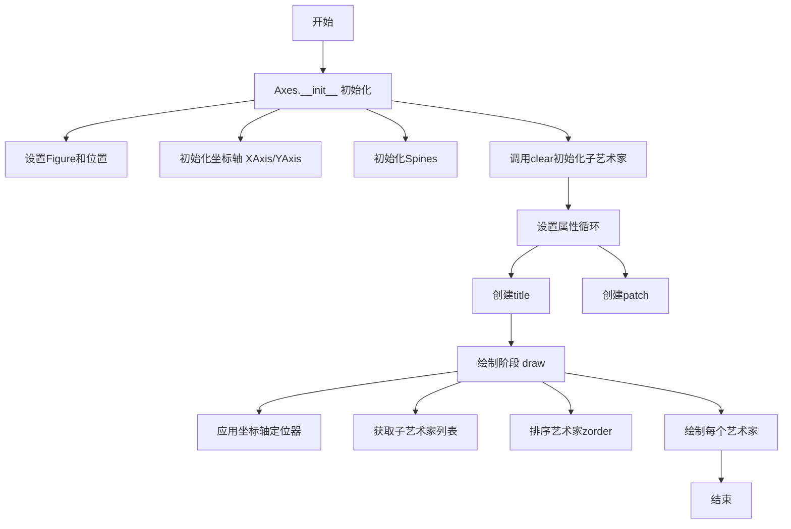
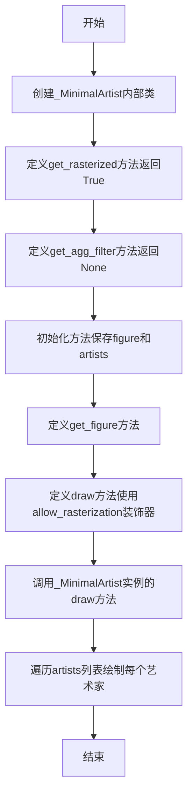
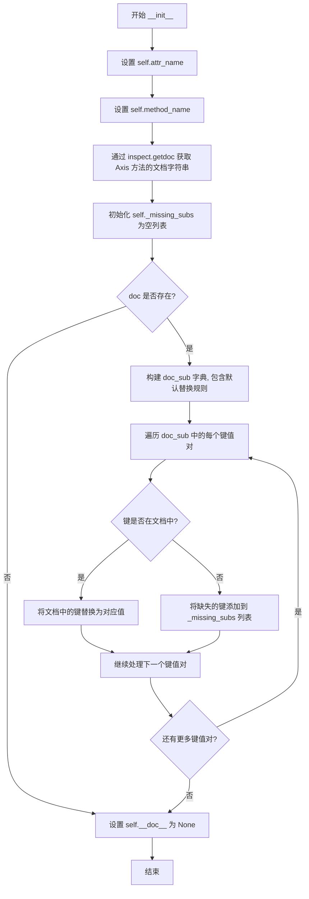
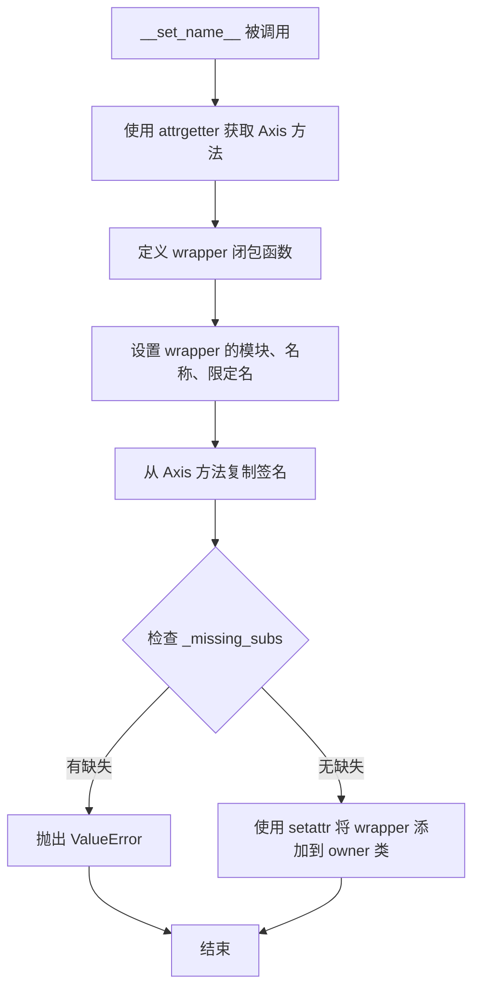
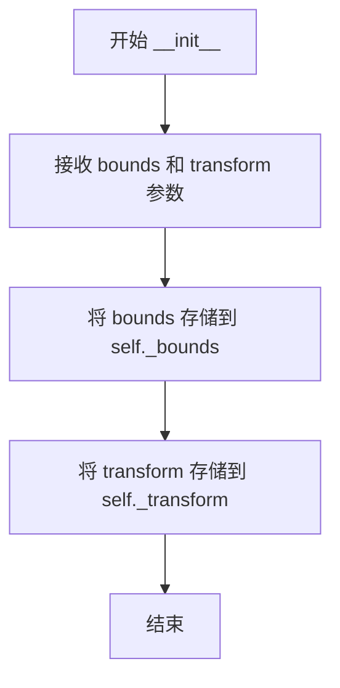
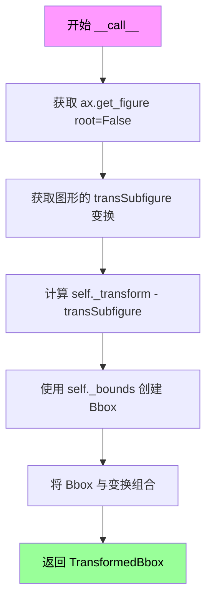
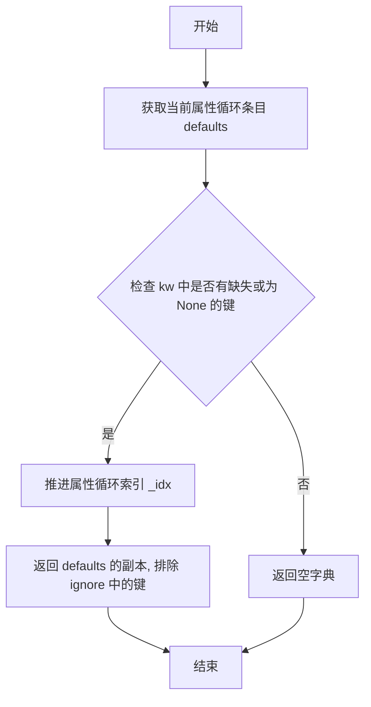
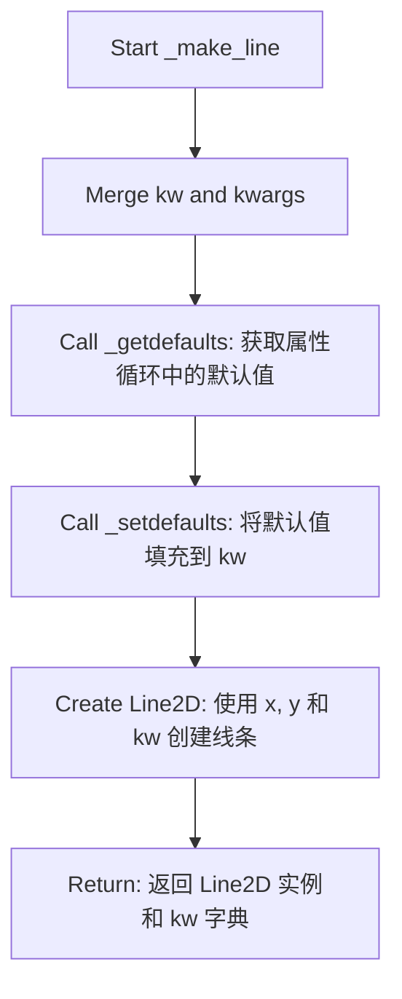
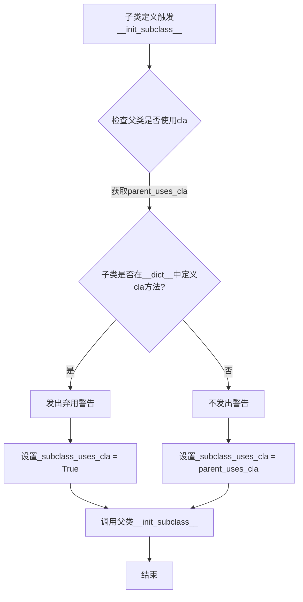

# `matplotlib\lib\matplotlib\axes\_base.py` 详细设计文档

这是matplotlib库中Axes类的核心实现，提供了2D图形坐标轴的完整功能，包括坐标轴的初始化与配置、数据管理与限制、属性设置（比例、纵横比、锚点等）、艺术家对象（线条、图像、补丁等）的添加与管理、自动缩放与视图限制、坐标轴标签与刻度管理、以及坐标轴的绘制与渲染等。

## 整体流程



## 类结构

```
Artist (matplotlib.artist.Artist)
└── _AxesBase (核心坐标轴基类)
    ├── _axis_method_wrapper (方法包装器)
    ├── _TransformedBoundsLocator (定位器)
    ├── _process_plot_var_args (参数处理)
    └── ArtistList (Sequence子类，内部类)
```

## 全局变量及字段


### `_log`
    
Logger instance for the matplotlib axes module

类型：`logging.Logger`
    


### `_axis_method_wrapper.attr_name`
    
The name of the attribute to access on the Axes instance (e.g., 'xaxis', 'yaxis')

类型：`str`
    


### `_axis_method_wrapper.method_name`
    
The name of the method on the Axis class to wrap

类型：`str`
    


### `_axis_method_wrapper._missing_subs`
    
List of missing docstring substitution keys that were expected but not found

类型：`list`
    


### `_TransformedBoundsLocator._bounds`
    
Rectangle bounds [left, bottom, width, height] for positioning inset axes

类型：`tuple`
    


### `_TransformedBoundsLocator._transform`
    
Transform used to position the inset axes relative to parent

类型：`matplotlib.transforms.Transform`
    


### `_process_plot_var_args.output`
    
Output type for plot processing ('Line2D', 'Polygon', or 'coordinates')

类型：`str`
    


### `_process_plot_var_args._idx`
    
Current index into the property cycler items

类型：`int`
    


### `_process_plot_var_args._cycler_items`
    
List of property cycler dictionaries containing default style properties

类型：`list`
    


### `_AxesBase.dataLim`
    
The bounding box enclosing all data displayed in the Axes

类型：`matplotlib.transforms.Bbox`
    


### `_AxesBase.spines`
    
Container for the axes spines (border lines)

类型：`matplotlib.spines.Spines`
    


### `_AxesBase.xaxis`
    
The X-axis instance managing x-axis ticks, labels, and properties

类型：`matplotlib.axis.XAxis`
    


### `_AxesBase.yaxis`
    
The Y-axis instance managing y-axis ticks, labels, and properties

类型：`matplotlib.axis.YAxis`
    


### `_AxesBase._axis_names`
    
Tuple of axis names ('x', 'y') used to identify available axes

类型：`tuple`
    


### `_AxesBase._shared_axes`
    
Dictionary mapping axis names to Grouper objects for shared axes

类型：`dict`
    


### `_AxesBase._twinned_axes`
    
Grouper for managing twinned axes (axes sharing one axis)

类型：`matplotlib.cbook.Grouper`
    


### `_AxesBase._position`
    
The current active position of the Axes in figure coordinates

类型：`matplotlib.transforms.Bbox`
    


### `_AxesBase._originalPosition`
    
The original position allocated for the Axes before adjustments

类型：`matplotlib.transforms.Bbox`
    


### `_AxesBase.axes`
    
Reference to self (the Axes instance)

类型：`_AxesBase`
    


### `_AxesBase._aspect`
    
The aspect ratio setting ('auto', 'equal', or numeric value)

类型：`str or float`
    


### `_AxesBase._adjustable`
    
Parameter controlling how aspect ratio is adjusted ('box' or 'datalim')

类型：`str`
    


### `_AxesBase._anchor`
    
Anchor position for axes when extra space is available

类型：`str or tuple`
    


### `_AxesBase._stale_viewlims`
    
Dictionary tracking which axis view limits need recalculation

类型：`dict`
    


### `_AxesBase._forward_navigation_events`
    
Control for forwarding pan/zoom events to underlying axes

类型：`str or bool`
    


### `_AxesBase._sharex`
    
Reference to axes sharing x-axis with this axes

类型：`_AxesBase or None`
    


### `_AxesBase._sharey`
    
Reference to axes sharing y-axis with this axes

类型：`_AxesBase or None`
    


### `_AxesBase._subplotspec`
    
The subplot specification for this axes if created as subplot

类型：`matplotlib.gridspec.SubplotSpec or None`
    


### `_AxesBase._children`
    
List of child artists (lines, patches, images, etc.) added to axes

类型：`list`
    


### `_AxesBase._colorbars`
    
List of colorbars associated with this axes

类型：`list`
    


### `_AxesBase._facecolor`
    
The facecolor of the axes patch

类型：`matplotlib.colors.ColorType`
    


### `_AxesBase._frameon`
    
Whether the axes frame (border) is visible

类型：`bool`
    


### `_AxesBase._rasterization_zorder`
    
Z-order threshold below which artists are rasterized

类型：`float or None`
    


### `_AxesBase.fmt_xdata`
    
Custom formatter function for x-data in cursor display

类型：`callable or None`
    


### `_AxesBase.fmt_ydata`
    
Custom formatter function for y-data in cursor display

类型：`callable or None`
    


### `_AxesBase.title`
    
The main title text object for the axes

类型：`matplotlib.text.Text`
    


### `_AxesBase._left_title`
    
Left-aligned title text object

类型：`matplotlib.text.Text`
    


### `_AxesBase._right_title`
    
Right-aligned title text object

类型：`matplotlib.text.Text`
    


### `_AxesBase.legend_`
    
The legend instance associated with the axes

类型：`matplotlib.legend.Legend or None`
    


### `_AxesBase.containers`
    
List of container artists (e.g., errorbars, bar containers)

类型：`list`
    


### `_AxesBase.child_axes`
    
List of child axes (e.g., inset axes) belonging to this axes

类型：`list`
    


### `_AxesBase._current_image`
    
Current image for pyplot colormap functions

类型：`matplotlib.image.AxesImage or None`
    


### `_AxesBase._projection_init`
    
Projection initialization parameters for subplot creation

类型：`dict or None`
    


### `_AxesBase._get_lines`
    
Object for processing plot arguments and generating line artists

类型：`_process_plot_var_args`
    


### `_AxesBase._get_patches_for_fill`
    
Object for processing fill plot arguments and generating polygon artists

类型：`_process_plot_var_args`
    


### `_AxesBase._gridOn`
    
Whether grid is currently displayed on the axes

类型：`bool`
    


### `_AxesBase._xmargin`
    
Margin padding for x-axis data limits

类型：`float`
    


### `_AxesBase._ymargin`
    
Margin padding for y-axis data limits

类型：`float`
    


### `_AxesBase._tight`
    
Whether tight bounding box is enabled for autoscaling

类型：`bool or None`
    


### `_AxesBase._use_sticky_edges`
    
Whether to respect artist sticky edges during autoscaling

类型：`bool`
    


### `_AxesBase._mouseover_set`
    
Set of artists that respond to mouseover events

类型：`set`
    


### `_AxesBase._autotitlepos`
    
Whether to automatically position title (True=above, False=manual)

类型：`bool or None`
    


### `_AxesBase._box_aspect`
    
Fixed aspect ratio for the axes box (height/width)

类型：`float or None`
    


### `_AxesBase._axes_locator`
    
Locator function for computing axes position during drawing

类型：`callable or None`
    
    

## 全局函数及方法


### `_process_plot_format`

该函数用于将 MATLAB 风格的格式字符串转换为 (linestyle, marker, color) 元组，支持解析如 'ko'（黑色圆圈）、'.b'（蓝色点）、'r--'（红色虚线）、'C2--'（颜色循环中的第三种颜色+虚线）等多种格式字符串。

参数：

- `fmt`：`str`，要解析的 MATLAB 风格的格式字符串
- `ambiguous_fmt_datakey`：`bool`（关键字参数），当为 True 时，错误消息会提示可能是数据键还是格式字符串

返回值：`tuple`，包含 (linestyle, marker, color) 的元组，其中 linestyle 和 marker 是字符串或 None，color 是 RGBA 元组或 None

#### 流程图

```mermaid
flowchart TD
    A[开始: _process_plot_format] --> B{fmt not in ['0', '1']?}
    B -- Yes --> C{能否转换为颜色?}
    C -- 是 --> D[返回 None, None, color]
    C -- 否 --> E[继续解析]
    B -- No --> E
    E --> F[初始化 i = 0]
    F --> G{i < len(fmt)?}
    G -- Yes --> H{fmt[i:i+2] 是双字符样式?}
    H -- Yes --> I{已设置 linestyle?}
    I -- 是 --> J[抛出 ValueError]
    I -- 否 --> K[设置 linestyle = fmt[i:i+2], i += 2]
    H -- No --> L{c 是单字符样式?}
    L -- 是 --> M{已设置 linestyle?}
    M -- 是 --> J
    M -- 否 --> N[设置 linestyle = c, i += 1]
    L -- No --> O{c 是标记?}
    O -- 是 --> P{已设置 marker?}
    P -- 是 --> J
    P -- 否 --> Q[设置 marker = c, i += 1]
    O -- No --> R{c 是命名颜色?}
    R -- 是 --> S{已设置 color?}
    S -- 是 --> J
    S -- 否 --> T[设置 color = c, i += 1]
    R -- No --> U{c == 'C'?}
    U -- 是 --> V{匹配 C数字 格式?}
    V -- 是 --> W[设置 color = to_rgba(C数字), i += 长度]
    V -- 否 --> J
    U -- No --> X[抛出 ValueError]
    J --> Y[结束: 抛出异常]
    K --> G
    N --> G
    Q --> G
    T --> G
    W --> G
    X --> Y
    G -- No --> Z{linestyle and marker 都是 None?}
    Z -- 是 --> AA[linestyle = rcParams默认]
    Z -- 否 --> AB{linestyle is None?}
    AA --> AB
    AB -- 是 --> AC[linestyle = 'None']
    AB -- 否 --> AD{marker is None?}
    AD -- 是 --> AE[marker = 'None']
    AD -- 否 --> AF[返回 linestyle, marker, color]
    AE --> AF
    AC --> AF
```

#### 带注释源码

```python
def _process_plot_format(fmt, *, ambiguous_fmt_datakey=False):
    """
    Convert a MATLAB style color/line style format string to a (*linestyle*,
    *marker*, *color*) tuple.

    Example format strings include:

    * 'ko': black circles
    * '.b': blue dots
    * 'r--': red dashed lines
    * 'C2--': the third color in the color cycle, dashed lines

    The format is absolute in the sense that if a linestyle or marker is not
    defined in *fmt*, there is no line or marker. This is expressed by
    returning 'None' for the respective quantity.

    See Also
    --------
    matplotlib.Line2D.lineStyles, matplotlib.colors.cnames
        All possible styles and color format strings.
    """

    # 初始化返回值
    linestyle = None
    marker = None
    color = None

    # 首先检查 fmt 是否只是一个颜色规范，但特别排除灰度字符串 "1"
    #（不是 "1.0"），它被解释为 tri_down 标记 "1"。为了保持一致性，
    # 也排除灰度字符串 "0"
    if fmt not in ["0", "1"]:
        try:
            # 尝试将 fmt 作为颜色规范解析
            color = mcolors.to_rgba(fmt)
            # 如果成功，直接返回（此时 linestyle 和 marker 仍为 None）
            return linestyle, marker, color
        except ValueError:
            # 解析失败，继续后续解析逻辑
            pass

    # 根据 ambiguous_fmt_datakey 参数构造错误消息格式
    errfmt = ("{!r} is neither a data key nor a valid format string ({})"
              if ambiguous_fmt_datakey else
              "{!r} is not a valid format string ({})")

    i = 0
    # 逐字符解析格式字符串
    while i < len(fmt):
        c = fmt[i]
        
        # 首先检查双字符样式（如 '--', '-.', ':'）
        if fmt[i:i+2] in mlines.lineStyles:
            if linestyle is not None:
                raise ValueError(errfmt.format(fmt, "two linestyle symbols"))
            linestyle = fmt[i:i+2]
            i += 2
        # 检查单字符样式（如 '-', ':'）
        elif c in mlines.lineStyles:
            if linestyle is not None:
                raise ValueError(errfmt.format(fmt, "two linestyle symbols"))
            linestyle = c
            i += 1
        # 检查标记符号（如 'o', '.', 's' 等）
        elif c in mlines.lineMarkers:
            if marker is not None:
                raise ValueError(errfmt.format(fmt, "two marker symbols"))
            marker = c
            i += 1
        # 检查命名颜色（如 'red', 'blue' 等）
        elif c in mcolors.get_named_colors_mapping():
            if color is not None:
                raise ValueError(errfmt.format(fmt, "two color symbols"))
            color = c
            i += 1
        # 检查颜色循环索引（如 'C0', 'C1', 'C2' 等）
        elif c == "C":
            cn_color = re.match(r"C\d+", fmt[i:])
            if not cn_color:
                raise ValueError(errfmt.format(fmt, "'C' must be followed by a number"))
            color = mcolors.to_rgba(cn_color[0])
            i += len(cn_color[0])
        else:
            raise ValueError(errfmt.format(fmt, f"unrecognized character {c!r}"))

    # 如果既没有设置 linestyle 也没有设置 marker，
    # 则使用 rcParams 中的默认 linestyle
    if linestyle is None and marker is None:
        linestyle = mpl.rcParams['lines.linestyle']
    # 将 None 转换为字符串 'None' 表示无样式
    if linestyle is None:
        linestyle = 'None'
    if marker is None:
        marker = 'None'

    return linestyle, marker, color
```


### `_draw_rasterized`

这是一个辅助函数，用于将艺术家列表栅格化。它通过创建一个最小的"shim"类来与matplotlib的`allow_rasterization`装饰器兼容，从而复用相同的代码来参与"我们是否正在栅格化"的统计。

参数：

- `figure`：`matplotlib.figure.Figure`，所有艺术家所属的图形（未检查）。需要这个参数是因为我们可以在图形级别抑制合成，并将每个栅格化的艺术家作为自己的图像插入。
- `artists`：`List[matplotlib.artist.Artist]，要栅格化的艺术家列表。假设这些艺术家都在同一个图形中。
- `renderer`：`matplotlib.backendbases.RendererBase`，当前活动的渲染器

返回值：`None`

#### 流程图



#### 带注释源码

```python
def _draw_rasterized(figure, artists, renderer):
    """
    A helper function for rasterizing the list of artists.

    The bookkeeping to track if we are or are not in rasterizing mode
    with the mixed-mode backends is relatively complicated and is now
    handled in the matplotlib.artist.allow_rasterization decorator.

    This helper defines the absolute minimum methods and attributes on a
    shim class to be compatible with that decorator and then uses it to
    rasterize the list of artists.

    This is maybe too-clever, but allows us to reuse the same code that is
    used on normal artists to participate in the "are we rasterizing"
    accounting.

    Please do not use this outside of the "rasterize below a given zorder"
    functionality of Axes.

    Parameters
    ----------
    figure : matplotlib.figure.Figure
        The figure all of the artists belong to (not checked).  We need this
        because we can at the figure level suppress composition and insert each
        rasterized artist as its own image.

    artists : List[matplotlib.artist.Artist]
        The list of Artists to be rasterized.  These are assumed to all
        be in the same Figure.

    renderer : matplotlib.backendbases.RendererBase
        The currently active renderer

    Returns
    -------
    None

    """
    # 定义一个最小的内部类来模拟艺术家，以与allow_rasterization装饰器兼容
    class _MinimalArtist:
        # 返回True表示这个对象应该被栅格化
        def get_rasterized(self):
            return True

        # 返回None表示没有AGG滤镜
        def get_agg_filter(self):
            return None

        # 初始化方法，保存figure和artists引用
        def __init__(self, figure, artists):
            self.figure = figure
            self.artists = artists

        # 获取图形对象的方法
        def get_figure(self, root=False):
            if root:
                return self.figure.get_figure(root=True)
            else:
                return self.figure

        # 使用allow_rasterization装饰器绘制所有艺术家
        # 这个装饰器处理栅格化模式的簿记
        @martist.allow_rasterization
        def draw(self, renderer):
            for a in self.artists:
                a.draw(renderer)

    # 创建_MinimalArtist实例并调用其draw方法
    return _MinimalArtist(figure, artists).draw(renderer)
```


### `_axis_method_wrapper.__init__`

该方法是 `_axis_method_wrapper` 类的构造函数，用于初始化一个包装器对象，该包装器用于动态生成 Axes 类中包装 Axis 方法的方法。它接收要包装的 Axis 属性名和方法名，并从对应的 Axis 方法获取文档字符串进行包装处理。

参数：

- `attr_name`：`str`，要包装的 Axis 属性名称（如 "xaxis" 或 "yaxis"），用于确定从哪个 Axis 实例获取方法
- `method_name`：`str`，要包装的 Axis 方法名称（如 "get_bar"），指定在 Axis 上调用的具体方法
- `doc_sub`：`dict` 或 `None`，可选的文档字符串替换映射，用于自定义文档字符串中的文本替换规则，默认为 None

返回值：`None`，该方法为构造函数，不返回任何值

#### 流程图



#### 带注释源码

```python
def __init__(self, attr_name, method_name, *, doc_sub=None):
    """
    初始化 _axis_method_wrapper 实例。

    Parameters
    ----------
    attr_name : str
        要包装的 Axis 属性名称（如 "xaxis" 或 "yaxis"）。
    method_name : str
        要包装的 Axis 方法名称。
    doc_sub : dict or None, optional
        文档字符串中额外的替换映射。
    """
    # 存储属性名称，用于后续获取对应的 Axis 实例
    self.attr_name = attr_name
    # 存储方法名称，用于后续调用对应的方法
    self.method_name = method_name
    
    # 立即将文档字符串放入 self.__doc__，以便类体内的文档字符串操作能正常工作
    # 使用 inspect.getdoc 获取 Axis 类上指定方法的文档字符串
    doc = inspect.getdoc(getattr(maxis.Axis, method_name))
    
    # 初始化缺失替换项的列表，用于延迟到 __set_name__ 时报错
    self._missing_subs = []
    
    if doc:
        # 构建替换字典，默认将 "this Axis" 替换为 "the {attr_name}"
        # 如 "this Axis" -> "the xaxis" 或 "the yaxis"
        doc_sub = {"this Axis": f"the {self.attr_name}", **(doc_sub or {})}
        
        # 遍历替换映射，处理每个键值对
        for k, v in doc_sub.items():
            # 如果键不在文档中，延迟到 __set_name__ 时再报错
            if k not in doc:
                self._missing_subs.append(k)
            # 执行文本替换
            doc = doc.replace(k, v)
    
    # 设置实例的文档字符串
    self.__doc__ = doc
```


### `_axis_method_wrapper.__set_name__`

该方法是Python描述符协议的一部分，在类定义结束时自动调用。它负责创建一个包装函数，将调用转发到对应的Axis对象的方法，并设置正确的函数元数据（名称、签名、文档字符串等）。

参数：

- `owner`：`type`，拥有该属性的类（即使用`_axis_method_wrapper`创建属性的类，例如`_AxesBase`）
- `name`：`str`，在类体中赋值给自己的属性名（例如`"get_xlim"`）

返回值：`None`，该方法通过副作用（`setattr`）将包装函数设置为类的属性

#### 流程图



#### 带注释源码

```python
def __set_name__(self, owner, name):
    # 在类体结束时调用，格式为 self.__set_name__(cls, name_under_which_self_is_assigned)
    # 我们依赖这个机制来给予包装器正确的 __name__/__qualname__
    # 获取被包装的方法，例如 "xaxis.get_bar" 或 "yaxis.get_foo"
    get_method = attrgetter(f"{self.attr_name}.{self.method_name}")

    # 定义包装函数，将调用转发到 self.attr_name 属性（即 xaxis 或 yaxis）对应的方法
    def wrapper(self, *args, **kwargs):
        return get_method(self)(*args, **kwargs)

    # 设置包装函数的模块为 owner 类的模块
    wrapper.__module__ = owner.__module__
    # 设置包装函数的名称为属性名
    wrapper.__name__ = name
    # 设置包装函数的限定名，例如 "_AxesBase.get_xlim"
    wrapper.__qualname__ = f"{owner.__qualname__}.{name}"
    # 复制在 __init__ 中构建的文档字符串
    wrapper.__doc__ = self.__doc__
    # 手动复制签名而不是使用 functools.wraps，因为当请求 Axes 方法源码时
    # 显示 Axis 方法源码会造成混淆
    wrapper.__signature__ = inspect.signature(
        getattr(maxis.Axis, self.method_name))

    # 如果文档字符串替换缺少必要的占位符，则抛出错误
    if self._missing_subs:
        raise ValueError(
            "The definition of {} expected that the docstring of Axis.{} "
            "contains {!r} as substrings".format(
                wrapper.__qualname__, self.method_name,
                ", ".join(map(repr, self._missing_subs))))

    # 将包装函数设置为 owner 类的属性，完成描述符的设置
    setattr(owner, name, wrapper)
```


### `_TransformedBoundsLocator.__init__`

`_TransformedBoundsLocator.__init__` 是 `_TransformedBoundsLocator` 类的初始化方法，用于创建定位器实例，存储边界矩形和变换对象，以便后续计算插值 Axes 的位置。

参数：

- `bounds`：`list` 或类似序列，指定一个 ``[l, b, w, h]`` 形式的矩形（分别表示左、下、宽、高），与 *transform* 一起确定插值 Axes 的位置
- `transform`：`matplotlib.transforms.Transform`，指定用于定位插值 Axes 的变换

返回值：`None`（Python 默认返回 None）

#### 流程图



#### 带注释源码

```python
def __init__(self, bounds, transform):
    """
    *bounds* (a ``[l, b, w, h]`` rectangle) and *transform* together
    specify the position of the inset Axes.
    """
    # 将边界矩形 [l, b, w, h] 存储为实例属性
    self._bounds = bounds
    # 将变换对象存储为实例属性，用于后续计算位置
    self._transform = transform
```


### _TransformedBoundsLocator.__call__

该方法是 `_TransformedBoundsLocator` 类的核心功能，作为 Axes 定位器（locator）用于计算内嵌 Axes（如 `inset_axes`）在图形中的位置。它通过结合预定义的边界框（bounds）和相对于图形子图的变换（transform），在渲染时动态计算内嵌 Axes 的实际边界框位置。

参数：

- `self`：`_TransformedBoundsLocator`，隐式参数，表示类的实例
- `ax`：`matplotlib.axes.Axes`，需要定位的 Axes 实例，用于获取图形的 `transSubfigure` 变换
- `renderer`：`matplotlib.backend_bases.RendererBase`，渲染器对象，用于触发延迟计算（确保在绘图时获取最新的变换状态）

返回值：`matplotlib.transforms.TransformedBbox`，变换后的边界框对象，表示内嵌 Axes 在图形坐标系中的实际位置和大小

#### 流程图



#### 带注释源码

```python
def __call__(self, ax, renderer):
    """
    计算内嵌 Axes 的边界框位置。

    Parameters
    ----------
    ax : matplotlib.axes.Axes
        需要定位的 Axes 实例。
    renderer : matplotlib.backend_bases.RendererBase
        渲染器对象，用于触发延迟计算。

    Returns
    -------
    matplotlib.transforms.TransformedBbox
        变换后的边界框，表示内嵌 Axes 的位置和大小。
    """
    # 注释：减去 transSubfigure 通常依赖 inverted() 方法，
    # 这会冻结变换；因此，这需要延迟到绘图时执行，
    # 以避免 transSubfigure 在计算后发生变化。
    return mtransforms.TransformedBbox(
        # 从预定义的边界 [l, b, w, h] 创建基础边界框
        mtransforms.Bbox.from_bounds(*self._bounds),
        # 计算相对变换：用户定义的变换减去图形子图的变换
        # 这样可以得到相对于图形子图的坐标系中的变换
        self._transform - ax.get_figure(root=False).transSubfigure)
```


### `_process_plot_var_args.__init__`

这是 `_process_plot_var_args` 类的构造函数，用于初始化用于处理 `Axes.plot` 可变长度参数的处理器，支持多种调用形式如 `plot(t, s)`、`plot(t1, s1, t2, s2)`、`plot(t1, s1, 'ko', t2, s2)` 等。

参数：

- `output`：`str`，默认值 `'Line2D'`。指定输出类型，可选值为 `'Line2D'`、`'Polygon'` 或 `'coordinates'`，用于决定生成的艺术家对象类型。

返回值：`None`，构造函数无返回值。

#### 流程图

```mermaid
flowchart TD
    A[开始 __init__] --> B{output in ['Line2D', 'Polygon', 'coordinates']?}
    B -->|是| C[设置 self.output = output]
    B -->|否| D[抛出 ValueError]
    C --> E[调用 self.set_prop_cycle(None)]
    E --> F[结束]
    
    D --> F
```

#### 带注释源码

```python
def __init__(self, output='Line2D'):
    """
    初始化 _process_plot_var_args 实例。

    Parameters
    ----------
    output : str, default: 'Line2D'
        输出类型，可选 'Line2D'、'Polygon' 或 'coordinates'。
        - 'Line2D': 生成 Line2D 对象（用于 plot）
        - 'Polygon': 生成 Polygon 对象（用于 fill）
        - 'coordinates': 返回坐标元组（用于某些特殊绘图）
    """
    # 检查 output 参数是否为有效值之一
    _api.check_in_list(['Line2D', 'Polygon', 'coordinates'], output=output)
    
    # 存储输出类型
    self.output = output
    
    # 初始化属性循环，使用默认的 rcParams 配置
    # 传入 None 表示使用 axes.prop_cycle 的默认值
    self.set_prop_cycle(None)
```


### `_process_plot_var_args.set_prop_cycle`

设置绘图属性循环（property cycle），用于管理绘图命令的样式属性（如颜色、标记、线型等）的自动轮换。

参数：

- `cycler`：任意类型，要设置的属性循环对象。如果为 `None`，则重置为通过 `axes.prop_cycle` RC 参数定义的默认循环。

返回值：`None`，该方法无返回值（隐式返回 `None`）。

#### 流程图

```mermaid
flowchart TD
    A[开始 set_prop_cycle] --> B{cycler 参数是否为 None?}
    B -->|是| C[获取默认属性循环: mpl._val_or_rc None, 'axes.prop_cycle']
    B -->|否| D[使用传入的 cycler: mpl._val_or_rc cycler, 'axes.prop_cycle']
    C --> E[重置索引 self._idx = 0]
    D --> E
    E --> F[将循环项展开为列表: self._cycler_items = [*循环结果]]
    F --> G[结束]
```

#### 带注释源码

```python
def set_prop_cycle(self, cycler):
    """
    Set the property cycle for plotting.
    
    Parameters
    ----------
    cycler : object or None
        The property cycle to set. If None, resets to the default cycle
        defined by the 'axes.prop_cycle' RC parameter.
    """
    # 重置当前索引到 0，表示从头开始使用属性循环
    self._idx = 0
    # 使用 mpl._val_or_rc 获取属性循环：
    # - 如果 cycler 不为 None，使用传入的 cycler
    # - 如果 cycler 为 None，使用 'axes.prop_cycle' RC 参数的默认值
    self._cycler_items = [*mpl._val_or_rc(cycler, 'axes.prop_cycle')]
```


### `_process_plot_var_args.__call__`

处理`Axes.plot`的可变长度参数，支持多种调用方式（如`plot(t, s)`、`plot(t1, s1, t2, s2)`、`plot(t1, s1, 'ko', t2, s2)`等），并将参数转换为绘图所需的Artist对象。

参数：

- `axes`：`matplotlib.axes.Axes`，执行绘图的Axes对象
- `*args`：可变数量的位置参数，可以是(x, y)对、(x, y, fmt)三元组，或它们的组合
- `data`：dict or None，用于从字典中获取数据的命名空间，默认为None
- `return_kwargs`：bool，是否返回处理后的关键字参数，默认为False
- `**kwargs`：任意关键字参数，将传递给绘图方法

返回值：generator of Artists or (Artist, dict)，生成器形式的绘图对象列表；如果`return_kwargs`为True，则返回(Artist, effective_kwargs)元组列表

#### 流程图

```mermaid
flowchart TD
    A[开始 __call__] --> B[检查xy关键字参数是否冲突]
    B --> C{args是否为空}
    C -->|是| D[直接返回]
    C -->|否| E{data是否为None}
    E -->|是| F[处理字典视图 sanitize_sequence]
    E -->|否| G[处理data参数和替换]
    F --> H[继续处理]
    G --> I[确定label_namer_idx]
    I --> J[处理标签]
    H --> J
    J --> K{args长度>=4且label不是标量}
    K -->|是| L[抛出ValueError]
    K -->|否| M[进入循环处理参数对]
    M --> N{args非空}
    N -->|是| O[取前两个参数]
    O --> P{args[0]是字符串}
    P -->|是| Q[将fmt加入this并跳过]
    P -->|否| R[继续]
    Q --> S[调用_plot_args]
    R --> S
    S --> T{yield结果}]
    T --> M
    N -->|否| U[结束]
```

#### 带注释源码

```python
def __call__(self, axes, *args, data=None, return_kwargs=False, **kwargs):
    # 首先处理单位信息
    axes._process_unit_info(kwargs=kwargs)

    # 检查是否有冲突的位置参数（x或y作为关键字参数）
    for pos_only in "xy":
        if pos_only in kwargs:
            raise _api.kwarg_error(inspect.stack()[1].function, pos_only)

    # 如果没有位置参数，直接返回
    if not args:
        return

    # 处理参数：根据data参数是否存在采用不同策略
    if data is None:  # Process dict views
        # 对参数进行序列处理（将可能的数据列展平）
        args = [cbook.sanitize_sequence(a) for a in args]
    else:  # Process the 'data' kwarg.
        # 使用data字典替换参数中的占位符
        replaced = [mpl._replacer(data, arg) for arg in args]
        
        # 确定哪个参数应该作为标签命名者
        if len(args) == 1:
            label_namer_idx = 0
        elif len(args) == 2:  # Can be x, y or y, c.
            # 判断第二个参数是格式字符串还是标签名
            try:
                _process_plot_format(args[1])
            except ValueError:  # case 1) 第二个参数不是格式字符串，是标签名
                label_namer_idx = 1
            else:
                # 检查是否发生了替换（从data中获取值）
                if replaced[1] is not args[1]:  # case 2a) 发生替换，可能冲突
                    _api.warn_external(
                        f"Second argument {args[1]!r} is ambiguous: could "
                        f"be a format string but is in 'data'; using as "
                        f"data.  If it was intended as data, set the "
                        f"format string to an empty string to suppress "
                        f"this warning.  If it was intended as a format "
                        f"string, explicitly pass the x-values as well.  "
                        f"Alternatively, rename the entry in 'data'.",
                        RuntimeWarning)
                    label_namer_idx = 1
                else:  # case 2b) 未发生替换，确认是格式字符串
                    label_namer_idx = 0
        elif len(args) == 3:
            label_namer_idx = 1
        else:
            raise ValueError(
                "Using arbitrary long args with data is not supported due "
                "to ambiguity of arguments; use multiple plotting calls "
                "instead")
        
        # 如果kwargs中没有label，则从替换后的参数中获取标签
        if kwargs.get("label") is None:
            kwargs["label"] = mpl._label_from_arg(
                replaced[label_namer_idx], args[label_namer_idx])
        args = replaced
    
    # 标记格式字符串是否可能与数据键冲突
    ambiguous_fmt_datakey = data is not None and len(args) == 2

    # 检查多组数据时标签的有效性
    if len(args) >= 4 and not cbook.is_scalar_or_string(
            kwargs.get("label")):
        raise ValueError("plot() with multiple groups of data (i.e., "
                         "pairs of x and y) does not support multiple "
                         "labels")

    # 循环处理所有(x, y)或(x, y, fmt)参数组
    while args:
        # 每次取前两个参数
        this, args = args[:2], args[2:]
        # 如果下一个参数是字符串（格式字符串），则并入当前组
        if args and isinstance(args[0], str):
            this += args[0],
            args = args[1:]
        # 调用_plot_args处理具体参数并yield结果
        yield from self._plot_args(
            axes, this, kwargs, ambiguous_fmt_datakey=ambiguous_fmt_datakey,
            return_kwargs=return_kwargs
        )
```


### `_process_plot_var_args.get_next_color`

返回属性循环中的下一个颜色，用于绘图时自动分配颜色。

参数：
- （无显式参数，隐式参数 `self`：`_process_plot_var_args` 实例，表示当前对象）

返回值：`str`，返回下一个颜色值。如果当前循环条目包含颜色属性则返回该颜色，否则返回默认黑色 `"k"`。

#### 流程图

```mermaid
flowchart TD
    A[开始] --> B[获取 self._cycler_items[self._idx] 条目]
    B --> C{条目中是否包含 'color' 键?}
    C -->|是| D[self._idx = (self._idx + 1) % len 循环索引]
    D --> E[返回 entry['color']]
    C -->|否| F[返回默认颜色 'k']
    E --> G[结束]
    F --> G
```

#### 带注释源码

```python
def get_next_color(self):
    """Return the next color in the cycle."""
    # 获取当前属性循环中索引位置对应的条目
    entry = self._cycler_items[self._idx]
    
    # 检查该条目是否定义了颜色属性
    if "color" in entry:
        # advance cycler：将索引移动到下一个位置，实现循环
        self._idx = (self._idx + 1) % len(self._cycler_items)
        # 返回条目中定义的特定颜色
        return entry["color"]
    else:
        # 如果当前条目没有定义颜色，返回默认黑色 'k'
        return "k"
```


### `_process_plot_var_args._getdefaults`

获取绘图参数的默认值，如果属性循环中的某些键在输入字典中缺失或为 None，则返回属性循环的下一个条目作为默认值；否则返回空字典而不推进属性循环。

参数：
- `kw`：`dict`，关键字参数字典，包含当前的绘图属性
- `ignore`：`frozenset`，可选，要忽略的属性键集合，这些键不参与默认值判断

返回值：`dict`，包含默认属性的字典，如果属性循环中的所有键都已在 `kw` 中设置且不为 None，则返回空字典

#### 流程图



#### 带注释源码

```python
def _getdefaults(self, kw, ignore=frozenset()):
    """
    If some keys in the property cycle (excluding those in the set
    *ignore*) are absent or set to None in the dict *kw*, return a copy
    of the next entry in the property cycle, excluding keys in *ignore*.
    Otherwise, don't advance the property cycle, and return an empty dict.
    """
    # 获取当前属性循环条目 (不包含 ignore 中的键)
    defaults = self._cycler_items[self._idx]
    
    # 判断是否存在缺失或为 None 的键
    # {*defaults} - ignore 取出 defaults 中不在 ignore 集合里的键
    # kw.get(k, None) 检查该键是否在 kw 中存在且值不为 None
    if any(kw.get(k, None) is None for k in {*defaults} - ignore):
        # 推进属性循环索引到下一个
        self._idx = (self._idx + 1) % len(self._cycler_items)
        # 返回新的字典副本，避免直接暴露 _cycler_items 的条目被修改
        return {k: v for k, v in defaults.items() if k not in ignore}
    else:
        # 所有键都已设置，不推进属性循环，返回空字典
        return {}
```


### `_process_plot_var_args._setdefaults`

该方法用于将默认属性字典中的值合并到关键字参数字典中。当关键字参数中某个属性未设置（为 None）或不存在时，使用属性循环器（property cycle）中的默认值进行填充。

参数：

- `defaults`：`dict`，包含默认属性值的字典，这些值来自属性循环器的当前条目
- `kw`：`dict`，关键字参数字典，需要被填充默认值的对象

返回值：`None`，该方法直接修改 `kw` 字典的内容

#### 流程图

```mermaid
flowchart TD
    A[开始] --> B[遍历 defaults 中的每个键 k]
    B --> C{kw 中键 k 的值是否为 None?}
    C -->|是| D[将 defaults[k] 赋值给 kw[k]]
    C -->|否| E[跳过该键]
    D --> B
    E --> B
    B --> F[结束]
```

#### 带注释源码

```python
def _setdefaults(self, defaults, kw):
    """
    将 defaults 字典中的条目添加到 kw 字典中，
    仅当 kw 中对应键不存在或值为 None 时才添加。
    这样可以确保用户显式设置的属性不会被默认值覆盖。
    """
    # 遍历 defaults 字典中的所有键
    for k in defaults:
        # 检查 kw 中键 k 的值是否为 None 或不存在
        # 使用 kw.get(k, None) 获取值，若键不存在则返回 None
        if kw.get(k, None) is None:
            # 当 kw 中该属性未被设置时，使用 defaults 中的默认值
            kw[k] = defaults[k]
```


### `_process_plot_var_args._make_line`

该方法负责将数据（x, y 坐标）与格式参数（kw, kwargs）转换为具体的 `Line2D` 图形对象。它首先合并格式字符串带来的参数和用户传入的 kwargs，随后从 Axes 的属性循环器（property cycler）中获取缺失的默认值（如颜色、线型等），最后实例化 `matplotlib.lines.Line2D` 对象并返回。

参数：
- `axes`：`matplotlib.axes.Axes`，绑定的 Axes 对象，用于确定坐标单位等上下文。
- `x`：`array-like`，x 轴数据序列。
- `y`：`array-like`，y 轴数据序列。
- `kw`：`dict`，从格式字符串（如 `'ro'`, `'b--'`）解析出的关键字参数（如 `{'color': 'r', 'linestyle': '-'}`）。
- `kwargs`：`dict`，用户在调用 `plot()` 时直接传入的额外关键字参数。

返回值：`tuple`，返回一个元组 `(seg, kw)`。
- `seg`：`matplotlib.lines.Line2D`，生成的线条对象。
- `kw`：`dict`，合并并处理后的最终关键字参数字典（包含了实际用于绘制的数据）。

#### 流程图



#### 带注释源码

```python
def _make_line(self, axes, x, y, kw, kwargs):
    # 1. 合并字典：为了不修改原始的传入参数（避免副作用），
    # 我们创建一个新的字典，将格式字符串的参数(kw)与用户kwargs合并。
    # 如果键冲突，kwargs (用户传入的) 会覆盖 kw (格式字符串的)。
    kw = {**kw, **kwargs}

    # 2. 获取默认值：从当前 Axes 的属性循环器（prop_cycler）中获取默认属性。
    # 只有当 kw 中缺少某些属性或属性值为 None 时，才会产生默认值。
    defaults = self._getdefaults(kw)

    # 3. 设置默认值：将上一步获得的默认值填入 kw 字典中。
    self._setdefaults(defaults, kw)

    # 4. 创建对象：使用处理好的数据 x, y 和属性 kw 实例化 Line2D 对象。
    seg = mlines.Line2D(x, y, **kw)

    # 5. 返回：返回创建的对象以及最终使用的参数字典（可能包含了循环器推进后的状态）。
    return seg, kw
```


### `_process_plot_var_args._make_coordinates`

该方法用于处理绘图函数的可变长度参数，将输入的坐标数据和关键字参数进行合并与默认值设置，并返回处理后的坐标和关键字参数字典。

参数：

- `self`：`_process_plot_var_args` 类实例，表示当前对象。
- `axes`：`matplotlib.axes.Axes` 对象，绘图所在的 Axes 对象。
- `x`：数组-like，x 坐标数据。
- `y`：数组-like，y 坐标数据。
- `kw`：字典，plotting 关键字参数。
- `kwargs`：字典，其他关键字参数。

返回值：`tuple`，返回包含两个元素的元组：
- 第一个元素：元组 `(x, y)`，即处理后的 x 和 y 坐标。
- 第二个元素：字典，即合并后的关键字参数。

#### 流程图

```mermaid
graph TD
    A[开始] --> B[合并 kw 和 kwargs 到新字典 kw]
    B --> C[调用 _getdefaults 获取默认值]
    C --> D[调用 _setdefaults 将默认值设置到 kw]
    D --> E[返回 (x, y) 和 kw]
```

#### 带注释源码

```python
def _make_coordinates(self, axes, x, y, kw, kwargs):
    """
    处理坐标数据并合并关键字参数。
    
    参数:
        axes: matplotlib Axes 对象
        x: x 坐标数据
        y: y 坐标数据
        kw: 关键字参数字典
        kwargs: 其他关键字参数字典
    
    返回:
        (x, y) 和合并后的 kw 字典
    """
    # 合并 kw 和 kwargs 到新字典 kw，避免修改原始 kw
    kw = {**kw, **kwargs}
    # 从属性循环中获取默认值，并设置到 kw 中
    self._setdefaults(self._getdefaults(kw), kw)
    # 返回坐标元组和关键字参数字典
    return (x, y), kw
```


### `_process_plot_var_args._make_polygon`

该方法用于将 x、y 数据转换为 `matplotlib.patches.Polygon` 对象，处理单位转换、属性循环、默认属性应用和多边形创建。

参数：

- `self`：`_process_plot_var_args`，调用此方法的类实例
- `axes`：`matplotlib.axes.Axes`，目标 Axes 对象，用于单位转换
- `x`：array-like，x 坐标数据
- `y`：array-like，y 坐标数据
- `kw`：dict，从格式字符串解析的属性字典
- `kwargs`：dict，用户传入的额外关键字参数

返回值：`tuple`，包含创建的 `Polygon` 对象和更新后的 `kwargs` 字典

#### 流程图

```mermaid
flowchart TD
    A[开始] --> B[单位转换: x = axes.convert_xunits(x)]
    B --> C[单位转换: y = axes.convert_yunits(y)]
    C --> D[复制kw和kwargs避免修改原字典]
    D --> E[构建ignores集合<br/>包含marker相关属性和kwargs中非None的值]
    E --> F[从属性循环获取默认值: default_dict = _getdefaults(kw, ignores)]
    F --> G[应用默认值到kw: _setdefaults(default_dict, kw)]
    G --> H[提取facecolor: facecolor = kw.get('color', None)]
    H --> I[从default_dict移除color键]
    I --> J[应用默认值到kwargs: _setdefaults(default_dict, kwargs)]
    J --> K[创建Polygon对象<br/>使用np.column_stack((x, y))作为顶点]
    K --> L[设置Polygon属性<br/>facecolor, fill, closed等]
    L --> M[返回Polygon和kwargs元组]
```

#### 带注释源码

```python
def _make_polygon(self, axes, x, y, kw, kwargs):
    # Polygon doesn't directly support unitized inputs.
    # 将x和y数据从原始单位转换为显示单位（如有必要）
    x = axes.convert_xunits(x)
    y = axes.convert_yunits(y)

    # 复制字典以避免修改原始调用者的字典
    kw = kw.copy()  # Don't modify the original kw.
    kwargs = kwargs.copy()

    # Ignore 'marker'-related properties as they aren't Polygon
    # properties, but they are Line2D properties, and so they are
    # likely to appear in the default cycler construction.
    # This is done here to the defaults dictionary as opposed to the
    # other two dictionaries because we do want to capture when a
    # *user* explicitly specifies a marker which should be an error.
    # We also want to prevent advancing the cycler if there are no
    # defaults needed after ignoring the given properties.
    # 忽略marker相关属性，因为它们不是Polygon的属性而是Line2D的属性
    # 同时忽略kwargs中显式设置为非None的属性
    ignores = ({'marker', 'markersize', 'markeredgecolor',
                'markeredgewidth', 'markerfacecolor'}
               # Also ignore anything provided by *kwargs*.
               | {k for k, v in kwargs.items() if v is not None})

    # Only using the first dictionary to use as basis
    # for getting defaults for back-compat reasons.
    # Doing it with both seems to mess things up in
    # various places (probably due to logic bugs elsewhere).
    # 仅使用kw作为获取默认值的基础，以保持向后兼容性
    default_dict = self._getdefaults(kw, ignores)
    # 将默认值应用到kw字典中缺少或为None的键
    self._setdefaults(default_dict, kw)

    # Looks like we don't want "color" to be interpreted to
    # mean both facecolor and edgecolor for some reason.
    # So the "kw" dictionary is thrown out, and only its
    # 'color' value is kept and translated as a 'facecolor'.
    # This design should probably be revisited as it increases
    # complexity.
    # 获取color作为facecolor，避免同时设置facecolor和edgecolor
    facecolor = kw.get('color', None)

    # Throw out 'color' as it is now handled as a facecolor
    # 从默认字典中移除color，因为它现在作为facecolor处理
    default_dict.pop('color', None)

    # To get other properties set from the cycler
    # modify the kwargs dictionary.
    # 将其余默认值应用到kwargs
    self._setdefaults(default_dict, kwargs)

    # 使用x和y坐标列创建Polygon对象
    seg = mpatches.Polygon(np.column_stack((x, y)),
                           facecolor=facecolor,
                           fill=kwargs.get('fill', True),
                           closed=kw['closed'])
    # 应用剩余的kwargs属性到Polygon
    seg.set(**kwargs)
    return seg, kwargs
```


### `_process_plot_var_args._plot_args`

处理 `plot([x], y, [fmt], **kwargs)` 调用的参数。该方法处理一组参数（即对于 `plot(x, y, x2, y2)`，会被调用两次：一次处理 (x, y)，一次处理 (x2, y2)）。

参数：

-  `self`：隐含的类实例引用
-  `axes`：`matplotlib.axes.Axes`，执行绘图的 Axes 对象
-  `tup`：`<class 'tuple'>`，位置参数元组，可以是以下形式之一：
  - (y,)
  - (x, y)
  - (y, fmt)
  - (x, y, fmt)
-  `kwargs`：`<class 'dict'>`，传递给 `plot()` 的关键字参数
-  `return_kwargs`：`<class 'bool'>`，是否还返回解包标签后的有效关键字参数
-  `ambiguous_fmt_datakey`：`<class 'bool'>`，格式字符串是否也可能是一个错误的数据键

返回值：`<class 'list'>`，如果 `return_kwargs` 为 False，返回艺术家对象（`Line2D` 或 `Polygon`）的列表；如果为 True，返回包含 (艺术家, 有效关键字参数) 元组的列表。

#### 流程图

```mermaid
flowchart TD
    A[开始 _plot_args] --> B{len(tup) > 1 且 tup[-1] 是字符串?}
    B -->|Yes| C[提取格式字符串 fmt]
    B -->|No| D{tup 长度是否等于 3?}
    D -->|Yes| E[抛出 ValueError: 第三个参数必须是格式字符串]
    D -->|No| F[xy = tup, fmt = None]
    C --> G[_process_plot_format 处理格式字符串]
    G --> H[获取 linestyle, marker, color]
    F --> H
    H --> I{检查 x, y, fmt 是否为 None?}
    I -->|Yes| J[抛出 ValueError]
    I -->|No| K[构建 kw 字典并检查格式与 kwargs 冲突]
    K --> L{len(xy) == 2?}
    L -->|Yes| M[使用 _check_1d 检查并转换 x, y]
    L -->|No| N[使用 index_of 生成 x, y]
    M --> O[更新 axes 的单位]
    N --> O
    O --> P[验证 x 和 y 形状兼容]
    P --> Q[将 x, y 扩展为 2D 数组]
    Q --> R{self.output 类型?}
    R -->|Line2D| S[make_artist = self._make_line]
    R -->|Polygon| T[make_artist = self._make_polygon]
    R -->|coordinates| U[make_artist = self._make_coordinates]
    S --> V[检查数据集数量一致性]
    T --> V
    U --> V
    V --> W[处理标签解包]
    W --> X[生成艺术家对象]
    X --> Y{return_kwargs?}
    Y -->|Yes| Z[返回完整结果列表]
    Y -->|No| AA[返回仅艺术家列表]
```

#### 带注释源码

```python
def _plot_args(self, axes, tup, kwargs, *,
               return_kwargs=False, ambiguous_fmt_datakey=False):
    """
    Process the arguments of ``plot([x], y, [fmt], **kwargs)`` calls.

    This processes a single set of ([x], y, [fmt]) parameters; i.e. for
    ``plot(x, y, x2, y2)`` it will be called twice. Once for (x, y) and
    once for (x2, y2).

    x and y may be 2D and thus can still represent multiple datasets.

    For multiple datasets, if the keyword argument *label* is a list, this
    will unpack the list and assign the individual labels to the datasets.

    Parameters
    ----------
    tup : tuple
        A tuple of the positional parameters. This can be one of

        - (y,)
        - (x, y)
        - (y, fmt)
        - (x, y, fmt)

    kwargs : dict
        The keyword arguments passed to ``plot()``.

    return_kwargs : bool
        Whether to also return the effective keyword arguments after label
        unpacking as well.

    ambiguous_fmt_datakey : bool
        Whether the format string in *tup* could also have been a
        misspelled data key.

    Returns
    -------
    result
        If *return_kwargs* is false, a list of Artists representing the
        dataset(s).
        If *return_kwargs* is true, a list of (Artist, effective_kwargs)
        representing the dataset(s). See *return_kwargs*.
        The Artist is either `.Line2D` (if called from ``plot()``) or
        `.Polygon` otherwise.
    """
    # 检查最后一个参数是否是格式字符串
    if len(tup) > 1 and isinstance(tup[-1], str):
        # xy 是去除格式字符串后的参数元组（可能仍是仅 y）
        *xy, fmt = tup
        # 将格式字符串解析为 linestyle, marker, color
        linestyle, marker, color = _process_plot_format(
            fmt, ambiguous_fmt_datakey=ambiguous_fmt_datakey)
    elif len(tup) == 3:
        # 三个参数但不是 (x, y, fmt) 格式，抛出错误
        raise ValueError('third arg must be a format string')
    else:
        # 没有格式字符串
        xy = tup
        linestyle, marker, color = None, None, None

    # 不允许任何 None 值；这些会被转换为单个 None 元素的数组，导致下游问题
    if any(v is None for v in tup):
        raise ValueError("x, y, and format string must not be None")

    # 构建关键字参数字典
    kw = {}
    for prop_name, val in zip(('linestyle', 'marker', 'color'),
                              (linestyle, marker, color)):
        if val is not None:
            # 检查格式字符串和 kwargs 之间的冲突
            if (fmt.lower() != 'none'
                    and prop_name in kwargs
                    and val != 'None'):
                # 发出警告：关键字参数与格式字符串冗余定义
                _api.warn_external(
                    f"{prop_name} is redundantly defined by the "
                    f"'{prop_name}' keyword argument and the fmt string "
                    f'"{fmt}" (-> {prop_name}={val!r}). The keyword '
                    f"argument will take precedence.")
            kw[prop_name] = val

    # 处理 x, y 数据
    if len(xy) == 2:
        # 两个参数：x 和 y
        x = _check_1d(xy[0])
        y = _check_1d(xy[1])
    else:
        # 只有一个参数：只有 y，使用索引作为 x
        x, y = index_of(xy[-1])

    # 更新轴的单位
    if axes.xaxis is not None:
        axes.xaxis.update_units(x)
    if axes.yaxis is not None:
        axes.yaxis.update_units(y)

    # 验证 x 和 y 的形状
    if x.shape[0] != y.shape[0]:
        raise ValueError(f"x and y must have same first dimension, but "
                         f"have shapes {x.shape} and {y.shape}")
    if x.ndim > 2 or y.ndim > 2:
        raise ValueError(f"x and y can be no greater than 2D, but have "
                         f"shapes {x.shape} and {y.shape}")
    # 将 1D 数组扩展为 2D 列向量
    if x.ndim == 1:
        x = x[:, np.newaxis]
    if y.ndim == 1:
        y = y[:, np.newaxis]

    # 根据输出类型选择艺术家创建函数
    if self.output == 'Line2D':
        make_artist = self._make_line
    elif self.output == 'Polygon':
        kw['closed'] = kwargs.get('closed', True)
        make_artist = self._make_polygon
    elif self.output == 'coordinates':
        make_artist = self._make_coordinates
    else:
        _api.check_in_list(['Line2D', 'Polygon', 'coordinates'], output=self.output)

    # 验证数据集列数
    ncx, ncy = x.shape[1], y.shape[1]
    if ncx > 1 and ncy > 1 and ncx != ncy:
        raise ValueError(f"x has {ncx} columns but y has {ncy} columns")
    if ncx == 0 or ncy == 0:
        return []

    # 处理标签
    label = kwargs.get('label')
    n_datasets = max(ncx, ncy)

    # 根据数据集数量处理标签
    if cbook.is_scalar_or_string(label):
        labels = [label] * n_datasets
    elif len(label) == n_datasets:
        labels = label
    else:
        raise ValueError(
            f"label must be scalar or have the same length as the input "
            f"data, but found {len(label)} for {n_datasets} datasets.")

    # 生成艺术家对象
    result = (make_artist(axes, x[:, j % ncx], y[:, j % ncy], kw,
                          {**kwargs, 'label': label})
              for j, label in enumerate(labels))

    # 根据 return_kwargs 决定返回格式
    if return_kwargs:
        return list(result)
    else:
        return [l[0] for l in result]
```


### `_AxesBase.__str__`

该方法用于生成 Axes 对象的字符串表示形式，返回一个包含类名和 Axes 位置信息的字符串，格式为"类名(left,bottom;widthxheight)"。

参数：无需显式参数（self 为隐式参数）

返回值：`str`，返回一个描述 Axes 位置和尺寸的字符串，格式为 `{类名}({left},{bottom};{width}x{height})`

#### 流程图

```mermaid
flowchart TD
    A[开始 __str__] --> B[获取类名: type(self).__name__]
    B --> C[获取位置边界: self._position.bounds]
    C --> D[提取 left, bottom, width, height]
    D --> E[格式化字符串: 类名(left,bottom;widthxheight)]
    E --> F[返回字符串]
```

#### 带注释源码

```python
def __str__(self):
    """
    返回 Axes 对象的字符串表示形式。
    
    返回值格式说明：
    - {0} -> 类名（如 Axes）
    - {1[0]:g} -> left 坐标（左下角 x 坐标）
    - {1[1]:g} -> bottom 坐标（左下角 y 坐标）
    - {1[2]:g} -> width（宽度）
    - {1[3]:g} -> height（高度）
    
    示例输出: "Axes(0.125,0.11;0.775x0.79)"
    """
    return "{0}({1[0]:g},{1[1]:g};{1[2]:g}x{1[3]:g})".format(
        type(self).__name__, self._position.bounds)
```


### `_AxesBase.__init__`

构建一个Axes对象，初始化其在Figure中的位置、坐标轴、边框、刻度、标题等属性，并配置共享轴、缩放、平移等交互功能。

参数：

- `fig`：`matplotlib.figure.Figure`，Axes所在的Figure对象
- `*args`：位置参数，可以是`(left, bottom, width, height)`矩形、或`Bbox`对象、或`(nrows, ncols, index)`形式的子图规格、或`SubplotSpec`实例
- `facecolor`：颜色或None，默认使用rc参数`axes.facecolor`
- `frameon`：bool，默认True，是否绘制Axes框架
- `sharex`：`matplotlib.axes.Axes`或None，可选，与其他Axes共享x轴
- `sharey`：`matplotlib.axes.Axes`或None，可选，与其他Axes共享y轴
- `label`：str，Axes的标签
- `xscale`：str或None，x轴的scale类型（如'linear', 'log'）
- `yscale`：str或None，y轴的scale类型
- `box_aspect`：float或None，Axes盒子宽高比
- `forward_navigation_events`：bool或"auto"，默认"auto"，控制平移/缩放事件是否转发到下方Axes
- `**kwargs`：其他关键字参数，传递给Artist基类

返回值：`_AxesBase`，新创建的Axes对象实例

#### 流程图

```mermaid
graph TD
    A[开始 __init__] --> B[调用super().__init__ 初始化Artist基类]
    B --> C{kwargs中是否有rect?}
    C -->|是| D[检查无位置参数后弹出rect]
    C -->|否| E{args[0]是否为Bbox?}
    D --> F[将rect转为Bbox对象]
    E -->|是| F
    E -->|否| G{args[0]是否可迭代?}
    F --> H[设置self._position]
    G -->|是| I[从可迭代对象创建Bbox]
    G -->|否| J[创建单位Bbox + SubplotSpec]
    I --> H
    J --> H
    H --> K{width/height < 0?}
    K -->|是| L[抛出ValueError]
    K -->|否| M[保存_originalPosition]
    M --> N[设置self.axes = self]
    N --> O[初始化_aspect='auto', _adjustable='box', _anchor='C']
    O --> P[初始化_stale_viewlims, _forward_navigation_events]
    P --> Q[设置_sharex, _sharey, label]
    Q --> R[调用set_figure设置Figure]
    R --> S{是否有subplotspec?}
    S -->|是| T[set_subplotspec]
    S -->|否| U[_subplotspec = None]
    T --> V[set_box_aspect]
    U --> V
    V --> W[初始化_children=[], _colorbars=[]]
    W --> X[初始化spines]
    X --> Y[初始化xaxis=None, yaxis=None]
    Y --> Z[调用_init_axis创建真实Axis对象]
    Z --> AA[创建_axis_map]
    AA --> AB[设置_facecolor, _frameon, axisbelow]
    AB --> AC[调用clear初始化数据相关属性]
    AC --> AD[设置fmt_xdata, fmt_ydata=None]
    AD --> AE[设置navigate=True]
    AE --> AF{xscale参数?}
    AF -->|是| AG[set_xscale]
    AF -->|否| AH{yscale参数?}
    AG --> AI[_internal_update(kwargs)]
    AH -->|是| AJ[set_yscale]
    AH -->|否| AI
    AJ --> AI
    AI --> AK[连接unit change callbacks]
    AK --> AL[配置minor tick params]
    AL --> AM[配置major tick params]
    AM --> AN[结束]
```

#### 带注释源码

```python
def __init__(self, fig,
             *args,
             facecolor=None,  # defaults to rc axes.facecolor
             frameon=True,
             sharex=None,  # use Axes instance's xaxis info
             sharey=None,  # use Axes instance's yaxis info
             label='',
             xscale=None,
             yscale=None,
             box_aspect=None,
             forward_navigation_events="auto",
             **kwargs
             ):
    """
    Build an Axes in a figure.

    Parameters
    ----------
    fig : `~matplotlib.figure.Figure`
        The Axes is built in the `.Figure` *fig*.

    *args
        ``*args`` can be a single ``(left, bottom, width, height)``
        rectangle or a single `.Bbox`.  This specifies the rectangle (in
        figure coordinates) where the Axes is positioned.

        ``*args`` can also consist of three numbers or a single three-digit
        number; in the latter case, the digits are considered as
        independent numbers.  The numbers are interpreted as ``(nrows,
        ncols, index)``: ``(nrows, ncols)`` specifies the size of an array
        of subplots, and ``index`` is the 1-based index of the subplot
        being created.  Finally, ``*args`` can also directly be a
        `.SubplotSpec` instance.

    sharex, sharey : `~matplotlib.axes.Axes`, optional
        The x- or y-`~.matplotlib.axis` is shared with the x- or y-axis in
        the input `~.axes.Axes`.  Note that it is not possible to unshare
        axes.

    frameon : bool, default: True
        Whether the Axes frame is visible.

    box_aspect : float, optional
        Set a fixed aspect for the Axes box, i.e. the ratio of height to
        width. See `~.axes.Axes.set_box_aspect` for details.

    forward_navigation_events : bool or "auto", default: "auto"
        Control whether pan/zoom events are passed through to Axes below
        this one. "auto" is *True* for axes with an invisible patch and
        *False* otherwise.

    **kwargs
        Other optional keyword arguments:

        %(Axes:kwdoc)s

    Returns
    -------
    `~.axes.Axes`
        The new `~.axes.Axes` object.
    """

    # 调用Artist基类的初始化方法，设置基本属性
    super().__init__()
    
    # 处理rect参数：不能与位置参数同时使用
    if "rect" in kwargs:
        if args:
            raise TypeError(
                "'rect' cannot be used together with positional arguments")
        rect = kwargs.pop("rect")
        _api.check_isinstance((mtransforms.Bbox, Iterable), rect=rect)
        args = (rect,)
    
    subplotspec = None
    # 根据args类型设置位置Bbox
    if len(args) == 1 and isinstance(args[0], mtransforms.Bbox):
        self._position = args[0].frozen()
    elif len(args) == 1 and np.iterable(args[0]):
        self._position = mtransforms.Bbox.from_bounds(*args[0])
    else:
        # 默认创建单位Bbox，并从figure和args创建SubplotSpec
        self._position = self._originalPosition = mtransforms.Bbox.unit()
        subplotspec = SubplotSpec._from_subplot_args(fig, args)
    
    # 验证位置尺寸非负
    if self._position.width < 0 or self._position.height < 0:
        raise ValueError('Width and height specified must be non-negative')
    
    # 保存原始位置（用于重置）
    self._originalPosition = self._position.frozen()
    
    # Axes引用自身
    self.axes = self
    
    # 初始化交互相关属性
    self._aspect = 'auto'           # 宽高比
    self._adjustable = 'box'        # 可调整维度
    self._anchor = 'C'              # 锚点位置
    self._stale_viewlims = dict.fromkeys(self._axis_names, False)  # 视图限制是否过期
    self._forward_navigation_events = forward_navigation_events
    self._sharex = sharex
    self._sharey = sharey
    
    # 设置标签和Figure
    self.set_label(label)
    self.set_figure(fig)
    
    # 设置subplotspec（在figure设置之后）
    if subplotspec:
        self.set_subplotspec(subplotspec)
    else:
        self._subplotspec = None
    
    # 设置盒子宽高比
    self.set_box_aspect(box_aspect)
    
    # 初始化定位器（可选）
    self._axes_locator = None
    
    # 初始化子艺术家列表
    self._children = []
    
    # 初始化colorbars占位符
    self._colorbars = []
    
    # 初始化spines（边框线）
    self.spines = mspines.Spines.from_dict(self._gen_axes_spines())
    
    # 初始化坐标轴（先设为None，后续在_init_axis中创建）
    self.xaxis = None
    self.yaxis = None
    self._init_axis()  # 创建真实的XAxis和YAxis对象
    
    # 创建坐标轴名称到对象的映射
    self._axis_map = {
        name: getattr(self, f"{name}axis") for name in self._axis_names
    }
    
    # 设置背景色和边框
    self._facecolor = mpl._val_or_rc(facecolor, 'axes.facecolor')
    self._frameon = frameon
    self.set_axisbelow(mpl.rcParams['axes.axisbelow'])
    
    # 初始化光栅化zorder阈值
    self._rasterization_zorder = None
    
    # 调用clear初始化数据相关属性
    self.clear()
    
    # 初始化数据格式化函数
    self.fmt_xdata = None
    self.fmt_ydata = None
    
    # 启用导航
    self.set_navigate(True)
    
    # 应用scale设置
    if xscale:
        self.set_xscale(xscale)
    if yscale:
        self.set_yscale(yscale)
    
    # 应用额外的关键字参数
    self._internal_update(kwargs)
    
    # 连接单位变化的回调处理
    for name, axis in self._axis_map.items():
        axis.callbacks._connect_picklable(
            'units', self._unit_change_handler(name))
    
    # 从rcParams配置minor tick参数
    rcParams = mpl.rcParams
    self.tick_params(
        top=rcParams['xtick.top'] and rcParams['xtick.minor.top'],
        bottom=rcParams['xtick.bottom'] and rcParams['xtick.minor.bottom'],
        labeltop=(rcParams['xtick.labeltop'] and
                  rcParams['xtick.minor.top']),
        labelbottom=(rcParams['xtick.labelbottom'] and
                     rcParams['xtick.minor.bottom']),
        left=rcParams['ytick.left'] and rcParams['ytick.minor.left'],
        right=rcParams['ytick.right'] and rcParams['ytick.minor.right'],
        labelleft=(rcParams['ytick.labelleft'] and
                   rcParams['ytick.minor.left']),
        labelright=(rcParams['ytick.labelright'] and
                    rcParams['ytick.minor.right']),
        which='minor')
    
    # 从rcParams配置major tick参数
    self.tick_params(
        top=rcParams['xtick.top'] and rcParams['xtick.major.top'],
        bottom=rcParams['xtick.bottom'] and rcParams['xtick.major.bottom'],
        labeltop=(rcParams['xtick.labeltop'] and
                  rcParams['xtick.major.top']),
        labelbottom=(rcParams['xtick.labelbottom'] and
                     rcParams['xtick.major.bottom']),
        left=rcParams['ytick.left'] and rcParams['ytick.major.left'],
        right=rcParams['ytick.right'] and rcParams['ytick.major.right'],
        labelleft=(rcParams['ytick.labelleft'] and
                   rcParams['ytick.major.left']),
        labelright=(rcParams['ytick.labelright'] and
                    rcParams['ytick.major.right']),
        which='major')
```


### `_AxesBase.__init_subclass__`

这是一个Python特殊方法（dunder method），在`_AxesBase`的子类被定义时自动调用。它用于检查子类是否覆盖了已弃用的`cla`方法，并设置内部标志`_subclass_uses_cla`以支持从旧API（`cla`）到新API（`clear`）的平滑迁移。

参数：

- `cls`：隐式参数，表示正在被创建的子类（ClassType）
- `**kwargs`：可变关键字参数，传递给父类的`__init_subclass__`方法（dict）

返回值：`None`，该方法主要通过修改类属性产生副作用（dict）

#### 流程图



#### 带注释源码

```python
def __init_subclass__(cls, **kwargs):
    """
    Subclass initialization hook for AxesBase.
    
    This method is called automatically when a class inherits from _AxesBase.
    It handles the deprecation transition from the old 'cla' method to the
    new 'clear' method by:
    1. Checking if the subclass overrides the deprecated 'cla' method
    2. Warning users about the pending deprecation
    3. Setting an internal flag to determine which clear implementation to use
    """
    # Get the parent's _subclass_uses_cla flag by calling the grandparent's attribute
    # Using super(cls, cls) to get the parent class (skipping current class)
    parent_uses_cla = super(cls, cls)._subclass_uses_cla
    
    # Check if the subclass directly defines 'cla' in its own __dict__
    # (not inherited, but explicitly defined in this class)
    if 'cla' in cls.__dict__:
        # Emit a deprecation warning since overriding 'cla' is deprecated
        # Users should override 'clear' instead
        _api.warn_deprecated(
            '3.6',
            pending=True,
            message=f'Overriding `Axes.cla` in {cls.__qualname__} is '
            'pending deprecation in %(since)s and will be fully '
            'deprecated in favor of `Axes.clear` in the future. '
            'Please report '
            f'this to the {cls.__module__!r} author.')
    
    # Set the flag: True if this class defines 'cla' OR if parent uses it
    # This determines which clear implementation (cla vs __clear) to call
    cls._subclass_uses_cla = 'cla' in cls.__dict__ or parent_uses_cla
    
    # Continue the initialization chain by calling parent's __init_subclass__
    # Pass through any additional keyword arguments
    super().__init_subclass__(**kwargs)
```


### `_AxesBase.__getstate__`

该方法用于序列化 Axes 对象的状态，返回一个包含对象状态的字典，主要处理共享轴和双轴信息的序列化和清理。

参数：

- `self`：`_AxesBase` 实例，隐式参数，表示当前正在序列化的 Axes 对象

返回值：`dict`，返回一个字典，包含对象的序列化状态信息，包括从父类继承的状态、当前 Axes 所属的共享轴组信息以及双轴组信息（如果有）

#### 流程图

```mermaid
flowchart TD
    A[开始 __getstate__] --> B[调用父类 __getstate__ 获取基础状态]
    B --> C[创建 _shared_axes 字典]
    C --> D{遍历 _axis_names 中的每个轴名称}
    D -->|是| E{当前 Axes 在该轴的共享组中?}
    E -->|是| F[将该轴的兄弟 Axes 列表加入字典]
    E -->|否| D
    F --> D
    D -->|否| G{当前 Axes 在双轴组中?}
    G -->|是| H[获取双轴的兄弟 Axes 列表]
    G -->|否| I[设置 _twinned_axes 为 None]
    H --> I
    I --> J[返回完整状态字典]
```

#### 带注释源码

```python
def __getstate__(self):
    """
    获取 Axes 对象的状态用于序列化（pickle）。
    
    Returns
    -------
    dict
        包含 Axes 序列化状态的字典。
    """
    # 调用父类的 __getstate__ 方法获取基础状态
    state = super().__getstate__()
    
    # 清理共享轴信息，只保留包含当前 Axes 的组
    # 遍历所有轴名称（通常为 'x' 和 'y'）
    state["_shared_axes"] = {
        name: self._shared_axes[name].get_siblings(self)
        for name in self._axis_names if self in self._shared_axes[name]
    }
    
    # 处理双轴信息
    # 如果当前 Axes 在双轴组中，获取其所有双轴兄弟
    # 否则设置为 None
    state["_twinned_axes"] = (
        self._twinned_axes.get_siblings(self)
        if self in self._twinned_axes else None
    )
    
    # 返回包含完整状态信息的字典
    return state
```


### `_AxesBase.__setstate__`

恢复 Axes 对象的状态，用于反序列化（pickle）时重建对象。

参数：

-  `state`：`dict`，包含序列化时保存的状态字典

返回值：`None`，无返回值（方法直接修改对象状态）

#### 流程图

```mermaid
flowchart TD
    A[开始 __setstate__] --> B[从 state 中弹出 _shared_axes]
    B --> C{shared_siblings 是否存在}
    C -->|是| D[遍历 shared_siblings]
    C -->|否| E[从 state 中弹出 _twinned_siblings]
    D --> F[调用 self._shared_axes[name].join]
    F --> E
    E --> G{是否有 twinned_siblings}
    G -->|是| H[调用 self._twinned_axes.join]
    G -->|否| I[将 state 字典合并到 self.__dict__]
    H --> I
    I --> J[设置 self._stale = True]
    J --> K[结束]
```

#### 带注释源码

```python
def __setstate__(self, state):
    """
    Restore the state of the Axes object during unpickling.

    This method is the counterpart to __getstate__. It merges the grouping
    information (shared axes and twinned axes) back into the global groupers
    and restores the instance's __dict__.

    Parameters
    ----------
    state : dict
        The state dictionary saved during pickling, containing _shared_axes
        and _twinned_axes information along with other instance attributes.
    """
    # 从状态字典中提取共享轴信息
    shared_axes = state.pop("_shared_axes")
    # 遍历每个轴名称及其兄弟轴列表
    for name, shared_siblings in shared_axes.items():
        # 将当前轴重新加入共享轴组
        self._shared_axes[name].join(*shared_siblings)
    # 从状态字典中提取双轴信息
    twinned_siblings = state.pop("_twinned_axes")
    # 如果存在双轴兄弟，则重新加入双轴组
    if twinned_siblings:
        self._twinned_axes.join(*twinned_siblings)
    # 将其余状态信息恢复到实例字典
    self.__dict__ = state
    # 标记对象需要重绘
    self._stale = True
```


### `_AxesBase.__repr__`

该方法生成 Axes 对象的字符串表示形式，包含标签、标题和坐标轴标签等信息，用于调试和日志输出。

参数：

-  无显式参数（Python 隐式传入 `self` 实例）

返回值：`str`，返回 Axes 对象的字符串表示，格式为 `<ClassName: field1, field2, ...>`

#### 流程图

```mermaid
graph TD
    A[开始 __repr__] --> B[创建空列表 fields]
    B --> C{self.get_label 是否有值?}
    C -->|是| D[添加 label=...]
    C -->|否| E{self 是否有 get_title 方法?}
    D --> E
    E -->|是| F[遍历 'left', 'center', 'right']
    E -->|否| G[遍历 _axis_map]
    F --> H{title 非空?}
    H -->|是| I[添加到 titles 字典]
    H -->|否| G
    I --> J{titles 字典非空?}
    J -->|是| K[添加 title=...]
    J -->|否| G
    G --> L[遍历 name, axis in _axis_map]
    L --> M{axis.label 存在且 get_text 非空?}
    M -->|是| N[添加 {name}label=...]
    M -->|否| O[返回格式化字符串]
    N --> O
    K --> O
```

#### 带注释源码

```python
def __repr__(self):
    """
    返回 Axes 对象的字符串表示。
    
    Returns
    -------
    str
        格式如 '<Axes: label=..., title=..., xlabel=..., ylabel=...>' 的字符串。
    """
    fields = []  # 用于存储要显示的字段
    
    # 1. 获取并添加标签信息
    if self.get_label():
        fields += [f"label={self.get_label()!r}"]
    
    # 2. 获取并添加标题信息（如果有 get_title 方法）
    if hasattr(self, "get_title"):
        titles = {}
        for k in ["left", "center", "right"]:
            title = self.get_title(loc=k)
            if title:
                titles[k] = title
        if titles:
            fields += [f"title={titles}"]
    
    # 3. 获取并添加坐标轴标签信息
    for name, axis in self._axis_map.items():
        if axis.label and axis.label.get_text():
            fields += [f"{name}label={axis.label.get_text()!r}"]
    
    # 4. 组合返回字符串
    return f"<{self.__class__.__name__}: " + ", ".join(fields) + ">"
```


### `_AxesBase.get_subplotspec`

该方法用于获取与子图关联的 `SubplotSpec` 对象，如果不存在子图规范则返回 `None`。

参数：

- 该方法无参数（`self` 为隐式参数）

返回值：`SubplotSpec | None`，返回与子图关联的 `SubplotSpec` 对象，如果未设置则返回 `None`。

#### 流程图

```mermaid
flowchart TD
    A[开始] --> B[获取 self._subplotspec]
    B --> C{_subplotspec 是否存在?}
    C -->|是| D[返回 SubplotSpec 对象]
    C -->|否| E[返回 None]
    D --> F[结束]
    E --> F
```

#### 带注释源码

```python
def get_subplotspec(self):
    """Return the `.SubplotSpec` associated with the subplot, or None."""
    return self._subplotspec
```


### `_AxesBase.set_subplotspec`

该方法用于设置与子图关联的 `SubplotSpec` 对象，并根据新的 `SubplotSpec` 更新坐标轴的位置。

参数：

- `subplotspec`：`SubplotSpec`，要设置的 `SubplotSpec` 对象，表示子图在网格规范中的位置和规格。

返回值：`None`，此方法不返回任何值，仅更新内部状态。

#### 流程图

```mermaid
flowchart TD
    A[开始 set_subplotspec] --> B[将 subplotspec 赋值给 self._subplotspec]
    B --> C[调用 subplotspec.get_position 获取新位置]
    C --> D[调用 self._set_position 更新位置]
    D --> E[结束]
```

#### 带注释源码

```python
def set_subplotspec(self, subplotspec):
    """
    Set the `.SubplotSpec`. associated with the subplot.
    """
    # 将传入的 SubplotSpec 对象保存到实例属性 _subplotspec 中
    self._subplotspec = subplotspec
    
    # 根据 SubplotSpec 获取新的位置信息，并调用 _set_position 更新坐标轴位置
    # 这里获取figure的根对象（root=False 表示不获取顶层figure）
    self._set_position(subplotspec.get_position(self.get_figure(root=False)))
```


### `_AxesBase.get_gridspec`

获取当前 Axes 对象关联的子图规格（GridSpec）对象。如果当前 Axes 不是通过子图方式创建的（即没有关联的 SubplotSpec），则返回 None。

参数：

- `self`：`_AxesBase`，隐式参数，表示调用此方法的 Axes 实例本身

返回值：`matplotlib.gridspec.GridSpec` 或 `None`，返回与该子图关联的 GridSpec 对象，如果该 Axes 不是子图则返回 None

#### 流程图

```mermaid
flowchart TD
    A[开始 get_gridspec] --> B{self._subplotspec 是否存在?}
    B -->|是| C[调用 self._subplotspec.get_gridspec]
    B -->|否| D[返回 None]
    C --> E[返回 GridSpec 对象]
```

#### 带注释源码

```python
def get_gridspec(self):
    """Return the `.GridSpec` associated with the subplot, or None."""
    # 如果 _subplotspec 存在，则调用其 get_gridspec 方法获取 GridSpec
    # 否则返回 None，表示当前 Axes 不是通过子图方式创建的
    return self._subplotspec.get_gridspec() if self._subplotspec else None
```


### `_AxesBase.get_window_extent`

该方法返回 Axes（坐标轴）在显示空间中的边界框（Bounding Box），不包括脊（spines）、刻度、刻度标签或其他标签。如需包含这些元素的边界框，请使用 `get_tightbbox` 方法。

参数：

- `renderer`：`RendererBase` 或 `None`，可选参数，用于计算边界框的渲染器。如果为 `None`，则使用图形当前配置的渲染器。

返回值：`mtransforms.Bbox`，返回 Axes 在显示空间中的边界框。

#### 流程图

```mermaid
graph TD
    A[开始 get_window_extent] --> B{renderer 是否为 None?}
    B -->|是| C[使用默认渲染器]
    B -->|否| D[使用传入的 renderer]
    C --> E[返回 self.bbox]
    D --> E
```

#### 带注释源码

```python
def get_window_extent(self, renderer=None):
    """
    Return the Axes bounding box in display space.

    This bounding box does not include the spines, ticks, ticklabels,
    or other labels.  For a bounding box including these elements use
    `~matplotlib.axes.Axes.get_tightbbox`.

    See Also
    --------
    matplotlib.axes.Axes.get_tightbbox
    matplotlib.axis.Axis.get_tightbbox
    matplotlib.spines.Spine.get_window_extent
    """
    # 返回 Axes 的边界框 (Bbox 对象)
    # 该 bbox 是通过 _position 属性和 transSubfigure 变换在 set_figure 中创建的
    return self.bbox
```


### `_AxesBase._init_axis`

该方法负责初始化Axes的x轴和y轴对象，并将它们注册到对应的spines（边框）中。

参数：

- 无显式参数（`self`为隐式参数）

返回值：`None`，无返回值

#### 流程图

```mermaid
flowchart TD
    A[开始 _init_axis] --> B[创建 XAxis 实例: self.xaxis = maxis.XAxis(self, clear=False)]
    B --> C[将 xaxis 注册到 bottom spine]
    C --> D[将 xaxis 注册到 top spine]
    D --> E[创建 YAxis 实例: self.yaxis = maxis.YAxis(self, clear=False)]
    E --> F[将 yaxis 注册到 left spine]
    F --> G[将 yaxis 注册到 right spine]
    G --> H[结束]
```

#### 带注释源码

```python
def _init_axis(self):
    # This is moved out of __init__ because non-separable axes don't use it
    # 创建X轴对象并赋值给self.xaxis
    self.xaxis = maxis.XAxis(self, clear=False)
    # 将x轴注册到底部边框
    self.spines.bottom.register_axis(self.xaxis)
    # 将x轴注册到顶部边框
    self.spines.top.register_axis(self.xaxis)
    # 创建Y轴对象并赋值给self.yaxis
    self.yaxis = maxis.YAxis(self, clear=False)
    # 将y轴注册到左边框
    self.spines.left.register_axis(self.yaxis)
    # 将y轴注册到右边框
    self.spines.right.register_axis(self.yaxis)
```


### `_AxesBase.set_figure`

该方法用于设置 Axes 对象所属的 Figure，并初始化与 Figure 相关的变换坐标轴限制等属性。

参数：
- `fig`：`matplotlib.figure.Figure`，Axes 所属的 Figure 对象

返回值：`None`，无返回值

#### 流程图

```mermaid
graph TD
    A[开始] --> B[调用父类Artist.set_figure]
    B --> C[设置self.bbox为TransformedBbox]
    C --> D[设置self.dataLim为null Bbox]
    D --> E[设置self._viewLim为单位Bbox]
    E --> F[设置self.transScale为IdentityTransform]
    F --> G[调用_set_lim_and_transforms]
    G --> H[结束]
```

#### 带注释源码

```python
def set_figure(self, fig):
    # 继承父类的 set_figure 方法文档字符串
    super().set_figure(fig)

    # 设置 Axes 的边界框 (Bbox)，使用 Figure 的 subfigure 变换
    # 将 Axes 的位置 self._position 通过 fig.transSubFigure 进行变换
    self.bbox = mtransforms.TransformedBbox(self._position,
                                            fig.transSubFigure)
    # 初始化数据限制边界框为空，之后添加数据时会更新
    self.dataLim = mtransforms.Bbox.null()
    # 初始化视图限制为单位边界框
    self._viewLim = mtransforms.Bbox.unit()
    # 初始化比例变换为恒等变换
    self.transScale = mtransforms.TransformWrapper(
        mtransforms.IdentityTransform())

    # 设置坐标轴的限制和变换
    self._set_lim_and_transforms()
```


### `_AxesBase._unstale_viewLim`

该方法负责处理视图限制（view limits）的延迟更新（lazy update）。它检查与当前轴共享的所有轴（通过 `_shared_axes`）是否标记为视图限制过期（`_stale_viewlims`），并在必要时调用 `autoscale_view` 来重新计算视图限制，以确保所有共享轴的视图限制保持同步。

**注意**：该方法没有显式参数（除了隐式的 `self`）。

返回值：`None`，该方法直接修改对象状态而不返回任何值。

#### 流程图

```mermaid
flowchart TD
    A[开始: _unstale_viewLim] --> B{检查是否有任何共享轴需要缩放}
    B -->|是| C[遍历需要缩放的轴名称]
    B -->|否| D[结束: 返回 None]
    
    C --> E[将所有共享轴的对应视图限制标记为非过期]
    E --> F[调用 autoscale_view 进行自动缩放]
    F --> D
```

#### 带注释源码

```python
def _unstale_viewLim(self):
    """
    处理视图限制的延迟更新（lazy update）。
    
    该方法检查所有共享轴的视图限制是否过期，如果是，则执行自动缩放。
    """
    # 构建一个字典，键为轴名称（如 'x', 'y'），值为布尔值表示该轴是否需要缩放
    # 遍历所有轴名称，对每个轴检查其所有兄弟轴中是否有任何一个是过期的
    need_scale = {
        name: any(ax._stale_viewlims[name]
                  for ax in self._shared_axes[name].get_siblings(self))
        for name in self._axis_names}
    
    # 如果有任何轴需要缩放
    if any(need_scale.values()):
        # 首先将所有共享轴的对应视图限制标记重置为 False，表示已处理
        for name in need_scale:
            for ax in self._shared_axes[name].get_siblings(self):
                ax._stale_viewlims[name] = False
        
        # 调用 autoscale_view，根据 need_scale 中的标志决定是否对每个轴进行缩放
        # 通过关键字参数 'scalex' 和 'scaley' 控制
        self.autoscale_view(**{f"scale{name}": scale
                               for name, scale in need_scale.items()})
```


### `_AxesBase.viewLim`

这是 `_AxesBase` 类的一个属性，用于获取数据坐标中的视图限制（view limits），以 `Bbox` 对象的形式返回。在返回视图限制之前，该属性会自动调用 `_unstale_viewLim()` 方法来确保视图限制是最新的（处理可能的延迟更新）。

参数：

- （无参数，这是属性访问器）

返回值：`mtransforms.Bbox`，返回当前 Axes 的视图限制边界框（view limits），即 x 和 y 轴的数据范围。

#### 流程图

```mermaid
graph TD
    A[访问 viewLim 属性] --> B{检查视图限制是否过期}
    B -->|是| C[调用 _unstale_viewLim]
    C --> D[检查共享轴的视图限制状态]
    D --> E[对需要更新的轴执行 autoscale_view]
    B -->|否| F[直接返回 _viewLim]
    E --> F
    F --> G[返回 _viewLim Bbox 对象]
```

#### 带注释源码

```python
@property
def viewLim(self):
    """
    The view limits as `.Bbox` in data coordinates.
    
    此属性是 Axes 视图限制的 getter 属性。它返回当前的数据视图边界框，
    该边界框定义了 x 和 y 轴的当前显示范围。在返回之前，它会检查并
    处理任何待处理的视图限制更新（通过 _unstale_viewLim 方法），
    以确保返回的视图限制是最新的。
    """
    # 调用内部方法检查并更新可能过期的视图限制
    # 这支持延迟更新机制，避免不必要的重计算
    self._unstale_viewLim()
    
    # 返回当前的视图限制边界框
    # _viewLim 是一个 Bbox 对象，存储了 (xmin, ymin, width, height)
    # 或等价的 (xmin, ymin, xmax, ymax) 形式
    return self._viewLim
```

#### 相关上下文信息

**所属类**: `_AxesBase`（matplotlib axes 模块中的基类）

**关键依赖**:
- `self._viewLim`: 存储视图限制的 `Bbox` 对象
- `self._unstale_viewLim()`: 私有方法，用于处理待处理的视图限制更新
- `self._shared_axes`: 共享轴的分组信息，用于同步视图限制更新

**使用场景**:
- 获取当前 Axes 的显示范围
- 在绘图时获取数据坐标到显示坐标的转换所需的视图信息
- 与 `get_xlim()` 和 `get_ylim()` 方法相关，但直接返回 Bbox 对象

**技术债务/优化空间**:
- 属性每次访问都会调用 `_unstale_viewLim()`，即使不需要更新也可能触发检查
- 可以考虑添加缓存或更细粒度的过期标志来减少不必要的检查
- `viewLim` 属性返回的是原始 Bbox 对象，调用者可能会直接修改它（尽管 Bbox 通常应该是不可变的或通过特定方法修改）

**与其他组件的关系**:
- `get_xlim()` 和 `get_ylim()` 方法内部使用 `viewLim` 属性
- `_set_lim_and_transforms()` 方法使用 `_viewLim` 来设置坐标变换
- `autoscale_view()` 方法会修改 `_viewLim` 的值


### `_AxesBase._request_autoscale_view`

标记单个轴或所有轴为过时状态，以便下次自动缩放时重新计算。实际计算不会立即执行，直到下一次自动缩放调用；因此，分别调用控制各个轴的操作几乎不会产生性能开销。

参数：

- `axis`：`str`，默认值 `"all"`，指定要标记为过时的轴。可以是 `self._axis_names` 中的元素（如 `"x"` 或 `"y"`），或者 `"all"` 表示所有轴。
- `tight`：`bool` 或 `None`，默认值 `None`，用于设置是否使用紧密边界。

返回值：`None`，该方法不返回任何值，仅修改内部状态。

#### 流程图

```mermaid
flowchart TD
    A[开始] --> B{axis 参数值}
    B -->|"axis='all'"| C[获取所有轴名称]
    B -->|"axis='x'"| D[仅获取 x 轴]
    B -->|"axis='y'"| E[仅获取 y 轴]
    C --> F[遍历 axis_names]
    D --> F
    E --> F
    F --> G[将对应轴的 _stale_viewlims 设为 True]
    G --> H{tight 参数是否非空}
    H -->|是| I[更新 self._tight 为 tight 值]
    H -->|否| J[结束]
    I --> J
```

#### 带注释源码

```python
def _request_autoscale_view(self, axis="all", tight=None):
    """
    Mark a single axis, or all of them, as stale wrt. autoscaling.

    No computation is performed until the next autoscaling; thus, separate
    calls to control individual `Axis`s incur negligible performance cost.

    Parameters
    ----------
    axis : str, default: "all"
        Either an element of ``self._axis_names``, or "all".
    tight : bool or None, default: None
    """
    # 使用 _api.getitem_checked 安全地获取要处理的轴名称列表
    # 创建一个字典映射：单个轴名映射到只包含该轴名的列表，"all" 映射到所有轴名
    axis_names = _api.getitem_checked(
        {**{k: [k] for k in self._axis_names}, "all": self._axis_names},
        axis=axis)
    
    # 遍历选定的轴名称，将每个轴的视图限制标记为过时
    # 这表示该轴的自动缩放需要在下次渲染时重新计算
    for name in axis_names:
        self._stale_viewlims[name] = True
    
    # 如果 tight 参数被显式设置，则更新内部的 tight 标志
    # 这会影响后续 autoscale_view 的行为
    if tight is not None:
        self._tight = tight
```


### `_AxesBase._set_lim_and_transforms`

该方法负责初始化和设置 Axes 的坐标变换系统，包括 `transAxes`、`transScale`、`transData`、`transLimits` 以及 x 轴和 y 轴的混合变换。这是 matplotlib 中直角坐标系的坐标变换核心方法，为后续的坐标映射和渲染提供基础。

参数：

- 该方法没有显式参数（隐式参数为 `self`，表示 `_AxesBase` 实例本身）

返回值：该方法无返回值（返回类型为 `None`），直接修改实例属性

#### 流程图

```mermaid
flowchart TD
    A[开始 _set_lim_and_transforms] --> B[创建 transAxes: BboxTransformTo bbox]
    B --> C[创建 transScale: TransformWrapper + IdentityTransform]
    C --> D[创建 transLimits: BboxTransformFrom TransformedBbox]
    D --> E[组合变换: transData = transScale + (transLimits + transAxes)]
    E --> F[创建 _xaxis_transform: 混合变换 transData + transAxes]
    F --> G[创建 _yaxis_transform: 混合变换 transAxes + transData]
    G --> H[结束]
```

#### 带注释源码

```python
def _set_lim_and_transforms(self):
    """
    Set the *_xaxis_transform*, *_yaxis_transform*, *transScale*,
    *transData*, *transLimits* and *transAxes* transformations.

    .. note::

        This method is primarily used by rectilinear projections of the
        `~matplotlib.axes.Axes` class, and is meant to be overridden by
        new kinds of projection Axes that need different transformations
        and limits. (See `~matplotlib.projections.polar.PolarAxes` for an
        example.)
    """
    # transAxes: 从单位坐标框变换到 Axes 实际位置的变换
    # 用于将归一化的坐标 (0,0) 到 (1,1) 映射到 Axes 的实际像素位置
    self.transAxes = mtransforms.BboxTransformTo(self.bbox)

    # Transforms the x and y axis separately by a scale factor.
    # It is assumed that this part will have non-linear components
    # (e.g., for a log scale).
    # transScale: 缩放变换，初始为恒等变换，后续可能添加非线性组件（如对数刻度）
    self.transScale = mtransforms.TransformWrapper(
        mtransforms.IdentityTransform())

    # An affine transformation on the data, generally to limit the
    # range of the axes
    # transLimits: 从视图限制区域到数据的仿射变换
    # 结合了 _viewLim（视图边界）和 transScale
    self.transLimits = mtransforms.BboxTransformFrom(
        mtransforms.TransformedBbox(self._viewLim, self.transScale))

    # The parentheses are important for efficiency here -- they
    # group the last two (which are usually affines) separately
    # from the first (which, with log-scaling can be non-affine).
    # transData: 完整的数据坐标到显示坐标的变换链
    # 公式: transData = transScale + (transLimits + transAxes)
    # 先应用 transLimits + transAxes（通常是仿射变换），再应用 transScale（可能非线性）
    self.transData = self.transScale + (self.transLimits + self.transAxes)

    # _xaxis_transform: x 轴的混合变换
    # x 方向使用数据坐标 (transData)，y 方向使用轴坐标 (transAxes)
    # 用于绘制 x 轴的标签、刻度和网格线
    self._xaxis_transform = mtransforms.blended_transform_factory(
        self.transData, self.transAxes)
    
    # _yaxis_transform: y 轴的混合变换
    # x 方向使用轴坐标 (transAxes)，y 方向使用数据坐标 (transData)
    # 用于绘制 y 轴的标签、刻度和网格线
    self._yaxis_transform = mtransforms.blended_transform_factory(
        self.transAxes, self.transData)
```


### `_AxesBase.get_xaxis_transform`

获取用于绘制x轴标签、刻度线和网格线的变换对象。该方法根据传入的 `which` 参数返回不同的变换：'grid' 返回轴的变换，'tick1' 返回底部脊椎的变换，'tick2' 返回顶部脊椎的变换。

参数：

- `self`：`_AxesBase`，隐式的 `Axes` 实例参数
- `which`：`str`，可选参数，指定要获取的变换类型。必须是 'grid'、'tick1' 或 'tick2' 之一，默认值为 'grid'

返回值：`matplotlib.transforms.Transform`，返回对应的变换对象，用于绘制x轴的相关元素

#### 流程图

```mermaid
flowchart TD
    A[开始 get_xaxis_transform] --> B{which == 'grid'?}
    B -->|Yes| C[返回 self._xaxis_transform]
    B -->|No| D{which == 'tick1'?}
    D -->|Yes| E[返回 self.spines.bottom.get_spine_transform]
    D -->|No| F{which == 'tick2'?}
    F -->|Yes| G[返回 self.spines.top.get_spine_transform]
    F -->|No| H[抛出 ValueError 异常]
    C --> I[结束]
    E --> I
    G --> I
    H --> I
```

#### 带注释源码

```python
def get_xaxis_transform(self, which='grid'):
    """
    Get the transformation used for drawing x-axis labels, ticks
    and gridlines.  The x-direction is in data coordinates and the
    y-direction is in axis coordinates.

    .. note::

        This transformation is primarily used by the
        `~matplotlib.axis.Axis` class, and is meant to be
        overridden by new kinds of projections that may need to
        place axis elements in different locations.

    Parameters
    ----------
    which : {'grid', 'tick1', 'tick2'}
    """
    # 根据 which 参数选择返回的变换对象
    if which == 'grid':
        # 'grid'：返回用于绘制网格线的变换（x方向为数据坐标，y方向为轴坐标）
        return self._xaxis_transform
    elif which == 'tick1':
        # 'tick1'：对于笛卡尔投影，返回底部脊椎的变换（通常用于底部刻度）
        return self.spines.bottom.get_spine_transform()
    elif which == 'tick2':
        # 'tick2'：对于笛卡尔投影，返回顶部脊椎的变换（通常用于顶部刻度）
        return self.spines.top.get_spine_transform()
    else:
        # 如果传入了无效的 which 值，抛出 ValueError 异常
        raise ValueError(f'unknown value for which: {which!r}')
```


### `_AxesBase.get_xaxis_text1_transform`

获取用于绘制主x轴（底部）刻度标签的变换及相关对齐信息。该方法返回包含变换、垂直对齐和水平对齐的元组，用于将x轴标签放置在正确位置并添加指定的填充间距。

参数：

- `pad_points`：`float`，标签与轴之间的填充距离（单位：磅）

返回值：`tuple[Transform, str, str]`，包含三个元素：
- `transform`：变换对象，用于绘制x轴标签（包含指定填充间距）
- `valign`：文本垂直对齐方式（始终为 `"top"`，表示标签位于刻度线上方）
- `halign`：文本水平对齐方式（从 `rcParams["xtick.alignment"]` 获取）

#### 流程图

```mermaid
flowchart TD
    A[开始 get_xaxis_text1_transform] --> B[从 rcParams 获取 xtick.alignment]
    B --> C[调用 get_xaxis_transform with which='tick1']
    C --> D[创建 ScaledTranslation 变换]
    D --> E[计算垂直偏移: -pad_points / 72 * dpi_scale_trans]
    E --> F[组合变换: transform + ScaledTranslation]
    F --> G[返回元组: transform, 'top', halign]
```

#### 带注释源码

```python
def get_xaxis_text1_transform(self, pad_points):
    """
    Returns
    -------
    transform : Transform
        The transform used for drawing x-axis labels, which will add
        *pad_points* of padding (in points) between the axis and the label.
        The x-direction is in data coordinates and the y-direction is in
        axis coordinates
    valign : {'center', 'top', 'bottom', 'baseline', 'center_baseline'}
        The text vertical alignment.
    halign : {'center', 'left', 'right'}
        The text horizontal alignment.

    Notes
    -----
    This transformation is primarily used by the `~matplotlib.axis.Axis`
    class, and is meant to be overridden by new kinds of projections that
    may need to place axis elements in different locations.
    """
    # 从matplotlib配置参数中获取x轴刻度标签的对齐方式
    labels_align = mpl.rcParams["xtick.alignment"]
    
    # 获取主x轴（tick1，即底部轴）的变换
    # 并添加一个垂直方向的缩放变换来实现标签与轴之间的间距
    return (self.get_xaxis_transform(which='tick1') +
            mtransforms.ScaledTranslation(
                # x方向偏移为0
                0, 
                # y方向偏移：负值表示向上偏移（标签在刻度线上方）
                # 除以72是将磅转换为英寸（72磅=1英寸），再乘以dpi缩放
                -1 * pad_points / 72,
                # 使用图形的dpi_scale_trans确保在不同DPI下正确显示
                self.get_figure(root=False).dpi_scale_trans),
            # 垂直对齐方式：标签顶部与变换位置对齐
            "top", 
            # 水平对齐方式：从rcParams获取
            labels_align)
```


### `_AxesBase.get_xaxis_text2_transform`

获取用于绘制次要x轴标签的变换，包含指定的填充点数。

参数：

-  `pad_points`：`float`，x轴标签与轴之间的填充距离，单位为点（points）

返回值：`tuple`，包含以下四个元素：
  1. `transform`：`matplotlib.transforms.Transform`，用于绘制次要x轴标签的变换对象
  2. `valign`：`str`，文本垂直对齐方式（"bottom"）
  3. `halign`：`str`，文本水平对齐方式（从rcParams["xtick.alignment"]获取）

#### 流程图

```mermaid
flowchart TD
    A[开始 get_xaxis_text2_transform] --> B[获取 pad_points 参数]
    B --> C[从 rcParams 获取 xtick.alignment]
    C --> D[调用 get_xaxis_transform with which='tick2']
    E[创建 ScaledTranslation 变换<br/>dx=0<br/>dy=pad_points/72<br/>dpi_scale_trans]
    D --> F[组合变换: get_xaxis_transform + ScaledTranslation]
    F --> G[返回 tuple: (变换, 'bottom', labels_align)]
```

#### 带注释源码

```python
def get_xaxis_text2_transform(self, pad_points):
    """
    Returns
    -------
    transform : Transform
        The transform used for drawing secondary x-axis labels, which will
        add *pad_points* of padding (in points) between the axis and the
        label.  The x-direction is in data coordinates and the y-direction
        is in axis coordinates
    valign : {'center', 'top', 'bottom', 'baseline', 'center_baseline'}
        The text vertical alignment.
    halign : {'center', 'left', 'right'}
        The text horizontal alignment.

    Notes
    -----
    This transformation is primarily used by the `~matplotlib.axis.Axis`
    class, and is meant to be overridden by new kinds of projections that
    may need to place axis elements in different locations.
    """
    # 从matplotlibrc配置中获取x轴刻度标签的对齐方式
    labels_align = mpl.rcParams["xtick.alignment"]
    
    # 获取'tick2'（顶部）脊的变换，并添加基于点数的缩放平移变换
    # pad_points除以72是将点数转换为英寸（72点=1英寸）
    # 然后使用图的dpi_scale_trans转换为显示坐标
    return (self.get_xaxis_transform(which='tick2') +
            mtransforms.ScaledTranslation(
                0, pad_points / 72,
                self.get_figure(root=False).dpi_scale_trans),
            "bottom", labels_align)
```


### `_AxesBase.get_yaxis_transform`

获取用于绘制 y 轴标签、刻度线和网格线的变换。x 方向使用轴坐标，y 方向使用数据坐标。该方法是 `Axis` 类使用的主要变换，可被需要将轴元素放置在不同位置的新投影类型重写。

参数：

- `which`：`{'grid', 'tick1', 'tick2'}`，字符串类型，指定要获取的变换类型。`'grid'` 返回网格变换，`'tick1'` 返回左侧脊（cartesian 投影中的左侧脊柱）变换，`'tick2'` 返回右侧脊（cartesian 投影中的右侧脊柱）变换。

返回值：`matplotlib.transforms.Transform`，返回对应的变换对象，用于绘制 y 轴元素。

#### 流程图

```mermaid
flowchart TD
    A[开始 get_yaxis_transform] --> B{which == 'grid'?}
    B -->|Yes| C[返回 self._yaxis_transform]
    B -->|No| D{which == 'tick1'?}
    D -->|Yes| E[返回 self.spines.left.get_spine_transform]
    D -->|No| F{which == 'tick2'?}
    F -->|Yes| G[返回 self.spines.right.get_spine_transform]
    F -->|No| H[抛出 ValueError 异常]
    C --> I[结束]
    E --> I
    G --> I
    H --> I
```

#### 带注释源码

```python
def get_yaxis_transform(self, which='grid'):
    """
    Get the transformation used for drawing y-axis labels, ticks
    and gridlines.  The x-direction is in axis coordinates and the
    y-direction is in data coordinates.

    .. note::

        This transformation is primarily used by the
        `~matplotlib.axis.Axis` class, and is meant to be
        overridden by new kinds of projections that may need to
        place axis elements in different locations.

    Parameters
    ----------
    which : {'grid', 'tick1', 'tick2'}
    """
    # 如果请求的是网格变换，返回预计算的 y 轴混合变换
    # (x 方向为轴坐标，y 方向为数据坐标)
    if which == 'grid':
        return self._yaxis_transform
    # 如果请求的是主刻度位置（tick1），对于笛卡尔投影是左侧脊柱
    elif which == 'tick1':
        # for cartesian projection, this is bottom spine
        return self.spines.left.get_spine_transform()
    # 如果请求的是次刻度位置（tick2），对于笛卡尔投影是右侧脊柱
    elif which == 'tick2':
        # for cartesian projection, this is top spine
        return self.spines.right.get_spine_transform()
    else:
        # 如果传入了无效的 which 参数，抛出明确的错误信息
        raise ValueError(f'unknown value for which: {which!r}')
```


### `_AxesBase.get_yaxis_text1_transform`

该方法用于获取绘制Y轴标签的变换配置，返回一个包含变换对象、垂直对齐和水平对齐的元组，用于在Y轴标签绘制时添加指定的填充间距。

参数：

- `pad_points`：`float`，表示标签与轴之间的填充距离（以磅为单位）

返回值：`tuple`，包含三个元素：
1. `transform`：`matplotlib.transforms.Transform`，用于绘制Y轴标签的变换对象
2. `valign`：垂直对齐方式（字符串）
3. `halign`：水平对齐方式（字符串）

#### 流程图

```mermaid
flowchart TD
    A[开始] --> B[获取rcParams中的ytick.alignment设置]
    B --> C[调用get_yaxis_transform获取tick1变换]
    C --> D[计算ScaledTranslation: -pad_points/72, 0]
    D --> E[获取figure的dpi_scale_trans]
    E --> F[组合变换: tick1变换 + ScaledTranslation]
    F --> G[返回变换元组: transform, labels_align, 'right']
    G --> H[结束]
```

#### 带注释源码

```python
def get_yaxis_text1_transform(self, pad_points):
    """
    获取Y轴主标签（tick1）的文本变换配置。
    
    该变换用于绘制Y轴标签，在轴和标签之间添加指定的填充间距。
    x方向使用轴坐标，y方向使用数据坐标。

    Parameters
    ----------
    pad_points : float
        标签与轴之间的填充距离（磅）

    Returns
    -------
    transform : Transform
        用于绘制Y轴标签的变换，会添加pad_points的填充间距
    valign : {'center', 'top', 'bottom', 'baseline', 'center_baseline'}
        文本垂直对齐方式
    halign : {'center', 'left', 'right'}
        文本水平对齐方式
    """
    # 从matplotlib配置中获取Y轴刻度标签的对齐方式
    labels_align = mpl.rcParams["ytick.alignment"]
    
    # 获取Y轴tick1的变换（对于笛卡尔投影，这是左边的脊）
    # 然后添加一个缩放平移来实现标签与轴之间的间距
    return (
        # 基础变换：获取yaxis在tick1位置的变换
        self.get_yaxis_transform(which='tick1') +
        # 添加填充：负的pad_points在x方向（向左偏移）
        # 除以72将磅转换为英寸，dpi_scale_trans处理DPI缩放
        mtransforms.ScaledTranslation(
            -1 * pad_points / 72,  # x方向偏移（负值向左）
            0,                      # y方向无偏移
            self.get_figure(root=False).dpi_scale_trans  # DPI缩放变换
        ),
        # 垂直对齐方式来自rcParams配置
        labels_align,
        # 水平对齐方式为右对齐（因为标签在Y轴左侧）
        "right"
    )
```


### `_AxesBase.get_yaxis_text2_transform`

该方法用于获取次 y 轴（y 轴刻度标签位于图表右侧时）的文本变换信息，包括用于绘制次要 y 轴标签的变换矩阵以及文本的对齐方式。

参数：

- `pad_points`：`float`，刻度标签与轴之间的距离（单位：点），用于在轴和标签之间添加间距。

返回值：`tuple`，返回一个三元组，包含：
- `transform`：`matplotlib.transforms.Transform` 类型，用于绘制次 y 轴标签的变换对象，x 方向使用轴坐标，y 方向使用数据坐标。
- `valign`：字符串，文本垂直对齐方式（'center'、'top'、'bottom'、'baseline' 或 'center_baseline'）。
- `halign`：字符串，文本水平对齐方式（'left'、'center' 或 'right'）。

#### 流程图

```mermaid
graph TD
    A[开始] --> B[获取 y 轴对齐方式<br/>mpl.rcParams['ytick.alignment']]
    B --> C[获取 y 轴变换 'tick2'<br/>调用 get_yaxis_transform]
    C --> D[计算缩放平移变换<br/>ScaledTranslation 对象]
    D --> E[组合变换<br/>get_yaxis_transform + ScaledTranslation]
    E --> F[返回元组<br/>transform, labels_align, 'left']
```

#### 带注释源码

```python
def get_yaxis_text2_transform(self, pad_points):
    """
    获取次 y 轴文本变换
    
    用于绘制次 y 轴标签（位于轴的另一侧），添加指定的 padding。
    
    参数
    ----------
    pad_points : float
        刻度标签与轴之间的间距（单位：点）
    
    返回值
    -------
    transform : Transform
        用于绘制次 y 轴标签的变换对象
    valign : str
        文本垂直对齐方式
    halign : str
        文本水平对齐方式
    """
    # 从 rcParams 获取 y 轴刻度标签的对齐方式
    labels_align = mpl.rcParams["ytick.alignment"]
    
    # 返回变换元组：
    # 1. 获取 y 轴在 tick2 位置的变换（对于笛卡尔坐标系，即右侧脊刺）
    # 2. 添加缩放平移变换，根据 pad_points 调整标签位置
    #    pad_points / 72 转换为分数坐标（72 点 = 1 英寸）
    #    0 表示 x 方向不偏移
    # 3. labels_align 是垂直对齐方式
    # 4. "left" 是水平对齐方式（次 y 轴标签在右侧时左对齐）
    return (self.get_yaxis_transform(which='tick2') +
            mtransforms.ScaledTranslation(
                pad_points / 72, 0,
                self.get_figure(root=False).dpi_scale_trans),
            labels_align, "left")
```


### `_AxesBase._update_transScale`

更新坐标轴的比例变换（transScale），将x轴和y轴的变换组合成一个混合变换。

参数：

- 该方法无显式参数（仅包含隐式参数 `self`）

返回值：`None`，该方法直接修改对象的内部状态，不返回任何值。

#### 流程图

```mermaid
flowchart TD
    A[开始 _update_transScale] --> B[获取xaxis的变换]
    --> C[获取yaxis的变换]
    --> D[使用blended_transform_factory创建混合变换]
    --> E[调用transScale.set设置新变换]
    --> F[结束]
```

#### 带注释源码

```python
def _update_transScale(self):
    """
    更新 Axes 的比例变换 (transScale)。

    此方法创建一个混合变换，将 x 轴变换用于 x 方向，
    y 轴变换用于 y 方向。这允许在同一个 Axes 中
    同时使用线性轴和对数轴（例如在双对数图中）。
    """
    # 使用 xaxis 和 yaxis 的变换创建一个混合变换
    # blended_transform_factory 将第一个变换应用于 x 方向，
    # 第二个变换应用于 y 方向
    self.transScale.set(
        mtransforms.blended_transform_factory(
            self.xaxis.get_transform(),  # 获取 x 轴的变换（如线性或对数变换）
            self.yaxis.get_transform()   # 获取 y 轴的变换（如线性或对数变换）
        )
    )
```

#### 备注

此方法在以下场景被调用：
1. `_AxesBase.clear()` 方法结束时
2. 当需要根据坐标轴类型（如对数刻度）更新变换时

该变换是 Axes 坐标变换链中的关键组成部分，参与从数据坐标到显示坐标的转换过程。


### `_AxesBase.get_position`

获取 Axes 在图形中的位置，返回一个 `Bbox` 对象。该方法根据 `original` 参数决定返回原始位置还是经过调整后的活动位置。

参数：
- `original`：`bool`，如果为 `True`，返回原始位置（分配给 Axes 的位置）；否则返回活动位置（实际绘制时的位置）。有关位置的详细说明请参阅 `set_position`。

返回值：`matplotlib.transforms.Bbox`，表示 Axes 在图形坐标系中的位置边界框。

#### 流程图

```mermaid
flowchart TD
    A[开始 get_position] --> B{original 参数是否为 True?}
    B -- 是 --> C[返回 self._originalPosition.frozen]
    B -- 否 --> D[获取 axes_locator]
    D --> E{locator 是否存在?}
    E -- 否 --> F[调用 apply_aspect]
    E -- 是 --> G[返回 self._position.frozen]
    F --> G
    C --> H[结束]
    G --> H
```

#### 带注释源码

```python
def get_position(self, original=False):
    """
    Return the position of the Axes within the figure as a `.Bbox`.

    Parameters
    ----------
    original : bool
        If ``True``, return the original position. Otherwise, return the
        active position. For an explanation of the positions see
        `.set_position`.

    Returns
    -------
    `.Bbox`

    """
    # 如果需要原始位置，直接返回冻结的原始位置对象
    if original:
        return self._originalPosition.frozen()
    else:
        # 获取定位器，如果不存在定位器，则应用纵横比调整
        locator = self.get_axes_locator()
        if not locator:
            self.apply_aspect()
        # 返回冻结的活动位置对象
        return self._position.frozen()
```


### `_AxesBase.set_position`

设置 Axes 在图形中的位置。Axes 有两个位置属性：“原始”位置是分配给 Axes 的位置，“活动”位置是 Axes 实际绘制的位置。这些位置通常相同，除非为 Axes 设置了固定纵横比。

参数：

- `pos`：`[left, bottom, width, height]` 或 `~matplotlib.transforms.Bbox`，Axes 在图形坐标系中的新位置
- `which`：`{'both', 'active', 'original'}`，默认值为 `'both'`，确定要更改哪个位置变量

返回值：`None`，此方法没有返回值

#### 流程图

```mermaid
flowchart TD
    A[开始 set_position] --> B{pos 是 BboxBase 类型?}
    B -->|是| C[直接使用 pos]
    B -->|否| D[使用 Bbox.from_bounds 创建 Bbox]
    C --> E[遍历当前 Axes 的所有双胞胎 Axes]
    E --> F{which 包含 'both' 或 'active'?}
    F -->|是| G[设置 ax._position 为 pos]
    F -->|否| H{which 包含 'both' 或 'original'?}
    H -->|是| I[设置 ax._originalPosition 为 pos]
    H -->|否| J[不更新任何位置]
    G --> K[设置 self.stale = True]
    I --> K
    J --> K
    K --> L[调用 set_in_layout False]
    L --> M[结束]
```

#### 带注释源码

```python
def set_position(self, pos, which='both'):
    """
    Set the Axes position.

    Axes have two position attributes. The 'original' position is the
    position allocated for the Axes. The 'active' position is the
    position the Axes is actually drawn at. These positions are usually
    the same unless a fixed aspect is set to the Axes. See
    `.Axes.set_aspect` for details.

    Parameters
    ----------
    pos : [left, bottom, width, height] or `~matplotlib.transforms.Bbox`
        The new position of the Axes in `.Figure` coordinates.

    which : {'both', 'active', 'original'}, default: 'both'
        Determines which position variables to change.

    See Also
    --------
    matplotlib.transforms.Bbox.from_bounds
    matplotlib.transforms.Bbox.from_extents
    """
    # 调用内部方法 _set_position 来设置位置
    self._set_position(pos, which=which)
    # 因为这个方法是从库外部调用的，所以不让它参与布局
    self.set_in_layout(False)
```


### _AxesBase._set_position

设置坐标轴的位置（内部版本），用于在不使用 constrained_layout 的情况下设置坐标轴位置。

参数：

- `self`：`_AxesBase`，坐标轴实例（隐式参数）
- `pos`：`list` 或 `tuple` 或 `matplotlib.transforms.Bbox`，新的位置，格式为 [left, bottom, width, height] 或 Bbox 对象
- `which`：`str`，可选，默认为 `'both'`，指定要设置的位置类型，可选值为 `'both'`、`'active'` 或 `'original'`

返回值：`None`，无返回值，仅修改对象状态

#### 流程图

```mermaid
flowchart TD
    A[开始] --> B{pos是否为BboxBase实例}
    B -->|是| C[直接使用pos]
    B -->|否| D[使用Bbox.from_bounds创建Bbox]
    C --> E[遍历当前Axes的所有twinned siblings]
    D --> E
    E --> F{which in ('both', 'active')}
    F -->|是| G[更新ax._position]
    F -->|否| H{which in ('both', 'original')}
    H -->|是| I[更新ax._originalPosition]
    H -->|否| J[跳过位置更新]
    G --> K[设置self.stale = True]
    I --> K
    J --> K
    K --> L[结束]
```

#### 带注释源码

```python
def _set_position(self, pos, which='both'):
    """
    Private version of set_position.

    Call this internally to get the same functionality of `set_position`,
    but not to take the axis out of the constrained_layout hierarchy.
    """
    # 如果pos不是BboxBase实例，则从pos创建Bbox对象
    # pos格式为 [left, bottom, width, height]
    if not isinstance(pos, mtransforms.BboxBase):
        pos = mtransforms.Bbox.from_bounds(*pos)
    
    # 遍历所有twinned axes（共享同一个位置的坐标轴）
    for ax in self._twinned_axes.get_siblings(self):
        # 根据which参数更新active position
        if which in ('both', 'active'):
            ax._position.set(pos)
        # 根据which参数更新original position
        if which in ('both', 'original'):
            ax._originalPosition.set(pos)
    
    # 标记Axes需要重绘
    self.stale = True
```


### `_AxesBase.reset_position`

重置活动位置（active position）为原始位置（original position）。此方法撤销为满足固定纵横比约束而对活动位置进行的更改。

参数：  
- 无显式参数（除了隐式的 `self`）

返回值：`None`，无返回值（该方法直接修改对象状态）

#### 流程图

```mermaid
flowchart TD
    A[开始 reset_position] --> B{遍历 twinned axes 的兄弟节点}
    B -->|对于每个 ax| C[获取 original position]
    C --> D[调用 set_position 设置为 active position]
    D --> B
    B -->|完成遍历| E[结束]
```

#### 带注释源码

```python
def reset_position(self):
    """
    Reset the active position to the original position.

    This undoes changes to the active position (as defined in
    `.set_position`) which may have been performed to satisfy fixed-aspect
    constraints.
    """
    # 遍历所有 twinned（双坐标）axes 的兄弟节点
    for ax in self._twinned_axes.get_siblings(self):
        # 获取该 axes 的原始位置（original position）
        pos = ax.get_position(original=True)
        # 将该 axes 的活动位置（active position）设置为原始位置
        # 'active' 表示只修改活动位置，不修改原始位置
        ax.set_position(pos, which='active')
```


### `_AxesBase.set_axes_locator`

设置 Axes 定位器（locator），该定位器是一个可调用对象，用于在绘制时计算 Axes 的位置。

参数：

- `locator`：`Callable[[Axes, Renderer], Bbox]`，定位器函数，接收 Axes 实例和 Renderer 实例，返回 Bbox 用于确定 Axes 的位置

返回值：`None`，无返回值（该方法修改对象内部状态）

#### 流程图

```mermaid
flowchart TD
    A[调用 set_axes_locator] --> B{locator 是否为 None}
    B -->|是| C[设置 self._axes_locator = locator]
    B -->|否| C
    C --> D[设置 self.stale = True]
    D --> E[标记 Axes 需要重新渲染]
    E --> F[结束]
```

#### 带注释源码

```python
def set_axes_locator(self, locator):
    """
    Set the Axes locator.

    Parameters
    ----------
    locator : Callable[[Axes, Renderer], Bbox]
        一个可调用对象，用于在绘制时计算 Axes 的位置。
        该对象接收两个参数：Axes 实例和 Renderer 实例，
        并返回一个 Bbox 对象来定义 Axes 的位置。
    """
    # 将传入的定位器赋值给实例属性
    self._axes_locator = locator
    # 标记 Axes 为 stale 状态，触发重新绘制
    self.stale = True
```


### `_AxesBase.get_axes_locator`

该方法用于获取当前 Axes 的定位器（axes_locator），该定位器是一个可调用对象，在 Axes 绘制时用于计算其位置。

参数：

- 无参数（仅包含 `self`）

返回值：`Callable[[Axes, Renderer], Bbox] | None`，返回当前设置的 Axes 定位器，如果没有设置则返回 `None`。

#### 流程图

```mermaid
flowchart TD
    A[开始 get_axes_locator] --> B{self._axes_locator 是否已设置}
    B -->|已设置| C[返回 self._axes_locator]
    B -->|未设置| D[返回 None]
    C --> E[结束]
    D --> E
```

#### 带注释源码

```python
def get_axes_locator(self):
    """
    Return the axes_locator.
    """
    # 直接返回内部属性 _axes_locator
    # 该属性在 set_axes_locator 方法中被设置
    # 如果尚未设置，则返回 None
    return self._axes_locator
```


### `_AxesBase._set_artist_props`

设置添加到Axes的艺术家的基本属性，包括图形引用、变换和鼠标悬停支持。

参数：
- `a`：`Artist`，需要设置属性的艺术家对象

返回值：`None`，无返回值（该方法直接修改传入的艺术家对象）

#### 流程图

```mermaid
flowchart TD
    A[开始] --> B{检查艺术家是否已有变换}
    B -->|是| C[保持现有变换]
    B -->|否| D[设置数据变换 transData]
    C --> E[设置figure引用]
    D --> E
    E --> F[设置axes引用]
    F --> G{艺术家是否启用鼠标悬停?}
    G -->|是| H[添加到鼠标悬停集合]
    G -->|否| I[结束]
    H --> I
```

#### 带注释源码

```python
def _set_artist_props(self, a):
    """
    Set the boilerplate props for artists added to Axes.
    
    Parameters
    ----------
    a : Artist
        The artist to configure.
    """
    # 将Axes的图形设置给艺术家
    # root=False 表示获取当前子图的figure而非顶层figure
    a.set_figure(self.get_figure(root=False))
    
    # 如果艺术家没有显式设置变换，则使用Axes的数据变换
    # 这样艺术家将使用数据坐标系统
    if not a.is_transform_set():
        a.set_transform(self.transData)

    # 将当前Axes实例设置为艺术家的axes属性
    a.axes = self
    
    # 如果艺术家启用了鼠标悬停功能，将其添加到鼠标悬停集合
    # 用于交互式事件处理
    if a.get_mouseover():
        self._mouseover_set.add(a)
```


### `_AxesBase._gen_axes_patch`

生成并返回用于绘制 Axes 背景的 Patch 对象。在标准 Axes 中，这是一个矩形，但在其他投影类型中可能被重写为不同的形状。

参数：

- `self`：隐式参数，`_AxesBase` 实例本身，无需显式传递

返回值：`Patch`（具体为 `matplotlib.patches.Rectangle`），用于绘制 Axes 背景的 patch 对象，同时也作为 Axes 上任何数据元素的剪贴路径。

#### 流程图

```mermaid
flowchart TD
    A[调用 _gen_axes_patch 方法] --> B{是否需要自定义 patch}
    B -->|默认实现| C[创建 Rectangle patch]
    C --> D[返回 mpatches.Rectangle 对象]
    B -->|子类重写| E[返回自定义 patch]
    D --> F[作为 self.patch 用于绘图]
    E --> F
```

#### 带注释源码

```python
def _gen_axes_patch(self):
    """
    Returns
    -------
    Patch
        The patch used to draw the background of the Axes.  It is also used
        as the clipping path for any data elements on the Axes.

        In the standard Axes, this is a rectangle, but in other projections
        it may not be.

    Notes
    -----
    Intended to be overridden by new projection types.
    """
    # 创建一个矩形 patch，左下角坐标为 (0.0, 0.0)，宽度为 1.0，高度为 1.0
    # 该矩形在 Axes 坐标系（0-1）中覆盖整个 Axes 区域
    return mpatches.Rectangle((0.0, 0.0), 1.0, 1.0)
```


### `_AxesBase._gen_axes_spines`

#### 描述
该方法是一个工厂方法，位于 `_AxesBase` 类中，负责为笛卡尔坐标系的坐标轴（Axes）生成边框（Spines）。它返回一个字典，将边框名称（如 'left', 'right'）映射到具体的 `Spine` 对象实例。在标准矩形坐标系中，这些边框通常表现为连接数据区域边界的线性线条。

#### 参数

- `self`: `_AxesBase`，执行该方法的坐标轴实例。
- `locations`：`dict` 或 `None`，可选。用于指定边框位置的字典，在基类中**未被使用**。
- `offset`：`float`，默认 `0.0`。边框的偏移量，在基类中**未被使用**。
- `units`：`str`，默认 `'inches'`。单位，在基类中**未被使用**。

#### 返回值

- `dict`：返回一个字典，键为字符串类型（'left', 'right', 'bottom', 'top'），值为 `matplotlib.spines.Spine` 实例。

#### 流程图

```mermaid
flowchart TD
    A([开始]) --> B[定义边框列表 sides = ['left', 'right', 'bottom', 'top']]
    B --> C{遍历 sides}
    C -->|对于每个 side| D[调用 mspines.Spine.linear_spine]
    D --> E[生成 Spine 实例]
    E --> C
    C --> F[组装字典 {side: spine}]
    F --> G([返回字典])
    
    style D fill:#f9f,stroke:#333,stroke-width:2px
    style G fill:#9f9,stroke:#333,stroke-width:2px
```

#### 带注释源码

```python
def _gen_axes_spines(self, locations=None, offset=0.0, units='inches'):
    """
    Returns
    -------
    dict
        Mapping of spine names to `.Line2D` or `.Patch` instances that are
        used to draw Axes spines.

        In the standard Axes, spines are single line segments, but in other
        projections they may not be.

    Notes
    -----
    Intended to be overridden by new projection types.
    """
    # 注意：尽管定义了 locations, offset, units 参数，但基类实现中并未使用它们。
    # 这可能是为了保持 API 一致性以便子类重写，或者是为了向后兼容。
    # 基类实现固定使用 'left', 'right', 'bottom', 'top' 四个标准位置。
    return {side: mspines.Spine.linear_spine(self, side)
            for side in ['left', 'right', 'bottom', 'top']}
```

---

### 其它项目信息

#### 1. 关键组件信息
*   **`matplotlib.spines.Spine`**: 核心边框对象类，负责绘制坐标轴的边界线。
*   **`matplotlib.spines.Spines`**: 容器类，用于管理多个 Spine 对象。在 `__init__` 中通过 `Spines.from_dict` 调用本方法。

#### 2. 潜在的技术债务或优化空间
*   **未使用的参数**：方法签名中包含了 `locations`, `offset`, 和 `units` 参数，但在基类实现中完全没有被使用。这不仅浪费了计算资源（虽然极小），而且可能造成 API 的混淆。
    *   *建议*：如果这些参数仅用于子类重写（如极坐标投影），应在文档中明确说明基类仅使用默认值，或者移除这些参数以保持代码简洁性。当前看来，这些参数更像是为未来预留或未完成实现的占位符。

#### 3. 错误处理与异常设计
*   本方法本身不包含显式的错误处理。它依赖于 `mspines.Spine.linear_spine` 的稳定性。在标准使用中，不会抛出异常。

#### 4. 数据流与状态机
*   **调用链**：`Axes.__init__` -> `self.spines = mspines.Spines.from_dict(self._gen_axes_spines())`。
*   **状态**：此方法在 Axes 初始化阶段调用，主要用于构建静态的数据结构。它不依赖于 Axes 的当前数据状态（如 viewLim）。

#### 5. 外部依赖与接口契约
*   **依赖**：完全依赖于 `matplotlib.spines` 模块。
*   **接口**：返回一个简单的 Python 字典，键为字符串，值为 Spine 对象。这是一个非常宽松的接口，便于子类（如 `PolarAxes`）重写并返回完全不同的结构（例如弯曲的边框）。


### `_AxesBase.sharex`

该方法用于将当前 Axes 的 x 轴与另一个 Axes 共享，使得两个 Axes 共用同一个 x 轴（刻度、标签、比例等），常用于创建 subplots 或 twin axes 时保持 x 轴同步。

**参数：**
- `other`：`_AxesBase`，要与当前 Axes 共享 x 轴的目标 Axes 对象。

**返回值：** `None`，该方法无返回值，直接修改当前 Axes 对象的状态。

#### 流程图

```mermaid
flowchart TD
    A[开始 sharex] --> B{检查 other 是否为 _AxesBase 实例}
    B -->|否| C[抛出 TypeError]
    B -->|是| D{当前 Axes 是否已共享 x 轴}
    D -->|是| E{other 是否为当前共享对象}
    D -->|否| F[将当前 Axes 与 other 加入共享组]
    E -->|是| F
    E -->|否| G[抛出 ValueError: x-axis is already shared]
    F --> H[设置 self._sharex = other]
    H --> I[共享 major ticker: self.xaxis.major = other.xaxis.major]
    I --> J[共享 minor ticker: self.xaxis.minor = other.xaxis.minor]
    J --> K[获取 other 的 xlim: x0, x1 = other.get_xlim]
    K --> L[设置当前 Axes 的 xlim: self.set_xlim]
    L --> M[共享 scale: self.xaxis._scale = other.xaxis._scale]
    M --> N[结束]
```

#### 带注释源码

```python
def sharex(self, other):
    """
    Share the x-axis with *other*.

    This is equivalent to passing ``sharex=other`` when constructing the
    Axes, and cannot be used if the x-axis is already being shared with
    another Axes.  Note that it is not possible to unshare axes.
    """
    # 参数类型检查：确保 other 是 _AxesBase 实例
    _api.check_isinstance(_AxesBase, other=other)
    
    # 检查当前 Axes 是否已经共享了 x 轴，且不是与同一个 Axes 共享
    if self._sharex is not None and other is not self._sharex:
        raise ValueError("x-axis is already shared")
    
    # 将两个 Axes 加入共享 x 轴的组（用于同步 autoscaling 等操作）
    self._shared_axes["x"].join(self, other)
    
    # 记录共享关系
    self._sharex = other
    
    # 共享 ticker 实例（包含 locator 和 formatter）
    # Ticker instances holding locator and formatter.
    self.xaxis.major = other.xaxis.major
    self.xaxis.minor = other.xaxis.minor
    
    # 同步 x 轴的显示范围（view limits）
    x0, x1 = other.get_xlim()
    # emit=False 避免触发不必要的回调，auto 与源 Axes 保持一致
    self.set_xlim(x0, x1, emit=False, auto=other.get_autoscalex_on())
    
    # 共享 x 轴的 scale（如 linear、log 等）
    self.xaxis._scale = other.xaxis._scale
```


### `_AxesBase.sharey`

共享 y 轴与另一个 Axes，使两个 Axes 共用同一个 y-axis（共享视图极限、刻度定位器和格式化器等）。

参数：

- `other`：`~matplotlib.axes.Axes`，要共享 y 轴的目标 Axes 实例。

返回值：`None`，无返回值（该方法直接修改对象状态）。

#### 流程图

```mermaid
flowchart TD
    A[开始 sharey] --> B{检查 other 是否为 _AxesBase 实例}
    B -->|否| C[抛出 TypeError]
    B -->|是| D{当前 Axes 是否已共享 y 轴}
    D -->|是| E{other 是否为当前共享的 Axes}
    D -->|否| F
    E -->|是| F[继续执行]
    E -->|否| G[抛出 ValueError: y-axis is already shared]
    F --> H[将 self 和 other 加入 _shared_axes['y'] 组]
    H --> I[设置 self._sharey = other]
    I --> J[复制 other.yaxis.major 到 self.yaxis.major]
    J --> K[复制 other.yaxis.minor 到 self.yaxis.minor]
    K --> L[获取 other 的 y 轴视图极限 y0, y1]
    L --> M[设置 self 的 y 轴视图极限为 y0, y1]
    M --> N[复制 other.yaxis._scale 到 self.yaxis._scale]
    N --> O[结束]
```

#### 带注释源码

```python
def sharey(self, other):
    """
    Share the y-axis with *other*.

    This is equivalent to passing ``sharey=other`` when constructing the
    Axes, and cannot be used if the y-axis is already being shared with
    another Axes.  Note that it is not possible to unshare axes.
    """
    # 参数类型检查：确保 other 是 _AxesBase 的实例
    _api.check_isinstance(_AxesBase, other=other)
    
    # 检查 y 轴是否已经被共享
    if self._sharey is not None and other is not self._sharey:
        raise ValueError("y-axis is already shared")
    
    # 将当前 Axes 和目标 Axes 加入共享组（用于同步更新等）
    self._shared_axes["y"].join(self, other)
    
    # 记录共享关系
    self._sharey = other
    
    # 共享刻度定位器(locator)和格式化器(formatter)实例
    self.yaxis.major = other.yaxis.major  # Ticker instances holding
    self.yaxis.minor = other.yaxis.minor  # locator and formatter.
    
    # 同步视图极限（ylim）
    y0, y1 = other.get_ylim()
    self.set_ylim(y0, y1, emit=False, auto=other.get_autoscaley_on())
    
    # 共享坐标轴缩放对象
    self.yaxis._scale = other.yaxis._scale
```


### `_AxesBase.__clear`

该方法是 `_AxesBase` 类的内部方法，用于实际执行 Axes 的清空操作。它会重置 Axes 的所有状态，包括坐标轴、刻度、 spines、children 元素、标题、图例等，并将视图限制重置为默认的 [0, 1] 范围，同时根据 rcParams 配置设置网格、边距等属性。

参数： 无

返回值： 无

#### 流程图

```mermaid
flowchart TD
    A[开始 __clear] --> B[保存 patch/xaxis/yaxis 的可见性状态]
    B --> C[遍历 axis_map 清空所有坐标轴]
    C --> D[遍历 spines 清空所有 spines]
    D --> E[重置数据限制标志和回调寄存器]
    E --> F[根据 rcParams 设置次要刻度定位器]
    F --> G[从 rcParams 加载边距和紧密度设置]
    G --> H[初始化 plot 参数处理器]
    H --> I[清空 children 列表并重置鼠标悬停集合]
    I --> J[重置子轴列表和当前图像]
    J --> K[清空图例和容器列表]
    K --> L[根据 rcParams 配置网格]
    L --> M[创建标题文本对象]
    M --> N[设置标题偏移变换]
    N --> O[创建并配置 Axes patch]
    O --> P[启用坐标轴并设置裁剪路径]
    P --> Q[恢复共享坐标轴的可见性状态]
    Q --> R[设置坐标轴限制和比例]
    R --> S[标记 Axes 为 stale 并返回]
```

#### 带注释源码

```python
def __clear(self):
    """Clear the Axes."""
    # 实际实现 clear() 的方法，因为 clear() 需要作为一个适配器
    # 来委托给正确的实现。当 cla() 子类化的弃用过期后，
    # 该实现可以移回 clear()。

    # 保存当前可见性状态
    if hasattr(self, 'patch'):
        patch_visible = self.patch.get_visible()
    else:
        patch_visible = True

    # 获取坐标轴的可见性状态
    xaxis_visible = self.xaxis.get_visible()
    yaxis_visible = self.yaxis.get_visible()

    # 遍历所有坐标轴并清空，同时重置比例尺为线性
    for axis in self._axis_map.values():
        axis.clear()  # 也会重置比例尺为线性
    # 遍历所有 spines 并清空，使用 _clear 避免重复清空坐标轴
    for spine in self.spines.values():
        spine._clear()  # Use _clear to not clear Axis again

    # 重置数据限制相关标志
    self.ignore_existing_data_limits = True
    # 重新初始化回调寄存器
    self.callbacks = cbook.CallbackRegistry(
        signals=["xlim_changed", "ylim_changed", "zlim_changed"])

    # 根据 rcParams 更新 x 和 y 轴的次要刻度定位器
    if mpl.rcParams['xtick.minor.visible']:
        self.xaxis.set_minor_locator(mticker.AutoMinorLocator())
    if mpl.rcParams['ytick.minor.visible']:
        self.yaxis.set_minor_locator(mticker.AutoMinorLocator())

    # 从 rcParams 加载边距设置
    self._xmargin = mpl.rcParams['axes.xmargin']
    self._ymargin = mpl.rcParams['axes.ymargin']
    self._tight = None
    self._use_sticky_edges = True

    # 初始化 plot 参数处理器
    self._get_lines = _process_plot_var_args()
    self._get_patches_for_fill = _process_plot_var_args('Polygon')

    # 交换 children 以最小化处于无效状态的时间
    self._gridOn = mpl.rcParams['axes.grid']
    old_children, self._children = self._children, []
    # 遍历旧 children，移除它们的父引用
    for chld in old_children:
        chld._remove_method = None
        chld._parent_figure = None
        chld.axes = None
    # 使用 list.clear 断开 artist._remove_method 引用循环
    old_children.clear()
    # 初始化鼠标悬停集合
    self._mouseover_set = _OrderedSet()
    self.child_axes = []
    self._current_image = None  # 严格用于 pyplot
    self._projection_init = None  # 严格用于 pyplot.subplot
    self.legend_ = None
    self.containers = []

    # 初始化时禁用网格，使用 rcParameter
    self.grid(False)
    self.grid(self._gridOn, which=mpl.rcParams['axes.grid.which'],
              axis=mpl.rcParams['axes.grid.axis'])
    # 从 rcParams 创建字体属性
    props = font_manager.FontProperties(
        size=mpl.rcParams['axes.titlesize'],
        weight=mpl.rcParams['axes.titleweight'])

    # 获取标题 y 位置
    y = mpl.rcParams['axes.titley']
    if y is None:
        y = 1.0
        self._autotitlepos = True
    else:
        self._autotitlepos = False

    # 创建居中标题文本对象
    self.title = mtext.Text(
        x=0.5, y=y, text='',
        fontproperties=props,
        verticalalignment='baseline',
        horizontalalignment='center',
        )
    # 创建左对齐标题
    self._left_title = mtext.Text(
        x=0.0, y=y, text='',
        fontproperties=props.copy(),
        verticalalignment='baseline',
        horizontalalignment='left', )
    # 创建右对齐标题
    self._right_title = mtext.Text(
        x=1.0, y=y, text='',
        fontproperties=props.copy(),
        verticalalignment='baseline',
        horizontalalignment='right',
        )
    # 获取标题偏移量
    title_offset_points = mpl.rcParams['axes.titlepad']
    # 设置标题偏移变换
    self._set_title_offset_trans(title_offset_points)

    # 为所有标题设置艺术家属性
    for _title in (self.title, self._left_title, self._right_title):
        self._set_artist_props(_title)

    # 生成并配置 Axes 背景补丁
    self.patch = self._gen_axes_patch()
    self.patch.set_figure(self.get_figure(root=False))
    self.patch.set_facecolor(self._facecolor)
    self.patch.set_edgecolor('none')  # 设为 None 以显示边框
    self.patch.set_linewidth(0)
    self.patch.set_transform(self.transAxes)

    # 启用坐标轴并设置裁剪路径
    self.set_axis_on()

    self.xaxis.set_clip_path(self.patch)
    self.yaxis.set_clip_path(self.patch)

    # 如果有共享坐标轴，恢复其可见性状态
    if self._sharex is not None:
        self.xaxis.set_visible(xaxis_visible)
        self.patch.set_visible(patch_visible)
    if self._sharey is not None:
        self.yaxis.set_visible(yaxis_visible)
        self.patch.set_visible(patch_visible)

    # 这放在最后，因为 _set_lim 调用可能触发自动缩放（对于共享坐标轴），
    # 需要子元素已经设置好。
    for name, axis in self._axis_map.items():
        share = getattr(self, f"_share{name}")
        if share is not None:
            getattr(self, f"share{name}")(share)
        else:
            # 虽然在 clear 中已设置为线性，但 polar 需要再次调用 _set_scale
            if self.name == "polar":
                axis._set_scale("linear")
            axis._set_lim(0, 1, auto=True)
    # 更新比例变换
    self._update_transScale()

    # 标记需要重绘
    self.stale = True
```


### _AxesBase.clear

该方法用于清除 Axes 对象的内容，重置所有艺术家（artists）、轴（axes）、 spines、标题等元素到初始状态。它作为一个适配器，根据子类是否使用旧的 `cla()` 方法来决定调用 `__clear()` 还是 `cla()`。

参数：

- 无参数

返回值：无返回值（`None`），该方法执行清除操作后直接返回

#### 流程图

```mermaid
flowchart TD
    A[开始 clear] --> B{子类是否使用 cla?}
    B -->|是| C[调用 self.cla]
    B -->|否| D[调用 self.__clear]
    C --> E[结束]
    D --> F[保存 patch 可见性状态]
    F --> G[保存 xaxis 和 yaxis 可见性]
    G --> H[清除所有 Axis 对象]
    H --> I[清除所有 Spines]
    I --> J[重置数据限制标志和回调]
    J --> K[根据 rcParams 设置 minor locators]
    K --> L[重置边距和粘性边缘设置]
    L --> M[重置 _get_lines 和 _get_patches_for_fill]
    M --> N[清除子艺术家列表]
    N --> O[重置鼠标悬停集和子轴]
    O --> P[初始化图例和容器]
    P --> Q[重置网格设置]
    Q --> R[创建标题文本对象]
    R --> S[创建 Axes patch]
    S --> T[设置轴裁剪路径]
    T --> U[恢复共享轴的可见性]
    U --> V[设置轴限制和比例]
    V --> W[更新变换并标记为 stale]
    W --> E
```

#### 带注释源码

```
def clear(self):
    """
    Clear the Axes.
    """
    # Act as an alias, or as the superclass implementation depending on the
    # subclass implementation.
    # 如果子类覆盖了 cla() 方法，则调用 cla()；否则调用 __clear()
    if self._subclass_uses_cla:
        self.cla()
    else:
        self.__clear()
```

> **注意**：用户请求的是 `_AxesBase.clear`，但代码中实际存在的是一个 `clear` 方法（在 `_AxesBase` 类中），它内部调用 `__clear` 来执行实际的清除工作。上述源码仅包含 `clear` 方法本身，因为它是一个简单的适配器方法。真正的清除逻辑在 `__clear` 方法中，该方法较长且未被直接请求。


### `_AxesBase`

`_AxesBase` 是 matplotlib 中二维线性坐标轴（rectilinear axes）的基础类，提供了坐标轴的创建、布局、刻度、标签、数据缩放、绘制等核心功能。该类是所有二维坐标轴类型的基类，包括普通的笛卡尔坐标轴和其他投影类型。

#### 类的详细信息

**类字段（部分关键字段）**：

| 字段名 | 类型 | 描述 |
|--------|------|------|
| `dataLim` | `mtransforms.Bbox` | 包含所有显示数据的边界框 |
| `spines` | `mspines.Spines` | 坐标轴边框容器 |
| `xaxis` | `maxis.XAxis` | X轴实例 |
| `yaxis` | `maxis.YAxis` | Y轴实例 |
| `_position` | `mtransforms.Bbox` | 坐标轴在图形中的位置 |
| `_viewLim` | `mtransforms.Bbox` | 数据视图边界 |
| `spines` | `mspines.Spines` | 坐标轴边框（脊）容器 |
| `title` | `mtext.Text` | 坐标轴标题 |
| `_children` | `list` | 坐标轴包含的艺术家对象列表 |

---

### `_AxesBase.__init__`

初始化 `_AxesBase` 实例，构建坐标轴的基本结构和属性。

**参数**：

-  `fig`：`matplotlib.figure.Figure`，坐标轴所属的图形对象
-  `*args`：位置参数，可以是 `(left, bottom, width, height)` 矩形、或 `.Bbox`、或 `(nrows, ncols, index)` 子图规范、或 `.SubplotSpec` 实例
-  `facecolor`：颜色或 `None`，坐标轴背景色，默认为 rc 参数
-  `frameon`：bool，是否绘制坐标轴边框
-  `sharex`：`Axes` 实例或 `None`，共享 x 轴的坐标轴
-  `sharey`：`Axes` 实例或 `None`，共享 y 轴的坐标轴
-  `label`：str，坐标轴标签
-  `xscale`：str 或 `None`，x 轴刻度类型（如 'linear', 'log'）
-  `yscale`：str 或 `None`，y 轴刻度类型
-  `box_aspect`：float 或 `None`，坐标轴框的宽高比
-  `forward_navigation_events`：bool 或 "auto"，是否转发平移/缩放事件
-  `**kwargs`：其他关键字参数传递给父类 Artist

**返回值**：无

#### 流程图

```mermaid
flowchart TD
    A[开始 __init__] --> B[调用父类 Artist.__init__]
    B --> C{kwargs 中是否有 'rect'}
    C -->|是| D[检查 rect 类型并转换为元组]
    C -->|否| E[检查 args 类型]
    E --> F{args[0] 是 Bbox?}
    F -->|是| G[使用 Bbox frozen 作为位置]
    F -->|否| H{args[0] 可迭代?}
    H -->|是| I[从边界创建 Bbox]
    H -->|否| J[创建单位 Bbox 并获取 SubplotSpec]
    D --> K[设置位置和原始位置]
    G --> K
    I --> K
    J --> K
    K --> L[初始化坐标轴属性<br/>_aspect, _adjustable, _anchor 等]
    L --> M[设置 figure 和子图规范]
    M --> N[初始化子图列表 _children]
    N --> O[初始化 spines, xaxis, yaxis]
    O --> P[调用 _init_axis 初始化坐标轴对象]
    P --> Q[设置背景色、边框可见性]
    Q --> R[调用 clear 方法初始化绘图区域]
    R --> S[设置坐标轴格式化函数 fmt_xdata, fmt_ydata]
    S --> T[配置导航状态 navigate]
    T --> U{是否设置 xscale?}
    U -->|是| V[调用 set_xscale]
    U -->|否| W{是否设置 yscale?}
    W -->|是| X[调用 set_yscale]
    W -->|否| Y[应用 _internal_update 处理 kwargs]
    V --> Z[连接单元变化回调]
    X --> Z
    Y --> Z
    Z --> AA[配置主刻度和次刻度的 tick_params]
    AA --> AB[结束 __init__]
```

#### 带注释源码

```python
def __init__(self, fig,
             *args,
             facecolor=None,  # defaults to rc axes.facecolor
             frameon=True,
             sharex=None,  # use Axes instance's xaxis info
             sharey=None,  # use Axes instance's yaxis info
             label='',
             xscale=None,
             yscale=None,
             box_aspect=None,
             forward_navigation_events="auto",
             **kwargs
             ):
    """
    Build an Axes in a figure.

    Parameters
    ----------
    fig : `~matplotlib.figure.Figure`
        The Axes is built in the `.Figure` *fig*.

    *args
        ``*args`` can be a single ``(left, bottom, width, height)``
        rectangle or a single `.Bbox`.  This specifies the rectangle (in
        figure coordinates) where the Axes is positioned.

        ``*args`` can also consist of three numbers or a single three-digit
        number; in the latter case, the digits are considered as
        independent numbers.  The numbers are interpreted as ``(nrows,
        ncols, index)``: ``(nrows, ncols)`` specifies the size of an array
        of subplots, and ``index`` is the 1-based index of the subplot
        being created.  Finally, ``*args`` can also directly be a
        `.SubplotSpec` instance.

    sharex, sharey : `~matplotlib.axes.Axes`, optional
        The x- or y-`~.matplotlib.axis` is shared with the x- or y-axis in
        the input `~.axes.Axes`.  Note that it is not possible to unshare
        axes.

    frameon : bool, default: True
        Whether the Axes frame is visible.

    box_aspect : float, optional
        Set a fixed aspect for the Axes box, i.e. the ratio of height to
        width. See `~.axes.Axes.set_box_aspect` for details.

    forward_navigation_events : bool or "auto", default: "auto"
        Control whether pan/zoom events are passed through to Axes below
        this one. "auto" is *True* for axes with an invisible patch and
        *False* otherwise.

    **kwargs
        Other optional keyword arguments:

        %(Axes:kwdoc)s

    Returns
    -------
    `~.axes.Axes`
        The new `~.axes.Axes` object.
    """

    super().__init__()
    # 处理 rect 参数不能与位置参数同时使用
    if "rect" in kwargs:
        if args:
            raise TypeError(
                "'rect' cannot be used together with positional arguments")
        rect = kwargs.pop("rect")
        _api.check_isinstance((mtransforms.Bbox, Iterable), rect=rect)
        args = (rect,)
    
    subplotspec = None
    # 根据不同的输入类型设置位置
    if len(args) == 1 and isinstance(args[0], mtransforms.Bbox):
        self._position = args[0].frozen()
    elif len(args) == 1 and np.iterable(args[0]):
        self._position = mtransforms.Bbox.from_bounds(*args[0])
    else:
        self._position = self._originalPosition = mtransforms.Bbox.unit()
        subplotspec = SubplotSpec._from_subplot_args(fig, args)
    
    # 验证位置尺寸有效性
    if self._position.width < 0 or self._position.height < 0:
        raise ValueError('Width and height specified must be non-negative')
    self._originalPosition = self._position.frozen()
    self.axes = self
    # 初始化坐标轴属性
    self._aspect = 'auto'
    self._adjustable = 'box'
    self._anchor = 'C'
    self._stale_viewlims = dict.fromkeys(self._axis_names, False)
    self._forward_navigation_events = forward_navigation_events
    self._sharex = sharex
    self._sharey = sharey
    self.set_label(label)
    self.set_figure(fig)
    # 设置子图规范（在 figure 设置之后）
    if subplotspec:
        self.set_subplotspec(subplotspec)
    else:
        self._subplotspec = None
    self.set_box_aspect(box_aspect)
    self._axes_locator = None  # Optionally set via update(kwargs).

    self._children = []

    # placeholder for any colorbars added that use this Axes.
    # (see colorbar.py):
    self._colorbars = []
    self.spines = mspines.Spines.from_dict(self._gen_axes_spines())

    self.xaxis = None  # will be populated in _init_axis()
    self.yaxis = None  # will be populated in _init_axis()
    self._init_axis()  # this call may differ for non-sep axes, e.g., polar
    self._axis_map = {
        name: getattr(self, f"{name}axis") for name in self._axis_names
    }  # A mapping of axis names, e.g. 'x', to `Axis` instances.
    self._facecolor = mpl._val_or_rc(facecolor, 'axes.facecolor')
    self._frameon = frameon
    self.set_axisbelow(mpl.rcParams['axes.axisbelow'])

    self._rasterization_zorder = None
    self.clear()

    # funcs used to format x and y - fall back on major formatters
    self.fmt_xdata = None
    self.fmt_ydata = None

    self.set_navigate(True)

    if xscale:
        self.set_xscale(xscale)
    if yscale:
        self.set_yscale(yscale)

    self._internal_update(kwargs)

    # 连接单元变化处理器
    for name, axis in self._axis_map.items():
        axis.callbacks._connect_picklable(
            'units', self._unit_change_handler(name))

    # 配置刻度参数
    rcParams = mpl.rcParams
    self.tick_params(
        top=rcParams['xtick.top'] and rcParams['xtick.minor.top'],
        bottom=rcParams['xtick.bottom'] and rcParams['xtick.minor.bottom'],
        labeltop=(rcParams['xtick.labeltop'] and
                  rcParams['xtick.minor.top']),
        labelbottom=(rcParams['xtick.labelbottom'] and
                     rcParams['xtick.minor.bottom']),
        left=rcParams['ytick.left'] and rcParams['ytick.minor.left'],
        right=rcParams['ytick.right'] and rcParams['ytick.minor.right'],
        labelleft=(rcParams['ytick.labelleft'] and
                   rcParams['ytick.minor.left']),
        labelright=(rcParams['ytick.labelright'] and
                    rcParams['ytick.minor.right']),
        which='minor')

    self.tick_params(
        top=rcParams['xtick.top'] and rcParams['xtick.major.top'],
        bottom=rcParams['xtick.bottom'] and rcParams['xtick.major.bottom'],
        labeltop=(rcParams['xtick.labeltop'] and
                  rcParams['xtick.major.top']),
        labelbottom=(rcParams['xtick.labelbottom'] and
                     rcParams['xtick.major.bottom']),
        left=rcParams['ytick.left'] and rcParams['ytick.major.left'],
        right=rcParams['ytick.right'] and rcParams['ytick.major.right'],
        labelleft=(rcParams['ytick.labelleft'] and
                   rcParams['ytick.major.left']),
        labelright=(rcParams['ytick.labelright'] and
                    rcParams['ytick.major.right']),
        which='major')
```

---

### `_AxesBase._init_axis`

初始化 x 轴和 y 轴对象，并将它们注册到对应的 spines 上。

**参数**：无

**返回值**：无

#### 流程图

```mermaid
flowchart TD
    A[开始 _init_axis] --> B[创建 XAxis 实例<br/>maxis.XAxis(self, clear=False)]
    B --> C[将 xaxis 注册到底部 spine]
    C --> D[将 xaxis 注册到顶部 spine]
    D --> E[创建 YAxis 实例<br/>maxis.YAxis(self, clear=False)]
    E --> F[将 yaxis 注册到左侧 spine]
    F --> G[将 yaxis 注册到右侧 spine]
    G --> H[结束 _init_axis]
```

#### 带注释源码

```python
def _init_axis(self):
    # This is moved out of __init__ because non-separable axes don't use it
    # 创建 X 轴实例
    self.xaxis = maxis.XAxis(self, clear=False)
    self.spines.bottom.register_axis(self.xaxis)
    self.spines.top.register_axis(self.xaxis)
    # 创建 Y 轴实例
    self.yaxis = maxis.YAxis(self, clear=False)
    self.spines.left.register_axis(self.yaxis)
    self.spines.right.register_axis(self.yaxis)
```

---

### `_AxesBase.clear`

清除坐标轴的内容，重置为初始状态。

**参数**：无

**返回值**：无

#### 流程图

```mermaid
flowchart TD
    A[开始 clear] --> B{_subclass_uses_cla?}
    B -->|是| C[调用 cla 方法]
    B -->|否| D[调用 __clear 方法]
    C --> E[结束 clear]
    D --> E
```

#### 带注释源码

```python
def clear(self):
    """Clear the Axes."""
    # Act as an alias, or as the superclass implementation depending on the
    # subclass implementation.
    if self._subclass_uses_cla:
        self.cla()
    else:
        self.__clear()
```

---

### `_AxesBase.apply_aspect`

根据指定的宽高比调整坐标轴。

**参数**：

-  `position`：`mtransforms.Bbox` 或 `None`，坐标轴在图形中的位置

**返回值**：无

#### 流程图

```mermaid
flowchart TD
    A[开始 apply_aspect] --> B{position 为 None?}
    B -->|是| C[获取原始位置]
    B -->|否| D[使用给定位置]
    C --> E
    D --> E{aspect == 'auto' 且 box_aspect 为 None?}
    E --> F[获取 aspect]
    E -->|是| G[设置位置并返回]
    E -->|否| H{_adjustable == 'box'?}
    H -->|是| I[处理 box 模式]
    I --> J{在 twinned_axes 中?}
    J -->|是| K[抛出运行时错误]
    J -->|否| L[计算 box_aspect 并调整位置]
    H -->|否| M{_box_aspect 不为 None?}
    M -->|是| N[处理 datalim 模式]
    M -->|否| O[处理 datalim 模式下的自动缩放]
    L --> P[结束 apply_aspect]
    N --> P
    O --> P
```

#### 带注释源码

```python
def apply_aspect(self, position=None):
    """
    Adjust the Axes for a specified data aspect ratio.

    Depending on `.get_adjustable` this will modify either the
    Axes box (position) or the view limits. In the former case,
    `~matplotlib.axes.Axes.get_anchor` will affect the position.
    """
    if position is None:
        position = self.get_position(original=True)

    aspect = self.get_aspect()

    # 如果是自动模式且没有固定宽高比，直接设置位置返回
    if aspect == 'auto' and self._box_aspect is None:
        self._set_position(position, which='active')
        return

    # 获取图形的物理宽高比
    trans = self.get_figure(root=False).transSubfigure
    bb = mtransforms.Bbox.unit().transformed(trans)
    fig_aspect = bb.height / bb.width

    # 处理 box 模式
    if self._adjustable == 'box':
        if self in self._twinned_axes:
            raise RuntimeError("Adjustable 'box' is not allowed in a "
                               "twinned Axes; use 'datalim' instead")
        box_aspect = aspect * self.get_data_ratio()
        pb = position.frozen()
        pb1 = pb.shrunk_to_aspect(box_aspect, pb, fig_aspect)
        self._set_position(pb1.anchored(self.get_anchor(), pb), 'active')
        return

    # 处理 datalim 模式
    if self._box_aspect is not None:
        pb = position.frozen()
        pb1 = pb.shrunk_to_aspect(self._box_aspect, pb, fig_aspect)
        self._set_position(pb1.anchored(self.get_anchor(), pb), 'active')
        if aspect == "auto":
            return

    # 重置活动位置
    if self._box_aspect is None:
        self._set_position(position, which='active')
    else:
        position = pb1.anchored(self.get_anchor(), pb)

    # 计算数据比例
    x_trf = self.xaxis.get_transform()
    y_trf = self.yaxis.get_transform()
    xmin, xmax = x_trf.transform(self.get_xbound())
    ymin, ymax = y_trf.transform(self.get_ybound())
    xsize = max(abs(xmax - xmin), 1e-30)
    ysize = max(abs(ymax - ymin), 1e-30)

    box_aspect = fig_aspect * (position.height / position.width)
    data_ratio = box_aspect / aspect

    # 计算需要的扩展
    y_expander = data_ratio * xsize / ysize - 1
    if abs(y_expander) < 0.005:
        return

    # 获取数据边界
    dL = self.dataLim
    x0, x1 = x_trf.transform(dL.intervalx)
    y0, y1 = y_trf.transform(dL.intervaly)
    xr = 1.05 * (x1 - x0)
    yr = 1.05 * (y1 - y0)

    # 处理共享轴的情况
    shared_x = self in self._shared_axes["x"]
    shared_y = self in self._shared_axes["y"]

    if shared_x and shared_y:
        raise RuntimeError("set_aspect(..., adjustable='datalim') or "
                           "axis('equal') are not allowed when both axes "
                           "are shared.")

    # 根据条件调整 x 或 y 边界
    if shared_y:
        adjust_y = False
    else:
        # 计算边距和扩展
        xmarg = xsize - xr
        ymarg = ysize - yr
        # ... (省略部分计算逻辑)
        adjust_y = shared_x or adjy

    if adjust_y:
        # 调整 y 轴边界
        yc = 0.5 * (ymin + ymax)
        y0 = yc - Ysize / 2.0
        y1 = yc + Ysize / 2.0
        if not self.get_autoscaley_on():
            _log.warning("Ignoring fixed y limits to fulfill fixed data aspect "
                         "with adjustable data limits.")
        self.set_ybound(y_trf.inverted().transform([y0, y1]))
    else:
        # 调整 x 轴边界
        xc = 0.5 * (xmin + xmax)
        x0 = xc - Xsize / 2.0
        x1 = xc + Xsize / 2.0
        if not self.get_autoscalex_on():
            _log.warning("Ignoring fixed x limits to fulfill fixed data aspect "
                         "with adjustable data limits.")
        self.set_xbound(x_trf.inverted().transform([x0, x1]))
```

---

### 关键组件信息

| 组件名称 | 一句话描述 |
|---------|-----------|
| `_axis_method_wrapper` | 辅助类，用于生成包装 Axis 方法的 Axes 方法 |
| `_TransformedBoundsLocator` | 用于 `inset_axes` 和类似定位的坐标轴定位器 |
| `_process_plot_format` | 将 MATLAB 风格的格式字符串转换为 (linestyle, marker, color) 元组 |
| `_process_plot_var_args` | 处理 `plot()` 的可变长度参数 |
| `ArtistList` | 坐标轴子对象的只读序列视图，按类型筛选 |

---

### 潜在的技术债务或优化空间

1. **方法冗余**：`cla()` 和 `clear()` 方法存在别名关系，通过 `_subclass_uses_cla` 标志切换实现，这种模式增加了代码复杂度。

2. **大量属性封装**：许多使用 `_axis_method_wrapper` 动态创建的方法可以通过更现代的方式实现。

3. **单元测试覆盖**：部分边界情况（如极端宽高比、共享坐标轴的复杂场景）可能需要更多测试。

4. **文档一致性**：部分方法的文档字符串格式不完全统一，某些参数描述较为简略。

---

### 其他项目

**设计目标与约束**：
- 支持笛卡尔坐标轴的基本功能
- 提供与其他投影类型（如极坐标）的兼容性接口
- 支持坐标轴共享（sharex/sharey）和双轴（twinx/twiny）

**错误处理与异常设计**：
- 使用 `_api.check_isinstance` 进行类型检查
- 使用有意义的错误消息，如 "Width and height specified must be non-negative"
- 对无效参数组合抛出明确的 `TypeError` 或 `ValueError`

**数据流与状态机**：
- 坐标轴有多个状态：新建、布局、绘制、交互
- `_stale` 标志追踪对象是否需要重绘
- `_stale_viewlims` 追踪视图限制是否需要自动缩放

**外部依赖与接口契约**：
- 依赖 `matplotlib.artist.Artist` 基类
- 依赖 `matplotlib.axis` 中的 XAxis、YAxis
- 依赖 `matplotlib.transforms` 进行坐标变换
- 依赖 `matplotlib.rcParams` 获取默认配置


### `_AxesBase.ArtistList`

这是一个嵌套在 `_AxesBase` 类中的内部类，继承自 `Sequence`，用于根据类型过滤并访问 Axes 的子艺术家（Artists）。它提供了一种只读、类型安全的视图来遍历特定类型的子元素（如线条、图像、补丁等），同时保持了与普通列表类似的接口。

参数：

- `axes`：`~matplotlib.axes.Axes`，ArtistList 从中获取子艺术家的 Axes 实例
- `prop_name`：`str`，用于从 Axes 访问此子列表的属性名，用于生成弃用警告
- `valid_types`：类型列表，可选，指定哪些类型的子艺术家将被包含在列表中
- `invalid_types`：元组，可选，指定哪些类型的子艺术家将被排除在列表之外

返回值：`Sequence`，返回一个类似元组的只读序列，支持迭代、索引和切片操作

#### 流程图

```mermaid
flowchart TD
    A[创建 ArtistList] --> B{初始化参数}
    B --> C[保存 axes 引用]
    B --> D[保存 prop_name]
    B --> E[构建类型检查函数 _type_check]
    
    F[调用 len] --> G[遍历 _axes._children]
    G --> H{类型检查通过?}
    H -->|是| I[计数+1]
    H -->|否| J[跳过]
    I --> G
    
    K[调用 iter] --> L[遍历 _axes._children]
    L --> M{类型检查通过?}
    M -->|是| N[yield artist]
    M -->|否| L
    
    O[调用 getitem] --> P[构建过滤后的列表]
    P --> Q[根据 key 返回对应元素]
    
    R[调用 add] --> S{other 是 list 或 ArtistList?}
    S -->|是| T[返回合并的新列表]
    S -->|否| U[返回 NotImplemented]
```

#### 带注释源码

```python
class ArtistList(Sequence):
    """
    A sublist of Axes children based on their type.

    The type-specific children sublists were made immutable in Matplotlib
    3.7.  In the future these artist lists may be replaced by tuples. Use
    as if this is a tuple already.
    """
    
    def __init__(self, axes, prop_name,
                 valid_types=None, invalid_types=None):
        """
        Parameters
        ----------
        axes : `~matplotlib.axes.Axes`
            The Axes from which this sublist will pull the children
            Artists.
        prop_name : str
            The property name used to access this sublist from the Axes;
            used to generate deprecation warnings.
        valid_types : list of type, optional
            A list of types that determine which children will be returned
            by this sublist. If specified, then the Artists in the sublist
            must be instances of any of these types. If unspecified, then
            any type of Artist is valid (unless limited by
            *invalid_types*.)
        invalid_types : tuple, optional
            A list of types that determine which children will *not* be
            returned by this sublist. If specified, then Artists in the
            sublist will never be an instance of these types. Otherwise, no
            types will be excluded.
        """
        # 保存 Axes 引用，用于后续访问其 _children 列表
        self._axes = axes
        # 保存属性名，用于调试和警告信息
        self._prop_name = prop_name
        # 构建类型检查函数：检查艺术家是否在有效类型中且不在无效类型中
        self._type_check = lambda artist: (
            (not valid_types or isinstance(artist, valid_types)) and
            (not invalid_types or not isinstance(artist, invalid_types))
        )

    def __repr__(self):
        # 返回类似 '<Axes.ArtistList of 5 lines>' 的字符串表示
        return f'<Axes.ArtistList of {len(self)} {self._prop_name}>'

    def __len__(self):
        # 返回满足类型条件的子艺术家数量
        return sum(self._type_check(artist)
                   for artist in self._axes._children)

    def __iter__(self):
        # 迭代返回满足类型条件的子艺术家
        for artist in list(self._axes._children):
            if self._type_check(artist):
                yield artist

    def __getitem__(self, key):
        # 根据索引或切片返回满足类型条件的子艺术家
        # 先过滤出符合类型的艺术家，再进行索引操作
        return [artist
                for artist in self._axes._children
                if self._type_check(artist)][key]

    def __add__(self, other):
        # 支持 ArtistList 与 list 或 tuple 相加
        if isinstance(other, (list, _AxesBase.ArtistList)):
            return [*self, *other]
        if isinstance(other, (tuple, _AxesBase.ArtistList)):
            return (*self, *other)
        return NotImplemented

    def __radd__(self, other):
        # 支持 list 或 tuple 在左侧与 ArtistList 相加
        if isinstance(other, list):
            return other + list(self)
        if isinstance(other, tuple):
            return other + tuple(self)
        return NotImplemented
```


### `_AxesBase.artists`

返回 Axes 中非集合、非图像、非线段、非贴片、非表格和非文本的所有艺术家对象的列表。

参数：

- 无参数（这是一个属性）

返回值：`ArtistList`，返回Axes中的艺术家列表，排除集合(Collection)、图像(AxesImage)、线段(Line2D)、贴片(Patch)、表格(Table)和文本(Text)类型的对象。

#### 流程图

```mermaid
flowchart TD
    A[访问 artists 属性] --> B{创建 ArtistList}
    B --> C[传入 self]
    B --> D[传入 'artists' 作为 prop_name]
    B --> E[设置 invalid_types]
    E --> E1[mcoll.Collection]
    E --> E2[mimage.AxesImage]
    E --> E3[mlines.Line2D]
    E --> E4[mpatches.Patch]
    E --> E5[mtable.Table]
    E --> E6[mtext.Text]
    C --> F[返回 ArtistList 实例]
    F --> G[可用于迭代或索引]
```

#### 带注释源码

```python
@property
def artists(self):
    """
    Return the artists in the Axes, excluding those that are generally considered
    to not be 'artists' (i.e., not Line2D, Patch, Collection, AxesImage, Text,
    or Table).

    This property provides a filtered view of _children, returning only
    the Artist objects that don't fall into the excluded categories.
    """
    return self.ArtistList(self, 'artists', invalid_types=(
        mcoll.Collection, mimage.AxesImage, mlines.Line2D, mpatches.Patch,
        mtable.Table, mtext.Text))
```

#### 补充说明

`ArtistList` 是 `_AxesBase` 类内部定义的序列类型（在代码中定义为 `class ArtistList(Sequence):`），用于提供对Axes子对象的类型过滤访问。`artists` 属性通过排除特定类型来筛选出"纯艺术家"对象，这些通常包括自定义绘制的图形元素，如注释框(AnnotationBbox)等。


### `_AxesBase.collections`

该属性是 `_AxesBase` 类中的一个属性（property），用于获取Axes中所有Collection类型的艺术家列表。它返回一个 `ArtistList` 对象，该对象是 `_AxesBase` 的内部类 `ArtistList` 的实例，包含了所有添加到Axes中的Collection对象（如散点图、柱状图等）。

参数： 无

返回值：`ArtistList`，返回包含所有Collection类型艺术家的列表

#### 流程图

```mermaid
flowchart TD
    A[访问 _AxesBase.collections 属性] --> B{检查属性是否存在}
    B -->|是| C[创建 ArtistList 实例]
    C --> D[传入 self 作为 axes]
    D --> E[传入 'collections' 作为 prop_name]
    E --> F[传入 mcoll.Collection 作为 valid_types]
    F --> G[返回 ArtistList 对象]
    B -->|否| H[返回 AttributeError]
```

#### 带注释源码

```python
@property
def collections(self):
    """
    Return the collections (e.g., Scatter, Bar, etc.) contained by the Axes.
    
    This property provides access to all Collection objects that have been 
    added to the Axes. Collections are graphical elements that represent 
    groups of items, such as scatter plots, bar collections, and error bars.
    
    Returns
    -------
    ArtistList
        A list-like object containing all Collection instances in the Axes.
        The returned object behaves like a read-only tuple.
    """
    return self.ArtistList(self, 'collections',
                           valid_types=mcoll.Collection)
```


### `_AxesBase.images`

此属性返回一个 `ArtistList`，包含该 Axes 中所有属于 `AxesImage` 类型的子艺术家（即图像）。它提供了一个只读的、类型过滤后的子列表视图，用于访问和管理Axes上的图像对象。

参数：
- 无（这是属性访问器，仅使用 `self`）

返回值：`ArtistList`，返回包含 `AxesImage` 实例的子列表

#### 流程图

```mermaid
flowchart TD
    A[访问 axes.images] --> B{创建 ArtistList}
    B --> C[传入 self: 当前 Axes 实例]
    C --> D[传入 'images': 属性名称]
    C --> E[传入 valid_types=mimage.AxesImage: 类型过滤器]
    E --> F[返回过滤后的 ArtistList]
    F --> G[支持序列操作: len, iteration, indexing]
```

#### 带注释源码

```python
@property
def images(self):
    """
    Return the Axes images ArtistList.

    This property provides a filtered view of the Axes children,
    returning only those that are instances of AxesImage.

    Returns
    -------
    ArtistList
        A sequence-like object containing all AxesImage children
        of this Axes.
    """
    # 使用 ArtistList 类创建类型过滤的子列表
    # 第一个参数: axes - 当前 Axes 实例 (self)
    # 第二个参数: prop_name - 属性名，用于生成弃用警告等
    # valid_types: 指定只包含 mimage.AxesImage 类型的艺术家
    return self.ArtistList(self, 'images', valid_types=mimage.AxesImage)
```


### `_AxesBase.lines`

这是 `_AxesBase` 类的一个属性，返回一个包含 Axes 中所有线条（Line2D）的 ArtistList。

参数：
- 无（这是一个属性，不需要参数）

返回值：`ArtistList`，返回包含所有 `Line2D` 类型子项的只读列表，用于访问Axes中的线条集合。

#### 流程图

```mermaid
flowchart TD
    A[访问 lines 属性] --> B{检查是否是第一次访问}
    B -->|是| C[创建 ArtistList 实例]
    B -->|否| D[返回缓存的 ArtistList]
    C --> E[创建 ArtistList 并缓存]
    E --> D
    D --> F[返回包含所有 Line2D 类型的子项]
    
    subgraph ArtistList 内部逻辑
    G[初始化参数: axes=self, prop_name='lines', valid_types=mlines.Line2D]
    H[类型检查函数: 检查artist是否是mlines.Line2D的实例]
    end
```

#### 带注释源码

```python
@property
def lines(self):
    """
    返回一个包含Axes中所有线条的ArtistList。
    
    ArtistList是Axes子项的子列表，基于它们的类型。
    这个属性返回一个只读的序列，包含所有Line2D类型的子项。
    """
    return self.ArtistList(self, 'lines', valid_types=mlines.Line2D)
```

#### 详细说明

`lines` 属性是 `_AxesBase` 类的一个只读属性，它：

1. **功能**：返回一个 `ArtistList` 对象，该对象包含所有添加到 Axes 的 `Line2D` 对象（即通过 `plot()` 等方法创建的线条）

2. **实现**：
   - 使用 `ArtistList` 类来管理子项的子集
   - `valid_types=mlines.Line2D` 参数指定只包含 `Line2D` 类型的对象
   - 属性名称 `'lines'` 用于生成 repr 和可能的弃用警告

3. **使用场景**：
   - 获取当前Axes中的所有线条：`ax.lines`
   - 遍历所有线条：`for line in ax.lines: ...`
   - 访问特定线条：`ax.lines[0]`

4. **相关属性**：
   - `artists`：所有非特定类型的艺术家
   - `collections`：所有集合
   - `images`：所有图像
   - `patches`：所有补丁
   - `tables`：所有表格
   - `texts`：所有文本


### `_AxesBase.patches`

该属性返回当前 Axes 实例中所有已添加的 `.Patch` 对象（即绘制在坐标系中的矩形、圆形等补丁），以 `ArtistList`（继承自 `Sequence`）的形式提供只读的序列视图，支持迭代、索引和长度查询。

参数：

- `self`：`_AxesBase`，调用该属性的 Axes 实例本身（Python 属性隐式传递）

返回值：`ArtistList`，返回一个包含 `mpatches.Patch` 子类的只读序列，序列中的每个元素都是已添加到 Axes 的 Patch 艺术家对象。

#### 流程图

```mermaid
graph TD
    Caller[外部调用 axes.patches] --> Self[获取 self (_AxesBase 实例)]
    Self --> CreateArtistList[创建 ArtistList 实例<br>ArtistList(self, 'patches', valid_types=mpatches.Patch)]
    CreateArtistList --> Return[返回 ArtistList 对象]
```

#### 带注释源码

```python
@property
def patches(self):
    """
    返回当前 Axes 实例中所有已添加的 Patch 对象。

    Returns
    -------
    ArtistList
        一个只读的序列（继承自 ``Sequence``），其元素均为
        ``matplotlib.patches.Patch`` 的子类实例。该列表由内部的
        ``ArtistList`` 类实现，提供类似列表的迭代、索引和长度操作，
        但不可直接修改；若需要修改，请使用 ``add_patch`` 等方法。
    """
    # 使用嵌入在 _AxesBase 中的 ArtistList 子类创建针对 Patch 类型对象的视图
    # 参数说明：
    #   - 第一个参数为所属的 Axes 实例（即 self）
    #   - 第二个参数为属性名称，用于生成描述信息和调试输出
    #   - valid_types 限制只返回 mpatches.Patch 类型的对象
    return self.ArtistList(self, 'patches', valid_types=mpatches.Patch)
```


### `_AxesBase.tables`

该属性是 `_AxesBase` 类中的一个只读属性（property），用于获取当前 Axes 中所有 `Table` 类型子元素的集合。它返回一个 `ArtistList` 对象，该对象是一个类似元组的不可变序列，支持索引访问、迭代和长度计算。通过此属性，用户可以方便地访问和管理 Axes 中添加的所有表格对象。

参数：
- 该属性无参数（为只读 property）

返回值：`ArtistList`，返回一个包含当前 Axes 中所有 `matplotlib.table.Table` 类型子元素的不可变序列。如果 Axes 中没有表格，则返回空列表。

#### 流程图

```mermaid
flowchart TD
    A[访问 _AxesBase.tables 属性] --> B{Axes 对象是否存在?}
    B -->|是| C[创建 ArtistList 实例]
    B -->|否| D[返回空列表或初始化列表]
    C --> E[传入参数: self, 'tables', valid_types=mtable.Table]
    F[内部调用 _type_check 方法<br/>过滤 _children 中的 Table 类型对象] --> G[返回过滤后的 ArtistList]
    E --> F
    G --> H[用户获取表格列表]
    
    style A fill:#e1f5fe
    style H fill:#e8f5e8
```

#### 带注释源码

```python
@property
def tables(self):
    """
    Return a list of `.Table` instances that have been added to the Axes.
    
    This property provides access to all table artists that have been added
    to the Axes via `add_table()` method. The returned ArtistList is a
    sequence-like object that allows iteration, indexing, and length operations.
    
    Returns
    -------
    ArtistList
        A sequence containing all Table instances added to the Axes.
        
    Examples
    --------
    >>> fig, ax = plt.subplots()
    >>> table = ax.table(cellText=[[1, 2], [3, 4]], 
    ...                  loc='center')
    >>> ax.tables  # Access all tables
    [<matplotlib.table.Table object at 0x...>]
    """
    # 创建并返回一个 ArtistList 对象
    # 参数说明：
    # - self: 当前 Axes 实例
    # - 'tables': 属性名称，用于生成 repr 和警告信息
    # - valid_types: 只返回 mtable.Table 类型的子元素
    return self.ArtistList(self, 'tables', valid_types=mtable.Table)
```


### `_AxesBase.texts`

该属性返回一个包含Axes中所有`Text`类型子艺术家的只读列表（`ArtistList`），用于访问和管理文本元素。

参数：无（这是一个属性，不需要参数）

返回值：`ArtistList`，返回一个专门用于列出Axes子艺术家的序列对象，其中包含所有`matplotlib.text.Text`类型的对象。

#### 带注释源码

```python
@property
def texts(self):
    return self.ArtistList(self, 'texts', valid_types=mtext.Text)
```

该属性是`_AxesBase`类中的一个只读属性，它调用内部类`ArtistList`来创建一个专门针对文本类型的艺术家列表。`ArtistList`是一个序列（Sequence）类型的类，用于筛选和访问Axes的子艺术家。

- 第一个参数`self`：传入Axes实例本身
- 第二个参数`'texts'`：是属性名称，用于生成repr和deprecation警告
- 第三个参数`valid_types=mtext.Text`：指定只包含`matplotlib.text.Text`类型的对象

需要注意的是，这个属性返回的列表**不包含**轴标签（xlabel、ylabel）和标题（title），因为这些文本对象是通过特殊的属性单独管理的：
- `title`, `_left_title`, `_right_title`：通过`self.title`等属性访问
- `xaxis.label` 和 `yaxis.label`：通过轴对象的label属性访问

该属性返回的文本主要包括：
- 通过`ax.text()`添加的文本
- 通过`ax.annotate()`添加的注释
- 通过`ax.set_xlabel()/set_ylabel()`设置的轴标签（但这些是Axis对象的label属性，不是直接作为子艺术家）

这个设计允许用户方便地遍历和操作Axes中的所有文本元素，同时通过类型过滤来提供更精确的访问。


### `_AxesBase.get_facecolor`

获取 Axes（坐标轴）的背景颜色。该方法是一个简单的委托方法，它直接调用 Axes 对象底层 `patch`（补丁，即背景矩形）的 `get_facecolor` 方法来获取并返回当前设置的背景颜色。

参数：

- `self`：`_AxesBase`，调用此方法的 Axes 实例本身。

返回值：`tuple` 或 `numpy.ndarray`，返回坐标轴的背景颜色值（通常为 RGBA 格式的元组或数组）。

#### 流程图

```mermaid
graph LR
    A[调用 get_facecolor 方法] --> B[访问 self.patch 属性]
    B --> C[调用 patch.get_facecolor]
    C --> D[返回颜色值]
```

#### 带注释源码

```python
def get_facecolor(self):
    """Get the facecolor of the Axes."""
    # 直接返回底层 patch 对象的背景颜色
    return self.patch.get_facecolor()
```


### `_AxesBase.set_facecolor`

设置 Axes 的背景色。

参数：

- `color`：`color`，用于设置 Axes 背景色的颜色值

返回值：`Any`，返回 `self.patch.set_facecolor(color)` 的返回值

#### 流程图

```mermaid
graph TD
    A[开始 set_facecolor] --> B[设置 self._facecolor = color]
    B --> C[设置 self.stale = True]
    C --> D[调用 self.patch.set_facecolor(color)]
    D --> E[返回结果]
```

#### 带注释源码

```python
def set_facecolor(self, color):
    """
    Set the facecolor of the Axes.

    Parameters
    ----------
    color : :mpltype:`color`
    """
    # 将传入的颜色值存储到 Axes 对象的 _facecolor 属性中
    self._facecolor = color
    # 标记该 Axes 对象需要重新绘制（stale 状态）
    self.stale = True
    # 调用 patch 对象的 set_facecolor 方法来设置实际的背景色
    # 并返回其返回值
    return self.patch.set_facecolor(color)
```


### `_AxesBase._set_title_offset_trans`

该方法用于设置坐标轴标题的偏移转换，根据 `axes.titlepad` 或 `set_title` 关键字参数 `pad` 来确定标题的垂直偏移量。它创建一个 `ScaledTranslation` 变换，并将其应用到主标题、左标题和右标题三个标题对象上，同时禁用它们的裁剪框。

参数：

- `self`：`_AxesBase`，类方法隐含的实例引用
- `title_offset_points`：`float`，标题偏移量（以点为单位），通常从 `rcParams['axes.titlepad']` 获取

返回值：`None`，该方法直接修改对象状态，不返回任何值

#### 流程图

```mermaid
flowchart TD
    A[开始 _set_title_offset_trans] --> B[获取 figure 的 dpi_scale_trans]
    B --> C[创建 ScaledTranslation 变换: 0.0, title_offset_points / 72]
    C --> D[将变换存储到 self.titleOffsetTrans]
    D --> E{遍历三个标题对象}
    E -->|title| F[应用变换: transAxes + titleOffsetTrans]
    F --> G[设置裁剪盒为 None]
    E -->|_left_title| F
    E -->|_right_title| F
    G --> H[结束]
```

#### 带注释源码

```python
def _set_title_offset_trans(self, title_offset_points):
    """
    Set the offset for the title either from :rc:`axes.titlepad`
    or from set_title kwarg ``pad``.
    """
    # 创建一个垂直方向的缩放平移变换
    # 将 title_offset_points 从点单位转换为显示坐标系的偏移量
    # 除以72是因为1英寸=72点，dpi_scale_trans处理DPI转换
    self.titleOffsetTrans = mtransforms.ScaledTranslation(
            0.0, title_offset_points / 72,
            self.get_figure(root=False).dpi_scale_trans)
    
    # 遍历三个标题对象：主标题、左对齐标题、右对齐标题
    for _title in (self.title, self._left_title, self._right_title):
        # 设置标题的变换：坐标系变换 + 偏移变换的组合
        _title.set_transform(self.transAxes + self.titleOffsetTrans)
        # 禁用裁剪框，允许标题超出坐标轴区域
        _title.set_clip_box(None)
```


### `_AxesBase.set_prop_cycle`

设置 Axes 的属性循环（property cycle）。

属性循环控制未来绘图命令的样式属性（如颜色、标记和线型）。属性循环会影响 `plot()`、`fill()` 等绘图函数使用的默认样式。已添加到 Axes 的数据的样式属性不会被修改。

参数：

- `*args`：位置参数，支持三种调用形式：
  - 形式1：传入一个 `~cycler.Cycler` 对象
  - 形式2：传入关键字参数，如 `label=values`，会创建一个 `Cycler`
  - 形式3：传入单个属性名和值列表
- `**kwargs`：关键字参数，用于指定属性名和值列表

返回值：无（`None`）

#### 流程图

```mermaid
flowchart TD
    A[set_prop_cycle 被调用] --> B{检查 args 和 kwargs 是否同时存在}
    B -->|是| C[抛出 TypeError]
    B -->|否| D{args 长度为1且 args[0] 为 None?}
    D -->|是| E[设置 prop_cycle = None]
    D -->|否| F[使用 cycler 函数创建 prop_cycle]
    E --> G[调用 self._get_lines.set_prop_cycle]
    F --> G
    G --> H[调用 self._get_patches_for_fill.set_prop_cycle]
    H --> I[方法结束]
```

#### 带注释源码

```
def set_prop_cycle(self, *args, **kwargs):
    """
    Set the property cycle of the Axes.

    The property cycle controls the style properties such as color,
    marker and linestyle of future plot commands. The style properties
    of data already added to the Axes are not modified.

    Call signatures::

      set_prop_cycle(cycler)
      set_prop_cycle(label=values, label2=values2, ...)
      set_prop_cycle(label, values)

    Form 1 sets given `~cycler.Cycler` object.

    Form 2 creates a `~cycler.Cycler` which cycles over one or more
    properties simultaneously and set it as the property cycle of the
    Axes. If multiple properties are given, their value lists must have
    the same length. This is just a shortcut for explicitly creating a
    cycler and passing it to the function, i.e. it's short for
    ``set_prop_cycle(cycler(label=values, label2=values2, ...))``.

    Form 3 creates a `~cycler.Cycler` for a single property and set it
    as the property cycle of the Axes. This form exists for compatibility
    with the original `cycler.cycler` interface. Its use is discouraged
    in favor of the kwarg form, i.e. ``set_prop_cycle(label=values)``.

    Parameters
    ----------
    cycler : `~cycler.Cycler` or ``None``
        Set the given Cycler. *None* resets to the cycle defined by the
        current style.

        .. ACCEPTS: `~cycler.Cycler`

    label : str
        The property key. Must be a valid `.Artist` property.
        For example, 'color' or 'linestyle'. Aliases are allowed,
        such as 'c' for 'color' and 'lw' for 'linewidth'.

    values : iterable
        Finite-length iterable of the property values. These values
        are validated and will raise a ValueError if invalid.

    See Also
    --------
    matplotlib.rcsetup.cycler
        Convenience function for creating validated cyclers for properties.
    cycler.cycler
        The original function for creating unvalidated cyclers.

    Examples
    --------
    Setting the property cycle for a single property:

    >>> ax.set_prop_cycle(color=['red', 'green', 'blue'])

    Setting the property cycle for simultaneously cycling over multiple
    properties (e.g. red circle, green plus, blue cross):

    >>> ax.set_prop_cycle(color=['red', 'green', 'blue'],
    ...                   marker=['o', '+', 'x'])

    """
    # 检查是否同时提供了位置参数和关键字参数
    if args and kwargs:
        raise TypeError("Cannot supply both positional and keyword "
                        "arguments to this method.")
    # Can't do `args == (None,)` as that crashes cycler.
    # 处理 None 参数，重置为默认属性循环
    if len(args) == 1 and args[0] is None:
        prop_cycle = None
    else:
        # 使用 cycler 函数创建属性循环对象
        prop_cycle = cycler(*args, **kwargs)
    
    # 将属性循环设置到 _get_lines（用于 plot）和 _get_patches_for_fill（用于 fill）
    self._get_lines.set_prop_cycle(prop_cycle)
    self._get_patches_for_fill.set_prop_cycle(prop_cycle)
```


### `_AxesBase.get_aspect`

获取 Axes 的纵横比（aspect ratio），即 y/x 方向的缩放比例。

参数：

- （无参数，仅接受 `self`）

返回值：`str` 或 `float`，返回 Axes 的纵横比。如果为 "auto"，则表示自动填充；如果为数值，则表示 y 轴单位与 x 轴单位的显示比例。

#### 流程图

```mermaid
flowchart TD
    A[开始 get_aspect] --> B{检查 _aspect 属性}
    B -->|返回 'auto'| C[返回字符串 'auto']
    B -->|返回数值| D[返回浮点数]
    C --> E[结束]
    D --> E
```

#### 带注释源码

```python
def get_aspect(self):
    """
    Return the aspect ratio of the Axes scaling.

    This is either "auto" or a float giving the ratio of y/x-scale.
    """
    return self._aspect
```

#### 说明

- **所属类**：`_AxesBase`（matplotlib axes 基类）
- **功能说明**：此方法返回当前 Axes 的纵横比设置。纵横比决定了数据空间中 y 轴单位与 x 轴单位的显示比例。
- **返回值可能值**：
  - `"auto"`：自动填充位置矩形（默认值）
  - `float`：显式指定 y/x 比例，例如 `1` 表示正方形，`2` 表示 y 轴显示高度是 x 轴宽度的两倍
- **相关方法**：
  - `set_aspect()`：设置纵横比
  - `get_adjustable()`：获取可调整方式
  - `apply_aspect()`：应用纵横比设置


### `_AxesBase.set_aspect`

设置 Axes 的宽高比（即 y/x 缩放比例），控制数据在坐标轴中的显示方式。该方法支持自动填充、相等比例、自定义数值比例，并可配置调整方式和锚点位置。

参数：

- `aspect`：`{'auto', 'equal'} | float`，宽高比设置
  - `'auto'`：用数据填充位置矩形
  - `'equal'`：等同于 `aspect=1`，使 x 和 y 缩放相同
  - `float`：y 轴数据单位显示大小为 x 轴的 *aspect* 倍（例如 `aspect=2` 表示数据中的正方形将渲染为高度为宽度的两倍）
- `adjustable`：`None | {'box', 'datalim'} | optional`，定义哪个参数将被调整以满足所需的宽高比
  - `'box'`：调整 Axes 的物理尺寸
  - `'datalim'`：调整 x 或 y 数据限制
- `anchor`：`None | str | (float, float) | optional`，当有额外空间时定义 Axes 的绘制位置（如 `'C'` 居中、`'SW'` 左下角等）
- `share`：`bool`，是否将设置应用到所有共享 Axes

返回值：无

#### 流程图

```mermaid
flowchart TD
    A[开始 set_aspect] --> B{aspect == 'equal'?}
    B -->|是| C[aspect = 1]
    B -->|否| D{aspect == 'auto'?}
    C --> E[aspect = float(aspect)]
    D -->|否| E
    D -->|是| G[跳过验证]
    E --> F{aspect <= 0 或 非有限值?}
    F -->|是| H[抛出 ValueError]
    F -->|否| I{share == True?}
    I -->|是| J[获取所有共享轴的兄弟Axes]
    I -->|否| K[axes = [self]]
    J --> L[遍历所有axes设置_aspect]
    K --> L
    L --> M{adjustable is None?}
    M -->|是| N[adjustable = self._adjustable]
    M -->|否| O[调用set_adjustable]
    N --> O
    O --> P{anchor is not None?}
    P -->|是| Q[调用set_anchor]
    P -->|否| R[设置stale = True]
    Q --> R
    R --> S[结束]
```

#### 带注释源码

```python
def set_aspect(self, aspect, adjustable=None, anchor=None, share=False):
    """
    Set the aspect ratio of the Axes scaling, i.e. y/x-scale.

    Parameters
    ----------
    aspect : {'auto', 'equal'} or float
        Possible values:

        - 'auto': fill the position rectangle with data.
        - 'equal': same as ``aspect=1``, i.e. same scaling for x and y.
        - *float*: The displayed size of 1 unit in y-data coordinates will
          be *aspect* times the displayed size of 1 unit in x-data
          coordinates; e.g. for ``aspect=2`` a square in data coordinates
          will be rendered with a height of twice its width.

    adjustable : None or {'box', 'datalim'}, optional
        If not ``None``, this defines which parameter will be adjusted to
        meet the required aspect. See `.set_adjustable` for further
        details.

    anchor : None or str or (float, float), optional
        If not ``None``, this defines where the Axes will be drawn if there
        is extra space due to aspect constraints. The most common way
        to specify the anchor are abbreviations of cardinal directions.

    share : bool, default: False
        If ``True``, apply the settings to all shared Axes.
    """
    # 处理 'equal' 特殊情况：转换为数值 1
    if cbook._str_equal(aspect, 'equal'):
        aspect = 1
    
    # 对于非 'auto' 的值，转换为浮点数并进行验证
    if not cbook._str_equal(aspect, 'auto'):
        aspect = float(aspect)  # 如果不是有效数值则抛出 ValueError
        # 验证 aspect 必须为正有限值
        if aspect <= 0 or not np.isfinite(aspect):
            raise ValueError("aspect must be finite and positive ")

    # 根据 share 参数决定是否应用到所有共享 axes
    if share:
        # 获取所有共享轴的兄弟 Axes（合并所有轴名称的共享组）
        axes = {sibling for name in self._axis_names
                for sibling in self._shared_axes[name].get_siblings(self)}
    else:
        axes = [self]

    # 为所有相关 axes 设置 aspect 值
    for ax in axes:
        ax._aspect = aspect

    # 处理 adjustable 参数：如果未指定则使用当前值
    if adjustable is None:
        adjustable = self._adjustable
    self.set_adjustable(adjustable, share=share)  # 处理共享情况

    # 处理 anchor 参数：如果指定则设置锚点
    if anchor is not None:
        self.set_anchor(anchor, share=share)
    
    # 标记 Axes 需要重绘
    self.stale = True
```


### `_AxesBase.get_adjustable`

该方法是 `_AxesBase` 类中的一个简单 getter 属性，用于获取 Axes 对象在调整宽高比时的行为方式。它返回当前配置的可调整模式，决定 Axes 是通过修改物理尺寸（'box'）还是通过修改数据限制（'datalim'）来实现所需的宽高比。

参数： 无

返回值：`str`，返回 Axes 的可调整模式，值为 `'box'` 或 `'datalim'`。

#### 流程图

```mermaid
flowchart TD
    A[调用 get_adjustable] --> B{检查权限}
    B -->|允许| C[返回 self._adjustable 属性值]
    B -->|拒绝| D[抛出异常]
    C --> E[结束]
    D --> E
```

#### 带注释源码

```python
def get_adjustable(self):
    """
    Return whether the Axes will adjust its physical dimension ('box') or
    its data limits ('datalim') to achieve the desired aspect ratio.

    Newly created Axes default to 'box'.

    See Also
    --------
    matplotlib.axes.Axes.set_adjustable
        Set how the Axes adjusts to achieve the required aspect ratio.
    matplotlib.axes.Axes.set_aspect
        For a description of aspect handling.
    """
    return self._adjustable
```

### 详细分析

#### 1. 方法定位

- **类**：`_AxesBase`（matplotlib 轴的基础类）
- **模块**：`matplotlib.axes`
- **父类**：继承自 `martist.Artist`
- **相关方法**：`set_adjustable(self, adjustable, share=False)` - 设置可调整模式

#### 2. 字段信息

| 字段名 | 类型 | 描述 |
|--------|------|------|
| `_adjustable` | str | 存储可调整模式，默认为 'box'，可设置为 'datalim' |

#### 3. 设计目标与约束

- **设计目标**：提供统一的接口获取 Axes 的可调整属性，让用户能够查询当前宽高比的调整方式
- **约束**：
  - 返回值只能是 `'box'` 或 `'datalim'`
  - 新创建的 Axes 默认值为 `'box'`
  - 该属性在 `__init__` 方法中初始化：`self._adjustable = 'box'`

#### 4. 错误处理与异常设计

- 当前实现没有错误处理，因为是简单的属性返回
- 异常处理由调用方（`set_adjustable` 方法）负责验证

#### 5. 数据流与状态机

- **状态**：
  - `_adjustable = 'box'`：调整物理尺寸
  - `_adjustable = 'datalim'`：调整数据限制
- **状态转换**：通过 `set_adjustable` 方法修改

#### 6. 外部依赖与接口契约

- **依赖**：
  - `_adjustable` 属性在类初始化时设置
  - 与 `set_adjustable`、`get_aspect`、`set_aspect` 方法协同工作
- **接口契约**：
  - 返回值类型为 `str`
  - 返回值必须为有效值（'box' 或 'datalim'）

#### 7. 潜在的技术债务或优化空间

1. **缺少验证**：虽然 `_adjustable` 的值在 `set_adjustable` 中有验证，但 `get_adjustable` 可以考虑添加防御性检查
2. **文档可以增强**：可以添加使用示例说明 'box' 和 'datalim' 的区别
3. **类型注解缺失**：可以添加返回类型注解 `-> str` 以提高代码可读性

#### 8. 配套使用示例

```python
# 获取当前可调整模式
ax = plt Axes()
mode = ax.get_adjustable()  # 返回 'box'

# 设置可调整模式
ax.set_adjustable('datalim')
mode = ax.get_adjustable()  # 返回 'datalim'
```


### `_AxesBase.set_adjustable`

该方法用于设置坐标轴（Axes）如何调整以达到所需的宽高比（aspect ratio）。它允许用户选择是通过改变坐标轴的物理尺寸（'box'）还是通过改变数据限（'datalim'）来实现所需的宽高比。

参数：

- `adjustable`：`{'box', 'datalim'}`，必选参数。'box' 表示改变坐标轴的物理尺寸；'datalim' 表示改变 x 或 y 的数据限，这可能会忽略明确定义的坐标轴限。
- `share`：`bool`，默认值为 `False`。如果为 `True`，则将设置应用于所有共享坐标轴。

返回值：`None`，该方法不返回任何值。

#### 流程图

```mermaid
flowchart TD
    A[开始 set_adjustable] --> B{检查 adjustable 参数是否合法}
    B -->|不合法| C[抛出 ValueError 异常]
    B -->|合法| D{share 参数是否为 True}
    D -->|是| E[获取所有共享坐标轴的兄弟坐标轴]
    D -->|否| F[仅使用当前坐标轴]
    E --> G{adjustable 是否为 'datalim'}
    F --> G
    G -->|是| H{检查是否有 Axes 重写了 get_data_ratio 方法}
    H -->|是| I[抛出 ValueError 异常]
    H -->|否| J[遍历所有目标坐标轴]
    G -->|否| J
    J --> K[设置 ax._adjustable 为新值]
    K --> L[设置 ax.stale = True 标记需要重绘]
    L --> M[结束]
```

#### 带注释源码

```python
def set_adjustable(self, adjustable, share=False):
    """
    Set how the Axes adjusts to achieve the required aspect ratio.

    Parameters
    ----------
    adjustable : {'box', 'datalim'}
        If 'box', change the physical dimensions of the Axes.
        If 'datalim', change the ``x`` or ``y`` data limits. This
        may ignore explicitly defined axis limits.

    share : bool, default: False
        If ``True``, apply the settings to all shared Axes.

    See Also
    --------
    matplotlib.axes.Axes.get_adjustable
        Return the current value of *adjustable*.
    matplotlib.axes.Axes.set_aspect
        For a description of aspect handling.

    Notes
    -----
    Shared Axes (of which twinned Axes are a special case)
    impose restrictions on how aspect ratios can be imposed.
    For twinned Axes, use 'datalim'.  For Axes that share both
    x and y, use 'box'.  Otherwise, either 'datalim' or 'box'
    may be used.  These limitations are partly a requirement
    to avoid over-specification, and partly a result of the
    particular implementation we are currently using, in
    which the adjustments for aspect ratios are done sequentially
    and independently on each Axes as it is drawn.
    """
    # 使用 _api.check_in_list 验证 adjustable 参数是否为有效值之一
    _api.check_in_list(["box", "datalim"], adjustable=adjustable)
    
    # 如果 share 为 True，获取所有共享坐标轴的兄弟坐标轴
    if share:
        axs = {sibling for name in self._axis_names
               for sibling in self._shared_axes[name].get_siblings(self)}
    else:
        # 否则仅对当前坐标轴进行操作
        axs = [self]
    
    # 如果设置为 'datalim'，检查是否有 Axes 重写了 get_data_ratio 方法
    if (adjustable == "datalim"
            and any(getattr(ax.get_data_ratio, "__func__", None)
                    != _AxesBase.get_data_ratio
                    for ax in axs)):
        # 限制调整假设可以从数据限和比例计算坐标轴的宽高比
        raise ValueError("Cannot set Axes adjustable to 'datalim' for "
                         "Axes which override 'get_data_ratio'")
    
    # 遍历所有目标坐标轴，设置其 _adjustable 属性
    for ax in axs:
        ax._adjustable = adjustable
        # 标记该坐标轴需要重绘
        ax.stale = True
```


### `_AxesBase.get_box_aspect`

该方法用于获取坐标轴（Axes）的框宽比（box aspect），即坐标轴高度与宽度的比率。如果未显式设置框宽比，则返回 `None`（表示根据可用图形空间自动选择）。

参数：

- 无额外参数（仅包含隐式参数 `self`）

返回值：`float | None`，返回坐标轴的框宽比（高度/宽度）。如果未设置，则返回 `None`。

#### 流程图

```mermaid
flowchart TD
    A[开始] --> B{获取 self._box_aspect}
    B --> C[返回 _box_aspect 值]
    C --> D[结束]
    
    style A fill:#f9f,stroke:#333
    style C fill:#9f9,stroke:#333
```

#### 带注释源码

```python
def get_box_aspect(self):
    """
    Return the Axes box aspect, i.e. the ratio of height to width.

    The box aspect is ``None`` (i.e. chosen depending on the available
    figure space) unless explicitly specified.

    See Also
    --------
    matplotlib.axes.Axes.set_box_aspect
        for a description of box aspect.
    matplotlib.axes.Axes.set_aspect
        for a description of aspect handling.
    """
    # 直接返回内部属性 _box_aspect
    # 该属性在 set_box_aspect 方法中设置，可为 float 或 None
    return self._box_aspect
```


### `_AxesBase.set_box_aspect`

设置 Axes 的框宽高比，即高度与宽度的比率。

参数：

- `aspect`：`float` 或 `None`，要设置的宽高比值。如果为 `None`，则禁用固定的框宽高比，允许高度和宽度独立选择；如果为浮点数，则设置固定的宽高比。

返回值：`None`，无返回值。

#### 流程图

```mermaid
flowchart TD
    A([开始]) --> B[获取 twinned axes 的兄弟节点]
    B --> C{aspect is not None?}
    C -->|是| D[将 aspect 转换为 float 类型]
    D --> E[遍历所有兄弟 axes]
    E --> F[对每个 ax 调用 set_adjustabledatalim]
    F --> G[遍历所有兄弟 axes]
    C -->|否| G
    G --> H[设置 ax._box_aspect 为 aspect]
    H --> I[标记 ax.stale 为 True]
    I --> J([结束])
```

#### 带注释源码

```python
def set_box_aspect(self, aspect=None):
    """
    Set the Axes box aspect, i.e. the ratio of height to width.

    This defines the aspect of the Axes in figure space and is not to be
    confused with the data aspect (see `~.Axes.set_aspect`).

    Parameters
    ----------
    aspect : float or None
        Changes the physical dimensions of the Axes, such that the ratio
        of the Axes height to the Axes width in physical units is equal to
        *aspect*. Defining a box aspect will change the *adjustable*
        property to 'datalim' (see `~.Axes.set_adjustable`).

        *None* will disable a fixed box aspect so that height and width
        of the Axes are chosen independently.

    See Also
    --------
    matplotlib.axes.Axes.set_aspect
        for a description of aspect handling.
    """
    # 获取当前 axes 的所有 twinned siblings（包括自身）
    axs = {*self._twinned_axes.get_siblings(self),
           *self._twinned_axes.get_siblings(self)}

    # 如果提供了 aspect 值
    if aspect is not None:
        # 转换为浮点数
        aspect = float(aspect)
        # 当 box_aspect 设置为非 None 值时，adjustable 必须设置为 "datalim"
        # 以便通过数据限制来调整 axes 尺寸
        for ax in axs:
            ax.set_adjustable("datalim")

    # 遍历所有兄弟 axes，设置各自的 box_aspect
    for ax in axs:
        ax._box_aspect = aspect
        # 标记 axes 需要重绘
        ax.stale = True
```


### `_AxesBase.get_anchor`

获取 Axes 的锚点位置，该锚点定义了当存在额外空间时绘图区域在可用空间中的位置。

参数：

- 该方法没有参数

返回值：`str` 或 `(float, float)`，返回当前的锚点位置，可以是字符串（如 'C', 'SW', 'S' 等）或相对坐标元组 (x, y)。

#### 流程图

```mermaid
flowchart TD
    A[开始 get_anchor] --> B{是否有参数}
    B -->|无参数| C[返回 self._anchor]
    C --> D[结束]
```

#### 带注释源码

```python
def get_anchor(self):
    """
    Get the anchor location.

    See Also
    --------
    matplotlib.axes.Axes.set_anchor
        for a description of the anchor.
    matplotlib.axes.Axes.set_aspect
        for a description of aspect handling.
    """
    return self._anchor
```


### `_AxesBase.set_anchor`

该方法用于定义坐标轴（Axes）的锚点位置，确定当坐标轴的实际绘图区域（active position）小于其外部边界框（original position）时，绘图区域在可用空间中的放置位置。

参数：

- `anchor`：`str` 或 `(float, float)`，锚点位置，可以是方向字符串（如 'C'、'SW'、'S' 等）或相对坐标对 (x, y)
- `share`：`bool`，是否将设置应用到所有共享坐标轴，默认为 False

返回值：`None`，该方法无返回值，直接修改对象状态

#### 流程图

```mermaid
flowchart TD
    A[开始 set_anchor] --> B{验证 anchor 参数}
    B -->|无效| C[抛出 ValueError]
    B -->|有效| D{share=True?}
    D -->|是| E[获取所有共享坐标轴的兄弟坐标轴]
    D -->|否| F[仅使用当前坐标轴]
    E --> G[遍历所有目标坐标轴]
    F --> G
    G --> H[设置每个坐标轴的 _anchor 属性]
    H --> I[标记坐标轴为 stale 状态]
    I --> J[结束]
```

#### 带注释源码

```python
def set_anchor(self, anchor, share=False):
    """
    Define the anchor location.

    The actual drawing area (active position) of the Axes may be smaller
    than the Bbox (original position) when a fixed aspect is required. The
    anchor defines where the drawing area will be located within the
    available space.

    Parameters
    ----------
    anchor : (float, float) or {'C', 'SW', 'S', 'SE', 'E', 'NE', ...}
        Either an (*x*, *y*) pair of relative coordinates (0 is left or
        bottom, 1 is right or top), 'C' (center), or a cardinal direction
        ('SW', southwest, is bottom left, etc.).  str inputs are shorthands
        for (*x*, *y*) coordinates, as shown in the following diagram::

           ┌─────────────────┬─────────────────┬─────────────────┐
           │ 'NW' (0.0, 1.0) │ 'N' (0.5, 1.0)  │ 'NE' (1.0, 1.0) │
           ├─────────────────┼─────────────────┼─────────────────┤
           │ 'W'  (0.0, 0.5) │ 'C' (0.5, 0.5)  │ 'E'  (1.0, 0.5) │
           ├─────────────────┼─────────────────┼─────────────────┤
           │ 'SW' (0.0, 0.0) │ 'S' (0.5, 0.0)  │ 'SE' (1.0, 0.0) │
           └─────────────────┴─────────────────┴─────────────────┘

    share : bool, default: False
        If ``True``, apply the settings to all shared Axes.

    See Also
    --------
    matplotlib.axes.Axes.set_aspect
        for a description of aspect handling.
    """
    # 验证 anchor 参数是否有效
    # 必须是在 Bbox.coefs 中的预定义方向，或者是长度为2的坐标对
    if not (anchor in mtransforms.Bbox.coefs or len(anchor) == 2):
        raise ValueError('argument must be among %s' %
                         ', '.join(mtransforms.Bbox.coefs))
    
    # 如果 share=True，则获取所有共享坐标轴的兄弟坐标轴
    if share:
        axes = {sibling for name in self._axis_names
                for sibling in self._shared_axes[name].get_siblings(self)}
    else:
        axes = [self]
    
    # 遍历所有目标坐标轴，设置其 _anchor 属性
    for ax in axes:
        ax._anchor = anchor

    # 标记当前坐标轴为 stale 状态，触发后续重绘
    self.stale = True
```


### `_AxesBase.get_data_ratio`

该方法用于计算Axes的缩放数据的纵横比（aspect ratio），即y轴数据范围与x轴数据范围的比值。该方法主要供 `apply_aspect` 方法在调整Axes大小时使用，以保持数据的正确比例。

参数： 该方法无显式参数（self为隐式参数）

返回值：`float`，返回缩放数据的纵横比（ysize / xsize）

#### 流程图

```mermaid
flowchart TD
    A[开始 get_data_ratio] --> B[获取x轴变换后的边界]
    B --> C[获取y轴变换后的边界]
    C --> D[计算x方向数据范围 xsize]
    D --> E[计算y方向数据范围 ysize]
    E --> F[返回 ysize / xsize]
```

#### 带注释源码

```python
def get_data_ratio(self):
    """
    Return the aspect ratio of the scaled data.

    Notes
    -----
    This method is intended to be overridden by new projection types.
    """
    # 使用x轴的变换将x轴边界（xmin, xmax）从数据坐标转换到显示坐标
    txmin, txmax = self.xaxis.get_transform().transform(self.get_xbound())
    
    # 使用y轴的变换将y轴边界（ymin, ymax）从数据坐标转换到显示坐标
    tymin, tymax = self.yaxis.get_transform().transform(self.get_ybound())
    
    # 计算x方向的数据范围，使用max和1e-30确保不会出现除零错误
    xsize = max(abs(txmax - txmin), 1e-30)
    
    # 计算y方向的数据范围，使用max和1e-30确保不会出现除零错误
    ysize = max(abs(tymax - tymin), 1e-30)
    
    # 返回y轴与x轴的范围比值，即数据的纵横比
    return ysize / xsize
```


### `_AxesBase.apply_aspect`

调整 Axes 以匹配指定的数据宽高比。根据 `get_adjustable` 的设置，此方法会修改 Axes 的框（位置）或视图限制。在前一种情况下，`get_anchor` 会影响位置。

参数：

- `position`：`mtransforms.Bbox` 或 `None`，内部参数，定义 Axes 在 figure 中的位置。如果不为 None，则使用此 Bbox；否则获取原始位置。

返回值：`None`，此方法不返回任何值。

#### 流程图

```mermaid
flowchart TD
    A[开始 apply_aspect] --> B{position 是否为 None?}
    B -->|是| C[获取原始位置]
    B -->|否| D[使用传入的 position]
    C --> E[获取 aspect]
    D --> E
    E --> F{aspect == 'auto' 且 box_aspect 为 None?}
    F -->|是| G[设置活动位置并返回]
    F -->|否| H[获取 fig_aspect]
    H --> I{_adjustable == 'box'?}
    I -->|是| J{是 twinned Axes?}
    J -->|是| K[抛出 RuntimeError]
    J -->|否| L[计算 box_aspect]
    L --> M[收缩 position 到适当比例]
    M --> N[锚定并设置活动位置]
    N --> O[返回]
    I -->|否| P{_box_aspect 不为 None?}
    P -->|是| Q[收缩 position 到 box_aspect]
    Q --> R{aspect == 'auto'?}
    R -->|是| O
    R -->|否| S[重置活动位置]
    P -->|否| S
    S --> T[获取变换和数据范围]
    T --> U[计算数据比例]
    U --> V{需要调整?}
    V -->|否| O
    V -->|是| W{共享 x 轴?}
    W -->|是| X[调整 y 轴]
    W -->|否| Y{共享 y 轴?}
    Y -->|是| Z[调整 x 轴]
    Y -->|否| AA{判断调整哪个轴}
    AA --> X
    AA --> Z
```

#### 带注释源码

```python
def apply_aspect(self, position=None):
    """
    Adjust the Axes for a specified data aspect ratio.

    Depending on `.get_adjustable` this will modify either the
    Axes box (position) or the view limits. In the former case,
    `~matplotlib.axes.Axes.get_anchor` will affect the position.

    Parameters
    ----------
    position : None or .Bbox

        .. note::
            This parameter exists for historic reasons and is considered
            internal. End users should not use it.

        If not ``None``, this defines the position of the
        Axes within the figure as a Bbox. See `~.Axes.get_position`
        for further details.

    Notes
    -----
    This is called automatically when each Axes is drawn.  You may need
    to call it yourself if you need to update the Axes position and/or
    view limits before the Figure is drawn.

    An alternative with a broader scope is `.Figure.draw_without_rendering`,
    which updates all stale components of a figure, not only the positioning /
    view limits of a single Axes.

    See Also
    --------
    matplotlib.axes.Axes.set_aspect
        For a description of aspect ratio handling.
    matplotlib.axes.Axes.set_adjustable
        Set how the Axes adjusts to achieve the required aspect ratio.
    matplotlib.axes.Axes.set_anchor
        Set the position in case of extra space.
    matplotlib.figure.Figure.draw_without_rendering
        Update all stale components of a figure.

    Examples
    --------
    A typical usage example would be the following. `~.Axes.imshow` sets the
    aspect to 1, but adapting the Axes position and extent to reflect this is
    deferred until rendering for performance reasons. If you want to know the
    Axes size before, you need to call `.apply_aspect` to get the correct
    values.

    >>> fig, ax = plt.subplots()
    >>> ax.imshow(np.zeros((3, 3)))
    >>> ax.bbox.width, ax.bbox.height
    (496.0, 369.59999999999997)
    >>> ax.apply_aspect()
    >>> ax.bbox.width, ax.bbox.height
    (369.59999999999997, 369.59999999999997)
    """
    # 如果未指定 position，则获取原始位置
    if position is None:
        position = self.get_position(original=True)

    # 获取当前设置的宽高比
    aspect = self.get_aspect()

    # 如果 aspect 为 'auto' 且没有设置 box_aspect，则不需要调整
    if aspect == 'auto' and self._box_aspect is None:
        self._set_position(position, which='active')
        return

    # 获取 figure 的变换和物理宽高比
    trans = self.get_figure(root=False).transSubfigure
    bb = mtransforms.Bbox.unit().transformed(trans)
    # 这是面板（或 figure）的物理宽高比
    fig_aspect = bb.height / bb.width

    # 如果 adjustable 为 'box'，调整 Axes 的物理尺寸
    if self._adjustable == 'box':
        # twinned Axes 不支持 'box' 调整
        if self in self._twinned_axes:
            raise RuntimeError("Adjustable 'box' is not allowed in a "
                               "twinned Axes; use 'datalim' instead")
        # 计算 box_aspect = aspect * data_ratio
        box_aspect = aspect * self.get_data_ratio()
        pb = position.frozen()
        # 收缩 position 到适当的宽高比
        pb1 = pb.shrunk_to_aspect(box_aspect, pb, fig_aspect)
        # 锚定到指定位置并设置活动位置
        self._set_position(pb1.anchored(self.get_anchor(), pb), 'active')
        return

    # 以下仅在 self._adjustable == 'datalim' 时执行
    # 如果设置了 box_aspect，先调整 position
    if self._box_aspect is not None:
        pb = position.frozen()
        pb1 = pb.shrunk_to_aspect(self._box_aspect, pb, fig_aspect)
        self._set_position(pb1.anchored(self.get_anchor(), pb), 'active')
        if aspect == "auto":
            return

    # 重置活动位置到原始位置，以防之前使用 'box' 进行了更改
    if self._box_aspect is None:
        self._set_position(position, which='active')
    else:
        position = pb1.anchored(self.get_anchor(), pb)

    # 获取坐标轴变换和数据边界
    x_trf = self.xaxis.get_transform()
    y_trf = self.yaxis.get_transform()
    xmin, xmax = x_trf.transform(self.get_xbound())
    ymin, ymax = y_trf.transform(self.get_ybound())
    # 计算数据范围大小
    xsize = max(abs(xmax - xmin), 1e-30)
    ysize = max(abs(ymax - ymin), 1e-30)

    # 计算需要的 box_aspect 和数据比例
    box_aspect = fig_aspect * (position.height / position.width)
    data_ratio = box_aspect / aspect

    # 计算 y 轴需要扩展的比例
    y_expander = data_ratio * xsize / ysize - 1
    # 如果变化太小（小于 0.5%），则不需要调整
    if abs(y_expander) < 0.005:
        return

    # 获取数据限制
    dL = self.dataLim
    x0, x1 = x_trf.transform(dL.intervalx)
    y0, y1 = y_trf.transform(dL.intervaly)
    xr = 1.05 * (x1 - x0)
    yr = 1.05 * (y1 - y0)

    # 计算边界
    xmarg = xsize - xr
    ymarg = ysize - yr
    Ysize = data_ratio * xsize
    Xsize = ysize / data_ratio
    Xmarg = Xsize - xr
    Ymarg = Ysize - yr
    # 设置目标值为 0
    xm = 0
    ym = 0

    # 检查坐标轴是否共享
    shared_x = self in self._shared_axes["x"]
    shared_y = self in self._shared_axes["y"]

    # 如果同时共享 x 和 y 轴，抛出错误
    if shared_x and shared_y:
        raise RuntimeError("set_aspect(..., adjustable='datalim') or "
                           "axis('equal') are not allowed when both axes "
                           "are shared.  Try set_aspect(..., "
                           "adjustable='box').")

    # 如果共享 y 轴，只能调整 x 轴
    if shared_y:
        adjust_y = False
    else:
        # 判断应该调整哪个轴
        if xmarg > xm and ymarg > ym:
            adjy = ((Ymarg > 0 and y_expander < 0) or
                    (Xmarg < 0 and y_expander > 0))
        else:
            adjy = y_expander > 0
        adjust_y = shared_x or adjy

    # 根据判断结果调整对应的轴
    if adjust_y:
        # 调整 y 轴边界
        yc = 0.5 * (ymin + ymax)
        y0 = yc - Ysize / 2.0
        y1 = yc + Ysize / 2.0
        if not self.get_autoscaley_on():
            _log.warning("Ignoring fixed y limits to fulfill fixed data aspect "
                         "with adjustable data limits.")
        self.set_ybound(y_trf.inverted().transform([y0, y1]))
    else:
        # 调整 x 轴边界
        xc = 0.5 * (xmin + xmax)
        x0 = xc - Xsize / 2.0
        x1 = xc + Xsize / 2.0
        if not self.get_autoscalex_on():
            _log.warning("Ignoring fixed x limits to fulfill fixed data aspect "
                         "with adjustable data limits.")
        self.set_xbound(x_trf.inverted().transform([x0, x1]))
```


### `_AxesBase.axis`

这是一个便捷方法，用于获取或设置轴的属性。它支持多种调用方式：获取当前轴限制、设置轴限制、通过字符串选项控制轴的显示模式（如开启/关闭、相等比例、紧凑显示等），以及通过关键字参数分别设置各轴的限制。

参数：

- `arg`：可选参数，可以是 `bool`、`str`、列表或 `None`。当为 `bool` 时控制轴的显示；当为 `str` 时支持如 `'on'`、`'off'`、`'equal'`、`'tight'` 等选项；当为列表时指定轴限制；当为 `None` 时不设置限制。
- `emit`：`bool`，默认 `True`，是否通知观察者轴限制的变化。
- `**kwargs`：关键字参数，支持 `xmin`、`xmax`、`ymin`、`ymax`（对于3D轴还有 `zmin`、`zmax`）来分别设置各轴的限制。

返回值：`tuple`，返回当前所有轴的限制值。对于2D轴返回 `(xmin, xmax, ymin, ymax)`，对于3D轴还会包含 `zmin` 和 `zmax`。

#### 流程图

```mermaid
flowchart TD
    A[开始 axis 方法] --> B{arg 是 str 或 bool?}
    B -->|Yes| C[转换为字符串小写]
    B -->|No| D{arg 是 None?}
    C --> E{arg == 'on'?}
    E -->|Yes| F[调用 set_axis_on]
    E -->|No| G{arg == 'off'?}
    G -->|Yes| H[调用 set_axis_off]
    G -->|No| I{arg in ['equal', 'tight', 'scaled', 'auto', 'image', 'square']?}
    I -->|Yes| J[处理各选项]
    I -->|No| K[抛出 ValueError]
    D -->|No| L{arg 是可迭代对象?}
    L -->|Yes| M[解析为各轴限制]
    L -->|No| N[从 kwargs 提取限制]
    J --> O[设置自动缩放]
    M --> O
    N --> O
    O --> P{kwargs 是否为空?}
    P -->|Yes| Q[抛出 kwarg 错误]
    P -->|No| R[获取并返回所有轴限制]
```

#### 带注释源码

```python
def axis(self, arg=None, /, *, emit=True, **kwargs):
    """
    Convenience method to get or set some axis properties.

    Call signatures::

      xmin, xmax, ymin, ymax = axis()
      xmin, xmax, ymin, ymax = axis([xmin, xmax, ymin, ymax])
      xmin, xmax, ymin, ymax = axis(option)
      xmin, xmax, ymin, ymax = axis(**kwargs)

    Parameters
    ----------
    xmin, xmax, ymin, ymax : float, optional
        The axis limits to be set.  This can also be achieved using ::

            ax.set(xlim=(xmin, xmax), ylim=(ymin, ymax))

    option : bool or str
        If a bool, turns axis lines and labels on or off. If a string,
        possible values are:

        ================ ===========================================================
        Value            Description
        ================ ===========================================================
        'off' or `False` Hide all axis decorations, i.e. axis labels, spines,
                         tick marks, tick labels, and grid lines.
                         This is the same as `~.Axes.set_axis_off()`.
        'on' or `True`   Do not hide all axis decorations, i.e. axis labels, spines,
                         tick marks, tick labels, and grid lines.
                         This is the same as `~.Axes.set_axis_on()`.
        'equal'          Set equal scaling (i.e., make circles circular) by
                         changing the axis limits. This is the same as
                         ``ax.set_aspect('equal', adjustable='datalim')``.
                         Explicit data limits may not be respected in this case.
        'scaled'         Set equal scaling (i.e., make circles circular) by
                         changing dimensions of the plot box. This is the same as
                         ``ax.set_aspect('equal', adjustable='box', anchor='C')``.
                         Additionally, further autoscaling will be disabled.
        'tight'          Set limits just large enough to show all data, then
                         disable further autoscaling.
        'auto'           Automatic scaling (fill plot box with data).
        'image'          'scaled' with axis limits equal to data limits.
        'square'         Square plot; similar to 'scaled', but initially forcing
                         ``xmax-xmin == ymax-ymin``.
        ================ ===========================================================

    emit : bool, default: True
        Whether observers are notified of the axis limit change.
        This option is passed on to `~.Axes.set_xlim` and
        `~.Axes.set_ylim`.

    Returns
    -------
    xmin, xmax, ymin, ymax : float
        The axis limits.

    See Also
    --------
    matplotlib.axes.Axes.set_xlim
    matplotlib.axes.Axes.set_ylim

    Notes
    -----
    For 3D Axes, this method additionally takes *zmin*, *zmax* as
    parameters and likewise returns them.
    """
    # 处理布尔值或字符串类型的 arg 参数
    if isinstance(arg, (str, bool)):
        # 将布尔值转换为字符串 'on' 或 'off'
        if arg is True:
            arg = 'on'
        if arg is False:
            arg = 'off'
        arg = arg.lower()
        
        # 根据字符串选项执行不同操作
        if arg == 'on':
            self.set_axis_on()
        elif arg == 'off':
            self.set_axis_off()
        elif arg in [
                'equal', 'tight', 'scaled', 'auto', 'image', 'square']:
            # 启用自动缩放
            self.set_autoscale_on(True)
            self.set_aspect('auto')
            self.autoscale_view(tight=False)
            
            # 处理特殊选项
            if arg == 'equal':
                self.set_aspect('equal', adjustable='datalim')
            elif arg == 'scaled':
                self.set_aspect('equal', adjustable='box', anchor='C')
                self.set_autoscale_on(False)  # Mark Bakker 要求
            elif arg == 'tight':
                self.autoscale_view(tight=True)
                self.set_autoscale_on(False)
            elif arg == 'image':
                self.autoscale_view(tight=True)
                self.set_autoscale_on(False)
                self.set_aspect('equal', adjustable='box', anchor='C')
            elif arg == 'square':
                self.set_aspect('equal', adjustable='box', anchor='C')
                self.set_autoscale_on(False)
                xlim = self.get_xlim()
                ylim = self.get_ylim()
                edge_size = max(np.diff(xlim), np.diff(ylim))[0]
                self.set_xlim(xlim[0], xlim[0] + edge_size,
                              emit=emit, auto=False)
                self.set_ylim(ylim[0], ylim[0] + edge_size,
                              emit=emit, auto=False)
        else:
            raise ValueError(f"Unrecognized string {arg!r} to axis; "
                             "try 'on' or 'off'")
    else:
        # arg 不是字符串或布尔值的情况
        if arg is not None:
            # 验证参数长度是否与轴数量匹配 (每个轴需要 min 和 max)
            if len(arg) != 2*len(self._axis_names):
                raise TypeError(
                    "The first argument to axis() must be an iterable of the form "
                    "[{}]".format(", ".join(
                        f"{name}min, {name}max" for name in self._axis_names)))
            # 将参数解析为各轴的限制字典
            limits = {
                name: arg[2*i:2*(i+1)]
                for i, name in enumerate(self._axis_names)
            }
        else:
            # 从 kwargs 中提取各轴限制
            limits = {}
            for name in self._axis_names:
                ax_min = kwargs.pop(f'{name}min', None)
                ax_max = kwargs.pop(f'{name}max', None)
                limits[name] = (ax_min, ax_max)
        
        # 设置各轴的限制
        for name, (ax_min, ax_max) in limits.items():
            # 确定自动缩放状态：保持不变或关闭
            ax_auto = (None  # 保持自动缩放状态
                       if ax_min is None and ax_max is None
                       else False)  # 关闭自动缩放
            # 调用对应轴的 set_xlim 或 set_ylim
            set_ax_lim = getattr(self, f'set_{name}lim')
            set_ax_lim(ax_min, ax_max, emit=emit, auto=ax_auto)
    
    # 检查是否有未处理的 kwargs
    if kwargs:
        raise _api.kwarg_error("axis", kwargs)
    
    # 获取并返回所有轴的当前限制
    lims = ()
    for name in self._axis_names:
        get_ax_lim = getattr(self, f'get_{name}lim')
        lims += get_ax_lim()
    return lims
```


### `_AxesBase.get_legend`

返回当前 Axes 的 `.Legend` 实例，如果没有定义图例则返回 `None`。

参数：

- `self`：`_AxesBase`，隐式参数，指向当前的 Axes 实例

返回值：`Optional[Legend]`，返回 `.Legend` 实例，如果没有图例定义则返回 `None`

#### 流程图

```mermaid
flowchart TD
    A[开始 get_legend] --> B{检查 self.legend_}
    B -->|存在| C[返回 self.legend_]
    B -->|不存在| D[返回 None]
    C --> E[结束]
    D --> E
```

#### 带注释源码

```python
def get_legend(self):
    """
    Return the `.Legend` instance, or None if no legend is defined.
    """
    return self.legend_
```


### `_AxesBase.get_images`

该方法返回包含在 Axes 中的所有 `.AxesImage` 对象的列表。

参数：

- （无参数）

返回值：`list`，返回包含在当前 Axes 中的所有 `.AxesImage` 实例的列表。

#### 流程图

```mermaid
flowchart TD
    A[开始 get_images] --> B{self.images 属性是否存在}
    B -->|是| C[调用 cbook.silent_list]
    B -->|否| D[返回空列表或错误]
    C --> E[返回 AxesImage 列表]
    E --> F[结束]
```

#### 带注释源码

```python
def get_images(self):
    r"""Return a list of `.AxesImage`\s contained by the Axes."""
    # 使用 cbook.silent_list 创建一个只读的列表视图
    # 第一个参数 'AxesImage' 是用于 repr 的类型名称
    # 第二个参数 self.images 是 ArtistList 属性，包含所有图像子元素
    return cbook.silent_list('AxesImage', self.images)
```

#### 备注

- `self.images` 是一个 `ArtistList` 属性，通过 `ArtistList` 类实现，该类继承自 `Sequence`，专门用于管理 Axes 的图像类型子元素
- `cbook.silent_list` 用于创建一个"静默列表"，当访问不存在的索引时会返回 `None` 而不是抛出异常，常用于 Axes 的子元素管理


### `_AxesBase.get_lines`

该方法是 `_AxesBase` 类的公共接口，用于获取当前 Axes 对象中所有线条（`Line2D`）对象的列表。它通过访问 `lines` 属性（一个 `ArtistList`）并使用 `cbook.silent_list` 封装来返回只读的线条列表，确保返回值的不可变性。

参数：

- 该方法无显式参数（隐式参数 `self` 为 `_AxesBase` 实例）

返回值：`list[mlines.Line2D]`，返回包含在 Axes 中的所有 `Line2D` 线条对象的列表，如果没有线条则返回空列表。

#### 流程图

```mermaid
graph TD
    A[调用 get_lines 方法] --> B{self.lines 属性}
    B --> C[ArtistList 返回 Line2D 类型的孩子]
    C --> D[传递给 silent_list 封装]
    D --> E[返回只读的 Line2D 对象列表]
```

#### 带注释源码

```python
def get_lines(self):
    """
    Return a list of lines contained by the Axes.
    
    Returns
    -------
    list of matplotlib.lines.Line2D
        A list of all Line2D objects added to the Axes.
        If no lines have been added, returns an empty list.
    """
    # 访问 self.lines 属性，这是一个 ArtistList 对象
    # ArtistList 继承自 Sequence，只包含类型为 mlines.Line2D 的子 artist
    # 使用 cbook.silent_list 封装，确保返回的是不可变的列表视图
    return cbook.silent_list('Line2D', self.lines)
```


### `_AxesBase.get_xaxis`

获取 Axes 的 X 轴（XAxis）实例。该方法返回一个指向当前 Axes 的 X 轴对象的引用，用于访问 x 轴的相关属性和方法。

参数：
- 无参数（仅包含 self）

返回值：`maxis.XAxis`，返回当前的 XAxis 实例。

#### 流程图

```mermaid
flowchart TD
    A[调用 get_xaxis 方法] --> B{检查方法调用}
    B -->|执行| C[返回 self.xaxis 属性]
    C --> D[获取 XAxis 实例]
    D --> E[调用者使用返回的 XAxis 实例]
```

#### 带注释源码

```python
def get_xaxis(self):
    """
    [*Discouraged*] Return the XAxis instance.

    .. admonition:: Discouraged

        The use of this function is discouraged. You should instead
        directly access the attribute `~.Axes.xaxis`.
    """
    # 直接返回 self.xaxis 属性，这是存储在 Axes 对象中的 XAxis 实例
    return self.xaxis
```


### `_AxesBase.get_yaxis`

返回 YAxis 实例。该方法被标记为不推荐使用，建议直接访问 `self.yaxis` 属性。

参数：

- 无显式参数（`self` 为隐式参数，表示 Axes 实例）

返回值：`YAxis`，返回当前 Axes 的 YAxis 实例。

#### 流程图

```mermaid
flowchart TD
    A[开始 get_yaxis] --> B{检查是否推荐使用}
    B -->|不推荐但仍可用| C[返回 self.yaxis 属性]
    C --> D[结束]
    
    style B fill:#fff3e0,stroke:#ff9800
    style C fill:#e3f2fd,stroke:#2196f3
```

#### 带注释源码

```python
def get_yaxis(self):
    """
    [*Discouraged*] Return the YAxis instance.

    .. admonition:: Discouraged

        The use of this function is discouraged. You should instead
        directly access the attribute `~.Axes.yaxis`.
    """
    # 返回绑定的 YAxis 实例
    # 推荐直接使用 self.yaxis 属性访问
    return self.yaxis
```

**说明：**
- 此方法是对 `self.yaxis` 属性的简单包装返回
- 在代码中已被标记为 "*Discouraged*"（不推荐），建议用户直接通过 `ax.yaxis` 访问
- 该方法的存在主要是为了向后兼容
- 类似的还有 `get_xaxis` 方法，功能相同但针对 X 轴


### `_AxesBase._sci`

设置当前图像，使其成为色彩映射函数（如 `pyplot.viridis`）和 `pyplot.clim` 等函数的目标图像。

参数：

- `im`：`mcoll.Collection` 或 `mimage.AxesImage`，要设置为当前图像的图像或集合对象

返回值：`None`，无返回值（该方法直接修改对象状态）

#### 流程图

```mermaid
flowchart TD
    A[开始 _sci 方法] --> B{验证 im 类型}
    B -->|类型检查通过| C{验证 im 是否在 _children 中}
    B -->|类型检查失败| D[抛出 TypeError 异常]
    C -->|im 在子元素中| E[设置 self._current_image = im]
    C -->|im 不在子元素中| F[抛出 ValueError 异常]
    E --> G[结束]
    D --> G
    F --> G
```

#### 带注释源码

```python
def _sci(self, im):
    """
    Set the current image.

    This image will be the target of colormap functions like
    ``pyplot.viridis``, and other functions such as `~.pyplot.clim`.  The
    current image is an attribute of the current Axes.
    """
    # 验证 im 是否为 Collection 或 AxesImage 实例
    _api.check_isinstance((mcoll.Collection, mimage.AxesImage), im=im)
    # 确保图像必须是 Axes 的子元素之一
    if im not in self._children:
        raise ValueError("Argument must be an image or collection in this Axes")
    # 将传入的图像设置为当前图像
    self._current_image = im
```

#### 补充说明

- **调用场景**：此方法主要用于 pyplot 接口中，当用户调用 `imshow()` 或其他图像显示函数时，会自动调用 `_sci` 将当前 Axes 的当前图像设置为新添加的图像
- **相关方法**：`_gci()` 用于获取当前图像，是 `_sci` 的配套读取方法
- **异常处理**：
  - `TypeError`：当传入的 `im` 不是 `Collection` 或 `AxesImage` 类型时抛出
  - `ValueError`：当传入的 `im` 不是当前 Axes 的子元素时抛出


### `_AxesBase._gci`

该方法是 `_AxesBase` 类的私有方法，作为 `matplotlib.pyplot.gci` 函数的辅助方法，用于获取当前 Axes 中最近设置的图像（AxesImage）或集合（Collection），供颜色映射等函数使用。

参数：

- 无额外参数（仅包含隐式参数 `self`）

返回值：`Any`，返回当前 Axes 的当前图像/集合，如果未设置则返回 `None`

#### 流程图

```mermaid
flowchart TD
    A[开始 _gci] --> B{self._current_image 是否为 None?}
    B -->|是| C[返回 None]
    B -->|否| D[返回 self._current_image]
    C --> E[结束]
    D --> E
```

#### 带注释源码

```python
def _gci(self):
    """
    Helper for `~matplotlib.pyplot.gci`; do not use elsewhere.
    
    此方法是 pyplot.gci 的内部实现，不应在其他位置直接调用。
    它返回当前 Axes 中通过 _sci 方法设置的图像或集合。
    """
    return self._current_image
```


### `_AxesBase.has_data`

该方法用于检查坐标轴（Axes）中是否已添加任何艺术家（artist），通过检查 `_children` 列表中是否存在特定类型的艺术家（Collection、AxesImage、Line2D 或 Patch）来判断。

参数：
- （无参数）

返回值：`bool`，如果坐标轴中已添加了任何数据相关的艺术家则返回 `True`，否则返回 `False`

#### 流程图

```mermaid
flowchart TD
    A[开始 has_data] --> B{检查 _children 中是否存在艺术家}
    B -->|是| C{艺术家类型是 Collection/AxesImage/Line2D/Patch?}
    C -->|是| D[返回 True]
    C -->|否| E[继续检查下一个艺术家]
    B -->|否| F[返回 False]
    E --> B
    D --> G[结束]
    F --> G
```

#### 带注释源码

```python
def has_data(self):
    """
    Return whether any artists have been added to the Axes.

    This should not be used to determine whether the *dataLim*
    need to be updated, and may not actually be useful for
    anything.
    """
    # 使用 any() 检查 _children 列表中是否存在指定类型的艺术家
    # 指定类型包括：
    # - mcoll.Collection: 集合图形（如散点图等）
    # - mimage.AxesImage: 图像数据
    # - mlines.Line2D: 线条数据
    # - mpatches.Patch: 补丁图形（如填充区域等）
    return any(isinstance(a, (mcoll.Collection, mimage.AxesImage,
                              mlines.Line2D, mpatches.Patch))
               for a in self._children)
```


### `_AxesBase.add_artist`

该方法用于向 Axes 添加一个 Artist 对象，并返回添加的 Artist。它会设置 Artist 的属性（如 transform 和 clip_path），将其添加到 Axes 的子对象列表中，标记 Axes 为需重绘状态。

参数：

- `self`：`_AxesBase`，调用此方法的 Axes 实例本身
- `a`：`Artist`，要添加到 Axes 的 Artist 对象

返回值：`Artist`，返回添加的 Artist 对象（与输入的 `a` 相同）

#### 流程图

```mermaid
flowchart TD
    A[开始 add_artist] --> B[设置 a.axes = self]
    B --> C[将 a 添加到 self._children 列表]
    C --> D[设置 a._remove_method = self._children.remove]
    D --> E[调用 self._set_artist_props(a) 设置属性]
    E --> F{检查 a.get_clip_path 是否为 None?}
    F -->|是| G[设置 a.set_clip_path(self.patch)]
    F -->|否| H[跳过剪贴路径设置]
    G --> I
    H --> I[设置 self.stale = True]
    I --> J[返回添加的 Artist a]
```

#### 带注释源码

```python
def add_artist(self, a):
    """
    Add an `.Artist` to the Axes; return the artist.

    Use `add_artist` only for artists for which there is no dedicated
    "add" method; and if necessary, use a method such as `update_datalim`
    to manually update the `~.Axes.dataLim` if the artist is to be included
    in autoscaling.

    If no ``transform`` has been specified when creating the artist (e.g.
    ``artist.get_transform() == None``) then the transform is set to
    ``ax.transData``.
    """
    # 将 Artist 的 axes 属性设置为当前 Axes 实例
    a.axes = self
    # 将 Artist 添加到 Axes 的子对象列表中
    self._children.append(a)
    # 设置移除方法，当 Artist 被移除时会调用 self._children.remove
    a._remove_method = self._children.remove
    # 设置 Artist 的标准属性（figure、transform、axes 等）
    self._set_artist_props(a)
    # 如果 Artist 没有设置剪贴路径，则使用 Axes 的 patch 作为剪贴路径
    if a.get_clip_path() is None:
        a.set_clip_path(self.patch)
    # 标记 Axes 为需重绘状态
    self.stale = True
    # 返回添加的 Artist 对象
    return a
```


### `_AxesBase.add_child_axes`

该方法是将一个子 Axes 对象添加到当前 Axes 的子 Axes 列表中，并返回添加的子 Axes。这是低级别版本，通常通过 `Axes.inset_axes` 调用。它设置了子 Axes 的父 Axes 引用、stale 回调函数，并配置了子 Axes 的移除方法。

参数：

-  `ax`：`matplotlib.axes.Axes`，要添加为子 Axes 的 Axes 对象

返回值：`matplotlib.axes.Axes`，返回添加的子 Axes 对象（即传入的 `ax` 参数）

#### 流程图

```mermaid
flowchart TD
    A[开始 add_child_axes] --> B[设置 ax._axes = self<br/>设置子 Axes 的父 Axes 为当前 Axes]
    B --> C[设置 ax.stale_callback = martist._stale_axes_callback<br/>配置 stale 回调]
    C --> D[将 ax 添加到 self.child_axes 列表]
    D --> E[设置 ax._remove_method 为偏函数<br/>使子Axes可以被正确移除]
    E --> F[设置 self.stale = True<br/>标记当前 Axes 需要重绘]
    F --> G[返回 ax]
```

#### 带注释源码

```python
def add_child_axes(self, ax):
    """
    Add an `.Axes` to the Axes' children; return the child Axes.

    This is the lowlevel version.  See `.axes.Axes.inset_axes`.
    """

    # normally Axes have themselves as the Axes, but these need to have
    # their parent...
    # Need to bypass the getter...
    ax._axes = self  # 设置子 Axes 的内部属性 _axes，指向当前父 Axes
    ax.stale_callback = martist._stale_axes_callback  # 设置 stale 回调，用于通知父 Axes 重绘

    self.child_axes.append(ax)  # 将子 Axes 添加到 child_axes 列表中
    # 配置移除方法：当子 Axes 被移除时，调用 figure 的 _remove_axes 方法
    ax._remove_method = functools.partial(
        self.get_figure(root=False)._remove_axes, owners=[self.child_axes])
    self.stale = True  # 标记当前 Axes 为 stale（需要重绘）
    return ax  # 返回添加的子 Axes
```


### `_AxesBase.add_collection`

该方法用于将 Collection 对象添加到 Axes 中，并可选地自动更新数据限制和视图限制。

参数：

- `collection`：`.Collection`，要添加的 Collection 对象
- `autolim`：`bool`，是否更新数据和视图限制（默认为 True）

返回值：`.Collection`，返回添加的 Collection 对象

#### 流程图

```mermaid
flowchart TD
    A[开始 add_collection] --> B{验证 collection 类型}
    B -->|类型错误| C[抛出 TypeError]
    B --> D{collection 是否有标签}
    D -->|否| E[设置默认标签 '_child' + len(self._children)]
    D -->|是| F[跳过标签设置]
    E --> G[将 collection 添加到 _children 列表]
    F --> G
    G --> H[设置 _remove_method]
    H --> I[_set_artist_props 设置艺术家属性]
    I --> J{collection 是否有剪切路径}
    J -->|否| K[设置剪切路径为 self.patch]
    J -->|是| L{autolim 是否为 True}
    K --> L
    L -->|否| M[标记 self.stale = True, 返回 collection]
    L --> M
    L -->|是| N[_unstale_viewLim]
    N --> O[获取 collection 的数据限制 datalim]
    O --> P[获取 datalim 的边界点]
    P --> Q{minpos 是否为有限值}
    Q -->|是| R[将 minpos 加入点集]
    Q -->|否| S{检查 collection.get_transform}
    S --> T[检查 contains_branch_separately for transData]
    T --> U[检查 offset_transform contains_branch_separately]
    U --> V[update_datalim 更新数据限制]
    V --> W{autolim != '_datalim_only'}
    W -->|是| X[_request_autoscale_view]
    W -->|否| M
    X --> M
    M --> Y[结束, 返回 collection]
```

#### 带注释源码

```python
def add_collection(self, collection, autolim=True):
    """
    Add a `.Collection` to the Axes; return the collection.

    Parameters
    ----------
    collection : `.Collection`
        The collection to add.
    autolim : bool
        Whether to update data and view limits.

        .. versionchanged:: 3.11

           This now also updates the view limits, making explicit
           calls to `~.Axes.autoscale_view` unnecessary.

        As an implementation detail, the value "_datalim_only" is
        supported to smooth the internal transition from pre-3.11
        behavior. This is not a public interface and will be removed
        again in the future.
    """
    # 验证 collection 是 Collection 类型的实例
    _api.check_isinstance(mcoll.Collection, collection=collection)
    
    # 如果没有标签，自动生成一个默认标签
    if not collection.get_label():
        collection.set_label(f'_child{len(self._children)}')
    
    # 将 collection 添加到子对象列表中
    self._children.append(collection)
    
    # 设置移除方法，使得可以从列表中移除该对象
    collection._remove_method = self._children.remove
    
    # 设置艺术家属性（如图形、变换等）
    self._set_artist_props(collection)

    # 如果没有设置剪切路径，则使用 Axes 的 patch 作为剪切路径
    if collection.get_clip_path() is None:
        collection.set_clip_path(self.patch)

    # 如果需要自动更新限制
    if autolim:
        # 确保 viewLim 不是过时的（主要是为了匹配延迟自动缩放前的行为）
        self._unstale_viewLim()
        
        # 获取 collection 在数据坐标下的数据限制边界
        datalim = collection.get_datalim(self.transData)
        points = datalim.get_points()
        
        # 如果最小正值是有限值，则将其加入点集
        # 这是为了确保对数刻度能看到正确的最小值
        if not np.isinf(datalim.minpos).all():
            points = np.concatenate([points, [datalim.minpos]])
        
        # 检查 collection 的变换是否使用 transData 方向
        x_is_data, y_is_data = (collection.get_transform()
                                .contains_branch_separately(self.transData))
        ox_is_data, oy_is_data = (collection.get_offset_transform()
                                  .contains_branch_separately(self.transData))
        
        # 更新数据限制
        self.update_datalim(
            points,
            updatex=x_is_data or ox_is_data,
            updatey=y_is_data or oy_is_data,
        )
        
        # 如果不是仅限制数据边界，则请求自动缩放视图
        if autolim != "_datalim_only":
            self._request_autoscale_view()

    # 标记 Axes 需要重绘
    self.stale = True
    return collection
```


### `_AxesBase.add_image`

该方法用于将 `AxesImage` 对象添加到 Axes 中，并返回该图像对象。它执行类型检查、设置艺术家属性、分配标签、将图像添加到子项列表，并标记 Axes 为过时状态以触发重绘。

参数：
- `image`：`matplotlib.image.AxesImage`，要添加到 Axes 的图像对象。

返回值：`matplotlib.image.AxesImage`，已添加的图像对象。

#### 流程图

```mermaid
graph TD
    A([Start add_image]) --> B{Check if image is AxesImage}
    B -- No --> C[Raise TypeError]
    B --> Yes --> D[Set artist props on image]
    D --> E{Image has label?}
    E -- No --> F[Set default label '_child{n}']
    E --> Yes --> G[Append image to _children]
    F --> G
    G --> H[Set image._remove_method]
    H --> I[Set self.stale = True]
    I --> J([Return image])
```

#### 带注释源码

```python
def add_image(self, image):
    """
    Add an `.AxesImage` to the Axes; return the image.
    """
    # 检查传入的 image 对象是否是 AxesImage 类型，如果不是则抛出 TypeError
    _api.check_isinstance(mimage.AxesImage, image=image)
    
    # 设置图像的艺术家属性，例如 figure、transform、axes 等
    self._set_artist_props(image)
    
    # 如果图像没有标签，则自动生成一个默认标签 '_child' 加上当前子项数量
    if not image.get_label():
        image.set_label(f'_child{len(self._children)}')
    
    # 将图像添加到 Axes 的子项列表中
    self._children.append(image)
    
    # 设置图像的移除方法，当图像被移除时，会从 _children 列表中删除
    image._remove_method = self._children.remove
    
    # 标记 Axes 为过时状态，表示需要重绘
    self.stale = True
    
    # 返回已添加的图像对象
    return image
```


### `_AxesBase._update_image_limits`

该方法用于根据图像的显示范围更新 Axes 的数据限制（data limits），确保自动缩放时能够正确考虑图像数据的边界。

参数：

- `self`：`_AxesBase`，Axes 对象本身（隐含参数）
- `image`：`matplotlib.image.AxesImage`，要更新限制的图像对象

返回值：`None`，无返回值（该方法直接修改 `self.axes.dataLim`）

#### 流程图

```mermaid
flowchart TD
    A[开始] --> B[获取图像的显示范围]
    B --> C[调用 image.get_extent]
    C --> D{返回值为空?}
    D -->|是| E[无操作, 直接返回]
    D -->|否| F[提取 xmin, xmax, ymin, ymax]
    F --> G[调用 self.axes.update_datalim]
    G --> H[更新 Axes 的数据边界框]
    H --> I[结束]
```

#### 带注释源码

```python
def _update_image_limits(self, image):
    """
    更新 Axes 的数据限制以包含给定图像的显示范围。

    该方法被 relim() 方法调用，用于在自动缩放时考虑图像数据的边界。
    """
    # 获取图像的显示范围，返回 (xmin, xmax, ymin, ymax) 元组
    # 注意：这里的范围是图像的显示坐标范围，不是数据坐标范围
    xmin, xmax, ymin, ymax = image.get_extent()
    
    # 使用显示范围更新 Axes 的数据限制
    # update_datalim 会将给定的边界点合并到现有的 dataLim 中
    self.axes.update_datalim(((xmin, ymin), (xmax, ymax)))
```


### `_AxesBase.add_line`

**描述**  
将 `matplotlib.lines.Line2D` 对象添加到 Axes 中，完成属性设置、裁剪路径配置、数据范围更新、标签分配、子对象列表注册等操作，并返回已添加的线对象。

---

#### 参数

| 参数名称 | 参数类型 | 参数描述 |
|----------|----------|----------|
| `line`   | `matplotlib.lines.Line2D` | 要添加到 Axes 的线对象，必须是 `Line2D` 实例。 |

---

#### 返回值

| 返回值类型 | 返回值描述 |
|------------|------------|
| `matplotlib.lines.Line2D` | 返回已添加的线对象（即传入的 `line`），便于链式调用。 |

---

#### 流程图

```mermaid
graph TD
    A([开始 add_line]) --> B{line 是否为 Line2D?}
    B -- 否 --> C[抛出 TypeError]
    B -- 是 --> D[调用 _set_artist_props 设置通用属性]
    D --> E{line 是否有裁剪路径?}
    E -- 否 --> F[line.set_clip_path(self.patch)]
    E -- 是 --> G[跳过裁剪路径设置]
    F --> G
    G --> H[调用 _update_line_limits 更新数据范围]
    H --> I{line 是否有标签?}
    I -- 否 --> J[line.set_label(f'_child{len(self._children)}')]
    I -- 是 --> K[跳过标签设置]
    J --> L[将 line 加入 self._children 列表]
    K --> L
    L --> M[设置 line._remove_method = self._children.remove]
    M --> N[self.stale = True 标记需要重绘]
    N --> O([返回 line])
```

---

#### 带注释源码

```python
def add_line(self, line):
    """
    Add a `.Line2D` to the Axes; return the line.
    """
    # 1. 类型检查：确保传入的 line 是 Line2D 实例
    _api.check_isinstance(mlines.Line2D, line=line)

    # 2. 为线对象设置通用的 Artist 属性（figure、transform、axes、mouseover 等）
    self._set_artist_props(line)

    # 3. 若线未显式指定裁剪路径，则使用 Axes 的 patch 作为裁剪路径
    if line.get_clip_path() is None:
        line.set_clip_path(self.patch)

    # 4. 更新 Axes 的数据范围（dataLim），使其包含该线的路径
    self._update_line_limits(line)

    # 5. 为未提供标签的线自动分配默认标签（防止后续 legend 报错）
    if not line.get_label():
        line.set_label(f'_child{len(self._children)}')

    # 6. 将线加入 Axes 的子对象列表 _children，以后可在绘制时遍历
    self._children.append(line)

    # 7. 注册移除方法，使该线可以通过 remove() 从 Axes 中删除
    line._remove_method = self._children.remove

    # 8. 标记 Axes 为 stale，触发后续重新绘制
    self.stale = True

    # 9. 返回已添加的线对象，方便调用者直接使用
    return line
```

---

**关键组件信息**

| 组件名称 | 职责简述 |
|----------|----------|
| `_set_artist_props` | 为 Artist 设置 figure、transform、axes、mouseover 等基础属性。 |
| `_update_line_limits` | 计算并更新 Axes 的 `dataLim`，把新线的路径纳入数据范围。 |
| `self.patch` | Axes 的背景patch，用于默认的裁剪路径。 |
| `self._children` | 存储所有子 Artist（线、Patch、Image 等），绘制时遍历。 |
| `self.stale` | 标记位，设为 True 时指示 Axes 需要重新绘制。 |

**潜在技术债务或优化空间**

1. **重复查询 `len(self._children)`**：在生成默认标签时每次都计算当前子对象数量，若标签生成可以提前一次计算，可略微提升性能。
2. **裁剪路径默认使用 `self.patch`**：对某些特殊需求（如极坐标 axes）可能不够灵活，可考虑提供额外的裁剪策略。
3. **异常处理**：目前仅依赖 `check_isinstance` 进行类型检查，若后续需要更细粒度的校验（如线的维度兼容性），可在 `_update_line_limits` 前加入更详细的检查。

--- 

以上即为 `_AxesBase.add_line` 方法的完整设计文档。


### `_AxesBase._add_text`

将 `.Text` 对象添加到 Axes 中，并返回该文本对象。

参数：

-  `txt`：`matplotlib.text.Text`，要添加到 Axes 的 Text 对象

返回值：`matplotlib.text.Text`，返回已添加到 Axes 的文本对象

#### 流程图

```mermaid
flowchart TD
    A[开始] --> B{检查 txt 是否为 Text 实例}
    B -->|否| C[抛出 TypeError]
    B -->|是| D[调用 _set_artist_props 设置文本属性]
    D --> E[将 txt 添加到 _children 列表]
    E --> F[设置 txt 的 _remove_method 为 _children.remove]
    F --> G[设置 self.stale = True 标记需要重绘]
    G --> H[返回 txt 文本对象]
    C --> I[结束]
    H --> I
```

#### 带注释源码

```python
def _add_text(self, txt):
    """
    Add a `.Text` to the Axes; return the text.
    """
    # 检查输入的 txt 是否为 matplotlib.text.Text 类型
    # 如果不是，会抛出 TypeError 异常
    _api.check_isinstance(mtext.Text, txt=txt)
    
    # 设置文本对象的艺术家属性，包括：
    # - 设置所属的 Figure
    # - 设置变换（默认为 transData）
    # - 设置所属的 Axes
    # - 如果需要，添加到鼠标悬停列表
    self._set_artist_props(txt)
    
    # 将文本对象添加到 Axes 的子对象列表中
    self._children.append(txt)
    
    # 设置文本对象的移除方法，当文本被移除时从 _children 列表中删除
    txt._remove_method = self._children.remove
    
    # 标记 Axes 为过时状态，表示需要重新绘制
    self.stale = True
    
    # 返回已添加的文本对象，以便调用者可以直接使用
    return txt
```


### `_AxesBase._update_line_limits`

该方法用于计算给定线条的数据限制，并更新 Axes 的 dataLim 边界框。它通过获取线条的路径，根据不同的变换情况将路径转换为数据坐标，然后更新 Axes 的数据边界。

参数：

- `self`：`_AxesBase`，Axes 实例本身
- `line`：`matplotlib.lines.Line2D`，要更新限制的线条对象

返回值：`None`，该方法直接修改 `self.dataLim` 属性，不返回任何值

#### 流程图

```mermaid
flowchart TD
    A[开始] --> B[获取线条的路径]
    B --> C{路径顶点数是否为0?}
    C -->|是| D[直接返回]
    C -->|否| E[获取线条的变换]
    E --> F{线条变换是否等于transData?}
    F -->|是| G[直接使用原始路径作为数据路径]
    F -->|否| H{transData是否包含在线条变换中?}
    H -->|是| I[计算从线条坐标到数据坐标的变换]
    H -->|否| J[为兼容旧版本使用原始路径]
    I --> K{transData是否为仿射变换?}
    K -->|是| L[使用缓存的非仿射路径进行变换]
    K -->|否| M[直接变换整个路径]
    L --> N[设置数据路径]
    M --> N
    J --> N
    N --> O{数据路径顶点数为0?}
    O -->|是| P[直接返回]
    O -->|否| Q[检查哪些轴需要更新]
    Q --> R{是否为非矩形坐标系?}
    R -->|是| S[处理极坐标图的特殊情况]
    R -->|否| T[正常更新dataLim]
    S --> T
    T --> U[结束]
```

#### 带注释源码

```python
def _update_line_limits(self, line):
    """
    Figures out the data limit of the given line, updating `.Axes.dataLim`.
    """
    # 获取线条的路径对象
    path = line.get_path()
    
    # 如果路径没有顶点，直接返回
    if path.vertices.size == 0:
        return

    # 获取线条的变换对象
    line_trf = line.get_transform()

    # 情况1：线条变换直接等于数据变换
    if line_trf == self.transData:
        # 路径已经是数据坐标
        data_path = path
    
    # 情况2：线条变换包含数据变换作为分支
    elif any(line_trf.contains_branch_separately(self.transData)):
        # 计算从线条坐标到数据坐标的变换
        # 通过从线条变换中减去数据变换得到
        trf_to_data = line_trf - self.transData
        
        # 如果数据变换是仿射变换，可以优化使用缓存的非仿射路径
        # 因为线条变换的非仿射部分完全封装在trf_to_data中
        if self.transData.is_affine:
            # 获取转换后的路径及其仿射部分
            line_trans_path = line._get_transformed_path()
            na_path, _ = line_trans_path.get_transformed_path_and_affine()
            # 只对非仿射部分应用变换
            data_path = trf_to_data.transform_path_affine(na_path)
        else:
            # 对于非仿射变换，直接变换整个路径
            data_path = trf_to_data.transform_path(path)
    
    # 情况3：为向后兼容，即使坐标系统完全不同也更新dataLim
    # 这可能发生在使用ax.transAxes进行绝对定位等情况
    else:
        data_path = path

    # 如果转换后的路径没有顶点，直接返回
    if not data_path.vertices.size:
        return

    # 检查线条变换是否分别包含数据变换的x和y分支
    updatex, updatey = line_trf.contains_branch_separately(self.transData)
    
    # 处理非矩形坐标系（如极坐标）的特殊情况
    if self.name != "rectilinear":
        # 这部分主要是处理极坐标图中的axvline
        # 否则updatey会为True
        if updatex and line_trf == self.get_yaxis_transform():
            updatex = False
        if updatey and line_trf == self.get_xaxis_transform():
            updatey = False
    
    # 使用转换后的路径数据更新Axes的dataLim
    # ignore_existing_data_limits控制是否忽略现有限制
    # updatex和updatey指定是否更新对应轴的限制
    self.dataLim.update_from_data_path(
        data_path,
        self.ignore_existing_data_limits,
        updatex=updatex, 
        updatey=updatey
    )
    # 重置标志，允许后续添加的数据更新限制
    self.ignore_existing_data_limits = False
```


### `_AxesBase.add_patch`

该方法用于向 Axes 添加一个 Patch（补丁）对象，并返回添加的补丁。它负责设置补丁的属性、剪贴路径，更新数据限制，并将其注册为 Axes 的子对象。

参数：
- `p`：`mpatches.Patch`，要添加的 Patch 对象

返回值：`mpatches.Patch`，添加的 Patch 对象（返回该对象以便链式调用）

#### 流程图

```mermaid
graph TD
    A[开始 add_patch] --> B{检查 p 是否为 Patch 实例}
    B -->|是| C[调用 _set_artist_props 设置艺术家属性]
    B -->|否| D[抛出 TypeError 异常]
    C --> E{检查剪贴路径是否为空}
    E -->|是| F[设置剪贴路径为 Axes 的 patch]
    E -->|否| G[跳过剪贴路径设置]
    F --> H[调用 _update_patch_limits 更新数据限制]
    G --> H
    H --> I[将补丁添加到 _children 列表]
    I --> J[设置补丁的 _remove_method]
    J --> K[返回补丁对象 p]
    D --> K
```

#### 带注释源码

```python
def add_patch(self, p):
    """
    Add a `.Patch` to the Axes; return the patch.
    """
    # 检查传入对象是否为 Patch 实例，确保类型正确
    _api.check_isinstance(mpatches.Patch, p=p)
    
    # 设置艺术家属性，包括 figure 和 transform
    self._set_artist_props(p)
    
    # 如果补丁没有设置剪贴路径，则默认设置为 Axes 的 patch
    if p.get_clip_path() is None:
        p.set_clip_path(self.patch)
    
    # 更新 Axes 的数据限制，以包含补丁的范围
    self._update_patch_limits(p)
    
    # 将补丁添加到 Axes 的子对象列表中
    self._children.append(p)
    
    # 设置移除方法，使得删除补丁时可以正确从列表中移除
    p._remove_method = self._children.remove
    
    # 返回添加的补丁对象
    return p
```


### `_AxesBase._update_patch_limits`

更新 Axes 的数据边界（data limits）以包含给定 Patch 的范围。

参数：

- `patch`：`mpatches.Patch`，需要更新数据边界的 Patch 对象

返回值：`None`，该方法直接修改 `self.dataLim` 属性

#### 流程图

```mermaid
flowchart TD
    A[开始: _update_patch_limits] --> B{检查是否为零宽高的Rectangle}
    B -->|是| C[直接返回]
    B -->|否| D[获取Patch的路径]
    E[遍历Bezier曲线段] --> F[计算每段的极值点]
    F --> G[收集所有顶点]
    G --> H{是否有顶点}
    H -->|否| I[直接返回]
    H -->|是| J[获取Patch的变换]
    J --> K{检查变换是否与transData相关}
    K -->|否| L[直接返回]
    K -->|是| M[确定需要更新的轴 updatex, updatey]
    M --> N{是否为非笛卡尔坐标轴}
    N -->|是| O[调整updatex/updatey]
    N -->|否| P[计算到数据坐标的变换]
    O --> P
    P --> Q[变换顶点到数据坐标]
    Q --> R[调用update_datalim更新边界]
    R --> S[结束]
```

#### 带注释源码

```python
def _update_patch_limits(self, patch):
    """
    Update the data limits for the given patch.

    This method updates the Axes.dataLim bounding box to include the
    spatial extent of the given patch, which is essential for autoscaling
    to show all added artists.
    """
    # hist can add zero height Rectangles, which is useful to keep
    # the bins, counts and patches lined up, but it throws off log
    # scaling.  We'll ignore rects with zero height or width in
    # the auto-scaling

    # cannot check for '==0' since unitized data may not compare to zero
    # issue #2150 - we update the limits if patch has non zero width
    # or height.
    # 如果是零宽高的Rectangle，直接返回（避免对数刻度出问题）
    if (isinstance(patch, mpatches.Rectangle) and
            ((not patch.get_width()) and (not patch.get_height()))):
        return

    # 获取Patch的路径对象
    p = patch.get_path()

    # 获取路径上的所有顶点
    # 遍历每个Bezier曲线段以获取Bezier曲线段的极值
    vertices = []
    for curve, code in p.iter_bezier(simplify=False):
        # 获取曲线上的极值点位置
        _, dzeros = curve.axis_aligned_extrema()
        # 计算起点、终点和所有极值点组成的顶点
        vertices.append(curve([0, *dzeros, 1]))

    # 如果有顶点，堆叠成数组
    if len(vertices):
        vertices = np.vstack(vertices)

    # 获取Patch的变换对象
    patch_trf = patch.get_transform()

    # 检查Patch变换是否包含transData的分支
    # 分别检查x和y方向
    updatex, updatey = patch_trf.contains_branch_separately(self.transData)

    # 如果x和y都不需要更新，直接返回
    if not (updatex or updatey):
        return

    # 对于非笛卡尔坐标轴（如极坐标），处理特殊情况
    # 这部分逻辑与_update_line_limits类似，但用于axvspan等情况
    if self.name != "rectilinear":
        # As in _update_line_limits, but for axvspan.
        # 如果updatex为True但变换等于y轴变换，则不需要更新x
        if updatex and patch_trf == self.get_yaxis_transform():
            updatex = False
        # 如果updatey为True但变换等于x轴变换，则不需要更新y
        if updatey and patch_trf == self.get_xaxis_transform():
            updatey = False

    # 计算从Patch坐标到数据坐标的变换
    trf_to_data = patch_trf - self.transData

    # 变换顶点到数据坐标
    xys = trf_to_data.transform(vertices)

    # 更新Axes的数据边界
    self.update_datalim(xys, updatex=updatex, updatey=updatey)
```


### `_AxesBase.add_table`

该方法用于将 `Table` 对象添加到 Axes 的子对象列表中，并自动设置相关的艺术家属性、剪切路径和移除方法，使表格能够与 Axes 的其他元素一起被渲染和管理。

参数：

- `tab`：`matplotlib.table.Table`，要添加的表格对象

返回值：`matplotlib.table.Table`，返回添加的表格对象（便于链式调用）

#### 流程图

```mermaid
flowchart TD
    A[开始 add_table] --> B{检查 tab 是否为 Table 实例}
    B -->|不是| C[抛出 TypeError 异常]
    B -->|是| D[调用 _set_artist_props 设置艺术家属性]
    D --> E[将表格添加到 _children 列表]
    F{表格是否有剪切路径}
    F -->|是| G[直接返回表格]
    F -->|否| H[设置剪切路径为 Axes 的 patch]
    H --> I[设置表格的 _remove_method]
    I --> G[返回添加的表格]
```

#### 带注释源码

```python
def add_table(self, tab):
    """
    Add a `.Table` to the Axes; return the table.
    """
    # 使用 _api.check_isinstance 验证输入参数必须是 matplotlib.table.Table 类型
    # 如果类型不匹配，会抛出 TypeError 异常
    _api.check_isinstance(mtable.Table, tab=tab)
    
    # 设置表格的艺术家属性，包括：
    # - figure（所属图形）
    # - transform（坐标系转换）
    # - axes（所属坐标轴）
    # - 将表格添加到坐标轴的 _mouseover_set 集合（如果支持鼠标悬停）
    self._set_artist_props(tab)
    
    # 将表格对象添加到 Axes 的子对象列表中
    # _children 列表包含所有添加到 Axes 的艺术家对象
    self._children.append(tab)
    
    # 如果表格没有设置剪切路径，则使用 Axes 的 patch 作为剪切路径
    # 这确保表格不会超出 Axes 的边界
    if tab.get_clip_path() is None:
        tab.set_clip_path(self.patch)
    
    # 设置表格的 _remove_method，当表格被移除时从 _children 列表中删除
    # 这种模式允许通过调用 artist.remove() 或 ax._children.remove(artist) 来移除对象
    tab._remove_method = self._children.remove
    
    # 返回添加的表格对象，便于链式调用
    return tab
```


### `_AxesBase.add_container`

将给定的容器（Container）对象添加到 Axes 的容器列表中，并返回该容器。如果容器没有标签，则自动为其分配一个默认标签。

参数：

- `container`：`matplotlib.container.Container`，要添加到 Axes 的容器对象

返回值：`matplotlib.container.Container`，返回添加的容器对象

#### 流程图

```mermaid
flowchart TD
    A[开始 add_container] --> B{container 是否有标签?}
    B -- 是 --> C[使用现有标签]
    B -- 否 --> D[生成默认标签 '_container' + len(self.containers)]
    C --> E[将 container 添加到 self.containers 列表]
    D --> E
    E --> F[设置 container._remove_method = self.containers.remove]
    F --> G[返回 container]
```

#### 带注释源码

```python
def add_container(self, container):
    """
    Add a `.Container` to the Axes' containers; return the container.
    """
    # 获取容器的标签
    label = container.get_label()
    # 如果容器没有标签，则生成一个默认标签
    if not label:
        # 默认标签格式为 '_container' + 当前容器数量
        container.set_label('_container%d' % len(self.containers))
    # 将容器添加到 Axes 的容器列表中
    self.containers.append(container)
    # 设置容器的移除方法，使其可以从容器列表中移除自身
    container._remove_method = self.containers.remove
    # 返回添加的容器
    return container
```


### `_AxesBase._unit_change_handler`

处理坐标轴单位变化的事件处理器，当坐标轴单位发生改变时，请求更新数据限制和视图限制。

参数：

- `axis_name`：`str`，坐标轴名称（如 'x' 或 'y'），表示哪个坐标轴的单位发生了变化
- `event`：可选参数，事件对象，默认为 None，用于支持回调连接

返回值：无（`None`），该方法为事件处理器，通过调用其他方法完成数据限制和视图限制的更新

#### 流程图

```mermaid
flowchart TD
    A[开始 _unit_change_handler] --> B{event is None?}
    B -->|Yes| C[返回偏函数 partial<br/>self._unit_change_handler<br/>axis_name, event=object()]
    B -->|No| D[验证 axis_name 是否合法]
    D --> E[遍历所有线条<br/>调用 line.recache_always]
    E --> F[调用 relim 方法<br/>重新计算数据限制]
    F --> G[调用 _request_autoscale_view<br/>请求自动缩放视图]
    G --> H[结束]
    
    D -->|不合法| I[抛出异常]
```

#### 带注释源码

```python
def _unit_change_handler(self, axis_name, event=None):
    """
    Process axis units changes: requests updates to data and view limits.
    """
    # 如果 event 为 None，则返回一个偏函数，用于支持将处理函数连接到回调系统
    # 这种模式允许将方法作为回调函数使用，同时保留 axis_name 参数
    if event is None:  # Allow connecting `self._unit_change_handler(name)`
        return functools.partial(
            self._unit_change_handler, axis_name, event=object())
    
    # 验证 axis_name 是否为有效的坐标轴名称
    _api.check_in_list(self._axis_map, axis_name=axis_name)
    
    # 遍历当前 Axes 中的所有线条，强制重新缓存数据
    # 这是必要的，因为单位变化可能影响线条的显示方式
    for line in self.lines:
        line.recache_always()
    
    # 重新计算数据限制，基于当前所有艺术家元素
    self.relim()
    
    # 请求自动缩放视图，针对指定坐标轴
    # 这会触发视图限制的更新以适应新单位下的数据
    self._request_autoscale_view(axis_name)
```


### `_AxesBase.relim`

重新计算基于当前艺术家的数据_limits。该方法遍历 Axes 的所有子元素（线、补丁、图像），根据它们的几何属性更新 `dataLim` 边界框。

参数：
- `visible_only`：`bool`，默认值为 `False`，是否排除不可见的艺术家

返回值：`None`，该方法直接修改对象的 `dataLim` 属性，不返回任何值

#### 流程图

```mermaid
flowchart TD
    A[开始 relim] --> B{visible_only?}
    B -->|True| C[仅遍历可见艺术家]
    B -->|False| D[遍历所有艺术家]
    C --> E[重置 dataLim: ignore=True, set_points null]
    D --> E
    E --> F{遍历 self._children}
    F -->|Line2D| G[调用 _update_line_limits]
    F -->|Patch| H[调用 _update_patch_limits]
    F -->|AxesImage| I[调用 _update_image_limits]
    G --> J[更新 dataLim]
    H --> J
    I --> J
    J --> K[设置 ignore_existing_data_limits = True]
    K --> L[结束]
```

#### 带注释源码

```python
def relim(self, visible_only=False):
    """
    Recompute the data limits based on current artists.

    At present, `.Collection` instances are not supported.

    Parameters
    ----------
    visible_only : bool, default: False
        Whether to exclude invisible artists.
    """
    # Collections are deliberately not supported (yet); see
    # the TODO note in artists.py.
    
    # 重置 dataLim: 忽略现有数据限制并设置为空
    self.dataLim.ignore(True)
    self.dataLim.set_points(mtransforms.Bbox.null().get_points())
    # 设置标志以确保后续的数据限制更新会生效
    self.ignore_existing_data_limits = True

    # 遍历所有子元素，根据类型更新数据限制
    for artist in self._children:
        # 根据 visible_only 参数决定是否处理不可见艺术家
        if not visible_only or artist.get_visible():
            if isinstance(artist, mlines.Line2D):
                # 更新线条的数据限制
                self._update_line_limits(artist)
            elif isinstance(artist, mpatches.Patch):
                # 更新补丁的数据限制
                self._update_patch_limits(artist)
            elif isinstance(artist, mimage.AxesImage):
                # 更新图像的数据限制
                self._update_image_limits(artist)
```


### `_AxesBase.update_datalim`

#### 描述
该方法用于根据传入的二维点集扩展 Axes 对象的 `dataLim`（数据限制框），以确保绘图中所有数据点都能被自动缩放视图所包含。

#### 参数

- `xys`：`2D array-like`，需要纳入数据限制框的点。可以是 `(x, y)` 元组列表或 `(N, 2)` 的 NumPy 数组。
- `updatex`：`bool`，默认 `True`，是否更新 X 轴的数据限制。
- `updatey`：`bool`，默认 `True`，是否更新 Y 轴的数据限制。

#### 返回值
`None`。该方法直接修改对象状态，不返回任何值。

#### 流程图

```mermaid
flowchart TD
    A([开始 update_datalim]) --> B[将输入 xys 转换为 NumPy 数组]
    B --> C{判断是否存在有效数值}
    C -- 否 (全为 NaN/Inf) --> D[直接返回，不做任何修改]
    C -- 是 --> E[调用 dataLim.update_from_data_xy 扩展边界框]
    E --> F[将 ignore_existing_data_limits 设为 False]
    F --> G([结束])
```

#### 带注释源码

```python
def update_datalim(self, xys, updatex=True, updatey=True):
    """
    Extend the `~.Axes.dataLim` Bbox to include the given points.

    If no data is set currently, the Bbox will ignore its limits and set
    the bound to be the bounds of the xydata (*xys*). Otherwise, it will
    compute the bounds of the union of its current data and the data in
    *xys*.

    Parameters
    ----------
    xys : 2D array-like
        The points to include in the data limits Bbox. This can be either
        a list of (x, y) tuples or a (N, 2) array.

    updatex, updatey : bool, default: True
        Whether to update the x/y limits.
    """
    # 1. 将输入转换为 numpy 数组，以便进行数值处理
    xys = np.asarray(xys)
    
    # 2. 安全检查：如果点集中没有任何有限数值（例如全是 NaN 或 Inf），则直接返回
    # 这是一种防御性编程，防止后续计算出错或产生警告
    if not np.any(np.isfinite(xys)):
        return
    
    # 3. 核心逻辑：更新内部的 Bbox 对象。
    #    self.ignore_existing_data_limits 是一个标志位，用于控制是重置边界还是合并边界。
    self.dataLim.update_from_data_xy(xys, self.ignore_existing_data_limits,
                                     updatex=updatex, updatey=updatey)
    
    # 4. 处理完成后，重置标志位。
    #    一旦数据限制被显式更新（通过 add_line, add_patch 等操作），
    #    后续的自动缩放应该基于现有数据而不是忽略它们。
    self.ignore_existing_data_limits = False
```

### 关键组件信息

- **`dataLim`** (`mtransforms.Bbox`): 存储 Axes 的数据边界框，定义了图表中所有数据的范围。
- **`ignore_existing_data_limits`** (`bool`): 一个状态标志。在 Axes 初始化或调用 `relim` 后为 `True`，此时 `update_datalim` 会忽略旧边界并直接设置新边界；否则会计算新旧边界的并集（Union）。

### 潜在的技术债务与优化空间

1.  **状态管理复杂性**：`ignore_existing_data_limits` 是一个实例变量，其逻辑（与 `relim` 配合）依赖于调用顺序，容易产生副作用。如果能够将这种状态更显式地传递给方法（例如通过参数），代码可读性会更好。
2.  **静默失败**：方法对全为 NaN/Inf 的输入选择静默返回。虽然这避免了警告，但这也可能掩盖数据处理管道中的问题。增加日志记录可能更佳。
3.  **方法职责**：虽然名为 `update_datalim`，但它实际上不仅更新数据限制，还负责重置 `ignore_existing_data_limits` 状态。这使得方法的职责不够单一（Single Responsibility Principle）。

### 其它项目

**数据流与状态机**：
当用户调用 `plot()`, `add_line()` 等绘图方法时，这些方法内部会调用 `update_datalim` 来通知 Axes 数据的范围发生了变化。随后的 `autoscale_view()` 调用会读取更新后的 `dataLim` 来决定视图限制。

**错误处理**：
- 输入类型错误（通常由上游调用者保证）。
- 数值稳定性：使用 `np.isfinite` 过滤无效值，防止 Bbox 计算崩溃。


### `_AxesBase._process_unit_info`

该方法用于根据 `datasets` 和 `kwargs` 设置轴单位，并可选择性地对 `datasets` 应用单位转换。它处理轴的单位信息更新、轴单位的设置以及数据的可选转换。

参数：

- `datasets`：`list`，包含 (axis_name, dataset) 对的列表，其中 axis_name 定义在 `._axis_map` 中。单个数据集也可以是 None（会被传递过去）。
- `kwargs`：`dict`，从中提取单位信息（即 `xunits`、`yunits`、`zunits`（对于 3D Axes）、`runits` 和 `thetaunits`（对于极坐标）条目）的其他参数。注意：此字典会被原地修改！
- `convert`：`bool`，默认值为 `True`，是否返回原始数据集或转换后的数据集。

返回值：`list`，如果 `convert` 为 False，则返回原始数据集；如果 `convert` 为 True（默认值），则返回转换后的数据集。

#### 流程图

```mermaid
flowchart TD
    A[开始 _process_unit_info] --> B[初始化 datasets 和 kwargs]
    B --> C{datasets 是否为空}
    C -->|是| D[使用空列表]
    C -->|否| E[使用提供的 datasets]
    D --> F[获取 axis_map]
    E --> F
    F --> G[遍历 datasets 中的每个 axis_name 和 data]
    G --> H[尝试从 axis_map 获取 axis]
    H --> I{axis_name 是否有效}
    I -->|否| J[抛出 ValueError 异常]
    I -->|是| K{axis 存在且 data 不为空且 axis 没有单位}
    K -->|是| L[调用 axis.update_units(data)]
    K -->|否| M[继续下一个]
    L --> M
    M --> N[遍历 axis_map 中的所有轴]
    N --> O{axis 是否为 None}
    O -->|是| P[继续下一个]
    O -->|否| Q[从 kwargs 中弹出单位信息]
    Q --> R{是否为极坐标轴}
    R -->|是| S[处理 thetaunits/runits]
    R -->|否| T[使用标准单位]
    S --> T
    T --> U{units 与 axis.units 不同且 units 不为 None}
    U -->|是| V[调用 axis.set_units(units)]
    V --> W[对于匹配的 dataset_axis_name 再次调用 axis.update_units]
    U -->|否| X[继续]
    W --> X
    X --> Y[构建返回列表]
    Y --> Z{convert 为 True 且 data 不为 None}
    Z -->|是| AA[调用 axis.convert_units转换数据]
    Z -->|否| AB[返回原始 data]
    AA --> AC[返回转换后的数据列表]
    AB --> AC
    J --> AD[结束]
```

#### 带注释源码

```python
def _process_unit_info(self, datasets=None, kwargs=None, *, convert=True):
    """
    Set axis units based on *datasets* and *kwargs*, and optionally apply
    unit conversions to *datasets*.

    Parameters
    ----------
    datasets : list
        List of (axis_name, dataset) pairs (where the axis name is defined
        as in `._axis_map`).  Individual datasets can also be None
        (which gets passed through).
    kwargs : dict
        Other parameters from which unit info (i.e., the *xunits*,
        *yunits*, *zunits* (for 3D Axes), *runits* and *thetaunits* (for
        polar) entries) is popped, if present.  Note that this dict is
        mutated in-place!
    convert : bool, default: True
        Whether to return the original datasets or the converted ones.

    Returns
    -------
    list
        Either the original datasets if *convert* is False, or the
        converted ones if *convert* is True (the default).
    """
    # The API makes datasets a list of pairs rather than an axis_name to
    # dataset mapping because it is sometimes necessary to process multiple
    # datasets for a single axis, and concatenating them may be tricky
    # (e.g. if some are scalars, etc.).
    datasets = datasets or []  # 如果 datasets 为 None，则使用空列表
    kwargs = kwargs or {}  # 如果 kwargs 为 None，则使用空字典
    axis_map = self._axis_map  # 获取轴映射字典

    # 遍历传入的数据集列表，更新每个轴的单位信息
    for axis_name, data in datasets:
        try:
            axis = axis_map[axis_name]  # 根据轴名称获取对应的轴对象
        except KeyError:
            raise ValueError(f"Invalid axis name: {axis_name!r}") from None
        # 如果轴已存在且有数据，但还没有设置单位，则更新单位
        if axis is not None and data is not None and not axis.have_units():
            axis.update_units(data)

    # 遍历所有轴，检查 kwargs 中是否指定了单位信息
    for axis_name, axis in axis_map.items():
        # 如果没有设置轴，则跳过
        if axis is None:
            continue
        # 从 kwargs 中弹出单位信息，例如 'xunits', 'yunits'
        units = kwargs.pop(f"{axis_name}units", axis.units)
        if self.name == "polar":
            # 特殊情况：极坐标支持 "thetaunits"/"runits"
            polar_units = {"x": "thetaunits", "y": "runits"}
            units = kwargs.pop(polar_units[axis_name], units)
        # 如果新单位与当前单位不同且不为 None，则设置新单位
        if units != axis.units and units is not None:
            axis.set_units(units)
            # 如果设置的单位暗示需要不同的转换器，则再次更新单位
            for dataset_axis_name, data in datasets:
                if dataset_axis_name == axis_name and data is not None:
                    axis.update_units(data)

    # 根据 convert 参数决定返回转换后的数据还是原始数据
    return [axis_map[axis_name].convert_units(data)
            if convert and data is not None else data
            for axis_name, data in datasets]
```


### `_AxesBase.in_axes`

该方法用于判断给定的鼠标事件（以显示坐标表示）是否位于 Axes 内部。它通过调用 Axes 背景patch的 `contains` 方法来检测事件点是否在 Axes 的边界内，并返回一个布尔值指示检测结果。

参数：

- `mouseevent`：`matplotlib.backend_bases.MouseEvent` 类型，表示鼠标事件对象，包含鼠标的显示坐标（x, y）信息

返回值：`bool`，返回 `True` 表示鼠标事件在 Axes 内部，返回 `False` 表示鼠标事件在 Axes 外部

#### 流程图

```mermaid
flowchart TD
    A[开始: in_axes 方法] --> B[接收 mouseevent 参数]
    B --> C[调用 self.patch.contains mouseevent]
    C --> D{检测结果}
    D -->|返回元组| E[提取第一个元素 bool 值]
    E --> F[返回布尔值]
    F --> G[结束]
```

#### 带注释源码

```python
def in_axes(self, mouseevent):
    """
    Return whether the given event (in display coords) is in the Axes.
    """
    # 调用 Axes 背景 patch 的 contains 方法检测 mouseevent 是否在 patch 内部
    # contains 方法返回一个元组 (bool,杂项信息)，这里只取第一个元素（布尔值）
    return self.patch.contains(mouseevent)[0]
```


### `_AxesBase.get_autoscale_on`

该方法用于获取坐标轴的自动缩放状态，遍历所有轴（x轴和y轴），如果所有轴都启用了自动缩放则返回 `True`，否则返回 `False`。

参数：

- 无显式参数（`self` 为隐含参数）

返回值：`bool`，如果每个轴都启用了自动缩放，则返回 `True`，否则返回 `False`。

#### 流程图

```mermaid
flowchart TD
    A[开始 get_autoscale_on] --> B[遍历 self._axis_map 中的所有轴]
    B --> C{对每个轴调用 axis._get_autoscale_on}
    C --> D[收集所有轴的自动缩放状态]
    D --> E{使用 all() 判断是否所有轴都启用自动缩放}
    E -->|是| F[返回 True]
    E -->|否| G[返回 False]
```

#### 带注释源码

```python
def get_autoscale_on(self):
    """
    Return True if each axis is autoscaled, False otherwise.
    
    该方法检查 Axes 对象中所有坐标轴（x轴和y轴）的自动缩放状态。
    只有当所有轴都启用自动缩放时才返回 True，否则返回 False。
    
    Returns
    -------
    bool
        如果每个轴都启用了自动缩放，则返回 True；否则返回 False。
    """
    # 遍历 _axis_map 中的所有轴（通常是 x 轴和 y 轴）
    # 对每个轴调用 _get_autoscale_on() 方法获取其自动缩放状态
    # 然后使用 all() 判断是否所有轴都启用了自动缩放
    return all(axis._get_autoscale_on()
               for axis in self._axis_map.values())
```


### `_AxesBase.set_autoscale_on`

设置是否在下次绘制或调用 `.Axes.autoscale_view` 时对每个轴应用自动缩放。

参数：

-  `b`：`bool`，是否启用自动缩放。

返回值：`None`，无返回值。

#### 流程图

```mermaid
graph TD
    Start([开始]) --> Input[输入参数: b (bool)]
    Input --> Iterate{遍历 _axis_map 中的每个轴 (xaxis, yaxis)}
    Iterate --> Call[调用 axis._set_autoscale_on(b)]
    Call --> Iterate
    Iterate -- 遍历完毕 --> End([结束])
```

#### 带注释源码

```python
def set_autoscale_on(self, b):
    """
    Set whether autoscaling is applied to each axis on the next draw or
    call to `.Axes.autoscale_view`.

    Parameters
    ----------
    b : bool
    """
    # 遍历 Axes 的所有轴（例如 xaxis 和 yaxis）
    for axis in self._axis_map.values():
        # 调用底层 Axis 对象的 _set_autoscale_on 方法来设置自动缩放状态
        axis._set_autoscale_on(b)
```


### `_AxesBase.use_sticky_edges`

该属性用于控制自动缩放时是否遵守所有 `Artist.sticky_edges`。默认值为 `True`。当设置为 `False` 时，即使绘图包含图像等具有粘性边的元素，也会强制应用指定的边距。修改此属性不会立即更改绘图，需要调用 `autoscale` 或 `autoscale_view` 才会生效。

参数：

- `b`：`bool`，设置是否启用粘性边缘行为

返回值：`bool`，返回当前是否启用粘性边缘（getter）

#### 流程图

```mermaid
flowchart TD
    A[开始] --> B{是getter还是setter?}
    B -->|getter| C[返回 self._use_sticky_edges]
    B -->|setter| D[将 b 转换为 bool]
    D --> E[设置 self._use_sticky_edges]
    E --> F[标记 Axes 为 stale]
    F --> G[结束]
    C --> G
```

#### 带注释源码

```python
@property
def use_sticky_edges(self):
    """
    When autoscaling, whether to obey all `.Artist.sticky_edges`.

    Default is ``True``.

    Setting this to ``False`` ensures that the specified margins
    will be applied, even if the plot includes an image, for
    example, which would otherwise force a view limit to coincide
    with its data limit.

    The changing this property does not change the plot until
    `autoscale` or `autoscale_view` is called.
    """
    return self._use_sticky_edges

@use_sticky_edges.setter
def use_sticky_edges(self, b):
    self._use_sticky_edges = bool(b)
    # No effect until next autoscaling, which will mark the Axes as stale.
```


### `_AxesBase.get_xmargin`

该方法用于检索 x 轴的自动缩放边距值（margin），该值决定了在自动缩放时数据范围两侧添加的额外padding比例。

参数： 无

返回值：`float`，返回 x 轴的自动缩放边距值。

#### 流程图

```mermaid
flowchart TD
    A[开始] --> B[返回 self._xmargin]
    B --> C[结束]
```

#### 带注释源码

```python
def get_xmargin(self):
    """
    Retrieve autoscaling margin of the x-axis.

    .. versionadded:: 3.9

    Returns
    -------
    xmargin : float

    See Also
    --------
    matplotlib.axes.Axes.set_xmargin
    """
    return self._xmargin  # 返回实例变量 _xmargin，该值在 Axes 初始化或调用 set_xmargin 时设置
```


### `_AxesBase.get_ymargin`

获取 y 轴的自动缩放边距（margin）值。

参数：
- 无参数（`self` 为隐式参数，表示 Axes 实例本身）

返回值：`float`，返回 y 轴的自动缩放边距值。

#### 流程图

```mermaid
flowchart TD
    A[开始 get_ymargin] --> B{是否可以直接访问 _ymargin}
    B -->|是| C[返回 self._ymargin]
    B -->|否| D[可能需要触发视图更新]
    D --> C
    C --> E[结束, 返回 float 类型的 margin 值]
```

#### 带注释源码

```python
def get_ymargin(self):
    """
    Retrieve autoscaling margin of the y-axis.

    .. versionadded:: 3.9

    Returns
    -------
    ymargin : float
        # y 轴的自动缩放边距值，用于在自动缩放时在数据范围基础上增加 padding

    See Also
    --------
    matplotlib.axes.Axes.set_ymargin
        # 相关的设置 y 轴边距的方法
    """
    # 直接返回内部存储的 _ymargin 属性
    # 该值在 __clear 方法中通过 rcParams['axes.ymargin'] 初始化
    # 可以通过 set_ymargin 方法进行修改
    return self._ymargin
```


### `_AxesBase.set_xmargin`

设置X轴数据边距（在自动缩放之前）。该方法用于设置X轴数据区间的填充边距，正值会扩展数据范围，负值会裁剪数据范围。

参数：

-  `m`：`float`，X轴边距值，必须大于-0.5。该值乘以数据区间后添加到区间两端用于自动缩放计算。

返回值：`None`，无返回值（该方法直接修改对象状态）。

#### 流程图

```mermaid
flowchart TD
    A[开始 set_xmargin] --> B{检查 m <= -0.5?}
    B -->|是| C[抛出 ValueError]
    B -->|否| D[设置 self._xmargin = m]
    D --> E[调用 self._request_autoscale_view('x')]
    E --> F[设置 self.stale = True]
    F --> G[结束]
```

#### 带注释源码

```python
def set_xmargin(self, m):
    """
    Set padding of X data limits prior to autoscaling.

    *m* times the data interval will be added to each end of that interval
    before it is used in autoscaling.  If *m* is negative, this will clip
    the data range instead of expanding it.

    For example, if your data is in the range [0, 2], a margin of 0.1 will
    result in a range [-0.2, 2.2]; a margin of -0.1 will result in a range
    of [0.2, 1.8].

    Parameters
    ----------
    m : float greater than -0.5
    """
    # 验证边距值不能小于等于-0.5
    if m <= -0.5:
        raise ValueError("margin must be greater than -0.5")
    # 设置X轴边距值
    self._xmargin = m
    # 请求X轴自动缩放视图更新
    self._request_autoscale_view("x")
    # 标记 Axes 需要重新绘制
    self.stale = True
```


### `_AxesBase.set_ymargin`

该方法用于设置Y轴数据限值的填充边距，在自动缩放之前，会在数据区间的每个端点添加*m*倍的数据间隔作为填充。如果*m*为负数，则会裁剪数据范围而非扩展它。

参数：

-  `m`：`float`，Y轴边距值，必须大于-0.5

返回值：`None`，无返回值（该方法直接修改对象状态）

#### 流程图

```mermaid
flowchart TD
    A[开始 set_ymargin] --> B{检查 m <= -0.5?}
    B -->|是| C[抛出 ValueError]
    B -->|否| D[设置 self._ymargin = m]
    D --> E[调用 self._request_autoscale_view'y']
    E --> F[设置 self.stale = True]
    F --> G[结束]
```

#### 带注释源码

```python
def set_ymargin(self, m):
    """
    Set padding of Y data limits prior to autoscaling.

    *m* times the data interval will be added to each end of that interval
    before it is used in autoscaling.  If *m* is negative, this will clip
    the data range instead of expanding it.

    For example, if your data is in the range [0, 2], a margin of 0.1 will
    result in a range [-0.2, 2.2]; a margin of -0.1 will result in a range
    of [0.2, 1.8].

    Parameters
    ----------
    m : float greater than -0.5
    """
    # 验证边距值，必须大于-0.5以防止数据完全反转
    if m <= -0.5:
        raise ValueError("margin must be greater than -0.5")
    
    # 设置内部_y-margin属性
    self._ymargin = m
    
    # 请求Y轴自动缩放视图更新
    self._request_autoscale_view("y")
    
    # 标记Axes需要重绘
    self.stale = True
```


### `_AxesBase.margins`

设置或检索用于自动缩放轴边界的 margins（数据区间周围的填充）。

参数：

- `margins`：`float`，可选，位置参数，如果提供一个参数则同时指定 x 轴和 y 轴的 margin；如果提供两个参数则分别解释为 xmargin 和 ymargin。
- `x`：`float`，可选，x 轴特定的 margin 值，不能与位置参数同时使用。
- `y`：`float`，可选，y 轴特定的 margin 值，不能与位置参数同时使用。
- `tight`：`bool` 或 `None`，默认值为 `True`，传递给 `autoscale_view` 的参数。

返回值：`tuple[float, float]`，返回 (xmargin, ymargin)。

#### 流程图

```mermaid
flowchart TD
    A[开始 margins] --> B{检查参数合法性}
    B -->|同时提供位置参数和关键字参数| C[抛出 TypeError]
    B -->|提供一个位置参数| D[x = y = margins[0]]
    B -->|提供两个位置参数| E[x, y = margins]
    B -->|提供三个及以上位置参数| F[抛出 TypeError]
    B -->|未提供任何参数| G[返回当前 _xmargin, _ymargin]
    B -->|仅提供 x 或 y| H[设置对应的 margin]
    D --> I{tight is not None?}
    E --> I
    H --> I
    I -->|是| J[设置 _tight = tight]
    I -->|否| K[不修改 _tight]
    J --> L[设置 xmargin]
    K --> L
    L --> M[设置 ymargin]
    M --> N[返回 xmargin, ymargin]
```

#### 带注释源码

```python
def margins(self, *margins, x=None, y=None, tight=True):
    """
    Set or retrieve margins around the data for autoscaling axis limits.

    This allows to configure the padding around the data without having to
    set explicit limits using `~.Axes.set_xlim` / `~.Axes.set_ylim`.

    Autoscaling determines the axis limits by adding *margin* times the
    data interval as padding around the data. See the following illustration:

    .. plot:: _embedded_plots/axes_margins.py

    All input parameters must be floats greater than -0.5. Passing both
    positional and keyword arguments is invalid and will raise a TypeError.
    If no arguments (positional or otherwise) are provided, the current
    margins will remain unchanged and simply be returned.

    The default margins are :rc:`axes.xmargin` and :rc:`axes.ymargin`.

    Parameters
    ----------
    *margins : float, optional
        If a single positional argument is provided, it specifies
        both margins of the x-axis and y-axis limits. If two
        positional arguments are provided, they will be interpreted
        as *xmargin*, *ymargin*. If setting the margin on a single
        axis is desired, use the keyword arguments described below.

    x, y : float, optional
        Specific margin values for the x-axis and y-axis,
        respectively. These cannot be used with positional
        arguments, but can be used individually to alter on e.g.,
        only the y-axis.

    tight : bool or None, default: True
        The *tight* parameter is passed to `~.axes.Axes.autoscale_view`,
        which is executed after a margin is changed; the default
        here is *True*, on the assumption that when margins are
        specified, no additional padding to match tick marks is
        usually desired.  Setting *tight* to *None* preserves
        the previous setting.

    Returns
    -------
    xmargin, ymargin : float

    Notes
    -----
    If a previously used Axes method such as :meth:`pcolor` has set
    `~.Axes.use_sticky_edges` to `True`, only the limits not set by
    the "sticky artists" will be modified. To force all
    margins to be set, set `~.Axes.use_sticky_edges` to `False`
    before calling :meth:`margins`.

    See Also
    --------
    .Axes.set_xmargin, .Axes.set_ymargin
    """

    # 检查不能同时传递位置参数和关键字参数
    if margins and (x is not None or y is not None):
        raise TypeError('Cannot pass both positional and keyword '
                        'arguments for x and/or y.')
    # 根据位置参数数量设置 x 和 y
    elif len(margins) == 1:
        x = y = margins[0]
    elif len(margins) == 2:
        x, y = margins
    elif margins:
        raise TypeError('Must pass a single positional argument for all '
                        'margins, or one for each margin (x, y).')

    # 如果没有提供任何参数，返回当前的 margins
    if x is None and y is None:
        if tight is not None:
            _api.warn_external(f'ignoring tight={tight!r} in get mode')
        return self._xmargin, self._ymargin

    # 设置 tight 参数（如果不为 None）
    if tight is not None:
        self._tight = tight
    # 分别设置 x 和 y 的 margin
    if x is not None:
        self.set_xmargin(x)
    if y is not None:
        self.set_ymargin(y)
```


### AxesBase.set_rasterization_zorder

**描述**  
设置光栅化的 zorder 阈值，用于在矢量图形输出时对低于该阈值的 Artist 进行光栅化处理。若传入 `None`，则关闭基于 zorder 的光栅化。

**参数**

- `z`：`float` 或 `None`  
  - zorder 阈值，低于此值的 Artist 会被光栅化；如果为 `None`，则关闭基于 zorder 的光栅化。

**返回值**

- `None`  
  - 该方法没有返回值，仅修改内部状态。

#### 流程图

```mermaid
graph TD
    A[开始] --> B[接收参数 z]
    B --> C[将 z 赋值给 self._rasterization_zorder]
    C --> D[设置 self.stale = True]
    D --> E[结束]
```

#### 带注释源码

```python
def set_rasterization_zorder(self, z):
    """
    Set the zorder threshold for rasterization for vector graphics output.

    All artists with a zorder below the given value will be rasterized if
    they support rasterization.

    This setting is ignored for pixel-based output.

    See also :doc:`/gallery/misc/rasterization_demo`.

    Parameters
    ----------
    z : float or None
        The zorder below which artists are rasterized.
        If ``None`` rasterization based on zorder is deactivated.
    """
    # 将传入的 zorder 阈值保存到实例属性 _rasterization_zorder
    self._rasterization_zorder = z

    # 标记 Axes 为 stale，触发后续重新绘制
    self.stale = True
```


### `_AxesBase.get_rasterization_zorder`

获取用于光栅化的 zorder 阈值，返回低于该 zorder 值的艺术家将被光栅化（仅适用于支持光栅化的艺术家）。

参数：

- 此方法无参数（除隐式 `self`）

返回值：`float | None`，返回 zorder 阈值，如果为 `None` 表示不基于 zorder 进行光栅化。

#### 流程图

```mermaid
flowchart TD
    A[开始 get_rasterization_zorder] --> B[返回 self._rasterization_zorder]
    B --> C[结束]
```

#### 带注释源码

```python
def get_rasterization_zorder(self):
    """
    Return the zorder value below which artists will be rasterized.
    
    Returns
    -------
    float or None
        The zorder below which artists are rasterized when saving to vector
        graphics formats (e.g., PDF, SVG). If ``None``, rasterization based
        on zorder is disabled.
        
    See Also
    --------
    set_rasterization_zorder : Set the rasterization zorder threshold.
    """
    return self._rasterization_zorder
```


### _AxesBase.autoscale

该方法是 Axes 类的自动缩放功能，用于根据数据自动调整坐标轴的视图范围。它通过开关自动缩放功能，并根据指定 axis 对 x 轴、y 轴或两者执行自动缩放。

参数：

- `enable`：`bool` 或 `None`，默认值为 `True`。控制是否启用自动缩放，`True` 开启自动缩放，`False` 关闭自动缩放，`None` 保持自动缩放状态不变。
- `axis`：`str`，默认值为 `'both'`。指定要操作的轴，可选值为 `'both'`（x 和 y 轴）、`'x'`（仅 x 轴）、`'y'`（仅 y 轴）。对于 3D Axes，还可以设置为 `'z'`。
- `tight`：`bool` 或 `None`，默认值为 `None`。如果为 `True`，首先将边距设置为零，然后将该参数转发给 `autoscale_view` 方法。

返回值：`None`，无返回值。

#### 流程图

```mermaid
flowchart TD
    A[开始 autoscale] --> B{enable 是否为 None?}
    B -->|是| C[设置 scalex=True, scaley=True]
    B -->|否| D{axis in ['x', 'both']?}
    D -->|是| E[调用 set_autoscalex_on enable]
    E --> F[获取 scalex = get_autoscalex_on]
    D -->|否| G[scalex = False]
    F --> H{axis in ['y', 'both']?}
    G --> H
    H -->|是| I[调用 set_autoscaley_on enable]
    I --> J[获取 scaley = get_autoscaley_on]
    H -->|否| K[scaley = False]
    J --> L{tight 且 scalex?}
    K --> L
    L -->|是| M[设置 _xmargin = 0]
    L -->|否| N{tight 且 scaley?}
    M --> N
    N -->|是| O[设置 _ymargin = 0]
    N -->|否| P{scalex?}
    O --> P
    P -->|是| Q[调用 _request_autoscale_view x axis]
    P -->|否| R{scaley?}
    Q --> R
    R -->|是| S[调用 _request_autoscale_view y axis]
    R -->|否| T[结束]
    S --> T
```

#### 带注释源码

```python
def autoscale(self, enable=True, axis='both', tight=None):
    """
    Autoscale the axis view to the data (toggle).

    Convenience method for simple axis view autoscaling.
    It turns autoscaling on or off, and then,
    if autoscaling for either axis is on, it performs
    the autoscaling on the specified axis or Axes.

    Parameters
    ----------
    enable : bool or None, default: True
        True turns autoscaling on, False turns it off.
        None leaves the autoscaling state unchanged.
    axis : {'both', 'x', 'y'}, default: 'both'
        The axis on which to operate.  (For 3D Axes, *axis* can also be set
        to 'z', and 'both' refers to all three Axes.)
    tight : bool or None, default: None
        If True, first set the margins to zero.  Then, this argument is
        forwarded to `~.axes.Axes.autoscale_view` (regardless of
        its value); see the description of its behavior there.
    """
    # 如果 enable 为 None，则默认对两个轴都进行自动缩放
    if enable is None:
        scalex = True
        scaley = True
    else:
        # 根据 axis 参数设置 x 轴的自动缩放
        if axis in ['x', 'both']:
            # 设置 x 轴自动缩放开关状态
            self.set_autoscalex_on(bool(enable))
            # 获取当前 x 轴自动缩放状态
            scalex = self.get_autoscalex_on()
        else:
            scalex = False
        # 根据 axis 参数设置 y 轴的自动缩放
        if axis in ['y', 'both']:
            # 设置 y 轴自动缩放开关状态
            self.set_autoscaley_on(bool(enable))
            # 获取当前 y 轴自动缩放状态
            scaley = self.get_autoscaley_on()
        else:
            scaley = False
    
    # 如果 tight 为 True 且需要对 x 轴进行自动缩放，则将 x 边距设为零
    if tight and scalex:
        self._xmargin = 0
    # 如果 tight 为 True 且需要对 y 轴进行自动缩放，则将 y 边距设为零
    if tight and scaley:
        self._ymargin = 0
    
    # 如果需要对 x 轴进行自动缩放，则请求 x 轴的自动缩放视图
    if scalex:
        self._request_autoscale_view("x", tight=tight)
    # 如果需要对 y 轴进行自动缩放，则请求 y 轴的自动缩放视图
    if scaley:
        self._request_autoscale_view("y", tight=tight)
```


### `_AxesBase.autoscale_view`

该方法用于根据图表中的数据自动调整坐标轴的视图范围（View Limits）。它会收集当前 Axes 中所有艺术家的数据边界（Data Limits），结合用户设置的边距（Margin）和“粘性边界”（Sticky Edges）属性，计算出最适合显示数据的 x 和 y 轴界限。该方法是 Matplotlib 自动缩放功能的核心实现。

参数：

-  `self`：隐式参数，表示 Axes 实例本身。
-  `tight`：`bool` 或 `None`，可选。控制是否紧密拟合数据。如果为 `True`，仅使用边距扩展坐标轴。如果为 `None`（默认），则重用上一次调用时的设置（初始值为 False，但在默认样式中，`autolimit_mode` 设为 'data'，此时行为类似 `True`）。
-  `scalex`：`bool`，默认为 `True`。是否对 x 轴执行自动缩放。
-  `scaley`：`bool`，默认为 `True`。是否对 y 轴执行自动缩放。

返回值：`None`。该方法直接修改 Axes 的视图极限，不返回任何值。

#### 流程图

```mermaid
flowchart TD
    A[Start autoscale_view] --> B{Update internal tight flag}
    B --> C{Calculate Sticky Edges}
    C --> D{use_sticky_edges enabled?}
    D -- Yes --> E[Collect sticky edges from all sibling axes artists]
    D -- No --> F[Empty sticky arrays]
    E --> G[Define inner function handle_single_axis]
    F --> G
    G --> H[Call handle_single_axis for X Axis]
    H --> I[Call handle_single_axis for Y Axis]
    I --> J[End]

    subgraph "handle_single_axis Logic"
        K[Check autoscale_on & scale flag] --> L{Data exists?}
        L -- Yes --> M[Gather data limits from shared axes]
        L -- No Data but explicit limits --> N[Return early]
        L -- No Data & No limits --> O[Use default limits from locator]
        M --> P[Apply nonsingular transformation]
        P --> Q[Calculate margin in transformed space]
        Q --> R[Apply sticky bounds to limits]
        R --> S[Apply view_limits round numbers]
        S --> T[Call set_xbound / set_ybound]
    end
    
    G --> K
```

#### 带注释源码

```python
def autoscale_view(self, tight=None, scalex=True, scaley=True):
    """
    Autoscale the view limits using the data limits.

    Parameters
    ----------
    tight : bool or None
        If *True*, only expand the axis limits using the margins.  Note
        that unlike for `autoscale`, ``tight=True`` does *not* set the
        margins to zero.

        If *False* and :rc:`axes.autolimit_mode` is 'round_numbers', then
        after expansion by the margins, further expand the axis limits
        using the axis major locator.

        If None (the default), reuse the value set in the previous call to
        `autoscale_view` (the initial value is False, but the default style
        sets :rc:`axes.autolimit_mode` to 'data', in which case this
        behaves like True).

    scalex : bool, default: True
        Whether to autoscale the x-axis.

    scaley : bool, default: True
        Whether to autoscale the y-axis.

    Notes
    -----
    The autoscaling preserves any preexisting axis direction reversal.

    The data limits are not updated automatically when artist data are
    changed after the artist has been added to an Axes instance.  In that
    case, use :meth:`matplotlib.axes.Axes.relim` prior to calling
    autoscale_view.

    If the views of the Axes are fixed, e.g. via `set_xlim`, they will
    not be changed by autoscale_view().
    See :meth:`matplotlib.axes.Axes.autoscale` for an alternative.
    """
    # 1. 处理 tight 参数，更新内部状态 _tight
    if tight is not None:
        self._tight = bool(tight)

    # 2. 获取 sticky edges (粘性边界)，用于防止边距扩展覆盖住那些希望固定在边缘的元素(如图像)
    x_stickies = y_stickies = np.array([])
    if self.use_sticky_edges:
        # 如果开启了 sticky edges，则从所有共享轴的子项中收集边缘
        if self._xmargin and scalex and self.get_autoscalex_on():
            x_stickies = np.sort(np.concatenate([
                artist.sticky_edges.x
                for ax in self._shared_axes["x"].get_siblings(self)
                for artist in ax.get_children()]))
        if self._ymargin and scaley and self.get_autoscaley_on():
            y_stickies = np.sort(np.concatenate([
                artist.sticky_edges.y
                for ax in self._shared_axes["y"].get_siblings(self)
                for artist in ax.get_children()]))
    
    # 3. 针对对数刻度，移除 sticky edges 中的非正值
    if self.get_xscale() == 'log':
        x_stickies = x_stickies[x_stickies > 0]
    if self.get_yscale() == 'log':
        y_stickies = y_stickies[y_stickies > 0]

    # 4. 定义内部处理函数 handle_single_axis，用于处理单个轴的自动缩放逻辑
    def handle_single_axis(
            scale, shared_axes, name, axis, margin, stickies, set_bound):

        # 如果不需要缩放或该轴未开启自动缩放，则直接返回
        if not (scale and axis._get_autoscale_on()):
            return  # nothing to do...

        shared = shared_axes.get_siblings(self)
        # Base autoscaling on finite data limits when there is at least one
        # finite data limit among all the shared_axes and intervals.
        # 收集所有共享轴的数据限制
        values = [val for ax in shared
                  for val in getattr(ax.dataLim, f"interval{name}")
                  if np.isfinite(val)]
        
        if values:
            x0, x1 = (min(values), max(values))
        elif getattr(self._viewLim, f"mutated{name}")():
            # No data, but explicit viewLims already set:
            # in mutatedx or mutatedy.
            return
        else:
            x0, x1 = (-np.inf, np.inf)
            
        # If x0 and x1 are nonfinite, get default limits from the locator.
        # 使用 locator 处理非有限值（无穷大或NaN）
        locator = axis.get_major_locator()
        x0, x1 = locator.nonsingular(x0, x1)
        
        # Find the minimum minpos for use in the margin calculation.
        # 找到最小的 minpos 用于边距计算
        minimum_minpos = min(
            getattr(ax.dataLim, f"minpos{name}") for ax in shared)

        # Prevent margin addition from crossing a sticky value.  A small
        # tolerance must be added due to floating point issues with
        # streamplot; it is defined relative to x1-x0 but has
        # no absolute term (e.g. "+1e-8") to avoid issues when working with
        # datasets where all values are tiny (less than 1e-8).
        # 防止边距跨越 sticky 值
        tol = 1e-5 * abs(x1 - x0)
        # Index of largest element < x0 + tol, if any.
        i0 = stickies.searchsorted(x0 + tol) - 1
        x0bound = stickies[i0] if i0 != -1 else None
        # Index of smallest element > x1 - tol, if any.
        i1 = stickies.searchsorted(x1 - tol)
        x1bound = stickies[i1] if i1 != len(stickies) else None

        # Add the margin in figure space and then transform back, to handle
        # non-linear scales.
        # 在变换后的空间中添加边距，然后再逆变换回来，以处理对数等非线性刻度
        transform = axis.get_transform()
        inverse_trans = transform.inverted()
        x0, x1 = axis._scale.limit_range_for_scale(x0, x1, minimum_minpos)
        x0t, x1t = transform.transform([x0, x1])
        delta = (x1t - x0t) * margin
        if not np.isfinite(delta):
            delta = 0  # If a bound isn't finite, set margin to zero.
        x0, x1 = inverse_trans.transform([x0t - delta, x1t + delta])

        # Apply sticky bounds.
        # 应用粘性边界限制
        if x0bound is not None:
            x0 = max(x0, x0bound)
        if x1bound is not None:
            x1 = min(x1, x1bound)

        if not self._tight:
            # 如果不是紧密模式，则应用 locator 的 view_limits 进行四舍五入
            x0, x1 = locator.view_limits(x0, x1)
        
        # 设置边界
        set_bound(x0, x1)
        # End of definition of internal function 'handle_single_axis'.

    # 5. 分别对 X 轴和 Y 轴调用处理函数
    handle_single_axis(
        scalex, self._shared_axes["x"], 'x', self.xaxis, self._xmargin,
        x_stickies, self.set_xbound)
    handle_single_axis(
        scaley, self._shared_axes["y"], 'y', self.yaxis, self._ymargin,
        y_stickies, self.set_ybound)
```


### `_AxesBase._update_title_position`

该方法用于根据包围所有刻度标签、X轴脊柱（spine）和X轴标签的边界框，自动调整Axes标题的位置，确保标题不会被这些元素遮挡。

参数：

- `renderer`：`matplotlib.backendbases.RendererBase`，渲染器对象，用于计算边界框等几何信息

返回值：`None`，该方法直接修改标题位置，不返回任何值

#### 流程图

```mermaid
flowchart TD
    A[开始 _update_title_position] --> B{自动标题位置是否被禁用?}
    B -->|是| C[返回, 不调整]
    B -->|否| D{是否有任何标题文本?}
    D -->|否| C
    D -->|是| E[收集所有相关Axes: 子Axes、双生Axes、对齐的Axes]
    E --> F[更新子Axes的位置]
    F --> G[计算所有Axes顶部的最大y坐标 top]
    G --> H{遍历每个标题}
    H --> I{标题是否有文本?}
    I -->|否| H
    I -->|是| J{检查顶部Axes是否在图形内}
    J -->|top < 0| K[返回, 不移动标题]
    J -->|top >= 0| L{标题底部是否低于top?}
    L -->|否| H
    L -->|是| M[将标题移至top位置]
    M --> N{调整后标题仍低于top?}
    N -->|是| O[再次调整标题位置]
    N -->|否| H
    H --> P{找到所有标题的最大y值}
    P --> Q[将所有标题对齐到最高y值]
    Q --> R[结束]
```

#### 带注释源码

```python
def _update_title_position(self, renderer):
    """
    Update the title position based on the bounding box enclosing
    all the ticklabels and x-axis spine and xlabel...
    """
    # 如果用户已手动设置标题位置（_autotitlepos为False），则不自动调整
    if self._autotitlepos is not None and not self._autotitlepos:
        _log.debug('title position was updated manually, not adjusting')
        return

    # 获取三个标题：中央标题、左对齐标题、右对齐标题
    titles = (self.title, self._left_title, self._right_title)

    # 如果所有标题都为空，无需更新位置
    if not any(title.get_text() for title in titles):
        # If the titles are all empty, there is no need to update their positions.
        return

    # 需要检查所有双生Axes、对齐的Axes以及子Axes
    axs = set()
    axs.update(self.child_axes)  # 添加子Axes
    axs.update(self._twinned_axes.get_siblings(self))  # 添加双生Axes
    axs.update(
        self.get_figure(root=False)._align_label_groups['title'].get_siblings(self))  # 添加对齐的Axes

    # 首先更新子Axes的位置
    for ax in self.child_axes:  # Child positions must be updated first.
        locator = ax.get_axes_locator()
        ax.apply_aspect(locator(self, renderer) if locator else None)

    # 计算所有相关Axes的顶部位置
    top = -np.inf
    for ax in axs:
        bb = None
        # 如果x轴刻度或标签在顶部，获取其紧密边界框
        if (ax.xaxis.get_ticks_position() in ['top', 'unknown'] or
                ax.xaxis.get_label_position() == 'top'):
            bb = ax.xaxis.get_tightbbox(renderer)
        if bb is None:
            # 否则获取spine的窗口范围（用于colorbar等情况）
            # Extent of the outline for colorbars, of the axes otherwise.
            bb = ax.spines.get("outline", ax).get_window_extent()
        top = max(top, bb.ymax)  # 记录所有Axes中的最大顶部值

    # 遍历每个标题并调整其位置
    for title in titles:
        x, _ = title.get_position()
        # need to start again in case of window resizing
        title.set_position((x, 1.0))  # 先将标题放在顶部
        if title.get_text():
            for ax in axs:
                ax.yaxis.get_tightbbox(renderer)  # 更新offsetText
                if ax.yaxis.offsetText.get_text():
                    bb = ax.yaxis.offsetText.get_tightbbox(renderer)
                    # 检查offsetText是否与标题相交
                    if bb.intersection(title.get_tightbbox(renderer), bb):
                        top = bb.ymax  # 如果相交，更新top值
        
        # 如果Axes顶部不在图形内，则不移动标题
        if top < 0:
            # the top of Axes is not even on the figure, so don't try and
            # automatically place it.
            _log.debug('top of Axes not in the figure, so title not moved')
            return
        
        # 如果标题底部低于top，将其移动到top位置
        if title.get_window_extent(renderer).ymin < top:
            _, y = self.transAxes.inverted().transform((0, top))
            title.set_position((x, y))
            # empirically, this doesn't always get the min to top,
            # so we need to adjust again.
            # 上述调整不一定能达到最佳效果，需要再次调整
            if title.get_window_extent(renderer).ymin < top:
                _, y = self.transAxes.inverted().transform(
                    (0., 2 * top - title.get_window_extent(renderer).ymin))
                title.set_position((x, y))

    # 将所有标题对齐到同一高度（最高的一个）
    ymax = max(title.get_position()[1] for title in titles)
    for title in titles:
        # now line up all the titles at the highest baseline.
        x, _ = title.get_position()
        title.set_position((x, ymax))
```


### `_AxesBase.draw`

该方法是 Matplotlib 中 Axes 类的核心绘制方法，负责协调渲染 Axes 的所有子元素（包括坐标轴、刻度、标签、图例等），处理图层顺序、可见性、坐标变换，并最终调用底层渲染器完成图形绘制。

参数：

-  `renderer`：`matplotlib.backendbases.RendererBase`，渲染器对象，用于执行实际的绘图操作。如果为 None，则抛出 RuntimeError。

返回值：无（返回 None），该方法直接操作图形上下文并完成绘制。

#### 流程图

```mermaid
flowchart TD
    A[开始 draw 方法] --> B{检查 renderer 是否为 None}
    B -->|是| C[抛出 RuntimeError: No renderer defined]
    B -->|否| D{检查 Axes 是否可见}
    D -->|否| E[直接返回，不绘制]
    D -->|是| F[调用 _unstale_viewLim 更新视图限制]
    F --> G[打开渲染器组 'axes']
    G --> H[标记 Axes 为 stale 防止回调]
    H --> I[获取并应用 axes locator]
    I --> J[获取子元素列表并移除 patch]
    J --> K{检查是否绘制 spines}
    K -->|否| L[从子元素中移除 spines]
    K -->|是| M[继续]
    M --> N[更新标题位置]
    N --> O{检查是否绘制坐标轴}
    O -->|否| P[从子元素中移除坐标轴]
    O -->|是| Q[继续]
    Q --> R{检查是否正在保存图像}
    R -->|否| S[移除动画元素]
    R -->|是| T[继续]
    S --> U[按 zorder 排序子元素]
    U --> V{检查是否需要光栅化}
    V -->|是| W[分割光栅化和矢量元素]
    V -->|否| X[继续]
    W --> Y{检查是否绘制 frame}
    X --> Y
    Y -->|是| Z[将 patch 加入相应列表]
    Y -->|否| AA[继续]
    Z --> BB{检查是否有光栅化元素}
    AA --> BB
    BB -->|是| CC[调用 _draw_rasterized 绘制光栅化元素]
    BB -->|否| DD[继续]
    CC --> EE[调用 _draw_list_compositing_images 绘制剩余元素]
    DD --> EE
    EE --> FF[关闭渲染器组]
    FF --> GG[标记 stale 为 False]
    GG --> HH[结束]
```

#### 带注释源码

```python
@martist.allow_rasterization
def draw(self, renderer):
    # docstring inherited
    # 检查是否定义了渲染器，如果没有则抛出错误
    if renderer is None:
        raise RuntimeError('No renderer defined')
    # 如果 Axes 不可见，直接返回，不进行绘制
    if not self.get_visible():
        return
    # 更新可能陈旧的视图限制
    self._unstale_viewLim()

    # 打开渲染器组，用于分组管理绘制的元素
    renderer.open_group('axes', gid=self.get_gid())

    # 防止在绘制过程中触发回调函数
    self._stale = True

    # 获取 axes locator 并应用
    locator = self.get_axes_locator()
    self.apply_aspect(locator(self, renderer) if locator else None)

    # 获取所有子元素
    artists = self.get_children()
    artists.remove(self.patch)  # 移除 patch，单独处理

    # 如果不绘制坐标轴，则从子元素中移除 spines
    if not (self.axison and self._frameon):
        for spine in self.spines.values():
            artists.remove(spine)

    # 更新标题位置
    self._update_title_position(renderer)

    # 如果不显示坐标轴，则移除坐标轴对象
    if not self.axison:
        for _axis in self._axis_map.values():
            artists.remove(_axis)

    # 如果不是正在保存图像，则移除动画元素以优化性能
    if not self.get_figure(root=True).canvas.is_saving():
        artists = [
            a for a in artists
            if not a.get_animated()]
    # 按 zorder 排序，确保正确的绘制顺序
    artists = sorted(artists, key=attrgetter('zorder'))

    # 获取光栅化的 zorder 阈值
    rasterization_zorder = self._rasterization_zorder

    # 如果存在光栅化阈值且最小 zorder 小于该阈值，则分割列表
    if (rasterization_zorder is not None and
            artists and artists[0].zorder < rasterization_zorder):
        split_index = np.searchsorted(
            [art.zorder for art in artists],
            rasterization_zorder, side='right'
        )
        artists_rasterized = artists[:split_index]
        artists = artists[split_index:]
    else:
        artists_rasterized = []

    # 如果显示坐标轴和 frame，则将 patch 加入相应列表
    if self.axison and self._frameon:
        if artists_rasterized:
            artists_rasterized = [self.patch] + artists_rasterized
        else:
            artists = [self.patch] + artists

    # 如果有需要光栅化的元素，调用专门的函数绘制
    if artists_rasterized:
        _draw_rasterized(self.get_figure(root=True), artists_rasterized, renderer)

    # 使用混合图像方式绘制剩余的矢量元素
    mimage._draw_list_compositing_images(
        renderer, self, artists, self.get_figure(root=True).suppressComposite)

    # 关闭渲染器组
    renderer.close_group('axes')
    # 绘制完成，重置 stale 标志
    self.stale = False
```


### `_AxesBase.draw_artist`

高效地重绘单个艺术家（Artist），通过获取Figure的渲染器并调用艺术家对象的draw方法来实现。

参数：

- `a`：`Artist`，要重绘的matplotlib艺术家对象（例如Line2D、Patch、Text等）

返回值：`None`，该方法无返回值，直接在渲染器上绘制艺术家

#### 流程图

```mermaid
flowchart TD
    A[开始 draw_artist] --> B{获取渲染器}
    B --> C[调用 a.drawrenderer]
    C --> D[结束]
```

#### 带注释源码

```python
def draw_artist(self, a):
    """
    Efficiently redraw a single artist.
    """
    # 获取根Figure的画布，再获取渲染器
    # root=True 表示获取最顶层的Figure
    renderer = self.get_figure(root=True).canvas.get_renderer()
    # 调用艺术家对象的draw方法，将自身绘制到渲染器上
    a.draw(renderer)
```


### `_AxesBase.redraw_in_frame`

该方法用于高效地重绘Axes中的数据内容（如线条、图像、补丁等），同时暂时隐藏轴的刻度、刻度标签和标题等装饰元素，以避免不必要的重新渲染。此方法常用于交互式操作中仅需要更新数据而保持轴布局不变的场景。

参数：  
无参数（仅使用实例属性 `self`）

返回值：`None`，该方法无返回值，执行完毕后直接在原 Axes 实例上完成重绘。

#### 流程图

```mermaid
flowchart TD
    A[开始 redraw_in_frame] --> B[创建 ExitStack 上下文管理器]
    B --> C[遍历 axis_map 中的所有轴对象]
    C --> D{还有更多艺术家对象?}
    D -->|是| E[获取当前艺术家: xaxis/yaxis/title/left_title/right_title]
    E --> F[调用 artist._cm_set visible=False 暂时隐藏]
    F --> C
    D -->|否| G[调用 self.get_figure root=True 获取 Figure]
    G --> H[从 Figure 获取 canvas 的 renderer]
    H --> I[调用 self.draw renderer 进行重绘]
    I --> J[ExitStack 上下文退出 自动恢复可见性]
    J --> K[结束]
```

#### 带注释源码

```python
def redraw_in_frame(self):
    """
    Efficiently redraw Axes data, but not axis ticks, labels, etc.
    """
    # 使用 ExitStack 确保在上下文管理器退出时，
    # 所有艺术家的可见性状态能够自动恢复
    with ExitStack() as stack:
        # 收集所有需要暂时隐藏的轴相关艺术家对象：
        # 1. self._axis_map.values() 包含 xaxis 和 yaxis
        # 2. self.title - 主标题
        # 3. self._left_title - 左侧标题
        # 4. self._right_title - 右侧标题
        for artist in [*self._axis_map.values(),
                       self.title, self._left_title, self._right_title]:
            # 使用 _cm_set 上下文管理器暂时将艺术家可见性设为 False
            # 这样在 draw() 调用时不会绘制这些装饰元素
            stack.enter_context(artist._cm_set(visible=False))
        
        # 获取当前 Axes 所属的 Figure 对象
        # root=True 确保获取到最顶层的 Figure（而非子图）
        figure = self.get_figure(root=True)
        
        # 从 Figure 的 canvas 获取当前的渲染器
        renderer = figure.canvas.get_renderer()
        
        # 调用 draw 方法执行实际的重绘
        # 此时轴的刻度、刻度标签、标题等都被暂时隐藏
        # 只绘制数据相关的内容（线条、图像、补丁等）
        self.draw(renderer)
    
    # 离开 with 块时，ExitStack 会自动恢复所有被隐藏艺术家的可见性
    # 这是通过 _cm_set 上下文管理器的机制实现的
```


### `_AxesBase.get_frame_on`

获取 Axes 矩形边框是否绘制的状态。

参数：  
无

返回值：`bool`，返回是否绘制 Axes 矩形边框（`True` 表示绘制，`False` 表示不绘制）

#### 流程图

```mermaid
flowchart TD
    A[调用 get_frame_on 方法] --> B{返回 self._frameon}
    B -->|True| C[Axes 矩形边框被绘制]
    B -->|False| D[Axes 矩形边框不被绘制]
```

#### 带注释源码

```python
def get_frame_on(self):
    """
    Get whether the Axes rectangle patch is drawn.
    
    该方法是一个简单的属性 getter，用于检查 Axes 的矩形边框（frame）是否可见。
    它直接返回内部属性 _frameon 的值，该属性在 Axes 初始化时设置，
    可以通过 set_frame_on 方法进行修改。
    
    Returns
    -------
    bool
        如果 Axes 矩形边框应该被绘制返回 True，否则返回 False。
    """
    return self._frameon
```


### `_AxesBase.set_frame_on`

设置是否绘制 Axes 矩形边框（patch）。

参数：

- `b`：`bool`，指定是否绘制边框（True 为绘制，False 为不绘制）

返回值：`None`，无返回值

#### 流程图

```mermaid
flowchart TD
    A[开始 set_frame_on] --> B{检查参数 b}
    B -->|b 为布尔值| C[设置 self._frameon = b]
    C --> D[设置 self.stale = True 标记需要重绘]
    D --> E[结束]
```

#### 带注释源码

```
def set_frame_on(self, b):
    """
    Set whether the Axes rectangle patch is drawn.

    Parameters
    ----------
    b : bool
    """
    # 将传入的布尔值 b 赋给实例属性 _frameon
    # 该属性控制是否绘制 Axes 的矩形边框（patch）
    self._frameon = b
    
    # 将 stale 属性设置为 True，标记当前 Axes 需要重新绘制
    # 这样 Matplotlib 会在下次渲染时更新边框的显示状态
    self.stale = True
```


### `_AxesBase.get_axisbelow`

获取轴刻度线和网格线是位于大多数艺术家（artists）之上还是之下。

参数： 无

返回值：`bool or 'line'`，返回当前轴刻度线和网格线的绘制顺序设置

#### 流程图

```mermaid
graph TD
    A[调用 get_axisbelow] --> B{检查 _axisbelow 属性}
    B --> C[返回 self._axisbelow 值]
    C --> D[结束]
```

#### 带注释源码

```
def get_axisbelow(self):
    """
    Get whether axis ticks and gridlines are above or below most artists.

    Returns
    -------
    bool or 'line'

    See Also
    --------
    set_axisbelow
    """
    return self._axisbelow
```


### `_AxesBase.set_axisbelow`

设置坐标轴的刻度线和网格线是在大多数艺术家（Artist）之上还是之下绘制。

参数：
- `b`：`bool` 或 `str`，控制坐标轴刻度线和网格线的zorder（绘制顺序）。`True`表示在大多数艺术家之下（zorder=0.5），`'line'`表示在补丁（patches）之上但在线和标记之下（zorder=1.5），`False`表示在大多数艺术家之上（zorder=2.5）。

返回值：无（`None`），该方法直接修改对象状态。

#### 流程图

```mermaid
flowchart TD
    A[开始 set_axisbelow] --> B{验证参数 b}
    B -->|使用 validate_axisbelow| C[获取标准化的 axisbelow 值]
    C --> D[根据 axisbelow 值确定 zorder]
    D --> E{匹配 zorder}
    E -->|True| F[zorder = 0.5]
    E -->|'line'| G[zorder = 1.5]
    E -->|False| H[zorder = 2.5]
    F --> I[遍历 self._axis_map 中的所有轴]
    G --> I
    H --> I
    I --> J[对每个轴调用 set_zorder]
    J --> K[设置 self.stale = True 标记需要重绘]
    K --> L[结束]
```

#### 带注释源码

```python
def set_axisbelow(self, b):
    """
    Set whether axis ticks and gridlines are above or below most artists.

    This controls the zorder of the ticks and gridlines. For more
    information on the zorder see :doc:`/gallery/misc/zorder_demo`.

    Parameters
    ----------
    b : bool or 'line'
        Possible values:

        - *True* (zorder = 0.5): Ticks and gridlines are below patches and
          lines, though still above images.
        - 'line' (zorder = 1.5): Ticks and gridlines are above patches
          (e.g. rectangles, with default zorder = 1) but still below lines
          and markers (with their default zorder = 2).
        - *False* (zorder = 2.5): Ticks and gridlines are above patches
          and lines / markers.

    Notes
    -----
    For more control, call the `~.Artist.set_zorder` method of each axis.

    See Also
    --------
    get_axisbelow
    """
    # Check that b is True, False or 'line'，使用 validate_axisbelow 进行验证
    # validate_axisbelow 是从 rcsetup 导入的验证函数，确保输入合法
    self._axisbelow = axisbelow = validate_axisbelow(b)
    
    # 根据验证后的 axisbelow 值确定对应的 zorder
    # zorder 决定了绘制顺序：值越小越先绘制（位于底层）
    zorder = {
        True: 0.5,      # 刻度线/网格线在补丁和线之下，但在图像之上
        'line': 1.5,    # 刻度线/网格线在补丁之上，但在线和标记之下
        False: 2.5,     # 刻度线/网格线在补丁和线/标记之上
    }[axisbelow]
    
    # 遍历所有轴（x轴和y轴），设置各自的zorder
    for axis in self._axis_map.values():
        axis.set_zorder(zorder)
    
    # 标记 Axes 对象为 stale（需要重绘），触发后续的图形更新
    self.stale = True
```


### `_AxesBase.grid`

配置坐标轴的网格线。

参数：

- `visible`：`bool` 或 `None`，可选，是否显示网格线。如果提供了任何 `*kwargs`，则假定您想要开启网格，并将 `visible` 设置为 True。如果 `visible` 为 `*None` 且没有 `*kwargs`，则切换线条的可见性。
- `which`：`{'major', 'minor', 'both'}`，可选，应用更改的网格线。
- `axis`：`{'both', 'x', 'y'}`，可选，应用更改的坐标轴。
- `**kwargs`：`~matplotlib.lines.Line2D` 属性，可选，定义网格线的属性，例如：`grid(color='r', linestyle='-', linewidth=2)`。

返回值：`None`，无返回值。

#### 流程图

```mermaid
graph TD
    A[开始 grid 方法] --> B{验证 axis 参数}
    B -->|axis in ['x', 'both']| C[调用 self.xaxis.grid]
    B -->|axis in ['y', 'both']| D[调用 self.yaxis.grid]
    C --> E[传递 visible, which 和 **kwargs]
    D --> E
    E --> F[结束]
    
    style A fill:#f9f,stroke:#333
    style F fill:#9f9,stroke:#333
```

#### 带注释源码

```python
@_docstring.interpd
def grid(self, visible=None, which='major', axis='both', **kwargs):
    """
    Configure the grid lines.

    Parameters
    ----------
    visible : bool or None, optional
        Whether to show the grid lines.  If any *kwargs* are supplied, it
        is assumed you want the grid on and *visible* will be set to True.

        If *visible* is *None* and there are no *kwargs*, this toggles the
        visibility of the lines.

    which : {'major', 'minor', 'both'}, optional
        The grid lines to apply the changes on.

    axis : {'both', 'x', 'y'}, optional
        The axis to apply the changes on.

    **kwargs : `~matplotlib.lines.Line2D` properties
        Define the line properties of the grid, e.g.::

            grid(color='r', linestyle='-', linewidth=2)

        Valid keyword arguments are:

        %(Line2D:kwdoc)s

    Notes
    -----
    The axis is drawn as a unit, so the effective zorder for drawing the
    grid is determined by the zorder of each axis, not by the zorder of the
    `.Line2D` objects comprising the grid.  Therefore, to set grid zorder,
    use `.set_axisbelow` or, for more control, call the
    `~.Artist.set_zorder` method of each axis.
    """
    # 验证 axis 参数是否有效，必须是 'x', 'y', 或 'both' 之一
    _api.check_in_list(['x', 'y', 'both'], axis=axis)
    
    # 根据 axis 参数，在 x 轴上配置网格（如果 axis 是 'x' 或 'both'）
    if axis in ['x', 'both']:
        self.xaxis.grid(visible, which=which, **kwargs)
    
    # 根据 axis 参数，在 y 轴上配置网格（如果 axis 是 'y' 或 'both'）
    if axis in ['y', 'both']:
        self.yaxis.grid(visible, which=which, **kwargs)
```


### `_AxesBase.ticklabel_format`

配置线性坐标轴默认使用的 ScalarFormatter（标量格式化器）。如果某个参数未设置，则格式化器的对应属性保持不变。该方法允许用户自定义坐标轴刻度标签的数字格式，包括科学计数法、偏移量、地区格式和数学文本渲染等选项。

参数：

- `axis`：`str`，默认值 `'both'`。要配置的坐标轴，可选值为 `'x'`、`'y'` 或 `'both'`，仅影响主刻度。
- `style`：`str` 或 `None`，默认 `None`。是否使用科学计数法，可选值为 `'sci'`（等价于 `'scientific'`）、`'plain'` 或 `None`。
- `scilimits`：`tuple` 或 `None`，默认 `None`。科学计数法的数值范围，格式为 (m, n) 的整数对，仅当启用科学计数法时生效。
- `useOffset`：`bool`、`float` 或 `None`，默认 `None`。是否使用偏移量，True 表示按需计算，False 表示不使用，数值类型则直接设置偏移值。
- `useLocale`：`bool` 或 `None`，默认 `None`。是否使用当前地区格式数字（如小数点分隔符），否则使用 C（英文） locale。
- `useMathText`：`bool` 或 `None`，默认 `None`。是否使用 mathtext 渲染偏移量和科学计数法。

返回值：`None`，无返回值。该方法直接修改 Axes 对象的格式化器属性。

#### 流程图

```mermaid
flowchart TD
    A[开始 ticklabel_format] --> B[参数验证: style 转为小写]
    B --> C[验证 scilimits 格式]
    C --> D[构建 axis_map: {'x': [xaxis], 'y': [yaxis], 'both': [xaxis, yaxis]}]
    D --> E{遍历选中的坐标轴}
    E -->|是 xaxis/yaxis| F[获取 axis.major.formatter]
    E -->|是 both| G[依次处理 xaxis 和 yaxis]
    F --> H{设置格式化器属性}
    H -->|is_sci_style not None| I[调用 set_scientific]
    H -->|scilimits not None| J[调用 set_powerlimits]
    H -->|useOffset not None| K[调用 set_useOffset]
    H -->|useLocale not None| L[调用 set_useLocale]
    H -->|useMathText not None| M[调用 set_useMathText]
    I --> N{捕获 AttributeError}
    J --> N
    K --> N
    L --> N
    M --> N
    N -->|发生异常| O[抛出 AttributeError: 仅适用于 ScalarFormatter]
    N -->|无异常| P[结束]
    G --> E
```

#### 带注释源码

```python
def ticklabel_format(self, *, axis='both', style=None, scilimits=None,
                     useOffset=None, useLocale=None, useMathText=None):
    r"""
    Configure the `.ScalarFormatter` used by default for linear Axes.

    If a parameter is not set, the corresponding property of the formatter
    is left unchanged.
    """
    # 将 style 转换为小写以统一处理 'sci', 'scientific', 'plain' 等变体
    if isinstance(style, str):
        style = style.lower()
    
    # 将 axis 参数也转为小写，确保大小写不敏感
    axis = axis.lower()
    
    # 验证 scilimits 参数：必须是两个整数的序列
    if scilimits is not None:
        try:
            m, n = scilimits
            m + n + 1  # 检查两个值都是数字
        except (ValueError, TypeError) as err:
            raise ValueError("scilimits must be a sequence of 2 integers") from err
    
    # 定义样式映射表：'sci' 和 'scientific' 启用科学计数，'plain' 禁用
    STYLES = {'sci': True, 'scientific': True, 'plain': False, '': None, None: None}
    # 使用 _api.getitem_checked 安全获取样式值
    is_sci_style = _api.getitem_checked(STYLES, style=style)
    
    # 构建 axis_map：{'x': [xaxis], 'y': [yaxis], 'both': [xaxis, yaxis]}
    axis_map = {**{k: [v] for k, v in self._axis_map.items()},
                'both': list(self._axis_map.values())}
    
    # 获取要操作的坐标轴列表
    axises = _api.getitem_checked(axis_map, axis=axis)
    
    try:
        # 遍历每个选中的坐标轴
        for axis in axises:
            # 根据 style 参数设置科学计数法
            if is_sci_style is not None:
                axis.major.formatter.set_scientific(is_sci_style)
            
            # 根据 scilimits 设置科学计数法的数值范围
            if scilimits is not None:
                axis.major.formatter.set_powerlimits(scilimits)
            
            # 设置偏移量显示
            if useOffset is not None:
                axis.major.formatter.set_useOffset(useOffset)
            
            # 设置是否使用地区数字格式
            if useLocale is not None:
                axis.major.formatter.set_useLocale(useLocale)
            
            # 设置是否使用 mathtext 渲染
            if useMathText is not None:
                axis.major.formatter.set_useMathText(useMathText)
    
    # 如果当前格式化器不是 ScalarFormatter，捕获异常并抛出更明确的错误信息
    except AttributeError as err:
        raise AttributeError(
            "This method only works with the ScalarFormatter") from err
```


### `_AxesBase.locator_params`

该方法用于控制坐标轴主刻度定位器（locator）的行为，允许用户通过传入关键字参数直接配置定位器的参数。由于定位器涉及自动缩放，调用此方法后会自动触发 `autoscale_view` 来更新视图限制。

参数：

- `axis`：`{'both', 'x', 'y'}`，默认值为 `'both'`。指定要操作的轴。对于 3D Axes，axis 还可以设置为 `'z'`，`'both'` 表示所有三个轴。
- `tight`：`bool` 或 `None`，可选。传递给 `autoscale_view` 的参数，默认为 `None` 表示不改变。
- `**kwargs`：其他关键字参数。这些参数将直接传递给定位器的 `set_params()` 方法。支持的关键字取决于定位器的类型。例如，可以查看 `~.ticker.MaxNLocator.set_params` 了解默认线性轴使用的 `MaxNLocator`。

返回值：`None`。该方法直接修改 Axes 对象的状态，不返回任何值。

#### 流程图

```mermaid
flowchart TD
    A[开始 locator_params] --> B{检查 axis 参数是否合法}
    B -->|合法| C[遍历 _axis_names 中的每个轴名称]
    B -->|不合法| D[抛出异常]
    C --> E{当前轴名称匹配 axis 参数?}
    E -->|是| F[获取该轴的主定位器]
    F --> G[调用 loc.set_params 传递 **kwargs]
    G --> H[调用 _request_autoscale_view 请求自动缩放]
    E -->|否| I[跳过当前轴]
    H --> J[设置 stale 为 True 标记需要重绘]
    J --> K[结束]
    I --> J
```

#### 带注释源码

```python
def locator_params(self, axis='both', tight=None, **kwargs):
    """
    Control behavior of major tick locators.

    Because the locator is involved in autoscaling, `~.Axes.autoscale_view`
    is called automatically after the parameters are changed.

    Parameters
    ----------
    axis : {'both', 'x', 'y'}, default: 'both'
        The axis on which to operate.  (For 3D Axes, *axis* can also be
        set to 'z', and 'both' refers to all three axes.)
    tight : bool or None, optional
        Parameter passed to `~.Axes.autoscale_view`.
        Default is None, for no change.

    Other Parameters
    ----------------
    **kwargs
        Remaining keyword arguments are passed to directly to the
        ``set_params()`` method of the locator. Supported keywords depend
        on the type of the locator. See for example
        `~.ticker.MaxNLocator.set_params` for the `.ticker.MaxNLocator`
        used by default for linear.

    Examples
    --------
    When plotting small subplots, one might want to reduce the maximum
    number of ticks and use tight bounds, for example::

        ax.locator_params(tight=True, nbins=4)

    """
    # 验证 axis 参数是否在允许的列表中（包括 _axis_names 中的轴和 "both"）
    _api.check_in_list([*self._axis_names, "both"], axis=axis)
    
    # 遍历所有轴名称（通常为 'x' 和 'y'）
    for name in self._axis_names:
        # 如果当前轴名称匹配 axis 参数（支持 'both' 或具体轴名）
        if axis in [name, "both"]:
            # 获取该轴的主定位器（Major Tick Locator）
            loc = self._axis_map[name].get_major_locator()
            # 直接将 kwargs 传递给定位器的 set_params 方法进行配置
            loc.set_params(**kwargs)
            # 请求自动缩放视图，tight 参数控制是否紧凑布局
            self._request_autoscale_view(name, tight=tight)
    
    # 标记 Axes 对象为过时状态，触发下次绘制时的重绘
    self.stale = True
```


### `_AxesBase.tick_params`

该方法用于更改坐标轴刻度、刻度标签和网格线的外观。通过关键字参数可以设置刻度的方向、长度、宽度、颜色、刻度标签的大小、旋转等属性，未显式设置的属性将保持不变。

参数：

- `axis`：`{'x', 'y', 'both'}`，默认值为 `'both'`，指定参数应用于哪个坐标轴。
- `**kwargs`：其他关键字参数，用于指定刻度的具体属性，包括：
  - `which`：`{'major', 'minor', 'both'}`，默认 `'major'`，指定应用参数的刻度组。
  - `reset`：`bool`，默认 `False`，是否在更新前将刻度重置为默认值。
  - `direction`：`{'in', 'out', 'inout'}`，刻度朝向。
  - `length`：`float`，刻度长度（单位：磅）。
  - `width`：`float`，刻度宽度（单位：磅）。
  - `color`：`color`，刻度颜色。
  - `pad`：`float`，刻度与标签之间的距离（单位：磅）。
  - `labelsize`：`float or str`，刻度标签字体大小。
  - `labelcolor`：`color`，刻度标签颜色。
  - `labelfontfamily`：`str`，刻度标签字体。
  - `colors`：`color`，刻度和标签的颜色。
  - `zorder`：`float`，刻度和标签的 zorder。
  - `bottom, top, left, right`：`bool`，是否绘制相应刻度。
  - `labelbottom, labeltop, labelleft, labelright`：`bool`，是否绘制相应刻度标签。
  - `labelrotation`：`float`，刻度标签旋转角度（度）。
  - `labelrotation_mode`：`{'default', 'anchor', 'xtick', 'ytick'}`，刻度标签旋转模式。
  - `grid_color`：`color`，网格线颜色。
  - `grid_alpha`：`float`，网格线透明度（0 到 1）。
  - `grid_linewidth`：`float`，网格线宽度（单位：磅）。
  - `grid_linestyle`：`str`，网格线线型。

返回值：`None`，该方法直接修改坐标轴的刻度属性，不返回值。

#### 流程图

```mermaid
flowchart TD
    A[开始 tick_params] --> B{axis in ['x', 'y', 'both']?}
    B -->|否| C[抛出 ValueError]
    B -->|是| D{axis in ['x', 'both']?}
    D -->|是| E[创建 xkw 副本<br>移除 left, right, labelleft, labelright]
    D -->|否| F{axis in ['y', 'both']?}
    E --> G[调用 self.xaxis.set_tick_params]
    F -->|是| H[创建 ykw 副本<br>移除 top, bottom, labeltop, labelbottom]
    F -->|否| I[结束]
    H --> J[调用 self.yaxis.set_tick_params]
    G --> I
    J --> I
```

#### 带注释源码

```python
def tick_params(self, axis='both', **kwargs):
    """
    Change the appearance of ticks, tick labels, and gridlines.

    Tick properties that are not explicitly set using the keyword
    arguments remain unchanged unless *reset* is True. For the current
    style settings, see `.Axis.get_tick_params`.

    Parameters
    ----------
    axis : {'x', 'y', 'both'}, default: 'both'
        The axis to which the parameters are applied.
    which : {'major', 'minor', 'both'}, default: 'major'
        The group of ticks to which the parameters are applied.
    reset : bool, default: False
        Whether to reset the ticks to defaults before updating them.

    Other Parameters
    ----------------
    direction : {'in', 'out', 'inout'}
        Puts ticks inside the Axes, outside the Axes, or both.
    length : float
        Tick length in points.
    width : float
        Tick width in points.
    color : :mpltype:`color`
        Tick color.
    pad : float
        Distance in points between tick and label.
    labelsize : float or str
        Tick label font size in points or as a string (e.g., 'large').
    labelcolor : :mpltype:`color`
        Tick label color.
    labelfontfamily : str
        Tick label font.
    colors : :mpltype:`color`
        Tick color and label color.
    zorder : float
        Tick and label zorder.
    bottom, top, left, right : bool
        Whether to draw the respective ticks.
    labelbottom, labeltop, labelleft, labelright : bool
        Whether to draw the respective tick labels.
    labelrotation : float
        Tick label rotation angle in degrees. See `.Text.set_rotation`.
    labelrotation_mode : {'default', 'anchor', 'xtick', 'ytick'}
        Tick label rotation mode. See `.Text.set_rotation_mode`.
    grid_color : :mpltype:`color`
        Gridline color.
    grid_alpha : float
        Transparency of gridlines: 0 (transparent) to 1 (opaque).
    grid_linewidth : float
        Width of gridlines in points.
    grid_linestyle : str
        Any valid `.Line2D` line style spec.

    Examples
    --------
    ::

        ax.tick_params(direction='out', length=6, width=2, colors='r',
                       grid_color='r', grid_alpha=0.5)

    This will make all major ticks be red, pointing out of the box,
    and with dimensions 6 points by 2 points.  Tick labels will
    also be red.  Gridlines will be red and translucent.

    """
    # 验证 axis 参数是否有效
    _api.check_in_list(['x', 'y', 'both'], axis=axis)
    # 处理 x 轴或同时处理两个轴的情况
    if axis in ['x', 'both']:
        xkw = dict(kwargs)
        # 移除仅适用于 y 轴的参数，避免冲突
        xkw.pop('left', None)
        xkw.pop('right', None)
        xkw.pop('labelleft', None)
        xkw.pop('labelright', None)
        # 调用 xaxis 的 set_tick_params 方法设置参数
        self.xaxis.set_tick_params(**xkw)
    # 处理 y 轴或同时处理两个轴的情况
    if axis in ['y', 'both']:
        ykw = dict(kwargs)
        # 移除仅适用于 x 轴的参数，避免冲突
        ykw.pop('top', None)
        ykw.pop('bottom', None)
        ykw.pop('labeltop', None)
        ykw.pop('labelbottom', None)
        # 调用 yaxis 的 set_tick_params 方法设置参数
        self.yaxis.set_tick_params(**ykw)
```


### `_AxesBase.set_axis_off`

隐藏 x 轴和 y 轴的所有视觉组件，设置一个标志来抑制所有轴装饰的绘制，包括轴标签、轴脊柱和轴刻度组件（刻度标记、刻度标签和网格线）。

参数：

- 该方法无显式参数（隐含参数 `self` 为 `_AxesBase` 实例）

返回值：`None`，无返回值

#### 流程图

```mermaid
flowchart TD
    A[开始 set_axis_off] --> B[设置 self.axison = False]
    B --> C[设置 self.stale = True]
    C --> D[标记 Axes 需要重绘]
    D --> E[结束]
```

#### 带注释源码

```python
def set_axis_off(self):
    """
    Hide all visual components of the x- and y-axis.

    This sets a flag to suppress drawing of all axis decorations, i.e.
    axis labels, axis spines, and the axis tick component (tick markers,
    tick labels, and grid lines). Individual visibility settings of these
    components are ignored as long as `set_axis_off()` is in effect.
    """
    # 关闭轴的显示状态标志
    self.axison = False
    # 标记 Axes 对象为过时状态，需要重新绘制
    self.stale = True
```


### `_AxesBase.set_axis_on`

该方法用于显示 x 轴和 y 轴的所有视觉组件，即撤销之前 `set_axis_off()` 调用所做的隐藏操作，恢复轴的可见性。该方法是默认开启的。

参数：

- 无（仅 `self`）

返回值：`None`，无返回值（该方法通过修改实例属性来生效）

#### 流程图

```mermaid
flowchart TD
    A[开始 set_axis_on] --> B[设置 self.axison = True]
    B --> C[设置 self.stale = True 以标记需要重绘]
    C --> D[结束]
```

#### 带注释源码

```python
def set_axis_on(self):
    """
    Do not hide all visual components of the x- and y-axis.

    This reverts the effect of a prior `.set_axis_off()` call. Whether the
    individual axis decorations are drawn is controlled by their respective
    visibility settings.

    This is on by default.
    """
    # 设置 axison 属性为 True，使轴的视觉组件可见
    self.axison = True
    # 将 stale 设为 True，标记该 Axes 需要重绘
    self.stale = True
```


### `_AxesBase.get_xlabel`

获取 Axes 的 x 轴标签文本字符串。

参数：
- （无参数，仅包含 self）

返回值：`str`，返回 x 轴标签的文本内容，如果未设置标签则返回空字符串。

#### 流程图

```mermaid
graph TD
    A[开始] --> B[获取 self.xaxis.label]
    B --> C[调用 label.get_text]
    C --> D[返回标签文本]
    D --> E[结束]
```

#### 带注释源码

```python
def get_xlabel(self):
    """
    Get the xlabel text string.
    """
    # 获取 x 轴的标签对象（matplotlib.axis.XAxis.label）
    label = self.xaxis.label
    # 调用标签对象的 get_text 方法获取文本内容并返回
    return label.get_text()
```


### `_AxesBase.set_xlabel`

设置 x 轴的标签文字。

参数：

-  `xlabel`：`str`，标签的文本内容。
-  `fontdict`：`dict`，可选，用于设置文本属性的字典（如字体大小、颜色等）。
-  `labelpad`：`float`，默认值为 `:rc:`axes.labelpad``，从 Axes 边界框（包括刻度和刻度标签）的间距（以点为单位）。如果为 None，则保留之前的值。
-  `loc`：`{'left', 'center', 'right'}`，默认值为 `:rc:`xaxis.labellocation``，标签的位置。这是传递 *x* 和 *horizontalalignment* 参数的高级替代方案。
-  `**kwargs`：`~matplotlib.text.Text` 属性，用于控制标签外观的 Text 属性。

返回值：`Any`，返回 `self.xaxis.set_label_text()` 的返回值，通常是标签对象本身。

#### 流程图

```mermaid
flowchart TD
    A[开始 set_xlabel] --> B{labelpad 是否为 None?}
    B -- 否 --> C[设置 xaxis.labelpad = labelpad]
    B -- 是 --> D{kwargs 中是否有受保护的键?}
    C --> D
    D -- 是 --> E{loc 是否也提供了?}
    D -- 否 --> F[使用默认 loc]
    E -- 是 --> G[抛出 TypeError]
    E -- 否 --> H[从 kwargs 中移除受保护的键]
    F --> I[获取 loc 从参数或 rc]
    H --> I
    I --> J{loc 有效性检查}
    J -- 无效 --> K[抛出 ValueError]
    J -- 有效 --> L[计算 x 坐标和水平对齐方式]
    L --> M[更新 kwargs 添加 x 和 horizontalalignment]
    M --> N[调用 xaxis.set_label_text]
    N --> O[返回结果]
    G --> O
    K --> O
```

#### 带注释源码

```python
def set_xlabel(self, xlabel, fontdict=None, labelpad=None, *,
               loc=None, **kwargs):
    """
    设置 x 轴的标签。

    参数
    ----------
    xlabel : str
        标签文本。

    labelpad : float, 默认: :rc:`axes.labelpad`
        从 Axes 边界框（包括刻度和刻度标签）的间距（以点为单位）。
        如果为 None，则保留之前的值。

    loc : {'left', 'center', 'right'}, 默认: :rc:`xaxis.labellocation`
        标签位置。这是传递 *x* 和 *horizontalalignment* 参数的高级替代方案。

    其他参数
    ----------------
    **kwargs : `~matplotlib.text.Text` 属性
        `.Text` 属性控制标签的外观。

    参见
    --------
    text : 有关 `.Text` 支持的属性的文档。
    """
    # 如果提供了 labelpad，设置 xaxis 的 labelpad 属性
    if labelpad is not None:
        self.xaxis.labelpad = labelpad
    
    # 受保护的关键词，不能与 loc 同时使用
    protected_kw = ['x', 'horizontalalignment', 'ha']
    
    # 检查是否同时提供了受保护的关键词和 loc
    if {*kwargs} & {*protected_kw}:
        if loc is not None:
            # 如果同时提供，抛出 TypeError
            raise TypeError(f"Specifying 'loc' is disallowed when any of "
                            f"its corresponding low level keyword "
                            f"arguments ({protected_kw}) are also "
                            f"supplied")
    else:
        # 获取 loc 值（从参数或从 rc 配置）
        loc = mpl._val_or_rc(loc, 'xaxis.labellocation')
        # 验证 loc 的有效性
        _api.check_in_list(('left', 'center', 'right'), loc=loc)

        # 根据 loc 计算 x 坐标和水平对齐方式
        x = {
            'left': 0,
            'center': 0.5,
            'right': 1,
        }[loc]
        # 更新 kwargs 添加计算出的 x 和 horizontalalignment
        kwargs.update(x=x, horizontalalignment=loc)

    # 调用 xaxis 的 set_label_text 方法设置标签
    return self.xaxis.set_label_text(xlabel, fontdict, **kwargs)
```


### `_AxesBase.invert_xaxis`

该方法用于反转（Invert）x 轴的方向。它获取当前 x 轴的倒置状态，取反后重新设置，从而实现 x 轴从大到小或从小到大的切换。该方法目前已被标记为不推荐使用（Discouraged），推荐使用 `set_xinverted` 方法。

参数：

- `self`：`_AxesBase`，调用此方法的 Axes 实例本身。

返回值：`None`，无返回值，仅修改 Axes 对象的状态。

#### 流程图

```mermaid
flowchart TD
    A([开始 invert_xaxis]) --> B[获取 x 轴当前倒置状态: xaxis.get_inverted()]
    B --> C[逻辑取反: not status]
    C --> D[设置新的倒置状态: xaxis.set_inverted(not status)]
    D --> E([结束])
```

#### 带注释源码

```python
def invert_xaxis(self):
    """
    [*Discouraged*] Invert the x-axis.

    .. admonition:: Discouraged

        The use of this method is discouraged.
        Use `.Axes.set_xinverted` instead.

    See Also
    --------
    get_xinverted
    get_xlim, set_xlim
    get_xbound, set_xbound
    """
    # 1. 获取当前 x 轴的倒置状态（True 表示已反转，False 表示未反转）
    # 2. 使用 Python 的 not 运算符取反
    # 3. 调用 xaxis 的 set_inverted 方法应用新的状态
    self.xaxis.set_inverted(not self.xaxis.get_inverted())
```


### `_AxesBase.get_xbound`

获取 x 轴的下限和上限边界（以递增顺序返回）。该方法首先调用 `get_xlim()` 获取当前的 x 轴视图限制，然后检查左右边界的大小关系，如果轴已反转（left > right），则返回调换顺序的边界对，确保返回值始终是升序的 (较小值, 较大值)。

参数：

- 该方法无参数（仅含隐式 `self` 参数）

返回值：`tuple[float, float]`，返回 x 轴的下限和上限边界，始终按递增顺序排列

#### 流程图

```mermaid
flowchart TD
    A[开始 get_xbound] --> B[调用 self.get_xlim]
    B --> C{left < right?}
    C -->|是| D[返回 left, right]
    C -->|否| E[返回 right, left]
    D --> F[结束]
    E --> F
```

#### 带注释源码

```python
def get_xbound(self):
    """
    Return the lower and upper x-axis bounds, in increasing order.

    See Also
    --------
    set_xbound
    get_xlim, set_xlim
    invert_xaxis, xaxis_inverted
    """
    # 获取当前的 x 轴视图限制 (可能反转)
    left, right = self.get_xlim()
    
    # 检查是否按升序排列 (即轴未反转)
    if left < right:
        # 正常情况：直接返回左右边界
        return left, right
    else:
        # 轴已反转：返回调换顺序的边界对，确保升序
        return right, left
```


### `AxesBase.set_xbound`

设置 x 轴的数值上下界。该方法会尊重轴的反转设置（无论参数顺序如何），且不会改变自动缩放设置。

参数：

- `lower`：`float` 或 `None`，x 轴下界。如果为 `None`，则不修改下界。
- `upper`：`float` 或 `None`，x 轴上界。如果为 `None`，则不修改上界。

返回值：`None`，该方法直接修改 x 轴的视图限制，不返回任何值。

#### 流程图

```mermaid
flowchart TD
    A[开始 set_xbound] --> B{检查 lower 是否为可迭代对象且 upper 为 None}
    B -->|是| C[解包 lower 为 lower, upper]
    B -->|否| D[使用原始 lower, upper]
    C --> E[获取当前边界 get_xbound]
    D --> E
    E --> F{lower 是否为 None}
    F -->|是| G[使用旧的 lower]
    F -->|否| H[使用传入的 lower]
    G --> I{upper 是否为 None}
    H --> I
    I -->|是| J[使用旧的 upper]
    I -->|否| K[使用传入的 upper]
    J --> L[根据轴是否反转排序边界]
    K --> L
    L --> M[调用 set_xlim 设置新边界]
    M --> N[结束]
```

#### 带注释源码

```python
def set_xbound(self, lower=None, upper=None):
    """
    Set the lower and upper numerical bounds of the x-axis.

    This method will honor axis inversion regardless of parameter order.
    It will not change the autoscaling setting (`.get_autoscalex_on()`).

    Parameters
    ----------
    lower, upper : float or None
        The lower and upper bounds. If *None*, the respective axis bound
        is not modified.

        .. ACCEPTS: (lower: float, upper: float)

    See Also
    --------
    get_xbound
    get_xlim, set_xlim
    invert_xaxis, xaxis_inverted
    """
    # 如果传入的是一个可迭代对象（如元组或列表），且 upper 未指定，
    # 则将其解包为 lower 和 upper
    if upper is None and np.iterable(lower):
        lower, upper = lower

    # 获取当前的边界值
    old_lower, old_upper = self.get_xbound()
    
    # 如果未指定 lower，则保留原来的下界
    if lower is None:
        lower = old_lower
    
    # 如果未指定 upper，则保留原来的上界
    if upper is None:
        upper = old_upper

    # 根据 x 轴是否反转来决定排序顺序，确保较小的值始终在前面
    # 然后调用 set_xlim 设置新的边界，auto=None 表示不改变自动缩放设置
    self.set_xlim(sorted((lower, upper),
                         reverse=bool(self.xaxis_inverted())),
                  auto=None)
```


### `_AxesBase.get_xlim`

获取 Axes 的 x 轴视图限制（view limits）。

参数：  
（无参数）

返回值：`tuple[float, float]`，返回当前 x 轴的视图限制（左侧和右侧边界），以数据坐标表示。

#### 流程图

```mermaid
graph TD
    A[开始 get_xlim] --> B{检查 viewLim 是否过期}
    B -->|是| C[_unstale_viewLim]
    B -->|否| D
    C --> D[获取 viewLim.intervalx]
    E[tuple(self.viewLim.intervalx)] --> F[返回 (left, right)]
    D --> E
```

#### 带注释源码

```python
def get_xlim(self):
    """
    Return the x-axis view limits.

    Returns
    -------
    left, right : (float, float)
        The current x-axis limits in data coordinates.

    See Also
    --------
    .Axes.set_xlim
    .Axes.set_xbound, .Axes.get_xbound
    .Axes.invert_xaxis, .Axes.xaxis_inverted

    Notes
    -----
    The x-axis may be inverted, in which case the *left* value will
    be greater than the *right* value.
    """
    return tuple(self.viewLim.intervalx)
```


### `_AxesBase._validate_converted_limits`

该方法用于验证转换后的坐标轴限制值是否有效，确保限制值既不是 NaN 也不是无穷大。如果转换后的限制值无效，则抛出 ValueError。

参数：

- `limit`：`任意类型`或`None`，要验证的限制值，可以是数值、数组或 None
- `convert`：`Callable`，将限制值进行单位转换的可调用对象（如单位转换函数）

返回值：`任意类型`或`None`，返回转换后的限制值，如果输入的 limit 为 None 则返回 None

#### 流程图

```mermaid
flowchart TD
    A[开始] --> B{limit is not None?}
    B -->|否| C[返回 None]
    B -->|是| D[converted_limit = convert(limit)]
    D --> E{converted_limit 是 np.ndarray?}
    E -->|是| F[converted_limit = squeeze()]
    E -->|否| G{converted_limit 是 Real 且非有限?}
    F --> G
    G -->|是| H[抛出 ValueError: Axis limits cannot be NaN or Inf]
    G -->|否| I[返回 converted_limit]
    H --> J[结束]
    C --> J
    I --> J
```

#### 带注释源码

```python
def _validate_converted_limits(self, limit, convert):
    """
    Raise ValueError if converted limits are non-finite.

    Note that this function also accepts None as a limit argument.

    Returns
    -------
    The limit value after call to convert(), or None if limit is None.
    """
    # 如果 limit 不为 None，则进行转换和验证
    if limit is not None:
        # 使用传入的 convert 函数转换限制值
        converted_limit = convert(limit)
        
        # 如果转换结果是 numpy 数组，则进行压缩处理
        if isinstance(converted_limit, np.ndarray):
            converted_limit = converted_limit.squeeze()
        
        # 检查转换后的限制值是否为实数且有限
        # Real 检查确保是数值类型，isfinite 检查确保不是 NaN 或 Inf
        if (isinstance(converted_limit, Real)
                and not np.isfinite(converted_limit)):
            # 抛出 ValueError 表示轴限制值无效
            raise ValueError("Axis limits cannot be NaN or Inf")
        
        # 返回转换后的限制值
        return converted_limit
    
    # 如果 limit 为 None，直接返回 None
    return None
```


### `_AxesBase.set_xlim`

设置 Axes 对象的 x 轴视图限制（view limits），即 x 轴的数据坐标范围。该方法支持多种参数形式，包括分别指定左右边界、使用元组形式、或使用 xmin/xmax 别名，同时可以控制是否通知观察者以及是否开启自动缩放。

参数：

- `left`：`float` 或 `None`，x 轴左侧边界（数据坐标）。传递 `None` 表示保持当前边界不变。也可以作为第一个位置参数传递 `(left, right)` 元组。
- `right`：`float` 或 `None`，x 轴右侧边界（数据坐标）。传递 `None` 表示保持当前边界不变。
- `emit`：`bool`，默认 `True`，是否在边界变化时通知观察者（如触发 `xlim_changed` 回调）。
- `auto`：`bool` 或 `None`，默认 `False`，是否开启 x 轴的自动缩放。`True` 开启，`False` 关闭，`None` 保持不变。
- `xmin`：`float` 或 `None`，与 `left` 等价，不能与 `left` 同时传递。
- `xmax`：`float` 或 `None`，与 `right` 等价，不能与 `right` 同时传递。

返回值：`tuple`（`(float, float)`），返回新的 x 轴视图边界 `(left, right)`。

#### 流程图

```mermaid
flowchart TD
    A[开始 set_xlim] --> B{right is None and left is iterable?}
    B -->|Yes| C[将 left 解包为 left, right]
    B -->|No| D{xmin is not None?}
    C --> D
    D -->|Yes| E{left is not None?}
    D -->|No| F{xmax is not None?}
    E -->|Yes| G[抛出 TypeError: 不能同时传 left 和 xmin]
    E -->|No| H[left = xmin]
    H --> F
    F -->|Yes| I{right is not None?}
    I -->|Yes| J[抛出 TypeError: 不能同时传 right 和 xmax]
    I -->|No| K[right = xmax]
    K --> L[调用 self.xaxis._set_lim]
    L --> M[返回新的 x 轴边界]
    G --> M
    J --> M
```

#### 带注释源码

```python
def set_xlim(self, left=None, right=None, *, emit=True, auto=False,
             xmin=None, xmax=None):
    """
    Set the x-axis view limits.

    Parameters
    ----------
    left : float, optional
        The left xlim in data coordinates. Passing *None* leaves the
        limit unchanged.

        The left and right xlims may also be passed as the tuple
        (*left*, *right*) as the first positional argument (or as
        the *left* keyword argument).

        .. ACCEPTS: (left: float, right: float)

    right : float, optional
        The right xlim in data coordinates. Passing *None* leaves the
        limit unchanged.

    emit : bool, default: True
        Whether to notify observers of limit change.

    auto : bool or None, default: False
        Whether to turn on autoscaling of the x-axis. True turns on,
        False turns off, None leaves unchanged.

    xmin, xmax : float, optional
        They are equivalent to left and right respectively, and it is an
        error to pass both *xmin* and *left* or *xmax* and *right*.

    Returns
    -------
    left, right : (float, float)
        The new x-axis limits in data coordinates.

    See Also
    --------
    get_xlim
    set_xbound, get_xbound
    invert_xaxis, xaxis_inverted

    Notes
    -----
    The *left* value may be greater than the *right* value, in which
    case the x-axis values will decrease from left to right.

    Examples
    --------
    >>> set_xlim(left, right)
    >>> set_xlim((left, right))
    >>> left, right = set_xlim(left, right)

    One limit may be left unchanged.

    >>> set_xlim(right=right_lim)

    Limits may be passed in reverse order to flip the direction of
    the x-axis. For example, suppose *x* represents the number of
    years before present. The x-axis limits might be set like the
    following so 5000 years ago is on the left of the plot and the
    present is on the right.

    >>> set_xlim(5000, 0)
    """
    # 处理元组形式的参数：如果 right 为 None 且 left 是可迭代对象
    # 则将 left 解包为 left 和 right
    if right is None and np.iterable(left):
        left, right = left
    # 处理 xmin 参数（left 的别名）
    if xmin is not None:
        if left is not None:
            raise TypeError("Cannot pass both 'left' and 'xmin'")
        left = xmin
    # 处理 xmax 参数（right 的别名）
    if xmax is not None:
        if right is not None:
            raise TypeError("Cannot pass both 'right' and 'xmax'")
        right = xmax
    # 委托给 xaxis 对象的 _set_lim 方法执行实际的边界设置
    return self.xaxis._set_lim(left, right, emit=emit, auto=auto)
```


### `_AxesBase.get_ylabel`

获取y轴的标签文本字符串。

参数：无

返回值：`str`，y轴标签的文本内容

#### 流程图

```mermaid
graph TD
    A[开始] --> B[获取self.yaxis.label]
    B --> C[调用label.get_text]
    C --> D[返回文本字符串]
    D --> E[结束]
```

#### 带注释源码

```python
def get_ylabel(self):
    """
    Get the ylabel text string.
    """
    # 获取yaxis上的label对象
    label = self.yaxis.label
    # 调用label对象的get_text方法获取文本字符串并返回
    return label.get_text()
```


### `_AxesBase.set_ylabel`

该方法用于设置 Axes 对象 Y 轴（纵轴）的标签文本。它封装了底层 `YAxis` 对象的标签设置逻辑，支持通过 `loc` 参数高级控制标签位置（如底部、居中、顶部），并处理标签与坐标轴之间的间距（labelpad）。

参数：

-   `ylabel`：`str`，Y 轴标签的文本内容。
-   `fontdict`：`dict`，可选。用于控制文本属性的字典（如字体大小、颜色等），将传递给底层的 `Text` 对象。
-   `labelpad`：`float`，可选。标签与坐标轴边框之间的间距（以磅为单位）。如果为 `None`，则保留之前的值。
-   `loc`：`str`，可选。标签的位置。可选值为 `'bottom'` (默认), `'center'`, `'top'`。这是一个高级参数，用于替代直接传入 `y` 和 `horizontalalignment`。
-   `**kwargs`：可变关键字参数。传递给 `matplotlib.text.Text` 属性的其他参数（如 `fontsize`, `color`, `rotation` 等）。

返回值：`matplotlib.text.Text`，返回 Y 轴的标签对象（`Text` instance）。

#### 流程图

```mermaid
graph TD
    A[开始: set_ylabel] --> B{labelpad is not None?}
    B -- 是 --> C[设置 self.yaxis.labelpad]
    B -- 否 --> D{检查冲突: kwargs 包含受保护关键字<br/>且 loc 不为 None?}
    C --> D
    D -- 是 --> E[抛出 TypeError 异常]
    D -- 否 --> F[确定 loc 参数]
    F --> G{loc == 'bottom'?}
    G -- 是 --> H[y=0, ha='left']
    G -- 否 --> I{loc == 'center'?}
    I -- 是 --> J[y=0.5, ha='center']
    I -- 否 --> K[loc == 'top']
    K -- 是 --> L[y=1, ha='right']
    H --> M[更新 kwargs: 添加 y 和 horizontalalignment]
    J --> M
    L --> M
    M --> N[调用 self.yaxis.set_label_text<br/>(ylabel, fontdict, **kwargs)]
    N --> O[返回 Label 文本对象]
```

#### 带注释源码

```python
def set_ylabel(self, ylabel, fontdict=None, labelpad=None, *,
               loc=None, **kwargs):
    """
    Set the label for the y-axis.

    Parameters
    ----------
    ylabel : str
        The label text.

    labelpad : float, default: :rc:`axes.labelpad`
        Spacing in points from the Axes bounding box including ticks
        and tick labels.  If None, the previous value is left as is.

    loc : {'bottom', 'center', 'top'}, default: :rc:`yaxis.labellocation`
        The label position. This is a high-level alternative for passing
        parameters *y* and *horizontalalignment*.

    Other Parameters
    ----------------
    **kwargs : `~matplotlib.text.Text` properties
        `.Text` properties control the appearance of the label.

    See Also
    --------
    text : Documents the properties supported by `.Text`.
    """
    # 1. 处理 labelpad 参数
    if labelpad is not None:
        self.yaxis.labelpad = labelpad
    
    # 定义受保护的关键字，不能与 loc 同时使用
    protected_kw = ['y', 'horizontalalignment', 'ha']
    
    # 2. 检查参数冲突
    if {*kwargs} & {*protected_kw}:
        if loc is not None:
            raise TypeError(f"Specifying 'loc' is disallowed when any of "
                            f"its corresponding low level keyword "
                            f"arguments ({protected_kw}) are also "
                            f"supplied")

    else:
        # 3. 确定位置 loc
        # 从 kwargs 或 rcParams 获取 loc 默认值
        loc = mpl._val_or_rc(loc, 'yaxis.labellocation')
        _api.check_in_list(('bottom', 'center', 'top'), loc=loc)

        # 4. 根据 loc 计算 y 坐标和水平对齐方式
        y, ha = {
            'bottom': (0, 'left'),
            'center': (0.5, 'center'),
            'top': (1, 'right')
        }[loc]
        
        # 5. 将计算出的位置信息更新到 kwargs 中
        kwargs.update(y=y, horizontalalignment=ha)

    # 6. 委托给 yaxis 对象的具体方法执行
    return self.yaxis.set_label_text(ylabel, fontdict, **kwargs)
```


### `_AxesBase.invert_yaxis`

该方法用于反转Y轴的方向。它通过获取当前Y轴的倒置状态，然后取反来设置新的倒置状态。这是一个被标记为"不推荐使用"的方法，建议使用 `set_yinverted` 替代。

参数：

- 该方法没有显式参数（隐式参数 `self` 为 Axes 实例）

返回值：`None`，该方法直接修改 Y 轴的倒置状态，不返回任何值

#### 流程图

```mermaid
flowchart TD
    A[开始 invert_yaxis] --> B[获取当前 Y 轴倒置状态]
    B --> C{当前状态}
    C -->|已倒置| D[设为未倒置]
    C -->|未倒置| E[设为已倒置]
    D --> F[设置 stale=True 触发重绘]
    E --> F
    F --> G[结束]
```

#### 带注释源码

```python
def invert_yaxis(self):
    """
    [*Discouraged*]  Invert the y-axis.

    .. admonition:: Discouraged

        The use of this method is discouraged.
        Use `.Axes.set_yinverted` instead.

    See Also
    --------
    get_yinverted
    get_ylim, set_ylim
    get_ybound, set_ybound
    """
    # 获取当前 Y 轴的倒置状态（True 表示已倒置，False 表示未倒置）
    # 然后取反，设置新的倒置状态
    # 实际上调用了 yaxis.set_inverted(not self.yaxis.get_inverted())
    self.yaxis.set_inverted(not self.yaxis.get_inverted())
```


### `_AxesBase.get_ybound`

获取 y 轴的下边界和上边界（以递增顺序返回）。该方法调用 `get_ylim()` 获取当前的 y 轴视图限制，并根据轴是否反转返回正确顺序的边界值。

参数：

- 无（仅包含隐式参数 `self`）

返回值：`tuple[float, float]`，返回 y 轴的下边界和上边界（按递增顺序）。如果 y 轴已反转（例如通过 `invert_yaxis`），返回值仍保证下边界小于上边界。

#### 流程图

```mermaid
flowchart TD
    A[开始 get_ybound] --> B[调用 self.get_ylim 获取 bottom, top]
    B --> C{bottom < top?}
    C -->|是| D[返回 bottom, top]
    C -->|否| E[返回 top, bottom]
    D --> F[结束]
    E --> F
```

#### 带注释源码

```python
def get_ybound(self):
    """
    Return the lower and upper y-axis bounds, in increasing order.

    See Also
    --------
    set_ybound
    get_ylim, set_ylim
    invert_yaxis, yaxis_inverted
    """
    # 获取当前的 y 轴视图限制 (ylim)
    # get_ylim() 返回 bottom, top 元组，可能因轴反转而 top < bottom
    bottom, top = self.get_ylim()
    
    # 如果下边界小于上边界（正常顺序），直接返回
    if bottom < top:
        return bottom, top
    else:
        # 如果轴已反转（上边界小于下边界），交换后返回以保证递增顺序
        return top, bottom
```


### `_AxesBase.set_ybound`

设置 y 轴的数值下界和上界。该方法会尊重轴反转（无论参数顺序如何），并且不会改变自动缩放设置（`get_autoscaley_on()`）。

参数：

- `lower`：`float` 或 `None`，y 轴的下界。如果为 `None`，则不修改下界。
- `upper`：`float` 或 `None`，y 轴的上界。如果为 `None`，则不修改上界。

返回值：`None`，此方法直接修改 y 轴的视图限制，不返回任何值。

#### 流程图

```mermaid
flowchart TD
    A[开始 set_ybound] --> B{lower 是否可迭代且非 None}
    B -->|是| C[将 lower 解包为 lower, upper]
    B -->|否| D{upper 是否为 None}
    D -->|否| E[获取当前 y 轴边界]
    D -->|是| F{lower 是否为 None}
    C --> E
    E --> G[获取旧的边界 old_lower, old_upper]
    F -->|是| H[lower = old_lower]
    F -->|否| I[upper = old_upper]
    H --> J
    I --> J
    G --> J{lower 是否为 None}
    J -->|是| K[lower = old_lower]
    J -->|否| L{upper 是否为 None}
    K --> M
    L -->|是| N[upper = old_upper]
    L -->|否| M
    N --> M
    M --> O[检查 y 轴是否反转]
    O --> P[根据反转状态排序 lower 和 upper]
    P --> Q[调用 set_ylim 设置边界, auto=None]
    Q --> R[结束]
```

#### 带注释源码

```python
def set_ybound(self, lower=None, upper=None):
    """
    Set the lower and upper numerical bounds of the y-axis.

    This method will honor axis inversion regardless of parameter order.
    It will not change the autoscaling setting (`.get_autoscaley_on()`).

    Parameters
    ----------
    lower, upper : float or None
        The lower and upper bounds. If *None*, the respective axis bound
        is not modified.

     .. ACCEPTS: (lower: float, upper: float)

    See Also
    --------
    get_ybound
    get_ylim, set_ylim
    invert_yaxis, yaxis_inverted
    """
    # 如果传入的是可迭代对象（如列表或元组），则解包为 lower 和 upper
    if upper is None and np.iterable(lower):
        lower, upper = lower

    # 获取当前的 y 轴边界（旧的下界和上界）
    old_lower, old_upper = self.get_ybound()
    
    # 如果 lower 为 None，使用旧的 lower 值
    if lower is None:
        lower = old_lower
    
    # 如果 upper 为 None，使用旧的 upper 值
    if upper is None:
        upper = old_upper

    # 根据 y 轴是否反转来决定排序顺序，
    # reverse=True 表示如果 y 轴反转了，则需要降序排序以保持正确的边界顺序
    self.set_ylim(sorted((lower, upper),
                         reverse=bool(self.yaxis_inverted())),
                  auto=None)  # auto=None 表示不改变 autoscaling 设置
```


### `_AxesBase.get_ylim`

获取y轴的视图范围（数据坐标中的下界和上界）。

参数：

- 无显式参数（隐含参数 `self` 为 `_AxesBase` 实例）

返回值：`tuple[float, float]`，返回当前y轴视图限制，格式为 `(bottom, top)`，表示数据坐标中的y轴下限和上限。

#### 流程图

```mermaid
flowchart TD
    A[开始 get_ylim] --> B{获取 viewLim 属性}
    B --> C[访问 viewLim.intervaly]
    C --> D[tuple 转换]
    D --> E[返回 bottom, top]
```

#### 带注释源码

```python
def get_ylim(self):
    """
    Return the y-axis view limits.

    Returns
    -------
    bottom, top : (float, float)
        The current y-axis limits in data coordinates.

    See Also
    --------
    .Axes.set_ylim
    .Axes.set_ybound, .Axes.get_ybound
    .Axes.invert_yaxis, .Axes.yaxis_inverted

    Notes
    -----
    The y-axis may be inverted, in which case the *bottom* value
    will be greater than the *top* value.
    """
    # viewLim 是一个 Bbox 对象，intervaly 属性返回 (ymin, ymax) 元组
    # 通过 tuple() 转换为不可变元组返回给调用者
    return tuple(self.viewLim.intervaly)
```

---

**补充说明**：
- `viewLim` 是 `_AxesBase` 类的一个属性（`Bbox` 类型），存储当前 Axes 的视图边界
- `intervaly` 是 `Bbox` 对象的属性，返回 `(y0, y1)` 即 `(bottom, top)` 的视图限制
- 如果 y 轴被反转（`yaxis_inverted` 为 True），bottom 值可能大于 top 值
- 此方法通常与 `set_ylim` 方法配合使用，用于获取/设置 y 轴的视图范围


### `_AxesBase.set_ylim`

设置 y 轴的视图范围（view limits）。

参数：

- `bottom`：`float` 或 `None`，y 轴下限。传递 `None` 保持限制不变。
- `top`：`float` 或 `None`，y 轴上限。传递 `None` 保持限制不变。
- `emit`：`bool`，默认 `True`，是否通知观察者限制变化。
- `auto`：`bool` 或 `None`，默认 `False`，是否开启 y 轴自动缩放。`True` 开启，`False` 关闭，`None` 保持不变。
- `ymin`：`float`，可选，等价于 `bottom`，不能与 `bottom` 同时传递。
- `ymax`：`float`，可选，等价于 `top`，不能与 `top` 同时传递。

返回值：`tuple[float, float]`，新的 y 轴限制（底部，顶部）。

#### 流程图

```mermaid
flowchart TD
    A[set_ylim 开始] --> B{top 是 None<br/>且 bottom 是可迭代对象?}
    B -->|是| C[解包 bottom 为 bottom, top]
    B -->|否| D{传入了 ymin?}
    D -->|是| E{同时传入了 bottom?}
    E -->|是| F[抛出 TypeError]
    E -->|否| G[将 ymin 赋值给 bottom]
    D -->|否| H{传入了 ymax?}
    H -->|是| I{同时传入了 top?}
    I -->|是| J[抛出 TypeError]
    I -->|否| K[将 ymax 赋值给 top]
    H -->|否| L[调用 self.yaxis._set_lim]
    L --> M[传入 bottom, top, emit, auto 参数]
    M --> N[_set_lim 返回新限制]
    N --> O[返回 bottom, top]
```

#### 带注释源码

```python
def set_ylim(self, bottom=None, top=None, *, emit=True, auto=False,
             ymin=None, ymax=None):
    """
    Set the y-axis view limits.

    Parameters
    ----------
    bottom : float, optional
        The bottom ylim in data coordinates. Passing *None* leaves the
        limit unchanged.

        The bottom and top ylims may also be passed as the tuple
        (*bottom*, *top*) as the first positional argument (or as
        the *bottom* keyword argument).

        .. ACCEPTS: (bottom: float, top: float)

    top : float, optional
        The top ylim in data coordinates. Passing *None* leaves the
        limit unchanged.

    emit : bool, default: True
        Whether to notify observers of limit change.

    auto : bool or None, default: False
        Whether to turn on autoscaling of the y-axis. *True* turns on,
        *False* turns off, *None* leaves unchanged.

    ymin, ymax : float, optional
        They are equivalent to bottom and top respectively, and it is an
        error to pass both *ymin* and *bottom* or *ymax* and *top*.

    Returns
    -------
    bottom, top : (float, float)
        The new y-axis limits in data coordinates.

    See Also
    --------
    get_ylim
    set_ybound, get_ybound
    invert_yaxis, yaxis_inverted

    Notes
    -----
    The *bottom* value may be greater than the *top* value, in which
    case the y-axis values will decrease from *bottom* to *top*.

    Examples
    --------
    >>> set_ylim(bottom, top)
    >>> set_ylim((bottom, top))
    >>> bottom, top = set_ylim(bottom, top)

    One limit may be left unchanged.

    >>> set_ylim(top=top_lim)

    Limits may be passed in reverse order to flip the direction of
    the y-axis. For example, suppose ``y`` represents depth of the
    ocean in m. The y-axis limits might be set like the following
    so 5000 m depth is at the bottom of the plot and the surface,
    0 m, is at the top.

    >>> set_ylim(5000, 0)
    """
    # 支持元组形式的输入：(bottom, top)
    if top is None and np.iterable(bottom):
        bottom, top = bottom
    
    # 处理 ymin 参数（bottom 的别名）
    if ymin is not None:
        if bottom is not None:
            raise TypeError("Cannot pass both 'bottom' and 'ymin'")
        bottom = ymin
    
    # 处理 ymax 参数（top 的别名）
    if ymax is not None:
        if top is not None:
            raise TypeError("Cannot pass both 'top' and 'ymax'")
        top = ymax
    
    # 委托给 yaxis._set_lim 方法执行实际设置
    return self.yaxis._set_lim(bottom, top, emit=emit, auto=auto)
```


### `_AxesBase.format_xdata`

返回格式化后的 x 轴数据值。该方法使用 `fmt_xdata` 属性（如果已设置），否则回退到 x 轴主格式化器的 `format_data_short` 方法。

参数：

- `x`：数值类型，要格式化的 x 轴数据值

返回值：`str`，格式化后的 x 轴标签字符串

#### 流程图

```mermaid
flowchart TD
    A[开始 format_xdata] --> B{fmt_xdata 是否不为 None?}
    B -->|是| C[使用 fmt_xdata 函数格式化 x]
    B -->|否| D[获取 xaxis 的主格式化器]
    D --> E[调用格式化器的 format_data_short 方法]
    C --> F[返回格式化结果]
    E --> F
```

#### 带注释源码

```python
def format_xdata(self, x):
    """
    Return *x* formatted as an x-value.

    This function will use the `!fmt_xdata` attribute if it is not None,
    else will fall back on the xaxis major formatter.
    """
    # 如果 self.fmt_xdata 不为 None，则使用它来格式化 x；
    # 否则获取 xaxis 的主格式化器并调用其 format_data_short 方法
    return (self.fmt_xdata if self.fmt_xdata is not None
            else self.xaxis.get_major_formatter().format_data_short)(x)
```


### `_AxesBase.format_ydata`

该方法用于将y值格式化为字符串表示形式。如果Axes对象设置了`fmt_ydata`属性，则使用该属性进行格式化；否则回退到使用y轴主格式化器的`format_data_short`方法。

参数：
- `self`：`_AxesBase`，Axes实例，隐含的调用者
- `y`：任意类型，要格式化的y值数据

返回值：任意类型，格式化后的y值字符串表示

#### 流程图

```mermaid
flowchart TD
    A[开始 format_ydata] --> B{self.fmt_ydata 是否不为 None}
    B -->|是| C[使用 self.fmt_ydata 格式化 y]
    B -->|否| D[获取 self.yaxis 的主格式化器]
    D --> E[调用格式化器的 format_data_short 方法格式化 y]
    C --> F[返回格式化结果]
    E --> F
```

#### 带注释源码

```python
def format_ydata(self, y):
    """
    Return *y* formatted as a y-value.

    This function will use the `!fmt_ydata` attribute if it is not None,
    else will fall back on the yaxis major formatter.
    """
    # 如果self.fmt_ydata不为None，则使用它来格式化y值
    # 否则使用yaxis的主格式化器的format_data_short方法
    return (self.fmt_ydata if self.fmt_ydata is not None
            else self.yaxis.get_major_formatter().format_data_short)(y)
```


### `_AxesBase.format_coord`

该方法用于格式化鼠标悬停时显示的坐标字符串，根据当前的坐标轴（特别是 twinned axes）返回格式化的 x、y 坐标显示文本。

参数：

- `x`：`float`，鼠标位置的 x 坐标（数据坐标）
- `y`：`float`，鼠标位置的 y 坐标（数据坐标）

返回值：`str`，格式化的坐标字符串，例如 `"(x, y) = (1.5, 2.3)"` 或对于 twinned 坐标轴如 `"(x, y) = (1.5, 2.3) | (3.0, 4.5)"`

#### 流程图

```mermaid
flowchart TD
    A[开始 format_coord] --> B[获取 twinned axes 兄弟节点]
    B --> C{只有一个轴?}
    C -->|是| D[格式化单轴坐标字符串]
    C -->|否| E[将数据坐标转换为屏幕坐标]
    E --> F[按 zorder 排序 twinned axes]
    F --> G[遍历每个 twinned 轴]
    G --> H[将屏幕坐标转换回数据坐标]
    H --> I[格式化该轴的坐标字符串]
    G --> J[用 | 连接所有坐标字符串]
    D --> K[返回结果]
    I --> K
    J --> K
```

#### 带注释源码

```python
def format_coord(self, x, y):
    """Return a format string formatting the *x*, *y* coordinates."""
    # 获取当前坐标轴的所有 twinned（双胞胎）坐标轴兄弟节点
    twins = self._twinned_axes.get_siblings(self)
    
    # 如果只有一个坐标轴（没有 twinned axes），直接格式化当前轴的坐标
    if len(twins) == 1:
        return "(x, y) = ({}, {})".format(
            "???" if x is None else self.format_xdata(x),
            "???" if y is None else self.format_ydata(y))
    
    # 存在多个 twinned axes 时，将输入的数据坐标转换为屏幕坐标
    # 这样所有 twinned axes 可以使用同一个屏幕位置来计算各自的坐标
    screen_xy = self.transData.transform((x, y))
    xy_strs = []
    
    # Retrieve twins in the order of self.figure.axes to sort tied zorders (which is
    # the common case) by the order in which they are added to the figure.
    # 按 zorder 排序 twinned axes，确保显示顺序一致
    for ax in sorted(twins, key=attrgetter("zorder")):
        # 将屏幕坐标转换回该 twinned 轴的数据坐标
        data_x, data_y = ax.transData.inverted().transform(screen_xy)
        # 格式化该轴的坐标显示字符串
        xy_strs.append(
            "({}, {})".format(ax.format_xdata(data_x), ax.format_ydata(data_y)))
    
    # 用 | 分隔符连接所有 twinned axes 的坐标字符串
    return "(x, y) = {}".format(" | ".join(xy_strs))
```


### `_AxesBase.minorticks_on`

该方法用于在图表坐标轴上显示次刻度线（minor ticks），通过分别调用 x 轴和 y 轴的 `minorticks_on()` 方法来实现。由于显示次刻度线可能影响绘图性能，文档中建议如果绘图速度是问题，可以使用 `minorticks_off()` 方法关闭次刻度线。

参数：

- 该方法无显式参数（仅使用隐式参数 `self`，表示 Axes 实例）

返回值：`NoneType`，无返回值（该方法直接修改对象状态）

#### 流程图

```mermaid
flowchart TD
    A[开始 minorticks_on] --> B{检查坐标轴是否存在}
    B -->|是| C[调用 self.xaxis.minorticks_on]
    C --> D[调用 self.yaxis.minorticks_on]
    D --> E[标记 Axes 需要重绘 stale = True]
    E --> F[结束]
    B -->|否| F
```

#### 带注释源码

```python
def minorticks_on(self):
    """
    Display minor ticks on the Axes.

    Displaying minor ticks may reduce performance; you may turn them off
    using `minorticks_off()` if drawing speed is a problem.
    """
    # 调用 x 轴的 minorticks_on 方法，在 x 轴上启用次刻度线
    self.xaxis.minorticks_on()
    # 调用 y 轴的 minorticks_on 方法，在 y 轴上启用次刻度线
    self.yaxis.minorticks_on()
```


### `_AxesBase.minorticks_off`

移除Axes上的次刻度（minor ticks）。该方法通过调用x轴和y轴的`minorticks_off`方法来关闭这两个轴上的次刻度显示。

参数：
- 无

返回值：`None`，无返回值（该方法直接修改对象状态）

#### 流程图

```mermaid
flowchart TD
    A[开始 minorticks_off] --> B{调用 xaxis.minorticks_off}
    B --> C{调用 yaxis.minorticks_off}
    C --> D[结束]
    
    B -.->|设置| E[xaxis 次刻度关闭]
    C -.->|设置| F[yaxis 次刻度关闭]
    
    E --> D
    F --> D
```

#### 带注释源码

```python
def minorticks_off(self):
    """
    Remove minor ticks from the Axes.
    
    此方法用于移除Axes上的所有次刻度线（包括次刻度刻度线和次刻度标签）。
    它通过分别调用xaxis和yaxis对象的minorticks_off方法来实现这一功能。
    
    注意：
    - 此操作不会影响主刻度（major ticks）
    - 如果需要重新显示次刻度，可以调用minorticks_on()方法
    - 此方法会同时影响x轴和y轴
    """
    # 调用xaxis的minorticks_off方法，关闭x轴上的次刻度
    self.xaxis.minorticks_off()
    
    # 调用yaxis的minorticks_off方法，关闭y轴上的次刻度
    self.yaxis.minorticks_off()
```


### `_AxesBase.can_zoom`

该方法用于判断当前 Axes 对象是否支持缩放框按钮功能。

参数：
- （无显式参数，隐含参数 `self` 表示 Axes 实例本身）

返回值：`bool`，返回 `True` 表示该 Axes 支持缩放功能，返回 `False` 表示不支持。

#### 流程图

```mermaid
flowchart TD
    A[开始 can_zoom] --> B{返回 True}
    B --> C[结束]
```

#### 带注释源码

```python
def can_zoom(self):
    """
    Return whether this Axes supports the zoom box button functionality.
    """
    return True
```


### `_AxesBase.can_pan`

该方法用于判断当前 Axes 对象是否支持平移/缩放功能。在基类中默认返回 `True`，表示支持平移/缩放操作。

参数：

- 该方法无参数（除隐式参数 `self` 外）

返回值：`bool`，返回 `True` 表示该 Axes 支持平移/缩放功能；返回 `False` 表示不支持。

#### 流程图

```mermaid
flowchart TD
    A[开始 can_pan] --> B[返回 True]
    B --> C[结束]
```

#### 带注释源码

```python
def can_pan(self):
    """
    Return whether this Axes supports any pan/zoom button functionality.
    """
    return True
```

#### 补充说明

- **设计目标**：此方法用于交互式图形操作中，判断当前 Axes 是否允许用户使用鼠标进行平移（pan）或缩放（zoom）操作。
- **可覆盖性**：子类可以通过重写此方法来禁用特定的平移/缩放功能。例如，某些特殊类型的 Axes（如 3D 坐标轴）可能会重写此方法返回不同的值。
- **相关方法**：通常与 `can_zoom()` 方法一起使用，后者用于判断是否支持缩放框功能。
- **默认行为**：在基类 `_AxesBase` 中默认返回 `True`，这是因为对于标准的二维坐标轴，平移和缩放都是基本功能。


### `_AxesBase.get_navigate`

获取 Axes 是否响应导航工具栏命令。

参数：

- 无参数

返回值：`bool`，返回 Axes 是否响应导航命令（即是否启用导航功能）。

#### 流程图

```mermaid
flowchart TD
    A[获取导航状态] --> B{返回 self._navigate}
    B --> C[返回类型: bool]
    C --> D[结束]
```

#### 带注释源码

```python
def get_navigate(self):
    """
    Get whether the Axes responds to navigation commands.
    """
    return self._navigate
```


### `_AxesBase.set_navigate`

设置 Axes 是否响应导航工具栏命令。

参数：

- `b`：`bool`，是否启用导航功能

返回值：`None`，无返回值（该方法直接修改实例属性 `_navigate`）

#### 流程图

```mermaid
flowchart TD
    A[set_navigate 调用] --> B{参数 b}
    B -->|True| C[self._navigate = True]
    B -->|False| D[self._navigate = False]
    C --> E[方法结束]
    D --> E
```

#### 带注释源码

```
def set_navigate(self, b):
    """
    Set whether the Axes responds to navigation toolbar commands.

    Parameters
    ----------
    b : bool

    See Also
    --------
    matplotlib.axes.Axes.set_forward_navigation_events

    """
    # 将参数 b 的值（True 或 False）赋值给实例属性 _navigate
    # 该属性在 get_navigate 方法中被读取，用于判断 Axes 是否响应导航命令
    self._navigate = b
```


### `_AxesBase.get_navigate_mode`

获取导航工具栏按钮的当前状态（'PAN'、'ZOOM' 或 None）。

参数：
- 无

返回值：`str | None`，返回导航工具栏按钮状态：'PAN'、'ZOOM'，如果未激活任何工具则返回 None。

#### 流程图

```mermaid
flowchart TD
    A[开始] --> B{获取 toolbar}
    B -->|toolbar 存在| C{toolbar.mode.name == 'NONE'}
    C -->|是| D[返回 None]
    C -->|否| E[返回 toolbar.mode.name]
    B -->|toolbar 不存在| F{manager 和 manager.toolmanager 存在?}
    F -->|是| G{active_toggle.get('default')}
    G -->|mode 是 None| H[返回 None]
    G -->|mode 有值| I[返回 mode.upper()]
    F -->|否| J[返回 None]
    D --> K[结束]
    E --> K
    H --> K
    I --> K
    J --> K
```

#### 带注释源码

```python
def get_navigate_mode(self):
    """
    Get the navigation toolbar button status: 'PAN', 'ZOOM', or None.
    """
    # 获取画布的工具栏对象
    toolbar = self.figure.canvas.toolbar
    if toolbar:
        # 如果工具栏存在，检查其模式
        # 如果模式名称为 'NONE'，返回 None；否则返回模式名称
        return None if toolbar.mode.name == "NONE" else toolbar.mode.name
    
    # 如果没有传统工具栏，检查是否使用了工具管理器（toolmanager）
    manager = self.figure.canvas.manager
    if manager and manager.toolmanager:
        # 从工具管理器获取当前激活的切换工具
        mode = manager.toolmanager.active_toggle.get("default")
        # 如果没有激活的工具，返回 None；否则返回大写的模式名称
        return None if mode is None else mode.upper()
    
    # 如果既没有工具栏也没有工具管理器，返回 None
    return None
```


### `_AxesBase._get_view`

该方法用于保存当前视图的相关信息，以便后续可以恢复该视图。在用户进行平移或缩放操作之前会调用此方法，它返回一个包含视图限制和自动缩放状态的字典。

参数：

- 无显式参数（除了隐式的 `self` 参数）

返回值：`dict`，返回一个包含视图状态信息的字典，包含以下键：

- `"xlim"`：x轴视图限制，类型为 `tuple`
- `"autoscalex_on"`：x轴自动缩放是否启用，类型为 `bool`
- `"ylim"`：y轴视图限制，类型为 `tuple`
- `"autoscaley_on"`：y轴自动缩放是否启用，类型为 `bool`

#### 流程图

```mermaid
flowchart TD
    A[开始 _get_view] --> B[获取x轴视图限制]
    B --> C[获取x轴自动缩放状态]
    C --> D[获取y轴视图限制]
    D --> E[获取y轴自动缩放状态]
    E --> F[构建并返回包含上述信息的字典]
```

#### 带注释源码

```python
def _get_view(self):
    """
    Save information required to reproduce the current view.

    This method is called before a view is changed, such as during a pan or zoom
    initiated by the user.  It returns an opaque object that describes the current
    view, in a format compatible with :meth:`_set_view`.

    The default implementation saves the view limits and autoscaling state.
    Subclasses may override this as needed, as long as :meth:`_set_view` is also
    adjusted accordingly.
    """
    # 返回一个字典，包含当前视图的所有必要信息
    # 这些信息可以用于后续恢复视图
    return {
        # 获取当前x轴的视图限制（左边界, 右边界）
        "xlim": self.get_xlim(), 
        # 获取x轴自动缩放是否启用
        "autoscalex_on": self.get_autoscalex_on(),
        # 获取当前y轴的视图限制（下边界, 上边界）
        "ylim": self.get_ylim(), 
        # 获取y轴自动缩放是否启用
        "autoscaley_on": self.get_autoscaley_on(),
    }
```


### `_AxesBase._set_view`

该方法用于恢复之前保存的视图状态。当用户通过导航按钮（如平移、缩放）恢复视图时，会调用此方法。它接收一个包含视图信息的字典（通常是 `_get_view` 方法的返回值），然后将其解包并传递给 `set` 方法来恢复 Axes 的各种属性。

参数：

- `view`：字典（dict），包含要恢复的视图信息，如 x 轴和 y 轴的显示范围（xlim、ylim）以及自动缩放状态（autoscalex_on、autoscaley_on 等）。该参数通常来自 `_get_view` 方法的返回值。

返回值：`None`，该方法没有返回值（Python 中默认返回 None）。

#### 流程图

```mermaid
graph TD
    A[开始 _set_view] --> B{检查 view 参数}
    B -->|view 为字典| C[将 view 解包为关键字参数]
    C --> D[调用 self.set(**view)]
    D --> E[设置 Axes 的各种属性]
    E --> F[结束]
```

#### 带注释源码

```python
def _set_view(self, view):
    """
    Apply a previously saved view.

    This method is called when restoring a view (with the return value of
    :meth:`_get_view` as argument), such as with the navigation buttons.

    Subclasses that override :meth:`_get_view` also need to override this method
    accordingly.
    """
    # 将包含视图信息的字典解包为关键字参数，并传递给 self.set 方法
    # view 字典通常包含: 'xlim', 'autoscalex_on', 'ylim', 'autoscaley_on' 等键
    # self.set 是 Artist 类的方法，用于设置对象的各种属性
    self.set(**view)
```


### `_AxesBase._prepare_view_from_bbox`

该方法是一个辅助函数，用于从给定的边界框（bbox）计算新的视图边界（x 和 y bounds）。它处理缩放（zoom in/out）逻辑，并将屏幕坐标转换为数据坐标，最终返回新的 x 和 y 边界。

参数：

- `self`：调用该方法的 `_AxesBase` 实例。
- `bbox`：表示缩放框的坐标，可以是 4 元组（显示坐标中的 xmin, ymin, xmax, ymax）或 3 元组（xp, yp, scl），其中 (xp, yp) 是缩放中心，scl 是缩放因子。
- `direction`：字符串，指定缩放方向，'in' 表示放大，'out' 表示缩小，默认为 'in'。
- `mode`：字符串或 None，指定选择模式，决定是只在 'x' 方向、'y' 方向还是两个方向（None）应用边界框，默认为 None。
- `twinx`：布尔值，指示此轴是否在 x 方向上有孪生轴，默认为 False。
- `twiny`：布尔值，指示此轴是否在 y 方向上有孪生轴，默认为 False。

返回值：元组 `(new_xbound, new_ybound)`，包含新的 x 边界和 y 边界。

#### 流程图

```mermaid
flowchart TD
    A[开始 _prepare_view_from_bbox] --> B{bbox 长度}
    B -->|3| C[提取 xp, yp, scl]
    B -->|4| D[直接使用 bbox]
    B -->|其他| E[发出警告并返回 None]
    
    C --> C1{ scl > 1 }
    C1 -->|是| C2[设置 direction='in']
    C1 -->|否| C3[设置 direction='out', scl=1/scl]
    C2 --> C4[使用 transData 获取 xlim, ylim 并转换到屏幕坐标]
    C3 --> C4
    
    D --> D1[获取原始 x, y 边界]
    D1 --> D2[将 bbox 从屏幕坐标转换回数据坐标]
    D2 --> D3[裁剪到 axes 限制内]
    
    C4 --> F[计算新的边界框]
    D3 --> F
    
    F --> G{ direction == 'in' }
    G -->|是| G1[直接使用裁剪后的边界]
    G -->|否| G2[计算放大因子并调整原始边界]
    
    G1 --> H[处理 twinx/twiny/mode 逻辑]
    G2 --> H
    
    H --> I[返回 new_xbound, new_ybound]
```

#### 带注释源码

```python
def _prepare_view_from_bbox(self, bbox, direction='in',
                            mode=None, twinx=False, twiny=False):
    """
    Helper function to prepare the new bounds from a bbox.

    This helper function returns the new x and y bounds from the zoom
    bbox. This a convenience method to abstract the bbox logic
    out of the base setter.
    """
    # 处理 3 元素 bbox (xp, yp, scl) 形式的缩放
    if len(bbox) == 3:
        xp, yp, scl = bbox  # Zooming code
        if scl == 0:  # Should not happen
            scl = 1.
        if scl > 1:
            direction = 'in'
        else:
            direction = 'out'
            scl = 1/scl
        # 获取 axes 的数据限值并转换到屏幕坐标
        # get the limits of the axes
        (xmin, ymin), (xmax, ymax) = self.transData.transform(
            np.transpose([self.get_xlim(), self.get_ylim()]))
        # set the range
        xwidth = xmax - xmin
        ywidth = ymax - ymin
        xcen = (xmax + xmin)*.5
        ycen = (ymax + ymin)*.5
        # 计算缩放后的中心点
        xzc = (xp*(scl - 1) + xcen)/scl
        yzc = (yp*(scl - 1) + ycen)/scl
        # 构建新的边界框
        bbox = [xzc - xwidth/2./scl, yzc - ywidth/2./scl,
                xzc + xwidth/2./scl, yzc + ywidth/2./scl]
    elif len(bbox) != 4:
        # should be len 3 or 4 but nothing else
        _api.warn_external(
            "Warning in _set_view_from_bbox: bounding box is not a tuple "
            "of length 3 or 4. Ignoring the view change.")
        return

    # Original limits.
    xmin0, xmax0 = self.get_xbound()
    ymin0, ymax0 = self.get_ybound()
    # The zoom box in screen coords.
    startx, starty, stopx, stopy = bbox
    # Convert to data coords.
    (startx, starty), (stopx, stopy) = self.transData.inverted().transform(
        [(startx, starty), (stopx, stopy)])
    # Clip to axes limits.
    xmin, xmax = np.clip(sorted([startx, stopx]), xmin0, xmax0)
    ymin, ymax = np.clip(sorted([starty, stopy]), ymin0, ymax0)
    # Don't double-zoom twinned axes or if zooming only the other axis.
    # 对于孪生轴或只在一个方向缩放时，保留原边界
    if twinx or mode == "y":
        xmin, xmax = xmin0, xmax0
    if twiny or mode == "x":
        ymin, ymax = ymin0, ymax0

    # 根据 direction 计算新边界
    if direction == "in":
        new_xbound = xmin, xmax
        new_ybound = ymin, ymax

    elif direction == "out":
        # 计算 x 方向的放大因子
        x_trf = self.xaxis.get_transform()
        sxmin0, sxmax0, sxmin, sxmax = x_trf.transform(
            [xmin0, xmax0, xmin, xmax])  # To screen space.
        factor = (sxmax0 - sxmin0) / (sxmax - sxmin)  # Unzoom factor.
        # Move original bounds away by
        # (factor) x (distance between unzoom box and Axes bbox).
        sxmin1 = sxmin0 - factor * (sxmin - sxmin0)
        sxmax1 = sxmax0 + factor * (sxmax0 - sxmax)
        # And back to data space.
        new_xbound = x_trf.inverted().transform([sxmin1, sxmax1])

        # 计算 y 方向的放大因子
        y_trf = self.yaxis.get_transform()
        symin0, symax0, symin, symax = y_trf.transform(
            [ymin0, ymax0, ymin, ymax])
        factor = (symax0 - symin0) / (symax - symin)
        symin1 = symin0 - factor * (symin - symin0)
        symax1 = symax0 + factor * (symax0 - symax)
        new_ybound = y_trf.inverted().transform([symin1, symax1])

    return new_xbound, new_ybound
```


### `_AxesBase._set_view_from_bbox`

该方法根据选择框（bbox）更新 Axes 的视图范围，支持缩放（放大/缩小）操作，并处理双轴共享等场景。

参数：

- `bbox`：tuple，表示选框，可以是 4 元组（显示坐标中的边界框限制）或 3 元组（缩放中心 xp, yp 和缩放因子 scl）
- `direction`：str，方向，'in' 表示放大，'out' 表示缩小
- `mode`：str 或 None，选择模式，'x'、'y' 或 None（两者都）
- `twinx`：bool，x 轴是否共享
- `twiny`：bool，y 轴是否共享

返回值：`None`，该方法直接修改 Axes 的视图边界

#### 流程图

```mermaid
flowchart TD
    A[开始] --> B{判断bbox长度}
    B -->|3| C[提取xp, yp, scl]
    B -->|4| D[直接使用bbox]
    C --> E{判断scl}
    E -->|scl > 1| F[direction = 'in']
    E -->|scl <= 1| G[direction = 'out']
    F --> H[调用_prepare_view_from_bbox]
    D --> H
    G --> H
    H --> I[获取新边界new_xbound, new_ybound]
    I --> J{检查twinx和mode}
    J -->|not twinx and mode != 'y'| K[设置x边界并关闭自动x缩放]
    J --> L{检查twiny和mode}
    L -->|not twiny and mode != 'x'| M[设置y边界并关闭自动y缩放]
    K --> N[结束]
    M --> N
```

#### 带注释源码

```python
def _set_view_from_bbox(self, bbox, direction='in',
                        mode=None, twinx=False, twiny=False):
    """
    Update view from a selection bbox.

    .. note::

        Intended to be overridden by new projection types, but if not, the
        default implementation sets the view limits to the bbox directly.

    Parameters
    ----------
    bbox : 4-tuple or 3 tuple
        * If bbox is a 4 tuple, it is the selected bounding box limits,
          in *display* coordinates.
        * If bbox is a 3 tuple, it is an (xp, yp, scl) triple, where
          (xp, yp) is the center of zooming and scl the scale factor to
          zoom by.

    direction : str
        The direction to apply the bounding box.
            * `'in'` - The bounding box describes the view directly, i.e.,
                       it zooms in.
            * `'out'` - The bounding box describes the size to make the
                        existing view, i.e., it zooms out.

    mode : str or None
        The selection mode, whether to apply the bounding box in only the
        `'x'` direction, `'y'` direction or both (`None`).

    twinx : bool
        Whether this axis is twinned in the *x*-direction.

    twiny : bool
        Whether this axis is twinned in the *y*-direction.
    """
    # 调用内部方法_prepare_view_from_bbox计算新的边界
    new_xbound, new_ybound = self._prepare_view_from_bbox(
        bbox, direction=direction, mode=mode, twinx=twinx, twiny=twiny)
    
    # 如果不是双x轴且模式不是仅y方向，则设置x轴边界
    if not twinx and mode != "y":
        self.set_xbound(new_xbound)
        self.set_autoscalex_on(False)  # 关闭自动x缩放
    
    # 如果不是双y轴且模式不是仅x方向，则设置y轴边界
    if not twiny and mode != "x":
        self.set_ybound(new_ybound)
        self.set_autoscaley_on(False)  # 关闭自动y缩放
```


### `_AxesBase.start_pan`

当平移操作开始时调用，用于初始化平移状态。该方法保存当前的视图限制、数据变换及其逆变换、边界框和鼠标起始位置，为后续的拖动平移操作提供必要的状态信息。

参数：

- `x`：`float`，鼠标在显示坐标中的 x 坐标
- `y`：`float`，鼠标在显示坐标中的 y 坐标
- `button`：`MouseButton`，按下的鼠标按钮（如左键 button=1，右键 button=3）

返回值：无返回值（`None`），该方法仅修改实例的内部状态

#### 流程图

```mermaid
flowchart TD
    A[start_pan 被调用] --> B[获取当前视图限制 viewLim]
    B --> C[获取数据变换 transData]
    C --> D[获取逆变换 transData.inverted]
    D --> E[获取边界框 bbox]
    E --> F[创建 SimpleNamespace 保存所有状态]
    F --> G[将状态存储到 self._pan_start]
    G --> H[结束]
```

#### 带注释源码

```python
def start_pan(self, x, y, button):
    """
    Called when a pan operation has started.

    Parameters
    ----------
    x, y : float
        The mouse coordinates in display coords.
    button : `.MouseButton`
        The pressed mouse button.

    Notes
    -----
    This is intended to be overridden by new projection types.
    """
    # 使用 SimpleNamespace 创建一个轻量级对象来存储平移所需的初始状态
    self._pan_start = types.SimpleNamespace(
        # 冻结当前视图限制，防止在平移过程中被修改
        lim=self.viewLim.frozen(),
        # 冻结数据坐标到显示坐标的变换矩阵
        trans=self.transData.frozen(),
        # 冻结显示坐标到数据坐标的逆变换矩阵
        trans_inverse=self.transData.inverted().frozen(),
        # 冻结当前坐标轴的边界框
        bbox=self.bbox.frozen(),
        # 记录鼠标按下时的起始位置
        x=x,
        y=y)
```


### `_AxesBase.end_pan`

该方法在鼠标按钮释放时调用，标志着平移操作的结束。它清理在 `start_pan` 中保存的平移状态信息，删除内部属性 `_pan_start`，为下一次平移操作做准备。

参数： 无（仅包含 `self`）

返回值：`None`，无返回值描述

#### 流程图

```mermaid
graph TD
    A[开始 end_pan] --> B[删除 self._pan_start 属性]
    B --> C[方法结束]
```

#### 带注释源码

```python
def end_pan(self):
    """
    Called when a pan operation completes (when the mouse button is up.)

    Notes
    -----
    This is intended to be overridden by new projection types.
    """
    # 删除在 start_pan 方法中创建的 _pan_start 属性，
    # 该属性保存了平移操作开始时的视图限制、变换和边界框信息。
    # 清理此属性标志平移操作已完成，释放内存资源。
    del self._pan_start
```


### `_AxesBase._get_pan_points`

该方法是一个辅助函数，用于计算平移（pan）操作后的新视图边界点。它根据鼠标按钮、键盘修饰键和当前鼠标位置，结合之前保存的视图状态，计算出平移或缩放后的新数据坐标点，并返回这些点作为新的轴边界。

参数：

- `button`：int，按钮编号（1 表示左键，3 表示右键）
- `key`：str 或 None，按下的修饰键（如 'control'、'x'、'y'、'shift'）
- `x`：float，鼠标的当前 x 坐标（显示坐标）
- `y`：float，鼠标的当前 y 坐标（显示坐标）

返回值：numpy.ndarray 或 None，返回一个 (2, 2) 的数组表示新的数据坐标边界点，如果操作无效则返回 None

#### 流程图

```mermaid
flowchart TD
    A[开始 _get_pan_points] --> B{计算 dx, dy}
    B --> C{dx == 0 且 dy == 0?}
    C -->|是| D[返回 None]
    C -->|否| E{button == 1?}
    E -->|是| F[调用 format_deltas 格式化 dx, dy]
    F --> G[平移 bbox 并逆变换]
    E -->|否| H{button == 3?}
    H -->|是| I[计算缩放比例 dx, dy]
    I --> J[调用 format_deltas]
    J --> K{aspect != 'auto'?}
    K -->|是| L[设置 dx = dy = 0.5 * (dx + dy)]
    K -->|否| M[计算 alpha = 10^(dx, dy)]
    L --> M
    M --> N[计算新点: start + alpha * (oldpoints - start)]
    N --> O[转换回数据坐标]
    H -->|否| P[返回 None]
    G --> Q{结果有限?}
    O --> Q
    Q -->|是| R[返回有效点]
    Q -->|否| S[将无效点设为 None]
    S --> R
```

#### 带注释源码

```python
def _get_pan_points(self, button, key, x, y):
    """
    Helper function to return the new points after a pan.

    This helper function returns the points on the axis after a pan has
    occurred. This is a convenience method to abstract the pan logic
    out of the base setter.
    """
    def format_deltas(key, dx, dy):
        """根据修饰键格式化 dx, dy 值"""
        if key == 'control':
            # control 键：沿主要方向等比例缩放
            if abs(dx) > abs(dy):
                dy = dx
            else:
                dx = dy
        elif key == 'x':
            # x 键：仅在 x 方向平移
            dy = 0
        elif key == 'y':
            # y 键：仅在 y 方向平移
            dx = 0
        elif key == 'shift':
            # shift 键：限制为对角线方向移动
            if 2 * abs(dx) < abs(dy):
                dx = 0
            elif 2 * abs(dy) < abs(dx):
                dy = 0
            elif abs(dx) > abs(dy):
                dy = dy / abs(dy) * abs(dx)
            else:
                dx = dx / abs(dx) * abs(dy)
        return dx, dy

    # 获取开始平移时保存的状态
    p = self._pan_start
    # 计算鼠标移动的像素距离
    dx = x - p.x
    dy = y - p.y
    
    # 如果没有移动，返回
    if dx == dy == 0:
        return
    
    # 左键：平移操作
    if button == 1:
        dx, dy = format_deltas(key, dx, dy)
        # 将 bbox 按 (-dx, -dy) 平移，然后逆变换到数据坐标
        result = p.bbox.translated(-dx, -dy).transformed(p.trans_inverse)
    
    # 右键：缩放操作（zoom）
    elif button == 3:
        try:
            # 计算相对移动比例
            dx = -dx / self.bbox.width
            dy = -dy / self.bbox.height
            dx, dy = format_deltas(key, dx, dy)
            
            # 如果不是自动宽高比，则取 x 和 y 的平均值
            if self.get_aspect() != 'auto':
                dx = dy = 0.5 * (dx + dy)
            
            # 计算缩放因子（10 的幂）
            alpha = np.power(10.0, (dx, dy))
            
            # 原始视图中心点
            start = np.array([p.x, p.y])
            # 原始视图边界点（变换到显示坐标）
            oldpoints = p.lim.transformed(p.trans)
            # 新视图边界点：中心点 + 缩放因子 * (原边界点 - 中心点)
            newpoints = start + alpha * (oldpoints - start)
            # 转换回数据坐标
            result = (mtransforms.Bbox(newpoints)
                      .transformed(p.trans_inverse))
        except OverflowError:
            # 处理溢出错误（例如在对数刻度下缩放过大）
            _api.warn_external('Overflow while panning')
            return
    else:
        # 其他按钮不处理
        return

    # 验证结果中的有限性
    valid = np.isfinite(result.transformed(p.trans))
    # 转换为 object 类型以便设置 None
    points = result.get_points().astype(object)
    # 将无效点设为 None（如下溢的空值）
    points[~valid] = None
    return points
```


### `_AxesBase.drag_pan`

该方法在鼠标拖动平移操作过程中被调用，根据鼠标移动计算新的视图边界并更新Axes的x轴和y轴限制，实现交互式平移功能。

参数：

- `button`：`.MouseButton`，按下的鼠标按钮
- `key`：`str` 或 `None`，按下的键盘按键（如果有）
- `x`：`float`，鼠标在显示坐标中的x位置
- `y`：`float`，鼠标在显示坐标中的y位置

返回值：`None`，该方法无返回值，通过直接修改Axes的xlim和ylim来实现平移

#### 流程图

```mermaid
flowchart TD
    A[开始 drag_pan] --> B{button, key, x, y}
    B --> C[调用 _get_pan_points 计算新视图点]
    C --> D{points 是否为 None}
    D -->|是| E[直接返回，不做任何修改]
    D -->|否| F[使用 set_xlim 设置新的x轴范围]
    F --> G[使用 set_ylim 设置新的y轴范围]
    G --> H[结束]
    E --> H
```

#### 带注释源码

```python
def drag_pan(self, button, key, x, y):
    """
    Called when the mouse moves during a pan operation.

    Parameters
    ----------
    button : `.MouseButton`
        The pressed mouse button.
    key : str or None
        The pressed key, if any.
    x, y : float
        The mouse coordinates in display coords.

    Notes
    -----
    This is intended to be overridden by new projection types.
    """
    # 调用内部方法 _get_pan_points，根据鼠标位置和按键状态计算平移后的新视图点
    # 返回一个新创建的 Bbox 点数组，用于表示新的视图边界
    points = self._get_pan_points(button, key, x, y)
    
    # 如果成功计算出了新的视图点（即不是 None）
    if points is not None:
        # 使用新的x坐标范围更新x轴视图限制
        # points[:, 0] 提取所有点的x坐标（min, max）
        self.set_xlim(points[:, 0])
        
        # 使用新的y坐标范围更新y轴视图限制
        # points[:, 1] 提取所有点的y坐标（min, max）
        self.set_ylim(points[:, 1])
```


### `_AxesBase.get_children`

该方法返回Axes对象的所有子元素（children），包括子艺术家对象、脊柱、轴映射、标题、子轴、图例和补丁等，用于渲染和布局计算。

参数：

- `self`：`_AxesBase`，隐式参数，表示Axes实例本身

返回值：`list`，返回包含所有子元素的列表，元素类型包括艺术家对象、`Spines`、`Axis`、`Text`、`Axes`、`Patch`等

#### 流程图

```mermaid
flowchart TD
    A[get_children 被调用] --> B[展开 self._children 列表]
    B --> C[展开 self.spines.values]
    C --> D[展开 self._axis_map.values]
    D --> E[添加 title]
    E --> F[添加 _left_title]
    F --> G[添加 _right_title]
    G --> H[展开 child_axes 列表]
    H --> I{legend_ 是否存在?}
    I -->|是| J[添加 legend_]
    I -->|否| K[添加空列表]
    J --> L[添加 patch]
    K --> L
    L --> M[返回组合列表]
```

#### 带注释源码

```python
def get_children(self):
    # docstring inherited.
    return [
        *self._children,              # 子艺术家对象（Line2D、Patch、Collection等）
        *self.spines.values(),        # 脊柱对象（定义坐标轴边界）
        *self._axis_map.values(),      # XAxis和YAxis对象
        self.title,                    # 主标题
        self._left_title,             # 左侧标题
        self._right_title,            # 右侧标题
        *self.child_axes,             # 子Axes（如inset_axes）
        *([self.legend_] if self.legend_ is not None else []),  # 图例（如果存在）
        self.patch,                   # Axes背景补丁
    ]
```


### `_AxesBase.contains`

检查给定的鼠标事件（位于显示坐标中）是否发生在 Axes 的背景矩形（patch）内。该方法直接委托给 `self.patch.contains` 方法。

参数：
- `mouseevent`：`matplotlib.backend_bases.MouseEvent`，包含鼠标事件的显示坐标（x, y）。

返回值：`bool`，如果事件发生在 Axes 矩形区域内则返回 `True`，否则返回 `False`。

#### 流程图

```mermaid
flowchart TD
    A[开始: contains] --> B[输入: mouseevent]
    B --> C{调用 self.patch.contains}
    C --> D[返回结果]
    D --> E[结束]
```

#### 带注释源码

```python
def contains(self, mouseevent):
    # docstring inherited.
    # 委托给 patch 对象的 contains 方法。
    # patch 通常是一个 Rectangle 对象，代表 Axes 的背景边框。
    return self.patch.contains(mouseevent)
```

#### 潜在的技术债务与优化空间

1.  **功能单一且脆弱**：该方法仅检查鼠标是否在 Axes 的“背景框”（patch）内。如果用户点击了 Axes 内部的数据点（比如点击一条线），但该点位于框内，此方法会错误地返回 `False`（因为它只问“是否在框内”，而不是“是否在 Axes 的任何可见元素上”）。通常用于“拾取”（Picking）的是Artist自身的 `contains` 方法，而非 Axes 的 `contains`。
2.  **与 `in_axes` 的潜在冲突**：在同一个类中，`in_axes` 方法使用 `self.patch.contains(mouseevent)[0]`，这暗示它期望返回一个元组 `(bool, dict)`，而 `Artist.contains` 的标准返回值是 `bool`。这种不一致可能导致代码在未来版本中崩溃或行为异常（如果 `patch.contains` 的行为发生变化）。当前实现遵循了父类 `Artist` 的契约（返回 bool），这与 `in_axes` 的调用方式存在微妙的冲突风险。
3.  **缺乏缓存**：每次调用都会重新计算。对于频繁的事件（如鼠标移动），这可能带来不必要的开销，尽管对于简单的矩形判断开销极小。


### `_AxesBase.contains_point`

该方法用于判断给定的像素坐标点是否位于 Axes 图形补丁（patch）内部，通过调用 patch 对象的 contains_point 方法并指定半径为1.0来实现。

参数：

- `point`：tuple[float, float]，像素坐标对，表示待检测的二维坐标点

返回值：`bool`，返回 True 表示点在 Axes patch 内部，返回 False 表示在外部

#### 流程图

```mermaid
flowchart TD
    A[开始 contains_point] --> B[接收 point 参数]
    B --> C{调用 self.patch.contains_point}
    C --> D[传入 point 和 radius=1.0]
    D --> E{判断点是否在 patch 内}
    E -->|是| F[返回 True]
    E -->|否| G[返回 False]
    F --> H[结束]
    G --> H
```

#### 带注释源码

```python
def contains_point(self, point):
    """
    Return whether *point* (pair of pixel coordinates) is inside the Axes
    patch.
    """
    # 调用 Axes 的 patch 对象的 contains_point 方法
    # radius=1.0 表示在判断时增加1.0像素的缓冲区
    return self.patch.contains_point(point, radius=1.0)
```


### `_AxesBase.get_default_bbox_extra_artists`

获取用于边界框计算的默认艺术家列表。该方法返回在计算Axes的tight bounding box时需要考虑的艺术家，排除不可见或通过`set_in_layout(False)`排除的艺术家。

参数：

- `self`：`_AxesBase`，隐式参数，表示调用该方法的Axes实例

返回值：`list`，返回符合条件的艺术家列表，这些艺术家将用于后续的边界框计算

#### 流程图

```mermaid
flowchart TD
    A[开始] --> B[获取所有子艺术家: self.get_children]
    B --> C{检查是否显示坐标轴}
    C -->|是| D[移除所有坐标轴对象]
    C -->|否| E{检查边框是否开启}
    E -->|否| F[移除所有spine对象]
    E -->|是| G[继续]
    D --> G
    F --> G
    G --> H[移除标题: title, _left_title, _right_title]
    H --> I[定义不执行内部裁剪的类型: noclip]
    I --> J[过滤艺术家列表]
    J --> K{艺术家是否可见且在布局中}
    K -->|是| L{艺术家是否属于noclip类型或未被完全裁剪}
    K -->|否| M[排除该艺术家]
    L -->|是| N[保留该艺术家]
    L -->|否| M
    N --> O[返回过滤后的艺术家列表]
    M --> O
```

#### 带注释源码

```python
def get_default_bbox_extra_artists(self):
    """
    Return a default list of artists that are used for the bounding box
    calculation.

    Artists are excluded either by not being visible or
    ``artist.set_in_layout(False)``.
    """

    # 获取当前Axes的所有子艺术家
    artists = self.get_children()

    # 遍历坐标轴映射，移除所有坐标轴对象
    # 因为坐标轴的tight bboxes在Axes.get_tightbbox()中通过for_layout_only=True单独计算
    for axis in self._axis_map.values():
        artists.remove(axis)
    
    # 如果坐标轴和边框都不显示，则移除所有spine对象
    if not (self.axison and self._frameon):
        for spine in self.spines.values():
            artists.remove(spine)

    # 移除三个标题对象（主标题、左标题、右标题）
    artists.remove(self.title)
    artists.remove(self._left_title)
    artists.remove(self._right_title)

    # 定义那些不会在内部实现裁剪到Axes的类型
    # 这些类型即使设置了clip_on=True和clip_box等价于ax.bbox
    # 在绘制时也会忽略这些属性
    noclip = (_AxesBase, maxis.Axis,
              offsetbox.AnnotationBbox, offsetbox.OffsetBox)
    
    # 过滤艺术家列表，只保留满足以下条件的艺术家：
    # 1. 可见（get_visible()返回True）
    # 2. 在布局中（get_in_layout()返回True）
    # 3. 属于noclip类型，或未被完全裁剪到Axes（_fully_clipped_to_axes()返回False）
    return [a for a in artists if a.get_visible() and a.get_in_layout()
            and (isinstance(a, noclip) or not a._fully_clipped_to_axes())]
```


### `_AxesBase.get_tightbbox`

该方法返回Axes的紧凑边界框（tight bounding box），包括坐标轴及其装饰器（xlabel、title等）。它计算所有子艺术家（children artists）的边界框并返回它们在figure像素坐标中的并集。

参数：

- `renderer`：`matplotlib.backend_bases.RendererBase` 或 `None`，用于绘制图形的渲染器（如果为None，则自动获取）
- `call_axes_locator`：`bool`，默认为 `True`，是否调用 `_axes_locator` 属性来获取正确的边界框
- `bbox_extra_artists`：`list of matplotlib.artist.Artist` 或 `None`，默认为 `None`，要包含在tight bounding box中的额外艺术家列表
- `for_layout_only`：`bool`，默认为 `False`，是否仅用于布局计算（不包含title和xlabel的宽度）

返回值：`matplotlib.transforms.BboxBase`，返回在figure像素坐标中的边界框

#### 流程图

```mermaid
flowchart TD
    A[开始 get_tightbbox] --> B{是否有renderer?}
    B -->|否| C[获取figure的renderer]
    B -->|是| D{axes是否可见?}
    C --> D
    D -->|否| E[返回 None]
    D -->|是| F[获取axes定位器]
    F --> G[应用定位器]
    G --> H[遍历坐标轴获取tight bbox]
    H --> I[更新title位置]
    I --> J[获取axes窗口范围]
    J --> K[获取额外艺术家列表]
    K --> L[遍历额外艺术家获取tight bbox]
    L --> M[合并所有边界框]
    M --> N[过滤零宽/零高边界框]
    N --> O[返回union后的Bbox]
```

#### 带注释源码

```python
def get_tightbbox(self, renderer=None, *, call_axes_locator=True,
                  bbox_extra_artists=None, for_layout_only=False):
    """
    Return the tight bounding box of the Axes, including axis and their
    decorators (xlabel, title, etc).

    Artists that have ``artist.set_in_layout(False)`` are not included
    in the bbox.

    Parameters
    ----------
    renderer : `.RendererBase` subclass
        renderer that will be used to draw the figures (i.e.
        ``fig.canvas.get_renderer()``)

    bbox_extra_artists : list of `.Artist` or ``None``
        List of artists to include in the tight bounding box.  If
        ``None`` (default), then all artist children of the Axes are
        included in the tight bounding box.

    call_axes_locator : bool, default: True
        If *call_axes_locator* is ``False``, it does not call the
        ``_axes_locator`` attribute, which is necessary to get the correct
        bounding box. ``call_axes_locator=False`` can be used if the
        caller is only interested in the relative size of the tightbbox
        compared to the Axes bbox.

    for_layout_only : default: False
        The bounding box will *not* include the x-extent of the title and
        the xlabel, or the y-extent of the ylabel.

    Returns
    -------
    `.BboxBase`
        Bounding box in figure pixel coordinates.

    See Also
    --------
    matplotlib.axes.Axes.get_window_extent
    matplotlib.axis.Axis.get_tightbbox
    matplotlib.spines.Spine.get_window_extent
    """

    bb = []  # 存储所有边界框的列表
    if renderer is None:
        # 如果没有提供renderer，则获取figure的renderer
        renderer = self.get_figure(root=True)._get_renderer()

    if not self.get_visible():
        # 如果axes不可见，直接返回None
        return None

    locator = self.get_axes_locator()
    # 应用定位器（如果存在且call_axes_locator为True）
    self.apply_aspect(
        locator(self, renderer) if locator and call_axes_locator else None)

    # 遍历所有坐标轴，获取它们的tight bbox（用于布局）
    for axis in self._axis_map.values():
        if self.axison and axis.get_visible():
            ba = martist._get_tightbbox_for_layout_only(axis, renderer)
            if ba:
                bb.append(ba)
    
    # 更新title位置
    self._update_title_position(renderer)
    
    # 获取axes本身的窗口范围
    axbbox = self.get_window_extent(renderer)
    bb.append(axbbox)

    # 处理title（包括主title、左title、右title）
    for title in [self.title, self._left_title, self._right_title]:
        if title.get_visible():
            bt = title.get_window_extent(renderer)
            if for_layout_only and bt.width > 0:
                # 如果只用于布局，使title bbox宽度为1像素
                # 以避免在tight/constrained_layout计算中考虑其宽度
                bt.x0 = (bt.x0 + bt.x1) / 2 - 0.5
                bt.x1 = bt.x0 + 1.0
            bb.append(bt)

    # 确定要包含的额外艺术家
    bbox_artists = bbox_extra_artists
    if bbox_artists is None:
        # 默认获取所有用于边界框计算的艺术家
        bbox_artists = self.get_default_bbox_extra_artists()

    # 遍历额外艺术家，获取它们的tight bbox
    for a in bbox_artists:
        bbox = a.get_tightbbox(renderer)
        if bbox is not None and bbox._is_finite():
            bb.append(bbox)
    
    # 合并所有边界框，过滤掉宽度和高度都为0的边界框
    return mtransforms.Bbox.union(
        [b for b in bb if b.width != 0 or b.height != 0])
```


### `_AxesBase._make_twin_axes`

创建当前 Axes 的孪生坐标轴（twinx/twiny），用于在同一图表上显示共享一个轴的两个独立坐标轴。

参数：

- `*args`：可变位置参数，传递给 `Figure.add_subplot` 或 `Figure.add_axes` 的位置参数
- `**kwargs`：关键字参数，可包含 `sharex`（共享 x 轴）、`sharey`（共享 y 轴）等参数

返回值：`~matplotlib.axes.Axes`，返回新创建的孪生 Axes 实例

#### 流程图

```mermaid
flowchart TD
    A[开始] --> B{同时指定 sharex 和 sharey?}
    B -->|是| C{sharex 和 sharey 都不是 self?}
    C -->|是| D[抛出 ValueError: Twinned Axes may share only one axis]
    C -->|否| E[继续]
    B -->|否| E
    E --> F{self 有 SubplotSpec?}
    F -->|是| G[使用 add_subplot 创建孪生 Axes]
    F -->|否| H[使用 add_axes 创建孪生 Axes]
    G --> I[设置 adjustable 为 'datalim']
    H --> I
    I --> J[设置 zorder 与原 Axes 相同]
    J --> K[将孪生 Axes 加入 _twinned_axes 组]
    K --> L[返回孪生 Axes]
```

#### 带注释源码

```python
def _make_twin_axes(self, *args, **kwargs):
    """
    Make a twinx Axes of self. This is used for twinx and twiny.
    """
    # 检查是否同时指定了 sharex 和 sharey
    if 'sharex' in kwargs and 'sharey' in kwargs:
        # 为了避免破坏 Seaborn 的兼容性（v2.2 引入）
        # 孪生坐标轴只能共享一个轴
        if kwargs["sharex"] is not self and kwargs["sharey"] is not self:
            raise ValueError("Twinned Axes may share only one axis")
    
    # 获取当前的 SubplotSpec
    ss = self.get_subplotspec()
    
    # 根据是否有 SubplotSpec 选择不同的创建方式
    if ss:
        # 使用 add_subplot 创建孪生 Axes
        twin = self.get_figure(root=False).add_subplot(ss, *args, **kwargs)
    else:
        # 使用 add_axes 创建孪生 Axes，并使用定位器
        twin = self.get_figure(root=False).add_axes(
            self.get_position(True), *args, **kwargs,
            axes_locator=_TransformedBoundsLocator(
                [0, 0, 1, 1], self.transAxes))
    
    # 设置 adjustable 为 'datalim'，允许调整数据范围
    self.set_adjustable('datalim')
    twin.set_adjustable('datalim')
    
    # 保持 zorder 与原 Axes 一致
    twin.set_zorder(self.zorder)

    # 将新创建的孪生 Axes 加入组管理
    self._twinned_axes.join(self, twin)
    
    # 返回创建的孪生 Axes
    return twin
```


### `_AxesBase.twinx`

该方法用于创建一个共享 x 轴的双 y 轴坐标系（twin Axes）。新创建的 Axes 与原始 Axes 共享 x 轴数据，但拥有独立的 y 轴，y 轴位于图表的右侧。原始 Axes 的 x 轴自动缩放设置会被继承。

参数：

- `axes_class`：`subclass type of ~.axes.Axes`，可选，要实例化的 Axes 子类类型，默认为 `~.axes.Axes`
- `**kwargs`：传递给 `.Figure.add_subplot` 或 `.Figure.add_axes` 的关键字参数

返回值：`Axes`，新创建的 Axes 实例

#### 流程图

```mermaid
flowchart TD
    A[调用 twinx 方法] --> B{是否指定 axes_class?}
    B -->|是| C[将 axes_class 加入 kwargs]
    B -->|否| D[继续]
    C --> E[调用 _make_twin_axes 方法, sharex=self]
    D --> E
    E --> F[创建双胞胎 Axes ax2]
    F --> G[设置 ax2 的 y 轴在右侧显示 tick]
    G --> H[设置 y 轴标签在右侧]
    H --> I[设置 y 轴 offset 在右侧]
    I --> J[继承原始 Axes 的 x 轴自动缩放设置]
    J --> K[原始 Axes 的 y 轴在左侧显示 tick]
    K --> L[隐藏 ax2 的 x 轴]
    L --> M[隐藏 ax2 的 patch]
    M --> N[继承原始 Axes 的 x 轴单位]
    N --> O[返回双胞胎 Axes ax2]
```

#### 带注释源码

```python
def twinx(self, axes_class=None, **kwargs):
    """
    Create a twin Axes sharing the xaxis.

    Create a new Axes with an invisible x-axis and an independent
    y-axis positioned opposite to the original one (i.e. at right). The
    x-axis autoscale setting will be inherited from the original
    Axes.  To ensure that the tick marks of both y-axes align, see
    `~matplotlib.ticker.LinearLocator`.

    Parameters
    ----------
    axes_class : subclass type of `~.axes.Axes`, optional
        The `.axes.Axes` subclass that is instantiated.  This parameter
        is incompatible with *projection* and *polar*.  See
        :ref:`axisartist_users-guide-index` for examples.

        By default, `~.axes.Axes` is used.

        .. versionadded:: 3.11

    kwargs : dict
        The keyword arguments passed to `.Figure.add_subplot` or `.Figure.add_axes`.

        .. versionadded:: 3.11

    Returns
    -------
    Axes
        The newly created Axes instance

    Notes
    -----
    For those who are 'picking' artists while using twinx, pick
    events are only called for the artists in the top-most Axes.
    """
    # 如果指定了 axes_class，将其加入 kwargs 传递给 _make_twin_axes
    if axes_class:
        kwargs["axes_class"] = axes_class
    
    # 调用内部方法 _make_twin_axes 创建双胞胎 Axes，共享 x 轴
    ax2 = self._make_twin_axes(sharex=self, **kwargs)
    
    # 配置新 Axes 的 y 轴：显示右侧的 tick
    ax2.yaxis.tick_right()
    # 设置 y 轴标签显示在右侧
    ax2.yaxis.set_label_position('right')
    # 设置 y 轴 offset 显示在右侧
    ax2.yaxis.set_offset_position('right')
    # 继承原始 Axes 的 x 轴自动缩放设置
    ax2.set_autoscalex_on(self.get_autoscalex_on())
    
    # 原始 Axes 的 y 轴保持在左侧显示 tick
    self.yaxis.tick_left()
    
    # 隐藏新 Axes 的 x 轴（因为是共享的）
    ax2.xaxis.set_visible(False)
    # 隐藏新 Axes 的 patch（背景）
    ax2.patch.set_visible(False)
    
    # 继承原始 Axes 的 x 轴单位
    ax2.xaxis.units = self.xaxis.units
    
    # 返回创建的双胞胎 Axes
    return ax2
```


### `_AxesBase.twiny`

该方法用于创建一个共享 y 轴的孪生坐标轴（twin Axes），在顶部创建一个独立的 x 轴，实现双 x 轴绘图功能。

参数：

- `axes_class`：可选的 `~.axes.Axes` 子类类型，用于指定要实例化的坐标轴类（默认使用 `~.axes.Axes`）
- `**kwargs`：传递给 `Figure.add_subplot` 或 `Figure.add_axes` 的关键字参数

返回值：`Axes`，新创建的孪生坐标轴实例

#### 流程图

```mermaid
flowchart TD
    A[调用 twiny 方法] --> B{axes_class 是否存在?}
    B -->|是| C[将 axes_class 添加到 kwargs]
    B -->|否| D[继续]
    C --> E[调用 _make_twin_axes 方法, sharey=self]
    D --> E
    E --> F[设置新坐标轴: xaxis.tick_top 顶部显示刻度]
    F --> G[设置 x 轴标签位置为顶部]
    G --> H[继承原坐标轴的 y 轴自动缩放设置]
    H --> I[原坐标轴 x 轴移到底部]
    I --> J[隐藏新坐标轴的 y 轴和背景]
    K[返回新创建的孪生坐标轴实例]
    J --> K
```

#### 带注释源码

```python
def twiny(self, axes_class=None, **kwargs):
    """
    Create a twin Axes sharing the yaxis.

    Create a new Axes with an invisible y-axis and an independent
    x-axis positioned opposite to the original one (i.e. at top). The
    y-axis autoscale setting will be inherited from the original Axes.
    To ensure that the tick marks of both x-axes align, see
    `~matplotlib.ticker.LinearLocator`.

    Parameters
    ----------
    axes_class : subclass type of `~.axes.Axes`, optional
        The `.axes.Axes` subclass that is instantiated.  This parameter
        is incompatible with *projection* and *polar*.  See
        :ref:`axisartist_users-guide-index` for examples.

        By default, `~.axes.Axes` is used.

        .. versionadded:: 3.11

    kwargs : dict
        The keyword arguments passed to `.Figure.add_subplot` or `.Figure.add_axes`.

        .. versionadded:: 3.11

    Returns
    -------
    Axes
        The newly created Axes instance

    Notes
    -----
    For those who are 'picking' artists while using twiny, pick
    events are only called for the artists in the top-most Axes.
    """
    # 如果提供了 axes_class，将其添加到 kwargs 中
    if axes_class:
        kwargs["axes_class"] = axes_class
    # 调用 _make_twin_axes 方法创建共享 y 轴的孪生坐标轴
    ax2 = self._make_twin_axes(sharey=self, **kwargs)
    # 设置新坐标轴的 x 轴刻度在顶部显示
    ax2.xaxis.tick_top()
    # 设置 x 轴标签在顶部显示
    ax2.xaxis.set_label_position('top')
    # 继承原坐标轴的 y 轴自动缩放设置
    ax2.set_autoscaley_on(self.get_autoscaley_on())
    # 原坐标轴 x 轴刻度保持在底部显示
    self.xaxis.tick_bottom()
    # 隐藏新坐标轴的 y 轴
    ax2.yaxis.set_visible(False)
    # 隐藏新坐标轴的背景
    ax2.patch.set_visible(False)
    # 复制原坐标轴的 y 轴单位设置
    ax2.yaxis.units = self.yaxis.units
    return ax2
```


### `_AxesBase.get_shared_x_axes`

该方法返回当前 Axes 的共享 x 轴组的不可变视图，允许用户查询哪些 Axes 共享同一个 x 轴，而不能修改共享关系。

参数： 无（仅包含隐式参数 `self`）

返回值：`cbook.GrouperView`，返回共享 x 轴的 Grouper 对象的不可变视图

#### 流程图

```mermaid
flowchart TD
    A[开始 get_shared_x_axes] --> B{self._shared_axes 中存在 'x' 键}
    B -->|是| C[创建并返回 GrouperView 对象]
    C --> D[结束]
    B -->|否| E[返回 None 或抛出异常]
    E --> D
```

#### 带注释源码

```python
def get_shared_x_axes(self):
    """Return an immutable view on the shared x-axes Grouper."""
    return cbook.GrouperView(self._shared_axes["x"])
```

**源码解析**：
- `self._shared_axes` 是一个类级别的字典，键为轴名称（如 "x", "y"），值为 `cbook.Grouper` 对象，用于管理共享同一轴的多个 Axes 实例
- `self._shared_axes["x"]` 获取 x 轴对应的 Grouper 对象
- `cbook.GrouperView()` 创建一个该 Grouper 的不可变视图，确保调用者只能读取共享信息而不能修改共享关系


### `_AxesBase.get_shared_y_axes`

获取当前 Axes 对象的共享 y 轴分组器的不可变视图，用于查看与当前 Axes 共享 y 轴的其他 Axes 对象。

参数：

- `self`：`_AxesBase`，当前 Axes 实例本身

返回值：`cbook.GrouperView`，返回共享 y 轴分组的不可变视图对象

#### 流程图

```mermaid
flowchart TD
    A[开始] --> B[访问 self._shared_axes 字典]
    B --> C[使用 'y' 键获取 y 轴共享组]
    C --> D[创建并返回 GrouperView 不可变视图]
    D --> E[结束]
```

#### 带注释源码

```python
def get_shared_y_axes(self):
    """
    Return an immutable view on the shared y-axes Grouper.
    
    该方法返回一个不可变的视图对象，用于查看当前 Axes 与哪些其他 Axes 共享 y 轴。
    通过这个方法，用户可以查询共享 y 轴关系，但无法修改共享状态。
    
    Returns
    -------
    cbook.GrouperView
        共享 y 轴分组的不可变视图，包含所有与当前 Axes 共享 y 轴的 Axes 对象。
    """
    # 从类级别的 _shared_axes 字典中获取 'y' 键对应的共享轴分组器
    # _shared_axes 是一个类变量，存储所有 Axes 实例之间的共享轴关系
    return cbook.GrouperView(self._shared_axes["y"])
```


### `_AxesBase.label_outer`

该方法用于在子图布局中仅显示"外侧"标签和刻度标签。对于x轴，标签仅保留在最后一行（如果标签在顶部，则为第一行）；对于y轴，标签仅保留在第一列（如果标签在右侧，则为最后一列）。

参数：

- `remove_inner_ticks`：`bool`，默认值 `False`。如果为 `True`，则移除内部刻度（而不仅仅是刻度标签）。

返回值：`None`，该方法不返回任何值，仅修改 Axes 的状态。

#### 流程图

```mermaid
flowchart TD
    A[开始 label_outer] --> B[调用 _label_outer_xaxis]
    B --> C[skip_non_rectangular_axes=False]
    B --> D[remove_inner_ticks=remove_inner_ticks]
    D --> E[调用 _label_outer_yaxis]
    E --> F[skip_non_rectangular_axes=False]
    E --> G[remove_inner_ticks=remove_inner_ticks]
    G --> H[结束]
    
    subgraph _label_outer_xaxis
    B --> I{是否为非矩形补丁且skip_non_rectangular_axes为True?}
    I -->|是| J[直接返回]
    I -->|否| K{获取SubplotSpec}
    K --> L{是否为第一行?}
    L -->|否| M[隐藏顶部标签/刻度标签/偏移文本]
    L -->|是| N{是否为最后一行?}
    N -->|否| O[隐藏底部标签/刻度标签/偏移文本]
    N -->|是| P[结束]
    M --> P
    O --> P
    end
    
    subgraph _label_outer_yaxis
    E --> Q{是否为非矩形补丁且skip_non_rectangular_axes为True?}
    Q -->|是| R[直接返回]
    Q -->|否| S{获取SubplotSpec}
    S --> T{是否为第一列?}
    T -->|否| U[隐藏左侧标签/刻度标签/偏移文本]
    T -->|是| V{是否为最后一列?}
    V -->|否| W[隐藏右侧标签/刻度标签/偏移文本]
    V -->|是| X[结束]
    U --> X
    W --> X
    end
```

#### 带注释源码

```python
def label_outer(self, remove_inner_ticks=False):
    """
    Only show "outer" labels and tick labels.

    x-labels are only kept for subplots on the last row (or first row, if
    labels are on the top side); y-labels only for subplots on the first
    column (or last column, if labels are on the right side).

    Parameters
    ----------
    remove_inner_ticks : bool, default: False
        If True, remove the inner ticks as well (not only tick labels).

        .. versionadded:: 3.8
    """
    # 调用内部方法处理x轴的外侧标签
    # skip_non_rectangular_axes=False 表示不跳过非矩形坐标轴
    self._label_outer_xaxis(skip_non_rectangular_axes=False,
                            remove_inner_ticks=remove_inner_ticks)
    # 调用内部方法处理y轴的外侧标签
    self._label_outer_yaxis(skip_non_rectangular_axes=False,
                            remove_inner_ticks=remove_inner_ticks)
```


### `_AxesBase._get_subplotspec_with_optional_colorbar`

该方法用于获取Axes的SubplotSpec，但当Axes已被移动到子网格系统中以腾出空间给颜色条时，它返回包含Axes和颜色条Axes的完整SubplotSpec。

参数：

- `self`：`_AxesBase`，调用此方法的Axes实例本身

返回值：`SubplotSpec`，返回Axes的子图规范；如果Axes有颜色条，则返回包含Axes和颜色条的合并子图规范

#### 流程图

```mermaid
flowchart TD
    A[开始] --> B[获取当前Axes的SubplotSpec: ss = self.get_subplotspec()]
    B --> C{检查是否存在颜色条}
    C -->|是| D[获取gridspec的_subplot_spec: ss = ss.get_gridspec()._subplot_spec]
    C -->|否| E[返回原始ss]
    D --> E
    E --> F[返回最终的ss]
```

#### 带注释源码

```python
def _get_subplotspec_with_optional_colorbar(self):
    """
    Return the subplotspec for this Axes, except that if this Axes has been
    moved to a subgridspec to make room for a colorbar, then return the
    subplotspec that encloses both this Axes and the colorbar Axes.
    """
    # 获取当前Axes的基础SubplotSpec
    ss = self.get_subplotspec()
    
    # 检查是否有任何颜色条附加到此Axes
    # self._colorbars 存储了使用此Axes创建的颜色条
    if any(cax.get_subplotspec() for cax in self._colorbars):
        # 如果存在颜色条，说明Axes已被移动到子gridspec中
        # 需要返回包含原Axes和颜色条Axes的完整子图规范
        ss = ss.get_gridspec()._subplot_spec
    
    # 返回SubplotSpec（可能是原始的或包含颜色条的合并版本）
    return ss
```


### `_AxesBase._label_outer_xaxis`

该方法用于在子图布局中仅显示"外侧"标签，即仅对最下面一行的子图显示X轴标签，对最上面一行的子图显示顶部标签（如果存在）。它根据子图在网格中的位置隐藏内部子图的X轴标签、刻度标签和偏移文本。

参数：

- `skip_non_rectangular_axes`：`bool`，是否跳过非矩形轴（如极坐标轴），如果为True且当前轴不是矩形补丁，则直接返回
- `remove_inner_ticks`：`bool`，是否同时移除内部刻度线（而不仅仅是刻度标签）

返回值：`None`，该方法直接修改轴的属性，不返回任何值

#### 流程图

```mermaid
flowchart TD
    A[开始 _label_outer_xaxis] --> B{skip_non_rectangular_axes 且<br/>不是矩形补丁?}
    B -->|是| C[直接返回]
    B -->|否| D{获取子图规格}
    D --> E{子图规格是否存在?}
    E -->|否| C
    E -->是 --> F[获取X轴标签位置]
    F --> G{不是第一行?}
    G -->|是| H[如果标签在顶部则清空X轴标签]
    H --> I[根据remove_inner_ticks设置刻度参数<br/>隐藏labeltop]
    I --> J{偏移文本位置y坐标为1?}
    J -->|是| K[隐藏偏移文本]
    J -->|否| L{不是最后一行?}
    G -->|否| L
    L -->|是| M[如果标签在底部则清空X轴标签]
    M --> N[根据remove_inner_ticks设置刻度参数<br/>隐藏labelbottom]
    N --> O{偏移文本位置y坐标为0?}
    O -->|是| K
    O -->|否| P[结束]
    L -->|否| P
    K --> P
```

#### 带注释源码

```python
def _label_outer_xaxis(self, *, skip_non_rectangular_axes,
                       remove_inner_ticks=False):
    """
    处理X轴的外侧标签显示逻辑。
    
    Parameters
    ----------
    skip_non_rectangular_axes : bool
        是否跳过非矩形轴（如极坐标轴）。
    remove_inner_ticks : bool, default: False
        如果为True，同时移除内部刻度线（而不仅仅是刻度标签）。
    """
    # 如果需要跳过非矩形轴且当前轴不是矩形补丁，则直接返回
    if skip_non_rectangular_axes and not isinstance(self.patch,
                                                    mpl.patches.Rectangle):
        return
    
    # 获取子图规格（考虑可选的颜色条）
    ss = self._get_subplotspec_with_optional_colorbar()
    
    # 如果没有子图规格，则返回
    if ss is None:
        return
    
    # 获取X轴标签位置（'top' 或 'bottom'）
    label_position = self.xaxis.get_label_position()
    
    # 如果不是第一行（中间行或最后一行），移除顶部相关元素
    if not ss.is_first_row():  # Remove top label/ticklabels/offsettext.
        # 如果标签在顶部，清空X轴标签文本
        if label_position == "top":
            self.set_xlabel("")
        
        # 根据remove_inner_ticks决定是否隐藏刻度线
        top_kw = {'top': False} if remove_inner_ticks else {}
        # 隐藏顶部的刻度标签
        self.xaxis.set_tick_params(
            which="both", labeltop=False, **top_kw)
        
        # 如果偏移文本位于顶部(位置y坐标为1)，则隐藏它
        if self.xaxis.offsetText.get_position()[1] == 1:
            self.xaxis.offsetText.set_visible(False)
    
    # 如果不是最后一行（中间行或第一行），移除底部相关元素
    if not ss.is_last_row():  # Remove bottom label/ticklabels/offsettext.
        # 如果标签在底部，清空X轴标签文本
        if label_position == "bottom":
            self.set_xlabel("")
        
        # 根据remove_inner_ticks决定是否隐藏刻度线
        bottom_kw = {'bottom': False} if remove_inner_ticks else {}
        # 隐藏底部的刻度标签
        self.xaxis.set_tick_params(
            which="both", labelbottom=False, **bottom_kw)
        
        # 如果偏移文本位于底部(位置y坐标为0)，则隐藏它
        if self.xaxis.offsetText.get_position()[1] == 0:
            self.xaxis.offsetText.set_visible(False)
```


### `_AxesBase._label_outer_yaxis`

设置y轴只在最外层显示标签和刻度标签（即只在第一列或最后一列显示）。

参数：

-  `skip_non_rectangular_axes`：`bool`，是否跳过非矩形坐标轴（如极坐标 axes）
-  `remove_inner_ticks`：`bool`，是否同时移除内部刻度（不仅仅是刻度标签）

返回值：`None`，该方法直接修改 Axes 的状态，不返回值

#### 流程图

```mermaid
flowchart TD
    A[开始 _label_outer_yaxis] --> B{skip_non_rectangular_axes<br/>且 patch 不是 Rectangle?}
    B -->|是| C[直接返回]
    B -->|否| D{获取 subplotspec 成功?}
    D -->|否| C
    D -->|是| E[获取 yaxis label_position]
    F{不是第一列?} -->|是| G[隐藏左侧标签和刻度]
    F -->|否| H{不是最后一列?}
    G --> I{label_position == 'left'?}
    I -->|是| J[清空 ylabel]
    I -->|否| K[设置 labelleft=False]
    J --> L[根据 remove_inner_ticks<br/>决定是否隐藏刻度]
    K --> L
    H -->|是| M[隐藏右侧标签和刻度]
    H -->|否| N[结束]
    M --> O{label_position == 'right'?}
    O -->|是| P[清空 ylabel]
    O -->|否| Q[设置 labelright=False]
    P --> R[根据 remove_inner_ticks<br/>决定是否隐藏刻度]
    Q --> R
    L --> R
    R --> N
```

#### 带注释源码

```python
def _label_outer_yaxis(self, *, skip_non_rectangular_axes,
                       remove_inner_ticks=False):
    # 查看 label_outer 的文档了解详细信息
    # 如果 skip_non_rectangular_axes 为 True 且当前 axes 的 patch 不是矩形类型，则直接返回
    # （即不处理极坐标等非矩形坐标轴）
    if skip_non_rectangular_axes and not isinstance(self.patch,
                                                    mpl.patches.Rectangle):
        return
    
    # 获取 subplotspec，用于判断当前 axes 在网格中的位置
    # 如果存在 colorbar，可能会返回包含 colorbar 的更大范围的 subplotspec
    ss = self._get_subplotspec_with_optional_colorbar()
    
    # 如果没有 subplotspec（如 axes 不是通过 subplot 创建的），则直接返回
    if ss is None:
        return
    
    # 获取 y 轴标签的位置（'left' 或 'right'）
    label_position = self.yaxis.get_label_position()
    
    # 如果不是第一列（不在最左侧），隐藏左侧的标签、刻度标签和偏移文本
    if not ss.is_first_col():  # Remove left label/ticklabels/offsettext.
        # 如果标签在左侧，清空 ylabel
        if label_position == "left":
            self.set_ylabel("")
        # 根据 remove_inner_ticks 参数决定是否同时隐藏刻度
        left_kw = {'left': False} if remove_inner_ticks else {}
        # 隐藏左侧的刻度标签（major 和 minor）
        self.yaxis.set_tick_params(
            which="both", labelleft=False, **left_kw)
        # 如果偏移文本在左侧（位置 x 坐标为 0），隐藏偏移文本
        if self.yaxis.offsetText.get_position()[0] == 0:
            self.yaxis.offsetText.set_visible(False)
    
    # 如果不是最后一列（不在最右侧），隐藏右侧的标签、刻度标签和偏移文本
    if not ss.is_last_col():  # Remove right label/ticklabels/offsettext.
        # 如果标签在右侧，清空 ylabel
        if label_position == "right":
            self.set_ylabel("")
        # 根据 remove_inner_ticks 参数决定是否同时隐藏刻度
        right_kw = {'right': False} if remove_inner_ticks else {}
        # 隐藏右侧的刻度标签（major 和 minor）
        self.yaxis.set_tick_params(
            which="both", labelright=False, **right_kw)
        # 如果偏移文本在右侧（位置 x 坐标为 1），隐藏偏移文本
        if self.yaxis.offsetText.get_position()[0] == 1:
            self.yaxis.offsetText.set_visible(False)
```


### _AxesBase.set_forward_navigation_events

设置如何将平移/缩放事件转发给该 Axes 下方的其他 Axes。

参数：

- `forward`：`bool` 或 `"auto"`，用于控制 pan/zoom 事件的转发行为。`True` 表示将事件转发给 zorder 相同或更低的轴；`False` 表示事件仅在当前轴上执行；`"auto"` 为默认值（对于具有不可见 patch 的轴为 `True`，否则为 `False`）

返回值：`None`，无返回值（setter 方法）

#### 流程图

```mermaid
graph TD
    A[开始] --> B{参数 forward}
    B -->|bool| C[直接使用传入的 bool 值]
    B -->|"auto"| D[根据 patch 可见性判断]
    D --> E{patch 可见性}
    E -->|可见| F[forward = False]
    E -->|不可见| G[forward = True]
    C --> H[赋值给 _forward_navigation_events]
    F --> H
    G --> H
    H --> I[结束]
```

#### 带注释源码

```python
def set_forward_navigation_events(self, forward):
    """
    Set how pan/zoom events are forwarded to Axes below this one.

    Parameters
    ----------
    forward : bool or "auto"
        Possible values:

        - True: Forward events to other axes with lower or equal zorder.
        - False: Events are only executed on this axes.
        - "auto": Default behaviour (*True* for axes with an invisible
          patch and *False* otherwise)

    See Also
    --------
    matplotlib.axes.Axes.set_navigate

    """
    # 将传入的 forward 参数值直接赋值给实例属性 _forward_navigation_events
    # 该属性在 __init__ 方法中被初始化，用于控制事件转发行为
    self._forward_navigation_events = forward
```


### `_AxesBase.get_forward_navigation_events`

获取当前 Axes 如何将平移/缩放事件转发到其下方其他 Axes 的设置。

参数：

- 该方法无参数（`self` 为隐式参数）

返回值：`bool | Literal["auto"]`，返回平移/缩放事件转发方式：`True` 表示转发给 zorder 相同或更低的轴；`False` 表示仅在当前轴执行；`"auto"` 表示自动模式（对于不可见 patch 的轴为 `True`，否则为 `False`）。

#### 流程图

```mermaid
flowchart TD
    A[开始] --> B[读取 self._forward_navigation_events]
    B --> C[返回转发设置值]
```

#### 带注释源码

```python
def get_forward_navigation_events(self):
    """
    Get how pan/zoom events are forwarded to Axes below this one.
    
    Returns
    -------
    bool or "auto"
        The current setting for forward_navigation_events:
        - True: Forward events to other axes with lower or equal zorder.
        - False: Events are only executed on this axes.
        - "auto": Default behaviour (True for axes with an invisible patch,
                  False otherwise).
    """
    return self._forward_navigation_events
```

## 关键组件


### _axis_method_wrapper

辅助类，用于生成包装Axis方法的Axes方法，实现方法转发和签名/文档字符串的自动继承

### _TransformedBoundsLocator

Axes定位器，用于`Axes.inset_axes`和类似定位的Axes，在渲染时计算Axes位置，支持惰性变换求值

### _process_plot_format

将MATLAB风格的格式字符串解析为(linestyle, marker, color)元组的处理函数

### _process_plot_var_args

处理`Axes.plot`的可变长度参数，支持多种调用形式如`plot(t, s)`、`plot(t1, s1, t2, s2)`等

### _AxesBase

matplotlib Axes的基础类，封装了坐标轴、刻度、标签、 spines、数据限制等核心功能

### ArtistList

Axes子artist的只读序列视图，按类型分组（artists、collections、images、lines、patches、tables、texts）

### 坐标轴管理组件

xaxis、yaxis属性及_axis_map字典，管理XAxis和YAxis实例

### spines管理

Spines容器，管理Axes的边界线（left、right、bottom、top）

### 变换系统

transData、transScale、transAxes、transLimits等变换属性，用于坐标转换

### 数据限制管理

dataLim属性（Bbox类型），跟踪所有显示数据的边界框

### 视图限制管理

viewLim属性、_unstale_viewLim方法、_request_autoscale_view方法，管理视图边界和自动缩放

### 共享轴机制

_shared_axes和_twinned_axes管理轴共享和双轴（twin）关系

### 渲染系统

draw方法处理artist的绘制、栅格化、zorder排序等

## 问题及建议


### 已知问题

-   **`_AxesBase`类过于庞大**：该类包含超过2000行代码，承担了过多的职责（绘图、布局、事件处理、坐标变换等），导致代码难以维护和理解。单一类应该通过组合或继承分解为更小的专注类。
-   **`__clear`与`clear`方法的设计混乱**：代码中存在`__clear`和`clear`两个方法，它们通过`_subclass_uses_cla`标志位相互调用，这种基于deprecation的处理方式增加了代码复杂性和理解难度。
-   **缺少类型注解**：整个代码文件没有使用Python类型注解（Type Hints），这降低了代码的可读性和静态分析工具的有效性。
-   **`_axis_method_wrapper`的动态方法生成**：使用`__set_name__`和闭包动态创建方法，虽然巧妙但降低了代码的可调试性和IDE支持。
-   **`_unstale_viewLim`的性能开销**：每次访问`viewLim`属性时都会遍历所有共享轴的兄弟节点计算视图限制，对于多轴场景可能存在性能瓶颈。
-   **魔法数字和硬编码值**：代码中存在多处硬编码的数值（如`1e-30`、`0.005`、`1.05`等），缺乏解释性的常量命名。
-   **ArtistList实现的低效**：`ArtistList.__getitem__`每次调用都创建一个新的过滤列表，时间复杂度为O(n)，对于频繁访问的场景性能不佳。
-   **状态管理复杂**：`stale`标志用于追踪对象是否需要重绘，但相关的状态同步逻辑分散在多个方法中，容易引入一致性问题。
-   **文档字符串不完整**：部分方法（如`_update_line_limits`、`_update_patch_limits`）缺乏详细的参数和返回值说明。
-   **潜在的内存泄漏风险**：`_children`列表和`_remove_method`之间的循环引用管理需要仔细审查。

### 优化建议

-   **重构大型类**：将`_AxesBase`分解为多个专注于不同职责的混入类（Mixin）或组合类，例如`AxesLayoutMixin`、`AxesDrawingMixin`、`AxesEventMixin`等。
-   **消除魔法数字**：将所有硬编码的数值提取为模块级或类级常量，并添加解释性注释。
-   **添加类型注解**：使用Python 3.10+的类型注解语法，为所有公共方法、函数参数和返回值添加类型信息。
-   **优化ArtistList实现**：使用缓存机制或在`__init__`时构建索引，避免每次访问都进行过滤操作。
-   **简化clear逻辑**：移除基于`_subclass_uses_cla`的复杂分支逻辑，统一使用`clear`方法，deprecated的`cla`方法直接调用`clear`。
-   **性能优化**：对于`_unstale_viewLim`等高频调用方法，考虑添加缓存或延迟计算机制。
-   **改进文档**：为所有公共方法补充完整的docstring，包括参数、返回值和示例。

## 其它


### 设计目标与约束

本模块是matplotlib二维坐标轴系统的核心基类，旨在提供灵活且强大的绘图能力。设计目标包括：(1) 支持多种坐标轴类型（线性、对数等）；(2) 提供完整的坐标轴管理功能（刻度、标签、网格等）；(3) 支持坐标轴共享与双坐标轴；(4) 实现自动缩放与高宽比控制；(5) 支持子图布局与坐标轴定位。核心约束包括：必须与matplotlib的Artist层次结构兼容；必须支持数据单位转换系统；必须维护坐标轴之间的共享关系；必须遵循matplotlib的配置系统（rcParams）。

### 错误处理与异常设计

本模块采用分层异常处理策略。**参数验证**：使用`_api.check_in_list()`、`_api.check_isinstance()`进行参数校验，无效参数时抛出`ValueError`或`TypeError`。**状态错误**：在坐标轴操作冲突时（如已共享的坐标轴再次共享）抛出`RuntimeError`或`ValueError`。**数据错误**：当输入数据维度不匹配时抛出`ValueError`并附带详细错误信息（如"x and y must have same first dimension"）。**兼容性错误**：使用`_api.warn_deprecated()`处理废弃API的警告。关键异常包括`ValueError`（无效参数/状态）、`TypeError`（类型错误）、`RuntimeError`（运行时状态冲突）、`KeyError`（无效轴名称）。

### 数据流与状态机

坐标轴系统维护以下核心状态：**数据边界状态**：`dataLim`（数据边界框）、`_viewLim`（视图边界）；**显示状态**：`stale`（需重绘标记）、`_stale_viewlims`（视图边界过期标记）；**属性状态**：`_aspect`（高宽比）、`_adjustable`（可调整方式）、`_anchor`（锚点）；**子元素状态**：`_children`（子艺术家列表）、`_colorbars`（颜色条）。状态转换流程：初始化→添加数据→更新dataLim→请求自动缩放→绘制时应用高宽比→渲染。状态管理采用"脏标记"机制（stale flag），当属性改变时设置`stale=True`，在绘制时统一更新。

### 外部依赖与接口契约

**核心依赖模块**：`matplotlib.artist`（艺术家基类）、`matplotlib.axis`（坐标轴实现）、`matplotlib.transforms`（坐标变换）、`matplotlib.spines`（坐标轴边框）、`matplotlib.collections`（图形集合）、`matplotlib.colors`（颜色处理）、`matplotlib.ticker`（刻度定位器）。**接口契约**：子类必须实现`_gen_axes_patch()`（生成坐标轴背景）、`_gen_axes_spines()`（生成边框）、`_init_axis()`（初始化坐标轴）；外部调用必须通过公共方法如`add_line()`、`add_patch()`、`add_collection()`添加元素；坐标轴定位器必须实现`__call__(ax, renderer)`接口。

### 性能考虑与优化空间

**性能关键路径**：绘制流程（`draw()`方法）中大量使用列表推导和排序；`autoscale_view()`中的边界计算涉及多次迭代；`apply_aspect()`中的坐标变换计算。**当前优化措施**：使用`stale`标记避免不必要的重绘；使用`ExitStack`管理上下文以提高效率；使用`functools.partial`延迟绑定。**潜在优化空间**：`_children`列表在频繁增删时可考虑使用链表或`deque`；`autoscale_view`中的`handle_single_axis`内部函数可提取为类方法以减少闭包开销；坐标轴共享时的状态同步可考虑使用观察者模式减少遍历。

### 并发与线程安全性

本模块**非线程安全**。坐标轴对象包含大量可变状态（列表、字典、Bbox对象），多个线程同时修改同一坐标轴可能导致状态不一致。设计决策：matplotlib的传统使用模式是单线程交互式绘图，因此未实现线程同步机制。用户在使用多线程时应确保：(1) 每个线程操作独立的坐标轴对象；或(2) 使用锁保护共享坐标轴的访问。`CallbackRegistry`使用弱引用回调，但回调函数的线程安全性由调用方保证。

### 可扩展性设计

**子类扩展点**：(1) `_axis_names`类属性定义坐标轴名称（默认'x','y'）；(2) `_init_axis()`方法允许自定义坐标轴类型；(3) `_gen_axes_patch()`和`_gen_axes_spines()`允许自定义背景和边框；(4) `_set_lim_and_transforms()`允许自定义坐标变换；(5) `get_xaxis_transform()`系列方法允许自定义坐标轴元素的变换。**混入模式**：提供`_axis_method_wrapper`实现轴方法到坐标轴方法的委托转发。**插件机制**：通过`AxesLocator`接口支持自定义坐标轴定位器；通过`ArtistList`子类支持自定义元素列表视图。

### 版本兼容性策略

本模块使用以下策略维护兼容性：**废弃警告**：使用`_api.warn_deprecated()`标记即将废弃的功能，提供替代API指引；**参数别名**：使用`@_api.define_aliases`装饰器支持参数别名（如facecolor和fc）；**版本条件分支**：在`__init_subclass__`中检查子类是否定义`cla`方法以兼容新旧API；**平滑迁移**：通过`cla()`和`clear()`方法的互相调用实现新旧API的过渡。版本兼容性信息通过docstring的versionadded/versionchanged标记记录。


    