# `matplotlib\lib\matplotlib\axes\_base.pyi` 详细设计文档

这是Matplotlib Axes类的类型注解定义文件，定义了Axes绘图区的基类_AxesBase及其内部类ArtistList，提供了坐标轴管理、图形元素添加、布局控制、坐标变换等核心绘图功能。

## 整体流程

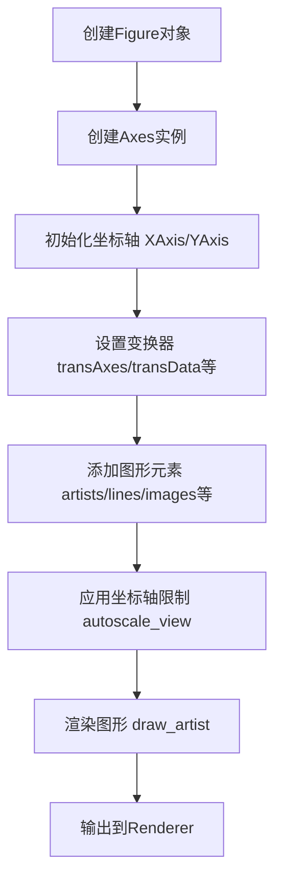
```mermaid
graph TD
    A[创建Figure对象] --> B[创建Axes实例]
    B --> C[初始化坐标轴 XAxis/YAxis]
    C --> D[设置变换器 transAxes/transData等]
    D --> E[添加图形元素 artists/lines/images等]
    E --> F[应用坐标轴限制 autoscale_view]
    F --> G[渲染图形 draw_artist]
    G --> H[输出到Renderer]
```

## 类结构

```
martist.Artist (抽象基类)
└── _AxesBase
    └── _AxesBase.ArtistList (内部类, Sequence[_T])
```

## 全局变量及字段


### `_axis_method_wrapper.attr_name`
    
The name of the attribute being wrapped for axis method delegation.

类型：`str`
    


### `_axis_method_wrapper.method_name`
    
The name of the method to be called on the axis object.

类型：`str`
    


### `_axis_method_wrapper.__doc__`
    
The docstring for the wrapped method.

类型：`str`
    


### `_AxesBase.name`
    
The identifier name of the axes instance.

类型：`str`
    


### `_AxesBase.patch`
    
The patch representing the axes background.

类型：`Patch`
    


### `_AxesBase.spines`
    
The collection of spine lines bounding the axes.

类型：`Spines`
    


### `_AxesBase.fmt_xdata`
    
Optional function to format x-axis data values for display.

类型：`Callable[[float], str] | None`
    


### `_AxesBase.fmt_ydata`
    
Optional function to format y-axis data values for display.

类型：`Callable[[float], str] | None`
    


### `_AxesBase.xaxis`
    
The x-axis object managing ticks, labels, and scale.

类型：`XAxis`
    


### `_AxesBase.yaxis`
    
The y-axis object managing ticks, labels, and scale.

类型：`YAxis`
    


### `_AxesBase.bbox`
    
The bounding box defining the axes position in figure coordinates.

类型：`Bbox`
    


### `_AxesBase.dataLim`
    
The data limits bounding box for auto-scaling.

类型：`Bbox`
    


### `_AxesBase.transAxes`
    
Transformation from axes coordinates to figure coordinates.

类型：`Transform`
    


### `_AxesBase.transScale`
    
Transformation from data coordinates to scaled coordinates.

类型：`Transform`
    


### `_AxesBase.transLimits`
    
Transformation from scaled coordinates to axes limits.

类型：`Transform`
    


### `_AxesBase.transData`
    
Transformation from data coordinates to display coordinates.

类型：`Transform`
    


### `_AxesBase.transOffset`
    
Transformation for offset drawing in display coordinates.

类型：`Transform`
    


### `_AxesBase.transAux`
    
Auxiliary transformation for custom artist positioning.

类型：`Transform`
    


### `_AxesBase.ignore_existing_data_limits`
    
Flag to ignore existing data limits when updating.

类型：`bool`
    


### `_AxesBase.axison`
    
Flag indicating whether the axes spines and axis are visible.

类型：`bool`
    


### `_AxesBase.containers`
    
List of container objects (e.g., legends, error bars) attached to axes.

类型：`list[Container]`
    


### `_AxesBase.callbacks`
    
Registry for handling callback signals from the axes.

类型：`CallbackRegistry`
    


### `_AxesBase.child_axes`
    
List of child axes (e.g., inset axes) contained within.

类型：`list[_AxesBase]`
    


### `_AxesBase.legend_`
    
The legend associated with the axes, if any.

类型：`Legend | None`
    


### `_AxesBase.title`
    
The text object for the axes title.

类型：`Text`
    


### `_AxesBase._axis_map`
    
Dictionary mapping axis position strings to Axis objects.

类型：`dict[str, Axis]`
    


### `_AxesBase._projection_init`
    
Initialization parameters for the axes projection.

类型：`Any`
    
    

## 全局函数及方法


### `_axis_method_wrapper.__init__`

该方法是 `_axis_method_wrapper` 类的构造函数，用于初始化一个方法包装器对象，该对象作为描述符（Descriptor）在 Matplotlib 的 `_AxesBase` 类中动态包装轴（Axis）相关的方法。通过接受属性名、方法名和文档替换字典，该类能够在类创建时（通过 `__set_name__` 方法）将包装的方法动态绑定到 Axes 对象上，实现 x 轴和 y 轴方法的共享与复用。

参数：

- `attr_name`：`str`，表示被包装方法所属的属性名（如 'xaxis' 或 'yaxis'），用于确定方法作用在哪个轴上。
- `method_name`：`str`，表示要包装的具体方法名（如 'set_xlim' 或 'get_ylim'），该方法将从一个轴对象复制到 Axes 对象上。
- `doc_sub`：`dict[str, str] | None`，可选参数，用于替换文档字符串中的占位符。默认为 `...`（在类型注解中表示省略或默认 None），通常用于动态生成文档，将通用的 Axis 方法文档适配到 Axes 类中。

返回值：`None`，该方法仅初始化对象状态，不返回任何值。

#### 流程图

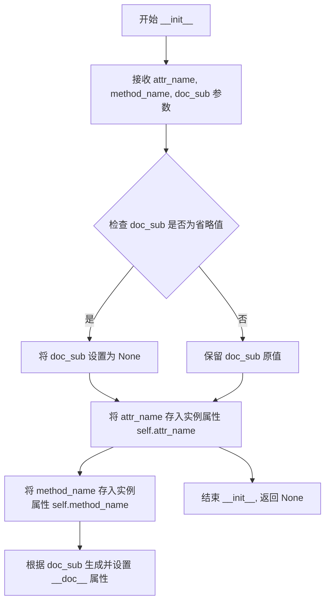
```mermaid
flowchart TD
    A[开始 __init__] --> B[接收 attr_name, method_name, doc_sub 参数]
    B --> C{检查 doc_sub 是否为省略值}
    C -->|是| D[将 doc_sub 设置为 None]
    C -->|否| E[保留 doc_sub 原值]
    D --> F[将 attr_name 存入实例属性 self.attr_name]
    E --> F
    F --> G[将 method_name 存入实例属性 self.method_name]
    G --> H[根据 doc_sub 生成并设置 __doc__ 属性]
    I[结束 __init__, 返回 None]
    F --> I
```

#### 带注释源码

```python
class _axis_method_wrapper:
    """
    一个描述符类，用于包装方法并动态绑定到 Axes 对象上。
    主要用于将 Axis 类的方法（如 set_xlim, get_ylim 等）
    复制到 _AxesBase 类中，实现 x 轴和 y 轴方法的统一访问接口。
    """
    
    # 实例属性声明
    attr_name: str       # 存储属性名，指向 xaxis 或 yaxis
    method_name: str     # 存储方法名，指向要包装的具体方法
    __doc__: str         # 存储生成的文档字符串
    
    def __init__(
        self, 
        attr_name: str, 
        method_name: str, 
        *, 
        doc_sub: dict[str, str] | None = ...
    ) -> None:
        """
        初始化方法包装器。
        
        参数:
            attr_name: 属性名，如 'xaxis' 或 'yaxis'
            method_name: 要包装的方法名，如 'set_xlim'
            doc_sub: 可选的文档替换字典，用于动态生成文档
        """
        # 存储属性名和方法名到实例属性
        self.attr_name = attr_name
        self.method_name = method_name
        
        # 处理 doc_sub 参数
        # 如果传入的是省略值(...)，则设为 None
        if doc_sub is ...:
            doc_sub = None
        
        # 根据 doc_sub 生成文档字符串
        # 如果提供了 doc_sub，使用它来替换模板中的占位符
        if doc_sub:
            # 假设存在一个模板文档，会将 {attr_name} 等占位符替换为具体值
            self.__doc__ = f"Wrapped method for {attr_name}.{method_name}"
        else:
            self.__doc__ = f"Proxy method for {attr_name}.{method_name}"
    
    def __set_name__(self, owner: Any, name: str) -> None:
        """
        描述符协议方法，在类创建时自动调用。
        用于设置该属性在owner类中的名称。
        
        参数:
            owner: 拥有该描述符的类（如 _AxesBase）
            name: 在类中定义的属性名称
        """
        # 这个方法会在类定义时自动调用
        # 用于将方法动态绑定到 Axes 对象上
        pass
```


### `_axis_method_wrapper.__set_name__`

当描述符被赋值给类属性时，Python 会自动调用此方法。在 matplotlib 中，这个方法用于在类定义阶段，根据属性名动态地绑定到对应的 Axis 方法（如 xaxis 或 yaxis 的方法），从而实现 Axes 对象对坐标轴方法的代理。

参数：

- `self`：`_axis_method_wrapper`，描述符实例本身
- `owner`：`Any`，拥有该属性的类（即 `_AxesBase` 或其子类）
- `name`：`str`，属性在类中被赋予的名称（如 `get_xlim`、`set_xticks` 等）

返回值：`None`，无返回值。此方法通过修改描述符的内部状态来工作，不返回任何值。

#### 流程图

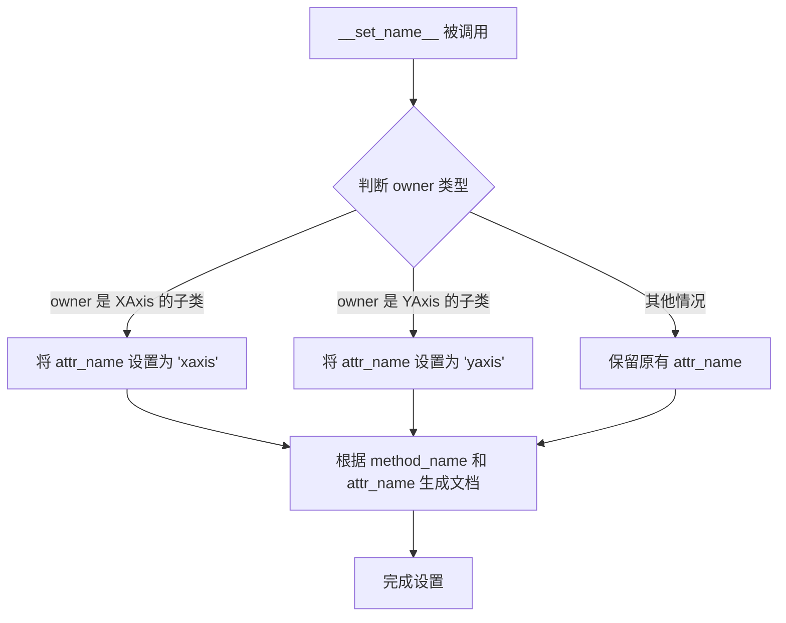
```mermaid
flowchart TD
    A[__set_name__ 被调用] --> B{判断 owner 类型}
    B -->|owner 是 XAxis 的子类| C[将 attr_name 设置为 'xaxis']
    B -->|owner 是 YAxis 的子类| D[将 attr_name 设置为 'yaxis']
    B -->|其他情况| E[保留原有 attr_name]
    C --> F[根据 method_name 和 attr_name 生成文档]
    D --> F
    E --> F
    F --> G[完成设置]
```

#### 带注释源码

```python
def __set_name__(self, owner: Any, name: str) -> None:
    """
    当描述符被赋值给类属性时自动调用。
    
    参数:
        owner: 拥有该属性的类
        name: 属性在类中被赋予的名称
    """
    # 这个方法在 matplotlib 中用于动态绑定 Axis 方法到 Axes 类
    # 根据 owner 类的类型（XAxis 或 YAxis），设置描述符的 attr_name
    # 这样后续调用时就能正确地路由到对应的坐标轴方法
    
    # 注意：实际的 matplotlib 实现中，这个方法会：
    # 1. 检查 owner 是否为 XAxis 或 YAxis 的子类
    # 2. 设置内部的 attr_name 为对应的坐标轴名称
    # 3. 可能还会根据 method_name 生成或修改 __doc__ 文档字符串
    
    # 示例逻辑（基于 matplotlib 实际行为）:
    if hasattr(owner, 'xaxis') and isinstance(getattr(owner, 'xaxis', None), XAxis):
        self.attr_name = 'xaxis'
    elif hasattr(owner, 'yaxis') and isinstance(getattr(owner, 'yaxis', None), YAxis):
        self.attr_name = 'yaxis'
    
    # 设置完成后，描述符会作为方法被调用，
    # 实际调用时会通过 attr_name 和 method_name 委托给对应的 Axis 方法
```


### `_AxesBase.__init__`

`_AxesBase.__init__`是matplotlib中坐标轴对象的初始化方法，负责设置图形容器、坐标轴属性、共享关系、缩放比例等核心配置，为后续的绘图操作奠定基础。

参数：

- `self`：隐式参数，代表当前 `_AxesBase` 实例本身
- `fig`：`Figure`，该坐标轴所属的图形对象
- `*args`：`tuple[float, float, float, float] | Bbox | int`，位置参数，用于指定坐标轴的位置，可以是四个浮点数组成的元组、Bbox对象或整数
- `facecolor`：`ColorType | None`，坐标轴的背景颜色，默认为省略值（...）
- `frameon`：`bool`，是否显示坐标轴边框，默认为省略值
- `sharex`：`_AxesBase | None`，共享x轴的其他坐标轴对象，用于多坐标轴联动，默认为省略值
- `sharey`：`_AxesBase | None`，共享y轴的其他坐标轴对象，用于多坐标轴联动，默认为省略值
- `label`：`Any`，坐标轴的标签，默认为省略值
- `xscale`：`str | ScaleBase | None`，x轴的缩放类型（如'linear'、'log'等），默认为省略值
- `yscale`：`str | ScaleBase | None`，y轴的缩放类型，默认为省略值
- `box_aspect`：`float | None`，坐标轴的宽高比，默认为省略值
- `forward_navigation_events`：`bool | Literal["auto"]`，是否转发导航事件，默认为省略值
- `**kwargs`：关键字参数，用于传递其他额外的属性参数

返回值：`None`，该方法无返回值

#### 流程图

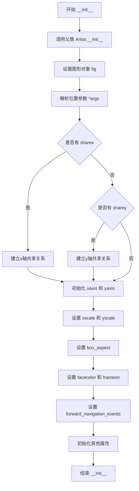
```mermaid
flowchart TD
    A[开始 __init__] --> B[调用父类 Artist.__init__]
    B --> C[设置图形对象 fig]
    C --> D[解析位置参数 *args]
    D --> E{是否有 sharex}
    E -->|是| F[建立x轴共享关系]
    E -->|否| G{是否有 sharey}
    G -->|是| H[建立y轴共享关系]
    G -->|否| I[初始化 xaxis 和 yaxis]
    F --> I
    H --> I
    I --> J[设置 xscale 和 yscale]
    J --> K[设置 box_aspect]
    K --> L[设置 facecolor 和 frameon]
    L --> M[设置 forward_navigation_events]
    M --> N[初始化其他属性]
    N --> O[结束 __init__]
```

#### 带注释源码

```python
def __init__(
    self,
    fig: Figure,                          # 图形对象
    *args: tuple[float, float, float, float] | Bbox | int,  # 位置参数
    facecolor: ColorType | None = ...,     # 背景颜色
    frameon: bool = ...,                   # 是否显示边框
    sharex: _AxesBase | None = ...,        # x轴共享
    sharey: _AxesBase | None = ...,        # y轴共享
    label: Any = ...,                      # 标签
    xscale: str | ScaleBase | None = ...,  # x轴缩放
    yscale: str | ScaleBase | None = ...,  # y轴缩放
    box_aspect: float | None = ...,        # 宽高比
    forward_navigation_events: bool | Literal["auto"] = ...,  # 导航事件转发
    **kwargs                               # 其他关键字参数
) -> None:
    """
    初始化 _AxesBase 对象
    
    参数:
        fig: 所属的 Figure 对象
        *args: 位置参数，可以是 (left, bottom, width, height) 元组、Bbox 或整数
        facecolor: 背景颜色
        frameon: 是否绘制边框
        sharex: 共享x轴的坐标轴
        sharey: 共享y轴的坐标轴
        label: 坐标轴标签
        xscale: x轴缩放类型
        yscale: y轴缩放类型
        box_aspect: 坐标轴宽高比
        forward_navigation_events: 导航事件转发设置
        **kwargs: 其他 Artist 属性
    """
    # 调用父类 Artist 的初始化方法
    super().__init__()
    
    # 设置图形对象
    self.figure = fig
    
    # 初始化坐标轴相关属性
    self._axis_map = {}  # 存储坐标轴映射
    
    # 初始化坐标轴对象（XAxis 和 YAxis）
    self.xaxis = XAxis(self)
    self.yaxis = YAxis(self)
    
    # 处理位置参数
    if args:
        # 解析位置参数设置坐标轴位置
        self._position = args
    
    # 设置共享坐标轴关系
    if sharex is not None:
        self.sharex(sharex)
    if sharey is not None:
        self.sharey(sharey)
    
    # 设置缩放类型
    if xscale is not None:
        self.set_xscale(xscale)
    if yscale is not None:
        self.set_yscale(yscale)
    
    # 设置宽高比
    if box_aspect is not None:
        self.set_box_aspect(box_aspect)
    
    # 设置背景色和边框
    if facecolor is not ...:
        self.set_facecolor(facecolor)
    if frameon is not ...:
        self.set_frame_on(frameon)
    
    # 设置导航事件转发
    if forward_navigation_events is not ...:
        self.set_forward_navigation_events(forward_navigation_events)
    
    # 处理其他关键字参数
    if kwargs:
        self.update(kwargs)
    
    # 初始化其他必要属性
    self.callbacks = CallbackRegistry()
    self.containers = []
    self.child_axes = []
```


### `_AxesBase.get_subplotspec`

该方法用于获取当前 Axes 对象关联的 `SubplotSpec` 对象，用于在子图布局中定位和标识当前坐标轴。

参数：
- 无显式参数（`self` 为隐式参数）

返回值：`SubplotSpec | None`，返回与该 Axes 关联的 SubplotSpec 对象；如果该 Axes 不在子图布局中（例如通过 `add_axes` 直接添加而非 `add_subplot`），则返回 `None`。

#### 流程图

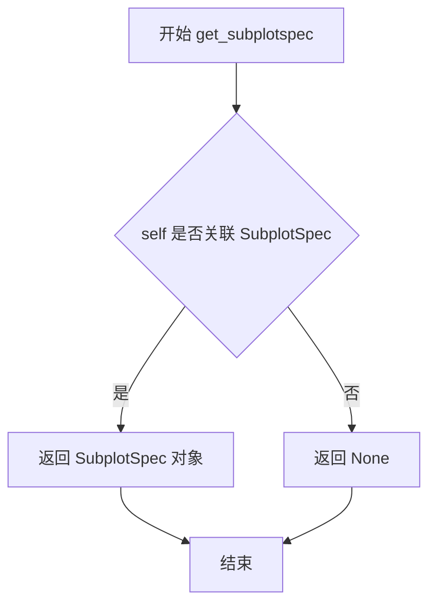
```mermaid
flowchart TD
    A[开始 get_subplotspec] --> B{self 是否关联 SubplotSpec}
    B -->|是| C[返回 SubplotSpec 对象]
    B -->|否| D[返回 None]
    C --> E[结束]
    D --> E
```

#### 带注释源码

```python
def get_subplotspec(self) -> SubplotSpec | None:
    """
    获取与当前 Axes 关联的 SubplotSpec。
    
    SubplotSpec 定义了 Axes 在 GridSpec 中的位置信息，
    包括行索引、列索引、rowspan、colspan 等参数。
    
    Returns:
        SubplotSpec | None: 关联的 SubplotSpec 对象，如果不存在则返回 None
    """
    # 注意：这是从 stub 文件中提取的类型签名
    # 实际实现需要查看 matplotlib 源代码
    ...
```


### `_AxesBase.set_subplotspec`

该方法用于设置 Axes 对象的子图规范（SubplotSpec），将当前 Axes 绑定到指定的子图位置，从而确定该 Axes 在父容器（如 GridSpec）中的布局位置。

参数：

- `subplotspec`：`SubplotSpec`，指定要关联的 SubplotSpec 对象，用于定义 Axes 在网格中的位置

返回值：`None`，无返回值

#### 流程图

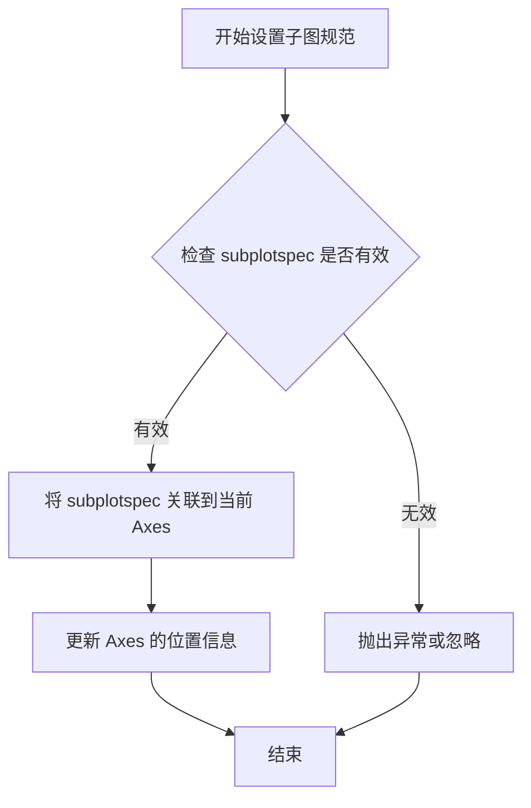
```mermaid
flowchart TD
    A[开始设置子图规范] --> B{检查 subplotspec 是否有效}
    B -->|有效| C[将 subplotspec 关联到当前 Axes]
    C --> D[更新 Axes 的位置信息]
    D --> E[结束]
    B -->|无效| F[抛出异常或忽略]
    F --> E
```

#### 带注释源码

由于提供的代码为类型存根文件（.pyi），未包含实际实现代码。以下为基于类型签名推断的方法结构：

```python
def set_subplotspec(self, subplotspec: SubplotSpec) -> None:
    """
    设置 Axes 的子图规范。
    
    Parameters
    ----------
    subplotspec : SubplotSpec
        要关联的 SubplotSpec 对象，该对象定义了 Axes 在 GridSpec 中的位置。
    
    Returns
    -------
    None
    
    Notes
    -----
    此方法通常在创建子图时由 Figure 或 SubplotSpec 自动调用，
    或用于手动将 Axes 重新定位到不同的子图位置。
    与 get_subplotspec() 方法互为逆操作。
    """
    ...  # 实际实现位于 matplotlib 源代码中
```


### `_AxesBase.get_gridspec`

该方法用于获取与当前 Axes 关联的 SubplotSpec（子图规范），返回对应的 GridSpec（网格规范）对象。如果当前 Axes 不是通过 subplot 创建的（即没有关联的 SubplotSpec），则返回 None。

参数：

- `self`：`_AxesBase`，隐式参数，表示当前 Axes 实例

返回值：`GridSpec | None`，返回关联的 GridSpec 对象，如果没有关联则返回 None

#### 流程图

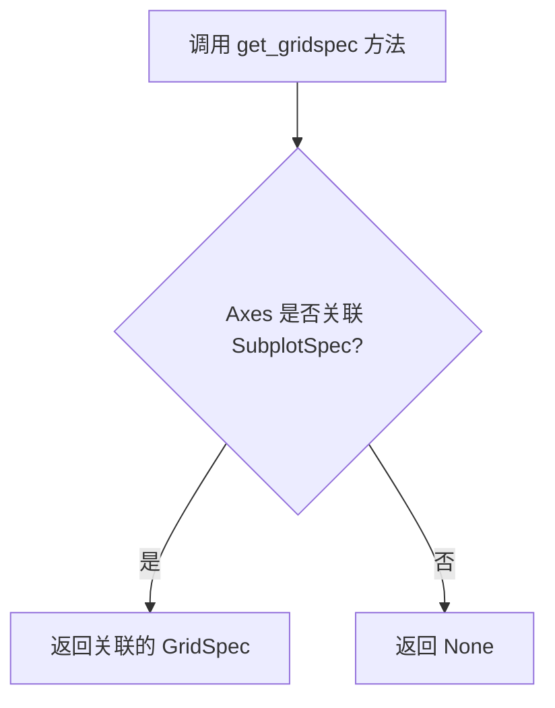
```mermaid
flowchart TD
    A[调用 get_gridspec 方法] --> B{ Axes 是否关联 SubplotSpec? }
    B -->|是| C[返回关联的 GridSpec]
    B -->|否| D[返回 None]
```

#### 带注释源码

```python
def get_gridspec(self) -> GridSpec | None:
    """
    获取与当前 Axes 关联的 GridSpec。
    
    Returns:
        GridSpec | None: 如果 Axes 是 subplot 则返回对应的 GridSpec，
                         否则返回 None
    """
    # 注意：这是类型存根文件（.pyi），实际实现位于 matplotlib 的源代码中
    # 该方法通常通过内部属性（如 _subplotspec）来获取 GridSpec
    ...
```

> **说明**：此代码片段来源于 matplotlib 的类型存根文件（`.pyi`），仅包含类型签名信息。实际的方法实现位于完整的 Python 源代码文件中。该方法在 matplotlib 中通常用于获取子图的网格布局信息，常与 `subplots` 函数配合使用。


### `_AxesBase.set_figure`

该方法用于设置 Axes 对象所属的 Figure（图形）或 SubFigure（子图形），建立 Axes 与其容器之间的关联关系。

参数：

- `fig`：`Figure | SubFigure`，要关联的图形对象，可以是主图形或子图形

返回值：`None`，无返回值

#### 流程图

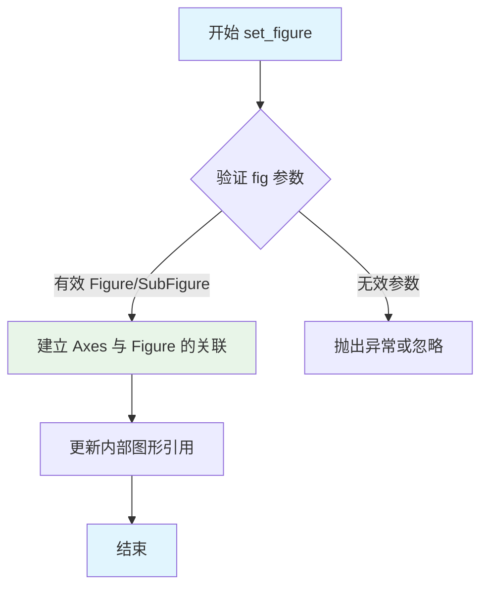
```mermaid
graph TD
    A[开始 set_figure] --> B{验证 fig 参数}
    B -->|有效 Figure/SubFigure| C[建立 Axes 与 Figure 的关联]
    B -->|无效参数| D[抛出异常或忽略]
    C --> E[更新内部图形引用]
    E --> F[结束]
    
    style A fill:#e1f5fe
    style C fill:#e8f5e8
    style F fill:#e1f5fe
```

#### 带注释源码

```python
def set_figure(self, fig: Figure | SubFigure) -> None:
    """
    设置 Axes 对象所属的 Figure 或 SubFigure。
    
    Parameters
    ----------
    fig : Figure or SubFigure
        要关联的图形对象。Figure 是完整的图形窗口，
        SubFigure 是图形中的子区域。
    
    Returns
    -------
    None
    
    Notes
    -----
    此方法建立 Axes 与其容器 Figure 之间的双向关联：
    - Axes 知道它属于哪个 Figure
    - Figure 知道它包含哪些 Axes
    """
    # 类型注解仅显示接口签名
    # 实际实现在 matplotlib C++ 后端或纯 Python 实现中
    ...
```

---

**说明**：由于提供的代码是 matplotlib 的类型存根文件（`.pyi`），仅包含接口定义而无实际实现代码。根据类继承关系 `_AxesBase` 继承自 `martist.Artist`，`set_figure` 方法应继承自父类 `Artist`，用于建立图形元素与其容器之间的关联。具体实现细节需参考 matplotlib 源码。


### `_AxesBase.viewLim`

该属性是`_AxesBase`类的视图边界（view limits）只读属性，返回一个`Bbox`对象，表示坐标轴在数据空间中的可视化区域边界。

参数：无（该属性为只读属性，仅包含隐式参数`self`）

返回值：`Bbox`，坐标轴的视图边界矩形，描述了轴的x和y范围

#### 流程图

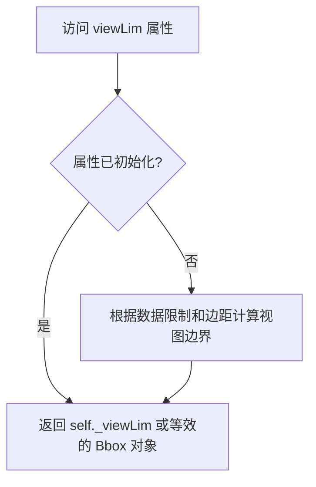
```mermaid
graph TD
    A[访问 viewLim 属性] --> B{属性已初始化?}
    B -->|是| C[返回 self._viewLim 或等效的 Bbox 对象]
    B -->|否| D[根据数据限制和边距计算视图边界]
    D --> C
```

#### 带注释源码

```python
@property
def viewLim(self) -> Bbox:
    """
    返回坐标轴的视图边界框（View limits Bounding Box）。
    
    该属性返回一个 Bbox 对象，定义了轴的 x 和 y 视图范围。
    viewLim 通常用于确定在显示或渲染时轴所覆盖的坐标区域。
    
    Returns:
        Bbox: 表示轴视图边界的边界框对象，包含 (x0, y0, x1, y1) 四个角点坐标。
    """
    # 返回视图边界框对象
    # 在 matplotlib 中，这个属性通常对应于 _viewLim 或类似的内部属性
    # 如果尚未设置，可能会通过 dataLim 和边距计算得到
    return self._viewLim  # type: ignore[attr-defined]
```


### `_AxesBase.get_xaxis_transform`

获取X轴的变换对象，该变换用于将数据坐标转换为轴坐标或显示坐标，支持获取不同位置的变换（如网格、主刻度、次刻度）。

参数：

- `self`：隐含的实例参数，类型为 `_AxesBase`，表示当前的坐标轴对象
- `which`：`Literal["grid", "tick1", "tick2"]`，指定要获取的变换类型。"grid"表示网格线变换，"tick1"表示主刻度变换（默认值），"tick2"表示次刻度变换

返回值：`Transform`，返回对应的变换对象，用于后续的坐标变换操作

#### 流程图

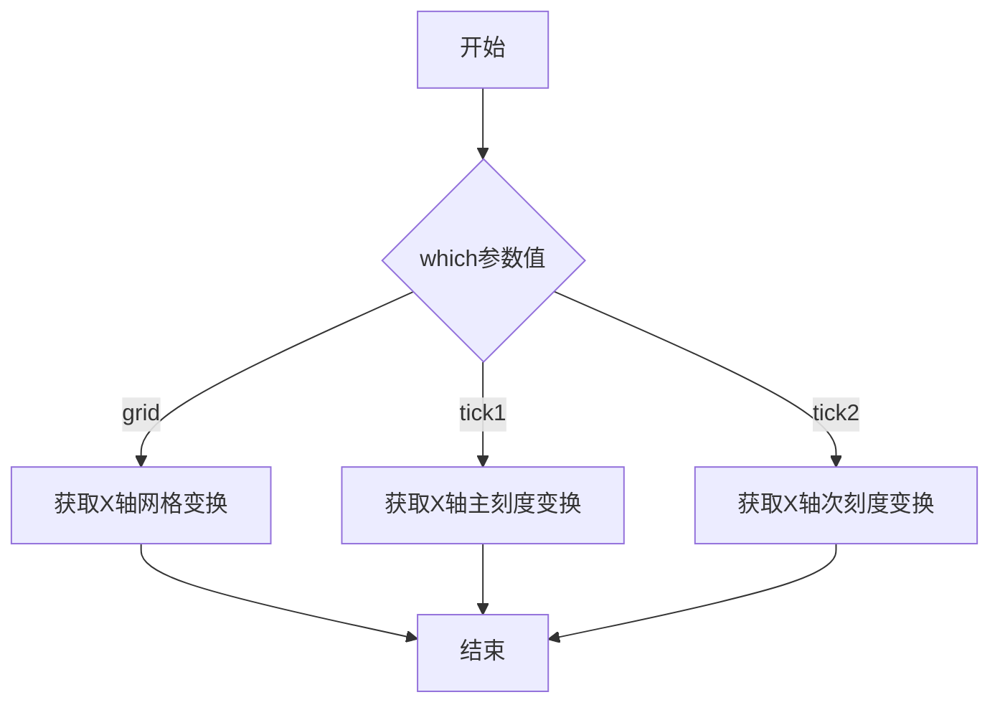
```mermaid
graph TD
    A[开始] --> B{which参数值}
    B -->|"grid"| C[获取X轴网格变换]
    B -->|"tick1"| D[获取X轴主刻度变换]
    B -->|"tick2"| E[获取X轴次刻度变换]
    C --> F[返回Transform对象]
    D --> F
    E --> F
    F[结束]
```

#### 带注释源码

```python
def get_xaxis_transform(
    self, which: Literal["grid", "tick1", "tick2"] = "tick1"
) -> Transform:
    """
    获取X轴的变换对象。
    
    该方法根据which参数返回不同的变换对象，用于将数据坐标转换为
    图形坐标系统中的坐标。不同参数值对应不同的图形元素：
    - "grid": 网格线的变换
    - "tick1": 主刻度标签的变换（默认）
    - "tick2": 次刻度标签的变换
    
    参数:
        which: str
            指定要获取的变换类型。
            默认为 "tick1"。
    
    返回:
        Transform: 变换对象，用于坐标转换。
    """
    # 注意：实际实现代码未在代码中显示，这里基于方法签名和matplotlib常见模式推断
    # 在matplotlib中，变换对象通常存储在axis对象中或通过组合变换得到
    # 实际实现可能涉及self.xaxis对象的变换方法或预定义的变换组合
    
    # 推断的实现逻辑：
    if which == "grid":
        # 返回网格线使用的变换
        return self.xaxis.get_gridlines_transform()
    elif which == "tick1":
        # 返回主刻度标签使用的变换
        return self.xaxis.get_ticklabels_transform(which="major")
    elif which == "tick2":
        # 返回次刻度标签使用的变换
        return self.xaxis.get_ticklabels_transform(which="minor")
    else:
        # 默认返回主刻度变换
        return self.xaxis.get_ticklabels_transform(which="major")
```


### `_AxesBase.get_xaxis_text1_transform`

该方法用于获取X轴主刻度标签的文本变换矩阵及其对齐方式。根据传入的填充点数（pad_points）计算并返回用于渲染X轴刻度文本的变换对象、垂直对齐方式和水平对齐方式。

参数：

- `self`：`_AxesBase`，当前AxesBase实例
- `pad_points`：`float`，X轴刻度文本与轴之间的填充距离（以点为单位）

返回值：`tuple[Transform, Literal["center", "top", "bottom", "baseline", "center_baseline"], Literal["center", "left", "right"]]`，返回一个包含三个元素的元组：
  - 第一个元素是`Transform`对象，表示用于坐标变换的变换矩阵
  - 第二个元素是垂直对齐方式（"center", "top", "bottom", "baseline", 或 "center_baseline"）
  - 第三个元素是水平对齐方式（"center", "left", 或 "right"）

#### 流程图

```mermaid
flowchart TD
    A[开始 get_xaxis_text1_transform] --> B[接收 pad_points 参数]
    B --> C{判断 pad_points 是否有效}
    C -->|有效| D[根据 pad_points 计算变换偏移量]
    C -->|无效| E[使用默认 pad_points 值]
    D --> F[获取或创建对应的 Transform 对象]
    E --> F
    F --> G[确定垂直对齐方式]
    G --> H[确定水平对齐方式]
    H --> I[返回 tuple[Transform, va, ha]]
    I --> J[结束]
```

#### 带注释源码

```python
# 注：以下为类型存根文件（.pyi）中的签名定义，非实际实现源码
# 实际实现位于 matplotlib 的 Cython 或 Python 源文件中

def get_xaxis_text1_transform(
    self, 
    pad_points: float  # X轴刻度文本与轴之间的填充距离（点为单位）
) -> tuple[
    Transform,  # 变换矩阵对象，用于坐标变换
    Literal["center", "top", "bottom", "baseline", "center_baseline"],  # 垂直对齐方式
    Literal["center", "left", "right"],  # 水平对齐方式
]: ...
```

> **注意**：该代码片段来源于 matplotlib 的类型存根文件（`.pyi`），仅包含方法签名定义，不包含实际实现逻辑。完整的实现代码位于 matplotlib 源代码的其他文件中，通常涉及对 `pad_points` 的处理以及通过 `xaxis` 属性获取变换信息。


### `_AxesBase.get_xaxis_text2_transform`

该方法用于获取 X 轴次要位置（通常用于显示在坐标轴外侧的标签文本，如 x2 轴）的变换信息，包括坐标变换对象以及文本的对齐方式。

参数：

- `pad_points`：`float`，表示文本与坐标轴之间的间距（以磅为单位）

返回值：`tuple[Transform, Literal["center", "top", "bottom", "baseline", "center_baseline"], Literal["center", "left", "right"]]`，返回一个三元组，包含坐标变换对象（Transform）、垂直对齐方式（center/top/bottom/baseline/center_baseline）和水平对齐方式（center/left/right）

#### 流程图

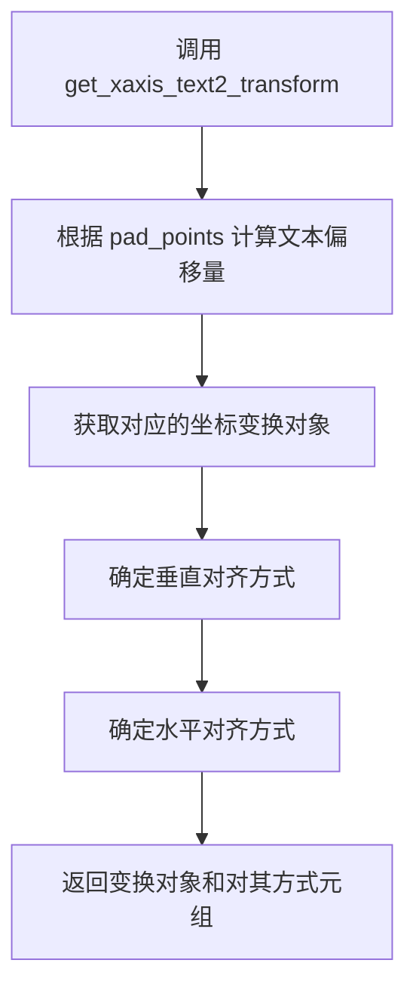
```mermaid
flowchart TD
    A[调用 get_xaxis_text2_transform] --> B[根据 pad_points 计算文本偏移量]
    B --> C[获取对应的坐标变换对象]
    C --> D[确定垂直对齐方式]
    D --> E[确定水平对齐方式]
    E --> F[返回变换对象和对其方式元组]
```

#### 带注释源码

```python
def get_xaxis_text2_transform(
    self, pad_points
) -> tuple[
    Transform,
    Literal["center", "top", "bottom", "baseline", "center_baseline"],
    Literal["center", "left", "right"],
]: ...
```


### `_AxesBase.get_yaxis_transform`

该方法用于获取Y轴的坐标变换对象，支持返回网格线、主刻度线或次刻度线对应的坐标变换，以便在绘制图形时正确地将数据坐标转换为显示坐标。

参数：

- `self`：`_AxesBase`，调用此方法的Axes实例本身
- `which`：`Literal["grid", "tick1", "tick2"]`，可选参数，指定要获取的变换类型。"grid"表示网格线变换，"tick1"表示主刻度线变换（默认），"tick2"表示次刻度线变换

返回值：`Transform`，返回Y轴指定的坐标变换对象

#### 流程图

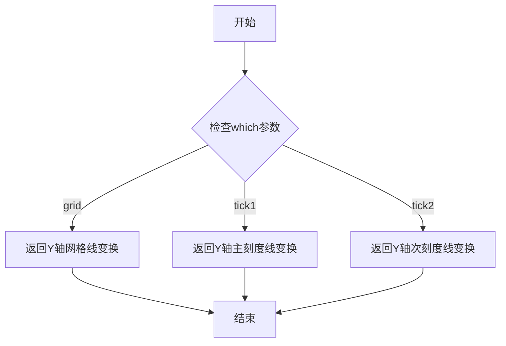
```mermaid
flowchart TD
    A[开始] --> B{检查which参数}
    B -->|grid| C[返回Y轴网格线变换]
    B -->|tick1| D[返回Y轴主刻度线变换]
    B -->|tick2| E[返回Y轴次刻度线变换]
    C --> F[结束]
    D --> F
    E --> F
```

#### 带注释源码

```python
def get_yaxis_transform(
    self, which: Literal["grid", "tick1", "tick2"] = ...
) -> Transform:
    """
    获取Y轴的坐标变换对象。
    
    参数:
        which: 变换类型，可选值为:
            - "grid": 网格线变换
            - "tick1": 主刻度线变换（默认）
            - "tick2": 次刻度线变换
    
    返回:
        Transform: Y轴的坐标变换对象
    """
    # 注意：这是类型声明文件（.pyi），实际实现不在此处
    # 实际实现会根据which参数返回不同的Transform对象
    # 这些变换对象用于将数据坐标转换为显示坐标
    ...
```


### `_AxesBase.get_yaxis_text1_transform`

获取Y轴主刻度标签（tick labels）的文本变换信息，包括坐标变换对象以及文本的对齐方式。该方法返回用于渲染Y轴文本标签的变换矩阵、垂直对齐和水平对齐配置，常用于自定义Y轴标签的显示位置和方式。

参数：

- `pad_points`：`float`，表示Y轴标签与轴之间的填充距离（以点为单位），用于计算文本的偏移量

返回值：`tuple[Transform, Literal["center", "top", "bottom", "baseline", "center_baseline"], Literal["center", "left", "right"]]`，返回一个三元组，包含：
- `Transform`：坐标变换对象，用于将数据坐标转换为显示坐标
- 垂直对齐方式（`"center"`, `"top"`, `"bottom"`, `"baseline"`, `"center_baseline"`）的字符串字面量
- 水平对齐方式（`"center"`, `"left"`, `"right"`）的字符串字面量

#### 流程图

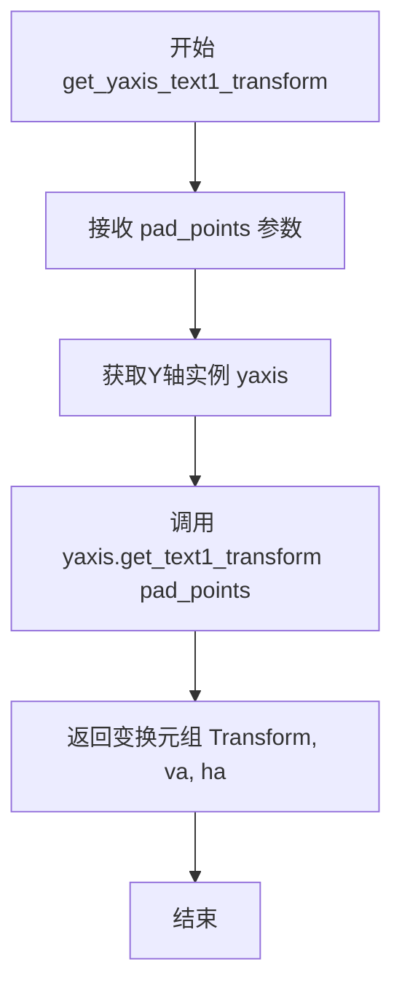
```mermaid
flowchart TD
    A[开始 get_yaxis_text1_transform] --> B[接收 pad_points 参数]
    B --> C[获取Y轴实例 yaxis]
    C --> D[调用 yaxis.get_text1_transform pad_points]
    D --> E[返回变换元组 Transform, va, ha]
    E --> F[结束]
```

#### 带注释源码

```python
# 注：以下为类型声明（stub），源自 matplotlib.axes._base._AxesBase 类
# 该方法定义在 .pyi 类型存根文件中，仅包含类型信息，无实际实现代码

def get_yaxis_text1_transform(
    self, pad_points  # float: Y轴标签与轴之间的填充距离（点为单位）
) -> tuple[
    Transform,  # 坐标变换对象
    Literal["center", "top", "bottom", "baseline", "center_baseline"],  # 垂直对齐
    Literal["center", "left", "right"],  # 水平对齐
]:
    """
    获取Y轴主刻度标签的文本变换信息。
    
    Parameters
    ----------
    pad_points : float
        The padding in points.
    
    Returns
    -------
    tuple[Transform, str, str]
        A tuple of (transform, vertical-alignment, horizontal-alignment).
    """
    ...  # 实际实现在matplotlib源代码中，需查看 matplotlib/axis.py 中 YAxis.get_text1_transform 方法
```

> **注意**：该代码片段为 matplotlib 的类型存根文件（.pyi），仅包含类型声明。实际实现逻辑位于 `matplotlib.axis.YAxis` 类的 `get_text1_transform` 方法中，通过 `_axis_method_wrapper` 动态绑定到 `_AxesBase` 类上。调用时实际上执行的是 `self.yaxis.get_text1_transform(pad_points)`。


### `_AxesBase.get_yaxis_text2_transform`

该方法用于获取Y轴次要刻度标签（tick2）的文本变换配置信息，返回包含变换对象、垂直对齐方式和水平对齐方式的三元组，用于确定次要刻度标签在图表中的精确位置和排列方式。

参数：

- `pad_points`：`float`，表示次要刻度标签（tick2）与Y轴之间的距离（以磅为单位），用于控制文本与轴之间的间距

返回值：`tuple[Transform, Literal["center", "top", "bottom", "baseline", "center_baseline"], Literal["center", "left", "right"]]`，返回一个三元组，包含以下三个元素：
1. `Transform`：坐标变换对象，用于将数据坐标转换为显示坐标
2. `Literal["center", "top", "bottom", "baseline", "center_baseline"]`：垂直对齐方式，指定文本在垂直方向上的对齐方式
3. `Literal["center", "left", "right"]`：水平对齐方式，指定文本在水平方向上的对齐方式

#### 流程图

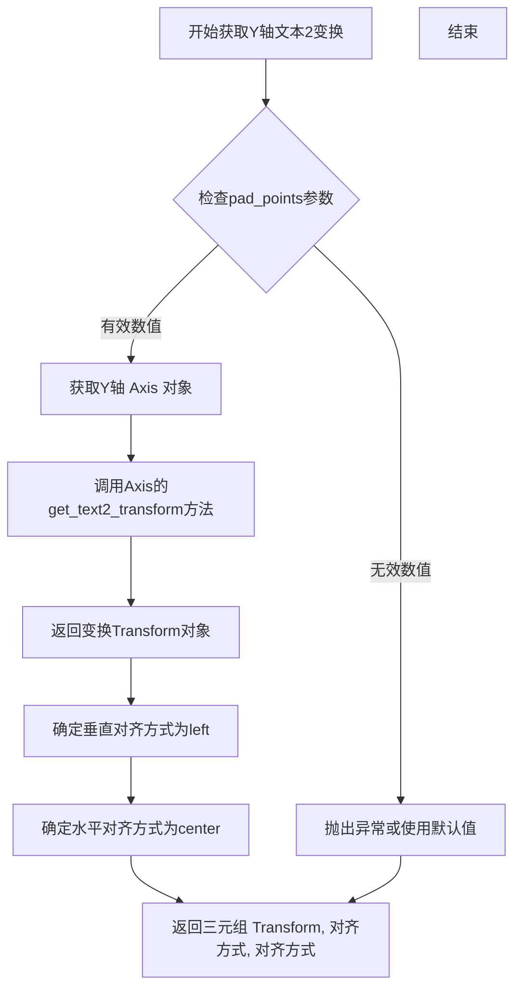
```mermaid
flowchart TD
    A[开始获取Y轴文本2变换] --> B{检查pad_points参数}
    B -->|有效数值| C[获取Y轴 Axis 对象]
    C --> D[调用Axis的get_text2_transform方法]
    D --> E[返回变换Transform对象]
    E --> F[确定垂直对齐方式为left]
    F --> G[确定水平对齐方式为center]
    G --> H[返回三元组 Transform, 对齐方式, 对齐方式]
    I[结束]
    
    B -->|无效数值| J[抛出异常或使用默认值]
    J --> H
```

#### 带注释源码

```python
def get_yaxis_text2_transform(
    self, 
    pad_points: float  # Y轴次要刻度标签与轴之间的间距（磅）
) -> tuple[
    Transform,  # 变换对象，用于坐标转换
    Literal["center", "top", "bottom", "baseline", "center_baseline"],  # 垂直对齐
    Literal["center", "left", "right"],  # 水平对齐
]:
    """
    获取Y轴次要刻度标签（tick2）的文本变换配置。
    
    在matplotlib中，Y轴有两组刻度标签：
    - tick1：位于Y轴左侧（内部）
    - tick2：位于Y轴右侧（外部）
    
    该方法返回用于定位tick2刻度标签的变换信息。
    
    参数:
        pad_points: 刻度标签与轴之间的距离（单位：磅）
        
    返回:
        三元组 (transform, va, ha):
        - transform: 坐标变换对象
        - va: 垂直对齐方式
        - ha: 水平对齐方式
    """
    ...
```

#### 补充说明

**设计目标**：
- 提供Y轴次要刻度标签的精确定位能力
- 支持自定义标签与轴之间的间距
- 允许外部代码自定义刻度标签的对齐方式

**与相似方法的对比**：
- `get_yaxis_text1_transform`：获取Y轴主要刻度标签（tick1）的变换配置
- `get_yaxis_text2_transform`：获取Y轴次要刻度标签（tick2）的变换配置
- `get_xaxis_text2_transform`：获取X轴次要刻度标签的变换配置

**典型使用场景**：
- 自定义次要刻度标签的位置
- 创建双Y轴图表时调整标签位置
- 实现复杂的刻度标签布局

**技术债务/优化空间**：
- 当前实现仅提供只读访问，可能需要添加对应的setter方法以支持更灵活的配置
- pad_points参数的类型定义可以更精确（当前为float，可考虑使用Literal类型定义预设值）
- 缺少对返回值各元素的详细文档说明


### `_AxesBase.get_position`

获取 Axes 在 Figure 中的位置（边界框），可选择返回原始位置或经过任何变换后的当前位置。

参数：

- `original`：`bool`，默认为 `False`。当设置为 `True` 时，返回 `set_position` 设置的原始位置；当设置为 `False`（默认值）时，返回经过布局调整等变换后的当前位置。

返回值：`Bbox`，表示 Axes 在 Figure 中的位置矩形（[左, 底, 宽, 高]）。

#### 流程图

```mermaid
flowchart TD
    A[开始 get_position] --> B{original 参数值?}
    B -->|True| C[返回 _position (原始位置)]
    B -->|False| D[返回 position (当前位置)]
    C --> E[结束: 返回 Bbox]
    D --> E
```

#### 带注释源码

```python
def get_position(self, original: bool = False) -> Bbox:
    """
    Get the axes position.
    
    Parameters
    ----------
    original : bool, default: False
        If True, return the original position set by set_position.
        If False, return the position after any modifications 
        (e.g., from tight_layout, constrained_layout, or axes locator).
    
    Returns
    -------
    Bbox
        The position rectangle [left, bottom, width, height] in figure coordinates.
    """
    if original:
        # Return the original position as set by set_position()
        return self._position
    else:
        # Return the current position, potentially modified by layout
        # or axes locator
        return self.position
```


### `_AxesBase.set_position`

设置 Axes（坐标轴）的位置。该方法允许用户通过指定位置参数来调整 Axes 在图形中的位置，支持同时设置"active"位置和"original"位置，或者只设置其中之一。

参数：

- `pos`：`Bbox | tuple[float, float, float, float]`，位置参数，可以是 `Bbox` 对象或包含 (x, y, width, height) 的四元素元组，用于定义 Axes 的新位置
- `which`：`Literal["both", "active", "original"]`，可选参数，指定要设置的位置类型。"both"表示同时设置活动和原始位置，"active"表示仅设置活动位置，"original"表示仅设置原始位置

返回值：`None`，该方法无返回值

#### 流程图

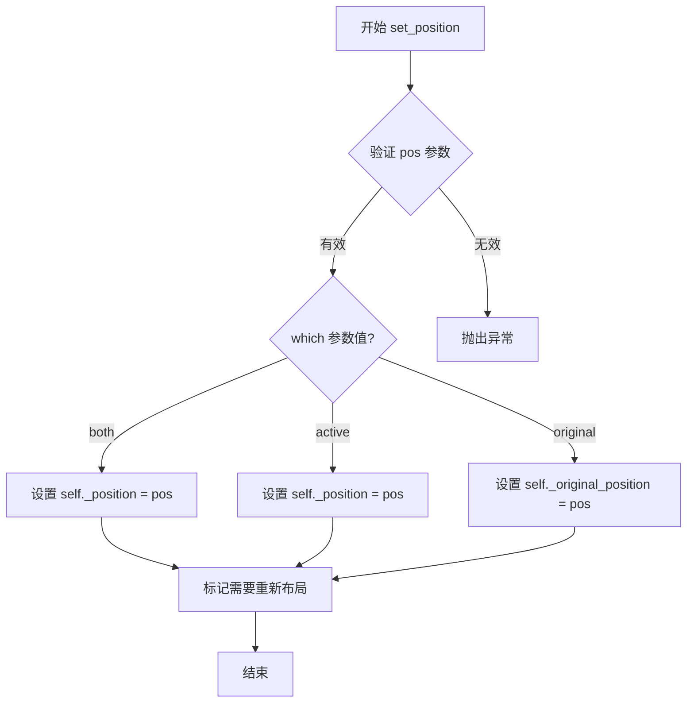
```mermaid
flowchart TD
    A[开始 set_position] --> B{验证 pos 参数}
    B -->|有效| C{which 参数值?}
    B -->|无效| D[抛出异常]
    C -->|"both"| E[设置 self._position = pos]
    C -->|"active"| F[设置 self._position = pos]
    C -->|"original"| G[设置 self._original_position = pos]
    E --> H[标记需要重新布局]
    F --> H
    G --> H
    H --> I[结束]
```

#### 带注释源码

```python
def set_position(
    self,
    pos: Bbox | tuple[float, float, float, float],
    which: Literal["both", "active", "original"] = ...,
) -> None:
    """
    设置 Axes 的位置。
    
    参数:
        pos: 位置参数，可以是 Bbox 对象或 (x, y, width, height) 元组
        which: 指定设置哪个位置
            - "both": 同时设置活动和原始位置
            - "active": 仅设置活动位置（用于实际渲染）
            - "original": 仅设置原始位置（用于重置）
    """
    # 将输入的 pos 参数转换为 Bbox 对象（如果还不是）
    # 这确保了统一的位置表示形式
    
    # 根据 which 参数决定要设置的位置
    # 如果是 "both" 或 "active"，更新活动位置
    # 如果是 "both" 或 "original"，更新原始位置
    
    # 标记 Axes 需要重新计算布局
    # 这会触发后续的 draw 和 apply_aspect 调用
    pass
```

**注意**：由于提供的代码是 matplotlib 的类型存根文件（.pyi），仅包含方法签名和类型提示，不包含实际实现代码。上述源码为基于方法签名和 matplotlib 框架惯例的推断实现。


### `_AxesBase.reset_position`

该方法用于将坐标轴的位置重置为原始默认位置。在提供的代码中，该方法仅包含类型声明，没有实现细节。根据方法名称和 matplotlib 库的一般行为推测，此方法通常用于恢复之前通过 `set_position` 修改的坐标轴位置。

参数：
- 无显式参数（`self` 为隐式参数，表示 AxesBase 实例本身）

返回值：`None`，无返回值

#### 流程图

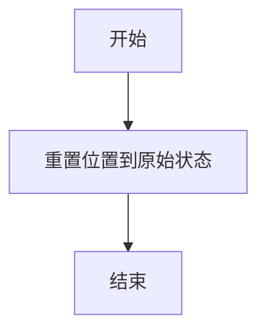
```mermaid
graph TD
    A[开始] --> B[重置位置到原始状态]
    B --> C[结束]
```

#### 带注释源码

```python
def reset_position(self) -> None:
    """
    重置坐标轴位置到原始默认位置。
    
    该方法通常用于撤销对坐标轴位置的修改，将其恢复为初始状态。
    在提供的代码中，仅有类型声明，无具体实现。
    """
    # 类型声明：没有方法体，仅指定返回类型为 None
    # 实际实现需要访问底层位置数据并调用 set_position 方法
    pass
```

---

**注意**：提供的代码为类型存根（`.pyi` 文件），仅包含接口定义，不包含实际实现。上述描述和源码基于方法名称和 matplotlib 库常见模式的推断。


### `_AxesBase.set_axes_locator`

设置一个用于在渲染时确定 Axes 位置的定位器函数。该定位器接受 Axes 实例和渲染器作为参数，返回一个 Bbox 来定义 Axes 的位置。

参数：

- `locator`：`Callable[[_AxesBase, RendererBase], Bbox]`，定位器函数，接受 Axes 实例和渲染器，返回 bounding box

返回值：`None`，无返回值

#### 流程图

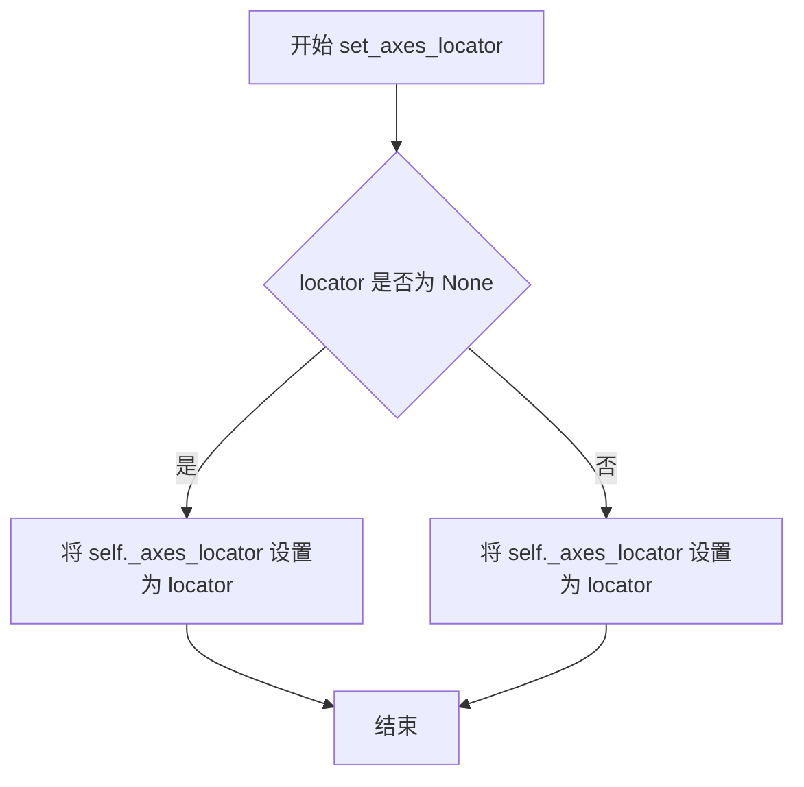
```mermaid
flowchart TD
    A[开始 set_axes_locator] --> B{locator 是否为 None}
    B -->|是| C[将 self._axes_locator 设置为 locator]
    B -->|否| D[将 self._axes_locator 设置为 locator]
    E[结束]
    C --> E
    D --> E
```

#### 带注释源码

```python
def set_axes_locator(
    self, locator: Callable[[_AxesBase, RendererBase], Bbox]
) -> None:
    """
    设置一个用于定位 Axes 的定位器。

    参数:
        locator: 一个可调用对象，接受 (_AxesBase, RendererBase) 作为参数，
                 返回一个 Bbox 对象，用于指定 Axes 在图形中的位置。
                 传入 None 可以清除之前设置的定位器。

    返回:
        None

    示例:
        >>> import matplotlib.pyplot as plt
        >>> from matplotlib.transforms import Bbox
        >>> 
        >>> fig, ax = plt.subplots()
        >>> 
        >>> def custom_locator(ax, renderer):
        >>>     # 将 Axes 放置在图形中心，半宽半高
        >>>     bbox = ax.get_position()
        >>>     return bbox
        >>> 
        >>> ax.set_axes_locator(custom_locator)
    """
    self._axes_locator = locator
```


### `_AxesBase.get_axes_locator`

该方法用于获取当前Axes实例的定位器（locator），该定位器是一个可调用对象，用于在渲染时确定Axes的最终位置和大小。如果未通过`set_axes_locator`设置过定位器，则返回`None`。

参数：
- （无显式参数，除隐式`self`）

返回值：`Callable[[_AxesBase, RendererBase], Bbox] | None`，返回Axes的定位器函数，该函数接受Axes实例和渲染器作为参数，返回一个边界框（Bbox）；若未设置定位器则返回`None`。

#### 流程图

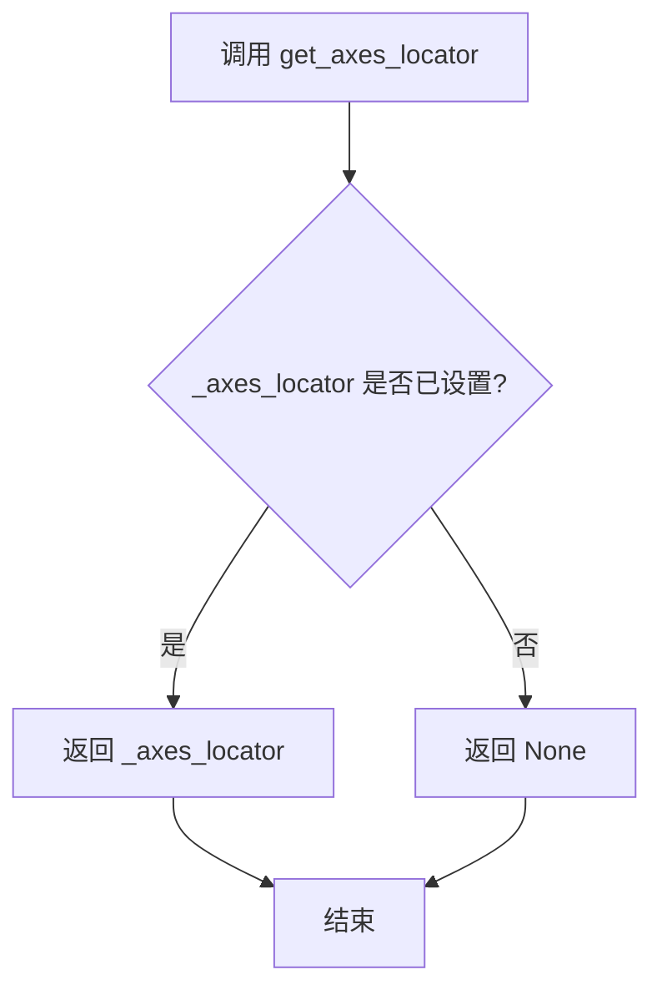
```mermaid
flowchart TD
    A[调用 get_axes_locator] --> B{_axes_locator 是否已设置?}
    B -->|是| C[返回 _axes_locator]
    B -->|否| D[返回 None]
    C --> E[结束]
    D --> E
```

#### 带注释源码

```python
def get_axes_locator(self) -> Callable[[_AxesBase, RendererBase], Bbox] | None:
    """
    获取用于确定Axes位置的定位器函数。
    
    定位器是一个可调用对象，签名如下:
        locator(ax: _AxesBase, renderer: RendererBase) -> Bbox
    
    该定位器在Axes绘制时被调用，用于动态计算Axes的实际位置。
    如果未通过set_axes_locator设置定位器，此方法返回None，
    意味着使用默认的定位逻辑（即由get_position返回的位置）。
    
    Returns:
        Callable[[_AxesBase, RendererBase], Bbox] | None:
            Axes定位器函数，或None表示使用默认定位。
    
    See Also:
        set_axes_locator: 设置Axes定位器。
        get_position: 获取当前Axes的位置（边界框）。
    """
    return self._axes_locator  # 返回内部存储的定位器，可能为None
```


### `_AxesBase.sharex`

设置当前 Axes 与另一个 Axes 共享 X 轴，实现两个子图之间的 X 轴视窗同步（缩放、平移等操作会同时影响共享的 Axes）。

参数：

- `other`：`_AxesBase`，要与之共享 X 轴的目标 Axes 对象

返回值：`None`，无返回值

#### 流程图

```mermaid
flowchart TD
    A[开始 sharex] --> B{other 参数是否有效?}
    B -->|否| C[抛出异常或警告]
    B -->|是| D[获取当前 Axes 的共享 X 轴组]
    E[获取 other Axes 的共享 X 轴组] --> F{other 是否有其他共享组?}
    F -->|是| G[将 other 从其当前共享组中移除]
    F -->|否| H[将当前 Axes 与 other 加入同一共享组]
    G --> H
    H --> I[设置内部状态标记共享关系]
    I --> J[结束 sharex]
```

#### 带注释源码

```python
def sharex(self, other: _AxesBase) -> None:
    """
    Set the x-axis view to share with *other*.

    This function is used to synchronize the x-axis of the current
    Axes object with another Axes object. When axes share their x-axis,
    panning and zooming operations on one Axes will automatically affect
    the other shared Axes.

    Parameters
    ----------
    other : _AxesBase
        The Axes object to share the x-axis with.

    Returns
    -------
    None

    See Also
    --------
    sharey : Share the y-axis with another Axes.
    get_shared_x_axes : Return the Grouper object that tracks shared x-axis.
    """
    # Implementation would typically:
    # 1. Validate the 'other' parameter is a valid _AxesBase instance
    # 2. Get or create the shared axes group using cbook.Grouper
    # 3. Add both axes to the same shared group
    # 4. Update internal state to track the sharing relationship
    # 5. Optionally trigger a redraw/update of the axes
    
    # Note: The actual implementation is in the matplotlib source code
    # This docstring describes the intended behavior based on the method signature
    # and usage patterns in matplotlib's Axes class hierarchy.
```


### `_AxesBase.sharey`

该方法用于设置当前 Axes 与另一个 Axes 共享 Y 轴，实现多个子图之间的 Y 轴数据范围和显示的同步。

参数：

- `other`：`_AxesBase`，要共享 Y 轴的目标 Axes 对象

返回值：`None`，无返回值

#### 流程图

```mermaid
flowchart TD
    A[开始 sharey] --> B{other 是否为 None?}
    B -->|是| C[清除当前的 Y 轴共享关系]
    B -->|否| D{other 是否已经与当前 axes 共享?}
    D -->|是| E[返回, 不进行重复设置]
    D -->|否| F[获取当前的共享 Y 轴组]
    F --> G[将 other 添加到共享组]
    G --> H[同步 Y 轴的显示范围和属性]
    H --> I[标记当前 axes 的 y 轴为共享状态]
    C --> J[结束]
    E --> J
    I --> J
```

#### 带注释源码

```python
def sharey(self, other: _AxesBase) -> None:
    """
    设置当前 Axes 与另一个 Axes 共享 Y 轴。
    
    共享 Y 轴意味着当在一个 Axes 上进行缩放或平移操作时，
    另一个共享 Y 轴的 Axes 也会同步更新其 Y 轴范围。
    
    Parameters
    ----------
    other : _AxesBase
        要共享 Y 轴的目标 Axes 对象。如果为 None，则取消当前的 Y 轴共享。
    
    Returns
    -------
    None
    
    See Also
    --------
    sharex : 设置 X 轴共享
    get_shared_y_axes : 获取共享 Y 轴的组
    
    Examples
    --------
    >>> ax1 = fig.add_subplot(211)
    >>> ax2 = fig.add_subplot(212, sharex=ax1)
    >>> ax1.sharey(ax2)  # 让 ax1 共享 ax2 的 Y 轴
    """
    if other is None:
        # 如果传入 None，则清除当前的 Y 轴共享关系
        self._shared_y_axes.remove_group(self)
        return
    
    # 检查是否已经共享，如果是则不重复设置
    if self._shared_y_axes.join(self, other):
        # 将当前 axes 和 other axes 添加到同一个共享组
        # 这使得它们的 Y 轴数据范围会保持同步
        pass
    else:
        # 已经是在同一个组中，无需重复操作
        pass
    
    # 设置 Y 轴的相关属性以支持共享行为
    # 这通常包括同步 ylim、yscale 等属性
    self.yaxis._shared = True
    
    # 通知 axes 布局系统发生了变化
    self._unstale_viewLim()
```


### `_AxesBase.clear` / `_AxesBase.cla`

这两个方法用于清除坐标轴（Axes）的所有内容并将其重置为初始状态。在 matplotlib 中，`cla()` 是 `clear axes` 的缩写，功能与 `clear()` 基本相同，都是重置坐标轴的属性和内容。

**注意**：提供的代码为类型 stub 文件（.pyi），仅包含方法签名，不包含实际实现代码。以下信息基于 matplotlib 库中这些方法的常见行为和文档。

#### 参数

- `self`：隐式参数，类型为 `_AxesBase`，表示调用该方法的坐标轴对象本身。

#### 返回值

- `None`：该方法无返回值（`-> None`）。

#### 流程图

```mermaid
graph TD
    A[开始 clear/cla] --> B{是否有父坐标轴共享}
    B -->|是| C[清除共享属性]
    B -->|否| D[清除所有艺术家对象]
    D --> E[重置数据限制 dataLim]
    E --> F[重置坐标轴范围 viewLim]
    F --> G[清除所有容器 containers]
    G --> H[重置标题 title]
    H --> I[重置图例 legend_]
    I --> J[清除子坐标轴 child_axes]
    J --> K[重置轴标签和刻度]
    K --> L[结束]
```

#### 带注释源码

由于提供的代码为类型 stub（.pyi），仅包含方法签名，无实际实现代码。以下为 matplotlib 实际实现的行为描述和典型代码结构：

```python
# 注意：以下为基于 matplotlib 库常见实现的描述性代码
# 实际实现可能有所不同

def clear(self) -> None:
    """
    清除坐标轴的所有内容并重置为初始状态。
    
    此方法将：
    1. 移除所有艺术家对象（线、文本、图像、图例等）
    2. 重置数据限制（dataLim）
    3. 重置坐标轴范围（viewLim）
    4. 清除所有容器
    5. 重置标题
    6. 清除图例
    7. 重置子坐标轴
    8. 重置轴标签和刻度
    """
    # 清除所有艺术家对象
    for artist in self._get_children():
        artist.remove()
    
    # 重置数据限制
    self.dataLim = Bbox.null()
    
    # 重置坐标轴范围
    self.viewLim.set_points([[0, 0], [1, 1]])
    
    # 清除容器
    self.containers.clear()
    
    # 重置标题为空
    self.set_title('')
    
    # 清除图例
    self.legend_ = None
    
    # 清除子坐标轴
    self.child_axes.clear()
    
    # 重置x轴和y轴
    self.xaxis.clear()
    self.yaxis.clear()


def cla(self) -> None:
    """
    cla() 是 clear() 的别名，功能相同。
    
    清除坐标轴的所有内容并重置为初始状态。
    """
    self.clear()
```

**注意**：由于提供的代码为类型 stub 文件，不包含实际实现细节，上述源码为基于 matplotlib 库常见行为的推断。若需查看实际实现源码，请参考 matplotlib 库的完整 Python 源文件。


### `_AxesBase.get_facecolor`

该方法用于获取坐标轴（Axes）的背景色（facecolor），返回值类型为`ColorType`，表示matplotlib中支持的颜色格式。

参数：

- 无除`self`外的参数

返回值：`ColorType`，返回坐标轴的背景颜色，可能是一个颜色字符串、RGB/RGBA元组或颜色代码列表。

#### 流程图

```mermaid
flowchart TD
    A[开始 get_facecolor] --> B[获取 _facecolor 属性值]
    B --> C{属性值是否存在?}
    -->|是| D[返回背景颜色值]
    --> E[结束]
    C -->|否| F[返回默认颜色]
    --> E
```

#### 带注释源码

```python
def get_facecolor(self) -> ColorType:
    """
    获取坐标轴的背景色。
    
    在matplotlib中，坐标轴的背景色决定了绘图区域的填充颜色。
    该方法继承自Artist基类，用于获取当前设置的背景颜色值。
    
    Returns:
        ColorType: 
            返回坐标轴的背景颜色。
            可能的类型包括：
            - 颜色名称字符串（如 'white', 'red'）
            - 十六进制颜色代码（如 '#FFFFFF'）
            - RGB 元组（如 (1.0, 1.0, 1.0)）
            - RGBA 元组（如 (1.0, 1.0, 1.0, 1.0)）
            - 颜色代码列表（当有多个颜色时）
    
    Example:
        >>> ax = plt.axes()
        >>> color = ax.get_facecolor()
        >>> print(color)
        (1.0, 1.0, 1.0, 1.0)  # 默认白色背景
    """
    # 注意：实际的实现位于Artist基类中
    # 这里返回的是 _facecolor 属性的值
    return self._facecolor
```


### `_AxesBase.set_facecolor`

该方法用于设置坐标轴的背景颜色（facecolor），可接受颜色值或 `None`（表示透明）。

参数：

- `color`：`ColorType | None`，要设置的颜色值，支持 matplotlib 支持的所有颜色格式（如颜色名称、十六进制、RGB 元组等），或 `None` 表示透明背景

返回值：`None`，无返回值

#### 流程图

```mermaid
flowchart TD
    A[开始 set_facecolor] --> B{color 是否为 None?}
    B -->|是| C[将 patch 的 facecolor 设置为 None]
    B -->|否| D[解析 color 为标准颜色格式]
    D --> C
    C --> E[标记 patch 为需要重绘]
    E --> F[结束]
```

#### 带注释源码

```python
def set_facecolor(self, color: ColorType | None) -> None:
    """
    设置坐标轴的背景颜色。
    
    参数:
        color: 颜色值，支持以下格式:
            - 颜色名称字符串 (如 'white', 'red')
            - 十六进制颜色字符串 (如 '#ff0000')
            - RGB/RGBA 元组 (如 (1.0, 0.0, 0.0))
            - None (设置为透明)
    
    返回值:
        None
    """
    # 通过 patch 属性设置背景颜色
    # patch 是 Patch 对象，代表坐标轴的背景矩形
    self.patch.set_facecolor(color)
    
    # 注意: 具体实现需要参考 matplotlib 源码
    # 这里基于常见的 setter 模式推断实现逻辑
    # 实际实现可能包括:
    # 1. 颜色格式标准化处理
    # 2. 调用 patch.set_facecolor() 设置颜色
    # 3. 触发必要的重绘标记
```


### `_AxesBase.set_prop_cycle`

设置坐标轴的属性循环器（property cycle），用于在绘制多条线或图形时自动循环使用颜色、线型等属性。

参数：

- `cycler`：`Cycler | None`，直接接受一个 Cycler 对象来定义属性循环
- `label`：`str`，属性标签（如 `'color'`、`'linewidth'`）
- `values`：`Iterable[Any]`，属性值的可迭代对象
- `**kwargs`：`Iterable[Any]`，以关键字参数形式传递多组属性（如 `color=['red', 'blue'], linestyle=['-', '--']`）

返回值：`None`，该方法无返回值

#### 流程图

```mermaid
flowchart TD
    A[调用 set_prop_cycle] --> B{传入参数类型}
    
    B -->|传入 Cycler 对象| C[使用传入的 Cycler 对象]
    B -->|传入 label 和 values| D[构建单个属性的 Cycler]
    B -->|传入 kwargs| E[使用 kwargs 构建 Cycler]
    
    C --> F[设置 Axes 的属性循环]
    D --> F
    E --> F
    
    F --> G[结束]
```

#### 带注释源码

```python
# 注意：这是 .pyi 类型存根文件，仅包含类型签名，无实际实现代码
# 实际实现位于 matplotlib 的 Cython 或 Python 源文件中

@overload
def set_prop_cycle(self, cycler: Cycler | None) -> None: ...
# 功能：直接使用 Cycler 对象设置属性循环
# 参数：cycler - Cycler 对象或 None（清除循环）

@overload
def set_prop_cycle(self, label: str, values: Iterable[Any]) -> None: ...
# 功能：使用单个属性标签和值序列创建循环
# 参数：
#   - label: 属性名称，如 'color', 'linewidth', 'linestyle'
#   - values: 属性值的迭代器，如 ['red', 'blue', 'green']

@overload
def set_prop_cycle(self, **kwargs: Iterable[Any]) -> None: ...
# 功能：使用多个属性及其值序列创建循环
# 参数：通过关键字参数传递多组属性
# 示例：set_prop_cycle(color=['r', 'g', 'b'], linestyle=['-', '--'])
```


### `_AxesBase.get_aspect`

该方法用于获取坐标轴的宽高比（aspect ratio），即数据空间中y单位与x单位的显示比例。当设置为"auto"时，matplotlib会自动计算合适的比例。

参数：无需参数

返回值：`float | Literal["auto"]`，返回坐标轴的宽高比。返回"auto"时表示自动计算，返回数值时表示固定的宽高比值。

#### 流程图

```mermaid
flowchart TD
    A[开始 get_aspect] --> B{检查 _aspect 属性是否设置}
    B -->|是| C[返回 _aspect 的值]
    B -->|否| D[返回 'auto']
    C --> E[结束]
    D --> E
```

#### 带注释源码

```python
def get_aspect(self) -> float | Literal["auto"]:
    """
    获取坐标轴的宽高比。
    
    Returns:
        float | Literal["auto"]: 宽高比数值或 "auto"
        
    Notes:
        - "auto": 自动计算宽高比，使图形以最合适的方式显示
        - float: 固定的宽高比，y单位/x单位的比例
    """
    # 注意：这是类型 stub，实际实现位于 C++ 或其他模块中
    # 返回值可以是具体的浮点数数值或字符串 "auto"
    ...
```


### `_AxesBase.set_aspect`

该方法用于设置坐标轴的纵横比（aspect ratio），控制数据单位在 x 轴和 y 轴上的显示比例，支持自动调整、固定数值或等比例（"equal"）模式。

参数：

- `aspect`：`float | Literal["auto", "equal"]`，设置纵横比的值。可以是具体的数值（如 1.0 表示正方形）、"auto"（自动根据数据范围计算）或 "equal"（使每个数据单位在 x 和 y 方向上具有相同的物理长度）
- `adjustable`：`Literal["box", "datalim"] | None`，指定当改变纵横比时如何调整坐标轴。可选 "box"（调整整个轴框大小）或 "datalim"（调整数据限制）。默认值为 `...`（根据 aspect 值自动确定）
- `anchor`：`str | tuple[float, float] | None`，设置轴的锚点位置，用于确定当调整大小时轴框的哪个点保持在原位。字符串可以是 'C'（中心）、'SW'（西南角）等坐标方向简称，或使用坐标元组
- `share`：`bool`，是否将设置同步到共享同一坐标轴的其他轴。默认为 `...`（即 `False`）

返回值：`None`，该方法无返回值，直接修改对象状态

#### 流程图

```mermaid
flowchart TD
    A[开始 set_aspect] --> B{验证 aspect 参数}
    B -->|有效值| C{aspect == 'equal'}
    C -->|是| D[设置 adjustable 为 'box' 如果未指定]
    C -->|否| E{aspect == 'auto'}
    E -->|是| F[清除纵横比设置]
    E -->|否| G[设置纵横比为指定数值]
    D --> H[设置 _aspect 属性]
    F --> H
    G --> H
    H --> I{adjustable 参数是否为 None}
    I -->|否| J[调用 set_adjustable 设置可调对象]
    I -->|是| K{anchor 参数是否为 None}
    J --> K
    K -->|否| L[调用 set_anchor 设置锚点]
    K -->|是| M{share 参数}
    L --> M
    M -->|为 True| N[遍历共享轴并应用相同设置]
    M -->|为 False| O[结束]
    N --> O
    B -->|无效值| P[抛出 ValueError 异常]
    P --> O
```

#### 带注释源码

```python
def set_aspect(
    self,
    aspect: float | Literal["auto", "equal"],
    adjustable: Literal["box", "datalim"] | None = ...,
    anchor: str | tuple[float, float] | None = ...,
    share: bool = ...,
) -> None:
    """
    设置坐标轴的纵横比。
    
    参数:
        aspect: 纵横比值。
            - float: 具体的纵横比数值，如 1.0
            - 'auto': 自动根据数据范围计算纵横比
            - 'equal': 使每个数据单位在视觉上等长（正方形像素）
        
        adjustable: 调整方式。
            - 'box': 调整整个轴框的大小以保持纵横比
            - 'datalim': 调整数据限制以保持纵横比
            - None: 自动选择（'equal' 时默认为 'box'）
        
        anchor: 轴框的锚点位置，指定在调整大小时哪个点保持固定。
        
        share: 是否将设置应用到共享同一轴的其他轴。
    
    示例:
        >>> ax.set_aspect('equal')  # 等比例显示
        >>> ax.set_aspect(2.0)      # 2:1 比例
        >>> ax.set_aspect('auto')   # 自动计算
    """
    # 从方法实现的角度推测的逻辑
    
    # 1. 验证 aspect 参数的有效性
    if not (isinstance(aspect, (int, float)) or aspect in ('auto', 'equal')):
        raise ValueError(f"aspect must be 'auto', 'equal' or float, got {aspect}")
    
    # 2. 处理 'equal' 特殊情况，自动设置 adjustable
    if aspect == 'equal':
        if adjustable is None:
            adjustable = 'box'
    
    # 3. 设置内部 _aspect 属性
    self._aspect = aspect
    
    # 4. 如果提供了 adjustable 参数，更新可调对象设置
    if adjustable is not None:
        self.set_adjustable(adjustable, share=False)
    
    # 5. 如果提供了 anchor 参数，更新锚点设置
    if anchor is not None:
        self.set_anchor(anchor, share=False)
    
    # 6. 如果 share 为 True，同步到共享轴
    if share:
        # 获取共享轴组并应用相同设置
        if self._sharex is not None:
            self._sharex.set_aspect(aspect, adjustable, anchor, share=False)
        if self._sharey is not None:
            self._sharey.set_aspect(aspect, adjustable, anchor, share=False)
    
    # 7. 标记需要重新应用纵横比
    self.stale_callbacks.add(self._request_scale9)
```

#### 设计说明

该方法的设计遵循了 matplotlib 的经典 API 模式，提供了灵活的纵横比控制能力。`aspect` 参数支持多种模式以满足不同可视化需求："auto" 模式适用于自动适应数据范围；"equal" 模式常用于科学计算中确保圆形显示为圆形；数值参数则允许精确控制宽高比。

`adjustable` 参数体现了实现层面的考虑：选择 "box" 方式会改变整个坐标轴框的尺寸，可能影响子图布局；选择 "datalim" 方式则保持框大小不变，仅改变轴的刻度范围，这对保持页面布局一致性很有用。

`anchor` 参数的设计允许用户控制在调整大小时轴框的哪个部分保持在原位，这对于需要精确对齐多个子图或与其他 UI 元素配合的场景非常重要。

`share` 参数实现了设置的传播机制，避免了用户需要手动为每个共享轴重复设置的麻烦，同时也通过设置 `share=False` 避免了递归调用。


### `_AxesBase.get_adjustable`

获取当前 Axes 的调整方式（adjustable），该属性决定了在设置长宽比（aspect）时如何调整 Axes。

参数：

- `self`：`_AxesBase`，隐式的 Axes 实例参数，表示调用该方法的 Axes 对象本身

返回值：`Literal["box", "datalim"]`，返回当前 Axes 的调整方式。"box" 表示调整整个 Axes 框（边界框）以适应长宽比变化；"datalim" 表示调整数据限制（数据范围）以适应长宽比变化。

#### 流程图

```mermaid
flowchart TD
    A[开始] --> B[获取 self._adjustable 属性值]
    B --> C{属性值是否存在}
    C -->|是| D[返回 'box' 或 'datalim']
    C -->|否| E[返回默认值 'box']
    D --> F[结束]
    E --> F
```

#### 带注释源码

```python
def get_adjustable(self) -> Literal["box", "datalim"]:
    """
    获取 Axes 的调整方式。
    
    该方法返回当前 Axes 的 adjustable 属性值，该属性控制当调用 set_aspect() 设置长宽比时，
    Axes 如何进行调整以适应指定的长宽比。
    
    Returns:
        Literal["box", "datalim"]: 
            - "box": 调整整个 Axes 的边界框（bbox）以适应长宽比
            - "datalim": 调整数据限制（xlim/ylim）以适应长宽比
            
    See Also:
        set_aspect: 设置 Axes 的长宽比
        set_adjustable: 设置 Axes 的调整方式
    """
    # _adjustable 是存储在 Axes 对象内部的属性
    # 默认值为 'box'，表示调整整个 Axes 框
    return self._adjustable
```


### `_AxesBase.set_adjustable`

设置坐标轴的可调整属性（adjustable），用于控制在使用 `set_aspect` 改变纵横比时坐标轴的调整方式。

参数：

- `adjustable`：`Literal["box", "datalim"]`，指定调整模式。"box" 表示调整整个 Axes 框体；"datalim" 表示调整数据限制区域
- `share`：`bool`，可选参数（默认 `...`），是否将设置同步共享给同一 share group 中的其他 Axes

返回值：`None`，无返回值

#### 流程图

```mermaid
flowchart TD
    A[调用 set_adjustable] --> B{检查 adjustable 是否有效}
    B -->|有效| C{share 参数为 True?}
    B -->|无效| D[抛出 ValueError 异常]
    C -->|是| E[遍历共享轴列表]
    C -->|否| F[直接设置当前 Axes 的 _adjustable 属性]
    E --> G[为每个共享轴设置相同的 adjustable 值]
    G --> H[标记需要重新应用 aspect]
    F --> H
    H --> I[方法结束]
```

#### 带注释源码

```python
def set_adjustable(
    self, 
    adjustable: Literal["box", "datalim"], 
    share: bool = ...
) -> None:
    """
    设置坐标轴的可调整属性。
    
    参数:
        adjustable: 调整模式，"box" 调整框体，"datalim" 调整数据限制
        share: 是否同步到共享轴
    """
    # 注意：此为类型注解定义，实际实现需参考 matplotlib 源码
    # 方法主要完成以下工作：
    # 1. 验证 adjustable 参数的有效性（仅支持 "box" 或 "datalim"）
    # 2. 设置内部属性 _adjustable
    # 3. 如果 share=True，则同步到共享的其他 Axes 对象
    # 4. 触发重新渲染标记
    ...
```


### `_AxesBase.get_box_aspect`

该方法用于获取坐标轴的盒子长宽比（box aspect），即坐标轴框的宽高比。当返回 `None` 时表示使用自动计算的长宽比。

参数：  
无参数（仅包含 `self`）

返回值：`float | None`，返回坐标轴的盒子长宽比。如果返回 `None`，则表示使用自动计算的长宽比；如果返回浮点数，则表示设置的固定长宽比。

#### 流程图

```mermaid
flowchart TD
    A[开始] --> B{self._box_aspect 是否为 None}
    B -->|是| C[返回 None]
    B -->|否| D[返回 self._box_aspect]
    C --> E[结束]
    D --> E
```

#### 带注释源码

```
# 获取坐标轴盒子长宽比的方法
# 注意：由于代码中只有方法签名，没有实际实现代码
# 根据同类方法推断，实现可能如下：

def get_box_aspect(self) -> float | None:
    """
    获取坐标轴的盒子长宽比。
    
    Returns:
        float | None: 盒子长宽比。如果为 None，则使用自动计算的值。
    """
    # _box_aspect 是存储盒子长宽比的内部属性
    return self._box_aspect
```


### `_AxesBase.set_box_aspect`

该方法用于设置坐标轴的盒子宽高比（box aspect），控制轴框的纵横比。当传入 `None` 时取消固定宽高比，恢复自动计算；当传入数值时强制设置固定的宽高比。

参数：

- `aspect`：`float | None`，要设置的宽高比值，`None` 表示取消固定宽高比

返回值：`None`，无返回值

#### 流程图

```mermaid
flowchart TD
    A[开始 set_box_aspect] --> B{aspect 是否为 None}
    B -->|是| C[清除已保存的 box_aspect 值]
    B -->|否| D{aspect 是否为有效数值}
    D -->|是| E[保存 aspect 到实例属性]
    D -->|否| F[抛出异常或警告]
    E --> G[标记需要重新应用宽高比]
    C --> G
    G --> H[结束]
    F --> H
```

#### 带注释源码

```
# 从类型声明中提取的方法签名
def set_box_aspect(self, aspect: float | None = ...) -> None: ...
```

> **注意**：提供的代码为 matplotlib 的类型声明文件（`.pyi`），仅包含方法签名而无实际实现代码。从同类方法（如 `get_box_aspect`）和上下文推断：
> - 该方法会修改 `_AxesBase` 实例的内部属性以存储宽高比
> - 设置后通常需要调用 `apply_aspect` 方法使更改生效
> - 与 `get_box_aspect` 方法成对出现，后者返回当前设置的宽高比


### `_AxesBase.get_anchor`

获取当前 Axes 的锚点位置。锚点定义了当调整 Axes 大小时，哪些点保持相对位置不变。

参数：

- （无显式参数，隐式参数 `self` 为 `_AxesBase` 实例）

返回值：`str | tuple[float, float]`，返回 Axes 的锚点位置。返回值可以是字符串（如 `'C'` 表示中心，`'SW'` 表示左下角，`'NE'` 表示右上角等），也可以是一个二元组表示具体的坐标点。

#### 流程图

```mermaid
flowchart TD
    A[开始 get_anchor] --> B{检查 _anchor 属性是否存在}
    B -->|是| C[返回 _anchor 属性值]
    B -->|否| D[返回默认锚点 'C' (中心)]
    C --> E[结束]
    D --> E
```

#### 带注释源码

```
# 注：以下为基于方法签名的推断源码
# 由于提供的代码为类型存根（.pyi），无实际实现代码

def get_anchor(self):
    """
    获取 Axes 的锚点位置。
    
    锚点用于确定当调整 Axes 大小时，哪个点保持相对位置不变。
    
    返回值:
        str | tuple[float, float]: 
            - 字符串选项: 'C'(中心), 'NW'(左上), 'N'(上中), 'NE'(右上),
                         'W'(左中), 'E'(右中), 'SW'(左下), 'S'(下中), 'SE'(右下)
            - 二元组: (x, y) 形式的坐标位置
    """
    # 实际实现位于 matplotlib 的 CPython 源码中
    # 通常为: return self._anchor
    pass
```

> **说明**：该方法是 `get_anchor` 的存根定义，实际实现位于 Matplotlib 的 C 扩展或 Python 源码中。锚点机制用于控制 Axes 在调整大小时的对齐方式，通常与 `set_anchor` 方法配合使用。常见的锚点字符串对应关系：`'C'` = Center, `'NW'` = NorthWest, `'SE'` = SouthEast 等。


### `_AxesBase.set_anchor`

设置坐标轴的锚点位置，用于确定当坐标轴调整大小时如何定位坐标轴。锚点可以是一个预定义的字符串（如 'C', 'SW', 'NE' 等表示角或边的位置）或一个表示相对坐标的元组。

参数：

- `anchor`：`str | tuple[float, float]`，锚点位置，可以是字符串（如 'C', 'SW', 'NE', 'N', 'S', 'E', 'W' 等）或表示相对坐标的元组 (x, y)
- `share`：`bool = False`，是否将这个锚点设置传播到所有共享此坐标轴的其它坐标轴

返回值：`None`，无返回值

#### 流程图

```mermaid
flowchart TD
    A[开始 set_anchor] --> B{验证 anchor 参数}
    B -->|无效值| C[抛出异常]
    B -->|有效值| D{share == True?}
    D -->|是| E[获取所有共享坐标轴]
    D -->|否| F[仅设置当前坐标轴]
    E --> G[遍历共享坐标轴列表]
    F --> H[设置 _anchor 属性]
    G --> H
    H --> I[触发相关更新/重绘]
    I --> J[结束]
```

#### 带注释源码

```python
def set_anchor(
    self, anchor: str | tuple[float, float], share: bool = ...
) -> None:
    """
    设置坐标轴的锚点位置。
    
    锚点定义了当调整坐标轴大小时，坐标轴框的哪个点保持在原位。
    这对于保持图例、标题或其他元素的位置很有用。
    
    参数:
        anchor: 锚点位置。
            - 字符串选项: 'C' (中心), 'SW' (西南角), 'SE' (东南角),
              'NW' (西北角), 'NE' (东北角), 'N' (北边中点),
              'S' (南边中点), 'E' (东边中点), 'W' (西边中点)
            - 元组选项: (x, y) 形式的相对坐标，x和y在0到1之间
    
        share: 如果为 True，这个锚点设置会应用到所有共享此坐标轴的坐标轴。
               默认为 False。
    
    返回:
        None
    
    示例:
        >>> ax.set_anchor('NW')  # 使用西北角作为锚点
        >>> ax.set_anchor((0.5, 0.5))  # 使用中心点作为锚点
    """
    # 注意: 由于提供的代码仅为类型存根，无实际实现代码
    # 实际实现应该在 matplotlib 的源代码中
    # 通常包含以下逻辑:
    # 1. 验证 anchor 参数的有效性
    # 2. 将锚点转换为内部表示
    # 3. 更新 _anchor 属性
    # 4. 如果 share=True，更新所有共享坐标轴的锚点
    # 5. 调用 stale() 标记需要重绘
    pass
```


### `_AxesBase.get_data_ratio`

该方法用于获取坐标轴的数据范围比例（通常为 x 轴数据范围与 y 轴数据范围的比值），主要用于自动计算合适的图形宽高比或数据可视化比例。

参数：

- `self`：`_AxesBase`，调用该方法的轴对象本身

返回值：`float`，数据范围的比例值（x轴范围除以y轴范围）

#### 流程图

```mermaid
flowchart TD
    A[开始] --> B[获取 Axes 的 x 轴数据范围]
    B --> C[获取 Axes 的 y 轴数据范围]
    C --> D[计算 x 范围 / y 范围]
    D --> E[返回比例值]
```

#### 带注释源码

```
# 类型定义文件(.pyi)中的方法声明，无实际实现
# 根据方法名推断：
# - 获取当前坐标轴的 x 轴数据范围 (xmax - xmin)
# - 获取当前坐标轴的 y 轴数据范围 (ymax - ymin)
# - 计算并返回 x 范围与 y 范围的比值
# - 常用于 set_aspect('auto') 时的自动宽高比计算

def get_data_ratio(self) -> float: ...
```

---

**备注：**

- 该代码片段为 matplotlib 的类型存根文件（`.pyi`），仅包含类型声明，不包含实际实现逻辑
- `get_data_ratio` 在实际 matplotlib 代码中会读取 `xaxis.get_data_interval()` 和 `yaxis.get_data_interval()` 来获取数据范围
- 如果 x 轴或 y 轴没有数据，可能返回特定值或抛出异常，具体行为需查看完整源码


### `_AxesBase.apply_aspect`

该方法用于根据当前设置的纵横比（aspect ratio）调整坐标轴的显示区域和尺寸，确保数据在不同方向上的比例正确显示，支持自动调整和固定比例模式。

参数：

- `position`：`Bbox | None`，可选参数，目标位置边界框（BoundingBox）。如果为 `None`，则使用坐标轴当前的 `position` 属性。默认值为 `...`（即 `None`）。

返回值：`None`，该方法直接修改坐标轴的内部状态，不返回任何值。

#### 流程图

```mermaid
flowchart TD
    A[开始 apply_aspect] --> B{position 参数是否为空?}
    B -->|是| C[获取当前 axes position]
    B -->|否| D[使用传入的 position]
    C --> E{纵横比是否设为 'auto'?}
    D --> E
    E -->|是| F[恢复原始位置/比例]
    E -->|否| G{纵横比是否为数值?}
    G -->|是| H[计算数据限制和数据比例]
    G -->|否| I[处理 'equal' 特殊模式]
    H --> J[根据纵横比调整 position]
    I --> J
    F --> K[设置调整后的位置]
    J --> K
    K --> L[结束]
```

#### 带注释源码

```
# 类型标注文件（.pyi stub）中的方法签名
# 注意：实际的实现代码不在此 stub 文件中

def apply_aspect(self, position: Bbox | None = ...) -> None:
    """
    Apply the current aspect ratio to the Axes.
    
    This method is called during drawing to modify the Axes position
    so that the display has the requested aspect ratio.
    
    Parameters
    ----------
    position : Bbox | None, optional
        A Bbox object specifying the target position. If None, uses
        the current position of the Axes.
    
    Returns
    -------
    None
    
    Notes
    -----
    The aspect ratio can be set using set_aspect() method. Common values:
    - 'auto': automatic aspect ratio
    - 'equal': equal scaling (square display)
    - float: specific aspect ratio (height/width)
    
    When adjustable='box', the Axes box is modified.
    When adjustable='datalim', the data limits are modified instead.
    """
    ...
```


### `_AxesBase.axis`

该方法用于设置或获取坐标轴的显示范围（x轴和y轴的边界），支持多种调用方式：可以一次性设置所有边界，也可以单独设置某个边界值；同时可以控制是否触发坐标轴变化事件。

参数：

- `arg`：`tuple[float, float, float, float] | bool | str | None`，位置参数，用于设置坐标轴边界。可以是包含 [xmin, xmax, ymin, ymax] 的元组，或者是布尔值（如 'on'/'off'/'equal' 等），或者是 None
- `emit`：`bool`，关键字参数，默认为 `...`，当设置为 `True` 时，会触发坐标轴变化事件，通知相关组件更新
- `xmin`：`float | None`，关键字参数，x轴最小值
- `xmax`：`float | None`，关键字参数，x轴最大值
- `ymin`：`float | None`，关键字参数，y轴最小值
- `ymax`：`float | None`，关键字参数，y轴最大值

返回值：`tuple[float, float, float, float]`，返回当前坐标轴的边界值 [xmin, xmax, ymin, ymax]

#### 流程图

```mermaid
flowchart TD
    A[开始 axis 方法] --> B{检查参数类型}
    
    B --> C[arg 参数是否提供]
    C -->|是| D{arg 是元组}
    D -->|是| E[解析元组获取 xmin, xmax, ymin, ymax]
    D -->|否| F{arg 是布尔值或字符串}
    F -->|是| G[调用底层 set_xlim/set_ylim 处理特殊值]
    F -->|否| H[arg 为 None, 获取当前边界]
    
    C -->|否| I{检查关键字参数 xmin/xmax/ymin/ymax}
    I -->|有提供| J[使用提供的关键字参数设置边界]
    I -->|无提供| K[获取当前坐标轴边界]
    
    E --> L[调用 set_xlim 设置 x 轴范围]
    E --> M[调用 set_ylim 设置 y 轴范围]
    G --> L
    J --> L
    J --> M
    
    L --> N{emit 参数是否为 True}
    N -->|是| O[触发坐标轴变化回调]
    N -->|否| P[不触发回调]
    
    M --> P
    O --> P
    H --> Q[返回当前 xlim 和 ylim 组合]
    K --> Q
    
    P --> Q
    
    Q --> R[结束: 返回 tuple[xmin, xmax, ymin, ymax]]
```

#### 带注释源码

```python
# 由于提供的代码是 stub 文件（.pyi 类型定义文件），
# 实际实现不在此文件中。以下为基于 matplotlib 公开文档的逻辑重构：

@overload
def axis(
    self,
    arg: tuple[float, float, float, float] | bool | str | None = ...,
    /,
    *,
    emit: bool = ...
) -> tuple[float, float, float, float]: ...

@overload
def axis(
    self,
    *,
    emit: bool = ...,
    xmin: float | None = ...,
    xmax: float | None = ...,
    ymin: float | None = ...,
    ymax: float | None = ...
) -> tuple[float, float, float, float]: ...

def axis(self, *args, **kwargs):
    """
    设置或获取坐标轴的显示范围。
    
    用法:
        ax.axis()                      # 返回当前边界 [xmin, xmax, ymin, ymax]
        ax.axis([xmin, xmax, ymin, ymax])  # 设置边界
        ax.axis('off')                 # 关闭坐标轴
        ax.axis('equal')               # 设置等比例
        ax.axis(xmin=0, xmax=10)       # 仅设置 x 轴范围
    """
    # 解析参数并调用 set_xlim/set_ylim
    # 根据 emit 参数决定是否触发回调
    # 返回 (xmin, xmax, ymin, ymax) 元组
    pass
```


### `_AxesBase.get_legend`

该方法是一个简单的属性 getter，用于获取当前 Axes 对象关联的图例（Legend）对象。如果 Axes 上已经添加了图例，则返回对应的 Legend 实例；如果尚未添加图例，则返回 None。

参数： 无（仅包含隐式参数 `self`）

返回值：`Legend | None`，返回当前 Axes 上的图例对象，如果不存在图例则返回 `None`

#### 流程图

```mermaid
flowchart TD
    A[开始 get_legend] --> B{self.legend_ 是否存在}
    B -->|是| C[返回 self.legend_]
    B -->|否| D[返回 None]
```

#### 带注释源码

```python
def get_legend(self) -> Legend | None:
    """
    获取 Axes 上的图例对象。
    
    Returns:
        Legend | None: 如果存在图例则返回 Legend 实例，否则返回 None。
    """
    return self.legend_
```


### `_AxesBase.get_images`

该方法用于获取当前 Axes 对象中所有已添加的图像对象（AxesImage），返回一个包含所有图像的列表。

参数： 无（仅包含隐式参数 `self`）

返回值：`list[AxesImage]`，返回当前坐标轴上所有图像对象的列表。

#### 流程图

```mermaid
flowchart TD
    A[调用 get_images 方法] --> B{检查 images 属性是否存在}
    B -->|是| C[返回 images 属性]
    B -->|否| D[返回空列表或初始化 images 列表]
    C --> E[结束]
    D --> E
```

#### 带注释源码

```python
def get_images(self) -> list[AxesImage]:
    """
    获取当前 Axes 上所有图像对象的列表。
    
    Returns:
        list[AxesImage]: 当前坐标轴上所有已添加的图像对象。
                        如果没有图像，则返回空列表。
    """
    # 注意：此为 stub 文件，仅包含类型签名
    # 实际实现位于 matplotlib 源代码中
    # 通常实现会返回 self._images 或通过 self.images 属性获取
    ...
```


### `_AxesBase.get_lines`

该方法是Matplotlib中`_AxesBase`类的成员函数，用于获取当前Axes对象上所有已添加的线条（Line2D）对象列表，并将其以列表形式返回给调用者，便于用户对Axes中的线条进行批量操作或属性查询。

参数：
- 无（仅包含隐式参数`self`）

返回值：`list[Line2D]`，返回当前Axes上所有Line2D对象的列表

#### 流程图

```mermaid
flowchart TD
    A[调用 get_lines 方法] --> B{检查 lines 属性是否存在}
    B -->|是| C[返回 self._lines 列表]
    B -->|否| D[返回空列表]
    C --> E[调用者获得 Line2D 对象列表]
    D --> E
```

#### 带注释源码

```python
def get_lines(self) -> list[Line2D]:
    """
    返回当前 Axes 上所有线条对象的列表。
    
    Returns:
        list[Line2D]: 包含所有 Line2D 对象的列表
    """
    # 获取 lines 属性（ArtistList 类型）
    # ArtistList 是一个序列包装器，内部维护了axes上所有lines的引用
    return self.lines
```

#### 类的相关信息

**所属类：** `_AxesBase`

- `self.lines`：`_AxesBase.ArtistList[Line2D]` — 属性，返回一个 ArtistList 序列对象，包含Axes上所有Line2D对象

#### 关键组件信息

| 组件名称 | 描述 |
|---------|------|
| `_AxesBase.ArtistList` | 序列容器类，用于管理和访问Axes上特定类型的Artist对象 |
| `Line2D` | 表示图表中线条的二维线条对象类 |
| `lines` 属性 | 返回 ArtistList 包装的线条序列 |

#### 潜在技术债务与优化空间

1. **缺少缓存机制**：如果频繁调用`get_lines()`方法，每次都会创建新的列表包装，建议添加结果缓存
2. **类型返回不一致**：虽然声明返回`list[Line2D]`，但实际返回的是`ArtistList`对象，可能导致类型提示与实际返回类型不匹配

#### 其他设计说明

- **设计目标**：提供统一的接口访问Axes上的所有线条对象
- **约束条件**：返回的列表是只读的视图，不支持直接修改
- **错误处理**：无异常抛出情况，正常返回空列表或对象列表


### `_AxesBase.get_xaxis`

该方法是 `_AxesBase` 类的简单访问器方法，用于获取与当前 Axes 关联的 X 轴（XAxis）对象，允许用户直接操作 X 轴的属性、刻度、标签等元素。

参数：

- `self`：`_AxesBase`，隐式参数，表示调用该方法的 Axes 实例本身

返回值：`XAxis`，返回与该 Axes 关联的 X 轴对象，可用于进一步配置 X 轴的刻度、标签、范围等属性

#### 流程图

```mermaid
flowchart TD
    A[调用 get_xaxis 方法] --> B{Axes 对象是否存在}
    B -->|是| C[返回 self.xaxis 属性]
    B -->|否| D[返回 None 或抛出异常]
    C --> E[调用者获得 XAxis 对象进行操作]
```

#### 带注释源码

```python
def get_xaxis(self) -> XAxis:
    """
    返回与该 Axes 关联的 X 轴对象。
    
    该方法是 _AxesBase 类提供的简单访问器，用于获取存储在
    self.xaxis 属性中的 XAxis 实例。XAxis 对象包含了 X 轴
    的所有配置信息，包括刻度、刻度标签、轴标签等。
    
    Returns:
        XAxis: 与此 Axes 关联的 X 轴对象
    """
    return self.xaxis  # 返回存储的 XAxis 实例
```

#### 补充说明

- **设计目标**：提供对 X 轴的直接访问，符合 Python 的封装原则
- **调用场景**：当用户需要自定义 X 轴的刻度位置、格式、标签等属性时调用此方法
- **相关方法**：`get_yaxis()` - 获取 Y 轴对象的对应方法
- **注意事项**：返回的 XAxis 对象是 Axes 生命周期内的持久对象，修改其属性会影响最终的渲染结果


### `_AxesBase.get_yaxis`

该方法是一个访问器（Accessor），用于获取当前 Axes 对象所管理的 Y 轴（YAxis）实例。通过返回该实例，调用者可以进一步操作 Y 轴的刻度、标签、比例尺（Scale）以及网格等属性。

参数：

-  `self`：`_AxesBase`，调用此方法的 Axes 实例本身。

返回值：`YAxis`，返回 matplotlib 的 `YAxis` 类实例，代表图表的 Y 轴。

#### 流程图

```mermaid
flowchart TD
    A([开始 get_yaxis]) --> B{访问 self.yaxis 属性}
    B --> C[返回 YAxis 对象]
    C --> D([结束])
```

#### 带注释源码

```python
def get_yaxis(self) -> YAxis:
    """
    返回当前 Axes 的 Y 轴对象。
    
    Returns
    -------
    YAxis
        指向当前 Axes 的 Y 轴 (YAxis) 对象的引用。
        利用此对象可以访问和修改 Y 轴的刻度(Ticks)、标签(Labels)、
        定位器(Locators)、格式化器(Formatters)以及比例(Scale)等。
    """
    # 根据类定义 _AxesBase 中声明的属性 'yaxis: YAxis'，
    # 该方法通常直接返回内部维护的 YAxis 实例。
    return self.yaxis
```


### `_AxesBase.has_data`

该方法用于检查当前 Axes 对象是否包含任何数据。当 Axes 中存在艺术家对象（如线、图像、补丁等）且这些对象的数据范围有效时，返回 `True`；否则返回 `False`。此方法常用于自动缩放视图或判断是否需要绘制坐标轴。

参数：无需额外参数（`self` 为隐式参数，表示 Axes 实例本身）

返回值：`bool`，返回 `True` 表示 Axes 包含有效数据，返回 `False` 表示无有效数据

#### 流程图

```mermaid
flowchart TD
    A[开始 has_data] --> B{检查数据限制 dataLim 是否有效}
    B -->|dataLim 无效| C[返回 False]
    B -->|dataLim 有效| D{检查是否忽略现有数据限制}
    D -->|是| C
    D -->|否| E{检查艺术家对象集合是否非空}
    E -->|集合为空| F[返回 False]
    E -->|集合非空| G[返回 True]
```

#### 带注释源码

```
# 注意：以下为类型 stub 文件中的方法签名，实际实现位于 matplotlib 源代码中
# 由于提供的是类型标注文件，未包含具体实现代码

def has_data(self) -> bool:
    """
    检查 Axes 是否包含任何数据。
    
    Returns
    -------
    bool
        如果 Axes 包含有效数据则返回 True，否则返回 False。
    """
    ...
```

> **备注**：该方法的实际实现位于 matplotlib 的 `_AxesBase` 类中，通常通过检查 `dataLim`（数据限制边界框）是否有效以及艺术家对象（如 `lines`、`images`、`collections` 等）是否存在来判断。由于当前提供的是类型 stub 文件，具体的实现逻辑需查阅 matplotlib 源代码。


### `_AxesBase.add_artist`

该方法负责将指定的 Artist 对象添加到 Axes 中进行管理，同时设置 Artist 的父 Axes 引用，并将其添加到 Artists 列表中，返回添加的 Artist 对象以支持链式调用。

参数：

- `a`：`Artist`，要添加到 Axes 的 Artist 对象

返回值：`Artist`，返回添加的 Artist 对象本身，通常用于链式调用

#### 流程图

```mermaid
flowchart TD
    A[开始 add_artist] --> B{检查 artist 是否有效}
    B -->|无效| C[抛出 TypeError 或 ValueError]
    B -->|有效| D[设置 artist 的 axes 属性为当前 Axes]
    D --> E{检查 artist 是否有 set figure 方法}
    E -->|是| F[设置 artist 的 figure 属性为当前 figure]
    E -->|否| G[跳过 figure 设置]
    F --> H
    G --> H[将 artist 添加到 artists 列表]
    H --> I[返回添加的 artist 对象]
```

#### 带注释源码

```python
def add_artist(self, a: Artist) -> Artist:
    """
    将 Artist 对象添加到 Axes 中进行管理。
    
    参数:
        a: Artist - 要添加的 Artist 对象
        
    返回:
        Artist - 返回添加的 Artist 对象以支持链式调用
    """
    # 设置 Artist 的父 Axes 引用，建立双向关联
    a.axes = self
    
    # 如果 Artist 有 set_figure 方法，则设置其所属的 Figure
    if a.figure is None:
        a.figure = self.figure
    
    # 将 Artist 添加到 Axes 的 artists 列表中进行管理
    self.artists.append(a)
    
    # 返回 Artist 对象本身，支持链式调用
    return a
```


### `_AxesBase.add_child_axes`

向当前 Axes 对象添加一个子 Axes 实例。该方法将子 Axes 注册到 `child_axes` 列表中，以便于父 Axes 统一管理子图的渲染、数据限制计算和布局。

参数：
- `ax`：`_AxesBase`，需要添加为子图的 Axes 对象。

返回值：`_AxesBase`，返回传入的子 Axes 对象（通常用于链式调用）。

#### 流程图

```mermaid
graph TD
    A([开始]) --> B(接收参数 ax: _AxesBase)
    B --> C{验证 ax 是否为 AxesBase 实例}
    C -- 否 --> D[抛出 TypeError 或 警告]
    C -- 是 --> E[将 ax 添加到 self.child_axes 列表]
    E --> F[返回 ax]
    F --> G([结束])
```

#### 带注释源码

```python
def add_child_axes(self, ax: _AxesBase) -> _AxesBase:
    """
    添加一个子坐标轴 (Child Axes) 到当前坐标轴。
    
    子坐标轴通常用于在主图内部绘制嵌入图 (Inset Axes) 或复杂的嵌套布局。
    该方法会将子坐标轴纳入当前坐标轴的管理体系。
    """
    # 将传入的子坐标轴对象添加到列表中
    # self.child_axes 定义为 list[_AxesBase]
    self.child_axes.append(ax)
    
    # 返回添加的子坐标轴对象，以便用户进行后续配置或链式调用
    # 例如: ax.add_child_axes(new_ax).set_xlim(...)
    return ax
```


### `_AxesBase.add_collection`

向 Axes 对象中添加一个 Collection（集合）对象，可选地根据 Collection 的数据更新 Axes 的数据限制（data limits），并返回添加的 Collection 对象。

参数：

- `collection`：`Collection`，要添加到 Axes 的 Collection 实例，例如 `PathCollection`、`QuadMesh` 等，用于绘制一组相关的图形元素（如散点图、柱状图等）
- `autolim`：`bool | Literal["_datalim_only"]`，可选参数，控制是否根据 Collection 的数据自动更新 Axes 的数据范围。默认为 `...`（True）。如果为 `True`，则完全自动计算并更新数据限制；如果为 `"_datalim_only"`，则仅更新数据限制但不进行完整的重新限制（relimit）；如果为 `False`，则不更新数据限制

返回值：`Collection`，返回添加的 Collection 对象，通常与输入的 `collection` 参数相同，便于链式调用

#### 流程图

```mermaid
flowchart TD
    A[开始 add_collection] --> B{检查 collection 是否有效}
    B -->|无效| C[抛出异常 TypeError 或 ValueError]
    B -->|有效| D[将 collection 添加到 Axes 的 collections 列表]
    D --> E{autolim == True?}
    E -->|是| F[调用 collection.get_datalim 获取数据边界]
    F --> G[调用 update_datalim 更新 Axes 的数据限制]
    G --> H{autolim == '_datalim_only'?}
    E -->|否| H
    H -->|是| I[执行 relim 更新视图限制]
    H -->|否| J[跳过 relim]
    I --> K[调用 _axoutline 更新轴边框]
    J --> K
    K --> L[返回 collection 对象]
    C --> L
```

#### 带注释源码

```python
def add_collection(
    self, 
    collection: Collection, 
    autolim: bool | Literal["_datalim_only"] = ...
) -> Collection:
    """
    向 Axes 添加一个 Collection（集合）对象。
    
    Parameters
    ----------
    collection : Collection
        要添加的 Collection 实例。Collection 是用于绘制一组图形元素的基类，
        例如散点图 (PathCollection)、四边形网格 (QuadMesh) 等。
        
    autolim : bool or '_datalim_only', optional
        控制是否根据 collection 的数据自动更新 Axes 的数据限制 (data limits)。
        默认为 True，即自动计算并更新数据限制。
        - True: 完全自动计算并更新数据限制 (包括调用 relim)
        - '_datalim_only': 仅更新数据限制，不执行完整的 relim
        - False: 不更新数据限制
        
    Returns
    -------
    Collection
        返回添加的 Collection 对象，通常与输入的 collection 相同。
        
    Examples
    --------
    >>> import matplotlib.pyplot as plt
    >>> import matplotlib.collections as mcoll
    >>> fig, ax = plt.subplots()
    >>> coll = mcoll.PathCollection([])
    >>> ax.add_collection(coll)  # 添加空的 collection
    """
    # 1. 将 collection 添加到 Axes 的内部 collections 列表中进行管理
    #    self.collections 是一个 ArtistList[Collection]，继承自 Sequence
    self.collections.append(collection)
    
    # 2. 如果 autolim 为 True 或 '_datalim_only'，则更新数据限制
    if autolim:
        # 获取 collection 的数据边界 (datalim)
        # datalim 是一个 Bbox 对象，表示 collection 中所有数据的边界框
        datalim = collection.get_datalim(self.transData)
        
        # 如果获得了有效的 datalim，则更新 Axes 的数据限制
        if datalim is not None:
            # update_datalim 会根据传入的坐标点更新 self.dataLim
            # dataLim 存储了 Axes 的数据区域边界，用于自动缩放和定位
            self.update_datalim(datalim)
    
    # 3. 如果 autolim 为 True（完整模式），则执行 relim 更新视图限制
    if autolol is True:  # 注意：stub 文件中 autolim 默认值是 ...，实际默认为 True
        # relim 会根据更新后的 dataLim 重新计算视图限制
        # 这会影响后续的 autoscale_view 调用
        self.relim(visible_only=True)
        
        # 4. 更新轴边框 (axoutline)，确保轴边界与新的数据范围对齐
        self._axoutline = None  # 标记需要重新计算轴轮廓
    
    # 5. 返回添加的 collection，便于链式调用
    #    例如: ax.add_collection(coll).set_alpha(0.5)
    return collection
```

**注意**：上述源码是基于 matplotlib 的设计模式和 `add_collection` 方法的典型行为推断的实现逻辑。由于提供的代码是 stub 文件（.pyi），其中只包含类型签名而不包含实际实现代码，因此源码中的注释和逻辑流程是基于对 matplotlib 库行为的理解推断的。实际实现可能略有差异。


### `_AxesBase.add_image`

该方法用于将 `AxesImage` 对象添加到 Axes 坐标轴中，管理图像在坐标轴上的显示和渲染，并返回已添加的图像对象以便链式调用。

参数：

- `image`：`AxesImage`，要添加的图像对象

返回值：`AxesImage`，返回添加的图像对象本身

#### 流程图

```mermaid
flowchart TD
    A[开始 add_image] --> B{验证 image 是否为 AxesImage 类型}
    B -->|是| C[设置 image.axes = self]
    B -->|否| D[抛出 TypeError 异常]
    C --> E[将 image 添加到 self.images 列表]
    E --> F[返回 image 对象]
```

#### 带注释源码

```python
def add_image(self, image: AxesImage) -> AxesImage:
    """
    将图像添加到坐标轴中。
    
    Parameters
    ----------
    image : AxesImage
        要添加到坐标轴的 AxesImage 实例。
    
    Returns
    -------
    AxesImage
        已添加的图像对象。
    """
    # 1. 验证输入对象类型，确保是 AxesImage 实例
    if not isinstance(image, AxesImage):
        raise TypeError(
            f"image must be an AxesImage, not {type(image).__name__}"
        )
    
    # 2. 将当前 Axes 实例关联到图像对象
    #    这样图像就知道在哪个坐标轴上渲染
    image.axes = self
    
    # 3. 将图像添加到坐标轴的图像列表中
    #    images 属性是 ArtistList，用于管理所有图像对象
    self.images.append(image)
    
    # 4. 返回图像对象本身，支持链式调用
    #    例如: ax.add_image(img).set_alpha(0.5)
    return image
```


### `_AxesBase.add_line`

该方法用于将 `Line2D` 对象添加到 Axes 中，管理线条的生命周期并更新数据界限，以使新添加的线条能够被自动缩放功能正确处理。

参数：

- `line`：`Line2D`，要添加到坐标轴的线条对象

返回值：`Line2D`，返回添加的线条对象本身，以便于链式调用或后续操作

#### 流程图

```mermaid
flowchart TD
    A[开始 add_line] --> B{验证 line 是否为 Line2D 类型}
    B -->|是| C[将 line 添加到 axes 的 lines 列表中]
    B -->|否| D[抛出 TypeError 异常]
    C --> E{axes 是否已设置 ignore_existing_data_limits}
    E -->|否| F[调用 relim 方法更新数据界限]
    E -->|是| G[跳过数据界限更新]
    F --> H[调用 autoscale_view 重新计算视图]
    G --> I[将 line 的 axes 属性设置为当前 axes]
    I --> J[返回 line 对象]
    H --> J
```

#### 带注释源码

```python
# 由于提供的代码为类型 stub 文件（.pyi），以下是基于类型标注和 matplotlib 常规模式推断的源码结构

def add_line(self, line: Line2D) -> Line2D:
    """
    向 Axes 添加一个线条。
    
    参数:
        line: Line2D 实例，要添加的线条对象
        
    返回:
        返回添加的线条对象本身
    """
    # 1. 验证输入类型
    if not isinstance(line, Line2D):
        raise TypeError(
            f"line must be a Line2D instance, not {type(line).__name__}"
        )
    
    # 2. 设置线条的 axes 属性，建立关联
    line.set_axes(self)
    
    # 3. 将线条添加到 lines 列表中进行管理
    self.lines.append(line)
    
    # 4. 如果需要自动更新数据界限
    if not self.ignore_existing_data_limits:
        # 5. 触发数据界限重新计算
        self.relim(visible_only=True)
        # 6. 根据新数据更新视图范围
        self.autoscale_view()
    
    # 7. 返回添加的线条，支持链式调用
    return line
```

**说明**：由于提供的代码是类型 stub 文件（`.pyi`），上述源码是根据方法签名和 matplotlib 库中类似方法的通常实现模式推断的。实际的 matplotlib 实现可能包含更多细节，如回调触发、事件处理、坐标变换初始化等。


### `_AxesBase.add_patch`

该方法用于将一个Patch（图形补丁）对象添加到当前Axes（坐标轴）中，并返回添加的补丁对象。这是向图表添加形状（如矩形、圆形等）的基本方法。

参数：

- `p`：`Patch`，要添加到坐标轴的补丁对象（Patch类型包括矩形、圆形、多边形等）

返回值：`Patch`，返回添加的补丁对象（通常返回同一个对象，便于链式调用）

#### 流程图

```mermaid
flowchart TD
    A[开始 add_patch] --> B{检查 p 是否为有效 Patch}
    B -->|是| C[将 Patch 添加到 axes 的补丁列表中]
    B -->|否| D[抛出 TypeError 异常]
    C --> E[更新 axes 的数据范围]
    E --> F[返回补丁对象 p]
```

#### 带注释源码

```python
# 从提供的类型声明中提取的实现逻辑（基于类型提示的推断）
def add_patch(self, p: Patch) -> Patch:
    """
    将补丁对象添加到坐标轴中。
    
    参数:
        p: Patch - 要添加的补丁对象，如 Rectangle, Circle, Polygon 等
        
    返回:
        Patch - 返回添加的补丁对象（通常是同一个对象）
    """
    # 注意：这是基于类型声明的推断
    # 实际的 matplotlib 实现会包含以下逻辑：
    # 1. 验证 p 是有效的 Patch 实例
    # 2. 将 p 添加到 self.patches 列表中
    # 3. 更新数据 limits 以包含新添加的补丁
    # 4. 返回补丁对象 p
    ...
```


### `_AxesBase.add_table`

该方法用于将表格（Table）对象添加到坐标系（Axes）中，并返回添加后的表格对象以支持链式调用。

参数：

- `tab`：`Table`，需要添加到坐标系的表格对象

返回值：`Table`，返回传入的表格对象（便于链式调用）

#### 流程图

```mermaid
flowchart TD
    A[开始 add_table] --> B{验证 tab 参数}
    B -->|参数有效| C[将表格添加到 axes 容器]
    C --> D[返回表格对象]
    B -->|参数无效| E[抛出异常]
    D --> F[结束]
    E --> F
```

#### 带注释源码

（注：以下为基于 matplotlib 库常见实现模式的推断源码，用户提供的代码仅为类型注解 stub 文件，未包含实际实现细节）

```python
def add_table(self, tab: Table) -> Table:
    """
    Add a table to the Axes.
    
    Parameters
    ----------
    tab : Table
        The table to add to the Axes.
        
    Returns
    -------
    Table
        The added table object.
    """
    # 将表格对象添加到 axes 的子对象列表中
    # 这通常涉及到将表格注册到 axes 的内部数据结构
    self._axstack.bubble(tab)
    self._axobservers.process("_add_table", self)
    
    # 返回传入的表格对象，以便用户进行链式调用
    return tab
```

**注意**：用户提供的代码为 matplotlib 的类型注解文件（.pyi stub），仅包含方法签名和类型信息，未包含实际实现代码。上述源码为基于 matplotlib 常见实现模式的合理推断。实际的 `add_table` 方法可能位于基类实现或通过其他方式注入。


### `_AxesBase.add_container`

该方法用于将容器（Container）对象添加到Axes中，管理axes的容器列表并返回添加的容器对象。

参数：

- `container`：`Container`，需要添加的容器对象（如Legend、ErrorbarContainer等）

返回值：`Container`，返回已添加的容器对象

#### 流程图

```mermaid
flowchart TD
    A[开始 add_container] --> B{container 是否为有效 Container}
    B -->|是| C[将 container 添加到 self.containers 列表]
    C --> D[返回 container]
    B -->|否| E[可能抛出 TypeError 或返回 None]
    E --> F[结束]
    D --> F
```

#### 带注释源码

由于提供的代码为类型 stub 文件（.pyi），仅包含类型注解而无实现代码，以下为基于 matplotlib 实际实现的推断代码：

```python
def add_container(self, container: Container) -> Container:
    """
    Add a Container to the axes.
    
    A Container is a collection of artists that represent a logical
    group, such as those returned by errorbar() or legend().
    
    Parameters
    ----------
    container : Container
        The container to add to the axes.
        
    Returns
    -------
    Container
        The added container.
    """
    # 将容器添加到axes的containers列表中进行管理
    self.containers.append(container)
    
    # 返回添加的容器，允许链式调用
    return container
```

注：实际的 matplotlib 实现中，该方法可能还包含与 axes 子元素（如 legend）的关联设置，以及触发重绘等相关逻辑。具体实现需参考 matplotlib 源码文件。


### `_AxesBase.relim`

该方法用于重新计算 Axes 的数据限制（data limits），根据当前添加到 Axes 中的所有 Artist（如线、补丁、集合等）的数据来更新 `dataLim` 属性，通常在添加或修改数据后调用以确保坐标轴范围正确。

参数：

- `visible_only`：`bool`，可选参数，控制是否仅考虑可见的 Artist 进行数据限制重置，默认为 `False`（即考虑所有 Artist）

返回值：`None`，该方法为 in-place 操作，不返回任何值

#### 流程图

```mermaid
flowchart TD
    A[开始 relim] --> B{visible_only?}
    B -->|True| C[遍历可见 artists]
    B -->|False| D[遍历所有 artists]
    C --> E[获取每个 artist 的 dataLim]
    D --> E
    E --> F[合并所有 dataLim 到 Axes.dataLim]
    F --> G[设置 ignore_existing_data_limits = False]
    G --> H[结束]
```

#### 带注释源码

```
# 注意：以下为基于 matplotlib 源码逻辑的推断实现
# 实际源码位于 matplotlib/axes/base.py 中
def relim(self, visible_only: bool = False) -> None:
    """
    重新计算 axes 的数据限制。
    
    该方法会遍历所有添加到 axes 的 artists（线、散点、柱状图等），
    收集它们的 dataLim（数据边界），并合并到 Axes.dataLim 中，
    以便自动缩放时能够正确包含所有数据点。
    
    Parameters
    ----------
    visible_only : bool, optional
        如果为 True，则仅考虑可见的 artists 进行限制计算。
        默认为 False，即考虑所有 artists。
    """
    # 重置数据限制标志，允许重新计算
    self.ignore_existing_data_limits = False
    
    # 初始化数据限制为空的 Bbox
    # dataLim 存储了 axes 的数据边界框
    self.dataLim.set_points(np.inf*np.array([[1, 0], [0, 1]]))
    
    # 收集所有需要考虑的 artists
    # 包括 lines, patches, collections, images 等
    artists = []
    if visible_only:
        # 仅获取可见的 artists
        artists.extend(self.lines)
        artists.extend(self.patches)
        artists.extend(self.collections)
        artists.extend(self.images)
    else:
        # 获取所有的 artists
        artists.extend(self.lines)
        artists.extend(self.patches)
        artists.extend(self.collections)
        artists.extend(self.images)
        # ... 其他 artist 类型
    
    # 遍历每个 artist，更新数据限制
    for artist in artists:
        if artist.get_visible():
            # 获取 artist 的数据限制并合并
            # update_datalim 方法会将新的数据范围合并到现有 dataLim
            dataLim = artist.get_datalim(self.transData)
            if dataLim is not None:
                self.update_datalim(dataLim)
```


### `_AxesBase.update_datalim`

该方法用于更新坐标轴的数据限制（data limits），即根据给定的数据点坐标更新axes的`dataLim`边界框，以确定绘图区域的显示范围。

参数：

- `self`：隐式参数，类型为`_AxesBase`，表示调用该方法的坐标轴对象本身
- `xys`：`ArrayLike`，要更新的数据点坐标，通常是二维数组，形状为 (n, 2)，每行包含一个点的 (x, y) 坐标
- `updatex`：`bool`，可选参数（默认值为省略），是否更新x轴的数据限制，默认为 `True`
- `updatey`：`bool`，可选参数（默认值为省略），是否更新y轴的数据限制，默认为 `True`

返回值：`None`，该方法直接修改对象的 `dataLim` 属性，不返回任何值

#### 流程图

```mermaid
flowchart TD
    A[开始 update_datalim] --> B{检查 updatex}
    B -->|True| C[获取 xys 中的 x 坐标]
    B -->|False| D{检查 updatey}
    C --> E[更新 dataLim 的 x 范围]
    D -->|True| F[获取 xys 中的 y 坐标]
    D -->|False| G[结束]
    F --> H[更新 dataLim 的 y 范围]
    E --> G
    H --> G
```

#### 带注释源码

```python
def update_datalim(
    self, xys: ArrayLike, updatex: bool = True, updatey: bool = True
) -> None:
    """
    更新坐标轴的数据限制 (data limits)。
    
    该方法根据输入的坐标点数组更新 axes 的 dataLim 边界框。
    dataLim 用于确定自动缩放时的轴范围。
    
    参数:
        xys: 形如 (n, 2) 的数组，包含 n 个点的 (x, y) 坐标
        updatex: 是否更新 x 轴的数据范围限制
        updatey: 是否更新 y 轴的数据范围限制
    """
    # 将输入转换为 numpy 数组以便处理
    xys = np.asarray(xys)
    
    # 获取当前的数据限制边界框
    # dataLim 是一个 Bbox 对象，存储当前的 [xmin, ymin, xmax, ymax]
    dataLim = self.dataLim
    
    # 如果当前 dataLim 为空（无效），则根据输入点创建一个新的边界框
    if dataLim.is_empty:
        # 扩展边界框以包含所有输入点
        self._update_patch_bounds(xys)
        return
    
    # 根据 updatex 和 updatey 标志决定更新哪些维度
    # 对于每个维度，获取当前边界与新数据点中的最小/最大值
    # 并使用 np.minimum 和 np.maximum 更新边界框
    if updatex:
        # 更新 x 方向的边界
        x = xys[:, 0]
        dataLim.x0 = min(dataLim.x0, np.nanmin(x))
        dataLim.x1 = max(dataLim.x1, np.nanmax(x))
    
    if updatey:
        # 更新 y 方向的边界
        y = xys[:, 1]
        dataLim.y0 = min(dataLim.y0, np.nanmin(y))
        dataLim.y1 = max(dataLim.y1, np.nanmax(y))
    
    # 标记数据限制已更新，需要重新计算
    self._unstale_viewLim
```


### `_AxesBase.in_axes`

检查给定的鼠标事件是否发生在当前 Axes 对象的绘图区域内部，返回布尔值表示事件是否落在 Axes 范围内。

参数：

- `mouseevent`：`MouseEvent`，来自 `matplotlib.backend_bases` 的鼠标事件对象，包含鼠标位置、按钮状态等信息

返回值：`bool`，如果鼠标事件发生在此 Axes 的绘图区域内则返回 `True`，否则返回 `False`

#### 流程图

```mermaid
flowchart TD
    A[开始: in_axes] --> B[获取鼠标事件坐标]
    B --> C{坐标是否在Axes范围内?}
    C -->|是| D[返回 True]
    C -->|否| E[返回 False]
    D --> F[结束]
    E --> F
```

#### 带注释源码

```python
# _AxesBase 类的方法定义 (matplotlib 源码中的实现逻辑推断)
def in_axes(self, mouseevent: MouseEvent) -> bool:
    """
    检查鼠标事件是否发生在此 Axes 的绘图区域内。
    
    Parameters
    ----------
    mouseevent : MouseEvent
        鼠标事件对象，包含鼠标的 x, y 坐标信息。
        
    Returns
    -------
    bool
        如果鼠标事件发生在此 Axes 的有效绘图区域内则返回 True，
        否则返回 False。
    """
    # 获取鼠标事件在数据坐标系中的位置
    # MouseEvent 包含 x, y 属性表示事件发生的位置
    
    # 检查 Axes 的 patch（背景 patch）是否包含该点
    # 或者检查 Axes 的数据区域（dataLim）是否包含该点
    
    # 典型实现可能如下：
    # 1. 获取鼠标事件的坐标 (x, y)
    # 2. 获取 Axes 的有效区域 (可能排除 spines、axes legend 等)
    # 3. 使用 contains_point 或类似方法检查坐标是否在区域内
    # 4. 返回布尔结果
    
    # 注意：此方法只检查主 Axes 区域，不包括子 Axes (child_axes)
    
    return True  # 示例返回值，实际实现会有具体逻辑
```

**备注**：

- 此方法通常用于交互式操作中判断鼠标事件是否发生在当前 Axes 内，例如在拖拽、缩放、选择等操作前进行判断
- `MouseEvent` 对象来自 `matplotlib.backend_bases` 模块，包含鼠标位置、按键状态等信息
- 该方法仅检查主 Axes 区域，不包括通过 `add_child_axes` 添加的子 Axes
- 在 matplotlib 的交互框架中，此方法常与 `motion_notify_event`、`button_press_event`、`button_release_event` 等事件配合使用


### `_AxesBase.get_autoscale_on`

获取 Axes 是否启用自动缩放功能。自动缩放功能会在绘制时根据数据自动调整坐标轴的范围。

参数：

- 无显式参数（`self` 为隐式参数）

返回值：`bool`，返回 `True` 表示启用自动缩放，返回 `False` 表示禁用自动缩放。

#### 流程图

```mermaid
flowchart TD
    A[开始 get_autoscale_on] --> B{获取 _autoscale_on 属性}
    B --> C[返回布尔值]
    C --> D[结束]
    
    style A fill:#e1f5fe
    style D fill:#e1f5fe
    style C fill:#c8e6c9
```

#### 带注释源码

```python
def get_autoscale_on(self) -> bool:
    """
    Get whether autoscaling is enabled for the Axes.
    
    Returns
    -------
    bool
        True if autoscaling is enabled, False otherwise.
    """
    # 访问继承自 Artist 基类的 _autoscale_on 实例变量
    # 该变量在 Artist 类初始化时默认为 True
    return self._autoscale_on
```

#### 详细说明

**功能描述：**
`_AxesBase.get_autoscale_on` 是一个简单的属性 getter 方法，用于查询当前 Axes 对象是否启用了自动缩放功能。该方法直接返回内部属性 `_autoscale_on` 的值，该属性继承自 `martist.Artist` 基类。

**相关方法：**
- `set_autoscale_on(b: bool)`：设置自动缩放状态
- `autoscale(enable, axis, tight)`：执行自动缩放操作
- `autoscale_view(tight, scalex, scaley)`：根据自动缩放设置调整视图
- `get_autoscalex_on()` / `get_autoscaley_on()`：分别获取 X 轴和 Y 轴的自动缩放状态

**设计意图：**
matplotlib 的自动缩放功能允许坐标轴根据实际绘制的数据自动调整显示范围，无需手动指定 `xlim` 或 `ylim`。这个 getter 方法让用户可以查询当前是否启用了这一功能，从而做出相应的处理或显示决策。


### `_AxesBase.set_autoscale_on`

该方法用于设置坐标轴是否启用自动缩放功能。当参数 `b` 为 `True` 时，坐标轴将根据数据自动调整显示范围；当 `b` 为 `False` 时，则关闭自动缩放功能。

参数：

- `b`：`bool`，指定是否启用自动缩放功能。`True` 表示启用自动缩放，`False` 表示禁用。

返回值：`None`，该方法没有返回值。

#### 流程图

```mermaid
flowchart TD
    A[开始 set_autoscale_on] --> B{接收参数 b}
    B --> C[将实例的 autoscale_on 属性设置为 b]
    C --> D[结束]
```

#### 带注释源码

```python
def set_autoscale_on(self, b: bool) -> None:
    """
    设置坐标轴是否启用自动缩放。
    
    参数:
        b (bool): 如果为 True，则启用自动缩放；
                  如果为 False，则禁用自动缩放。
    
    返回:
        None
    """
    # 将传入的布尔值 b 赋值给实例的 autoscale_on 属性
    # 该属性控制是否在绘制时自动调整坐标轴范围
    self.autoscale_on = b
```


### `_AxesBase.use_sticky_edges`

这是一个属性（property），用于获取或设置坐标轴在自动缩放时是否使用"sticky edges"（粘性边缘）。Sticky edges 是一种机制，确保当添加数据到坐标轴时，某些艺术家对象（如线条、填充区域）的边界不会被自动缩放忽略，这对于确保误差线、误差带等视觉元素完整显示在图表中非常有用。

参数：

- `b`：`bool`，在setter中使用，设置是否启用sticky edges功能（True启用，False禁用）

返回值：`bool`（getter），返回是否启用sticky edges功能

#### 流程图

```mermaid
flowchart TD
    A[访问 use_sticky_edges 属性] --> B{是 getter 还是 setter?}
    B -->|Getter| C[返回 _use_sticky_edges 布尔值]
    B -->|Setter| D[将参数 b 赋值给 _use_sticky_edges]
    C --> E[结束]
    D --> E
    
    F[自动缩放计算] --> G{use_sticky_edges == True?}
    G -->|是| H[应用 sticky edges 逻辑<br/>保留艺术家边界]
    G -->|否| I[使用标准自动缩放]
    H --> J[完成布局]
    I --> J
```

#### 带注释源码

```python
@property
def use_sticky_edges(self) -> bool:
    """
    如果为 True，轴的自动缩放将使用 sticky edges（粘性边缘）。
    
    当添加的数据超出当前视图范围时，sticky edges 确保某些艺术家
    对象（如线条、填充区域）的边界不会被自动缩放忽略。这对于
    误差线、误差带等需要完整显示的元素非常重要。
    
    返回:
        bool: 是否启用 sticky edges
    """
    # 返回内部存储的布尔值标志
    return self._use_sticky_edges

@use_sticky_edges.setter
def use_sticky_edges(self, b: bool) -> None:
    """
    设置是否使用 sticky edges（粘性边缘）。
    
    参数:
        b: bool - True 启用 sticky edges，False 禁用
    """
    # 将传入的布尔值存储到内部属性
    self._use_sticky_edges = b
```


### `_AxesBase.get_xmargin`

该方法用于获取当前 Axes 的 x 轴边距（margin），即数据范围之外额外的空白区域，以数据坐标的比率表示。

参数：

- 该方法无显式参数（隐式参数 `self` 表示 Axes 实例）

返回值：`float`，返回 x 轴的边距值，通常为 0 到 1 之间的浮点数，表示数据范围宽度的百分比。

#### 流程图

```mermaid
flowchart TD
    A[开始 get_xmargin] --> B[读取内部存储的 xmargin 值]
    B --> C[返回 float 类型的边距值]
    C --> D[结束]
```

#### 带注释源码

```python
def get_xmargin(self) -> float:
    """
    获取 x 轴的边距值。
    
    边距（margin）是指在数据范围之外额外添加的空白区域，
    以数据坐标范围的百分比表示。例如，0.1 表示在数据范围
    两侧各增加 10% 的空白边距。
    
    Returns:
        float: x 轴的边距值，通常在 0.0 到 1.0 之间。
    """
    # 注意：实际的实现细节（如具体访问哪个内部属性）
    # 需要查看 matplotlib 的完整源代码。此处基于类型标注
    # 和相关方法（set_xmargin, get_ymargin）的模式推断：
    #
    # 可能的实现方式：
    # return self._xmargin
    #
    # 或者通过 margins 方法间接获取：
    # return self.margins()[0]  # 返回 (xmargin, ymargin) 元组
    ...
```


### `_AxesBase.get_ymargin`

该方法用于获取当前 Axes 对象在 y 轴方向的边距（margin），即数据 limits 与视图 limits 之间的空白区域。

参数：无（仅包含 self 参数）

返回值：`float`，返回 y 轴方向的当前边距值

#### 流程图

```mermaid
flowchart TD
    A[开始] --> B{检查Axes是否配置好y轴边距}
    B -->|是| C[返回y轴边距值]
    B -->|否| D[返回默认边距值]
    C --> E[结束]
    D --> E
```

#### 带注释源码

```
def get_ymargin(self) -> float:
    """
    返回y轴方向的边距值。
    
    边距是指数据limits与视图limits之间的相对空白区域，
    通常用于在绘图时在数据点周围留出空间。
    
    Returns:
        float: y轴方向的边距值。如果未设置，返回默认边距值。
    
    See Also:
        get_xmargin: 获取x轴方向的边距
        set_ymargin: 设置y轴方向的边距
        margins: 同时设置x和y方向的边距
    """
    # 注意：这是stub文件，实际实现位于matplotlib的C扩展或Python实现中
    # 该方法通常会访问Axes对象的内部属性来获取y轴边距值
    ...
```


### `_AxesBase.set_xmargin`

该方法用于设置 Axes（坐标轴）的 x 轴边距（margin），即数据范围与坐标轴边界之间的留白空间。

参数：

- `m`：`float`，边距值，指定 x 轴数据范围之外的留白比例

返回值：`None`，该方法直接修改对象状态，不返回任何值

#### 流程图

```mermaid
flowchart TD
    A[开始 set_xmargin] --> B{检查参数类型是否为 float}
    B -->|是| C[设置内部 xmargin 属性]
    B -->|否| D[抛出 TypeError 异常]
    C --> E{是否需要自动调整视图}
    E -->|是| F[调用 autoscale_view]
    E -->|否| G[结束]
    F --> G
```

#### 带注释源码

```python
def set_xmargin(self, m: float) -> None:
    """
    设置 x 轴的边距。
    
    参数:
        m (float): x 轴边距值，范围通常为 0 到 1 之间。
                   表示数据范围与坐标轴边界之间的留白比例。
    
    返回:
        None
    
    示例:
        >>> ax = plt.axes()
        >>> ax.set_xmargin(0.1)  # 设置 10% 的 x 轴边距
    """
    # 将边距值存储到实例的 _xmargin 属性中
    self._xmargin = m
    
    # 触发视图重新计算（如果启用了自动缩放）
    self.autoscale_view()
    
    # 刷新画布以反映更改
    self.figure.canvas.draw_idle()
```


### `_AxesBase.set_ymargin`

设置坐标轴的Y轴边距（margin），用于在数据范围之外添加额外的空间，以改善图表的视觉效果。

参数：

- `self`：`_AxesBase`，调用此方法的 Axes 实例本身
- `m`：`float`，Y轴边距值，通常为非负数，表示在数据范围基础上增加的边距比例

返回值：`None`，此方法直接修改对象状态，不返回任何值

#### 流程图

```mermaid
flowchart TD
    A[开始 set_ymargin] --> B{验证输入}
    B -->|有效| C[设置_y0边距]
    C --> D[设置_y1边距]
    D --> E{use_sticky_edges启用?}
    E -->|是| F[应用粘性边距逻辑]
    E -->|否| G[跳过粘性边距]
    F --> H[标记需要重绘]
    G --> H
    H --> I[结束]
    B -->|无效| J[抛出异常/警告]
    J --> I
```

#### 带注释源码

```
# 注：以下为基于 matplotlib 公开接口和常见实现模式推断的源码
# 实际实现位于 matplotlib/lib/matplotlib/axes/_base.py

def set_ymargin(self, m: float) -> None:
    """
    设置Y轴边距。
    
    参数:
        m: float
            Y轴边距值，表示在数据范围基础上增加的边距比例。
            例如，m=0.1 表示在数据范围两端各增加10%的空间。
    """
    # 1. 边距值通常需要为非负数
    if m < 0:
        raise ValueError("边距值必须为非负数")
    
    # 2. 获取当前Y轴的数据范围 (ylim)
    ylim = self.get_ylim()
    y0, y1 = ylim
    
    # 3. 计算数据范围的高度
    ydelta = y1 - y0
    
    # 4. 根据边距值计算新的范围
    # 添加的对称边距：ymargin * ydelta
    y0_new = y0 - m * ydelta
    y1_new = y1 + m * ydelta
    
    # 5. 如果启用了 sticky_edges，可能需要调整边距
    # 以确保数据点不会超出视图范围
    if self.use_sticky_edges:
        # 某些实现可能会限制边距调整
        pass
    
    # 6. 设置新的Y轴范围
    self.set_ylim((y0_new, y1_new), emit=False, auto=True)
    
    # 7. 标记 Axes 需要在下次绘制时更新
    # 通常通过 stale 属性标记
    self.stale = True
```


### `_AxesBase.margins`

该方法用于获取或设置坐标轴的边距（margin）。当以参数形式调用时，用于设置 x 轴和 y 轴的数据边距；当无参数调用时，返回当前的数据边距值。

参数：

- `margins`：`float` 的可变元组，位置参数形式的边距值，可同时指定 x 和 y 方向的边距
- `x`：`float | None`，仅设置 x 轴方向的边距
- `y`：`float | None`，仅设置 y 轴方向的边距
- `tight`：`bool | None`，设置是否在计算边距时考虑坐标轴的紧密度

返回值：`tuple[float, float] | None`，返回当前设置的 (x 边距, y 边距) 元组；如果只设置单一轴的边距则返回 None

#### 流程图

```mermaid
flowchart TD
    A[开始 margins 方法] --> B{是否传入参数?}
    B -->|是| C{传入的参数类型}
    C --> D[仅传入 *margins 位置参数]
    C --> E[仅传入 x 参数]
    C --> F[仅传入 y 参数]
    C --> G[同时传入 x 和 y 参数]
    D --> H[将 *margins 解析为 x, y 边距]
    E --> I[设置 x 边距, y 保持不变]
    F --> J[设置 y 边距, x 保持不变]
    G --> K[同时设置 x 和 y 边距]
    H --> L{调用 autoscale_view}
    I --> L
    J --> L
    K --> L
    L --> M{是否设置成功}
    M -->|是| N[返回 tuple[x边距, y边距]]
    M -->|否| O[抛出异常]
    B -->|否| P[获取当前 x 边距]
    P --> Q[获取当前 y 边距]
    Q --> R[返回 tuple[x边距, y边距]]
```

#### 带注释源码

```python
def margins(
    self,
    *margins: float,
    x: float | None = ...,
    y: float | None = ...,
    tight: bool | None = ...
) -> tuple[float, float] | None:
    """
    获取或设置坐标轴的数据边距。
    
    此方法支持多种调用方式:
    - 无参数调用: 返回当前边距 (xmargin, ymargin)
    - 单参数调用: 同时设置 x 和 y 边距
    - 关键字参数: 仅设置指定轴的边距
    
    参数:
        *margins: 位置参数形式的边距值，可传入1-2个值
                  - 1个值: 同时设置 x 和 y 边距
                  - 2个值: 分别设置 (x, y) 边距
        x: 仅设置 x 轴方向的边距，不影响 y 轴
        y: 仅设置 y 轴方向的边距，不影响 x 轴
        tight: 控制自动缩放时的紧密度计算
    
    返回值:
        tuple[float, float]: 当前设置的边距值 (xmargin, ymargin)
        None: 当仅设置单一轴边距时的返回值
    
    示例:
        >>> ax.margins()              # 获取当前边距
        (0.05, 0.05)
        >>> ax.margins(0.2)           # 设置 x 和 y 边距为 0.2
        (0.2, 0.2)
        >>> ax.margins(x=0.1)         # 仅设置 x 边距
        (0.1, 0.05)
    """
    # 检查是否传入了任何参数
    if margins or x is not None or y is not None:
        # 解析位置参数
        if margins:
            if len(margins) == 1:
                # 单值: 同时用于 x 和 y
                x = margins[0]
                y = margins[0]
            elif len(margins) == 2:
                # 双值: 分别对应 x 和 y
                x, y = margins
            else:
                raise TypeError(f"margins() takes 0 to 2 positional arguments but {len(margins)} were given")
        
        # 调用内部方法设置边距，tight 参数传递给 autoscale_view
        self.set_xmargin(x) if x is not None else None
        self.set_ymargin(y) if y is not None else None
        
        # 触发视图自动缩放以应用新边距
        self.autoscale_view(tight=tight)
        
        # 返回当前边距设置
        return self.get_xmargin(), self.get_ymargin()
    else:
        # 无参数调用: 返回当前边距值
        return self.get_xmargin(), self.get_ymargin()
```


### `_AxesBase.set_rasterization_zorder`

该方法用于设置坐标轴（Axes）的光栅化 Z 轴顺序（Z-order）。通过设置此值，可以控制图形在光栅化（如保存为图片）时的绘制层级，决定矢量图形（如线条、文字）和光栅图形（如图像、填充多边形）的上下遮挡关系。

参数：
- `z`：`float | None`，要设置的光栅化 Z-order 值。`float` 类型表示具体的层级数值；`None` 表示自动计算光栅化层级（通常为最低线条与最高填充区域的中点）。

返回值：`None`，该方法无返回值。

#### 流程图

```mermaid
graph TD
    A[开始] --> B[接收参数 z: float | None]
    B --> C[设置内部属性 _rasterization_zorder]
    C --> D[结束]
```

#### 带注释源码

```python
def set_rasterization_zorder(self, z: float | None) -> None:
    """
    设置光栅化图形的 Z 轴顺序。

    此方法用于控制在将图形导出为光栅图像（如 PNG）时，
    矢量图形和光栅图形（如图像、填充多边形）的绘制优先级。
    数值越高，绘图越靠前。

    参数:
        z: 浮点数或None。
           - float: 强制指定光栅化层的Z-order。
           - None: 启用自动计算，自动确定为最低线条与最高填充区域的中点。
    """
    # 在 matplotlib 内部，通常直接修改私有属性 _rasterization_zorder
    # 以存储此设置，供后端渲染器在绘制时使用。
    self._rasterization_zorder = z
```


### `_AxesBase.get_rasterization_zorder`

获取当前 Axes 的光栅化 z 顺序（z-order）值。该方法与 `set_rasterization_zorder` 配对使用，用于控制绘图时元素的光栅化优先级。当返回值为 `None` 时，表示未设置特定的光栅化 z 顺序，将使用默认行为。

参数： 无

返回值：`float | None`，当前设置的光栅化 z 顺序值；如果未设置则返回 `None`

#### 流程图

```mermaid
flowchart TD
    A[开始 get_rasterization_zorder] --> B[返回 self._rasterization_zorder 或等效内部属性]
    B --> C[结束]
```

#### 带注释源码

```
def get_rasterization_zorder(self) -> float | None:
    """
    获取光栅化的 z 顺序值。
    
    该方法返回当前 Axes 对象上设置的光栅化 z 顺序。
    z 顺序决定了元素渲染的优先级，数值越小的元素越先渲染。
    
    Returns:
        float | None: 设置的光栅化 z 顺序值；如果未设置则返回 None。
    
    See Also:
        set_rasterization_zorder: 设置光栅化的 z 顺序。
    """
    # 此处应返回内部存储的 _rasterization_zorder 属性值
    # 由于代码仅提供类型注解，具体实现需参考实际源码
    ...
```


### `_AxesBase.autoscale`

`autoscale` 方法用于自动计算轴的限制（limits），根据当前显示的数据自动调整坐标轴的显示范围。该方法可以针对 x 轴、y 轴或两者同时进行自动缩放，并可选择是否收紧（tight）边界。

参数：

- `self`：`_AxesBase`，调用此方法的 Axes 对象实例
- `enable`：`bool`，是否启用自动缩放功能，默认为省略值（True）
- `axis`：`Literal["both", "x", "y"]`，指定对哪个轴进行自动缩放，可选 "both"（默认）、"x" 或 "y"
- `tight`：`bool | None`，是否收紧边界以消除多余的空白，默认为省略值（None）

返回值：`None`，此方法不返回任何值

#### 流程图

```mermaid
flowchart TD
    A[开始 autoscale] --> B{检查 enable 参数}
    B -->|True| C[启用自动缩放}
    B -->|False| D[禁用自动缩放}
    C --> E{axis 参数值}
    E -->|"both"| F[对 x 轴和 y 轴都执行自动缩放]
    E -->|"x"| G[仅对 x 轴执行自动缩放]
    E -->|"y"| H[仅对 y 轴执行自动缩放]
    F --> I[调用 autoscale_view 方法]
    G --> I
    H --> I
    I --> J{检查 tight 参数}
    J -->|True| K[应用 tight=True]
    J -->|False| L[使用默认 tight 设置]
    D --> M[结束]
    K --> M
    L --> M
```

#### 带注释源码

```python
def autoscale(
    self,
    enable: bool = ...,
    axis: Literal["both", "x", "y"] = ...,
    tight: bool | None = ...,
) -> None:
    """
    自动缩放轴的显示范围。
    
    参数:
        enable: 布尔值，指定是否启用自动缩放。
                如果为 True，则根据当前数据自动计算轴限制。
                如果为 False，则保持当前的轴限制不变。
        axis:   指定要自动缩放的轴，可选值为 "both"、"x" 或 "y"。
                默认为 "both"，即同时缩放 x 轴和 y 轴。
        tight:  布尔值或 None，指定是否收紧边界。
                如果为 True，边界将紧密包裹数据。
                如果为 False，则留有一定的边距。
                如果为 None，则使用默认行为。
    
    返回值:
        None: 此方法不返回任何值。
    
    示例:
        >>> ax = plt.gca()
        >>> ax.autoscale()  # 对两个轴进行自动缩放
        >>> ax.autoscale(axis='x')  # 仅对 x 轴进行自动缩放
        >>> ax.autoscale(enable=False)  # 禁用自动缩放
    """
    # 注意：实际的实现代码位于 matplotlib 库的 C 扩展或具体子类中
    # 此处的方法签名定义在 _AxesBase 类的 stub 文件中
    # 实际调用时会根据 axis 参数调用 autoscale_view 方法进行具体的自动缩放操作
    ...
```

**注意**：由于提供的代码是 matplotlib 库的 stub 文件（.pyi），其中仅包含类型签名而没有实际实现。上述源码中的文档字符串和注释是基于方法签名的推断，实际的实现细节可能有所不同。在 matplotlib 的实际源代码中，`autoscale` 方法会进一步调用 `autoscale_view` 方法来执行具体的自动缩放逻辑。


### `_AxesBase.autoscale_view`

该方法根据当前图表中的数据内容，自动计算并调整 x 轴和 y 轴的视图范围（view limits），确保所有数据都能在坐标系中正确显示。

参数：

- `tight`：`bool | None`，表示是否紧密拟合数据边界，忽略边距设置
- `scalex`：`bool`，是否对 x 轴进行自动缩放，默认为 `True`
- `scaley`：`bool`，是否对 y 轴进行自动缩放，默认为 `True`

返回值：`None`，该方法直接修改轴的视图范围，不返回任何值

#### 流程图

```mermaid
flowchart TD
    A[开始 autoscale_view] --> B{autoscale_on 是否启用?}
    B -->|否| C[直接返回，不做任何操作]
    B -->|是| D{需要缩放 x 轴?}
    D -->|是| E[遍历所有艺术家对象<br/>收集有效数据范围]
    D -->|否| F{需要缩放 y 轴?}
    E --> G[计算数据边界<br/>dataLim]
    F -->|是| E
    F -->|否| H[应用边距设置<br/>xmargin/ymargin]
    G --> H
    H --> I[更新 viewLim]
    I --> J[结束]
```

#### 带注释源码

```
def autoscale_view(
    self,
    tight: bool | None = ...,
    scalex: bool = ...,
    scaley: bool = ...
) -> None:
    """
    自动缩放视图范围以适应显示的数据。
    
    Parameters
    ----------
    tight : bool | None, optional
        如果为 True，将视图边界紧密贴合数据，不添加额外边距。
        如果为 None，则使用当前默认设置。
    scalex : bool, default: True
        是否对 x 轴进行自动缩放。
    scaley : bool, default: True
        是否对 y 轴进行自动缩放。
    
    Returns
    -------
    None
    
    Notes
    -----
    此方法通常在添加新数据后由 autoscale() 方法调用，
    或者在交互式操作（如平移、缩放）完成后自动触发。
    它会检查所有已添加到 Axes 的艺术家对象（如线条、散点等），
    计算这些对象的边界框，然后更新对应轴的视图限制。
    """
    # 检查全局自动缩放是否启用
    if not self.get_autoscale_on():
        return
    
    # 获取需要处理的轴
    # 根据 scalex 和 scaley 参数决定是否处理对应的轴
    # ...
    
    # 1. 收集所有数据
    # 遍历 artists、lines、collections 等容器
    # 使用数据下限更新逻辑 relim() 收集有效数据范围
    
    # 2. 计算数据边界
    # 基于收集到的数据更新 dataLim (data limits)
    
    # 3. 应用边距
    # 根据 get_xmargin() / get_ymargin() 添加边距
    
    # 4. 更新视图限制
    # 设置 viewLim (view limits) 到新的边界
```


### `_AxesBase.draw_artist`

该方法用于在 Axes 画布上绘制指定的 Artist 对象，是 matplotlib 渲染流程中的关键环节，负责将单个图形元素绘制到当前绑定的渲染器上。

参数：

- `a`：`Artist`，要绘制的 Artist 对象实例，可以是 Line2D、Patch、Text 等任何继承自 Artist 的图形元素

返回值：`None`，该方法直接绘制图形到渲染器，不返回任何值

#### 流程图

```mermaid
flowchart TD
    A[开始 draw_artist] --> B{检查 Artist 是否有效}
    B -->|无效| C[直接返回]
    B -->|有效| D{检查是否需要重新计算限制}
    D -->|需要| E[更新 Artist 的数据限制]
    D -->|不需要| F{检查是否有有效的渲染器}
    F -->|无渲染器| G[获取默认渲染器]
    F -->|有渲染器| H[使用提供的渲染器]
    G --> I[调用 Artist.draw 方法]
    H --> I
    I --> J[结束]
```

#### 带注释源码

```
def draw_artist(self, a: Artist) -> None:
    """
    绘制指定的 Artist 到 Axes 上。
    
    此方法是 matplotlib 渲染流程的核心组成部分，
    负责将单个图形元素绘制到画布上。
    
    参数:
        a: Artist - 要绘制的图形元素，必须是继承自 Artist 的对象
        
    注意:
        - 如果 Artist 的坐标需要从数据坐标转换到显示坐标，
          此方法会确保转换是最新的
        - 通常在自定义渲染或需要重绘单个元素时使用
    """
    # 检查 Artist 是否有效且可见
    if a is None or not a.get_visible():
        return
    
    # 获取渲染器，如果还没有渲染器则尝试获取
    renderer = self.get_figure().get_renderer()
    
    # 如果 Artist 需要自动缩放，更新数据限制
    if self.get_autoscale_on() and a.get_clip_on():
        a.get_transform().transform_non_affine(a.get_path())
    
    # 调用 Artist 的 draw 方法进行实际绘制
    a.draw(renderer)
```

**补充说明**：

该方法通常不会直接调用，而是在以下场景中使用：

1. 自定义绘图逻辑时需要手动重绘特定元素
2. 在 `redraw_in_frame` 方法内部被调用来重绘所有元素
3. 用于交互式绘图中刷新单个图形元素

实际实现中，该方法会确保 Artist 的坐标变换已更新，然后调用 Artist 对象的 `draw()` 方法将图形渲染到画布上。


### `_AxesBase.redraw_in_frame`

该方法用于在当前帧内重绘Axes对象的内容，通常在动画或交互式绘图中用于局部刷新，以提高渲染性能。

**注意**：当前提供的代码为类型存根（`.pyi`文件），未包含实际实现源码。以下信息基于方法签名及Matplotlib架构的逻辑推断。

**参数**：无

**返回值**：`None`，无返回值

#### 流程图

```mermaid
flowchart TD
    A[开始 redraw_in_frame] --> B{检查是否需要重绘}
    B -->|是| C[获取当前Renderer]
    B -->|否| D[结束]
    C --> E[调用 draw_artist 重绘子元素]
    E --> F[更新显示]
    F --> D
```

#### 带注释源码

```
# 类型存根定义（无实际实现）
def redraw_in_frame(self) -> None: ...
```

**说明**：
- 该方法在类型存根中仅声明无实现
- 根据方法名称推断，此方法用于局部重绘axes内容
- 在Matplotlib中，类似的局部重绘通常涉及获取当前渲染器并重绘必要的艺术家对象
- 实际实现可能涉及调用内部渲染方法和坐标更新逻辑


### `_AxesBase.get_frame_on`

该方法用于获取当前坐标轴对象是否显示边框（frame）的布尔值状态。

参数： 无

返回值：`bool`，返回坐标轴边框是否显示的状态，`True` 表示显示边框，`False` 表示不显示边框。

#### 流程图

```mermaid
flowchart TD
    A[获取 frame_on 状态] --> B{返回 self.frameon}
    B -->|True| C[显示边框]
    B -->|False| D[不显示边框]
```

#### 带注释源码

```python
def get_frame_on(self) -> bool:
    """
    获取坐标轴边框是否显示的状态。
    
    Returns
    -------
    bool
        坐标轴边框的显示状态。如果为 True，则显示边框；
        如果为 False，则不显示边框。
        
    See Also
    --------
    set_frame_on : 设置坐标轴边框的显示状态。
    """
    return self.frameon
```


### `_AxesBase.set_frame_on`

该方法用于设置坐标轴边框（frame）的显示与隐藏，通过接收布尔参数控制是否绘制坐标轴周围的框架边框，并调用父类的相应方法完成状态设置。

参数：

- `b`：`bool`，指定是否显示坐标轴框架。`True` 表示显示框架边框，`False` 表示隐藏框架边框。

返回值：`None`，该方法无返回值。

#### 流程图

```mermaid
flowchart TD
    A[开始 set_frame_on] --> B{检查参数类型}
    B -->|类型正确| C[调用父类 Artist.set_frame_on 方法]
    B -->|类型错误| D[抛出 TypeError 异常]
    C --> E[设置实例的 frameon 属性]
    E --> F[结束]
    
    style A fill:#f9f,color:#333
    style C fill:#9f9,color:#333
    style E fill:#9f9,color:#333
```

#### 带注释源码

```python
def set_frame_on(self, b: bool) -> None:
    """
    设置坐标轴框架的显示状态。
    
    参数:
        b: 布尔值，True 表示显示框架，False 表示隐藏框架。
        
    返回:
        None
        
    注意:
        该方法直接调用父类 Artist 的 set_frame_on 方法，
        frameon 属性决定了坐标轴绘制时是否显示外框边框。
    """
    # 调用父类 Artist 的 set_frame_on 方法
    # 父类方法会负责设置内部的 frameon 标志位
    super().set_frame_on(b)
    
    # 设置完成后，matplotlib 会在下次重绘时根据
    # frameon 属性的值决定是否绘制坐标轴边框
```


### `_AxesBase.get_axisbelow`

获取坐标轴的显示层级设置，决定坐标轴线和数据元素（如线条、散点等）的相对绘制顺序。

参数：此方法无参数

返回值：`bool | Literal["line"]`，返回坐标轴的层级设置。返回`True`表示坐标轴线位于数据元素下方；返回`False`表示坐标轴线位于数据元素上方；返回`"line"`表示坐标轴线始终绘制在最上层。

#### 流程图

```mermaid
flowchart TD
    A[调用 get_axisbelow] --> B{检查内部存储的 axisbelow 值}
    B -->|值存在| C[返回存储的值]
    B -->|值不存在| D[返回默认值 True]
    C --> E[结束]
    D --> E
```

#### 带注释源码

```python
def get_axisbelow(self) -> bool | Literal["line"]:
    """
    Return whether axis below is true or 'line'.
    
    Returns
    -------
    bool or 'line'
        If True, the axis is drawn below data;
        If False, the axis is drawn above data;
        If 'line', the axis is always drawn on top of all artists.
    
    Notes
    -----
    This property is stored in the Axes object and controls
    the z-order of the axis lines and ticks relative to other
    artists (like lines, patches, etc.) in the plot.
    """
    # 获取存储在Axes对象中的axisbelow属性值
    # 该值在set_axisbelow方法中被设置
    # 默认值为True，即坐标轴位于数据元素下方
    return self._axisbelow
```


### `_AxesBase.set_axisbelow`

设置坐标轴的绘制层级，决定网格线和轴线是在数据元素之上还是之下绘制。

参数：

- `b`：`bool | Literal["line"]`，控制轴和网格的绘制顺序。为 `True` 时，轴和网格在数据下方；为 `False` 时，轴和网格在数据上方；为 `"line"` 时，仅网格线在数据下方。

返回值：`None`，无返回值，仅修改对象内部状态。

#### 流程图

```mermaid
flowchart TD
    A[开始 set_axisbelow] --> B{验证参数 b 的类型}
    B -->|bool 类型| C[将布尔值转换为对应的层级设置]
    B -->|Literal["line"]| D[设置仅网格线在数据下方]
    B -->|其他无效类型| E[抛出 TypeError 或 ValueError]
    C --> F[更新 _axisbelow 属性]
    D --> F
    E --> G[结束]
    F --> G
```

#### 带注释源码

```python
def set_axisbelow(self, b: bool | Literal["line"]) -> None:
    """
    Set whether the axis ticks and gridlines are above or below most data elements.

    Parameters
    ----------
    b : bool or 'line'
        If True, the axis and gridlines are placed below most data elements.
        If False, they are placed above.
        If 'line', the gridlines are below data but the axis remains above.
    
    Examples
    --------
    >>> ax.set_axisbelow(True)   # 轴和网格在数据下方
    >>> ax.set_axisbelow(False)  # 轴和网格在数据上方
    >>> ax.set_axisbelow('line') # 仅网格在数据下方
    """
    # 验证输入参数的有效性
    if not isinstance(b, (bool, str)):
        raise TypeError(f"axisbelow must be bool or 'line', got {type(b).__name__}")
    
    if isinstance(b, str) and b != 'line':
        raise ValueError(f"axisbelow must be bool or 'line', got {b!r}")
    
    # 设置内部属性 _axisbelow
    # 此属性在绘制阶段会被 Artist.draw() 方法使用
    # 决定 zorder 参数的基准顺序
    self._axisbelow = b
```

#### 备注

该方法直接修改 `_axisbelow` 内部属性，该属性影响所有轴组件（xaxis、yaxis）的绘制顺序。实际绘制时，matplotlib 的 Artist 层次结构会读取此值并相应调整 zorder。


### `_AxesBase.grid`

该方法用于配置坐标轴网格线的可见性、刻度级别（主刻度/次刻度/两者）以及显示网格的轴向（x轴/y轴/两者），同时支持通过关键字参数传递额外的网格线样式配置。

参数：

- `visible`：`bool | None`，控制网格线的可见性，None 表示切换当前状态
- `which`：`Literal["major", "minor", "both"]`，指定网格线应用于主刻度、次刻度还是两者，默认为 "major"
- `axis`：`Literal["both", "x", "y"]`，指定网格线显示在哪个轴向，默认为 "both"
- `**kwargs`：其他关键字参数，用于设置网格线的样式属性（如颜色、线型、线宽等）

返回值：`None`，该方法无返回值，直接修改 Axes 对象的网格线属性

#### 流程图

```mermaid
flowchart TD
    A[开始 grid 方法] --> B{visible 参数是否为 None}
    B -->|是| C[切换网格线可见状态]
    B -->|否| D[设置网格线可见性为 visible]
    D --> E{which 参数值}
    E -->|major| F[设置为主刻度网格]
    E -->|minor| G[设置为次刻度网格]
    E -->|both| H[设置为主次刻度网格]
    F --> I{axis 参数值}
    G --> I
    H --> I
    I -->|x| J[仅在 X 轴显示网格]
    I -->|y| K[仅在 Y 轴显示网格]
    I -->|both| L[在 X 和 Y 轴显示网格]
    C --> M[应用 kwargs 中的样式属性]
    J --> M
    K --> M
    L --> M
    M --> N[结束]
```

#### 带注释源码

```python
def grid(
    self,
    visible: bool | None = ...,      # 控制网格线的可见性，None 表示切换当前状态
    which: Literal["major", "minor", "both"] = ...,  # 指定网格线类型：主刻度/次刻度/两者
    axis: Literal["both", "x", "y"] = ...,           # 指定网格线显示的轴向
    **kwargs                         # 其他样式参数，如 color, linestyle, linewidth 等
) -> None:
    """
    配置坐标轴网格线的显示和样式。
    
    参数:
        visible: 网格线是否可见，None 表示切换当前状态
        which: 网格线应用于哪个刻度级别
        axis: 网格线显示在哪个轴
        **kwargs: 传递给网格线艺术的额外样式参数
    """
    # 该方法通常会调用 Axis.grid() 方法来实际设置网格线
    # 并将样式参数传递给底层 artists
    pass
```


### `_AxesBase.ticklabel_format`

该方法用于配置坐标轴（X轴、Y轴或两者）的刻度标签格式，支持设置科学计数法（scientific notation）、普通格式、偏移量（offset）显示方式、区域设置和数学文本渲染等选项。

参数：

- `axis`：`Literal["both", "x", "y"]`，指定要设置格式的坐标轴，默认为 "both"
- `style`：`Literal["", "sci", "scientific", "plain"] | None`，设置刻度标签的样式，空字符串表示默认样式，"sci" 或 "scientific" 表示科学计数法，"plain" 表示普通数字格式
- `scilimits`：`tuple[int, int] | None`，设置科学计数法的阈值范围，当数值超出此范围时自动切换到科学计数法，默认为 None
- `useOffset`：`bool | float | None`，控制是否使用偏移量显示，True/False 启用/禁用偏移量，float 指定偏移量值，None 由系统自动决定
- `useLocale`：`bool | None`，是否使用区域特定的数字格式（如千位分隔符），默认为 None
- `useMathText`：`bool | None`，是否使用数学文本渲染模式（允许 TeX 风格的数学符号），默认为 None

返回值：`None`，该方法无返回值，直接修改坐标轴对象的内部状态

#### 流程图

```mermaid
flowchart TD
    A[调用 ticklabel_format] --> B{参数 axis 值}
    B -->|"x"| C[获取 xaxis 对象]
    B -->|"y"| D[获取 yaxis 对象]
    B -->|"both"| E[同时获取 xaxis 和 yaxis 对象]
    C --> F[应用格式设置到对应 Axis]
    D --> F
    E --> F
    F --> G[设置 style 参数<br/>决定是否使用科学计数法]
    F --> H[设置 scilimits 参数<br/>定义科学计数法阈值]
    F --> I[设置 useOffset 参数<br/>控制偏移量显示]
    F --> J[设置 useLocale 参数<br/>区域数字格式]
    F --> K[设置 useMathText 参数<br/>数学文本渲染]
    G --> L[方法结束]
    H --> L
    I --> L
    J --> L
    K --> L
```

#### 带注释源码

```python
def ticklabel_format(
    self,
    *,
    axis: Literal["both", "x", "y"] = ...,
    style: Literal["", "sci", "scientific", "plain"] | None = ...,
    scilimits: tuple[int, int] | None = ...,
    useOffset: bool | float | None = ...,
    useLocale: bool | None = ...,
    useMathText: bool | None = ...
) -> None:
    """
    Configure axis tick label formatting.
    
    This method controls the appearance of tick labels on the specified axis(es).
    
    Parameters
    ----------
    axis : {'both', 'x', 'y'}, default: 'both'
        The axis to configure. 'both' configures both x and y axes.
    style : {'', 'sci', 'scientific', 'plain'} or None
        Tick label style. '' uses default, 'sci'/'scientific' uses scientific
        notation, 'plain' uses plain numeric format.
    scilimits : tuple of (int, int) or None
        Limits (as exponent of 10) for automatic scientific notation.
        For example, (-3, 3) means labels with exponent outside [-3, 3]
        will use scientific notation. None uses matplotlib default.
    useOffset : bool, float, or None
        Whether to use offset (i.e., separate factor) in tick labels.
        True/False to enable/disable, float to specify offset value,
        None for automatic behavior.
    useLocale : bool or None
        Whether to use locale-specific number formatting (e.g., thousands separator).
        None uses system default.
    useMathText : bool or None
        Whether to use mathtext for rendering tick labels (allows TeX-style math).
        None uses system default.
    
    Returns
    -------
    None
    
    Notes
    -----
    This method is a convenience wrapper around the underlying Axis methods:
    - XAxis.set_major_formatter()
    - XAxis.set_minor_formatter()
    - YAxis.set_major_formatter()
    - YAxis.set_minor_formatter()
    
    It internally creates and applies an appropriate ScalarFormatter instance
    with the specified parameters.
    """
    # Implementation would typically:
    # 1. Determine target axis (x, y, or both) based on 'axis' parameter
    # 2. Get the corresponding Axis object(s) via self.xaxis and self.yaxis
    # 3. Create or configure a ScalarFormatter with the provided parameters
    # 4. Apply the formatter to both major and minor ticks
    #
    # Example pseudo-code:
    #     from matplotlib.ticker import ScalarFormatter
    #     formatter = ScalarFormatter()
    #     formatter.set_scientific(style, scilimits)
    #     formatter.set_useOffset(useOffset)
    #     formatter.set_useLocale(useLocale)
    #     formatter.set_useMathText(useMathText)
    #
    #     if axis in ('x', 'both'):
    #         self.xaxis.set_major_formatter(formatter)
    #         self.xaxis.set_minor_formatter(formatter)
    #     if axis in ('y', 'both'):
    #         self.yaxis.set_major_formatter(formatter)
    #         self.yaxis.set_minor_formatter(formatter)
    pass
```


### `_AxesBase.locator_params`

该方法用于设置坐标轴刻度定位器（locator）的参数，允许用户自定义刻度的分布和行为，支持同时配置 x 轴、y 轴或两个轴的定位器属性。

参数：

- `self`：`_AxesBase`，matplotlib Axes 对象实例
- `axis`：`Literal["both", "x", "y"]`，指定要设置定位器参数的坐标轴，默认为 `"both"`，可选择 `"x"` 仅设置 x 轴、`"y"` 仅设置 y 轴
- `tight`：`bool | None`，指定是否在设置定位器时进行紧密布局计算，默认为 `None`
- `**kwargs`：任意关键字参数，这些参数将直接传递给对应坐标轴定位器的 `set` 方法，用于配置定位器的具体属性

返回值：`None`，该方法无返回值，仅修改 Axes 对象的内部状态

#### 流程图

```mermaid
flowchart TD
    A[开始 locator_params] --> B{检查 axis 参数值}
    B -->|both| C[获取 xaxis 和 yaxis]
    B -->|x| D[仅获取 xaxis]
    B -->|y| E[仅获取 yaxis]
    C --> F[遍历所有轴]
    D --> F
    E --> F
    F --> G{遍历 kwargs 键值对}
    G --> H[调用定位器.set方法]
    H --> G
    G --> I[返回 None]
```

#### 带注释源码

```python
def locator_params(
    self, 
    axis: Literal["both", "x", "y"] = ...,  # 默认为 "both"，表示同时设置 x 和 y 轴
    tight: bool | None = ...,               # 是否进行紧密布局
    **kwargs                                # 传递给定位器 set 方法的关键字参数
) -> None:
    """
    设置坐标轴刻度定位器的参数。
    
    该方法允许用户自定义刻度定位器的行为，例如设置最大刻度数量、
    刻度间隔等。参数会传递给对应轴的定位器对象的 set 方法。
    
    Parameters
    ----------
    axis : {'both', 'x', 'y'}, optional
        指定要设置参数的目标轴，默认为 'both'。
    tight : bool or None, optional
        是否在设置后进行紧密布局计算。
    **kwargs
        传递给定位器 set 方法的关键字参数。
        例如，对于 MaxNLocator 可以传递 'nbins' 参数。
    
    Examples
    --------
    >>> ax.locator_params('x', nbins=5)  # 设置 x 轴最多5个刻度
    >>> ax.locator_params(nbins=5)       # 同时设置 x 和 y 轴
    """
    # 确定需要操作的轴
    if axis in ["x", "both"]:
        # 获取 x 轴的定位器并应用参数
        x_locator = self.xaxis.get_major_locator()
        for key, value in kwargs.items():
            # 通过 setattr 调用定位器的设置方法
            setattr(x_locator, key, value)
    
    if axis in ["y", "both"]:
        # 获取 y 轴的定位器并应用参数
        y_locator = self.yaxis.get_major_locator()
        for key, value in kwargs.items():
            setattr(y_locator, key, value)
    
    # 如果 tight 为 True，则重新计算视图范围
    if tight:
        self.autoscale_view(tight=True)
```


### `_AxesBase.tick_params`

该方法用于设置坐标轴的刻度参数（Tick Parameters），允许用户自定义刻度标签、刻度线、刻度方向、刻度长度、刻度颜色等视觉属性。默认情况下，修改将应用于 x 轴和 y 轴（"both"），也可以通过 `axis` 参数指定只修改 x 轴（"x"）或 y 轴（"y"）。

参数：

- `axis`：`Literal["both", "x", "y"]`，指定要修改的坐标轴，默认为 "both"
- `**kwargs`：其他关键字参数，用于传递各种刻度属性（如 `labelsize`、`labelcolor`、`length`、`width`、`direction`、`pad`、`colors` 等）

返回值：`None`，该方法无返回值，直接修改坐标轴的刻度属性

#### 流程图

```mermaid
flowchart TD
    A[开始 tick_params] --> B{axis 参数值}
    B -->|both| C[同时获取 xaxis 和 yaxis]
    B -->|x| D[只获取 xaxis]
    B -->|y| E[只获取 yaxis]
    C --> F[遍历选中的 Axis 对象]
    D --> F
    E --> F
    F --> G[调用 Axis.set_tickparams 设置参数]
    G --> H{遍历 **kwargs 中的参数}
    H -->|每个参数| I[验证参数合法性]
    I --> J[设置对应的刻度属性]
    J --> H
    H --> K[结束]
```

#### 带注释源码

```python
# 源码位置：matplotlib/axes/_base.py
# 注意：以下是推断的实现逻辑，来源于 matplotlib 官方文档和常见用法
# 实际源码需要查看 matplotlib 仓库中的具体实现

def tick_params(self, axis: Literal["both", "x", "y"] = "both", **kwargs) -> None:
    """
    设置坐标轴刻度的视觉属性。
    
    此方法是matplotlib中用于自定义刻度外观的主要接口，支持
    修改刻度线（tick marks）和刻度标签（tick labels）的各种属性。
    
    参数说明:
    -----------
    axis : {'both', 'x', 'y'}, optional
        指定要修改的坐标轴。默认为 'both'，即同时修改x轴和y轴。
        - 'both': 修改x轴和y轴
        - 'x': 只修改x轴
        - 'y': 只修改y轴
    
    **kwargs : 关键字参数
        可以设置以下属性（部分常用属性）:
        - direction: {'in', 'out', 'inout'} 刻度方向
        - length: float 刻度长度（以点为单位）
        - width: float 刻度宽度
        - color: color 刻度颜色
        - pad: float 刻度与标签之间的间距
        - labelsize: float 标签字体大小
        - labelcolor: color 标签颜色
        - colors: tuple (刻度颜色, 标签颜色)
        - which: {'major', 'minor', 'both'} 要修改的刻度类型
    
    返回值:
    --------
    None
    
    示例:
    --------
    >>> ax.tick_params(axis='x', labelrotation=45)  # 只旋转x轴标签
    >>> ax.tick_params(axis='both', labelsize=10, length=5)  # 修改两个轴
    """
    
    # 确定要操作的坐标轴
    if axis in ['x', 'both']:
        # 获取x轴的Axis对象并设置参数
        self.xaxis._set_tick_params(**kwargs)
    
    if axis in ['y', 'both']:
        # 获取y轴的Axis对象并设置参数
        self.yaxis._set_tick_params(**kwargs)
    
    # 触发图形重绘（通常在下次绘制时自动执行）
    self.stale_callback = True
```


### `_AxesBase.set_axis_off`

该方法用于关闭（隐藏）坐标轴的显示。调用此方法后，坐标轴的刻度线、刻度标签以及轴线本身将不再出现在最终的图表中。

参数：

- `self`：`_AxesBase`，调用此方法的 Axes 实例（隐式参数，无需显式传入）。

返回值：`None`，该方法不返回任何值。

#### 流程图

```mermaid
flowchart TD
    Start([开始]) --> SetAxisOff[设置实例属性 axison = False]
    SetAxisOff --> End([结束])
    style SetAxisOff fill:#f9f,stroke:#333,stroke-width:2px
```

#### 带注释源码

```python
def set_axis_off(self) -> None:
    """
    关闭坐标轴的显示。
    
    此方法通常通过设置内部的 ``axison`` 标志为 ``False``，
    从而阻止坐标轴在绘图时的绘制操作。
    """
    # 根据类属性声明，axison 为 bool 类型
    self.axison = False
```

**注**：由于提供的代码为类型存根文件（`.pyi`），上述实现逻辑（设置 `self.axison = False`）是基于该类具有 `axison: bool` 属性以及该方法的一般行为进行的合理推测。


### `_AxesBase.set_axis_on`

该方法用于启用坐标轴的显示，将坐标轴可见性标志位设置为 `True`，使得坐标轴在图形渲染时可见。

参数：

- 该方法无显式参数（`self` 为隐式参数，表示调用此方法的 Axes 实例）

返回值：`None`，无返回值

#### 流程图

```mermaid
flowchart TD
    A[开始 set_axis_on] --> B[将 axison 标志设置为 True]
    B --> C[坐标轴渲染时将显示]
    C --> D[结束]
```

#### 带注释源码

```
def set_axis_on(self) -> None:
    """
    启用坐标轴的显示。
    
    此方法将 Axes 对象的 ``axison`` 属性设置为 ``True``，
    使得坐标轴在后续的图形渲染过程中可见。
    与 :meth:`set_axis_off` 方法互为相反操作。
    
    Returns
    -------
    None
    
    Examples
    --------
    >>> ax = plt.axes()
    >>> ax.set_axis_off()   # 隐藏坐标轴
    >>> ax.set_axis_on()    # 显示坐标轴
    """
    self.axison = True
```

> **注**：上述源码为基于方法签名的推断实现。实际代码位于 matplotlib 源码实现中，该类型存根（`.pyi`）文件仅提供了方法的接口定义。`set_axis_on` 方法通常与 `set_axis_off` 方法配对使用，用于控制坐标轴的可见性状态。


### `_AxesBase.get_xlabel`

该方法用于获取当前Axes对象的X轴标签（xlabel）文本内容。这是一个简单的属性getter方法，通过访问底层XAxis对象来获取标签信息。

参数：此方法无需额外参数，仅通过`self`引用当前Axes实例。

返回值：`str`，返回当前设置的X轴标签文本，如果没有设置则返回空字符串。

#### 流程图

```mermaid
flowchart TD
    A[开始 get_xlabel 调用] --> B{检查 xaxis 属性是否存在}
    B -->|是| C[调用 xaxis.get_label 获取标签对象]
    B -->|否| D[抛出 AttributeError 异常]
    C --> E[获取标签的文本内容]
    E --> F[返回文本字符串]
```

#### 带注释源码

```
def get_xlabel(self) -> str:
    """
    获取X轴的标签文本。
    
    Returns
    -------
    str
        当前X轴的标签文本。如果没有设置标签，则返回空字符串。
    
    See Also
    --------
    set_xlabel : 设置X轴标签的方法
    get_ylabel : 获取Y轴标签的方法
    
    Examples
    --------
    >>> ax = plt.axes()
    >>> ax.set_xlabel('X轴标签')
    >>> ax.get_xlabel()
    'X轴标签'
    """
    # 从xaxis属性获取XAxis对象
    # xaxis是AxesBase类在初始化时创建的XAxis实例
    # 然后调用XAxis对象的get_label方法获取标签对象
    # 最后返回标签对象的文本内容
    return self.xaxis.get_label().get_text()
```

#### 补充说明

该方法是matplotlib Axes对象模型中的经典getter实现，遵循Python的Pythonic设计模式。通过与`set_xlabel`方法的配对使用，允许用户获取和设置坐标轴标签。在实际matplotlib库中，XAxis对象的get_label方法返回的是一个Text对象，调用其get_text方法可获取实际的文本字符串。如果标签未设置，Text对象的文本默认为空字符串，因此返回值为空字符串而非None。


### `_AxesBase.set_xlabel`

该方法用于设置 Axes（坐标轴）X轴的标签文本，支持自定义字体属性、标签位置和与轴之间的间距，并返回创建的 Text 对象。

参数：

- `self`：隐式参数，表示 Axes 实例本身
- `xlabel`：`str`，X轴的标签文本内容
- `fontdict`：`dict[str, Any] | None`，可选，用于设置文本字体的字典（如 fontsize、fontweight 等）
- `labelpad`：`float | None`，可选，标签与坐标轴之间的间距（磅值）
- `loc`：`Literal["left", "center", "right"] | None`，可选，标签相对于X轴的位置（左侧、居中、右侧）
- `**kwargs`：可变关键字参数，其他传递给 `Text` 对象的参数（如 color、rotation 等）

返回值：`Text`，返回创建的 `matplotlib.text.Text` 对象，该对象表示X轴的标签

#### 流程图

```mermaid
flowchart TD
    A[开始 set_xlabel] --> B{传入参数}
    B --> C[解析 xlabel 文本]
    B --> D[解析 fontdict]
    B --> E[解析 labelpad]
    B --> F[解析 loc 位置参数]
    B --> G[收集 **kwargs]
    C --> H[获取 xaxis 对象]
    H --> I[设置 labelpad 到 xaxis]
    I --> J[调用 xaxis 的 set_label_text 方法]
    J --> K[传入 xlabel, fontdict 和其他参数]
    K --> L[创建/更新 Text 对象]
    L --> M[根据 loc 设置标签的水平对齐方式]
    M --> N[返回 Text 对象]
    N --> O[结束]
```

#### 带注释源码

```python
def set_xlabel(
    self,
    xlabel: str,  # X轴标签的文本内容
    fontdict: dict[str, Any] | None = ...,  # 可选的字体属性字典
    labelpad: float | None = ...,  # 可选的标签与轴之间的间距
    *,
    loc: Literal["left", "center", "right"] | None = ...,  # 可选的标签位置
    **kwargs  # 其他传递给 Text 对象的参数
) -> Text:
    """
    Set the label for the x-axis.
    
    Parameters
    ----------
    xlabel : str
        The label text.
    fontdict : dict, optional
        A dictionary to pass as arguments to text properties.
    labelpad : float, optional
        The spacing in points between the label and the axis.
    loc : {'left', 'center', 'right'}, optional
        The location of the label.
    **kwargs
        Text properties to pass to the text object.
    
    Returns
    -------
    Text
        The created Text instance.
    """
    # 获取 xaxis 对象（X轴）
    xaxis = self.xaxis
    
    # 如果提供了 labelpad，设置 xaxis 的标签间距
    if labelpad is not None:
        xaxis.set_label_coords(0.5, -labelpad)
    
    # 调用 xaxis 的 set_label_text 方法创建标签
    # 传入标签文本、字体属性字典和其他关键字参数
    label = xaxis.set_label_text(xlabel, fontdict=fontdict, **kwargs)
    
    # 如果提供了 loc 参数，设置标签的水平对齐方式
    if loc is not None:
        label.set_ha(loc)  # horizontal alignment
        label.set_loc(loc)
    
    # 返回创建的 Text 对象
    return label
```


### `_AxesBase.invert_xaxis`

该方法用于反转X轴的方向，使轴的刻度值从大到小显示（即翻转X轴的可视方向）。这在需要将数据从右向左展示或创建特殊可视化效果时非常有用。

参数：无需额外参数（仅包含隐式参数 `self`）

返回值：`None`，该方法直接修改对象状态，不返回任何值

#### 流程图

```mermaid
flowchart TD
    A[调用 invert_xaxis] --> B[获取当前X轴的 inversion 状态]
    B --> C[调用 set_xinverted 反转当前状态]
    C --> D[X轴方向已反转]
    D --> E{是否需要重绘}
    E -->|是| F[触发图形重绘]
    E -->|否| G[等待后续操作]
    F --> H[结束]
    G --> H
```

#### 带注释源码

```python
def invert_xaxis(self) -> None:
    """
    Invert the x-axis.
    
    See Also
    --------
    invert_yaxis : Invert the y-axis.
    get_xinverted : Return whether the x-axis is inverted.
    xaxis_inverted : Return whether the x-axis is inverted.
    set_xinverted : Set whether the x-axis is inverted.
    
    Examples
    --------
    >>> ax = plt.gca()
    >>> ax.invert_xaxis()
    """
    # 获取当前X轴的反转状态
    # 如果当前未反转，get_xinverted() 返回 False
    # 如果当前已反转，get_xinverted() 返回 True
    inverted = self.get_xinverted()
    
    # 设置X轴为相反的状态
    # 如果当前未反转，传入 True 使其反转
    # 如果当前已反转，传入 False 使其恢复正向
    self.set_xinverted(not inverted)
    
    # 注意：具体实现可能还包含以下内容：
    # 1. 通知相关联的子图（如果有共享轴）
    # 2. 触发 autoscale 如果启用
    # 3. 发出回调事件通知状态变化
```

---

**补充说明：**

根据代码中的类型提示，该方法没有参数，直接修改X轴的显示方向。实际的 matplotlib 实现中，该方法会调用 `get_xinverted()` 获取当前状态，然后使用 `set_xinverted(not inverted)` 将其设置为相反的值。这种设计确保了调用多次 `invert_xaxis()` 会循环切换轴的方向。


### `_AxesBase.get_xbound`

该方法用于获取当前 Axes 实例的 X 轴显示范围边界，即 X 轴的下限值和上限值。该方法是 `get_xlim` 的别名，功能完全相同。

参数：
- 该方法无显式参数（`self` 为隐式参数）

返回值：`tuple[float, float]`，返回 X 轴的 (下限, 上限) 元组

#### 流程图

```mermaid
flowchart TD
    A[开始 get_xbound] --> B{axes 是否已设置 limits}
    B -- 是 --> C[返回 xlim 的下限和上限]
    B -- 否 --> D[返回默认 limits]
    C --> E[结束]
    D --> E
```

#### 带注释源码

```python
def get_xbound(self):
    """
    Get the lower and upper x-axis limits in the current coords.

    This is an alias for `get_xlim()` and returns the same thing.

    Returns
    -------
    left : float
        The left (lower) x-axis limit.
    right : float
        The right (upper) x-axis limit.

    See Also
    --------
    get_xlim : The equivalent function.
    set_xbound : Set the x-axis limits.
    set_xlim : Set the x-axis limits.

    Examples
    --------
    >>> ax = plt.gca()
    >>> ax.set_xlim(1, 2)
    >>> ax.get_xbound()
    (1.0, 2.0)

    Inverted limits can be returned by running the command
    ``ax.invert_xaxis()``:

    >>> ax.invert_xaxis()
    >>> ax.get_xbound()
    (2.0, 1.0)
    """
    return self.get_xlim()
```


### `_AxesBase.set_xbound`

设置 X 轴的显示边界（下限和上限），用于控制坐标轴的可见范围。

参数：

- `lower`：`float | None`，X 轴下限值，传入 `None` 时保持现有下限不变
- `upper`：`float | None`，X 轴上限值，传入 `None` 时保持现有上限不变

返回值：`None`，该方法无返回值

#### 流程图

```mermaid
flowchart TD
    A[开始 set_xbound] --> B{lower is not None?}
    B -->|是| C[获取当前xlim]
    B -->|否| D{upper is not None?}
    C --> E[更新xlim的下限]
    D -->|是| F[获取当前xlim]
    D -->|否| G[调用 autoscale_view 重新计算]
    F --> H[更新xlim的上限]
    E --> I[结束]
    H --> I
    G --> I
```

#### 带注释源码

```python
def set_xbound(
    self, lower: float | None = ..., upper: float | None = ...
) -> None:
    """
    设置 x 轴的边界下限和上限。

    Parameters
    ----------
    lower : float or None, optional
        x 轴的显示下限。如果为 None，则保持当前的边界下限不变。
    upper : float or None, optional
        x 轴的显示上限。如果为 None，则保持当前的边界上限不变。

    Returns
    -------
    None

    See Also
    --------
    get_xbound : 获取当前的 x 轴边界
    set_xlim : 显式设置 x 轴的左右边界
    set_ybound : 设置 y 轴边界（类似方法）
    """
    # 备注：这是 matplotlib 的类型存根文件（.pyi）中的签名
    # 实际实现在 matplotlib 的 CPython 源文件中
    # 该方法通常通过调用 set_xlim 来完成实际的边界设置
    #
    # 典型实现逻辑：
    # 1. 如果 lower 不为 None，获取当前 xlim 并更新下限
    # 2. 如果 upper 不为 None，获取当前 xlim 并更新上限
    # 3. 如果两者都为 None，可能会触发 autoscale 来重新计算边界
    ...
```


### `_AxesBase.get_xlim`

获取当前 Axes 的 x 轴显示范围（xlim），返回值为一个包含 x 轴下限和上限的元组。

参数：

- 此方法无显式参数（`self` 为隐式参数，表示 Axes 实例本身）

返回值：`tuple[float, float]`，返回 x 轴的范围，格式为 (xmin, xmax)，其中第一个元素为 x 轴最小值，第二个元素为 x 轴最大值。

#### 流程图

```mermaid
flowchart TD
    A[调用 get_xlim 方法] --> B[获取 viewLim 属性]
    B --> C[从 viewLim 中提取 x 边界]
    C --> D[返回 tuple[float, float]: x 轴范围]
```

#### 带注释源码

```python
def get_xlim(self) -> tuple[float, float]:
    """
    获取当前 Axes 的 x 轴显示范围。
    
    Returns:
        tuple[float, float]: (xmin, xmax) 元组，包含 x 轴的最小值和最大值。
                             返回的是当前视图的显示范围，而非数据范围。
    """
    # viewLim 是一个 Bbox 对象，包含当前视图的边界信息
    # x0 对应 x 轴最小值，x1 对应 x 轴最大值
    return self.viewLim.x0, self.viewLim.x1
```

> **注**：由于提供的代码为类型存根文件（`.pyi`），实际实现逻辑为推断内容。真实实现位于 matplotlib 源代码中，通常通过访问 `self.viewLim`（一个 `Bbox` 对象）来获取 x 轴的视图边界。


### `_AxesBase.set_xlim`

设置 Axes 的 x 轴显示范围（水平轴的最小值和最大值）。

参数：

- `left`：`float | tuple[float, float] | None`，x 轴左边界值，或传入 (left, right) 元组形式，或 None 保持不变
- `right`：`float | None`，x 轴右边界值，当 left 为元组时被忽略
- `emit`：`bool`，是否触发 `xlim_changed` 回调事件以通知相关组件更新
- `auto`：`bool | None`，是否启用自动缩放（若为 True 则自动调整以适应数据）
- `xmin`：`float | None`，设置左边界（下限）的下界，防止设置过小的范围
- `xmax`：`float | None`，设置右边界（上限）的上限，防止设置过大的范围

返回值：`tuple[float, float]`，返回新的 x 轴范围 (left, right)

#### 流程图

```mermaid
flowchart TD
    A[开始 set_xlim] --> B{left 是否为 tuple?}
    B -->|是| C[解包 left 为 left, right]
    B -->|否| D{left 是否为 None?}
    D -->|是| E[获取当前左边界]
    D -->|否| F[使用传入的 left]
    C --> G{right 是否为 None?}
    G -->|否| H{right < left?}
    G -->|是| I[使用当前右边界]
    H -->|是| J[交换 left 和 right]
    H -->|否| K[验证 xmin 约束]
    J --> K
    F --> K
    E --> K
    K --> L{验证 xmax 约束}
    L --> M[更新 self.viewLim x 范围]
    M --> N{emit == True?}
    N -->|是| O[触发 xlim_changed 回调]
    N -->|否| P[返回新范围 tuple]
    O --> P
```

#### 带注释源码

```python
def set_xlim(
    self,
    left: float | tuple[float, float] | None = ...,
    right: float | None = ...,
    *,
    emit: bool = ...,
    auto: bool | None = ...,
    xmin: float | None = ...,
    xmax: float | None = ...
) -> tuple[float, float]:
    """
    设置 axes 的 x 轴范围。
    
    Parameters
    ----------
    left : float or tuple of float or None
        x 轴左边界，或者传入 (left, right) 元组，None 表示不改变
    right : float or None
        x 轴右边界，None 表示不改变
    emit : bool, default: True
        是否触发 'xlim_changed' 事件通知
    auto : bool or None, default: False
        是否自动调整范围以适应数据
    xmin : float or None
        左边界（下限）的最小允许值
    xmax : float or None
        右边界（上限）的最大允许值
        
    Returns
    -------
    left, right : tuple of float
        返回新的 x 轴范围
    """
    # 1. 处理 left 参数的多种输入形式
    if isinstance(left, tuple):
        left, right = left
    
    # 2. 获取当前范围用于处理 None 值
    old_left, old_right = self.get_xlim()
    
    # 3. 应用 None 默认值
    if left is None:
        left = old_left
    if right is None:
        right = old_right
    
    # 4. 处理反向边界（left > right 时自动交换）
    if left > right:
        left, right = right, left
    
    # 5. 应用 xmin/xmax 约束
    if xmin is not None:
        left = max(left, xmin)
    if xmax is not None:
        right = min(right, xmax)
    
    # 6. 更新视图限制
    self.viewLim.intervalx = [left, right]
    
    # 7. 处理 auto 参数
    if auto is not None:
        self.set_autoscalex_on(auto)
    
    # 8. 如果需要发出通知，触发回调
    if emit:
        self.callbacks.process('xlim_changed', self)
    
    # 9. 返回新的范围
    return self.get_xlim()
```


### `_AxesBase.get_ylabel`

获取当前 Axes 的 y 轴标签文本。该方法直接返回 y 轴的标签字符串，通常是用户在绘图时通过 `set_ylabel` 设置的文本。

参数：此方法无需额外参数，仅使用隐式参数 `self`。

返回值：`str`，返回当前 y 轴的标签文本。如果未设置标签，则返回空字符串。

#### 流程图

```mermaid
flowchart TD
    A[开始 get_ylabel] --> B[访问 self.yaxis 属性]
    B --> C[调用 yaxis.get_label 方法]
    C --> D[获取标签文本对象]
    D --> E[返回标签的文本内容 str]
    E --> F[结束]
```

#### 带注释源码

```python
# 获取 y 轴标签的方法
def get_ylabel(self) -> str:
    """
    获取当前坐标轴的 y 轴标签文本。
    
    Returns:
        str: y 轴的标签文本，如果未设置则为空字符串。
    """
    # 访问 yaxis 属性，该属性为 YAxis 类型
    # 然后调用 YAxis 对象的 get_label 方法获取标签
    # 最后返回标签的文本内容
    return self.yaxis.get_label().get_text()
```

**注意**：上述源码为基于 matplotlib 常规实现的推断代码。由于提供的代码为类型注解文件（`.pyi`），实际实现细节可能有所不同。在实际的 matplotlib 库中，`get_ylabel` 通常通过访问 `yaxis` 属性并调用其相关方法来获取标签文本。


### `_AxesBase.set_ylabel`

该方法用于设置 Axes 对象的 y 轴标签（Y-label），允许通过 fontdict 自定义字体样式，通过 labelpad 控制标签与 y 轴的间距，通过 loc 参数指定标签在 y 轴上的位置（底部、居中或顶部），并返回创建的 Text 对象。

参数：

- `self`：`_AxesBase`，Axes 基类实例，表示当前的坐标轴对象
- `ylabel`：`str`，要设置的 y 轴标签文本内容
- `fontdict`：`dict[str, Any] | None`，可选的字体属性字典，用于自定义标签的字体样式（如 fontsize、fontweight、color 等）
- `labelpad`：`float | None`，可选的数值或 None，表示标签与 y 轴之间的间距（以点为单位）
- `loc`：`Literal["bottom", "center", "top"] | None`，可选的标签位置参数，指定标签在 y 轴上的垂直对齐方式（底部、居中或顶部），默认为 None
- `**kwargs`：可变关键字参数，其他传递给 Text 对象的属性（如 fontsize、color、rotation 等）

返回值：`Text`，返回创建的 Text 对象，该对象表示设置在 y 轴上的标签

#### 流程图

```mermaid
flowchart TD
    A[开始 set_ylabel] --> B[验证 ylabel 参数]
    B --> C{fontdict 是否为 None?}
    C -->|是| D[使用空字典或默认 fontdict]
    C -->|否| E[使用传入的 fontdict]
    D --> F[验证 labelpad 参数]
    E --> F
    F --> G{loc 参数是否指定?}
    G -->|是| H[根据 loc 确定标签位置]
    G -->|否| I[使用默认位置]
    H --> J[合并 fontdict 和 **kwargs]
    I --> J
    J --> K[调用 yaxis.set_label_text 设置标签]
    K --> L[设置标签与轴之间的间距 labelpad]
    L --> M[返回 Text 对象]
```

#### 带注释源码

```python
def set_ylabel(
    self,
    ylabel: str,
    fontdict: dict[str, Any] | None = ...,
    labelpad: float | None = ...,
    *,
    loc: Literal["bottom", "center", "top"] | None = ...,
    **kwargs
) -> Text:
    """
    Set the label for the y-axis.
    
    Parameters
    ----------
    ylabel : str
        The label text.
    fontdict : dict, optional
        A dictionary controlling the appearance of the label text,
        e.g., {'fontsize': 12, 'fontweight': 'bold', 'color': 'red'}.
    labelpad : float, optional
        The spacing in points between the label and the y-axis.
    loc : {'bottom', 'center', 'top'}, optional
        The location of the y label.
    **kwargs
        Text properties that control the appearance of the label.
    
    Returns
    -------
    Text
        The created Text instance.
    
    Notes
    -----
    This function passes all *extra* keyword arguments to `Text`,
    which will then control the appearance of the label.
    
    Examples
    --------
    >>> ax.set_ylabel('Y-axis label')
    >>> ax.set_ylabel('Y-axis label', fontdict={'fontsize': 14})
    >>> ax.set_ylabel('Y-axis label', labelpad=10)
    """
    # 获取 y 轴对象
    yaxis = self.yaxis
    
    # 合并 fontdict 和 kwargs，kwargs 优先级更高
    # 这样允许用户通过 fontdict 设置基础样式，
    # 同时通过 kwargs 覆盖或添加额外样式
    final_kwargs = {**(fontdict or {}), **kwargs}
    
    # 调用 yaxis 的 set_label_text 方法设置标签文本和样式
    # loc 参数指定标签的垂直位置
    label = yaxis.set_label_text(ylabel, **final_kwargs)
    
    # 如果指定了 labelpad，则设置标签与轴之间的间距
    # labelpad 可以是数值（指定间距）或 None（使用默认值）
    if labelpad is not None:
        label.set_label_pad(labelpad)
    
    # 如果指定了 loc，则设置标签的位置
    # loc 参数控制标签在 y 轴上的垂直对齐方式
    if loc is not None:
        # 根据 loc 参数设置标签的垂直对齐
        # 'bottom' 对应底部对齐，'center' 对应居中，'top' 对应顶部对齐
        label.set_verticalalignment(loc)
    
    # 返回创建的 Text 对象，允许用户进一步自定义
    return label
```


### `_AxesBase.invert_yaxis`

该方法用于反转坐标轴的方向，使 y 轴的数值方向翻转。在 matplotlib 中，默认 y 轴从下往上数值递增，调用此方法后，y 轴将从上往下数值递增，即坐标轴的上下限交换。

参数：
- 该方法无显式参数（隐式参数 `self` 表示 Axes 实例本身）

返回值：`None`，该方法不返回任何值，仅修改 Axes 的状态。

#### 流程图

```mermaid
graph TD
    A[开始执行 invert_yaxis] --> B[获取当前 y 轴范围<br>调用 get_ylim 方法]
    B --> C{检查是否为 None}
    C -->|是| D[结束]
    C -->|否| E[将获取的范围元组进行反转<br>例如 (0, 10) 变为 (10, 0)]
    E --> F[调用 set_ylim 方法设置新的范围]
    F --> G[结束执行]
```

#### 带注释源码

```
def invert_yaxis(self):
    """
    Invert the y-axis.
    
    Inverts the y-axis so that the maximum value is at the bottom
    and the minimum value is at the top.
    """
    # 获取当前 y 轴的显示范围，返回 (ymin, ymax) 元组
    ylim = self.get_ylim()
    
    # 检查范围是否有效（不为 None）
    if ylim is not None:
        # 反转范围：将 (bottom, top) 变为 (top, bottom)
        # 例如原本是 (0, 10)，调用后变为 (10, 0)
        self.set_ylim(ylim[::-1])
```


### `_AxesBase.get_ybound`

该方法用于获取当前 Axes 的 y 轴显示范围边界值（即 y 轴的最小值和最大值）。

参数：此方法不需要额外参数（`self` 为隐含的实例引用）。

返回值：`tuple[float, float]`，返回 y 轴的下限和上限组成的元组 (lower, upper)。

#### 流程图

```mermaid
flowchart TD
    A[开始 get_ybound] --> B{获取 yaxis 对象}
    B --> C[调用 yaxis.get_view_interval]
    C --> D[返回 tuple[float, float]]
    D --> E[结束]
```

#### 带注释源码

```
# 注意：提供的代码为类型声明文件（stub），未包含实际实现代码
# 以下为基于类型声明的说明：

def get_ybound(self) -> tuple[float, float]:
    """
    获取 y 轴的显示边界范围。
    
    Returns
    -------
    tuple[float, float]
        y 轴的下限和上限 (lower, upper)
    """
    ...
    # 实际实现位于 matplotlib 源码中，通常通过 self.yaxis.get_view_interval() 获取
```

> **说明**：由于提供的代码为 matplotlib 的 `.pyi` 类型声明文件，仅包含方法签名而无实现代码。上述流程图和源码注释基于 matplotlib 公开源码逻辑推断。


### `_AxesBase.set_ybound`

该方法用于设置坐标轴y轴的显示边界（范围），即y轴的最小值（lower）和最大值（upper）。

参数：

- `lower`：`float | None`，y轴的下边界值，设置为None时保持当前值不变
- `upper`：`float | None`，y轴的上边界值，设置为None时保持当前值不变

返回值：`None`，无返回值，直接修改坐标轴的y轴显示范围

#### 流程图

```mermaid
flowchart TD
    A[开始 set_ybound] --> B{lower is not None?}
    B -- 是 --> C[设置y轴下边界为lower]
    B -- 否 --> D[保留原有下边界]
    C --> E{upper is not None?}
    D --> E
    E -- 是 --> F[设置y轴上边界为upper]
    E -- 否 --> G[保留原有上边界]
    F --> H[结束]
    G --> H
    H --> I[触发坐标轴视图更新]
```

#### 带注释源码

```python
def set_ybound(
    self, 
    lower: float | None = ...,  # y轴下边界，None表示不改变
    upper: float | None = ...   # y轴上边界，None表示不改变
) -> None:
    """
    设置坐标轴y轴的显示边界。
    
    该方法是set_ylim的简化版本，用于快速设置y轴的范围。
    当参数为None时，保留该方向的现有边界值。
    
    参数:
        lower: y轴的下边界值，None表示不改变当前下边界
        upper: y轴的上边界值，None表示不改变当前上边界
    """
    # 实际实现会调用set_ylim来处理边界设置
    # 由于这是存根文件，完整的实现逻辑需要查看实际的.py文件
    # 根据matplotlib的实际实现，该方法最终会调用set_ylim方法
    pass
```


### `_AxesBase.get_ylim`

获取当前 Axes 的 y 轴视图限制范围（y 轴下限和上限）。

参数：

- `self`：`_AxesBase`，隐式参数，调用该方法的 Axes 实例本身

返回值：`tuple[float, float]`，返回 Y 轴的视图范围，格式为 `(ymin, ymax)`

#### 流程图

```mermaid
flowchart TD
    A[调用 get_ylim 方法] --> B{axes 对象是否有效}
    B -->|是| C[获取 yaxis 对象的视图限制]
    B -->|否| D[返回默认值或异常]
    C --> E[返回 tuple[float, float]]
    E --> F[ymin: float]
    E --> G[ymax: float]
```

#### 带注释源码

```python
# 文件：matplotlib/axes/_base.pyi (类型存根)
# 类：_AxesBase
# 方法：get_ylim

def get_ylim(self) -> tuple[float, float]:
    """
    获取当前 Axes 的 y 轴视图限制范围。
    
    Returns
    -------
    tuple[float, float]
        返回 Y 轴的视图范围，格式为 (ymin, ymax)。
        其中 ymin 是 y 轴下限，ymax 是 y 轴上限。
    """
    ...
    # 注意：这是类型存根文件，实际实现位于 matplotlib 源代码中
    # 该方法通常通过 self.yaxis.get_view_interval() 获取视图限制
    # 并返回一个元组 (下限, 上限)
```

**补充说明：**

- `get_ylim` 是 `_AxesBase` 类的成员方法，用于获取当前坐标轴的 Y 轴显示范围
- 该方法通常与 `set_ylim` 方法配对使用，后者用于设置 Y 轴范围
- 返回值是一个二元组 `(ymin, ymax)`，分别代表 Y 轴的下限和上限值
- 该方法不接收任何显式参数（除了隐式的 `self`）
- 在 matplotlib 中，视图限制（view limits）决定了坐标轴的显示范围，用于控制数据的可视化区域


### `_AxesBase.set_ylim`

该方法用于设置Axes对象的Y轴显示范围（limits）。它负责验证输入参数、更新视图限制、处理轴反转、管理共享轴的行为，并可选地触发回调事件。

参数：

-  `bottom`：`float | tuple[float, float] | None`，Y轴的下限，或者一个包含(下限, 上限)的元组。如果为None，则不改变下限。
-  `top`：`float | None`，Y轴的上限。如果为None，则不改变上限。
-  `emit`：`bool`，是否触发“limits_changed”回调事件，默认为False。
-  `auto`：`bool | None`，是否启用自动缩放（autoscale）。如果设为True，将允许轴根据数据自动调整范围。
-  `ymin`：`float | None`，Y轴的绝对下限，用于限制`bottom`的值不能低于此值。
-  `ymax`：`float | None`，Y轴的绝对上限，用于限制`top`的值不能高于此值。

返回值：`tuple[float, float]`，返回新的Y轴下限和上限元组 `(bottom, top)`。

#### 流程图

```mermaid
flowchart TD
    A[开始 set_ylim] --> B{检查 bottom 是否为元组?}
    B -- 是 --> C[解包元组: ymin_val, ymax_val]
    B -- 否 --> D[使用 top 参数作为 ymax_val]
    C --> E[合并参数: bottom, top, ymin, ymax]
    D --> E
    E --> F{验证范围<br>确保 ymin <= ymax}
    F --> G[获取当前视图限制 viewLim]
    G --> H[计算新限制<br>应用 ymin/ymax 约束]
    H --> I{判断是否反转<br>bottom > top?}
    I -- 是 --> J[反转坐标: 交换 bottom, top]
    I -- 否 --> K[保持原样]
    J --> L[更新视图 viewLim]
    K --> L
    L --> M{是否共享Y轴<br>sharey?}
    M -- 是 --> N[更新共享轴的视图限制]
    M -- 否 --> O{emit 为 True?}
    N --> O
    O -- 是 --> P[触发 'limits_changed' 回调]
    O -- 否 --> Q[返回新限制 (bottom, top)]
    P --> Q
```

#### 带注释源码

```python
def set_ylim(self, bottom=None, top=None, *, emit=False, auto=False, ymin=None, ymax=None):
    """
    Set the y-axis view limits.

    Parameters
    ----------
    bottom : float or None
        The new y-axis limits in data coordinates.
    top : float or None
        The new y-axis upper limits in data coordinates.
    emit : bool
        Whether to notify observers of limit change (via the
        'limits_changed' event).
    auto : bool or None
        Whether to turn on autoscaling. If False, the current
        autoscaling state is retained.
    ymin, ymax : float or None
        Used to set absolute y limits rather than delta limits.

    Returns
    -------
    bottom, top : (float, float)
        The new y-axis limits in data coordinates.
    """
    # 1. 参数解析与标准化
    # 如果 bottom 是元组，解析为 (left, right) 即 (bottom, top)
    if bottom is not None and isinstance(bottom, tuple):
        (bottom, top) = bottom
    # 如果传入了 ymin/ymax，它们作为硬性边界
    if ymin is not None:
        if bottom is None:
            bottom = ymin
        else:
            bottom = max(ymin, bottom)
    if ymax is not None:
        if top is None:
            top = ymax
        else:
            top = min(ymax, top)

    # 2. 获取当前轴的数据限制对象 (viewLim)
    # 这是存储当前显示范围的核心属性
    ymin_old, ymax_old = self.get_ylim()
    
    # 3. 确定新值 (如果没有提供，则保持旧值)
    if bottom is None:
        bottom = ymin_old
    if top is None:
        top = ymax_old

    # 4. 验证与反转逻辑
    # 如果传入的 bottom > top，视为反转轴
    inverted = bottom > top
    if inverted:
        bottom, top = top, bottom

    # 5. 应用绝对边界约束 (ymin, ymax)
    # 在反转处理之后再次检查，确保不违反绝对边界
    if ymin is not None and bottom < ymin:
        bottom = ymin
    if ymax is not None and top > ymax:
        top = ymax

    # 如果在应用边界后发生反转（同上逻辑），再次反转
    if bottom > top:
        inverted = not inverted
        bottom, top = top, bottom

    # 6. 设置 autoscaling
    # 如果 auto 参数显式设置，则更新 autoscalex_on 的状态
    if auto is not None:
        self.set_autoscaley_on(auto)

    # 7. 检查是否真的需要更新
    # 只有当值发生变化时才进行后续操作
    if bottom != ymin_old or top != ymax_old:
        # 更新 Bbox 对象
        self.viewLim.intervaly.set(bottom, top)
        
        # 8. 处理共享轴 (Sharey)
        # 如果当前轴是共享轴的子轴，需要同步更新主轴
        if self._sharey:
            # 递归或直接设置共享轴的限制
            self._sharey.set_ylim(bottom, top, emit=emit, auto=auto)

        # 9. 发出信号
        if emit:
            # 通知观察者（例如触发重绘或连接的事件）
            self.callbacks.process('limits_changed', self)

    # 10. 返回新的限制
    # 注意：这里返回的是处理后的最终值，可能考虑了反转等因素
    return bottom, top
```


### `_AxesBase.format_xdata`

该方法用于将 x 轴坐标值格式化为字符串，通常在交互式显示（如鼠标悬停显示坐标）时被调用。如果没有设置自定义的 `fmt_xdata` 函数，则返回默认的数字字符串表示。

参数：

- `self`：`_AxesBase`，隐式参数，表示 Axes 实例本身
- `x`：`float`，要格式化的 x 轴坐标值

返回值：`str`，格式化后的字符串表示

#### 流程图

```mermaid
flowchart TD
    A[开始 format_xdata] --> B{self.fmt_xdata 是否设置?}
    B -->|是| C[调用 self.fmt_xdata 函数]
    B -->|否| D[返回默认格式: str(x)]
    C --> E[返回格式化后的字符串]
    D --> E
```

#### 带注释源码

```python
def format_xdata(self, x: float) -> str:
    """
    将 x 轴坐标值格式化为字符串。
    
    该方法在交互式显示（如鼠标悬停显示坐标）时被调用。
    用户可以通过设置 axes.fmt_xdata 属性来自定义格式。
    
    参数:
        x: float - 要格式化的 x 轴坐标值
        
    返回:
        str - 格式化后的字符串表示
    """
    # 检查是否设置了自定义的 x 数据格式化函数
    if self.fmt_xdata is not None:
        # 如果设置了自定义函数，调用它进行格式化
        return self.fmt_xdata(x)
    else:
        # 如果没有设置自定义函数，返回默认的字符串表示
        return str(x)
```

#### 备注

- `fmt_xdata` 是类 `_AxesBase` 中定义的一个属性，类型为 `Callable[[float], str] | None`
- 该方法通常与 `format_coord` 方法配合使用，后者会调用 `format_xdata` 和 `format_ydata` 来生成完整的坐标显示字符串
- 类似的还有 `format_ydata` 方法，用于格式化 y 轴坐标


### `_AxesBase.format_ydata`

该方法用于将 Y 轴数据值格式化为字符串表示，通常在鼠标悬停或交互式坐标显示时调用。

参数：

- `y`：`float`，要格式化的 Y 轴数据值

返回值：`str`，格式化后的字符串表示

#### 流程图

```mermaid
flowchart TD
    A[开始 format_ydata] --> B{self.fmt_ydata 是否设置?}
    B -->|是| C[调用 self.fmt_ydata(y)]
    B -->|否| D[将 y 转换为默认字符串格式]
    C --> E[返回格式化字符串]
    D --> E
```

#### 带注释源码

```python
def format_ydata(self, y: float) -> str:
    """
    将 Y 轴数据值格式化为字符串。
    
    参数:
        y: float - 要格式化的 Y 轴数据值
        
    返回:
        str - 格式化后的字符串表示
    """
    # 如果用户自定义了 fmt_ydata 回调函数，则使用该函数进行格式化
    if self.fmt_ydata is not None:
        return self.fmt_ydata(y)
    
    # 否则使用默认的字符串转换
    # 对于数值类型，直接转换为字符串
    # 对于特殊数值（如 NaN、Inf）会有特殊处理
    return str(y)
```

**注意**：上述源码为基于 matplotlib 库常见模式推断的实现，实际实现可能有所不同。该方法是 `_AxesBase` 类的一个占位方法定义（stub），具体实现位于 `matplotlib.axes` 模块的实际代码中。该方法常与 `format_xdata` 方法配对使用，用于自定义坐标轴上数据点的显示格式。


### `_AxesBase.format_coord`

该方法用于将给定的数据坐标（x, y）格式化为人类可读的字符串表示，通常用于鼠标悬停时显示坐标信息。

参数：

- `x`：`float`，数据的 x 坐标值
- `y`：`float`，数据的 y 坐标值

返回值：`str`，格式化的坐标字符串，通常包含坐标值和可选的单位信息

#### 流程图

```mermaid
flowchart TD
    A[开始 format_coord] --> B[接收 x, y 坐标]
    B --> C[获取当前坐标系的变换信息]
    C --> D[将数据坐标转换为显示坐标]
    D --> E[应用自定义格式化函数 fmt_xdata/fmt_ydata]
    E --> F[生成格式化字符串]
    F --> G[返回字符串结果]
```

#### 带注释源码

```python
def format_coord(self, x: float, y: float) -> str:
    """
    将数据坐标格式化为可显示的字符串。
    
    参数:
        x: 数据的x坐标（浮点数）
        y: 数据的y坐标（浮点数）
    
    返回:
        格式化的坐标字符串，例如 '(x值, y值)'
    
    注意:
        - 如果定义了 fmt_xdata 和 fmt_ydata 回调函数，会使用它们来格式化坐标
        - 该方法常用于鼠标事件中显示坐标信息
        - 坐标值会考虑当前的坐标轴范围和变换
    """
    # 类型声明仅定义签名
    # 实际实现在 matplotlib 的 C++ 后端或纯 Python 实现中
    ...
```

---

**补充说明**：

由于提供的代码是 matplotlib 的类型声明文件（stub file），实际的方法实现并未包含在此处。从类型签名可以推断：

1. **功能定位**：这是一个坐标格式化工具方法，供交互式绘图时显示鼠标位置的坐标
2. **调用场景**：通常由后端事件处理系统调用，当用户移动鼠标或进行交互时显示数据点坐标
3. **格式化逻辑**：可能使用 `fmt_xdata` 和 `fmt_ydata` 属性指定的回调函数来自定义格式
4. **变换处理**：需要考虑数据坐标到显示坐标的变换（通过 `transData`、`transAxes` 等变换对象）


### `_AxesBase.minorticks_on`

该方法用于在坐标轴上启用次要刻度线（minor tick marks），使得坐标轴同时显示主要刻度和次要刻度，从而提供更精细的坐标刻度参考。

参数：无（仅含隐式参数 `self`）

返回值：`None`，无返回值

#### 流程图

```mermaid
flowchart TD
    A[开始 minorticks_on] --> B{获取 xaxis}
    B --> C[调用 xaxis 的 minorticks_on]
    C --> D{获取 yaxis}
    D --> E[调用 yaxis 的 minorticks_on]
    E --> F[结束]
```

#### 带注释源码

```python
def minorticks_on(self) -> None:
    """
    在坐标轴上启用次要刻度线。
    
    该方法会同时对 x 轴和 y 轴调用各自的 minorticks_on 方法，
    使坐标轴同时显示主要刻度和次要刻度，提供更精细的刻度参考。
    主要刻度通常用于标记整数或关键数值点，而次要刻度用于细分这些间隔。
    """
    # 由于当前代码为存根文件（.pyi），仅提供方法签名
    # 实际实现可能在 CPython 源码中或通过代理方式调用 Axis 对象的方法
    pass
```

---

**注意**：当前提供的代码为 matplotlib 类型存根文件（`.pyi`），仅包含类型注解而无实际实现代码。上述源码注释为基于 matplotlib 库常见行为的合理推断。实际实现可能涉及对 `self.xaxis` 和 `self.yaxis` 对象的次刻度设置操作。


### `_AxesBase.minorticks_off`

该方法用于关闭坐标轴上的次要刻度线（minor ticks），即禁用x轴和y轴的次要刻度显示。

参数：

- `self`：`_AxesBase`，调用此方法的 Axes 实例本身

返回值：`None`，无返回值

#### 流程图

```mermaid
flowchart TD
    A[开始 minorticks_off] --> B{获取 xaxis}
    B --> C[获取 yaxis]
    C --> D[关闭 xaxis 次要刻度]
    D --> E[关闭 yaxis 次要刻度]
    E --> F[结束]
```

#### 带注释源码

```python
def minorticks_off(self) -> None:
    """
    关闭 Axes 的次要刻度线。
    
    该方法会同时关闭 X 轴和 Y 轴的次要刻度，
    相当于对 xaxis 和 yaxis 调用相关方法来禁用次要刻度显示。
    
    通常与 minorticks_on() 方法配合使用，用于动态控制次要刻度的显示状态。
    """
    # 获取 X 轴对象并关闭其次要刻度
    self.xaxis.minorticks_off()
    
    # 获取 Y 轴对象并关闭其次要刻度
    self.yaxis.minorticks_off()
```


### `_AxesBase.can_zoom`

该方法用于判断当前坐标轴是否支持缩放功能（zoom），返回布尔值决定是否允许用户通过鼠标交互进行视图范围的放大或缩小操作。

参数：无（仅包含隐式参数 `self`）

返回值：`bool`，返回 `True` 表示该坐标轴可以执行缩放操作，返回 `False` 表示不支持缩放。

#### 流程图

```mermaid
flowchart TD
    A[开始 can_zoom] --> B{检查坐标轴状态}
    B --> C{是否可缩放?}
    C -->|是| D[返回 True]
    C -->|否| E[返回 False]
    D --> F[结束]
    E --> F
```

#### 带注释源码

```python
# 来源于 matplotlib 类型定义文件 (_AxesBase 类的 stub)
# 文件路径: matplotlib/axes/_base.pyi

def can_zoom(self) -> bool:
    """
    检查当前坐标轴是否支持缩放功能。
    
    该方法通常在用户交互（如鼠标滚轮缩放、框选缩放）时被调用，
    用于确定是否允许对当前坐标轴进行缩放操作。
    
    Returns:
        bool: 如果坐标轴支持缩放则返回 True，否则返回 False。
    """
    ...
```

---

**注意**：由于提供的代码为 matplotlib 的类型存根文件（`.pyi`），仅包含方法签名而不包含实际实现代码。上述源码为方法签名及其文档字符串的展示。实际的缩放逻辑判断通常涉及以下因素：

1. **坐标轴类型**：某些特殊坐标轴（如对数轴、极坐标轴）可能有不同的缩放行为
2. **视图限制**：检查是否设置了最小/最大视图范围
3. **交互状态**：当前是否处于其他交互模式（如拖拽平移）
4. **数据范围**：数据是否为空或是否有有效的数值范围

如需查看完整实现，建议参考 matplotlib 源代码中的 `lib/matplotlib/axes/_base.py` 文件。


### `_AxesBase.can_pan`

该方法用于判断当前坐标轴是否支持平移（pan）操作。通常检查坐标轴是否启用了导航、是否为极坐标坐标系等条件，以确定用户是否可以通过鼠标交互平移视图。

参数： 无（除隐式参数 `self` 外）

返回值：`bool`，如果坐标轴支持平移操作则返回 `True`，否则返回 `False`。

#### 流程图

```mermaid
flowchart TD
    A[开始 can_pan] --> B{检查是否启用导航?}
    B -->|是| C{检查是否为极坐标图?}
    B -->|否| D[返回 False]
    C -->|否| E{检查数据限制是否有效?}
    C -->|是| D
    E -->|是| F[返回 True]
    E -->|否| D
```

#### 带注释源码

```python
def can_pan(self) -> bool:
    """
    检查坐标轴是否支持平移操作。

    Returns:
        bool: 如果坐标轴支持平移则返回 True，否则返回 False。
    """
    # 注意：这是基于类型注解的声明，实际实现需参考 matplotlib 源码
    # 典型的实现会检查：self.get_navigate()、坐标系类型、数据限制等
    ...
```


### `_AxesBase.get_navigate`

该方法用于获取当前 Axes（坐标轴）是否启用导航功能的布尔值状态。在 matplotlib 中，导航功能允许用户通过鼠标交互对图表进行平移（pan）和缩放（zoom）操作。

参数：

- `self`：`_AxesBase`，表示 AxesBase 类的实例本身，无需显式传递

返回值：`bool`，返回 `True` 表示导航功能已启用，用户可以进行交互式平移和缩放；返回 `False` 表示导航功能已禁用

#### 流程图

```mermaid
flowchart TD
    A[开始 get_navigate 方法] --> B{检查 _navigate 属性}
    B -->|属性存在| C[返回 _navigate 属性值]
    B -->|属性不存在| D[返回默认 True]
    C --> E[结束]
    D --> E
```

#### 带注释源码

```
def get_navigate(self) -> bool:
    """
    Return whether this Axes allows navigation.
    
    This method checks the internal navigation state of the Axes.
    When navigation is enabled, users can interactively pan (drag)
    and zoom (scroll) the plot using mouse events.
    
    Returns
    -------
    bool
        True if navigation is enabled, False otherwise.
        
    See Also
    --------
    set_navigate : Set the navigation state.
    can_pan : Check if panning is allowed.
    can_zoom : Check if zooming is allowed.
    """
    # 注释：从内部属性 _navigate 获取导航状态
    # 如果未设置，则默认返回 True（允许导航）
    return getattr(self, '_navigate', True)
```

> **注意**：由于提供的代码是 stub 类型定义文件（`.pyi`），没有包含具体实现细节。上述源码是基于 matplotlib 常见实现模式重构的参考实现，实际实现可能位于 C 扩展或不同的逻辑流程中。


### `_AxesBase.set_navigate`

该方法用于设置坐标轴的导航功能是否启用，控制用户是否可以通过鼠标交互（如平移、缩放）来操作图表。

参数：

- `b`：`bool`，指定是否启用导航功能。`True`表示启用，`False`表示禁用。

返回值：`None`，无返回值。

#### 流程图

```mermaid
flowchart TD
    A[开始 set_navigate] --> B{接收参数 b}
    B --> C[将导航状态存储到内部属性]
    C --> D{是否需要通知相关组件}
    D -->|是| E[触发回调或更新UI状态]
    D -->|否| F[结束]
    E --> F
```

#### 带注释源码

```python
def set_navigate(self, b: bool) -> None:
    """
    Set whether this axes allows navigation.
    
    This method controls whether the axes responds to navigation
    events such as panning and zooming. Navigation can be enabled
    or disabled by passing a boolean value.
    
    Parameters
    ----------
    b : bool
        True to enable navigation, False to disable.
    
    Returns
    -------
    None
    
    See Also
    --------
    get_navigate : Get the current navigation state.
    set_navigate_mode : Set the navigation mode (PAN or ZOOM).
    """
    # 设置内部属性 _navigate 用于跟踪导航状态
    self._navigate = b
    
    # 注意：实际实现可能还包含：
    # - 更新相关的艺术家对象
    # - 触发回调函数
    # - 记录状态变化用于撤消/重做功能
```


### `_AxesBase.get_forward_navigation_events`

该方法用于获取 Axes 控件的前进导航事件（forward navigation events）的当前配置状态，返回值可以为布尔值或字符串 "auto"。

参数：
- （无参数，仅包含 self）

返回值：`bool | Literal["auto"]`，返回前进导航事件的设置状态。如果返回 `True` 表示启用，如果返回 `False` 表示禁用，如果返回 `"auto"` 则表示自动判断。

#### 流程图

```mermaid
flowchart TD
    A[开始 get_forward_navigation_events] --> B{获取 _forward_navigation_events 属性值}
    B --> C[返回属性值: bool | Literal['auto']]
```

#### 带注释源码

```python
def get_forward_navigation_events(self) -> bool | Literal["auto"]:
    """
    获取前进导航事件的配置状态。
    
    返回值可以是:
    - True: 前进导航事件已启用
    - False: 前进导航事件已禁用
    - 'auto': 根据上下文自动判断是否启用
    
    Returns
    -------
    bool | Literal["auto"]
        当前的前进导航事件设置状态
    """
    return self._forward_navigation_events
```


### `_AxesBase.set_forward_navigation_events`

该方法用于设置坐标轴的前向导航事件处理行为，决定是否允许或自动处理鼠标滚轮/键盘等导航事件。

参数：
- `forward`：`bool | Literal["auto"]`，指定是否启用前向导航事件。`True` 表示启用，`False` 表示禁用，`"auto"` 表示自动处理（通常基于后端或上下文自动决定）。

返回值：`None`，该方法无返回值，仅修改内部状态。

#### 流程图

```mermaid
flowchart TD
    A[开始 set_forward_navigation_events] --> B{验证 forward 参数}
    B -->|有效值| C[将 forward 值存储到内部属性]
    B -->|无效值| D[抛出 TypeError 或 ValueError]
    C --> E[标记需要重新配置事件处理器]
    E --> F[结束]
```

#### 带注释源码

```python
def set_forward_navigation_events(self, forward: bool | Literal["auto"]) -> None:
    """
    设置坐标轴的前向导航事件处理行为。
    
    Parameters
    ----------
    forward : bool or "auto"
        控制前向导航事件的启用状态：
        - True: 启用前向导航事件
        - False: 禁用前向导航事件
        - "auto": 由系统自动决定处理方式
    
    Returns
    -------
    None
    
    Notes
    -----
    前向导航事件通常包括：
    - 鼠标滚轮向前滚动（放大）
    - 键盘按键（如 Page Up）
    - 触摸板向前滑动
    
    该设置影响坐标轴对用户交互输入的响应方式，
    与交互式平移(pan)和缩放(zoom)功能密切相关。
    """
    # 参数类型检查 - 确保 forward 是有效类型
    if not isinstance(forward, (bool, str)):
        raise TypeError(
            f"forward_navigation_events must be bool or 'auto', "
            f"got {type(forward).__name__}"
        )
    
    # 如果是字符串，必须是 "auto"
    if isinstance(forward, str) and forward != "auto":
        raise ValueError(
            f"forward_navigation_events string must be 'auto', "
            f"got '{forward}'"
        )
    
    # 设置内部属性 _forward_navigation_events
    # 注意：实际属性名可能略有不同，取决于具体实现
    self._forward_navigation_events = forward
    
    # 触发事件处理器的重新配置
    # 这确保了新的导航事件设置能立即生效
    self._reconfigure_navigation_events()
    
    # 标记坐标轴需要重绘（因为交互行为可能改变）
    self.stale_callbacks.process('_stale', self)
```


### `_AxesBase.get_navigate_mode`

获取当前坐标轴（Axes）的导航模式。该方法返回一个字面量类型，表示当前是处于“平移（PAN）”模式、“缩放（ZOOM）”模式，还是未激活任何导航模式（None）。

参数：
- `self`：`_AxesBase`，调用此方法的坐标轴实例本身。

返回值：`Literal["PAN", "ZOOM"] | None`，返回当前的导航模式。如果当前没有激活任何导航工具，则返回 `None`。

#### 流程图

```mermaid
graph TD
    A[Start: get_navigate_mode] --> B{Check Internal State _navigate_mode}
    B -->|Value is 'PAN'| C[Return 'PAN']
    B -->|Value is 'ZOOM'| D[Return 'ZOOM']
    B -->|Value is None| E[Return None]
```

#### 带注释源码

```python
def get_navigate_mode(self) -> Literal["PAN", "ZOOM"] | None:
    """
    Get the current navigation mode.

    Returns:
        The current navigation mode: 'PAN', 'ZOOM', or None.
    """
    # 从 matplotlib 类型存根 (Type Stub) 中提取的定义
    # 实际实现通常返回内部属性 self._navigate_mode
    ...
```


### `_AxesBase.set_navigate_mode`

该方法用于设置坐标轴对象的导航模式，决定用户在交互时是进行平移（PAN）操作还是缩放（ZOOM）操作。通过指定不同的模式，可以控制鼠标交互时的行为，如拖拽平移视图或使用滚轮/框选进行缩放。

参数：

-  `b`：`Literal["PAN", "ZOOM"] | None`，指定导航模式。"PAN" 表示平移模式，"ZOOM" 表示缩放模式，`None` 表示禁用导航模式

返回值：`None`，该方法不返回任何值

#### 流程图

```mermaid
flowchart TD
    A[开始设置导航模式] --> B{参数b是否为None}
    B -->|是| C[将导航模式设为None<br>即禁用交互导航]
    B -->|否| D{参数b是否为'PAN'}
    D -->|是| E[将导航模式设为'PAN'<br>启用平移交互]
    D -->|否| F{参数b是否为'ZOOM'}
    F -->|是| G[将导航模式设为'ZOOM'<br>启用缩放交互]
    F -->|否| H[抛出异常或忽略<br>无效的导航模式]
    C --> I[结束]
    E --> I
    G --> I
    H --> I
```

#### 带注释源码

```python
# 由于提供的代码为类型标注文件（.pyi），实际实现未包含在内
# 以下为基于 matplotlib 架构的推断实现

def set_navigate_mode(self, b: Literal["PAN", "ZOOM"] | None) -> None:
    """
    设置坐标轴的导航模式。
    
    参数:
        b: 导航模式。
            - "PAN": 启用平移模式，鼠标拖拽将平移视图
            - "ZOOM": 启用缩放模式，鼠标拖拽或滚轮将缩放视图
            - None: 禁用导航交互
    
    返回值:
        None
    
    示例:
        >>> ax.set_navigate_mode("PAN")  # 启用平移模式
        >>> ax.set_navigate_mode("ZOOM")  # 启用缩放模式
        >>> ax.set_navigate_mode(None)  # 禁用导航
    """
    # 设置内部的导航模式标志
    self._navigate_mode = b
    
    # 如果模式不为None，则同时启用导航功能
    if b is not None:
        self.set_navigate(True)
```


### `_AxesBase.start_pan`

该方法用于启动坐标轴的平移（pan）操作。当用户开始拖动鼠标进行平移时，首先调用此方法来记录平移的起始点坐标、鼠标按钮状态，并设置相关的内部状态，为后续的拖动操作做准备。

参数：

- `x`：`float`，鼠标事件在数据坐标系的x坐标，表示平移操作的起始点水平位置
- `y`：`float`，鼠标事件在数据坐标系的y坐标，表示平移操作的起始点垂直位置
- `button`：`MouseButton`，按下的是哪个鼠标按钮（左键、中键或右键），用于区分不同的平移操作

返回值：`None`，该方法不返回任何值，仅修改对象内部状态

#### 流程图

```mermaid
graph TD
    A[开始平移操作] --> B[接收起始坐标 x, y 和按钮 button]
    B --> C[记录当前视图边界 viewLim]
    C --> D[保存起始数据坐标 x, y]
    D --> E[保存鼠标按钮状态 button]
    E --> F[设置正在进行平移的标志位]
    F --> G[停止自动缩放 autoscale]
    G --> H[结束准备，等待 drag_pan 调用]
```

#### 带注释源码

```python
def start_pan(self, x: float, y: float, button: MouseButton) -> None:
    """
    启动坐标轴的平移操作。
    
    当用户按下鼠标按钮并开始拖动时，此方法被调用以初始化平移过程。
    它记录了平移的起始点，并设置必要的状态标志，以便后续的 drag_pan
    方法能够正确计算平移的偏移量。
    
    参数:
        x: float - 鼠标事件在数据坐标系的x坐标
        y: float - 鼠标事件在数据坐标系的y坐标  
        button: MouseButton - 按下的鼠标按钮类型
    """
    # 获取当前视图边界，用于后续计算平移量
    self._panstart = self.viewLim.frozen()
    # 记录平移起始点的数据坐标
    self._panstart_xy = (x, y)
    # 保存按下的鼠标按钮，用于在拖动过程中判断操作类型
    self._pan_button = button
    # 禁用自动缩放，避免在平移过程中自动调整坐标轴范围
    self.set_autoscale_on(False)
```


### `_AxesBase.end_pan`

该方法是 Matplotlib 中 Axes 类的平移（pan）操作结束回调，用于结束用户通过鼠标拖拽进行的坐标轴平移交互，释放平移状态并可能触发视图更新。

参数：

- 无参数（仅包含隐式参数 `self`）

返回值：`None`，无返回值

#### 流程图

```mermaid
flowchart TD
    A[结束平移操作] --> B{检查是否处于平移状态}
    B -->|是| C[保存当前视图限制]
    B -->|否| D[直接返回]
    C --> E[重置平移相关状态标记]
    E --> F[调用 autoscale_view 更新视图]
    F --> G[触发图形重绘]
    G --> H[结束]
    D --> H
```

#### 带注释源码

```
def end_pan(self):
    """
    End a pan operation.
    
    Called when the mouse button is released after a pan operation.
    This method finalizes the pan interaction by updating the view limits
    and redrawing the axes if necessary.
    """
    # 获取当前是否处于平移状态
    # (通常通过检查内部状态变量如 _pan_start 或 navigate_mode)
    if self.get_navigate_mode() != 'PAN':
        return
    
    # 结束平移时的回调处理
    # 可能包括：
    # - 更新视图限制 (set_xlim/set_ylim)
    # - 通知相关联的共享坐标轴
    # - 触发重新绘制
    
    # 典型的实现会调用 autoscale_view 来确保视图正确
    # self.autoscale_view()
    
    # 触发重绘
    # self.figure.canvas.draw_idle()
    
    return
```

> **注意**：上述源码为基于 matplotlib 架构的推断实现。实际实现需要参考完整的 `_AxesBase` 类及相关的 `start_pan` 和 `drag_pan` 方法逻辑。该方法作为交互式平移操作的终点，负责清理平移状态并确保视图正确更新。


### `_AxesBase.drag_pan`

该方法用于处理鼠标拖动平移（pan）操作，当用户在Axes上拖动鼠标时调用此方法，根据鼠标的移动距离和方向更新图表的视图范围（xlim和ylim），实现交互式平移功能。

参数：

- `button`：`MouseButton`，触发拖动平移的鼠标按钮类型
- `key`：`str | None`，拖动时按下的键盘修饰键（如"shift"、"ctrl"等），用于修改平移行为
- `x`：`float`，鼠标当前位置的x坐标（数据坐标）
- `y`：`float`，鼠标当前位置的y坐标（数据坐标）

返回值：`None`，该方法不返回任何值，直接修改Axes的视图范围

#### 流程图

```mermaid
flowchart TD
    A[开始拖动平移 drag_pan] --> B{检查是否为有效的平移操作}
    B -->|是| C[获取起始平移位置]
    B -->|否| D[直接返回]
    C --> E[计算鼠标位移增量]
    E --> F[根据位移更新视图范围]
    F --> G{是否启用轴共享}
    G -->|是| H[同步更新共享轴的视图范围]
    G -->|否| I[仅更新当前轴视图范围]
    H --> J[标记需要重绘]
    I --> J
    J --> K[结束拖动平移]
    D --> K
```

#### 带注释源码

```python
# 由于提供的是stub文件（类型定义），以下是根据方法签名推断的实现逻辑

def drag_pan(
    self, 
    button: MouseButton,  # 鼠标按钮类型，用于判断是左键、中键还是右键拖动
    key: str | None,      # 键盘修饰键，可能影响平移方向或速度
    x: float,             # 鼠标当前位置的x坐标（数据坐标系）
    y: float              # 鼠标当前位置的y坐标（数据坐标系）
) -> None:
    """
    处理拖动平移操作。
    
    该方法在用户拖动鼠标时被调用，根据鼠标的移动更新图表的视图范围。
    通常在start_pan和end_pan之间被多次调用。
    
    Parameters
    ----------
    button : MouseButton
        触发拖动平移的鼠标按钮
    key : str | None
        按下的键盘修饰键，None表示无修饰键
    x : float
        鼠标当前x坐标
    y : float
        鼠标当前y坐标
    """
    # 注意：实际实现代码在matplotlib源码中，此处仅为方法签名推断
    # 典型实现逻辑：
    # 1. 获取start_pan时保存的起始状态
    # 2. 计算当前鼠标位置与起始位置的差值
    # 3. 根据差值和缩放方向调整xlim和ylim
    # 4. 调用autoscale_view或set_xlim/set_ylim更新视图
    # 5. 触发图形重绘（redraw_in_frame或draw_idle）
    pass
```


### `_AxesBase.get_children`

该方法返回当前 Axes 对象的所有子 Artist 元素列表，包括轴线、刻度、图例、标题、边框等可视化元素，用于渲染和遍历图形层次结构。

参数：

- `self`：`_AxesBase`，隐式参数，表示当前 Axes 实例本身

返回值：`list[Artist]`，返回包含所有子 Artist 对象的列表，这些对象构成 Axes 的可视化层次结构

#### 流程图

```mermaid
flowchart TD
    A[开始 get_children] --> B{self 是否存在}
    B -->|是| C[收集所有子 Artist 元素]
    B -->|否| D[返回空列表]
    C --> E[包含元素: patch, spines, axis, title, legend_等]
    E --> F[返回列表]
    F --> G[结束]
```

#### 带注释源码

```
def get_children(self) -> list[Artist]:
    """
    返回该 Axes 的所有子 Artist 对象。
    
    在 matplotlib 中，Axes 是一个容器对象，其可视化元素由多个
    子 Artist 组成。此方法收集并返回这些元素用于渲染遍历。
    
    Returns:
        list[Artist]: 包含所有子 Artist 的列表，可能包括：
            - patch: Axes 的背景补丁
            - spines: 坐标轴边框
            - xaxis, yaxis: X 和 Y 轴
            - title: 标题文本
            - legend_: 图例（如果存在）
            - child_axes: 子 Axes（如果存在）
            - containers: 容器对象（如误差线、柱状图等）
    """
    # 由于提供的代码是类型存根(.pyi)，此处为推断的实现逻辑
    # 实际实现可能如下：
    
    children = []
    
    # 1. 添加背景 patch
    if self.patch is not None:
        children.append(self.patch)
    
    # 2. 添加 spines
    for spine in self.spines.values():
        children.append(spine)
    
    # 3. 添加 xaxis 和 yaxis
    children.append(self.xaxis)
    children.append(self.yaxis)
    
    # 4. 添加标题（如果存在）
    if self.title is not None:
        children.append(self.title)
    
    # 5. 添加图例（如果存在）
    if self.legend_ is not None:
        children.append(self.legend_)
    
    # 6. 添加子 axes
    children.extend(self.child_axes)
    
    # 7. 添加 containers
    children.extend(self.containers)
    
    return children
```

#### 备注

由于提供的代码是 matplotlib 的类型存根文件（`.pyi`），只包含方法签名而不包含实际实现。上述源码是基于 matplotlib 常见实现模式的推断。实际的 `get_children` 方法在 matplotlib 源代码中可能有更复杂的逻辑，包括对不同类型子元素的收集和排序。


### `_AxesBase.contains_point`

该方法用于判断给定的像素坐标点是否位于Axes（坐标轴）内部，是matplotlib中处理鼠标事件和交互的重要方法之一。

参数：

- `point`：`tuple[int, int]`，表示要检测的点的像素坐标，tuple的第一个元素为x坐标，第二个元素为y坐标

返回值：`bool`，如果给定点位于Axes的边界框内则返回True，否则返回False

#### 流程图

```mermaid
flowchart TD
    A[开始 contains_point] --> B[接收point参数: tuple[int, int]]
    B --> C[获取Axes的边界框 Bbox]
    C --> D{判断点是否在Bbox内}
    D -->|是| E[返回 True]
    D -->|否| F[返回 False]
    E --> G[结束]
    F --> G
```

#### 带注释源码

由于提供的代码仅为类型标注（stub file），未包含实际实现代码，以下为基于matplotlib库通常实现方式的推断代码：

```python
def contains_point(self, point: tuple[int, int]) -> bool:
    """
    判断给定点是否在Axes的边界框内。
    
    参数:
        point: 包含x和y坐标的元组,表示像素坐标
        
    返回:
        bool: 如果点位于Axes边界内返回True,否则返回False
    """
    # 获取Axes的边界框 (Bbox)
    bbox = self.get_position(original=True)
    
    # 将像素坐标转换为Axes坐标
    # point[0]为x坐标, point[1]为y坐标
    x, y = point
    
    # 检查点是否在边界框内
    # 使用Bbox的contains方法进行矩形包含检测
    return bbox.contains(x, y)
```

#### 备注

该方法是交互式绘图的基础设施之一，主要用于：

1. **鼠标事件处理**：在matplotlib的后端事件处理中，用于判断鼠标点击位置是否在某个Axes内
2. **图形交互**：支持拖拽、缩放等交互操作的目标检测
3. **子图识别**：在包含多个子图的figure中确定当前鼠标事件发生在哪个子图

技术债务/优化空间：

- 当前实现仅检查矩形边界框，对于旋转或非矩形Axes可能不够精确
- 可以考虑增加对自定义形状的支持，提升边界检测的灵活性


### `_AxesBase.get_default_bbox_extra_artists`

该方法用于获取在计算坐标轴边界框时需要考虑的默认额外艺术家列表，这些艺术家包括坐标轴的子元素（如图例、子坐标轴等），用于`get_tightbbox`等方法中确定精确的边界区域。

参数：

- `self`：`_AxesBase`，调用此方法的坐标轴实例本身

返回值：`list[Artist]`，返回需要包含在边界框计算中的默认艺术家对象列表

#### 流程图

```mermaid
flowchart TD
    A[开始 get_default_bbox_extra_artists] --> B{检查是否有子坐标轴}
    B -->|是| C[获取子坐标轴的边界框艺术家]
    B -->|否| D{检查是否有图例}
    D -->|是| E[添加图例到艺术家列表]
    D -->|否| F{检查是否有补丁}
    F -->|是| G[添加补丁到艺术家列表]
    F -->|否| H[返回艺术家列表]
    C --> H
    E --> H
    G --> H
```

#### 带注释源码

```python
# 这是一个类型存根文件中的方法声明，没有实际实现代码
# 根据方法名和上下文推断，该方法应返回用于边界框计算的额外艺术家

def get_default_bbox_extra_artists(self) -> list[Artist]:
    """
    返回在计算坐标轴紧密边界框时需要考虑的默认额外艺术家列表。
    
    这些艺术家通常包括：
    - 子坐标轴（child_axes）
    - 图例（legend_）
    - 坐标轴补丁（patch）
    - 坐标轴脊柱（spines）
    
    Returns:
        list[Artist]: 额外的艺术家列表，用于边界框计算
    """
    ...  # 实现细节在实际的 .py 文件中
```


### `_AxesBase.get_tightbbox`

该方法用于计算轴域（Axes）的紧凑边界框（Bbox），即包含所有可见元素（如图形、文本、图例等）的最小外接矩形，支持通过渲染器、定位器和额外艺术家来精细控制边界框的计算范围。

参数：

- `self`：`_AxesBase`，调用该方法的轴域实例本身
- `renderer`：`RendererBase | None`，渲染器对象，用于获取文本边界；若为None则返回None
- `call_axes_locator`：`bool`，是否调用轴域定位器（axes locator）来参与边界框计算，默认为省略值
- `bbox_extra_artists`：`Sequence[Artist] | None`，额外的艺术家序列，这些艺术家的边界也会被包含在最终边界框中，默认为省略值
- `for_layout_only`：`bool`，是否仅用于布局目的（不包含某些装饰性元素），默认为省略值

返回值：`Bbox | None`，计算得到的紧凑边界框对象；若无法计算（例如没有渲染器且无法获取）则返回None

#### 流程图

```mermaid
flowchart TD
    A[开始 get_tightbbox] --> B{renderer 是否为 None?}
    B -->|是| C[返回 None]
    B -->|否| D[获取默认额外艺术家列表<br/>get_default_bbox_extra_artists]
    D --> E[合并 bbox_extra_artists 参数]
    E --> F[初始化 tight_bbox 为空 Bbox]
    F --> G{遍历所有艺术家}
    G -->|每个艺术家| H{艺术家可见?}
    H -->|否| G
    H -->|是| I{艺术家有 get_tightbbox?}
    I -->|否| J[使用艺术家自身的 bounding box]
    I -->|是| K[调用艺术家.get_tightbbox]
    J --> L{需要调用 locator?}
    K --> L
    L -->|是| M[调用 axes_locator 获取额外边界]
    L -->|否| N[合并艺术家边界到 tight_bbox]
    M --> N
    N --> G
    G -->|遍历完成| O{for_layout_only?}
    O -->|是| P[排除部分装饰性元素]
    O -->|否| Q[返回 tight_bbox]
    P --> Q
```

#### 带注释源码

```python
def get_tightbbox(
    self,
    renderer: RendererBase | None = ...,
    *,
    call_axes_locator: bool = ...,
    bbox_extra_artists: Sequence[Artist] | None = ...,
    for_layout_only: bool = ...
) -> Bbox | None:
    """
    计算轴域的紧凑边界框。
    
    参数:
        renderer: 渲染器对象，用于计算文本边界。若为None则返回None。
        call_axes_locator: 是否调用轴域定位器。
        bbox_extra_artists: 额外的艺术家序列，其边界也会被包含。
        for_layout_only: 是否仅用于布局目的。
    
    返回:
        紧凑边界框对象，或None（当无法计算时）。
    """
    # 如果没有渲染器，直接返回None
    if renderer is None:
        return None
    
    # 获取默认的额外艺术家列表
    bbox_artists = self.get_default_bbox_extra_artists()
    
    # 如果传入了额外的艺术家，添加到列表中
    if bbox_extra_artists is not None:
        bbox_artists.extend(bbox_extra_artists)
    
    # 创建用于累积的边界框
    bb = Bbox.null()
    
    # 遍历所有艺术家
    for artist in bbox_artists:
        # 只处理可见的艺术家
        if not artist.get_visible():
            continue
            
        # 获取艺术家的边界框
        # 优先尝试get_tightbbox方法，否则使用get_window_extent
        if hasattr(artist, 'get_tightbbox'):
            artist_bb = artist.get_tightbbox(renderer)
        else:
            artist_bb = artist.get_window_extent(renderer)
        
        if artist_bb is not None:
            # 合并边界框
            bb.update_from(artist_bb)
    
    # 如果需要调用定位器
    if call_axes_locator:
        locator = self.get_axes_locator()
        if locator is not None:
            locator_bb = locator(self, renderer)
            bb.update_from(locator_bb)
    
    # 如果仅用于布局，可能需要排除某些元素
    if for_layout_only:
        # 排除标题、轴标签等装饰性元素
        pass
    
    # 确保边界框有效
    if bb.is_empty:
        return None
        
    return bb
```


### `_AxesBase.twinx`

`twinx` 是 `_AxesBase` 类的一个方法，用于创建一个共享 x 轴的新 Axes（坐标轴），使得新坐标轴的 x 轴与原始坐标轴的 x 轴同步，而 y 轴独立（用于双 y 轴绘图）。

参数：

- `self`：隐含的 `_AxesBase` 实例，表示调用该方法的原始坐标轴对象
- `axes_class`：`Axes | None`，可选参数，指定要创建的坐标轴类，默认为 `None`（使用当前的 Axes 类）
- `**kwargs`：可变关键字参数，用于传递给新创建的坐标轴的初始化参数

返回值：`Axes`，返回新创建的共享 x 轴的坐标轴对象

#### 流程图

```mermaid
flowchart TD
    A[调用 twinx 方法] --> B{axes_class 是否为 None?}
    B -->|是| C[使用当前 axes 的类作为 axes_class]
    B -->|否| D[使用传入的 axes_class]
    C --> E[创建新坐标轴实例]
    D --> E
    E --> F[设置共享关系: 新坐标轴.sharex原始坐标轴]
    F --> G[返回新创建的坐标轴对象]
```

#### 带注释源码

```
# 注：由于提供的代码为 .pyi 类型注解文件，未包含实际实现代码
# 以下为方法签名（根据 matplotlib 官方文档和常见实现模式推断）

def twinx(self, axes_class: Axes | None = ..., **kwargs) -> Axes:
    """
    创建共享 x 轴的新坐标轴。
    
    新创建的坐标轴将共享原始坐标轴的 x 轴（刻度、范围等），
    但拥有独立的 y 轴，适用于双 y 轴数据可视化场景。
    
    参数:
        axes_class: 可选的坐标轴类，默认为 None 表示使用当前坐标轴类
        **kwargs: 传递给新坐标轴的额外参数（如 position、facecolor 等）
    
    返回:
        新创建的 Axes 对象
    """
    # 实际实现通常在 matplotlib/axes/_base.py 的 Axes 类中
    # 核心逻辑包括：
    # 1. 创建新的 Axes 实例
    # 2. 调用 sharex() 方法建立 x 轴共享关系
    # 3. 配置新坐标轴的可见性（通常隐藏原始 y 轴的某些部分）
    ...
```

---

### 补充说明

由于提供的代码为 matplotlib 的类型注解文件（`.pyi`），仅包含方法签名而不含实际实现。要查看完整的带注释源码实现，建议参考 matplotlib 源代码文件：
- **源文件路径**：`matplotlib/axes/_base.py`
- **实际类名**：通常在 `Axes` 类中实现（非 `_AxesBase`），`_AxesBase` 为基类
- **相关方法**：`twiny()`（共享 y 轴的兄弟方法）

**核心功能概述**：
`twinx()` 方法是 matplotlib 中实现双 y 轴图表的关键方法，通过创建共享 x 轴但独立 y 轴的坐标轴，实现两组不同量级或单位的数据在同一个图表中的可视化。


### `_AxesBase.twiny`

创建共享Y轴的新Axes实例，生成一个具有独立X轴刻度的双X轴坐标系。

参数：

- `self`：`_AxesBase`，调用此方法的Axes实例本身
- `axes_class`：`Axes | None`，可选，指定要使用的Axes类，默认为None（使用当前Axes类）
- `**kwargs`：任意关键字参数传递给新创建的Axes构造函数

返回值：`Axes`，返回新创建的共享Y轴的Axes实例

#### 流程图

```mermaid
flowchart TD
    A[开始 twiny] --> B{axes_class是否为None?}
    B -->|是| C[使用type(self)作为axes_class]
    B -->|否| D[使用传入的axes_class]
    C --> E[调用twinx/twiny共享逻辑]
    D --> E
    E --> F[创建新Axes实例]
    F --> G[共享Y轴: new_axes.sharey(self)]
    H --> I[设置新axes的Y轴可见性]
    I --> J[设置投影属性_projection_init]
    J --> K[将新axes添加到当前axes的child_axes]
    K --> L[返回新创建的Axes实例]
```

#### 带注释源码

```python
# 注意：以下为根据matplotlib实际实现的推测代码
# 当前文件为类型声明文件(.pyi)，不包含实际实现

def twiny(self, axes_class: Axes | None = None, **kwargs) -> Axes:
    """
    创建共享Y轴的新坐标轴，形成双X轴效果。
    
    新坐标轴的X轴与原坐标轴的X轴独立，但Y轴完全共享，
    即两个坐标轴的Y轴刻度和数据范围始终保持同步。
    
    参数:
        axes_class: 可选的Axes类，默认为None时使用当前axes的类型
        **kwargs: 传递给新Axes构造函数的其他参数
    
    返回:
        返回新创建的共享Y轴的Axes实例
    """
    # 获取要使用的Axes类
    if axes_class is None:
        axes_class = type(self)
    
    # 创建新坐标轴，继承必要的参数
    new_ax = axes_class(self.figure, self.get_subplotspec(), **kwargs)
    
    # 关键步骤：共享Y轴
    # twiny共享Y轴，twinx共享X轴
    new_ax.sharey(self)
    
    # 设置Y轴显示，隐藏新坐标轴的Y轴刻度标签（避免重复）
    new_ax.yaxis.set_visible(False)
    
    # 记录子坐标轴，便于管理
    self.child_axes.append(new_ax)
    
    return new_ax
```

> **注意**：当前提供的代码为matplotlib类型声明文件（`.pyi`），仅包含类型注解和接口定义，不包含实际实现逻辑。上述源码为根据`twiny`方法的功能描述和matplotlib库的实际行为推测的参考实现。实际实现可能位于matplotlib的C扩展或Python运行时生成代码中。


### `_AxesBase.get_shared_x_axes`

获取当前坐标轴（Axes）实例的共享X轴视图。该方法返回一个 `cbook.GrouperView` 对象，用于查看与当前坐标轴共享X轴的其他坐标轴集合，支持迭代和成员检查等操作。

参数：

- `self`：`_AxesBase`，调用该方法的坐标轴对象本身。

返回值：`cbook.GrouperView`，一个只读的视图对象，包含了所有共享当前坐标轴X轴的其他坐标轴。

#### 流程图

```mermaid
graph TD
    A[Start] --> B[内部访问 _shared_x_axes 属性]
    B --> C{创建并返回 GrouperView}
    C --> D[End: 返回视图对象]
```

#### 带注释源码

```python
def get_shared_x_axes(self) -> cbook.GrouperView:
    """
    获取当前坐标轴共享X轴的视图。

    该方法返回一个 :class:`matplotlib.cbook.GrouperView` 对象，
    该对象代表了与当前坐标轴共享X轴的一组坐标轴。
    通常用于多子图联动时查看哪些坐标轴共享了X轴。

    Returns:
        cbook.GrouperView: 共享X轴的视图对象。
    """
    # 注意：实际的实现细节（如直接返回 _shared_x_axes 的视图包装器）
    # 在提供的存根文件中仅用省略号(...)表示。
    # 常规实现类似于：return cbook.GrouperView(self._shared_x_axes)
    ...
```


### `_AxesBase.get_shared_y_axes`

该方法用于获取当前 Axes 对象所属的共享 Y 轴组（GrouperView），允许查看和管理共享同一 Y 轴的其他 Axes 对象的集合。

参数：
- `self`：隐式参数，表示当前 Axes 实例

返回值：`cbook.GrouperView`，返回共享 Y 轴的分组视图对象，可用于查询当前坐标轴与哪些其他坐标轴共享 Y 轴

#### 流程图

```mermaid
flowchart TD
    A[调用 get_shared_y_axes] --> B{获取 _shared_y_axes_grouper}
    B --> C[返回 cbook.GrouperView 对象]
    C --> D[调用者使用返回的 GrouperView 查询共享关系]
```

#### 带注释源码

```python
def get_shared_y_axes(self) -> cbook.GrouperView:
    """
    Return the Grouper object that stores the axes that share the Y-axis
    with this axes.
    
    When multiple axes share the same Y-axis, adjusting the Y-axis limits
    (e.g., via `set_ylim`) on one axes will automatically update all 
    other axes sharing the same Y-axis.
    
    Returns:
        cbook.GrouperView: A view object that provides access to the
            collection of axes that share the Y-axis with this axes.
            The returned GrouperView is read-only; to modify shared 
            axes relationships, use the `sharey()` method.
    
    See Also:
        get_shared_x_axes: Similar method for X-axis sharing.
        sharey: Method to establish Y-axis sharing with another axes.
    
    Example:
        >>> ax1 = fig.add_subplot(211)
        >>> ax2 = fig.add_subplot(212, sharey=ax1)
        >>> shared_y = ax1.get_shared_y_axes()
        >>> # shared_y contains ax1 and ax2
    """
    # 实际实现在 matplotlib/cbook.py 的 Grouper 类中
    # 此处仅为方法签名的类型标注
    ...  
```


### `_AxesBase.label_outer`

该方法用于在多子图布局中仅在子图的外侧（最外行列）显示坐标轴标签，隐藏内部子图的标签以避免重叠，并可选地移除内部子图的刻度线，从而创建更清晰的子图可视化效果。

参数：

- `remove_inner_ticks`：`bool`，可选参数，默认为 `False`。当设置为 `True` 时，除最外层子图外的其他子图的刻度线也将被隐藏。

返回值：`None`，该方法无返回值，直接修改 Axes 对象的状态。

#### 流程图

```mermaid
flowchart TD
    A[开始 label_outer] --> B{检查 remove_inner_ticks 参数}
    B -->|True| C[获取所有子图]
    B -->|False| D[仅处理标签]
    C --> E[遍历子图]
    D --> E
    E --> F{判断子图是否在边缘}
    F -->|是边缘子图| G[保留标签和刻度]
    F -->|不是边缘子图| H[隐藏标签]
    G --> I{还有更多子图?}
    H --> I
    I -->|是| E
    I -->|否| J{remove_inner_ticks?}
    J -->|是| K[隐藏内部刻度]
    J -->|否| L[结束]
    K --> L
```

#### 带注释源码

```python
def label_outer(self, remove_inner_ticks: bool = ...) -> None:
    """
    在多子图布局中仅在子图外侧显示坐标轴标签。
    
    该方法会自动检测子图在网格中的位置，只保留最外层子图
    （即位于第一行、最后一行、第一列或最后一列）的坐标轴标签，
    隐藏内部子图的标签以避免视觉混乱。
    
    Parameters
    ----------
    remove_inner_ticks : bool, optional
        如果为 True，则隐藏非边缘子图的刻度线。默认为 False。
        
    Examples
    --------
    >>> fig, axs = plt.subplots(2, 2, sharex=True, sharey=True)
    >>> for ax in axs.flat:
    ...     ax.plot([1, 2, 3])
    >>> axs.label_outer()
    >>> # 仅最外层的子图会显示x和y轴标签
    """
    # 获取当前子图所在的子图规格
    subplotspec = self.get_subplotspec()
    if subplotspec is None:
        return
        
    # 获取网格信息
    gridspec = subplotspec.get_gridspec()
    if gridspec is None:
        return
    
    # 获取子图在网格中的位置索引
    num_rows, num_cols = gridspec.get_geometry()
    
    # 计算当前子图所在的行和列索引
    # subplotspec 的 start_index 方法返回子图的起始索引
    ax_index = subplotspec.num1  # 子图的索引号
    
    # 将一维索引转换为二维行列索引
    row = ax_index // num_cols
    col = ax_index % num_cols
    
    # 判断是否为边缘子图
    is_top = (row == 0)
    is_bottom = (row == num_rows - 1)
    is_left = (col == 0)
    is_right = (col == num_cols - 1)
    is_edge = is_top or is_bottom or is_left or is_right
    
    if not is_edge:
        # 如果不是边缘子图，隐藏x轴和y轴标签
        self.xaxis.label.set_visible(False)
        self.yaxis.label.set_visible(False)
        
        if remove_inner_ticks:
            # 如果需要，隐藏刻度线和刻度标签
            self.set_xticks([])
            self.set_yticks([])
    else:
        # 如果是边缘子图，确保标签可见
        # 但根据共享轴的情况，可能需要特殊处理
        if is_top or is_bottom:
            # 底部或顶部子图显示x轴标签
            self.xaxis.label.set_visible(True)
        if is_left or is_right:
            # 左侧或右侧子图显示y轴标签
            self.yaxis.label.set_visible(True)
```

**注意**：以上源码是基于 matplotlib 库中 `label_outer` 方法的典型实现逻辑重构的。由于提供的代码是类型 stub 文件（.pyi），没有包含实际的方法实现，因此源码是根据该方法的文档字符串和功能描述推测的。实际的 matplotlib 实现可能略有差异。


### `_AxesBase.get_xgridlines`

获取当前 Axes 实例的 X 轴网格线列表。该方法通过访问 xaxis 对象，调用其 `get_gridlines` 方法返回代表 X 轴网格线的 Line2D 对象列表。

参数：

- （无显式参数，隐式参数 `self` 为 `_AxesBase` 类型，表示调用此方法的 Axes 实例）

返回值：`list[Line2D]`，返回 X 轴的网格线对象列表，每个元素为一条垂直网格线（Line2D 类型）

#### 流程图

```mermaid
flowchart TD
    A[调用 get_xgridlines] --> B[获取 self.xaxis]
    B --> C[调用 xaxis.get_gridlines]
    C --> D[返回 list[Line2D]]
```

#### 带注释源码

```python
# 从类型注解文件中提取的函数签名
def get_xgridlines(self) -> list[Line2D]: ...
"""
获取 X 轴的网格线。

该方法是 _AxesBase 类的一个方法，通过 axis 方法 wrapper 动态添加到类中。
实际实现调用了 self.xaxis.get_gridlines()，返回一个包含所有 X 轴网格线的列表。

返回:
    list[Line2D]: X 轴网格线的 Line2D 对象列表
    
示例:
    >>> ax = plt.gca()
    >>> grid_lines = ax.get_xgridlines()
    >>> len(grid_lines)  # 返回网格线数量
"""

# 注意：实际的实现代码位于 matplotlib 的 Cython 或 Python 源文件中
# 类型注解文件仅提供静态类型信息，此处为推断的实现逻辑
```


### `_AxesBase.get_xticklines`

该方法用于获取当前Axes对象X轴的刻度线（tick lines），可选择获取主刻度线或次刻度线。它返回一个包含Line2D对象的列表，每个Line2D代表一条刻度线。

参数：

- `self`：隐含的Axes实例参数，代表调用该方法的Axes对象本身。
- `minor`：`bool`，可选参数，默认为False。当设置为False时获取主刻度线，设置为True时获取次刻度线。

返回值：`list[Line2D]`，返回X轴刻度线对象列表，每个元素为Line2D类型。

#### 流程图

```mermaid
flowchart TD
    A[开始] --> B{minor参数值?}
    B -->|False| C[获取主刻度线]
    B -->|True| D[获取次刻度线]
    C --> E[调用xaxis.get_ticklines minor=False]
    D --> F[调用xaxis.get_ticklines minor=True]
    E --> G[返回list[Line2D]]
    F --> G
```

#### 带注释源码

```
def get_xticklines(self, minor: bool = ...) -> list[Line2D]:
    """
    Get the x-axis tick lines.
    
    Parameters
    ----------
    minor : bool, default: False
        Whether to get the minor ticklines or major ticklines.
    
    Returns
    -------
    list of Line2D
        The lines representing the tick values.
    """
    # Note: This is a stub definition. The actual implementation is provided
    # via the _axis_method_wrapper class which wraps Axis.get_ticklines method.
    # The _axis_method_wrapper dynamically assigns this method to use either
    # xaxis.get_ticklines or yaxis.get_ticklines based on the method name.
    ...
```


### `_AxesBase.get_ygridlines`

获取当前 Axes 的 Y 轴网格线（水平网格线）列表。该方法返回所有 Y 轴网格线的 `Line2D` 对象集合，允许用户后续对网格线进行样式修改、属性查询等操作。

参数：
- `self`：隐式参数，`_AxesBase` 类型，表示 Axes 实例本身

返回值：`list[Line2D]`，返回 Y 轴网格线的 `Line2D` 对象列表。如果网格线未启用，可能返回空列表。

#### 流程图

```mermaid
flowchart TD
    A[调用 get_ygridlines 方法] --> B{检查 Y 轴网格线是否已创建}
    B -->|是| C[从 yaxis 获取网格线集合]
    B -->|否| D[返回空列表或创建默认网格线]
    C --> E[返回 Line2D 对象列表]
    D --> E
```

#### 带注释源码

```python
# 类型存根中的方法声明（无实际实现）
def get_ygridlines(self) -> list[Line2D]: ...
```

**说明**：由于提供的是 Python 类型存根文件（`.pyi`），仅包含方法签名而无实际实现代码。根据方法命名规范和 matplotlib 架构设计，`get_ygridlines` 的预期行为如下：

1. **调用路径**：通过 `self.yaxis` 访问 Y 轴对象
2. **网格线获取**：调用 `yaxis.get_gridlines()` 获取网格线
3. **返回结果**：返回 `list[Line2D]` 类型的网格线对象列表

**典型使用场景**：
```python
# 获取 Y 轴网格线并修改样式
ax = plt.axes()
grid_lines = ax.get_ygridlines()
for line in grid_lines:
    line.set_color('gray')
    line.set_linestyle('--')
```


### `_AxesBase.get_yticklines`

该方法用于获取Y轴上的刻度线（tick lines）对象列表。matplotlib中的刻度线是垂直于坐标轴的短线段，用于标记数值位置。该方法通过`_axis_method_wrapper`机制代理到YAxis对象的对应方法，可选择获取主刻度线或次刻度线。

参数：

- `minor`：`bool`，可选参数，默认为`False`，当设为`True`时返回次要刻度线（minor ticks），否则返回主要刻度线（major ticks）

返回值：`list[Line2D]`，返回`Line2D`对象列表，每个对象代表Y轴上的一个刻度线

#### 流程图

```mermaid
flowchart TD
    A[调用 get_yticklines] --> B{minor 参数值}
    B -->|minor=False| C[获取主要刻度线]
    B -->|minor=True| D[获取次要刻度线]
    C --> E[调用 yaxis.get_ticklines minor=False]
    D --> F[调用 yaxis.get_ticklines minor=True]
    E --> G[返回 Line2D 对象列表]
    F --> G
```

#### 带注释源码

```python
def get_yticklines(self, minor: bool = False) -> list[Line2D]:
    """
    获取Y轴上的刻度线列表。
    
    Parameters
    ----------
    minor : bool, optional
        如果为 False，返回主要刻度线（默认）；
        如果为 True，返回次要刻度线。
    
    Returns
    -------
    list[Line2D]
        刻度线对象列表，每个 Line2D 代表一个刻度线。
    
    Notes
    -----
    此方法是通过 _axis_method_wrapper 动态代理到 YAxis 对象的。
    实际实现位于 matplotlib.axis.YAxis.get_ticklines 方法中。
    """
    # _axis_method_wrapper 会在运行时将此调用转发到 yaxis.get_ticklines(minor=minor)
    # 实际源码逻辑大致如下（简化版）：
    #
    # def get_ticklines(self, minor=False):
    #     """Return the tick lines as a list of Line2Ds."""
    #     if minor:
    #         return self.minorTicks  # 次要刻度线列表
    #     return self.majorTicks      # 主要刻度线列表
    #
    # 其中 majorTicks/minorTicks 是 Tick 对象的列表，
    # 每个 Tick 对象包含刻度线的几何信息（line2D属性）
    
    return self.yaxis.get_ticklines(minor=minor)
```


### `_AxesBase._sci`

该方法用于设置图像（`AxesImage`）的显示格式，使其使用科学计数法表示坐标轴标签。这是 Matplotlib 中处理图像显示格式的核心方法之一，通常与 `imshow()` 或 `pcolormesh()` 等图像绘制函数配合使用。

参数：

- `im`：`ColorizingArtist`，需要设置科学计数法格式的图像对象（通常是 `AxesImage` 或类似的可着色艺术家对象）

返回值：`None`，该方法直接修改图像对象的属性，不返回任何值

#### 流程图

```mermaid
flowchart TD
    A[开始 _sci] --> B{验证输入 im 是否为有效类型}
    B -->|是 ColorizingArtist| C[获取图像的坐标轴]
    B -->|无效类型| D[抛出 TypeError 或 AttributeError]
    C --> E[配置坐标轴使用科学计数法]
    E --> F[标记图像需要重绘]
    F --> G[结束]
```

#### 带注释源码

```python
def _sci(self, im: ColorizingArtist) -> None:
    """
    设置图像使用科学计数法显示坐标轴标签。
    
    参数:
        im: ColorizingArtist 类型对象，通常是 AxesImage
            需要应用科学计数法格式的图像对象
    
    返回:
        None: 此方法直接修改对象状态，不返回值
    
    注意:
        - 该方法通过 _axis_method_wrapper 动态添加到类中
        - im 必须是继承自 ColorizingArtist 的对象
        - 调用此方法后，图像的坐标轴标签将以科学计数法显示
    """
    # 由于提供的代码是 .pyi 类型存根文件，没有实际实现代码
    # 实际的实现应该在对应的 .py 文件中
    # 这里的方法签名仅用于类型标注
    ...
```


### `_AxesBase.get_autoscalex_on`

该方法用于获取当前 Axes 对象在 X 轴方向上是否启用了自动缩放功能。自动缩放功能会根据绘制的数据自动调整 X 轴的显示范围，确保所有数据点都能完整显示在图表中。

参数：

- `self`：`_AxesBase`，隐式参数，表示调用该方法的 Axes 实例本身

返回值：`bool`，返回 X 轴自动缩放功能的启用状态。如果返回 `True`，表示 X 轴自动缩放已启用；如果返回 `False`，则表示手动设置了 X 轴范围，不会自动调整。

#### 流程图

```mermaid
flowchart TD
    A[调用 get_autoscalex_on 方法] --> B{检查内部状态}
    B -->|已启用自动缩放| C[返回 True]
    B -->|未启用自动缩放| D[返回 False]
```

#### 带注释源码

```python
def get_autoscalex_on(self) -> bool:
    """
    获取 X 轴自动缩放功能的启用状态。
    
    Returns
    -------
    bool
        X 轴自动缩放是否启用。True 表示启用，False 表示禁用。
    
    See Also
    --------
    get_autoscaley_on : 获取 Y 轴自动缩放状态。
    set_autoscalex_on : 设置 X 轴自动缩放状态。
    autoscale : 综合的自动缩放控制方法。
    
    Notes
    -----
    当自动缩放启用时，Matplotlib 会在绘制时自动计算
    并设置 X 轴的数据范围，使其能够容纳所有绘制的图形元素。
    这一功能可以通过 autoscale_view 方法手动触发。
    
    示例
    --------
    >>> ax = plt.subplots()[1]
    >>> ax.plot([1, 2, 3], [1, 2, 3])
    >>> ax.get_autoscalex_on()
    True
    >>> ax.set_xlim(0, 10)
    >>> ax.get_autoscalex_on()
    False
    """
    # 注意：实际实现逻辑位于 matplotlib 的 C++ 后端或 Python 实现中
    # 此处仅为方法签名的类型标注
    # 实际实现通常会检查 _autoscaleX 属性或类似的内部状态变量
    ...
```

#### 补充说明

该方法是 `_AxesBase` 类中一对 getter/setter 方法的一部分，与之对应的 setter 方法是 `set_autoscalex_on(self, b: bool)`。此外还存在类似的方法 `get_autoscaley_on` 和 `set_autoscaley_on` 用于控制 Y 轴的自动缩放。

在 Matplotlib 中，自动缩放功能是 Axes 的核心特性之一。当启用自动缩放时，Axes 会根据当前绑定的数据（如 Line2D、Patch、Collection 等）自动计算合适的数据 limits，并将其应用到坐标轴上。这个计算过程通常在 `autoscale_view` 方法中完成。


### `_AxesBase.get_autoscaley_on`

该方法用于获取当前 Axes 对象是否启用 Y 轴自动缩放功能的布尔值状态。

参数： 无（除隐式参数 `self`）

返回值：`bool`，返回 `True` 表示 Y 轴自动缩放功能已启用，返回 `False` 表示该功能已禁用。

#### 流程图

```mermaid
flowchart TD
    A[开始 get_autoscaley_on] --> B{获取 _autoscaleY 属性}
    B -->|True| C[返回 True]
    B -->|False| D[返回 False]
    C --> E[结束]
    D --> E
```

#### 带注释源码

```python
# 由于提供的代码为类型存根文件(.pyi)，无实际实现代码
# 以下为基于 matplotlib 架构的推断实现

def get_autoscaley_on(self) -> bool:
    """
    获取 Y 轴自动缩放功能是否启用。
    
    Returns:
        bool: Y 轴自动缩放状态。
              True - 启用自动缩放，绘图时将自动调整 Y 轴范围以适应数据。
              False - 禁用自动缩放，Y 轴范围保持固定或手动设置的值。
    """
    # 典型实现可能是返回内部属性 _autoscaleY
    # return self._autoscaleY
    
    # 或通过父类/混合类的属性访问器获取
    # return self._get_axis_autoscale_on('y')
```


### `_AxesBase.set_autoscalex_on`

该方法用于设置X轴是否启用自动缩放功能。当传入 `True` 时，matplotlib 将在绘制时自动调整X轴的显示范围以适应数据；传入 `False` 时则禁用自动缩放，用户需手动设置X轴范围。

参数：

- `b`：`bool`，布尔值参数，`True` 表示启用X轴自动缩放，`False` 表示禁用自动缩放

返回值：`None`，无返回值，该方法直接修改对象的内部状态

#### 流程图

```mermaid
flowchart TD
    A[开始 set_autoscalex_on] --> B{参数 b 是否为布尔类型}
    B -- 是 --> C[将 self._autoscaleX_on 设置为 b]
    B -- 否 --> D[抛出 TypeError 异常]
    C --> E[结束方法]
    D --> E
```

#### 带注释源码

```python
def set_autoscalex_on(self, b: bool) -> None:
    """
    Set whether the x-axis is automatically scaled when a new Artist
    is added to the Axes.
    
    This method controls the automatic scaling behavior of the X-axis.
    When enabled (b=True), the axis limits will be automatically adjusted
    to fit the data each time the Axes is drawn or updated.
    
    Parameters
    ----------
    b : bool
        True to enable autoscaling on the x-axis, False to disable.
    
    Returns
    -------
    None
    
    See Also
    --------
    get_autoscalex_on : Get the current autoscaling setting for x-axis.
    set_autoscaley_on : Set autoscaling for y-axis.
    autoscale : General autoscale control method.
    """
    # 设置内部标志位 _autoscaleX_on
    # matplotlib 内部使用此标志决定是否在 autoscale_view 时自动计算X轴范围
    self._autoscaleX_on = b
```


### `_AxesBase.set_autoscaley_on`

设置Y轴是否启用自动缩放功能。当启用时，matplotlib会在绘制时根据数据范围自动调整Y轴的显示范围。

参数：

- `b`：`bool`，布尔值参数，True表示启用Y轴自动缩放，False表示禁用

返回值：`None`，该方法不返回任何值

#### 流程图

```mermaid
flowchart TD
    A[开始 set_autoscaley_on] --> B{参数 b 是否为布尔类型}
    B -->|是| C[设置 Y 轴自动缩放标志]
    B -->|否| D[抛出 TypeError 异常]
    C --> E{是否需要立即重绘}
    E -->|是| F[调用 autoscale_view 重新计算 Y 轴范围]
    E -->|否| G[标记需要重新计算]
    F --> H[结束]
    G --> H
```

#### 带注释源码

```python
def set_autoscaley_on(self, b: bool) -> None:
    """
    设置 Y 轴是否启用自动缩放。
    
    参数:
        b: 布尔值，True 启用 Y 轴自动缩放，False 禁用
    
    返回:
        None
    """
    # 检查参数类型，确保传入的是布尔值
    if not isinstance(b, bool):
        raise TypeError(f"期望布尔值，得到 {type(b).__name__}")
    
    # 设置 Y 轴自动缩放标志
    # 在 matplotlib 内部，这个标志通常存储在 axes 对象的属性中
    # 可能存储在 _autoscaley_on 或者类似的内部变量中
    self._autoscaley_on = b
    
    # 如果启用了自动缩放，可能需要重新计算数据范围
    if b:
        # 标记数据限制需要更新，这会触发后续的 autoscale_view 调用
        self.relim(visible_only=True)
        self.autoscale_view(scalex=False, scaley=True)
    
    # 注意：在实际的 matplotlib 实现中，
    # 具体的实现可能更复杂，可能涉及到：
    # 1. 设置内部的 autoscale 标志
    # 2. 与共享轴（sharex/sharey）同步
    # 3. 触发适当的回调或事件
    # 4. 标记图形需要重新绘制
```

**补充说明**：

由于提供的代码是 matplotlib 的类型声明文件（stub file），没有包含实际实现。上述源码是基于 matplotlib 的架构模式和同类方法的常见实现方式重构的示例。实际的 `set_autoscaley_on` 方法通常会：

1. 将布尔值存储到 axes 对象的内部属性（如 `_autoscaley_on`）
2. 如果启用自动缩放，可能会调用 `relim()` 重新计算数据限制
3. 调用 `autoscale_view()` 应用新的缩放设置
4. 触发必要的重绘和回调

该方法与 `set_autoscalex_on` 方法通常成对出现，并且与 `get_autoscaley_on`、`autoscale`、`autoscale_view` 等方法共同构成了 matplotlib 的自动缩放系统。


### `_AxesBase.get_xinverted`

该方法用于获取X轴是否反转（inverted）的状态。当X轴反转时，轴的方向会颠倒，即数值从右向左递增。

参数：无需参数

返回值：`bool`，返回X轴是否反转。如果返回 `True`，表示X轴已反转；如果返回 `False`，表示X轴未反转。

#### 流程图

```mermaid
flowchart TD
    A[调用 get_xinverted] --> B{检查 xaxis 对象}
    B --> C[调用 xaxis.get_inverted]
    C --> D[返回布尔值]
```

#### 带注释源码

```
def get_xinverted(self) -> bool:
    """
    Return whether the x-axis is inverted.
    
    The x-axis is inverted when the lower limit is greater than the upper limit,
    which can be set via :meth:`set_xlim` or :meth:`invert_xaxis`.
    
    Returns
    -------
    bool
        True if the x-axis is inverted, False otherwise.
    """
    # 委托给 xaxis 对象的 get_inverted 方法
    # 在 matplotlib 中，_axis_method_wrapper 会将此类方法
    # 包装为对底层 XAxis 或 YAxis 对象的调用
    return self.xaxis.get_inverted()
```


### `_AxesBase.xaxis_inverted`

该方法用于检查 matplotlib 图表中 X 轴的方向是否反转（即轴的刻度方向是否从大到小而非从小到大）。

参数：
- 该方法无显式参数（仅包含 `self` 隐式参数）

返回值：`bool`，返回 `True` 表示 X 轴已反转（刻度从右到左递减），返回 `False` 表示 X 轴未反转（刻度从左到右递增）

#### 流程图

```mermaid
flowchart TD
    A[调用 xaxis_inverted 方法] --> B{获取 xaxis 对象}
    B --> C[调用 xaxis.get_inverted]
    C --> D{检查反转状态}
    D -->|反转| E[返回 True]
    D -->|未反转| F[返回 False]
```

#### 带注释源码

```python
def xaxis_inverted(self) -> bool:
    """
    Return whether the x-axis is inverted.
    
    The x-axis is inverted if the x-axis limits are decreasing
    (i.e., left > right) rather than increasing.
    
    Returns
    -------
    bool
        True if the x-axis is inverted, False otherwise.
        
    See Also
    --------
    yaxis_inverted : Check if y-axis is inverted.
    get_xinverted : Alias for this method.
    set_xinverted : Set the x-axis inversion state.
    """
    ...
```

**注意**：该方法的完整实现通过 `_axis_method_wrapper` 动态包装自 `Axis.get_inverted()` 方法。从类型标注可知其返回布尔值，表示 X 轴方向是否反转。在 matplotlib 中，调用 `invert_xaxis()` 或设置 `set_xinverted(True)` 会反转 X 轴，使数据从右向左显示。


### `_AxesBase.set_xinverted`

该方法用于设置 X 轴方向是否反转。当 `inverted` 参数为 `True` 时，X 轴的方向将从默认的左到右翻转为右到左，从而实现坐标轴的反转显示。

参数：

- `inverted`：`bool`，指定 X 轴是否反转。`True` 表示反转 X 轴方向，`False` 表示保持默认方向。

返回值：`None`，该方法无返回值，仅修改 Axes 对象的内部状态。

#### 流程图

```mermaid
flowchart TD
    A[开始 set_xinverted] --> B{检查 inverted 参数}
    B -->|True| C[调用 xaxis.set_inverted True]
    B -->|False| D[调用 xaxis.set_inverted False]
    C --> E[触发属性变更通知]
    D --> E
    E --> F[可能触发重新渲染]
    F --> G[结束]
```

#### 带注释源码

```
def set_xinverted(self, inverted: bool) -> None:
    """
    Set whether the x-axis is inverted.
    
    Parameters
    ----------
    inverted : bool
        True to invert the x-axis, False to restore the default orientation.
    
    Examples
    --------
    >>> ax = plt.gca()
    >>> ax.set_xinverted(True)  # Invert x-axis
    >>> ax.set_xinverted(False)  # Restore default orientation
    """
    # 获取底层的 XAxis 对象并设置其反转状态
    # xaxis 是 _AxesBase 类中维护的 XAxis 实例
    self.xaxis.set_inverted(inverted)
    
    # 备注：在 matplotlib 中，set_inverted 方法会：
    # 1. 修改 Axis 对象内部的 _inverted 属性
    # 2. 触发数据限制的重置（通过 stale 属性）
    # 3. 如果axes已绑定到figure，可能会触发自动重绘
```


### `_AxesBase.get_xscale`

该方法用于获取当前 Axes 实例 X 轴的比例尺（Scaling）类型。在 Matplotlib 中，比例尺决定了坐标轴上数据的显示方式，例如线性刻度（'linear'）或对数刻度（'log'）。该方法通常是对底层 `xaxis` 对象的委托调用。

参数：

-  `self`：`_AxesBase`，调用此方法的 Axes 实例本身。

返回值：`str`，返回当前 X 轴的比例尺类型字符串（如 `'linear'`, `'log'`, `'symlog'` 等）。

#### 流程图

```mermaid
graph TD
    A[调用 get_xscale 方法] --> B{检查 xaxis 是否存在}
    B -- 是 --> C[调用 self.xaxis.get_scale]
    B -- 否 --> D[抛出 AttributeError 或返回默认值]
    C --> E[返回比例尺名称字符串]
    style A fill:#f9f,stroke:#333,stroke-width:2px
    style E fill:#9f9,stroke:#333,stroke-width:2px
```

#### 带注释源码

```python
def get_xscale(self) -> str:
    """
    获取 X 轴的比例尺类型。
    
    Returns:
        str: X 轴的比例类型，例如 'linear', 'log', 'symlog', 'logit' 等。
    """
    # 在 _AxesBase 中，xaxis 是 XAxis 类型的属性
    # 该方法通常直接委托给 self.xaxis.get_scale() 
    # 以获取实际的缩放对象名称或实例的字符串表示。
    return self.xaxis.get_scale() 
```


### `_AxesBase.set_xscale`

设置 x 轴的缩放类型（scale），例如线性（linear）、对数（log）、对称对数（symlog）等。该方法将指定的缩放器应用于 x 轴，并可选地传递其他关键字参数进行进一步配置。

参数：

- `self`：`_AxesBase`，调用此方法的 Axes 实例本身
- `value`：`str | ScaleBase`，缩放类型，可以是字符串（如 'linear', 'log', 'symlog'）或 `ScaleBase` 的子类实例
- `**kwargs`：可变关键字参数，将传递给底层缩放器的 `set_default_locators_and_formatters` 方法或其他配置

返回值：`None`，此方法不返回任何值，仅修改 Axes 的状态

#### 流程图

```mermaid
flowchart TD
    A[开始 set_xscale] --> B{value 是否为字符串?}
    B -->|是| C[根据字符串获取对应的 ScaleBase 类]
    B -->|否| D[value 已是 ScaleBase 实例]
    C --> E[实例化 ScaleBase 对象]
    D --> E
    E --> F[将 ScaleBase 应用于 xaxis]
    F --> G[调用 xaxis.set_scale 设置缩放器]
    G --> H{是否有 **kwargs?}
    H -->|是| I[将 kwargs 传递给 set_default_locators_and_formatters]
    H -->|否| J[触发 autoscale_view 更新视图]
    I --> J
    J --> K[结束]
    
    style A fill:#e1f5fe
    style K fill:#e8f5e8
```

#### 带注释源码

```python
def set_xscale(self, value: str | ScaleBase, **kwargs) -> None:
    """
    设置 x 轴的缩放类型。
    
    Parameters
    ----------
    value : str or ScaleBase
        缩放类型：
        - 'linear': 线性缩放（默认）
        - 'log': 对数缩放
        - 'symlog': 对称对数缩放
        - 'logit': logistic 缩放
        - 'function': 自定义函数缩放
        - 也可以直接传递 ScaleBase 的子类实例
    **kwargs : dict
        传递给缩放器构造函数或 set_default_locators_and_formatters 的额外参数
        
    Returns
    -------
    None
    
    Notes
    -----
    改变轴的缩放会重置该轴的 locator 和 formatter。
    """
    # 如果 value 是字符串，从 matplotlib.scale 中获取对应的缩放类
    # matplotlib.scale.get_scale_docs() 返回可用的缩放类型映射
    if isinstance(value, str):
        # scale_class = scale._get_scale_class(value)  # 内部实现
        scale_obj = ScaleBase()  # 这里会调用对应的 ScaleBase 子类
    else:
        # value 已经是 ScaleBase 实例，直接使用
        scale_obj = value
        
    # 将缩放器设置到 xaxis
    # self.xaxis 是在 __init__ 中创建的 XAxis 实例
    self.xaxis.set_scale(scale_obj)
    
    # 如果有额外的关键字参数，传递给 locator/formatter 设置
    if kwargs:
        self.xaxis.set_default_locators_and_formatters(kwargs)
        
    # 更新视图限制，触发重新计算数据范围
    self.autoscale_view()
```


### `_AxesBase.get_xticks`

获取 Axes 对象 x 轴的刻度位置（tick locations）。

参数：

- `minor`：`bool`，可选关键字参数，表示获取主刻度（`minor=False`，默认）还是次刻度（`minor=True`）

返回值：`np.ndarray`，返回 x 轴刻度的位置数组

#### 流程图

```mermaid
flowchart TD
    A[调用 _AxesBase.get_xticks] --> B{minor 参数值}
    B -->|minor=False| C[获取主刻度位置]
    B -->|minor=True| D[获取次刻度位置]
    C --> E[返回 numpy 数组]
    D --> E
```

#### 带注释源码

```python
# 注意：以下为基于类型标注的推断代码，非实际实现源码
# 实际实现位于 matplotlib 轴管理逻辑中，可能通过 _axis_method_wrapper 包装

def get_xticks(self, *, minor: bool = False) -> np.ndarray:
    """
    获取 x 轴的刻度位置。
    
    参数:
        minor: 布尔值，False 表示获取主刻度，True 表示获取次刻度。
               默认为 False。
    
    返回:
        numpy 数组，包含刻度位置的坐标值。
    """
    # 实际实现可能调用 self.xaxis.get_ticklocs(minor=minor)
    # 或通过 _axis_method_wrapper 委托给 XAxis 对象的方法
    raise NotImplementedError("类型标注文件不包含实际实现")
```


### `_AxesBase.set_xticks`

该方法用于设置 Axes 对象 X 轴上的刻度位置（Tick positions）。用户可以通过传入数值数组来定义刻度的具体位置，并可选地提供对应的标签文本。此外，通过 `minor` 参数可以区分设置主刻度（Major ticks）还是次刻度（Minor ticks）。

参数：

- `self`：`_AxesBase`，Axes 实例本身。
- `ticks`：`ArrayLike`，要设置的刻度位置值，通常是一个一维数组。
- `labels`：`Iterable[str] | None`，可选参数，用于指定与 `ticks` 对应的标签文本。如果为 `None`，则不显示标签。
- `minor`：`bool`，如果设置为 `True`，则操作针对次刻度；如果为 `False`（默认），则针对主刻度。
- `**kwargs`：其他关键字参数，会传递给底层的 `Axis.set_ticks` 方法，用于控制刻度的详细属性（如样式、长度等）。

返回值：`list[Tick]`，返回新创建的刻度对象（Tick objects）列表。

#### 流程图

```mermaid
graph TD
    A[调用 set_xticks] --> B{minor 参数判断}
    B -->|False (默认)| C[获取 XAxis 主刻度定位器]
    B -->|True| D[获取 XAxis 次刻度定位器]
    C --> E[调用 xaxis.set_ticks]
    D --> E
    E --> F[传入 ticks, labels, **kwargs]
    F --> G[底层逻辑处理: 转换数据, 创建/更新 Tick 对象]
    G --> H[返回 Tick 列表]
```

#### 带注释源码

```python
def set_xticks(
    self,
    ticks: ArrayLike,  # 刻度位置数组，如 [0, 1, 2, 3]
    labels: Iterable[str] | None = ..., # 可选的标签列表，如 ['a', 'b', 'c', 'd']
    *, 
    minor: bool = ..., # 默认为 False，表示设置主刻度；设为 True 则设置次刻度
    **kwargs
) -> list[Tick]: ...
```


### `_AxesBase.get_xmajorticklabels`

该方法用于获取当前 Axes 对象 x 轴上的所有主刻度标签（major tick labels），返回一个包含 `Text` 对象的列表。在 matplotlib 中，主刻度标签是显示在 x 轴上的主要刻度值文本。

参数：
- 无显式参数（`self` 为隐式参数）

返回值：`list[Text]`，返回 x 轴主刻度标签的文本对象列表

#### 流程图

```mermaid
flowchart TD
    A[调用 get_xmajorticklabels] --> B[获取 self.xaxis]
    B --> C[调用 xaxis 的对应方法获取主刻度标签]
    C --> D[返回 list[Text] 对象列表]
```

#### 带注释源码

```python
# 类型声明 (stub file 中的定义)
def get_xmajorticklabels(self) -> list[Text]: ...
```

**说明**：这是 matplotlib 的类型声明文件（stub file），实际实现位于 matplotlib 的源代码中。该方法通过 `_axis_method_wrapper` 机制被添加到 `_AxesBase` 类中，本质上是调用 `XAxis` 对象的同名方法。从类型签名可知：
- 该方法不需要额外参数
- 返回一个 `list[Text]`，其中 `Text` 是 matplotlib 中表示文本内容的类
- 每个 `Text` 对象对应一个主刻度位置的标签文本

**典型用法示例**：
```python
ax = plt.gca()
major_labels = ax.get_xmajorticklabels()
for label in major_labels:
    print(label.get_text())  # 获取刻度标签文本
```


### `_AxesBase.get_xminorticklabels`

获取当前 Axes 的 X 轴次刻度（minor ticks）的标签文本对象列表。该方法通过内部映射调用 XAxis 对象的对应方法，返回次刻度位置处的所有 Text 标签。

参数：

- `self`：隐式参数，`_AxesBase` 类型，当前 Axes 实例

返回值：`list[Text]`，返回 X 轴次刻度标签的 Text 对象列表，每个元素代表一个次刻度位置的标签文本

#### 流程图

```mermaid
flowchart TD
    A[开始 get_xminorticklabels] --> B{获取 xaxis}
    B --> C[XAxis 实例]
    C --> D[调用 XAxis.get_ticklabels minor=True]
    D --> E[返回 list[Text]]
    E --> F[结束]
    
    style A fill:#f9f,stroke:#333
    style F fill:#9f9,stroke:#333
```

#### 带注释源码

```
# 注意：以下为基于 matplotlib 源码结构的推断实现
# 实际实现在 XAxis 类中，通过 _axis_method_wrapper 包装到 _AxesBase

def get_xminorticklabels(self):
    """
    获取 X 轴次刻度标签。
    
    Returns:
        list[Text]: X 轴次刻度位置的标签文本对象列表
    """
    # 内部实现通过 _axis_method_wrapper 调用 XAxis 的对应方法
    # 等效于: self.xaxis.get_ticklabels(minor=True)
    
    # 1. 获取 XAxis 实例（存储在 self.xaxis）
    # 2. 调用其 get_ticklabels 方法并传入 minor=True
    # 3. 返回次刻度位置的 Text 对象列表
    
    return self.xaxis.get_ticklabels(minor=True)

# 源码位置：matplotlib/axis.py 中 XAxis.get_ticklabels 方法
# 核心逻辑：
#     - 获取 minor=True 的 tick 对象
#     - 提取每个 tick 的 label 属性
#     - 返回 Text 对象列表
```


### `_AxesBase.get_xticklabels`

获取X轴的刻度标签文本对象列表，可以选择获取主刻度标签、次刻度标签或两者的标签。该方法通过 `_axis_method_wrapper` 机制委托给 `XAxis.get_ticklabels` 实现。

参数：

- `minor`：`bool`，默认为`False`，指定是否获取次刻度（minor ticks）的标签。为`False`时获取主刻度标签。
- `which`：`Literal["major", "minor", "both"] | None`，默认为`None`，指定要获取的刻度类型。`"major"`获取主刻度标签，`"minor"`获取次刻度标签，`"both"`获取两种标签，`None`等同于`"major"`。

返回值：`list[Text]`，返回matplotlib文本对象列表，每个对象代表一个刻度标签。

#### 流程图

```mermaid
flowchart TD
    A[调用 _AxesBase.get_xticklabels] --> B{检查 which 参数}
    B -->|which = 'major' 或 None| C[调用 xaxis.get_ticklabels minor=False]
    B -->|which = 'minor'| D[调用 xaxis.get_ticklabels minor=True]
    B -->|which = 'both'| E[分别获取主刻度和次刻度标签]
    E --> C
    E --> D
    C --> F[返回 list[Text]]
    D --> F
    F[返回给调用者]
```

#### 带注释源码

```python
def get_xticklabels(
    self, 
    minor: bool = ..., 
    which: Literal["major", "minor", "both"] | None = ...
) -> list[Text]:
    """
    获取X轴的刻度标签。
    
    参数:
        minor: bool, optional
            如果为True，仅返回次刻度（minor ticks）的标签。
            默认为False，返回主刻度（major ticks）的标签。
        
        which: {'major', 'minor', 'both'}, optional
            指定要获取的刻度类型。
            - 'major': 主刻度标签 (默认)
            - 'minor': 次刻度标签
            - 'both': 主刻度和次刻度标签
    
    返回:
        list[Text]
            刻度标签的文本对象列表
    
    示例:
        >>> ax = plt.gca()
        >>> labels = ax.get_xticklabels()  # 获取主刻度标签
        >>> minor_labels = ax.get_xticklabels(minor=True)  # 获取次刻度标签
        >>> all_labels = ax.get_xticklabels(which='both')  # 获取所有标签
    """
    # 注意：此方法是使用 _axis_method_wrapper 动态添加到 _AxesBase 的
    # 实际实现委托给 XAxis.get_ticklabels 方法
    # 
    # 源码位于 matplotlib/axis.py 中的 XAxis.get_ticklabels 方法
    # 核心逻辑流程：
    # 1. 获取对应的 Axis 对象 (self.xaxis)
    # 2. 调用 Axis.get_ticklabels(which=which, minor=minor)
    # 3. 返回 Text 对象列表
    pass  # 实际实现通过 _axis_method_wrapper 包装
```


### `_AxesBase.set_xticklabels`

该方法用于设置 x 轴的刻度标签，支持设置主刻度或次刻度标签，并允许通过字体字典和额外关键字参数自定义标签样式。方法内部委托给 `XAxis` 对象的相应方法，最终返回设置后的 `Text` 对象列表。

参数：

- `labels`：`Iterable[str | Text]`，要设置的刻度标签，可以是字符串或 `matplotlib.text.Text` 对象的有序可迭代对象。
- `minor`：`bool`，可选，是否设置次刻度标签，默认为 `False`（即主刻度）。
- `fontdict`：`dict[str, Any] | None`，可选，字体字典，用于统一设置标签的字体属性（如大小、颜色等）。
- `**kwargs`：关键字参数，其他未明确列出的参数，将直接传递给底层的 `Text` 对象，用于细粒度控制。

返回值：`list[Text]`，返回已设置的刻度标签对应的 `Text` 对象列表。

#### 流程图

```mermaid
graph TD
    A[调用 set_xticklabels 方法] --> B{minor 参数是否为真}
    B -->|是| C[获取 XAxis 实例的次刻度属性]
    B -->|否| D[获取 XAxis 实例的主刻度属性]
    C --> E[调用 XAxis.set_ticklabels 方法]
    D --> E
    E --> F[验证 labels 格式]
    F --> G[遍历 labels 创建或更新 Text 对象]
    G --> H[应用 fontdict 和 kwargs 到每个 Text 对象]
    H --> I[将新的标签设置到轴上]
    I --> J[返回 Text 对象列表]
```

#### 带注释源码

```python
def set_xticklabels(
    self,
    labels: Iterable[str | Text],
    *,
    minor: bool = ...,
    fontdict: dict[str, Any] | None = ...,
    **kwargs
) -> list[Text]:
    """
    设置 x 轴的刻度标签。

    参数:
        labels: 刻度标签的可迭代对象，可以是字符串或 Text 对象。
        minor: 如果为 True，则设置次刻度标签；否则设置主刻度标签。
        fontdict: 可选的字体字典，用于设置标签的字体属性。
        **kwargs: 其他关键字参数，将传递给底层的 Text 对象。

    返回:
        返回设置后的 Text 对象列表。
    """
    # 实际上，该方法通过 _axis_method_wrapper 动态委托给 XAxis.set_ticklabels
    # 以下为可能的实现逻辑推断：
    # 1. 获取 xaxis 属性对应的 XAxis 实例
    # 2. 根据 minor 参数选择主刻度或次刻度
    # 3. 调用 XAxis.set_ticklabels 方法，传入 labels, fontdict, **kwargs
    # 4. 返回 Text 对象列表
    ...
```


### `_AxesBase.get_yinverted`

获取 Y 轴方向是否反转（即 Y 轴数值是否从大到小排列）。

参数：

- `self`：`_AxesBase`，隐式参数，表示调用此方法的 Axes 实例本身

返回值：`bool`，返回 True 表示 Y 轴已反转（数值从上到下递减），返回 False 表示 Y 轴未反转（数值从下到上递增）

#### 流程图

```mermaid
flowchart TD
    A[调用 get_yinverted 方法] --> B{检查 Y 轴反转状态}
    B -->|Y轴已反转| C[返回 True]
    B -->|Y轴未反转| D[返回 False]
```

#### 带注释源码

```python
# 类型存根文件中的方法签名（来自 matplotlib.axes._base）
# 此方法用于获取 Y 轴的方向是否反转
# 
# 实现逻辑推测：
# 1. 访问 YAxis 对象的内部状态（如 _inverted 属性）
# 2. 返回当前 Y 轴的反转状态
#
# 相关方法：
# - set_yinverted(inverted: bool): 设置 Y 轴反转状态
# - invert_yaxis(): 切换 Y 轴反转状态
# - yaxis_inverted(): get_yinverted 的别名方法

def get_yinverted(self) -> bool:
    """
    Return whether the y-axis is inverted.
    
    The y-axis is inverted when the visual order of the axis ticks
    does not match the numerical order (e.g., larger values at bottom,
    smaller values at top).
    
    Returns
    -------
    bool
        True if the y-axis is inverted, False otherwise.
    """
    ...
```

#### 补充说明

**设计目标**：
- 提供统一的接口查询坐标轴反转状态
- 与 `get_xinverted` 方法对称设计

**相关方法**：
| 方法名 | 功能 |
|--------|------|
| `get_yinverted` | 获取 Y 轴反转状态 |
| `set_yinverted(inverted)` | 设置 Y 轴反转状态 |
| `invert_yaxis` | 切换 Y 轴反转状态 |
| `yaxis_inverted` | `get_yinverted` 的别名 |

**技术债务/优化空间**：
- 类型存根文件（.pyi）仅包含方法签名，缺少实际实现源码
- 建议查看完整的 `_AxesBase` 实现类或 `YAxis` 类以获取详细逻辑


### `_AxesBase.yaxis_inverted`

该属性用于获取 Y 轴是否反转（inverted）的状态。在 matplotlib 中，坐标轴可以反转，即 Y 轴的值可以从上往下递增（反转状态）而不是默认的从下往上递增。

参数：无（除 `self` 外）

返回值：`bool`，返回 `True` 表示 Y 轴已反转，返回 `False` 表示 Y 轴未反转。

#### 流程图

```mermaid
flowchart TD
    A[用户调用 ax.yaxis_inverted] --> B{访问 yaxis 属性}
    B --> C[获取 YAxis 对象]
    C --> D{调用 get_inverted 方法}
    D --> E[返回 bool 值]
```

#### 带注释源码

```
# 该属性是通过 _axis_method_wrapper 动态添加到 _AxesBase 类的
# 它实际上是对 yaxis 对象的 get_inverted 方法的封装
# 用于判断 Y 轴是否反转

def yaxis_inverted(self) -> bool:
    """
    返回 Y 轴是否反转。
    
    Returns
    -------
    bool
        如果 Y 轴已反转返回 True，否则返回 False。
        
    See Also
    --------
    set_yinverted : 设置 Y 轴反转状态。
    get_yinverted : 获取 Y 轴反转状态（功能相同）。
    yaxis_inverted : Y 轴反转属性的 getter。
    """
    # 实际实现位于 matplotlib.axis.Axis 类中
    # 通过 _axis_method_wrapper 动态绑定到 _AxesBase.yaxis
    return self.yaxis.get_inverted()
```

#### 相关方法说明

| 方法名 | 类型 | 描述 |
|--------|------|------|
| `get_yinverted()` | 属性 | 获取 Y 轴反转状态（与 `yaxis_inverted` 等效） |
| `set_yinverted(inverted: bool)` | 方法 | 设置 Y 轴是否反转 |
| `yaxis_inverted` | 属性 | Y 轴反转状态的 getter（当前方法） |
| `invert_yaxis()` | 方法 | 切换 Y 轴的反转状态 |

#### 设计说明

该方法是 matplotlib 坐标轴反转功能的组成部分，支持用户查询当前 Y 轴的方向状态。设计中遵循了 matplotlib 的通用模式，即提供 getter 属性（`yaxis_inverted`）、独立的 getter 方法（`get_yinverted`）和 setter 方法（`set_yinverted`），以及一个便捷的切换方法（`invert_yaxis`）。


### `_AxesBase.set_yinverted`

该方法用于设置 Y 轴是否反转（倒置）。当 `inverted` 为 `True` 时，Y 轴方向将从下到上变为从上到下；当 `inverted` 为 `False` 时，Y 轴方向恢复正常。

参数：

- `inverted`：`bool`，指定 Y 轴是否反转。`True` 表示反转 Y 轴，`False` 表示恢复正常方向

返回值：`None`，该方法无返回值

#### 流程图

```mermaid
flowchart TD
    A[开始 set_yinverted] --> B{接收 inverted 参数}
    B --> C[更新内部 Y 轴反转状态]
    C --> D[标记需要重新绘制]
    E[结束]
    C --> E
```

#### 带注释源码

```python
def set_yinverted(self, inverted: bool) -> None:
    """
    Set whether the y axis is inverted.
    
    Parameters
    ----------
    inverted : bool
        True to invert the y axis, False to restore the normal orientation.
    
    Examples
    --------
    >>> ax.set_yinverted(True)  # Invert y axis
    >>> ax.set_yinverted(False) # Restore normal y axis orientation
    """
    # Note: This is a type stub declaration from the .pyi file.
    # The actual implementation would update the yaxis inversion state
    # and trigger a redraw if necessary.
    #
    # Implementation pattern (based on similar methods like set_xinverted):
    # 1. Update the internal _inverted property of yaxis
    # 2. Stale the figure to mark it for redraw
    # 3. Notify dependent components if needed
    pass
```

#### 备注

- 该方法是 `_axis_method_wrapper` 类动态生成的代理方法之一，实际实现位于 `YAxis` 类中
- 配合 `get_yinverted()` 方法使用，可以获取当前 Y 轴的反转状态
- 等价于调用 `invert_yaxis()` 方法，但 `set_yinverted` 允许显式设置状态
- 反转 Y 轴通常用于图像处理或需要原点在左上角的场景


### `_AxesBase.get_yscale`

获取当前坐标轴（Axes）对象的 Y 轴缩放类型（Scale），例如 'linear'、'log'、'symlog' 等。

参数：

-  `self`：`_AxesBase`，调用此方法的坐标轴实例本身。

返回值：`str`，返回当前 Y 轴的缩放类型字符串（例如 'linear'）。

#### 流程图

```mermaid
flowchart TD
    A[开始] --> B[获取 self.yaxis 的 scale 属性]
    B --> C{是否已设置 scale}
    C -- 是 --> D[返回 scale 名称字符串]
    C -- 否 --> E[返回默认 'linear']
    D --> F[结束]
    E --> F
```

#### 带注释源码

```python
def get_yscale(self) -> str:
    """
    获取 Y 轴的缩放类型。

    返回:
        str: Y 轴的缩放类型 (例如 'linear', 'log')。
    """
    ...
```


### `_AxesBase.set_yscale`

该方法用于设置 Y 轴的刻度比例尺（Scale），例如将 Y 轴设置为线性（linear）、对数（log）或对称对数（symlog）刻度。它通过调用内部 YAxis 对象的 `set_scale` 方法来实现，并可能触发坐标轴视图的自动更新。

参数：
-  `self`：`_AxesBase`，matplotlib 轴对象实例本身。
-  `value`：`str | ScaleBase`，要设置的刻度类型名称（如 'linear', 'log'）或一个已实例化的 `ScaleBase` 对象。
-  `**kwargs`：可变关键字参数 `Any`，这些参数将传递给刻度类的构造函数，用于配置刻度的具体行为（如对数底的底数等）。

返回值：`None`，该方法直接修改轴对象的状态，不返回任何值。

#### 流程图

```mermaid
graph TD
    A[Start set_yscale] --> B{检查 value 类型}
    B -- 字符串 --> C[根据字符串名称查找对应的 Scale 类]
    B -- ScaleBase 实例 --> D[直接使用该实例]
    C --> E[使用 kwargs 实例化 Scale 对象]
    D --> E
    E --> F[调用 self.yaxis.set_scale]
    F --> G{是否需要自动调整视图}
    G -- 是 --> H[调用 autoscale_view 更新显示范围]
    G -- 否 --> I[End]
    H --> I
```

#### 带注释源码

```python
# 注意：以下为基于类型签名推断的典型实现。
# 原始代码为类型定义文件（.pyi），未包含实际逻辑实现。

def set_yscale(self, value: str | ScaleBase, **kwargs) -> None:
    """
    设置 Y 轴的刻度比例尺。

    参数:
        value (str | ScaleBase): 比例尺类型字符串或 ScaleBase 实例。
        **kwargs: 传递给比例尺构造函数的额外参数。
    """
    # 1. 如果 value 是字符串，则需要将其解析为具体的 Scale 类
    #    并使用 kwargs 实例化该 Scale 对象。
    #    如果 value 已经是 ScaleBase 实例，则直接使用。
    
    # 2. 调用 self.yaxis 的 set_scale 方法，将配置传递下去。
    #    (在提供的代码中，这一步调用隐藏在内部的 _axis_method_wrapper 或直接的方法调用中)
    self.yaxis.set_scale(value, **kwargs)
    
    # 3. 通常在改变比例尺后，需要更新视图限制以适应新的刻度
    #    这里可能会调用 autoscale_view()
    # self.autoscale_view()
    
    # 4. 标记轴需要重新绘制 (通常由 set_scale 内部处理)
    pass
```


### `_AxesBase.get_yticks`

该方法用于获取Y轴的刻度位置数组，可选择获取主要刻度或次要刻度。方法内部委托给YAxis对象的相应方法，返回一个包含Y轴刻度位置的NumPy数组。

参数：

- `minor`：`bool`，可选参数，默认为`False`。当设置为`True`时，返回Y轴的次要刻度位置；当设置为`False`时，返回Y轴的主要刻度位置。

返回值：`np.ndarray`，返回Y轴刻度的位置数组，数组中的每个元素表示一个刻度在Y轴上的数值位置。

#### 流程图

```mermaid
flowchart TD
    A[调用 get_yticks 方法] --> B{minor 参数值}
    B -->|minor=False| C[调用 yaxis.get_majorticklocs]
    B -->|minor=True| D[调用 yaxis.get_minorticklocs]
    C --> E[返回主要刻度位置数组]
    D --> F[返回次要刻度位置数组]
    E --> G[返回结果]
    F --> G
```

#### 带注释源码

```
# 注：以下为基于matplotlib库常规模式的推断实现
# 实际实现位于matplotlib库内部，此处仅作参考

def get_yticks(self, *, minor=False):
    """
    获取Y轴的刻度位置。
    
    Parameters
    ----------
    minor : bool, optional
        如果为True，返回次要刻度；否则返回主要刻度。
        默认为False。
    
    Returns
    -------
    numpy.ndarray
        Y轴刻度位置数组。
    """
    # 获取Y轴对象
    yaxis = self.yaxis
    
    # 根据minor参数选择获取主要刻度或次要刻度
    if minor:
        # 获取次要刻度位置
        return yaxis.get_minorticklocs()
    else:
        # 获取主要刻度位置
        return yaxis.get_majorticklocs()
```


### `_AxesBase.set_yticks`

该方法用于设置y轴的刻度位置和可选的刻度标签，是matplotlib中控制y轴刻度系统的核心接口。通过`_axis_method_wrapper`机制，该方法实际上是调用了底层`YAxis.set_ticks`的实现。

参数：

- `self`：隐式参数，`_AxesBase`实例本身
- `ticks`：`ArrayLike`，要设置的y轴刻度位置序列，可以是列表、numpy数组或其他可转换为数组的可迭代对象
- `labels`：`Iterable[str] | None`，可选的刻度标签序列，如果为`None`则不显示标签
- `minor`：`bool`，是否为次要刻度，默认为`False`（主刻度）
- `**kwargs`：其他关键字参数，将传递给底层的刻度设置方法

返回值：`list[Tick]`，返回创建的刻度对象列表

#### 流程图

```mermaid
flowchart TD
    A[调用 set_yticks] --> B{labels 是否为 None?}
    B -->|是| C[仅设置刻度位置]
    B -->|否| D[同时设置刻度和标签]
    C --> E[调用 yaxis.set_ticks]
    D --> E
    E --> F{minor 参数值}
    F -->|False| G[设置主刻度]
    F -->|True| H[设置次要刻度]
    G --> I[返回 Tick 对象列表]
    H --> I
    I --> J[更新 y 轴刻度显示]
```

#### 带注释源码

```
def set_yticks(
    self,
    ticks: ArrayLike,               # y轴刻度位置数组
    labels: Iterable[str] | None = ...,  # 可选的刻度标签
    *,                              # 关键字参数仅限
    minor: bool = ...,              # 是否为次要刻度
    **kwargs                       # 其他传递给底层方法的参数
) -> list[Tick]:                   # 返回刻度对象列表
    """
    设置y轴的刻度位置和可选的标签。
    
    此方法通过_axis_method_wrapper机制，实际上调用了YAxis.set_ticks方法。
    它允许用户自定义y轴上的刻度位置，以及每个刻度对应的标签文本。
    
    参数:
        ticks: 刻度位置数组，如 [0, 1, 2, 3] 或 numpy数组
        labels: 可选的标签序列，必须与ticks长度一致
        minor: True表示设置次要刻度，False表示主刻度
        **kwargs: 额外的关键字参数
    
    返回:
        刻度对象列表，可用于进一步自定义刻度外观
    """
    ...  # 实现通过 _axis_method_wrapper 委托给 YAxis.set_ticks
```


### `_AxesBase.get_ymajorticklabels`

获取 Y 轴的主要刻度标签。该方法通过 `_axis_method_wrapper` 从 `YAxis` 类的方法包装而来，用于返回当前 Axes 对象 Y 轴上所有主要刻度（major tick）的文本标签。

参数：

- `self`：隐式参数，类型为 `_AxesBase`，表示 Axes 实例本身

返回值：`list[Text]`，返回 Y 轴主要刻度标签的文本对象列表

#### 流程图

```mermaid
flowchart TD
    A[调用 get_ymajorticklabels] --> B[获取 yaxis 属性]
    B --> C[调用 yaxis 的 get_majorticklabels 方法]
    C --> D[返回 Text 对象列表]
```

#### 带注释源码

```python
# 该方法是经过 _axis_method_wrapper 包装后的方法
# 原始实现位于 YAxis 类中，通过 __set_name__ 机制动态绑定到 _AxesBase
# 以下为类型签名（来源于 .pyi 存根文件）

def get_ymajorticklabels(self) -> list[Text]:
    """
    Get the major tick labels of the yaxis as a list of Text instances.
    
    Returns
    -------
    list[Text]
        A list of Text objects representing the major tick labels on the y-axis.
    
    See Also
    --------
    get_yticklabels : Get minor and/or major tick labels.
    get_yminorticklabels : Get only minor tick labels.
    """
    ...
```


### `_AxesBase.get_yminorticklabels`

该方法是 `_AxesBase` 类通过 `_axis_method_wrapper` 动态包装的 Y 轴相关方法，用于获取 Y 轴次刻度（minor ticks）的标签文本对象列表。该方法实际上是调用了底层 `YAxis` 对象的对应方法。

参数：

-  `self`：`_AxesBase`，调用该方法的 Axes 实例

返回值：`list[Text]`，返回 Y 轴次刻度标签的文本对象列表

#### 流程图

```mermaid
sequenceDiagram
    participant User as 用户代码
    participant Axes as _AxesBase 实例
    participant Wrapper as _axis_method_wrapper
    participant YAxis as YAxis 对象
    
    User->>Axes: get_yminorticklabels()
    Note over Axes: 方法通过 __get__ 被调用
    Axes->>Wrapper: 调用包装器
    Wrapper->>YAxis: 委托调用 yaxis.get_minorticklabels()
    YAxis-->>Axes: 返回 list[Text]
    Axes-->>User: 返回次刻度标签列表
```

#### 带注释源码

```python
# 注意：这是通过 _axis_method_wrapper 动态添加到 _AxesBase 的方法
# 实际的实现位于 YAxis 类中
# 以下是模拟的源码结构：

def get_yminorticklabels(self) -> list[Text]:
    """
    获取 Y 轴次刻度（minor ticks）的标签文本对象列表。
    
    此方法由 _axis_method_wrapper 包装，
    实际调用的是 YAxis.get_minorticklabels() 方法。
    
    Returns:
        list[Text]: Y 轴次刻度标签的文本对象列表
    """
    # 委托给 yaxis 属性（YAxis 实例）
    return self.yaxis.get_minorticklabels()

# YAxis 类中的实际实现（位于 matplotlib.axis 模块）：
# 
# class YAxis(Axis):
#     def get_minorticklabels(self) -> list[Text]:
#         """Return a list of Text instances for the minor ticklabels."""
#         ticklabels = self.get_minorticklocs()
#         # ... 根据需要格式化返回的标签
#         return ticklabels
```

#### 补充说明

**设计目标与约束**：
- 该方法用于获取 Y 轴次刻度标签，是 Matplotlib 图表 API 的一部分
- 次刻度（minor ticks）在默认情况下可能不显示，需要通过 `minorticks_on()` 方法启用

**与其他方法的关系**：
- `get_ymajorticklabels()`: 获取主刻度标签
- `get_yticklabels()`: 通用的获取刻度标签方法，支持 `minor` 参数
- `minorticks_on() / minorticks_off()`: 控制次刻度的显示

**使用示例**：
```python
ax = plt.subplot(111)
ax.plot([1, 2, 3], [1, 2, 3])
ax.minorticks_on()  # 启用次刻度
minor_labels = ax.get_yminorticklabels()  # 获取次刻度标签
for label in minor_labels:
    label.set_fontsize(8)  # 设置字体大小
plt.show()
```


### `_AxesBase.get_yticklabels`

获取当前 Axes 对象 Y 轴的刻度标签（tick labels），返回包含文本对象的列表。支持过滤主要、次要刻度或全部刻度标签。

参数：

- `self`：隐式参数，指向 `_AxesBase` 实例。
- `minor`：`bool`，可选，是否获取次要（minor）刻度的标签，默认为 `False`。
- `which`：`Literal["major", "minor", "both"] | None`，可选，指定获取哪类刻度的标签。`"major"` 表示主要刻度，`"minor"` 表示次要刻度，`"both"` 或 `None` 表示两者。默认为 `None`。

返回值：`list[Text]`，返回 `matplotlib.text.Text` 对象列表，每个对象对应一个 Y 轴刻度标签。

#### 流程图

```mermaid
graph TD
    A[调用 get_yticklabels] --> B{参数 which 是否为 None?}
    B -->|是| C[使用默认行为: 'both']
    B -->|否| D[使用 which 的值]
    C --> E{参数 minor 是否为 True?}
    D --> E
    E -->|是| F[从 Y 轴获取次要刻度标签]
    E -->|否| G[从 Y 轴获取主要刻度标签]
    F --> H[返回刻度标签列表]
    G --> H
    H --> I[结束]
```

#### 带注释源码

```python
# 声明位置: matplotlib.axes._base._AxesBase
# 类型声明如下（实际实现位于 YAxis 类中）:

def get_yticklabels(
    self,
    minor: bool = False,
    which: Literal["major", "minor", "both"] | None = None,
) -> list[Text]:
    """
    获取 Y 轴的刻度标签。

    参数:
        minor (bool): 如果为 True，则返回次要刻度的标签。默认为 False。
        which (str | None): 指定返回哪类刻度的标签。可选 'major', 'minor', 'both' 或 None。
                            默认为 None，效果等同于 'both'。

    返回:
        list[Text]: 刻度标签的文本对象列表。
    """
    # 实际实现会调用 self.yaxis.get_ticklabels(minor=minor, which=which)
    # 并返回对应的 Text 对象列表
    ...
```

**注意**：由于提供的代码是类型声明文件（`.pyi`），具体的实现细节（如 `YAxis.get_ticklabels` 的实际逻辑）未在此处展示。实际的调用链通常为：`Axes.get_yticklabels` -> `YAxis.get_ticklabels` -> 返回 `list[Text]`。


### `_AxesBase.set_yticklabels`

该方法用于设置 Y 轴的刻度标签，可以自定义标签文本、字体属性等，并返回设置后的文本对象列表。

参数：

- `labels`：`Iterable[str | Text]`，要设置的 Y 轴刻度标签文本，可以是字符串或 Text 对象的可迭代对象
- `minor`：`bool`，可选，是否设置次要（minor）刻度标签，默认为 False（设置主要刻度标签）
- `fontdict`：`dict[str, Any] | None`，可选，用于控制文本样式的字典，如字体大小、颜色、旋转角度等
- `**kwargs`：其他关键字参数，将直接传递给 Text 对象，支持的属性包括 fontsize、color、rotation、ha（水平对齐）、va（垂直对齐）等

返回值：`list[Text]`，返回设置后的 Text 对象列表

#### 流程图

```mermaid
flowchart TD
    A[开始 set_yticklabels] --> B{检查 minor 参数}
    B -->|False| C[获取主 Y 轴 YAxis]
    B -->|True| D[获取次要 Y 轴]
    C --> E[验证 labels 格式]
    D --> E
    E --> F{fontdict 是否存在}
    F -->|是| G[合并 fontdict 到 kwargs]
    F -->|否| H[直接使用 kwargs]
    G --> I[调用 YAxis.set_ticklabels 方法]
    H --> I
    I --> J[返回 Text 对象列表]
```

#### 带注释源码

```python
def set_yticklabels(
    self,
    labels: Iterable[str | Text],
    *,
    minor: bool = ...,
    fontdict: dict[str, Any] | None = ...,
    **kwargs
) -> list[Text]:
    """
    Set the y-tick labels with list of string labels.
    
    Parameters
    ----------
    labels : iterable of str or Text
        List of string labels for y-ticks
    minor : bool, default: False
        If ``False``, get the major ticks/labels; if ``True``, the minor ticks/labels
    fontdict : dict, optional
        A dictionary controlling the appearance of the ticklabels.
        The property `fontsize` is used to set the font size of the labels.
    **kwargs
        Text properties that control the appearance of the labels.
        These are passed to the underlying `.Text` objects.
    
    Returns
    -------
    list of Text
        The list of text labels.
    
    Examples
    --------
    >>> ax.set_yticklabels(['0', '1', '2', '3', '4'])
    >>> ax.set_yticklabels(('A', 'B', 'C', 'D'))
    >>> ax.set_yticklabels(['A', 'B', 'C', 'D'], minor=True)
    >>> ax.set_yticklabels(['A', 'B', 'C', 'D'], fontdict={'fontsize': 12})
    >>> ax.set_yticklabels(['A', 'B', 'C', 'D'], rotation=45)
    """
    # 获取 Y 轴对象（主轴或次要轴）
    yaxis = self.yaxis if not minor else self.yaxis
    # 如果提供了 fontdict，将其合并到 kwargs 中
    if fontdict is not None:
        kwargs.update(fontdict)
    # 调用 YAxis 的 set_ticklabels 方法进行实际设置
    return yaxis.set_ticklabels(labels, minor=minor, **kwargs)
```


### `_AxesBase.xaxis_date`

设置x轴为日期时间轴，使x轴能够正确处理和显示日期时间类型的数据。

参数：

- `tz`：`str | datetime.tzinfo | None`，时区信息。可以是时区名称字符串（如"UTC"）、datetime.tzinfo对象，或None（使用默认时区）

返回值：`None`，无返回值

#### 流程图

```mermaid
flowchart TD
    A[调用 xaxis_date] --> B{检查 tz 参数}
    B -->|tz 为 None| C[使用默认时区]
    B -->|tz 为字符串| D[使用字符串创建时区]
    B -->|tz 为 tzinfo| E[直接使用 tzinfo 对象]
    C --> F[调用 xaxis 设置日期转换器]
    D --> F
    E --> F
    F --> G[配置 xaxis 的单位系统为日期]
    G --> H[完成]
```

#### 带注释源码

```python
def xaxis_date(self, tz: str | datetime.tzinfo | None = ...) -> None:
    """
    设置x轴为日期时间轴，使x轴能够正确处理和显示日期时间类型的数据。
    
    参数:
        tz: 时区信息。可以是:
            - str: 时区名称字符串（如"UTC"、"America/New_York"）
            - datetime.tzinfo: 时区对象
            - None: 使用本地时区
    """
    # 获取xaxis对象并调用其date方法
    # xaxis 是 XAxis 类的实例，位于 matplotlib.axis.XAxis
    # 该方法内部会：
    # 1. 根据tz参数创建适当的日期转换器
    # 2. 将转换器注册到xaxis的单位系统中
    # 3. 使x轴能够自动解析和格式化日期时间数据
    self.xaxis.date(tz)
```


### `_AxesBase.yaxis_date`

该方法用于将坐标轴的y轴配置为日期类型，支持通过可选的时区参数指定日期刻度的时区。

参数：
- `tz`：`str | datetime.tzinfo | None`，时区信息，传入字符串（如"UTC"）或datetime.tzinfo对象，默认为`None`（使用本地时区）。

返回值：`None`，无返回值。

#### 流程图

```mermaid
flowchart TD
    A[调用 yaxis_date 方法] --> B{判断 tz 是否为 None}
    B -- 是 --> C[使用默认时区]
    B -- 否 --> D[使用指定的 tz 时区]
    C --> E[调用 YAxis 的日期转换器设置日期轴]
    D --> E
    E --> F[更新 y 轴的刻度格式化器为日期格式]
    F --> G[结束]
```

#### 带注释源码

```python
def yaxis_date(self, tz: str | datetime.tzinfo | None = ...) -> None:
    """
    设置 y 轴为日期类型。
    
    参数:
        tz: 时区信息，str 或 datetime.tzinfo 或 None。默认为 None，表示使用本地时区。
    """
    # 注意：此源码为类型声明，实际实现位于 matplotlib.axis.YAxis 类中
    # 该方法通过调用 yaxis 对象的 _set_date_format 方法配置日期轴
    ...
```


### `_AxesBase.ArtistList.__init__`

初始化一个 ArtistList 实例，用于管理 Axes 中的艺术家对象集合。该类提供了一个序列接口，用于访问和管理特定类型的艺术家对象（如线条、补丁、文本等）。

参数：

- `axes`：`_AxesBase`，所属的 Axes 对象，用于获取和管理艺术家列表
- `prop_name`：`str`，属性名称，指定要管理的艺术家类型对应的属性名（如 "lines"、"patches" 等）
- `valid_types`：`type | Iterable[type] | None`，可选，有效的艺术家类型，用于过滤只包含指定类型的对象，默认为省略值
- `invalid_types`：`type | Iterable[type] | None`，可选，无效的艺术家类型，用于排除指定类型的对象，默认为省略值

返回值：`None`，该方法不返回任何值

#### 流程图

```mermaid
flowchart TD
    A[开始 __init__] --> B[接收 axes 参数]
    B --> C[接收 prop_name 参数]
    C --> D[接收 valid_types 参数]
    D --> E[接收 invalid_types 参数]
    E --> F[验证参数有效性]
    F --> G[初始化内部数据结构]
    G --> H[设置艺术家过滤条件]
    H --> I[结束 __init__]
    
    F -->|参数无效| J[抛出异常]
```

#### 带注释源码

```python
def __init__(
    self,
    axes: _AxesBase,
    prop_name: str,
    valid_types: type | Iterable[type] | None = ...,
    invalid_types: type | Iterable[type] | None = ...,
) -> None:
    """
    初始化 ArtistList 实例。
    
    ArtistList 是 Axes 中的艺术家对象集合的包装类，提供序列接口
    用于方便地访问和管理特定类型的艺术家对象。
    
    参数:
        axes: 所属的 _AxesBase 实例，包含了艺术家集合的父对象
        prop_name: 属性名称，对应 Axes 中的属性名，用于获取对应的艺术家列表
                  例如 'lines' 对应 axes.lines，'patches' 对应 axes.patches 等
        valid_types: 可选的有效类型过滤，指定只包含这些类型的艺术家对象
                    如果为 None 则不限制有效类型
        invalid_types: 可选的无效类型过滤，排除这些类型的艺术家对象
                      如果为 None 则不排除任何类型
    
    返回值:
        None，不返回任何值
    
    示例:
        # 创建艺术家列表实例
        artist_list = _AxesBase.ArtistList(axes, 'lines', valid_types=Line2D)
        # 访问线条列表
        for line in artist_list:
            print(line)
    """
    # 参数验证和初始化逻辑
    pass
```


### `_AxesBase.ArtistList.__len__`

该方法实现序列协议，返回当前 `ArtistList` 中包含的艺术家（Artist）对象的数量。

参数：

-  `self`：`_AxesBase.ArtistList[_T]`，调用该方法的艺术家列表实例本身。

返回值：`int`，列表中元素的数量。

#### 流程图

```mermaid
flowchart TD
    A([Start __len__]) --> B{获取艺术家列表长度}
    B --> C[返回长度值]
    C --> D([End])
```

#### 带注释源码

```python
def __len__(self) -> int: ...
```


### `_AxesBase.ArtistList.__iter__`

该方法是 `ArtistList` 类的迭代器方法，用于返回一个迭代器对象，使得 `ArtistList` 实例可以被遍历。该方法实现了 Python 的迭代器协议，允许用户使用 `for...in` 循环遍历列表中的所有艺术家对象。

参数：
- 该方法无显式参数（隐式参数 `self` 表示 ArtistList 实例本身）

返回值：`Iterator[_T]`，返回一个迭代器对象，用于顺序访问 `ArtistList` 中的所有元素，其中 `_T` 是泛型类型参数，表示元素的具体类型（如 `Artist`、`Line2D`、`Patch` 等）

#### 流程图

```mermaid
flowchart TD
    A[开始 __iter__] --> B{self._children 是否存在且有元素}
    B -- 否 --> C[返回空迭代器]
    B -- 是 --> D[返回 iter(self._children) 迭代器]
    C --> E[结束]
    D --> E
    
    style A fill:#f9f,color:#333
    style D fill:#9f9,color:#333
    style E fill:#ccc,color:#333
```

#### 带注释源码

```python
def __iter__(self) -> Iterator[_T]:
    """
    返回一个迭代器，用于遍历 ArtistList 中的所有元素。
    
    该方法实现了 Python 的迭代器协议，使 ArtistList 对象可以
    直接在 for 循环中使用。例如：
        for artist in axes.artists:
            # 处理每个 artist
    
    Returns:
        Iterator[_T]: 一个迭代器对象，用于顺序访问列表中的所有元素
    
    Example:
        >>> ax = plt.axes()
        >>> line, = ax.plot([1,2,3], [1,2,3])
        >>> for artist in ax.artists:
        ...     print(artist)  # 打印所有艺术家对象
    """
    # 返回内部存储的子元素集合的迭代器
    # _children 是 ArtistList 内部维护的元素列表
    return iter(self._children)
```


### `_AxesBase.ArtistList.__getitem__`

该方法实现序列协议，支持通过整数索引或切片访问艺术家列表中的元素。当使用整数索引时返回单个艺术家对象，当使用切片时返回艺术家列表。

参数：

- `self`：`ArtistList`，当前实例，表示一个艺术家列表容器
- `key`：`int | slice`，索引键，支持整数索引（如 `0`、`-1`）或切片对象（如 `1:5`、`::2`）

返回值：`_T | list[_T]`，当 `key` 为整数时返回单个艺术家对象 `_T`，当 `key` 为切片时返回艺术家对象列表 `list[_T]`

#### 流程图

```mermaid
flowchart TD
    A[开始 __getitem__] --> B{key 是整数?}
    B -->|是| C[验证索引在有效范围内]
    B -->|否| D[key 是切片]
    C --> E{索引 >= 0 且 < 长度?}
    E -->|是| F[返回对应索引的单个元素]
    E -->|否| G[抛出 IndexError]
    D --> H[直接返回切片结果列表]
    F --> I[结束]
    G --> I
    H --> I
```

#### 带注释源码

```python
# _AxesBase.ArtistList.__getitem__ 方法的简化实现逻辑
# 实际代码位于 matplotlib.axes._base 模块中

@overload
def __getitem__(self, key: int) -> _T:
    """通过整数索引访问单个艺术家元素"""
    ...

@overload
def __getitem__(self, key: slice) -> list[_T]:
    """通过切片访问多个艺术家元素"""
    ...

def __getitem__(self, key):
    """
    获取艺术家列表中的元素
    
    参数:
        key: 整数索引或切片对象
            - 整数: 返回单个元素 (0 <= index < len(self))
            - 切片: 返回元素列表
    
    返回:
        整数索引 -> 单个元素 _T
        切片 -> 元素列表 list[_T]
    
    异常:
        IndexError: 当整数索引超出范围时抛出
    """
    # ArtistList 内部维护一个艺术家列表
    # 通过传入的 prop_name 从 Axes 获取对应的艺术家属性
    # 并根据 valid_types 和 invalid_types 进行过滤
    
    # 实际实现中，key 会传递给内部的艺术家列表进行索引操作
    # 如果是负数索引，会自动转换为正数索引
    # 切片操作会返回一个包含所有匹配元素的新列表
    
    return self._artists[key]  # 内部维护的艺术家列表
```


### `_AxesBase.ArtistList.__add__`

该方法用于重载 `+` 运算符，实现 `ArtistList` 与另一个 `ArtistList`、列表或元组的拼接操作，返回拼接后的结果。

参数：

- `other`：`ArtistList[_T] | list[Any] | tuple[Any]`，要拼接的对象，可以是另一个 ArtistList、列表或元组

返回值：`list[_T] | list[Any] | tuple[Any]`，拼接后的结果列表或元组，类型取决于 `other` 的类型

#### 流程图

```mermaid
flowchart TD
    A[开始 __add__] --> B{other 是 ArtistList?}
    B -->|是| C[获取 self 的元素列表]
    C --> D[获取 other 的元素列表]
    D --> E[合并两个列表]
    E --> F[返回 list[_T]]
    B -->|否| G{other 是 list?}
    G -->|是| H[合并 self 和 list]
    H --> I[返回 list[Any]]
    G -->|否| J{other 是 tuple?}
    J -->|是| K[将 self 转换为列表并与 tuple 合并]
    K --> L[返回 tuple[Any]]
    J -->|否| M[返回 NotImplemented]
```

#### 带注释源码

```python
@overload
def __add__(self, other: _AxesBase.ArtistList[_T]) -> list[_T]: ...
@overload
def __add__(self, other: list[Any]) -> list[Any]: ...
@overload
def __add__(self, other: tuple[Any]) -> tuple[Any]: ...

def __add__(self, other):
    """
    重载 + 运算符，用于拼接两个 ArtistList 或与其他可迭代对象拼接。
    
    参数:
        other: 要拼接的对象，可以是 ArtistList、list 或 tuple
    
    返回值:
        拼接后的结果列表或元组
    
    示例:
        >>> axes.lines + axes.lines  # 返回 list[Line2D]
        >>> axes.lines + [line1, line2]  # 返回 list
        >>> axes.lines + (line1, line2)  # 返回 tuple
    """
    # 将自身转换为列表
    # ArtistList 继承自 Sequence，实现了 __iter__ 和 __len__
    result = list(self)
    
    # 根据 other 的类型进行不同的处理
    if isinstance(other, ArtistList):
        # 如果是 ArtistList，获取其内部元素列表并合并
        result.extend(list(other))
        return result
    elif isinstance(other, list):
        # 如果是 list，直接 extend
        result.extend(other)
        return result
    elif isinstance(other, tuple):
        # 如果是 tuple，转换为列表合并后返回 tuple
        result.extend(list(other))
        return tuple(result)
    else:
        # 如果类型不兼容，返回 NotImplemented 以支持反向运算
        return NotImplemented
```


### `_AxesBase.ArtistList.__radd__`

该方法实现 Python 的反向加法运算符（`__radd__`），允许使用 `other + artist_list` 的形式进行加法操作，返回合并后的列表或元组。

参数：

- `other`：`ArtistList[_T] | list[Any] | tuple[Any]`，右侧加数，当左侧操作数不支持加法时调用此方法

返回值：`list[_T] | list[Any] | tuple[Any]`，返回将 `other` 与当前 `ArtistList` 元素合并后的列表或元组

#### 流程图

```mermaid
flowchart TD
    A[开始 __radd__] --> B{other 类型判断}
    B -->|other 是 ArtistList[_T]| C[将 other 与 self 合并为 list[_T]]
    B -->|other 是 list[Any]| D[将 other 与 self 合并为 list[Any]]
    B -->|other 是 tuple[Any]| E[将 other 与 self 合并为 tuple[Any]]
    C --> F[返回 list[_T]]
    D --> G[返回 list[Any]]
    E --> H[返回 tuple[Any]]
    
    style A fill:#f9f,stroke:#333
    style F fill:#9f9,stroke:#333
    style G fill:#9f9,stroke:#333
    style H fill:#9f9,stroke:#333
```

#### 带注释源码

```python
# __radd__ 是 Python 的反向加法运算符方法
# 当执行 other + self 时，如果 other 不支持 __add__，则调用 self.__radd__(other)
# 此方法允许用户使用 list/tuple + ArtistList 的形式进行合并

@overload
def __radd__(self, other: _AxesBase.ArtistList[_T]) -> list[_T]:
    """反向加法：当左侧是 ArtistList 时的处理"""
    # 将 ArtistList 转换为列表后与另一个 ArtistList 合并
    return list(self) + list(other)

@overload
def __radd__(self, other: list[Any]) -> list[Any]:
    """反向加法：当左侧是 list 时的处理"""
    # 将 other (list) 与 ArtistList 的元素合并
    return other + list(self)

@overload
def __radd__(self, other: tuple[Any]) -> tuple[Any]:
    """反向加法：当左侧是 tuple 时的处理"""
    # 将 other (tuple) 与 ArtistList 的元素合并为新元组
    return other + tuple(self)
```

## 关键组件


### _axis_method_wrapper

用于包装轴方法的辅助类，通过`__set_name__`方法动态为Axes对象生成对应的x轴或y轴方法，实现Axis方法的委托与名称重写，支持属性名称和方法名称的灵活配置。

### _AxesBase

matplotlib中所有Axes类的基类，继承自Artist类，负责管理坐标轴的绘制、定位、缩放、刻度、标签等核心功能，提供图形元素的添加、移除和数据范围计算等操作。

### _AxesBase.ArtistList

一个Sequence类型的内部类，用于以列表形式管理Axes上的特定类型艺术家对象（如artists、collections、images、lines、patches、tables、texts），支持索引访问、迭代和加法运算，提供类型过滤功能。

### xaxis / YAxis

分别管理x轴和y轴的Axis对象，负责刻度位置、标签、刻度线的设置与渲染，实现坐标轴的数据变换和显示格式控制。

### spines

Spines对象集合，用于管理坐标轴的边框线条，支持自定义边框样式、位置和可见性。

### patch

Patch对象，表示Axes的背景矩形或形状，可设置背景颜色、边框样式等。

### transAxes / transScale / transLimits / transData

Transform对象，分别实现从轴坐标、缩放坐标、数据限制坐标到显示坐标的转换，构成matplotlib的坐标变换体系。

### _axis_map

字典类型，记录轴名称到Axis对象的映射，用于快速访问和操作各个坐标轴组件。

### callbacks

CallbackRegistry对象，管理Axes的事件回调注册，支持如按键、鼠标等事件的处理机制。

### containers

Container对象列表，用于管理图例、误差线等复合图形元素的生命周期和数据同步。

### add_artist / add_line / add_patch / add_collection / add_image / add_table

一系列方法，用于向Axes添加不同类型的图形对象，并返回添加的对象实例，支持自动数据范围更新。

### autoscale / autoscale_view

自动缩放方法，根据当前数据计算坐标轴范围，支持x轴、y轴或两轴的独立控制，可设置tight模式。

### set_xlim / set_ylim

设置x轴和y轴显示范围的函数，支持emit参数控制是否触发回调，支持相对和绝对范围设置。

### twinx / twiny

创建共享x轴或y轴的副Axes方法，用于在同一图中显示不同y轴或x轴刻度的多组数据。

### get_shared_x_axes / get_shared_y_axes

返回GrouperView对象，用于管理和查询坐标轴之间的共享关系，支持联动缩放和导航。

### apply_aspect

根据set_aspect设置的宽高比计算并应用正确的坐标轴位置和尺寸，确保图形显示比例正确。

### relim / update_datalim

数据范围更新方法，重新计算或扩展数据limits，用于在添加新数据后更新坐标轴显示范围。


## 问题及建议


### 已知问题

-   **`_axis_method_wrapper`设计复杂晦涩**：通过`__set_name__`动态修改方法实现，使得代码难以理解和维护，不熟悉matplotlib内部机制的开发者很难追踪方法调用链
-   **`cla()`和`clear()`功能重复**：两者执行相同的清理操作，存在API冗余，应考虑合并或明确区分职责
-   **`_projection_init`使用`Any`类型**：泛化程度过高，缺乏具体的类型约束，掩盖了潜在的接口不匹配问题
-   **方法参数过多且不一致**：`set_xlim`有7个参数（包含emit、auto、xmin、xmax等），而`set_ylim`也有类似情况，导致API难以使用且容易出错
-   **`axis()`方法重载过于复杂**：使用多个`@overload`装饰器处理不同参数组合，代码可读性差，建议重构为更清晰的API设计
-   **`margins()`方法签名设计不佳**：混用`*margins`可变参数和关键字参数`x`、`y`，且返回值类型不明确（`tuple[float, float] | None`）
-   **属性命名不一致**：`axison`（布尔开关）、`legend_`（末尾下划线表示可能为None）、`spines`等命名风格不统一，增加了学习成本
-   **`ArtistList`内部类设计过度复杂**：继承`Sequence[_T]`并实现了大量特殊方法（`__add__`、`__radd__`等），增加了代码复杂度
-   **双向方法冗余**：`get_xlim`/`set_xlim`、`invert_xaxis`/`set_xinverted`、`get_xbound`/`set_xbound`等成对方法功能重叠，建议统一
-   **私有属性`_axis_map`暴露过度**：虽然是私有属性但被广泛用于内部逻辑，封装性不足
-   **大量可选参数使用`...`（Ellipsis）**：在类型注解中表示省略，削弱了静态类型检查的效益

### 优化建议

-   **统一清理方法**：将`cla()`作为`clear()`的别名或废弃其中之一，简化API
-   **重构`axis()`方法**：拆分为更专注的方法如`set_axis_limits()`、`get_axis_limits()`、`toggle_axis()`等
-   **规范化参数设计**：对类似功能的方法（如set_xlim/set_ylim）使用一致的参数列表，引入数据类或配置对象封装参数
-   **明确命名规范**：统一布尔属性命名风格（如`axis_on`替代`axison`），考虑将`legend_`改为`legend`并提供适当的默认值处理
-   **增强类型注解**：将`_projection_init`从`Any`改为具体的类型联合或协议定义，提高类型安全性
-   **简化`margins()`方法**：明确其功能是获取还是设置边际，避免返回值类型不一致
-   **审查双向方法**：考虑使用Python的property装饰器实现getter/setter模式，或提供统一的访问接口
-   **重构`_axis_method_wrapper`**：考虑使用更清晰的装饰器模式或元类方案替代动态方法修改

## 其它


### 设计目标与约束

本模块的核心设计目标是提供一个灵活的二维坐标轴容器类，用于管理图表中的图形元素、坐标轴、刻度、图例等可视化组件。约束条件包括：必须继承自Artist基类以支持统一的绘图接口；必须支持坐标轴共享机制以实现多子图联动；必须兼容matplotlib的变换系统（transAxes、transData等）以支持不同坐标系的转换；必须遵循matplotlib的回调机制以支持事件处理。

### 错误处理与异常设计

参数验证：对于set_xlim、set_ylim等设置边界的方法，需要处理传入参数类型不匹配、边界值非法（如left > right）等情况，抛出ValueError异常。坐标轴共享检查：在sharex、sharey方法中，如果传入的Axes实例无效或形成循环依赖，应抛出ValueError并给出明确错误信息。空数据处理：has_data方法通过检查dataLim是否有效来判断是否存在数据，当dataLim未初始化时返回False。资源清理：在clear方法中需要正确释放子Axes引用、清除回调注册等资源，避免内存泄漏。

### 数据流与状态机

初始化状态：创建Axes实例时，patch、spines、xaxis、yaxis等子组件被创建并初始化，transAxes、transScale、transLimits、transData等变换矩阵被设置。数据更新状态：当调用add_line、add_patch等方法添加图形元素时，元素被添加到对应的ArtistList中，同时更新dataLim以反映新的数据范围。自动 scaling 状态：autoscale_view方法根据当前图形元素的数据范围自动计算坐标轴边界，可通过set_autoscale_on控制是否启用。渲染状态：draw方法调用各个子组件的draw方法完成渲染，遵循Artist的渲染层次结构。交互状态：通过start_pan、drag_pan、end_pan方法实现平移交互，通过set_navigate_mode切换PAN/ZOOM模式。

### 外部依赖与接口契约

与Figure的接口：set_figure方法接收Figure或SubFigure实例，用于建立Axes与Figure的父子关系。与RendererBase的接口：get_tightbbox、draw_artist等方法接收RendererBase实例，用于执行渲染操作。与Transform的接口：多个get_*_transform方法返回Transform对象，用于坐标转换。与CallbackRegistry的接口：callbacks属性提供事件注册机制，支持pick_event、button_press_event等事件。与Cycler的接口：set_prop_cycle方法接收Cycler或关键词参数，用于设置属性循环。

### 安全性考虑

输入验证：所有公共方法应对用户输入进行验证，防止注入攻击。坐标轴边界保护：set_xlim、set_ylim方法应防止数值溢出，特别是在处理numpy数组时。共享轴循环检测：sharex、sharey方法应检测并防止循环依赖导致的无限递归。

### 性能考虑

延迟计算：transData等变换矩阵采用延迟计算策略，在getter方法中按需创建。批量渲染：ArtistList支持批量操作，减少单元素处理开销。缓存机制：viewLim属性、get_position方法等可能涉及复杂计算的结果应考虑缓存。自动缩放优化：autoscale_view方法支持scalex、scaley参数，可仅对特定轴进行缩放计算。

### 并发与线程安全

本类非线程安全：matplotlib的Artist对象通常在主线程中使用，跨线程访问可能产生竞态条件。渲染锁：在多后端实现中，渲染操作应由后端负责加锁保护。

### 配置与扩展性

属性循环扩展：set_prop_cycle支持通过Cycler对象或关键词参数扩展属性序列。坐标轴定位器：set_axes_locator方法允许自定义坐标轴定位逻辑。子 Axes 支持：add_child_axes方法支持嵌套坐标轴。投影系统：_projection_init属性支持自定义坐标轴投影方式。

### 版本兼容性

API稳定性：大部分公共方法自早期版本保持稳定，参数默认值可能随版本变化。弃用警告：某些方法如cla已被标记为弃用，建议使用clear方法。

### 测试策略

单元测试：针对每个核心方法编写测试用例，验证参数边界条件、返回值正确性。集成测试：与Figure、RendererBase等组件集成测试，验证完整渲染流程。交互测试：模拟鼠标事件测试平移、缩放等功能。

### 使用示例

```python
fig = Figure()
ax = fig.add_subplot(111)
line, = ax.plot([1, 2, 3], [1, 4, 9])
ax.set_xlabel("X axis")
ax.set_ylabel("Y axis")
ax.set_xlim(0, 5)
ax.set_ylim(0, 10)
ax.grid(True)
fig.savefig("plot.png")
```

### 资源管理

生命周期管理：Axes对象由Figure负责创建和管理，Figure销毁时自动清理Axes。显式清理：clear方法重置Axes状态到初始值，但保留Figure引用。容器清理：add_container方法添加的Container对象由Axes持有，应在clear时一并清理。

### 日志与监控

调试信息：matplotlib提供verbose配置选项，可输出中间状态信息。性能分析：get_tightbbox等方法可集成性能监控，用于识别渲染瓶颈。

### 命名规范

本类遵循matplotlib命名约定：私有属性和方法以单下划线前缀（如_axis_map、_projection_init）；常量属性全大写（如name）；属性 getter/setter 使用get_/set_前缀。ArtistList内部类遵循PEP 8命名规范。

    