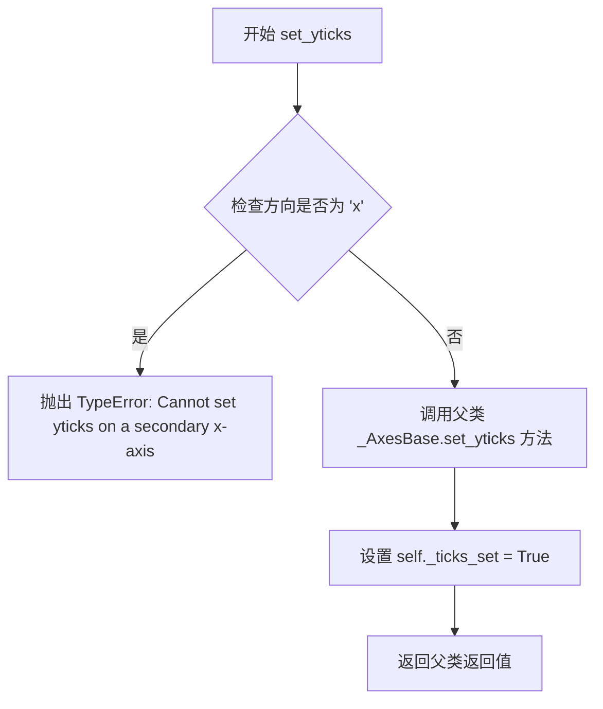
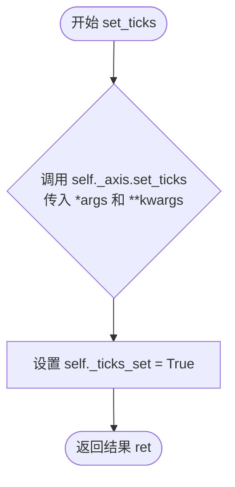
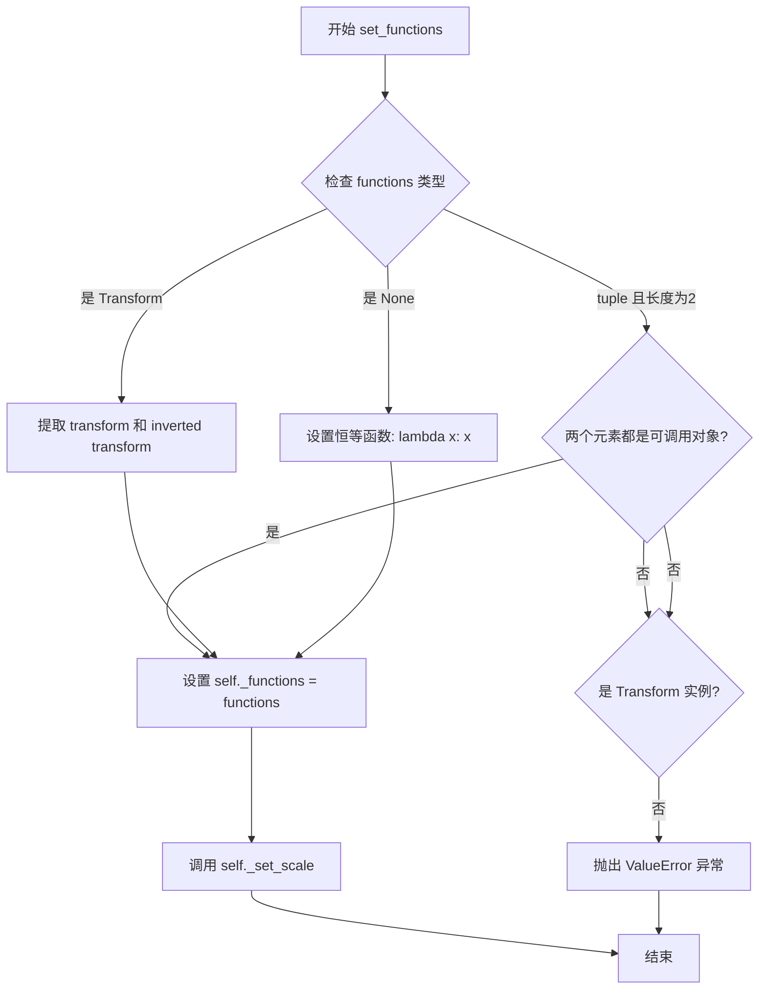
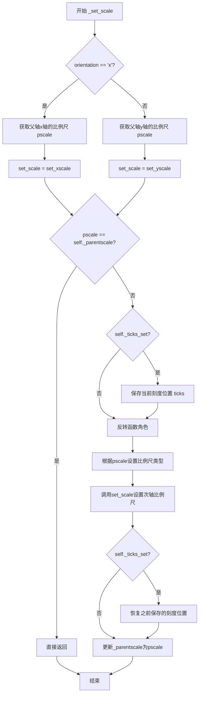
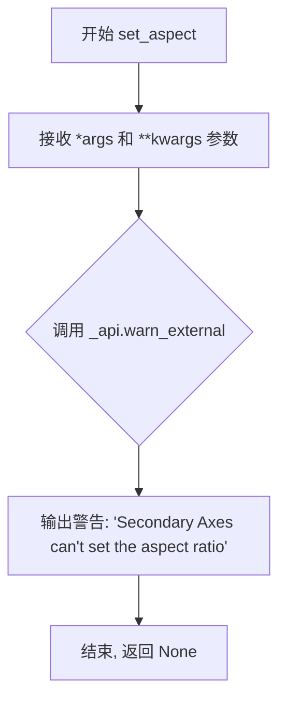
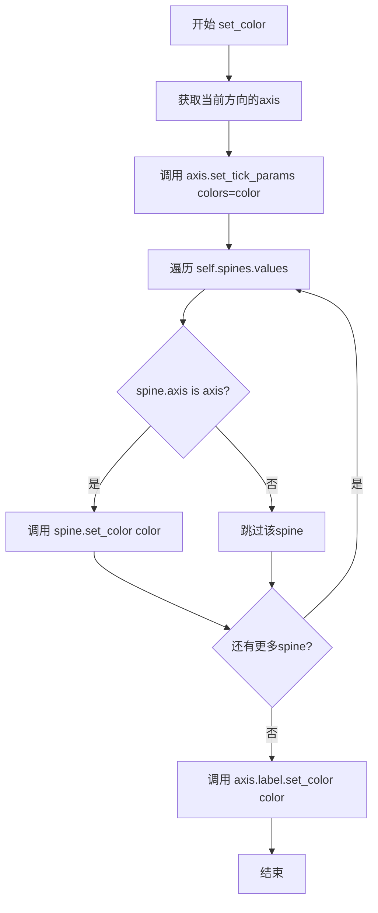

# `matplotlib\lib\matplotlib\axes\_secondary_axes.py` 详细设计文档

该代码实现了matplotlib库中的SecondaryAxis类，用于在图表上创建次X/Y轴。通过继承_AxesBase，该类允许用户在主坐标轴上叠加显示经过函数转换的辅助坐标轴，支持自定义位置、对齐方式、颜色以及与父坐标轴的变换函数。

## 整体流程

```mermaid
graph TD
    A[开始] --> B[创建SecondaryAxis实例]
B --> C{orientation参数}
C -->|x| D[初始化xaxis]
C -->|y| E[初始化yaxis]
D --> F[设置位置和变换函数]
E --> F
F --> G[配置轴刻度和样式]
G --> H[set_alignment设置对齐]
H --> I[set_location设置位置]
I --> J{调用set_functions]
J -->|tuple| K[使用函数转换]
J -->|Transform| L[使用变换对象]
J -->|None| M[使用恒等变换]
K --> N[draw渲染时调用_set_lims和_set_scale]
L --> N
M --> N
N --> O[结束]
```

## 类结构

```
_AxesBase (基类)
└── SecondaryAxis (次坐标轴类)
```

## 全局变量及字段


### `_secax_docstring`
    
Secondary axis 的文档字符串模板，用于注册到 matplotlib 的文档系统中

类型：`str`
    


### `SecondaryAxis._functions`
    
存储从父轴到次轴的转换函数和逆转换函数

类型：`tuple[Callable, Callable] | Transform`
    


### `SecondaryAxis._parent`
    
指向父 Axes 对象的引用，用于获取父轴的属性和限制

类型：`Axes`
    


### `SecondaryAxis._orientation`
    
指定次轴的方向，'x' 表示次x轴，'y' 表示次y轴

类型：`str`
    


### `SecondaryAxis._ticks_set`
    
标记是否已经通过 set_ticks 方法设置过刻度

类型：`bool`
    


### `SecondaryAxis._axis`
    
指向次轴对应的 Axis 对象（xaxis 或 yaxis）

类型：`Axis`
    


### `SecondaryAxis._locstrings`
    
存储当前位置的字符串表示，用于对齐和定位

类型：`list[str]`
    


### `SecondaryAxis._otherstrings`
    
存储另一个轴的位置字符串，用于隐藏不需要的 spines

类型：`list[str]`
    


### `SecondaryAxis._parentscale`
    
缓存父轴的 scale 类型，用于检测 scale 变化

类型：`str | None`
    


### `SecondaryAxis._pos`
    
次轴在父轴坐标系中的相对位置（0.0 到 1.0）

类型：`float`
    


### `SecondaryAxis._loc`
    
原始的位置参数，可能是字符串或浮点数

类型：`str | float`
    
    

## 全局函数及方法


### SecondaryAxis.__init__

初始化次坐标轴（SecondaryAxis），用于在父坐标轴上创建次要的X或Y轴，处理坐标轴的方向、位置、转换函数等配置，并完成坐标轴的基本设置和样式配置。

参数：

- `parent`：`Axes` 类型，父坐标轴对象
- `orientation`：`str` 类型，坐标轴方向，'x'或'y'
- `location`：`str` 或 `float` 类型，次坐标轴的位置，可为'top'、'bottom'、'left'、'right'或相对位置(0.0-1.0)
- `functions`：`tuple` 或 `Transform` 类型，用于父子坐标轴之间的值转换函数或变换对象
- `transform`：`Transform` 或 `None` 类型，可选的位置变换，默认为None
- `**kwargs`：可变关键字参数，传递给父类_AxesBase的初始化参数

返回值：无（构造函数）

#### 流程图

```mermaid
flowchart TD
    A[开始 __init__] --> B{检查orientation是否有效}
    B -->|有效| C[保存functions, parent, orientation到实例]
    B -->|无效| Z[抛出异常]
    C --> D[获取父坐标轴的figure]
    D --> E{orientation == 'x'?}
    E -->|是| F[调用父类初始化<br/>设置bounds为[0, 1., 1, 0.0001]<br/>设置_axis为xaxis<br/>设置locstrings和otherstrings]
    E -->|否| G[调用父类初始化<br/>设置bounds为[0, 1., 0.0001, 1]<br/>设置_axis为yaxis<br/>设置locstrings和otherstrings]
    F --> H[设置_parentscale为None]
    G --> H
    H --> I[调用set_location设置位置和变换]
    I --> J[调用set_functions设置转换函数]
    J --> K[获取otheraxis<br/>设置其刻度定位器为NullLocator<br/>设置刻度位置为none]
    K --> L[设置spines可见性]
    L --> M{_pos < 0.5?}
    M -->|是| N[翻转_locstrings]
    M -->|否| O[调用set_alignment设置对齐]
    N --> O
    O --> P[结束 __init__]
```

#### 带注释源码

```python
def __init__(self, parent, orientation, location, functions, transform=None,
             **kwargs):
    """
    See `.secondary_xaxis` and `.secondary_yaxis` for the doc string.
    While there is no need for this to be private, it should really be
    called by those higher level functions.
    """
    # 检查orientation参数是否为有效值 'x' 或 'y'
    _api.check_in_list(["x", "y"], orientation=orientation)
    
    # 保存转换函数到实例变量
    self._functions = functions
    # 保存父坐标轴引用
    self._parent = parent
    # 保存坐标轴方向
    self._orientation = orientation
    # 初始化刻度设置标志为False
    self._ticks_set = False

    # 获取父坐标轴所属的figure对象
    fig = self._parent.get_figure(root=False)
    
    # 根据方向进行不同的初始化配置
    if self._orientation == 'x':
        # 对于X轴次坐标轴，调用父类初始化
        # bounds表示在父坐标轴中的位置区域：[x, y, width, height]
        super().__init__(fig, [0, 1., 1, 0.0001], **kwargs)
        # 设置_axis为xaxis
        self._axis = self.xaxis
        # 设置位置字符串：top和bottom
        self._locstrings = ['top', 'bottom']
        # 设置另一轴的字符串：left和right
        self._otherstrings = ['left', 'right']
    else:  # 'y'
        # 对于Y轴次坐标轴，调用父类初始化
        super().__init__(fig, [0, 1., 0.0001, 1], **kwargs)
        # 设置_axis为yaxis
        self._axis = self.yaxis
        # 设置位置字符串：right和left
        self._locstrings = ['right', 'left']
        # 设置另一轴的字符串：top和bottom
        self._otherstrings = ['top', 'bottom']
    
    # 初始化父坐标轴比例记录为None
    self._parentscale = None
    
    # 设置次坐标轴的位置和变换
    self.set_location(location, transform)
    # 设置转换函数
    self.set_functions(functions)

    # 样式配置：隐藏另一轴的刻度
    # 获取另一方向的axis对象
    otheraxis = self.yaxis if self._orientation == 'x' else self.xaxis
    # 设置主刻度定位器为空定位器（不显示刻度）
    otheraxis.set_major_locator(mticker.NullLocator())
    # 设置刻度位置为none（隐藏刻度线和刻度标签）
    otheraxis.set_ticks_position('none')

    # 设置脊柱（spines）的可见性
    # 隐藏另一侧的脊柱
    self.spines[self._otherstrings].set_visible(False)
    # 显示定位侧的脊柱
    self.spines[self._locstrings].set_visible(True)

    # 如果位置小于0.5，翻转位置字符串顺序
    if self._pos < 0.5:
        # flip the location strings...
        self._locstrings = self._locstrings[::-1]
    
    # 设置对齐方式为位置字符串的第一个
    self.set_alignment(self._locstrings[0])
```


### `SecondaryAxis.set_alignment`

设置坐标轴脊（spine）和标签在坐标轴的顶部或底部（或左侧/右侧）绘制。

参数：

- `align`：`str`，取值为 {'top', 'bottom', 'left', 'right'}，用于指定坐标轴的位置方向。对于 `orientation='x'` 的坐标轴，取值为 'top' 或 'bottom'；对于 `orientation='y'` 的坐标轴，取值为 'left' 或 'right'。

返回值：`None`，无返回值，该方法直接修改对象内部状态。

#### 流程图

```mermaid
flowchart TD
    A[开始 set_alignment] --> B{验证 align 是否合法}
    B -->|合法| C{align 等于 self._locstrings[1]?}
    B -->|不合法| D[抛出异常]
    C -->|是| E[翻转 self._locstrings]
    C -->|否| F[保持 self._locstrings 不变]
    E --> G[设置 spines[self._locstrings[0]].set_visible True]
    F --> G
    G --> H[设置 spines[self._locstrings[1]].set_visible False]
    H --> I[调用 self._axis.set_ticks_position align]
    I --> J[调用 self._axis.set_label_position align]
    J --> K[结束]
```

#### 带注释源码

```python
def set_alignment(self, align):
    """
    Set if axes spine and labels are drawn at top or bottom (or left/right)
    of the Axes.

    Parameters
    ----------
    align : {'top', 'bottom', 'left', 'right'}
        Either 'top' or 'bottom' for orientation='x' or
        'left' or 'right' for orientation='y' axis.
    """
    # 使用 _api.check_in_list 验证 align 是否在允许的列表中
    _api.check_in_list(self._locstrings, align=align)
    
    # 如果 align 等于 _locstrings 的第二个元素（需要改变方向）
    if align == self._locstrings[1]:  # Need to change the orientation.
        # 翻转 _locstrings 列表
        self._locstrings = self._locstrings[::-1]
    
    # 将主 spine（脊）设置为可见
    self.spines[self._locstrings[0]].set_visible(True)
    # 将次 spine 设置为不可见
    self.spines[self._locstrings[1]].set_visible(False)
    
    # 设置刻度位置与 align 对齐
    self._axis.set_ticks_position(align)
    # 设置标签位置与 align 对齐
    self._axis.set_label_position(align)
```


### SecondaryAxis.set_location

该方法用于设置次坐标轴在父坐标轴中的垂直或水平位置，支持字符串位置（top/bottom/left/right）或浮点数位置（0.0-1.0），并可选地指定变换来确定位置。

参数：

- `self`：`SecondaryAxis`实例，次坐标轴对象本身
- `location`：`{'top', 'bottom', 'left', 'right'} or float`，次坐标轴的位置，字符串可以为'top'或'bottom'（对于x方向）或'right'或'left'（对于y方向），浮点数表示在父坐标轴上的相对位置，0.0为底部（或左侧），1.0为顶部（或右侧）
- `transform`：`matplotlib.transforms.Transform, optional`，可选的变换参数，用于指定位置所使用的变换，默认为父坐标轴的`transAxes`，即位置相对于父坐标轴

返回值：`None`，该方法直接修改次坐标轴的位置，不返回任何值

#### 流程图

```mermaid
flowchart TD
    A[开始 set_location] --> B{transform 是否为 None}
    B -->|否| C[检查 transform 是否为 Transform 类型或 None]
    B -->|是| D{location 是否为字符串}
    C --> E[验证 transform 类型]
    D -->|是| F{location 是否在 locstrings 中}
    D -->|否| G{location 是否为实数}
    F -->|是| H[设置 self._pos = 1.0 如果 location 在 ('top', 'right') 中, 否则 0.0]
    F -->|否| I[抛出 ValueError 异常]
    G -->|是| J[设置 self._pos = location]
    G -->|否| K[抛出 ValueError 异常]
    H --> L[设置 self._loc = location]
    J --> L
    L --> M{self._orientation == 'x'}
    M -->|是| N[设置 bounds = [0, self._pos, 1., 1e-10]]
    M -->|否| O[设置 bounds = [self._pos, 0, 1e-10, 1]]
    N --> P{transform 是否为 None}
    O --> P
    P -->|否| Q[使用 blended_transform_factory 混合变换]
    P -->|是| R[使用 self._parent.transAxes 作为 transform]
    Q --> S[设置 axes locator 为 _TransformedBoundsLocator]
    R --> S
    S --> T[结束 set_location]
    
    E --> L
    I --> T
    K --> T
```

#### 带注释源码

```python
def set_location(self, location, transform=None):
    """
    Set the vertical or horizontal location of the axes in
    parent-normalized coordinates.

    Parameters
    ----------
    location : {'top', 'bottom', 'left', 'right'} or float
        The position to put the secondary axis.  Strings can be 'top' or
        'bottom' for orientation='x' and 'right' or 'left' for
        orientation='y'. A float indicates the relative position on the
        parent Axes to put the new Axes, 0.0 being the bottom (or left)
        and 1.0 being the top (or right).

    transform : `.Transform`, optional
        Transform for the location to use. Defaults to
        the parent's ``transAxes``, so locations are normally relative to
        the parent axes.

        .. versionadded:: 3.9
    """

    # 检查 transform 参数是否为 Transform 类型或 None
    _api.check_isinstance((transforms.Transform, None), transform=transform)

    # This puts the rectangle into figure-relative coordinates.
    # 根据 location 的类型进行处理
    if isinstance(location, str):
        # 验证字符串位置是否有效
        _api.check_in_list(self._locstrings, location=location)
        # 如果位置是 'top' 或 'right'，则设置为 1.0，否则设置为 0.0
        self._pos = 1. if location in ('top', 'right') else 0.
    elif isinstance(location, numbers.Real):
        # 如果是实数，直接使用该值作为位置
        self._pos = location
    else:
        # 位置参数无效，抛出 ValueError 异常
        raise ValueError(
            f"location must be {self._locstrings[0]!r}, "
            f"{self._locstrings[1]!r}, or a float, not {location!r}")

    # 存储原始位置参数
    self._loc = location

    # 根据坐标轴方向设置边界
    if self._orientation == 'x':
        # An x-secondary axes is like an inset axes from x = 0 to x = 1 and
        # from y = pos to y = pos + eps, in the parent's transAxes coords.
        # 设置 x 方向次坐标轴的边界 [x起始, y起始, 宽度, 高度]
        bounds = [0, self._pos, 1., 1e-10]

        # If a transformation is provided, use its y component rather than
        # the parent's transAxes. This can be used to place axes in the data
        # coords, for instance.
        # 如果提供了变换，使用混合变换：x轴使用父坐标轴的变换，y轴使用提供的变换
        if transform is not None:
            transform = transforms.blended_transform_factory(
                self._parent.transAxes, transform)
    else:  # 'y'
        # 设置 y 方向次坐标轴的边界 [x起始, y起始, 宽度, 高度]
        bounds = [self._pos, 0, 1e-10, 1]
        if transform is not None:
            # 如果提供了变换，使用混合变换：x轴使用提供的变换，y轴使用父坐标轴的变换
            transform = transforms.blended_transform_factory(
                transform, self._parent.transAxes)  # Use provided x axis

    # If no transform is provided, use the parent's transAxes
    # 如果没有提供变换，使用父坐标轴的变换作为默认
    if transform is None:
        transform = self._parent.transAxes

    # this locator lets the axes move in the parent axes coordinates.
    # so it never needs to know where the parent is explicitly in
    # figure coordinates.
    # it gets called in ax.apply_aspect() (of all places)
    # 设置坐标轴定位器，使其能够在父坐标轴坐标系中移动
    # _TransformedBoundsLocator 会在父坐标轴坐标系中定位这个次坐标轴
    self.set_axes_locator(_TransformedBoundsLocator(bounds, transform))
```


### SecondaryAxis.apply_aspect

该方法用于应用坐标轴的宽高比设置，首先调用内部方法 `_set_lims()` 根据父坐标轴的 limits 和转换函数设置次坐标轴的显示范围，然后调用父类 `_AxesBase` 的 `apply_aspect` 方法完成最终的位置适应处理。

参数：

- `self`：`SecondaryAxis` 实例，当前次坐标轴对象
- `position`：`任意类型`（默认为 `None`），可选的位置参数，用于传递给父类的 `apply_aspect` 方法，决定坐标轴的显示位置和比例

返回值：`任意类型`，返回父类 `_AxesBase.apply_aspect` 的返回值，通常为 `None`

#### 流程图

```mermaid
flowchart TD
    A[开始 apply_aspect] --> B[调用 self._set_lims]
    B --> C{确定坐标轴方向}
    C -->|x轴| D[获取父轴xlim]
    C -->|y轴| E[获取父轴ylim]
    D --> F[应用转换函数 self._functions[0]]
    E --> F
    F --> G[检查是否需要翻转lims]
    G -->|需要翻转| H[翻转lims顺序]
    G -->|不需要| I[保持原顺序]
    H --> J[调用 set_xlim 或 set_ylim]
    I --> J
    J --> K[调用 super.apply_aspect]
    K --> L[结束]
```

#### 带注释源码

```python
def apply_aspect(self, position=None):
    """
    应用坐标轴的宽高比设置。
    
    此方法继承自 _AxesBase，首先设置次坐标轴的限制范围，
    然后调用父类的 apply_aspect 方法完成最终的布局处理。
    
    Parameters
    ----------
    position : optional
        传递给父类的位置参数，用于控制坐标轴的显示位置和比例。
        默认为 None，使用父类的默认行为。
    """
    # docstring inherited.
    # 步骤1：设置次坐标轴的限制范围
    # 根据父坐标轴的当前限制和注册的转换函数(self._functions)
    # 计算并设置次坐标轴的显示范围
    self._set_lims()
    
    # 步骤2：调用父类 _AxesBase 的 apply_aspect 方法
    # 完成坐标轴的宽高比应用和位置适应处理
    super().apply_aspect(position)
```

#### 相关方法 `_set_lims` 源码

```python
def _set_lims(self):
    """
    根据父坐标轴的限制和转换方法设置次坐标轴的显示范围。
    
    此方法获取父坐标轴的当前限制(xlim或ylim)，
    通过 self._functions[0]（转换函数）进行变换，
    并设置次坐标轴的对应限制。
    """
    if self._orientation == 'x':
        # 对于x轴次坐标轴，获取父轴的x轴范围
        lims = self._parent.get_xlim()
        set_lim = self.set_xlim  # 设置x轴范围的函数引用
    else:  # 'y'
        # 对于y轴次坐标轴，获取父轴的y轴范围
        lims = self._parent.get_ylim()
        set_lim = self.set_ylim  # 设置y轴范围的函数引用
    
    # 检查原始范围的顺序（升序或降序）
    order = lims[0] < lims[1]
    
    # 使用转换函数变换限制范围
    lims = self._functions[0](np.array(lims))
    
    # 检查转换后范围的顺序
    neworder = lims[0] < lims[1]
    
    if neworder != order:
        # 如果顺序改变，可能是因为转换函数改变了方向
        # 需要翻转以保持视觉一致性
        lims = lims[::-1]
    
    # 设置转换后的限制范围到次坐标轴
    set_lim(lims)
```


### SecondaryAxis.set_xticks

设置次坐标轴（secondary axis）的x轴刻度位置。该方法是对父类 `_AxesBase.set_xticks` 的包装，添加了方向检查：如果在次y轴（secondary y-axis）上调用则抛出 TypeError，并在成功设置刻度后更新内部状态 `_ticks_set`。

参数：

- `*args`：可变位置参数，传递给父类 `_AxesBase.set_xticks` 的位置参数，用于指定刻度位置
- `**kwargs`：可变关键字参数，传递给父类 `_AxesBase.set_xticks` 的关键字参数，用于指定刻度格式化和显示选项

返回值：`任意类型`，返回父类 `_AxesBase.set_xticks` 的返回值，通常为设置刻度后的结果对象

#### 流程图

```mermaid
flowchart TD
    A[开始 set_xticks] --> B{self._orientation == 'y'?}
    B -->|是| C[抛出 TypeError: Cannot set xticks on a secondary y-axis]
    B -->|否| D[调用 super().set_xticks(*args, **kwargs)]
    D --> E[将 self._ticks_set 设为 True]
    E --> F[返回父类结果 ret]
    C --> G[异常终止]
    F --> H[结束]
```

#### 带注释源码

```python
@functools.wraps(_AxesBase.set_xticks)
def set_xticks(self, *args, **kwargs):
    """
    设置次坐标轴的x轴刻度。
    
    该方法是对父类 _AxesBase.set_xticks 的包装，增加了方向检查。
    如果在次y轴上调用会抛出 TypeError。
    
    Parameters
    ----------
    *args : 任意类型
        传递给父类的位置参数，用于指定刻度位置
    **kwargs : 任意类型
        传递给父类的关键字参数，用于指定刻度选项
        
    Returns
    -------
    ret : 任意类型
        父类 set_xticks 的返回值
        
    Raises
    ------
    TypeError
        如果在 secondary y-axis 上调用此方法
    """
    # 检查当前次坐标轴的方向，如果是y轴方向则不允许设置x刻度
    if self._orientation == "y":
        raise TypeError("Cannot set xticks on a secondary y-axis")
    
    # 调用父类方法设置x轴刻度
    ret = super().set_xticks(*args, **kwargs)
    
    # 标记已手动设置过刻度，用于后续_scale计算的判断
    self._ticks_set = True
    
    # 返回父类的结果
    return ret
```


### `SecondaryAxis.set_yticks`

设置次坐标轴（SecondaryAxis）的y轴刻度位置。该方法是对父类 `_AxesBase.set_yticks` 的封装，并在设置后标记刻度已被显式设置。

参数：

- `*args`：可变位置参数，接受传递给父类 `set_yticks` 的位置参数（如刻度值数组）
- `**kwargs`：可变关键字参数，接受传递给父类 `set_yticks` 的关键字参数（如刻度格式化选项）

返回值：`任意类型`，返回父类 `set_yticks` 的返回值，通常为设置后的刻度对象

#### 流程图



#### 带注释源码

```python
@functools.wraps(_AxesBase.set_yticks)
def set_yticks(self, *args, **kwargs):
    """
    设置次坐标轴的y轴刻度。
    该方法使用 functools.wraps 装饰器继承父类 set_yticks 的文档字符串。
    
    参数:
        *args: 可变位置参数，传递给父类的刻度值
        **kwargs: 可变关键字参数，传递给父类的选项参数
    
    返回:
        父类 set_yticks 的返回值
        
    异常:
        TypeError: 如果在 secondary x-axis 上调用此方法
    """
    # 检查当前次坐标轴的方向，如果是 'x' 方向（secondary x-axis）则不允许设置 y 轴刻度
    if self._orientation == "x":
        raise TypeError("Cannot set yticks on a secondary x-axis")
    
    # 调用父类 _AxesBase 的 set_yticks 方法执行实际的刻度设置
    ret = super().set_yticks(*args, **kwargs)
    
    # 标记已显式设置过刻度，后续 _set_scale 方法会根据此标志决定是否保留自定义刻度
    self._ticks_set = True
    
    # 返回父类方法的返回值
    return ret
```


### `SecondaryAxis.set_ticks`

该方法用于设置次坐标轴（Secondary Axis）的刻度位置和标签。它通过 `@functools.wraps` 装饰器继承了 `Axis.set_ticks` 的文档字符串，并将调用委托给内部存储的 `_axis` 对象（即 `xaxis` 或 `yaxis`）。此外，它还会将实例变量 `_ticks_set` 标记为 `True`，以通知 `_set_scale` 方法该轴的刻度已被手动设置，从而在后续缩放计算时保留这些手动设置的刻度。

参数：

- `*args`：`位置参数 (Any)`，可变位置参数。通常用于传递刻度的位置列表（如 `[1, 2, 3]`），具体取决于底层 `Axis.set_ticks` 的签名。
- `**kwargs`：`关键字参数 (Any)`，可变关键字参数。支持传递标签列表（如 `labels=['a', 'b', 'c']`）或其他绘图参数。

返回值：`任意类型 (Any)`，返回底层 `Axis.set_ticks` 方法的返回值。在 Matplotlib 中，通常返回已设置的刻度标签对象列表或 `None`。

#### 流程图



#### 带注释源码

```python
@functools.wraps(Axis.set_ticks)
def set_ticks(self, *args, **kwargs):
    """
    Set the ticks and labels of the secondary axis.
    See `matplotlib.axis.Axis.set_ticks` for details.
    """
    # 调用关联的底层 Axis 对象（xaxis 或 yaxis）的 set_ticks 方法
    # 将可变参数原样传递给它
    ret = self._axis.set_ticks(*args, **kwargs)
    
    # 标记该次坐标轴的刻度已经被手动设置过
    # 这在 _set_scale 方法中用于决定是否保留当前的刻度位置
    self._ticks_set = True
    
    # 返回底层方法的结果
    return ret
```


### SecondaryAxis.set_functions

设置辅助轴如何转换父坐标轴的 Limits

参数：

- `functions`：`tuple[callable, callable] | Transform | None`，用于在父轴和辅助轴之间转换值的转换函数。可以是2个函数的元组（正向和逆向转换），或者是具有逆变换的Transform对象，或者None（使用恒等变换）

返回值：`None`，无返回值，此方法直接修改对象内部状态

#### 流程图



#### 带注释源码

```python
def set_functions(self, functions):
    """
    Set how the secondary axis converts limits from the parent Axes.

    Parameters
    ----------
    functions : 2-tuple of func, or `Transform` with an inverse.
        Transform between the parent axis values and the secondary axis
        values.

        If supplied as a 2-tuple of functions, the first function is
        the forward transform function and the second is the inverse
        transform.

        If a transform is supplied, then the transform must have an
        inverse.
    """

    # 检查 functions 是否为2元素元组，且两个元素都是可调用函数
    if (isinstance(functions, tuple) and len(functions) == 2 and
            callable(functions[0]) and callable(functions[1])):
        # 直接使用用户提供的两个函数作为转换函数
        # 第一个为正向转换，第二个为逆向转换
        self._functions = functions
    # 检查 functions 是否为 Transform 对象
    elif isinstance(functions, Transform):
        # 从 Transform 对象提取转换函数
        # 正向使用 functions.transform
        # 逆向使用 functions.inverted().transform
        self._functions = (
             functions.transform,
             lambda x: functions.inverted().transform(x)
        )
    # 检查 functions 是否为 None
    elif functions is None:
        # 使用恒等函数，不进行任何转换
        self._functions = (lambda x: x, lambda x: x)
    else:
        # 参数无效，抛出错误
        raise ValueError('functions argument of secondary Axes '
                         'must be a two-tuple of callable functions '
                         'with the first function being the transform '
                         'and the second being the inverse')
    # 设置比例尺以应用新的转换函数
    self._set_scale()
```


### `SecondaryAxis.draw`

该方法负责绘制次坐标轴（Secondary Axes），在绘制过程中首先根据父坐标轴的 Limits 和转换函数设置次坐标轴的 Limits，然后更新比例尺，最后调用父类的 draw 方法完成实际绘制。

参数：

- `self`：`SecondaryAxis`，SecondaryAxis 实例本身
- `renderer`：`matplotlib.backend_bases.RendererBase`，用于渲染绘制的渲染器对象

返回值：`None`，该方法无返回值

#### 流程图

```mermaid
flowchart TD
    A[开始 draw 方法] --> B[调用 self._set_lims 设置 Limits]
    B --> C[调用 self._set_scale 设置比例尺]
    C --> D[调用父类 draw 方法: super().draw&#40;renderer&#41;]
    D --> E[结束]
```

#### 带注释源码

```python
def draw(self, renderer):
    """
    Draw the secondary Axes.

    Consults the parent Axes for its limits and converts them
    using the converter specified by
    `~.axes._secondary_axes.set_functions` (or *functions*
    parameter when Axes initialized.)
    """
    # 根据父坐标轴的 Limits 和转换函数设置次坐标轴的 Limits
    self._set_lims()
    
    # 设置比例尺，以防父坐标轴已设置其比例尺
    # this sets the scale in case the parent has set its scale.
    self._set_scale()
    
    # 调用父类 _AxesBase 的 draw 方法完成实际绘制
    super().draw(renderer)
```


### `SecondaryAxis._set_scale`

该方法负责检查父轴（parent Axes）的比例尺设置，并根据父轴的比例尺同步设置次轴（secondary axis）的比例尺，同时处理坐标转换函数和刻度位置的对应关系。

参数：

- （无参数，方法仅使用 `self`）

返回值：`None`，该方法直接修改对象状态，不返回任何值。

#### 流程图



#### 带注释源码

```python
def _set_scale(self):
    """
    Check if parent has set its scale
    """

    # 根据次轴的方向（x或y）获取父轴对应的比例尺和设置函数
    if self._orientation == 'x':
        # 获取父轴x轴的比例尺（如'linear', 'log'等）
        pscale = self._parent.xaxis.get_scale()
        # 设置用于后续设置次轴x轴比例尺的方法引用
        set_scale = self.set_xscale
    else:  # 'y'
        # 获取父轴y轴的比例尺
        pscale = self._parent.yaxis.get_scale()
        # 设置用于后续设置次轴y轴比例尺的方法引用
        set_scale = self.set_yscale
    
    # 如果父轴的比例尺与之前记录的比例尺相同，无需做任何操作
    if pscale == self._parentscale:
        return

    # 如果用户通过set_ticks手动设置过刻度，保存当前刻度位置
    if self._ticks_set:
        ticks = self._axis.get_ticklocs()

    # 需要反转函数角色以使刻度对齐
    # 如果父轴是log比例，次轴使用functionlog；否则使用function比例
    # 同时反转functions元组（第一个变第二个，第二个变第一个）
    set_scale('functionlog' if pscale == 'log' else 'function',
              functions=self._functions[::-1])

    # set_scale会设置新的定位器，但如果你之前调用过set_ticks，
    # 我们希望保留那些手动设置的刻度位置
    if self._ticks_set:
        self._axis.set_major_locator(mticker.FixedLocator(ticks))

    # 记录当前父轴的比例尺，这样下次调用时可以跳过不必要的设置
    # 如果父轴比例尺不变，下次可以跳过这个方法
    self._parentscale = pscale
```


### SecondaryAxis._set_lims

该方法用于根据父轴的范围和指定的转换函数来设置次轴（Secondary Axis）的坐标范围。它获取父轴的当前限制，应用转换函数处理这些限制，并处理可能的方向翻转情况。

参数：无（仅包含隐式参数 `self`）

返回值：`None`，无返回值（该方法直接修改次轴的范围设置）

#### 流程图

```mermaid
flowchart TD
    A[开始 _set_lims] --> B{self._orientation == 'x'?}
    B -->|是| C[获取父轴X轴范围<br/>lims = self._parent.get_xlim<br/>set_lim = self.set_xlim]
    B -->|否| D[获取父轴Y轴范围<br/>lims = self._parent.get_ylim<br/>set_lim = self.set_ylim]
    C --> E[记录原始范围顺序<br/>order = lims[0] < lims[1]]
    D --> E
    E --> F[应用转换函数<br/>lims = self._functions[0](np.array(lims))]
    F --> G[检查转换后顺序<br/>neworder = lims[0] < lims[1]]
    G --> H{neworder != order?}
    H -->|是| I[翻转范围<br/>lims = lims[::-1]
    H -->|否| J[设置范围<br/>set_lim(lims)]
    I --> J
    J --> K[结束]
```

#### 带注释源码

```python
def _set_lims(self):
    """
    Set the limits based on parent limits and the convert method
    between the parent and this secondary Axes.
    """
    # 判断次轴是X轴还是Y轴
    if self._orientation == 'x':
        # 如果是X轴次轴，获取父轴的X轴范围
        lims = self._parent.get_xlim()
        # 获取对应的set_xlim方法用于设置范围
        set_lim = self.set_xlim
    else:  # 'y'
        # 如果是Y轴次轴，获取父轴的Y轴范围
        lims = self._parent.get_ylim()
        # 获取对应的set_ylim方法用于设置范围
        set_lim = self.set_ylim
    
    # 记录原始范围的顺序（升序或降序）
    order = lims[0] < lims[1]
    
    # 使用转换函数的第一个函数（正向转换）处理范围
    # 将范围转换为次轴坐标系的对应值
    lims = self._functions[0](np.array(lims))
    
    # 检查转换后的范围顺序
    neworder = lims[0] < lims[1]
    
    # 如果顺序改变了，说明转换导致了方向的翻转
    # 需要翻转回来，因为transform会处理这个翻转
    if neworder != order:
        # Flip because the transform will take care of the flipping.
        lims = lims[::-1]
    
    # 设置次轴的范围
    set_lim(lims)
```


### `SecondaryAxis.set_aspect`

设置次坐标轴的宽高比，但该操作不支持，会发出警告提示用户。

参数：

- `*args`：`任意类型`，接受任意位置参数（该方法不支持此操作）
- `**kwargs`：`任意类型`，接受任意关键字参数（该方法不支持此操作）

返回值：`None`，无返回值

#### 流程图



#### 带注释源码

```python
def set_aspect(self, *args, **kwargs):
    """
    Secondary Axes cannot set the aspect ratio, so calling this just
    sets a warning.
    """
    # 调用 matplotlib API 的外部警告函数，向用户显示警告信息
    # 告知用户次坐标轴无法设置宽高比
    _api.warn_external("Secondary Axes can't set the aspect ratio")
```


### `SecondaryAxis.set_color`

该方法用于更改次坐标轴及其所有装饰器（刻度标签、脊柱和标签）的颜色。

参数：

- `color`：`:mpltype:`color``，要设置的颜色值

返回值：`None`，无返回值（该方法直接修改对象状态）

#### 流程图



#### 带注释源码

```python
def set_color(self, color):
    """
    Change the color of the secondary Axes and all decorators.

    Parameters
    ----------
    color : :mpltype:`color`
    """
    # 从_axis_map获取当前方向（'x'或'y'）对应的axis对象
    axis = self._axis_map[self._orientation]
    
    # 设置该axis的所有刻度参数颜色
    axis.set_tick_params(colors=color)
    
    # 遍历所有的spine（脊柱）
    for spine in self.spines.values():
        # 只处理属于当前axis的spine
        if spine.axis is axis:
            spine.set_color(color)
    
    # 设置axis的标签颜色
    axis.label.set_color(color)
```

## 关键组件


### SecondaryAxis 类

主类，用于管理次坐标轴（Secondary X/Y Axis），允许在同一 Axes 上显示两个不同尺度的坐标轴。

### set_location 方法

设置次坐标轴在父坐标轴中的位置（top/bottom/left/right 或浮点数），支持自定义 transform。

### set_functions 方法

设置父坐标轴与次坐标轴之间的值转换函数，支持两种方式：2元组函数或 Transform 对象。

### set_alignment 方法

设置坐标轴刻度标签的对齐方式（top/bottom/left/right）。

### apply_aspect 方法

应用长宽比设置，内部调用 _set_lims 设置限制。

### _set_scale 方法

根据父坐标轴的 scale 设置次坐标轴的 scale，处理对数刻度和函数刻度的转换。

### _set_lims 方法

根据父坐标轴的限制和转换函数计算并设置次坐标轴的限制，处理坐标轴方向翻转。

### draw 方法

绘制次坐标轴，查询父坐标轴的限制并进行转换后调用父类 draw 方法。

### set_ticks/set_xticks/set_yticks 方法

设置坐标轴刻度位置，禁止在错误的轴上设置刻度。

### set_color 方法

设置次坐标轴及其装饰器（刻度、标签、边框）的颜色。

### _TransformedBoundsLocator 组件

用于让次坐标轴在父坐标轴坐标系中移动的定位器。

### transform 转换支持

支持 blended_transform_factory 创建混合变换，实现次坐标轴位置与父坐标轴的坐标绑定。

### spines 管理

通过 _locstrings 和 _otherstrings 管理边框可见性，控制次坐标轴边框的显示。


## 问题及建议


### 已知问题

-   **`set_location` 方法职责过重**：该方法混合了位置解析、transform 创建和 axes_locator 设置等多个职责，导致方法过长（超过 60 行），难以维护和测试。
-   **`_set_scale` 方法的 scale 转换逻辑不完整**：当父轴 scale 为非 'log' 和 'linear' 的其他类型（如 'symlog'、'logit' 等）时，代码只处理了 'log' 的情况，其他 scale 类型会被错误地设置为 'function'，可能导致显示异常。
-   **`set_alignment` 与 `set_location` 可能不同步**：调用 `set_alignment` 改变对齐时只反转了 `_locstrings` 列表，但没有同步更新内部的位置状态，可能导致位置和对齐不一致。
-   **`set_functions` 在初始化时调用两次 `_set_scale`**：在 `__init__` 中先调用 `set_location`（间接调用了一些设置），然后调用 `set_functions`（内部调用 `_set_scale`），造成不必要的重复计算。
-   **缺少类型提示**：整个类没有任何类型注解，降低了代码的可读性和 IDE 的辅助能力。

### 优化建议

-   **重构 `set_location` 方法**：将位置解析、transform 创建和定位器设置拆分为独立的私有方法，如 `_parse_location`、`_create_transform` 和 `_apply_locator`。
-   **完善 scale 处理逻辑**：在 `_set_scale` 方法中补充对其他 scale 类型（如 'symlog'、'logit' 等）的处理，或添加明确的错误提示。
-   **添加对齐与位置的同步机制**：在 `set_alignment` 方法中添加对内部位置状态的验证或更新逻辑，确保一致性。
-   **添加延迟初始化或优化初始化流程**：在 `__init__` 中考虑延迟调用 `_set_scale`，或添加标志位避免重复计算。
-   **补充类型注解**：为所有方法参数和返回值添加类型提示，提升代码可维护性。
-   **提取公共逻辑**：在 `_set_scale` 方法中，x 轴和 y 轴的处理逻辑高度相似，可以通过抽取公共方法减少重复代码。

## 其它


### 设计目标与约束

**设计目标**：为Matplotlib的Axes提供次坐标轴功能，允许用户在同一图表上显示两组不同比例或不同单位的数据，实现双x轴或双y轴的显示需求。

**约束条件**：
- 次坐标轴无法设置aspect ratio（长宽比），调用set_aspect会发出警告
- orientation参数只能是'x'或'y'，不能混合使用
- location参数必须是预定义字符串('top'/'bottom'/'left'/'right')或0-1之间的浮点数
- functions参数必须是2元组函数或具有inverse方法的Transform对象
- 在y方向次坐标轴上不能设置xticks，在x方向次坐标轴上不能设置yticks

### 错误处理与异常设计

**参数验证错误**：
- `set_xticks`：当orientation为'y'时，抛出TypeError("Cannot set xticks on a secondary y-axis")
- `set_yticks`：当orientation为'x'时，抛出TypeError("Cannot set yticks on a secondary x-axis")
- `set_location`：location参数类型错误时抛出ValueError
- `set_functions`：functions参数格式不正确时抛出ValueError
- `set_alignment`：align参数不在允许的字符串列表中时调用_api.check_in_list检查

**API兼容性检查**：
- 使用_api.check_in_list进行参数白名单验证
- 使用_api.check_isinstance进行类型检查

### 数据流与状态机

**状态转换流程**：
1. 初始化状态：_ticks_set=False，_parentscale=None
2. 用户调用set_ticks/set_xticks/set_yticks时：_ticks_set置为True
3. 绘制时调用draw()：触发_set_lims()和_set_scale()
4. _set_lims()：获取父坐标轴 limits，通过_functions[0]转换后设置次坐标轴limits
5. _set_scale()：检测父坐标轴scale变化，如变化则重新设置次坐标轴scale和locator

**数据流向**：
- 父坐标轴limits → _set_lims()转换 → 次坐标轴limits
- 父坐标轴scale → _set_scale()处理 → 次坐标轴scale和locator
- 用户提供的functions → set_functions() → _functions元组存储

### 外部依赖与接口契约

**核心依赖模块**：
- `matplotlib._api`：提供check_in_list、check_isinstance、warn_external等工具函数
- `matplotlib._docstring`：提供文档字符串插值功能
- `matplotlib.transforms`：提供Transform类、blended_transform_factory
- `matplotlib.ticker`：提供NullLocator、FixedLocator等刻度定位器
- `matplotlib.axes._base`：继承_AxesBase、_TransformedBoundsLocator
- `matplotlib.axis`：提供Axis类

**父类接口继承**：
- 继承_AxesBase类，完整继承所有Axes基础功能
- 通过super()调用父类方法实现draw、apply_aspect、set_xticks、set_yticks等

**对外提供的主要接口**：
- secondary_xaxis()和secondary_yaxis()高级函数调用SecondaryAxis
- set_location()：设置次坐标轴位置
- set_functions()：设置坐标转换函数
- set_alignment()：设置刻度标签对齐方式

### 性能考虑

**优化策略**：
- 使用_parentscale缓存机制避免重复设置scale
- _ticks_set标志位避免用户手动设置的ticks被覆盖
- 使用@functools.wraps装饰器复用父类方法文档字符串，减少内存开销

**潜在性能瓶颈**：
- 每次draw()都会调用_set_lims()和_set_scale()，对于静态图表可优化
- 函数转换使用lambda每次调用都有额外开销

### 线程安全性

**线程安全考量**：
- SecondaryAxis对象本身不是线程安全的
- 多个线程同时修改同一axes的次坐标轴可能导致竞争条件
- 建议在单线程环境中使用，或使用matplotlib的lock机制保护

### 兼容性考虑

**版本兼容性**：
- transform参数支持从3.9版本开始
- secondary axis功能从3.1版本开始标记为实验性

**API稳定性**：
- 实验性API可能在未来版本中改变
- 文档中明确警告"experimental as of 3.1, and the API may change"

### 使用示例与最佳实践

**典型使用场景**：
- 在底部显示百分比（0-100%），顶部显示原始计数
- 在左侧显示温度（摄氏度），右侧显示温度（华氏度）
- 在图表中显示对数刻度和线性刻度的组合

**最佳实践**：
- 使用functions参数提供精确的数学转换函数
- 使用location参数浮点数形式实现精确位置控制
- 避免在次坐标轴上使用set_aspect()
- 优先使用set_ticks()而非set_xticks()/set_yticks()以保持API一致性
    