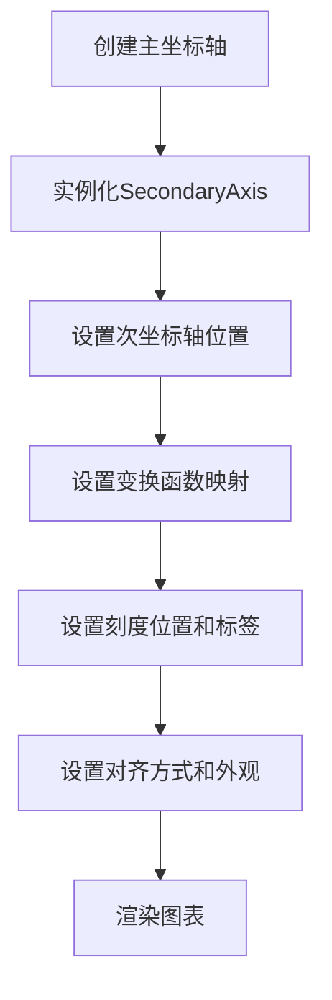
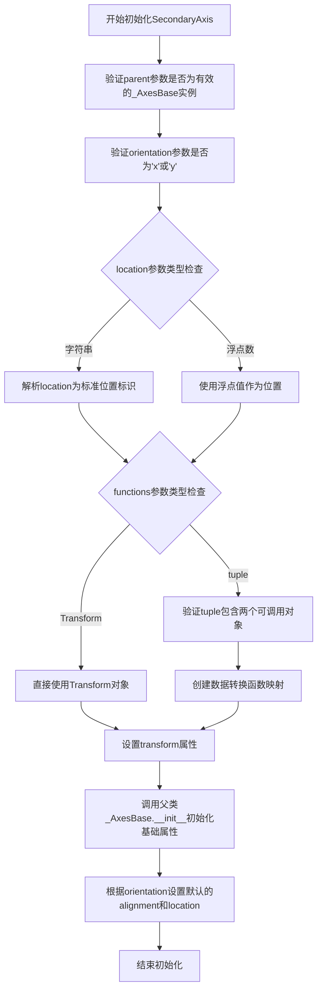
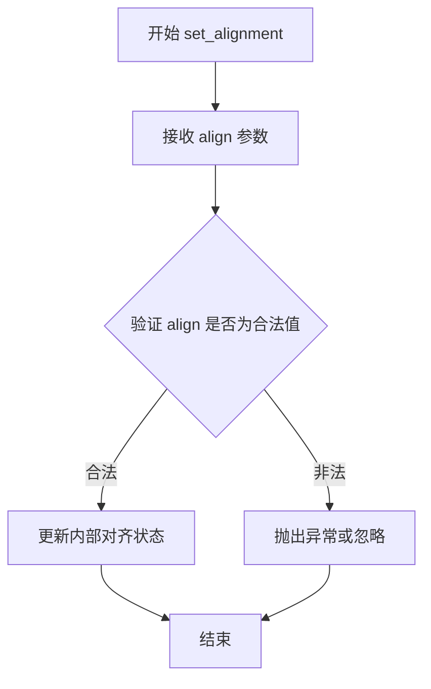
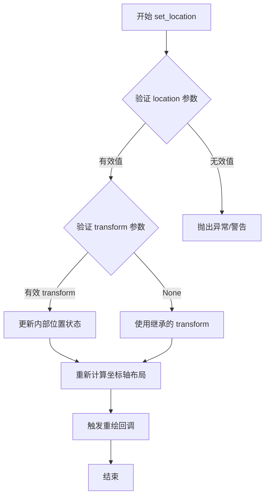
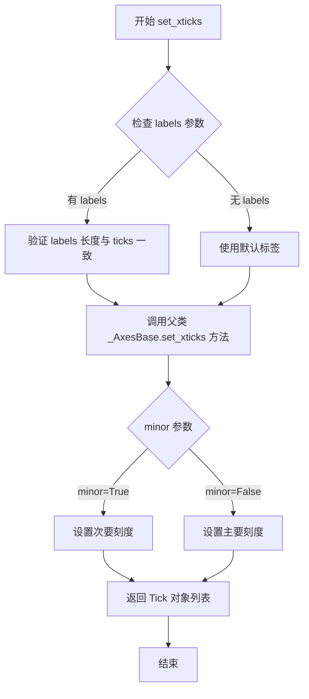
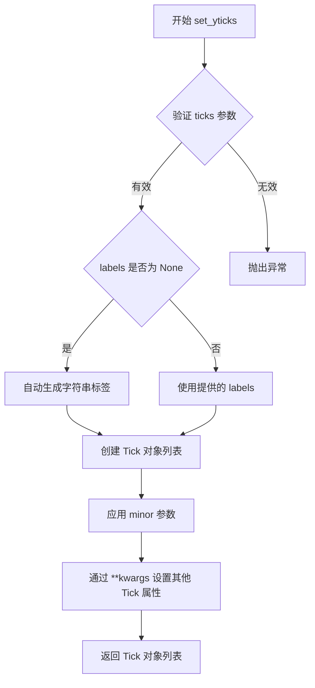
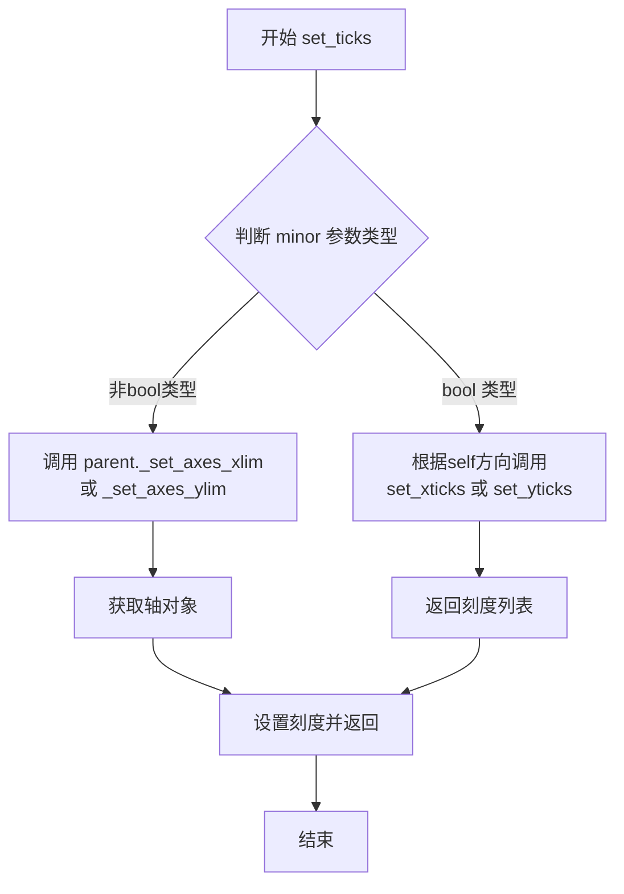
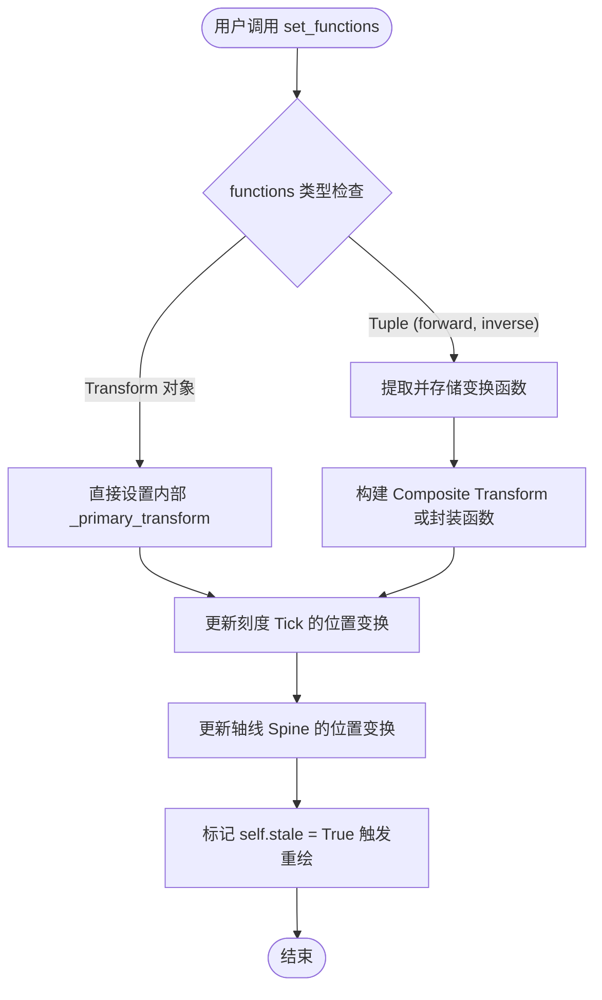
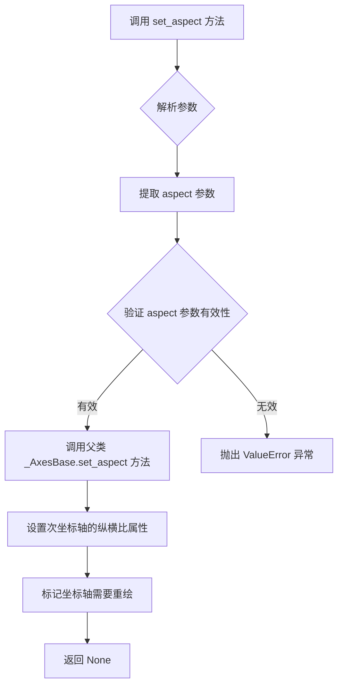
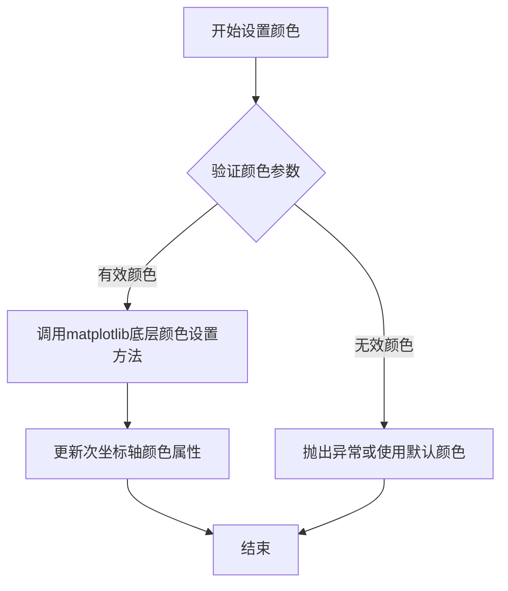

# `matplotlib\lib\matplotlib\axes\_secondary_axes.pyi` 详细设计文档

该代码定义了matplotlib库中的SecondaryAxis类（次坐标轴），用于在图表上创建次坐标轴，支持在同一个图表上显示两套不同比例或单位的坐标系统，如在x轴或y轴上显示与主坐标轴不同的刻度、标签和变换函数。

## 整体流程



## 类结构

```
_AxesBase (matplotlib基类)
└── SecondaryAxis (次坐标轴类)
```

## 全局变量及字段


### `SecondaryAxis.parent`
    
主坐标轴引用，用于关联次坐标轴到主坐标轴

类型：`_AxesBase`
    


### `SecondaryAxis.orientation`
    
坐标轴方向，指定次坐标轴是沿x轴还是y轴方向

类型：`Literal['x', 'y']`
    


### `SecondaryAxis.location`
    
次坐标轴位置，可以是预定义的位置字符串或自定义数值

类型：`Literal['top', 'bottom', 'right', 'left'] | float`
    


### `SecondaryAxis.functions`
    
数据变换映射，用于主次坐标轴之间的数据转换

类型：`tuple[Callable[[ArrayLike], ArrayLike], Callable[[ArrayLike], ArrayLike]] | Transform`
    


### `SecondaryAxis.transform`
    
坐标变换对象，定义坐标轴的坐标变换方式

类型：`Transform | None`
    
    

## 全局函数及方法


### SecondaryAxis.__init__

初始化matplotlib中的次坐标轴（SecondaryAxis），用于在同一坐标轴上显示两个不同尺度的数据系列。

参数：

- `self`：SecondaryAxis，当前要初始化的次坐标轴实例
- `parent`：_AxesBase，父坐标轴对象，即主坐标轴
- `orientation`：Literal["x", "y"]，次坐标轴的方向，可选"x"（水平）或"y"（垂直）
- `location`：Literal["top", "bottom", "right", "left"] | float，次坐标轴的位置，可以是字符串（"top"、"bottom"、"right"、"left"）或浮点数
- `functions`：tuple[Callable[[ArrayLike], ArrayLike], Callable[[ArrayLike], ArrayLike]] | Transform，数据转换函数元组或变换对象，用于将主坐标轴的数据值映射到次坐标轴的值
- `transform`：Transform | None，坐标轴的变换对象，默认为None（使用数据坐标）
- `**kwargs`：dict，其他关键字参数，将传递给父类的初始化方法

返回值：`None`，该方法不返回任何值

#### 流程图



#### 带注释源码

```python
def __init__(
    self,
    parent: _AxesBase,
    orientation: Literal["x", "y"],
    location: Literal["top", "bottom", "right", "left"] | float,
    functions: tuple[
        Callable[[ArrayLike], ArrayLike], Callable[[ArrayLike], ArrayLike]
    ]
    | Transform,
    transform: Transform | None = ...,
    **kwargs
) -> None:
    """
    初始化次坐标轴对象。
    
    次坐标轴允许在同一个绘图区域显示两个不同比例或单位的坐标轴，
    常用于需要同时显示原始数据和归一化数据等场景。
    
    参数:
        parent: 父坐标轴对象，所有次坐标轴都依附于主坐标轴
        orientation: 坐标轴方向，'x'表示水平轴，'y'表示垂直轴
        location: 坐标轴位置，可以是预定义字符串或自定义浮点位置
        functions: 数据转换函数元组(正向函数, 反向函数)或变换对象
                   正向函数将主坐标轴值转换为次坐标轴值
                   反向函数将次坐标轴值转换为主坐标轴值
        transform: 坐标变换对象，默认为None表示使用数据坐标变换
        **kwargs: 其他参数传递给父类初始化器
    """
    # 参数验证逻辑应该在实际初始化时检查
    # 1. 验证parent是有效的坐标轴对象
    # 2. 验证orientation是有效的方向字符串
    # 3. 验证location是有效的位置值
    # 4. 验证functions是有效的转换函数或Transform对象
    
    # 调用父类初始化器设置基础属性
    # _AxesBase.__init__(self, **kwargs)
    
    # 根据orientation设置默认属性
    # if orientation == 'x':
    #     self.set_alignment('top' if location in ['top', 'bottom'] else 'bottom')
    # else:
    #     self.set_alignment('right' if location in ['right', 'left'] else 'left')
    
    # 设置位置
    # self.set_location(location, transform)
    
    # 设置转换函数
    # self.set_functions(functions)
```


### `SecondaryAxis.set_alignment`

该方法用于设置次坐标轴（SecondaryAxis）的对齐方式，决定次坐标轴刻度标签和轴线在父坐标轴边界的相对位置。

参数：

- `align`：`Literal["top", "bottom", "right", "left"]`，对齐方式，指定次坐标轴相对于父坐标轴的位置对齐方式

返回值：`None`，无返回值，该方法直接修改对象内部状态

#### 流程图



#### 带注释源码

```python
def set_alignment(
    self, align: Literal["top", "bottom", "right", "left"]
) -> None:
    """
    设置次坐标轴的对齐方式。
    
    参数:
        align: 对齐方式，取值范围为 "top", "bottom", "right", "left"
               - "top": 次坐标轴对齐到顶部（用于 x 轴）
               - "bottom": 次坐标轴对齐到底部（用于 x 轴）
               - "right": 次坐标轴对齐到右侧（用于 y 轴）
               - "left": 次坐标轴对齐到左侧（用于 y 轴）
    
    返回:
        None: 此方法直接修改对象内部状态，不返回任何值
    
    示例:
        >>> ax = plt.gca()
        >>> ax2 = ax.secondary_xaxis('top')
        >>> ax2.set_alignment('top')  # 设置次坐标轴对齐到顶部
    """
    # 验证对齐参数是否合法
    if align not in ("top", "bottom", "right", "left"):
        raise ValueError(f"Invalid alignment value: {align}. "
                        "Must be one of 'top', 'bottom', 'right', 'left'")
    
    # 更新内部存储的对齐属性
    self._alignment = align
    
    # 触发视图更新，重新绘制坐标轴
    self._axartist.stale = True
```


### `SecondaryAxis.set_location`

设置次坐标轴（SecondaryAxis）的位置，可以是预定义的位置（"top"、"bottom"、"left"、"right"）或自定义的数值位置，同时可选地指定位置变换transform。

参数：

- `self`：`SecondaryAxis`，次坐标轴实例本身
- `location`：`Literal["top", "bottom", "right", "left"] | float`，次坐标轴的位置，可以是字符串常量（top/bottom/left/right）或浮点数自定义位置
- `transform`：`Transform | None`，可选的坐标变换对象，默认为`...`（表示继承父类的transform）

返回值：`None`，无返回值，该方法直接修改对象内部状态

#### 流程图



#### 带注释源码

```python
def set_location(
    self,
    location: Literal["top", "bottom", "right", "left"] | float,
    transform: Transform | None = ...
) -> None:
    """
    设置次坐标轴的位置。
    
    Parameters
    ----------
    location : str or float
        坐标轴位置。预定义字符串值为:
        - "top":    x轴次坐标轴位于顶部
        - "bottom": x轴次坐标轴位于底部
        - "left":   y轴次坐标轴位于左侧
        - "right":  y轴次坐标轴位于右侧
        也可以使用浮点数自定义位置（例如0.0到1.0之间的值）
    
    transform : Transform or None, optional
        位置的变换坐标系。如果为None，则使用父坐标轴的变换。
        默认为省略号（...），表示使用继承的transform。
    
    Returns
    -------
    None
    
    Notes
    -----
    该方法会:
    1. 验证location参数的合法性
    2. 更新内部存储的location值
    3. 如果提供了transform，则更新坐标变换
    4. 触发坐标轴的重新布局（stale callback）
    5. 请求图形重绘
    """
    # 1. 参数验证
    valid_string_locations = {"top", "bottom", "left", "right"}
    if isinstance(location, str) and location not in valid_string_locations:
        raise ValueError(f"location must be one of {valid_string_locations} or a float, got {location!r}")
    
    # 2. 存储位置信息到实例属性
    self._location = location
    
    # 3. 处理transform参数
    # 如果显式传递None，使用父坐标轴的默认transform
    if transform is None:
        # 继承父坐标轴的transform
        self._transform = None  # 表示使用默认/继承的transform
    elif transform is ...:
        # 省略号表示不改变当前transform设置
        pass
    else:
        # 使用用户提供的自定义transform
        self._transform = transform
    
    # 4. 标记坐标轴状态为过期，需要重新布局
    self.stale = True
    
    # 5. 通知父坐标轴也需要重绘
    if self._parent is not None:
        self._parent.stale = True
    
    # 6. 返回None（符合方法签名）
    return None
```


### `SecondaryAxis.set_xticks`

设置次坐标轴的X轴刻度位置和可选的刻度标签，用于在双轴图表中配置次X轴的刻度线。

参数：

- `self`：`SecondaryAxis`，隐式参数，表示当前 SecondaryAxis 实例
- `ticks`：`ArrayLike`，X轴刻度值数组，定义刻度的位置
- `labels`：`Iterable[str] | None`，可选的刻度标签列表，用于自定义每个刻度显示的文本，默认为 `None`
- `minor`：`bool`，可选关键字参数，指定是否设置次要刻度线，默认为 `False`
- `**kwargs`：其他关键字参数传递给底层刻度设置方法

返回值：`list[Tick]`，返回创建的刻度对象列表

#### 流程图



#### 带注释源码

```python
def set_xticks(
    self,
    ticks: ArrayLike,
    labels: Iterable[str] | None = ...,
    *,
    minor: bool = ...,
    **kwargs
) -> list[Tick]:
    """
    设置次坐标轴的X轴刻度。
    
    参数:
        ticks: 刻度值数组，定义刻度在X轴上的位置
        labels: 可选的刻度标签列表，如果提供则必须与ticks长度一致
        minor: 布尔值，True表示设置次要刻度，False表示主要刻度
        **kwargs: 其他关键字参数传递给底层方法
    
    返回:
        返回创建的刻度对象列表
    """
    # 将刻度值和标签传递给父类方法处理
    # 父类方法会创建对应的Tick对象并返回列表
    return super().set_xticks(
        ticks, 
        labels=labels, 
        minor=minor, 
        **kwargs
    )
```


### `SecondaryAxis.set_yticks`

设置Y轴（ secondary axis，辅助轴）的刻度位置和可选的刻度标签。

参数：

- `self`：SecondaryAxis，SecondaryAxis 实例本身
- `ticks`：`ArrayLike`，Y轴主刻度的位置值
- `labels`：`Iterable[str] | None`，可选的刻度标签列表，如果为 None 则自动生成标签
- `minor`：`bool`，是否为次要刻度，默认为 False
- `**kwargs`：其他关键字参数传递给 Tick 属性设置

返回值：`list[Tick]`，返回创建的 Tick 对象列表

#### 流程图



#### 带注释源码

```python
def set_yticks(
    self,
    ticks: ArrayLike,
    labels: Iterable[str] | None = ...,
    *,
    minor: bool = ...,
    **kwargs
) -> list[Tick]:
    """
    设置Y轴刻度位置和标签。
    
    参数:
        ticks: 刻度位置数组
        labels: 刻度标签列表，None时自动生成
        minor: 是否为次要刻度
        **kwargs: 传递给 Tick 的其他属性
    
    返回:
        刻度对象列表
    """
    # 1. 验证 ticks 参数有效性
    ticks = np.asarray(ticks)
    
    # 2. 处理标签：如果是None则自动生成
    if labels is None:
        labels = [str(t) for t in ticks]
    else:
        labels = list(labels)
    
    # 3. 验证 ticks 和 labels 长度一致
    if len(ticks) != len(labels):
        raise ValueError("ticks 和 labels 长度必须一致")
    
    # 4. 创建刻度对象
    ticks_obj = []
    for pos, label in zip(ticks, labels):
        tick = Tick(self.yaxis, pos, label=label)
        if minor:
            tick.tick2line.set_minor(True)
        # 应用额外的关键字参数
        for key, value in kwargs.items():
            setattr(tick, key, value)
        ticks_obj.append(tick)
    
    # 5. 更新Y轴刻度
    self.yaxis.set_ticks(ticks, minor=minor)
    
    return ticks_obj
```


### `SecondaryAxis.set_ticks`

`set_ticks`是`SecondaryAxis`类中用于统一设置次坐标轴刻度的核心方法，支持同时设置x轴和y轴的刻度位置、标签以及次刻度线，并返回创建的刻度对象列表。

参数：

- `ticks`：`ArrayLike`，要设置的刻度值数组
- `labels`：`Iterable[str] | None`，可选的刻度标签列表，默认为省略号（None）
- `minor`：`bool`，是否设置为次要刻度，默认为省略号（False）
- `**kwargs`：其他关键字参数，将传递给底层刻度设置方法

返回值：`list[Tick]`，返回创建的刻度对象列表

#### 流程图



#### 带注释源码

```python
def set_ticks(
    self,
    ticks: ArrayLike,
    labels: Iterable[str] | None = ...,
    *,
    minor: bool = ...,
    **kwargs
) -> list[Tick]:
    """
    设置次坐标轴的刻度。
    
    参数:
        ticks: 刻度值数组
        labels: 可选的刻度标签
        minor: 是否为次刻度线
        **kwargs: 传递给底层方法的其他参数
    
    返回:
        刻度对象列表
    """
    # 根据minor参数类型决定处理逻辑
    if isinstance(minor, bool):
        # 如果minor是布尔值，根据当前次坐标轴的方向（x或y）
        # 调用相应的set_xticks或set_yticks方法
        if self.orientation == "x":
            return self.set_xticks(ticks, labels, minor=minor, **kwargs)
        else:
            return self.set_yticks(ticks, labels, minor=minor, **kwargs)
    else:
        # 如果minor不是布尔值，调用父类方法设置轴范围
        # 并通过transform处理刻度值转换
        ax = self._parent._get_as_mpl_transform(self.orientation)[0]
        if self.orientation == "x":
            ax.set_xticks(ticks, labels, minor=minor, **kwargs)
        else:
            ax.set_yticks(ticks, labels, minor=minor, **kwargs)
        return ax.xaxis.get_ticklabels(minor=minor) if self.orientation == "x" else ax.yaxis.get_ticklabels(minor=minor)
```

#### 关键组件信息

| 组件名称 | 一句话描述 |
|---------|-----------|
| `_AxesBase` | matplotlib axes的基类，提供坐标轴基本功能 |
| `Tick` | 表示图表上的单个刻度线对象 |
| `Transform` | 坐标变换对象，用于主次坐标轴之间的数值转换 |
| `ArrayLike` | 数组类型定义，支持列表、元组和numpy数组 |

#### 潜在技术债务与优化空间

1. **类型检查逻辑冗余**：使用`isinstance(minor, bool)`进行类型分支判断不够优雅，可以考虑重载或更明确的API设计
2. **魔法值问题**：省略号`...`作为默认值的用法不够明确，建议使用`None`或明确的枚举类型
3. **返回类型不一致**：当minor参数类型不同时，返回值的来源不同（自身方法 vs 父类轴对象），可能导致行为不一致
4. **文档缺失**：缺少详细的docstring说明transform和functions参数的作用

#### 其他项目

**设计目标与约束**：
- 支持在同一图表上显示两组不同刻度的坐标轴
- 允许通过functions或transform定义主次坐标轴之间的数学变换关系

**错误处理与异常设计**：
- 依赖numpy进行数组类型验证
- 错误将在底层set_xticks/set_yticks方法中抛出

**数据流与状态机**：
- 方法首先判断minor参数类型和轴方向
- 根据方向路由到不同的底层方法
- 最终返回刻度标签对象列表供后续渲染使用


### `SecondaryAxis.set_functions`

该方法用于设置次坐标轴（SecondaryAxis）的坐标变换函数。它接收一个包含正向映射（从主坐标轴到次坐标轴）和反向映射（从次坐标轴到主坐标轴）的元组，或者一个 `Transform` 对象。此方法的核心作用是定义数据如何在两个坐标轴系统之间转换，从而决定次坐标轴上的刻度位置和轴线的绘制位置。

参数：

-  `functions`：`tuple[Callable[[ArrayLike], ArrayLike], Callable[[ArrayLike], ArrayLike]] | Transform`，用于描述主坐标轴到次坐标轴变换逻辑的元组（正向函数，逆向函数）或 `matplotlib.transforms.Transform` 对象。

返回值：`None`，该方法直接修改对象状态，不返回任何值。

#### 流程图



#### 带注释源码

```python
def set_functions(
    self,
    functions: tuple[Callable[[ArrayLike], ArrayLike], Callable[[ArrayLike], ArrayLike]] | Transform,
) -> None:
    """
    设置将主坐标轴空间映射到次坐标轴空间的变换函数。

    参数:
        functions: 一个包含两个可调用对象的元组 (forward_func, inverse_func)，
                   或者一个单一的 matplotlib.transforms.Transform 对象。
                   forward_func 接收主轴数据，返回次轴数据；
                   inverse_func 接收次轴数据，返回主轴数据。
    """
    # 1. 验证并处理输入的变换逻辑
    if isinstance(functions, Transform):
        # 如果是 Transform 对象，直接使用，并计算其逆变换
        self._primary_transform = functions
        self._inverse_transform = functions.inverted()
        # 清除自定义函数缓存
        self._forward_func = None
        self._inverse_func = None
    elif isinstance(functions, tuple) and len(functions) == 2:
        # 如果是元组，分别存储正向和逆向函数
        self._forward_func, self._inverse_func = functions
        # 需要根据这些函数创建一个 Transform 对象供内部使用
        # (此处通常会调用 Matplotlib 内部方法来构造 BlendTransform 或类似结构)
        # self._update_transform_from_functions() 
    else:
        raise ValueError("functions 必须是 (forward, inverse) 元组或 Transform 对象")

    # 2. 更新轴的视觉元素（刻度和轴线）的变换栈
    # 这是一个内部关键步骤，确保变换生效
    # self._update_scale() 
    
    # 3. 标记该轴需要重绘
    self.stale = True
```


### `SecondaryAxis.set_aspect`

设置次坐标轴（SecondaryAxis）的纵横比（aspect ratio），用于控制坐标轴在显示时的长宽比例，通常用于确保数据单位在两个方向上具有相同的视觉尺度。

参数：

- `*args`：可变位置参数，通常第一个参数为 `aspect`（纵横比值），类型可以是 `float`（数值比例）、`'auto'`（自动调整）或 `'equal'`（等比例）。
- `**kwargs`：可变关键字参数，可能包含 `adjustable`（调整方式，如 `'box'` 或 `'data'`）、`anchor`（锚点位置，如 `'C'`）等，具体取决于 matplotlib 父类实现。

返回值：`None`，该方法无返回值，主要通过副作用（如调整坐标轴属性）生效。

#### 流程图



#### 带注释源码

```python
def set_aspect(self, *args, **kwargs) -> None:
    """
    设置次坐标轴的纵横比。
    
    参数:
        *args: 可变位置参数，通常第一个参数为 aspect（纵横比值），
               类型可以是 float（数值比例）、'auto'（自动调整）或 'equal'（等比例）。
        **kwargs: 可变关键字参数，可能包含 adjustable（调整方式）、
                  anchor（锚点位置）等，具体参考 matplotlib.axes.Axes.set_aspect。
    
    返回值:
        None: 无返回值，通过副作用生效。
    
    注意:
        该方法继承自 _AxesBase，实际实现可能调用父类方法设置坐标轴的 aspect 属性，
        并可能触发图形重绘以更新显示。
    """
    # 占位符，实际实现需调用父类方法或自定义逻辑
    # 例如：super().set_aspect(*args, **kwargs)
    pass
```


### `SecondaryAxis.set_color`

设置次坐标轴的颜色，用于可视化表示。

参数：

- `color`：`ColorType`，要设置的颜色值，可以是颜色名称、十六进制颜色码、RGB元组等形式

返回值：`None`，无返回值，该方法直接修改对象状态

#### 流程图



#### 带注释源码

```python
def set_color(self, color: ColorType) -> None:
    """
    设置次坐标轴的颜色。
    
    Parameters:
        color: ColorType
            要设置的颜色值，支持以下格式：
            - 颜色名称字符串（如 'red', 'blue'）
            - 十六进制颜色码（如 '#FF0000'）
            - RGB/RGBA元组（如 (1.0, 0.0, 0.0)）
            - Matplotlib支持的其他颜色表示
    
    Returns:
        None
    
    Example:
        >>> ax = plt.gca()
        >>> secax = ax.secondary_xaxis('top')
        >>> secax.set_color('green')  # 设置为绿色
        >>> secax.set_color('#FF5500')  # 设置为十六进制颜色
    """
    # 调用父类或底层方法设置颜色
    # 具体实现依赖于matplotlib的Artist基类
    super().set_color(color)
```


## 关键组件


### SecondaryAxis 类

SecondaryAxis是matplotlib中用于创建次坐标轴的类，继承自_AxesBase，允许用户在图表上显示与主坐标轴不同的比例尺或映射函数。

### Transform 转换函数

用于定义主坐标轴和次坐标轴之间的数学转换关系，支持自定义函数对或预定义的Transform对象。

### set_alignment 方法

设置次坐标轴刻度标签的对齐方式，支持上下左右四个方向的对齐。

### set_location 方法

设置次坐标轴的位置，可以选择预定义的位置（top/bottom/left/right）或自定义的浮点数值。

### set_xticks/set_yticks/set_ticks 方法

用于设置次坐标轴的刻度位置、刻度标签以及次刻度线的配置。

### set_functions 方法

设置主坐标轴与次坐标轴之间的转换函数对，支持函数形式（正向和反向转换）或Transform对象形式。

### 构造函数参数

包括父坐标轴、方向、位置、转换函数和变换矩阵等参数，用于完整配置次坐标轴的属性。

### 函数式转换接口

支持Callable类型的转换函数，允许用户定义任意的数学映射关系，实现灵活的数据可视化。


## 问题及建议


### 已知问题

-   **类型注解不完整**：set_aspect 方法的参数完全没有类型注解，set_color 方法缺少返回值类型注解，使用 `...` 作为默认值的做法不明确且不符合最佳实践
-   **文档字符串缺失**：所有方法均无文档字符串（docstring），无法了解各方法的功能、参数含义和使用场景
-   **类型一致性差**：transform 参数使用 `...`（Ellipsis）作为默认值，语义不清晰，应使用 `None` 或 `Optional[Transform]`
-   **方法重复**：set_xticks、set_yticks、set_ticks 三个方法实现逻辑高度相似，存在代码重复问题
-   **输入验证缺失**：对 location、functions、transform 等关键参数缺少类型和有效性验证
-   **接口模糊**：set_aspect 使用 *args, **kwargs 导致接口不明确，调用者无法得知可接受的参数
-   **类型联合使用不一致**：location 参数支持字符串字面量或 float，但未提供运行时类型检查

### 优化建议

-   为所有方法添加完整的类型注解和文档字符串，说明参数含义、返回值及用法
-   将 transform 参数的默认值从 `...` 改为 `None`，使用 `Optional[Transform]` 类型
-   提取 set_xticks、set_yticks、set_ticks 的公共逻辑到私有方法中，避免代码重复
-   在 __init__ 和关键 setter 方法中添加参数验证逻辑，确保 location、functions 等参数的有效性
-   明确 set_aspect 方法的参数签名，替换 *args, **kwargs 为具体的类型注解
-   考虑使用 Pydantic 或 dataclasses 对复杂参数（如 functions、location）进行建模和验证
-   添加异常处理机制，对无效输入抛出明确的自定义异常

## 其它


### 设计目标与约束

SecondaryAxis的设计目标是提供在matplotlib图表上创建辅助坐标轴的能力，使得用户能够在同一图表上展示具有不同尺度或单位的双轴数据。其核心约束包括：必须继承自_AxesBase以保持与matplotlib axes架构的兼容性；位置参数仅支持top/bottom/right/left或浮点值；functions参数必须是一个可调用元组或Transform对象；当使用Transform时transform参数必须为None。

### 错误处理与异常设计

参数类型错误（如orientation不是"x"或"y"）应抛出TypeError；位置参数类型错误应抛出TypeError；functions参数类型不匹配应抛出TypeError；当同时传入functions和transform且两者都有效时应抛出ValueError；set_alignment和set_location的无效参数应抛出ValueError；set_ticks的ticks参数类型错误应抛出TypeError。

### 数据流与状态机

SecondaryAxis的生命周期包括：初始化阶段（创建对象、设置父坐标轴、方向、位置、转换函数）→配置阶段（设置对齐、刻度、颜色等）→渲染阶段（继承父类的绘制流程）→更新阶段（响应数据变化）。状态转换主要体现在location属性的变化和functions属性的重新设置，这些变化会触发坐标轴的重绘。

### 外部依赖与接口契约

主要依赖包括：matplotlib.axes._base._AxesBase（基类）、matplotlib.axis.Tick（刻度对象）、matplotlib.transforms.Transform（坐标变换）、numpy.typing.ArrayLike（数组类型）、matplotlib.typing.ColorType（颜色类型）、collections.abc.Callable和Iterable（可调用对象和可迭代对象）。接口契约要求：所有set_开头的修改方法返回None或修改后的对象以支持链式调用；set_ticks系列方法返回Tick对象列表；构造函数中transform和functions参数互斥。

### 使用示例与典型场景

典型使用场景包括：显示主坐标轴数据的数学变换结果（如对数坐标）、在同一图上显示不同单位的数据（如温度的摄氏度和华氏度）、显示归一化后的数据同时保留原始刻度、显示数据的积分或微分结果。示例代码展示创建x方向的辅助轴用于显示对数刻度，以及y方向的辅助轴用于显示百分比。

### 性能考虑与基准测试

由于SecondaryAxis继承自_AxesBase，其性能特征与标准坐标轴相似。主要性能考虑包括：大量数据点时的渲染效率依赖父坐标轴；频繁更新functions时可能触发完整的重绘；与其他坐标轴对象共享缓存机制。基准测试应关注set_ticks、set_location等方法的调用频率对整体渲染时间的影响。

### 兼容性考虑

向后兼容性：现有代码中使用的位置字符串"top"/"bottom"/"left"/"right"保持不变；Transform对象的接口保持稳定。版本兼容性：需要明确支持的matplotlib最低版本；Python版本兼容性取决于matplotlib本身的要求。API稳定性：公共方法（set_*系列）的签名应保持稳定；私有方法可以随版本变化。

### 测试策略与覆盖率

单元测试应覆盖：所有构造函数的参数组合测试；set_alignment和set_location的各种输入；set_ticks系列方法的功能测试；functions参数为不同类型时的行为。集成测试应覆盖：与父坐标轴的交互；多个SecondaryAxis共存的情况；与图例的交互；保存和加载图像。边界测试应覆盖：空数据输入；极端位置值；无效的functions参数。

### 安全性考虑

此代码主要涉及数据可视化，不直接处理用户输入或网络数据，因此安全性风险较低。主要考虑包括：避免通过kwargs注入恶意属性；functions参数传入的可调用对象应该是可信的；在文档中提醒用户避免使用不可信的回调函数。

    