# `matplotlib\lib\matplotlib\axis.py` 详细设计文档

该模块是Matplotlib中处理坐标轴刻度（Ticks）、刻度标签（Labels）和网格线（Grid lines）的核心组件。它定义了Tick类层次结构来管理单个刻度的绘制，以及Axis类层次结构（XAxis, YAxis）来管理整个坐标轴的刻度定位、格式化、缩放、视图限制和整体渲染。

## 整体流程

```mermaid
graph TD
    A[开始] --> B[创建 Axis 实例]
    B --> C[初始化 major/minor Ticker 对象]
    C --> D[设置 Scale 和 默认 Locator/Formatter]
    D --> E{访问 majorTicks 或 minorTicks}
    E --> F[_LazyTickList 触发惰性加载]
    F --> G[调用 _get_tick 创建具体 Tick 实例 (XTick/YTick)]
    G --> H[配置 Tick 属性 (位置, 大小, 方向)]
    H --> I{渲染阶段}
    I --> J[Axis.draw 调用 _update_ticks]
    J --> K[计算并更新 Tick 位置]
    K --> L[调用 Tick.draw 绘制刻度线与标签]
    L --> M[结束]
```

## 类结构

```
martist.Artist
├── Tick (抽象基类: 刻度)
│   ├── XTick (X轴刻度)
│   └── YTick (Y轴刻度)
├── Axis (抽象基类: 坐标轴)
│   ├── XAxis (X坐标轴)
│   └── YAxis (Y坐标轴)
├── Ticker (定位器与格式化器容器)
└── _LazyTickList (用于惰性加载刻度列表的描述符)
```

## 全局变量及字段


### `GRIDLINE_INTERPOLATION_STEPS`
    
网格线插值的步数，用于控制网格线的平滑度

类型：`int`
    


### `_line_inspector`
    
用于检查Line2D属性的检查器

类型：`martist.ArtistInspector`
    


### `_line_param_names`
    
Line2D的所有setter参数名列表

类型：`list[str]`
    


### `_line_param_aliases`
    
Line2D参数的别名列表

类型：`list[str]`
    


### `_gridline_param_names`
    
网格线参数名列表（带grid_前缀）

类型：`list[str]`
    


### `_log`
    
模块日志记录器

类型：`logging.Logger`
    


### `Tick._loc`
    
刻度在数据坐标系中的位置

类型：`Real`
    


### `Tick._major`
    
标记是否为主刻度

类型：`bool`
    


### `Tick._size`
    
刻度标记的大小（点数）

类型：`float`
    


### `Tick._width`
    
刻度标记线的宽度

类型：`float`
    


### `Tick.tick1line`
    
左/下刻度标记线

类型：`mlines.Line2D`
    


### `Tick.tick2line`
    
右/上刻度标记线

类型：`mlines.Line2D`
    


### `Tick.gridline`
    
与刻度关联的网格线

类型：`mlines.Line2D`
    


### `Tick.label1`
    
主刻度标签（左/下）

类型：`mtext.Text`
    


### `Tick.label2`
    
辅刻度标签（右/上）

类型：`mtext.Text`
    


### `Ticker._locator`
    
确定刻度位置的定位器

类型：`mticker.Locator`
    


### `Ticker._formatter`
    
确定刻度标签格式的格式化器

类型：`mticker.Formatter`
    


### `_LazyTickList._major`
    
标记是主刻度列表还是次刻度列表

类型：`bool`
    


### `Axis.major`
    
主刻度定位器和格式化器容器

类型：`Ticker`
    


### `Axis.minor`
    
次刻度定位器和格式化器容器

类型：`Ticker`
    


### `Axis.callbacks`
    
回调事件注册表

类型：`cbook.CallbackRegistry`
    


### `Axis.label`
    
轴标签文本对象

类型：`mtext.Text`
    


### `Axis.offsetText`
    
轴偏移文本对象（如科学计数法表示）

类型：`mtext.Text`
    


### `Axis.majorTicks`
    
主刻度对象列表

类型：`list[Tick]`
    


### `Axis.minorTicks`
    
次刻度对象列表

类型：`list[Tick]`
    


### `Axis._scale`
    
轴的刻度比例（如linear、log等）

类型：`mscale.ScaleBase`
    
    

## 全局函数及方法


### `_make_getset_interval`

该函数是一个工厂函数，用于动态生成 `get_{data,view}_interval` 和 `set_{data,view}_interval` 方法的实现。它通过闭包和函数属性动态创建 getter 和 setter 函数，并返回这两个函数对象。

参数：

- `method_name`：`str`，方法名称，用于构建 getter 和 setter 函数的名称（如 "view" 或 "data"）
- `lim_name`：`str`，限制名称，对应 `self.axes` 上的属性名（如 "viewLim" 或 "dataLim"）
- `attr_name`：`str`，属性名称，用于获取具体的区间属性（如 "intervalx" 或 "intervaly"）

返回值：`tuple`，返回两个函数对象（getter 函数和 setter 函数）

#### 流程图

```mermaid
flowchart TD
    A[开始] --> B[定义内部 getter 函数]
    B --> C[定义内部 setter 函数]
    C --> D{ignore 参数是否为 True?}
    D -->|True| E[直接设置属性值]
    D -->|False| F[获取旧的区间值 oldmin, oldmax]
    F --> G{旧区间方向是否为正向?}
    G -->|True| H[计算新区间: min vmin vmax oldmin 和 max vmin vmax oldmax]
    G -->|False| I[计算新区间: max vmin vmax oldmin 和 min vmin vmax oldmax]
    H --> J[递归调用 setter 忽略标志]
    I --> J
    J --> K[设置 self.stale = True]
    E --> K
    K --> L[设置 getter 函数名称为 get_{method_name}_interval]
    L --> M[设置 setter 函数名称为 set_{method_name}_interval]
    M --> N[返回 getter, setter 元组]
```

#### 带注释源码

```python
def _make_getset_interval(method_name, lim_name, attr_name):
    """
    Helper to generate ``get_{data,view}_interval`` and
    ``set_{data,view}_interval`` implementations.
    """
    # 定义内部 getter 函数，用于获取区间值
    def getter(self):
        # docstring inherited.
        # 通过双重 getattr 获取 axes 对象的指定限制属性的区间值
        return getattr(getattr(self.axes, lim_name), attr_name)

    # 定义内部 setter 函数，用于设置区间值
    def setter(self, vmin, vmax, ignore=False):
        # docstring inherited.
        if ignore:
            # 如果 ignore 为 True，直接设置属性值，不做任何边界检查
            setattr(getattr(self.axes, lim_name), attr_name, (vmin, vmax))
        else:
            # 获取旧的区间值
            oldmin, oldmax = getter(self)
            if oldmin < oldmax:
                # 如果旧区间是正向的（从小到大），则扩展区间以包含新值和旧值
                setter(self, min(vmin, vmax, oldmin), max(vmin, vmax, oldmax),
                       ignore=True)
            else:
                # 如果旧区间是反向的（从大到小），则扩展区间以包含新值和旧值
                setter(self, max(vmin, vmax, oldmin), min(vmin, vmax, oldmax),
                       ignore=True)
        # 标记对象为 stale，需要重绘
        self.stale = True

    # 设置 getter 函数的名称
    getter.__name__ = f"get_{method_name}_interval"
    # 设置 setter 函数的名称
    setter.__name__ = f"set_{method_name}_interval"

    # 返回 getter 和 setter 函数
    return getter, setter
```


### Tick.__init__

这是 `Tick` 类的构造函数，负责初始化轴刻度（tick）、网格线和标签的所有属性。该方法创建刻度标记线、网格线和文本标签对象，并从参数和 matplotlib rcParams 中获取样式配置。

参数：

- `axes`：`~matplotlib.axes.Axes`，所属的 Axes 对象
- `loc`：`float`，刻度在数据坐标中的位置
- `size`：`float`，刻度大小（以 points 为单位）
- `width`：`float`，刻度线宽度
- `color`：`str` 或颜色值，刻度颜色
- `tickdir`：`str`，刻度方向（'in', 'out', 'inout'）
- `pad`：`float`，刻度标签与刻度的间距
- `labelsize`：`float`，刻度标签字体大小
- `labelcolor`：`str` 或颜色值，刻度标签颜色
- `labelfontfamily`：`str`，刻度标签字体族
- `zorder`：`float`，绘制顺序
- `gridOn`：`bool`，是否显示网格线（默认为 None，根据 rcParams 决定）
- `tick1On`：`bool`，是否显示第一个刻度线（默认为 True）
- `tick2On`：`bool`，是否显示第二个刻度线（默认为 True）
- `label1On`：`bool`，是否显示第一个标签（默认为 True）
- `label2On`：`bool`，是否显示第二个标签（默认为 False）
- `major`：`bool`，是否是主刻度（默认为 True）
- `labelrotation`：`float` 或 `tuple`，标签旋转角度
- `labelrotation_mode`：`str`，标签旋转模式
- `grid_color`：`str` 或颜色值，网格线颜色
- `grid_linestyle`：`str`，网格线线型
- `grid_linewidth`：`float`，网格线宽度
- `grid_alpha`：`float`，网格线透明度
- `**kwargs`：其他 Line2D 关键字参数，用于配置网格线

返回值：`None`，该方法初始化对象状态，不返回任何值

#### 流程图

```mermaid
flowchart TD
    A[开始 Tick.__init__] --> B{gridOn 是否为 None?}
    B -->|是| C{判断 major 和 rcParams['axes.grid.which']}
    C --> D[根据条件设置 gridOn]
    B -->|否| E[直接使用 gridOn 值]
    D --> F[设置 figure 和 axes]
    F --> G[存储 _loc 和 _major]
    G --> H[获取 size/width/pad 等配置值]
    H --> I[获取 color/labelcolor 配置值]
    I --> J[处理 labelcolor='inherit' 情况]
    J --> K[设置 labelrotation]
    K --> L[设置 zorder]
    L --> M[获取 grid 相关配置]
    M --> N{grid_color 有 alpha?}
    N -->|是| O[提取 alpha 值]
    N -->|否| P[使用 rcParams 的 alpha]
    O --> Q[创建 Line2D 和 Text 对象]
    Q --> R[设置刻度线属性]
    R --> S[调用 _apply_tickdir]
    S --> T[为每个 artist 设置属性]
    T --> U[调用 update_position]
    U --> V[结束]
```

#### 带注释源码

```python
def __init__(
    self, axes, loc, *,
    size=None,  # points
    width=None,
    color=None,
    tickdir=None,
    pad=None,
    labelsize=None,
    labelcolor=None,
    labelfontfamily=None,
    zorder=None,
    gridOn=None,  # defaults to axes.grid depending on axes.grid.which
    tick1On=True,
    tick2On=True,
    label1On=True,
    label2On=False,
    major=True,
    labelrotation=0,
    labelrotation_mode=None,
    grid_color=None,
    grid_linestyle=None,
    grid_linewidth=None,
    grid_alpha=None,
    **kwargs,  # Other Line2D kwargs applied to gridlines.
):
    """
    bbox is the Bound2D bounding box in display coords of the Axes
    loc is the tick location in data coords
    size is the tick size in points
    """
    # 调用父类 Artist 的初始化方法
    super().__init__()

    # 根据 rcParams 和 major/minor 设置默认 gridOn
    if gridOn is None:
        which = mpl.rcParams['axes.grid.which']
        if major and which in ('both', 'major'):
            gridOn = mpl.rcParams['axes.grid']
        elif not major and which in ('both', 'minor'):
            gridOn = mpl.rcParams['axes.grid']
        else:
            gridOn = False

    # 设置 figure（从 axes 获取）和 axes 引用
    self.set_figure(axes.get_figure(root=False))
    self.axes = axes

    # 存储刻度位置和主/次刻度标记
    self._loc = loc
    self._major = major

    # 获取类名和 major/minor 标记用于 rcParams 键
    name = self.__name__
    major_minor = "major" if major else "minor"
    
    # 从参数或 rcParams 获取 size/width/pad 配置
    self._size = mpl._val_or_rc(size, f"{name}.{major_minor}.size")
    self._width = mpl._val_or_rc(width, f"{name}.{major_minor}.width")
    self._base_pad = mpl._val_or_rc(pad, f"{name}.{major_minor}.pad")
    
    # 获取颜色配置
    color = mpl._val_or_rc(color, f"{name}.color")
    labelcolor = mpl._val_or_rc(labelcolor, f"{name}.labelcolor")
    
    # 处理 labelcolor='inherit' 的情况
    if cbook._str_equal(labelcolor, 'inherit'):
        # inherit from tick color
        labelcolor = mpl.rcParams[f"{name}.color"]
    
    # 获取标签大小
    labelsize = mpl._val_or_rc(labelsize, f"{name}.labelsize")

    # 设置标签旋转
    self._set_labelrotation(labelrotation)

    # 设置 zorder
    if zorder is None:
        if major:
            zorder = mlines.Line2D.zorder + 0.01
        else:
            zorder = mlines.Line2D.zorder
    self._zorder = zorder

    # 获取网格颜色/线型/线宽/透明度配置
    grid_color = mpl._val_or_rc(
        grid_color,
        f"grid.{major_minor}.color",
        "grid.color",
    )
    grid_linestyle = mpl._val_or_rc(
        grid_linestyle,
        f"grid.{major_minor}.linestyle",
        "grid.linestyle",
    )
    grid_linewidth = mpl._val_or_rc(
        grid_linewidth,
        f"grid.{major_minor}.linewidth",
        "grid.linewidth",
    )
    
    # 处理 grid_alpha：如果颜色有 alpha 通道则提取，否则使用 rcParams
    if grid_alpha is None:
        if mcolors._has_alpha_channel(grid_color):
            # Extract alpha from the color
            # alpha precedence: kwarg > color alpha > rcParams['grid.alpha']
            rgba = mcolors.to_rgba(grid_color)
            grid_color = rgba[:3]  # RGB only
            grid_alpha = rgba[3]    # Alpha from color
        else:
            # No alpha in color, use rcParams
            grid_alpha = mpl._val_or_rc(
                # grid_alpha is None so we can use the first key
                mpl.rcParams[f"grid.{major_minor}.alpha"],
                "grid.alpha",
            )

    # 过滤 kwargs 中的网格参数
    grid_kw = {k[5:]: v for k, v in kwargs.items() if k != "rotation_mode"}

    # 创建 tick1line（第一个刻度线标记）
    self.tick1line = mlines.Line2D(
        [], [],
        color=color, linestyle="none", zorder=zorder, visible=tick1On,
        markeredgecolor=color, markersize=self._size, markeredgewidth=self._width,
    )
    
    # 创建 tick2line（第二个刻度线标记）
    self.tick2line = mlines.Line2D(
        [], [],
        color=color, linestyle="none", zorder=zorder, visible=tick2On,
        markeredgecolor=color, markersize=self._size, markeredgewidth=self._width,
    )
    
    # 创建 gridline（网格线）
    self.gridline = mlines.Line2D(
        [], [],
        color=grid_color, alpha=grid_alpha, visible=gridOn,
        linestyle=grid_linestyle, linewidth=grid_linewidth, marker="",
        **grid_kw,
    )
    # 设置网格线插值步数
    self.gridline.get_path()._interpolation_steps = \
        GRIDLINE_INTERPOLATION_STEPS
    
    # 创建 label1（第一个标签）
    self.label1 = mtext.Text(
        np.nan, np.nan,
        fontsize=labelsize, color=labelcolor, visible=label1On,
        fontfamily=labelfontfamily, rotation=self._labelrotation[1],
        rotation_mode=labelrotation_mode)
    
    # 创建 label2（第二个标签）
    self.label2 = mtext.Text(
        np.nan, np.nan,
        fontsize=labelsize, color=labelcolor, visible=label2On,
        fontfamily=labelfontfamily, rotation=self._labelrotation[1],
        rotation_mode=labelrotation_mode)

    # 应用 tickdir（刻度方向）
    self._apply_tickdir(tickdir)

    # 为所有 artist 设置 figure 属性
    for artist in [self.tick1line, self.tick2line, self.gridline,
                   self.label1, self.label2]:
        self._set_artist_props(artist)

    # 更新刻度位置
    self.update_position(loc)
```


### `Tick._apply_tickdir`

设置刻度方向（tick direction），验证输入参数是否有效（'in'、'out'、'inout'），并将方向值存储到实例属性中。该方法在子类（XTick、YTick）中被重写以设置具体的刻度线标记。

参数：

- `tickdir`：`str` 或 `None`，刻度方向，可选值为 'in'（向内）、'out'（向外）、'inout'（双向）。如果为 `None`，则从 rcParams 中获取默认值。

返回值：`None`，无返回值（方法内部直接修改实例状态）。

#### 流程图

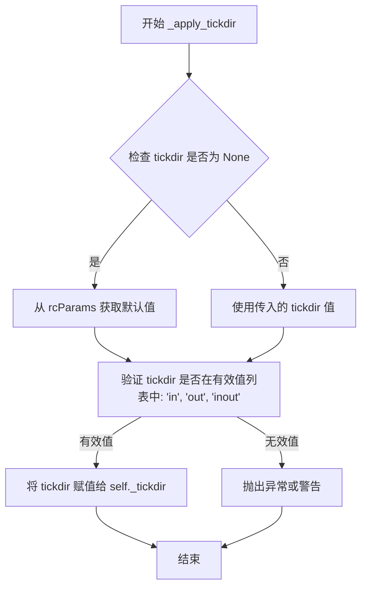

#### 带注释源码

```python
def _apply_tickdir(self, tickdir):
    """Set tick direction.  Valid values are 'out', 'in', 'inout'."""
    # 此方法负责验证输入，并在子类中负责设置 tick{1,2}line 标记。
    # 从用户角度看，应始终通过 _apply_params 调用此方法，
    # 该方法会进一步使用新的 pad 更新刻度标签位置。
    
    # 使用 mpl._val_or_rc 函数获取 tickdir 值：
    # 如果 tickdir 不为 None，则使用传入的值；
    # 否则从 rcParams 中获取默认值，键名为 {类名}.direction
    tickdir = mpl._val_or_rc(tickdir, f'{self.__name__}.direction')
    
    # 使用 _api.check_in_list 验证 tickdir 是否在允许的列表中
    # 允许的值：'in'（向内）、'out'（向外）、'inout'（双向）
    _api.check_in_list(['in', 'out', 'inout'], tickdir=tickdir)
    
    # 将验证后的 tickdir 值存储到实例属性 _tickdir 中
    # 供其他方法如 get_tickdir()、get_tick_padding() 使用
    self._tickdir = tickdir
```


### XTick.update_position

该方法用于设置X轴刻度在数据坐标中的位置，通过更新刻度线、网格线和标签的x坐标来实现位置更新。

参数：

- `loc`：`float`，刻度在数据坐标系中的位置（x坐标值）

返回值：`None`，无返回值，仅更新对象内部状态

#### 流程图

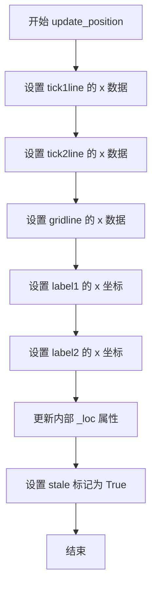

#### 带注释源码

```python
def update_position(self, loc):
    """Set the location of tick in data coords with scalar *loc*."""
    # 更新第一个刻度线的x坐标数据
    self.tick1line.set_xdata((loc,))
    # 更新第二个刻度线的x坐标数据
    self.tick2line.set_xdata((loc,))
    # 更新网格线的x坐标数据
    self.gridline.set_xdata((loc,))
    # 更新第一个标签的x坐标位置
    self.label1.set_x(loc)
    # 更新第二个标签的x坐标位置
    self.label2.set_x(loc)
    # 存储新的位置值到内部属性
    self._loc = loc
    # 标记对象状态已更改，需要重绘
    self.stale = True
```

---

### YTick.update_position

该方法用于设置Y轴刻度在数据坐标中的位置，通过更新刻度线、网格线和标签的y坐标来实现位置更新。

参数：

- `loc`：`float`，刻度在数据坐标系中的位置（y坐标值）

返回值：`None`，无返回值，仅更新对象内部状态

#### 流程图

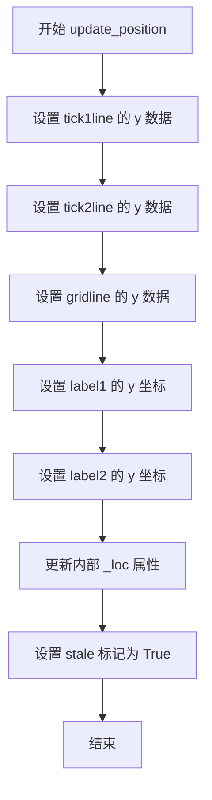

#### 带注释源码

```python
def update_position(self, loc):
    """Set the location of tick in data coords with scalar *loc*."""
    # 更新第一个刻度线的y坐标数据
    self.tick1line.set_ydata((loc,))
    # 更新第二个刻度线的y坐标数据
    self.tick2line.set_ydata((loc,))
    # 更新网格线的y坐标数据
    self.gridline.set_ydata((loc,))
    # 更新第一个标签的y坐标位置
    self.label1.set_y(loc)
    # 更新第二个标签的y坐标位置
    self.label2.set_y(loc)
    # 存储新的位置值到内部属性
    self._loc = loc
    # 标记对象状态已更改，需要重绘
    self.stale = True
```

---

### Tick.update_position（基类抽象方法）

该方法是基类 `Tick` 中声明的抽象方法，要求子类必须实现具体的位置更新逻辑。

参数：

- `loc`：`float`，刻度在数据坐标中的位置值

返回值：无返回值（子类实现）

#### 带注释源码

```python
def update_position(self, loc):
    """Set the location of tick in data coords with scalar *loc*."""
    # 抽象方法，基类不提供实现
    # 子类必须重写此方法以提供具体的位置更新逻辑
    raise NotImplementedError('Derived must override')
```


### `Tick.draw`

#### 描述

`Tick.draw` 是 Matplotlib 中 `Tick` 类的核心渲染方法，负责将刻度线（Tick）的各个组成部分（包括主刻度线、副刻度线、网格线以及刻度标签）绘制到指定的渲染器（Renderer）中。该方法首先检查刻度对象是否可见，如果不可见则直接返回；否则，它会打开一个渲染组，遍历并绘制其所有子艺术家（Artist），最后关闭渲染组并标记自身为非过期状态。

#### 参数

- `self`：`Tick` 类型，当前刻度对象实例。
- `renderer`：`~matplotlib.backend_bases.RendererBase` 类型，绘图后端渲染器，负责执行实际的绘图指令。

#### 返回值

- `None`。该方法不返回任何值，主要通过副作用（修改渲染器状态）完成工作。

#### 流程图

```mermaid
flowchart TD
    Start([开始绘制]) --> CheckVisible{检查是否可见<br/>get_visible()}
    CheckVisible -- 否 (False) --> SetStaleFalse1[设置 stale = False]
    SetStaleFalse1 --> End([结束绘制])
    CheckVisible -- 是 (True) --> OpenGroup[renderer.open_group<br/>/"tick"]
    OpenGroup --> LoopChildren[遍历子元素<br/>gridline, tick1line, tick2line<br/>label1, label2]
    LoopChildren --> DrawChild[子元素.draw(renderer)]
    DrawChild --> MoreChildren{还有更多<br/>子元素?}
    MoreChildren -- 是 --> LoopChildren
    MoreChildren -- 否 --> CloseGroup[renderer.close_group<br/>/"tick"]
    CloseGroup --> SetStaleFalse2[设置 stale = False]
    SetStaleFalse2 --> End
```

#### 带注释源码

```python
@martist.allow_rasterization
def draw(self, renderer):
    """
    Draw the object to the given renderer.

    This method is the main entry point for rendering a Tick. It delegates
    the actual drawing of its components (lines and texts) to the renderer.
    """
    # 1. Visibility Check: If the tick is not visible, there is nothing to draw.
    # We also mark it as not stale to prevent unnecessary redraws.
    if not self.get_visible():
        self.stale = False
        return
    
    # 2. Group Management: Open a group in the renderer. This is useful for
    # identifying the tick as a single entity in the output (e.g., for picking).
    # It uses the class name as the group name.
    renderer.open_group(self.__name__, gid=self.get_gid())
    
    # 3. Draw Components: Iterate through all visual components of the tick.
    # These include the grid line, the two tick markers (left/bottom and right/top),
    # and the two labels.
    for artist in [self.gridline, self.tick1line, self.tick2line,
                   self.label1, self.label2]:
        artist.draw(renderer)
    
    # 4. Close Group: End the group opened in step 2.
    renderer.close_group(self.__name__)
    
    # 5. State Update: Mark the tick as clean (not stale) after drawing.
    # This indicates that the graphical representation matches the internal state.
    self.stale = False
```


### `Tick.get_children`

该方法是 `Tick` 类的核心组成部分，用于实现 `Artist` 层次结构中的子类查询。它返回一个包含刻度线（`tick1line`, `tick2line`）、网格线（`gridline`）和标签（`label1`, `label2`）的列表，使父容器（如 `Axes`）能够统一遍历和管理这些复合图形元素。

#### 参数

- `self`：`Tick`，隐式参数，代表当前的 Tick 实例。

#### 返回值

- `list[matplotlib.artist.Artist]`，返回一个包含 5 个 `Artist` 子对象的列表（`Line2D` 和 `Text` 实例），这些对象构成了刻度的视觉呈现。

#### 流程图

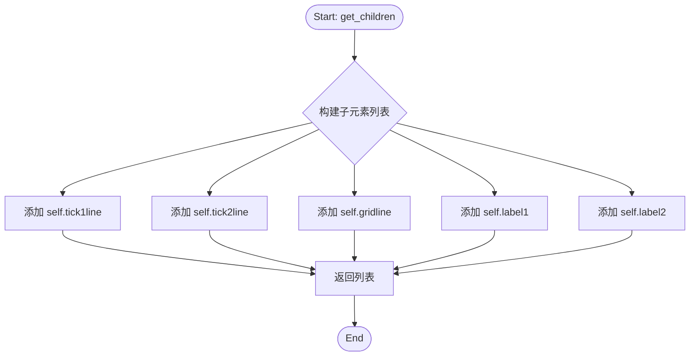

#### 带注释源码

```python
def get_children(self):
    """
    返回该Tick对象的所有子Artist。
    
    这些子元素包括刻度线、网格线和刻度标签，
    它们共同构成了一个完整的Tick标记。
    """
    # 初始化一个列表，依次包含：下/左刻度线、上/右刻度线、网格线、下/左标签、上/右标签
    children = [self.tick1line, self.tick2line,
                self.gridline, self.label1, self.label2]
    # 返回该列表，供父级Artist（如Axis）进行统一渲染或计算边界
    return children
```


### Tick._apply_params

该方法用于批量更新刻度线（Tick）的多个视觉属性和参数，包括刻度线、标签和网格线的显示状态、尺寸、颜色、方向、旋转等，是 `Axis.set_tick_params` 背后的核心实现逻辑。

参数：

- `**kwargs`：`可变关键字参数`，接受多个命名参数，包括 `gridOn`、`tick1On`、`tick2On`、`label1On`、`label2On`、`size`、`width`、`pad`、`tickdir`、`color`、`zorder`、`labelrotation`、`labelrotation_mode`、`labelsize`、`labelcolor`、`labelfontfamily` 以及网格相关参数（如 `grid_color`、`grid_linestyle` 等）

返回值：无（`None`），该方法直接修改对象的内部状态

#### 流程图

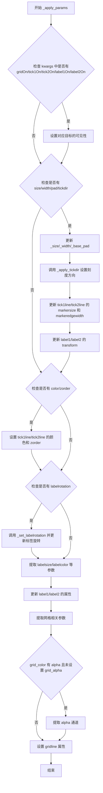

#### 带注释源码

```python
def _apply_params(self, **kwargs):
    """
    Apply a collection of setter kwargs to the Tick.

    This method handles setting various visual properties of the tick,
    including visibility of tick lines/labels/grid, sizes, colors,
    directions, and rotations.

    Parameters
    ----------
    **kwargs : dict
        Keyword arguments specifying what to update. Valid keys include:
        - Visibility: gridOn, tick1On, tick2On, label1On, label2On
        - Size: size, width, pad
        - Direction: tickdir
        - Color: color, zorder
        - Label: labelrotation, labelrotation_mode, labelsize, labelcolor, labelfontfamily
        - Grid: grid_color, grid_linestyle, grid_linewidth, grid_alpha, etc.
    """
    # 步骤1: 处理可见性相关的参数 (gridOn, tick1On, tick2On, label1On, label2On)
    # 遍历预定义的映射表，将参数名映射到对应的 Artist 对象
    for name, target in [("gridOn", self.gridline),
                         ("tick1On", self.tick1line),
                         ("tick2On", self.tick2line),
                         ("label1On", self.label1),
                         ("label2On", self.label2)]:
        if name in kwargs:
            # 设置对应对象的可见性，并从 kwargs 中移除该参数
            target.set_visible(kwargs.pop(name))

    # 步骤2: 处理尺寸和方向相关的参数
    # 检查是否需要更新 size, width, pad 或 tickdir
    if any(k in kwargs for k in ['size', 'width', 'pad', 'tickdir']):
        # 更新内部存储的尺寸值，如果 kwargs 中没有提供则保留原值
        self._size = kwargs.pop('size', self._size)
        # Width could be handled outside this block, but it is
        # convenient to leave it here.
        self._width = kwargs.pop('width', self._width)
        self._base_pad = kwargs.pop('pad', self._base_pad)
        
        # _apply_tickdir uses _size and _base_pad to make _pad, and also
        # sets the ticklines markers.
        # 调用 _apply_tickdir 设置刻度方向（in/out/inout）
        # 该方法会同时设置刻度线的标记样式
        self._apply_tickdir(kwargs.pop('tickdir', self._tickdir))
        
        # 更新两条刻度线的 markersize 和 markeredgewidth
        for line in (self.tick1line, self.tick2line):
            line.set_markersize(self._size)
            line.set_markeredgewidth(self._width)
        
        # _get_text1_transform uses _pad from _apply_tickdir.
        # 根据新的 _pad 值计算文本变换并应用到标签
        trans = self._get_text1_transform()[0]
        self.label1.set_transform(trans)
        trans = self._get_text2_transform()[0]
        self.label2.set_transform(trans)

    # 步骤3: 处理颜色和 zorder 参数
    # 提取 color 和 zorder 参数应用到刻度线
    tick_kw = {k: v for k, v in kwargs.items() if k in ['color', 'zorder']}
    if 'color' in kwargs:
        # 如果指定了 color，同时设置 markeredgecolor
        tick_kw['markeredgecolor'] = kwargs['color']
    # 应用到两条刻度线
    self.tick1line.set(**tick_kw)
    self.tick2line.set(**tick_kw)
    # 同时更新 Tick 对象自身的属性
    for k, v in tick_kw.items():
        setattr(self, '_' + k, v)

    # 步骤4: 处理标签旋转参数
    if 'labelrotation' in kwargs:
        # 设置内部旋转状态
        self._set_labelrotation(kwargs.pop('labelrotation'))
        # 将旋转角度应用到两个标签
        self.label1.set(rotation=self._labelrotation[1])
        self.label2.set(rotation=self._labelrotation[1])

    # 步骤5: 处理标签样式参数
    # 提取 labelsize, labelcolor, labelfontfamily, labelrotation_mode
    # 注意：这里使用 k[5:] 去除 'label' 前缀，因为 kwargs 中的键带有 'label' 前缀
    label_kw = {k[5:]: v for k, v in kwargs.items()
                if k in ['labelsize', 'labelcolor', 'labelfontfamily',
                         'labelrotation_mode']}
    self.label1.set(**label_kw)
    self.label2.set(**label_kw)

    # 步骤6: 处理网格线参数
    # 提取 grid_* 相关的参数（去除 'grid_' 前缀）
    grid_kw = {k[5:]: v for k, v in kwargs.items()
               if k in _gridline_param_names}
    # If grid_color has an alpha channel and grid_alpha is not explicitly
    # set, extract the alpha from the color.
    # 特殊处理：如果 grid_color 包含 alpha 通道且未单独设置 grid_alpha
    if 'color' in grid_kw and 'alpha' not in grid_kw:
        grid_color = grid_kw['color']
        if mcolors._has_alpha_channel(grid_color):
            # Convert to rgba to extract alpha
            rgba = mcolors.to_rgba(grid_color)
            grid_kw['color'] = rgba[:3]  # RGB only
            grid_kw['alpha'] = rgba[3]    # Alpha channel
    # 应用网格线参数
    self.gridline.set(**grid_kw)
```


### XTick._get_text1_transform

获取 X 轴刻度标签的文本变换信息，用于确定刻度标签的位置和对齐方式。

参数：

- 无显式参数（隐式参数 `self`：XTick 实例，当前刻度对象）

返回值：元组，通常包含 `(transform, verticalalignment, horizontalalignment)`，具体结构取决于 `Axes.get_xaxis_text1_transform` 的实现，返回的变换对象用于将刻度标签定位在图表的正确位置。

#### 流程图

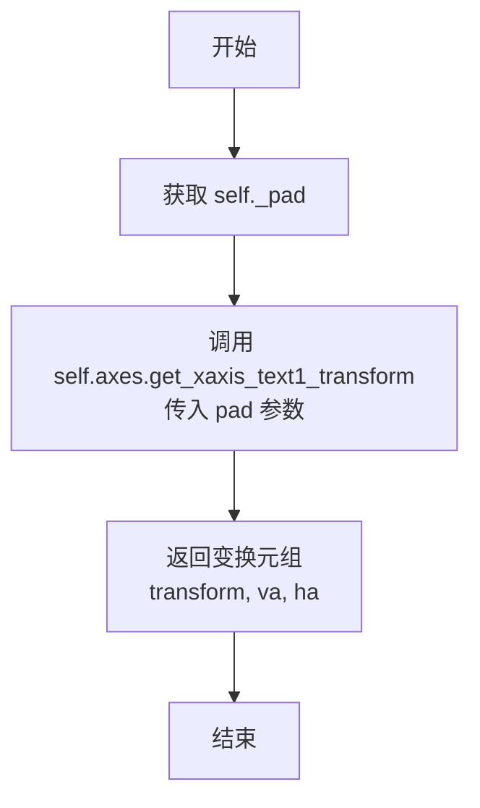

#### 带注释源码

```python
def _get_text1_transform(self):
    """
    获取 X 轴主刻度标签（底部）的文本变换信息。
    
    此方法为 XTick 类的一部分，用于获取第一个刻度标签的变换矩阵、
    垂直对齐方式和水平对齐方式。该变换定义了刻度标签相对于刻度线的位置。
    
    Returns
    -------
    tuple
        包含 (transform, verticalalignment, horizontalalignment) 的元组，
        用于设置刻度标签的位置和对齐方式。
    """
    # 调用 axes 对象的 get_xaxis_text1_transform 方法，传入 pad 值
    # self._pad 是从基类 Tick 继承的属性，表示刻度标签与刻度线之间的间距
    return self.axes.get_xaxis_text1_transform(self._pad)
```


### XTick._get_text2_transform

该方法用于获取X轴刻度标签2（顶部标签）的变换矩阵和对齐方式。它是一个简单的委托方法，将请求转发给父Axes对象的get_xaxis_text2_transform方法，并传入当前刻度标签的填充值（_pad）。

参数：无（仅包含self）

返回值：`tuple`，返回包含三个元素的元组：
- `transform`：matplotlib变换对象（matplotlib.transforms.Transform），用于将数据坐标转换为显示坐标的变换矩阵
- `verticalalignment`：字符串，垂直对齐方式（如'top'、'bottom'、'center'等）
- `horizontalalignment`：字符串，水平对齐方式（如'left'、'right'、'center'等）

#### 流程图

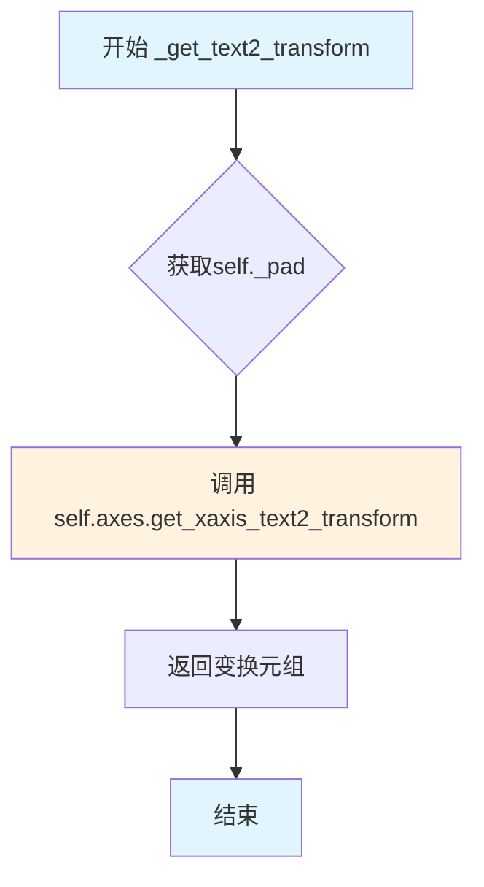

#### 带注释源码

```python
def _get_text2_transform(self):
    """
    获取X轴刻度标签2（顶部标签）的变换和对齐方式。
    
    该方法委托给Axes对象的get_xaxis_text2_transform方法，
    用于确定顶部刻度标签的定位参数。
    
    Returns
    -------
    tuple
        包含(transform, va, ha)的三元组：
        - transform: 用于标签的坐标变换
        - va: 垂直对齐方式
        - ha: 水平对齐方式
    """
    # self._pad是基类Tick中计算的属性，等于_base_pad + get_tick_padding()
    # 它表示刻度标签与轴之间的间距（以点为单位）
    return self.axes.get_xaxis_text2_transform(self._pad)
```


### XTick.update_position

设置刻度在数据坐标中的位置。该方法更新X轴刻度（tick）的所有相关组件（刻度线、网格线、标签）的X坐标，并标记该对象需要重新绘制。

参数：

- `loc`：`Real`，刻度在数据坐标中的位置（标量值）

返回值：`None`，无返回值（该方法直接修改对象状态并设置`self.stale = True`）

#### 流程图

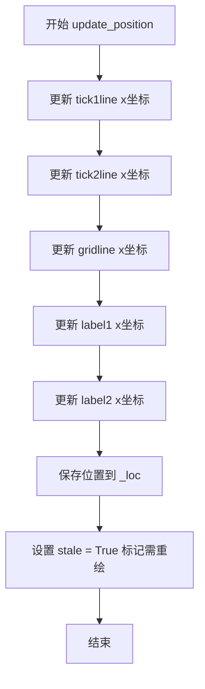

#### 带注释源码

```python
def update_position(self, loc):
    """
    Set the location of tick in data coords with scalar *loc*.
    
    参数:
        loc: Real - 刻度在数据坐标中的位置（标量值）
    返回:
        None
    """
    # 设置底部刻度线的x坐标数据
    self.tick1line.set_xdata((loc,))
    
    # 设置顶部刻度线的x坐标数据
    self.tick2line.set_xdata((loc,))
    
    # 设置网格线的x坐标数据
    self.gridline.set_xdata((loc,))
    
    # 设置底部标签的x位置
    self.label1.set_x(loc)
    
    # 设置顶部标签的x位置
    self.label2.set_x(loc)
    
    # 保存当前位置到内部属性
    self._loc = loc
    
    # 标记该对象已过期，需要重新绘制
    self.stale = True
```


### `YTick._get_text1_transform`

该方法用于获取Y轴刻度标签（label1）的文本变换信息，包括变换对象、垂直对齐方式和水平对齐方式。它通过调用 `Axes.get_yaxis_text1_transform` 方法并传入内部计算的 `_pad` 值来确定标签的定位参数。

参数：

- `self`：隐式参数，`YTick` 实例本身

返回值：`tuple`，返回一个包含三个元素的元组 `(transform, va, ha)`，其中 `transform` 是坐标变换对象，`va` 是垂直对齐方式，`va` 是水平对齐方式

#### 流程图

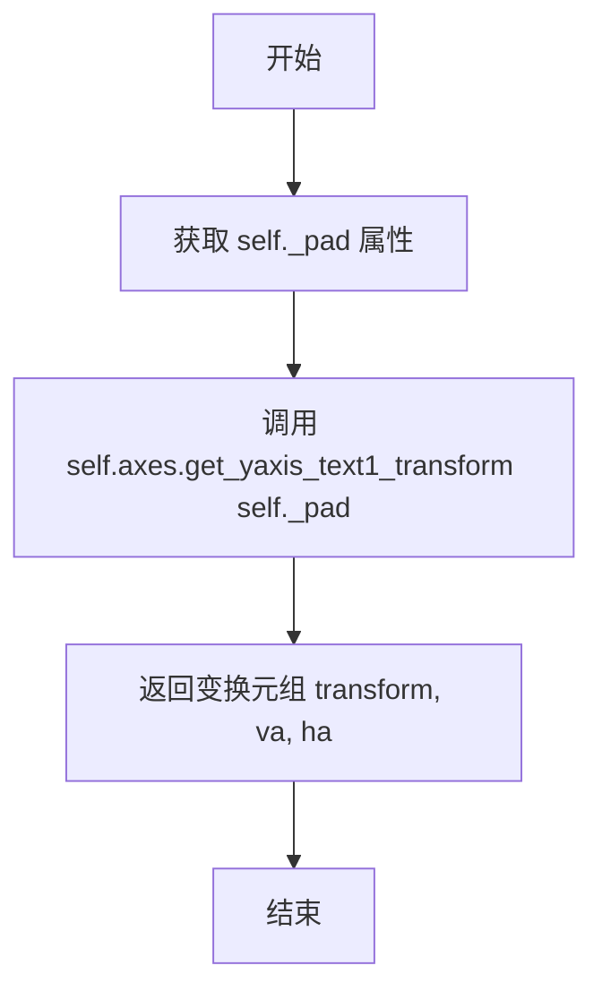

#### 带注释源码

```python
def _get_text1_transform(self):
    """
    获取Y轴刻度标签（label1）的文本变换信息。

    此方法返回用于定位Y轴主刻度标签的变换、垂直对齐方式和水平对齐方式。
    它通过调用Axes对象的get_yaxis_text1_transform方法来实现，
    并使用内部计算的_pad属性来确定标签的偏移距离。

    Returns
    -------
    tuple
        包含 (transform, verticalalignment, horizontalalignment) 的元组，
        用于设置刻度标签的位置和对齐方式。
    """
    # _pad 是从基座填充加上刻度方向偏移计算得出的
    # get_yaxis_text1_transform 返回适用于Y轴第一个标签位置的变换参数
    return self.axes.get_yaxis_text1_transform(self._pad)
```


### `YTick._get_text2_transform`

获取 Y 轴刻度标签2的变换信息，用于确定刻度标签在图表中的位置和对齐方式。

参数：

- 该方法无显式参数

返回值：`tuple`，返回包含三个元素的元组 `(transform, verticalalignment, horizontalalignment)`，其中：
- `transform`：应用于标签2的坐标变换对象
- `verticalalignment`：标签的垂直对齐方式
- `horizontalalignment`：标签的水平对齐方式

#### 流程图

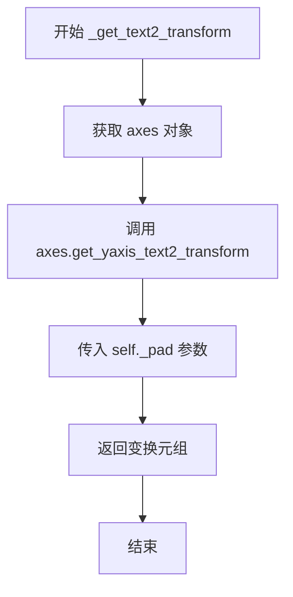

#### 带注释源码

```python
def _get_text2_transform(self):
    """
    获取 Y 轴刻度标签2的变换信息。

    此方法用于获取第二个刻度标签（label2）在 Y 轴上的变换配置，
    包括坐标变换、垂直对齐和水平对齐方式。它调用 Axes 对象的
    get_yaxis_text2_transform 方法来获取这些信息。

    Returns
    -------
    tuple
        包含 (transform, verticalalignment, horizontalalignment) 的元组，
        用于配置刻度标签2的显示属性。

    See Also
    --------
    _get_text1_transform: 获取第一个刻度标签的变换信息。
    YAxis.get_yaxis_text2_transform: 返回 Y 轴文本标签2的变换配置。

    """
    # 调用 axes 对象的 get_yaxis_text2_transform 方法
    # 传入 _pad 属性（基础填充 + 刻度Padding）
    # 返回格式为 (transform, verticalalignment, horizontalalignment)
    return self.axes.get_yaxis_text2_transform(self._pad)
```


### `YTick.update_position`

设置Y轴刻度在数据坐标系中的位置，同时更新相关的刻度线、网格线和标签的Y坐标，并将对象标记为需要重绘。

参数：

- `loc`：`Real`，刻度在数据坐标系中的位置（标量值）

返回值：`None`，无返回值（方法内部直接修改对象状态）

#### 流程图

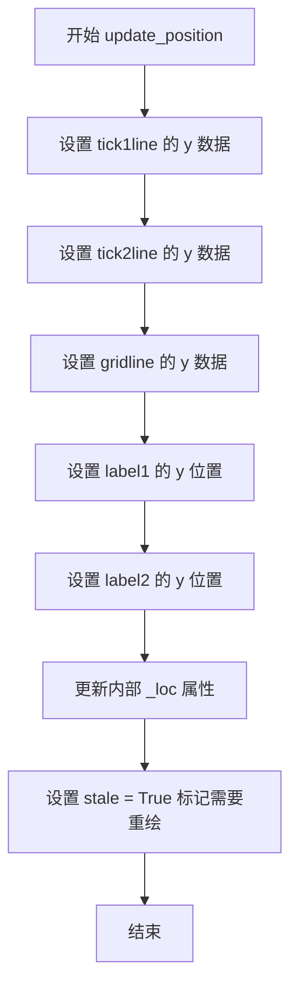

#### 带注释源码

```python
def update_position(self, loc):
    """
    Set the location of tick in data coords with scalar *loc*.
    
    Parameters
    ----------
    loc : Real
        The tick location in data coordinates.
    """
    # 更新第一个刻度线的Y坐标
    self.tick1line.set_ydata((loc,))
    # 更新第二个刻度线的Y坐标
    self.tick2line.set_ydata((loc,))
    # 更新网格线的Y坐标
    self.gridline.set_ydata((loc,))
    # 更新底部/左侧标签的Y位置
    self.label1.set_y(loc)
    # 更新顶部/右侧标签的Y位置
    self.label2.set_y(loc)
    # 缓存内部位置值
    self._loc = loc
    # 标记该刻度对象已过期，需要在下次绘制时重新渲染
    self.stale = True
```


### Ticker.locator

该属性是 Ticker 类中用于获取和设置刻度定位器（locator）的 getter/setter 属性。Locator 决定了坐标轴上刻度的位置。

#### 参数

**Getter:**
- 无参数

**Setter:**
- `locator`：`matplotlib.ticker.Locator`，用于设置刻度位置的定位器对象

#### 返回值

**Getter:**
- `matplotlib.ticker.Locator or None`，返回确定刻度位置的定位器对象

**Setter:**
- 无返回值

#### 流程图

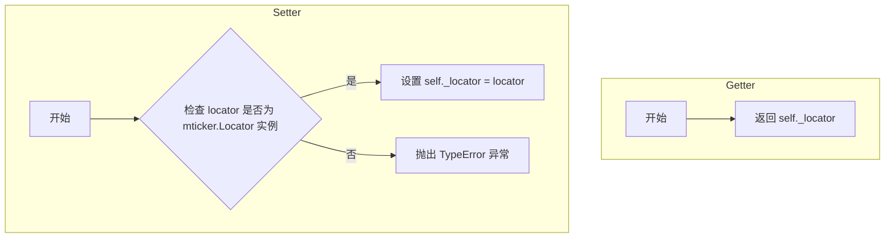

#### 带注释源码

```
@property
def locator(self):
    """
    获取刻度定位器。

    Returns
    -------
    matplotlib.ticker.Locator or None
        确定刻度位置的定位器对象。
    """
    return self._locator


@locator.setter
def locator(self, locator):
    """
    设置刻度定位器。

    Parameters
    ----------
    locator : matplotlib.ticker.Locator
        确定刻度位置的定位器对象。

    Raises
    ------
    TypeError
        如果 locator 不是 matplotlib.ticker.Locator 的子类。
    """
    if not isinstance(locator, mticker.Locator):
        raise TypeError('locator must be a subclass of '
                        'matplotlib.ticker.Locator')
    self._locator = locator
```


### Ticker.formatter (getter/setter)

描述：Ticker类的formatter属性是一个属性装饰器，用于获取或设置决定刻度标签格式的Formatter对象。getter返回当前设置的Formatter实例，setter验证输入是否为matplotlib.ticker.Formatter的子类并设置。

参数：

- `self`：无名称，`Ticker`实例本身，无需显式传递
- `formatter`（setter参数）：`matplotlib.ticker.Formatter`，必须是`matplotlib.ticker.Formatter`子类，用于设置刻度标签的格式器

返回值：

- `getter`：`matplotlib.ticker.Formatter` 或 `None`，返回当前设置的Formatter实例
- `setter`：`None`，无返回值，仅进行属性设置

#### 流程图

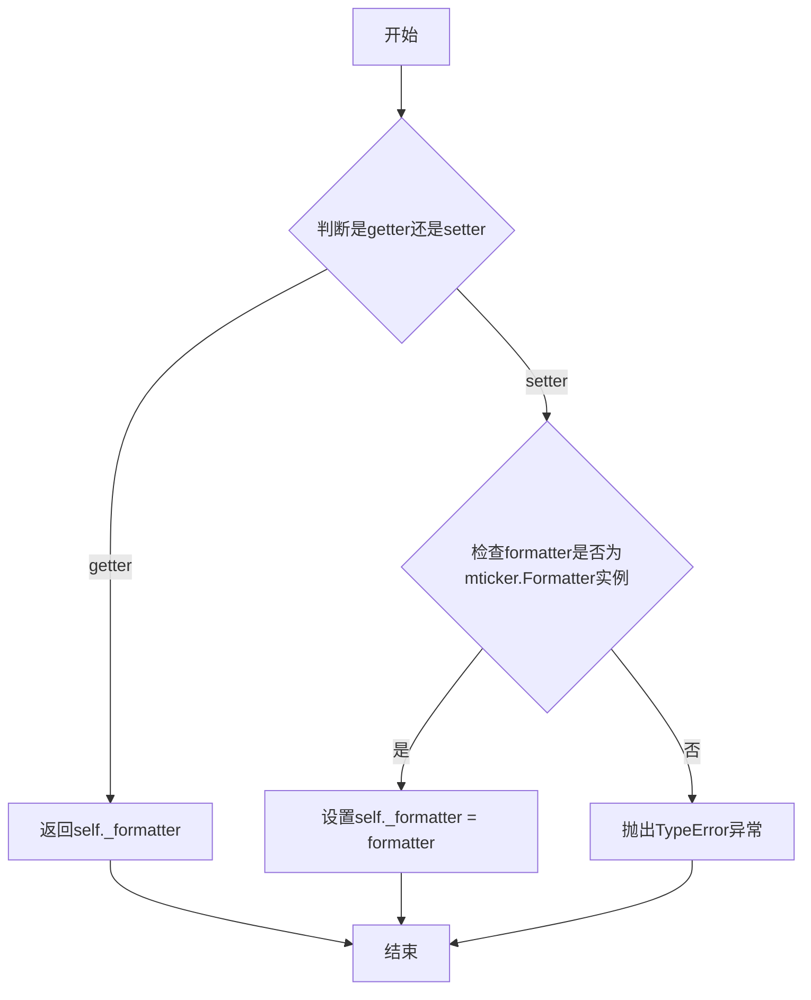

#### 带注释源码

```python
@property
def formatter(self):
    """
    Get the formatter for tick labels.

    Returns
    -------
    matplotlib.ticker.Formatter or None
        The formatter currently set for this Ticker object.
    """
    return self._formatter

@formatter.setter
def formatter(self, formatter):
    """
    Set the formatter for tick labels.

    Parameters
    ----------
    formatter : matplotlib.ticker.Formatter
        The formatter to use for tick label formatting.
        Must be a subclass of matplotlib.ticker.Formatter.

    Raises
    ------
    TypeError
        If formatter is not a subclass of matplotlib.ticker.Formatter.
    """
    if not isinstance(formatter, mticker.Formatter):
        raise TypeError('formatter must be a subclass of '
                        'matplotlib.ticker.Formatter')
    self._formatter = formatter
```


### `_LazyTickList.__get__`

这是一个描述符（Descriptor）的 `__get__` 方法，用于延迟初始化 Axis 的 `majorTicks` 和 `minorTicks` 属性。当首次访问这些属性时，才会真正创建刻度对象，从而避免在 Axis 初始化时创建大量未使用的刻度实例。

参数：

- `instance`：`Axis` 子类实例（如 `XAxis` 或 `YAxis`），当通过实例访问属性时由 Python 描述符协议自动传入；如果通过类访问属性，则为 `None`
- `owner`：`type`，拥有该描述符的类（即 `Axis` 类及其子类），用于判断属性是通过类还是实例访问

返回值：

- `list[_Tick]`，当 `instance` 为 `None` 时返回描述符对象本身；当 `instance` 存在时返回对应的主刻度（`majorTicks`）或次刻度（`minorTicks`）列表

#### 流程图

```mermaid
flowchart TD
    A[访问 majorTicks 或 minorTicks 属性] --> B{instance is None?}
    B -->|Yes| C[返回描述符对象 self]
    B -->|No| D{self._major is True?}
    D -->|Yes| E[设置 instance.majorTicks = []]
    D -->|No| F[设置 instance.minorTicks = []]
    E --> G[tick = instance._get_tick&#40;major=True&#41;]
    F --> H[tick = instance._get_tick&#40;major=False&#41;]
    G --> I[instance.majorTicks = [tick]]
    H --> J[instance.minorTicks = [tick]]
    I --> K[返回 instance.majorTicks]
    J --> L[返回 instance.minorTicks]
```

#### 带注释源码

```python
def __get__(self, instance, owner):
    """
    获取延迟加载的刻度列表描述符。
    
    这是一个数据描述符（Data Descriptor），实现了 __get__ 协议。
    当访问 majorTicks 或 minorTicks 属性时，此方法会被调用，
    并在首次访问时创建实际的刻度对象。
    
    Parameters
    ----------
    instance : Axis or None
        访问属性的 Axis 子类实例。如果通过类访问属性（如 Axis.majorTicks），
        则为 None。
    owner : type
        拥有此描述符的类（即 Axis 类）。
    
    Returns
    -------
    _LazyTickList or list[Tick]
        如果通过类访问，返回描述符本身；否则返回包含 Tick 对象的列表。
    """
    # 通过类访问属性时（如 Axis.majorTicks），instance 为 None，
    # 此时返回描述符对象本身，而非创建实例
    if instance is None:
        return self
    else:
        # 实例访问时，需要创建实际的刻度列表
        # 注意：instance._get_tick() 本身可能尝试访问 majorTicks 属性
        # （例如某些投影类重写了 get_xaxis_text1_transform 方法）。
        # 为避免无限递归，先将 majorTicks 设置为空列表，然后创建 tick；
        # 注意 _get_tick() 可能调用 reset_ticks()，因此最终刻度列表
        # 在之后创建和赋值。
        
        if self._major:
            # 主刻度列表初始化
            # 1. 先设置为空列表，避免递归时触发无限递归
            instance.majorTicks = []
            # 2. 创建实际的刻度对象
            tick = instance._get_tick(major=True)
            # 3. 将刻度包装为列表并赋值
            instance.majorTicks = [tick]
            # 4. 返回主刻度列表
            return instance.majorTicks
        else:
            # 次刻度列表初始化，逻辑同上
            instance.minorTicks = []
            tick = instance._get_tick(major=False)
            instance.minorTicks = [tick]
            return instance.minorTicks
```


### Axis.clear

该方法用于清空（重置）坐标轴的所有属性到默认值，包括标签、刻度定位器、格式化器、刻度线、网格、单位以及注册的回调函数。

参数：

- 无参数

返回值：`None`，该方法直接修改对象状态，不返回任何值。

#### 流程图

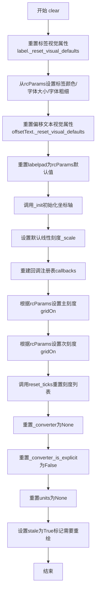

#### 带注释源码

```python
def clear(self):
    """
    Clear the axis.

    This resets axis properties to their default values:

    - the label
    - the scale
    - locators, formatters and ticks
    - major and minor grid
    - units
    - registered callbacks
    """
    # 重置标签的视觉属性为默认值（从text rcParams）
    self.label._reset_visual_defaults()
    # 上面的重置使用text rcParams格式化标签，
    # 然后我们使用axes rcParams更新格式化
    self.label.set_color(mpl.rcParams['axes.labelcolor'])
    self.label.set_fontsize(mpl.rcParams['axes.labelsize'])
    self.label.set_fontweight(mpl.rcParams['axes.labelweight'])
    
    # 重置偏移文本的视觉属性
    self.offsetText._reset_visual_defaults()
    
    # 重置标签与坐标轴之间的间距为默认值
    self.labelpad = mpl.rcParams['axes.labelpad']

    # 调用内部初始化方法，重新初始化坐标轴的基本属性
    self._init()

    # 设置默认的线性刻度
    self._set_scale('linear')

    # 清除此坐标轴的回调注册表，否则可能会"泄漏"
    self.callbacks = cbook.CallbackRegistry(signals=["units"])

    # 根据rcParams设置主刻度网格是否开启
    # 取决于axes.grid和axes.grid.which的配置
    self._major_tick_kw['gridOn'] = (
            mpl.rcParams['axes.grid'] and
            mpl.rcParams['axes.grid.which'] in ('both', 'major'))
    
    # 根据rcParams设置次刻度网格是否开启
    self._minor_tick_kw['gridOn'] = (
            mpl.rcParams['axes.grid'] and
            mpl.rcParams['axes.grid.which'] in ('both', 'minor'))
    
    # 重置刻度列表，重新初始化主刻度和次刻度
    self.reset_ticks()

    # 重置单位转换器为None
    self._converter = None
    # 重置转换器是否显式设置的标志
    self._converter_is_explicit = False
    # 重置单位为None
    self.units = None
    # 标记该对象已过时，需要重绘
    self.stale = True
```


### Axis.reset_ticks

重新初始化主刻度和次刻度列表，使每个列表以单个新的 Tick 开头。该方法通过删除现有的延迟加载的刻度列表（majorTicks 和 minorTicks），并在下次访问时重新创建，从而实现刻度的重置。

参数：

- 该方法没有参数

返回值：`None`，无返回值描述

#### 流程图

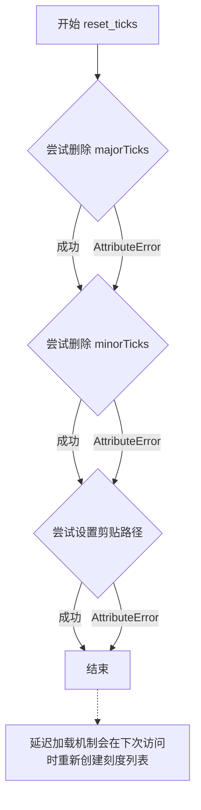

#### 带注释源码

```python
def reset_ticks(self):
    """
    Re-initialize the major and minor Tick lists.

    Each list starts with a single fresh Tick.
    """
    # Restore the lazy tick lists.
    # 尝试删除 majorTicks 属性，如果存在则删除
    # 这会触发 _LazyTickList 描述符的 __delete__ 方法
    # 由于 _LazyTickList 没有实现 __delete__，这实际上会删除实例属性
    try:
        del self.majorTicks
    except AttributeError:
        pass
    
    # 尝试删除 minorTicks 属性
    try:
        del self.minorTicks
    except AttributeError:
        pass
    
    # 尝试设置剪贴路径到 axes 的 patch
    # 这确保刻度被正确裁剪到 Axes 区域内
    try:
        self.set_clip_path(self.axes.patch)
    except AttributeError:
        pass
```


### `Axis._update_ticks`

更新轴上的刻度（位置和标签），使用当前轴的数据区间，返回将要绘制的刻度列表。

参数：

- `self`：`Axis`实例，方法的调用者，代表一个轴对象（X轴或Y轴）

返回值：`list`，返回需要绘制的刻度对象列表（`Tick`对象）

#### 流程图

```mermaid
flowchart TD
    A[开始 _update_ticks] --> B[获取主刻度位置 major_locs]
    B --> C[格式化主刻度标签 major_labels]
    C --> D[获取主刻度对象列表 major_ticks]
    D --> E{遍历每个主刻度}
    E -->|对于每个刻度| F[更新刻度位置 tick.update_position]
    F --> G[设置标签1文本]
    G --> H[设置标签2文本]
    H --> E
    E --> I[获取次刻度位置 minor_locs]
    I --> J[格式化次刻度标签 minor_labels]
    J --> K[获取次刻度对象列表 minor_ticks]
    K --> L{遍历每个次刻度}
    L -->|对于每个刻度| M[更新刻度位置 tick.update_position]
    M --> N[设置标签1文本]
    N --> O[设置标签2文本]
    O --> L
    L --> P[合并主刻度和次刻度到ticks列表]
    P --> Q[获取视图区间 view_low, view_high]
    Q --> R{检查是否为3D轴且启用自动边距}
    R -->|是| S[计算边距并调整view_high和view_low]
    R -->|否| T[继续]
    S --> U[将视图区间转换到显示坐标 interval_t]
    T --> U
    U --> V{遍历每个刻度}
    V -->|对于每个刻度| W[将刻度位置转换到显示坐标 loc_t]
    W --> X{检查是否在视图范围内}
    X -->|是| Y[将该刻度添加到ticks_to_draw列表]
    X -->|否| V
    Y --> V
    V --> Z[返回 ticks_to_draw 列表]
```

#### 带注释源码

```python
def _update_ticks(self):
    """
    Update ticks (position and labels) using the current data interval of
    the axes.  Return the list of ticks that will be drawn.
    """
    # 获取主刻度的位置（数据坐标）
    major_locs = self.get_majorticklocs()
    # 使用格式化器生成主刻度的标签
    major_labels = self.major.formatter.format_ticks(major_locs)
    # 获取与位置数量相匹配的主刻度对象列表
    major_ticks = self.get_major_ticks(len(major_locs))
    # 遍历每个主刻度，更新其位置和标签
    for tick, loc, label in zip(major_ticks, major_locs, major_labels):
        tick.update_position(loc)  # 更新刻度在数据坐标中的位置
        tick.label1.set_text(label)  # 设置第一个标签的文本
        tick.label2.set_text(label)  # 设置第二个标签的文本

    # 获取次刻度的位置（数据坐标）
    minor_locs = self.get_minorticklocs()
    # 使用格式化器生成次刻度的标签
    minor_labels = self.minor.formatter.format_ticks(minor_locs)
    # 获取与位置数量相匹配的次刻度对象列表
    minor_ticks = self.get_minor_ticks(len(minor_locs))
    # 遍历每个次刻度，更新其位置和标签
    for tick, loc, label in zip(minor_ticks, minor_locs, minor_labels):
        tick.update_position(loc)  # 更新刻度在数据坐标中的位置
        tick.label1.set_text(label)  # 设置第一个标签的文本
        tick.label2.set_text(label)  # 设置第二个标签的文本

    # 合并主刻度和次刻度到一个列表
    ticks = [*major_ticks, *minor_ticks]

    # 获取当前视图的区间（显示坐标）
    view_low, view_high = self.get_view_interval()
    # 确保view_low <= view_high
    if view_low > view_high:
        view_low, view_high = view_high, view_low

    # 对于3D轴且启用了自动边距的情况，进行特殊处理
    if (hasattr(self, "axes") and self.axes.name == '3d'
            and mpl.rcParams['axes3d.automargin']):
        # 计算边距补偿系数
        # 在mpl3.8中，边距是1/48。由于mpl3.9中自动边距行为的变化，
        # 我们需要调整以补偿2/48的缩放因子，得到23/24的修正系数。
        # 因此新的边距是0.019965277777777776 = 1/48*23/24
        margin = 0.019965277777777776
        delta = view_high - view_low
        view_high = view_high - delta * margin
        view_low = view_low + delta * margin

    # 将视图区间转换到显示坐标空间
    interval_t = self.get_transform().transform([view_low, view_high])

    # 筛选出在当前视图范围内应该绘制的刻度
    ticks_to_draw = []
    for tick in ticks:
        try:
            # 将刻度位置转换到显示坐标
            loc_t = self.get_transform().transform(tick.get_loc())
        except AssertionError:
            # transforms.transform不允许掩码值，但某些scale可能会产生它们，
            # 所以需要这个try/except处理
            pass
        else:
            # 检查刻度位置是否在视图范围内
            if mtransforms._interval_contains_close(interval_t, loc_t):
                ticks_to_draw.append(tick)

    # 返回需要绘制的刻度列表
    return ticks_to_draw
```


### `Axis.draw`

绘制坐标轴（Axis）及其所有子元素（刻度、刻度标签、轴标签等）到渲染器中。

参数：

- `renderer`：`~matplotlib.backend_bases.RendererBase`，用于将Artist绘制到画布上的渲染器对象

返回值：`None`，该方法直接在渲染器上绘制内容，不返回任何值

#### 流程图

```mermaid
flowchart TD
    A[开始 draw] --> B{检查是否可见<br/>get_visible}
    B -->|不可见| C[设置 stale = False 并返回]
    B -->|可见| D[打开渲染器组<br/>renderer.open_group]
    D --> E[更新刻度并获取要绘制的刻度<br/>_update_ticks]
    E --> F[获取刻度标签的边界框<br/>_get_ticklabel_bboxes]
    F --> G[遍历绘制每个刻度<br/>tick.draw]
    G --> H[更新标签位置<br/>_update_label_position]
    H --> I[绘制轴标签<br/>label.draw]
    I --> J[更新偏移文本位置<br/>_update_offset_text_position]
    J --> K[设置偏移文本内容并绘制<br/>offsetText.draw]
    K --> L[关闭渲染器组<br/>renderer.close_group]
    L --> M[设置 stale = False]
    M --> N[结束]
```

#### 带注释源码

```python
@martist.allow_rasterization
def draw(self, renderer):
    """
    Draw the axis to the renderer.

    This method is decorated with @martist.allow_rasterization to permit
    rasterization during vector backend saving.
    """
    # 检查轴是否可见，如果不可见则直接返回，不进行绘制
    if not self.get_visible():
        return
    
    # 打开一个渲染组，便于管理渲染状态和组属性
    renderer.open_group(__name__, gid=self.get_gid())

    # 更新刻度位置和标签，返回需要绘制的刻度列表
    ticks_to_draw = self._update_ticks()
    # 获取刻度标签的边界框，用于后续定位轴标签和偏移文本
    tlb1, tlb2 = self._get_ticklabel_bboxes(ticks_to_draw, renderer)

    # 遍历绘制每个刻度（包括刻度线和刻度标签）
    for tick in ticks_to_draw:
        tick.draw(renderer)

    # 根据刻度标签位置更新轴标签位置，避免重叠
    self._update_label_position(renderer)
    # 绘制轴标签（如 'x' 或 'y'）
    self.label.draw(renderer)

    # 更新偏移文本位置（显示如科学计数法中的指数）
    self._update_offset_text_position(tlb1, tlb2)
    # 设置偏移文本内容（从格式化器获取）
    self.offsetText.set_text(self.major.formatter.get_offset())
    # 绘制偏移文本
    self.offsetText.draw(renderer)

    # 关闭渲染组，完成绘制
    renderer.close_group(__name__)
    # 标记为不陈旧，表示已更新
    self.stale = False
```


### Axis.set_tick_params

设置刻度、刻度标签和网格线的外观参数。

参数：

- `which`：`str`，默认值 `'major'`，指定要设置哪个刻度组的参数，可选值为 `'major'`、`'minor'` 或 `'both'`
- `reset`：`bool`，默认值 `False`，是否重置刻度参数后再设置新参数
- `**kwargs`：可变关键字参数，用于指定刻度、刻度标签和网格线的外观参数（如 `size`、`width`、`color`、`direction`、`labelcolor` 等）

返回值：无（`None`），该方法直接修改对象状态并设置 `self.stale = True` 标记需要重绘

#### 流程图

```mermaid
flowchart TD
    A[开始 set_tick_params] --> B{验证 which 参数}
    B -->|合法| C[调用 _translate_tick_params 转换 kwargs]
    B -->|非法| Z[抛出 ValueError]
    C --> D{reset == True?}
    D -->|是| E[重置对应的 _major_tick_kw 或 _minor_tick_kw]
    E --> F[更新 tick_kw 字典]
    F --> G[调用 reset_ticks 重置刻度列表]
    D -->|否| H[直接更新 tick_kw 字典]
    H --> I[遍历对应的刻度对象]
    I --> J[对每个 tick 调用 _apply_params 应用参数]
    J --> K{kwargs 包含 label1On 或 label2On?}
    K -->|是| L[更新 offsetText 的可见性]
    K -->|否| M{kwargs 包含 labelcolor?}
    M -->|是| N[更新 offsetText 的颜色]
    M -->|否| O[设置 stale = True]
    L --> O
    N --> O
    O --> P[结束]
```

#### 带注释源码

```python
def set_tick_params(self, which='major', reset=False, **kwargs):
    """
    Set appearance parameters for ticks, ticklabels, and gridlines.

    For documentation of keyword arguments, see
    :meth:`matplotlib.axes.Axes.tick_params`.

    See Also
    --------
    .Axis.get_tick_params
        View the current style settings for ticks, ticklabels, and
        gridlines.
    """
    # 验证 which 参数是否为有效值：'major', 'minor', 或 'both'
    _api.check_in_list(['major', 'minor', 'both'], which=which)
    
    # 将用户提供的 kwargs 转换为内部使用的参数格式
    # 例如：将 'left'/'right' 转换为 'tick1On'/'tick2On' 等
    kwtrans = self._translate_tick_params(kwargs)

    # the kwargs are stored in self._major/minor_tick_kw so that any
    # future new ticks will automatically get them
    
    if reset:
        # 如果 reset 为 True，先重置已有的参数，再应用新参数
        if which in ['major', 'both']:
            self._reset_major_tick_kw()  # 清空主刻度参数字典
            self._major_tick_kw.update(kwtrans)  # 更新主刻度参数
        if which in ['minor', 'both']:
            self._reset_minor_tick_kw()  # 清空次刻度参数字典
            self._minor_tick_kw.update(kwtrans)  # 更新次刻度参数
        self.reset_ticks()  # 重置刻度列表，创建新的刻度对象
    else:
        # 如果 reset 为 False，仅更新现有刻度的参数
        if which in ['major', 'both']:
            self._major_tick_kw.update(kwtrans)  # 更新主刻度参数
            for tick in self.majorTicks:  # 遍历现有主刻度
                tick._apply_params(**kwtrans)  # 应用参数到每个刻度对象
        if which in ['minor', 'both']:
            self._minor_tick_kw.update(kwtrans)  # 更新次刻度参数
            for tick in self.minorTicks:  # 遍历现有次刻度
                tick._apply_params(**kwtrans)  # 应用参数到每个刻度对象
        
        # labelOn and labelcolor also apply to the offset text.
        # 如果设置了标签显示状态，同时更新 offsetText 的可见性
        if 'label1On' in kwtrans or 'label2On' in kwtrans:
            self.offsetText.set_visible(
                self._major_tick_kw.get('label1On', False)
                or self._major_tick_kw.get('label2On', False))
        
        # 如果设置了标签颜色，同时更新 offsetText 的颜色
        if 'labelcolor' in kwtrans:
            self.offsetText.set_color(kwtrans['labelcolor'])

    # 标记 Axis 对象需要重新绘制
    self.stale = True
```


### `Axis.set_ticks`

设置轴的刻度位置，并可选择设置刻度标签。如果需要，会扩展轴的视图限制以确保所有给定的刻度可见。

参数：

- `ticks`：1D array-like，刻度位置的数组（可以是浮点数或轴单位）。轴的 `.Locator` 会被 `~.ticker.FixedLocator` 替换。传入空列表（`set_ticks([])`）可移除所有刻度。
- `labels`：list of str, optional，每个刻度位置的标签列表；必须与 *ticks* 长度相同。如果设置，标签将直接使用 `.FixedFormatter`。如果未设置，则使用轴的 tick `.Formatter` 生成标签。
- `minor`：bool, default: False，如果为 `False`，则仅设置主刻度；如果为 `True`，则仅设置次要刻度。
- `**kwargs`：`.Text` 属性，用于设置标签的样式。仅在使用 *labels* 参数时才允许使用此参数。

返回值：`list of Ticks`，返回设置的主刻度或次要刻度的列表。

#### 流程图

```mermaid
flowchart TD
    A[开始 set_ticks] --> B{labels is None and kwargs exists?}
    B -->|Yes| C[raise ValueError]
    B -->|No| D[调用 _set_tick_locations]
    D --> E{labels is not None?}
    E -->|Yes| F[调用 set_ticklabels]
    E -->|No| G[返回结果]
    F --> G
    G --> H[结束]
```

#### 带注释源码

```python
def set_ticks(self, ticks, labels=None, *, minor=False, **kwargs):
    """
    Set this Axis' tick locations and optionally tick labels.

    If necessary, the view limits of the Axis are expanded so that all
    given ticks are visible.

    Parameters
    ----------
    ticks : 1D array-like
        Array of tick locations (either floats or in axis units). The axis
        `.Locator` is replaced by a `~.ticker.FixedLocator`.

        Pass an empty list (``set_ticks([])``) to remove all ticks.

        Some tick formatters will not label arbitrary tick positions;
        e.g. log formatters only label decade ticks by default. In
        such a case you can set a formatter explicitly on the axis
        using `.Axis.set_major_formatter` or provide formatted
        *labels* yourself.

    labels : list of str, optional
        Tick labels for each location in *ticks*; must have the same length as
        *ticks*. If set, the labels are used as is, via a `.FixedFormatter`.
        If not set, the labels are generated using the axis tick `.Formatter`.

    minor : bool, default: False
        If ``False``, set only the major ticks; if ``True``, only the minor ticks.

    **kwargs
        `.Text` properties for the labels. Using these is only allowed if
        you pass *labels*. In other cases, please use `~.Axes.tick_params`.

    Notes
    -----
    The mandatory expansion of the view limits is an intentional design
    choice to prevent the surprise of a non-visible tick. If you need
    other limits, you should set the limits explicitly after setting the
    ticks.
    """
    # 如果没有提供 labels 但提供了 kwargs，抛出错误
    # 因为 kwargs 只能用于修改文本标签，而文本标签只能在提供 labels 时修改
    if labels is None and kwargs:
        first_key = next(iter(kwargs))
        raise ValueError(
            f"Incorrect use of keyword argument {first_key!r}. Keyword arguments "
            "other than 'minor' modify the text labels and can only be used if "
            "'labels' are passed as well.")
    
    # 调用内部方法设置刻度位置
    result = self._set_tick_locations(ticks, minor=minor)
    
    # 如果提供了 labels，设置刻度标签
    if labels is not None:
        self.set_ticklabels(labels, minor=minor, **kwargs)
    
    # 返回设置的刻度列表
    return result
```


### `Axis.grid`

配置轴上网格线的显示与样式。

参数：

- `visible`：`bool` 或 `None`，控制网格线是否显示。如果提供了任何 `kwargs` 参数，则假定需要开启网格并将 `visible` 设为 `True`；若 `visible` 为 `None` 且无 `kwargs`，则切换网格线的可见性。
- `which`：`str`，指定要修改的网格线类型，可选值为 `'major'`、`'minor'` 或 `'both'`，默认为 `'major'`。
- `**kwargs`：`matplotlib.lines.Line2D` 属性，用于定义网格线的样式（如 `color`、`linestyle`、`linewidth` 等）。

返回值：`None`，该方法无返回值，直接修改轴的状态。

#### 流程图

```mermaid
flowchart TD
    A[开始 grid 方法] --> B{kwargs 是否存在?}
    B -->|是| C[visible = True]
    B -->|否| D{visible 是否为 None?}
    C --> E{visible 为假值但非 None?}
    D -->|是| F{kwargs 是否存在?}
    D -->|否| G[保持 visible 不变]
    E -->|是| H[警告: 提供了属性但 visible 为假, 网格将启用]
    E -->|否| I[保持 visible 不变]
    H --> J[visible = True]
    I --> G
    F -->|是| K[切换网格可见性]
    F -->|否| L[结束]
    G --> K
    K --> M[将 kwargs 键名添加 'grid_' 前缀]
    M --> N{which 包含 'minor' 或 'both'?}
    N -->|是| O[设置 gridOn 状态]
    N -->|否| P{which 包含 'major' 或 'both'?}
    O --> Q[调用 set_tick_params minor]
    P -->|是| R[调用 set_tick_params major]
    Q --> S[设置 stale = True]
    R --> S
    S --> L
```

#### 带注释源码

```python
def grid(self, visible=None, which='major', **kwargs):
    """
    Configure the grid lines.

    Parameters
    ----------
    visible : bool or None
        Whether to show the grid lines.  If any *kwargs* are supplied, it
        is assumed you want the grid on and *visible* will be set to True.

        If *visible* is *None* and there are no *kwargs*, this toggles the
        visibility of the lines.

    which : {'major', 'minor', 'both'}
        The grid lines to apply the changes on.

    **kwargs : `~matplotlib.lines.Line2D` properties
        Define the line properties of the grid, e.g.::

            grid(color='r', linestyle='-', linewidth=2)
    """
    # 如果提供了样式参数，隐式开启网格
    if kwargs:
        if visible is None:
            visible = True
        elif not visible:  # something false-like but not None
            _api.warn_external('First parameter to grid() is false, '
                               'but line properties are supplied. The '
                               'grid will be enabled.')
            visible = True
    
    # 验证 which 参数合法性，并转为小写
    which = which.lower()
    _api.check_in_list(['major', 'minor', 'both'], which=which)
    
    # 将用户提供的 Line2D 参数键名添加 'grid_' 前缀
    # 例如 color -> grid_color, linestyle -> grid_linestyle
    gridkw = {f'grid_{name}': value for name, value in kwargs.items()}
    
    # 处理次要网格线
    if which in ['minor', 'both']:
        # 如果 visible 为 None，切换当前网格线可见状态
        gridkw['gridOn'] = (not self._minor_tick_kw['gridOn']
                            if visible is None else visible)
        self.set_tick_params(which='minor', **gridkw)
    
    # 处理主要网格线
    if which in ['major', 'both']:
        gridkw['gridOn'] = (not self._major_tick_kw['gridOn']
                            if visible is None else visible)
        self.set_tick_params(which='major', **gridkw)
    
    # 标记轴需要重绘
    self.stale = True
```


### Axis.get_majorticklocs

该方法用于获取当前轴（Axis）的主要刻度（major tick）的位置。方法是`Axis`类的公共接口，通过调用`Ticker`对象的`locator`属性（一个`Locator`对象）来计算并返回主要刻度位置。

参数：

- 该方法无参数

返回值：`numpy.ndarray` 或类似数组对象，返回主要刻度在数据坐标系中的位置数组。

#### 流程图

```mermaid
flowchart TD
    A[调用 Axis.get_majorticklocs] --> B{检查 major locator}
    B --> C[调用 self.major.locator]
    C --> D[Locator.__call__ 方法]
    D --> E[计算并返回刻度位置数组]
    E --> F[返回主要刻度位置]
```

#### 带注释源码

```python
def get_majorticklocs(self):
    """
    Return this Axis' major tick locations in data coordinates.
    
    此方法是 Axis 类提供的公共接口，用于获取当前轴的主要刻度位置。
    它不进行任何参数检查或转换，直接调用 major ticker 的 locator 对象
    来获取刻度位置。返回值是数据坐标系中的实际数值数组。
    
    Returns
    -------
    array-like
        主要刻度位置在数据坐标中的值。该数组可能包含负数、零和正数，
        具体取决于数据的范围和当前的定位器（Locator）类型。
        例如，对于线性刻度，位置是均匀分布的；对于对数刻度，位置是对数分布的。
    """
    # 直接调用 major Ticker 的 locator callable 对象
    # locator 是 mticker.Locator 的实例，其 __call__ 方法返回刻度位置数组
    return self.major.locator()
```


### Axis._set_scale

设置轴的比例尺（scale），将字符串或ScaleBase实例转换为实际的比例尺对象，并初始化相关的定位器和格式化器。

参数：

- `value`：`str` 或 `matplotlib.scale.ScaleBase`，要设置的比例尺类型，可以是字符串（如"linear"、"log"等）或直接的ScaleBase实例
- `**kwargs`：关键字参数，当value为字符串时，这些参数会传递给比例尺类的实例化方法

返回值：`None`，该方法直接修改Axis对象的内部状态，不返回任何值

#### 流程图

```mermaid
flowchart TD
    A[开始 _set_scale] --> B{value 是否为 ScaleBase 实例?}
    B -->|是| C[直接使用 value 作为 _scale]
    B -->|否| D[使用 scale_factory 创建比例尺实例]
    C --> E[调用 set_default_locators_and_formatters]
    D --> E
    E --> F[设置 isDefault_majloc = True]
    F --> G[设置 isDefault_minloc = True]
    G --> H[设置 isDefault_majfmt = True]
    H --> I[设置 isDefault_minfmt = True]
    I --> J[结束]
```

#### 带注释源码

```python
def _set_scale(self, value, **kwargs):
    """
    Set the scale of the axis.
    
    Parameters
    ----------
    value : str or `~matplotlib.scale.ScaleBase`
        The axis scale type to apply. Valid string values are the names of
        scale classes ("linear", "log", "function", ...). These may be the
        names of any of the built-in scales or of any custom scales registered
        using `matplotlib.scale.register_scale`.
    **kwargs
        If *value* is a string, keywords are passed to the instantiation
        method of the respective scale class.
    """
    # 检查value是否为ScaleBase实例
    if not isinstance(value, mscale.ScaleBase):
        # 如果不是，则使用scale_factory工厂函数创建比例尺实例
        # value: 比例尺名称字符串（如'linear', 'log'）
        # self: 当前的Axis对象
        # **kwargs: 传递给比例尺构造器的额外参数
        self._scale = mscale.scale_factory(value, self, **kwargs)
    else:
        # 如果已经是ScaleBase实例，直接使用
        self._scale = value
    
    # 调用比例尺对象的set_default_locators_and_formatters方法
    # 这会根据新的比例尺类型设置默认的定位器（locator）和格式化器（formatter）
    # 例如：log比例尺会设置LogLocator和LogFormatter
    self._scale.set_default_locators_and_formatters(self)
    
    # 重置主要刻度定位器为默认值标志
    self.isDefault_majloc = True
    # 重置次要刻度定位器为默认值标志
    self.isDefault_minloc = True
    # 重置主要刻度格式化器为默认值标志
    self.isDefault_majfmt = True
    # 重置次要刻度格式化器为默认值标志
    self.isDefault_minfmt = True
```


### XAxis._init

该方法负责初始化 X 轴特有的标签（label）和偏移文本（offsetText）的属性与位置。它根据 Matplotlib 的默认配置（rcParams）设置文本的对齐方式、坐标变换（混合变换：X轴使用轴坐标，Y轴使用显示坐标），并将标签和偏移文本的默认位置设定为坐标轴的底部。

参数：

- `self`：调用该方法的对象实例（`XAxis` 本身）。

返回值：`NoneType`，该方法不返回任何值，仅修改对象状态。

#### 流程图

```mermaid
graph TD
    A[开始 _init] --> B[设置 self.label 属性]
    B --> B1[位置: x=0.5, y=0]
    B --> B2[对齐: 顶部垂直, 居中水平]
    B --> B3[变换: 混合变换 transAxes & IdentityTransform]
    B --> C[设置 label_position = 'bottom']
    C --> D{检查 xtick.labelcolor 配置}
    D -- 'inherit' --> E[使用 xtick.color]
    D -- 其他 --> F[使用 xtick.labelcolor]
    E --> G[设置 offsetText 属性]
    F --> G
    G --> G1[位置: x=1, y=0]
    G --> G2[对齐: 顶部垂直, 右侧水平]
    G --> G3[变换: 混合变换]
    G --> G4[字体大小与颜色]
    G --> H[设置 offset_text_position = 'bottom']
    H --> I[结束]
```

#### 带注释源码

```python
def _init(self):
    """
    初始化标签和偏移文本实例的值，以及 `label_position` / `offset_text_position`。
    """
    # x 位于轴坐标 (0.5 即中间)，y 位于显示坐标 (0 即底部，将在绘制时更新)。
    # 设置主标签的属性：位于底部居中。
    self.label.set(
        x=0.5, y=0,
        verticalalignment='top', horizontalalignment='center',
        # 使用混合变换：x 变换采用 axes.transAxes (相对坐标 0-1)，
        # y 变换采用 IdentityTransform (绝对像素坐标，以便精确定位在轴边缘)。
        transform=mtransforms.blended_transform_factory(
            self.axes.transAxes, mtransforms.IdentityTransform()),
    )
    # 标记标签位于底部
    self.label_position = 'bottom'

    # 确定刻度标签的颜色：如果配置为 'inherit'，则继承 tick 的颜色。
    if mpl.rcParams['xtick.labelcolor'] == 'inherit':
        tick_color = mpl.rcParams['xtick.color']
    else:
        tick_color = mpl.rcParams['xtick.labelcolor']

    # 设置偏移文本（用于显示例如乘法因子如 '1e6'）的属性：位于右下角。
    self.offsetText.set(
        x=1, y=0,
        verticalalignment='top', horizontalalignment='right',
        transform=mtransforms.blended_transform_factory(
            self.axes.transAxes, mtransforms.IdentityTransform()),
        fontsize=mpl.rcParams['xtick.labelsize'],
        color=tick_color
    )
    # 标记偏移文本位于底部
    self.offset_text_position = 'bottom'
```


### XAxis.contains

测试鼠标事件是否发生在 x 轴上。该方法通过检查鼠标坐标是否在轴的坐标范围内（包括选择半径）来确定是否选中。

参数：

- `mouseevent`：`MouseEvent`，鼠标事件对象，包含鼠标的 x 和 y 坐标

返回值：`tuple[bool, dict]`，第一个元素为布尔值表示是否在 x 轴范围内，第二个元素为空字典（预留用于返回额外的命中信息）

#### 流程图

```mermaid
flowchart TD
    A[开始 contains 方法] --> B{检查 canvas 是否相同}
    B -->|不同| C[返回 False, {}]
    B -->|相同| D[获取鼠标坐标 x, y]
    D --> E{尝试转换坐标}
    E -->|转换失败| C
    E -->|转换成功| F[获取轴坐标]
    F --> G[获取轴的边界框 l, b, r, t]
    G --> H{检查是否在轴范围内}
    H -->|不在| I[返回 False, {}]
    H -->|在| J[检查 y 坐标是否在 pickradius 范围内]
    J -->|不在| I
    J -->|在| K[返回 True, {}]
    C --> L[结束]
    I --> L
    K --> L
```

#### 带注释源码

```python
def contains(self, mouseevent):
    """
    Test whether the mouse event occurred in the x-axis.
    
    Parameters
    ----------
    mouseevent : MouseEvent
        The mouse event to test.
    
    Returns
    -------
    tuple[bool, dict]
        A tuple containing a boolean indicating whether the event
        occurred in the x-axis, and an empty dictionary.
    """
    # 检查鼠标事件是否来自不同的 canvas
    if self._different_canvas(mouseevent):
        return False, {}
    
    # 获取鼠标事件的坐标
    x, y = mouseevent.x, mouseevent.y
    
    # 尝试将鼠标坐标从显示坐标转换为轴坐标
    try:
        trans = self.axes.transAxes.inverted()
        xaxes, yaxes = trans.transform((x, y))
    except ValueError:
        # 转换失败返回 False
        return False, {}
    
    # 获取轴在显示坐标中的边界框 (左、下、右、上)
    (l, b), (r, t) = self.axes.transAxes.transform([(0, 0), (1, 1)])
    
    # 检查鼠标是否在 x 轴范围内
    # xaxes 在 [0, 1] 范围内，且 y 在底部或顶部选择半径内
    inaxis = 0 <= xaxes <= 1 and (
        b - self._pickradius < y < b or  # 底部区域
        t < y < t + self._pickradius)     # 顶部区域
    
    return inaxis, {}
```


### XAxis.set_label_position

该方法用于设置X轴标签的位置（顶部或底部），通过修改标签的垂直对齐方式并更新内部位置状态来生效。

参数：

- `position`：`{'top', 'bottom'}`，标签位置，'top' 表示顶部，'bottom' 表示底部

返回值：`None`，该方法无返回值，仅修改对象状态

#### 流程图

```mermaid
flowchart TD
    A[开始 set_label_position] --> B{检查 position 是否有效}
    B -->|有效| C[根据 position 设置标签垂直对齐方式]
    B -->|无效| D[抛出异常]
    C --> E[更新 self.label_position 为 position]
    E --> F[设置 self.stale = True 标记需要重绘]
    F --> G[结束]
```

#### 带注释源码

```python
def set_label_position(self, position):
    """
    Set the label position (top or bottom)

    Parameters
    ----------
    position : {'top', 'bottom'}
    """
    # 使用 _api.getitem_checked 获取 position 对应的垂直对齐方式
    # 'top' 对应 'baseline'（基线对齐）
    # 'bottom' 对应 'top'（顶部对齐）
    self.label.set_verticalalignment(_api.getitem_checked({
        'top': 'baseline', 'bottom': 'top',
    }, position=position))
    
    # 更新内部维护的标签位置状态
    self.label_position = position
    
    # 标记该 Artist 对象需要重绘
    # 这是 matplotlib 中的常见模式，当外观属性改变时设置 stale 为 True
    # 以便在下次绘制时更新显示
    self.stale = True
```


### XAxis._update_label_position

该方法用于根据所有刻度标签和轴脊的边界框信息更新X轴标签的位置，确保标签在合适的位置显示而不与刻度标签重叠。

参数：

- `renderer`：`matplotlib.backend_bases.RendererBase`，渲染器对象，用于获取图形元素的窗口范围

返回值：`None`，该方法无返回值，直接修改标签的内部位置状态

#### 流程图

```mermaid
flowchart TD
    A[开始 _update_label_position] --> B{_autolabelpos 是否启用?}
    B -->|否| C[直接返回]
    B -->|是| D[获取当前轴和兄弟轴的边界框 bboxes, bboxes2]
    E[获取标签当前位置 x, y] --> F{label_position 是 'bottom' 还是 'top'?}
    D --> E
    F -->|bottom| G[计算底部边界框: bbox = union(bboxes, bottom spine)]
    F -->|top| H[计算顶部边界框: bbox = union(bboxes2, top spine)]
    G --> I[设置标签位置: (x, bbox.y0 - labelpad转换值)]
    H --> J[设置标签位置: (x, bbox.y1 + labelpad转换值)]
    I --> K[结束]
    J --> K
```

#### 带注释源码

```python
def _update_label_position(self, renderer):
    """
    Update the label position based on the bounding box enclosing
    all the ticklabels and axis spine
    """
    # 如果没有启用自动标签位置，则直接返回，不进行位置更新
    if not self._autolabelpos:
        return

    # 获取此轴及其通过 fig.align_xlabels() 设置的兄弟轴的边界框
    # bboxes: 底部/左侧刻度标签的边界框列表
    # bboxes2: 顶部/右侧刻度标签的边界框列表
    bboxes, bboxes2 = self._get_tick_boxes_siblings(renderer=renderer)
    
    # 获取标签的当前位置
    x, y = self.label.get_position()

    # 根据标签位置类型（底部或顶部）计算新位置
    if self.label_position == 'bottom':
        # 与底部脊的边界框联合（如果存在），否则使用轴的边界框
        bbox = mtransforms.Bbox.union([
            *bboxes, self.axes.spines.get("bottom", self.axes).get_window_extent()])
        # 设置标签位置：x坐标不变，y坐标为底部边界框底部边缘减去标签间距
        # labelpad需要从点数转换为显示坐标
        self.label.set_position(
            (x, bbox.y0 - self.labelpad * self.get_figure(root=True).dpi / 72))
    else:
        # 与顶部脊的边界框联合（如果存在），否则使用轴的边界框
        bbox = mtransforms.Bbox.union([
            *bboxes2, self.axes.spines.get("top", self.axes).get_window_extent()])
        # 设置标签位置：x坐标不变，y坐标为顶部边界框顶部边缘加上标签间距
        self.label.set_position(
            (x, bbox.y1 + self.labelpad * self.get_figure(root=True).dpi / 72))
```


### XAxis.get_tick_space

返回可以在轴上容纳的刻度数量的估计值。

参数：
- 该方法无参数（除 self 隐含参数）

返回值：`int`，返回可以在X轴上容纳的刻度数量的估计值。

#### 流程图

```mermaid
flowchart TD
    A[开始 get_tick_space] --> B[计算轴末端位置]
    B --> C[计算长度: ends.width * 72]
    D[获取刻度标签大小] --> E[计算估计尺寸: size * 3]
    C --> E
    E --> F{size > 0?}
    F -->|是| G[返回 floor(length / size)]
    F -->|否| H[返回 2**31 - 1]
```

#### 带注释源码

```python
def get_tick_space(self):
    """
    返回可以在轴上容纳的刻度数量的估计值。
    
    该方法通过以下步骤计算可容纳的刻度空间：
    1. 计算轴在显示坐标系中的长度
    2. 根据刻度标签大小和宽高比 heuristic (3:1) 估算所需空间
    3. 返回可容纳的刻度数量
    """
    # 获取轴边界框并转换到显示坐标
    # 使用 axes 的变换减去 DPI 缩放变换，得到显示区域的尺寸
    ends = mtransforms.Bbox.unit().transformed(
        self.axes.transAxes - self.get_figure(root=False).dpi_scale_trans)
    
    # 计算轴的长度（英寸转点数：* 72）
    length = ends.width * 72
    
    # 获取刻度标签大小，并假设宽高比不超过 3:1
    # 这是一个经验法则，用于估算刻度标签占据的空间
    size = self._get_tick_label_size('x') * 3
    
    # 如果尺寸大于0，计算可容纳的刻度数量
    # 使用 floor 向下取整，确保返回保守估计
    if size > 0:
        return int(np.floor(length / size))
    else:
        # 如果无法计算尺寸，返回一个很大的数
        # 这确保了即使在异常情况下也会有刻度显示
        return 2**31 - 1
```


### YAxis._init

该方法用于初始化Y轴的标签（label）和偏移文本（offsetText）实例值，以及设置标签位置（label_position）和偏移文本位置（offset_text_position）。

参数：

- 无参数（该方法为实例方法，通过self访问实例属性）

返回值：无返回值（None），该方法直接修改实例属性

#### 流程图

```mermaid
flowchart TD
    A[开始 YAxis._init] --> B{检查ytick.labelcolor配置}
    B -->|inherit| C[使用ytick.color作为tick_color]
    B -->|其他| D[使用ytick.labelcolor作为tick_color]
    C --> E[设置label属性]
    D --> E
    E --> F[设置label_position为'left']
    F --> G[设置offsetText属性]
    G --> H[设置offset_text_position为'left']
    H --> I[结束]
    
    E --> E1[设置x=0, y=0.5]
    E1 --> E2[设置verticalalignment='bottom']
    E2 --> E3[设置horizontalalignment='center']
    E3 --> E4[设置rotation='vertical']
    E4 --> E5[设置rotation_mode='anchor']
    E5 --> E6[设置混合变换 transform]
    
    G --> G1[设置x=0, y=0.5]
    G1 --> G2[设置verticalalignment='baseline']
    G2 --> G3[设置horizontalalignment='left']
    G3 --> G4[设置混合变换 transform]
    G4 --> G5[设置fontsize]
    G5 --> G6[设置color]
```

#### 带注释源码

```python
def _init(self):
    """
    Initialize the label and offsetText instance values and
    `label_position` / `offset_text_position`.
    """
    # x in display coords, y in axes coords (to be updated at draw time by
    # _update_label_positions and _update_offset_text_position).
    # 设置Y轴标签的位置属性
    self.label.set(
        x=0, y=0.5,  # 标签位置：x在显示坐标中为0，y在轴坐标中为0.5（中间）
        verticalalignment='bottom',  # 垂直对齐方式：底部
        horizontalalignment='center',  # 水平对齐方式：居中
        rotation='vertical', rotation_mode='anchor',  # 旋转为垂直，旋转锚点模式
        transform=mtransforms.blended_transform_factory(
            # 混合变换：x使用IdentityTransform（显示坐标），y使用轴坐标变换
            mtransforms.IdentityTransform(), self.axes.transAxes),
    )
    self.label_position = 'left'  # 标签位置默认为左侧

    # 根据rcParams配置决定tick颜色
    if mpl.rcParams['ytick.labelcolor'] == 'inherit':
        tick_color = mpl.rcParams['ytick.color']  # 继承tick颜色
    else:
        tick_color = mpl.rcParams['ytick.labelcolor']  # 使用指定的label颜色

    # x in axes coords, y in display coords(!).
    # 设置Y轴偏移文本的位置属性
    self.offsetText.set(
        x=0, y=0.5,  # 偏移文本位置：x在轴坐标中为0，y在显示坐标中为0.5
        verticalalignment='baseline',  # 垂直对齐方式：基线
        horizontalalignment='left',  # 水平对齐方式：左侧
        transform=mtransforms.blended_transform_factory(
            # 混合变换：x使用轴坐标变换，y使用IdentityTransform（显示坐标）
            self.axes.transAxes, mtransforms.IdentityTransform()),
        fontsize=mpl.rcParams['ytick.labelsize'],  # 字体大小
        color=tick_color  # 颜色
    )
    self.offset_text_position = 'left'  # 偏移文本位置默认为左侧
```


### YAxis.contains

该方法用于检测鼠标事件是否发生在Y轴（纵轴）上，通过将鼠标坐标转换为轴坐标并判断其是否位于Y轴的接受区域内。

参数：

- `mouseevent`：`matplotlib.backend_bases.MouseEvent`，鼠标事件对象，包含鼠标的x、y坐标等信息

返回值：`tuple[bool, dict]`，返回一个元组，第一个元素为布尔值表示鼠标是否在Y轴范围内，第二个元素为空字典（保留用于扩展）

#### 流程图

```mermaid
flowchart TD
    A[开始 contains 检测] --> B{检查画布是否相同<br/>self._different_canvas(mouseevent)}
    B -->|是| C[返回 False, {}]
    B -->|否| D[获取鼠标坐标 x, y]
    D --> E[尝试转换坐标<br/>transAxes.inverted transform]
    E --> F{转换是否成功}
    F -->|失败| C
    F -->|成功| G[获取轴的边界区域<br/>transAxes.transform]
    G --> H{检查鼠标位置}
    H -->|在Y轴范围内| I[inaxis = True]
    H -->|不在Y轴范围内| J[inaxis = False]
    I --> K[返回 inaxis, {}]
    J --> K
```

#### 带注释源码

```python
def contains(self, mouseevent):
    """
    Test whether the mouse event occurred in the y-axis.
    
    该方法检测鼠标事件是否发生在Y轴上。
    Y轴的检测区域包括：
    1. Y轴坐标在0-1之间（轴范围内）
    2. X轴坐标在左侧接受区域内（l - pickradius < x < l）
       或者在右侧接受区域内（r < x < r + pickradius）
    """
    # docstring inherited
    # 首先检查鼠标事件是否来自同一个画布
    # 如果不是同一个画布，直接返回False
    if self._different_canvas(mouseevent):
        return False, {}
    
    # 获取鼠标事件的屏幕坐标
    x, y = mouseevent.x, mouseevent.y
    
    # 尝试将屏幕坐标转换为轴坐标（0-1范围）
    try:
        # 获取轴坐标系的逆变换
        trans = self.axes.transAxes.inverted()
        # 将屏幕坐标转换为轴坐标
        xaxes, yaxes = trans.transform((x, y))
    except ValueError:
        # 转换失败返回False
        return False, {}
    
    # 获取轴在屏幕上的实际边界
    # (l, b) 是左下角，(r, t) 是右上角
    (l, b), (r, t) = self.axes.transAxes.transform([(0, 0), (1, 1)])
    
    # 判断鼠标是否在Y轴区域内
    # 条件1: yaxes在0-1之间（Y轴方向的范围）
    # 条件2: x在左侧接受区域或右侧接受区域
    #       左侧: l - pickradius < x < l
    #       右侧: r < x < r + pickradius
    inaxis = 0 <= yaxes <= 1 and (
        l - self._pickradius < x < l or
        r < x < r + self._pickradius)
    
    # 返回检测结果和空字典
    return inaxis, {}
```


### `YAxis.set_label_position`

设置Y轴标签的位置（左侧或右侧）。

参数：

- `position`：`{'left', 'right'}`，标签位置

返回值：`None`，无返回值

#### 流程图

```mermaid
graph TD
    A[开始 set_label_position] --> B{position 参数}
    B -->|left| C[设置标签旋转模式为 anchor]
    B -->|right| C
    C --> D[根据位置设置垂直对齐方式]
    D --> E{position == 'left'?}
    E -->|是| F[垂直对齐: bottom]
    E -->|否| G[垂直对齐: top]
    F --> H[更新 label_position 属性]
    G --> H
    H --> I[设置 stale 为 True]
    I --> J[结束]
```

#### 带注释源码

```python
def set_label_position(self, position):
    """
    Set the label position (left or right)

    Parameters
    ----------
    position : {'left', 'right'}
    """
    # 设置标签的旋转模式为锚点模式，用于确定标签的旋转基准
    self.label.set_rotation_mode('anchor')
    
    # 根据位置参数设置标签的垂直对齐方式
    # 'left' 位置对应底部对齐，'right' 位置对应顶部对齐
    self.label.set_verticalalignment(_api.getitem_checked({
        'left': 'bottom', 'right': 'top',
    }, position=position))
    
    # 更新标签位置属性，记录当前标签是位于左侧还是右侧
    self.label_position = position
    
    # 标记当前对象为过时状态，触发后续重绘
    self.stale = True
```


### YAxis._update_label_position

该方法用于根据所有刻度标签和坐标轴边框的包围盒计算并更新Y轴标签的位置，确保标签不会与刻度标签或坐标轴边框重叠。

参数：
- `renderer`：`matplotlib.backend_bases.RendererBase`，用于获取边界框的渲染器对象

返回值：无（`None`），该方法直接修改标签的内部位置状态

#### 流程图

```mermaid
flowchart TD
    A[开始 _update_label_position] --> B{自动标签位置是否启用}
    B -->|否| C[直接返回]
    B -->|是| D[获取对齐的标签边界框 bboxes, bboxes2]
    E[获取标签当前位置 x, y] --> F{标签位置是左侧还是右侧}
    F -->|左侧| G[计算左侧边界框: bbox = union(bboxes, left spine)]
    F -->|右侧| H[计算右侧边界框: bbox = union(bboxes2, right spine)]
    G --> I[计算新x坐标: bbox.x0 - labelpad * dpi/72]
    H --> J[计算新x坐标: bbox.x1 + labelpad * dpi/72]
    I --> K[设置标签新位置]
    J --> K
    K --> L[结束]
```

#### 带注释源码

```python
def _update_label_position(self, renderer):
    """
    Update the label position based on the bounding box enclosing
    all the ticklabels and axis spine
    """
    # 如果用户已手动设置标签位置（通过set_label_coords），则不自动更新
    if not self._autolabelpos:
        return

    # 获取与该轴对齐的同级轴的刻度标签边界框
    # bboxes: 左侧标签的边界框列表
    # bboxes2: 右侧标签的边界框列表
    bboxes, bboxes2 = self._get_tick_boxes_siblings(renderer=renderer)
    
    # 获取标签当前的坐标位置
    x, y = self.label.get_position()

    if self.label_position == 'left':
        # 左侧标签位置：计算所有左侧刻度标签和左边框的联合边界框
        bbox = mtransforms.Bbox.union([
            *bboxes, self.axes.spines.get("left", self.axes).get_window_extent()])
        # 将标签移到左侧边界框的右侧外部，根据labelpad调整距离
        # 需要将labelpad从点(points)转换为显示坐标（像素）
        self.label.set_position(
            (bbox.x0 - self.labelpad * self.get_figure(root=True).dpi / 72, y))
    else:
        # 右侧标签位置：计算所有右侧刻度标签和右边框的联合边界框
        bbox = mtransforms.Bbox.union([
            *bboxes2, self.axes.spines.get("right", self.axes).get_window_extent()])
        # 将标签移到右侧边界框的右侧外部
        self.label.set_position(
            (bbox.x1 + self.labelpad * self.get_figure(root=True).dpi / 72, y))
```


### YAxis.get_tick_space

该方法用于估算在Y轴上可以容纳的刻度数量。它通过计算轴的高度（以点为单位）并除以刻度标签的大小来估计可以显示的刻度数量，从而用于自动布局和刻度选择。

参数：
- `self`：`YAxis`，隐式参数，指向YAxis类的实例。

返回值：`int`，返回可以容纳的刻度数量的估计值。

#### 流程图

```mermaid
flowchart TD
    A([开始 get_tick_space]) --> B[计算轴的高度 length<br>ends.height * 72]
    --> C[计算标签大小 size<br>_get_tick_label_size('y') * 2]
    --> D{size > 0?}
    D -- Yes --> E[返回 floor(length / size)]
    D -- No --> F[返回 2**31 - 1]
    E --> G([结束])
    F --> G
```

#### 带注释源码

```python
def get_tick_space(self):
    # 1. 计算轴的有效显示高度（以点为单位）
    # 获取单位Bbox，应用坐标变换（从轴坐标转换到显示坐标，考虑DPI缩放）
    # transAxes 减去 dpi_scale_trans 得到一个只包含轴面积的变换
    ends = mtransforms.Bbox.unit().transformed(
        self.axes.transAxes - self.get_figure(root=False).dpi_scale_trans)
    
    # 2. 获取轴的高度（像素）并转换为点（72点=1英寸）
    length = ends.height * 72
    
    # 3. 计算Y轴刻度标签的高度
    # 这里的系数2是为了在标签之间留出至少2倍标签高度的间距，看起来更美观
    size = self._get_tick_label_size('y') * 2
    
    # 4. 如果标签大小大于0，则计算可以容纳的数量；否则返回一个巨大的最大值
    if size > 0:
        return int(np.floor(length / size))
    else:
        return 2**31 - 1
```

## 关键组件


## 关键组件识别

### _LazyTickList (惰性加载)

用于延迟实例化刻度列表的描述符。通过 `__get__` 方法实现惰性加载，避免在初始化时创建未使用的刻度对象，提高性能。

### Tick (刻度基类)

抽象基类，表示轴上的刻度、网格线和标签。包含刻度线（tick1line, tick2line）、网格线（gridline）和标签（label1, label2）四个主要Artist组件。

### XTick / YTick (X/Y轴刻度)

分别实现X轴和Y轴刻度的具体行为，包括刻度线方向设置、标签位置更新、刻度数据坐标更新等。

### Ticker (刻度定位器容器)

管理刻度位置定位器（locator）和格式器（formatter）的容器类，用于确定刻度的位置和显示格式。

### Axis (轴基类)

XAxis和YAxis的基类，核心组件。负责管理刻度、标签、网格、轴范围、比例尺、单位转换等整个轴系统的功能。

### XAxis / YAxis (X/Y轴实现)

分别实现X轴和Y轴的具体功能，包括标签位置管理、刻度位置设置、轴范围管理、轴标签更新等。

### _make_getset_interval (区间管理辅助函数)

动态生成获取和设置数据/视图区间的属性方法，用于统一管理轴的显示范围和数据范围。

## 问题及建议


### 已知问题

- `Tick._apply_params` 方法过于复杂，包含大量重复的参数处理逻辑和硬编码的参数名，违反了单一职责原则
- `Ticker` 类的 `_locator` 和 `_formatter` 初始化为 `None`，但通过属性 setter 强制要求特定类型，这种隐式依赖可能导致运行时错误
- 多个方法（`get_view_interval`、`update_position` 等）在基类中抛出 `NotImplementedError`，表明抽象设计不完整，调用者无法获得清晰的接口约束
- `_gridline_param_names` 在模块加载时通过复杂的列表推导式构建，涉及多次迭代和字符串操作，增加启动开销
- `_apply_tickdir` 方法在 `Tick` 基类和 `XTick`/`YTick` 子类中都有实现，存在代码重复和职责划分不清的问题
- `Axis.get_minorticklocs` 中使用 `np.isclose` 进行 tick 位置重复检查，每次调用都会执行 transform 计算和数组比较，可能成为性能瓶颈

### 优化建议

- 将 `Tick._apply_params` 拆分为多个小型方法，每个方法负责处理特定类型的参数（如 grid 参数、tick 参数、label 参数），提高代码可读性和可维护性
- 在 `Ticker` 类的 `__init__` 中直接初始化默认的 locator 和 formatter，或提供工厂方法强制类型正确性
- 将抽象方法明确标记为抽象方法（使用 `abc` 模块），而不是在运行时抛出 `NotImplementedError`，使接口更清晰
- 将 `_gridline_param_names` 的构建逻辑延迟到首次使用时，或使用缓存机制避免重复计算
- 考虑将 `_apply_tickdir` 的公共逻辑提取到基类，子类仅实现与方向相关的特定标记设置
- 对 `get_minorticklocs` 中的重复检测逻辑进行优化，考虑添加缓存或使用更高效的数据结构（如集合）进行去重

## 其它


### 设计目标与约束

本模块的设计目标是提供一套完整的坐标轴刻度系统，包括刻度线的绘制、刻度标签的显示、网格线的管理以及坐标轴的视图/数据区间管理。约束条件包括：必须与matplotlib的Artist系统兼容，支持主刻度和次刻度，支持共享坐标轴，支持单位转换系统。

### 错误处理与异常设计

1. **类型检查**：在设置locator和formatter时进行类型验证，必须是matplotlib.ticker.Locator或Formatter的子类。
2. **数值验证**：pickradius必须是非负实数。
3. **参数验证**：使用_api.check_in_list验证枚举参数，如tickdir、which等。
4. **转换错误处理**：单位转换失败时抛出munits.ConversionError。
5. **NotImplementedError**：抽象方法需要在子类中实现。

### 数据流与状态机

**初始化状态**：Axis对象创建时初始化Ticker对象、label、offsetText，设置默认的线性刻度。

**更新状态**：通过set_tick_params、set_view_interval、set_data_interval等方法触发状态更新，标记stale=True等待重绘。

**绘制状态**：draw方法调用_update_ticks更新刻度位置和标签，然后绘制所有子元素。

**状态转换**：
- majorTicks/minorTicks使用_LazyTickList描述符实现懒加载
- isDefault_majloc/majfmt等属性跟踪用户是否自定义了locator/formatter

### 外部依赖与接口契约

**外部依赖**：
- matplotlib.artist.Artist - 基类
- matplotlib.ticker - 刻度定位和格式化
- matplotlib.units - 单位转换
- matplotlib.transforms - 坐标变换
- matplotlib.text - 文本标签
- matplotlib.lines - 线条绘制
- numpy - 数值计算

**接口契约**：
- Axis.get_view_interval/set_view_interval - 视图区间管理
- Axis.get_data_interval/set_data_interval - 数据区间管理
- Axis._update_ticks - 返回待绘制的刻度列表
- Axis.get_major_ticks/get_minor_ticks - 返回刻度对象列表
- Tick.update_position - 更新刻度位置
- Ticker.locator/formatter属性 - 必须是对应的子类实例

### 关键组件信息

1. **_LazyTickList** - 懒加载刻度列表描述符，避免初始化时创建大量未使用的刻度对象
2. **Ticker** - 刻度定位器和格式化器的容器，管理major和minor两组
3. **_make_getset_interval** - 动态生成view/data interval的getter/setter方法
4. **GRIDLINE_INTERPOLATION_STEPS** - 网格线插值步数，常量180用于平滑绘制
5. **_line_inspector/_line_param_names** - 用于支持Axes.grid的Line2D参数检查

### 潜在的技术债务或优化空间

1. **递归风险**：_LazyTickList的__get__方法中访问majorTicks属性可能导致递归，但代码已通过临时设置空列表来避免
2. **属性暴露**：Axis类的majorTicks和minorTicks作为描述符暴露，可能导致意外修改
3. **性能考虑**：_update_ticks方法在每次绘制时都重新计算所有刻度，可能影响性能
4. **API兼容性**：converter属性已标记为废弃，需要迁移到get_converter/set_converter方法
5. **文档完整性**：部分抽象方法如get_view_interval的文档可以更详细

    