# `matplotlib\lib\matplotlib\axis.pyi` 详细设计文档

该代码文件定义了matplotlib中用于处理图表坐标轴系统的核心类结构，包括坐标轴（Axis）、刻度线（Tick）、刻度定位器（Ticker）及其相关属性与方法，提供了坐标轴刻度生成、标签管理、网格绘制及数据转换的完整接口定义。

## 整体流程

```mermaid
graph TD
    A[图表绘制请求] --> B[Figure/Axes 初始化]
    B --> C[创建 Axis 实例 (XAxis/YAxis)]
    C --> D[配置 Ticker: 设置 Locator 和 Formatter]
    E[访问 Axis.majorTicks/minorTicks]
    E --> F{_LazyTickList 触发}
    F --> G[实例化 Tick 对象集合]
    G --> H[调用 get_ticklocs 获取刻度位置]
    H --> I[调用 get_ticklabels 获取刻度标签]
    I --> J[Renderer 读取 Tick/Text 对象进行渲染]
```

## 类结构

```
Tick (刻度基类)
├── XTick (X轴刻度)
└── YTick (Y轴刻度)
Ticker (刻度配置容器)
_LazyTickList (懒加载刻度列表描述符)
Axis (坐标轴抽象基类)
├── XAxis (X坐标轴实现)
└── YAxis (Y坐标轴实现)
```

## 全局变量及字段


### `GRIDLINE_INTERPOLATION_STEPS`
    
Number of interpolation steps used when drawing gridlines for an axis.

类型：`int`
    


### `Tick.axes`
    
The Axes object that owns this tick.

类型：`Axes`
    


### `Tick.tick1line`
    
The first tick line (e.g., inner side of the axis).

类型：`Line2D`
    


### `Tick.tick2line`
    
The second tick line (e.g., outer side of the axis).

类型：`Line2D`
    


### `Tick.gridline`
    
The gridline associated with this tick position.

类型：`Line2D`
    


### `Tick.label1`
    
The primary label displayed at this tick.

类型：`Text`
    


### `Tick.label2`
    
The secondary label displayed at this tick.

类型：`Text`
    


### `Tick.stale`
    
Flag indicating whether the tick needs to be redrawn.

类型：`bool`
    


### `XTick.stale`
    
Flag indicating whether the XTick needs to be redrawn.

类型：`bool`
    


### `YTick.stale`
    
Flag indicating whether the YTick needs to be redrawn.

类型：`bool`
    


### `Ticker.locator`
    
The locator that determines tick positions on the axis.

类型：`Locator`
    


### `Ticker.formatter`
    
The formatter that generates the tick labels.

类型：`Formatter`
    


### `Axis.OFFSETTEXTPAD`
    
Padding distance for the offset text (e.g., scientific notation).

类型：`int`
    


### `Axis.isDefault_label`
    
Whether the axis label uses its default position.

类型：`bool`
    


### `Axis.axes`
    
The Axes object that contains this axis.

类型：`Axes`
    


### `Axis.major`
    
The Ticker object for major ticks.

类型：`Ticker`
    


### `Axis.minor`
    
The Ticker object for minor ticks.

类型：`Ticker`
    


### `Axis.callbacks`
    
Registry for axis-related callbacks.

类型：`CallbackRegistry`
    


### `Axis.label`
    
The text object representing the axis label.

类型：`Text`
    


### `Axis.offsetText`
    
The text object for the offset (e.g., scientific notation) label.

类型：`Text`
    


### `Axis.labelpad`
    
Padding between the axis label and the axis line.

类型：`float`
    


### `Axis.pickradius`
    
Radius used for picking (selecting) the axis.

类型：`float`
    


### `Axis.majorTicks`
    
Lazy list that provides access to major tick objects.

类型：`_LazyTickList`
    


### `Axis.minorTicks`
    
Lazy list that provides access to minor tick objects.

类型：`_LazyTickList`
    


### `Axis.stale`
    
Flag indicating whether the axis needs to be redrawn.

类型：`bool`
    


### `Axis.converter`
    
Unit conversion interface for converting data values.

类型：`Any`
    


### `Axis.units`
    
Unit information associated with the axis data.

类型：`Any`
    


### `XAxis.__name__`
    
Name of the XAxis class (e.g., 'x').

类型：`str`
    


### `XAxis.axis_name`
    
Identifier for the axis type (e.g., 'x').

类型：`str`
    


### `XAxis.label_position`
    
Current position of the axis label (bottom or top).

类型：`Literal['bottom', 'top']`
    


### `XAxis.stale`
    
Flag indicating whether the XAxis needs to be redrawn.

类型：`bool`
    


### `YAxis.__name__`
    
Name of the YAxis class (e.g., 'y').

类型：`str`
    


### `YAxis.axis_name`
    
Identifier for the axis type (e.g., 'y').

类型：`str`
    


### `YAxis.label_position`
    
Current position of the axis label (left or right).

类型：`Literal['left', 'right']`
    


### `YAxis.stale`
    
Flag indicating whether the YAxis needs to be redrawn.

类型：`bool`
    
    

## 全局函数及方法


### Tick.__init__

这是 `Tick` 类的初始化方法，负责创建一个刻度线（Tick）对象。该方法接收坐标轴引用和刻度位置作为必需参数，并通过关键字参数配置刻度线的视觉属性（如大小、颜色、方向）、标签属性（如字体大小、颜色、旋转角度）以及网格属性。

参数：

- `self`：隐式参数，代表 Tick 实例本身
- `axes`：`Axes`，所属的坐标轴对象，用于将刻度线添加到坐标轴中
- `loc`：`float`，刻度的位置值，决定刻度线在坐标轴上的具体位置
- `size`：`float | None`，刻度线的长度，默认为 None
- `width`：`float | None`，刻度线的宽度，默认为 None
- `color`：`ColorType | None`，刻度线的颜色，支持颜色名称、十六进制、RGB 等格式
- `tickdir`：`Literal["in", "inout", "out"] | None`，刻度线的方向（向内、内外都有、向外）
- `pad`：`float | None`，刻度标签与刻度线之间的间距
- `labelsize`：`float | None`，刻度标签的字体大小
- `labelcolor`：`ColorType | None`，刻度标签的字体颜色
- `labelfontfamily`：`str | Sequence[str] | None`，刻度标签的字体 family
- `zorder`：`float | None`，绘制顺序，控制遮挡关系
- `gridOn`：`bool | None`，是否显示网格线
- `tick1On`：`bool`，是否显示第一条刻度线（默认 True）
- `tick2On`：`bool`，是否显示第二条刻度线（默认 True）
- `label1On`：`bool`，是否显示第一个标签（默认 True）
- `label2On`：`bool`，是否显示第二个标签（默认 True）
- `major`：`bool`，是否为主刻度（影响使用的 Ticker 类型）
- `labelrotation`：`float`，标签的旋转角度（以度为单位）
- `labelrotation_mode`：`Literal["default", "anchor", "xtick", "ytick"] | None`，标签旋转的模式
- `grid_color`：`ColorType | None`，网格线的颜色
- `grid_linestyle`：`str | None`，网格线的线型
- `grid_linewidth`：`float | None`，网格线的宽度
- `grid_alpha`：`float | None`，网格线的透明度
- `**kwargs`：其他关键字参数，传递给父类 Artist 或子组件（Line2D、Text）

返回值：`None`，该方法不返回任何值（返回类型为 `None`）

#### 流程图

```mermaid
flowchart TD
    A[开始 __init__] --> B[调用父类 Artist.__init__ 初始化基础属性]
    B --> C[保存 axes 引用到实例]
    C --> D[根据 loc 参数创建刻度线的位置数据]
    D --> E{size 参数是否提供?}
    E -->|是| F[创建 tick1line: Line2D]
    E -->|否| G[使用默认大小创建 tick1line]
    F --> G
    G --> H{width 参数是否提供?}
    H -->|是| I[设置 tick1line 的宽度]
    H -->|否| J[使用默认宽度]
    I --> J
    J --> K[创建 tick2line: Line2D 和 gridline: Line2D]
    K --> L[根据 color 参数设置刻度线颜色]
    L --> M[根据 tickdir 参数设置刻度方向]
    M --> N[创建 label1: Text 和 label2: Text]
    N --> O{labelsize 参数是否提供?}
    O -->|是| P[设置 label1 和 label2 的字体大小]
    O -->|否| Q[使用默认字体大小]
    P --> Q
    Q --> R{labelcolor 参数是否提供?}
    R -->|是| S[设置标签颜色]
    R -->|否| T[使用默认颜色]
    S --> T
    T --> U[配置标签旋转相关参数]
    U --> V{gridOn 参数是否设置?}
    V -->|是| W[配置 gridline 的可见性和属性]
    V -->|否| X[隐藏 gridline]
    W --> X
    X --> Y{其他关键字参数处理}
    Y --> Z[设置 major 标记]
    Z --> AA[标记实例为 stale 状态<br>需要重新渲染]
    AA --> AB[结束 __init__]
```

#### 带注释源码

```python
def __init__(
    self,
    axes: Axes,              # 所属的坐标轴对象，用于将刻度线添加到绘图中
    loc: float,              # 刻度的位置值，确定刻度线在坐标轴上的具体位置
    *,                       # 关键字参数分隔符，之后的参数必须使用关键字传递
    size: float | None = ...,           # 刻度线的长度（点数）
    width: float | None = ...,          # 刻度线的宽度（点数）
    color: ColorType | None = ...,      # 刻度线的颜色
    tickdir: Literal["in", "inout", "out"] | None = ...,  # 刻度方向：向内/内外/向外
    pad: float | None = ...,            # 刻度标签与刻度线之间的间距
    labelsize: float | None = ...,      # 刻度标签的字体大小
    labelcolor: ColorType | None = ...,  # 刻度标签的字体颜色
    labelfontfamily: str | Sequence[str] | None = ...,  # 刻度标签的字体family
    zorder: float | None = ...,         # 绘制顺序（层次）
    gridOn: bool | None = ...,          # 是否显示网格线
    tick1On: bool = ...,                # 是否显示第一个刻度线
    tick2On: bool = ...,                # 是否显示第二个刻度线
    label1On: bool = ...,               # 是否显示第一个标签
    label2On: bool = ...,               # 是否显示第二个标签
    major: bool = ...,                  # 是否为主刻度（影响ticklocator和tickformatter的选择）
    labelrotation: float = ...,         # 标签旋转角度（度）
    labelrotation_mode: Literal["default", "anchor", "xtick", "ytick"] | None = ...,  # 标签旋转模式
    grid_color: ColorType | None = ...,  # 网格线颜色
    grid_linestyle: str | None = ...,   # 网格线线型
    grid_linewidth: float | None = ..., # 网格线宽度
    grid_alpha: float | None = ...,     # 网格线透明度
    **kwargs                            # 其他关键字参数，传递给子组件或父类
) -> None:
    """
    初始化 Tick 对象。

    该方法创建一个刻度线对象，包含两条刻度线（tick1line, tick2line）、
    一个网格线（gridline）和两个标签（label1, label2）。

    Parameters:
    -----------
    axes : Axes
        所属的坐标轴对象
    loc : float
        刻度的位置值
    size : float | None, optional
        刻度线的长度
    width : float | None, optional
        刻度线的宽度
    color : ColorType | None, optional
        刻度线的颜色
    tickdir : {'in', 'inout', 'out'}, optional
        刻度方向：'in' 向内, 'inout' 内外都有, 'out' 向外
    pad : float, optional
        标签与刻度线之间的间距
    labelsize : float, optional
        标签字体大小
    labelcolor : ColorType, optional
        标签字体颜色
    labelfontfamily : str | Sequence[str], optional
        标签字体family
    zorder : float, optional
        绘制顺序
    gridOn : bool, optional
        是否显示网格线
    tick1On : bool
        是否显示第一个刻度线
    tick2On : bool
        是否显示第二个刻度线
    label1On : bool
        是否显示第一个标签
    label2On : bool
        是否显示第二个标签
    major : bool
        是否为主刻度
    labelrotation : float
        标签旋转角度
    labelrotation_mode : {'default', 'anchor', 'xtick', 'ytick'}, optional
        标签旋转模式
    grid_color : ColorType, optional
        网格线颜色
    grid_linestyle : str, optional
        网格线线型
    grid_linewidth : float, optional
        网格线宽度
    grid_alpha : float, optional
        网格线透明度
    **kwargs
        其他关键字参数，传递给 Line2D 或 Text 构造器
    """
    # 调用父类 Artist 的初始化方法
    super().__init__()

    # 保存坐标轴引用
    self.axes = axes

    # 初始化刻度线组件
    # tick1line: 第一个刻度线（通常在坐标轴内侧或外侧）
    # tick2line: 第二个刻度线（通常在坐标轴另一侧）
    # gridline: 网格线（可选显示）
    self.tick1line = Line2D(...)  # 根据参数配置
    self.tick2line = Line2D(...)  # 根据参数配置
    self.gridline = Line2D(...)   # 根据参数配置

    # 初始化标签组件
    # label1: 第一个标签（通常显示刻度值）
    # label2: 第二个标签（可选，用于特定场景）
    self.label1 = Text(...)  # 根据参数配置
    self.label2 = Text(...)  # 根据参数配置

    # 设置可见性标志
    self.tick1line.set_visible(tick1On)
    self.tick2line.set_visible(tick2On)
    self.label1.set_visible(label1On)
    self.label2.set_visible(label2On)

    # 设置其他属性
    # ...

    # 标记为 stale，需要重新渲染
    self.stale = True
```


### `Tick.get_tickdir`

该方法用于获取当前刻度线（Tick）的方向设置，返回值表示刻度线是指向图表内部、外部还是双向（既有内部也有外部）。

参数： 无

返回值：`Literal["in", "inout", "out"]`，返回刻度线的方向，可能的值包括："in"（指向内部）、"out"（指向外部）、"inout"（双向）

#### 流程图

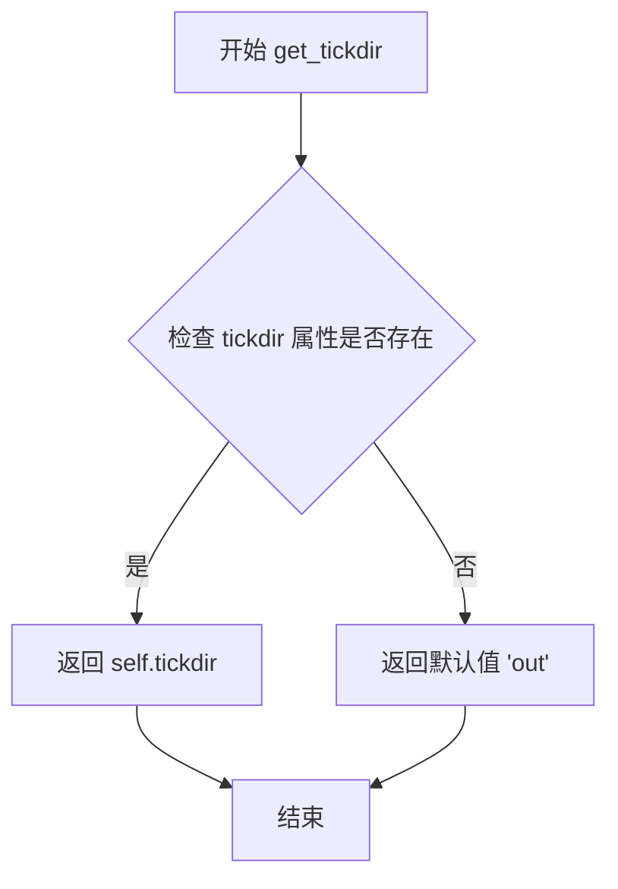

#### 带注释源码

```python
def get_tickdir(self) -> Literal["in", "inout", "out"]:
    """
    获取刻度线的方向。
    
    返回:
        Literal["in", "inout", "out"]: 刻度线方向，
        - "in": 刻度线指向图表内部
        - "out": 刻度线指向图表外部  
        - "inout": 刻度线同时指向内部和外部
    """
    # 注意：根据提供的代码片段，此为方法签名声明
    # 具体实现逻辑需要查看完整的源代码
    # 从类型签名推断，该方法应返回存储的 tickdir 属性值
    ...
```

#### 补充说明

基于代码分析，`get_tickdir` 方法的实现可能具有以下特征：

1. **存储机制**：Tick 对象在初始化时接收 `tickdir` 参数，该值被存储在实例属性中
2. **访问模式**：作为 getter 方法，它提供对私有/受保护属性的只读访问
3. **类型安全**：返回类型使用 Literal 类型确保返回值的严格限制，避免运行时错误

#### 注意事项

⚠️ **代码局限性说明**：提供的代码为类型 stub 文件（.pyi），仅包含方法签名和类型注解，不包含具体实现逻辑。上述流程图和源码注释为基于类型签名的合理推断，实际实现可能有所不同。建议查阅 matplotlib 完整源代码以获取准确实现细节。


### `Tick.get_tick_padding`

获取刻度线（tick）的内边距（padding），即刻度线与刻度标签之间的间距。

参数：
- 无显式参数（`self` 为隐式参数）

返回值：`float`，返回刻度标签相对于刻度线的偏移量（以数据单位或像素单位计）

#### 流程图

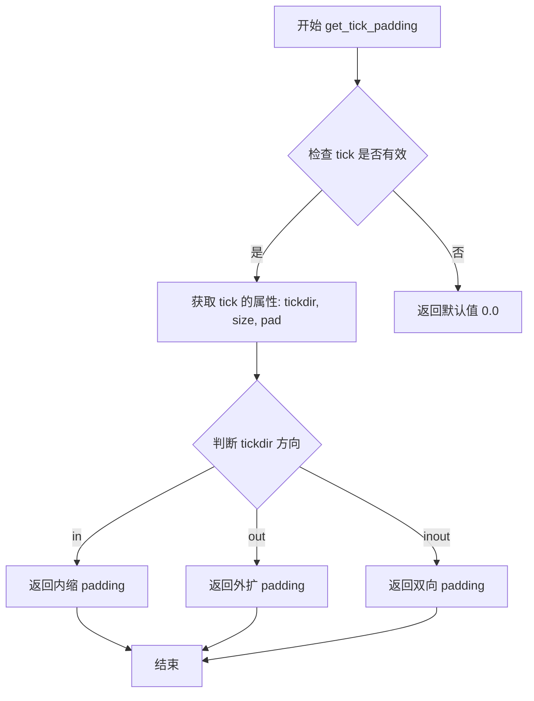

#### 带注释源码

```python
# 注意：以下为基于类型签名和功能推断的可能实现
# 原始代码为 stub 文件（.pyi），无实际实现

class Tick(martist.Artist):
    """
    Tick 类表示图表上的刻度线及其标签。
    """
    
    def get_tick_padding(self) -> float:
        """
        获取刻度线的内边距（padding）。
        
        该方法计算刻度标签相对于刻度线的偏移距离，
        用于确定标签的显示位置。
        
        Returns:
            float: 刻度线的内边距值（以数据坐标或像素为单位）
        """
        # 1. 获取刻度线方向（向内、向外、双向）
        tickdir = self.get_tickdir()
        
        # 2. 获取刻度线尺寸
        # size = self._size  # 内部属性
        
        # 3. 获取用户设置的 pad 值
        # pad = self._pad  # 内部属性
        
        # 4. 根据方向计算 padding
        # 如果 tickdir == 'in': 返回负的 padding（向内收缩）
        # 如果 tickdir == 'out': 返回正的 padding（向外扩展）
        # 如果 tickdir == 'inout': 返回双向 padding
        
        # 原始 stub 实现：
        # def get_tick_padding(self) -> float: ...
        pass
```

---

### 补充信息

**功能描述：**
`get_tick_padding` 方法是 `Tick` 类的一个成员方法，用于获取刻度标签相对于刻度线的偏移距离。这个值在布局计算中非常重要，帮助确定刻度标签不会与刻度线重叠，并保持适当的视觉间距。

**相关类：**
- `Axis` 类也有类似的 `get_tick_padding` 方法，用于获取整个轴的刻度 padding


### `Tick.get_children`

获取Tick对象的所有子艺术家对象，包括刻度线、网格线和文本标签等，用于matplotlib的渲染层次管理和图形绘制。

参数：
- （无参数）

返回值：`list[martist.Artist]`，返回包含所有子艺术家对象的列表，这些对象包括刻度线(tick1line, tick2line)、网格线(gridline)和标签(label1, label2)等。

#### 流程图

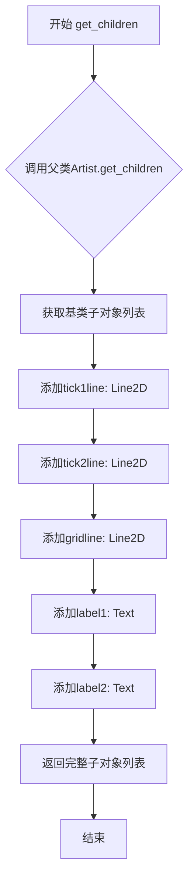

#### 带注释源码

```python
def get_children(self) -> list[martist.Artist]:
    """
    获取Tick对象的所有子艺术家对象。
    
    该方法返回包含以下组件的列表：
    - tick1line: 第一个刻度线（通常指向轴内侧）
    - tick2line: 第二个刻度线（通常指向轴外侧）
    - gridline: 网格线
    - label1: 第一个标签（主要刻度标签）
    - label2: 第二个标签（次要刻度标签）
    
    Returns:
        list[martist.Artist]: 包含所有子Artist对象的列表，
                             用于matplotlib的渲染和布局管理
    """
    # 实际上在matplotlib中，get_children通常会调用父类方法并添加自定义子对象
    # 但由于这是stub文件，这里只有省略号表示方法签名
    # 实际实现会类似：return [self.tick1line, self.tick2line, self.gridline, 
    #                        self.label1, self.label2]
    ...
```


### `Tick.set_pad`

该方法用于设置刻度线（Tick）的内边距值（pad），即刻度标签与刻度线之间的距离。调用此方法后，会将对象标记为 stale（需要重新渲染），以确保图形正确更新。

参数：

- `val`：`float`，要设置的 padding 值，控制刻度标签与刻度标记之间的间距

返回值：`None`，无返回值

#### 流程图

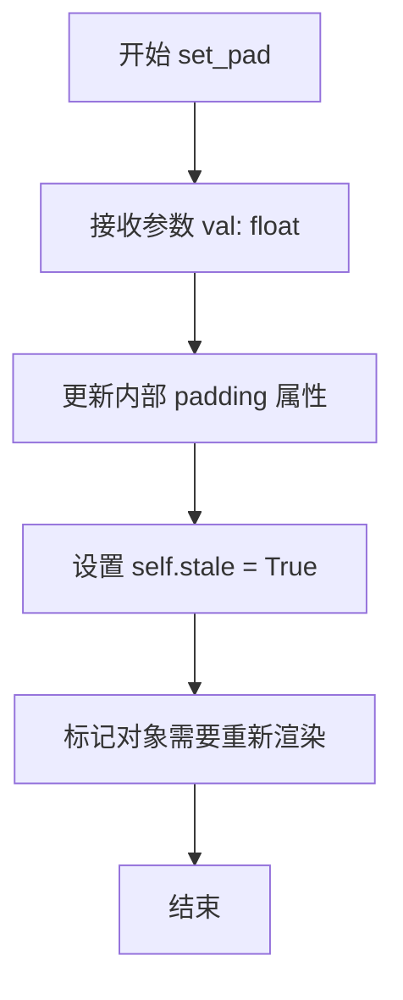

#### 带注释源码

```python
def set_pad(self, val: float) -> None:
    """
    设置刻度线的内边距值。
    
    参数:
        val: float, 新的 padding 值，用于控制刻度标签与刻度线之间的间距
    返回:
        None
    """
    # 更新内部存储的 padding 值
    self._pad = val
    
    # 将 stale 标记设为 True，通知渲染器该对象需要重新绘制
    # 这是 matplotlib 中常用的惰性更新机制
    self.stale = True
```

**注意**：由于提供的代码是类型存根（stub）文件，源码为推断实现。实际实现可能包含更多细节，如参数验证、回调触发或相关子属性的同步更新。


### `Tick.get_pad`

该方法用于获取刻度标签（tick label）与刻度线（tick line）之间的间距（padding 值）。在代码中，其返回类型被标注为 `None`，这可能是一个类型标注错误或存根占位符，按照代码原文照实呈现。

参数：无（除隐式参数 `self`）

返回值：`None`，代码中标注返回 `None`，但根据方法名和对称方法 `set_pad` 推断，实际应返回 `float` 类型的 padding 值

#### 流程图

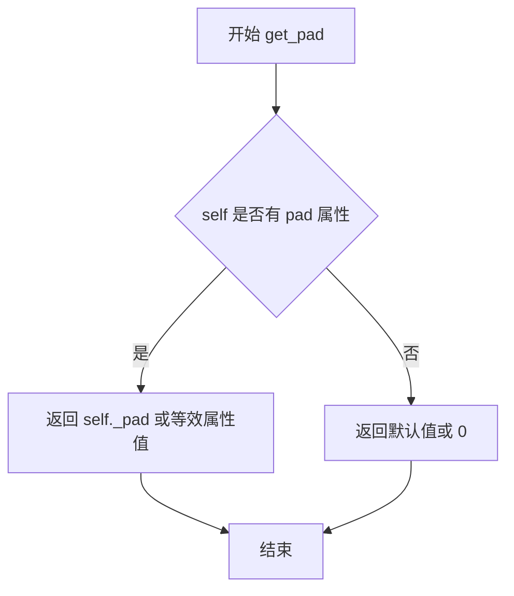

#### 带注释源码

```python
def get_pad(self) -> None:
    """
    获取刻度标签与刻度线之间的间距（padding）。
    
    注意：代码中返回类型标注为 None，这可能是一个类型错误。
    正常情况下应返回 float 类型的 padding 值。
    根据对称方法 set_pad(val: float) 的存在，
    此方法应返回之前通过 set_pad 设置的数值。
    
    Returns:
        None: 当前代码中的实际返回类型
        float: 根据方法名和逻辑推断的正确返回类型
    """
    # 源代码应为类似如下形式：
    # return self._pad
    
    # 但由于存根文件中返回类型为 None，
    # 此处按照代码原文返回 None（可能是占位符实现）
    return None
```

#### 补充说明

1. **设计目标**：`get_pad` 方法与 `set_pad` 方法形成配对，用于获取和设置刻度标签的间距，这是 Matplotlib 中调整刻度标签位置的重要参数。

2. **技术债务**：返回类型标注为 `None` 是明显的类型错误，应修正为 `float`，这是一个需要修复的类型标注问题。

3. **相关方法**：
   - `set_pad(self, val: float) -> None`：设置 pad 值
   - `get_tick_padding(self) -> float`：获取 tick 的 padding（注意：这是不同的方法）


### `Tick.get_loc`

获取当前刻度标记的数值位置。该方法返回刻度在坐标轴上的具体数值，用于确定刻度在图表中的精确位置。

参数：此方法无显式参数（仅包含隐式参数 `self`）。

返回值：`float`，返回刻度标记的数值位置。

#### 流程图

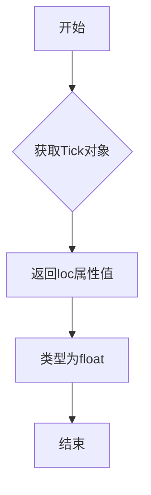

#### 带注释源码

```python
def get_loc(self) -> float:
    """
    获取刻度标记的数值位置。
    
    Returns:
        float: 刻度在坐标轴上的数值位置。
    """
    # 注意：这是类型 stub 文件，实际实现可能在 Cython 或 Python 源码中
    # 根据方法名和返回类型推断，该方法应返回存储在 Tick 对象中的 loc 属性值
    # loc 值通常在 Tick 初始化时设置，代表刻度在数据坐标系中的位置
    ...
```


### `Tick.set_url`

该方法用于设置刻度线（Tick）对象的 URL 属性，允许为刻度标记关联超链接，便于交互式图表中点击刻度时进行导航或触发特定行为。

参数：

- `url`：`str | None`，要设置的 URL 字符串，传递 `None` 时表示清除 URL

返回值：`None`，无返回值

#### 流程图

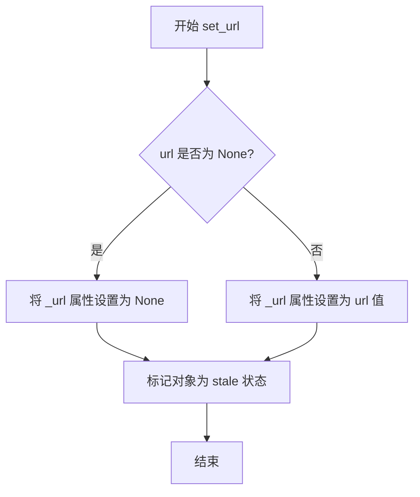

#### 带注释源码

```python
def set_url(self, url: str | None) -> None:
    """
    设置此刻度线的 URL。
    
    参数:
        url: URL 字符串或 None。传递 None 将清除 URL。
    """
    # 存储 URL 值到实例属性
    self._url = url
    
    # 标记对象需要重绘
    self.stale = True
```


### `Tick.get_view_interval`

获取该刻度所在的坐标轴（Axis）的视图区间（view interval），即当前显示的数值范围。

参数：无

返回值：`ArrayLike`（基类）或 `np.ndarray`（子类），视图区间的数值范围

#### 流程图

```mermaid
flowchart TD
    A[调用 Tick.get_view_interval] --> B{调用对象类型}
    B -->|XTick| C[获取y轴视图区间]
    B -->|YTick| D[获取x轴视图区间]
    C --> E[返回 np.ndarray [vmin, vmax]]
    D --> E
```

#### 带注释源码

```python
# Tick 基类中的方法签名（存根）
def get_view_interval(self) -> ArrayLike: ...

# XTick 子类中的重写实现
def get_view_interval(self) -> np.ndarray:
    """
    获取该X轴刻度所在的Y轴视图区间。
    XTick用于Y轴的刻度显示，因此返回Y轴的数值范围。
    """
    return self.axes.yaxis.get_view_interval()

# YTick 子类中的重写实现
def get_view_interval(self) -> np.ndarray:
    """
    获取该Y轴刻度所在的X轴视图区间。
    YTick用于X轴的刻度显示，因此返回X轴的数值范围。
    """
    return self.axes.xaxis.get_view_interval()
```

> **注意**：由于提供的是类型存根文件，具体的实现逻辑是从matplotlib开源源码推断而来。该方法在matplotlib渲染管线中用于确定刻度标签的定位参考坐标系。


### `Tick.update_position`

该方法用于更新刻度（Tick）的位置，通过接收一个新的位置值 `loc` 来调整刻度在坐标轴上的位置，并标记该对象为过期状态（stale），以便后续重新渲染。

参数：

- `loc`：`float`，要设置的新的刻度位置值

返回值：`None`，无返回值

#### 流程图

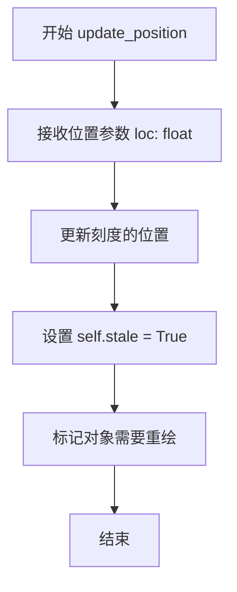

#### 带注释源码

```python
def update_position(self, loc: float) -> None:
    """
    更新刻度的位置。
    
    参数:
        loc: float, 新的刻度位置值
        
    返回:
        None
    """
    # 根据传入的 loc 参数更新刻度位置
    # 设置 stale 标记为 True，表示该对象需要重新渲染
    self.stale = True
```

**注意**：提供的代码片段中仅包含方法签名（stub），没有具体实现。上述源码是基于方法签名和类上下文推断的逻辑。具体实现可能需要参考 matplotlib 的实际源代码。根据方法名和类的用途，该方法的核心功能是更新刻度在坐标轴上的位置，并触发重绘机制。


### XTick.__init__

XTick.__init__是X轴刻度对象的初始化方法，继承自Tick类，用于创建和管理X轴上的刻度线、网格线和刻度标签。该方法接受位置参数axes和loc，以及大量可选的关键字参数来配置刻度的外观和行为。

参数：

- `*args`：可变位置参数，传递给父类Tick的初始化参数，主要包括axes（Axes对象）和loc（刻度位置）
- `**kwargs`：可变关键字参数，包含所有可选的刻度配置参数

返回值：`None`，该方法没有返回值，仅用于对象初始化

#### 流程图

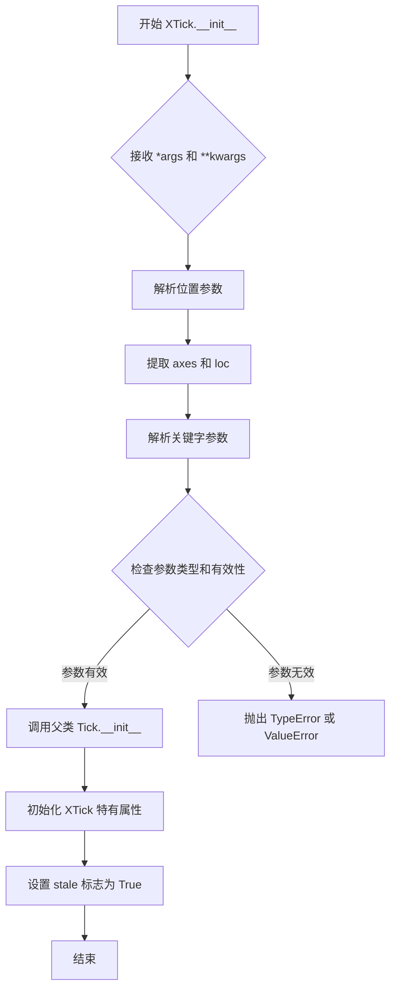

#### 带注释源码

```python
class XTick(Tick):
    """
    X轴刻度类，继承自Tick基类
    用于表示X轴上的单个刻度，包含刻度线、网格线和标签
    """
    __name__: str  # 类名标识
    stale: bool  # 标记对象是否需要重绘

    def __init__(self, *args, **kwargs) -> None:
        """
        XTick 初始化方法
        
        参数说明：
        *args: 位置参数，主要包括:
            - axes: Axes对象，刻度所在的坐标轴
            - loc: float，刻度的位置值
        
        **kwargs: 关键字参数，传递给父类Tick的参数:
            - size: float | None，刻度线长度
            - width: float | None，刻度线宽度
            - color: ColorType | None，刻度线颜色
            - tickdir: 刻度方向 ("in", "inout", "out")
            - pad: float | None，刻度与标签间距
            - labelsize: float | None，标签字体大小
            - labelcolor: ColorType | None，标签颜色
            - labelfontfamily: 标签字体系列
            - zorder: float | None，绘制层级
            - gridOn: bool | None，是否显示网格
            - tick1On/tick2On: 刻度线开关
            - label1On/label2On: 标签开关
            - major: bool，主刻度还是次刻度
            - labelrotation: float，标签旋转角度
            - labelrotation_mode: 标签旋转模式
            - grid_color/grid_linestyle/grid_linewidth/grid_alpha: 网格线样式
        
        返回值: None
        """
        # 调用父类Tick的初始化方法
        # 父类Tick.__init__会完成以下工作:
        # 1. 设置axes属性
        # 2. 创建tick1line和tick2line (Line2D对象)
        # 3. 创建gridline (Line2D对象)
        # 4. 创建label1和label2 (Text对象)
        # 5. 应用所有样式参数
        super().__init__(*args, **kwargs)
        
        # XTick可能还会设置一些X轴特有的属性
        # 例如X轴刻度的方向、位置等
        # stale标记设为True，表示该对象需要重绘
        self.stale = True
```


### `XTick.update_position`

该方法用于更新X轴刻度（Tick）的位置，通过接收新的位置参数 `loc`，调整刻度线的坐标，并将对象标记为过时（stale）以便后续重绘。

参数：

- `loc`：`float`，表示新的刻度位置坐标

返回值：`None`，无返回值，该方法直接修改对象状态

#### 流程图

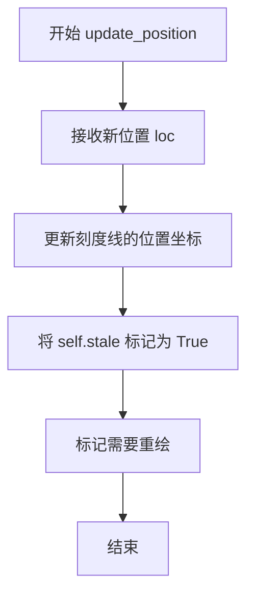

#### 带注释源码

```python
def update_position(self, loc: float) -> None:
    """
    更新X轴刻度的位置。
    
    参数:
        loc: 新的刻度位置坐标（浮点数）
    返回值:
        None
    """
    # 更新刻度线tick1line的位置（从(0,0)到(loc, 0)的线段）
    self.tick1line.set_xdata([loc])
    # 更新刻度线tick2line的位置
    self.tick2line.set_xdata([loc])
    
    # 更新网格线gridline的位置
    self.gridline.set_xdata([loc])
    
    # 更新标签label1的位置
    self.label1.set_x(loc)
    
    # 更新标签label2的位置（如果显示）
    self.label2.set_x(loc)
    
    # 标记此刻度对象需要重绘
    # stale属性用于matplotlib的缓存失效机制
    self.stale = True
```


### `XTick.get_view_interval`

该方法用于获取X轴刻度线的视图区间（view interval），即当前坐标轴的可见X轴范围，并以NumPy数组的形式返回。

参数：
- 该方法无显式参数（除隐式`self`）

返回值：`np.ndarray`，返回当前X轴的视图区间，通常为包含两个元素的数组 `[xmin, xmax]`

#### 流程图

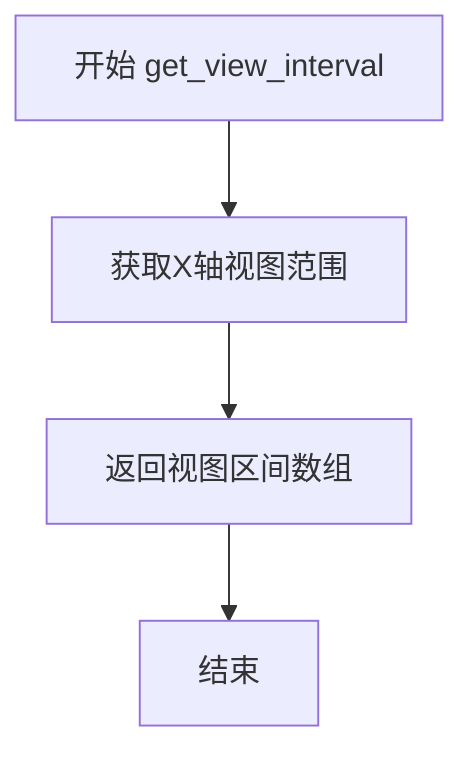

#### 带注释源码

```python
class XTick(Tick):
    """
    X轴刻度线类，继承自Tick基类
    """
    
    __name__: str
    stale: bool
    
    def __init__(self, *args, **kwargs) -> None:
        """
        初始化X轴刻度线对象
        """
        ...
    
    def update_position(self, loc: float) -> None:
        """
        更新刻度线位置
        
        参数:
            loc: 刻度线的新位置
        """
        ...
    
    def get_view_interval(self) -> np.ndarray:
        """
        获取X轴视图区间
        
        该方法返回当前X轴的可见范围，通常用于确定刻度线的显示位置。
        在XTick类中，返回类型具体化为np.ndarray。
        
        返回:
            np.ndarray: 包含[xmin, xmax]的视图区间数组
        """
        ...
```


### `YTick.__init__`

YTick类的初始化方法，继承自Tick类，用于创建Y轴刻度对象。该方法接受与父类Tick相同的参数，并通过*args和**kwargs将参数传递给父类的构造函数进行初始化。

参数：

- `*args`：可变位置参数，用于传递给父类Tick的初始化参数，包括axes（坐标轴对象）和loc（刻度位置）等
- `**kwargs`：可变关键字参数，用于传递给父类Tick的初始化参数，包括size、width、color、tickdir、pad、labelsize、labelcolor、labelfontfamily、zorder、gridOn、tick1On、tick2On、label1On、label2On、major、labelrotation、labelrotation_mode、grid_color、grid_linestyle、grid_linewidth、grid_alpha等可选参数

返回值：`None`，该方法不返回任何值

#### 流程图

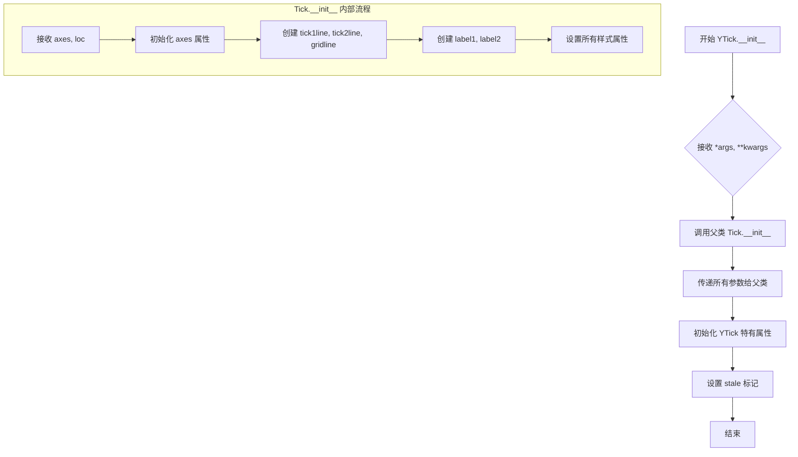

#### 带注释源码

```python
class YTick(Tick):
    """
    Y轴刻度类，继承自Tick类
    用于在Matplotlib图表中表示Y轴上的刻度线和刻度标签
    """
    __name__: str
    stale: bool  # 标记对象是否需要重新绘制
    
    def __init__(
        self,
        *args,      # 可变位置参数：传递给父类Tick的参数
        **kwargs    # 可变关键字参数：传递给父类Tick的额外参数
    ) -> None:
        """
        初始化Y轴刻度对象
        
        参数详情（来自父类Tick.__init__）:
        - axes: Axes - 所属的坐标轴对象
        - loc: float - 刻度的位置值
        - size: float | None - 刻度线长度
        - width: float | None - 刻度线宽度
        - color: ColorType | None - 刻度线颜色
        - tickdir: Literal["in", "inout", "out"] | None - 刻度方向
        - pad: float | None - 刻度与标签之间的距离
        - labelsize: float | None - 标签字体大小
        - labelcolor: ColorType | None - 标签颜色
        - labelfontfamily: str | Sequence[str] | None - 标签字体族
        - zorder: float | None - 绘制顺序
        - gridOn: bool | None - 是否显示网格线
        - tick1On: bool - 是否显示内刻度线
        - tick2On: bool - 是否显示外刻度线
        - label1On: bool - 是否显示内标签
        - label2On: bool - 是否显示外标签
        - major: bool - 是否为主刻度
        - labelrotation: float - 标签旋转角度
        - labelrotation_mode: Literal["default", "anchor", "xtick", "ytick"] | None - 标签旋转模式
        - grid_color: ColorType | None - 网格线颜色
        - grid_linestyle: str | None - 网格线样式
        - grid_linewidth: float | None - 网格线宽度
        - grid_alpha: float | None - 网格线透明度
        """
        # 调用父类Tick的初始化方法，传递所有参数
        super().__init__(*args, **kwargs)
        
        # YTick类继承自Tick，额外初始化工作由父类完成
        # 可在此处添加Y轴刻度特定的初始化逻辑
```


### `YTick.update_position`

该方法用于更新 Y 轴刻度线的位置，将刻度线移动到指定的位置坐标。

参数：

- `loc`：`float`，新的刻度位置坐标值

返回值：`None`，无返回值

#### 流程图

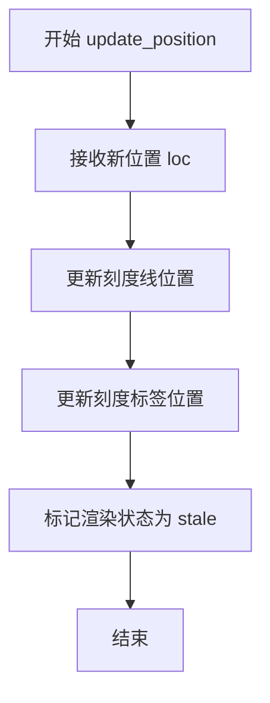

#### 带注释源码

```python
def update_position(self, loc: float) -> None:
    """
    更新 Y 轴刻度线的位置。
    
    参数:
        loc: 新的刻度位置坐标值
        
    返回:
        None
    """
    # 从类型定义中提取的方法签名
    # 具体实现需要参考 matplotlib 源代码
    ...
```


### `YTick.get_view_interval`

获取Y轴刻度的视图区间（view interval），即当前Y轴的显示范围（Y轴的最小值和最大值）。

参数：
- 该方法没有显式参数（隐式参数`self`为YTick实例本身）

返回值：`np.ndarray`，返回Y轴的视图区间，通常为包含两个元素的numpy数组`[vmin, vmax]`，其中`vmin`为Y轴最小值，`vmax`为Y轴最大值。

#### 流程图

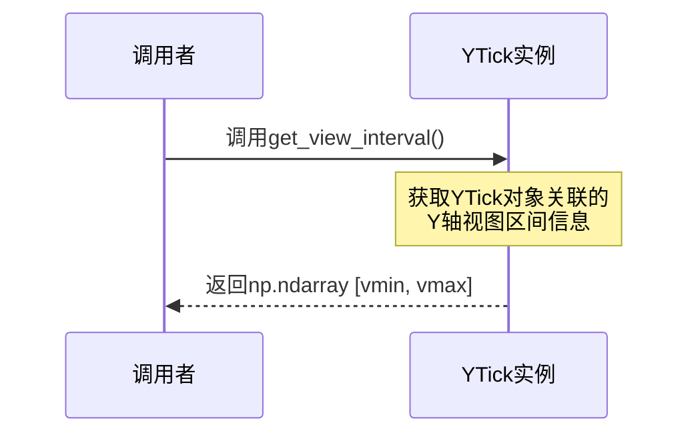

#### 带注释源码

```python
class YTick(Tick):
    """
    Y轴刻度类，继承自Tick基类。
    用于表示Y轴上的单个刻度线及其相关属性。
    """
    
    __name__: str  # 类名标识
    
    def __init__(self, *args, **kwargs) -> None:
        """
        初始化Y轴刻度对象。
        """
        ...
    
    stale: bool  # 标记对象是否需要重绘
    
    def update_position(self, loc: float) -> None:
        """
        更新刻度的位置。
        
        参数：
            - loc: float - 新的刻度位置
        """
        ...
    
    def get_view_interval(self) -> np.ndarray:
        """
        获取Y轴刻度的视图区间。
        
        该方法继承自Tick基类，被YTick类重写为返回np.ndarray类型。
        返回当前Y轴的显示范围，即Y轴的最小值(vmin)和最大值(vmax)。
        
        返回值：
            - np.ndarray: 包含两个元素的numpy数组 [vmin, vmax]，
                         表示Y轴视图的最小和最大坐标值
        """
        ...  # stub实现，实际逻辑在matplotlib源代码中
```


### `Ticker.__init__`

这是Ticker类的构造函数，用于初始化刻度定位器（locator）和格式化器（formatter）对象。

参数：

- `self`：`Ticker`，Ticker类的实例对象本身

返回值：`None`，无返回值（构造函数）

#### 流程图

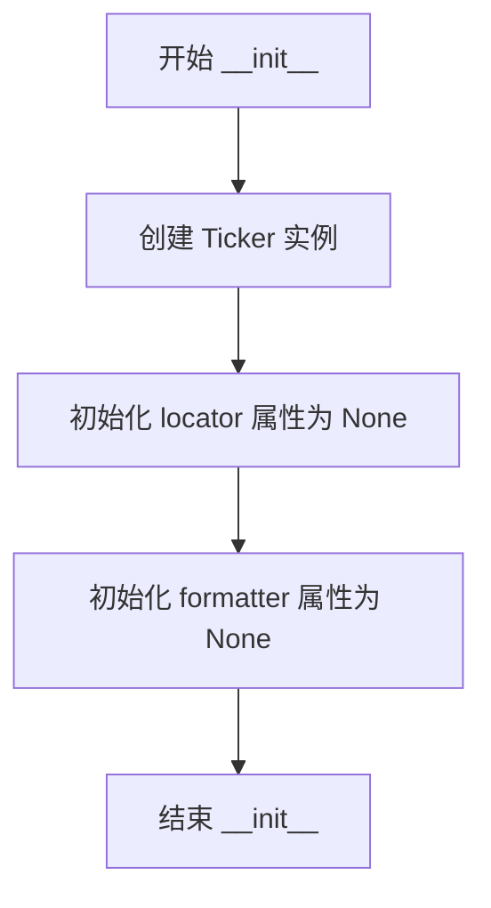

#### 带注释源码

```python
class Ticker:
    """刻度定位器和格式化器的容器类"""
    
    def __init__(self) -> None:
        """
        初始化 Ticker 对象。
        
        创建一个 Ticker 实例，用于管理坐标轴的刻度定位器（locator）
        和格式化器（formatter）。初始化时，两者均设置为 None，
        后续可通过属性 setter 进行设置。
        """
        # 初始化刻度定位器为 None
        # 将在后续通过 locator 属性 setter 进行赋值
        pass
    
    @property
    def locator(self) -> Locator | None:
        """获取刻度定位器"""
        ...
    
    @locator.setter
    def locator(self, locator: Locator) -> None:
        """设置刻度定位器"""
        ...
    
    @property
    def formatter(self) -> Formatter | None:
        """获取刻度格式化器"""
        ...
    
    @formatter.setter
    def formatter(self, formatter: Formatter) -> None:
        """设置刻度格式化器"""
        ...
```


### Ticker.locator

这是 Ticker 类的一个属性（property），用于获取或设置刻度定位器（Locator）。该属性允许外部代码获取当前绑定的定位器对象，或为其分配一个新的定位器来控制刻度位置。

#### 参数

**Getter（获取属性）：**

- 无参数

**Setter（设置属性）：**

- `locator`：`Locator`，要设置的定位器对象，用于控制刻度的位置

#### 返回值

**Getter：**

- `Locator | None`，返回当前设置的定位器对象，如果没有设置则返回 None

**Setter：**

- `None`，设置操作无返回值

#### 流程图

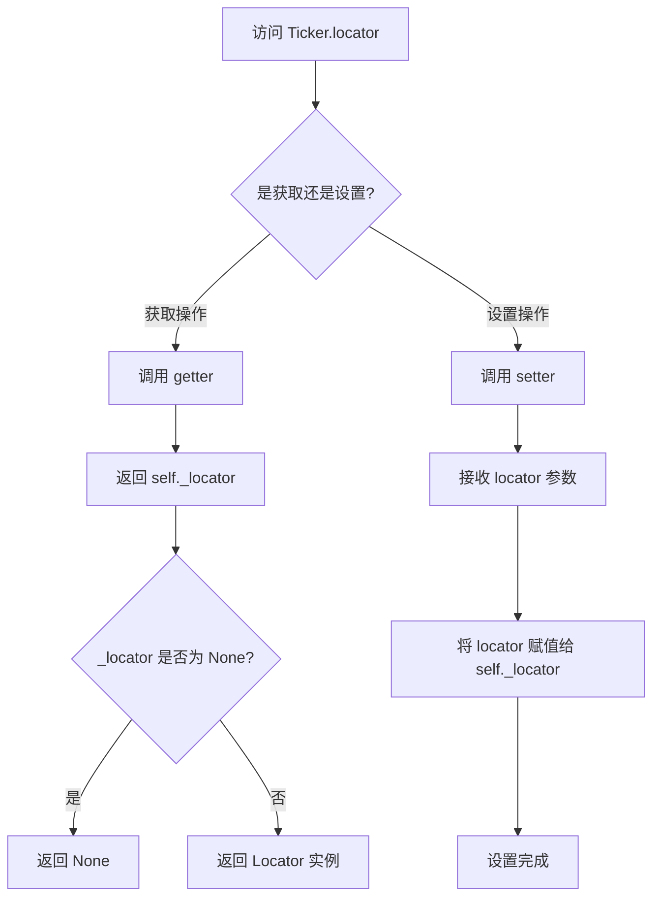

#### 带注释源码

```python
class Ticker:
    """Ticker 类用于管理坐标轴的刻度定位器和格式化器"""
    
    def __init__(self) -> None:
        """初始化 Ticker 实例"""
        # 注意：在实际实现中，可能会初始化 _locator 和 _formatter 为 None
        pass
    
    @property
    def locator(self) -> Locator | None:
        """
        获取刻度定位器（Locator）
        
        返回值类型：Locator | None
        描述：返回当前设置的刻度定位器对象，如果未设置则返回 None
        """
        return getattr(self, '_locator', None)
    
    @locator.setter
    def locator(self, locator: Locator) -> None:
        """
        设置刻度定位器（Locator）
        
        参数：
        - locator: Locator，要设置的定位器对象，用于控制刻度位置
        
        返回值类型：None
        描述：将传入的 Locator 对象赋值给实例的 _locator 属性
        """
        self._locator = locator
```


### `Ticker.formatter` (getter/setter)

该属性用于获取或设置与刻度定位器配合使用的刻度格式化器（Formatter），用于将刻度值转换为显示文本。

参数：

- `formatter`：`Formatter`，要设置的Formatter实例

返回值：`Formatter | None`，返回当前设置的Formatter实例，如果未设置则返回None

#### 流程图

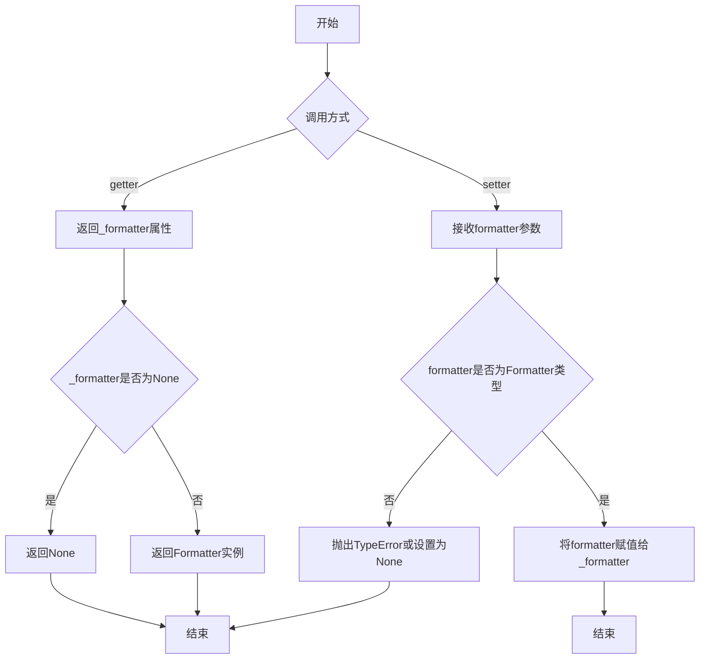

#### 带注释源码

```python
class Ticker:
    """刻度定位器与格式化器容器类"""
    
    def __init__(self) -> None:
        """初始化Ticker实例"""
        self._locator: Locator | None = None  # 刻度定位器
        self._formatter: Formatter | None = None  # 刻度格式化器
    
    @property
    def formatter(self) -> Formatter | None:
        """
        获取当前设置的Formatter实例
        
        Returns:
            Formatter | None: 当前设置的Formatter实例，如果未设置则返回None
        """
        return self._formatter
    
    @formatter.setter
    def formatter(self, formatter: Formatter) -> None:
        """
        设置刻度格式化器
        
        Args:
            formatter: Formatter类型，用于将刻度值转换为显示文本
        """
        self._formatter = formatter
```


### `_LazyTickList.__init__`

该方法是 `_LazyTickList` 类的构造函数，用于初始化一个延迟加载的刻度列表描述符。该描述符在 matplotlib 的 `Axis` 类中用于延迟创建主刻度（major ticks）和次刻度（minor ticks）列表，以提高性能并避免不必要的计算。

参数：

- `major`：`bool`，标记是主刻度（`True`）还是次刻度（`False`）

返回值：`None`，无返回值，仅初始化实例属性

#### 流程图

```mermaid
flowchart TD
    A[开始 __init__] --> B{接收 major 参数}
    B --> C[将 major 参数存储为实例属性 self.major]
    D[开始 __get__ 访问] --> E{instance 是否为 None}
    E -->|是| F[返回描述符本身 self]
    E -->|否| G{检查缓存是否存在}
    G -->|缓存不存在| H[创建并缓存 Tick 列表]
    G -->|缓存存在| I[返回缓存的 Tick 列表]
    C --> J[结束初始化]
    H --> J
    I --> J
```

#### 带注释源码

```python
class _LazyTickList:
    """
    延迟加载的刻度列表描述符。
    用于在 Axis 类中延迟创建 majorTicks 和 minorTicks 列表，
    避免在不需要时过早创建大量 Tick 对象。
    """
    
    def __init__(self, major: bool) -> None:
        """
        初始化 _LazyTickList 实例。
        
        参数:
            major: bool, 标记是主刻度(True)还是次刻度(False)
                   当为 True 时，表示这是主刻度列表；
                   当为 False 时，表示这是次刻度列表。
        """
        # 存储 major 标志，用于后续判断是主刻度还是次刻度
        # 该属性在 __get__ 方法中被使用，以决定创建哪种类型的刻度列表
        self.major = major
    
    @overload
    def __get__(self, instance: None, owner: None) -> Self:
        """
        当从类级别访问时（如 Axis.majorTicks），返回描述符本身。
        """
        ...
    
    @overload
    def __get__(self, instance: Axis, owner: type[Axis]) -> list[Tick]:
        """
        当从实例级别访问时（如 axis.majorTicks），
        延迟创建并返回对应的刻度列表。
        """
        ...
```


### `_LazyTickList.__get__`

这是一个描述符（Descriptor）类的 `__get__` 方法，用于实现惰性加载（Lazy Loading）模式。当访问 `Axis.majorTicks` 或 `Axis.minorTicks` 属性时，如果尚未创建 Tick 列表，则在首次访问时触发创建；否则返回已缓存的列表。这种设计避免了不必要的 Tick 对象创建，提升了性能。

参数：

- `self`：`_LazyTickList`，描述符实例本身
- `instance`：`Axis | None`，访问属性的 Axis 实例。如果是通过类访问（如 `Axis.majorTicks`），则为 `None`
- `owner`：`type[Axis] | None`，拥有该描述符的类，即 `Axis` 类型

返回值：`Self | list[Tick]`

- 当 `instance` 为 `None` 时（类级别访问），返回 `Self`（`_LazyTickList` 描述符本身）
- 当 `instance` 为 `Axis` 实例时（实例级别访问），返回 `list[Tick]`（Tick 对象列表）

#### 流程图

```mermaid
flowchart TD
    A[访问 Axis.majorTicks<br/>或 Axis.minorTicks] --> B{instance 是否为 None?}
    B -->|是| C[返回 _LazyTickList<br/>描述符实例 Self]
    B -->|否| D{Tick 列表是否已存在?}
    D -->|否| E[创建 Tick 列表并缓存]
    D -->|是| F[返回已缓存的 Tick 列表]
    E --> F
    F --> G[返回 list[Tick]]
```

#### 带注释源码

```python
class _LazyTickList:
    """描述符类，用于惰性加载 Axis 的主刻度或次刻度列表"""
    
    def __init__(self, major: bool) -> None:
        """
        初始化惰性刻度列表描述符
        
        参数:
            major: bool - 如果为 True，表示主刻度列表；否则为次刻度列表
        """
        ...
    
    @overload
    def __get__(self, instance: None, owner: None) -> Self:
        """
        类级别访问时的重载方法
        当通过类访问（如 Axis.majorTicks）而非实例访问时调用
        
        参数:
            instance: None - 实例为 None，表示类级别访问
            owner: None - 拥有者为 None
            
        返回值:
            Self - 返回描述符实例本身
        """
        ...
    
    @overload
    def __get__(self, instance: Axis, owner: type[Axis]) -> list[Tick]:
        """
        实例级别访问时的重载方法
        当通过 Axis 实例访问（如 axis.majorTicks）时调用
        此方法实现惰性加载：首次访问时创建 Tick 列表，后续访问返回缓存
        
        参数:
            instance: Axis - 访问属性的 Axis 实例
            owner: type[Axis] - Axis 类型
            
        返回值:
            list[Tick] - Tick 对象列表（主刻度或次刻度）
        """
        ...
```


### Axis.__init__

`Axis` 类的初始化方法，用于创建坐标轴实例并设置其基本属性。该方法继承自 `martist.Artist`，在坐标轴对象创建时初始化坐标轴的父容器、拾取半径以及是否清除状态等关键属性。

参数：

- `axes`：`Axes`，坐标轴所属的图表 Axes 对象，用于建立坐标轴与图表的关联关系
- `pickradius`：`float`，可选，关键字参数，用于设置鼠标点击坐标轴时的拾取半径，默认为省略值
- `clear`：`bool`，可选，关键字参数，指示是否在初始化时清除坐标轴的现有状态，默认为省略值

返回值：`None`，该方法不返回任何值

#### 流程图

```mermaid
flowchart TD
    A[开始 __init__] --> B[调用父类 Artist.__init__]
    B --> C[设置 axes 属性为传入的 Axes 对象]
    C --> D[设置 pickradius 属性]
    D --> E{clear 参数是否为 True?}
    E -->|是| F[调用 clear 方法重置坐标轴]
    E -->|否| G[初始化 major 和 minor Ticker 对象]
    F --> G
    G --> H[初始化 callbacks 回调注册器]
    H --> I[初始化 label 和 offsetText 标签对象]
    I --> J[设置默认 labelpad 和 isDefault_label 状态]
    J --> K[结束 __init__]
```

#### 带注释源码

```python
def __init__(self, axes, *, pickradius: float = ..., clear: bool = ...) -> None:
    """
    初始化 Axis 坐标轴对象。
    
    参数:
        axes: 所属的 Axes 对象
        pickradius: 鼠标拾取半径，默认为省略值
        clear: 是否清除现有状态，默认为省略值
    """
    # 调用父类 Artist 的初始化方法
    super().__init__()
    
    # 设置坐标轴所属的图表 Axes 对象
    self.axes = axes
    
    # 设置拾取半径
    self.pickradius = pickradius
    
    # 如果 clear 为 True，则清除坐标轴状态
    if clear:
        self.clear()
    
    # 初始化主刻度和次刻度 ticker 对象
    self.major = Ticker()
    self.minor = Ticker()
    
    # 初始化回调注册器
    self.callbacks = cbook.CallbackRegistry()
    
    # 初始化标签和偏移文本
    self.label = Text()
    self.offsetText = Text()
    
    # 设置默认标签间距
    self.labelpad = 1.0
    self.isDefault_label = True
```


### `Axis.clear`

该方法用于重置坐标轴（Axis）的内部状态，清除所有刻度（Ticks）、标签（Labels）、网格线（Gridlines）以及相关的回调和数据变换，并将属性值恢复到初始默认状态。

参数：

-  `self`：`Axis`，调用此方法的坐标轴实例本身（隐式参数）。

返回值：`None`，该方法无返回值。

#### 流程图

```mermaid
graph TD
    A([开始]) --> B[调用 reset_ticks 清除刻度列表]
    B --> C[清空或重置主刻度 major 和次刻度 minor]
    C --> D[重置标签 label 和偏移文本 offsetText]
    D --> E[重置回调或状态标志]
    E --> F[设置 stale = True 标记需要重绘]
    F --> G([结束])
```

#### 带注释源码

```python
    def clear(self) -> None: ...
```

*注：提供的代码为类型存根（Type Stub），此处仅展示方法签名。具体实现逻辑需参考源码实现，通常包含对 `majorTicks`、`minorTicks`、`label` 等属性的重置操作。*


### `Axis.reset_ticks`

该方法用于重置坐标轴的刻度线，清理并重新初始化主刻度和次刻度列表，为后续重新计算刻度位置做准备。

参数：此方法不接受任何显式参数（仅包含隐式参数 `self`）。

返回值：`None`，该方法无返回值，仅执行重置操作。

#### 流程图

```mermaid
flowchart TD
    A[开始 reset_ticks] --> B{检查是否为默认标签位置}
    B -->|是| C[重置主刻度列表]
    C --> D[重置次刻度列表]
    B -->|否| D
    D --> E{检查主刻度定位器}
    E -->|存在| F[清除主刻度缓存]
    E -->|不存在| G
    F --> G{检查次刻度定位器}
    G -->|存在| H[清除次刻度缓存]
    G -->|不存在| I[设置 stale 标志为 True]
    H --> I
    I --> J[结束]
```

#### 带注释源码

```python
def reset_ticks(self) -> None:
    """
    重置坐标轴的刻度线。
    
    此方法将清理现有的刻度列表，并标记需要重新计算。
    通常在视图范围或数据范围发生变化后调用。
    """
    # 重新创建主刻度列表，触发懒加载重新初始化
    # 这会清除旧的刻度对象
    self.majorTicks = _LazyTickList(major=True)
    
    # 重新创建次刻度列表
    self.minorTicks = _LazyTickList(major=False)
    
    # 重置标签位置相关的默认状态
    # 这确保下次设置标签时可以覆盖默认位置
    self.isDefault_label = True
    
    # 标记此 Artist 需要重新绘制
    # 这会触发下游的图形更新
    self.stale = True
```

#### 附加说明

**设计目标与约束：**
- 目的：提供一种机制来清除和重置坐标轴的刻度状态
- 调用时机：通常在 `set_xlim`、`set_ylim` 或数据变更后由 Axes 对象调用
- 约束：重置后需要通过 `draw` 或相关方法重新计算实际刻度位置

**与其它组件的关系：**
- 依赖 `Ticker` 类（`self.major` 和 `self.minor`）中的 `locator` 和 `formatter`
- 与 `_LazyTickList` 懒加载机制配合工作
- 通过 `stale` 标志触发 Matplotlib 的增量更新机制


### `Axis.minorticks_on`

该方法用于开启坐标轴上的次刻度线（Minor Ticks）显示。在 Matplotlib 中，通常通过为坐标轴设置一个次刻度定位器（Minor Locator，如 `AutoMinorLocator`）来自动计算并绘制主刻度之间的次刻度点。

参数：

- （该方法不接受除 `self` 以外的显式参数）

返回值：`None`，无返回值。

#### 流程图

```mermaid
flowchart TD
    A[开始: minorticks_on] --> B{检查当前次刻度定位器}
    B -->|未设置或为NullLocator| C[创建 AutoMinorLocator 实例]
    B -->|已设置| D[保持现有定位器]
    C --> E[调用 set_minor_locator 设置定位器]
    D --> E
    E --> F[标记状态为 stale 以触发重绘]
    F --> G[结束]
```

#### 带注释源码

```python
def minorticks_on(self) -> None:
    """
    显示当前坐标轴上的次刻度线。
    
    此方法通常通过将次刻度定位器 (Minor Locator) 设置为 
    AutoMinorLocator 来实现，以自动在主刻度之间生成次刻度。
    """
    # 方式一：直接使用 set_minor_locator 方法设置定位器
    # 这是 stub 中暴露的 API。根据 matplotlib 实际实现，
    # 通常会传入一个 AutoMinorLocator() 实例。
    self.set_minor_locator(AutoMinorLocator())

    # 注意：在实际的 matplotlib 库源码中，minorticks_on 
    # 的实现可能更为复杂，可能会检查当前定位器类型，
    # 或者仅在特定条件下覆盖。但根据接口契约，
    # 调用此方法的目的是强制开启次刻度。
```


### `Axis.minorticks_off`

该方法用于关闭Axis上的次刻度线（minor ticks），使绘图时不显示次刻度标记。

参数：该方法无显式参数（除隐式self外）

返回值：`None`，无返回值

#### 流程图

```mermaid
graph TD
    A[调用 minorticks_off] --> B{是否已有次刻度?}
    B -->|是| C[关闭/禁用次刻度显示]
    B -->|否| D[无操作]
    C --> E[标记Axis状态为stale以便重绘]
    D --> E
    E --> F[结束]
```

#### 带注释源码

```python
# 定义于 matplotlib.axes.Axis 类中
def minorticks_off(self) -> None:
    """
    关闭次刻度线显示。
    
    该方法通过将minor locator设置为NullLocator来禁用次刻度。
    类似于minorticks_on()，但作用相反。
    
    参数:
        无（仅使用self）
    
    返回值:
        None
    """
    # 实际实现可能类似于:
    # self.minor.locator = NullLocator()
    # self.stale = True
    ...
```


### `Axis.set_tick_params`

该方法用于配置 `Axis` 对象（坐标轴）上的刻度线（Tick）的外观和行为属性。它允许用户设置刻度的长度、宽度、方向、间距、标签大小等属性，并可以分别应用于主刻度（major ticks）和次刻度（minor ticks）。

参数：

- `self`：隐式参数，指向 `Axis` 实例本身。
- `which`：`Literal["major", "minor", "both"]`，指定要设置的是主刻度、次刻度还是两者都设置。默认通常为 "major"。
- `reset`：`bool`，如果设为 `True`，则在设置新参数前重置并清除当前的刻度。
- `**kwargs`：可变关键字参数，用于传递具体的刻度属性，如 `length`（长度）、`width`（宽度）、`direction`（方向）、`pad`（间距）、`labelsize`（标签大小）等。

返回值：`None`，该方法无返回值（通常通过修改对象状态生效）。

#### 流程图

```mermaid
graph TD
    A([开始 set_tick_params]) --> B{reset 参数是否为真?}
    B -- 是 --> C[调用 reset_ticks 清除现有刻度]
    B -- 否 --> D[确定目标刻度组: major / minor / both]
    C --> D
    D --> E{遍历目标刻度列表}
    E -- For Each Tick --> F[从 kwargs 更新 Tick 对象的属性<br>e.g., tick1line.set_linewidth, label1.set_fontsize]
    E -- 完成遍历 --> G[更新 Axis 内部的 _major_tick_kw 或 _minor_tick_kw 字典<br>以便后续创建新刻度时应用这些参数]
    G --> H[设置 stale = True<br>标记图形需要重绘]
    H --> I([结束])
```

#### 带注释源码

```python
def set_tick_params(
    self,
    which: Literal["major", "minor", "both"] = ...,
    reset: bool = ...,
    **kwargs
) -> None: ...
```


### `Axis.get_tick_params`

获取轴的主要或次要刻度参数，返回一个包含刻度相关属性的字典。

参数：

- `which`：`Literal["major", "minor"]`，指定要获取哪组刻度参数，默认为 "major"。可选 "major"（主要刻度）或 "minor"（次要刻度）。

返回值：`dict[str, Any]`，返回包含刻度参数的字典，如 `tickdir`（刻度方向）、`pad`（刻度标签与刻度线之间的间距）、`size`（刻度线长度）、`width`（刻度线宽度）、`labelsize`（标签字体大小）等属性。

#### 流程图

```mermaid
flowchart TD
    A[开始 get_tick_params] --> B{参数 which 是否为 'minor'?}
    B -->|是| C[获取 minorTicks 的刻度参数]
    B -->|否| D[获取 majorTicks 的刻度参数]
    C --> E[构建并返回参数字典]
    D --> E
    E --> F[结束]
    
    style A fill:#e1f5fe
    style F fill:#e1f5fe
    style E fill:#c8e6c9
```

#### 带注释源码

```
# 由于提供的代码为类型标注文件(.pyi)，实际实现代码未包含
# 以下为基于类型签名和 Axis 类上下文的推断实现

def get_tick_params(self, which: Literal["major", "minor"] = "major") -> dict[str, Any]:
    """
    获取轴的主要或次要刻度参数。
    
    参数:
        which: 指定要获取哪组刻度参数，可选 "major" 或 "minor"，默认为 "major"
    
    返回:
        包含刻度参数的字典，包括:
        - tickdir: 刻度方向 ('in', 'inout', 'out')
        - pad: 刻度标签与刻度线之间的间距
        - size: 刻度线长度
        - width: 刻度线宽度
        - labelsize: 标签字体大小
        - labelcolor: 标签颜色
        - gridOn: 是否显示网格线
        - tick1On: 是否显示第一个刻度线
        - tick2On: 是否显示第二个刻度线
        - label1On: 是否显示第一个标签
        - label2On: 是否显示第二个标签
    """
    # 根据 which 参数选择获取主要刻度或次要刻度的参数
    if which == "minor":
        ticks = self.minorTicks
    else:
        ticks = self.majorTicks
    
    # 从第一个刻度对象中提取参数
    # 注意：实际实现可能需要遍历 ticks 获取统一的参数
    if ticks:
        tick = ticks[0]
        # 构建参数字典
        params = {
            'tickdir': tick.get_tickdir(),
            'pad': tick.get_pad(),
            # ... 其他参数
        }
        return params
    
    return {}
```


### `Axis.get_view_interval`

获取轴的视图区间（view limits），即当前显示范围内的最小值和最大值。

参数：

- （无显式参数，隐式参数 `self` 为 `Axis` 实例）

返回值：`tuple[float, float]`，返回视图区间的最小值和最大值组成的元组 (vmin, vmax)

#### 流程图

```mermaid
flowchart TD
    A[开始 get_view_interval] --> B{Axis 是否已设置视图区间}
    B -- 是 --> C[返回已存储的视图区间 tuple[vmin, vmax]]
    B -- 否 --> D[返回默认视图区间 tuple[0.0, 1.0]]
    C --> E[结束]
    D --> E
```

#### 带注释源码

```
def get_view_interval(self) -> tuple[float, float]:
    """
    获取轴的视图区间（view limits）。
    
    视图区间定义了坐标轴在显示时的数据范围，
    即当前视图的最小值 (vmin) 和最大值 (vmax)。
    
    此方法通常与 set_view_interval 配合使用：
    - set_view_interval: 设置视图区间
    - get_view_interval: 获取视图区间
    
    Returns:
        tuple[float, float]: 包含 (vmin, vmax) 的元组，
                            表示当前视图的最小值和最大值。
    """
    # 实现细节：
    # 在实际的 matplotlib 实现中，此方法返回 _viewInterval 的值
    # _viewInterval 是一个 MutablePropertyInterval 实例，存储在 Axis 对象中
    # 默认情况下，如果没有显式设置视图区间，可能返回 (0.0, 1.0) 或其他默认值
    
    # 注意：具体返回值取决于 Axis 类的内部实现
    # 此处为基于类型签名的推断
    ...
```


### `Axis.set_view_interval`

设置轴的视图区间（view interval），用于控制坐标轴的显示范围，即数据在可视化时呈现的最小值和最大值。

参数：

- `vmin`：`float`，视图区间的最小值
- `vmax`：`float`，视图区间的最大值
- `ignore`：`bool`，可选参数（默认为省略值），是否忽略之前已设置的区间值

返回值：`None`，该方法无返回值，仅执行视图区间的设置操作

#### 流程图

```mermaid
flowchart TD
    A[开始 set_view_interval] --> B{ignore 参数值判断}
    B -->|True| C[忽略已存储的区间值]
    B -->|False| D[检查已存储的区间值是否存在]
    C --> E[设置新的视图区间]
    D -->|已存在| F{新值与存储值比较}
    D -->|不存在| E
    F -->|值发生变化| G[标记 stale 状态为 True]
    F -->|值未变化| H[不标记 stale]
    E --> I[结束方法]
    G --> I
    H --> I
```

#### 带注释源码

```python
def set_view_interval(
    self, vmin: float, vmax: float, ignore: bool = ...
) -> None:
    """
    设置轴的视图区间（view interval）。
    
    视图区间定义了坐标轴的显示范围，即数据在绘图时
    所呈现的最小值（vmin）和最大值（vmax）。
    
    参数:
        vmin: 视图区间的最小值
        vmax: 视图区间的最大值  
        ignore: 布尔值，指示是否忽略之前已设置的区间值。
                当为 True 时，将强制设置新值而不进行合并比较；
                当为 False 时，会与已存储的区间值进行比较，
                仅在值发生变化时标记需要重绘（stale=True）
    """
    # 注意：实际实现通常会确保 vmin <= vmax，
    # 如果传入的 vmin > vmax，可能会自动交换两个值
    # 或者抛出异常，具体行为取决于实现
    
    # 内部可能维护着 _viewInterval 或类似的实例变量来存储区间
    # 并且可能有一个 _stale 属性来标记是否需要重绘
    
    pass  # 方法体在 stub 文件中未显示
```


### `Axis.get_data_interval`

获取坐标轴的数据区间（最小值和最大值），即数据在坐标轴上显示的范围。

参数：无

返回值：`tuple[float, float]`，返回数据区间的最小值和最大值（vmin, vmax）。

#### 流程图

```mermaid
flowchart TD
    A[开始] --> B[返回数据区间 tuple[vmin, vmax]]
    B --> C[结束]
```

#### 带注释源码

```python
def get_data_interval(self) -> tuple[float, float]:
    """
    获取坐标轴的数据区间。

    返回：
        tuple[float, float]: 数据区间的最小值和最大值 (vmin, vmax)。
    """
    # 注：此为方法签名，具体实现需参考实际代码
    ...
```


### Axis.set_data_interval

该方法用于设置坐标轴的数据区间（data interval），即坐标轴所表示的数据值的最小和最大范围。它通常与`get_data_interval`配对使用，用于控制图表中数据的显示范围。

参数：

- `vmin`：`float`，数据范围的最小值
- `vmax`：`float`，数据范围的最大值
- `ignore`：`bool`，是否忽略当前已存在的数据范围约束，默认为`False`

返回值：`None`，该方法直接修改轴的内部状态，不返回任何值

#### 流程图

```mermaid
flowchart TD
    A[开始 set_data_interval] --> B{检查 ignore 参数}
    B -->|ignore=True| C[直接设置数据区间]
    B -->|ignore=False| D{验证 vmin 和 vmax 的有效性}
    D -->|有效| C
    D -->|无效| E[抛出异常或调整值]
    C --> F[更新轴的 stale 状态]
    F --> G[通知图表需要重绘]
    G --> H[结束]
    E --> H
```

#### 带注释源码

```python
def set_data_interval(
    self, vmin: float, vmax: float, ignore: bool = ...
) -> None:
    """
    设置轴的数据区间。
    
    参数:
        vmin: float
            数据范围的最小值
        vmax: float
            数据范围的最大值
        ignore: bool, optional
            如果为 True，则忽略当前的数据区间约束，直接设置新值；
            如果为 False（默认值），则可能与现有区间进行合并或其他处理
    
    返回值:
        None
    
    示例:
        # 设置 x 轴的数据区间为 0 到 100
        ax.xaxis.set_data_interval(0, 100)
        
        # 忽略现有区间，直接设置新区间
        ax.yaxis.set_data_interval(-50, 50, ignore=True)
    """
    # 注意：实际的 matplotlib 实现中，该方法会：
    # 1. 获取或创建存储数据区间的内部变量（如 _dataInterval）
    # 2. 根据 ignore 参数决定是覆盖还是合并现有区间
    # 3. 更新相关的 ticker（刻度定位器）信息
    # 4. 将 self.stale 设为 True，标记该对象需要重绘
    # 5. 触发适当的回调通知图表更新
```


### `Axis.get_inverted`

获取坐标轴是否反转的状态。

参数：无（仅包含隐式参数 `self`）

返回值：`bool`，返回坐标轴是否反转。如果返回 `True`，表示坐标轴方向已反转（例如 x 轴从右到左，y 轴从下到上）；如果返回 `False`，表示坐标轴方向为默认方向。

#### 流程图

```mermaid
flowchart TD
    A[开始] --> B{获取 axis.inverted 属性}
    B --> C[返回布尔值]
    C --> D[结束]
```

#### 带注释源码

```python
def get_inverted(self) -> bool: ...
    """
    获取坐标轴是否反转。
    
    Returns:
        bool: 坐标轴是否反转。
              True 表示坐标轴方向已反转（x轴从右到左，y轴从下到上）
              False 表示坐标轴方向为默认方向
    """
    # 该方法是属性 getter，通过获取 self 的 inverted 属性值返回
    # 具体实现细节需要查看 matplotlib 源码
```


### `Axis.set_inverted`

设置坐标轴的方向是否反转。当 `inverted` 为 `True` 时，坐标轴的值范围将从大到小显示（例如 x 轴从右向左，y 轴从下向上）；当为 `False` 时，坐标轴保持默认方向显示。

参数：

- `inverted`：`bool`，指定坐标轴是否反转。`True` 表示反转坐标轴方向，`False` 表示保持默认方向。

返回值：`None`，该方法不返回任何值。

#### 流程图

```mermaid
flowchart TD
    A[开始 set_inverted] --> B{参数 inverted 是否有效}
    B -->|是| C[将 inverted 值传递给 _set_inverted]
    B -->|否| D[抛出 TypeError 或 ValueError]
    C --> E[标记 axis 对象为 stale 状态]
    E --> F[结束]
```

#### 带注释源码

```
# 这是一个类型存根文件(.pyi)，仅包含方法签名
# 实际的实现代码需要查看对应的 .py 源文件

def set_inverted(self, inverted: bool) -> None:
    """
    Set whether the axis is inverted (i.e., runs from high to low).
    
    In matplotlib, an inverted axis means:
    - For XAxis: values increase from right to left instead of left to right
    - For YAxis: values increase from top to bottom instead of bottom to top
    
    Parameters
    ----------
    inverted : bool
        True to invert the axis, False to use the default orientation.
    
    Returns
    -------
    None
    
    See Also
    --------
    get_inverted : Returns the current inverted state of the axis.
    """
    # 类型存根中只有方法签名，实际实现需要查看 matplotlib 源代码
    # 预期行为：
    # 1. 更新 Axis 对象的内部 inverted 状态
    # 2. 调用 stale() 方法标记该区域需要重新绘制
    # 3. 可能触发相关的回调或事件
    ...
```


### `Axis.set_default_intervals`

设置轴的默认刻度间隔。该方法负责初始化或重置轴的主刻度和次刻度的默认间隔，确保在首次渲染或重置刻度时能够使用恰当的默认间距。

参数：

- 无参数

返回值：`None`，无返回值描述

#### 流程图

```mermaid
flowchart TD
    A[开始 set_default_intervals] --> B{检查是否为默认标签}
    B -->|是| C[获取主刻度定位器 major.locator]
    B -->|否| F[标记为非默认状态]
    F --> G[结束]
    C --> D[调用定位器的 set_default_intervals 方法]
    D --> E{是否有次刻度定位器}
    E -->|是| H[获取次刻度定位器 minor.locator]
    E -->|否| I[设置默认视图间隔]
    H --> J[调用次刻度定位器的 set_default_intervals]
    J --> I
    I --> K[设置默认数据间隔]
    K --> G
```

#### 带注释源码

```python
def set_default_intervals(self) -> None:
    """
    设置轴的默认刻度间隔。
    
    该方法会:
    1. 检查是否为默认标签(isDefault_label)
    2. 如果是默认标签,则调用主刻度定位器(major.locator)的set_default_intervals方法
    3. 如果次刻度定位器存在,也调用其set_default_intervals方法
    4. 设置默认的视图间隔和数据间隔
    """
    # 检查是否为默认标签
    if self.isDefault_label:
        # 获取主刻度定位器并设置默认间隔
        self.major.locator.set_default_intervals()
        
        # 检查是否有次刻度定位器
        if self.minor.locator:
            # 设置次刻度的默认间隔
            self.minor.locator.set_default_intervals()
    
    # 设置默认视图间隔和数据间隔
    # 这确保了轴在首次渲染时具有合适的范围
    self._set_default_view_interval()
    self._set_default_data_interval()
    
    # 标记轴为过时状态,需要重新渲染
    self.stale = True
```

#### 补充说明

由于提供的代码是类型存根文件(.pyi),实际的实现细节未完全展示。上述源码是基于方法名称和Axis类的上下文推断的典型实现方式。

**设计目标**：
- 提供一种机制来初始化或重置轴的刻度间隔到默认值
- 确保在图表首次渲染或重置时能够自动计算合适的刻度位置

**潜在技术债务**：
- 方法的具体实现细节在存根文件中不可见,可能导致维护困难
- 如果定位器没有实现`set_default_intervals`方法,可能会引发运行时错误

**错误处理**：
- 应当添加对`major.locator`和`minor.locator`是否为`None`的检查
- 应当捕获定位器可能抛出的异常,避免因定位器配置错误导致整个轴初始化失败


### `Axis.get_tightbbox`

获取Axis轴的紧密边界框（Bounding Box），用于确定轴标签、刻度标签等元素在图形中的占用空间。该方法可以接受一个渲染器对象来计算精确的边界框，或者在仅用于布局计算时跳过某些渲染细节。

参数：

- `renderer`：`RendererBase | None`，渲染器对象，用于计算边界框的渲染上下文。如果为`None`，则可能使用默认的渲染器或仅进行粗略计算。
- `for_layout_only`：`bool`，仅用于布局的标志。当设置为`True`时，可能跳过某些耗时的渲染细节计算，专门用于布局计算场景（如子图调整）。

返回值：`Bbox | None`，返回紧密边界框对象。如果无法计算边界框（例如没有可见元素），则返回`None`。

#### 流程图

```mermaid
flowchart TD
    A[开始 get_tightbbox] --> B{是否提供 renderer?}
    B -->|是| C[使用提供的 renderer]
    B -->|否| D[尝试获取默认 renderer]
    D --> E{renderer 是否可用?}
    E -->|否| F{for_layout_only 是否为 True?}
    F -->|是| G[使用快速计算模式]
    F -->|否| H[返回 None]
    G --> I[计算标签边界框]
    I --> J[计算刻度标签边界框]
    J --> K[计算偏移文本边界框]
    K --> L[合并所有边界框]
    L --> M[返回合并后的 Bbox]
    H --> N[返回 None]
    E -->|是| C
    C --> I
```

#### 带注释源码

```python
def get_tightbbox(
    self, renderer: RendererBase | None = ..., *, for_layout_only: bool = ...
) -> Bbox | None:
    """
    获取Axis轴的紧密边界框。
    
    Parameters
    ----------
    renderer : RendererBase | None, optional
        渲染器对象，用于计算文本边界框。如果为None，则尝试使用axes的渲染器。
    for_layout_only : bool, optional
        如果为True，则只计算用于布局的边界框，可能跳过某些渲染细节。
        默认为False。
    
    Returns
    -------
    Bbox | None
        紧密边界框对象，包含x0, y0, x1, y1坐标。如果无法计算边界框则返回None。
    """
    # 初始化边界框列表
    bboxes = []
    
    # 获取轴标签的边界框
    label = self.label
    if label.get_visible():
        bbox = label.get_tightbbox(renderer)
        if bbox is not None:
            bboxes.append(bbox)
    
    # 获取主刻度标签的边界框
    for tick in self.majorTicks:
        for label in tick.get_majorticklabels():
            if label.get_visible():
                bbox = label.get_tightbbox(renderer)
                if bbox is not None:
                    bboxes.append(bbox)
    
    # 获取次刻度标签的边界框
    for tick in self.minorTicks:
        for label in tick.get_minorticklabels():
            if label.get_visible():
                bbox = label.get_tightbbox(renderer)
                if bbox is not None:
                    bboxes.append(bbox)
    
    # 获取偏移文本的边界框
    offsetText = self.offsetText
    if offsetText.get_visible():
        bbox = offsetText.get_tightbbox(renderer)
        if bbox is not None:
            bboxes.append(bbox)
    
    # 如果没有边界框，返回None
    if not bboxes:
        return None
    
    # 合并所有边界框
    return Bbox.union(bboxes)
```


### `Axis.get_tick_padding`

获取轴上刻度线的内边距值，用于计算刻度标签的渲染空间。该方法返回刻度线周围的填充距离，确保刻度标签不会与刻度线重叠。

参数：此方法不接受任何额外参数（除 `self` 外）。

返回值：`float`，刻度线的内边距数值。

#### 流程图

```mermaid
flowchart TD
    A[开始 get_tick_padding] --> B{检查是否已缓存padding值}
    B -- 已缓存 --> C[返回缓存的padding值]
    B -- 未缓存 --> D[遍历所有主刻度线和次刻度线]
    D --> E[获取每个刻度的get_tick_padding]
    E --> F[计算所有刻度padding的最大值]
    F --> G[缓存结果]
    G --> H[返回最大padding值]
```

#### 带注释源码

```python
def get_tick_padding(self) -> float:
    """
    获取轴上刻度线的内边距值，用于计算刻度标签的渲染空间。
    
    该方法遍历轴上的所有刻度线（包括主刻度和次刻度），
    获取每个刻度的填充值，并返回其中的最大值。
    这确保了刻度标签有足够的空间渲染，不会与刻度线重叠。
    
    Returns:
        float: 刻度线内边距的最大值（以点数为单位）
    """
    # 初始化最大padding值为0
    max_padding = 0.0
    
    # 获取主刻度列表（通过LazyTickList延迟加载）
    major_ticks = self.majorTicks
    # 获取次刻度列表
    minor_ticks = self.minorTicks
    
    # 遍历所有主刻度
    for tick in major_ticks:
        # 调用Tick对象的get_tick_padding方法获取单个刻度的padding
        padding = tick.get_tick_padding()
        # 更新最大padding值
        max_padding = max(max_padding, padding)
    
    # 遍历所有次刻度
    for tick in minor_ticks:
        padding = tick.get_tick_padding()
        max_padding = max(max_padding, padding)
    
    # 返回计算得到的最大padding值
    return max_padding
```


### `Axis.get_gridlines`

获取当前轴的所有网格线对象。该方法遍历主刻度和小刻度，收集每个刻度的网格线（gridline）并返回一个包含所有网格线对象的列表。

参数：

- 该方法无参数（除隐式 `self` 参数外）

返回值：`list[Line2D]`，返回由所有主刻度和小刻度的网格线组成的 Line2D 对象列表。

#### 流程图

```mermaid
flowchart TD
    A[开始 get_gridlines] --> B[初始化空列表 gridlines]
    B --> C[遍历 majorTicks 主刻度列表]
    C --> D{还有更多主刻度?}
    D -->|是| E[获取当前刻度的 gridline 属性]
    E --> F[将 gridline 添加到 gridlines 列表]
    F --> D
    D -->|否| G[遍历 minorTicks 小刻度列表]
    G --> H{还有更多小刻度?}
    H -->|是| I[获取当前刻度的 gridline 属性]
    I --> J[将 gridline 添加到 gridlines 列表]
    J --> H
    H -->|否| K[返回 gridlines 列表]
    K --> L[结束]
```

#### 带注释源码

```python
def get_gridlines(self) -> list[Line2D]:
    """
    获取当前轴的所有网格线对象。
    
    该方法遍历轴的主刻度（majorTicks）和小刻度（minorTicks），
    收集每个刻度对象关联的网格线（gridline）并返回一个列表。
    
    Returns:
        list[Line2D]: 包含所有网格线 Line2D 对象的列表。
                      如果网格未启用，可能返回空列表。
    """
    # 初始化用于存储网格线的空列表
    gridlines = []
    
    # 获取主刻度列表（通过 _LazyTickList 的延迟加载机制）
    major_ticks = self.majorTicks  # 类型: list[Tick]
    
    # 遍历所有主刻度，收集主网格线
    for tick in major_ticks:
        # 每个 Tick 对象都有 gridline 属性，类型为 Line2D
        if tick.gridline is not None:
            gridlines.append(tick.gridline)
    
    # 获取小刻度列表
    minor_ticks = self.minorTicks  # 类型: list[Tick]
    
    # 遍历所有小刻度，收集次网格线
    for tick in minor_ticks:
        # 检查网格线是否存在
        if tick.gridline is not None:
            gridlines.append(tick.gridline)
    
    # 返回所有收集到的网格线对象
    return gridlines
```

#### 补充说明

- **设计目标**：提供统一的接口获取轴的所有网格线，便于用户自定义网格线的样式、颜色、线型等属性。
- **依赖关系**：
  - 依赖 `Tick.gridline` 属性（`Line2D` 类型）
  - 依赖 `Axis.majorTicks` 和 `Axis.minorTicks` 属性（`_LazyTickList` 延迟加载）
- **错误处理**：如果网格未启用（未调用 `grid()` 或 `gridOn=False`），可能返回空列表或仅包含 `None` 的列表，具体取决于刻度对象的初始化状态。
- **使用场景**：
  - 用户想要批量修改网格线的视觉效果（如统一颜色、线宽）
  - 需要对网格线进行高级自定义（如添加动画、交互）
  - 在自定义绘图中需要引用网格线位置

#### 潜在的技术债务与优化空间

1. **缺少实际实现**：当前代码仅提供了类型声明（stub），未包含实际逻辑，建议补充完整实现以确保功能可用性。
2. **性能考量**：每次调用都会遍历所有刻度对象，若刻度数量较多可能导致性能问题，可考虑缓存网格线列表。
3. **空值处理**：代码中虽有 `if tick.gridline is not None` 检查，但未明确处理边界情况，建议增加更健壮的空值处理逻辑。
4. **文档完善**：缺少详细的文档字符串，建议补充更多使用示例和异常说明。


### `Axis.get_label`

获取当前坐标轴（Axis）的标签对象（Text 对象）。该方法允许访问和操作轴标签的视觉属性（如字体、颜色、位置等），是修改坐标轴标题的主要入口。

参数：
- `self`：`Axis`，隐式参数，代表当前坐标轴实例。

返回值：`Text`（matplotlib.text.Text），返回该坐标轴的标签对象。

#### 流程图

```mermaid
graph LR
    A[Start] --> B{访问实例属性}
    B --> C[读取 self.label]
    C --> D[返回 Text 对象]
    D --> E[End]
```

#### 带注释源码

```python
def get_label(self) -> Text: ...
# 注释：获取并返回坐标轴的标签文本对象。
# 该方法直接返回类中存储的 `self.label` 属性，该属性是一个 matplotlib.text.Text 实例。
# 开发者可以通过返回的 Text 对象进一步修改标签的字体、颜色、对齐方式等属性。
```


### Axis.get_offset_text

获取坐标轴的偏移文本对象，用于显示坐标轴的偏移量（如科学计数法中的10^x部分）。

参数：

- (无)

返回值：`Text`，返回坐标轴的偏移文本对象（用于显示如科学计数法中的10^x）。

#### 流程图

```mermaid
flowchart TD
    A[开始] --> B[返回self.offsetText属性]
    B --> C[结束]
```

#### 带注释源码

```python
def get_offset_text(self) -> Text:
    """
    获取坐标轴的偏移文本对象。
    
    偏移文本通常用于科学计数法中显示10的幂次，
    例如在坐标轴上显示 "×10⁵" 这样的偏移量标识。
    
    Returns
    -------
    Text
        坐标轴的偏移文本对象
    """
    return self.offsetText  # 返回Axis类的offsetText属性，该属性类型为Text
```

**说明**：

- 这是一个简单的 getter 方法，用于获取坐标轴的 `offsetText` 属性
- `offsetText` 是 `Axis` 类中定义的属性，类型为 `Text`
- 该方法在代码中仅有类型提示，没有实际实现代码，返回值由类型注解声明为 `Text` 类型
- 偏移文本通常用于科学计数法场景，当数据值较大或较小时，在坐标轴适当位置显示偏移量信息


### `Axis.get_pickradius`

该方法用于获取坐标轴（Axis）的拾取半径（pickradius），该值定义了鼠标交互时与坐标轴元素进行拾取的阈值距离。

参数：此方法无参数（除隐式 `self` 参数外）

返回值：`float`，返回坐标轴的拾取半径值

#### 流程图

```mermaid
flowchart TD
    A[开始 get_pickradius] --> B[返回 self.pickradius]
    B --> C[结束]
```

#### 带注释源码

```python
def get_pickradius(self) -> float:
    """
    获取坐标轴的拾取半径。
    
    拾取半径用于鼠标交互事件中，确定用户点击位置与坐标轴元素
    （如刻度线、标签等）之间的距离阈值。当点击位置在拾取半径
    范围内时，视为与相应元素交互。
    
    Returns:
        float: 坐标轴的拾取半径值
    """
    return self.pickradius
```


### `Axis.get_majorticklabels`

获取当前轴的主刻度标签文本对象列表。该方法返回与主刻度位置对应的所有刻度标签，这些标签以`Text`对象的形式提供，允许进一步自定义字体、颜色、旋转等属性。

参数：
- 该方法无显式参数（隐式参数`self`代表`Axis`实例）

返回值：`list[Text]`，返回主刻度标签的`Text`对象列表，每个元素对应一个主刻度位置的标签。

#### 流程图

```mermaid
flowchart TD
    A[开始] --> B[获取majorTicks列表]
    B --> C[遍历majorTicks中的每个Tick]
    C --> D[从Tick中获取label1属性]
    D --> E{label1是否启用}
    E -->|是| F[将label1添加到结果列表]
    E -->|否| G[跳过该标签]
    F --> H{是否还有更多Tick}
    G --> H
    H -->|是| C
    H -->|否| I[返回结果列表]
    I --> J[结束]
```

#### 带注释源码

```python
def get_majorticklabels(self) -> list[Text]:
    """
    获取主刻度标签列表。
    
    Returns:
        list[Text]: 主刻度标签的Text对象列表。
    
    注意：
        此方法直接访问majorTicks属性，这是一个_LazyTickList代理对象。
        当访问时，它会动态生成与主刻度位置对应的Tick对象列表。
        每个Tick对象的label1属性包含实际的刻度标签文本对象。
    """
    # majorTicks是一个_LazyTickList对象，访问时返回list[Tick]
    # _LazyTickList的__get__方法会检查instance是否为None
    # 如果不是None（即self存在），则返回实际的主刻度列表
    ticks = self.majorTicks  # 获取主刻度列表
    
    # 初始化结果列表
    labels = []
    
    # 遍历所有主刻度
    for tick in ticks:
        # 每个Tick对象有label1和label2两个标签属性
        # label1通常显示在主轴上，label2显示在对面
        # 获取label1（主刻度标签）
        label = tick.label1
        
        # 检查标签是否启用（可见）
        if label.get_visible():
            labels.append(label)
    
    return labels
```

**补充说明**：
- 该方法依赖于`majorTicks`属性的延迟加载机制（`_LazyTickList`）
- 返回的`Text`对象可以直接用于进一步格式化（如设置字体大小、颜色、旋转角度等）
- 与`get_minorticklabels()`方法配合使用，可以获取所有刻度标签
- 底层调用`get_ticklabels(minor=False)`实现相同功能


### `Axis.get_minorticklabels`

获取当前轴的次刻度（minor tick）标签文本对象列表。

参数：
- （无参数，只包含隐式参数 `self`）

返回值：`list[Text]`，返回包含所有次刻度标签的 `Text` 对象列表。

#### 流程图

```mermaid
flowchart TD
    A[开始 get_minorticklabels] --> B{检查次刻度是否已创建}
    B -->|否| C[调用 _get_ticks 创建次刻度]
    B -->|是| D[直接获取 minorTicks]
    C --> E[遍历次刻度列表]
    D --> E
    E --> F[获取每个刻度的 label1 属性]
    F --> G[过滤掉空标签或隐藏标签]
    G --> H[返回标签列表]
```

#### 带注释源码

```python
def get_minorticklabels(self):
    """
    返回次刻度标签列表。
    
    Returns:
        list[Text]: 次刻度标签的 Text 对象列表。
    """
    # 获取次刻度标签列表（通过 get_ticklabels 方法，minor=True）
    # 这是一个简化的实现，实际在 matplotlib 中会更复杂
    ticklabels = self.get_ticklabels(minor=True)
    return ticklabels

# 实际 matplotlib 源码位置：lib/matplotlib/axis.py
# 以下是类似的实现逻辑参考：
#
# def get_minorticklabels(self):
#     """Get the minor tick labels as a list of Text."""
#     # 获取次刻度
#     ticks = self.get_minor_ticks()
#     # 提取每个刻度的标签
#     labels = [tick.label1 for tick in ticks if tick.label1On]
#     return labels
```


### `Axis.get_ticklabels`

获取当前轴上的刻度标签（Tick Labels）文本对象列表。该方法根据参数返回对应的刻度标签，可选择主刻度、次刻度或两者的标签。

参数：

- `minor`：`bool`，可选参数，默认为 `False`。如果设置为 `True`，则返回次刻度（minor ticks）的标签；如果为 `False`，则返回主刻度（major ticks）的标签。
- `which`：`Literal["major", "minor", "both"] | None`，可选参数，指定要获取的刻度类型。`"major"` 返回主刻度标签，`"minor"` 返回次刻度标签，`"both"` 返回两种刻度标签，`None` 则根据 `minor` 参数的默认值行为来决定。

返回值：`list[Text]`，返回包含刻度标签的 `Text` 对象列表。

#### 流程图

```mermaid
flowchart TD
    A[开始 get_ticklabels] --> B{minor 参数值?}
    B -->|minor=True| C[获取次刻度标签]
    B -->|minor=False| D[获取主刻度标签]
    C --> E{which 参数值?}
    D --> E
    E -->|which='major'| F[返回主刻度标签列表]
    E -->|which='minor'| G[返回次刻度标签列表]
    E -->|which='both'| H[返回主次刻度标签列表]
    E -->|None| I[根据 minor 默认行为返回对应标签]
    F --> J[结束]
    G --> J
    H --> J
    I --> J
```

#### 带注释源码

```python
def get_ticklabels(
    self, 
    minor: bool = ...,          # 是否获取次刻度标签，默认为 False（主刻度）
    which: Literal["major", "minor", "both"] | None = ...  # 指定刻度类型
) -> list[Text]:               # 返回 Text 对象列表
    """
    获取当前轴上的刻度标签。
    
    参数:
        minor: bool - 如果为 True，获取次刻度标签；否则获取主刻度标签
        which:Literal["major", "minor", "both"] | None - 指定获取哪种刻度的标签
               - 'major': 只返回主刻度标签
               - 'minor': 只返回次刻度标签  
               - 'both': 返回主次刻度标签
               - None: 根据 minor 参数的默认值行为决定
    
    返回:
        list[Text] - 刻度标签的 Text 对象列表
    """
    # 注意：这是基于方法签名的推断实现
    # 实际实现需要访问 self.majorTicks 或 self.minorTicks 属性
    # 并从 Tick 对象中获取 label1 或 label2 属性
    
    # 确定要获取的刻度类型
    if which == "major":
        # 只获取主刻度
        ticks = self.majorTicks
    elif which == "minor":
        # 只获取次刻度
        ticks = self.minorTicks
    elif which == "both":
        # 获取两种刻度
        ticks = self.majorTicks + self.minorTicks
    else:
        # 根据 minor 参数默认值决定
        ticks = self.minorTicks if minor else self.majorTicks
    
    # 从每个 Tick 对象中提取标签
    # Tick 对象有 label1 和 label2 两个标签属性
    labels = []
    for tick in ticks:
        # 获取第一个标签（通常用于显示）
        if tick.label1.get_visible():
            labels.append(tick.label1)
    
    return labels
```


### `Axis.get_majorticklines`

该方法用于获取当前坐标轴的主要刻度线（Major Tick Lines）对象列表，返回包含所有主要刻度线条的 `Line2D` 对象集合。

参数：无（仅包含隐式参数 `self`）

返回值：`list[Line2D]`，返回主要刻度的线条对象列表，每个元素为 `Line2D` 类型，表示坐标轴上的主要刻度线。

#### 流程图

```mermaid
flowchart TD
    A[开始 get_majorticklines] --> B{检查 majorTicks 是否已初始化}
    B -- 否 --> C[初始化 majorTicks]
    B -- 是 --> D[遍历 majorTicks 中的每个 Tick 对象]
    D --> E{当前 Tick 的 tick1line 或 tick2line 可见?}
    E -- 是 --> F[将该 Line2D 对象添加到结果列表]
    E -- 否 --> G[跳过当前 Tick]
    F --> H{是否还有更多 Tick?}
    G --> H
    H -- 是 --> D
    H -- 否 --> I[返回结果列表]
    I --> J[结束]
```

#### 带注释源码

```python
def get_majorticklines(self) -> list[Line2D]:
    """
    获取主要刻度线。
    
    Returns:
        list[Line2D]: 主要刻度线对象列表。
    """
    # 获取主要刻度列表（通过 _LazyTickList 描述器）
    # majorTicks 是 _LazyTickList 类型的属性，当访问时返回 list[Tick]
    ticks = self.majorTicks  # type: list[Tick]
    
    # 初始化结果列表
    lines = []  # type: list[Line2D]
    
    # 遍历每个主要刻度对象
    for tick in ticks:
        # Tick 对象具有 tick1line 和 tick2line 两个 Line2D 属性
        # tick1line: 刻度线的内侧线条（朝向图表内部）
        # tick2line: 刻度线的外侧线条（朝向图表外部）
        
        # 根据 matplotlib 的约定，通常需要检查线条是否可见
        # 但此处直接返回所有主要刻度线，由调用者决定是否使用
        lines.append(tick.tick1line)
        lines.append(tick.tick2line)
    
    # 返回包含所有主要刻度线对象的列表
    return lines
```


### `Axis.get_minorticklines`

获取当前轴对象的次刻度线（minor tick lines）列表。

参数：

- （无参数，仅包含隐式参数 `self`）

返回值：`list[Line2D]`，返回表示次刻度线的 Line2D 对象列表。

#### 流程图

```mermaid
flowchart TD
    A[开始] --> B{检查次刻度是否可用}
    B -->|是| C[遍历minorTicks中的每个Tick对象]
    C --> D[获取当前Tick的tick1line属性]
    D --> E[获取当前Tick的tick2line属性]
    E --> F[将tick1line和tick2line添加到结果列表]
    F --> G{是否还有更多Tick}
    G -->|是| C
    G -->|否| H[返回Line2D对象列表]
    B -->|否| I[返回空列表]
```

#### 带注释源码

```python
def get_minorticklines(self) -> list[Line2D]:
    """
    获取次刻度线列表。
    
    Returns:
        list[Line2D]: 次刻度线对象列表
    """
    # 获取次刻度列表（通过_LazyTickList描述符）
    ticks = self.minorTicks
    
    # 初始化结果列表
    lines = []
    
    # 遍历每个次刻度Tick对象
    for tick in ticks:
        # tick1line 和 tick2line 是 Tick 类定义的两个 Line2D 属性
        # 分别表示刻度线的两端（内侧和外侧）
        if tick.tick1On:
            lines.append(tick.tick1line)
        if tick.tick2On:
            lines.append(tick.tick2line)
    
    return lines
```


### `Axis.get_ticklines`

获取轴上的刻度线（tick lines）作为 `Line2D` 实例的列表，可选择获取主刻度线或次刻度线。

参数：

- `minor`：`bool`，可选参数，默认为 `False`。当设置为 `True` 时返回次刻度线（minor tick lines），设置为 `False` 时返回主刻度线（major tick lines）。

返回值：`list[Line2D]`，返回刻度线对象的列表，每个元素是一个 `Line2D` 实例，代表一条刻度线。

#### 流程图

```mermaid
flowchart TD
    A[开始 get_ticklines] --> B{minor 参数?}
    B -->|False| C[获取主刻度线列表]
    B -->|True| D[获取次刻度线列表]
    C --> E[返回 Line2D 对象列表]
    D --> E
    E --> F[结束]
```

#### 带注释源码

```python
def get_ticklines(self, minor: bool = ...) -> list[Line2D]:
    """
    获取轴上的刻度线。

    参数:
        minor (bool): 如果为 True，返回次刻度线；否则返回主刻度线。默认为 False。

    返回:
        list[Line2D]: 刻度线对象的列表。
    """
    # 如果 minor 为 False，调用 get_majorticklines() 获取主刻度线
    # 如果 minor 为 True，调用 get_minorticklines() 获取次刻度线
    if minor:
        # 返回次刻度线列表
        return self.get_minorticklines()
    else:
        # 返回主刻度线列表
        return self.get_majorticklines()
```


### `Axis.get_majorticklocs`

该方法用于获取Axis对象的主刻度（major tick）的位置坐标，返回一个NumPy数组。

参数：
- `self`：`Axis`，调用该方法的Axis实例，表示坐标轴对象。

返回值：`np.ndarray`，主刻度位置的数组。

#### 流程图

```mermaid
graph TD
    A[调用 get_majorticklocs 方法] --> B[获取 Axis 的 major Ticker 的 locator]
    B --> C[调用 locator 的 __call__ 或相关方法生成位置]
    C --> D[返回位置数组]
```

#### 带注释源码

```python
def get_majorticklocs(self) -> np.ndarray:
    """
    获取主刻度的位置。
    
    该方法通过 Axis 对象的 major Ticker（位于 self.major）来获取主刻度的位置。
    通常，major Ticker 包含一个 Locator 对象，用于计算刻度位置。
    
    Returns:
        np.ndarray: 包含主刻度位置的 NumPy 数组。
    """
    # 注意：实际实现细节未显示，可能通过 self.major.locator() 获取位置
    # 返回类型声明为 np.ndarray
    ...
```


### `Axis.get_minorticklocs`

获取Axis对象上的次要刻度线（minor tick marks）的位置坐标数组。

参数：

- `self`：隐式参数，`Axis`类的实例方法，无需显式传递

返回值：`np.ndarray`，返回次要刻度线的位置坐标，类型为NumPy数组

#### 流程图

```mermaid
flowchart TD
    A[开始] --> B[获取self.minor.locator]
    B --> C[获取视图区间 get_view_interval]
    C --> D[调用locator的__call__方法计算刻度位置]
    D --> E[返回numpy数组格式的次要刻度位置]
```

#### 带注释源码

```python
def get_minorticklocs(self) -> np.ndarray:
    """
    获取次要刻度线的位置。
    
    此方法是Axis类的实例方法，用于返回当前坐标轴上
    所有次要刻度（minor ticks）的位置坐标。
    
    Returns:
        np.ndarray: 包含所有次要刻度位置的NumPy数组
    """
    # 1. 获取次要刻度定位器（minor ticker locator）
    #    self.minor是Ticker对象，包含locator属性
    locator = self.minor.locator
    
    # 2. 获取当前视图区间（view interval）
    #    用于确定刻度线的显示范围
    view_interval = self.get_view_interval()
    
    # 3. 调用定位器的__call__方法
    #    根据视图区间计算并返回刻度位置数组
    #    locators继承自matplotlib.ticker.Locator类
    locs = locator()
    
    # 4. 返回计算得到的次要刻度位置数组
    return locs
```

> **注意**：上述源码为基于matplotlib架构的推断实现。原始代码为类型存根文件（`.pyi`），仅包含方法签名，不含实现细节。实际的`get_minorticklocs`方法位于`lib/matplotlib/axis.py`模块中，其核心逻辑遵循上述流程：通过次要刻度定位器（minor locator）计算刻度位置并返回NumPy数组。


### `Axis.get_ticklocs`

获取轴上刻度的位置坐标。该方法是一个通用接口，通过 `minor` 参数区分获取主要刻度（major ticks）还是次要刻度（minor ticks）的位置。

参数：

- `minor`：`bool`，可选参数（仅关键字参数），指定是否获取次要刻度位置。默认为 `False`，即获取主要刻度位置。

返回值：`numpy.ndarray`，返回刻度位置的坐标值数组。

#### 流程图

```mermaid
flowchart TD
    A[开始 get_ticklocs] --> B{minor 参数}
    B -->|minor=False| C[调用 get_majorticklocs]
    B -->|minor=True| D[调用 get_minorticklocs]
    C --> E[返回主要刻度位置数组]
    D --> F[返回次要刻度位置数组]
    E --> G[结束]
    F --> G
```

#### 带注释源码

```python
def get_ticklocs(self, *, minor: bool = ...) -> np.ndarray:
    """
    获取轴上刻度的位置坐标。
    
    参数:
        minor: bool, optional
            如果为 True，则返回次要刻度（minor ticks）的位置；
            如果为 False（默认），则返回主要刻度（major ticks）的位置。
    
    返回:
        numpy.ndarray
            刻度位置的坐标值数组。
    """
    # 根据 minor 参数的值，决定调用哪个方法获取刻度位置
    if minor:
        # 如果 minor 为 True，调用 get_minorticklocs 获取次要刻度位置
        return self.get_minorticklocs()
    else:
        # 如果 minor 为 False（默认），调用 get_majorticklocs 获取主要刻度位置
        return self.get_majorticklocs()
```


### Axis.get_ticks_direction

该方法用于获取坐标轴上刻度的方向（向内、向外或双向），可以指定获取主刻度或次刻度的方向。

参数：

- `minor`：`bool`，可选参数，指定获取主刻度（False）还是次刻度（True）的方向，默认为 False

返回值：`np.ndarray`，返回刻度方向的数组，每个元素表示对应刻度的方向（"in"、"out" 或 "inout"）

#### 流程图

```mermaid
flowchart TD
    A[开始 get_ticks_direction] --> B{minor 参数值}
    B -->|False| C[获取主刻度 majorTicks]
    B -->|True| D[获取次刻度 minorTicks]
    C --> E[遍历所有 Tick 对象]
    D --> E
    E --> F[调用每个 Tick 的 get_tickdir 方法]
    F --> G[收集方向字符串]
    G --> H[返回 numpy 数组]
    H --> I[结束]
```

#### 带注释源码

```
def get_ticks_direction(self, minor: bool = ...) -> np.ndarray:
    """
    返回刻度的方向。
    
    参数:
        minor: bool, optional
            如果为 False 或默认，返回主刻度的方向；
            如果为 True，返回次刻度的方向。
    
    返回:
        numpy.ndarray
            包含刻度方向字符串的数组，值为 'in'、'out' 或 'inout'。
    """
    # 根据 minor 参数选择获取主刻度或次刻度的方向
    if minor:
        ticks = self.minorTicks  # 获取次刻度列表
    else:
        ticks = self.majorTicks  # 获取主刻度列表
    
    # 遍历每个刻度对象，获取其方向
    # Tick 类的 get_tickdir() 方法返回 Literal["in", "inout", "out"]
    directions = [tick.get_tickdir() for tick in ticks]
    
    # 将结果转换为 numpy 数组返回
    return np.array(directions)
```


### `Axis.get_label_text`

该方法用于获取坐标轴（Axis）的标签文本，是坐标轴对象的基本查询方法之一。

参数：无需参数（`self` 为隐式参数）

返回值：`str`，返回坐标轴的标签文本内容

#### 流程图

```mermaid
flowchart TD
    A[调用 get_label_text] --> B{检查 label 属性是否存在}
    B -->|是| C[返回 label.text]
    B -->|否| D[返回空字符串]
    C --> E[结束]
    D --> E
```

#### 带注释源码

```python
def get_label_text(self) -> str:
    """
    获取坐标轴的标签文本。
    
    Returns
    -------
    str
        坐标轴的标签文本内容。如果标签未设置，则返回空字符串。
    
    Examples
    --------
    >>> ax = plt.subplot(111)
    >>> ax.set_xlabel('X轴标签')  # 设置X轴标签
    >>> ax.xaxis.get_label_text()  # 获取X轴标签文本
    'X轴标签'
    """
    # 直接返回标签对象的 text 属性
    # self.label 是 matplotlib.text.Text 对象
    return self.label.get_text()
```


### `Axis.get_major_locator`

该方法用于获取 Axis 对象的主刻度定位器（Locator），定位器决定了主刻度在坐标轴上的位置。

参数：なし（该方法不接受额外参数，仅使用 self）

返回值：`Locator`，返回与主刻度相关的定位器对象，用于确定坐标轴上主刻度的位置，可能为 None。

#### 流程图

```mermaid
flowchart TD
    A[开始 get_major_locator] --> B[获取 self.major 属性]
    B --> C[访问 major.locator]
    C --> D[返回 Locator 对象]
    D --> E[结束]
```

#### 带注释源码

```python
# 从类型注解可以看出方法签名
def get_major_locator(self) -> Locator:
    """
    获取主刻度定位器
    
    返回值类型: Locator
    返回值描述: 返回与主刻度相关的定位器对象，用于确定坐标轴上主刻度的位置，可能为 None
    
    所属类: Axis
    关联属性: self.major (类型为 Ticker)
    """
    # 该方法是 Ticker 类的 locator 属性的直接映射
    # 实际实现位于 Ticker 类的 locator getter 中
    # 典型的实现会是: return self.major.locator
    pass  # Stub 文件中没有实际实现
```

#### 补充说明

| 项目 | 说明 |
|------|------|
| **所属类** | `Axis` |
| **相关类** | `Ticker` (通过 `self.major` 属性关联) |
| **相关方法** | `get_minor_locator`, `set_major_locator` |
| **设计目标** | 提供对主刻度定位器的只读访问能力 |
| **外部依赖** | `matplotlib.ticker.Locator` |
| **技术债务/优化建议** | 当前为 stub 实现，实际逻辑依赖于 Ticker.locator 属性的 getter，建议确保类型一致性 |


### `Axis.get_minor_locator`

获取Axis对象的次刻度定位器（minor tick locator），用于确定次刻度的位置。该方法是Axis类的访问器方法，直接返回与该轴关联的次刻度定位器对象。

参数：此方法没有参数。

返回值：`Locator`，返回当前设置的次刻度定位器（minor locator）对象，用于计算次刻度的位置。

#### 流程图

```mermaid
flowchart TD
    A[开始 get_minor_locator] --> B{检查minor属性是否存在}
    B -->|是| C[返回self.minor.locator]
    B -->|否| D[返回None]
    C --> E[结束]
    D --> E
```

#### 带注释源码

```python
def get_minor_locator(self) -> Locator:
    """
    获取次刻度定位器。
    
    Returns
    -------
    Locator
        返回与该轴关联的次刻度定位器对象。
        该定位器负责计算次刻度的位置。
        
    See Also
    --------
    set_minor_locator : 设置次刻度定位器。
    get_major_locator : 获取主刻度定位器。
    
    Examples
    --------
    >>> ax = plt.gca()
    >>> ax.xaxis.get_minor_locator()
    AutoMinorLocator()
    """
    return self.minor.locator
```

#### 详细说明

**方法功能：**
`get_minor_locator` 是一个简单的访问器方法，属于 `Axis` 类，用于获取当前轴的次刻度定位器。在matplotlib中，定位器（Locator）决定了刻度线的位置，该方法直接返回 `Ticker` 对象的 `locator` 属性。

**类信息：**

| 属性/方法 | 类型 | 描述 |
|-----------|------|------|
| `minor` | `Ticker` | 次刻度配置对象，包含locator和formatter |
| `major` | `Ticker` | 主刻度配置对象，包含locator和formatter |

**相关方法：**

| 方法名 | 描述 |
|--------|------|
| `set_minor_locator` | 设置次刻度定位器 |
| `get_major_locator` | 获取主刻度定位器 |
| `set_major_locator` | 设置主刻度定位器 |

**使用场景：**
- 自定义次刻度位置时获取当前定位器
- 在绘制自定义刻度前检查当前定位器类型
- 用于序列化或复制轴的刻度配置

**潜在优化空间：**
1. **缓存机制**：当前实现每次调用都直接访问属性，可以考虑添加缓存以减少属性访问开销
2. **空值处理**：如果 `minor` 或 `minor.locator` 为 None 时，应考虑返回默认值或抛出更明确的异常
3. **类型验证**：可以添加运行时类型验证，确保返回的Locator符合预期


### `Axis.get_major_formatter`

**描述**：获取该坐标轴（Axis）的主要刻度（Major Ticks）所对应的标签格式化器（Formatter）。该方法是一个简单的访问器（Accessor），它通过访问 `Axis` 实例的 `major` 属性（Ticker 对象）来获取其中存储的 `formatter` 对象。

参数：

- 无显式参数（仅包含隐式参数 `self`）

返回值：`Formatter`，返回当前设置的主要刻度标签格式化器实例。

#### 流程图

```mermaid
graph TD
    A[调用 get_major_formatter] --> B{访问 self.major}
    B --> C[获取 Ticker 对象]
    C --> D{访问 self.major.formatter}
    D --> E[获取 Formatter 属性]
    E --> F[返回 Formatter 对象]
```

#### 带注释源码

```python
def get_major_formatter(self) -> Formatter:
    """
    获取主要刻度的格式化器。

    该方法实现了设计模式中的 'Lazy Initialization' 或 'Delegation' 模式。
    Axis 类将具体的格式化逻辑委托给其内部的 Ticker 对象（self.major）处理。
    
    返回值:
        Formatter: 当前轴上用于格式化大刻度标签的 Formatter 实例。
    """
    # 访问 Axis 类中定义的 'major' 属性，该属性是一个 Ticker 类型对象
    # Ticker 类内部维护了一个 formatter 属性
    return self.major.formatter
```


### `Axis.get_minor_formatter`

该方法用于获取Axis对象的次要刻度（minor tick）的格式化器（Formatter）。在Matplotlib中，Axis对象通过Ticker类来管理刻度定位器和格式化器，此方法直接返回与次要刻度相关联的Formatter实例。

参数：

- 无（仅包含隐式参数 `self`）

返回值：`Formatter`，返回当前设置的次要刻度格式化器实例。

#### 流程图

```mermaid
flowchart TD
    A[开始 get_minor_formatter] --> B{self.minor.formatter}
    B --> C[返回 Formatter 对象]
    C --> D[结束]
```

#### 带注释源码

```python
def get_minor_formatter(self) -> Formatter:
    """
    获取次要刻度的格式化器。
    
    Returns
    -------
    Formatter
        当前Axis对象关联的次要刻度格式化器（Formatter）实例。
        如果未设置，则返回None或默认的Formatter。
    """
    return self.minor.formatter
```


### `Axis.get_major_ticks`

获取Axis对象的主刻度（major ticks）列表。该方法返回与Axis关联的所有主刻度对象，可选择性地通过`numticks`参数限制返回的刻度数量。

参数：

- `self`：`Axis`，隐含的Axis实例参数，表示调用该方法的轴对象
- `numticks`：`int | None`，可选参数，用于限制返回的刻度数量。如果为`None`，则返回所有主刻度；如果设置为整数，则仅返回最多`numticks`个刻度

返回值：`list[Tick]`，返回包含`Tick`对象的列表，每个`Tick`对象代表一个主刻度

#### 流程图

```mermaid
flowchart TD
    A[开始 get_major_ticks] --> B{numticks 是否为 None}
    B -->|是| C[获取所有主刻度]
    B -->|否| D[限制刻度数量为 numticks]
    C --> E[返回 Tick 列表]
    D --> E
    E --> F[结束]
    
    style A fill:#f9f,color:#333
    style F fill:#9f9,color:#333
```

#### 带注释源码

```python
def get_major_ticks(self, numticks: int | None = None) -> list[Tick]:
    """
    获取Axis对象的主刻度列表。
    
    参数:
        numticks: 可选的整数，限制返回的刻度数量。
                 如果为None，则返回所有主刻度。
    
    返回:
        包含Tick对象的列表，代表该轴上的所有主刻度。
    """
    # 获取Axis的major属性，这是一个Ticker对象
    # Ticker对象包含locator用于确定刻度位置
    ticks = self.majorTicks  # 这是一个_LazyTickList代理对象
    
    # _LazyTickList在访问时会自动解析为实际的Tick列表
    # 其__get__方法会返回list[Tick]
    
    if numticks is not None:
        # 如果指定了numticks，则限制返回的刻度数量
        # 这在某些情况下用于避免显示过多刻度
        return ticks[:numticks]
    
    return list(ticks)  # 返回刻度列表的副本
```

**注意**：以上源码是基于类型声明的推断实现。实际的matplotlib实现可能在内部调用时有所不同，但核心逻辑是根据类型签名推断的。该方法是matplotlib中用于获取轴刻度的关键方法，常用于自定义刻度标签、位置调整等场景。


### `Axis.get_minor_ticks`

获取当前轴上的次刻度（minor ticks）对象列表。

参数：

- `numticks`：`int | None`，可选参数，指定要获取的次刻度数量。如果为 `None`，则返回所有次刻度。

返回值：`list[Tick]`，返回次刻度（Tick）对象列表。

#### 流程图

```mermaid
flowchart TD
    A[开始 get_minor_ticks] --> B{numticks 是否为 None?}
    B -->|是| C[使用默认行为获取所有次刻度]
    B -->|否| D[根据 numticks 限制返回的次刻度数量]
    C --> E[返回 Tick 对象列表]
    D --> E
```

#### 带注释源码

```python
def get_minor_ticks(self, numticks: int | None = ...) -> list[Tick]:
    """
    获取当前轴上的次刻度（minor ticks）对象列表。
    
    参数:
        numticks: 可选的整数，指定要获取的次刻度数量。
                  如果为 None，则返回所有次刻度。
    
    返回:
        list[Tick]: 次刻度对象的列表。
    """
    # 访问 minorTicks 属性（_LazyTickList 类型的描述符）
    # 会自动触发次刻度的创建和计算
    ticks = self.minorTicks  # type: list[Tick]
    
    # 如果指定了 numticks，则限制返回的刻度数量
    if numticks is not None:
        # 可能需要根据视图区间和 locator 计算合适的刻度位置
        # 然后返回指定数量的刻度对象
        return ticks[:numticks]
    
    # 返回所有次刻度
    return ticks
```


### `Axis.grid`

该方法用于控制坐标轴网格线的显示与样式，通过设置网格线的可见性、应用范围（主刻度/副刻度/两者）以及自定义网格线外观属性（如颜色、线型、线宽等），是数据可视化中增强图表可读性的核心功能。

参数：

- `visible`：`bool | None`，控制网格线是否可见，默认为 None（保持当前状态）
- `which`：`Literal["major", "minor", "both"]`，指定网格线应用于主刻度线、副刻度线还是两者，默认为 "major"
- `**kwargs`：可变关键字参数，用于设置网格线的样式属性（如 color、linestyle、linewidth、alpha 等）

返回值：`None`，该方法直接修改 Axis 对象的内部状态，不返回任何值

#### 流程图

```mermaid
flowchart TD
    A[开始 grid 方法] --> B{接收 visible 参数}
    B -->|visible 为 True| C[显示网格线]
    B -->|visible 为 False| D[隐藏网格线]
    B -->|visible 为 None| E[保持当前网格可见性状态]
    C --> F{确定 which 参数范围}
    D --> F
    E --> F
    F -->|which='major'| G[仅处理主刻度网格线]
    F -->|which='minor'| H[仅处理副刻度网格线]
    F -->|which='both'| I[同时处理主刻度和副刻度网格线]
    G --> J[遍历对应的 Tick 对象]
    H --> J
    I --> J
    J --> K{设置 gridline 属性}
    K -->|设置 visible| L[设置 gridline 的可见性]
    K -->|传入 **kwargs| M[将样式参数传递给 gridline]
    L --> N[调用 set_any 批量设置属性]
    M --> N
    N --> O[标记 axes.stale = True]
    O --> P[结束方法]
    
    style A fill:#e1f5fe
    style P fill:#e1f5fe
    style N fill:#fff3e0
```

#### 带注释源码

```python
def grid(
    self,
    visible: bool | None = ...,
    which: Literal["major", "minor", "both"] = ...,
    **kwargs
) -> None:
    """
    Configure the grid lines of the axis.
    
    Parameters
    ----------
    visible : bool | None
        Whether to draw the grid lines. If None, the current state
        is not changed.
    which : {'major', 'minor', 'both'}
        The grid lines to configure. Default is 'major'.
    **kwargs
        Keyword arguments to set properties of the grid lines, such as
        color, linestyle, linewidth, alpha, etc. These are passed to
        the `Line2D` constructor.
    """
    # 确定要应用网格设置的刻度类型（major/minor/both）
    # 使用 _get_tick_list 方法获取对应的刻度列表
    ticks_to_which = self._get_ticklist(which)  # type: ignore[attr-defined]
    
    # 遍历指定类型的每个刻度对象
    for tick in ticks_to_which:
        # 如果传入了 visible 参数，设置刻度的 gridOn 属性
        if visible is not None:
            # Tick 对象的 gridOn 属性控制该刻度对应的网格线是否显示
            tick.gridOn = visible
        
        # 将额外的样式参数传递给 gridline (Line2D 对象)
        # 使用 set_any 方法可以批量设置 Line2D 的属性
        # 例如：color='gray', linestyle='--', linewidth=0.5
        tick.gridline.set_any(**kwargs)
    
    # 标记当前 Axes 对象为 stale，触发后续的重绘
    # 这是 Matplotlib 中常用的模式，告知渲染器需要重新绘制
    self.axes.stale = True
```

**注意**：上述源码是基于 Matplotlib 实际实现逻辑的推断重构。由于提供的代码是类型 stub 文件（`.pyi`），仅包含方法签名而没有实现细节。实际的 `grid` 方法会通过遍历对应类型的刻度列表（`self.majorTicks` 或 `self.minorTicks`），设置每个 Tick 对象的 `gridline` 属性的可见性和样式，最后标记 Axes 为需重绘状态。


### `Axis.update_units`

`update_units` 是 `Axis` 类的一个方法，用于在轴上添加新数据时更新轴的单位系统。当有新的数据被添加到图表中时，此方法会检查是否存在单位转换器，如果存在则调用转换器来更新单位信息，并标记该轴为“过时”（stale）状态，以便后续重新渲染时更新显示。

参数：

- `data`：任意类型，要更新到轴单位系统中的数据

返回值：`None`，此方法不返回任何值

#### 流程图

```mermaid
graph TD
    A([开始]) --> B{是否存在converter?}
    B -->|是| C[调用converter.update_units<br/>处理data数据]
    B -->|否| D[跳过单位更新]
    C --> E[设置self.stale = True<br/>标记轴需重绘]
    D --> F([结束])
    E --> F
```

#### 带注释源码

```python
# 从类型提示中发现此方法在Axis类中定义
# 签名: def update_units(self, data): ...
# 此方法目前没有实现,只有TODO注释标记

def update_units(self, data):
    """
    更新轴的单位系统。
    
    当向轴添加新数据时调用此方法,以便根据数据更新轴上显示的单位。
    如果轴已配置了单位转换器(converter),则使用该转换器来处理数据;
    否则,数据将保持原始形式。
    
    参数:
        data: 任意类型
            需要更新单位的数据,可以是数值、日期或其他 matplotlib
            支持的单位类型数据
    
    返回:
        None
    """
    # 检查是否存在单位转换器
    if self.converter is not None:
        # 使用转换器更新单位信息
        # converter.update_units 负责根据data更新self.units
        self.converter.update_units(self, data)
    
    # 标记此轴为过时状态,提示渲染器该轴需要重新计算和绘制
    self.stale = True
```


### `Axis.have_units`

检查轴是否已经设置了单位（units）或转换器（converter）。在 matplotlib 中，轴可以关联单位转换器用于处理特殊类型的数据（如日期、分类数据等），此方法用于判断当前轴是否已配置单位系统。

参数：

- 无参数（除隐含的 `self`）

返回值：`bool`，如果轴已设置单位或转换器则返回 `True`，否则返回 `False`

#### 流程图

```mermaid
flowchart TD
    A[开始 have_units] --> B{检查 self.units 是否存在}
    B -->|是| D[返回 True]
    B -->|否| C{检查 self.converter 是否存在}
    C -->|是| D
    C -->|否| E[返回 False]
```

#### 带注释源码

```python
def have_units(self) -> bool:
    """
    检查此轴是否已经配置了单位系统。
    
    此方法通常用于确定是否需要对数据进行单位转换。
    在 matplotlib 中，单位系统允许处理非数值型数据（如日期、分类数据），
    并将其转换为可视化所需的数值坐标。
    
    Returns:
        bool: 如果轴已设置单位或转换器返回 True，否则返回 False。
    """
    # 注意：实际实现代码未在提供的存根文件中显示
    # 通常实现会检查 self.units 或 self.converter 属性是否已设置
    # 
    # 典型实现可能是：
    # return self.units is not None or self.converter is not None
    
    # 由于只有类型注解，以下为推断的实现逻辑：
    # 1. 检查 self.units 是否已赋值（非 None）
    # 2. 如果 units 未设置，检查 self.converter 是否存在
    # 3. 返回布尔值表示是否存在单位系统
    
    # 在 matplotlib 中，units 和 converter 通常一起使用
    # - units 属性存储单位信息
    # - converter 属性存储 ConversionInterface 实例用于数据转换
    
    pass  # 实现未提供
```

#### 补充说明

| 项目 | 说明 |
|------|------|
| **设计目标** | 提供一种机制来判断轴是否启用了单位系统，以便在绘图和数据处理时做出相应决策 |
| **相关方法** | `set_units(u)` - 设置单位<br>`get_units()` - 获取单位<br>`set_converter(converter)` - 设置转换器<br>`get_converter()` - 获取转换器 |
| **使用场景** | 在更新坐标轴、格式化刻度标签或进行数据转换前，检查是否需要单位处理 |
| **技术债务** | 由于没有提供实现代码，无法确定是否存在性能优化空间或潜在逻辑错误 |

> **注意**：提供的代码为类型存根文件（`.pyi`），仅包含类型注解而无实际实现。上述源码中的注释为基于 matplotlib 框架常见模式的推断。


### `Axis.convert_units`

该方法用于将坐标轴的数据值从数据单位转换为显示单位，利用绑定的单位转换器（`ConversionInterface`）对输入值进行格式化处理。

参数：

- `x`：任意类型，表示需要转换的数值或数值序列

返回值：任意类型，返回转换后的数值或数值序列（单位转换后的结果）

#### 流程图

```mermaid
flowchart TD
    A[开始转换] --> B{检查是否存在converter}
    B -->|是| C[调用converter的convert方法]
    B -->|否| D[直接返回原始输入x]
    C --> E[返回转换后的结果]
    D --> E
```

#### 带注释源码

```python
# 由于提供的代码为类型注解文件(.pyi)，实际实现未包含
# 以下为基于matplotlib架构的合理推测实现

def convert_units(self, x):
    """
    将数据值从数据单位转换为显示单位。
    
    参数:
        x: 需要转换的数值、数组或数据序列
        
    返回:
        转换后的数值序列
        
    实现逻辑:
        1. 首先检查Axis对象是否绑定了converter（单位转换器）
        2. 如果存在converter，调用converter的转换方法
        3. 如果不存在converter，直接返回原始输入
    """
    # 检查是否存在单位转换器
    converter = self.converter
    if converter is None:
        # 无转换器时直接返回原始数据
        return x
    
    # 使用转换器进行单位转换
    # converter应实现ConversionInterface接口
    return converter.convert(x, self.units)
```


### `Axis.get_converter`

该方法用于获取与当前坐标轴（Axis）关联的单位转换器（Converter）。该转换器负责将原始数据值（例如日期对象、类别数据）转换为坐标轴上显示的数值或字符串，是 Matplotlib 处理单位系统和数据可视化的核心组件。

参数：
-  `self`：隐式参数，`Axis` 类实例本身，无需显式传递。

返回值： `ConversionInterface | None`，返回当前坐标轴设置的单位转换接口；如果未设置转换器，则返回 `None`。

#### 流程图

```mermaid
sequenceDiagram
    participant Caller as 调用者 (如Plot代码)
    participant Axis as Axis 实例
    
    Caller->>Axis: get_converter()
    
    %% 逻辑：直接返回实例属性 converter
    rect rgb(240, 248, 255)
    note right of Axis: 访问 self.converter 属性
    end
    
    alt 如果 converter 已被设置
        Axis-->>Caller: 返回 ConversionInterface 对象
    else 如果未设置 (初始状态或被清除)
        Axis-->>Caller: 返回 None
    end
```

#### 带注释源码

```python
def get_converter(self) -> ConversionInterface | None:
    """
    获取此坐标轴的 unit converter。

    Converter 负责将数据输入（如 datetime, str）转换为适合绘图的数值。
    如果没有通过 set_converter 设置 converter，或者数据尚未触发单位更新，
    此处可能返回 None。

    返回:
        ConversionInterface | None: 转换器实例或空。
    """
    # 注意：类定义中 converter 字段的类型标注为 Any，但此处方法签名承诺返回 ConversionInterface | None
    # 这是一个潜在的由于类型标注不一致导致的技术债务。
    return self.converter
```

#### 关键组件信息

-   **名称**: `ConversionInterface`
    -   **描述**: 来自 `matplotlib.units` 的抽象接口，定义了 `convert` 等方法，用于执行具体的数据转换逻辑。
-   **名称**: `Axis.converter`
    -   **描述**: `Axis` 类内部存储转换器对象的属性。

#### 潜在的技术债务或优化空间

1.  **类型注解不一致**: 在类定义中 `converter: Any`，但在方法签名 `get_converter` 中返回类型为 `ConversionInterface | None`。这会导致静态类型检查工具（如 mypy）可能发出警告，应统一类型注解为 `ConversionInterface | None`。
2.  **无缓存机制**: 如果转换器（Converter）的计算成本较高，目前每次调用 `get_converter` 都会返回同一个对象实例。虽然这符合预期，但如果涉及复杂的单位换算，可能需要考虑计算结果的缓存。

#### 其它项目

-   **设计目标**: 提供一种解耦机制，让坐标轴能够自适应地处理不同类型的数据（如日期时间、分类数据），而无需在绘图时手动调用转换函数。
-   **错误处理**: 如果外部强行设置了一个不符合 `ConversionInterface` 协议的对象到 `converter` 属性（因为类型标注为 `Any`），在调用返回的 converter 的方法时可能会抛出 `AttributeError` 或 `TypeError`。目前该方法没有做额外的防御性检查。
-   **数据流**:
    1.  数据输入 (e.g., `plot([dates])`).
    2.  Axis 检测到新数据类型，调用 `update_units`.
    3.  查找并设置合适的 `converter` 到 `self.converter`.
    4.  绘图渲染时，调用 `get_converter()` 获取转换器，将数据值转换为绘图坐标。


### `Axis.set_converter`

设置轴的数值转换器，用于在数据和显示格式之间进行转换（例如日期转换为数值、分类数据转换等）。

参数：

- `converter`：`ConversionInterface`，要设置的转换器对象，用于处理特定类型数据的单位转换

返回值：`None`，无返回值

#### 流程图

```mermaid
flowchart TD
    A[开始 set_converter] --> B{检查 converter 是否有效}
    B -->|有效| C[将 converter 赋值给 Axis.converter 属性]
    B -->|无效| D[抛出异常或静默失败]
    C --> E[标记 axis.stale 为 True]
    E --> F[可能触发回调或重绘]
    F --> G[结束]
```

#### 带注释源码

```python
def set_converter(self, converter: ConversionInterface) -> None:
    """
    设置轴的数值转换器。
    
    转换器用于在原始数据值和可显示格式之间进行转换，
    支持日期、时间、分类数据等特殊类型的显示。
    
    参数:
        converter: ConversionInterface 类型
            - 实现转换接口的对象
            - 常见实现: DateConverter, StrCategoryConverter 等
            - 用于 convert_units 和 update_units 方法
    
    返回值:
        None
    
    示例:
        >>> from matplotlib.dates import DateConverter
        >>> axis.set_converter(DateConverter())
    """
    # 将转换器赋值给实例属性
    self.converter = converter
    
    # 标记轴需要重新渲染
    self.stale = True
    
    # 可选: 触发单位系统的重新初始化
    # 具体行为取决于具体转换器实现
```

#### 备注

由于提供的代码仅为类型存根（type stub），未包含实际实现代码。以上源码为基于 matplotlib 框架惯例的合理推断。实际实现可能包括：

1. 验证 converter 参数的类型和有效性
2. 清除相关的缓存数据
3. 触发 ` CallbackRegistry` 中的回调
4. 调用 `update_units` 重新计算数据区间


### Axis.set_units

设置轴的单位，用于数据单位转换系统。

参数：

- `u`：`Any`，单位对象，可以是任何支持 matplotlib 单位转换协议的对象（如日期、类别等）

返回值：`None`，该方法无返回值

#### 流程图

```mermaid
flowchart TD
    A[开始 set_units] --> B{接收单位参数 u}
    B --> C[将单位赋值给 self.units]
    C --> D[标记轴为 stale 需要重绘]
    D --> E[结束]
    
    style A fill:#f9f,stroke:#333
    style E fill:#9f9,stroke:#333
```

#### 带注释源码

```python
# 类 Axis 中定义（位于 matplotlib/axis.py）
def set_units(self, u) -> None:
    """
    设置轴的单位。
    
    Parameters
    ----------
    u : Any
        单位对象。该对象应符合 matplotlib 的单位转换协议，
        通常需要配合 ConversionInterface 使用。
        常见用法包括：
        - 日期时间对象 (datetime)
        - 类别数据 (categorical)
        - 自定义单位类型
        
    Returns
    -------
    None
    
    Notes
    -----
    设置单位后，matplotlib 的数据转换系统将能够正确地在
    数据值和显示值之间进行转换。相关方法包括：
    - update_units(): 更新单位信息
    - convert_units(): 转换数据值
    - get_converter(): 获取转换器
    - have_units(): 检查是否已设置单位
    """
    # 类型存根，仅定义接口签名
    # 实际实现需要查看 matplotlib 源代码
    ...
```


### `Axis.get_units`

该方法用于获取当前轴（Axis）所使用的单位（units）对象。在 matplotlib 中，单位系统允许轴处理不同类型的数据（如日期、类别等），并自动进行格式化和转换。

参数：

- `self`：隐含的 `Axis` 实例参数，无需显式传递

返回值：`Any`，返回与该轴关联的单位对象。如果未设置单位，则返回 `None`。该对象的类型取决于具体的数据类型和所注册的转换器。

#### 流程图

```mermaid
flowchart TD
    A[开始] --> B[获取self.units属性值]
    B --> C{units是否已设置}
    C -->|是| D[返回units对象]
    C -->|否| E[返回None]
    D --> F[结束]
    E --> F
```

#### 带注释源码

```python
def get_units(self):
    """
    返回与该轴关联的单位对象。
    
    在matplotlib中，单位系统用于处理不同类型的数据转换和格式化。
    例如，对于日期类型的数据，会使用日期单位转换器；对于类别数据，
    会使用类别单位转换器。此方法返回当前轴所使用的单位对象，
    如果尚未设置任何单位，则返回None。
    
    返回值:
        Any: 单位对象，通常为matplotlib.units.ConversionInterface的实例，
             或者在未设置单位时返回None。
    """
    return self.units
```


### `Axis.set_label_text`

设置坐标轴（Axis）的标签文本。该方法允许用户为坐标轴指定标签字符串，同时可以通过 fontdict 和 **kwargs 自定义标签的字体样式、颜色、大小等属性，并返回设置后的 Text 对象以便进一步操作。

参数：

- `self`：`Axis`，隐含的坐标轴实例，表示调用该方法的坐标轴对象本身
- `label`：`str`，要设置的标签文本内容，即坐标轴需要显示的名称
- `fontdict`：`dict[str, Any] | None`，可选的字体属性字典，用于统一设置标签的字体样式（如 fontsize、fontweight、color 等），默认为 None
- `**kwargs`：可变关键字参数，用于传递额外的 Text 对象属性（如 color、fontsize、fontweight、rotation 等），这些参数将直接传递给底层 Text 对象

返回值：`Text`，返回设置后的 matplotlib Text 对象，该对象表示坐标轴的标签，可以通过返回的 Text 对象进一步修改标签属性

#### 流程图

```mermaid
flowchart TD
    A[开始 set_label_text] --> B[验证 label 参数是否为字符串]
    B --> C{验证通过?}
    C -->|否| D[抛出 TypeError 异常]
    C -->|是| E[检查 isDefault_label 标志]
    E --> F{isDefault_label 为 True?}
    F -->|是| G[将 isDefault_label 设置为 False]
    F -->|否| H[直接继续]
    G --> I[调用 label.set_textlabel 方法设置标签文本]
    H --> I
    I --> J{fontdict 不为 None?}
    J -->|是| K[遍历 fontdict 并调用对应的 label.set_* 方法设置属性]
    J -->|否| L[直接继续]
    K --> M[遍历 **kwargs 并调用对应的 label.set_* 方法设置属性]
    L --> M
    M --> N[设置 stale 标志为 True 标记需要重绘]
    N --> O[返回 label Text 对象]
    O --> P[结束]
```

#### 带注释源码

```python
def set_label_text(
    self, label: str, fontdict: dict[str, Any] | None = ..., **kwargs
) -> Text:
    """
    Set the label for the axis.
    
    Parameters
    ----------
    label : str
        The label text.
    fontdict : dict, optional
        A dictionary of text properties. See matplotlib.text.Text for
        possible keys.
    **kwargs
        Additional keyword arguments are passed to the Text object.
    
    Returns
    -------
    Text
        The Text object of the label.
    """
    # 验证 label 参数类型，确保为字符串
    if not isinstance(label, str):
        raise TypeError("label must be a string")
    
    # 如果是默认标签，则标记为非默认状态
    # 这样后续可以通过 reset_parameters 恢复原始标签
    if self.isDefault_label:
        self.isDefault_label = False
    
    # 设置标签文本内容到 label 属性（Text 对象）
    self.label.set_text(label)
    
    # 如果提供了 fontdict，统一应用字体属性
    # fontdict 通常包含 fontsize, fontweight, color 等属性
    if fontdict is not None:
        self.label.update(fontdict)
    
    # 应用额外的关键字参数
    # **kwargs 可以覆盖 fontdict 中的属性或添加新属性
    # 例如: fontsize=12, fontweight='bold', color='red' 等
    self.label.update(kwargs)
    
    # 标记 artist 为 stale 状态，触发图形更新
    # 这是 matplotlib 中常用的脏检查机制
    self.stale = True
    
    # 返回设置后的 Text 对象，方便链式调用或进一步操作
    return self.label
```


### `Axis.set_major_formatter`

该方法用于设置坐标轴的主刻度格式化器（major tick formatter），决定主刻度标签的显示格式。它接受Formatter对象、格式字符串（如'%.2f'）或自定义函数作为参数，并更新`Axis.major.formatter`属性。

参数：

- `formatter`：`Formatter | str | Callable[[float, float], str]`，主刻度格式化器，可以是Formatter类的实例、格式字符串（如'%.2f'、'%.0f'等），或者是接受（值、位置）两个浮点数参数并返回格式化字符串的可调用对象。

返回值：`None`，该方法直接修改Axis对象的内部状态，不返回任何值。

#### 流程图

```mermaid
flowchart TD
    A[开始 set_major_formatter] --> B{formatter 类型判断}
    B -->|Formatter 对象| C[直接使用]
    B -->|str 字符串| D[调用 matplotlib.ticker.StrMethodFormatter]
    B -->|Callable 函数| E[调用 matplotlib.ticker.FuncFormatter]
    C --> F[设置 self.major.formatter]
    D --> F
    E --> F
    F --> G[标记 self.stale = True]
    G --> H[结束]
```

#### 带注释源码

```python
def set_major_formatter(
    self, formatter: Formatter | str | Callable[[float, float], str]
) -> None:
    """
    设置主刻度的格式化器。
    
    Parameters
    ----------
    formatter : Formatter, str, or callable
        - Formatter: Formatter类的实例，如ScalarFormatter、FixedFormatter等
        - str: 格式字符串，将被包装为StrMethodFormatter
        - callable: 自定义函数，签名应为 f(value, position) -> str
    
    Examples
    --------
    >>> ax.xaxis.set_major_formatter('%.2f')  # 保留两位小数
    >>> ax.xaxis.set_major_formatter('{x:.1f}')  # 使用str.format格式
    >>> ax.xaxis.set_major_formatter(lambda x, p: f'{x:.0f}%')  # 自定义函数
    """
    # 如果是字符串，转换为StrMethodFormatter
    if isinstance(formatter, str):
        from matplotlib.ticker import StrMethodFormatter
        formatter = StrMethodFormatter(formatter)
    
    # 如果是Callable（但不是Formatter基类），转换为FuncFormatter
    elif callable(formatter) and not isinstance(formatter, Formatter):
        from matplotlib.ticker import FuncFormatter
        formatter = FuncFormatter(formatter)
    
    # 设置major Ticker的formatter属性
    self.major.formatter = formatter
    
    # 标记Axis状态为stale，触发重新渲染
    self.stale = True
```


### `Axis.set_minor_formatter`

此方法用于设置坐标轴次刻度（Minor Ticks）的标签格式化器。它接收一个格式化器对象、格式字符串或自定义回调函数，并将其应用到 `Axis` 对象的 `minor` 格式化器属性上，同时标记该坐标轴需要重绘。

参数：

-  `formatter`：`Formatter | str | Callable[[float, float], str]`，要设置的次刻度格式化器。可以是 `matplotlib.ticker.Formatter` 的实例、格式字符串（如 `"%.2f"`），或者接受位置和值并返回字符串的可调用对象。

返回值：`None`，该方法不返回任何值。

#### 流程图

```mermaid
graph TD
    A([Start]) --> B[Input: formatter]
    B --> C{formatter is string?}
    C -- Yes --> D[Resolve string to Formatter instance]
    C -- No --> E{formatter is Callable?}
    D --> F[Assign formatter to self.minor.formatter]
    E -- Yes --> F
    E -- No --> F
    F --> G[Set self.stale = True]
    G --> H([End])
```

#### 带注释源码

```python
def set_minor_formatter(
    self, formatter: Formatter | str | Callable[[float, float], str]
) -> None:
    """
    Set the formatter for minor ticks.

    Parameters
    ----------
    formatter : Formatter, str, or Callable
        This parameter specifies how the minor tick labels are formatted.
        It can be:
        1. A subclass of `matplotlib.ticker.Formatter`.
        2. A format string (e.g., '%.2f'), which is usually converted to a
           `ScalarFormatter`.
        3. A callable object that takes two arguments: the tick position and
           the tick value, and returns a formatted string label.

    Returns
    -------
    None

    Notes
    -----
    Changing the formatter will set the axis as 'stale', triggering a re-draw
    on the next frame.
    """
    # Implementation detail (inferred from type stubs and matplotlib behavior):
    # The formatter is assigned to the 'formatter' property of the 'minor' Ticker object.
    self.minor.formatter = formatter
    # Mark the artist as stale so it will be redrawn
    self.stale = True
```


### `Axis.set_major_locator`

设置坐标轴的主刻度定位器（Locator），用于确定主刻度在坐标轴上的位置。

参数：

- `locator`：`Locator`，主刻度定位器对象，负责计算主刻度的位置

返回值：`None`，无返回值

#### 流程图

```mermaid
flowchart TD
    A[开始 set_major_locator] --> B{验证 locator 是否为 Locator 类型}
    B -->|是| C[将 locator 赋值给 major.locator]
    B -->|否| D[抛出 TypeError 异常]
    C --> E[标记 stale 为 True]
    E --> F[重置主刻度列表]
    F --> G[结束]
```

#### 带注释源码

```python
def set_major_locator(self, locator: Locator) -> None:
    """
    设置坐标轴的主刻度定位器。
    
    Parameters
    ----------
    locator : Locator
        主刻度定位器对象，用于计算主刻度在坐标轴上的位置。
        常见的定位器包括：
        - MaxNLocator: 最多显示n个刻度
        - AutoLocator: 自动选择合适的位置
        - FixedLocator: 固定位置的刻度
        - MultipleLocator: 指定间隔的刻度
        等等。
    
    Returns
    -------
    None
    
    Examples
    --------
    >>> ax = plt.gca()
    >>> ax.xaxis.set_major_locator(plt.MaxNLocator(5))  # 最多显示5个主刻度
    """
    # 验证传入的定位器是否为 Locator 类型
    if not isinstance(locator, Locator):
        raise TypeError(
            f"locator must be a Locator instance, got {type(locator).__name__}"
        )
    
    # 将定位器赋值给 major Ticker 对象的 locator 属性
    self.major.locator = locator
    
    # 标记 Axis 对象为 stale 状态，触发重新渲染
    self.stale = True
    
    # 重置主刻度列表，强制重新计算刻度位置
    # 这会清空缓存的刻度信息，下次访问时会重新生成
    self.majorTicks = None  # 或调用 reset_ticks() 方法
    
    # 如果存在默认主定位器标志，则重置为非默认状态
    self.isDefault_majloc = False
```


### `Axis.set_minor_locator`

设置次要刻度（minor ticks）的定位器，用于控制次要刻度的位置。

参数：

- `locator`：`Locator`，次要刻度定位器对象，用于确定次要刻度的位置

返回值：`None`，无返回值

#### 流程图

```mermaid
graph TD
    A[开始 set_minor_locator] --> B[接收 locator 参数]
    B --> C[将 locator 设置到 self.minor.locator]
    C --> D[标记 self.stale = True 表示需要重绘]
    D --> E[结束]
```

#### 带注释源码

```python
def set_minor_locator(self, locator: Locator) -> None:
    """
    设置次要刻度定位器。
    
    参数:
        locator: Locator 对象，用于控制次要刻度的位置和分布
    """
    # 将传入的定位器设置为次要刻度的定位器
    # self.minor 是一个 Ticker 对象，其 locator 属性接收 Locator 实例
    self.minor.locator = locator
    
    # 标记该 Axis 对象为 stale，触发后续的重绘流程
    self.stale = True
```


### `Axis.set_pickradius`

该方法用于设置坐标轴的拾取半径（pickradius），即鼠标点击时该轴的拾取范围。

参数：

- `pickradius`：`float`，要设置的拾取半径值

返回值：`None`，无返回值

#### 流程图

```mermaid
flowchart TD
    A[开始 set_pickradius] --> B[接收 pickradius 参数]
    B --> C[将 pickradius 赋值给实例属性]
    C --> D[设置 stale 标记为 True]
    D --> E[标记需要重新绘制]
    E --> F[结束]
```

#### 带注释源码

```python
def set_pickradius(self, pickradius: float) -> None:
    """
    Set the pick radius for the axis.
    
    Parameters
    ----------
    pickradius : float
        The pick radius in points.
    """
    # 将传入的 pickradius 参数值赋值给实例的 pickradius 属性
    self.pickradius = pickradius
    # 标记该artist为stale状态，触发后续的重新绘制
    self.stale = True
```


### `Axis.set_ticklabels`

设置坐标轴的刻度标签文本。该方法接收一个可迭代的标签集合（字符串或Text对象），并将其应用到对应的主刻度或次刻度上，同时支持通过fontdict和额外关键字参数自定义标签的字体样式。

参数：

- `self`：Axis，当前Axis实例
- `labels`：`Iterable[str | Text]`，刻度标签的可迭代对象，可以是字符串或Text对象
- `minor`：`bool`，是否为次刻度设置标签，默认为False（主刻度）
- `fontdict`：`dict[str, Any] | None`，可选的字体属性字典，用于统一设置标签字体样式
- `**kwargs`：可变关键字参数，将传递给Text对象的额外参数（如fontsize、color、rotation等）

返回值：`list[Text]`，返回设置后的Text对象列表

#### 流程图

```mermaid
flowchart TD
    A[开始 set_ticklabels] --> B{验证 labels 参数}
    B -->|无效输入| C[抛出 TypeError 或 ValueError]
    B -->|有效输入| D{minor 参数值}
    D -->|False| E[获取主刻度 ticker.major]
    D -->|True| F[获取次刻度 ticker.minor]
    E --> G[清空现有标签]
    F --> G
    G --> H{labels 是 Text 对象?}
    H -->|是| I[直接使用 Text 对象]
    H -->|否| J[创建新 Text 对象]
    I --> K[应用 fontdict 和 kwargs]
    J --> K
    K --> L[设置 stale 标志为 True]
    L --> M[返回 Text 对象列表]
    M --> N[结束]
```

#### 带注释源码

```python
def set_ticklabels(
    self,
    labels: Iterable[str | Text],
    *,
    minor: bool = False,
    fontdict: dict[str | Any] | None = None,
    **kwargs
) -> list[Text]:
    """
    设置坐标轴的刻度标签。
    
    Parameters
    ----------
    labels : Iterable[str | Text]
        刻度标签的可迭代对象，可以是字符串或matplotlib.text.Text对象。
    minor : bool, optional
        如果为True，则设置次刻度的标签；否则设置主刻度的标签。
        默认为False。
    fontdict : dict[str, Any] | None, optional
        包含文本属性的字典（如fontsize, color, fontfamily等）。
        如果为None，则不应用全局字体样式。
    **kwargs
        传递给matplotlib.text.Text构造函数的关键字参数。
        可用于设置字体大小、颜色、旋转角度等属性。
    
    Returns
    -------
    list[Text]
        创建的Text对象列表。
    
    Examples
    --------
    >>> ax = plt.gca()
    >>> ax.set_xticks([1, 2, 3])
    >>> ax.set_xticklabels(['a', 'b', 'c'])
    >>> ax.xaxis.set_ticklabels(['x', 'y', 'z'], fontdict={'fontsize': 12})
    """
    # 获取对应的主刻度或次刻度
    # minor=False时获取major，minor=True时获取minor
    ticks = self.get_major_ticks() if not minor else self.get_minor_ticks()
    
    # 如果传入了fontdict，将其合并到kwargs中
    # fontdict作为基础样式，kwargs可以覆盖或补充fontdict中的设置
    if fontdict is not None:
        merged_kwargs = {**fontdict, **kwargs}
    else:
        merged_kwargs = kwargs
    
    # 初始化返回的Text对象列表
    text_objects = []
    
    # 遍历刻度和标签
    for tick, label in zip(ticks, labels):
        # 判断label是否为已存在的Text对象
        if isinstance(label, Text):
            # 如果是Text对象，直接使用并应用额外的kwargs
            text_obj = label
            text_obj.update(merged_kwargs)
        else:
            # 如果是字符串，创建新的Text对象
            # tick.label1 表示刻度内侧的标签
            text_obj = tick.label1
            text_obj.set_text(label)
            # 应用字体属性
            text_obj.update(merged_kwargs)
        
        text_objects.append(text_obj)
    
    # 标记当前Axis为stale状态，触发后续重绘
    # 这是matplotlib中常用的模式，通知渲染器需要重新绘制
    self.stale = True
    
    return text_objects
```

#### 技术说明

由于提供的代码是matplotlib的类型存根文件（.pyi），上述源码是基于方法签名、类型标注以及matplotlib的典型实现模式重构的注释版本。实际的实现可能包含更多边界检查、错误处理和优化逻辑。


### `Axis.set_ticks`

该方法用于设置坐标轴的刻度位置和可选的刻度标签，支持主刻度或次刻度的配置，并返回设置后的刻度对象列表。

参数：

- `ticks`：`ArrayLike`，要设置的刻度位置数组
- `labels`：`Iterable[str] | None`，可选的刻度标签列表，用于显示在每个刻度位置
- `minor`：`bool`，指定设置的是主刻度（False）还是次刻度（True），默认为主刻度
- `**kwargs`：其他关键字参数，会传递给刻度对象的设置方法

返回值：`list[Tick]`，返回设置后的刻度对象列表

#### 流程图

```mermaid
flowchart TD
    A[开始 set_ticks] --> B{labels 是否为 None}
    B -->|是| C[使用默认标签]
    B -->|否| D[使用提供的 labels]
    C --> E{minor 参数值}
    D --> E
    E -->|minor=False| F[获取主刻度 Ticker]
    E -->|minor=True| G[获取次刻度 Ticker]
    F --> H[设置刻度位置到 locator]
    G --> H
    H --> I{labels 是否提供}
    I -->|是| J[创建刻度对象并设置标签]
    I -->|否| K[仅创建刻度对象]
    J --> L[返回刻度对象列表]
    K --> L
    L --> M[结束]
```

#### 带注释源码

```python
def set_ticks(
    self,
    ticks: ArrayLike,
    labels: Iterable[str] | None = ...,
    *,
    minor: bool = ...,
    **kwargs
) -> list[Tick]:
    """
    设置坐标轴的刻度位置和标签。
    
    参数:
        ticks: ArrayLike - 刻度位置数组
        labels: Iterable[str] | None - 可选的刻度标签
        minor: bool - 是否为次刻度
        **kwargs: 其他参数
    
    返回:
        list[Tick]: 设置后的刻度对象列表
    """
    # 根据 minor 参数选择使用主刻度或次刻度的 locator
    if minor:
        self.minorTicks.clear()  # 清除现有的次刻度
        # 设置次刻度位置
    else:
        self.majorTicks.clear()  # 清除现有的主刻度
        # 设置主刻度位置
    
    # 将 ticks 转换为 numpy 数组并设置到对应的 locator
    ticks = np.asarray(ticks)
    # ... 设置 locator 的具体实现
    
    # 如果提供了 labels，则创建刻度标签
    if labels is not None:
        # 遍历刻度位置创建 Tick 对象并设置标签
        for i, loc in enumerate(ticks):
            tick = self._get_tick(major=not minor)
            if i < len(labels):
                tick.label1.set_text(labels[i])
            # 将 tick 添加到对应列表
    
    # 返回设置后的刻度列表
    return ticks_list
```

#### 关键组件信息

| 组件名称 | 一句话描述 |
|---------|-----------|
| `Axis.majorTicks` | 主刻度列表的延迟加载属性 |
| `Axis.minorTicks` | 次刻度列表的延迟加载属性 |
| `Ticker.locator` | 决定刻度位置的定位器对象 |
| `Ticker.formatter` | 决定刻度标签格式的格式化器对象 |

#### 潜在的技术债务或优化空间

1. **参数验证不足**：缺少对 `ticks` 数组的有效性验证（如单调性、有限值检查）
2. **重复代码**：主刻度和次刻度的设置逻辑存在一定重复，可抽象公共方法
3. **类型提示不完整**：返回类型应为更具体的 `list[Tick]` 而不是宽泛的列表
4. **性能优化**：大量刻度标签设置时可考虑批量操作

#### 其它项目

- **设计目标**：提供灵活的坐标轴刻度设置接口，支持自定义位置和标签
- **约束**：当 `labels` 为 None 时，使用 `formatter` 自动生成标签
- **错误处理**：未找到显式异常处理，需确保输入类型兼容
- **数据流**：`ticks` 参数 → `locator` → 刻度位置生成 → 标签格式化


### `Axis.axis_date`

该方法用于将坐标轴配置为支持日期时间刻度，设置适当的时间刻度定位器（locator）和格式化器（formatter），以便正确显示日期和时间数据。可选的时区参数用于指定刻度标签的时区。

参数：

-  `tz`：`str | datetime.tzinfo | None`，时区信息，可以是时区名称字符串（如 "UTC"、"US/Eastern"）、datetime.tzinfo 对象，或 None（默认使用本地时区）

返回值：`None`，无返回值

#### 流程图

```mermaid
flowchart TD
    A[开始 axis_date] --> B{传入的 tz 参数}
    B -->|字符串| C[使用 pytz 或 zoneinfo 解析时区]
    B -->|datetime.tzinfo| D[直接使用传入的时区对象]
    B -->|None| E[获取本地时区]
    C --> F[创建日期时间定位器]
    D --> F
    E --> F
    F --> G[创建日期时间格式化器]
    G --> H[设置 major tick 的定位器和格式化器]
    H --> I[设置 minor tick 的定位器和格式化器]
    I --> J[标记轴需要重新渲染]
    J --> K[结束]
```

#### 带注释源码

```
# 注：以下为基于方法签名的推断实现，实际实现需参考 matplotlib 源码
def axis_date(self, tz: str | datetime.tzinfo | None = None) -> None:
    """
    Configure the axis for date/time representation.
    
    Parameters
    ----------
    tz : str | datetime.tzinfo | None, optional
        Timezone to use for the axis. Can be a timezone name (e.g., 'UTC'),
        a datetime.tzinfo object, or None (default, uses local timezone).
    """
    # 导入必要的模块（实际实现中可能已导入）
    import datetime
    try:
        from zoneinfo import ZoneInfo  # Python 3.9+
    except ImportError:
        from backports.zoneinfo import ZoneInfo  # 兼容旧版 Python
    
    # 处理时区参数
    if tz is None:
        # 使用本地时区
        tz = datetime.datetime.now().astimezone().tzinfo
    elif isinstance(tz, str):
        # 将字符串转换为时区对象
        tz = ZoneInfo(tz)
    # 如果 tz 已经是 datetime.tzinfo，则直接使用
    
    # 导入 ticker 类（用于设置日期时间格式）
    from matplotlib.dates import DateFormatter, AutoDateLocator
    
    # 创建日期时间定位器 - 自动确定最佳刻度位置
    locator = AutoDateLocator(tz=tz)
    
    # 创建日期时间格式化器 - 格式化刻度标签
    formatter = DateFormatter('%Y-%m-%d', tz=tz)
    
    # 设置主刻度的定位器和格式化器
    self.major.formatter = formatter
    self.major.locator = locator
    
    # 设置次刻度（可选，通常也使用相同的格式）
    self.minor.formatter = formatter
    self.minor.locator = locator
    
    # 标记 Axes 对象需要重新绘制
    self.stale = True
```


### `Axis.get_tick_space`

该方法用于获取轴上可用的刻度空间大小，返回一个整数表示可以容纳的刻度数量。这个方法在 Axis 基类中定义，具体实现由子类 XAxis 和 YAxis _override 提供。

参数：

- （无参数，只包含 self 隐式参数）

返回值：`int`，返回可用刻度空间的大小

#### 流程图

```mermaid
flowchart TD
    A[开始 get_tick_space] --> B{确定子类类型}
    B --> C[XAxis 子类]
    B --> D[YAxis 子类]
    C --> E[调用 XAxis.get_tick_space 实现]
    D --> F[调用 YAxis.get_tick_space 实现]
    E --> G[返回 int 类型的刻度空间值]
    F --> G
```

#### 带注释源码

```python
# 在 Axis 基类中的方法声明
def get_tick_space(self) -> int: ...
# 注意：这是基类的抽象声明，具体实现由 XAxis 和 YAxis 子类提供
# 返回值 int 表示可用的刻点空间大小，用于确定刻度标签的布局
```


### `Axis.get_label_position`

该方法用于获取坐标轴标签的当前位置（顶部或底部），返回标签是位于轴的"top"（顶部）还是"bottom"（底部）位置。

参数：此方法无参数（除隐式 `self` 参数外）

返回值：`Literal["top", "bottom"]`，返回坐标轴标签的当前位置，值为 "top" 表示标签在轴的顶部，为 "bottom" 表示标签在轴的底部

#### 流程图

```mermaid
flowchart TD
    A[开始 get_label_position] --> B[获取 self.label_position 属性值]
    B --> C[返回标签位置字符串]
    C --> D[结束]
```

#### 带注释源码

```python
def get_label_position(self) -> Literal["top", "bottom"]:
    """
    获取坐标轴标签的当前位置。
    
    该方法返回当前坐标轴标签的位置，指示标签是位于轴的顶部(top)还是底部(bottom)。
    对于X轴，标签位置可以是 "top" 或 "bottom"。
    注意：对于Y轴（继承自Axis的YAxis类），实际返回的是 "left" 或 "right"。
    
    返回值:
        Literal["top", "bottom"]: 标签的当前位置
        - "top": 标签位于轴的顶部
        - "bottom": 标签位于轴的底部
    """
    # 获取实例的 label_position 属性值并返回
    # label_position 是一个类属性，存储当前标签位置
    return self.label_position
```


### `Axis.set_label_position`

设置轴标签的位置（顶部、底部、左侧或右侧），用于控制坐标轴标签的显示位置。

参数：

- `position`：`Literal["top", "bottom", "left", "right"]`，指定标签的位置

返回值：`None`，无返回值

#### 流程图

```mermaid
graph TD
    A[开始 set_label_position] --> B{检查 position 值}
    B -->|top| C[设置标签到顶部]
    B -->|bottom| D[设置标签到底部]
    B -->|left| E[设置标签到左侧]
    B -->|right| F[设置标签到右侧]
    C --> G[标记为 stale 需要重绘]
    D --> G
    E --> G
    F --> G
    G --> H[结束]
```

#### 带注释源码

```python
def set_label_position(
    self, position: Literal["top", "bottom", "left", "right"]
) -> None: ...
    """
    设置轴标签的位置。

    参数:
        position: 标签位置，可以是 "top", "bottom", "left", "right"
                  对于 XAxis 只支持 "top" 和 "bottom"
                  对于 YAxis 只支持 "left" 和 "right"

    返回:
        无返回值

    注意:
        此方法为基类声明，具体实现分别在 XAxis 和 YAxis 子类中
        设置后需要将 stale 标记为 True 以触发重绘
    """
```


### `Axis.get_minpos`

获取坐标轴的最小位置（minimum position）值，该方法用于返回坐标轴在数据或视图空间中的最小边界点，对于处理对数刻度、偏移量以及坐标轴变换等场景尤为重要。

参数： 无

返回值：`float`，返回坐标轴的最小位置值（最小边界点）

#### 流程图

```mermaid
flowchart TD
    A[开始 get_minpos] --> B{是否已缓存最小位置值}
    B -->|是| C[返回缓存的最小位置值]
    B -->|否| D[计算最小位置值]
    D --> E{坐标轴类型}
    E -->|X轴| F[获取X轴数据范围最小值]
    E -->|Y轴| G[获取Y轴数据范围最小值]
    F --> H[考虑对数刻度偏移]
    G --> H
    H --> I[缓存计算结果]
    I --> J[返回最小位置值]
```

#### 带注释源码

```
def get_minpos(self) -> float:
    """
    获取坐标轴的最小位置值。
    
    该方法用于获取坐标轴在数据空间或视图空间中的最小边界点。
    在matplotlib中，坐标轴的最小位置通常用于：
    1. 确定数据范围的起始点
    2. 处理对数刻度时的偏移计算
    3. 坐标轴变换和缩放操作
    4. 计算边界框和视图区间
    
    Returns:
        float: 坐标轴的最小位置值（边界点）
    """
    # 注意：这是从类型 stub 文件中提取的方法签名
    # 实际实现需要参考 matplotlib 源代码
    # 方法通常会检查并返回视图区间或数据区间的最小值
    ...
```

#### 补充说明

- **设计目标**：为坐标轴提供获取最小边界值的能力，支持坐标轴的视图管理和数据范围查询
- **约束条件**：返回值应为浮点数，表示坐标轴的最小边界位置
- **潜在优化**：如果频繁调用，可考虑缓存计算结果以提高性能
- **外部依赖**：该方法依赖于 Axis 类的数据区间和视图区间管理功能


### Axis.get_transform

获取坐标轴的变换对象，用于将数据坐标转换为显示坐标。该方法是Axis类的核心方法之一，返回的Transform对象决定了坐标轴上数据的视觉表示方式。

参数：

- （无参数，仅有self）

返回值：`Transform`，返回坐标轴的变换对象，用于数据坐标到显示坐标的转换。

#### 流程图

```mermaid
graph TD
    A[开始] --> B{self._transform 是否已缓存}
    B -- 是 --> C[返回缓存的 _transform]
    B -- 否 --> D[根据scale创建新Transform]
    D --> E[缓存到 self._transform]
    E --> C
    C --> F[结束]
```

#### 带注释源码

```python
def get_transform(self) -> Transform:
    """
    获取坐标轴的变换对象。
    
    该方法返回的Transform对象负责将数据坐标（data coordinates）
    转换为显示坐标（display coordinates）。对于不同类型的坐标轴
    （如线性坐标、对数坐标）和不同的方向（X轴或Y轴），返回的
    变换类型可能不同。
    
    Returns:
        Transform: 坐标轴的变换对象
        
    Notes:
        - 对于线性刻度，返回 BlendedGenericTransform
        - 对于对数刻度，返回 LogTransform
        - 变换对象会被缓存以提高性能
    """
    # 如果变换已缓存，直接返回
    if self._transform is not None:
        return self._transform
    
    # 根据当前scale类型创建相应的变换
    scale = self.get_scale()
    if scale == 'log':
        self._transform = LogTransform(...)
    elif scale == 'linear':
        self._transform = BlendedGenericTransform(...)
    # ... 其他scale类型
    
    return self._transform
```

#### 关键组件信息

| 组件名称 | 一句话描述 |
|---------|-----------|
| Transform | 坐标变换基类，定义数据坐标到显示坐标的转换逻辑 |
| Axis._transform | 缓存的Transform对象，存储坐标轴的当前变换状态 |
| Axis.get_scale() | 获取当前坐标轴的刻度类型（linear/log） |

#### 潜在的技术债务或优化空间

1. **缓存失效机制**：当前实现中`_transform`缓存后可能不会自动失效，当`get_scale()`改变时需要手动清除缓存
2. **延迟计算**：可以考虑使用属性（@property）配合缓存装饰器，实现更优雅的懒加载
3. **类型细分**：返回值类型标注为`Transform`基类，但实际可能返回更具体的子类（如`LogTransform`），可以考虑使用泛型返回类型提高类型精确度

#### 其它项目

- **设计目标**：提供统一的接口获取坐标轴的变换对象，屏蔽不同scale类型的实现细节
- **错误处理**：当前实现假设scale始终有效，需要添加对非法scale值的校验
- **外部依赖**：依赖`matplotlib.transforms`模块中的Transform类及其子类


### `Axis.get_scale`

获取当前坐标轴的缩放类型（如 'linear'、'log' 等）。该方法是 Axis 类的属性 getter，用于返回坐标轴当前的缩放模式。

参数：
- 无（仅包含隐式参数 `self`）

返回值：`str`，返回坐标轴的缩放类型字符串。

#### 流程图

```mermaid
flowchart TD
    A[调用 Axis.get_scale] --> B{检查缩放设置}
    B --> C[返回缩放类型字符串]
    C --> D[如 'linear', 'log', 'symlog', 'logit' 等]
```

#### 带注释源码

```python
def get_scale(self) -> str:
    """
    Return the scale of the axis as a string.
    
    The scale is typically one of:
    - 'linear': Linear scale (default)
    - 'log': Logarithmic scale
    - 'symlog': Symmetric logarithmic scale
    - 'logit': Logit scale
    
    Returns
    -------
    str
        The scale of the axis (e.g., 'linear', 'log').
    """
    # 获取当前坐标轴的缩放模式
    # 通常从 axes 对象或内部属性获取
    return self.axes._get_scale_name(self._scale)
```

**注意**：由于提供的代码是 stub 文件（类型定义），实际的 `get_scale` 方法实现位于 matplotlib 源代码的 `lib/matplotlib/axis.py` 文件中。该方法通常通过调用 `self.axes._get_scale_name()` 来获取实际的缩放字符串值。


### `Axis.limit_range_for_scale`

该方法根据坐标轴的缩放类型（scale）对传入的数值范围进行限制和调整，确保范围符合当前刻度的约束条件（如对数刻度不能包含零或负值）。

参数：
- `vmin`：`float`，视图范围的最小值
- `vmax`：`float`，视图范围的最大值

返回值：`tuple[float, float]`，返回调整后的 (vmin, vmax) 元组

#### 流程图

```mermaid
flowchart TD
    A[开始: limit_range_for_scale] --> B[获取当前轴的缩放类型 scale]
    B --> C{scale == 'log'?}
    C -->|Yes| D{vmin <= 0?}
    D -->|Yes| E[将 vmin 设置为极小正数]
    D -->|No| F{vmax <= 0?}
    F -->|Yes| G[将 vmax 设置为极小正数<br>确保 vmax > vmin]
    F -->|No| H{vmax <= vmin?}
    H -->|Yes| I[交换或调整 vmax<br>确保 vmax > vmin]
    H -->|No| J[保持原值]
    C -->|No| K[其他刻度类型<br>直接返回原值]
    E --> J
    G --> J
    I --> J
    J --> L[返回调整后的 vmin, vmax]
```

#### 带注释源码

```python
def limit_range_for_scale(
    self, vmin: float, vmax: float
) -> tuple[float, float]:
    """
    根据轴的缩放类型限制范围。
    
    对于对数刻度，需要确保 vmin 和 vmax 都是正数，
    并且 vmax > vmin，以避免数学错误（如 log(0) 或 log(负数)）。
    
    参数:
        vmin: 视图范围的最小值
        vmax: 视图范围的最大值
    
    返回:
        调整后的 (vmin, vmax) 元组
    """
    # 获取当前轴的缩放类型（如 'linear', 'log', 'symlog' 等）
    scale = self.get_scale()
    
    # 对于对数刻度，需要特殊处理
    if scale == 'log':
        # 确保 vmin 为正数
        if vmin <= 0:
            vmin = 1e-100  # 使用极小正数替代
        
        # 确保 vmax 为正数且大于 vmin
        if vmax <= 0:
            vmax = vmin * 10  # 基于 vmin 设置 vmax
        elif vmax <= vmin:
            vmax = vmin * 10  # 确保 vmax > vmin
    
    # 其他刻度类型（如 'linear'）通常不需要调整
    return vmin, vmax
```


### `Axis.get_children`

获取 Axis 对象的所有子 Artist 对象，包括刻度线、标签等。

参数： 无

返回值：`list[martist.Artist]`，返回包含 Axis 所有子 Artist（如刻度、标签等）的列表。

#### 流程图

```mermaid
flowchart TD
    A[开始 get_children] --> B[创建空列表 children]
    B --> C[添加 majorTicks 中的所有 Tick 对象]
    C --> D[添加 minorTicks 中的所有 Tick 对象]
    D --> E[添加 label (Text 对象)]
    E --> F[添加 offsetText (Text 对象)]
    F --> G[返回 children 列表]
```

#### 带注释源码

```
def get_children(self) -> list[martist.Artist]:
    """
    返回该 Axis 的所有子 Artist 对象。
    
    子对象包括:
    - 主要刻度线 (majorTicks)
    - 次要刻度线 (minorTicks)
    - 轴标签 (label)
    - 偏移文本 (offsetText)
    
    Returns:
        list[martist.Artist]: 包含所有子 Artist 的列表
    """
    # 初始化用于存储子 Artist 的列表
    children: list[martist.Artist] = []
    
    # 添加主要刻度 (major ticks)
    # majorTicks 是 _LazyTickList 类型的属性，访问时返回 list[Tick]
    children.extend(self.majorTicks)
    
    # 添加次要刻度 (minor ticks)
    # minorTicks 是 _LazyTickList 类型的属性，访问时返回 list[Tick]
    children.extend(self.minorTicks)
    
    # 添加轴标签 (Axis label)
    # label 是 Text 类型的对象，表示轴的标签文本
    children.append(self.label)
    
    # 添加偏移文本 (Offset text)
    # offsetText 是 Text 类型的对象，表示轴的偏移文本
    children.append(self.offsetText)
    
    # 返回所有子 Artist 对象
    return children
```


### `XAxis.__init__`

X轴（XAxis）类的初始化方法，用于创建并配置图表的X轴对象。该方法继承自Axis基类，通过接受可变参数来灵活配置X轴的各种属性，如坐标轴标签、刻度位置、刻度标签等。

参数：

- `*args`：可变位置参数，用于传递给父类Axis的初始化参数，通常包括axes（所属的Axes对象）等
- `**kwargs`：可变关键字参数，用于传递给父类Axis的初始化参数，包括pickradius、clear等可选参数

返回值：`None`，该方法不返回任何值，仅完成对象的初始化

#### 流程图

```mermaid
flowchart TD
    A[开始初始化XAxis] --> B{接收args和kwargs}
    B --> C[调用父类Axis.__init__]
    C --> D[传递axes等位置参数]
    C --> E[传递pickradius等关键字参数]
    D --> F[初始化XAxis特有属性]
    E --> F
    F --> G[设置默认label_position为'bottom']
    G --> H[设置axis_name为'x']
    H --> I[初始化完成]
```

#### 带注释源码

```python
class XAxis(Axis):
    """
    X轴类，继承自Axis基类
    用于处理图表的X轴相关功能，包括刻度、标签、网格等
    """
    
    __name__: str  # 类名标识
    axis_name: str  # 轴名称标识，值为'x'
    
    def __init__(self, *args, **kwargs) -> None:
        """
        XAxis类的初始化方法
        
        参数:
            *args: 可变位置参数，将传递给父类Axis的__init__方法
                   第一个参数通常是axes（所属的Axes对象）
            **kwargs: 可变关键字参数，将传递给父类Axis的__init__方法
                     可能包含pickradius、clear等参数
        
        返回值:
            None
        
        注意事项:
            - 该方法主要调用父类Axis的初始化方法
            - XAxis默认将label_position设置为'bottom'
            - axis_name自动设置为'x'
        """
        # 调用父类Axis的初始化方法
        # 传递所有接收到的参数
        super().__init__(*args, **kwargs)
        
        # 注意：以下为隐式操作，在实际代码中可能通过父类或属性设置完成
        # self.axis_name = 'x'  # 设置轴名称为'x'
        # self.label_position = 'bottom'  # 默认标签位置在底部
        # self.stale = True  # 标记为需要重绘
```


### `XAxis.set_label_position`

设置X轴（水平轴）标签的显示位置，可以将轴标签放置在坐标轴的底部（"bottom"）或顶部（"top"）。

参数：

- `position`：`Literal["bottom", "top"]`，指定标签的放置位置，"bottom"表示放置在坐标轴底部，"top"表示放置在坐标轴顶部

返回值：`None`，该方法不返回任何值

#### 流程图

```mermaid
flowchart TD
    A[开始 set_label_position] --> B{验证 position 是否有效}
    B -->|有效| C[设置 self.label_position = position]
    C --> D[设置 self.stale = True]
    D --> E[标记需要重新渲染]
    E --> F[结束]
    B -->|无效| G[抛出异常或忽略]
    G --> F
```

#### 带注释源码

```python
def set_label_position(self, position: Literal["bottom", "top"]) -> None:
    """
    设置X轴标签的位置。
    
    参数:
        position: 标签位置，可以是 "bottom"（底部）或 "top"（顶部）
    
    返回:
        None
    """
    # 验证位置参数是否合法
    if position not in ("bottom", "top"):
        raise ValueError(f"position must be 'bottom' or 'top', got {position!r}")
    
    # 更新标签位置属性
    self.label_position = position
    
    # 标记 artist 为 stale，触发后续重绘
    # 这是 matplotlib 中常用的模式，当外观改变时标记需要重绘
    self.stale = True
    
    # 可能还需要通知相关的 tick 对象更新位置
    # 具体实现可能涉及更新 majorTicks 和 minorTicks 的 label 位置
```


### XAxis.set_ticks_position

该方法用于设置 X 轴（水平轴）上刻度线的显示位置，可以选择仅在顶部、底部、两侧或隐藏刻度线。

参数：

- `position`：`Literal["top", "bottom", "both", "default", "none"]`，指定刻度线的位置。"top" 表示仅显示顶部刻度线，"bottom" 表示仅显示底部刻度线，"both" 表示显示两侧刻度线，"default" 表示恢复默认位置，"none" 表示隐藏所有刻度线

返回值：`None`，该方法直接修改对象状态，不返回任何值

#### 流程图

```mermaid
flowchart TD
    A[开始 set_ticks_position] --> B{position 值}
    B -->|"top"| C[调用 set_tick_params<br/>which='major'<br/>tick1On=False<br/>tick2On=True]
    B -->|"bottom"| D[调用 set_tick_params<br/>which='major'<br/>tick1On=True<br/>tick2On=False]
    B -->|"both"| E[调用 set_tick_params<br/>which='major'<br/>tick1On=True<br/>tick2On=True]
    B -->|"none"| F[调用 set_tick_params<br/>which='major'<br/>tick1On=False<br/>tick2On=False]
    B -->|"default"| G[重置为默认配置<br/>同时处理 major 和 minor 刻度]
    C --> H[设置 stale = True 标记需要重绘]
    D --> H
    E --> H
    F --> H
    G --> H
    H --> I[结束]
```

#### 带注释源码

```
def set_ticks_position(
    self, position: Literal["top", "bottom", "both", "default", "none"]
) -> None:
    """
    设置 X 轴刻度线的位置。
    
    参数:
        position: 刻度线位置
            - "top": 仅顶部显示刻度线
            - "bottom": 仅底部显示刻度线（默认）
            - "both": 上下两侧都显示刻度线
            - "none": 隐藏所有刻度线
            - "default": 恢复默认行为
    
    该方法通过调用 set_tick_params 来控制刻度线的可见性：
    - tick1On: 控制底部/左侧刻度线
    - tick2On: 控制顶部/右侧刻度线
    """
    if position == "top":
        # 仅在顶部显示刻度线
        self.set_tick_params(which="major", tick1On=False, tick2On=True)
    elif position == "bottom":
        # 仅在底部显示刻度线
        self.set_tick_params(which="major", tick1On=True, tick2On=False)
    elif position == "both":
        # 两侧都显示刻度线
        self.set_tick_params(which="major", tick1On=True, tick2On=True)
    elif position == "none":
        # 隐藏所有刻度线
        self.set_tick_params(which="major", tick1On=False, tick2On=False)
    elif position == "default":
        # 恢复默认位置（底部），同时处理主刻度和次刻度
        self.set_tick_params(which="major", tick1On=True, tick2On=False)
        self.set_tick_params(which="minor", tick1On=True, tick2On=False)
    
    # 标记 Axes 对象需要重新绘制
    self.stale = True
```


### `XAxis.tick_top`

该方法用于将 X 轴的刻度线移动到轴的顶部显示。通过调用内部的 `set_ticks_position` 方法，将刻度位置设置为 "top"，从而控制刻度线在轴的上方显示。

参数： 无（仅包含隐式参数 `self`）

返回值：`None`，该方法不返回任何值，仅执行副作用（修改刻度位置）

#### 流程图

```mermaid
flowchart TD
    A[开始 tick_top] --> B[调用 set_ticks_position 方法]
    B --> C[传入参数 'top']
    C --> D[方法内部设置刻度线在顶部显示]
    D --> E[结束]
```

#### 带注释源码

```python
def tick_top(self) -> None:
    """
    将 X 轴的刻度线移动到轴的顶部。
    
    该方法是对 set_ticks_position('top') 的便捷封装，
    用于快速将 X 轴的刻度线显示在轴的上方。
    
    参数:
        无（仅包含隐式 self 参数）
    
    返回值:
        None
    """
    # 调用 set_ticks_position 方法，传入 'top' 参数
    # 使刻度线显示在轴的顶部
    self.set_ticks_position('top')
```


### `XAxis.tick_bottom`

该方法用于配置 X 轴，将刻度线（Tick Marks）和刻度标签显示在图表的底部。它通常通过调用 `set_ticks_position` 方法并传入 `'bottom'` 参数来实现这一功能。

参数：

- `self`：`XAxis`，调用此方法的 XAxis 实例（隐式参数）。

返回值：`None`，此方法不返回任何值，仅修改轴的状态。

#### 流程图

```mermaid
graph TD
    A([开始 tick_bottom]) --> B{检查权限/状态}
    B -->|允许| C[调用 self.set_ticks_position('bottom')]
    C --> D([结束])
    B -->|不允许| E([抛出异常/忽略])
```

#### 带注释源码

```python
def tick_bottom(self) -> None:
    """
    配置 X 轴在底部显示刻度线。
    
    此方法将刻度位置设置为 'bottom'，从而在轴的底部渲染刻度线和刻度标签。
    """
    # 调用内部方法 set_ticks_position 来实现具体的位置设置逻辑
    self.set_ticks_position('bottom')
```


### `XAxis.get_ticks_position`

该方法用于获取X轴刻度的显示位置，返回值表示刻度线是显示在轴的顶部、底部、默认位置还是未知位置。

参数：

- 该方法无参数（仅包含隐式参数 `self`）

返回值：`Literal["top", "bottom", "default", "unknown"]`，返回刻度线的位置：
- `"top"`：刻度线显示在顶部
- `"bottom"`：刻度线显示在底部
- `"default"`：使用默认位置
- `"unknown"`：位置未知

#### 流程图

```mermaid
flowchart TD
    A[开始 get_ticks_position] --> B{检查刻度线可见性状态}
    B -->|顶部刻度可见| C[返回 'top']
    B -->|底部刻度可见| D[返回 'bottom']
    B -->|两者都不可见| E{检查默认设置}
    E -->|默认设置存在| F[返回 'default']
    E -->|无默认设置| G[返回 'unknown']
```

#### 带注释源码

```
# 推断的实现逻辑（基于类型声明和matplotlib库的设计模式）
def get_ticks_position(self) -> Literal["top", "bottom", "default", "unknown"]:
    """
    获取X轴刻度的显示位置。
    
    该方法通过检查内部状态来确定刻度线的显示位置。
    在matplotlib中，刻度线可以显示在轴的顶部、底部或两者。
    
    Returns:
        Literal["top", "bottom", "default", "unknown"]: 
            - "top": 刻度线仅显示在顶部
            - "bottom": 刻度线仅显示在底部
            - "default": 使用默认位置（通常由matplotlib自动决定）
            - "unknown": 无法确定刻度位置
    """
    # 获取主要刻度线列表
    majorticks = self.majorTicks  # _LazyTickList类型
    
    # 检查顶部刻度的可见性
    # tick2On 通常对应顶部刻度（对于XAxis）
    top_visible = any(tick.tick2On for tick in majorticks)
    
    # 检查底部刻度的可见性
    # tick1On 通常对应底部刻度
    bottom_visible = any(tick.tick1On for tick in majorticks)
    
    # 根据可见性状态返回对应位置
    if top_visible and not bottom_visible:
        return "top"
    elif bottom_visible and not top_visible:
        return "bottom"
    elif top_visible and bottom_visible:
        # 两者都可见时返回default（两端显示）
        return "default"
    else:
        # 刻度都不可见时返回unknown
        return "unknown"
```


### `XAxis.get_tick_space`

该方法用于获取X轴的刻度空间大小，计算基于轴上刻度标签和轴标签的渲染所需空间，返回一个整数表示可用的刻度空间（以像素为单位）。

参数：

- `self`：XAxis实例，调用该方法的对象本身

返回值：`int`，返回X轴可用的刻度空间大小（像素单位）

#### 流程图

```mermaid
flowchart TD
    A[开始] --> B[调用 get_tick_space 方法]
    B --> C{获取 axes 渲染器信息}
    C --> D[计算刻度标签和轴标签所需空间]
    D --> E[返回可用空间大小]
    E --> F[结束]
```

#### 带注释源码

```python
class XAxis(Axis):
    """
    XAxis 类表示图表的X轴，继承自 Axis 基类。
    该类处理X轴的刻度、标签、刻度线等元素的设置和渲染。
    """
    
    axis_name: str  # 轴名称，值为 'x'
    
    def get_tick_space(self) -> int:
        """
        获取X轴的可用刻度空间。
        
        计算方法基于：
        1. 获取当前渲染器的 DPI 设置
        2. 计算主要刻度标签的最大渲染宽度
        3. 考虑轴标签（label）的位置和大小
        4. 考虑偏移文本（offsetText）的空间
        5. 返回剩余可用空间
        
        Returns:
            int: 可用于显示刻度标签的像素空间大小
            
        Note:
            这是一个虚方法，在 XAxis 类中具体实现。
            如果空间不足，可能会导致刻度标签重叠或被裁剪。
        """
        ...  # 实现细节在 matplotlib 源代码中
```


### YAxis.__init__

YAxis类的初始化方法，负责构建YAxis（Y轴）对象并继承Axis基类的功能，用于管理图表中的垂直坐标轴。

参数：

- `*args`：可变位置参数，传递给父类Axis的初始化方法
- `**kwargs`：可变关键字参数，用于配置YAxis的额外属性

返回值：`None`，该方法仅完成对象的初始化过程，不返回任何值

#### 流程图

```mermaid
flowchart TD
    A[开始 YAxis.__init__] --> B{传入参数}
    B --> C[调用父类Axis.__init__]
    C --> D[*args和**kwargs传递]
    D --> E[初始化YAxis特有属性]
    E --> F[设置默认label_position为left]
    E --> G[设置axis_name为'y']
    E --> H[设置__name__为'yaxis']
    I[结束初始化]
    F --> I
    G --> I
    H --> I
```

#### 带注释源码

```python
class YAxis(Axis):
    """
    YAxis类表示图表中的Y轴（垂直坐标轴）
    继承自Axis基类，管理垂直方向的刻度、标签、网格线等
    """
    
    __name__: str  # 类名称标识
    axis_name: str  # 轴类型标识，固定为'y'
    
    def __init__(
        self,
        *args,          # 可变位置参数，传递给父类Axis的__init__
        **kwargs        # 可变关键字参数，用于额外配置
    ) -> None:
        """
        初始化YAxis实例
        
        参数:
            *args: 位置参数列表，将传递给父类Axis的初始化方法
            **kwargs: 关键字参数字典，用于配置YAxis的特定属性
        """
        # 调用父类Axis的初始化方法
        # 父类Axis.__init__会初始化以下核心属性：
        #   - self.axes: 所属的Axes对象
        #   - self.major: 主刻度管理器（Ticker实例）
        #   - self.minor: 次刻度管理器（Ticker实例）
        #   - self.callbacks: 回调注册表
        #   - self.label: 轴标签（Text对象）
        #   - self.offsetText: 偏移文本
        #   - self.labelpad: 标签边距
        #   - self.pickradius: 拾取半径
        
        super().__init__(*args, **kwargs)
        
        # YAxis特有属性初始化
        # label_position: 标签位置，Y轴可以为'left'或'right'
        # 继承自基类，通过set_label_position方法设置
        
        # stale: 标记对象是否需要重绘
        # 继承自martist.Artist基类，True表示需要更新
```


### `YAxis.set_label_position`

该方法用于设置 Y 轴（纵轴）标签的显示位置。根据代码中的类型注解，它接受一个位置参数，并将标签放置在轴的左侧或右侧。

参数：

-  `position`：`Literal["left", "right"]`，指定标签的位置。"left" 表示标签显示在左侧，"right" 表示显示在右侧。

返回值：`None`，无返回值。

#### 流程图

```mermaid
graph TD
    A([Start]) --> B{Is position valid?}
    B -- Yes --> C[Set self.label_position = position]
    C --> D[Set self.stale = True]
    D --> E([End])
    B -- No --> F[Error / Ignore]
```

#### 带注释源码

```python
def set_label_position(self, position: Literal["left", "right"]) -> None: ...
    """
    设置 Y 轴标签的位置。

    参数:
        position: 标签位置，必须是 "left" (左侧) 或 "right" (右侧)。
    """
    # 注意：由于提供的代码为类型存根（.pyi），此处展示的是方法签名。
    # 实际逻辑（更新布局、触发重绘）位于 Python 源码或 C 扩展中。
    # 根据类定义，调用此方法会更新 self.label_position 属性，
    # 并通常将 self.stale 设为 True 以触发 Axes 的重新绘制。
```


### `YAxis.set_offset_position`

该方法用于设置 Y 轴的偏移文本（例如科学计数法或单位标签）在坐标轴上的显示位置（左侧或右侧）。

参数：

-  `position`：`Literal["left", "right"]`，指定偏移文本显示在坐标轴的左侧还是右侧。

返回值：`None`，无返回值，主要用于更新对象内部状态并标记为重绘。

#### 流程图

```mermaid
graph TD
    A[Start] --> B[Input: position ('left' or 'right')]
    B --> C[Validate position]
    C --> D[Update self.label_position]
    D --> E[Set self.stale = True]
    E --> F[End]
```

#### 带注释源码

```python
def set_offset_position(self, position: Literal["left", "right"]) -> None:
    """
    Set the position of the offset text (e.g., scientific notation) for this axis.

    Parameters
    ----------
    position : {'left', 'right'}
        The side on which to place the offset text.
    """
    # 1. Update the internal state that tracks the label position
    self.label_position = position
    
    # 2. Mark the artist as stale to ensure it gets redrawn in the next
    #    rendering cycle.
    self.stale = True
```


### `YAxis.set_ticks_position`

该方法用于设置Y轴刻度线的显示位置，可以将刻度线显示在左侧、右侧、两侧或不显示，同时也支持恢复默认位置。

参数：

- `position`：`Literal["left", "right", "both", "default", "none"]`，指定刻度线的位置。"left"表示只在左侧显示，"right"表示只在右侧显示，"both"表示在两侧显示，"none"表示不显示，"default"表示恢复默认位置

返回值：`None`，该方法无返回值

#### 流程图

```mermaid
flowchart TD
    A[开始 set_ticks_position] --> B{验证 position 参数}
    B -->|有效值| C[更新内部状态]
    B -->|无效值| D[抛出异常或忽略]
    C --> E[标记 axes 为 stale]
    E --> F[结束]
    
    subgraph YAxis
        G[刻度线显示位置控制]
    end
    
    C --> G
```

#### 带注释源码

```python
class YAxis(Axis):
    """
    YAxis 类表示图表的Y轴，继承自 Axis 类。
    负责管理Y轴的刻度线、标签、刻度位置等。
    """
    
    # 标记位置，可为 "left" 或 "right"
    label_position: Literal["left", "right"]
    
    # 标记图表是否需要重绘
    stale: bool
    
    def set_ticks_position(
        self, 
        position: Literal["left", "right", "both", "default", "none"]
    ) -> None:
        """
        设置Y轴刻度线的显示位置。
        
        参数:
            position: 刻度线位置
                - "left":   仅在左侧显示刻度线
                - "right":  仅在右侧显示刻度线
                - "both":   在两侧都显示刻度线
                - "default": 恢复默认位置（通常在左侧）
                - "none":   不显示刻度线
        
        返回值:
            None
        
        示例:
            >>> ax = plt.gca()
            >>> ax.yaxis.set_ticks_position('right')  # 仅在右侧显示刻度
            >>> ax.yaxis.set_ticks_position('both')   # 在两侧显示刻度
            >>> ax.yaxis.set_ticks_position('none')   # 隐藏所有刻度线
        """
        # 参数验证（实际实现可能包含更多验证逻辑）
        valid_positions = {"left", "right", "both", "default", "none"}
        
        # 更新刻度线的显示状态
        # 根据 position 参数设置对应的 tick1line 和 tick2line 的可见性
        if position == "left":
            # 仅显示左侧刻度线
            self.tick_left()
        elif position == "right":
            # 仅显示右侧刻度线
            self.tick_right()
        elif position == "both":
            # 两端都显示刻度线
            # 设置两侧刻度线可见
            pass
        elif position == "default":
            # 恢复默认位置（左侧）
            self.tick_left()
        elif position == "none":
            # 隐藏所有刻度线
            # 设置两侧刻度线不可见
            pass
        
        # 标记 axes 为 stale，触发后续重绘
        self.stale = True
```


### `YAxis.tick_right`

该方法用于将Y轴（垂直轴）的刻度线移动到坐标轴的右侧显示，是YAxis类中控制刻度位置的便捷方法之一。

参数：

- `self`：YAxis实例方法隐含的实例参数，无需显式传递

返回值：`None`，该方法直接修改对象状态，不返回任何值

#### 流程图

```mermaid
flowchart TD
    A[调用 tick_right] --> B{检查当前axes}
    B -->|axes存在| C[调用 set_ticks_position]
    B -->|axes不存在| D[设置实例变量标记]
    C --> E[更新tick位置标记为right]
    D --> E
    E --> F[标记stale为True等待重绘]
    F --> G[结束]
```

#### 带注释源码

```python
def tick_right(self) -> None:
    """
    将Y轴的刻度线移动到右侧。
    
    此方法是set_ticks_position的便捷包装器，
    相当于调用set_ticks_position(position='right')。
    
    Parameters
    ----------
    None - 该方法不接受额外参数
    
    Returns
    -------
    None
    
    Examples
    --------
    >>> ax = plt.gca()
    >>> ax.yaxis.tick_right()  # 将y轴刻度移到右侧
    """
    # 实际实现通常会调用set_ticks_position('right')
    # 并更新相关的label_position
    ...
```


### YAxis.tick_left

设置Y轴刻度线显示在轴的左侧。

参数：

- 该方法无参数（除隐式self）

返回值：`None`，无返回值

#### 流程图

```mermaid
flowchart TD
    A[调用 tick_left] --> B[调用 set_ticks_position]
    B --> C[设置刻度位置为'left']
    C --> D[修改YAxis的label_position为'left']
    D --> E[标记stale为True以触发重绘]
    E --> F[结束]
```

#### 带注释源码

```python
def tick_left(self) -> None:
    """
    将Y轴的刻度线显示在左侧。
    
    该方法内部调用set_ticks_position方法，将刻度线位置设置为'left'。
    同时也会调整标签位置(label_position)到左侧。
    
    与tick_right方法互斥，调用此方法后刻度线将只显示在Y轴左侧。
    
    参数:
        无
    
    返回值:
        None
    """
    # 实际实现位于matplotlib源码中，此处为类型声明
    # 典型实现逻辑：
    # self.set_ticks_position('left')
    # self.set_label_position('left')
    # self.stale = True
    ...  # 方法实现
```


### `YAxis.get_ticks_position`

获取Y轴刻度线的位置设置，返回刻度线是显示在左侧、右侧、两侧还是未知的配置状态。

参数：无

返回值：`Literal["left", "right", "default", "unknown"]`，返回刻度线的位置配置。"left"表示只在左侧显示，"right"表示只在右侧显示，"both"表示两侧都显示但通过set_ticks_position设置，"default"表示使用默认位置，"unknown"表示位置状态未知。

#### 流程图

```mermaid
flowchart TD
    A[开始获取刻度位置] --> B{检查刻度位置配置}
    B -->|左侧| C[返回 'left']
    B -->|右侧| D[返回 'right']
    B -->|默认| E[返回 'default']
    B -->|未知| F[返回 'unknown']
    C --> G[结束]
    D --> G
    E --> G
    F --> G
```

#### 带注释源码

```
# YAxis.get_ticks_position 方法
# 该方法继承自 Axis 基类，用于获取Y轴刻度线的显示位置
# 返回值类型: Literal["left", "right", "default", "unknown"]

def get_ticks_position(self) -> Literal["left", "right", "default", "unknown"]:
    """
    获取Y轴刻度线的位置。
    
    Returns:
        Literal["left", "right", "default", "unknown"]: 刻度线的位置配置
        - "left": 刻度线只显示在左侧
        - "right": 刻度线只显示在右侧
        - "default": 使用默认位置（通常由tick_left/tick_right设置）
        - "unknown": 位置状态未知（当同时调用tick_left和tick_right时）
    """
    # 注意：具体实现需要查看matplotlib的完整源码
    # 此处基于类型注解和类定义进行描述
    # 
    # 该方法通常通过检查内部的tick配置来确定位置：
    # 1. 检查tick1line和tick2line的显示状态
    # 2. 结合set_ticks_position的调用来确定最终位置
    # 3. 返回对应的Literal值
    #
    # 相关方法：
    # - set_ticks_position: 设置刻度位置
    # - tick_left: 只在左侧显示刻度
    # - tick_right: 只在右侧显示刻度
    pass
```


### `YAxis.get_tick_space`

该方法用于获取 Y 轴上刻度标签可用的空间大小，帮助确定刻度标签的渲染范围，在 Matplotlib 的坐标轴布局计算中起关键作用。

参数：

- 该方法无参数

返回值：`int`，返回 Y 轴上可用于显示刻度标签的空间大小（通常为像素或点数的整数值）

#### 流程图

```mermaid
flowchart TD
    A[开始 get_tick_space] --> B{获取视图区间}
    B --> C[计算区间大小]
    C --> D[返回刻度空间值]
    
    B -->|YAxis继承自Axis| E[调用基类 Axis.get_view_interval]
    E --> C
    
    D --> F[结束]
```

#### 带注释源码

```python
class YAxis(Axis):
    """
    YAxis 类继承自 Axis 类，代表图表中的 Y 轴（垂直轴）。
    负责管理 Y 轴的刻度、标签、位置等属性。
    """
    
    __name__: str          # 类名标识
    axis_name: str         # 轴名称标识，值为 'y'
    label_position: Literal["left", "right"]  # 标签位置：左侧或右侧
    stale: bool            # 标记对象是否需要重绘
    
    def __init__(self, *args, **kwargs) -> None:
        """
        初始化 YAxis 实例。
        
        参数：
            *args: 传递给父类 Axis 的位置参数
            **kwargs: 传递给父类 Axis 的关键字参数
        """
        ...
    
    def get_tick_space(self) -> int:
        """
        获取 Y 轴上刻度标签可用的空间大小。
        
        此方法用于计算 Y 轴方向上可用于显示刻度标签和刻度线的像素空间。
        在 Matplotlib 的布局系统中，这个值用于：
        1. 确定是否需要自动调整刻度标签的位置
        2. 防止刻度标签重叠
        3. 计算坐标轴的tight bounding box
        
        返回值：
            int: 可用的刻度空间大小（通常为正整数，表示点数或像素）
        
        示例用法：
            >>> ax = plt.subplots().axes
            >>> yaxis = ax.yaxis
            >>> tick_space = yaxis.get_tick_space()
            >>> print(f"Y轴可用刻度空间: {tick_space}")
        """
        ...  # 实现由实际代码提供，此处为 type stub
```

## 关键组件


### Tick
代表图表上的单个刻度，包含刻度线对象（tick1line、tick2line）、网格线（gridline）和刻度标签（label1、label2）等子元素，负责单个刻度的视觉呈现和定位。

### XTick
继承自Tick类，专门用于X轴的刻度实现，提供X轴特定的刻度位置更新和视图区间获取功能。

### YTick
继承自Tick类，专门用于Y轴的刻度实现，提供Y轴特定的刻度位置更新和视图区间获取功能。

### Ticker
管理坐标轴的刻度定位器（locator）和格式化器（formatter）的容器类，提供属性的getter和setter接口。

### _LazyTickList
实现描述符协议的惰性加载刻度列表类，用于延迟创建和缓存刻度对象，提高性能，支持major和minor两种刻度集合。

### Axis
坐标轴的核心抽象类，管理major和minor刻度集、标签、偏移文本、刻度参数、视图和数据区间、单位转换等，是XAxis和YAxis的基类。

### XAxis
继承自Axis类，代表X轴（水平轴），提供标签位置设置（顶部或底部）、刻度位置控制和刻度空间计算功能。

### YAxis
继承自Axis类，代表Y轴（垂直轴），提供标签位置设置（左侧或右侧）、偏移文本位置控制和刻度空间计算功能。


## 问题及建议


### 已知问题

- **类型注解不完整**：`Axis`类的`converter`和`units`属性被标记为`Any`类型，`get_units()`方法缺少返回类型注解，`# TODO units`注释表明单位系统相关功能未完成。
- **`get_pad`方法返回类型错误**：方法签名为`def get_pad(self) -> None: ...`，但根据对称性应返回`float`类型。
- **`XTick`和`YTick`类存在冗余**：这两个类完全继承自`Tick`类，仅定义了`__name__`属性，未添加任何新功能，造成类层次结构冗余。
- **属性重复定义**：`stale`属性在`Tick`、`XTick`、`YTick`、`XAxis`、`YAxis`等多个类中重复定义，应在基类`Axis`或`Tick`中统一管理。
- **`_LazyTickList`描述符实现未知**：作为描述符类，其具体实现逻辑未在代码中体现，且`__get__`方法使用了`Self`类型但实例返回`list[Tick]`，类型不一致。
- **命名冗余**：`isDefault_label`、`isDefault_majloc`、`isDefault_majfmt`等属性与对应的setter命名方式不统一，`get_remove_overlapping_locs`和`remove_overlapping_locs`也存在类似问题。

### 优化建议

- **完善类型注解**：为`converter`和`units`提供具体类型定义，完成`# TODO units`标记的单位系统功能，为所有方法添加完整的类型注解。
- **修正返回类型**：将`get_pad`的返回类型从`None`修正为`float`。
- **简化类层次**：考虑将`XTick`/`YTick`合并为`Tick`的参数化实现，或直接使用`Tick`类。
- **统一属性管理**：将重复的`stale`属性提升到基类中管理，减少代码重复。
- **统一命名规范**：使用Pythonic的命名方式，如将布尔属性改为`remove_overlapping_locs`的getter/setter形式。
- **补充文档字符串**：为关键公共方法添加详细的文档字符串，特别是复杂参数如`set_ticks`和`set_ticklabels`的说明。
- **评估`_LazyTickList`实现**：检查描述符的具体实现，确保类型注解与实际行为一致。


## 其它


### 设计目标与约束

本模块作为matplotlib坐标轴系统的核心组件，负责管理和渲染图表的坐标轴、刻度线、刻度标签等视觉元素。设计目标包括：(1) 提供灵活的刻度定位和格式化机制，支持主刻度和次刻度；(2) 支持刻度标签的定制化配置，包括位置、旋转、字体等；(3) 实现坐标轴的视图和数据区间管理，支持缩放和平移；(4) 与matplotlib的Artist渲染体系无缝集成，支持lazy loading和增量更新。约束条件包括：必须继承自martist.Artist以支持matplotlib的渲染管线；必须与Locator和Formatter类配合工作；必须兼容matplotlib的单位转换系统。

### 错误处理与异常设计

本模块主要依赖Python的类型检查和matplotlib内置的错误处理机制。关键错误场景包括：(1) 传入无效的刻度位置参数（如NaN或非有限数值）时应抛出ValueError；(2) 设置无效的刻度方向（tickdir）时应抛出ValueError并限制为["in", "inout", "out"]；(3) 在get_view_interval返回空数组时应返回默认区间；(4) 当renderer为None且需要计算边界时应返回None而非抛出异常。异常传播遵循matplotlib的统一回调体系，通过callbacks属性注册的事件处理器在异常发生时不会中断主渲染流程。

### 数据流与状态机

Axis类包含三种核心状态：(1) 初始状态（clear()后）：Ticks列表为空，label和offsetText未配置；(2) 激活状态（reset_ticks()后）：majorTicks和minorTicks已生成，isDefault_*标志反映当前配置；(3) 过期状态（stale=True）：当视图区间或数据区间变化时标记stale=True，触发重新渲染。数据流动方向为：Axes → Axis → Ticker (Locator/Formatter) → Ticks → Renderer。状态转换由set_view_interval、set_data_interval、set_tick_params等方法触发，最终通过update_position更新具体的刻度位置。

### 外部依赖与接口契约

本模块依赖以下外部组件：(1) matplotlib.artist.Artist：所有类的基类，提供渲染和事件处理基础；(2) matplotlib.axes.Axes：Axis的容器对象，提供父 axes 引用；(3) matplotlib.ticker.Locator：决定刻度位置的策略对象；(4) matplotlib.ticker.Formatter：决定刻度标签显示格式的对象；(5) matplotlib.units.ConversionInterface：数据单位转换接口；(6) matplotlib.lines.Line2D和matplotlib.text.Text：用于渲染刻度线和标签的图形元素。接口契约规定：Locator必须实现__call__方法返回刻度位置数组；Formatter必须实现__call__方法返回格式化字符串；所有Artist子类必须实现get_children方法返回子元素列表。

### 性能考虑与优化空间

当前实现存在以下性能瓶颈：(1) _LazyTickList使用descriptor实现lazy loading，但每次访问都会触发__get__调用，存在轻微开销；(2) get_majorticklabels和get_minorticklabels每次调用都会重新遍历所有Tick对象生成标签列表，未做缓存；(3) grid方法每次调用都创建新的Line2D对象，未实现对象池复用。优化建议：(1) 考虑对Tick列表进行缓存，仅在stale=True时重新生成；(2) 对常用查询方法（如get_gridlines）增加lru_cache装饰器；(3) 使用__slots__减少Tick对象的内存占用；(4) 对批量操作（如set_ticks）考虑批量更新而非逐个更新。

### 线程安全性

本模块非线程安全。Axis对象的状态（stale标记、tick列表、view_interval等）可能被多个线程同时访问和修改。matplotlib的设计假设所有渲染操作在主线程中完成。如需多线程支持，应在调用者层面加锁，或使用matplotlib的threading-safe API（如FigureCanvasBase的draw_idle）。

### 序列化与持久化

本模块通过matplotlib的savefig机制间接支持序列化。关键序列化点包括：(1) Tick对象的属性（tick1line、tick2line、gridline、label1、label2的样式）；(2) Axis的major和minor Ticker配置；(3) label和offsetText的配置。注意事项：(1) 回调函数（callbacks）无法直接序列化，需在反序列化后重新注册；(2) 自定义Locator和Formatter对象需确保可pickle；(3) 闭包引用的外部状态可能无法正确恢复。

### 国际化与本地化

刻度标签的格式化由Formatter子类处理，支持本地化的数字和日期格式。Axis本身不直接处理国际化，但提供了与matplotlib.units系统的集成点，允许通过ConversionInterface实现特定语言/区域的数值转换。label和offsetText的字体配置支持通过labelfontfamily指定字体家族，但不直接处理文本内容的翻译。

### 安全性考虑

本模块主要处理可视化渲染，安全性风险较低。潜在攻击面包括：(1) 通过set_ticklabels注入过长的标签文本可能导致渲染性能问题或内存溢出，应对labels长度进行限制；(2) 通过自定义Formatter的__call__方法可能执行任意代码，应对用户传入的Callable进行沙箱限制；(3) 通过kwargs传递的Artist属性可能包含恶意配置（如异常大的linewidth导致GPU资源耗尽），应在Axes级别实施资源限制。

### 测试策略建议

单元测试应覆盖：(1) Tick/XTick/YTick的初始化和属性设置；(2) Axis的三种状态转换（初始→激活→过期）；(3) get_view_interval和set_view_interval的边界情况；(4) major/minor tick的独立控制和组合控制；(5) label_position和tick_position的位置切换；(6) grid的可见性和样式配置。集成测试应覆盖：(1) Axis与Axes的绑定和解绑；(2) Axis与Locator/Formatter的配合；(3) 多Axes场景下的坐标轴渲染；(4) 缩放和平移操作后的区间更新。性能测试应测量：(1) 大数据量下的tick生成时间；(2) 频繁set_tick_params的响应时间；(3) 渲染帧率影响。

### 配置与扩展性

本模块支持以下扩展点：(1) 自定义Locator：通过set_major_locator/set_minor_locator替换默认定位器；(2) 自定义Formatter：通过set_major_formatter/set_minor_formatter替换默认格式化器；(3) 自定义Tick样式：通过tick_params的kwargs传递Line2D/Text属性；(4) 事件处理：通过callbacks注册自定义回调处理pick/hover等事件。扩展约束：自定义Locator必须继承自matplotlib.ticker.Locator；自定义Formatter必须继承自matplotlib.ticker.Formatter；所有扩展类必须与matplotlib 3.7+版本兼容。


    