# `matplotlib\lib\matplotlib\backend_bases.py` 详细设计文档

Matplotlib后端抽象基类模块，定义了渲染器(RendererBase)、图形上下文(GraphicsContextBase)、画布(FigureCanvasBase)、事件系统(Event)、工具栏(NavigationToolbar2/ToolContainerBase)等后端必须实现的抽象接口，用于解耦Matplotlib核心与具体图形输出后端(如Qt、GTK、WebAgg等)的实现。

## 整体流程

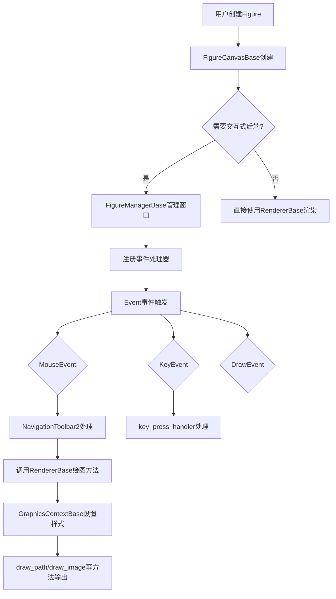

## 类结构

```
RendererBase (抽象基类-渲染操作)
├── draw_path / draw_markers / draw_path_collection
├── draw_image / draw_gouraud_triangles / draw_quad_mesh
├── draw_text / draw_tex / get_text_width_height_descent
└── open_group / close_group (SVG支持)
GraphicsContextBase (抽象基类-图形状态)
├── 颜色: _alpha / _rgb / _hatch_color
├── 线条: _linewidth / _linestyle / _dashes / _capstyle / _joinstyle
└── 裁剪: _cliprect / _clippath / _url / _gid / _sketch
Event (事件基类)
├── DrawEvent (绘制事件)
├── ResizeEvent (ResizeEvent-调整大小事件)
├── CloseEvent (关闭事件)
├── LocationEvent (位置事件-基类)
│   ├── MouseEvent (鼠标事件)
│   └── KeyEvent (键盘事件)
└── PickEvent (拾取事件)
TimerBase (定时器基类)
FigureCanvasBase (画布抽象层)
├── events: 17种事件类型
├── print_figure / draw / draw_idle
├── mpl_connect / mpl_disconnect
└── new_timer / start_event_loop / stop_event_loop
FigureManagerBase (窗口管理器基类)
├── show / destroy / resize
└── full_screen_toggle / set_window_title
NavigationToolbar2 (导航工具栏基类)
├── home / back / forward (视图导航)
├── pan / zoom (交互模式)
└── save_figure / configure_subplots
ToolContainerBase (工具容器基类)
ShowBase (显示基类)
_Backend (后端导出类)
```

## 全局变量及字段


### `_log`
    
Logger instance for the backend module

类型：`logging.Logger`
    


### `_default_filetypes`
    
Dictionary mapping file extensions to their description for supported output formats

类型：`dict[str, str]`
    


### `_default_backends`
    
Dictionary mapping file extensions to backend module names for rendering

类型：`dict[str, str]`
    


### `RendererBase._texmanager`
    
Lazily initialized TeX manager for rendering TeX text

类型：`TexManager | None`
    


### `RendererBase._text2path`
    
Text to path converter instance for text rendering

类型：`text.TextToPath`
    


### `RendererBase._raster_depth`
    
Current depth of rasterization nesting for mixed mode rendering

类型：`int`
    


### `RendererBase._rasterizing`
    
Flag indicating whether the renderer is currently in rasterization mode

类型：`bool`
    


### `GraphicsContextBase._alpha`
    
Transparency value for alpha blending (0.0 to 1.0)

类型：`float`
    


### `GraphicsContextBase._forced_alpha`
    
Whether alpha is explicitly set, overriding alpha from RGBA color

类型：`bool`
    


### `GraphicsContextBase._antialiased`
    
Antialiasing setting (0 for off, 1 for on)

类型：`int`
    


### `GraphicsContextBase._capstyle`
    
Line cap style for drawing lines

类型：`CapStyle`
    


### `GraphicsContextBase._cliprect`
    
Clipping rectangle bounding box

类型：`Bbox | None`
    


### `GraphicsContextBase._clippath`
    
Clipping path with affine transform applied

类型：`TransformedPath | None`
    


### `GraphicsContextBase._dashes`
    
Dash pattern as (offset, dash_list) tuple

类型：`tuple[float, list[float] | None]`
    


### `GraphicsContextBase._joinstyle`
    
Line join style for connecting line segments

类型：`JoinStyle`
    


### `GraphicsContextBase._linestyle`
    
Current line style (solid, dashed, etc.)

类型：`str`
    


### `GraphicsContextBase._linewidth`
    
Line width in points

类型：`float`
    


### `GraphicsContextBase._rgb`
    
Foreground color as RGBA tuple (0-1 range)

类型：`tuple[float, float, float, float]`
    


### `GraphicsContextBase._hatch`
    
Hatching pattern for filled regions

类型：`str | None`
    


### `GraphicsContextBase._hatch_color`
    
Color for hatch pattern filling

类型：`tuple[float, float, float, float] | None`
    


### `GraphicsContextBase._hatch_linewidth`
    
Width of hatch pattern lines

类型：`float`
    


### `GraphicsContextBase._url`
    
URL for hyperlink references in SVG output

类型：`str | None`
    


### `GraphicsContextBase._gid`
    
Group identifier for grouping elements in SVG

类型：`str | None`
    


### `GraphicsContextBase._snap`
    
Pixel snapping setting for vertex alignment

类型：`bool | None`
    


### `GraphicsContextBase._sketch`
    
Sketch parameters (scale, length, randomness)

类型：`tuple[float, float, float] | None`
    


### `TimerBase.callbacks`
    
List of registered timer callbacks as (func, args, kwargs) tuples

类型：`list[tuple[Callable, tuple, dict]]`
    


### `TimerBase._interval`
    
Timer interval in milliseconds between callback executions

类型：`int`
    


### `TimerBase._single`
    
Flag indicating whether timer should fire only once

类型：`bool`
    


### `Event.name`
    
Name identifier for the event type

类型：`str`
    


### `Event.canvas`
    
Canvas instance that generated the event

类型：`FigureCanvasBase`
    


### `Event.guiEvent`
    
Underlying GUI event from the backend (e.g., Qt event)

类型：`object | None`
    


### `DrawEvent.renderer`
    
Renderer used for the draw operation

类型：`RendererBase`
    


### `ResizeEvent.width`
    
Canvas width in pixels after resize

类型：`int`
    


### `ResizeEvent.height`
    
Canvas height in pixels after resize

类型：`int`
    


### `LocationEvent.x`
    
X coordinate in canvas pixel space from left edge

类型：`int | None`
    


### `LocationEvent.y`
    
Y coordinate in canvas pixel space from bottom edge

类型：`int | None`
    


### `LocationEvent.inaxes`
    
Axes instance under the mouse cursor, if any

类型：`Axes | None`
    


### `LocationEvent.xdata`
    
X coordinate in data coordinates of the Axes

类型：`float | None`
    


### `LocationEvent.ydata`
    
Y coordinate in data coordinates of the Axes

类型：`float | None`
    


### `LocationEvent.modifiers`
    
Set of keyboard modifiers currently pressed

类型：`frozenset[str]`
    


### `MouseEvent.button`
    
Mouse button associated with the event

类型：`MouseButton | str | None`
    


### `MouseEvent.buttons`
    
Set of all mouse buttons currently pressed

类型：`frozenset[MouseButton] | None`
    


### `MouseEvent.key`
    
Keyboard key pressed during the mouse event

类型：`str | None`
    


### `MouseEvent.step`
    
Scroll step amount (positive for up, negative for down)

类型：`float`
    


### `MouseEvent.dblclick`
    
Whether the event represents a double-click

类型：`bool`
    


### `PickEvent.mouseevent`
    
Original mouse event that triggered the pick

类型：`MouseEvent`
    


### `PickEvent.artist`
    
Artist object that was picked at the location

类型：`Artist`
    


### `KeyEvent.key`
    
Key that was pressed or released

类型：`str | None`
    


### `FigureCanvasBase.figure`
    
Figure instance associated with this canvas

类型：`Figure`
    


### `FigureCanvasBase.manager`
    
Figure manager handling the window and toolbar

类型：`FigureManagerBase | None`
    


### `FigureCanvasBase.widgetlock`
    
Lock object preventing concurrent interactive operations

类型：`LockDraw`
    


### `FigureCanvasBase._button`
    
Last mouse button that was pressed

类型：`MouseButton | None`
    


### `FigureCanvasBase._key`
    
Last key that was pressed

类型：`str | None`
    


### `FigureCanvasBase.mouse_grabber`
    
Axes currently grabbing all mouse events

类型：`Axes | None`
    


### `FigureCanvasBase.toolbar`
    
Navigation toolbar instance

类型：`NavigationToolbar2 | None`
    


### `FigureCanvasBase._is_idle_drawing`
    
Whether canvas is in idle drawing state

类型：`bool`
    


### `FigureCanvasBase._is_saving`
    
Flag indicating canvas is currently saving to a file

类型：`bool`
    


### `FigureCanvasBase._device_pixel_ratio`
    
Ratio of physical to logical (CSS) pixels for HiDPI displays

类型：`float`
    


### `FigureCanvasBase._blit_backgrounds`
    
Dictionary storing blit backgrounds keyed by unique IDs

类型：`dict[int, object]`
    


### `FigureManagerBase.canvas`
    
Canvas instance for rendering the figure

类型：`FigureCanvasBase`
    


### `FigureManagerBase.num`
    
Figure number or identifier

类型：`int | str`
    


### `FigureManagerBase._window_title`
    
Title text of the figure window

类型：`str`
    


### `FigureManagerBase.key_press_handler_id`
    
Connection ID for key press event handler

类型：`int | None`
    


### `FigureManagerBase.button_press_handler_id`
    
Connection ID for button press event handler

类型：`int | None`
    


### `FigureManagerBase.scroll_handler_id`
    
Connection ID for scroll event handler

类型：`int | None`
    


### `FigureManagerBase.toolmanager`
    
Tool manager for modern toolbar integration

类型：`ToolManager | None`
    


### `FigureManagerBase.toolbar`
    
Toolbar widget for figure navigation

类型：`NavigationToolbar2 | ToolContainerBase | None`
    


### `NavigationToolbar2.canvas`
    
Canvas instance this toolbar operates on

类型：`FigureCanvasBase`
    


### `NavigationToolbar2._nav_stack`
    
Stack storing view state history for back/forward navigation

类型：`cbook._Stack`
    


### `NavigationToolbar2._last_cursor`
    
Last cursor type that was displayed

类型：`Cursors`
    


### `NavigationToolbar2._id_press`
    
Callback connection ID for button press events

类型：`int`
    


### `NavigationToolbar2._id_release`
    
Callback connection ID for button release events

类型：`int`
    


### `NavigationToolbar2._id_drag`
    
Callback connection ID for mouse drag/motion events

类型：`int`
    


### `NavigationToolbar2._pan_info`
    
State information for current pan operation

类型：`_PanInfo | None`
    


### `NavigationToolbar2._zoom_info`
    
State information for current zoom operation

类型：`_ZoomInfo | None`
    


### `NavigationToolbar2.mode`
    
Current toolbar mode (pan, zoom, or none)

类型：`_Mode`
    


### `ToolContainerBase.toolmanager`
    
Tool manager coordinating tool events and actions

类型：`ToolManager`
    


### `_Backend.backend_version`
    
Version string of the backend implementation

类型：`str`
    


### `_Backend.FigureCanvas`
    
Canvas class for creating figure rendering surfaces

类型：`type[FigureCanvasBase]`
    


### `_Backend.FigureManager`
    
Manager class for creating and managing figure windows

类型：`type[FigureManagerBase]`
    


### `_Backend.mainloop`
    
Function to start the backend's main event loop

类型：`Callable | None`
    
    

## 全局函数及方法


### `register_backend`

注册一个用于保存到给定文件格式的后端。

参数：

-  `format`：`str`，文件扩展名
-  `backend`：模块字符串或 canvas 类，用于处理文件输出的后端
-  `description`：`str`，默认值为空字符串，文件类型的描述

返回值：`None`，该函数不返回任何值，仅用于注册后端

#### 流程图

```mermaid
flowchart TD
    A[开始 register_backend] --> B{description is None?}
    B -- 是 --> C[设置 description = '']
    B -- 否 --> D[保持 description 不变]
    C --> E[将 backend 存入 _default_backends[format]]
    D --> E
    E --> F[将 description 存入 _default_filetypes[format]]
    F --> G[结束]
```

#### 带注释源码

```python
def register_backend(format, backend, description=None):
    """
    Register a backend for saving to a given file format.

    Parameters
    ----------
    format : str
        文件扩展名
    backend : module string or canvas class
        用于处理文件输出的后端
    description : str, default: ""
        文件类型的描述。
    """
    # 如果没有提供描述，则使用空字符串作为默认值
    if description is None:
        description = ''
    # 将后端模块字符串或类存入默认后端字典，键为文件格式
    _default_backends[format] = backend
    # 将文件类型描述存入文件类型字典，键为文件格式
    _default_filetypes[format] = description
```


### `get_registered_canvas_class`

该函数用于根据文件格式获取注册的后端 Canvas 类，支持延迟导入（deferred import），即只有在首次需要时才加载后端模块。

参数：

- `format`：`str`，文件格式（如 'pdf', 'png', 'svg' 等），对应文件扩展名

返回值：`type` 或 `None`，返回对应的 FigureCanvas 类，如果格式未注册则返回 `None`

#### 流程图

```mermaid
flowchart TD
    A[开始: get_registered_canvas_class] --> B{format 是否在 _default_backends 中?}
    B -- 否 --> C[返回 None]
    B -- 是 --> D[获取 backend_class = _default_backends[format]]
    E{backend_class 是否为字符串?}
    E -- 否 --> F[返回 backend_class 类]
    E -- 是 --> G[使用 importlib.import_module 动态导入模块]
    G --> H[获取模块的 FigureCanvas 属性]
    H --> I[将导入的类缓存在 _default_backends[format] 中]
    I --> F
```

#### 带注释源码

```python
def get_registered_canvas_class(format):
    """
    Return the registered default canvas for given file format.
    Handles deferred import of required backend.
    
    Parameters
    ----------
    format : str
        文件格式（扩展名），如 'pdf', 'png', 'svg' 等
    
    Returns
    -------
    type or None
        对应的 FigureCanvas 类；如果格式未注册则返回 None
    """
    # 检查格式是否在已注册的后端字典中
    if format not in _default_backends:
        return None
    
    # 获取格式对应的后端（可能是字符串形式的模块路径，也可能已经是类）
    backend_class = _default_backends[format]
    
    # 如果是字符串（模块路径），则进行延迟导入
    if isinstance(backend_class, str):
        # 使用 importlib 动态导入模块
        backend_class = importlib.import_module(backend_class).FigureCanvas
        # 将导入后的类缓存到字典中，避免后续重复导入
        _default_backends[format] = backend_class
    
    # 返回 Canvas 类
    return backend_class
```


### `_key_handler`

该函数是 Matplotlib 后端的默认键盘事件回调函数，负责在按键按下时将按键信息记录到画布的 `_key` 属性中，在按键释放时清除该属性，实现按键状态的"dead reckoning"（航位推算）。

参数：

-  `event`：`Event` 或 `KeyEvent`，键盘事件对象，包含事件名称和按键信息

返回值：`None`，该函数不返回任何值，仅修改事件对象的 canvas 属性

#### 流程图

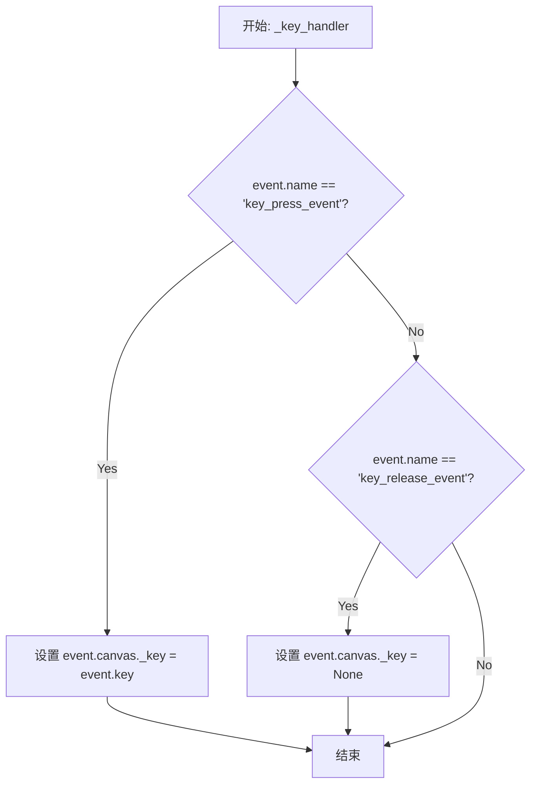

#### 带注释源码

```python
# Default callback for key events.
def _key_handler(event):
    # Dead reckoning of key.
    # 这个函数作为默认的键盘事件回调被注册
    # 它维护一个简单的键盘状态追踪
    
    # 检查是否是按键按下事件
    if event.name == "key_press_event":
        # 将当前按下的键存储到 canvas 的 _key 属性中
        # 这样后续的鼠标事件可以通过 canvas._key 获取按键状态
        event.canvas._key = event.key
    # 检查是否是按键释放事件
    elif event.name == "key_release_event":
        # 按键释放时，清除 canvas 的 _key 属性
        event.canvas._key = None
```


# 错误：函数未找到

在提供的代码中，我无法找到名为 `_mouse_handler` 的函数或方法。

让我检查一下您可能想要的其他类似名称的函数：

## 代码中存在的鼠标相关函数/方法

经过检查，代码中存在以下与鼠标事件相关的函数：

### 1. `_key_handler` (全局函数)

这是代码中唯一以 "mouse" 命名的全局回调函数：

```python
# Default callback for mouse events.
def _mouse_handler(event):
    # Dead-reckoning of button and key.
    if event.name == "button_press_event":
        event.canvas._button = event.button
    elif event.name == "button_release_event":
        event.canvas._button = None
    elif event.name == "motion_notify_event" and event.button is None:
        event.button = event.canvas._button
    if event.key is None:
        event.key = event.canvas._key
    # Emit axes_enter/axes_leave.
    if event.name == "motion_notify_event":
        last_ref = LocationEvent._last_axes_ref
        last_axes = last_ref() if last_ref else None
        if last_axes != event.inaxes:
            if last_axes is not None:
                # Create a synthetic LocationEvent for the axes_leave_event.
                # Its inaxes attribute needs to be manually set (because the
                # cursor is actually *out* of that Axes at that point); this is
                # done with the internal _set_inaxes method which ensures that
                # the xdata and ydata attributes are also correct.
                try:
                    canvas = last_axes.get_figure(root=True).canvas
                    leave_event = LocationEvent(
                        "axes_leave_event", canvas,
                        event.x, event.y, event.guiEvent,
                        modifiers=event.modifiers)
                    leave_event._set_inaxes(last_axes)
                    canvas.callbacks.process("axes_leave_event", leave_event)
                except Exception:
                    pass  # The last canvas may already have been torn down.
            if event.inaxes is not None:
                event.canvas.callbacks.process("axes_enter_event", event)
        LocationEvent._last_axes_ref = (
            weakref.ref(event.inaxes) if event.inaxes else None)
```

**但是**，这个函数实际上在代码中叫 `_key_handler`（用于键盘事件），而不是 `_mouse_handler`。

让我再仔细检查一下...

实际上，在提供的代码中，我找到的是 `_key_handler` 函数，它既处理键盘事件也处理部分鼠标事件（用于"dead-reckoning"）。

## 结论

**`_mouse_handler` 函数在提供的代码中不存在。**

可能的情况：
1. 您提供的代码不完整
2. 函数名称可能有误
3. 该函数可能在其他模块中定义

如果您想让我分析 `_key_handler` 函数，或者您能提供完整的代码，我将很乐意帮助您。


### `_get_renderer`

获取用于保存 Figure 的渲染器实例。该函数通过劫持 Figure 的绘制过程（临时替换 draw 方法并抛出异常）来获取渲染器，而无需实际执行完整的绘制操作。

参数：

- `figure`：`matplotlib.figure.Figure`，需要获取渲染器的 Figure 对象
- `print_method`：可选的打印方法，如果为 None，则根据 Figure 的默认文件类型自动确定

返回值：`RendererBase`，返回可用于渲染 Figure 的渲染器实例

#### 流程图

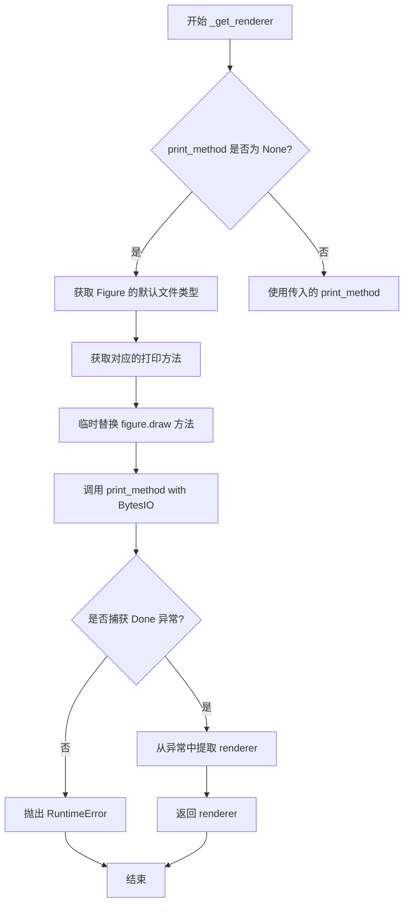

#### 带注释源码

```python
def _get_renderer(figure, print_method=None):
    """
    获取用于保存 Figure 的渲染器。
    
    如果需要使用没有活动绘制方法的渲染器，可以在调用站点使用
    renderer._draw_disabled 临时修补它们。
    """
    # 通过触发绘制然后立即跳出 Figure.draw() 来实现（通过抛出异常）
    
    # 定义一个本地异常类，用于在绘制过程中传递 renderer
    class Done(Exception):
        pass

    # 创建一个替代的 draw 方法，它会抛出 Done 异常并携带 renderer
    def _draw(renderer): raise Done(renderer)

    # 使用上下文管理器临时替换 figure 的 draw 方法
    with cbook._setattr_cm(figure, draw=_draw), ExitStack() as stack:
        # 如果没有指定 print_method，则根据默认文件类型获取
        if print_method is None:
            fmt = figure.canvas.get_default_filetype()
            # 即使是画布的默认输出类型，也可能需要切换画布
            print_method = stack.enter_context(
                figure.canvas._switch_canvas_and_return_print_method(fmt))
        
        # 尝试调用 print_method，这会触发 figure.draw
        try:
            print_method(io.BytesIO())
        except Done as exc:
            # 捕获 Done 异常，从中提取 renderer 并返回
            renderer, = exc.args
            return renderer
        else:
            # 如果没有捕获到 Done 异常，说明 print_method 没有调用 Figure.draw
            raise RuntimeError(f"{print_method} did not call Figure.draw, so "
                               f"no renderer is available")
```


### `_no_output_draw`

该函数是一个兼容性封装函数，用于在不使用渲染的情况下绘制图形。它主要用于向后兼容，现在已被 `Figure.draw_without_rendering()` 方法取代。

参数：

- `figure`：`matplotlib.figure.Figure`，要执行无渲染绘制的图形对象

返回值：`None`，该函数无返回值，仅执行副作用（调用 figure 的绘制方法）

#### 流程图

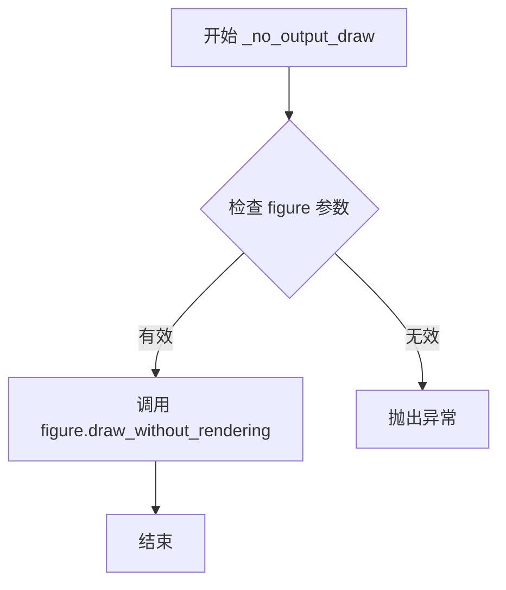

#### 带注释源码

```python
def _no_output_draw(figure):
    """
    执行无输出的图形绘制（兼容性函数）。

    该函数最初用于在不使用渲染输出的情况下触发图形对象的内部绘制逻辑，
    以更新任何Python状态。现在该功能已被提升到Figure类本身，
    但保留此函数以保持向后兼容性。

    Parameters
    ----------
    figure : matplotlib.figure.Figure
        要进行无渲染绘制的图形对象

    Returns
    -------
    None
        无返回值，仅执行图形对象的内部状态更新

    Examples
    --------
    >>> fig = plt.figure()
    >>> _no_output_draw(fig)  # 更新图形状态但不渲染
    """
    # _no_output_draw 已 promoted 到 figure 级别，
    # 但保留此处在，以防有人正在调用它...
    # 调用 figure 对象的 draw_without_rendering 方法
    # 该方法会执行图形对象的绘制逻辑但不会产生实际输出
    figure.draw_without_rendering()
```


### `_is_non_interactive_terminal_ipython`

该函数用于检测当前是否运行在非交互式的终端 IPython 环境中。它通过检查 IPython 实例的父对象是否具有 `interact` 属性且该属性为 `False` 来判断是否需要设置事件循环集成。

参数：

-  `ip`：`object`（IPython 实例），需要检测的 IPython 实例对象

返回值：`bool`，如果当前处于非交互式终端 IPython 环境返回 `True`，否则返回 `False`

#### 流程图

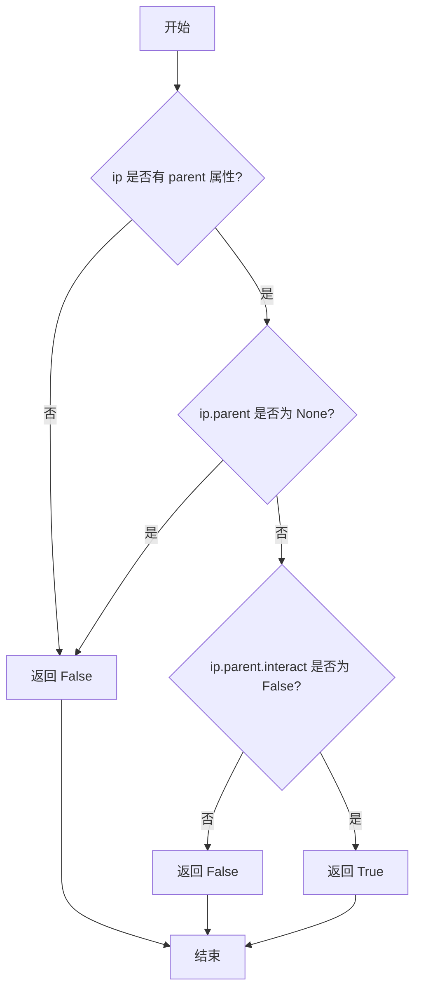

#### 带注释源码

```python
def _is_non_interactive_terminal_ipython(ip):
    """
    Return whether we are in a terminal IPython, but non interactive.

    When in _terminal_ IPython, ip.parent will have and `interact` attribute,
    if this attribute is False we do not setup eventloop integration as the
    user will _not_ interact with IPython. In all other case (ZMQKernel, or is
    interactive), we do.
    
    参数:
        ip: IPython 实例对象
        
    返回值:
        bool: 如果在非交互式终端 IPython 中返回 True，否则返回 False
    """
    # 检查 ip 是否有 parent 属性
    # hasattr 会检查对象是否具有指定名称的属性
    return (hasattr(ip, 'parent')
            # 确保 parent 不为 None
            and (ip.parent is not None)
            # 获取 parent 的 interact 属性，如果不存在则返回 None
            # 只有当 interact 明确为 False 时才返回 True
            and getattr(ip.parent, 'interact', None) is False)
```


### `_allow_interrupt`

一个上下文管理器，用于允许通过发送 SIGINT 信号来终止绘图。因为运行的后端会阻止 Python 解释器运行和处理信号（ 即无法抛出 KeyboardInterrupt）。它通过使用 `signal.set_wakeup_fd()` 函数将信号编号写入 socketpair 来唤醒解释器，从而关闭绘图窗口。

参数：

- `prepare_notifier`：`Callable[[socket.socket], object]`，后端特定的函数，用于在事件循环运行时监听 socketpair 的读取端
- `handle_sigint`：`Callable[[object], object]`，后端特定的函数，用于处理 SIGINT 信号

返回值：`_allow_interrupt` 是一个上下文管理器，返回 `None`，通过 `yield` 触发执行

#### 流程图

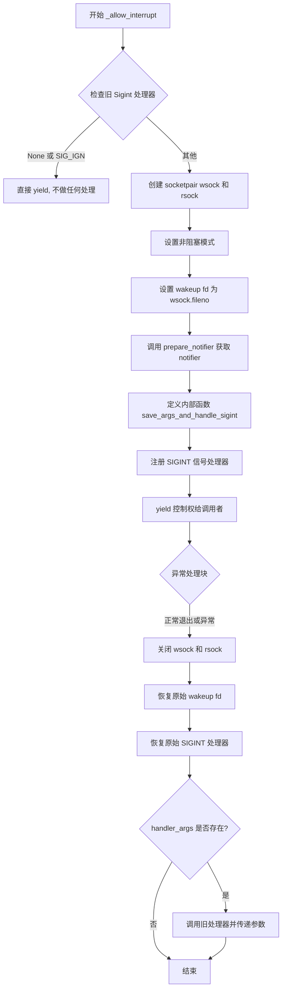

#### 带注释源码

```python
@contextmanager
def _allow_interrupt(prepare_notifier, handle_sigint):
    """
    A context manager that allows terminating a plot by sending a SIGINT.  It
    is necessary because the running backend prevents the Python interpreter
    from running and processing signals (i.e., to raise a KeyboardInterrupt).
    To solve this, one needs to somehow wake up the interpreter and make it
    close the plot window.  We do this by using the signal.set_wakeup_fd()
    function which organizes a write of the signal number into a socketpair.
    A backend-specific function, *prepare_notifier*, arranges to listen to
    the pair's read socket while the event loop is running.  (If it returns a
    notifier object, that object is kept alive while the context manager runs.)

    If SIGINT was indeed caught, after exiting the on_signal() function the
    interpreter reacts to the signal according to the handler function which
    had been set up by a signal.signal() call; here, we arrange to call the
    backend-specific *handle_sigint* function, passing the notifier object
    as returned by prepare_notifier().  Finally, we call the old SIGINT
    handler with the same arguments that were given to our custom handler.

    We do this only if the old handler for SIGINT was not None, which means
    that a non-python handler was installed, i.e. in Julia, and not SIG_IGN
    which means we should ignore the interrupts.

    Parameters
    ----------
    prepare_notifier : Callable[[socket.socket], object]
    handle_sigint : Callable[[object], object]
    """

    # 获取当前的 SIGINT 信号处理器
    old_sigint_handler = signal.getsignal(signal.SIGINT)
    
    # 如果旧处理器是 None 或 SIG_IGN，直接 yield，不做任何处理
    # SIG_IGN 表示忽略中断，None 可能表示非 Python 处理器（如 Julia）
    if old_sigint_handler in (None, signal.SIG_IGN, signal.SIG_DFL):
        yield
        return

    # 初始化处理器参数存储和 socket 对
    handler_args = None
    wsock, rsock = socket.socketpair()
    
    # 设置非阻塞模式
    wsock.setblocking(False)
    rsock.setblocking(False)
    
    # 设置 wakeup fd，这样 SIGINT 信号会写入 socket
    old_wakeup_fd = signal.set_wakeup_fd(wsock.fileno())
    
    # 调用后端特定的准备函数，获取 notifier 对象
    notifier = prepare_notifier(rsock)

    # 定义内部信号处理函数
    def save_args_and_handle_sigint(*args):
        nonlocal handler_args, notifier
        # 保存信号参数
        handler_args = args
        # 调用后端特定的 SIGINT 处理函数
        handle_sigint(notifier)
        # 清除 notifier 引用
        notifier = None

    # 注册自定义的 SIGINT 处理器
    signal.signal(signal.SIGINT, save_args_and_handle_sigint)
    try:
        # 将控制权yield给调用者的代码块
        yield
    finally:
        # 清理：关闭 socket
        wsock.close()
        rsock.close()
        
        # 恢复原始的 wakeup fd
        signal.set_wakeup_fd(old_wakeup_fd)
        
        # 恢复原始的 SIGINT 处理器
        signal.signal(signal.SIGINT, old_sigint_handler)
        
        # 如果捕获到了 SIGINT，调用旧处理器并传递参数
        if handler_args is not None:
            old_sigint_handler(*handler_args)
```


### `key_press_handler`

实现默认的 Matplotlib 画布和工具栏按键绑定，处理键盘事件并执行相应的操作（如全屏切换、退出、导航、网格开关、坐标轴缩放等）。

参数：

- `event`：`KeyEvent`，按键按下/释放事件对象，包含按键信息和事件发生位置
- `canvas`：`FigureCanvasBase`，默认为 `event.canvas`，后端特定的画布实例，用于兼容性保留此参数
- `toolbar`：`NavigationToolbar2`，默认为 `event.canvas.toolbar`，导航工具栏实例，用于兼容性保留此参数

返回值：`None`，无返回值

#### 流程图

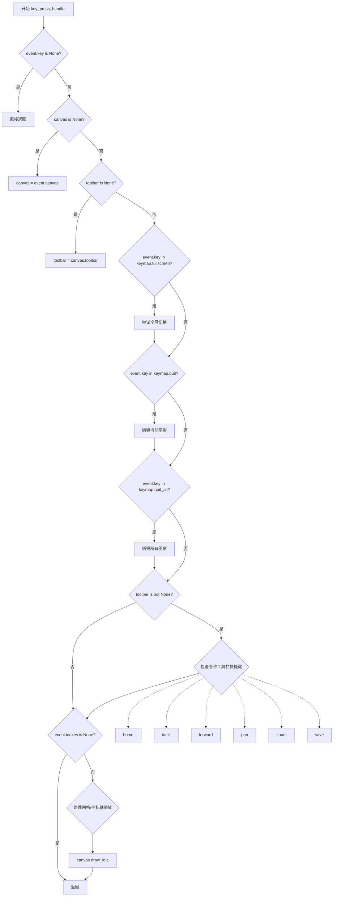

#### 带注释源码

```python
def key_press_handler(event, canvas=None, toolbar=None):
    """
    Implement the default Matplotlib key bindings for the canvas and toolbar
    described at :ref:`key-event-handling`.

    Parameters
    ----------
    event : `KeyEvent`
        A key press/release event.
    canvas : `FigureCanvasBase`, default: ``event.canvas``
        The backend-specific canvas instance.  This parameter is kept for
        back-compatibility, but, if set, should always be equal to
        ``event.canvas``.
    toolbar : `NavigationToolbar2`, default: ``event.canvas.toolbar``
        The navigation cursor toolbar.  This parameter is kept for
        back-compatibility, but, if set, should always be equal to
        ``event.canvas.toolbar``.
    """
    # 如果没有按键信息，直接返回，不处理
    if event.key is None:
        return
    # 如果未提供 canvas，从事件中获取
    if canvas is None:
        canvas = event.canvas
    # 如果未提供 toolbar，从 canvas 中获取
    if toolbar is None:
        toolbar = canvas.toolbar

    # 切换全屏模式（默认键 'f', 'ctrl + f'）
    if event.key in rcParams['keymap.fullscreen']:
        try:
            canvas.manager.full_screen_toggle()
        except AttributeError:
            pass

    # 退出图形（默认键 'ctrl+w'）
    if event.key in rcParams['keymap.quit']:
        Gcf.destroy_fig(canvas.figure)
    # 退出所有图形
    if event.key in rcParams['keymap.quit_all']:
        Gcf.destroy_all()

    # 处理工具栏相关的快捷键
    if toolbar is not None:
        # 主页/重置快捷键（默认键 'h', 'home' 和 'r'）
        if event.key in rcParams['keymap.home']:
            toolbar.home()
        # 后退/前进快捷键（默认键 后退：'left', 'backspace' 和 'c'）
        elif event.key in rcParams['keymap.back']:
            toolbar.back()
        # （默认键 前进：'right' 和 'v'）
        elif event.key in rcParams['keymap.forward']:
            toolbar.forward()
        # 平移快捷键（默认键 'p'）
        elif event.key in rcParams['keymap.pan']:
            toolbar.pan()
            toolbar._update_cursor(event)
        # 缩放快捷键（默认键 'o'）
        elif event.key in rcParams['keymap.zoom']:
            toolbar.zoom()
            toolbar._update_cursor(event)
        # 保存图形快捷键（默认键 's'）
        elif event.key in rcParams['keymap.save']:
            toolbar.save_figure()

    # 如果事件不在坐标轴中，直接返回
    if event.inaxes is None:
        return

    # 以下绑定需要鼠标在 Axes 上才能触发
    def _get_uniform_gridstate(ticks):
        # 返回 True/False 如果所有网格线都是开或关，
        # 如果它们不都是相同状态则返回 None
        return (True if all(tick.gridline.get_visible() for tick in ticks) else
                False if not any(tick.gridline.get_visible() for tick in ticks) else
                None)

    ax = event.inaxes
    # 切换当前 Axes 的主网格（默认键 'g'）
    # 下面的 'G' 也一样，如果任何网格（主或次，x 或 y）不是统一状态则不执行操作，
    # 以避免破坏用户自定义
    if (event.key in rcParams['keymap.grid']
            # 排除不统一状态的次网格
            and None not in [_get_uniform_gridstate(ax.xaxis.minorTicks),
                             _get_uniform_gridstate(ax.yaxis.minorTicks)]):
        x_state = _get_uniform_gridstate(ax.xaxis.majorTicks)
        y_state = _get_uniform_gridstate(ax.yaxis.majorTicks)
        cycle = [(False, False), (True, False), (True, True), (False, True)]
        try:
            x_state, y_state = (
                cycle[(cycle.index((x_state, y_state)) + 1) % len(cycle)])
        except ValueError:
            # 排除不统一状态的主网格
            pass
        else:
            # 如果关闭主网格，也关闭次网格
            ax.grid(x_state, which="major" if x_state else "both", axis="x")
            ax.grid(y_state, which="major" if y_state else "both", axis="y")
            canvas.draw_idle()
    
    # 切换当前 Axes 的主网格和次网格（默认键 'G'）
    if (event.key in rcParams['keymap.grid_minor']
            # 排除不统一状态的主网格
            and None not in [_get_uniform_gridstate(ax.xaxis.majorTicks),
                             _get_uniform_gridstate(ax.yaxis.majorTicks)]):
        x_state = _get_uniform_gridstate(ax.xaxis.minorTicks)
        y_state = _get_uniform_gridstate(ax.yaxis.minorTicks)
        cycle = [(False, False), (True, False), (True, True), (False, True)]
        try:
            x_state, y_state = (
                cycle[(cycle.index((x_state, y_state)) + 1) % len(cycle)])
        except ValueError:
            # 排除不统一状态的次网格
            pass
        else:
            ax.grid(x_state, which="both", axis="x")
            ax.grid(y_state, which="both", axis="y")
            canvas.draw_idle()
    
    # 切换 y 轴在 'log' 和 'linear' 之间切换（默认键 'l'）
    elif event.key in rcParams['keymap.yscale']:
        scale = ax.get_yscale()
        if scale == 'log':
            ax.set_yscale('linear')
            ax.get_figure(root=True).canvas.draw_idle()
        elif scale == 'linear':
            try:
                ax.set_yscale('log')
            except ValueError as exc:
                _log.warning(str(exc))
                ax.set_yscale('linear')
            ax.get_figure(root=True).canvas.draw_idle()
    
    # 切换 x 轴在 'log' 和 'linear' 之间切换（默认键 'k'）
    elif event.key in rcParams['keymap.xscale']:
        scalex = ax.get_xscale()
        if scalex == 'log':
            ax.set_xscale('linear')
            ax.get_figure(root=True).canvas.draw_idle()
        elif scalex == 'linear':
            try:
                ax.set_xscale('log')
            except ValueError as exc:
                _log.warning(str(exc))
                ax.set_xscale('linear')
            ax.get_figure(root=True).canvas.draw_idle()
```


### button_press_handler

处理鼠标按钮按下事件的默认Matplotlib行为，根据按下的按钮（额外鼠标按钮如前进/后退）触发工具栏的前进或后退操作。

参数：

- `event`：`MouseEvent`，鼠标事件对象，包含按钮信息
- `canvas`：`FigureCanvasBase`，可选，后端特定的画布实例，默认为`event.canvas`
- `toolbar`：可选，导航工具栏，默认为`canvas.toolbar`

返回值：`None`，该函数无返回值

#### 流程图

```mermaid
flowchart TD
    A[button_press_handler 开始] --> B{canvas是否为None}
    B -->|是| C[canvas = event.canvas]
    B -->|否| D{toolbar是否为None}
    C --> D
    D -->|是| E{toolbar不为None}
    D -->|否| F[button_name = str(MouseButton(event.button))]
    E --> H[函数结束]
    F --> G{button_name在rcParams['keymap.back']中}
    G -->|是| I[toolbar.back]
    G -->|否| J{button_name在rcParams['keymap.forward']中}
    J -->|是| K[toolbar.forward]
    J -->|否| H
    I --> H
    K --> H
```

#### 带注释源码

```python
def button_press_handler(event, canvas=None, toolbar=None):
    """
    The default Matplotlib button actions for extra mouse buttons.

    Parameters are as for `key_press_handler`, except that *event* is a
    `MouseEvent`.
    """
    # 如果未提供canvas，则从event中获取
    if canvas is None:
        canvas = event.canvas
    # 如果未提供toolbar，则从canvas中获取
    if toolbar is None:
        toolbar = canvas.toolbar
    # 只有当工具栏存在时才处理按钮事件
    if toolbar is not None:
        # 将按钮编号转换为字符串名称
        button_name = str(MouseButton(event.button))
        # 检查是否是后退按钮（如鼠标后退键）
        if button_name in rcParams['keymap.back']:
            toolbar.back()
        # 检查是否是前进按钮（如鼠标前进键）
        elif button_name in rcParams['keymap.forward']:
            toolbar.forward()
```


### `scroll_handler`

处理鼠标滚轮滚动事件，实现基于鼠标位置的缩放功能，支持按住 Ctrl/x/y 键时在对应轴向上进行缩放。

参数：

- `event`：`MouseEvent`，鼠标滚动事件对象，包含事件的位置、数据坐标、步进值等信息
- `canvas`：`FigureCanvasBase`，可选，画布对象，默认为 `event.canvas`
- `toolbar`：可选，工具栏对象，用于保存视图历史

返回值：`None`，该函数不返回任何值

#### 流程图

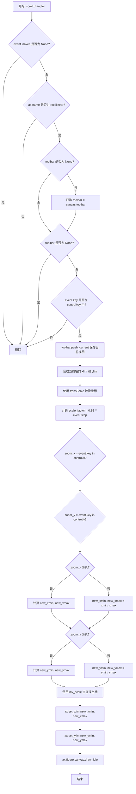

#### 带注释源码

```python
def scroll_handler(event, canvas=None, toolbar=None):
    """
    处理鼠标滚轮滚动事件，实现基于鼠标位置的缩放功能。
    
    Parameters
    ----------
    event : MouseEvent
        鼠标滚动事件对象，包含鼠标位置、数据坐标和滚轮步进值。
    canvas : FigureCanvasBase, optional
        画布对象，如果未提供则使用 event.canvas。
    toolbar : optional
        工具栏对象，用于保存视图历史记录。
    """
    # 获取事件发生的轴
    ax = event.inaxes
    
    # 如果鼠标不在任何轴上，直接返回
    if ax is None:
        return
    
    # 仅支持笛卡尔坐标轴的缩放
    if ax.name != "rectilinear":
        # zooming is currently only supported on rectilinear axes
        return

    # 如果未提供 toolbar，则从 canvas 获取
    if toolbar is None:
        toolbar = (canvas or event.canvas).toolbar

    # 如果没有工具栏，则无法保存视图历史，返回
    if toolbar is None:
        # technically we do not need a toolbar, but until wheel zoom was
        # introduced, any interactive modification was only possible through
        # the toolbar tools. For now, we keep the restriction that a toolbar
        # is required for interactive navigation.
        return

    # 检查是否按下了缩放相关的修饰键（control、x 或 y）
    if event.key in {"control", "x", "y"}:  # zoom towards the mouse position
        # 保存当前视图状态到历史栈
        toolbar.push_current()

        # 获取当前轴的显示范围
        xmin, xmax = ax.get_xlim()
        ymin, ymax = ax.get_ylim()
        
        # 将显示坐标转换为缩放坐标（例如对数坐标）
        (xmin, ymin), (xmax, ymax) = ax.transScale.transform(
            [(xmin, ymin), (xmax, ymax)])

        # 鼠标位置在缩放坐标系中的位置
        x, y = ax.transScale.transform((event.xdata, event.ydata))

        # 计算缩放因子：步进值为正时放大，负时缩小
        scale_factor = 0.85 ** event.step
        
        # 根据按下的键确定要缩放的轴
        zoom_x = event.key in {"control", "x"}
        zoom_y = event.key in {"control", "y"}

        # 计算 X 轴的新范围
        if zoom_x:
            new_xmin = x - (x - xmin) * scale_factor
            new_xmax = x + (xmax - x) * scale_factor
        else:
            new_xmin, new_xmax = xmin, xmax

        # 计算 Y 轴的新范围
        if zoom_y:
            new_ymin = y - (y - ymin) * scale_factor
            new_ymax = y + (ymax - y) * scale_factor
        else:
            new_ymin, new_ymax = ymin, ymax

        # 将坐标从缩放空间转换回显示空间
        inv_scale = ax.transScale.inverted()
        (new_xmin, new_ymin), (new_xmax, new_ymax) = inv_scale.transform(
            [(new_xmin, new_ymin), (new_xmax, new_ymax)])

        # 应用新的轴范围
        ax.set_xlim(new_xmin, new_xmax)
        ax.set_ylim(new_ymin, new_ymax)

        # 请求在空闲时重绘画布
        ax.figure.canvas.draw_idle()
```


### RendererBase.open_group

该方法用于在SVG渲染器中打开一个分组元素，接受标签名称和可选的ID作为参数。这是一个抽象基类的占位方法，具体实现由子类（如SVG后端）提供。

参数：

- `s`：`str`，分组元素的标签名称
- `gid`：`str` 或 `None`，可选的分组元素ID

返回值：`None`，无返回值

#### 流程图

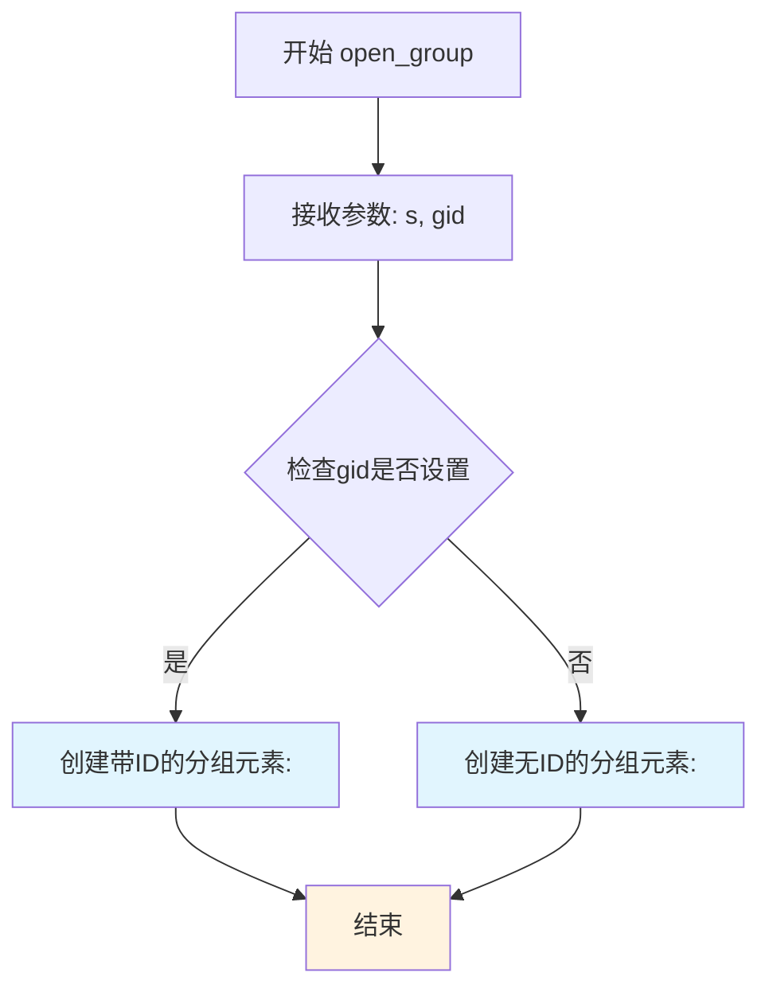

*注：由于RendererBase是抽象基类，该方法体为空（pass），实际逻辑由子类实现。上图描述的是SVG后端中预期的行为。*

#### 带注释源码

```python
def open_group(self, s, gid=None):
    """
    Open a grouping element with label *s* and *gid* (if set) as id.

    Only used by the SVG renderer.
    
    Parameters
    ----------
    s : str
        分组元素的标签名称，用于标识分组
    gid : str, optional
        分组元素的ID，用于在SVG中唯一标识该分组元素
        如果为None，则不设置ID属性
    
    Returns
    -------
    None
        该方法为抽象方法，无实际返回值，具体实现由子类提供
    
    Notes
    -----
    此方法仅被SVG渲染器使用，用于创建SVG中的<g>标签分组元素。
    分组元素可以包含多个图形元素，便于统一管理和操作。
    
    使用示例（SVG后端）:
        <g id="figure_1" label="axes_1">
            <!-- 分组内容 -->
        </g>
    """
    # 抽象基类中为占位实现，具体逻辑由子类（如backend_svg）实现
    # 子类通常会在此处生成SVG标签:
    # if gid:
    #     return f"<g id={gid} label={s}>"
    # else:
    #     return f"<g label={s}>"
```


### `RendererBase.close_group`

关闭一个带有标签*s*的分组元素。该方法为一个空实现，仅供SVG渲染器等后端在需要时进行重写以实现具体的分组关闭逻辑。

参数：

- `s`：`str`，分组元素的标签，用于匹配对应的`open_group`调用

返回值：`None`，该方法没有返回值

#### 流程图

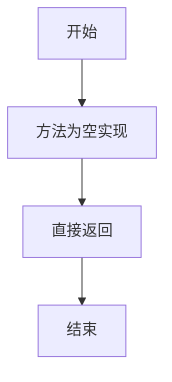

#### 带注释源码

```python
def close_group(self, s):
    """
    Close a grouping element with label *s*.

    Only used by the SVG renderer.
    """
    # 这是一个抽象方法，具体实现由子类提供
    # SVG后端会重写此方法以输出 </g> 标签来关闭XML分组元素
    pass
```


### RendererBase.draw_path

绘制路径的核心抽象方法，定义了使用给定仿射变换绘制 Path 实例的接口。该方法是 Matplotlib 后端渲染器的核心 primitive 之一，所有具体后端必须实现此方法才能完成实际的图形绘制操作。

参数：

- `self`：`RendererBase`，RendererBase 类实例本身
- `gc`：`GraphicsContextBase`，图形上下文，包含线宽、颜色、填充等绘图状态信息
- `path`：`Path`，要绘制的路径对象，包含顶点和控制点信息
- `transform`：`Transform`，仿射变换矩阵，用于对路径进行缩放、旋转、平移等变换
- `rgbFace`：`color` 或 `None`，可选参数，路径的填充颜色，默认为 None（不填充）

返回值：`None`，该方法为抽象方法，具体实现由子类完成，基类实现直接抛出 `NotImplementedError`

#### 流程图

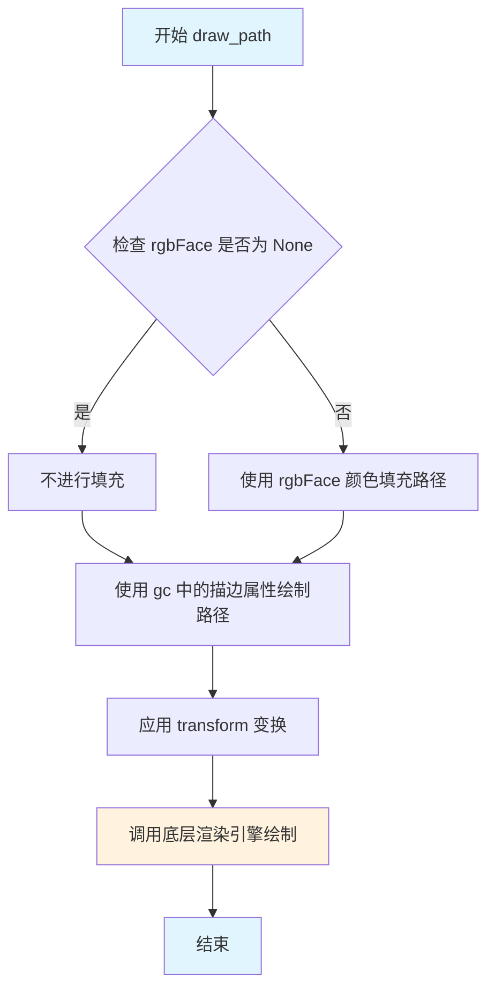

#### 带注释源码

```python
def draw_path(self, gc, path, transform, rgbFace=None):
    """
    Draw a `~.path.Path` instance using the given affine transform.
    
    Parameters
    ----------
    gc : GraphicsContextBase
        图形上下文，包含当前的绘制状态（颜色、线宽、线型等）
    path : Path
        要绘制的路径对象，包含顶点的_codes信息定义如何连接这些顶点
    transform : Transform
        仿射变换矩阵，用于将路径坐标从数据坐标变换到显示坐标
    rgbFace : color, optional
        填充颜色。如果为None，则路径不被填充（仅描边）
    
    Returns
    -------
    None
        抽象方法，由子类实现具体绘制逻辑
    
    Notes
    -----
    这是一个抽象方法（primitive），必须由具体的后端类（如 Agg、SVG、PDF 等）
    实现才能进行实际渲染。实现时需要：
    1. 从 gc 中获取当前描边颜色、线宽、线型等属性
    2. 应用 transform 将 path 顶点变换到目标坐标系
    3. 如果 rgbFace 不为 None，使用该颜色填充路径
    4. 调用底层图形库或API完成绘制
    """
    # 基类实现为抽象方法，抛出 NotImplementedError
    # 具体后端（如 backend_agg.BackendAgg）会override此方法
    raise NotImplementedError
```


### RendererBase.draw_markers

在每个指定路径顶点处绘制标记符号的基类实现，通过迭代路径的线段并对每个顶点调用 draw_path 方法来绘制标记，支持自定义标记形状、变换和填充颜色。

参数：

- `gc`：`.GraphicsContextBase`，图形上下文，用于管理绘制属性如颜色、线宽等
- `marker_path`：`~matplotlib.path.Path`，标记的路径对象，定义标记的形状
- `marker_trans`：`~matplotlib.transforms.Transform`，应用于标记的仿射变换
- `path`：`~matplotlib.path.Path`，目标路径，指定在哪些位置绘制标记
- `trans`：`~matplotlib.transforms.Transform`，应用于路径的仿射变换
- `rgbFace`：`color`，可选，标记的填充颜色

返回值：`None`，该方法直接执行绘制操作，无返回值

#### 流程图

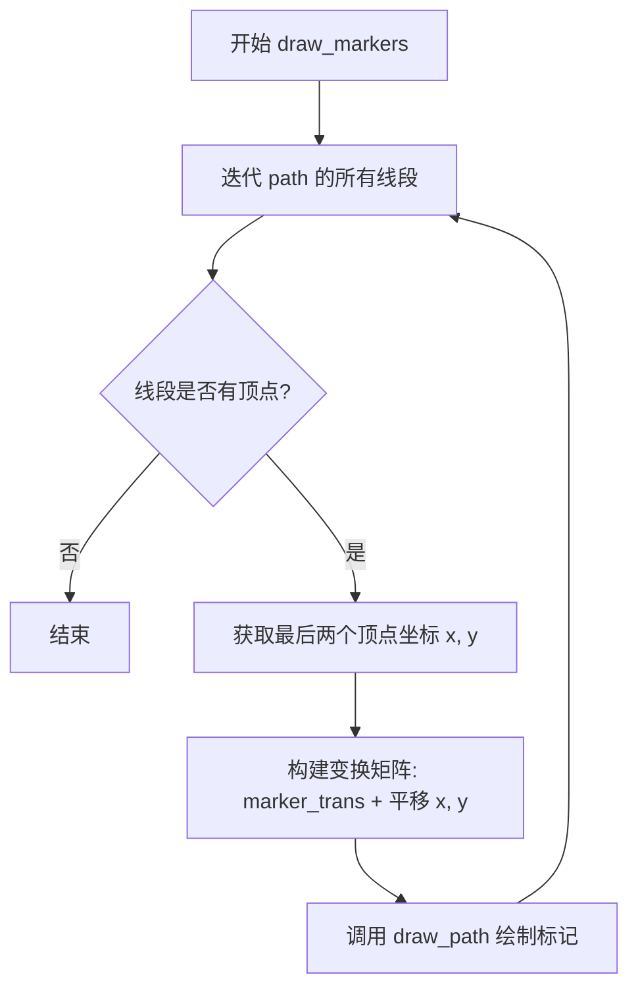

#### 带注释源码

```python
def draw_markers(self, gc, marker_path, marker_trans, path,
                 trans, rgbFace=None):
    """
    Draw a marker at each of *path*'s vertices (excluding control points).

    The base (fallback) implementation makes multiple calls to `draw_path`.
    Backends may want to override this method in order to draw the marker
    only once and reuse it multiple times.

    Parameters
    ----------
    gc : `.GraphicsContextBase`
        The graphics context.
    marker_path : `~matplotlib.path.Path`
        The path for the marker.
    marker_trans : `~matplotlib.transforms.Transform`
        An affine transform applied to the marker.
    path : `~matplotlib.path.Path`
        The locations to draw the markers.
    trans : `~matplotlib.transforms.Transform`
        An affine transform applied to the path.
    rgbFace : :mpltype:`color`, optional
    """
    # 迭代路径的每个线段，simplify=False 保持路径原样不简化
    for vertices, codes in path.iter_segments(trans, simplify=False):
        # 检查线段是否有顶点
        if len(vertices):
            # 获取最后两个顶点坐标（用于绘制标记）
            x, y = vertices[-2:]
            # 构建组合变换：标记变换 + 平移到目标位置
            # marker_trans 定义标记的初始形状和旋转
            # Affine2D().translate(x, y) 将标记移动到路径顶点位置
            self.draw_path(gc, marker_path,
                           marker_trans +
                           transforms.Affine2D().translate(x, y),
                           rgbFace)
```


### RendererBase.draw_path_collection

该方法是RendererBase类的核心绘制方法之一，用于批量绘制路径集合。它通过应用变换矩阵和偏移量，对多个路径进行渲染，支持不同的填充色、边框色、线宽、线型等属性设置。基类实现通过多次调用draw_path来完成任务，子类可以重写此方法以优化性能。

参数：

- `gc`：`GraphicsContextBase`，图形上下文，包含颜色、线型等渲染属性
- `master_transform`：`Transform`，应用于所有路径的主变换矩阵
- `paths`：`list[Path]`，要绘制的路径对象列表
- `all_transforms`：`list[ndarray]`，每个路径对应的变换矩阵列表（3x3矩阵）
- `offsets`：`array-like`，路径的偏移量数组
- `offset_trans`：`Transform`，偏移量的变换器
- `facecolors`：`list`，填充颜色列表
- `edgecolors`：`list`，边框颜色列表
- `linewidths`：`list`，线宽列表
- `linestyles`：`list`，线型列表
- `antialiaseds`：`list`，抗锯齿设置列表
- `urls`：`list`，URL列表（用于SVG后端）
- `offset_position`：`str`，偏移位置（当前未使用，为保持向后兼容而保留）
- `hatchcolors`：`list`，可选，阴影颜色列表（3.11版本新增）

返回值：`None`，该方法直接在画布上绘制图形，无返回值

#### 流程图

```mermaid
flowchart TD
    A[开始 draw_path_collection] --> B[调用 _iter_collection_raw_paths 获取路径ID]
    B --> C{hatchcolors 为 None?}
    C -->|是| D[设置 hatchcolors = []]
    C -->|否| E[保持原有 hatchcolors]
    D --> F[调用 _iter_collection 遍历路径集合]
    E --> F
    F --> G{遍历结果}
    G -->|获取到数据| H[解包 path_id 获取 path 和 transform]
    H --> I{偏移量 xo, yo 不全为0?}
    I -->|是| J[复制变换矩阵 frozen()]
    J --> K[应用平移 translate]
    I -->|否| L[使用原始 transform]
    K --> M[调用 draw_path 绘制]
    L --> M
    M --> G
    G -->|遍历结束| N[结束]
```

#### 带注释源码

```python
def draw_path_collection(self, gc, master_transform, paths, all_transforms,
                         offsets, offset_trans, facecolors, edgecolors,
                         linewidths, linestyles, antialiaseds, urls,
                         offset_position, *, hatchcolors=None):
    """
    Draw a collection of *paths*.
    
    每个路径首先通过 all_transforms 中对应的条目进行变换（3x3矩阵列表），
    然后通过 master_transform 进行变换。接着通过 offsets 中对应的条目
    进行平移，offsets 已经过 offset_trans 变换。
    
    facecolors, edgecolors, linewidths, linestyles, antialiased 和 hatchcolors
    是用于设置相应属性的列表。
    
    .. versionadded:: 3.11
        允许指定 hatchcolors。
    
    offset_position 当前未使用，但为保持向后兼容而保留参数。
    
    基类实现多次调用 draw_path，子类可以重写此方法以优化性能。
    """
    # 第一步：获取所有路径ID（路径+变换的组合）
    # 使用生成器方法_iter_collection_raw_paths获取所有基础路径/变换组合
    path_ids = self._iter_collection_raw_paths(master_transform,
                                               paths, all_transforms)

    # 处理可选的hatchcolors参数
    if hatchcolors is None:
        hatchcolors = []

    # 第二步：遍历路径集合，获取每个实例的属性和位置信息
    for xo, yo, path_id, gc0, rgbFace in self._iter_collection(
            gc, list(path_ids), offsets, offset_trans,
            facecolors, edgecolors, linewidths, linestyles,
            antialiaseds, urls, offset_position, hatchcolors=hatchcolors):
        # 从path_id中解包路径对象和变换矩阵
        path, transform = path_id
        
        # 仅当存在偏移时应用额外的平移变换
        # 否则复用初始变换（避免不必要的矩阵复制）
        if xo != 0 or yo != 0:
            # translate是原地操作，需要通过.frozen()复制变换矩阵
            # 再应用平移，避免影响其他路径使用同一变换
            transform = transform.frozen()
            transform.translate(xo, yo)
        
        # 调用底层draw_path方法完成绘制
        # gc0是已配置好颜色、线宽等属性的图形上下文
        # rgbFace是用于填充的颜色
        self.draw_path(gc0, path, transform, rgbFace)
```


### RendererBase.draw_quad_mesh

绘制 quadmesh（网格），用于渲染矩形网格数据。该方法是基类的回退实现，将 quadmesh 转换为路径，然后调用 `draw_path_collection` 完成实际绘制。

参数：

- `gc`：`GraphicsContextBase`，图形上下文，包含渲染状态如颜色、线宽等
- `master_transform`：`~matplotlib.transforms.Transform`，应用于所有路径的主仿射变换
- `meshWidth`：整数，网格的列数（宽度方向上的单元数量）
- `meshHeight`：整数，网格的行数（高度方向上的单元数量）
- `coordinates`：数组，网格顶点的坐标数据
- `offsets`：数组，每个网格单元的偏移量
- `offsetTrans`：`~matplotlib.transforms.Transform`，应用于 offsets 的变换
- `facecolors`：数组或颜色值，网格单元的填充颜色
- `antialiased`：布尔值，是否启用抗锯齿
- `edgecolors`：数组或颜色值，可选，网格单元的边缘颜色，默认为 None

返回值：`None`，该方法通过调用 `draw_path_collection` 产生副作用完成绘制，无显式返回值

#### 流程图

```mermaid
flowchart TD
    A[开始 draw_quad_mesh] --> B{edgecolors is None?}
    B -->|是| C[edgecolors = facecolors]
    B -->|否| D[保持 edgecolors 不变]
    C --> E[获取线宽数组: linewidths = np.array([gc.get_linewidth], float)]
    D --> E
    E --> F[调用 QuadMesh._convert_mesh_to_paths 转换为路径]
    F --> G[调用 draw_path_collection 渲染路径集合]
    G --> H[结束]
```

#### 带注释源码

```python
def draw_quad_mesh(self, gc, master_transform, meshWidth, meshHeight,
                   coordinates, offsets, offsetTrans, facecolors,
                   antialiased, edgecolors):
    """
    Draw a quadmesh.

    The base (fallback) implementation converts the quadmesh to paths and
    then calls `draw_path_collection`.
    """

    # 从 matplotlib.collections 导入 QuadMesh 类，用于网格转换
    from matplotlib.collections import QuadMesh
    
    # 将 quadmesh 的坐标数据转换为路径对象列表
    # 这是将网格数据标准化为可绘制路径的关键步骤
    paths = QuadMesh._convert_mesh_to_paths(coordinates)

    # 如果未指定边缘颜色，则使用填充颜色作为边缘颜色
    if edgecolors is None:
        edgecolors = facecolors
    
    # 从图形上下文获取当前线宽，并转换为 numpy 数组格式
    # 使用单元素数组确保与 draw_path_collection 的接口兼容
    linewidths = np.array([gc.get_linewidth()], float)

    # 调用 draw_path_collection 完成实际绘制
    # 参数说明：
    # - gc: 图形上下文
    # - master_transform: 主变换
    # - paths: 转换后的路径列表
    # - []: 空列表表示无额外的变换矩阵
    # - offsets: 偏移量数组
    # - offsetTrans: 偏移变换
    # - facecolors: 填充颜色
    # - edgecolors: 边缘颜色
    # - linewidths: 线宽数组
    # - []: 空列表表示无线型
    # - [antialiased]: 抗锯齿标志列表
    # - [None]: URL 列表（此处为 None）
    # - 'screen': 偏移位置模式
    return self.draw_path_collection(
        gc, master_transform, paths, [], offsets, offsetTrans, facecolors,
        edgecolors, linewidths, [], [antialiased], [None], 'screen')
```


### RendererBase.draw_gouraud_triangles

该方法是RendererBase类的抽象方法，用于绘制一系列Gouraud三角形（一种通过顶点颜色插值实现平滑着色效果的三角形）。它接受三角形顶点数组、颜色数组和仿射变换作为参数，将指定的三角形数组绘制到画布上，并应用颜色插值和空间变换。此方法是Matplotlib渲染器的必须实现方法之一，子类需要提供具体实现。

参数：

- `self`：`RendererBase`，类的实例本身
- `gc`：`GraphicsContextBase`，图形上下文，包含绘制状态（如颜色、线宽等）
- `triangles_array`：`array-like`，形状为(N, 3, 2)的数组，包含N个三角形的(x, y)顶点坐标
- `colors_array`：`array-like`，形状为(N, 3, 4)的数组，包含N个三角形的RGBA颜色值，每个三角形有3个顶点颜色
- `transform`：`Transform`，仿射变换对象，用于对三角形顶点进行空间变换

返回值：`None`，该方法为抽象方法，默认实现抛出NotImplementedError，子类需要重写此方法来实现具体的Gouraud三角形绘制功能

#### 流程图

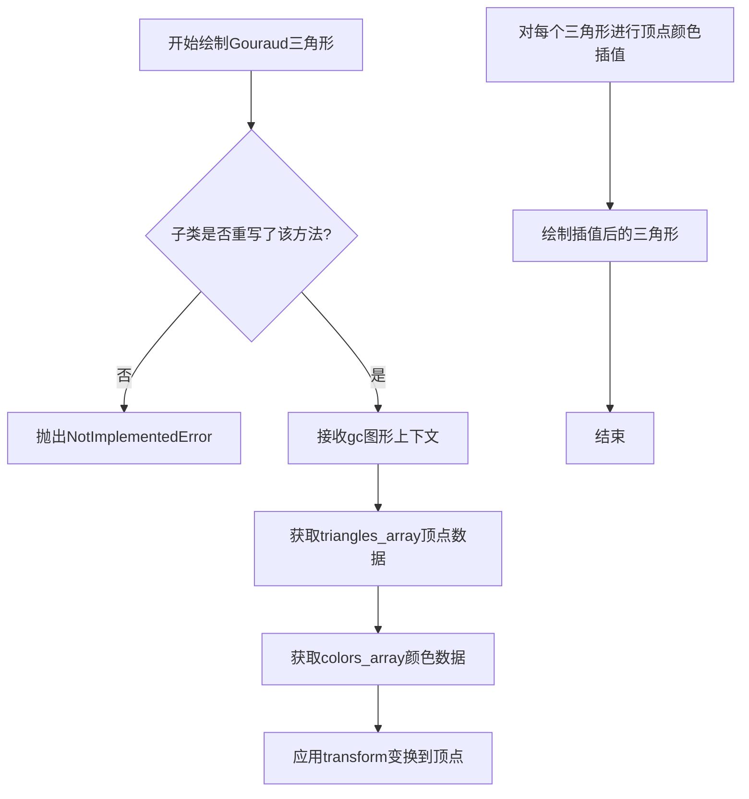

#### 带注释源码

```python
def draw_gouraud_triangles(self, gc, triangles_array, colors_array,
                           transform):
    """
    Draw a series of Gouraud triangles.

    Parameters
    ----------
    gc : `.GraphicsContextBase`
        The graphics context.  # 图形上下文，包含绘制状态如颜色、线宽等
    triangles_array : (N, 3, 2) array-like
        Array of *N* (x, y) points for the triangles.  # N个三角形的顶点坐标数组
    colors_array : (N, 3, 4) array-like
        Array of *N* RGBA colors for each point of the triangles.  # 每个顶点的RGBA颜色
    transform : `~matplotlib.transforms.Transform`
        An affine transform to apply to the points.  # 应用到顶点的仿射变换
    """
    # 抽象方法，子类必须实现此方法
    # Gouraud着色是一种通过顶点颜色线性插值实现平滑过渡的着色方法
    raise NotImplementedError
```


### RendererBase.draw_image

该方法是 RendererBase 类的抽象方法，用于在画布上绘制 RGBA 图像。它定义了绘制图像的接口，具体实现由子类（如 Agg、PDF、SVG 等后端）提供。

参数：

- `gc`：`.GraphicsContextBase`，包含剪裁信息的图形上下文
- `x`：`float`，图像左侧边缘相对于画布左侧的物理单位（点或像素）距离
- `y`：`float`，图像底部边缘相对于画布底部的物理单位（点或像素）距离
- `im`：`numpy.ndarray`，形状为 (N, M, 4) 的 `numpy.uint8` 数组，表示 RGBA 像素数据
- `transform`：`~matplotlib.transforms.Affine2DBase`，可选参数，仅当后端的 `option_scale_image` 返回 True 时才可使用，表示在绘制前应用于图像的仿射变换

返回值：`None`，该方法为抽象方法，具体实现由子类完成

#### 流程图

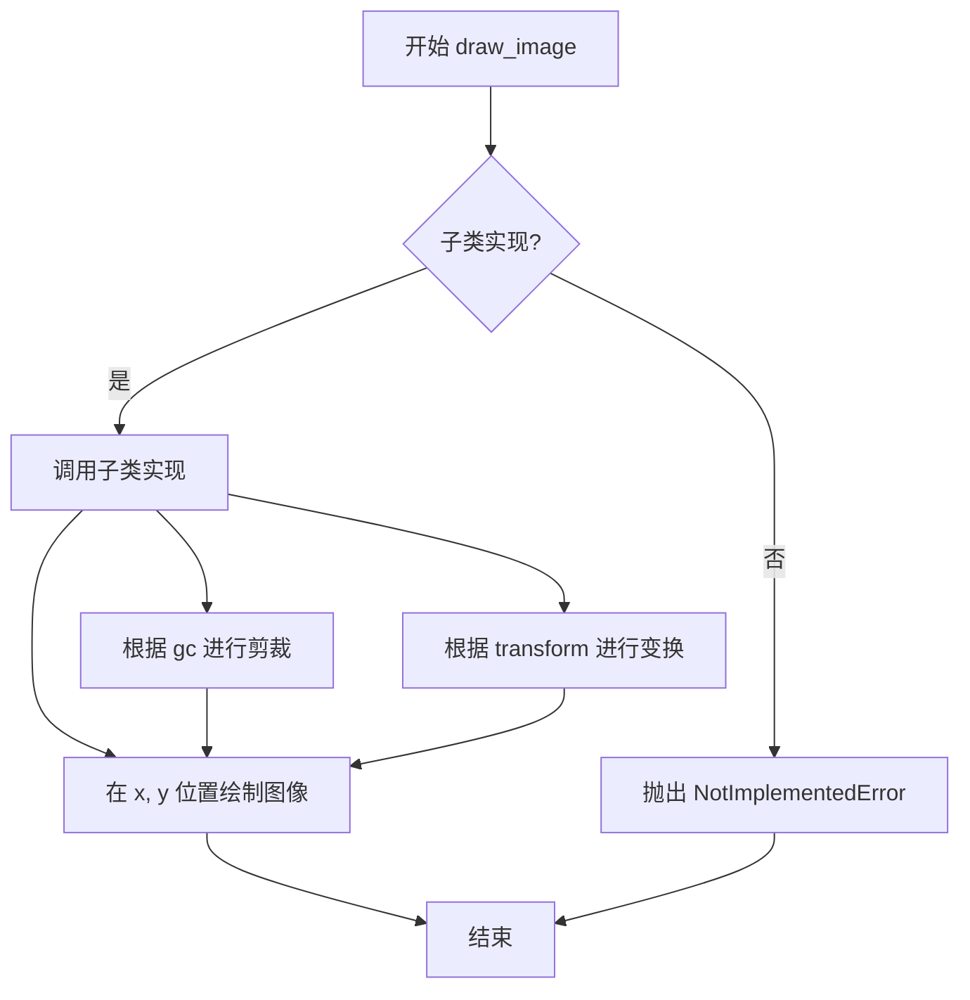

#### 带注释源码

```python
def draw_image(self, gc, x, y, im, transform=None):
    """
    Draw an RGBA image.

    Parameters
    ----------
    gc : `.GraphicsContextBase`
        A graphics context with clipping information.

    x : float
        The distance in physical units (i.e., dots or pixels) from the left
        hand side of the canvas.

    y : float
        The distance in physical units (i.e., dots or pixels) from the
        bottom side of the canvas.

    im : (N, M, 4) array of `numpy.uint8`
        An array of RGBA pixels.

    transform : `~matplotlib.transforms.Affine2DBase`
        If and only if the concrete backend is written such that
        `~.RendererBase.option_scale_image` returns ``True``, an affine
        transformation (i.e., an `.Affine2DBase`) *may* be passed to
        `~.RendererBase.draw_image`.  The translation vector of the
        transformation is given in physical units (i.e., dots or pixels).
        Note that the transformation does not override *x* and *y*,
        and has to be applied *before* translatingthe result by
        *x* and *y* (this can be accomplished by adding *x*
        and *y* to the translation vector defined by *transform*).
    """
    # 抽象方法，抛出未实现错误，要求子类重写此方法
    raise NotImplementedError
```


### RendererBase.draw_tex

绘制一个 TeX 文本实例。该方法接收图形上下文、文本位置、文本字符串、字体属性和旋转角度等参数，将 TeX 文本渲染为路径并绘制到画布上。

参数：

- `gc`：`.GraphicsContextBase`，图形上下文，包含绘制状态如颜色、线宽等。
- `x`：`float`，文本在显示坐标系中的 x 位置。
- `y`：`float`，文本基线在显示坐标系中的 y 位置。
- `s`：`str`，要渲染的 TeX 文本字符串。
- `prop`：`~matplotlib.font_manager.FontProperties`，字体属性对象。
- `angle`：`float`，逆时针旋转角度（以度为单位）。
- `mtext`：`~matplotlib.text.Text`，可选参数，原始的 Text 对象。

返回值：`None`，该方法无返回值，直接在图形上下文中绘制内容。

#### 流程图

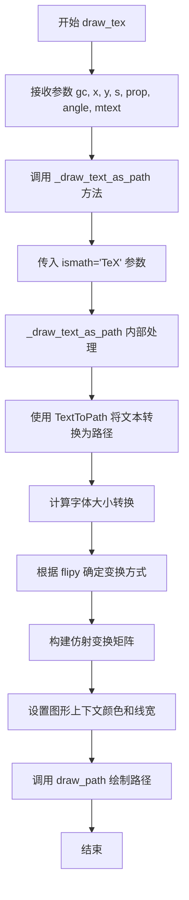

#### 带注释源码

```python
def draw_tex(self, gc, x, y, s, prop, angle, *, mtext=None):
    """
    Draw a TeX instance.

    Parameters
    ----------
    gc : `.GraphicsContextBase`
        The graphics context.
    x : float
        The x location of the text in display coords.
    y : float
        The y location of the text baseline in display coords.
    s : str
        The TeX text string.
    prop : `~matplotlib.font_manager.FontProperties`
        The font properties.
    angle : float
        The rotation angle in degrees anti-clockwise.
    mtext : `~matplotlib.text.Text`
        The original text object to be rendered.
    """
    # 调用内部方法 _draw_text_as_path，传入 ismath="TeX" 参数
    # 这会触发 TeX 渲染模式，将文本作为 TeX 公式处理
    self._draw_text_as_path(gc, x, y, s, prop, angle, ismath="TeX")
```


### `RendererBase.draw_text`

在指定的显示坐标位置绘制文本实例。该方法是 Matplotlib 渲染器的抽象基方法，接收图形上下文、坐标、文本字符串、字体属性、旋转角度等参数，并支持数学文本解析。基类实现通过调用内部方法 `_draw_text_as_path` 将文本转换为路径进行绘制。

参数：

- `gc`：`.GraphicsContextBase`，图形上下文，包含颜色、线宽等绘制属性
- `x`：`float`，文本在显示坐标系中的 x 位置
- `y`：`float`，文本基线在显示坐标系中的 y 位置
- `s`：`str`，要绘制的文本字符串
- `prop`：`~matplotlib.font_manager.FontProperties`，字体属性对象
- `angle`：`float`，逆时针旋转角度（度）
- `ismath`：`bool or "TeX"`，是否为数学文本模式，True 使用 mathtext 解析器，"TeX" 使用 TeX 渲染
- `mtext`：`~matplotlib.text.Text`，原始文本对象（可选）

返回值：`None`，该方法无返回值，直接在渲染器画布上绘制文本

#### 流程图

```mermaid
flowchart TD
    A[draw_text 开始] --> B{接收参数}
    B --> C[调用 _draw_text_as_path 方法]
    C --> D[_draw_text_as_path 内部处理]
    D --> E[获取 text2path 转换器]
    E --> F[将 font size 转换为像素]
    F --> G[调用 get_text_path 获取文本路径]
    G --> H[创建 Path 对象]
    H --> I{flipy 返回值}
    I -->|True| J[坐标系翻转处理<br/>height - y]
    I -->|False| K[正常坐标系]
    J --> L[构建变换矩阵<br/>scale rotate translate]
    K --> L
    L --> M[获取颜色 RGB]
    M --> N[设置线宽为 0]
    N --> O[调用 draw_path 绘制路径]
    O --> P[draw_text 结束]
```

#### 带注释源码

```python
def draw_text(self, gc, x, y, s, prop, angle, ismath=False, mtext=None):
    """
    Draw a text instance.

    Parameters
    ----------
    gc : `.GraphicsContextBase`
        The graphics context.
    x : float
        The x location of the text in display coords.
    y : float
        The y location of the text baseline in display coords.
    s : str
        The text string.
    prop : `~matplotlib.font_manager.FontProperties`
        The font properties.
    angle : float
        The rotation angle in degrees anti-clockwise.
    ismath : bool or "TeX"
        If True, use mathtext parser.
    mtext : `~matplotlib.text.Text`
        The original text object to be rendered.

    Notes
    -----
    **Notes for backend implementers:**

    `.RendererBase.draw_text` also supports passing "TeX" to the *ismath*
    parameter to use TeX rendering, but this is not required for actual
    rendering backends, and indeed many builtin backends do not support
    this.  Rather, TeX rendering is provided by `~.RendererBase.draw_tex`.
    """
    # 调用内部方法 _draw_text_as_path 进行实际的文本绘制
    # 该方法将文本转换为路径后调用 draw_path 进行渲染
    self._draw_text_as_path(gc, x, y, s, prop, angle, ismath)
```

---

### `RendererBase._draw_text_as_path`

私有辅助方法，负责将文本转换为路径并绘制的核心逻辑。该方法支持与 `draw_text` 相同的参数，并处理坐标系转换、字体缩放、旋转等变换操作。

参数：

- `gc`：`.GraphicsContextBase`，图形上下文
- `x`：`float`，文本 x 坐标
- `y`：`float`，文本 y 坐标
- `s`：`str`，文本字符串
- `prop`：`~matplotlib.font_manager.FontProperties`，字体属性
- `angle`：`float`，旋转角度
- `ismath`：`bool or "TeX"`，数学文本模式

返回值：`None`，无返回值

#### 流程图

```mermaid
flowchart TD
    A[_draw_text_as_path 开始] --> B[获取 self._text2path]
    B --> C[计算 fontsize 像素值<br/>points_to_pixels]
    C --> D[调用 get_text_path 获取路径数据<br/>verts, codes]
    D --> E[创建 Path 对象]
    E --> F{flipy 检查}
    F -->|True| G[获取 canvas 宽高]
    G --> H[构建翻转变换矩阵<br/>scale rotate translate<br/>y = height - y]
    F -->|False| I[构建正常变换矩阵<br/>scale rotate translate]
    H --> J[获取图形上下文颜色<br/>gc.get_rgb]
    I --> J
    J --> K[设置线宽为 0<br/>gc.set_linewidth 0.0]
    K --> L[调用 draw_path 绘制<br/>rgbFace=color]
    L --> M[结束]
```

#### 带注释源码

```python
def _draw_text_as_path(self, gc, x, y, s, prop, angle, ismath):
    """
    Draw the text by converting them to paths using `.TextToPath`.

    This private helper supports the same parameters as
    `~.RendererBase.draw_text`; setting *ismath* to "TeX" triggers TeX
    rendering.
    """
    # 获取文本转路径的转换器实例
    text2path = self._text2path
    
    # 将字体大小从磅转换为像素单位
    fontsize = self.points_to_pixels(prop.get_size_in_points())
    
    # 调用 TextToPath 获取文本的顶点坐标和绘制指令
    # verts: 顶点坐标数组
    # codes: 路径绘制指令（MoveTo, LineTo, CurveTo 等）
    verts, codes = text2path.get_text_path(prop, s, ismath=ismath)
    
    # 创建 Path 对象封装顶点数据和绘制指令
    path = Path(verts, codes)
    
    # 根据 flipy 状态决定坐标系处理方式
    # flipy=True 表示 y 轴从顶部向下增加（图像坐标系）
    if self.flipy():
        # 获取画布宽高用于坐标系转换
        width, height = self.get_canvas_width_height()
        
        # 构建变换矩阵：
        # 1. scale: 字体缩放
        # 2. rotate: 逆时针旋转
        # 3. translate: 平移（y 坐标需要翻转）
        transform = (Affine2D()
                     .scale(fontsize / text2path.FONT_SCALE)
                     .rotate_deg(angle)
                     .translate(x, height - y))
    else:
        # 正常坐标系下的变换矩阵构建
        transform = (Affine2D()
                     .scale(fontsize / text2path.FONT_SCALE)
                     .rotate_deg(angle)
                     .translate(x, y))
    
    # 从图形上下文获取当前前景色作为填充色
    color = gc.get_rgb()
    
    # 设置线宽为 0（文本填充绘制不需要轮廓线）
    gc.set_linewidth(0.0)
    
    # 调用 draw_path 方法绘制文本路径
    # rgbFace 参数指定填充颜色
    self.draw_path(gc, path, transform, rgbFace=color)
```


### `RendererBase.get_text_width_height_descent`

该方法用于获取文本字符串在显示坐标下的宽度、高度和下降量（从底部到基线的偏移量），支持普通文本、TeX 渲染和数学文本三种模式，是 Matplotlib 后端渲染系统中计算文本尺寸的核心方法。

#### 参数

- `s`：`str`，要测量尺寸的文本字符串
- `prop`：`~matplotlib.font_manager.FontProperties`，字体属性对象，包含字体大小、样式等信息
- `ismath`：`bool or "TeX"`，是否为数学文本模式；为 `True` 时使用 mathtext 解析器，为 `"TeX"` 时使用 TeX 渲染器

#### 返回值

- `tuple[float, float, float]`，返回宽度(width)、高度(height)和下降量(descent)，单位为显示坐标（像素）

#### 流程图

```mermaid
flowchart TD
    A[开始 get_text_width_height_descent] --> B[获取字体大小 in points]
    B --> C{ismath == 'TeX'?}
    C -->|Yes| D[调用 TexManager.get_text_width_height_descent]
    C -->|No| E{ismath is True?}
    E -->|Yes| F[调用 mathtext_parser.parse 获取尺寸]
    E -->|No| G[使用 TextToPath 获取字体尺寸]
    D --> H[返回 (width, height, descent)]
    F --> H
    G --> I[获取字体并设置大小]
    I --> J[调用 font.set_text 获取文本尺寸]
    J --> K[获取宽度、高度和下降量]
    K --> L[从子像素单位转换为标准像素]
    L --> H
```

#### 带注释源码

```python
def get_text_width_height_descent(self, s, prop, ismath):
    """
    Get the width, height, and descent (offset from the bottom to the baseline), in
    display coords, of the string *s* with `.FontProperties` *prop*.

    Whitespace at the start and the end of *s* is included in the reported width.
    """
    # 获取字体大小（以点为单位）
    fontsize = prop.get_size_in_points()

    # 模式1：TeX 渲染模式
    if ismath == 'TeX':
        # 注意：此处未处理字体属性（todo 注释）
        # 调用 TexManager 的方法获取 TeX 文本尺寸
        return self.get_texmanager().get_text_width_height_descent(
            s, fontsize, renderer=self)

    # 将点数转换为显示单位（像素）的 DPI 比例
    dpi = self.points_to_pixels(72)
    
    # 模式2：数学文本模式（使用 mathtext）
    if ismath:
        # 使用 mathtext 解析器解析数学文本
        dims = self._text2path.mathtext_parser.parse(s, dpi, prop)
        # 返回宽度、高度和下降量
        return dims[0:3]  # return width, height, descent

    # 模式3：普通文本模式
    # 获取字体渲染的 hinting 标志
    flags = self._text2path._get_hinting_flag()
    # 根据字体属性获取对应的字体对象
    font = self._text2path._get_font(prop)
    # 设置字体的尺寸和 DPI
    font.set_size(fontsize, dpi)
    # 获取未旋转字符串的宽度和高度
    # 参数 0.0 表示获取字形的自然宽度（不考虑任何旋转）
    font.set_text(s, 0.0, flags=flags)
    w, h = font.get_width_height()
    d = font.get_descent()
    # 字体的宽度、高度和下降量使用 26.6 固定 point 格式
    # （即 64 个子像素为单位），需要转换为标准浮点数
    w /= 64.0  # convert from subpixels
    h /= 64.0
    d /= 64.0
    # 返回宽度、高度和下降量的元组
    return w, h, d
```


### `RendererBase.flipy`

该方法用于返回当前渲染器的Y轴坐标方向，指示y值是否从顶部到底部递增（大多数屏幕坐标系中y值向上为正，但某些后端可能使用相反的坐标系统）。此方法主要影响文本绘制时的坐标转换逻辑。

参数：

- 该方法无显式参数（仅包含隐式参数 `self`）

返回值：`bool`，返回 `True` 表示y值从顶部到底部递增（默认的屏幕坐标系），返回 `False` 表示y值从底部到顶部递增（数据坐标系）。

#### 流程图

```mermaid
flowchart TD
    A[调用 flipy 方法] --> B{检查渲染器Y轴方向}
    B -->|默认情况| C[返回 True]
    B -->|某些后端覆盖| D[返回 False]
    C --> E[文本绘制时使用 height - y 变换]
    D --> F[文本绘制时直接使用 y 坐标]
    E --> G[完成]
    F --> G
```

#### 带注释源码

```python
def flipy(self):
    """
    Return whether y values increase from top to bottom.

    Note that this only affects drawing of texts.
    """
    return True
```

**源码解析：**

- **方法名称**：`flipy`
- **所属类**：`RendererBase`
- **功能说明**：该方法是 `RendererBase` 类中的一个简单查询方法，用于通知调用者当前渲染器是否采用了"翻转"的Y轴坐标系。在标准的屏幕坐标系中，原点位于左上角，Y值向下增加；但在数学/数据坐标系中，原点通常位于左下角，Y值向上增加。Matplotlib 的渲染器需要知道这一点以便正确地将文本放置在目标位置。
- **返回值**：`True`（默认）- 表示当前使用屏幕坐标系（y值从顶部向底部增加）；子类可以重写此方法以返回 `False`，表示使用数据坐标系。
- **调用场景**：主要在 `_draw_text_as_path` 方法中被调用，用于决定文本的 Y 轴变换方式。当 `flipy()` 返回 `True` 时，文本的 y 坐标需要相对于画布高度进行翻转（即使用 `height - y`）；当返回 `False` 时，直接使用原始 y 坐标。


### `RendererBase.get_canvas_width_height`

该方法是 `RendererBase` 类的默认实现，用于返回画布的宽度和高度（以显示坐标为单位）。这是一个抽象基类方法，子类通常会重写它以返回实际画布的尺寸。

参数： 无

返回值：`tuple[int, int]`，返回画布宽度和高度（默认返回 `1, 1`）

#### 流程图

```mermaid
flowchart TD
    A[开始] --> B[返回元组 (1, 1)]
    B --> C[结束]
```

#### 带注释源码

```python
def get_canvas_width_height(self):
    """
    Return the canvas width and height in display coords.
    
    这个方法是一个抽象基类的默认实现，返回 (1, 1)。
    子类应该重写此方法以返回实际的画布尺寸（以显示坐标为单位）。
    显示坐标通常与像素坐标相关，但可能因后端而异。
    
    Returns
    -------
    tuple[int, int]
        画布的宽度和高度，默认值为 (1, 1)。
    """
    return 1, 1
```


### RendererBase.get_texmanager

获取当前渲染器的 TeX 管理器实例。如果尚未创建 TeX 管理器，则延迟初始化并返回一个 TexManager 实例；否则返回缓存的实例。

参数：

- 该方法无显式参数（`self` 为隐式参数，表示 RendererBase 实例）

返回值：`TexManager`，返回与该渲染器关联的 TexManager 实例，用于处理 TeX 文本渲染。

#### 流程图

```mermaid
flowchart TD
    A[开始: get_texmanager] --> B{self._texmanager 是否为 None?}
    B -- 是 --> C[创建新的 TexManager 实例]
    C --> D[将新实例赋值给 self._texmanager]
    D --> E[返回 self._texmanager]
    B -- 否 --> E
    E --> F[结束: 返回 TexManager 实例]
```

#### 带注释源码

```python
def get_texmanager(self):
    """
    Return the `.TexManager` instance.
    
    该方法实现延迟初始化模式（Lazy Initialization）：
    仅在首次调用时创建 TexManager 实例，后续调用直接返回缓存的实例，
    从而避免重复创建相同的资源，提高性能。
    """
    # 检查是否已存在缓存的 TeX 管理器实例
    if self._texmanager is None:
        # 首次调用，创建新的 TexManager 实例
        self._texmanager = TexManager()
    # 返回缓存的或新创建的 TeX 管理器实例
    return self._texmanager
```


### `RendererBase.new_gc`

该方法是 `RendererBase` 类的工厂方法，用于创建并返回一个 `GraphicsContextBase` 实例，供渲染操作使用。

参数：

- 该方法无参数（除隐式 `self`）

返回值：`GraphicsContextBase`，返回一个图形上下文基类实例，用于处理绘制时的颜色、线型等属性。

#### 流程图

```mermaid
flowchart TD
    A[调用 new_gc] --> B{是否已有 gc 实例}
    B -- 否 --> C[创建新 GraphicsContextBase 实例]
    B -- 是 --> D[返回现有实例]
    C --> E[返回新创建的 GraphicsContextBase 实例]
    D --> E
```

#### 带注释源码

```python
def new_gc(self):
    """
    Return an instance of a `.GraphicsContextBase`.
    
    该方法是一个工厂方法，用于创建 GraphicsContextBase 对象。
    在绘制路径集合（draw_path_collection）等场景中会被调用，
    以获取独立的图形上下文来设置不同的绘制属性（如颜色、线宽等）。
    
    Returns
    -------
    GraphicsContextBase
        图形上下文基类的新实例
    """
    return GraphicsContextBase()
```


### `RendererBase.points_to_pixels`

将点数（points）转换为显示单位（像素）的抽象方法。子类后端应重写此方法以实现基于 DPI 的转换，默认实现仅返回原值。

参数：

- `points`：`float or array-like`，要转换的点数

返回值：`float or array-like`，转换后的像素值

#### 流程图

```mermaid
flowchart TD
    A[输入: points] --> B{子类是否重写?}
    -->|是| C[使用子类的DPI相关转换逻辑]
    --> D[输出: 转换后的像素值]
    --> E[结束]
    B -->|否| F[直接返回原值]
    --> E
```

#### 带注释源码

```python
def points_to_pixels(self, points):
    """
    Convert points to display units.

    You need to override this function (unless your backend
    doesn't have a dpi, e.g., postscript or svg).  Some imaging
    systems assume some value for pixels per inch::

        points to pixels = points * pixels_per_inch/72 * dpi/72

    Parameters
    ----------
    points : float or array-like

    Returns
    -------
    Points converted to pixels
    """
    # 默认实现：直接返回输入值，不做任何转换
    # 子类（如 agg、pdf 等）应重写此方法以实现基于 DPI 的转换
    return points
```


### RendererBase.start_rasterizing

切换到光栅渲染器。该方法由 `.MixedModeRenderer` 使用，用于在混合渲染模式下启用光栅化功能。

参数：

- 无参数（仅包含 `self` 实例参数）

返回值：`None`，无返回值

#### 流程图

```mermaid
flowchart TD
    A[开始 start_rasterizing] --> B{检查渲染器状态}
    B --> C[设置 _rasterizing = True]
    C --> D[增加 _raster_depth 计数]
    D --> E[切换到底层光栅渲染器]
    E --> F[返回 None]
    F --> G[结束]
    
    style A fill:#f9f,stroke:#333
    style F fill:#9f9,stroke:#333
    style G fill:#9f9,stroke:#333
```

#### 带注释源码

```python
def start_rasterizing(self):
    """
    Switch to the raster renderer.

    Used by `.MixedModeRenderer`.
    """
    # 标记当前正在进行光栅化渲染
    self._rasterizing = True
    
    # 增加光栅化深度计数，用于管理嵌套的渲染模式切换
    self._raster_depth += 1
    
    # 注意：具体的后端实现会重写此方法以执行实际的渲染器切换逻辑
    # 基类中的实现为空（pass），由子类如 MixedModeRenderer 提供具体功能
```

---

**补充说明**：

- **方法类型**：抽象方法（基类中仅提供接口，无实际实现）
- **调用场景**：由 `MixedModeRenderer` 在需要启用光栅化渲染时调用
- **相关字段**：
  - `_rasterizing`：`bool` 类型，标记当前是否处于光栅化模式
  - `_raster_depth`：`int` 类型，记录光栅化嵌套深度
- **配对使用**：通常与 `stop_rasterizing()` 方法成对调用，用于在矢量渲染和光栅渲染之间切换


### `RendererBase.stop_rasterizing`

该方法用于将渲染器从光栅模式切换回矢量模式，并将光栅渲染器的内容作为图像绘制到矢量渲染器上，由 `.MixedModeRenderer` 使用。

参数：无

返回值：无返回值（`None`）

#### 流程图

```mermaid
flowchart TD
    A[开始 stop_rasterizing] --> B{是否是 MixedModeRenderer 的子类}
    B -->|是| C[执行实际的停止光栅化操作]
    B -->|否| D[方法为空实现]
    C --> E[结束]
    D --> E
    
    style A fill:#f9f,stroke:#333
    style C fill:#9f9,stroke:#333
    style E fill:#9f9,stroke:#333
```

#### 带注释源码

```python
def stop_rasterizing(self):
    """
    Switch back to the vector renderer and draw the contents of the raster
    renderer as an image on the vector renderer.

    Used by `.MixedModeRenderer`.
    """
    # 该方法是 RendererBase 的抽象方法，
    # 实际实现由子类 MixedModeRenderer 提供
    # 当调用此方法时，表示结束光栅化渲染阶段，
    # 将之前累积的光栅内容绘制为图像并切换回矢量渲染模式
    pass
```


### `RendererBase.start_filter`

该方法用于切换到临时渲染器以进行图像滤镜效果，目前仅由 agg 渲染器支持。

参数：

- 无参数

返回值：`None`，无返回值

#### 流程图

```mermaid
flowchart TD
    A[调用 start_filter 方法] --> B{检查是否需要滤镜渲染}
    B -->|是| C[子类实现具体滤镜切换逻辑]
    B -->|否| D[基类中无操作,直接返回]
    C --> E[返回 None]
    D --> E
```

#### 带注释源码

```python
def start_filter(self):
    """
    切换到用于图像滤镜效果的临时渲染器。

    目前仅由 agg 渲染器支持。
    
    Notes
    -----
    此方法在 RendererBase 基类中为空实现（pass），
    具体的滤镜渲染逻辑由子类（如 backend_agg）实现。
    当调用此方法时，渲染器会切换到支持滤镜的临时渲染模式，
    允许对图像应用各种滤镜效果（如模糊、锐化等）。
    """
    # 基类中未实现具体逻辑，仅作为接口定义
    # 子类（如 AGGRenderer）需重写此方法以实现实际的滤镜切换功能
    pass
```


### `RendererBase.stop_filter`

切换回原始渲染器。临时渲染器的内容使用 `filter_func` 处理后作为图像绘制在原始渲染器上。目前仅由 agg 渲染器支持。

参数：

- `filter_func`：`callable`，处理临时渲染器内容的过滤器函数

返回值：`None`，无返回值

#### 流程图

```mermaid
flowchart TD
    A[开始 stop_filter] --> B{是否有 filter_func}
    B -->|是| C[使用 filter_func 处理临时渲染器内容]
    B -->|否| D[不使用过滤直接返回]
    C --> E[将处理后的图像绘制到原始渲染器]
    E --> F[结束]
    D --> F
```

#### 带注释源码

```python
def stop_filter(self, filter_func):
    """
    Switch back to the original renderer.  The contents of the temporary
    renderer is processed with the *filter_func* and is drawn on the
    original renderer as an image.

    Currently only supported by the agg renderer.
    """
    # 注意：RendererBase 基类中此方法为抽象方法，
    # 具体实现由支持图像过滤的渲染器（如 Agg）提供
    # 参数 filter_func 是回调函数，用于处理临时渲染器中的图像数据
    # 处理完成后，结果图像被绘制回原始渲染器
```


### `RendererBase._iter_collection_raw_paths`

该方法是一个内存高效的辅助方法，与 `_iter_collection` 配合实现 `draw_path_collection` 功能。它遍历所有路径和变换的组合，为每个路径-变换对生成可复用的对象，供后端在绘制路径集合时使用。

参数：

- `master_transform`：`~matplotlib.transforms.Affine2D`，主变换矩阵，应用于所有路径的基础变换
- `paths`：`list[~matplotlib.path.Path]`，要绘制的路径对象列表
- `all_transforms`：`list[ndarray]`，与路径对应的变换矩阵列表，每个元素为 (3, 3) 的仿射变换矩阵

返回值：`Generator[tuple[Path, Affine2D], None, None]`，生成器，yield 出 (path, transform) 元组，其中 path 是原始路径对象，transform 是该路径对应的最终变换矩阵

#### 流程图

```mermaid
flowchart TD
    A[开始 _iter_collection_raw_paths] --> B[计算 Npaths = len(paths)]
    B --> C[计算 Ntransforms = len(all_transforms)]
    C --> D[N = max(Npaths, Ntransforms)]
    D --> E{检查 Npaths == 0?}
    E -->|是| F[直接返回，结束]
    E -->|否| G[初始化 transform = IdentityTransform]
    G --> H[循环 for i in range(N)]
    H --> I[获取当前路径: path = paths[i % Npaths]]
    I --> J{检查 Ntransforms > 0?}
    J -->|是| K[获取当前变换: transform = Affine2D(all_transforms[i % Ntransforms])]
    J -->|否| L[保持 IdentityTransform]
    K --> M[计算最终变换: combined = transform + master_transform]
    L --> M
    M --> N[yield (path, combined)]
    N --> O{循环是否结束?}
    O -->|否| H
    O -->|是| P[结束]
```

#### 带注释源码

```python
def _iter_collection_raw_paths(self, master_transform, paths,
                               all_transforms):
    """
    Helper method (along with `_iter_collection`) to implement
    `draw_path_collection` in a memory-efficient manner.

    This method yields all of the base path/transform combinations, given a
    master transform, a list of paths and list of transforms.

    The arguments should be exactly what is passed in to
    `draw_path_collection`.

    The backend should take each yielded path and transform and create an
    object that can be referenced (reused) later.
    """
    # 获取路径数量
    Npaths = len(paths)
    # 获取变换矩阵数量
    Ntransforms = len(all_transforms)
    # 取两者最大值作为迭代次数，处理路径和变换数量不一致的情况
    N = max(Npaths, Ntransforms)

    # 如果没有路径，直接返回，避免后续除零错误
    if Npaths == 0:
        return

    # 初始化默认变换为单位变换
    transform = transforms.IdentityTransform()
    
    # 遍历所有路径-变换组合
    for i in range(N):
        # 使用模运算实现路径的循环复用，处理路径数与变换数不同的情况
        path = paths[i % Npaths]
        # 如果有变换矩阵，则使用对应的变换；否则保持单位变换
        if Ntransforms:
            transform = Affine2D(all_transforms[i % Ntransforms])
        # 将当前变换与主变换组合，生成最终变换矩阵并yield
        yield path, transform + master_transform
```


### `RendererBase._iter_collection_uses_per_path`

该方法用于计算 `_iter_collection_raw_paths` 返回的每个原始路径对象在调用 `_iter_collection` 时会被使用的次数，旨在帮助后端在"内联使用路径"和"存储一次后重复使用"之间做出性能权衡决策。

参数：

- `self`：`RendererBase`，RendererBase 实例本身
- `paths`：`list`，要绘制的路径列表
- `all_transforms`：`list`，应用于路径的变换矩阵列表（每个元素为一个 (3, 3) 矩阵）
- `offsets`：`list`，路径的偏移量列表
- `facecolors`：`list`，填充颜色列表
- `edgecolors`：`list`，边框颜色列表

返回值：`int`，每个原始路径对象被使用的次数（向上取整）

#### 流程图

```mermaid
flowchart TD
    A[开始] --> B{paths 是否为空}
    B -->|是| C[返回 0]
    B -->|否| D{facecolors 和 edgecolors 是否都为空}
    D -->|是| C
    D -->|否| E[计算 Npath_ids = max len paths, len all_transforms]
    E --> F[计算 N = max Npath_ids, len offsets]
    F --> G[计算 uses_per_path = N + Npath_ids - 1 // Npath_ids]
    G --> H[返回 uses_per_path]
```

#### 带注释源码

```python
def _iter_collection_uses_per_path(self, paths, all_transforms,
                                   offsets, facecolors, edgecolors):
    """
    Compute how many times each raw path object returned by
    `_iter_collection_raw_paths` would be used when calling
    `_iter_collection`. This is intended for the backend to decide
    on the tradeoff between using the paths in-line and storing
    them once and reusing. Rounds up in case the number of uses
    is not the same for every path.
    """
    # 获取路径数量
    Npaths = len(paths)
    
    # 如果没有路径，或者 facecolors 和 edgecolors 都为空，则不需要绘制，返回 0
    if Npaths == 0 or len(facecolors) == len(edgecolors) == 0:
        return 0
    
    # 计算 path_ids 的数量，取路径数和变换数的最大值
    Npath_ids = max(Npath_ids, len(offsets))
    
    # 计算总元素数 N，取 path_ids 数和偏移数中的最大值
    N = max(Npath_ids, len(offsets))
    
    # 返回每个路径被使用的次数（向上取整）
    # 公式: (N + Npath_ids - 1) // Npath_ids 实现向上取整
    return (N + Npath_ids - 1) // Npath_ids
```


### RendererBase._iter_collection

`_iter_collection` 是 RendererBase 类的一个辅助方法（生成器），用于以内存高效的方式实现 `draw_path_collection`。该方法遍历所有路径、偏移量和图形上下文组合，为绘制路径集合生成所需的参数。每个 yielded 结果包含偏移量 (xo, yo)、路径标识符 path_id、图形上下文 gc 和填充颜色 rgbFace。

参数：

- `self`：隐式参数，RendererBase 实例本身
- `gc`：`GraphicsContextBase`，原始图形上下文，从中复制属性创建 gc0
- `path_ids`：list of arbitrary objects，由 `_iter_collection_raw_paths` 生成的路径标识符列表，后端使用这些对象来引用路径
- `offsets`：array-like，每个路径的偏移量坐标
- `offset_trans`：`Transform`，应用于偏移量的仿射变换
- `facecolors`：list，填充颜色列表
- `edgecolors`：list，边缘颜色列表
- `linewidths`：list，线宽列表
- `linestyles`：list，线型列表
- `antialiaseds`：list，抗锯齿设置列表
- `urls`：list，URL 链接列表
- `offset_position`：unused now, but the argument is kept for backwards compatibility
- `hatchcolors`：keyword-only list，阴影颜色列表

返回值：`Generator[Tuple[float, float, object, GraphicsContextBase, Optional[color]]]`，生成器 yielding 五元组 (xo, yo, path_id, gc0, fc)，其中：
- `xo`, `yo`：变换后的偏移量坐标
- `path_id`：路径标识符（path_ids 中的元素）
- `gc0`：复制了属性的图形上下文
- `fc`：填充颜色，若为全透明则可能为 None

#### 流程图

```mermaid
flowchart TD
    A[开始 _iter_collection] --> B{检查颜色和路径是否为空}
    B -->|是| C[直接返回]
    B -->|否| D[创建 gc0 并复制属性]
    D --> E[定义 cycle_or_default 辅助函数]
    E --> F[为所有输入创建循环迭代器]
    F --> G{遍历 N 次}
    G --> H{检查偏移量是否为有限值}
    H -->|否| G
    H -->|是| I{处理边缘颜色}
    I -->|有边缘颜色| J[设置线宽、线型、前景色]
    I -->|无边缘颜色| K[设置线宽为 0]
    J --> L{处理阴影颜色}
    K --> L
    L -->|有阴影颜色| M[设置阴影颜色]
    L -->|无阴影颜色| N[处理填充颜色]
    M --> N
    N -->|填充颜色全透明| O[设 fc 为 None]
    N -->|否则| P[保持 fc 不变]
    O --> Q[设置抗锯齿和 URL]
    P --> Q
    Q --> R[yield xo, yo, pathid, gc0, fc]
    R --> G
    G -->|遍历完成| S[恢复 gc0]
    S --> T[结束]
```

#### 带注释源码

```python
def _iter_collection(self, gc, path_ids, offsets, offset_trans, facecolors,
                     edgecolors, linewidths, linestyles,
                     antialiaseds, urls, offset_position, *, hatchcolors):
    """
    Helper method (along with `_iter_collection_raw_paths`) to implement
    `draw_path_collection` in a memory-efficient manner.

    This method yields all of the path, offset and graphics context
    combinations to draw the path collection.  The caller should already
    have looped over the results of `_iter_collection_raw_paths` to draw
    this collection.

    The arguments should be the same as that passed into
    `draw_path_collection`, with the exception of *path_ids*, which is a
    list of arbitrary objects that the backend will use to reference one of
    the paths created in the `_iter_collection_raw_paths` stage.

    Each yielded result is of the form::

       xo, yo, path_id, gc, rgbFace

    where *xo*, *yo* is an offset; *path_id* is one of the elements of
    *path_ids*; *gc* is a graphics context and *rgbFace* is a color to
    use for filling the path.
    """
    # 获取各个参数列表的长度
    Npaths = len(path_ids)
    Noffsets = len(offsets)
    N = max(Npaths, Noffsets)  # 取最大长度作为迭代次数
    Nfacecolors = len(facecolors)
    Nedgecolors = len(edgecolors)
    Nhatchcolors = len(hatchcolors)
    Nlinewidths = len(linewidths)
    Nlinestyles = len(linestyles)
    Nurls = len(urls)

    # 如果没有颜色或路径为空，直接返回
    if (Nfacecolors == 0 and Nedgecolors == 0 and Nhatchcolors == 0) or Npaths == 0:
        return

    # 创建新的图形上下文并从原始 gc 复制属性
    gc0 = self.new_gc()
    gc0.copy_properties(gc)

    # 辅助函数：如果序列不为空则循环遍历，否则使用默认值
    def cycle_or_default(seq, default=None):
        # Cycle over *seq* if it is not empty; else always yield *default*.
        return (itertools.cycle(seq) if len(seq)
                else itertools.repeat(default))

    # 为所有输入参数创建循环迭代器
    pathids = cycle_or_default(path_ids)
    toffsets = cycle_or_default(offset_trans.transform(offsets), (0, 0))  # 应用变换
    fcs = cycle_or_default(facecolors)
    ecs = cycle_or_default(edgecolors)
    hcs = cycle_or_default(hatchcolors)
    lws = cycle_or_default(linewidths)
    lss = cycle_or_default(linestyles)
    aas = cycle_or_default(antialiaseds)
    urls = cycle_or_default(urls)

    # 如果没有边缘颜色，设置线宽为 0
    if Nedgecolors == 0:
        gc0.set_linewidth(0.0)

    # 遍历 N 次，zip 会自动在最短序列耗尽时停止
    for pathid, (xo, yo), fc, ec, hc, lw, ls, aa, url in itertools.islice(
            zip(pathids, toffsets, fcs, ecs, hcs, lws, lss, aas, urls), N):
        # 跳过无效的偏移量（NaN 或 Inf）
        if not (np.isfinite(xo) and np.isfinite(yo)):
            continue
        
        # 处理边缘颜色相关属性
        if Nedgecolors:
            if Nlinewidths:
                gc0.set_linewidth(lw)
            if Nlinestyles:
                gc0.set_dashes(*ls)
            ec_rgba = colors.to_rgba(ec)
            # 完全透明的边缘被视为"无描边"
            if ec_rgba[3] == 0.0:
                gc0.set_linewidth(0)
            else:
                gc0.set_foreground(ec_rgba, isRGBA=True)
        
        # 处理阴影颜色
        if Nhatchcolors:
            gc0.set_hatch_color(hc)
        
        # 处理填充颜色：全透明（alpha=0）等同于无填充
        if fc is not None and len(fc) == 4 and fc[3] == 0:
            fc = None
        
        # 设置抗锯齿和 URL
        gc0.set_antialiased(aa)
        if Nurls:
            gc0.set_url(url)
        
        # yield 当前组合：偏移量、路径ID、图形上下文、填充颜色
        yield xo, yo, pathid, gc0, fc
    
    # 恢复图形上下文到原始状态
    gc0.restore()
```


### `RendererBase._draw_disabled`

这是一个上下文管理器方法，用于临时禁用渲染器的绘制操作。其核心功能是创建一个特殊的上下文环境，在此上下文中，所有以 `draw_` 开头的方法以及 `open_group` 和 `close_group` 方法都会被替换为无操作（no-op）函数，从而在获取 Artist 的绘制尺寸时避免实际绘制带来的性能开销。

参数：
- 无显式参数（仅隐式接收 `self`）

返回值：`contextmanager`，返回一个上下文管理器对象（`_setattr_cm` 的返回值），用于临时替换实例方法

#### 流程图

```mermaid
flowchart TD
    A[开始 _draw_disabled] --> B[创建空字典 no_ops]
    B --> C{遍历 RendererBase 的所有属性}
    C --> D{方法名以 'draw_' 开头?}
    D -->|是| E[将方法名加入 no_ops]
    D -->|否| F{方法名是 'open_group' 或 'close_group'?}
    F -->|是| E
    F -->|否| G[跳过该方法]
    E --> H[创建 lambda 函数: lambda *args, **kwargs: None]
    H --> I[使用 functools.update_wrapper 包装 lambda]
    I --> J[将方法名和包装后的 lambda 存入 no_ops]
    G --> C
    C --> K{遍历完成?}
    K -->|否| C
    K -->|是| L[返回 _setattr_cm 上下文管理器]
    L --> M[进入上下文: 临时将实例方法替换为 no_ops]
    M --> N[执行原有逻辑但不执行实际绘制]
    N --> O[退出上下文: 恢复原始方法]
    O --> P[结束]
```

#### 带注释源码

```python
def _draw_disabled(self):
    """
    Context manager to temporary disable drawing.

    This is used for getting the drawn size of Artists.  This lets us
    run the draw process to update any Python state but does not pay the
    cost of the draw_XYZ calls on the canvas.
    """
    # 创建一个字典用于存储将被替换为无操作的方法
    no_ops = {
        # 遍历 RendererBase 的所有属性和方法
        meth_name: functools.update_wrapper(
            # 创建一个接受任意参数但什么都不做的 lambda 函数
            lambda *args, **kwargs: None,
            # 保留原始方法的元数据（如名称、文档字符串等）
            getattr(RendererBase, meth_name)
        )
        # 只处理以 'draw_' 开头的方法以及 'open_group' 和 'close_group'
        for meth_name in dir(RendererBase)
        if (meth_name.startswith("draw_")
            or meth_name in ["open_group", "close_group"])
    }

    # 返回一个上下文管理器，该管理器会将当前实例的这些方法
    # 临时替换为 no_ops 字典中的无操作版本
    # _setattr_cm 是 matplotlib.cbook 中的一个上下文管理器
    # 用于在上下文期间临时设置/替换对象属性
    return _setattr_cm(self, **no_ops)
```


### `GraphicsContextBase.copy_properties`

复制另一个图形上下文的属性到当前实例。

参数：

- `self`：`GraphicsContextBase`，当前图形上下文实例（隐式参数）
- `gc`：`GraphicsContextBase`，源图形上下文，从中复制属性

返回值：`None`，无返回值（该方法直接修改实例状态）

#### 流程图

```mermaid
flowchart TD
    A[开始 copy_properties] --> B[接收源图形上下文 gc]
    B --> C[复制 _alpha 属性]
    C --> D[复制 _forced_alpha 属性]
    D --> E[复制 _antialiased 属性]
    E --> F[复制 _capstyle 属性]
    F --> G[复制 _cliprect 属性]
    G --> H[复制 _clippath 属性]
    H --> I[复制 _dashes 属性]
    I --> J[复制 _joinstyle 属性]
    J --> K[复制 _linestyle 属性]
    K --> L[复制 _linewidth 属性]
    L --> M[复制 _rgb 属性]
    M --> N[复制 _hatch 属性]
    N --> O[复制 _hatch_color 属性]
    O --> P[复制 _hatch_linewidth 属性]
    P --> Q[复制 _url 属性]
    Q --> R[复制 _gid 属性]
    R --> S[复制 _snap 属性]
    S --> T[复制 _sketch 属性]
    T --> U[结束]
```

#### 带注释源码

```python
def copy_properties(self, gc):
    """
    Copy properties from *gc* to self.
    
    将源图形上下文 gc 的所有属性复制到当前实例。
    这是一个浅拷贝操作，直接赋值引用。
    
    Parameters
    ----------
    gc : GraphicsContextBase
        源图形上下文对象
    """
    # 透明度相关属性
    self._alpha = gc._alpha                      # 透明度值 (0.0-1.0)
    self._forced_alpha = gc._forced_alpha         # 是否强制使用指定透明度
    
    # 渲染质量属性
    self._antialiased = gc._antialiased          # 是否开启抗锯齿
    
    # 线条样式属性
    self._capstyle = gc._capstyle                # 线条端点样式 (CapStyle)
    self._joinstyle = gc._joinstyle              # 线条连接样式 (JoinStyle)
    self._linestyle = gc._linestyle              # 线条类型 ('solid', 'dashed', etc.)
    self._linewidth = gc._linewidth               # 线条宽度 (float)
    self._dashes = gc._dashes                     # 虚线模式 (offset, dash_list)
    
    # 颜色属性
    self._rgb = gc._rgb                           # RGB颜色 (r, g, b, a) 元组
    
    # 剪裁区域属性
    self._cliprect = gc._cliprect                # 剪裁矩形 (Bbox or None)
    self._clippath = gc._clippath                 # 剪裁路径 (TransformedPath or None)
    
    # 填充样式属性
    self._hatch = gc._hatch                      # 阴影填充图案
    self._hatch_color = gc._hatch_color           # 阴影填充颜色
    self._hatch_linewidth = gc._hatch_linewidth   # 阴影线条宽度
    
    # 链接和标识属性
    self._url = gc._url                           # URL链接
    self._gid = gc._gid                           # 组标识符
    
    # 渲染辅助属性
    self._snap = gc._snap                         # 像素对齐设置 (True/False/None)
    self._sketch = gc._sketch                     # 素描效果参数 (scale, length, randomness)
```


### `GraphicsContextBase.restore`

该方法是 `GraphicsContextBase` 类的成员方法，用于从上下文栈中恢复图形上下文的状态。这是一个抽象方法，仅在实际使用图形上下文栈的后端（如某些 GUI 后端）中需要实现具体逻辑。基类中该方法为空实现，由子类根据具体后端的图形上下文管理机制来重写。

参数： 无参数

返回值：无返回值 (`None`)，表示该方法不返回任何值

#### 流程图

```mermaid
flowchart TD
    A[开始 restore] --> B{子类是否重写?}
    B -- 是 --> C[执行子类重写的恢复逻辑]
    B -- 否 --> D[执行基类的空实现]
    C --> E[从图形上下文栈弹出状态]
    E --> F[将当前图形上下文恢复到栈顶状态]
    D --> G[方法结束, 不执行任何操作]
    F --> G
```

#### 带注释源码

```python
def restore(self):
    """
    Restore the graphics context from the stack - needed only
    for backends that save graphics contexts on a stack.
    """
    # 注意：这是一个抽象方法，在基类中没有任何实现
    # 该方法的存在是为了给需要使用图形上下文栈的后端提供一个统一的接口
    # 需要使用图形上下文栈的后端（如某些 GUI 后端）会重写此方法
    # 在这些后端中，通常会维护一个图形上下文栈来保存和恢复状态
    # 例如：Qt 后端、GTK 后端等可能会使用这种方式来管理图形状态
    pass
```


### GraphicsContextBase.get_alpha

获取当前图形上下文的 alpha（透明度）值，用于颜色混合。该方法返回内部存储的 `_alpha` 属性值，该值控制绘图的透明度水平。

参数：
- 无（仅包含隐式参数 `self`）

返回值：`float`，返回用于混合的 alpha 值（范围 0.0-1.0）

#### 流程图

```mermaid
flowchart TD
    A[开始 get_alpha] --> B{获取 _alpha 属性}
    B --> C[返回 self._alpha]
    C --> D[结束]
```

#### 带注释源码

```python
def get_alpha(self):
    """
    Return the alpha value used for blending - not supported on all
    backends.
    
    Returns
    -------
    float
        The alpha value used for blending, ranging from 0.0 (fully transparent)
        to 1.0 (fully opaque). This value is used by backends that support
        alpha blending for drawing operations.
    """
    return self._alpha  # 返回内部存储的 alpha 值
```


### `GraphicsContextBase.get_antialiased`

该方法用于获取当前图形上下文是否启用抗锯齿渲染的设置。

参数：

- 无（仅包含隐式参数 `self`）

返回值：`int`，返回抗锯齿渲染的启用状态（0 表示禁用，1 表示启用）。

#### 流程图

```mermaid
flowchart TD
    A[调用 get_antialiased] --> B{检查 _antialiased 属性}
    B --> C[返回 _antialiased 值]
    C --> D[调用方使用返回值决定是否进行抗锯齿渲染]
```

#### 带注释源码

```python
def get_antialiased(self):
    """Return whether the object should try to do antialiased rendering."""
    # 直接返回内部属性 _antialiased
    # 注意：_antialiased 使用整数 0/1 而非布尔值 True/False
    # 这是为了方便扩展代码（如 C 语言扩展）读取该值
    return self._antialiased
```


### GraphicsContextBase.get_capstyle

获取图形上下文的端点样式（cap style）。

参数：
- 无

返回值：`str`，返回端点样式的名称字符串（如 'butt'、'round'、'projecting'）。

#### 流程图

```mermaid
flowchart TD
    A[开始] --> B{检查 _capstyle 属性是否存在}
    B -->|是| C[获取 _capstyle.name]
    C --> D[返回 capstyle 名称字符串]
    B -->|否| E[返回默认值]
    D --> F[结束]
    E --> F
```

#### 带注释源码

```python
def get_capstyle(self):
    """
    Return the `.CapStyle`.
    
    获取当前图形上下文设置的端点样式。
    
    Returns
    -------
    str
        CapStyle 的名称字符串，例如 'butt'、'round' 或 'projecting'。
        该值对应于 CapStyle 枚举的 name 属性。
    """
    return self._capstyle.name
```


### `GraphicsContextBase.get_clip_rectangle`

获取当前 GraphicsContext 的剪裁矩形区域。

参数：

- （无参数）

返回值：`Bbox | None`，返回剪裁矩形作为 `~matplotlib.transforms.Bbox` 实例，如果没有设置剪裁矩形则返回 `None`。

#### 流程图

```mermaid
flowchart TD
    A[开始 get_clip_rectangle] --> B{检查 _cliprect}
    B -->|有值| C[返回 _cliprect]
    B -->|None| C
    C --> D[结束]
```

#### 带注释源码

```python
def get_clip_rectangle(self):
    """
    Return the clip rectangle as a `~matplotlib.transforms.Bbox` instance.
    """
    return self._cliprect
```

**说明：**
- `self._cliprect` 是 `GraphicsContextBase` 类在 `__init__` 方法中初始化的实例变量，默认为 `None`
- 该方法是一个简单的 getter 方法，用于获取当前 graphics context 的剪裁矩形
- 剪裁矩形用于限制绘图操作在特定区域内进行
- 返回值类型为 `Bbox`（边界框对象）或 `None`（当未设置剪裁矩形时）


### `GraphicsContextBase.get_clip_path`

获取图形上下文的裁剪路径，以路径和变换矩阵的形式返回。

参数：

- 该方法无参数（除隐含的 `self`）

返回值：`tuple[Path | None, Affine2D | None]`，返回裁剪路径和对应的仿射变换矩阵；如果没有设置裁剪路径或裁剪路径无效，则返回 `(None, None)`

#### 流程图

```mermaid
flowchart TD
    A[开始 get_clip_path] --> B{self._clippath 是否为 None}
    B -->|否| C[获取变换后的路径和仿射变换]
    C --> D{路径顶点是否有限}
    D -->|是| E[返回 tpath, tr]
    D -->|否| F[记录警告日志]
    F --> G[返回 None, None]
    B -->|是| H[返回 None, None]
    E --> I[结束]
    G --> I
    H --> I
```

#### 带注释源码

```python
def get_clip_path(self):
    """
    Return the clip path in the form (path, transform), where path
    is a `~.path.Path` instance, and transform is
    an affine transform to apply to the path before clipping.
    """
    # 检查是否设置了裁剪路径
    if self._clippath is not None:
        # 获取变换后的路径和仿射变换矩阵
        tpath, tr = self._clippath.get_transformed_path_and_affine()
        # 检查路径顶点是否都是有限值（不是 NaN 或 Inf）
        if np.all(np.isfinite(tpath.vertices)):
            # 返回有效的裁剪路径和变换
            return tpath, tr
        else:
            # 裁剪路径定义不当，记录警告并返回 None
            _log.warning("Ill-defined clip_path detected. Returning None.")
            return None, None
    # 没有设置裁剪路径，返回 None
    return None, None
```


### GraphicsContextBase.get_dashes

获取当前 GraphicsContext 的虚线样式设置，返回一个包含偏移量和虚线列表的元组。

参数：  
无参数

返回值：`tuple`，返回虚线样式作为 (offset, dash-list) 对。默认值是 (None, None)。其中 offset 表示虚线模式开始的距离（以点为单位），dash-list 是虚线的开/关序列（以点为单位）。

#### 流程图

```mermaid
flowchart TD
    A[开始 get_dashes] --> B{返回 self._dashes}
    B --> C[返回 (offset, dash_list) 元组]
    C --> D[结束]
```

#### 带注释源码

```python
def get_dashes(self):
    """
    Return the dash style as an (offset, dash-list) pair.

    See `.set_dashes` for details.

    Default value is (None, None).
    """
    # 返回内部存储的 _dashes 属性，该属性在 __init__ 中初始化为 (0, None)
    # 返回格式为 (dash_offset, dash_list) 元组
    # - dash_offset: 距离（以点为单位），表示虚线模式中开始模式的位置
    # - dash_list: 数组或 None，None 表示实线，其他值表示虚线的开/关序列
    return self._dashes
```


### `GraphicsContextBase.get_forced_alpha`

该方法用于获取图形上下文的强制 alpha 标志，表示是否使用 `get_alpha()` 返回的值来覆盖其他 alpha 通道值。

参数： 无（该方法是实例方法，`self` 为隐含参数）

返回值：`bool`，返回是否强制使用 alpha 值的布尔标志。当返回 `True` 时，`get_alpha()` 返回的值将覆盖 RGBA 颜色中的 A（透明度）通道；当返回 `False` 时，则使用颜色本身携带的 alpha 值。

#### 流程图

```mermaid
flowchart TD
    A[开始] --> B[返回 self._forced_alpha]
    B --> C[结束]
```

#### 带注释源码

```python
def get_forced_alpha(self):
    """
    Return whether the value given by get_alpha() should be used to
    override any other alpha-channel values.
    """
    return self._forced_alpha
```

---

**补充说明：**

- **所属类**：`GraphicsContextBase`
- **关联字段**：`_forced_alpha` (bool 类型，初始值为 `False`)
- **调用场景**：该方法常与 `get_alpha()` 和 `set_alpha()` 配合使用，用于控制是否强制使用统一的 alpha 值。当用户通过 `set_alpha(alpha)` 设置具体 alpha 值时，`_forced_alpha` 会被设置为 `True`；当传入 `alpha=None` 时，`_forced_alpha` 会恢复为 `False`，此时使用颜色本身的 alpha 通道。


### GraphicsContextBase.get_joinstyle

获取图形上下文的线条连接样式（JoinStyle）。

参数：

- （无参数）

返回值：`str`，返回连接样式的名称字符串。

#### 流程图

```mermaid
flowchart TD
    A[开始] --> B[获取 self._joinstyle.name]
    B --> C[返回连接样式名称]
    C --> D[结束]
```

#### 带注释源码

```python
def get_joinstyle(self):
    """
    返回图形的连接样式。

    该方法返回当前图形上下文所设置的 JoinStyle（线条连接样式）的名称。
    JoinStyle 用于定义两条线段连接时的形状，常见的取值包括：
    'round'（圆角）、'miter'（尖角）和 'bevel'（斜角）。

    Returns
    -------
    str
        JoinStyle 的名称字符串。
    """
    return self._joinstyle.name
```


### `GraphicsContextBase.get_linewidth`

获取当前图形上下文的线条宽度。

参数：

- （无参数，只包含隐式参数 `self`）

返回值：`float`，返回线条宽度，单位为点（points）。

#### 流程图

```mermaid
flowchart TD
    A[开始] --> B[获取 self._linewidth 属性值]
    B --> C[返回该值]
```

#### 带注释源码

```python
def get_linewidth(self):
    """Return the line width in points."""
    # 直接返回内部存储的 _linewidth 属性值
    # 该值在 __init__ 中初始化为 1，并在 set_linewidth 方法中被修改
    return self._linewidth
```


### GraphicsContextBase.get_rgb

获取当前图形上下文的RGB颜色值。

参数：

- 该方法没有参数

返回值：`tuple[float, ...]`，返回包含3个或4个0-1之间浮点数的元组，表示RGB（或RGBA）颜色值。

#### 流程图

```mermaid
flowchart TD
    A[开始] --> B[返回 self._rgb]
    B --> C[结束]
```

#### 带注释源码

```python
def get_rgb(self):
    """
    Return a tuple of three or four floats from 0-1.
    
    此方法为GraphicsContextBase类的一个简单getter方法，用于获取当前图形上下文的颜色值。
    颜色值以元组形式返回，其中每个元素都是0到1之间的浮点数。
    
    Returns:
        tuple: 包含3个（RGB）或4个（RGBA）浮点数的元组，范围在0-1之间。
              默认值为(0.0, 0.0, 0.0, 1.0)，即不透明的黑色。
    """
    return self._rgb
```


### GraphicsContextBase.get_url

获取图形上下文中设置的URL链接。

参数：

- 无（该方法只使用隐式参数 `self`）

返回值：`str | None`，返回已设置的URL字符串，若未设置则返回None

#### 流程图

```mermaid
flowchart TD
    A[开始 get_url] --> B{self._url 是否为 None?}
    B -- 是 --> C[返回 None]
    B -- 否 --> D[返回 self._url]
    C --> E[结束]
    D --> E
```

#### 带注释源码

```python
def get_url(self):
    """
    Return a url if one is set, None otherwise.
    
    该方法用于获取在图形上下文中设置的URL。
    URL通常用于在支持的渲染后端（如SVG、PDF等）中创建可点击的链接。
    
    Returns
    -------
    str or None
        如果通过 set_url() 设置了URL，则返回该URL字符串；
        否则返回 None。
    """
    return self._url
```


### GraphicsContextBase.get_gid

该方法用于获取 GraphicsContextBase 实例的对象标识符（gid），该标识符主要用于 SVG 等后端渲染时的元素分组和引用。

参数：

- （无参数）

返回值：`Any`，返回该图形上下文的对象标识符（gid）。如果已通过 `set_gid` 设置了 gid，则返回该值；否则返回 `None`。

#### 流程图

```mermaid
flowchart TD
    A[开始 get_gid] --> B[读取内部属性 self._gid]
    B --> C[返回 self._gid]
    C --> D[结束]
```

#### 带注释源码

```python
def get_gid(self):
    """
    Return the object identifier if one is set, None otherwise.
    
    该方法返回之前通过 set_gid 设置的对象标识符。
    主要用于 SVG 后端渲染时为图形元素设置 ID 属性，
    以便通过 CSS 或 JavaScript 进行样式控制和交互。
    
    Returns
    -------
    Any
        对象标识符，如果未设置则返回 None。
    """
    return self._gid
```


### GraphicsContextBase.get_snap

获取图形上下文的吸附（snap）设置，用于控制路径顶点的像素对齐行为。

参数：

- （无参数）

返回值：`bool | None`，返回当前的吸附设置

- `True`：吸附顶点到最近的像素中心
- `False`：保持顶点原样不变
- `None`：（自动）如果路径只包含直线段，则吸附到最近的像素中心

#### 流程图

```mermaid
flowchart TD
    A[开始 get_snap] --> B[读取内部属性 self._snap]
    B --> C[返回 snap 设置值]
    C --> D[结束]
```

#### 带注释源码

```python
def get_snap(self):
    """
    Return the snap setting, which can be:

    * True: snap vertices to the nearest pixel center
    * False: leave vertices as-is
    * None: (auto) If the path contains only rectilinear line segments,
      round to the nearest pixel center
    """
    # 直接返回内部存储的 _snap 属性
    # 该属性在 __init__ 中初始化为 None
    # 可通过 set_snap 方法进行设置
    return self._snap
```


### GraphicsContextBase.set_alpha

该方法用于设置图形上下文的透明度（alpha）值，用于颜色混合。当传入非 None 值时，会强制使用该透明度覆盖前景色和填充色的透明度；若传入 None，则使用前景色和填充色自身的 alpha 通道值。

参数：

- `alpha`：float 或 None，透明度值，范围 0.0-1.0；为 None 时表示使用颜色自身的透明度

返回值：`None`，无返回值

#### 流程图

```mermaid
flowchart TD
    A[开始 set_alpha] --> B{alpha is not None?}
    B -->|Yes| C[设置 self._alpha = alpha]
    C --> D[设置 self._forced_alpha = True]
    D --> F[调用 self.set_foreground]
    B -->|No| E[设置 self._alpha = 1.0]
    E --> G[设置 self._forced_alpha = False]
    G --> F
    F --> H[结束 set_alpha]
```

#### 带注释源码

```python
def set_alpha(self, alpha):
    """
    设置用于混合的 alpha 值 - 并非所有后端都支持此功能。

    如果 ``alpha=None``（默认），则使用前景色和填充色的 alpha 分量
    来设置各自的透明度；否则，``alpha`` 将覆盖它们。

    参数
    ----------
    alpha : float 或 None
        透明度值，范围 0.0（完全透明）到 1.0（完全不透明）。
        如果为 None，则使用颜色本身的透明度值。
    """
    # 检查是否传入了有效的透明度值
    if alpha is not None:
        # 用户指定了透明度值，强制使用该值
        self._alpha = alpha
        self._forced_alpha = True  # 标记为强制 alpha，后续 set_foreground 会使用此 alpha
    else:
        # 未指定透明度，使用默认值 1.0（不透明）
        self._alpha = 1.0
        self._forced_alpha = False  # 标记为非强制，后续 set_foreground 会使用颜色本身的 alpha
    
    # 调用 set_foreground 重新计算 RGB 值
    # 根据 _forced_alpha 标志位，set_foreground 会决定是否使用 self._alpha 覆盖颜色 alpha
    self.set_foreground(self._rgb, isRGBA=True)
```


### `GraphicsContextBase.set_antialiased`

设置图形上下文是否使用抗锯齿渲染。

参数：

- `b`：`任意类型`，要设置为抗锯齿的值，会被转换为布尔值

返回值：`None`，无返回值

#### 流程图

```mermaid
flowchart TD
    A[开始 set_antialiased] --> B{接收参数 b}
    B --> C[bool(b) 转换为布尔值]
    C --> D[int(bool(b)) 转换为整数]
    D --> E[self._antialiased = 整数结果]
    E --> F[结束]
```

#### 带注释源码

```python
def set_antialiased(self, b):
    """Set whether object should be drawn with antialiased rendering."""
    # Use ints to make life easier on extension code trying to read the gc.
    # 扩展代码在读取 gc 时更方便，使用整数而非布尔值
    self._antialiased = int(bool(b))
```


### GraphicsContextBase.set_capstyle

设置线条端点的绘制样式（CapStyle）。

参数：

- `cs`：`CapStyle` 或 `str`，端点样式，可以是 `CapStyle` 枚举值或可转换为 `CapStyle` 的字符串（如 'butt', 'round', 'projecting'）

返回值：`None`，无返回值

#### 流程图

```mermaid
flowchart TD
    A[开始 set_capstyle] --> B[接收 cs 参数]
    B --> C{cs 是什么类型?}
    C -->|CapStyle 枚举| D[直接使用]
    C -->|字符串| E[CapStyle(cs 字符串转换]
    C -->|其他| E
    D --> F[赋值 self._capstyle]
    E --> F
    F --> G[结束]
```

#### 带注释源码

```python
@_docstring.interpd
def set_capstyle(self, cs):
    """
    Set how to draw endpoints of lines.

    Parameters
    ----------
    cs : `.CapStyle` or %(CapStyle)s
    """
    # 使用 CapStyle 枚举类将输入转换为 CapStyle 对象
    # CapStyle 构造函数可以接受字符串 ('butt', 'round', 'projecting')
    # 或已有的 CapStyle 枚举值
    self._capstyle = CapStyle(cs)
```


### `GraphicsContextBase.set_clip_rectangle`

设置 GraphicsContext 的裁剪矩形，指定绘图操作的可见区域。

参数：

- `rectangle`：`~matplotlib.transforms.Bbox` 或 `None`，要设置的裁剪矩形，如果为 `None` 则表示不进行裁剪

返回值：`None`，该方法无返回值，仅修改内部状态

#### 流程图

```mermaid
flowchart TD
    A[开始 set_clip_rectangle] --> B{rectangle 参数}
    B -->|非 None| C[将 rectangle 赋值给 self._cliprect]
    B -->|None| C
    C --> D[结束]
    
    style A fill:#f9f,stroke:#333
    style D fill:#9f9,stroke:#333
```

#### 带注释源码

```python
def set_clip_rectangle(self, rectangle):
    """
    Set the clip rectangle to a `.Bbox` or None.
    
    Parameters
    ----------
    rectangle : `~matplotlib.transforms.Bbox` or None
        The clip rectangle. If None, no clipping will be applied.
        Should be a Bbox object defining the rectangular region
        in display coordinates where drawing is allowed.
    """
    # 直接将传入的 rectangle (Bbox 对象或 None) 存储到内部属性 _cliprect
    # 该属性会被 get_clip_rectangle() 方法返回，供渲染器在绘图时使用
    # None 值表示移除裁剪区域，允许在任意位置绘制
    self._cliprect = rectangle
```


### GraphicsContextBase.set_clip_path

设置图形上下文的剪贴路径为指定的 `TransformedPath` 对象或 `None`。

参数：

- `path`：`transforms.TransformedPath` 或 `None`，要设置的剪贴路径对象

返回值：`None`，无返回值（该方法直接修改内部状态）

#### 流程图

```mermaid
flowchart TD
    A[开始 set_clip_path] --> B{path 参数是否为 None}
    B -->|是| C[允许 None 值]
    B -->|否| D{path 是否为 TransformedPath 实例}
    D -->|是| E[允许 TransformedPath 实例]
    D -->|否| F[抛出 TypeError 异常]
    C --> G[将 path 赋值给 self._clippath]
    E --> G
    G --> H[结束方法]
```

#### 带注释源码

```python
def set_clip_path(self, path):
    """
    Set the clip path to a `.TransformedPath` or None.
    
    Parameters
    ----------
    path : `~matplotlib.transforms.TransformedPath` or None
        The clip path to set. None removes the current clip path.
    """
    # 使用 _api.check_isinstance 验证 path 参数的类型
    # 必须是 transforms.TransformedPath 类型或 None
    _api.check_isinstance((transforms.TransformedPath, None), path=path)
    
    # 将剪贴路径存储到实例变量 _clippath 中
    # 后续渲染操作将使用此剪贴路径来限制绘制区域
    self._clippath = path
```


### GraphicsContextBase.set_dashes

设置图形上下文的虚线样式。

参数：

- `dash_offset`：`float`，距离（以点为单位），表示虚线模式中开始图案的偏移量。通常设置为 0。
- `dash_list`：`array-like` 或 `None`，开-关序列（以点为单位）。`None` 表示实线。所有值必须非负。

返回值：`None`，无返回值，仅更新内部状态。

#### 流程图

```mermaid
flowchart TD
    A[开始 set_dashes] --> B{dash_list 是否为 None?}
    B -->|是| E[直接设置 self._dashes = (dash_offset, dash_list)]
    B -->|否| C[将 dash_list 转换为 numpy 数组]
    C --> D{数组中是否有负值?}
    D -->|是| F[抛出 ValueError: 所有值必须非负]
    D -->|否| G{数组是否非空且所有值都为0?}
    G -->|是| H[抛出 ValueError: 至少有一个正值]
    G -->|否| I[设置 self._dashes = (dash_offset, dash_list)]
    E --> J[结束]
    I --> J
    F --> J
    H --> J
```

#### 带注释源码

```python
def set_dashes(self, dash_offset, dash_list):
    """
    Set the dash style for the gc.

    Parameters
    ----------
    dash_offset : float
        Distance, in points, into the dash pattern at which to
        start the pattern. It is usually set to 0.
    dash_list : array-like or None
        The on-off sequence as points.  None specifies a solid line. All
        values must otherwise be non-negative (:math:`\\ge 0`).

    Notes
    -----
    See p. 666 of the PostScript
    `Language Reference
    <https://www.adobe.com/jp/print/postscript/pdfs/PLRM.pdf>`_
    for more info.
    """
    # 如果 dash_list 不为 None，则进行验证
    if dash_list is not None:
        # 将 dash_list 转换为 numpy 数组以便进行数值检查
        dl = np.asarray(dash_list)
        # 检查是否存在负值，若有则抛出 ValueError
        if np.any(dl < 0.0):
            raise ValueError(
                "All values in the dash list must be non-negative")
        # 检查数组是否非空且所有值都为 0
        if dl.size and not np.any(dl > 0.0):
            raise ValueError(
                'At least one value in the dash list must be positive')
    # 将 dash_offset 和 dash_list 存储为元组到内部属性 _dashes
    self._dashes = dash_offset, dash_list
```


### GraphicsContextBase.set_foreground

该方法用于设置 GraphicsContextBase 的前景色（foreground color）。它根据传入的颜色值和 isRGBA 标志，将颜色转换为 RGBA 格式并存储到 _rgb 属性中。

参数：

- `fg`：`:mpltype:`color``，要设置的前景颜色，可以是颜色名称、十六进制颜色代码或其他 Matplotlib 支持的颜色格式
- `isRGBA`：`bool`，如果 fg 已知是 (r, g, b, a) 元组，则设置为 True 以提高性能，默认为 False

返回值：`None`，该方法直接修改对象的内部状态，不返回任何值

#### 流程图

```mermaid
flowchart TD
    A[开始 set_foreground] --> B{self._forced_alpha and isRGBA?}
    B -->|True| C[设置 self._rgb = fg[:3] + (self._alpha,)]
    B -->|False| D{self._forced_alpha?}
    D -->|True| E[调用 colors.to_rgba(fg, self._alpha) 设置 self._rgb]
    D -->|False| F{isRGBA?}
    F -->|True| G[直接设置 self._rgb = fg]
    F -->|False| H[调用 colors.to_rgba(fg) 设置 self._rgb]
    C --> I[结束]
    E --> I
    G --> I
    H --> I
```

#### 带注释源码

```python
def set_foreground(self, fg, isRGBA=False):
    """
    Set the foreground color.

    Parameters
    ----------
    fg : :mpltype:`color`
    isRGBA : bool
        If *fg* is known to be an ``(r, g, b, a)`` tuple, *isRGBA* can be
        set to True to improve performance.
    """
    # 如果强制使用 alpha 值且输入是 RGBA 格式，则用强制 alpha 值替换原来的 alpha 通道
    if self._forced_alpha and isRGBA:
        self._rgb = fg[:3] + (self._alpha,)
    # 如果强制使用 alpha 值但输入不是 RGBA 格式，则将颜色转换为 RGBA 并应用强制 alpha 值
    elif self._forced_alpha:
        self._rgb = colors.to_rgba(fg, self._alpha)
    # 如果输入已经是 RGBA 格式，则直接使用
    elif isRGBA:
        self._rgb = fg
    # 否则将颜色转换为 RGBA 格式
    else:
        self._rgb = colors.to_rgba(fg)
```


### GraphicsContextBase.set_joinstyle

设置线条连接样式的方法，用于定义如何绘制线段之间的连接点（如圆角、斜角或尖角）。

参数：

- `js`：`.JoinStyle` 或 `%(JoinStyle)s`，线条连接样式，可以是 JoinStyle 枚举值或字符串表示（如 'round'、'bevel'、'miter'）

返回值：`None`，无返回值（该方法直接修改对象内部状态）

#### 流程图

```mermaid
graph TD
    A[开始 set_joinstyle] --> B[接收 js 参数]
    B --> C[调用 JoinStyle(js 创建枚举对象]
    C --> D[将 self._joinstyle 设置为新创建的 JoinStyle 对象]
    D --> E[结束]
```

#### 带注释源码

```python
@_docstring.interpd
def set_joinstyle(self, js):
    """
    Set how to draw connections between line segments.

    Parameters
    ----------
    js : `.JoinStyle` or %(JoinStyle)s
    """
    # 使用 JoinStyle 枚举类将输入参数转换为 JoinStyle 对象
    # JoinStyle 构造函数会验证参数有效性，如果是无效值会抛出异常
    self._joinstyle = JoinStyle(js)
```


### GraphicsContextBase.set_linewidth

该方法用于设置图形上下文的线条宽度，以点（points）为单位。

参数：

- `w`：`float`，要设置的线条宽度值

返回值：`None`，无返回值（该方法直接修改内部属性 `_linewidth`）

#### 流程图

```mermaid
flowchart TD
    A[开始 set_linewidth] --> B[接收参数 w]
    B --> C[将 w 转换为 float 类型]
    C --> D[赋值给 self._linewidth]
    D --> E[结束]
```

#### 带注释源码

```python
def set_linewidth(self, w):
    """
    Set the linewidth in points.
    
    Parameters
    ----------
    w : float
        The linewidth value to set.
    """
    self._linewidth = float(w)
```


### `GraphicsContextBase.set_url`

设置图形上下文的URL属性，用于兼容后端中的链接支持。

参数：

- `url`：`str`，要设置的URL字符串

返回值：`None`，无返回值（该方法直接修改实例属性）

#### 流程图

```mermaid
flowchart TD
    A[开始 set_url] --> B{检查url参数}
    B -->|有效| C[self._url = url]
    C --> D[结束]
    B -->|无效| D
```

#### 带注释源码

```python
def set_url(self, url):
    """
    Set the url for links in compatible backends.
    
    此方法用于设置图形上下文的URL属性。
    URL主要用于支持SVG等后端中的可点击链接功能。
    当渲染器支持URL时（如SVG后端），可以将此URL附加到
    渲染的图形元素上，从而创建可点击的链接。
    
    Parameters
    ----------
    url : str
        要设置的URL字符串。通常是一个HTTP链接或内部文档链接。
    """
    self._url = url  # 将传入的url参数赋值给实例属性_url
```


### GraphicsContextBase.set_gid

该方法用于设置图形上下文的标识符（gid），通常用于在支持 SVG 等格式的渲染器中为图形元素分配唯一的标识符，以便后续可以通过 ID 引用该元素。

参数：

- `id`：任意类型，用于设置图形上下文的标识符

返回值：`None`，无返回值

#### 流程图

```mermaid
flowchart TD
    A[开始 set_gid] --> B[将参数 id 赋值给 self._gid]
    B --> C[结束]
```

#### 带注释源码

```python
def set_gid(self, id):
    """
    Set the id.

    Parameters
    ----------
    id : arbitrary
        标识符，用于在支持 gid 的后端（如 SVG）中标识图形对象
    """
    self._gid = id  # 直接将传入的 id 值存储到实例变量 _gid 中
```


### GraphicsContextBase.set_snap

设置图形的捕捉（snap）设置，用于控制路径顶点的对齐行为。

参数：

- `snap`：bool 或 None，捕捉设置
  - `True`：将顶点捕捉到最近的像素中心
  - `False`：保持顶点原样不变
  - `None`（自动）：如果路径仅包含直线段，则四舍五入到最近的像素中心

返回值：`None`，无返回值（仅设置内部属性）

#### 流程图

```mermaid
flowchart TD
    A[开始 set_snap] --> B{接收 snap 参数}
    B --> C[将 snap 值赋给内部属性 _snap]
    C --> D[方法结束]
    
    style A fill:#f9f,stroke:#333
    style D fill:#9f9,stroke:#333
```

#### 带注释源码

```python
def set_snap(self, snap):
    """
    Set the snap setting which may be:

    * True: snap vertices to the nearest pixel center
    * False: leave vertices as-is
    * None: (auto) If the path contains only rectilinear line segments,
      round to the nearest pixel center
    """
    # 将传入的 snap 参数直接赋值给实例属性 _snap
    # 该属性存储了 GraphicsContext 的捕捉设置
    # 后续在渲染路径时，后端会读取此值来决定是否对顶点进行像素对齐
    self._snap = snap
```


### `GraphicsContextBase.set_hatch`

该方法用于设置图形上下文的填充阴影样式，是 GraphicsContextBase 类中处理图形填充属性的核心方法之一。

参数：

- `hatch`：`str | None`，设置填充的阴影样式图案（如 "/"、"\\"、"+" 等），None 表示无阴影

返回值：`None`，无返回值，该方法直接修改对象的内部状态

#### 流程图

```mermaid
flowchart TD
    A[开始 set_hatch] --> B{接收 hatch 参数}
    B --> C[将 hatch 赋值给 self._hatch]
    C --> D[结束]
    
    style A fill:#f9f,stroke:#333
    style D fill:#9f9,stroke:#333
```

#### 带注释源码

```python
def set_hatch(self, hatch):
    """
    Set the hatch style (for fills).
    
    Parameters
    ----------
    hatch : str or None
        The hatch pattern to use for filling regions. Common values include:
        - '/' : diagonal hatching
        - '\\' : back diagonal
        - '|' : vertical
        - '-' : horizontal
        - '+' : crossed
        - 'x' : crossed diagonal
        - 'o' : small circles
        - '.' : dots
        - None : no hatching (default)
    
    Examples
    --------
    >>> gc = GraphicsContextBase()
    >>> gc.set_hatch('/')  # Set diagonal hatching
    >>> gc.set_hatch(None)  # Disable hatching
    """
    # 直接将传入的 hatch 参数赋值给内部属性 _hatch
    # 该属性会在后续绘制时被渲染器使用来生成填充图案
    self._hatch = hatch
```


### GraphicsContextBase.get_hatch

获取当前在图形上下文中设置的填充斜线样式（hatch pattern）。

参数：

- `self`：`GraphicsContextBase`，调用此方法的图形上下文实例。

返回值：`Any`（通常为 `str` 或 `None`），当前设置的填充斜线样式。

#### 流程图

```mermaid
graph TD
    A[Start get_hatch] --> B[Return self._hatch]
    B --> C[End]
```

#### 带注释源码

```python
def get_hatch(self):
    """Get the current hatch style."""
    # 返回内部存储的 _hatch 属性，该属性保存了当前的填充样式
    return self._hatch
```


### GraphicsContextBase.get_hatch_path

该方法用于获取当前填充样式的hatching路径。如果已设置hatching模式，则根据指定的密度生成并返回对应的Path对象；否则返回None。

参数：

- `self`：隐含的GraphicsContextBase实例，当前图形上下文对象
- `density`：`float`，hatching图案的密度，默认为6.0。该值决定了hatching线条之间的间距。

返回值：`Path` 或 `None`，返回当前hatching的路径对象，如果没有设置hatching则返回None。

#### 流程图

```mermaid
flowchart TD
    A[开始 get_hatch_path] --> B[调用 self.get_hatch 获取当前hatch样式]
    B --> C{hatch是否为None?}
    C -->|是| D[返回 None]
    C -->|否| E[调用 Path.hatch 方法, 传入 hatch 和 density 参数]
    E --> F[返回生成的 Path 对象]
    D --> G[结束]
    F --> G
```

#### 带注释源码

```python
def get_hatch_path(self, density=6.0):
    """
    Return a `.Path` for the current hatch.
    
    Parameters
    ----------
    density : float, default: 6.0
        The density of the hatch pattern. This controls the spacing
        between lines in the hatch pattern.
    
    Returns
    -------
    Path or None
        A Path object representing the hatch pattern if hatch is set,
        otherwise None.
    """
    # Step 1: 获取当前设置的hatch样式
    hatch = self.get_hatch()
    
    # Step 2: 检查是否设置了hatch样式
    if hatch is None:
        # 如果没有设置hatch, 返回None
        return None
    
    # Step 3: 使用Path.hatch类方法生成hatching路径
    # 传入hatch样式字符和密度值
    return Path.hatch(hatch, density)
```


### GraphicsContextBase.get_hatch_color

获取当前图形上下文的填充颜色（hatch color）。

参数：

- 无参数

返回值：`任意类型`或`None`，返回当前设置的填充颜色，如果没有设置则返回None。

#### 流程图

```mermaid
flowchart TD
    A[开始 get_hatch_color] --> B{self._hatch_color 是否已设置}
    B -->|是| C[返回 self._hatch_color 的值]
    B -->|否| C
    C --> D[结束]
```

#### 带注释源码

```python
def get_hatch_color(self):
    """
    Get the hatch color.
    
    Returns
    -------
    任意类型或 None
        当前设置的填充颜色。如果尚未通过 set_hatch_color 设置颜色，
        则返回 None（初始化时的默认值）。
    """
    return self._hatch_color
```


### GraphicsContextBase.set_hatch_color

设置图形上下文的填充图案颜色。

参数：

- `hatch_color`：`任意`，用于设置填充图案的颜色值，支持matplotlib支持的各种颜色格式（如RGB元组、十六进制颜色字符串、颜色名称等）

返回值：`无`，该方法为setter方法，不返回任何值

#### 流程图

```mermaid
flowchart TD
    A[开始 set_hatch_color] --> B[接收 hatch_color 参数]
    B --> C[将 hatch_color 赋值给内部变量 self._hatch_color]
    C --> D[方法结束]
```

#### 带注释源码

```python
def set_hatch_color(self, hatch_color):
    """
    Set the hatch color.
    
    Parameters
    ----------
    hatch_color : 任意
        用于设置填充图案（hatching）的颜色。该值会被存储在内部变量
        _hatch_color 中，供后续渲染时使用。支持的颜色格式包括：
        - RGB/RGBA 元组，如 (1.0, 0.0, 0.0) 或 (1.0, 0.0, 0.0, 0.5)
        - 十六进制颜色字符串，如 '#FF0000' 或 '#FF000080'
        - 颜色名称，如 'red', 'blue', 'green' 等
        - None，表示清除之前设置的填充颜色
    """
    # 直接将传入的颜色值赋给内部私有属性 _hatch_color
    # 该属性将在绘制填充图案时被 GraphicsContextBase.get_hatch_color() 获取
    # 并传递给具体的渲染器用于生成填充图案
    self._hatch_color = hatch_color
```


### GraphicsContextBase.get_hatch_linewidth

该方法用于获取当前图形上下文的填充线宽度（hatch linewidth），返回存储在图形上下文中的填充线宽度值。

参数：
- （无参数）

返回值：`float`，返回填充线的宽度值（以点为单位）

#### 流程图

```mermaid
flowchart TD
    A[开始 get_hatch_linewidth] --> B{方法调用}
    B --> C[直接返回 self._hatch_linewidth]
    C --> D[结束]
    
    style A fill:#f9f,stroke:#333
    style D fill:#9f9,stroke:#333
```

#### 带注释源码

```python
def get_hatch_linewidth(self):
    """
    Get the hatch linewidth.
    
    Returns
    -------
    float
        The linewidth for hatching patterns in points.
    """
    # 直接返回内部存储的 _hatch_linewidth 属性
    # 该值在 GraphicsContextBase 初始化时从 rcParams['hatch.linewidth'] 获取
    # 也可以通过 set_hatch_linewidth 方法进行设置
    return self._hatch_linewidth
```


### `GraphicsContextBase.set_hatch_linewidth`

该方法用于设置 GraphicsContextBase（图形上下文）的阴影线（Hatching）的线宽属性。

参数：
-  `hatch_linewidth`：`float` 或 `int`，阴影线的宽度值。

返回值：`None`，该方法为 void 方法，不返回任何值，仅修改对象内部状态。

#### 流程图

```mermaid
graph TD
    A[开始: set_hatch_linewidth] --> B{输入参数: hatch_linewidth}
    B --> C[赋值: self._hatch_linewidth = hatch_linewidth]
    C --> D[结束]
```

#### 带注释源码

```python
def set_hatch_linewidth(self, hatch_linewidth):
    """
    Set the hatch linewidth.
    
    参数:
        hatch_linewidth: 阴影线的宽度值。
    """
    # 直接将输入参数赋值给内部属性 _hatch_linewidth
    # 注意：与 set_linewidth 方法不同，这里没有进行类型转换(如 float())或数值校验
    self._hatch_linewidth = hatch_linewidth
```


### `GraphicsContextBase.get_sketch_params`

获取图形上下文的草图（sketch）参数，用于为绘图元素添加手绘风格的轮廓效果。

参数：

- （无参数）

返回值：`tuple` 或 `None`，返回包含三个元素的元组 `(scale, length, randomness)`：
  - `scale`：垂直于源线的抖动幅度（像素）
  - `length`：沿线的抖动长度（像素）
  - `randomness`：长度收缩或扩展的缩放因子
  - 如果未设置草图参数，则返回 `None`

#### 流程图

```mermaid
flowchart TD
    A[开始 get_sketch_params] --> B[返回 self._sketch]
    B --> C[结束]
```

#### 带注释源码

```python
def get_sketch_params(self):
    """
    Return the sketch parameters for the artist.

    Returns
    -------
    tuple or `None`

        A 3-tuple with the following elements:

        * ``scale``: The amplitude of the wiggle perpendicular to the
          source line.
        * ``length``: The length of the wiggle along the line.
        * ``randomness``: The scale factor by which the length is
          shrunken or expanded.

        May return `None` if no sketch parameters were set.
    """
    # 直接返回内部存储的草图参数元组
    # 该参数由 set_sketch_params 方法设置
    return self._sketch
```


### `GraphicsContextBase.set_sketch_params`

设置图形上下文的草图参数，用于控制绘制线条时的手绘风格效果（如抖动效果）。

参数：

- `scale`：`float`，可选参数，垂直于源线的摆动幅度（像素）。如果 scale 为 `None` 或未提供，则不应用草图滤镜。
- `length`：`float`，默认值 128，沿线条方向的摆动长度（像素）。
- `randomness`：`float`，默认值 16，长度收缩或扩展的缩放因子。

返回值：`None`，无返回值，该方法直接修改对象的内部状态。

#### 流程图

```mermaid
flowchart TD
    A[开始 set_sketch_params] --> B{scale is None?}
    B -->|是| C[设置 self._sketch = None]
    B -->|否| D[使用默认值:<br/>length = length or 128.0<br/>randomness = randomness or 16.0]
    D --> E[设置 self._sketch = (scale, length, randomness)]
    C --> F[结束]
    E --> F
```

#### 带注释源码

```python
def set_sketch_params(self, scale=None, length=None, randomness=None):
    """
    Set the sketch parameters.

    Parameters
    ----------
    scale : float, optional
        The amplitude of the wiggle perpendicular to the source line, in
        pixels.  If scale is `None`, or not provided, no sketch filter will
        be provided.
    length : float, default: 128
        The length of the wiggle along the line, in pixels.
    randomness : float, default: 16
        The scale factor by which the length is shrunken or expanded.
    """
    # 如果未提供 scale，则禁用草图效果；否则使用提供的参数
    # 并为 length 和 randomness 设置默认值（如果未提供）
    self._sketch = (
        None if scale is None
        else (scale, length or 128., randomness or 16.))
```


### TimerBase.start

启动计时器，触发底层计时机制开始生成定时事件。

参数： 无

返回值： `None`，无返回值

#### 流程图

```mermaid
flowchart TD
    A[开始] --> B[调用 _timer_start]
    B --> C[返回 None]
```

#### 带注释源码

```python
def start(self):
    """Start the timer."""
    self._timer_start()
```

---

**简要分析**

`TimerBase.start` 是一个简单的方法，它调用内部方法 `_timer_start()` 来启动底层计时器。该方法是模板方法模式的一部分，由子类（如 `EventTimer`、`Timer` 等）重写以实现具体的计时启动逻辑。在基类中，`_timer_start` 是空实现（pass），因此调用此方法本身不会执行任何实际操作，必须由子类提供具体实现才能使计时器真正工作。


### TimerBase.stop

停止计时器。

参数：
- 该方法无参数

返回值：`None`，无返回值

#### 流程图

```mermaid
flowchart TD
    A[调用 TimerBase.stop] --> B{检查定时器状态}
    B -->|已启动| C[调用 _timer_stop 停止底层定时器]
    B -->|未启动| D[直接返回]
    C --> E[定时器已停止]
    D --> E
```

#### 带注释源码

```python
def stop(self):
    """Stop the timer."""
    self._timer_stop()
```

该方法是 `TimerBase` 类的公共接口，用于停止计时器。它是一个简单的方法，直接调用内部方法 `_timer_stop()` 来执行实际的停止操作。子类需要重写 `_timer_stop()` 方法来实现 backend 特定的停止逻辑。此方法不返回任何值。


### TimerBase._timer_start

该方法是 `TimerBase` 类的核心抽象方法之一，用于启动底层后端特定的计时器。作为抽象基类的空实现，它由具体的 GUI 后端（如 Qt、Tk、GTK 等）子类重写，以将计时器事件集成到各自的后端事件循环中。

参数：- 无

返回值：无（`None`），该方法仅为抽象接口，由子类实现具体逻辑

#### 流程图

```mermaid
flowchart TD
    A[TimerBase.start 调用] --> B[调用 _timer_start]
    B --> C{子类是否重写 _timer_start?}
    C -->|是| D[执行子类实现的后端特定启动逻辑]
    C -->|否| E[空操作 pass]
    D --> F[计时器开始工作]
    E --> F
```

#### 带注释源码

```python
def _timer_start(self):
    """
    Backend-specific code for starting the timer.
    
    This is an abstract method that should be overridden by subclasses
    to implement backend-specific timer initialization logic. For example,
    a Qt backend would use QTimer.start(), a Tk backend would use 
    after(), etc.
    
    Called by the public start() method to actually initiate the timer.
    """
    pass
```


### TimerBase._timer_stop

停止定时器的后端特定方法。该方法是空实现，供子类重写以实现具体的后端定时器停止逻辑。

参数：
- 无

返回值：`None`，无返回值

#### 流程图

```mermaid
flowchart TD
    A[开始 _timer_stop] --> B{子类是否重写?}
    B -->|否| C[空操作 pass]
    B -->|是| D[执行子类实现的停止定时器逻辑]
    C --> E[结束]
    D --> E
```

#### 带注释源码

```python
def _timer_stop(self):
    """
    Backend-specific code for stopping the timer.
    
    This is an abstract method that should be overridden by subclasses
    to implement backend-specific timer stopping logic. For example,
    a Qt backend might stop a QTimer, a Tkinter backend might stop
    a after_cancel event, etc.
    
    The base class provides an empty implementation (pass) so that
    subclasses are not required to implement this if they don't need
    any cleanup.
    """
    pass
```


### TimerBase.add_callback

注册一个回调函数，使其在定时器事件触发时被调用。该方法允许传入任意额外的位置参数和关键字参数，这些参数会在回调执行时传递给被注册的函数。该方法返回被注册的函数本身，支持将其作为装饰器使用。

参数：

- `func`：`callable`，要注册的回调函数
- `*args`：任意类型，额外的位置参数，会在回调执行时传递
- `**kwargs`：任意类型，关键字参数，会在回调执行时传递

返回值：`callable`，返回被注册的函数本身（`func`），便于作为装饰器使用

#### 流程图

```mermaid
flowchart TD
    A[开始 add_callback] --> B{获取 func, args, kwargs}
    B --> C[将回调元组添加到 callbacks 列表]
    C --> D[创建元组: (func, args, kwargs)]
    D --> E[self.callbacks.append]
    E --> F[返回 func]
    G[结束]
    F --> G
```

#### 带注释源码

```python
def add_callback(self, func, *args, **kwargs):
    """
    Register *func* to be called by timer when the event fires. Any
    additional arguments provided will be passed to *func*.

    This function returns *func*, which makes it possible to use it as a
    decorator.
    """
    # 将回调函数及其参数以元组形式存储到 callbacks 列表中
    # 存储格式为 (func, args, kwargs)，其中:
    # - func: 回调函数本身
    # - args: 位置参数的元组
    # - kwargs: 关键字参数的字典
    self.callbacks.append((func, args, kwargs))
    
    # 返回原始函数，使得该方法可以兼作装饰器使用
    # 例如: @timer.add_callback 可以在函数定义前装饰
    return func
```


### `TimerBase.remove_callback`

从定时器回调列表中移除指定的回调函数。

参数：

- `func`：`Callable`，要被移除的回调函数
- `*args`：`tuple`，可选，传递给回调函数的额外位置参数（已废弃）
- `**kwargs`：`dict`，可选，传递给回调函数的额外关键字参数（已废弃）

返回值：`None`，该方法不返回任何值

#### 流程图

```mermaid
flowchart TD
    A[开始 remove_callback] --> B{args 或 kwargs 存在?}
    B -->|是| C[发出废弃警告]
    B -->|否| D[提取所有回调函数]
    C --> E[直接移除 tuple: func, args, kwargs]
    D --> F{func 在回调函数列表中?}
    F -->|是| G[获取 func 的索引]
    G --> H[pop 移除该回调]
    F -->|否| I[什么都不做]
    E --> I
    H --> I
    I[结束]
```

#### 带注释源码

```python
def remove_callback(self, func, *args, **kwargs):
    """
    Remove *func* from list of callbacks.

    *args* and *kwargs* are optional and used to distinguish between copies
    of the same function registered to be called with different arguments.
    This behavior is deprecated.  In the future, ``*args, **kwargs`` won't
    be considered anymore; to keep a specific callback removable by itself,
    pass it to `add_callback` as a `functools.partial` object.
    """
    # 如果调用者提供了额外的参数，则使用旧的行为直接移除特定的回调条目
    if args or kwargs:
        # 发出废弃警告，提醒用户未来版本将不再支持通过 *args, **kwargs 区分回调
        _api.warn_deprecated(
            "3.1", message="In a future version, Timer.remove_callback "
            "will not take *args, **kwargs anymore, but remove all "
            "callbacks where the callable matches; to keep a specific "
            "callback removable by itself, pass it to add_callback as a "
            "functools.partial object.")
        # 直接从列表中移除 (func, args, kwargs) 元组
        self.callbacks.remove((func, args, kwargs))
    else:
        # 新行为：只根据函数本身来匹配和移除回调
        # 提取所有已注册回调的函数部分
        funcs = [c[0] for c in self.callbacks]
        # 检查目标函数是否在回调列表中
        if func in funcs:
            # 找到第一个匹配的索引并移除该回调
            self.callbacks.pop(funcs.index(func))
```


### `TimerBase._timer_set_interval`

该方法是 `TimerBase` 类的内部方法，用于在底层计时器对象上设置时间间隔。它是一个空方法，供子类重写以实现特定后端的时间间隔设置逻辑。

参数：无

返回值：无

#### 流程图

```mermaid
flowchart TD
    A[开始] --> B[方法为空实现]
    B --> C[由子类重写]
    C --> D[结束]
```

#### 带注释源码

```python
def _timer_set_interval(self):
    """
    Used to set interval on underlying timer object.
    
    This is a placeholder method that subclasses can override
    to implement backend-specific logic for setting the timer interval.
    In the base class, it does nothing.
    """
    # Base implementation does nothing - subclasses should override
    # to implement backend-specific interval setting logic
    pass
```


### `TimerBase._timer_set_single_shot`

该方法是一个基类方法，用于在底层计时器对象上设置单次触发模式。在 `TimerBase` 基类中，它是一个空实现（pass），设计为后端子类可以覆盖它以提供特定后端的单次触发功能。如果后端不支持此功能，则 `TimerBase` 类本身会存储 `single_shot` 标志，并依赖覆盖 `_on_timer` 方法来支持这种行为。

参数：
- 该方法无参数（除隐式的 `self`）

返回值：`None`，无返回值

#### 流程图

```mermaid
flowchart TD
    A[开始调用 _timer_set_single_shot] --> B{检查实现}
    B -->|基类默认实现| C[执行 pass 语句]
    C --> D[方法结束, 返回 None]
    B -->|子类覆盖实现| E[执行子类特定逻辑]
    E --> F[调用底层计时器 API]
    F --> D
```

#### 带注释源码

```python
def _timer_set_single_shot(self):
    """
    Used to set single shot on underlying timer object.
    
    这个方法是 TimerBase 类的内部方法,作为后端特定实现的占位符。
    它在以下场景被调用:
    - 当通过 timer.single_shot = True/False 属性 setter 设置单次触发模式时
    - single_shot 属性 setter 会自动调用此方法来通知底层计时器
    
    子类应该覆盖此方法以提供特定后端的单次触发设置逻辑。
    如果底层计时器不支持单次触发模式,子类可以选择不实现此方法,
    此时 TimerBase 会通过 _on_timer 方法手动处理单次触发行为。
    """
    pass  # 基类中为空实现,后端子类可覆盖
```


### `TimerBase._on_timer`

该方法是 TimerBase 类的内部方法，负责在定时器触发时运行所有已注册的回调函数。如果回调函数返回 False 或 0，则将其从回调列表中移除；当回调列表为空时，自动停止定时器。

参数：
- 无参数

返回值：`None`，无返回值（该方法通过副作用处理回调执行和定时器停止）

#### 流程图

```mermaid
flowchart TD
    A[开始 _on_timer] --> B{遍历 self.callbacks}
    B -->|获取 func, args, kwargs| C[执行 ret = func(*args, **kwargs)]
    C --> D{ret == 0?}
    D -->|是| E[从 callbacks 中移除该回调]
    D -->|否| F{还有更多回调?}
    E --> F
    F -->|是| B
    F -->|否| G{callbacks 为空?}
    G -->|是| H[调用 self.stop()]
    G -->|否| I[结束]
    H --> I
```

#### 带注释源码

```python
def _on_timer(self):
    """
    Runs all function that have been registered as callbacks. Functions
    can return False (or 0) if they should not be called any more. If there
    are no callbacks, the timer is automatically stopped.
    """
    # 遍历所有已注册的回调函数
    for func, args, kwargs in self.callbacks:
        # 执行回调函数，传入预定义的参数
        ret = func(*args, **kwargs)
        # docstring above explains why we use `if ret == 0` here,
        # instead of `if not ret`.
        # This will also catch `ret == False` as `False == 0`
        # but does not annoy the linters
        # https://docs.python.org/3/library/stdtypes.html#boolean-values
        # 如果返回值为 0 或 False，则从回调列表中移除
        if ret == 0:
            self.callbacks.remove((func, args, kwargs))

    # 如果没有剩余的回调函数，自动停止定时器
    if len(self.callbacks) == 0:
        self.stop()
```


### Event._process

处理当前事件，在 `self.canvas` 上触发回调，然后清除 `guiEvent`。

参数：

- `self`：隐式参数，`Event` 类实例本身

返回值：`None`，无返回值（该方法修改对象内部状态后直接返回）

#### 流程图

```mermaid
flowchart TD
    A[开始 _process] --> B[调用 self.canvas.callbacks.process]
    B --> C{处理事件回调}
    C -->|成功执行| D[将 self.guiEvent 设为 None]
    D --> E[结束]
    
    style A fill:#f9f,stroke:#333
    style E fill:#9f9,stroke:#333
```

#### 带注释源码

```python
def _process(self):
    """Process this event on ``self.canvas``, then unset ``guiEvent``."""
    # 使用 canvas 的回调系统来处理当前事件
    # 这会触发所有注册到该事件类型的回调函数
    self.canvas.callbacks.process(self.name, self)
    
    # 处理完成后清除 GUI 事件引用
    # 防止回调函数持有对原始 GUI 事件的引用
    self.guiEvent = None
```


### `LocationEvent._set_inaxes`

该方法用于设置鼠标事件所在的 Axes 及其对应的数据坐标。当鼠标位置位于某个 Axes 内时，该方法会将屏幕坐标（像素坐标）转换为该 Axes 的数据坐标。

参数：

- `inaxes`：`~matplotlib.axes.Axes` 或 `None`，鼠标事件所在的 Axes 实例，如果鼠标不在任何 Axes 内则为 None
- `xy`：`tuple[float, float]` 或 `None`，鼠标事件的像素坐标 (x, y)，如果为 None 则使用 self.x 和 self.y

返回值：无（`None`），该方法直接修改实例属性 `self.inaxes`、`self.xdata` 和 `self.ydata`

#### 流程图

```mermaid
flowchart TD
    A[开始 _set_inaxes] --> B{检查 inaxes 是否为 None}
    B -->|是| C[直接返回, 不设置数据坐标]
    B -->|否| D{尝试坐标转换}
    D --> E[调用 inaxes.transData.inverted().transform]
    D --> F{是否抛出 ValueError}
    F -->|是| G[捕获异常, 不设置数据坐标]
    F -->|否| H[设置 self.xdata 和 self.ydata]
    C --> I[结束]
    G --> I
    H --> I
```

#### 带注释源码

```python
def _set_inaxes(self, inaxes, xy=None):
    """
    设置事件所在的 Axes 以及对应的数据坐标。

    参数:
        inaxes: Axes 对象或 None，表示鼠标所在的坐标轴
        xy: 可选的元组 (x, y)，如果为 None 则使用 self.x 和 self.y
    """
    # 将 inaxes 赋值给实例属性
    self.inaxes = inaxes
    
    # 只有当 inaxes 不为 None 时才进行坐标转换
    if inaxes is not None:
        try:
            # 将像素坐标转换为数据坐标
            # 使用 inaxes.transData.inverted() 获取从显示坐标到数据坐标的逆变换
            # transform 方法将 (x, y) 坐标从显示空间转换到数据空间
            self.xdata, self.ydata = inaxes.transData.inverted().transform(
                # 如果传入了 xy 参数则使用它，否则使用实例的 x, y 属性
                xy if xy is not None else (self.x, self.y))
        except ValueError:
            # 如果转换失败（例如坐标超出有效范围），捕获异常并忽略
            # 此时 xdata 和 ydata 保持为 None
            pass
```


### `MouseEvent._from_ax_coords`

该方法是一个类方法，用于在给定的 Axes 坐标位置生成一个合成（ synthetic）的鼠标事件，主要用于测试目的。通过将数据坐标转换为显示坐标，并创建一个 MouseEvent 实例，同时手动设置 inaxes、xdata 和 ydata 属性以避免浮点数转换问题。

参数：

- `cls`：类型，类对象（隐含的类参数）
- `name`：`str`，事件名称（如 'button_press_event'、'motion_notify_event' 等）
- `ax`：`matplotlib.axes.Axes`，目标 Axes 对象，事件将在此 Axes 中产生
- `xy`：`tuple[float, float]`，数据坐标 (x, y)，即事件在 Axes 数据坐标系中的位置
- `*args`：可变位置参数，映射到 `MouseEvent.__init__` 的参数（从 `button` 开始）
- `**kwargs`：可变关键字参数，映射到 `MouseEvent.__init__` 的其他参数

返回值：`MouseEvent`，返回创建的合成鼠标事件对象，可通过调用其 `_process()` 方法触发该事件

#### 流程图

```mermaid
flowchart TD
    A[开始: _from_ax_coords] --> B[将数据坐标 xy 通过 ax.transData.transform 转换为显示坐标 x, y]
    B --> C[调用 MouseEvent 构造函数创建事件实例<br/>参数: name, ax.figure.canvas, x, y, *args, **kwargs]
    C --> D[设置 event.inaxes = ax]
    E[强制设置 event.xdata, event.ydata = xy<br/>避免浮点数往返转换问题]
    D --> E
    E --> F[返回创建的 event 对象]
```

#### 带注释源码

```python
@classmethod
def _from_ax_coords(cls, name, ax, xy, *args, **kwargs):
    """
    Generate a synthetic event at a given axes coordinate.

    This method is intended for creating events during testing.  The event
    can be emitted by calling its ``_process()`` method.

    args and kwargs are mapped to `.MouseEvent.__init__` parameters,
    starting with `button`.
    """
    # 使用 Axes 的数据变换将数据坐标转换为显示坐标（像素坐标）
    # transData 通常包含数据坐标到显示坐标的变换
    x, y = ax.transData.transform(xy)
    
    # 创建 MouseEvent 实例
    # 参数: 事件名称, 画布对象, 显示坐标 x 和 y, 以及从 args/kwargs 传入的其他参数
    event = cls(name, ax.figure.canvas, x, y, *args, **kwargs)
    
    # 手动设置事件所在的 Axes 对象
    event.inaxes = ax
    
    # 直接使用原始的 xy 数据坐标赋值给 xdata 和 ydata
    # 这样可以避免通过 display 坐标转换回来时产生的浮点数舍入误差
    event.xdata, event.ydata = xy  # Force exact xy to avoid fp roundtrip issues.
    
    # 返回创建的合成事件对象
    return event
```


### `MouseEvent.__str__`

该方法为 `MouseEvent` 类提供人类可读的字符串表示形式，用于调试和日志记录。它将鼠标事件的所有关键属性（事件名称、像素坐标、数据坐标、按钮状态、双击标志、滚动步数和所在坐标轴）格式化为一个简洁的字符串。

参数：

- `self`：`MouseEvent`，调用该方法的 MouseEvent 实例对象本身

返回值：`str`，格式化的事件描述字符串，包含事件名称、位置信息、按钮状态、双击标志、滚动步数和所在坐标轴。

#### 流程图

```mermaid
flowchart TD
    A[开始 __str__] --> B[获取 self.name]
    --> C[获取 self.x 和 self.y]
    --> D[获取 self.xdata 和 self.ydata]
    --> E[获取 self.button]
    --> F[获取 self.dblclick]
    --> G[获取 self.step]
    --> H[获取 self.inaxes]
    --> I[格式化所有属性为字符串]
    --> J[返回格式化后的字符串]
```

#### 带注释源码

```python
def __str__(self):
    """
    返回 MouseEvent 的人类可读字符串表示。
    
    该方法将鼠标事件的所有关键属性格式化为一个易读的字符串，
    主要用于调试、日志记录和交互式环境中的事件信息展示。
    
    Returns
    -------
    str
        格式化的事件描述字符串，格式为：
        "{事件名}: xy=(x, y) xydata=(xdata, ydata) button=按钮 dblclick=是否双击 step=步数 inaxes=坐标轴"
    """
    return (f"{self.name}: "                                    # 事件名称，如 'button_press_event'
            f"xy=({self.x}, {self.y}) "                        # 像素坐标 (x, y)
            f"xydata=({self.xdata}, {self.ydata}) "             # 数据坐标 (xdata, ydata)
            f"button={self.button} "                           # 鼠标按钮
            f"dblclick={self.dblclick} "                       # 是否为双击事件
            f"step={self.step} "                                # 滚轮滚动步数
            f"inaxes={self.inaxes}")                            # 鼠标所在的 Axes 对象
```


### `KeyEvent._from_ax_coords`

该方法是一个类方法，用于在给定的 Axes 坐标位置生成合成的键盘事件，主要服务于测试场景。通过将数据坐标转换为画布像素坐标，创建一个可被触发（调用 `_process()` 方法）的模拟键盘事件对象。

参数：

- `name`：`str`，事件名称，如 `'key_press_event'` 或 `'key_release_event'`
- `ax`：`~matplotlib.axes.Axes`，目标 Axes 对象，用于获取画布和转换坐标
- `xy`：`tuple[float, float]`，数据坐标系的 (x, y) 位置
- `key`：`str`，键盘事件关联的键值（如 `'a'`、`'ctrl+g'` 等）
- `*args`：`tuple`，传递给 `KeyEvent.__init__` 的额外位置参数
- `**kwargs`：`dict`，传递给 `KeyEvent.__init__` 的额外关键字参数

返回值：`KeyEvent`，返回新创建的合成键盘事件实例，其 `inaxes` 属性已设置为传入的 `ax`，`xdata` 和 `ydata` 属性已强制赋值为原始 `xy` 值以避免浮点数往返精度问题

#### 流程图

```mermaid
flowchart TD
    A[开始 _from_ax_coords] --> B[接收 name, ax, xy, key 等参数]
    B --> C[使用 ax.transData.transform 将 xy 从数据坐标转换为画布像素坐标]
    C --> D[调用 KeyEvent 构造函数创建事件实例: cls<br/>name, ax.figure.canvas, key, x, y, *args, **kwargs]
    D --> E[设置 event.inaxes = ax]
    E --> F[设置 event.xdata, event.ydata = xy<br/>强制精确值避免浮点精度问题]
    F --> G[返回合成的事件对象]
```

#### 带注释源码

```python
@classmethod
def _from_ax_coords(cls, name, ax, xy, key, *args, **kwargs):
    """
    Generate a synthetic event at a given axes coordinate.

    This method is intended for creating events during testing.  The event
    can be emitted by calling its ``_process()`` method.
    """
    # Separate from MouseEvent._from_ax_coords instead of being defined in the base
    # class, due to different parameter order in the constructor signature.
    # 将数据坐标 (xy) 通过 Axes 的 transData 变换转换为画布像素坐标 (x, y)
    x, y = ax.transData.transform(xy)
    # 创建 KeyEvent 实例，注意参数顺序与 MouseEvent 不同：key 在 x, y 之前
    event = cls(name, ax.figure.canvas, key, x, y, *args, **kwargs)
    # 手动设置事件所在的 Axes
    event.inaxes = ax
    # 强制使用原始 xy 值写入 xdata/ydata，避免浮点数转换往返后的精度损失
    event.xdata, event.ydata = xy  # Force exact xy to avoid fp roundtrip issues.
    return event
```


### `FigureCanvasBase.is_saving`

该方法用于检查渲染器当前是否处于保存文件的过程中（即正在将图形保存到文件而不是为屏幕缓冲区进行渲染）。

参数：无需参数

返回值：`bool`，返回渲染器是否正在保存到文件的状态（True 表示正在保存，False 表示未在保存）

#### 流程图

```mermaid
flowchart TD
    A[开始] --> B{获取 self._is_saving}
    B --> C[返回布尔值]
    C --> D[结束]
```

#### 带注释源码

```python
def is_saving(self):
    """
    Return whether the renderer is in the process of saving
    to a file, rather than rendering for an on-screen buffer.
    """
    return self._is_saving
```

**源码解析：**

- 这是一个简单的 getter 方法，属于 `FigureCanvasBase` 类
- `self._is_saving` 是一个实例变量，在 `__init__` 方法中被初始化为 `False`
- 当调用 `print_figure` 方法保存图像时，`_is_saving` 会被设置为 `True`（通过 `cbook._setattr_cm` 上下文管理器）
- 该方法主要用于告知渲染上下文当前是否处于保存文件的状态，某些渲染器可能会根据此状态调整其行为（如 SVG 后端可能需要设置 URL 等）


### FigureCanvasBase.blit

Blit（位块传输）方法是 FigureCanvasBase 类中的一个抽象方法，用于将 canvas 的指定区域（默认为整个 canvas）快速绘制到屏幕上。该方法通常在需要优化绘图性能时使用，例如在动画或交互式绘图中仅重绘变化的区域而不是整个画布。

参数：

- `bbox`：`~matplotlib.transforms.Bbox` 或 `None`，可选参数，用于指定要重绘的边界框区域。如果为 `None`，则重绘整个 canvas。

返回值：`None`，该方法没有返回值（void）。

#### 流程图

```mermaid
flowchart TD
    A[开始 blit] --> B{bbox 是否为 None?}
    B -->|是| C[使用整个 canvas 区域]
    B -->|否| D[使用指定的 bbox 区域]
    C --> E[调用底层后端的 blit 实现]
    D --> E
    E --> F[结束]
    
    style A fill:#f9f,color:#000
    style E fill:#9f9,color:#000
    style F fill:#9f9,color:#000
```

#### 带注释源码

```python
def blit(self, bbox=None):
    """
    Blit the canvas in bbox (default entire canvas).
    
    Blit 是一种优化技术，用于仅重绘屏幕上变化的区域，而不是整个画布。
    这在动画和交互式绘图中可以显著提高性能。
    
    Parameters
    ----------
    bbox : Bbox or None, optional
        The bounding box in display coordinates specifying the region to blit.
        If None, the entire canvas will be blitted.
        
    Notes
    -----
    这个方法是抽象方法，具体的后端实现需要覆盖此方法。
    后端需要检查是否支持 blit 功能（通过 supports_blit 类属性），
    并实现 copy_from_bbox 和 restore_region 方法来支持此功能。
    
    典型的后端实现会：
    1. 保存需要重绘区域的背景（首次调用时）
    2. 在后续调用时恢复背景并重绘新内容
    """
    # 子类需要实现具体的 blit 逻辑
    # 如果后端不支持 blit，这个方法可以是空实现
```


### `FigureCanvasBase.inaxes`

获取画布上指定像素位置所属的顶层可见 Axes（坐标轴）。

参数：

- `self`：隐式参数，FigureCanvasBase 实例
- `xy`：`tuple[float, float]`，画布上的像素坐标，格式为 (x, y)，从画布左下角开始计算

返回值：`matplotlib.axes.Axes` 或 `None`，返回包含该点的顶层可见坐标轴，如果该点没有落在任何坐标轴内则返回 None

#### 流程图

```mermaid
flowchart TD
    A[开始 inaxes] --> B[获取图形所有坐标轴]
    B --> C{遍历每个坐标轴}
    C --> D{检查点是否在坐标轴区域内}
    D -->|是| E{检查坐标轴是否可见}
    E -->|是| F[添加到候选列表]
    E -->|否| C
    D -->|否| C
    C --> G{候选列表是否为空}
    G -->|是| H[返回 None]
    G -->|否| I[从候选列表中选择最顶层坐标轴]
    I --> J[返回该坐标轴]
```

#### 带注释源码

```python
def inaxes(self, xy):
    """
    Return the topmost visible `~.axes.Axes` containing the point *xy*.

    Parameters
    ----------
    xy : (float, float)
        (x, y) pixel positions from left/bottom of the canvas.

    Returns
    -------
    `~matplotlib.axes.Axes` or None
        The topmost visible Axes containing the point, or None if there
        is no Axes at the point.
    """
    # 遍历图形中的所有坐标轴，筛选出同时满足以下条件的坐标轴：
    # 1. 像素点 xy 在该坐标轴的 patch 区域（通常是坐标轴边框）内
    # 2. 该坐标轴是可见的（get_visible() 返回 True）
    axes_list = [a for a in self.figure.get_axes()
                 if a.patch.contains_point(xy) and a.get_visible()]
    if axes_list:
        # 如果有多个坐标轴满足条件，使用 cbook._topmost_artist 
        # 选择最顶层的那个（z-order 最大的）
        axes = cbook._topmost_artist(axes_list)
    else:
        # 没有满足条件的坐标轴
        axes = None

    return axes
```


### `FigureCanvasBase.grab_mouse`

设置子Axes对象来捕获鼠标事件。通常由widget本身调用。如果鼠标已经被另一个Axes捕获，则调用此方法会引发错误。

参数：

- `self`：`FigureCanvasBase`，隐式参数，当前画布实例
- `ax`：`~matplotlib.axes.Axes`，要捕获鼠标事件的子Axes对象

返回值：`None`，无返回值，此方法直接修改对象状态

#### 流程图

```mermaid
flowchart TD
    A[开始 grab_mouse] --> B{检查 mouse_grabber 状态}
    B -->|mouse_grabber 为 None| D[设置 mouse_grabber = ax]
    B -->|mouse_grabber 等于 ax| D
    B -->|mouse_grabber 是其他 Axes| C[抛出 RuntimeError]
    C --> E[错误: 另一个Axes已捕获鼠标输入]
    D --> F[结束]
```

#### 带注释源码

```python
def grab_mouse(self, ax):
    """
    Set the child `~.axes.Axes` which is grabbing the mouse events.

    Usually called by the widgets themselves. It is an error to call this
    if the mouse is already grabbed by another Axes.
    """
    # 检查当前鼠标捕获状态
    # 如果 mouse_grabber 既不是 None 也不是传入的 ax，说明已有其他 Axes 捕获了鼠标
    if self.mouse_grabber not in (None, ax):
        # 抛出运行时错误，因为一个画布同时只能有一个 Axes 捕获鼠标事件
        raise RuntimeError("Another Axes already grabs mouse input")
    
    # 将传入的 Axes 设置为当前的鼠标捕获者
    self.mouse_grabber = ax
```


### FigureCanvasBase.release_mouse

释放由指定 Axes 对象持有的鼠标抓取，通常由 widgets 调用。即使当前该 Axes 没有持有鼠标抓取，调用此方法也是安全的。

参数：

- `ax`：`matplotlib.axes.Axes`，需要释放鼠标抓取的 Axes 对象

返回值：`None`，无返回值

#### 流程图

```mermaid
flowchart TD
    A[开始 release_mouse] --> B{self.mouse_grabber is ax?}
    B -- 是 --> C[将 self.mouse_grabber 设为 None]
    B -- 否 --> D[不做任何操作]
    C --> E[结束]
    D --> E
```

#### 带注释源码

```python
def release_mouse(self, ax):
    """
    Release the mouse grab held by the `~.axes.Axes` *ax*.

    Usually called by the widgets. It is ok to call this even if *ax*
    doesn't have the mouse grab currently.
    """
    # 检查当前鼠标抓取者是否就是传入的 Axes 对象
    if self.mouse_grabber is ax:
        # 如果是，则释放鼠标抓取，将抓取者设为 None
        self.mouse_grabber = None
```


### FigureCanvasBase.set_cursor

设置当前鼠标光标。该方法是一个抽象方法，具体实现由子类提供，用于在画布上显示指定的光标类型。

参数：

- `cursor`：`Cursors`，要显示在画布上的光标类型。注意：某些后端可能会更改整个窗口的光标。

返回值：`None`，该方法在基类中未实现具体逻辑，仅定义了接口。

#### 流程图

```mermaid
flowchart TD
    A[开始 set_cursor] --> B{检查 cursor 参数}
    B --> C[调用后端特定的光标设置逻辑]
    C --> D{后端是否支持光标设置}
    D -->|是| E[更新光标显示]
    D -->|否| F[不做任何操作]
    E --> G[返回 None]
    F --> G
```

#### 带注释源码

```python
def set_cursor(self, cursor):
    """
    Set the current cursor.

    This may have no effect if the backend does not display anything.

    If required by the backend, this method should trigger an update in
    the backend event loop after the cursor is set, as this method may be
    called e.g. before a long-running task during which the GUI is not
    updated.

    Parameters
    ----------
    cursor : `.Cursors`
        The cursor to display over the canvas. Note: some backends may
        change the cursor for the entire window.
    """
    # 基类中为空方法，具体实现由子类（如 Qt、GTK、Wx 等后端）重写
    # 子类需要将 Cursors 枚举转换为底层 GUI 框架的光标常量
    # 并在必要时触发 GUI 事件循环更新
```


### FigureCanvasBase.draw

该方法是FigureCanvasBase类的核心绘制方法，负责渲染整个Figure对象。尽管在基类中不执行实际绘制操作（仅作为抽象接口），但它必须遍历整个artist树以触发延迟工作（如计算坐标轴范围、自动限制和刻度值），这些是用户在保存输出到磁盘前可能需要访问的。

参数：

- `*args`：可变位置参数，用于接收传递给绘制方法的其他位置参数（具体参数取决于子类实现）
- `**kwargs`：可变关键字参数，用于接收传递给绘制方法的其他关键字参数（具体参数取决于子类实现）

返回值：`None`，该方法不返回任何值，仅执行副作用（如触发artist树的遍历和延迟计算）

#### 流程图

```mermaid
flowchart TD
    A[开始 draw 方法] --> B{子类是否重写?}
    B -->|是| C[执行子类具体实现]
    B -->|否| D[仅触发 artist 树遍历]
    C --> E[遍历 Figure 中的所有 Artists]
    D --> E
    E --> F[计算坐标轴 Limits]
    F --> G[触发自动限制计算]
    G --> H[计算刻度值]
    H --> I[完成绘制准备]
    I --> J[结束]
```

#### 带注释源码

```python
def draw(self, *args, **kwargs):
    """
    Render the `.Figure`.

    This method must walk the artist tree, even if no output is produced,
    because it triggers deferred work that users may want to access
    before saving output to disk. For example computing limits,
    auto-limits, and tick values.
    """
    # 注意：基类中的 draw 方法是一个抽象接口，不执行实际绘制
    # 具体的绘制逻辑由子类（如 FigureCanvasAgg、FigureCanvasPdf 等）实现
    # 该方法的主要作用是确保 artist 树被遍历，从而触发延迟计算
    # 例如：坐标轴范围的计算、自动刻度的生成等
    pass
```


### FigureCanvasBase.draw_idle

请求在GUI事件循环返回时进行一次部件重绘。即使在控制返回到GUI事件循环前多次调用`draw_idle`，figure也只会渲染一次。后端可以覆盖此方法以实现自己的策略来防止多次渲染。

参数：

- `*args`：可变位置参数，传递给底层`draw`方法的位置参数
- `**kwargs`：可变关键字参数，传递给底层`draw`方法的关键字参数

返回值：`None`，无返回值

#### 流程图

```mermaid
flowchart TD
    A[开始 draw_idle] --> B{_is_idle_drawing 是 False?}
    B -->|是| C[进入 _idle_draw_cntx 上下文]
    B -->|否| D[直接返回，不进行绘制]
    C --> E[在上下文中设置 _is_idle_drawing = True]
    E --> F[调用 self.draw 渲染Figure]
    F --> G[退出上下文，恢复 _is_idle_drawing 状态]
    G --> H[结束]
    D --> H
```

#### 带注释源码

```python
def draw_idle(self, *args, **kwargs):
    """
    Request a widget redraw once control returns to the GUI event loop.

    Even if multiple calls to `draw_idle` occur before control returns
    to the GUI event loop, the figure will only be rendered once.

    Notes
    -----
    Backends may choose to override the method and implement their own
    strategy to prevent multiple renderings.

    """
    # 如果当前不处于空闲绘制状态，则执行实际的绘制操作
    # _is_idle_drawing 为 False 表示之前有挂起的绘制请求
    if not self._is_idle_drawing:
        # 使用上下文管理器确保在绘制完成后恢复状态
        # _idle_draw_cntx 会临时将 _is_idle_drawing 设为 True
        with self._idle_draw_cntx():
            # 调用底层的 draw 方法执行实际渲染
            self.draw(*args, **kwargs)
    # 如果 _is_idle_drawing 为 True，说明已经有挂起的绘制请求，
    # 直接返回即可，避免重复渲染
```


### `FigureCanvasBase.get_width_height`

该方法返回画布的宽度和高度（以整数点或像素为单位），支持高DPI屏幕，并可根据参数返回物理像素或逻辑像素。

参数：

- `physical`：`bool`，默认值为 `False`，表示是否返回真实物理像素还是逻辑像素。物理像素可用于支持高DPI的后端，但仍使用画布的实际大小进行配置。

返回值：`tuple[int, int]`，返回画布的宽度和高度，取决于后端，可能是点或像素。

#### 流程图

```mermaid
flowchart TD
    A[开始 get_width_height] --> B{physical 参数?}
    B -->|True| C[使用除数 1]
    B -->|False| D[使用 device_pixel_ratio]
    C --> E[获取 figure.bbox.max]
    D --> E
    E --> F[计算尺寸: size / 除数]
    F --> G[转换为整数]
    G --> H[返回 tuple]
    H --> I[结束]
```

#### 带注释源码

```python
def get_width_height(self, *, physical=False):
    """
    Return the figure width and height in integral points or pixels.

    When the figure is used on High DPI screens (and the backend supports
    it), the truncation to integers occurs after scaling by the device
    pixel ratio.

    Parameters
    ----------
    physical : bool, default: False
        Whether to return true physical pixels or logical pixels. Physical
        pixels may be used by backends that support HiDPI, but still
        configure the canvas using its actual size.

    Returns
    -------
    width, height : int
        The size of the figure, in points or pixels, depending on the
        backend.
    """
    # 根据 physical 参数决定除数：如果要求物理像素，除数为1；否则使用设备像素比
    # 然后从 figure 的边界框最大值计算尺寸，并转换为整数
    return tuple(int(size / (1 if physical else self.device_pixel_ratio))
                 for size in self.figure.bbox.max)
```


### `FigureCanvasBase.get_supported_filetypes`

该方法为类方法，返回当前后端支持的保存图像文件格式字典，其中键为文件扩展名（如 'png'、'pdf'），值为对应的格式描述（如 'Portable Network Graphics'）。

参数：无（除隐含的类参数 `cls`）

返回值：`dict`，返回该后端支持的所有可保存图像文件格式的字典

#### 流程图

```mermaid
flowchart TD
    A[开始] --> B[获取类属性 filetypes]
    B --> C[返回 filetypes 字典]
```

#### 带注释源码

```python
@classmethod
def get_supported_filetypes(cls):
    """
    Return dict of savefig file formats supported by this backend.
    
    Returns
    -------
    dict
        A dictionary mapping file extensions (e.g., 'png', 'pdf') to their
        descriptive names (e.g., 'Portable Network Graphics').
    """
    # 直接返回类的 filetypes 属性
    # 该属性在类定义中初始化为 _default_filetypes 字典
    return cls.filetypes
```

#### 补充说明

- **调用方式**：作为类方法调用，可通过 `FigureCanvasBase.get_supported_filetypes()` 或子类如 `FigureCanvasAgg.get_supported_filetypes()` 调用
- **数据来源**：返回的字典来自类属性 `filetypes`，在 `FigureCanvasBase` 中初始化为 `_default_filetypes`，包含约 14 种常用图像格式
- **使用场景**：常用于 `print_figure` 方法中验证用户指定的格式是否受支持，以及在 GUI 对话框中向用户展示可用的保存格式选项


### `FigureCanvasBase.get_supported_filetypes_grouped`

该方法是一个类方法，用于返回当前后端支持的图像文件格式分组信息。它遍历 `cls.filetypes` 字典，将文件扩展名按文件类型名称进行分组，并对每个分组内的扩展名进行排序，最终返回一个以文件类型名称为键、扩展名列表为值的字典。

参数：

- `cls`：类型，`FigureCanvasBase` 类本身（隐式参数，由 `@classmethod` 装饰器传入），代表调用该方法的类

返回值：`dict`，返回支持的文件格式分组字典，其中键是文件类型描述（如 `'Joint Photographic Experts Group'`），值是对应的文件扩展名列表（如 `['jpg', 'jpeg']`）

#### 流程图

```mermaid
flowchart TD
    A[开始] --> B[创建空字典 groupings]
    B --> C{遍历 cls.filetypes 的所有项}
    C -->|每次迭代| D[获取扩展名 ext 和名称 name]
    D --> E[使用 name 作为键<br/>将 ext 添加到对应的列表中]
    E --> F{该名称的列表是否存在}
    F -->|是| G[直接追加 ext]
    F -->|否| H[创建新列表并添加 ext]
    G --> I{还有更多项需要遍历}
    H --> I
    I -->|是| C
    I -->|否| J[对每个分组列表进行排序]
    J --> K[返回 groupings 字典]
```

#### 带注释源码

```python
@classmethod
def get_supported_filetypes_grouped(cls):
    """
    Return a dict of savefig file formats supported by this backend,
    where the keys are a file type name, such as 'Joint Photographic
    Experts Group', and the values are a list of filename extensions used
    for that filetype, such as ['jpg', 'jpeg'].
    
    该方法是一个类方法，用于获取当前后端支持的图像保存格式分组信息。
    它将文件扩展名按照文件类型名称进行分组，方便用户了解支持的文件格式。
    """
    # 创建一个空字典用于存储分组结果
    groupings = {}
    
    # 遍历类属性 filetypes 中的所有 (扩展名, 名称) 对
    for ext, name in cls.filetypes.items():
        # 使用文件类型名称作为字典的键
        # 如果键不存在，则创建空列表作为默认值
        # 然后将当前扩展名添加到对应的列表中
        groupings.setdefault(name, []).append(ext)
        
        # 对每个文件类型名称对应的扩展名列表进行排序
        # 确保返回的扩展名列表是有序的
        groupings[name].sort()
    
    # 返回分组后的字典
    return groupings
```


### FigureCanvasBase.get_default_filetype

该方法是一个类方法，用于获取 Matplotlib 绘图库默认的图表保存文件格式。方法直接读取 Matplotlib 的配置文件参数 `rcParams['savefig.format']`，返回不带文件扩展名点号的格式字符串（如 "png"、"pdf" 等）。此方法可被具体的图形后端类重写，以支持单一文件类型。

参数： 无

返回值： `str`，返回默认的图表保存文件格式字符串（不含扩展名点号）

#### 流程图

```mermaid
flowchart TD
    A[开始] --> B{执行 get_default_filetype}
    B --> C[读取 rcParams['savefig.format']]
    C --> D[返回格式字符串]
    D --> E[结束]
```

#### 带注释源码

```python
@classmethod
def get_default_filetype(cls):
    """
    Return the default savefig file format as specified in
    :rc:`savefig.format`.

    The returned string does not include a period. This method is
    overridden in backends that only support a single file type.
    """
    # 从 Matplotlib 的运行时配置字典 rcParams 中获取 'savefig.format' 的值
    # rcParams 是 matplotlib 的全局配置对象，包含各种默认设置
    # 该配置项指定了保存图表时的默认文件格式
    return rcParams['savefig.format']
```


### `FigureCanvasBase.get_default_filename`

该方法用于生成一个合适的默认文件名，包含文件扩展名。它首先尝试使用Figure窗口标题作为文件名基础，如果窗口标题不可用则使用默认的'image'，并移除Windows文件名中不允许的特殊字符，最后添加从当前Canvas获取的默认文件类型扩展名。

参数：

- （无参数）

返回值：`str`，返回包含扩展名的默认文件名

#### 流程图

```mermaid
flowchart TD
    A[开始] --> B{self.manager 是否存在}
    B -->|是| C[获取窗口标题]
    B -->|否| D[使用空字符串]
    C --> E{窗口标题是否为空}
    D --> E
    E -->|是| F[使用 'image']
    E -->|否| G[使用窗口标题]
    F --> H[移除Windows文件名不允许的字符]
    G --> H
    H --> I[获取默认文件类型]
    I --> J[拼接文件名和扩展名]
    J --> K[返回完整文件名]
```

#### 带注释源码

```python
def get_default_filename(self):
    """
    Return a suitable default filename, including the extension.
    """
    # 如果manager存在，则使用窗口标题作为默认基础名，否则使用空字符串
    default_basename = (
        self.manager.get_window_title()
        if self.manager is not None
        else ''
    )
    # 如果基础名为空，则使用默认的 'image'
    default_basename = default_basename or 'image'
    
    # Characters to be avoided in a NT path:
    # https://msdn.microsoft.com/en-us/library/windows/desktop/aa365247(v=vs.85).aspx#naming_conventions
    # plus ' '
    # 定义Windows路径中不允许的字符集合
    removed_chars = '<>:"/\\|?*\0 '
    # 使用translate方法将所有不允许的字符替换为下划线
    default_basename = default_basename.translate(
        {ord(c): "_" for c in removed_chars})
    # 获取当前后端支持的默认文件类型（如 'png', 'pdf' 等）
    default_filetype = self.get_default_filetype()
    # 拼接文件名和扩展名，返回最终默认文件名
    return f'{default_basename}.{default_filetype}'
```


### `FigureCanvasBase.mpl_connect`

该方法用于将回调函数绑定到指定的事件名称上，是 Matplotlib 事件系统的核心接口之一。它接收事件名称字符串和回调函数，通过内部的回调管理器（callbacks）注册该函数，并返回一个连接 ID（cid）用于后续断开连接。

参数：

- `s`：`str`，事件名称，支持以下事件类型：'button_press_event'、'button_release_event'、'draw_event'、'key_press_event'、'key_release_event'、'motion_notify_event'、'pick_event'、'resize_event'、'scroll_event'、'figure_enter_event'、'figure_leave_event'、'axes_enter_event'、'axes_leave_event'、'close_event'
- `func`：`callable`，要绑定的回调函数，签名必须为 `def func(event: Event) -> Any`

返回值：`int`（cid），连接 ID，可用于 `mpl_disconnect` 方法断开该回调

#### 流程图

```mermaid
flowchart TD
    A[开始 mpl_connect] --> B{验证事件名称 s 是否有效}
    B -->|有效| C{验证回调函数 func 是否可调用}
    C -->|是| D[调用 self.callbacks.connect s, func]
    D --> E[返回连接 ID cid]
    B -->|无效| F[抛出异常或警告]
    C -->|否| G[抛出 TypeError]
```

#### 带注释源码

```python
def mpl_connect(self, s, func):
    """
    Bind function *func* to event *s*.

    Parameters
    ----------
    s : str
        One of the following events ids:

        - 'button_press_event'
        - 'button_release_event'
        - 'draw_event'
        - 'key_press_event'
        - 'key_release_event'
        - 'motion_notify_event'
        - 'pick_event'
        - 'resize_event'
        - 'scroll_event'
        - 'figure_enter_event',
        - 'figure_leave_event',
        - 'axes_enter_event',
        - 'axes_leave_event'
        - 'close_event'.

    func : callable
        The callback function to be executed, which must have the
        signature::

            def func(event: Event) -> Any

        For the location events (button and key press/release), if the
        mouse is over the Axes, the ``inaxes`` attribute of the event will
        be set to the `~matplotlib.axes.Axes` the event occurs is over, and
        additionally, the variables ``xdata`` and ``ydata`` attributes will
        be set to the mouse location in data coordinates.  See `.KeyEvent`
        and `.MouseEvent` for more info.

        .. note::

            If func is a method, this only stores a weak reference to the
            method. Thus, the figure does not influence the lifetime of
            the associated object. Usually, you want to make sure that the
            object is kept alive throughout the lifetime of the figure by
            holding a reference to it.

    Returns
    -------
    cid
        A connection id that can be used with
        `.FigureCanvasBase.mpl_disconnect`.

    Examples
    --------
    ::

        def on_press(event):
            print('you pressed', event.button, event.xdata, event.ydata)

        cid = canvas.mpl_connect('button_press_event', on_press)
    """

    # 调用 Figure 对象的 callbacks 属性的 connect 方法完成事件绑定
    # callbacks 实际上是 self.figure._canvas_callbacks，是一个 CallbackRegistry 实例
    # connect 方法会验证事件名称是否在有效列表中，并对 func 进行弱引用包装（如果是方法）
    return self.callbacks.connect(s, func)
```


### FigureCanvasBase.mpl_disconnect

该方法用于断开之前通过 `mpl_connect` 方法注册的回调函数连接。它接收一个连接ID（cid）作为参数，并调用底层的回调系统来移除对应的回调处理程序。

参数：

- `cid`：`int`，由 `mpl_connect` 返回的连接ID，用于标识需要断开的回调

返回值：`None`，该方法无返回值

#### 流程图

```mermaid
flowchart TD
    A[开始 mpl_disconnect] --> B{检查 cid 参数}
    B -->|有效 CID| C[调用 self.callbacks.disconnect(cid)]
    C --> D[从回调系统中移除指定回调]
    D --> E[结束]
    
    B -->|无效 CID| F[可能引发异常或静默失败]
    F --> E
```

#### 带注释源码

```python
def mpl_disconnect(self, cid):
    """
    Disconnect the callback with id *cid*.

    Examples
    --------
    ::

        cid = canvas.mpl_connect('button_press_event', on_press)
        # ... later
        canvas.mpl_disconnect(cid)
    """
    # 调用 figure 对象的 callbacks 属性的 disconnect 方法
    # self.callbacks 是一个 CallbackRegistry 实例，负责管理所有事件回调
    # cid 是之前通过 mpl_connect 注册时返回的连接标识符
    self.callbacks.disconnect(cid)
```


### FigureCanvasBase.new_timer

该方法用于创建一个后端特定的定时器实例，通过后端的原生事件循环实现周期性事件触发。该方法返回一个继承自 `TimerBase` 的定时器对象，可用于执行周期性回调函数。

参数：

- `interval`：`int` 或 `None`，定时器触发的间隔时间（毫秒），默认为 `None`（在 `TimerBase` 中默认 1000ms）
- `callbacks`：`list[tuple[callable, tuple, dict]]` 或 `None`，回调函数列表，每个元素为 `(func, args, kwargs)` 元组，其中 `func(*args, **kwargs)` 将在每次定时器触发时执行。返回 `False` 或 `0` 的回调函数将从定时器中移除，默认为 `None`

返回值：`TimerBase`，返回一个新创建的定时器实例（具体类型由 `_timer_cls` 决定，默认情况下为 `TimerBase` 子类）

#### 流程图

```mermaid
flowchart TD
    A[调用 new_timer] --> B{参数 interval 是否为 None?}
    B -->|是| C[使用 TimerBase 默认值 1000ms]
    B -->|否| D[使用传入的 interval 值]
    C --> E[创建 TimerBase 实例]
    D --> E
    F{参数 callbacks 是否为 None?}
    F -->|是| G[创建空回调列表]
    F -->|否| H[使用传入的 callbacks 列表]
    G --> I[调用 _timer_cls 构造函数]
    H --> I
    I --> J[返回定时器实例]
```

#### 带注释源码

```python
def new_timer(self, interval=None, callbacks=None):
    """
    Create a new backend-specific subclass of `.TimerBase`.

    This is useful for getting periodic events through the backend's native
    event loop.  Implemented only for backends with GUIs.

    Parameters
    ----------
    interval : int
        Timer interval in milliseconds.

    callbacks : list[tuple[callable, tuple, dict]]
        Sequence of (func, args, kwargs) where ``func(*args, **kwargs)``
        will be executed by the timer every *interval*.

        Callbacks which return ``False`` or ``0`` will be removed from the
        timer.

    Examples
    --------
    >>> timer = fig.canvas.new_timer(callbacks=[(f1, (1,), {'a': 3})])
    """
    # 调用类属性 _timer_cls（默认指向 TimerBase）的构造函数
    # 创建一个新的定时器实例，传入间隔和回调函数参数
    return self._timer_cls(interval=interval, callbacks=callbacks)
```


### FigureCanvasBase.flush_events

刷新图形界面的GUI事件。交互式后端需要重新实现此方法以处理特定GUI框架的事件刷新。

参数：
- 无（除了隐式的self参数）

返回值：无返回值（None）

#### 流程图

```mermaid
flowchart TD
    A[开始 flush_events] --> B{子类是否重写?}
    B -->|是| C[执行子类特定的实现]
    B -->|否| D[空操作 - 直接返回]
    C --> E[返回]
    D --> E
```

#### 带注释源码

```python
def flush_events(self):
    """
    Flush the GUI events for the figure.

    Interactive backends need to reimplement this method.
    """
    # 基类实现为空方法
    # 交互式后端（如Qt、GTK、Wx等）需要重写此方法
    # 以在其特定的事件循环中刷新/处理待处理的GUI事件
    # 非交互式后端无需实现
```


### `FigureCanvasBase.start_event_loop`

启动一个阻塞事件循环，用于交互式函数（如 `Figure.ginput` 和 `Figure.waitforbuttonpress`）等待事件。该方法会阻塞直到回调函数触发 `stop_event_loop`，或达到超时时间。

参数：

- `self`：`FigureCanvasBase`，canvas 本身
- `timeout`：`float`，超时时间（秒）。如果为 0 或负数，则永不超时（默认值为 0）

返回值：`None`，无返回值

#### 流程图

```mermaid
flowchart TD
    A[开始事件循环] --> B{timeout <= 0?}
    B -->|是| C[设置 timeout = np.inf]
    B -->|否| D[保持原 timeout 值]
    C --> E[初始化 timestep = 0.01]
    D --> E
    E --> F[counter = 0]
    F --> G[_looping = True]
    G --> H{_looping and<br/>counter * timestep<br/>< timeout?}
    H -->|是| I[flush_events]
    I --> J[sleep timestep]
    J --> K[counter += 1]
    K --> H
    H -->|否| L[结束循环]
    L --> M[返回]
    
    style C fill:#f9f,stroke:#333
    style G fill:#9f9,stroke:#333
    style L fill:#f99,stroke:#333
```

#### 带注释源码

```python
def start_event_loop(self, timeout=0):
    """
    Start a blocking event loop.

    Such an event loop is used by interactive functions, such as
    `~.Figure.ginput` and `~.Figure.waitforbuttonpress`, to wait for
    events.

    The event loop blocks until a callback function triggers
    `stop_event_loop`, or *timeout* is reached.

    If *timeout* is 0 or negative, never timeout.

    Only interactive backends need to reimplement this method and it relies
    on `flush_events` being properly implemented.

    Interactive backends should implement this in a more native way.
    """
    # 如果 timeout <= 0，设置超时为无穷大（永不超时）
    if timeout <= 0:
        timeout = np.inf
    
    # 设置时间步长为 10 毫秒
    timestep = 0.01
    # 初始化计数器
    counter = 0
    # 设置循环标志为 True
    self._looping = True
    
    # 当仍在循环中且未超时时，持续处理事件
    while self._looping and counter * timestep < timeout:
        # 处理挂起的 GUI 事件（由子类实现）
        self.flush_events()
        # 休眠一个时间步长，避免 CPU 满载
        time.sleep(timestep)
        # 计数器加一
        counter += 1
```


### FigureCanvasBase.stop_event_loop

该方法用于停止当前正在阻塞的事件循环。它是 `start_event_loop` 的对应方法，通过将 `_looping` 标志设置为 `False` 来中断阻塞循环。交互式后端需要重写此方法以匹配 `start_event_loop` 的实现。

参数： 无

返回值： 无

#### 流程图

```mermaid
flowchart TD
    A[开始 stop_event_loop] --> B{self._looping 存在}
    B -->|是| C[设置 self._looping = False]
    B -->|否| D[直接返回]
    C --> E[结束]
    D --> E
```

#### 带注释源码

```python
def stop_event_loop(self):
    """
    Stop the current blocking event loop.

    Interactive backends need to reimplement this to match
    `start_event_loop`
    """
    self._looping = False  # 将循环标志设置为 False 以停止阻塞循环
```


### `FigureCanvasBase.print_figure`

该方法负责将 Matplotlib 图形渲染为硬拷贝文件，支持多种文件格式（如 PNG、PDF、SVG 等），并允许用户自定义分辨率、边距、裁剪区域等打印参数。

参数：

- `filename`：str 或 path-like 或 file-like，保存图形的文件路径或文件对象
- `dpi`：float，默认: :rc:`savefig.dpi`，保存图形使用的分辨率（每英寸点数）
- `facecolor`：:mpltype:`color` 或 'auto'，默认: :rc:`savefig.facecolor`，图形的面颜色
- `edgecolor`：:mpltype:`color` 或 'auto'，默认: :rc:`savefig.edgecolor`，图形的边缘颜色
- `orientation`：{'landscape', 'portrait'}，默认: 'portrait'，打印方向，仅对 PostScript 有效
- `format`：str，可选，强制使用特定文件格式
- `bbox_inches`：'tight' 或 `.Bbox`，默认: :rc:`savefig.bbox`，裁剪区域
- `pad_inches`：float 或 'layout'，默认: :rc:`savefig.pad_inches`，当 bbox_inches='tight' 时的填充量
- `bbox_extra_artists`：list of `~matplotlib.artist.Artist`，可选，计算 tight bbox 时额外考虑的艺术家
- `backend`：str，可选，用于渲染文件的非默认后端
- `**kwargs`：其他关键字参数，传递给底层打印方法

返回值：未知 — 方法返回 print_method 的结果，通常是保存的文件路径或 None

#### 流程图

```mermaid
flowchart TD
    A[开始 print_figure] --> B{format 参数是否指定?}
    B -->|否| C[从文件名推断格式]
    B -->|是| D[使用指定的格式]
    C --> E{能否推断出格式?}
    E -->|否| F[使用默认文件类型]
    E -->|是| G[格式转为小写]
    D --> G
    F --> G
    G --> H[DPI 处理: 使用参数值或从 rcParams 获取或使用 figure._original_dpi]
    H --> I[临时移除 figure manager 避免 GUI 调整大小]
    I --> J[切换到适当的 canvas 和 print_method]
    J --> K[设置 facecolor 和 edgecolor]
    K --> L{是否有 layout_engine 或 bbox_inches='tight'?}
    L -->|是| M[获取 renderer 并绘制 figure]
    L -->|否| N[renderer 设为 None]
    M --> O[计算 tight bbox]
    N --> O
    O --> P{ bbox_inches 是否存在?}
    P -->|是| Q[调用 adjust_bbox 裁剪图形]
    P -->|否| R[设置 _bbox_inches_restore 为 None]
    Q --> S[禁用 layout_engine]
    R --> S
    S --> T[调用 print_method 保存文件]
    T --> U[恢复 bbox 如果需要]
    U --> V[返回结果]
```

#### 带注释源码

```python
def print_figure(
        self, filename, dpi=None, facecolor=None, edgecolor=None,
        orientation='portrait', format=None, *,
        bbox_inches=None, pad_inches=None, bbox_extra_artists=None,
        backend=None, **kwargs):
    """
    Render the figure to hardcopy. Set the figure patch face and edge
    colors.  This is useful because some of the GUIs have a gray figure
    face color background and you'll probably want to override this on
    hardcopy.

    Parameters
    ----------
    filename : str or path-like or file-like
        The file where the figure is saved.

    dpi : float, default: :rc:`savefig.dpi`
        The dots per inch to save the figure in.

    facecolor : :mpltype:`color` or 'auto', default: :rc:`savefig.facecolor`
        The facecolor of the figure.  If 'auto', use the current figure
        facecolor.

    edgecolor : :mpltype:`color` or 'auto', default: :rc:`savefig.edgecolor`
        The edgecolor of the figure.  If 'auto', use the current figure
        edgecolor.

    orientation : {'landscape', 'portrait'}, default: 'portrait'
        Only currently applies to PostScript printing.

    format : str, optional
        Force a specific file format. If not given, the format is inferred
        from the *filename* extension, and if that fails from
        :rc:`savefig.format`.

    bbox_inches : 'tight' or `.Bbox`, default: :rc:`savefig.bbox`
        Bounding box in inches: only the given portion of the figure is
        saved.  If 'tight', try to figure out the tight bbox of the figure.

    pad_inches : float or 'layout', default: :rc:`savefig.pad_inches`
        Amount of padding in inches around the figure when bbox_inches is
        'tight'. If 'layout' use the padding from the constrained or
        compressed layout engine; ignored if one of those engines is not in
        use.

    bbox_extra_artists : list of `~matplotlib.artist.Artist`, optional
        A list of extra artists that will be considered when the
        tight bbox is calculated.

    backend : str, optional
        Use a non-default backend to render the file, e.g. to render a
        png file with the "cairo" backend rather than the default "agg",
        or a pdf file with the "pgf" backend rather than the default
        "pdf".  Note that the default backend is normally sufficient.  See
        :ref:`the-builtin-backends` for a list of valid backends for each
        file format.  Custom backends can be referenced as "module://...".
    """
    # 如果未指定格式，从文件名推断或使用默认格式
    if format is None:
        # get format from filename, or from backend's default filetype
        if isinstance(filename, os.PathLike):
            filename = os.fspath(filename)
        if isinstance(filename, str):
            format = os.path.splitext(filename)[1][1:]
        if format is None or format == '':
            format = self.get_default_filetype()
            if isinstance(filename, str):
                filename = filename.rstrip('.') + '.' + format
    format = format.lower()

    # 处理 DPI：优先使用参数值，否则从 rcParams 获取，特殊处理 'figure' 关键字
    dpi = mpl._val_or_rc(dpi, 'savefig.dpi')
    if dpi == 'figure':
        dpi = getattr(self.figure, '_original_dpi', self.figure.dpi)

    # 移除 figure manager 以避免调整 GUI 小部件大小
    # 使用多个上下文管理器临时修改属性
    with (cbook._setattr_cm(self, manager=None),
          self._switch_canvas_and_return_print_method(format, backend)
             as print_method,
          cbook._setattr_cm(self.figure, dpi=dpi),
          cbook._setattr_cm(self.figure.canvas, _device_pixel_ratio=1),
          cbook._setattr_cm(self.figure.canvas, _is_saving=True),
          ExitStack() as stack):

        # 处理 facecolor 和 edgecolor：应用或从 rcParams 获取
        for prop, color in [("facecolor", facecolor), ("edgecolor", edgecolor)]:
            color = mpl._val_or_rc(color, f"savefig.{prop}")
            if not cbook._str_equal(color, "auto"):
                stack.enter_context(self.figure._cm_set(**{prop: color}))

        # 处理 bbox_inches：使用参数值或从 rcParams 获取
        bbox_inches = mpl._val_or_rc(bbox_inches, 'savefig.bbox')

        # 如果有布局引擎或需要 tight bbox，需要先绘制 figure 以获取正确的位置
        layout_engine = self.figure.get_layout_engine()
        if layout_engine is not None or bbox_inches == "tight":
            # we need to trigger a draw before printing to make sure
            # CL works.  "tight" also needs a draw to get the right
            # locations:
            renderer = _get_renderer(
                self.figure,
                functools.partial(
                    print_method, orientation=orientation)
            )
            # we do this instead of `self.figure.draw_without_rendering`
            # so that we can inject the orientation
            with getattr(renderer, "_draw_disabled", nullcontext)():
                self.figure.draw(renderer)
        else:
            renderer = None

        # 处理 bbox_inches 裁剪
        if bbox_inches:
            if bbox_inches == "tight":
                # 计算 tight bbox
                bbox_inches = self.figure.get_tightbbox(
                    renderer, bbox_extra_artists=bbox_extra_artists)
                # 处理 pad_inches（layout 模式或具体数值）
                if (isinstance(layout_engine, ConstrainedLayoutEngine) and
                        pad_inches == "layout"):
                    h_pad = layout_engine.get()["h_pad"]
                    w_pad = layout_engine.get()["w_pad"]
                else:
                    if pad_inches in [None, "layout"]:
                        pad_inches = rcParams['savefig.pad_inches']
                    h_pad = w_pad = pad_inches
                bbox_inches = bbox_inches.padded(w_pad, h_pad)

            # 调用 adjust_bbox 仅保存指定区域
            restore_bbox = _tight_bbox.adjust_bbox(
                self.figure, bbox_inches, renderer, self.figure.canvas.fixed_dpi)

            _bbox_inches_restore = (bbox_inches, restore_bbox)
        else:
            _bbox_inches_restore = None

        # 禁用布局引擎
        stack.enter_context(self.figure._cm_set(layout_engine='none'))
        try:
            # _get_renderer 可能会改变 figure dpi（如矢量格式强制 dpi 为 72）
            # 需要在此处重新设置 dpi
            with cbook._setattr_cm(self.figure, dpi=dpi):
                result = print_method(
                    filename,
                    facecolor=facecolor,
                    edgecolor=edgecolor,
                    orientation=orientation,
                    bbox_inches_restore=_bbox_inches_restore,
                    **kwargs)
        finally:
            if bbox_inches and restore_bbox:
                restore_bbox()

        return result
```


### `FigureManagerBase.create_with_canvas`

创建一个管理器，使用特定的画布类来管理给定的图形。

参数：

- `canvas_class`：`type`，用于创建画布的画布类（例如 FigureCanvas）
- `figure`：`~matplotlib.figure.Figure`，要管理的图形实例
- `num`：`int` 或 `str`，图形编号

返回值：`FigureManagerBase`，创建的管理器实例

#### 流程图

```mermaid
flowchart TD
    A[开始 create_with_canvas] --> B[使用 canvas_class 创建画布实例: canvas_class(figure)]
    B --> C[创建管理器实例: cls(canvas, num)]
    C --> D[返回管理器实例]
```

#### 带注释源码

```python
@classmethod
def create_with_canvas(cls, canvas_class, figure, num):
    """
    Create a manager for a given *figure* using a specific *canvas_class*.

    Backends should override this method if they have specific needs for
    setting up the canvas or the manager.
    """
    # 使用传入的画布类创建画布实例，传入图形对象
    canvas = canvas_class(figure)
    # 创建管理器实例，传入画布和编号
    return cls(canvas, num)
```


### `FigureManagerBase.start_main_loop`

启动主事件循环。该方法是 `pyplot.show` 的实现基础，供交互式后端重写以提供自定义的事件循环行为。

参数：

- `cls`：类方法隐式参数，代表调用此方法的类本身。

返回值：`None`，无返回值。

#### 流程图

```mermaid
flowchart TD
    A[开始] --> B{检查是否为交互式后端}
    B -->|是| C[进入后端特定的事件循环实现]
    B -->|否| D[方法直接返回, 不执行任何操作]
    C --> E[循环处理GUI事件]
    E --> F[等待用户交互或系统事件]
    F --> G[分派事件到相应处理函数]
    G --> F
```

#### 带注释源码

```python
@classmethod
def start_main_loop(cls):
    """
    Start the main event loop.

    This method is called by `.FigureManagerBase.pyplot_show`, which is the
    implementation of `.pyplot.show`.  To customize the behavior of
    `.pyplot.show`, interactive backends should usually override
    `~.FigureManagerBase.start_main_loop`; if more customized logic is
    necessary, `~.FigureManagerBase.pyplot_show` can also be overridden.
    """
    # 基类实现为空（pass），具体后端（如Qt、Tk、Wx等）会重写此方法
    # 以实现各自平台的事件循环机制
    pass
```


### `FigureManagerBase.pyplot_show`

该方法是 `FigureManagerBase` 类的类方法，作为 `.pyplot.show` 的具体实现，用于显示所有已创建的图形窗口。它通过获取所有图形管理器并调用其 `show()` 方法来展示图形，同时根据是否处于交互式环境或 IPython 的 pylab 模式来决定是否阻塞主循环。

参数：

- `block`：`bool` 或 `None`，可选参数。控制是否通过调用 `start_main_loop` 阻塞主线程。默认值为 `None`，表示在非 IPython pylab 模式且非交互式模式下才阻塞。

返回值：无返回值（`None`）

#### 流程图

```mermaid
flowchart TD
    A[开始 pyplot_show] --> B{获取所有图形管理器}
    B --> C{管理器列表是否为空?}
    C -->|是| D[直接返回]
    C -->|否| E[遍历每个管理器]
    E --> F{尝试调用 manager.show()}
    F --> G[是否抛出 NonGuiException?]
    G -->|是| H[发出警告]
    G -->|否| I[继续下一个管理器]
    H --> I
    I --> J{遍历结束?}
    J -->|否| E
    J -->|是| K{block 参数是否为 None?}
    K -->|是| L[检查是否在 IPython pylab 模式]
    K -->|否| M{block 为 True?}
    L --> N[设置 block: not ipython_pylab and not is_interactive]
    N --> M
    M -->|是| O[调用 cls.start_main_loop 阻塞主循环]
    M -->|否| P[结束]
    O --> P
```

#### 带注释源码

```python
@classmethod
def pyplot_show(cls, *, block=None):
    """
    Show all figures.  This method is the implementation of `.pyplot.show`.

    To customize the behavior of `.pyplot.show`, interactive backends
    should usually override `~.FigureManagerBase.start_main_loop`; if more
    customized logic is necessary, `~.FigureManagerBase.pyplot_show` can
    also be overridden.

    Parameters
    ----------
    block : bool, optional
        Whether to block by calling ``start_main_loop``.  The default,
        None, means to block if we are neither in IPython's ``%pylab`` mode
        nor in ``interactive`` mode.
    """
    # 从全局图形管理器集合中获取所有已存在的图形管理器
    managers = Gcf.get_all_fig_managers()
    
    # 如果没有任何图形管理器，则直接返回，不进行任何操作
    if not managers:
        return
    
    # 遍历所有图形管理器，尝试显示每个图形
    for manager in managers:
        try:
            # 调用管理器的 show 方法显示图形
            # 对于非交互式后端会抛出 NonGuiException 异常
            manager.show()  # Emits a warning for non-interactive backend.
        except NonGuiException as exc:
            # 捕获非 GUI 异常并发出外部警告
            _api.warn_external(str(exc))
    
    # 如果 block 参数为 None，则需要自动判断是否阻塞
    if block is None:
        # Hack: 检测是否在 IPython 的 %pylab 模式下
        # 在 pylab 模式下，IPython (>= 0.10) 会在 pyplot.show 上添加 _needmain 属性（始终为 False）
        pyplot_show = getattr(sys.modules.get("matplotlib.pyplot"), "show", None)
        ipython_pylab = hasattr(pyplot_show, "_needmain")
        
        # 如果既不是 IPython pylab 模式，也不是交互式模式，则阻塞
        block = not ipython_pylab and not is_interactive()
    
    # 如果需要阻塞，则启动主事件循环
    if block:
        cls.start_main_loop()
```


### FigureManagerBase.show

该方法是非交互式后端的基类实现，用于显示图形窗口。对于 GUI 后端，此方法会被重写以实际显示窗口；对于非 GUI 后端，如果检测到 Linux 系统且未设置 DISPLAY 环境变量则直接返回，否则抛出 NonGuiException 异常。

参数：
- 无（仅包含 self 参数）

返回值：`None`，无返回值

#### 流程图

```mermaid
flowchart TD
    A[开始] --> B{sys.platform == "linux"?}
    B -- 是 --> C{DISPLAY 环境变量是否设置?}
    C -- 否 --> D[return None]
    C -- 是 --> E[raise NonGuiException]
    B -- 否 --> E
    E --> F[异常: {canvas类型} is non-interactive, and thus cannot be shown]
```

#### 带注释源码

```python
def show(self):
    """
    For GUI backends, show the figure window and redraw.
    For non-GUI backends, raise an exception, unless running headless (i.e.
    on Linux with an unset DISPLAY); this exception is converted to a
    warning in `.Figure.show`.
    """
    # This should be overridden in GUI backends.
    # 检查当前是否运行在 Linux 平台且没有设置 DISPLAY（无显示服务器）
    if sys.platform == "linux" and not os.environ.get("DISPLAY"):
        # We cannot check _get_running_interactive_framework() ==
        # "headless" because that would also suppress the warning when
        # $DISPLAY exists but is invalid, which is more likely an error and
        # thus warrants a warning.
        # 如果在无显示环境下，直接返回，不抛出异常
        return
    # 对于非 GUI 后端，抛出异常表明无法显示
    raise NonGuiException(
        f"{type(self.canvas).__name__} is non-interactive, and thus cannot be "
        f"shown")
```


### `FigureManagerBase.destroy`

销毁FigureManager并恢复基础画布。当管理器被销毁时，可能会将画布交换为特定GUI框架的画布，此方法用于恢复为基础画布。

参数： 无

返回值：`None`，无返回值描述

#### 流程图

```mermaid
flowchart TD
    A[开始 destroy] --> B{检查 canvas 属性是否存在}
    B -->|是| C[调用 canvas.figure._set_base_canvas 恢复基础画布]
    B -->|否| D[方法结束]
    C --> D
```

#### 带注释源码

```python
def destroy(self):
    """
    销毁FigureManager并恢复基础画布。

    说明：
    在某些GUI框架中，管理器可能会将画布交换为框架特定的画布。
    当管理器被销毁时，此方法用于恢复基础画布。
    """
    # managers may have swapped the canvas to a GUI-framework specific one.
    # restore the base canvas when the manager is destroyed.
    self.canvas.figure._set_base_canvas()
```


### FigureManagerBase.full_screen_toggle

该方法是 FigureManagerBase 类的成员方法，用于在 GUI 后端中切换图形的全屏显示模式。这是一个空实现（pass），具体的全屏切换逻辑由各 GUI 后端（如 Qt、Wx 等）的子类重写实现。

参数：该方法无参数

返回值：无返回值（返回类型为 None）

#### 流程图

```mermaid
flowchart TD
    A[开始] --> B{检查 manager 属性是否存在}
    B -->|是| C[调用 full_screen_toggle]
    B -->|否| D[不执行任何操作]
    C --> E[结束]
    D --> E
```

#### 带注释源码

```python
def full_screen_toggle(self):
    """
    Toggle the figure's full screen mode.
    
    This method is intended to be overridden by GUI backends
    to provide the actual full screen toggle functionality.
    In the base class, it does nothing (pass).
    """
    pass  # 空实现，由子类覆盖以提供具体功能
```


### FigureManagerBase.resize

该方法是 FigureManagerBase 类的调整窗口大小方法，用于 GUI 后端调整窗口尺寸（以物理像素为单位）。这是一个抽象方法，具体实现由子类完成。

参数：

- `w`：`int` 或 `float`，窗口的新宽度（物理像素）
- `h`：`int` 或 `float`，窗口的新高度（物理像素）

返回值：`None`，不返回任何值

#### 流程图

```mermaid
flowchart TD
    A[开始 resize 方法] --> B{子类是否重写?}
    -->|否| C[空方法体, 直接返回]
    --> D[结束]
    -->|是| E[子类实现具体调整逻辑]
    --> F[调整窗口大小到 w x h]
    --> D
```

#### 带注释源码

```python
def resize(self, w, h):
    """
    For GUI backends, resize the window (in physical pixels).

    Parameters
    ----------
    w : int or float
        窗口的新宽度（以物理像素为单位）
    h : int or float
        窗口的新高度（以物理像素为单位）
    """
    # 空方法体，具体实现由 GUI 后端子类重写完成
    # 例如在 Qt 后端中会调用底层窗口的 resize 方法
    pass
```


### FigureManagerBase.get_window_title

获取包含图形窗口的标题文本。

参数：  
无

返回值：`str`，返回窗口的标题文本，如果没有设置则返回空字符串。

#### 流程图

```mermaid
flowchart TD
    A[开始 get_window_title] --> B{检查 _window_title 属性}
    B -->|存在| C[返回 self._window_title]
    B -->|不存在| D[返回 None 或空字符串]
    C --> E[结束]
    D --> E
```

#### 带注释源码

```python
def get_window_title(self):
    """
    Return the title text of the window containing the figure.
    
    此方法是一个简单的 getter，用于获取窗口标题。
    标题在 FigureManagerBase.__init__ 中通过 set_window_title 方法设置，
    默认值为 "Figure {num:d}"，其中 num 是图形编号。
    
    Returns
    -------
    str
        窗口的标题文本，如果未设置则返回空字符串或 None。
    """
    return self._window_title
```


### FigureManagerBase.set_window_title

设置包含图形的窗口的标题文本。

参数：

- `title`：`str`，要设置的窗口标题文本

返回值：`None`，无返回值，仅修改对象内部状态

#### 流程图

```mermaid
graph TD
    A[开始] --> B[接收title参数]
    B --> C[将title赋值给_window_title属性]
    C --> D[结束]
```

#### 带注释源码

```python
def set_window_title(self, title):
    """
    Set the title text of the window containing the figure.

    Examples
    --------
    >>> fig = plt.figure()
    >>> fig.canvas.manager.set_window_title('My figure')
    """
    # This attribute is not defined in __init__ (but __init__ calls this
    # setter), as derived classes (real GUI managers) will store this
    # information directly on the widget; only the base (non-GUI) manager
    # class needs a specific attribute for it (so that filename escaping
    # can be checked in the test suite).
    self._window_title = title
```


### `NavigationToolbar2.set_message`

在工具栏或状态栏中显示消息的方法。该方法是基类中的抽象方法，具体实现由各后端（如Qt、Gtk等）提供。

参数：

- `s`：`str`，需要显示的消息文本

返回值：`None`，无返回值

#### 流程图

```mermaid
flowchart TD
    A[开始] --> B[接收消息s]
    B --> C{子类实现?}
    C -->|是| D[显示消息到工具栏或状态栏]
    C -->|否| E[空实现/什么都不做]
    D --> F[结束]
    E --> F
```

#### 带注释源码

```python
def set_message(self, s):
    """
    Display a message on toolbar or in status bar.
    
    Parameters
    ----------
    s : str
        The message to display.
    
    Returns
    -------
    None
    
    Notes
    -----
    This is a base class method that does nothing by default.
    Subclasses (backend-specific implementations) should override
    this method to actually display the message in the toolbar
    or status bar of the GUI window.
    """
    # 空实现 - 由子类覆盖实现具体功能
    # 具体后端（如 backend_qt, backend_gtk3 等）会实现此方法
    # 将消息显示在 toolbar 的文本区域或窗口的状态栏中
    pass
```

#### 调用场景示例

```python
# 在 NavigationToolbar2 类内部的其他方法中调用示例：

# 1. 鼠标移动时显示坐标信息
def mouse_move(self, event):
    self._update_cursor(event)
    self.set_message(self._mouse_event_to_message(event))

# 2. pan 工具不可用时显示提示
def pan(self, *args):
    if not self.canvas.widgetlock.available(self):
        self.set_message("pan unavailable")
        return

# 3. zoom 工具不可用时显示提示  
def zoom(self, *args):
    if not self.canvas.widgetlock.available(self):
        self.set_message("zoom unavailable")
        return
```


### `NavigationToolbar2.draw_rubberband`

该方法是`NavigationToolbar2`类的可选方法，用于在交互式图形界面中绘制表示缩放范围的矩形橡皮筋框。当用户使用鼠标进行区域缩放时，此方法会在画布上绘制一个临时的矩形边框来指示将要缩放到的区域。

参数：

- `self`：隐式的`NavigationToolbar2`实例，代表导航工具栏对象本身
- `event`：`MouseEvent`，触发橡皮筋框绘制的鼠标事件对象，包含事件的位置、按钮等信息
- `x0`：`float` 或 `int`，矩形框起点的x坐标（可能是画布坐标或数据坐标）
- `y0`：`float` 或 `int`，矩形框起点的y坐标
- `x1`：`float` 或 `int`，矩形框终点的x坐标
- `y1`：`float` 或 `int`，矩形框终点的y坐标

返回值：`None`，该方法为void类型，不返回任何值

#### 流程图

```mermaid
flowchart TD
    A[开始 draw_rubberband] --> B{子类是否实现?}
    B -->|是| C[调用子类实现的绘图逻辑]
    B -->|否| D[默认空实现,什么都不做]
    C --> E[结束]
    D --> E
```

#### 带注释源码

```python
def draw_rubberband(self, event, x0, y0, x1, y1):
    """
    Draw a rectangle rubberband to indicate zoom limits.

    Note that it is not guaranteed that ``x0 <= x1`` and ``y0 <= y1``.
    """
    # 注意：这是一个基类方法，默认为空实现
    # 子类（如Tk、Qt、GTK等GUI后端）需要重写此方法
    # 以在各自的画布上绘制实际的矩形橡皮筋框
    #
    # 参数说明：
    # - event: 触发此方法的鼠标事件
    # - x0, y0: 鼠标按下时的起始坐标
    # - x1, y1: 鼠标拖动时的当前坐标
    #   注意：坐标顺序不保证 x0 <= x1 或 y0 <= y1
    #         调用者可能需要使用 min/max 函数确保正确顺序
    pass
```


### `NavigationToolbar2.remove_rubberband`

该方法用于移除在交互式缩放操作中绘制的橡皮筋矩形（rubberband），即当用户在图表上进行框选缩放时显示的指示矩形。

参数：

- （无参数）

返回值：`None`，无返回值

#### 流程图

```mermaid
flowchart TD
    A[开始 remove_rubberband] --> B[方法体为空]
    B --> C[直接返回]
    C --> D[结束]
```

#### 带注释源码

```python
def remove_rubberband(self):
    """
    Remove the rubberband.

    该方法为基类中的空实现，用于删除缩放操作过程中绘制的橡皮筋矩形。
    具体的后端实现（如Qt、GTK等）可以覆盖此方法以执行实际的图形清除操作，
    例如擦除之前通过 draw_rubberband 绘制的矩形。

    参数
    ----------
    无

    返回值
    -------
    None
    """
    pass  # 空实现，由子类后端覆盖
```

#### 技术说明

此方法是一个**模板方法模式**的典型应用：

1. **设计意图**：作为基类接口，提供缩放完成后清理视觉反馈的钩子
2. **空实现模式**：采用"基类空实现，子类覆盖"的设计，允许不同后端提供差异化实现
3. **调用场景**：在`release_zoom`方法结束缩放操作时被调用，用于清除屏幕上残留的缩放指示矩形
4. **实际调用**：在`NavigationToolbar2.release_zoom()`和`_cleanup_post_zoom()`方法中显式调用此方法


### `NavigationToolbar2.home`

恢复图形到原始视图（Home），清除所有缩放和平移操作，使图形显示初始状态。

参数：

- `*args`：任意数量的位置参数，用于接收GUI回调可能传递的额外参数（该方法不使用这些参数）。

返回值：`None`，无返回值（该方法通过调用其他方法完成视图恢复）。

#### 流程图

```mermaid
flowchart TD
    A[开始 home 方法] --> B[调用 self._nav_stack.home]
    B --> C[调用 self.set_history_buttons]
    C --> D[调用 self._update_view]
    D --> E[结束]
    
    B -.-> F[从导航栈中弹出并设置初始视图位置]
    C -.-> G[更新工具栏上的后退/前进按钮状态]
    D -.-> H[重绘画布以显示更新后的视图]
```

#### 带注释源码

```python
def home(self, *args):
    """
    Restore the original view.

    For convenience of being directly connected as a GUI callback, which
    often get passed additional parameters, this method accepts arbitrary
    parameters, but does not use them.
    """
    # 从导航栈中恢复原始视图（调用home会将视图重置为初始状态）
    self._nav_stack.home()
    # 更新工具栏上的历史按钮状态（启用/禁用后退和前进按钮）
    self.set_history_buttons()
    # 执行实际的视图更新操作，包括设置轴的视图限制和位置
    self._update_view()
```


### `NavigationToolbar2.back`

返回到上一个视图状态。

参数：

- `*args`：`任意类型`，用于GUI回调的便利参数，不实际使用

返回值：`None`，无返回值

#### 流程图

```mermaid
flowchart TD
    A[开始 back 方法] --> B[调用 _nav_stack.back]
    B --> C[调用 set_history_buttons]
    C --> D[调用 _update_view]
    D --> E[结束]
```

#### 带注释源码

```python
def back(self, *args):
    """
    Move back up the view lim stack.

    For convenience of being directly connected as a GUI callback, which
    often get passed additional parameters, this method accepts arbitrary
    parameters, but does not use them.
    """
    # 从导航堆栈中弹出上一个视图状态
    self._nav_stack.back()
    
    # 更新工具栏上的历史按钮状态（启用/禁用）
    self.set_history_buttons()
    
    # 根据当前堆栈状态更新视图
    self._update_view()
```


### `NavigationToolbar2.forward`

向前移动视图限制栈。

参数：
- `*args`：可变位置参数，用于GUI回调连接。由于GUI回调通常会传递额外参数，此方法接受任意参数但不使用它们。

返回值：`None`，无返回值。

#### 流程图

```mermaid
flowchart TD
    A[Start] --> B[调用_nav_stack.forward方法]
    B --> C[调用set_history_buttons更新按钮状态]
    C --> D[调用_update_view更新视图]
    D --> E[End]
```

#### 带注释源码

```python
def forward(self, *args):
    """
    Move forward in the view lim stack.

    For convenience of being directly connected as a GUI callback, which
    often get passed additional parameters, this method accepts arbitrary
    parameters, but does not use them.
    """
    # 从视图历史栈中向前移动一个位置
    self._nav_stack.forward()
    # 更新工具栏上的前进/后退按钮状态（启用/禁用）
    self.set_history_buttons()
    # 根据新的视图限制更新显示
    self._update_view()
```


### `NavigationToolbar2.mouse_move`

处理鼠标移动事件，更新光标样式并显示鼠标位置信息。

参数：

- `self`：`NavigationToolbar2`，NavigationToolbar2 的实例本身
- `event`：`MouseEvent`，鼠标移动事件对象，包含鼠标位置、按键状态等信息

返回值：`None`，无返回值

#### 流程图

```mermaid
flowchart TD
    A[开始: mouse_move] --> B{检查event是否有效}
    B -->|是| C[调用_update_cursor更新光标]
    B -->|否| D[直接调用set_message显示空消息]
    C --> E[调用_mouse_event_to_message生成消息]
    D --> F[调用set_message显示消息]
    E --> F
    F --> G[结束]
```

#### 带注释源码

```python
def mouse_move(self, event):
    """
    处理鼠标移动事件。
    
    当用户在画布上移动鼠标时调用此方法。该方法执行两个主要操作：
    1. 根据当前工具模式（平移/缩放）更新光标样式
    2. 在状态栏显示鼠标位置的坐标信息
    
    Parameters
    ----------
    event : MouseEvent
        鼠标移动事件对象，包含以下属性：
        - x, y: 鼠标在画布上的像素坐标
        - xdata, ydata: 鼠标在数据坐标系中的坐标
        - inaxes: 鼠标所在的Axes对象（如果有）
        - key: 当前按下的修饰键（shift, ctrl等）
    """
    # 更新光标样式
    # 根据当前工具模式（PAN/ZOOM）和鼠标位置设置合适的鼠标指针
    self._update_cursor(event)
    
    # 生成并显示鼠标位置信息
    # 将鼠标位置转换为坐标字符串，并在状态栏显示
    # 如果鼠标在某个artist上，还会显示该artist的额外数据信息
    self.set_message(self._mouse_event_to_message(event))
```

---

### 关联方法信息

#### `_update_cursor`

更新光标样式的辅助方法，根据当前模式和鼠标位置设置合适的指针。

#### `_mouse_event_to_message`

将鼠标事件转换为显示消息的静态方法，返回格式化的坐标字符串。


### NavigationToolbar2._update_cursor

该方法用于在鼠标移动事件或工具（取消）激活后更新鼠标光标，根据当前工具模式（缩放或平移）显示相应的光标样式。

参数：

- `self`：调用该方法的 NavigationToolbar2 实例本身
- `event`：鼠标事件对象，包含鼠标位置和所在坐标轴信息

返回值：`None`，该方法直接修改光标状态，无返回值

#### 流程图

```mermaid
flowchart TD
    A[开始 _update_cursor] --> B{self.mode 是否存在?}
    B -->|否| C[将光标设为 POINTER]
    B -->|是| D{event.inaxes 是否存在<br>且可导航?}
    D -->|否| C
    D -->|是| E{当前模式是否为 ZOOM?}
    E -->|是| F{当前光标是否为<br>SELECT_REGION?}
    E -->|否| G{当前模式是否为 PAN?}
    F -->|是| I[不改变]
    F -->|否| J[将光标设为 SELECT_REGION<br>并更新_last_cursor]
    G -->|是| K{当前光标是否为<br>MOVE?}
    G -->|否| L[将光标设为 POINTER]
    K -->|是| M[不改变]
    K -->|否| N[将光标设为 MOVE<br>并更新_last_cursor]
    C --> O[返回]
    J --> O
    L --> O
    I --> O
    M --> O
    N --> O
```

#### 带注释源码

```python
def _update_cursor(self, event):
    """
    Update the cursor after a mouse move event or a tool (de)activation.
    """
    # 检查当前是否处于工具模式（PAN或ZOOM）且鼠标位于可导航的坐标轴上
    if self.mode and event.inaxes and event.inaxes.get_navigate():
        # 如果当前是缩放模式
        if (self.mode == _Mode.ZOOM
                and self._last_cursor != tools.Cursors.SELECT_REGION):
            # 设置为选择区域光标（表示可以框选）
            self.canvas.set_cursor(tools.Cursors.SELECT_REGION)
            # 记录当前光标状态，避免重复设置
            self._last_cursor = tools.Cursors.SELECT_REGION
        # 如果当前是平移模式
        elif (self.mode == _Mode.PAN
              and self._last_cursor != tools.Cursors.MOVE):
            # 设置为移动光标（表示可以拖动）
            self.canvas.set_cursor(tools.Cursors.MOVE)
            # 记录当前光标状态
            self._last_cursor = tools.Cursors.MOVE
    # 如果没有激活任何工具模式，则恢复默认指针光标
    elif self._last_cursor != tools.Cursors.POINTER:
        self.canvas.set_cursor(tools.Cursors.POINTER)
        self._last_cursor = tools.Cursors.POINTER
```


### `NavigationToolbar2._zoom_pan_handler`

该方法是 NavigationToolbar2 类的缩放/平移事件处理器，负责处理鼠标按钮的按下和释放事件，根据当前工具模式（PAN 或 ZOOM）调用相应的平移或缩放操作方法。

参数：

- `event`：`MouseEvent`，鼠标事件对象，包含事件名称（button_press_event 或 button_release_event）以及鼠标位置、按键等信息

返回值：`None`，该方法不返回值，通过调用其他方法执行实际操作

#### 流程图

```mermaid
flowchart TD
    A[开始: _zoom_pan_handler] --> B{当前模式 == PAN?}
    B -->|是| C{event.name == button_press_event?}
    B -->|否| D{当前模式 == ZOOM?}
    
    C -->|是| E[调用 press_pan(event)]
    C -->|否| F{event.name == button_release_event?}
    F -->|是| G[调用 release_pan(event)]
    F -->|否| H[结束]
    
    E --> H
    G --> H
    
    D -->|是| I{event.name == button_press_event?}
    D -->|否| J[结束]
    
    I -->|是| K[调用 press_zoom(event)]
    I -->|否| L{event.name == button_release_event?}
    L -->|是| M[调用 release_zoom(event)]
    L -->|否| J
    
    K --> J
    M --> J
```

#### 带注释源码

```python
def _zoom_pan_handler(self, event):
    """
    处理缩放和平移模式的鼠标事件。
    
    根据当前的工具模式（PAN 或 ZOOM），将鼠标按钮事件分发给
    对应的处理函数。
    
    Parameters
    ----------
    event : MouseEvent
        鼠标事件对象，包含事件类型和鼠标位置信息。
    """
    # 检查当前是否处于 PAN（平移）模式
    if self.mode == _Mode.PAN:
        # 处理平移模式下的按钮按下事件
        if event.name == "button_press_event":
            self.press_pan(event)
        # 处理平移模式下的按钮释放事件
        elif event.name == "button_release_event":
            self.release_pan(event)
    
    # 检查当前是否处于 ZOOM（缩放）模式
    if self.mode == _Mode.ZOOM:
        # 处理缩放模式下的按钮按下事件
        if event.name == "button_press_event":
            self.press_zoom(event)
        # 处理缩放模式下的按钮释放事件
        elif event.name == "button_release_event":
            self.release_zoom(event)
```


### `NavigationToolbar2._start_event_axes_interaction`

该方法用于处理鼠标事件时，获取需要触发交互的坐标轴（Axes）列表。它会过滤出与事件相关的、导航功能开启的坐标轴，按zorder优先级排序，并处理共享坐标轴和双子坐标轴的情况。

参数：

- `event`：`matplotlib.backend_bases.Event`，鼠标或键盘事件对象
- `method`：`str`，关键字参数，指定交互方法（如"pan"或"zoom"）

返回值：`list[matplotlib.axes.Axes]`，需要触发交互的坐标轴列表

#### 流程图

```mermaid
flowchart TD
    A[开始: _start_event_axes_interaction] --> B{定义辅助函数}
    B --> B1[_ax_filter: 过滤符合条件的坐标轴]
    B1 --> B2[_capture_events: 判断是否捕获事件]
    B --> C[获取所有相关坐标轴]
    C --> D{坐标轴数量为0?}
    D -->|是| E[返回空列表]
    D -->|否| F{导航栈为空?}
    F -->|是| G[push_current保存当前视图]
    F -->|否| H[继续]
    G --> H
    H --> I[按zorder分组坐标轴]
    I --> J[按zorder降序遍历]
    J --> K[添加坐标轴及其兄弟坐标轴]
    K --> L{该坐标轴捕获事件?}
    L -->|是| M[跳出内层循环]
    L -->|否| J
    M --> N[去重并保持顺序]
    N --> O[返回坐标轴列表]
```

#### 带注释源码

```python
def _start_event_axes_interaction(self, event, *, method):
    """
    获取需要触发交互的坐标轴列表。
    
    Parameters
    ----------
    event : Event
        鼠标或键盘事件对象
    method : str
        交互方法名，如"pan"或"zoom"
    
    Returns
    -------
    list
        需要触发该事件的坐标轴列表
    """
    
    # 定义坐标轴过滤函数：检查坐标轴是否包含事件且导航功能开启
    def _ax_filter(ax):
        return (ax.in_axes(event) and                # 事件是否在坐标轴内
                ax.get_navigate() and                # 坐标轴是否开启导航
                getattr(ax, f"can_{method}")()       # 坐标轴是否支持该方法
                )

    # 定义事件捕获判断函数：检查坐标轴是否捕获导航事件
    def _capture_events(ax):
        f = ax.get_forward_navigation_events()
        if f == "auto":  # (capture = patch visibility)
            f = not ax.patch.get_visible()
        return not f

    # 获取所有符合过滤条件的坐标轴
    axes = list(filter(_ax_filter, self.canvas.figure.get_axes()))

    # 如果没有符合的坐标轴，直接返回空列表
    if len(axes) == 0:
        return []

    # 如果导航栈为空，保存当前视图状态（设置home按钮的视图）
    if self._nav_stack() is None:
        self.push_current()

    # 按zorder分组坐标轴（反向，以便优先触发zorder大的坐标轴）
    grps = dict()
    for ax in reversed(axes):
        grps.setdefault(ax.get_zorder(), []).append(ax)

    axes_to_trigger = []
    
    # 按zorder降序遍历，直到遇到捕获事件的坐标轴
    for zorder in sorted(grps, reverse=True):
        for ax in grps[zorder]:
            axes_to_trigger.append(ax)
            # 注意：共享坐标轴会自动触发，但双子坐标轴不会
            axes_to_trigger.extend(ax._twinned_axes.get_siblings(ax))

            # 如果遇到捕获事件的坐标轴，停止遍历
            if _capture_events(ax):
                break
        else:
            # 如果内层循环没有break，继续外层循环
            continue
        
        # 如果内层循环有break，跳出外层循环
        break

    # 去除重复的坐标轴（但保持顺序）
    axes_to_trigger = list(dict.fromkeys(axes_to_trigger))

    return axes_to_trigger
```


### `NavigationToolbar2.pan`

切换平移/缩放工具。左键拖动平移，右键拖动缩放。

参数：

- `*args`：任意类型，接收任意数量的参数，为了兼容作为GUI回调函数而设计（实际方法中未使用）

返回值：`None`，无返回值

#### 流程图

```mermaid
flowchart TD
    A[开始 pan 方法] --> B{检查 widgetlock 是否可用}
    B -->|不可用| C[设置消息 'pan unavailable']
    C --> D[返回]
    B -->|可用| E{当前模式是否为 PAN 模式}
    E -->|是| F[设置模式为 NONE]
    F --> G[释放 widgetlock]
    G --> D
    E -->|否| H[设置模式为 PAN]
    H --> I[获取 widgetlock]
    I --> D
```

#### 带注释源码

```python
def pan(self, *args):
    """
    Toggle the pan/zoom tool.

    Pan with left button, zoom with right.
    """
    # 检查画布的widgetlock是否可用（是否有其他工具正在使用）
    if not self.canvas.widgetlock.available(self):
        # 如果不可用，显示提示信息并直接返回
        self.set_message("pan unavailable")
        return
    
    # 如果当前已经是PAN模式，则关闭PAN模式
    if self.mode == _Mode.PAN:
        # 切换回无模式状态
        self.mode = _Mode.NONE
        # 释放widgetlock，允许其他工具使用
        self.canvas.widgetlock.release(self)
    else:
        # 否则进入PAN模式
        self.mode = _Mode.PAN
        # 获取widgetlock，阻止其他工具同时操作
        self.canvas.widgetlock(self)
```


### `NavigationToolbar2.press_pan`

该方法是 `NavigationToolbar2` 类中的回调函数，用于处理在 pan/zoom 模式下按下鼠标按钮的事件。当用户在画布上按下左键或右键时，此方法会启动平移操作，记录相关的轴和状态，准备响应后续的拖动事件。

参数：

- `self`：`NavigationToolbar2`，工具栏实例本身
- `event`：`MouseEvent`，鼠标按下事件对象，包含按钮、坐标等信息

返回值：`None`，无返回值

#### 流程图

```mermaid
flowchart TD
    A[开始 press_pan] --> B{检查事件按钮}
    B -->|按钮不是左键或右键| C[直接返回]
    B -->|按钮是左键或右键| D{检查坐标是否有效}
    D -->|坐标无效| C
    D -->|坐标有效| E[获取相关轴列表]
    E --> F{轴列表是否为空}
    F -->|为空| C
    F -->|不为空| G[对每个轴调用 start_pan]
    G --> H[断开拖动事件连接]
    H --> I[连接 drag_pan 回调]
    I --> J[保存平移信息到 _pan_info]
    J --> K[结束]
```

#### 带注释源码

```python
def press_pan(self, event):
    """Callback for mouse button press in pan/zoom mode."""
    # 检查鼠标按钮是否为左键或右键，以及事件坐标是否有效
    # 如果不是有效的平移按钮，则直接返回，不执行任何操作
    if (event.button not in [MouseButton.LEFT, MouseButton.RIGHT]
            or event.x is None or event.y is None):
        return

    # 获取与该事件相关的所有坐标轴（可能包括共享轴、双轴等）
    # _start_event_axes_interaction 方法会过滤出可以响应 pan 方法的坐标轴
    axes = self._start_event_axes_interaction(event, method="pan")
    
    # 如果没有相关轴，则直接返回
    if not axes:
        return

    # 对每个相关轴调用 start_pan 方法，初始化该轴的平移状态
    # 传入鼠标按下时的 x、y 坐标和按钮信息
    for ax in axes:
        ax.start_pan(event.x, event.y, event.button)

    # 断开当前的鼠标移动事件连接（避免与新的平移操作冲突）
    self.canvas.mpl_disconnect(self._id_drag)
    
    # 重新连接鼠标移动事件到 drag_pan 回调，用于处理实际的平移拖动
    id_drag = self.canvas.mpl_connect("motion_notify_event", self.drag_pan)

    # 将平移操作的相关信息保存到 _pan_info 中
    # 包含：按下的按钮、相关的轴、拖动回调的连接 ID
    # _PanInfo 是一个命名元组，结构为 (button, axes, cid)
    self._pan_info = self._PanInfo(
        button=event.button, axes=axes, cid=id_drag)
```


### `NavigationToolbar2.drag_pan`

在拖拽平移/缩放模式下处理鼠标移动事件的回调方法，用于实时更新图形视图。

参数：

- `event`：`MouseEvent`，鼠标移动事件对象，包含当前的鼠标位置、按键状态等信息

返回值：`None`，该方法无返回值

#### 流程图

```mermaid
flowchart TD
    A[开始 drag_pan] --> B{event.buttons != self._pan_info.button?}
    B -->|是| C[调用 release_pan None 取消操作]
    C --> D[返回]
    B -->|否| E[遍历 self._pan_info.axes 中的每个轴]
    E --> F[对每个轴调用 ax.drag_pan]
    F --> G[调用 self.canvas.draw_idle 重新绘制]
    G --> H[结束]
```

#### 带注释源码

```python
def drag_pan(self, event):
    """Callback for dragging in pan/zoom mode."""
    # 检查当前按下的鼠标按钮是否与开始平移时记录的按钮一致
    # 如果不一致，说明在拖拽过程中焦点丢失，没有收到button_release_event
    # 此时应该取消平移操作
    if event.buttons != {self._pan_info.button}:
        # Zoom ended while canvas not in focus (it did not receive a
        # button_release_event); cancel it.
        self.release_pan(None)  # release_pan doesn't actually use event.
        return
    
    # 遍历所有参与平移的坐标轴
    # 使用按下时记录的按钮而不是当前按钮，因为移动过程中可能按下多个按钮
    for ax in self._pan_info.axes:
        # Using the recorded button at the press is safer than the current
        # button, as multiple buttons can get pressed during motion.
        ax.drag_pan(self._pan_info.button, event.key, event.x, event.y)
    
    # 请求在空闲时重新绘制画布
    self.canvas.draw_idle()
```


### `NavigationToolbar2.release_pan`

释放平移/缩放模式下的鼠标按钮，结束当前平移操作并保存视图状态。

参数：

- `self`：`NavigationToolbar2`，当前工具栏对象
- `event`：`MouseEvent` 或 `None`，鼠标释放事件（可能为 None 表示程序化取消）

返回值：`None`，无返回值

#### 流程图

```mermaid
flowchart TD
    A[开始 release_pan] --> B{_pan_info 是否为 None?}
    B -->|是| C[直接返回]
    B -->|否| D[断开拖动事件连接 mpl_disconnect]
    E[重新连接 motion_notify_event 到 mouse_move] --> F[遍历 _pan_info.axes]
    F --> G[对每个轴调用 end_pan]
    G --> H[canvas.draw_idle 触发重绘]
    H --> I[_pan_info 设为 None]
    I --> J[push_current 保存视图状态]
    J --> K[结束]
```

#### 带注释源码

```python
def release_pan(self, event):
    """Callback for mouse button release in pan/zoom mode."""
    # 检查是否处于平移模式中，如果没有则直接返回
    if self._pan_info is None:
        return
    
    # 断开拖动时的运动事件连接（之前在 press_pan 中注册的）
    self.canvas.mpl_disconnect(self._pan_info.cid)
    
    # 重新连接鼠标移动事件，用于更新光标和显示坐标
    self._id_drag = self.canvas.mpl_connect(
        'motion_notify_event', self.mouse_move)
    
    # 结束所有相关 axes 的平移状态
    for ax in self._pan_info.axes:
        ax.end_pan()
    
    # 请求延迟重绘，更新画布显示
    self.canvas.draw_idle()
    
    # 清除平移状态信息
    self._pan_info = None
    
    # 将当前视图状态压入导航栈，以便后续可回退
    self.push_current()
```


### `NavigationToolbar2.zoom`

该方法用于切换图形视图的缩放（zoom to rect）模式，使用户可以通过拖拽选择矩形区域来放大或缩小图表。

参数：

- `*args`：可变参数列表，用于接收任意数量的参数（因为该方法常作为GUI回调函数连接，可能接收额外参数但实际未使用）

返回值：`None`，无返回值

#### 流程图

```mermaid
flowchart TD
    A[开始 zoom 方法] --> B{检查 widgetlock 是否可用}
    B -->|不可用| C[显示 'zoom unavailable' 消息]
    B -->|可用| D{当前模式是否为 ZOOM}
    D -->|是 ZOOM 模式| E[设置模式为 NONE]
    E --> F[释放 widgetlock]
    F --> G[结束]
    D -->|不是 ZOOM 模式| H[设置模式为 ZOOM]
    H --> I[获取 widgetlock]
    I --> G
```

#### 带注释源码

```python
def zoom(self, *args):
    """
    Toggle zoom to rect mode.
    
    Parameters
    ----------
    *args : tuple
        可变参数，用于作为GUI回调函数时接收额外参数，
        但该方法本身不使用这些参数。
    """
    # 检查画布的widgetlock是否可用（即当前是否允许交互操作）
    if not self.canvas.widgetlock.available(self):
        # 如果widgetlock不可用，设置状态栏消息表示缩放功能不可用
        self.set_message("zoom unavailable")
        return
    
    # 如果当前已经是ZOOM模式，则切换回普通模式
    if self.mode == _Mode.ZOOM:
        self.mode = _Mode.NONE          # 重置模式为无模式
        self.canvas.widgetlock.release(self)  # 释放widgetlock，允许其他操作
    else:
        # 如果当前不是ZOOM模式，则切换到ZOOM模式
        self.mode = _Mode.ZOOM         # 设置为缩放模式
        self.canvas.widgetlock(self)   # 获取widgetlock，防止其他交互
```


### NavigationToolbar2.press_zoom

该方法是 NavigationToolbar2 类的成员方法，作为鼠标按下事件的回调函数，用于在缩放矩形模式下初始化缩放操作。它检查鼠标事件的有效性，获取相关的坐标轴，并准备拖动缩放所需的状态信息。

参数：

- `self`：`NavigationToolbar2`，隐式参数，表示工具栏实例本身
- `event`：`Event`，鼠标事件对象，包含鼠标按钮、坐标位置等信息，具体为 `MouseEvent` 类型

返回值：`None`，该方法不返回任何值，仅执行副作用操作

#### 流程图

```mermaid
graph TD
    A[开始 press_zoom] --> B{event.button 是 LEFT 或 RIGHT?}
    B -->|否| C[返回 None]
    B -->|是| D{event.x 或 event.y 是 None?}
    D -->|是| C
    D -->|否| E[调用 _start_event_axes_interaction 获取相关 axes]
    E --> F{axes 列表是否为空?}
    F -->|是| C
    F -->|否| G[连接 motion_notify_event 到 drag_zoom 方法]
    G --> H[获取 axes[0] 作为 parent_ax]
    H --> I{parent_ax 是否有 _colorbar?}
    I -->|是| J[获取颜色条方向赋值给 cbar]
    I -->|否| K[设置 cbar = None]
    J --> L
    K --> L[创建 _ZoomInfo 命名元组]
    L --> M[设置 self._zoom_info]
    M --> N[结束]
```

#### 带注释源码

```python
def press_zoom(self, event):
    """
    Callback for mouse button press in zoom to rect mode.
    
    当用户在缩放模式下按下鼠标左键或右键时，此方法被调用。
    它初始化缩放操作所需的状态信息。
    """
    # 检查鼠标按钮是否为左键或右键，如果不是则直接返回
    # 同时检查事件坐标是否存在（x, y 为 None 表示事件不在画布内）
    if (event.button not in [MouseButton.LEFT, MouseButton.RIGHT]
            or event.x is None or event.y is None):
        return

    # 获取与事件相关的所有坐标轴
    # _start_event_axes_interaction 方法会过滤出需要响应缩放的轴
    axes = self._start_event_axes_interaction(event, method="zoom")
    
    # 如果没有相关轴，则无法进行缩放操作，直接返回
    if not axes:
        return

    # 连接鼠标移动事件到 drag_zoom 回调函数
    # 以便在拖动过程中实时更新缩放矩形
    id_zoom = self.canvas.mpl_connect(
        "motion_notify_event", self.drag_zoom)

    # 获取第一个坐标轴作为主轴
    # 用于确定颜色条的方向等信息
    parent_ax = axes[0]
    
    # 检查该轴是否有颜色条
    # 颜色条是一维的，需要将缩放矩形扩展到另一个维度
    if hasattr(parent_ax, "_colorbar"):
        cbar = parent_ax._colorbar.orientation
    else:
        cbar = None

    # 创建缩放信息对象，包含：
    # - button: 按下的鼠标按钮
    # - start_xy: 缩放起始点坐标
    # - axes: 参与缩放的所有坐标轴列表
    # - cid: 拖动事件连接的回调ID，用于后续断开连接
    # - cbar: 颜色条方向（如果有）
    self._zoom_info = self._ZoomInfo(
        button=event.button, start_xy=(event.x, event.y), axes=axes,
        cid=id_zoom, cbar=cbar)
```


### `NavigationToolbar2.drag_zoom`

该方法是`NavigationToolbar2`类的成员方法，用于在缩放模式下处理鼠标拖动事件。它实时计算拖动形成的缩放矩形边界，并调用`draw_rubberband`绘制橡皮筋矩形以可视化缩放选区。

参数：

- `self`：`NavigationToolbar2`，工具栏实例本身
- `event`：`MouseEvent`，鼠标移动事件对象，包含当前鼠标位置、按键状态等信息

返回值：`None`，该方法无返回值，仅执行绘图操作

#### 流程图

```mermaid
flowchart TD
    A[拖动缩放开始] --> B{当前按键是否与<br/>启动缩放时的按键一致?}
    B -->|否| C[清理缩放状态并返回]
    B -->|是| D[获取起始坐标和目标轴]
    D --> E[计算缩放矩形边界<br/>np.clip]
    E --> F{是否存在颜色条?}
    F -->|是| G{颜色条方向为水平?}
    F -->|否| H
    G -->|是| I[key = 'x']
    G -->|否| J[key = 'y']
    I --> H
    J --> H
    H --> K{key == 'x'?}
    K -->|是| L[将y坐标扩展到<br/>整个y轴范围]
    K -->|否| M{key == 'y'?}
    M -->|是| N[将x坐标扩展到<br/>整个x轴范围]
    M -->|否| O
    L --> O
    N --> O
    O --> P[绘制橡皮筋矩形<br/>draw_rubberband]
    P --> Q[等待下一个事件]
```

#### 带注释源码

```python
def drag_zoom(self, event):
    """Callback for dragging in zoom mode."""
    # 检查鼠标按键状态：如果当前按下的按键与启动缩放时的按键不同，
    # 说明缩放操作被其他操作中断（如失去焦点），则清理并退出
    if event.buttons != {self._zoom_info.button}:
        # Zoom ended while canvas not in focus (it did not receive a
        # button_release_event); cancel it.
        self._cleanup_post_zoom()
        return

    # 获取缩放操作的起始坐标（按下鼠标时的位置）
    start_xy = self._zoom_info.start_xy
    # 获取要缩放的轴（通常为主要操作的轴）
    ax = self._zoom_info.axes[0]
    
    # 计算缩放矩形的边界，使用np.clip将坐标限制在轴的边界框内
    # start_xy是起始点，[event.x, event.y]是当前鼠标位置
    (x1, y1), (x2, y2) = np.clip(
        [start_xy, [event.x, event.y]], ax.bbox.min, ax.bbox.max)
    
    # 获取事件关联的按键（如ctrl、shift等修饰键）
    key = event.key
    
    # 对于颜色条，强制设置key以沿短轴方向扩展边界框
    # Force the key on colorbars to extend the short-axis bbox
    if self._zoom_info.cbar == "horizontal":
        key = "x"
    elif self._zoom_info.cbar == "vertical":
        key = "y"
    
    # 如果key为'x'，将y坐标扩展到整个y轴区间（实现仅x轴方向缩放）
    if key == "x":
        y1, y2 = ax.bbox.intervaly
    # 如果key为'y'，将x坐标扩展到整个x轴区间（实现仅y轴方向缩放）
    elif key == "y":
        x1, x2 = ax.bbox.intervalx

    # 绘制橡皮筋矩形来可视化缩放选区
    self.draw_rubberband(event, x1, y1, x2, y2)
```


### NavigationToolbar2.release_zoom

释放缩放模式下的鼠标按钮时调用此回调方法，完成缩放操作并更新视图。

参数：

- `event`：`MouseEvent`，鼠标释放事件对象，包含鼠标位置、按键等信息

返回值：`None`，无返回值

#### 流程图

```mermaid
flowchart TD
    A[release_zoom 被调用] --> B{self._zoom_info 是否为 None}
    B -->|是| C[直接返回]
    B -->|否| D[断开缩放拖动的事件连接]
    D --> E[移除橡皮筋矩形]
    F[获取起始点和缩放方向] --> G{判断是否为颜色条}
    G -->|水平颜色条| H[key = 'x']
    G -->|垂直颜色条| I[key = 'y']
    G -->|否| J[key 保持不变]
    K{判断是否为单次点击} -->|移动距离<5像素| L[清理并返回]
    K -->|有效缩放| M[遍历所有相关坐标轴]
    M --> N{检测坐标轴是否双生}
    N --> O[调用 _set_view_from_bbox 设置视图]
    O --> P[清理缩放状态]
    P --> Q[推入视图栈]
```

#### 带注释源码

```python
def release_zoom(self, event):
    """Callback for mouse button release in zoom to rect mode."""
    # 如果当前没有处于缩放状态（用户未进行缩放操作），则直接返回
    if self._zoom_info is None:
        return

    # 断开与拖动缩放相关的事件连接（motion_notify_event）
    # 这里不检查事件按钮，允许用户通过按下并释放另一个鼠标按钮来取消缩放
    self.canvas.mpl_disconnect(self._zoom_info.cid)
    
    # 移除缩放时显示的橡皮筋矩形
    self.remove_rubberband()

    # 获取缩放开始的坐标
    start_x, start_y = self._zoom_info.start_xy
    
    # 根据按下的鼠标按钮确定缩放方向：左键(1)为放大，其他为缩小
    direction = "in" if self._zoom_info.button == 1 else "out"
    
    # 获取事件关联的按键（如ctrl、shift等修饰键）
    key = event.key
    
    # 对于颜色条，强制设置key以忽略短轴侧的缩放取消
    # 水平颜色条沿x轴缩放，垂直颜色条沿y轴缩放
    if self._zoom_info.cbar == "horizontal":
        key = "x"
    elif self._zoom_info.cbar == "vertical":
        key = "y"
    
    # 忽略单次点击：5像素的阈值允许用户通过小于5像素的移动来"取消"缩放操作
    # 如果在x方向移动小于5像素且不是y轴缩放，或者在y方向移动小于5像素且不是x轴缩放
    if ((abs(event.x - start_x) < 5 and key != "y") or
            (abs(event.y - start_y) < 5 and key != "x")):
        self._cleanup_post_zoom()
        return

    # 遍历所有需要缩放的坐标轴
    for i, ax in enumerate(self._zoom_info.axes):
        # 检测该坐标轴是否与列表中前面的坐标轴共享x轴（双生x轴）
        twinx = any(ax.get_shared_x_axes().joined(ax, prev)
                    for prev in self._zoom_info.axes[:i])
        # 检测该坐标轴是否与列表中前面的坐标轴共享y轴（双生y轴）
        twiny = any(ax.get_shared_y_axes().joined(ax, prev)
                    for prev in self._zoom_info.axes[:i])
        
        # 根据起始点、结束点、方向、按键和双生关系设置坐标轴的视图范围
        ax._set_view_from_bbox(
            (start_x, start_y, event.x, event.y),
            direction, key, twinx, twiny)

    # 清理缩放后的状态（断开事件连接、移除橡皮筋、刷新画布）
    self._cleanup_post_zoom()
    
    # 将当前视图状态推入导航栈，以便支持后退/前进功能
    self.push_current()
```


### `NavigationToolbar2._cleanup_post_zoom`

该方法用于在缩放操作完成后进行清理工作，包括断开缩放事件连接、移除橡皮筋矩形、触发画布重绘并重置缩放状态信息。

参数： 无

返回值：`None`，无返回值描述

#### 流程图

```mermaid
flowchart TD
    A[开始 _cleanup_post_zoom] --> B[断开缩放事件连接: canvas.mpl_disconnect]
    B --> C[移除橡皮筋矩形: remove_rubberband]
    C --> D[触发画布重绘: canvas.draw_idle]
    D --> E[重置缩放状态: _zoom_info = None]
    E --> F[结束]
```

#### 带注释源码

```python
def _cleanup_post_zoom(self):
    """
    清理缩放操作后的状态。

    该方法在用户完成缩放（通过释放鼠标按钮）后被调用，
    或者在需要取消缩放操作时也被调用。
    """
    # 不断开事件按钮检查，以便通过按下并释放另一个鼠标按钮来取消缩放
    # 断开缩放拖动事件连接
    self.canvas.mpl_disconnect(self._zoom_info.cid)
    # 移除缩放时绘制的橡皮筋矩形指示器
    self.remove_rubberband()
    # 请求在下次事件循环时重绘画布（异步重绘，提高性能）
    self.canvas.draw_idle()
    # 重置缩放信息为 None，表示当前没有活跃的缩放操作
    self._zoom_info = None
```


### `NavigationToolbar2.push_current`

将当前视图限制（limit）和位置（position）推入导航历史堆栈，以便用户可以返回到该视图。

参数：

- 该方法没有参数

返回值：`None`，无返回值

#### 流程图

```mermaid
flowchart TD
    A[开始 push_current] --> B[获取当前图形的所有Axes]
    B --> C[对每个Axes获取当前视图]
    C --> D[对每个Axes获取原始位置和活动位置]
    D --> E[创建WeakKeyDictionary存储视图和位置信息]
    E --> F[将字典推入_nav_stack]
    F --> G[调用set_history_buttons更新历史按钮状态]
    G --> H[结束]
```

#### 带注释源码

```python
def push_current(self):
    """
    Push the current view limits and position onto the stack.
    将当前视图限制和位置推送到堆栈上。
    """
    # 使用弱引用字典存储每个Axes的视图信息
    # 键为Axes对象，值为元组：(视图, (原始位置, 活动位置))
    self._nav_stack.push(
        WeakKeyDictionary(
            {ax: (ax._get_view(),
                  # Store both the original and modified positions.
                  # 存储原始位置和修改后的位置
                  # 使用frozen()创建不可变的副本以保持快照
                  (ax.get_position(True).frozen(),
                   ax.get_position().frozen()))
             for ax in self.canvas.figure.axes}))
    # 更新工具栏上的后退/前进按钮状态
    self.set_history_buttons()
```


### NavigationToolbar2._update_view

该方法从导航堆栈中恢复每个 Axes 的视图限制（view limits）和位置（position），实现视图的历史回溯功能。

参数：

- 该方法无显式参数（隐式接收 `self` 参数）

返回值：`None`，无返回值

#### 流程图

```mermaid
flowchart TD
    A[开始 _update_view] --> B{获取导航栈信息 nav_info}
    B -->|nav_info 为 None| C[直接返回]
    B -->|nav_info 存在| D[将 nav_info 转换为 items 列表]
    D --> E{遍历 items 中的每个 Axes}
    E -->|取出 ax, view, pos_orig, pos_active| F[调用 ax._set_view 恢复视图]
    F --> G[调用 ax._set_position 恢复原始位置]
    G --> H[调用 ax._set_position 恢复活动位置]
    H --> E
    E -->|遍历完成| I[调用 canvas.draw_idle 触发重绘]
    I --> J[结束]
```

#### 带注释源码

```python
def _update_view(self):
    """
    Update the viewlim and position from the view and position stack for
    each Axes.
    """
    # 从导航栈获取当前的视图信息
    nav_info = self._nav_stack()
    
    # 如果导航栈为空或无数据，则直接返回不做任何操作
    if nav_info is None:
        return
    
    # Retrieve all items at once to avoid any risk of GC deleting an Axes
    # 将 nav_info 转换为列表，避免在循环过程中 GC 删除 Axes 导致的问题
    items = list(nav_info.items())
    
    # 遍历所有 Axes 及其对应的视图和位置信息
    for ax, (view, (pos_orig, pos_active)) in items:
        # 使用保存的视图状态恢复 Axes 的视图
        ax._set_view(view)
        
        # Restore both the original and modified positions
        # 恢复 Axes 的原始位置（未被修改前的位置）
        ax._set_position(pos_orig, 'original')
        # 恢复 Axes 的活动位置（当前使用的位置）
        ax._set_position(pos_active, 'active')
    
    # 触发画布的延迟重绘，通知 GUI 更新显示
    self.canvas.draw_idle()
```


### `NavigationToolbar2.configure_subplots`

该方法用于配置子图工具。如果子图工具已存在，则显示该工具；否则创建一个新的子图配置工具窗口（SubplotTool），允许用户调整子图布局参数（如间距、位置等）。

参数：

- `*args`：可变位置参数，用于接收任意数量的参数（GUI 回调时可能传递额外参数，但该方法本身不使用这些参数）。

返回值：`~matplotlib.widgets.SubplotTool` 或 `None`，返回创建的子图配置工具对象。

#### 流程图

```mermaid
flowchart TD
    A[开始 configure_subplots] --> B{self.subplot_tool 是否已存在?}
    B -->|是| C[显示已有工具窗口: self.subplot_tool.figure.canvas.manager.show]
    B -->|否| D[创建新的子图配置工具]
    C --> E[返回 self.subplot_tool]
    D --> F[导入 Figure 类避免循环导入]
    F --> G[使用 mpl.rc_context 临时禁用工具栏]
    G --> H[创建新 Figure 和管理器: Figure(figsize=(6, 3))]
    H --> I[设置窗口标题为 'Subplot configuration tool']
    I --> J[调整 tool_fig 布局: subplots_adjust(top=0.9)]
    J --> K[创建 SubplotTool 实例: widgets.SubplotTool]
    K --> L[连接关闭事件到管理器销毁]
    L --> M[定义关闭回调: 断开事件连接并删除 subplot_tool]
    M --> N[显示工具窗口]
    N --> E
    E --> O[结束]
```

#### 带注释源码

```python
def configure_subplots(self, *args):
    """
    配置子图工具。
    
    如果子图工具已存在，则显示该工具窗口；否则创建一个新的子图配置工具窗口，
    允许用户通过图形界面调整子图参数（如子图间距、布局等）。
    """
    # 检查是否已存在子图工具实例
    if hasattr(self, "subplot_tool"):
        # 如果已存在，直接显示工具窗口并返回现有实例
        self.subplot_tool.figure.canvas.manager.show()
        return self.subplot_tool
    
    # 需要在这里导入以避免循环导入问题
    from matplotlib.figure import Figure
    
    # 临时设置 rc 参数，禁用工具栏（避免在工具窗口中显示导航栏）
    with mpl.rc_context({"toolbar": "none"}):
        # 创建新的 Figure 管理器，用于承载子图配置工具界面
        manager = type(self.canvas).new_manager(Figure(figsize=(6, 3)), -1)
    
    # 设置工具窗口标题
    manager.set_window_title("Subplot configuration tool")
    
    # 获取工具窗口的 Figure 对象
    tool_fig = manager.canvas.figure
    
    # 调整子图布局，留出顶部空间给工具界面
    tool_fig.subplots_adjust(top=0.9)
    
    # 创建 SubplotTool 实例，传入主 Figure 和工具 Figure
    self.subplot_tool = widgets.SubplotTool(self.canvas.figure, tool_fig)
    
    # 连接主画布的关闭事件，当主窗口关闭时销毁工具窗口管理器
    cid = self.canvas.mpl_connect(
        "close_event", lambda e: manager.destroy())

    # 定义工具窗口关闭时的回调函数
    def on_tool_fig_close(e):
        """当工具 Figure 关闭时断开事件连接并清理资源"""
        self.canvas.mpl_disconnect(cid)
        del self.subplot_tool

    # 连接工具窗口的关闭事件
    tool_fig.canvas.mpl_connect("close_event", on_tool_fig_close)
    
    # 显示工具窗口
    manager.show()
    
    # 返回创建的子图工具实例
    return self.subplot_tool
```


### `NavigationToolbar2.save_figure`

保存当前图形到文件。子类后端需要实现此方法以支持将图形保存为文件，并返回保存的文件路径。

参数：

- `self`：`NavigationToolbar2`，隐含的实例参数，表示导航工具栏本身
- `*args`：`任意类型`，可变位置参数，用于接收额外的参数（GUI 回调常用）

返回值：`str | NavigationToolbar2.UNKNOWN_SAVED_STATUS | None`，返回保存后的文件绝对路径；如果未保存图形则返回 `None`；如果后端未实现此功能则返回 `NavigationToolbar2.UNKNOWN_SAVED_STATUS`

#### 流程图

```mermaid
flowchart TD
    A[用户点击保存按钮或触发save_figure] --> B{子类是否实现该方法?}
    B -->|是| C[调用子类实现保存图形]
    C --> D{保存成功?}
    D -->|是| E[返回文件路径字符串]
    D -->|否| F[返回None]
    B -->|否| G[抛出NotImplementedError]
```

#### 带注释源码

```python
def save_figure(self, *args):
    """
    Save the current figure.

    Backend implementations may choose to return
    the absolute path of the saved file, if any, as
    a string.

    If no file is created then `None` is returned.

    If the backend does not implement this functionality
    then `NavigationToolbar2.UNKNOWN_SAVED_STATUS` is returned.

    Returns
    -------
    str or `NavigationToolbar2.UNKNOWN_SAVED_STATUS` or `None`
        The filepath of the saved figure.
        Returns `None` if figure is not saved.
        Returns `NavigationToolbar2.UNKNOWN_SAVED_STATUS` when
        the backend does not provide the information.
    """
    # 基类中抛出异常，要求子类必须实现该方法
    raise NotImplementedError
```


### `NavigationToolbar2.update`

该方法用于重置导航工具栏的视图堆栈，清除所有保存的视图状态并更新历史按钮状态。

参数：  
无参数

返回值：`None`，无返回值描述

#### 流程图

```mermaid
flowchart TD
    A[开始 update] --> B[调用 self._nav_stack.clear]
    B --> C[调用 self.set_history_buttons]
    C --> D[结束]
```

#### 带注释源码

```python
def update(self):
    """
    Reset the Axes stack.
    
    此方法执行两项操作：
    1. 清除导航堆栈中保存的所有视图状态
    2. 更新工具栏上的前进/后退按钮状态（启用或禁用）
    
    当用户点击工具栏上的'home'按钮重置视图时，会调用此方法。
    这确保了视图历史被完全清除，工具栏按钮状态反映当前无历史记录的状态。
    """
    # 清除导航堆栈中保存的所有视图限制和位置信息
    self._nav_stack.clear()
    
    # 更新工具栏上的后退/前进按钮状态
    # 根据当前堆栈状态启用或禁用按钮
    self.set_history_buttons()
```


### `NavigationToolbar2.set_history_buttons`

该方法用于启用或禁用导航工具栏的后退/前进按钮，是`NavigationToolbar2`基类中的抽象方法，具体后端实现需要覆盖此方法以更新按钮状态。

参数：
- 无

返回值：`None`，无返回值

#### 流程图

```mermaid
flowchart TD
    A[set_history_buttons 调用] --> B{检查导航堆栈状态}
    B -->|有历史记录| C[启用后退/前进按钮]
    B -->|无历史记录| D[禁用后退/前进按钮]
    C --> E[方法结束]
    D --> E
```

*注：实际实现依赖于具体后端，此流程为通用逻辑描述。基类中该方法为空实现。*

#### 带注释源码

```python
def set_history_buttons(self):
    """
    Enable or disable the back/forward button.
    
    此方法是 NavigationToolbar2 基类提供的钩子方法,用于在视图历史
    发生变化时更新工具栏上后退/前进按钮的启用/禁用状态。
    
    子类(具体后端如 TkAgg, Qt5Agg 等)应覆盖此方法,根据当前导航堆栈
    (_nav_stack)的状态来启用或禁用对应的按钮。
    
    调用时机:
    - home() 方法调用后
    - back() 方法调用后
    - forward() 方法调用后
    - update() 方法调用后
    - push_current() 方法调用后
    """
    """Enable or disable the back/forward button."""
    # 基类中为空白实现,具体按钮状态更新逻辑由各后端子类实现
    pass
```


### `ToolContainerBase._tool_toggled_cbk`

该方法是一个回调函数，用于处理工具的切换事件。当工具管理器触发 `tool_trigger_[name]` 事件时调用此方法，它会根据事件中包含的工具信息（名称和切换状态）来更新工具栏中对应工具项的显示状态。

参数：

- `self`：`ToolContainerBase`，调用此方法的工具容器实例本身
- `event`：事件对象，包含以下属性：
  - `event.tool`：触发事件的工具对象
  - `event.tool.name`：工具名称（字符串），用于标识工具
  - `event.tool.toggled`：工具的切换状态（布尔值），True 表示激活/选中状态，False 表示非激活/未选中状态

返回值：`None`，该方法通过调用 `toggle_toolitem` 方法来更新 UI，不返回任何值

#### 流程图

```mermaid
flowchart TD
    A[接收 tool_trigger_[name] 事件] --> B[提取事件中的工具对象 event.tool]
    B --> C[获取工具名称: event.tool.name]
    D[获取工具切换状态: event.tool.toggled]
    C --> E[调用 toggle_toolitem 方法]
    D --> E
    E --> F[更新工具栏中对应工具项的显示状态]
    F --> G[方法结束, 返回 None]
```

#### 带注释源码

```python
def _tool_toggled_cbk(self, event):
    """
    Capture the 'tool_trigger_[name]'

    This only gets used for toggled tools.
    """
    # event 参数是一个事件对象，包含了触发事件的相关信息
    # event.tool 属性指向触发该事件的工具对象
    # 使用工具的 name 属性来标识需要更新哪个工具项
    # 使用工具的 toggled 属性来设置工具项的目标状态（激活/未激活）
    self.toggle_toolitem(event.tool.name, event.tool.toggled)
    # toggle_toolitem 是抽象方法，由子类实现，用于更新 UI 中的工具项状态
    # 该方法不返回值，执行完成后方法结束
```


### `ToolContainerBase.add_tool`

该方法用于将一个工具添加到工具容器（如工具栏）中。它首先从工具管理器获取工具对象，解析图标文件路径，判断是否为切换工具，然后调用后端特定的 `add_toolitem` 方法创建对应的 UI 元素，并为切换工具绑定触发事件。

参数：

- `tool`：`tool_like`，要添加的工具，支持工具名称或工具对象
- `group`：`str`，要将工具添加到的组名称
- `position`：`int`，默认值为 -1，表示在组内的位置，-1 表示添加到末尾

返回值：`None`，无返回值

#### 流程图

```mermaid
flowchart TD
    A[开始 add_tool] --> B[调用 toolmanager.get_tool 获取工具对象]
    B --> C[调用 _get_image_filename 解析图标文件路径]
    C --> D{检查工具是否有 toggled 属性}
    D -->|是切换工具| E[toggle = True]
    D -->|不是切换工具| F[toggle = False]
    E --> G[调用 add_toolitem 添加工具项]
    F --> G
    G --> H{tool 是否是切换工具}
    H -->|是| I[连接 tool_trigger_{name} 事件到 _tool_toggled_cbk]
    H -->|否| K[结束]
    I --> L{工具初始状态 toggled 为 True?}
    L -->|是| M[调用 toggle_toolitem 切换工具项状态]
    L -->|否| K
    M --> K
```

#### 带注释源码

```python
def add_tool(self, tool, group, position=-1):
    """
    Add a tool to this container.

    Parameters
    ----------
    tool : tool_like
        The tool to add, see `.ToolManager.get_tool`.
    group : str
        The name of the group to add this tool to.
    position : int, default: -1
        The position within the group to place this tool.
    """
    # 通过 toolmanager 获取工具对象，支持传入工具名称或工具实例
    tool = self.toolmanager.get_tool(tool)
    
    # 解析工具图标文件路径，返回完整的图标文件路径或 None
    image = self._get_image_filename(tool)
    
    # 判断工具是否为切换工具（toggle tool）
    # 如果工具对象有 'toggled' 属性，则认为是切换工具
    toggle = getattr(tool, 'toggled', None) is not None
    
    # 调用后端特定的 add_toolitem 方法，将工具添加到工具栏 UI 中
    # 参数包括：工具名称、组名、位置、图标路径、描述信息、是否切换
    self.add_toolitem(tool.name, group, position,
                      image, tool.description, toggle)
    
    # 如果是切换工具，需要绑定触发事件以便响应工具状态变化
    if toggle:
        # 连接工具触发事件，事件名称格式为 'tool_trigger_{tool.name}'
        # 当工具被触发时，会调用 _tool_toggled_cbk 回调方法
        self.toolmanager.toolmanager_connect('tool_trigger_%s' % tool.name,
                                             self._tool_toggled_cbk)
        # 如果工具初始状态为已切换（toggled=True），则需要更新 UI 状态
        if tool.toggled:
            self.toggle_toolitem(tool.name, True)
```


### `ToolContainerBase._get_image_filename`

该方法负责解析工具图标的文件路径。它首先检查工具是否定义了 `image` 属性，如果是相对路径则尝试根据工具类的源代码位置解析为绝对路径，最后在文件系统中查找对应的图标文件。

参数：

- `tool`：任意工具对象（`tool_like`），需要包含 `image` 属性以指定图标文件路径。

返回值：`str` 或 `None`，返回图标文件的绝对路径，若工具无 `image` 属性或文件不存在则返回 `None`。

#### 流程图

```mermaid
flowchart TD
    A[开始 _get_image_filename] --> B{tool.image 是否存在?}
    B -- 否 --> C[返回 None]
    B -- 是 --> D{tool.image 是否为绝对路径?}
    D -- 是 --> E[filename = tool.image]
    D -- 否 --> F{tool.image 是否在实例变量中?}
    F -- 是 --> G[抛出 ValueError]
    F -- 否 --> H[遍历工具类的 MRO]
    H --> I{找到定义 image 的类?}
    I -- 否 --> J[抛出 ValueError]
    I -- 是 --> K[获取类的源代码文件路径]
    K --> L[filename = 源代码目录 / tool.image]
    E --> M[检查文件是否存在]
    L --> M
    M --> N{filename 存在?}
    N -- 是 --> O[返回绝对路径]
    N -- 否 --> P[尝试添加 .png 扩展名]
    P --> Q{扩展名后存在?}
    Q -- 是 --> O
    Q -- 否 --> R[使用 fallback 逻辑查找]
    R --> S{找到文件?}
    S -- 是 --> T[发出 deprecation 警告并返回绝对路径]
    S -- 否 --> U[返回 None]
```

#### 带注释源码

```python
def _get_image_filename(self, tool):
    """
    Resolve a tool icon's filename.

    Parameters
    ----------
    tool : tool_like
        The tool object to resolve the icon filename for.

    Returns
    -------
    str or None
        The absolute path to the icon file, or None if no icon is defined
        or the file does not exist.
    """
    # Step 1: If the tool has no image attribute, return None early
    if not tool.image:
        return None

    # Step 2: If the image path is already absolute, use it directly
    if os.path.isabs(tool.image):
        filename = tool.image
    else:
        # Step 3: Check if 'image' is an instance variable (not a class attribute)
        # If so, it must be an absolute path - this is a usage error
        if "image" in getattr(tool, "__dict__", {}):
            raise ValueError(
                "If 'tool.image' is an instance variable, it must be an absolute path"
            )

        # Step 4: Find the parent class that defines the 'image' attribute
        # by traversing the Method Resolution Order (MRO) of the tool's class
        for cls in type(tool).__mro__:
            if "image" in vars(cls):
                try:
                    # Get the source file of the class
                    src = inspect.getfile(cls)
                    break
                except (OSError, TypeError):
                    raise ValueError(
                        "Failed to locate source file where 'tool.image' is defined"
                    ) from None
        else:
            # If no class in the MRO defines 'image', raise an error
            raise ValueError("Failed to find parent class defining 'tool.image'")

        # Step 5: Construct the filename relative to the class's source directory
        filename = str(pathlib.Path(src).parent / tool.image)

    # Step 6: Check if the file exists with the given filename
    for filename in [filename, filename + self._icon_extension]:
        if os.path.isfile(filename):
            return os.path.abspath(filename)

    # Step 7: Fallback logic - check current directory and Matplotlib's data path
    # This is deprecated behavior that will be removed in a future version
    for fname in [
        tool.image,
        tool.image + self._icon_extension,
        cbook._get_data_path("images", tool.image),
        cbook._get_data_path("images", tool.image + self._icon_extension),
    ]:
        if os.path.isfile(fname):
            # Warn about deprecated behavior
            _api.warn_deprecated(
                "3.9",
                message=f"Loading icon {tool.image!r} from the current "
                "directory or from Matplotlib's image directory. This behavior "
                "is deprecated since %(since)s and will be removed in %(removal)s; "
                "Tool.image should be set to a path relative to the Tool's source "
                "file, or to an absolute path.",
            )
            return os.path.abspath(fname)

    # Step 8: If no file was found, return None
    return None
```


### `ToolContainerBase.trigger_tool`

该方法用于在工具容器中触发指定的工具，通过调用工具管理器的`trigger_tool`方法并传递当前容器作为发送者来实现工具的激活。

参数：
- `name`：`str`，要触发的工具的名称（ID），即从容器内触发的工具标识符。

返回值：`None`，该方法仅执行工具触发操作，不返回任何值。

#### 流程图

```mermaid
flowchart TD
    A[调用 trigger_tool] --> B{参数验证}
    B -->|name 为字符串| C[调用 toolmanager.trigger_tool]
    C --> D[传递工具名称 name]
    C --> E[传递发送者 self]
    D --> F[ToolManager 处理工具触发]
    E --> F
    F --> G[结束]
```

#### 带注释源码

```python
def trigger_tool(self, name):
    """
    Trigger the tool.

    Parameters
    ----------
    name : str
        Name (id) of the tool triggered from within the container.
    """
    # 调用工具管理器的 trigger_tool 方法，传递工具名称和当前容器作为发送者
    # sender=self 表示该工具触发事件来自这个工具容器
    self.toolmanager.trigger_tool(name, sender=self)
```


### `ToolContainerBase.add_toolitem`

该方法是一个抽象基类方法，作为添加工具项到容器的钩子函数。该方法必须在每个后端实现，包含了后端特定的代码来向工具栏添加元素。这是一个接口方法，实际实现由具体的后端类完成。

参数：

- `name`：`str`，要添加的工具名称，用作工具的 ID 和按钮的默认标签
- `group`：`str`，该工具所属的组名称
- `position`：`int`，工具在其组内的位置，如果为 -1 则放在末尾
- `image`：`str`，按钮图像的文件名或 `None`
- `description`：`str`，工具的描述，用于工具提示
- `toggle`：`bool`，`True` 表示按钮是切换按钮（点击之间切换按下/未按下状态）；`False` 表示按钮是普通按钮（释放后返回未按下状态）

返回值：`None`，该方法不返回任何值（抛出 `NotImplementedError` 异常）

#### 流程图

```mermaid
flowchart TD
    A[开始 add_toolitem] --> B{检查参数}
    B -->|参数有效| C[调用后端特定实现]
    C --> D[创建工具按钮 UI 元素]
    D --> E[将按钮添加到工具栏]
    E --> F[设置按钮点击回调为 trigger_tool]
    F --> G[设置工具提示为 description]
    G --> H[如果 toggle 为 True, 初始化为未按下状态]
    H --> I[结束]
    
    B -->|参数无效或未实现| J[抛出 NotImplementedError]
```

#### 带注释源码

```python
def add_toolitem(self, name, group, position, image, description, toggle):
    """
    A hook to add a toolitem to the container.

    This hook must be implemented in each backend and contains the
    backend-specific code to add an element to the toolbar.

    .. warning::
        This is part of the backend implementation and should
        not be called by end-users.  They should instead call
        `.ToolContainerBase.add_tool`.

    The callback associated with the button click event
    must be *exactly* ``self.trigger_tool(name)``.

    Parameters
    ----------
    name : str
        Name of the tool to add, this gets used as the tool's ID and as the
        default label of the buttons.
    group : str
        Name of the group that this tool belongs to.
    position : int
        Position of the tool within its group, if -1 it goes at the end.
    image : str
        Filename of the image for the button or `None`.
    description : str
        Description of the tool, used for the tooltips.
    toggle : bool
        * `True` : The button is a toggle (change the pressed/unpressed
          state between consecutive clicks).
        * `False` : The button is a normal button (returns to unpressed
          state after release).
    """
    # 这是一个抽象方法，需要在子类中实现
    # 如果直接调用会抛出 NotImplementedError
    raise NotImplementedError
```


### `ToolContainerBase.toggle_toolitem`

该方法是工具容器基类的一个抽象方法，定义了切换工具项状态的接口。它是一个钩子函数，用于在后端特定实现中静默切换工具栏元素的状态，而不会触发事件。此方法必须由每个后端实现。

参数：

- `name`：`str`，要切换的工具的ID
- `toggled`：`bool`，是否将此工具设置为切换状态（True为激活，False为未激活）

返回值：`None`，该方法为抽象方法，不返回任何值

#### 流程图

```mermaid
flowchart TD
    A[开始 toggle_toolitem] --> B{检查参数有效性}
    B -->|参数无效| C[抛出 NotImplementedError]
    B -->|参数有效| D[调用后端特定的切换逻辑]
    D --> E[更新工具项的可视状态]
    E --> F[不触发任何事件]
    F --> G[结束]
```

#### 带注释源码

```python
def toggle_toolitem(self, name, toggled):
    """
    A hook to toggle a toolitem without firing an event.

    This hook must be implemented in each backend and contains the
    backend-specific code to silently toggle a toolbar element.

    .. warning::
        This is part of the backend implementation and should
        not be called by end-users.  They should instead call
        `.ToolManager.trigger_tool` or `.ToolContainerBase.trigger_tool`
        (which are equivalent).

    Parameters
    ----------
    name : str
        Id of the tool to toggle.
    toggled : bool
        Whether to set this tool as toggled or not.
    """
    # 抽象方法，调用此方法会抛出 NotImplementedError
    # 每个后端需要重写此方法以提供具体实现
    raise NotImplementedError
```


### `ToolContainerBase.remove_toolitem`

该方法是工具容器的抽象基类中的一个钩子方法，用于从工具栏中移除指定的工具项。它是一个必须由具体后端实现的方法，包含后端特定的代码来从工具栏中移除元素。当 `ToolManager` 发出 `tool_removed_event` 时会调用此方法。如果工具项不存在于容器中，此方法应作为空操作（no-op）处理。

参数：

- `name`：`str`，要移除的工具的名称（ID）。

返回值：`None`，该方法在基类中引发 `NotImplementedError`，具体实现由子类完成。

#### 流程图

```mermaid
flowchart TD
    A[开始 remove_toolitem] --> B{检查工具项是否存在}
    B -->|存在| C[执行后端特定的移除逻辑]
    B -->|不存在| D[执行空操作 no-op]
    C --> E[结束]
    D --> E
```

#### 带注释源码

```python
def remove_toolitem(self, name):
    """
    A hook to remove a toolitem from the container.

    This hook must be implemented in each backend and contains the
    backend-specific code to remove an element from the toolbar; it is
    called when `.ToolManager` emits a ``tool_removed_event``.

    Because some tools are present only on the `.ToolManager` but not on
    the `ToolContainerBase`, this method must be a no-op when called on a tool
    absent from the container.

    .. warning::
        This is part of the backend implementation and should
        not be called by end-users.  They should instead call
        `.ToolManager.remove_tool`.

    Parameters
    ----------
    name : str
        Name of the tool to remove.
    """
    # 基类中未实现，抛出 NotImplementedError 异常
    # 要求子类（具体后端）必须实现此方法
    raise NotImplementedError
```


### `ToolContainerBase.set_message`

显示消息到工具栏或状态栏。

参数：

-  `s`：`str`，要显示的消息文本

返回值：`None`，无返回值（该方法为抽象方法，需在子类中实现）

#### 流程图

```mermaid
flowchart TD
    A[开始 set_message] --> B{检查实现}
    B -->|未实现| C[抛出 NotImplementedError]
    B -->|已实现| D[显示消息 s]
    D --> E[结束]
```

#### 带注释源码

```python
def set_message(self, s):
    """
    Display a message on the toolbar.

    Parameters
    ----------
    s : str
        Message text.
    """
    raise NotImplementedError
```


### `_Backend.new_figure_manager`

创建一个新的图形管理器实例，用于管理 Matplotlib 中的图形窗口。

参数：

- `cls`：`_Backend`，类方法隐含的第一个参数，表示当前的后端类
- `num`：`int` 或 `str`，图形编号，用于标识和区分不同的图形窗口
- `*args`：可变位置参数，传递给 Figure 构造函数的额外位置参数
- `**kwargs`：可变关键字参数，传递给 Figure 构造函数的额外关键字参数，其中 `FigureClass` 可用于指定自定义的 Figure 类

返回值：返回一个新创建的 `FigureManager` 实例，负责管理图形窗口的生命周期和交互。

#### 流程图

```mermaid
flowchart TD
    A[开始 new_figure_manager] --> B{检查 kwargs 中的 FigureClass}
    B -->|有 FigureClass| C[使用指定的 FigureClass]
    B -->|无 FigureClass| D[使用默认的 Figure 类]
    C --> E[创建 Figure 实例: fig = fig_cls(*args, **kwargs)]
    D --> E
    F[调用 new_figure_manager_given_figure] --> G[使用 FigureCanvas.new_manager 创建图形管理器]
    E --> F
    G --> H[返回 FigureManager 实例]
    
    style A fill:#f9f,color:#333
    style H fill:#9f9,color:#333
```

#### 带注释源码

```python
@classmethod
def new_figure_manager(cls, num, *args, **kwargs):
    """
    创建一个新的图形管理器实例。
    
    这是 _Backend 类的类方法，用于在指定的后端上创建一个新的图形窗口。
    方法首先创建一个 Figure 对象，然后调用 new_figure_manager_given_figure
    来创建一个管理器来管理这个图形。
    
    参数
    ----------
    num : int 或 str
        图形编号，用于标识图形窗口
    *args : 位置参数
        额外的位置参数，传递给 Figure 构造函数
    **kwargs : 关键字参数
        额外的关键字参数，可通过 'FigureClass' 指定自定义的 Figure 类
        
    返回值
    -------
    FigureManager
        负责管理图形窗口的 FigureManager 实例
    """
    # 由于循环导入问题，需要在这里导入 Figure 类
    # matplotlib.figure 导入 backend_bases，而 backend_bases 导入 figure，
    # 形成循环依赖，因此采用延迟导入策略
    from matplotlib.figure import Figure
    
    # 从 kwargs 中弹出 'FigureClass' 参数，如果不存在则默认为 Figure 类
    # 这样允许用户指定自定义的 Figure 子类来创建图形
    fig_cls = kwargs.pop('FigureClass', Figure)
    
    # 使用指定的 Figure 类创建图形实例
    # *args 和 **kwargs 传递额外的配置参数（如 figsize, dpi 等）
    fig = fig_cls(*args, **kwargs)
    
    # 调用另一个类方法，传入已创建的图形实例和编号
    # 该方法会使用 FigureCanvas 创建对应的图形管理器
    return cls.new_figure_manager_given_figure(num, fig)
```


### `_Backend.new_figure_manager_given_figure`

该函数是 `_Backend` 类的类方法，用于为给定的图形对象创建一个新的图形管理器实例。它通过调用 `FigureCanvas.new_manager` 方法来实现具体的创建逻辑，是后端创建图形管理器的标准入口点。

参数：

- `cls`：`_Backend` 类本身（隐式参数，类方法特有）
- `num`：`int` 或 `str`，图形编号，用于标识和区分不同的图形窗口
- `figure`：`matplotlib.figure.Figure`，要管理的图形对象

返回值：`FigureManagerBase`，返回新创建的图形管理器实例，用于管理图形窗口的显示和交互

#### 流程图

```mermaid
flowchart TD
    A[开始] --> B[调用 cls.FigureCanvas.new_manager]
    B --> C{调用 FigureCanvas.new_manager 方法}
    C --> D[创建 FigureManager 实例]
    D --> E[返回 FigureManager 实例]
    E --> F[结束]
```

#### 带注释源码

```python
@classmethod
def new_figure_manager_given_figure(cls, num, figure):
    """
    Create a new figure manager instance for the given figure.
    
    This classmethod is part of the _Backend class and serves as a factory
    method for creating figure managers. It delegates the actual creation
    to the FigureCanvas's new_manager class method.
    
    Parameters
    ----------
    cls : _Backend
        The backend class (implicit parameter for classmethods).
    num : int or str
        The figure number used to identify the figure window.
    figure : matplotlib.figure.Figure
        The Figure instance to be managed.
    
    Returns
    -------
    FigureManagerBase
        A newly created figure manager instance for the given figure.
    """
    # Delegate the manager creation to the FigureCanvas class
    # The FigureCanvas.new_manager method handles the actual instantiation
    # of the backend-specific figure manager
    return cls.FigureCanvas.new_manager(figure, num)
```


### `_Backend.draw_if_interactive`

该方法用于在交互式后端中触发图形的即时重绘。当 Matplotlib 处于交互模式且后端支持交互式操作时，获取当前活动 figure 的管理器并调用其画布的 `draw_idle()` 方法，以实现增量绘制。

参数：

- `cls`：`_Backend` 类本身（类方法的隐式参数），类型为 `type`，表示调用此方法的类

返回值：`None`，无返回值

#### 流程图

```mermaid
flowchart TD
    A[开始 draw_if_interactive] --> B[获取 cls.FigureCanvas.manager_class]
    B --> C{检查后端是否为交互式}
    C -->|是| D{当前是否处于交互模式 is_interactive?}
    C -->|否| F[结束]
    D -->|是| E[获取活动管理器 Gcf.get_active]
    D -->|否| F
    E --> G{管理器是否存在?}
    G -->|是| H[调用 manager.canvas.draw_idle]
    G -->|否| F
    H --> F
```

#### 带注释源码

```python
@classmethod
def draw_if_interactive(cls):
    """
    如果当前处于交互模式，则立即重绘活动 figure 的画布。

    该方法检查后端是否为交互式后端（即重写了 start_main_loop 或 pyplot_show），
    且 Matplotlib 本身是否处于交互模式（is_interactive()）。只有同时满足这两个条件时，
    才会获取当前活动的 figure 管理器并触发增量重绘。
    """
    # 获取当前类的 FigureCanvas 的 manager_class 属性
    manager_class = cls.FigureCanvas.manager_class
    
    # Interactive backends reimplement start_main_loop or pyplot_show.
    # 判断后端是否为交互式后端：
    # 如果 manager_class 重写了 start_main_loop 或 pyplot_show 方法，
    # 则认为这是一个交互式后端
    backend_is_interactive = (
        manager_class.start_main_loop != FigureManagerBase.start_main_loop
        or manager_class.pyplot_show != FigureManagerBase.pyplot_show)
    
    # 仅当后端是交互式的且 Matplotlib 处于交互模式时才执行重绘
    if backend_is_interactive and is_interactive():
        # 获取当前活动的 figure 管理器
        manager = Gcf.get_active()
        if manager:
            # 调用画布的增量重绘方法，该方法会在下一次 GUI 事件循环时重绘画布
            manager.canvas.draw_idle()
```


### `_Backend.show`

显示所有图形。对于 GUI 后端，显示图形窗口并重绘；对于非 GUI 后端，抛出异常（在 Linux 无显示器环境下则返回）。`show` 方法通过调用 `mainloop` 来阻塞程序执行，具体取决于 `block` 参数。

参数：

- `block`：`bool` 或 `None`，可选参数。控制是否阻塞以调用 `mainloop`。默认值为 `None`，表示在非交互式模式且未激活 IPython 的 `%matplotlib` 集成时阻塞。

返回值：`None`，无返回值。

#### 流程图

```mermaid
flowchart TD
    A[开始 show 方法] --> B{获取所有图形管理器}
    B --> C{是否有图形管理器?}
    C -->|否| D[直接返回]
    C -->|是| E[遍历所有管理器]
    E --> F[尝试调用 manager.show]
    F --> G{是否抛出 NonGuiException?}
    G -->|是| H[发出外部警告]
    G -->|否| I[继续下一个管理器]
    H --> I
    E --> J{处理完毕}
    J --> K{cls.mainloop 是否为 None?}
    K -->|是| L[直接返回]
    K -->|否| M{block 参数是否为 None?}
    M -->|是| N{检查 IPython 集成和交互模式}
    N --> O[确定 block 值]
    M -->|否| P[使用传入的 block 值]
    O --> Q{block 是否为 True?}
    P --> Q
    Q -->|是| R[调用 cls.mainloop 启动主循环]
    Q -->|否| S[返回]
    R --> S
    D --> S
    L --> S
```

#### 带注释源码

```python
@classmethod
def show(cls, *, block=None):
    """
    Show all figures.

    `show` blocks by calling `mainloop` if *block* is ``True``, or if it is
    ``None`` and we are not in `interactive` mode and if IPython's
    ``%matplotlib`` integration has not been activated.
    """
    # 获取所有活动的图形管理器
    managers = Gcf.get_all_fig_managers()
    
    # 如果没有图形管理器，直接返回
    if not managers:
        return
    
    # 遍历所有图形管理器，尝试显示每个图形
    for manager in managers:
        try:
            # 调用管理器的 show 方法显示图形
            # 对于非交互式后端会发出警告
            manager.show()
        except NonGuiException as exc:
            # 捕获非 GUI 异常并发出外部警告
            _api.warn_external(str(exc))
    
    # 如果后端没有定义 mainloop（非交互式后端），则直接返回
    if cls.mainloop is None:
        return
    
    # 确定是否需要阻塞：
    # 如果 block 为 None，则需要根据环境判断
    if block is None:
        # 检查 matplotlib.pyplot.show 是否有 _needmain 属性
        # IPython 的集成会设置此属性为 False
        pyplot_show = getattr(sys.modules.get("matplotlib.pyplot"), "show", None)
        ipython_pylab = hasattr(pyplot_show, "_needmain")
        
        # 如果不是 IPython pylab 模式且不是交互式模式，则阻塞
        block = not ipython_pylab and not is_interactive()
    
    # 如果需要阻塞，启动主循环
    if block:
        cls.mainloop()
```


### `Backend.export`

将 `_Backend` 子类的属性导出到模块命名空间，并创建兼容的 `Show` 类。

参数：

- `cls`：`_Backend` 的子类，要导出其属性到模块的类

返回值：`cls`，返回传入的类本身，用于装饰器模式

#### 流程图

```mermaid
flowchart TD
    A[开始 export] --> B{遍历预定义属性列表}
    B -->|每个属性名| C[从 cls 获取属性值]
    C --> D[通过 setattr 导出到模块命名空间]
    D --> B
    B --> E[创建 Show 类继承 ShowBase]
    E --> F[实现 mainloop 方法调用 cls.mainloop]
    F --> G[导出 Show 类到模块命名空间]
    G --> H[返回 cls]
```

#### 带注释源码

```python
@staticmethod
def export(cls):
    """
    将 _Backend 子类的属性导出到模块命名空间。
    
    这个方法被用作装饰器（例如 @_Backend.export），用于将后端类
    的特定属性导出到模块级别，使它们可以直接通过模块访问。
    """
    # 定义需要导出的属性列表
    for name in [
            "backend_version",  # 后端版本号
            "FigureCanvas",    # 画布类
            "FigureManager",   # 图形管理器类
            "new_figure_manager",           # 创建新图形管理器
            "new_figure_manager_given_figure",  # 通过已存在的图形创建管理器
            "draw_if_interactive",  # 交互式绘图
            "show",                # 显示方法
    ]:
        # 将类属性设置到 cls 所在的模块中，使其可以通过模块直接访问
        setattr(sys.modules[cls.__module__], name, getattr(cls, name))

    # 为了向后兼容，生成一个 Show 类的 shim（垫片）
    # 这个 Show 类继承自 ShowBase，用于提供统一的 show 接口
    class Show(ShowBase):
        def mainloop(self):
            return cls.mainloop()

    # 将 Show 类也导出到模块命名空间
    setattr(sys.modules[cls.__module__], "Show", Show)
    
    # 返回 cls 本身，支持装饰器的链式调用
    return cls
```


### ShowBase.__call__

该方法是 `ShowBase` 类的可调用接口实现，允许将 `ShowBase` 实例作为函数调用，内部转发调用至 `show` 方法来显示所有图形。

参数：

- `block`：`bool` 或 `None` 类型，可选参数。控制是否阻塞调用主事件循环。默认值为 `None`，表示根据当前环境（是否在交互模式、IPython 等）自动决定是否阻塞。

返回值：`None` 类型，该方法无实际返回值，仅执行显示逻辑。

#### 流程图

```mermaid
flowchart TD
    A[调用 ShowBase 实例] --> B{检查 block 参数}
    B -->|block 为 None| C[根据交互环境自动判断是否阻塞]
    B -->|block 已指定| D[直接使用传入的 block 值]
    C --> E{获取所有图形管理器}
    D --> E
    E -->|无图形管理器| F[直接返回]
    E -->|有图形管理器| G[遍历所有图形管理器]
    G --> H[调用每个管理器的 show 方法]
    H --> I{是否出现 NonGuiException}
    I -->|是| J[发出警告]
    I -->|否| K[继续处理下一个管理器]
    J --> K
    K --> L{检查 mainloop 是否存在}
    L -->|mainloop 为 None| F
    L -->|mainloop 存在| M{判断是否需要阻塞}
    M -->|需要阻塞| N[调用 mainloop 启动事件循环]
    M -->|不需要阻塞| F
```

#### 带注释源码

```python
def __call__(self, block=None):
    """
    实现可调用接口，使 ShowBase 实例可以像函数一样被调用。
    
    Parameters
    ----------
    block : bool or None, optional
        控制是否阻塞主事件循环。如果为 None，则根据当前运行环境
       （交互模式、IPython 等）自动决定是否阻塞。
    
    Returns
    -------
    None
        该方法本身不返回任何值，显示操作通过调用 show 方法完成。
    """
    # 调用 show 方法，传入 block 参数
    # show 方法会遍历所有图形管理器并显示图形
    return self.show(block=block)
```

> **备注**：此方法是 Python 中 `__call__` 魔术方法的具体实现，允许类实例被当作函数调用。实际的显示逻辑由 `show` 方法完成，该方法在 `_Backend` 类中定义，会显示所有当前的图形，并根据 `block` 参数决定是否进入阻塞式主事件循环。

## 关键组件


### RendererBase

抽象基类,用于处理绘图/渲染操作,定义了绘制路径、图像、文本等的基础接口,是所有后端渲染器的基类。

### GraphicsContextBase

抽象基类,提供颜色、线型、线宽等图形上下文属性,用于控制绘图元素的外观样式。

### FigureCanvasBase

抽象层,分离Figure与后端特定细节(如用户界面绘图区域),负责处理图形显示和用户交互事件。

### Event

所有Matplotlib事件处理的基础类,派生出KeyEvent、MouseEvent等,存储事件的元数据如按键、鼠标位置等。

### TimerBase

提供计时器事件的基类,用于动画等场景,后端需要实现特定方法以将计时器事件集成到其事件循环中。

### FigureManagerBase

后端无关的Figure容器和控制器抽象,用于pyplot与窗口交互,是GUI框架的适配器。

### NavigationToolbar2

导航光标工具栏的基类(版本2),提供视图导航、平移、缩放、保存等功能的后端实现框架。

### ToolContainerBase

所有工具容器(如工具栏)的基类,与ToolManager配合工作,提供添加工具、触发工具等接口。

### ShowBase

用于在后端生成show()函数的简单基类,子类必须实现mainloop()方法。

### register_backend

注册后端函数,用于为指定文件格式注册后端模块或画布类,支持扩展新的输出格式。

### get_registered_canvas_class

获取已注册的画布类,处理延迟导入,根据文件格式返回对应的FigureCanvas实现类。

### _default_filetypes

全局字典,定义支持的输出文件格式及其描述,如PDF、PNG、SVG等。

### _default_backends

全局字典,映射文件格式到对应的后端模块字符串,用于按需动态导入后端。

### MouseEvent

鼠标事件类,处理按钮按下、释放、滚动和运动通知事件,包含按钮、按键、坐标等属性。

### KeyEvent

键盘事件类,处理按键按下和释放,包含按下的键、修饰符等信息。

### PickEvent

拾取事件类,当用户在画布上选择接近可拾取Artist的位置时触发,包含鼠标事件和被拾取的Artist。

### _get_renderer

获取用于保存Figure的渲染器的工具函数,通过触发绘制然后立即抛出异常来获取渲染器。

### _allow_interrupt

上下文管理器,允许通过发送SIGINT信号终止绘图,解决后端阻止Python解释器处理信号的问题。

### _Backend

后端导出装饰器类,用于定义Matplotlib后端,自动导出所需的方法和类。


## 问题及建议


### 已知问题

- **文件体积过大**: `backend_bases.py` 超过3000行，包含过多职责，建议拆分为多个模块（如事件系统、渲染器基类、图形上下文基类等）。
- **缺少类型注解**: 整个文件未使用类型提示（type hints），降低了代码的可维护性和IDE支持。
- **抽象方法定义不规范**: `RendererBase` 中的 `draw_path`、`draw_image` 等方法使用 `raise NotImplementedError` 而非 `@abstractmethod`，导致运行时错误而非导入时错误。
- **状态管理复杂**: `_key_handler` 和 `_mouse_handler` 使用"推测"（dead reckoning）方式追踪按键和鼠标状态，注释中明确指出在某些情况下可能不准确（如画布失去焦点）。
- **临时对象创建过多**: `_iter_collection` 方法在循环中创建大量 `gc0` 副本和临时对象，可能影响性能。
- **废弃API兼容代码**: `remove_callback` 方法保留 `*args, **kwargs` 参数以保持向后兼容，但已标记为废弃。
- **参数设计不一致**: 某些方法参数使用 `None` 而非空集合作为默认值（如 `facecolors`、`edgecolors`），增加了空值检查的复杂性。

### 优化建议

- **添加类型注解**: 为所有公共API添加完整的类型注解，提升代码质量和IDE体验。
- **使用真正的抽象方法**: 将 `NotImplementedError` 改为 `abc.abstractmethod` 装饰器。
- **重构事件状态管理**: 考虑使用更可靠的事件状态追踪机制，而非依赖全局状态和"推测"。
- **优化性能关键路径**: 对 `draw_path_collection` 和 `_iter_collection` 进行性能优化，减少临时对象创建。
- **清理废弃代码**: 移除 `offset_position` 等明确标记为未使用但保留用于向后兼容的参数。
- **拆分大型类**: 将 `FigureCanvasBase` 的职责分离到更小的类中（如独立的Timer、Event处理类）。
- **统一参数约定**: 统一使用空集合而非 `None` 作为默认参数，减少空值检查逻辑。

## 其它


### 设计目标与约束

本模块作为Matplotlib后端系统的抽象基类层，核心设计目标是提供统一的渲染器、画布、图形上下文和事件处理接口，使不同GUI后端（Qt、GTK、Wx、Tk等）能够以一致的方式与Matplotlib核心系统交互。约束条件包括：所有子类必须实现指定的抽象方法；后端需支持至少draw_path、draw_image、draw_gouraud_triangles三个核心方法；事件系统必须兼容各GUI框架的事件模型；渲染器需支持光栅化和矢量混合输出模式。

### 错误处理与异常设计

本模块采用分层异常处理策略。基类中通过NotImplementedError明确标识需子类实现的抽象方法，如RendererBase.draw_path、draw_image、draw_gouraud_triangles等。对于可选功能缺失，返回合理的默认值而非抛出异常，例如option_image_nocomposite返回False表示默认允许合成。GraphicsContextBase中的属性设置方法（set_alpha、set_clip_rectangle等）通过参数类型检查和值验证，在非法输入时抛出ValueError。TimerBase的回调执行采用容错机制，允许回调函数返回False/0以表示移除该回调，而非直接抛出异常终止定时器。

### 数据流与状态机

数据流主要沿两条路径运行：渲染路径和事件路径。渲染路径为Figure → FigureCanvasBase → RendererBase → GraphicsContextBase → 后端特定绘制指令，FigureCanvasBase负责协调调度，RendererBase执行具体绘制操作，GraphicsContextBase管理绘制状态（颜色、线型、剪裁等）。事件路径为GUI事件 → Event子类 → Canvas回调系统 → 用户注册的处理函数，Event类通过_process方法触发Canvas上的回调，LocationEvent维护鼠标位置与Axes坐标的转换状态。FigureCanvasBase具有 idle/drawing/saving三种状态，通过_is_idle_drawing和_is_saving标志位控制。

### 外部依赖与接口契约

本模块依赖以下外部组件：numpy用于数值数组处理；matplotlib内部模块包括colors（颜色处理）、transforms（坐标变换）、path（路径对象）、widgets（控件锁）、rcParams（配置管理）；weakref用于弱引用管理。核心接口契约包括：RendererBase子类必须实现draw_path方法；FigureCanvasBase的print_{format}方法需接受特定参数集合；事件回调函数签名为func(event) → Any；GraphicsContextBase的颜色必须为RGBA元组或可通过colors.to_rgba转换的格式。模块通过_get_renderer提供延迟渲染器获取机制，通过register_backend支持后端注册扩展。

### 性能考虑与优化空间

性能优化主要体现在以下几个方面：draw_path_collection方法通过_iter_collection_raw_paths和_iter_collection生成器模式实现内存高效遍历，避免一次性加载所有路径数据；GraphicsContextBase使用整数而非布尔值存储_antialiased以适配扩展代码；FigureCanvasBase通过_blit_backgrounds字典管理离屏渲染缓存，使用全局唯一ID标识。潜在优化空间包括：TimerBase的回调列表在频繁添加删除时可考虑使用更高效的数据结构；_draw_disabled上下文管理器通过动态创建lambda实现绘制禁用，可考虑缓存机制；多后端共存时的渲染器缓存策略可进一步优化。

### 线程安全与并发设计

本模块本身不直接处理线程安全，依赖各GUI后端的事件循环机制。TimerBase的回调执行在单线程环境中进行，由后端定时器驱动。FigureCanvasBase的_is_saving标志用于防止在保存过程中触发额外渲染。关键共享状态如LocationEvent._last_axes_ref使用弱引用避免内存泄漏，但跨线程访问Canvas对象时需要用户自行保证线程安全。_allow_interrupt上下文管理器通过socketpair实现信号中断的跨线程通信，是唯一明确处理并发的组件。

### 平台兼容性设计

模块通过required_interactive_framework类属性声明所需GUI框架，支持Qt、GTK3、GTK4、Wx、Tk、MacOSX等主流平台。FigureCanvasBase.get_width_height方法提供physical参数区分物理像素和逻辑像素，_set_device_pixel_ratio处理高DPI屏幕适配。对于无显示环境（Linux无DISPLAY），show方法返回而非抛出异常。_fix_ipython_backend2gui处理IPython集成兼容性，针对IPython版本差异提供适配逻辑。NavigationToolbar2的跨平台光标管理通过cursors枚举统一抽象。

### 安全性考虑

本模块主要处理图形渲染和用户输入事件，安全性风险较低。主要安全考量包括：set_dashes方法验证dash_list必须为非负值，防止负数导致的后端渲染异常；GraphicsContextBase的剪裁路径通过get_transformed_path_and_affine转换后验证有限性防止无限坐标；FigureCanvasBase._switch_canvas_and_return_print_method使用inspect.signature过滤可选参数防止后端注入未知参数。URL和ID设置（set_url、set_gid）未做内容验证，由具体后端负责安全处理。

### 配置与可扩展性设计

模块通过rcParams全局配置和类属性实现可扩展性设计。_default_filetypes和_default_backends字典支持动态注册新的文件格式和后端实现。register_backend函数允许运行时添加自定义后端。FigureCanvasBase.events列表定义支持的事件类型，子类可扩展添加新事件类型。ToolContainerBase和NavigationToolbar2采用插件化工具管理架构，backend_tools模块提供可扩展的工具注册机制。RendererBase的draw_path_collection方法文档明确建议使用_iter_collection_raw_paths和_iter_collection生成器以保证扩展一致性。

### 版本演进与兼容性

本模块维护以下兼容性承诺：offset_position参数在draw_path_collection中标记为unused但保留以支持向后兼容；TimerBase.remove_callback的*args/**kwargs参数已标记为废弃，计划在未来版本中移除；_iter_collection_raw_paths和_iter_collection方法文档化为公共API供后端使用。模块注释明确标注API稳定性预期，如_blit_backgrounds API标注为实验性可能变更。版本兼容性通过_api.warn_deprecated和_api.check_isinstance等工具函数统一管理。

    