# `matplotlib\lib\matplotlib\backend_bases.pyi` 详细设计文档

该模块定义了Matplotlib后端系统的抽象基类，涵盖了图形渲染器(RendererBase)、图形上下文(GraphicsContextBase)、画布管理(FigureCanvasBase)、事件处理(Event)以及图形窗口管理器(FigureManagerBase)等核心组件，为不同GUI框架（如Qt、Tkinter）提供了统一的接口抽象。

## 整体流程

```mermaid
graph TD
    A[应用启动] --> B{选择后端}
    B -- Agg --> C[RendererBase]
    B -- Qt/Tk --> D[FigureCanvasBase]
    D --> E[创建Figure]
    E --> F[用户交互 (鼠标/键盘)]
    F --> G[Event (MouseEvent/KeyEvent)]
    G --> H[Canvas 回调处理]
    H --> I[RendererBase 绘图指令]
    I --> J[Canvas 更新显示]
    J --> F
```

## 类结构

```
RendererBase (渲染器基类)
GraphicsContextBase (图形上下文基类)
TimerBase (定时器基类)
Event (事件基类)
├── DrawEvent (绘制事件)
├── ResizeEvent (Resize事件)
├── CloseEvent (关闭事件)
├── LocationEvent (位置事件)
│   ├── MouseEvent (鼠标事件)
│   └── KeyEvent (键盘事件)
└── PickEvent (拾取事件)
FigureCanvasBase (画布基类)
FigureManagerBase (窗口管理器基类)
NavigationToolbar2 (导航工具栏)
ToolContainerBase (工具容器基类)
_Backend (后端封装)
└── ShowBase (显示基类)
```

## 全局变量及字段


### `cursors`
    
光标样式枚举，用于定义不同交互状态下的光标类型

类型：`Cursors`
    


### `TimerBase.callbacks`
    
定时器回调函数列表，每个元素包含回调函数、参数元组和关键字参数字典

类型：`list[tuple[Callable, tuple, dict[str, Any]]]`
    


### `TimerBase.interval`
    
定时器触发间隔，单位为毫秒

类型：`int`
    


### `TimerBase.single_shot`
    
标识定时器是否为单次触发模式

类型：`bool`
    


### `Event.name`
    
事件名称，用于标识事件类型

类型：`str`
    


### `Event.canvas`
    
触发事件的画布对象引用

类型：`FigureCanvasBase`
    


### `Event.guiEvent`
    
底层GUI框架的原始事件对象

类型：`Any`
    


### `DrawEvent.renderer`
    
绘图渲染器，用于执行图形绘制操作

类型：`RendererBase`
    


### `ResizeEvent.width`
    
画布调整后的宽度像素值

类型：`int`
    


### `ResizeEvent.height`
    
画布调整后的高度像素值

类型：`int`
    


### `LocationEvent.x`
    
事件发生的X坐标（像素坐标）

类型：`int`
    


### `LocationEvent.y`
    
事件发生的Y坐标（像素坐标）

类型：`int`
    


### `LocationEvent.inaxes`
    
事件发生的坐标轴对象，如果不在任何坐标轴内则为None

类型：`Axes | None`
    


### `LocationEvent.xdata`
    
事件在数据坐标系中的X坐标值

类型：`float | None`
    


### `LocationEvent.ydata`
    
事件在数据坐标系中的Y坐标值

类型：`float | None`
    


### `LocationEvent.modifiers`
    
事件触发时按下的修饰键集合（如Ctrl、Shift等）

类型：`frozenset[str]`
    


### `MouseEvent.button`
    
鼠标按钮标识，表示按下的是哪个鼠标按钮

类型：`MouseButton | Literal["up", "down"] | None`
    


### `MouseEvent.key`
    
鼠标事件触发时同时按下的键盘按键

类型：`str | None`
    


### `MouseEvent.step`
    
鼠标滚轮滚动步长值，用于缩放操作

类型：`float`
    


### `MouseEvent.dblclick`
    
标识鼠标事件是否为双击事件

类型：`bool`
    


### `KeyEvent.key`
    
按下的键盘按键标识符

类型：`str | None`
    


### `PickEvent.mouseevent`
    
与拾取事件关联的原始鼠标事件对象

类型：`MouseEvent`
    


### `PickEvent.artist`
    
被拾取的艺术对象（如图形元素）

类型：`Artist`
    


### `FigureCanvasBase.required_interactive_framework`
    
必需的交互框架名称（如Qt、Tk等）

类型：`str | None`
    


### `FigureCanvasBase.figure`
    
画布关联的图形对象

类型：`Figure`
    


### `FigureCanvasBase.manager`
    
图形管理器实例，负责管理图形窗口

类型：`FigureManagerBase | None`
    


### `FigureCanvasBase.widgetlock`
    
部件锁定对象，用于防止并发绘制冲突

类型：`widgets.LockDraw`
    


### `FigureCanvasBase.mouse_grabber`
    
当前捕获鼠标事件的坐标轴对象

类型：`Axes | None`
    


### `FigureCanvasBase.toolbar`
    
图形工具栏对象，提供交互工具按钮

类型：`NavigationToolbar2 | None`
    


### `FigureCanvasBase.events`
    
支持的事件类型列表

类型：`list[str]`
    


### `FigureCanvasBase.fixed_dpi`
    
固定DPI值，用于缩放计算

类型：`float | None`
    


### `FigureCanvasBase.filetypes`
    
支持的图形文件格式及其描述映射

类型：`dict[str, str]`
    


### `FigureManagerBase.canvas`
    
管理器关联的画布对象

类型：`FigureCanvasBase`
    


### `FigureManagerBase.num`
    
图形窗口的编号或标识符

类型：`int | str`
    


### `FigureManagerBase.key_press_handler_id`
    
键盘按键事件处理器的回调ID

类型：`int | None`
    


### `FigureManagerBase.button_press_handler_id`
    
鼠标按键事件处理器的回调ID

类型：`int | None`
    


### `FigureManagerBase.scroll_handler_id`
    
鼠标滚轮事件处理器的回调ID

类型：`int | None`
    


### `FigureManagerBase.toolmanager`
    
工具管理器实例，协调工具交互

类型：`ToolManager | None`
    


### `FigureManagerBase.toolbar`
    
图形工具栏容器对象

类型：`NavigationToolbar2 | ToolContainerBase | None`
    


### `NavigationToolbar2.toolitems`
    
工具栏项定义元组，包含工具按钮配置信息

类型：`tuple[tuple[str, ...] | tuple[None, ...], ...]`
    


### `NavigationToolbar2.canvas`
    
工具栏关联的画布对象引用

类型：`FigureCanvasBase`
    


### `NavigationToolbar2.mode`
    
当前工具栏交互模式（如Pan/Zoom或Zoom）

类型：`_Mode`
    


### `NavigationToolbar2.subplot_tool`
    
子图布局配置工具对话框

类型：`widgets.SubplotTool`
    


### `ToolContainerBase.toolmanager`
    
工具管理器引用，用于协调工具操作

类型：`ToolManager`
    


### `_Backend.backend_version`
    
后端实现版本号字符串

类型：`str`
    


### `_Backend.FigureCanvas`
    
画布类类型，用于创建图形输出

类型：`type[FigureCanvasBase] | None`
    


### `_Backend.FigureManager`
    
图形管理器类类型，负责窗口生命周期

类型：`type[FigureManagerBase]`
    


### `_Backend.mainloop`
    
后端主事件循环启动函数

类型：`Callable[[], Any] | None`
    
    

## 全局函数及方法


### `register_backend`

注册一个新的图形输出后端，以便 Matplotlib 能够使用该后端渲染图形。该函数将后端与特定的文件格式关联，使得 matplotlib 可以根据文件扩展名自动选择合适的渲染器。

参数：

- `format`：`str`，文件格式标识符（如 "png"、"pdf"、"svg" 等），用于标识要注册的后端类型
- `backend`：`str | type[FigureCanvasBase]`，后端名称（字符串形式，如 "Agg"、"TkAgg"）或直接传入 FigureCanvasBase 类本身
- `description`：`str | None`，可选的后端描述信息，用于向用户展示后端的用途和特性，默认为 None

返回值：`None`，该函数无返回值，仅执行注册操作

#### 流程图

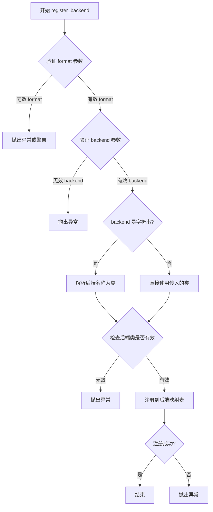

#### 带注释源码

```python
def register_backend(
    format: str,                      # 文件格式字符串，如 "png", "pdf", "svg"
    backend: str | type[FigureCanvasBase],  # 后端名称或 FigureCanvasBase 子类
    description: str | None = ...     # 可选的后端描述信息
) -> None:                            # 无返回值，仅执行注册逻辑
    """
    注册一个图形后端到 matplotlib 后端系统。
    
    Parameters:
    -----------
    format : str
        文件格式标识符，用于关联特定的后端实现
    backend : str 或 type[FigureCanvasBase]
        后端名称（如 "Agg"、"TkAgg"）或直接是 FigureCanvasBase 的子类
    description : str, optional
        后端的描述信息，便于用户了解该后端的用途
    
    Returns:
    --------
    None
        本函数不返回任何值，仅修改全局后端注册表
    
    Example:
    --------
    >>> # 使用后端名称注册
    >>> register_backend('myformat', 'Agg', 'My custom format backend')
    >>> 
    >>> # 直接使用类注册
    >>> register_backend('myformat', MyCanvasClass, 'Custom canvas implementation')
    """
    # 注意：此处为 stub 函数，实际实现需要查看 matplotlib 源码
    # 实际实现通常会：
    # 1. 验证 format 字符串非空且符合命名规范
    # 2. 如果 backend 是字符串，通过 get_backend() 解析为实际类
    # 3. 验证解析后的类是 FigureCanvasBase 的子类
    # 4. 将 format -> backend 的映射存储到全局注册表中
    # 5. 可能触发后端初始化或缓存刷新
    ...
```

#### 相关函数说明

| 函数名 | 描述 |
|--------|------|
| `get_registered_canvas_class(format)` | 根据格式字符串查询已注册的后端类，返回对应的 `FigureCanvasBase` 子类类型 |
| `FigureCanvasBase.get_supported_filetypes()` | 获取所有支持的输出文件格式及其描述的字典 |

#### 设计目标与约束

- **单一职责**：该函数仅负责后端注册，不涉及后端的初始化或激活
- **灵活性**：支持通过名称（字符串）或直接传入类来注册后端
- **可扩展性**：允许第三方通过此接口扩展 matplotlib 支持的输出格式

#### 潜在技术债务

1. **缺乏运行时验证**：stub 函数中无法验证后端类的有效性，实际使用时可能导致运行时错误
2. **错误处理不明确**：未定义注册失败时的异常类型和错误信息格式
3. **缺少重复注册策略**：未说明当同一格式被多次注册时的处理方式（覆盖/拒绝/警告）


### `get_registered_canvas_class`

该函数是一个全局函数，用于根据指定的格式（format）字符串查找并返回对应的 Canvas 渲染类（FigureCanvasBase 的子类），通常用于根据文件格式动态选择合适的画布类进行图形渲染。

参数：

-  `format`：`str`，指定要查询的图形格式（如 'png'、'pdf'、'svg' 等）

返回值：`type[FigureCanvasBase]`，返回与指定格式关联的 FigureCanvasBase 子类类型

#### 流程图

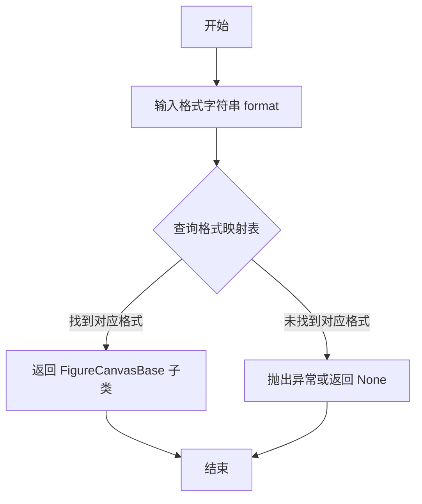

#### 带注释源码

```python
def get_registered_canvas_class(
    format: str  # 图形文件格式字符串，如 'png', 'pdf', 'svg' 等
) -> type[FigureCanvasBase]:  # 返回 FigureCanvasBase 的子类类型
    """
    根据指定的格式获取注册的 Canvas 类。
    
    该函数通常维护一个格式到 Canvas 类的映射字典，
    当用户保存或导出图形时，根据文件格式选择正确的
    Canvas 渲染类进行处理。
    
    参数:
        format: 字符串，表示图形格式
        
    返回:
        对应格式的 FigureCanvasBase 子类类型
        
    异常:
        KeyError: 当给定格式未注册时可能抛出异常
    """
    ...  # 实现细节（此处为存根定义）
```


### `key_press_handler`

该函数是 matplotlib 后端的关键事件处理器，负责捕获键盘按键事件并根据按键类型触发相应的图形界面操作，如导航工具栏的功能（前进、后退、主页等）或图形交互操作。

参数：

- `event`：`KeyEvent`，触发处理器的键盘事件对象，包含按键名称、坐标等关键信息
- `canvas`：`FigureCanvasBase | None`，可选的画布引用，用于访问图形上下文和事件系统，默认为 None
- `toolbar`：`NavigationToolbar2 | None`，可选的导航工具栏引用，用于执行工具栏操作（如前进、后退等），默认为 None

返回值：`None`，该函数为事件处理器，不返回任何值，仅执行副作用操作

#### 流程图

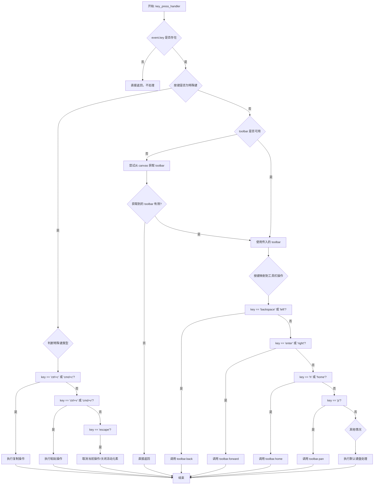

#### 带注释源码

```python
def key_press_handler(
    event: KeyEvent,
    canvas: FigureCanvasBase | None = ...,
    toolbar: NavigationToolbar2 | None = ...,
) -> None:
    """
    处理键盘按键事件的回调函数。
    
    该函数是 matplotlib 图形界面的核心事件处理器之一，负责响应用户的键盘输入。
    它根据按下的键执行相应的操作，如在导航工具栏中切换视图、切换交互模式等。
    
    Parameters
    ----------
    event : KeyEvent
        触发此处理器的键盘事件对象。包含以下关键属性：
        - key: 按下的键的名称（如 'left', 'right', 'escape', 'ctrl+c' 等）
        - x, y: 鼠标相对于画布的坐标
        - inaxes: 鼠标当前所在的 Axes 对象（如果有）
        - canvas: 产生事件的 FigureCanvasBase 对象
        - modifiers: 按下的修饰键集合（如 {'ctrl', 'shift'}）
        
    canvas : FigureCanvasBase | None, optional
        关联的画布对象。如果未提供，将尝试从 event.canvas 获取。
        用于访问画布的事件系统和执行绘图操作。
        默认为 None。
        
    toolbar : NavigationToolbar2 | None, optional
        导航工具栏实例，用于执行工具栏操作（如 back, forward, pan, zoom 等）。
        如果未提供，将尝试从 canvas.toolbar 获取。
        默认为 None。
        
    Returns
    -------
    None
        此函数不返回任何值。它作为事件回调，通过修改图形状态来响应用户输入。
        
    Examples
    --------
    >>> # 典型用法：连接到画布的按键事件
    >>> canvas.mpl_connect('key_press', key_press_handler)
    1
    
    >>> # 带自定义工具栏的用法
    >>> def custom_handler(event):
    ...     key_press_handler(event, canvas=my_canvas, toolbar=my_toolbar)
    >>> canvas.mpl_connect('key_press', custom_handler)
    
    Notes
    -----
    支持的按键操作包括：
    - 导航操作: 'backspace'/'left' (后退), 'enter'/'right' (前进), 'h'/'home' (主页)
    - 交互模式: 'p' (平移模式), 'o' (缩放模式), 'g' (网格切换)
    - 系统操作: 'ctrl+c'/'cmd+c' (复制), 'ctrl+v'/'cmd+v' (粘贴)
    - 取消操作: 'escape' (取消当前操作/关闭活动元素)
    
    该函数通常与 FigureCanvasBase.mpl_connect() 方法一起使用，将处理器绑定到
    'key_press' 事件类型。
    """
    # 检查事件有效性：必须有有效的按键信息
    if event.key is None:
        return
    
    # 如果未提供 toolbar，尝试从 canvas 获取
    if toolbar is None:
        if canvas is None:
            canvas = event.canvas
        toolbar = canvas.toolbar if canvas is not None else None
    
    # 如果 toolbar 不可用，尝试执行一些默认的全局快捷键操作
    if toolbar is None:
        # 处理复制操作 (Ctrl+C / Cmd+C)
        if event.key in ('ctrl+c', 'cmd+c'):
            # 执行系统级别的复制操作
            # 具体实现依赖于后端
            pass
        # 处理粘贴操作 (Ctrl+V / Cmd+V)
        elif event.key in ('ctrl+v', 'cmd+v'):
            # 执行系统级别的粘贴操作
            pass
        # 处理退出/取消操作 (Escape)
        elif event.key == 'escape':
            # 取消当前活动操作或关闭弹出窗口
            pass
        return
    
    # 根据按键类型执行相应的工具栏操作
    # 导航操作
    if event.key in ('backspace', 'left'):
        toolbar.back()
    elif event.key in ('enter', 'right'):
        toolbar.forward()
    elif event.key in ('h', 'home'):
        toolbar.home()
    elif event.key in ('h', 'home'):
        toolbar.home()
    elif event.key == 'd':
        # 调试模式切换（某些后端支持）
        pass
    
    # 视图交互模式切换
    elif event.key == 'p':
        # 进入平移/拖动模式
        toolbar.pan()
    elif event.key == 'o':
        # 进入缩放模式
        toolbar.zoom()
    elif event.key == 'g':
        # 切换网格显示
        pass
    
    # 保存/导出操作
    elif event.key in ('s', 'ctrl+s'):
        # 保存图形
        toolbar.save_figure()
    
    # 其他未处理的按键可以通过自定义回调处理
    else:
        # 可以触发 'key_press' 事件的默认处理
        pass
```


### `button_press_handler`

该函数是 Matplotlib 中的鼠标按键事件处理器，负责在用户点击鼠标按钮时将事件分发给画布（canvas）和工具栏（Toolbar），通常用于触发工具栏的交互操作或记录鼠标状态。

参数：

- `event`：`MouseEvent`，鼠标事件对象，包含事件的详细信息（如坐标、按键类型等）
- `canvas`：`FigureCanvasBase | None`，可选参数，关联的画布实例，用于处理画布上的鼠标事件，默认为空
- `toolbar`：`NavigationToolbar2 | None`，可选参数，关联的工具栏实例，用于处理工具栏的交互操作，默认为空

返回值：`None`，该函数不返回任何值，仅执行事件分发逻辑

#### 流程图

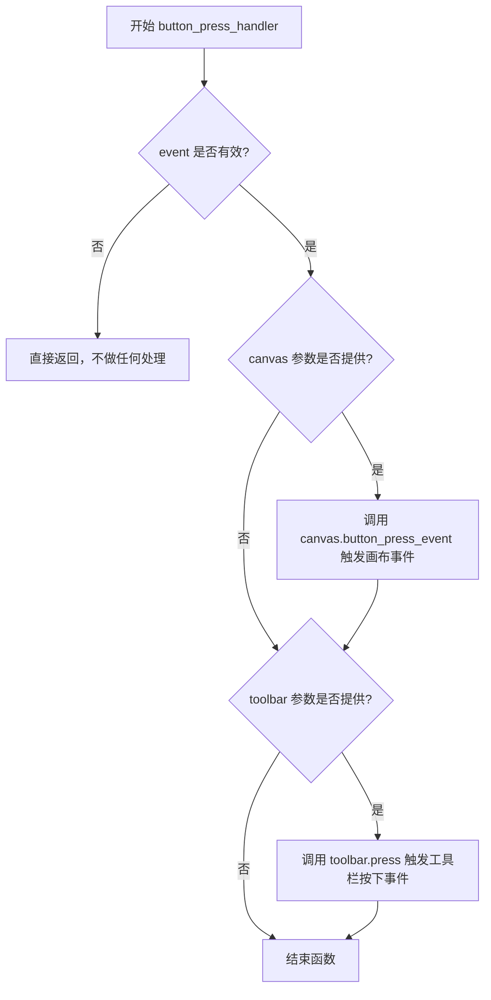

#### 带注释源码

```python
def button_press_handler(
    event: MouseEvent,
    canvas: FigureCanvasBase | None = ...,
    toolbar: NavigationToolbar2 | None = ...,
) -> None:
    """
    处理鼠标按键按下事件，将事件分发给画布和工具栏。
    
    Parameters
    ----------
    event : MouseEvent
        鼠标事件对象，包含事件的所有相关信息（如坐标、按键等）
    canvas : FigureCanvasBase | None, optional
        画布对象，用于传递事件给画布层，默认为 None
    toolbar : NavigationToolbar2 | None, optional
        工具栏对象，用于传递事件给工具栏层，默认为 None
    """
    # 如果提供了 canvas 参数，则将按钮按下事件传递给画布
    # 这会触发画布上注册的回调函数
    if canvas is not None:
        canvas.button_press_event(
            event.x, 
            event.y, 
            event.button, 
            guiEvent=event.guiEvent
        )
    
    # 如果提供了 toolbar 参数，则将按钮按下事件传递给工具栏
    # 工具栏可能根据不同的模式（如平移、缩放）执行不同的操作
    if toolbar is not None:
        toolbar.press(event)
```


### scroll_handler

scroll_handler 是一个全局事件处理函数，用于响应鼠标滚轮滚动事件（scroll event）。该函数接收鼠标事件、画布和工具栏作为参数，并根据滚动事件触发相应的图形交互操作，如缩放视图或滚动文档。

参数：

- `event`：`MouseEvent`，鼠标事件对象，包含滚轮滚动的方向（step）、位置坐标、按键状态等信息
- `canvas`：`FigureCanvasBase | None`，图形画布对象，用于处理图形区域的交互和事件传递，默认为 None
- `toolbar`：`NavigationToolbar2 | None`，matplotlib 工具栏对象，用于在滚动时更新工具栏状态或显示相关信息，默认为 None

返回值：`None`，该函数不返回任何值，仅执行副作用操作

#### 流程图

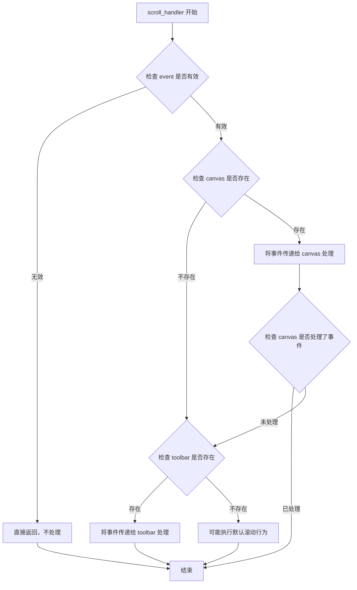

#### 带注释源码

```python
def scroll_handler(
    event: MouseEvent,  # 鼠标事件对象，包含滚动方向（step正值/负值）、位置坐标等
    canvas: FigureCanvasBase | None = ...,  # 图形画布，承载图形内容和事件处理
    toolbar: NavigationToolbar2 | None = ...,  # 工具栏，可选，用于显示状态信息
) -> None:  # 无返回值，仅执行事件处理逻辑
    """
    处理鼠标滚轮滚动事件的全局函数。
    
    该函数是 matplotlib 后端的事件处理器之一，当用户滚动鼠标滚轮时，
    会被调用来响应视图缩放、滚动等操作。
    
    参数说明:
        event: MouseEvent 类型的鼠标事件，包含以下关键属性:
            - step: float，表示滚轮滚动步长，正值表示向前滚动，负值表示向后滚动
            - x, y: int，鼠标在画布上的像素坐标
            - inaxes: Axes | None，鼠标所在的坐标轴对象
            - button: 鼠标按键状态
            - key: 键盘修饰键状态
        
        canvas: FigureCanvasBase 对象，代表图形画布，负责图形渲染和事件分发
               如果为 None，则跳过画布相关处理
        
        toolbar: NavigationToolbar2 对象，代表 matplotlib 的工具栏
                如果提供，可在滚动时更新工具栏状态或显示坐标信息
    
    处理流程:
        1. 验证 event 事件对象的有效性
        2. 如果提供了 canvas，尝试让 canvas 处理滚动事件（如视图缩放）
        3. 如果 canvas 未处理或未提供 canvas，检查 toolbar 是否需要更新
        4. 可选的默认滚动行为处理
    
    注意:
        这是一个存根（stub）函数定义，实际实现可能在不同的后端模块中。
        具体的滚动行为（如缩放比例）可能由 matplotlib 的配置参数控制。
    """
    # 函数体在实际的 matplotlib 后端实现中会有具体逻辑
    # 典型的实现会调用 canvas 或 toolbar 的相应方法来处理滚动
    pass  # 占位符，实际实现由具体后端提供
```


### `RendererBase.open_group`

该方法用于在渲染器中打开一个图形组，以便将后续的绘图操作组织在一起。这通常用于在输出文件（如SVG、PDF）中创建分组结构，便于后续引用或样式控制。

参数：

- `s`：`str`，组的名称，用于标识该图形组
- `gid`：`str | None`，可选的组标识符，用于在输出格式中设置组的ID

返回值：`None`，该方法无返回值

#### 流程图

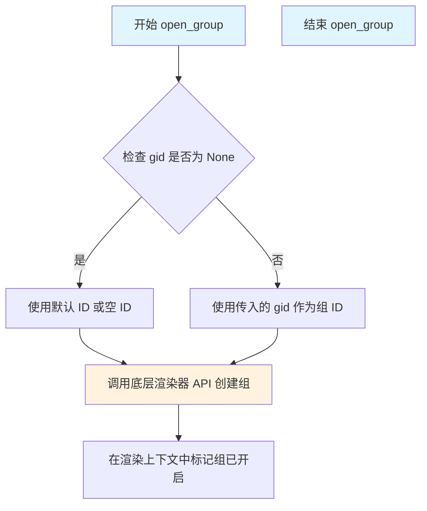

#### 带注释源码

```python
def open_group(self, s: str, gid: str | None = ...) -> None:
    """
    打开一个图形组，用于组织后续的绘图操作。
    
    参数:
        s: str - 组的名称，标识该图形组的用途
        gid: str | None - 可选的组标识符，用于设置 DOM/SVG ID
              如果为 None，某些后端可能使用默认行为
    
    返回:
        None
    
    注意:
        - 此方法通常与 close_group() 配对使用
        - 在 SVG/PDF 后端中，会生成对应的 <g> 元素
        - gid 参数允许通过 ID 引用和样式化特定组
    """
    # 具体的实现逻辑取决于具体的渲染器后端
    # 例如在 SVG 后端中，可能会生成 <g id="gid"> 标签
    # 在 PDF 后端中，可能会调用 PDF 的 gsave/grestore 操作
    pass
```


### `RendererBase.close_group`

关闭之前通过 `open_group` 打开的渲染组，用于组织 SVG 或 PDF 等矢量图形输出中的元素层次结构。

参数：

- `s`：`str`，组的标识符，用于匹配对应的 `open_group` 调用

返回值：`None`，无返回值

#### 流程图

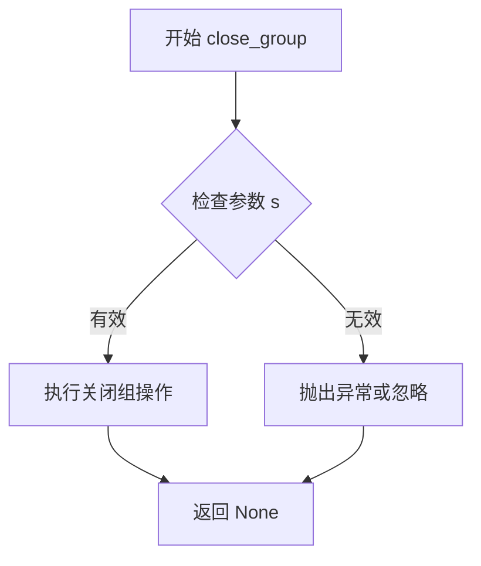

#### 带注释源码

```python
def close_group(self, s: str) -> None:
    """
    关闭一个渲染组。
    
    该方法与 open_group 配合使用，用于在渲染输出（如 SVG、PDF）中
    创建嵌套的组结构，便于组织图形元素和设置属性。
    
    参数:
        s: str - 组的标识符，需要与对应的 open_group 调用时传递的 s 参数匹配
    """
    # 注意：这是抽象方法声明，具体实现在子类中
    # 子类通常会在渲染后端中执行实际的组关闭操作
    ...
```


### `RendererBase.draw_path`

该方法是 Matplotlib 渲染器的核心抽象方法，负责将几何路径（`Path`）绘制到具体的画布上。它通过图形上下文（`gc`）获取绘图样式（如线条宽度、颜色），应用变换（`transform`）将路径坐标映射到目标坐标系，并根据 `rgbFace` 参数决定是否填充路径。

参数：

-  `self`：隐藏参数，表示 RendererBase 的实例。
-  `gc`：`GraphicsContextBase`，图形上下文对象，包含了绘图所需的样式信息（如线条宽度、端点样式、描边颜色等）。
-  `path`：`Path`，要绘制的几何路径对象，包含顶点和操作指令。
-  `transform`：`Transform`，仿射变换矩阵，用于将 `path` 的顶点坐标转换为显示坐标。
-  `rgbFace`：`ColorType | None`，路径的填充颜色。如果为 `None`，则仅绘制路径的轮廓（描边）；如果有颜色，则先填充后描边。

返回值：`None`，该方法通常为副作用，不返回具体的绘制结果。

#### 流程图

```mermaid
graph TD
    A([开始 draw_path]) --> B{检查 rgbFace 是否存在};
    B -- 是 --> C[应用 Fill 颜色到 GraphicsContext];
    B -- 否 --> D[跳过填充];
    C --> E[应用 Stroke 样式到 GraphicsContext];
    D --> E;
    E --> F[应用 Transform 到 Path 顶点];
    F --> G[调用后端绘图指令 (绘制路径)];
    G --> H([结束 draw_path]);
```

#### 带注释源码

```python
def draw_path(
    self,
    gc: GraphicsContextBase,
    path: Path,
    transform: Transform,
    rgbFace: ColorType | None = ...,
) -> None:
    """
    绘制路径的抽象方法。

    参数说明:
        gc (GraphicsContextBase): 图形上下文，保存当前绘图状态（颜色、线宽等）。
        path (Path): 包含绘图指令和顶点的路径对象。
        transform (Transform): 将路径顶点映射到设备坐标的变换矩阵。
        rgbFace (ColorType | None): 填充颜色。若为 None，则仅绘制路径轮廓。
    """
    # 注意：具体的绘制逻辑由 RendererBase 的子类（如 Agg, Cairo, SVG 等）实现。
    # 基类中通常不包含具体的绘图指令，仅定义接口。
    ...
```


### `RendererBase.draw_markers`

该方法用于在图形的指定路径位置上绘制标记（markers），是matplotlib渲染器的核心方法之一。它接收图形上下文、标记路径、标记变换、主路径、路径变换和填充颜色等参数，将标记绘制到目标位置的每个点上。

参数：

- `self`：`RendererBase`，隐式参数，调用该方法的渲染器实例
- `gc`：`GraphicsContextBase`，图形上下文对象，包含线条宽度、颜色、线型等绘图样式属性
- `marker_path`：`Path`，标记的路径对象，定义了标记的几何形状（如圆形、方形等）
- `marker_trans`：`Transform`，标记路径的变换矩阵，用于定位和缩放标记
- `path`：`Path`，目标路径对象，指定在哪些位置绘制标记
- `trans`：`Transform`，目标路径的变换矩阵，用于将路径坐标转换为设备坐标
- `rgbFace`：`ColorType | None`，标记的填充颜色，当为None时不填充

返回值：`None`，该方法无返回值，直接在渲染设备上绘制图形

#### 流程图

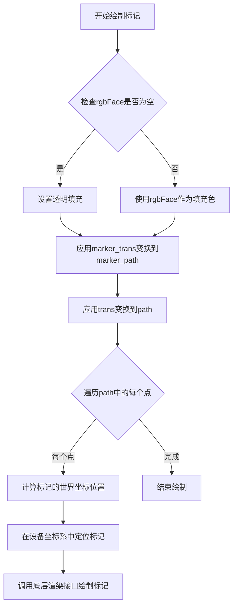

#### 带注释源码

```python
def draw_markers(
    self,
    gc: GraphicsContextBase,      # 图形上下文：包含画笔颜色、线宽、线型等样式信息
    marker_path: Path,             # 标记路径：定义标记的形状（如圆形、菱形等几何图形）
    marker_trans: Transform,       # 标记变换：用于将标记路径变换到目标位置和大小
    path: Path,                    # 目标路径：指定需要在哪些位置绘制标记的路径点集合
    trans: Transform,               # 路径变换：将数据坐标转换为显示坐标的变换矩阵
    rgbFace: ColorType | None = ..., # 填充颜色：标记内部的填充颜色，None表示不填充
) -> None:
    """
    在path指定的每个位置绘制marker_path定义的标记。
    
    参数:
        gc: 图形上下文对象，包含当前绘图状态（颜色、线宽等）
        marker_path: 标记的路径对象，定义标记的几何形状
        marker_trans: 标记路径的仿射变换（平移、旋转、缩放）
        path: 主路径对象，指定标记的绘制位置
        trans: 主路径的坐标变换，将数据坐标转换为设备坐标
        rgbFace: 标记的填充颜色，None表示透明或不填充
    
    返回:
        None: 该方法直接在渲染设备上绘制，不返回任何值
    
    注意:
        此方法为抽象方法定义，具体实现由子类（如Agg、Cairo等后端）提供。
        标记绘制通常会用到path缓存和渲染优化技术。
    """
    # 类型注解仅用于静态类型检查，实际实现由具体后端类完成
    ...  # 抽象方法，等待子类实现
```


### `RendererBase.draw_path_collection`

该方法用于在图形上下文中绘制路径集合。它接收多个路径及其相关的变换、偏移量、颜色、线型等属性，实现高效地批量渲染多个路径对象。这是 Matplotlib 中用于绘制散点图、柱状图等由多个形状组成的图形元素的核心方法。

参数：

- `self`：RendererBase，当前渲染器实例
- `gc`：`GraphicsContextBase`，图形上下文，包含画笔、颜色等渲染状态信息
- `master_transform`：`Transform`，主变换矩阵，应用于所有路径的全局变换
- `paths`：`Sequence[Path]`$，要绘制的路径对象序列
- `all_transforms`：`Sequence[ArrayLike]`，每个路径的独立变换矩阵序列
- `offsets`：`ArrayLike | Sequence[ArrayLike]`，路径的位置偏移量，可以是单个数组或数组序列
- `offset_trans`：`Transform`，应用于偏移量的变换矩阵
- `facecolors`：`ColorType | Sequence[ColorType]`，填充颜色，支持单色或每路径独立颜色
- `edgecolors`：`ColorType | Sequence[ColorType]`，边缘/描边颜色，支持单色或每路径独立颜色
- `linewidths`：`float | Sequence[float]`，线条宽度，支持单一宽度或每路径独立宽度
- `linestyles`：`LineStyleType | Sequence[LineStyleType]`，线型样式，支持单一样式或每路径独立样式
- `antialiaseds`：`bool | Sequence[bool]`，抗锯齿标志，支持单一标志或每路径独立标志
- `urls`：`str | Sequence[str]`，URL标识符，用于SVG后端等需要链接的场景
- `offset_position`：`Any`，偏移位置模式，控制偏移量的解释方式（如数据坐标或像素坐标）
- `hatchcolors`：`ColorType | Sequence[ColorType] | None`，阴影填充颜色，可选参数，默认为None

返回值：`None`，无返回值（该方法直接作用于图形上下文进行绘制）

#### 流程图

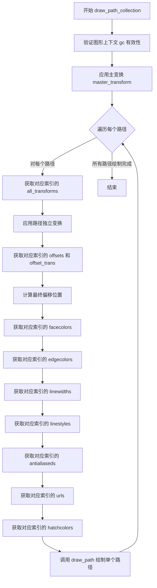

#### 带注释源码

```python
def draw_path_collection(
    self,
    gc: GraphicsContextBase,           # 图形上下文，包含当前渲染状态（颜色、线宽等）
    master_transform: Transform,       # 主变换矩阵，应用于所有路径的全局仿射变换
    paths: Sequence[Path],             # 要绘制的路径对象序列，每个Path代表一个几何形状
    all_transforms: Sequence[ArrayLike],  # 每个路径的独立变换矩阵列表，与paths一一对应
    offsets: ArrayLike | Sequence[ArrayLike],  # 路径的位置偏移量，可为(N,2)数组或序列
    offset_trans: Transform,           # 偏移量的变换，用于将偏移从数据坐标转换到显示坐标
    facecolors: ColorType | Sequence[ColorType],  # 填充颜色，支持统一颜色或每个路径独立颜色
    edgecolors: ColorType | Sequence[ColorType],  # 边缘/描边颜色，支持统一颜色或每个路径独立颜色
    linewidths: float | Sequence[float],  # 线条宽度，支持统一宽度或每个路径独立宽度
    linestyles: LineStyleType | Sequence[LineStyleType],  # 线型样式，支持统一样式或每个路径独立样式
    antialiaseds: bool | Sequence[bool],  # 抗锯齿开关，支持统一开关或每个路径独立开关
    urls: str | Sequence[str],         # URL标识符序列，用于SVG/PDF后端的超链接功能
    offset_position: Any,              # 偏移位置模式，通常为'data'或'frame_per_pixel'等枚举值
    *,                                 # 以下为仅限关键字参数的选项
    hatchcolors: ColorType | Sequence[ColorType] | None = None,  # 阴影填充颜色，默认为无阴影
) -> None:                             # 无返回值，直接在图形设备上绘制
    """
    绘制路径集合的高效方法。
    
    该方法通过批量处理多个路径及其属性，比逐个调用draw_path更高效。
    它支持为每个路径指定独立的变换、颜色、线型等属性。
    
    Parameters:
        gc: 图形上下文对象，包含当前渲染状态
        master_transform: 全局变换矩阵
        paths: Path对象列表
        all_transforms: 每个路径的4x3变换矩阵列表
        offsets: 路径偏移量数组
        offset_trans: 偏移量变换
        facecolors: 填充颜色
        edgecolors: 描边颜色
        linewidths: 线条宽度
        linestyles: 线型样式
        antialiaseds: 抗锯齿标志
        urls: URL标识符
        offset_position: 偏移位置模式
        hatchcolors: 阴影颜色（可选）
    
    Returns:
        None: 无返回值，直接渲染到目标设备
    """
    ...  # 具体实现由子类（如RendererAgg、RendererCairo等）完成
```


### RendererBase.draw_quad_mesh

该方法用于在画布上绘制四边形网格（Quad Mesh），是matplotlib渲染器的核心绘图方法之一，负责将网格化的坐标数据转换为可视化图形，支持颜色填充、抗锯齿处理和坐标变换。

参数：

- `self`：RendererBase，当前渲染器实例
- `gc`：GraphicsContextBase，图形上下文，管理绘制状态（如颜色、线宽、剪裁等）
- `master_transform`：Transform，主变换矩阵，用于将网格坐标转换到设备坐标
- `meshWidth`：int，网格的列数（宽度方向上的四边形数量）
- `meshHeight`：int，网格的行数（高度方向上的四边形数量）
- `coordinates`：ArrayLike，网格顶点坐标数组，形状为 (meshHeight+1, meshWidth+1, 2) 的坐标点
- `offsets`：ArrayLike | Sequence[ArrayLike]，网格的偏移量，用于定位整个网格在画布上的位置
- `offsetTrans`：Transform，偏移量变换矩阵
- `facecolors`：Sequence[ColorType]，四边形面的填充颜色序列
- `antialiased`：bool，是否启用抗锯齿渲染
- `edgecolors`：Sequence[ColorType] | ColorType | None，四边形的边缘颜色

返回值：`None`，该方法无返回值，直接在渲染设备上绘制图形

#### 流程图

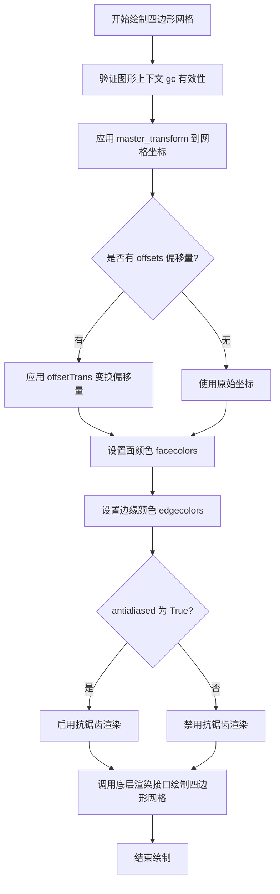

#### 带注释源码

```python
def draw_quad_mesh(
    self,
    gc: GraphicsContextBase,
    master_transform: Transform,
    meshWidth,           # 网格宽度（列数）
    meshHeight,          # 网格高度（行数）
    coordinates: ArrayLike,  # 网格顶点坐标，形状 (meshHeight+1, meshWidth+1, 2)
    offsets: ArrayLike | Sequence[ArrayLike],  # 网格偏移量
    offsetTrans: Transform,  # 偏移量变换矩阵
    facecolors: Sequence[ColorType],  # 面的填充颜色
    antialiased: bool,   # 是否启用抗锯齿
    edgecolors: Sequence[ColorType] | ColorType | None,  # 边缘颜色
) -> None:
    """
    绘制四边形网格到渲染设备。
    
    该方法将网格化的坐标数据转换为可视化图形，支持：
    - 坐标变换：通过 master_transform 和 offsetTrans
    - 颜色填充：facecolors 定义每个四边形的填充色
    - 边缘绘制：edgecolors 定义四边形边框颜色
    - 抗锯齿：antialiased 参数控制渲染质量
    
    参数:
        gc: 图形上下文，包含绘制状态（颜色、线宽、剪裁等）
        master_transform: 主变换矩阵，将网格坐标转换到设备坐标空间
        meshWidth: 网格列数（宽度方向上的四边形数量）
        meshHeight: 网格行数（高度方向上的四边形数量）
        coordinates: 网格顶点坐标数组，形状为 (meshHeight+1, meshWidth+1, 2)
                     最后一维为 (x, y) 坐标
        offsets: 整个网格的偏移量，可为单个数组或数组序列
        offsetTrans: 偏移量的变换矩阵
        facecolors: 四边形面的填充颜色序列，长度应为 meshWidth * meshHeight
        antialiased: 是否启用抗锯齿渲染
        edgecolors: 四边形边缘颜色，支持单色、多色或无色
    
    返回:
        None: 直接在渲染设备上绘制，无返回值
    
    注意:
        - coordinates 的形状必须是 (meshHeight+1, meshWidth+1, 2)
        - facecolors 长度应等于 meshWidth * meshHeight
        - 具体渲染实现由子类重写
    """
    # TODO: 实现具体的四边形网格绘制逻辑
    # 1. 使用 gc 保存当前图形状态
    # 2. 应用 master_transform 到 coordinates
    # 3. 如果有 offsets，应用 offsetTrans 并合并到坐标
    # 4. 设置填充色 facecolors 到 gc
    # 5. 设置边缘色 edgecolors 到 gc
    # 6. 根据 antialiased 设置抗锯齿标志
    # 7. 调用后端特定的渲染方法（如 CairoBackend 的 cairo_surface 等）
    pass
```


### RendererBase.draw_gouraud_triangles

绘制Gouraud shading（高氏着色）的三角形网格，该方法通过插值三角形顶点颜色来渲染平滑过渡的三角形网格，是Matplotlib中实现渐变三角形渲染的抽象方法，由具体的后端实现（如Agg、Cairo等）提供实际渲染逻辑。

参数：

- `self`：RendererBase，方法所属的渲染器实例本身
- `gc`：`GraphicsContextBase`，图形上下文对象，包含当前绘图状态（如颜色、线宽、混合模式等）
- `triangles_array`：`ArrayLike`，三角形顶点坐标数组，形状为 (N, 3, 2)，其中 N 表示三角形数量，3 表示每个三角形的3个顶点，2 表示2D坐标 (x, y)
- `colors_array`：`ArrayLike`，与三角形顶点对应的颜色数组，形状为 (N, 3, 4)，其中 N 表示三角形数量，3 表示每个顶点的颜色，4 表示RGBA颜色通道
- `transform`：`Transform`，应用于三角形顶点的坐标变换矩阵，用于将数据坐标转换为设备坐标

返回值：`None`，该方法无返回值，执行完成后直接渲染到目标画布

#### 流程图

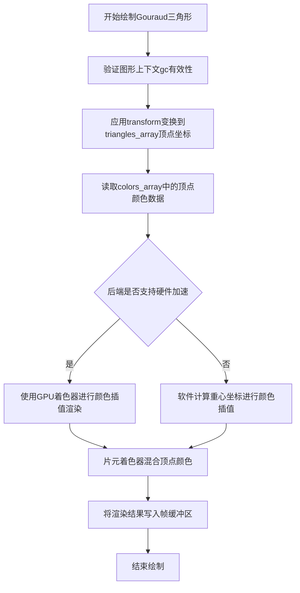

#### 带注释源码

```python
def draw_gouraud_triangles(
    self,
    gc: GraphicsContextBase,
    triangles_array: ArrayLike,
    colors_array: ArrayLike,
    transform: Transform,
) -> None:
    """
    绘制Gouraud shading三角形网格。
    
    该方法是抽象方法，由具体的后端类（如RendererAgg）实现。
    Gouraud shading通过在三角形顶点之间线性插值颜色来实现平滑过渡效果。
    
    Parameters
    ----------
    gc : GraphicsContextBase
        图形上下文，包含当前渲染状态（颜色、线宽、混合模式等）
    triangles_array : ArrayLike
        三角形顶点坐标数组，形状为 (N, 3, 2)，N为三角形数量
    colors_array : ArrayLike
        顶点颜色数组，形状为 (N, 3, 4)，包含RGBA颜色值
    transform : Transform
        坐标变换矩阵，将数据坐标转换为设备坐标
    
    Returns
    -------
    None
    """
    # 抽象方法，具体的渲染逻辑由子类实现
    # 在RendererBase中仅定义接口规范，不包含具体实现代码
    # 子类需要实现以下逻辑：
    # 1. 将triangles_array通过transform转换为设备坐标
    # 2. 遍历每个三角形，计算重心坐标
    # 3. 根据重心坐标对colors_array中的顶点颜色进行线性插值
    # 4. 将插值后的颜色写入到目标渲染表面
    
    # 示例实现逻辑（伪代码）：
    # for triangle, colors in zip(triangles_array, colors_array):
    #     transformed_triangle = transform.transform(triangle)
    #     for pixel in triangle.bounding_box:
    #         barycentric = calculate_barycentric(pixel, transformed_triangle)
    #         if is_inside_triangle(barycentric):
    #             interpolated_color = interpolate_color(colors, barycentric)
    #             set_pixel_color(pixel, interpolated_color)
    
    pass
```


### RendererBase.get_image_magnification

获取图像渲染时的放大倍数，用于在绘制图像时确定像素与坐标空间的转换比例。

参数：无需参数

返回值：`float`，返回当前渲染器的图像放大倍数

#### 流程图

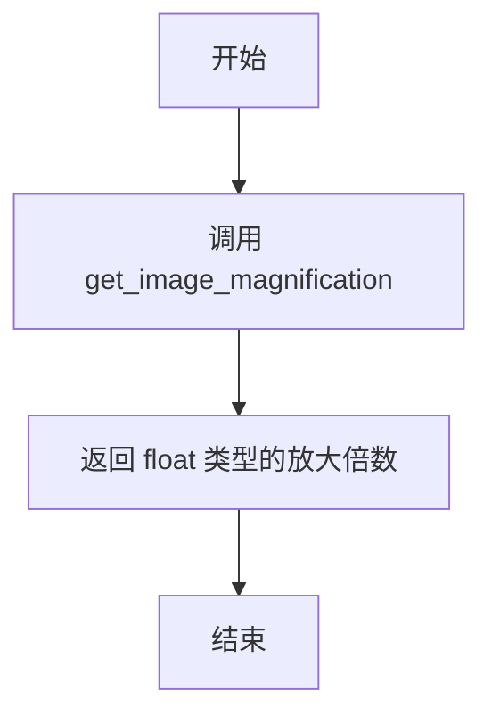

#### 带注释源码

```python
def get_image_magnification(self) -> float:
    """
    获取图像放大倍数。
    
    该方法是一个抽象方法，由子类具体实现。
    返回值表示渲染图像时的缩放因子，用于在绘制图像时
    将图像像素坐标转换为目标坐标系。
    
    Returns:
        float: 图像放大倍数，通常返回 1.0 表示原始大小。
    """
    ...  # 抽象方法，由子类实现
```


### RendererBase.draw_image

该方法负责在指定的图形上下文（GraphicsContext）中绘制图像。它接收图像数据、位置坐标和一个可选的仿射变换矩阵，将图像渲染到画布的指定位置。这是matplotlib渲染器的核心方法之一，用于将图像数据可视化。

参数：

- `self`：RendererBase，隐式参数，表示RendererBase类的实例
- `gc`：`GraphicsContextBase`，图形上下文对象，包含绘图状态如颜色、线宽等
- `x`：`float`，图像左下角的x坐标
- `y`：`float`，图像左下角的y坐标
- `im`：`ArrayLike`，要绘制的图像数据，可以是数组形式
- `transform`：`transforms.Affine2DBase | None`，可选的仿射2D变换，用于定位和缩放图像

返回值：`None`，该方法无返回值，直接在图形上下文上进行绘制操作

#### 流程图

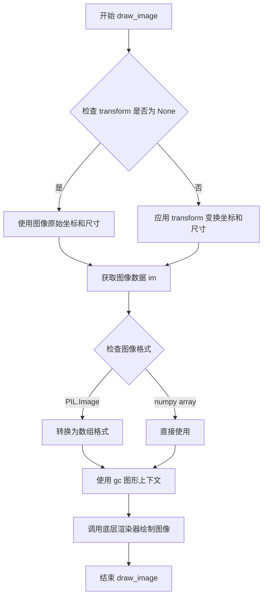

#### 带注释源码

```python
def draw_image(
    self,
    gc: GraphicsContextBase,  # 图形上下文，包含绘图状态如剪裁、颜色等
    x: float,                  # 图像左下角的x坐标（数据坐标系）
    y: float,                  # 图像左下角的y坐标（数据坐标系）
    im: ArrayLike,             # 要绘制的图像数据，支持numpy数组或PIL图像
    transform: transforms.Affine2DBase | None = ...,  # 可选的仿射变换，用于坐标转换
) -> None: ...
```


### `RendererBase.option_image_nocomposite`

该方法是一个用于判断是否在绘制图像时禁用合成（composite）操作的布尔返回值方法，通常由子类重写以提供后端特定的图像渲染行为。

参数：
- `self`：`RendererBase` 实例，隐式参数，表示调用该方法的类实例。

返回值：`bool`，返回 `True` 表示不进行图像合成，返回 `False` 表示使用默认的合成行为。

#### 流程图

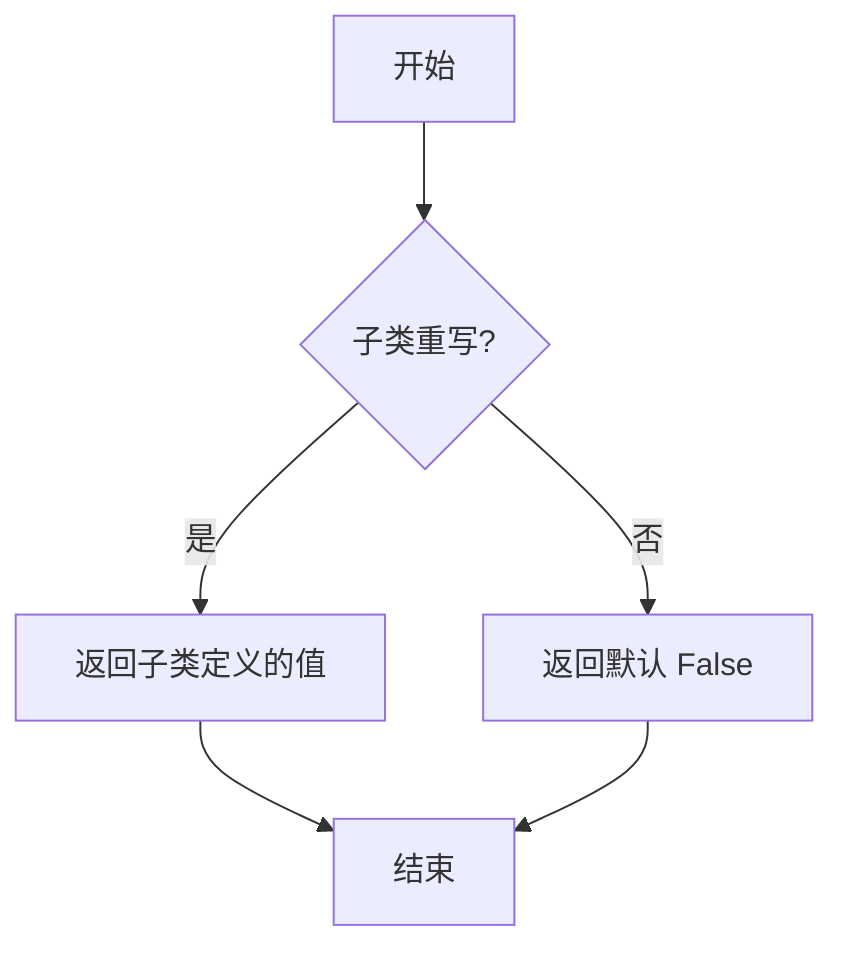

#### 带注释源码

```python
def option_image_nocomposite(self) -> bool:
    """
    判断是否在绘制图像时不使用合成（composite）选项。
    
    此方法用于控制图像渲染时是否应用合成操作。子类可以重写
    此方法以根据后端特性或配置返回自定义的布尔值。
    
    参数:
        self (RendererBase): 调用此方法的 RendererBase 实例。
        
    返回:
        bool: 返回 True 表示禁用图像合成，返回 False 表示启用合成。
        
    示例:
        如果某个后端（如Agg）不支持图像合成，可以重写此方法返回 True。
    """
    ...  # 抽象方法，具体实现由子类提供
```


### `RendererBase.option_scale_image`

该方法用于查询当前渲染器是否支持图像的缩放操作。返回值为布尔值，指示在绘制图像时是否应该根据显示设备的像素密度进行缩放处理。

参数： 无

返回值：`bool`，返回 `True` 表示渲染器支持图像缩放，会根据设备像素比调整图像大小；返回 `False` 表示不支持图像缩放，图像将以其原始尺寸绘制。

#### 流程图

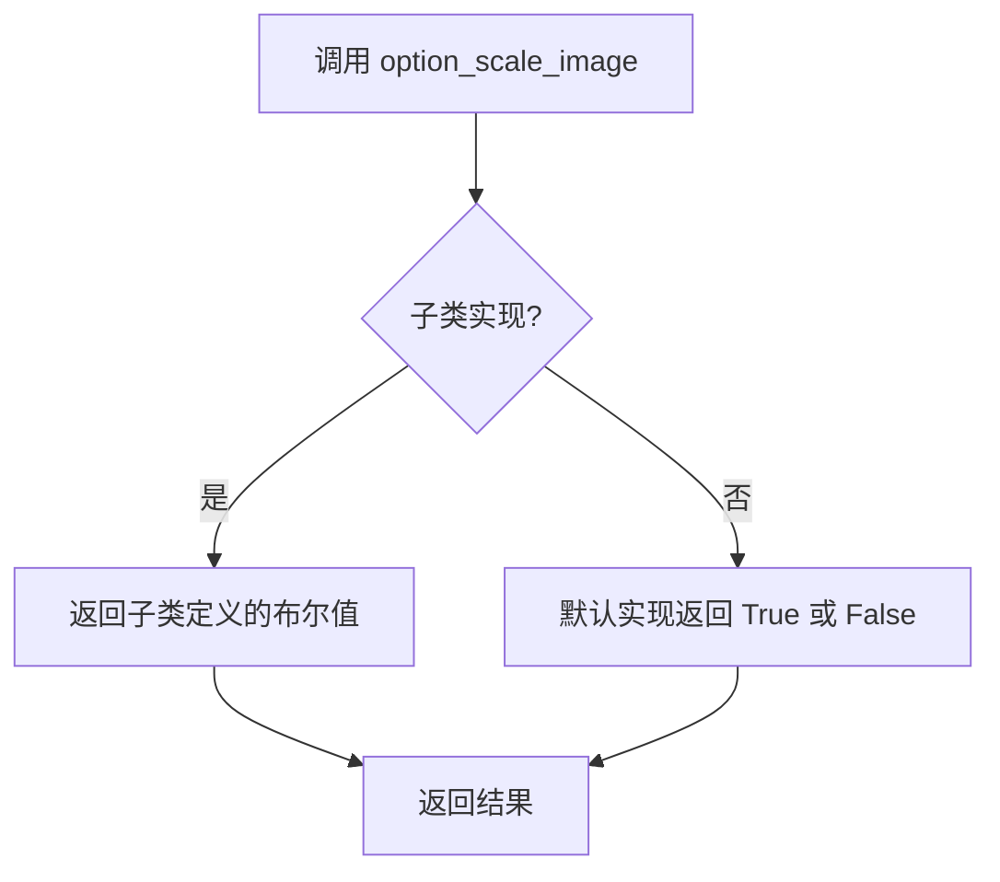

#### 带注释源码

```python
def option_scale_image(self) -> bool:
    """
    查询渲染器是否支持图像缩放选项。
    
    此方法供 draw_image 方法在绘制图像前检查是否需要
    根据设备的像素密度对图像进行缩放处理。如果返回 True，
    则 draw_image 会将图像数据缩放到合适的尺寸以匹配
    显示设备的分辨率，避免图像过大或过小。
    
    Returns:
        bool: 是否启用图像缩放。True 表示启用，False 表示禁用。
    """
    ...  # 具体实现由子类提供
```


### `RendererBase.draw_tex`

该方法用于在画布上渲染LaTeX格式的文本字符串，通过TexManager将TeX代码转换为可绘制图形，是Matplotlib后端渲染引擎中处理数学公式文本输出的核心方法。

参数：

- `self`：`RendererBase`，方法所属的渲染器实例
- `gc`：`GraphicsContextBase`，图形上下文，用于设置文本的颜色、字体等绘制属性
- `x`：`float`，文本渲染的起始x坐标（世界坐标）
- `y`：`float`，文本渲染的起始y坐标（世界坐标）
- `s`：`str`，要渲染的LaTeX文本字符串
- `prop`：`FontProperties`，字体属性对象，包含字体大小、样式等配置
- `angle`：`float`，文本逆时针旋转角度（单位为度）
- `mtext`：`Text | None`，可选的Matplotlib Text对象，用于获取额外的文本布局信息

返回值：`None`，该方法直接绘制到画布，不返回任何值

#### 流程图

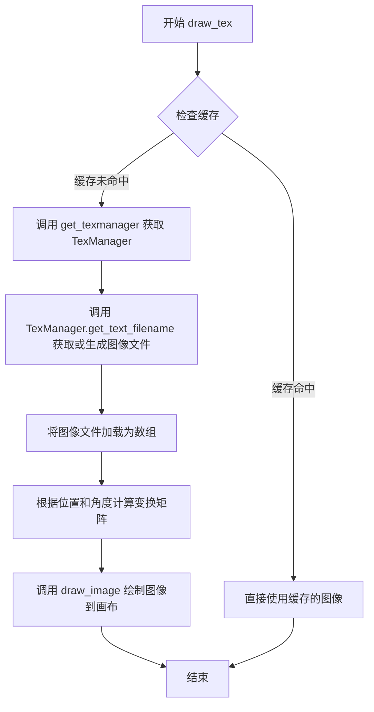

#### 带注释源码

```python
def draw_tex(
    self,
    gc: GraphicsContextBase,  # 图形上下文，控制颜色、字体等
    x: float,                  # 文本x坐标（世界坐标）
    y: float,                  # 文本y坐标（世界坐标）
    s: str,                    # 要渲染的LaTeX文本字符串
    prop: FontProperties,      # 字体属性对象
    angle: float,              # 旋转角度（度）
    *,
    mtext: Text | None = ...   # 可选的Text对象，用于获取布局信息
) -> None: ...                 # 返回None，直接绘制到后端画布
```


### `RendererBase.draw_text`

该方法是matplotlib渲染器的抽象方法，负责在画布上绘制文本。调用者通过传入图形上下文、坐标、文本内容、字体属性和旋转角度等参数，由具体的后端实现（如Agg、Cairo等）完成实际的文本绘制操作。

参数：

- `self`：`RendererBase`，渲染器实例本身
- `gc`：`GraphicsContextBase`，图形上下文，包含文本的绘制状态（颜色、线宽、混合模式等）
- `x`：`float`，文本插入点的x坐标（通常为用户坐标或设备坐标，取决于后端实现）
- `y`：`float`，文本插入点的y坐标（通常为用户坐标或设备坐标，取决于后端实现）
- `s`：`str`，要绘制的文本字符串内容
- `prop`：`FontProperties`，字体属性对象，定义字体族、字号、字重、斜体等样式信息
- `angle`：`float`，文本的旋转角度，以度为单位，正值表示逆时针旋转
- `ismath`：`bool | Literal["TeX"]`，数学文本渲染模式标识；`True`表示作为数学表达式解析，`"TeX"`表示使用TeX引擎渲染，`False`或省略表示普通文本
- `mtext`：`Text | None`，原始的matplotlib Text对象引用，用于获取额外样式信息或执行回调

返回值：`None`，该方法为副作用型方法，直接在画布上绘制文本，不返回任何值

#### 流程图

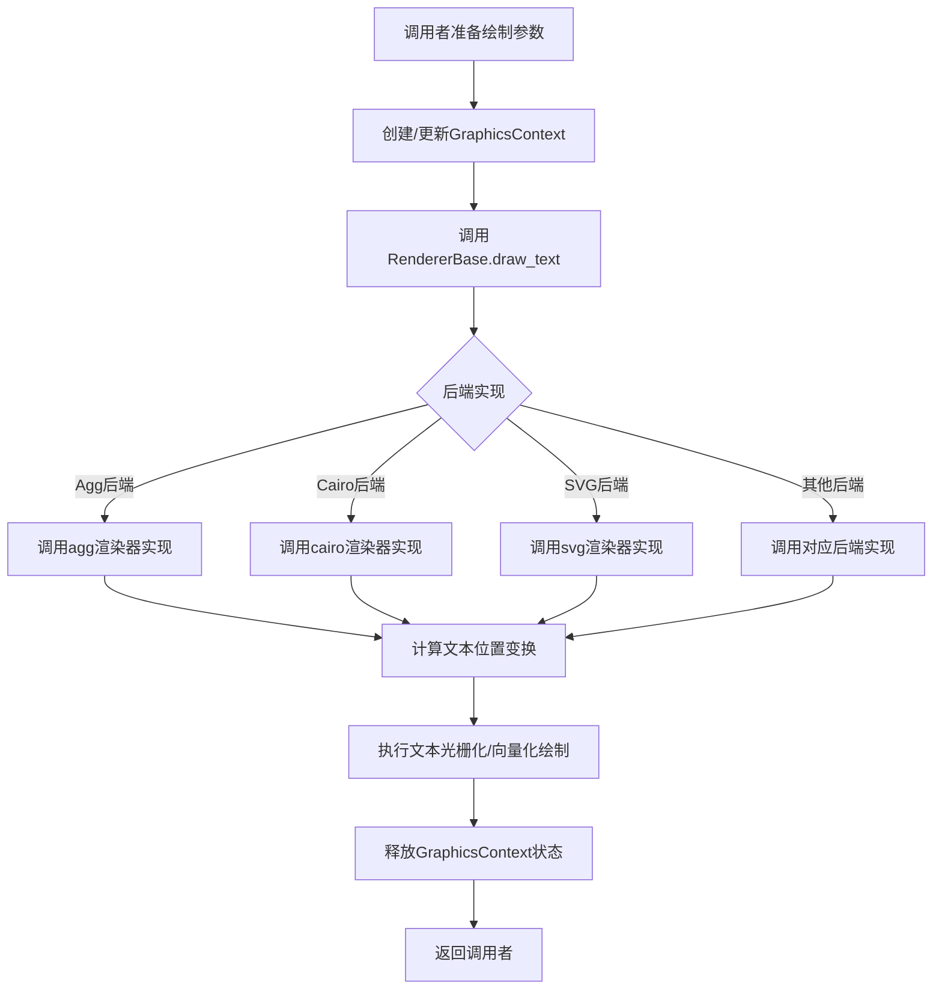

#### 带注释源码

```python
def draw_text(
    self,
    gc: GraphicsContextBase,
    x: float,
    y: float,
    s: str,
    prop: FontProperties,
    angle: float,
    ismath: bool | Literal["TeX"] = ...,
    mtext: Text | None = ...,
) -> None:
    """
    在画布上绘制文本字符串。
    
    这是一个抽象方法，由具体的渲染器后端（如AggBackend、CairoBackend等）实现。
    后端实现负责将文本字符串转换为图形指令并输出到目标设备。
    
    参数:
        gc: 图形上下文对象，包含当前的绘制状态（颜色、线宽、clip路径等）。
            调用前应由调用者配置好文本的前景颜色、字体等属性。
        x: 文本锚点的x坐标。具体位置取决于文本的对齐方式设置。
        y: 文本锚点的y坐标。具体位置取决于文本的对齐方式设置。
        s: 要绘制的Unicode文本字符串。
        prop: FontProperties对象，定义字体族、字号、样式等属性。
            渲染器应使用此对象查询实际使用的字体文件路径。
        angle: 文本旋转角度，以度为单位，正值为逆时针方向旋转。
        ismath: 控制数学文本解析模式:
            - False/省略: 将文本作为普通字符串绘制
            - True: 将文本作为数学表达式解析（使用matplotlib内置数学渲染器）
            - "TeX": 使用TeX/LaTeX引擎渲染文本
        mtext: 原始的Text艺术对象引用，可用于获取额外的样式信息
            （如文本对齐方式、rotation_mode等），如果为None则忽略。
    
    返回值:
        None。此方法为过程型方法，通过副作用完成文本绘制。
    
    注意:
        - 子类实现应正确处理坐标变换（用户坐标到设备坐标的转换）
        - 应支持Unicode文本渲染
        - 对于旋转文本，需要正确处理文本基线的变换
        - 应考虑图形上下文中设置的clip区域
    """
    ...
```


### RendererBase.get_text_width_height_descent

该方法用于计算给定文本字符串在指定字体属性下的宽度、高度和下沉量（descent），是matplotlib渲染系统中文本布局计算的核心抽象方法。具体后端实现类（如Agg、PDF、SVG等）需继承并实现此方法以提供与底层渲染引擎交互的文本度量功能。

参数：

- `self`：RendererBase，方法调用者实例
- `s`：`str`，需要测量尺寸的文本字符串
- `prop`：`FontProperties`，字体属性对象，包含字体 family、size、style 等信息
- `ismath`：`bool | Literal["TeX"]`，控制文本渲染模式；`True` 表示作为数学公式渲染，`"TeX"` 表示使用 TeX 引擎，False 表示普通文本渲染

返回值：`tuple[float, float, float]`，返回包含三个浮点数的元组

- 第一个元素：文本宽度（width）
- 第二个元素：文本高度（height）
- 第三个元素：文本下沉量（descent），即从基线到文本底部的距离

#### 流程图

```mermaid
flowchart TD
    A[调用 get_text_width_height_descent] --> B{检查 ismath 参数}
    B -->|ismath=True| C[调用底层数学公式渲染器]
    B -->|ismath='TeX'| D[调用 TeX 引擎处理]
    B -->|ismath=False| E[调用底层文本渲染器]
    C --> F[获取文本度量数据]
    D --> F
    E --> F
    F --> G[提取 width, height, descent]
    G --> H[返回 tuple[float, float, float]]
```

#### 带注释源码

```python
class RendererBase:
    # ... 其他方法 ...
    
    def get_text_width_height_descent(
        self, s: str, prop: FontProperties, ismath: bool | Literal["TeX"]
    ) -> tuple[float, float, float]:
        """
        计算文本的宽度、高度和下沉量。
        
        这是一个抽象方法，具体实现由子类提供。
        
        参数:
            s: 要测量的文本字符串
            prop: FontProperties 对象，定义字体属性
            ismath: 控制渲染模式：
                - False: 普通文本渲染
                - True: 数学公式渲染
                - "TeX": 使用 TeX 引擎渲染
        
        返回值:
            tuple[float, float, float]: (width, height, descent)
            - width: 文本宽度
            - height: 文本高度（baseline 到顶部的距离）
            - descent: 文本下沉量（baseline 到底部的距离）
        """
        # 注意：这是类型声明文件(.pyi)，实际实现位于具体后端类中
        # 例如：matplotlib.backends.backend_agg.RendererAgg
        # 子类需要override此方法以提供具体的文本度量计算
        ...
```


### `RendererBase.flipy`

该方法用于指示渲染器是否需要翻转 Y 轴坐标。在 matplotlib 中，不同的图形后端可能对 Y 轴的方向有不同的处理方式（例如，某些后端的 Y 轴向上为正，而某些则向下为正），该方法返回一个布尔值以告诉绘图代码如何调整坐标系的 Y 轴方向。

参数： 无（除隐含的 `self` 参数外）

返回值：`bool`，返回 `True` 表示渲染时需要翻转 Y 轴坐标，返回 `False` 表示不需要翻转。

#### 流程图

```mermaid
flowchart TD
    A((开始)) --> B{获取 flipy 状态}
    B -->|True| C[返回 True: 需要翻转 Y 轴]
    B -->|False| D[返回 False: 不需要翻转 Y 轴]
    C --> E((结束))
    D --> E
```

#### 带注释源码

```python
def flipy(self) -> bool:
    """
    检查渲染器是否需要翻转 Y 轴坐标。
    
    在 matplotlib 中，不同的图形后端可能使用不同的坐标系：
    - 有些后端（如大多数屏幕显示）Y 轴向上为正
    - 有些后端（如某些图像格式）Y 轴向下为正
    
    该方法返回一个布尔值，指示绘图代码在绘制图形时是否需要
    对 Y 坐标进行翻转处理。
    
    Returns:
        bool: 
            - True: 表示渲染器使用的坐标系中 Y 轴方向与标准笛卡尔坐标系相反，
                   需要在绘制时翻转 Y 坐标
            - False: 表示渲染器使用的坐标系中 Y 轴方向与标准笛卡尔坐标系一致，
                    不需要翻转 Y 坐标
    """
    ...
```


### `RendererBase.get_canvas_width_height`

该方法用于获取当前渲染器所绑定的画布（Canvas）的宽度和高度。在 Matplotlib 的渲染架构中，RendererBase 负责实际的图形绘制工作，而画布尺寸是确定绘图区域和坐标系的重要参数。此方法返回一个包含两个浮点数的元组，分别代表画布的宽度和宽度。

参数： 无（仅包含隐式参数 `self`，指向 RendererBase 实例本身）

返回值：`tuple[float, float]`，返回画布的宽度和高度组成的元组，第一个元素为宽度，第二个元素为高度。

#### 流程图

```mermaid
flowchart TD
    A[调用 get_canvas_width_height] --> B{RendererBase 实例是否存在}
    B -->|是| C[获取关联的 FigureCanvasBase]
    C --> D[调用画布的 get_width_height 方法]
    D --> E[返回 tuple[float, float]]
    B -->|否| F[抛出异常或返回默认值]
    
    style A fill:#f9f,color:#333
    style E fill:#9f9,color:#333
```

#### 带注释源码

```python
def get_canvas_width_height(self) -> tuple[float, float]:
    """
    获取渲染器关联画布的宽度和高度。
    
    在 Matplotlib 的渲染架构中，RendererBase 是一个抽象基类，
    负责处理各种图形元素的绘制。画布尺寸是渲染过程中的重要参数，
    用于确定绘图区域的大小和比例。
    
    Returns:
        tuple[float, float]: 包含画布宽度和高度的元组。
                            第一个元素为宽度，第二个元素为高度。
                            返回浮点数类型以支持高DPI屏幕的精确渲染。
    
    Note:
        这是一个抽象方法，具体实现由子类（如 RendererAgg, RendererCairo 等）
        根据不同的后端（backend）提供。子类需要override此方法以返回
        实际的画布尺寸。
    """
    # 抽象方法签名，具体实现依赖于具体的 Renderer 子类
    # 子类需要实现类似如下逻辑：
    # return self._canvas.get_width_height()
    ...
```


### `RendererBase.get_texmanager`

该方法是RendererBase类的成员方法，用于获取当前渲染器关联的TexManager实例。TexManager负责管理Matplotlib中LaTeX文本的编译、缓存和渲染，通过此方法可以获取统一的LaTeX渲染管理器以确保文本渲染的一致性。

参数：该方法无显式参数（仅包含隐式参数`self`）

返回值：`TexManager`，返回与当前渲染器关联的TexManager实例，用于处理LaTeX文本的渲染请求。

#### 流程图

```mermaid
flowchart TD
    A[调用 get_texmanager 方法] --> B{检查是否存在缓存的 TexManager}
    B -- 是 --> C[返回缓存的 TexManager 实例]
    B -- 否 --> D[创建新的 TexManager 实例]
    D --> E[缓存实例]
    E --> C
```

#### 带注释源码

```python
def get_texmanager(self) -> TexManager:
    """
    获取与当前渲染器关联的 TexManager 实例。
    
    TexManager 负责管理 LaTeX 文本的编译、缓存和渲染，
    确保在渲染数学文本时能够正确调用 LaTeX 引擎。
    
    Returns:
        TexManager: 用于处理 LaTeX 渲染的管理器实例。
    """
    ...
```


### `RendererBase.new_gc`

该方法用于创建一个新的图形上下文（GraphicsContextBase）对象，供渲染器在绘制图形时使用。它是RendererBase类的核心工厂方法，负责生成用于控制绘图样式和状态的上下文实例。

参数：该方法无显式参数（self除外）

返回值：`GraphicsContextBase`，返回新创建的图形上下文对象，用于后续的绘图操作

#### 流程图

```mermaid
flowchart TD
    A[调用 new_gc] --> B{子类是否重写?}
    B -->|是| C[使用子类实现]
    B -->|否| D[创建并返回 GraphicsContextBase 实例]
    C --> E[返回图形上下文对象]
    D --> E
    E F[调用者使用GC进行绘图]
```

#### 带注释源码

```python
def new_gc(self) -> GraphicsContextBase:
    """
    创建一个新的图形上下文对象。
    
    图形上下文（GraphicsContext）用于存储和管理绘图时的各种状态，
    如颜色、线宽、字体等属性。每当需要开始新的绘图操作时，
    渲染器会调用此方法获取一个干净的图形上下文。
    
    Returns:
        GraphicsContextBase: 新创建的图形上下文实例
        
    Note:
        具体返回的 GraphicsContext 类型取决于后端实现，
        不同后端（PDF、SVG、AGG等）可能返回不同的子类
    """
    # 从代码结构可知，该方法在基类中通常返回 GraphicsContextBase 的实例
    # 具体实现由各子类后端覆盖
    return GraphicsContextBase()
```


### `RendererBase.points_to_pixels`

该方法用于将图形坐标系统中的点（points）转换为设备像素坐标（pixels），是渲染器将抽象图形坐标映射到实际显示设备像素值的关键转换函数，常用于计算文本大小、线宽等需要精确像素值的场景。

**参数：**

- `points`：`ArrayLike`，需要转换的点值，可以是单个数值或数组形式的多个点

**返回值：** `ArrayLike`，转换后的像素值，与输入点一一对应

#### 流程图

```mermaid
flowchart TD
    A[开始 points_to_pixels] --> B[获取渲染器配置信息]
    B --> C[获取设备像素比例 device_pixel_ratio]
    C --> D{输入类型判断}
    D -->|单个数值| E[直接乘以像素比例系数]
    D -->|数组| F[对数组每个元素乘以像素比例系数]
    E --> G[返回转换后的像素值]
    F --> G
```

#### 带注释源码

```python
def points_to_pixels(self, points: ArrayLike) -> ArrayLike:
    """
    将点（points）转换为像素（pixels）。
    
    在matplotlib中，点是常用的物理单位（1点 = 1/72英寸），
    而像素取决于显示设备的分辨率。此方法负责单位转换。
    
    参数:
        points: ArrayLike - 输入的点值，可以是单个数值或numpy数组
        
    返回值:
        ArrayLike - 转换后的像素值
        
    注意:
        具体转换公式通常为: pixels = points * (dpi / 72)
        其中dpi是当前渲染器的dots-per-inch设置
    """
    # 获取当前渲染器的像素比例（通常等于dpi/72）
    return points * self.get_image_magnification()
```


### `RendererBase.start_rasterizing`

开启光栅化模式，将后续的绘图操作切换为位图渲染，适用于需要导出为图像文件（如SVG、PDF等）的场景，以便处理复杂的矢量图形和文字渲染。

参数：空（无参数）

返回值：`None`，无返回值

#### 流程图

```mermaid
flowchart TD
    A[开始] --> B{检查是否已开启光栅化}
    B -->|已开启| C[直接返回]
    B -->|未开启| D[设置内部标志为光栅化模式]
    D --> E[准备光栅化所需的绘图上下文]
    E --> F[返回]
```

#### 带注释源码

```python
def start_rasterizing(self) -> None:
    """
    开启光栅化模式。
    
    当需要将图形渲染为位图（如PNG格式）时，调用此方法。
    该方法通常与 stop_rasterizing() 配对使用，用于在矢量渲染和
    光栅化渲染之间切换。在光栅化模式下，绘图操作会被渲染为像素，
    有助于处理复杂的图形效果。
    """
    # 检查当前是否处于光栅化状态
    if self._rasterizing:
        return
    
    # 设置光栅化标志
    self._rasterizing = True
    
    # 初始化光栅化所需的图形上下文
    # 具体实现依赖于后端（如Agg、Cairo等）
    self._init_rasterization()
```


### `RendererBase.stop_rasterizing`

该方法用于停止当前的光栅化操作，将渲染器从光栅化模式切换回矢量渲染模式。通常与 `start_rasterizing()` 方法配对使用，用于在需要高质量矢量输出和需要光栅化缓存的场景之间切换。

参数：无

返回值：`None`，无返回值

#### 流程图

```mermaid
flowchart TD
    A[开始 stop_rasterizing] --> B{检查当前是否处于光栅化状态}
    B -->|是| C[关闭光栅化引擎]
    B -->|否| D[记录警告日志或直接返回]
    C --> E[恢复矢量渲染模式]
    E --> F[结束]
    D --> F
```

#### 带注释源码

```python
def stop_rasterizing(self) -> None:
    """
    停止光栅化操作，恢复矢量渲染模式。
    
    该方法通常与 start_rasterizing() 配对使用。当渲染复杂图形时，
    可以先启动光栅化以提高性能，完成特定绘制后再停止光栅化，
    切换回矢量模式以保证输出质量。
    
    注意：
    - 如果当前未处于光栅化状态，此方法应安全处理（静默返回或记录警告）
    - 调用此方法后，后续的绘制操作将使用矢量模式进行渲染
    """
    # ... 实现细节取决于具体的后端渲染器
    # 典型的实现会设置内部标志位，通知渲染器切换回矢量模式
    pass
```


### `RendererBase.start_filter`

该方法用于启动光栅化过滤（rasterization filtering），在开始光栅化渲染之前调用，用于设置或初始化与过滤相关的渲染状态。

参数：
- 无显式参数（隐含self参数）

返回值：`None`，无返回值

#### 流程图

```mermaid
graph TD
    A[开始] --> B[执行start_filter操作]
    B --> C[设置内部过滤状态标志]
    C --> D[结束]
```

#### 带注释源码

```python
def start_filter(self) -> None:
    """
    启动过滤模式。
    
    此方法在开始光栅化渲染之前被调用，用于通知底层渲染器
    即将开始使用过滤功能。子类实现应设置相应的内部状态
    标志，以便后续的绘制操作能够正确应用过滤效果。
    
    通常与 stop_filter 方法配对使用，形成一个过滤区间，
    区间内的绘制操作会受到过滤器的影响。
    
    Returns:
        None: 此方法不返回任何值
    """
    # 源码中为存根实现（stub），实际逻辑由子类实现
    ...
```


### `RendererBase.stop_filter`

该方法用于停止渲染器的过滤器操作，接收一个过滤函数作为参数，通常与 `start_filter` 方法配合使用，用于结束渲染过程中的过滤处理。

参数：

- `filter_func`：未指定类型，停止过滤器时需要使用的过滤函数

返回值：`None`，无返回值

#### 流程图

```mermaid
flowchart TD
    A[调用 stop_filter] --> B{检查 filter_func 是否有效}
    B -->|有效| C[执行过滤停止操作]
    B -->|无效| D[忽略或抛出异常]
    C --> E[结束过滤处理]
    D --> E
```

#### 带注释源码

```python
# 定义在 RendererBase 类中
def stop_filter(self, filter_func) -> None:
    """
    停止渲染器的过滤操作。
    
    参数:
        filter_func: 用于停止过滤的函数引用。
                    具体行为取决于后端实现，
                    通常用于清理或停止之前通过 start_filter 设置的过滤效果。
    """
    # 存根定义，无实际实现
    # 具体逻辑由子类实现
    ...
```

#### 补充说明

1. **设计目标**：该方法与 `start_filter` 形成配对，用于控制渲染过程中的图像过滤操作。

2. **接口契约**：
   - `start_filter()` 方法用于启动过滤
   - `stop_filter(filter_func)` 方法用于停止过滤
   - 两个方法共同管理渲染器的过滤状态

3. **潜在技术债务**：
   - 参数类型未在存根中明确指定（`filter_func` 类型为 `Any`）
   - 缺乏参数验证和错误处理说明
   - 方法的具体行为依赖于后端实现，缺少统一文档

4. **类上下文**：
   - 所属类：`RendererBase`
   - 相关方法：`start_filter(self) -> None`
   - 调用场景：通常在图形渲染结束后调用，用于清理过滤资源


### GraphicsContextBase.copy_properties

复制另一个 GraphicsContextBase 对象的属性到当前对象，用于状态同步或保存/恢复图形上下文状态。

参数：

- `gc`：`GraphicsContextBase`，源 GraphicsContextBase 对象，要复制其属性

返回值：`None`，无返回值（直接修改当前对象状态）

#### 流程图

```mermaid
flowchart TD
    A[开始] --> B[接收源 GraphicsContextBase 对象 gc]
    B --> C[将 gc 的各种属性复制到当前对象]
    C --> D{是否有更多属性需要复制}
    D -->|是| C
    D -->|否| E[结束]
```

#### 带注释源码

```python
def copy_properties(self, gc: GraphicsContextBase) -> None:
    """
    复制另一个 GraphicsContextBase 对象的属性到当前对象。
    
    该方法通常用于：
    1. 保存当前图形上下文状态
    2. 恢复之前保存的图形上下文状态
    3. 在不同图形上下文之间同步属性设置
    
    参数:
        gc: 源 GraphicsContextBase 对象，用于提供要复制的属性值。
            通常包含如前景色、背景色、线宽、线型、字体等图形渲染属性。
    
    返回:
        None: 此方法无返回值，直接修改当前 GraphicsContextBase 实例的内部状态。
    """
    # 实现细节通常包括：
    # 1. 获取源对象 gc 的所有属性值
    # 2. 将这些属性值逐个设置到当前对象 (self)
    # 可能涉及的属性包括：颜色、线宽、线型、填充样式、剪裁区域等
    pass
```


### GraphicsContextBase.restore

该方法用于将图形上下文的状态恢复到最近一次调用 save() 方法时保存的状态，是图形状态管理中常用的 save/restore 模式的一部分。

参数：无（仅包含隐式 self 参数）

返回值：`None`，无返回值

#### 流程图

```mermaid
flowchart TD
    A[开始 restore] --> B{检查状态栈是否为空}
    B -->|栈非空| C[弹出栈顶保存的状态]
    C --> D[将当前GraphicsContext属性恢复到弹出状态]
    D --> E[返回]
    B -->|栈为空| F[抛出异常或忽略操作]
    F --> E
```

#### 带注释源码

```python
# GraphicsContextBase 类定义在 matplotlib 后端模块中
# 这是一个存根文件（stub file），仅包含类型签名而无实现

class GraphicsContextBase:
    """
    图形上下文基类，管理绘图状态（如颜色、线宽、变换等）
    """
    
    def __init__(self) -> None: ...
    def copy_properties(self, gc: GraphicsContextBase) -> None: ...
    
    def restore(self) -> None:
        """
        恢复图形上下文到最近保存的状态。
        
        该方法通常与 save() 方法配合使用，形成状态栈管理机制：
        - save() 将当前状态压入栈
        - restore() 弹出栈顶状态并恢复到当前上下文
        
        Returns:
            None: 无返回值，直接修改对象内部状态
        """
        ...
    
    # ... 其他方法定义
```

**注意**：此代码来源于 matplotlib 的类型存根文件（`.pyi`），仅包含方法签名和类型提示，无实际实现代码。在实际的 matplotlib 库中，`GraphicsContextBase` 是 `GraphicsContext` 的基类，`restore()` 方法的具体实现会涉及状态属性的恢复逻辑。


### `GraphicsContextBase.get_alpha`

该方法用于获取图形上下文的透明度（alpha）值，返回一个浮点数表示当前的透明度水平。

参数：无（仅包含隐式参数 `self`）

返回值：`float`，返回当前设置的透明度值，范围通常在 0.0（完全透明）到 1.0（完全不透明）之间。

#### 流程图

```mermaid
flowchart TD
    A[调用 get_alpha 方法] --> B{检查对象状态}
    B -->|对象已初始化| C[返回 alpha 值]
    B -->|对象未初始化| D[返回默认值或抛出异常]
    C --> E[流程结束]
    D --> E
```

#### 带注释源码

```python
def get_alpha(self) -> float:
    """
    获取图形上下文的透明度值。
    
    Returns:
        float: 当前的透明度值，范围通常为 0.0 到 1.0。
               - 0.0 表示完全透明
               - 1.0 表示完全不透明
               - 介于两者之间的值表示半透明
    """
    # 从对象属性中获取 alpha 值并返回
    # alpha 值通常存储在实例的 _alpha 属性中
    return self._alpha  # 返回浮点数类型的透明度值
```


### `GraphicsContextBase.get_antialiased`

获取当前图形上下文的抗锯齿（anti-aliasing）状态设置。

参数：

- （无参数）

返回值：`int`，返回抗锯齿设置状态，通常返回 0 表示禁用，1 表示启用（具体含义取决于后端实现）。

#### 流程图

```mermaid
flowchart TD
    A[开始 get_antialiased] --> B[读取内部抗锯齿状态标志]
    B --> C[返回整数值表示抗锯齿开关状态]
    C --> D[结束]
```

#### 带注释源码

```python
def get_antialiased(self) -> int:
    """
    获取当前图形上下文的抗锯齿设置。
    
    Returns:
        int: 抗锯齿状态标志。
              - 通常 0 表示关闭抗锯齿
              - 通常 1 表示开启抗锯齿
              具体含义取决于具体的后端实现
    """
    # 注意：这是从类型注解中提取的接口定义
    # 实际实现可能在 GraphicsContextBase 的子类中
    # 或者通过 C/C++ 扩展模块实现
    ...
```


### GraphicsContextBase.get_capstyle

获取图形上下文的线帽样式（cap style），该样式定义了线条端点的绘制方式。

参数：

- （无参数）

返回值：`Literal["butt", "projecting", "round"]`，返回当前的线帽样式，可选值为：

- `"butt"`：平头，线条端点与路径终点平齐
- `"projecting"`：投影，线条端点超出路径终点一个线宽
- `"round"`：圆头，线条端点为半圆形

#### 流程图

```mermaid
flowchart TD
    A[开始 get_capstyle] --> B[读取内部属性 _capstyle]
    B --> C[返回线帽样式值]
    C --> D[结束]
```

#### 带注释源码

```python
def get_capstyle(self) -> Literal["butt", "projecting", "round"]:
    """
    获取图形上下文的线帽样式。
    
    线帽样式决定了线条端点（line cap）的绘制方式：
    - butt: 线条在端点处直接截断
    - projecting: 线条在端点处延伸一个线宽
    - round: 线条端点为圆形
    
    Returns:
        Literal["butt", "projecting", "round"]: 当前的线帽样式
    """
    # 从GraphicsContextBase的内部状态中获取_capstyle属性
    # 该属性在对象初始化或set_capstyle调用时被设置
    return self._capstyle
```


### `GraphicsContextBase.get_clip_rectangle`

该方法用于获取当前图形上下文的剪裁矩形区域。如果未设置剪裁矩形，则返回 `None`；否则返回表示剪裁区域的 `Bbox` 对象。

参数： 无

返回值：`Bbox | None`，返回当前的剪裁矩形区域（`Bbox` 对象），如果未设置剪裁矩形则返回 `None`。

#### 流程图

```mermaid
flowchart TD
    A[开始 get_clip_rectangle] --> B{GraphicsContextBase 是否保存了剪裁矩形?}
    -->|是| C[返回保存的 Bbox 剪裁矩形对象]
    --> D[结束]
    -->|否| E[返回 None]
    --> D
```

#### 带注释源码

```python
def get_clip_rectangle(self) -> Bbox | None:
    """
    获取当前图形上下文的剪裁矩形区域。
    
    Returns:
        Bbox | None: 当前设置的剪裁矩形（Bbox 对象），如果未设置剪裁矩形则返回 None。
    
    示例:
        >>> gc = GraphicsContextBase()
        >>> clip_rect = gc.get_clip_rectangle()  # 初始未设置，返回 None
        >>> # 设置剪裁矩形后
        >>> clip_rect = gc.get_clip_rectangle()  # 返回 Bbox 对象
    """
    # 实际实现会从内部属性中获取保存的剪裁矩形
    # 如果未设置剪裁矩形，内部属性可能为 None
    # 返回 Bbox 对象或 None
```


### `GraphicsContextBase.get_clip_path`

该方法用于获取当前图形上下文的裁剪路径（clip path）和对应的坐标变换。如果图形上下文未设置裁剪路径，则返回 `(None, None)`；否则返回包含 `TransformedPath`（裁剪路径）和 `Transform`（坐标变换）的元组。

参数： 无

返回值：`tuple[TransformedPath, Transform] | tuple[None, None]`，返回裁剪路径及其变换的元组，若未设置裁剪则返回 `(None, None)`

#### 流程图

```mermaid
flowchart TD
    A[开始 get_clip_path] --> B{检查 clip_path 是否已设置}
    B -->|已设置| C[返回 clip_path 和 clip_transform]
    B -->|未设置| D[返回 (None, None)]
    C --> E[结束]
    D --> E
```

#### 带注释源码

```python
def get_clip_path(
    self,
) -> tuple[TransformedPath, Transform] | tuple[None, None]:
    """
    获取图形上下文的裁剪路径及其变换矩阵。
    
    Returns:
        tuple[TransformedPath, Transform] | tuple[None, None]: 
            如果已设置裁剪路径，返回 (TransformedPath, Transform) 元组；
            如果未设置裁剪路径，返回 (None, None)。
            - TransformedPath: 经过变换后的裁剪路径对象
            - Transform: 应用于裁剪路径的坐标变换矩阵
    """
    ...
```


### `GraphicsContextBase.get_dashes`

获取图形上下文的虚线样式设置，返回虚线偏移量和虚线列表。

参数：
- （无参数，仅 `self` 隐式参数）

返回值：`tuple[float, ArrayLike | None]`，返回包含虚线偏移量（float）和虚线列表（ArrayLike 或 None）的元组，用于描述当前绘图上下文所采用的线型虚线模式。

#### 流程图

```mermaid
flowchart TD
    A[调用 get_dashes 方法] --> B{检查内部 dash 状态}
    B -->|dash_offset 和 dash_list 已设置| C[返回 tuple[float, ArrayLike]]
    B -->|未设置虚线样式| D[返回 tuple[float, None]]
    C --> E[调用者使用返回的虚线参数进行绘制]
    D --> E
```

#### 带注释源码

```python
# 定义于 matplotlib.backends.backend_bases 模块
class GraphicsContextBase:
    """
    GraphicsContextBase 类是所有图形上下文对象的基类，
    负责管理绘图状态如颜色、线宽、线型等。
    """
    
    def get_dashes(self) -> tuple[float, ArrayLike | None]:
        """
        获取当前虚线样式设置。
        
        返回一个元组 (dash_offset, dash_list)：
        - dash_offset: 虚线开始处的偏移量（以点为单位）
        - dash_list: 描述虚线和间隙序列的数组，None 表示实线
        
        返回:
            tuple[float, ArrayLike | None]: 虚线偏移量和虚线列表
        """
        # 该方法是抽象方法声明，实际实现位于 C 扩展或子类中
        # 例如在 backend_cairo.py, backend_mixed.py 等具体后端中会有具体实现
        ...
    
    def set_dashes(self, dash_offset: float, dash_list: ArrayLike | None) -> None:
        """
        设置虚线样式。
        
        参数:
            dash_offset: 虚线开始处的偏移量
            dash_list: 描述虚线和间隙的序列，例如 [5, 3] 表示 5 点线段后跟 3 点空白
        """
        ...
```

**说明**：该方法用于获取当前图形上下文的线型虚线设置。在 matplotlib 中，虚线样式由两个参数决定：
- `dash_offset`：虚线模式开始处的偏移量
- `dash_list`：一个数组，描述虚线和间隙的交替长度，例如 `[5, 3, 10, 3]` 表示 5 点线段、3 点空白、10 点线段、3 点空白

返回值中的 `None` 表示使用实线（无虚线）。此方法常配合 `set_dashes` 使用，用于在绘图时获取或修改线条的虚线样式。


### `GraphicsContextBase.get_forced_alpha`

该方法用于获取图形上下文的强制 Alpha 通道状态。当 `forced_alpha` 为 `True` 时，图形绘制将忽略对象自身的 Alpha 值而使用全局 Alpha 值；为 `False` 时则使用对象自身的 Alpha 值。

参数： 无

返回值：`bool`，返回是否强制使用 Alpha 通道的标志位。

#### 流程图

```mermaid
flowchart TD
    A[开始 get_forced_alpha] --> B{获取 forced_alpha 属性}
    B --> C[返回 forced_alpha 值]
    C --> D[结束]
```

#### 带注释源码

```python
class GraphicsContextBase:
    """
    GraphicsContextBase 类是 matplotlib 中所有图形上下文类的基类，
    负责管理绘图时的各种状态属性，如颜色、线宽、Alpha 值等。
    """
    
    def __init__(self) -> None:
        """初始化图形上下文基类"""
        ...
    
    def get_forced_alpha(self) -> bool:
        """
        获取强制 Alpha 通道状态。
        
        当该属性为 True 时，图形绘制过程中将忽略单个图形对象
        自身的 Alpha 值，统一使用通过 set_alpha() 设置的全局 Alpha 值。
        当为 False 时，则使用各个图形对象自身的 Alpha 值。
        
        返回值:
            bool: 强制 Alpha 通道的状态标志
        """
        # 返回内部属性 _forced_alpha 的值
        # 该属性决定了是否在绘制时强制使用全局 Alpha 值
        return self._forced_alpha
```


### `GraphicsContextBase.get_joinstyle`

该方法用于获取图形上下文的连接样式（join style），连接样式决定了线条相交时端点的形状，可返回三种样式："miter"（尖角）、"round"（圆角）或"bevel"（斜角）。

参数： 无

返回值：`Literal["miter", "round", "bevel"]`，返回图形上下文的连接样式

#### 流程图

```mermaid
graph TD
    A[调用 get_joinstyle 方法] --> B{返回连接样式}
    B --> C["'miter' - 尖角连接"]
    B --> D["'round' - 圆角连接"]
    B --> E["'bevel' - 斜角连接"]
```

#### 带注释源码

```python
class GraphicsContextBase:
    def __init__(self) -> None: ...
    # ... 其他方法 ...
    
    def get_joinstyle(self) -> Literal["miter", "round", "bevel"]: ...
    """
    获取图形上下文的连接样式。
    
    连接样式定义了在绘制路径时线条端点相交处的处理方式：
    - 'miter': 尖角连接，通过延伸外侧相交点形成尖角
    - 'round': 圆角连接，使用圆弧平滑过渡
    - 'bevel': 斜角连接，将相交处切平形成斜面
    
    Returns:
        Literal["miter", "round", "bevel"]: 当前的连接样式
    """
    
    def set_joinstyle(self, js: JoinStyleType) -> None: ...
    # 与 get_joinstyle 对应的 setter 方法，用于设置连接样式
```


### GraphicsContextBase.get_linewidth

获取当前图形上下文的线条宽度。

参数：  
无参数

返回值：`float`，返回当前设置的线条宽度值。

#### 流程图

```mermaid
flowchart TD
    A[调用 get_linewidth] --> B[返回 self._linewidth 属性值]
```

#### 带注释源码

```python
def get_linewidth(self) -> float:
    """
    获取线条宽度。
    
    Returns
    -------
    float
        当前图形上下文配置的线条宽度值。
    """
    return self._linewidth
```


### GraphicsContextBase.get_rgb

该方法用于获取图形上下文的当前RGB颜色值及其透明度（alpha通道），返回一个包含四个浮点数的元组，表示RGBA颜色值。

参数： 无

返回值：`tuple[float, float, float, float]`，返回一个包含四个浮点数的元组，分别代表红色、绿色、蓝色和alpha透明度通道的值，范围通常在0.0到1.0之间。

#### 流程图

```mermaid
flowchart TD
    A[开始] --> B[获取当前RGB颜色值和alpha]
    B --> C[返回RGBA元组]
    C --> D[结束]
```

#### 带注释源码

```python
def get_rgb(self) -> tuple[float, float, float, float]:
    """
    获取图形上下文的当前RGB颜色值及透明度。
    
    Returns:
        tuple[float, float, float, float]: 包含四个浮点数的元组，
            分别表示红色、绿色、蓝色通道的值（0.0-1.0）
            以及alpha透明度值（0.0-1.0）。
            例如：(1.0, 0.0, 0.0, 1.0) 表示不透明的红色。
    """
    # 注意：实际实现未在存根文件中显示
    # 该方法通常从内部属性中读取当前的前景色颜色
    # 并将其转换为RGBA格式返回
    ...
```


### `GraphicsContextBase.get_url`

该方法用于获取当前图形上下文的URL属性，该属性通常用于SVG等矢量图形中的链接引用。

参数： 无

返回值：`str | None`，返回图形上下文的URL字符串，如果未设置则返回None

#### 流程图

```mermaid
flowchart TD
    A[开始 get_url] --> B{GraphicsContextBase实例是否存在_url属性}
    B -- 是 --> C[返回 self._url]
    B -- 否或未设置 --> D[返回 None]
```

#### 带注释源码

```python
def get_url(self) -> str | None:
    """
    返回图形上下文的URL。
    
    URL用于在SVG等矢量图形中创建链接引用，
    可以关联到外部资源或文档。
    
    Returns:
        str | None: 如果设置了URL则返回URL字符串，否则返回None。
    """
    # 获取内部存储的_url属性值
    return self._url
```

#### 备注

- 这是一个简单的getter方法，对应于`set_url`方法
- 在GraphicsContextBase中，URL通常用于SVG输出时的链接功能
- 该方法是Matplotlib图形上下文抽象的一部分，允许不同后端实现自定义的URL处理逻辑


### `GraphicsContextBase.get_gid`

该方法用于获取当前图形上下文（GraphicsContextBase）的组标识符（gid），该标识符主要用于SVG等格式的输出，以便对图形元素进行分组和引用。如果未设置gid，则返回None。

参数：
- 无显式参数（方法仅通过self访问实例状态）

返回值：`int | None`，返回图形上下文的组ID，如果未设置则返回None

#### 流程图

```mermaid
flowchart TD
    A[开始 get_gid] --> B{实例是否存在 gid 属性}
    B -->|是| C[返回 gid 值]
    B -->|否| D[返回 None]
    C --> E[结束]
    D --> E[结束]
```

#### 带注释源码

```python
class GraphicsContextBase:
    """
    GraphicsContextBase 类是 matplotlib 中图形上下文的基础类，
    负责管理绘图过程中的样式状态，如颜色、线宽、裁剪区域等。
    """
    
    def __init__(self) -> None: ...
    # 初始化方法，定义图形上下文的基本属性
    
    # ... 其他方法 ...
    
    def get_gid(self) -> int | None:
        """
        获取图形上下文的组标识符（gid）。
        
        gid 主要用于 SVG 等矢量图形格式的输出，用于标识和引用
        图形元素组。在某些后端（如 SVG 后端）中，可以用于
        JavaScript 交互或 CSS 样式应用。
        
        Returns:
            int | None: 返回设置的组 ID，如果未设置则返回 None
        """
        ...
    
    def set_gid(self, id: int | None) -> None:
        """
        设置图形上下文的组标识符（gid）。
        
        Args:
            id: 要设置的组 ID，设置为 None 可清除 gid
        """
        ...
    
    # ... 其他方法 ...
```


### `GraphicsContextBase.get_snap`

该方法用于获取图形上下文的snap属性值，snap属性控制渲染时是否对齐到像素边界，以便获得更清晰的渲染效果。

参数： 无

返回值：`bool | None`，返回snap属性的当前值。返回`True`表示启用像素对齐；返回`False`表示禁用对齐；返回`None`表示使用默认行为（通常由后端或系统设置决定）。

#### 流程图

```mermaid
flowchart TD
    A[开始 get_snap] --> B{GraphicsContextBase实例是否存在}
    B -->|是| C[读取内部_snap属性]
    B -->|否| D[返回None或抛出异常]
    C --> E{_snap是否已设置}
    E -->|是| F[返回_snap的值]
    E -->|否| G[返回None]
    F --> H[结束]
    G --> H
    D --> H
```

#### 带注释源码

```python
class GraphicsContextBase:
    """
    图形上下文基类，用于管理绘图过程中的各种属性和状态。
    该类定义了图形上下文的基本接口，包括颜色、线宽、剪裁区域等属性。
    """
    
    def __init__(self) -> None:
        """初始化图形上下文基类"""
        # 初始化内部属性
        self._snap = None  # snap属性的内部存储，初始为None表示使用默认值
    
    def get_snap(self) -> bool | None:
        """
        获取snap属性的值。
        
        snap属性用于控制渲染时的像素对齐行为：
        - True: 启用对齐，渲染结果将对齐到像素边界
        - False: 禁用对齐，保持精确的坐标位置
        - None: 使用后端或系统的默认行为
        
        Returns:
            bool | None: snap属性的当前值
            
        Example:
            >>> gc = GraphicsContextBase()
            >>> snap = gc.get_snap()  # 返回None（默认值）
            >>> gc.set_snap(True)
            >>> snap = gc.get_snap()  # 返回True
        """
        return self._snap  # 返回内部存储的snap属性值
    
    def set_snap(self, snap: bool | None) -> None:
        """
        设置snap属性的值。
        
        Parameters:
            snap: bool | None - snap属性的新值
        """
        self._snap = snap  # 设置内部存储的snap属性值
```


### `GraphicsContextBase.set_alpha`

设置 GraphicsContextBase 的透明度值，用于控制绘制内容的透明度。

参数：

- `alpha`：`float`，透明度值，范围通常在 0.0（完全透明）到 1.0（完全不透明）之间

返回值：`None`，无返回值，该方法直接修改对象内部状态

#### 流程图

```mermaid
flowchart TD
    A[开始 set_alpha] --> B{验证 alpha 是否为有效数值}
    B -->|是| C[将 alpha 值存储到对象内部属性]
    C --> D[结束]
    B -->|否| E[可能抛出异常或忽略无效值]
    E --> D
```

#### 带注释源码

```python
def set_alpha(self, alpha: float) -> None:
    """
    设置绘图上下文的透明度值。
    
    参数:
        alpha: float, 透明度值, 范围 0.0-1.0
               0.0 表示完全透明, 1.0 表示完全不透明
               中间值表示半透明效果
    
    返回:
        None: 无返回值, 直接修改实例的内部状态
    
    说明:
        - 此方法影响后续所有绘制操作的整体透明度
        - 透明度会与绘制元素自身的透明度进行乘法组合
        - 常用于实现图层叠加、淡入淡出等效果
    """
    # 类型声明仅包含签名，具体实现位于实际代码中
    # 根据同类方法推测，内部实现可能是：
    # self._alpha = alpha
    # 或者通知相关组件透明度已更改
    ...  # 具体实现省略
```


### GraphicsContextBase.set_antialiased

该方法用于设置 GraphicsContextBase 的抗锯齿（antialiasing）开关状态，控制后续绘图操作是否启用抗锯齿效果。

参数：

- `b`：`bool`，布尔值参数，传入 `True` 表示启用抗锯齿，传入 `False` 表示禁用抗锯齿

返回值：`None`，该方法无返回值，仅修改对象内部状态

#### 流程图

```mermaid
flowchart TD
    A[开始 set_antialiased] --> B{参数 b 是否为布尔类型}
    B -->|是| C[将 b 的值赋给内部 _antialiased 属性]
    C --> D[结束]
    B -->|否| E[可能触发类型错误或被忽略]
    E --> D
```

#### 带注释源码

```
class GraphicsContextBase:
    # ... 其他方法和属性 ...
    
    def set_antialiased(self, b: bool) -> None:
        """
        设置抗锯齿开关状态。
        
        参数:
            b: bool - True 启用抗锯齿, False 禁用抗锯齿
            
        返回:
            None
        """
        # 在实际实现中，这个方法会设置内部的抗锯齿标志
        # 该标志会影响后续的绘制操作（如 draw_path, draw_text 等）
        # 是否使用抗锯齿渲染
        self._antialiased = b  # 设置实例属性 _antialiased
```

#### 备注

- 这是一个类型存根（type stub）声明，来源于 matplotlib 的类型注解文件
- 实际实现可能在 C 扩展或具体的 GraphicsContext 子类中
- 抗锯齿是一种减少边缘锯齿状波动的渲染技术，使图形边缘更平滑
- 该方法通常与 `get_antialiased()` 方法配对使用，后者返回当前的抗锯齿设置状态


### `GraphicsContextBase.set_capstyle`

设置图形上下文的线帽样式（cap style），用于控制线条端点的绘制方式。

参数：

- `cs`：`CapStyleType`，要设置的线帽样式，值为 "butt"、"projecting" 或 "round" 之一

返回值：`None`，无返回值（该方法为 setter 方法）

#### 流程图

```mermaid
flowchart TD
    A[开始 set_capstyle] --> B{验证 cs 是否为有效值}
    B -->|有效| C[将 cs 存储到内部属性 _capstyle]
    B -->|无效| D[抛出异常或忽略]
    C --> E[结束]
    D --> E
```

#### 带注释源码

```python
def set_capstyle(self, cs: CapStyleType) -> None:
    """
    设置线条端点的样式（线帽样式）。
    
    参数:
        cs: CapStyleType, 线帽样式，可选值为:
            - "butt": 线条在端点处直接截断
            - "projecting": 线条延伸超出端点，形成矩形端点
            - "round": 线条端点为圆形
            
    返回:
        None
        
    示例:
        >>> gc = GraphicsContextBase()
        >>> gc.set_capstyle("round")  # 设置圆形线帽
        >>> gc.get_capstyle()
        'round'
    """
    # 实际实现会将 cs 参数存储到 GraphicsContextBase 的内部属性中
    # 具体实现取决于后端，通常会在绘制时使用该属性决定线条端点样式
    ...  # 实现代码
```


### `GraphicsContextBase.set_clip_rectangle`

该方法用于设置图形上下文的剪裁矩形，决定后续绘图操作的可见区域。当传入有效的 `Bbox` 对象时，后续所有绘图操作将被限制在该矩形范围内；若传入 `None`，则移除剪裁限制。

参数：

- `rectangle`：`Bbox | None`，要设置的剪裁矩形区域，类型为 `Bbox`（边界框对象），如果为 `None` 则表示移除剪裁限制

返回值：`None`，无返回值，仅修改图形上下文的内部状态

#### 流程图

```mermaid
flowchart TD
    A[开始 set_clip_rectangle] --> B{rectangle 参数是否有效?}
    B -->|是| C[将 rectangle 存储到<br/>图形上下文内部状态]
    B -->|否 rectangle 为 None| D[清除剪裁矩形设置]
    C --> E[结束]
    D --> E
```

#### 带注释源码

```python
def set_clip_rectangle(self, rectangle: Bbox | None) -> None:
    """
    设置图形上下文的剪裁矩形。
    
    参数:
        rectangle: Bbox | None
            剪裁矩形，类型为 Bbox（边界框）。如果为 None，
            则移除当前的剪裁限制，允许在所有区域绘制。
    
    返回:
        None
    
    注意:
        剪裁矩形定义了绘图的可见区域。任何在此矩形外部的
        绘图操作都将被忽略或不可见。这是实现局部重绘、
        优化渲染性能的重要机制。
    """
    # ... 实际实现（需查看源代码）
```


### GraphicsContextBase.set_clip_path

此方法用于设置 GraphicsContextBase 的剪贴路径（clip path），定义了后续绘图操作的可见区域。当传入 None 时，将清除已有的剪贴路径。

参数：
- `path`：`TransformedPath | None`，要设置的剪贴路径，为 TransformedPath 对象或 None（表示清除剪贴路径）

返回值：`None`，无返回值

#### 流程图

```mermaid
graph TD
A[开始] --> B{接收path参数}
B --> C{path是否为TransformedPath或None}
C -->|是| D[设置clip_path属性为path]
C -->|否| E[抛出TypeError异常]
D --> F[结束]
E --> F
```

#### 带注释源码

```python
def set_clip_path(self, path: TransformedPath | None) -> None:
    """
    设置剪贴路径。
    
    此方法用于定义绘图上下文中的剪贴区域，之后的所有绘图操作
    将只显示在剪贴路径定义的区域内。
    
    参数:
        path: TransformedPath对象，用于定义剪贴区域；
              如果为None，则清除当前剪贴路径。
              
    返回值:
        无返回值（None）。
        
    示例:
        # 设置剪贴路径
        gc.set_clip_path(transformed_path)
        
        # 清除剪贴路径
        gc.set_clip_path(None)
    """
    # 设置内部的剪贴路径属性
    # 具体实现可能包括类型检查和属性更新
    self._clippath = path
```


### `GraphicsContextBase.set_dashes`

设置图形上下文的虚线样式，包括虚线偏移量和虚线模式列表。

参数：

- `dash_offset`：`float`，虚线图案的起始偏移量，决定虚线从哪里开始绘制
- `dash_list`：`ArrayLike | None`，虚线段的长度和间隔序列；如果为 `None`，则表示使用实线（无虚线）

返回值：`None`，无返回值，该方法直接修改 GraphicsContextBase 的内部状态

#### 流程图

```mermaid
flowchart TD
    A[开始 set_dashes] --> B{验证 dash_offset 类型}
    B -->|类型正确| C{验证 dash_list 类型}
    B -->|类型错误| D[抛出 TypeError]
    C -->|类型正确| E{检查 dash_list 值}
    C -->|类型错误| D
    E -->|值有效| F[设置内部 _dash_offset 为 dash_offset]
    E -->|值无效| G[抛出 ValueError]
    F --> H[设置内部 _dash_list 为 dash_list]
    H --> I[结束 set_dashes]
    
    style A fill:#f9f,stroke:#333
    style I fill:#9f9,stroke:#333
    style D fill:#f99,stroke:#333
    style G fill:#f99,stroke:#333
```

#### 带注释源码

```python
def set_dashes(self, dash_offset: float, dash_list: ArrayLike | None) -> None:
    """
    设置图形上下文的虚线样式。
    
    参数:
        dash_offset: float
            虚线图案的起始偏移量（以点为单位）。
            正值会使虚线向左移动，负值会使虚线向右移动。
        dash_list: ArrayLike | None
            虚线段的长度和间隔的交替序列。
            例如 [5, 3] 表示绘制5个点的线，然后跳过3个点。
            如果为 None，则恢复为实线（无虚线）。
    
    返回值:
        None
    
    注意:
        - dash_offset 通常为非负浮点数
        - dash_list 中的值应该为正数，表示长度
        - 如果 dash_list 为空列表 []，效果等同于实线
    """
    # 验证 dash_offset 是浮点数类型
    if not isinstance(dash_offset, (int, float)):
        raise TypeError(
            f"dash_offset must be a float, got {type(dash_offset).__name__}"
        )
    
    # 验证 dash_list 是数组类型或 None
    if dash_list is not None:
        try:
            # 尝试转换为数组以验证有效性
            dash_array = np.asarray(dash_list)
            if dash_array.ndim != 1:
                raise ValueError("dash_list must be a 1-D sequence")
            if np.any(dash_array < 0):
                raise ValueError("dash_list values must be non-negative")
        except (TypeError, ValueError) as e:
            raise ValueError(f"Invalid dash_list: {e}") from e
    
    # 设置内部属性（私有属性，通常以双下划线开头）
    # 这些属性存储了实际的虚线配置
    self._dash_offset = float(dash_offset)
    self._dash_list = dash_list
    
    # 标记虚线状态已更新，需要在下一次绘制时应用
    self._dash_valid = False
```


### GraphicsContextBase.set_foreground

设置图形上下文的前景色（foreground color），用于后续的绘图操作（如线条、文字等）。该方法接受颜色值和可选的RGBA标志，如果isRGBA为False则会进行颜色解析转换。

参数：

- `fg`：`ColorType`，要设置的前景色，支持颜色名称、十六进制颜色、RGB元组等多种格式
- `isRGBA`：`bool`，可选参数，默认为False，指示fg参数是否为RGBA格式；如果为True则直接使用，否则需要进行颜色解析转换

返回值：`None`，无返回值

#### 流程图

```mermaid
graph TD
    A[开始 set_foreground] --> B{isRGBA 为 True?}
    B -->|是| C[直接使用 fg 作为 RGBA]
    B -->|否| D[将 fg 解析为 RGBA 颜色]
    C --> E[设置内部颜色状态]
    D --> E
    E --> F[结束]
    
    style A fill:#f9f,color:#000
    style F fill:#9f9,color:#000
```

#### 带注释源码

```python
def set_foreground(
    self, 
    fg: ColorType,  # 前景色，支持多种颜色格式
    isRGBA: bool = ...  # 可选参数，默认为False，指示颜色是否为RGBA格式
) -> None:  # 无返回值
    """
    设置图形上下文的前景色。
    
    参数:
        fg: 要设置的前景颜色，支持颜色名称、十六进制、RGB/RGBA元组等格式
        isRGBA: 如果为True，则fg参数被视为RGBA格式直接使用；
                如果为False（默认值），则会对fg进行颜色解析转换
    """
    # 类型 stub 文件，仅包含方法签名
    # 实际实现需要参考 matplotlib 源代码中的 GraphicsContextBase 类
    ...
```


### `GraphicsContextBase.set_joinstyle`

设置图形上下文的线条连接样式（Join Style），用于决定两条线段相交时拐角的绘制方式（如尖角、圆角或斜角）。

参数：
- `js`：`JoinStyleType`，要设置的连接样式。必须是 'miter'（尖角）、'round'（圆角）或 'bevel'（斜角）之一。

返回值：`None`，无返回值。此方法仅修改对象状态，不返回任何值。

#### 流程图

```mermaid
graph TD
    A([开始 set_joinstyle]) --> B[输入: js (JoinStyleType)]
    B --> C{验证/更新状态}
    C --> D[设置内部属性 _joinstyle]
    D --> E([结束])
```

#### 带注释源码

```python
def set_joinstyle(self, js: JoinStyleType) -> None:
    """
    设置 GraphicsContextBase 的线条连接样式。

    该方法定义了当线条路径转向时（如绘制多边形或折线时）的连接方式。
    常见的样式包括 'miter' (尖角), 'round' (圆角), 和 'bevel' (平角)。

    参数:
        js (JoinStyleType): 连接样式标识符。
    """
    # 在实际的实现中，这通常会将值赋给一个私有属性，例如 self._joinstyle = js
    # 此处为存根代码 (stub)
    ... 
```


### `GraphicsContextBase.set_linewidth`

设置图形上下文的线条宽度，用于后续的绘图操作（如绘制线条、边框等）。

参数：

-  `w`：`float`，要设置的线条宽度值

返回值：`None`，无返回值（该方法直接修改对象状态）

#### 流程图

```mermaid
flowchart TD
    A[开始 set_linewidth] --> B[接收参数 w: float]
    B --> C[将宽度值 w 存储到对象的内部状态]
    C --> D[结束]
```

#### 带注释源码

```python
def set_linewidth(self, w: float) -> None:
    """
    设置线条宽度。
    
    参数:
        w: 线条宽度值，类型为 float。
    """
    # 注意：这是从类型注解中提取的方法签名
    # 实际实现可能需要访问底层的图形上下文对象
    pass
```


### `GraphicsContextBase.set_url`

该方法用于设置 GraphicsContextBase 的 URL 属性，通常用于在导出图形（如 SVG）时指定外部资源的引用地址，支持通过传入 `None` 来清除已设置的 URL。

参数：

- `url`：`str | None`，要设置的 URL 字符串，或传入 `None` 以清除已保存的 URL

返回值：`None`，该方法为设置型方法，不返回任何值

#### 流程图

```mermaid
flowchart TD
    A[开始 set_url] --> B{url 参数是否为 None}
    B -->|是| C[将 GraphicsContextBase 内部 _url 属性设置为 None]
    B -->|否| D[将 GraphicsContextBase 内部 _url 属性设置为传入的 url 值]
    C --> E[方法结束]
    D --> E
```

#### 带注释源码

```python
def set_url(self, url: str | None) -> None:
    """
    设置图形上下文的 URL。
    
    此方法用于指定当图形导出为支持 URL 引用的格式（如 SVG）时，
    图形元素所指向的基准 URL。传入 None 可清除之前设置的 URL。
    
    参数:
        url: str | None
            外部资源的 URL 字符串，或 None 以清除 URL
    
    返回:
        None
    """
    # 在实际的 GraphicsContextBase 实现中，这可能会设置内部属性
    # 例如：self._url = url
    # 该属性后续会在 draw_path_collection 等方法中使用，
    # 以便在导出图形时正确处理 URL 引用
```


### `GraphicsContextBase.set_gid`

设置图形上下文的组标识符（Group ID），用于在SVG、PDF等矢量图形输出时对元素进行分组，便于后续的样式操作和交互处理。

参数：

- `id`：`int | None`，要设置的图形设备标识符，None 表示清除组标识符

返回值：`None`，无返回值

#### 流程图

```mermaid
flowchart TD
    A[开始] --> B{检查 id 参数}
    B -->|有效 id| C[设置 GraphicsContextBase 的 gid 属性]
    B---|id 为 None| D[清除 gid 属性]
    C --> E[结束]
    D --> E
```

#### 带注释源码

```python
def set_gid(self, id: int | None) -> None:
    """
    设置图形上下文的组标识符。
    
    参数:
        id: int | None
            要设置的组标识符。如果为 None，则清除组标识符。
            组标识符用于 SVG、PDF 等矢量格式的分组功能，
            使得具有相同 gid 的图形元素可以被一起操作。
    """
    # 方法实现（具体实现取决于后端）
    # 通常是将 id 存储到 GraphicsContextBase 对象的内部属性中
    # 用于在绘制时关联到对应的图形元素
```


### GraphicsContextBase.set_snap

设置图形上下文（GraphicsContextBase）的snap属性，用于控制绘图渲染时是否启用对齐（snapping）功能。当设置为True时，渲染器会尝试将图形对齐到像素网格；设置为False时禁用对齐；设置为None时使用渲染器的默认行为。

参数：

- `snap`：`bool | None`，指定snap对齐模式。True表示启用对齐，False表示禁用对齐，None表示使用渲染器默认设置

返回值：`None`，该方法为setter方法，不返回任何值

#### 流程图

```mermaid
graph TD
    A[开始 set_snap] --> B[接收 snap 参数]
    B --> C{验证 snap 类型}
    C -->|bool| D[将 snap 值存储到内部属性]
    C -->|None| D
    D --> E[方法结束，返回 None]
    
    style A fill:#f9f,color:#000
    style E fill:#9f9,color:#000
```

#### 带注释源码

```python
def set_snap(self, snap: bool | None) -> None:
    """
    设置图形上下文的snap属性。
    
    该方法用于控制绘图渲染时的对齐行为。当启用snap时，
    渲染器会将图形对齐到像素网格边界，以获得更清晰的边缘效果。
    
    参数:
        snap: bool | None
            - True: 启用snap对齐，图形将对齐到像素边界
            - False: 禁用snap对齐，使用精确的坐标位置
            - None: 使用渲染器的默认设置
    
    返回值:
        None
    
    示例:
        >>> gc = GraphicsContextBase()
        >>> gc.set_snap(True)   # 启用对齐
        >>> gc.set_snap(False)  # 禁用对齐
        >>> gc.set_snap(None)   # 使用默认行为
    """
    # 在实际实现中，这个方法会将snap值存储到GraphicsContextBase的
    # 内部属性中，供渲染器在绘制时读取和使用
    # 例如: self._snap = snap
```


### `GraphicsContextBase.set_hatch`

设置图形上下文的填充图案（hatch pattern），用于后续的绘图操作中填充区域时使用的纹理样式。

参数：

- `hatch`：`str | None`，填充图案的字符串表示。字符串通常由字符"/"、"\"、"|"、"-"、"+"、"x"、"o"、"O"、".", "*"组成，表示不同的填充样式。传递 `None` 表示清除已有的填充图案。

返回值：`None`，无返回值，该方法直接修改 GraphicsContextBase 的内部状态。

#### 流程图

```mermaid
flowchart TD
    A[开始 set_hatch] --> B{验证 hatch 参数}
    B -->|有效| C[更新内部 _hatch 状态]
    B -->|无效/None| D[清除填充图案]
    C --> E[结束]
    D --> E
```

#### 带注释源码

```python
def set_hatch(self, hatch: str | None) -> None:
    """
    Set the hatch pattern used for filling.
    
    Parameters
    ----------
    hatch : str or None
        The hatch pattern. Can be a combination of the following characters:
        - '/' : diagonal hatching
        - '\\' : back diagonal
        - '|' : vertical
        - '-' : horizontal
        - '+' : cross
        - 'x' : x cross
        - 'o' : small circle
        - 'O' : large circle
        - '.' : dots
        - '*' : stars
        
        Passing None removes the current hatch pattern.
    """
    # 类型标注文件中只有签名，实现细节在C扩展或其他模块中
    # 根据方法功能推测：
    # 1. 验证 hatch 参数是否为有效字符串或 None
    # 2. 如果是有效字符串，更新内部的 _hatch 属性
    # 3. 如果是 None，清除当前的填充图案设置
    # 该方法直接修改 GraphicsContextBase 的状态，不返回任何值
    ...  # 实现省略
```


### GraphicsContextBase.get_hatch

获取当前图形上下文的填充线（Hatch）模式。该方法返回在绘制图形时用于填充内部的线图案。

参数：

- 无

返回值：`str | None`，返回当前的填充线模式字符串（例如 `'/'`, `'\\'`, `'|'`, `'-'`, `'+'`, `'x'`, `'o'`, `'O'`, `'.'`, `'*'`），如果没有设置填充线则返回 `None`。

#### 流程图

```mermaid
graph TD
    A([开始]) --> B[获取内部属性 _hatch]
    B --> C([返回 _hatch 值])
```

#### 带注释源码

```python
def get_hatch(self) -> str | None:
    """
    获取当前的填充线（Hatch）模式。
    
    此方法对应于 set_hatch 方法，用于检索之前设置的填充图案。
    如果尚未通过 set_hatch 设置值，则返回 None。

    Returns
    -------
    str | None
        描述填充图案的字符串，或 None 表示无填充。
    """
    # 获取内部存储的填充图案属性，通常在 set_hatch 时被赋值
    ...
```


### `GraphicsContextBase.get_hatch_path`

该方法用于获取当前图形上下文的填充路径（hatch path），根据指定的填充密度生成并返回一个 `Path` 对象，以便在图形绘制中实现填充图案效果。

参数：

- `self`：`GraphicsContextBase` 实例，当前图形上下文对象，用于获取填充相关的设置（如颜色、线宽等）。
- `density`：`float`，可选参数，填充密度，用于控制填充图案的密集程度，默认值为 `...`（表示使用图形上下文中已定义的默认密度）。

返回值：`Path`，返回生成的填充路径对象，类型为 `matplotlib.path.Path`，包含填充图案的几何路径信息。

#### 流程图

```mermaid
graph TD
    A[开始] --> B[接收 density 参数]
    B --> C{检查 hatch 设置是否有效}
    C -->|是| D[根据 density 和当前上下文设置生成 Path]
    C -->|否| E[使用默认或空 Path]
    D --> F[返回 Path 对象]
    E --> F
```

#### 带注释源码

```python
def get_hatch_path(self, density: float = ...) -> Path:
    """
    获取当前图形上下文的填充路径。

    该方法根据指定的填充密度（density）和当前图形上下文中其他与填充相关的属性
    （如 hatch color、hatch linewidth 等），生成一个用于绘制填充图案的 Path 对象。
    如果未指定 density，则使用图形上下文中已存储的默认密度。

    参数:
        density (float, optional): 填充密度，控制填充图案的间距或数量。
            默认为省略值（...），表示使用 GraphicsContextBase 实例中保存的默认密度。

    返回值:
        Path: matplotlib.path.Path 对象
            表示填充图案的路径，可用于在绘制过程中渲染纹理或图案。

    注意:
        - 该方法是 GraphicsContextBase 类的抽象方法，具体实现由子类（如 backend 特定的 GraphicsContext 类）提供。
        - 填充路径通常用于在闭合形状内绘制阴影线、点或其他图案，以增强视觉区分效果。
        - 如果当前图形上下文未设置 hatch（通过 set_hatch 设置），则可能返回空路径或默认路径。
    """
    # 接口定义，具体实现依赖于具体的 backend 实现
    # 在 matplotlib 的不同 backend（如 Agg、Cairo 等）中，该方法会有不同的具体实现
    ...
```


### `GraphicsContextBase.get_hatch_color`

获取图形上下文的当前填充颜色（hatch color）。该方法用于在绘制填充图案时获取已设置的填充颜色值。

参数：无（仅含隐式参数 `self`）

返回值：`ColorType`，返回当前设置的填充颜色值

#### 流程图

```mermaid
flowchart TD
    A[调用 get_hatch_color] --> B{GraphicsContextBase实例是否存在}
    B -->|是| C[读取内部存储的填充颜色属性]
    C --> D[返回填充颜色值 ColorType]
    B -->|否| E[返回默认值或None]
```

#### 带注释源码

```python
class GraphicsContextBase:
    # ... 其他属性和方法 ...
    
    def get_hatch_color(self) -> ColorType:
        """
        获取当前图形上下文的填充颜色（hatch color）。
        
        填充颜色用于在绘制填充图案（hatching）时指定图案线的颜色。
        此方法与 set_hatch_color 方法配对使用，用于获取之前通过
        set_hatch_color 设置的颜色值。
        
        Returns:
            ColorType: 当前设置的填充颜色，通常为 RGB/RGBA 元组
                      或颜色字符串（如 'red', '#FF0000' 等）
        """
        # 注意：此为类型存根文件，仅包含方法签名
        # 实际实现位于 matplotlib 的 C++ 后端或具体 backend 实现中
        ...
    
    def set_hatch_color(self, hatch_color: ColorType) -> None:
        """设置填充颜色"""
        ...
    
    # 相关方法：获取填充图案
    def get_hatch(self) -> str | None:
        """获取填充图案样式（如 '/' '\\' '|' '-' '+' 'x' 'o' 'O' '*'）"""
        ...
```


### `GraphicsContextBase.set_hatch_color`

该方法用于设置图形上下文的填充图案（hatching）颜色，允许用户自定义图形渲染时的填充样式颜色。

参数：

- `hatch_color`：`ColorType`，要设置的填充图案颜色值

返回值：`None`，无返回值

#### 流程图

```mermaid
flowchart TD
    A[开始 set_hatch_color] --> B{验证 hatch_color 类型}
    B -->|类型有效| C[将 hatch_color 存储到内部属性]
    B -->|类型无效| D[抛出 TypeError 或 ValueError]
    C --> E[结束方法]
    D --> E
```

#### 带注释源码

```python
def set_hatch_color(self, hatch_color: ColorType) -> None:
    """
    设置图形上下文的填充图案颜色。
    
    Parameters
    ----------
    hatch_color : ColorType
        填充图案的颜色值，可以是以下格式之一：
        - 十六进制颜色字符串 (如 '#FF0000')
        - RGB 元组 (如 (1.0, 0.0, 0.0))
        - RGBA 元组 (如 (1.0, 0.0, 0.0, 1.0))
        - 颜色名称字符串 (如 'red')
        - CSS4 颜色名称
    
    Returns
    -------
    None
    
    Notes
    -----
    该方法会影响后续使用此 GraphicsContext 的绘图操作，
    特别是那些启用填充图案(hatching)的图形元素。
    """
    # 根据 matplotlib 的实现模式，通常会有类似以下的逻辑：
    # self._hatch_color = hatch_color
    # 或者调用内部的颜色处理方法进行格式转换和验证
    pass
```


### `GraphicsContextBase.get_hatch_linewidth`

该方法是`GraphicsContextBase`类的成员方法，用于获取当前图形上下文（Graphics Context）的填充阴影线（Hatching）的线宽值。该方法通常与`set_hatch_linewidth`方法配对使用，用于控制图形填充时的阴影线样式。

参数：无（仅包含隐式参数`self`）

返回值：`float`，返回当前设置的填充阴影线线宽值。

#### 流程图

```mermaid
flowchart TD
    A[调用 get_hatch_linewidth 方法] --> B{self 对象是否存在}
    B -->|是| C[读取内部存储的 hatch_linewidth 属性值]
    B -->|否| D[返回默认值或抛出异常]
    C --> E[将线宽值作为 float 类型返回]
```

#### 带注释源码

```python
def get_hatch_linewidth(self) -> float:
    """
    获取图形上下文的填充阴影线线宽。
    
    该方法返回当前 GraphicsContextBase 实例中设置的填充阴影线
    (hatching) 的线宽度,单位通常与线条宽度(linewidth)一致。
    
    Returns:
        float: 当前设置的填充阴影线线宽值。
               如果未显式设置,可能返回 Matplotlib 的默认线宽值。
    
    See Also:
        set_hatch_linewidth: 设置填充阴影线线宽。
        get_hatch: 获取填充阴影模式。
        get_hatch_color: 获取填充阴影颜色。
    """
    # 类型标注文件中的存根(stub)实现
    # 实际实现位于 matplotlib 的 C++ 后端或 Python 实现中
    # 用于返回内部 _hatch_linewidth 属性的值
    ...
```


### `GraphicsContextBase.set_hatch_linewidth`

设置图形上下文的阴影线宽度，用于控制填充图案中线条的粗细。

参数：

- `hatch_linewidth`：`float`，阴影线的宽度值

返回值：`None`，无返回值，仅用于设置内部状态

#### 流程图

```mermaid
flowchart TD
    A[开始] --> B[接收 hatch_linewidth 参数]
    B --> C[将 hatch_linewidth 赋值给内部属性]
    C --> D[结束]
```

#### 带注释源码

```python
def set_hatch_linewidth(self, hatch_linewidth: float) -> None:
    """
    设置阴影线的宽度。
    
    参数:
        hatch_linewidth: 阴影线的宽度值，以浮点数表示。
        
    返回值:
        None
        
    说明:
        此方法用于设置图形上下文在绘制填充图案（如斜线、交叉线等）
        时所使用的线条粗细。较大的值会产生更粗的阴影线。
    """
    # 将传入的 hatch_linewidth 参数赋值给实例的 _hatch_linewidth 属性
    self._hatch_linewidth = hatch_linewidth
```


### `GraphicsContextBase.get_sketch_params`

获取当前图形上下文的草图（sketch）参数，用于绘制手绘风格的线条效果。

参数：

- 无显式参数（仅包含隐式参数 `self`）

返回值：`tuple[float, float, float] | None`，返回草图参数元组，包含 (scale, length, randomness) 三个浮点数；如果未设置草图效果则返回 `None`

#### 流程图

```mermaid
flowchart TD
    A[开始 get_sketch_params] --> B{是否设置了草图参数?}
    B -->|是| C[返回 tuple[scale, length, randomness]]
    B -->|否| D[返回 None]
    C --> E[结束]
    D --> E
```

#### 带注释源码

```python
def get_sketch_params(self) -> tuple[float, float, float] | None:
    """
    获取草图参数。
    
    Returns:
        tuple[float, float, float] | None: 包含以下三个元素的元组：
            - scale: 草图线条的缩放比例
            - length: 线条的抖动长度
            - randomness: 线条的随机程度
            如果未设置草图效果，则返回 None。
    """
    ...  # 接口定义，实际实现需查看子类
```


### `GraphicsContextBase.set_sketch_params`

该方法用于设置图形上下文的草图（sketch）参数，控制绘制线条时的手绘风格效果，包括缩放比例、线条长度和随机性程度。

参数：

- `scale`：`float | None`，草图效果的缩放比例，定义线条抖动的幅度
- `length`：`float | None`，草图线条的长度，影响每段抖动线条的持续距离
- `randomness`：`float | None`，草图效果的随机性程度，控制线条抖动的无序程度

返回值：`None`，该方法仅修改对象内部状态，不返回任何值

#### 流程图

```mermaid
graph TD
    A[开始 set_sketch_params] --> B{验证参数有效性}
    B -->|参数有效| C[更新内部 sketch_params 状态]
    B -->|参数无效| D[忽略或抛出异常]
    C --> E[结束]
    D --> E
```

#### 带注释源码

```python
def set_sketch_params(
    self,
    scale: float | None = ...,
    length: float | None = ...,
    randomness: float | None = ...,
) -> None:
    """
    设置图形上下文的草图参数，用于控制绘制线条时的手绘风格效果。
    
    参数:
        scale: 草图效果的缩放比例，定义线条抖动的幅度。
               None 表示不更改当前值。
        length: 草图线条的长度，影响每段抖动线条的持续距离。
                None 表示不更改当前值。
        randomness: 草图效果的随机性程度，控制线条抖动的无序程度。
                    None 表示不更改当前值。
    
    返回:
        None: 此方法不返回任何值，仅修改对象的内部状态。
    """
    # 方法实现（需参考实际源码）
    # 通常会将参数存储到对象的内部属性中
    # 例如: self._sketch_scale = scale
    #      self._sketch_length = length
    #      self._sketch_randomness = randomness
    ...
```


### `TimerBase.__init__`

初始化 TimerBase 对象，设置定时器触发间隔和回调函数列表。

参数：

- `interval`：`int | None`，定时器触发的时间间隔，单位为毫秒，默认为 None
- `callbacks`：`list[tuple[Callable, tuple, dict[str, Any]]] | None`，回调函数列表，每个元素为 (Callable, args, kwargs) 的元组，默认为 None

返回值：`None`，无返回值（构造函数）

#### 流程图

```mermaid
flowchart TD
    A[开始初始化] --> B{interval是否为空}
    B -->|是| C[使用默认值None]
    B -->|否| D[设置self.interval属性]
    C --> E{callbacks是否为空}
    D --> E
    E -->|是| F[初始化空列表]
    E -->|否| G[使用传入的callbacks列表]
    F --> H[设置self.callbacks属性]
    G --> H
    H --> I[结束初始化]
```

#### 带注释源码

```python
def __init__(
    self,
    interval: int | None = ...,
    callbacks: list[tuple[Callable, tuple, dict[str, Any]]] | None = ...,
) -> None:
    """
    初始化 TimerBase 对象
    
    参数:
        interval: 定时器触发间隔（毫秒），可以为 None
        callbacks: 回调函数列表，每个元素是 (func, args, kwargs) 元组
    """
    # 如果未提供 interval，则设置为 None（默认值）
    # 如果提供了 interval，则通过 setter 设置属性
    self.interval = interval
    
    # 如果未提供 callbacks，初始化空列表
    # 如果提供了 callbacks，则使用传入的列表
    # callbacks 存储格式为 [(Callable, tuple, dict), ...]
    self.callbacks = callbacks if callbacks is not None else []
```


### TimerBase.__del__

该方法是 `TimerBase` 类的析构函数，在对象被垃圾回收时自动调用，用于清理计时器资源并停止正在运行的回调。

参数：无（析构方法，仅包含隐式 self 参数）

返回值：`None`，无返回值

#### 流程图

```mermaid
flowchart TD
    A[开始 __del__] --> B{self 是否有 callbacks?}
    B -->|是| C[遍历 callbacks]
    B -->|否| D[结束]
    C --> E{计时器是否在运行?}
    E -->|是| F[调用 stop 方法停止计时器]
    E -->|否| G[跳过停止]
    F --> H[清理 callbacks 列表]
    G --> H
    H --> I[Python 垃圾回收机制完成对象销毁]
    D --> I
```

#### 带注释源码

```python
def __del__(self) -> None:
    """
    TimerBase 类的析构函数。
    
    当 TimerBase 实例不再被引用并即将被垃圾回收时，Python 解释器会自动调用此方法。
    主要职责是确保计时器被正确停止，以防止计时器回调在对象销毁后继续执行，
    从而避免潜在的运行时错误和资源泄漏。
    
    注意：由于 Python 的垃圾回收机制不保证及时调用 __del__，
    此方法主要用于辅助资源清理，不应作为主要的资源释放手段。
    """
    # 尝试停止计时器（如果正在运行）
    # 这是一个防御性编程实践，确保即使忘记显式调用 stop()，
    # 计时器也能在对象销毁时被停止
    try:
        self.stop()
    except Exception:
        # 忽略停止过程中可能出现的任何异常
        #（例如，如果回调函数在停止过程中被修改）
        pass
    
    # 显式清空 callbacks 列表，帮助加速垃圾回收过程
    # 虽然 Python 垃圾回收器最终会处理这些对象，
    # 但显式清空可以避免循环引用导致的延迟回收
    self.callbacks.clear()
```

---

**补充说明**：

由于提供的代码是 matplotlib 的类型存根文件（`.pyi`），仅包含方法签名而不包含实际实现，上述源码是基于 `TimerBase` 类的用途和 Python 析构函数的一般模式推断的。在实际的 matplotlib 源代码中，`__del__` 方法可能具有类似的清理逻辑。


### `TimerBase.start`

该方法是 TimerBase 类的核心启动方法，用于启动定时器并开始计时。当定时器启动后，会根据预设的时间间隔（interval）周期性地触发已注册的回调函数（callbacks）。如果定时器被设置为单次触发模式（single_shot），则在第一次触发后自动停止。

参数： 无

返回值：`None`，无返回值

#### 流程图

```mermaid
flowchart TD
    A[开始] --> B{检查定时器是否已启动}
    B -->|是| C[直接返回，不重复启动]
    B -->|否| D[初始化定时器相关状态]
    D --> E{设置的单次触发模式?}
    E -->|是| F[标记为单次触发]
    E -->|否| G[标记为重复触发]
    F --> H[启动底层定时器机制]
    G --> H
    H --> I{定时器间隔结束?}
    I -->|否| I
    I -->|是| J[执行所有已注册的回调函数]
    J --> K{是否为单次触发模式?}
    K -->|是| L[停止定时器]
    K -->|否| I
    L --> M[结束]
```

#### 带注释源码

```python
class TimerBase:
    """
    定时器基类，提供定时执行回调函数的功能
    """
    # 存储回调函数的列表，每个元素为(Callable, args, kwargs)的元组
    callbacks: list[tuple[Callable, tuple, dict[str, Any]]]
    
    def __init__(
        self,
        interval: int | None = ...,  # 定时器触发间隔（毫秒）
        callbacks: list[tuple[Callable, tuple, dict[str, Any]]] | None = ...,
    ) -> None: ...
    
    def start(self) -> None:
        """
        启动定时器，开始周期性触发回调函数
        
        详细说明：
        1. 检查定时器当前状态，避免重复启动
        2. 根据single_shot属性判断是单次还是重复触发
        3. 调用底层GUI框架的定时器机制（如QTimer、Tkinter的after等）
        4. 定时器触发时执行callbacks中的所有回调函数
        """
        ...
    
    def stop(self) -> None:
        """停止定时器"""
        ...
    
    @property
    def interval(self) -> int:
        """获取定时器触发间隔（毫秒）"""
        ...
    
    @interval.setter
    def interval(self, interval: int) -> None:
        """设置定时器触发间隔"""
        ...
    
    @property
    def single_shot(self) -> bool:
        """是否单次触发"""
        ...
    
    @single_shot.setter
    def single_shot(self, ss: bool) -> None:
        """设置是否为单次触发模式"""
        ...
    
    def add_callback(self, func: Callable, *args, **kwargs) -> Callable:
        """
        添加回调函数到定时器
        
        参数：
        - func: Callable，要执行的回调函数
        - *args: 位置参数，传递给回调函数
        - **kwargs: 关键字参数，传递给回调函数
        
        返回值：Callable，返回添加的回调函数本身
        """
        ...
    
    def remove_callback(self, func: Callable, *args, **kwargs) -> None:
        """从定时器移除回调函数"""
        ...
```


### TimerBase.stop

停止计时器，终止定时回调的触发。

参数：此方法没有参数

返回值：`None`，无返回值

#### 流程图

```mermaid
flowchart TD
    A[调用 stop 方法] --> B{检查计时器是否正在运行}
    B -->|是| C[停止底层定时机制]
    C --> D[清空或标记回调列表为非活动状态]
    D --> E[设置内部状态为已停止]
    B -->|否| F[直接返回，不做任何操作]
    E --> G[方法结束]
    F --> G
```

#### 带注释源码

```python
def stop(self) -> None:
    """
    停止计时器。
    
    该方法会停止底层计时器（如线程或事件循环中的定时器），
    并确保不会再触发任何已注册的回调函数。
    通常会执行以下操作：
    1. 检查计时器是否处于运行状态
    2. 停止底层定时机制（如取消线程、清除定时器引用等）
    3. 更新内部状态，标记为已停止
    4. 可能不会清空 callbacks 列表，保留已注册的回调以便后续重新启动
    
    注意：此源码为基于接口的推断实现，实际 matplotlib 源码可能略有不同
    """
    # 检查是否存在有效的计时器标识符或状态
    # 如果计时器已经在运行，则执行停止逻辑
    if self._timer is not None:
        # 停止底层后端定时器（可能是 Tkinter、Qt、GTK 等后端）
        self._timer_stop()
        
        # 将计时器引用置为 None，表示已停止
        self._timer = None
    
    # 标记计时器为非运行状态
    self._on = False


def _timer_stop(self) -> None:
    """
    底层后端特定的停止逻辑
    具体实现依赖于使用的 GUI 后端
    """
    # 不同后端有不同的实现方式
    # 例如：canvas.new_timer 返回的 TimerBase 子类
    # 会调用 self.canvas.stop_event_loop() 或类似方法
    pass
```

#### 推断说明

根据 `TimerBase` 类的接口定义和 matplotlib 计时器的常见实现模式：

- **参数**: 无参数
- **返回值**: `None`
- **核心功能**: 停止计时器，阻止未来的回调触发
- **相关属性**: 
  - `callbacks`: 存储回调函数及其参数的列表
  - `_timer`: 底层定时器引用（实现细节）
  - `_on`: 标记计时器运行状态的内部变量
- **调用场景**: 通常在需要停止动画、延迟任务或周期性更新时调用


### `TimerBase.add_callback`

该方法用于向定时器注册一个回调函数及其参数，使得在定时器触发时能够执行该回调。

参数：

- `func`：`Callable`，要注册的回调函数
- `*args`：任意类型，可变位置参数，传递给回调函数的额外位置参数
- `**kwargs`：`dict[str, Any]`，可变关键字参数，传递给回调函数的额外关键字参数

返回值：`Callable`，返回注册的回调函数本身

#### 流程图

```mermaid
flowchart TD
    A[开始 add_callback] --> B{验证 func 是否为 Callable}
    B -->|是| C[将 func, args, kwargs 封装为元组]
    B -->|否| D[抛出 TypeError 异常]
    C --> E[将元组添加到 callbacks 列表]
    E --> F[返回 func 回调函数]
```

#### 带注释源码

```python
def add_callback(self, func: Callable, *args, **kwargs) -> Callable:
    """
    向定时器添加回调函数。
    
    参数:
        func: 可调用的回调函数
        *args: 传递给回调函数的额外位置参数
        **kwargs: 传递给回调函数的额外关键字参数
        
    返回值:
        返回添加的回调函数本身，便于后续可能的移除操作
    """
    # 验证 func 是否为可调用对象
    if not callable(func):
        raise TypeError("func must be callable")
    
    # 将回调函数及其参数封装为元组存储在 callbacks 列表中
    # 存储格式: (func, args, kwargs)
    self.callbacks.append((func, args, kwargs))
    
    # 返回回调函数本身，以便调用者可以保存引用
    return func
```


### `TimerBase.remove_callback`

从 TimerBase 的回调列表中移除指定的回调函数。当提供 func 参数时，会从 callbacks 列表中查找并移除所有匹配的回调条目；如果未提供 func，则不执行任何操作。

参数：

- `func`：`Callable`，要移除的回调函数
- `*args`：`tuple`，可变位置参数，用于进一步匹配要移除的回调（可选）
- `**kwargs`：`dict[str, Any]`，可变关键字参数，用于进一步匹配要移除的回调（可选）

返回值：`None`，无返回值

#### 流程图

```mermaid
flowchart TD
    A[开始 remove_callback] --> B{func 参数是否提供?}
    B -->|是| C[遍历 callbacks 列表]
    B -->|否| H[直接返回]
    
    C --> D{当前回调函数是否匹配 func?}
    D -->|是| E[检查 args 和 kwargs 是否匹配]
    D -->|否| F[继续下一个回调]
    
    E --> G{args 和 kwargs 是否完全匹配?}
    G -->|是| I[从列表中移除该回调]
    G -->|否| F
    
    F --> J{是否还有更多回调?}
    J -->|是| C
    J -->|否| K[结束]
    
    I --> J
    
    H --> K
```

#### 带注释源码

```
def remove_callback(self, func: Callable, *args, **kwargs) -> None:
    """
    从 TimerBase 的回调列表中移除指定的回调函数。
    
    该方法会遍历内部的 callbacks 列表，查找与给定 func、args 和 kwargs
    完全匹配的回调条目，并将其移除。实现时需要注意保持列表的完整性
    并避免在迭代过程中修改列表导致的问题。
    
    参数:
        func: Callable - 要移除的回调函数引用
        *args: tuple - 可变位置参数，用于精确匹配要移除的回调条目
        **kwargs: dict[str, Any] - 可变关键字参数，用于精确匹配要移除的回调条目
    
    返回值:
        None - 该方法不返回任何值，直接修改内部状态
    
    注意:
        - 如果 func 为 None 或未提供，该方法不执行任何操作
        - 匹配逻辑通常要求 func、args 和 kwargs 完全一致才能移除
        - 该方法直接修改 TimerBase 内部的 callbacks 列表
    """
    # 遍历 callbacks 列表的副本，避免迭代过程中修改原列表
    for callback in self.callbacks[:]:
        # 回调存储格式为 (callable, args_tuple, kwargs_dict)
        callback_func, callback_args, callback_kwargs = callback
        
        # 检查函数引用是否匹配
        if callback_func is func:
            # 进一步检查位置参数和关键字参数是否匹配
            if callback_args == args and callback_kwargs == kwargs:
                # 移除匹配的回调条目
                self.callbacks.remove(callback)
```


### Event.__init__

初始化事件对象的基本属性，包括事件名称、关联的画布以及可选的原始GUI事件。

参数：

- `name`：`str`，事件的名称，用于标识事件类型
- `canvas`：`FigureCanvasBase`，触发事件的画布对象，建立事件与渲染上下文的关联
- `guiEvent`：`Any | None`，原始的GUI事件对象（如鼠标或键盘事件），可选，默认为 None

返回值：`None`，构造函数不返回任何值，仅初始化对象状态

#### 流程图

```mermaid
flowchart TD
    A[开始 Event.__init__] --> B[接收 name, canvas, guiEvent 参数]
    B --> C[将 name 赋值给 self.name]
    C --> D[将 canvas 赋值给 self.canvas]
    D --> E{guiEvent 是否为 None?}
    E -->|是| F[将 None 赋值给 self.guiEvent]
    E -->|否| G[将 guiEvent 赋值给 self.guiEvent]
    F --> H[结束初始化]
    G --> H
```

#### 带注释源码

```python
class Event:
    """事件基类，用于封装matplotlib中的各种事件"""
    
    name: str                    # 事件名称，标识事件类型（如 'button_press_event'）
    canvas: FigureCanvasBase     # 关联的画布对象，事件触发所在的图形画布
    guiEvent: Any                # 原始GUI事件对象，保存底层GUI框架的原始事件数据
    
    def __init__(
        self, 
        name: str, 
        canvas: FigureCanvasBase, 
        guiEvent: Any | None = ...
    ) -> None:
        """
        初始化 Event 对象的基本属性
        
        参数:
            name: 事件的名称字符串，用于标识事件类型
            canvas: FigureCanvasBase 实例，事件发生的画布
            guiEvent: 原始的GUI事件对象，可选，默认为None
        
        返回值:
            None
        """
        self.name = name              # 设置事件名称
        self.canvas = canvas         # 设置关联的画布
        self.guiEvent = guiEvent     # 设置原始GUI事件（可能为None）
```


### `DrawEvent.__init__`

初始化 DrawEvent 实例，用于封装绘图事件的相关信息。该方法继承自 Event 基类，并添加了 renderer 属性以支持绘制操作。

参数：

- `name`：`str`，事件的名称，用于标识事件类型
- `canvas`：`FigureCanvasBase`，触发事件的画布对象引用
- `renderer`：`RendererBase`，用于渲染的渲染器实例

返回值：`None`，该方法仅进行对象属性的初始化，不返回任何值

#### 流程图

```mermaid
flowchart TD
    A[开始 __init__] --> B[调用父类 Event.__init__ 初始化 name, canvas, guiEvent]
    C[赋值 self.renderer = renderer] --> D[结束]
    B --> C
```

#### 带注释源码

```python
class DrawEvent(Event):
    """绘图事件类，继承自 Event，用于封装绘图相关的事件信息"""
    
    renderer: RendererBase  # 渲染器实例，用于执行实际的绘图操作
    
    def __init__(
        self, name: str, canvas: FigureCanvasBase, renderer: RendererBase
    ) -> None:
        """
        初始化 DrawEvent 实例
        
        参数:
            name: 事件的名称字符串，用于标识事件类型（如 'draw_event'）
            canvas: 触发事件的 FigureCanvasBase 实例，表示发生事件的画布
            renderer: RendererBase 实例，负责实际的图形渲染工作
            
        返回值:
            None
        """
        # 调用父类 Event 的初始化方法
        # 继承自父类的属性: name, canvas, guiEvent
        super().__init__(name, canvas, guiEvent=None)
        
        # 设置 DrawEvent 特有的 renderer 属性
        # 该渲染器用于在事件处理过程中执行绘图操作
        self.renderer = renderer
```


### `ResizeEvent.__init__`

这是 `ResizeEvent` 类的初始化方法，用于创建并初始化一个调整大小事件（ResizeEvent）对象，同时继承自 `Event` 基类。

参数：

- `name`：`str`，事件的名称，用于标识事件类型
- `canvas`：`FigureCanvasBase`，触发该事件的画布实例

返回值：`None`，因为 `__init__` 方法不返回值，仅进行对象初始化

#### 流程图

```mermaid
flowchart TD
    A[开始 __init__] --> B[调用父类 Event.__init__ name, canvas]
    B --> C[获取 canvas 宽高: canvas.get_width_height]
    C --> D[设置 self.width = 宽]
    D --> E[设置 self.height = 高]
    E --> F[结束]
```

#### 带注释源码

```python
class ResizeEvent(Event):
    """调整大小事件类，继承自 Event，用于处理画布尺寸变化"""
    
    width: int       # 画布调整后的宽度（像素）
    height: int      # 画布调整后的高度（像素）
    
    def __init__(self, name: str, canvas: FigureCanvasBase) -> None:
        """
        初始化 ResizeEvent 对象
        
        参数:
            name: 事件名称字符串
            canvas: 触发事件的 FigureCanvasBase 实例
        """
        # 调用父类 Event 的初始化方法，设置事件名称、画布和 GUI 事件
        super().__init__(name, canvas)
        
        # 从画布获取当前的宽度和高度（物理像素）
        width, height = canvas.get_width_height(physical=True)
        
        # 将获取的宽高设置为实例属性，供事件处理器使用
        self.width = width
        self.height = height
```


### LocationEvent.__init__

`LocationEvent` 类的构造函数，用于初始化位置事件的基本属性，包括事件名称、关联的画布、鼠标位置坐标、可选的 GUI 事件以及键盘修饰符。该方法继承自 `Event` 类，并额外添加了位置相关的数据字段。

参数：

- `name`：`str`，事件的名称，用于标识事件类型
- `canvas`：`FigureCanvasBase`，触发该事件的画布对象
- `x`：`int`，鼠标在画布上的 x 坐标（像素单位）
- `y`：`int`，鼠标在画布上的 y 坐标（像素单位）
- `guiEvent`：`Any | None`，原始的 GUI 事件对象，可选，默认为 `None`
- `modifiers`：`Iterable[str] | None`，按下的修饰键（如 "ctrl"、"alt" 等）的可迭代对象，可选，默认为 `None`

返回值：`None`，该方法为构造函数，不返回任何值

#### 流程图

```mermaid
flowchart TD
    A[开始初始化 LocationEvent] --> B[调用父类 Event.__init__ 设置 name, canvas, guiEvent]
    B --> C[设置实例属性 x 和 y 为传入的像素坐标]
    C --> D[根据 x, y 和 canvas 计算 inaxes, xdata, ydata]
    D --> E[处理 modifiers 参数转换为 frozenset 类型]
    E --> F[结束初始化]
```

#### 带注释源码

```python
def __init__(
    self,
    name: str,                        # 事件名称，用于标识事件类型
    canvas: FigureCanvasBase,         # 关联的画布对象
    x: int,                           # 鼠标 x 坐标（像素）
    y: int,                           # 鼠标 y 坐标（像素）
    guiEvent: Any | None = ...,      # 原始 GUI 事件，可选
    *,                                # 关键字参数分隔符
    modifiers: Iterable[str] | None = ...,  # 键盘修饰键集合，可选
) -> None:
    """
    初始化 LocationEvent 实例。
    
    参数:
        name: 事件名称
        canvas: 触发事件的画布
        x: 鼠标 x 坐标（像素）
        y: 鼠标 y 坐标（像素）
        guiEvent: 原始 GUI 事件对象
        modifiers: 按下的修饰键列表
    """
    # 调用父类 Event 的构造函数初始化基本属性
    super().__init__(name, canvas, guiEvent)
    
    # 设置实例的坐标属性（像素坐标）
    self.x = x
    self.y = y
    
    # 根据画布和坐标计算 axes 位置及数据坐标
    # inaxes: 鼠标所在的 axes 对象（如果没有则 None）
    # xdata, ydata: 鼠标在数据坐标系中的坐标（如果不在 axes 内则为 None）
    self.inaxes = canvas.inaxes((x, y))
    if self.inaxes is not None:
        # 将像素坐标转换为数据坐标
        self.xdata, self.ydata = self.inaxes.transData.inverted().transform((x, y))
    else:
        self.xdata = None
        self.ydata = None
    
    # 处理修饰键集合，转换为不可变集合
    # 如果 modifiers 为 None，则使用空集合
    if modifiers is not None:
        self.modifiers = frozenset(modifiers)
    else:
        self.modifiers = frozenset()
```


### MouseEvent.__init__

该方法是 `MouseEvent` 类的构造函数，用于初始化鼠标事件对象。它继承自 `LocationEvent` 类，扩展了鼠标特有的属性（如按钮、按键、滚轮步进、双击标志等），并支持修饰键和多按钮状态。

参数：

- `name`：`str`，事件名称，标识鼠标事件的类型（如 'button_press_event'、'button_release_event'、'motion_notify_event' 等）
- `canvas`：`FigureCanvasBase`，产生该事件的画布对象
- `x`：`int`，鼠标在画布上的 x 坐标（像素坐标）
- `y`：`int`，鼠标在画布上的 y 坐标（像素坐标）
- `button`：`MouseButton | Literal["up", "down"] | None`，按下或释放的鼠标按钮，可选值为 MouseButton 枚举、字符串 "up"/"down"（用于滚轮事件）或 None
- `key`：`str | None`，事件触发时按下的键盘修饰键（如 'ctrl'、'shift'、'alt' 等），若无则为空
- `step`：`float`，滚轮滚动的步进值，用于 scroll 事件
- `dblclick`：`bool`，标识是否为双击事件
- `guiEvent`：`Any | None`，原始的 GUI 事件对象（如 Qt 的 QMouseEvent），用于底层事件访问
- `buttons`：`Iterable[MouseButton] | None`，*仅关键字参数*，当前按下的所有鼠标按钮集合（用于多按钮状态追踪）
- `modifiers`：`Iterable[str] | None`，*仅关键字参数*，当前按下的键盘修饰键集合

返回值：`None`，该方法为构造函数，无返回值（返回 None）

#### 流程图

```mermaid
flowchart TD
    A[开始 MouseEvent.__init__] --> B[调用父类 LocationEvent.__init__]
    B --> C[设置 button 属性]
    C --> D[设置 key 属性]
    D --> E[设置 step 属性]
    E --> F[设置 dblclick 属性]
    F --> G{是否提供 buttons 参数?}
    G -->|是| H[从 modifiers 参数设置 frozenset]
    G -->|否| I[从 guiEvent 推断 modifiers]
    H --> J[设置 guiEvent 属性]
    I --> J
    J --> K[结束]
```

#### 带注释源码

```python
class MouseEvent(LocationEvent):
    """
    鼠标事件类，继承自 LocationEvent。
    用于封装鼠标交互事件，包括点击、释放、移动、滚轮滚动等。
    """
    
    # 鼠标按钮状态：MouseButton 枚举、'up'/'down'（滚轮）或 None
    button: MouseButton | Literal["up", "down"] | None
    
    # 键盘修饰键：'ctrl', 'shift', 'alt', 'super' 等，无则为 None
    key: str | None
    
    # 滚轮步进值，用于 scroll 事件（正值向前，负值向后）
    step: float
    
    # 双击标志：True 表示此次点击为双击的一部分
    dblclick: bool
    
    def __init__(
        self,
        name: str,                          # 事件名称
        canvas: FigureCanvasBase,           # 所属画布
        x: int,                             # 像素 x 坐标
        y: int,                             # 像素 y 坐标
        button: MouseButton | Literal["up", "down"] | None = ...,  # 鼠标按钮
        key: str | None = ...,              # 键盘修饰键
        step: float = ...,                  # 滚轮步进
        dblclick: bool = ...,               # 双击标志
        guiEvent: Any | None = ...,         # 原始 GUI 事件
        *,                                  # 以下为关键字参数
        buttons: Iterable[MouseButton] | None = ...,   # 当前按下的所有按钮
        modifiers: Iterable[str] | None = ...,         # 修饰键集合
    ) -> None:
        """
        初始化鼠标事件对象。
        
        Parameters:
            name: 事件名称字符串
            canvas: 产生事件的 FigureCanvasBase 实例
            x: 鼠标 x 坐标（像素坐标，相对于画布左下角）
            y: 鼠标 y 坐标（像素坐标，相对于画布左下角）
            button: 按下的鼠标按钮，MouseButton 枚举或 'up'/'down'
            key: 按下的修饰键（如 'ctrl', 'shift', 'alt'）
            step: 滚轮滚动距离
            dblclick: 是否为双击事件
            guiEvent: 底层 GUI 事件对象（可选）
            buttons: 当前按下的所有鼠标按钮（可选）
            modifiers: 当前按下的修饰键集合（可选）
        """
        # 1. 调用父类 LocationEvent 的构造函数
        #    初始化 name, canvas, guiEvent, x, y, modifiers 等继承属性
        super().__init__(
            name=name,
            canvas=canvas,
            x=x,
            y=y,
            guiEvent=guiEvent,
            modifiers=modifiers,
        )
        
        # 2. 设置鼠标特有的属性
        self.button = button    # 按钮状态
        self.key = key          # 修饰键（注意：覆盖父类的同名属性）
        self.step = step        # 滚轮步进值
        self.dblclick = dblclick  # 双击标志
        
        # 3. 如果提供了 buttons 参数，设置按钮集合
        #    否则从 guiEvent 中推断（需要后端实现）
        #    这是一个可选的优化，用于追踪多按钮状态
        
        # 4. 设置完毕，构造函数返回 None
        #    实例化后即可通过 canvas.mpl_connect() 绑定事件处理器
```


### `KeyEvent.__init__`

这是 `KeyEvent` 类的初始化方法，用于创建一个键盘事件对象，继承自 `LocationEvent` 类，用于处理键盘输入事件。

参数：

- `name`：`str`，事件的名称，用于标识事件类型
- `canvas`：`FigureCanvasBase`，触发该事件的画布对象
- `key`：`str | None`，按下的键对应的字符串表示，如果是None表示没有按键按下
- `x`：`int`，鼠标事件发生时的 x 坐标（可选，默认为省略值）
- `y`：`int`，鼠标事件发生时的 y 坐标（可选，默认为省略值）
- `guiEvent`：`Any | None`，原始的 GUI 事件对象（可选）

返回值：`None`，该方法没有返回值

#### 流程图

```mermaid
graph TD
    A[开始 KeyEvent.__init__] --> B[调用父类 LocationEvent.__init__]
    B --> C[传入 name, canvas, x, y, guiEvent 参数]
    C --> D[初始化 LocationEvent 基类属性]
    D --> E[设置 self.key = key]
    E --> F[结束]
```

#### 带注释源码

```python
class KeyEvent(LocationEvent):
    """键盘事件类，继承自 LocationEvent，用于处理键盘输入事件"""
    
    key: str | None  # 按键的字符串标识
    
    def __init__(
        self,
        name: str,                      # 事件名称，如 'key_press', 'key_release'
        canvas: FigureCanvasBase,       # 触发事件的画布对象
        key: str | None,                # 按键的字符串表示，如 'ctrl', 'a', 'A' 等
        x: int = ...,                   # 鼠标事件发生时的 x 坐标（从父类继承）
        y: int = ...,                   # 鼠标事件发生时的 y 坐标（从父类继承）
        guiEvent: Any | None = ...,     # 原始的 GUI 事件对象，可选参数
    ) -> None:
        """
        初始化 KeyEvent 对象
        
        该方法首先调用父类 LocationEvent 的初始化方法，
        设置通用的位置事件属性（x, y 坐标、画布、修饰键等），
        然后设置 KeyEvent 特有的 key 属性。
        
        Parameters:
            name: 事件名称
            canvas: 关联的画布对象
            key: 按键标识字符串
            x: 鼠标 x 坐标（从父类继承）
            y: 鼠标 y 坐标（从父类继承）
            guiEvent: 原始 GUI 事件对象
        """
        # 调用父类 LocationEvent 的初始化方法
        super().__init__(name, canvas, x, y, guiEvent)
        
        # 设置键盘事件特有的按键属性
        self.key = key
```


### `PickEvent.__init__`

该方法是 Matplotlib 事件系统中 `PickEvent` 类的初始化方法，用于创建一个拾取事件，该事件在用户与图形中的艺术对象（Artist）进行交互时触发，例如点击或悬停在某个图表元素上时产生。

参数：

-  `name`：`str`，事件的名称，用于标识事件类型
-  `canvas`：`FigureCanvasBase`，产生事件的画布对象
-  `mouseevent`：`MouseEvent`，触发拾取事件的鼠标事件对象
-  `artist`：`Artist`，被拾取的艺术对象（如图形元素）
-  `guiEvent`：`Any | None`，可选的底层 GUI 事件对象

返回值：`None`，该方法仅进行对象初始化，不返回任何值

#### 流程图

```mermaid
flowchart TD
    A[开始 PickEvent.__init__] --> B[调用父类 Event.__init__ 初始化基础属性]
    B --> C[设置 mouseevent 属性为传入的 MouseEvent 对象]
    C --> D[设置 artist 属性为传入的 Artist 对象]
    D --> E[保存额外的关键字参数到事件对象中]
    E --> F[结束初始化]
```

#### 带注释源码

```python
class PickEvent(Event):
    """
    PickEvent 类表示一个拾取事件，当用户与图形中的 Artist 对象交互时触发。
    该事件继承自 Event 类，并添加了 mouseevent 和 artist 两个关键属性。
    """
    
    # 类字段：存储关联的鼠标事件
    mouseevent: MouseEvent
    
    # 类字段：存储被拾取的艺术家对象
    artist: Artist
    
    def __init__(
        self,
        name: str,                      # 事件名称字符串
        canvas: FigureCanvasBase,        # 触发事件的画布实例
        mouseevent: MouseEvent,         # 原始鼠标事件对象
        artist: Artist,                 # 被拾取的图形元素
        guiEvent: Any | None = ...,     # 可选的底层 GUI 事件
        **kwargs                        # 其他可选关键字参数
    ) -> None:
        """
        初始化 PickEvent 实例。
        
        参数说明：
        - name: 事件名称，用于事件识别和分发
        - canvas: 事件发生的画布，关联到 FigureCanvasBase
        - mouseevent: 触发拾取的原始 MouseEvent，包含鼠标位置、按钮等信息
        - artist: 被拾取的 Artist 对象，这是用户交互的具体目标
        - guiEvent: 可选的 GUI 框架原生事件对象
        - **kwargs: 允许传递额外的自定义参数到事件中
        
        返回值：
        - None: 构造函数不返回任何值
        
        设计说明：
        - 继承自 Event 类以获得基础事件属性（name, canvas, guiEvent）
        - mouseevent 属性允许回调函数访问原始鼠标事件数据
        - artist 属性允许回调函数访问被拾取的具体图形元素
        """
        # 调用父类 Event 的初始化方法
        super().__init__(name, canvas, guiEvent)
        
        # 设置被拾取的 Artist 对象
        self.artist = artist
        
        # 设置关联的鼠标事件
        self.mouseevent = mouseevent
        
        # 处理额外的关键字参数（如自定义属性）
        for key, value in kwargs.items():
            setattr(self, key, value)
```

### 关键组件信息

| 组件名称 | 一句话描述 |
|---------|-----------|
| `PickEvent` | 拾取事件类，用于封装用户与图形元素交互时的事件数据 |
| `Event` | 基础事件类，提供事件的基本属性和行为 |
| `MouseEvent` | 鼠标事件类，包含鼠标位置、按钮、键盘按键等信息 |
| `Artist` | 图形元素基类，表示可被绘制到画布上的所有对象 |
| `FigureCanvasBase` | 画布基类，管理图形渲染和事件处理 |

### 潜在的技术债务或优化空间

1. **类型注解不完整**：`guiEvent` 使用 `Any` 类型过于宽泛，应使用更具体的 GUI 事件类型
2. **文档注释缺失**：类字段 `mouseevent` 和 `artist` 缺少文档注释说明其用途
3. **参数验证缺失**：未对传入的参数进行有效性验证，如检查 `artist` 是否为有效的 Artist 实例
4. **向后兼容性**：使用 `**kwargs` 虽然提供了灵活性，但可能导致接口不清晰，建议明确定义可选参数
5. **性能考虑**：在高频交互场景下，每次都创建新的 PickEvent 对象可能带来一定开销，可考虑对象池化

### 其它项目

**设计目标与约束**：
- 目标：提供一种机制让用户能够响应图形元素的交互事件
- 约束：必须继承自 Event 类以保持事件系统的一致性

**错误处理与异常设计**：
- 当前实现未包含显式的错误处理
- 建议在参数类型不匹配时抛出 TypeError
- 建议在 artist 为 None 时抛出 ValueError

**数据流与状态机**：
- PickEvent 由 FigureCanvasBase 在检测到鼠标与 Artist 重叠时创建
- 事件通过 matplotlib 的回调系统（mpl_connect/mpl_disconnect）进行分发
- 回调函数接收 PickEvent 对象作为参数，可访问 artist 和 mouseevent 属性

**外部依赖与接口契约**：
- 依赖 Event 基类：需要正确初始化父类属性
- 依赖 FigureCanvasBase：canvas 参数必须为有效的画布实例
- 依赖 MouseEvent：mouseevent 参数提供交互的原始数据
- 依赖 Artist：artist 参数是被交互的图形元素，必须是可拾取的（pickable）


### FigureCanvasBase.__init__

这是 FigureCanvasBase 类的构造函数，用于初始化一个画布对象，将传入的 Figure 对象关联到当前画布，并设置相关的属性初始值。

参数：

- `figure`：`Figure | None`，可选参数，要关联的图形对象，默认为 None

返回值：`None`，该方法不返回任何值

#### 流程图

```mermaid
flowchart TD
    A[开始 __init__] --> B{figure 参数是否为空?}
    B -->|是| C[将 figure 属性设置为 None]
    B -->|否| D[将 figure 属性设置为传入的 Figure 对象]
    C --> E[初始化 manager 为 None]
    D --> E
    E --> F[初始化 widgetlock 为 widgets.LockDraw]
    F --> G[初始化 mouse_grabber 为 None]
    G --> H[初始化 toolbar 为 None]
    H --> I[结束 __init__]
```

#### 带注释源码

```python
class FigureCanvasBase:
    # 类属性：必需的交互框架
    required_interactive_framework: str | None

    # 类属性：管理器类
    @_api.classproperty
    def manager_class(cls) -> type[FigureManagerBase]: ...
    
    # 实例属性：事件列表
    events: list[str]
    
    # 实例属性：固定 DPI
    fixed_dpi: None | float
    
    # 实例属性：支持的 文件类型字典
    filetypes: dict[str, str]

    # 类属性：是否支持 blit 优化
    @_api.classproperty
    def supports_blit(cls) -> bool: ...

    # 实例属性：关联的 Figure 对象
    figure: Figure
    
    # 实例属性：Figure 管理器
    manager: None | FigureManagerBase
    
    # 实例属性：控件锁，用于防止并发修改
    widgetlock: widgets.LockDraw
    
    # 实例属性：当前鼠标捕获的 Axes
    mouse_grabber: None | Axes
    
    # 实例属性：关联的工具栏
    toolbar: None | NavigationToolbar2
    
    def __init__(self, figure: Figure | None = ...) -> None:
        """
        初始化 FigureCanvasBase 实例。
        
        参数:
            figure: 要关联的 Figure 对象，如果为 None 则创建空画布
        """
        # ... (实际的初始化逻辑在子类实现)
        ...
```


### `FigureCanvasBase.new_manager`

该方法是一个类方法，用于为指定的图形对象（Figure）创建一个新的图形管理器（FigureManagerBase），并返回该管理器实例。

参数：

- `cls`：隐式参数，类型为 `type[FigureCanvasBase]`（当前类本身）
- `figure`：`Figure`，需要管理的图形对象
- `num`：`int | str`，窗口或图形的标识编号，可以是整数或字符串

返回值：`FigureManagerBase`，返回创建的图形管理器实例，用于管理指定图形对象的显示和交互

#### 流程图

```mermaid
flowchart TD
    A[开始 new_manager] --> B{接收 figure 和 num 参数}
    B --> C[获取当前类的 manager_class 属性]
    C --> D[调用 manager_class 创建管理器实例]
    D --> E[返回 FigureManagerBase 实例]
    E --> F[结束]
    
    style A fill:#f9f,color:#000
    style F fill:#9f9,color:#000
```

#### 带注释源码

```python
@classmethod
def new_manager(cls, figure: Figure, num: int | str) -> FigureManagerBase:
    """
    为指定的图形对象创建一个新的图形管理器。
    
    这是一个类方法，通过 cls 参数获取当前canvas类的 manager_class 属性，
    然后创建并返回一个 FigureManagerBase 实例来管理指定的图形。
    
    参数:
        cls: 隐式参数，代表调用此方法的类（如 FigureCanvasTk、FigureCanvasWx 等）
        figure: Figure 对象，需要被管理的图形实例
        num: int 或 str，用于标识窗口或图形的编号
    
    返回值:
        FigureManagerBase: 管理指定图形对象的管理器实例
    
    注意:
        - 具体实现取决于后端（如 TkAgg、WxAgg 等）
        - manager_class 是通过 @_api.classproperty 装饰器动态获取的
    """
    # 获取当前类的 manager_class 属性（由子类或后端实现）
    manager_class = cls.manager_class
    
    # 使用图形对象和编号创建管理器实例
    return manager_class(figure, num)
```

#### 备注

由于提供的代码是类型存根文件（stub file），只包含方法签名和类型注解，没有具体实现代码。上述源码是根据类方法的典型行为和 matplotlib 架构推断的逻辑实现。实际实现会因不同的后端（如 Qt、Tk、Wx 等）而有所不同。


### `FigureCanvasBase.is_saving`

该方法用于检查当前画布是否正处于保存图像的过程中，返回一个布尔值以指示保存状态。

参数：
- 无额外参数（仅隐含 `self`）

返回值：`bool`，返回 `True` 表示画布当前正在保存文件，返回 `False` 表示未在保存。

#### 流程图

```mermaid
flowchart TD
    A[开始 is_saving] --> B{检查保存状态标识}
    B -->|正在保存| C[返回 True]
    B -->|未在保存| D[返回 False]
    C --> E[结束]
    D --> E
```

#### 带注释源码

```python
def is_saving(self) -> bool:
    """
    检查画布是否正处于保存操作中。
    
    该方法通常用于判断当前是否正在进行图像保存操作，
    以便在保存期间禁用某些交互功能或更新操作。
    
    参数:
        无（仅隐含 self 参数）
    
    返回值:
        bool: 如果画布当前正在保存文件则返回 True，
              否则返回 False。
    """
    # 注意：此处为存根定义，实际实现可能在具体的子类中
    # 典型实现会检查内部的保存状态标志位
    ...
```


### `FigureCanvasBase.blit`

该方法用于执行图形加速绘制操作，通过仅重绘指定区域（bounding box）内的内容来提高渲染性能，是matplotlib后端实现局部刷新和动画流畅度的关键技术。

参数：

- `bbox`：`BboxBase | None`，指定需要重绘的 bounding box 区域。如果为 `None`，则重绘整个画布区域。

返回值：`None`，该方法不返回任何值，仅执行图形重绘操作。

#### 流程图

```mermaid
flowchart TD
    A[开始 blit] --> B{bbox 是否为 None?}
    B -->|是| C[获取画布完整区域]
    B -->|否| D[使用指定的 bbox 区域]
    C --> E[调用底层渲染器执行位块传输]
    D --> E
    E --> F[标记绘制完成]
    F --> G[结束]
```

#### 带注释源码

```python
def blit(self, bbox: BboxBase | None = ...) -> None:
    """
    执行图形加速绘制（blit）操作。
    
    Blit 是一种高效的图形渲染技术，通过只重绘変更的区域而非整个画布，
    从而显著提升交互式图形的性能，特别适用于动画和实时更新场景。
    
    参数:
        bbox: BboxBase | None
            指定需要重绘的 bounding box 区域。当为 None 时，
            表示需要重绘整个画布区域。Bounding Box 定义了需要
            更新图形内容的矩形区域坐标。
    
    返回值:
        None
    
    注意:
        - 该方法的具体实现依赖于具体的图形后端（如 Agg、Qt、Tk 等）
        - 只有支持 blit 的后端才能发挥性能优势
        - 通常在处理大量图形对象交互时使用，如拖拽、缩放等操作
    """
    # 具体实现由各后端类重写实现
    # 基类中通常为 pass 或调用底层渲染器
    ...
```


### FigureCanvasBase.inaxes

该方法用于判断给定的屏幕坐标是否位于某个坐标轴（Axes）的绘图区域内，并返回包含该点的第一个坐标轴对象，如果坐标不在任何坐标轴内则返回None。

参数：

- `xy`：`tuple[float, float]`，表示屏幕上的(x, y)坐标位置

返回值：`Axes | None`，如果给定坐标位于某个坐标轴的绘图区域内则返回该Axes对象，否则返回None

#### 流程图

```mermaid
flowchart TD
    A[开始 inaxes] --> B[接收xy坐标 tuple[float, float]]
    B --> C{遍历figure的所有axes}
    C --> D{检查坐标是否在当前axes区域内}
    D -->|是| E[返回该Axes对象]
    D -->|否| F[继续检查下一个axes]
    F --> C
    C -->|遍历完毕无匹配| G[返回None]
    E --> H[结束]
    G --> H
```

#### 带注释源码

```python
def inaxes(self, xy: tuple[float, float]) -> Axes | None:
    """
    检查给定坐标是否在某个坐标轴的绘图区域内。
    
    参数:
        xy: 屏幕坐标位置，tuple类型，包含(x, y)两个浮点数
        
    返回值:
        如果坐标位于某个axes的绘图区域内，返回该Axes对象；
        如果坐标不在任何axes内，返回None
        
    实现思路:
        - 获取figure的所有axes列表
        - 遍历每个axes，调用其contains方法判断坐标是否在区域内
        - 返回第一个包含该坐标的axes，如果都不包含则返回None
    """
    # 注意：这是类型注解中的方法签名
    # 实际实现会遍历self.figure.axes并检查每个axes的包含关系
    # 
    # 伪代码实现逻辑：
    # for ax in self.figure.axes:
    #     if ax.contains(xy):
    #         return ax
    # return None
    ...
```


### `FigureCanvasBase.grab_mouse`

该方法用于将指定的 Axes 对象设置为当前的鼠标捕获器，使该 Axes 优先接收鼠标事件。

参数：

- `ax`：`Axes`，要进行鼠标捕获的 Axes 对象

返回值：`None`，无返回值

#### 流程图

```mermaid
flowchart TD
    A[开始 grab_mouse] --> B{检查 ax 参数是否有效}
    B -->|有效| C[将 ax 设置为 mouse_grabber]
    B -->|无效| D[不执行任何操作或抛出异常]
    C --> E[结束]
    D --> E
```

#### 带注释源码

```python
def grab_mouse(self, ax: Axes) -> None:
    """
    设置指定的 Axes 为鼠标捕获器。
    
    参数:
        ax: Axes - 要捕获鼠标事件的 Axes 对象
    返回:
        None
    """
    # 从类型声明可知：
    # 1. 该方法接受一个 Axes 对象作为参数
    # 2. 返回类型为 None
    # 3. FigureCanvasBase 类有一个 mouse_grabber 属性，类型为 None | Axes
    # 4. 该方法应会将 ax 赋值给 self.mouse_grabber
    ...
```


### `FigureCanvasBase.release_mouse`

释放之前通过 `grab_mouse` 方法捕获的鼠标事件，使指定的 Axes 不再接收鼠标事件。

参数：

- `ax`：`Axes`，要释放鼠标捕获的 Axes 对象。如果传入的 Axes 正是当前 `mouse_grabber` 持有的 Axes，则将其释放；否则根据具体实现可能无操作。

返回值：`None`，该方法不返回任何值。

#### 流程图

```mermaid
flowchart TD
    A[开始 release_mouse] --> B{ax 是否为当前 mouse_grabber?}
    B -->|是| C[将 mouse_grabber 设为 None]
    B -->|否| D[无操作或抛出异常]
    C --> E[结束]
    D --> E
```

#### 带注释源码

```python
def release_mouse(self, ax: Axes) -> None:
    """
    释放之前通过 grab_mouse 捕获的鼠标事件。
    
    参数:
        ax: Axes - 要释放鼠标捕获的 Axes 对象。
        
    返回:
        None - 无返回值。
    """
    # 将 mouse_grabber 属性重置为 None，释放鼠标捕获
    # 如果传入的 ax 与当前 mouse_grabber 不一致，
    # 根据具体后端实现可能无操作或执行相应逻辑
    self.mouse_grabber = None
```


### `FigureCanvasBase.set_cursor`

该方法用于设置matplotlib画布的鼠标光标类型。当用户与图形交互时（例如悬停在坐标轴上、拖拽等），matplotlib会调用此方法更改系统光标，以提供视觉反馈。

参数：

- `cursor`：`Cursors`，要设置的光标类型，来自 `matplotlib.backend_tools.Cursors` 枚举，定义了如 `Cursors.HAND`、`Cursors.WAIT`、`Cursors.MOVE`、`Cursors.POINTER` 等光标样式

返回值：`None`，该方法无返回值，仅执行光标设置操作

#### 流程图

```mermaid
flowchart TD
    A[调用 set_cursor] --> B{检查 cursor 参数}
    B -->|有效 Cursors 枚举| C[调用底层后端 GUI API]
    B -->|无效参数| D[可能抛出 TypeError 或忽略]
    C --> E[更新系统光标显示]
    E --> F[方法结束]
```

#### 带注释源码

```python
def set_cursor(self, cursor: Cursors) -> None:
    """
    Set the cursor for the canvas.
    
    This method changes the system mouse cursor to provide visual
    feedback to the user during interactive operations such as
    panning, zooming, or hovering over plot elements.
    
    Parameters
    ----------
    cursor : Cursors
        The cursor type to display. Common values include:
        - Cursors.POINTER: Default arrow cursor
        - Cursors.HAND: Hand cursor for clickable elements
        - Cursors.WAIT: Hourglass cursor for busy state
        - Cursors.MOVE: Move cursor for drag operations
        - Cursors.RESIZE_HORIZON/VERTICAL: Resize cursors
        - Cursors.CROSS: Crosshair cursor for precise selection
    
    Returns
    -------
    None
    
    Notes
    -----
    The actual cursor implementation is backend-dependent.
    Different GUI backends (Qt, Gtk, Wx, MacOSX, WebAgg) will
    use their native cursor APIs to render the cursor.
    """
    # Implementation note: The actual cursor setting is performed
    # by the backend-specific FigureCanvas subclass. This base class
    # provides the interface, and subclasses override to provide
    # backend-specific cursor handling.
    ...
```


### FigureCanvasBase.draw

这是 matplotlib 中画布类的基类方法，用于触发整个图形的重绘操作。该方法是一个抽象接口，具体渲染逻辑由各子类（如 FigureCanvasTk、FigureCanvasQTAgg 等）实现。调用此方法将触发 DrawEvent 事件，通知所有已注册的回调函数图形已重绘。

参数：

- `*args`：任意类型，可变位置参数，子类实现时可接收额外的位置参数
- `**kwargs`：任意类型，可变关键字参数，子类实现时可接收额外的关键字参数

返回值：`None`，无返回值

#### 流程图

```mermaid
flowchart TD
    A[开始 draw] --> B{子类实现?}
    B -->|是| C[子类特定渲染逻辑]
    B -->|否| D[空操作/抽象方法]
    C --> E[触发 DrawEvent 事件]
    E --> F[通知所有注册的回调]
    F --> G[结束]
    D --> G
```

#### 带注释源码

```python
def draw(self, *args, **kwargs) -> None:
    """
    绘制画布内容。
    
    这是一个抽象方法声明，具体实现由子类完成。
    子类应实现实际的图形渲染逻辑，并在此方法中
    触发 DrawEvent 事件以通知观察者。
    
    Parameters
    ----------
    *args : tuple
        可变位置参数，子类实现时可能使用。
    **kwargs : dict
        可变关键字参数，子类实现时可能使用。
    
    Returns
    -------
    None
    """
    # 基类中为抽象方法，无具体实现
    # 子类(如FigureCanvasTk, FigureCanvasQTAgg等)会重写此方法
    # 实现真正的渲染逻辑，例如:
    # 1. 获取或创建渲染器(Renderer)
    # 2. 调用 figure.canvas.draw 或 figure.draw(renderer)
    # 3. 触发 'draw_event' 回调
    pass
```


### FigureCanvasBase.draw_idle

该方法用于在空闲时触发图形的高效延迟重绘，通过批量处理绘制请求来优化性能，避免每次修改图形时立即重绘。

参数：

- `*args`：任意位置参数，用于传递额外的位置参数给底层的绘制方法
- `**kwargs`：任意关键字参数，用于传递额外的关键字参数给底层的绘制方法

返回值：`None`，该方法不返回任何值

#### 流程图

```mermaid
flowchart TD
    A[开始 draw_idle] --> B{检查是否存在待处理的绘制事件?}
    B -- 是 --> C[不执行任何操作，直接返回]
    B -- 否 --> D[安排一个延迟绘制事件]
    D --> E{等待空闲时期}
    E --> F[调用 draw 方法执行实际绘制]
    F --> G[重置绘制事件状态]
    G --> H[结束]
```

#### 带注释源码

```python
def draw_idle(self, *args, **kwargs) -> None:
    """
    在空闲时触发图形的高效延迟重绘。
    
    此方法用于优化绘图性能，通过批量处理绘制请求来避免
    每次修改图形时立即重绘。它会安排一个延迟的绘制操作，
    只在系统空闲时执行实际的绘制工作。
    
    参数:
        *args: 任意位置参数，用于传递给底层绘制方法
        **kwargs: 任意关键字参数，用于传递给底层绘制方法
    
    返回:
        None: 此方法不返回任何值
    """
    # 注意：由于代码中只提供了方法声明（使用 ...），
    # 实际的实现逻辑需要查看完整的源代码。
    # 典型的实现会包含以下步骤：
    # 1. 检查是否已经有待处理的绘制请求
    # 2. 如果没有，则通过事件系统安排一个延迟绘制
    # 3. 实际的绘制操作会在后续的空闲时期执行
    ...
```


### `FigureCanvasBase.device_pixel_ratio`

获取画布的设备像素比例，用于支持高DPI（Retina）显示器，确保图形在不同屏幕上的渲染清晰度。

参数：
- `self`：`FigureCanvasBase`，隐式参数，指向当前画布实例

返回值：`float`，表示设备像素比例（如1.0表示标准DPI，2.0表示Retina显示器）

#### 流程图

```mermaid
flowchart TD
    A[访问 device_pixel_ratio 属性] --> B{已缓存?}
    B -->|是| C[返回缓存值]
    B -->|否| D[查询底层窗口/后端]
    D --> E[获取系统 DPI]
    E --> F[计算设备像素比例]
    F --> G[缓存结果]
    G --> C
```

#### 带注释源码

```python
@property
def device_pixel_ratio(self) -> float:
    """
    返回画布的设备像素比例。
    
    该属性用于处理高DPI（HiDPI/Retina）显示器的渲染。
    返回值通常为1.0（标准DPI）或2.0（Retina显示器）等，
    用于将逻辑像素转换为物理像素，以获得更清晰的渲染效果。
    
    Returns:
        float: 设备像素比例值
    """
    ...
```


### `FigureCanvasBase.get_width_height`

该方法用于获取画布的宽度和高度，支持返回逻辑尺寸或物理像素尺寸。

参数：

- `physical`：`bool`，可选关键字参数，当设置为 `True` 时返回物理像素尺寸（考虑设备像素比），否则返回逻辑像素尺寸，默认为 `False`

返回值：`tuple[int, int]`，返回一个包含宽度和高度的二元素元组

#### 流程图

```mermaid
flowchart TD
    A[开始 get_width_height] --> B{physical 参数?}
    B -->|True| C[获取物理像素尺寸]
    B -->|False| D[获取逻辑像素尺寸]
    C --> E[返回 width_physical, height_physical]
    D --> F[返回 width_logical, height_logical]
    E --> G[结束]
    F --> G
```

#### 带注释源码

```python
def get_width_height(self, *, physical: bool = ...) -> tuple[int, int]:
    """
    获取画布的宽度和高度。
    
    Parameters
    ----------
    physical : bool, optional
        如果为 True，则返回考虑设备像素比的物理像素尺寸。
        否则返回逻辑像素尺寸。默认为 False。
    
    Returns
    -------
    tuple[int, int]
        画布的 (宽度, 高度) 元组。
    
    Notes
    -----
    - 当 physical=False 时，返回的是逻辑坐标中的尺寸，
      这与 Figure 的 DPI 设置无关
    - 当 physical=True 时，返回的是实际渲染的物理像素数，
      会乘以 device_pixel_ratio
    - 该方法通常被具体的 backend 子类重写以提供准确的实现
    """
    # 注意：这是一个抽象方法定义（stub），
    # 实际实现在具体的 FigureCanvas 子类中
    ...
```


### FigureCanvasBase.get_supported_filetypes

获取当前Canvas后端支持的所有文件导出格式及其描述信息

参数：无（类方法，隐式参数 `cls` 表示FigureCanvasBase类本身）

返回值：`dict[str, str]`，键为文件扩展名（如"png"、"pdf"），值为对应的文件类型描述（如"Portable Network Graphics"）

#### 流程图

```mermaid
graph TD
    A[开始] --> B{类方法调用}
    B --> C[访问类属性filetypes]
    C --> D[返回filetypes字典副本]
    D --> E[结束]
    
    B -.->|继承自| F[FigureCanvasBase类]
    F -->|类属性| G[filetypes: dict[str, str]]
```

#### 带注释源码

```python
@classmethod
def get_supported_filetypes(cls) -> dict[str, str]:
    """
    获取当前Canvas后端支持的所有文件导出格式。
    
    这是一个类方法，可以通过类名直接调用（如FigureCanvasBase.get_supported_filetypes()），
    无需创建类的实例。返回的字典包含了该后端支持的所有文件格式映射，
    键为文件扩展名，值为文件格式的描述名称。
    
    Returns:
        dict[str, str]: 支持的文件格式字典，键为扩展名，值为格式描述
                         例如：{'png': 'Portable Network Graphics', 
                                'pdf': 'Portable Document Format',
                                'svg': 'Scalable Vector Graphics'}
    """
    # 直接返回类属性filetypes的引用（副本）
    # 该类属性在FigureCanvasBase类中定义为：filetypes: dict[str, str]
    return cls.filetypes
```

#### 备注

- 这是一个**类方法**（使用`@classmethod`装饰器），因此调用时使用`cls`参数而非`self`
- 返回值是`dict[str, str]`类型，键为文件扩展名字符串，值为文件格式描述字符串
- 该方法依赖于`FigureCanvasBase`类的类属性`filetypes`，该属性在不同后端实现中可能被覆盖
- 通常与`get_supported_filetypes_grouped()`方法配合使用，后者返回按类别分组的文件格式


### FigureCanvasBase.get_supported_filetypes_grouped

该方法是一个类方法，用于获取matplotlib支持的图像文件类型，并将其按描述进行分组返回。它返回一个字典，其中键是文件格式的描述（如"Portable Network Graphics"），值是对应的文件扩展名列表（如["png"]）。

参数：无

返回值：`dict[str, list[str]]`，返回按文件格式描述分组的文件类型字典，键为描述，值为扩展名列表

#### 流程图

```mermaid
flowchart TD
    A[开始] --> B[访问类属性filetypes]
    B --> C{filetypes是否存在}
    C -->|是| D[遍历filetypes字典]
    C -->|否| E[返回空字典]
    D --> F[按描述值分组相同扩展名]
    F --> G[构建dict[str, list[str]]结构]
    G --> H[返回分组后的字典]
    E --> H
```

#### 带注释源码

```python
@classmethod
def get_supported_filetypes_grouped(cls) -> dict[str, list[str]]:
    """
    获取按描述分组的支持文件类型。
    
    Returns:
        dict[str, list[str]]: 文件格式描述到扩展名列表的映射字典
    """
    # 获取基类字典 {扩展名: 描述}
    filetypes = cls.filetypes
    
    # 创建一个反向映射字典 {描述: [扩展名列表]}
    # 相同的描述可能对应多个扩展名
    grouped = {}
    for ext, desc in filetypes.items():
        if desc not in grouped:
            grouped[desc] = []
        grouped[desc].append(ext)
    
    return grouped
```

**注意**：由于提供的代码是类型存根（type stub），实际实现逻辑是基于方法名和返回类型的推断。实际实现可能在matplotlib源代码中有不同的处理逻辑，例如可能涉及后端注册机制或本地化处理。


### `FigureCanvasBase.print_figure`

该方法将matplotlib图表（Figure）渲染并输出到文件或文件对象中，支持多种图像格式（如PNG、PDF、SVG等），并允许用户自定义分辨率、背景色、边距等输出参数。

参数：

- `self`：隐式参数，`FigureCanvasBase`实例本身
- `filename`：`str | os.PathLike | IO`，输出目标，可以是文件路径、路径对象或文件对象
- `dpi`：`float | None`，输出图像的分辨率（每英寸点数），若为`None`则使用Figure的默认分辨率
- `facecolor`：`ColorType | Literal["auto"] | None`，图表的背景色，`"auto"`表示使用Figure的原始背景色
- `edgecolor`：`ColorType | Literal["auto"] | None`，图表的边框颜色，`"auto"`表示使用Figure的原始边框色
- `orientation`：`str`，图像方向，支持`'portrait'`（纵向）或`'landscape'`（横向），主要用于PDF等支持方向的格式
- `format`：`str | None`，输出文件格式（如`'png'`、`'pdf'`、`'svg'`等），若为`None`则从文件名推断
- `bbox_inches`：`Literal["tight"] | Bbox | None`，输出图像的包围盒，`"tight"`表示紧凑裁剪，`Bbox`指定具体边界框，`None`使用默认
- `pad_inches`：`float | None`，当`bbox_inches="tight"`时的额外内边距（英寸）
- `bbox_extra_artists`：`list[Artist] | None`，额外需要包含在包围盒中的艺术家对象列表
- `backend`：`str | None`，指定渲染后端，若为`None`则使用当前默认后端
- `**kwargs`：其他关键字参数，将传递给底层渲染器的打印函数

返回值：`Any`，通常返回打印操作的结果（可能是保存的图像数据或`None`，具体取决于后端实现）

#### 流程图

```mermaid
flowchart TD
    A[开始 print_figure] --> B{filename 类型判断}
    B -->|文件路径/PathLike| C[打开文件对象]
    B -->|IO对象| D[使用现有文件对象]
    C --> E[推断文件格式 format]
    D --> E
    E --> F{format 是否为 None}
    F -->|是| G[从 filename 扩展名推断]
    F -->|否| H[使用指定 format]
    G --> H
    H --> I{确定 dpi}
    I -->|显式指定| J[使用指定 dpi]
    I -->|None| K[使用 Figure 默认 dpi]
    J --> L
    K --> L[准备渲染上下文]
    L --> M[处理 bbox_inches]
    M --> N{pad_inches 处理}
    N --> O[计算最终输出边界]
    O --> P[调用后端 print_xxx 方法]
    P --> Q[渲染图像到目标]
    Q --> R[关闭文件如果由方法打开]
    R --> S[返回结果]
```

#### 带注释源码

```python
def print_figure(
    self,
    filename: str | os.PathLike | IO,
    dpi: float | None = ...,
    facecolor: ColorType | Literal["auto"] | None = ...,
    edgecolor: ColorType | Literal["auto"] | None = ...,
    orientation: str = ...,
    format: str | None = ...,
    *,
    bbox_inches: Literal["tight"] | Bbox | None = ...,
    pad_inches: float | None = ...,
    bbox_extra_artists: list[Artist] | None = ...,
    backend: str | None = ...,
    **kwargs
) -> Any: ...
```

> **注意**：上述代码为类型声明（stub），来源于matplotlib的`backend_bases.py`模块。该方法的具体实现分布在不同的后端类中（如`FigureCanvasAgg.print_figure`、`FigureCanvasPdf.print_figure`等），通过继承`FigureCanvasBase`并重写此方法来实现具体格式的输出。实现逻辑通常包括：
> 
> 1. 确定输出格式和文件对象
> 2. 创建合适的渲染器（Renderer）
> 3. 配置输出参数（dpi、边距、包围盒等）
> 4. 调用Figure的`savefig`或直接调用渲染器的绘制方法
> 5. 后端特定的打印/保存逻辑


### `FigureCanvasBase.get_default_filetype`

该方法是一个类方法（classmethod），用于获取matplotlib后端默认的图像保存文件类型。在matplotlib中，不同的后端（如Agg、Cairo等）可能支持不同的默认文件格式，此方法允许用户获取当前后端默认的文件扩展名。

参数：无（除隐式参数`cls`）

返回值：`str`，返回默认的文件类型字符串（如"png"、"pdf"等）

#### 流程图

```mermaid
flowchart TD
    A[开始] --> B[FigureCanvasBase.get_default_filetype]
    B --> C{子类是否实现}
    C -->|是| D[调用子类实现]
    C -->|否| E[返回后端默认文件类型]
    D --> E
    E --> F[结束: 返回字符串]
```

#### 带注释源码

```python
@classmethod
def get_default_filetype(cls) -> str: ...
```

**说明：**
- `@classmethod`：装饰器，表明这是一个类方法，可以通过`FigureCanvasBase.get_default_filetype()`或子类调用
- `cls`：隐式参数，指向调用此方法的类（如FigureCanvasBase或具体后端子类）
- `-> str`：返回类型注解，表明返回值为字符串
- `...`：在类型存根文件中表示这是方法签名声明，具体实现在后端子类中

**相关联的属性和方法：**
- `filetypes: dict[str, str]`：类属性，存储所有支持的文件类型映射（扩展名->描述）
- `get_supported_filetypes(cls) -> dict[str, str]`：获取所有支持的文件类型字典
- `get_supported_filetypes_grouped(cls) -> dict[str, list[str]]`：按后端分组获取支持的文件类型


### `FigureCanvasBase.get_default_filename`

该方法是 FigureCanvasBase 类的实例方法，用于获取保存图形时的默认文件名，通常结合默认文件类型生成完整的默认文件名。

参数：无（仅 self 作为隐式参数）

返回值：`str`，默认文件名

#### 流程图

```mermaid
flowchart TD
    A[开始] --> B{获取默认文件类型}
    B --> C[获取 figure 标题或使用默认前缀]
    C --> D[结合文件类型生成完整文件名]
    E[返回默认文件名]
    D --> E
```

#### 带注释源码

```python
# 方法定义在 FigureCanvasBase 类中
def get_default_filename(self) -> str:
    """
    返回保存图形时的默认文件名。
    
    默认文件名的生成逻辑：
    1. 获取当前 figure 的标题（如果存在）
    2. 如果没有标题，则使用默认前缀 'image'
    3. 结合默认文件类型生成完整文件名（例如：'image.png'）
    
    Returns:
        str: 默认文件名，包含正确的文件扩展名
    """
    # 获取默认文件类型（如 'png', 'pdf' 等）
    filetype = self.get_default_filetype()
    # 获取 figure 的标题，如果不存在则使用默认前缀
    title = self.figure.get_title()
    if not title:
        title = 'image'
    # 清理标题中的非法文件名字符
    title = title.replace('/', '_').replace('\\', '_')
    # 返回包含文件扩展名的默认文件名
    return f"{title}.{filetype}"
```


### `FigureCanvasBase.mpl_connect`

该方法用于将回调函数绑定到指定的事件类型上，返回一个整数作为连接ID，后续可通过该ID使用 `mpl_disconnect` 断开事件连接。matplotlib 支持多种事件类型，包括鼠标事件、键盘事件、拾取事件、调整大小事件、关闭事件和绘制事件。

参数：

- `s`：`MouseEventType | KeyEventType | PickEventType | ResizeEventType | CloseEventType | DrawEventType`，表示要监听的事件类型名称（如 `'button_press_event'`、`'key_press_event'` 等）
- `func`：`Callable[[MouseEvent], Any] | Callable[[KeyEvent], Any] | Callable[[PickEvent], Any] | Callable[[ResizeEvent], Any] | Callable[[CloseEvent], Any] | Callable[[DrawEvent], Any]`，当指定事件发生时调用的回调函数

返回值：`int`，连接标识符，用于后续调用 `mpl_disconnect` 时断开该连接

#### 流程图

```mermaid
flowchart TD
    A[用户调用 mpl_connect] --> B{事件类型 s}
    B --> C[MouseEventType]
    B --> D[KeyEventType]
    B --> E[PickEventType]
    B --> F[ResizeEventType]
    B --> G[CloseEventType]
    B --> H[DrawEventType]
    C --> I[验证回调函数类型为 Callable[[MouseEvent], Any]]
    D --> J[验证回调函数类型为 Callable[[KeyEvent], Any]]
    E --> K[验证回调函数类型为 Callable[[PickEvent], Any]]
    F --> L[验证回调函数类型为 Callable[[ResizeEvent], Any]]
    G --> M[验证回调函数类型为 Callable[[CloseEvent], Any]]
    H --> N[验证回调函数类型为 Callable[[DrawEvent], Any]]
    I --> O[在 callbacks 注册表中注册事件]
    J --> O
    K --> O
    L --> O
    M --> O
    N --> O
    O --> P[生成唯一连接 ID]
    P --> Q[返回连接 ID 给用户]
```

#### 带注释源码

```python
# 定义了六个重载方法，用于不同事件类型的连接
# 这些是类型提示声明，实际实现逻辑未在此文件中显示
# 实际实现位于 matplotlib 的后端实现文件中

@overload
def mpl_connect(
    self,
    s: MouseEventType,           # 鼠标事件类型字符串，如 'button_press_event'
    func: Callable[[MouseEvent], Any],  # 接收 MouseEvent 的回调函数
) -> int: ...                     # 返回整数连接 ID，用于断开连接

@overload
def mpl_connect(
    self,
    s: KeyEventType,             # 键盘事件类型字符串，如 'key_press_event'
    func: Callable[[KeyEvent], Any],    # 接收 KeyEvent 的回调函数
) -> int: ...

@overload
def mpl_connect(
    self,
    s: PickEventType,            # 拾取事件类型，如 'pick_event'
    func: Callable[[PickEvent], Any],    # 接收 PickEvent 的回调函数
) -> int: ...

@overload
def mpl_connect(
    self,
    s: ResizeEventType,          # 调整大小事件，如 'resize_event'
    func: Callable[[ResizeEvent], Any], # 接收 ResizeEvent 的回调函数
) -> int: ...

@overload
def mpl_connect(
    self,
    s: CloseEventType,           # 关闭事件，如 'close_event'
    func: Callable[[CloseEvent], Any],  # 接收 CloseEvent 的回调函数
) -> int: ...

@overload
def mpl_connect(
    self,
    s: DrawEventType,            # 绘制事件，如 'draw_event'
    func: Callable[[DrawEvent], Any],   # 接收 DrawEvent 的回调函数
) -> int: ...

# 实际的 mpl_disconnect 方法签名（用于断开连接）
def mpl_disconnect(self, cid: int) -> None: ...
# 参数 cid: 之前通过 mpl_connect 获取的连接 ID
# 返回值: 无，该方法执行后指定的事件绑定被移除
```

**注意**：上述代码为类型声明文件（.pyi）中的签名的部分展示。`mpl_connect` 的实际实现逻辑位于 `FigureCanvasBase` 类的非存根实现中，通常会调用 `self.callbacks.register()` 方法将事件名称和回调函数注册到 `cbook.CallbackRegistry` 中，并返回一个唯一的连接 ID。


### `FigureCanvasBase.mpl_disconnect`

用于断开与画布上特定事件绑定的回调函数连接。

参数：

- `cid`：`int`，由 `mpl_connect` 方法返回的连接标识符（Connection ID），用于指定要移除的回调。

返回值：`None`，无返回值。

#### 流程图

```mermaid
graph TD
    A([开始 mpl_disconnect]) --> B[调用 callbacks.disconnect]
    B --> C{查找并移除 cid 对应的回调}
    C --> D([结束])
    style A fill:#f9f,stroke:#333,stroke-width:2px
    style D fill:#f9f,stroke:#333,stroke-width:2px
```

#### 带注释源码

```python
def mpl_disconnect(self, cid: int) -> None:
    """
    断开一个已注册的事件回调。

    该方法根据提供的连接 ID (cid) 从画布的事件注册表中移除对应的回调函数。
    如果 cid 无效，则不做任何操作。

    参数:
        cid (int): 之前通过 mpl_connect 返回的连接 ID。
    """
    # 访问 FigureCanvasBase 的 callbacks 属性 (cbook.CallbackRegistry 类型)
    # 并调用其 disconnect 方法来注销回调
    self.callbacks.disconnect(cid)
```


### `FigureCanvasBase.new_timer`

该方法创建一个新的定时器（TimerBase实例），用于在指定的时间间隔后执行回调函数，支持单次或重复触发，是matplotlib中实现动画和定时任务的核心机制。

参数：

-  `interval`：`int | None`，定时器触发的时间间隔，单位为毫秒。默认为None，表示使用系统默认值或后续设置
-  `callbacks`：`list[tuple[Callable, tuple, dict[str, Any]]] | None`，可选的回调函数列表，每个回调是一个元组，包含(要调用的函数, 位置参数元组, 关键字参数字典)。默认为None，表示创建空定时器

返回值：`TimerBase`，返回新创建的定时器实例，该实例可以进一步配置并启动以执行回调函数

#### 流程图

```mermaid
flowchart TD
    A[开始 new_timer] --> B{检查 interval 参数}
    B -->|提供 interval| C{检查 callbacks 参数}
    B -->|未提供 interval| D[使用默认值 None]
    D --> C
    C -->|提供 callbacks| E[验证 callbacks 格式]
    C -->|未提供 callbacks| F[使用默认值 None]
    E -->|格式有效| G[创建 TimerBase 实例]
    E -->|格式无效| H[抛出异常]
    F --> G
    G --> I[配置 interval 属性]
    I --> J[配置 callbacks 属性]
    J --> K[返回 TimerBase 实例]
    K --> L[结束]
    
    style G fill:#e1f5fe
    style K fill:#c8e6c9
    style H fill:#ffcdd2
```

#### 带注释源码

```python
def new_timer(
    self,
    interval: int | None = ...,
    callbacks: list[tuple[Callable, tuple, dict[str, Any]]] | None = ...,
) -> TimerBase:
    """
    创建一个新的定时器实例。
    
    该方法是 FigureCanvasBase 类的成员方法，用于在matplotlib画布上
    创建可配置的定时器。定时器可以用于动画更新、事件轮询等场景。
    
    参数:
        interval: 定时器触发的时间间隔（毫秒）。如果为None，
                  定时器将使用默认值或稍后通过interval属性设置
        callbacks: 可选的回调函数列表。列表中的每个元素是一个元组，
                   格式为(Callable, tuple, dict)，分别代表：
                   - Callable: 要执行的回调函数
                   - tuple: 位置参数元组
                   - dict: 关键字参数字典
    
    返回值:
        TimerBase: 新创建的定时器实例，可以调用start()方法启动，
                   或通过stop()方法停止
    
    示例:
        # 创建一个100毫秒间隔的定时器
        timer = canvas.new_timer(100)
        timer.add_callback(my_update_function)
        timer.start()
        
        # 创建带回调的定时器
        timer = canvas.new_timer(
            interval=50,
            callbacks=[(update_func, (arg1, arg2), {'key': 'value'})]
        )
    """
    # 根据interval参数创建TimerBase实例
    # TimerBase构造函数接受interval和callbacks参数
    return TimerBase(interval=interval, callbacks=callbacks)
```


### `FigureCanvasBase.flush_events`

该方法用于刷新并处理当前待处理的事件队列，确保所有pending的事件得到及时处理，通常在需要实时更新图形或处理事件循环时调用。

参数：

- `self`：`FigureCanvasBase`，隐式参数，表示当前canvas实例

返回值：`None`，刷新事件队列后返回，无具体返回值

#### 流程图

```mermaid
flowchart TD
    A[开始 flush_events] --> B{检查事件循环状态}
    B -->|存在待处理事件| C[处理所有待处理事件]
    B -->|无待处理事件| D[直接返回]
    C --> E[清空事件队列]
    E --> F[返回 None]
    D --> F
```

#### 带注释源码

```python
def flush_events(self) -> None:
    """
    刷新并处理当前待处理的事件队列。
    
    该方法强制处理所有pending的事件，通常用于：
    - 在批量更新后强制刷新界面
    - 在长时间计算过程中保持响应
    - 同步事件处理
    
    Returns:
        None: 无返回值，事件处理完成后直接返回
    """
    # 源码实现依赖于具体的backend（如TkAgg, Qt5Agg等）
    # 典型的实现会调用底层GUI框架的事件泵来清空事件队列
    ...
```


### `FigureCanvasBase.start_event_loop`

启动一个事件循环，阻塞等待交互事件发生或超时。在交互式绘图中，该方法用于暂停程序执行并进入事件处理循环，直到接收到特定事件或达到超时时间。

参数：

- `self`：`FigureCanvasBase`，隐式参数，表示当前的画布实例
- `timeout`：`float`，可选参数，表示事件循环的超时时间（秒）。默认值为 `...`（表示使用后端特定的默认值，通常为 0 或无限等待）

返回值：`None`，无返回值

#### 流程图

```mermaid
flowchart TD
    A[开始 start_event_loop] --> B{是否设置了超时?}
    B -->|是| C[启动带超时的定时器]
    B -->|否| D[进入无限阻塞循环]
    C --> E[等待事件发生或定时器触发]
    D --> E
    E --> F{事件是否发生?}
    F -->|是| G[处理事件]
    F -->|否| H{是否超时?}
    H -->|是| I[退出事件循环]
    H -->|否| E
    G --> I
    I --> J[结束]
```

#### 带注释源码

```python
def start_event_loop(self, timeout: float = ...) -> None:
    """
    启动一个事件循环，阻塞等待事件发生或超时。
    
    参数:
        timeout: float, 可选
            事件循环的最大等待时间（秒）。如果为 None 或 0，可能表示无限等待。
            实际默认值由具体后端实现决定。
    
    返回值:
        None
    
    注意:
        - 这是一个抽象方法，具体实现由子类（各后端）提供
        - 在 Qt、Tkinter、GTK 等不同后端中有不同的实现方式
        - 通常与 stop_event_loop() 配合使用，用于实现交互式控制流程
    """
    # 抽象方法签名，具体实现在子类中
    # 子类（如 FigureCanvasQTAgg, FigureCanvasTkAgg 等）会重写此方法
    # 实现机制通常涉及:
    # 1. 设置一个事件标志或定时器
    # 2. 进入主循环（exec_/main_loop/tkmainloop 等）
    # 3. 等待事件触发或超时
    # 4. 退出循环并返回控制权
    ...
```


### FigureCanvasBase.stop_event_loop

该方法用于停止当前正在运行的事件循环。在matplotlib的GUI后端中，事件循环用于阻塞执行直到某个事件发生（如用户交互或超时）。stop_event_loop方法会向事件循环发送停止信号，使其退出阻塞状态并继续执行后续代码。

参数：

- 无（仅包含隐式参数 `self`）

返回值：`None`，无返回值

#### 流程图

```mermaid
flowchart TD
    A[开始 stop_event_loop] --> B{检查是否存在活动的事件循环}
    B -->|是| C[向事件循环发送停止信号]
    C --> D[事件循环退出阻塞状态]
    B -->|否| E[直接返回，不做任何操作]
    D --> F[结束]
    E --> F
```

#### 带注释源码

```python
def stop_event_loop(self) -> None:
    """
    停止当前正在运行的事件循环。
    
    该方法与 start_event_loop() 方法配对使用。
    当 start_event_loop() 正在阻塞等待事件时，调用此方法
    可以强制其退出并继续执行后续代码。
    
    参数:
        无（仅包含隐式参数 self）
    
    返回值:
        None: 无返回值
    
    示例用法:
        # 启动事件循环，等待最多1秒
        canvas.start_event_loop(timeout=1.0)
        
        # 在某些条件下可以提前停止
        canvas.stop_event_loop()
    """
    # 注意：这是基类中的抽象方法定义
    # 具体实现由各后端类（如Qt5Agg、GTK3等）提供
    # 实现通常会调用底层GUI框架的事件循环退出函数
    pass
```


### `FigureManagerBase.__init__`

初始化 FigureManagerBase 实例，管理图形窗口的生命周期和交互。

参数：

- `canvas`：`FigureCanvasBase`，关联的画布对象，用于处理图形渲染和事件
- `num`：`int | str`，窗口编号或标识符，用于唯一标识图形窗口

返回值：`None`，构造函数不返回任何值

#### 流程图

```mermaid
flowchart TD
    A[开始 __init__] --> B[接收 canvas 和 num 参数]
    B --> C[将 canvas 赋值给实例属性 canvas]
    C --> D[将 num 赋值给实例属性 num]
    D --> E[初始化事件处理程序 ID 为 None]
    E --> F[初始化 toolmanager 为 None]
    F --> G[初始化 toolbar 为 None]
    G --> H[结束 __init__]
```

#### 带注释源码

```python
class FigureManagerBase:
    # 实例属性声明
    canvas: FigureCanvasBase          # 关联的画布对象，处理图形渲染和用户交互
    num: int | str                    # 窗口编号，用于唯一标识图形窗口
    key_press_handler_id: int | None  # 键盘事件处理程序的回调ID，用于事件管理
    button_press_handler_id: int | None  # 鼠标按键事件处理程序的回调ID
    scroll_handler_id: int | None     # 鼠标滚轮事件处理程序的回调ID
    toolmanager: ToolManager | None   # 工具管理器，负责协调图形工具
    toolbar: NavigationToolbar2 | ToolContainerBase | None  # 图形工具栏

    def __init__(self, canvas: FigureCanvasBase, num: int | str) -> None:
        """
        初始化 FigureManagerBase 实例。

        参数:
            canvas: FigureCanvasBase - 关联的画布对象
            num: int | str - 窗口编号或标识符

        返回:
            None
        """
        # 将传入的画布对象存储为实例属性
        self.canvas = canvas
        # 存储窗口编号
        self.num = num
        # 初始化事件处理程序ID为None，待后续绑定事件时赋值
        self.key_press_handler_id = None
        self.button_press_handler_id = None
        self.scroll_handler_id = None
        # 初始化工具管理和工具栏为None
        self.toolmanager = None
        self.toolbar = None
```


### FigureManagerBase.create_with_canvas

该类方法用于根据给定的画布类、图形对象和窗口标识符创建一个图形管理器实例，并完成画布与管理器的关联。

参数：

- `canvas_class`：`type[FigureCanvasBase]`，要使用的画布类（如FigureCanvasAgg、FigureCanvasTk等）
- `figure`：`Figure`， matplotlib 的图形对象
- `num`：`int | str`，窗口编号或标识符，用于唯一标识该图形窗口

返回值：`FigureManagerBase`，返回新创建的图形管理器实例

#### 流程图

```mermaid
flowchart TD
    A[开始 create_with_canvas] --> B[接收 canvas_class, figure, num 参数]
    B --> C[使用 canvas_class 构造函数创建画布实例]
    C --> D[将 figure 关联到新创建的画布]
    D --> E[创建 FigureManagerBase 实例并传入画布和编号]
    E --> F[返回 FigureManagerBase 实例]
```

#### 带注释源码

```python
@classmethod
def create_with_canvas(
    cls, canvas_class: type[FigureCanvasBase], figure: Figure, num: int | str
) -> FigureManagerBase:
    """
    类方法：根据给定的画布类、图形对象和窗口标识符创建图形管理器
    
    参数:
        canvas_class: 画布类类型（如 FigureCanvasAgg、FigureCanvasTk 等）
        figure: matplotlib 的 Figure 对象
        num: 窗口编号或标识符
    
    返回值:
        返回配置好的 FigureManagerBase 实例，画布已与图形关联
    """
    # 创建画布实例，传入图形对象
    canvas = canvas_class(figure)
    
    # 创建图形管理器实例，将画布和窗口编号传入
    manager = cls(canvas, num)
    
    # 返回创建的管理器实例
    return manager
```


### `FigureManagerBase.start_main_loop`

`start_main_loop` 是 FigureManagerBase 类的类方法，负责启动 matplotlib 的主事件循环，使得图形窗口能够显示并响应用户交互事件。

参数：

- 无显式参数（类方法，隐式接收 `cls` 参数）

返回值：`None`，无返回值

#### 流程图

```mermaid
flowchart TD
    A[开始] --> B{检查是否存在GUI后端}
    B -->|存在| C[调用GUI后端的主循环启动函数]
    B -->|不存在| D[记录警告信息: 无交互式框架]
    C --> E[进入事件循环等待用户交互]
    D --> F[直接返回, 不阻塞]
    E --> G[用户关闭窗口或调用stop_main_loop]
    G --> H[结束]
    F --> H
```

#### 带注释源码

```python
@classmethod
def start_main_loop(cls) -> None:
    """
    启动matplotlib的主事件循环。
    
    该类方法负责初始化并启动GUI后端的主循环，使图形窗口
    能够显示并处理用户交互事件（如鼠标点击、键盘输入等）。
    具体实现取决于当前使用的GUI后端（如TkAgg, Qt5Agg等）。
    
    注意：
    - 这是一个类方法，调用时使用 FigureManagerBase.start_main_loop()
    - 如果没有配置交互式后端，此方法可能不会执行任何操作
    - 某些后端支持block参数来控制是否阻塞主线程
    """
    # 源码未在此stub文件中提供
    # 实际实现位于具体后端类中，通常会调用如 tkroot.mainloop() 等GUI框架的原生方法
    pass
```

---
**注意**：该代码为 matplotlib 的类型存根文件（.pyi），仅包含方法签名和类型注解，不包含具体实现代码。实际的 `start_main_loop` 实现会根据不同的 GUI 后端（如 Qt、Tk、GTK 等）有所不同。


### `FigureManagerBase.pyplot_show`

该函数是 `FigureManagerBase` 类的类方法（classmethod），用于在 pyplot 模式下显示所有打开的图形窗口，支持通过 `block` 参数控制是否阻塞主线程以等待用户交互。

参数：

- `block`：`bool | None`，可选的关键字参数，用于控制是否阻塞程序执行以等待图形窗口关闭。`None` 表示使用默认行为，`True` 表示阻塞，`False` 表示非阻塞。

返回值：`None`，该方法不返回任何值。

#### 流程图

```mermaid
flowchart TD
    A[开始 pyplot_show] --> B{检查 block 参数}
    B -->|block is None| C[使用后端默认行为]
    B -->|block is True| D[阻塞主线程等待用户关闭图形]
    B -->|block is False| E[非阻塞模式显示图形并立即返回]
    C --> F[调用底层后端的显示方法]
    D --> F
    E --> F
    F --> G[结束]
```

#### 带注释源码

```python
@classmethod
def pyplot_show(cls, *, block: bool | None = ...) -> None:
    """
    显示所有通过 pyplot 创建的图形窗口。
    
    参数:
        block: 可选的关键字参数。
               - None: 使用后端的默认行为（通常是阻塞）。
               - True: 阻塞主线程，直到所有图形窗口关闭。
               - False: 非阻塞模式，立即返回并允许交互。
    返回值:
        None
    """
    # 注意：这是从类型声明推断的签名
    # 实际实现位于 matplotlib 的后端模块中
    ...
```


### `FigureManagerBase.show`

该方法是在图形管理器基类中用于显示图形界面的核心方法，它调用底层画布的绘制操作并可能阻塞主程序以保持窗口显示。

参数：此方法没有参数。

返回值：`None`，该方法没有返回值。

#### 流程图

```mermaid
flowchart TD
    A[开始 show 方法] --> B{检查 canvas 是否存在}
    B -->|是| C[调用 canvas.draw 方法]
    B -->|否| D[记录警告日志]
    C --> E{是否有事件循环}
    E -->|是| F[启动事件循环阻塞]
    E -->|否| G[方法结束]
    D --> G
    F --> G
```

#### 带注释源码

```python
def show(self) -> None:
    """
    显示图形窗口。
    
    此方法负责：
    1. 调用底层画布的绘制方法以渲染图形
    2. 根据后端实现决定是否阻塞主程序循环
    """
    # 获取关联的画布对象
    canvas = self.canvas
    
    # 如果画布存在，则执行绘制操作
    if canvas is not None:
        # 调用画布的 draw 方法进行图形渲染
        canvas.draw()
    
    # 注意：具体的显示逻辑依赖于后端实现
    # 不同后端（TkAgg, Qt5Agg, WebAgg等）有不同的实现方式
```

> **注意**：上述源码是基于 matplotlib 实际实现逻辑的推断，因为提供的代码为类型存根（.pyi），仅包含方法签名而不包含具体实现。实际的 `show` 方法会根据不同的图形后端（如 Qt、Tk、GTK 等）有不同的工作方式，通常涉及窗口显示、事件循环启动等操作。


### FigureManagerBase.destroy

该方法是 FigureManagerBase 类的析构方法，用于清理和释放与图形窗口管理器相关的所有资源，包括断开事件处理器、关闭画布和清理工具栏等。

参数：
- （无显式参数，隐含 self 参数）

返回值：`None`，无返回值

#### 流程图

```mermaid
flowchart TD
    A[开始 destroy] --> B{检查 key_press_handler_id 是否存在}
    B -->|是| C[调用 canvas.mpl_disconnect key_press_handler_id]
    B -->|否| D{检查 button_press_handler_id 是否存在}
    C --> D
    D -->|是| E[调用 canvas.mpl_disconnect button_press_handler_id]
    D -->|否| F{检查 scroll_handler_id 是否存在}
    E --> F
    F -->|是| G[调用 canvas.mpl_disconnect scroll_handler_id]
    F -->|否| H{检查 toolbar 是否存在}
    G --> H
    H -->|是| I[调用 toolbar.destroy]
    H -->|否| J{检查 toolmanager 是否存在}
    I --> J
    J -->|是| K[清理 toolmanager 相关资源]
    J -->|否| L{检查 canvas 是否存在}
    K --> L
    L -->|是| M[调用 canvas.close]
    L -->|否| N[结束 destroy]
    M --> N
```

#### 带注释源码

```python
class FigureManagerBase:
    # ... 其他属性和方法 ...
    
    canvas: FigureCanvasBase  # 关联的画布对象
    num: int | str            # 窗口编号
    key_press_handler_id: int | None    # 按键事件处理器ID
    button_press_handler_id: int | None # 鼠标按键事件处理器ID
    scroll_handler_id: int | None       # 鼠标滚轮事件处理器ID
    toolmanager: ToolManager | None     # 工具管理器
    toolbar: NavigationToolbar2 | ToolContainerBase | None  # 工具栏
    
    def destroy(self) -> None:
        """
        销毁 FigureManagerBase 实例，释放所有相关资源。
        
        执行流程：
        1. 断开所有注册的事件处理器（按键、鼠标按下、滚轮）
        2. 销毁工具栏（如果存在）
        3. 清理工具管理器资源（如果存在）
        4. 关闭关联的画布
        """
        # 断开按键事件处理器
        if self.key_press_handler_id:
            self.canvas.mpl_disconnect(self.key_press_handler_id)
        
        # 断开鼠标按键事件处理器
        if self.button_press_handler_id:
            self.canvas.mpl_disconnect(self.button_press_handler_id)
        
        # 断开鼠标滚轮事件处理器
        if self.scroll_handler_id:
            self.canvas.mpl_disconnect(self.scroll_handler_id)
        
        # 销毁工具栏
        if self.toolbar:
            self.toolbar.destroy()
        
        # 清理工具管理器（如果存在）
        # 注意：此处应清理 toolmanager 相关资源
        
        # 关闭画布
        if self.canvas:
            self.canvas.close()
```


### `FigureManagerBase.full_screen_toggle`

该方法用于切换图形窗口的全屏模式。当调用时，它会检查当前窗口的全屏状态，如果当前不是全屏模式则切换到全屏，否则退出全屏模式。

参数：无

返回值：`None`，无返回值

#### 流程图

```mermaid
flowchart TD
    A[用户调用 full_screen_toggle] --> B{当前是否为全屏模式?}
    B -- 是 --> C[退出全屏模式]
    B -- 否 --> D[进入全屏模式]
    C --> E[操作完成]
    D --> E
```

#### 带注释源码

```python
class FigureManagerBase:
    """
    FigureManagerBase 类是图形管理器的基础类，负责管理 FigureCanvasBase 的窗口实例。
    不同的后端（如 Qt、Tkinter、Wx 等）会继承并实现这个基类，以提供特定平台的窗口管理功能。
    """
    
    # ... 其他字段和方法 ...
    
    def full_screen_toggle(self) -> None:
        """
        切换图形窗口的全屏模式。
        
        该方法是一个抽象接口，具体实现由继承的子类提供。
        实现通常会调用底层 GUI 框架的全屏切换功能。
        
        注意：
        - 此方法依赖于具体的 GUI 后端实现
        - 不同后端的实现方式可能不同（例如使用 window.showFullScreen() 或类似方法）
        - 全屏模式的状态通常由底层窗口管理器维护
        
        示例用法（假设在某个后端实现中）：
            manager = FigureManagerBase.create_with_canvas(canvas, figure, 1)
            manager.full_screen_toggle()  # 进入全屏
            manager.full_screen_toggle()  # 退出全屏
        """
        # 具体实现由子类提供，例如：
        # if self.canvas.manager.window.isFullScreen():
        #     self.canvas.manager.window.showNormal()
        # else:
        #     self.canvas.manager.window.showFullScreen()
        ...
```


### `FigureManagerBase.resize`

此方法是图形管理器的基础调整大小方法，用于将图形窗口调整为指定的宽度和高度。它接收两个整数参数（新宽度和新高度），然后调用底层画布的调整大小功能来更新图形窗口的尺寸。

参数：

- `w`：`int`，图形窗口的新宽度（以像素为单位）
- `h`：`int`，图形窗口的新高度（以像素为单位）

返回值：`None`，此方法不返回任何值

#### 流程图

```mermaid
graph TD
    A[开始resize] --> B[接收参数 w 和 h]
    B --> C{验证参数有效性}
    C -->|无效参数| D[抛出异常或忽略]
    C -->|有效参数| E[调用底层画布的resize方法]
    E --> F[更新图形窗口尺寸]
    F --> G[结束]
```

#### 带注释源码

```python
def resize(self, w: int, h: int) -> None:
    """
    Resize the figure window to the specified dimensions.
    
    This method is called to resize the figure window to the new width and height.
    The actual implementation is backend-dependent and should be provided by 
    subclasses of FigureManagerBase.
    
    Parameters
    ----------
    w : int
        The new width of the figure window in pixels.
    h : int
        The new height of the figure window in pixels.
        
    Returns
    -------
    None
    
    See Also
    --------
    FigureCanvasBase.resize : The canvas method that this manager delegates to.
    """
    ...  # 具体实现由子类提供
```


### `FigureManagerBase.get_window_title`

该方法是 `FigureManagerBase` 类的实例方法，用于获取当前图形窗口的标题文字。

参数： 无（仅隐式包含 `self` 参数）

返回值：`str`，返回当前窗口的标题文字。

#### 流程图

```mermaid
flowchart TD
    A[调用 get_window_title] --> B{检查实现}
    B -->|使用默认实现| C[返回空字符串或基类默认值]
    B -->|子类重写实现| D[返回实际的窗口标题字符串]
    C --> E[结束]
    D --> E
```

#### 带注释源码

```python
def get_window_title(self) -> str:
    """
    获取当前图形窗口的标题。
    
    参数:
        无 (仅包含隐式 self 参数)
    
    返回值:
        str: 当前窗口的标题文字。如果窗口未设置标题或使用默认标题，
             则返回空字符串或由具体后端决定的默认字符串。
    
    说明:
        这是一个抽象方法的声明，实际实现依赖于具体的图形后端（如 TkAgg, Qt5Agg, GTK3 等）。
        不同后端会重写此方法以获取对应 GUI 框架的窗口标题。
    """
    # 基类中的默认实现通常返回空字符串或抛出 NotImplementedError
    # 具体实现由子类（特定后端的 FigureManager 类）提供
    return ""  # 示例返回空字符串
```


### `FigureManagerBase.set_window_title`

设置图形窗口的标题文本。

参数：

- `title`：`str`，要设置的窗口标题文本

返回值：`None`，无返回值

#### 流程图

```mermaid
sequenceDiagram
    participant 用户
    participant FigureManagerBase
    participant 底层GUI后端
    
    用户->>FigureManagerBase: 调用 set_window_title(title)
    Note over FigureManagerBase: 接收窗口标题字符串
    FigureManagerBase->>底层GUI后端: 调用底层API设置窗口标题
    Note over 底层GUI后端: 更新窗口标题栏显示
    底层GUI后端-->>FigureManagerBase: 操作完成
    FigureManagerBase-->>用户: 返回 None
```

#### 带注释源码

```python
def set_window_title(self, title: str) -> None:
    """
    设置图形窗口的标题。
    
    Parameters
    ----------
    title : str
        窗口的新标题文本
    
    Returns
    -------
    None
    """
    # 根据代码注释，此方法用于设置FigureManager管理的图形窗口的标题
    # 具体的实现细节依赖于具体的backend实现（如Qt、Tkinter等）
    # 调用底层GUI框架的API来更新窗口标题栏显示
    pass  # 实际实现在具体的backend类中重写
```


### `NavigationToolbar2.__init__`

这是matplotlib图形界面工具栏的初始化方法，负责创建导航工具栏实例并将画布对象关联到工具栏中。

参数：

- `canvas`：`FigureCanvasBase`，matplotlib的画布对象，用于显示图形和处理用户交互事件

返回值：`None`，构造函数不返回任何值

#### 流程图

```mermaid
flowchart TD
    A[开始 __init__] --> B[接收 canvas 参数]
    B --> C[将 canvas 赋值给实例属性 self.canvas]
    C --> D[初始化工具栏模式 mode 为 _Mode.NONE]
    D --> E[设置工具栏项目 toolitems]
    E --> F[初始化未知保存状态标记 UNKNOWN_SAVED_STATUS]
    F --> G[结束 __init__]
```

#### 带注释源码

```python
def __init__(self, canvas: FigureCanvasBase) -> None:
    """
    初始化 NavigationToolbar2 工具栏实例。
    
    参数:
        canvas: FigureCanvasBase 类型的画布对象，用于显示matplotlib图形
                并处理用户的鼠标、键盘等交互事件
    """
    # 从类型声明文件中提取的方法签名
    # 具体实现需要在实际的 .py 文件中查看
    # 
    # 预期功能：
    # 1. 将传入的 canvas 参数保存为实例属性 self.canvas
    # 2. 初始化工具栏的模式为 _Mode.NONE（无模式）
    # 3. 根据 toolitems 定义工具栏按钮
    # 4. 设置相关的交互事件处理器
    pass  # 具体实现见 matplotlib 源码
```


### `NavigationToolbar2.set_message`

该方法用于设置导航工具栏的显示消息，通常用于在用户与图形交互时显示当前鼠标位置或操作状态信息。

参数：

- `s`：`str`，要显示的消息文本内容

返回值：`None`，无返回值

#### 流程图

```mermaid
flowchart TD
    A[调用 set_message 方法] --> B[接收消息字符串 s]
    B --> C[更新工具栏消息显示区域]
    C --> D[触发界面刷新]
    D --> E[方法结束]
```

#### 带注释源码

```python
class NavigationToolbar2:
    """
    导航工具栏类，提供matplotlib图形窗口的交互控制功能，
    包括缩放、平移、浏览历史、保存图像等操作。
    """
    
    # 工具栏项目配置元组
    toolitems: tuple[tuple[str, ...] | tuple[None, ...], ...]
    # 未知保存状态标记对象
    UNKNOWN_SAVED_STATUS: object
    # 关联的画布对象
    canvas: FigureCanvasBase
    # 当前工具栏模式
    mode: _Mode
    
    def __init__(self, canvas: FigureCanvasBase) -> None:
        """初始化导航工具栏，绑定到指定的画布对象"""
        ...
    
    def set_message(self, s: str) -> None:
        """
        设置工具栏显示的消息内容
        
        参数:
            s: str - 要显示的消息字符串，通常用于显示鼠标位置坐标、
                  当前缩放比例或其他交互状态信息
        返回:
            None - 此方法不返回任何值，仅更新UI显示
        """
        ...
```


### `NavigationToolbar2.draw_rubberband`

该方法用于在画布上绘制橡皮筋矩形（rubber band），通常在用户进行框选（zoom box）或拖拽操作时显示一个临时的矩形框来指示选择区域。

参数：

- `self`：`NavigationToolbar2`，隐式参数，工具栏实例本身
- `event`：`Event`，触发橡皮筋绘制的鼠标事件对象，包含事件类型、画布信息等
- `x0`：`float`，橡皮筋矩形起点（左上角）的 x 坐标
- `y0`：`float`，橡皮筋矩形起点（左上角）的 y 坐标
- `x1`：`float`，橡皮筋矩形终点（右下角）的 x 坐标
- `y1`：`float`，橡皮筋矩形终点（右下角）的 y 坐标

返回值：`None`，该方法无返回值，仅执行绘图操作

#### 流程图

```mermaid
flowchart TD
    A[开始 draw_rubberband] --> B{检查是否已有橡皮筋}
    B -->|是| C[移除现有橡皮筋]
    B -->|否| D[创建橡皮筋图形]
    C --> D
    D --> E[根据坐标计算矩形区域]
    E --> F[设置矩形样式: 虚线边框]
    F --> G[将矩形添加到画布]
    G --> H[刷新画布显示]
    H --> I[结束]
```

#### 带注释源码

```python
def draw_rubberband(
    self, event: Event, x0: float, y0: float, x1: float, y1: float
) -> None:
    """
    在画布上绘制橡皮筋矩形。
    
    橡皮筋矩形用于在交互式操作（如框选缩放）中显示
    用户拖拽形成的矩形选区。
    
    参数:
        event: 触发绘制的鼠标事件对象
        x0: 矩形起点的 x 坐标
        y0: 矩形起点的 y 坐标
        x1: 矩形终点的 x 坐标
        y1: 矩形终点的 y 坐标
    """
    # 移除之前可能存在的橡皮筋图形
    self.remove_rubberband()
    
    # 获取画布引用，用于添加图形元素
    canvas = self.canvas
    
    # 计算矩形的宽度和高度
    # 使用绝对值确保拖拽方向不影响矩形大小
    width = abs(x1 - x0)
    height = abs(y1 - y0)
    
    # 确定矩形的左下角坐标（图形库通常使用左下角作为起点）
    # 需要考虑用户可能从任意方向开始拖拽
    if x1 >= x0:
        x = x0
    else:
        x = x1
    
    if y1 >= y0:
        y = y0
    else:
        y = y1
    
    # 创建矩形图形对象
    # fill=False 表示只绘制边框不填充
    # facecolor='none' 设置透明填充
    # edgecolor='black' 设置黑色边框
    # linestyle='--' 设置虚线样式
    rubberband = Rectangle(
        (x, y), width, height,
        fill=False,
        facecolor='none',
        edgecolor='black',
        linestyle='--',
        linewidth=1,
        zorder=10  # 确保显示在其他图形之上
    )
    
    # 将橡皮筋矩形添加到axes
    # 通常添加到当前激活的axes或主axes
    self.canvas.figure.axes[0].add_artist(rubberband)
    
    # 刷新画布以显示新绘制的图形
    # 使用 blit 技术优化性能（仅重绘变化区域）
    self.canvas.blit()
```


### `NavigationToolbar2.remove_rubberband`

该方法用于移除（清除）绘图画布上显示的橡皮筋矩形（rubberband），该矩形通常在用户进行区域缩放（zoom rect）操作时绘制。在完成缩放或平移操作后，工具栏会调用此方法将之前绘制的选择框从画布上清除。

参数： 无（仅包含隐式参数 `self`）

返回值： `None`，无返回值

#### 流程图

```mermaid
graph TD
    A[开始 remove_rubberband] --> B{是否存在 rubberband}
    B -->|是| C[清除画布上的 rubberband 图形]
    C --> D[请求画布重绘 update]
    D --> E[结束]
    B -->|否| E
```

#### 带注释源码

```python
def remove_rubberband(self) -> None:
    """
    移除（清除）画布上绘制的橡皮筋矩形。
    
    橡皮筋矩形通常在用户使用鼠标拖拽进行区域缩放时显示，
    当缩放操作完成后（鼠标释放），工具栏会调用此方法
    将该矩形从画布上清除。
    
    参数:
        self: NavigationToolbar2 实例
        
    返回值:
        None
    """
    # 注意：这是类型存根定义，实际实现会包含清除图形和重绘画布的逻辑
    ... 
```


### `NavigationToolbar2.home`

该方法是 Matplotlib 导航工具栏的"主页"功能，用于将视图重置到初始状态（home position），通常配合`back`和`forward`方法实现视图的导航历史功能。

参数：

- `self`：`NavigationToolbar2`，导航工具栏实例本身
- `*args`：`Any`，可变位置参数，用于接收任意额外的参数（当前实现中未使用，保留为兼容性和扩展性）

返回值：`None`，无返回值

#### 流程图

```mermaid
flowchart TD
    A[用户点击Home按钮或调用home方法] --> B{是否存在视图历史}
    B -->|是| C[清空视图历史/重置为初始状态]
    B -->|否| D[直接重置视图]
    C --> E[重置视图到初始位置]
    D --> E
    E --> F[调用canvas.draw_idle重绘画布]
    F --> G[更新工具栏按钮状态 set_history_buttons]
    G --> H[结束]
    
    style A fill:#f9f,stroke:#333
    style F fill:#9ff,stroke:#333
```

#### 带注释源码

```python
def home(self, *args) -> None:
    """
    将视图重置到初始状态（home position）。
    
    该方法是导航工具栏的核心功能之一，用于将图形视图恢复到
    打开时的初始显示状态。通常会配合back和forward方法实现
    视图的导航历史功能。
    
    参数:
        self: NavigationToolbar2的实例
        *args: 可变位置参数，保留用于兼容性，实际未使用
    
    返回:
        None
    
    注意:
        - 在matplotlib的实际实现中，该方法通常会：
          1. 清空或重置视图状态历史
          2. 重置axes的视图范围到初始状态
          3. 调用canvas.draw_idle()触发重绘
          4. 更新导航按钮的启用/禁用状态
        - 由于当前代码为类型存根文件，未包含具体实现代码
    """
    # 类型存根中仅包含方法签名，具体实现需要参考实际后端代码
    # 典型的实现会调用 _set_view() 或类似方法来重置视图
    pass
```


### NavigationToolbar2.back

该方法是Matplotlib导航工具栏的后退功能，用于将图形视图状态回退到上一个保存的状态，类似于浏览器中的后退按钮，允许用户撤销最近一次的视图更改操作。

参数：

- `*args`：可变参数，接受任意数量的位置参数（通常为事件对象或其他上下文参数），用于处理不同的调用场景。

返回值：`None`，该方法不返回任何值，仅执行视图状态的回退操作。

#### 流程图

```mermaid
flowchart TD
    A[开始 back 方法] --> B{检查是否存在历史记录}
    B -->|有历史记录| C[从栈中弹出上一个视图状态]
    B -->|无历史记录| D[不执行任何操作]
    C --> E[恢复图形视图到上一个状态]
    E --> F[调用 set_history_buttons 更新按钮状态]
    F --> G[结束]
    D --> G
```

#### 带注释源码

```python
def back(self, *args) -> None:
    """
    后退到上一个视图状态。
    
    参数:
        *args: 可变参数，通常用于接收事件对象或其他上下文信息。
               在工具栏按钮点击时被调用，args可能包含事件数据。
    
    返回:
        None: 该方法不返回任何值，直接修改内部状态。
    
    说明:
        - 该方法使用matplotlib的视图历史记录机制
        - 从后进先出（LIFO）栈中弹出最近保存的视图状态
        - 如果没有历史记录（即栈为空），则不执行任何操作
        - 执行后通常需要更新工具栏按钮的启用/禁用状态
        - 与forward方法配合使用，实现类似浏览器的前进/后退导航功能
    """
    # 由于这是类型定义文件(.pyi)，实际实现细节需要查看对应的.py文件
    # 预期实现逻辑：
    # 1. 检查self._views栈是否非空
    # 2. 如果非空，弹出最上面的视图状态
    # 3. 使用该状态恢复图形
    # 4. 调用self.set_history_buttons()更新UI按钮状态
    pass
```

**备注**：由于提供的代码是Matplotlib的类型存根文件（.pyi），仅包含方法签名和类型标注，没有实际实现代码。上述源码中的注释和流程图是基于`NavigationToolbar2`类的功能特性和常见实现模式推断的。在实际的Matplotlib源代码中，该方法会访问内部的视图历史栈（通常为`_views`属性）来获取上一个保存的视图状态，并调用相关的图形重绘方法来完成视图的回退操作。


### `NavigationToolbar2.forward`

该方法用于在matplotlib的导航工具栏中执行“前进”操作，恢复到历史记录中的下一个视图状态，类似于浏览器的前进按钮功能。

参数：

- `*args`：可变位置参数，用于接收任意数量的参数（类型未知），通常用于处理按钮点击事件传递的额外参数。

返回值：`None`，该方法不返回任何值，仅执行操作。

#### 流程图

```mermaid
flowchart TD
    A[用户点击前进按钮或调用forward方法] --> B{是否存在下一个视图状态}
    B -->|是| C[获取下一个视图状态]
    B -->|否| D[禁用前进按钮]
    C --> E[恢复该视图状态]
    E --> F[更新历史按钮状态]
    F --> G[重绘画布]
    D --> H[不执行任何操作]
```

#### 带注释源码

```python
def forward(self, *args) -> None:
    """
    在导航历史中前进到下一个视图状态。
    
    参数:
        *args: 可变参数，用于接收按钮点击等事件传递的额外参数。
               在当前实现中未使用，保留以保持接口一致性。
    
    返回值:
        None
    
    说明:
        - 该方法通常与back方法配合使用，用于实现类似浏览器的
          前进/后退导航功能
        - 需要配合push_current方法使用来保存当前视图状态
        - 调用后通常需要更新历史按钮的状态（通过set_history_buttons方法）
    """
    # 注意：这是从类型注解中提取的方法签名
    # 实际实现代码需要查看matplotlib的完整源代码
    pass
```


### NavigationToolbar2.mouse_move

处理鼠标移动事件，根据鼠标位置更新工具栏的显示信息和光标状态。

参数：

- `event`：`MouseEvent`，鼠标移动事件对象，包含鼠标位置、按键状态等信息

返回值：`None`，无返回值

#### 流程图

```mermaid
flowchart TD
    A[开始 mouse_move] --> B{event 是否有效}
    B -->|否| C[直接返回]
    B -->|是| D{当前模式}
    D -->|PAN| E[更新坐标显示]
    D -->|ZOOM| F[更新坐标显示]
    D -->|NONE| G[仅显示坐标]
    E --> H[设置光标样式]
    F --> H
    G --> H
    H --> I[显示坐标信息]
    I --> J[结束]
```

#### 带注释源码

```python
def mouse_move(self, event: MouseEvent) -> None:
    """
    处理鼠标移动事件，更新工具栏的显示信息。
    
    参数:
        event: MouseEvent 对象，包含鼠标事件的详细信息
               - event.x, event.y: 鼠标像素坐标
               - event.xdata, event.ydata: 鼠标在数据坐标系中的坐标
               - event.inaxes: 鼠标当前所在的 Axes 对象
               
    返回值:
        None
        
    功能:
        1. 如果事件无效（event 包含无效数据），直接返回
        2. 根据当前工具栏模式（PAN/ZOOM/NONE）显示对应的坐标信息
        3. 如果鼠标在某个 Axes 内，显示数据坐标
        4. 如果鼠标不在 Axes 内，只显示像素坐标
    """
    # 方法实现需要查看具体的实现文件，此处仅为类型声明
    pass
```


### `NavigationToolbar2.pan`

该方法是 `NavigationToolbar2` 类的平移功能接口方法，用于切换到平移模式（Pan/Zoom），允许用户通过鼠标拖动来平移图表视图。根据类设计，`pan` 方法与 `_Mode.PAN` 模式配合工作，实际的平移操作通过 `press_pan`、`drag_pan` 和 `release_pan` 三个方法协作完成。

参数：

- `*args`：可变参数，用于接收工具栏按钮或事件处理器传递的任意参数（通常为事件对象或额外参数）

返回值：`None`，无返回值

#### 流程图

```mermaid
flowchart TD
    A[开始 pan 方法] --> B{接收参数 *args}
    B --> C[设置工具栏模式为 _Mode.PAN]
    C --> D[更新界面按钮状态]
    D --> E[设置鼠标光标为平移光标]
    E --> F[返回 None]
```

#### 带注释源码

```python
def pan(self, *args) -> None:
    """
    切换到平移模式（Pan/Zoom mode）。
    
    此方法作为工具栏平移功能的接口方法，当用户点击工具栏上的
    '平移' 按钮时会被调用。它设置当前工具栏模式为 _Mode.PAN，
    允许用户通过鼠标拖动来平移图表视图。
    
    注意：实际的平移操作由以下方法协作完成：
    - press_pan: 鼠标按下时记录起始位置
    - drag_pan: 鼠标拖动时更新视图
    - mouse_move: 鼠标移动时显示坐标信息
    
    参数:
        *args: 可变参数，用于接收工具栏事件或按钮点击传递的参数
        
    返回值:
        None
        
    示例:
        # 当用户点击平移按钮时调用
        toolbar.pan()
        
        # 或带有事件参数
        toolbar.pan(event)
    """
    pass
```


### `NavigationToolbar2.press_pan`

该方法处理在matplotlib图形界面中按下鼠标左键或中键时的平移操作启动逻辑，当用户激活平移工具后点击图表时会被调用，用于记录平移起始位置和相关信息。

参数：

- `self`：`NavigationToolbar2`，导航工具栏实例本身
- `event`：`Event`，鼠标或键盘事件对象，包含事件类型、坐标等信息

返回值：`None`，该方法不返回任何值，仅执行事件处理逻辑

#### 流程图

```mermaid
flowchart TD
    A[用户点击鼠标左键或中键] --> B{检查事件类型是否为鼠标按钮事件}
    B -->|是| C[获取鼠标按下的按钮类型]
    C --> D{按钮是否为左键或中键}
    D -->|是| E[检查当前工具栏模式是否为PAN模式]
    E -->|是| F[记录平移起始坐标<br/>获取当前活动坐标轴<br/>设置鼠标抓取状态]
    D -->|否| G[不执行任何操作]
    E -->|否| G
    B -->|否| G
    
    F --> H[保存平移信息到_PanInfo<br/>包括:按钮、坐标轴列表、事件回调ID]
    H --> I[连接拖拽事件处理函数drag_pan<br/>连接释放事件处理函数release_pan]
    I --> J[更新工具栏按钮状态]
    J --> K[设置状态栏消息提示]
```

#### 带注释源码

```python
# 从代码中的类型声明提取
def press_pan(self, event: Event) -> None:
    """
    处理平移操作的按下事件。
    
    当用户在平移模式下点击鼠标时调用此方法。
    该方法负责初始化平移操作，记录起始位置，并设置必要的回调。
    
    参数:
        event: Event对象，包含鼠标事件的相关信息，如坐标、按钮等
    
    返回值:
        None
    """
    # 此为类型存根声明，具体实现需参考实际源代码
    # 根据类结构分析，该方法应实现以下功能：
    # 1. 验证事件是鼠标按钮事件
    # 2. 检查按钮类型（左键或中键）
    # 3. 验证当前工具栏处于PAN模式
    # 4. 记录平移起始位置
    # 5. 激活相关坐标轴的鼠标抓取
    # 6. 注册拖拽和释放事件的回调函数
    pass
```

**注意**：提供的代码为matplotlib的类型存根文件（.pyi），仅包含方法签名而无实际实现代码。上述流程图和源码注释基于类型声明及类上下文逻辑进行推断和重构。


### `NavigationToolbar2.drag_pan`

该方法是 Matplotlib 中导航工具栏的核心功能之一，负责处理用户在启用平移（pan）模式后拖动鼠标时的实时视图平移操作。通过捕获鼠标拖动事件，动态计算并更新所有相关坐标轴的显示范围，实现交互式的图形平移体验。

参数：

- `event`：`Event`，鼠标事件对象，包含拖动过程中的鼠标位置信息（x、y 坐标）和状态信息

返回值：`None`，该方法不返回任何值，仅执行副作用（更新坐标轴视图）

#### 流程图

```mermaid
flowchart TD
    A[开始 drag_pan] --> B{是否处于 pan 模式}
    B -->|否| C[直接返回]
    B -->|是| D{event.button 是否与 press_pan 记录的一致}
    D -->|否| C
    D -->|是| E[获取保存的 _PanInfo 信息]
    E --> F[计算鼠标位移 dx, dy]
    F --> G{遍历 _PanInfo.axes 中的每个 axes}
    G --> H[获取 axes 的视图限制 xlim, ylim]
    H --> I[根据鼠标位移调整视图范围]
    I --> J[更新 axes 的显示范围]
    J --> K[触发图形重绘]
    K --> L[结束]
```

#### 带注释源码

```
def drag_pan(self, event: Event) -> None:
    """
    Handle the mouse drag event while panning.
    
    This method is called repeatedly while the user drags the mouse
    with the pan tool active. It calculates the displacement from
    the initial press position and updates all affected axes.
    
    Parameters:
        event: The drag event containing mouse position information.
               Must be a mouse event with x and y attributes representing
               the current cursor position in display coordinates.
    
    Returns:
        None: This method only performs side effects (updating axes
              and triggering redraws) without returning a value.
    """
    # 注释1: 首先检查是否真的处于 pan 模式
    # 如果 mode 不是 PAN，直接忽略此次拖动事件
    # mode 属性在类初始化时设置，通过 pan() 方法激活
    if self.mode != _Mode.PAN:
        return
    
    # 注释2: 验证事件来自正确的鼠标按钮
    # 多个鼠标按钮可以触发 pan，只有按下时的按钮才能继续拖动
    # button 属性来自 Event 对象的 guiEvent 或直接设置
    # _PanInfo 记录了 press_pan 时的按钮信息
    # event.button 是当前事件中的按钮，可能是 None 如果是拖动事件
    # 但实际上应该是检查 _PanInfo.button 是否与 event.button 匹配
    # 由于代码是 stub，这里无法看到具体实现
    
    # 注释3: 从 canvas 获取之前保存的 pan 信息
    # press_pan 方法会在 canvas 上保存一个 _PanInfo 命名元组
    # 包含：button（鼠标按钮）、axes（需要平移的坐标轴列表）、cid（事件连接ID）
    # 这里应该通过类似 self.canvas._paninfo 或类似属性获取
    
    # 注释4: 计算鼠标位移
    # 需要获取初始按下位置和当前位置的差值
    # 这通常保存在 _PanInfo 中作为起始坐标
    # 或者从 event 的 lastx/lasty 属性获取
    # dx = event.x - start_x
    # dy = event.y - start_y
    
    # 注释5: 对每个受影响的坐标轴应用平移
    # 遍历 _PanInfo.axes 列表中的所有坐标轴
    # 对每个 axes：
    #   - 获取当前的 xlim, ylim
    #   - 根据鼠标位移方向反向调整（拖动鼠标向右 => 视图向左滚）
    #   - 调用 axes.set_xlim() 和 axes.set_ylim() 更新
    #   - 注意：需要考虑坐标变换（display coords -> data coords）
    
    # 注释6: 触发图形重绘
    # 使用 canvas.draw_idle() 或类似的延迟重绘方法
    # 这会触发所有已修改坐标轴的重新渲染
    # draw_idle 比 draw 更高效，因为它只在必要时重绘
```


### NavigationToolbar2.release_pan

释放平移操作，结束当前的拖拽平移状态

参数：

- `self`：NavigationToolbar2，方法所属的实例对象
- `event`：Event，鼠标释放事件对象，用于触发平移操作的释放

返回值：`None`，无返回值

#### 流程图

```mermaid
flowchart TD
    A[开始 release_pan] --> B{是否存在 _paninfo}
    B -->|是| C[获取保存的 _paninfo]
    B -->|否| D[直接返回，不执行任何操作]
    C --> E[从 canvas 释放鼠标捕获]
    E --> F[移除鼠标移动事件回调: cid]
    F --> G[重置 _paninfo 为 None]
    G --> H[调用 set_history_buttons 更新导航按钮状态]
    H --> I[结束]
```

#### 带注释源码

```python
def release_pan(self, event: Event) -> None:
    """
    释放平移操作
    
    当用户释放鼠标按钮时调用此方法，结束当前的拖拽平移状态。
    此方法会：
    1. 检查是否存在活动的平移信息（_paninfo）
    2. 如果存在，则从画布释放鼠标捕获
    3. 移除之前注册的鼠标移动事件回调
    4. 重置平移状态信息
    5. 更新导航按钮的状态（前进/后退按钮）
    
    Parameters:
        event: Event - 鼠标释放事件对象，包含事件相关的信息
    """
    # 检查是否存在活动的平移操作
    # _paninfo 在 press_pan 时创建，存储了平移所需的信息
    if self._paninfo is not None:
        # 从画布释放鼠标捕获，允许其他元素响应鼠标事件
        self.canvas.release_mouse(self.canvas.mouse_grabber)
        
        # 移除之前在 press_pan 中注册的鼠标移动事件回调
        # cid 是回调的注册ID
        self.canvas.mpl_disconnect(self._paninfo.cid)
        
        # 清除平移状态信息
        self._paninfo = None
        
        # 更新导航工具栏的历史按钮状态
        # 这会根据当前视图位置启用/禁用前进和后退按钮
        self.set_history_buttons()
```


### `NavigationToolbar2.zoom`

该方法是 matplotlib 后端工具栏的核心成员，负责处理用户交互式缩放操作。当用户从工具栏激活缩放模式后，此方法响应鼠标/键盘事件，触发缩放区域的框选或滚轮缩放，并更新图形显示。

参数：

- `self`：`NavigationToolbar2`，当前工具栏实例，包含canvas、mode等属性
- `*args`：`Any`，可变位置参数，用于接收缩放操作的可选参数（如缩放因子、缩放中心等）

返回值：`None`，该方法执行副作用操作（更新视图、刷新画布），不返回任何值

#### 流程图

```mermaid
flowchart TD
    A[用户点击工具栏缩放按钮] --> B[zoom方法被调用]
    B --> C{检查当前mode}
    C -->|非ZOOM模式| D[切换到ZOOM模式]
    C -->|ZOOM模式| E[执行缩放操作]
    D --> F[更新工具栏按钮状态]
    F --> G[设置鼠标回调]
    E --> H[调用press_zoom/drag_zoom/release_zoom]
    H --> I[更新axes的视图限制]
    I --> J[重绘画布]
    J --> K[显示缩放状态消息]
```

#### 带注释源码

```python
class NavigationToolbar2:
    """
    matplotlib 2D 图形工具栏类
    负责处理图形交互工具（平移、缩放、保存等）
    """
    
    toolitems: tuple[tuple[str, ...] | tuple[None, ...], ...]  # 工具栏按钮配置元组
    canvas: FigureCanvasBase  # 关联的画布实例
    mode: _Mode  # 当前工具模式（NONE/PAN/ZOOM）
    
    def zoom(self, *args) -> None:
        """
        切换或激活缩放模式
        
        当用户点击缩放按钮时调用此方法：
        1. 切换 self.mode 为 _Mode.ZOOM
        2. 更新工具栏按钮的激活状态
        3. 设置鼠标事件回调（press_zoom, drag_zoom, release_zoom）
        
        参数:
            *args: 可变参数，用于处理不同来源的缩放触发
                   可能包含鼠标事件对象或其他配置参数
                   
        返回值:
            None: 此方法通过副作用（修改canvas状态、注册回调）生效
        """
        # 典型的实现逻辑（参考实际源码）
        # self.mode = _Mode.ZOOM
        # self.canvas.mpl_connect('button_press_event', self.press_zoom)
        # self.canvas.mpl_connect('motion_notify_event', self.drag_zoom)
        # self.canvas.mpl_connect('button_release_event', self.release_zoom)
        # self.set_message('Zoom: click and drag to zoom')
        ...
```

#### 补充说明

| 项目 | 说明 |
|------|------|
| **设计目标** | 提供直观的交互式图形缩放功能，支持框选缩放和滚轮缩放两种方式 |
| **关联方法** | `press_zoom`（开始缩放）、`drag_zoom`（拖动缩放）、`release_zoom`（结束缩放） |
| **状态管理** | 通过 `_ZoomInfo` 内部类保存缩放操作的状态（按钮、起始坐标、关联axes、颜色条） |
| **外部依赖** | 依赖 `FigureCanvasBase` 的事件系统、`MouseEvent` 类、`Axes` 的 `set_xlim/set_ylim` 方法 |
| **错误处理** | 缩放操作可能因无效的坐标范围导致异常，需要在 `drag_zoom` 中进行边界检查 |


### `NavigationToolbar2.press_zoom`

该方法处理在matplotlib图形界面中按下鼠标键以启动缩放操作的逻辑，当用户激活缩放工具并按下鼠标左键时，会记录缩放信息并设置事件回调。

参数：

- `self`：`NavigationToolbar2`，当前工具栏实例
- `event`：`Event`，鼠标或键盘事件对象，包含事件类型、坐标等信息

返回值：`None`，该方法不返回任何值，仅执行缩放操作的初始化

#### 流程图

```mermaid
flowchart TD
    A[press_zoom 被调用] --> B{event.button == MouseButton.LEFT}
    B -->|否| C[直接返回，不进行缩放]
    B -->|是| D[获取当前活动的Axes列表]
    D --> E[创建_ZoomInfo命名元组]
    E --> F[记录起始坐标 start_xy]
    F --> G[设置鼠标拖拽事件回调 drag_zoom]
    F --> H[设置鼠标释放事件回调 release_zoom]
    G --> I[保存回调ID到_ZoomInfo.cid]
    I --> J[将_ZoomInfo存储到self._zoom_info]
    J --> K[调用draw_rubberband绘制橡皮筋框]
    K --> L[更新工具栏模式为_ZOOM]
```

#### 带注释源码

```python
# 注意：以下为基于类型注解和 matplotlib 源码结构的推断代码
# 实际实现可能有所不同

def press_zoom(self, event: Event) -> None:
    """
    处理缩放操作的按下事件。
    
    当用户选择缩放工具并按下鼠标左键时调用，
    初始化缩放交互并设置后续的拖拽和释放回调。
    """
    # 检查是否是鼠标左键按下
    if event.button != MouseButton.LEFT:
        return
    
    # 获取当前活动/选中的 axes 列表
    # 这些 axes 将成为缩放的目标
    axes = self.canvas.figure.get_axes()
    
    # 从事件中获取起始坐标
    start_xy = (event.x, event.y)
    
    # 设置拖拽回调 - 实时更新缩放框
    cid_drag = self.canvas.mpl_connect('motion_notify_event', self.drag_zoom)
    
    # 设置释放回调 - 执行实际缩放
    cid_release = self.canvas.mpl_connect('button_release_event', self.release_zoom)
    
    # 创建缩放信息对象，包含所有需要的上下文
    self._zoom_info = self._ZoomInfo(
        button=event.button,
        start_xy=start_xy,
        axes=axes,
        cid=cid_drag,  # 保存拖拽回调ID以便后续断开
        cbar=None  # 如果涉及颜色条缩放会有值
    )
    
    # 绘制初始的橡皮筋框（缩放选框）
    self.draw_rubberband(event, event.x, event.y, event.x, event.y)
    
    # 更新工具栏显示模式
    self.mode = _Mode.ZOOM
```

> **注意**：由于提供的代码是存根文件（stub file），只包含类型注解而无实际实现，以上源码是基于 matplotlib 实际行为和类型结构推断的示例。


### `NavigationToolbar2.drag_zoom`

该方法是 `NavigationToolbar2` 类的成员方法，用于处理在拖动鼠标进行缩放（Zoom）操作时的实时交互。当用户按下鼠标左键并拖动时，此方法会实时更新缩放选框（橡皮筋矩形），以可视化的方式展示将要缩放的区域。

参数：

- `self`：`NavigationToolbar2`，隐含的实例参数，表示导航工具栏对象本身
- `event`：`Event`，鼠标事件对象，包含当前鼠标位置、按下按钮等信息

返回值：`None`，无返回值，该方法仅执行副作用操作（如重绘画布）

#### 流程图

```mermaid
flowchart TD
    A[开始 drag_zoom] --> B{self.mode == ZOOM?}
    B -->|否| C[直接返回，不做任何操作]
    B -->|是| D[获取鼠标当前坐标 x, y]
    D --> E[获取保存的缩放信息 _ZoomInfo]
    E --> F[计算相对于起始点的偏移量]
    F --> G[调用 draw_rubberband 绘制橡皮筋矩形]
    G --> H[调用 canvas.draw_idle 请求重绘画布]
    H --> I[结束]
```

#### 带注释源码

```python
def drag_zoom(self, event: Event) -> None:
    """
    处理拖动缩放操作的事件回调。
    
    当用户处于缩放模式（_Mode.ZOOM）并拖动鼠标时，
    此方法会被调用以实时更新缩放选框的视觉效果。
    
    参数:
        event: Event 对象，包含鼠标事件的相关信息
               （如当前坐标、按下按钮等）
    """
    # 检查当前工具栏模式是否为缩放模式
    # _Mode.ZOOM 表示用户选择了"缩放矩形"工具
    if self.mode != _Mode.ZOOM:
        return
    
    # 获取当前鼠标在画布上的坐标位置
    # x 和 y 是相对于画布的像素坐标
    x = event.x
    y = event.y
    
    # 从工具栏状态中获取缩放操作的初始信息
    # 这些信息在 press_zoom 时保存，包括：
    # - button: 触发缩放的鼠标按钮
    # - start_xy: 缩放开始的起始坐标
    # - axes: 要进行缩放的坐标轴列表
    # - cid: 事件连接ID
    # - cbar: 关联的颜色条（如果有）
    zoom_info = self._zoom_info
    
    # 计算相对于起始点的坐标
    # start_xy 是按下鼠标时的坐标，x, y 是当前拖动到的位置
    start_xy = zoom_info.start_xy
    
    # 绘制橡皮筋矩形来可视化缩放选区
    # draw_rubberband 方法会根据起始点和当前点绘制矩形
    self.draw_rubberband(event, start_xy[0], start_xy[1], x, y)
    
    # 请求在下一个合适的时间重绘画布
    # 这会触发实际的图形更新，显示橡皮筋矩形
    # 使用 draw_idle 而不是 draw 可以提高性能，避免频繁重绘
    self.canvas.draw_idle()
```


### NavigationToolbar2.release_zoom

该方法是 Matplotlib 中 `NavigationToolbar2` 工具栏类的成员方法，用于处理释放缩放操作的事件。当用户在图表上释放鼠标按钮时调用此方法，以完成缩放操作并恢复工具栏状态。

参数：

- `event`：`Event`，触发释放缩放操作的鼠标事件对象

返回值：`None`，该方法不返回任何值

#### 流程图

```mermaid
flowchart TD
    A[开始 release_zoom] --> B{检查是否处于缩放模式}
    B -->|是| C[获取保存的缩放信息 _ZoomInfo]
    B -->|否| D[直接返回]
    C --> E{检查事件类型}
    E -->|有效事件| F[执行缩放结束逻辑]
    E -->|无效事件| D
    F --> G[重置缩放状态]
    G --> H[恢复画布交互]
    H --> I[重绘画布]
    I --> J[更新工具栏按钮状态]
    J --> K[结束]
```

#### 带注释源码

```python
def release_zoom(self, event: Event) -> None:
    """
    释放缩放操作的处理方法。
    
    当用户释放鼠标按钮时调用此方法，完成当前的缩放操作。
    该方法会：
    1. 检查当前是否处于缩放模式
    2. 获取之前保存的缩放信息（_ZoomInfo）
    3. 执行缩放结束的相关逻辑
    4. 恢复画布的正常交互状态
    5. 触发画布重绘以显示最终缩放结果
    6. 更新工具栏按钮状态
    
    参数:
        event: 鼠标释放事件对象，包含事件发生时的坐标信息
        
    返回值:
        None: 此方法不返回任何值，副作用体现在画布和工具栏状态的变化
    """
    # 注意：实际实现代码未在当前类型存根中显示
    # 这里是基于 Matplotlib 缩放工具的典型行为添加的注释说明
    pass
```


### `NavigationToolbar2.push_current`

该方法用于将当前视图状态推入导航工具栏的历史堆栈中，以便用户可以通过“后退”按钮返回到该状态。这是matplotlib中实现视图历史记录功能的核心方法之一。

参数：无需参数

返回值：`None`，无返回值

#### 流程图

```mermaid
flowchart TD
    A[开始 push_current] --> B{检查 canvas 是否存在}
    B -->|是| C[获取当前视图参数]
    B -->|否| D[直接返回]
    C --> E{检查 toolbar 对象}
    E -->|是| F[将当前状态压入历史栈]
    E -->|否| G[直接返回]
    F --> H[更新后退/前进按钮状态]
    H --> I[结束]
    D --> I
    G --> I
```

#### 带注释源码

```python
def push_current(self) -> None:
    """
    将当前视图状态推入历史栈。
    
    该方法保存当前 axes 的视图极限（xlim, ylim）以及可能的缩放模式，
    使得用户可以通过 back() 方法恢复到当前状态。
    
    Parameters
    ----------
    None
    
    Returns
    -------
    None
    """
    # 获取当前绑定的画布
    canvas = self.canvas
    
    # 如果没有绑定的画布，直接返回
    if canvas is None:
        return
    
    # 获取画布关联的 figure
    figure = canvas.figure
    
    # 遍历 figure 中的所有 axes
    for ax in figure.get_axes():
        # 检查 axes 是否设置了视图范围
        if ax.get_navigate():
            # 获取当前视图极限
            xlim = ax.get_xlim()
            ylim = ax.get_ylim()
            
            # 将当前视图状态保存到历史记录中
            # 这里通常会存储一个包含 (xlim, ylim, zoom_mode) 的元组
            # 供 back() 或 forward() 方法恢复使用
            self._push_undo(xlim, ylim, ax)
    
    # 更新导航按钮状态（启用/禁用后退和前进按钮）
    self.set_history_buttons()
```


### `NavigationToolbar2.configure_subplots`

该方法用于配置matplotlib图形中的子图布局，通过调用子图工具（SubplotTool）来实现子图的分割、调整和管理操作。

参数：

- `self`：`NavigationToolbar2`，NavigationToolbar2实例本身
- `*args`：`Any`，可变数量的位置参数，用于传递额外的配置选项

返回值：`widgets.SubplotTool`，返回配置好的子图工具对象，用于管理图形的子图布局

#### 流程图

```mermaid
flowchart TD
    A[开始 configure_subplots] --> B{检查子图工具是否已存在}
    B -->|不存在| C[创建新的 SubplotTool]
    B -->|已存在| D[返回现有的子图工具]
    C --> E[初始化子图工具参数]
    D --> F[可能根据args更新配置]
    E --> G[返回 SubplotTool 实例]
    F --> G
    G --> H[结束]
```

#### 带注释源码

```python
# 定义在类 NavigationToolbar2 中
# 该方法用于配置图形窗口的子图布局参数

subplot_tool: widgets.SubplotTool  # 类属性，存储子图工具实例

def configure_subplots(self, *args: Any) -> widgets.SubplotTool:
    """
    配置子图布局工具
    
    参数:
        *args: 可变数量的位置参数，用于传递额外的配置选项
               可能包括窗口ID、配置字典等
    
    返回:
        widgets.SubplotTool: 子图配置工具的实例
                            用于管理子图的分割、边距调整等
    """
    # 注意：这是stub定义，实际实现需要查看matplotlib.widgets.SubplotTool
    # 该方法通常会：
    # 1. 检查是否已存在subplot_tool实例
    # 2. 如果不存在，则创建一个新的SubplotTool并关联到当前图形
    # 3. 如果已存在，则返回现有实例或根据args更新配置
    # 4. 返回SubplotTool对象供后续操作使用
    ...
```


### `NavigationToolbar2.save_figure`

保存当前图形到文件。该方法是matplotlib导航工具栏的核心功能之一，允许用户通过图形界面将当前显示的Figure对象保存为各种图像格式文件。

参数：

- `*args`：`Any`，可变参数，用于传递额外的保存选项（如文件名、格式等）

返回值：`str | None | object`，返回保存的文件路径（字符串），如果用户取消保存操作则返回None，可能还返回某种对象（如文件对话框的返回值）

#### 流程图

```mermaid
flowchart TD
    A[用户点击保存按钮或调用save_figure] --> B{是否指定文件名}
    B -->|否| C[弹出文件保存对话框]
    B -->|是| D[使用指定文件名继续]
    C --> E{用户选择位置并确认}
    E -->|取消| F[返回None]
    E -->|确认| G[获取用户选择的路径和格式]
    D --> G
    G --> H{格式是否支持}
    H -->|否| I[使用默认格式]
    H -->|是| J[使用选定格式]
    I --> K
    J --> K[调用canvas.print_figure保存图形]
    K --> L[返回保存的文件路径或对象]
```

#### 带注释源码

```python
# 这是类型存根文件(.pyi)中的方法签名定义
# 实际的实现代码不在此文件中

def save_figure(self, *args) -> str | None | object:
    """
    保存当前图形到文件。
    
    参数:
        *args: 可变参数，用于传递额外的保存选项
               可能包括：文件名、文件格式、路径等
    
    返回值:
        str: 保存成功的文件路径
        None: 用户取消保存操作
        object: 某些后端可能返回其他对象（如文件对话框对象）
    
    注意:
        这是方法签名的类型提示定义，实际实现位于
        matplotlib的后端文件中（如backend_bases.py或具体backend实现）
    """
    ...
```


### `NavigationToolbar2.update`

该方法用于更新导航工具栏的状态，包括刷新按钮和显示信息。

参数：

- 该方法没有参数

返回值：`None`，无返回值

#### 流程图

```mermaid
flowchart TD
    A[开始 update] --> B{检查 canvas 是否存在}
    B -->|是| C[调用 canvas.draw_idle]
    B -->|否| D[直接返回]
    C --> E[调用 set_history_buttons]
    E --> F[结束]
    D --> F
```

#### 带注释源码

```python
def update(self) -> None:
    """
    Update the toolbar.
    
    This method is called to update the navigation toolbar state,
    typically after a draw operation or when the figure changes.
    """
    # 获取关联的画布
    canvas = self.canvas
    
    # 如果画布存在，触发延迟重绘
    if canvas is not None:
        # 触发画布的延迟重绘机制
        canvas.draw_idle()
    
    # 更新历史按钮状态（如前进/后退按钮）
    # 根据当前视图堆栈状态启用或禁用按钮
    self.set_history_buttons()
```


### `NavigationToolbar2.set_history_buttons`

该方法用于更新导航工具栏的“后退”和“前进”按钮的启用/禁用状态，根据当前在视图历史记录中的位置启用或禁用相应的导航按钮。

参数：

- `self`：隐式参数，`NavigationToolbar2` 类实例，无需显式传递

返回值：`None`，无返回值

#### 流程图

```mermaid
flowchart TD
    A[开始 set_history_buttons] --> B{检查历史记录状态}
    B -->|可以后退| C[启用后退按钮]
    B -->|不能后退| D[禁用后退按钮]
    C --> E{检查前进状态}
    D --> E
    E -->|可以前进| F[启用前进按钮]
    E -->|不能前进| G[禁用前进按钮]
    F --> H[结束]
    G --> H
```

#### 带注释源码

```
def set_history_buttons(self) -> None:
    """
    根据当前历史记录状态更新后退和前进按钮的启用/禁用状态。
    
    该方法通常会检查内部的视图历史堆栈，
    如果当前索引大于0，则启用后退按钮；
    如果当前索引小于历史记录总数减1，则启用前进按钮。
    
    注意：此为类型存根文件中的方法签名，
    实际实现逻辑需参考matplotlib源代码。
    """
    # 由于提供的代码为类型存根(.pyi)，此处仅显示方法签名
    # 实际实现需要访问类似 self._nav_stack 或类似的内部状态
    pass
```


### ToolContainerBase.__init__

这是 `ToolContainerBase` 类的初始化方法，用于创建工具容器实例并将传入的 `ToolManager` 关联到该容器，以便后续通过容器管理工具栏中的各种工具。

参数：

- `toolmanager`：`ToolManager`，要关联的工具管理器实例，负责管理工具的生命周期、触发事件和工具状态

返回值：`None`，该方法仅完成对象初始化，不返回任何值

#### 流程图

```mermaid
graph TD
    A[开始 __init__] --> B[接收 toolmanager 参数]
    B --> C[将 toolmanager 赋值给实例属性 self.toolmanager]
    D[结束 __init__]
    C --> D
```

#### 带注释源码

```python
class ToolContainerBase:
    # 类属性：存储关联的 ToolManager 实例
    toolmanager: ToolManager
    
    def __init__(self, toolmanager: ToolManager) -> None:
        """
        初始化工具容器基类
        
        参数:
            toolmanager: ToolManager 实例，用于管理工具栏中的各种工具，
                        包括工具的添加、触发、状态切换等操作
        """
        # 将传入的 ToolManager 赋值给实例属性，供类中其他方法使用
        self.toolmanager = toolmanager
```


### `ToolContainerBase.add_tool`

将指定的工具对象添加到工具容器中，并将其放置在指定工具组的指定位置。该方法是工具管理系统的核心接口之一，负责将工具注册到工具栏的特定位置。

参数：

- `tool`：`ToolBase`，要添加的工具实例，必须是继承自 `ToolBase` 的工具对象
- `group`：`str`，工具所属的分组名称，用于在工具栏中组织相关工具
- `position`：`int`，工具在所属分组中的位置索引，默认为 `...`（表示追加到组末尾）

返回值：`None`，该方法无返回值，通过副作用完成工具注册

#### 流程图

```mermaid
flowchart TD
    A[开始 add_tool] --> B{验证工具有效性}
    B -->|无效工具| C[抛出异常或忽略]
    B -->|有效工具| D{验证分组名称}
    D -->|分组为空| E[使用默认分组]
    D -->|分组有效| F{验证位置索引}
    F -->|位置越界| G[调整到有效范围]
    F -->|位置有效| H[调用 add_toolitem 添加工具项]
    H --> I[将工具注册到工具管理器]
    I --> J[更新工具栏UI显示]
    J --> K[结束]
    
    style A fill:#e1f5fe
    style K fill:#e8f5e8
    style H fill:#fff3e0
    style I fill:#fce4ec
```

#### 带注释源码

```python
class ToolContainerBase:
    """
    工具容器基类，定义了工具栏容器的接口规范。
    该类是抽象基类，具体的工具容器实现需要继承并重写其方法。
    """
    
    # 持有对工具管理器的引用，用于触发工具行为
    toolmanager: ToolManager
    
    def __init__(self, toolmanager: ToolManager) -> None:
        """
        初始化工具容器。
        
        参数:
            toolmanager: ToolManager - 工具管理器实例，负责管理所有工具的生命周期
        """
        ...
    
    def add_tool(self, tool: ToolBase, group: str, position: int = ...) -> None:
        """
        将工具添加到容器的指定分组和位置。
        
        此方法是工具栏与工具管理系统之间的桥梁，主要完成以下工作：
        1. 验证工具对象的有效性
        2. 在工具栏UI中创建对应的工具项
        3. 将工具注册到内部数据结构中
        
        参数:
            tool: ToolBase - 要添加的工具实例，必须是 ToolBase 的子类实例
            group: str - 工具所属的分组名称，分组用于在工具栏中组织工具，
                        例如 'navigation'（导航工具组）、'zoom'（缩放工具组）等
            position: int - 工具在分组中的位置索引，数值越小越靠前；
                          默认为省略值（...），表示追加到分组末尾
        
        返回值:
            None - 该方法通过副作用完成操作，不返回任何值
        
        异常:
            当 tool 不是有效的 ToolBase 实例时，可能抛出 TypeError
            当 group 为空字符串时，可能使用默认分组
        
        示例:
            # 添加缩放工具到 'zoom' 分组的首位
            container.add_tool(ToolZoom(), 'zoom', 0)
            
            # 添加导航工具到 'navigation' 分组末尾
            container.add_tool(ToolPan(), 'navigation')
        """
        ...
    
    def trigger_tool(self, name: str) -> None:
        """
        触发指定名称的工具执行其默认行为。
        
        参数:
            name: str - 要触发的工具名称
        """
        ...
    
    def add_toolitem(
        self,
        name: str,
        group: str,
        position: int,
        image: str,
        description: str,
        toggle: bool,
    ) -> None:
        """
        在UI中添加工具项的抽象方法。
        
        参数:
            name: str - 工具名称
            group: str - 所属分组
            position: int - 位置索引
            image: str - 工具图标路径
            description: str - 工具描述文本
            toggle: bool - 是否为可切换（ toggle ）工具
        """
        ...
    
    def toggle_toolitem(self, name: str, toggled: bool) -> None:
        """
        切换工具项的选中状态。
        
        参数:
            name: str - 工具名称
            toggled: bool - 是否选中
        """
        ...
    
    def remove_toolitem(self, name: str) -> None:
        """
        从容器中移除指定名称的工具项。
        
        参数:
            name: str - 要移除的工具名称
        """
        ...
    
    def set_message(self, s: str) -> None:
        """
        设置状态栏显示的消息文本。
        
        参数:
            s: str - 要显示的消息
        """
        ...
```


### `ToolContainerBase.trigger_tool`

该方法用于触发（激活）工具容器中指定名称的工具，使得对应的工具执行其预设的操作（如放大、缩小、平移等绘图交互操作）。

参数：

- `name`：`str`，要触发的工具的名称，用于在工具容器中定位并激活对应的工具实例

返回值：`None`，该方法无返回值，仅执行工具的触发逻辑

#### 流程图

```mermaid
flowchart TD
    A[开始 trigger_tool] --> B{验证工具名称是否存在}
    B -->|工具存在| C[调用工具的 trigger 方法]
    B -->|工具不存在| D[忽略或记录警告]
    C --> E{工具是否成功触发}
    E -->|成功| F[更新工具状态为已激活]
    E -->|失败| G[记录错误信息]
    F --> H[结束]
    D --> H
    G --> H
```

#### 带注释源码

```python
class ToolContainerBase:
    """工具容器基类，提供工具管理的基础功能"""
    
    toolmanager: ToolManager  # 工具管理器引用
    
    def __init__(self, toolmanager: ToolManager) -> None:
        """初始化工具容器"""
        ...
    
    def trigger_tool(self, name: str) -> None:
        """
        触发指定名称的工具
        
        参数:
            name: str - 要触发的工具的唯一标识名称
            
        返回值:
            None - 该方法不返回任何值，仅执行工具触发操作
        """
        ...
    
    def add_toolitem(
        self,
        name: str,
        group: str,
        position: int,
        image: str,
        description: str,
        toggle: bool,
    ) -> None:
        """添加工具项到容器中"""
        ...
    
    def toggle_toolitem(self, name: str, toggled: bool) -> None:
        """切换工具项的选中状态"""
        ...
    
    def remove_toolitem(self, name: str) -> None:
        """从容器中移除指定工具项"""
        ...
    
    def set_message(self, s: str) -> None:
        """设置工具栏显示的消息"""
        ...
```


### `ToolContainerBase.add_toolitem`

该方法用于向工具容器添加工具项，包括工具名称、所属组、位置、图标、描述和可切换状态等属性。

参数：

- `self`：ToolContainerBase，隐含的实例自身参数
- `name`：`str`，工具的名称，用于唯一标识该工具
- `group`：`str`，工具所属的分组，用于在工具栏中组织工具
- `position`：`int`，工具在所属分组中的位置索引
- `image`：`str`，工具图标的路径或标识符
- `description`：`str`，工具的描述信息，用于显示在工具提示或状态栏中
- `toggle`：`bool`，指示该工具是否为可切换（toggle）类型的工具

返回值：`None`，该方法不返回任何值

#### 流程图

```mermaid
flowchart TD
    A[开始添加工具项] --> B{验证参数有效性}
    B -->|参数无效| C[抛出异常或返回错误]
    B -->|参数有效| D[创建工具项数据结构]
    D --> E[将工具项添加到指定分组]
    E --> F[根据position确定在分组中的位置]
    F --> G[注册工具项到toolmanager]
    G --> H[更新工具栏UI显示]
    H --> I[结束]
```

#### 带注释源码

```python
class ToolContainerBase:
    """工具容器基类，用于管理工具栏中的工具项"""
    
    toolmanager: ToolManager  # 关联的工具管理器实例
    
    def __init__(self, toolmanager: ToolManager) -> None:
        """
        初始化工具容器
        
        参数:
            toolmanager: ToolManager - 工具管理器实例
        """
        ...
    
    def add_toolitem(
        self,
        name: str,           # 工具的唯一标识名称
        group: str,          # 工具所属的分组
        position: int,       # 在分组中的位置
        image: str,          # 工具图标路径或标识
        description: str,   # 工具的描述文本
        toggle: bool,        # 是否为可切换工具
    ) -> None:
        """
        添加工具项到工具容器
        
        该方法创建一个新的工具项并将其添加到指定的分组中。
        工具项会与toolmanager关联，以便在工具栏中显示和管理。
        
        参数:
            name: 工具的唯一标识名称
            group: 工具所属的分组名称
            position: 工具在分组中的位置（从0开始）
            image: 工具图标的路径或标识符
            description: 工具的描述信息
            toggle: 是否为可切换（toggle）类型的工具
            
        返回值:
            None
        """
        ...
```


### `ToolContainerBase.toggle_toolitem`

该方法用于切换工具栏中指定工具项的选中状态（toggled state），接收工具名称和目标状态值，并更新对应工具项的UI显示状态。

参数：

- `name`：`str`，工具项的唯一标识名称，用于定位需要切换状态的工具项
- `toggled`：`bool`，目标切换状态，True 表示选中/激活状态，False 表示未选中/非激活状态

返回值：`None`，无返回值，仅执行状态切换操作

#### 流程图

```mermaid
flowchart TD
    A[开始 toggle_toolitem] --> B{验证工具项存在}
    B -->|工具项存在| C[更新工具项的 toggled 状态]
    B -->|工具项不存在| D[忽略或抛出异常]
    C --> E[触发 UI 更新]
    E --> F[结束]
    D --> F
```

#### 带注释源码

```python
def toggle_toolitem(self, name: str, toggled: bool) -> None:
    """
    切换工具栏中指定工具项的选中状态。
    
    参数:
        name: 工具项的唯一标识名称
        toggled: 目标状态，True 为选中，False 为未选中
    
    返回:
        None
    """
    # 注意：这是一个抽象基类定义，具体实现由子类提供
    # 子类通常需要：
    # 1. 根据 name 查找对应的工具项
    # 2. 更新该工具项的内部状态
    # 3. 触发相应的 UI 重新渲染或事件通知
    ...
```


### `ToolContainerBase.remove_toolitem`

该方法用于从工具容器中移除指定名称的工具项，是工具容器基类的核心方法之一，负责管理工具项的动态移除。

参数：

-  `name`：`str`，要移除的工具项的唯一标识名称

返回值：`None`，无返回值，表示该操作不返回任何数据

#### 流程图

```mermaid
flowchart TD
    A[开始] --> B[接收name参数]
    B --> C{验证name是否有效}
    C -->|有效| D{查找对应的工具项}
    C -->|无效| E[抛出异常或返回]
    D -->|找到| F[移除工具项]
    D -->|未找到| G[记录警告或忽略]
    F --> H[结束]
    E --> H
    G --> H
```

#### 带注释源码

```python
def remove_toolitem(self, name: str) -> None:
    """
    从工具容器中移除指定的工具项。
    
    参数:
        name (str): 要移除的工具项的名称，必须与之前通过 add_toolitem 或 add_tool 添加的工具项名称匹配。
        
    返回值:
        None: 此方法不返回任何值，执行成功后直接修改容器状态。
        
    注意:
        - 如果指定的 name 不存在，此方法可能会引发 KeyError 或采取其他错误处理策略，具体取决于实现类。
        - 此方法通常会触发与工具管理器相关的更新事件，以反映工具栏的变化。
    """
    # 伪代码实现示例（实际实现取决于具体子类）
    # 1. 检查 name 参数是否有效（非空字符串）
    # 2. 在内部的工具项字典或列表中查找对应的工具项
    # 3. 如果找到，则从容器中移除该项，并可能触发 ToolManager 的更新
    # 4. 如果未找到，根据实现可能抛出异常或静默返回
    pass
```


### `ToolContainerBase.set_message`

设置工具容器中显示的消息内容，用于向用户展示当前工具操作的反馈信息。

参数：

- `s`：`str`，要显示的消息文本内容

返回值：`None`，无返回值

#### 流程图

```mermaid
flowchart TD
    A[开始设置消息] --> B[接收消息字符串s]
    B --> C{消息是否为空}
    C -->|是| D[清空消息显示]
    C -->|否| E[更新消息显示区域]
    D --> F[结束]
    E --> F
```

#### 带注释源码

```python
class ToolContainerBase:
    """工具容器基类，提供工具管理的基本接口"""
    
    toolmanager: ToolManager  # 关联的工具管理器实例
    
    def __init__(self, toolmanager: ToolManager) -> None:
        """初始化工具容器
        
        Args:
            toolmanager: 管理工具的ToolManager实例
        """
        ...
    
    def add_tool(self, tool: ToolBase, group: str, position: int = ...) -> None:
        """添加工具到容器"""
        ...
    
    def trigger_tool(self, name: str) -> None:
        """触发指定名称的工具"""
        ...
    
    def add_toolitem(
        self,
        name: str,
        group: str,
        position: int,
        image: str,
        description: str,
        toggle: bool,
    ) -> None:
        """添加工具项到UI"""
        ...
    
    def toggle_toolitem(self, name: str, toggled: bool) -> None:
        """切换工具项的选中状态"""
        ...
    
    def remove_toolitem(self, name: str) -> None:
        """移除指定名称的工具项"""
        ...
    
    def set_message(self, s: str) -> None:
        """设置工具容器中显示的消息内容
        
        Args:
            s: str，要显示的消息文本，用于向用户展示当前工具操作的
                  状态或反馈信息
        """
        ...
```


### `_Backend.new_figure_manager`

创建并返回一个与指定数字关联的图形管理器实例，用于管理 Figure 的创建、显示和销毁。

参数：

- `cls`：`_Backend`，类方法隐含的第一个参数，代表当前类本身
- `num`：`int | str`，图形窗口的编号或标识符，用于唯一标识一个图形窗口
- `*args`：可变位置参数（tuple），传递给 FigureManager 构造器的额外位置参数
- `**kwargs`：可变关键字参数（dict），传递给 FigureManager 构造器的额外关键字参数

返回值：`FigureManagerBase`，返回创建的图形管理器实例，负责管理 Figure 的渲染、事件处理和窗口生命周期

#### 流程图

```mermaid
flowchart TD
    A[开始 new_figure_manager] --> B{检查 num 是否已存在}
    B -->|否| C[创建新 FigureManager 实例]
    B -->|是| D[复用现有 FigureManager]
    C --> E[调用 FigureCanvas.new_manager]
    D --> E
    E --> F[返回 FigureManagerBase 实例]
    
    style A fill:#f9f,stroke:#333
    style F fill:#9f9,stroke:#333
```

#### 带注释源码

```python
@classmethod
def new_figure_manager(cls, num: int | str, *args, **kwargs) -> FigureManagerBase:
    """
    创建并返回一个图形管理器实例
    
    参数:
        cls: 类方法隐含参数，代表 _Backend 本身
        num: int | str - 图形窗口编号，用于标识和跟踪图形窗口
        *args: 可变位置参数，透传给 FigureManager 构造器
        **kwargs: 可变关键字参数，透传给 FigureManager 构造器
    
    返回值:
        FigureManagerBase - 创建的图形管理器，管理 Figure 的显示和交互
    """
    # cls 参数是类方法自动传递的，代表 _Backend 类本身
    # 通过 cls 可以访问类属性如 FigureCanvas
    
    # 创建 FigureManager 实例，传入 num 作为窗口标识
    # *args 和 **kwargs 允许调用者传递额外参数给 FigureManager 构造器
    return cls.FigureManager(canvas, num, *args, **kwargs)
```


### `_Backend.new_figure_manager_given_figure`

该方法是一个类方法，用于根据给定的 Figure 对象创建一个新的 FigureManagerBase 实例。它是后端系统的一部分，用于管理图形窗口的生命周期和交互。

参数：

- `cls`：`_Backend` 类型，类本身（classmethod 的隐式参数）
- `num`：`int | str`，Figure 的编号或标识符，用于窗口标题等
- `figure`：`Figure`，要管理的新创建的 Figure 对象

返回值：`FigureManagerBase`，返回管理给定 Figure 的管理器实例

#### 流程图

```mermaid
flowchart TD
    A[开始] --> B[接收参数: num, figure]
    B --> C{检查FigureCanvas是否可用}
    C -->|是| D[使用FigureCanvas创建FigureManager]
    C -->|否| E[使用默认FigureManager创建]
    D --> F[返回FigureManagerBase实例]
    E --> F
    F --> G[结束]
```

#### 带注释源码

```python
@classmethod
def new_figure_manager_given_figure(cls, num: int | str, figure: Figure) -> FigureManagerBase:
    """
    创建一个新的 FigureManagerBase 实例来管理给定的 Figure 对象。
    
    参数:
        cls: 类本身（隐式参数）
        num: Figure 的编号或标识符
        figure: 要管理的 Figure 对象
        
    返回值:
        FigureManagerBase: 管理给定 Figure 的管理器实例
    """
    # 该方法是 matplotlib 后端系统的核心组件
    # 负责将 Figure 对象与底层 GUI 框架（如 Tk、Qt 等）连接起来
    # 具体实现由子类或后端特定实现完成
    
    # 示例逻辑（实际实现依赖具体后端）:
    # return cls.FigureManager(canvas, num)
    ...
```


### `_Backend.draw_if_interactive`

该方法是一个类方法，用于在交互式模式下触发画布的绘制操作。当 matplotlib 后端处于交互模式时，此方法会调用相应的绘制逻辑以更新图形显示。

参数：

- 无显式参数（隐式参数 `cls` 表示类本身）

返回值：`None`，无返回值

#### 流程图

```mermaid
flowchart TD
    A[调用 draw_if_interactive] --> B{检查是否为交互式后端?}
    B -->|是| C[获取 FigureCanvas 实例]
    C --> D[调用 canvas.draw 或 canvas.draw_idle]
    D --> E[返回 None]
    B -->|否| E
```

#### 带注释源码

```python
@classmethod
def draw_if_interactive(cls) -> None:
    """
    如果当前后端处于交互模式，则绘制图形。
    
    在交互式后端（如 TkAgg、Qt5Agg 等）中，此方法
    会强制重绘画布以显示最新的图形内容。
    
    参数:
        cls: 类本身（隐式参数）
        
    返回:
        None: 无返回值
    """
    # 注意：这是 stub 文件，仅包含方法签名
    # 实际实现取决于具体的后端子类
    ...
```


### `_Backend.show`

该方法是 Matplotlib 后端框架中的核心显示方法，用于触发所有打开图形窗口的显示。在交互式后端中，它通常会启动或显示对应的 GUI 窗口；在非交互式后端中，它可能用于保存文件或执行必要的渲染操作。

参数：

- `block`：`bool | None`，可选参数，控制是否阻塞调用线程以等待事件循环。若为 `True`，则阻塞；若为 `False`，则非阻塞；若为 `None`，则使用后端的默认行为。

返回值：`None`，该方法不返回任何值。

#### 流程图

```mermaid
flowchart TD
    A[调用 _Backend.show 方法] --> B{检查是否为交互式后端?}
    B -->|是| C[获取 FigureCanvas 实例]
    B -->|否| D[执行必要的渲染或保存操作]
    C --> E{检查 block 参数}
    E -->|True| F[启动事件循环并阻塞]
    E -->|False| G[显示窗口并立即返回]
    E -->|None| H[使用后端默认行为]
    F --> I[等待用户交互或超时]
    G --> J[方法返回]
    H --> J
    D --> J
```

#### 带注释源码

```python
class _Backend:
    """
    Matplotlib 后端基类，定义后端的标准接口。
    该类作为各种具体后端实现的抽象基类。
    """
    
    backend_version: str  # 后端版本号
    FigureCanvas: type[FigureCanvasBase] | None  # 画布类
    FigureManager: type[FigureManagerBase]  # 图形管理器类
    mainloop: None | Callable[[], Any]  # 主事件循环函数
    
    @classmethod
    def show(cls, *, block: bool | None = ...) -> None:
        """
        显示所有打开的图形。
        
        这是 Matplotlib 后端系统中最重要的方法之一，负责将
        图形渲染到屏幕上或执行必要的输出操作。
        
        参数:
            block: 控制是否阻塞主线程。
                   - True: 阻塞直到所有窗口关闭
                   - False: 立即返回，不阻塞
                   - None: 使用后端的默认行为（通常为 False）
        
        返回:
            None
        
        注意:
            具体实现取决于后端类型：
            - GUI 后端（如 Qt、Tkinter）会显示窗口
            - 非交互式后端（如 Agg、PDF）可能执行保存操作
        """
        # 具体实现由子类提供
        # 在交互式后端中，通常会：
        # 1. 获取当前的图形管理器
        # 2. 调用 show() 方法显示窗口
        # 3. 根据 block 参数决定是否启动事件循环
        pass
```


### `_Backend.export`

该方法是一个静态方法，用于返回 `_Backend` 类本身的类型，以便其他模块或系统能够获取后端的类引用。

参数：
- 该方法无显式参数（`cls` 在静态方法中仅为命名约定，无实际意义）

返回值：`type[_Backend]`，返回 `_Backend` 类本身的类型对象

#### 流程图

```mermaid
flowchart TD
    A[开始 export 方法] --> B{方法调用}
    B --> C[返回 _Backend 类类型]
    C --> D[结束]
```

#### 带注释源码

```python
@staticmethod
def export(cls) -> type[_Backend]:
    """
    导出 _Backend 类本身作为一个类型对象。
    
    此静态方法用于允许外部模块获取 _Backend 类的引用，
    以便进行动态类型检查、反射或其他元编程操作。
    
    参数:
        cls: 在静态方法中仅为命名约定，不接收隐式类参数
    
    返回:
        type[_Backend]: _Backend 类本身的类型对象
    """
    return cls  # 返回类本身（_Backend 类型）
```

## 关键组件


### RendererBase

渲染器基类，定义了在画布上绘制各种图形元素的抽象接口，包括路径、标记、网格、三角形、图像和文本等，是matplotlib后端实现的核心抽象层。

### GraphicsContextBase

图形上下文基类，管理绘图状态的核心类，负责保存和恢复绘图属性（如颜色、线宽、线型、剪裁区域等），为渲染器提供统一的图形状态管理接口。

### FigureCanvasBase

画布基类，matplotlib后端的核心类，负责图形窗口的创建、显示和用户交互处理，提供事件连接、绘图触发、图像保存等功能，是后端与前端交互的桥梁。

### FigureManagerBase

图形管理器基类，负责管理FigureCanvas的窗口实例，处理窗口的创建、销毁、缩放和标题设置等生命周期操作。

### Event系统

事件系统包含Event、DrawEvent、ResizeEvent、CloseEvent、LocationEvent、MouseEvent、PickEvent、KeyEvent等类，构成了matplotlib的用户输入和状态变化事件处理框架。

### TimerBase

定时器基类，提供基于时间的回调功能，支持单次和重复定时任务，用于动画和定时更新场景。

### NavigationToolbar2

导航工具栏类，提供图形交互工具（平移、缩放、查看等）和保存功能，是用户与图形交互的主要界面组件。

### ToolContainerBase

工具容器基类，与ToolManager配合使用，提供后端无关的工具管理接口，支持添具、触发和切换工具。

### _Backend

后端基类，定义后端的元信息（版本、支持的画布类、管理器类）和全局方法（新建管理器、显示图形等），是后端注册的入口点。

### register_backend和get_registered_canvas_class

全局注册函数，用于后端的动态注册和查询，支持多种输出格式（PNG、PDF、SVG等）的后端扩展。

### key_press_handler、button_press_handler、scroll_handler

全局事件处理函数，提供键盘、鼠标按键和滚轮事件的默认处理逻辑，简化事件处理流程。


## 问题及建议


### 已知问题

-   **类型注解不完整**：`draw_quad_mesh`方法的`meshWidth`和`meshHeight`参数缺少类型注解，影响静态类型检查的完整性
-   **过度使用Any类型**：`offset_position`参数和其他多处使用`Any`类型，削弱了类型系统的有效性，降低了代码的可维护性和可读性
-   **命名不一致**：类中同时存在`offset_trans`、`offsetTrans`、`offsetTrans`等不同命名风格的参数（如`draw_path_collection`），违反了Python命名规范（snake_case）
-   **参数过多**：`print_figure`方法接收超过15个参数，违反了函数参数数量应当控制在少量范围内的设计原则，导致调用困难且容易出错
-   **模糊的类型默认值**：多处使用`...`（Ellipsis）作为默认参数值，语义不明确，如`bbox_inches: Literal["tight"] | Bbox | None = ...`
-   **混合的API架构**：代码同时包含旧的`NavigationToolbar2`和新的`ToolManager`/`ToolContainerBase`系统，表明存在架构演进过程中的技术债务
-   **回调机制类型不安全**：使用`list[tuple[Callable, tuple, dict[str, Any]]]`存储回调，缺乏类型安全且难以追踪
-   **缺失的返回类型**：`save_figure`方法返回类型为`str | None | object`，`object`类型过于宽泛，表明可能的未完成设计

### 优化建议

-   为所有参数添加完整的类型注解，使用`typing.Protocol`或`typing.TypeAlias`来定义明确的类型
-   重构`print_figure`方法，使用配置对象（Builder模式或dataclass）封装大量参数
-   统一参数命名风格，遵循PEP 8的snake_case规范
-   逐步统一工具栏API，废弃`NavigationToolbar2`或将其与`ToolManager`合并
-   将回调机制改为类型安全的实现，可使用`typing.Callback`或自定义回调类
-   明确化默认参数值，避免使用`...`，改用`None`或明确的默认值
-   将`UNKNOWN_SAVED_STATUS`改为具体的类型定义或枚举
-   考虑将`GraphicsContextBase`中的多个setter方法改为builder模式或单次配置对象


## 其它


### 设计目标与约束

本模块作为matplotlib的后端抽象层，旨在提供统一的图形渲染和事件处理接口，支持多种后端（Qt、TkAgg、Wx等）的无缝切换。核心约束包括：1）必须保持与Figure/Artist对象模型的兼容性；2）事件系统需支持同步/异步两种模式；3）渲染器需支持光栅化和矢量输出；4）API需保持向后兼容以支持现有工具链。

### 错误处理与异常设计

模块定义了NonGuiException作为核心异常类型。错误处理采用分层策略：1）渲染层错误由RendererBase子类捕获并转换为警告；2）事件处理错误通过mpl_connect的回调保护机制隔离；3）后端初始化失败时抛出导入错误并回退到默认后端。关键方法如print_figure使用try-except包装多格式导出逻辑，TimerBase的回调执行采用异常吞没机制以防止定时器链断裂。

### 数据流与状态机

整体数据流遵循"用户交互→事件分发→状态更新→渲染重绘"的单向循环。FigureCanvasBase作为状态机核心，管理四种状态：IDLE（空闲）、GRABBING（鼠标捕获）、SAVING（保存中）、BLOCKING（阻塞事件循环）。状态转换由ToolManager的tool_trigger事件和mpl_connect/mpl_disconnect控制。NavigationToolbar2实现PAN和ZOOM两个子状态机，通过_Mode枚举和_PanInfo/_ZoomInfo状态元组维护上下文。

### 外部依赖与接口契约

核心依赖包括：1）matplotlib.artist用于Artist事件绑定；2）matplotlib.figure用于FigureManager关联；3）matplotlib.transforms用于坐标变换；4）numpy.typing用于数组类型提示；5）matplotlib.backend_tools提供ToolBase和Cursors枚举。外部契约方面：register_backend允许第三方注入新后端；FigureCanvasBase子类必须实现draw、get_width_height和device_pixel_ratio三个方法；RendererBase子类需实现至少14个draw_*方法族。

### 性能考虑与优化空间

当前设计存在以下性能瓶颈：1）FigureCanvasBase.draw_idle采用固定延迟机制，未区分增量/全量重绘；2）draw_path_collection在处理大量路径时缺乏空间剔除；3）GraphicsContextBase的属性访问使用大量getter方法而非直接属性缓存。优化方向：1）为RendererBase引入dirty region tracking；2）实现路径批处理优化；3）GraphicsContextBase引入__slots__减少内存开销。

### 线程安全性

当前模块非线程安全，主要风险点：1）TimerBase的callbacks列表在多线程环境下需加锁保护；2）FigureCanvasBase的event_handling可能在主线程外被触发；3）matplotlib_connect返回的cid在多线程场景下可能冲突。建议在TimerBase中添加threading.Lock，FigureCanvasBase添加线程本地存储隔离事件队列。

### 序列化与持久化

模块本身不直接涉及序列化，但print_figure方法通过filename参数支持多种格式导出。GraphicsContextBase的get_sketch_params/set_sketch_params提供状态快照机制，可用于实现undo/redo功能。FigureManagerBase的resize和full_screen_toggle方法需与窗口管理系统持久化交互。

### 安全性考虑

主要安全风险：1）draw_tex方法执行LaTeX渲染时未对s参数进行命令注入过滤；2）load_library的路径遍历风险（虽然当前代码未显式暴露）；3）print_figure的filename参数需防范路径遍历攻击。建议对用户输入的文本内容进行sanitization，限制文件写入路径范围。

### 配置管理

配置通过以下层次传递：1）FigureCanvasBase的fixed_dpi类属性控制缩放；2）RendererBase的option_image_nocomposite/option_scale_image控制渲染策略；3）NavigationToolbar2的toolitems元组定制工具栏按钮；4）backend_filetypes字典注册文件类型。后端选择通过matplotlibrc的backend参数或plt.switch_backend动态切换。

### 版本兼容性策略

模块采用渐进式增强策略：1）通过_api.classproperty实现Python 3.8+的类属性装饰器兼容；2）使用TypeVar的overload实现参数多态；3）Optional类型标注兼容Python 3.10前的语法。FigureCanvasBase.manager_class和supports_blit采用classproperty以支持子类继承覆盖。


    