# `matplotlib\lib\matplotlib\backend_managers.py` 详细设计文档

This code defines a `ToolManager` class that manages tools for user interactions on a matplotlib figure, including adding, removing, and toggling tools, and handling events related to these actions.

## 整体流程

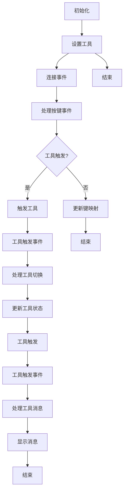

## 类结构

```
ToolManager (工具管理器)
├── ToolEvent (工具事件)
│   ├── ToolTriggerEvent (工具触发事件)
│   └── ToolManagerMessageEvent (工具管理器消息事件)
└── ToolBase (工具基类)
```

## 全局变量及字段


### `_key_press_handler_id`
    
The ID of the key press event handler.

类型：`int`
    


### `_tools`
    
A dictionary mapping tool names to their respective objects.

类型：`dict`
    


### `_keys`
    
A dictionary mapping keys to tool names.

类型：`dict`
    


### `_toggled`
    
A dictionary tracking the toggled state of tools in radio groups.

类型：`dict`
    


### `_callbacks`
    
A callback registry for handling tool events.

类型：`CallbackRegistry`
    


### `keypresslock`
    
A lock to prevent key press events from being processed multiple times.

类型：`LockDraw`
    


### `messagelock`
    
A lock to prevent message events from being processed multiple times.

类型：`LockDraw`
    


### `_figure`
    
The Figure object managed by the ToolManager.

类型：`Figure`
    


### `ToolEvent.name`
    
The name of the event.

类型：`str`
    


### `ToolEvent.sender`
    
The sender of the event.

类型：`object`
    


### `ToolEvent.tool`
    
The tool associated with the event.

类型：`object`
    


### `ToolEvent.data`
    
Additional data associated with the event.

类型：`object`
    


### `ToolTriggerEvent.canvasevent`
    
The canvas event associated with the tool trigger event.

类型：`Event`
    


### `ToolManagerMessageEvent.message`
    
The message to be displayed to the user.

类型：`str`
    


### `ToolManager.figure`
    
The Figure object associated with the ToolManager.

类型：`Figure`
    


### `ToolManager.keypresslock`
    
A lock to prevent key press events from being processed multiple times.

类型：`LockDraw`
    


### `ToolManager.messagelock`
    
A lock to prevent message events from being processed multiple times.

类型：`LockDraw`
    
    

## 全局函数及方法


### `ToolManager.set_figure`

该函数将给定的图绑定到工具。

参数：

- `figure`：`.Figure`，要绑定的图。
- `update_tools`：`bool`，默认为True，强制工具更新图。

返回值：无

#### 流程图

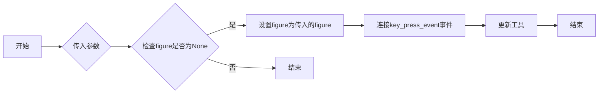

#### 带注释源码

```python
def set_figure(self, figure, update_tools=True):
    """
    Bind the given figure to the tools.

    Parameters
    ----------
    figure : `.Figure`
    update_tools : bool, default: True
        Force tools to update figure.
    """
    if self._key_press_handler_id:
        self.canvas.mpl_disconnect(self._key_press_handler_id)
    self._figure = figure
    if figure:
        self._key_press_handler_id = self.canvas.mpl_connect(
            'key_press_event', self._key_press)
    if update_tools:
        for tool in self._tools.values():
            tool.figure = figure
```


### `ToolManager.toolmanager_connect`

Connect event with string `s` to `func`.

参数：

- `s`：`str`，The name of the event. The following events are recognized:
  - 'tool_message_event'
  - 'tool_removed_event'
  - 'tool_added_event'
  - 'tool_trigger_TOOLNAME', where TOOLNAME is the id of the tool. For every tool added a new event is created.
- `func`：`callable`，Callback function for the toolmanager event with signature `def func(event: ToolEvent) -> Any`

返回值：`cid`，The callback id for the connection. This can be used in `.toolmanager_disconnect`.

#### 流程图

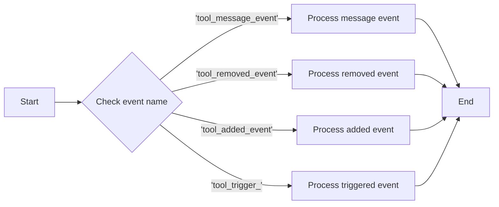

#### 带注释源码

```python
def toolmanager_connect(self, s, func):
    """
    Connect event with string *s* to *func*.
    """
    return self._callbacks.connect(s, func)
```


### `toolmanager_disconnect`

Disconnects a callback ID from the ToolManager.

参数：

- `cid`：`int`，The callback ID to disconnect.

返回值：`None`

#### 流程图

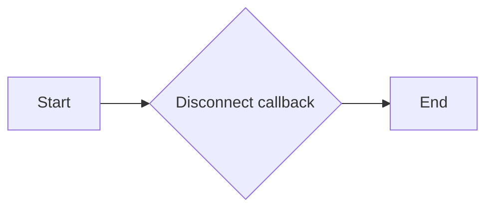

#### 带注释源码

```python
def toolmanager_disconnect(self, cid):
    """
    Disconnect callback id *cid*.

    Example usage::
        cid = toolmanager.toolmanager_connect('tool_trigger_zoom', onpress)
        #...later
        toolmanager.toolmanager_disconnect(cid)
    """
    return self._callbacks.disconnect(cid)
```


### message_event

Emit a `ToolManagerMessageEvent`.

参数：

- message：`str`，The message to be displayed to the user.
- sender：`object`，The sender of the message. Defaults to the `ToolManager` instance itself.

返回值：`None`，No return value.

#### 流程图

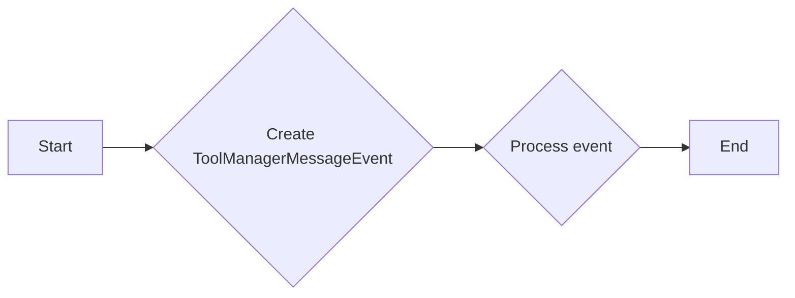

#### 带注释源码

```python
def message_event(self, message, sender=None):
    """Emit a `ToolManagerMessageEvent`."""
    if sender is None:
        sender = self

    s = 'tool_message_event'
    event = ToolManagerMessageEvent(s, sender, message)
    self._callbacks.process(s, event)
``` 


### `ToolManager.active_toggle`

返回当前启用的工具。

参数：

- 无

返回值：`dict`，包含当前启用的工具名称和工具对象。

#### 流程图

```mermaid
graph LR
A[ToolManager.active_toggle()] --> B{返回值}
B --> C[dict]
C --> D{包含当前启用的工具名称和工具对象}
```

#### 带注释源码

```python
    @property
    def active_toggle(self):
        """Currently toggled tools."""
        return self._toggled
```


### `ToolManager.get_tool_keymap`

Return the keymap associated with the specified tool.

参数：

- `name`：`str`，Name of the Tool. The name of the Tool for which the keymap is to be returned.

返回值：`list of str`，List of keys associated with the tool.

#### 流程图

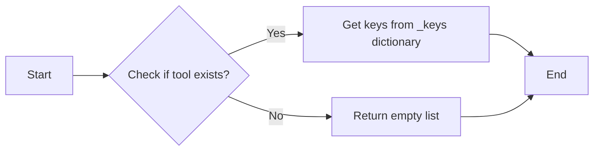

#### 带注释源码

```python
def get_tool_keymap(self, name):
    """
    Return the keymap associated with the specified tool.

    Parameters
    ----------
    name : str
        Name of the Tool.

    Returns
    -------
    list of str
        List of keys associated with the tool.
    """

    keys = [k for k, i in self._keys.items() if i == name]
    return keys
```


### `_remove_keys`

Remove the key bindings associated with a specific tool.

参数：

- `name`：`str`，The name of the tool for which to remove key bindings.

返回值：`None`，No return value.

#### 流程图

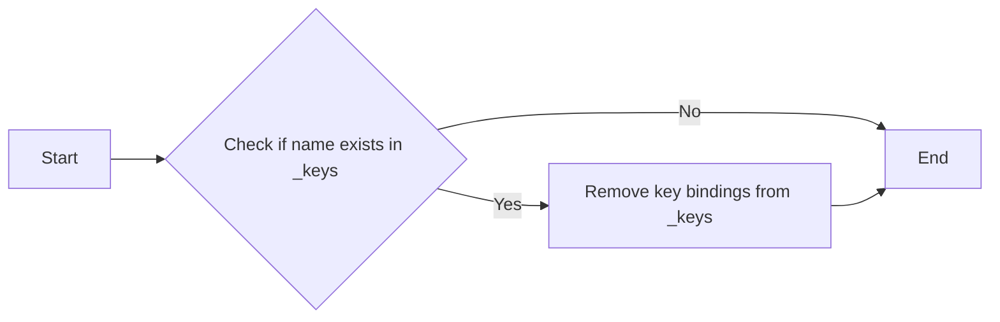

#### 带注释源码

```python
def _remove_keys(self, name):
    for k in self.get_tool_keymap(name):
        del self._keys[k]
```


### `ToolManager.update_keymap`

Set the keymap to associate with the specified tool.

参数：

- `name`：`str`，The Name of the Tool. This is used to identify the tool with which the keymap should be associated.
- `key`：`str` 或 `list of str`，Keys to associate with the tool. This can be a single key or a list of keys. The keys will be associated with the specified tool, allowing the user to trigger the tool using these keys.

返回值：`None`，This method does not return any value. It updates the internal keymap for the specified tool.

#### 流程图

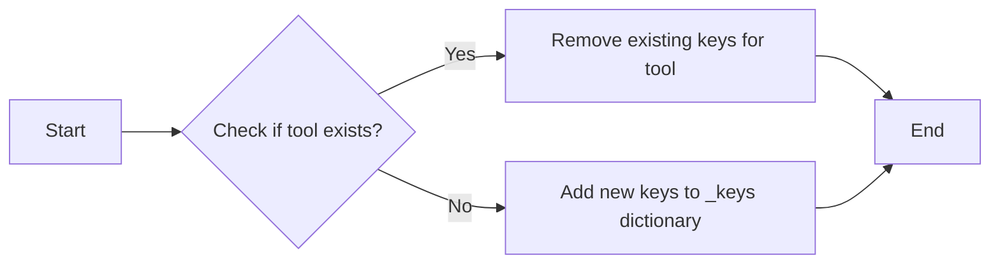

#### 带注释源码

```python
def update_keymap(self, name, key):
    """
    Set the keymap to associate with the specified tool.

    Parameters
    ----------
    name : str
        Name of the Tool.
    key : str or list of str
        Keys to associate with the tool.
    """
    if name not in self._tools:
        raise KeyError(f'{name!r} not in Tools')
    self._remove_keys(name)
    if isinstance(key, str):
        key = [key]
    for k in key:
        if k in self._keys:
            _api.warn_external(
                f'Key {k} changed from {self._keys[k]} to {name}')
        self._keys[k] = name
``` 


### `ToolManager.remove_tool(name)`

Remove a tool from the `ToolManager`.

参数：

- `name`：`str`，The name of the tool to be removed.

返回值：`None`，No return value.

#### 流程图

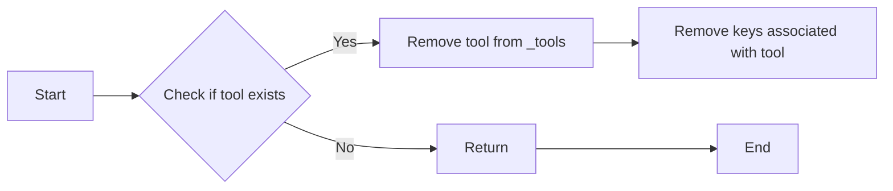

#### 带注释源码

```python
def remove_tool(self, name):
    """
    Remove tool named *name*.

    Parameters
    ----------
    name : str
        Name of the tool.
    """
    tool = self.get_tool(name)
    if getattr(tool, 'toggled', False):  # If it's a toggled toggle tool, untoggle
        self.trigger_tool(tool, 'toolmanager')
    self._remove_keys(name)
    event = ToolEvent('tool_removed_event', self, tool)
    self._callbacks.process(event.name, event)
    del self._tools[name]
``` 


### `ToolManager.add_tool`

Add a tool to the `ToolManager`.

参数：

- `name`：`str`，工具的名称，用于标识工具的唯一标识符。
- `tool`：`type`，要添加的工具的类。
- `*args`：可变参数，传递给工具构造函数的参数。
- `**kwargs`：关键字参数，传递给工具构造函数的参数。

返回值：`ToolBase`，添加的工具对象。

#### 流程图

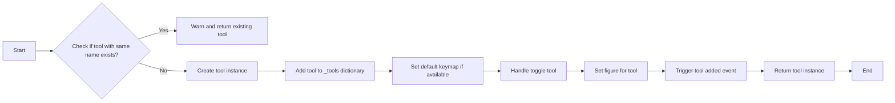

#### 带注释源码

```python
def add_tool(self, name, tool, *args, **kwargs):
    """
    Add *tool* to `ToolManager`.

    If successful, adds a new event ``tool_trigger_{name}`` where
    ``{name}`` is the *name* of the tool; the event is fired every time the
    tool is triggered.

    Parameters
    ----------
    name : str
        Name of the tool, treated as the ID, has to be unique.
    tool : type
        Class of the tool to be added.  A subclass will be used
        instead if one was registered for the current canvas class.
    *args, **kwargs
        Passed to the *tool*'s constructor.

    See Also
    --------
    matplotlib.backend_tools.ToolBase : The base class for tools.
    """

    tool_cls = backend_tools._find_tool_class(type(self.canvas), tool)
    if not tool_cls:
        raise ValueError('Impossible to find class for %s' % str(tool))

    if name in self._tools:
        _api.warn_external('A "Tool class" with the same name already '
                           'exists, not added')
        return self._tools[name]

    tool_obj = tool_cls(self, name, *args, **kwargs)
    self._tools[name] = tool_obj

    if tool_obj.default_keymap is not None:
        self.update_keymap(name, tool_obj.default_keymap)

    # For toggle tools init the radio_group in self._toggled
    if isinstance(tool_obj, backend_tools.ToolToggleBase):
        # None group is not mutually exclusive, a set is used to keep track
        # of all toggled tools in this group
        if tool_obj.radio_group is None:
            self._toggled.setdefault(None, set())
        else:
            self._toggled.setdefault(tool_obj.radio_group, None)

        # If initially toggled
        if tool_obj.toggled:
            self._handle_toggle(tool_obj, None, None)

    tool_obj.set_figure(self.figure)

    event = ToolEvent('tool_added_event', self, tool_obj)
    self._callbacks.process(event.name, event)

    return tool_obj
```


### `_handle_toggle`

Toggle tools, need to untoggle prior to using other Toggle tool. Called from trigger_tool.

参数：

- `tool`：`.ToolBase`，The tool to be toggled.
- `canvasevent`：`Event`，Original Canvas event or None.
- `data`：`object`，Extra data to pass to the tool when triggering.

返回值：无

#### 流程图

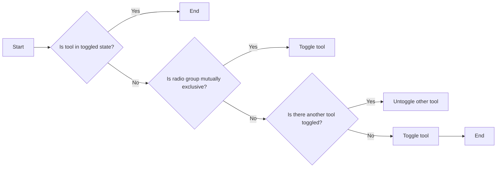

#### 带注释源码

```python
def _handle_toggle(self, tool, canvasevent, data):
    """
    Toggle tools, need to untoggle prior to using other Toggle tool.
    Called from trigger_tool.

    Parameters
    ----------
    tool : `.ToolBase`
        The tool to be toggled.
    canvasevent : Event
        Original Canvas event or None.
    data : object
        Extra data to pass to the tool when triggering.
    """

    radio_group = tool.radio_group
    # radio_group None is not mutually exclusive
    # just keep track of toggled tools in this group
    if radio_group is None:
        if tool.name in self._toggled[None]:
            self._toggled[None].remove(tool.name)
        else:
            self._toggled[None].add(tool.name)
        return

    # If the tool already has a toggled state, untoggle it
    if self._toggled[radio_group] == tool.name:
        toggled = None
    # If no tool was toggled in the radio_group
    # toggle it
    elif self._toggled[radio_group] is None:
        toggled = tool.name
    # Other tool in the radio_group is toggled
    else:
        # Untoggle previously toggled tool
        self.trigger_tool(self._toggled[radio_group],
                          self,
                          canvasevent,
                          data)
        toggled = tool.name

    # Keep track of the toggled tool in the radio_group
    self._toggled[radio_group] = toggled
``` 


### `ToolManager.trigger_tool`

Trigger a tool and emit the `tool_trigger_{name}` event.

参数：

- `name`：`str`，The name of the tool to be triggered.
- `sender`：`object`，Object that wishes to trigger the tool. Defaults to `self`.
- `canvasevent`：`Event`，Original Canvas event or `None`. Defaults to `None`.
- `data`：`object`，Extra data to pass to the tool when triggering. Defaults to `None`.

返回值：`None`，No return value.

#### 流程图

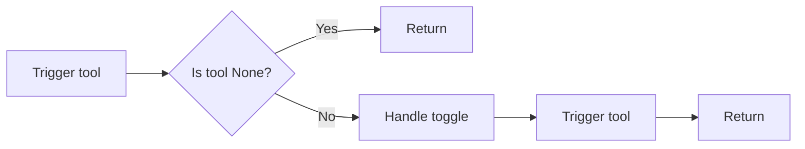

#### 带注释源码

```python
def trigger_tool(self, name, sender=None, canvasevent=None, data=None):
    """
    Trigger a tool and emit the `tool_trigger_{name}` event.

    Parameters
    ----------
    name : str
        Name of the tool.
    sender : object
        Object that wishes to trigger the tool.
    canvasevent : Event
        Original Canvas event or None.
    data : object
        Extra data to pass to the tool when triggering.

    Returns
    -------
    None
        No return value.
    """
    tool = self.get_tool(name)
    if tool is None:
        return

    if sender is None:
        sender = self

    if isinstance(tool, backend_tools.ToolToggleBase):
        self._handle_toggle(tool, canvasevent, data)

    tool.trigger(sender, canvasevent, data)  # Actually trigger Tool.

    s = 'tool_trigger_%s' % name
    event = ToolTriggerEvent(s, sender, tool, canvasevent, data)
    self._callbacks.process(s, event)
```


### `_key_press`

This method handles key press events on the canvas.

参数：

- `event`：`Event`，The key press event from the canvas.

返回值：`None`，No return value, it processes the event internally.

#### 流程图

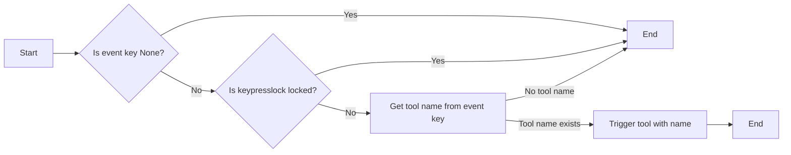

#### 带注释源码

```python
def _key_press(self, event):
    if event.key is None or self.keypresslock.locked():
        return

    name = self._keys.get(event.key, None)
    if name is None:
        return
    self.trigger_tool(name, canvasevent=event)
```


### `ToolManager.get_tool_keymap`

Return the keymap associated with the specified tool.

参数：

- `name`：`str`，The Name of the Tool. Name of the Tool.

返回值：`list of str`，List of keys associated with the tool. List of keys associated with the tool.

#### 流程图

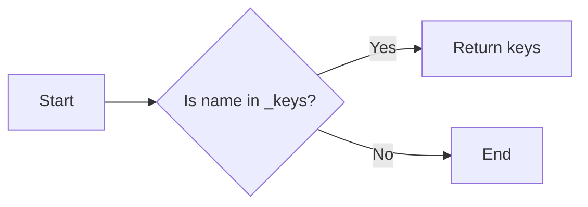

#### 带注释源码

```python
def get_tool_keymap(self, name):
    """
    Return the keymap associated with the specified tool.

    Parameters
    ----------
    name : str
        Name of the Tool.

    Returns
    -------
    list of str
        List of keys associated with the tool.
    """

    keys = [k for k, i in self._keys.items() if i == name]
    return keys
```


### ToolEvent.__init__

初始化 ToolEvent 对象。

参数：

- `name`：`str`，工具事件的名称。
- `sender`：`object`，发送事件的工具或对象。
- `tool`：`object`，触发事件的工具对象。
- `data`：`object`，与事件相关的数据，可选。

返回值：无

#### 流程图

```mermaid
classDiagram
    ToolEvent <|-- ToolTriggerEvent
    ToolEvent <|-- ToolManagerMessageEvent
    ToolEvent {
        +name : str
        +sender : object
        +tool : object
        +data : object
        +__init__(name: str, sender: object, tool: object, data: object=None)
    }
    ToolTriggerEvent {
        +canvasevent : object
    }
    ToolManagerMessageEvent {
        +message : str
    }
```

#### 带注释源码

```python
from matplotlib import _api, backend_tools, cbook, widgets

class ToolEvent:
    """Event for tool manipulation (add/remove)."""
    def __init__(self, name, sender, tool, data=None):
        self.name = name
        self.sender = sender
        self.tool = tool
        self.data = data
```


### ToolTriggerEvent.__init__

This method initializes a `ToolTriggerEvent` object, which is a subclass of `ToolEvent`. It is used to inform that a tool has been triggered.

参数：

- `name`：`str`，The name of the event.
- `sender`：`object`，The object that triggered the event.
- `tool`：`object`，The tool that was triggered.
- `canvasevent`：`object`，The canvas event that triggered the tool, if any.
- `data`：`object`，Additional data associated with the event, if any.

返回值：`None`，This method does not return a value.

#### 流程图

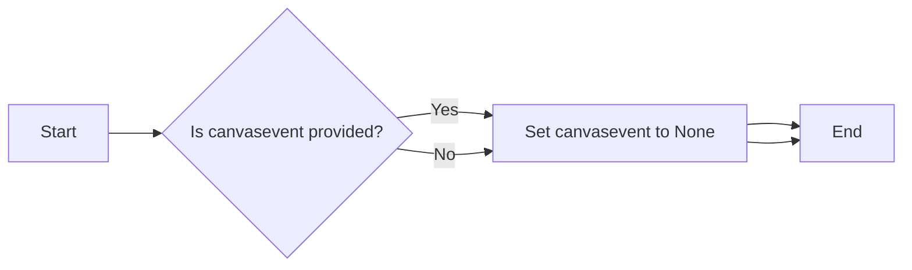

#### 带注释源码

```python
def __init__(self, name, sender, tool, canvasevent=None, data=None):
    super().__init__(name, sender, tool, data)
    self.canvasevent = canvasevent
```


### ToolManagerMessageEvent.__init__

This method initializes a `ToolManagerMessageEvent` object, which is used to carry messages from the toolmanager to the user, typically displayed by the toolbar.

参数：

- `name`：`str`，The name of the event, which is a string identifier for the event.
- `sender`：`object`，The sender of the event, typically the toolmanager or another component that generates the event.
- `message`：`str`，The message to be displayed to the user.

返回值：`None`，This method does not return any value.

#### 流程图

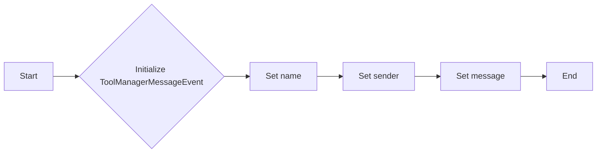

#### 带注释源码

```python
def __init__(self, name, sender, message):
    self.name = name  # Set the name of the event
    self.sender = sender  # Set the sender of the event
    self.message = message  # Set the message to be displayed
```


### ToolManager.__init__

This method initializes the `ToolManager` class, setting up the necessary attributes and connections to manage tools and events within a matplotlib figure.

参数：

- `figure=None`：`Figure`，The matplotlib figure to which the tools will be bound. If `None`, no figure is bound.

返回值：无

#### 流程图

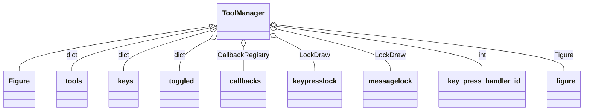

#### 带注释源码

```python
def __init__(self, figure=None):
    self._key_press_handler_id = None

    self._tools = {}
    self._keys = {}
    self._toggled = {}
    self._callbacks = cbook.CallbackRegistry()

    # to process keypress event
    self.keypresslock = widgets.LockDraw()
    self.messagelock = widgets.LockDraw()

    self._figure = None
    self.set_figure(figure)
```


### ToolManager.set_figure

This method binds the given figure to the tools.

参数：

- `figure`：`.Figure`，The figure to bind to the tools.
- `update_tools`：`bool`，default: True，Force tools to update figure.

返回值：`None`，No return value.

#### 流程图

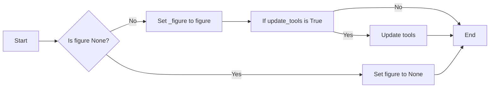

#### 带注释源码

```python
def set_figure(self, figure, update_tools=True):
    """
    Bind the given figure to the tools.

    Parameters
    ----------
    figure : `.Figure`
    update_tools : bool, default: True
        Force tools to update figure.
    """
    if self._key_press_handler_id:
        self.canvas.mpl_disconnect(self._key_press_handler_id)
    self._figure = figure
    if figure:
        self._key_press_handler_id = self.canvas.mpl_connect(
            'key_press_event', self._key_press)
    if update_tools:
        for tool in self._tools.values():
            tool.figure = figure
```


### ToolManager.toolmanager_connect

Connect event with string `s` to `func`.

参数：

- `s`：`str`，The name of the event. The following events are recognized:
  - 'tool_message_event'
  - 'tool_removed_event'
  - 'tool_added_event'
  - 'tool_trigger_TOOLNAME', where TOOLNAME is the id of the tool. For every tool added a new event is created.
- `func`：`callable`，Callback function for the toolmanager event with signature `def func(event: ToolEvent) -> Any`

返回值：`cid`，The callback id for the connection. This can be used in `.toolmanager_disconnect`.

#### 流程图

```mermaid
graph LR
A[Start] --> B{Check event name}
B -->|'tool_message_event'| C[Process 'tool_message_event']
B -->|'tool_removed_event'| D[Process 'tool_removed_event']
B -->|'tool_added_event'| E[Process 'tool_added_event']
B -->|'tool_trigger_'| F[Process 'tool_trigger_' event]
B -->|Other| G[Return]
C --> H[Call callback]
D --> H
E --> H
F --> H
H --> I[End]
```

#### 带注释源码

```python
def toolmanager_connect(self, s, func):
    """
    Connect event with string *s* to *func*.

    Parameters
    ----------
    s : str
        The name of the event. The following events are recognized:
        - 'tool_message_event'
        - 'tool_removed_event'
        - 'tool_added_event'
        - 'tool_trigger_TOOLNAME', where TOOLNAME is the id of the tool. For every tool added a new event is created
    func : callable
        Callback function for the toolmanager event with signature
        def func(event: ToolEvent) -> Any

    Returns
    -------
    cid
        The callback id for the connection. This can be used in .toolmanager_disconnect.
    """
    return self._callbacks.connect(s, func)
```


### ToolManager.toolmanager_disconnect

Disconnects a callback ID from the ToolManager.

参数：

- `cid`：`int`，The callback ID to disconnect.

返回值：`None`

#### 流程图

```mermaid
graph LR
A[Start] --> B{Disconnect callback}
B --> C[End]
```

#### 带注释源码

```python
def toolmanager_disconnect(self, cid):
    """
    Disconnect callback id *cid*.

    Example usage::
        cid = toolmanager.toolmanager_connect('tool_trigger_zoom', onpress)
        #...later
        toolmanager.toolmanager_disconnect(cid)
    """
    return self._callbacks.disconnect(cid)
```


### ToolManager.message_event

Emit a `ToolManagerMessageEvent`.

参数：

- `message`：`str`，The message to be displayed to the user.
- `sender`：`object`，The sender of the message. Defaults to the `ToolManager` instance itself.

返回值：`None`，No return value.

#### 流程图

```mermaid
graph LR
A[ToolManager.message_event] --> B{Create ToolManagerMessageEvent}
B --> C{Process message}
C --> D[Display message to user]
```

#### 带注释源码

```python
def message_event(self, message, sender=None):
    """Emit a `ToolManagerMessageEvent`."""
    if sender is None:
        sender = self

    s = 'tool_message_event'
    event = ToolManagerMessageEvent(s, sender, message)
    self._callbacks.process(s, event)
```


### ToolManager.active_toggle

返回当前启用的工具。

参数：

- 无

返回值：`dict`，包含当前启用的工具名称和工具对象。

#### 流程图

```mermaid
graph LR
A[ToolManager.active_toggle()] --> B{返回值}
B --> C[dict]
C --> D{包含当前启用的工具名称和工具对象}
```

#### 带注释源码

```python
    @property
    def active_toggle(self):
        """Currently toggled tools."""
        return self._toggled
```


### ToolManager.get_tool_keymap

Return the keymap associated with the specified tool.

参数：

- `name`：`str`，Name of the Tool. The name of the tool for which the keymap is to be returned.

返回值：`list of str`，List of keys associated with the tool.

#### 流程图

```mermaid
graph LR
A[Start] --> B{Check if tool exists}
B -- Yes --> C[Get keys from _keys dictionary]
B -- No --> D[Return empty list]
C --> E[End]
D --> E
```

#### 带注释源码

```python
def get_tool_keymap(self, name):
    """
    Return the keymap associated with the specified tool.

    Parameters
    ----------
    name : str
        Name of the Tool.

    Returns
    -------
    list of str
        List of keys associated with the tool.
    """

    keys = [k for k, i in self._keys.items() if i == name]
    return keys
``` 


### ToolManager._remove_keys

Remove the key bindings associated with a specific tool.

参数：

- `name`：`str`，The name of the tool for which to remove key bindings.

返回值：`None`，No value is returned.

#### 流程图

```mermaid
graph LR
A[Start] --> B{Check if tool exists}
B -->|Yes| C[Remove key bindings]
B -->|No| D[End]
C --> D
```

#### 带注释源码

```python
def _remove_keys(self, name):
    for k in self.get_tool_keymap(name):
        del self._keys[k]
```


### ToolManager.update_keymap

Set the keymap to associate with the specified tool.

参数：

- `name`：`str`，The Name of the Tool. This is used to identify the tool to which the keymap will be associated.
- `key`：`str` 或 `list of str`，Keys to associate with the tool. This can be a single key or a list of keys. The keys will be associated with the specified tool.

返回值：`None`，This method does not return any value.

#### 流程图

```mermaid
graph LR
A[Start] --> B{Check if tool exists}
B -- Yes --> C[Remove existing keys for tool]
B -- No --> D[Add new keys to _keys dictionary]
C --> E[End]
D --> E
```

#### 带注释源码

```python
def update_keymap(self, name, key):
    """
    Set the keymap to associate with the specified tool.

    Parameters
    ----------
    name : str
        Name of the Tool.
    key : str or list of str
        Keys to associate with the tool.
    """
    if name not in self._tools:
        raise KeyError(f'{name!r} not in Tools')
    self._remove_keys(name)
    if isinstance(key, str):
        key = [key]
    for k in key:
        if k in self._keys:
            _api.warn_external(
                f'Key {k} changed from {self._keys[k]} to {name}')
        self._keys[k] = name
```


### ToolManager.remove_tool

Remove a tool from the `ToolManager`.

参数：

- `name`：`str`，The name of the tool to be removed.

返回值：`None`，No value is returned.

#### 流程图

```mermaid
graph LR
A[Start] --> B{Check if tool exists}
B -- Yes --> C[Remove tool from _tools]
B -- No --> D[Return]
C --> E[Remove keys associated with tool]
D --> F[End]
```

#### 带注释源码

```python
def remove_tool(self, name):
    """
    Remove tool named *name*.

    Parameters
    ----------
    name : str
        Name of the tool.
    """
    tool = self.get_tool(name)
    if getattr(tool, 'toggled', False):  # If it's a toggled toggle tool, untoggle
        self.trigger_tool(tool, 'toolmanager')
    self._remove_keys(name)
    event = ToolEvent('tool_removed_event', self, tool)
    self._callbacks.process(event.name, event)
    del self._tools[name]
``` 


### ToolManager.add_tool

This method adds a tool to the `ToolManager`.

参数：

- `name`：`str`，工具的名称，用于标识工具的唯一标识符。
- `tool`：`type`，要添加的工具的类。
- `*args`：可变参数，传递给工具构造函数的参数。
- `**kwargs`：关键字参数，传递给工具构造函数的参数。

返回值：`ToolBase`，添加的工具对象。

#### 流程图

```mermaid
graph LR
A[Start] --> B{Check if tool with same name exists?}
B -- Yes --> C[Warn and return existing tool]
B -- No --> D[Create tool instance]
D --> E[Add tool to _tools dictionary]
E --> F[Set tool's figure]
F --> G[Check if tool is a toggle tool]
G -- Yes --> H[Initialize radio group]
H --> I[Set tool's toggled state]
I --> J[End]
G -- No --> J
```

#### 带注释源码

```python
def add_tool(self, name, tool, *args, **kwargs):
    """
    Add *tool* to `ToolManager`.

    If successful, adds a new event ``tool_trigger_{name}`` where
    ``{name}`` is the *name* of the tool; the event is fired every time the
    tool is triggered.

    Parameters
    ----------
    name : str
        Name of the tool, treated as the ID, has to be unique.
    tool : type
        Class of the tool to be added.  A subclass will be used
        instead if one was registered for the current canvas class.
    *args, **kwargs
        Passed to the *tool*'s constructor.

    See Also
    --------
    matplotlib.backend_tools.ToolBase : The base class for tools.
    """

    tool_cls = backend_tools._find_tool_class(type(self.canvas), tool)
    if not tool_cls:
        raise ValueError('Impossible to find class for %s' % str(tool))

    if name in self._tools:
        _api.warn_external('A "Tool class" with the same name already '
                           'exists, not added')
        return self._tools[name]

    tool_obj = tool_cls(self, name, *args, **kwargs)
    self._tools[name] = tool_obj

    if tool_obj.default_keymap is not None:
        self.update_keymap(name, tool_obj.default_keymap)

    # For toggle tools init the radio_group in self._toggled
    if isinstance(tool_obj, backend_tools.ToolToggleBase):
        # None group is not mutually exclusive, a set is used to keep track
        # of all toggled tools in this group
        if tool_obj.radio_group is None:
            self._toggled.setdefault(None, set())
        else:
            self._toggled.setdefault(tool_obj.radio_group, None)

        # If initially toggled
        if tool_obj.toggled:
            self._handle_toggle(tool_obj, None, None)

    tool_obj.set_figure(self.figure)

    event = ToolEvent('tool_added_event', self, tool_obj)
    self._callbacks.process(event.name, event)

    return tool_obj
```


### ToolManager._handle_toggle

Toggle tools, need to untoggle prior to using other Toggle tool. Called from trigger_tool.

参数：

- `tool`：`.ToolBase`，The tool to be toggled.
- `canvasevent`：`Event`，Original Canvas event or None.
- `data`：`object`，Extra data to pass to the tool when triggering.

返回值：无

#### 流程图

```mermaid
graph LR
A[Start] --> B{Is tool in toggled state?}
B -- Yes --> C[End]
B -- No --> D{Is radio group mutually exclusive?}
D -- Yes --> E[Toggle tool]
D -- No --> F{Is there another tool toggled?}
F -- Yes --> G[Untoggle other tool]
F -- No --> H[Toggle tool]
H --> I[End]
```

#### 带注释源码

```python
def _handle_toggle(self, tool, canvasevent, data):
    """
    Toggle tools, need to untoggle prior to using other Toggle tool.
    Called from trigger_tool.

    Parameters
    ----------
    tool : `.ToolBase`
        The tool to be toggled.
    canvasevent : Event
        Original Canvas event or None.
    data : object
        Extra data to pass to the tool when triggering.
    """

    radio_group = tool.radio_group
    # radio_group None is not mutually exclusive
    # just keep track of toggled tools in this group
    if radio_group is None:
        if tool.name in self._toggled[None]:
            self._toggled[None].remove(tool.name)
        else:
            self._toggled[None].add(tool.name)
        return

    # If the tool already has a toggled state, untoggle it
    if self._toggled[radio_group] == tool.name:
        toggled = None
    # If no tool was toggled in the radio_group
    # toggle it
    elif self._toggled[radio_group] is None:
        toggled = tool.name
    # Other tool in the radio_group is toggled
    else:
        # Untoggle previously toggled tool
        self.trigger_tool(self._toggled[radio_group],
                          self,
                          canvasevent,
                          data)
        toggled = tool.name

    # Keep track of the toggled tool in the radio_group
    self._toggled[radio_group] = toggled
``` 


### ToolManager.trigger_tool

触发一个工具并发出相应的 `tool_trigger_{name}` 事件。

参数：

- `name`：`str`，工具的名称。
- `sender`：`object`，触发工具的对象，默认为 `self`。
- `canvasevent`：`Event`，原始的画布事件，默认为 `None`。
- `data`：`object`，传递给工具的额外数据，默认为 `None`。

返回值：`None`，没有返回值。

#### 流程图

```mermaid
graph LR
A[触发工具] --> B{工具存在?}
B -- 是 --> C[处理工具]
B -- 否 --> D[结束]
C --> E[发出事件]
E --> F[结束]
```

#### 带注释源码

```python
def trigger_tool(self, name, sender=None, canvasevent=None, data=None):
    """
    Trigger a tool and emit the ``tool_trigger_{name}`` event.

    Parameters
    ----------
    name : str
        Name of the tool.
    sender : object
        Object that wishes to trigger the tool.
    canvasevent : Event
        Original Canvas event or None.
    data : object
        Extra data to pass to the tool when triggering.
    """
    tool = self.get_tool(name)
    if tool is None:
        return

    if sender is None:
        sender = self

    if isinstance(tool, backend_tools.ToolToggleBase):
        self._handle_toggle(tool, canvasevent, data)

    tool.trigger(sender, canvasevent, data)  # Actually trigger Tool.

    s = 'tool_trigger_%s' % name
    event = ToolTriggerEvent(s, sender, tool, canvasevent, data)
    self._callbacks.process(s, event)
``` 


### ToolManager._key_press

This method handles key press events on the canvas.

参数：

- `event`：`Event`，The key press event from the canvas.

返回值：`None`，No return value, it processes the event internally.

#### 流程图

```mermaid
graph LR
A[Start] --> B{Is event key None?}
B -- Yes --> C[End]
B -- No --> D{Is keypresslock locked?}
D -- Yes --> C[End]
D -- No --> E[Get tool name from event key]
E -- No tool name --> C[End]
E -- Tool name exists --> F[Trigger tool with name]
F --> G[End]
```

#### 带注释源码

```python
def _key_press(self, event):
    if event.key is None or self.keypresslock.locked():
        return

    name = self._keys.get(event.key, None)
    if name is None:
        return
    self.trigger_tool(name, canvasevent=event)
```


### ToolManager.get_tool

Return the tool object with the given name.

参数：

- `name`：`str`，The name of the tool, or the tool itself.
- `warn`：`bool`，Whether a warning should be emitted it no tool with the given name exists.

返回值：`.ToolBase` or `None`，The tool or `None` if no tool with the given name exists.

#### 流程图

```mermaid
graph LR
A[Start] --> B{Check if name is ToolBase instance?}
B -- Yes --> C[Return tool]
B -- No --> D{Check if name in _tools?}
D -- Yes --> C
D -- No --> E[Warn and return None]
E --> F[End]
```

#### 带注释源码

```python
def get_tool(self, name, warn=True):
    """
    Return the tool object with the given name.

    For convenience, this passes tool objects through.

    Parameters
    ----------
    name : str or `.ToolBase`
        Name of the tool, or the tool itself.
    warn : bool, default: True
        Whether a warning should be emitted it no tool with the given name exists.

    Returns
    -------
    `.ToolBase` or None
        The tool or None if no tool with the given name exists.
    """
    if (isinstance(name, backend_tools.ToolBase)
            and name.name in self._tools):
        return name
    if name not in self._tools:
        if warn:
            _api.warn_external(
                f"ToolManager does not control tool {name!r}")
        return None
    return self._tools[name]
```


## 关键组件


### 张量索引与惰性加载

张量索引与惰性加载是代码中处理数据的一种方式，它允许在需要时才计算或加载数据，从而提高效率。

### 反量化支持

反量化支持是代码中实现的一种功能，它允许对量化后的数据进行反量化处理，以便进行进一步的分析或操作。

### 量化策略

量化策略是代码中用于优化数据表示和存储的一种方法，它通过减少数据精度来减少内存使用，同时保持足够的精度以满足应用需求。


## 问题及建议


### 已知问题

-   **代码复杂度**：`ToolManager` 类包含大量的属性和方法，这可能导致代码难以理解和维护。
-   **事件处理**：事件处理机制可能过于复杂，特别是对于工具的添加、移除和触发。
-   **错误处理**：代码中缺少明确的错误处理机制，例如在添加工具时如果工具名称已存在，则没有抛出异常。
-   **代码重复**：在 `ToolManager` 类中存在一些重复的代码，例如在添加和移除工具时更新键映射。

### 优化建议

-   **重构代码**：将 `ToolManager` 类拆分为更小的、更易于管理的类，以降低代码复杂度。
-   **简化事件处理**：简化事件处理逻辑，使其更易于理解和维护。
-   **增加错误处理**：在添加工具时，如果工具名称已存在，则抛出异常。
-   **消除代码重复**：通过提取公共代码到单独的函数或类来消除代码重复。
-   **文档化**：为每个类和方法添加详细的文档注释，以提高代码的可读性。
-   **单元测试**：编写单元测试以确保代码的正确性和稳定性。


## 其它


### 设计目标与约束

- 设计目标：
  - 提供一个灵活且可扩展的工具管理器，能够处理用户交互（如按键、工具栏点击）在图上的触发动作。
  - 支持工具的添加、移除和触发，以及工具之间的交互。
  - 提供事件机制，允许外部组件监听和管理工具事件。
- 约束：
  - 工具名称必须是唯一的。
  - 工具类必须继承自`matplotlib.backend_tools.ToolBase`或其子类。
  - 工具的默认快捷键必须在工具类中定义。

### 错误处理与异常设计

- 错误处理：
  - 当尝试添加一个已存在的工具时，将发出警告并返回现有工具。
  - 当尝试获取一个不存在的工具时，将返回`None`并可能发出警告。
  - 当尝试连接一个不存在的回调事件时，将抛出异常。
- 异常设计：
  - 使用`KeyError`来处理工具名称不存在的错误。
  - 使用`ValueError`来处理无法找到工具类的情况。

### 数据流与状态机

- 数据流：
  - 用户交互（如按键）触发`key_press_event`。
  - `ToolManager`根据按键和工具映射触发相应的工具。
  - 工具触发后，可能产生事件，如`ToolTriggerEvent`。
- 状态机：
  - 工具可以处于激活或未激活状态。
  - 某些工具（如切换工具）可以属于一个组，并且只能同时激活一个工具。

### 外部依赖与接口契约

- 外部依赖：
  - `matplotlib`库，特别是`_api`, `backend_tools`, `cbook`, 和 `widgets`模块。
- 接口契约：
  - `ToolBase`类定义了工具的基本接口，包括`trigger`方法。
  - `ToolManager`类提供了工具的添加、移除、触发和事件处理功能。


    