# `matplotlib\lib\matplotlib\backend_managers.pyi` 详细设计文档

The code provides a framework for managing tools and events in a matplotlib figure canvas, allowing for dynamic tool addition and event handling.

## 整体流程

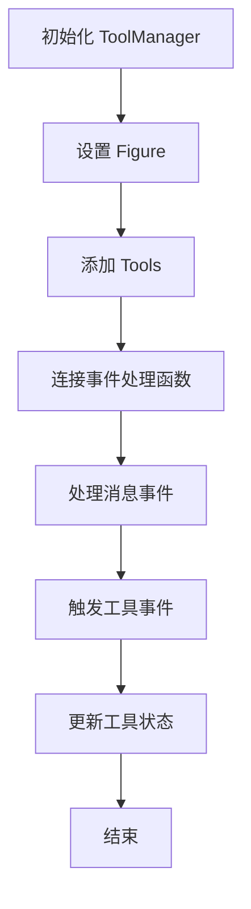

## 类结构

```
ToolManager (工具管理器)
├── ToolEvent (工具事件)
│   ├── ToolTriggerEvent (工具触发事件)
│   └── ToolManagerMessageEvent (工具管理器消息事件)
└── FigureCanvasBase (图形单元基类)
```

## 全局变量及字段


### `name`
    
The name of the event.

类型：`str`
    


### `sender`
    
The sender of the event.

类型：`Any`
    


### `tool`
    
The tool associated with the event.

类型：`backend_tools.ToolBase`
    


### `data`
    
Additional data associated with the event.

类型：`Any`
    


### `canvasevent`
    
The canvas event that triggered this event.

类型：`ToolEvent`
    


### `message`
    
The message sent by the sender.

类型：`str`
    


### `ToolManager.keypresslock`
    
Lock for keypress events.

类型：`widgets.LockDraw`
    


### `ToolManager.messagelock`
    
Lock for message events.

类型：`widgets.LockDraw`
    


### `ToolManager.figure`
    
The figure managed by the ToolManager.

类型：`Figure`
    


### `ToolManager.tools`
    
The tools managed by the ToolManager.

类型：`dict[str, backend_tools.ToolBase]`
    
    

## 全局函数及方法


### ToolEvent.__init__

初始化 ToolEvent 对象，用于存储工具事件的相关信息。

参数：

- `name`：`str`，事件名称
- `sender`：`Any`，事件发送者
- `tool`：`backend_tools.ToolBase`，触发事件的工具
- `data`：`Any | None`，事件数据，默认为 None

返回值：`None`，无返回值

#### 流程图

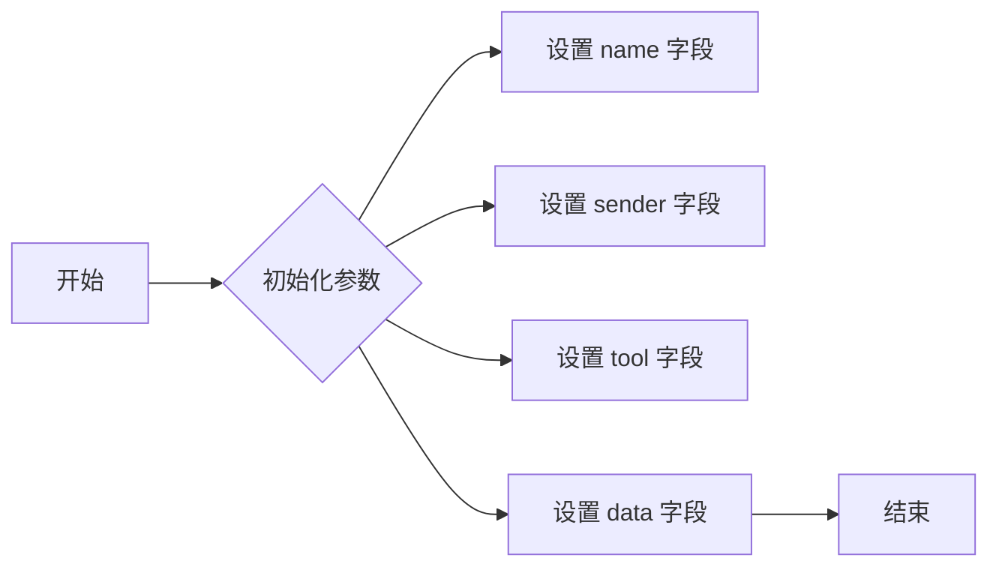

#### 带注释源码

```python
from matplotlib import backend_tools, widgets
from matplotlib.backend_bases import FigureCanvasBase
from matplotlib.figure import Figure

from collections.abc import Callable, Iterable
from typing import Any, TypeVar

class ToolEvent:
    name: str
    sender: Any
    tool: backend_tools.ToolBase
    data: Any

    def __init__(self, name: str, sender: Any, tool: backend_tools.ToolBase, data: Any | None = ...) -> None:
        self.name = name
        self.sender = sender
        self.tool = tool
        self.data = data
```


### ToolTriggerEvent.__init__

初始化 ToolTriggerEvent 对象，设置事件名称、发送者、工具和可选的数据。

参数：

- `name`：`str`，事件名称
- `sender`：`Any`，事件的发送者
- `tool`：`backend_tools.ToolBase`，触发事件的工具
- `canvasevent`：`ToolEvent | None`，与画布事件相关的 ToolEvent 对象，默认为 None
- `data`：`Any | None`，与事件相关的数据，默认为 None

返回值：`None`，无返回值

#### 流程图

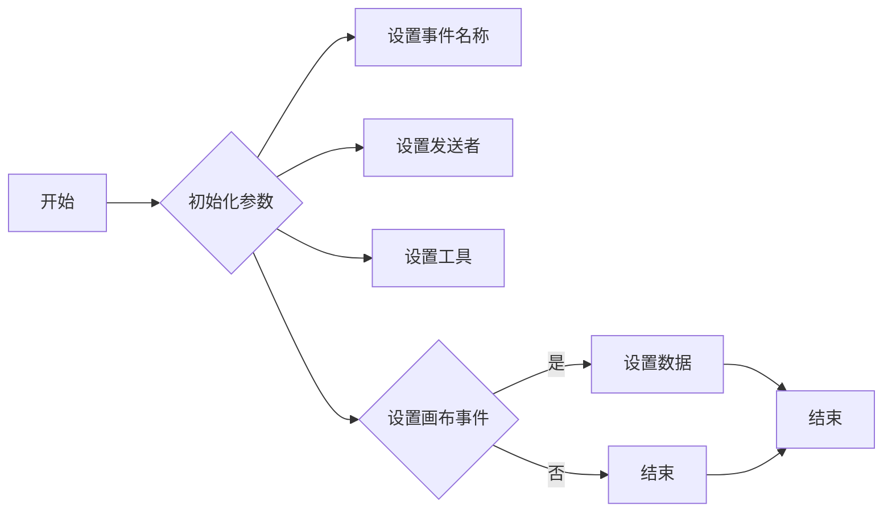

#### 带注释源码

```python
class ToolTriggerEvent(ToolEvent):
    canvasevent: ToolEvent
    def __init__(
        self,
        name,
        sender,
        tool,
        canvasevent: ToolEvent | None = ...,
        data: Any | None = ...,
    ) -> None:
        # 设置事件名称
        self.name = name
        # 设置发送者
        self.sender = sender
        # 设置工具
        self.tool = tool
        # 设置画布事件
        self.canvasevent = canvasevent
        # 设置数据
        self.data = data
``` 


### ToolManagerMessageEvent.__init__

初始化 ToolManagerMessageEvent 对象，设置事件名称、发送者和消息内容。

参数：

- `name`：`str`，事件名称
- `sender`：`Any`，事件的发送者
- `message`：`str`，事件的消息内容

返回值：`None`，无返回值

#### 流程图

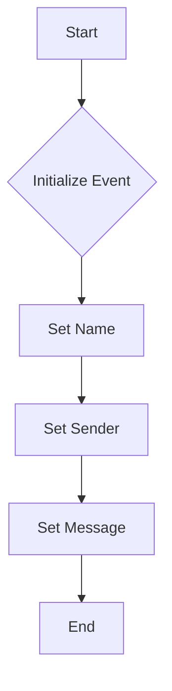

#### 带注释源码

```python
class ToolManagerMessageEvent:
    name: str
    sender: Any
    message: str

    def __init__(self, name: str, sender: Any, message: str) -> None:
        self.name = name
        self.sender = sender
        self.message = message
```


### ToolManager.__init__

初始化ToolManager类，设置初始的Figure对象和相关的锁。

参数：

- `figure`：`Figure | None`，可选参数，用于指定初始的Figure对象。

返回值：无

#### 流程图

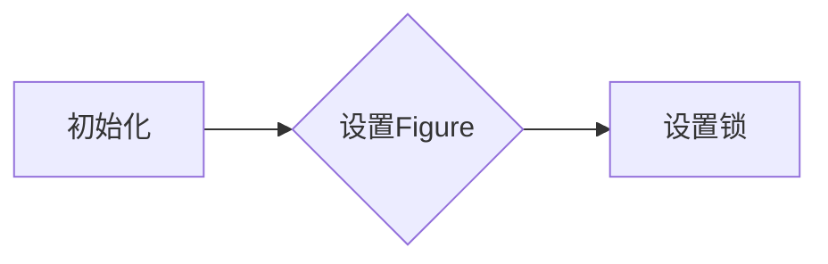

#### 带注释源码

```python
from matplotlib import backend_tools, widgets
from matplotlib.backend_bases import FigureCanvasBase
from matplotlib.figure import Figure

from collections.abc import Callable, Iterable
from typing import Any, TypeVar

class ToolEvent:
    name: str
    sender: Any
    tool: backend_tools.ToolBase
    data: Any
    def __init__(self, name, sender, tool, data: Any | None = ...) -> None: ...

class ToolTriggerEvent(ToolEvent):
    canvasevent: ToolEvent
    def __init__(
        self,
        name,
        sender,
        tool,
        canvasevent: ToolEvent | None = ...,
        data: Any | None = ...,
    ) -> None: ...

class ToolManagerMessageEvent:
    name: str
    sender: Any
    message: str
    def __init__(self, name: str, sender: Any, message: str) -> None: ...

class ToolManager:
    keypresslock: widgets.LockDraw
    messagelock: widgets.LockDraw
    def __init__(self, figure: Figure | None = ...) -> None: 
        # 初始化ToolManager类
        self.keypresslock = widgets.LockDraw()
        self.messagelock = widgets.LockDraw()
        if figure is not None:
            self.figure = figure
    @property
    def canvas(self) -> FigureCanvasBase | None: ...
    @property
    def figure(self) -> Figure | None: ...
    @figure.setter
    def figure(self, figure: Figure) -> None: ...
    def set_figure(self, figure: Figure, update_tools: bool = ...) -> None: ...
    def toolmanager_connect(self, s: str, func: Callable[[ToolEvent], Any]) -> int: ...
    def toolmanager_disconnect(self, cid: int) -> None: ...
    def message_event(self, message: str, sender: Any | None = ...) -> None: ...
    @property
    def active_toggle(self) -> dict[str | None, list[str] | str]: ...
    def get_tool_keymap(self, name: str) -> list[str]: ...
    def update_keymap(self, name: str, key: str | Iterable[str]) -> None: ...
    def remove_tool(self, name: str) -> None: ...
    _T = TypeVar("_T", bound=backend_tools.ToolBase)
    def add_tool(self, name: str, tool: type[_T], *args, **kwargs) -> _T: ...
    def trigger_tool(
        self,
        name: str | backend_tools.ToolBase,
        sender: Any | None = ...,
        canvasevent: ToolEvent | None = ...,
        data: Any | None = ...,
    ) -> None: ...
    @property
    def tools(self) -> dict[str, backend_tools.ToolBase]: ...
    def get_tool(
        self, name: str | backend_tools.ToolBase, warn: bool = ...
    ) -> backend_tools.ToolBase | None: ...
```


### ToolManager.set_figure

该函数用于设置ToolManager的figure属性，并可选地更新工具。

参数：

- `figure`：`Figure`，matplotlib的Figure对象，用于设置ToolManager的figure属性。
- `update_tools`：`bool`，默认为True，如果为True，则更新所有工具以反映新的figure。

返回值：无

#### 流程图

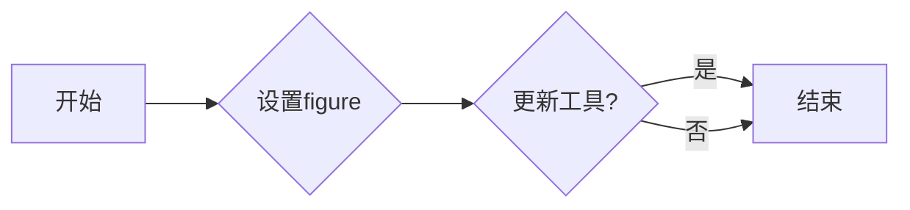

#### 带注释源码

```python
def set_figure(self, figure: Figure, update_tools: bool = True) -> None:
    # 设置ToolManager的figure属性
    self.figure = figure
    
    # 如果需要，更新所有工具
    if update_tools:
        for tool in self.tools.values():
            tool.figure = figure
```


### ToolManager.toolmanager_connect

该函数用于连接一个工具事件处理器到特定的工具事件。

参数：

- `s`：`str`，工具的名称，用于标识要连接的事件处理器。
- `func`：`Callable[[ToolEvent], Any]`，事件处理器函数，当工具事件发生时会被调用。

返回值：`int`，返回连接的ID，用于后续的断开连接操作。

#### 流程图

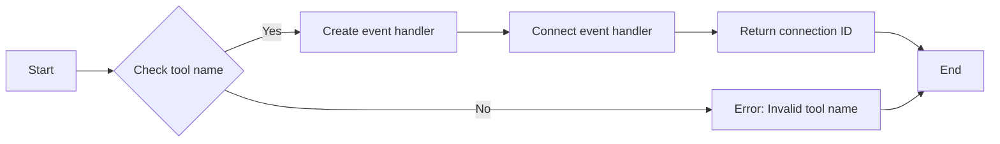

#### 带注释源码

```python
def toolmanager_connect(self, s: str, func: Callable[[ToolEvent], Any]) -> int:
    # Check if the tool name is valid
    if s not in self.tools:
        raise ValueError("Invalid tool name")
    
    # Create an event handler for the tool
    event_handler = self._create_event_handler(func)
    
    # Connect the event handler to the tool
    self.tools[s].connect(event_handler)
    
    # Return the connection ID
    return self._get_connection_id(event_handler)
```


### ToolManager.toolmanager_disconnect

该函数用于断开与特定工具的连接。

参数：

- `cid`：`int`，工具的连接ID，用于标识要断开的工具。

返回值：`None`，没有返回值。

#### 流程图

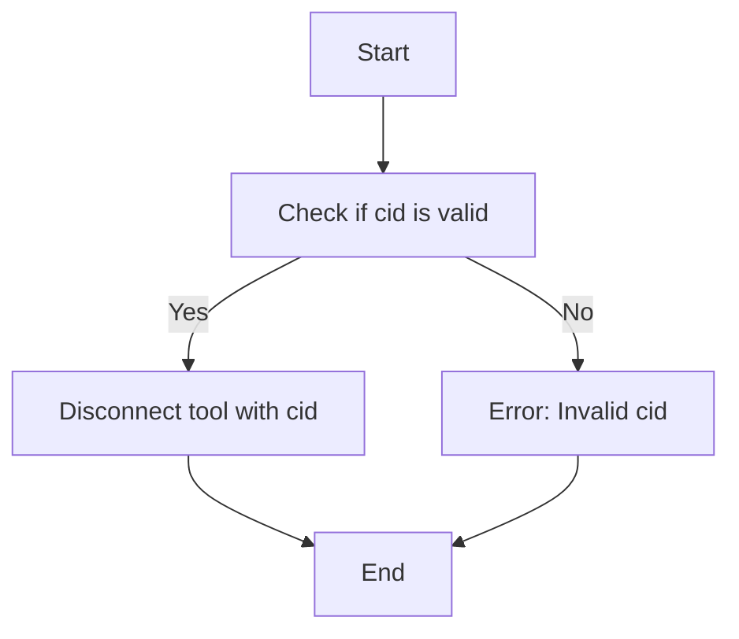

#### 带注释源码

```python
def toolmanager_disconnect(self, cid: int) -> None:
    # Check if the cid is valid and disconnect the tool if it is
    if self._tool_connections.get(cid) is not None:
        tool = self._tool_connections.pop(cid)
        # Disconnect the tool from the manager
        tool.disconnect()
    else:
        # If the cid is not valid, raise an error
        raise ValueError("Invalid connection ID")
```


### ToolManager.message_event

该函数用于在ToolManager中触发一个消息事件。

参数：

- `message`：`str`，消息内容，用于描述事件的具体信息。
- `sender`：`Any`，发送者，表示触发事件的主体。

返回值：`None`，该函数不返回任何值。

#### 流程图

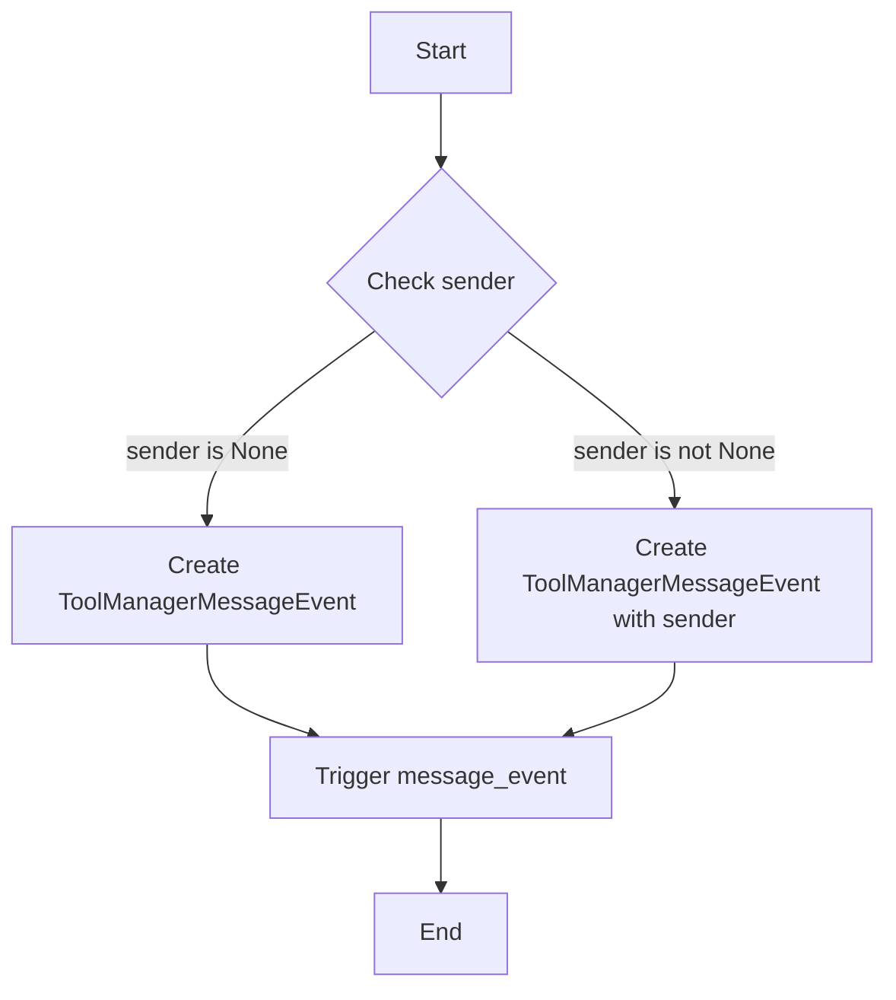

#### 带注释源码

```python
def message_event(self, message: str, sender: Any | None = ...) -> None:
    # 创建消息事件
    event = ToolManagerMessageEvent(name="message_event", sender=sender, message=message)
    # 触发消息事件
    self.trigger_tool("message_event", canvasevent=event)
``` 


### ToolManager.active_toggle

返回当前激活的工具列表。

参数：

- 无

返回值：`dict[str | None, list[str] | str]`，包含工具名称和对应的激活状态。

#### 流程图

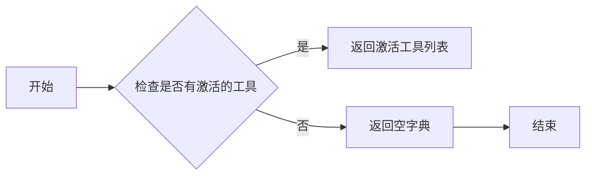

#### 带注释源码

```
@property
def active_toggle(self) -> dict[str | None, list[str] | str]:
    # 返回当前激活的工具列表
    return self._active_toggle
```


### ToolManager.get_tool_keymap

获取指定工具的键映射列表。

参数：

- `name`：`str`，工具的名称，用于标识要获取键映射的工具。

返回值：`list[str]`，包含指定工具的键映射列表。

#### 流程图

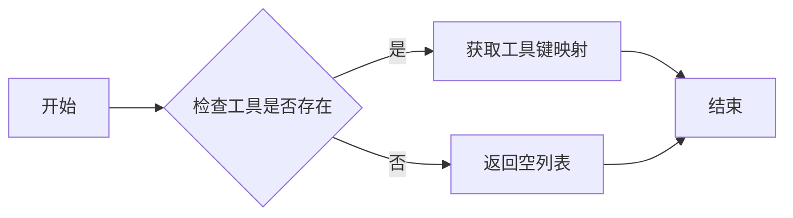

#### 带注释源码

```python
def get_tool_keymap(self, name: str) -> list[str]:
    # 检查工具是否存在
    if name not in self.tools:
        return []
    # 获取工具键映射
    return self.tools[name].keymap
```


### ToolManager.update_keymap

更新工具的键映射。

参数：

- `name`：`str`，工具的名称。
- `key`：`str` 或 `Iterable[str]`，要添加到键映射的键。

返回值：`None`，无返回值。

#### 流程图

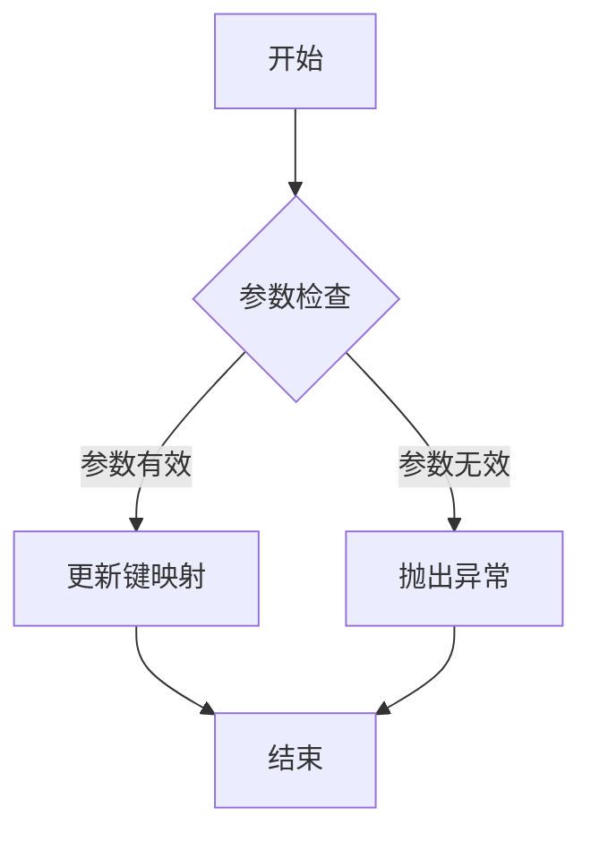

#### 带注释源码

```python
def update_keymap(self, name: str, key: str | Iterable[str]) -> None:
    # 检查工具是否存在
    tool = self.get_tool(name)
    if tool is None:
        raise ValueError(f"Tool '{name}' not found.")

    # 更新键映射
    tool.keymap.update(key)
```


### ToolManager.remove_tool

移除名为 `name` 的工具。

参数：

- `name`：`str`，工具的名称。

返回值：`None`，无返回值。

#### 流程图

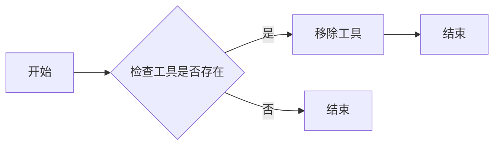

#### 带注释源码

```python
def remove_tool(self, name: str) -> None:
    # 检查工具是否存在
    if name in self.tools:
        # 移除工具
        del self.tools[name]
``` 


### ToolManager.add_tool

该函数用于向ToolManager中添加一个工具。

参数：

- `name`：`str`，工具的名称，用于标识工具。
- `tool`：`type[_T]`，工具的类型，必须是`backend_tools.ToolBase`的子类。
- `*args`：`Any`，传递给工具构造函数的额外位置参数。
- `**kwargs`：`Any`，传递给工具构造函数的额外关键字参数。

返回值：`_T`，添加的工具实例。

#### 流程图

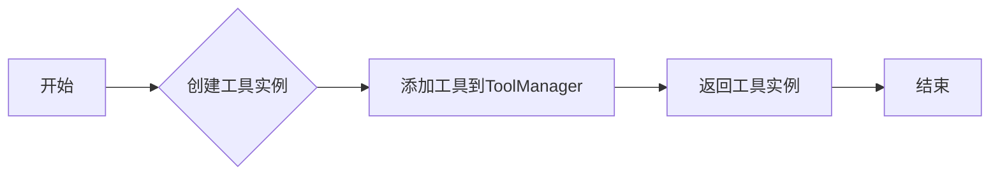

#### 带注释源码

```python
def add_tool(self, name: str, tool: type[_T], *args, **kwargs) -> _T:
    # 创建工具实例
    tool_instance = tool(*args, **kwargs)
    # 添加工具到ToolManager
    self.tools[name] = tool_instance
    # 返回工具实例
    return tool_instance
```


### ToolManager.trigger_tool

触发指定工具的事件。

参数：

- `name`：`str | backend_tools.ToolBase`，工具的名称或工具对象本身。
- `sender`：`Any | None`，触发事件的发送者。
- `canvasevent`：`ToolEvent | None`，与工具事件相关的画布事件。
- `data`：`Any | None`，与工具事件相关的数据。

返回值：`None`，无返回值。

#### 流程图

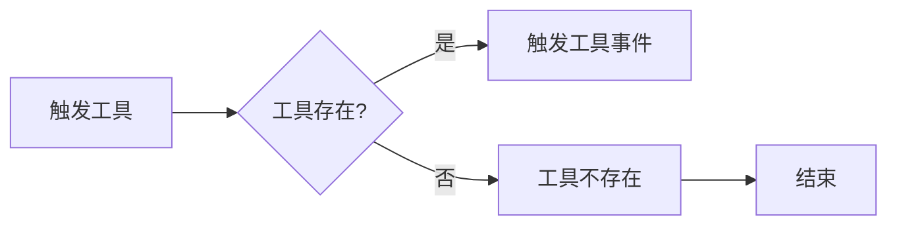

#### 带注释源码

```python
def trigger_tool(
    self,
    name: str | backend_tools.ToolBase,
    sender: Any | None = ...,
    canvasevent: ToolEvent | None = ...,
    data: Any | None = ...,
) -> None:
    # 检查工具是否存在
    tool = self.get_tool(name)
    if tool is None:
        # 工具不存在，结束
        return
    
    # 触发工具事件
    event = ToolTriggerEvent(
        name=str(tool),
        sender=sender,
        tool=tool,
        canvasevent=canvasevent,
        data=data,
    )
    # 触发事件
    self.toolmanager_connect(str(tool), lambda event: self.handle_tool_event(event))
```


### ToolManager.get_tool

获取指定名称或工具实例的工具对象。

参数：

- `name`：`str` 或 `backend_tools.ToolBase`，指定工具的名称或工具实例。
- `warn`：`bool`，当工具不存在时是否打印警告信息。

返回值：`backend_tools.ToolBase` 或 `None`，返回指定名称或工具实例的工具对象，如果工具不存在则返回 `None`。

#### 流程图

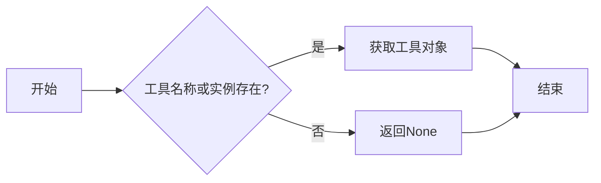

#### 带注释源码

```python
def get_tool(self, name: str | backend_tools.ToolBase, warn: bool = False) -> backend_tools.ToolBase | None:
    # 检查工具名称或实例是否存在于工具字典中
    if name in self.tools or isinstance(name, self.tools):
        # 获取工具对象
        return self.tools[name]
    # 如果工具不存在且warn为True，则打印警告信息
    if warn:
        print(f"Tool '{name}' not found.")
    # 返回None
    return None
```


## 关键组件


### 张量索引与惰性加载

张量索引与惰性加载是用于高效处理大型数据集的关键组件，它允许在需要时才计算数据，从而减少内存消耗和提高性能。

### 反量化支持

反量化支持是用于处理量化数据的关键组件，它允许在量化过程中进行反向操作，以便在需要时恢复原始数据。

### 量化策略

量化策略是用于优化模型性能的关键组件，它通过减少模型中使用的数值精度来减少模型大小和计算需求。


## 问题及建议


### 已知问题

-   **全局状态管理**：`ToolManager` 类中存在多个全局变量（如 `keypresslock` 和 `messagelock`），这可能导致代码难以维护和测试，因为全局状态可能会在代码的不同部分被意外修改。
-   **类型注解**：代码中使用了类型变量 `TypeVar`，但没有明确指定其边界类型，这可能导致类型检查的不准确。
-   **异常处理**：代码中没有显示异常处理机制，如果发生错误，可能会导致程序崩溃或不可预测的行为。
-   **文档注释**：代码中缺少详细的文档注释，这会使得其他开发者难以理解代码的功能和用法。

### 优化建议

-   **引入状态管理库**：考虑使用状态管理库来管理全局状态，这样可以提高代码的可维护性和可测试性。
-   **明确类型边界**：在类型注解中明确指定 `TypeVar` 的边界类型，以确保类型检查的准确性。
-   **添加异常处理**：在代码中添加异常处理机制，以捕获和处理可能发生的错误。
-   **编写文档注释**：为代码添加详细的文档注释，包括类、方法和函数的描述、参数和返回值的说明等，以提高代码的可读性和可维护性。
-   **代码重构**：考虑对代码进行重构，以提高代码的清晰度和可读性，例如将一些复杂的逻辑拆分成更小的函数。
-   **单元测试**：编写单元测试来验证代码的功能，确保代码的正确性和稳定性。


## 其它


### 设计目标与约束

- 设计目标：实现一个灵活且可扩展的工具管理器，能够处理matplotlib工具事件，并支持工具的动态添加和移除。
- 约束条件：遵守matplotlib的API规范，确保工具管理器与matplotlib的集成无缝。

### 错误处理与异常设计

- 异常处理：在工具管理器的各个方法中，使用try-except块捕获并处理可能发生的异常，如类型错误、值错误等。
- 错误日志：记录异常信息，便于问题追踪和调试。

### 数据流与状态机

- 数据流：工具事件通过事件监听机制传递给相应的处理函数。
- 状态机：工具管理器维护一个状态机，用于管理工具的激活和禁用状态。

### 外部依赖与接口契约

- 外部依赖：依赖于matplotlib库的FigureCanvasBase和Figure类。
- 接口契约：定义了ToolEvent、ToolTriggerEvent和ToolManagerMessageEvent等事件类，以及ToolManager类的方法接口。


    