# `matplotlib\lib\matplotlib\backend_tools.py` 详细设计文档

This module defines the backend tool infrastructure for Matplotlib, providing abstract base classes (ToolBase, ToolToggleBase) for creating interactive tools and a set of concrete default implementations (e.g., Zoom, Pan, Home, Grid) that handle user interface events to manipulate the Figure canvas.

## 整体流程

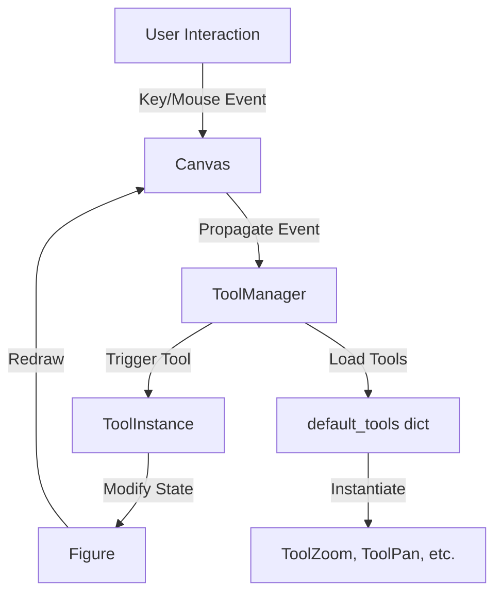

## 类结构

```
ToolBase (Abstract Base)
├── ToolToggleBase (Abstract Base for Toggleable Tools)
│   ├── AxisScaleBase
│   │   ├── ToolYScale
│   │   └── ToolXScale
│   ├── ZoomPanBase
│   │   ├── ToolZoom
│   │   └── ToolPan
│   └── (Implicit concrete tools)
├── ToolSetCursor
├── ToolCursorPosition
├── RubberbandBase
├── ToolQuit
├── ToolQuitAll
├── ToolGrid
├── ToolMinorGrid
├── ToolFullScreen
├── ToolViewsPositions
├── ViewsPositionsBase
│   ├── ToolHome
│   ├── ToolBack
│   └── ToolForward
├── ConfigureSubplotsBase
├── SaveFigureBase
├── ToolHelpBase
└── ToolCopyToClipboardBase
```

## 全局变量及字段


### `cursors`
    
Backend-independent cursor types enumeration, alias of Cursors class for backward compatibility

类型：`Cursors`
    


### `_tool_registry`
    
Registry storing (canvas_cls, tool_cls) tuples for tool class lookups

类型：`set`
    


### `_views_positions`
    
Identifier string for the views/positions tool used by ToolManager

类型：`str`
    


### `default_tools`
    
Default tools dictionary mapping tool names to tool classes for ToolManager

类型：`dict`
    


### `default_toolbar_tools`
    
Default toolbar layout specifying tool groups and their tool names

类型：`list`
    


### `Cursors.Cursors.POINTER`
    
Standard pointer cursor type

类型：`int`
    


### `Cursors.Cursors.HAND`
    
Hand cursor type typically for clickable elements

类型：`int`
    


### `Cursors.Cursors.SELECT_REGION`
    
Region selection cursor type

类型：`int`
    


### `Cursors.Cursors.MOVE`
    
Move cursor type for dragging operations

类型：`int`
    


### `Cursors.Cursors.WAIT`
    
Wait/busy cursor type

类型：`int`
    


### `Cursors.Cursors.RESIZE_HORIZONTAL`
    
Horizontal resize cursor type

类型：`int`
    


### `Cursors.Cursors.RESIZE_VERTICAL`
    
Vertical resize cursor type

类型：`int`
    


### `ToolBase.ToolBase._name`
    
Internal storage for the tool's unique identifier name

类型：`str`
    


### `ToolBase.ToolBase._toolmanager`
    
Reference to the ToolManager that controls this tool

类型：`ToolManager`
    


### `ToolBase.ToolBase._figure`
    
Internal storage for the figure affected by this tool

类型：`Figure`
    


### `ToolBase.ToolBase.default_keymap`
    
Keymap associating keys that trigger this tool when pressed on canvas

类型：`list[str]`
    


### `ToolBase.ToolBase.description`
    
Tooltip description used when the tool is included in a toolbar

类型：`str`
    


### `ToolBase.ToolBase.image`
    
Filename of the toolbar icon, either absolute or relative to the source file directory

类型：`str`
    


### `ToolToggleBase.ToolToggleBase._toggled`
    
Internal state tracking whether the toggle tool is currently enabled

类型：`bool`
    


### `ToolToggleBase.ToolToggleBase.radio_group`
    
Attribute to group mutually exclusive toggle tools

类型：`str`
    


### `ToolToggleBase.ToolToggleBase.cursor`
    
Cursor to display when this toggle tool is active

类型：`Cursors`
    


### `ToolToggleBase.ToolToggleBase.default_toggled`
    
Default initial state of the toggle tool

类型：`bool`
    


### `ToolSetCursor.ToolSetCursor._id_drag`
    
Connection ID for motion notify event handler

类型：`int`
    


### `ToolSetCursor.ToolSetCursor._current_tool`
    
Currently active toggle tool affecting cursor display

类型：`ToolToggleBase`
    


### `ToolSetCursor.ToolSetCursor._default_cursor`
    
Default cursor type when no toggle tool is active

类型：`Cursors`
    


### `ToolSetCursor.ToolSetCursor._last_cursor`
    
Last cursor type set, used to avoid redundant cursor changes

类型：`Cursors`
    


### `ToolCursorPosition.ToolCursorPosition._id_drag`
    
Connection ID for motion notify event handler to track cursor position

类型：`int`
    


### `ToolViewsPositions.ToolViewsPositions.views`
    
Weak-keyed dictionary storing view limits history per figure

类型：`WeakKeyDictionary`
    


### `ToolViewsPositions.ToolViewsPositions.positions`
    
Weak-keyed dictionary storing axes positions history per figure

类型：`WeakKeyDictionary`
    


### `ToolViewsPositions.ToolViewsPositions.home_views`
    
Weak-keyed dictionary storing home view for each axes in each figure

类型：`WeakKeyDictionary`
    


### `ViewsPositionsBase.ViewsPositionsBase._on_trigger`
    
Method name to call on the views/positions tool when triggered

类型：`str`
    


### `ZoomPanBase.ZoomPanBase._button_pressed`
    
Mouse button currently pressed for zoom/pan operation

类型：`int`
    


### `ZoomPanBase.ZoomPanBase._xypress`
    
List storing press event data for each axes during zoom/pan

类型：`list`
    


### `ZoomPanBase.ZoomPanBase._idPress`
    
Connection ID for button press event handler

类型：`int`
    


### `ZoomPanBase.ZoomPanBase._idRelease`
    
Connection ID for button release event handler

类型：`int`
    


### `ZoomPanBase.ZoomPanBase._idScroll`
    
Connection ID for scroll event handler for zoom functionality

类型：`int`
    


### `ZoomPanBase.ZoomPanBase.base_scale`
    
Base scale factor for zoom operations, typically 2.0 for doubling

类型：`float`
    


### `ZoomPanBase.ZoomPanBase.scrollthresh`
    
Time threshold in seconds to detect rapid scroll for view stack operations

类型：`float`
    


### `ZoomPanBase.ZoomPanBase.lastscroll`
    
Timestamp of the last scroll event for threshold detection

类型：`float`
    


### `ToolZoom.ToolZoom._ids_zoom`
    
List of connection IDs for zoom-related event handlers

类型：`list`
    


### `ToolZoom.ToolZoom._zoom_mode`
    
Current zoom mode ('x', 'y', or None) based on key press state

类型：`str`
    


### `ToolPan.ToolPan._id_drag`
    
Connection ID for motion notify event during pan operation

类型：`int`
    
    

## 全局函数及方法


### `_register_tool_class`

该函数是一个装饰器，用于将工具类（tool_cls）注册到特定的 Canvas 类（canvas_cls），从而实现 ToolManager 可以根据 Canvas 类型自动查找并实例化对应的工具子类。

参数：

- `canvas_cls`：`type`，需要注册工具类的 Canvas 类
- `tool_cls`：`type | None`，要注册的 Tool 类，如果为 None 则返回部分应用函数

返回值：`type | functools.partial`，返回被注册的 Tool 类或部分应用函数

#### 流程图

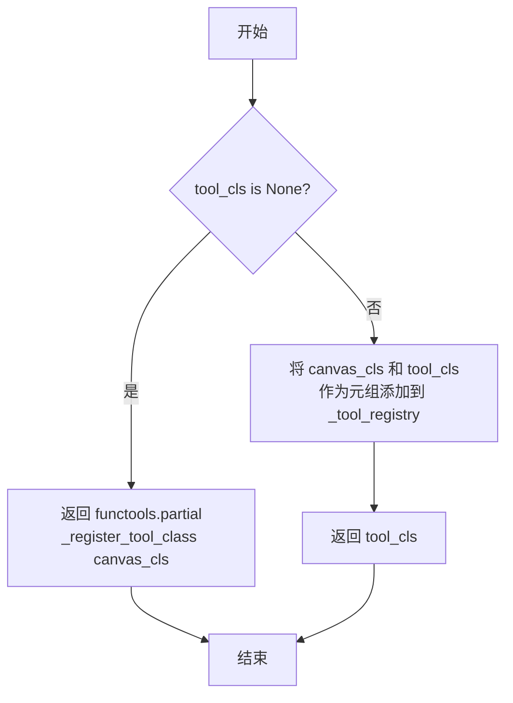

#### 带注释源码

```python
def _register_tool_class(canvas_cls, tool_cls=None):
    """
    Decorator registering *tool_cls* as a tool class for *canvas_cls*.
    
    This function can be used as a decorator or called directly.
    When used as @_register_tool_class(MyCanvas), it returns a partial function
    that will register the decorated class when called.
    
    Parameters
    ----------
    canvas_cls : type
        The Canvas class to associate with the tool class.
    tool_cls : type or None
        The Tool class to register. If None, returns a partial function.
        
    Returns
    -------
    type or functools.partial
        If tool_cls is provided, returns the tool_cls itself.
        If tool_cls is None, returns a partial function for deferred registration.
    """
    # If tool_cls is not provided, return a partial function for deferred registration
    # This allows usage as @_register_tool_class(MyCanvas) 
    if tool_cls is None:
        return functools.partial(_register_tool_class, canvas_cls)
    
    # Add the (canvas_cls, tool_cls) tuple to the registry set
    _tool_registry.add((canvas_cls, tool_cls))
    
    # Return the original tool class unchanged
    return tool_cls
```


### `_find_tool_class`

该函数用于在工具类注册表中查找与给定画布类匹配的工具子类。它通过遍历画布类的继承层次（MRO）和工具类的所有递归子类，在注册表中寻找匹配的工具类注册信息，从而实现工具类的动态定制，允许不同GUI后端为同一工具类提供特定实现。

参数：

- `canvas_cls`：`type`，指定要查找的画布类，函数会在注册表中查找是否有为该画布类（或其父类）注册的工具子类
- `tool_cls`：`type`，指定基础工具类，函数会遍历该类的所有子类来寻找匹配项

返回值：`type`，返回注册表中找到的工具子类，如果未找到匹配项则返回原始的 `tool_cls`

#### 流程图

```mermaid
flowchart TD
    A[开始: _find_tool_class] --> B[获取canvas_cls的MRO列表]
    B --> C[遍历canvas_parent in canvas_cls.__mro__]
    C --> D[获取tool_cls的所有递归子类]
    D --> E[遍历tool_child in _api.recursive_subclasses(tool_cls)]
    E --> F{检查 (canvas_parent, tool_child) 是否在注册表中}
    F -->|是| G[返回 tool_child]
    F -->|否| H{还有更多tool_child?}
    H -->|是| E
    H -->|否| I{还有更多canvas_parent?}
    I -->|是| C
    I -->|否| J[返回原始 tool_cls]
    G --> K[结束]
    J --> K
```

#### 带注释源码

```python
def _find_tool_class(canvas_cls, tool_cls):
    """
    Find a subclass of *tool_cls* registered for *canvas_cls*.
    
    该函数实现了工具类的动态查找机制，允许ToolManager在添加工具时
    自动使用为特定画布类注册的工具子类，而非默认的基础工具类。
    
    Parameters
    ----------
    canvas_cls : type
        画布类，用于在注册表中查找匹配的注册项。函数会检查该类及其所有父类。
    tool_cls : type
        基础工具类，函数会遍历该类的所有子类来寻找匹配项。
    
    Returns
    -------
    type
        返回找到的工具子类，如果注册表中没有匹配的注册项，
        则返回原始的tool_cls。
    """
    # 遍历canvas类的MRO（方法解析顺序），包括该类本身及其所有父类
    # 这样可以实现继承层次的查找，例如为BaseCanvas注册的工具也适用于DerivedCanvas
    for canvas_parent in canvas_cls.__mro__:
        # 遍历tool类的所有递归子类，包括tool_cls本身及其所有派生类
        # _api.recursive_subclasses返回一个迭代器，包含类本身及其所有子类
        for tool_child in _api.recursive_subclasses(tool_cls):
            # 检查这个(canvas_parent, tool_child)组合是否在注册表中
            # _tool_registry是一个集合，存储(canvas_cls, tool_cls)元组
            if (canvas_parent, tool_child) in _tool_registry:
                # 找到匹配项，返回注册的工具子类
                return tool_child
    # 如果遍历完所有可能的组合都没有找到匹配项，返回原始的工具类
    return tool_cls
```


### `add_tools_to_manager`

该函数用于将多个工具添加到 `ToolManager` 中，支持自定义工具集或使用默认工具集。

参数：

- `toolmanager`：`backend_managers.ToolManager`，要添加工具的目标管理器
- `tools`：`{str: class_like}`，可选，要添加的工具字典，键为工具名称，值为工具类，默认为 `default_tools`

返回值：`None`，无返回值

#### 流程图

```mermaid
flowchart TD
    A[开始 add_tools_to_manager] --> B{tools 是否为 None}
    B -->|是| C[使用 default_tools]
    B -->|否| D[使用传入的 tools]
    C --> E[遍历 tools.items()]
    D --> E
    E --> F[获取 name 和 tool]
    F --> G[调用 toolmanager.add_tool name tool]
    G --> H{是否还有更多工具}
    H -->|是| F
    H -->|否| I[结束]
```

#### 带注释源码

```python
def add_tools_to_manager(toolmanager, tools=None):
    """
    Add multiple tools to a `.ToolManager`.

    Parameters
    ----------
    toolmanager : `.backend_managers.ToolManager`
        Manager to which the tools are added.
    tools : {str: class_like}, optional
        The tools to add in a {name: tool} dict, see
        `.backend_managers.ToolManager.add_tool` for more info. If not specified, then
        defaults to `.default_tools`.
    """
    # 如果未指定 tools 参数，则使用默认工具集
    if tools is None:
        tools = default_tools
    # 遍历工具字典，将每个工具添加到管理器中
    for name, tool in tools.items():
        toolmanager.add_tool(name, tool)
```


### `add_tools_to_container`

该函数用于将多个工具批量添加到指定的工具栏容器中，支持自定义工具分组和顺序，若未指定工具列表则使用默认的工具栏配置。

参数：

- `container`：`Container`（`.backend_bases.ToolContainerBase` 对象），接收工具的目标容器。
- `tools`：`list`，可选参数，工具列表，格式为 `[[group1, [tool1, tool2 ...]], [group2, [...]]]`，其中每个子列表的第一个元素为分组名称，第二个元素为该分组下的工具名称列表。若未指定，则使用 `default_toolbar_tools`。

返回值：`None`，该函数无返回值，直接修改容器对象的状态。

#### 流程图

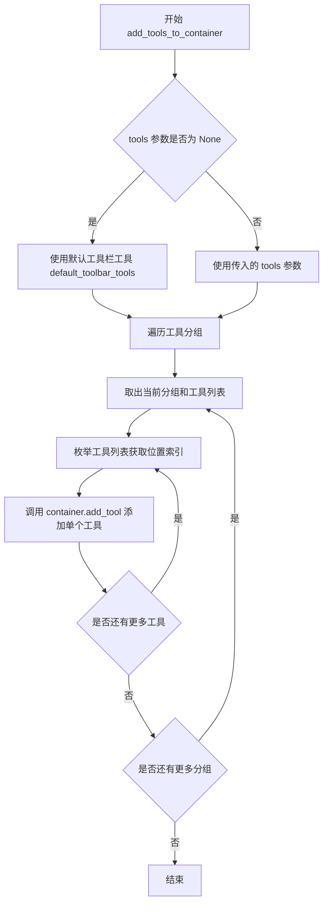

#### 带注释源码

```python
def add_tools_to_container(container, tools=None):
    """
    Add multiple tools to the container.

    Parameters
    ----------
    container : Container
        `.backend_bases.ToolContainerBase` object that will get the tools
        added.
    tools : list, optional
        List in the form ``[[group1, [tool1, tool2 ...]], [group2, [...]]]``
        where the tools ``[tool1, tool2, ...]`` will display in group1.
        See `.backend_bases.ToolContainerBase.add_tool` for details. If not specified,
        then defaults to `.default_toolbar_tools`.
    """
    # 如果未指定 tools 参数，则使用默认的工具栏工具配置
    if tools is None:
        tools = default_toolbar_tools
    # 遍历所有工具分组，每个分组包含组名和该组下的工具列表
    for group, grouptools in tools:
        # 枚举工具列表，同时获取每个工具的位置索引
        for position, tool in enumerate(grouptools):
            # 调用容器对象的 add_tool 方法，将工具添加到指定分组的指定位置
            container.add_tool(tool, group, position)
```


### `ToolBase.__init__`

该方法是 `ToolBase` 类的初始化方法，用于创建工具实例并初始化工具的基本属性，包括工具名称、所属的 ToolManager 以及关联的图形对象。

参数：

- `toolmanager`：`matplotlib.backend_managers.ToolManager`，管理该工具的 ToolManager 实例
- `name`：`str`，工具的唯一标识名称，必须在同一个 ToolManager 中保持唯一

返回值：`None`，该方法为构造函数，不返回任何值

#### 流程图

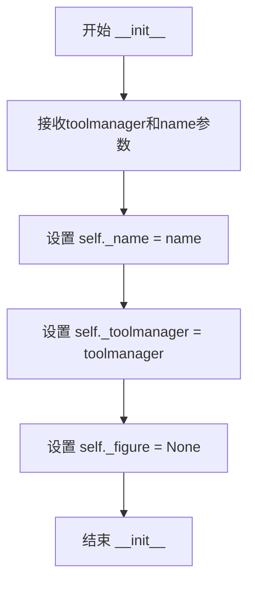

#### 带注释源码

```python
def __init__(self, toolmanager, name):
    """
    初始化 ToolBase 实例。

    Parameters
    ----------
    toolmanager : matplotlib.backend_managers.ToolManager
        管理该工具的 ToolManager 实例。
    name : str
        工具的唯一标识名称，必须在同一个 ToolManager 中保持唯一。
    """
    # 将工具名称存储到实例属性
    self._name = name
    # 将 ToolManager 引用存储到实例属性，用于后续与工具管理器交互
    self._toolmanager = toolmanager
    # 初始化 figure 为 None，表示当前工具未关联到任何图形
    self._figure = None
```


### `ToolBase.set_figure`

该方法是 `ToolBase` 类的核心方法之一，用于将工具实例与 `matplotlib` 图形（Figure）对象关联。它是实现工具与图形绑定的基本操作，`figure` 属性通过 property 装饰器调用此方法，使得子类可以重写该方法以实现自定义逻辑（如连接/断开事件监听器）。

参数：

- `self`：`ToolBase` 实例，方法的隐式参数，表示工具对象本身
- `figure`：`matplotlib.figure.Figure` 或 `None`，要关联的图形对象；`None` 表示解除关联

返回值：`None`，该方法无返回值（Python 默认返回 `None`）

#### 流程图

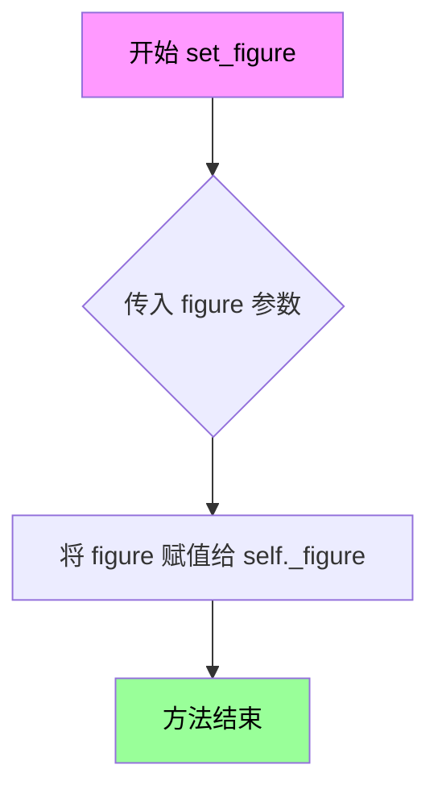

#### 带注释源码

```python
def set_figure(self, figure):
    """
    设置工具关联的图形对象。

    此方法是工具与图形绑定的核心入口点。通过将 figure 赋值给
    self._figure，工具可以访问对应的画布（canvas）并执行相关操作。

    Parameters
    ----------
    figure : matplotlib.figure.Figure or None
        要关联的图形对象。如果为 None，则表示解除当前关联。

    Returns
    -------
    None
    """
    # 直接将传入的 figure 对象存储到实例属性 _figure 中
    # ToolBase 的其他方法（如 canvas 属性）依赖于这个属性来判断
    # 当前是否有活跃的图形对象
    self._figure = figure
```


### `ToolBase._make_classic_style_pseudo_toolbar`

该方法返回一个带有单一 `canvas` 属性的占位符对象，用于复用经典工具栏已提供的工具实现。

参数：
- 该方法无显式参数（仅包含 `self`）

返回值：`SimpleNamespace`（来自 `types` 模块），返回一个具有 `canvas`属性的命名空间对象，其 `canvas` 属性值为当前工具的画布引用。

#### 流程图

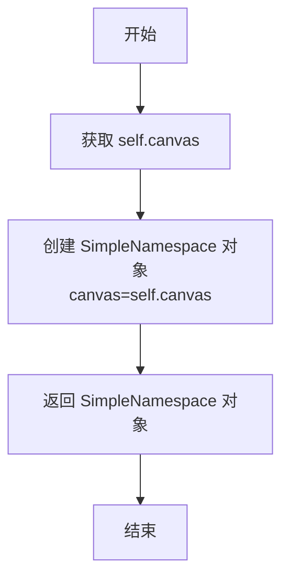

#### 带注释源码

```python
def _make_classic_style_pseudo_toolbar(self):
    """
    Return a placeholder object with a single `canvas` attribute.

    This is useful to reuse the implementations of tools already provided
    by the classic Toolbars.
    """
    # 创建一个 SimpleNamespace 对象，仅包含 canvas 属性
    # self.canvas 是通过 ToolBase 类中定义的 canvas property 获取的
    # 返回的占位符对象可用于兼容经典工具栏的工具实现
    return SimpleNamespace(canvas=self.canvas)
```


### ToolBase.trigger

该方法是所有工具的基类触发方法，当工具被激活时由ToolManager调用。这是一个空实现，设计为被子类重写以实现具体功能。

参数：

- `self`：ToolBase，当前工具实例
- `sender`：object，触发工具的对象（如ToolManager）
- `event`：Event，导致工具被调用的canvas事件
- `data`：object，可选的额外数据

返回值：`None`，该方法为基类空实现，无返回值

#### 流程图

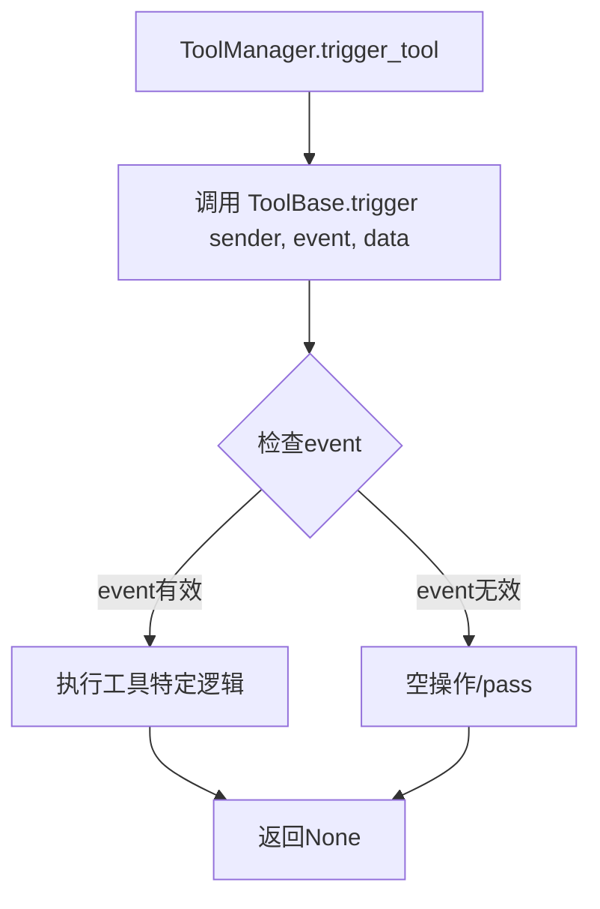

#### 带注释源码

```python
def trigger(self, sender, event, data=None):
    """
    Called when this tool gets used.

    This method is called by `.ToolManager.trigger_tool`.

    Parameters
    ----------
    event : `.Event`
        The canvas event that caused this tool to be called.
    sender : object
        Object that requested the tool to be triggered.
    data : object
        Extra data.
    """
    pass
```

#### 设计目标与约束

- **设计目标**：作为工具的基类触发接口，为所有工具提供统一的触发入口，子类通过重写该方法实现具体功能
- **约束**：该方法在基类中不做任何实际工作（pass），具体的工具实现需重写此方法

#### 错误处理与异常设计

- 基类中无错误处理机制，异常处理由子类实现

#### 数据流与状态机

- 数据流：ToolManager → trigger方法 → 子类重写的具体实现
- 状态机：trigger方法本身不维护状态，状态由子类（如ToolToggleBase）维护

#### 潜在技术债务或优化空间

1. **参数顺序不一致**：方法签名中参数顺序为`sender, event, data`，但文档字符串中描述顺序为`event, sender, data`，这种不一致可能导致使用困惑
2. **空实现基类**：作为基类使用pass作为空实现，虽然符合设计模式，但可以考虑添加更明确的文档或抛出NotImplementedError提醒子类必须重写


### ToolToggleBase.__init__

`ToolToggleBase.__init__` 是 `ToolToggleBase` 类的构造函数，用于初始化可切换工具的状态。它继承自 `ToolBase`，通过 `kwargs` 接收 `toggled` 参数来设置工具的初始状态。

参数：

- `*args`：`tuple`，可变长位置参数，传递给父类 `ToolBase.__init__`
- `**kwargs`：`dict`，关键字参数，其中 `toggled`（如果存在且为 True）设置工具的初始状态，其余参数传递给父类

返回值：`None`，构造函数无返回值

#### 流程图

```mermaid
flowchart TD
    A[开始 __init__] --> B{kwargs 中是否存在 'toggled'?}
    B -->|是| C[使用 kwargs['toggled'] 值]
    B -->|否| D[使用类属性 default_toggled 默认值]
    C --> E[设置 self._toggled]
    D --> E
    E --> F[调用父类 ToolBase.__init__]
    F --> G[结束 __init__]
```

#### 带注释源码

```python
def __init__(self, *args, **kwargs):
    """
    初始化 ToolToggleBase 实例。

    Parameters
    ----------
    *args : tuple
        可变长位置参数，传递给父类 ToolBase.__init__。
    **kwargs : dict
        关键字参数，其中 'toggled'（如果存在且为 True）设置工具的初始状态。
        其余参数传递给父类 ToolBase.__init__。
    """
    # 从 kwargs 中弹出 'toggled' 参数，
    # 如果存在则使用其值，否则使用类属性 default_toggled 的默认值
    self._toggled = kwargs.pop('toggled', self.default_toggled)
    
    # 调用父类 ToolBase 的初始化方法，
    # 传递剩余的 args 和 kwargs
    super().__init__(*args, **kwargs)
```


### ToolToggleBase.trigger

该方法实现了切换工具的基本逻辑，根据当前的`toggled`状态决定调用`enable`或`disable`方法，然后取反状态值以实现切换功能。

参数：

- `sender`：`object`，触发此工具的对象
- `event`：`matplotlib.backend_bases.Event`，导致此工具被调用的画布事件
- `data`：`object`，可选的额外数据

返回值：`None`，无返回值

#### 流程图

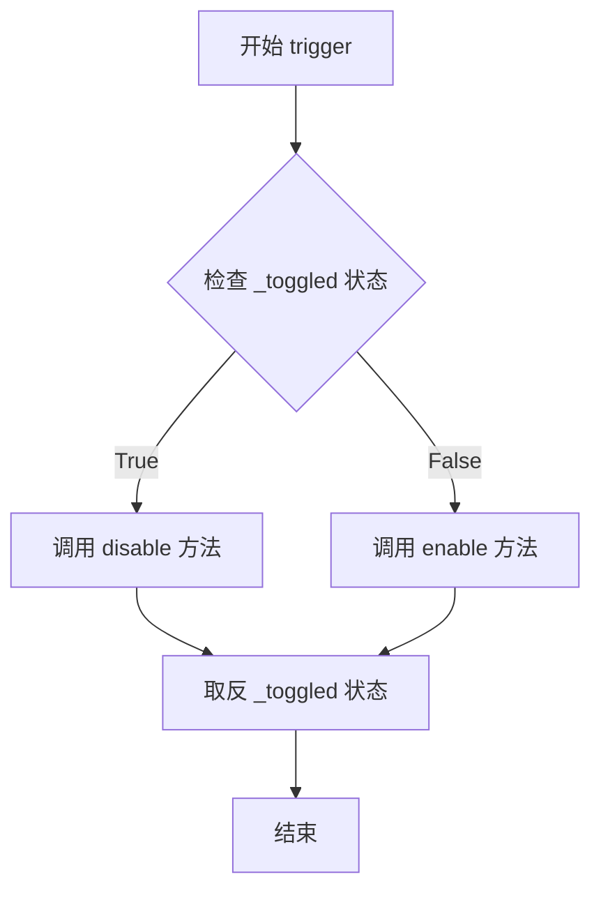

#### 带注释源码

```python
def trigger(self, sender, event, data=None):
    """Calls `enable` or `disable` based on `~ToolToggleBase.toggled` value."""
    # 根据当前_toggled状态决定调用enable还是disable
    if self._toggled:
        # 如果当前处于启用状态，则禁用工具
        self.disable(event)
    else:
        # 如果当前处于禁用状态，则启用工具
        self.enable(event)
    
    # 取反_toggled状态，为下次触发准备相反的状态
    self._toggled = not self._toggled
```


### ToolToggleBase.enable

该方法是 `ToolToggleBase` 类的启用方法，用于激活切换工具。当工具的 `toggled` 状态为 False 时，`trigger` 方法会调用此方法来启用工具。这是一个基类方法，具体工具类（如 `ZoomPanBase`）会重写此方法以实现实际的启用逻辑。

参数：

- `event`：`matplotlib.backend_bases.Event` 或 `None`，触发工具时传入的鼠标或键盘事件对象，用于获取坐标信息（如 inaxes）

返回值：`None`，该方法在基类中为空实现，不返回任何值

#### 流程图

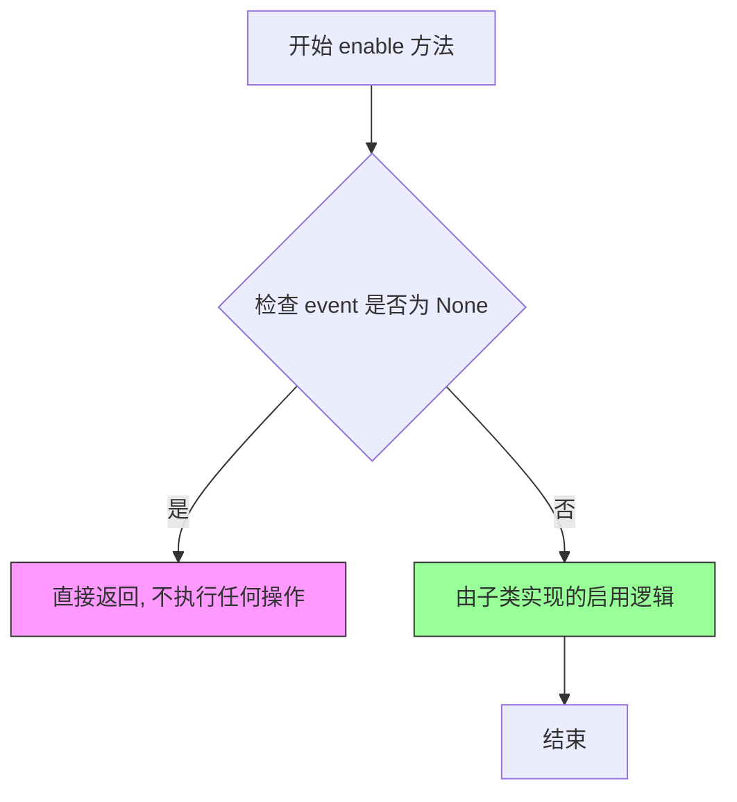

#### 带注释源码

```python
def enable(self, event=None):
    """
    Enable the toggle tool.

    `trigger` calls this method when `~ToolToggleBase.toggled` is False.

    Parameters
    ----------
    event : `.Event`
        The canvas event that caused this tool to be called.
    """
    pass
```


### `ToolToggleBase.disable`

禁用切换工具。该方法在 `trigger` 方法中当 `toggled` 状态为 True 时被调用，用于执行禁用切换工具的具体操作（例如断开事件连接、释放画布锁等）。

参数：

- `event`：`Event`，可选参数，触发禁用操作的画布事件

返回值：`None`，无返回值

#### 流程图

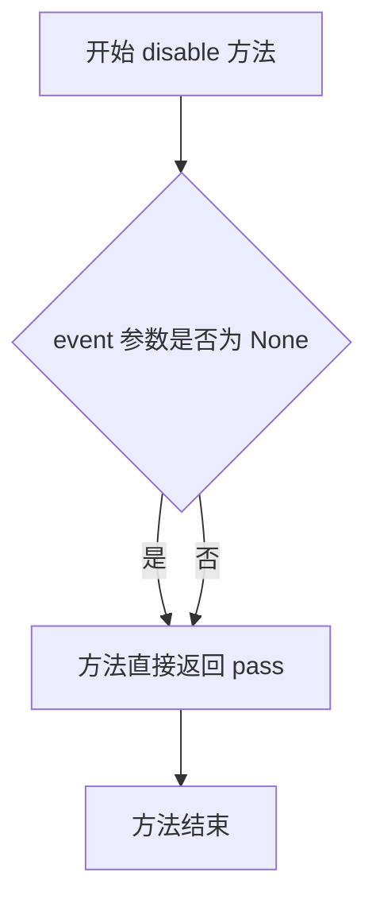

#### 带注释源码

```python
def disable(self, event=None):
    """
    Disable the toggle tool.

    `trigger` call this method when `~ToolToggleBase.toggled` is True.

    This can happen in different circumstances.

    * Click on the toolbar tool button.
    * Call to `matplotlib.backend_managers.ToolManager.trigger_tool`.
    * Another `ToolToggleBase` derived tool is triggered
      (from the same `.ToolManager`).
    """
    pass
```


### ToolToggleBase.toggled

这是一个属性（property），用于获取切换工具的当前状态。当工具处于激活状态时返回True，否则返回False。

参数： 无（这是一个属性访问器，不需要参数）

返回值：`bool`，返回工具的切换状态（True表示已激活/开启，False表示未激活/关闭）

#### 流程图

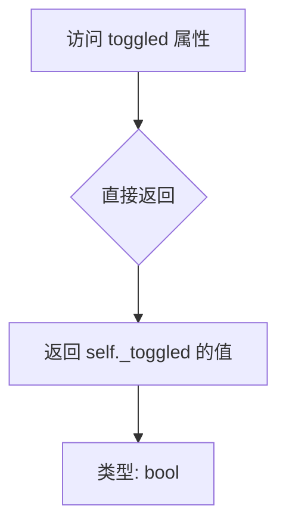

#### 带注释源码

```python
@property
def toggled(self):
    """State of the toggled tool."""
    return self._toggled
```

**代码说明：**

- `@property` 装饰器：将方法转换为属性，允许使用 `instance.toggled` 的方式访问，而不是 `instance.toggled()`
- `self._toggled`：类内部维护的布尔状态变量，存储工具的当前切换状态
- 初始值在 `__init__` 方法中通过 `kwargs.pop('toggled', self.default_toggled)` 设置，默认值为 `False`（由类属性 `default_toggled = False` 定义）
- 该属性是只读的（没有setter），状态的变化通过 `trigger` 方法内部自动切换（取反操作：`self._toggled = not self._toggled`）

**相关联的方法：**

- `trigger()`: 触发工具时调用，根据 `toggled` 状态决定调用 `enable()` 或 `disable()`，然后取反 `_toggled` 状态
- `set_figure()`: 在设置figure时也会检查并处理 `toggled` 状态的特殊情况


### `ToolToggleBase.set_figure`

设置 Toggle 工具的图形。当工具处于激活状态（toggled）时，需要正确处理状态转换：如果是切换到新图形则触发工具以保持激活状态，如果是移除图形则恢复内部状态。

参数：

- `figure`：`Figure | None`，要设置的图形对象，如果为 None 则移除当前图形

返回值：`None`，无返回值

#### 流程图

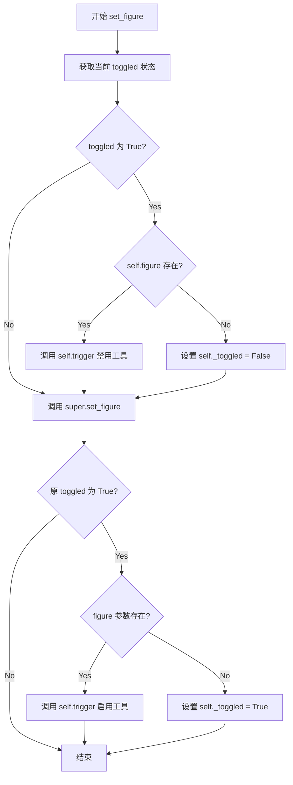

#### 带注释源码

```python
def set_figure(self, figure):
    """
    Set the figure for this tool.

    This method overrides the parent method to handle the toggled state
    correctly when changing figures. If the tool is currently active (toggled),
    it will be properly triggered to maintain consistent state.

    Parameters
    ----------
    figure : Figure or None
        The figure to set, or None to remove the figure.
    """
    # 获取当前工具的激活状态
    toggled = self.toggled
    
    # 如果工具当前处于激活状态
    if toggled:
        # 如果当前已有图形关联，触发工具（这会禁用它）
        if self.figure:
            self.trigger(self, None)
        else:
            # 如果没有图形，内部状态不会改变
            # 我们在这里修改它，以便下次调用 trigger 时可以改回来
            self._toggled = False
    
    # 调用父类的 set_figure 方法设置 _figure 属性
    super().set_figure(figure)
    
    # 如果工具原本处于激活状态
    if toggled:
        # 如果传入了新图形，触发工具（这会重新启用它）
        if figure:
            self.trigger(self, None)
        else:
            # 如果没有图形，trigger 不会改变内部状态
            # 我们在这里改回来
            self._toggled = True
```


### ToolSetCursor.__init__

该方法是 ToolSetCursor 类的初始化方法，负责设置光标工具的基本状态，连接工具管理器的事件，并初始化当前已存在的工具。

参数：

- `*args`：可变位置参数，传递给父类 ToolBase 的初始化方法，通常包含 toolmanager
- `**kwargs`：可变关键字参数，传递给父类 ToolBase 的初始化方法，通常包含 name

返回值：`None`，无返回值

#### 流程图

```mermaid
flowchart TD
    A[开始 __init__] --> B[调用父类 super().__init__*args, **kwargs]
    B --> C[初始化实例变量]
    C --> C1[设置 _id_drag = None]
    C --> C2[设置 _current_tool = None]
    C --> C3[设置 _default_cursor = cursors.POINTER]
    C --> C4[设置 _last_cursor = _default_cursor]
    C --> D[连接 tool_added_event 事件]
    D --> E[遍历 toolmanager.tools 中的所有工具]
    E --> F[为每个工具调用 _add_tool_cbk]
    F --> G[结束]
```

#### 带注释源码

```python
def __init__(self, *args, **kwargs):
    """
    初始化 ToolSetCursor 实例。
    
    Parameters
    ----------
    *args : 可变位置参数
        传递给父类 ToolBase，通常包含 toolmanager
    **kwargs : 可变关键字参数
        传递给父类 ToolBase，通常包含 name
    """
    # 调用父类 ToolBase 的初始化方法
    # 设置 _name 和 _toolmanager 属性
    super().__init__(*args, **kwargs)
    
    # 初始化拖拽事件ID，用于后续断开连接
    self._id_drag = None
    
    # 记录当前激活的工具（ToolToggleBase 派生类）
    self._current_tool = None
    
    # 设置默认光标为 POINTER（箭头光标）
    self._default_cursor = cursors.POINTER
    
    # 记录上一次设置的光标，用于比较是否需要更新
    self._last_cursor = self._default_cursor
    
    # 连接工具管理器的事件：当新工具被添加时触发 _add_tool_cbk
    self.toolmanager.toolmanager_connect('tool_added_event',
                                         self._add_tool_cbk)
    
    # 遍历当前已存在于工具管理器中的所有工具
    # 为每个工具调用 _add_tool_cbk 进行初始化处理
    for tool in self.toolmanager.tools.values():  # process current tools
        self._add_tool_cbk(mpl.backend_managers.ToolEvent(
            'tool_added_event', self.toolmanager, tool))
```


### ToolSetCursor.set_figure

该方法用于设置 ToolSetCursor 工具所关联的 Figure 对象，并在切换 Figure 时管理光标事件的连接与断开。当 Figure 改变时，会先断开之前的光标事件监听，然后设置新的 Figure，并在有新 Figure 时重新连接 motion_notify_event 事件以追踪光标位置来更新光标显示。

参数：

- `figure`：`figure or None`，要设置的 Figure 对象，如果为 None 则清除当前关联的 Figure

返回值：`None`，无返回值

#### 流程图

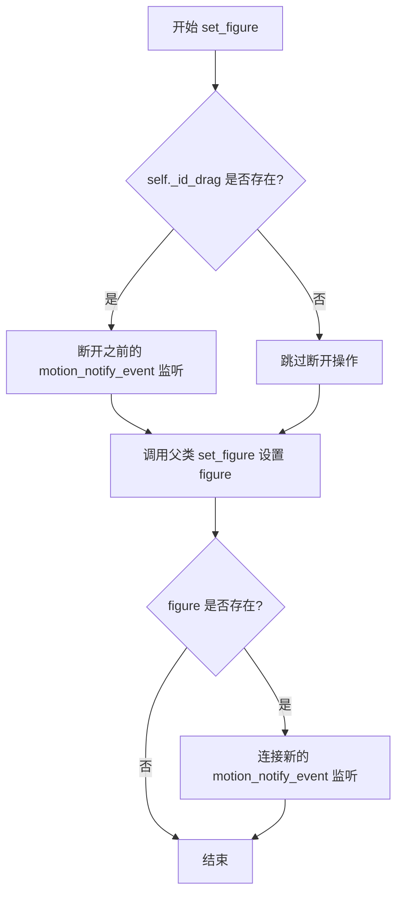

#### 带注释源码

```python
def set_figure(self, figure):
    """
    设置该工具关联的 Figure 对象。

    当 Figure 改变时，管理光标事件监听的连接与断开。
    如果之前已连接了 motion_notify_event 事件，则先断开；
    设置新 Figure 后，如果 figure 存在，则重新连接事件以追踪光标。

    Parameters
    ----------
    figure : matplotlib.figure.Figure or None
        要关联的 Figure 对象，None 表示清除关联
    """
    # 如果之前已经连接了拖动事件监听器，则先断开
    # 避免在切换 Figure 后仍然持有旧的监听器
    if self._id_drag:
        self.canvas.mpl_disconnect(self._id_drag)
    
    # 调用父类的 set_figure 方法，设置内部 _figure 属性
    super().set_figure(figure)
    
    # 如果传入了有效的 Figure 对象，则连接新的事件监听
    # motion_notify_event 用于追踪鼠标移动，以实时更新光标
    if figure:
        self._id_drag = self.canvas.mpl_connect(
            'motion_notify_event', self._set_cursor_cbk)
```


### ToolSetCursor._add_tool_cbk

处理每个新添加的工具，当工具被添加到 ToolManager 时触发该回调。如果工具定义了光标属性，则为该工具的触发事件建立连接。

参数：

- `event`：`matplotlib.backend_managers.ToolEvent`，工具添加事件对象，包含被添加的工具信息

返回值：`None`，无返回值

#### 流程图

```mermaid
flowchart TD
    A[开始: _add_tool_cbk] --> B{检查工具是否定义光标属性}
    B -->|是| C[获取工具的cursor属性]
    B -->|否| D[直接返回, 不做任何操作]
    C --> E[构建事件名称: tool_trigger_{tool.name}]
    E --> F[连接工具触发回调: _tool_trigger_cbk]
    F --> G[结束]
```

#### 带注释源码

```python
def _add_tool_cbk(self, event):
    """Process every newly added tool."""
    # 使用getattr安全地获取tool的cursor属性
    # 如果tool没有cursor属性或为None，则返回None
    if getattr(event.tool, 'cursor', None) is not None:
        # 工具具有cursor属性，为其触发事件建立连接
        # 这样当工具被触发时，会调用self._tool_trigger_cbk来更新光标
        self.toolmanager.toolmanager_connect(
            f'tool_trigger_{event.tool.name}', self._tool_trigger_cbk)
```


### `ToolSetCursor._tool_trigger_cbk`

该方法是 `ToolSetCursor` 类的内部回调函数，用于响应工具触发事件。当工具被激活时，该方法会更新当前选中的工具，并根据工具是否处于激活状态来设置相应的光标。

参数：

- `event`：`mpl.backend_managers.ToolEvent`，触发工具时的事件对象，包含被触发的工具信息

返回值：`None`，该方法为回调函数，不返回任何值

#### 流程图

```mermaid
flowchart TD
    A[开始: _tool_trigger_cbk] --> B{event.tool.toggled}
    B -->|True| C[设置 self._current_tool = event.tool]
    B -->|False| D[设置 self._current_tool = None]
    C --> E[调用 _set_cursor_cbk(event.canvasevent)]
    D --> E
    E --> F[结束]
```

#### 带注释源码

```python
def _tool_trigger_cbk(self, event):
    """
    工具触发回调函数。
    
    当工具被触发时更新当前工具，并根据工具状态设置光标。
    
    Parameters
    ----------
    event : mpl.backend_managers.ToolEvent
        工具事件对象，包含被触发工具的信息
    """
    # 判断被触发的工具是否处于激活状态（toggled）
    # 如果激活，则将当前工具设置为该工具；否则设为 None
    self._current_tool = event.tool if event.tool.toggled else None
    
    # 调用光标设置回调，传入事件中的画布事件来更新光标显示
    self._set_cursor_cbk(event.canvasevent)
```


### `ToolSetCursor._set_cursor_cbk`

该方法是 `ToolSetCursor` 类的核心回调函数，负责在鼠标移动时根据当前激活的工具动态更新画布光标。当有活跃的 Toggle 工具且鼠标位于可导航的坐标轴内时，切换为该工具对应的光标；否则恢复为默认指针光标。

参数：

- `event`：`matplotlib.backend_bases.Event`，鼠标移动事件对象，包含鼠标位置和所在坐标轴等信息

返回值：`None`，无返回值

#### 流程图

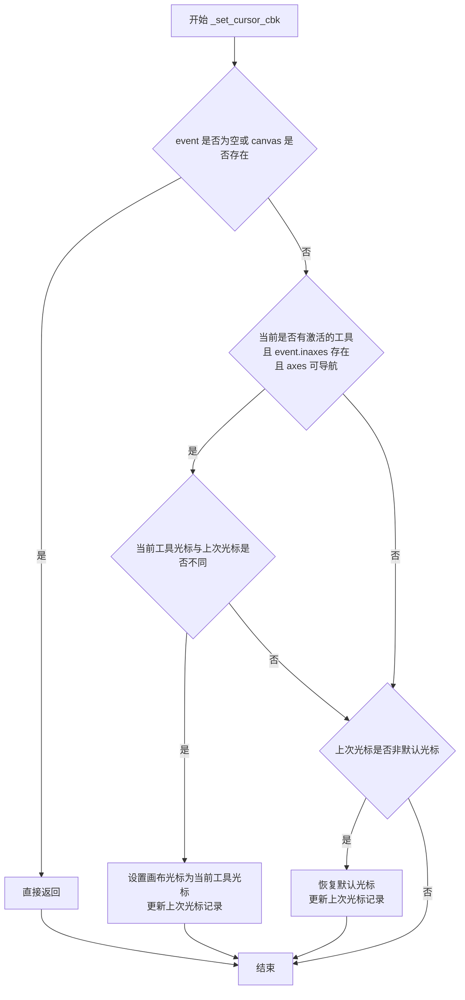

#### 带注释源码

```python
def _set_cursor_cbk(self, event):
    """
    鼠标移动时的光标更新回调函数。
    
    根据当前激活的工具和鼠标位置，动态调整画布显示的光标类型。
    
    Parameters
    ----------
    event : matplotlib.backend_bases.Event
        鼠标移动事件对象，包含鼠标坐标和所在坐标轴等信息。
    """
    # 检查事件对象和画布是否存在，若不存在则直接返回
    if not event or not self.canvas:
        return
    
    # 判断当前是否有激活的 Toggle 工具，且鼠标位于可导航的坐标轴内
    if (self._current_tool and getattr(event, "inaxes", None)
            and event.inaxes.get_navigate()):
        # 如果工具光标与上次光标不同，则更新光标
        if self._last_cursor != self._current_tool.cursor:
            self.canvas.set_cursor(self._current_tool.cursor)
            self._last_cursor = self._current_tool.cursor
    # 如果没有激活工具或鼠标不在可导航坐标轴内
    elif self._last_cursor != self._default_cursor:
        # 恢复为默认光标
        self.canvas.set_cursor(self._default_cursor)
        self._last_cursor = self._default_cursor
```


### `ToolCursorPosition.__init__`

该方法是 `ToolCursorPosition` 类的初始化方法，负责设置实例的初始状态，并调用父类 `ToolBase` 的初始化方法。它接收可变参数并传递给父类，同时初始化用于跟踪鼠标拖动事件的 ID。

参数：

- `*args`：可变位置参数，传递给父类 `ToolBase.__init__`，通常包含 `toolmanager` 和 `name`。
- `**kwargs`：可变关键字参数，传递给父类 `ToolBase.__init__`，可能包含其他配置参数。

返回值：`None`，该方法不返回任何值。

#### 流程图

```mermaid
flowchart TD
    A[开始 __init__] --> B[设置 self._id_drag = None]
    B --> C[调用父类 ToolBase.__init__ 传递 *args 和 **kwargs]
    C --> D[结束 __init__]
```

#### 带注释源码

```python
def __init__(self, *args, **kwargs):
    """
    初始化 ToolCursorPosition 实例。

    参数
    ----------
    *args : 可变位置参数
        传递给父类 ToolBase.__init__ 的位置参数，通常包括 toolmanager 和 name。
    **kwargs : 可变关键字参数
        传递给父类 ToolBase.__init__ 的关键字参数，可能包括其他配置选项。
    """
    # 初始化用于存储拖动事件连接 ID 的变量，初始为 None
    self._id_drag = None
    # 调用父类 ToolBase 的初始化方法，传递所有参数
    super().__init__(*args, **kwargs)
```


### `ToolCursorPosition.set_figure`

该方法用于为 `ToolCursorPosition` 工具设置关联的 Figure 对象，并在 Figure 变更时自动管理鼠标移动事件的连接与断开，以确保能够实时报告光标位置。

参数：

- `figure`：要关联的 Figure 对象，类型为 Figure 或 None，用于设置工具所监视的图形

返回值：`None`，无返回值

#### 流程图

```mermaid
flowchart TD
    A[开始 set_figure] --> B{self._id_drag 是否存在?}
    B -->|是| C[断开现有的 motion_notify_event 事件连接]
    B -->|否| D[跳过断开操作]
    C --> E[调用父类 set_figure 方法]
    D --> E
    E --> F{figure 是否为真值?}
    -->|是| G[注册新的 motion_notify_event 事件<br/>回调函数为 self.send_message]
    --> H[结束]
    F -->|否| I[不注册新事件]
    --> H
```

#### 带注释源码

```python
def set_figure(self, figure):
    """
    设置工具关联的 Figure，并管理鼠标移动事件。

    Parameters
    ----------
    figure : Figure or None
        要关联的 Figure 对象，如果为 None 则断开事件连接。
    """
    # 如果之前已注册过鼠标移动事件，先断开连接以避免重复监听
    if self._id_drag:
        self.canvas.mpl_disconnect(self._id_drag)

    # 调用父类方法完成基本的 Figure 设置
    super().set_figure(figure)

    # 如果提供了有效的 Figure 对象，则注册新的鼠标移动事件
    # 当光标在画布上移动时，会触发 self.send_message 方法
    if figure:
        self._id_drag = self.canvas.mpl_connect(
            'motion_notify_event', self.send_message)
```


### `ToolCursorPosition.send_message`

该方法用于在光标移动时发送包含当前指针位置的鼠标事件消息。它通过 `motion_notify_event` 事件触发，将鼠标事件转换为消息并通过 ToolManager 分发。

参数：

- `event`：`matplotlib.backend_bases.MouseEvent`，由 `motion_notify_event` 触发的鼠标移动事件对象

返回值：`None`，该方法不返回任何值，仅发送消息事件

#### 流程图

```mermaid
flowchart TD
    A[开始: send_message 被 motion_notify_event 调用] --> B{检查 messagelock 是否锁定}
    B -->|已锁定| C[直接返回, 不发送消息]
    B -->|未锁定| D[从 matplotlib.backend_bases 导入 NavigationToolbar2]
    D --> E[调用 _mouse_event_to_message 将事件转换为消息字符串]
    E --> F[调用 toolmanager.message_event 发送消息]
    F --> G[结束]
```

#### 带注释源码

```python
def send_message(self, event):
    """Call `matplotlib.backend_managers.ToolManager.message_event`."""
    # 检查 toolmanager 的消息锁是否被锁定
    # 如果被锁定，说明当前有其他工具正在使用消息显示，放弃本次消息发送
    if self.toolmanager.messagelock.locked():
        return

    # 动态导入 NavigationToolbar2 类
    # 该类提供将鼠标事件转换为状态栏消息的工具方法
    from matplotlib.backend_bases import NavigationToolbar2
    
    # 将鼠标事件对象转换为状态栏显示的消息字符串
    # 根据事件类型（移动、悬停等）生成对应的位置信息文本
    message = NavigationToolbar2._mouse_event_to_message(event)
    
    # 调用 ToolManager 的 message_event 方法
    # 将生成的消息发送到状态栏显示
    # 第二个参数 self 指定发送此消息的工具为当前 ToolCursorPosition 实例
    self.toolmanager.message_event(message, self)
```


### `RubberbandBase.trigger`

该方法用于根据传入的 data 参数调用 `draw_rubberband` 绘制橡皮筋框或调用 `remove_rubberband` 移除橡皮筋框。如果画布的 widgetlock 不可用，则直接返回不执行任何操作。

参数：

- `sender`：`object`，请求触发此工具的对象
- `event`：`matplotlib.backend_bases.Event`，导致此工具被触发的画布事件
- `data`：`object`，可选，传递给 `draw_rubberband` 的额外数据，如果为 `None` 则调用 `remove_rubberband`

返回值：`None`，该方法不返回任何值

#### 流程图

```mermaid
flowchart TD
    A([开始 trigger]) --> B{检查 widgetlock 是否可用}
    B -->|不可用| C[直接返回]
    B -->|可用| D{data 是否为 None?}
    D -->|是| E[调用 remove_rubberband]
    D -->|否| F[调用 draw_rubberband 并展开 data]
    E --> G([结束])
    F --> G
```

#### 带注释源码

```python
def trigger(self, sender, event, data=None):
    """
    Call `draw_rubberband` or `remove_rubberband` based on data.

    Parameters
    ----------
    sender : object
        Object that requested the tool to be triggered.
    event : matplotlib.backend_bases.Event
        The canvas event that caused this tool to be called.
    data : object, optional
        Extra data to pass to draw_rubberband. If None, remove_rubberband
        will be called instead.
    """
    # 检查发送者是否获取了画布的 widgetlock，如果没有则直接返回
    # widgetlock 用于防止在某些操作进行时触发其他工具
    if not self.figure.canvas.widgetlock.available(sender):
        return
    
    # 根据 data 参数决定是绘制还是移除橡皮筋
    if data is not None:
        # 如果有数据，调用 draw_rubberband 方法（需由子类实现）
        self.draw_rubberband(*data)
    else:
        # 如果没有数据，调用 remove_rubberband 方法（需由子类实现）
        self.remove_rubberband()
```


### `RubberbandBase.draw_rubberband`

这是一个抽象基类方法，用于在画布上绘制橡皮筋矩形。该方法是抽象方法，需要由具体的 backend 实现。

参数：

- `*data`：`tuple`，可变数量的位置坐标参数，用于定义橡皮筋矩形的坐标信息（例如 x1, y1, x2, y2）

返回值：`None`，该方法本身不返回任何值，它通过抛出 `NotImplementedError` 异常来表明该方法需要在子类中实现

#### 流程图

```mermaid
flowchart TD
    A[开始 draw_rubberband] --> B{子类是否实现?}
    B -->|是| C[执行子类实现的绘图逻辑]
    B -->|否| D[抛出 NotImplementedError]
    C --> E[结束]
    D --> E
```

#### 带注释源码

```python
def draw_rubberband(self, *data):
    """
    Draw rubberband.

    This method must get implemented per backend.
    
    Parameters
    ----------
    *data : tuple
        可变数量的位置坐标参数，用于定义橡皮筋矩形的坐标信息
        例如：可能是 (x1, y1, x2, y2) 表示矩形的左下角和右上角坐标
        具体格式取决于后端实现
    
    Returns
    -------
    None
        该方法本身不返回值，通过在子类中实现来执行实际的绘图操作
    
    Raises
    ------
    NotImplementedError
        如果子类没有实现该方法，则抛出此异常
    """
    raise NotImplementedError
```


### RubberbandBase.remove_rubberband

移除橡皮筋（rubberband）。该方法是抽象方法，具体实现由各后端类负责。

参数：

- 无

返回值：`None`，无返回值

#### 流程图

```mermaid
flowchart TD
    A[开始 remove_rubberband] --> B[方法体为空 pass]
    B --> C[结束]
    
    style A fill:#f9f,stroke:#333
    style C fill:#f9f,stroke:#333
```

#### 带注释源码

```python
def remove_rubberband(self):
    """
    Remove rubberband.

    This method should get implemented per backend.
    """
    pass
```


### `ToolQuit.trigger`

该方法是一个工具触发方法，用于关闭当前图形窗口。当被调用时，它会通过 `Gcf.destroy_fig` 销毁与该工具关联的图形实例。

参数：

- `sender`：`object`，触发此工具的对象
- `event`：`.Event`，导致此工具被调用的画布事件
- `data`：`object`，可选的额外数据

返回值：`None`，此方法不返回任何值

#### 流程图

```mermaid
flowchart TD
    A[开始 trigger] --> B{检查 self.figure 是否存在}
    B -->|存在| C[调用 Gcf.destroy_fig self.figure]
    B -->|不存在| D[不执行任何操作]
    C --> E[结束]
    D --> E
```

#### 带注释源码

```python
def trigger(self, sender, event, data=None):
    """
    调用图形管理器的销毁方法。

    Parameters
    ----------
    sender : object
        请求触发工具的对象。
    event : matplotlib.backend_managers.Event
        导致此工具被调用的画布事件。
    data : object, optional
        额外的可选数据。
    """
    # 调用 Gcf.destroy_fig 销毁当前图形
    # Gcf 是一个图形管理器，负责跟踪所有活动的图形
    # self.figure 属性继承自 ToolBase，指向当前工具关联的图形
    Gcf.destroy_fig(self.figure)
```


### ToolQuitAll.trigger

该方法用于关闭并销毁matplotlib所有已打开的图形窗口。当用户触发"退出所有图形"工具时，会调用此方法，最终通过FigureManager销毁所有图形实例。

参数：

- `sender`：`object`，触发此工具的对象（例如ToolManager）
- `event`：`Event`，导致此工具被调用的canvas事件
- `data`：`object`，可选的额外数据，默认为None

返回值：`None`，无返回值

#### 流程图

```mermaid
graph TD
    A[开始 trigger 方法] --> B{检查 data 是否存在}
    B -->|data 不为 None| C[预留扩展逻辑]
    B -->|data 为 None| D[调用 Gcf.destroy_all]
    C --> D
    D --> E[结束方法]
```

#### 带注释源码

```python
def trigger(self, sender, event, data=None):
    """
    Called when this tool gets used.

    This method is called by `.ToolManager.trigger_tool`.

    Parameters
    ----------
    event : `.Event`
        The canvas event that caused this tool to be called.
    sender : object
        Object that requested the tool to be triggered.
    data : object
        Extra data.
    """
    # 调用 Gcf.destroy_all() 销毁所有图形
    # Gcf 是 matplotlib._pylab_helpers 模块中的类，
    # 负责管理所有打开的图形（Figure）及其管理器（FigureManager）
    Gcf.destroy_all()
```


### ToolGrid.trigger

该方法用于切换图形的主网格线。它通过生成一个唯一的sentinel值，临时修改事件对象的key属性，并使用rc上下文来触发键盘事件处理，从而实现网格的切换功能。

参数：

- `sender`：`object`，请求触发工具的对象
- `event`：`matplotlib.backend_bases.Event`，导致工具被调用的画布事件
- `data`：`object`，可选，传递给工具的额外数据（默认为 None）

返回值：`None`，该方法不返回任何值

#### 流程图

```mermaid
flowchart TD
    A[开始 trigger 方法] --> B[生成唯一的 sentinel 字符串]
    B --> C[使用 cbook._setattr_cm 临时修改事件对象的 key 属性为 sentinel]
    C --> D[使用 mpl.rc_context 临时设置 rcParams['keymap.grid'] 为 sentinel]
    D --> E[调用 mpl.backend_bases.key_press_handler 处理事件]
    E --> F[结束方法]
    
    style A fill:#f9f,color:#333
    style F fill:#9f9,color:#333
```

#### 带注释源码

```python
def trigger(self, sender, event, data=None):
    """
    调用此方法以切换主网格的显示状态。
    
    Parameters
    ----------
    sender : object
        请求触发工具的对象。
    event : matplotlib.backend_bases.Event
        触发工具的画布事件（通常是键盘事件）。
    data : object, optional
        额外的可选数据，默认为 None。
    """
    # 生成一个唯一的 UUID 作为 sentinel 值
    sentinel = str(uuid.uuid4())
    
    # 使用上下文管理器临时修改事件对象的 key 属性为 sentinel 值
    # _setattr_cm 是一个上下文管理器，用于临时设置/修改对象属性
    # 这样可以让后续的 key_press_handler 认为按下了 'keymap.grid' 中配置的键
    with (cbook._setattr_cm(event, key=sentinel),
          # 临时将 rcParams['keymap.grid'] 设置为 sentinel 值
          # 这样 key_press_handler 会认为触发了 grid 切换操作
          mpl.rc_context({'keymap.grid': sentinel})):
        # 调用后端的键盘事件处理器来执行实际的网格切换逻辑
        # 这会触发 figure.canvas 处理键盘事件，从而切换网格显示状态
        mpl.backend_bases.key_press_handler(event, self.figure.canvas)
```


### ToolMinorGrid.trigger

该方法用于切换图表的主网格和次网格（minor grids）。它通过创建一个唯一的sentinel值，暂时修改`keymap.grid_minor`配置，然后触发键盘事件处理程序来实现网格的切换。

参数：

- `sender`：`object`，请求触发此工具的对象。
- `event`：`matplotlib.backend_bases.Event`，导致此工具被触发的画布事件。
- `data`：`object`，可选，额外的数据（默认值为`None`）。

返回值：`None`，该方法无返回值。

#### 流程图

```mermaid
flowchart TD
    A[开始 trigger 方法] --> B[生成唯一 sentinel 标识符]
    B --> C{检查 event 和 canvas}
    C -->|条件满足| D[使用 cbook._setattr_cm 临时修改 event.key 为 sentinel]
    D --> E[使用 mpl.rc_context 临时设置 keymap.grid_minor 为 sentinel]
    E --> F[调用 mpl.backend_bases.key_press_handler 处理事件]
    F --> G[结束方法, 网格切换由 key_press_handler 完成]
    C -->|条件不满足| G
```

#### 带注释源码

```python
def trigger(self, sender, event, data=None):
    """
    Called when this tool gets used.

    This method is called by `.ToolManager.trigger_tool`.

    Parameters
    ----------
    event : `.Event`
        The canvas event that caused this tool to be called.
    sender : object
        Object that requested the tool to be triggered.
    data : object
        Extra data.
    """
    # 生成一个唯一的UUID作为sentinel值，用于模拟一个特殊的按键事件
    sentinel = str(uuid.uuid4())
    
    # Trigger grid switching by temporarily setting :rc:`keymap.grid_minor`
    # to a unique key and sending an appropriate event.
    # 使用上下文管理器临时修改event对象的key属性为sentinel值，
    # 同时临时设置rc参数keymap.grid_minor为sentinel，
    # 这样key_press_handler会将sentinel识别为触发次网格切换的按键
    with (cbook._setattr_cm(event, key=sentinel),
          mpl.rc_context({'keymap.grid_minor': sentinel})):
        # 调用后端的键盘事件处理器，实际执行网格切换操作
        # 该方法会根据keymap.grid_minor的配置触发相应的网格切换逻辑
        mpl.backend_bases.key_press_handler(event, self.figure.canvas)
```


### `ToolFullScreen.trigger`

该方法用于触发全屏模式的切换，通过调用图形画布管理器的`full_screen_toggle`方法来实现窗口的全屏/退出全屏切换。

参数：

- `sender`：`object`，触发此工具的对象（如`ToolManager`）
- `event`：`matplotlib.backend_bases.Event`，导致此工具被调用的canvas事件
- `data`：`object`，可选的额外数据，默认为`None`

返回值：`None`，无返回值

#### 流程图

```mermaid
flowchart TD
    A[trigger方法被调用] --> B{检查figure是否存在}
    B -->|是| C[获取figure.canvas.manager]
    B -->|否| D[什么都不做]
    C --> E[调用manager.full_screen_toggle]
    E --> F[切换全屏模式]
```

#### 带注释源码

```python
def trigger(self, sender, event, data=None):
    """
    触发全屏模式切换。

    该方法被ToolManager.trigger_tool调用，用于切换figure的全屏状态。
    它直接调用底层图形后端管理器的full_screen_toggle方法来实现全屏切换。

    Parameters
    ----------
    sender : object
        触发此工具的对象，通常是ToolManager。
    event : matplotlib.backend_bases.Event
        导致此工具被调用的canvas事件。
    data : object, optional
        传递给工具的额外数据，默认为None。

    Returns
    -------
    None
    """
    # 调用figure画布管理器的全屏切换方法
    self.figure.canvas.manager.full_screen_toggle()
```


### `AxisScaleBase.trigger`

该方法是切换坐标轴线性/对数刻度工具的触发器，首先检查事件是否发生在某个坐标系上，若无则直接返回，否则调用父类的trigger方法来切换刻度。

参数：

- `sender`：`object`，触发此工具的对象
- `event`：`matplotlib.backend_bases.Event`，导致此工具被调用的canvas事件
- `data`：`object`，可选的额外数据

返回值：`None`，无返回值（当 `event.inaxes` 为 `None` 时提前返回）

#### 流程图

```mermaid
flowchart TD
    A[开始 trigger] --> B{event.inaxes is None?}
    B -->|是| C[直接返回]
    B -->|否| D[调用 super().trigger sender, event, data]
    D --> E[结束]
    C --> E
```

#### 带注释源码

```python
def trigger(self, sender, event, data=None):
    """
    触发坐标轴刻度切换工具。
    
    Parameters
    ----------
    sender : object
        触发此工具的对象。
    event : matplotlib.backend_bases.Event
        导致此工具被调用的canvas事件。
    data : object, optional
        额外的数据。
    """
    # 如果事件不在任何坐标系上，则直接返回，不进行任何操作
    if event.inaxes is None:
        return
    # 调用父类的 trigger 方法，根据当前的 toggled 状态切换刻度
    super().trigger(sender, event, data)
```


### AxisScaleBase.enable

该方法用于启用对数坐标刻度。当工具被激活时，将指定坐标轴的刻度设置为对数（log）模式，并触发画布的延迟重绘。

参数：

- `event`：`Event | None`，触发工具的可选事件对象，包含 `inaxes` 属性以获取目标坐标轴

返回值：`None`，无返回值

#### 流程图

```mermaid
flowchart TD
    A[开始] --> B{event.inaxes 是否存在?}
    B -->|是| C[调用 set_scale 设置对数坐标]
    C --> D[调用 figure.canvas.draw_idle 重绘画布]
    D --> E[结束]
    B -->|否| E
```

#### 带注释源码

```python
def enable(self, event=None):
    """
    Enable the toggle tool.

    `trigger` calls this method when `~ToolToggleBase.toggled` is False.

    Parameters
    ----------
    event : `.Event`, optional
        The canvas event that caused this tool to be called.
        Should have an ``inaxes`` attribute specifying the target Axes.
    """
    # 将指定坐标轴的刻度设置为 'log'（对数）模式
    self.set_scale(event.inaxes, 'log')
    # 触发画布的延迟重绘，更新图形显示
    self.figure.canvas.draw_idle()
```


### `AxisScaleBase.disable`

禁用切换工具，将坐标轴从对数刻度切换到线性刻度。

参数：

- `event`：`matplotlib.backend_bases.Event` 或 `None`，触发该方法的事件对象，默认为 `None`

返回值：`None`，无返回值

#### 流程图

```mermaid
flowchart TD
    A[开始 disable 方法] --> B{event 是否为 None 或 event.inaxes 是否为 None?}
    B -->|是| C[不执行任何操作]
    B -->|否| D[调用 set_scale 设置线性刻度]
    D --> E[调用 figure.canvas.draw_idle 触发重绘]
    E --> F[结束]
    
    style A fill:#f9f,color:#000
    style F fill:#9f9,color:#000
```

#### 带注释源码

```python
def disable(self, event=None):
    """
    Disable the toggle tool.

    `trigger` call this method when `~ToolToggleBase.toggled` is True.

    This can happen in different circumstances.

    * Click on the toolbar tool button.
    * Call to `matplotlib.backend_managers.ToolManager.trigger_tool`.
    * Another `ToolToggleBase` derived tool is triggered
      (from the same `.ToolManager`).
    """
    # 设置坐标轴为线性刻度
    self.set_scale(event.inaxes, 'linear')
    # 触发画布的空闲重绘，更新显示
    self.figure.canvas.draw_idle()
```


### `AxisScaleBase.set_scale`

该方法在基类 `AxisScaleBase` 中未被直接定义而是通过 `enable` 和 `disable` 方法调用，具体实现由子类 `ToolXScale` 和 `ToolYScale` 提供。以下为从子类提取的实现信息：

参数：

-  `ax`：`matplotlib.axes.Axes`，要进行比例尺设置的坐标轴对象
-  `scale`：`str`，要设置的缩放类型（如 'linear'、'log' 等）

返回值：`None`，该方法直接修改轴的缩放属性，无返回值

#### 流程图

```mermaid
graph TD
    A[开始 set_scale] --> B{检查 ax 是否有效}
    B -->|有效| C[调用 ax.set_xscale 或 ax.set_yscale]
    C --> D[设置指定的比例尺类型]
    D --> E[结束]
    B -->|无效| F[直接返回]
```

#### 带注释源码

```python
# 定义在 ToolXScale 类中
def set_scale(self, ax, scale):
    """
    设置坐标轴的 X 轴比例尺。

    Parameters
    ----------
    ax : matplotlib.axes.Axes
        要设置比例尺的 Axes 对象。
    scale : str
        比例尺类型，如 'linear'、'log' 等。
    """
    ax.set_xscale(scale)  # 调用 Axes 的 set_xscale 方法设置 X 轴比例尺


# 定义在 ToolYScale 类中
def set_scale(self, ax, scale):
    """
    设置坐标轴的 Y 轴比例尺。

    Parameters
    ----------
    ax : matplotlib.axes.Axes
        要设置比例尺的 Axes 对象。
    scale : str
        比例尺类型，如 'linear'、'log' 等。
    """
    ax.set_yscale(scale)  # 调用 Axes 的 set_yscale 方法设置 Y 轴比例尺
```

#### 技术说明

`AxisScaleBase` 作为基类，定义了 `enable` 和 `disable` 方法，这两个方法内部调用 `self.set_scale()`。由于基类未实现该方法，子类必须重写以提供具体功能：

- `ToolXScale.set_scale`：调用 `ax.set_xscale(scale)` 修改 X 轴
- `ToolYScale.set_scale`：调用 `ax.set_yscale(scale)` 修改 Y 轴

这种设计模式允许基类定义调用接口，而由子类决定具体实现逻辑，体现了模板方法模式的特点。


### `ToolYScale.set_scale`

设置给定 Axes 的 Y 轴比例尺（scale）。

参数：

- `ax`：`matplotlib.axes.Axes`，要设置 Y 轴比例尺的 Axes 对象
- `scale`：`str`，比例尺类型（如 'linear'、'log'）

返回值：`None`，该方法直接修改 Axes 对象，无返回值

#### 流程图

```mermaid
flowchart TD
    A[开始 set_scale] --> B[调用 ax.set_yscale]
    B --> C[传入 scale 参数]
    C --> D[设置 Axes 的 Y 轴比例尺]
    D --> E[结束]
```

#### 带注释源码

```python
def set_scale(self, ax, scale):
    """
    设置 Axes 的 Y 轴比例尺。

    Parameters
    ----------
    ax : matplotlib.axes.Axes
        要设置 Y 轴比例尺的 Axes 对象。
    scale : str
        比例尺类型，例如 'linear'（线性）或 'log'（对数）。

    Returns
    -------
    None
        直接修改传入的 Axes 对象，无返回值。
    """
    ax.set_yscale(scale)
```


### `ToolXScale.set_scale`

设置X轴的刻度类型（线性或对数）。

参数：

- `ax`：`matplotlib.axes.Axes`，要设置X轴刻度的坐标轴对象
- `scale`：`str`，要设置的刻度类型（如 'linear'、'log' 等）

返回值：`None`，无返回值描述

#### 流程图

```mermaid
graph TD
    A[开始 set_scale] --> B{验证输入参数}
    B -->|参数有效| C[调用 ax.set_xscale(scale)]
    C --> D[设置X轴刻度类型]
    D --> E[结束]
    B -->|参数无效| F[抛出异常]
    F --> E
```

#### 带注释源码

```
def set_scale(self, ax, scale):
    """
    设置X轴的刻度类型。
    
    该方法是 ToolXScale 工具类的核心方法，用于在切换工具状态时
    修改坐标轴的X轴刻度类型。调用了 Axes 对象的 set_xscale 方法
    来实际执行刻度类型的设置。
    
    Parameters
    ----------
    ax : matplotlib.axes.Axes
        要设置X轴刻度的坐标轴对象。
    scale : str
        要设置的刻度类型，常见值包括：
        - 'linear': 线性刻度
        - 'log': 对数刻度
        - 'symlog': 对称对数刻度
        - 'logit': logistic 刻度等
    """
    ax.set_xscale(scale)  # 调用 matplotlib Axes 对象的 set_xscale 方法设置X轴刻度类型
```


### ToolViewsPositions.add_figure

该方法用于将当前图形添加到视图和位置的历史栈中，初始化该图形对应的视图栈、位置栈和主视图字典，并设置坐标轴观察者以跟踪后续添加的坐标轴。

参数：

- `figure`：`matplotlib.figure.Figure`，需要添加到视图和位置管理系统的图形对象

返回值：`None`，该方法不返回任何值

#### 流程图

```mermaid
flowchart TD
    A[开始] --> B{figure 是否在 self.views 中?}
    B -->|是| C[不做任何操作]
    B -->|否| D[为 figure 创建视图栈: self.views[figure] = cbook._Stack()]
    D --> E[为 figure 创建位置栈: self.positions[figure] = cbook._Stack()]
    E --> F[为 figure 创建主视图字典: self.home_views[figure] = WeakKeyDictionary()]
    F --> G[调用 self.push_current 将当前视图和位置推入栈]
    G --> H[为 figure 添加坐标轴观察者: figure.add_axobserver]
    H --> I[结束]
```

#### 带注释源码

```python
def add_figure(self, figure):
    """Add the current figure to the stack of views and positions."""

    # 检查该图形是否已经被添加到视图管理系统中
    if figure not in self.views:
        # 如果是新的图形，为其初始化视图栈（用于存储历史视图）
        self.views[figure] = cbook._Stack()
        # 为其初始化位置栈（用于存储历史位置）
        self.positions[figure] = cbook._Stack()
        # 为其初始化主视图字典（用于存储每个坐标轴的主视图）
        self.home_views[figure] = WeakKeyDictionary()
        
        # 定义主视图：将当前视图和位置推入各自的栈中
        self.push_current(figure)
        
        # 设置观察者回调：当图形添加新的坐标轴时，自动更新主视图
        # 这样可以确保新添加的坐标轴也有主视图记录
        figure.add_axobserver(lambda fig: self.update_home_views(fig))
```


### ToolViewsPositions.clear

该方法用于重置指定图形的视图和位置栈，清空该图形所有存储的视图、位置以及主视图信息。

参数：

- `figure`：`matplotlib.figure.Figure`，需要清除其视图和位置栈的图形对象

返回值：`None`，该方法不返回任何值，仅执行清除操作

#### 流程图

```mermaid
flowchart TD
    A[开始 clear 方法] --> B{检查 figure 是否在 self.views 中}
    B -->|是| C[清空 self.views[figure] 栈]
    C --> D[清空 self.positions[figure] 栈]
    D --> E[清空 self.home_views[figure] 字典]
    E --> F[调用 update_home_views 方法]
    F --> G[结束]
    B -->|否| G
```

#### 带注释源码

```python
def clear(self, figure):
    """
    Reset the Axes stack.
    
    Parameters
    ----------
    figure : matplotlib.figure.Figure
        The figure whose views and positions stacks should be cleared.
    """
    # 检查该图形是否存在于视图字典中
    if figure in self.views:
        # 清空该图形对应的所有视图栈
        self.views[figure].clear()
        # 清空该图形对应的所有位置栈
        self.positions[figure].clear()
        # 清空该图形对应的主视图字典
        self.home_views[figure].clear()
        # 更新主视图以确保一致性
        self.update_home_views()
```


### ToolViewsPositions.update_view

更新图形中每个坐标轴的视图限制和位置。该方法从当前栈位置恢复视图和位置，如果图形中存在不在当前栈位置中的坐标轴，则使用主页视图限制，并且不更新任何位置。

参数： 无

返回值：`None`，无返回值

#### 流程图

```mermaid
flowchart TD
    A[开始 update_view] --> B{self.views[self.figure]() 是否为 None}
    B -->|是| C[直接返回]
    B -->|否| D{self.positions[self.figure]() 是否为 None}
    D -->|是| C
    D -->|否| E[获取 home_views 和 all_axes]
    E --> F{遍历 all_axes 中的每个坐标轴 a}
    F -->|a 在 views 中| G[cur_view = views[a]]
    F -->|a 不在 views 中| H[cur_view = home_views[a]]
    G --> I[a._set_view(cur_view)]
    H --> I
    I --> F
    F --> J{set(all_axes) 是否是 pos 的子集}
    J -->|是| K[遍历 all_axes 恢复位置]
    K --> L[a._set_position(pos[a][0], 'original')]
    L --> M[a._set_position(pos[a][1], 'active')]
    M --> N[self.figure.canvas.draw_idle]
    J -->|否| N
    N --> O[结束]
    C --> O
```

#### 带注释源码

```python
def update_view(self):
    """
    Update the view limits and position for each Axes from the current
    stack position. If any Axes are present in the figure that aren't in
    the current stack position, use the home view limits for those Axes and
    don't update *any* positions.
    """

    # 从视图栈中获取当前视图字典，()表示调用Stack的__call__方法获取当前位置的视图
    views = self.views[self.figure]()
    # 如果视图为空（栈为空或未初始化），直接返回
    if views is None:
        return
    
    # 从位置栈中获取当前位置字典
    pos = self.positions[self.figure]()
    # 如果位置为空，直接返回
    if pos is None:
        return
    
    # 获取当前图形的主页视图字典
    home_views = self.home_views[self.figure]
    # 获取图形中的所有坐标轴
    all_axes = self.figure.get_axes()
    
    # 遍历图形中的所有坐标轴
    for a in all_axes:
        # 如果该坐标轴在当前视图栈中，使用栈中的视图
        if a in views:
            cur_view = views[a]
        # 否则使用该坐标轴的主页视图作为默认视图
        else:
            cur_view = home_views[a]
        # 调用坐标轴的_set_view方法应用视图限制
        a._set_view(cur_view)

    # 检查所有坐标轴的位置是否都存在于位置栈中
    # issubset用于判断all_axes中的每个坐标轴是否都在pos字典的键中
    if set(all_axes).issubset(pos):
        # 如果所有坐标轴都在位置栈中，恢复每个坐标轴的位置
        for a in all_axes:
            # 恢复原始位置（创建图表时的位置）
            a._set_position(pos[a][0], 'original')
            # 恢复活动位置（缩放/平移后的位置）
            a._set_position(pos[a][1], 'active')

    # 触发画布的延迟重绘，更新图形显示
    self.figure.canvas.draw_idle()
```


### `ToolViewsPositions.push_current`

将当前视图限制（view limits）和位置（position）推入各自的堆栈中，以便后续可以撤销或重做视图/位置的更改。

参数：

- `figure`：`matplotlib.figure.Figure`，可选参数，要保存视图和位置的图形。如果未提供，则使用 `self.figure`。

返回值：`None`，该方法不返回任何值。

#### 流程图

```mermaid
flowchart TD
    A[开始 push_current] --> B{figure 参数是否为空?}
    B -->|是| C[使用 self.figure]
    B -->|否| D[使用传入的 figure]
    C --> E[创建临时 views WeakKeyDictionary]
    D --> E
    E --> F[创建临时 pos WeakKeyDictionary]
    F --> G[遍历 figure 的所有 Axes]
    G --> H{还有更多 Axes?}
    H -->|是| I[获取当前 Axes 的视图]
    I --> J[调用 _axes_pos 获取位置]
    J --> K[保存到 views 和 pos 字典]
    K --> H
    H -->|否| L[将 views 推入 self.views 堆栈]
    L --> M[将 pos 推入 self.positions 堆栈]
    M --> N[结束]
```

#### 带注释源码

```python
def push_current(self, figure=None):
    """
    Push the current view limits and position onto their respective stacks.
    
    此方法用于保存当前 figure 的视图和位置状态到堆栈中，
    以支持撤销/重做功能（如缩放、平移操作）。
    
    Parameters
    ----------
    figure : matplotlib.figure.Figure, optional
        要保存视图和位置的图形。如果为 None，则使用 self.figure。
    
    Returns
    -------
    None
    """
    # 如果未提供 figure，则使用当前关联的 figure
    if not figure:
        figure = self.figure
    
    # 创建临时字典存储当前视图和位置
    views = WeakKeyDictionary()    # 存储每个 Axes 的视图限制
    pos = WeakKeyDictionary()       # 存储每个 Axes 的位置信息
    
    # 遍历 figure 中的所有 Axes
    for a in figure.get_axes():
        # 获取当前 Axes 的视图（xlim, ylim 等）
        views[a] = a._get_view()
        # 获取当前 Axes 的原始和修改后的位置
        pos[a] = self._axes_pos(a)
    
    # 将视图和位置推入各自的堆栈，以便后续撤销/重做
    self.views[figure].push(views)
    self.positions[figure].push(pos)
```


### ToolViewsPositions._axes_pos

该方法用于获取指定 Axes 的原始位置和修改后的位置，以便在视图/位置堆栈中保存 Axes 的状态。

参数：
- `ax`：`matplotlib.axes.Axes`，要获取位置的 `.Axes` 对象

返回值：`tuple`，包含原始位置和修改后位置的元组。每个元素都是一个 frozen 的 matplotlib transform 对象。

#### 流程图

```mermaid
flowchart TD
    A[开始] --> B[接收ax参数]
    B --> C[调用ax.get_position True获取原始位置]
    C --> D[调用ax.get_position获取修改后位置]
    D --> E[对两个位置调用frozen方法]
    E --> F[返回包含两个frozen位置的元组]
```

#### 带注释源码

```python
def _axes_pos(self, ax):
    """
    Return the original and modified positions for the specified Axes.

    Parameters
    ----------
    ax : matplotlib.axes.Axes
        The `.Axes` to get the positions for.

    Returns
    -------
    original_position, modified_position
        A tuple of the original and modified positions.
    """

    # 获取原始（未修改）位置，使用get_position(True)表示获取原始位置
    # 并调用frozen()创建一个不可变的副本用于存储
    original_position = ax.get_position(True).frozen()
    
    # 获取当前（可能已修改）位置，使用get_position()默认参数
    # 并调用frozen()创建一个不可变的副本用于存储
    modified_position = ax.get_position().frozen()
    
    # 返回包含原始位置和修改后位置的元组
    return (original_position, modified_position)
```


### `ToolViewsPositions.update_home_views`

确保 `self.home_views` 字典中包含图形当前存在的所有 Axes 的视图信息，如果某个 Axes 不存在则添加其当前视图作为默认值。

参数：

- `figure`：`matplotlib.figure.Figure`，可选参数，要更新 home views 的目标图形。如果为 `None`，则使用当前关联的 `self.figure`。

返回值：`None`，无返回值，该方法直接修改 `self.home_views` 字典的内容。

#### 流程图

```mermaid
flowchart TD
    A[开始 update_home_views] --> B{figure 参数是否为 None?}
    B -- 是 --> C[使用 self.figure 作为 figure]
    B -- 否 --> D[使用传入的 figure]
    C --> E[获取图形的所有 Axes: figure.get_axes()]
    D --> E
    E --> F{遍历每一个 Axes a}
    F --> G{a 是否在 self.home_views[figure] 中?}
    G -- 否 --> H[调用 a._get_view 获取当前视图]
    H --> I[将视图存入 self.home_views[figure][a]]
    I --> J{是否还有更多 Axes?}
    G -- 是 --> J
    J -- 是 --> F
    J -- 否 --> K[结束]
```

#### 带注释源码

```python
def update_home_views(self, figure=None):
    """
    Make sure that ``self.home_views`` has an entry for all Axes present
    in the figure.
    """

    # 如果未提供 figure 参数，则使用当前关联的 figure
    if not figure:
        figure = self.figure
    
    # 遍历当前图形中的所有 Axes
    for a in figure.get_axes():
        # 如果某个 Axes 还没有对应的 home view 记录
        if a not in self.home_views[figure]:
            # 获取该 Axes 的当前视图并保存为 home view
            self.home_views[figure][a] = a._get_view()
```


### ToolViewsPositions.home

该方法用于恢复图形的第一组视图（view）和位置（position），即从视图和位置的历史栈中弹出并恢复到初始状态。

参数：

- 该方法无显式参数（仅包含隐式参数 `self`）

返回值：`None`，该方法直接操作内部状态，不返回任何值

#### 流程图

```mermaid
flowchart TD
    A[开始: home 方法] --> B{检查 self.figure 是否存在}
    B -->|是| C[获取 views 栈: self.views[self.figure]]
    C --> D[获取 positions 栈: self.positions[self.figure]]
    D --> E[调用 views.home 方法]
    E --> F[调用 positions.home 方法]
    F --> G[结束: 方法返回 None]
    B -->|否| G
```

#### 带注释源码

```python
def home(self):
    """Recall the first view and position from the stack."""
    # 调用视图栈的 home 方法，将视图恢复到第一个保存的状态
    self.views[self.figure].home()
    # 调用位置栈的 home 方法，将位置恢复到第一个保存的状态
    self.positions[self.figure].home()
```

#### 补充说明

**设计目的**：
- `home` 方法是 matplotlib 工具栏中" home "按钮的核心实现，用于将图形视图和轴位置重置为初始状态（第一次保存的状态）

**调用关系**：
- 该方法被 `ViewsPositionsBase.trigger` 方法调用：
  ```python
  getattr(self.toolmanager.get_tool(_views_positions), self._on_trigger)()
  ```
  其中 `_on_trigger` 对应 `ToolHome` 类时为 `'home'`

**内部实现依赖**：
- `self.views`：类型为 `WeakKeyDictionary`，存储每个 figure 的视图历史栈（`cbook._Stack` 对象）
- `self.positions`：类型为 `WeakKeyDictionary`，存储每个 figure 的位置历史栈（`cbook._Stack` 对象）
- `self.figure`：从 `ToolBase` 继承的属性，返回当前工具关联的图形对象

**技术债务/优化空间**：
1. 缺少空值检查：如果 `self.figure` 不在 `self.views` 或 `self.positions` 中，会抛出 `KeyError` 异常
2. 该方法调用后未触发画布重绘（`draw_idle()`），需要在调用方确保视图更新后的重绘处理


### `ToolViewsPositions.back`

该方法用于在视图和位置的历史栈中后退一步，恢复到上一个保存的视图极限和位置状态。

参数：

- 该方法无显式参数（仅使用实例属性 `self`）

返回值：`None`，该方法直接修改内部状态，不返回任何值

#### 流程图

```mermaid
flowchart TD
    A[开始 back 方法] --> B{检查 self.figure 是否在 self.views 中}
    B -->|是| C[调用 self.views[self.figure].back]
    C --> D[调用 self.positions[self.figure].back]
    D --> E[结束方法, 视图和位置已回退]
    B -->|否| F[抛出 KeyError 或静默失败]
    F --> E
```

#### 带注释源码

```python
def back(self):
    """
    Back one step in the stack of views and positions.
    
    该方法通过调用内部栈的back方法，将当前视图和位置
    恢复到上一个保存的状态。它操作两个独立的栈：
    - self.views: 存储每个Axes的视图极限（view limits）
    - self.positions: 存储每个Axes的原始位置和活动位置
    """
    # 从视图栈中回退一步，获取上一个保存的视图状态
    self.views[self.figure].back()
    
    # 从位置栈中回退一步，获取上一个保存的位置状态
    self.positions[self.figure].back()
```


### `ToolViewsPositions.forward`

向前一步查看堆栈中的视图和位置。

参数： 无

返回值：`None`，无返回值描述

#### 流程图

```mermaid
graph TD
    A[开始 forward] --> B[调用 self.views[self.figure].forward]
    B --> C[调用 self.positions[self.figure].forward]
    C --> D[结束]
```

#### 带注释源码

```python
def forward(self):
    """Forward one step in the stack of views and positions."""
    # 向前移动视图堆栈
    self.views[self.figure].forward()
    # 向前移动位置堆栈
    self.positions[self.figure].forward()
```


### ViewsPositionsBase.trigger

该方法是视图位置工具的基类触发器，用于协调图形的视图和位置管理。当工具被触发时，它会将当前图形添加到视图/位置栈中，然后调用相应的导航方法（home、back或forward），最后更新视图。

参数：

- `sender`：`object`，请求触发工具的对象
- `event`：`matplotlib.backend_bases.Event`，导致此工具被调用的画布事件
- `data`：`object`（可选），传递给工具的额外数据，默认为 None

返回值：`None`，该方法不返回任何值，仅执行副作用操作

#### 流程图

```mermaid
flowchart TD
    A[开始 trigger] --> B[获取 _views_positions 工具实例]
    B --> C[调用 add_figure 添加当前图形]
    C --> D{根据 _on_trigger 确定要调用的方法}
    D --> E[调用相应方法: home/back/forward]
    E --> F[调用 update_view 更新视图]
    F --> G[结束 trigger]
```

#### 带注释源码

```python
def trigger(self, sender, event, data=None):
    """
    触发视图位置工具的基类方法。
    
    该方法是 ToolHome、ToolBack 和 ToolForward 的共同基类实现，
    负责协调图形视图和位置的历史记录管理。
    
    Parameters
    ----------
    sender : object
        请求触发工具的对象。通常是 ToolManager 或其他调用者。
    event : matplotlib.backend_bases.Event
        导致此工具被调用的画布事件，可以是键盘事件或鼠标事件。
    data : object, optional
        传递给工具的额外数据，用于在工具之间传递上下文信息。
        默认为 None。
    """
    # 获取视图位置工具实例（ToolViewsPositions）
    # _views_positions 是模块级变量，值为 'viewpos'
    tool = self.toolmanager.get_tool(_views_positions)
    
    # 将当前图形添加到视图和位置栈中
    # 如果图形已存在，则更新其当前状态
    tool.add_figure(self.figure)
    
    # 根据 _on_trigger 属性确定要调用的导航方法
    # ToolHome._on_trigger = 'home'
    # ToolBack._on_trigger = 'back'
    # ToolForward._on_trigger = 'forward'
    getattr(tool, self._on_trigger)()
    
    # 从栈中弹出视图并应用到图形的所有坐标轴
    # 这会更新所有坐标轴的视图限制和位置
    tool.update_view()
```


### `ZoomPanBase.__init__`

这是 `ZoomPanBase` 类的初始化方法，用于初始化缩放和平移工具的基类属性，包括按钮 pressed 状态、鼠标按压位置、事件连接 ID、基础缩放比例、滚动阈值和最后滚动时间等。

参数：

- `*args`：可变位置参数，传递给父类 `ToolToggleBase.__init__`，通常包含 `toolmanager` 和 `name` 参数

返回值：`None`，无返回值（构造函数）

#### 流程图

```mermaid
graph TD
    A[开始 __init__] --> B[调用 super().__init__(*args)]
    B --> C[初始化 _button_pressed = None]
    C --> D[初始化 _xypress = None]
    D --> E[初始化 _idPress = None]
    E --> F[初始化 _idRelease = None]
    F --> G[初始化 _idScroll = None]
    G --> H[设置 base_scale = 2.0]
    H --> I[设置 scrollthresh = 0.5]
    I --> J[设置 lastscroll = 当前时间 - scrollthresh]
    J --> K[结束]
```

#### 带注释源码

```python
def __init__(self, *args):
    """
    初始化 ZoomPanBase 类。

    参数
    ----------
    *args : 可变位置参数
        传递给父类 ToolToggleBase.__init__，通常包含 toolmanager 和 name。
    """
    # 调用父类 ToolToggleBase 的初始化方法
    # ToolToggleBase 会调用 ToolBase 的初始化，设置 _name, _toolmanager, _figure
    super().__init__(*args)

    # 初始化鼠标按钮状态，None 表示没有按钮被按下
    self._button_pressed = None

    # 初始化鼠标按压位置列表，用于存储缩放/平移操作期间的坐标信息
    self._xypress = None

    # 初始化鼠标按压事件连接 ID，用于后续断开事件连接
    self._idPress = None

    # 初始化鼠标释放事件连接 ID
    self._idRelease = None

    # 初始化滚轮事件连接 ID
    self._idScroll = None

    # 设置基础缩放比例，2.0 表示放大时每次放大 2 倍
    self.base_scale = 2.

    # 设置滚轮滚动阈值，0.5 秒内连续滚动视为快速滚动
    self.scrollthresh = .5  # .5 second scroll threshold

    # 初始化最后滚动时间为当前时间减去阈值
    # 这样第一次滚动不会立即触发 'back' 操作
    self.lastscroll = time.time() - self.scrollthresh
```


### ZoomPanBase.enable

该方法用于启用缩放/平移工具，连接鼠标按钮按下、释放事件以及滚轮缩放事件，并对画布进行加锁以防止其他工具干扰。

参数：

- `event`：`matplotlib.backend_bases.Event`，可选参数，触发启用操作的画布事件，默认为 None

返回值：`None`，无返回值，仅执行操作

#### 流程图

```mermaid
flowchart TD
    A[开始 enable] --> B[调用 widgetlock 锁定画布]
    B --> C[连接 button_press_event 到 _press 方法]
    C --> D[连接 button_release_event 到 _release 方法]
    D --> E[连接 scroll_event 到 scroll_zoom 方法]
    E --> F[结束 enable]
```

#### 带注释源码

```python
def enable(self, event=None):
    """Connect press/release events and lock the canvas."""
    # 获取当前工具关联的 figure 的 canvas，并对其进行 widgetlock 锁定
    # 锁定后，其他工具无法同时操作画布，保证缩放/平移工具的独占性
    self.figure.canvas.widgetlock(self)
    
    # 连接鼠标按钮按下事件到 _press 方法，用于记录鼠标按下时的坐标
    # 并开始处理缩放或平移操作
    self._idPress = self.figure.canvas.mpl_connect(
        'button_press_event', self._press)
    
    # 连接鼠标按钮释放事件到 _release 方法，用于完成缩放或平移操作
    self._idRelease = self.figure.canvas.mpl_connect(
        'button_release_event', self._release)
    
    # 连接滚轮滚动事件到 scroll_zoom 方法，用于通过滚轮实现缩放
    self._idScroll = self.figure.canvas.mpl_connect(
        'scroll_event', self.scroll_zoom)
```


### `ZoomPanBase.disable`

该方法用于禁用缩放/平移工具，释放画布的小部件锁并断开与按钮按下、按钮释放和滚动事件相关的事件监听器。

参数：

- `event`：`matplotlib.event.Event` 或 `None`，触发禁用工具的可选事件对象，默认为 None

返回值：`None`，无返回值

#### 流程图

```mermaid
graph TD
    A[开始 disable] --> B{self._cancel_action}
    B --> C[释放画布 widgetlock]
    C --> D[断开 button_press_event 监听]
    D --> E[断开 button_release_event 监听]
    E --> F[断开 scroll_event 监听]
    F --> G[结束]
```

#### 带注释源码

```python
def disable(self, event=None):
    """Release the canvas and disconnect press/release events."""
    # 取消当前正在进行的任何缩放/平移操作
    self._cancel_action()
    # 释放画布上的小部件锁，允许其他工具使用画布
    self.figure.canvas.widgetlock.release(self)
    # 断开鼠标按钮按下事件的事件监听器
    self.figure.canvas.mpl_disconnect(self._idPress)
    # 断开鼠标按钮释放事件的事件监听器
    self.figure.canvas.mpl_disconnect(self._idRelease)
    # 断开鼠标滚轮滚动事件的事件监听器
    self.figure.canvas.mpl_disconnect(self._idScroll)
```


### ZoomPanBase.trigger

该方法是缩放/平移工具的触发器，首先将当前图形添加到视图位置管理器，然后调用父类的trigger方法以切换工具的启用/禁用状态。

参数：

- `self`：ZoomPanBase实例，隐式参数，表示当前工具对象
- `sender`：object，触发此工具的对象（如ToolManager）
- `event`：matplotlib.backend_bases.Event，触发此工具的Canvas事件
- `data`：object，可选，传递给工具的额外数据

返回值：`None`，无返回值

#### 流程图

```mermaid
flowchart TD
    A[开始 trigger] --> B[获取ToolViewsPositions工具]
    B --> C[调用add_figure添加当前图形]
    C --> D[调用父类ToolToggleBase.trigger方法]
    D --> E[根据toggled状态调用enable或disable]
    E --> F[切换_toggled状态]
    F --> G[结束]
```

#### 带注释源码

```python
def trigger(self, sender, event, data=None):
    """
    触发缩放/平移工具。
    
    此方法首先将当前图形添加到视图位置管理器，
    以便记录视图历史，然后调用父类的trigger方法
    来切换工具的启用/禁用状态。
    
    Parameters
    ----------
    sender : object
        触发此工具的对象（例如ToolManager）。
    event : matplotlib.backend_bases.Event
        触发此工具的Canvas事件。
    data : object, optional
        传递给工具的额外数据。
    """
    # 获取视图位置管理工具并添加当前图形到其管理的历史记录中
    self.toolmanager.get_tool(_views_positions).add_figure(self.figure)
    
    # 调用父类ToolToggleBase的trigger方法
    # 父类方法会根据_toggled状态调用enable或disable
    # 并自动切换_toggled状态
    super().trigger(sender, event, data)
```


### ZoomPanBase.scroll_zoom

该方法实现了鼠标滚轮缩放功能，通过监听scroll_event事件，根据滚轮方向（向上/向下）实现视图的放大或缩小，并支持快速连续滚动的视图回退操作。

参数：

- `self`：ZoomPanBase，方法所属的类实例
- `event`：matplotlib.backend_bases.Event，鼠标滚动事件对象，包含鼠标位置和滚动方向信息

返回值：`None`，该方法直接修改视图状态，不返回任何值

#### 流程图

```mermaid
flowchart TD
    A[开始 scroll_zoom] --> B{event.inaxes 是否为 None?}
    B -->|是| C[直接返回]
    B -->|否| D{event.button == 'up'?}
    D -->|是| E[设置 scl = self.base_scale 放大]
    D -->|否| F{event.button == 'down'?}
    F -->|是| G[设置 scl = 1/self.base_scale 缩小]
    F -->|否| H[设置 scl = 1 不变]
    E --> I[获取 ax = event.inaxes]
    G --> I
    H --> I
    I --> J[调用 ax._set_view_from_bbox 缩放视图]
    J --> K{时间间隔 < scrollthresh?}
    K -->|是| L[调用 back 回退到上一视图]
    K -->|否| M[跳过回退]
    L --> N[调用 draw_idle 重绘画布]
    M --> N
    N --> O[更新 lastscroll 时间戳]
    O --> P[调用 push_current 保存当前视图]
    P --> Q[结束]
```

#### 带注释源码

```python
def scroll_zoom(self, event):
    """
    Handle scroll events for zooming the view.

    This method is connected to the 'scroll_event' of the canvas.
    It handles zooming in/out based on the scroll direction and
    supports view navigation when scrolling quickly.

    Parameters
    ----------
    event : matplotlib.backend_bases.Event
        The scroll event containing mouse position and button information.
    """
    # Reference to a Gist that provided the original implementation approach
    # https://gist.github.com/tacaswell/3144287
    
    # Check if the scroll event occurred within any axes
    # If not, do nothing (e.g., scrolling on whitespace)
    if event.inaxes is None:
        return

    # Determine the scale factor based on scroll direction
    if event.button == 'up':
        # User scrolled up - zoom in
        # Use base_scale (default 2.0) to magnify the view
        scl = self.base_scale
    elif event.button == 'down':
        # User scrolled down - zoom out
        # Use inverse of base_scale to reduce the view
        scl = 1/self.base_scale
    else:
        # Handle unexpected scroll button values
        # Default to no scaling
        scl = 1

    # Get the axes where the scroll event occurred
    ax = event.inaxes
    
    # Apply the zoom transformation to the axes
    # This method sets the view from a bounding box [x, y, scale_factor]
    ax._set_view_from_bbox([event.x, event.y, scl])

    # If last scroll was done within the timing threshold, delete the
    # previous view
    # This allows quick successive scrolls to go back in the view history
    # scrollthresh defaults to 0.5 seconds
    if (time.time()-self.lastscroll) < self.scrollthresh:
        # Navigate back to the previous view state
        self.toolmanager.get_tool(_views_positions).back()

    # Force a redraw of the canvas to reflect the new view
    # draw_idle schedules a redraw at the next opportunity
    self.figure.canvas.draw_idle()  # force re-draw

    # Record the timestamp of this scroll event
    self.lastscroll = time.time()
    
    # Push the current view onto the view history stack
    # This enables future back/forward navigation
    self.toolmanager.get_tool(_views_positions).push_current()
```


### ToolZoom.__init__

该方法是 `ToolZoom` 类的构造函数，继承自 `ZoomPanBase`，用于初始化缩放工具的基本状态，包括调用父类构造函数并初始化缩放回调ID列表。

参数：

- `*args`：可变位置参数，用于接收父类 `ZoomPanBase` 构造函数所需的参数（通常包含 `toolmanager` 和 `name`）。

返回值：`None`，该方法为构造函数，不返回任何值。

#### 流程图

```mermaid
flowchart TD
    A[开始 ToolZoom.__init__] --> B[调用 super().__init__(*args)]
    B --> C[执行 ZoomPanBase.__init__]
    C --> D[执行 ToolToggleBase.__init__]
    D --> E[执行 ToolBase.__init__]
    E --> F[初始化 _button_pressed = None]
    F --> G[初始化 _xypress = None]
    G --> H[初始化 _idPress, _idRelease, _idScroll = None]
    H --> I[设置 base_scale = 2.0]
    I --> J[设置 scrollthresh = 0.5]
    J --> K[设置 lastscroll = 当前时间 - 0.5]
    K --> L[返回 ToolZoom.__init__]
    L --> M[初始化 self._ids_zoom = []]
    M --> N[结束]
```

#### 带注释源码

```python
def __init__(self, *args):
    """
    初始化 ToolZoom 工具。

    该构造函数继承自 ZoomPanBase，
    主要完成两件事：调用父类初始化逻辑，
    以及初始化缩放工具专用的回调ID列表。

    Parameters
    ----------
    *args : tuple
        可变位置参数，会被传递给父类 ZoomPanBase 的构造函数。
        通常包含 toolmanager 和 name 两个参数。
    """
    # 调用父类 ZoomPanBase 的构造函数
    # 这会触发一系列继承链上的初始化：
    # ToolZoom -> ZoomPanBase -> ToolToggleBase -> ToolBase
    # 
    # 在 ZoomPanBase.__init__ 中会初始化：
    #   - self._button_pressed: 记录当前按下的鼠标按钮
    #   - self._xypress: 记录鼠标按下时的坐标信息列表
    #   - self._idPress: 鼠标按下事件的回调ID
    #   - self._idRelease: 鼠标释放事件的回调ID
    #   - self._idScroll: 鼠标滚轮事件的回调ID
    #   - self.base_scale: 缩放的基础倍数（默认2倍）
    #   - self.scrollthresh: 滚动阈值（0.5秒）
    #   - self.lastscroll: 上次滚动的时间戳
    super().__init__(*args)

    # 初始化缩放工具特有的回调ID列表
    # 用于存储当前活跃的matplotlib事件回调ID，
    # 以便在需要取消操作时能够正确断开这些回调
    # 
    # 这些回调包括：
    #   - motion_notify_event: 鼠标移动事件（用于绘制缩放矩形）
    #   - key_press_event: 键盘按下事件（用于切换x/y轴缩放模式）
    #   - key_release_event: 键盘释放事件（用于退出缩放模式）
    self._ids_zoom = []
```


### `ToolZoom._cancel_action`

取消当前的缩放操作，断开所有已连接的事件监听器，重置缩放状态，并清除橡皮筋绘制。

参数：无

返回值：`None`，无返回值

#### 流程图

```mermaid
flowchart TD
    A[开始 _cancel_action] --> B{检查 _ids_zoom}
    B -->|非空| C[遍历 _ids_zoom 中的每个 zoom_id]
    C --> D[调用 mpl_disconnect 断开事件监听]
    D --> E{还有更多 zoom_id}
    E -->|是| C
    E -->|否| F[触发 rubberband 工具]
    F --> G[调用 canvas.draw_idle 重绘]
    G --> H[重置 _xypress 为 None]
    H --> I[重置 _button_pressed 为 None]
    I --> J[清空 _ids_zoom 列表]
    J --> K[返回]
    B -->|空| K
```

#### 带注释源码

```python
def _cancel_action(self):
    """
    取消当前的缩放操作。
    
    该方法执行以下操作：
    1. 断开所有已连接的缩放相关事件监听器
    2. 触发 rubberband 工具以清除橡皮筋绘制
    3. 强制重绘画布
    4. 重置所有内部状态
    """
    # 遍历所有已注册的缩放事件ID并断开连接
    for zoom_id in self._ids_zoom:
        self.figure.canvas.mpl_disconnect(zoom_id)
    
    # 触发 rubberband 工具以清除之前的橡皮筋矩形
    self.toolmanager.trigger_tool('rubberband', self)
    
    # 强制重绘画布以更新显示
    self.figure.canvas.draw_idle()
    
    # 重置内部状态变量
    self._xypress = None           # 重置记录的坐标点
    self._button_pressed = None   # 重置按下的鼠标按钮
    self._ids_zoom = []            # 清空事件ID列表
    
    # 显式返回 None
    return
```


### ToolZoom._press

处理鼠标按钮按下事件，进入缩放模式。

参数：

- `event`：`matplotlib.backend_bases.MouseEvent`，鼠标事件对象，包含鼠标坐标、按钮信息等

返回值：`None`，该方法无返回值

#### 流程图

```mermaid
flowchart TD
    A[开始 _press] --> B{是否已有正在进行的缩放?}
    B -->|是| C[取消当前操作]
    B -->|否| D{鼠标按钮}
    C --> D
    D -->|左键| E[设置 _button_pressed = 1]
    D -->|右键| F[设置 _button_pressed = 3]
    D -->|其他| G[取消操作并返回]
    E --> H[获取鼠标坐标 x, y]
    F --> H
    G --> Z[结束]
    H --> I[初始化 _xypress 列表]
    I --> J{遍历所有 Axes}
    J -->|每个轴| K{坐标有效且可缩放?}
    J -->|否| L
    K -->|是| M[添加元组到 _xypress]
    K -->|否| L
    M --> L
    L --> J
    J --> N[连接 motion_notify_event]
    N --> O[连接 key_press_event]
    O --> P[连接 key_release_event]
    P --> Q[保存事件ID到 _ids_zoom]
    Q --> R[保存缩放模式]
    R --> Z[结束]
```

#### 带注释源码

```python
def _press(self, event):
    """Callback for mouse button presses in zoom-to-rectangle mode."""

    # If we're already in the middle of a zoom, pressing another
    # button works to "cancel"
    # 如果已经处于缩放过程中，按下另一个按钮用于"取消"操作
    if self._ids_zoom:
        self._cancel_action()

    # 根据鼠标按钮设置缩放方向
    # 1: 左键放大 (zoom in)
    # 3: 右键缩小 (zoom out)
    if event.button == 1:
        self._button_pressed = 1
    elif event.button == 3:
        self._button_pressed = 3
    else:
        # 不支持的按钮，取消操作
        self._cancel_action()
        return

    # 获取当前鼠标位置坐标
    x, y = event.x, event.y

    # 初始化存储缩放信息的列表
    # 每个元素为 (x, y, axis, index, view)
    self._xypress = []
    # 遍历当前图形的所有坐标轴
    for i, a in enumerate(self.figure.get_axes()):
        # 检查：坐标在轴内 且 轴可导航 且 轴支持缩放
        if (x is not None and y is not None and a.in_axes(event) and
                a.get_navigate() and a.can_zoom()):
            # 保存缩放所需的初始信息
            # (鼠标x, 鼠标y, 轴对象, 轴索引, 当前视图)
            self._xypress.append((x, y, a, i, a._get_view()))

    # 注册事件回调，用于处理缩放过程中的鼠标移动
    id1 = self.figure.canvas.mpl_connect(
        'motion_notify_event', self._mouse_move)
    # 注册键盘事件，处理缩放模式切换（如按住x/y键限制缩放方向）
    id2 = self.figure.canvas.mpl_connect(
        'key_press_event', self._switch_on_zoom_mode)
    id3 = self.figure.canvas.mpl_connect(
        'key_release_event', self._switch_off_zoom_mode)

    # 保存注册的事件ID，以便后续断开连接
    self._ids_zoom = id1, id2, id3
    # 保存当前的键盘按键状态（x/y/z），用于限制缩放方向
    self._zoom_mode = event.key
```


### ToolZoom._switch_on_zoom_mode

此方法用于在缩放模式下切换键盘模式，当用户按下特定按键（如 'x' 或 'y'）时触发，用于限制缩放方向为水平或垂直。

参数：

- `event`：`matplotlib.backend_bases.Event`，键盘事件对象，包含按下的键信息（`event.key`）

返回值：`None`，无返回值

#### 流程图

```mermaid
flowchart TD
    A[开始: _switch_on_zoom_mode] --> B[获取event.key]
    B --> C[将event.key赋值给self._zoom_mode]
    C --> D[调用self._mouse_move处理事件]
    D --> E[结束]
```

#### 带注释源码

```python
def _switch_on_zoom_mode(self, event):
    """
    切换到缩放模式。

    当用户按下键盘按键时，此回调函数被触发。
    用于设置缩放模式（水平/垂直/无限制）。

    Parameters
    ----------
    event : matplotlib.backend_bases.Event
        键盘事件对象，通常是 'key_press_event'。
        包含按下的键信息，通过 event.key 访问。
    """
    # 将按下的键值保存到实例变量 _zoom_mode
    # 可选值: 'x' (水平缩放), 'y' (垂直缩放), None (无限制)
    self._zoom_mode = event.key
    
    # 调用 _mouse_move 方法来处理当前事件
    # 这会立即更新橡皮筋（rubberband）的显示
    self._mouse_move(event)
```


### `ToolZoom._switch_off_zoom_mode`

该方法用于在键盘按键释放时关闭缩放模式（zoom mode），将内部状态`_zoom_mode`重置为None，并触发一次鼠标移动事件以更新橡皮筋矩形的显示。

参数：

- `event`：`matplotlib.backend_bases.Event`，键盘释放事件对象，包含了事件发生时的相关信息（如按键名称等）

返回值：`None`，该方法没有返回值

#### 流程图

```mermaid
flowchart TD
    A[开始: _switch_off_zoom_mode] --> B[设置 self._zoom_mode = None]
    B --> C[调用 self._mouse_move(event)]
    C --> D[结束]
```

#### 带注释源码

```python
def _switch_off_zoom_mode(self, event):
    """
    处理键盘按键释放事件，关闭缩放模式。

    当用户释放键盘按键时，此方法被调用，用于重置缩放模式标志。
    该方法与 _switch_on_zoom_mode 方法相对应，后者处理按键按下事件。

    Parameters
    ----------
    event : matplotlib.backend_bases.Event
        键盘事件对象，包含了触发此方法的按键信息。
        在缩放模式中，这个事件通常对应用户释放了用于切换缩放方向的按键
        （如 'x' 键切换为 X 轴缩放，'y' 键切换为 Y 轴缩放）。
    """
    # 将缩放模式重置为 None，表示关闭缩放模式
    # _zoom_mode 可以是 'x'（仅 X 轴）、'y'（仅 Y 轴）或 None（自由缩放）
    self._zoom_mode = None
    
    # 调用 _mouse_move 方法，这会触发橡皮筋矩形的更新
    # 当 _zoom_mode 为 None 时，_mouse_move 会根据当前状态重绘橡皮筋
    # 例如移除之前显示的缩放选区矩形
    self._mouse_move(event)
```


### `ToolZoom._mouse_move`

该方法是 `ToolZoom` 类的私有方法，作为鼠标移动事件回调，在缩放矩形模式（zoom-to-rectangle）下实时更新橡皮筋选框的位置，根据 `_zoom_mode` 限制缩放方向（仅 X 轴、仅 Y 轴或两者），并通过 `toolmanager` 触发橡皮筋工具绘制当前选区。

参数：

- `self`：`ToolZoom`，隐式参数，表示方法所属的 `ToolZoom` 实例
- `event`：事件对象，表示鼠标移动事件（`matplotlib.backend_bases.Event`），包含鼠标的 x、y 坐标

返回值：`None`，无返回值

#### 流程图

```mermaid
flowchart TD
    A[开始: _mouse_move] --> B{self._xypress 有数据?}
    B -- 否 --> C[直接返回, 不执行任何操作]
    B -- 是 --> D[获取 event.x 和 event.y]
    D --> E[从 self._xypress[0] 提取 lastx, lasty, a, ind, view]
    E --> F[使用 np.clip 限制坐标在 Axes 边界内]
    F --> G{self._zoom_mode == 'x'?}
    G -- 是 --> H[将 y1, y2 设置为 Axes 的完整 Y 区间]
    H --> J[触发 rubberband 工具]
    G -- 否 --> I{self._zoom_mode == 'y'?}
    I -- 是 --> K[将 x1, x2 设置为 Axes 的完整 X 区间]
    K --> J
    I -- 否 --> J
    J --> L[结束]
```

#### 带注释源码

```python
def _mouse_move(self, event):
    """
    Callback for mouse moves in zoom-to-rectangle mode.
    
    当鼠标在画布上移动时，此方法被调用用于实时更新缩放选区（橡皮筋）。
    它根据当前的鼠标位置和已保存的起始点坐标，计算并绘制矩形选区。
    
    Parameters
    ----------
    event : matplotlib.backend_bases.Event
        鼠标移动事件对象，包含 event.x 和 event.y 属性表示当前鼠标位置。
    """
    
    # 检查是否存在有效的缩放起始点
    # self._xypress 在 _press 方法中被设置，包含 (x, y, axes, index, view) 元组
    if self._xypress:
        # 获取当前鼠标位置
        x, y = event.x, event.y
        
        # 从之前保存的起始点信息中提取数据
        # lastx, lasty: 鼠标按下时的起始坐标
        # a: 当前的 Axes 对象
        # ind: Axes 的索引
        # view: 原始视图信息
        lastx, lasty, a, ind, view = self._xypress[0]
        
        # 使用 np.clip 确保坐标不会超出 Axes 的边界框 (bbox)
        # a.bbox.min 和 a.bbox.max 定义了 Axes 的像素边界
        (x1, y1), (x2, y2) = np.clip(
            [[lastx, lasty], [x, y]], a.bbox.min, a.bbox.max)
        
        # 根据 _zoom_mode 限制缩放方向
        if self._zoom_mode == "x":
            # 仅在 X 轴方向缩放时，保持 Y 轴为整个 Axes 的范围
            y1, y2 = a.bbox.intervaly
        elif self._zoom_mode == "y":
            # 仅在 Y 轴方向缩放时，保持 X 轴为整个 Axes 的范围
            x1, x2 = a.bbox.intervalx
        
        # 触发 rubberband 工具，传递计算得到的矩形坐标
        # 这会绘制或更新橡皮筋选框
        self.toolmanager.trigger_tool(
            'rubberband', self, data=(x1, y1, x2, y2))
```


### ToolZoom._release

处理鼠标释放事件，完成缩放操作。

参数：

- `event`：`matplotlib.backend_bases.MouseEvent`，鼠标释放事件对象，包含事件发生的坐标信息

返回值：`None`，无返回值

#### 流程图

```mermaid
flowchart TD
    A[开始: 鼠标释放事件] --> B[断开所有缩放相关事件连接]
    B --> C{是否存在_xypress数据?}
    C -->|否| D[取消操作并返回]
    C -->|是| E[初始化done_ax列表]
    E --> F{遍历_xypress中的每个坐标点}
    F --> G[获取当前坐标和上次坐标]
    G --> H{点击距离是否小于5像素?}
    H -->|是| I[取消操作并返回]
    H -->|否| J[检测是否为共享坐标轴避免重复缩放]
    J --> K{根据按钮确定缩放方向}
    K -->|左键| L[direction = 'in']
    K -->|右键| M[direction = 'out']
    L --> N[调用_set_view_from_bbox执行缩放]
    M --> N
    N --> F
    F --> O{所有坐标点处理完成?}
    O -->|否| F
    O -->|是| P[重置_zoom_mode为None]
    P --> Q[推送当前视图到历史栈]
    Q --> R[调用_cancel_action清理]
    R --> S[结束]
```

#### 带注释源码

```python
def _release(self, event):
    """Callback for mouse button releases in zoom-to-rectangle mode."""

    # 断开所有缩放相关的事件连接，包括鼠标移动、键盘按下和释放事件
    for zoom_id in self._ids_zoom:
        self.figure.canvas.mpl_disconnect(zoom_id)
    # 清空缩放事件ID列表
    self._ids_zoom = []

    # 如果没有记录到有效的缩放起始点，则取消操作并返回
    if not self._xypress:
        self._cancel_action()
        return

    # 用于记录已处理过的坐标轴，避免对共享坐标轴进行重复缩放
    done_ax = []

    # 遍历所有记录的需要缩放的坐标轴
    for cur_xypress in self._xypress:
        x, y = event.x, event.y  # 当前鼠标释放位置的坐标
        lastx, lasty, a, _ind, view = cur_xypress  # 获取上次按下的位置和坐标轴信息
        
        # 忽略无效的点击（单点点击），阈值设为5像素
        # 如果释放位置与按下位置的距离小于5像素，则视为无效点击
        if abs(x - lastx) < 5 or abs(y - lasty) < 5:
            self._cancel_action()
            return

        # 检测是否为共享坐标轴（twinx/twiny），避免重复缩放
        # 如果当前坐标轴与其他已处理坐标轴共享x轴或y轴，则标记相应标志
        twinx = any(a.get_shared_x_axes().joined(a, a1) for a1 in done_ax)
        twiny = any(a.get_shared_y_axes().joined(a, a1) for a1 in done_ax)
        
        # 将当前坐标轴添加到已处理列表
        done_ax.append(a)

        # 根据按下的鼠标按钮确定缩放方向
        if self._button_pressed == 1:
            direction = 'in'  # 左键放大
        elif self._button_pressed == 3:
            direction = 'out'  # 右键缩小
        else:
            continue  # 其他按钮则跳过

        # 调用坐标轴的_set_view_from_bbox方法执行缩放
        # 参数包括：缩放框坐标、方向、缩放模式、是否处理共享坐标轴
        a._set_view_from_bbox((lastx, lasty, x, y), direction,
                              self._zoom_mode, twinx, twiny)

    # 重置缩放模式为None
    self._zoom_mode = None
    
    # 将当前视图状态推送到视图历史栈，以便支持撤销操作
    self.toolmanager.get_tool(_views_positions).push_current()
    
    # 执行清理操作，包括断开事件连接、清除橡皮筋等
    self._cancel_action()
```


### `ToolPan.__init__`

该方法是 `ToolPan` 类的构造函数，继承自 `ZoomPanBase`，用于初始化平移工具的状态。它调用父类的构造函数并设置拖拽事件标识符为 None。

参数：

- `self`：当前 `ToolPan` 实例，类型为 `ToolPan`，表示要初始化的工具实例
- `*args`：可变位置参数，类型为 `tuple`，传递给父类 `ZoomPanBase.__init__` 的参数，用于支持多种初始化参数

返回值：`None`，无返回值（`__init__` 方法不返回值）

#### 流程图

```mermaid
flowchart TD
    A[开始 __init__] --> B[调用 super().__init__(*args)]
    B --> C[调用 ZoomPanBase.__init__]
    C --> D[初始化继承的字段:<br/>_button_pressed = None<br/>_xypress = None<br/>_idPress = None<br/>_idRelease = None<br/>_idScroll = None<br/>base_scale = 2.0<br/>scrollthresh = 0.5<br/>lastscroll = time.time - 0.5]
    D --> E[设置 self._id_drag = None]
    E --> F[结束 __init__]
```

#### 带注释源码

```python
def __init__(self, *args):
    """
    初始化 ToolPan 工具实例。

    该方法继承自 ZoomPanBase，用于初始化平移（Pan）工具。
    调用父类构造函数来初始化继承的状态，并设置本类特有的
    拖拽事件连接标识符。

    Parameters
    ----------
    *args : tuple
        可变位置参数，传递给父类 ZoomPanBase.__init__ 的参数。
        这些参数通常来自 ToolManager，包括 toolmanager 和 name。
    """
    # 调用父类 ZoomPanBase 的 __init__ 方法
    # 父类会初始化以下属性：
    # - _button_pressed: 记录当前按下的鼠标按钮
    # - _xypress: 记录鼠标按下时的坐标和对应轴信息
    # - _idPress: 鼠标按下事件的连接ID
    # - _idRelease: 鼠标释放事件的连接ID
    # - _idScroll: 鼠标滚轮事件的连接ID
    # - base_scale: 缩放基准比例（默认为2.0）
    # - scrollthresh: 滚轮操作的时间阈值（0.5秒）
    # - lastscroll: 上次滚轮操作的时间戳
    super().__init__(*args)

    # 初始化拖拽事件连接标识符为 None
    # 该标识符用于在后续的 _press 方法中存储 motion_notify_event 的连接ID
    # 以便在 _cancel_action 或 _release 方法中断开连接
    self._id_drag = None
```


### `ToolPan._cancel_action`

该方法用于取消当前的Pan（平移）操作，重置工具状态并清理相关的事件监听器和画布锁定。

参数： 无

返回值： `None`，该方法无返回值，仅执行清理操作

#### 流程图

```mermaid
flowchart TD
    A[开始 _cancel_action] --> B[重置按钮状态: _button_pressed = None]
    B --> C[清空xypress列表: _xypress = []]
    C --> D[断开拖动事件连接: mpl_disconnect self._id_drag]
    D --> E[释放消息锁定: messagelock.release]
    E --> F[强制重绘画布: draw_idle]
    F --> G[结束]
```

#### 带注释源码

```python
def _cancel_action(self):
    """
    取消当前的Pan操作，重置工具状态并清理相关资源。
    
    该方法在以下情况被调用：
    - 用户释放鼠标按钮
    - 用户按下不支持的鼠标按钮
    - 工具被禁用时
    """
    # 重置按钮 pressed 状态为 None，表示没有按钮被按下
    self._button_pressed = None
    
    # 清空保存的 Axes 坐标信息列表
    self._xypress = []
    
    # 断开与 motion_notify_event 事件（拖动事件）的连接
    # 防止在取消操作后继续响应鼠标移动
    self.figure.canvas.mpl_disconnect(self._id_drag)
    
    # 释放消息锁定，允许其他工具显示消息
    self.toolmanager.messagelock.release(self)
    
    # 强制重绘画布，确保 UI 及时更新
    self.figure.canvas.draw_idle()
```


### `ToolPan._press`

该方法处理鼠标按下事件，用于启动平移操作。根据按下的鼠标按钮（左键对应平移，右键对应缩放），记录按钮状态，遍历当前 figure 中的所有轴，找到鼠标所在且支持平移的轴，调用该轴的 `start_pan` 方法开始平移，并连接鼠标移动事件以实时更新视图。

参数：

- `event`：`matplotlib.backend_bases.MouseEvent`，鼠标事件对象，包含按下的按钮、鼠标坐标等信息

返回值：`None`，该方法不返回任何值

#### 流程图

```mermaid
flowchart TD
    A[开始 _press] --> B{检查 event.button}
    B -->|button == 1| C[设置 _button_pressed = 1]
    B -->|button == 3| D[设置 _button_pressed = 3]
    B -->|其他按钮| E[调用 _cancel_action]
    E --> F[返回]
    C --> G[获取 x, y 坐标]
    D --> G
    G --> H[初始化 _xypress 列表]
    H --> I[遍历 figure.get_axes]
    I --> J{检查条件}
    J -->|x 和 y 不为 None<br/>轴包含事件<br/>可导航<br/>可平移| K[调用 a.start_pan]
    J -->|不满足| L[继续下一个轴]
    K --> M[添加到 _xypress]
    M --> N[获取 messagelock]
    N --> O[连接 motion_notify_event]
    O --> P[结束]
    L --> I
    I --> Q[遍历结束]
    Q --> P
```

#### 带注释源码

```python
def _press(self, event):
    """
    处理鼠标按下事件，启动平移操作。
    
    Parameters
    ----------
    event : matplotlib.backend_bases.MouseEvent
        鼠标事件对象，包含按钮类型、坐标等信息
    """
    # 根据鼠标按钮设置按下的按钮状态
    if event.button == 1:
        self._button_pressed = 1  # 左键按下，标记为平移模式
    elif event.button == 3:
        self._button_pressed = 3  # 右键按下，标记为缩放模式
    else:
        # 其他按钮（如中键）则取消当前操作并返回
        self._cancel_action()
        return

    # 获取当前鼠标位置坐标
    x, y = event.x, event.y

    # 初始化空列表，用于存储当前可平移的轴信息
    self._xypress = []
    # 遍历当前 figure 中的所有轴
    for i, a in enumerate(self.figure.get_axes()):
        # 检查鼠标是否在轴内、轴是否可导航、轴是否支持平移
        if (x is not None and y is not None and a.in_axes(event) and
                a.get_navigate() and a.can_pan()):
            # 调用轴的 start_pan 方法，开始平移交互
            a.start_pan(x, y, event.button)
            # 将轴及其索引添加到列表中
            self._xypress.append((a, i))
            # 锁定工具管理器的消息，防止干扰平移操作
            self.toolmanager.messagelock(self)
            # 连接鼠标移动事件到 _mouse_move 方法，实现实时更新视图
            self._id_drag = self.figure.canvas.mpl_connect(
                'motion_notify_event', self._mouse_move)
```


### `ToolPan._release`

该方法是 `ToolPan` 类的鼠标释放事件回调，用于处理平移工具释放鼠标按钮后的操作，包括结束平移进程、释放资源、将当前视图状态压入堆栈等。

参数：
- `event`：`matplotlib.backend_bases.MouseEvent`，鼠标释放事件对象，包含事件发生的坐标信息

返回值：`None`，无返回值

#### 流程图

```mermaid
flowchart TD
    A[开始 _release] --> B{_button_pressed is None?}
    B -->|是| C[调用 _cancel_action]
    C --> D[返回]
    B -->|否| E[断开鼠标移动事件连接]
    E --> F[释放消息锁]
    F --> G[遍历 _xypress 列表]
    G --> H[对每个轴调用 end_pan]
    H --> I{_xypress 为空?}
    I -->|是| J[调用 _cancel_action]
    J --> K[返回]
    I -->|否| L[获取视图位置工具]
    L --> M[调用 push_current 保存当前视图]
    M --> N[调用 _cancel_action]
    N --> O[结束]
```

#### 带注释源码

```python
def _release(self, event):
    """
    鼠标释放事件回调，用于结束平移操作。

    参数
    ----------
    event : matplotlib.backend_bases.MouseEvent
        鼠标释放事件对象。
    """
    # 检查是否曾经按下过鼠标按钮，如果没有则取消操作并返回
    if self._button_pressed is None:
        self._cancel_action()
        return

    # 断开鼠标移动事件的连接，停止监听后续的鼠标移动
    self.figure.canvas.mpl_disconnect(self._id_drag)
    # 释放消息锁，允许其他工具接收消息
    self.toolmanager.messagelock.release(self)

    # 遍历所有参与平移的轴，调用 end_pan 结束平移状态
    for a, _ind in self._xypress:
        a.end_pan()
    
    # 如果没有轴参与平移，则取消操作并返回
    if not self._xypress:
        self._cancel_action()
        return

    # 获取视图位置工具，并将当前视图状态压入堆栈保存
    self.toolmanager.get_tool(_views_positions).push_current()
    # 最后调用 _cancel_action 清理状态
    self._cancel_action()
```


### `ToolPan._mouse_move`

该方法处理鼠标移动事件，在拖动操作期间实时更新各个 Axes 的视图位置，实现平移功能。

参数：

- `event`：`matplotlib.backend_bases.MouseEvent`，鼠标移动事件对象，包含鼠标位置坐标、按键状态等信息

返回值：`None`，无返回值

#### 流程图

```mermaid
flowchart TD
    A[开始: _mouse_move 被调用] --> B{self._xypress 是否有数据?}
    B -->|否| C[直接返回, 不做任何操作]
    B -->|是| D[遍历 self._xypress 中的每个 Axes]
    D --> E[获取当前 Axes a 和索引 _ind]
    E --> F[调用 a.drag_pan 方法]
    F --> F1[参数: self._button_pressed - 按下的鼠标按钮]
    F --> F2[参数: event.key - 键盘修饰键]
    F --> F3[参数: event.x, event.y - 当前鼠标位置]
    F --> G[调用 self.toolmanager.canvas.draw_idle]
    G --> H[结束]
```

#### 带注释源码

```python
def _mouse_move(self, event):
    """
    Callback for mouse moves in pan mode.

    处理鼠标在平移模式下的移动事件，实时更新各个 Axes 的视图位置。

    Parameters
    ----------
    event : matplotlib.backend_bases.MouseEvent
        鼠标移动事件对象，包含鼠标的 x、y 坐标以及键盘修饰键状态。
    """
    # 遍历所有处于激活状态的 Axes（存储在 self._xypress 中）
    for a, _ind in self._xypress:
        # 调用 Axes 的 drag_pan 方法执行实际的平移操作
        # 参数说明：
        # - self._button_pressed: 记录在 _press 时按下的鼠标按钮（1=左键, 3=右键）
        # - event.key: 当前的键盘修饰键（如 'shift', 'ctrl' 等）
        # - event.x, event.y: 鼠标的当前画布坐标
        a.drag_pan(self._button_pressed, event.key, event.x, event.y)
    
    # 触发画布的延迟重绘，刷新界面显示
    # draw_idle() 会在下一个适当时机重绘，比立即重绘更高效
    self.toolmanager.canvas.draw_idle()
```


### `ToolHelpBase.format_shortcut`

该方法是一个静态工具方法，用于将快捷键配置字符串转换为标准显示格式，支持单字符直接返回以及多字符快捷键的Shift键规范化和大写首字母转换。

参数：

- `key_sequence`：`str`，快捷键序列字符串，例如 'ctrl+a' 或 'a'

返回值：`str`，格式化后的快捷键显示字符串，例如 'Ctrl+A'

#### 流程图

```mermaid
flowchart TD
    A[开始] --> B{len(key_sequence) == 1}
    B -->|是| C[直接返回 key_sequence]
    B -->|否| D[使用正则替换: re.sub(r"\+[A-Z]", r"+Shift\g<0>", key_sequence)]
    D --> E[调用 .title() 方法]
    E --> F[返回格式化后的字符串]
    C --> F
```

#### 带注释源码

```python
@staticmethod
def format_shortcut(key_sequence):
    """
    Convert a shortcut string from the notation used in rc config to the
    standard notation for displaying shortcuts, e.g. 'ctrl+a' -> 'Ctrl+A'.
    
    Parameters
    ----------
    key_sequence : str
        The key sequence string from rc configuration, e.g., 'ctrl+a'.
    
    Returns
    -------
    str
        The formatted key sequence for display, e.g., 'Ctrl+A'.
    """
    # 如果是单字符，直接返回（例如 'a' -> 'a'）
    return (key_sequence if len(key_sequence) == 1 else
            # 否则，使用正则表达式将 '+A' 替换为 '+Shift+A'，然后将首字母大写
            # 例如 'ctrl+a' -> 'Ctrl+A', 'ctrl+shift+a' -> 'Ctrl+Shift+A'
            re.sub(r"\+[A-Z]", r"+Shift\g<0>", key_sequence).title())
```


### `ToolHelpBase._format_tool_keymap`

该方法用于格式化工具的快捷键映射，将从配置中获取的快捷键字符串转换为标准显示格式（如将 'ctrl+a' 转换为 'Ctrl+A'），并将多个快捷键用逗号连接后返回。

参数：

- `name`：`str`，工具的名称，用于从工具管理器获取对应的快捷键映射

返回值：`str`，格式化后的快捷键字符串，多个快捷键用 ", " 连接

#### 流程图

```mermaid
flowchart TD
    A[开始 _format_tool_keymap] --> B[调用 toolmanager.get_tool_keymap name 获取快捷键列表]
    B --> C{遍历每个 keymap}
    C -->|对于每个 keymap| D[调用 format_shortcut 格式化]
    D --> E{还有更多 keymap?}
    E -->|是| C
    E -->|否| F[用 ', '.join 连接所有格式化的快捷键]
    F --> G[返回结果字符串]
```

#### 带注释源码

```python
def _format_tool_keymap(self, name):
    """
    Format the tool keymap for display.

    Parameters
    ----------
    name : str
        The name of the tool to get the keymap for.

    Returns
    -------
    str
        A comma-separated string of formatted keymaps.
    """
    # 从工具管理器获取指定工具的所有快捷键映射
    keymaps = self.toolmanager.get_tool_keymap(name)
    # 对每个快捷键调用 format_shortcut 进行格式化,
    # 然后用逗号连接成最终返回的字符串
    return ", ".join(self.format_shortcut(keymap) for keymap in keymaps)
```


### ToolHelpBase._get_help_entries

该方法用于获取工具管理器中所有工具的帮助信息条目，包括工具名称、快捷键和描述，并返回一个包含这些信息的列表。

参数：该方法无显式参数（仅包含隐式self参数）

返回值：`list[tuple[str, str, str]]`，返回一个列表，其中每个元素都是一个包含三个字符串的元组，依次为工具名称、格式化后的快捷键、以及工具描述

#### 流程图

```mermaid
flowchart TD
    A[开始] --> B[获取self.toolmanager.tools.items]
    B --> C[对工具项进行sorted排序]
    C --> D{遍历排序后的工具}
    D -->|是| E{检查tool.description是否存在}
    E -->|是| F[调用self._format_tool_keymap获取格式化快捷键]
    F --> G[构建元组name, formatted_keymap, tool.description]
    G --> H[将元组添加到结果列表]
    H --> D
    E -->|否| D
    D -->|否| I[返回结果列表]
    I --> J[结束]
```

#### 带注释源码

```python
def _get_help_entries(self):
    """
    获取工具管理器中所有工具的帮助信息条目。
    
    该方法遍历工具管理器中的所有工具，过滤出具有描述信息的工具，
    并返回包含工具名称、格式化快捷键和描述的列表。
    
    Returns
    -------
    list[tuple[str, str, str]]
        包含工具名称、格式化快捷键和描述的元组列表
    """
    # 使用列表推导式构建帮助条目列表
    # 遍历工具管理器中的所有工具（按名称排序）
    # 仅包含具有description属性的工具
    return [(name, self._format_tool_keymap(name), tool.description)
            for name, tool in sorted(self.toolmanager.tools.items())
            if tool.description]
```


### `ToolHelpBase._get_help_text`

该方法负责收集工具管理器的所有工具帮助信息，将工具名称、快捷键和描述格式化为易于阅读的文本形式，并返回格式化后的帮助文本字符串。

参数：

- `self`：ToolHelpBase 实例，隐式参数，无需显式传递

返回值：`str`，返回包含所有工具帮助信息的格式化文本，每行格式为"工具名称: 快捷键\n\t描述"

#### 流程图

```mermaid
flowchart TD
    A[开始] --> B[调用 _get_help_entries 获取工具条目列表]
    B --> C{遍历 entries 中的每个条目}
    C -->|对每个条目| D[使用 format 格式化: '名称: 快捷键\n\t描述']
    D --> E[更新 entries 列表]
    E --> C
    C -->|遍历完成| F[使用换行符 join 连接所有条目]
    F --> G[返回格式化后的帮助文本]
```

#### 带注释源码

```python
def _get_help_text(self):
    """
    获取格式化后的帮助文本。

    该方法收集工具管理器的所有工具帮助信息，
    包括工具名称、快捷键和描述，并将其格式化为
    易于阅读的文本形式。

    Returns
    -------
    str
        格式化的帮助文本，每行格式为"工具名称: 快捷键\n\t描述"
    """
    # 第一步：获取所有工具的帮助条目列表
    # 返回格式为 [(name, shortcut, description), ...] 的列表
    entries = self._get_help_entries()

    # 第二步：对每个条目进行格式化处理
    # 格式化字符串 "名称: 快捷键\n\t描述"
    # 其中 \n\t 用于在描述前换行并缩进
    entries = ["{}: {}\n\t{}".format(*entry) for entry in entries]

    # 第三步：用换行符连接所有格式化后的条目
    # 返回最终的帮助文本字符串
    return "\n".join(entries)
```


### `ToolHelpBase._get_help_html`

该方法用于生成一个包含所有工具快捷键和描述的 HTML 表格，返回的 HTML 可用于在工具栏中显示帮助信息。

参数：

- 该方法无参数（除隐式 `self`）

返回值：`str`，返回包含工具列表的 HTML 表格字符串。

#### 流程图

```mermaid
flowchart TD
    A[开始 _get_help_html] --> B[创建 HTML 表格行格式]
    B --> C[创建表头行: Action, Shortcuts, Description]
    C --> D[调用 _get_help_entries 获取工具条目]
    D --> E{是否有工具条目}
    E -->|是| F[遍历所有条目并格式化]
    E -->|否| G[跳过格式化]
    F --> H[拼接 HTML 样式和表格结构]
    G --> H
    H --> I[返回完整 HTML 字符串]
    I --> J[结束]
```

#### 带注释源码

```python
def _get_help_html(self):
    """
    生成包含工具帮助信息的 HTML 表格。
    
    Returns
    -------
    str
        HTML 格式的表格字符串，包含工具名称、快捷键和描述。
    """
    # 定义 HTML 表格行的格式：包含三个单元格
    fmt = "<tr><td>{}</td><td>{}</td><td>{}</td></tr>"
    
    # 创建表头行，使用粗体标签
    rows = [fmt.format(
        "<b>Action</b>", "<b>Shortcuts</b>", "<b>Description</b>")]
    
    # 调用 _get_help_entries 获取所有工具条目
    # _get_help_entries 返回格式: [(name, shortcut, description), ...]
    rows += [fmt.format(*row) for row in self._get_help_entries()]
    
    # 组合完整的 HTML 表格
    # 包含简单的 CSS 样式设置单元格内边距
    return ("<style>td {padding: 0px 4px}</style>"
            "<table><thead>" + rows[0] + "</thead>"
            "<tbody>".join(rows[1:]) + "</tbody></table>")
```


### `ToolCopyToClipboardBase.trigger`

该方法是一个工具触发器，当用户激活"复制到剪贴板"工具时调用。由于该功能在当前实现中尚未完全实现，它会向用户显示一条消息，告知复制功能不可用。

参数：

- `*args`：`任意类型`，可变位置参数，用于接收任意数量的位置参数（当前实现中未使用）
- `**kwargs`：`任意类型`，可变关键字参数，用于接收任意数量的关键字参数（当前实现中未使用）

返回值：`None`，无返回值。该方法仅通过 `toolmanager.message_event` 发送消息事件，不返回任何数据。

#### 流程图

```mermaid
graph TD
    A[开始 trigger 方法] --> B[定义消息]
    B --> C{检查参数}
    C -->|有参数| D[记录参数信息]
    C -->|无参数| E[直接发送消息]
    D --> F[发送消息到工具管理器]
    E --> F
    F --> G[调用 toolmanager.message_event]
    G --> H[结束方法]
    
    style A fill:#f9f,stroke:#333
    style G fill:#9f9,stroke:#333
    style H fill:#9f9,stroke:#333
```

#### 带注释源码

```python
def trigger(self, *args, **kwargs):
    """
    触发工具时调用的方法。
    
    该方法在用户激活复制到剪贴板工具时被调用。
    由于当前实现中复制功能尚未完全支持，
    因此仅向用户显示一条消息。
    
    参数
    ----------
    *args : 任意类型
        可变位置参数，用于接收额外的位置参数。
        在当前实现中未使用，保留以保持接口一致性。
    **kwargs : 任意类型
        可变关键字参数，用于接收额外的关键字参数。
        在当前实现中未使用，保留以保持接口一致性。
        
    返回
    -------
    None
        该方法不返回任何值，仅通过 toolmanager 发送消息事件。
    """
    # 定义要显示给用户的消息
    message = "Copy tool is not available"
    
    # 通过工具管理器发送消息事件，通知用户功能不可用
    # message_event 方法会处理消息的显示逻辑
    self.toolmanager.message_event(message, self)
```

## 关键组件


### ToolBase

基础工具类，提供无状态工具的抽象基类，只实现trigger方法或完全不实现方法，由ToolManager实例化。

### ToolToggleBase

可切换状态的工具基类，每次触发时在启用和禁用之间切换，支持互斥的无线电组模式。

### ToolSetCursor

光标管理工具，追踪所有ToolToggleBase派生的工具，在工具触发时更新光标显示。

### ToolCursorPosition

光标位置报告工具，在后台运行，报告鼠标指针在图形中的当前位置。

### RubberbandBase

橡皮筋绘制工具基类，用于绘制和移除选框，提供draw_rubberband和remove_rubberband接口。

### ToolQuit/ToolQuitAll

退出工具，用于调用FigureManager的销毁方法关闭当前图形或所有图形。

### ToolGrid/ToolMinorGrid

网格切换工具，通过临时修改keymap配置并发送事件来触发网格的显示/隐藏。

### ToolFullScreen

全屏切换工具，调用figure canvas manager的full_screen_toggle方法切换全屏模式。

### AxisScaleBase/ToolXScale/ToolYScale

坐标轴刻度工具基类及其具体实现，用于在线性刻度和对数刻度之间切换X或Y轴。

### ToolViewsPositions

视图和位置管理工具，在后台运行，维护图形视图和位置的堆栈历史，支持撤销/重做功能。

### ViewsPositionsBase/ToolHome/ToolBack/ToolForward

视图导航工具基类及其具体实现，提供返回首页、后退、前进功能。

### ZoomPanBase/ToolZoom/ToolPan

缩放和平移工具基类及其具体实现，处理鼠标事件实现区域缩放和拖拽平移。

### ToolHelpBase

帮助工具，显示工具列表、快捷键和描述信息的HTML表格。

### ToolCopyToClipboardBase

剪贴板复制工具，将画布图形复制到系统剪贴板。

### _register_tool_class/_find_tool_class

工具注册机制，允许不同GUI后端为特定画布类注册专用工具子类。

### default_tools/default_toolbar_tools

默认工具集合定义和工具栏布局配置，定义了Matplotlib默认提供的所有工具。


## 问题及建议


### 已知问题

-   **缺少抽象基类定义**：`ToolBase.trigger`、`RubberbandBase.draw_rubberband` 和 `RubberbandBase.remove_rubberband` 实现了空方法或抛出 `NotImplementedError`，但未使用 `abc` 模块将其定义为抽象方法，导致子类可能忘记实现这些方法而不会报错。
-   **类型注解完全缺失**：整个代码库没有使用任何类型注解（参数类型、返回值类型），降低了代码的可读性和可维护性，也无法利用静态分析工具进行错误检测。
-   **魔法数字和硬编码值**：多处使用硬编码的数值而未定义为常量，例如 `ToolZoom._release` 中的 5 像素阈值、`ZoomPanBase.scrollthresh` 的 0.5 秒阈值、`ZoomPanBase.base_scale` 的 2.0 缩放因子。
-   **代码重复**：`ToolGrid` 与 `ToolMinorGrid`、`ToolXScale` 与 `ToolYScale` 之间存在大量重复代码，仅在具体参数（如 rcParams 的 key、set_scale 方法）上有差异，可通过模板方法模式或参数化进行重构。
-   **字符串硬编码**：工具名称、事件名称等字符串在多处重复出现（如 `'tool_added_event'`、`'motion_notify_event'`、`'rubberband'`），容易产生拼写错误且不易于维护。
-   **属性命名不一致**：部分类使用 `Base` 后缀（如 `ToolToggleBase`），而类似模式的类如 `RubberbandBase`、`ZoomPanBase` 并非真正的基类；`_on_trigger = None` 的设计缺乏清晰的文档说明其用途。
-   **错误处理不完善**：大量使用 `getattr(event, "inaxes", None)` 等动态属性访问模式，但缺乏对 `None` 情况的明确处理；`ToolZoom._release` 中对 twinx/twiny 的检测逻辑复杂且难以理解。
-   **潜在的资源泄漏风险**：`ToolSetCursor` 和 `ToolCursorPosition` 在 `__init__` 中连接事件，但如果 figure 为 `None` 或后续设置为 `None`，已连接的事件监听器可能未正确清理。
-   **文档不完整**：许多方法的 docstring 缺少参数和返回值的描述，如 `ToolSetCursor._add_tool_cbk`、`ToolCursorPosition.send_message` 等；`RubberbandBase` 的说明也过于简略。
-   **冗余的 import**：导入了 `uuid` 但仅在 `ToolGrid` 和 `ToolMinorGrid` 中使用，如果其他模块已导入则存在冗余；`enum` 的使用可以更简洁。

### 优化建议

-   **引入抽象基类**：使用 `abc.ABC` 和 `@abc.abstractmethod` 装饰器正确定义抽象方法，强制子类实现必要的方法。
-   **添加类型注解**：为所有方法参数和返回值添加类型注解，可显著提升代码质量和 IDE 支持。
-   **提取常量**：将魔法数字提取为类属性或模块级常量，并添加有意义的命名和文档。
-   **消除代码重复**：为 `ToolGrid`/`ToolMinorGrid` 和 `ToolXScale`/`ToolYScale` 创建通用基类或工厂方法，通过参数化减少重复。
-   **统一字符串管理**：将工具名称、事件名称等字符串常量提取为枚举或模块级常量。
-   **完善错误处理**：对可选属性访问添加显式的 `None` 检查，或使用 `Optional` 类型注解明确处理边界情况。
-   **改进文档**：为所有公共方法补充完整的 docstring，包括参数类型、返回值类型和描述。
-   **清理资源**：在 `set_figure` 设置为 `None` 时确保事件监听器被正确断开连接。
-   **优化 import**：使用 `__all__` 明确导出接口，清理未使用的导入。
</think>

## 其它


### 设计目标与约束

本工具系统旨在为Matplotlib提供一套可扩展的插件化工具框架，核心设计目标包括：1）解耦工具实现与GUI后端，使工具能在不同后端间复用；2）通过ToolManager统一管理工具生命周期和交互；3）支持工具状态管理（如Toggle工具的互斥）；4）提供视图/位置的历史栈支持撤销/重做功能。约束方面，工具类必须继承自ToolBase或ToolToggleBase，且必须实现特定方法（如trigger）；工具的图像资源路径约定为相对于定义类所在Python文件的目录。

### 错误处理与异常设计

代码采用分层错误处理策略：1）抽象基类方法使用`NotImplementedError`强制子类实现（如RubberbandBase.draw_rubberband）；2）使用widgetlock机制防止工具冲突，当一个工具锁定画布时其他工具无法操作；3）事件处理中的边界检查（如检查inaxes是否为None、坐标是否在有效范围内）；4）工具触发时的前置条件验证（如ToolGrid触发前检查event.inaxes）。异常传播通过ToolManager的messagelock和message_event机制进行状态传递。

### 数据流与状态机

工具系统涉及两种主要状态机：1）Toggle工具状态机（ToolToggleBase），具有enabled/disabled两种状态，通过toggled属性跟踪，支持radio_group实现互斥；2）视图历史状态机（ToolViewsPositions），使用WeakKeyDictionary维护每个Figure的views和positions栈，支持home/back/forward操作。数据流方面：工具通过trigger方法接收ToolManager的触发信号，工具间通过toolmanager.get_tool()互相调用，状态变更通过canvas.draw_idle()触发重绘。

### 外部依赖与接口契约

本模块依赖以下外部组件：1）matplotlib.backend_managers.ToolManager - 工具管理器，提供工具注册、触发、事件连接；2）matplotlib.backend_bases - 提供FigureCanvasBase、NavigationToolbar2等基类；3）matplotlib._pylab_helpers.Gcf - 图形管理器，用于销毁图形；4）matplotlib.rcParams - 配置参数源；5）matplotlib.cbook._Stack - 视图位置栈实现。接口契约规定：工具类必须接受(toolmanager, name)构造参数；trigger方法签名为(sender, event, data=None)；set_figure方法用于关联Figure对象。

### 线程安全性

本模块主要设计为单线程环境使用，未实现显式的线程同步机制。工具状态管理（toggled、_button_pressed等）假定在主GUI线程中访问；widgetlock使用Canvas的内部锁机制；视图历史栈（WeakKeyDictionary）非线程安全，但由于工具系统仅在主线程使用，风险可控。

### 性能考虑

代码包含多项性能优化：1）使用draw_idle()而非draw()避免频繁重绘；2）事件回调中使用WeakKeyDictionary避免内存泄漏；3）ToolSetCursor通过_last_cursor缓存避免重复设置相同光标；4）scroll_zoom使用时间阈值（scrollthresh）合并快速滚轮事件；5）ToolZoom通过_ids_zoom列表批量管理事件连接。但存在优化空间：如_tool_trigger_cbk每次都创建新回调，可考虑使用__slots__减少实例内存。

### 配置文件与参数

工具系统使用以下配置来源：1）rcParams['keymap.*'] - 键盘快捷键配置（keymap.home、keymap.back、keymap.forward等）；2）类属性default_keymap - 工具默认快捷键列表；3）类属性image - 工具图标路径；4）类属性description - 工具描述文本；5）类属性cursor - Toggle工具激活时的光标类型；6）类属性radio_group - 工具互斥组标识。这些参数支持运行时配置和后端定制。

### 事件流与交互模型

工具系统的事件流遵循以下模式：1）用户输入（键盘/鼠标）触发Canvas事件；2）Canvas将事件传递给ToolManager；3）ToolManager根据keymap或工具名称查找对应工具；4）调用工具的trigger方法；5）工具执行具体操作；6）工具通过toolmanager触发其他工具（如Zoom触发rubberband）；7）最后调用canvas.draw_idle()更新显示。ToolSetCursor和ToolCursorPosition作为后台工具持续监听motion_notify_event。

### 工具注册与发现机制

模块实现了两层工具注册机制：1）显式注册通过_tool_registry集合和@_register_tool_class装饰器，支持为特定Canvas类注册专用工具实现；2）查找使用_find_tool_class遍历__mro__和recursive_subclasses实现多态查找。default_tools字典定义了内置工具集，add_tools_to_manager和add_tools_to_container函数负责将工具添加到管理器和容器。

### 工具间交互与协调

工具通过以下方式进行交互：1）trigger_tool方法 - 一个工具可以触发另一个工具（如ZoomPanBase触发rubberband）；2）共享ToolViewsPositions - Zoom、Pan、Home、Back、Forward共享视图历史；3）widgetlock - Canvas级别的锁机制防止多工具同时操作；4）messagelock - 消息锁防止ToolCursorPosition和ToolPan同时发送消息；5）事件回调连接 - ToolSetCursor监听所有Toggle工具的trigger事件以更新光标。

### 版本兼容性考虑

代码处理了多版本兼容性问题：1）Cursors枚举继承IntEnum以支持macOS后端；2）使用_api.recursive_subclasses获取子类列表；3）cbook._Stack和_setattr_cm提供跨版本兼容的工具函数；4）_views_positions使用字符串标识符便于版本迁移。Backcompat别名通过cursors = Cursors暴露。

### 使用场景与典型工作流

典型工作流包括：1）用户点击工具栏按钮或按下快捷键；2）ToolManager定位并调用工具的trigger；3）对于Toggle工具，自动切换enabled/disabled状态并更新光标；4）工具注册鼠标事件回调监听后续操作；5）操作完成后更新视图历史栈并重绘。对于视图工具：Home保存初始视图，Back/Forward在历史栈中导航，Zoom/Pan修改视图并推入栈。


    