# `matplotlib\lib\matplotlib\backend_tools.pyi` 详细设计文档

This code defines a set of base classes and utility functions for creating tools and managing interactions within the Matplotlib library, providing functionalities such as cursor manipulation, zooming, panning, and more.

## 整体流程

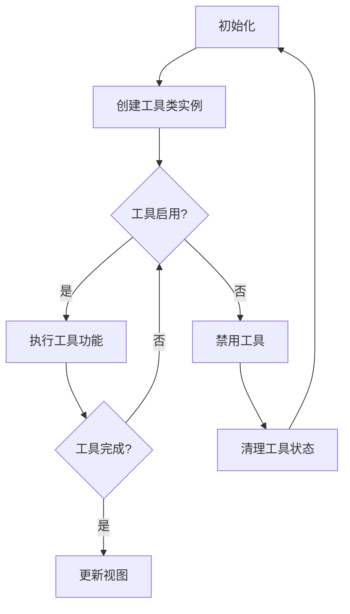

## 类结构

```
ToolBase (工具基类)
├── ToolToggleBase (切换工具基类)
│   ├── ToolSetCursor
│   ├── ToolCursorPosition
│   ├── RubberbandBase
│   ├── ToolQuit
│   ├── ToolQuitAll
│   ├── ToolGrid
│   ├── ToolMinorGrid
│   ├── ToolFullScreen
│   └── AxisScaleBase
│       ├── ToolYScale
│       └── ToolXScale
├── ToolViewsPositions
├── ViewsPositionsBase
│   ├── ToolHome
│   ├── ToolBack
│   └── ToolForward
├── ConfigureSubplotsBase
├── SaveFigureBase
├── ZoomPanBase
│   ├── ToolZoom
│   └── ToolPan
└── ToolHelpBase
    └── ToolCopyToClipboardBase
```

## 全局变量及字段


### `cursors`
    
Enum representing different cursor types.

类型：`Cursors`
    


### `default_tools`
    
Dictionary mapping tool names to their respective classes.

类型：`dict[str, type[ToolBase]]`
    


### `default_toolbar_tools`
    
List of tool configurations for the toolbar.

类型：`list[list[str | list[str]]]`
    


### `Cursors.POINTER`
    
Cursor type for pointer.

类型：`int`
    


### `Cursors.HAND`
    
Cursor type for hand.

类型：`int`
    


### `Cursors.SELECT_REGION`
    
Cursor type for select region.

类型：`int`
    


### `Cursors.MOVE`
    
Cursor type for move.

类型：`int`
    


### `Cursors.WAIT`
    
Cursor type for wait.

类型：`int`
    


### `Cursors.RESIZE_HORIZONTAL`
    
Cursor type for horizontal resize.

类型：`int`
    


### `Cursors.RESIZE_VERTICAL`
    
Cursor type for vertical resize.

类型：`int`
    


### `ToolBase.default_keymap`
    
Default keymap for the tool.

类型：`list[str] | None`
    


### `ToolBase.description`
    
Description of the tool.

类型：`str | None`
    


### `ToolBase.image`
    
Image associated with the tool.

类型：`str | None`
    


### `ToolToggleBase.radio_group`
    
Radio group name for the tool.

类型：`str | None`
    


### `ToolToggleBase.cursor`
    
Cursor type for the tool.

类型：`Cursors | None`
    


### `ToolToggleBase.default_toggled`
    
Default toggled state of the tool.

类型：`bool`
    


### `ToolViewsPositions.views`
    
Dictionary of views for the tool.

类型：`dict[Figure | Axes, cbook._Stack]`
    


### `ToolViewsPositions.positions`
    
Dictionary of positions for the tool.

类型：`dict[Figure | Axes, cbook._Stack]`
    


### `ToolViewsPositions.home_views`
    
Dictionary of home views for the tool.

类型：`dict[Figure, dict[Axes, tuple[float, float, float, float]]]`
    


### `ZoomPanBase.base_scale`
    
Base scale for zoom and pan operations.

类型：`float`
    


### `ZoomPanBase.scrollthresh`
    
Threshold for scroll zoom operations.

类型：`float`
    


### `ZoomPanBase.lastscroll`
    
Last scroll position for zoom and pan operations.

类型：`float`
    
    

## 全局函数及方法


### add_tools_to_manager

该函数将指定的工具添加到工具管理器中。

参数：

- `toolmanager`：`ToolManager`，工具管理器对象，用于管理工具的生命周期和事件。
- `tools`：`dict[str, type[ToolBase]] | None`，可选参数，一个字典，键为工具名称，值为工具类的类型。如果没有提供，则使用默认工具集。

返回值：`None`，该函数不返回任何值。

#### 流程图

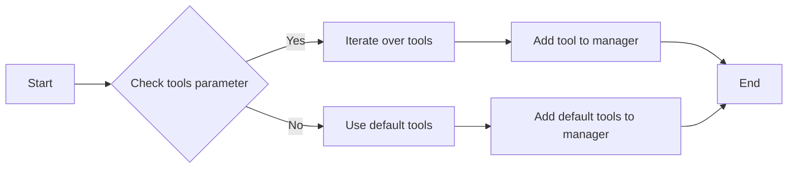

#### 带注释源码

```python
def add_tools_to_manager(
    toolmanager: ToolManager, tools: dict[str, type[ToolBase]] | None = ...
) -> None:
    # If tools parameter is provided, use it to add tools to the manager
    if tools:
        for tool_name, tool_class in tools.items():
            toolmanager.add_tool(tool_name, tool_class)
    else:
        # If tools parameter is not provided, use default tools
        for tool_name, tool_class in default_tools.items():
            toolmanager.add_tool(tool_name, tool_class)
```


### add_tools_to_container

将工具添加到容器中。

参数：

- `container`：`ToolContainerBase`，要添加工具的容器。
- `tools`：`list[Any]`，要添加的工具列表。

返回值：`None`，无返回值。

#### 流程图

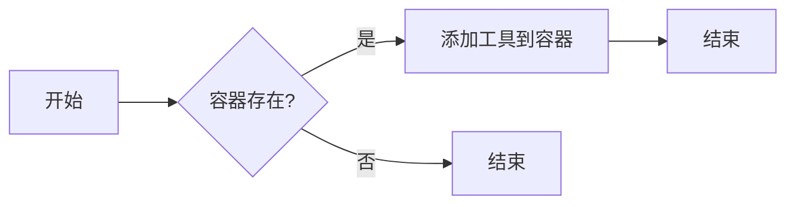

#### 带注释源码

```python
def add_tools_to_container(container: ToolContainerBase, tools: list[Any] | None = ...) -> None:
    # 检查容器是否存在
    if container is not None:
        # 遍历工具列表
        for tool in tools:
            # 添加工具到容器
            container.add_tool(tool)
```


### ToolBase.__init__

初始化 `ToolBase` 类的实例。

参数：

- `toolmanager`：`ToolManager`，工具管理器实例，用于管理工具的生命周期。
- `name`：`str`，工具的名称。

返回值：无

#### 流程图

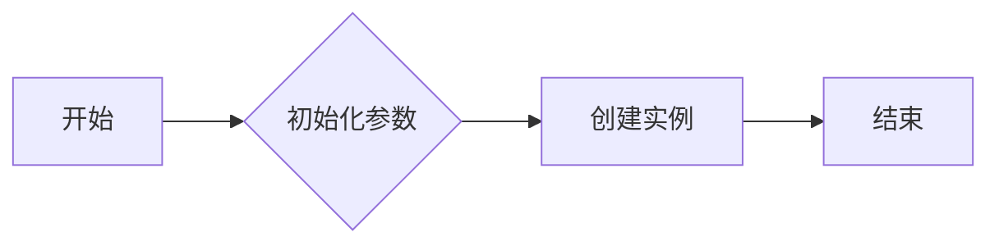

#### 带注释源码

```python
class ToolBase:
    @property
    def default_keymap(self) -> list[str] | None: ...
    description: str | None
    image: str | None
    def __init__(self, toolmanager: ToolManager, name: str) -> None:
        # 初始化工具实例
        self.toolmanager = toolmanager
        self.name = name
        # 其他初始化代码...
```


### ToolBase.name

获取工具的名称。

参数：

- `self`：`ToolBase`对象本身，无具体描述。

返回值：`str`，工具的名称。

#### 流程图

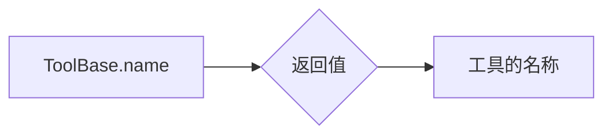

#### 带注释源码

```python
class ToolBase:
    # ... 其他代码 ...

    @property
    def name(self) -> str:
        # 返回工具的名称
        return self._name
```


### ToolBase.toolmanager

该函数用于将工具添加到工具管理器中。

参数：

- `toolmanager`：`ToolManager`，工具管理器对象，用于管理工具的生命周期和事件。

返回值：无

#### 流程图

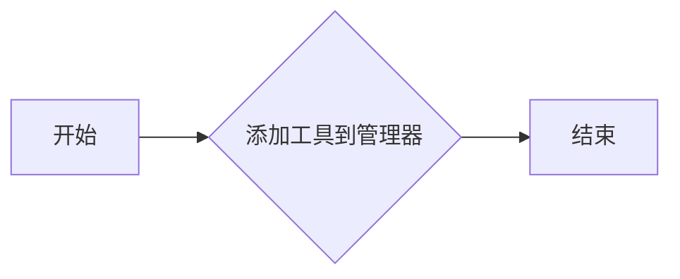

#### 带注释源码

```
def add_tools_to_manager(
    toolmanager: ToolManager, tools: dict[str, type[ToolBase]] | None = ...
) -> None:
    # 遍历工具字典
    for tool_name, tool_class in tools.items():
        # 创建工具实例
        tool_instance = tool_class(toolmanager, tool_name)
        # 将工具添加到管理器
        toolmanager.add_tool(tool_name, tool_instance)
``` 


### ToolBase.canvas

该函数返回一个`FigureCanvasBase`对象，该对象与matplotlib的`Figure`对象相关联，用于处理绘图和交互。

参数：

- 无

返回值：`FigureCanvasBase`，与`Figure`对象相关联的画布，用于绘图和交互。

#### 流程图

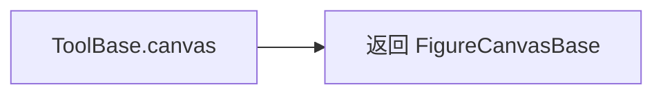

#### 带注释源码

```python
class ToolBase:
    # ... 其他代码 ...

    @property
    def canvas(self) -> FigureCanvasBase | None:
        # 返回与Figure对象相关联的画布
        return self._canvas

    # ... 其他代码 ...
```


### ToolBase.figure

该函数用于设置工具的图形对象。

参数：

- `figure`：`Figure`，图形对象，用于设置工具的图形上下文。

返回值：无

#### 流程图

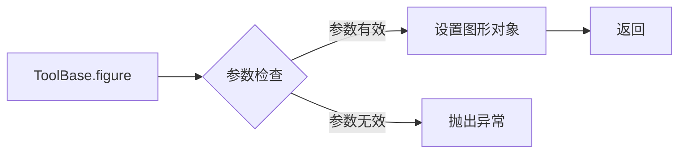

#### 带注释源码

```python
class ToolBase:
    # ... 其他代码 ...

    @property
    def figure(self) -> Figure | None: ...
    @figure.setter
    def figure(self, figure: Figure | None) -> None: ...
        # 设置图形对象
        self._figure = figure

    def set_figure(self, figure: Figure | None) -> None: ...
        # 设置图形对象
        self.figure = figure
```


### ToolBase.set_figure

设置工具的图形对象。

参数：

- `figure`：`Figure`，图形对象，用于设置工具的图形上下文。

返回值：无

#### 流程图

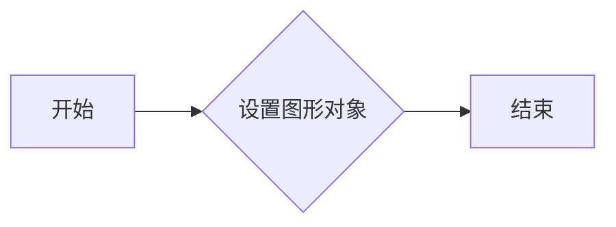

#### 带注释源码

```python
class ToolBase:
    # ... 其他代码 ...

    @figure.setter
    def figure(self, figure: Figure | None) -> None:
        # 设置图形对象
        self._figure = figure

    def set_figure(self, figure: Figure | None) -> None:
        # 设置图形对象
        self.figure = figure
```


### ToolBase.trigger

该函数是`ToolBase`类的一个方法，用于触发工具事件。

参数：

- `sender`：`Any`，事件发送者
- `event`：`ToolEvent`，触发的事件
- `data`：`Any`，与事件相关的数据，默认为空

返回值：`None`，无返回值

#### 流程图

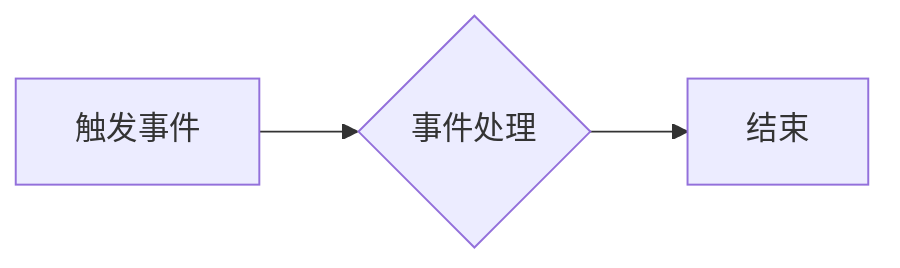

#### 带注释源码

```python
class ToolBase:
    # ... 其他代码 ...

    def trigger(self, sender: Any, event: ToolEvent, data: Any = ...) -> None:
        # 实现触发事件的处理逻辑
        pass
```


### ToolToggleBase.__init__

初始化 `ToolToggleBase` 类的实例。

参数：

- `toolmanager`：`ToolManager`，工具管理器实例，用于管理工具的生命周期。
- `name`：`str`，工具的名称。

返回值：无

#### 流程图

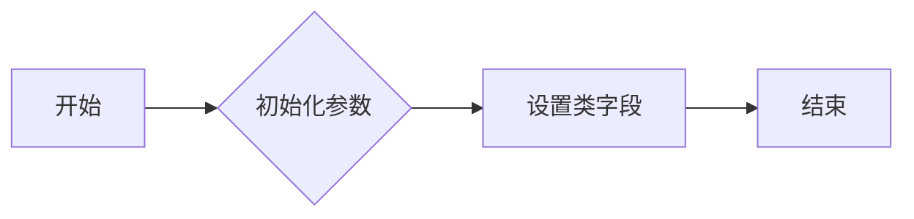

#### 带注释源码

```python
class ToolToggleBase(ToolBase):
    radio_group: str | None
    cursor: Cursors | None
    default_toggled: bool

    def __init__(self, toolmanager: ToolManager, name: str) -> None:
        super().__init__(toolmanager, name)
        self.radio_group = None
        self.cursor = None
        self.default_toggled = False
```


### ToolToggleBase.enable

该函数用于启用或禁用工具。

参数：

- `event`：`ToolEvent`，事件对象，包含触发事件的详细信息。

返回值：无

#### 流程图

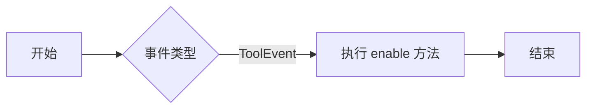

#### 带注释源码

```python
class ToolToggleBase(ToolBase):
    # ... 其他代码 ...

    def enable(self, event: ToolEvent | None = ...) -> None:
        # ... 实现代码 ...
```


### ToolToggleBase.disable

该函数用于禁用ToolToggleBase工具。

参数：

- `event`：`ToolEvent`，事件对象，包含触发事件的详细信息。

返回值：无

#### 流程图

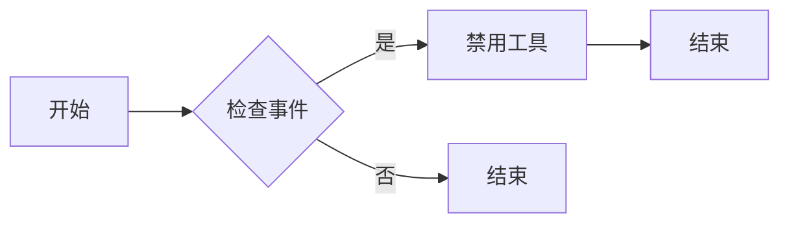

#### 带注释源码

```python
class ToolToggleBase(ToolBase):
    # ... 其他代码 ...

    def disable(self, event: ToolEvent | None = ...) -> None:
        # 禁用工具的逻辑
        pass
```


### ToolToggleBase.toggled

该函数用于获取或设置工具的启用状态。

参数：

- `event`：`ToolEvent`，事件对象，包含触发事件的详细信息。

返回值：`bool`，表示工具的启用状态。

#### 流程图

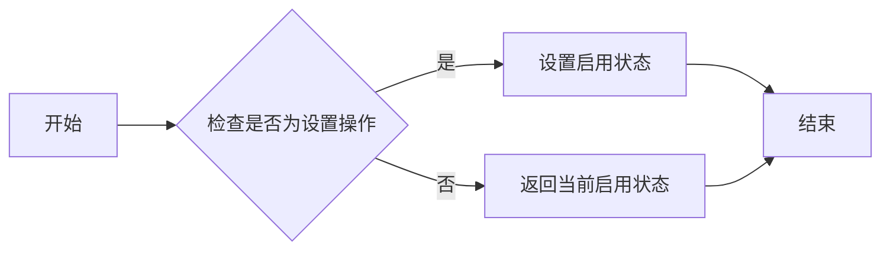

#### 带注释源码

```python
class ToolToggleBase(ToolBase):
    # ... 其他代码 ...

    @property
    def toggled(self) -> bool:
        """
        获取或设置工具的启用状态。

        参数：
        - event：ToolEvent，事件对象，包含触发事件的详细信息。

        返回值：bool，表示工具的启用状态。
        """
        return self._toggled

    @toggled.setter
    def toggled(self, value: bool) -> None:
        """
        设置工具的启用状态。

        参数：
        - value：bool，表示是否启用工具。
        """
        self._toggled = value
        # ... 其他代码 ...
```


### ToolToggleBase.set_figure

设置工具的图形对象。

参数：

- `figure`：`Figure`，图形对象，用于显示工具的图形界面。

返回值：无

#### 流程图


#### 带注释源码

```python
class ToolToggleBase(ToolBase):
    # ... 其他代码 ...

    def set_figure(self, figure: Figure | None) -> None:
        # 设置图形对象
        self.figure = figure
```


### RubberbandBase.draw_rubberband

该函数用于绘制一个橡皮筋，通常用于选择区域或缩放。

参数：

- `*data`：可变参数，具体数据取决于橡皮筋的绘制方式。

返回值：无

#### 流程图

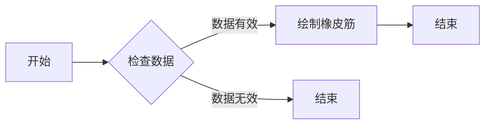

#### 带注释源码

```python
class RubberbandBase(ToolBase):
    def draw_rubberband(self, *data) -> None:
        # 检查数据是否有效
        if not self._check_data(data):
            return
        
        # 绘制橡皮筋
        self._draw_rubberband(data)
```

注意：由于源码中未提供 `_check_data` 和 `_draw_rubberband` 方法的具体实现，以上仅为示例流程图和源码结构。


### ToolSetCursor.remove_rubberband

该函数用于移除橡皮筋，通常用于绘图工具中，用于在图像上绘制一个矩形区域。

参数：

- 无

返回值：`None`，无返回值

#### 流程图

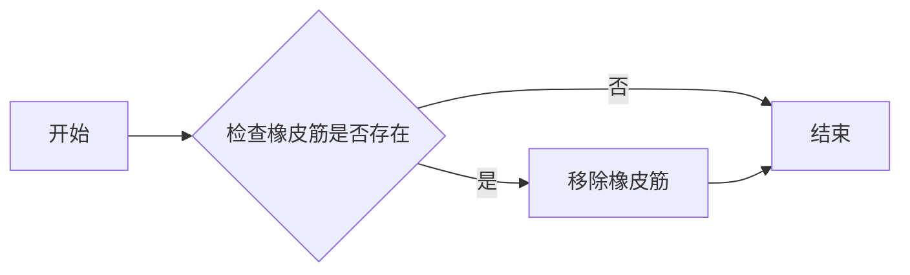

#### 带注释源码

```python
class ToolSetCursor(ToolBase):
    # ... 其他代码 ...

    class RubberbandBase(ToolBase):
        # ... 其他代码 ...

        def remove_rubberband(self) -> None:
            # 移除橡皮筋的逻辑
            pass
```

由于源码中未提供具体的实现细节，以上仅为基于类定义的假设性描述和流程图。实际实现可能包含更多的逻辑和细节。


### ToolCursorPosition.send_message

该函数用于发送消息，通常用于工具类中，以通知其他组件或系统发生了特定事件。

参数：

- `event`：`ToolEvent`，表示触发事件的工具事件对象，包含事件的相关信息。

返回值：`None`，该函数不返回任何值。

#### 流程图

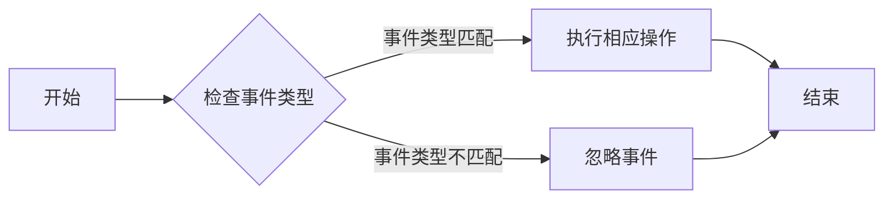

#### 带注释源码

```python
class ToolCursorPosition(ToolBase):
    def send_message(self, event: ToolEvent) -> None:
        # 检查事件类型，并执行相应的操作
        if self.check_event_type(event):
            self.execute_operation(event)
        # 如果事件类型不匹配，则忽略事件
        else:
            pass

    def check_event_type(self, event: ToolEvent) -> bool:
        # 这里应该包含检查事件类型的逻辑
        return True

    def execute_operation(self, event: ToolEvent):
        # 这里应该包含执行操作的逻辑
        pass
```


### RubberbandBase.draw_rubberband

该函数用于在matplotlib图形中绘制一个橡皮筋，通常用于选择区域或测量距离。

参数：

- `*data`：可变参数，用于传递绘制橡皮筋所需的数据。

返回值：`None`，该函数不返回任何值。

#### 流程图


#### 带注释源码

```python
class RubberbandBase(ToolBase):
    def draw_rubberband(self, *data) -> None:
        # 检查数据是否有效
        if not self._check_data(data):
            return
        
        # 绘制橡皮筋
        self._draw_rubberband(data)
```

注意：由于源码中未提供 `_check_data` 和 `_draw_rubberband` 方法的具体实现，以上仅为流程图和源码框架。


### RubberbandBase.remove_rubberband

该函数用于移除橡皮筋，即清除之前绘制的橡皮筋区域。

参数：

- 无

返回值：`None`，无返回值

#### 流程图

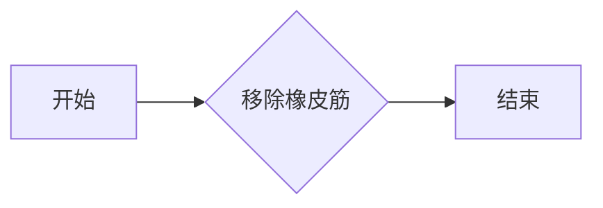

#### 带注释源码

```python
class RubberbandBase(ToolBase):
    # ... 其他代码 ...

    def remove_rubberband(self) -> None:
        # 移除橡皮筋的实现代码
        pass
```


### AxisScaleBase.enable

该函数用于启用或禁用轴比例工具。

参数：

- `event`：`ToolEvent`，事件对象，包含触发事件的详细信息。

返回值：无

#### 流程图

```mermaid
graph LR
A[开始] --> B{事件类型}
B -- ToolEvent --> C[调用 enable 方法]
C --> D[结束]
```

#### 带注释源码

```python
class AxisScaleBase(ToolToggleBase):
    def enable(self, event: ToolEvent | None = ...) -> None: ...
        # 代码实现省略，具体实现依赖于子类
```


### AxisScaleBase.disable

该函数用于禁用轴尺度工具，通常用于交互式绘图环境中，当用户选择禁用该工具时，轴尺度相关的交互操作将不再响应。

参数：

- `event`：`ToolEvent`，表示触发禁用事件的工具事件对象。该参数可以为 `None`。

返回值：无

#### 流程图

```mermaid
graph TD
    A[开始] --> B{检查事件}
    B -- 是 --> C[禁用工具]
    B -- 否 --> D[结束]
    C --> E[结束]
```

#### 带注释源码

```python
class AxisScaleBase(ToolToggleBase):
    # ... 其他代码 ...

    def disable(self, event: ToolEvent | None = ...) -> None:
        # 禁用工具的逻辑
        # 通常包括更新工具状态，通知相关组件禁用等操作
        pass
```


### ToolYScale.set_scale

该函数用于设置轴的缩放比例。

参数：

- `ax`：`Axes`，轴对象，用于指定要设置缩放比例的轴。
- `scale`：`str` 或 `ScaleBase`，缩放比例的值或缩放对象。

返回值：无

#### 流程图

```mermaid
graph LR
A[开始] --> B{参数类型检查}
B -->|str| C[创建ScaleBase对象]
B -->|ScaleBase| C
C --> D[设置轴的缩放比例]
D --> E[结束]
```

#### 带注释源码

```python
class ToolYScale(AxisScaleBase):
    def set_scale(self, ax: Axes, scale: str | ScaleBase) -> None:
        # 检查scale参数类型
        if isinstance(scale, str):
            # 创建ScaleBase对象
            scale = ScaleBase(scale)
        # 设置轴的缩放比例
        ax.set_scale(scale)
``` 


### ToolXScale.set_scale

该函数用于设置X轴的缩放比例。

参数：

- `ax`：`Axes`，表示要设置缩放比例的轴。
- `scale`：`str` 或 `ScaleBase`，表示要设置的缩放比例。

返回值：无

#### 流程图

```mermaid
graph LR
A[开始] --> B{参数类型检查}
B -->|str| C[设置字符串缩放]
B -->|ScaleBase| D[设置ScaleBase缩放]
C --> E[结束]
D --> E
```

#### 带注释源码

```python
class ToolXScale(AxisScaleBase):
    def set_scale(self, ax: Axes, scale: str | ScaleBase) -> None:
        # 检查scale参数类型
        if isinstance(scale, str):
            # 设置字符串缩放
            pass
        elif isinstance(scale, ScaleBase):
            # 设置ScaleBase缩放
            pass
        # 其他处理...
```


### ToolViewsPositions.add_figure

该函数用于将给定的Figure对象添加到ToolViewsPositions类的views和positions字典中，以便跟踪视图和位置信息。

参数：

- `figure`：`Figure`，表示要添加的Figure对象。

返回值：`None`，该函数不返回任何值。

#### 流程图

```mermaid
graph LR
A[Start] --> B{Add figure to views}
B --> C{Add figure to positions}
C --> D[End]
```

#### 带注释源码

```python
class ToolViewsPositions(ToolBase):
    # ... (其他代码)

    def add_figure(self, figure: Figure) -> None:
        # 将Figure对象添加到views字典中
        if figure not in self.views:
            self.views[figure] = cbook._Stack()
        
        # 将Figure对象添加到positions字典中
        if figure not in self.positions:
            self.positions[figure] = cbook._Stack()
```


### ToolViewsPositions.clear

清除指定图例的视图和位置信息。

参数：

- `figure`：`Figure`，指定要清除视图和位置信息的图例。

返回值：无

#### 流程图

```mermaid
graph LR
A[开始] --> B{传入参数}
B --> C[检查参数有效性]
C -->|有效| D[清除视图和位置信息]
D --> E[返回]
C -->|无效| F[抛出异常]
F --> G[结束]
```

#### 带注释源码

```python
class ToolViewsPositions(ToolBase):
    # ... 其他代码 ...

    def clear(self, figure: Figure) -> None:
        # 清除指定图例的视图和位置信息
        if figure in self.views:
            del self.views[figure]
        if figure in self.positions:
            del self.positions[figure]
        if figure in self.home_views:
            del self.home_views[figure]
```


### ToolViewsPositions.update_view

更新视图状态，可能涉及保存当前视图位置和状态，以及恢复或切换到不同的视图。

参数：

- 无

返回值：`None`，无返回值

#### 流程图

```mermaid
graph TD
    A[开始] --> B{检查视图状态}
    B -->|是| C[保存当前视图位置和状态]
    B -->|否| D[无操作]
    C --> E[更新视图]
    E --> F[结束]
    D --> F
```

#### 带注释源码

```python
class ToolViewsPositions(ToolBase):
    # ... 其他代码 ...

    def update_view(self) -> None:
        # 假设这里有一些逻辑来更新视图状态
        # 例如，保存当前视图位置和状态，或者恢复到某个历史视图
        pass
```


### ToolViewsPositions.push_current

该函数用于将当前视图的位置和缩放信息推送到相应的堆栈中。

参数：

- `figure`：`Figure | None`，当前视图的Figure对象。如果未提供，则使用当前活动视图。

返回值：无

#### 流程图

```mermaid
graph LR
A[开始] --> B{是否有 figure 参数?}
B -- 是 --> C[获取当前视图的 Figure 对象]
B -- 否 --> C
C --> D[获取当前视图的位置和缩放信息]
D --> E[将信息推送到 views 堆栈]
E --> F[将信息推送到 positions 堆栈]
F --> G[结束]
```

#### 带注释源码

```python
class ToolViewsPositions(ToolBase):
    # ... 其他代码 ...

    def push_current(self, figure: Figure | None = ...) -> None:
        # 获取当前视图的 Figure 对象
        if figure is None:
            figure = self.canvas.figure

        # 获取当前视图的位置和缩放信息
        ax = figure.gca()
        view = ax.get_view()

        # 将信息推送到 views 堆栈
        self.views[figure].push(view)

        # 将信息推送到 positions 堆栈
        self.positions[figure].push((ax.get_position(), view))

        # 无返回值
```


### ToolViewsPositions.update_home_views

更新主视图的配置信息。

参数：

- `figure`：`Figure`，当前视图的Figure对象。

返回值：无

#### 流程图

```mermaid
graph LR
A[开始] --> B{参数 figure 是否为 None?}
B -- 是 --> C[结束]
B -- 否 --> D[获取 figure 的 home_views 字典]
D --> E[更新 home_views 字典]
E --> F[结束]
```

#### 带注释源码

```python
class ToolViewsPositions(ToolBase):
    # ... 其他代码 ...

    def update_home_views(self, figure: Figure | None = ...) -> None:
        """
        更新主视图的配置信息。

        参数：
        - figure：Figure，当前视图的Figure对象。

        返回值：无
        """
        if figure is None:
            return

        # 获取 figure 的 home_views 字典
        home_views = self.home_views.get(figure)

        # 更新 home_views 字典
        # ... 更新逻辑 ...
```


### ToolViewsPositions.home

该函数用于将视图和位置重置为默认的“home”状态。

参数：

- 无

返回值：`None`，无返回值

#### 流程图

```mermaid
graph LR
A[开始] --> B{调用home()}
B --> C[结束]
```

#### 带注释源码

```python
class ToolViewsPositions(ToolBase):
    # ... 其他代码 ...

    def home(self) -> None:
        # 重置视图和位置到默认的“home”状态
        # ...
        pass
```


### ToolViewsPositions.back

该函数用于将视图位置回退到之前保存的状态。

参数：

- 无

返回值：`None`，无返回值

#### 流程图

```mermaid
graph LR
A[开始] --> B{调用 push_current}
B --> C{调用 update_home_views}
C --> D{调用 home}
D --> E{调用 back}
E --> F[结束]
```

#### 带注释源码

```python
class ToolViewsPositions(ToolBase):
    # ... 其他代码 ...

    def back(self) -> None:
        # 获取当前视图的堆栈
        current_view_stack = self.positions[self.figure]

        # 如果堆栈不为空，则弹出最后一个视图位置
        if current_view_stack:
            last_view = current_view_stack.pop()

            # 将当前视图位置推入堆栈
            self.positions[self.figure].push(self.views[self.figure])

            # 更新视图到弹出的位置
            self.views[self.figure] = last_view
            self.update_view()
```


### ToolViewsPositions.forward

该函数用于将视图位置向前移动，即从历史记录中恢复到上一个视图位置。

参数：

- `figure`：`Figure`，当前操作的图形对象。

返回值：`None`，无返回值。

#### 流程图

```mermaid
graph LR
A[开始] --> B{检查figure是否为None}
B -- 是 --> C[结束]
B -- 否 --> D[获取当前视图位置]
D --> E[将当前视图位置推入历史记录]
E --> F[更新当前视图位置为上一个视图位置]
F --> G[结束]
```

#### 带注释源码

```python
class ToolViewsPositions(ToolBase):
    # ... 其他代码 ...

    def forward(self, figure: Figure | None = ...) -> None:
        # 检查figure是否为None
        if figure is None:
            return
        
        # 获取当前视图位置
        current_view = self.get_current_view(figure)
        
        # 将当前视图位置推入历史记录
        self.push_current(figure)
        
        # 更新当前视图位置为上一个视图位置
        self.set_view(figure, self.get_previous_view(figure))
```


### ZoomPanBase.__init__

初始化`ZoomPanBase`类，设置基本的缩放和平移工具属性。

参数：

- `*args`：可变参数列表，用于传递给父类`ToolToggleBase`的初始化方法。
- `**kwargs`：关键字参数字典，用于传递给父类`ToolToggleBase`的初始化方法。

返回值：无

#### 流程图

```mermaid
classDiagram
    ZoomPanBase <|-- ToolToggleBase
    ZoomPanBase {
        +base_scale: float
        +scrollthresh: float
        +lastscroll: float
    }
    ZoomPanBase {
        +__init__(*args, **kwargs)
    }
```

#### 带注释源码

```python
class ZoomPanBase(ToolToggleBase):
    base_scale: float
    scrollthresh: float
    lastscroll: float

    def __init__(self, *args, **kwargs) -> None:
        super().__init__(*args, **kwargs)
        self.base_scale = 1.0
        self.scrollthresh = 0.1
        self.lastscroll = 0.0
```


### {ZoomPanBase.enable}

该函数用于启用或禁用ZoomPan工具，它接受一个事件对象作为参数。

参数：

- `event`：`ToolEvent`，事件对象，用于传递启用或禁用工具的事件信息。

返回值：无

#### 流程图

```mermaid
graph LR
A[开始] --> B{事件类型}
B -- "启用" --> C[启用ZoomPan]
B -- "禁用" --> D[禁用ZoomPan]
C --> E[结束]
D --> E
```

#### 带注释源码

```python
class ZoomPanBase(ToolToggleBase):
    # ... 其他代码 ...

    def enable(self, event: ToolEvent | None = ...) -> None:
        # 设置工具为启用状态
        self.toggled = True
        # 触发事件，通知其他组件工具已启用
        self.trigger(event, 'enable')
```


### ZoomPanBase.disable

该函数用于禁用`ZoomPanBase`工具，它是一个工具类，用于实现缩放和平移功能。

参数：

- `event`：`ToolEvent`，事件对象，用于传递事件信息。

返回值：无

#### 流程图

```mermaid
graph LR
A[开始] --> B{检查事件}
B -->|是| C[禁用工具]
B -->|否| D[结束]
C --> E[结束]
```

#### 带注释源码

```python
class ZoomPanBase(ToolToggleBase):
    # ... 其他代码 ...

    def disable(self, event: ToolEvent | None = ...) -> None:
        # 禁用工具的逻辑
        pass
```


### ZoomPanBase.scroll_zoom

该函数用于处理鼠标滚轮事件，实现缩放功能。

参数：

- `event`：`ToolEvent`，表示鼠标滚轮事件

返回值：无

#### 流程图

```mermaid
graph LR
A[开始] --> B{事件类型}
B -- 滚轮事件 --> C[计算缩放比例]
C --> D[更新视图]
D --> E[结束]
```

#### 带注释源码

```python
class ZoomPanBase(ToolToggleBase):
    # ... 其他代码 ...

    def scroll_zoom(self, event: ToolEvent) -> None:
        # 获取滚轮事件的方向和距离
        delta = event.delta
        if delta > 0:
            # 向上滚动，放大视图
            self.base_scale *= 1.1
        elif delta < 0:
            # 向下滚动，缩小视图
            self.base_scale /= 1.1

        # 更新视图
        self.canvas.draw_idle()
``` 


### ToolHelpBase.format_shortcut

将给定的快捷键序列格式化为可读的字符串。

参数：

- `key_sequence`：`str`，快捷键序列字符串，例如 "Ctrl+C"。

返回值：`str`，格式化后的快捷键字符串。

#### 流程图

```mermaid
graph LR
A[开始] --> B{参数检查}
B -->|参数有效| C[格式化快捷键]
B -->|参数无效| D[返回错误信息]
C --> E[结束]
D --> E
```

#### 带注释源码

```python
class ToolHelpBase(ToolBase):
    @staticmethod
    def format_shortcut(key_sequence: str) -> str:
        # 检查快捷键序列是否有效
        if not key_sequence:
            return "Invalid shortcut"
        
        # 格式化快捷键序列
        formatted_shortcut = ""
        if key_sequence.startswith("Ctrl+"):
            formatted_shortcut += "Ctrl+"
            key_sequence = key_sequence[4:]
        elif key_sequence.startswith("Alt+"):
            formatted_shortcut += "Alt+"
            key_sequence = key_sequence[4:]
        elif key_sequence.startswith("Shift+"):
            formatted_shortcut += "Shift+"
            key_sequence = key_sequence[5:]
        
        # 添加剩余的键
        formatted_shortcut += key_sequence
        
        return formatted_shortcut
```


## 关键组件


### 张量索引与惰性加载

张量索引与惰性加载是处理大型数据集时常用的技术，它允许在需要时才计算或加载数据，从而提高效率。

### 反量化支持

反量化支持是指系统对量化操作的反向处理能力，即能够从量化后的数据中恢复原始数据。

### 量化策略

量化策略是指对数据或模型进行量化时采用的算法和参数设置，以优化性能和资源使用。


## 问题及建议


### 已知问题

-   **代码注释缺失**：代码中缺少必要的注释，这会使得理解代码逻辑和功能变得困难，尤其是在维护和扩展代码时。
-   **类型注解不完整**：部分类方法和全局函数的类型注解不完整，例如`ToolBase`的`trigger`方法缺少参数和返回值的类型注解。
-   **全局变量和函数**：存在全局变量和函数，如`default_tools`和`add_tools_to_manager`，这可能导致代码难以测试和维护。
-   **代码重复**：`ToolToggleBase`和`ZoomPanBase`类中存在重复的`enable`和`disable`方法实现，可以考虑使用继承或模板方法模式来减少代码重复。

### 优化建议

-   **添加注释**：在代码中添加必要的注释，解释代码的功能、逻辑和设计决策。
-   **完善类型注解**：为所有类方法和全局函数添加完整的类型注解，以提高代码的可读性和可维护性。
-   **减少全局变量和函数**：尽量减少全局变量和函数的使用，使用类和模块来封装功能，提高代码的模块化和可测试性。
-   **重构代码**：重构`ToolToggleBase`和`ZoomPanBase`类中的重复代码，使用继承或模板方法模式来减少代码重复。
-   **文档化**：为代码编写详细的设计文档，包括类和方法的功能、参数、返回值和异常处理等，以便于其他开发者理解和使用代码。
-   **单元测试**：编写单元测试来验证代码的功能和正确性，确保代码的质量。
-   **代码风格**：遵循一致的代码风格指南，以提高代码的可读性和可维护性。


## 其它


### 设计目标与约束

- 设计目标：
  - 提供一套完整的绘图工具，支持多种绘图操作。
  - 确保工具之间的互操作性和一致性。
  - 提供灵活的配置选项，以适应不同的绘图需求。

- 约束：
  - 遵循matplotlib的API设计规范。
  - 保持代码的可读性和可维护性。
  - 优化性能，确保工具响应迅速。

### 错误处理与异常设计

- 错误处理：
  - 使用try-except块捕获和处理可能发生的异常。
  - 提供清晰的错误信息，帮助用户诊断问题。

- 异常设计：
  - 定义自定义异常类，以区分不同类型的错误。
  - 异常类应提供足够的信息，以便调用者能够采取适当的行动。

### 数据流与状态机

- 数据流：
  - 工具类通过事件驱动的方式与其他组件交互。
  - 数据流从用户输入到工具类，再到绘图组件。

- 状态机：
  - 工具类可能包含内部状态机，以处理不同的操作模式。

### 外部依赖与接口契约

- 外部依赖：
  - 依赖于matplotlib库进行绘图操作。
  - 依赖于Python标准库进行基本功能。

- 接口契约：
  - 工具类应遵循统一的接口契约，确保兼容性和一致性。
  - 提供文档说明每个工具类的功能和用法。

### 测试与验证

- 测试策略：
  - 编写单元测试，确保每个工具类和函数按预期工作。
  - 进行集成测试，确保工具之间能够正常协作。

- 验证方法：
  - 使用自动化测试工具进行测试。
  - 手动测试关键功能，确保用户体验良好。

### 性能优化

- 优化策略：
  - 分析热点代码，进行性能优化。
  - 使用缓存机制减少重复计算。

- 性能指标：
  - 确保工具响应时间在可接受范围内。
  - 优化内存使用，避免内存泄漏。

### 安全性

- 安全措施：
  - 防范常见的安全漏洞，如SQL注入和跨站脚本攻击。
  - 对用户输入进行验证和清理。

- 安全标准：
  - 遵循行业最佳实践和安全标准。

### 可维护性与可扩展性

- 维护策略：
  - 保持代码整洁，易于理解和修改。
  - 使用模块化设计，便于扩展。

- 扩展性：
  - 设计灵活的接口，允许添加新的工具和功能。
  - 提供插件机制，方便用户自定义工具。

### 用户文档

- 文档内容：
  - 提供详细的API文档，包括每个工具类的用法和参数。
  - 提供用户指南，介绍如何使用这些工具进行绘图。

- 文档格式：
  - 使用Markdown或ReStructuredText等格式编写文档。
  - 确保文档易于阅读和理解。

### 版本控制与发布

- 版本控制：
  - 使用Git进行版本控制。
  - 按照语义化版本控制规范进行版本管理。

- 发布策略：
  - 定期发布新版本，包括新功能和修复。
  - 提供详细的发布说明，包括更改日志和已知问题。

### 社区与支持

- 社区建设：
  - 建立活跃的社区，鼓励用户反馈和建议。
  - 提供技术支持，帮助用户解决问题。

- 支持渠道：
  - 提供邮件列表、论坛和社交媒体支持。
  - 定期举办线上和线下活动。


    