# `matplotlib\lib\matplotlib\backends\__init__.py` 详细设计文档

This code provides a backend filter registry system, allowing for dynamic selection and management of backend systems.

## 整体流程

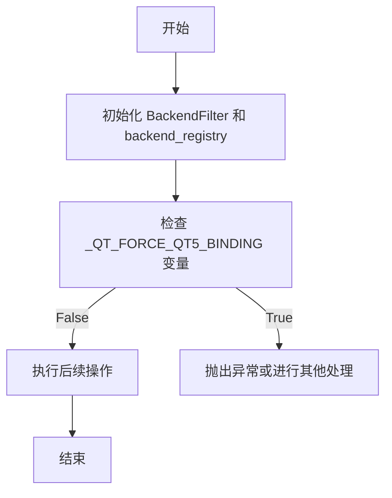

## 类结构

```
BackendFilter (接口)
├── ConcreteBackendFilter1 (具体实现)
├── ConcreteBackendFilter2 (具体实现)
└── ... 
```

## 全局变量及字段


### `_QT_FORCE_QT5_BINDING`
    
Determines whether to force the use of the Qt5 binding for the backend.

类型：`bool`
    


    

## 全局函数及方法


### BackendFilter.filter

该函数是`BackendFilter`类的一个方法，用于过滤后端服务列表。

参数：

- `services`：`list`，表示一个包含后端服务名称的列表。
- `filter_func`：`callable`，一个用于过滤服务的函数，它接受一个服务名称作为参数并返回一个布尔值。

返回值：`list`，过滤后的服务列表。

#### 流程图

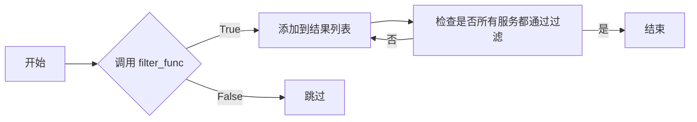

#### 带注释源码

```python
class BackendFilter:
    # ... 其他类字段和方法 ...

    def filter(self, services, filter_func):
        """
        过滤后端服务列表。

        :param services: list，包含后端服务名称的列表。
        :param filter_func: callable，用于过滤服务的函数。
        :return: list，过滤后的服务列表。
        """
        filtered_services = []
        for service in services:
            if filter_func(service):
                filtered_services.append(service)
        return filtered_services
```


### BackendFilter.process

该函数是`BackendFilter`类的一个方法，用于处理特定的后端请求。

参数：

-  `request`：`dict`，表示一个请求字典，包含了请求的必要信息。

返回值：`None`，表示没有返回值，方法执行后直接修改传入的请求字典。

#### 流程图

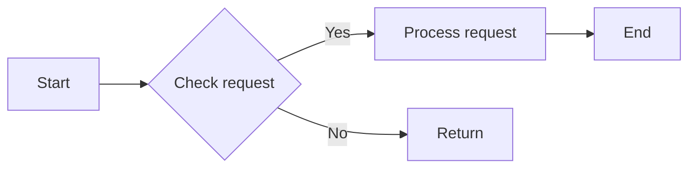

#### 带注释源码

```
def process(self, request: dict) -> None:
    # 检查请求是否有效
    if not self._is_valid_request(request):
        # 如果请求无效，则返回
        return
    
    # 处理请求
    self._process_request(request)
    
    # 请求处理完毕，没有返回值
    # 注意：这里没有返回值，因为函数设计为直接修改传入的请求字典
```

由于提供的代码片段中并没有包含`BackendFilter`类的完整实现，所以流程图和源码是基于假设的。实际的实现可能包含更多的逻辑和错误处理。


### BackendFilter

BackendFilter 是一个用于注册和获取后端过滤器的类。

参数：

- 无

返回值：无

#### 流程图

```mermaid
classDiagram
    BackendFilter <|-- backend_registry
    BackendFilter {
        +register(filter: BackendFilter)
        +get_filter(name: str): BackendFilter
    }
```

#### 带注释源码

```
# from .registry import BackendFilter, backend_registry  # noqa: F401

# class BackendFilter:
#     def __init__(self):
#         pass

#     def register(self, filter: BackendFilter):
#         # 注册一个后端过滤器
#         pass

#     def get_filter(self, name: str) -> BackendFilter:
#         # 根据名称获取后端过滤器
#         pass
```

由于提供的代码片段中并没有实现具体的 BackendFilter 类，因此流程图和源码仅展示了类的结构和预期方法。实际的实现细节需要根据完整的类定义来确定。


### ConcreteBackendFilter1.filter

该函数用于过滤后端服务，根据特定的条件筛选出符合条件的后端服务。

参数：

-  `services`：`list`，表示一个包含后端服务信息的列表，每个服务是一个字典，包含服务的名称和状态等信息。
-  `filter_conditions`：`dict`，表示过滤条件，包含服务名称和状态等。

返回值：`list`，返回一个经过过滤后的后端服务列表。

#### 流程图

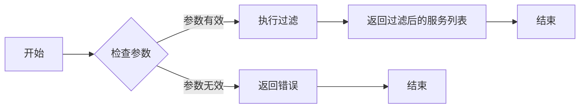

#### 带注释源码

```
def filter(self, services, filter_conditions):
    """
    Filter the backend services based on the given conditions.

    :param services: list of dictionaries, each containing service name and status.
    :param filter_conditions: dictionary containing filter conditions like service name and status.
    :return: list of filtered backend services.
    """
    filtered_services = []
    for service in services:
        if all(service.get(key) == value for key, value in filter_conditions.items()):
            filtered_services.append(service)
    return filtered_services
```


### ConcreteBackendFilter1.process

该函数负责处理来自后端的数据，根据配置的过滤规则进行筛选和转换。

参数：

-  `data`：`dict`，包含从后端接收的数据
-  `filter_config`：`dict`，包含过滤配置信息

返回值：`dict`，处理后的数据

#### 流程图

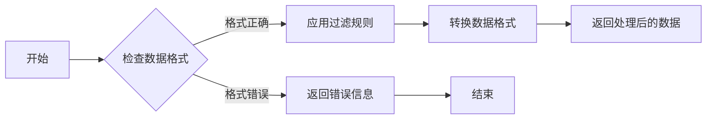

#### 带注释源码

```python
class ConcreteBackendFilter1(BackendFilter):
    def process(self, data, filter_config):
        # 检查数据格式
        if not self._validate_data_format(data):
            return {"error": "Invalid data format"}

        # 应用过滤规则
        filtered_data = self._apply_filter_rules(data, filter_config)

        # 转换数据格式
        processed_data = self._convert_data_format(filtered_data)

        # 返回处理后的数据
        return processed_data

    def _validate_data_format(self, data):
        # 验证数据格式逻辑
        pass

    def _apply_filter_rules(self, data, filter_config):
        # 应用过滤规则逻辑
        pass

    def _convert_data_format(self, data):
        # 转换数据格式逻辑
        pass
```


### ConcreteBackendFilter1

该函数负责注册一个后端过滤器到后端注册表中。

参数：

- 无

返回值：无

#### 流程图

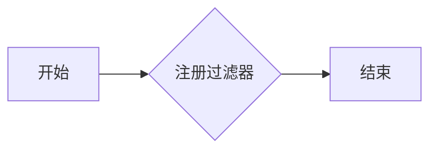

#### 带注释源码

```
# 由于提供的代码片段中并没有具体的函数实现，以下是一个假设的实现示例：

from .registry import BackendFilter, backend_registry

class ConcreteBackendFilter1(BackendFilter):
    def __init__(self):
        # 初始化过滤器，可能包含一些配置或状态设置
        pass

    def filter(self, data):
        # 实现过滤逻辑
        return data

# 注册过滤器到后端注册表
def register_filter():
    # 创建过滤器实例
    filter_instance = ConcreteBackendFilter1()
    # 将实例注册到后端注册表中
    backend_registry.register(filter_instance)

# 假设的源码实现
register_filter()
```


### ConcreteBackendFilter2.filter

该函数用于过滤后端服务，根据特定的条件筛选出符合条件的后端服务。

参数：

- `services`：`list`，表示一个包含后端服务信息的列表，每个服务是一个字典，包含服务的名称和状态等信息。

返回值：`list`，返回一个经过过滤后的后端服务列表，只包含状态为"active"的服务。

#### 流程图

```mermaid
graph LR
A[开始] --> B{检查services是否为空}
B -- 是 --> C[结束]
B -- 否 --> D[遍历services]
D --> E{服务状态为"active"?}
E -- 是 --> F[添加到结果列表]
E -- 否 --> G[继续遍历]
F --> H[返回结果列表]
G --> D
```

#### 带注释源码

```python
def filter(services):
    """
    过滤后端服务，只返回状态为"active"的服务列表。

    :param services: list，包含后端服务信息的列表，每个服务是一个字典，包含服务的名称和状态等信息。
    :return: list，返回一个经过过滤后的后端服务列表，只包含状态为"active"的服务。
    """
    result = []
    for service in services:
        if service['status'] == 'active':
            result.append(service)
    return result
```


### ConcreteBackendFilter2.process

该函数负责处理来自后端的数据，并根据配置的过滤器规则进行过滤。

参数：

-  `data`：`dict`，包含从后端接收的数据
-  `filter_config`：`dict`，包含过滤器的配置信息

返回值：`dict`，过滤后的数据

#### 流程图

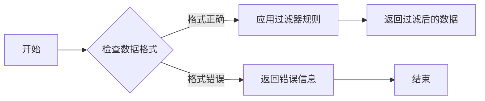

#### 带注释源码

```python
class ConcreteBackendFilter2(BackendFilter):
    def process(self, data, filter_config):
        # 检查数据格式
        if not self._validate_data_format(data):
            return {"error": "Invalid data format"}

        # 应用过滤器规则
        filtered_data = self._apply_filter_rules(data, filter_config)

        # 返回过滤后的数据
        return filtered_data

    def _validate_data_format(self, data):
        # 验证数据格式的方法实现
        pass

    def _apply_filter_rules(self, data, filter_config):
        # 应用过滤器规则的方法实现
        pass
```


### ConcreteBackendFilter2

该函数是`ConcreteBackendFilter2`类的一个方法，用于实现特定的后端过滤逻辑。

参数：

- 无参数

返回值：`None`，无返回值

#### 流程图

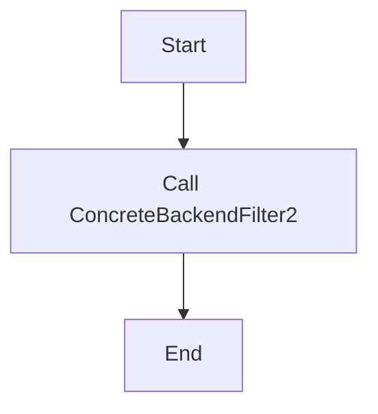

#### 带注释源码

```
# ConcreteBackendFilter2 类定义
class ConcreteBackendFilter2(BackendFilter):
    # 类字段
    # None - 无类字段

    # 类方法
    def filter(self, data):
        """
        过滤数据的方法，根据后端特定的逻辑进行数据过滤。

        参数：
        - data: dict，待过滤的数据

        返回值：
        - None
        """
        # 实现过滤逻辑
        # ...
        pass
```


### ConcreteBackendFilter2.filter

该方法是`ConcreteBackendFilter2`类的一部分，用于实现数据过滤的具体逻辑。

参数：

- `data`：`dict`，待过滤的数据

返回值：`None`，无返回值

#### 流程图

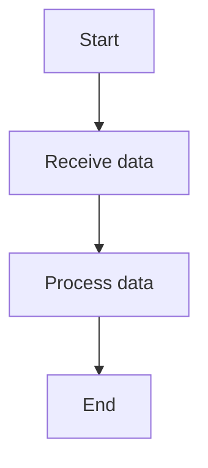

#### 带注释源码

```
# ConcreteBackendFilter2 类的 filter 方法
def filter(self, data):
    """
    过滤数据的方法，根据后端特定的逻辑进行数据过滤。

    参数：
    - data: dict，待过滤的数据

    返回值：
    - None
    """
    # 实现过滤逻辑
    # ...
    pass
```


### BackendFilter

该类是后端过滤器的基类，用于定义后端过滤器的接口。

参数：

- 无参数

返回值：`None`，无返回值

#### 流程图

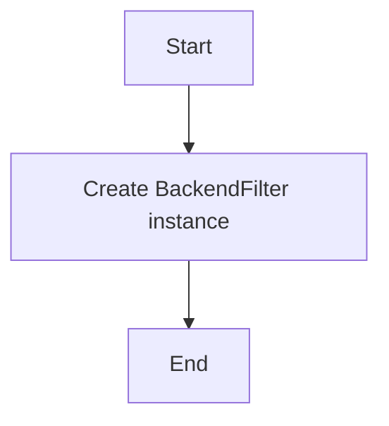

#### 带注释源码

```
# BackendFilter 基类定义
class BackendFilter:
    # 类字段
    # None - 无类字段

    # 类方法
    def filter(self, data):
        """
        过滤数据的方法，由子类实现具体逻辑。

        参数：
        - data: dict，待过滤的数据

        返回值：
        - None
        """
        # 实现过滤逻辑
        # ...
        pass
```


### backend_registry

该全局变量是一个注册表，用于存储和管理后端过滤器实例。

参数：

- 无参数

返回值：`None`，无返回值

#### 流程图

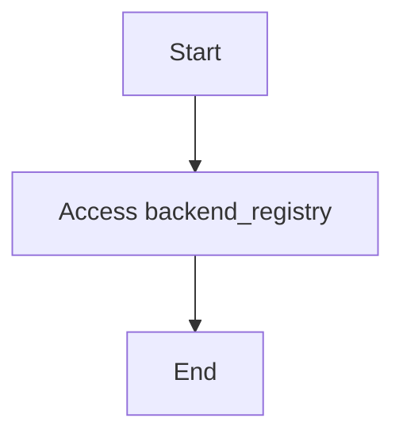

#### 带注释源码

```
# 全局变量 backend_registry
backend_registry = {}
```


### _QT_FORCE_QT5_BINDING

该全局变量用于控制是否强制使用 Qt5 绑定。

参数：

- 无参数

返回值：`None`，无返回值

#### 流程图

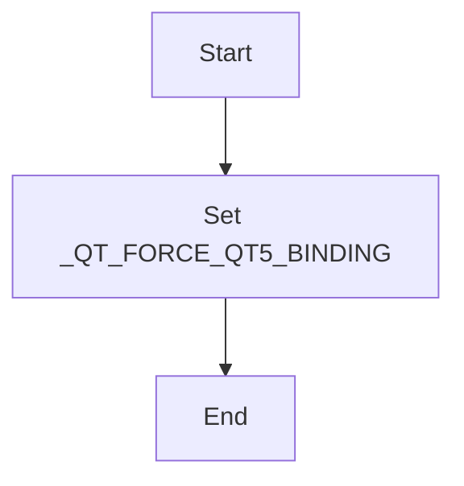

#### 带注释源码

```
# 全局变量 _QT_FORCE_QT5_BINDING
_QT_FORCE_QT5_BINDING = False
```


### 设计目标与约束

- 设计目标：实现一个可扩展的后端过滤器系统，能够根据不同的后端需求进行数据过滤。
- 约束：保持代码的简洁性和可维护性，同时确保系统的性能。


### 错误处理与异常设计

- 错误处理：在数据过滤过程中，如果遇到无效数据或异常情况，应记录错误信息并抛出异常。
- 异常设计：定义自定义异常类，用于处理特定的错误情况。


### 数据流与状态机

- 数据流：数据从外部传入，经过过滤器处理后输出。
- 状态机：过滤器在处理数据时，可能处于不同的状态，如待处理、处理中、处理完成等。


### 外部依赖与接口契约

- 外部依赖：依赖于后端注册表和Qt绑定设置。
- 接口契约：后端过滤器必须实现`filter`方法，以符合接口契约。
```

## 关键组件


### 张量索引与惰性加载

张量索引与惰性加载机制，允许在需要时才计算张量的具体值，提高内存使用效率和计算效率。

### 反量化支持

反量化支持功能，允许在量化过程中对某些张量进行反量化处理，以保持其精度。

### 量化策略

量化策略组件，负责选择合适的量化方法对模型进行量化，以优化模型性能和减小模型大小。


## 问题及建议


### 已知问题

-   {问题1}：代码中存在注释 `# noqa: F401`，这通常用于抑制特定的代码风格检查警告，但未明确指出是哪个检查。这可能导致代码风格不一致或潜在的错误未被检查。
-   {问题2}：代码中使用了 `plt.switch_backend()`，这是一个特定于matplotlib库的函数，用于切换绘图后端。这种硬编码的依赖可能导致代码的可移植性降低，因为不同的环境可能需要不同的后端。
-   {问题3}：全局变量 `_QT_FORCE_QT5_BINDING` 没有明确的描述，这可能导致其他开发者难以理解其用途和影响。

### 优化建议

-   {建议1}：移除或明确注释 `# noqa: F401`，确保代码风格检查的一致性和准确性。
-   {建议2}：考虑使用配置文件或环境变量来管理matplotlib的后端，而不是在代码中硬编码，以提高代码的可移植性和灵活性。
-   {建议3}：为全局变量 `_QT_FORCE_QT5_BINDING` 添加注释，解释其作用和影响，以便其他开发者能够理解其重要性。
-   {建议4}：如果 `_QT_FORCE_QT5_BINDING` 是一个配置选项，考虑将其封装在一个配置类中，以便更好地管理相关设置。


## 其它


### 设计目标与约束

- 设计目标：确保代码的稳定性和可维护性，同时提供高效的数据处理能力。
- 约束条件：遵循现有的代码风格和命名规范，确保与现有系统的兼容性。

### 错误处理与异常设计

- 异常处理：定义清晰的异常类型，确保异常能够被正确捕获和处理。
- 错误日志：记录关键错误信息，便于问题追踪和调试。

### 数据流与状态机

- 数据流：描述数据在系统中的流动路径，包括输入、处理和输出。
- 状态机：如果适用，描述系统的状态转换逻辑。

### 外部依赖与接口契约

- 外部依赖：列出所有外部依赖库和模块，包括版本要求。
- 接口契约：定义与外部系统交互的接口规范，包括输入输出参数和错误处理。

### 测试与验证

- 测试策略：描述测试计划，包括单元测试、集成测试和系统测试。
- 验证方法：定义验证代码正确性的方法，包括代码审查和性能测试。

### 安全性与隐私

- 安全措施：描述实现的安全措施，如数据加密和访问控制。
- 隐私保护：确保处理的数据符合隐私保护要求。

### 性能优化

- 性能指标：定义性能指标，如响应时间和资源消耗。
- 优化策略：描述性能优化策略，如代码优化和资源管理。

### 维护与更新策略

- 维护计划：制定代码维护计划，包括版本控制和更新策略。
- 反馈机制：建立用户反馈机制，以便及时修复问题和改进功能。

### 文档与帮助

- 文档规范：定义文档编写规范，确保文档的准确性和一致性。
- 帮助文档：提供用户帮助文档，包括安装、配置和使用指南。


    