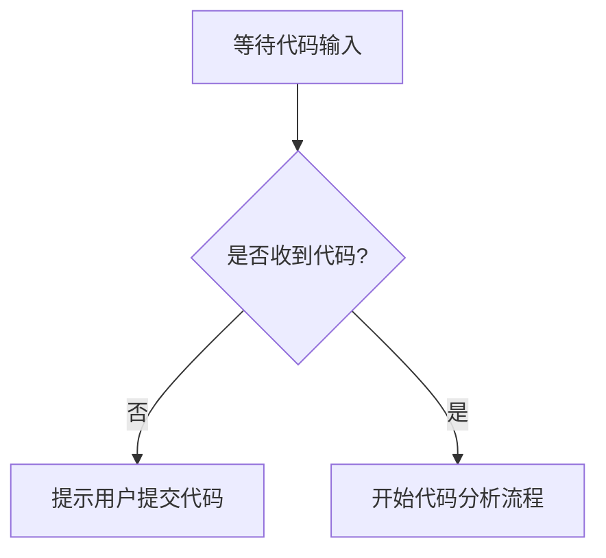

# `matplotlib\lib\matplotlib\backends\_backend_agg.pyi` 详细设计文档

未提供源代码文件，无法进行分析。请提供需要分析的代码。

## 整体流程



## 类结构

```

```

## 全局变量及字段


    

## 全局函数及方法


## 关键组件


## 问题及建议


### 已知问题

- 代码为空，未提供任何实现代码，无法进行分析。

### 优化建议

- 请提供需要分析的代码，以便进行技术债务识别和优化建议的输出。


## 其它


### 设计目标与约束

（未提供代码，无法填写具体内容）

### 错误处理与异常设计

（未提供代码，无法填写具体内容）

### 数据流与状态机

（未提供代码，无法填写具体内容）

### 外部依赖与接口契约

（未提供代码，无法填写具体内容）

### 性能要求与资源限制

（未提供代码，无法填写具体内容）

### 安全考虑与权限控制

（未提供代码，无法填写具体内容）

### 兼容性设计

（未提供代码，无法填写具体内容）

### 测试策略

（未提供代码，无法填写具体内容）

### 部署与配置

（未提供代码，无法填写具体内容）

### 监控与日志

（未提供代码，无法填写具体内容）

### 版本演进与升级策略

（未提供代码，无法填写具体内容）


    