# `matplotlib\lib\matplotlib\backends\_backend_gtk.py` 详细设计文档

这是matplotlib的GTK后端实现，同时支持GTK3和GTK4，提供了与GTK工具包集成的图形渲染、窗口管理、工具栏和交互功能，包括定时器、画布管理、图形窗口创建、导航工具栏以及主事件循环控制。

## 整体流程

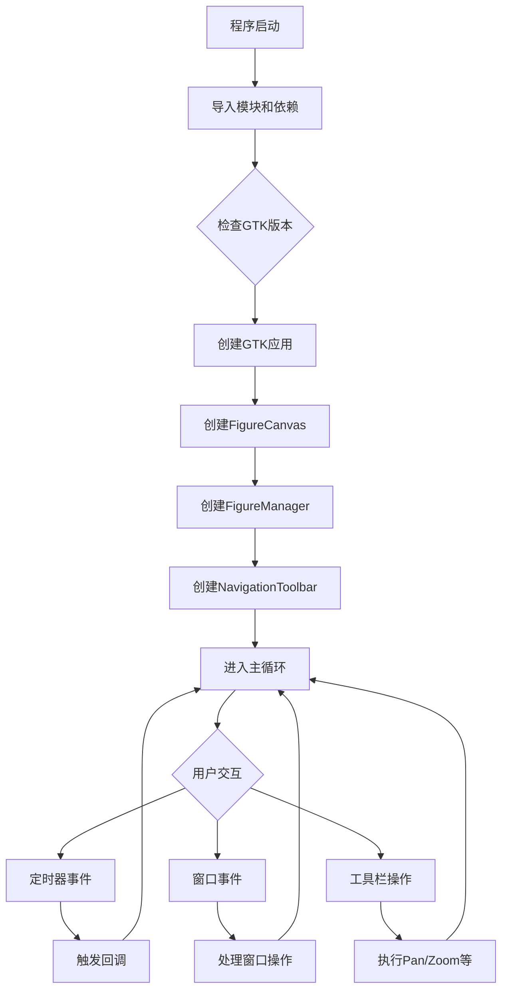

## 类结构

```
_Backend (matplotlib基类)
└── _BackendGTK (GTK后端实现)

TimerBase (matplotlib基类)
└── TimerGTK (GTK定时器实现)

FigureCanvasBase (matplotlib基类)
└── _FigureCanvasGTK (GTK画布)

FigureManagerBase (matplotlib基类)
└── _FigureManagerGTK (GTK图形管理器)

NavigationToolbar2 (matplotlib基类)
└── _NavigationToolbar2GTK (GTK导航工具栏)

backend_tools.RubberbandBase
└── RubberbandGTK (橡皮筋选择)

backend_tools.ConfigureSubplotsBase
└── ConfigureSubplotsGTK (子图配置)
```

## 全局变量及字段


### `_log`
    
Logger for the matplotlib GTK backend module

类型：`logging.Logger`
    


### `_application`
    
Global GTK application instance, used to manage the application lifecycle

类型：`Gtk.Application or None`
    


### `TimerGTK._timer`
    
Internal timer ID for GTK timer events, used to manage callback timing

类型：`GLib timer id or None`
    


### `_FigureManagerGTK._gtk_ver`
    
GTK version number (3 or 4), used to handle version-specific behavior

类型：`int`
    


### `_FigureManagerGTK.window`
    
The main GTK window that contains the figure canvas and toolbar

类型：`Gtk.Window`
    


### `_FigureManagerGTK.vbox`
    
Vertical container widget that holds the canvas and toolbar

类型：`Gtk.Box`
    


### `_FigureManagerGTK.toolbar`
    
Navigation toolbar for the figure (pan, zoom, save, etc.)

类型：`Gtk.Toolbar or Gtk.Box`
    


### `_FigureManagerGTK._destroying`
    
Flag to prevent double destruction of the window when closing

类型：`bool`
    


### `_NavigationToolbar2GTK._gtk_ids`
    
Dictionary mapping toolbar button names to their GTK widget instances

类型：`dict`
    


### `_BackendGTK.backend_version`
    
String representation of the GTK backend version (e.g., '3.24.31')

类型：`str`
    
    

## 全局函数及方法


### `_shutdown_application`

该函数是Matplotlib GTK后端的应用程序关闭处理函数，负责在应用程序关闭时关闭所有GTK窗口并清理全局应用程序状态，确保在IPython中Ctrl+C中断时能够正确清理资源。

参数：

-  `app`：`Gio.Application`，GTK应用程序实例，需要进行关闭操作的应用程序对象

返回值：`None`，无返回值，执行清理操作后直接返回

#### 流程图

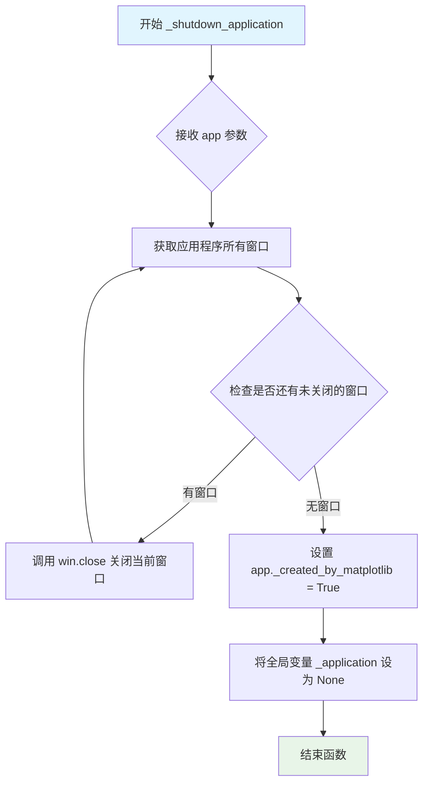

#### 带注释源码

```python
def _shutdown_application(app):
    """
    关闭GTK应用程序并清理相关资源。
    
    此函数在应用程序关闭信号触发时被调用，确保所有窗口被正确关闭，
    并重置全局应用程序状态。处理用户在IPython中按Ctrl+C导致的
    提前关闭情况。
    
    Parameters
    ----------
    app : Gio.Application
        GTK应用程序实例，包含了所有需要关闭的窗口。
    
    Returns
    -------
    None
        不返回任何值，仅执行副作用操作。
    
    Notes
    -----
    由于PyGObject包装器错误地认为None不被允许，我们不能直接调用
    Gio.Application.set_default(None)，而是设置_created_by_matplotlib
    属性来标记该应用是由Matplotlib创建的。
    """
    
    # The application might prematurely shut down if Ctrl-C'd out of IPython,
    # so close all windows.
    # 遍历应用程序中的所有窗口并逐一关闭
    # 防止用户在IPython中按Ctrl+C时窗口未正确关闭
    for win in app.get_windows():
        win.close()
    
    # The PyGObject wrapper incorrectly thinks that None is not allowed, or we
    # would call this:
    # Gio.Application.set_default(None)
    # Instead, we set this property and ignore default applications with it:
    # 设置标记属性，标识该应用是由Matplotlib创建的
    # 这样在后续创建新应用时可以识别并跳过已存在的默认应用
    app._created_by_matplotlib = True
    
    # 重置全局应用程序变量为None
    # 使下次调用_create_application时能够创建新的应用程序实例
    global _application
    _application = None
```


### `_create_application`

该函数负责创建或获取一个 GTK 应用实例，用于管理 Matplotlib 的 GTK 后端窗口。如果当前没有应用实例，它会检查默认应用是否有效，验证显示环境，然后创建新的 GTK 应用并注册。

参数：此函数没有参数。

返回值：`Gtk.Application`，返回 GTK 应用实例，用于后续窗口管理。

#### 流程图

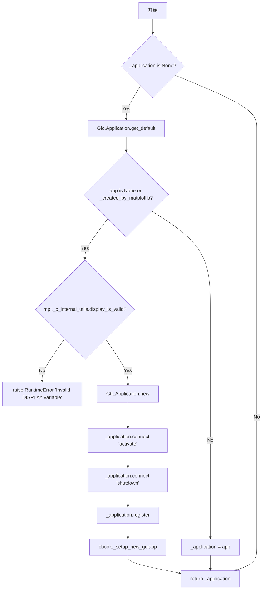

#### 带注释源码

```python
def _create_application():
    """
    创建或获取一个 GTK 应用实例，用于 Matplotlib 的 GTK 后端。
    
    Returns:
        Gtk.Application: GTK 应用实例
    """
    global _application  # 全局变量，存储当前的 GTK 应用实例

    # 如果还没有创建应用实例，则进行创建
    if _application is None:
        # 尝试获取默认的 GTK 应用
        app = Gio.Application.get_default()
        
        # 检查默认应用是否存在，或者是否由 Matplotlib 创建
        if app is None or getattr(app, '_created_by_matplotlib', False):
            # 在 Linux 上检查显示是否有效（X11 或 Wayland）
            if not mpl._c_internal_utils.display_is_valid():
                raise RuntimeError('Invalid DISPLAY variable')
            
            # 创建新的 GTK 应用，指定应用 ID 和非唯一标志
            _application = Gtk.Application.new('org.matplotlib.Matplotlib3',
                                               Gio.ApplicationFlags.NON_UNIQUE)
            
            # 连接激活信号（虽然不处理远程处理，但必须连接）
            _application.connect('activate', lambda *args, **kwargs: None)
            
            # 连接关闭信号，在应用关闭时清理资源
            _application.connect('shutdown', _shutdown_application)
            
            # 注册应用
            _application.register()
            
            # 设置新的 GUI 应用
            cbook._setup_new_guiapp()
        else:
            # 使用已存在的默认应用
            _application = app

    # 返回 GTK 应用实例
    return _application
```


### `mpl_to_gtk_cursor_name`

该函数用于将 matplotlib 的光标类型（Cursors 枚举）转换为 GTK 图形库所对应的光标名称字符串，以便在 GTK 后端中设置正确的鼠标指针样式。

参数：

- `mpl_cursor`：`Cursors`（来自 `matplotlib.backend_tools`），需要转换的 matplotlib 光标类型枚举值

返回值：`str`，返回 GTK 图形库所对应的光标名称字符串，如 "move"、"pointer"、"default" 等

#### 流程图

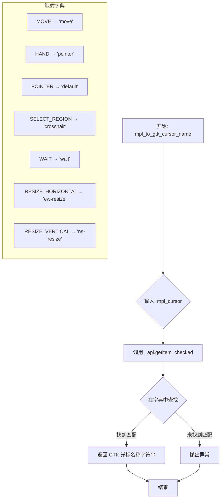

#### 带注释源码

```python
def mpl_to_gtk_cursor_name(mpl_cursor):
    """
    将 matplotlib 的光标类型转换为 GTK 图形库的光标名称。
    
    参数:
        mpl_cursor: Cursors 枚举值，表示 matplotlib 中的光标类型
                   可选值包括: MOVE, HAND, POINTER, SELECT_REGION, WAIT,
                             RESIZE_HORIZONTAL, RESIZE_VERTICAL
    
    返回:
        str: GTK 光标名称，对应 GTK 的光标样式
             如 'move', 'pointer', 'default', 'crosshair', 'wait',
             'ew-resize', 'ns-resize'
    
    异常:
        如果传入的 mpl_cursor 不在映射字典中，会抛出 KeyError
    """
    # 使用 _api.getitem_checked 安全地从字典中获取值
    # 该函数会在键不存在时抛出带有详细信息的异常
    return _api.getitem_checked({
        # 映射 matplotlib Cursors 枚举到 GTK 光标名称字符串
        Cursors.MOVE: "move",              # 移动光标
        Cursors.HAND: "pointer",           # 手型光标（链接/可点击）
        Cursors.POINTER: "default",        # 默认箭头光标
        Cursors.SELECT_REGION: "crosshair", # 十字选择光标
        Cursors.WAIT: "wait",              # 等待/加载光标
        Cursors.RESIZE_HORIZONTAL: "ew-resize",  # 水平调整大小光标
        Cursors.RESIZE_VERTICAL: "ns-resize",    # 垂直调整大小光标
    }, cursor=mpl_cursor)  # 传递 mpl_cursor 作为查找的键
```


### `TimerGTK.__init__`

初始化 GTK 定时器对象，设置内部定时器为 None，并调用父类 TimerBase 的构造函数进行通用定时器初始化。

参数：

- `*args`：可变位置参数，传递给父类 `TimerBase` 的 `__init__` 方法，用于配置定时器的回调函数、时间间隔等
- `**kwargs`：可变关键字参数，传递给父类 `TimerBase` 的 `__init__` 方法，用于配置定时器的回调函数、时间间隔等

返回值：`None`，无返回值（`__init__` 方法）

#### 流程图

```mermaid
flowchart TD
    A[开始 __init__] --> B[设置 self._timer = None]
    B --> C[调用父类 super().__init__(*args, **kwargs)]
    C --> D[结束]
```

#### 带注释源码

```python
def __init__(self, *args, **kwargs):
    """
    初始化 TimerGTK 实例。
    
    参数:
        *args: 可变位置参数，传递给父类 TimerBase
        **kwargs: 可变关键字参数，传递给父类 TimerBase
    """
    # 初始化 GTK 定时器引用为 None，表示当前没有活动的定时器
    self._timer = None
    
    # 调用父类 TimerBase 的 __init__ 方法，执行通用的定时器初始化逻辑
    # 包括设置间隔、注册回调等
    super().__init__(*args, **kwargs)
```


### `TimerGTK._timer_start`

启动 GTK 计时器。首先调用 `_timer_stop()` 停止可能存在的旧计时器以避免资源泄漏，然后使用 GLib.timeout_add 创建新的计时器回调。

参数：

- 无（仅使用继承自父类的实例属性）

返回值：`None`，无返回值（仅设置内部计时器状态）

#### 流程图

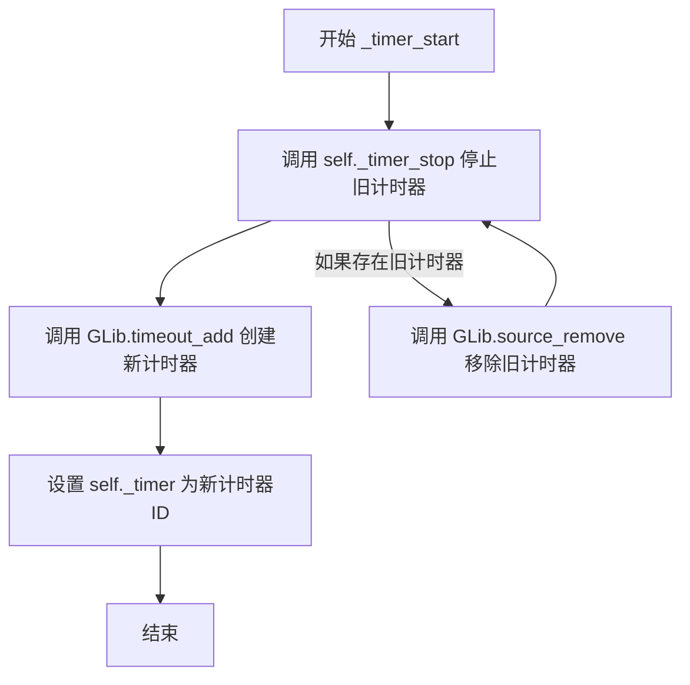

#### 带注释源码

```python
def _timer_start(self):
    # Need to stop it, otherwise we potentially leak a timer id that will
    # never be stopped.
    # 需要先停止旧计时器，否则可能会泄漏计时器ID（该ID将永远不会被停止）
    self._timer_stop()
    # 使用 GLib.timeout_add 注册一个新的计时器
    # self._interval 是计时器间隔（毫秒）
    # self._on_timer 是计时器触发时调用的回调函数
    self._timer = GLib.timeout_add(self._interval, self._on_timer)
```


### `TimerGTK._timer_stop`

该方法是 TimerGTK 类的私有方法，用于停止当前正在运行的 GTK 计时器。它通过检查计时器是否已启动，如果已启动则调用 GLib.source_remove() 移除计时器源，并将内部计时器引用设置为 None，从而避免计时器泄漏。

参数： 无（仅使用继承自父类的实例属性）

返回值：`None`，无返回值

#### 流程图

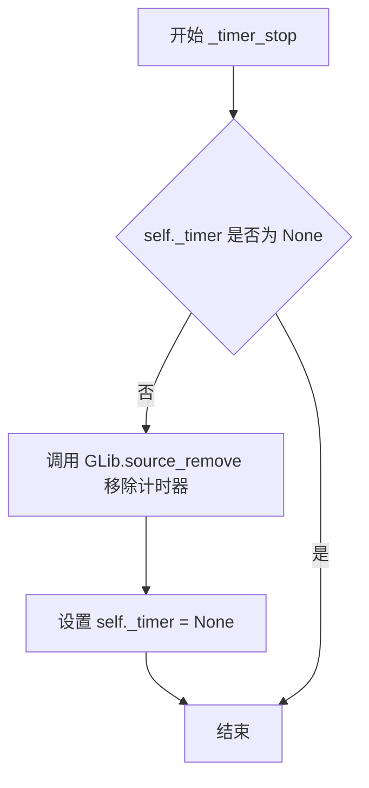

#### 带注释源码

```python
def _timer_stop(self):
    """
    停止 GTK 计时器。
    
    如果计时器正在运行，则移除 GLib 计时器源并重置计时器引用。
    这确保不会留下孤立的计时器，导致资源泄漏。
    """
    # 检查计时器是否已启动（不为 None）
    if self._timer is not None:
        # 使用 GLib.source_remove 移除计时器源，停止计时器
        GLib.source_remove(self._timer)
        # 重置计时器引用为 None，标记计时器已停止
        self._timer = None
```


### `TimerGTK._timer_set_interval`

该方法用于设置或更新GTK定时器的间隔时间。当定时器已经启动时，先停止当前定时器再重新启动，以确保应用新的间隔时间。

参数：无

返回值：`None`，无返回值

#### 流程图

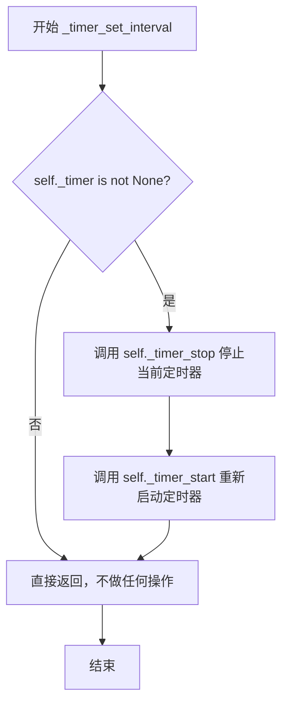

#### 带注释源码

```python
def _timer_set_interval(self):
    # Only stop and restart it if the timer has already been started.
    # 只有当定时器已经被启动时才需要停止并重启
    if self._timer is not None:
        # 如果定时器引用存在，说明定时器正在运行
        self._timer_stop()  # 先停止当前定时器
        self._timer_start()  # 重新启动定时器以应用新间隔
```


### `TimerGTK._on_timer`

该方法是 GTK 后端定时器的回调函数，用于处理定时器触发事件。它首先调用父类 `TimerBase` 的方法执行已注册的回调函数，然后根据是否还有待执行的回调以及是否为单次触发模式，决定返回 `True`（让 GTK 继续保持定时器活跃）或 `False`（通知 GTK 停止定时器）以配合 `GLib.timeout_add` 的工作机制。

参数：
- 无显式外部参数（仅包含隐式 `self`）

返回值：`bool`，如果需要 GTK 继续触发此定时器则返回 `True`，否则返回 `False`。

#### 流程图

```mermaid
flowchart TD
    A[开始: GTK 定时器触发 _on_timer] --> B[调用 super()._on_timer]
    B --> C{检查条件: self.callbacks 存在<br>且 not self._single}
    C -- 是 --> D[返回 True]
    D --> E[GTK 定时器继续运行]
    C -- 否 --> F[设置 self._timer = None]
    F --> G[返回 False]
    G --> H[GTK 定时器停止]
```

#### 带注释源码

```python
def _on_timer(self):
    # 调用父类 TimerBase 的 _on_timer 方法。
    # 该方法会遍历 self.callbacks 并执行其中注册的所有回调函数。
    super()._on_timer()

    # Gtk 的 timeout_add() 机制要求回调函数返回 True 以表示
    # 希望在下一个间隔继续被调用，返回 False 则表示停止该定时器。
    # 判断逻辑：如果当前有注册的回调函数，并且不是“单次执行”模式，
    # 则返回 True 以保持定时器循环；否则停止定时器。
    if self.callbacks and not self._single:
        return True
    else:
        # 如果没有回调或已设置为单次执行，需要清理内部_timer引用
        # 并返回 False 通知 GLib 移除该超时源。
        self._timer = None
        return False
```


### `_FigureCanvasGTK`

`_FigureCanvasGTK` 是 GTK 后端的画布类，继承自 `FigureCanvasBase`，用于在 GTK 环境中渲染 Matplotlib 图形。

参数：
- 无（此类在代码中仅定义了类属性，未在当前文件中定义额外方法）

返回值：无

#### 流程图

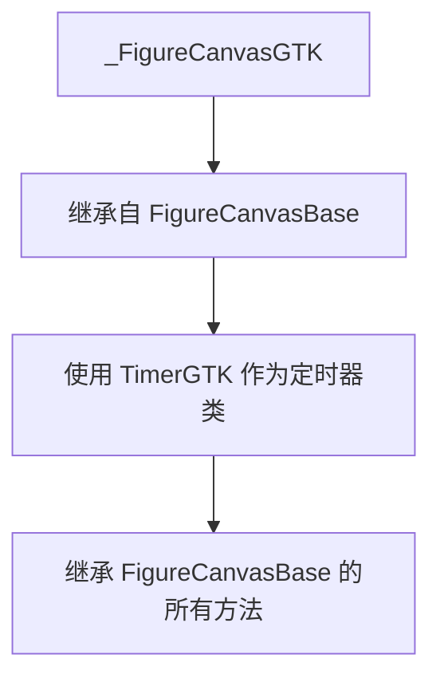

#### 带注释源码

```python
class _FigureCanvasGTK(FigureCanvasBase):
    """
    GTK 后端的画布类，继承自 FigureCanvasBase。
    负责在 GTK 窗口中渲染 Matplotlib 图形。
    """
    _timer_cls = TimerGTK  # 指定使用 TimerGTK 作为定时器类
    # 注意：此类在当前文件中仅定义了类属性，
    # 其他方法均继承自 FigureCanvasBase 基类
```

#### 备注

在提供的代码片段中，`_FigureCanvasGTK` 类仅定义了类属性 `_timer_cls`，未包含任何自定义方法。该类的其他功能全部继承自 `FigureCanvasBase`，包括但不限于：
- 图形绘制（`draw`）
- 事件处理（鼠标、键盘事件）
- 图形刷新（`draw_idle`、`flush_events`）
- 尺寸管理（`get_width_height`、`get_device_pixel_ratio`）

如需了解 `FigureCanvasBase` 的详细方法文档，请参考 Matplotlib 官方文档。


### `_FigureManagerGTK.__init__`

该方法是 GTK 后端中 FigureManager 的初始化函数，负责创建和管理 matplotlib 图形窗口，包括创建 GTK 窗口、工具栏、布局容器，并处理窗口大小、事件连接和交互式显示。

参数：

-  `canvas`：`FigureCanvasBase`，matplotlib 的画布实例，承载图形内容
-  `num`：`int` 或 `str`，图形窗口的编号，用于标识和管理窗口

返回值：`无`（`None`），该方法为构造函数，不返回任何值

#### 流程图

```mermaid
flowchart TD
    A[开始 __init__] --> B[获取 GTK 主版本号]
    B --> C[调用 _create_application 获取应用实例]
    C --> D[创建 Gtk.Window 并添加到应用]
    D --> E[调用父类初始化 super().__init__]
    E --> F{GTK 版本是 3?}
    F -->|是| G[设置窗口图标]
    F -->|否| H[跳过图标设置]
    G --> I
    H --> I[创建 Gtk.Box 垂直布局容器]
    I --> J{GTK 版本是 3?}
    J -->|是| K[将 vbox 添加到窗口并显示]
    K --> L[将 canvas 打包到 vbox]
    J -->|否| M[设置 vbox 为窗口子元素]
    M --> N[将 canvas 插入 vbox]
    L --> N
    N --> O[获取 canvas 尺寸宽高]
    O --> P{toolbar 存在?}
    P -->|是| Q{GTK 版本是 3?}
    Q -->|是| R[显示 toolbar 并打包到 vbox 底部]
    Q -->|否| S[创建 ScrolledWindow 包装 toolbar]
    S --> T[将 toolbar 添加到 vbox]
    T --> U[获取 toolbar 尺寸并累加到高度 h]
    P -->|否| V
    R --> V
    U --> V[设置窗口默认大小为 w, h]
    V --> W[初始化 _destroying 标志为 False]
    W --> X[连接窗口销毁信号到 Gcf.destroy]
    X --> Y[连接窗口关闭信号到 Gcf.destroy]
    Y --> Z{当前是交互模式?}
    Z -->|是| AA[显示窗口]
    AA --> AB[触发 canvas 绘制]
    Z -->|否| AC[跳过显示]
    AC --> AD[让 canvas 获取焦点]
    AD --> AE[结束 __init__]
```

#### 带注释源码

```python
def __init__(self, canvas, num):
    """
    Initialize the figure manager for GTK backend.

    Parameters
    ----------
    canvas : FigureCanvasBase
        The matplotlib canvas instance that holds the figure.
    num : int or str
        The figure number or identifier.
    """
    # 获取 GTK 主版本号，用于区分 GTK3 和 GTK4 的 API 差异
    self._gtk_ver = gtk_ver = Gtk.get_major_version()

    # 获取或创建 GTK 应用实例，确保应用已正确初始化
    app = _create_application()
    
    # 创建 GTK 窗口，并将其添加到 GTK 应用中管理
    self.window = Gtk.Window()
    app.add_window(self.window)
    
    # 调用父类 FigureManagerBase 的初始化方法
    super().__init__(canvas, num)

    # 针对 GTK3 设置窗口图标（GTK4 不支持 set_icon_from_file）
    if gtk_ver == 3:
        # Windows 使用 png 图标，其他平台使用 svg 图标
        icon_ext = "png" if sys.platform == "win32" else "svg"
        self.window.set_icon_from_file(
            str(cbook._get_data_path(f"images/matplotlib.{icon_ext}")))

    # 创建垂直布局容器（VBox），用于放置 canvas 和 toolbar
    self.vbox = Gtk.Box()
    self.vbox.set_property("orientation", Gtk.Orientation.VERTICAL)

    # 根据 GTK 版本使用不同的布局 API
    if gtk_ver == 3:
        # GTK3: 使用 add 方法将 vbox 添加到窗口，显示所有部件
        self.window.add(self.vbox)
        self.vbox.show()
        self.canvas.show()
        # 将 canvas 打包到 vbox 中，扩展且填充
        self.vbox.pack_start(self.canvas, True, True, 0)
    elif gtk_ver == 4:
        # GTK4: 使用 set_child 和 prepend 方法
        self.window.set_child(self.vbox)
        self.vbox.prepend(self.canvas)

    # 获取 canvas 的宽高用于设置窗口初始大小
    w, h = self.canvas.get_width_height()

    # 如果存在工具栏，处理工具栏的布局和尺寸计算
    if self.toolbar is not None:
        if gtk_ver == 3:
            self.toolbar.show()
            # 将 toolbar 打包到 vbox 底部，不扩展
            self.vbox.pack_end(self.toolbar, False, False, 0)
        elif gtk_ver == 4:
            # GTK4 中使用 ScrolledWindow 包装 toolbar
            sw = Gtk.ScrolledWindow(vscrollbar_policy=Gtk.PolicyType.NEVER)
            sw.set_child(self.toolbar)
            self.vbox.append(sw)
        # 获取 toolbar 的首选尺寸，累加到窗口高度
        min_size, nat_size = self.toolbar.get_preferred_size()
        h += nat_size.height

    # 设置窗口的默认大小
    self.window.set_default_size(w, h)

    # 标记窗口是否正在销毁，防止重复销毁
    self._destroying = False
    
    # 连接窗口销毁信号，当窗口销毁时关闭 figure
    self.window.connect("destroy", lambda *args: Gcf.destroy(self))
    
    # 根据 GTK 版本连接不同的关闭请求信号
    self.window.connect({3: "delete_event", 4: "close-request"}[gtk_ver],
                        lambda *args: Gcf.destroy(self))
    
    # 如果处于交互模式，立即显示窗口并触发绘制
    if mpl.is_interactive():
        self.window.show()
        self.canvas.draw_idle()

    # 让 canvas 获取焦点，确保键盘事件能正确传递
    self.canvas.grab_focus()
```


### `_FigureManagerGTK.destroy`

该方法负责销毁GTK图形管理器窗口及其关联的画布，同时通过标志位防止重复销毁，并在销毁过程中调用父类的销毁方法。

参数：

- `*args`：`任意类型`，可变参数，用于接收GTK窗口销毁时传递的事件参数（通常由GTK信号触发时自动传入）

返回值：`None`，无返回值

#### 流程图

```mermaid
flowchart TD
    A[开始 destroy 方法] --> B{检查 self._destroying 是否为 True}
    B -->|是| C[直接返回, 避免重复销毁]
    B -->|否| D[设置 self._destroying = True]
    D --> E[调用 self.window.destroy 销毁GTK窗口]
    E --> F[调用 self.canvas.destroy 销毁画布]
    F --> G[调用 super().destroy 调用父类销毁方法]
    G --> H[结束]
```

#### 带注释源码

```python
def destroy(self, *args):
    """
    Destroy the figure manager and all associated components.
    
    Parameters
    ----------
    *args : any
        Variable arguments passed from GTK signals (e.g., destroy events).
    """
    if self._destroying:
        # Otherwise, this can be called twice when the user presses 'q',
        # which calls Gcf.destroy(self), then this destroy(), then triggers
        # Gcf.destroy(self) once again via
        # `connect("destroy", lambda *args: Gcf.destroy(self))`.
        return
    self._destroying = True
    # Destroy the GTK window widget
    self.window.destroy()
    # Destroy the figure canvas
    self.canvas.destroy()
    # Call parent class destructor to clean up figure references
    super().destroy()
```


### `_FigureManagerGTK.start_main_loop`

该类方法是GTK后端的主循环启动器，负责运行GTK应用程序以处理窗口事件和用户交互。当应用程序运行时，它会阻塞直到所有窗口关闭；在收到键盘中断（Ctrl+C）时，会先处理完待处理的窗口关闭事件，然后重新抛出异常以确保程序能够优雅地退出，最后重置全局应用程序实例以便下次调用时重新创建。

参数： 无（该方法为类方法，只接受隐式的cls参数）

返回值：`None`，当_application为None时直接返回；正常运行时在_application.run()返回后隐式返回None

#### 流程图

```mermaid
flowchart TD
    A[开始] --> B{检查 _application 是否为 None}
    B -->|是| C[直接返回 None]
    B -->|否| D[调用 _application.run&#40;&#41; 启动主循环]
    D --> E{捕获 KeyboardInterrupt 异常}
    E -->|是| F[获取默认 MainContext]
    F --> G{检查是否有待处理事件}
    G -->|是| H[处理事件 iteration&#40;True&#41;]
    H --> G
    G -->|否| I[重新抛出 KeyboardInterrupt]
    E -->|否| J[正常退出]
    I --> K[执行 finally 块]
    J --> K
    K --> L[重置 _application = None]
    L --> M[结束]
```

#### 带注释源码

```python
@classmethod
def start_main_loop(cls):
    """
    启动GTK应用程序的主事件循环。
    
    这是GTK后端的入口点，会阻塞直到所有添加的窗口关闭。
    支持捕获键盘中断（Ctrl+C）并优雅地关闭所有窗口。
    """
    global _application
    # 如果没有已创建的GTK应用程序实例，则直接返回
    # （可能是由于display无效或后端未正确初始化）
    if _application is None:
        return

    try:
        # 运行GTK应用程序主循环
        # 这会阻塞当前线程，直到所有窗口关闭或调用quit()
        # GTK会处理所有窗口事件、用户输入和定时器回调
        _application.run()  # Quits when all added windows close.
    except KeyboardInterrupt:
        # 捕获Ctrl+C中断，确保所有窗口能够处理关闭事件
        # 这对于正确调用_shutdown_application清理资源很重要
        
        # 获取默认的GLib主上下文，用于处理待处理的事件
        context = GLib.MainContext.default()
        # 循环处理所有待处理的事件，确保窗口关闭逻辑执行完成
        while context.pending():
            context.iteration(True)
        # 重新抛出异常，让调用者处理中断
        raise
    finally:
        # 无论正常退出还是异常退出，都重置应用程序实例
        # 因为GTK应用程序运行后状态变得不确定，需要创建新实例
        # Running after quit is undefined, so create a new one next time.
        _application = None
```


### `_FigureManagerGTK.show`

该方法负责显示 matplotlib 生成的 figure 窗口，首先显示 GTK 窗口，然后绘制画布内容，最后根据配置尝试将窗口提升到前台（如果窗口底层已准备好），否则发出警告。

参数： 无

返回值：`None`，无返回值

#### 流程图

```mermaid
flowchart TD
    A[开始 show 方法] --> B[调用 self.window.show 显示窗口]
    B --> C[调用 self.canvas.draw 绘制画布内容]
    C --> D{检查 mpl.rcParams['figure.raise_window']}
    D -->|是| E[获取当前 GTK 版本对应的方法名<br/>GTK3: 'get_window'<br/>GTK4: 'get_surface']
    D -->|否| H[方法结束]
    E --> F{调用 getattr<br/>self.window.meth_name}
    F -->|返回 True| G[调用 self.window.present 提升窗口到前台]
    F -->|返回 False| I[调用 _api.warn_external 发出警告]
    G --> H
    I --> H
```

#### 带注释源码

```python
def show(self):
    # show the figure window
    # 首先调用 GTK Window 的 show 方法来显示窗口
    self.window.show()
    # 然后调用 canvas 的 draw 方法来绘制图形内容
    self.canvas.draw()
    # 检查是否配置为自动提升窗口
    if mpl.rcParams["figure.raise_window"]:
        # 根据 GTK 版本选择获取底层窗口的方法名
        # GTK3 使用 get_window，GTK4 使用 get_surface
        meth_name = {3: "get_window", 4: "get_surface"}[self._gtk_ver]
        # 检查底层 GdkWindow (GTK3) 或 GdkSurface (GTK4) 是否已存在
        if getattr(self.window, meth_name)():
            # 如果底层窗口已准备好，调用 present 将窗口提升到前台
            self.window.present()
        else:
            # 如果此方法在初始化早期被调用，
            # self.window (GtkWindow) 可能还没有关联的底层 GdkWindow (GTK3)
            # 或 GdkSurface (GTK4)，此时调用 present() 会崩溃
            _api.warn_external("Cannot raise window yet to be setup")
```


### `_FigureManagerGTK.full_screen_toggle`

该方法用于切换matplotlib图形窗口的全屏/非全屏状态，支持GTK3和GTK4两种GTK版本，根据当前窗口状态自动执行全屏或退出全屏操作。

参数：无

返回值：`None`，无返回值

#### 流程图

```mermaid
flowchart TD
    A[开始 full_screen_toggle] --> B{获取GTK版本}
    B --> C{GTK版本 == 3?}
    C -->|是| D[使用GTK3方式检查全屏状态<br/>w.get_window().get_state & Gdk.WindowState.FULLSCREEN]
    C -->|否| E[使用GTK4方式检查全屏状态<br/>w.is_fullscreen]
    D --> F{调用is_fullscreen检查当前窗口状态}
    E --> F
    F --> G{窗口是否已全屏?}
    G -->|是| H[调用 window.unfullscreen 退出全屏]
    G -->|否| I[调用 window.fullscreen 进入全屏]
    H --> J[结束]
    I --> J
```

#### 带注释源码

```python
def full_screen_toggle(self):
    """
    切换窗口的全屏/非全屏状态。
    
    该方法根据当前GTK版本(3或4)使用不同的API检查窗口是否处于全屏状态，
    然后执行相反的操作来切换全屏模式。
    """
    # 创建一个字典，根据GTK版本映射到不同的全屏状态检查函数
    # GTK3: 使用get_window().get_state()与Gdk.WindowState.FULLSCREEN进行位运算
    # GTK4: 直接使用is_fullscreen()方法
    is_fullscreen = {
        3: lambda w: (w.get_window().get_state()
                      & Gdk.WindowState.FULLSCREEN),
        4: lambda w: w.is_fullscreen(),
    }[self._gtk_ver]
    
    # 使用对应的检查函数判断当前窗口是否已全屏
    if is_fullscreen(self.window):
        # 如果当前已全屏，则退出全屏模式
        self.window.unfullscreen()
    else:
        # 如果当前未全屏，则进入全屏模式
        self.window.fullscreen()
```


### `_FigureManagerGTK.get_window_title`

该方法用于获取matplotlib GTK后端中Figure窗口的标题文本。它通过调用GTK窗口对象的get_title()方法返回当前设置的窗口标题字符串。

参数：

- `self`：`_FigureManagerGTK`，表示类的实例本身

返回值：`str`，返回当前GTK窗口的标题文本

#### 流程图

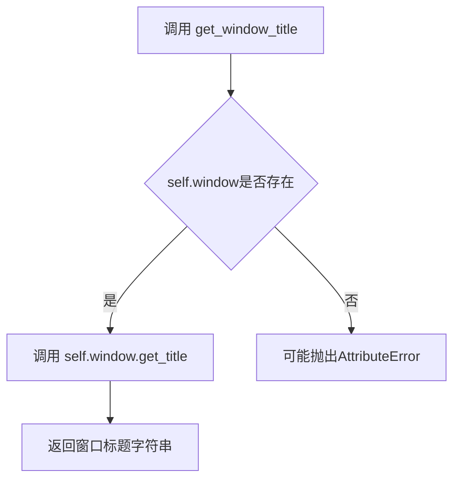

#### 带注释源码

```python
def get_window_title(self):
    """
    获取当前Figure窗口的标题。
    
    Returns
    -------
    str
        当前设置的窗口标题文本。如果窗口尚未设置标题，
        则返回None或空字符串（取决于GTK版本）。
    """
    return self.window.get_title()  # 调用GTK Window对象的get_title()方法获取标题
```


### `_FigureManagerGTK.set_window_title`

该方法用于设置GTK窗口的标题栏文本，是Matplotlib后端中管理Figure窗口的简单封装方法。

参数：

- `title`：`str`，要设置的窗口标题文本

返回值：`None`，无返回值

#### 流程图

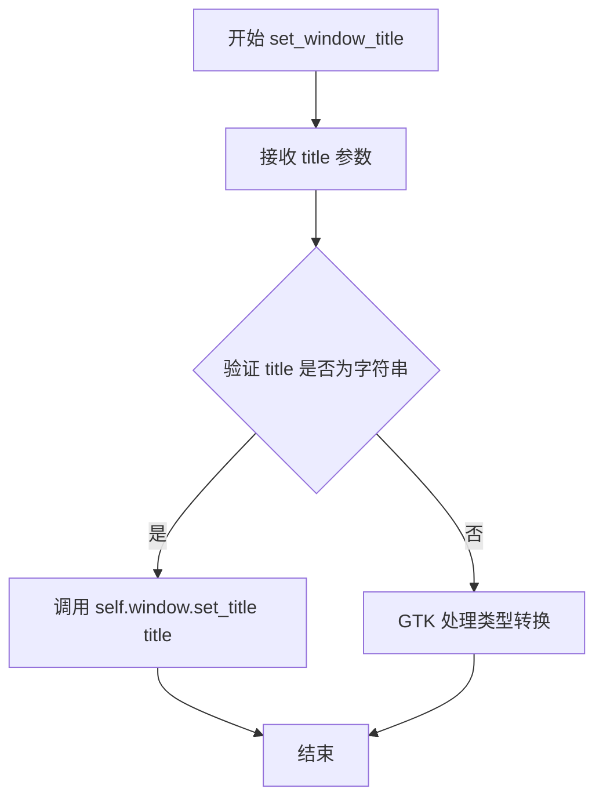

#### 带注释源码

```python
def set_window_title(self, title):
    """
    设置窗口标题栏的文本内容。
    
    Parameters
    ----------
    title : str
        要显示在窗口标题栏中的文本字符串。
    
    Returns
    -------
    None
        此方法直接修改GTK窗口对象的状态，不返回任何值。
    """
    # 调用GTK底层窗口对象的set_title方法设置窗口标题
    # self.window 是 Gtk.Window 实例，通过 GTK API 设置标题
    self.window.set_title(title)
```


### `_FigureManagerGTK.resize`

此方法负责调整 matplotlib GTK 后端的窗口大小。它首先根据设备的像素比（DPR）将输入的逻辑宽高转换为物理像素，如果存在工具栏，还会将工具栏的自然高度（natural height）叠加到目标高度上。随后，根据 GTK 版本（GTK4）或窗口的初始化状态（画布分配大小为 1x1），选择调用 `set_default_size`（用于初始化）或 `resize`（用于运行时调整）来更新窗口尺寸。

参数：

- `width`：`float` 或 `int`，要调整的逻辑宽度。
- `height`：`float` 或 `int`，要调整的逻辑高度。

返回值：`None`，无返回值。

#### 流程图

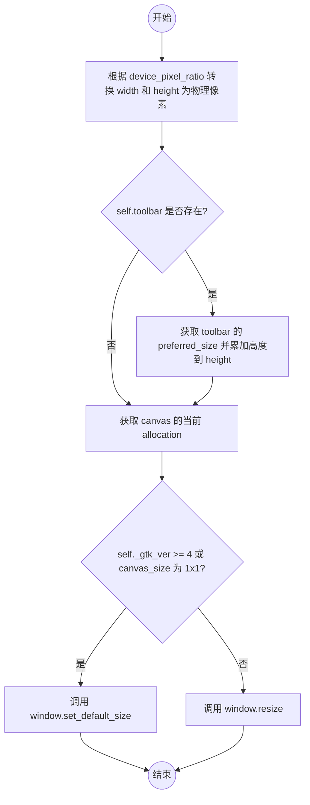

#### 带注释源码

```python
def resize(self, width, height):
    # Convert from logical pixels (as used by matplotlib) to physical pixels
    # (as used by GTK), taking the device pixel ratio into account.
    width = int(width / self.canvas.device_pixel_ratio)
    height = int(height / self.canvas.device_pixel_ratio)

    # If there is a toolbar, we need to account for its height in the total
    # window size.
    if self.toolbar:
        min_size, nat_size = self.toolbar.get_preferred_size()
        height += nat_size.height

    # Get the current allocation (size) of the canvas.
    canvas_size = self.canvas.get_allocation()

    # Determine whether to use set_default_size or resize.
    # In GTK4, set_default_size is preferred or required for certain states.
    # If the canvas size is (1, 1), it implies the window hasn't been mapped
    # (shown) yet. In this case, we must use set_default_size to set the
    # initial window size before it is realized; using resize would have no
    # effect or be incorrect before mapping.
    if self._gtk_ver >= 4 or canvas_size.width == canvas_size.height == 1:
        self.window.set_default_size(width, height)
    else:
        self.window.resize(width, height)
```


### `_NavigationToolbar2GTK.set_message`

该方法用于在GTK导航工具栏中显示消息文本。它接收一个字符串参数，通过GLib函数对XML/HTML特殊字符进行转义以防止注入攻击，然后使用GTK的set_markup方法将转义后的文本设置为工具栏消息 label 的内容，并使用小字体（`<small>`标签）显示。

参数：

- `s`：`str`，要显示的消息文本内容

返回值：`None`，该方法无返回值，直接修改工具栏的消息显示组件

#### 流程图

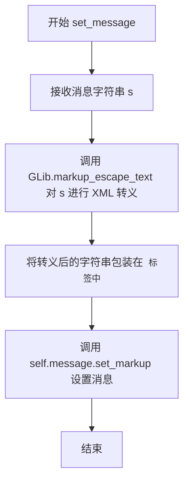

#### 带注释源码

```python
def set_message(self, s):
    """
    设置工具栏上显示的消息。
    
    Parameters
    ----------
    s : str
        要显示的消息文本内容
    """
    # 使用 GLib.markup_escape_text 对字符串进行 XML/HTML 特殊字符转义
    # 防止用户输入包含 <, >, &, " 等特殊字符导致 GTK 标记解析错误或安全问题
    escaped = GLib.markup_escape_text(s)
    
    # 将转义后的消息使用 <small> 标签包裹，使其以较小字体显示
    # 然后调用 GTK Label 的 set_markup 方法设置消息内容
    # set_markup 支持 Pango 标记语言，可以设置文本样式
    self.message.set_markup(f'<small>{escaped}</small>')
```


### `_NavigationToolbar2GTK.draw_rubberband`

该方法用于在GTK后端的画布上绘制橡皮筋选择框（rubberband），将用户拖拽选择的区域矩形渲染到画布上，通过坐标转换和矩形参数计算实现选区可视化。

参数：

- `self`：`_NavigationToolbar2GTK`，NavigationToolbar2的GTK后端子类实例
- `event`：`object`，GTK事件对象（此处未使用，仅为保持与GTK信号兼容）
- `x0`：`int`，选择框左上角X坐标
- `y0`：`int`，选择框左上角Y坐标
- `x1`：`int`，选择框右下角X坐标
- `y1`：`int`，选择框右下角Y坐标

返回值：`None`，无返回值

#### 流程图

```mermaid
flowchart TD
    A[开始 draw_rubberband] --> B[获取画布高度<br/>self.canvas.figure.bbox.height]
    B --> C[转换Y坐标<br/>y1 = height - y1<br/>y0 = height - y0]
    C --> D[计算矩形参数<br/>rect = [x0, y0, x1-x0, y1-y0]]
    D --> E[调用canvas._draw_rubberband绘制<br/>self.canvas._draw_rubberband(rect)]
    E --> F[结束]
```

#### 带注释源码

```python
def draw_rubberband(self, event, x0, y0, x1, y1):
    """
    Draw a rubberband rectangle on the canvas.
    
    Parameters
    ----------
    event : object
        GTK event object (unused, kept for GTK signal compatibility).
    x0 : int
        X coordinate of the top-left corner of the selection.
    y0 : int
        Y coordinate of the top-left corner of the selection.
    x1 : int
        X coordinate of the bottom-right corner of the selection.
    y1 : int
        Y coordinate of the bottom-right corner of the selection.
    """
    # Get the height of the figure in display coordinates
    # Matplotlib's coordinate system has origin at bottom-left,
    # while GTK/Gdk has origin at top-left, so we need conversion
    height = self.canvas.figure.bbox.height
    
    # Convert Y coordinates from Matplotlib coordinate system
    # (bottom-left origin) to GTK coordinate system (top-left origin)
    # This is necessary because GTK draws from top-left
    y1 = height - y1
    y0 = height - y0
    
    # Create rectangle parameters as [x, y, width, height]
    # width = x1 - x0 (difference in X coordinates)
    # height = y1 - y0 (difference in Y coordinates after conversion)
    rect = [int(val) for val in (x0, y0, x1 - x0, y1 - y0)]
    
    # Call the canvas method to perform the actual drawing
    # Pass None to remove the rubberband (see remove_rubberband method)
    self.canvas._draw_rubberband(rect)
```


### `_NavigationToolbar2GTK.remove_rubberband`

该方法用于清除画布上当前显示的橡皮筋（Rubberband）选框。它通过调用画布对象的内部方法 `_draw_rubberband` 并传入 `None` 参数，从而触发画布移除之前绘制的矩形覆盖层。

参数：

-  `self`：`_NavigationToolbar2GTK`，指向工具栏实例本身的隐式引用。

返回值：`None`，无返回值。

#### 流程图

```mermaid
graph TD
    A[开始 remove_rubberband] --> B{调用 self.canvas._draw_rubberband(None)}
    B --> C[结束]
    style B fill:#f9f,stroke:#333,stroke-width:2px
```

#### 带注释源码

```python
def remove_rubberband(self):
    """
    清除画布上的橡皮筋选框。

    该方法通常在鼠标释放或操作完成后被调用，用于移除
    交互过程中在画布上绘制的临时矩形（如缩放或框选区域）。
    通过向底层画布的绘制方法传递 None 参数，可以高效地
    清除覆盖层而不需要重绘整个图形。
    """
    self.canvas._draw_rubberband(None)
```


### `_NavigationToolbar2GTK._update_buttons_checked`

该方法用于更新GTK工具栏上的"Pan"和"Zoom"按钮的选中状态，根据当前导航模式（self.mode.name）来同步按钮的激活状态。

参数：无（仅包含self参数）

返回值：`None`，无返回值

#### 流程图

```mermaid
flowchart TD
    A[开始 _update_buttons_checked] --> B[遍历 [('Pan', 'PAN'), ('Zoom', 'ZOOM')]]
    B --> C{还有更多按钮吗?}
    C -->|是| D[获取按钮名称和对应的模式标识]
    D --> E{button 存在?}
    C -->|否| F[结束]
    E -->|是| G[阻塞按钮的信号处理器]
    E -->|否| C
    G --> H{self.mode.name == active?}
    H -->|是| I[设置按钮为激活状态]
    H -->|否| J[设置按钮为非激活状态]
    I --> C
    J --> C
```

#### 带注释源码

```python
def _update_buttons_checked(self):
    """
    更新工具栏按钮的checked状态，使其与当前模式匹配。
    
    该方法会遍历Pan和Zoom两个工具栏按钮，根据当前的
    self.mode.name来设置对应按钮的active状态。
    """
    # 遍历工具栏按钮名称和对应的模式标识符
    for name, active in [("Pan", "PAN"), ("Zoom", "ZOOM")]:
        # 从self._gtk_ids字典中获取对应的GTK按钮对象
        button = self._gtk_ids.get(name)
        # 检查按钮是否存在
        if button:
            # 使用handler_block上下文管理器临时阻塞按钮的信号处理器
            # 防止在设置active状态时触发信号处理函数（避免递归调用）
            with button.handler_block(button._signal_handler):
                # 比较当前模式名称与目标模式标识，设置按钮的激活状态
                # 如果当前模式等于active（如'PAN'），则按钮被激活
                button.set_active(self.mode.name == active)
```


### `_NavigationToolbar2GTK.pan`

该方法用于处理 GTK 后端的平移（Pan）操作。它首先调用父类的 `pan` 方法执行核心平移逻辑，然后更新 GTK 工具栏中相关按钮的选中状态，确保工具栏 UI 与当前模式保持同步。

参数：

-  `*args`：可变位置参数，传递给父类的 `pan` 方法，用于接收平移操作的相关参数（如事件对象等），类型取决于父类实现。

返回值：`None`，该方法不返回任何值，仅执行副作用（更新按钮状态）。

#### 流程图

```mermaid
flowchart TD
    A[开始 pan 方法] --> B[调用父类 pan 方法<br/>super().pan]
    B --> C[调用 _update_buttons_checked 方法]
    C --> D[遍历 [('Pan', 'PAN'), ('Zoom', 'ZOOM')] 按钮]
    D --> E{获取按钮}
    E -->|获取成功| F[阻塞按钮信号处理器]
    F --> G[根据当前模式设置按钮选中状态]
    G --> H[恢复按钮信号处理器]
    E -->|获取失败| I[跳过]
    H --> J[结束]
    I --> J
```

#### 带注释源码

```python
def pan(self, *args):
    """
    Handle pan operations for the GTK navigation toolbar.
    
    This method first delegates the actual pan logic to the parent class
    (NavigationToolbar2), then ensures the GTK toolbar buttons reflect
    the current mode by updating their checked state.
    
    Parameters
    ----------
    *args : tuple
        Variable arguments passed to the parent class pan method.
        Typically includes the event that triggered the pan action.
    
    Returns
    -------
    None
    """
    # Call the parent class pan method to perform the actual pan logic
    # (e.g., connecting/disconnecting pan callbacks, updating mode)
    super().pan(*args)
    
    # After pan mode is activated/deactivated, update the toolbar buttons
    # to reflect the current state. This ensures the "Pan" button appears
    # pressed when pan mode is active, and the "Zoom" button is unpressed.
    self._update_buttons_checked()
```


### `_NavigationToolbar2GTK.zoom`

该方法是GTK后端的缩放功能实现，继承自`NavigationToolbar2`，调用父类的zoom方法执行实际的缩放操作，然后更新工具栏按钮的选中状态以反映当前的工具模式。

参数：

- `self`：`_NavigationToolbar2GTK`，调用此方法的工具栏实例
- `*args`：可变位置参数，从父类`NavigationToolbar2.zoom`传递的参数

返回值：`None`，无返回值

#### 流程图

```mermaid
flowchart TD
    A[开始 zoom 方法] --> B[调用 super().zoom]
    B --> C{传递 *args 参数}
    C --> D[执行父类缩放逻辑]
    D --> E[调用 self._update_buttons_checked]
    E --> F[更新Pan和Zoom按钮的选中状态]
    F --> G[结束]
```

#### 带注释源码

```python
def zoom(self, *args):
    """
    切换到缩放模式并更新按钮状态。
    
    Parameters
    ----------
    *args : tuple
        可变参数，传递给父类的zoom方法
    """
    # 调用父类(NavigationToolbar2)的zoom方法，执行实际的缩放功能
    # 父类方法会设置self.mode为ToolMode.ZOOM
    super().zoom(*args)
    
    # 更新GTK工具栏按钮的选中状态
    # 确保工具栏上的Zoom按钮正确反映当前的模式
    # _update_buttons_checked会检查self.mode.name是否为"ZOOM"
    # 并相应地设置按钮的active状态
    self._update_buttons_checked()
```


### `_NavigationToolbar2GTK.set_history_buttons`

该方法用于更新导航工具栏中的"后退"和"前进"按钮的启用状态，根据当前导航堆栈的位置判断是否可以后退或前进。

参数： 无

返回值：`None`，无返回值

#### 流程图

```mermaid
flowchart TD
    A[开始 set_history_buttons] --> B[获取当前位置信息]
    B --> C{检查 can_backward}
    C -->|True| D[设置 'Back' 按钮为可启用]
    C -->|False| E[设置 'Back' 按钮为不可启用]
    D --> F{检查 can_forward}
    E --> F
    F -->|True| G[设置 'Forward' 按钮为可启用]
    F -->|False| H[设置 'Forward' 按钮为不可启用]
    G --> I[结束]
    H --> I
```

#### 带注释源码

```python
def set_history_buttons(self):
    """
    Update the sensitivity state of the navigation history buttons (Back/Forward).
    
    This method checks the current position in the navigation stack and enables
    or disables the Back and Forward buttons accordingly.
    """
    # Determine if backward navigation is possible
    # Check if current position is greater than 0 (not at the beginning)
    can_backward = self._nav_stack._pos > 0
    
    # Determine if forward navigation is possible
    # Check if current position is less than the last index
    can_forward = self._nav_stack._pos < len(self._nav_stack) - 1
    
    # Update Back button sensitivity if it exists in the toolbar
    if 'Back' in self._gtk_ids:
        self._gtk_ids['Back'].set_sensitive(can_backward)
    
    # Update Forward button sensitivity if it exists in the toolbar
    if 'Forward' in self._gtk_ids:
        self._gtk_ids['Forward'].set_sensitive(can_forward)
```


### `RubberbandGTK.draw_rubberband`

该方法负责在GTK后端中绘制橡皮筋选择框（rubberband），它将坐标参数传递给底层的 `_NavigationToolbar2GTK.draw_rubberband` 方法来执行实际的绘制操作。

参数：

- `x0`：`float` 或 `int`，橡皮筋框的起始点 X 坐标
- `y0`：`float` 或 `int`，橡皮筋框的起始点 Y 坐标
- `x1`：`float` 或 `int`，橡皮筋框的结束点 X 坐标
- `y1`：`float` 或 `int`，橡皮筋框的结束点 Y 坐标

返回值：`None`，无返回值

#### 流程图

```mermaid
flowchart TD
    A[开始 draw_rubberband] --> B[调用 _make_classic_style_pseudo_toolbar 获取工具栏实例]
    B --> C[调用 _NavigationToolbar2GTK.draw_rubberband 方法]
    C --> D[在 draw_rubberband 内部: 获取图形高度]
    D --> E[转换 Y 坐标: y1 = height - y1, y0 = height - y0]
    E --> F[计算矩形: rect = x0, y0, x1-x0, y1-y0]
    F --> G[调用 canvas._draw_rubberband 绘制橡皮筋]
    G --> H[结束]
```

#### 带注释源码

```python
def draw_rubberband(self, x0, y0, x1, y1):
    """
    绘制橡皮筋选择框。

    参数:
        x0: 起始点 X 坐标
        y0: 起始点 Y 坐标
        x1: 结束点 X 坐标
        y1: 结束点 Y 坐标
    """
    # 调用 _make_classic_style_pseudo_toolbar 获取一个伪工具栏对象
    # 该对象用于调用 _NavigationToolbar2GTK 的静态方法
    toolbar = self._make_classic_style_pseudo_toolbar()
    
    # 调用 _NavigationToolbar2GTK 类的 draw_rubberband 静态方法
    # 传递 None 作为 event 参数，以及四个坐标参数
    _NavigationToolbar2GTK.draw_rubberband(
        toolbar,  # 伪工具栏对象，提供 canvas 属性
        None,     # event 事件对象（此处未使用）
        x0,       # 起始 X 坐标
        y0,       # 起始 Y 坐标
        x1,       # 结束 X 坐标
        y1        # 结束 Y 坐标
    )
```


### `RubberbandGTK.remove_rubberband`

该方法用于移除GTK后端图形画布上的橡皮筋选择框（rubberband），通过调用 `_NavigationToolbar2GTK.remove_rubberband` 方法实现，实际会调用画布的 `_draw_rubberband(None)` 来清除之前绘制的橡皮筋矩形。

参数：无需参数

返回值：`None`，无返回值

#### 流程图

```mermaid
flowchart TD
    A[调用 remove_rubberband] --> B[调用 _make_classic_style_pseudo_toolbar]
    B --> C[获取伪工具栏对象]
    C --> D[调用 _NavigationToolbar2GTK.remove_rubberbar<br/>传入伪工具栏对象]
    D --> E[在方法内部调用 self.canvas._draw_rubberband None]
    E --> F[画布清除橡皮筋绘制]
    F --> G[返回 None]
```

#### 带注释源码

```python
def remove_rubberband(self):
    """
    移除橡皮筋选择框。
    
    该方法继承自 backend_tools.RubberbandBase，
    用于在GTK后端中清除橡皮筋矩形的绘制。
    """
    # 调用 _make_classic_style_pseudo_toolbar() 获取一个伪工具栏对象
    # 该对象模拟了经典样式的工具栏，用于调用 _NavigationToolbar2GTK 的方法
    _NavigationToolbar2GTK.remove_rubberband(
        self._make_classic_style_pseudo_toolbar())
    # 内部实际调用：self.canvas._draw_rubberband(None)
    # 传入 None 参数表示清除橡皮筋绘制
```


### `ConfigureSubplotsGTK.trigger`

该方法用于在GTK后端中触发子图配置功能。它调用`_NavigationToolbar2GTK`类的`configure_subplots`方法来打开子图配置对话框。

参数：

- `self`：`ConfigureSubplotsGTK`，调用该方法的实例本身
- `*args`：`tuple`，可变参数列表，通常用于接收额外的命令行参数或事件数据

返回值：`None`，该方法不返回任何值

#### 流程图

```mermaid
flowchart TD
    A[Start trigger] --> B{检查参数}
    B -->|有参数| C[调用_NavigationToolbar2GTK.configure_subplots并传递参数]
    B -->|无参数| D[调用_NavigationToolbar2GTK.configure_subplots并传递None]
    C --> E[End]
    D --> E
```

#### 带注释源码

```python
class ConfigureSubplotsGTK(backend_tools.ConfigureSubplotsBase):
    def trigger(self, *args):
        """
        触发子图配置操作。
        
        此方法继承自ConfigureSubplotsBase，用于在GTK后端中
        启动子图配置对话框。它调用_NavigationToolbar2GTK类
        的configure_subplots方法来完成实际配置工作。
        
        参数:
            *args: 可变参数列表，通常用于接收外部传入的额外参数
        """
        # 调用_NavigationToolbar2GTK类的configure_subplots方法
        # 第一个参数self是当前实例，第二个参数None表示没有特定的事件对象
        _NavigationToolbar2GTK.configure_subplots(self, None)
```


### `_BackendGTK.mainloop`

该函数是 GTK 后端的主入口点，用于启动 GTK 应用程序的事件循环。它实际上是 `_FigureManagerGTK` 类方法 `start_main_loop` 的别名，负责显示所有已创建的窗口并处理用户交互（如鼠标、键盘事件），直到所有窗口关闭或程序被中断。

参数：

-  `无`（显式参数。在 Python 中调用时无需传递参数，内部实现绑定至类方法 `start_main_loop`）

返回值：

-  `None`，无返回值（执行完毕后退出）

#### 流程图

```mermaid
flowchart TD
    A([Start mainloop]) --> B{_application is None?}
    B -- Yes --> C[Return None]
    B -- No --> D[Try: Run GTK application]
    D --> E{KeyboardInterrupt?}
    E -- Yes --> F[Process pending events]
    F --> G[Raise Interrupt]
    E -- No --> H[App Closed Normally]
    D --> I[Finally: Set _application to None]
    C --> J([End])
    G --> I
    H --> I
    I --> J
```

#### 带注释源码

```python
@classmethod
def start_main_loop(cls):
    """
    Start the GTK main loop.
    This is typically called to show the figure windows and start the event loop.
    """
    global _application
    # If no GTK application has been created (e.g. no windows opened), do nothing.
    if _application is None:
        return

    try:
        # Gio.Application.run() blocks until the application exits
        # (e.g., all windows are closed).
        _application.run()
    except KeyboardInterrupt:
        # If the user presses Ctrl+C, we want to ensure all windows
        # can process their close event from _shutdown_application.
        # We manually iterate the MainContext to process pending events.
        context = GLib.MainContext.default()
        while context.pending():
            context.iteration(True)
        # Re-raise the interrupt so the caller can handle it.
        raise
    finally:
        # Running after quit is undefined, so reset the global application
        # to allow creating a new one next time mainloop is called.
        _application = None
```

## 关键组件


### TimerGTK

定时器类，继承自TimerBase，使用GLib.timeout_add实现GTK定时事件，用于在指定时间间隔触发回调函数。

### _FigureCanvasGTK

画布类，继承自FigureCanvasBase，指定定时器类为TimerGTK，负责渲染Matplotlib图形到GTK窗口。

### _FigureManagerGTK

图形管理器类，继承自FigureManagerBase，负责创建和管理GTK窗口、工具栏及画布，处理窗口大小调整、显示、销毁等生命周期事件。

### _NavigationToolbar2GTK

导航工具栏类，继承自NavigationToolbar2，提供平移、缩放、橡皮筋选择等交互功能，并更新GTK按钮状态。

### RubberbandGTK

橡皮筋绘制工具类，继承自RubberbandBase，实现图形选择区域的绘制和移除。

### ConfigureSubplotsGTK

子图配置工具类，继承自ConfigureSubplotsBase，触发子图配置对话框。

### _BackendGTK

GTK后端主类，继承自_Backend，集成版本信息和主循环启动函数。

### _create_application

创建GTK应用程序实例的函数，管理Gio.Application生命周期，确保显示服务器有效，处理应用程序注册和信号连接。

### _shutdown_application

关闭应用程序的辅助函数，关闭所有窗口并重置全局应用程序状态。

### mpl_to_gtk_cursor_name

光标名称转换函数，将Matplotlib的光标类型映射到GTK的光标名称字符串。

### _application

全局变量，存储当前GTK应用程序实例，用于跨模块共享应用程序状态。


## 问题及建议


### 已知问题

- **硬编码的GTK版本检查遍布全代码**：代码中大量使用 `if gtk_ver == 3` 和 `if gtk_ver == 4` 的条件判断，这些版本兼容性逻辑散布在多个方法中（`__init__`、`resize`、`show`、`full_screen_toggle`等），导致代码重复、维护困难，且容易在更新时遗漏修改。
- **全局变量 `_application` 的状态管理**：使用全局变量管理GTK应用程序实例，状态分散且容易被外部修改，缺乏封装性，可能导致意外的副作用和测试困难。
- **内部API的直接调用**：代码中直接访问 `matplotlib._api`、`matplotlib._pylab_helpers`、`matplotlib.cbook` 等内部模块，这些API可能不稳定，对未来版本升级构成风险。
- **`_shutdown_application` 中的变通方法不优雅**：使用 `app._created_by_matplotlib = True` 属性作为标记来区分matplotlib创建的应用程序，注释中提到本应调用 `Gio.Application.set_default(None)` 但因PyGObject限制而未实现，这种变通方法缺乏健壮性。
- **窗口创建流程中的版本兼容逻辑重复**：`_FigureManagerGTK.__init__` 方法中GTK3和GTK4的窗口部件创建、布局管理流程高度相似但分别编写，违反DRY原则。
- **异常处理不够健壮**：在 `_create_application` 中仅检查 `_created_by_matplotlib` 属性判断是否为有效应用程序，但该属性可能被外部代码意外修改或覆盖。
- **`TimerGTK._on_timer` 中的回调返回值逻辑**：返回值逻辑与父类 `_on_timer` 的执行顺序和依赖关系不够清晰，可能导致定时器行为不一致。
- **资源清理依赖顺序**：在 `destroy` 方法中窗口和画布的销毁顺序以及与 `Gcf.destroy` 的循环调用依赖特定连接顺序，可能在某些边缘情况下导致资源泄漏或重复销毁。

### 优化建议

- **抽象GTK版本差异**：创建版本适配器类或策略模式，将GTK3和GTK4的差异封装到独立的适配器类中，统一接口，减少散布各处的版本判断代码。
- **将全局变量封装为单例或上下文管理器**：将 `_application` 封装为应用程序管理器类，提供明确的初始化、获取和清理接口，提高可测试性和可维护性。
- **减少内部API依赖**：评估能否使用公共API替代内部模块调用，如必须使用内部API，应添加版本兼容性检查或封装为稳定的内部接口。
- **重构应用程序创建逻辑**：考虑在应用程序类中直接处理 `_created_by_matplotlib` 的设置，或者寻找更优雅的方式管理matplotlib创建的应用程序实例。
- **提取公共布局逻辑**：将GTK3和GTK4的窗口创建、布局管理中的共同逻辑提取出来，通过参数化或适配器方式处理差异。
- **增强异常处理和验证**：在 `_create_application` 中增加对应用程序状态的更严格验证，确保获取到的应用程序实例符合预期。
- **优化定时器回调设计**：重新设计 `_on_timer` 的返回值逻辑，使其与父类行为更清晰地解耦，或添加明确的文档说明其依赖关系。
- **改进资源清理流程**：使用明确的销毁状态标志和顺序保证，确保 `destroy` 方法在各种调用路径下都能正确清理资源，避免重复调用。

## 其它


### 设计目标与约束

- **跨版本兼容性**：同时支持GTK3和GTK4，通过版本检查动态选择API
- **平台依赖**：依赖GObject Introspection (gi)和cairo，必须在支持X11或Wayland的Linux环境下运行
- **交互式支持**：支持matplotlib的交互模式，确保窗口可以正常显示和响应
- **无头模式不支持**：当display无效时抛出RuntimeError，不支持服务器端渲染

### 错误处理与异常设计

- **ImportError**：如果cairoforeign不可用，抛出ImportError并附带明确提示
- **RuntimeError**：当DISPLAY变量无效时，抛出RuntimeError说明无法创建显示
- **KeyboardInterrupt处理**：在主循环中断时确保所有窗口能处理关闭事件
- **重复销毁防护**：通过_destroying标志防止窗口和画布被重复销毁

### 数据流与状态机

- **应用程序状态**：全局_application对象管理GTK应用实例的生命周期
- **窗口状态转换**：创建→显示→交互→销毁
- **定时器状态**：未启动→运行中→停止，状态转换通过_timer变量控制
- **工具栏状态**：Pan/Zoom模式切换时同步按钮状态

### 外部依赖与接口契约

- **matplotlib依赖**：matplotlib、_api、backend_tools、cbook、_pylab_helpers、backend_bases
- **GTK依赖**：gi、Gdk、Gio、GLib、Gtk（通过gi.require_version设置版本）
- **cairo依赖**：gi.require_foreign("cairo")用于图形绘制
- **系统依赖**：mpl._c_internal_utils.display_is_valid()验证显示可用性

### 线程模型与并发考虑

- **GTK线程安全**：依赖GLib主循环处理所有GUI事件
- **定时器回调**：TimerGTK的_on_timer在GLib主线程中执行
- **主循环阻塞**：start_main_loop()会阻塞直到所有窗口关闭
- **非线程安全**：所有GUI操作必须在主线程执行

### 平台兼容性细节

- **GTK3/GTK4 API差异**：
  - 窗口添加子控件：GTK3用add()，GTK4用set_child()
  - 删除事件：GTK3用"delete_event"，GTK4用"close-request"
  - 获取表面：GTK3用get_window()，GTK4用get_surface()
  - 图标文件：Windows用png，其他平台用svg
- **窗口标志检查**：is_fullscreen()方法在不同版本中实现不同

### 资源配置与生命周期

- **应用实例管理**：单例模式通过全局_application变量维护
- **窗口资源**：每个FigureManagerGTK管理一个Gtk.Window
- **定时器资源**：GLib.timeout_add()返回的timer ID必须显式移除
- **销毁流程**：窗口关闭时触发Gcf.destroy()，最终调用FigureManagerBase.destroy()

### 事件处理机制

- **窗口事件**：destroy、delete_event/close-request信号处理
- **定时器事件**：GLib.timeout_add实现的定期回调
- **工具栏事件**：Pan/Zoom模式切换通过_update_buttons_checked同步
- **画布焦点**：canvas.grab_focus()确保键盘事件正确路由

### 性能优化考虑

- **定时器复用**：_timer_start时先调用_timer_stop防止timer ID泄漏
- **画布尺寸缓存**：get_width_height()和get_preferred_size()在resize时缓存结果
- **设备像素比**：resize时考虑device_pixel_ratio进行缩放
- **主循环退出**：使用NON_UNIQUE标志允许多实例共存

### 国际化与本地化

- **消息转义**：set_message使用GLib.markup_escape_text转义用户输入
- **窗口标题**：支持通过set_window_title设置本地化标题
</content]
    