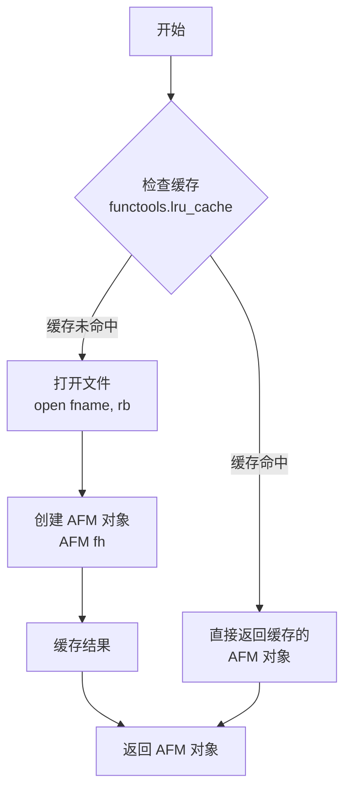
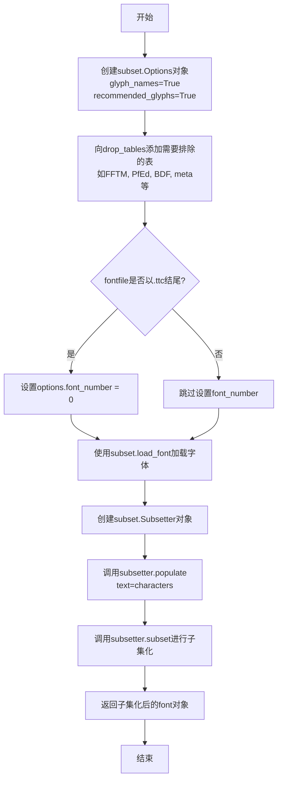
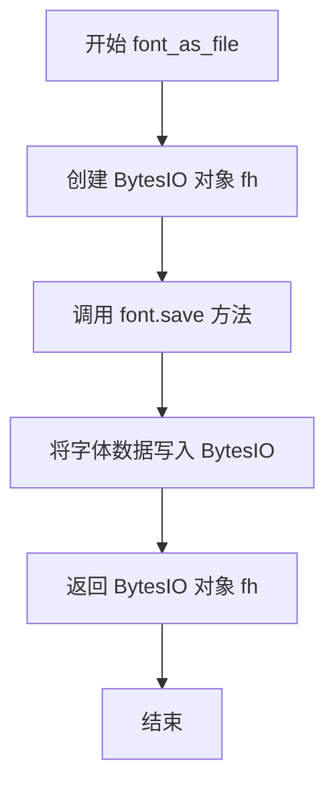
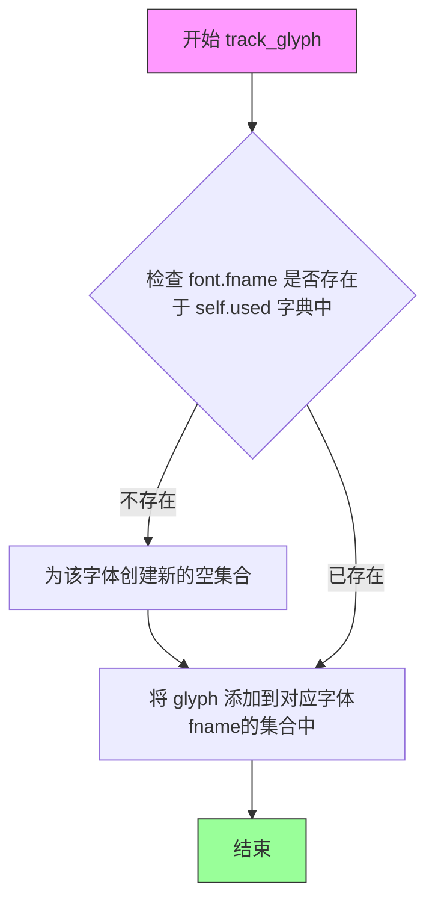
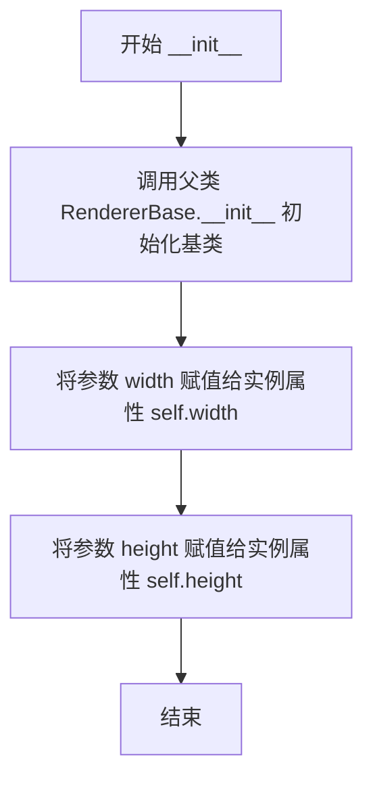
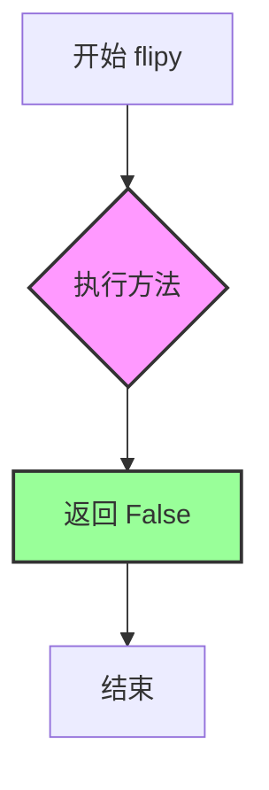
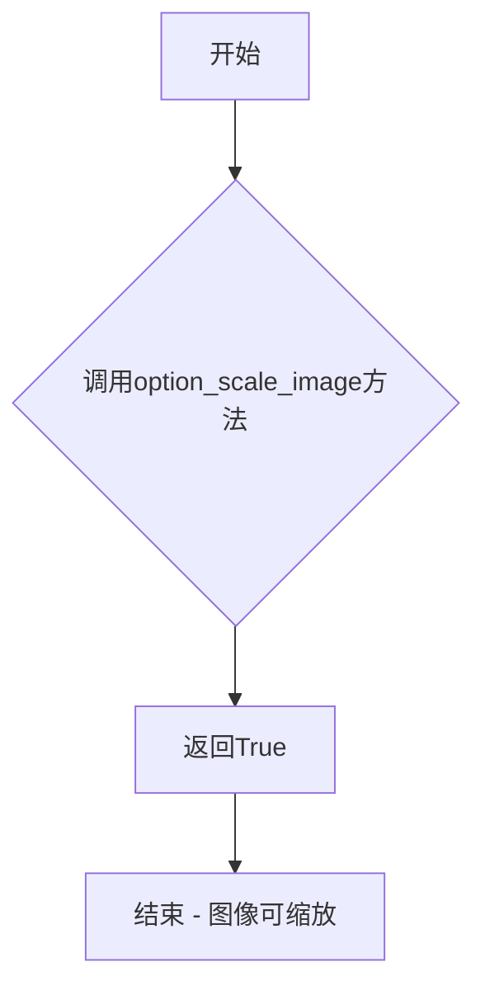
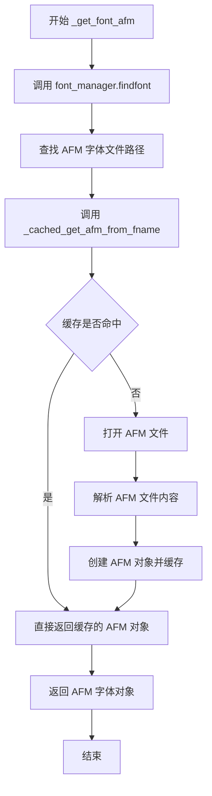
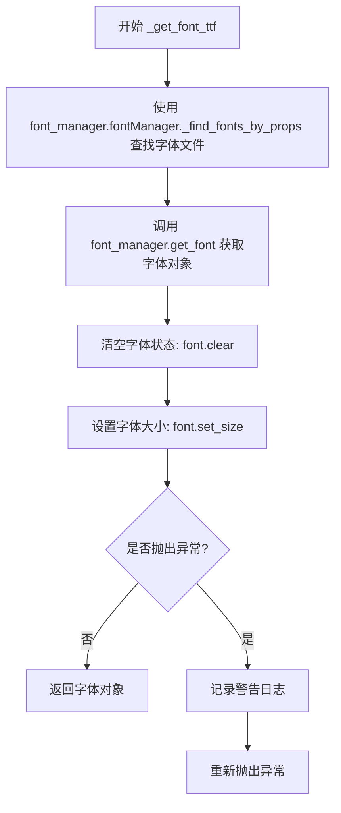

# `matplotlib\lib\matplotlib\backends\_backend_pdf_ps.py` 详细设计文档

该文件提供Matplotlib库中PDF和PostScript后端之间共享的通用功能，包括TTF字体子集化、AFM字体缓存、字符跟踪以及用于文本渲染的基类实现，支持后端根据配置选择AFM或TTF字体进行文本尺寸计算。

## 整体流程

```mermaid
graph TD
    A[开始] --> B[CharacterTracker记录使用的字符]
    B --> C[RendererPDFPSBase获取文本尺寸]
    C --> D{ismath == 'TeX'?}
    D -- 是 --> E[调用父类方法]
    D -- 否 --> F{ismath为真?}
    F -- 是 --> G[使用mathtext_parser解析]
    F -- 否 --> H{使用AFM字体?]
    H -- 是 --> I[_get_font_afm获取AFM字体]
    H -- 否 --> J[_get_font_ttf获取TTF字体]
    I --> K[计算文本宽度高度下降值]
    J --> K
    G --> K
    E --> K
    K --> L[返回 (宽度, 高度, 下降值)]
```

## 类结构

```
RendererBase (抽象基类，backend_bases)
└── RendererPDFPSBase

CharacterTracker (独立辅助类)
```

## 全局变量及字段


### `_cached_get_afm_from_fname`
    
缓存AFM字体读取

类型：`functools._lru_cache`
    


### `CharacterTracker.used`
    
存储字体路径到字符码点的映射

类型：`dict`
    


### `RendererPDFPSBase.width`
    
画布宽度

类型：`float`
    


### `RendererPDFPSBase.height`
    
画布高度

类型：`float`
    
    

## 全局函数及方法


### `_cached_get_afm_from_fname`

该函数是一个带 LRU 缓存的 AFM 字体文件读取工具，通过文件路径加载 AFM 字体文件并返回 AFM 对象，用于 PDF 和 PS 后端的字体渲染支持。

参数：

- `fname`：`str`，AFM 字体文件的完整路径

返回值：`AFM`，从文件加载的 AFM 字体对象

#### 流程图



#### 带注释源码

```python
@functools.lru_cache(50)  # 装饰器：使用 LRU 缓存，最多缓存50个不同的字体文件结果
def _cached_get_afm_from_fname(fname):
    """
    从文件路径加载 AFM 字体文件并返回 AFM 对象
    
    Parameters
    ----------
    fname : str
        AFM 字体文件的路径
    
    Returns
    -------
    AFM
        解析后的 AFM 字体对象
    """
    with open(fname, "rb") as fh:  # 以二进制只读模式打开文件
        return AFM(fh)  # 创建并返回 AFM 对象，同时关闭文件句柄
```


### `get_glyphs_subset`

该函数用于将TTF字体文件子集化为仅包含指定字符的子集，通过fontTools库的subset模块实现字体的精简和导出。

参数：

- `fontfile`：`str`，字体文件的路径
- `characters`：`str`，需要包含在子集字体中的连续字符集

返回值：`fontTools.ttLib.ttFont.TTFont`，表示子集化后的字体对象，调用者需要在使用完毕后自行关闭该对象

#### 流程图



#### 带注释源码

```python
def get_glyphs_subset(fontfile, characters):
    """
    Subset a TTF font

    Reads the named fontfile and restricts the font to the characters.

    Parameters
    ----------
    fontfile : str
        Path to the font file
    characters : str
        Continuous set of characters to include in subset

    Returns
    -------
    fontTools.ttLib.ttFont.TTFont
        An open font object representing the subset, which needs to
        be closed by the caller.
    """

    # 创建子集化选项对象，设置字形名称和推荐字形
    options = subset.Options(glyph_names=True, recommended_glyphs=True)

    # 防止子集化额外的表格，排除与子集无关的字体表
    options.drop_tables += [
        'FFTM',  # FontForge时间戳
        'PfEd',  # FontForge个人表
        'BDF',  # X11 BDF头
        'meta',  # 元数据（存储设计/支持语言，对子集无意义）
        'MERG',  # 合并表
        'TSIV',  # Microsoft Visual TrueType扩展
        'Zapf',  # 有关字体中单个字形的信息
        'bdat',  # 位图数据表
        'bloc',  # 位图位置表
        'cidg',  # CID到字形ID表（Apple高级排版）
        'fdsc',  # 字体描述符表
        'feat',  # 特性名表（Apple高级排版）
        'fmtx',  # 字体度量表
        'fond',  # 数据叉字体信息（Apple）
        'just',  # 对齐表（Apple高级排版）
        'kerx',  # 扩展字距调整表（Apple高级排版）
        'ltag',  # 语言标签
        'morx',  # 扩展字形变形表
        'trak',  # 跟踪表
        'xref',  # 交叉引用表（Apple字体工具信息）
    ]
    
    # 如果字体文件是ttc（TrueType集合），指定字体编号
    if fontfile.endswith(".ttc"):
        options.font_number = 0

    # 使用fontTools加载字体文件
    font = subset.load_font(fontfile, options)
    
    # 创建子集器并填充需要保留的字符
    subsetter = subset.Subsetter(options=options)
    subsetter.populate(text=characters)
    
    # 执行子集化操作
    subsetter.subset(font)
    
    # 返回子集化后的字体对象
    return font
```


### font_as_file

将TTFont字体对象转换为BytesIO文件流对象，以便于在内存中处理字体数据。

参数：

- `font`：`fontTools.ttLib.ttFont.TTFont`，输入的TTFont字体对象

返回值：`BytesIO`，包含序列化字体数据的内存文件对象

#### 流程图



#### 带注释源码

```python
def font_as_file(font):
    """
    Convert a TTFont object into a file-like object.

    Parameters
    ----------
    font : fontTools.ttLib.ttFont.TTFont
        A font object

    Returns
    -------
    BytesIO
        A file object with the font saved into it
    """
    # 创建一个内存中的二进制流对象，用于存储字体数据
    fh = BytesIO()
    
    # 调用TTFont的save方法将字体序列化到BytesIO中
    # reorderTables=False 表示不重新排序表，可保持原始顺序以提高性能
    font.save(fh, reorderTables=False)
    
    # 返回包含字体数据的BytesIO对象
    return fh
```


### `CharacterTracker.__init__`

初始化 CharacterTracker 实例，创建一个空的字典用于跟踪字体使用情况。

参数：
- 无

返回值：`None`，无返回值（构造方法）

#### 流程图

```mermaid
flowchart TD
    A[开始 __init__] --> B[创建空字典 self.used = {}]
    B --> C[结束]
```

#### 带注释源码

```python
def __init__(self):
    """
    初始化 CharacterTracker。
    
    创建一个空的字典 self.used，用于存储字体文件路径到字符码点集合的映射。
    该字典的键是字体文件路径（fname），值是一个集合（set），包含该字体所使用的字符码点。
    """
    self.used = {}  # 用于跟踪每个字体文件所使用的字符，键为字体文件路径，值为字符码点集合
```


### `CharacterTracker.track`

记录字符串使用的字符，用于字体子集化。维护字体路径到字符码点的映射，以便 PDF 和 PS 后端可以生成仅包含所需字符的字体子集。

参数：

- `font`：字体对象，用于渲染字符串。需具备 `_get_fontmap()` 方法和 `fname` 属性
- `s`：`str`，要排版的字符串

返回值：`None`（无返回值，该方法仅修改内部状态）

#### 流程图

```mermaid
flowchart TD
    A[开始 track 方法] --> B[调用 font._get_fontmap 获取字符到字体映射]
    B --> C{遍历 char_to_font 中的每一项}
    C -->|对于每个字符 _c 和对应字体 _f| D[获取字体文件名 _f.fname]
    D --> E[使用 setdefault 获取或创建该字体对应的字符集合]
    E --> F[将字符的码点 ord(_c) 添加到集合中]
    F --> C
    C -->|遍历完成| G[结束 track 方法]
```

#### 带注释源码

```python
def track(self, font, s):
    """Record that string *s* is being typeset using font *font*."""
    # 调用字体的 _get_fontmap 方法获取字符串中每个字符对应的字体映射
    # 返回值为字典，键为字符，值为对应的字体对象
    char_to_font = font._get_fontmap(s)
    
    # 遍历每个字符及其对应字体的映射关系
    for _c, _f in char_to_font.items():
        # 使用 setdefault 获取字体文件名对应的字符集合
        # 如果不存在则创建一个新的空集合
        # 然后将字符的 Unicode 码点添加到集合中
        self.used.setdefault(_f.fname, set()).add(ord(_c))
```


### `CharacterTracker.track_glyph`

记录单个字形码点（codepoint）正在使用指定字体进行排版，将该字形添加到已使用字形的集合中。

参数：

- `font`：字体对象，表示用于排版的字体实例
- `glyph`：整数，表示要记录的 Unicode 码点

返回值：`None`，无返回值，该方法仅修改实例的内部状态

#### 流程图



#### 带注释源码

```python
def track_glyph(self, font, glyph):
    """
    Record that codepoint *glyph* is being typeset using font *font*.
    
    Parameters
    ----------
    font : font object
        字体对象，包含 fname 属性表示字体文件路径
    glyph : int
        Unicode 码点值，表示要记录的单个字符
    """
    # 使用 setdefault 方法确保 font.fname 作为键存在
    # 如果不存在，则创建一个新的空 set 作为默认值
    # 然后将 glyph 码点添加到该字体对应的集合中
    self.used.setdefault(font.fname, set()).add(glyph)
```


### `RendererPDFPSBase.__init__`

初始化 `RendererPDFPSBase` 类的实例，设置画布的宽度和高度。

参数：

- `width`：`float` 或 `int`，画布宽度值
- `height`：`float` 或 `int`，画布高度值

返回值：`None`，无显式返回值（`__init__` 方法自动返回 `None`）

#### 流程图



#### 带注释源码

```python
def __init__(self, width, height):
    """
    初始化 RendererPDFPSBase 实例的宽度和高度。

    Parameters
    ----------
    width : float or int
        画布宽度值
    height : float or int
        画布高度值
    """
    # 调用父类 RendererBase 的 __init__ 方法，完成基类初始化
    super().__init__()
    # 将传入的 width 参数存储为实例属性 self.width，供后续渲染使用
    self.width = width
    # 将传入的 height 参数存储为实例属性 self.height，供后续渲染使用
    self.height = height
```


### `RendererPDFPSBase.flipy`

该方法用于指示PDF和PS后端的Y轴方向。由于PDF和PS使用笛卡尔坐标系（Y轴从底向上增加），因此返回False，表示不需要翻转Y轴。

参数： 无

返回值：`bool`，返回False，表示Y轴从底部向顶部增加（标准笛卡尔坐标系）

#### 流程图



#### 带注释源码

```python
def flipy(self):
    """
    Determine whether y-axis increases upward or downward.
    
    In the PDF and PostScript coordinate system, the y-axis increases 
    from bottom to top (standard Cartesian coordinates), unlike some 
    other backends (like Agg) where y increases from top to bottom.
    
    This method overrides the base class method to return False,
    indicating that no vertical flipping should be applied when
    rendering to PDF or PS backends.
    
    Returns
    -------
    bool
        Always returns False for PDF/PS backends, meaning the y-axis
        is not flipped (y increases from bottom to top).
    """
    # docstring inherited
    return False  # y increases from bottom to top.
```


### `RendererPDFPSBase.option_scale_image`

该方法用于指示PDF和PS后端是否支持任意图像缩放。由于PDF和PS渲染器能够处理任意大小的图像缩放，此方法返回True以启用图像缩放功能。

参数：

- `self`：`RendererPDFPSBase`，调用此方法的实例对象本身

返回值：`bool`，返回True，表示PDF和PS后端支持任意图像缩放

#### 流程图



#### 带注释源码

```python
def option_scale_image(self):
    # docstring inherited
    # PDF和PS渲染器支持任意图像的缩放操作
    return True  # PDF and PS support arbitrary image scaling.
```


### `RendererPDFPSBase.option_image_nocomposite`

该方法用于根据matplotlib的rcParam配置参数决定是否在PDF/PS后端中禁用图像合成。当`image.composite_image`配置项为True（启用合成）时，返回False（不禁用合成）；反之返回True（禁用合成）。

参数：

- `self`：`RendererPDFPSBase`，隐式参数，方法的调用实例，表示当前渲染器对象本身

返回值：`bool`，返回`not mpl.rcParams["image.composite_image"]`的布尔值。当返回`True`时，表示不进行图像合成；当返回`False`时，表示进行图像合成。

#### 流程图

```mermaid
flowchart TD
    A[开始 option_image_nocomposite] --> B{检查 rcParams 配置}
    B --> C[读取 mpl.rcParams['image.composite_image']]
    C --> D{配置值为 True?}
    D -->|是| E[返回 False - 启用合成]
    D -->|否| F[返回 True - 不合成]
    E --> G[结束]
    F --> G
```

#### 带注释源码

```python
def option_image_nocomposite(self):
    """
    确定是否禁用图像合成。

    该方法继承自 RendererBase，用于 PDF 和 PS 后端的图像渲染决策。
    通过检查 matplotlib 的 rcParams 配置来决定图像的合成行为。

    参数:
        self: RendererPDFPSBase 实例，隐式参数，表示当前渲染器对象

    返回值:
        bool: 返回 rcParams['image.composite_image'] 的取反值。
              - True: 不进行图像合成
              - False: 进行图像合成
    """
    # docstring inherited
    # Decide whether to composite image based on rcParam value.
    # 读取 matplotlib 全局配置参数中关于图像合成的设置
    # image.composite_image 默认值为 True（启用图像合成）
    # 通过取反操作，返回与配置相反的布尔值
    return not mpl.rcParams["image.composite_image"]
```


### `RendererPDFPSBase.get_canvas_width_height`

获取画布的宽和高（单位：英寸转磅）。该方法将实例变量中存储的画布宽高（单位：英寸）转换为点（points，1英寸=72点），并以元组形式返回转换后的宽高值。

参数：

- `self`：`RendererPDFPSBase`，类的实例本身

返回值：`Tuple[float, float]`，返回画布的宽度和高度（单位：点），格式为(宽, 高)

#### 流程图

```mermaid
flowchart TD
    A[开始] --> B[获取self.width<br/>画布宽度，单位：英寸]
    B --> C[获取self.height<br/>画布高度，单位：英寸]
    C --> D[计算 width_points = self.width × 72.0]
    E[计算 height_points = self.height × 72.0]
    D --> F[返回元组<br/>(width_points, height_points)]
    E --> F
```

#### 带注释源码

```python
def get_canvas_width_height(self):
    """
    获取画布宽高（英寸转磅）
    
    该方法继承自 RendererBase，PDF 和 PS 后端实现此方法
    用于将画布尺寸从英寸转换为点（points）
    
    Returns:
        tuple: (width, height) 转换后的画布尺寸，单位为点
    """
    # docstring inherited
    # 将宽度从英寸转换为点（1英寸 = 72点）
    # self.width 是在 __init__ 中设置的画布宽度（英寸）
    return self.width * 72.0, self.height * 72.0
```


### `RendererPDFPSBase.get_text_width_height_descent`

获取文本的宽度、高度和下降值，用于文本布局和渲染。

参数：

- `s`：`str`，要测量尺寸的文本字符串
- `prop`：`matplotlib.font_manager.FontProperties`，字体属性对象，包含字体大小、样式等信息
- `ismath`：`bool` 或 `str`，数学模式标志。`True` 表示数学文本，"TeX" 表示使用 TeX 引擎渲染，`False` 表示普通文本

返回值：`tuple[float, float, float]`，返回 (宽度, 高度, 下降值) 的元组

#### 流程图

```mermaid
flowchart TD
    A[开始] --> B{ismath == 'TeX'}
    B -->|是| C[调用父类方法]
    B -->|否| D{ismath 为真}
    D -->|是| E[使用 mathtext_parser 解析]
    D -->|否| F{mpl.rcParams[_use_afm_rc_name]}
    F -->|是| G[获取 AFM 字体]
    F -->|否| H[获取 TTF 字体]
    C --> I[返回 width, height, depth]
    E --> I
    G --> J[计算边界框和下降值]
    H --> K[设置文本并获取宽度高度]
    J --> L[应用缩放: size/1000]
    K --> M[应用缩放: 1/64]
    L --> I
    M --> I
```

#### 带注释源码

```python
def get_text_width_height_descent(self, s, prop, ismath):
    """
    获取文本的宽度、高度和下降值
    
    参数:
        s: 要测量的文本字符串
        prop: 字体属性对象
        ismath: 数学模式标志
    """
    # 检查是否使用 TeX 模式
    if ismath == "TeX":
        # TeX 模式下调用父类的实现
        return super().get_text_width_height_descent(s, prop, ismath)
    # 检查是否使用数学文本模式（不是 TeX）
    elif ismath:
        # 使用 mathtext 解析器解析数学文本
        parse = self._text2path.mathtext_parser.parse(s, 72, prop)
        # 返回数学文本的宽度、高度和深度
        return parse.width, parse.height, parse.depth
    # 检查是否配置使用 AFM 字体
    elif mpl.rcParams[self._use_afm_rc_name]:
        # 获取 AFM 字体对象
        font = self._get_font_afm(prop)
        # 获取字符串的边界框和下降值 (left, bottom, width, height, descent)
        l, b, w, h, d = font.get_str_bbox_and_descent(s)
        # 计算缩放因子: 字体大小(磅) / 1000
        scale = prop.get_size_in_points() / 1000
        # 应用缩放到宽度、高度和下降值
        w *= scale
        h *= scale
        d *= scale
        # 返回计算后的尺寸
        return w, h, d
    else:
        # 获取 TrueType 字体对象
        font = self._get_font_ttf(prop)
        # 设置文本，0.0 表示不设置位置，NO_HINTING 标志禁用提示
        font.set_text(s, 0.0, flags=ft2font.LoadFlags.NO_HINTING)
        # 获取文本的宽度和高度
        w, h = font.get_width_height()
        # 获取下降值（文本基线以下的距离）
        d = font.get_descent()
        # 计算缩放因子 (FT2Font 使用 1/64 精度)
        scale = 1 / 64
        # 应用缩放
        w *= scale
        h *= scale
        d *= scale
        # 返回计算后的尺寸
        return w, h, d
```


### `RendererPDFPSBase._get_font_afm`

该方法通过字体属性对象查找对应的AFM字体文件，并从缓存中加载AFM字体对象返回。

参数：

- `prop`：`matplotlib.font_manager.FontProperties`，字体属性对象，用于在指定目录中查找AFM字体文件

返回值：`matplotlib.afm.AFM`，从AFM文件加载的字体对象，用于获取字体度量信息

#### 流程图



#### 带注释源码

```python
def _get_font_afm(self, prop):
    """
    获取 AFM 字体对象。
    
    Parameters
    ----------
    prop : matplotlib.font_manager.FontProperties
        字体属性对象，包含字体名称、大小等信息
    
    Returns
    -------
    matplotlib.afm.AFM
        解析后的 AFM 字体对象，包含字体度量信息
    """
    # 使用 font_manager 根据字体属性查找 AFM 字体文件路径
    # 参数 fontext="afm" 指定查找扩展名为 .afm 的字体文件
    # self._afm_font_dir 是子类指定的 AFM 字体目录
    fname = font_manager.findfont(
        prop, fontext="afm", directory=self._afm_font_dir)
    
    # 从缓存中获取 AFM 字体对象（缓存 key 为文件路径）
    # 如果缓存命中则直接返回，否则读取文件并创建 AFM 对象
    return _cached_get_afm_from_fname(fname)
```


### `RendererPDFPSBase._get_font_ttf`

获取TTF字体对象，用于PDF/PS后端渲染文本。该方法通过字体属性查找对应的TTF字体文件，加载字体并设置大小后返回字体对象。

参数：

- `prop`：`matplotlib.font_manager.FontProperties`，字体属性对象，包含字体名称、大小等字体配置信息

返回值：`ft2font.FT2Font`（或类似的字体对象），已加载并设置好大小的TTF字体对象，可用于文本渲染

#### 流程图



#### 带注释源码

```python
def _get_font_ttf(self, prop):
    """
    获取TTF字体对象用于文本渲染。
    
    Parameters
    ----------
    prop : matplotlib.font_manager.FontProperties
        字体属性对象，包含所需字体的信息（名称、字号等）
    
    Returns
    -------
    ft2font.FT2Font
        已加载并配置好的TTF字体对象，可用于获取字形度量信息
    """
    # 使用字体管理器根据字体属性查找对应的字体文件路径列表
    fnames = font_manager.fontManager._find_fonts_by_props(prop)
    
    try:
        # 根据字体文件名获取字体对象
        font = font_manager.get_font(fnames)
        
        # 清空字体内部状态，为新的文本渲染做准备
        font.clear()
        
        # 设置字体大小：字号从prop获取，DPI固定为72（PDF/PS标准）
        font.set_size(prop.get_size_in_points(), 72)
        
        # 返回配置好的字体对象
        return font
        
    except RuntimeError:
        # 捕获运行时异常（通常是字体文件无法读取或格式错误）
        logging.getLogger(__name__).warning(
            "The PostScript/PDF backend does not currently "
            "support the selected font (%s).", fnames)
        # 重新抛出异常，让调用者处理
        raise
```

## 关键组件


### 字体子集化模块

负责将TTF字体文件限制为特定字符集，用于PDF和PS后端的字体优化，减少输出文件大小。

### 字符跟踪器（CharacterTracker）

维护字体文件路径到使用过的字符码点的映射关系，用于跟踪哪些字符需要被包含在输出的字体子集中。

### 渲染器基类（RendererPDFPSBase）

PDF和PS后端的公共渲染器基类，提供文本测量、图像处理、坐标系转换等核心渲染功能的默认实现。

### AFM字体缓存

使用LRU缓存机制缓存AFM字体的读取和解析，避免重复加载相同字体文件，提高性能。

### 文本测量引擎

根据rcParams配置和数学模式选择不同的字体渲染路径（ AFM、TTF或TeX），计算文本的宽度、高度和深度。

### 字体查找与加载

支持通过字体属性（font properties）查找并加载AFM或TTF字体，提供fallback机制处理字体加载失败的情况。


## 问题及建议


### 已知问题

- **魔法数字和硬编码值**：代码中存在多处硬编码的数值，如 `50`（LRU缓存大小）、`72.0`（72 DPI转换）、`1/64`（缩放因子）等，缺乏常量定义，降低了可维护性和可读性。
- **`drop_tables` 列表重复创建**：`get_glyphs_subset` 函数每次调用都会重新创建 `options.drop_tables` 列表，应将其提取为模块级常量以避免重复分配。
- **异常处理不完善**：`_get_font_ttf` 方法捕获 `RuntimeError` 后仅记录警告并重新抛出异常，缺乏降级处理机制，可能导致程序崩溃。
- **缺少类型注解**：整个模块没有任何类型提示（type hints），对于大型项目来说降低了代码的可读性和IDE支持。
- **抽象属性未定义**：`RendererPDFPSBase` 类注释说明 `_afm_font_dir` 和 `_use_afm_rc_name` 必须由子类定义，但基类中没有声明或抛出明确错误，可能导致运行时 `AttributeError`。
- **`track_glyph` 方法类型假设**：直接使用 `glyph` 参数添加到 set 中，未验证 `glyph` 是否为整数类型，可能导致类型相关错误。
- **缓存策略固定**：`_cached_get_afm_from_fname` 的 LRU 缓存大小硬编码为 50，没有考虑不同环境的内存限制。

### 优化建议

- **提取常量**：将 `50`、`72.0`、`1/64` 等数值定义为模块级常量，并添加有意义的命名，如 `FONT_CACHE_SIZE`、`DPI_CONVERSION`、`TEXT_SCALE_FACTOR`。
- **优化 `drop_tables` 列表**：将其定义为模块级常量 `DEFAULT_DROP_TABLES`，在 `get_glyphs_subset` 中直接赋值，减少重复创建开销。
- **改进异常处理**：在 `_get_font_ttf` 中增加 fallback 机制，例如返回默认字体或使用 AFM 字体替代，避免程序直接崩溃。
- **添加类型注解**：为所有函数参数、返回值和类属性添加类型提示，提高代码可维护性。
- **定义抽象属性**：使用 `abc` 模块或添加运行时检查，明确要求子类必须实现这些属性，并提供清晰的错误信息。
- **验证输入类型**：在 `track_glyph` 方法中添加类型检查，确保 `glyph` 参数为整数类型。
- **可配置的缓存大小**：将 LRU 缓存大小改为可配置的选项，可通过环境变量或配置文件设置。

## 其它


### 设计目标与约束

**设计目标：**
- 为PDF和PostScript后端提供共享的字体处理和渲染功能
- 支持TTF和AFM两种字体格式的子集化和渲染
- 实现字符追踪机制以优化字体子集，减少输出文件大小

**约束：**
- 必须继承自RendererBase基类
- 需要与matplotlib的字体管理器(font_manager)紧密集成
- PDF/PS后端的坐标系统y轴从下往上增长(flipy返回False)
- 仅支持72 DPI的输出分辨率

### 错误处理与异常设计

**异常处理策略：**
- `get_glyphs_subset`: 可能抛出`fontTools.subset.Options`相关异常及文件读写异常
- `_get_font_ttf`: 当字体加载失败时抛出RuntimeError，并记录警告日志
- `_cached_get_afm_from_fname`: 文件打开失败时抛出FileNotFoundError或IOError
- `CharacterTracker.track`: 依赖font._get_fontmap()，需处理可能的KeyError

**日志记录：**
- 使用Python标准logging模块记录警告信息
- 当字体不支持时记录warning级别日志

### 数据流与状态机

**主要数据流：**
1. 字体加载流程：findfont → _find_fonts_by_props → get_font → 子集化
2. 字符追踪流程：track() → char_to_font → used字典更新
3. 文本渲染流程：get_text_width_height_descent → 判断ismath/rcParams → 选择AFM/TTF路径

**状态管理：**
- `CharacterTracker.used`: 字典，键为字体文件路径，值为使用的字符codepoint集合
- `RendererPDFPSBase`: 维护width和height状态，无复杂状态机

### 外部依赖与接口契约

**外部依赖：**
- `fontTools.subset`: TTF字体子集化
- `fontTools.ttLib.ttFont.TTFont`: 字体对象
- `matplotlib.font_manager`: 字体查找和管理
- `matplotlib.ft2font`: FreeType字体包装
- `matplotlib.AFM`: Adobe Font Metrics支持
- `matplotlib.backend_bases.RendererBase`: 渲染器基类

**接口契约：**
- `_cached_get_afm_from_fname`: 输入fname返回AFM对象，缓存50个结果
- `get_glyphs_subset`: 输入fontfile路径和characters字符串，返回TTFont对象
- `font_as_file`: 输入TTFont对象，返回BytesIO文件对象
- `CharacterTracker.track`: 输入font和字符串s，无返回值
- `CharacterTracker.track_glyph`: 输入font和glyph codepoint，无返回值

### 性能考虑

**缓存策略：**
- `_cached_get_afm_from_fname`使用lru_cache(maxsize=50)缓存AFM字体对象
- CharacterTracker.used字典累积使用过的字符，避免重复处理

**性能优化点：**
- 字体子集化仅保留使用的字符，显著减小输出文件大小
- 使用set存储字符codepoints，提高查找效率

### 兼容性考虑

**字体格式支持：**
- TTF/OTF字体：完整支持子集化
- TTC字体集合：支持，通过options.font_number指定
- AFM字体：支持指标读取，不支持子集化

**Python版本：**
- 依赖fontTools 4.0+，需确保兼容性

### 测试策略建议

- 单元测试：_cached_get_afm_from_fname缓存测试
- 集成测试：get_glyphs_subset子集化结果验证
- 字符追踪测试：CharacterTracker准确记录字符
- 渲染测试：get_text_width_height_descent返回值的准确性

### 资源管理

**内存管理：**
- CharacterTracker.used字典可能随使用字体增多而增长，需注意大文档场景
- TTFont对象需由调用方负责关闭

**文件句柄：**
- _cached_get_afm_from_fname使用上下文管理器确保文件关闭

### 线程安全性

- lru_cache本身是线程安全的
- CharacterTracker非线程安全，多线程环境需外部同步
- RendererPDFPSBase实例通常在单线程环境中使用

### 配置选项

**rcParams依赖：**
- `image.composite_image`: 影响option_image_nocomposite返回值
- `_use_afm_rc_name`: 动态确定的rcParam名称，决定使用AFM还是TTF字体


    