# `matplotlib\lib\matplotlib\backends\_backend_tk.py` 详细设计文档

这是 Matplotlib 库的 TkAgg 后端实现，封装了 Tkinter 控件以提供交互式图形显示、事件处理（鼠标、键盘、定时器）以及基于 blitting 的图形渲染，并实现了图形窗口和工具栏的管理功能。

## 整体流程

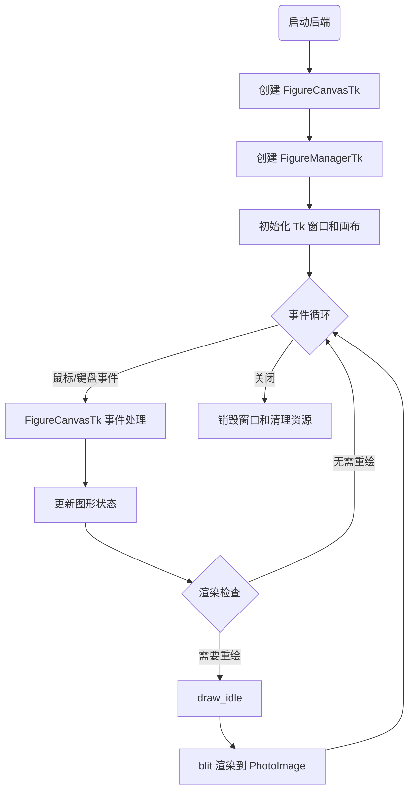

## 类结构

```
_BackendTk (_Backend)
├── TimerTk (TimerBase)
├── FigureCanvasTk (FigureCanvasBase)
│   └── FigureManagerTk (FigureManagerBase)
│       ├── NavigationToolbar2Tk (NavigationToolbar2, tk.Frame)
│       │   └── RubberbandTk (backend_tools.RubberbandBase)
│       └── ToolbarTk (ToolContainerBase, tk.Frame)
│           ├── SaveFigureTk (backend_tools.SaveFigureBase)
│           ├── ConfigureSubplotsTk (backend_tools.ConfigureSubplotsBase)
│           └── HelpTk (backend_tools.ToolHelpBase)
```

## 全局变量及字段


### `_blit_args`
    
blit 参数字典，用于存储跨线程传递的blit参数

类型：`dict`
    


### `_blit_tcl_name`
    
blit Tcl 命令名称，用于在Tcl环境中调用blit函数

类型：`str`
    


### `_log`
    
日志记录器，用于记录后端运行时的日志信息

类型：`Logger`
    


### `cursord`
    
光标映射字典，将matplotlib光标类型映射到Tkinter光标名称

类型：`dict`
    


### `TimerTk._timer`
    
Tkinter 定时器句柄，用于管理定时器回调

类型：`Any`
    


### `TimerTk.parent`
    
父 Tkinter 控件，定时器依附的窗口小部件

类型：`tk.Widget`
    


### `FigureCanvasTk._idle_draw_id`
    
空闲绘制回调 ID，用于管理idle状态下的绘制任务

类型：`Any`
    


### `FigureCanvasTk._event_loop_id`
    
事件循环 ID，用于管理事件循环的取消操作

类型：`Any`
    


### `FigureCanvasTk._tkcanvas`
    
Tkinter 画布，用于承载figure的图形内容

类型：`tk.Canvas`
    


### `FigureCanvasTk._tkphoto`
    
Tkinter 图像，用于存储要显示的图形数据

类型：`tk.PhotoImage`
    


### `FigureCanvasTk._tkcanvas_image_region`
    
画布上的图像区域 ID，用于标识画布中的图像对象

类型：`int`
    


### `FigureCanvasTk._rubberband_rect_black`
    
橡皮筋黑色矩形，用于绘制选区边框（黑色）

类型：`Any`
    


### `FigureCanvasTk._rubberband_rect_white`
    
橡皮筋白色矩形，用于绘制选区边框（白色虚线）

类型：`Any`
    


### `FigureManagerTk.window`
    
Tkinter 窗口，管理figure的顶层窗口

类型：`tk.Tk`
    


### `FigureManagerTk._window_dpi`
    
DPI 变量，用于存储和追踪窗口的DPI值

类型：`tk.IntVar`
    


### `FigureManagerTk._window_dpi_cbname`
    
DPI 回调名称，用于追踪DPI变化回调

类型：`str`
    


### `FigureManagerTk._shown`
    
是否已显示，标记窗口是否已经显示过

类型：`bool`
    


### `NavigationToolbar2Tk._buttons`
    
工具栏按钮字典，存储工具栏各按钮的引用

类型：`dict`
    


### `NavigationToolbar2Tk._label_font`
    
标签字体，用于工具栏文字显示的字体

类型：`tkinter.font.Font`
    


### `NavigationToolbar2Tk.message`
    
消息变量，用于存储和更新工具栏状态消息

类型：`tk.StringVar`
    


### `NavigationToolbar2Tk._message_label`
    
消息标签，用于显示工具栏的提示信息

类型：`tk.Label`
    


### `ToolbarTk._label_font`
    
标签字体，用于工具容器文字显示

类型：`tkinter.font.Font`
    


### `ToolbarTk._message`
    
消息变量，用于存储工具容器状态消息

类型：`tk.StringVar`
    


### `ToolbarTk._message_label`
    
消息标签，用于显示工具容器提示信息

类型：`tk.Label`
    


### `ToolbarTk._toolitems`
    
工具项字典，存储所有已添加工具项的引用

类型：`dict`
    


### `ToolbarTk._groups`
    
工具组字典，按组分类管理工具项的框架

类型：`dict`
    


### `_BackendTk.backend_version`
    
Tk 版本信息，记录后端依赖的Tk版本

类型：`str`
    


### `_BackendTk.FigureCanvas`
    
画布类，指定后端使用的FigureCanvas实现类

类型：`type`
    


### `_BackendTk.FigureManager`
    
管理器类，指定后端使用的FigureManager实现类

类型：`type`
    


### `_BackendTk.mainloop`
    
主循环函数，用于启动Tk主事件循环

类型：`callable`
    
    

## 全局函数及方法


### `_blit`

内部 blit 包装函数，用于通过 tkapp.call 调用执行实际的图像 blit 操作。该函数从全局 `_blit_args` 字典中检索参数，并调用 C 扩展模块 `_tkagg.blit` 完成图像渲染。

参数：

- `argsid`：`str`，唯一字符串标识符，用于从 `_blit_args` 字典中获取正确的参数

返回值：`None`，无返回值

#### 流程图

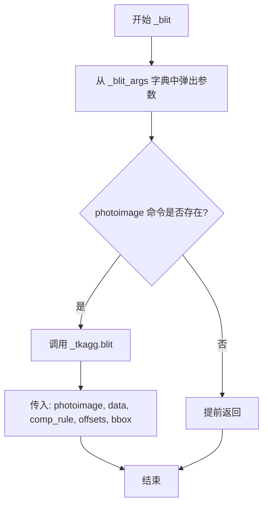

#### 带注释源码

```python
def _blit(argsid):
    """
    Thin wrapper to blit called via tkapp.call.

    *argsid* is a unique string identifier to fetch the correct arguments from
    the ``_blit_args`` dict, since arguments cannot be passed directly.
    """
    # 从全局字典中弹出与 argsid 关联的参数元组
    # 参数包括: photoimage, data, offsets, bbox, comp_rule
    photoimage, data, offsets, bbox, comp_rule = _blit_args.pop(argsid)
    
    # 检查 photoimage 是否仍然有效（命令是否存在）
    # 如果 Tk 图像已被销毁，则直接返回，不执行 blit 操作
    if not photoimage.tk.call("info", "commands", photoimage):
        return
    
    # 调用 C 扩展模块 _tkagg.blit 执行实际的图像合成
    # 参数: Tk 解释器地址, photoimage 名称, 数据, 合成规则, 偏移量, 边界框
    _tkagg.blit(photoimage.tk.interpaddr(), str(photoimage), data, comp_rule, offsets,
                bbox)
```


### `blit`

将 AGG（Anti-Grain Geometry）图像绘制（blit）到 Tk 的 PhotoImage 对象中，实现高性能的图像渲染。

参数：

- `photoimage`：`tk.PhotoImage`，Tk PhotoImage 对象，目标图像容器
- `aggimage`：图像对象，源 AGG 图像，通常是 numpy 数组
- `offsets`：`tuple`，偏移元组，描述如何填充 Tk_PhotoImageBlock 结构体的 offset 字段：(0,1,2,3) 表示 RGBA8888，(2,1,0,3) 表示小端 ARGB32，(1,2,3,0) 表示大端 ARGB32
- `bbox`：`tuple` 或 `None`，可选的边界框，定义要绘制的区域，格式为 ((x1,y1), (x2,y2))

返回值：`None`，无返回值，直接在 PhotoImage 上进行图像合成

#### 流程图

```mermaid
flowchart TD
    A[开始 blit] --> B{是否传入 bbox?}
    B -->|是| C[提取 bbox 坐标]
    B -->|否| D[设置 bboxptr 为全图范围]
    C --> E[计算裁剪边界]
    E --> F{裁剪后区域有效?}
    F -->|否| G[直接返回]
    F -->|是| H[设置合成规则为 OVERLAY]
    D --> I[设置合成规则为 SET]
    H --> J[将参数打包到全局字典]
    I --> J
    J --> K{ Tcl 命令是否存在?]
    K -->|否| L[创建 Tcl 命令]
    K -->|是| M[调用 Tcl 命令触发 blit]
    L --> M
    M --> N[结束]
```

#### 带注释源码

```python
def blit(photoimage, aggimage, offsets, bbox=None):
    """
    Blit *aggimage* to *photoimage*.

    *offsets* is a tuple describing how to fill the ``offset`` field of the
    ``Tk_PhotoImageBlock`` struct: it should be (0, 1, 2, 3) for RGBA8888 data,
    (2, 1, 0, 3) for little-endian ARBG32 (i.e. GBRA8888) data and (1, 2, 3, 0)
    for big-endian ARGB32 (i.e. ARGB8888) data.

    If *bbox* is passed, it defines the region that gets blitted. That region
    will be composed with the previous data according to the alpha channel.
    Blitting will be clipped to pixels inside the canvas, including silently
    doing nothing if the *bbox* region is entirely outside the canvas.

    Tcl events must be dispatched to trigger a blit from a non-Tcl thread.
    """
    # 将 AGG 图像转换为 numpy 数组
    data = np.asarray(aggimage)
    # 获取图像尺寸
    height, width = data.shape[:2]
    
    # 处理边界框参数
    if bbox is not None:
        # 提取边界框坐标
        (x1, y1), (x2, y2) = bbox.__array__()
        # 裁剪到有效像素范围
        x1 = max(math.floor(x1), 0)
        x2 = min(math.ceil(x2), width)
        y1 = max(math.floor(y1), 0)
        y2 = min(math.ceil(y2), height)
        # 检查裁剪后区域是否有效
        if (x1 > x2) or (y1 > y2):
            return  # 区域无效，直接返回
        # 设置边界框指针和合成规则（支持 alpha 混合）
        bboxptr = (x1, x2, y1, y2)
        comp_rule = TK_PHOTO_COMPOSITE_OVERLAY
    else:
        # 无边界框时使用整个图像
        bboxptr = (0, width, 0, height)
        comp_rule = TK_PHOTO_COMPOSITE_SET

    # 注意：_tkagg.blit 不是线程安全的，从非 Tcl 线程调用会导致崩溃
    # 使用 tkapp.call 发布跨线程事件来触发 blit

    # tkapp.call 会将所有参数转换为字符串
    # 为避免在 _blit 中进行字符串解析，将参数打包到全局数据结构
    args = photoimage, data, offsets, bboxptr, comp_rule
    # 需要唯一键来避免线程竞争
    # 同样，使用字符串键以避免在 _blit 中进行字符串解析
    argsid = str(id(args))
    _blit_args[argsid] = args

    try:
        # 调用 Tcl 命令触发 blit 操作
        photoimage.tk.call(_blit_tcl_name, argsid)
    except tk.TclError as e:
        # 如果 Tcl 命令不存在，则创建它
        if "invalid command name" not in str(e):
            raise
        photoimage.tk.createcommand(_blit_tcl_name, _blit)
        photoimage.tk.call(_blit_tcl_name, argsid)
```


### `_restore_foreground_window_at_end`

一个上下文管理器，用于在代码块执行完成后恢复前台窗口。在进入时保存当前前台窗口句柄，在退出时根据配置决定是否恢复之前的前台窗口，确保 Matplotlib 窗口不会夺走用户当前正在操作的其他应用窗口的焦点。

参数：无

返回值：无（上下文管理器通过 yield 返回控制权）

#### 流程图

```mermaid
flowchart TD
    A[开始] --> B[调用 Win32_GetForegroundWindow 获取当前前台窗口句柄]
    B --> C[yield 控制权给代码块执行]
    C --> D{代码块执行完成}
    D --> E{foreground 存在且 mpl.rcParams['tk.window_focus'] 为 True?}
    E -->|是| F[调用 Win32_SetForegroundWindow 恢复前台窗口]
    E -->|否| G[不执行任何操作]
    F --> H[结束]
    G --> H
```

#### 带注释源码

```python
@contextmanager
def _restore_foreground_window_at_end():
    """
    上下文管理器：在代码块执行结束后恢复前台窗口。
    
    该函数用于在 Matplotlib 窗口操作完成后，将系统焦点恢复到
    用户之前正在使用的应用程序，避免 Matplotlib 窗口抢占焦点。
    """
    # 获取当前前台窗口的句柄
    # Win32_GetForegroundWindow 是 Windows API，用于获取当前处于前台 的窗口句柄
    foreground = _c_internal_utils.Win32_GetForegroundWindow()
    
    try:
        # yield 将控制权交给使用该上下文管理器的代码块
        # 代码块中的代码将在此处执行
        yield
    finally:
        # finally 块确保无论代码块是否抛出异常，都会执行恢复操作
        
        # 检查两个条件：
        # 1. foreground 存在（即成功获取到了窗口句柄）
        # 2. mpl.rcParams['tk.window_focus'] 为 True（用户配置允许恢复窗口焦点）
        if foreground and mpl.rcParams['tk.window_focus']:
            # 调用 Windows API 恢复之前的前台窗口
            _c_internal_utils.Win32_SetForegroundWindow(foreground)
```


### `add_tooltip`

添加工具提示的辅助函数，为指定的 Tkinter 部件绑定鼠标悬停事件，当鼠标进入部件时显示提示文本，离开时隐藏提示窗口。

参数：

- `widget`：`tk.Widget`，需要添加工具提示的 Tkinter 部件（如按钮等）
- `text`：`str`，工具提示显示的文本内容

返回值：`None`，该函数无返回值，仅通过副作用（绑定事件）实现功能

#### 流程图

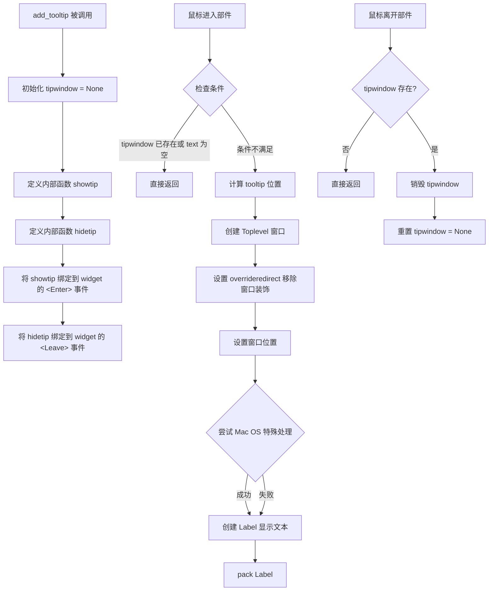

#### 带注释源码

```python
def add_tooltip(widget, text):
    """
    为 widget 添加工具提示功能。
    
    Parameters
    ----------
    widget : tk.Widget
        需要添加工具提示的 Tkinter 部件。
    text : str
        工具提示显示的文本内容。
    """
    tipwindow = None  # 初始化 tooltip 窗口引用为 None

    def showtip(event):
        """显示工具提示窗口。"""
        nonlocal tipwindow  # 允许修改外层的 tipwindow 变量
        # 如果窗口已存在或文本为空，则不显示
        if tipwindow or not text:
            return
        
        # 计算 tooltip 窗口的显示位置
        # 获取部件的边界框
        x, y, _, _ = widget.bbox("insert")
        # 计算相对于屏幕的绝对坐标
        x = x + widget.winfo_rootx() + widget.winfo_width()
        y = y + widget.winfo_rooty()
        
        # 创建顶层窗口（无装饰）
        tipwindow = tk.Toplevel(widget)
        tipwindow.overrideredirect(1)  # 移除窗口的标题栏和边框
        
        # 设置窗口位置
        tipwindow.geometry(f"+{x}+{y}")
        
        # 尝试为 Mac OS 设置特殊窗口样式（使其不激活）
        try:
            tipwindow.tk.call("::tk::unsupported::MacWindowStyle",
                              "style", tipwindow._w,
                              "help", "noActivates")
        except tk.TclError:
            # 如果失败则忽略（非 Mac OS 系统）
            pass
        
        # 创建标签显示提示文本
        label = tk.Label(tipwindow, text=text, justify=tk.LEFT,
                         relief=tk.SOLID, borderwidth=1)
        label.pack(ipadx=1)  # 添加内部填充

    def hidetip(event):
        """隐藏工具提示窗口。"""
        nonlocal tipwindow
        if tipwindow:
            tipwindow.destroy()  # 销毁窗口
        tipwindow = None  # 重置引用

    # 绑定鼠标进入事件：显示 tooltip
    widget.bind("<Enter>", showtip)
    # 绑定鼠标离开事件：隐藏 tooltip
    widget.bind("<Leave>", hidetip)
```


### `TimerTk.__init__`

初始化一个基于Tk定时器事件的定时器实例，设置父控件引用并调用父类TimerBase的初始化方法以配置定时器的基础功能（如回调函数、时间间隔等）。

参数：

- `parent`：`tk 控件`，定时器的父级Tk控件（通常是`FigureCanvasTk`的画布），用于调度after事件
- `*args`：可变位置参数，传递给父类`TimerBase.__init__`的位置参数
- `**kwargs`：可变关键字参数，传递给父类`TimerBase.__init__`的关键字参数

返回值：`None`，构造函数无显式返回值

#### 流程图

```mermaid
flowchart TD
    A[开始 __init__] --> B[设置 self._timer = None]
    B --> C[调用 super().__init__*args, **kwargs]
    C --> D[调用父类 TimerBase 初始化]
    D --> E[设置 self.parent = parent]
    E --> F[结束]
    
    D --> D1[初始化_interval]
    D --> D2[初始化_single]
    D --> D3[初始化_callbacks]
    D --> D4[初始化_args]
    D --> D5[设置_active状态]
    
    style B fill:#f9f,stroke:#333
    style C fill:#ff9,stroke:#333
    style E fill:#9f9,stroke:#333
```

#### 带注释源码

```python
def __init__(self, parent, *args, **kwargs):
    """
    初始化一个基于Tk定时器事件的定时器实例。

    该构造函数使用Tk的事件机制设置定时器，将核心计时功能委托给父类TimerBase，
    同时维护对Tk父控件的引用以调度事件。

    参数
    ----------
    parent : tk 控件
        承载定时器事件的父级Tk小部件（通常是画布）
    *args : tuple
        传递给父类TimerBase的额外位置参数
    **kwargs : dict
        传递给父类TimerBase的额外关键字参数
    """
    # 初始化内部定时器引用为None，表示当前没有活动的定时器
    self._timer = None
    
    # 调用父类构造函数以设置基础定时器功能
    # 这会配置interval、回调处理、定时器状态等
    super().__init__(*args, **kwargs)
    
    # 存储对父控件的直接引用，用于调度Tk定时器事件
    self.parent = parent
```


### `TimerTk._timer_start`

启动 Tk 定时器，在指定的时间间隔后触发定时器回调事件。

参数：
- 该方法无显式参数（隐含 `self` 为类实例自身）

返回值：`None`，无返回值

#### 流程图

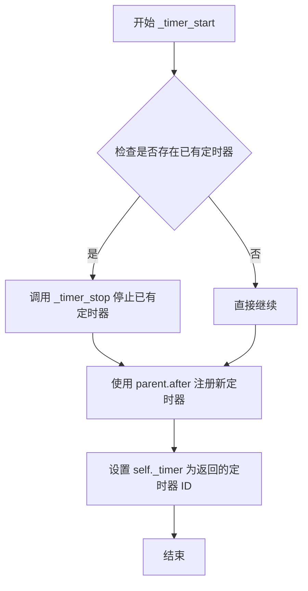

#### 带注释源码

```python
def _timer_start(self):
    """
    启动定时器。
    
    首先停止任何已存在的定时器，然后使用 Tk 的 after 方法
    注册一个新的定时器，在指定的间隔后触发 _on_timer 回调。
    """
    # 停止之前可能存在的定时器，避免多个定时器同时运行
    self._timer_stop()
    
    # 使用 Tk 的 after 方法注册定时器
    # self.parent 是 Tk 窗口部件（如 Canvas）
    # self._interval 是定时器间隔（毫秒）
    # self._on_timer 是定时器触发时调用的回调函数
    # after 方法返回一个定时器 ID，可用于取消定时器
    self._timer = self.parent.after(self._interval, self._on_timer)
```


### `TimerTk._timer_stop`

停止 Tkinter 定时器，取消任何待处理的定时器回调，并将内部定时器引用重置为 None。

参数：

- 该方法没有显式参数（除了隐式的 `self`）

返回值：`None`，无返回值

#### 流程图

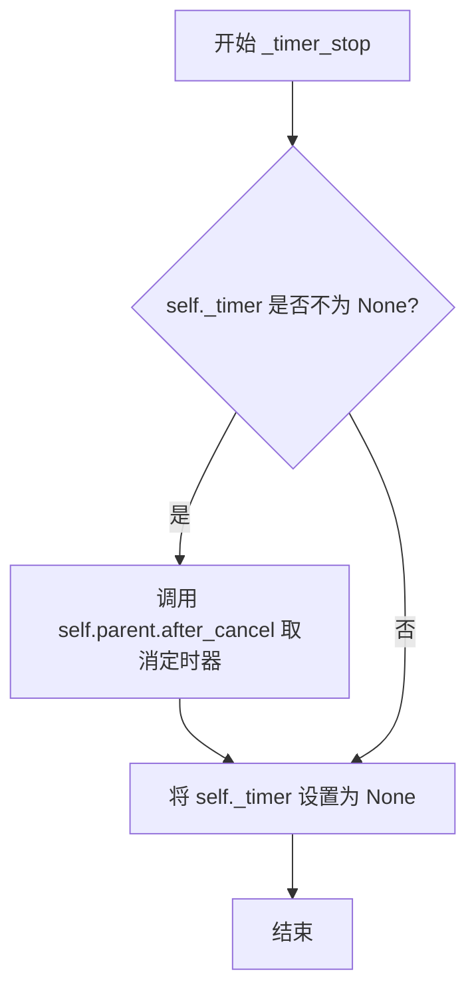

#### 带注释源码

```python
def _timer_stop(self):
    """
    停止定时器。
    
    该方法负责清理 Tkinter 定时器资源：
    1. 检查是否存在活动的定时器
    2. 如果存在，取消该定时器
    3. 将定时器引用重置为 None
    """
    # 检查是否存在活动的定时器（通过 _timer 属性判断）
    if self._timer is not None:
        # 使用 Tkinter 的 after_cancel 方法取消待处理的定时器回调
        # self.parent 是 Tkinter 窗口部件，after_cancel 取消由 after() 注册的回调
        self.parent.after_cancel(self._timer)
    
    # 重置定时器引用为 None，确保状态一致
    # 这样可以防止在定时器已停止时尝试取消它
    self._timer = None
```


### `TimerTk._on_timer`

定时器触发回调函数，处理定时器到期事件，并在非单-shot模式下重新设置定时器以实现周期性执行。

参数：

- 该方法无显式参数（隐式接收 `self` 实例）

返回值：`None`，无返回值

#### 流程图

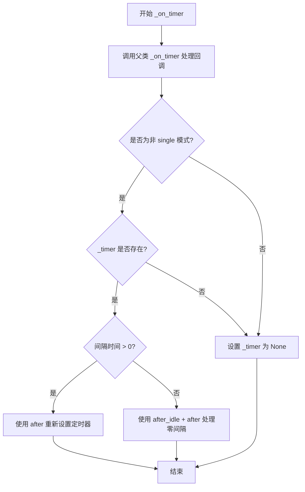

#### 带注释源码

```python
def _on_timer(self):
    """
    定时器触发回调函数。
    
    当 Tk 定时器到期时调用此方法，负责：
    1. 调用父类方法处理已注册的回调函数
    2. 在非单次模式下重新设置定时器以实现周期性执行
    """
    # 调用父类的 _on_timer 方法，处理用户注册的所有回调函数
    super()._on_timer()
    
    # Tk 的 after() 只是单次触发，所以需要在非单次模式下重新设置定时器。
    # 但是，如果 _timer 为 None，说明 _timer_stop 已被调用，此时不再重建定时器。
    if not self._single and self._timer:
        if self._interval > 0:
            # 正常情况：使用 after 在指定间隔后再次触发定时器
            self._timer = self.parent.after(self._interval, self._on_timer)
        else:
            # 边界情况：Tcl 的 after 0 会将事件前置到队列头部，
            # 导致零间隔不允许任何其他事件执行。
            # 这种组合是可取消的，且在允许事件和绘制每一帧的同时尽可能快地运行。
            # 参考 GH#18236
            self._timer = self.parent.after_idle(
                lambda: self.parent.after(self._interval, self._on_timer)
            )
    else:
        # 单次模式或定时器已停止，设置 _timer 为 None
        self._timer = None
```


### FigureCanvasTk.__init__

初始化matplotlib的Tkinter画布，创建Tk Canvas小部件，绑定所有必要的鼠标、键盘和窗口事件，并设置橡皮筋选择框的初始状态。

参数：

- `figure`：`matplotlib.figure.Figure`，可选，要绑定的图形对象，默认为None
- `master`：`tk.Tk` 或 `tk.Widget`，可选，Tk窗口或父小部件，默认为None

返回值：`None`，无返回值（构造函数）

#### 流程图

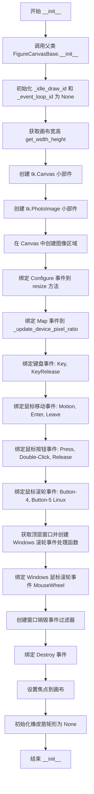

#### 带注释源码

```python
def __init__(self, figure=None, master=None):
    # 调用父类 FigureCanvasBase 的初始化方法，设置 figure 属性
    super().__init__(figure)
    
    # 初始化空闲绘制和事件循环的回调ID为 None
    self._idle_draw_id = None
    self._event_loop_id = None
    
    # 获取画布的物理宽度和高度（像素单位）
    w, h = self.get_width_height(physical=True)
    
    # 创建 Tkinter Canvas 小部件，作为图形绘制的容器
    # 设置白色背景，无边框，无高亮边框
    self._tkcanvas = tk.Canvas(
        master=master, background="white",
        width=w, height=h, borderwidth=0, highlightthickness=0)
    
    # 创建 Tkinter PhotoImage，用于存储要显示的图形数据
    self._tkphoto = tk.PhotoImage(
        master=self._tkcanvas, width=w, height=h)
    
    # 在 Canvas 中央创建图像对象，引用 _tkphoto
    self._tkcanvas_image_region = self._tkcanvas.create_image(
        w//2, h//2, image=self._tkphoto)
    
    # 绑定 <Configure> 事件：当 Canvas 大小改变时触发 resize 方法
    self._tkcanvas.bind("<Configure>", self.resize)
    
    # 绑定 <Map> 事件：当 Canvas 首次映射到屏幕时更新设备像素比
    self._tkcanvas.bind("<Map>", self._update_device_pixel_ratio)
    
    # 绑定键盘按下事件
    self._tkcanvas.bind("<Key>", self.key_press)
    
    # 绑定鼠标移动事件
    self._tkcanvas.bind("<Motion>", self.motion_notify_event)
    
    # 绑定鼠标进入/离开 Canvas 事件
    self._tkcanvas.bind("<Enter>", self.enter_notify_event)
    self._tkcanvas.bind("<Leave>", self.leave_notify_event)
    
    # 绑定键盘释放事件
    self._tkcanvas.bind("<KeyRelease>", self.key_release)
    
    # 绑定鼠标按钮按下事件（左键、中键、右键）
    for name in ["<Button-1>", "<Button-2>", "<Button-3>"]:
        self._tkcanvas.bind(name, self.button_press_event)
    
    # 绑定鼠标双击事件
    for name in [
            "<Double-Button-1>", "<Double-Button-2>", "<Double-Button-3>"]:
        self._tkcanvas.bind(name, self.button_dblclick_event)
    
    # 绑定鼠标按钮释放事件
    for name in [
            "<ButtonRelease-1>", "<ButtonRelease-2>", "<ButtonRelease-3>"]:
        self._tkcanvas.bind(name, self.button_release_event)

    # Linux 上的鼠标滚轮映射为 Button-4 和 Button-5 事件
    for name in "<Button-4>", "<Button-5>":
        self._tkcanvas.bind(name, self.scroll_event)
    
    # 获取 Canvas 的顶层窗口（根窗口）
    root = self._tkcanvas.winfo_toplevel()

    # 使用弱引用避免通过 tkinter 回调结构创建长期引用（GH-24820）
    # 这可以防止内存泄漏
    weakself = weakref.ref(self)
    weakroot = weakref.ref(root)

    # 定义 Windows 平台的鼠标滚轮事件处理函数
    # 由于 Canvas 通常没有焦点，需要绑定到包含 Canvas 的窗口
    def scroll_event_windows(event):
        self = weakself()
        if self is None:
            root = weakroot()
            if root is not None:
                root.unbind("<MouseWheel>", scroll_event_windows_id)
            return
        return self.scroll_event_windows(event)
    
    # 绑定 Windows 鼠标滚轮事件，使用 "+" 添加而非替换
    scroll_event_windows_id = root.bind("<MouseWheel>", scroll_event_windows, "+")

    # 无法通过直接绑定 _tkcanvas 获取销毁事件，因此绑定到窗口并过滤
    def filter_destroy(event):
        self = weakself()
        if self is None:
            root = weakroot()
            if root is not None:
                root.unbind("<Destroy>", filter_destroy_id)
            return
        # 只有当销毁事件的目标是 Canvas 本身时才触发关闭事件
        if event.widget is self._tkcanvas:
            CloseEvent("close_event", self)._process()
    
    filter_destroy_id = root.bind("<Destroy>", filter_destroy, "+")

    # 将焦点设置到 Canvas，使其可以接收键盘事件
    self._tkcanvas.focus_set()

    # 初始化橡皮筋选择框（用于缩放等工具的视觉反馈）
    # _rubberband_rect_black 和 _rubberband_rect_white 分别用于绘制黑色和白色轮廓
    self._rubberband_rect_black = None
    self._rubberband_rect_white = None
```


### `FigureCanvasTk._update_device_pixel_ratio`

该方法负责检测并更新 Canvas 的设备像素比（DPI 缩放比例），根据不同操作系统平台获取当前的缩放系数，并同步调整 Canvas 控件的物理尺寸以匹配高分辨率显示。

参数：

- `event`：`tk.Event` 或 `None`，Tkinter 事件对象，默认为 `None`。当 Canvas 被映射（Map）到窗口时触发，传入的事件对象用于区分手动调用和事件触发调用。

返回值：`None`，该方法无返回值，通过内部调用 `_set_device_pixel_ratio` 间接完成状态更新。

#### 流程图

```mermaid
flowchart TD
    A[开始 _update_device_pixel_ratio] --> B{sys.platform == 'win32'?}
    B -- 是 --> C[调用 tk scaling 获取缩放比例]
    C --> D[计算 ratio = scaling / (96/72), 保留2位小数]
    B -- 否 --> E{sys.platform == 'linux'?}
    E -- 是 --> F[调用 winfo_fpixels 获取每英寸像素]
    F --> G[计算 ratio = fpixels / 96]
    E -- 否 --> H[ratio = None]
    H --> I{ratio is not None?}
    D --> I
    G --> I
    I -- 否 --> J[结束]
    I -- 是 --> K{_set_device_pixel_ratio 返回 True?}
    K -- 否 --> J
    K -- 是 --> L[获取物理宽高 get_width_height]
    L --> M[配置 Canvas 尺寸 _tkcanvas.configure]
    M --> J
```

#### 带注释源码

```python
def _update_device_pixel_ratio(self, event=None):
    """
    更新设备的像素比（DPI 缩放比例）。
    
    当 Canvas 被映射到显示区域时自动调用，确保在高 DPI 显示器上
    能够正确渲染图形。该方法会检测当前操作系统的 DPI 缩放设置，
    并将 Canvas 的物理尺寸调整为匹配设备像素比。
    
    Parameters
    ----------
    event : tk.Event, optional
        Tkinter 事件对象。当通过 <Map> 事件触发时传入，默认为 None。
    
    Returns
    -------
    None
    """
    # 初始化 ratio 为 None，用于后续判断是否需要更新
    ratio = None
    
    if sys.platform == 'win32':
        # Windows 平台：Tk 提供的 scaling 是相对于 72 DPI 的值
        # 而 Windows 屏幕通常相对于 96 DPI，因此需要转换
        # 像素比设置为百分比形式，保留两位小数
        ratio = round(self._tkcanvas.tk.call('tk', 'scaling') / (96 / 72), 2)
    elif sys.platform == "linux":
        # Linux 平台：直接获取每英寸的物理像素数
        # 然后除以标准的 96 DPI 得到缩放比例
        ratio = self._tkcanvas.winfo_fpixels('1i') / 96
    
    # 如果成功获取到 ratio，并且设置成功（子类方法返回 True）
    if ratio is not None and self._set_device_pixel_ratio(ratio):
        # 调整 Canvas 控件本身的尺寸是最简单的方法
        # 因为我们在 resize 事件中实现了所有关于画布尺寸调整的逻辑
        w, h = self.get_width_height(physical=True)
        self._tkcanvas.configure(width=w, height=h)
```


### FigureCanvasTk.resize

处理 Tkinter 窗口调整大小事件，更新画布尺寸、调整 Figure 大小并触发重绘。

参数：
- `event`：`tk.Event`，Tkinter 窗口调整大小事件对象，包含 `width` 和 `height` 属性表示新的像素尺寸

返回值：`None`，该方法不返回任何值

#### 流程图

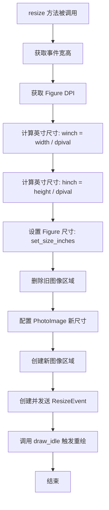

#### 带注释源码

```python
def resize(self, event):
    """
    处理 Tkinter 窗口调整大小事件。
    
    当用户调整包含 Matplotlib 画布的 Tk 窗口大小时，Tk 会触发 <Configure> 事件，
    此方法响应事件并完成以下工作：
    1. 根据新像素尺寸计算 Figure 英寸尺寸
    2. 更新内部 PhotoImage 缓冲区大小
    3. 重新创建图像对象
    4. 触发 ResizeEvent 通知其他组件
    5. 调度延迟重绘
    """
    # 从事件对象中提取新的像素宽度和高度
    width, height = event.width, event.height

    # 计算 Figure 所需的英寸尺寸
    # dpival 是 Figure 的 DPI（每英寸像素数）
    # winch/hinch 表示在当前 DPI 下，显示 width/height 像素所需的英寸数
    dpival = self.figure.dpi
    winch = width / dpival
    hinch = height / dpival
    
    # 更新 Figure 的尺寸规格
    # forward=False 表示不立即推送尺寸变化到后端
    self.figure.set_size_inches(winch, hinch, forward=False)

    # 重建 Tk PhotoImage：
    # 1. 删除旧的图像项（释放资源）
    self._tkcanvas.delete(self._tkcanvas_image_region)
    
    # 2. 配置 PhotoImage 的新尺寸
    self._tkphoto.configure(width=int(width), height=int(height))
    
    # 3. 在画布中心重新创建图像对象
    self._tkcanvas_image_region = self._tkcanvas.create_image(
        int(width / 2), int(height / 2), image=self._tkphoto)
    
    # 发送 ResizeEvent 通知监听者（如工具栏、布局管理器等）
    ResizeEvent("resize_event", self)._process()
    
    # 调度延迟重绘（在 Tk 事件循环空闲时执行）
    # 这比立即重绘更高效，避免调整过程中的频繁重绘
    self.draw_idle()
```


### FigureCanvasTk.draw_idle

该方法用于在Tk事件循环空闲时延迟执行图形绘制，通过避免频繁重绘来优化性能。

参数：

- `self`：`FigureCanvasTk`，隐式参数，表示当前画布实例

返回值：`None`，无返回值

#### 流程图

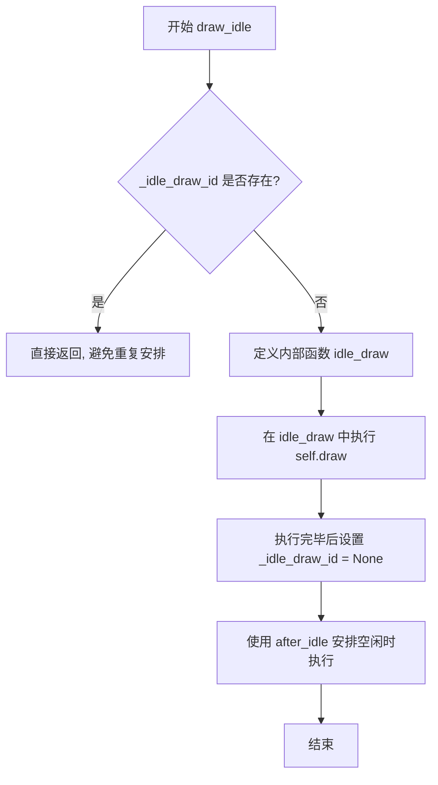

#### 带注释源码

```python
def draw_idle(self):
    # docstring inherited
    # 检查是否已经安排了空闲时绘制，避免重复安排
    if self._idle_draw_id:
        return

    # 定义内部绘制函数，在Tk空闲时执行
    def idle_draw(*args):
        try:
            # 执行实际的绘制操作
            self.draw()
        finally:
            # 无论绘制成功与否，都清除空闲绘制标志
            self._idle_draw_id = None

    # 使用Tk的after_idle方法安排在事件循环空闲时执行idle_draw
    # 这确保了不会在每次状态改变时立即重绘，而是等到Tk处理完其他事件后再绘制
    self._idle_draw_id = self._tkcanvas.after_idle(idle_draw)
```


### FigureCanvasTk.get_tk_widget

获取用于实现FigureCanvasTk的Tk部件。尽管初始实现使用了Tk画布，但此方法旨在隐藏这一实现细节。

参数：无

返回值：`tk.Canvas`，返回内部使用的Tkinter Canvas部件

#### 流程图

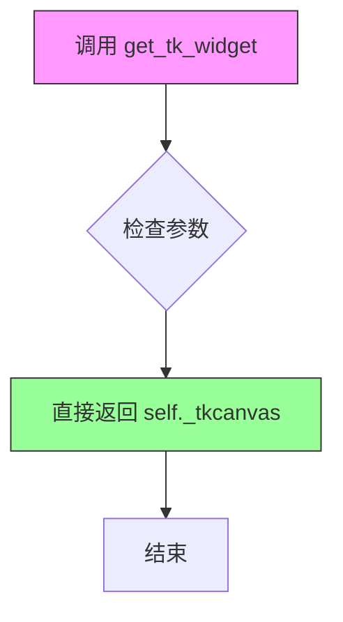

#### 带注释源码

```python
def get_tk_widget(self):
    """
    Return the Tk widget used to implement FigureCanvasTkAgg.

    Although the initial implementation uses a Tk canvas,  this routine
    is intended to hide that fact.
    """
    # 直接返回内部存储的Tk Canvas部件
    # _tkcanvas 在 __init__ 方法中创建：
    # self._tkcanvas = tk.Canvas(
    #     master=master, background="white",
    #     width=w, height=h, borderwidth=0, highlightthickness=0)
    return self._tkcanvas
```


### `FigureCanvasTk._event_mpl_coords`

该方法负责将Tkinter原生事件坐标（以窗口左上角为原点）转换为Matplotlib的图形坐标系统（以画布左下角为原点），通过调用Tkinter的`canvasx`/`canvasy`方法获取考虑滚动条偏移后的坐标，并对Y轴进行翻转处理以匹配Matplotlib的坐标系 convention。

参数：

- `self`：`FigureCanvasTk`，隐式的`self`参数，指向当前的`FigureCanvasTk`实例
- `event`：`tk.Event`，Tkinter事件对象，包含鼠标事件的`x`和`y`属性，表示事件发生位置的像素坐标

返回值：`tuple[float, float]`，返回转换后的Matplotlib坐标系中的(x, y)坐标元组，其中x为水平坐标，y为垂直坐标（以画布左下角为原点）

#### 流程图

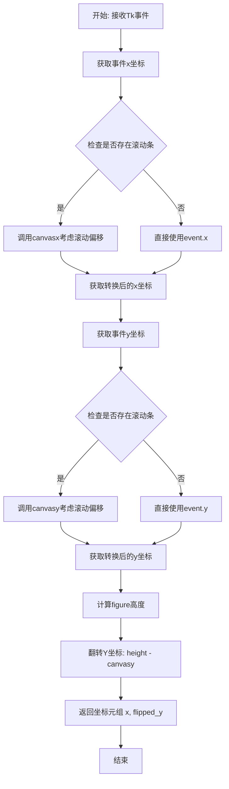

#### 带注释源码

```python
def _event_mpl_coords(self, event):
    """
    将Tkinter事件坐标转换为Matplotlib坐标。

    参数
    ----------
    event : tk.Event
        Tkinter事件对象，包含x和y属性，表示鼠标事件在Tk画布上的像素位置。

    返回值
    -------
    tuple[float, float]
        转换后的Matplotlib坐标系中的(x, y)坐标。
    """
    # 调用canvasx/canvasy允许考虑滚动条的影响（即窗口顶部可能已被滚动出视野）。
    # canvasx和canvasy是Tkinter Canvas的方法，它们将窗口坐标转换为画布坐标，
    # 考虑到画布的滚动位置（如果有滚动条的话）。
    return (
        # 水平坐标：直接使用canvasx转换event.x，处理可能的水平滚动
        self._tkcanvas.canvasx(event.x),
        # 翻转y坐标使y=0为画布底部（Matplotlib的坐标系 convention）
        # Matplotlib使用笛卡尔坐标系，y轴向上为正，而Tkinter Canvas
        # 使用屏幕坐标系，y轴向下为正，因此需要用figure高度减去y坐标进行翻转
        self.figure.bbox.height - self._tkcanvas.canvasy(event.y)
    )
```


### `FigureCanvasTk.motion_notify_event`

该方法处理Tkinter画布上的鼠标移动事件，将原生的Tkinter事件转换为Matplotlib的MouseEvent对象，并触发相应的事件处理流程。

参数：

- `self`：FigureCanvasTk，当前FigureCanvasTk实例
- `event`：`tk.Event`，Tkinter鼠标移动事件对象，包含鼠标在画布上的坐标(x, y)、按键状态(state)等信息

返回值：`None`，该方法不返回任何值，仅通过创建MouseEvent对象并调用其_process方法触发后续事件处理

#### 流程图

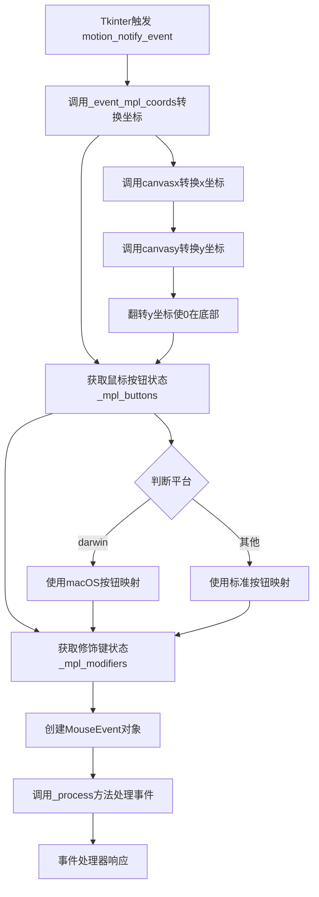

#### 带注释源码

```python
def motion_notify_event(self, event):
    """
    处理鼠标移动事件。
    
    参数:
        event: Tkinter事件对象，包含鼠标移动时的坐标和状态信息
               event.x, event.y - 鼠标在画布上的相对坐标
               event.state - 表示当前按下的修饰键和鼠标按钮的状态
    """
    # 创建MouseEvent对象并处理
    # 参数说明:
    # - "motion_notify_event": 事件类型名称
    # - self: 当前画布实例
    # - *self._event_mpl_coords(event): 解包转换后的matplotlib坐标
    #   (x坐标保持原样，y坐标翻转使0在底部)
    # - buttons=self._mpl_buttons(event): 当前按下的鼠标按钮
    # - modifiers=self._mpl_modifiers(event): 当前按下的修饰键
    # - guiEvent=event: 原始的Tkinter事件对象
    MouseEvent("motion_notify_event", self,
               *self._event_mpl_coords(event),
               buttons=self._mpl_buttons(event),
               modifiers=self._mpl_modifiers(event),
               guiEvent=event)._process()
```


### FigureCanvasTk.enter_notify_event

处理鼠标进入画布区域的事件，当鼠标光标从画布外部移动到内部时触发，创建并派发一个"figure_enter_event"位置事件。

参数：

- `event`：`tk.Event`，Tkinter 事件对象，包含鼠标进入时的坐标和状态信息

返回值：`None`，无返回值，该方法通过事件处理机制完成功能

#### 流程图

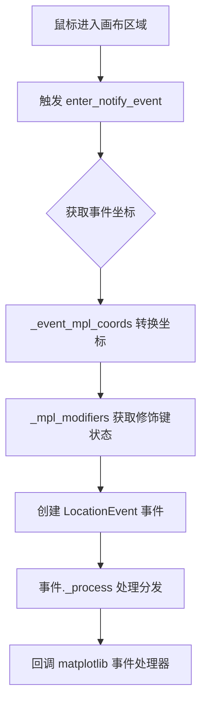

#### 带注释源码

```python
def enter_notify_event(self, event):
    """
    鼠标进入事件处理函数。
    
    Parameters
    ----------
    event : tk.Event
        Tkinter 事件对象，包含以下关键属性：
        - event.x, event.y: 鼠标在画布中的坐标
        - event.state: 修饰键状态（Shift、Ctrl等）
        - event.widget: 触发事件的 widget 引用
    
    Returns
    -------
    None
        该方法不返回值，通过 LocationEvent._process() 内部处理
    """
    # 创建位置事件 "figure_enter_event"
    # 参数说明：
    #   "figure_enter_event": 事件类型名称
    #   self: 事件所属的 canvas 对象
    #   *self._event_mpl_coords(event): 展开转换后的 matplotlib 坐标
    #       - 将 tk 坐标转换为 matplotlib 坐标（y 轴翻转）
    #       - 考虑滚动条位置进行偏移
    #   modifiers=self._mpl_modifiers(event): 获取键盘修饰键状态
    #       - 返回如 ['ctrl', 'shift'] 等修饰键列表
    #   guiEvent=event: 保留原始 Tkinter 事件对象
    LocationEvent("figure_enter_event", self,
                  *self._event_mpl_coords(event),
                  modifiers=self._mpl_modifiers(event),
                  guiEvent=event)._process()
```


### `FigureCanvasTk.leave_notify_event`

该方法处理鼠标离开matplotlib Tkinter画布区域的事件，将Tk的事件转换为matplotlib的LocationEvent并分发到事件处理系统。

参数：

- `self`：`FigureCanvasTk`，方法所属的画布实例
- `event`：`tk.Event`，Tkinter鼠标离开事件对象，包含鼠标坐标和状态信息

返回值：`None`，该方法直接处理事件，不返回任何值

#### 流程图

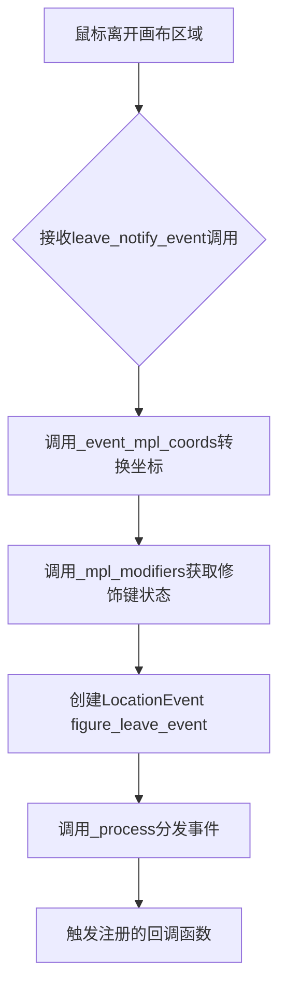

#### 带注释源码

```python
def leave_notify_event(self, event):
    """
    处理鼠标离开画布的事件。
    
    当鼠标指针从画布区域移出时，Tkinter触发<Leave>事件，
    该方法将其转换为matplotlib的LocationEvent并分发。
    
    参数:
        event: Tkinter的Event对象，包含以下属性：
            - event.x: 鼠标相对于画布的x坐标
            - event.y: 鼠标相对于画布的y坐标
            - event.state: 修饰键状态（Shift、Ctrl等）
    
    返回值:
        None
    """
    # 创建位置事件"figure_leave_event"，标识鼠标离开 figure 区域
    # _event_mpl_coords 将 Tk 坐标转换为 matplotlib 坐标系统
    # _mpl_modifiers 获取当前按下的修饰键（Shift、Ctrl、Alt等）
    # guiEvent 保留原始的 Tkinter 事件对象供后续处理
    LocationEvent("figure_leave_event", self,
                  *self._event_mpl_coords(event),          # 转换后的matplotlib坐标
                  modifiers=self._mpl_modifiers(event),     # 修饰键状态列表
                  guiEvent=event)._process()                # 触发事件处理回调
```


### `FigureCanvasTk.button_press_event`

处理 Tkinter 鼠标按钮按下事件，将 Tkinter 的鼠标事件转换为 Matplotlib 的 MouseEvent 并分发给相应的回调函数处理。

参数：

- `self`：`FigureCanvasTk`，FigureCanvasTk 实例，隐式参数，表示当前画布对象
- `event`：`tkinter.Event`，Tkinter 鼠标事件对象，包含鼠标事件的详细信息（如坐标、按钮编号等）
- `dblclick`：`bool`，可选参数，默认为 False，表示是否为双击事件（True 表示双击，False 表示单击）

返回值：`None`，该方法不返回任何值，通过创建 MouseEvent 对象并调用其 `_process()` 方法来处理事件

#### 流程图

```mermaid
flowchart TD
    A[开始 button_press_event] --> B[设置画布焦点: self._tkcanvas.focus_set]
    B --> C{判断平台是否为 macOS}
    C -->|是| D[反转按钮编号: 2↔3]
    C -->|否| E[保持原按钮编号]
    D --> F
    E --> F[获取事件坐标: self._event_mpl_coords(event)]
    F --> G[获取修饰键: self._mpl_modifiers(event)]
    G --> H[创建 MouseEvent 对象]
    H --> I[调用 MouseEvent._process 处理事件]
    I --> J[结束]
```

#### 带注释源码

```python
def button_press_event(self, event, dblclick=False):
    """
    处理鼠标按钮按下事件。
    
    Parameters
    ----------
    event : tkinter.Event
        Tkinter 鼠标事件对象。
    dblclick : bool, optional
        是否为双击事件，默认为 False。
    """
    # 设置画布焦点，使其可以接收键盘事件
    self._tkcanvas.focus_set()

    # 获取鼠标按钮编号
    num = getattr(event, 'num', None)
    # macOS 平台上按钮 2 和 3 是反的，需要调整
    if sys.platform == 'darwin':  # 2 and 3 are reversed.
        num = {2: 3, 3: 2}.get(num, num)
    
    # 创建 MouseEvent 对象并处理
    # event.name: 事件名称 "button_press_event"
    # self: 画布实例
    # *self._event_mpl_coords(event): 转换为 Matplotlib 坐标系的 x, y
    # num: 鼠标按钮编号
    # dblclick: 是否为双击
    # modifiers: 修饰键状态（如 Ctrl, Alt, Shift 等）
    # guiEvent: 原始的 Tkinter 事件对象
    MouseEvent("button_press_event", self,
               *self._event_mpl_coords(event), num, dblclick=dblclick,
               modifiers=self._mpl_modifiers(event),
               guiEvent=event)._process()
```


### FigureCanvasTk.button_dblclick_event

该方法处理Tkinter画布上的鼠标双击事件，通过调用`button_press_event`方法并将`dblclick`参数设置为`True`来生成双击鼠标事件。

参数：

- `self`：`FigureCanvasTk`，方法所属的画布实例
- `event`：`tk.Event`，Tkinter事件对象，包含鼠标双击的原生事件数据（如坐标、按钮编号等）

返回值：`None`，该方法无显式返回值，内部通过调用`button_press_event`处理事件

#### 流程图

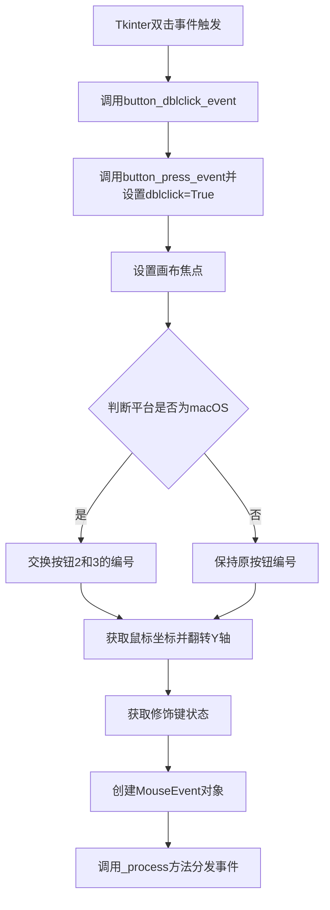

#### 带注释源码

```python
def button_dblclick_event(self, event):
    """
    处理鼠标双击事件。
    
    Parameters
    ----------
    event : tk.Event
        Tkinter事件对象，包含双击的鼠标信息
    """
    # 委托给button_press_event处理，dblclick=True表示这是双击事件
    self.button_press_event(event, dblclick=True)
```


### FigureCanvasTk.button_release_event

处理鼠标按钮释放事件的回调函数。当用户在画布上释放鼠标按钮时，Tkinter 调用此方法，该方法将 Tkinter 事件转换为 Matplotlib 的 MouseEvent 并进行处理。

参数：

- `self`：FigureCanvasTk 实例，当前画布对象
- `event`：tk.Event，Tkinter 事件对象，包含鼠标释放时的坐标、按钮编号等信息

返回值：`None`，无返回值。该方法通过创建并处理 MouseEvent 对象来触发相应的回调，不返回任何值。

#### 流程图

```mermaid
flowchart TD
    A[开始: button_release_event] --> B[获取event.num按钮编号]
    B --> C{判断是否为macOS系统}
    C -->|是| D[交换按钮2和3的编号]
    C -->|否| E[保持原编号不变]
    D --> F[调用_event_mpl_coords转换坐标]
    E --> F
    F --> G[获取修饰键状态_modifiers]
    G --> H[创建MouseEvent对象]
    H --> I[调用_process处理事件]
    I --> J[结束]
```

#### 带注释源码

```python
def button_release_event(self, event):
    """
    处理鼠标按钮释放事件的回调函数。
    
    当用户在画布上释放鼠标按钮时，Tkinter 会调用此方法。
    该方法将 Tkinter 原生事件转换为 Matplotlib 的 MouseEvent 对象，
    并通过 _process() 方法触发相应的回调函数。
    
    参数:
        event: Tkinter 的 Event 对象，包含以下属性:
            - x, y: 相对于画布的坐标
            - num: 释放的按钮编号 (1=左键, 2=中键, 3=右键)
            - state: 修饰键状态
    """
    # 从 Tkinter 事件中获取释放的按钮编号
    # event.num 表示哪个鼠标按钮被释放
    num = getattr(event, 'num', None)
    
    # 在 macOS 系统上，Tkinter 报告的按钮编号 2 和 3 是相反的
    # 这里进行修正，使其与其他平台一致
    if sys.platform == 'darwin':  # 2 and 3 are reversed.
        num = {2: 3, 3: 2}.get(num, num)
    
    # 创建 MouseEvent 对象，参数包括:
    # - 事件类型名称: "button_release_event"
    # - 画布: self (FigureCanvasTk 实例)
    # - 坐标: 通过 _event_mpl_coords 转换后的坐标（考虑滚动条和Y轴翻转）
    # - num: 鼠标按钮编号
    # - modifiers: 修饰键状态（如 Ctrl, Shift, Alt 等）
    # - guiEvent: 原始的 Tkinter 事件对象
    MouseEvent("button_release_event", self,
               *self._event_mpl_coords(event), num,
               modifiers=self._mpl_modifiers(event),
               guiEvent=event)._process()
```

---

### 关联信息

#### 关键组件

| 组件名称 | 说明 |
|---------|------|
| FigureCanvasTk | Matplotlib 的 Tkinter 画布类，负责处理 Tkinter 事件并转换为 Matplotlib 事件 |
| MouseEvent | Matplotlib 的鼠标事件类，封装了鼠标事件的所有信息 |
| _event_mpl_coords | 将 Tkinter 坐标转换为 Matplotlib 坐标的辅助方法 |
| _mpl_modifiers | 从 Tkinter 事件中提取修饰键信息的静态方法 |

#### 设计说明

- **事件转换模式**: 该方法遵循"桥梁模式"，将 Tkinter 的原生事件对象转换为 Matplotlib 抽象的 MouseEvent 对象
- **跨平台兼容**: 通过 `sys.platform` 判断处理 macOS 上按钮编号不兼容的问题
- **坐标系统**: 使用 `_event_mpl_coords` 转换坐标，处理了 Tkinter 画布可能的滚动条偏移，以及将 Y 轴翻转（Matplotlib 中 Y=0 在底部）


### `FigureCanvasTk.scroll_event`

该方法用于处理 Linux 平台上的鼠标滚轮滚动事件，将 Tkinter 的滚轮事件转换为 Matplotlib 的 `MouseEvent` 事件并分发处理。

参数：

- `event`：`tk.Event`，Tkinter 事件对象，包含鼠标滚轮事件的所有信息（如 `num` 字段表示滚轮方向）

返回值：`None`，该方法不返回任何值，仅通过创建并处理 `MouseEvent` 对象来触发滚动事件处理流程

#### 流程图

```mermaid
flowchart TD
    A[接收 scroll_event 事件] --> B[获取 event.num 属性]
    B --> C{判断 num 值}
    C -->|num == 4| D[step = 1 表示向上滚动]
    C -->|num == 5| E[step = -1 表示向下滚动]
    C -->|其他| F[step = 0 无滚动]
    D --> G[调用 _event_mpl_coords 获取画布坐标]
    E --> G
    F --> G
    G --> H[调用 _mpl_modifiers 获取修饰键状态]
    H --> I[创建 MouseEvent 对象 'scroll_event']
    I --> J[调用 _process() 分发事件]
    J --> K[结束]
```

#### 带注释源码

```python
def scroll_event(self, event):
    """
    处理 Linux 平台上的鼠标滚轮滚动事件。

    该方法将 Tkinter 的滚轮事件转换为 Matplotlib 的 MouseEvent 事件。
    在 Linux 上，滚轮向上滚动触发 Button-4 事件，向下滚动触发 Button-5 事件。
    """
    # 从事件对象中获取滚轮按钮编号
    # Linux 上：num=4 表示滚轮向上滚动，num=5 表示滚轮向下滚动
    num = getattr(event, 'num', None)

    # 根据按钮编号确定滚动方向和步长
    # step=1 表示向上滚动（放大），step=-1 表示向下滚动（缩小）
    # step=0 表示无效滚动
    step = 1 if num == 4 else -1 if num == 5 else 0

    # 创建并分发鼠标滚动事件
    # _event_mpl_coords: 将 Tkinter 坐标转换为 Matplotlib 坐标系统
    # _mpl_modifiers: 获取当前按下的修饰键（Ctrl、Alt、Shift 等）
    # guiEvent: 保留原始的 Tkinter 事件对象
    MouseEvent("scroll_event", self,
               *self._event_mpl_coords(event), step=step,
               modifiers=self._mpl_modifiers(event),
               guiEvent=event)._process()
```


### FigureCanvasTk.scroll_event_windows

该方法是 `FigureCanvasTk` 类的成员方法，用于处理 Windows 平台上的鼠标滚轮（MouseWheel）事件。它检测鼠标是否在画布区域内，计算相对于画布的坐标，并将滚轮事件转换为 Matplotlib 的 `MouseEvent` 进行处理。

参数：

- `self`：`FigureCanvasTk`，隐式参数，表示方法所属的画布实例
- `event`：`tkinter.Event`，Tkinter 事件对象，包含鼠标滚轮事件的详细信息（如 `widget`、`x_root`、`y_root`、`delta` 等）

返回值：`None`，该方法不返回任何值，只是处理并触发 `MouseEvent` 事件

#### 流程图

```mermaid
flowchart TD
    A[开始: scroll_event_windows] --> B{检测鼠标位置}
    B --> C[获取鼠标所在窗口]
    C --> D{窗口是否等于画布}
    D -->|否| E[直接返回，不处理]
    D -->|是| F[计算画布坐标]
    F --> G[计算X坐标: canvasx]
    G --> H[计算Y坐标: canvasy并翻转]
    H --> I[计算滚轮步进值: delta / 120]
    I --> J[创建MouseEvent]
    J --> K[处理事件: _process]
    K --> L[结束]
    E --> L
```

#### 带注释源码

```python
def scroll_event_windows(self, event):
    """MouseWheel event processor"""
    # 获取鼠标当前所在的窗口组件
    w = event.widget.winfo_containing(event.x_root, event.y_root)
    
    # 如果鼠标不在画布上，直接返回，不处理该事件
    if w != self._tkcanvas:
        return
    
    # 计算鼠标在画布内的X坐标
    # canvasx 将屏幕坐标转换为画布坐标（考虑滚动条偏移）
    x = self._tkcanvas.canvasx(event.x_root - w.winfo_rootx())
    
    # 计算鼠标在画布内的Y坐标
    # 注意：Y轴需要翻转，因为Tkinter的Y轴原点在左上角，
    # 而Matplotlib的Y轴原点在左下角
    y = (self.figure.bbox.height
         - self._tkcanvas.canvasy(event.y_root - w.winfo_rooty()))
    
    # 计算滚轮步进值
    # Windows的delta值通常为120的倍数，除以120得到标准化的步进值
    step = event.delta / 120
    
    # 创建并处理鼠标滚动事件
    MouseEvent("scroll_event", self,
               x, y, step=step, modifiers=self._mpl_modifiers(event),
               guiEvent=event)._process()
```


### FigureCanvasTk._mpl_buttons

该方法是一个静态工具函数，用于将 Tkinter 鼠标事件中的按钮状态转换为 Matplotlib 的 MouseButton 枚举列表。它根据不同操作系统（特别是 macOS 的按钮交换行为）构建按钮位掩码，并通过位运算检测事件发生前按下的鼠标按钮。

参数：

- `event`：`tkinter.Event`，Tkinter 事件对象，包含 `state` 属性表示事件发生时的修饰键和按钮状态

返回值：`list[MouseButton]`，返回当前按下的鼠标按钮列表（MouseButton 枚举值），可能包含 LEFT、RIGHT、MIDDLE、BACK、FORWARD 等按钮

#### 流程图

```mermaid
flowchart TD
    A[开始 _mpl_buttons] --> B{判断操作系统平台}
    B -->|macOS (darwin)| C[构建 macOS 按钮掩码列表<br/>LEFT: 1<<8, RIGHT: 1<<9, MIDDLE: 1<<10<br/>BACK: 1<<11, FORWARD: 1<<12]
    B -->|其他系统| D[构建标准按钮掩码列表<br/>LEFT: 1<<8, MIDDLE: 1<<9, RIGHT: 1<<10<br/>BACK: 1<<11, FORWARD: 1<<12]
    C --> E[遍历按钮掩码列表]
    D --> E
    E --> F{event.state & mask != 0?}
    F -->|是| G[将该按钮添加到结果列表]
    F -->|否| H[跳过该按钮]
    G --> I{还有更多按钮?}
    H --> I
    I -->|是| E
    I -->|否| J[返回按钮列表]
```

#### 带注释源码

```python
@staticmethod
def _mpl_buttons(event):  # See _mpl_modifiers.
    """
    将 Tkinter 鼠标事件状态转换为 Matplotlib MouseButton 列表。
    
    注意：在 macOS 上无法正确报告多次点击，只能报告一个按钮。
    Linux 和 Windows 上的多次点击正常工作。
    """
    # 根据操作系统平台定义按钮与位掩码的映射关系
    # macOS 上右键和中键是交换的（参考 tk/macosx/tkMacOSXMouseEvent.c）
    modifiers = [
        (MouseButton.LEFT, 1 << 8),      # 左键对应掩码 256
        (MouseButton.RIGHT, 1 << 9),     # 右键对应掩码 512 (macOS)
        (MouseButton.MIDDLE, 1 << 10),   # 中键对应掩码 1024 (macOS)
        (MouseButton.BACK, 1 << 11),     # 前进按钮对应掩码 2048
        (MouseButton.FORWARD, 1 << 12),  # 后退按钮对应掩码 4096
    ] if sys.platform == "darwin" else [
        # 标准映射：Linux 和 Windows
        (MouseButton.LEFT, 1 << 8),      # 左键对应掩码 256
        (MouseButton.MIDDLE, 1 << 9),   # 中键对应掩码 512
        (MouseButton.RIGHT, 1 << 10),    # 右键对应掩码 1024
        (MouseButton.BACK, 1 << 11),     # 前进按钮对应掩码 2048
        (MouseButton.FORWARD, 1 << 12), # 后退按钮对应掩码 4096
    ]
    # 返回事件状态 *按下* 的按钮（state 表示按下/释放之前的状态）
    return [name for name, mask in modifiers if event.state & mask]
```


### `FigureCanvasTk._mpl_modifiers`

获取修饰键状态，将 Tk 事件中的修饰键（如 Ctrl、Alt、Shift 等）转换为 Matplotlib 使用的修饰键名称列表。

参数：

- `event`：`tkinter.Event`，Tk 事件对象，包含事件状态信息
- `exclude`：`str | None`（可选，关键字参数），需要排除的修饰键名称

返回值：`list[str]`，返回激活的修饰键名称列表（如 ["ctrl", "shift"]）

#### 流程图

```mermaid
flowchart TD
    A[开始 _mpl_modifiers] --> B{判断操作系统平台}
    B -->|win32| C[设置 Windows 修饰键映射: ctrl, alt, shift]
    B -->|darwin| D[设置 macOS 修饰键映射: ctrl, alt, shift, cmd]
    B -->|linux| E[设置 Linux 修饰键映射: ctrl, alt, shift, super]
    C --> F[遍历修饰键映射]
    D --> F
    E --> F
    F --> G{event.state & mask 且 exclude != key?}
    G -->|是| H[将 name 添加到结果列表]
    G -->|否| I[跳过]
    H --> J{还有更多修饰键?}
    I --> J
    J -->|是| F
    J -->|否| K[返回结果列表]
```

#### 带注释源码

```python
@staticmethod
def _mpl_modifiers(event, *, exclude=None):
    """
    获取修饰键状态，将 Tk 事件中的修饰键转换为 Matplotlib 修饰键名称列表。
    
    参数:
        event: Tk 事件对象，包含事件状态信息
        exclude: 可选关键字参数，指定要排除的修饰键名称
    
    返回:
        激活的修饰键名称列表
    """
    # 修饰键位值从 tkinter.Event.__repr__ 的实现中推断
    # 位值说明: 1=Shift, 2=Lock, 4=Control, 8=Mod1, ... (Mod5, Button1, ..., Button5)
    # 注意: 修饰键通常不包含在修饰键标志中，但 macOS (darwin) 除外
    # 需要检查不会重复添加修饰键标志到修饰键本身
    
    # 根据不同操作系统平台定义不同的修饰键映射
    # 每个元组: (修饰键名称, 位掩码, 键名)
    modifiers = [
        ("ctrl", 1 << 2, "control"),    # Ctrl: 位2
        ("alt", 1 << 17, "alt"),         # Alt: 位17 (Windows 特定)
        ("shift", 1 << 0, "shift"),      # Shift: 位0
    ] if sys.platform == "win32" else [
        ("ctrl", 1 << 2, "control"),    # Ctrl: 位2
        ("alt", 1 << 4, "alt"),          # Alt: 位4 (macOS 特定)
        ("shift", 1 << 0, "shift"),     # Shift: 位0
        ("cmd", 1 << 3, "cmd"),         # Command 键: 位3 (macOS 专有)
    ] if sys.platform == "darwin" else [
        ("ctrl", 1 << 2, "control"),    # Ctrl: 位2
        ("alt", 1 << 3, "alt"),         # Alt: 位3 (Linux 特定)
        ("shift", 1 << 0, "shift"),     # Shift: 位0
        ("super", 1 << 6, "super"),    # Super/Win 键: 位6 (Linux 专有)
    ]
    
    # 遍历修饰键映射，筛选出激活的修饰键
    # 条件: event.state 与掩码相与结果非0（修饰键被按下）且不是需要排除的键
    return [name for name, mask, key in modifiers
            if event.state & mask and exclude != key]
```


### `FigureCanvasTk._get_key`

该方法负责将Tkinter键盘事件转换为Matplotlib的键值字符串，处理字符键和修饰键（如Ctrl、Alt、Shift等），并返回格式化的键名字符串。

参数：

- `self`：`FigureCanvasTk`实例，当前画布对象
- `event`：`tk.Event`，Tkinter键盘事件对象，包含`char`（字符）和`keysym`（键符号）等属性

返回值：`str | None`，返回格式化后的键值字符串（如"ctrl+c"），如果无法转换则返回`None`

#### 流程图

```mermaid
flowchart TD
    A[开始: _get_key] --> B[获取event.char作为unikey]
    B --> C[调用cbook._unikey_or_keysym_to_mplkey转换键值]
    C --> D{key是否为None?}
    D -->|是| E[返回None]
    D -->|否| F[调用self._mpl_modifiers获取修饰键]
    F --> G{shift在mods中且unikey存在?}
    G -->|是| H[从mods中移除shift]
    G -->|否| I[保持mods不变]
    H --> J[拼接mods和key为字符串]
    I --> J
    J --> K[返回格式化键值字符串]
```

#### 带注释源码

```python
def _get_key(self, event):
    """
    将Tkinter键盘事件转换为Matplotlib键值字符串。
    
    参数:
        event: Tkinter键盘事件对象，包含char和keysym属性
        
    返回:
        格式化后的键值字符串（如'ctrl+a'），无法转换时返回None
    """
    # 获取键盘事件的字符表示
    unikey = event.char
    
    # 使用cbook工具函数将Unicode字符或键符号转换为Matplotlib键值
    key = cbook._unikey_or_keysym_to_mplkey(unikey, event.keysym)
    
    # 如果无法转换为有效键值，直接返回None
    if key is not None:
        # 获取修饰键列表（Ctrl、Alt、Shift等），排除与key冲突的修饰键
        mods = self._mpl_modifiers(event, exclude=key)
        
        # 如果shift已在修饰键中且unikey存在（表示Shift已被自动处理），
        # 则从修饰键列表中移除shift，避免重复
        if "shift" in mods and unikey:
            mods.remove("shift")
        
        # 将修饰键和主键用'+'连接，形成标准化的键值表示
        return "+".join([*mods, key])
```


### `FigureCanvasTk.key_press`

该方法处理 Tkinter 画布上的键盘按键事件，将原生 Tk 事件转换为 Matplotlib 的 `KeyEvent` 并通过事件处理系统分发。

参数：

- `self`：`FigureCanvasTk`，FigureCanvasTk 实例本身
- `event`：`tk.Event`，Tkinter 事件对象，包含按键信息（如 `char`、`keysym`、`state` 等）

返回值：`None`，无返回值，仅通过事件处理系统的 `_process()` 方法分发事件

#### 流程图

```mermaid
flowchart TD
    A[Tkinter 键盘按下事件触发] --> B[调用 _get_key 方法获取 Matplotlib 键名]
    B --> C[调用 _event_mpl_coords 方法获取画布坐标]
    C --> D[创建 KeyEvent 事件对象]
    D --> E[调用 _process 方法分发事件]
    E --> F[事件被监听器接收处理]
```

#### 带注释源码

```python
def key_press(self, event):
    """
    处理键盘按下事件。
    
    参数:
        event: Tkinter 事件对象，包含按键的字符、键名和修饰符状态
    """
    # 使用 _get_key 方法将 Tkinter 事件中的按键信息转换为 Matplotlib 格式的键名
    # _get_key 会处理字符转换、修饰符组合（如 Ctrl+C -> 'ctrl+c'）
    # 并返回标准的 Matplotlib 键名字符串
    key = self._get_key(event)
    
    # _event_mpl_coords 将 Tk 画布坐标转换为 Matplotlib 坐标系统
    # canvasx/canvasy 考虑了滚动条的影响
    # y 坐标需要翻转（因为 Matplotlib 中 y=0 在底部）
    coords = self._event_mpl_coords(event)
    
    # 创建 KeyEvent 事件对象
    # 参数: 事件类型 'key_press_event', 画布实例, 键名, x 坐标, y 坐标, guiEvent=原始 Tk 事件
    KeyEvent("key_press_event", self,
             key, *coords,
             guiEvent=event)._process()
    
    # _process() 方法会调用所有注册在该事件上的回调函数
    # 例如: figure.canvas.mpl_connect('key_press_event', callback)
```


### `FigureCanvasTk.key_release`

处理键盘释放事件，将 Tkinter 的键盘释放事件转换为 Matplotlib 的 `KeyEvent` 并分发给注册的回调函数。

参数：

- `event`：`tkinter.Event`，Tkinter 键盘事件对象，包含按键的字符、键符号和状态信息

返回值：`None`，无返回值，该方法通过创建并处理 `KeyEvent` 对象来实现功能

#### 流程图

```mermaid
flowchart TD
    A[Tkinter 键盘释放事件触发] --> B[调用 _get_key 获取按键名称]
    B --> C[调用 _event_mpl_coords 获取画布坐标]
    C --> D[创建 KeyEvent 事件对象]
    D --> E[调用 _process 分发事件]
    E --> F[执行注册的回调函数]
```

#### 带注释源码

```python
def key_release(self, event):
    """
    处理键盘释放事件。
    
    Parameters
    ----------
    event : tkinter.Event
        Tkinter 键盘事件对象，包含以下属性：
        - char: 字符形式表示的按键
        - keysym: 按键的符号名称
        - state: 修饰键状态位
        - x, y: 鼠标相对于事件产生widget的坐标
    """
    # 创建 KeyEvent 事件对象，事件类型为 "key_release_event"
    # self._get_key(event) 将 Tkinter 按键转换为 Matplotlib 格式的键名
    # *self._event_mpl_coords(event) 展开转换为画布坐标（考虑翻转的 Y 轴）
    # guiEvent=event 保留原始的 Tkinter 事件对象
    KeyEvent("key_release_event", self,
             self._get_key(event), *self._event_mpl_coords(event),
             guiEvent=event)._process()
```


### FigureCanvasTk.new_timer

创建一个新的定时器实例，用于在Tkinter后端中触发定时事件（如动画、交互更新等）。

参数：

- `*args`：可变位置参数，传递给 TimerTk 构造函数的额外位置参数
- `**kwargs`：可变关键字参数，传递给 TimerTk 构造函数的额外关键字参数

返回值：`TimerTk`，返回一个新创建的 TimerTk 定时器实例，用于管理 Tkinter 环境下的定时事件

#### 流程图

```mermaid
flowchart TD
    A[开始创建定时器] --> B{检查参数}
    B -->|传递args和kwargs| C[创建TimerTk实例]
    C --> D[传入self._tkcanvas作为父对象]
    D --> E[返回TimerTk实例]
    E --> F[调用者可以使用返回的定时器进行动画或定时任务]
```

#### 带注释源码

```python
def new_timer(self, *args, **kwargs):
    # docstring inherited
    # 创建一个新的 TimerTk 定时器实例
    # 参数:
    #   self: FigureCanvasTk 实例引用
    #   *args: 可变位置参数,传递给 TimerTk 构造函数
    #   **kwargs: 可变关键字参数,传递给 TimerTk 构造函数
    # 返回值:
    #   TimerTk: 新创建的定时器实例
    return TimerTk(self._tkcanvas, *args, **kwargs)
```


### `FigureCanvasTk.flush_events`

刷新 Tkinter 事件队列，确保所有待处理的 GUI 事件被及时处理。该方法继承自 `FigureCanvasBase`，在 Tk 后端实现中通过调用 Tk Canvas 的 `update()` 方法来强制处理所有等待中的事件。

参数：

- 无（仅包含隐式参数 `self`）

返回值：`None`，无返回值

#### 流程图

```mermaid
flowchart TD
    A[开始 flush_events] --> B{检查是否有待处理事件}
    B -->|有| C[调用 self._tkcanvas.update 处理所有事件]
    B -->|无| D[直接返回]
    C --> D
    D --> E[结束方法]
```

#### 带注释源码

```python
def flush_events(self):
    """
    Flush pending events in the Tk event queue.
    
    This method overrides the inherited flush_events from FigureCanvasBase
    to provide Tk-specific event handling. It forces Tk to process all
    pending events that are waiting in the event queue, ensuring the
    GUI remains responsive.
    """
    # docstring inherited
    # 调用 Tk Canvas 的 update() 方法来处理所有待处理的 Tk 事件
    # 这会立即处理所有等待中的事件，包括重绘、鼠标事件、键盘事件等
    # 注意：频繁调用可能会影响性能，因为它会立即处理所有事件
    self._tkcanvas.update()
```


### FigureCanvasTk.start_event_loop

启动Tk事件循环，用于处理GUI事件。如果指定了timeout参数，则在超时后自动停止事件循环。

参数：

- `self`：FigureCanvasTk，隐式的Canvas实例引用
- `timeout`：`float`，超时时间（秒），默认为0。当timeout大于0时，事件循环会在指定时间后自动退出；为0时表示无限等待（阻塞直到手动停止）

返回值：`None`，无返回值描述

#### 流程图

```mermaid
flowchart TD
    A[开始 start_event_loop] --> B{timeout > 0?}
    B -->|是| C{timeout > 0毫秒?}
    B -->|否| H[直接进入主事件循环]
    C -->|是| D[计算毫秒数: milliseconds = int(1000 * timeout)]
    C -->|否| E[使用after_idle调度停止事件]
    D --> F[使用after调度在指定毫秒后停止事件]
    F --> G[进入mainloop主事件循环]
    E --> G
    H --> G
    G --> I[事件循环结束]
```

#### 带注释源码

```python
def start_event_loop(self, timeout=0):
    # docstring inherited
    # 检查是否设置了超时时间
    if timeout > 0:
        # 将秒转换为毫秒
        milliseconds = int(1000 * timeout)
        if milliseconds > 0:
            # 使用Tk的after方法在指定毫秒数后调度stop_event_loop调用
            self._event_loop_id = self._tkcanvas.after(
                milliseconds, self.stop_event_loop)
        else:
            # 如果毫秒数为0，使用after_idle在空闲时调度（立即执行）
            self._event_loop_id = self._tkcanvas.after_idle(
                self.stop_event_loop)
    # 启动Tk主事件循环，这会阻塞直到调用stop_event_loop或窗口关闭
    self._tkcanvas.mainloop()
```


### `FigureCanvasTk.stop_event_loop`

停止 Tkinter 事件循环，取消待处理的事件循环定时器并退出主循环。

参数：  
无

返回值：`None`，无返回值描述

#### 流程图

```mermaid
flowchart TD
    A[开始 stop_event_loop] --> B{检查 _event_loop_id 是否存在}
    B -->|存在| C[调用 after_cancel 取消定时器]
    C --> D[将 _event_loop_id 设置为 None]
    B -->|不存在| E[跳过取消定时器步骤]
    D --> F[调用 quit 退出主循环]
    E --> F
    F --> G[结束]
```

#### 带注释源码

```python
def stop_event_loop(self):
    # docstring inherited
    # 检查是否存在待处理的事件循环定时器ID
    if self._event_loop_id:
        # 取消已注册的未来某个时刻执行的回调（由 start_event_loop 设置）
        self._tkcanvas.after_cancel(self._event_loop_id)
        # 重置事件循环ID为None，表示当前没有待处理的循环
        self._event_loop_id = None
    # 调用 Tkinter 的 quit 方法退出 mainloop，使程序继续执行
    self._tkcanvas.quit()
```


### FigureCanvasTk.set_cursor

该方法用于设置 Tkinter 画布的光标类型，根据传入的光标类型从映射字典中获取对应的 Tkinter 光标名称，然后配置到底层 Tkinter Canvas 控件上。如果配置失败（例如光标名称无效），则静默处理异常。

参数：

- `cursor`：`cursors` 枚举类型，表示要设置的光标类型（如移动、指针、等待、调整大小等）

返回值：`None`，该方法没有返回值

#### 流程图

```mermaid
graph TD
    A[开始 set_cursor] --> B{尝试配置光标}
    B --> C[从 cursord 字典获取对应的 Tkinter 光标名称]
    C --> D[调用 _tkcanvas.configure cursor=光标名称]
    D --> E{是否抛出 TclError?}
    E -->|是| F[静默处理异常]
    E -->|否| G[配置成功]
    F --> H[结束]
    G --> H
```

#### 带注释源码

```python
def set_cursor(self, cursor):
    """
    设置 Tkinter 画布的光标类型。
    
    参数
    ----------
    cursor : cursors 枚举
        要设置的光标类型，来源于 matplotlib.backend_bases.cursors，
        例如 cursors.MOVE, cursors.HAND, cursors.POINTER 等。
    """
    try:
        # 使用 cursord 字典将 matplotlib 的光标类型映射为 Tkinter 的光标名称
        # 例如 cursors.MOVE -> "fleur", cursors.POINTER -> "arrow"
        self._tkcanvas.configure(cursor=cursord[cursor])
    except tkinter.TclError:
        # 如果光标名称无效或配置失败，静默处理异常
        # 这确保了无效的光标类型不会导致程序崩溃
        pass
```


### FigureManagerTk.__init__

初始化FigureManagerTk实例，管理Tk窗口、画布和DPI感知的设置，并标记图形为未显示状态。

参数：

- `canvas`：`FigureCanvas`，matplotlib的画布实例，用于在Tk窗口中渲染图形
- `num`：`int` 或 `str`，图形编号，用于标识和管理图形
- `window`：`tk.Window`，Tk窗口对象，承载画布和工具栏

返回值：`None`，无返回值

#### 流程图

```mermaid
flowchart TD
    A[开始 __init__] --> B[设置self.window]
    B --> C[调用父类初始化 super().__init__]
    C --> D[隐藏窗口 self.window.withdraw]
    D --> E[将canvas的_tkcanvas放入窗口 pack]
    E --> F[获取窗口帧号 window_frame]
    F --> G[创建IntVar存储DPI _window_dpi]
    G --> H{检查DPI感知是否启用}
    H -->|是| I[添加DPI跟踪回调 trace_add]
    H -->|否| J[跳过回调设置]
    I --> K[设置_shown为False]
    J --> K
    K --> L[结束 __init__]
```

#### 带注释源码

```python
def __init__(self, canvas, num, window):
    """
    初始化FigureManagerTk实例。

    参数:
        canvas: matplotlib的画布实例
        num: 图形编号
        window: Tk窗口对象
    """
    # 存储对Tk窗口的引用
    self.window = window
    
    # 调用父类FigureManagerBase的初始化方法
    super().__init__(canvas, num)
    
    # 初始隐藏窗口（在完全准备好之前）
    self.window.withdraw()
    
    # 将画布的Tk Canvas部件打包到窗口中
    # 先打包工具栏，因为空间不足时最后打包的部件会首先被收缩
    self.canvas._tkcanvas.pack(side=tk.TOP, fill=tk.BOTH, expand=1)

    # 如果窗口支持每监视器DPI感知，则设置一个Tk变量来存储DPI
    # 该变量将由C代码更新，回调将在Python端处理DPI变化
    window_frame = int(window.wm_frame(), 16)  # 获取窗口帧号（十六进制转十进制）
    
    # 创建IntVar用于存储DPI值，默认为96
    self._window_dpi = tk.IntVar(master=window, value=96,
                                 name=f'window_dpi{window_frame}')
    self._window_dpi_cbname = ''  # 存储回调名称（用于后续移除）
    
    # 尝试启用DPI感知，如果成功则添加写回调以跟踪DPI变化
    if _tkagg.enable_dpi_awareness(window_frame, window.tk.interpaddr()):
        self._window_dpi_cbname = self._window_dpi.trace_add(
            'write', self._update_window_dpi)

    # 标记图形尚未显示（show方法首次调用时需要完整初始化）
    self._shown = False
```


### FigureManagerTk.create_with_canvas

该方法是 FigureManagerTk 类的类方法，用于创建带画布的图形管理器。它负责初始化 Tk 窗口、加载 Matplotlib 图标、创建画布实例，并返回配置好的管理器对象。

参数：

- `cls`：类型（隐式参数，类方法本身），表示 FigureManagerTk 类本身
- `canvas_class`：type 类型，一个继承自 FigureCanvasBase 的画布类，用于创建图形画布
- `figure`：Figure 对象，Matplotlib 的图形对象，表示要显示的图形
- `num`：int 或 str 类型，图形编号，用于标识和管理图形实例

返回值：`FigureManagerTk`，返回创建的图形管理器实例，包含配置好的画布和 Tk 窗口

#### 流程图

```mermaid
flowchart TD
    A[开始] --> B[使用 _restore_foreground_window_at_end 上下文管理器]
    B --> C{检查交互式框架是否已运行}
    C -->|否| D[调用 cbook._setup_new_guiapp 设置新 GUI 应用]
    D --> E[调用 _c_internal_utils.Win32_SetProcessDpiAwareness_max 设置 DPI 感知]
    C -->|是| F[继续]
    E --> F
    F --> G[创建 Tk 窗口 - tk.Tk className='matplotlib']
    G --> H[隐藏窗口 - window.withdraw]
    H --> I[获取 Matplotlib 小图标路径]
    I --> J[创建小图标 PhotoImage]
    J --> K[获取 Matplotlib 大图标路径]
    K --> L[创建大图标 PhotoImage]
    L --> M[设置窗口图标 - window.iconphoto]
    M --> N[使用 canvas_class 创建画布实例]
    N --> O[创建 FigureManagerTk 管理器实例]
    O --> P{检查是否为交互模式}
    P -->|是| Q[调用 manager.show 显示窗口]
    Q --> R[调用 canvas.draw_idle 刷新画布]
    P -->|否| S[返回管理器实例]
    R --> S
    S --> T[结束]
```

#### 带注释源码

```python
@classmethod
def create_with_canvas(cls, canvas_class, figure, num):
    """
    类方法：创建带画布的图形管理器

    参数:
        canvas_class: 画布类（继承自 FigureCanvasBase）
        figure: Matplotlib 的 Figure 对象
        num: 图形编号
    返回:
        FigureManagerTk: 图形管理器实例
    """
    # 使用上下文管理器确保函数结束时恢复前台窗口
    with _restore_foreground_window_at_end():
        # 检查是否已有交互式框架运行
        if cbook._get_running_interactive_framework() is None:
            # 设置新的 GUI 应用
            cbook._setup_new_guiapp()
            # 在 Windows 上设置最大 DPI 感知
            _c_internal_utils.Win32_SetProcessDpiAwareness_max()
        
        # 创建 Tk 窗口，类名为 "matplotlib"
        window = tk.Tk(className="matplotlib")
        # 初始隐藏窗口
        window.withdraw()

        # 获取 Matplotlib 小图标文件路径
        icon_fname = str(cbook._get_data_path(
            'images/matplotlib.png'))
        # 创建小图标 PhotoImage
        icon_img = ImageTk.PhotoImage(file=icon_fname, master=window)

        # 获取 Matplotlib 大图标文件路径
        icon_fname_large = str(cbook._get_data_path(
            'images/matplotlib_large.png'))
        # 创建大图标 PhotoImage
        icon_img_large = ImageTk.PhotoImage(
            file=icon_fname_large, master=window)

        # 设置窗口图标（大图标优先，小图标作为后备）
        window.iconphoto(False, icon_img_large, icon_img)

        # 使用提供的画布类创建画布实例
        canvas = canvas_class(figure, master=window)
        # 创建图形管理器实例
        manager = cls(canvas, num, window)
        
        # 如果处于交互模式，则显示图形并刷新画布
        if mpl.is_interactive():
            manager.show()
            canvas.draw_idle()
        
        # 返回创建的管理器实例
        return manager
```


### `FigureManagerTk.start_main_loop`

类方法，启动主循环，处理所有已存在的FigureManager并进入Tk主事件循环。

参数：

- 该方法无显式参数（隐式参数 `cls` 为类本身）

返回值：`None`，无返回值

#### 流程图

```mermaid
flowchart TD
    A[开始] --> B[获取所有FigureManager: Gcf.get_all_fig_managers]
    B --> C{managers是否存在?}
    C -->|否| D[直接返回]
    C -->|是| E[获取第一个manager: managers[0]]
    E --> F[获取manager_class: type(first_manager)]
    F --> G{manager_class._owns_mainloop是否为True?}
    G -->|是| H[直接返回, 避免重复进入主循环]
    G -->|否| I[设置manager_class._owns_mainloop = True]
    I --> J[执行first_manager.window.mainloop进入Tk事件循环]
    J --> K{事件循环结束}
    K --> L[执行finally块: 设置manager_class._owns_mainloop = False]
    L --> M[结束]
    
    style I fill:#f9f,stroke:#333
    style J fill:#ff9,stroke:#333
    style L fill:#f9f,stroke:#333
```

#### 带注释源码

```python
@classmethod
def start_main_loop(cls):
    """
    类方法，启动主循环，处理所有已存在的FigureManager并进入Tk主事件循环。
    
    该方法是matplotlib Tk后端的主入口点，负责：
    1. 获取所有活动的FigureManager实例
    2. 检查是否已有主循环在运行（避免嵌套调用）
    3. 启动Tk的主事件循环处理GUI事件
    """
    # 从Gcf（Figure管理器注册表）获取所有活动的FigureManager实例
    managers = Gcf.get_all_fig_managers()
    
    # 如果没有活动的FigureManager，直接返回不做任何操作
    if managers:
        # 获取第一个创建的FigureManager作为主窗口
        first_manager = managers[0]
        
        # 获取该manager的类类型
        manager_class = type(first_manager)
        
        # 检查该类是否已经拥有主循环的所有权
        # 防止嵌套调用或多个并发主循环
        if manager_class._owns_mainloop:
            return
        
        # 设置标志位表示当前类正在运行主循环
        manager_class._owns_mainloop = True
        try:
            # 调用Tk的mainloop方法进入事件处理循环
            # 这是阻塞调用，会持续处理GUI事件直到窗口关闭
            first_manager.window.mainloop()
        finally:
            # 无论正常退出还是异常，都需要重置标志位
            # 确保后续可以再次启动主循环
            manager_class._owns_mainloop = False
```


### FigureManagerTk._update_window_dpi

更新窗口 DPI 设置，响应 Windows 窗口 DPI 变化事件，同步调整 Tk 缩放因子、工具栏图标大小和画布设备像素比。

参数：

- `*args`：`tuple`，Tkinter 变量回调传递的可变参数，当窗口 DPI 发生变化时由 Tkinter 自动调用传入，通常包含触发回调的变量信息。

返回值：`None`，无返回值。

#### 流程图

```mermaid
flowchart TD
    A[开始: DPI 回调触发] --> B[获取新 DPI 值: self._window_dpi.get]
    B --> C[计算缩放因子: newdpi / 72]
    C --> D[调用 Tk scaling: self.window.call 'tk' 'scaling' 缩放因子]
    D --> E{检查工具栏是否存在且支持_rescale}
    E -->|是| F[调用工具栏_rescale: 重新缩放图标]
    E -->|否| G[跳过工具栏缩放]
    F --> H[更新画布设备像素比: self.canvas._update_device_pixel_ratio]
    G --> H
    H --> I[结束]
```

#### 带注释源码

```python
def _update_window_dpi(self, *args):
    """
    更新窗口 DPI 设置，响应 DPI 变化事件。

    当 Windows 窗口的 DPI 感知功能检测到 DPI 变化时，
    Tkinter 会通过 trace_add 回调此方法，依次执行：
    1. 获取新的 DPI 值
    2. 设置 Tk 整体缩放因子
    3. 重新缩放工具栏图标（如果存在）
    4. 更新画布的设备像素比

    Parameters
    ----------
    *args : tuple
        Tkinter 变量回调传递的可变参数，由 trace_add 自动传入，
        包含触发回调的变量名等信息。本函数内部不直接使用这些参数。

    Returns
    -------
    None
    """
    # 从 Tkinter IntVar 中获取当前的 DPI 值（Windows 系统报告的 DPI）
    newdpi = self._window_dpi.get()
    
    # 计算 Tk 缩放因子：Tk 内部以 72 DPI 为基准，
    # 所以需要将当前 DPI 除以 72 得到缩放比例
    # 例如 96 DPI -> 1.33, 144 DPI -> 2.0
    self.window.call('tk', 'scaling', newdpi / 72)
    
    # 如果存在工具栏且工具栏具有 _rescale 方法（重新缩放图标），
    # 则调用它以更新工具栏按钮和图标的大小
    if self.toolbar and hasattr(self.toolbar, '_rescale'):
        self.toolbar._rescale()
    
    # 更新画布的设备像素比，这会触发画布重新计算物理尺寸
    # 并在必要时调整渲染分辨率
    self.canvas._update_device_pixel_ratio()
```


### FigureManagerTk.resize

调整 Tkinter 窗口的大小，处理窗口尺寸限制检查并在允许范围内更新画布尺寸。

参数：

- `self`：FigureManagerTk，调用此方法的实例本身
- `width`：`int`，目标窗口宽度（像素）
- `height`：`int`，目标窗口高度（像素）

返回值：`None`，无返回值，仅执行窗口尺寸调整操作

#### 流程图

```mermaid
flowchart TD
    A[开始 resize 方法] --> B{检查平台是否为 Linux}
    B -->|是| C{检查宽度或高度是否超过最大值}
    B -->|否| E[直接配置窗口尺寸]
    C -->|是| D[抛出 ValueError 异常]
    C -->|否| E
    E --> F[调用 canvas._tkcanvas.configure 设置宽度和高度]
    F --> G[结束 resize 方法]
```

#### 带注释源码

```python
def resize(self, width, height):
    """
    调整 Tkinter 窗口的尺寸。
    
    Parameters
    ----------
    width : int
        目标宽度（像素）
    height : int
        目标高度（像素）
    """
    # 定义 Linux 平台上的最大允许窗口尺寸（基于 xorg 1.20.8 的实测最大值 1,409,023）
    max_size = 1_400_000

    # 在 Linux 平台上进行尺寸限制检查，防止过大的窗口导致 xorg 崩溃或损坏
    if (width > max_size or height > max_size) and sys.platform == 'linux':
        raise ValueError(
            'You have requested to resize the '
            f'Tk window to ({width}, {height}), one of which '
            f'is bigger than {max_size}.  At larger sizes xorg will '
            'either exit with an error on newer versions (~1.20) or '
            'cause corruption on older version (~1.19).  We '
            'do not expect a window over a million pixel wide or tall '
            'to be intended behavior.')
    
    # 配置底层 Tkinter canvas 的实际尺寸
    self.canvas._tkcanvas.configure(width=width, height=height)
```


### FigureManagerTk.show

该方法负责在 Tkinter 后端中显示 Figure 窗口，处理窗口的首次显示和后续激活逻辑，包括设置关闭协议、显示窗口、聚焦画布以及根据配置决定是否将窗口置顶。

参数：无

返回值：`None`，无返回值

#### 流程图

```mermaid
flowchart TD
    A[开始 show] --> B[调用 _restore_foreground_window_at_end 上下文管理器]
    B --> C{检查 self._shown 是否为 False}
    C -->|是 首次显示| D[定义窗口关闭回调 destroy]
    D --> E[设置 WM_DELETE_WINDOW 协议]
    E --> F[调用 window.deiconify 显示窗口]
    F --> G[设置画布焦点 self.canvas._tkcanvas.focus_set]
    C -->|否 已显示过| H[调用 self.canvas.draw_idle 重绘]
    H --> I
    G --> I
    I{检查 mpl.rcParams['figure.raise_window']}
    I -->|True| J[设置窗口 -topmost 为 1]
    J --> K[设置窗口 -topmost 为 0]
    K --> L[设置 self._shown = True]
    I -->|False| L
    L --> M[结束]
```

#### 带注释源码

```python
def show(self):
    """
    显示 Figure 窗口。
    
    如果是首次显示，则显示窗口并设置关闭协议；
    如果已经显示过，则触发重绘；
    根据配置决定是否将窗口置顶。
    """
    # 使用上下文管理器确保窗口关闭后恢复前景窗口
    with _restore_foreground_window_at_end():
        # 检查窗口是否首次显示
        if not self._shown:
            # 定义窗口关闭时的回调函数
            def destroy(*args):
                # 从图形管理器集合中销毁此 Figure
                Gcf.destroy(self)
            
            # 设置窗口关闭协议，当用户点击关闭按钮时调用 destroy
            self.window.protocol("WM_DELETE_WINDOW", destroy)
            
            # 显示窗口（从最小化状态恢复）
            self.window.deiconify()
            
            # 将键盘焦点设置到画布控件，使其可以接收键盘事件
            self.canvas._tkcanvas.focus_set()
        else:
            # 窗口已显示过，触发空闲状态重绘
            self.canvas.draw_idle()
        
        # 根据配置决定是否将窗口置顶
        if mpl.rcParams['figure.raise_window']:
            # 临时将窗口设置为最顶层，然后立即取消
            # 这种技巧可以确保窗口出现在前台
            self.canvas.manager.window.attributes('-topmost', 1)
            self.canvas.manager.window.attributes('-topmost', 0)
        
        # 标记窗口已显示，防止重复显示逻辑
        self._shown = True
```


### FigureManagerTk.destroy

该方法负责销毁Tkinter窗口及其关联的资源，包括取消所有待处理的计时器、移除DPI回调、刷新事件队列并最终关闭窗口。

参数：

- `*args`：可变参数，接收任意数量的位置参数（通常由Tkinter事件系统传递），类型为任意类型，用于兼容Tkinter的回调机制

返回值：`None`，该方法不返回任何值

#### 流程图

```mermaid
flowchart TD
    A[开始 destroy] --> B{是否存在 idle_draw_id?}
    B -->|是| C[取消 idle 绘制计时器]
    B -->|否| D{是否存在 event_loop_id?}
    C --> D
    D -->|是| E[取消事件循环计时器]
    D -->|否| F{是否存在 window_dpi_cbname?}
    E --> F
    F -->|是| G[移除 DPI 回调]
    F -->|否| H{当前是否在 Tk 事件循环中?}
    G --> H
    H -->|是| I[使用 after_idle 延迟销毁]
    H -->|否| J[立即更新窗口事件]
    I --> K[执行 delayed_destroy 销毁窗口]
    J --> K
    K --> L{是否拥有主循环且无其他Figure管理器?}
    L -->|是| M[退出主循环]
    L -->|否| N[调用父类 destroy]
    M --> N
    N --> O[结束]
```

#### 带注释源码

```python
def destroy(self, *args):
    """
    销毁窗口并清理相关资源。
    
    Parameters
    ----------
    *args : tuple
        可变参数，用于接收Tkinter事件系统的额外参数
    """
    # 步骤1: 取消待处理的idle绘制任务
    # 防止在销毁窗口后仍尝试执行绘制操作
    if self.canvas._idle_draw_id:
        self.canvas._tkcanvas.after_cancel(self.canvas._idle_draw_id)
    
    # 步骤2: 取消待处理的事件循环任务
    # 防止在窗口销毁后仍有事件循环回调
    if self.canvas._event_loop_id:
        self.canvas._tkcanvas.after_cancel(self.canvas._event_loop_id)
    
    # 步骤3: 移除DPI监视回调
    # 清理窗口DPI变化监视，防止内存泄漏
    if self._window_dpi_cbname:
        self._window_dpi.trace_remove('write', self._window_dpi_cbname)

    # 定义延迟销毁回调函数
    # 原因：需要在事件队列完全排空后再销毁窗口(GH #9956)
    # 但直接调用window.update()可能破坏用户代码
    # 使用延迟调用是最安全的方案
    def delayed_destroy():
        """实际执行窗口销毁的内部函数"""
        # 销毁Tkinter窗口
        self.window.destroy()

        # 如果此窗口拥有主循环且没有其他Figure管理器存在
        # 则退出主循环
        if self._owns_mainloop and not Gcf.get_num_fig_managers():
            self.window.quit()

    # 步骤4: 根据当前事件循环状态选择销毁策略
    if cbook._get_running_interactive_framework() == "tk":
        # 当前在Tk事件循环中：使用"after idle after 0"策略
        # 这避免了Tcl错误/竞态条件(GH #19940)
        # 先注册一个idle回调，在idle时再注册一个延迟0ms的回调
        self.window.after_idle(self.window.after, 0, delayed_destroy)
    else:
        # 当前不在Tk事件循环中：直接刷新事件队列
        self.window.update()
        # 然后立即执行销毁
        delayed_destroy()
    
    # 步骤5: 调用父类销毁方法
    # 清理FigureManagerBase中的相关资源
    super().destroy()
```


### FigureManagerTk.get_window_title

获取与当前 FigureManagerTk 实例关联的 Tkinter 窗口的标题文本。

参数：

- `self`：`FigureManagerTk`，调用此方法的图形管理器实例本身。

返回值：`str`，返回当前窗口的标题字符串。

#### 流程图

```mermaid
flowchart TD
    A([开始]) --> B[调用 self.window.wm_title]
    B --> C{返回窗口标题字符串}
    C --> D([结束])
```

#### 带注释源码

```python
def get_window_title(self):
    """
    获取窗口标题。

    Returns
    -------
    str
        窗口的标题。
    """
    # 调用 Tkinter 底层窗口对象的 wm_title 方法（无参数调用通常为 getter）
    return self.window.wm_title()
```


### FigureManagerTk.set_window_title

该方法用于设置Matplotlib Tkinter后端中FigureManagerTk窗口的标题。

参数：
- `title`：`str`，要设置的窗口标题文本

返回值：`None`，无返回值（该方法直接修改Tkinter窗口的标题属性）

#### 流程图

```mermaid
flowchart TD
    A[set_window_title 被调用] --> B[调用 self.window.wm_title title]
    B --> C[Tkinter 窗口标题被更新]
    C --> D[方法结束]
```

#### 带注释源码

```python
def set_window_title(self, title):
    """
    设置窗口的标题。
    
    Parameters
    ----------
    title : str
        窗口标题文本
    """
    # 使用Tkinter的wm_title方法设置窗口标题
    # wm_title是tk.Tk类的窗口管理器方法，用于设置窗口标题栏显示的文本
    self.window.wm_title(title)
```


### `FigureManagerTk.full_screen_toggle`

该方法用于切换 matplotlib Tkinter 后端窗口的全屏显示状态，通过获取当前窗口的 `-fullscreen` 属性并取反来实现全屏与窗口模式之间的切换。

参数：

- 该方法无参数（仅使用 `self` 访问实例属性）

返回值：`None`，无返回值（该方法直接修改窗口的全屏属性）

#### 流程图

```mermaid
graph TD
    A[开始 full_screen_toggle] --> B[获取窗口当前全屏状态]
    B --> C{当前是否为全屏?}
    C -->|是| D[设置为非全屏模式]
    C -->|否| E[设置为全屏模式]
    D --> F[结束]
    E --> F
```

#### 带注释源码

```python
def full_screen_toggle(self):
    """
    切换窗口的全屏/窗口模式。
    
    该方法读取窗口当前的 fullscreen 属性状态，
    并将其取反以实现全屏与非全屏模式之间的切换。
    """
    # 获取当前全屏状态的布尔值
    # window.attributes('-fullscreen') 返回 0 或 1，
    # bool() 将其转换为 Python 的 True/False
    is_fullscreen = bool(self.window.attributes('-fullscreen'))
    
    # 设置全屏属性为当前状态的相反值
    # 如果当前是全屏，则切换为窗口模式；反之亦然
    self.window.attributes('-fullscreen', not is_fullscreen)
```


### NavigationToolbar2Tk.__init__

该方法是Matplotlib Tk后端中导航工具栏的初始化函数，负责创建工具栏UI组件（按钮、标签等）并将工具栏打包到窗口中。

参数：

- `canvas`：`FigureCanvas`，要在其上操作的情画布对象
- `window`：`tk.Window`，拥有此工具栏的Tk窗口，默认为None（从canvas获取）
- `pack_toolbar`：`bool`，是否将工具栏打包到父容器，默认为True

返回值：`None`，该方法为初始化方法，不返回任何值

#### 流程图

```mermaid
flowchart TD
    A[开始 __init__] --> B{window参数是否为None?}
    B -->|是| C[从canvas获取Tk窗口]
    B -->|否| D[使用传入的window]
    C --> E[创建tk.Frame作为工具栏容器]
    E --> F[设置pack_propagate防止布局扩展]
    F --> G{遍历toolitems创建按钮}
    G --> H{item是否为None}
    H -->|是| I[添加分隔符Spacer]
    H -->|否| J[创建按钮并绑定回调]
    J --> K{是否有tooltip}
    K -->|是| L[添加tooltip]
    K -->|否| M[继续]
    I --> N[所有item处理完毕?]
    J --> N
    L --> N
    N -->|否| G
    N -->|是| O[创建label字体]
    O --> P[添加填充标签保持工具栏高度]
    P --> Q[创建消息变量和标签]
    Q --> R[调用父类NavigationToolbar2.__init__]
    R --> S{pack_toolbar为True?}
    S -->|是| T[打包工具栏到底部]
    S -->|否| U[结束]
    T --> U
```

#### 带注释源码

```python
def __init__(self, canvas, window=None, *, pack_toolbar=True):
    """
    Parameters
    ----------
    canvas : `FigureCanvas`
        The figure canvas on which to operate.
    window : tk.Window
        The tk.Window which owns this toolbar.
    pack_toolbar : bool, default: True
        If True, add the toolbar to the parent's pack manager's packing
        list during initialization with ``side="bottom"`` and ``fill="x"``.
        If you want to use the toolbar with a different layout manager, use
        ``pack_toolbar=False``.
    """

    # 如果未提供window，则从canvas的Tk widget获取父窗口
    if window is None:
        window = canvas.get_tk_widget().master
    
    # 初始化tk.Frame作为工具栏容器，设置边框宽度和尺寸
    tk.Frame.__init__(self, master=window, borderwidth=2,
                      width=int(canvas.figure.bbox.width), height=50)
    
    # 重要：避免message_label扩展工具栏尺寸，进而扩展canvas尺寸
    # 如果没有pack_propagate(False)，当用户定义小图形尺寸时(如2x2)：
    # 1. 图形尺寸会比用户预期大
    # 2. 当message_label在鼠标进入/离开时刷新，canvas尺寸也会改变
    self.pack_propagate(False)

    # 存储按钮的字典
    self._buttons = {}
    
    # 遍历工具栏配置项(toolitems)创建按钮
    for text, tooltip_text, image_file, callback in self.toolitems:
        if text is None:
            # 添加分隔符，返回值未使用
            self._Spacer()
        else:
            # 创建按钮，toggle用于区分普通按钮和复选按钮(zoom/pan模式)
            self._buttons[text] = button = self._Button(
                text,
                str(cbook._get_data_path(f"images/{image_file}.png")),
                toggle=callback in ["zoom", "pan"],
                command=getattr(self, callback),
            )
            # 如果有tooltip文本，添加tooltip
            if tooltip_text is not None:
                add_tooltip(button, tooltip_text)

    # 创建标签字体
    self._label_font = tkinter.font.Font(root=window, size=10)

    # 添加填充项确保工具栏始终至少有两行文本高
    # 否则canvas会在鼠标悬停图像时重绘，因为图像使用两行消息会调整工具栏大小
    label = tk.Label(master=self, font=self._label_font,
                     text='\N{NO-BREAK SPACE}\n\N{NO-BREAK SPACE}')
    label.pack(side=tk.RIGHT)

    # 创建消息变量和消息标签用于显示状态信息
    self.message = tk.StringVar(master=self)
    self._message_label = tk.Label(master=self, font=self._label_font,
                                   textvariable=self.message,
                                   justify=tk.RIGHT)
    self._message_label.pack(side=tk.RIGHT)

    # 调用父类NavigationToolbar2的初始化方法
    NavigationToolbar2.__init__(self, canvas)
    
    # 如果pack_toolbar为True，将工具栏打包到窗口底部
    if pack_toolbar:
        self.pack(side=tk.BOTTOM, fill=tk.X)
```


### `NavigationToolbar2Tk._rescale`

该方法负责在 DPI 设置更改后，重新缩放工具栏的所有子部件以适配新的缩放比例。由于 Tk  widgets 不会自动响应缩放变化，该方法通过重新应用以 points 为单位的尺寸（由 Tk 自动转换为正确的像素值）来确保工具栏在不同 DPI 下正确显示。

参数： 无

返回值： 无返回值

#### 流程图

```mermaid
flowchart TD
    A[_rescale 开始] --> B[获取所有子部件: self.winfo_children]
    B --> C{遍历每个 widget}
    C --> D{isinstance 检查}
    
    D -->|Button/Checkbutton| E{hasattr _image_file?}
    D -->|Frame| F[configure height='18p']
    D -->|Label| G[跳过 - 字体处理]
    D -->|其他| H[warning 日志]
    
    E -->|是| I[调用 _set_image_for_button]
    E -->|否| J[跳过 - 字体处理]
    
    F --> K[pack_configure padx='3p']
    I --> L[继续循环]
    G --> L
    H --> L
    J --> L
    
    L --> C
    C -->|遍历完成| M[configure font size=10]
    M --> N[_rescale 结束]
```

#### 带注释源码

```python
def _rescale(self):
    """
    Scale all children of the toolbar to current DPI setting.

    Before this is called, the Tk scaling setting will have been updated to
    match the new DPI. Tk widgets do not update for changes to scaling, but
    all measurements made after the change will match the new scaling. Thus
    this function re-applies all the same sizes in points, which Tk will
    scale correctly to pixels.
    """
    # 遍历工具栏的所有子部件（按钮、框架、标签等）
    for widget in self.winfo_children():
        # 处理按钮和复选框类型的部件
        if isinstance(widget, (tk.Button, tk.Checkbutton)):
            # 检查部件是否有图像文件属性
            if hasattr(widget, '_image_file'):
                # 重新设置按钮图像（适配新 DPI）
                # 使用显式类名因为 ToolbarTk 也会调用此方法
                NavigationToolbar2Tk._set_image_for_button(self, widget)
            else:
                # 纯文本按钮通过字体设置处理，此处无需操作
                pass
        # 处理框架类型的部件（如分隔符）
        elif isinstance(widget, tk.Frame):
            # 设置高度为 18 点（points），Tk 会自动转换为对应像素
            widget.configure(height='18p')
            # 设置水平内边距为 3 点
            widget.pack_configure(padx='3p')
        # 处理标签类型的部件
        elif isinstance(widget, tk.Label):
            # 文本通过字体设置处理，此处无需操作
            pass  # Text is handled by the font setting instead.
        # 处理未知类型的部件
        else:
            # 记录警告日志，防止未处理的部件类型被忽略
            _log.warning('Unknown child class %s', widget.winfo_class)
    # 重新配置标签字体大小为 10 磅，以适配新的 DPI
    self._label_font.configure(size=10)
```


### `NavigationToolbar2Tk._update_buttons_checked`

该方法用于同步导航工具栏中"Zoom"和"Pan"按钮的选中状态，使其与当前激活的模式匹配。当用户切换到缩放模式或平移模式时，该方法确保对应的按钮在界面上显示为选中或未选中状态。

参数： 无（仅包含隐式参数 `self`）

返回值：`None`，无返回值

#### 流程图

```mermaid
flowchart TD
    A[开始 _update_buttons_checked] --> B{遍历按钮列表}
    B -->|text='Zoom', mode=_Mode.ZOOM| C{text 在 self._buttons 中?}
    C -->|是| D{self.mode == mode?}
    D -->|是| E[调用 self._buttons[text].select()]
    D -->|否| F[调用 self._buttons[text].deselect()]
    C -->|否| G[跳过该按钮]
    E --> H{继续遍历?}
    F --> H
    G --> H
    H -->|下一轮| B
    H -->|遍历完成| I[结束]
    
    B -->|text='Pan', mode=_Mode.PAN| C
```

#### 带注释源码

```python
def _update_buttons_checked(self):
    # 同步按钮的选中状态以匹配当前激活的模式
    # 遍历需要检查的按钮：Zoom 和 Pan
    for text, mode in [('Zoom', _Mode.ZOOM), ('Pan', _Mode.PAN)]:
        # 检查该按钮是否存在于工具栏的按钮字典中
        if text in self._buttons:
            # 判断当前模式是否与该按钮对应的模式一致
            if self.mode == mode:
                # 选中该按钮（显示为已激活状态）
                # 注意：使用 .select() 而不是 .invoke()，避免触发命令回调
                self._buttons[text].select()
            else:
                # 取消选中该按钮（显示为未激活状态）
                self._buttons[text].deselect()
```


### `NavigationToolbar2Tk.pan`

该方法实现了Matplotlib Tkinter后端的平移（Pan）模式功能。当用户激活平移工具时，此方法会被调用，它首先通过调用父类的`pan`方法启用平移模式，然后更新工具栏按钮的选中状态以反映当前的交互模式。

参数：

- `*args`：可变位置参数，任意类型，传递给父类`NavigationToolbar2.pan`方法的参数，用于支持向后兼容和扩展。

返回值：`None`，该方法不返回任何值，仅执行副作用（修改模式和更新UI）。

#### 流程图

```mermaid
flowchart TD
    A[开始 pan 方法] --> B{检查参数}
    B -->|传递args| C[调用父类 pan 方法]
    C --> D[调用 _update_buttons_checked 方法]
    D --> E[同步按钮状态到当前模式]
    E --> F[结束]
    
    D --> G{当前模式是否 PAN?}
    G -->|是| H[选中 Pan 按钮]
    G -->|否| I[取消选中 Pan 按钮]
    H --> F
    I --> F
```

#### 带注释源码

```python
def pan(self, *args):
    """
    激活平移模式。
    
    该方法首先调用父类的 pan 方法来启用平移功能，
    然后更新工具栏按钮的状态以反映当前的交互模式。
    
    Parameters
    ----------
    *args : tuple
        可变参数，传递给父类 NavigationToolbar2.pan 方法的参数。
        这些参数通常包含与平移操作相关的配置信息。
    
    Returns
    -------
    None
        该方法不返回值，仅执行模式和UI的更新操作。
    """
    # 调用父类 NavigationToolbar2 的 pan 方法
    # 父类方法会设置 self.mode 为 _Mode.PAN，并启用相应的事件处理
    super().pan(*args)
    
    # 更新工具栏按钮的选中状态，使其与当前模式匹配
    # 这确保了当用户点击 Pan 按钮时，UI 会正确显示选中状态
    self._update_buttons_checked()
```


### NavigationToolbar2Tk.zoom

该方法是matplotlib Tk后端中导航工具栏的缩放模式切换方法，通过调用父类方法激活缩放功能，并同步更新工具栏按钮的选中状态以反映当前激活的缩放模式。

参数：

- `self`：隐式参数，类型为`NavigationToolbar2Tk`，表示工具栏实例本身
- `*args`：可变位置参数，类型为任意类型，传递给父类`zoom`方法的参数，用于支持父类方法的参数扩展

返回值：无返回值（`None`），该方法通过调用父类方法处理逻辑，并通过`_update_buttons_checked`更新UI状态

#### 流程图

```mermaid
flowchart TD
    A[开始 zoom 方法] --> B{检查 args 参数}
    B -->|传递参数| C[调用父类 NavigationToolbar2.zoom 方法]
    C --> D[调用 _update_buttons_checked 方法]
    D --> E{遍历模式按钮}
    E -->|当前模式匹配| F[选中对应按钮]
    E -->|当前模式不匹配| G[取消选中对应按钮]
    F --> H[结束方法]
    G --> H
```

#### 带注释源码

```python
def zoom(self, *args):
    """
    激活缩放模式并更新工具栏按钮状态。
    
    该方法首先调用父类 NavigationToolbar2 的 zoom 方法来执行
    实际的缩放模式激活逻辑，然后同步更新工具栏上缩放和平移
    按钮的选中状态，以确保UI与当前激活的模式保持一致。
    
    Parameters
    ----------
    *args : any
        可变位置参数，将被传递给父类的 zoom 方法。
        用于支持父类方法的参数扩展，保持兼容性。
    
    Returns
    -------
    None
        该方法不返回任何值，通过副作用更新UI状态。
    """
    # 调用父类的 zoom 方法，执行实际的缩放模式激活逻辑
    # 父类方法会设置 self.mode 为 _Mode.ZOOM
    super().zoom(*args)
    
    # 同步更新工具栏按钮的选中状态
    # 确保按钮的视觉状态与当前激活的模式匹配
    # 这是必要的，因为直接调用 select()/deselect() 不会触发命令回调
    self._update_buttons_checked()
```


### `NavigationToolbar2Tk.set_message`

该方法用于设置工具栏的显示消息，通过 Tkinter 的 `StringVar` 变量更新工具栏上的消息标签文本。

参数：

- `s`：`str`，要显示的消息文本内容

返回值：`None`，该方法无返回值，仅修改内部 `StringVar` 状态

#### 流程图

```mermaid
flowchart TD
    A[开始 set_message] --> B[接收消息文本 s]
    B --> C[调用 self.message.set(s)]
    C --> D[更新工具栏消息标签显示]
    D --> E[结束]
```

#### 带注释源码

```python
def set_message(self, s):
    """
    设置工具栏上显示的消息。
    
    Parameters
    ----------
    s : str
        要显示的消息文本。
    """
    # 调用 StringVar 的 set 方法更新消息
    # 该 StringVar 绑定到 _message_label 的 textvariable
    # Tkinter 会自动更新界面显示
    self.message.set(s)
```


### `NavigationToolbar2Tk.draw_rubberband`

该方法用于在Tkinter画布上绘制橡皮筋选择框（一个黑色实线矩形和一个白色虚线矩形），通常在用户进行区域选择时显示视觉反馈。

参数：

- `self`：`NavigationToolbar2Tk`，Toolbar实例本身
- `event`：`tk.Event`，Tkinter事件对象（虽然未使用，但保留用于兼容性）
- `x0`：`int`，橡皮筋矩形左上角的X坐标
- `y0`：`int`，橡皮筋矩形左上角的Y坐标（屏幕坐标系）
- `x1`：`int`，橡皮筋矩形右下角的X坐标
- `y1`：`int`，橡皮筋矩形右下角的Y坐标（屏幕坐标系）

返回值：`None`，无返回值

#### 流程图

```mermaid
flowchart TD
    A[开始绘制橡皮筋] --> B{检查白色矩形是否存在?}
    B -->|是| C[删除白色矩形]
    B -->|否| D{检查黑色矩形是否存在?}
    C --> D
    D -->|是| E[删除黑色矩形]
    D -->|否| F[获取画布高度]
    E --> F
    F --> G[Y坐标转换: y0 = height - y0]
    G --> H[Y坐标转换: y1 = height - y1]
    H --> I[创建黑色实线矩形]
    I --> J[创建白色虚线矩形]
    J --> K[保存矩形引用到canvas对象]
    K --> L[结束]
```

#### 带注释源码

```python
def draw_rubberband(self, event, x0, y0, x1, y1):
    # Block copied from remove_rubberband for backend_tools convenience.
    # 如果已存在白色的橡皮筋矩形，先删除它
    if self.canvas._rubberband_rect_white:
        self.canvas._tkcanvas.delete(self.canvas._rubberband_rect_white)
    # 如果已存在黑色的橡皮筋矩形，先删除它
    if self.canvas._rubberband_rect_black:
        self.canvas._tkcanvas.delete(self.canvas._rubberband_rect_black)
    # 获取图形的高度（用于坐标转换）
    height = self.canvas.figure.bbox.height
    # 将Y坐标从Matplotlib坐标系转换为Tkinter画布坐标系
    # Matplotlib中Y轴向上为正，画布中Y轴向下为正
    y0 = height - y0
    y1 = height - y1
    # 创建黑色实线矩形边框
    self.canvas._rubberband_rect_black = (
        self.canvas._tkcanvas.create_rectangle(
            x0, y0, x1, y1, outline='black'))
    # 创建白色虚线矩形边框（用于在黑色背景上显示对比）
    self.canvas._rubberband_rect_white = (
        self.canvas._tkcanvas.create_rectangle(
            x0, y0, x1, y1, outline='white', dash=(3, 3)))
```


### `NavigationToolbar2Tk.remove_rubberband`

该方法用于移除matplotlib Tkinter后端中的橡皮筋选择框（rubberband），即删除画布上绘制的前景和背景两个矩形框，并清除相关的引用，以便释放资源。

参数：无

返回值：`None`，无返回值

#### 流程图

```mermaid
flowchart TD
    A[开始 remove_rubberband] --> B{self.canvas._rubberband_rect_white 是否存在?}
    B -- 是 --> C[删除白色橡皮筋矩形]
    C --> D[将 _rubberband_rect_white 设为 None]
    B -- 否 --> E{self.canvas._rubberband_rect_black 是否存在?}
    D --> E
    E -- 是 --> F[删除黑色橡皮筋矩形]
    F --> G[将 _rubberband_rect_black 设为 None]
    E -- 否 --> H[结束]
    G --> H
```

#### 带注释源码

```python
def remove_rubberband(self):
    """
    移除橡皮筋选择框。
    
    该方法删除画布上绘制的橡皮筋矩形（白色虚线框和黑色实线框），
    并将相关的Canvas对象引用置为None，以便释放资源。
    """
    # 检查白色橡皮筋矩形是否存在（白色虚线框，用于显示选区轮廓）
    if self.canvas._rubberband_rect_white:
        # 从Tkinter Canvas中删除该矩形图形对象
        self.canvas._tkcanvas.delete(self.canvas._rubberband_rect_white)
        # 清除引用，以便垃圾回收
        self.canvas._rubberband_rect_white = None
    
    # 检查黑色橡皮筋矩形是否存在（黑色实线框，作为白色框的背景）
    if self.canvas._rubberband_rect_black:
        # 从Tkinter Canvas中删除该矩形图形对象
        self.canvas._tkcanvas.delete(self.canvas._rubberband_rect_black)
        # 清除引用，以便垃圾回收
        self.canvas._rubberband_rect_black = None
```


### `NavigationToolbar2Tk._set_image_for_button`

设置工具栏按钮的图像，根据窗口的DPI缩放调整图像大小，并根据按钮的前景色对图标进行重新着色以确保对比度。

参数：

- `self`：`NavigationToolbar2Tk`，工具栏类实例，包含窗口DPI信息
- `button`：`tk.Button | tk.Checkbutton`，需要设置图像的Tkinter按钮控件

返回值：`None`，无返回值（直接修改按钮属性）

#### 流程图

```mermaid
flowchart TD
    A[开始 _set_image_for_button] --> B{button._image_file 是否为 None}
    B -->|是| C[直接返回]
    B -->|否| D[获取图像路径]
    D --> E[获取按钮像素大小 18p]
    E --> F[定义辅助函数 _get_color]
    F --> G[定义辅助函数 _is_dark]
    G --> H[定义辅助函数 _recolor_icon]
    H --> I{size > 24 且 large.png 存在?}
    I -->|是| J[使用大图 path_large]
    I -->|否| K[使用常规图 path_regular]
    J --> L[打开图像并转换为RGBA]
    K --> L
    L --> M[调整图像大小到 size×size]
    M --> N[创建 PhotoImage 并赋值给 button._ntimage]
    N --> O[根据前景色重新着色图标]
    O --> P[创建重新着色后的 PhotoImage 赋值给 button._ntimage_alt]
    P --> Q{背景是否为深色?}
    Q -->|是| R[image_kwargs = {image: image_alt}]
    Q -->|否| S[image_kwargs = {image: image}]
    R --> T{按钮是否为 Checkbutton?}
    S --> T
    T -->|是| U{selectcolor 是否设置?}
    T -->|否| V[button.configure 合并 image_kwargs]
    U -->|是| W{selectcolor 是否深色?}
    U -->|否| V
    W -->|是| X[添加 selectimage: image_alt]
    W -->|否| Y[添加 selectimage: image]
    X --> V
    Y --> V
    V --> Z[设置按钮 height='18p' width='18p']
    Z --> AA[结束]
    C --> AA
```

#### 带注释源码

```python
def _set_image_for_button(self, button):
    """
    Set the image for a button based on its pixel size.

    The pixel size is determined by the DPI scaling of the window.
    """
    # 检查按钮是否有图像文件，如果没有则直接返回
    if button._image_file is None:
        return

    # 允许 _image_file 相对于 Matplotlib 的 "images" 数据目录
    # 获取常规图像路径（标准大小）
    path_regular = cbook._get_data_path('images', button._image_file)
    # 构建大图像路径（高DPI时使用，文件名添加 _large 后缀）
    path_large = path_regular.with_name(
        path_regular.name.replace('.png', '_large.png'))
    # 获取按钮的像素大小，基于18点（18p）转换为当前DPI下的像素值
    size = button.winfo_pixels('18p')

    # 嵌套函数：因为 ToolbarTk 调用 _Button
    def _get_color(color_name):
        # `winfo_rgb` 返回范围 0-65535 的 (r, g, b) 元组
        return button.winfo_rgb(button.cget(color_name))

    def _is_dark(color):
        # 判断颜色是否为深色（RGB最大值小于32767.5）
        if isinstance(color, str):
            color = _get_color(color)
        return max(color) < 65535 / 2

    def _recolor_icon(image, color):
        """
        重新着色图标图像。
        将图像中的黑色像素（RGB均为0）替换为指定的前景色，
        以确保图标与按钮文字颜色形成对比。
        """
        image_data = np.asarray(image).copy()
        # 找出所有RGB都为0的像素（黑色掩码）
        black_mask = (image_data[..., :3] == 0).all(axis=-1)
        # 将这些像素设置为前景色
        image_data[black_mask, :3] = color
        return Image.fromarray(image_data)

    # 根据DPI缩放需求选择高分辨率(48x48)或标准图标
    # 当像素大小大于24且大图存在时使用大图
    with Image.open(path_large if (size > 24 and path_large.exists())
                    else path_regular) as im:
        # 确保图像为RGBA格式（支持透明度）
        im = im.convert("RGBA")
        # 调整图像大小到按钮的像素尺寸
        image = ImageTk.PhotoImage(im.resize((size, size)), master=self)
        # 保存原始图像引用防止被垃圾回收
        button._ntimage = image

        # 创建与按钮文字颜色相匹配的图标版本
        # 将RGB值从0-65535范围转换为0-255范围
        foreground = (255 / 65535) * np.array(
            button.winfo_rgb(button.cget("foreground")))
        # 使用前景色重新着色图标
        im_alt = _recolor_icon(im, foreground)
        # 创建重新着色后的PhotoImage
        image_alt = ImageTk.PhotoImage(
            im_alt.resize((size, size)), master=self)
        # 保存替代图像引用
        button._ntimage_alt = image_alt

    # 根据背景色深浅选择显示的图像
    if _is_dark("background"):
        # 对于 Checkbutton，需要同时设置 image 和 selectimage
        # 否则在更新 image 选项时（如DPI变化），如果旧的 selectimage
        # 刚被覆盖， Tk 会抛出错误
        image_kwargs = {"image": image_alt}
    else:
        image_kwargs = {"image": image}

    # Checkbutton 可能在选中状态下将背景切换为 selectcolor
    # 需要单独检查在选中状态下需要使用哪个图像以确保与背景有足够对比
    if (
        isinstance(button, tk.Checkbutton)
        and button.cget("selectcolor") != ""
    ):
        if self._windowingsystem != "x11":
            selectcolor = "selectcolor"
        else:
            # 在 X11 上，selectcolor 不直接用于无指示器的按钮
            # 参见 Tk button.tcl 源码中的 ::tk::CheckEnter
            r1, g1, b1 = _get_color("selectcolor")
            r2, g2, b2 = _get_color("activebackground")
            selectcolor = ((r1+r2)/2, (g1+g2)/2, (b1+b2)/2)
        if _is_dark(selectcolor):
            image_kwargs["selectimage"] = image_alt
        else:
            image_kwargs["selectimage"] = image

    # 配置按钮：设置图像和固定尺寸（18点 × 18点）
    button.configure(**image_kwargs, height='18p', width='18p')
```


### `NavigationToolbar2Tk._Button`

该方法负责在Matplotlib的Tkinter后端工具栏中创建单个按钮（普通按钮或复选按钮），并根据需要设置图像、字体和工具提示。

参数：

- `text`：`str`，按钮上显示的文本标签
- `image_file`：`str`，按钮图标图片的文件路径（可以是None）
- `toggle`：`bool`，是否创建切换按钮（复选框模式），True为复选按钮（用于Zoom/Pan模式），False为普通按钮
- `command`：`callable`，点击按钮时执行的回调函数

返回值：`tk.Widget`，返回创建的tkinter按钮或复选按钮对象

#### 流程图

```mermaid
flowchart TD
    A[开始 _Button 方法] --> B{toggle 是否为 True?}
    B -->|是| C[创建 IntVar 变量]
    B -->|否| D[创建普通 Button]
    C --> E[创建 Checkbutton 并绑定 var]
    D --> F[设置按钮基本属性]
    E --> F
    F --> G{image_file 是否为 None?}
    G -->|否| H[调用 _set_image_for_button 设置图标]
    G -->|是| I[配置字体]
    H --> J[pack 按钮到左侧]
    I --> J
    J --> K[返回按钮对象]
```

#### 带注释源码

```python
def _Button(self, text, image_file, toggle, command):
    """
    创建工具栏按钮的内部方法。
    
    Parameters
    ----------
    text : str
        按钮上显示的文本。
    image_file : str
        图标图片的路径，如果为None则只显示文本。
    toggle : bool
        是否创建切换模式的按钮（Checkbutton）。
    command : callable
        按钮点击时执行的回调函数。
    """
    if not toggle:
        # 普通按钮：用于不需要切换状态的工具（如保存、打印等）
        b = tk.Button(
            master=self, text=text, command=command,
            relief="flat", overrelief="groove", borderwidth=1,
        )
    else:
        # 切换按钮（复选框）：用于Zoom和Pan模式，需要保持激活状态
        # 修复tkinter 3.6版本中复选按钮视觉切换的bug
        # 参见 https://bugs.python.org/issue29402
        # 参见 https://bugs.python.org/issue25684
        var = tk.IntVar(master=self)  # 用于存储复选状态的变量
        b = tk.Checkbutton(
            master=self, text=text, command=command, indicatoron=False,
            variable=var, offrelief="flat", overrelief="groove",
            borderwidth=1
        )
        b.var = var  # 保存变量引用以便后续访问
    
    # 保存图像文件路径供后续DPI缩放时使用
    b._image_file = image_file
    
    if image_file is not None:
        # 如果有图标文件，设置按钮图像（处理DPI缩放）
        # 显式使用类名，因为ToolbarTk也会调用此方法
        NavigationToolbar2Tk._set_image_for_button(self, b)
    else:
        # 无图标时使用配置的字体
        b.configure(font=self._label_font)
    
    # 将按钮 pack 到工具栏左侧（从左到右排列）
    b.pack(side=tk.LEFT)
    
    return b  # 返回创建的按钮对象供调用者使用
```


### `NavigationToolbar2Tk._Spacer`

创建分隔符，用于在工具栏中创建视觉分隔效果。

参数：

- 该方法无显式参数（`self` 为隐式参数）

返回值：`tk.Frame`，返回一个 Tk Frame 控件，作为工具栏中的分隔符使用

#### 流程图

```mermaid
flowchart TD
    A[开始 _Spacer 方法] --> B{创建 Frame 控件}
    B --> C[设置 Frame: master=self, height='18p', relief=tk.RIDGE, bg='DarkGray']
    C --> D[使用 pack 布局: side=tk.LEFT, padx='3p']
    D --> E[返回创建的 Frame 对象]
    E --> F[结束方法]
```

#### 带注释源码

```python
def _Spacer(self):
    """
    创建一个分隔符（spacer）添加到工具栏中。
    
    该方法用于在工具栏按钮之间创建视觉分隔，使工具栏布局更加清晰。
    分隔符的高度与按钮高度保持一致（18pt），采用凸起的 RIDGE relief 样式
    和深灰色背景，以便在视觉上区分不同的按钮组。
    """
    # Buttons are also 18pt high.
    # 创建 Frame 控件作为分隔符
    # height='18p' 设置高度为 18 点（与按钮高度一致）
    # relief=tk.RIDGE 设置凸起的 3D 边框效果
    # bg='DarkGray' 设置深灰色背景
    s = tk.Frame(master=self, height='18p', relief=tk.RIDGE, bg='DarkGray')
    
    # 使用 pack 布局管理器将分隔符放置在左侧
    # side=tk.LEFT 从左到右依次排列
    # padx='3p' 设置水平方向的填充距离（3 点）
    s.pack(side=tk.LEFT, padx='3p')
    
    # 返回创建的 Frame 对象，供调用者使用（虽然调用处未使用返回值）
    return s
```


### `NavigationToolbar2Tk.save_figure`

该方法是 Matplotlib Tkinter 后端的图形保存功能，通过 Tkinter 文件对话框让用户选择保存路径和文件格式，然后调用 canvas 的 savefig 方法将图形保存为文件，支持多种图像格式并能记住上次保存的目录。

参数：

- `*args`：可变参数列表，传递给父类方法，当前未使用

返回值：`str` 或 `None`，成功保存时返回文件名字符串，用户取消保存时返回 `None`

#### 流程图

```mermaid
flowchart TD
    A[开始保存图形] --> B[获取支持的 文件类型列表]
    B --> C[获取默认文件类型和扩展名]
    C --> D[构建Tkinter文件对话框的 文件类型选项]
    D --> E[设置初始目录和文件名]
    E --> F[弹出文件保存对话框]
    F --> G{用户是否选择文件?}
    G -->|否| H[返回None]
    G -->|是| I[更新保存目录配置]
    I --> J{文件名是否包含扩展名?}
    J -->|是| K[让savefig推断文件格式]
    J -->|否| L[使用对话框选择的格式]
    K --> M[调用canvas.savefig保存]
    L --> M
    M --> N{保存成功?}
    N -->|是| O[返回文件名]
    N -->|否| P[弹出错误对话框]
    P --> O
```

#### 带注释源码

```python
def save_figure(self, *args):
    """
    保存图形到文件。
    
    Parameters
    ----------
    *args : tuple
        可变参数列表，传递给父类 NavigationToolbar2 的 save_figure 方法。
        当前实现中未使用此参数。
    
    Returns
    -------
    str or None
        成功保存时返回完整的文件路径字符串；
        用户取消保存对话框时返回 None。
    """
    
    # 获取画布支持的所有文件类型，按格式分组
    # 返回格式: {'PNG': ['png'], 'PDF': ['pdf'], ...}
    filetypes = self.canvas.get_supported_filetypes_grouped()
    
    # 将文件类型转换为Tkinter文件对话框需要的格式
    # 格式: [('PNG', '*.png *.png'), ('PDF', '*.pdf'), ...]
    tk_filetypes = [
        (name, " ".join(f"*.{ext}" for ext in exts))
        for name, exts in sorted(filetypes.items())
    ]

    # 获取默认文件扩展名（如 'png'）
    default_extension = self.canvas.get_default_filetype()
    
    # 获取默认文件类型的描述名称（如 'Portable Network Graphics'）
    default_filetype = self.canvas.get_supported_filetypes()[default_extension]
    
    # 创建Tk变量来存储用户选择的文件类型（用于文件对话框的下拉菜单）
    filetype_variable = tk.StringVar(self.canvas.get_tk_widget(), default_filetype)

    # 设置默认扩展名为空字符串
    # 原因：在某些平台上，在下拉菜单中选择不同的文件类型时，
    # 传递默认扩展名会导致对话框出现问题。传递空字符串可以正常工作。
    defaultextension = ''
    
    # 获取初始目录，优先使用配置中保存的上次目录，否则使用当前工作目录
    initialdir = os.path.expanduser(mpl.rcParams['savefig.directory'])
    
    # 获取默认文件名，并去除文件扩展名
    # 原因：get_default_filename() 包含默认扩展名，但在某些平台上，
    # 从下拉菜单选择不同扩展名不会覆盖它，所以需要手动去除以使下拉菜单正常工作
    initialfile = pathlib.Path(self.canvas.get_default_filename()).stem
    
    # 弹出文件保存对话框，让用户选择保存位置
    fname = tkinter.filedialog.asksaveasfilename(
        master=self.canvas.get_tk_widget().master,  # 父窗口
        title='Save the figure',  # 对话框标题
        filetypes=tk_filetypes,  # 文件类型过滤
        defaultextension=defaultextension,  # 默认扩展名
        initialdir=initialdir,  # 初始目录
        initialfile=initialfile,  # 初始文件名
        typevariable=filetype_variable  # 文件类型变量
    )

    # 如果用户取消对话框（返回空字符串或空元组），则直接返回
    if fname in ["", ()]:
        return None
    
    # 保存目录供下次使用，除非目录为空字符串（即使用当前工作目录）
    if initialdir != "":
        mpl.rcParams['savefig.directory'] = os.path.dirname(str(fname))

    # 判断文件格式：
    # 如果文件名包含扩展名，让 savefig() 根据扩展名推断文件格式
    # 否则，使用用户从下拉菜单选择的文件类型
    if pathlib.Path(fname).suffix[1:] != "":
        extension = None  # 让 savefig 推断格式
    else:
        extension = filetypes[filetype_variable.get()][0]

    try:
        # 调用 figure 的 savefig 方法保存图形
        self.canvas.figure.savefig(fname, format=extension)
        return fname  # 返回保存的文件路径
    except Exception as e:
        # 保存失败时弹出错误对话框
        tkinter.messagebox.showerror("Error saving file", str(e))
```


### `NavigationToolbar2Tk.set_history_buttons`

该方法根据导航历史栈的当前位置，设置工具栏中“后退”和“前进”按钮的启用/禁用状态。

参数： 无

返回值：`None`，无返回值，仅修改按钮状态

#### 流程图

```mermaid
flowchart TD
    A([开始 set_history_buttons]) --> B[创建 state_map = {True: tk.NORMAL, False: tk.DISABLED}]
    B --> C[计算 can_back = _nav_stack._pos > 0]
    C --> D[计算 can_forward = _nav_stack._pos < len(_nav_stack) - 1]
    D --> E{是否存在 "Back" 按钮?}
    E -->|是| F[设置 _buttons['Back']['state'] = state_map[can_back]]
    E -->|否| G{是否存在 "Forward" 按钮?}
    F --> G
    G -->|是| H[设置 _buttons['Forward']['state'] = state_map[can_forward]]
    G -->|否| I([结束])
    H --> I
```

#### 带注释源码

```python
def set_history_buttons(self):
    """
    根据导航历史栈当前位置更新后退/前进按钮的状态。
    
    该方法被 Matplotlib 的导航系统调用，用于在用户执行
    导航操作（如缩放、平移）后更新工具栏按钮的启用状态。
    """
    # 定义按钮状态映射：True -> tk.NORMAL（启用）, False -> tk.DISABLED（禁用）
    state_map = {True: tk.NORMAL, False: tk.DISABLED}
    
    # 判断是否可以后退：当前位置大于0表示有历史记录
    can_back = self._nav_stack._pos > 0
    
    # 判断是否可以前进：当前位置小于最后一个位置表示有前进历史
    can_forward = self._nav_stack._pos < len(self._nav_stack) - 1
    
    # 如果存在"后退"按钮，更新其状态
    if "Back" in self._buttons:
        self._buttons['Back']['state'] = state_map[can_back]
    
    # 如果存在"前进"按钮，更新其状态
    if "Forward" in self._buttons:
        self._buttons['Forward']['state'] = state_map[can_forward]
```


### `ToolbarTk.__init__`

初始化 ToolbarTk 工具栏容器，用于在 Tkinter 图形界面中提供matplotlib工具栏功能。该方法继承自ToolContainerBase和tk.Frame，创建工具栏的UI框架并初始化消息显示和工具项管理。

参数：

- `toolmanager`：`ToolContainerBase`，matplotlib的工具管理器实例，提供工具的注册和触发功能
- `window`：`tk.Window`，可选参数，Tk窗口对象，默认为None，如果为None则从toolmanager的canvas获取

返回值：`None`，该方法为构造函数，不返回任何值

#### 流程图

```mermaid
flowchart TD
    A[开始 __init__] --> B{window是否为None}
    B -->|是| C[从toolmanager.canvas获取master窗口]
    B -->|否| D[使用传入的window]
    C --> E[计算工具栏宽度: xmax - xmin]
    E --> F[创建tk.Frame容器: 宽度=int(width), 高度=50, 边框宽度=2]
    F --> G[创建字体: _label_font size=10]
    G --> H[添加填充标签Label保证最小高度]
    H --> I[创建StringVar: _message用于显示消息]
    I --> J[创建消息标签_label绑定到_message]
    J --> K[初始化_toolitems字典存储工具按钮]
    K --> L[调用pack布局: side=TOP, fill=X]
    L --> M[初始化_groups字典存储工具分组]
    M --> N[结束]
```

#### 带注释源码

```python
def __init__(self, toolmanager, window=None):
    """
    初始化 ToolbarTk 工具栏容器
    
    Parameters
    ----------
    toolmanager : ToolContainerBase
        matplotlib的工具管理器实例，负责管理工具的注册、触发等
    window : tk.Window, optional
        Tk窗口对象，如果为None则从toolmanager.canvas获取
    """
    # 调用基类ToolContainerBase的初始化方法
    ToolContainerBase.__init__(self, toolmanager)
    
    # 如果未提供window，则从toolmanager的canvas获取顶层窗口
    if window is None:
        window = self.toolmanager.canvas.get_tk_widget().master
    
    # 获取画布的宽度范围（x轴最小和最大坐标）
    xmin, xmax = self.toolmanager.canvas.figure.bbox.intervalx
    # 计算工具栏尺寸：高度固定50像素，宽度基于画布宽度
    height, width = 50, xmax - xmin
    
    # 创建tk.Frame作为工具栏容器，设置边框宽度为2
    tk.Frame.__init__(self, master=window,
                      width=int(width), height=int(height),
                      borderwidth=2)
    
    # 创建字体对象，用于工具栏标签，10号字
    self._label_font = tkinter.font.Font(size=10)
    
    # This filler item ensures the toolbar is always at least two text
    # lines high. Otherwise the canvas gets redrawn as the mouse hovers
    # over images because those use two-line messages which resize the
    # toolbar.
    # 添加一个填充标签（两个不可断行空格），确保工具栏至少有两条文本的高度
    # 这样可以防止鼠标悬停在图片上时因消息导致工具栏高度变化而重绘画布
    label = tk.Label(master=self, font=self._label_font,
                     text='\N{NO-BREAK SPACE}\n\N{NO-BREAK SPACE}')
    label.pack(side=tk.RIGHT)
    
    # 创建StringVar用于存储和更新工具栏消息
    self._message = tk.StringVar(master=self)
    # 创建消息标签，右侧对齐，显示_message的内容
    self._message_label = tk.Label(master=self, font=self._label_font,
                                   textvariable=self._message)
    self._message_label.pack(side=tk.RIGHT)
    
    # 初始化字典用于存储工具项（按钮）引用，键为工具名，值为按钮列表
    self._toolitems = {}
    
    # 使用pack布局管理器放置工具栏，顶部对齐，水平填充
    self.pack(side=tk.TOP, fill=tk.X)
    
    # 初始化字典用于存储工具分组信息
    self._groups = {}
```


### ToolbarTk._rescale

该方法用于根据当前DPI设置重新缩放工具栏的所有子组件。当Tk的缩放设置更新为匹配新DPI后，Tk组件不会自动更新，但之后的测量值会与新缩放匹配。因此，该函数重新应用所有相同的尺寸（以点为单位），Tk会将其正确缩放到像素。

参数：

- 无参数

返回值：`None`，该方法直接调用`NavigationToolbar2Tk._rescale`并返回其结果，不返回任何值。

#### 流程图

```mermaid
flowchart TD
    A[开始 _rescale] --> B[调用 NavigationToolbar2Tk._rescale]
    B --> C[获取工具栏所有子组件]
    C --> D{遍历子组件}
    D -->|Button或Checkbutton| E{有_image_file属性?}
    E -->|是| F[调用_set_image_for_button设置图像]
    E -->|否| G[跳过,字体处理]
    D -->|Frame| H[configure设置高度为'18p']
    H --> I[pack_configure设置padx为'3p']
    D -->|Label| J[跳过,字体处理]
    D -->|其他类型| K[记录警告日志]
    K --> L[继续遍历]
    F --> L
    G --> L
    J --> L
    L --> M{还有更多组件?}
    M -->|是| D
    M -->|否| N[配置_label_font大小为10]
    N --> O[结束]
```

#### 带注释源码

```python
def _rescale(self):
    """
    Scale all children of the toolbar to current DPI setting.

    Before this is called, the Tk scaling setting will have been updated to
    match the new DPI. Tk widgets do not update for changes to scaling, but
    all measurements made after the change will match the new scaling. Thus
    this function re-applies all the same sizes in points, which Tk will
    scale correctly to pixels.
    """
    # 遍历工具栏的所有子组件
    for widget in self.winfo_children():
        # 处理按钮和复选框组件
        if isinstance(widget, (tk.Button, tk.Checkbutton)):
            # 检查组件是否有图像文件属性
            if hasattr(widget, '_image_file'):
                # 显式调用类方法为按钮设置图像
                # (因为ToolbarTk也会调用此方法)
                NavigationToolbar2Tk._set_image_for_button(self, widget)
            else:
                # 纯文本按钮由字体设置处理
                pass
        # 处理框架组件
        elif isinstance(widget, tk.Frame):
            # 设置高度为18点 (point)
            widget.configure(height='18p')
            # 设置水平填充为3点
            widget.pack_configure(padx='3p')
        # 处理标签组件
        elif isinstance(widget, tk.Label):
            # 文本由字体设置处理,无需操作
            pass
        # 处理未知组件类型
        else:
            # 记录未知子类的警告
            _log.warning('Unknown child class %s', widget.winfo_class)
    
    # 配置标签字体大小为10磅
    self._label_font.configure(size=10)
```

---

### NavigationToolbar2Tk._rescale

这是实际执行重新缩放操作的核心方法，ToolbarTk._rescale内部调用此方法。

参数：

- 无参数

返回值：`None`，无返回值

#### 流程图

```mermaid
flowchart TD
    A[开始 _rescale] --> B[获取工具栏所有子组件 winfo_children]
    B --> C{遍历每个widget}
    C -->|Button/Checkbutton| D{hasattr _image_file?}
    D -->|是| E[_set_image_for_button设置图像]
    D -->|否| F[跳过]
    C -->|Frame| G[configure height='18p']
    G --> H[pack_configure padx='3p']
    C -->|Label| I[跳过]
    C -->|其他| J[warning Unknown child class]
    J --> K[继续下一轮]
    E --> K
    F --> K
    H --> K
    I --> K
    K --> L{还有更多组件?}
    L -->|是| C
    L -->|否| M[_label_font.configure size=10]
    M --> N[结束]
```

#### 带注释源码

```python
def _rescale(self):
    """
    Scale all children of the toolbar to current DPI setting.

    在调用此方法之前,Tk缩放设置已更新为匹配新的DPI。
    Tk组件不会自动响应缩放变化,但变化后的所有测量值将与新缩放匹配。
    因此,此函数重新应用所有相同的尺寸(以点为单位),
    Tk会将其正确缩放到像素。
    """
    # 遍历工具栏的所有子组件
    for widget in self.winfo_children():
        # 判断是否为按钮或复选框
        if isinstance(widget, (tk.Button, tk.Checkbutton)):
            # 检查是否有图像文件属性(带图像的按钮)
            if hasattr(widget, '_image_file'):
                # 显式使用类名调用,因为ToolbarTk也调用此方法
                NavigationToolbar2Tk._set_image_for_button(self, widget)
            else:
                # 纯文本按钮由字体设置处理,此处无需操作
                pass
        # 判断是否为框架
        elif isinstance(widget, tk.Frame):
            # 设置高度为18点 (18 points,会被DPI缩放)
            widget.configure(height='18p')
            # 设置水平填充为3点
            widget.pack_configure(padx='3p')
        # 判断是否为标签
        elif isinstance(widget, tk.Label):
            # 文本由字体设置处理,无需额外操作
            pass  # Text is handled by the font setting instead.
        # 处理未知组件类型
        else:
            # 记录警告日志
            _log.warning('Unknown child class %s', widget.winfo_class)
    
    # 配置标签字体大小为10磅 (会被DPI缩放)
    self._label_font.configure(size=10)
```


### `ToolbarTk.add_toolitem`

该方法用于向工具栏添加工具项，包括创建对应的 Tkinter 按钮、设置位置和样式、添加工具提示，并将工具项注册到内部管理字典中。

参数：

- `name`：`str`，工具项的唯一标识名称
- `group`：`str`，工具项所属的分组，用于将相关工具组织在一起
- `position`：`int`，工具项在所属分组中的位置索引，负值或超出范围则追加到末尾
- `image_file`：`str`，工具项图标的文件路径
- `description`：`str`，工具项的描述文本，用于显示工具提示
- `toggle`：`bool`，指示工具项是否为可切换状态（如复选按钮）

返回值：`None`，该方法无返回值

#### 流程图

```mermaid
flowchart TD
    A[开始 add_toolitem] --> B[调用 _get_groupframe 获取 group 对应的 frame]
    B --> C[获取 frame 中已存在的按钮列表: frame.pack_slaves]
    C --> D{position >= len(buttons) 或 position < 0?}
    D -->|True| E[before = None 追加到末尾]
    D -->|False| F[before = buttons[position] 插入到指定位置]
    E --> G[调用 NavigationToolbar2Tk._Button 创建按钮]
    F --> G
    G --> H[button.pack_configure 放置按钮]
    H --> I{description is not None?}
    I -->|True| J[add_tooltip 添加工具提示]
    I -->|False| K[_toolitems.setdefault 建立 name 键]
    J --> K
    K --> L[_toolitems[name].append 按钮注册到列表]
    L --> M[结束]
```

#### 带注释源码

```python
def add_toolitem(
        self, name, group, position, image_file, description, toggle):
    """
    添加工具项到工具栏。
    
    Parameters
    ----------
    name : str
        工具项的唯一标识名称。
    group : str
        工具项所属的分组。
    position : int
        工具项在分组中的位置索引，负值或超出范围追加到末尾。
    image_file : str
        工具项图标的文件路径。
    description : str
        工具项的描述，用于工具提示。
    toggle : bool
        是否为可切换状态（toggle button）。
    """
    # 获取或创建指定分组对应的 Frame 容器
    frame = self._get_groupframe(group)
    
    # 获取该 Frame 中已有的按钮列表（用于确定插入位置）
    buttons = frame.pack_slaves()
    
    # 判断位置参数是否有效：超出范围或负数则追加到末尾
    if position >= len(buttons) or position < 0:
        before = None  # 追加模式
    else:
        before = buttons[position]  # 插入到指定位置之前
    
    # 创建 Tkinter 按钮，绑定点击事件触发 _button_click
    button = NavigationToolbar2Tk._Button(
        frame, name, image_file, toggle,
        lambda: self._button_click(name))
    
    # 根据 before 参数将按钮放入容器（控制顺序）
    button.pack_configure(before=before)
    
    # 如果提供了描述文本，添加工具提示（Tooltip）
    if description is not None:
        add_tooltip(button, description)
    
    # 将工具按钮注册到内部字典 _toolitems 中管理
    # 同一名称可能有多个按钮实例（如多个分组）
    self._toolitems.setdefault(name, [])
    self._toolitems[name].append(button)
```


### `ToolbarTk._get_groupframe`

获取或创建指定工具栏组的Frame容器，用于组织工具按钮。

参数：

- `group`：`str`，工具栏组名称，用于标识不同的工具分组

返回值：`tk.Frame`，返回指定组的Tkinter Frame容器，如果该组不存在则先创建再返回

#### 流程图

```mermaid
flowchart TD
    A[开始] --> B{group 是否在 self._groups 中?}
    B -->|是| E[返回 self._groups[group]]
    B -->|否| C{self._groups 是否为空?}
    C -->|否| D[调用 _add_separator 添加分隔符]
    C -->|是| F
    D --> F[创建新的 tk.Frame]
    F --> G[设置 frame.pack side=LEFT, fill=tk.Y]
    G --> H[设置 frame._label_font = self._label_font]
    H --> I[将 frame 存入 self._groups[group]]
    I --> E
    E --> J[结束]
```

#### 带注释源码

```python
def _get_groupframe(self, group):
    """
    获取或创建指定工具栏组的Frame容器。
    
    Parameters
    ----------
    group : str
        工具栏组名称，用于标识不同的工具分组
        
    Returns
    -------
    tk.Frame
        返回指定组的Tkinter Frame容器
    """
    # 检查该组是否已存在
    if group not in self._groups:
        # 如果已有其他组存在，先添加分隔符
        if self._groups:
            self._add_separator()
        
        # 创建新的Frame容器，设置无边框
        frame = tk.Frame(master=self, borderwidth=0)
        # 将Frame.pack到左侧，垂直填充
        frame.pack(side=tk.LEFT, fill=tk.Y)
        # 继承工具栏的字体设置
        frame._label_font = self._label_font
        # 将新建的Frame缓存到_groups字典中
        self._groups[group] = frame
    
    # 返回指定组的Frame容器
    return self._groups[group]
```


### `ToolbarTk._add_separator`

添加分隔符到工具栏，用于在不同的工具组之间创建视觉分隔。

参数：

- （无参数）

返回值：`tk.Frame`，返回创建的分隔符（空白）控件

#### 流程图

```mermaid
flowchart TD
    A[开始 _add_separator] --> B[调用 NavigationToolbar2Tk._Spacer]
    B --> C[在 ToolbarTk 框架中创建灰色分隔 Frame]
    C --> D[返回分隔符控件]
```

#### 带注释源码

```python
def _add_separator(self):
    """
    在工具栏中添加分隔符。

    该方法通过调用 NavigationToolbar2Tk._Spacer 创建一个视觉分隔符，
    用于在工具栏的不同工具组之间形成分隔。

    Returns
    -------
    tk.Frame
        创建的分隔符控件（一个灰色的 Frame）
    """
    # 调用 NavigationToolbar2Tk 的 _Spacer 方法创建分隔符
    # _Spacer 方法会创建一个 18pt 高度的灰色 Frame (bg='DarkGray')
    # 设置 relief=tk.RIDGE 使其呈现凸起样式
    # 使用 padx='3p' 在分隔符两侧添加 3 点（point）的 padding
    return NavigationToolbar2Tk._Spacer(self)
```


### `ToolbarTk._button_click`

处理工具栏按钮的点击事件，当用户点击工具栏上的按钮时调用此方法，触发对应的工具。

参数：

- `name`：`str`，工具的名称，用于标识被点击的工具按钮

返回值：`None`，无返回值

#### 流程图

```mermaid
flowchart TD
    A[用户点击工具栏按钮] --> B{按钮绑定回调}
    B --> C[调用 _button_click 方法]
    C --> D[传入 name 参数]
    D --> E[调用 trigger_tool 方法]
    E --> F[ToolManager 触发对应工具]
    F --> G[工具执行其功能]
```

#### 带注释源码

```python
def _button_click(self, name):
    """
    处理工具栏按钮的点击事件。

    Parameters
    ----------
    name : str
        工具的名称，对应于工具项的标识符。
    """
    # 调用 ToolContainerBase 的 trigger_tool 方法
    # 该方法会根据 name 参数触发 ToolManager 中对应的工具
    self.trigger_tool(name)
```


### ToolbarTk.toggle_toolitem

该方法用于切换工具项的选中状态，通过控制工具栏中特定工具项的选中（select）或取消选中（deselect）来实现工具项的状态切换。

参数：

- `name`：`str`，工具项的名称，用于在 `_toolitems` 字典中查找对应的工具项按钮
- `toggled`：`bool`，布尔值，True 表示要将工具项设为选中状态，False 表示设为未选中状态

返回值：`None`，该方法没有返回值

#### 流程图

```mermaid
flowchart TD
    A[开始 toggle_toolitem] --> B{检查 name 是否在 _toolitems 中}
    B -->|不在| C[直接返回]
    B -->|在| D[遍历 _toolitems[name] 中的所有工具项按钮]
    D --> E{当前工具项}
    E -->|toggled=True| F[调用 toolitem.select&#40;&#41; 选中]
    E -->|toggled=False| G[调用 toolitem.deselect&#40;&#41; 取消选中]
    F --> H{是否还有更多工具项}
    G --> H
    H -->|是| E
    H -->|否| I[结束]
    C --> I
```

#### 带注释源码

```python
def toggle_toolitem(self, name, toggled):
    """
    切换工具项的选中状态。

    Parameters
    ----------
    name : str
        工具项的名称，用于在内部字典中查找对应的按钮组件。
    toggled : bool
        目标状态，True 表示选中状态，False 表示未选中状态。

    Returns
    -------
    None
    """
    # 检查传入的工具项名称是否存在于已注册的工具项字典中
    if name not in self._toolitems:
        # 如果不存在，直接返回，不做任何操作
        return

    # 遍历该名称对应的所有工具项按钮（一个名称可能有多个按钮实例）
    for toolitem in self._toolitems[name]:
        # 根据 toggled 参数决定是选中还是取消选中
        if toggled:
            # 调用 tkinter Checkbutton 的 select 方法设置为选中状态
            toolitem.select()
        else:
            # 调用 tkinter Checkbutton 的 deselect 方法设置为未选中状态
            toolitem.deselect()
```


### ToolbarTk.remove_toolitem

该方法用于从工具栏中移除指定的工具项。它通过从内部字典中获取与名称关联的 widget 列表，调用 Tkinter 的 `pack_forget` 方法隐藏这些 widget，并从字典中移除该工具项的记录。

参数：
- `name`：`str`，要移除的工具项的名称（作为字典的键）。

返回值：`None`，该方法不返回任何值，仅修改 GUI 状态和内部数据结构。

#### 流程图

```mermaid
flowchart TD
    A([开始]) --> B[输入 name]
    B --> C{self._toolitems 中是否存在 name?}
    C -->|否| D[pop 返回空列表 []]
    C -->|是| E[pop 返回 widget 列表]
    D --> F{列表为空?}
    E --> F
    F -->|是| G([结束])
    F -->|否| H[遍历 widget 列表]
    H --> I[对每个 widget 调用 pack_forget]
    I --> G
```

#### 带注释源码

```python
def remove_toolitem(self, name):
    """
    移除指定的工具项。

    参数:
        name (str): 工具项的名称。
    """
    # 使用 pop 方法从 self._toolitems 字典中取出与 name 对应的 widget 列表。
    # 这里的 pop(name, []) 意味着如果 name 不存在于字典中，
    # 不会抛出 KeyError 异常，而是返回一个空列表。
    for toolitem in self._toolitems.pop(name, []):
        # 遍历每一个与该工具项关联的 Tk widget (通常是 Button)。
        # pack_forget() 是 Tkinter 的方法，用于将 widget 从屏幕上隐藏（取消布局管理），
        # 但不销毁 widget 对象。如果需要彻底销毁，应使用 destroy()。
        toolitem.pack_forget()
```


### ToolbarTk.set_message

设置工具栏的当前消息文本，通过 tkinter 的 StringVar 变量更新界面显示。

参数：
- `s`：`str`，要显示的消息内容

返回值：`None`，无返回值

#### 流程图

```mermaid
sequenceDiagram
    participant Caller
    participant ToolbarTk
    participant StringVar
    
    Caller->>ToolbarTk: set_message(s)
    Note right of ToolbarTk: 接收字符串参数 s
    ToolbarTk->>StringVar: _message.set(s)
    Note right of StringVar: 更新 StringVar 的值
    StringVar-->>ToolbarTk: 完成更新
    ToolbarTk-->>Caller: return None
```

#### 带注释源码

```python
def set_message(self, s):
    """
    设置工具栏显示的消息。
    
    Parameters
    ----------
    s : str
        要显示的消息文本内容。
    """
    # 调用 tkinter StringVar 的 set 方法更新消息
    # _message 是一个 tk.StringVar 实例，绑定到工具栏的 _message_label
    # 当值改变时，界面上的标签会自动更新显示新文本
    self._message.set(s)
```


### `RubberbandTk.draw_rubberband`

该方法是 Matplotlib Tkinter 后端中橡皮筋选择工具的核心实现，负责在画布上绘制用于表示选区的矩形边框。它通过调用底层 `NavigationToolbar2Tk` 的绘制方法，在图形画布上创建一个可视化的选区指示器（黑色实线矩形+白色虚线矩形的组合），以便用户在交互式图形中进行区域选择。

参数：

- `self`：`RubberbandTk`，隐式的 `self` 参数，表示当前工具实例
- `x0`：`float` 或 `int`，橡皮筋矩形左上角的 x 坐标（基于画布坐标系）
- `y0`：`float` 或 `int`，橡皮筋矩形左上角的 y 坐标（基于画布坐标系）
- `x1`：`float` 或 `int`，橡皮筋矩形右下角的 x 坐标（基于画布坐标系）
- `y1`：`float` 或 `int`，橡皮筋矩形右下角的 y 坐标（基于画布坐标系）

返回值：`None`，无返回值，仅执行绘图副作用

#### 流程图

```mermaid
flowchart TD
    A[开始 draw_rubberband] --> B[调用 _make_classic_style_pseudo_toolbar 获取工具栏]
    B --> C[调用 NavigationToolbar2Tk.draw_rubberband]
    C --> D[删除旧的白色橡皮筋矩形]
    C --> E[删除旧的黑色橡皮筋矩形]
    D --> F[计算画布高度并将 y 坐标翻转]
    E --> F
    F --> G[创建新的黑色轮廓矩形]
    G --> H[创建新的白色虚线轮廓矩形]
    H --> I[结束]
    
    style A fill:#f9f,color:#000
    style I fill:#9f9,color:#000
```

#### 带注释源码

```python
@backend_tools._register_tool_class(FigureCanvasTk)
class RubberbandTk(backend_tools.RubberbandBase):
    """Matplotlib Tkinter 后端的橡皮筋选择工具类，继承自 RubberbandBase"""
    
    def draw_rubberband(self, x0, y0, x1, y1):
        """
        绘制橡皮筋选区矩形。
        
        该方法在画布上绘制一个矩形边框，用于可视化表示当前的选区。
        它实际上是对 NavigationToolbar2Tk.draw_rubberband 的包装调用。
        
        Parameters
        ----------
        x0 : float or int
            橡皮筋矩形左上角的 x 坐标（画布坐标）
        y0 : float or int
            橡皮筋矩形左上角的 y 坐标（画布坐标）
        x1 : float or int
            橡皮筋矩形右下角的 x 坐标（画布坐标）
        y1 : float or int
            橡皮筋矩形右下角的 y 坐标（画布坐标）
        
        Returns
        -------
        None
        
        Notes
        -----
        橡皮筋矩形由两层矩形组成：
        1. 底层黑色实线矩形（作为边框）
        2. 上层白色虚线矩形（作为高亮对比）
        这种双层设计确保在任意背景色下都能清晰可见。
        """
        # _make_classic_style_pseudo_toolbar 是 backend_tools.RubberbandBase 
        # 提供的辅助方法，用于获取兼容经典样式的伪工具栏对象
        # 这样可以调用 NavigationToolbar2Tk 的底层绘制方法
        NavigationToolbar2Tk.draw_rubberband(
            self._make_classic_style_pseudo_toolbar(), None, x0, y0, x1, y1)

    def remove_rubberband(self):
        """
        移除橡皮筋选区矩形。
        
        清理画布上当前显示的橡皮筋矩形，释放相关的 Tk canvas 资源。
        """
        NavigationToolbar2Tk.remove_rubberband(
            self._make_classic_style_pseudo_toolbar())
```


### RubberbandTk.remove_rubberband

移除橡皮筋（Rubberband），该方法是matplotlib的Tk后端中用于清除图形选择区域的可视化指示器的功能，通过删除画布上用于表示橡皮筋选区的矩形图形对象来实现。

参数： 无

返回值：`None`，无返回值描述

#### 流程图

```mermaid
flowchart TD
    A[开始 remove_rubberband] --> B{检查 _rubberband_rect_white 是否存在}
    B -->|存在| C[删除白色橡皮筋矩形]
    C --> D[将 _rubberband_rect_white 设为 None]
    D --> E{检查 _rubberband_rect_black 是否存在}
    B -->|不存在| E
    E -->|存在| F[删除黑色橡皮筋矩形]
    F --> G[将 _rubberband_rect_black 设为 None]
    E -->|不存在| H[结束]
    G --> H
```

#### 带注释源码

```python
def remove_rubberband(self):
    """
    移除matplotlib图形上的橡皮筋选区指示器。
    
    橡皮筋选区是指在交互式缩放或平移时显示的矩形框，
    该方法负责清理这些临时的视觉元素。
    """
    # 检查白色橡皮筋矩形是否存在
    # _rubberband_rect_white 是用于显示选区的白色轮廓线（虚线）
    if self.canvas._rubberband_rect_white:
        # 从Tk画布中删除该矩形图形对象
        self.canvas._tkcanvas.delete(self.canvas._rubberband_rect_white)
        # 重置引用，避免内存泄漏
        self.canvas._rubberband_rect_white = None
    
    # 检查黑色橡皮筋矩形是否存在
    # _rubberband_rect_black 是用于显示选区的黑色轮廓线（实线）
    if self.canvas._rubberband_rect_black:
        # 从Tk画布中删除该矩形图形对象
        self.canvas._tkcanvas.delete(self.canvas._rubberband_rect_black)
        # 重置引用，避免内存泄漏
        self.canvas._rubberband_rect_black = None
```


### `SaveFigureTk.trigger`

该方法是 Matplotlib Tkinter 后端中保存图形功能的触发器，作为 `SaveFigureBase` 工具的实现，通过调用底层工具栏的保存方法来打开文件保存对话框并保存当前图形。

参数：

- `self`：`SaveFigureTk`，SaveFigureTk 类的实例，隐式参数
- `*args`：`任意类型`（`*args`），可变数量的位置参数，用于传递给底层的保存方法

返回值：`str | None`，成功保存时返回文件名字符串，用户取消保存时返回 `None`

#### 流程图

```mermaid
flowchart TD
    A[trigger 方法被调用] --> B[调用 _make_classic_style_pseudo_toolbar 创建伪工具栏]
    B --> C[调用 NavigationToolbar2Tk.save_figure 打开保存对话框]
    C --> D{用户是否选择保存?}
    D -->|是| E[获取文件路径和格式]
    E --> F[调用 canvas.figure.savefig 保存图形]
    F --> G{保存成功?}
    G -->|是| H[返回文件名字符串]
    G -->|否| I[弹出错误对话框并返回 None]
    D -->|否| J[返回 None]
```

#### 带注释源码

```python
@backend_tools._register_tool_class(FigureCanvasTk)
class SaveFigureTk(backend_tools.SaveFigureBase):
    def trigger(self, *args):
        """
        触发保存图形操作。

        此方法作为工具栏中保存按钮的回调函数，
        通过创建伪工具栏对象并调用 NavigationToolbar2Tk
        的 save_figure 方法来执行实际的保存操作。

        参数:
            *args: 可变参数，传递给底层保存方法

        返回:
            str 或 None: 成功保存时返回文件路径字符串，
                        用户取消时返回 None
        """
        # 创建伪工具栏对象，用于调用工具栏的保存方法
        # _make_classic_style_pseudo_toolbar() 是 backend_tools 提供的
        # 工具方法，用于创建符合经典工具栏样式的虚拟工具栏对象
        toolbar = self._make_classic_style_pseudo_toolbar()

        # 调用 NavigationToolbar2Tk 的 save_figure 方法
        # 该方法会:
        # 1. 打开文件保存对话框让用户选择保存位置和格式
        # 2. 获取支持的的文件类型列表
        # 3. 调用 canvas.figure.savefig() 保存图形
        # 4. 返回保存的文件路径或 None(用户取消时)
        NavigationToolbar2Tk.save_figure(toolbar)
```


### ConfigureSubplotsTk.trigger

该方法是 Matplotlib Tkinter 后端中配置子图工具的触发器，当用户点击工具栏上的"配置子图"按钮时调用，用于打开子图配置对话框。

参数：

- `self`：`ConfigureSubplotsTk` 实例，调用该方法的对象本身
- `*args`：可变位置参数，传递给父类方法的额外参数（通常为空）

返回值：无返回值（`None`），该方法通过调用 `NavigationToolbar2Tk.configure_subplots` 执行实际操作

#### 流程图

```mermaid
sequenceDiagram
    participant U as 用户
    participant T as ToolbarTk/NavigationToolbar2Tk
    participant C as ConfigureSubplotsTk
    participant D as 子图配置对话框
    
    U->>T: 点击"配置子图"按钮
    T->>C: 触发 trigger 方法
    C->>C: 调用 trigger(*args)
    C->>T: 调用 NavigationToolbar2Tk.configure_subplots(self)
    T->>D: 创建并显示子图配置对话框
    D-->>U: 展示配置界面
```

#### 带注释源码

```python
@backend_tools._register_tool_class(FigureCanvasTk)
class ConfigureSubplotsTk(backend_tools.ConfigureSubplotsBase):
    """
    配置子图工具类。
    继承自 backend_tools.ConfigureSubplotsBase，
    用于在 Tkinter 后端中提供子图配置功能。
    """

    def trigger(self, *args):
        """
        触发子图配置操作。
        
        参数:
            *args: 可变位置参数，传递给父类或底层方法的额外参数
        """
        # 调用 NavigationToolbar2Tk 的 configure_subplots 方法执行实际的配置操作
        # self 参数是一个类似工具栏的伪对象，用于传递给 NavigationToolbar2Tk
        NavigationToolbar2Tk.configure_subplots(self)
```


### `HelpTk.trigger`

该方法是 Matplotlib Tkinter 后端中“帮助”工具（Help Tool）的触发函数。当用户点击工具栏上的“帮助”按钮时调用此方法。它的核心功能是获取当前 figure 的快捷键帮助文本，并在一个模态对话框中显示给用户。

参数：

- `self`：`HelpTk` 类型，表示工具类实例本身。
- `*args`：可变参数列表，通常由工具管理器调用时传入，此处未使用。

返回值：`None`，该方法直接与 Tkinter GUI 交互，不返回任何值。

#### 流程图

```mermaid
flowchart TD
    A([Start: 用户点击帮助按钮]) --> B[调用 _get_help_text 获取快捷键文本]
    B --> C{检查文本是否存在}
    C -- 是 --> D[创建 SimpleDialog 对话框]
    C -- 否 --> E([结束，不显示对话框])
    D --> F[设置 dialog.done 回调为 withdraw]
    F --> G[SimpleDialog 内部循环: 显示对话框等待用户交互]
    G --> H{用户点击 'OK'}
    H --> I[执行 lambda 关闭对话框]
    I --> J([End])
```

#### 带注释源码

```python
@backend_tools._register_tool_class(FigureCanvasTk)
class HelpTk(backend_tools.ToolHelpBase):
    def trigger(self, *args):
        """
        触发帮助对话框的显示。
        """
        # 1. 获取帮助文本。_get_help_text 方法继承自 backend_tools.ToolHelpBase，
        #    它会遍历 FigureCanvas 的工具管理器中的工具，生成格式化的快捷键列表字符串。
        help_text = self._get_help_text()

        # 2. 创建模态对话框。
        #    - self.figure.canvas._tkcanvas: 指定对话框的父窗口为 Matplotlib 的画布。
        #    - help_text: 对话框显示的内容。
        #    - ["OK"]: 对话框的按钮列表。
        dialog = SimpleDialog(
            self.figure.canvas._tkcanvas, self._get_help_text(), ["OK"])

        # 3. 自定义对话框关闭行为。
        #    SimpleDialog 默认行为可能在点击按钮后执行某些逻辑。
        #    这里覆盖 done 属性，定义一个 lambda 表达式：
        #    当用户完成操作（点击OK）时，将对话框的顶级窗口隐藏（withdraw）而不是销毁，
        #    或者简单地关闭它。
        dialog.done = lambda num: dialog.frame.master.withdraw()
```

## 关键组件


### Blit机制（_blit函数与blit函数）

Blit（位块传输）机制是Matplotlib Tkinter后端中用于高效渲染图形的关键组件。它通过将AGG（Anti-Grain Geometry）渲染的图像数据快速传输到Tk的PhotoImage中，实现局部区域的增量更新。该机制支持可选的边界框（bbox）进行局部重绘，并利用Tk的Alpha通道进行图像合成。关键特性包括线程安全处理（通过tkapp.call跨线程事件）、唯一ID避免竞态条件、以及针对不同像素格式（RGBA8888、ARGB32）的偏移量支持。

### TimerTk定时器类

TimerTk是TimerBase的子类，专门用于集成Tk的事件循环系统。它利用Tk的after()方法实现定时回调，支持单次和重复定时模式。该类处理了Tk定时器的一些边缘情况，比如interval为0时的特殊处理（使用after_idle实现尽可能快的帧率），以及定时器的取消和管理。

### FigureCanvasTk画布类

FigureCanvasTk是Matplotlib图形绘制的核心画布实现，封装了Tk的Canvas和PhotoImage组件。该类负责处理所有用户交互事件（鼠标移动、点击、释放、滚轮、键盘输入），并将它们转换为Matplotlib的事件系统。它还管理画布的DPI感知（Windows和Linux平台的不同处理）、设备像素比更新、以及idle状态下的延迟重绘。

### FigureManagerTk图形管理器

FigureManagerTk负责管理Figure窗口的完整生命周期，包括窗口创建、显示、销毁和调整大小。它集成了Tk的窗口管理系统，处理窗口级DPI感知（通过Tk变量和C代码回调）、窗口标题管理、全屏切换、以及与Matplotlib的Gcf（当前图形）系统的集成。该类还负责在窗口关闭时正确清理所有资源（定时器、事件循环回调、DPI回调等）。

### NavigationToolbar2Tk工具栏

NavigationToolbar2Tk是Matplotlib传统工具栏的Tk实现，提供了图形交互工具（缩放、平移、保存等）的可视化界面。该组件包含按钮创建、图标管理（支持普通和高分辨率图标）、图标颜色根据背景自动调整（暗黑/亮色主题适配）、以及橡皮筋选择框的绘制。它还实现了基于DPI的自动缩放功能，确保在不同显示器配置下的一致外观。

### ToolbarTk工具容器

ToolbarTk是Matplotlib新工具管理系统的Tk后端实现，继承自ToolContainerBase和tk.Frame。它提供了更灵活的 toolbar 布局，支持工具分组、添加工具项、切换工具状态、以及显示消息。该组件与NavigationToolbar2Tk共享许多底层实现（如_rescale方法），但提供了更现代的API设计。

### 事件处理与坐标转换系统

该组件系统负责将Tk的原生事件转换为Matplotlib的统一事件模型。关键功能包括：坐标转换（canvasx/canvasy考虑滚动条，Y轴翻转）、鼠标按钮映射（macOS平台按钮交换处理）、修饰键处理（Ctrl、Alt、Shift、Cmd/Super的跨平台差异）、以及滚轮事件的跨平台处理（Windows和Linux的事件绑定方式不同）。

### DPI感知与缩放系统

DPI感知系统处理高DPI显示器的清晰渲染。在Windows平台，它通过tk scaling命令和C代码回调实现每显示器DPI感知；在Linux平台，使用winfo_fpixels获取缩放因子。该系统还处理窗口DPI变化的实时更新，包括图形画布尺寸调整和工具栏的重新缩放。

### 跨平台兼容性层

该模块处理Windows、Linux和macOS三大平台的具体差异，包括：光标类型映射、鼠标事件处理（按钮编号）、修饰键位掩码、窗口焦点管理、以及文件对话框过滤器等。这确保了Matplotlib应用在不同操作系统上的统一用户体验。

### 图像渲染与图标系统

该组件处理工具栏图标的高效渲染和动态调整。它支持48x48高分辨率图标、基于按钮背景色的图标前景色自动调整（暗黑主题适配）、以及PNG图像的Tk PhotoImage转换。该系统还利用numpy进行图像数据操作，实现图标颜色的运行时替换。


## 问题及建议


### 已知问题

-   **全局状态管理不安全**：`_blit_args`全局字典在多线程环境下存在竞态条件，虽然代码注释警告了`_tkagg.blit`线程不安全，但使用全局字典传递参数并非线程安全的解决方案。
-   **跨平台逻辑分散**：`sys.platform`检查散布在代码各处（如darwin按钮交换、win32/linux修饰键定义、DPI处理等），导致平台特定代码高度耦合，难以维护和测试。
-   **魔法数字缺乏解释**：代码中大量使用硬编码数值（如按钮掩码`1 << 8`、`1 << 9`、`max_size = 1_400_000`、`18p`等），缺乏常量定义和注释说明。
-   **类职责过重**：`FigureCanvasTk`和`FigureManagerTk`类承载过多功能（事件处理、渲染、窗口管理、工具栏等），违反单一职责原则。
-   **废弃API使用**：使用`wm_frame()`等可能已废弃的方法，且通过字符串比较处理TclError（如`"invalid command name" not in str(e)`），这种方式脆弱且易出错。
-   **资源清理不完整**：虽然使用`weakref`避免循环引用，但事件绑定（如`scroll_event_windows`、`filter_destroy`）的清理依赖`destroy`方法调用，若异常发生可能导致资源泄漏。
-   **导入错误处理复杂**：针对`python-build-standalone`和`uv`兼容性的导入错误处理嵌套层级过深（`__cause__`链式检查），增加维护难度。
-   **注释代码遗留**：如`save_figure`中`defaultextension = ''`被注释并有历史注释说明，但未完全清理。

### 优化建议

-   **重构平台适配层**：将平台特定的逻辑（鼠标按钮映射、修饰键定义、DPI处理）提取为独立模块或策略类，提高可维护性。
-   **线程安全改进**：使用线程安全队列替代全局字典传递blit参数，或在文档中明确标注必须从主线程调用。
-   **常量提取**：将所有硬编码数值定义为模块级常量或枚举类（如`ButtonMask`、`CursorType`），并添加文档说明其含义和来源。
-   **类拆分**：将`FigureCanvasTk`按职责拆分为更小的组件（如`EventHandler`、`Renderer`、`CanvasWrapper`），或提取`NavigationToolbar2Tk`的重复逻辑到基类。
-   **资源管理增强**：使用上下文管理器或显式的资源跟踪机制，确保所有事件绑定在对象销毁时被正确清理。
-   **异常处理标准化**：创建自定义异常类封装Tkinter特定的错误处理逻辑，避免脆弱的字符串匹配。
-   **文档完善**：为关键方法添加详细的参数说明、返回值类型提示和示例，特别是平台特定的行为说明。
-   **代码清理**：移除遗留的注释代码和临时解决方案（如针对旧版本Tk的兼容性代码），当最小支持版本提升后及时清理。


## 其它


### 设计目标与约束

本模块作为Matplotlib的Tkinter后端，旨在提供基于Tkinter GUI框架的图形渲染能力。核心设计目标包括：实现交互式图形显示，支持Windows、Linux、macOS三大主流平台，兼容高DPI显示器，支持DPI感知功能，提供完整的图形交互能力（缩放、平移、保存等）。约束方面，必须在Tk主线程中运行，受限于Tkinter的线程模型，Linux平台窗口尺寸存在最大限制（约140万像素）。

### 错误处理与异常设计

代码包含多层次的错误处理机制。在模块导入阶段，通过try-except捕获_tkagg导入失败，并根据具体错误原因区分python-build-standalone兼容性问题与uv Python兼容性问题，提供针对性的错误提示。运行时错误处理包括：TclError捕获（如blit操作中处理"invalid command name"错误），窗口销毁时的异常处理，文件保存失败时弹出错误对话框。定时器操作使用try-finally确保资源释放，事件回调中使用弱引用避免内存泄漏导致的僵尸回调。

### 数据流与状态机

数据流遵循"事件驱动"模型：用户交互产生Tk事件 → 事件处理器转换为Matplotlib事件 → 事件处理器调用回调函数 → 回调函数触发重绘。关键状态包括：Canvas的_idle_draw_id标识空闲绘制状态，_event_loop_id标识事件循环，FigureManager的_shown标识窗口显示状态，Timer的状态（运行/停止），工具栏按钮的选中状态（Zoom/Pan模式）。状态转换通过Tkinter的after()方法驱动，定时器支持单次和循环两种模式。

### 外部依赖与接口契约

主要外部依赖包括：tkinter（GUI框架）、numpy（数组操作）、PIL/Pillow（图像处理）、matplotlib核心库（backend_bases、_api、cbook等）。接口契约方面，FigureCanvasTk必须继承FigureCanvasBase并实现required_interactive_framework="tk"，manager_class使用_api.classproperty指定FigureManagerTk。TimerTk继承TimerBase实现定时器接口。NavigationToolbar2Tk继承NavigationToolbar2和tk.Frame。ToolbarTk继承ToolContainerBase和tk.Frame。所有类需符合Matplotlib后端规范定义的接口方法。

### 性能考虑

代码采用多种性能优化策略：draw_idle()实现空闲时批量绘制，避免频繁重绘；blit()函数使用增量更新而非全图重绘；_blit_args字典避免跨线程参数传递；弱引用(weakref)防止循环引用导致的内存泄漏；_update_device_pixel_ratio()在窗口大小变化时智能更新。Windows平台使用Win32 API优化前台窗口管理。Linux平台限制最大窗口尺寸防止Xorg崩溃。

### 线程模型

Tkinter后端严格遵循单线程模型，所有GUI操作必须在主线程执行。代码通过tkapp.call()机制实现跨线程事件触发，将参数序列化到全局字典_blit_args中，通过Tcl命令触发主线程执行实际的blit操作。_blit函数作为Thin wrapper处理跨线程调用。注意_tkagg.blit被标注为线程不安全，禁止直接从非Tcl线程调用。

### 平台特定实现

代码包含大量平台特定判断：sys.platform == 'win32'时使用Win32 API进行DPI感知和前台窗口管理，win32使用特定的修饰键位掩码和鼠标按钮映射；sys.platform == "linux"时通过winfo_fpixels获取DPI，限制最大窗口尺寸；sys.platform == "darwin"时交换鼠标按钮2和3，使用cmd修饰键；macOS使用特殊的窗口样式设置。mousewheel事件处理也区分Windows和Linux平台。

### 资源管理

资源管理涵盖多个方面：Canvas使用_tkphoto存储PhotoImage，_tkcanvas_image_region存储画布图像引用；定时器资源通过_timer和after_cancel()管理；窗口DPI回调通过trace_add和trace_remove管理；窗口销毁时通过after_cancel清理所有待处理回调。Rubberband使用两个矩形对象（黑白）实现，通过delete清理。工具栏按钮使用pack_forget()移除。

### 安全性考虑

代码在以下方面体现安全性：防止Tkinter回调结构导致的长时间引用（使用weakref）；窗口销毁时检查widget引用避免空指针；文件保存时验证文件名；Tcl命令名使用uuid.uuid4()生成唯一标识防止冲突；导入检查验证_tkagg模块可用性。


    