# `matplotlib\lib\matplotlib\backends\backend_agg.py` 详细设计文档

这是matplotlib的Anti-Grain Geometry (AGG) 2D渲染后端，负责将图形元素（路径、文本、图像等）渲染到各种图像格式（PNG、GIF、JPEG、TIFF、WebP、AVIF），支持DPI缩放、字体hinting、路径简化、图像过滤等高级功能。

## 整体流程

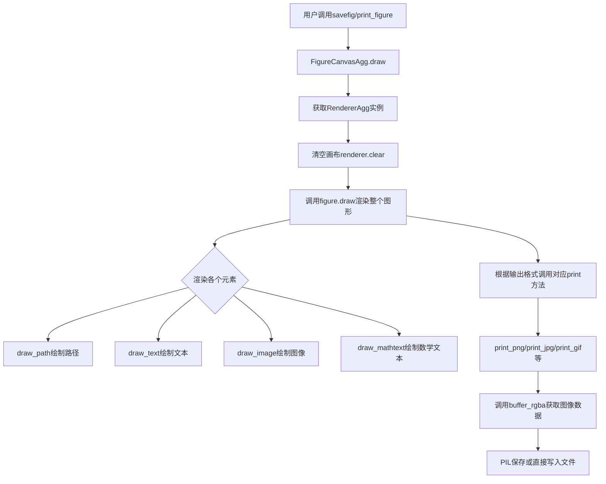

## 类结构

```
RendererAgg (渲染器类)
├── 继承自RendererBase
├── 主要方法: draw_path, draw_text, draw_mathtext, draw_tex
├── 图像方法: buffer_rgba, tostring_argb, draw_image
├── 文本测量: get_text_width_height_descent, _prepare_font
└── 过滤功能: start_filter, stop_filter
FigureCanvasAgg (画布类)
├── 继承自FigureCanvasBase
├── 渲染控制: draw, get_renderer
├── 区域操作: copy_from_bbox, restore_region
├── 输出方法: print_png, print_jpg, print_gif, print_tif, print_webp, print_avif
└── 缓冲区: buffer_rgba, tostring_argb
_BackendAgg (后端导出类)
└── 继承自_Backend
```

## 全局变量及字段


### `_fontManager`
    
字体管理器，用于查找和管理字体

类型：`FontManager`
    


### `mpl`
    
matplotlib主模块，提供全局配置和功能

类型：`matplotlib`
    


### `np`
    
numpy模块，用于数值计算和数组操作

类型：`numpy`
    


### `LoadFlags`
    
FreeType加载标志，用于控制字体渲染 hinting 策略

类型：`ft2font.LoadFlags`
    


### `RendererAgg.dpi`
    
图像分辨率，每英寸点数

类型：`float`
    


### `RendererAgg.width`
    
画布宽度，单位为像素

类型：`float`
    


### `RendererAgg.height`
    
画布高度，单位为像素

类型：`float`
    


### `RendererAgg._renderer`
    
C++实现的渲染器实例，负责底层图形绘制

类型：`_RendererAgg`
    


### `RendererAgg._filter_renderers`
    
滤镜渲染器栈，用于保存滤镜处理前的渲染器状态

类型：`list`
    


### `RendererAgg.mathtext_parser`
    
数学文本解析器，用于解析和渲染数学公式

类型：`MathTextParser`
    


### `RendererAgg.bbox`
    
画布边界框，定义绘图区域的矩形范围

类型：`Bbox`
    


### `FigureCanvasAgg._lastKey`
    
上次渲染的缓存键值，由(宽度, 高度, DPI)组成用于判断是否可复用渲染器

类型：`tuple`
    


### `_BackendAgg.backend_version`
    
后端版本号，标识AGG后端的版本

类型：`str`
    


### `_BackendAgg.FigureCanvas`
    
画布类，负责图形绘制和图像输出

类型：`FigureCanvasAgg`
    


### `_BackendAgg.FigureManager`
    
图形管理器类，负责管理Figure窗口和交互

类型：`FigureManagerBase`
    
    

## 全局函数及方法


### `get_hinting_flag`

获取字体 hinting 标志，根据 matplotlib 配置 `text.hinting` 返回对应的 LoadFlags 枚举值，用于控制字体渲染时的 hinting 策略。

参数： 无

返回值：`int`（`LoadFlags` 枚举值），返回对应的字体 hinting 标志，用于后续字体渲染时的自动 hinting 控制。

#### 流程图

```mermaid
flowchart TD
    A[开始] --> B[读取 mpl.rcParams['text.hinting']]
    B --> C{根据配置值查表}
    C -->|default| D[返回 LoadFlags.DEFAULT]
    C -->|no_autohint| E[返回 LoadFlags.NO_AUTOHINT]
    C -->|force_autohint| F[返回 LoadFlags.FORCE_AUTOHINT]
    C -->|no_hinting| G[返回 LoadFlags.NO_HINTING]
    C -->|True| F
    C -->|False| G
    C -->|either| D
    C -->|native| E
    C -->|auto| F
    C -->|none| G
    D --> H[结束]
    E --> H
    F --> H
    G --> H
```

#### 带注释源码

```python
def get_hinting_flag():
    """
    获取字体 hinting 标志。
    
    根据 matplotlib 的 rcParams['text.hinting'] 配置值，
    返回对应的 LoadFlags 枚举，用于控制字体渲染时的 hinting 行为。
    
    Returns
    -------
    int
        LoadFlags 枚举值，表示不同的 hinting 策略
    """
    # 定义 hinting 配置值到 LoadFlags 枚举的映射字典
    # 支持多种配置格式：字符串别名、布尔值
    mapping = {
        'default': LoadFlags.DEFAULT,         # 默认 hinting 策略
        'no_autohint': LoadFlags.NO_AUTOHINT, # 禁用自动 hinting
        'force_autohint': LoadFlags.FORCE_AUTOHINT, # 强制使用自动 hinting
        'no_hinting': LoadFlags.NO_HINTING,   # 完全不进行 hinting
        True: LoadFlags.FORCE_AUTohint,       # True 等同于 force_autohint
        False: LoadFlags.NO_HINTING,          # False 等同于 no_hinting
        'either': LoadFlags.DEFAULT,          # either 等同于 default
        'native': LoadFlags.NO_AUTOHINT,      # native 等同于 no_autohint
        'auto': LoadFlags.FORCE_AUTOHINT,     # auto 等同于 force_autohint
        'none': LoadFlags.NO_HINTING,         # none 等同于 no_hinting
    }
    # 从 matplotlib 全局配置中读取 text.hinting 的当前值
    # 并通过映射字典返回对应的 LoadFlags 枚举
    return mapping[mpl.rcParams['text.hinting']]
```


### RendererAgg.__init__

`RendererAgg.__init__` 是 `RendererAgg` 类的构造函数，负责初始化AGG（Anti-Grain Geometry）渲染器的核心属性和底层渲染对象，设置画布尺寸、DPI分辨率，并初始化数学文本解析器和边界框。

参数：

- `width`：`float` 或 `int`，画布的宽度值
- `height`：`float` 或 `int`，画布的高度值
- `dpi`：`float` 或 `int`，每英寸点数（dots per inch），用于确定渲染分辨率

返回值：`None`，该方法为构造函数，不返回任何值

#### 流程图

```mermaid
flowchart TD
    A[开始 __init__] --> B[调用父类 RendererBase.__init__ 初始化]
    B --> C[设置实例属性 self.dpi = dpi]
    C --> D[设置实例属性 self.width = width]
    D --> E[设置实例属性 self.height = height]
    E --> F[创建底层渲染器 self._renderer = _RendererAgg int(width) int(height) dpi]
    F --> G[初始化过滤器列表 self._filter_renderers = 空列表]
    G --> H[调用 self._update_methods 更新绘图方法绑定]
    H --> I[创建 MathTextParser 实例 self.mathtext_parser = MathTextParser 'agg']
    I --> J[创建边界框 self.bbox = Bbox.from_bounds 0 0 width height]
    J --> K[结束 __init__]
```

#### 带注释源码

```python
def __init__(self, width, height, dpi):
    """
    初始化 AGG 渲染器
    
    参数:
        width: 画布宽度（单位为像素/英寸，取决于dpi）
        height: 画布高度
        dpi: 每英寸点数，决定输出图像的分辨率
    """
    # 调用父类RendererBase的初始化方法，设置基础渲染器状态
    super().__init__()

    # 存储DPI（每英寸点数），用于后续的坐标转换和文本渲染
    self.dpi = dpi
    # 存储画布宽度和高度，供其他方法获取画布尺寸
    self.width = width
    self.height = height
    
    # 创建底层C++实现的渲染器对象_RendererAgg
    # 将width和height转换为整数，确保像素坐标为整数
    self._renderer = _RendererAgg(int(width), int(height), dpi)
    
    # 初始化滤镜渲染器列表，用于支持图像过滤/后处理功能
    self._update_methods()

    # 创建数学文本解析器，用于渲染LaTeX数学表达式
    self.mathtext_parser = MathTextParser('agg')

    # 创建边界框对象，定义画布的可绘制区域
    # 从(0,0)开始，宽度为self.width，高度为self.height
    self.bbox = Bbox.from_bounds(0, 0, self.width, self.height)
```


### `RendererAgg.__getstate__`

该方法用于 pickle 序列化过程中，控制对象的哪些属性需要被保存。它仅保存渲染器初始化所必需的参数（宽度、高度和 DPI），其他可重新创建的资源（如底层渲染器实例）则不被保存，以实现轻量级的序列化。

参数：
- 该方法无额外参数（`self` 为隐式参数）

返回值：`dict`，返回包含 `width`、`height`、`dpi` 三个键的字典，用于在反序列化时恢复渲染器状态。

#### 流程图

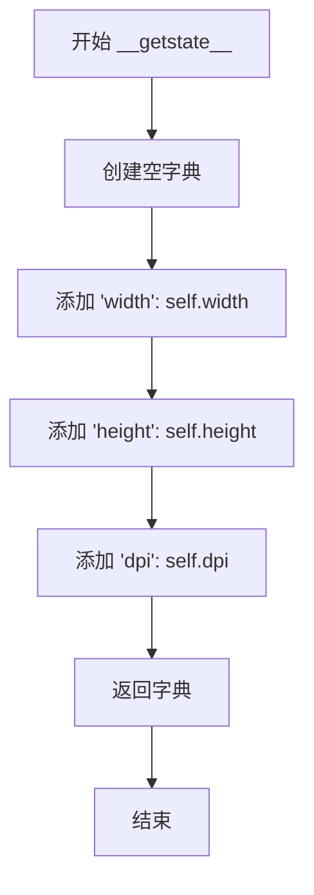

#### 带注释源码

```python
def __getstate__(self):
    # 只保存渲染器初始化所需的参数（宽、高、DPI）。
    # 其他任何内容都可以在反序列化时重新创建（如底层 _renderer 实例）。
    return {'width': self.width, 'height': self.height, 'dpi': self.dpi}
```


### `RendererAgg.__setstate__`

该方法用于对象反序列化时恢复`RendererAgg`实例的状态，通过调用`__init__`方法重新初始化渲染器，确保反序列化后的对象具有正确的宽度、高度和DPI配置。

参数：

- `state`：`dict`，包含反序列化所需状态的字典，必须包含'width'、'height'和'dpi'三个键

返回值：`None`，无返回值（直接修改对象状态）

#### 流程图

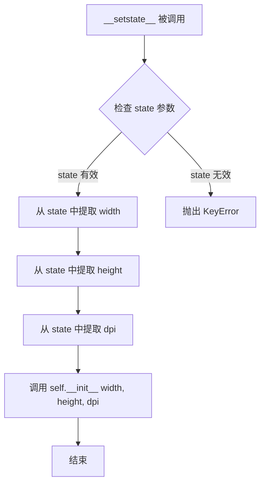

#### 带注释源码

```python
def __setstate__(self, state):
    """
    恢复渲染器状态的方法，用于对象反序列化（pickle）。

    Parameters
    ----------
    state : dict
        包含渲染器初始化参数的字典，必须包含以下键：
        - 'width': 画布宽度（浮点数或整数）
        - 'height': 画布高度（浮点数或整数）
        - 'dpi': 每英寸点数（浮点数或整数）

    Returns
    -------
    None
        此方法直接修改对象状态，无返回值

    Notes
    -----
    此方法与 __getstate__ 方法配对使用。__getstate__ 负责将对象序列化为字典，
    而 __setstate__ 负责从字典恢复对象状态。这种设计确保了序列化时只保存必要
    的初始化参数，其他运行时生成的对象（如 _renderer 实例）可以在反序列化时
    重新创建。
    """
    # 使用提取的 width、height 和 dpi 参数调用 __init__ 方法
    # 这会重新初始化整个渲染器对象，包括：
    # - 设置 dpi、width、height 属性
    # - 创建新的 _RendererAgg C++ 渲染器实例
    # - 初始化 _filter_renderers 列表
    # - 设置 mathtext_parser
    # - 创建 bbox
    self.__init__(state['width'], state['height'], state['dpi'])
```


### `RendererAgg._update_methods`

该方法用于将底层 C++ 渲染器 `_RendererAgg` 的多个绘图方法绑定到当前 Python `RendererAgg` 实例，使得可以通过 `self` 直接调用这些底层渲染功能。

参数：

- `self`：`RendererAgg` 实例，表示方法接收者本身

返回值：`None`，该方法无返回值，仅执行方法绑定操作

#### 流程图

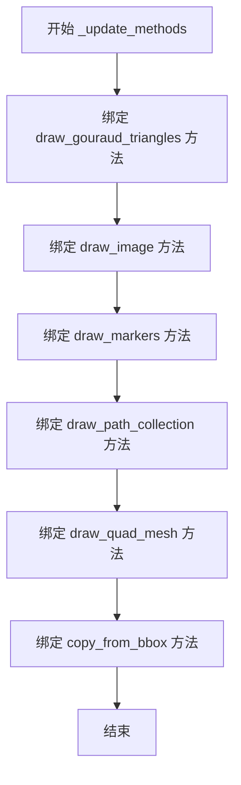

#### 带注释源码

```python
def _update_methods(self):
    """
    将底层渲染器的绘图方法绑定到当前 RendererAgg 实例。
    
    该方法将 _renderer 对象的方法直接赋值给当前实例的属性，
    使得外部调用者可以直接通过 self 调用这些底层渲染功能，
    而无需显式访问 self._renderer。
    """
    # 绑定 Gouraud 三角形绘制方法，用于渲染渐变填充的三角形
    self.draw_gouraud_triangles = self._renderer.draw_gouraud_triangles
    
    # 绑定图像绘制方法，用于在画布上绘制图像
    self.draw_image = self._renderer.draw_image
    
    # 绑定标记绘制方法，用于绘制路径标记
    self.draw_markers = self._renderer.draw_markers
    
    # 绑定路径集合绘制方法，用于批量绘制多个路径
    self.draw_path_collection = self._renderer.draw_path_collection
    
    # 绑定四边形网格绘制方法，用于绘制四边形网格
    self.draw_quad_mesh = self._renderer.draw_quad_mesh
    
    # 绑定从边界框复制内容的方法，用于保存和恢复区域
    self.copy_from_bbox = self._renderer.copy_from_bbox
```


### RendererAgg.draw_path

该方法负责将路径（Path）绘制到AGG渲染缓冲区，支持当路径顶点数超过阈值时自动分块处理以避免内存溢出，并提供详细的错误信息和优化建议。

参数：

- `self`：`RendererAgg`，渲染器实例本身
- `gc`：`GraphicsContextBase`，图形上下文，包含颜色、线宽、线型等绘图样式信息
- `path`：`Path`，要绘制的路径对象，包含顶点和绘制指令码
- `transform`：`Transform`，应用到路径上的几何变换矩阵
- `rgbFace`：`RGBA元组或None`，路径填充颜色，None表示无填充

返回值：`None`，该方法直接操作渲染缓冲区，无返回值

#### 流程图

```mermaid
flowchart TD
    A[开始 draw_path] --> B[获取 chunksize 阈值 nmax]
    B --> C[获取路径顶点数 npts]
    C --> D{判断条件:
    npts > nmax > 100
    AND path.should_simplify
    AND rgbFace is None
    AND gc.get_hatch() is None?}
    
    D -->|是| E[计算分块数 nch]
    E --> F[计算每块大小 chsize]
    F --> G[生成块起始索引 i0 和结束索引 i1]
    G --> H[遍历每个块]
    H --> I[提取当前块的顶点 v 和codes]
    I --> J[修正codes[0]为MOVETO]
    J --> K[创建新Path对象 p]
    K --> L[尝试调用 _renderer.draw_path]
    L --> M{是否抛出 OverflowError?}
    M -->|是| N[抛出详细错误信息]
    M -->|否| O[继续处理下一块]
    O --> H
    
    D -->|否| P[直接调用 _renderer.draw_path]
    P --> Q{是否抛出 OverflowError?}
    Q -->|是| R[根据条件生成错误信息]
    R --> S[判断是否可以分块处理]
    S -->|否| T[生成无法自动分割的原因]
    T --> U[抛出 OverflowError]
    Q -->|否| V[绘制完成]
    
    H -->|所有块完成| V
```

#### 带注释源码

```python
def draw_path(self, gc, path, transform, rgbFace=None):
    # docstring inherited
    # 获取AGG路径分块的配置参数，用于控制单次绘制的最大顶点数
    nmax = mpl.rcParams['agg.path.chunksize']  # here at least for testing
    # 获取路径的顶点数量
    npts = path.vertices.shape[0]

    # 判断是否需要进行路径分块处理的条件：
    # 1. 顶点数超过chunksize阈值且阈值大于100（避免小路径分块开销）
    # 2. 路径支持简化（should_simplify）
    # 3. 没有填充颜色（rgbFace为None）
    # 4. 没有阴影线图案（hatch）
    if (npts > nmax > 100 and path.should_simplify and
            rgbFace is None and gc.get_hatch() is None):
        # 计算需要分割的块数：总顶点数 / 每块最大顶点数
        nch = np.ceil(npts / nmax)
        # 计算每块的实际大小
        chsize = int(np.ceil(npts / nch))
        # 生成每块起始索引：0, chsize, 2*chsize, ...
        i0 = np.arange(0, npts, chsize)
        # 初始化结束索引数组
        i1 = np.zeros_like(i0)
        # 每块的结束索引为下一块的起始索引减1
        i1[:-1] = i0[1:] - 1
        # 最后一块的结束索引为总顶点数
        i1[-1] = npts
        # 遍历每个分块进行绘制
        for ii0, ii1 in zip(i0, i1):
            # 提取当前块的顶点坐标
            v = path.vertices[ii0:ii1, :]
            # 获取路径的绘制指令码
            c = path.codes
            if c is not None:
                # 提取当前块对应的codes
                c = c[ii0:ii1]
                # 将当前块的第一个指令改为MOVETO，确保路径连续性
                c[0] = Path.MOVETO  # move to end of last chunk
            # 创建新的Path对象用于当前分块
            p = Path(v, c)
            # 继承原始路径的简化阈值
            p.simplify_threshold = path.simplify_threshold
            try:
                # 调用底层渲染器绘制分块路径
                self._renderer.draw_path(gc, p, transform, rgbFace)
            except OverflowError:
                # 捕获溢出错误并提供详细的优化建议
                msg = (
                    "Exceeded cell block limit in Agg.\n\n"
                    "Please reduce the value of "
                    f"rcParams['agg.path.chunksize'] (currently {nmax}) "
                    "or increase the path simplification threshold"
                    "(rcParams['path.simplify_threshold'] = "
                    f"{mpl.rcParams['path.simplify_threshold']:.2f} by "
                    "default and path.simplify_threshold = "
                    f"{path.simplify_threshold:.2f} on the input)."
                )
                raise OverflowError(msg) from None
    else:
        # 不满足分块条件，直接绘制整个路径
        try:
            self._renderer.draw_path(gc, path, transform, rgbFace)
        except OverflowError:
            # 绘制失败时，分析无法分块的原因
            cant_chunk = ''
            if rgbFace is not None:
                cant_chunk += "- cannot split filled path\n"
            if gc.get_hatch() is not None:
                cant_chunk += "- cannot split hatched path\n"
            if not path.should_simplify:
                cant_chunk += "- path.should_simplify is False\n"
            # 根据原因生成相应的错误信息
            if len(cant_chunk):
                msg = (
                    "Exceeded cell block limit in Agg, however for the "
                    "following reasons:\n\n"
                    f"{cant_chunk}\n"
                    "we cannot automatically split up this path to draw."
                    "\n\nPlease manually simplify your path."
                )
            else:
                inc_threshold = (
                    "or increase the path simplification threshold"
                    "(rcParams['path.simplify_threshold'] = "
                    f"{mpl.rcParams['path.simplify_threshold']} "
                    "by default and path.simplify_threshold "
                    f"= {path.simplify_threshold} "
                    "on the input)."
                    )
                if nmax > 100:
                    msg = (
                        "Exceeded cell block limit in Agg.  Please reduce "
                        "the value of rcParams['agg.path.chunksize'] "
                        f"(currently {nmax}) {inc_threshold}"
                    )
                else:
                    msg = (
                        "Exceeded cell block limit in Agg.  Please set "
                        "the value of rcParams['agg.path.chunksize'], "
                        f"(currently {nmax}) to be greater than 100 "
                        + inc_threshold
                    )
            # 抛出带有详细原因和解决方案的溢出错误
            raise OverflowError(msg) from None
```


### `RendererAgg.draw_mathtext`

绘制数学文本（mathtext）到Agg渲染器。该方法解析数学文本字符串，计算位置偏移，并将渲染后的字体图像绘制到渲染器上。

参数：

- `gc`：`GraphicsContextBase`，图形上下文，用于获取抗锯齿设置等渲染属性
- `x`：`float`，文本绘制的x坐标
- `y`：`float`，文本绘制的y坐标
- `s`：`str`，要绘制的数学文本字符串
- `prop`：`matplotlib.font_manager.FontProperties`，字体属性对象
- `angle`：`float`，旋转角度（度）

返回值：`None`，该方法直接操作渲染器缓冲区，无返回值

#### 流程图

```mermaid
flowchart TD
    A[开始 draw_mathtext] --> B[调用 mathtext_parser.parse 解析数学文本]
    B --> C{解析成功?}
    C -->|否| D[抛出异常]
    C -->|是| E[获取解析结果: ox, oy, width, height, descent, font_image]
    E --> F[计算角度偏移: xd = descent * sin(angle), yd = descent * cos(angle)]
    F --> G[计算最终坐标: x = round(x + ox + xd), y = round(y - oy + yd)]
    G --> H[调用 _renderer.draw_text_image 绘制字体图像]
    H --> I[结束]
```

#### 带注释源码

```python
def draw_mathtext(self, gc, x, y, s, prop, angle):
    """Draw mathtext using :mod:`matplotlib.mathtext`."""
    # 调用 MathTextParser 解析数学文本字符串
    # 返回值包括: 偏移量(ox, oy), 尺寸(width, height), 下降量(descent), 字体图像(font_image)
    ox, oy, width, height, descent, font_image = \
        self.mathtext_parser.parse(s, self.dpi, prop,
                                   antialiased=gc.get_antialiased())

    # 根据旋转角度计算下降量的偏移分量
    # 使用三角函数将descent分解为x和y方向的分量
    xd = descent * sin(radians(angle))
    yd = descent * cos(radians(angle))

    # 计算最终绘制位置: 基础位置 + 文本偏移 - 垂直偏移 + 角度偏移
    # round()确保坐标为整数像素位置
    x = round(x + ox + xd)
    y = round(y - oy + yd)

    # 调用底层渲染器的draw_text_image方法绘制字体图像
    # y + 1 是为了调整基线偏移
    self._renderer.draw_text_image(font_image, x, y + 1, angle, gc)
```


### `RendererAgg.draw_text`

该方法负责在AGG渲染器上绘制单行文本，支持普通文本和数学文本（mathtext），并处理字体准备、坐标计算和旋转角度调整。

参数：

- `self`：`RendererAgg`，渲染器实例本身
- `gc`：`GraphicsContextBase`，图形上下文，控制文本的绘制样式（颜色、线宽、抗锯齿等）
- `x`：`float`，文本绘制起点的x坐标
- `y`：`float`，文本绘制起点的y坐标
- `s`：`str`，要绘制的文本字符串
- `prop`：`FontProperties`，字体属性对象，定义字体名称、大小、样式等
- `angle`：`float`，文本的旋转角度（单位为度）
- `ismath`：`bool`，是否将文本渲染为数学符号（True/False/"TeX"），默认为False
- `mtext`：`Text`，可选的matplotlib文本对象，用于额外的文本布局信息，默认为None

返回值：`None`，该方法直接在渲染缓冲区中绘制文本，无返回值

#### 流程图

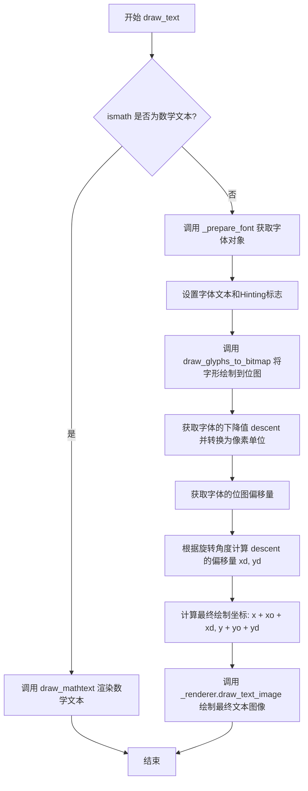

#### 带注释源码

```python
def draw_text(self, gc, x, y, s, prop, angle, ismath=False, mtext=None):
    # docstring inherited
    # 如果是数学文本模式，委托给 draw_mathtext 处理
    if ismath:
        return self.draw_mathtext(gc, x, y, s, prop, angle)
    
    # 根据字体属性获取准备好的 FT2Font 字体对象
    font = self._prepare_font(prop)
    
    # 设置字体内容，'0' 表示角度为0（因为会在 draw_text_image 中旋转）
    # get_hinting_flag() 返回基于 rcParams 的字形Hinting标志
    font.set_text(s, 0, flags=get_hinting_flag())
    
    # 将字形渲染到位图缓冲区，antialiased 参数控制是否抗锯齿
    font.draw_glyphs_to_bitmap(
        antialiased=gc.get_antialiased())
    
    # 获取字体的下降值（descent），用于文本基线对齐
    # 除以64.0是因为内部使用亚像素精度（26.6固定点格式）
    d = font.get_descent() / 64.0
    
    # 获取位图偏移量（字形相对于起点的偏移）
    xo, yo = font.get_bitmap_offset()
    xo /= 64.0  # 转换为像素单位
    yo /= 64.0
    
    # 根据旋转角度计算 descent 引起的偏移量
    xd = d * sin(radians(angle))
    yd = d * cos(radians(angle))
    
    # 计算最终绘制坐标并四舍五入到整数像素
    x = round(x + xo + xd)
    y = round(y + yo + yd)
    
    # 调用底层渲染器绘制文本图像，y+1 是为了微调垂直位置
    self._renderer.draw_text_image(font, x, y + 1, angle, gc)
```


### `RendererAgg.draw_tex`

该方法用于在AGG后端渲染LaTeX/TeX格式的文本，通过TeX管理器获取文本的灰度位图图像，并将其绘制到渲染器上，支持旋转角度和垂直偏移计算。

参数：

- `self`：`RendererAgg`，RendererAgg类的实例方法
- `gc`：`GraphicsContextBase`，图形上下文对象，用于控制绘制样式（如颜色、抗锯齿等）
- `x`：`float`，文本渲染的x坐标位置
- `y`：`float`，文本渲染的y坐标位置
- `s`：`str`，要渲染的LaTeX/TeX文本字符串
- `prop`：`FontProperties`，字体属性对象，包含字体大小等属性
- `angle`：`float`，文本的旋转角度（以度为单位）
- `mtext`：`Text`，可选的关键字参数，指向对应的文本对象（当前未使用）

返回值：`None`，该方法直接在底层渲染器上绘制文本图像，无返回值

#### 流程图

```mermaid
flowchart TD
    A[开始 draw_tex] --> B[获取字体大小: size = prop.get_size_in_points]
    B --> C[获取TeX管理器: texmanager = self.get_texmanager]
    C --> D[获取灰度图像: Z = texmanager.get_grey(s, size, self.dpi)]
    D --> E[转换数据类型: Z = np.array(Z * 255.0, np.uint8)]
    E --> F[获取文本度量: w, h, d = self.get_text_width_height_descent]
    F --> G[计算旋转偏移: xd = d * sin, yd = d * cos]
    G --> H[计算最终坐标: x = round(x + xd), y = round(y + yd)]
    H --> I[绘制文本图像: self._renderer.draw_text_image]
    I --> J[结束]
```

#### 带注释源码

```python
def draw_tex(self, gc, x, y, s, prop, angle, *, mtext=None):
    # docstring inherited
    # todo, handle props, angle, origins
    # 获取字体大小（以点为单位）
    size = prop.get_size_in_points()

    # 获取当前渲染器的TeX管理器实例
    texmanager = self.get_texmanager()

    # 使用TeX管理器将TeX文本渲染为灰度图像
    # 返回值Z是归一化的灰度数组（0-1范围）
    Z = texmanager.get_grey(s, size, self.dpi)
    # 将灰度值转换为0-255范围的uint8类型，用于图像绘制
    Z = np.array(Z * 255.0, np.uint8)

    # 获取文本的宽度、高度和下降度（descent）
    # ismath="TeX"指定使用TeX模式处理文本
    w, h, d = self.get_text_width_height_descent(s, prop, ismath="TeX")
    # 根据旋转角度计算下降度引起的偏移量
    # 将角度转换为弧度后计算sin和cos
    xd = d * sin(radians(angle))
    yd = d * cos(radians(angle))
    # 对坐标进行四舍五入以对齐像素，并加上偏移量
    x = round(x + xd)
    y = round(y + yd)
    # 调用底层渲染器绘制文本图像
    # 传入灰度图像数据、坐标、角度和图形上下文
    self._renderer.draw_text_image(Z, x, y, angle, gc)
```


### `RendererAgg.get_text_width_height_descent`

该方法用于计算给定文本字符串的宽度、高度和下降值（descent），根据 `ismath` 参数的处理方式（普通文本、数学文本或 TeX 文本）调用不同的文本测量逻辑。

参数：

-  `s`：`str`，要测量尺寸的文本字符串
-  `prop`：`FontProperties`，字体属性对象，包含字体大小、样式等信息
-  `ismath`：`str` 或 `bool`，控制数学文本渲染模式；取值为 `"TeX"`（使用 TeX 渲染）、`True`（使用 Mathtext 解析）、`False`（普通文本）或 `"TeX"`/`True`/`False` 之一

返回值：`tuple[float, float, float]`，返回文本的宽度（width）、高度（height）和下降值（descent），单位为像素

#### 流程图

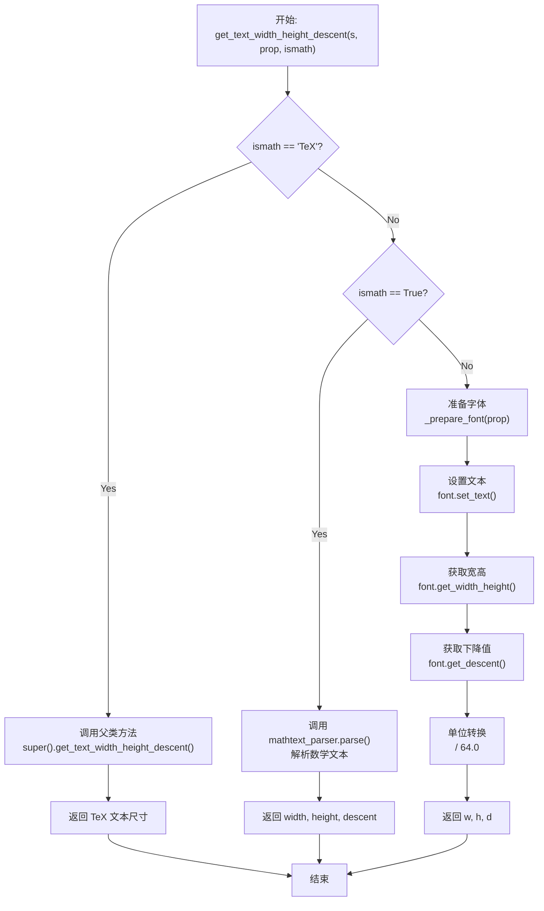

#### 带注释源码

```python
def get_text_width_height_descent(self, s, prop, ismath):
    """
    计算文本字符串的宽度、高度和下降值。
    
    参数:
        s: str - 要测量的文本字符串
        prop: FontProperties - 字体属性对象
        ismath: str 或 bool - 数学文本模式控制
    
    返回:
        tuple: (宽度, 高度, 下降值)
    """
    # docstring inherited
    # 检查 ismath 参数是否在允许的取值范围内
    _api.check_in_list(["TeX", True, False], ismath=ismath)
    
    # 如果是 TeX 模式，调用父类方法处理
    if ismath == "TeX":
        return super().get_text_width_height_descent(s, prop, ismath)

    # 如果是 Mathtext 模式（ismath=True），使用数学文本解析器
    if ismath:
        # 解析数学文本表达式，返回宽度、高度、下降值和字体图像
        ox, oy, width, height, descent, font_image = \
            self.mathtext_parser.parse(s, self.dpi, prop)
        return width, height, descent

    # 普通文本模式：使用 FreeType 字体直接测量
    # 准备字体对象
    font = self._prepare_font(prop)
    # 设置文本内容（0.0 表示无旋转，使用提示标志）
    font.set_text(s, 0.0, flags=get_hinting_flag())
    # 获取未旋转字符串的宽度和高度
    w, h = font.get_width_height()  # width and height of unrotated string
    # 获取字体的下降值（基线以下的距离）
    d = font.get_descent()
    # 将单位从子像素转换为像素（FT2Font 返回的是 1/64 像素单位）
    w /= 64.0  # convert from subpixels
    h /= 64.0
    d /= 64.0
    return w, h, d
```


### `RendererAgg._prepare_font`

该方法负责根据字体属性获取对应的 FT2Font 字体对象，清空其缓冲区，并设置字体大小。这是渲染文本前的字体准备工作，确保每次绘制文本时使用的是正确配置且已清空的字体实例。

参数：

- `font_prop`：`FontProperties`，字体属性对象，包含了字体的各种属性（如字体名称、大小、样式等），用于查找和配置对应的字体。

返回值：`FT2Font`，返回配置好的 FreeType 字体对象，可用于设置文本和绘制字形。

#### 流程图

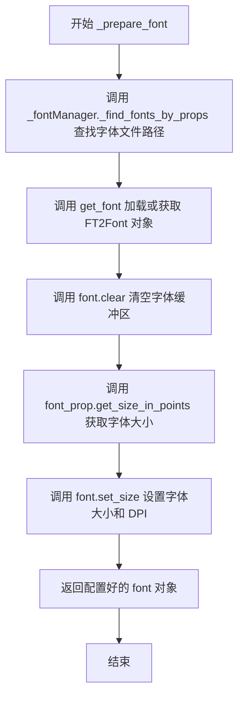

#### 带注释源码

```python
def _prepare_font(self, font_prop):
    """
    Get the `.FT2Font` for *font_prop*, clear its buffer, and set its size.
    """
    # 第一步：通过字体属性查找并获取对应的 FT2Font 字体对象
    # _fontManager._find_fonts_by_props(font_prop) 根据 font_prop 查找字体文件路径
    # get_font(...) 加载或从缓存获取该字体文件对应的 FT2Font 实例
    font = get_font(_fontManager._find_fonts_by_props(font_prop))
    
    # 第二步：清空字体的缓冲区，确保字体处于干净状态
    # 这是一个重要的步骤，防止之前绘制的内容残留影响新的文本渲染
    font.clear()
    
    # 第三步：获取字体大小（以磅为单位）
    size = font_prop.get_size_in_points()
    
    # 第四步：设置字体的渲染大小
    # 参数1: size - 字体大小（磅）
    # 参数2: self.dpi - 设备的 DPI（每英寸点数），影响字体在实际输出中的显示大小
    font.set_size(size, self.dpi)
    
    # 返回配置完成的字体对象，供调用者使用
    return font
```


### RendererAgg.get_canvas_width_height

获取渲染器的画布宽度和高度，用于确定绘图区域的尺寸。

参数：

- 无参数（仅 `self` 隐式参数）

返回值：`tuple`，返回画布的宽度和高度元组 (width, height)

#### 流程图

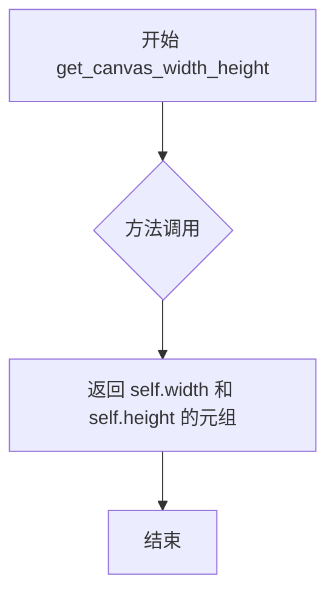

#### 带注释源码

```python
def get_canvas_width_height(self):
    # docstring inherited
    # 获取当前渲染器的画布宽度和高度
    # 返回一个元组 (width, height)，这两个值在 __init__ 中被设置
    # width 和 height 表示画布的像素尺寸（未经 DPI 缩放）
    return self.width, self.height
```


### `RendererAgg.points_to_pixels`

该方法负责将图形设计中的点（points）单位转换为屏幕像素单位，是渲染器的单位转换工具，通过dpi和标准点尺寸（72 points/inch）的比例关系实现物理尺寸到像素尺寸的映射。

参数：

-  `points`：`float` 或 `np.ndarray`，要转换的点数（points），可以是单个数值或数组

返回值：`float` 或 `np.ndarray`，转换后的像素值（pixels）

#### 流程图

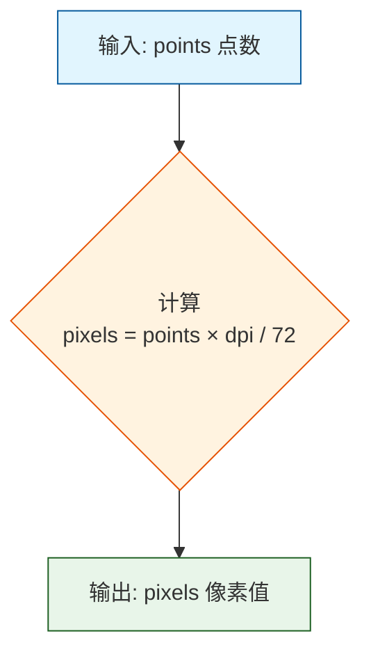

#### 带注释源码

```python
def points_to_pixels(self, points):
    """
    将点数（points）转换为像素（pixels）。
    
    Parameters
    ----------
    points : float or np.ndarray
        要转换的点数（points）。points 是文档和排版中常用的长度单位，
        表示 1/72 英寸。
    
    Returns
    -------
    float or np.ndarray
        转换后的像素值。由于屏幕分辨率不同，此转换依赖于当前的 DPI 设置。
        公式：pixels = points × (dpi / 72)
        其中 72 是标准的点数/英寸比例（72 points = 1 inch）
    """
    # docstring inherited
    # 计算逻辑：1 point = 1/72 inch，pixels = inches × dpi
    # 因此：pixels = points × (dpi / 72)
    return points * self.dpi / 72
```


### RendererAgg.buffer_rgba

该方法返回渲染器缓冲区的RGBA内存视图（memoryview），允许直接访问底层渲染数据而无需复制，适用于需要高效获取图像数据的场景。

参数：

- 该方法无参数（仅包含隐式参数 `self`）

返回值：`memoryview`，返回渲染器的内存视图对象，可直接访问RGBA像素数据

#### 流程图

```mermaid
flowchart TD
    A[开始] --> B{执行 buffer_rgba}
    B --> C[返回 memoryview(self._renderer)]
    C --> D[结束]
```

#### 带注释源码

```python
def buffer_rgba(self):
    """
    返回渲染器缓冲区的 RGBA 内存视图。
    
    该方法提供一个直接访问底层渲染数据的内存视图，
    无需复制数据即可获取图像内容。
    
    Returns
    -------
    memoryview
        渲染器的内存视图对象，包含了 RGBA 格式的像素数据
    """
    return memoryview(self._renderer)
```


### `RendererAgg.tostring_argb`

该方法将渲染器中的图像数据转换为 ARGB 格式的字节串，便于其他程序处理或保存为图像文件。

参数：

- 无（仅含隐式参数 `self`）

返回值：`bytes`，ARGB 格式的图像数据字节串

#### 流程图

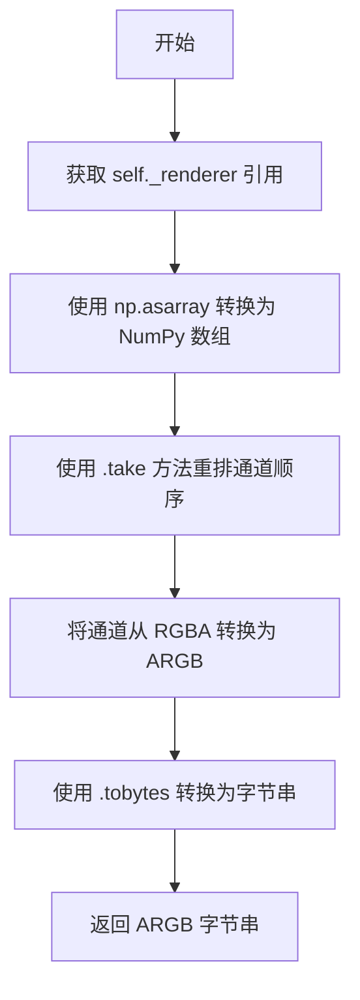

#### 带注释源码

```python
def tostring_argb(self):
    """
    将渲染器中的图像数据转换为 ARGB 格式的字节串。

    该方法首先将渲染器对象转换为 NumPy 数组，然后重新排列颜色通道顺序，
    将 RGBA 格式转换为 ARGB 格式，最后转换为字节串返回。

    Returns:
        bytes: ARGB 格式的图像数据，其中每个像素由 4 个字节表示，
               顺序为 Alpha、Red、Green、Blue。
    """
    # 将渲染器转换为 NumPy 数组
    # self._renderer 是一个类似数组的对象，包含图像的 RGBA 数据
    arr = np.asarray(self._renderer)
    
    # 使用 take 方法重排通道顺序
    # 原始顺序是 RGBA [0,1,2,3]，转换为 ARGB 需要 [3,0,1,2]
    # 即原来的 Alpha 通道移到最前面
    # axis=2 表示在通道维度上进行重排
    # 最后调用 tobytes() 将数组转换为字节串
    return arr.take([3, 0, 1, 2], axis=2).tobytes()
```


### `RendererAgg.clear`

清除渲染缓冲区的所有内容，重置内部渲染器的绘图表面。

参数：

- 无参数（除隐式 `self` 参数外）

返回值：`None`，无返回值描述

#### 流程图

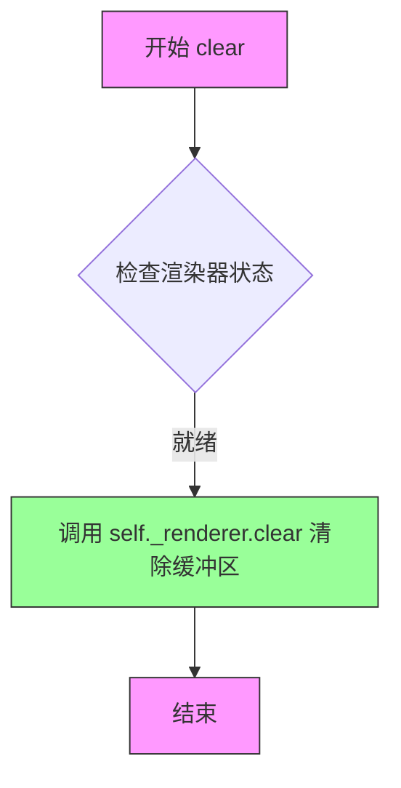

#### 带注释源码

```python
def clear(self):
    """
    清除渲染缓冲区的所有内容。

    此方法重置内部 _RendererAgg 实例的绘图表面，
    将所有像素值置为透明或背景色。调用此方法后，
    画布将变为空白，可用于重新绘制新内容。

    注意：此操作不会重置渲染器的配置参数
    （如 DPI、画布尺寸等），仅清除像素数据。
    """
    self._renderer.clear()  # 调用底层 C++ 扩展的 clear 方法
```


### RendererAgg.option_image_nocomposite

该方法用于指示 Matplotlib 在渲染图像时是否需要进行图像复合（composite）。对于 AGG 后端，该方法返回 True，表示不进行额外的图像复合操作，因为直接对 Figure 进行复合效率更高且不会产生文件体积收益。

参数：无（仅包含 self 参数，但 self 作为实例引用不计入参数列表）

返回值：`bool`，返回 True 表示不进行图像复合

#### 流程图

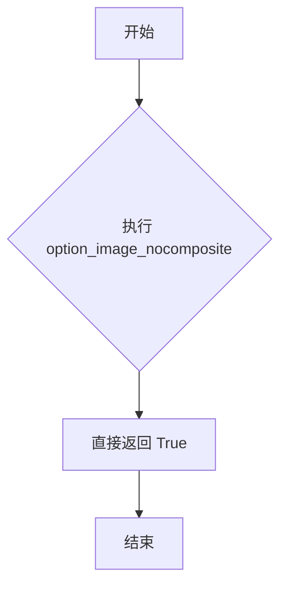

#### 带注释源码

```python
def option_image_nocomposite(self):
    # docstring inherited

    # It is generally faster to composite each image directly to
    # the Figure, and there's no file size benefit to compositing
    # with the Agg backend
    return True
```


### `RendererAgg.option_scale_image`

该方法用于指示 AGG 渲染后端在绘制图像时是否需要自动缩放图像尺寸。

参数：  
无参数

返回值：`bool`，返回 `False`，表示 AGG 后端不需要对图像进行自动缩放优化。

#### 流程图

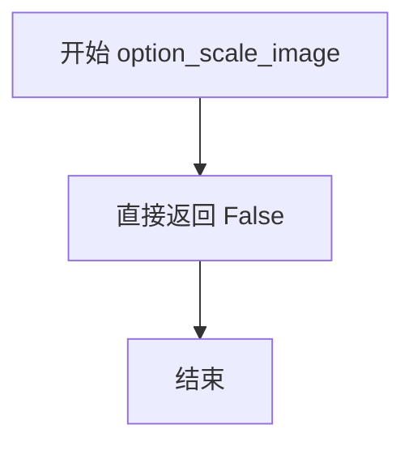

#### 带注释源码

```python
def option_scale_image(self):
    # docstring inherited
    # AGG 后端的实现：直接返回 False，表示不进行图像缩放
    # 这是因为 AGG 后端的图像合成通常直接绘制到画布上，
    # 不需要额外的缩放处理，且这样可以提高渲染性能
    return False
```


### `RendererAgg.restore_region`

该方法用于恢复之前通过 `copy_from_bbox` 保存的图像区域，支持可选的边界框裁剪和位置偏移功能。

参数：

- `self`：`RendererAgg`，RendererAgg 类实例，方法的调用者
- `region`：`Region`，从 `copy_from_bbox` 返回的图像区域对象，包含要恢复的像素数据
- `bbox`：`BboxBase | tuple[float, float, float, float] | None`，可选参数，用于指定要恢复的区域边界。可以是 BboxBase 实例（包含 extents 属性）、包含 (x1, y1, x2, y2) 的元组，或者为 None（恢复整个区域）
- `xy`：`tuple[float, float] | None`，可选参数，指定恢复位置的新坐标（原始区域左下角的新位置，而非 bbox 的左下角）

返回值：`None`，无返回值

#### 流程图

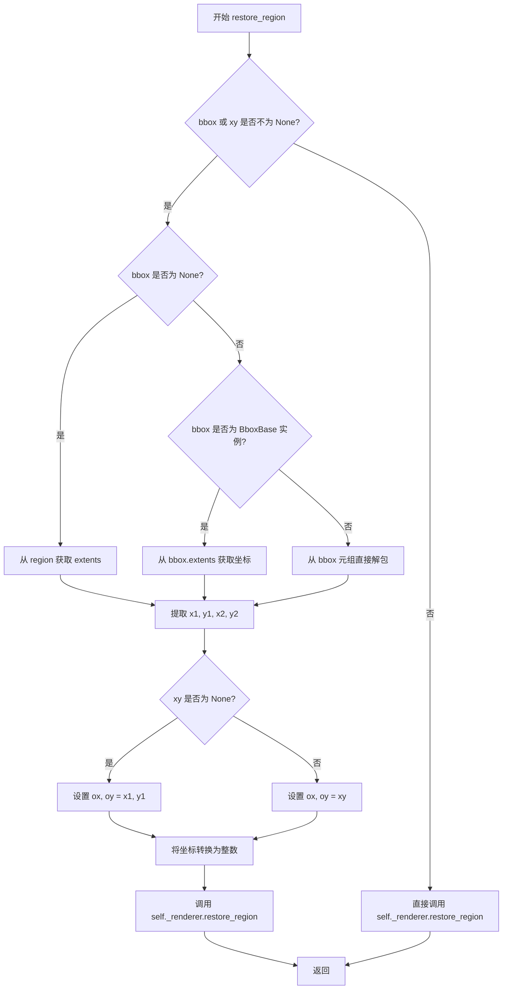

#### 带注释源码

```python
def restore_region(self, region, bbox=None, xy=None):
    """
    Restore the saved region. If bbox (instance of BboxBase, or
    its extents) is given, only the region specified by the bbox
    will be restored. *xy* (a pair of floats) optionally
    specifies the new position (the LLC of the original region,
    not the LLC of the bbox) where the region will be restored.

    >>> region = renderer.copy_from_bbox()
    >>> x1, y1, x2, y2 = region.get_extents()
    >>> renderer.restore_region(region, bbox=(x1+dx, y1, x2, y2),
    ...                         xy=(x1-dx, y1))

    """
    # 检查是否提供了 bbox 或 xy 参数，需要进行区域裁剪或位置偏移
    if bbox is not None or xy is not None:
        # 如果 bbox 为 None，则从 region 对象获取完整的区域边界
        if bbox is None:
            x1, y1, x2, y2 = region.get_extents()
        # 如果 bbox 是 BboxBase 实例（如 Bbox 对象），从其 extents 属性获取坐标
        elif isinstance(bbox, BboxBase):
            x1, y1, x2, y2 = bbox.extents
        # 否则假定 bbox 是一个包含 (x1, y1, x2, y2) 的元组
        else:
            x1, y1, x2, y2 = bbox

        # 如果未指定 xy，则使用区域原始的左上角坐标作为恢复位置
        if xy is None:
            ox, oy = x1, y1
        # 否则使用指定的 xy 坐标作为恢复位置
        else:
            ox, oy = xy

        # The incoming data is float, but the _renderer type-checking wants
        # to see integers.
        # 调用底层 C++ 渲染器进行区域恢复，传入整数坐标和偏移量
        self._renderer.restore_region(region, int(x1), int(y1),
                                      int(x2), int(y2), int(ox), int(oy))

    else:
        # 无需裁剪或偏移，直接恢复整个保存的区域
        self._renderer.restore_region(region)
```


### `RendererAgg.start_filter`

启动滤镜功能，创建一个新的渲染画布并将原有的渲染器保存到内部列表中，以便后续进行图像后处理。

参数：

- 该方法无参数（仅包含隐式参数 `self`）

返回值：`None`，无返回值

#### 流程图

```mermaid
flowchart TD
    A[开始 start_filter] --> B[保存当前渲染器到 _filter_renderers 列表]
    B --> C[创建新的 _RendererAgg 实例]
    C --> D[调用 _update_methods 更新方法绑定]
    D --> E[结束]
```

#### 带注释源码

```python
def start_filter(self):
    """
    Start filtering. It simply creates a new canvas (the old one is saved).
    """
    # 将当前的渲染器保存到 _filter_renderers 列表中
    # 这样可以在 stop_filter 时恢复原始渲染器
    self._filter_renderers.append(self._renderer)
    
    # 创建一个新的 _RendererAgg 实例，替换当前的渲染器
    # 新的渲染器将用于接收后续的绘制操作
    self._renderer = _RendererAgg(int(self.width), int(self.height),
                                  self.dpi)
    
    # 更新方法绑定，确保新渲染器的方法被正确引用
    # 这使得实例可以直接调用底层渲染器的方法
    self._update_methods()
```


### `RendererAgg.stop_filter`

该方法用于停止过滤模式，将当前画布保存为图像并应用后处理函数，然后将处理后的图像绘制回恢复的渲染器上。

参数：

- `post_processing`：`Callable[[np.ndarray, float], Tuple[np.ndarray, int, int]]`，一个后处理函数，接收裁剪后的图像（归一化的numpy数组，形状为ny×nx×4，RGBA格式）和DPI，返回处理后的新图像和x、y方向的偏移量

返回值：`None`，该方法直接在渲染器上绘制处理后的图像，无返回值

#### 流程图

```mermaid
flowchart TD
    A[调用 stop_filter] --> B[从 buffer_rgba 获取原始图像]
    B --> C[使用 cbook._get_nonzero_slices 获取非零像素切片]
    C --> D[裁剪图像: cropped_img = orig_img[slice_y, slice_x]]
    D --> E[从 _filter_renderers 栈恢复原来的渲染器]
    E --> F[调用 _update_methods 更新方法绑定]
    F --> G{检查 cropped_img 是否有内容?}
    G -->|否| H[直接返回，不进行后处理]
    G -->|是| I[调用 post_processing 函数处理图像]
    I --> J[创建新的图形上下文 gc = self.new_gc()]
    J --> K{图像数据类型是否为浮点?}
    K -->|是| L[将图像转换为 uint8: img * 255]
    K -->|否| M[直接使用原图像]
    L --> N[计算绘制坐标: x = slice_x.start + ox]
    N --> O[计算y坐标: y = height - slice_y.stop + oy]
    O --> P[调用 _renderer.draw_image 绘制处理后的图像]
    P --> Q[图像垂直翻转: img[::-1]]
    Q --> R[结束]
```

#### 带注释源码

```python
def stop_filter(self, post_processing):
    """
    Save the current canvas as an image and apply post processing.

    The *post_processing* function::

       def post_processing(image, dpi):
         # ny, nx, depth = image.shape
         # image (numpy array) has RGBA channels and has a depth of 4.
         ...
         # create a new_image (numpy array of 4 channels, size can be
         # different). The resulting image may have offsets from
         # lower-left corner of the original image
         return new_image, offset_x, offset_y

    The saved renderer is restored and the returned image from
    post_processing is plotted (using draw_image) on it.
    """
    # 第一步：获取当前渲染缓冲区的RGBA图像数据
    # buffer_rgba() 返回 memoryview，通过 np.asarray 转换为 numpy 数组
    orig_img = np.asarray(self.buffer_rgba())
    
    # 第二步：计算非零像素区域的切片（用于裁剪空白边界）
    # cbook._get_nonzero_slices 分析alpha通道，找到有实际内容的像素区域
    slice_y, slice_x = cbook._get_nonzero_slices(orig_img[..., 3])
    
    # 第三步：根据计算出的切片裁剪图像，去除多余的空白边界
    cropped_img = orig_img[slice_y, slice_x]

    # 第四步：恢复之前的渲染器
    # start_filter() 方法会将原始渲染器保存到 _filter_renderers 栈中
    # 现在需要弹出并恢复，以便后续绘制
    self._renderer = self._filter_renderers.pop()
    
    # 第五步：更新方法绑定，确保恢复的渲染器具有正确的绘制方法
    self._update_methods()

    # 第六步：如果裁剪后的图像有内容，则进行后处理
    if cropped_img.size:
        # 调用用户提供的后处理函数
        # 注意：输入图像被归一化到 [0, 1] 范围（除以255）
        img, ox, oy = post_processing(cropped_img / 255, self.dpi)
        
        # 创建新的图形上下文，用于绘制图像
        gc = self.new_gc()
        
        # 如果图像是浮点类型，转换为无符号8位整数
        # 这是因为 draw_image 需要 uint8 格式
        if img.dtype.kind == 'f':
            img = np.asarray(img * 255., np.uint8)
        
        # 计算绘制坐标：
        # x坐标 = 裁剪区域起始x + 后处理返回的x偏移
        # y坐标 = 画布高度 - 裁剪区域结束y + 后处理返回的y偏移
        # 注意：图像坐标原点在左下角，需要进行坐标转换
        self._renderer.draw_image(
            gc, slice_x.start + ox, int(self.height) - slice_y.stop + oy,
            img[::-1])  # 垂直翻转图像，因为渲染坐标系与图像数组索引方向相反
```


### FigureCanvasAgg.copy_from_bbox

该方法是 AGG 画布类的区域拷贝功能，用于从当前的渲染器中复制指定边界框（Bbox）内的图像区域，并返回一个可后续用于恢复的区域对象。

参数：

- `bbox`：`Bbox` 或类似类型，指定要拷贝的矩形区域边界框（包含 x1, y1, x2, y2 坐标信息）

返回值：`Region`（区域对象），返回从指定边界框内拷贝的图像区域数据，可用于后续的 `restore_region` 操作恢复该区域

#### 流程图

```mermaid
flowchart TD
    A[开始 copy_from_bbox] --> B[获取渲染器: renderer = self.get_renderer()]
    B --> C[调用渲染器的拷贝方法: renderer.copy_from_bbox(bbox)]
    C --> D[返回拷贝得到的区域对象]
```

#### 带注释源码

```python
def copy_from_bbox(self, bbox):
    """
    Copy the region bounded by *bbox* from the current renderer.
    The returned region can later be restored using restore_region.

    Parameters
    ----------
    bbox : Bbox
        The bounding box (in display coordinates) to copy from.

    Returns
    -------
    region : object
        A region object which can be passed to restore_region.
    """
    renderer = self.get_renderer()  # 获取当前的渲染器实例
    return renderer.copy_from_bbox(bbox)  # 调用渲染器的 copy_from_bbox 方法并返回结果
```


### FigureCanvasAgg.restore_region

该方法是matplotlib AGG后端中FigureCanvasAgg类的成员方法，用于恢复之前通过copy_from_bbox保存的图形区域。它作为一个代理方法，将调用转发到底层的RendererAgg对象，支持可选的边界框和位置参数来精确定位恢复的区域。

参数：

- `region`：`object`，从copy_from_bbox返回的区域对象，包含要恢复的图形数据
- `bbox`：`tuple` 或 `BboxBase`，可选参数，指定要恢复的区域边界框（x1, y1, x2, y2格式），如果为None则使用region的完整范围
- `xy`：`tuple`，可选参数，指定恢复区域的新位置（左下角坐标），如果为None则使用bbox的左下角

返回值：`None`，该方法直接操作渲染器状态，不返回任何值

#### 流程图

```mermaid
flowchart TD
    A[开始 restore_region] --> B{region, bbox, xy 都不为 None?}
    B -->|是| C[获取渲染器]
    C --> D[调用 renderer.restore_region]
    D --> E[结束]
    
    B -->|否| F{bbox 或 xy 不为 None?}
    F -->|是| G{判断 bbox 类型}
    G -->|None| H[从 region 获取 extents]
    G -->|BboxBase| I[使用 bbox.extents]
    G -->|其他| J[直接使用 bbox 作为坐标]
    H --> K{xy 为 None?}
    K -->|是| L[ox, oy = x1, y1]
    K -->|否| M[ox, oy = xy]
    L --> N[将坐标转换为整数]
    M --> N
    N --> O[调用 _renderer.restore_region]
    O --> E
    
    F -->|否| P[直接调用 _renderer.restore_region]
    P --> E
```

#### 带注释源码

```python
def restore_region(self, region, bbox=None, xy=None):
    """
    恢复之前保存的图形区域。
    
    参数:
        region: 从 copy_from_bbox() 返回的区域对象
        bbox: 可选的边界框，指定要恢复的区域；如果为 None，则恢复整个 region
        xy: 可选的 (x, y) 元组，指定恢复位置（region 的新左下角）
    
    返回值:
        无（直接修改渲染器状态）
    """
    # 获取当前的渲染器实例
    renderer = self.get_renderer()
    
    # 将调用转发到底层的 RendererAgg.restore_region 方法
    # 参数保持不变
    return renderer.restore_region(region, bbox, xy)
```


### `FigureCanvasAgg.draw`

该方法是matplotlib AGG后端的核心绘制方法，负责获取渲染器、清空画布、在持有锁的情况下绘制图形内容，并调用父类方法完成最终的GUI更新。

参数：

- `self`：`FigureCanvasAgg`，表示调用该方法的画布实例本身

返回值：`None`，该方法不返回任何值，主要通过副作用更新图形显示

#### 流程图

```mermaid
flowchart TD
    A[开始 draw 方法] --> B[调用 self.get_renderer 获取渲染器]
    B --> C[调用 self.renderer.clear 清空渲染器缓冲区]
    C --> D{检查 self.toolbar 是否存在}
    D -->|存在| E[使用 _wait_cursor_for_draw_cm 获取上下文]
    D -->|不存在| F[使用 nullcontext 获取空上下文]
    E --> G[在上下文中执行: self.figure.draw self.renderer 绘制图形]
    F --> G
    G --> H[调用 super.draw 执行父类绘制]
    H --> I[结束]
```

#### 带注释源码

```python
def draw(self):
    # docstring inherited
    # 获取渲染器实例，如果渲染器不存在或参数变化则创建新的RendererAgg
    self.renderer = self.get_renderer()
    # 清空渲染器缓冲区，为新一轮绘制做准备
    self.renderer.clear()
    # Acquire a lock on the shared font cache.
    # 判断工具栏是否存在，若存在则获取光标等待上下文管理器，否则使用nullcontext
    with (self.toolbar._wait_cursor_for_draw_cm() if self.toolbar
          else nullcontext()):
        # 调用figure的draw方法，将图形内容绘制到渲染器缓冲区
        self.figure.draw(self.renderer)
        # A GUI class may be need to update a window using this draw, so
        # don't forget to call the superclass.
        # 调用父类FigureCanvasBase的draw方法，确保GUI框架能够更新窗口
        super().draw()
```


### FigureCanvasAgg.get_renderer

该方法负责获取或创建图形渲染器，通过缓存机制避免重复创建渲染器实例，以提高渲染性能和内存效率。

参数：该方法无显式参数（仅包含隐式参数 self）

返回值：`RendererAgg`，返回当前 FigureCanvasAgg 关联的渲染器实例，用于执行图形绘制操作

#### 流程图

```mermaid
flowchart TD
    A[开始 get_renderer] --> B[获取图形边界框尺寸]
    B --> C[构建缓存键: key = (w, h, dpi)]
    C --> D{当前缓存键是否与上次相同?}
    D -->|是 - 可复用| E[直接返回缓存的 renderer]
    D -->|否 - 需新建| F[创建新 RendererAgg 实例]
    F --> G[更新 _lastKey 为当前 key]
    G --> E
    E --> H[返回 renderer 实例]
    H --> I[结束]
```

#### 带注释源码

```python
def get_renderer(self):
    """
    获取或创建一个适用于当前图形尺寸和DPI的渲染器。
    
    该方法实现了渲染器缓存机制：当图形尺寸和DPI未变化时，
    复用现有的渲染器实例，避免重复创建带来的性能开销。
    """
    # 获取图形的边界框尺寸（宽度和高度）
    w, h = self.figure.bbox.size
    
    # 构建缓存键，包含宽度、高度和DPI三个维度
    key = w, h, self.figure.dpi
    
    # 判断当前缓存键是否与上次使用的键相同
    reuse_renderer = (self._lastKey == key)
    
    # 如果不能复用（即尺寸或DPI发生变化），则创建新的渲染器
    if not reuse_renderer:
        # 创建新的AGG渲染器实例，传入宽度、高度和DPI
        self.renderer = RendererAgg(w, h, self.figure.dpi)
        # 更新缓存键，记录本次创建的渲染器对应的键值
        self._lastKey = key
    
    # 返回渲染器实例（无论是新创建的还是缓存的）
    return self.renderer
```


### `FigureCanvasAgg.tostring_argb`

获取FigureCanvasAgg渲染后的图像为ARGB格式的字节数据。在调用此方法前必须至少调用一次`draw()`方法，以确保渲染器已更新并包含最新的Figure内容。

参数：

- （无参数，仅有隐式self参数）

返回值：`bytes`，返回ARGB格式的图像字节数据

#### 流程图

```mermaid
flowchart TD
    A[FigureCanvasAgg.tostring_argb] --> B[获取renderer]
    B --> C[调用renderer.tostring_argb]
    C --> D[RendererAgg.tostring_argb]
    D --> E[将_renderer转为numpy数组]
    E --> F[使用take方法重排通道顺序: 3,0,1,2<br/>即BGRA转ARGB]
    F --> G[调用tobytes转为字节流]
    G --> H[返回ARGB字节数据]
```

#### 带注释源码

```python
def tostring_argb(self):
    """
    Get the image as ARGB `bytes`.

    `draw` must be called at least once before this function will work and
    to update the renderer for any subsequent changes to the Figure.
    """
    # 调用内部渲染器的tostring_argb方法获取ARGB字节数据
    return self.renderer.tostring_argb()


# 下方为RendererAgg.tostring_argb的实现细节（FigureCanvasAgg.tostring_argb内部调用）：

# def tostring_argb(self):
#     """
#     将渲染缓冲区转换为ARGB格式的字节数据
#     """
#     # 1. 将渲染器对象转换为numpy数组
#     # 2. 使用take方法重排通道顺序：将BGRA转换为ARGB
#     #    - 索引3对应原R通道（原B通道的位置）
#     #    - 索引0对应原G通道（原R通道的位置）
#     #    - 索引1对应原B通道（原G通道的位置）
#     #    - 索引2对应原A通道（原A通道的位置）
#     #    这样实现从RGBA到ARGB的通道重排
#     # 3. 调用tobytes()将数组转换为字节对象
#     return np.asarray(self._renderer).take([3, 0, 1, 2], axis=2).tobytes()
```


### `FigureCanvasAgg.buffer_rgba`

获取渲染器缓冲区的内存视图（memoryview），用于访问 Figure 的 RGBA 图像数据。

参数：

- 无

返回值：`memoryview`，返回渲染器缓冲区的内存视图对象，包含 Figure 的 RGBA 像素数据

#### 流程图

```mermaid
flowchart TD
    A[调用 FigureCanvasAgg.buffer_rgba] --> B[获取当前渲染器 renderer]
    B --> C[调用 renderer.buffer_rgba]
    C --> D[返回 _renderer 的 memoryview]
    E[用户获取 RGBA 数据用于进一步处理]
    D --> E
```

#### 带注释源码

```python
def buffer_rgba(self):
    """
    Get the image as a `memoryview` to the renderer's buffer.

    `draw` must be called at least once before this function will work and
    to update the renderer for any subsequent changes to the Figure.
    """
    # 调用底层渲染器的 buffer_rgba 方法获取内存视图
    # self.renderer 是 RendererAgg 实例
    # 该方法内部实现为: return memoryview(self._renderer)
    # 其中 _renderer 是 C++ 扩展的 RendererAgg 对象
    return self.renderer.buffer_rgba()
```


### FigureCanvasAgg.print_raw

将 Figure 渲染为原始 RGBA 图像数据并直接写入文件，不进行任何格式转换或元数据处理。

参数：

- `filename_or_obj`：`str` 或 `path-like` 或 `file-like`，输出目标，可以是文件路径或文件对象
- `metadata`：`dict`，可选参数，传递时必须为 None，该方法不支持元数据

返回值：`None`，无返回值，直接写入文件

#### 流程图

```mermaid
flowchart TD
    A[开始 print_raw] --> B{metadata 是否为 None}
    B -->|否| C[抛出 ValueError 异常]
    B -->|是| D[调用 draw 方法渲染 Figure]
    E[获取 Renderer 实例] --> F[打开文件用于二进制写入]
    F --> G[从 renderer 获取 buffer_rgba 数据]
    G --> H[将 RGBA 数据写入文件]
    H --> I[结束]
    
    D --> E
```

#### 带注释源码

```python
def print_raw(self, filename_or_obj, *, metadata=None):
    """
    将 Figure 渲染为原始 RGBA 图像并写入文件。
    
    Parameters
    ----------
    filename_or_obj : str or path-like or file-like
        输出文件路径或文件对象。
    metadata : dict, optional
        此参数必须为 None，该方法不支持元数据。
        如果传递非 None 值将抛出 ValueError。
    """
    # 检查 metadata 参数，如果不为 None 则抛出异常
    # 因为原始 RGBA 格式不支持存储元数据
    if metadata is not None:
        raise ValueError("metadata not supported for raw/rgba")
    
    # 调用 draw 方法确保 Figure 被渲染到 renderer
    # 这是必须的，否则 buffer_rgba 可能返回空数据
    FigureCanvasAgg.draw(self)
    
    # 获取当前活跃的 Renderer 实例
    renderer = self.get_renderer()
    
    # 使用 cbook.open_file_cm 打开文件为二进制写入模式
    # 该上下文管理器会自动处理文件关闭
    with cbook.open_file_cm(filename_or_obj, "wb") as fh:
        # 从 renderer 获取 RGBA 图像数据的内存视图
        # 并将其写入文件
        fh.write(renderer.buffer_rgba())

# print_rgba 是 print_raw 的别名，两者功能完全相同
print_rgba = print_raw
```


### FigureCanvasAgg.print_rgba

该方法是将Figure画布的内容以原始RGBA字节流的形式输出到指定文件或文件对象的功能，它是`print_raw`方法的别名，用于保存未经压缩的RGBA图像数据。

参数：

- `filename_or_obj`：`str` 或 `path-like` 或 `file-like`，输出目标文件路径或文件对象
- `metadata`：`dict`，可选参数，当前版本不支持元数据，若提供会抛出`ValueError`异常

返回值：`None`，无返回值（数据直接写入文件）

#### 流程图

```mermaid
flowchart TD
    A[开始 print_rgba] --> B{metadata是否为None?}
    B -->|否| C[抛出ValueError异常]
    B -->|是| D[调用draw方法渲染画布]
    D --> E[获取Renderer实例]
    E --> F[以二进制写入模式打开文件]
    F --> G[读取渲染器缓冲区RGBA数据]
    G --> H[写入文件]
    H --> I[结束]
```

#### 带注释源码

```python
def print_raw(self, filename_or_obj, *, metadata=None):
    """
    将Figure以原始RGBA格式保存到文件。
    
    Parameters
    ----------
    filename_or_obj : str or path-like or file-like
        要写入的文件路径或文件对象。
    metadata : dict, optional
        不支持此参数，仅作兼容接口用途。
    """
    # 检查metadata参数，如果提供了则抛出异常（该方法不支持元数据）
    if metadata is not None:
        raise ValueError("metadata not supported for raw/rgba")
    
    # 调用draw方法确保画布已渲染，这是获取正确缓冲区数据的前提
    FigureCanvasAgg.draw(self)
    
    # 获取当前Renderer实例
    renderer = self.get_renderer()
    
    # 使用cbook.open_file_cm打开文件（自动处理文件关闭）
    # 以二进制写入模式("wb")打开
    with cbook.open_file_cm(filename_or_obj, "wb") as fh:
        # 从渲染器获取RGBA缓冲区并写入文件
        # buffer_rgba()返回memoryview对象
        fh.write(renderer.buffer_rgba())

# print_rgba是print_raw的别名，提供更直观的命名
print_rgba = print_raw
```


### FigureCanvasAgg._print_pil

该方法是 FigureCanvasAgg 类中用于将画布绘制并保存为图像的核心方法。它首先调用 draw() 方法渲染画布，然后使用 mpl.image.imsave 将渲染结果保存为指定的图像格式。

参数：

- `self`：FigureCanvasAgg 实例，表示调用该方法的画布对象本身
- `filename_or_obj`：str 或 path-like 或 file-like，要写入的文件（路径或文件对象）
- `fmt`：str，图像格式（如 "png"、"jpeg"、"gif"、"tiff"、"webp"、"avif" 等）
- `pil_kwargs`：dict，可选的 Pillow 图像保存关键字参数，会传递给 PIL.Image.Image.save
- `metadata`：dict，可选的图像元数据，会包含在保存的文件中

返回值：`None`，该方法无返回值，直接将图像写入指定文件

#### 流程图

```mermaid
flowchart TD
    A[开始 _print_pil] --> B[调用 FigureCanvasAgg.draw 渲染画布]
    B --> C[获取画布的 RGBA 缓冲区]
    C --> D[调用 mpl.image.imsave 保存图像]
    D --> E[根据传入的 fmt 格式保存]
    E --> F[传入 origin='upper' 设置原点]
    F --> G[传入 dpi=self.figure.dpi 设置分辨率]
    G --> H[传入 pil_kwargs 和 metadata]
    H --> I[结束]
```

#### 带注释源码

```python
def _print_pil(self, filename_or_obj, fmt, pil_kwargs, metadata=None):
    """
    Draw the canvas, then save it using `.image.imsave` (to which
    *pil_kwargs* and *metadata* are forwarded).
    """
    # 首先调用 draw 方法渲染画布内容
    # 这会清空缓冲区并重新绘制整个图形
    FigureCanvasAgg.draw(self)
    
    # 使用 matplotlib 的图像保存功能将缓冲区保存为文件
    # 参数说明：
    # - filename_or_obj: 文件路径或文件对象
    # - self.buffer_rgba(): 获取渲染器的 RGBA 缓冲区数据
    # - format=fmt: 指定图像格式（png/jpeg/gif/tiff/webp/avif）
    # - origin="upper": 设置图像原点为左上角（与 Matplotlib 默认相反）
    # - dpi=self.figure.dpi: 使用图形对象的 DPI 设置
    # - metadata=metadata: 可选的元数据（如 PNG 的文本信息）
    # - pil_kwargs=pil_kwargs: 传递给 Pillow 的额外参数
    mpl.image.imsave(
        filename_or_obj, self.buffer_rgba(), format=fmt, origin="upper",
        dpi=self.figure.dpi, metadata=metadata, pil_kwargs=pil_kwargs)
```


### FigureCanvasAgg.print_png

将 Figure 写入 PNG 文件，支持自定义元数据和 Pillow 图像保存参数。

参数：

- `filename_or_obj`：`str | path-like | file-like`，要写入的文件路径或文件对象
- `metadata`：`dict | None`，PNG 文件中的元数据，以键值对形式存储，键为短于 79 字符的字节或 latin-1 编码字符串
- `pil_kwargs`：`dict | None`，传递给 PIL.Image.Image.save 的额外关键字参数

返回值：`None`，无返回值（通过调用 `_print_pil` 间接完成文件写入）

#### 流程图

```mermaid
flowchart TD
    A[print_png 调用] --> B[调用 _print_pil 方法]
    B --> C[调用 draw 方法渲染 Figure]
    C --> D[获取 renderer 缓冲区数据]
    D --> E[调用 mpl.image.imsave 保存为 PNG]
    E --> F[写入文件完成]
    
    subgraph "_print_pil 内部流程"
        C1[draw] --> C2[figure.draw renderer]
        C2 --> C3[返回渲染器]
    end
```

#### 带注释源码

```python
def print_png(self, filename_or_obj, *, metadata=None, pil_kwargs=None):
    """
    Write the figure to a PNG file.

    Parameters
    ----------
    filename_or_obj : str or path-like or file-like
        The file to write to.

    metadata : dict, optional
        Metadata in the PNG file as key-value pairs of bytes or latin-1
        encodable strings.
        According to the PNG specification, keys must be shorter than 79
        chars.

        The `PNG specification`_ defines some common keywords that may be
        used as appropriate:

        - Title: Short (one line) title or caption for image.
        - Author: Name of image's creator.
        - Description: Description of image (possibly long).
        - Copyright: Copyright notice.
        - Creation Time: Time of original image creation
          (usually RFC 1123 format).
        - Software: Software used to create the image.
        - Disclaimer: Legal disclaimer.
        - Warning: Warning of nature of content.
        - Source: Device used to create the image.
        - Comment: Miscellaneous comment;
          conversion from other image format.

        Other keywords may be invented for other purposes.

        If 'Software' is not given, an autogenerated value for Matplotlib
        will be used.  This can be removed by setting it to *None*.

        For more details see the `PNG specification`_.

        .. _PNG specification: \
            https://www.w3.org/TR/2003/REC-PNG-20031110/#11keywords

    pil_kwargs : dict, optional
        Keyword arguments passed to `PIL.Image.Image.save`.

        If the 'pnginfo' key is present, it completely overrides
        *metadata*, including the default 'Software' key.
    """
    # 委托给 _print_pil 方法处理实际的 PNG 写入逻辑
    # 参数依次为：文件对象/路径、格式名称("png")、PIL 参数、元数据
    self._print_pil(filename_or_obj, "png", pil_kwargs, metadata)
```


### FigureCanvasAgg.print_to_buffer

该方法将当前画布的内容渲染为RGBA图像数据，并返回图像的原始像素字节和尺寸信息，常用于获取画布的像素数据以进行进一步处理或传输。

参数：无需显式参数（`self` 为实例本身）

返回值：`tuple[bytes, tuple[int, int]]`，返回包含RGBA像素数据的字节串以及图像的宽高尺寸元组

#### 流程图

```mermaid
flowchart TD
    A[开始] --> B[调用 draw 方法绘制图形]
    B --> C[获取渲染器 renderer]
    C --> D[获取渲染器缓冲区 RGBA 字节数据]
    D --> E[获取渲染器宽度和高度]
    E --> F[返回元组 字节数据, 宽高]
    F --> G[结束]
```

#### 带注释源码

```python
def print_to_buffer(self):
    """
    将画布内容渲染为 RGBA 图像数据并返回。

    该方法首先调用 draw 方法确保画布已绘制，
    然后获取渲染器并从中提取 RGBA 像素数据。
    
    Returns
    -------
    tuple[bytes, tuple[int, int]]
        第一个元素为 RGBA 图像的原始字节数据（按行存储），
        第二个元素为图像的 (宽度, 高度) 尺寸元组。
    """
    # 1. 调用 draw 方法执行完整的图形绘制流程
    #    这会清空画布并重新绘制整个图形
    FigureCanvasAgg.draw(self)
    
    # 2. 获取当前的渲染器实例
    #    渲染器负责实际的图形绘制操作
    renderer = self.get_renderer()
    
    # 3. 返回包含图像数据的元组
    #    - renderer.buffer_rgba() 返回 memoryview，
    #      bytes() 将其转换为字节串
    #    - (int(renderer.width), int(renderer.height))
    #      提供图像的像素尺寸
    return (bytes(renderer.buffer_rgba()),
            (int(renderer.width), int(renderer.height)))
```


### `FigureCanvasAgg.print_gif`

该方法用于将 Figure 画布的内容保存为 GIF 格式的图像文件。它是 Matplotlib AGG 后端的图像导出功能之一，通过调用内部方法 `_print_pil` 实现，委托 PIL 库完成 GIF 编码和文件保存。

参数：

- `filename_or_obj`：`str` 或 `path-like` 或 `file-like`，指定要写入的 GIF 文件路径或文件对象
- `metadata`：`dict` 或 `None`，可选参数，用于 PNG 文件的元数据（GIF 格式不使用，传入会被忽略）
- `pil_kwargs`：`dict` 或 `None`，可选参数，包含传递给 `PIL.Image.Image.save` 的额外关键字参数

返回值：`None`，无返回值（直接写入文件）

#### 流程图

```mermaid
flowchart TD
    A[调用 print_gif] --> B[调用 _print_pil 方法]
    B --> C[调用 draw 方法渲染画布]
    C --> D[获取 renderer 的 RGBA 缓冲区]
    D --> E[调用 mpl.image.imsave 保存为 GIF]
    E --> F[结束]
```

#### 带注释源码

```python
def print_gif(self, filename_or_obj, *, metadata=None, pil_kwargs=None):
    """
    将 Figure 画布保存为 GIF 格式。
    
    参数:
        filename_or_obj: str 或 path-like 或 file-like
            要写入的文件路径或文件对象。
        metadata: dict, optional
            元数据（GIF 格式不支持，会被忽略）。
        pil_kwargs: dict, optional
            传递给 PIL.Image.save 的额外参数，如 optimize、palette 等。
    """
    # 调用内部方法 _print_pil，传入文件对象、格式 'gif'、以及相关参数
    # 该方法会先调用 draw() 渲染画布，然后使用 mpl.image.imsave 保存
    self._print_pil(filename_or_obj, "gif", pil_kwargs, metadata)
```


### `FigureCanvasAgg.print_jpg`

该方法用于将 Figure 渲染为 JPEG 图像并保存到指定文件或对象。它首先设置背景色为白色（以正确混合半透明图形），然后调用内部方法 `_print_pil` 执行实际的图像保存操作。

参数：

- `filename_or_obj`：`str | Path | file-like`，要写入的文件路径或文件对象
- `metadata`：`dict | None`，JPEG 文件的元数据（对于基于 Pillow 的写入器此参数未使用）
- `pil_kwargs`：`dict | None`，传递给 `PIL.Image.Image.save` 的额外关键字参数

返回值：`None`，该方法不返回值，直接将图像写入指定文件

#### 流程图

```mermaid
flowchart TD
    A[开始 print_jpg] --> B[使用 rc_context 设置 savefig.facecolor 为 white]
    B --> C[调用 _print_pil 方法]
    C --> D[在 _print_pil 中: 调用 draw 渲染 Figure]
    D --> E[调用 mpl.image.imsave 保存为 JPEG]
    E --> F[结束]
    
    style A fill:#f9f,stroke:#333
    style F fill:#9f9,stroke:#333
```

#### 带注释源码

```python
def print_jpg(self, filename_or_obj, *, metadata=None, pil_kwargs=None):
    """
    Write the figure to a JPEG file.

    Parameters
    ----------
    filename_or_obj : str or path-like or file-like
        The file to write to.
    metadata : None
        Unused for pillow-based writers. All supported options
        can be passed via *pil_kwargs*.
    pil_kwargs : dict, optional
        Additional keyword arguments that are passed to
        `PIL.Image.Image.save` when saving the figure.
    """
    # savefig() has already applied savefig.facecolor; we now set it to
    # white to make imsave() blend semi-transparent figures against an
    # assumed white background.
    # 注意：savefig() 已经应用了 savefig.facecolor；这里将其设置为白色，
    # 以便 imsave() 在假定的白色背景上混合半透明图形
    with mpl.rc_context({"savefig.facecolor": "white"}):
        # 调用内部方法 _print_pil 执行实际保存操作，指定格式为 "jpeg"
        self._print_pil(filename_or_obj, "jpeg", pil_kwargs, metadata)

# 定义 print_jpeg 为 print_jpg 的别名
print_jpeg = print_jpg
```


### FigureCanvasAgg.print_jpeg

该方法用于将 Figure 画布以 JPEG 格式保存到文件或文件类对象中，通过设置白色背景以正确混合半透明图形，并调用内部 PIL 打印方法完成图像保存。

参数：

- `self`：FigureCanvasAgg 实例，调用该方法的对象本身
- `filename_or_obj`：str 或 path-like 或 file-like，要写入的 JPEG 文件路径或文件对象
- `metadata`：dict 或 None，可选，JPEG 文件的元数据（根据通用接口设计，当前版本未直接使用）
- `pil_kwargs`：dict 或 None，可选，传递给 PIL.Image.Image.save 的额外关键字参数（如 quality、optimize 等）

返回值：无（None），该方法直接保存文件，不返回任何内容

#### 流程图

```mermaid
flowchart TD
    A[用户调用 print_jpeg 方法] --> B{检查 metadata 参数}
    B -->|未使用但保留参数| C[使用 rc_context 设置白色背景]
    C --> D[调用 _print_pil 私有方法]
    D --> E[调用 draw 方法渲染画布]
    E --> F[获取 renderer]
    F --> G[调用 mpl.image.imsave 保存为 JPEG]
    G --> H[使用 'jpeg' 格式和白色背景]
    H --> I[返回 None]
```

#### 带注释源码

```python
def print_jpg(self, filename_or_obj, *, metadata=None, pil_kwargs=None):
    """
    将 Figure 保存为 JPEG 文件。
    
    Parameters
    ----------
    filename_or_obj : str or path-like or file-like
        要写入的文件路径或文件对象。
    metadata : dict, optional
        JPEG 文件的元数据（当前版本中未直接使用，保留接口一致性）。
    pil_kwargs : dict, optional
        传递给 PIL.Image.Image.save 的额外关键字参数，
        例如 quality（质量 1-100）、optimize（优化）等。
    """
    # savefig() 已经应用了 savefig.facecolor；
    # 这里将其设置为白色，以使 imsave() 在假定的白色背景上
    # 混合半透明图形
    with mpl.rc_context({"savefig.facecolor": "white"}):
        # 调用内部 PIL 打印方法，传入文件对象、格式和参数
        self._print_pil(filename_or_obj, "jpeg", pil_kwargs, metadata)

# print_jpeg 是 print_jpg 的别名，提供命名一致性
print_jpeg = print_jpg
```


### `FigureCanvasAgg.print_tif`

该方法用于将matplotlib图形保存为TIFF（Tagged Image File Format）图像文件。它是matplotlib AGG后端提供的图像导出功能之一，通过调用内部方法 `_print_pil` 实现实际的绘制和保存操作。

参数：

- `self`：`FigureCanvasAgg`，调用该方法的画布实例本身
- `filename_or_obj`：`str` 或 `path-like` 或 `file-like`，目标输出文件路径（字符串、路径对象）或文件对象
- `metadata`：`dict` 或 `None`，可选参数，TIFF文件中的元数据键值对（但实际实现中对于pillow-based写入器未使用，所有支持的选项可通过 `pil_kwargs` 传递）
- `pil_kwargs`：`dict` 或 `None`，可选参数，传递给 `PIL.Image.Image.save` 的额外关键字参数，用于控制TIFF保存选项（如压缩方式、位深等）

返回值：`None`，该方法无返回值，通过副作用将图形写入指定文件

#### 流程图

```mermaid
flowchart TD
    A[调用 print_tif 方法] --> B{检查 metadata 参数}
    B -->|metadata 不为 None| C[抛出 ValueError 异常]
    B -->|metadata 为 None| D[调用 _print_pil 方法]
    D --> E[调用 FigureCanvasAgg.draw 渲染图形]
    E --> F[获取渲染器缓冲区 RGBA 数据]
    F --> G[调用 mpl.image.imsave 保存为 TIFF 格式]
    G --> H[方法结束, 无返回值]
```

#### 带注释源码

```python
def print_tif(self, filename_or_obj, *, metadata=None, pil_kwargs=None):
    """
    Write the figure to a TIFF file.

    Parameters
    ----------
    filename_or_obj : str or path-like or file-like
        The file to write to.
    metadata : None
        Unused for pillow-based writers. All supported options
        can be passed via *pil_kwargs*.
    pil_kwargs : dict, optional
        Additional keyword arguments that are passed to
        `PIL.Image.Image.save` when saving the figure.
    """
    # 调用内部方法 _print_pil，参数依次为：
    # - filename_or_obj: 文件路径或文件对象
    # - "tiff": 指定输出格式为 TIFF
    # - pil_kwargs: PIL 额外参数
    # - metadata: 元数据（对于 TIFF 此处传 None）
    self._print_pil(filename_or_obj, "tiff", pil_kwargs, metadata)
```


### `FigureCanvasAgg.print_tiff`

将 Figure 渲染并保存为 TIFF 格式文件，内部委托给 `_print_pil` 方法完成实际的图像保存操作。

参数：

- `filename_or_obj`：`str` 或 `path-like` 或 `file-like`，要写入的文件路径或文件对象
- `metadata`：`dict`，可选，传递给 PIL 的元数据字典
- `pil_kwargs`：`dict`，可选，传递给 `PIL.Image.Image.save` 的额外关键字参数

返回值：`None`，该方法直接写入文件，不返回任何内容

#### 流程图

```mermaid
flowchart TD
    A[开始 print_tiff] --> B[调用 _print_pil 方法]
    B --> C[调用 draw 方法渲染画布]
    C --> D[获取 renderer 的 buffer_rgba]
    E[调用 mpl.image.imsave] --> F[使用 PIL 保存为 TIFF 格式]
    D --> E
    F --> G[结束]
```

#### 带注释源码

```python
def print_tif(self, filename_or_obj, *, metadata=None, pil_kwargs=None):
    """
    Write the figure to a TIFF file.
    
    Parameters
    ----------
    filename_or_obj : str or path-like or file-like
        The file to write to.
    metadata : None
        Unused for pillow-based writers. All supported options
        can be passed via *pil_kwargs*.
    pil_kwargs : dict, optional
        Additional keyword arguments that are passed to
        `PIL.Image.Image.save` when saving the figure.
    """
    # 委托给 _print_pil 方法处理，传入格式为 "tiff"
    self._print_pil(filename_or_obj, "tiff", pil_kwargs, metadata)

# print_tiff 是 print_tif 的别名，提供两种命名方式
print_tiff = print_tif
```


### `FigureCanvasAgg.print_webp`

将matplotlib图形以WebP格式保存到文件或文件对象中。该方法是对`_print_pil`的包装，专门用于处理WebP图像格式的输出。

参数：

- `filename_or_obj`：`str` 或 `path-like` 或 `file-like`，要写入的文件路径或文件对象
- `metadata`：`dict` 或 `None`，WebP文件的元数据（传递给PIL，但当前实现中未直接使用）
- `pil_kwargs`：`dict` 或 `None`，保存时传递给`PIL.Image.Image.save`的额外关键字参数

返回值：`None`，无返回值（该方法直接操作文件，不返回任何值）

#### 流程图

```mermaid
flowchart TD
    A[print_webp 被调用] --> B{检查 metadata}
    B -->|不使用| C[调用 _print_pil 方法]
    C --> D[调用 FigureCanvasAgg.draw 渲染图形]
    D --> E[调用 mpl.image.imsave 保存为 WebP]
    E --> F[返回 None]
    
    style A fill:#f9f,stroke:#333
    style C fill:#ff9,stroke:#333
    style D fill:#bbf,stroke:#333
    style E fill:#bfb,stroke:#333
```

#### 带注释源码

```python
def print_webp(self, filename_or_obj, *, metadata=None, pil_kwargs=None):
    """
    将matplotlib图形保存为WebP格式。
    
    Parameters
    ----------
    filename_or_obj : str or path-like or file-like
        要写入的文件路径或文件对象。
    metadata : None
        未直接使用WebP的元数据。所有支持的选项
        可以通过 *pil_kwargs* 传递。
    pil_kwargs : dict, optional
        保存时传递给 PIL.Image.Image.save 的额外关键字参数。
    """
    # 调用内部方法 _print_pil，传入 WebP 格式标识符
    # _print_pil 会先调用 draw() 渲染图形，然后使用 mpl.image.imsave 保存
    self._print_pil(filename_or_obj, "webp", pil_kwargs, metadata)
```


### `FigureCanvasAgg.print_avif`

将 matplotlib 图形以 AVIF 格式保存到文件或文件类对象中。首先检查 Pillow 是否支持 AVIF 格式，若不支持则抛出运行时错误，否则调用内部方法 `_print_pil` 执行实际的图像渲染和保存操作。

参数：

- `self`：FigureCanvasAgg 实例，Canvas 自身引用
- `filename_or_obj`：`str` 或 `path-like` 或 `file-like`，要写入的文件路径或文件对象
- `metadata`：`None`，保留参数，用于 Pillow 写入器的占位参数
- `pil_kwargs`：`dict` 或 `None`，可选，传递给 `PIL.Image.Image.save` 的额外关键字参数

返回值：`None`，该方法直接写入文件，不返回任何内容

#### 流程图

```mermaid
flowchart TD
    A[开始 print_avif] --> B{检查 AVIF 支持}
    B -->|不支持| C[抛出 RuntimeError]
    B -->|支持| D[调用 _print_pil 方法]
    D --> E[内部调用 draw 渲染图形]
    E --> F[使用 mpl.image.imsave 保存为 AVIF]
    F --> G[结束]
```

#### 带注释源码

```python
def print_avif(self, filename_or_obj, *, metadata=None, pil_kwargs=None):
    """
    Write the figure to a AVIF file.

    Parameters
    ----------
    filename_or_obj : str or path-like or file-like
        The file to write to.
    metadata : None
        Unused for pillow-based writers. All supported options
        can be passed via *pil_kwargs*.
    pil_kwargs : dict, optional
        Additional keyword arguments that are passed to
        `PIL.Image.Image.save` when saving the figure.
    """
    # 检查当前安装的 Pillow 库是否支持 AVIF 格式
    # features.check() 调用 PIL.features 模块的检查函数
    if not features.check("avif"):
        # AVIF 支持需要 Pillow 11.3 或更高版本
        raise RuntimeError(
            "The installed pillow version does not support avif. Full "
            "avif support has been added in pillow 11.3."
        )
    # 调用内部通用图像打印方法，传入 AVIF 格式标识符
    # _print_pil 方法会先调用 draw() 渲染图形，然后使用 mpl.image.imsave 保存
    self._print_pil(filename_or_obj, "avif", pil_kwargs, metadata)
```

## 关键组件


### 张量索引与通道重排

在`tostring_argb()`方法中使用NumPy的`take()`函数进行通道重排，将RGBA格式转换为ARGB格式，使用轴索引操作实现张量数据的重新排列。

### 惰性加载与内存视图

`buffer_rgba()`方法返回`memoryview(self._renderer)`，提供了对底层渲染缓冲区的惰性访问，避免了不必要的数据拷贝，仅在需要时访问像素数据。

### 图像裁剪的惰性求值

在`stop_filter()`方法中使用`cbook._get_nonzero_slices()`获取非零像素区域的切片，实现了对渲染结果的惰性裁剪，仅处理实际包含内容的区域。

### 浮点转整数量化

在`stop_filter()`方法中，当图像数据类型为浮点型时，将其乘以255并转换为uint8类型，实现了从浮点[0,1]到整数[0,255]的量化转换。

### 路径分块处理与简化

`draw_path()`方法实现了基于`rcParams['agg.path.chunksize']`的路径分块渲染，当顶点数超过阈值时自动拆分路径，并提供了路径简化的容错处理机制。

### 字体渲染与缓存管理

`_prepare_font()`方法实现了字体资源的获取、缓冲区清理和尺寸设置，配合matplotlib的字体缓存机制，避免重复加载字体。

### 图像格式导出策略

FigureCanvasAgg类通过`_print_pil()`方法统一了多种图像格式的导出逻辑，支持PNG、GIF、JPEG、TIFF、WebP、AVIF等格式，并处理了元数据和DPI配置。


## 问题及建议


### 已知问题

- **字典映射冗余**：`get_hinting_flag()` 函数中的 mapping 字典包含重复的映射项（如 `True` 和 `'force_autohint'` 都映射到 `LoadFlags.FORCE_AUTOHINT`），这增加了维护成本且对性能无益。
- **方法过长**：`draw_path` 方法包含超过 100 行代码，大量嵌套的条件判断和错误处理逻辑导致代码可读性和可维护性差，应拆分为更小的私有方法。
- **硬编码错误消息**：错误消息中包含大量硬编码的字符串（如 "Exceeded cell block limit in Agg"），这些消息在多处重复出现，应提取为常量或配置文件。
- **代码重复**：多个 `print_*` 方法（如 `print_gif`、`print_jpg`、`print_tif` 等）使用相同的文档字符串模板和相似逻辑，可以通过装饰器或工厂模式简化。
- **字体查找未缓存**：`_prepare_font` 方法每次调用都会执行 `_fontManager._find_fonts_by_props(font_prop)`，这可能涉及文件 I/O 操作，缺乏缓存机制会导致重复查询。
- **文本渲染性能**：`get_text_width_height_descent` 方法在每次调用时都重新设置文本并获取尺寸，对于相同文本的多次测量没有缓存。
- **过时的 TODO 注释**：`draw_tex` 方法中存在 TODO 注释 "todo, handle props, angle, origins"，表明该方法功能不完整，但长期未完成。
- **异常处理复杂**：`draw_path` 方法中的异常处理逻辑过于复杂，包含多个分支条件判断，增加了代码理解和维护的难度。
- **类型转换开销**：在 `restore_region` 方法中存在显式的 `int()` 类型转换，这些转换在某些情况下可能不必要。
- **API 设计不一致**：某些方法如 `copy_from_bbox` 和 `restore_region` 在 `FigureCanvasAgg` 和 `RendererAgg` 中都有定义，存在轻微的职责重叠。

### 优化建议

- **重构映射逻辑**：简化 `get_hinting_flag()` 的映射字典，移除冗余项，并考虑使用枚举或常量类来管理提示标志。
- **提取公共方法**：将 `draw_path` 中的路径分块逻辑和错误消息构建逻辑提取为私有方法，提高代码模块化程度。
- **常量提取**：将所有硬编码的错误消息字符串提取为模块级常量或配置项，便于统一管理和国际化。
- **实现打印方法工厂**：使用装饰器或工厂模式生成各种图像格式的打印方法，减少代码重复。
- **添加字体缓存**：在 `RendererAgg` 类中实现字体缓存机制，避免重复查找相同字体属性。
- **添加文本测量缓存**：为 `get_text_width_height_descent` 添加缓存装饰器或内部缓存，存储已测量文本的尺寸信息。
- **完善 `draw_tex` 方法**：完成 TODO 项或移除该方法，如果该功能暂时不需要，可以添加 `NotImplementedError` 或明确标记为待完成。
- **简化异常处理**：将复杂的异常处理逻辑重构为更清晰的结构，可以使用策略模式或提前验证条件来减少分支。
- **优化类型转换**：检查 `restore_region` 方法中类型转换的必要性，考虑是否可以在调用前确保类型正确。
- **明确 API 职责**：梳理 `FigureCanvasAgg` 和 `RendererAgg` 中重复方法的职责，必要时通过组合或委托模式明确各自职责。

## 其它


### 设计目标与约束

本 AGG 后端的设计目标是提供高质量的 2D 图形渲染，支持线条、文本、多边形、裁剪、alpha 混合等功能，并输出 RGBA 和多种 Pillow 支持的图像格式（PNG、GIF、JPEG、TIFF、WebP、AVIF）。约束包括：需要依赖 Pillow 库进行图像保存，路径分块大小受 rcParams['agg.path.chunksize'] 限制，AVIF 格式需要 Pillow 11.3+ 版本支持。

### 错误处理与异常设计

主要异常处理包括：
- **OverflowError**：当路径顶点数超过单元块限制时抛出，提供详细的错误信息，包括建议的解决方案（减小 chunksize 或增加简化阈值）
- **ValueError**：当传入不支持的 metadata 格式时抛出（如 print_raw 方法）
- **RuntimeError**：当 Pillow 版本不支持 AVIF 格式时抛出
- **Bbox 参数验证**：restore_region 方法支持 BboxBase 对象或四元组，会进行类型检查并提取边界

### 数据流与状态机

数据流如下：
1. **FigureCanvasAgg** 接收绘图指令（如 draw()）
2. 通过 **get_renderer()** 获取或创建 **RendererAgg** 实例（基于 figure 尺寸和 DPI 缓存）
3. **RendererAgg** 调用底层 **_RendererAgg** C++ 扩展执行实际渲染
4. 渲染结果存储在内存缓冲区，可通过 **buffer_rgba()** 或 **tostring_argb()** 获取
5. 导出方法（print_png 等）将缓冲区转换为指定格式并保存

状态机包括：
- 渲染器状态：普通渲染模式 / 过滤模式（start_filter/stop_filter）
- 画布状态：首次绘制后 _lastKey 缓存当前渲染器

### 外部依赖与接口契约

主要外部依赖：
- **numpy**：数组操作、图像处理
- **PIL (Pillow)**：图像保存、多格式支持、features 检查
- **matplotlib._api**：API 检查辅助
- **matplotlib.cbook**：通用工具函数
- **matplotlib.backend_bases**：基类定义
- **matplotlib.font_manager**：字体管理
- **matplotlib.ft2font**：FreeType 字体加载
- **matplotlib.mathtext**：数学文本解析
- **matplotlib.path**：路径数据结构
- **matplotlib.transforms**：变换与边界框
- **matplotlib.backends._backend_agg**：C++ 实现的渲染器

### 并发与线程安全性

无显式线程锁机制。_lastKey 缓存机制在单线程环境下工作正常，但多线程并发调用 get_renderer() 时可能存在竞态条件。共享字体缓存（_fontManager）通过 matplotlib 内部机制管理。

### 配置与可扩展性

可通过 matplotlib rcParams 配置：
- **text.hinting**：文本微调标志（default、no_autohint、force_autohint、no_hinting 等）
- **agg.path.chunksize**：路径分块大小
- **path.simplify_threshold**：路径简化阈值
- **savefig.facecolor**：保存图像时的背景色

扩展方式：继承 FigureCanvasBase 和 RendererBase 实现新的后端

### 性能特性与基准

- 路径分块处理：大路径（>100 点且可简化）自动分块以避免内存溢出
- 图像合成：option_image_nocomposite() 返回 True，表示直接合成更快
- 图像缩放：option_scale_image() 返回 False，表示不进行自动缩放
- 渲染器缓存：基于 (width, height, dpi) 缓存渲染器实例

### 版本兼容性

- 后端版本：'v2.2'
- Pillow AVIF 支持：需要 Pillow 11.3+
- numpy：依赖版本随 matplotlib 主版本确定

### 缓存策略

- **渲染器缓存**：FigureCanvasAgg._lastKey 缓存当前渲染器键值，避免重复创建
- **字体缓存**：_fontManager 管理字体缓存，_prepare_font() 复用字体对象
- **Mathtext 解析器**：每个 RendererAgg 实例创建一个 MathTextParser

### 资源管理

- **内存缓冲区**：通过 memoryview 直接访问渲染器缓冲区，无需额外复制
- **字体对象**：_prepare_font() 每次调用 clear() 重置字体状态
- **过滤模式**：start_filter() 保存旧渲染器引用，stop_filter() 恢复

### 安全考虑

- metadata 参数验证：print_raw 方法拒绝非空 metadata
- 文件操作：使用 cbook.open_file_cm 上下文管理器确保资源正确释放

### 平台特定考虑

- **DPI 缩放**：所有尺寸（字体、线宽、虚线等）根据 dpi 正确缩放
- **浮点数精度**：坐标计算中使用 round() 避免亚像素渲染问题
- **图像坐标**：origin="upper" 与 PIL 约定一致

### 使用示例

```python
import matplotlib.pyplot as plt
plt.switch_backend('Agg')  # 或在 matplotlibrc 中设置 backend: Agg

fig, ax = plt.subplots()
ax.plot([1, 2, 3], [1, 4, 9])
fig.savefig('output.png')
fig.savefig('output.pdf')  # 其他后端
```

### 测试策略

单元测试覆盖：
- 路径绘制与分块处理
- 文本渲染与数学文本
- 图像导出各种格式
- 区域复制与恢复
- 过滤模式

集成测试：
- 与 matplotlib.pyplot 完整流程
- 与不同图像格式保存


    