# `matplotlib\lib\matplotlib\backends\backend_cairo.py` 详细设计文档

这是Matplotlib的Cairo后端实现，它将Matplotlib的高层绘图指令（路径、文本、图像）转换为Cairo图形库的底层调用，以渲染到PNG、PDF、PS、SVG等不同格式的表面或交互式窗口中。

## 整体流程

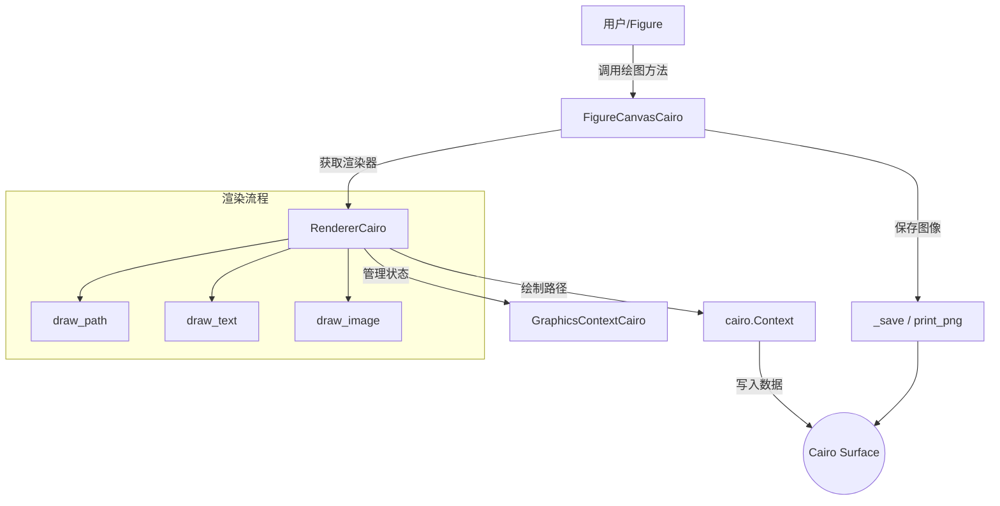

## 类结构

```
RendererBase (抽象基类)
└── RendererCairo (Cairo渲染核心)
GraphicsContextBase (抽象基类)
└── GraphicsContextCairo (图形状态管理)
FigureCanvasBase (抽象基类)
└── FigureCanvasCairo (画布与输出控制)
_Backend (入口基类)
└── _BackendCairo (后端导出类)
```

## 全局变量及字段


### `cairo`
    
cairo或cairocffi库，提供Cairo图形渲染功能

类型：`module`
    


### `np`
    
numpy库，用于数值计算和数组操作

类型：`module`
    


### `functools`
    
functools库，提供函数式编程工具

类型：`module`
    


### `gzip`
    
gzip库，用于gzip压缩格式处理

类型：`module`
    


### `math`
    
math库，提供数学函数

类型：`module`
    


### `RendererCairo.dpi`
    
每英寸点数

类型：`float`
    


### `RendererCairo.gc`
    
图形上下文实例

类型：`GraphicsContextCairo`
    


### `RendererCairo.width`
    
画布宽度

类型：`int`
    


### `RendererCairo.height`
    
画布高度

类型：`int`
    


### `RendererCairo.text_ctx`
    
用于测量文本大小的临时上下文

类型：`cairo.Context`
    


### `GraphicsContextCairo.renderer`
    
关联的渲染器

类型：`RendererCairo`
    


### `GraphicsContextCairo._joind`
    
线段连接样式映射

类型：`dict`
    


### `GraphicsContextCairo._capd`
    
线段端点样式映射

类型：`dict`
    


### `FigureCanvasCairo._cached_renderer`
    
缓存的渲染器实例

类型：`RendererCairo`
    


### `_CairoRegion._slices`
    
图像区域的切片

类型：`object`
    


### `_CairoRegion._data`
    
像素数据

类型：`object`
    


### `_BackendCairo.backend_version`
    
Cairo库版本

类型：`str`
    


### `_BackendCairo.FigureCanvas`
    
画布类

类型：`type`
    


### `_BackendCairo.FigureManager`
    
管理器类

类型：`type`
    
    

## 全局函数及方法


### `_set_rgba`

设置Cairo上下文的RGBA颜色源，根据颜色通道数和forced_alpha参数决定是否使用独立的alpha值。

参数：

-  `ctx`：`cairo.Context`，Cairo图形上下文对象，用于执行绘图操作
-  `color`：`tuple/list`，颜色值，可以是RGB（3元素）或RGBA（4元素）元组
-  `alpha`：`float`，透明度值，范围通常为0.0到1.0
-  `forced_alpha`：`bool`，是否强制使用传入的alpha参数覆盖颜色中的alpha通道

返回值：`None`，该函数直接操作Cairo上下文，不返回任何值

#### 流程图

```mermaid
flowchart TD
    A[开始 _set_rgba] --> B{len(color) == 3 或 forced_alpha?}
    B -->|是| C[使用 color[:3] 和 alpha]
    B -->|否| D[使用完整 color]
    C --> E[ctx.set_source_rgba]
    D --> E
    E --> F[结束]
```

#### 带注释源码

```python
def _set_rgba(ctx, color, alpha, forced_alpha):
    """
    设置Cairo上下文的颜色和透明度。
    
    Parameters
    ----------
    ctx : cairo.Context
        Cairo图形上下文对象
    color : tuple or list
        颜色值，RGB（3元素）或RGBA（4元素）
    alpha : float
        透明度值，0.0（完全透明）到1.0（完全不透明）
    forced_alpha : bool
        是否强制使用alpha参数，忽略color中的alpha通道
    """
    # 判断条件：颜色为RGB（3元素）或需要强制使用alpha
    if len(color) == 3 or forced_alpha:
        # 提取RGB前三个分量，使用传入的alpha值
        ctx.set_source_rgba(*color[:3], alpha)
    else:
        # 颜色已是RGBA（4元素），直接使用完整颜色值
        ctx.set_source_rgba(*color)
```


### `_append_path`

将Matplotlib的路径（Path）对象通过迭代转换为Cairo绘图上下文（Context）的绘图指令序列，处理MOVETO、LINETO、CURVE3、CURVE4、CLOSEPOLY等路径指令，并将三次贝塞尔曲线转换为Cairo的曲线绘制命令。

参数：

- `ctx`：`cairo.Context`，Cairo图形库的绘图上下文，用于执行实际的绘图指令
- `path`：`matplotlib.path.Path`，Matplotlib的路径对象，包含顶点和路径码
- `transform`：`matplotlib.transforms.Transform`，应用于路径的仿射变换（如缩放、平移、旋转）
- `clip`：`可选的剪辑区域`，用于裁剪路径渲染范围，默认为None

返回值：`None`，该函数直接在Cairo上下文中执行绘图操作，无返回值

#### 流程图

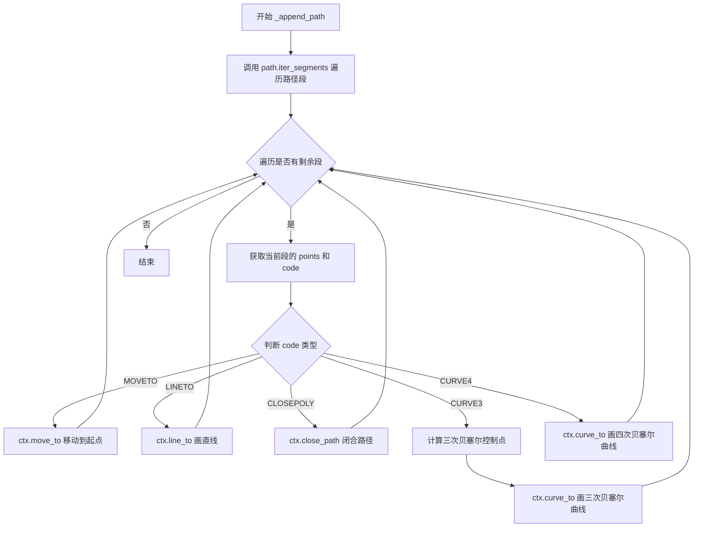

#### 带注释源码

```python
def _append_path(ctx, path, transform, clip=None):
    """
    将Matplotlib路径迭代转换为Cairo绘图指令
    
    参数:
        ctx: cairo.Context - Cairo绘图上下文
        path: matplotlib.path.Path - Matplotlib路径对象
        transform: matplotlib.transforms.Transform - 路径变换矩阵
        clip: 可选,剪辑区域用于裁剪路径渲染范围
    """
    # 迭代路径的每个段,remove_nans移除NaN坐标,clip应用剪辑区域
    for points, code in path.iter_segments(
            transform, remove_nans=True, clip=clip):
        # Path.MOVETO: 移动到新起点
        if code == Path.MOVETO:
            ctx.move_to(*points)
        # Path.CLOSEPOLY: 闭合当前子路径
        elif code == Path.CLOSEPOLY:
            ctx.close_path()
        # Path.LINETO: 从当前点到目标点画直线
        elif code == Path.LINETO:
            ctx.line_to(*points)
        # Path.CURVE3: 二次贝塞尔曲线(在Matplotlib中用三次近似实现)
        elif code == Path.CURVE3:
            # 获取当前Cairo上下文中的点作为曲线起点
            cur = np.asarray(ctx.get_current_point())
            # 提取控制点a(起点侧)和b(终点侧)
            a = points[:2]
            b = points[-2:]
            # 将二次贝塞尔转换为三次贝塞尔曲线
            # 使用de Casteljau算法细分: P0=cur, P1=a*2/3+cur/3, P2=a*2/3+b/3, P3=b
            ctx.curve_to(*(cur / 3 + a * 2 / 3), *(a * 2 / 3 + b / 3), *b)
        # Path.CURVE4: 四次(三次)贝塞尔曲线,直接映射到Cairo的curve_to
        elif code == Path.CURVE4:
            ctx.curve_to(*points)
```


### `_cairo_font_args_from_font_prop`

将 FontProperties 或 FontEntry 对象转换为 Cairo 字体参数（名称、倾斜样式、权重），以便用于 `Context.select_font_face` 方法。

参数：

- `prop`：`FontProperties` 或 `FontEntry`，包含字体属性（名称、样式、权重等）的对象

返回值：`tuple`，返回包含三个元素的元组 `(name, slant, weight)`，其中：
  - `name`：字体名称（字符串）
  - `slant`：Cairo 字体倾斜样式常量（如 `cairo.FONT_SLANT_ITALIC`）
  - `weight`：Cairo 字体权重常量（`cairo.FONT_WEIGHT_NORMAL` 或 `cairo.FONT_WEIGHT_BOLD`）

#### 流程图

```mermaid
flowchart TD
    A[开始] --> B[定义内部函数 attr field]
    B --> C[获取字体名称 name = attr'name']
    C --> D[获取字体样式 style = attr'style']
    D --> E[将样式转换为大写并拼接为常量名 FONT_SLANT_{style}]
    E --> F[获取对应的 Cairo 倾斜常量 slant = getattrcairo, 常量名]
    F --> G[获取字体权重 weight = attr'weight']
    G --> H{weight 是否小于 550}
    H -->|是| I[weight = cairo.FONT_WEIGHT_NORMAL]
    H -->|否| J[weight = cairo.FONT_WEIGHT_BOLD]
    I --> K[返回 name, slant, weight]
    J --> K
```

#### 带注释源码

```python
def _cairo_font_args_from_font_prop(prop):
    """
    Convert a `.FontProperties` or a `.FontEntry` to arguments that can be
    passed to `.Context.select_font_face`.
    """
    # 内部函数：尝试获取属性值
    # 首先尝试调用 get_{field}() 方法，如果不存在则直接获取属性
    def attr(field):
        try:
            return getattr(prop, f"get_{field}")()
        except AttributeError:
            return getattr(prop, field)

    # 获取字体名称
    name = attr("name")
    
    # 获取字体样式（如 'normal', 'italic', 'oblique'）并转换为 Cairo 倾斜常量
    # 例如：'italic' -> cairo.FONT_SLANT_ITALIC
    slant = getattr(cairo, f"FONT_SLANT_{attr('style').upper()}")
    
    # 获取字体权重
    weight = attr("weight")
    
    # 根据权重值判断是否为粗体
    # 如果权重值小于 550 则为正常粗细，否则为粗体
    weight = (cairo.FONT_WEIGHT_NORMAL
              if font_manager.weight_dict.get(weight, weight) < 550
              else cairo.FONT_WEIGHT_BOLD)
    
    # 返回元组：字体名称、倾斜样式、权重
    return name, slant, weight
```


### `RendererCairo.set_context`

该方法用于设置 Cairo 渲染器的绘图上下文，并从给定的 Cairo 上下文目标表面中推断出画布的宽度和高度。它支持多种类型的表面（图像表面、GTK4 RecordingSurface 或矢量表面），并将内部图形上下文与给定的上下文关联起来。

参数：

- `ctx`：`cairo.Context`，Cairo 图形上下文，用于获取目标表面和进行绘图操作

返回值：`None`，该方法无返回值，直接修改实例属性

#### 流程图

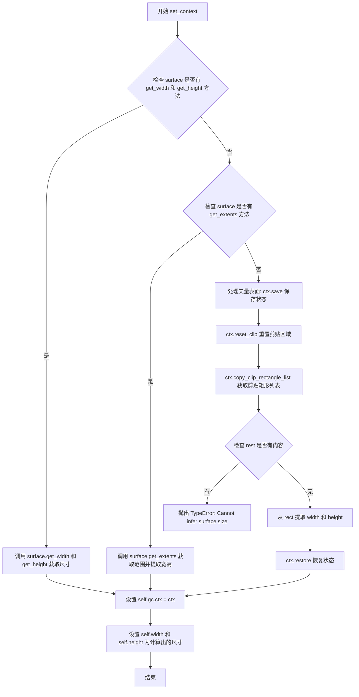

#### 带注释源码

```python
def set_context(self, ctx):
    """
    设置 Cairo 渲染器的绘图上下文。
    
    参数:
        ctx: cairo.Context 对象，用于获取目标表面和进行绘图操作
    """
    surface = ctx.get_target()  # 获取上下文的目标表面
    
    # 尝试方法1: 检查表面是否有 get_width 和 get_height 方法（适用于 ImageSurface 等）
    if hasattr(surface, "get_width") and hasattr(surface, "get_height"):
        size = surface.get_width(), surface.get_height()
    
    # 尝试方法2: 检查表面是否有 get_extents 方法（适用于 GTK4 RecordingSurface）
    elif hasattr(surface, "get_extents"):
        ext = surface.get_extents()
        size = ext.width, ext.height
    
    # 尝试方法3: 对于矢量表面，通过剪贴矩形推断大小
    else:
        ctx.save()           # 保存当前上下文状态
        ctx.reset_clip()     # 重置剪贴区域
        rect, *rest = ctx.copy_clip_rectangle_list()  # 获取剪贴矩形列表
        if rest:
            raise TypeError("Cannot infer surface size")  # 多个矩形无法推断
        _, _, *size = rect   # 从矩形中提取宽度和高度
        ctx.restore()        # 恢复上下文状态
    
    # 将传入的上下文设置为图形上下文的 ctx
    self.gc.ctx = ctx
    
    # 更新渲染器的宽高属性
    self.width, self.height = size
```


### `RendererCairo._fill_and_stroke`

该方法是一个静态方法，用于在 Cairo 图形上下文中执行路径的填充（如果提供了填充颜色）和描边操作。它先根据条件判断是否需要填充，若需要则保存上下文、设置颜色、执行填充并恢复上下文，最后统一执行描边。

参数：

- `ctx`：`cairo.Context`，Cairo 图形上下文，用于执行绘图操作
- `fill_c`：颜色值（tuple 或 None），路径的填充颜色，如果为 None 则不执行填充
- `alpha`：`float`，透明度值，范围通常为 0.0 到 1.0
- `alpha_overrides`：`bool`，标志位，指示是否强制使用传入的 alpha 值覆盖颜色中的透明度

返回值：`None`，该方法直接在上下文上执行绘图操作，无返回值

#### 流程图

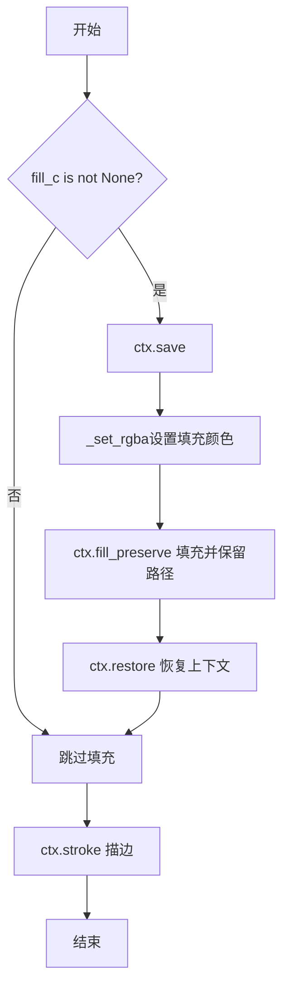

#### 带注释源码

```python
@staticmethod
def _fill_and_stroke(ctx, fill_c, alpha, alpha_overrides):
    """
    在 Cairo 上下文中填充并描边路径的静态方法
    
    参数:
        ctx: cairo.Context - Cairo图形上下文
        fill_c: 填充颜色，None表示不填充
        alpha: 透明度值
        alpha_overrides: 是否强制使用alpha覆盖颜色中的透明度
    """
    # 检查是否需要填充：只有当提供了填充颜色时才执行填充操作
    if fill_c is not None:
        # 保存当前上下文状态，以便后续恢复
        ctx.save()
        # 调用_set_rgba函数设置填充颜色的RGBA值
        _set_rgba(ctx, fill_c, alpha, alpha_overrides)
        # 执行填充操作，同时保留路径用于后续描边
        ctx.fill_preserve()
        # 恢复上下文状态，撤销save所做的更改
        ctx.restore()
    
    # 无论是否执行了填充，最后都执行描边操作
    ctx.stroke()
```


### `RendererCairo.draw_path`

该方法负责将 Matplotlib 的路径对象绘制到 Cairo 图形上下文中，包括路径转换、裁剪、填充和描边处理，同时支持阴影图案的绘制。

参数：

- `gc`：`GraphicsContextBase`，图形上下文，包含画笔、填充等渲染状态
- `path`：`Path`，要绘制的路径对象，包含顶点数据和路径指令
- `transform`：变换矩阵，用于将路径坐标转换为设备坐标
- `rgbFace`：可选参数，填充颜色（RGB 元组或 None）

返回值：`None`，该方法直接在 Cairo 上下文中绘制，不返回任何值

#### 流程图

```mermaid
flowchart TD
    A[开始 draw_path] --> B[获取 Cairo 上下文 ctx]
    B --> C{rgbFace is None 且<br/>gc.get_hatch() is None?}
    C -->|是| D[获取裁剪区域 clip]
    C -->|否| E[clip = None]
    D --> F
    E --> F[构建变换: transform +<br/>Affine2D.scale(1,-1).translate(0,height)]
    F --> G[ctx.new_path - 清空当前路径]
    G --> H[_append_path 绘制路径到 ctx]
    H --> I{rgbFace is not None?}
    I -->|是| J[保存上下文 ctx.save]
    J --> K[_set_rgba 设置填充颜色]
    K --> L[ctx.fill_preserve 填充并保留路径]
    L --> M[恢复上下文 ctx.restore]
    I -->|否| N
    M --> N
    N --> O{hatch_path =<br/>gc.get_hatch_path()?}
    O -->|是| P[创建阴影表面 hatch_surface]
    P --> Q[创建阴影上下文 hatch_ctx]
    Q --> R[_append_path 绘制阴影路径]
    R --> S[设置阴影线宽和颜色]
    S --> T[hatch_ctx.fill_preserve<br/>然后 stroke]
    T --> U[创建阴影图案 hatch_pattern]
    U --> V[设置 REPEAT 扩展模式]
    V --> W[ctx.set_source 设置阴影图案]
    W --> X[ctx.fill_preserve 绘制阴影]
    X --> Y[恢复上下文 ctx.restore]
    O -->|否| Z
    Y --> Z
    Z --> AA[ctx.stroke 描边路径]
    AA --> AB[结束]
```

#### 带注释源码

```python
def draw_path(self, gc, path, transform, rgbFace=None):
    """
    绘制路径到 Cairo 上下文。
    
    参数:
        gc: GraphicsContextBase, 图形上下文
        path: Path, 要绘制的路径
        transform: 变换矩阵
        rgbFace: 可选填充颜色
    """
    # 从图形上下文获取 Cairo 上下文
    ctx = gc.ctx
    
    # 根据条件确定是否需要裁剪：
    # 如果没有填充颜色且没有阴影图案，则裁剪到实际渲染区域
    clip = (ctx.clip_extents()
            if rgbFace is None and gc.get_hatch() is None
            else None)
    
    # 构建最终变换：组合用户变换和坐标翻转
    # scale(1, -1) 翻转 Y 轴，translate(0, height) 调整原点
    transform = (transform
                 + Affine2D().scale(1, -1).translate(0, self.height))
    
    # 创建新路径（清空之前的路径）
    ctx.new_path()
    
    # 将 Matplotlib 路径追加到 Cairo 上下文中
    # 应用变换和裁剪
    _append_path(ctx, path, transform, clip)
    
    # 如果有填充颜色，进行填充处理
    if rgbFace is not None:
        ctx.save()
        # 设置 RGBA 颜色，考虑透明度覆盖
        _set_rgba(ctx, rgbFace, gc.get_alpha(), gc.get_forced_alpha())
        # 填充并保留路径（用于后续描边）
        ctx.fill_preserve()
        ctx.restore()
    
    # 获取阴影图案路径
    hatch_path = gc.get_hatch_path()
    
    # 如果存在阴影图案，进行阴影绘制
    if hatch_path:
        # 获取 DPI 并创建与设备像素对应的阴影表面
        dpi = int(self.dpi)
        hatch_surface = ctx.get_target().create_similar(
            cairo.Content.COLOR_ALPHA, dpi, dpi)
        # 创建阴影上下文
        hatch_ctx = cairo.Context(hatch_surface)
        
        # 绘制阴影路径到阴影表面
        # 注意：阴影需要单独的比例变换
        _append_path(hatch_ctx, hatch_path,
                     Affine2D().scale(dpi, -dpi).translate(0, dpi),
                     None)
        
        # 设置阴影线条属性
        hatch_ctx.set_line_width(self.points_to_pixels(gc.get_hatch_linewidth()))
        hatch_ctx.set_source_rgba(*gc.get_hatch_color())
        # 填充并描边阴影图案
        hatch_ctx.fill_preserve()
        hatch_ctx.stroke()
        
        # 创建表面图案并设置重复扩展
        hatch_pattern = cairo.SurfacePattern(hatch_surface)
        hatch_pattern.set_extend(cairo.Extend.REPEAT)
        
        # 在主上下文中绘制阴影图案
        ctx.save()
        ctx.set_source(hatch_pattern)
        ctx.fill_preserve()
        ctx.restore()
    
    # 最后描边路径轮廓
    ctx.stroke()
```


### `RendererCairo.draw_markers`

该方法负责在 Cairo 后端渲染散点图等图形中的标记点，通过遍历路径顶点并在每个位置绘制标记图形，同时处理填充和描边，支持高效的批量绘制优化。

参数：

- `self`：隐式参数，RendererCairo 实例，表示当前渲染器对象
- `gc`：`GraphicsContextCairo`，图形上下文，包含绘图状态如颜色、线宽等
- `marker_path`：`Path`，标记的路径对象，定义单个标记的几何形状
- `marker_trans`：`Transform`，标记的变换矩阵，用于定位和缩放标记
- `path`：`Path`，数据点路径，包含需要绘制标记的所有顶点位置
- `transform`：`Transform`，数据路径的变换矩阵，将用户坐标转换为设备坐标
- `rgbFace`：`可选[颜色值]`，标记的填充颜色，默认为 None 表示不填充

返回值：`None`，该方法直接在 Cairo 上下文中绘制图形，无返回值

#### 流程图

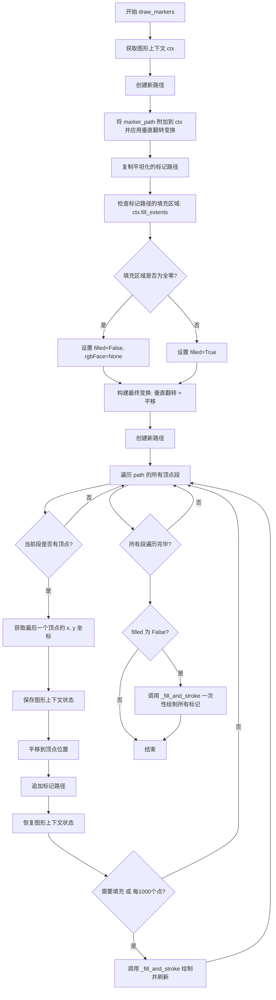

#### 带注释源码

```python
def draw_markers(self, gc, marker_path, marker_trans, path, transform,
                 rgbFace=None):
    """
    Draw markers at each vertex of the path.
    
    Parameters
    ----------
    gc : GraphicsContextCairo
        Graphics context for rendering.
    marker_path : Path
        The path defining the marker shape.
    marker_trans : Transform
        Transform for positioning the marker.
    path : Path
        The path containing vertices where markers should be drawn.
    transform : Transform
        Transform for the path vertices.
    rgbFace : color or None
        Fill color for the marker. None means no fill.
    """
    # docstring inherited

    # 获取 Cairo 图形上下文
    ctx = gc.ctx
    
    # 开始新的路径以避免与之前的绘制混合
    ctx.new_path()
    
    # 创建标记路径；需要在这里进行垂直翻转（Y轴反转）
    # 因为 Cairo 坐标系原点在左上角，而 Matplotlib 使用左下角
    _append_path(ctx, marker_path, marker_trans + Affine2D().scale(1, -1))
    
    # 复制平坦化的标记路径供后续重复使用
    marker_path = ctx.copy_path_flat()

    # 判断路径是否有填充
    # fill_extents 返回填充区域的边界框 (x1, y1, x2, y2)
    x1, y1, x2, y2 = ctx.fill_extents()
    
    # 如果边界框全为0，表示没有填充区域
    if x1 == 0 and y1 == 0 and x2 == 0 and y2 == 0:
        filled = False
        # 没有填充时，清除 rgbFace 以避免后续尝试填充
        rgbFace = None
    else:
        filled = True

    # 构建最终的变换矩阵：
    # 1. 垂直翻转 Y 轴（坐标系转换）
    # 2. 平移以适应 Cairo 的坐标原点
    transform = (transform
                 + Affine2D().scale(1, -1).translate(0, self.height))

    # 为后续绘制创建新路径
    ctx.new_path()
    
    # 遍历路径中的所有顶点段
    for i, (vertices, codes) in enumerate(
            path.iter_segments(transform, simplify=False)):
        # 确保当前段有顶点数据
        if len(vertices):
            # 提取最后一个顶点的坐标（标记放置位置）
            x, y = vertices[-2:]
            
            # 保存当前图形状态
            ctx.save()

            # 将原点平移到标记位置
            ctx.translate(x, y)
            
            # 在新位置追加标记路径
            ctx.append_path(marker_path)

            # 恢复图形状态（取消平移）
            ctx.restore()

            # 较慢的绘制路径：当有填充时需要同时绘制填充和描边
            # 每隔1000个点刷新一次，防止路径过长导致性能下降
            if filled or i % 1000 == 0:
                self._fill_and_stroke(
                    ctx, rgbFace, gc.get_alpha(), gc.get_forced_alpha())

    # 快速路径：如果没有填充，一次性绘制所有标记
    if not filled:
        self._fill_and_stroke(
            ctx, rgbFace, gc.get_alpha(), gc.get_forced_alpha())
```


### `RendererCairo.draw_image`

该方法用于将图像绘制到Cairo图形上下文中，实现Matplotlib的图像渲染功能。它接收图形上下文、坐标和图像数据，将图像数据转换为Cairo表面，并绘制到指定位置。

参数：

- `gc`：`GraphicsContextCairo`，图形上下文，用于获取Cairo渲染上下文(ctx)
- `x`：`float`，图像绘制位置的X坐标（设备坐标）
- `y`：`float`，图像绘制位置的Y坐标（设备坐标）
- `im`：`numpy.ndarray`，图像数据，为RGBA格式的二维或三维数组

返回值：`None`，该方法直接在Cairo上下文中绘制图像，无返回值

#### 流程图

```mermaid
flowchart TD
    A[开始 draw_image] --> B[调用cbook._unmultiplied_rgba8888_to_premultiplied_argb32转换图像]
    B --> C[创建Cairo ImageSurface]
    C --> D[计算Y坐标: y = height - y - im.shape[0]]
    D --> E[保存Cairo上下文状态]
    E --> F[设置源表面和位置]
    F --> G[调用ctx.paint()绘制图像]
    G --> H[恢复Cairo上下文状态]
    H --> I[结束]
```

#### 带注释源码

```python
def draw_image(self, gc, x, y, im):
    """
    Draw an image to the Cairo context.
    
    Parameters
    ----------
    gc : GraphicsContextCairo
        Graphics context for rendering.
    x : float
        X coordinate in device coordinates.
    y : float
        Y coordinate in device coordinates.
    im : numpy.ndarray
        Image data as RGBA array.
    """
    # 将图像数据从未预乘的RGBA8888转换为预乘的ARGB32格式
    # 这是Cairo表面所需的数据格式
    im = cbook._unmultiplied_rgba8888_to_premultiplied_argb32(im[::-1])
    
    # 创建Cairo ImageSurface
    # 参数: 数据, 格式, 宽度, 高度, 每行字节数
    surface = cairo.ImageSurface.create_for_data(
        im.ravel().data, cairo.FORMAT_ARGB32,
        im.shape[1], im.shape[0], im.shape[1] * 4)
    
    # 获取图形上下文中的Cairo上下文
    ctx = gc.ctx
    
    # 计算Y坐标: Matplotlib使用左下角为原点, Cairo使用左上角为原点
    # 需要翻转Y轴并调整位置
    y = self.height - y - im.shape[0]

    # 保存当前上下文状态
    ctx.save()
    
    # 设置源表面为创建的图像表面, 位置为(x, y)
    ctx.set_source_surface(surface, float(x), float(y))
    
    # 绘制源表面到目标表面
    ctx.paint()
    
    # 恢复上下文状态, 取消之前的设置
    ctx.restore()
```


### RendererCairo.draw_text

该方法是Matplotlib Cairo后端的文本渲染核心方法，负责在给定的图形上下文、设备坐标位置使用指定的字体属性和角度绘制文本字符串，支持普通文本和数学文本两种模式。

参数：

- `gc`：`GraphicsContextBase`，图形上下文，包含当前的绘图状态、颜色、字体选项等
- `x`：`float`，文本起始点的x坐标（设备/显示坐标，不同于其他draw_*方法的用户坐标）
- `y`：`float`，文本起始点的y坐标（设备/显示坐标）
- `s`：`str`，要绘制的文本字符串
- `prop`：`FontProperties`，字体属性对象，包含字体名称、大小、样式等
- `angle`：`float`，文本逆时针旋转角度（单位为度）
- `ismath`：`bool`或`str`，是否以数学文本模式渲染，默认为False
- `mtext`：`Text`或`None`，可选的matplotlib文本对象，用于额外的文本渲染控制

返回值：`None`，该方法直接在Cairo图形上下文中渲染文本，无返回值

#### 流程图

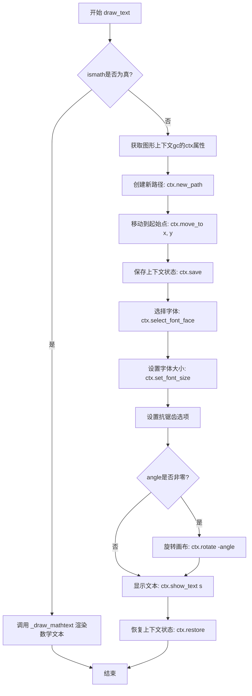

#### 带注释源码

```python
def draw_text(self, gc, x, y, s, prop, angle, ismath=False, mtext=None):
    # docstring inherited
    # 注意：(x, y)是设备/显示坐标，与其他draw_*方法使用的用户坐标不同

    # 判断是否为数学文本渲染模式
    if ismath:
        # 如果是数学文本，调用专门的数学文本渲染方法
        self._draw_mathtext(gc, x, y, s, prop, angle)
    else:
        # 普通文本渲染路径
        ctx = gc.ctx  # 从图形上下文获取Cairo渲染上下文
        ctx.new_path()  # 创建新的渲染路径
        ctx.move_to(x, y)  # 移动到文本起始位置

        ctx.save()  # 保存当前上下文状态，以便后续恢复

        # 根据字体属性选择Cairo字体
        ctx.select_font_face(*_cairo_font_args_from_font_prop(prop))

        # 将字体大小从点转换为像素
        ctx.set_font_size(self.points_to_pixels(prop.get_size_in_points()))

        # 配置字体渲染选项
        opts = cairo.FontOptions()
        # 从图形上下文获取抗锯齿设置并应用到字体选项
        opts.set_antialias(gc.get_antialiased())
        ctx.set_font_options(opts)

        # 如果存在角度旋转，则旋转画布（注意：Cairo中角度为弧度，且逆时针为正）
        if angle:
            ctx.rotate(np.deg2rad(-angle))

        # 在当前上下文位置显示文本字符串
        ctx.show_text(s)

        # 恢复之前保存的上下文状态，撤销旋转等变换
        ctx.restore()
```


### `RendererCairo._draw_mathtext`

该方法是 Cairo 后端用于渲染数学文本（Mathtext）的核心函数。它首先通过 `_text2path.mathtext_parser` 解析数学文本字符串获取字形和矩形信息，然后使用 Cairo 图形上下文依次绘制每个字形（glyph）和矩形框，最后恢复图形状态。

参数：

- `gc`：`GraphicsContextCairo`，Cairo 图形上下文对象，用于执行实际的绘图操作
- `x`：`float`，文本绘制的起始 x 坐标（设备坐标）
- `y`：`float`，文本绘制的起始 y 坐标（设备坐标）
- `s`：`str`，要渲染的数学文本字符串
- `prop`：`matplotlib.font_manager.FontProperties`，字体属性对象，包含字体名称、大小、样式等信息
- `angle`：`float`，文本的旋转角度（单位为度）

返回值：`None`，该方法直接在 Cairo 图形上下文上进行绘制，无返回值

#### 流程图

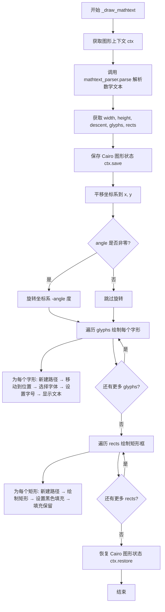

#### 带注释源码

```python
def _draw_mathtext(self, gc, x, y, s, prop, angle):
    """
    使用 Cairo 后端渲染数学文本（Mathtext）

    参数:
        gc: GraphicsContextCairo, 图形上下文
        x: float, 文本x坐标
        y: float, 文本y坐标
        s: str, 数学文本字符串
        prop: FontProperties, 字体属性
        angle: float, 旋转角度（度）
    """
    # 从图形上下文获取 Cairo 上下文对象
    ctx = gc.ctx
    
    # 调用 mathtext_parser.parse 解析数学文本字符串
    # 返回值包含: 宽度、高度、降线、字形列表、矩形列表
    width, height, descent, glyphs, rects = \
        self._text2path.mathtext_parser.parse(s, self.dpi, prop)

    # 保存当前 Cairo 图形状态，以便后续恢复
    ctx.save()
    
    # 将坐标系平移到指定的 (x, y) 位置
    ctx.translate(x, y)
    
    # 如果指定了旋转角度，则旋转坐标系（负角度因为 Cairo 坐标系y轴向下）
    if angle:
        ctx.rotate(np.deg2rad(-angle))

    # 遍历所有字形（glyphs），逐个绘制到上下文中
    # glyphs 包含: font(字体对象), fontsize(字号), idx(字符索引), ox(偏移x), oy(偏移y)
    for font, fontsize, idx, ox, oy in glyphs:
        ctx.new_path()                      # 创建新路径
        ctx.move_to(ox, -oy)                 # 移动到字形位置（y轴取反）
        
        # 从字体对象获取 TTF 字体属性，转换为 Cairo 字体参数
        ctx.select_font_face(
            *_cairo_font_args_from_font_prop(ttfFontProperty(font)))
        
        # 将字号从点转换为像素并设置
        ctx.set_font_size(self.points_to_pixels(fontsize))
        
        # 显示字形文本（将字符索引转换为字符）
        ctx.show_text(chr(idx))

    # 遍历所有矩形（rects），绘制矩形框（如根号、分式线等）
    # rects 包含: ox(偏移x), oy(偏移y), w(宽度), h(高度)
    for ox, oy, w, h in rects:
        ctx.new_path()                      # 创建新路径
        # 绘制矩形，y轴取反以适应坐标系
        ctx.rectangle(ox, -oy, w, -h)
        ctx.set_source_rgb(0, 0, 0)         # 设置填充颜色为黑色
        ctx.fill_preserve()                 # 填充矩形并保留路径用于描边

    # 恢复之前保存的 Cairo 图形状态
    ctx.restore()
```


### `RendererCairo.get_canvas_width_height`

获取当前 Cairo 渲染器所绑定的画布（Surface）的宽度和高度。该方法直接返回实例属性 `self.width` 和 `self.height` 组成的元组，这两个属性通常在 `set_context` 方法中被初始化或更新。

参数：

-  无（该方法仅包含隐式参数 `self`，无显式输入参数）

返回值：`tuple`，返回画布的宽度 (width) 和高度 (height) 组成的元组。

#### 流程图

```mermaid
flowchart TD
    A([开始 get_canvas_width_height]) --> B[读取实例属性 self.width]
    B --> C[读取实例属性 self.height]
    C --> D[组装元组 (self.width, self.height)]
    D --> E([返回元组])
```

#### 带注释源码

```python
def get_canvas_width_height(self):
    # docstring inherited
    # 直接返回在 set_context 中初始化或更新的画布尺寸元组
    return self.width, self.height
```


### `RendererCairo.get_text_width_height_descent`

该方法负责计算给定文本字符串在画布上的像素级尺寸（宽度、高度以及 descent（基线以下的距离））。它是 Matplotlib 后端将文本属性转换为实际渲染尺寸的关键接口，根据 `ismath` 参数区分普通文本、数学公式（TeX 或 MathText），并分别调用父类方法或直接利用 Cairo 上下文进行测量。

参数：

-  `s`：`str`，要测量宽高的文本字符串。
-  `prop`：`matplotlib.font_manager.FontProperties`，字体属性对象，包含了字体家族、大小、样式等信息。
-  `ismath`：`bool` 或 `str`，数学模式标志。若为 `'TeX'` 则启用 TeX 渲染；若为 `True` 则启用 MathText 解析器；否则视为普通文本。

返回值：`tuple`，返回包含 `(width, height, descent)` 的浮点数元组，分别代表文本的宽度、高度和基线以下的偏移量。

#### 流程图

```mermaid
flowchart TD
    A[开始 get_text_width_height_descent] --> B{ismath == 'TeX'?}
    B -- 是 --> C[调用父类方法 super().get_text_width_height_descent]
    C --> D[返回结果]
    B -- 否 --> E{ismath 为真?}
    E -- 是 --> F[调用 MathText 解析器 parse]
    F --> G[返回 (width, height, descent)]
    E -- 否 (普通文本) --> H[保存 Cairo 上下文状态 ctx.save]
    H --> I[设置字体属性 (select_font_face, set_font_size)]
    I --> J[调用 ctx.text_extents 获取度量]
    J --> K[恢复 Cairo 上下文状态 ctx.restore]
    K --> L[提取 y_bearing, w, h]
    L --> M[计算 Descent = h + y_bearing]
    M --> N[返回 (w, h, descent)]
```

#### 带注释源码

```python
def get_text_width_height_descent(self, s, prop, ismath):
    # docstring inherited

    # 1. 处理 TeX 模式：如果要求使用 TeX 渲染，则委托给父类（基于文本路径的）实现
    if ismath == 'TeX':
        return super().get_text_width_height_descent(s, prop, ismath)

    # 2. 处理 MathText 模式：如果是数学公式（但非 TeX），使用 Matplotlib 的 Mathtext 解析器
    if ismath:
        width, height, descent, *_ = \
            self._text2path.mathtext_parser.parse(s, self.dpi, prop)
        return width, height, descent

    # 3. 处理普通文本模式：直接使用 Cairo 上下文进行测量
    ctx = self.text_ctx
    
    # 问题说明：ctx 的 scale 会记住上一次的设置，如果不重置，字体可能会变得巨大导致程序崩溃
    # 解决方案：使用 save/restore 隔离状态，防止污染
    ctx.save()
    
    # 根据字体属性选择字体并设置大小
    ctx.select_font_face(*_cairo_font_args_from_font_prop(prop))
    ctx.set_font_size(self.points_to_pixels(prop.get_size_in_points()))

    # 获取文本几何 extents
    # 返回值索引: 0:x_bearing, 1:y_bearing, 2:width, 3:height, 4:x_advance, 5:y_advance
    y_bearing, w, h = ctx.text_extents(s)[1:4]
    ctx.restore()

    # 计算 Descent (基线以下的距离)
    # Cairo 的 y_bearing 通常为负值（表示文本顶部在基线上方），
    # 所以 Descent = 文本高度 + y_bearing (相对基线的垂直位移)
    return w, h, h + y_bearing
```


### `RendererCairo.new_gc`

该方法用于创建一个新的图形上下文（Graphics Context），通过保存当前上下文状态并重置关键属性（透明度、强制透明度、阴影）来确保新图形元素的渲染从干净的状态开始，最后返回配置好的`GraphicsContextCairo`实例供绘图操作使用。

参数： 无

返回值：`GraphicsContextCairo`，返回重置后的图形上下文对象，包含了Cairo渲染上下文和Matplotlib图形上下文的状态信息

#### 流程图

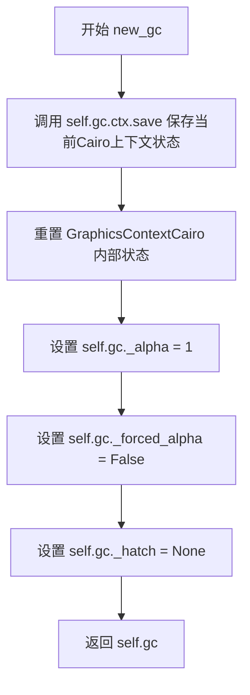

#### 带注释源码

```python
def new_gc(self):
    # docstring inherited - 继承自RendererBase的文档字符串
    # 保存底层Cairo上下文的当前状态，以便后续可以恢复
    self.gc.ctx.save()
    
    # FIXME: 以下实现没有正确实现栈式的状态管理行为
    # 相反，它依赖于（不能保证的）艺术家从不依赖嵌套gc状态这一事实，
    # 所以直接重置属性（即单层栈）就足够了
    #
    # 重置透明度为默认值1（完全不透明）
    self.gc._alpha = 1
    # 重置强制alpha标志为False（如果为True，_alpha会覆盖RGBA中的A通道）
    self.gc._forced_alpha = False  # if True, _alpha overrides A from RGBA
    # 重置阴影图案为None（无阴影）
    self.gc._hatch = None
    # 返回配置好的图形上下文对象供绘图操作使用
    return self.gc
```


### `RendererCairo.points_to_pixels`

将点（points）转换为像素值，基于当前 DPI（每英寸点数）进行单位转换。

参数：

- `points`：`float` 或 `int`，输入的点值（通常指打印尺寸的点，1点 = 1/72英寸）

返回值：`float`，转换后的像素值

#### 流程图

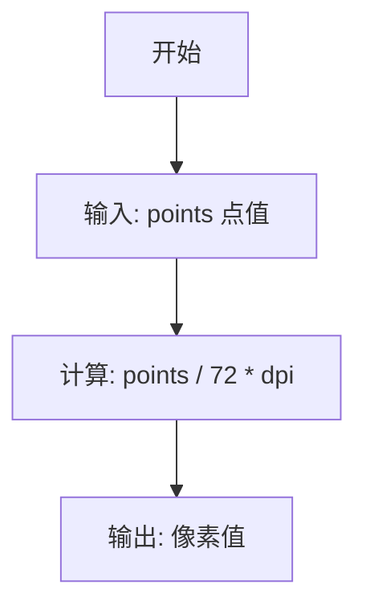

#### 带注释源码

```python
def points_to_pixels(self, points):
    # docstring inherited
    # 将点转换为像素
    # 1点 = 1/72英寸（这是PostScript和PDF的标准）
    # 像素值 = 点数 × (DPI / 72)
    return points / 72 * self.dpi
```


### `GraphicsContextCairo.restore`

该方法用于恢复 Cairo 图形上下文的先前保存状态，弹出并应用最近保存的状态快照，从而实现图形状态栈的 pop 操作。

参数： 无

返回值： `None`，无返回值，仅执行上下文状态恢复操作

#### 流程图

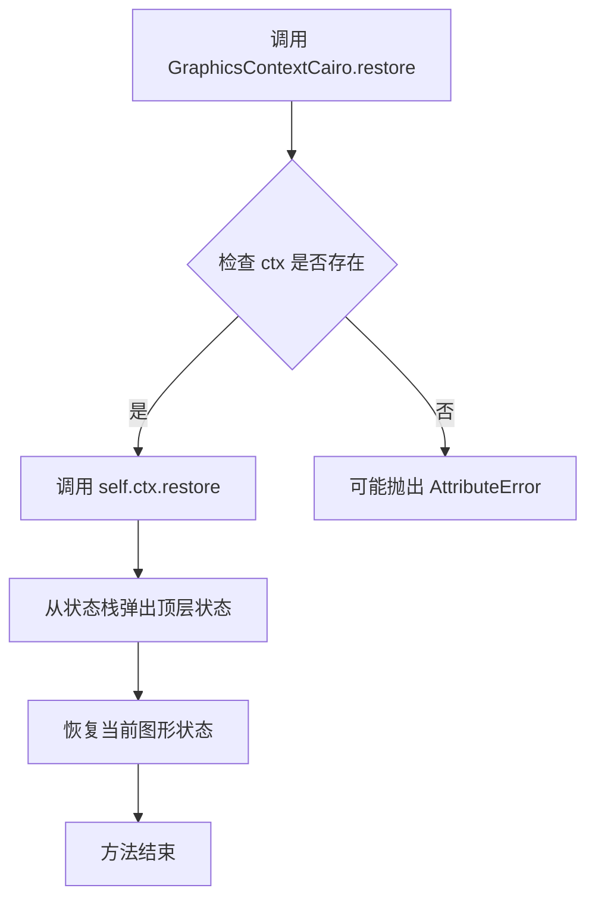

#### 带注释源码

```python
def restore(self):
    """
    恢复 Cairo 图形上下文到之前保存的状态。
    
    此方法对应 Cairo API 的 ctx.restore()，用于实现图形状态栈的
    pop 操作。每次调用 restore() 会弹出并应用最近一次 save() 
    所保存的图形状态（包括变换矩阵、剪裁区域、线条样式等）。
    """
    self.ctx.restore()  # 调用底层 Cairo 上下文的 restore 方法
```

---

#### 补充信息

**所属类上下文：**

`GraphicsContextCairo` 类继承自 `GraphicsContextBase`，是 Matplotlib 的 Cairo 后端图形上下文实现类，负责管理绘图状态（如颜色、线宽、剪裁等）。

**设计目的：**

- 提供图形状态的保存/恢复机制
- 配合 `save()` 方法实现嵌套的图形状态管理
- 使绘图操作能够在临时状态修改后安全地恢复到之前的状态

**使用场景：**

此方法通常与 `save()` 方法成对使用，用于：
- 临时修改图形状态后恢复原始状态
- 实现局部状态隔离的绘图操作
- 管理复杂的图形变换和样式设置


### GraphicsContextCairo.set_alpha

该方法用于设置图形上下文的透明度（alpha）值，同时将透明度同步应用到Cairo渲染上下文中，确保渲染时的颜色混合效果与Matplotlib的GraphicsContextBase一致。

参数：

- `alpha`：`float`，透明度值，范围通常为0.0（完全透明）到1.0（完全不透明）

返回值：`None`，该方法无返回值，通过修改内部状态和Cairo上下文完成透明度设置

#### 流程图

```mermaid
flowchart TD
    A[开始 set_alpha] --> B[调用父类方法 super().set_alpha]
    B --> C[获取当前透明度 get_alpha]
    B --> D[获取是否强制使用alpha标志 get_forced_alpha]
    C --> E[调用 _set_rgba 函数]
    D --> E
    E --> F{颜色长度判断}
    F -->|len(color)==3 或 forced_alpha=True| G[调用 ctx.set_source_rgba 传入alpha]
    F -->|其他情况| H[调用 ctx.set_source_rgba 不传alpha]
    G --> I[结束]
    H --> I
```

#### 带注释源码

```python
def set_alpha(self, alpha):
    """
    设置图形上下文的透明度值，并同步更新Cairo渲染上下文。

    参数:
        alpha: 浮点数，透明度值，范围0.0-1.0
    """
    # 调用父类GraphicsContextBase的set_alpha方法
    # 更新内部_alpha属性和_forced_alpha标志
    super().set_alpha(alpha)
    
    # 使用_set_rgba辅助函数更新Cairo上下文的颜色源
    # self._rgb: 当前RGB颜色值
    # self.get_alpha(): 获取更新后的透明度值
    # self.get_forced_alpha(): 获取是否强制使用alpha的标志
    _set_rgba(
        self.ctx, self._rgb, self.get_alpha(), self.get_forced_alpha())
```


### GraphicsContextCairo.set_antialiased

设置绘图的抗锯齿开关，控制图形渲染时是否启用边缘平滑处理。

参数：

- `b`：`bool`，布尔值参数，为 True 时启用抗锯齿，为 False 时禁用抗锯齿

返回值：`None`，无返回值，该方法直接修改 Cairo 绘图上下文的抗锯齿设置

#### 流程图

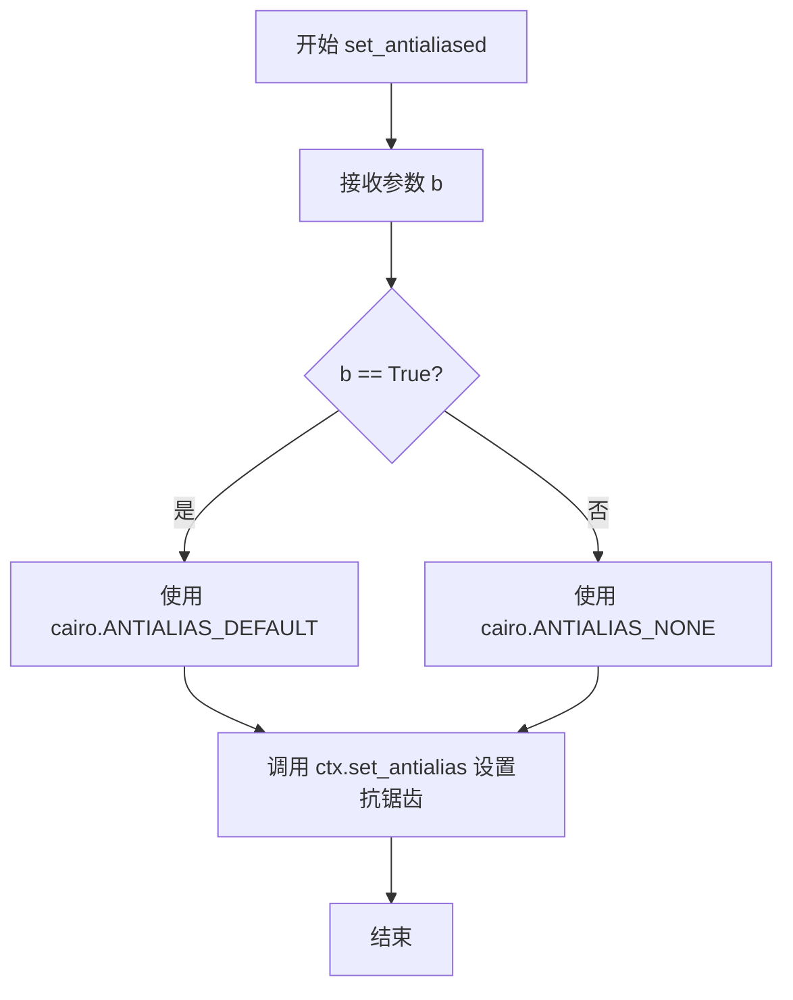

#### 带注释源码

```python
def set_antialiased(self, b):
    """
    设置绘图的抗锯齿开关
    
    参数:
        b: 布尔值, True 表示启用抗锯齿, False 表示禁用抗锯齿
    """
    # 根据参数 b 的值决定使用哪种抗锯齿模式
    # 如果 b 为 True, 使用 ANTIALIAS_DEFAULT (系统默认抗锯齿)
    # 如果 b 为 False, 使用 ANTIALIAS_NONE (禁用抗锯齿)
    self.ctx.set_antialias(
        cairo.ANTIALIAS_DEFAULT if b else cairo.ANTIALIAS_NONE)
```


### `GraphicsContextCairo.get_antialiased`

该方法用于获取当前图形上下文的抗锯齿（抗锯齿）设置状态，返回Cairo渲染引擎的抗锯齿模式。

参数：

- `self`：`GraphicsContextCairo` 实例，隐含的实例方法参数，表示当前图形上下文对象

返回值：`int`，返回Cairo的抗锯齿模式常量，可能的值包括 `cairo.ANTIALIAS_DEFAULT`（默认抗锯齿）、`cairo.ANTIALIAS_NONE`（无抗锯齿）、`cairo.ANTIALIAS_GRAY`（灰度抗锯齿）或 `cairo.ANTIALIAS_SUBPIXEL`（子像素抗锯齿）

#### 流程图

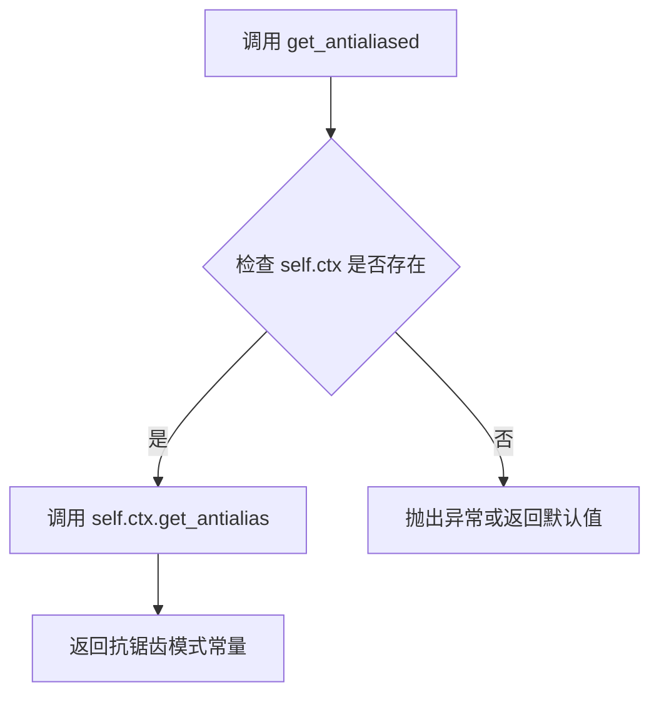

#### 带注释源码

```python
def get_antialiased(self):
    """
    获取当前图形上下文的抗锯齿设置。
    
    Returns
    -------
    int
        Cairo 抗锯齿模式常量，可选值包括：
        - cairo.ANTIALIAS_DEFAULT: 默认抗锯齿
        - cairo.ANTIALIAS_NONE: 无抗锯齿
        - cairo.ANTIALIAS_GRAY: 灰度抗锯齿
        - cairo.ANTIALIAS_SUBPIXEL: 子像素抗锯齿
    """
    # 调用 Cairo 上下文对象的 get_antialias 方法获取当前抗锯齿设置
    return self.ctx.get_antialias()
```


### `GraphicsContextCairo.set_capstyle`

设置图形上下文的线帽样式（line cap style），用于定义线条端点的绘制方式。

参数：

- `cs`：`str`，线帽样式标识符，可选值为 'butt'（平头）、'projecting'（方头）或 'round'（圆头）

返回值：`None`，无返回值，仅修改图形上下文状态

#### 流程图

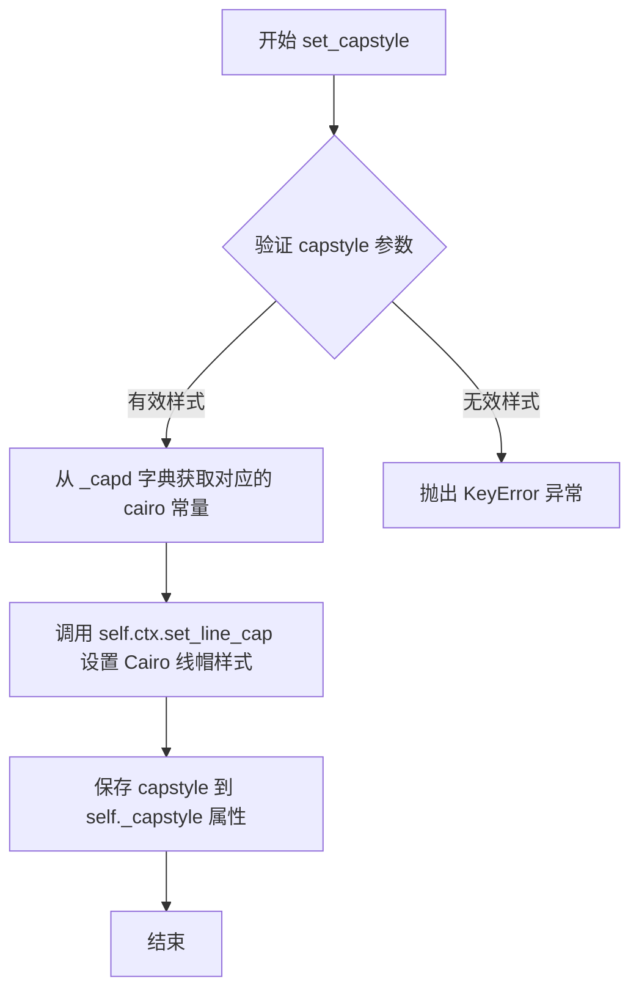

#### 带注释源码

```python
def set_capstyle(self, cs):
    """
    设置线帽样式（line cap style）。
    
    参数:
        cs: str, 线帽样式，'butt'、'projecting' 或 'round'
    
    返回:
        None
    """
    # 使用 _api.getitem_checked 从 _capd 字典中获取对应的 cairo 线帽常量
    # _capd 映射: 'butt' -> cairo.LINE_CAP_BUTT,
    #             'projecting' -> cairo.LINE_CAP_SQUARE,
    #             'round' -> cairo.LINE_CAP_ROUND
    self.ctx.set_line_cap(_api.getitem_checked(self._capd, capstyle=cs))
    
    # 保存当前线帽样式到实例属性，供后续查询使用
    self._capstyle = cs
```


### `GraphicsContextCairo.set_clip_rectangle`

该方法用于设置Cairo图形上下文的裁剪矩形。如果提供了矩形，则根据矩形的边界创建一个新的裁剪路径，并对y坐标进行转换以适应Matplotlib的坐标系（Matplotlib使用左上角为原点，而Cairo使用左下角为原点）。

参数：

- `rectangle`：`matplotlib.transforms.Bbox` 或具有 `.bounds` 属性的对象，表示裁剪矩形的边界（x, y, width, height）

返回值：`None`，无返回值描述

#### 流程图

```mermaid
flowchart TD
    A[开始 set_clip_rectangle] --> B{rectangle 是否为空?}
    B -->|是| C[直接返回]
    B -->|否| D[提取矩形边界: x, y, w, h = np.round(rectangle.bounds)]
    D --> E[获取 Cairo 上下文: ctx = self.ctx]
    E --> F[新建路径: ctx.new_path]
    F --> G[绘制矩形: ctx.rectangle x, renderer.height - h - y, w, h]
    G --> H[应用裁剪: ctx.clip]
    H --> I[结束]
    
    style C fill:#f9f,stroke:#333
    style I fill:#9f9,stroke:#333
```

#### 带注释源码

```python
def set_clip_rectangle(self, rectangle):
    """
    设置 Cairo 图形上下文的裁剪矩形。
    
    参数:
        rectangle: 具有 .bounds 属性的对象（通常是 matplotlib.transforms.Bbox），
                  包含 (x, y, width, height) 四个值
    """
    # 如果没有提供矩形（即 rectangle 为 None 或空），则直接返回，不设置裁剪
    if not rectangle:
        return
    
    # 使用 numpy.round 将矩形的边界坐标四舍五入为整数
    # rectangle.bounds 返回 (x, y, width, height) 元组
    x, y, w, h = np.round(rectangle.bounds)
    
    # 获取 Cairo 绘图上下文
    ctx = self.ctx
    
    # 新建一个空路径，清除之前的路径内容
    ctx.new_path()
    
    # 绘制矩形裁剪区域
    # 注意：Matplotlib 使用左上角为原点 (y 向下增大)，而 Cairo 使用左下角为原点 (y 向上增大)
    # 因此需要将 y 坐标转换为 Cairo 坐标系：y_cairo = renderer.height - height - y_matplotlib
    # 即：self.renderer.height - h - y
    ctx.rectangle(x, self.renderer.height - h - y, w, h)
    
    # 将当前路径设置为裁剪区域
    ctx.clip()
```


### GraphicsContextCairo.set_clip_path

该方法用于设置Cairo图形上下文的剪裁路径，通过获取传入路径的变换后的路径和仿射变换，在Cairo上下文中创建新的剪裁区域，实现图形绘制的区域限制功能。

参数：
- `path`：对象，需要进行剪裁的路径对象。该对象应具有`get_transformed_path_and_affine()`方法，用于获取变换后的路径和仿射变换矩阵。如果路径为空，则直接返回不进行任何操作。

返回值：`None`，该方法没有返回值，仅执行副作用（设置图形上下文的剪裁路径）。

#### 流程图

```mermaid
flowchart TD
    A[开始 set_clip_path] --> B{path 是否为空}
    B -->|是| C[直接返回]
    B -->|否| D[获取变换后的路径和仿射变换]
    D --> E[创建新路径 ctx.new_path]
    E --> F[计算最终仿射变换]
    F --> G[将路径追加到上下文]
    G --> H[执行剪裁 ctx.clip]
    H --> I[结束]
```

#### 带注释源码

```python
def set_clip_path(self, path):
    """
    设置Cairo图形上下文的剪裁路径。
    
    参数:
        path: 路径对象，应具有get_transformed_path_and_affine()方法
              用于获取变换后的路径和仿射变换矩阵。如果为None或空，
              则不执行任何操作直接返回。
    """
    # 检查路径是否为空，如果是则直接返回，不进行任何操作
    if not path:
        return
    
    # 从path对象获取变换后的路径和仿射变换矩阵
    # tpath: 变换后的Path对象
    # affine: Affine2D仿射变换矩阵
    tpath, affine = path.get_transformed_path_and_affine()
    
    # 获取Cairo图形上下文
    ctx = self.ctx
    
    # 在设置新剪裁路径前，先重置当前路径，创建新的空路径
    # 这是必要的，因为clip()会基于当前路径创建剪裁区域
    ctx.new_path()
    
    # 构建最终应用到路径的仿射变换：
    # 1. 先应用path本身的仿射变换(affine)
    # 2. 再应用坐标变换：Y轴翻转(scale 1, -1)和垂直平移
    #    这样可以将Matplotlib的坐标系（Y轴向上）转换为Cairo的坐标系（Y轴向下）
    affine = (affine
              + Affine2D().scale(1, -1).translate(0, self.renderer.height))
    
    # 使用辅助函数将变换后的路径追加到Cairo上下文中
    # _append_path会遍历路径的所有线段并转换为Cairo路径命令
    _append_path(ctx, tpath, affine)
    
    # 最重要的一步：将当前路径设置为图形上下文的剪裁区域
    # 之后的所有绘制操作都将被限制在这个区域内
    ctx.clip()
```


### `GraphicsContextCairo.set_dashes`

设置绘图上下文的虚线（dash）样式，将 Matplotlib 的虚线模式转换为 Cairo 渲染引擎所需的格式。

参数：

- `offset`：`float`，虚线模式的起始偏移量，决定虚线图案的起始位置
- `dashes`：`list[float]` 或 `None`，虚线模式数组，指定线段和间隙的交替长度；传入 `None` 时关闭虚线样式

返回值：`None`，无返回值

#### 流程图

```mermaid
flowchart TD
    A[开始 set_dashes] --> B{判断 dashes 是否为 None}
    B -->|是| C[关闭虚线设置: ctx.set_dash([], 0)]
    B -->|否| D[转换 dashes 为 numpy 数组]
    D --> E[调用 renderer.points_to_pixels 转换为像素单位]
    E --> F[将转换结果转为列表]
    F --> G[调用 ctx.set_dash 设置虚线样式]
    G --> H[保存 offset 和 dashes 到 self._dashes]
    C --> H
    H --> I[结束]
```

#### 带注释源码

```python
def set_dashes(self, offset, dashes):
    """
    设置绘图上下文的虚线样式。
    
    参数:
        offset: 虚线模式的起始偏移量（以点为单位）
        dashes: 虚线模式数组，指定线段和间隙的交替长度；
                传入 None 时关闭虚线样式
    """
    # 保存虚线参数到实例属性，供后续查询使用
    self._dashes = offset, dashes
    
    # 判断是否需要关闭虚线
    if dashes is None:
        # 传入空列表和偏移量0来关闭虚线绘制
        self.ctx.set_dash([], 0)  # switch dashes off
    else:
        # 将虚线模式转换为像素单位并设置到 Cairo 上下文
        # 1. 将 dashes 转换为 numpy 数组以支持数值运算
        # 2. 调用 points_to_pixels 将点单位转换为像素单位
        # 3. 转换为列表以适配 Cairo API
        self.ctx.set_dash(
            list(self.renderer.points_to_pixels(np.asarray(dashes))),
            offset)
```


### GraphicsContextCairo.set_foreground

该方法用于设置图形上下文的前景色，通过调用父类方法处理颜色值，然后根据颜色通道数（RGB或RGBA）调用Cairo上下文的相应方法设置源颜色。

参数：

- `fg`：颜色值，可以是RGB（3元素元组/列表）或RGBA（4元素元组/列表），表示要设置的前景色
- `isRGBA`：布尔值，可选参数，指定颜色是否为RGBA格式，默认为None

返回值：无返回值（None），该方法通过副作用直接修改Cairo图形上下文的颜色状态

#### 流程图

```mermaid
graph TD
    A[开始 set_foreground] --> B[调用父类 GraphicsContextBase.set_foreground]
    B --> C{检查 self._rgb 长度}
    C -->|长度为3| D[调用 ctx.set_source_rgb]
    C -->|长度为4| E[调用 ctx.set_source_rgba]
    D --> F[结束]
    E --> F
```

#### 带注释源码

```python
def set_foreground(self, fg, isRGBA=None):
    """
    设置图形上下文的前景色。
    
    参数:
        fg: 颜色值，可以是RGB（3元素）或RGBA（4元素）
        isRGBA: 可选布尔值，指定颜色是否为RGBA格式
    """
    # 调用父类 GraphicsContextBase 的 set_foreground 方法
    # 处理颜色值并设置 self._rgb 属性
    super().set_foreground(fg, isRGBA)
    
    # 根据颜色的通道数选择合适的Cairo方法
    if len(self._rgb) == 3:
        # RGB颜色（无透明度），使用 set_source_rgb
        self.ctx.set_source_rgb(*self._rgb)
    else:
        # RGBA颜色（带透明度），使用 set_source_rgba
        self.ctx.set_source_rgba(*self._rgb)
```


### `GraphicsContextCairo.get_rgb`

该方法用于从Cairo图形上下文中获取当前的RGB颜色值。它通过调用Cairo上下文的`get_source().get_rgba()`方法获取RGBA颜色值，然后切片返回前三个RGB分量。

参数：无（仅包含隐式参数`self`）

返回值：`tuple`，返回包含3个浮点数的元组，表示当前的RGB颜色值（红、绿、蓝分量，值通常在0-1范围内）

#### 流程图

```mermaid
flowchart TD
    A[开始 get_rgb] --> B[调用 self.ctx.get_source]
    B --> C[调用 get_rgba 获取RGBA]
    C --> D[切片取前3个元素 :3]
    D --> E[返回 RGB 元组]
```

#### 带注释源码

```python
def get_rgb(self):
    """
    Get the current RGB color from the Cairo graphics context.
    
    Returns
    -------
    tuple
        A tuple of 3 floats representing RGB color components (typically 0-1 range).
    """
    # self.ctx 是 Cairo 上下文对象
    # get_source() 获取当前的填充源（颜色）
    # get_rgba() 返回 RGBA 颜色值 [r, g, b, a]
    # [:3] 切片获取前3个值，即 RGB，忽略 Alpha 通道
    return self.ctx.get_source().get_rgba()[:3]
```


### `GraphicsContextCairo.set_joinstyle`

该方法用于设置图形上下文的线条连接样式（join style），将用户指定的连接样式名称转换为 Cairo 渲染引擎对应的常量，并保存当前样式配置。

参数：

- `js`：`str`，连接样式名称，可选值为 `'bevel'`（斜切）、`'miter'`（尖角）或 `'round'`（圆角）

返回值：`None`，无返回值

#### 流程图

```mermaid
flowchart TD
    A[set_joinstyle 被调用] --> B{参数 js 有效?}
    B -->|是| C[调用 _api.getitem_checked 查询 _joind 字典]
    C --> D[获取对应的 Cairo LINE_JOIN 常量]
    D --> E[调用 self.ctx.set_line_join 设置 Cairo 上下文]
    E --> F[保存 joinstyle 到 self._joinstyle 属性]
    B -->|否| G[抛出异常]
    F --> H[方法结束]
    G --> H
```

#### 带注释源码

```python
def set_joinstyle(self, js):
    """
    设置线条连接样式。
    
    Parameters
    ----------
    js : str
        连接样式名称，可选 'bevel'、'miter' 或 'round'
    """
    # 使用 _api.getitem_checked 从 _joind 字典中获取对应的 Cairo 常量
    # 如果 js 不在字典中，该函数会抛出适当的异常
    self.ctx.set_line_join(_api.getitem_checked(self._joind, joinstyle=js))
    
    # 保存当前设置的连接样式，以便后续查询或比较
    self._joinstyle = js
```


### `GraphicsContextCairo.set_linewidth`

该方法用于设置绘图上下文的线条宽度，将输入的线条宽度值（以点为单位）转换为像素单位，并应用到 Cairo 图形上下文中。

参数：

- `w`：`float` 或数值类型，要设置的线条宽度（以点为单位）

返回值：`None`，无返回值，仅执行状态修改操作

#### 流程图

```mermaid
graph TD
    A[开始 set_linewidth] --> B[将参数 w 转换为浮点数]
    B --> C[存储到 self._linewidth]
    C --> D[调用 self.renderer.points_to_pixels 将点转换为像素]
    D --> E[调用 self.ctx.set_line_width 设置线宽]
    E --> F[结束]
```

#### 带注释源码

```python
def set_linewidth(self, w):
    """
    Set the line width.
    
    Parameters
    ----------
    w : float
        Line width in points.
    """
    # 将输入的线条宽度值转换为浮点数并存储到实例变量
    self._linewidth = float(w)
    
    # 将线条宽度从点转换为像素单位，然后设置到 Cairo 上下文中
    # points_to_pixels 方法会根据 DPI 进行单位转换
    self.ctx.set_line_width(self.renderer.points_to_pixels(w))
```


### FigureCanvasCairo._renderer

这是一个属性方法，用于获取或创建Cairo渲染器实例，解决多重继承场景下渲染器初始化问题。

参数：无（property方法，只有隐式参数self）

返回值：`RendererCairo`，返回Cairo渲染器实例，用于在Cairo后端上绘制图形

#### 流程图

```mermaid
flowchart TD
    A[调用 _renderer 属性] --> B{self 是否存在 _cached_renderer}
    B -->|否| C[创建新 RendererCairo 实例]
    C --> D[使用 figure.dpi 初始化渲染器]
    D --> E[缓存到 _cached_renderer]
    E --> F[返回 _cached_renderer]
    B -->|是| F
```

#### 带注释源码

```python
@property
def _renderer(self):
    # In theory, _renderer should be set in __init__, but GUI canvas
    # subclasses (FigureCanvasFooCairo) don't always interact well with
    # multiple inheritance (FigureCanvasFoo inits but doesn't super-init
    # FigureCanvasCairo), so initialize it in the getter instead.
    if not hasattr(self, "_cached_renderer"):
        # 如果还没有缓存的渲染器，则创建一个新的RendererCairo实例
        # 使用figure的dpi进行初始化
        self._cached_renderer = RendererCairo(self.figure.dpi)
    # 返回缓存的渲染器实例
    return self._cached_renderer
```


### `FigureCanvasCairo.get_renderer`

该方法是FigureCanvasCairo类的公共接口，用于获取当前画布的渲染器实例，内部委托给私有属性`_renderer`，该属性采用延迟初始化模式，仅在首次访问时创建RendererCairo实例并缓存，以解决多重继承场景下的初始化问题。

参数：
- 该方法无显式参数（除隐式self参数）

返回值：`RendererCairo`，返回当前画布关联的Cairo渲染器实例，用于执行图形绘制操作

#### 流程图

```mermaid
flowchart TD
    A[调用 get_renderer] --> B{是否已有缓存渲染器}
    B -->|否| C[创建 RendererCairo 实例<br/>参数: self.figure.dpi]
    C --> D[缓存到 _cached_renderer]
    D --> E[返回 _renderer]
    B -->|是| E
```

#### 带注释源码

```python
def get_renderer(self):
    """
    Return the renderer for this canvas.
    
    This method serves as a public interface to access the underlying
    renderer instance. It delegates to the _renderer property which
    handles lazy initialization of the RendererCairo instance.
    
    Returns
    -------
    RendererCairo
        The Cairo renderer instance associated with this canvas,
        used for all drawing operations.
    """
    return self._renderer
```


### FigureCanvasCairo.copy_from_bbox

从 Cairo 渲染表面复制指定边界框区域的像素数据到一个可序列化的区域对象中，用于后续的 `restore_region` 恢复操作。该方法仅支持 `ImageSurface`，不支持向量表面。

参数：

- `bbox`：`matplotlib.transforms.Bbox`，需要进行拷贝的区域边界框，x0、x1 表示水平范围，y0、y1 表示垂直范围

返回值：`backend_cairo._CairoRegion`，包含拷贝区域的切片信息和像素数据的对象

#### 流程图

```mermaid
flowchart TD
    A[开始 copy_from_bbox] --> B[获取 Cairo 表面]
    B --> C{表面是否为 ImageSurface?}
    C -->|否| D[抛出 RuntimeError]
    C -->|是| E[获取表面宽度 sw 和高度 sh]
    E --> F[计算 bbox 坐标]
    F --> G{验证 bbox 有效性?}
    G -->|否| H[抛出 ValueError]
    G -->|是| I[构建切片对象 sls]
    I --> J[从表面提取像素数据]
    J --> K[拷贝数据并创建 _CairoRegion]
    K --> L[返回区域对象]
```

#### 带注释源码

```python
def copy_from_bbox(self, bbox):
    """
    从 Cairo 渲染表面复制指定边界框区域的像素数据。

    Parameters
    ----------
    bbox : matplotlib.transforms.Bbox
        需要拷贝的区域边界框，包含 x0, x1, y0, y1 属性

    Returns
    -------
    _CairoRegion
        包含切片信息和像素数据的区域对象，可用于 restore_region
    """
    # 获取 Cairo 渲染上下文的目标表面
    surface = self._renderer.gc.ctx.get_target()
    
    # 检查表面类型，仅支持 ImageSurface（像素表面）
    if not isinstance(surface, cairo.ImageSurface):
        raise RuntimeError(
            "copy_from_bbox only works when rendering to an ImageSurface")
    
    # 获取表面的宽度和高度
    sw = surface.get_width()
    sh = surface.get_height()
    
    # 计算边界框在表面坐标系中的坐标（注意 Cairo Y 轴向下）
    x0 = math.ceil(bbox.x0)
    x1 = math.floor(bbox.x1)
    # Y 坐标需要翻转：表面原点在上方，bbox 原点在左下角
    y0 = math.ceil(sh - bbox.y1)
    y1 = math.floor(sh - bbox.y0)
    
    # 验证边界框是否在有效范围内
    if not (0 <= x0 and x1 <= sw and bbox.x0 <= bbox.x1
            and 0 <= y0 and y1 <= sh and bbox.y0 <= bbox.y1):
        raise ValueError("Invalid bbox")
    
    # 构建切片对象用于提取数据区域
    sls = slice(y0, y0 + max(y1 - y0, 0)), slice(x0, x0 + max(x1 - x0, 0))
    
    # 从表面读取原始像素数据并重塑为数组
    # 表面数据格式为 ARGB32（32位无符号整数）
    data = (np.frombuffer(surface.get_data(), np.uint32)
            .reshape((sh, sw))[sls].copy())
    
    # 返回包含切片和数据拷贝的区域对象
    return _CairoRegion(sls, data)
```


### `FigureCanvasCairo.restore_region`

该方法用于将先前通过`copy_from_bbox`保存的图形区域数据恢复到Cairo图像表面中。它通过直接操作底层的像素数据来实现高效的区域恢复，并通知Cairo表面特定区域已修改需要重绘。

参数：

- `region`：`_CairoRegion`，由`copy_from_bbox`方法返回的区域对象，包含之前保存的切片信息(`_slices`)和像素数据(`_data`)

返回值：`None`，无返回值（该方法直接修改Cairo表面的底层像素数据）

#### 流程图

```mermaid
flowchart TD
    A[开始 restore_region] --> B{检查 surface 类型}
    B -->|不是 ImageSurface| C[抛出 RuntimeError]
    B -->|是 ImageSurface| D[调用 surface.flush]
    D --> E[获取 surface 宽度 sw 和高度 sh]
    E --> F[从 region 解包切片 sly, slx]
    F --> G[将 region._data 写入 surface 像素缓冲区]
    G --> H[调用 surface.mark_dirty_rectangle 标记脏区域]
    H --> I[结束]
    
    C --> J[错误: restore_region only works when rendering to an ImageSurface]
```

#### 带注释源码

```python
def restore_region(self, region):
    """
    Restore the graphics context region from a previous copy_from_bbox call.
    
    Parameters
    ----------
    region : _CairoRegion
        A region object previously returned by copy_from_bbox, containing
        the saved pixel data and slice information.
    """
    # 获取当前渲染目标表面（surface）
    surface = self._renderer.gc.ctx.get_target()
    
    # 检查表面是否为 ImageSurface 类型
    # 只有 ImageSurface 支持像素级别的直接操作
    if not isinstance(surface, cairo.ImageSurface):
        raise RuntimeError(
            "restore_region only works when rendering to an ImageSurface")
    
    # 刷新表面，确保所有待定的绘制操作已完成
    surface.flush()
    
    # 获取表面的宽度和高度（以像素为单位）
    sw = surface.get_width()
    sh = surface.get_height()
    
    # 从 region 对象中解包之前保存的切片信息
    # sly, slx 表示需要恢复的像素区域（行切片和列切片）
    sly, slx = region._slices
    
    # 将保存的像素数据写回到表面的底层缓冲区
    # 使用 numpy 直接操作内存，避免 Python 循环的开销
    # surface.get_data() 返回原始字节缓冲区
    # reshape 将其转换为 (height, width) 的 uint32 数组
    (np.frombuffer(surface.get_data(), np.uint32)
     .reshape((sh, sw))[sly, slx]) = region._data
    
    # 标记已修改的矩形区域，通知 Cairo 该区域需要重新渲染
    # 参数：x 起始位置, y 起始位置, 宽度, 高度
    surface.mark_dirty_rectangle(
        slx.start, sly.start, slx.stop - slx.start, sly.stop - sly.start)
```


### `FigureCanvasCairo.print_png`

该方法用于将matplotlib图形导出为PNG格式的图片文件。它通过获取图形的Cairo图像表面，然后调用Cairo的`write_to_png`方法将图像数据写入到文件对象中。

参数：

- `fobj`：文件对象或类文件对象，支持写入操作（例如打开的文件句柄或`io.BytesIO`对象）

返回值：`None`，无返回值。该方法直接写入PNG数据到传入的文件对象。

#### 流程图

```mermaid
flowchart TD
    A[开始 print_png] --> B[调用 _get_printed_image_surface]
    B --> C[创建 Cairo ImageSurface]
    C --> D[设置渲染器上下文]
    D --> E[绘制图形到表面]
    E --> F[返回 ImageSurface]
    F --> G[调用 write_to_png 写入PNG]
    G --> H[结束]
    
    subgraph _get_printed_image_surface
    B --> C1[设置 DPI]
    C1 --> C2[获取画布宽度和高度]
    C2 --> C3[创建 ImageSurface]
    C3 --> C4[创建 Cairo Context]
    C4 --> C5[调用 figure.draw 渲染图形]
    C5 --> F
    end
```

#### 带注释源码

```python
def print_png(self, fobj):
    """
    将图形打印为PNG格式的文件。
    
    参数
    ----------
    fobj : file-like object
        一个可写的文件对象，用于接收PNG数据。
        可以是打开的文件句柄或 io.BytesIO 对象。
    """
    # 获取图形的Cairo图像表面
    # 该方法会：
    # 1. 根据图形尺寸创建 Cairo ImageSurface
    # 2. 创建 Cairo Context
    # 3. 调用 figure.draw 渲染整个图形到表面
    surface = self._get_printed_image_surface()
    
    # 调用 Cairo 的 write_to_png 方法将图像数据写入文件对象
    # PNG 格式包含完整的图像头部和数据
    surface.write_to_png(fobj)
```


### FigureCanvasCairo.print_rgba

该方法用于将Figure画布的RGBA像素数据输出到文件对象中。它首先获取画布的宽度和高度，然后创建一个图像表面并将图形绘制到该表面上，最后从表面提取ARGB32格式的像素数据并转换为RGBA8888格式写入文件对象。

参数：

- `self`：FigureCanvasCairo，当前画布实例
- `fobj`：file-like object (file, BytesIO, etc.)，输出目标文件对象，用于写入图像的RGBA数据

返回值：`None`，该方法直接将图像数据写入传入的文件对象，不返回任何值

#### 流程图

```mermaid
flowchart TD
    A[开始 print_rgba] --> B[调用 get_width_height 获取画布宽高]
    B --> C[调用 _get_printed_image_surface 获取图像表面]
    C --> D[从表面获取原始数据 get_data]
    D --> E[将数据 reshape 为 width x height x 4 的数组]
    E --> F[调用 cbook._premultiplied_argb32_to_unmultiplied_rgba8888 转换颜色格式]
    F --> G[将转换后的 RGBA 数据写入 fobj]
    G --> H[结束]
```

#### 带注释源码

```python
def print_rgba(self, fobj):
    """
    将Figure的RGBA图像数据写入文件对象
    
    Parameters
    ----------
    fobj : file-like object
        用于写入图像数据的文件对象（支持write方法）
    """
    # 获取画布的宽度和高度（以像素为单位）
    width, height = self.get_width_height()
    
    # 获取打印用的图像表面（内部会创建新的ImageSurface并绘制图形）
    # 返回一个cairo.ImageSurface对象，包含绘制好的图像
    printed_surface = self._get_printed_image_surface()
    
    # 从图像表面获取原始像素数据（格式为ARGB32的字节数据）
    buf = printed_surface.get_data()
    
    # 将字节数据reshape为(width, height, 4)的numpy数组，
    # 然后调用Matplotlib的内部函数将预乘的ARGB32格式转换为非预乘的RGBA8888格式
    # 最后将转换后的数据写入文件对象
    fobj.write(cbook._premultiplied_argb32_to_unmultiplied_rgba8888(
        np.asarray(buf).reshape((width, height, 4))))
```


### `FigureCanvasCairo.print_raw`

该方法是 Matplotlib Cairo 后端的原始 RGBA 图像输出函数，通过获取打印表面的图像数据并转换为未预乘的 RGBA 格式后写入文件对象，实际上是 `print_rgba` 方法的别名。

参数：

- `fobj`：文件对象，用于写入原始 RGBA 字节数据

返回值：`None`，无返回值（写入操作直接作用于传入的文件对象）

#### 流程图

```mermaid
flowchart TD
    A[开始 print_raw] --> B[获取画布宽度和高度]
    B --> C[调用 _get_printed_image_surface 获取 Cairo 图像表面]
    C --> D[从表面获取原始图像数据 buf]
    D --> E[调用 cbook._premultiplied_argb32_to_unmultiplied_rgba8888 转换数据格式]
    E --> F[将数据 reshape 为 width x height x 4 的数组]
    F --> G[调用 fobj.write 写入 RGBA 数据]
    G --> H[结束]
```

#### 带注释源码

```python
print_raw = print_rgba  # print_raw 是 print_rgba 的别名

def print_rgba(self, fobj):
    """
    将 Figure 渲染为原始 RGBA 格式并写入文件对象
    
    Parameters
    ----------
    fobj : file-like object
        具有 write() 方法的文件对象，用于接收 RGBA 原始数据
    """
    # 获取画布的宽度和高度（以像素为单位）
    width, height = self.get_width_height()
    
    # 获取用于打印的 Cairo 图像表面
    # 这会创建一个临时的 ImageSurface，渲染整个 figure
    buf = self._get_printed_image_surface().get_data()
    
    # 将预乘的 ARGB32 格式数据转换为未预乘的 RGBA8888 格式
    # 并 reshape 为 (width, height, 4) 的数组，然后写入文件对象
    fobj.write(cbook._premultiplied_argb32_to_unmultiplied_rgba8888(
        np.asarray(buf).reshape((width, height, 4))))
```


### `FigureCanvasCairo._get_printed_image_surface`

该方法用于获取 Matplotlib 图形在 Cairo 后端渲染后的图像表面（ImageSurface），通过创建一个新的 Cairo ImageSurface，设置渲染器上下文，执行图形绘制，并返回包含最终渲染结果的表面对象。

参数：

- `self`：`FigureCanvasCairo`，Cairo 图形画布的实例，隐含参数，代表调用该方法的对象本身

返回值：`cairo.ImageSurface`，返回包含已渲染图形的 Cairo 图像表面，可用于导出为 PNG、RGB 等格式

#### 流程图

```mermaid
flowchart TD
    A[开始 _get_printed_image_surface] --> B[设置渲染器 DPI = figure.dpi]
    B --> C[获取画布宽度和高度]
    C --> D[创建 Cairo ImageSurface<br/>FORMAT_ARGR32, width, height]
    D --> E[创建 Cairo Context 并设置为渲染器上下文]
    E --> F[调用 figure.draw 渲染图形到表面]
    F --> G[返回 ImageSurface]
```

#### 带注释源码

```python
def _get_printed_image_surface(self):
    """
    获取打印用的图像表面。

    创建一个新的 Cairo ImageSurface，将图形渲染到该表面上，
    并返回渲染后的表面对象，供其他输出方法（如 print_png, print_rgba）使用。
    """
    # 将渲染器的 DPI 设置为与图形相同的 DPI
    self._renderer.dpi = self.figure.dpi
    # 获取画布的宽度和高度（以像素为单位）
    width, height = self.get_width_height()
    # 创建一个 32 位 ARGB 格式的 Cairo 图像表面
    surface = cairo.ImageSurface(cairo.FORMAT_ARGB32, width, height)
    # 为该表面创建 Cairo 上下文，并设置为渲染器的活动上下文
    self._renderer.set_context(cairo.Context(surface))
    # 使用渲染器将整个图形绘制到图像表面上
    self.figure.draw(self._renderer)
    # 返回包含渲染结果的图像表面
    return surface
```


### `FigureCanvasCairo._save`

该方法是 Cairo 后端的内部保存方法，负责将 Matplotlib 图形保存为 PDF、PS（PostScript）或 SVG 格式，支持横竖版 orientation 设置。

参数：

- `self`：`FigureCanvasCairo`，Cairo 画布实例本身
- `fmt`：`str`，输出格式，可选值为 'pdf'、'ps'、'svg' 或 'svgz'
- `fobj`：文件对象或字符串路径，目标输出位置
- `orientation`：`str`，页面方向，默认为 'portrait'（纵向），可选 'landscape'（横向）

返回值：`None`，该方法直接写入文件，无返回值

#### 流程图

```mermaid
flowchart TD
    A[开始 _save] --> B[设置 dpi=72]
    B --> C[获取图形尺寸 in inches]
    C --> D[转换为 points: width_in_points, height_in_points]
    D --> E{orientation == 'landscape'?}
    E -->|Yes| F[交换宽高]
    E -->|No| G
    F --> G
    G --> H{fmt == 'ps'?}
    H -->|Yes| I[检查 PSSurface 支持]
    I --> J[创建 PSSurface]
    K -->|No| L{fmt == 'pdf'?}
    L -->|Yes| M[检查 PDFSurface 支持]
    M --> N[创建 PDFSurface]
    K -->|No| O{fmt in ('svg', 'svgz')?}
    O -->|Yes| P[检查 SVGSurface 支持]
    P --> Q{fmt == 'svgz'?}
    Q -->|Yes| R[包装为 GzipFile]
    Q -->|No| S[创建 SVGSurface]
    R --> T
    S --> T
    O -->|No| U[抛出 ValueError]
    T --> V[设置渲染器 dpi 和 context]
    V --> W{orientation == 'landscape'?}
    W -->|Yes| X[旋转 90 度并平移]
    W -->|No| Y
    X --> Y
    Y --> Z[绘制图形]
    Z --> AA[显示页面]
    AA --> BB[结束 surface]
    BB --> CC{fmt == 'svgz'?}
    CC -->|Yes| DD[关闭 GzipFile]
    CC -->|No| EE[结束]
    DD --> EE
```

#### 带注释源码

```python
def _save(self, fmt, fobj, *, orientation='portrait'):
    # save PDF/PS/SVG
    # 参数: fmt - 输出格式 ('pdf', 'ps', 'svg', 'svgz')
    # 参数: fobj - 文件对象或路径
    # 参数: orientation - 页面方向 ('portrait' 或 'landscape')

    # 1. 设置 DPI 为标准值 72 (PostScript points per inch)
    dpi = 72
    
    # 2. 获取图形尺寸（英寸）并转换为 points
    self.figure.dpi = dpi
    w_in, h_in = self.figure.get_size_inches()
    width_in_points, height_in_points = w_in * dpi, h_in * dpi

    # 3. 处理横向模式：交换宽高
    if orientation == 'landscape':
        width_in_points, height_in_points = (
            height_in_points, width_in_points)

    # 4. 根据格式创建相应的 Cairo Surface
    if fmt == 'ps':
        # PS (PostScript) 格式处理
        if not hasattr(cairo, 'PSSurface'):
            raise RuntimeError('cairo has not been compiled with PS '
                               'support enabled')
        surface = cairo.PSSurface(fobj, width_in_points, height_in_points)
    elif fmt == 'pdf':
        # PDF 格式处理
        if not hasattr(cairo, 'PDFSurface'):
            raise RuntimeError('cairo has not been compiled with PDF '
                               'support enabled')
        surface = cairo.PDFSurface(fobj, width_in_points, height_in_points)
    elif fmt in ('svg', 'svgz'):
        # SVG 格式处理
        if not hasattr(cairo, 'SVGSurface'):
            raise RuntimeError('cairo has not been compiled with SVG '
                               'support enabled')
        # 处理 SVGZ (gzip 压缩的 SVG)
        if fmt == 'svgz':
            if isinstance(fobj, str):
                fobj = gzip.GzipFile(fobj, 'wb')
            else:
                fobj = gzip.GzipFile(None, 'wb', fileobj=fobj)
        surface = cairo.SVGSurface(fobj, width_in_points, height_in_points)
    else:
        raise ValueError(f"Unknown format: {fmt!r}")

    # 5. 配置渲染器并创建 Cairo 上下文
    self._renderer.dpi = self.figure.dpi
    self._renderer.set_context(cairo.Context(surface))
    ctx = self._renderer.gc.ctx

    # 6. 处理横向方向的旋转和平移变换
    if orientation == 'landscape':
        ctx.rotate(np.pi / 2)  # 旋转 90 度
        ctx.translate(0, -height_in_points)
        # Perhaps add an '%%Orientation: Landscape' comment?

    # 7. 执行实际绘制
    self.figure.draw(self._renderer)

    # 8. 完成页面输出并关闭 surface
    ctx.show_page()
    surface.finish()
    
    # 9. 如果是 svgz 格式，关闭 gzip 文件
    if fmt == 'svgz':
        fobj.close()
```


### `FigureCanvasCairo.print_pdf`

该方法用于将Matplotlib图形渲染为PDF文件。它是`_save`方法的偏函数（partialmethod），预先绑定了格式参数为"pdf"。底层通过Cairo图形库创建PDFSurface，将图形绘制到PDF上下文中，并处理页面显示和surface完成。

参数：

- `fobj`：文件对象，用于写入PDF数据。可以是文件路径字符串、文件句柄或类似文件的对象。
- `orientation`：`str`，可选，默认值为`'portrait'`（纵向），指定页面方向，可选`'landscape'`（横向）。

返回值：`None`，该方法无返回值（Python中默认返回None）。

#### 流程图

```mermaid
graph TD
    A[开始] --> B[设置figure.dpi为72]
    B --> C[获取figure尺寸 in inches]
    C --> D[计算width_in_points和height_in_points]
    D --> E{orientation == 'landscape'?}
    E -->|是| F[交换width和height]
    E -->|否| G[检查cairo是否支持PDFSurface]
    F --> G
    G --> H{支持?}
    H -->|否| I[抛出RuntimeError]
    H -->|是| J[创建cairo.PDFSurface]
    J --> K[设置renderer.dpi]
    K --> L[创建cairo.Context并绑定到renderer]
    L --> M{orientation == 'landscape'?}
    M -->|是| N[旋转90度并平移上下文]
    M -->|否| O[调用figure.draw渲染图形]
    N --> O
    O --> P[ctx.show_page]
    P --> Q[surface.finish]
    Q --> R[结束]
```

#### 带注释源码

```python
# FigureCanvasCairo 类中定义
print_pdf = functools.partialmethod(_save, "pdf")

# 实际执行的 _save 方法定义（在 FigureCanvasCairo 类中）
def _save(self, fmt, fobj, *, orientation='portrait'):
    """
    保存图形为指定格式（PDF/PS/SVG）
    
    参数:
        fmt: str, 格式标识符 ("pdf", "ps", "svg", "svgz")
        fobj: 文件对象，用于写入
        orientation: str, 页面方向，默认 "portrait"，可选 "landscape"
    """
    # 1. 设置DPI为标准值72（PDF标准）
    dpi = 72
    self.figure.dpi = dpi
    
    # 2. 获取图形尺寸并转换为点单位
    w_in, h_in = self.figure.get_size_inches()
    width_in_points, height_in_points = w_in * dpi, h_in * dpi

    # 3. 处理横向模式：交换宽高
    if orientation == 'landscape':
        width_in_points, height_in_points = (
            height_in_points, width_in_points)

    # 4. 根据格式创建相应的Cairo Surface
    if fmt == 'pdf':
        # 检查cairo是否编译了PDF支持
        if not hasattr(cairo, 'PDFSurface'):
            raise RuntimeError('cairo has not been compiled with PDF '
                               'support enabled')
        # 创建PDFSurface，关联到输出文件对象
        surface = cairo.PDFSurface(fobj, width_in_points, height_in_points)
    # ... (其他格式处理逻辑类似)

    # 5. 配置渲染器
    self._renderer.dpi = self.figure.dpi
    # 创建Cairo上下文并设置给渲染器
    self._renderer.set_context(cairo.Context(surface))
    ctx = self._renderer.gc.ctx

    # 6. 处理横向模式下的坐标变换
    if orientation == 'landscape':
        # 旋转90度并平移以适应横向
        ctx.rotate(np.pi / 2)
        ctx.translate(0, -height_in_points)

    # 7. 执行实际绘制
    self.figure.draw(self._renderer)

    # 8. 完成PDF输出
    ctx.show_page()  # 显示当前页面
    surface.finish() # 结束surface
```


### FigureCanvasCairo.print_ps

该方法是Matplotlib Cairo后端用于将图形导出为PostScript格式的接口，通过调用内部方法`_save`实现，传入格式参数"ps"并支持可选的方向参数。

参数：
- `fobj`：文件对象或文件路径，用于写入PostScript数据
- `orientation`（可选）：字符串，指定页面方向，默认为'portrait'（纵向），支持'landscape'（横向）

返回值：`None`，方法直接写入文件而不返回任何数据

#### 流程图

```mermaid
flowchart TD
    A[开始 print_ps] --> B{检查 Cairo 是否支持 PSSurface}
    B -->|不支持| C[抛出 RuntimeError]
    B -->|支持| D[设置 DPI 为 72]
    D --> E[获取图形尺寸 英寸]
    E --> F[计算点数单位尺寸]
    F --> G{方向是否为横向}
    G -->|是| H[交换宽高]
    G -->|否| I[创建 PSSurface]
    H --> I
    I --> J[创建 Cairo 上下文]
    J --> K{方向是否为横向}
    K -->|是| L[旋转并平移上下文]
    K -->|否| M[绘制图形]
    L --> M
    M --> N[显示页面]
    N --> O[完成表面]
    O --> P[结束]
```

#### 带注释源码

```python
# print_ps 是使用 functools.partialmethod 创建的绑定方法
# 它将 _save 方法的第一个参数 fmt 固定为 "ps"
print_ps = functools.partialmethod(_save, "ps")

# 下面是 _save 方法的实现，print_ps 实际上调用此方法
def _save(self, fmt, fobj, *, orientation='portrait'):
    """
    保存图形为 PDF/PS/SVG 格式的内部方法
    
    参数:
        fmt: 格式字符串 ('pdf', 'ps', 'svg', 'svgz')
        fobj: 文件对象或文件路径
        orientation: 页面方向，'portrait' 或 'landscape'
    """
    # 1. 设置 DPI 为标准值 72
    dpi = 72
    self.figure.dpi = dpi
    
    # 2. 获取图形尺寸（英寸）并转换为点数
    w_in, h_in = self.figure.get_size_inches()
    width_in_points, height_in_points = w_in * dpi, h_in * dpi

    # 3. 处理横向模式：交换宽高
    if orientation == 'landscape':
        width_in_points, height_in_points = (
            height_in_points, width_in_points)

    # 4. 根据格式创建相应的 Cairo 表面
    if fmt == 'ps':
        # 检查 cairo 库是否支持 PS 输出
        if not hasattr(cairo, 'PSSurface'):
            raise RuntimeError('cairo has not been compiled with PS '
                               'support enabled')
        # 创建 PostScript 表面
        surface = cairo.PSSurface(fobj, width_in_points, height_in_points)
    # ... 其他格式处理类似 ...

    # 5. 配置渲染器
    self._renderer.dpi = self.figure.dpi
    self._renderer.set_context(cairo.Context(surface))
    ctx = self._renderer.gc.ctx

    # 6. 处理横向方向的旋转和平移
    if orientation == 'landscape':
        ctx.rotate(np.pi / 2)
        ctx.translate(0, -height_in_points)

    # 7. 执行实际绘图
    self.figure.draw(self._renderer)

    # 8. 完成输出
    ctx.show_page()
    surface.finish()
```


### FigureCanvasCairo.print_svg

该方法用于将Figure对象导出为SVG（可缩放矢量图形）格式，支持Portrait和Landscape两种页面方向，内部通过调用Cairo库的SVGSurface实现矢量图形渲染。

参数：

- `fobj`：文件对象或str，写入SVG数据的文件对象（具有write方法）或文件路径字符串
- `orientation`：str，页面方向，可选值为'portrait'（纵向）或'landscape'（横向），默认为'portrait'

返回值：`None`，该方法直接写入文件，无返回值

#### 流程图

```mermaid
graph TD
    A[开始] --> B[设置DPI=72]
    B --> C[获取figure尺寸 in inches]
    C --> D[计算width_in_points和height_in_points]
    D --> E{orientation == 'landscape'?}
    E -->|是| F[交换宽高]
    E -->|否| G[继续]
    F --> G
    G --> H{检查cairo是否支持SVGSurface}
    H -->|不支持| I[抛出RuntimeError]
    H -->|支持| J{fmt == 'svgz'?}
    J -->|是| K[创建GzipFile包装fobj]
    J -->|否| L[继续]
    K --> M[创建cairo.SVGSurface]
    L --> M
    M --> N[设置renderer的dpi]
    N --> O[设置renderer的context为SVG Context]
    P --> O
    O --> Q{orientation == 'landscape'?}
    Q -->|是| R[旋转90度, 平移context]
    Q -->|否| S[绘制figure到renderer]
    R --> S
    S --> T[ctx.show_page渲染页面]
    T --> U[surface.finish完成渲染]
    U --> V{fmt == 'svgz'?}
    V -->|是| W[fobj.close关闭gzip文件]
    V -->|否| X[结束]
    W --> X
```

#### 带注释源码

```python
# 通过functools.partialmethod创建print_svg方法
# 实际调用的是_save方法，fmt参数被绑定为"svg"
print_svg = functools.partialmethod(_save, "svg")

# 以下是完整的_save方法实现
def _save(self, fmt, fobj, *, orientation='portrait'):
    # save PDF/PS/SVG
    # 参数:
    #   fmt: str, 输出格式 ('pdf', 'ps', 'svg', 'svgz')
    #   fobj: file-like object or str, 输出目标
    #   orientation: str, 页面方向 ('portrait' or 'landscape')
    
    # 1. 设置DPI为72（标准点单位）
    dpi = 72
    
    # 2. 设置figure的DPI并获取尺寸（英寸）
    self.figure.dpi = dpi
    w_in, h_in = self.figure.get_size_inches()
    
    # 3. 将英寸转换为点单位（1英寸=72点）
    width_in_points, height_in_points = w_in * dpi, h_in * dpi

    # 4. 处理横向模式：交换宽高
    if orientation == 'landscape':
        width_in_points, height_in_points = (
            height_in_points, width_in_points)

    # 5. 根据格式创建不同的Cairo Surface
    if fmt == 'ps':
        # PostScript格式
        if not hasattr(cairo, 'PSSurface'):
            raise RuntimeError('cairo has not been compiled with PS '
                               'support enabled')
        surface = cairo.PSSurface(fobj, width_in_points, height_in_points)
    elif fmt == 'pdf':
        # PDF格式
        if not hasattr(cairo, 'PDFSurface'):
            raise RuntimeError('cairo has not been compiled with PDF '
                               'support enabled')
        surface = cairo.PDFSurface(fobj, width_in_points, height_in_points)
    elif fmt in ('svg', 'svgz'):
        # SVG格式处理
        if not hasattr(cairo, 'SVGSurface'):
            raise RuntimeError('cairo has not been compiled with SVG '
                               'support enabled')
        # 如果是svgz（压缩SVG），用gzip包装
        if fmt == 'svgz':
            if isinstance(fobj, str):
                fobj = gzip.GzipFile(fobj, 'wb')
            else:
                fobj = gzip.GzipFile(None, 'wb', fileobj=fobj)
        surface = cairo.SVGSurface(fobj, width_in_points, height_in_points)
    else:
        raise ValueError(f"Unknown format: {fmt!r}")

    # 6. 配置渲染器
    self._renderer.dpi = self.figure.dpi
    self._renderer.set_context(cairo.Context(surface))
    ctx = self._renderer.gc.ctx

    # 7. 处理横向方向的几何变换
    if orientation == 'landscape':
        ctx.rotate(np.pi / 2)  # 旋转90度
        ctx.translate(0, -height_in_points)  # 平移
    
    # 8. 执行实际绘制
    self.figure.draw(self._renderer)

    # 9. 完成渲染并输出
    ctx.show_page()  # 显示页面（类似打印机的页面切换）
    surface.finish()  # 完成surface
    
    # 10. 如果是gzip压缩格式，关闭文件
    if fmt == 'svgz':
        fobj.close()
```


### FigureCanvasCairo.print_svgz

该方法是 `FigureCanvasCairo` 类的一个偏方法，用于将 Matplotlib 图形导出为 SVGZ 格式（gzip 压缩的 SVG 文件）。它通过调用 `_save` 私有方法实现，传入 `"svgz"` 作为格式参数，完成图形渲染、压缩和文件输出的完整流程。

参数：

- `self`：FigureCanvasCairo 实例，当前画布对象
- `fobj`：file-like object 或 str，输出文件对象或文件路径
- `orientation`：str，关键字参数，指定页面方向，默认为 `'portrait'`（可选值包括 `'portrait'` 和 `'landscape'`）

返回值：无（`None`），方法直接操作文件对象写入 SVGZ 数据

#### 流程图

```mermaid
flowchart TD
    A[开始 print_svgz] --> B[调用 _save 方法<br/>传入 fmt='svgz']
    B --> C[设置 DPI=72<br/>计算页面尺寸]
    C --> D{orientation == 'landscape'?}
    D -->|是| E[交换宽高]
    D -->|否| F[继续]
    E --> F
    F --> G{检查 cairo.SVGSurface<br/>是否可用}
    G -->|否| H[抛出 RuntimeError]
    G -->|是| I{fobj 是字符串?}
    I -->|是| J[创建 GzipFile<br/>fobj, 'wb']
    I -->|否| K[创建 GzipFile<br/>None, 'wb', fileobj=fobj]
    J --> L[创建 SVGSurface]
    K --> L
    L --> M[设置渲染器 DPI<br/>创建渲染上下文]
    M --> N{orientation == 'landscape'?}
    N -->|是| O[旋转上下文 90 度<br/>平移]
    N -->|否| P[绘制图形]
    O --> P
    P --> Q[调用 figure.draw]
    Q --> R[显示页面<br/>完成表面]
    R --> S[关闭 GzipFile]
    S --> T[结束]
```

#### 带注释源码

```python
print_svgz = functools.partialmethod(_save, "svgz")
"""
print_svgz 是使用 functools.partialmethod 创建的偏方法
它将 _save 方法与 'svgz' 格式参数绑定
当调用 print_svgz 时，等同于调用 _save('svgz', fobj, orientation=...)
"""

# 下面是 _save 方法的完整源码（print_svgz 实际调用的方法）：

def _save(self, fmt, fobj, *, orientation='portrait'):
    # save PDF/PS/SVG
    # 参数:
    #   fmt: str, 输出格式 ('pdf', 'ps', 'svg', 'svgz')
    #   fobj: file-like object 或 str, 输出目标
    #   orientation: str, 页面方向 ('portrait' 或 'landscape')

    dpi = 72  # 使用 72 DPI 作为标准导出分辨率
    self.figure.dpi = dpi  # 临时设置 figure DPI
    
    # 获取图形尺寸（英寸）并转换为点数（1 英寸 = 72 点）
    w_in, h_in = self.figure.get_size_inches()
    width_in_points, height_in_points = w_in * dpi, h_in * dpi

    # 如果是横向模式，交换宽高
    if orientation == 'landscape':
        width_in_points, height_in_points = (
            height_in_points, width_in_points)

    # 根据格式创建不同的 Cairo 表面
    if fmt == 'ps':
        if not hasattr(cairo, 'PSSurface'):
            raise RuntimeError('cairo has not been compiled with PS '
                               'support enabled')
        surface = cairo.PSSurface(fobj, width_in_points, height_in_points)
    elif fmt == 'pdf':
        if not hasattr(cairo, 'PDFSurface'):
            raise RuntimeError('cairo has not been compiled with PDF '
                               'support enabled')
        surface = cairo.PDFSurface(fobj, width_in_points, height_in_points)
    elif fmt in ('svg', 'svgz'):
        if not hasattr(cairo, 'SVGSurface'):
            raise RuntimeError('cairo has not been compiled with SVG '
                               'support enabled')
        # 对于 svgz 格式，使用 gzip 压缩
        if fmt == 'svgz':
            if isinstance(fobj, str):
                # 如果是文件路径，直接用路径创建 GzipFile
                fobj = gzip.GzipFile(fobj, 'wb')
            else:
                # 如果是文件对象，包装为 GzipFile
                fobj = gzip.GzipFile(None, 'wb', fileobj=fobj)
        surface = cairo.SVGSurface(fobj, width_in_points, height_in_points)
    else:
        raise ValueError(f"Unknown format: {fmt!r}")

    # 设置渲染器并创建 Cairo 上下文
    self._renderer.dpi = self.figure.dpi
    self._renderer.set_context(cairo.Context(surface))
    ctx = self._renderer.gc.ctx

    # 处理横向旋转
    if orientation == 'landscape':
        ctx.rotate(np.pi / 2)  # 旋转 90 度
        ctx.translate(0, -height_in_points)  # 平移以适应旋转
        # Perhaps add an '%%Orientation: Landscape' comment?

    # 执行实际绘制
    self.figure.draw(self._renderer)

    # 完成渲染并关闭文件
    ctx.show_page()
    surface.finish()
    if fmt == 'svgz':
        fobj.close()
```

## 关键组件


### RendererCairo

Matplotlib的Cairo后端核心渲染器类，继承自RendererBase，负责将所有绘图操作（路径、文本、图像、标记等）渲染到Cairo图形表面上

### GraphicsContextCairo

图形上下文实现类，继承自GraphicsContextBase，管理绘图状态包括颜色、线宽、线型、剪裁区域、抗锯齿设置等，并通过Cairo API设置相应的图形状态

### FigureCanvasCairo

画布类，继承自FigureCanvasBase，负责创建渲染器、处理图形输出（PNG、PDF、PS、SVG等格式）以及实现图形区域的复制和恢复功能

### _BackendCairo

Cairo后端导出类，使用@_Backend.export装饰器导出，作为Matplotlib后端系统的入口点，关联FigureCanvas和FigureManager类

### _CairoRegion

轻量级数据结构，用于存储从Cairo表面复制的矩形区域数据，支持图形局部区域的快速保存和恢复操作

### _set_rgba

全局辅助函数，根据颜色数组长度和forced_alpha参数，使用set_source_rgba设置Cairo上下文的填充或描边颜色

### _append_path

全局辅助函数，将Matplotlib的Path对象迭代展开并转换为Cairo路径命令，支持MOVETO、LINETO、CLOSEPOLY、CURVE3（三次贝塞尔）和CURVE4（四次贝塞尔）等路径类型

### _cairo_font_args_from_font_prop

字体属性转换函数，将Matplotlib的FontProperties或FontEntry对象转换为Cairo的select_font_face所需的名字、倾斜度和权重参数

### draw_path

 RendererCairo类的方法，实现路径绘制核心逻辑，包括坐标变换（Y轴翻转）、剪裁判断、填充和描边、以及阴影图案处理

### draw_markers

RendererCairo类的方法，实现标记绘制功能，通过路径复制和变换为每个数据点绘制标记符号，包含快速路径和慢速路径的优化

### draw_text / _draw_mathtext

文本渲染方法，_draw_mathtext处理数学文本解析和渲染，支持旋转和定位；draw_text根据ismath参数选择普通文本或数学文本渲染路径

### set_context

RendererCairo类的方法，根据不同的Cairo表面类型（ImageSurface、RecordingSurface或矢量表面）动态推断画布尺寸，并设置图形上下文的渲染目标

### print_png / print_rgba / print_pdf / print_ps / print_svg / print_svgz

FigureCanvasCairo类的输出方法，分别实现PNG、原始RGBA、PDF、PostScript、SVG和SVGZ格式的文件输出功能


## 问题及建议


### 已知问题

-   **GC状态管理缺陷**：`new_gc`方法中的FIXME注释指出，当前的实现没有正确实现栈式行为，而是依赖艺术家从不嵌套GC状态这一非保证假设
-   **字体缩放潜在崩溃风险**：`get_text_width_height_descent`方法中存在已知的字体缩放问题，注释表明比例设置会被记住，字体可能变得过大导致程序崩溃，目前通过save/restore临时解决
-   **标记绘制性能问题**：`draw_markers`方法中有"Slower code path"注释，当存在填充时需要为每个标记同时绘制填充和描边，性能较差
-   **延迟初始化反模式**：`_renderer`属性使用延迟初始化是为了解决多重继承问题，但这不是最佳实践，增加了代码复杂度
-   **硬编码的DPI值**：`print_pdf`等方法中硬编码了`dpi = 72`，与Figure的dpi设置可能不一致
-   **hatch图案效率**：在`draw_path`中每次绘制hatch时都创建新的表面和上下文，可能造成性能开销

### 优化建议

-   重构`new_gc`方法，实现真正的GC状态栈管理，确保符合文档承诺的栈式行为
-   研究并修复字体缩放问题的根本原因，考虑在字体属性中增加大小限制或重置机制
-   优化`draw_markers`的填充路径，考虑批量渲染或缓存策略减少绘制调用
-   重新设计渲染器初始化流程，尝试通过组合模式而非延迟初始化解决多重继承问题
-   统一DPI处理逻辑，让导出方法使用Figure的实际DPI设置
-   考虑对hatch图案进行缓存，避免重复创建相同的表面和上下文
-   添加更完整的类型提示和文档说明，提高代码可维护性
-   考虑将_fill_and_stroke等重复逻辑提取为更通用的工具函数


## 其它


### 设计目标与约束

本模块作为 Matplotlib 的 Cairo 后端，旨在提供高质量的 2D 图形渲染能力，支持多种输出格式（PNG、PDF、PS、SVG）。核心约束包括：依赖 cairo >= 1.14.0 或 cairocffi；支持图像表面和矢量表面两种渲染模式；需要处理坐标系统转换（Matplotlib 坐标系与 Cairo 坐标系的 Y 轴方向相反）。

### 错误处理与异常设计

导入阶段：若 cairo 和 cairocffi 均不可用，抛出 ImportError 并提示安装要求；若 cairo 版本低于 1.14.0，抛出 ImportError。渲染阶段：copy_from_bbox/restore_region 仅支持 ImageSurface，非 ImageSurface 时抛出 RuntimeError；_save 方法检测 Cairo 编译支持，不支持时抛出 RuntimeError；检测无效 bbox 时抛出 ValueError。参数校验：_append_path 处理 Path 迭代，依赖 Path 模块的路径代码常量。

### 数据流与状态机

主数据流：FigureCanvasCairo 接收 Matplotlib Figure 对象 → 创建 RendererCairo → GraphicsContextCairo 管理状态 → 调用 Cairo API 执行绘制。渲染状态机：new_gc() 重置图形上下文状态（alpha、forced_alpha、hatch）；set_context() 根据表面类型获取尺寸；draw_path/draw_markers 处理路径填充和描边；draw_image 处理图像渲染。坐标变换：使用 Affine2D 实现 (1, -1) 缩放和 (0, height) 平移来翻转 Y 轴。

### 外部依赖与接口契约

核心依赖：cairo 或 cairocffi（动态选择）；numpy（数组操作）；matplotlib.backend_bases（基类）；matplotlib.path（Path 类）；matplotlib.transforms（Affine2D）；matplotlib.font_manager（字体管理）；matplotlib._api（API 工具）。接口契约：RendererCairo 继承 RendererBase，实现 draw_path、draw_markers、draw_image、draw_text、get_canvas_width_height 等方法；GraphicsContextCairo 继承 GraphicsContextBase，实现 set_alpha、set_foreground、set_linewidth 等状态管理方法；FigureCanvasCairo 继承 FigureCanvasBase，实现 print_png、print_pdf、print_ps、print_svg 等输出方法。

### 性能考虑

draw_markers 方法包含优化路径：每 1000 个标记刷新一次绘制以防止路径过长；无填充时使用单次 fill_and_stroke 批量绘制；hatch 图案创建使用 create_similar 创建小尺寸临时表面。draw_path 中对于无填充且无 hatch 的情况跳过裁剪计算。text_ctx 使用单例模式避免重复创建 Context 对象。

### 线程安全性

Cairo 本身不是线程安全的，本模块未实现显式的线程同步机制。GraphicsContextCairo 的 ctx 属性在多线程环境下需要外部同步。推荐在单线程 GUI 事件循环中使用，或在渲染前确保线程隔离。

### 资源管理

临时表面管理：draw_image 创建 ImageSurface 后直接使用，无显式释放；draw_path 中 hatch_surface 作为临时表面在方法结束时自动释放。上下文保存/恢复：使用 ctx.save()/ctx.restore() 配对管理状态栈；GraphicsContextCairo.restore() 调用 ctx.restore()。表面刷新：restore_region 调用 surface.flush() 和 mark_dirty_rectangle 确保绘制生效。

### 兼容性考虑

Cairo 版本：最低要求 1.14.0（set_device_scale 支持）。表面类型兼容：支持 ImageSurface、RecordingSurface（GTK4）、矢量表面（PDF/PS/SVG），通过 get_width/get_height/get_extents/copy_clip_rectangle_list 适配。字体处理：_cairo_font_args_from_font_prop 兼容 FontProperties 和 FontEntry 两种字体属性对象。

### 配置选项

本模块无显式配置类，通过 Matplotlib 的 rcParams 全局配置。关键可配置项包括：figure.dpi（影响 points_to_pixels 转换）；font.family、font.size（影响文本渲染）；savefig.dpi（影响保存图像分辨率）。后端自动检测 Cairo 支持的能力（PS/PDF/SVG），不支持时抛出异常。

### 使用示例

```python
import matplotlib
matplotlib.use('Cairo')  # 或 'Cairo' 作为后端
import matplotlib.pyplot as plt

fig, ax = plt.subplots()
ax.plot([1, 2, 3], [1, 4, 9])
fig.savefig('output.png')  # PNG 输出
fig.savefig('output.pdf')  # PDF 输出
fig.savefig('output.svg')  # SVG 输出
```


    