# `matplotlib\lib\matplotlib\backends\backend_gtk3.py` 详细设计文档

This code implements the Matplotlib backend for the GTK3 toolkit. It bridges the GTK3 GUI library with Matplotlib's figure rendering system, handling window creation, user input events (mouse, keyboard, resize), and coordinating the drawing/painting process via GTK signals and the ToolManager interface.

## 整体流程

```mermaid
graph TD
    A[Application Start] --> B[Create FigureCanvasGTK3]
    B --> C[Connect GTK Signals to Methods]
    C --> D{User Interaction}
    D -->|Mouse/Key| E[GTK Event Triggered]
    E --> F{Method Handler (e.g., button_press_event)}
    F --> G[Convert Coordinates (_mpl_coords)]
    G --> H[Create Matplotlib Event (MouseEvent/KeyEvent)]
    H --> I[Process Event (_process)]
    I --> J{Update Figure?}
    J -->|Yes| K[draw_idle / queue_draw]
    K --> L[GTK Render (Cairo/Agg)]
    J -->|No| D
```

## 类结构

```
FigureCanvasGTK3 (Inherits: _FigureCanvasGTK, Gtk.DrawingArea)
├── FigureManagerGTK3 (Inherits: _FigureManagerGTK)
│   ├── NavigationToolbar2GTK3 (Inherits: _NavigationToolbar2GTK, Gtk.Toolbar)
│   └── ToolbarGTK3 (Inherits: ToolContainerBase, Gtk.Box)
│       ├── SaveFigureGTK3
│       ├── HelpGTK3
│       └── ToolCopyToClipboardGTK3
_BackendGTK3 (Inherits: _BackendGTK)
```

## 全局变量及字段


### `_log`
    
模块级日志记录器，用于记录GTK3后端的运行日志

类型：`logging.Logger`
    


### `_mpl_to_gtk_cursor`
    
将Matplotlib游标类型转换为GTK游标的可缓存函数

类型：` Callable[[Any], Gdk.Cursor]`
    


### `FigureCanvasGTK3.required_interactive_framework`
    
标识所需交互框架的字符串常量，此处为'gtk3'

类型：`str`
    


### `FigureCanvasGTK3.manager_class`
    
类属性，返回FigureManagerGTK3作为该画布的管理器类

类型：`_api.classproperty`
    


### `FigureCanvasGTK3.event_mask`
    
GTK事件掩码元组，定义画布需要处理的GTK事件类型（按键、鼠标、滚动等）

类型：`tuple`
    


### `FigureCanvasGTK3._idle_draw_id`
    
记录空闲绘制回调ID的整数，用于管理延迟绘制请求

类型：`int`
    


### `FigureCanvasGTK3._rubberband_rect`
    
存储橡皮筋选择框坐标的元组或None，包含(x0, y0, width, height)

类型：`tuple or None`
    


### `NavigationToolbar2GTK3._gtk_ids`
    
字典类型，映射工具栏按钮文本到GTK按钮对象的引用

类型：`dict`
    


### `ToolbarGTK3._icon_extension`
    
图标文件扩展名字符串，指定为'-symbolic.svg'

类型：`str`
    


### `ToolbarGTK3._message`
    
GTK标签对象，用于在工具栏中显示状态消息

类型：`Gtk.Label`
    


### `ToolbarGTK3._groups`
    
字典类型，按组名组织工具栏的GTK工具栏容器

类型：`dict`
    


### `ToolbarGTK3._toolitems`
    
字典类型，映射工具名称到(按钮对象, 信号处理器ID)元组的列表

类型：`dict`
    


### `FigureManagerGTK3._toolbar2_class`
    
类型对象，指定传统工具栏的实现类为NavigationToolbar2GTK3

类型：`type`
    


### `FigureManagerGTK3._toolmanager_toolbar_class`
    
类型对象，指定新工具栏系统的实现类为ToolbarGTK3

类型：`type`
    


### `_BackendGTK3.FigureCanvas`
    
类型对象，指定该后端使用的画布类为FigureCanvasGTK3

类型：`type`
    


### `_BackendGTK3.FigureManager`
    
类型对象，指定该后端使用的管理器类为FigureManagerGTK3

类型：`type`
    
    

## 全局函数及方法


### `_mpl_to_gtk_cursor`

该函数是一个模块级全局函数，用于将 Matplotlib 的光标类型转换为 GTK3 的光标对象。它使用 `@functools.cache` 装饰器缓存转换结果，避免重复创建相同的 GTK 光标对象，从而提高性能。

参数：

- `mpl_cursor`：`mpl_cursor_type`，Matplotlib 定义的光标类型（如 `Cursors.POINTER`、`Cursors.WAIT` 等）

返回值：`Gdk.Cursor`，GTK3 的光标对象

#### 流程图

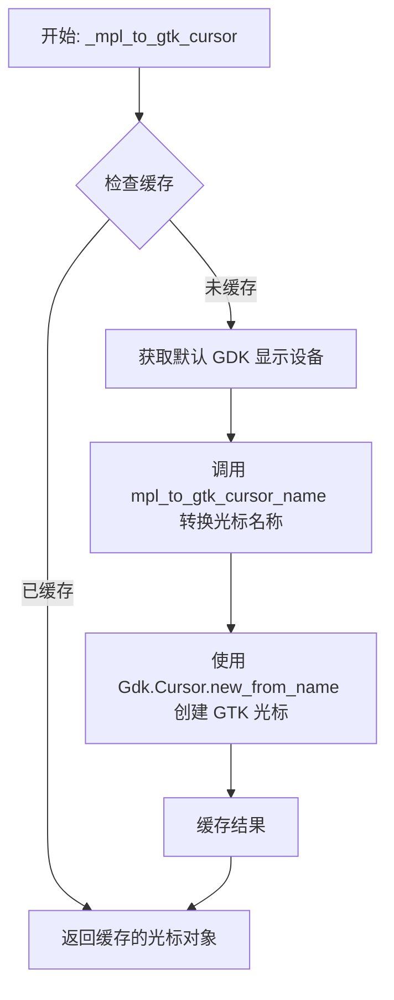

#### 带注释源码

```python
@functools.cache  # 装饰器：缓存函数返回结果，避免重复创建相同的 GTK 光标对象
def _mpl_to_gtk_cursor(mpl_cursor):
    """
    将 Matplotlib 光标类型转换为 GTK3 光标对象。
    
    Parameters
    ----------
    mpl_cursor : mpl_cursor_type
        Matplotlib 定义的光标类型，例如 Cursors.POINTER, Cursors.WAIT 等。
    
    Returns
    -------
    Gdk.Cursor
        GTK3 的光标对象，可直接用于设置 GTK 窗口的光标。
    """
    # 获取默认的 GDK 显示设备（显示器）
    # Gdk.Display.get_default() 返回当前默认的 Gdk.Display 实例
    return Gdk.Cursor.new_from_name(
        Gdk.Display.get_default(),
        # 调用 _backend_gtk 模块中的函数，将 Matplotlib 光标类型转换为 GTK 光标名称字符串
        # 例如：mpl_cursor='pointer' -> gtk_cursor_name='pointer'
        _backend_gtk.mpl_to_gtk_cursor_name(mpl_cursor))
```


### FigureCanvasGTK3.__init__

该方法是 GTK3 后端图形画布的初始化方法，负责设置图形对象、连接 GTK 事件处理器（鼠标、键盘、绘制等）、配置事件掩码、启用焦点功能，并应用 CSS 样式以确保画布具有正确的背景色和样式类。

参数：

- `figure`：`matplotlib.figure.Figure | None`，要绑定的 Matplotlib 图形对象，默认为 None

返回值：`None`，无返回值（__init__ 方法）

#### 流程图

```mermaid
flowchart TD
    A[开始 __init__] --> B[调用父类 super().__init__ figure=figure]
    B --> C[初始化实例变量 _idle_draw_id = 0]
    C --> D[初始化实例变量 _rubberband_rect = None]
    D --> E[连接 GTK 事件处理器]
    E --> F[scroll_event 滚动事件]
    E --> G[button_press_event 按钮按下事件]
    E --> H[button_release_event 按钮释放事件]
    E --> I[configure_event 配置事件]
    E --> J[screen-changed 屏幕变化事件]
    E --> K[notify::scale-factor 缩放因子变化事件]
    E --> L[draw 绘制事件]
    E --> M[key_press_event 键盘按下事件]
    E --> N[key_release_event 键盘释放事件]
    E --> O[motion_notify_event 鼠标移动事件]
    E --> P[enter_notify_event 进入事件]
    E --> Q[leave_notify_event 离开事件]
    E --> R[size_allocate 尺寸分配事件]
    R --> S[设置事件掩码 event_mask]
    S --> T[设置可聚焦 set_can_focus True]
    T --> U[创建并加载 CSS 样式 provider]
    U --> V[获取样式上下文并添加 provider 和样式类]
    V --> W[结束 __init__]
```

#### 带注释源码

```python
def __init__(self, figure=None):
    """
    初始化 FigureCanvasGTK3 画布。

    Parameters
    ----------
    figure : matplotlib.figure.Figure, optional
        要绑定的 Matplotlib 图形对象，默认为 None。
    """
    # 调用父类 _FigureCanvasGTK 的初始化方法
    # 这会设置 self.figure 并调用基类的初始化逻辑
    super().__init__(figure=figure)

    # 初始化空闲绘制回调的 ID，用于 draw_idle 方法的节流控制
    # 0 表示当前没有挂起的空闲绘制任务
    self._idle_draw_id = 0

    # 初始化橡皮筋矩形区域，用于缩放框的绘制
    # None 表示当前没有活动的橡皮筋矩形
    self._rubberband_rect = None

    # 连接 GTK 信号与对应的事件处理方法
    # 这些连接使得 GTK 事件能够触发 Matplotlib 事件系统

    # 鼠标滚轮事件
    self.connect('scroll_event',         self.scroll_event)
    # 鼠标按钮按下事件
    self.connect('button_press_event',   self.button_press_event)
    # 鼠标按钮释放事件
    self.connect('button_release_event', self.button_release_event)
    # 窗口大小或位置改变事件
    self.connect('configure_event',      self.configure_event)
    # 屏幕变化事件，用于更新设备像素比
    self.connect('screen-changed',       self._update_device_pixel_ratio)
    # 缩放因子变化通知事件
    self.connect('notify::scale-factor', self._update_device_pixel_ratio)
    # 绘制事件，触发实际渲染
    self.connect('draw',                 self.on_draw_event)
    # 绘制后事件，用于绘制橡皮筋框等覆盖层
    self.connect('draw',                 self._post_draw)
    # 键盘按键事件
    self.connect('key_press_event',      self.key_press_event)
    # 键盘释放事件
    self.connect('key_release_event',    self.key_release_event)
    # 鼠标移动事件
    self.connect('motion_notify_event',  self.motion_notify_event)
    # 鼠标进入画布事件
    self.connect('enter_notify_event',   self.enter_notify_event)
    # 鼠标离开画布事件
    self.connect('leave_notify_event',   self.leave_notify_event)
    # 尺寸分配事件，处理窗口大小变化
    self.connect('size_allocate',        self.size_allocate)

    # 设置此类将接收的 GTK 事件类型
    # event_mask 在类级别定义，包含所有需要的交互事件
    self.set_events(self.__class__.event_mask)

    # 允许此小部件接收键盘焦点，以便接收键盘输入
    self.set_can_focus(True)

    # 创建 CSS 样式提供程序
    # 设置画布的背景色为白色
    css = Gtk.CssProvider()
    # 加载 CSS 数据，定义 .matplotlib-canvas 类的背景色
    css.load_from_data(b".matplotlib-canvas { background-color: white; }")

    # 获取此小部件的样式上下文
    style_ctx = self.get_style_context()
    # 添加 CSS 提供程序，优先级为应用程序级别
    style_ctx.add_provider(css, Gtk.STYLE_PROVIDER_PRIORITY_APPLICATION)
    # 添加样式类名，便于 CSS 选择器匹配
    style_ctx.add_class("matplotlib-canvas")
```


### `FigureCanvasGTK3.destroy`

该方法是GTK3图形画布的销毁方法，负责在画布关闭时触发关闭事件，并通过调用父类方法完成GTK组件的资源释放。

参数：

- `self`：`FigureCanvasGTK3`，隐式参数，表示当前实例

返回值：`None`，无返回值（隐式返回None）

#### 流程图

```mermaid
flowchart TD
    A[开始 destroy] --> B[创建 CloseEvent 事件]
    B --> C{调用 _process 处理事件}
    C --> D[调用父类 super().destroy]
    D --> E[结束]
```

#### 带注释源码

```python
def destroy(self):
    """
    销毁画布并触发关闭事件。
    
    该方法在画布被关闭时调用，主要完成两件事：
    1. 创建一个 CloseEvent 事件并进行处理，通知应用程序画布即将关闭
    2. 调用父类的 destroy 方法释放 GTK 组件资源
    """
    # 创建一个关闭事件，事件类型为 "close_event"，事件源为当前画布实例 self
    # _process() 方法会调用所有注册在该事件上的回调函数
    CloseEvent("close_event", self)._process()
    
    # 调用父类（_FigureCanvasGTK 或 Gtk.DrawingArea）的 destroy 方法
    # 完成 GTK 组件的清理和资源释放工作
    super().destroy()
```


### FigureCanvasGTK3.set_cursor

该方法用于设置GTK3绘图画布的鼠标光标样式。它接收一个matplotlib光标类型参数，通过将matplotlib光标转换为GTK光标，然后设置到窗口上，并强制刷新GTK主上下文以确保光标立即更新。

参数：

- `cursor`：`int` 或 matplotlib 光标常量（如 `Cursors.WAIT`, `Cursors.HAND` 等），要设置的matplotlib光标类型

返回值：`None`，该方法无返回值

#### 流程图

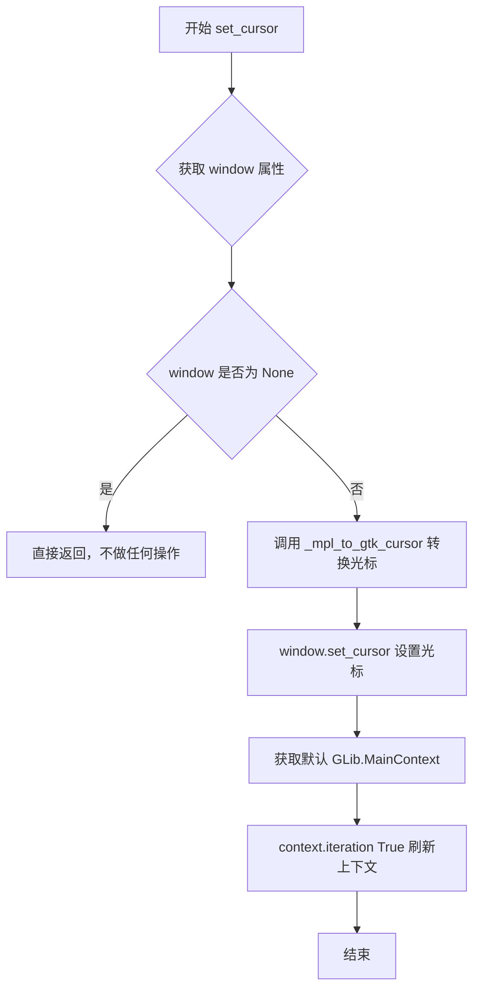

#### 带注释源码

```python
def set_cursor(self, cursor):
    # docstring inherited
    # 获取GTK窗口对象
    window = self.get_property("window")
    # 检查窗口是否有效（可能已被销毁）
    if window is not None:
        # 将matplotlib光标转换为GTK光标并设置到窗口
        window.set_cursor(_mpl_to_gtk_cursor(cursor))
        # 获取默认的GLib主上下文并执行一次迭代
        # 这确保光标更改立即生效，处理任何待处理的GTK事件
        context = GLib.MainContext.default()
        context.iteration(True)
```


### `FigureCanvasGTK3._mpl_coords`

将GTK事件的位置（或当event为None时当前光标位置）转换为Matplotlib坐标系。处理GTK逻辑像素到物理像素的转换，并修正坐标原点差异（GTK原点在左上角，Matplotlib在左下角）。

参数：

- `event`：`Gdk.Event` 或 `None`，GTK事件对象。如果为None，则获取当前光标位置

返回值：`tuple[float, float]`，转换后的Matplotlib坐标(x, y)

#### 流程图

```mermaid
flowchart TD
    A[开始 _mpl_coords] --> B{event is None?}
    B -->|是| C[获取当前窗口]
    C --> D[获取显示器的客户端指针设备]
    D --> E[调用 get_device_position 获取设备位置]
    E --> F[解包获取 x, y 坐标]
    B -->|否| G[直接从 event 中获取 x, y]
    F --> H[应用 device_pixel_ratio 缩放 x 坐标]
    G --> H
    H --> I[计算 y 坐标: figure.bbox.height - y * device_pixel_ratio]
    I --> J[返回 (x, y) 元组]
```

#### 带注释源码

```python
def _mpl_coords(self, event=None):
    """
    Convert the position of a GTK event, or of the current cursor position
    if *event* is None, to Matplotlib coordinates.

    GTK use logical pixels, but the figure is scaled to physical pixels for
    rendering.  Transform to physical pixels so that all of the down-stream
    transforms work as expected.

    Also, the origin is different and needs to be corrected.
    """
    # 如果没有提供事件，获取当前光标位置
    if event is None:
        # 获取GTK窗口对象
        window = self.get_window()
        # 获取设备位置信息：时间戳、x、y、状态
        # get_client_pointer() 获取默认的指针设备
        t, x, y, state = window.get_device_position(
            window.get_display().get_device_manager().get_client_pointer())
    else:
        # 从GTK事件中直接提取坐标（逻辑像素）
        x, y = event.x, event.y
    
    # 将x坐标从逻辑像素转换为物理像素
    # GTK使用逻辑像素，但Matplotlib渲染时使用物理像素
    x = x * self.device_pixel_ratio
    
    # 翻转y坐标：GTK原点在左上角(0,0)，Matplotlib在左下角(0,0)
    # 所以需要用figure高度减去转换后的y值
    # flip y so y=0 is bottom of canvas
    y = self.figure.bbox.height - y * self.device_pixel_ratio
    
    # 返回转换后的Matplotlib坐标
    return x, y
```


### `FigureCanvasGTK3.scroll_event`

处理GTK3滚动事件，将GTK的滚动事件转换为Matplotlib的MouseEvent并分发给相应的回调函数。

参数：

- `self`：隐式参数，FigureCanvasGTK3实例本身
- `widget`：`Gtk.Widget`，触发滚动事件的GTK控件（通常是Canvas本身）
- `event`：`Gdk.Event`，GTK的滚动事件对象，包含滚动方向和修饰键状态信息

返回值：`bool`，返回`False`表示结束事件传播，允许事件继续传播到其他处理器

#### 流程图

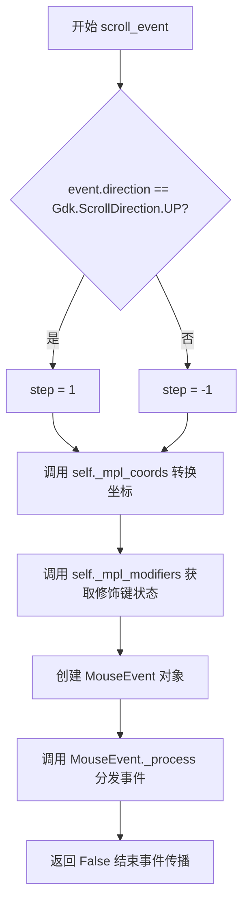

#### 带注释源码

```python
def scroll_event(self, widget, event):
    """
    处理GTK的scroll_event信号，将其转换为Matplotlib的MouseEvent。
    
    参数:
        widget: 触发事件的GTK控件
        event: 包含滚动方向和状态的Gdk.Event对象
    """
    # 根据滚动方向确定步进值：向上滚动为+1，向下滚动为-1
    # 用于表示放大（+1）或缩小（-1）
    step = 1 if event.direction == Gdk.ScrollDirection.UP else -1
    
    # 创建Matplotlib的MouseEvent对象
    # 参数依次为：事件类型、canvas、x坐标、y坐标
    # step参数表示滚动方向（+1放大/-1缩小）
    # modifiers包含键盘修饰键状态（Ctrl、Alt、Shift等）
    # guiEvent保存原始的GTK事件对象
    MouseEvent("scroll_event", self,
               *self._mpl_coords(event), step=step,
               modifiers=self._mpl_modifiers(event.state),
               guiEvent=event)._process()
    
    # 返回False允许事件继续传播，使其他控件也可以处理该滚动事件
    return False  # finish event propagation?
```


### `FigureCanvasGTK3.button_press_event`

处理 GTK 按钮按下事件，将其转换为 Matplotlib 的 MouseEvent 并传递给事件处理系统进行后续处理。

参数：

- `self`：`FigureCanvasGTK3`，FigureCanvasGTK3 类的实例本身
- `widget`：`Gtk.Widget`，触发事件的 GTK 组件（通常是 DrawingArea）
- `event`：`Gdk.EventButton`，GTK 按钮事件对象，包含事件发生时的坐标、按钮编号、修饰键状态等信息

返回值：`bool`，返回 `False` 表示结束事件传播，允许 GTK 继续处理该事件

#### 流程图

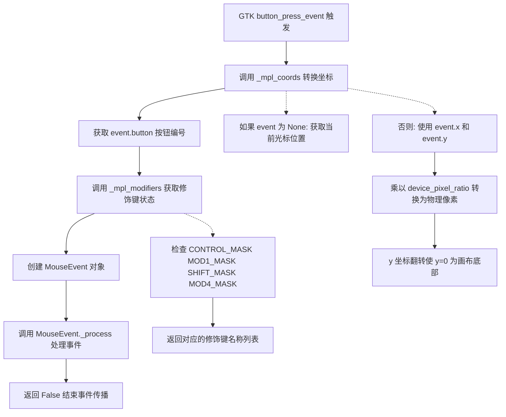

#### 带注释源码

```python
def button_press_event(self, widget, event):
    # 创建 Matplotlib 的 MouseEvent 对象，用于统一处理鼠标事件
    # 参数说明：
    #   "button_press_event": 事件类型名称
    #   self: 事件发生的画布对象
    #   *self._mpl_coords(event): 将 GTK 事件坐标转换为 Matplotlib 坐标
    #   event.button: 按下的鼠标按钮编号（1=左键, 2=中键, 3=右键等）
    #   modifiers=self._mpl_modifiers(event.state): 事件发生时的修饰键状态（如 Ctrl、Alt、Shift）
    #   guiEvent=event: 原始的 GTK 事件对象，保留给需要底层 GTK 信息的处理者
    MouseEvent("button_press_event", self,
               *self._mpl_coords(event), event.button,
               modifiers=self._mpl_modifiers(event.state),
               guiEvent=event)._process()
    # 返回 False 表示结束事件传播，允许 GTK 继续处理该事件
    # （例如 GTK 可能还需要处理按钮点击的默认行为）
    return False  # finish event propagation?
```


### FigureCanvasGTK3.button_release_event

该方法负责处理GTK3后端的鼠标按钮释放事件，将GTK的原生事件转换为Matplotlib的MouseEvent对象，并调用其_process()方法传递给上层的事件处理系统。

参数：

- `self`：`FigureCanvasGTK3`，类方法实例，指向当前的画布对象
- `widget`：`Gtk.Widget`，触发事件的GTK组件（通常是DrawingArea本身）
- `event`：`Gdk.Event`，GTK事件对象，包含鼠标按钮释放的详细信息（如按钮编号、坐标、修饰键状态等）

返回值：`bool`，返回False表示结束事件传播，允许事件继续传递给其他处理器

#### 流程图

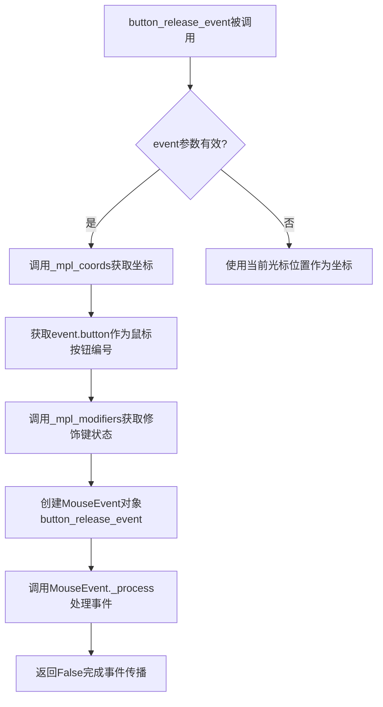

#### 带注释源码

```python
def button_release_event(self, widget, event):
    """
    处理GTK3的鼠标按钮释放事件。
    
    参数:
        widget: 触发事件的GTK组件（通常是DrawingArea）
        event: Gdk.Event对象，包含鼠标事件详情
    """
    # 创建MouseEvent对象，事件类型为button_release_event
    # 参数包括：事件名称、画布对象、鼠标坐标(x, y)、按钮编号、修饰键、原始GUI事件
    MouseEvent("button_release_event", self,
               *self._mpl_coords(event),  # 将GTK坐标转换为Matplotlib坐标
               event.button,               # 释放的鼠标按钮编号
               modifiers=self._mpl_modifiers(event.state),  # 获取修饰键状态
               guiEvent=event)._process()  # 传递原始GTK事件
    
    # 返回False表示完成事件传播，允许事件继续传递给其他处理器
    return False  # finish event propagation?
```


### `FigureCanvasGTK3.key_press_event`

该方法作为 GTK3 后端的事件处理适配器，负责捕获用户键盘按键操作，将原生的 GTK 事件转换为 Matplotlib 内部可识别的 `KeyEvent` 对象，并分发给相应的回调函数进行处理。

参数：

- `widget`：`Gtk.Widget`，触发信号的 GTK 组件（通常为绘图区域本身）。
- `event`：`Gdk.Event`，GTK 3 的事件对象，包含按键的键值（keyval）、状态（state，如 Shift、Ctrl）等信息。

返回值：`bool`，返回 `True` 表示该事件已被成功处理并终止传播，防止事件继续传递给上层组件（如父容器）。

#### 流程图

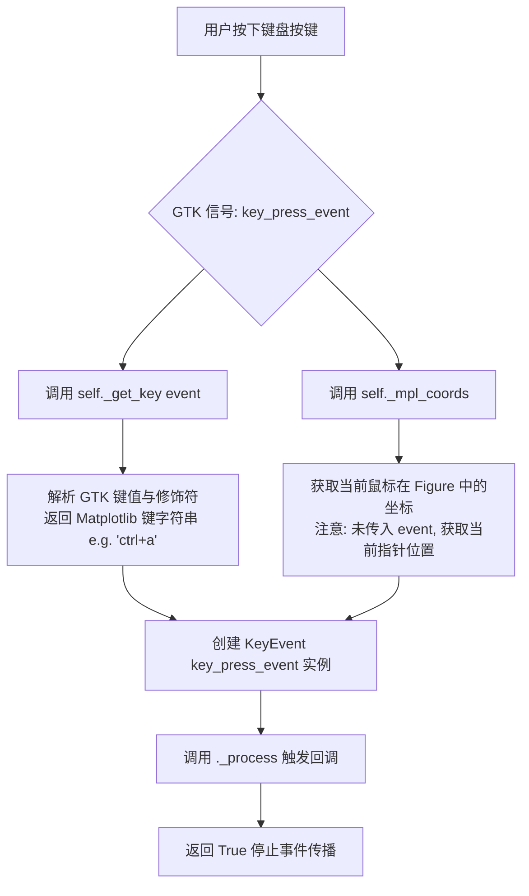

#### 带注释源码

```python
def key_press_event(self, widget, event):
    """
    处理 GTK3 的按键按下信号。
    
    参数:
        widget (Gtk.Widget): 发出信号的组件 (FigureCanvasGTK3 实例)。
        event (Gdk.Event): 包含具体按键信息的 GTK 事件对象。
    """
    # 1. 创建 KeyEvent 对象
    #    - "key_press_event": 事件类型名称
    #    - self: 事件发生的 Canvas
    #    - self._get_key(event): 将 GTK 键值转换为 Matplotlib 格式 (如 'left', 'ctrl+p')
    #    - *self._mpl_coords(): 解包获取当前的 (x, y) 坐标。注意：键盘事件本身不携带坐标，
    #      这里通常使用当前鼠标指针的位置。
    #    - guiEvent=event: 保留原始的 GTK 事件以供高级用户或工具使用
    KeyEvent("key_press_event", self,
             self._get_key(event), *self._mpl_coords(),
             guiEvent=event)._process()
             
    # 2. 返回 True
    #    在 GTK 中，返回 True 意味着 "该信号已处理完毕，不应传递给其他处理器"。
    #    这是一个重要的设计点，防止例如在输入框中按空格时，事件冒泡导致意外的滚动。
    return True  # stop event propagation
```


### `FigureCanvasGTK3.key_release_event`

处理GTK3键盘按键释放事件，将GTK事件转换为Matplotlib的KeyEvent并分发给 FigureCanvas。

参数：

- `widget`：`Gtk.Widget`，接收事件的GTK部件（DrawingArea）
- `event`：`Gdk.Event`，GTK事件对象，包含键码、修饰键状态等信息

返回值：`bool`，返回True表示停止事件传播，防止事件继续传递给其他处理器

#### 流程图

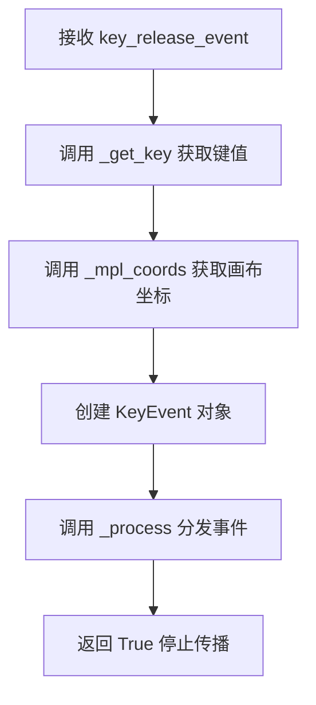

#### 带注释源码

```python
def key_release_event(self, widget, event):
    """
    处理GTK键盘按键释放事件。
    
    Parameters
    ----------
    widget : Gtk.Widget
        接收事件的GTK部件（FigureCanvasGTK3实例）
    event : Gdk.Event
        GTK事件对象，包含按键释放的详细信息（keyval, state等）
    
    Returns
    -------
    bool
        True，表示停止事件传播，防止事件继续传递给其他处理器
    """
    # 创建Matplotlib的KeyEvent对象
    # 参数：事件名称、canvas对象、键名、x坐标、y坐标、原始GTK事件
    KeyEvent("key_release_event", self,
             self._get_key(event), *self._mpl_coords(),
             guiEvent=event)._process()
    # 返回True表示该事件已处理完毕，阻止进一步传播
    return True  # stop event propagation
```


### FigureCanvasGTK3.motion_notify_event

处理画布上的鼠标移动事件。当鼠标在GTK绘图区域上移动时，此方法被GTK信号系统调用。它负责将GTK的原生事件坐标转换为Matplotlib坐标，识别当前按下的鼠标按钮和键盘修饰符（如Ctrl、Shift），创建并触发一个`MouseEvent`对象，以便将该事件分发给Matplotlib的后端处理机制和用户回调。

参数：

- `widget`：`Gtk.Widget`，发出信号的GTK小部件（通常是`FigureCanvasGTK3`实例本身）。
- `event`：`Gdk.Event`，包含鼠标移动详情的GTK事件对象（如坐标、状态掩码）。

返回值：`bool`，返回`False`以结束事件传播（GTK中允许事件继续传递给父部件的标准处理方式）。

#### 流程图

```mermaid
graph TD
    A[GTK Signal: motion_notify_event] --> B[调用 self._mpl_coords(event)]
    B --> C[获取鼠标坐标并转换]
    C --> D[调用 self._mpl_buttons(event.state)]
    D --> E[获取当前按下的鼠标按钮]
    E --> F[调用 self._mpl_modifiers(event.state)]
    F --> G[获取当前按下的修饰键 Ctrl/Alt/Shift]
    G --> H[实例化 MouseEvent]
    H --> I[调用 MouseEvent._process 触发回调]
    I --> J[返回 False]
```

#### 带注释源码

```python
def motion_notify_event(self, widget, event):
    # 创建一个 MouseEvent 事件对象。
    # 参数包括：
    # 1. 事件名称 'motion_notify_event'
    # 2. 发起者 self (FigureCanvasGTK3 实例)
    # 3. 坐标位置：通过 _mpl_coords 将 GTK 坐标转换为 Matplotlib 坐标
    # 4. buttons：当前按下的鼠标按钮，通过 _mpl_buttons 从 GTK 事件状态中提取
    # 5. modifiers：当前按下的修饰键，通过 _mpl_modifiers 从 GTK 事件状态中提取
    # 6. guiEvent：原始的 GTK 事件对象
    MouseEvent("motion_notify_event", self, *self._mpl_coords(event),
               buttons=self._mpl_buttons(event.state),
               modifiers=self._mpl_modifiers(event.state),
               guiEvent=event)._process()
    
    # 返回 False 表示完成事件传播，允许事件被传递给其他处理器
    return False  # finish event propagation?
```


### `FigureCanvasGTK3.enter_notify_event`

该方法处理GTK的进入通知事件（enter_notify_event），当鼠标指针进入画布区域时触发。它获取当前的修饰键状态，将GTK事件坐标转换为Matplotlib坐标，并创建一个名为"figure_enter_event"的LocationEvent对象进行后续处理。

参数：

- `widget`：`Gtk.Widget`，触发事件的GTK组件（通常是DrawingArea本身）
- `event`：`Gdk.Event`，GTK事件对象，包含事件类型、坐标等信息

返回值：`None`，该方法没有显式返回值，事件处理结果通过LocationEvent的_process()方法内部处理

#### 流程图

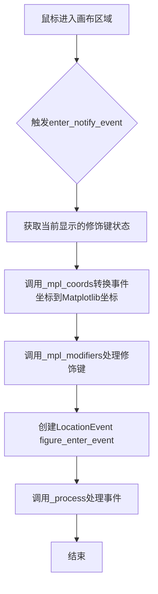

#### 带注释源码

```python
def enter_notify_event(self, widget, event):
    """
    Handle the GTK enter-notify event.
    
    This method is called when the mouse pointer enters the figure canvas.
    It creates a Matplotlib LocationEvent to notify listeners that the
    cursor has entered the figure area.
    
    Parameters
    ----------
    widget : Gtk.Widget
        The widget that received the event (self).
    event : Gdk.Event
        The GTK event object containing event details.
    """
    # 获取当前显示器的键盘映射，以确定修饰键（Ctrl、Alt、Shift等）的当前状态
    gtk_mods = Gdk.Keymap.get_for_display(
        self.get_display()).get_modifier_state()
    
    # 创建位置事件，事件名为"figure_enter_event"
    # 参数包括：画布自身、转换后的坐标、修饰键状态、原始GUI事件
    LocationEvent("figure_enter_event", self, *self._mpl_coords(event),
                  modifiers=self._mpl_modifiers(gtk_mods),
                  guiEvent=event)._process()
    # 注意：该方法没有显式返回值，隐式返回None
```


### `FigureCanvasGTK3.leave_notify_event`

该方法处理 GTK3 的 leave_notify_event（鼠标离开画布事件），将 GTK 事件转换为 Matplotlib 的 LocationEvent 并分发到 figure_leave_event 事件链。

参数：

- `self`：隐式参数，FigureCanvasGTK3 实例本身
- `widget`：`Gtk.Widget`，触发事件的 GTK 组件（通常是 DrawingArea 本身）
- `event`：`Gdk.Event`，GTK 事件对象，包含鼠标位置和状态信息

返回值：`None`，无返回值（隐式返回 None，允许事件继续传播）

#### 流程图

```mermaid
flowchart TD
    A[开始: leave_notify_event] --> B[获取显示器的修饰键状态]
    B --> C[调用 _mpl_coords 获取鼠标坐标]
    C --> D[调用 _mpl_modifiers 转换修饰键]
    D --> E[创建 LocationEvent 事件<br/>类型: figure_leave_event]
    E --> F[调用 _process() 分发事件]
    F --> G[结束: 返回 None]
```

#### 带注释源码

```python
def leave_notify_event(self, widget, event):
    """
    处理鼠标离开画布区域的事件。
    
    Parameters
    ----------
    widget : Gtk.Widget
        触发事件的 GTK 组件（FigureCanvasGTK3 继承自 Gtk.DrawingArea）
    event : Gdk.Event
        GTK 事件对象，包含事件详情
    """
    # 获取当前显示器的键盘修饰键状态（如 Ctrl, Alt, Shift 等）
    # Gdk.Keymap.get_for_display 获取与显示关联的键盘映射
    # get_modifier_state 返回当前按下的修饰键状态掩码
    gtk_mods = Gdk.Keymap.get_for_display(
        self.get_display()).get_modifier_state()
    
    # 创建 Matplotlib 的 LocationEvent 事件
    # "figure_leave_event" 表示鼠标离开 figure 区域的事件类型
    # self._mpl_coords(event) 将 GTK 坐标转换为 Matplotlib 坐标系统
    # modifiers 将 GTK 修饰键状态转换为 Matplotlib 格式
    # guiEvent 保留原始 GTK 事件对象
    LocationEvent("figure_leave_event", self, *self._mpl_coords(event),
                  modifiers=self._mpl_modifiers(gtk_mods),
                  guiEvent=event)._process()
    
    # 无显式返回值，隐式返回 None
    # 在 GTK 事件处理器中，None/False 表示允许事件继续传播
```


### `FigureCanvasGTK3.size_allocate`

处理 GTK3 画布的大小分配事件，当 DrawingArea 的尺寸发生变化时自动调用此方法。该方法负责将新的像素尺寸转换为英寸单位，更新 Figure 的尺寸，并触发重绘事件以刷新画布显示。

参数：

- `widget`：`Gtk.Widget`，触发 size_allocate 事件的 GTK 组件（通常是 DrawingArea 本身）
- `allocation`：`Gtk.Allocation`，包含新尺寸信息的 GTK 分配对象，具有 `width` 和 `height` 属性

返回值：`None`，无返回值（方法内部直接完成状态更新和事件触发）

#### 流程图

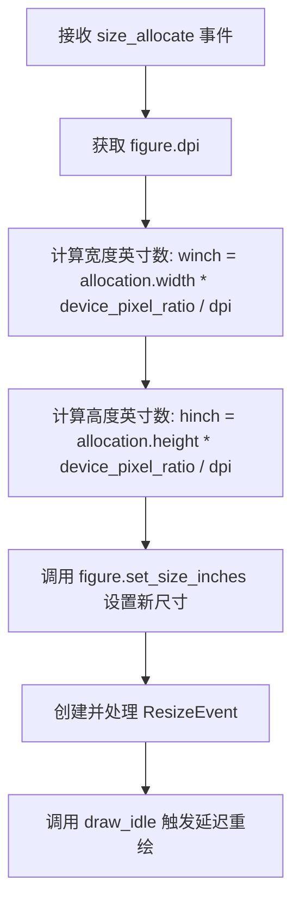

#### 带注释源码

```python
def size_allocate(self, widget, allocation):
    """
    处理 GTK3 DrawingArea 的大小分配事件。
    
    当窗口大小改变时，GTK 会调用此回调函数。我们需要将新的像素尺寸
    转换为 Matplotlib 内部的英寸单位，并更新 Figure 的尺寸。
    
    参数:
        widget: 触发事件的 GTK 组件 (通常是 DrawingArea 本身)
        allocation: 包含新尺寸信息的 GTK.Allocation 对象
                   - allocation.width: 新的宽度（逻辑像素）
                   - allocation.height: 新的高度（逻辑像素）
    """
    # 获取当前 Figure 的 DPI（每英寸点数）用于单位转换
    dpival = self.figure.dpi
    
    # 计算新的宽度（英寸）：
    # 1. allocation.width 是逻辑像素宽度
    # 2. device_pixel_ratio 将逻辑像素转换为物理像素
    # 3. 除以 dpi 将物理像素转换为英寸
    winch = allocation.width * self.device_pixel_ratio / dpival
    
    # 计算新的高度（英寸），逻辑同上
    hinch = allocation.height * self.device_pixel_ratio / dpival
    
    # 更新 Figure 的尺寸（单位：英寸）
    # forward=False 表示不转发事件到 GUI 后端（避免递归调用）
    self.figure.set_size_inches(winch, hinch, forward=False)
    
    # 创建并处理 resize 事件，通知所有监听器尺寸已改变
    ResizeEvent("resize_event", self)._process()
    
    # 调用 draw_idle 安排一次延迟的重绘操作
    # 使用延迟绘制可以避免在快速调整大小时产生大量重绘请求
    self.draw_idle()
```


### `FigureCanvasGTK3._mpl_buttons`

该方法是一个静态工具函数，用于将 GTK 的事件状态掩码（`event_state`）转换为 Matplotlib 的鼠标按钮枚举值列表。在 GTK 中，鼠标按钮状态通过位掩码表示，该方法通过按位与运算检测哪些鼠标按钮被按下，并返回对应的 `MouseButton` 枚举值列表。

参数：

- `event_state`：`int`，GTK 事件状态掩码（通常是 `Gdk.Event` 的 `state` 属性），包含按钮按下状态的位信息

返回值：`list[MouseButton]`，返回当前处于按下状态的鼠标按钮列表，列表元素为 `MouseButton` 枚举值（LEFT、MIDDLE、RIGHT、BACK、FORWARD）

#### 流程图

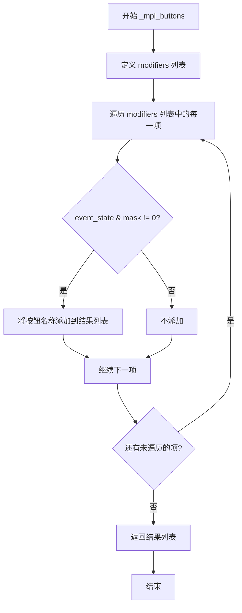

#### 带注释源码

```python
@staticmethod
def _mpl_buttons(event_state):
    """
    将 GTK 事件状态转换为 Matplotlib 鼠标按钮列表。
    
    参数:
        event_state: GTK 事件状态掩码，包含按钮按下状态的信息
        
    返回:
        当前按下的鼠标按钮列表（MouseButton 枚举值）
    """
    # 定义鼠标按钮与 GTK 掩码的映射关系
    # 包含 Matplotlib 支持的5种鼠标按钮
    modifiers = [
        (MouseButton.LEFT,   Gdk.ModifierType.BUTTON1_MASK),   # 左键
        (MouseButton.MIDDLE, Gdk.ModifierType.BUTTON2_MASK),  # 中键
        (MouseButton.RIGHT,  Gdk.ModifierType.BUTTON3_MASK),  # 右键
        (MouseButton.BACK,   Gdk.ModifierType.BUTTON4_MASK),   # 前进键
        (MouseButton.FORWARD, Gdk.ModifierType.BUTTON5_MASK), # 后退键
    ]
    # State *before* press/release.
    # 使用列表推导式过滤出当前按下的按钮
    # 按位与运算检测 event_state 中是否包含对应按钮的掩码位
    return [name for name, mask in modifiers if event_state & mask]
```


### `FigureCanvasGTK3._mpl_modifiers`

该方法是一个静态工具函数，用于将 GTK 事件中的修饰键状态（如 Ctrl、Alt、Shift、Super）转换为 Matplotlib 可识别的修饰键名称列表，以便在鼠标或键盘事件中传递正确的修饰键信息。

参数：

- `event_state`：`Gdk.ModifierType`，GTK 事件状态掩码，表示当前按下的修饰键
- `exclude`：`str`（可选，关键字参数），需要排除的修饰键名称，用于在特定情况下忽略某个修饰键

返回值：`list[str]`，包含所有当前激活的修饰键名称的列表（如 "ctrl"、"alt"、"shift"、"super"）

#### 流程图

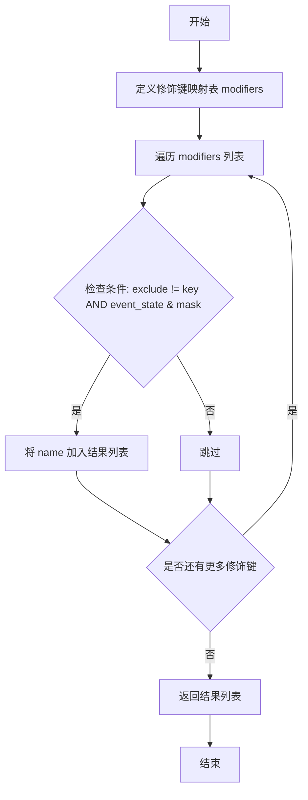

#### 带注释源码

```python
@staticmethod
def _mpl_modifiers(event_state, *, exclude=None):
    """
    将 GTK 事件状态转换为 Matplotlib 修饰键名称列表。

    参数:
        event_state: Gdk.ModifierType，GTK 事件状态掩码
        exclude: 可选关键字参数，指定要排除的修饰键名称

    返回:
        list[str]: 激活的修饰键名称列表
    """
    # 定义 GTK 修饰键到 Matplotlib 修饰键名称的映射
    # 包含三元组：(Matplotlib名称, GTK掩码, 关键字标识)
    modifiers = [
        ("ctrl", Gdk.ModifierType.CONTROL_MASK, "control"),
        ("alt", Gdk.ModifierType.MOD1_MASK, "alt"),
        ("shift", Gdk.ModifierType.SHIFT_MASK, "shift"),
        ("super", Gdk.ModifierType.MOD4_MASK, "super"),
    ]
    # 列表推导式：过滤出当前激活的修饰键
    # 条件1: exclude != key 确保排除了指定修饰键
    # 条件2: event_state & mask 使用位运算检查修饰键是否按下
    return [name for name, mask, key in modifiers
            if exclude != key and event_state & mask]
```


### `FigureCanvasGTK3._get_key`

该方法将 GTK 键盘事件转换为 Matplotlib 格式的按键字符串，处理 Unicode 字符、修饰键（ctrl、alt、shift 等）的转换，并生成统一的按键表示。

参数：

- `self`：`FigureCanvasGTK3`，调用该方法的画布实例
- `event`：`Gdk.Event`，GTK 事件对象，包含 `keyval`（键值）和 `state`（修饰键状态）

返回值：`str`，Matplotlib 格式的按键字符串，例如 `"ctrl+a"`、`"shift++"` 等

#### 流程图

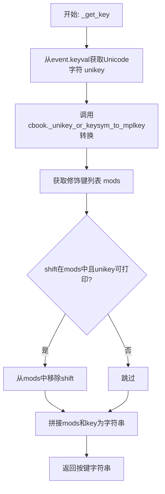

#### 带注释源码

```python
def _get_key(self, event):
    """
    将 GTK 键盘事件转换为 Matplotlib 格式的按键字符串。

    参数:
        event: Gdk.Event，GTK 键盘事件对象，包含 keyval 和 state 属性

    返回:
        str: 格式如 "ctrl+a" 的按键字符串
    """
    # 将 GTK 键值转换为 Unicode 字符
    unikey = chr(Gdk.keyval_to_unicode(event.keyval))

    # 使用 cbook 将 Unicode 或按键符号转换为 Matplotlib 按键名
    key = cbook._unikey_or_keysym_to_mplkey(
        unikey, Gdk.keyval_name(event.keyval))

    # 获取修饰键列表（如 ctrl, alt, shift），排除与 key 冲突的修饰键
    mods = self._mpl_modifiers(event.state, exclude=key)

    # 如果 shift 在修饰键中且生成的字符是可打印的，则移除 shift
    # 这是因为 shift 通常已经体现在大小写字符中
    if "shift" in mods and unikey.isprintable():
        mods.remove("shift")

    # 将修饰键和按键用 '+' 连接，如 "ctrl+a"
    return "+".join([*mods, key])
```


### `FigureCanvasGTK3._update_device_pixel_ratio`

该方法用于处理GTK3画布的设备像素比例（DPI缩放）更新，当GTK检测到屏幕缩放因子变化时（如高DPI显示器），自动调整画布的渲染分辨率并触发重绘。

参数：

- `*args`：可变位置参数，接收GTK信号传递的任意参数（由'screen-changed'和'notify::scale-factor'信号触发）
- `**kwargs`：可变关键字参数，接收GTK信号传递的任意关键字参数

返回值：`None`，无返回值（该方法通过副作用更新画布状态）

#### 流程图

```mermaid
flowchart TD
    A[开始: _update_device_pixel_ratio] --> B[获取当前缩放因子: self.get_scale_factor()]
    B --> C{_set_device_pixel_ratio 返回 True?}
    C -->|是| D[调用 queue_resize 队列重置大小]
    D --> E[调用 queue_draw 队列重绘]
    E --> F[结束]
    C -->|否| F
```

#### 带注释源码

```python
def _update_device_pixel_ratio(self, *args, **kwargs):
    """
    Update the device pixel ratio for high DPI displays.
    
    This method is connected to GTK signals 'screen-changed' and 
    'notify::scale-factor'. It handles cases with mixed resolution 
    displays where the device_pixel_ratio may change dynamically.
    
    Parameters
    ----------
    *args : tuple
        Variable positional arguments passed from GTK signals.
    **kwargs : dict
        Variable keyword arguments passed from GTK signals.
    """
    # We need to be careful in cases with mixed resolution displays if
    # device_pixel_ratio changes.
    # 获取GTK的缩放因子（通常是1.0、2.0等表示DPI倍数）
    if self._set_device_pixel_ratio(self.get_scale_factor()):
        # The easiest way to resize the canvas is to emit a resize event
        # since we implement all the logic for resizing the canvas for that
        # event.
        # 如果成功设置了新的像素比例，触发队列重置大小事件
        self.queue_resize()
        # 立即队列重绘以更新视觉效果
        self.queue_draw()
```


### `FigureCanvasGTK3.configure_event`

该方法在GTK画布的窗口大小发生变化时被调用，负责将图形尺寸调整为与画布新尺寸匹配（以英寸为单位），确保matplotlib图形能够正确响应窗口大小变化。

参数：

- `widget`：`Gtk.Widget`，触发configure_event的GTK控件（通常是FigureCanvasGTK3自身）
- `event`：`Gdk.Event`，GTK的窗口配置事件对象，包含新的宽度和高度信息

返回值：`bool`，返回False表示完成事件传播，允许事件继续传递给其他处理器

#### 流程图

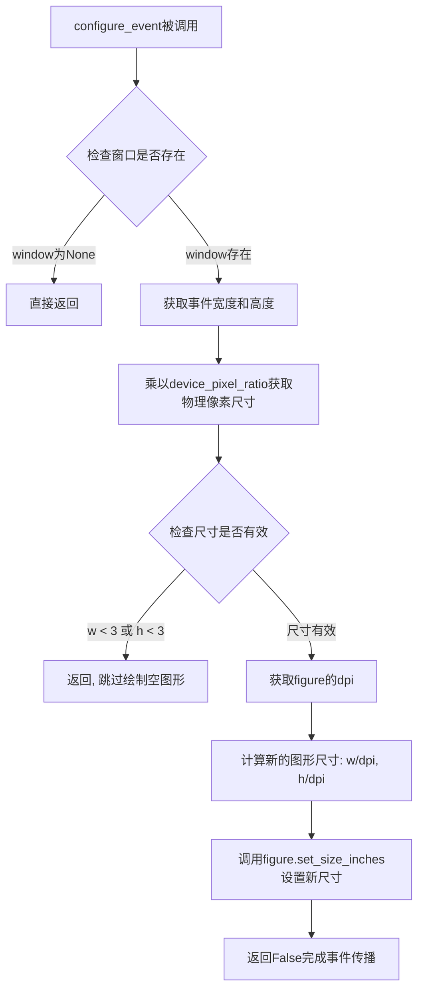

#### 带注释源码

```python
def configure_event(self, widget, event):
    """
    处理GTK窗口配置事件，当画布大小改变时调整图形尺寸。
    
    Parameters
    ----------
    widget : Gtk.Widget
        触发事件的GTK控件（FigureCanvasGTK3实例）。
    event : Gdk.Event
        包含窗口配置信息的GTK事件对象，包括新的宽度和高度。
    
    Returns
    -------
    bool
        返回False表示事件传播已完成，允许其他处理器继续处理。
    """
    # 检查窗口是否已创建，如果窗口为None则直接返回
    # 这通常发生在窗口刚创建但尚未完全初始化时
    if widget.get_property("window") is None:
        return
    
    # 获取事件中的宽度和高度，乘以device_pixel_ratio转换为物理像素
    # device_pixel_ratio用于处理高DPI/Retina显示器
    w = event.width * self.device_pixel_ratio
    h = event.height * self.device_pixel_ratio
    
    # 如果尺寸过小（小于3像素），认为是空图形，跳过处理
    # 避免处理无效的微小尺寸
    if w < 3 or h < 3:
        return  # empty fig
    
    # 获取图形的DPI（每英寸点数），用于将像素尺寸转换为英寸
    dpi = self.figure.dpi
    
    # 设置图形的新尺寸（以英寸为单位），forward=False表示不立即重绘
    # 这样可以避免在初始化过程中多次重绘
    self.figure.set_size_inches(w / dpi, h / dpi, forward=False)
    
    # 返回False以完成事件传播，允许其他事件处理器继续处理
    return False  # finish event propagation?
```


### `FigureCanvasGTK3._draw_rubberband`

该方法负责接收并保存当前的橡皮筋（Rubberband）矩形区域数据，随后触发GTK绘图事件将该矩形绘制在画布上。它是后端处理图形交互（如缩放、框选）的关键环节。

参数：

-  `self`：隐式参数，类型为 `FigureCanvasGTK3`，指向当前的画布实例。
-  `rect`：`tuple` 或 `list` of `float`，代表矩形区域，包含 `(x, y, width, height)`，通常基于显示器的物理像素坐标。

返回值：`None`，该方法没有显式返回值，主要通过副作用（修改实例状态并触发重绘）生效。

#### 流程图

```mermaid
flowchart TD
    A[Start _draw_rubberband] --> B[接收 rect 参数]
    B --> C{rect 是否有效?}
    C -- 是 --> D[更新实例变量]
    D --> E[设置 self._rubberband_rect = rect]
    E --> F[触发重绘队列]
    F --> G[调用 self.queue_draw]
    G --> H[End]
    C -- 否/空 --> I[通常不调用此方法]
    I --> H
```

#### 带注释源码

```python
def _draw_rubberband(self, rect):
    """
    绘制橡皮筋矩形（Rubberband）。

    该方法并不直接执行绘图操作，而是存储矩形的位置信息，
    并将绘图任务交给 GTK 的事件循环处理。
    """
    # 1. 将传入的矩形坐标保存到实例变量中。
    #    这里的 rect 通常是一个 (x, y, w, h) 元组。
    self._rubberband_rect = rect
    
    # 2. TODO: 优化建议。
    #    目前使用 queue_draw() 触发全图重绘，效率较低。
    #    理想情况下应只重绘 rect 所在的区域，以减少性能开销。
    self.queue_draw()
```


### `FigureCanvasGTK3._post_draw`

该方法用于在 GTK3 画布的绘制事件后绘制橡皮筋框（rubberband），即 matplotlib 中用于显示缩放或选择区域的虚线矩形边框。它通过 Cairo 图形上下文在画布上绘制一个带有双层虚线的矩形，黑色实线在内，白色实线在外，形成清晰的边界视觉效果。

参数：

- `self`：`FigureCanvasGTK3`，隐含的实例参数，表示当前画布对象
- `widget`：`Gtk.Widget`，触发绘制事件的 GTK 组件对象
- `ctx`：`Gdk.CairoContext`，GTK/Cairo 图形上下文，用于执行绘图操作

返回值：`None`，该方法直接修改图形上下文状态，不返回任何值

#### 流程图

```mermaid
flowchart TD
    A[_post_draw 被调用] --> B{self._rubberband_rect 是否为 None?}
    B -->|是| C[直接返回, 不做任何绘制]
    B -->|否| D[从 rubberband_rect 提取坐标并除以 device_pixel_ratio]
    D --> E[计算矩形边界: x0, y0, x1, y1]
    E --> F[使用 ctx.move_to 和 ctx.line_to 绘制四条边]
    F --> G[设置抗锯齿和线宽]
    G --> H[设置黑色实线虚线模式并描边]
    H --> I[设置白色实线虚线模式并描边]
    I --> J[完成绘制, 返回]
```

#### 带注释源码

```python
def _post_draw(self, widget, ctx):
    """
    在 GTK3 画布绘制完成后绘制橡皮筋框（缩放选择框）。
    
    该方法作为 'draw' 信号的回调函数，在主绘制完成后执行。
    它绘制一个双层虚线矩形：内层黑色，外层白色，形成清晰的边界效果。
    
    参数:
        widget: 触发绘制事件的 GTK 组件
        ctx: Cairo 图形上下文，用于执行绘图操作
    """
    # 如果没有橡皮筋框需要绘制（即当前没有激活的缩放或选择操作），直接返回
    if self._rubberband_rect is None:
        return

    # 从实例变量 _rubberband_rect 中提取坐标，并按设备像素比进行缩放调整
    # rubberband_rect 存储的是物理像素坐标，需要转换为逻辑坐标
    x0, y0, w, h = (dim / self.device_pixel_ratio
                    for dim in self._rubberband_rect)
    
    # 计算矩形的右上角和右下角坐标
    x1 = x0 + w
    y1 = y0 + h

    # 绘制从 (x0, y0) 到 (x1, y1) 的四条边
    # 这里的绘制顺序是为了确保虚线图案的连续性，避免移动时的"跳跃"现象
    # 第一次 move_to + line_to 绘制左边框（从 y0 到 y1）
    ctx.move_to(x0, y0)
    ctx.line_to(x0, y1)
    # 第二次 move_to + line_to 绘制上边框（从 x0 到 x1）
    ctx.move_to(x0, y0)
    ctx.line_to(x1, y0)
    # 第三次 move_to + line_to 绘制下边框（从 x0 到 x1，在 y1 处）
    ctx.move_to(x0, y1)
    ctx.line_to(x1, y1)
    # 第四次 move_to + line_to 绘制右边框（从 y0 到 y1，在 x1 处）
    ctx.move_to(x1, y0)
    ctx.line_to(x1, y1)

    # 设置抗锯齿级别为 1（启用抗锯齿）
    ctx.set_antialias(1)
    # 设置线条宽度为 1 像素
    ctx.set_line_width(1)
    # 设置虚线模式：(3, 3) 表示 3 像素实线后跟 3 像素空白，0 是偏移量
    ctx.set_dash((3, 3), 0)
    # 设置描边颜色为黑色 (R=0, G=0, B=0)
    ctx.set_source_rgb(0, 0, 0)
    # 执行描边操作，同时保留路径供后续使用
    ctx.stroke_preserve()

    # 重新设置虚线模式：(3, 3) 表示 3 像素实线后跟 3 像素空白，3 是偏移量
    # 偏移量 3 使得这层描边与上一层描边形成交错，从而形成双层边框效果
    ctx.set_dash((3, 3), 3)
    # 设置描边颜色为白色 (R=1, G=1, B=1)
    ctx.set_source_rgb(1, 1, 1)
    # 执行第二次描边，形成外层白色边框
    ctx.stroke()
```


### `FigureCanvasGTK3.on_draw_event`

该方法是 GTK3 后端画布的绘制事件处理程序，作为占位符方法供子类（GTK3Agg 或 GTK3Cairo）重写以实现实际的图形渲染逻辑。

参数：

- `widget`：`Gtk.Widget`，触发绘制事件的 GTK 部件（绘图区域本身）
- `ctx`：`cairo.Context`，Cairo 图形上下文，提供在画布上进行 2D 绘制的 API

返回值：`None`，当前实现为空方法，子类需自行重写以处理绘制逻辑

#### 流程图

```mermaid
flowchart TD
    A[GTK draw 信号触发] --> B[调用 on_draw_event]
    B --> C{子类是否重写?}
    C -->|否| D[直接返回 None]
    C -->|是| E[执行子类自定义绘制逻辑]
    E --> F[返回 None 或 False]
    
    style C fill:#f9f,stroke:#333
    style E fill:#9f9,stroke:#333
```

#### 带注释源码

```python
def on_draw_event(self, widget, ctx):
    """
    GTK draw 事件的处理程序。
    
    此方法作为绘制逻辑的钩子（hook），在 GTK 的 'draw' 信号被触发时调用。
    具体的图形渲染由子类 GTK3Agg（基于 Agg）和 GTK3Cairo（基于 Cairo）重写实现。
    
    Parameters
    ----------
    widget : Gtk.Widget
        触发绘制事件的 GTK 部件，即 FigureCanvasGTK3 自身。
    ctx : cairo.Context
        Cairo 图形上下文，用于在画布表面执行 2D 绘图操作，
        如绘制路径、填充矩形、渲染文本等。
    
    Returns
    -------
    None
        当前基类实现不执行任何操作，返回 None。
        子类通常也返回 None 或 False，以允许事件继续传播。
    """
    # to be overwritten by GTK3Agg or GTK3Cairo
    pass
```


### `FigureCanvasGTK3.draw`

该方法负责触发 GTK3 画布的重绘操作。它检查画布当前是否处于可绘制状态，如果是，则将绘制请求加入 GTK 事件队列，从而在下一个渲染周期自动调用实际的绘图回调。

参数：

- `self`：`FigureCanvasGTK3`，隐式参数，表示当前画布实例本身

返回值：`None`，无返回值

#### 流程图

```mermaid
flowchart TD
    A[开始 draw] --> B{is_drawable?}
    B -->|是| C[queue_draw]
    B -->|否| D[直接返回]
    C --> E[结束]
    D --> E
```

#### 带注释源码

```python
def draw(self):
    # docstring inherited
    # 检查画布是否处于可绘制状态（如窗口已显示、未被销毁等）
    if self.is_drawable():
        # 将绘制事件加入 GTK 主循环的队列
        # 会在下一个事件循环周期触发 'draw' 信号
        # 从而调用 on_draw_event 或其他注册的绘制回调
        self.queue_draw()
```


### FigureCanvasGTK3.draw_idle

该方法用于实现延迟绘制机制，通过GTK主循环的空闲回调来批量处理绘制请求，避免频繁重绘导致的性能问题。当调用此方法时，如果当前没有待处理的绘制任务，则创建一个idle_draw回调函数并通过GLib.idle_add注册到GTK事件循环中，待主循环空闲时执行实际的绘制操作。

参数： 无（仅包含隐式参数self）

返回值：无（None），该方法没有显式返回值

#### 流程图

```mermaid
flowchart TD
    A[开始 draw_idle] --> B{检查 _idle_draw_id != 0?}
    B -->|是| C[直接返回，不添加新任务]
    B -->|否| D[创建 idle_draw 闭包函数]
    D --> E[调用 self.draw 执行实际绘制]
    E --> F[将 _idle_draw_id 重置为 0]
    F --> G[返回 False 告知 GLib 不再重复调用]
    C --> H[结束]
    G --> I[通过 GLib.idle_add 添加到主循环]
    I --> J[等待GTK主循环空闲时执行]
    J --> E
```

#### 带注释源码

```python
def draw_idle(self):
    """
    Schedule a redraw of the canvas at the next idle moment.
    
    This method implements a coalescing mechanism to avoid multiple
    redundant draw calls. If a draw is already scheduled, this method
    returns immediately without adding another draw request.
    """
    # docstring inherited
    # Check if there's already a pending idle draw operation
    if self._idle_draw_id != 0:
        return  # Already scheduled, exit early to avoid duplicate work
    
    # Define the callback function that will execute the draw
    def idle_draw(*args):
        """
        Internal callback that performs the actual drawing.
        
        This closure captures self and will be called by GTK's
        main loop when the application is idle.
        """
        try:
            self.draw()  # Execute the actual drawing operation
        finally:
            # Always reset the counter, even if draw() raises an exception
            self._idle_draw_id = 0
        return False  # Return False to tell GLib to not call this again
    
    # Register the idle callback with GTK's main loop
    # GLib.idle_add() returns an ID that can be used to cancel the callback
    self._idle_draw_id = GLib.idle_add(idle_draw)
```


### `FigureCanvasGTK3.flush_events`

该方法强制刷新GTK3后端的事件队列，通过同步调用GLib主循环来立即处理所有待处理的GUI事件（如鼠标、键盘事件），以确保在批量更新或交互过程中界面能够及时响应。

参数：

- `self`：`FigureCanvasGTK3`，调用此方法的画布实例本身。

返回值：`None`，该方法不返回任何值。

#### 流程图

```mermaid
flowchart TD
    A([开始 flush_events]) --> B[获取默认的 GLib.MainContext]
    B --> C{检查 pending() 是否有待处理事件?}
    C -- 否 --> D([结束])
    C -- 是 --> E[调用 iteration(True) 处理一个事件]
    E --> C
```

#### 带注释源码

```python
def flush_events(self):
    # docstring inherited
    # 1. 获取当前线程默认的 GLib 主上下文（MainContext）。
    #    GTK 的事件循环依赖于 MainContext 来管理事件队列。
    context = GLib.MainContext.default()
    
    # 2. 进入循环，只要事件队列中有待处理的事件，就持续处理。
    #    pending() 返回 True 表示队列中至少有一个事件在等待。
    while context.pending():
        # 3. 执行一次事件循环迭代。
        #    参数 True 表示阻塞模式：如果没有事件会等待（有 pending 判定所以此场景不适用），
        #    如果有事件则分派并处理该事件。这会触发 GTK 的信号发射，
        #    进而调用 Python 绑定的事件处理器（如 button_press_event）。
        context.iteration(True)
```


<minimax:tool_call>
<invoke name="read_file">
<parameter name="file_path">/testbed/matplotlib/backends/_backend_gtk.py</parameter>
</invoke>
</minimax:tool_call>


### `NavigationToolbar2GTK3.save_figure`

该方法是GTK3后端导航工具栏的保存图形功能，通过GTK文件选择对话框让用户选择保存路径和文件格式，然后调用figure的savefig方法将图形保存为用户指定的文件，并在保存失败时显示错误对话框。

参数：

- `self`：`NavigationToolbar2GTK3`，GTK3导航工具栏实例本身
- `*args`：可变位置参数，传递给GTK回调，目前未被使用，兼容参数

返回值：`str` 或 `None`，成功保存返回文件路径字符串，用户取消或保存失败返回None

#### 流程图

```mermaid
flowchart TD
    A[开始保存图形] --> B[创建GTK文件保存对话框]
    B --> C[添加文件类型过滤器]
    C --> D[设置当前文件夹和文件名]
    D --> E{用户点击确定?}
    E -->|否| F[销毁对话框, 返回None]
    E -->|是| G[获取用户选择的文件名和格式]
    G --> H{保存目录非空?}
    H -->|是| I[保存目录到rcParams]
    H -->|否| J[保持当前目录不变]
    I --> K[尝试保存图形到文件]
    J --> K
    K --> L{保存成功?}
    L -->|否| M[创建错误对话框显示异常信息]
    M --> N[销毁错误对话框, 返回None]
    L -->|是| O[返回保存的文件路径]
    
    style K fill:#f9f,stroke:#333
    style L fill:#ff9,stroke:#333
    style O fill:#9f9,stroke:#333
    style F fill:#f99,stroke:#333
    style N fill:#f99,stroke:#333
```

#### 带注释源码

```python
def save_figure(self, *args):
    """
    显示保存文件对话框并保存当前图形。
    
    Parameters
    ----------
    *args : tuple
        可变参数，用于GTK回调兼容，当前未使用。
    """
    # 创建GTK文件选择对话框
    # title: 对话框标题
    # transient_for: 设置为画布的顶层窗口，使其成为模态对话框
    # action: SAVE表示保存操作
    # buttons: 设置取消和保存按钮
    dialog = Gtk.FileChooserDialog(
        title="Save the figure",
        transient_for=self.canvas.get_toplevel(),
        action=Gtk.FileChooserAction.SAVE,
        buttons=(Gtk.STOCK_CANCEL, Gtk.ResponseType.CANCEL,
                 Gtk.STOCK_SAVE,   Gtk.ResponseType.OK),
    )
    
    # 遍历画布支持的所有文件格式，按格式分组添加过滤器
    # name: 格式组名称(如 "PNG", "PDF")
    # fmts: 该组包含的格式列表
    for name, fmts \
            in self.canvas.get_supported_filetypes_grouped().items():
        # 创建GTK文件过滤器
        ff = Gtk.FileFilter()
        ff.set_name(name)
        # 为每种格式添加匹配模式(如 *.png, *.pdf)
        for fmt in fmts:
            ff.add_pattern(f'*.{fmt}')
        dialog.add_filter(ff)
        # 如果这是默认文件格式，将其设为当前选中过滤器
        if self.canvas.get_default_filetype() in fmts:
            dialog.set_filter(ff)

    # 设置过滤器选择变化的回调
    # 当用户更改文件过滤器时，自动更新文件扩展名
    @functools.partial(dialog.connect, "notify::filter")
    def on_notify_filter(*args):
        """当用户选择不同文件格式时，自动调整文件扩展名"""
        name = dialog.get_filter().get_name()
        fmt = self.canvas.get_supported_filetypes_grouped()[name][0]
        dialog.set_current_name(
            str(Path(dialog.get_current_name()).with_suffix(f'.{fmt}')))

    # 设置对话框的初始状态
    # 从matplotlib配置中获取上次保存的目录
    dialog.set_current_folder(mpl.rcParams["savefig.directory"])
    # 设置默认文件名
    dialog.set_current_name(self.canvas.get_default_filename())
    # 启用覆盖确认，防止用户意外覆盖已有文件
    dialog.set_do_overwrite_confirmation(True)

    # 运行对话框并获取用户响应
    # 这是一个阻塞调用，会等待用户操作
    response = dialog.run()
    
    # 获取用户选择的文件名
    fname = dialog.get_filename()
    # 获取用户选择的文件过滤器
    ff = dialog.get_filter()  # Doesn't autoadjust to filename :/
    # 从过滤器名称获取对应的格式
    fmt = self.canvas.get_supported_filetypes_grouped()[ff.get_name()][0]
    
    # 销毁对话框，释放GTK资源
    dialog.destroy()
    
    # 检查用户是否点击了确定按钮
    if response != Gtk.ResponseType.OK:
        return None  # 用户取消，返回None
    
    # 保存目录供下次使用，除非是空字符串(使用当前工作目录)
    if mpl.rcParams['savefig.directory']:
        mpl.rcParams['savefig.directory'] = os.path.dirname(fname)
    
    # 尝试保存图形到指定文件
    try:
        self.canvas.figure.savefig(fname, format=fmt)
        return fname  # 保存成功，返回文件路径
    except Exception as e:
        # 保存失败，显示错误对话框
        dialog = Gtk.MessageDialog(
            transient_for=self.canvas.get_toplevel(), 
            text=str(e),
            message_type=Gtk.MessageType.ERROR, 
            buttons=Gtk.ButtonsType.OK)
        dialog.run()
        dialog.destroy()
        return None  # 保存失败，返回None
```


### `ToolbarGTK3.__init__`

该方法是 `ToolbarGTK3` 类的构造函数，负责初始化 GTK3 工具栏容器，设置水平布局方向，创建消息标签，并初始化用于存储工具组和工具项的字典。

参数：

-  `toolmanager`：`backend_tools.ToolManager`，工具管理器实例，用于管理图形界面的工具栏

返回值：`None`，构造函数不返回任何值

#### 流程图

```mermaid
flowchart TD
    A[开始 __init__] --> B[调用 ToolContainerBase.__init__ 初始化基类]
    B --> C[调用 Gtk.Box.__init__ 初始化 GTK 盒子]
    C --> D[设置 orientation 属性为 HORIZONTAL 水平方向]
    D --> E[创建 Gtk.Label 作为消息显示标签]
    E --> F[设置消息标签右对齐]
    F --> G[将消息标签.pack_end 到容器右侧]
    G --> H[调用 show_all 显示所有组件]
    H --> I[初始化 _groups 字典存储工具组]
    I --> J[初始化 _toolitems 字典存储工具项]
    J --> K[结束 __init__]
```

#### 带注释源码

```python
def __init__(self, toolmanager):
    # 调用基类 ToolContainerBase 的初始化方法
    # 参数 toolmanager 是后端工具管理器，负责管理工具的添加、触发等
    ToolContainerBase.__init__(self, toolmanager)
    
    # 调用 GTK Box 的初始化方法
    # GTK.Box 是一个容器 widget，支持水平或垂直排列子元素
    Gtk.Box.__init__(self)
    
    # 设置盒子的方向为水平方向
    # Gtk.Orientation.HORIZONTAL 表示子元素从左到右排列
    self.set_property('orientation', Gtk.Orientation.HORIZONTAL)
    
    # 创建一个 GTK Label 用于显示工具栏消息（如状态信息）
    self._message = Gtk.Label()
    
    # 设置消息标签的文本对齐方式为右对齐
    self._message.set_justify(Gtk.Justification.RIGHT)
    
    # 将消息标签添加到盒子末尾（右侧）
    # 参数：widget, expand, fill, padding
    # expand=False: 不占用额外空间
    # fill=False: 不填充可用空间
    # padding=0: 无内边距
    self.pack_end(self._message, False, False, 0)
    
    # 显示所有子 widget
    self.show_all()
    
    # 初始化工具组字典
    # 键为组名，值为 Gtk.Toolbar 实例
    # 用于按组分类管理工具按钮
    self._groups = {}
    
    # 初始化工具项字典
    # 键为工具名称，值为包含 (button, signal) 元组的列表
    # 用于跟踪每个工具对应的 GTK 按钮和信号处理器
    self._toolitems = {}
```


### `ToolbarGTK3.add_toolitem`

该方法用于向GTK3工具栏容器中添加一个工具项，包括创建相应的GTK按钮、设置图标和描述、并将其注册到工具项管理系统中。

参数：

- `name`：`str`，工具项的唯一标识名称
- `group`：`str`，工具项所属的分组名称，用于组织工具栏
- `position`：`int | None`，工具项在工具栏中的位置，None表示追加到末尾
- `image_file`：`str | None`，工具项图标的文件路径（GTK图标名称），None表示无图标
- `description`：`str`，工具项的描述文本，用于显示工具提示（tooltip）
- `toggle`：`bool`，是否为可切换的按钮（ToggleToolButton），True用于开关类工具

返回值：`None`，无返回值

#### 流程图

```mermaid
flowchart TD
    A[开始 add_toolitem] --> B{toggle 是否为真?}
    B -->|是| C[创建 Gtk.ToggleToolButton]
    B -->|否| D[创建 Gtk.ToolButton]
    C --> E[设置按钮标签为 name]
    D --> E
    E --> F{image_file 是否为 None?}
    F -->|否| G[创建 Gtk.Image 并设置图标]
    F -->|是| H[跳过图标设置]
    G --> I
    H --> I
    I{position 是否为 None?}
    I -->|是| J[设置 position = -1]
    I -->|否| K[保持原 position]
    J --> L
    K --> L
    L[调用 _add_button 添加按钮到工具栏] --> M[连接点击事件到 _call_tool]
    M --> N[设置按钮 tooltip 为 description]
    N --> O[显示按钮]
    O --> P[注册到 _toolitems 字典]
    P --> Q[结束]
```

#### 带注释源码

```python
def add_toolitem(self, name, group, position, image_file, description,
                 toggle):
    """
    向工具栏添加一个工具项。
    
    Parameters
    ----------
    name : str
        工具项的名称，用于唯一标识该工具
    group : str
        工具项所属的分组
    position : int or None
        工具项在工具栏中的位置，-1表示追加到末尾
    image_file : str or None
        图标文件路径，None表示不显示图标
    description : str
        工具项的描述信息，作为tooltip显示
    toggle : bool
        是否为可切换的按钮（如zoom、pan工具）
    """
    # 根据toggle参数决定创建普通按钮还是切换按钮
    if toggle:
        button = Gtk.ToggleToolButton()  # 创建切换按钮（用于开关类工具）
    else:
        button = Gtk.ToolButton()  # 创建普通按钮
    
    # 设置按钮显示的文本标签
    button.set_label(name)

    # 如果提供了图标文件，则创建并设置图标
    if image_file is not None:
        # 使用gicon创建图标，支持GTK主题图标
        image = Gtk.Image.new_from_gicon(
            Gio.Icon.new_for_string(image_file),
            Gtk.IconSize.LARGE_TOOLBAR)
        # 将图标设置为按钮的图标部件
        button.set_icon_widget(image)

    # 处理位置参数，None表示追加到末尾
    if position is None:
        position = -1  # -1表示追加到工具栏末尾

    # 将按钮添加到指定的分组工具栏中
    self._add_button(button, group, position)
    
    # 连接点击信号，当用户点击按钮时调用_call_tool方法
    # 并保存信号处理器ID，以便后续可以阻止或启用该处理器
    signal = button.connect('clicked', self._call_tool, name)
    
    # 设置工具提示（鼠标悬停时显示的描述）
    button.set_tooltip_text(description)
    
    # 显示按钮及其所有子部件
    button.show_all()
    
    # 将工具项信息保存到字典中，key为工具名
    # value为列表，包含(按钮对象, 信号处理器ID)的元组
    # 使用append支持同一工具名对应多个按钮的情况
    self._toolitems.setdefault(name, [])
    self._toolitems[name].append((button, signal))
```


### `ToolbarGTK3._add_button`

将工具按钮添加到指定组的GTK工具栏中。如果指定的组不存在，则创建一个新的工具栏，并在需要时添加垂直分隔符来分隔不同的工具栏组。

参数：

-  `button`：`Gtk.ToolButton` 或 `Gtk.ToggleToolButton`，要添加的GTK工具按钮实例
-  `group`：`str`，工具按钮所属的组标识符，用于将按钮分组到不同的工具栏
-  `position`：`int`，按钮在工具栏中的插入位置，-1表示追加到末尾

返回值：`None`，此方法不返回任何值

#### 流程图

```mermaid
flowchart TD
    A[开始 _add_button] --> B{group 是否在 self._groups 中}
    B -->|否| C{self._groups 是否为空}
    B -->|是| H[在现有工具栏插入按钮]
    C -->|否| D[调用 _add_separator 添加分隔符]
    C -->|是| E[创建新的 Gtk.Toolbar]
    D --> E
    E --> F[设置工具栏样式为图标模式]
    F --> G[将工具栏添加到容器]
    G --> I[显示工具栏]
    I --> J[将工具栏存入 self._groups]
    J --> H
    H --> K[调用 insert 方法插入按钮]
    K --> L[结束]
```

#### 带注释源码

```python
def _add_button(self, button, group, position):
    """
    将工具按钮添加到指定组的工具栏中。
    
    参数:
        button: Gtk.ToolButton 或 Gtk.ToggleToolButton 实例
        group: 字符串，标识按钮所属的组
        position: 整数，表示按钮在工具栏中的位置
    """
    # 检查该组是否已存在
    if group not in self._groups:
        # 如果已存在其他组，添加垂直分隔符
        if self._groups:
            self._add_separator()
        
        # 创建新的GTK工具栏
        toolbar = Gtk.Toolbar()
        # 设置工具栏只显示图标
        toolbar.set_style(Gtk.ToolbarStyle.ICONS)
        # 将工具栏添加到容器左侧，不扩展，不填充
        self.pack_start(toolbar, False, False, 0)
        # 显示工具栏及其所有子组件
        toolbar.show_all()
        # 将新工具栏关联到该组
        self._groups[group] = toolbar
    
    # 在指定组的工具栏中插入按钮
    self._groups[group].insert(button, position)
```


### ToolbarGTK3._call_tool

该方法接收 GTK 按钮的点击事件信号，并触发 ToolManager 中对应名称的工具执行。

参数：

- `btn`： Gtk.Widget，点击事件的来源按钮对象
- `name`： str，要触发的工具名称

返回值： None，该方法通过调用 `trigger_tool` 间接执行工具，本身无返回值

#### 流程图

```mermaid
graph TD
    A[接收点击事件] --> B{检查name参数}
    B -->|有效名称| C[调用trigger_tool]
    C --> D[ToolManager执行对应工具]
    B -->|无效名称| E[无操作]
```

#### 带注释源码

```python
def _call_tool(self, btn, name):
    """
    处理工具栏按钮的点击事件，触发对应的工具。

    Parameters
    ----------
    btn : Gtk.Widget
        触发点击事件的 GTK 按钮组件。
    name : str
        要触发的工具名称，应与 ToolManager 中注册的工具键名一致。

    Returns
    -------
    None
        本方法不返回任何值，工具执行通过 trigger_tool 间接完成。
    """
    # 调用父类 ToolContainerBase 的 trigger_tool 方法
    # 该方法会查找 name 对应的工具并执行其 trigger 方法
    self.trigger_tool(name)
```


### `ToolbarGTK3.toggle_toolitem`

该方法用于切换工具栏中指定工具项的选中状态，通过阻塞信号防止在状态设置过程中触发回调，确保工具项的活跃状态能够正确反映在GTK工具栏界面上。

参数：

- `name`：`str`，要切换的工具项名称，用于在 `_toolitems` 字典中查找对应的工具项
- `toggled`：`bool`，目标切换状态，`True` 表示选中/激活，`False` 表示未选中

返回值：`None`，该方法不返回任何值

#### 流程图

```mermaid
flowchart TD
    A[开始 toggle_toolitem] --> B{检查 name 是否在 self._toolitems 中}
    B -->|否| C[直接返回]
    B -->|是| D[遍历 self._toolitems[name] 中的所有 toolitem 和 signal]
    D --> E[toolitem.handler_block signal 阻塞信号]
    E --> F[toolitem.set_active toggled 设置激活状态]
    F --> G[toolitem.handler_unblock signal 解除信号阻塞]
    G --> H{遍历是否结束}
    H -->|否| D
    H -->|是| I[结束]
```

#### 带注释源码

```python
def toggle_toolitem(self, name, toggled):
    """
    切换工具项的激活状态。

    Parameters
    ----------
    name : str
        工具项的名称，用于在 self._toolitems 中查找对应的工具项。
    toggled : bool
        目标状态，True 表示设置为激活状态，False 表示设置为非激活状态。
    """
    # 检查工具项名称是否存在于 self._toolitems 字典中
    # self._toolitems 是一个字典，键为工具项名称，值为包含 (button, signal) 元组的列表
    if name not in self._toolitems:
        return  # 如果工具项不存在，直接返回，不做任何操作

    # 遍历该名称对应的所有工具项（一个工具项可能对应多个按钮实例）
    for toolitem, signal in self._toolitems[name]:
        # 阻塞该工具项的信号处理器，防止在设置状态时触发 clicked 回调
        # 这是一个重要的同步机制，避免在程序设置状态时产生不必要的触发
        toolitem.handler_block(signal)

        # 设置工具项的激活状态（选中/未选中）
        # toggled 参数决定目标状态：True 为选中，False 为未选中
        toolitem.set_active(toggled)

        # 解除信号阻塞，恢复正常的信号处理
        # 这样后续的用户交互（如点击）可以正常触发回调
        toolitem.handler_unblock(signal)
```


### ToolbarGTK3.remove_toolitem

该方法用于从工具栏中移除指定名称的工具项，它会从`_toolitems`字典中查找对应的工具项，并从所有相关的工具栏组中移除该工具项。

参数：

- `name`：`str`，要移除的工具项的名称

返回值：`None`，无返回值

#### 流程图

```mermaid
flowchart TD
    A[开始 remove_toolitem] --> B{self._toolitems.pop{name, []}返回列表}
    B --> C[遍历列表中的每个toolitem和signal]
    C --> D[遍历self._groups中的每个group]
    D --> E{toolitem是否在self._groups[group]中}
    E -->|是| F[调用self._groups[group].remove{toolitem}]
    E -->|否| G[继续下一个group]
    F --> G
    C --> H[处理完所有toolitem后结束]
    G --> C
```

#### 带注释源码

```python
def remove_toolitem(self, name):
    """
    从工具栏中移除指定名称的工具项。

    参数:
        name: 要移除的工具项的名称
    """
    # pop方法会返回并删除self._toolitems中name对应的列表
    # 如果name不存在，返回空列表[]
    for toolitem, _signal in self._toolitems.pop(name, []):
        # 遍历所有的工具栏组
        for group in self._groups:
            # 检查当前工具项是否在该组中
            if toolitem in self._groups[group]:
                # 从该组中移除该工具项
                self._groups[group].remove(toolitem)
```


### `ToolbarGTK3._add_separator`

该方法用于在 GTK3 工具栏中添加垂直分隔符，以区分不同的工具栏组。

参数： 无

返回值：`None`，无返回值

#### 流程图

```mermaid
flowchart TD
    A[开始] --> B[创建 Gtk.Separator 实例]
    B --> C[设置 separator 方向为 VERTICAL]
    C --> D[使用 pack_start 将 separator 添加到 Box 容器]
    D --> E[调用 show_all 显示 separator]
    E --> F[结束]
```

#### 带注释源码

```python
def _add_separator(self):
    """
    在工具栏中添加一个垂直分隔符。
    
    该方法创建一个 GTK 分割线组件，用于在视觉上
    区分不同的工具栏分组。
    """
    # 创建一个新的 GTK 分隔符对象
    sep = Gtk.Separator()
    
    # 设置分隔符的方向为垂直方向
    sep.set_property("orientation", Gtk.Orientation.VERTICAL)
    
    # 将分隔符添加到 Box 容器中
    # 参数: child, expand, fill, padding
    # expand=False: 不占用额外空间
    # fill=True: 填充分配的空间
    # padding=0: 无内边距
    self.pack_start(sep, False, True, 0)
    
    # 显示分隔符及其所有子组件
    sep.show_all()
```


### `ToolbarGTK3.set_message`

该方法用于设置GTK3工具栏中显示的消息文本，通过将传入的字符串参数设置为内部GTK标签组件的文本内容，实现向用户展示工具栏状态信息或提示的功能。

参数：

- `s`：`str`，需要显示在工具栏上的消息文本

返回值：`None`，该方法无返回值，仅执行标签文本的更新操作

#### 流程图

```mermaid
flowchart TD
    A[开始 set_message] --> B[接收字符串参数 s]
    B --> C[调用 self._message.set_label s]
    C --> D[结束]
```

#### 带注释源码

```python
def set_message(self, s):
    """
    设置工具栏上显示的消息文本。

    Parameters
    ----------
    s : str
        要显示的消息文本内容。
    """
    self._message.set_label(s)  # 使用GTK的set_label方法更新标签显示的文本
```


### `SaveFigureGTK3.trigger`

该方法是GTK3后端的"保存图形"工具的触发器，通过创建经典样式的工具栏并调用导航工具栏的保存方法，打开GTK文件保存对话框以保存当前图形到文件。

参数：

- `*args`：可变位置参数，用于传递给父类或底层方法调用
- `**kwargs`：可变关键字参数，用于传递给父类或底层方法调用

返回值：`Optional[str]`，返回保存的文件路径（字符串），如果用户取消保存或保存失败则返回 `None`

#### 流程图

```mermaid
flowchart TD
    A[用户点击保存图形按钮] --> B{检查是否有活动图形}
    B -->|是| C[调用 _make_classic_style_pseudo_toolbar]
    C --> D[调用 NavigationToolbar2GTK3.save_figure]
    D --> E[创建 Gtk.FileChooserDialog]
    E --> F{用户选择文件并确认}
    F -->|取消| G[返回 None]
    F -->|确认| H[获取文件名和格式]
    H --> I{文件保存成功?}
    I -->|是| J[返回保存的文件名]
    I -->|否| K[显示错误对话框]
    K --> G
    
    B -->|否| G
```

#### 带注释源码

```python
@backend_tools._register_tool_class(FigureCanvasGTK3)
class SaveFigureGTK3(backend_tools.SaveFigureBase):
    def trigger(self, *args, **kwargs):
        """
        触发保存图形操作。
        
        此方法作为GTK3后端的保存图形工具入口点，被工具管理器调用。
        它创建一个伪工具栏（用于提供上下文），然后调用导航工具栏的
        保存方法来实现实际的保存功能。
        
        Parameters
        ----------
        *args : tuple
            可变位置参数，传递给父类或底层方法
        **kwargs : dict
            可变关键字参数，传递给父类或底层方法
            
        Returns
        -------
        Optional[str]
            保存成功的文件路径，或用户取消时返回 None
        """
        # _make_classic_style_pseudo_toolbar 是一个基类方法，用于创建一个
        # 模拟经典工具栏的对象（包含 canvas、toolbar 等属性），以便
        # NavigationToolbar2GTK3.save_figure 可以访问所需的上下文
        pseudo_toolbar = self._make_classic_style_pseudo_toolbar()
        
        # 调用 NavigationToolbar2GTK3 的 save_figure 静态方法，
        # 该方法会打开 GTK 文件保存对话框并处理保存逻辑
        # 传递伪工具栏作为 self（虽然方法是静态的，但内部需要访问 canvas 等属性）
        return NavigationToolbar2GTK3.save_figure(pseudo_toolbar)
```


### `HelpGTK3._normalize_shortcut`

将 Matplotlib 的按键事件转换为 GTK+ 加速器标识符，用于在帮助窗口中显示快捷键。

参数：

- `key`：`str`，Matplotlib 格式的按键字符串（如 "ctrl+p"）

返回值：`str`，GTK+ 加速器标识符字符串（如 "<ctrl>P"）

#### 流程图

```mermaid
graph TD
    A[输入: key] --> B[分割 key 为列表 parts]
    B --> C[构建 mods: parts[:-1] 加上 < > 括号]
    C --> D[取最后一部分作为 key]
    D --> E{key 在 special 中?}
    E -->|是| F[key 替换为 special[key]]
    E -->|否| G{len(key) > 1?}
    G -->|是| H[key 首字母大写]
    G -->|否| I{key.isupper?}
    I -->|是| J[mods 添加 <shift>]
    I -->|否| K[key 保持不变]
    F --> L[返回: 拼接 mods 和 key]
    H --> L
    J --> L
    K --> L
```

#### 带注释源码

```python
def _normalize_shortcut(self, key):
    """
    Convert Matplotlib key presses to GTK+ accelerator identifiers.

    Related to `FigureCanvasGTK3._get_key`.
    """
    # 特殊按键映射表，将 Matplotlib 按键名称转换为 GTK+ 格式
    special = {
        'backspace': 'BackSpace',
        'pagedown': 'Page_Down',
        'pageup': 'Page_Up',
        'scroll_lock': 'Scroll_Lock',
    }

    # 使用 '+' 分割按键字符串（如 "ctrl+shift+p" -> ["ctrl", "shift", "p"]）
    parts = key.split('+')
    # 将修饰键（如 ctrl, shift）加上 < > 括号修饰符
    mods = ['<' + mod + '>' for mod in parts[:-1]]
    # 获取实际按键（最后一部分）
    key = parts[-1]

    # 如果按键是特殊按键，替换为 GTK+ 格式
    if key in special:
        key = special[key]
    # 如果按键是多字符（如 "space", "escape"），首字母大写
    elif len(key) > 1:
        key = key.capitalize()
    # 如果按键是大写字母，添加 shift 修饰符
    elif key.isupper():
        mods += ['<shift>']

    # 拼接修饰符和按键，返回 GTK+ 加速器标识符
    return ''.join(mods) + key
```


### HelpGTK3._is_valid_shortcut

该方法用于验证快捷键是否为有效的显示候选项。它排除了GTK后端永远不会发送的“cmd+”组合以及仅属于鼠标操作的“MouseButton.”类型的快捷键。

参数：
-  `key`：`str`，需要验证的快捷键字符串。

返回值：`bool`，如果快捷键有效（不包含'cmd+'且不是鼠标按钮）返回 True，否则返回 False。

#### 流程图

```mermaid
flowchart TD
    A[Start _is_valid_shortcut] --> B{Is 'cmd+' in key?}
    B -- Yes --> C[Return False]
    B -- No --> D{Does key start with 'MouseButton.'?}
    D -- Yes --> C
    D -- No --> E[Return True]
```

#### 带注释源码

```python
def _is_valid_shortcut(self, key):
    """
    Check for a valid shortcut to be displayed.

    - GTK will never send 'cmd+' (see `FigureCanvasGTK3._get_key`).
    - The shortcut window only shows keyboard shortcuts, not mouse buttons.
    """
    # 检查快捷键中是否包含 'cmd+' (Mac Command键)
    # 同时检查快捷键是否以 'MouseButton.' 开头 (鼠标事件)
    # 只有两者都不满足时，才认为是有效的键盘快捷键
    return 'cmd+' not in key and not key.startswith('MouseButton.')
```


### `HelpGTK3._show_shortcuts_window`

该方法是 Matplotlib GTK3 后端中帮助工具（`HelpGTK3`）的核心实现。它负责动态构建并显示一个 GTK 快捷键概览窗口（`Gtk.ShortcutsWindow`）。该方法遍历工具管理器中的所有可用工具，获取其键盘快捷键，经过规范化处理后，填充到 GTK 的快捷键小组件中，最终以图形界面的形式展示给用户。

参数：

- `self`：`HelpGTK3`，方法所属类的实例，隐式参数。用于访问 `self.toolmanager`（获取工具列表和快捷键映射）和 `self._figure`（获取顶层窗口句柄）。

返回值：`None`，无返回值。该方法通过 GTK 侧边效应（Side Effect）直接显示窗口。

#### 流程图

```mermaid
flowchart TD
    A([开始 _show_shortcuts_window]) --> B[创建 Gtk.ShortcutsSection]
    B --> C{遍历 self.toolmanager.tools}
    
    C -->|工具无 description| D[跳过该工具]
    C -->|工具有 description| E[创建 Gtk.ShortcutsGroup]
    E --> F[将 Group 添加到 Section]
    F --> G[隐藏 Group 的标题]
    G --> H{遍历该工具的快捷键列表}
    
    H -->|无效快捷键 cmd+ 或鼠标按键| I[跳过]
    H -->|有效快捷键| J[调用 _normalize_shortcut 规范化按键]
    J --> K[创建 Gtk.ShortcutsShortcut 组件]
    K --> L[将 Shortcut 添加到 Group]
    L --> H
    
    H --> C
    C --> M[创建 Gtk.ShortcutsWindow]
    M --> N[设置窗口属性: modal=True, transient_for=FigureCanvas]
    N --> O[将 Section 添加到 Window]
    O --> P[调用 show_all 显示窗口]
    P --> Z([结束])
```

#### 带注释源码

```python
def _show_shortcuts_window(self):
    # 1. 创建顶层容器：快捷键分段（Section），用于组织不同类别的快捷键
    section = Gtk.ShortcutsSection()

    # 2. 遍历工具管理器中的所有可用工具
    for name, tool in sorted(self.toolmanager.tools.items()):
        # 如果工具没有描述信息（例如不是用户可触发的工具），则跳过
        if not tool.description:
            continue

        # 3. 创建快捷键组（Group），GTK 会自动将其分为一列或一页
        group = Gtk.ShortcutsGroup()
        section.add(group)
        
        # 4. 一个 Hack：隐藏组的标题，因为我们没有给组命名，只想显示其中的快捷键
        # forall 遍历组内的所有子 widget（主要是标题 label），并将其设为不可见
        group.forall(lambda widget, data: widget.set_visible(False), None)

        # 5. 获取该工具的快捷键列表（可能多个）
        tool_keymap = self.toolmanager.get_tool_keymap(name)
        
        # 6. 构建accelerator字符串，多个快捷键用空格分隔
        # 遍历按键列表，筛选有效的，并进行格式化
        accelerator = ' '.join(
            self._normalize_shortcut(key)
            for key in tool_keymap
            if self._is_valid_shortcut(key)
        )

        # 7. 创建单个快捷键显示组件（Shortcut）
        # 参数：accelerator=按键名, title=工具名, subtitle=描述
        shortcut = Gtk.ShortcutsShortcut(
            accelerator=accelerator,
            title=tool.name,
            subtitle=tool.description)
        
        # 8. 将组件添加到组中
        group.add(shortcut)

    # 9. 创建快捷键窗口（Window）
    window = Gtk.ShortcutsWindow(
        title='Help',  # 窗口标题
        modal=True,    # 模态窗口（阻塞父窗口）
        transient_for=self._figure.canvas.get_toplevel()) # 临时父窗口为matplotlib画布顶层
    
    # 10. 显示分段 section (必须在添加进窗口前显式show，或者之后调用show_all)
    section.show()  
    window.add(section)

    # 11. 显示整个窗口
    window.show_all()
```


### HelpGTK3._show_shortcuts_dialog

该方法用于在GTK3后端中显示一个模式对话框，呈现matplotlib的键盘快捷键帮助信息。当GTK版本低于3.20时，会调用此方法（否则调用_show_shortcuts_window方法）。

参数：

- `self`：HelpGTK3，调用该方法的类实例本身

返回值：`None`，无返回值（对话框操作后直接销毁）

#### 流程图

```mermaid
graph TD
    A[开始] --> B[创建Gtk.MessageDialog]
    B --> C[获取顶层窗口作为对话框父窗口]
    C --> D[设置对话框类型为INFO]
    D --> E[调用_get_help_text获取帮助文本]
    E --> F[运行对话框dialog.run]
    F --> G[销毁对话框dialog.destroy]
    G --> H[结束]
```

#### 带注释源码

```python
def _show_shortcuts_dialog(self):
    """
    显示一个简单的GTK消息对话框，其中包含从_get_help_text()获取的帮助文本。
    此方法在GTK版本低于3.20时作为备选方案使用。
    """
    # 创建消息对话框，父窗口为figure的顶层窗口
    dialog = Gtk.MessageDialog(
        self._figure.canvas.get_toplevel(),  # 获取GTK顶层窗口作为对话框的父窗口
        0,  # 对话框标志位（0表示无特殊标志）
        Gtk.MessageType.INFO,  # 消息类型为信息提示
        Gtk.ButtonsType.OK,  # 只有一个OK按钮
        self._get_help_text(),  # 获取帮助文本内容
        title="Help")  # 对话框标题
    # 运行对话框（阻塞直到用户点击按钮）
    dialog.run()
    # 销毁对话框，释放GTK资源
    dialog.destroy()
```


### HelpGTK3.trigger

该方法是 GTK3 后端的帮助工具触发器，根据 GTK 版本选择显示快捷键窗口（GTK 3.20+）或旧版对话框（GTK < 3.20），用于向用户展示可用的键盘快捷键帮助信息。

参数：

- `*args`：可变位置参数，任意类型，用于接收调用时传递的任意数量的位置参数（通常由工具管理器调用时使用）

返回值：`None`，无返回值，仅执行 UI 显示操作

#### 流程图

```mermaid
flowchart TD
    A[开始 trigger 方法] --> B{Gtk.check_version(3, 20, 0) is None}
    B -->|True| C[调用 _show_shortcuts_window 显示快捷键窗口]
    B -->|False| D[调用 _show_shortcuts_dialog 显示帮助对话框]
    C --> E[结束]
    D --> E
```

#### 带注释源码

```python
def trigger(self, *args):
    """
    触发帮助工具的显示。
    
    根据 GTK 版本决定使用哪种方式显示帮助信息：
    - GTK 3.20+: 使用 GTK 的 ShortcutsWindow 组件（更现代的界面）
    - GTK < 3.20: 使用传统的 MessageDialog 对话框
    """
    # 检查 GTK 版本是否 >= 3.20.0
    # Gtk.check_version(3, 20, 0) 返回 None 表示版本满足要求
    if Gtk.check_version(3, 20, 0) is None:
        # GTK 版本 >= 3.20.0，使用现代化的快捷键窗口
        self._show_shortcuts_window()
    else:
        # GTK 版本 < 3.20.0，使用传统的对话框
        self._show_shortcuts_dialog()
```


### `ToolCopyToClipboardGTK3.trigger`

该方法实现将当前 GTK3 画布内容复制到系统剪贴板的功能，通过获取窗口的几何信息创建像素缓冲区并设置到剪贴板。

参数：

- `self`：`ToolCopyToClipboardGTK3`，方法的调用者，指向当前工具实例
- `*args`：任意位置参数，用于接收可选的额外位置参数
- `**kwargs`：任意关键字参数，用于接收可选的额外关键字参数

返回值：`None`，该方法无返回值，执行完成后剪贴板内容已被修改

#### 流程图

```mermaid
flowchart TD
    A[开始 trigger 方法] --> B[获取系统剪贴板对象]
    B --> C[获取画布对应的GTK窗口]
    C --> D[获取窗口的几何信息: x, y, width, height]
    D --> E[从窗口创建像素缓冲区 Gdk.pixbuf]
    E --> F[将像素缓冲区设置到剪贴板]
    F --> G[结束方法]
```

#### 带注释源码

```python
@backend_tools._register_tool_class(FigureCanvasGTK3)
class ToolCopyToClipboardGTK3(backend_tools.ToolCopyToClipboardBase):
    def trigger(self, *args, **kwargs):
        """
        将当前 matplotlib 画布内容复制到系统剪贴板。
        
        Parameters
        ----------
        *args : tuple
            可变位置参数，传递给基类方法
        **kwargs : dict
            可变关键字参数，传递给基类方法
        """
        # 获取 GTK3 的系统剪贴板对象，使用剪贴板常量 SELECTION_CLIPBOARD
        clipboard = Gtk.Clipboard.get(Gdk.SELECTION_CLIPBOARD)
        
        # 获取当前画布关联的 GTK 窗口对象
        window = self.canvas.get_window()
        
        # 从窗口获取几何信息：x坐标、y坐标、宽度、高度
        x, y, width, height = window.get_geometry()
        
        # 从窗口创建像素缓冲区（pixbuf），用于存储窗口的像素数据
        # 参数：窗口对象，起始x、y坐标，宽度、高度
        pb = Gdk.pixbuf_get_from_window(window, x, y, width, height)
        
        # 将像素缓冲区设置为剪贴板的内容
        # 这会复制整个画布的图像到系统剪贴板
        clipboard.set_image(pb)
```

## 关键组件


### FigureCanvasGTK3

GTK3图形画布类，继承自_FigureCanvasGTK和Gtk.DrawingArea，负责处理GTK3的图形渲染、事件响应（鼠标、键盘、滚动等）、坐标转换、设备像素比适配以及空闲时的重绘调度。

### NavigationToolbar2GTK3

GTK3图形工具栏类，继承自_NavigationToolbar2GTK和Gtk.Toolbar，提供图形交互工具（缩放、平移、保存等）的UI展示和事件处理。

### ToolbarGTK3

GTK3工具容器类，继承自ToolContainerBase和Gtk.Box，用于管理工具栏中的工具项，支持添加工具按钮、切换工具状态、显示消息等功能。

### SaveFigureGTK3

保存图形工具类，继承自backend_tools.SaveFigureBase，集成GTK3文件保存对话框，实现图形的保存功能。

### HelpGTK3

帮助工具类，继承自backend_tools.ToolHelpBase，提供键盘快捷键显示功能，根据GTK版本选择显示快捷键窗口或对话框。

### ToolCopyToClipboardGTK3

复制到剪贴板工具类，继承自backend_tools.ToolCopyToClipboardBase，实现将画布内容复制到系统剪贴板的功能。

### FigureManagerGTK3

图形管理器类，继承自_FigureManagerGTK，管理FigureCanvasGTK3和工具栏的创建与协调。

### _BackendGTK3

GTK3后端导出类，继承自_BackendGTK，封装FigureCanvasGTK3和FigureManagerGTK3作为GTK3后端的入口点。

### 事件处理系统

涵盖scroll_event、button_press_event、button_release_event、key_press_event、key_release_event、motion_notify_event、enter_notify_event、leave_notify_event等方法，将GTK事件转换为Matplotlib事件。

### 坐标转换系统

_mpl_coords方法负责将GTK坐标转换为Matplotlib坐标，处理设备像素比和坐标原点差异。

### 设备像素比适配

_update_device_pixel_ratio方法处理高DPI屏幕的适配，通过queue_resize和queue_draw触发重绘。

### 橡皮筋选择框

_draw_rubberband和_post_draw方法实现缩放时橡皮筋框的绘制效果。

## 问题及建议


### 已知问题

-   **事件处理返回值不一致**：多个事件处理方法（如`scroll_event`、`button_press_event`等）返回`False`或`True`，但注释仅说明"finish event propagation?"，未明确说明不同返回值的具体含义，可能导致事件传播行为不符合预期。
-   **资源泄漏风险**：`draw_idle`方法中使用`GLib.idle_add`注册回调函数，但没有保存返回的ID且没有对应的移除机制，可能导致在某些情况下资源泄漏或回调累积。
-   **文件过滤器不会根据文件名自动调整**：`NavigationToolbar2GTK3.save_figure`方法中，获取文件过滤器后不会根据文件名自动调整（代码注释已指出"Doesn't autoadjust to filename"），用户可能需要手动选择文件类型。
-   **设备坐标获取可能失败**：`_mpl_coords`方法在`event`为`None`时调用`window.get_device_position`，如果`window`或`display`为`None`可能抛出异常。
-   **CSS样式硬编码**：将CSS样式数据作为字节字面量直接嵌入代码中（`css.load_from_data(b".matplotlib-canvas { background-color: white; }")`），不易于维护和主题化。
-   **魔法数字未提取**：`_post_draw`方法中使用了多个硬编码数值（如`3, 3`的虚线模式、线宽`1`等），应提取为类常量或配置参数。
-   **异常处理不完善**：`save_figure`方法中捕获异常后仅显示对话框，未记录日志，且异常信息可能包含敏感信息。
-   **Unicode处理潜在问题**：`_get_key`方法使用`chr(Gdk.keyval_to_unicode(event.keyval))`转换键值，可能在某些特殊Unicode字符上失败或产生意外结果。

### 优化建议

-   **统一事件处理返回值语义**：明确定义事件处理方法的返回值含义（`True`表示停止传播，`False`表示继续传播），并添加详细的文档说明。
-   **改进资源管理**：在`FigureCanvasGTK3`中添加`_idle_draw_id`的清理逻辑，确保在`destroy`方法中正确移除待处理的idle回调。
-   **增强文件保存对话框**：考虑实现基于文件扩展名的自动文件类型检测，或者在用户输入文件名时动态更新过滤器。
-   **添加坐标获取的防御性检查**：在`_mpl_coords`方法中添加对`window`和`display`有效性的检查，提供合理的降级处理。
-   **外部化CSS样式**：将CSS样式移至单独的资源文件或使用matplotlib的配置系统，提高可维护性和主题支持能力。
-   **提取魔法数字为常量**：将`3, 3`等数值定义为类常量（如`RUBBERBAND_DASH_PATTERN`、`RUBBERBAND_LINE_WIDTH`等），提高代码可读性。
-   **改进错误处理和日志记录**：在异常处理中添加日志记录，并考虑更详细的错误信息呈现方式。
-   **添加类型提示**：为关键方法和变量添加类型注解，提高代码的可维护性和IDE支持。
-   **完善文档字符串**：为所有公共方法和复杂逻辑添加详细的文档字符串，说明参数、返回值和副作用。


## 其它


### 设计目标与约束

本模块作为Matplotlib的GTK3后端实现，旨在为GTK3应用程序提供高性能的图形渲染能力。核心设计目标包括：1) 实现与Matplotlib后端框架的无缝集成，提供统一的图形绘制接口；2) 利用GTK3的事件系统处理用户交互，包括鼠标、键盘和窗口事件；3) 支持高DPI显示器和混合分辨率显示环境；4) 提供完整的工具栏和工具管理功能。设计约束方面，代码仅支持GTK3.0及以上版本，依赖PyGObject库，且必须在支持GLib主循环的环境中运行。

### 错误处理与异常设计

模块在导入阶段进行严格的版本检查：通过gi.require_version验证GTK和Gdk的版本兼容性，若版本不匹配则抛出ImportError以确保自动后端选择逻辑正确跳过该后端。图形保存操作使用try-except捕获异常，并通过Gtk.MessageDialog向用户展示错误信息。设备像素比更新时包含边界检查，防止无效的几何计算。事件处理方法普遍返回布尔值控制事件传播，避免异常中断GTK主循环。所有与GTK对象的交互都进行空值检查，如window.get_property("window")返回None时的保护处理。

### 数据流与状态机

FigureCanvasGTK3作为核心组件维护以下状态：_idle_draw_id表示空闲绘制调度ID，_rubberband_rect存储橡皮筋选择框坐标，device_pixel_ratio跟踪设备像素比。状态转换主要通过GTK事件驱动：configure_event触发画布尺寸调整，draw事件触发实际渲染，size_allocate处理布局分配。工具栏状态通过_gtk_ids字典和_toolitems字典管理按钮与回调的映射关系。NavigationToolbar2GTK3维护文件对话框的过滤状态，ToolbarGTK3通过_groups和_toolitems维护工具分组和工具项关联。

### 外部依赖与接口契约

核心依赖包括：PyGObject提供Python绑定，Gtk/Gdk提供GTK3组件库，Gio/GLib提供系统工具和主循环支持，matplotlib.backend_bases提供后端抽象基类，matplotlib._api提供内部API支持，matplotlib.backend_tools提供工具框架。接口契约方面：FigureCanvasGTK3必须实现required_interactive_framework="gtk3"的类属性；manager_class通过_api.classproperty指向FigureManagerGTK3；所有事件处理方法（scroll_event、button_press_event等）必须接收widget和event参数并返回布尔值控制传播；_mpl_coords方法负责将GTK坐标转换为Matplotlib坐标系统；_mpl_buttons和_mpl_modifiers方法将GTK状态转换为Matplotlib常量。

### 版本兼容性考虑

代码对GTK版本有明确要求：HelpGTK3的trigger方法根据GTK版本选择显示方式，3.20.0及以上版本显示快捷键窗口，旧版本显示对话框。_update_device_pixel_ratio方法使用notify::scale-factor信号（较新GTK版本支持），同时保留screen-changed作为后备机制。配置事件处理考虑了window属性可能为None的空值情况。

### 资源管理与生命周期

FigureCanvasGTK3在destroy方法中发送CloseEvent通知监听器，然后调用父类销毁方法。draw_idle方法通过GLib.idle_add注册空闲回调，使用_idle_draw_id防止重复注册。工具栏按钮使用handler_block和handler_unblock管理信号连接，支持动态切换状态而不触发回调。所有GTK组件通过show_all方法统一显示，遵循GTK的显示/隐藏管理规范。

    