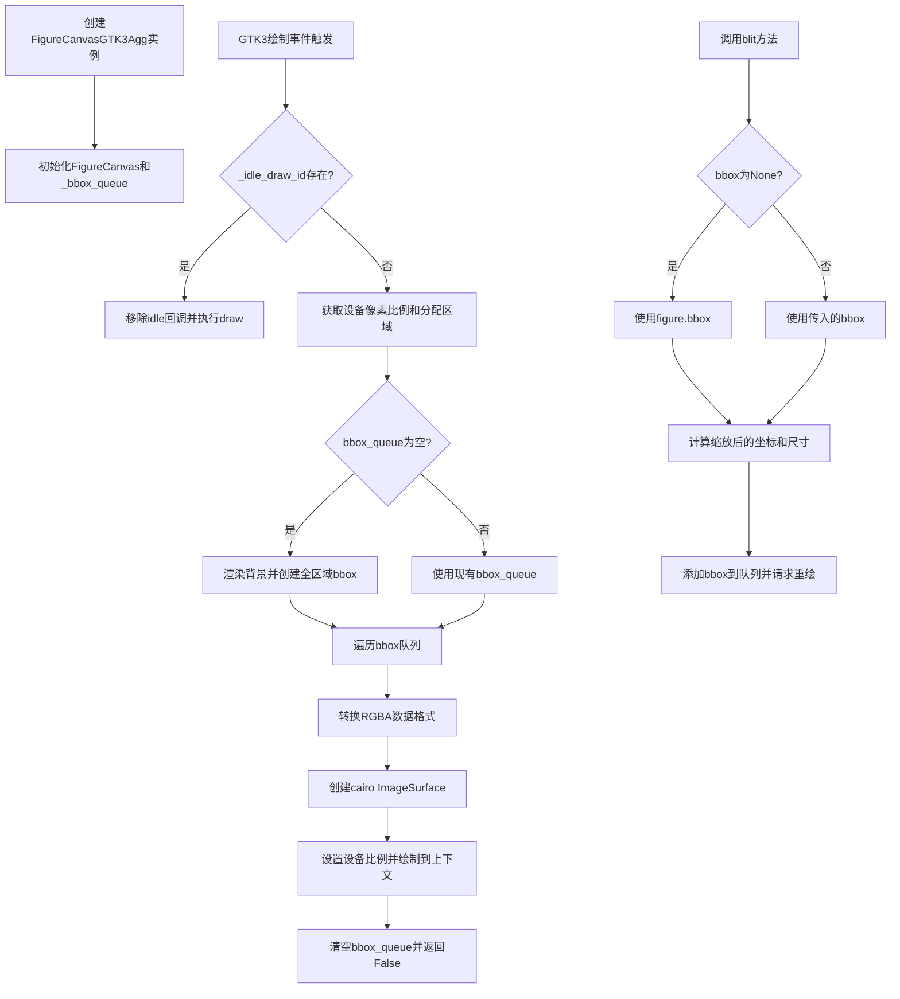
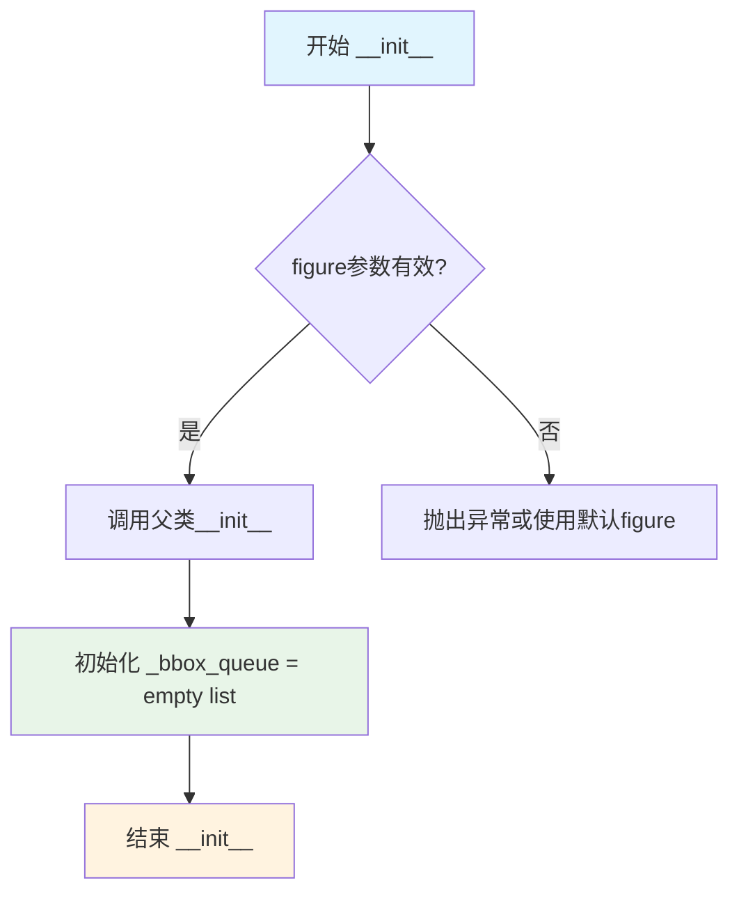
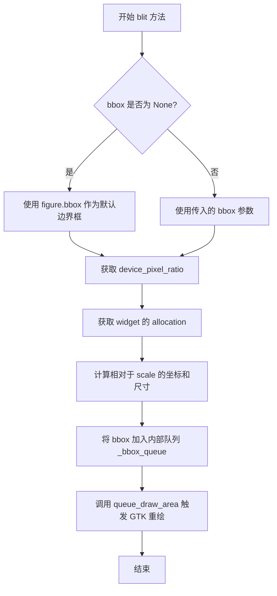

# `matplotlib\lib\matplotlib\backends\backend_gtk3agg.py` 详细设计文档

这是一个matplotlib的GTK3+AGG图形后端实现，通过结合AGG高质量渲染和GTK3工具包，提供在GTK3应用程序中绘制matplotlib图形的能力，支持图形区域的高效重绘（blit）和设备像素比例适配。

## 整体流程



## 类结构

```
FigureCanvasGTK3Agg (GTK3+AGG混合画布)
├── FigureCanvasAgg (AGG渲染基类)
└── FigureCanvasGTK3 (GTK3画布基类)

_BackendGTK3Agg (GTK3+AGG后端)
└── _BackendGTK3 (GTK3后端基类)
```

## 全局变量及字段


### `FigureCanvas`
    
指定使用的画布类为FigureCanvasGTK3Agg

类型：`class`
    


### `FigureCanvasGTK3Agg._bbox_queue`
    
用于存储待重绘的包围盒队列

类型：`list`
    


### `FigureCanvasGTK3Agg._idle_draw_id`
    
GTK idle回调ID，用于管理绘制周期

类型：`int`
    


### `_BackendGTK3Agg.FigureCanvas`
    
指定使用的画布类为FigureCanvasGTK3Agg

类型：`class`
    
    

## 全局函数及方法


### `FigureCanvasGTK3Agg.__init__`

初始化FigureCanvasGTK3Agg画布实例，调用父类构造函数完成画布的基础初始化，并创建一个空的包围盒队列用于存储需要重绘的区域。

参数：

- `self`：`FigureCanvasGTK3Agg`，隐式的实例引用，指向当前创建的画布对象
- `figure`：`matplotlib.figure.Figure`，要绑定的图形对象，包含要渲染的数据和属性

返回值：`None`，构造函数不返回任何值，仅完成对象的初始化工作

#### 流程图



#### 带注释源码

```python
def __init__(self, figure):
    """
    初始化 FigureCanvasGTK3Agg 画布。
    
    Parameters
    ----------
    figure : matplotlib.figure.Figure
        要绑定的图形对象，包含了所有绘图数据和属性
    """
    # 调用父类 FigureCanvasAgg 和 FigureCanvasGTK3 的 __init__ 方法
    # 完成画布的基础初始化，包括：
    # - 设置 self.figure = figure
    # - 初始化渲染相关的基础属性
    # - 注册事件处理器等
    super().__init__(figure=figure)
    
    # 初始化空的包围盒队列，用于存储需要重绘的区域
    # on_draw_event 方法会从该队列中取出 bbox 进行局部重绘
    # blit 方法会将需要更新的区域添加到该队列
    self._bbox_queue = []
```

#### 关键组件信息

| 组件名称 | 描述 |
|---------|------|
| `_bbox_queue` | 包围盒队列，存储待重绘的区域边界框，用于实现高效的局部重绘（blit）功能 |
| `super().__init__(figure=figure)` | 继承链初始化，依次调用 `FigureCanvasAgg.__init__` 和 `FigureCanvasGTK3.__init__` 完成多层初始化 |

#### 技术债务与优化空间

1. **初始化验证缺失**：`figure` 参数未进行有效性检查，若传入 `None` 或无效对象，可能在后续操作中引发隐晦错误
2. **文档注释风格**：建议使用完整的 docstring 格式（Parameters/Returns 部分），与代码库其他部分保持一致
3. **类型标注缺失**：Python 3 类型提示可提高代码可维护性和 IDE 支持

#### 错误处理设计

- 当前实现依赖父类构造函数进行参数验证
- 建议在初始化前添加 `figure` 类型检查：`if figure is None: raise ValueError("figure cannot be None")`
- 父类 `FigureCanvasAgg.__init__` 会检查 `figure` 是否为 `Figure` 类型，非类型会触发 `TypeError`


### FigureCanvasGTK3Agg.on_draw_event

处理GTK3绘制事件，执行实际渲染逻辑，将Matplotlib的Agg渲染结果绘制到GTK3的 Cairo 上下文中。

参数：

- `self`：FigureCanvasGTK3Agg，隐含的实例参数
- `widget`：Gtk.Widget，触发绘制事件的GTK widget
- `ctx`：cairo.Context，GTK的绘制上下文，用于渲染图形

返回值：`bool`，返回False表示事件已处理完成

#### 流程图

```mermaid
flowchart TD
    A[开始 on_draw_event] --> B{_idle_draw_id 是否存在?}
    B -->|是| C[移除 idle 回调 GLib.source_remove]
    C --> D[调用 self.draw 执行绘制]
    B -->|否| E[获取 device_pixel_ratio]
    E --> F[获取 allocation]
    F --> G[计算 w 和 h]
    G --> H{bbox_queue 是否为空?}
    H -->|是| I[Gtk.render_background 渲染背景]
    I --> J[创建完整画布 bbox: [[0,0], [w,h]]]
    H -->|否| K[使用现有的 bbox_queue]
    J --> L[遍历 bbox_queue]
    K --> L
    L --> M{遍历每个 bbox}
    M --> N[计算 x, y, width, height]
    N --> O[copy_from_bbox 获取图像数据]
    O --> P[_unmultiplied_rgba8888_to_premultiplied_argb32 转换格式]
    P --> Q[cairo.ImageSurface.create_for_data 创建表面]
    Q --> R[set_device_scale 设置缩放]
    R --> S[ctx.set_source_surface 设置源]
    S --> T[ctx.paint 绘制]
    T --> U{还有更多 bbox?}
    U -->|是| M
    U -->|否| V{bbox_queue 长度 > 0?}
    V -->|是| W[_bbox_queue = []]
    V -->|否| X[返回 False]
    W --> X
```

#### 带注释源码

```python
def on_draw_event(self, widget, ctx):
    # 如果存在待处理的 idle 绘制回调，则移除它
    if self._idle_draw_id:
        # 移除 GLib 定时器回调
        GLib.source_remove(self._idle_draw_id)
        self._idle_draw_id = 0
        # 触发完整的重绘
        self.draw()

    # 获取设备像素比（用于 HiDPI 支持）
    scale = self.device_pixel_ratio
    # 获取 widget 的分配区域
    allocation = self.get_allocation()
    # 根据像素比计算实际渲染宽度和高度
    w = allocation.width * scale
    h = allocation.height * scale

    # 检查是否有待绘制的区域（blit 操作产生的 bbox）
    if not len(self._bbox_queue):
        # 渲染 GTK 背景
        Gtk.render_background(
            self.get_style_context(), ctx,
            allocation.x, allocation.y,
            allocation.width, allocation.height)
        # 创建覆盖整个画布的 bbox
        bbox_queue = [transforms.Bbox([[0, 0], [w, h]])]
    else:
        # 使用之前 blit 积累的 bbox 队列
        bbox_queue = self._bbox_queue

    # 遍历每个需要绘制的区域
    for bbox in bbox_queue:
        # 计算坐标（y 轴需要翻转，因为 Cairo 坐标系原点在左下）
        x = int(bbox.x0)
        y = h - int(bbox.y1)
        width = int(bbox.x1) - int(bbox.x0)
        height = int(bbox.y1) - int(bbox.y0)

        # 从 Agg 缓冲区复制图像数据并转换为 Cairo 需要的格式
        # RGBA 8888 无乘数转换为预乘 ARGB32
        buf = cbook._unmultiplied_rgba8888_to_premultiplied_argb32(
            np.asarray(self.copy_from_bbox(bbox)))
        # 创建 Cairo 图像表面
        image = cairo.ImageSurface.create_for_data(
            buf.ravel().data, cairo.FORMAT_ARGB32, width, height)
        # 设置设备缩放（HiDPI 支持）
        image.set_device_scale(scale, scale)
        # 在上下文中设置源表面并绘制
        ctx.set_source_surface(image, x / scale, y / scale)
        ctx.paint()

    # 如果使用了 bbox_queue（局部重绘），清空队列
    if len(self._bbox_queue):
        self._bbox_queue = []

    # 返回 False 表示事件已处理，不传递给他人
    return False
```


### `FigureCanvasGTK3Agg.blit`

将指定的图形区域（边界框）加入 GTK3 的重绘队列，以便在后续的绘制事件中更新画布。如果未提供边界框，则默认使用整个图形画布的边界框。

参数：

- `self`：`FigureCanvasGTK3Agg` 实例，当前画布对象
- `bbox`：`transforms.Bbox` 或 `None`，要重绘的矩形区域，默认为 None（表示重绘整个画布）

返回值：`None`，无返回值，通过调用 `queue_draw_area` 触发 GTK3 的重绘机制

#### 流程图



#### 带注释源码

```python
def blit(self, bbox=None):
    # 如果 bbox 为 None，则使用整个图形画布的边界框作为重绘区域
    # 这确保了即使没有指定区域，也能刷新整个画布
    if bbox is None:
        bbox = self.figure.bbox

    # 获取设备像素比，用于在高 DPI 屏幕上正确缩放坐标
    scale = self.device_pixel_ratio
    
    # 获取 GTK widget 的分配区域（位置和尺寸）
    allocation = self.get_allocation()
    
    # 计算相对于 scale 的坐标：
    # x: 边界框左上角 x 坐标除以缩放比例
    # y: 分配高度减去边界框右下角 y 坐标除以缩放比例（GTK 坐标系 y 轴向下）
    x = int(bbox.x0 / scale)
    y = allocation.height - int(bbox.y1 / scale)
    
    # 计算宽度和高度，同样除以缩放比例以获得设备无关的尺寸
    width = (int(bbox.x1) - int(bbox.x0)) // scale
    height = (int(bbox.y1) - int(bbox.y0)) // scale

    # 将边界框添加到内部队列 _bbox_queue
    # on_draw_event 会从该队列中取出边界框进行实际渲染
    self._bbox_queue.append(bbox)
    
    # 调用 GTK3 的 queue_draw_area 方法
    # 通知 GTK 该区域需要重绘，这会触发 on_draw_event 回调
    self.queue_draw_area(x, y, width, height)
```

## 关键组件


### FigureCanvasGTK3Agg

组合GTK3和Agg渲染后端的画布类，负责在GTK3窗口中渲染matplotlib图形，支持设备像素比率调整和区域重绘优化。

### _BackendGTK3Agg

GTK3Agg后端导出类，将FigureCanvasGTK3Agg注册为GTK3后端的画布类型，实现与GTK3GUI的集成。

### on_draw_event (方法)

处理GTK3的绘制事件，管理空闲时绘制回调，处理边界框队列，将Agg渲染的图像转换为cairo表面进行显示，支持设备像素比率缩放。

### blit (方法)

实现高效的局部重绘功能，将指定的边界框加入队列并请求GTK3进行区域重绘，支持全画布或指定区域的blit操作。

### _bbox_queue

边界框队列，用于存储待重绘的区域，支持批量处理多个绘制区域以提高渲染效率。

### device_pixel_ratio

设备像素比率属性，用于支持高DPI显示器，确保在Retina等高分屏上的正确缩放渲染。

### idle_draw_id

空闲绘制回调ID，用于管理GLib事件循环中的空闲绘制任务，实现惰性加载和渲染优化。

### cairo.ImageSurface

cairo图像表面，将NumPy数组转换为GTK3可渲染的图像格式，实现跨后端的图像数据传输。

### cbook._unmultiplemented_rgba8888_to_premultiplied_argb32

颜色格式转换函数，将非乘Alpha的RGBA8888转换为预乘Alpha的ARGB32格式，以适配cairo的渲染要求。


## 问题及建议


### 已知问题

-   **资源泄漏风险**：在 `on_draw_event` 方法中创建的 `cairo.ImageSurface` 对象没有显式释放或管理，长时间运行可能导致内存资源累积
-   **坐标计算不一致**：`blit` 方法中 y 轴坐标计算为 `allocation.height - int(bbox.y1 / scale)`，而 `on_draw_event` 中为 `h - int(bbox.y1)`，这种不一致可能导致渲染位置错误
-   **缺少空值检查**：`self.copy_from_bbox(bbox)` 的返回值没有进行空值或有效性检查，如果返回空数组可能导致后续处理失败
-   **过度绘制风险**：`blit` 方法中每次调用都会 `append` 到 `_bbox_queue` 然后 `queue_draw_area`，可能导致大量重复渲染请求
-   **模块耦合度高**：直接依赖父类的私有属性 `_idle_draw_id`，父类实现变化可能导致此类失效

### 优化建议

-   考虑使用上下文管理器或显式清理方式管理 `cairo.ImageSurface` 生命周期，或使用 `with` 语句确保资源释放
-   统一坐标计算逻辑，提取为独立方法如 `_transform_bbox_coordinates()`，避免重复代码和潜在的不一致
-   在处理 `copy_from_bbox` 返回值前添加有效性检查，确保数据非空且格式正确
-   优化 `_bbox_queue` 管理，可以添加去重逻辑或设置最大队列长度，防止无限增长
-   添加类级别和方法的文档字符串，说明后端职责和关键逻辑
-   考虑将 `_idle_draw_id` 的检查封装为父类方法或属性访问器，降低耦合度


## 其它


### 设计目标与约束

本模块旨在为Matplotlib提供支持AGG渲染的GTK3图形后端，实现高性能的2D图形渲染。约束条件包括：必须依赖GTK3库和cairo图形库；必须与Matplotlib的FigureCanvas架构兼容；需要支持高DPI设备缩放；需要实现增量绘制以优化性能。

### 错误处理与异常设计

异常处理主要依赖Matplotlib后端框架的基类实现。`on_draw_event`方法返回False表示事件未被处理；`GLib.source_remove`在移除不存在的定时器时会静默失败；cairo的`ImageSurface.create_for_data`在数据格式错误时会抛出异常；`np.asarray`在无效输入时抛出异常。当前代码缺少对异常状态的恢复机制。

### 数据流与状态机

渲染流程状态机包含以下状态：IDLE（空闲，等待绘制事件）→ PENDING_BBOX（有待处理的边界框队列）→ RENDERING（正在渲染）→ COMPLETE（渲染完成）。`_bbox_queue`列表存储待渲染的边界框；`_idle_draw_id`标识当前挂起的空闲绘制回调；渲染完成后队列被清空。

### 外部依赖与接口契约

外部依赖包括：numpy（数组操作）、cairo（2D图形渲染）、GLib（GTK3事件循环）、Gtk（GTK3部件）、transforms（坐标变换）、backend_agg（AGG渲染基类）、backend_gtk3（GTK3后端基类）、cbook（工具函数）。接口契约要求：FigureCanvas必须实现`draw()`、`blit(bbox)`、`copy_from_bbox(bbox)`方法；必须提供`device_pixel_ratio`属性和`get_allocation()`方法。

### 线程安全性

GTK3的所有UI操作必须在主线程中执行。`GLib.idle_add`用于线程安全的回调调度。当前代码通过`_idle_draw_id`机制确保绘制操作在主线程的空闲时刻执行，避免多线程竞争条件。`_bbox_queue`的append操作在`blit`方法中被调用，可能从非主线程触发，因此需要考虑线程安全性。

### 资源管理

ImageSurface对象在`on_draw_event`方法内创建，随着方法返回变为不可达，由Python垃圾回收器自动释放。`_bbox_queue`在每次完整绘制后被清空，防止内存泄漏。cairo的Surface资源由cairo库自行管理。numpy数组`buf`在方法结束时自动释放。

### 性能考虑与优化空间

当前优化措施包括：使用`_bbox_queue`实现批量边界框处理；使用`_idle_draw_id`实现空闲时绘制避免频繁重绘；使用`copy_from_bbox`实现部分区域拷贝而非全屏拷贝。优化空间：可以缓存ImageSurface避免重复创建；当边界框列表过大时可进行合并；可以考虑使用cairo的增量渲染功能；可以预分配缓冲区避免每次分配新内存。

### 配置选项

无独立配置选项。配置继承自父类：FigureCanvasAgg的渲染分辨率、backend_gtk3的窗口管理参数。可以通过修改Matplotlib的rcParams间接影响渲染行为，如`savefig.dpi`、`figure.dpi`等参数。

### 使用示例

```python
import matplotlib
matplotlib.use('GTK3Agg')
from matplotlib.figure import Figure
from matplotlib.backends.backend_gtk3agg import FigureCanvasGTK3Agg

fig = Figure(figsize=(8, 6))
canvas = FigureCanvasGTK3Agg(fig)
ax = fig.add_subplot(111)
ax.plot([1, 2, 3], [1, 4, 9])
canvas.show()
```

### 兼容性考虑

代码假设GTK3版本不低于3.0；cairo库必须支持FORMAT_ARGB32格式；numpy必须支持`ravel().data`接口返回连续内存视图。向下兼容性由Matplotlib后端抽象层保证，不同平台可通过切换后端获得类似功能。

    